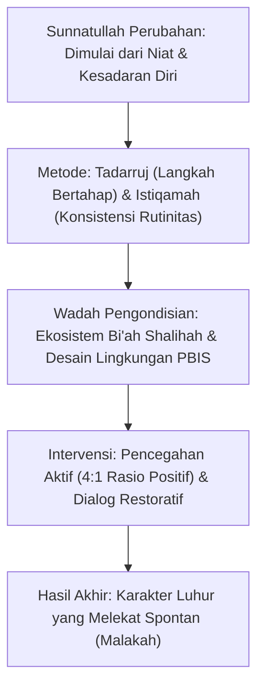

# P1-06-04-Sintesis-Dinamika-Perubahan-TUMBUH

## Rangkuman Integratif: Dinamika Perubahan dalam TUMBUH

Dokumen ini menyintesiskan hukum-hukum perubahan perilaku dan karakter (*Change Dynamics*) dalam ekosistem pesantren TUMBUH:

---

## 4 Kaidah Utama Dinamika Perubahan TUMBUH

1. **Kaidah Hukum Kausalitas Karakter (*Sunnatullah al-Akhlaq*)**: Karakter santri tidak berubah karena kemarahan pembina, melainkan karena proses pembiasaan terstruktur, pengulangan sadar, dan pemaknaan nilai yang terus menerus.
2. **Kaidah Bertahap (*Al-Injaz bit-Tadrij*)**: Perubahan yang kokoh dibangun dari langkah-langkah kecil (*micro-habits*) yang dikerjakan secara konsisten, bukan dari perubahan drastis yang memicu penolakan mental (*rebellion*).
3. **Kaidah Pengaruh Lingkungan (*Determinisme al-Bi'ah*)**: Desain lingkungan fisik, sosial, dan sistemik (SOP & PBIS) bertanggung jawab menciptakan iklim yang mempermudah santri berbuat baik dan mempersulit santri berbuat buruk.
4. **Kaidah Apresiasi Positif (*Atsar al-I'tiraf*)**: Perilaku positif yang mendapatkan pengakuan dan apresiasi hangat dari musyrif/asatidz akan lebih cepat mengakar menjadi identitas diri santri.
