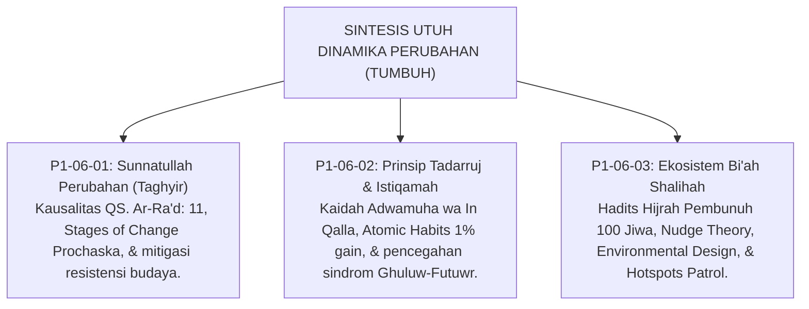
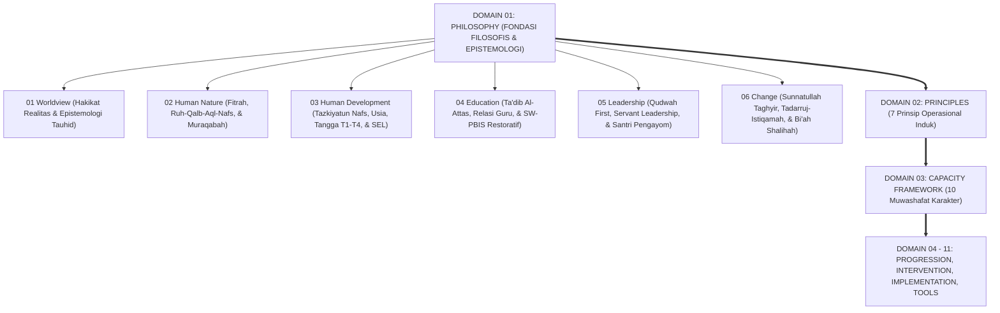

# P1-06-04: SINTESIS FILOSOFIS DINAMIKA PERUBAHAN
## *Konsolidasi Paradigma Transformasi Institusional: Dari Sunnatullah Taghyir Menuju Ekosistem Bi'ah Shalihah Paripurna*

**Nomor Identifikasi**: `P1-06-04/SINTESIS-CHANGE/2026`  
**Domain**: `01 Philosophy` > `06 Change`  
**Dewan Pakar**: `pakar-filosofi-tumbuh`, `pakar-intervensi-preventif`, `pakar-arsitektur-digital-pesantren`

---

## 📑 DAFTAR ISI ANALITIS

1. [1. Integrasi Tiga Pilar Dinamika Perubahan TUMBUH](#1-integrasi-tiga-pilar-dinamika-perubahan-tumbuh)
2. [2. Matriks Epistemologis: Domain Change TUMBUH](#2-matriks-epistemologis-domain-change-tumbuh)
3. [3. Puncak Sintesis Filosofis: Dari Domain 01 Menuju Domain 02 s/d 11](#3-puncak-sintesis-filosofis-dari-domain-01-menuju-domain-02-sd-11)
4. [4. Piagam Transformasi Peradaban Pesantren TUMBUH](#4-piagam-transformasi-peradaban-pesantren-tumbuh)

---

### 1. Integrasi Tiga Pilar Dinamika Perubahan TUMBUH

Sub-Domain `06 Change` menyempurnakan bangunan filosofis Ekosistem TUMBUH melalui tiga pilar transformasi:

---

### 2. Matriks Epistemologis: Domain Change TUMBUH

| Modul Analisis | Landasan Turats Klasik | Landasan Sains Kontemporer | Manifestasi Praktis di Asrama |
| :--- | :--- | :--- | :--- |
| **P1-06-01 (Sunnatullah Taghyir)** | QS. Ar-Ra'd: 11, Fakhruddin ar-Razi (*Mafatih al-Ghaib*). | *Transtheoretical Model* (Prochaska) & *Resistance Management*. | Peta jalan transformasi 100 hari dan evaluasi data kejadian harian. |
| **P1-06-02 (Tadarruj & Istiqamah)**| HR. Bukhari (Aisyah RA - Adwamuha), Kaidah Tadarruj Syar'i. | *Atomic Habits Theory* (Clear) & *Kaizen Continuous Improvement*. | Target hafalan/ibadah bertahap dan penguatan streak konsistensi santri. |
| **P1-06-03 (Bi'ah Shalihah)** | HR. Muslim (Kisah Hijrah 100 Jiwa), Fiqh *Sadd adz-Dzari'ah*. | *CPTED Environmental Design* (Jeffery) & *Nudge Theory* (Thaler). | Pencahayaan terang seluruh lorong dan patroli aktif musyrif di jam sibuk. |

---

### 3. Puncak Sintesis Filosofis: Dari Domain 01 Menuju Domain 02 s/d 11

Dengan tuntasnya Sub-Domain `06 Change`, tuntas pulalah seluruh bangunan fondasi **Domain 01: Philosophy** yang membentang melintasi enam sub-domain agung:

---

### 4. Piagam Transformasi Peradaban Pesantren TUMBUH

> *"Ekosistem TUMBUH adalah manifestasi ikhtiar peradaban untuk mengembalikan pesantren sebagai rahim peradaban Islam yang hakiki: mendidik akal dengan kebenaran ilmu (*Ta'lim*), merawat raga dengan keadilan syariat (*Tarbiyah*), menyucikan jiwa dengan kelembutan kasih sayang (*Ta'dib*), dan menumbuhkan tunas-tunas pemimpin masa depan yang memancarkan berkah bagi seluruh alam (*Rahmatan lil 'Alamin*)."*
