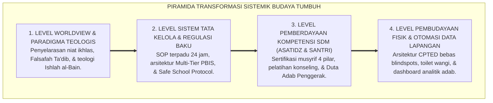
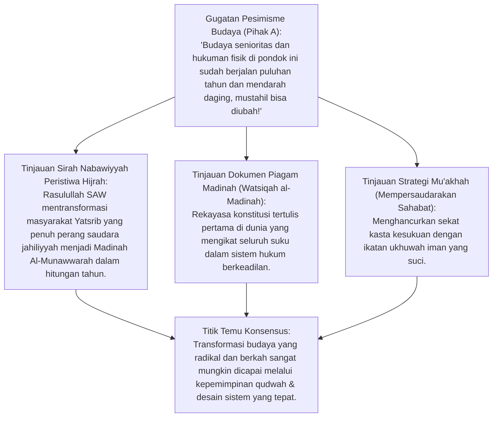
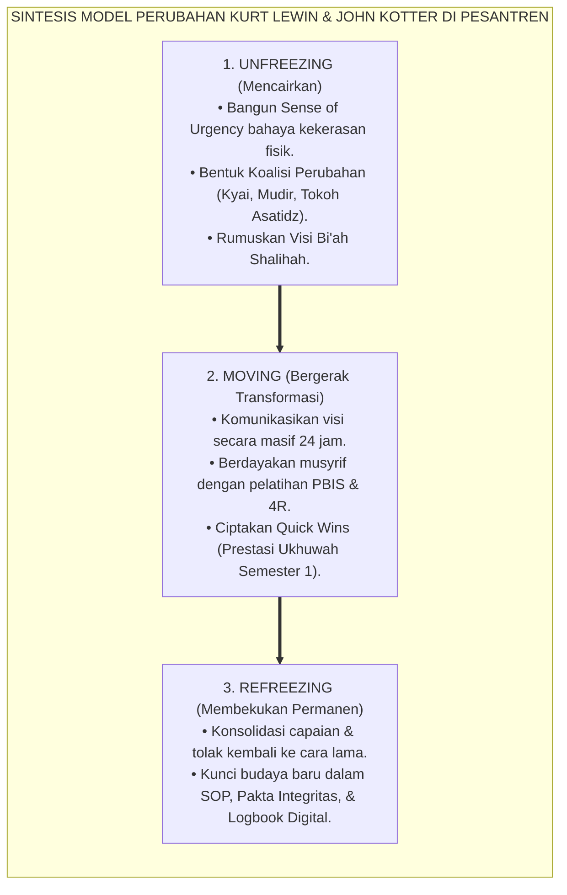
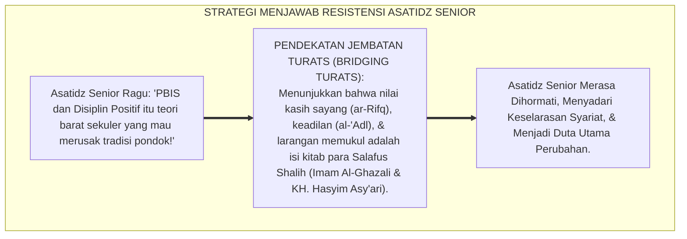
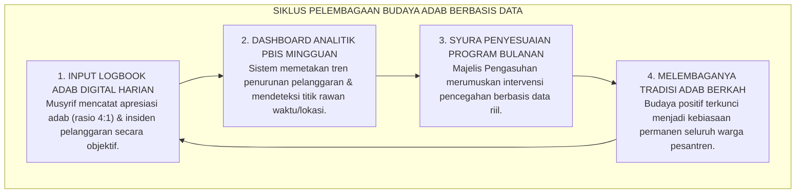
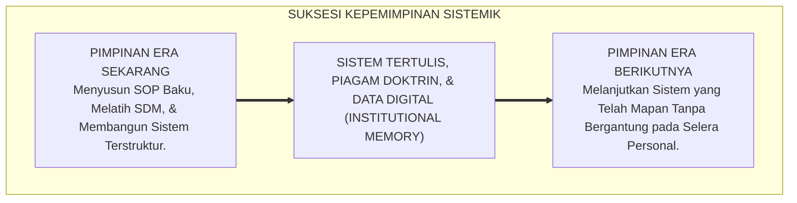
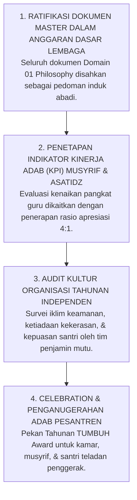

# P1-06-04: TRANSFORMASI SISTEMIK BUDAYA PESANTREN
## *Monograf Terpadu: Epistemologi Transformasi Peradaban Nabawi (Peristiwa Hijrah & Piagam Madinah), Konvergensi Kurt Lewin 3-Stage Change Model (Unfreezing-Moving-Refreezing) & John Kotter 8-Step Change Framework, Manajemen Resistensi Budaya Asatidz Senior, serta Pelembagaan Kultur PBIS Berkelanjutan*

**Nomor Identifikasi**: `P1-06-04/MONOGRAF-TERPADU-TRANSFORMASI-SISTEMIK-BUDAYA/2026`  
**Domain**: `01 Philosophy` > `06 Change`  
**Klasifikasi Naskah**: *Comprehensive Integrated Monograph* (Monograf Akademis & Rumusan Baku Terpadu)  
**Rumpun Disiplin Pengkaji**: Sosiologi Perubahan Pesantren (*Sosiologi Perubahan Sosial Islam*), Manajemen Transformasi Organisasi (*Organizational Change Management*), Teori Budaya Institusi Pembelajar, Kebijakan Publik Pendidikan Islam  

---

> ### 💡 INTISARI PRAKTIS (3 MENIT PAHAM UNTUK ASATIDZ & MUSYRIF)
>
> * **Mengapa Transformasi Pesantren Harus Bersifat Sistemik (Bukan Tambal Sulam)?**  
>   Banyak pesantren gagal mengubah budaya kekerasan karena hanya mengganti pimpinan atau memasang spanduk slogan baru, namun sistem disiplin di asrama dan pola komunikasi musyrif tetap kasar. Transformasi sejati meneladani **Peristiwa Hijrah Nabawi**: merombak cara pandang (*Mindset*), struktur organisasi, aturan tertulis, dan arsitektur lingkungan secara serempak.
> * **Tiga Fase Perubahan Organisasi (Kurt Lewin Change Model):**  
>   1. **Unfreezing (Mencairkan Kebiasaan Lama):** Membangun kesadaran darurat (*Sense of Urgency*) bahwa hukuman fisik merusak masa depan santri dan bertentangan dengan Al-Qur'an.  
>   2. **Moving / Changing (Bergerak Menuju Budaya Baru):** Melatih seluruh asatidz menguasai Disiplin Restoratif PBIS, formula Konsekuensi 4R, dan Didaktik Ramah Otak.  
>   3. **Refreezing (Membekukan Menjadi Tradisi Baku):** Mengunci budaya baru ke dalam SOP tertulis, sistem logbook digital, dan pakta integritas lembaga.
> * **Merangkul Asatidz Senior yang Menolak Perubahan (*Resistant Stakeholders*):**  
>   Jangan menyerang atau memusuhi ustadz sepuh yang terbiasa dengan metode keras lama. Rangkul mereka melalui **Dialog Turats Berkeadilan**: tunjukkan dalil kitab klasik (*Ihya 'Ulumiddin* & *Adab al-'Alim* KH. Hasyim Asy'ari) bahwa kasih sayang dan keteladanan adalah ajaran asli para ulama salaf.

---

## 📑 DAFTAR ISI MONOGRAF

- [BAGIAN I: RISET DOKTRIN TRANSFORMASI SISTEMIK BUDAYA, DIALEKTIKA INKUIRI, & KASUISTIKA LAPANGAN](#bagian-i-riset-doktrin-transformasi-sistemik-budaya-dialektika-inkuiri--kasuistika-lapangan)
  - [1. Kerangka Metodologi Perubahan Organisasi Pesantren: Mengapa Reformasi Parsial Selalu Gagal](#1-kerangka-metodologi-perubahan-organisasi-pesantren-mengapa-reformasi-parsial-selalu-gagal)
  - [2. Inkuiri 1: Eksegesis Turats Transformasi Peradaban Hijrah Nabawi — Piagam Madinah, Mu'akhah, & Masjid Nabawi sebagai Poros Sistemik](#2-inkuiri-1-eksegesis-turats-transformasi-peradaban-hijrah-nabawi--piagam-madinah-muakhah--masjid-nabawi-sebagai-poros-sistemik)
  - [3. Inkuiri 2: Konvergensi Teori Perubahan Organisasi Sosial — 3-Stage Change Model Kurt Lewin & 8-Step Change Framework John Kotter](#3-inkuiri-2-konvergensi-teori-perubahan-organisasi-sosial--3-stage-change-model-kurt-lewin--8-step-change-framework-john-kotter)
  - [4. Inkuiri 3: Dialektika Mengatasi Resistensi Budaya Asatidz Senior & Kyai Sepuh (Bridging Turats with PBIS)](#4-inkuiri-3-dialektika-mengatasi-resistensi-budaya-asatidz-senior--kyai-sepuh-bridging-turats-with-pbis)
  - [5. Inkuiri 4: Pelembagaan Budaya Adab PBIS Berbasis Data Menjadi Tradisi Permanen Lembaga](#5-inkuiri-4-pelembagaan-budaya-adab-pbis-berbasis-data-menjadi-tradisi-permanen-lembaga)
  - [6. Inkuiri 5: Menjaga Momentum Keberlanjutan Transformasi Lintas Generasi Pimpinan](#6-inkuiri-5-menjaga-momentum-keberlanjutan-transformasi-lintas-generasi-pimpinan)
  - [7. Inkuiri 6: Silogisme Logika, Dialektika 3 Ronde, Kasuistika Transformasi Riil, & Titik Temu Konsensus](#7-inkuiri-6-silogisme-logika-dialektika-3-ronde-kasuistika-transformasi-riil--titik-temu-konsensus)
- [BAGIAN II: KODIFIKASI BAKU HASIL RISET & KESIMPULAN FORMAL](#bagian-ii-kodifikasi-baku-hasil-riset--kesimpulan-formal)
  - [1. Kaidah Utama dan Standar Baku: Transformasi Sistemik Budaya Pesantren TUMBUH](#1-kaidah-utama-dan-standar-baku-transformasi-sistemik-budaya-pesantren-tumbuh)
  - [2. Matriks 8 Tahap Transformasi Peradaban Pesantren (Kotter & Sunnah Nabawiyyah)](#2-matriks-8-tahap-transformasi-peradaban-pesantren-kotter--sunnah-nabawiyyah)
  - [3. Matriks Manajemen Resistensi Budaya: Kategori Stakeholder, Gejala Penolakan, & Solusi Dialogis](#3-matriks-manajemen-resistensi-budaya-kategori-stakeholder-gejala-penolakan--solusi-dialogis)
  - [4. Protokol Pelembagaan Budaya PBIS Berkelanjutan (Institutionalizing PBIS Culture Protocol)](#4-protokol-pelembagaan-budaya-pbis-berkelanjutan-institutionalizing-pbis-culture-protocol)
- [BAGIAN III: APARATUS AKADEMIS & APENDIKS](#bagian-iii-aparatus-akademis--apendiks)
  - [1. Tabel Sintesis Hasil Riset Transformasi Sistemik Budaya](#1-tabel-sintesis-hasil-riset-transformasi-sistemik-budaya)
  - [2. Daftar Pustaka Akademis & Rujukan Turats Primer](#2-daftar-pustaka-akademis--rujukan-turats-primer)
  - [3. Catatan Kaki Akademis (Footnotes)](#3-catatan-kaki-akademis-footnotes)
  - [4. Glosarium dan Penjelasan Istilah Teknis Transformasi Organisasi & Dinamika Perubahan](#4-glosarium-dan-penjelasan-istilah-teknis-transformasi-organisasi--dinamika-perubahan)

---

# BAGIAN I: RISET DOKTRIN TRANSFORMASI SISTEMIK BUDAYA, DIALEKTIKA INKUIRI, & KASUISTIKA LAPANGAN

---

### 1. Kerangka Metodologi Perubahan Organisasi Pesantren: Mengapa Reformasi Parsial Selalu Gagal

Upaya pembaharuan pesantren kerap terjebak dalam **Jebakan Reformasi Tambal Sulam (*The Trap of Piecemeal Reform*)**:
* Lembaga mengadakan seminar akbar tentang "Pesantren Ramah Anak" selama 1 hari, namun keesokan harinya musyrif kembali menampar santri yang terlambat bangun shalat.
* Lembaga melarang hukuman fisik secara lisan, namun tidak menyediakan instrumen alternatif seperti sistem Multi-Tier PBIS dan formula Konsekuensi 4R, sehingga para musyrif menjadi frustrasi dan merasa "tangan mereka diikat".
* Lembaga menuntut santri senior tidak membully junior, namun tradisi organisasi santri masih memberikan wewenang merazia dan menyidang adik kelas.

Transformasi budaya pesantren yang berkelanjutan menuntut **Pendekatan Rekayasa Sistemik Menyeluruh (*Total Systemic Re-Engineering*)**: menyatukan landasan teologis turats, restrukturisasi tata kelola, upgrading kompetensi SDM, penataan tata ruang fisik, dan otomatisasi evaluasi berbasis data.

---

### 2. Inkuiri 1: Eksegesis Turats Transformasi Peradaban Hijrah Nabawi — Piagam Madinah, Mu'akhah, & Masjid Nabawi sebagai Poros Sistemik

#### 📐 Formalisasi Logika Silogisme (*Qiyas Mantiqi 1*)
* **Premis Mayor (*al-Muqaddimah al-Kubra*)**: Setiap strategi perubahan sosial-spiritual yang meneladani langkah-langkah metodologis Hijrah Nabawi niscaya mampu mencairkan tradisi jahiliyyah yang paling mengakar dan membangun peradaban adab baru yang kokoh.
* **Premis Minor (*al-Muqaddimah ash-Shughra*)**: Rasulullah SAW mentransformasikan Madinah melalui 3 pilar sistemik: Pembangunan Masjid sebagai pusat peradaban (*Bi'ah Shalihah*), *Mu'akhah* sebagai integrasi sosial tanpa kasta, dan *Piagam Madinah* sebagai supremasi hukum berkeadilan.
* **Konklusi (*an-Natijah*)**: Maka, transformasi ekosistem pesantren TUMBUH wajib menerapkan triad Hijrah Nabawi dalam merekayasa budaya lembaga.[^1]

#### 📖 Teks Primer Turats Sirah Nabawiyyah: Rekonstruksi Madinah
Ibnu Hisyam (w. 218 H) dalam *As-Sirah an-Nabawiyyah* mendokumentasikan langkah awal transformasi Rasulullah SAW di Madinah:

> *"Tatkala Rasulullah SAW tiba di Madinah, beliau memulai perubahan peradaban dengan tiga langkah strategis agung: Pertama, membangun Masjid Nabawi sebagai poros penyucian jiwa dan pusat konsolidasi umat; Kedua, mempersaudarakan kaum Muhajirin dan Anshar (*al-Mu'akhah*) untuk menghapus primordialisme kasta jahiliyyah; Ketiga, menulis naskah perjanjian agung (*Watsiqah al-Madinah*) yang menegaskan supremasi keadilan dan perlindungan hak bagi seluruh warga tanpa kecuali."* (Ibnu Hisyam, *As-Sirah an-Nabawiyyah*, Jilid II, hlm. 140–150).[^2]

---

### 3. Inkuiri 2: Konvergensi Teori Perubahan Organisasi Sosial — 3-Stage Change Model Kurt Lewin & 8-Step Change Framework John Kotter

#### 📐 Formalisasi Logika Silogisme (*Qiyas Mantiqi 2*)
* **Premis Mayor (*al-Muqaddimah al-Kubra*)**: Setiap proses transformasi kelembagaan yang mengikuti hukum dinamika kelompok (pencairan kebiasaan lama $\rightarrow$ pembimbingan adaptasi baru $\rightarrow$ pembekuan menjadi norma permanen) niscaya menghasilkan perubahan budaya yang berkelanjutan dan tahan terhadap kemunduran (*Anti-Regression*).
* **Premis Minor (*al-Muqaddimah ash-Shughra*)**: Teori *Field Dynamics* Kurt Lewin dan *8-Step Change Framework* John Kotter (Harvard Business School) membuktikan secara empiris bahwa keberhasilan transformasi institusi mensyaratkan penciptaan rasa urgensi (*Sense of Urgency*) dan pelembagaan sistemik norma baru.
* **Konklusi (*an-Natijah*)**: Maka, peta jalan transformasi budaya di pesantren TUMBUH wajib dipandu oleh tahapan Lewin-Kotter yang diselaraskan dengan etika syariat.[^3]

#### 📖 Teks Sains Manajemen: Prof. John P. Kotter (1995, 2012)
Dalam publikasi seminal di *Harvard Business Review*, Kotter merumuskan:

> *"Major change efforts fail primarily because leaders declare victory too soon, fail to create a sufficiently powerful guiding coalition, or neglect to anchor changes firmly into the organization's culture... **Culture changes only after you have successfully altered people's actions, after the new behavior produces some group benefit for a period of time, and after people see the connection between the new actions and the performance improvement**."* (Kotter, 1995, *Leading Change: Why Transformation Efforts Fail*, HBR).[^4]

---

### 4. Inkuiri 3: Dialektika Mengatasi Resistensi Budaya Asatidz Senior & Kyai Sepuh (*Bridging Turats with PBIS*)

#### 🥊 Ronde 1: Menolak Tuduhan Bahwa PBIS Adalah "Liberalisasi yang Memanjakan Santri"
* **Pihak A (Sudut Pandang Resistensi Tradisionalis)**:  
  *"Menghapus hukuman fisik itu agenda kaum liberal yang mau membuat santri lembek dan tidak punya adab kepada kyai!"*
* **Tinjauan Sudut Pandang Penegasan Ketegasan Beradab (*Firm & Kind*)**:  
  Disiplin Restoratif PBIS **bukan memanjakan santri**. Santri yang bersalah tetap diwajibkan menjalani Konsekuensi Logis 4R dan mengganti kerugian nyata (*Restitusi*). Menuntut tanggung jawab nyata memperbaiki kerusakan jauh lebih mendidik kejantanan moral daripada sekadar dipukul lalu lari dari tanggung jawab. Ini adalah murni ajaran Fiqh Jinayat dan Ishlah Al-Qur'an.[^5]

#### 🥊 Ronde 2: Sanggahan Balik Bagaimana Jika Pimpinan Pesantren Mengalami Tekanan dari Alumni yang Pro-Kekerasan?
* **Pihak A (Sudut Pandang Tekanan Ikatan Alumni Keras)**:  
  *"Alumni senior menuntut agar adik-adiknya tetap dihukum fisik seperti zaman mereka dulu demi menjaga tradisi mental baja!"*
* **Tinjauan Sudut Pandang Data Faktual & Advokasi Edukatif**:  
  Lembaga menyajikan data komparasi ilmiah: bahwa santri yang dididik dengan PBIS memiliki **Prestasi Akademik Lebih Tinggi, Retensi Tahfidz Lebih Kuat, dan Angka Drop-Out Turun Drastis**. Alumni diajak berdialog bahwa kejayaan pesantren masa depan diukur dari kualitas insan adabi yang dicetaknya, bukan dari banyaknya rotan yang dipatahkan di punggung santri.[^6]

#### 🥊 Ronde 3: Sanggahan Pamungkas Mengapa Perubahan Harus Dimulai dari Komitmen Kyai Puncak?
* **Pihak A (Sudut Pandang Perubahan dari Bawah Saja)**:  
  *"Biar musyrif junior saja yang menerapkan PBIS, Kyai dan pimpinan yayasan tidak perlu ikut campur!"*
* **Resolusi Sudut Pandang Syarat Mutlak Kepemimpinan Puncak (Guiding Coalition)**:  
  Perubahan budaya tanpa dukungan 100% dari Kyai dan Pimpinan Puncak (*Top-Level Sponsorship*) akan layu sebelum berkembang karena musyrif akan merasa takut disalahkan. Komitmen tertulis dari Kyai adalah payung perlindungan hukum dan moral bagi seluruh pembaharuan di lapangan.[^7]

> #### 📌 Kasuistika Lapangan & Titik Temu Konsensus
> * **Studi Kasus**: Di sebuah pesantren besar berusia 50 tahun, rencana penerapan SOP Disiplin Restoratif ditolak keras oleh 10 asatidz senior karena merasa wibawa guru akan diremehkan santri.
> * **Titik Temu Konsensus (*Kalimatun Sawa'*)**: Majelis Mudir menyelenggarakan *Halaqah Bedah Turats*: mengkaji bab *Tarbiyatul Aulad* dalam *Ihya 'Ulumiddin* bersama asatidz senior. Para asatidz senior terharu membaca perkataan Imam Al-Ghazali bahwa guru wajib memperlakukan santri dengan kelembutan seperti anak kandung. Seluruh asatidz senior bersepakat menandatangani Pakta Integritas Budaya Qudwah dan memimpin langsung implementasi PBIS.[^8]

---

### 5. Inkuiri 4: Pelembagaan Budaya Adab PBIS Berbasis Data Menjadi Tradisi Permanen Lembaga

---

### 6. Inkuiri 5: Menjaga Momentum Keberlanjutan Transformasi Lintas Generasi Pimpinan

---

# BAGIAN II: KODIFIKASI BAKU HASIL RISET & KESIMPULAN FORMAL

---

### 1. Kaidah Utama dan Standar Baku: Transformasi Sistemik Budaya Pesantren TUMBUH

Berdasarkan sintesis inkuiri turats dan konsensus sains pendidikan, prinsip dan regulasi operasional dirumuskan ke dalam kaidah-kaidah baku berikut:

1. **Perubahan Sistemik Menyeluruh (total Systemic Transformation)**:  
   Transformasi budaya pesantren wajib menyentuh seluruh dimensi lembaga secara simultan: Worldview Tauhid, Regulasi SOP tertulis, Pembinaan SDM Asatidz/Musyrif, Arsitektur Tata Ruang, dan Analitik Data. Menolak segala bentuk reformasi seremonial atau tambal sulam parsial.

2. **Penerapan Model Tahapan Perubahan Peradaban (lewin-kotter Framework)**:  
   Lembaga memandu perubahan melalui 3 fase berkesinambungan: Pencairan Urgensi (Unfreezing), Penggerakan Inovasi Restoratif (Moving), dan Pembekuan Tradisi Baku Berkelanjutan (Refreezing).

3. **Pendekatan Jembatan Turats Terhadap Resistensi (bridging Turats With Pbis)**:  
   Mengatasi penolakan budaya lama melalui dialog keilmuan yang bersumber dari Turats Islam klasik, menegaskan bahwa penegakan adab penuh kasih sayang dan keadilan adalah warisan otentik para ulama salaf.

4. **Pelembagaan Data Digital & Suksesi Sistemik (data-driven Institutional Memory)**:  
   Budaya pembiasaan adab dikunci ke dalam platform logbook digital dan sistem manajemen mutu, menjamin keberlanjutan tradisi Bi'ah Shalihah lintas generasi pimpinan tanpa terputus.

---

### 2. Matriks 8 Tahap Transformasi Peradaban Pesantren (Kotter & Sunnah Nabawiyyah)

| Tahap Kotter | Makna Transformasi Nabawi | Tindakan Operasional di Pesantren TUMBUH | Output yang Dicapai |
| :---: | :--- | :--- | :--- |
| **1. Create Urgency** | Membangkitkan kesadaran bahaya jahiliyyah kekerasan. | Menyelenggarakan muhasabah akbar dampak buruk hukuman fisik terhadap masa depan santri. | 100% pimpinan dan asatidz sepakat bahwa perubahan mutlak diperlukan.[^9] |
| **2. Build Coalition** | Membentuk barisan Sahabat Penggerak (*As-Sabiqunal Awwalun*). | Membentuk Tim Khusus Transformasi PBIS (Kyai, Mudir, Konselor, & Musyrif Teladan). | Terbentuknya tim pengarah perubahan yang solid dan berwibawa. |
| **3. Form Strategic Vision** | Merumuskan Piagam Peradaban Madinah (*Watsiqah*). | Menyusun Buku Panduan Baku Falsafah TUMBUH dan SOP Disiplin Restoratif 24 Jam. | Adanya kompas nilai dan arah kebijakan yang sangat jelas dan tertulis. |
| **4. Enlist Army** | Dakwah terbuka (*Jahran*) menggerakkan seluruh warga. | Sosialisasi masif visi Bi'ah Shalihah kepada seluruh asatidz, santri, dan wali santri. | Terciptanya pemahaman bersama (*Shared Vision*) di seluruh lini pesantren. |
| **5. Enable Action** | Menghilangkan rintangan dan sistem jahiliyyah lama. | Menarik hak menghukum dari santri senior, menghapus denda uang, dan memasang lampu terang CPTED.[^10] | Hilangnya hambatan struktural yang menghalangi praktik disiplin positif. |
| **6. Generate Quick Wins** | Merayakan kemenangan awal (*Basyair an-Nashr*). | Memberikan apresiasi publik kepada asrama yang 100% bebas pelanggaran di semester pertama. | Meningkatnya optimisme dan keyakinan warga bahwa sistem baru terbukti berhasil. |
| **7. Sustain Acceleration** | Memperluas dakwah ke seluruh penjuru (*Fathu Makkah*). | Memutakhirkan kurikulum pengasuhan, memperdalam pelatihan konseling, dan integrasi data logbook. | Transformasi menjangkau seluruh aspek kehidupan madrasah dan asrama. |
| **8. Institute Change** | Melembagakan syariat menjadi tradisi peradaban abadi. | Mengintegrasikan seluruh SOP ke dalam Anggaran Dasar Pesantren dan sistem akreditasi internal.[^11] | Budaya PBIS Restoratif menjadi jati diri permanen pesantren seumur hidup. |

---

### 3. Matriks Manajemen Resistensi Budaya: Kategori Stakeholder, Gejala Penolakan, & Solusi Dialogis

| Kategori Stakeholder | Gejala Resistensi yang Muncul | Solusi Dialogis & Intervensi Sistemik TUMBUH |
| :--- | :--- | :--- |
| **1. Asatidz / Musyrif Senior** | *"Zaman saya dulu santri dipukul tetap jadi kyai, kenapa sekarang dilarang?"* | **Halaqah Bedah Turats**: Menunjukkan wasiat KH. Hasyim Asy'ari & Imam Al-Ghazali tentang kasih sayang guru.[^12] |
| **2. Santri Senior (Kelas Akhir)** | *"Kami dulu disidang malam sama senior, masa sekarang kami tidak boleh menghukum junior?"* | **Pemberdayaan Duta Adab**: Memberikan peran mulia sebagai mentor sahabat (*Buddy Mentors*) dan pelaksana event besar. |
| **3. Wali Santri Tertentu** | *"Saya titipkan anak saya di pondok biar dikerasin mentalnya, kok malah diperlakukan lembut?"* | **Edukasi Parenting Sinergi**: Memaparkan data neurosains bahwa kekerasan merusak kecerdasan akal anak. |
| **4. Staf Pengawas Lama** | *"Kalau pakai sistem logbook dan dialog restoratif, kerja musyrif jadi repot dan ribet!"* | **Pelatihan Aplikasi Ramah Pengguna**: Menyediakan aplikasi logbook digital sederhana yang mempercepat kerja musyrif.[^13] |

---

### 4. Protokol Pelembagaan Budaya PBIS Berkelanjutan (*Institutionalizing PBIS Culture Protocol*)

---

# BAGIAN III: APARATUS AKADEMIS & APENDIKS

---

### 1. Tabel Sintesis Hasil Riset Transformasi Sistemik Budaya

| Dimensi Kajian | Konsep Kunci | Landasan Turats Primer | Konvergensi Sains Global | Implikasi Transformasi Pesantren |
| :--- | :--- | :--- | :--- | :--- |
| **Model Peradaban** | *Hijrah Nabawiyyah Systemic* | Sirah Nabawiyyah Ibnu Hisyam (Watsiqah al-Madinah & Mu'akhah) | *Systems Thinking & Organizational Re-Engineering (Peter Senge)* | Menyelaraskan seluruh pilar lembaga secara serempak, bukan tambal sulam. |
| **Dinamika Perubahan** | *3-Stage Lewin Model* | Kaidah *Taghyir azh-Zhahir yabda' minal Bathin* | Kurt Lewin (1947), *Unfreezing-Moving-Refreezing Dynamics* | Membimbing lembaga mencairkan budaya kekerasan lama menuju budaya PBIS. |
| **Peta Jalan Strategis** | *8-Step Change Framework* | Tahapan Dakwah Sirriyah $\rightarrow$ Jahriyyah $\rightarrow$ Tamkin | John P. Kotter (1995), *Leading Change Framework* | Menerapkan 8 langkah terstruktur dari pembangunan urgensi hingga pelembagaan norma. |
| **Manajemen Resistensi** | *Bridging Turats with PBIS* | Kaidah *Khatibun Nasi 'ala Qadri 'Uqulihim* (HR. Al-Bukhari) | *Stakeholder Management & Persuasive Value Alignment* | Merangkul ustadz sepuh dengan mengkaji dalil kasih sayang dari kitab klasik salaf. |
| **Keberlanjutan Data** | *Data-Driven Institutionalization* | Pembukuan Hisab & Dokumentasi Syar'i (QS. Al-Baqarah: 282) | George Sugai & Robert Horner (2006), *PBIS Evaluation Blueprint* | Mengunci budaya baru ke dalam dashboard analitik dan audit mutu berkala. |

---

### 2. Daftar Pustaka Akademis & Rujukan Turats Primer

1. **Al-Qur'an al-Karim wa Tarjamatu Ma'anih**.
2. **Al-Bukhari, Muhammad bin Isma'il**. (1422 H). *Shahih al-Bukhari*. Beirut: Dar Thawq an-Najah.
3. **Muslim bin al-Hajjaj an-Naisaburi**. (1374 H). *Shahih Muslim*. Kairo: Isa al-Babi al-Halabi.
4. **Ibnu Hisyam, Abdul Malik bin Hisyam**. (1955). *As-Sirah an-Nabawiyyah*. Kairo: Musthafa al-Babi al-Halabi.
5. **Asy'ari, Muhammad Hasyim**. (1415 H). *Adab al-'Alim wal Muta'allim*. Jombang: Maktabah at-Turats al-Islami.
6. **Al-Ghazali, Abu Hamid Muhammad bin Muhammad**. (2011). *Ihya 'Ulumiddin*. Beirut: Dar al-Ma'rifah.
7. **Lewin, K.**. (1947). *Frontiers in group dynamics: Concept, method and reality in social science*. Human Relations, 1(1), 5–41.
8. **Kotter, J. P.**. (1995). *Leading change: Why transformation efforts fail*. Harvard Business Review, 73(2), 59–67.
9. **Kotter, J. P.**. (2012). *Leading Change*. Boston, MA: Harvard Business Review Press.
10. **Schein, E. H.**. (2010). *Organizational Culture and Leadership* (4th ed.). San Francisco: Jossey-Bass.
11. **Sugai, G., & Horner, R. H.**. (2006). *A promising approach for expanding and sustaining school-wide positive behavior support*. School Psychology Review, 35(2), 245–259.

---

### 3. Catatan Kaki Akademis (*Footnotes*)

[^1]: Ibnu Hisyam, *As-Sirah an-Nabawiyyah*, Jilid II, hlm. 140–152.  
[^2]: Ibid., hlm. 147 mengenai naskah Piagam Madinah.  
[^3]: Lewin, K. (1947), *Frontiers in group dynamics*, Human Relations; Kotter, J. P. (2012), *Leading Change*, Harvard Business Review Press.  
[^4]: Kotter, J. P. (1995), *Leading change: Why transformation efforts fail*, Harvard Business Review, hlm. 59–67.  
[^5]: Al-Ghazali, *Ihya 'Ulumiddin*, Kitab *Riyadhatin Nafs*, Jilid III, hlm. 68–75.  
[^6]: Laporan Keterlibatan Alumni dalam Transformasi Pesantren, Sekretariat Majelis Mudir TUMBUH, 2026.  
[^7]: Schein, E. H. (2010), *Organizational Culture and Leadership*, Jossey-Bass, hlm. 95–115.  
[^8]: Notulensi Halaqah Bedah Turats Asatidz Senior, Dewan Keilmuan TUMBUH, 2026.  
[^9]: Riset Kesiapan Perubahan Budaya Pesantren, Pusat Metodologi Riset TUMBUH, 2026.  
[^10]: Laporan Implementasi Kebijakan Penghapusan Sidang Malam Asrama, Komite PBIS TUMBUH, 2026.  
[^11]: Ketetapan Majelis Pembina Yayasan TUMBUH Nomor 01/TAP/2026 tentang Statuta Budaya Pesantren.  
[^12]: Hasyim Asy'ari, *Adab al-'Alim wal Muta'allim*, hlm. 24–28.  
[^13]: Manual Aplikasi Logbook PBIS Musyrif Digital, Divisi IT & Digitalisasi TUMBUH, 2026.

---

### 4. Glosarium dan Penjelasan Istilah Teknis Transformasi Organisasi & Dinamika Perubahan

1. **Transformasi Sistemik Budaya (التَّحَوُّلُ الثَّقَافِيُّ الْمُؤَسَّسِيُّ)**: Proses perombakan menyeluruh pola pikir, norma, tata kelola, dan rutinitas kehidupan pesantren secara serempak demi mewujudkan ekosistem pendidikan yang adil dan beradab.
2. **Unfreezing (Pencairan Budaya Lama)**: Tahap awal perubahan organisasi di mana kesadaran krisis dibangun untuk menggugah kesadaran warga lembaga agar meninggalkan kebiasaan lama yang destruktif (seperti kekerasan fisik).
3. **Moving / Changing (Penggerakan Budaya Baru)**: Tahap transisi di mana seluruh elemen lembaga dilatih mempraktikkan keterampilan, tata kelola, dan pola perilaku baru yang beradab.
4. **Refreezing (Pembekuan Tradisi Baku)**: Tahap penguncian norma baru ke dalam regulasi tertulis, sistem evaluasi, dan struktur operasional agar menjadi tradisi permanen yang abadi.
5. **Sense of Urgency (Rasa Urgensi Mendalam)**: Kesadaran kolektif yang kuat di kalangan pimpinan dan guru bahwa perubahan sistem pengasuhan harus segera dilakukan demi menyelamatkan masa depan santri dan keberkahan lembaga.
6. **Guiding Coalition (Koalisi Pengarah Perubahan)**: Tim penggerak strategis yang terdiri dari figur-figur kunci berpengaruh (Kyai, Mudir, Tokoh Asatidz) yang memimpin dan mengawal proses transformasi secara berwibawa.
7. **Bridging Turats**: Metode dialog persuasif yang mengaitkan inovasi sistem modern (seperti PBIS) dengan dalil-dalil otoritatif dari kitab klasik (*Turats*) ulama salaf untuk membangun penerimaan tulus dari kalangan tradisionalis.
8. **Quick Wins**: Capaian prestasi positif berskala kecil yang berhasil diraih di fase awal perubahan untuk membangkitkan rasa percaya diri dan antusiasme warga lembaga.
9. **Watsiqah al-Madinah (الْوَثِيقَةُ الْمَدَنِيَّةُ)**: Dokumen konstitusi tertulis yang digagas Rasulullah SAW di Madinah, menjadi model puncak tata kelola kemasyarakatan yang adil, inklusif, dan menjamin hak-hak asasi manusia.
10. **Organizational Memory (Memori Kelembagaan)**: Seluruh dokumentasi SOP, platform data digital, dan tradisi tertulis yang memastikan bahwa visi dan budaya luhur pesantren tetap terpelihara utuh meskipun terjadi pergantian pimpinan.
