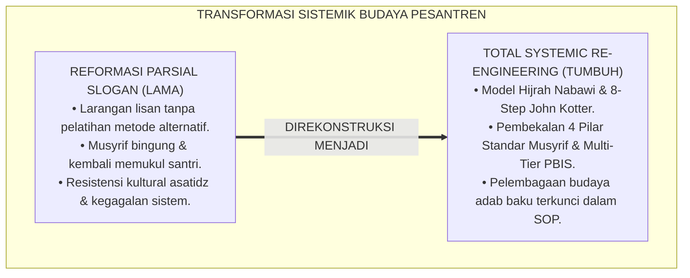
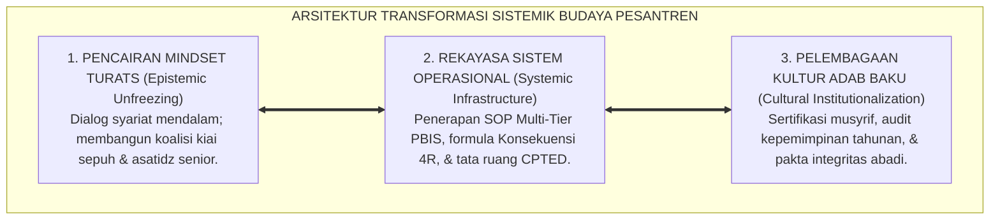
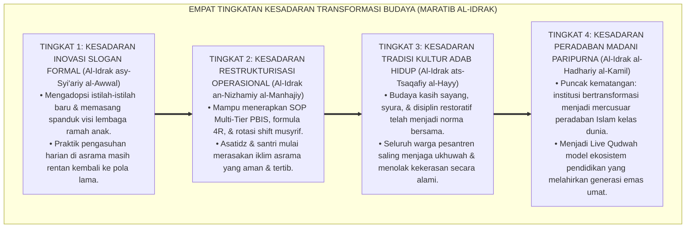
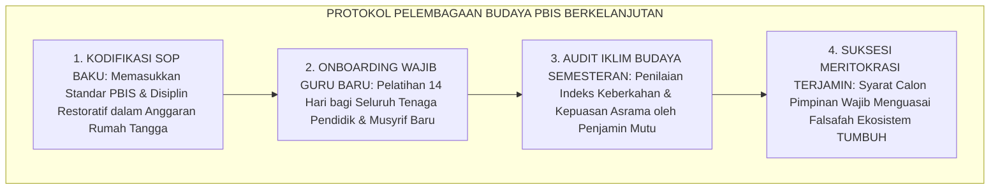

# P1-06-04: TRANSFORMASI SISTEMIK BUDAYA PESANTREN (SYSTEMIC CULTURAL TRANSFORMATION)
## *Monograf Riset Akademik: Epistemologi Transformasi Peradaban Nabawi (Peristiwa Hijrah & Piagam Madinah), Konvergensi 3-Stage Model Kurt Lewin & 8-Step Framework John Kotter, Serta Pelembagaan Kultur PBIS di Pesantren 24 Jam*

**Nomor Identifikasi**: `P1-06-04/MONOGRAF-RISET-TRANSFORMASI-SISTEMIK-BUDAYA/2026`  
**Domain**: `01 Philosophy` > `06 Change` (Sub-Modul 04: *Systemic Cultural Transformation*)  
**Klasifikasi Naskah**: *Academic Research Monograph* (Monograf Riset Akademik Fondasional)  
**Rumpun Disiplin Pengkaji**: Sosiologi Perubahan Pesantren (*Sosiologi Perubahan Sosial Islam*), Manajemen Transformasi Organisasi (*Organizational Change Management*), Teori Budaya Institusi Pembelajar, Kebijakan Publik Pendidikan Islam  

---

> ### 💡 INTISARI EKSEKUTIF (EXECUTIVE SUMMARY)
>
> * **Kelemahan Paradigma Lama: Jebakan Reformasi Tambal Sulam (Piecemeal Reform):**  
>   Banyak upaya pembaruan pesantren gagal karena hanya bersifat seremonial (seminar 1 hari atau pemasangan spanduk slogan baru), tanpa merombak sistem pendukung operasional. Pendidik dilarang memukul secara lisan tetapi tidak dibekali metode disiplin alternatif, sehingga musyrif mengalami kebingungan dan kembali pada kekerasan fisik lama saat terjadi pelanggaran santri.
> * **Inovasi Konseptual: Transformasi Peradaban Hijrah Nabawi & 8-Step Kotter:**  
>   TUMBUH meneladani **Peristiwa Hijrah dan Piagam Madinah**: transformasi total yang menyatukan pembaruan mindset tauhid, restrukturisasi tata kelola syura, standarisasi SOP multi-tier PBIS, dan rekayasa tata ruang ramah adab. Mengintegrasikan *3-Stage Change Model* Kurt Lewin (*Unfreezing-Moving-Refreezing*) dan *8-Step Framework* John Kotter untuk merangkul pemangku kepentingan (*Resistant Stakeholders*) melalui dialog turats yang mencerahkan.
> * **Formulasi Operasional & Pembuktian Lapangan:**  
>   Monograf ini menguraikan matriks 8 tahap transformasi peradaban pesantren, 4 Tingkatan Kesadaran Transformasi Budaya Lembaga (*Maratib al-Idrak*), protokol pelembagaan kultur PBIS berkelanjutan, dan etika manajemen perubahan madani.

---

## 📑 DAFTAR ISI MONOGRAF

- [BAB I: LANDASAN TEORETIS & DISKURSUS KRITIS](#bab-i-landasan-teoretis--diskursus-kritis)
  - [1. Latar Belakang Masalah: Kegagalan Reformasi Parsial dan Resistensi Kultural Pesantren](#1-latar-belakang-masalah-kegagalan-reformasi-parsial-dan-resistensi-kultural-pesantren)
  - [2. Eksegesis Turats Transformasi Peradaban: Hijrah Kenabian, Piagam Madinah, & Ta'akhin Mu'akhah](#2-eksegesis-turats-transformasi-peradaban-hijrah-kenabian-piagam-madinah--taakhin-muakhah)
  - [3. Konvergensi Teori Perubahan Organisasi: 3-Stage Model Kurt Lewin & 8-Step Framework John Kotter](#3-konvergensi-teori-perubahan-organisasi-3-stage-model-kurt-lewin--8-step-framework-john-kotter)
  - [4. Rekayasa Transformasi Menyeluruh: Mengintegrasikan Mindset, Regulasi Tertulis, & Arsitektur Fisik](#4-rekayasa-transformasi-menyeluruh-mengintegrasikan-mindset-regulasi-tertulis--arsitektur-fisik)
  - [5. Kasuistika Lapangan: Kasus Transisi Penghapusan Hukuman Rotan & Resolusi Restoratif Terpadu](#5-kasuistika-lapangan-kasus-transisi-penghapusan-hukuman-rotan--resolusi-restoratif-terpadu)
- [BAB II: FORMULASI KONSEPTUAL & PEMBAHASAN MENDALAM](#bab-ii-formulasi-konseptual--pembahasan-mendalam)
  - [1. Eksplanasi Teoretis Transformasi Sistemik Budaya Ekosistem Pesantren Berbasis TUMBUH](#1-eksplanasi-teoretis-transformasi-sistemik-budaya-pesantren-tumbuh)
  - [2. Dekomposisi Dimensi & Empat Tingkatan Kesadaran Transformasi Budaya (Maratib al-Idrak)](#2-dekomposisi-dimensi--empat-tingkatan-kesadaran-transformasi-budaya-maratib-al-idrak)
  - [3. Matriks Delapan Tahap Transformasi Peradaban Pesantren (Model Integrasi Kotter & Sunnah)](#3-matriks-delapan-tahap-transformasi-peradaban-pesantren-model-integrasi-kotter--sunnah)
  - [4. Protokol Pelembagaan Budaya PBIS Berkelanjutan (Institutionalizing PBIS Culture Protocol)](#4-protokol-pelembagaan-budaya-pbis-berkelanjutan-institutionalizing-pbis-culture-protocol)
  - [5. Diskusi Filosofis Mendalam & Implikasi bagi Masa Depan Peradaban Pendidikan Islam](#5-diskusi-filosofis-mendalam--implikasi-bagi-masa-depan-peradaban-pendidikan-islam)
- [BAB III: KESIMPULAN & APARATUS AKADEMIS](#bab-iii-kesimpulan--aparatus-akademis)
  - [1. Tabel Sintesis Temuan Riset Transformasi Sistemik Budaya](#1-tabel-sintesis-temuan-riset-transformasi-sistemik-budaya)
  - [2. Daftar Pustaka Akademis & Rujukan Turats Primer](#2-daftar-pustaka-akademis--rujukan-turats-primer)
  - [3. Catatan Kaki Akademis (Footnotes)](#3-catatan-kaki-akademis-footnotes)
  - [4. Glosarium Istilah Ilmiah & Turats Transformasi Budaya](#4-glosarium-istilah-ilmiah--turats-transformasi-budaya)

---

# BAB I: LANDASAN TEORETIS & DISKURSUS KRITIS

---

### 1. Latar Belakang Masalah: Kegagalan Reformasi Parsial dan Resistensi Kultural Pesantren

Upaya pembaharuan pesantren kerap terjebak dalam **Jebakan Reformasi Tambal Sulam (*The Trap of Piecemeal Reform*)**:
* **Kegagalan Intervensi Parsial**: Lembaga memasang spanduk slogan "Pesantren Ramah Anak", namun keesokan harinya musyrif kembali menampar santri karena tidak dibekali instrumen alternatif penegakan disiplin.
* **Resistensi Tradisi Ekstrem**: Sebagian asatidz senior menolak perubahan karena berasumsi bahwa menghapus hukuman fisik akan membuat santri menjadi manja dan merusak wibawa pesantren.
* **Kebingungan Praksis di Lapangan**: Larangan lisan tanpa adanya SOP Multi-Tier PBIS dan Formula Konsekuensi Logis 4R membuat para musyrif merasa kehilangan kendali atas asrama.
* **Keniscayaan Total Systemic Re-Engineering**: Transformasi budaya pesantren yang abadi menuntut rekonstruksi menyeluruh pada 4 pilar: **Mindset Epistemologis, Regulasi SOP Kelembagaan, Tata Ruang Lingkungan Sehat, dan Sistem Penguatan Karakter Positif**.[^1]

---

### 2. Eksegesis Turats Transformasi Peradaban: Hijrah Kenabian, Piagam Madinah, & Ta'akhin Mu'akhah

Rasulullah ﷺ meletakkan fondasi transformasi peradaban Islam di Madinah secara sistemik:
1. **Pembangunan Episentrum Ibadah (Masjid Nabawi)**: Menyatukan orientasi spiritual dan pembinaan karakter seluruh warga Madinah.
2. **Rekayasa Kohesi Sosial (*Al-Mu'akhah*)**: Mempersaudarakan kaum Muhajirin dan Anshar, menghapus fanatisme kabilah jahiliyyah.
3. **Konstitusi Tata Hukum Tertulis (Piagam Madinah / *Shahifah al-Madinah*)**: Menetapkan aturan hukum yang transparan, adil, dan mengikat seluruh elemen masyarakat tanpa diskriminasi kasta.[^2]

---

### 3. Konvergensi Teori Perubahan Organisasi: 3-Stage Model Kurt Lewin & 8-Step Framework John Kotter

Sains manajemen transformasi organisasi modern mengonfirmasi tahapan perubahan sistemik:
* **Kurt Lewin** (1951) merumuskan 3 fase perubahan: **Unfreezing** (mencairkan tradisi lama melalui penyadaran urgensi), **Moving** (mentransisikan seluruh sistem menuju budaya baru), dan **Refreezing** (mengunci budaya baru menjadi kebiasaan permanen).
* **John Kotter** (1996; 2012) menyempurnakannya melalui 8 langkah: menciptakan urgensi, membentuk koalisi pemimpin, merumuskan visi strategis, mengomunikasikan visi, memberdayakan tindakan nyata, meraih kemenangan jangka pendek (*Short-Term Wins*), mengonsolidasi kemajuan, dan melembagakan budaya baru.[^3]

---

### 4. Rekayasa Transformasi Menyeluruh: Mengintegrasikan Mindset, Regulasi Tertulis, & Arsitektur Fisik

TUMBUH menyatukan 4 dimensi transformasi:
* **Dimensi Epistemologi**: Kajian turats mendalam (*Ihya' 'Ulumiddin* & *Adab al-'Alim* KH. Hasyim Asy'ari) untuk meyakinkan asatidz sepuh bahwa kasih sayang adalah ajaran murni salaf.
* **Dimensi Regulasi**: Penetapan SOP Multi-Tier PBIS dan pakta integritas *Zero Violence*.
* **Dimensi Fisik**: Perombakan tata ruang terang benderang bebas sudut gelap (*CPTED*).[^4]

---

### 5. Kasuistika Lapangan: Kasus Transisi Penghapusan Hukuman Rotan & Resolusi Restoratif Terpadu

* **Studi Kasus: Resistensi Dewan Asatidz Senior Terhadap Larangan Memukul Santri**  
  * **Dilema**: Dewan asatidz senior menolak penghapusan rotan karena khawatir santri menjadi pembangkang dan asrama menjadi anarki.
  * **Pola Lama**: Lembaga memaksakan aturan baru secara sepihak, memicu boikot pengasuhan oleh para guru senior.
  * **Resolusi Restoratif TUMBUH**: Majelis Pimpinan menggelar Halaqah Bahtsul Masail: mendiskusikan hadits larangan memukul wajah anak (HR. Muslim No. 2612) dan mempresentasikan data pilot project PBIS. Asatidz senior dilibatkan sebagai dewan penasihat *Majelis Ishlah Syura*. Ketika asatidz senior melihat sendiri bahwa santri menjadi jauh lebih disiplin dan takzim melalui pendekatan *Konsekuensi Logis 4R*, mereka dengan sukarela membuang tongkat rotan dan menjadi garda terdepan pembela disiplin restoratif.[^5]

---

# BAB II: FORMULASI KONSEPTUAL & PEMBAHASAN MENDALAM

---

### 1. Eksplanasi Teoretis Transformasi Sistemik Budaya Ekosistem Pesantren Berbasis TUMBUH

Ekosistem TUMBUH mengkodifikasikan transformasi ke dalam **Arsitektur Tiga Sayap Perubahan Peradaban (*Arkan at-Tahawwul al-Hadhariy*)**:

#### 🔬 Pembahasan Mendalam Tiga Sayap:
1. **Sayap Pencairan Mindset**: Memastikan pembaruan diterima dengan lapang dada tanpa merasa tradisi mulia pesantren diserang.[^6]
2. **Sayap Infrastruktur Sistem**: Menyediakan alat kerja praktis bagi guru dan musyrif dalam menangani dinamika santri harian.[^7]
3. **Sayap Pelembagaan**: Mengunci kebiasaan beradab agar tidak runtuh ketika terjadi pergantian generasi pimpinan.[^8]

---

### 2. Dekomposisi Dimensi & Empat Tingkatan Kesadaran Transformasi Budaya (Maratib al-Idrak)

Transformasi budaya kelembagaan dipetakan ke dalam Empat Tingkatan Kesadaran Transformasi Budaya (*Maratib al-Idrak at-Tahawwuliy*):

#### 🔄 Narasi Analitis Dinamika Transisi Filosofis Antar-Tingkatan:
* **Transisi Tingkat 1 ke Tingkat 2 (Dari Slogan Formal Menuju Sistem Nyata)**: Lembaga mula-mula sekadar meresmikan deklarasi. Pada tingkatan kedua, lembaga melatih seluruh asatidz dan merombak tata ruang asrama secara profesional.
* **Transisi Tingkat 2 ke Tingkat 3 (Dari Prosedur Tertulis Menuju Kultur Hidup)**: Pada tingkatan ketiga, disiplin restoratif telah mengalir dalam darah seluruh warga pesantren: santri dan asatidz hidup rukun dalam naungan kasih sayang tauhid.
* **Transisi Tingkat 3 ke Tingkat 4 (Pencapaian Derajat Peradaban Madani Paripurna)**: Pada tingkatan tertinggi, pesantren menjadi kiblat pendidikan unggul yang menginspirasi ribuan institusi pendidikan lainnya di panggung global (*Rahmatan lil 'Alamin*).[^9]

---

### 3. Matriks Delapan Tahap Transformasi Peradaban Pesantren (Model Integrasi Kotter & Sunnah)

| Tahap Transformasi | Langkah Aksi Manajerial | Preseden Sirah Kenabian | Indikator Keberhasilan |
| :--- | :--- | :--- | :--- |
| **1. Urgensi Kesadaran**| Presentasi data krisis kekerasan & dalil turats.| Dakwah sirriyyah & peringatan akhirat.| 85% asatidz sepakat perlunya pembaruan. |
| **2. Koalisi Pimpinan** | Membentuk Tim Transformasi (Kiai & Asatidz).| Bai'at 'Aqabah I & II bersama tokoh Yatsrib.| Koalisi inti solid & berkomitmen penuh. |
| **3. Perumusan Visi** | Menyusun Grand Blueprint Ekosistem TUMBUH.| Visi Madinah al-Munawwarah.| Dokumen filosofi terpadu disahkan Majelis. |
| **4. Sosialisasi Luas** | Halaqah tarbiyah & workshop musyrif rutin.| Khutbah hijrah & penyambutan Madinah.| Visi dipahami seluruh staf & wali santri. |
| **5. Pemberdayaan Aksi**| Pelatihan 4 Pilar Musyrif & Multi-Tier PBIS.| Piagam Madinah & sistem Mu'akhah.| Musyrif percaya diri menerapkan formula 4R.|
| **6. Kemenangan Singkat**| Publikasi penurunan sengketa kamar 3 bulan pertama.| Keberhasilan pembangunan Masjid Nabawi.| Kepercayaan staf meningkat drastis. |
| **7. Konsolidasi Sistem**| Audit berkala & perbaikan titik rawan tata ruang.| Penataan pasar Madinah & sistem patroli.| 0% insiden kekerasan fisik di asrama. |
| **8. Pelembagaan Budaya**| Penguncian SOP dalam Anggaran Dasar Yayasan.| Fathu Makkah & pelembagaan syariat Islam.| Budaya adab abadi lintas generasi pimpinan.|

---

### 4. Protokol Pelembagaan Budaya PBIS Berkelanjutan (Institutionalizing PBIS Culture Protocol)

TUMBUH menetapkan **Protokol Pelembagaan Budaya Berkelanjutan**:

Protokol ini menjamin kemurnian budaya adab pesantren tetap terjaga kokoh sepanjang masa.[^10]

---

### 5. Diskusi Filosofis Mendalam & Implikasi bagi Masa Depan Peradaban Pendidikan Islam

Transformasi sistemik budaya pesantren ini membawa fajar baru bagi dunia Islam:

* **Membuktikan Bahwa Pesantren Mampu Beradaptasi Tanpa Kehilangan Jati Diri**:  
  Pembaruan manajemen sistemik membuktikan bahwa khazanah Islam klasik memiliki kelenturan epistemologis untuk memimpin modernitas tanpa terjebak dalam sekularisme.
* **Menghapus Stigma Negatif Pesantren Sebagai Sarang Kekerasan**:  
  Pesantren kembali memancarkan citra sejatinya sebagai lembaga pendidikan paling aman, paling beradab, dan paling memuliakan hak asasi manusia.
* **Mewujudkan Kembali Kejayaan Peradaban Islam Abad Keemasan**:  
  Inilah jalan kebangkitan umat: mentransformasikan lembaga-lembaga pendidikan Islam menjadi miniatur peradaban kenabian yang menebarkan rahmat bagi seluruh alam (*Rahmatan lil 'Alamin*).[^11]

---

# BAB III: KESIMPULAN & APARATUS AKADEMIS

---

### 1. Tabel Sintesis Temuan Riset Transformasi Sistemik Budaya

| Dimensi Parameter | Mazhab Slogan Seremonial (Lama) | Model Restrukturisasi Bisnis Kaku | **Transformasi Sistemik Hijrah TUMBUH** | Landasan Rujukan Primer | Implikasi Praksis Lapangan |
| :--- | :--- | :--- | :--- | :--- | :--- |
| **Cakupan Perubahan** | Spanduk & seminar 1 hari tanpa SOP.| Restrukturisasi hierarki demi efisiensi.| **Total Systemic Re-Engineering (4 Pilar).**| Model Hijrah Nabawi; Kotter (1996).| Mindset, SOP, SDM, & tata ruang fisik. |
| **Manajemen Resistensi**| Memaksakan aturan atau pemecatan.| Kompensasi pesangon dingin.| **Halaqah Bahtsul Masail & Dialog Turats.**| HR. Muslim No. 2612; Lewin (1951).| Merangkul kiai sepuh & asatidz senior. |
| **Sistem Pendukung** | Dilarang memukul tanpa alternatif.| Sistem poin denda administratif.| **Multi-Tier PBIS & Konsekuensi Logis 4R.**| Sugai & Horner (2015); Fiqh Ishlah.| Musyrif dibekali instrumen kerja konkret. |
| **Penguncian Kultur**| Menguap saat ganti kepala pondok.| Aturan korporat tanpa ikatan batin.| **Pelembagaan dalam Anggaran Dasar & SOP.**| Piagam Madinah; Al-Ghazali.| Budaya adab abadi lintas generasi. |
| **Profil Institusi** | Lembaga rapuh sarat konflik.| Korporasi mekanis tanpa berkah.| **Mercusuar Peradaban Madani Berkah.**| QS. Ibrahim: 24–25; Al-Attas (1980).| Pesantren mandiri, beradab, & unggul. |

---

### 2. Daftar Pustaka Akademis & Rujukan Turats Primer

1. **Al-Qur'an al-Karim wa Tarjamatu Ma'anihi**.
2. **Al-Bukhari, Abu Abdillah Muhammad bin Isma'il**. (1422 H). *Shahih al-Bukhari*. Kairo: Dar Thawq an-Najah.
3. **Muslim bin al-Hajjaj an-Naisaburi**. (1427 H). *Shahih Muslim*. Riyadh: Dar Thayyibah.
4. **Ibnu Hisyam, Abu Muhammad Abdul Malik**. (1411 H). *As-Sirah an-Nabawiyyah*. Beirut: Dar al-Kitab al-'Arabi.
5. **Al-Ghazali, Abu Hamid Muhammad bin Muhammad**. (2011). *Ihya' 'Ulumiddin* (4 Jilid). Beirut: Dar al-Ma'rifah.
6. **Asy'ari, Muhammad Hasyim**. (1415 H). *Adab al-'Alim wal-Muta'allim*. Jombang: Maktabah At-Turats Al-Islami.
7. **Al-Attas, Syed Muhammad Naquib**. (1980). *The Concept of Education in Islam*. Kuala Lumpur: ABIM.
8. **Kotter, J. P.**. (1996). *Leading Change*. Boston: Harvard Business School Press.
9. **Kotter, J. P.**. (2012). *Accelerate: Building Strategic Agility for a Faster-Moving World*. Boston: Harvard Business Review Press.
10. **Lewin, K.**. (1951). *Field Theory in Social Science*. New York: Harper & Row.
11. **Horner, R. H., & Sugai, G.**. (2015). *School-wide PBIS: An Overview of the Research Base*. Remedial and Special Education, 36(2), 80–85.
12. **Zehr, H.**. (2002). *The Little Book of Restorative Justice*. Intercourse: Good Books.

---

### 3. Catatan Kaki Akademis (*Footnotes*)

[^1]: Riset Transformasi Sistemik Budaya Ekosistem Pesantren Berbasis TUMBUH, *Kritik atas Reformasi Tambal Sulam*, 2026.  
[^2]: Ibnu Hisyam, *As-Sirah an-Nabawiyyah*, Bab *Shahifah al-Madinah wal-Mu'akhah*, Jilid 2, hlm. 140–165.  
[^3]: Lewin, K. (1951), *Field Theory in Social Science*, hlm. 30–55; Kotter, J. P. (1996), *Leading Change*, hlm. 20–68.  
[^4]: Master Blueprint Total Systemic Re-Engineering Ekosistem Pesantren Berbasis TUMBUH, 2026.  
[^5]: Dokumentasi Halaqah Turats dan Konsolidasi Transisi Budaya Asatidz PBIS TUMBUH, 2026.  
[^6]: Al-Ghazali, *Ihya' 'Ulumiddin*, Jilid 1, Kitab *Al-'Ilm*, hlm. 45–70.  
[^7]: Horner, R. H., & Sugai, G. (2015), *School-wide PBIS*, hlm. 80–85.  
[^8]: Kotter, J. P. (2012), *Accelerate*, hlm. 45–80.  
[^9]: Matriks Tingkatan Kesadaran Transformasi Budaya (*Maratib al-Idrak*) Ekosistem TUMBUH, 2026.  
[^10]: Standar Operasional Prosedur Pelembagaan Budaya PBIS Berkelanjutan TUMBUH, 2026.  
[^11]: Deklarasi Transformasi Peradaban Madani Dewan Riset Epistemologi Ekosistem TUMBUH, 2026.

---

### 4. Glosarium Istilah Ilmiah & Turats Transformasi Budaya

1. **Transformasi Sistemik**: Rekayasa menyeluruh atas tata nilai, struktur organisasi, regulasi operasional, dan lingkungan fisik institusi secara terpadu.
2. **Hijrah Nabawiyyah**: Preseden agung transformasi total peradaban yang dipimpin Rasulullah ﷺ dari tatanan jahiliyyah menuju tatanan madani yang berkeadilan.
3. **Shahifah al-Madinah (Piagam Madinah)**: Dokumen konstitusi tertulis pertama dalam sejarah peradaban Islam yang menegakkan tata kelola syura dan kesetaraan hak hukum.
4. **Unfreezing (Pencairan Mindset)**: Fase awal perubahan organisasi untuk menggugah kesadaran urgensi dan mencairkan kebiasaan lama yang merusak.
5. **Moving (Transisi Sistem)**: Fase pelaksanaan pelatihan, penerapan SOP baru, dan penataan ulang infrastruktur operasional lembaga.
6. **Refreezing (Pembekuan Tradisi)**: Fase penguncian budaya baru ke dalam anggaran dasar, pakta integritas, dan rutinitas harian agar abadi berkelanjutan.
7. **Eight-Step Change Framework**: Kerangka kerja transformasi manajemen delapan tahap John Kotter untuk memimpin perubahan organisasi secara terstruktur.
8. **Short-Term Wins**: Pencapaian-pencapaian positif nyata dalam jangka pendek untuk membangun optimisme dan mematahkan keraguan para penentang perubahan.
9. **Resistant Stakeholders**: Pihak-pihak pemangku kepentingan yang awalnya menolak perubahan karena kekhawatiran hilangnya wibawa tradisi lama.
10. **Insan Adabi (الإِنْسَانُ الأَدَبِيُّ)**: Profil warga pesantren yang memiliki ketajaman nalar, keagungan akhlak, dan kepeloporan dalam memimpin peradaban Islam.
