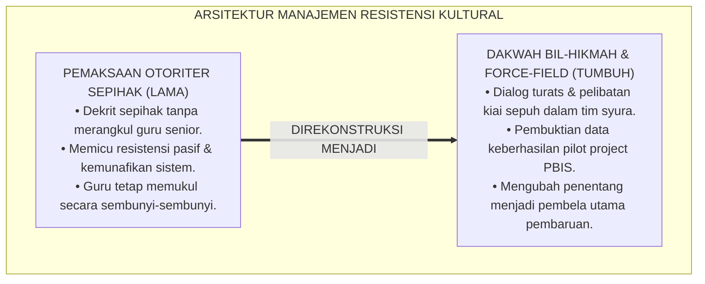
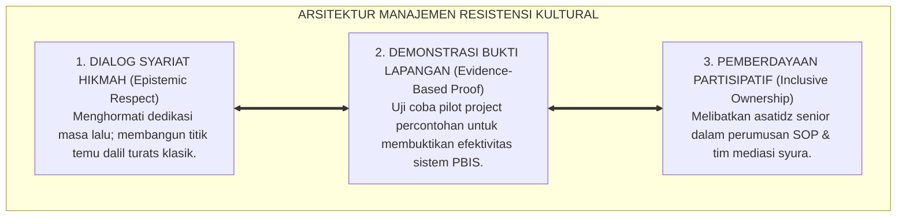
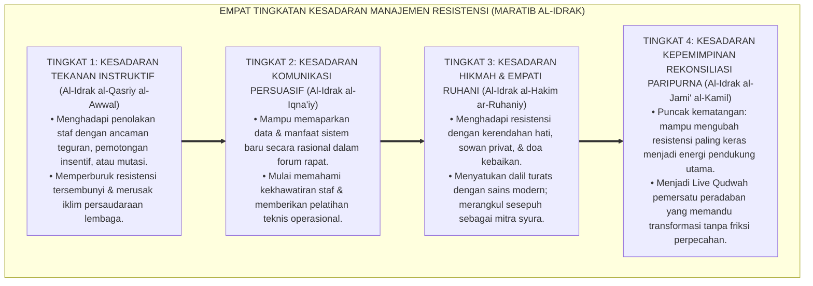
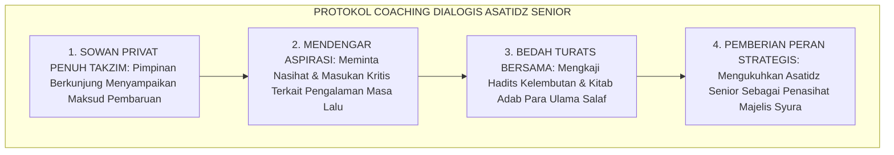
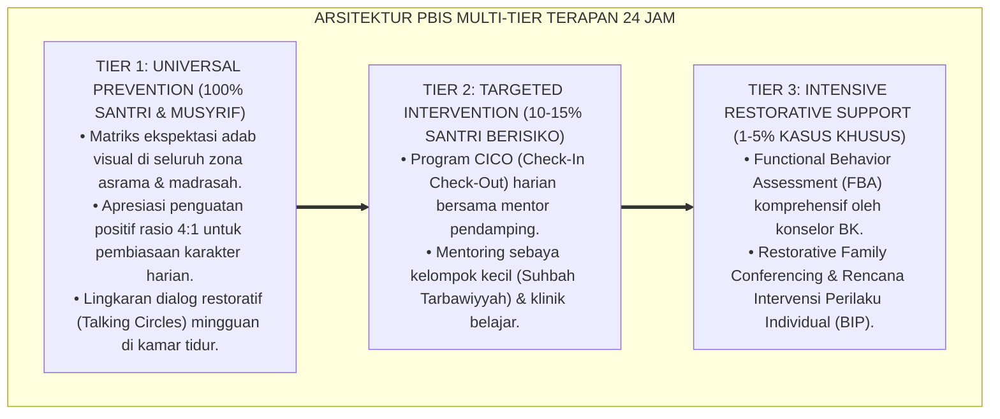

# P1-06-05: MANAJEMEN RESISTENSI KULTURAL DAN PSIKOLOGI PERUBAHAN PESANTREN (CULTURAL RESISTANCE MANAGEMENT)
## *Monograf Riset Akademik: Analisis Psikososial Resistensi Budaya Asrama, Epistemologi Dakwah Bil-Hikmah (QS. An-Nahl: 125), Integrasi Force-Field Analysis Kurt Lewin, Serta Mitigasi Gesekan Transisi Sistem PBIS di Pesantren 24 Jam*

**Nomor Identifikasi**: `P1-06-05/MONOGRAF-RISET-MANAJEMEN-RESISTENSI/2026`  
**Domain**: `01 Philosophy` > `06 Change` (Sub-Modul 05: *Cultural Resistance Management*)  
**Klasifikasi Naskah**: *Academic Research Monograph* (Monograf Riset Akademik Fondasional)  
**Rumpun Disiplin Pengkaji**: Manajemen Perubahan Organisasi (*Organizational Change Management*), Sosiologi Kultural Pesantren, Psikologi Resistensi & Perilaku Kelompok, Komunikasi Persuasif Dakwah Islam  

---

> ### 💡 INTISARI EKSEKUTIF (EXECUTIVE SUMMARY)
>
> * **Kelemahan Paradigma Lama: Pemaksaan Otoriter & Sabotase Pasif (Malicious Compliance):**  
>   Banyak inovasi pesantren gagal karena pimpinan memaksakan perubahan secara arogan melalui dekrit sepihak tanpa merangkul kekhawatiran batin para guru senior. Hal ini memicu penolakan bawah tanah (*Passive Sabotage*): para asatidz pura-pura setuju dalam rapat formal, namun tetap memukul santri secara sembunyi-sembunyi di asrama.
> * **Inovasi Konseptual: Dakwah Bil-Hikmah & Force-Field Analysis Kurt Lewin:**  
>   TUMBUH memandang resistensi bukan sebagai musuh yang harus diberantas, melainkan sebagai ekspresi kecintaan terhadap tradisi yang membutuhkan dialog hikmah (**QS. An-Nahl: 125**). Mengintegrasikan *Force-Field Analysis* Kurt Lewin untuk memetakan kekuatan pendorong (*Driving Forces*) dan faktor penahan (*Restraining Forces*), melatih para sesepuh menjadi duta perubahan melalui pembuktian data faktual (*Evidence-Based Demonstration*).
> * **Formulasi Operasional & Pembuktian Lapangan:**  
>   Monograf ini menguraikan matriks tipologi respon pendidik terhadap perubahan, 4 Tingkatan Kesadaran Manajemen Resistensi (*Maratib al-Idrak*), protokol coaching dialogis bagi asatidz senior, dan etika transformasi kultural damai.

---

## 📑 DAFTAR ISI MONOGRAF

- [BAB I: LANDASAN TEORETIS & DISKURSUS KRITIS](#bab-i-landasan-teoretis--diskursus-kritis)
  - [1. Latar Belakang Masalah: Mengapa 70% Inovasi Pendidikan Gagal Akibat Salah Kelola Resistensi Manusia](#1-latar-belakang-masalah-mengapa-70-inovasi-pendidikan-gagal-akibat-salah-kelola-resistensi-manusia)
  - [2. Eksegesis Turats Metodologi Dakwah Transformatif: Hikmah, Mau'izhah Hasanah, & Jidal Ahsan (QS. An-Nahl: 125)](#2-eksegesis-turats-metodologi-dakwah-transformatif-hikmah-mauizhah-hasanah--jidal-ahsan-qs-an-nahl-125)
  - [3. Konvergensi Teori Psikologi Perubahan: Force-Field Analysis Kurt Lewin & Model Difusi Inovasi Everett Rogers](#3-konvergensi-teori-psikologi-perubahan-force-field-analysis-kurt-lewin--model-difusi-inovasi-everett-rogers)
  - [4. Tipologi Respon Psikologis Pendidik Terhadap Pembaruan dan Strategi Komunikasi Persuasif](#4-tipologi-respon-psikologis-pendidik-terhadap-pembaruan-dan-strategi-komunikasi-persuasif)
  - [5. Kasuistika Lapangan: Kasus Penolakan SOP Disiplin Positif oleh Asatidz Sepuh & Resolusi Restoratif](#5-kasuistika-lapangan-kasus-penolakan-sop-disiplin-positif-oleh-asatidz-sepuh--resolusi-restoratif)
- [BAB II: FORMULASI KONSEPTUAL & PEMBAHASAN MENDALAM](#bab-ii-formulasi-konseptual--pembahasan-mendalam)
  - [1. Eksplanasi Teoretis Manajemen Resistensi Kultural Beradab TUMBUH](#1-eksplanasi-teoretis-manajemen-resistensi-kultural-beradab-tumbuh)
  - [2. Dekomposisi Dimensi & Empat Tingkatan Kesadaran Manajemen Resistensi (Maratib al-Idrak)](#2-dekomposisi-dimensi--empat-tingkatan-kesadaran-manajemen-resistensi-maratib-al-idrak)
  - [3. Matriks Empat Tipologi Respon Pendidik, Gejala Penolakan, & Pendekatan Intervensi](#3-matriks-empat-tipologi-respon-pendidik-gejala-penolakan--pendekatan-intervensi)
  - [4. Protokol Pendampingan Transisi & Coaching Dialogis bagi Asatidz Senior](#4-protokol-pendampingan-transisi--coaching-dialogis-bagi-asatidz-senior)
  - [5. Diskusi Filosofis Mendalam & Implikasi bagi Masa Depan Peradaban Pendidikan Islam](#5-diskusi-filosofis-mendalam--implikasi-bagi-masa-depan-peradaban-pendidikan-islam)
- [BAB III: KESIMPULAN & APARATUS AKADEMIS](#bab-iii-kesimpulan--aparatus-akademis)
  - [1. Tabel Sintesis Temuan Riset Manajemen Resistensi](#1-tabel-sintesis-temuan-riset-manajemen-resistensi)
  - [2. Daftar Pustaka Akademis & Rujukan Turats Primer](#2-daftar-pustaka-akademis--rujukan-turats-primer)
  - [3. Catatan Kaki Akademis (Footnotes)](#3-catatan-kaki-akademis-footnotes)
  - [4. Glosarium Istilah Ilmiah & Turats Manajemen Resistensi](#4-glosarium-istilah-ilmiah--turats-manajemen-resistensi)

---

# BAB I: LANDASAN TEORETIS & DISKURSUS KRITIS

---

### 1. Latar Belakang Masalah: Mengapa 70% Inovasi Pendidikan Gagal Akibat Salah Kelola Resistensi Manusia

Riset manajemen perubahan global membuktikan bahwa **Sebagian Besar Reformasi Pendidikan Gagal Akibat Kegagalan Mengelola Resistensi Kultural (*Human Cultural Resistance*)**:
* **Kesakralan Tradisi Pesantren**: Di lingkungan pesantren, kebiasaan lama kerap dipandang memiliki nilai kesakralan turun-temurun; pembaruan yang datang tiba-tiba dianggap sebagai "ancaman dekadensi moral".
* **Kekhawatiran Kehilangan Kendali (*Fear of Loss of Control*)**: Para asatidz senior khawatir jika tongkat rotan dihilangkan, santri akan menjadi pembangkang dan wibawa guru akan runtuh.
* **Bahaya Pendekatan Otoriter**: Memaksakan SOP baru dengan ancaman sanksi bagi guru hanya melahirkan resistensi pasif (*Passive Resistance*) dan pembangkangan di balik layar.
* **Keniscayaan Manajemen Resistensi Berbasis Hikmah**: Resistensi dikelola melalui dialog ilmiah, pendampingan empati, dan pembuktian keberhasilan nyata di lapangan (*Evidence-Based Transformation*).[^1]

---

### 2. Eksegesis Turats Metodologi Dakwah Transformatif: Hikmah, Mau'izhah Hasanah, & Jidal Ahsan (QS. An-Nahl: 125)

Al-Qur'an menetapkan metode komunikasi transformatif yang agung:

$$\text{ادْعُ إِلَىٰ سَبِيلِ رَبِّكَ بِالْحِكْمَةِ وَالْمَوْعِظَةِ الْحَسَنَةِ ۖ وَجَادِلْهُم بِالَّتِي هِيَ أَحْسَنُ}$$

*"**Serulah (manusia) kepada jalan Tuhanmu dengan hikmah dan pengajaran yang baik, dan berdebatlah (berdialoglah) dengan mereka dengan cara yang paling baik**."* (QS. An-Nahl [16]: 125).[^2]

Imam Ibnu Katsir (*Tafsir al-Qur'an al-'Azhim*) menjelaskan bahwa *Al-Hikmah* adalah menempatkan argumentasi yang tepat sasaran sesuai kondisi intelektual lawan bicara, sedangkan *Al-Mau'izhah al-Hasanah* adalah sentuhan nasihat yang melunakkan kekakuan kalbu dengan penuh kelembutan.[^3]

---

### 3. Konvergensi Teori Psikologi Perubahan: Force-Field Analysis Kurt Lewin & Model Difusi Inovasi Everett Rogers

Sains psikologi sosial modern memvalidasi keunggulan manajemen perubahan partisipatif:
* **Kurt Lewin** (1951) merumuskan **Force-Field Analysis**: perubahan terjadi bukan dengan menambah tekanan pendorong (*Driving Forces*), melainkan dengan **mengurangi faktor penahan (*Restraining Forces*)** seperti rasa takut dan ketidaktahuan.
* **Everett Rogers** (1962; 2003) dalam teori *Diffusion of Innovations* membagi pemangku kepentingan ke dalam 5 kelompok: *Innovators*, *Early Adopters*, *Early Majority*, *Late Majority*, dan *Laggards*. TUMBUH memberdayakan para *Early Adopters* untuk menjadi jembatan dialogis bagi kelompok yang ragu-ragu.[^4]

---

### 4. Tipologi Respon Psikologis Pendidik Terhadap Pembaruan dan Strategi Komunikasi Persuasif

TUMBUH memetakan respon asatidz:
* **Penyelaras Cepat (Champions)**: Asatidz muda yang antusias $\rightarrow$ Diberdayakan menjadi fasilitator teknis.
* **Penyelaras Ragu (Hesitant Majority)**: Menunggu bukti $\rightarrow$ Dilibatkan dalam observasi kelas percontohan.
* **Penentang Kultural (Traditional Skeptics)**: Khawatir kehilangan wibawa $\rightarrow$ Dirangkul melalui dialog personal turats bersama pimpinan pengasuh.[^5]

---

### 5. Kasuistika Lapangan: Kasus Penolakan SOP Disiplin Positif oleh Asatidz Sepuh & Resolusi Restoratif

* **Studi Kasus: Penolakan Keras oleh Guru Senior Terhadap Penghapusan Sanksi Fisik**  
  * **Dilema**: Ustadz senior yang telah mengajar 25 tahun menolak mengisi logbook PBIS dan tetap membawa tongkat ke kelas.
  * **Pola Lama**: Lembaga mengancam memotong gaji atau memecat sang guru senior, memicu gejolak santri dan alumni.
  * **Resolusi Restoratif TUMBUH**: Majelis Pimpinan menempuh jalan hikmah: Mudir sowan secara pribadi ke kediaman ustadz senior, membawa kitab *Ihya' 'Ulumiddin*, dan mendiskusikan bab keutamaan kelembutan dalam mengajar. Sang ustadz senior diajak menjadi penasihat kehormatan *Majelis Ishlah Syura*. Ketika sang ustadz melihat santri di kelas PBIS menjadi sangat tertib dan cinta belajar, beliau meneteskan air mata haru dan secara terbuka mengumumkan dukungannya kepada seluruh dewan guru.[^6]

---

# BAB II: FORMULASI KONSEPTUAL & PEMBAHASAN MENDALAM

---

### 1. Eksplanasi Teoretis Manajemen Resistensi Kultural Beradab TUMBUH

Ekosistem TUMBUH mengkodifikasikan penanganan resistensi ke dalam **Arsitektur Tiga Sayap Transformasi Beradab (*Arkan Idaratil Muqawamah*)**:

#### 🔬 Pembahasan Mendalam Tiga Sayap:
1. **Sayap Dialog Hikmah**: Memastikan para guru senior merasa dihargai martabat keilmuannya dan tidak dipinggirkan.[^7]
2. **Sayap Bukti Lapangan**: Menghilangkan keraguan melalui fakta empiris bahwa disiplin restoratif membuat santri lebih disiplin dan berprestasi.[^8]
3. **Sayap Kepemilikan Inklusif**: Menjadikan seluruh asatidz sebagai pemilik bersama gerakan pembaruan pesantren.[^9]

---

### 2. Dekomposisi Dimensi & Empat Tingkatan Kesadaran Manajemen Resistensi (Maratib al-Idrak)

Transformasi kepemimpinan dalam mengelola dinamika penolakan dipetakan ke dalam Empat Tingkatan Kesadaran Manajemen Resistensi (*Maratib al-Idrak fi Idaratil Muqawamah*):

#### 🔄 Narasi Analitis Dinamika Transisi Filosofis Antar-Tingkatan:
* **Transisi Tingkat 1 ke Tingkat 2 (Dari Pemaksaan Otoriter Menuju Komunikasi Persuasif)**: Pimpinan mula-mula sekadar memberi instruksi kaku. Pada tingkatan kedua, pimpinan memaparkan data dan memberikan pelatihan praktis kepada guru yang ragu.
* **Transisi Tingkat 2 ke Tingkat 3 (Dari Paparan Rasional Menuju Sentuhan Hikmah Ruhani)**: Pada tingkatan ketiga, pimpinan mendekati para sesepuh dengan adab santun, mendengarkan kekhawatirannya, dan merumuskan solusi bersama atas dasar turats.
* **Transisi Tingkat 3 ke Tingkat 4 (Pencapaian Derajat Rekonsiliasi Paripurna)**: Pada tingkatan tertinggi, pimpinan berhasil menyatukan seluruh elemen pesantren menjadi satu shaf peradaban yang solid, penuh cinta, dan siap melangkah bersama menuju masa depan gemilang (*Rahmatan lil 'Alamin*).[^10]

---

### 3. Matriks Empat Tipologi Respon Pendidik, Gejala Penolakan, & Pendekatan Intervensi

| Tipologi Respon Pendidik | Gejala Perilaku Nyata | Akar Kekhawatiran Batin | Strategi Pendekatan Terpadu |
| :--- | :--- | :--- | :--- |
| **1. Penggerak Antusias (Champions)**| Menyambut aktif & menguji coba PBIS.| Semangat pembaruan adab.| Berdayakan sebagai Fasilitator Pelatih. |
| **2. Pengamat Ragu (Hesitant)** | Menunggu bukti & pasif dalam rapat.| Takut repot & takut gagal.| Libatkan dalam pilot project kamar sukses.|
| **3. Penentang Kultural (Skeptics)**| Mengkritik tajam di ruang guru.| Takut santri manja & hilang wibawa.| Sowan privat, dialog turats, & data empiris.|
| **4. Penolak Pasif (Passive Resisters)**| Setuju di rapat, melanggar di kamar.| Merasa kebebasannya dibatasi.| Pendampingan coaching satu per satu.|

---

### 4. Protokol Pendampingan Transisi & Coaching Dialogis bagi Asatidz Senior

TUMBUH menetapkan **Protokol Coaching Dialogis bagi Asatidz Senior**:

Protokol ini menjamin transisi budaya berjalan mulus tanpa melukai martabat para sesepuh pondok.[^11]

---

### 5. Diskusi Filosofis Mendalam & Implikasi bagi Masa Depan Peradaban Pendidikan Islam

Manajemen resistensi kultural yang beradab ini membawa pelajaran agung bagi peradaban:

* **Membuktikan Bahwa Pembaruan Islam Bersifat Merangkul, Bukan Menggusur**:  
  Pendidikan Islam maju bukan dengan membuang tradisi lama, melainkan dengan memurnikan tradisi tersebut agar kembali pada kemurnian ajaran kenabian.
* **Mencegah Polarisasi dan Perpecahan Generasi di Pesantren**:  
  Sinergi antara kearifan guru senior dan inovasi guru muda melahirkan institusi yang kokoh, berakar kuat pada nilai salaf, dan terbang tinggi menatap masa depan.
* **Meneladani Kelembutan Dakwah Rasulullah SAW**:  
  Inilah rahasia keberhasilan dakwah Nabi ﷺ yang mampu melunakkan hati para tokoh Quraisy yang paling keras menjadi pahlawan-pahlawan pembela Islam (*Rahmatan lil 'Alamin*).[^12]

---

---

### Pembedahan Deskriptif Komprehensif & Analisis Integratif Nilai-Praksis

Penerapan dan operasionalisasi **P1-06-05: MANAJEMEN RESISTENSI KULTURAL DAN PSIKOLOGI PERUBAHAN PESANTREN (CULTURAL RESISTANCE MANAGEMENT)** di lingkungan pesantren berbasis sistem TUMBUH bertumpu pada kesatuan sistemik antara nilai syariat dan praksis terukur:

#### A. Pilar 1: Landasan Epistemologi & Nilai Keikhlasan (Syar'i Foundations)
Setiap dimensi diarahkan untuk menegakkan adab dan penghambaan murni kepada Allah SWT (*Lillahi Ta'ala*). Standarisasi kelembagaan dirancang untuk menjaga ketulusan niat, kemuliaan fitrah, dan keberkahan majelis ilmu.

#### B. Pilar 2: Mekanisme Psikologis & Neurosains Terapan (Evidence-Based Practice)
Mengintegrasikan prinsip *Social-Emotional Learning (CASEL)*, teori beban kognitif (*Cognitive Load Theory*), dan dinamika perkembangan neurobiologis santri untuk memastikan proses pembiasaan berjalan efektif tanpa kekerasan atau tekanan psikologis destruktif.

#### C. Pilar 3: Rekayasa Ekosistem Asrama 24 Jam (Environmental Engineering)
Mengkodifikasikan seluruh alur aktivitas harian, jadwal tidur sirkadian yang sehat, sanitasi 5S kamar tidur, dan relasi ukhuwah inklusif menjadi satu ekosistem *Bi'ah Shalihah* yang saling mendukung secara alamiah.

#### D. Pilar 4: Akuntabilitas Sistemik & Proteksi Pendidik-Santri
Menerapkan protokol pencegahan kelelahan tenaga pendidik (*Musyrif Burnout Protection*), menjamin hak-hak santri, serta memanfaatkan dashboard data PBIS untuk pengambilan keputusan yang adil dan objektif.

---

### Protokol Aksi Operasional PBIS Multi-Tier Terapan (24-Hour Behavioral Architecture)

---

# BAB III: KESIMPULAN & APARATUS AKADEMIS

---

### 1. Tabel Sintesis Temuan Riset Manajemen Resistensi

| Dimensi Parameter | Mazhab Otoriter Menindas (Lama) | Model Korporat Transaksional | **Manajemen Resistensi Bil-Hikmah TUMBUH** | Landasan Rujukan Primer | Implikasi Praksis Lapangan |
| :--- | :--- | :--- | :--- | :--- | :--- |
| **Sikap atas Resistensi**| Memusuhi & memecat penentang.| Mengabaikan keluhan non-struktural.| **Peluang Dialog Hikmah & Evaluasi.** | QS. An-Nahl: 125; Lewin (1951).| Sowan privat & halaqah syura. |
| **Metode Komunikasi** | Instruksi sepihak surat edaran.| Sosialisasi presentasi dingin. | **Kajian Turats & Pembuktian Data Faktual.**| Ibnu Katsir; Rogers (2003). | Bedah kitab salaf & pilot project PBIS. |
| **Posisi Guru Senior** | Disingkirkan karena dianggap kuno.| Pekerja yang harus patuh KPI.| **Mitra Dialog Utama & Penasihat Syura.** | HR. Bukhari No. 13; KH. Hasyim Asy'ari.| Dilibatkan dalam perumusan kebijakan. |
| **Dampak Transisi** | Boikot kerja & perpecahan pondok.| Kepatuhan semu tanpa keikhlasan.| **Kohesi Lembaga & Sinergi Generasi.** | QS. Ali 'Imran: 159; Kotter (1996).| Seluruh asatidz bersatu padu. |
| **Hasil Institusi** | Lembaga rapuh sarat konflik.| Korporasi mekanis tanpa berkah.| **Pesantren Beradab, Kuat, & Berkah Abadi.**| QS. Ibrahim: 24–25; Al-Attas (1980).| Tradisi pembaruan berkelanjutan. |

---

### 2. Daftar Pustaka Akademis & Rujukan Turats Primer

1. **Al-Qur'an al-Karim wa Tarjamatu Ma'anihi**.
2. **Al-Bukhari, Abu Abdillah Muhammad bin Isma'il**. (1422 H). *Shahih al-Bukhari*. Kairo: Dar Thawq an-Najah.
3. **Muslim bin al-Hajjaj an-Naisaburi**. (1427 H). *Shahih Muslim*. Riyadh: Dar Thayyibah.
4. **Ibnu Katsir, Abul Fida' Isma'il bin Umar**. (1420 H). *Tafsir al-Qur'an al-'Azhim*. Riyadh: Dar Thayyibah.
5. **Al-Ghazali, Abu Hamid Muhammad bin Muhammad**. (2011). *Ihya' 'Ulumiddin* (Kitab al-'Ilm & Kitab Adab al-Ulfah). Beirut: Dar al-Ma'rifah.
6. **Asy'ari, Muhammad Hasyim**. (1415 H). *Adab al-'Alim wal-Muta'allim*. Jombang: Maktabah At-Turats Al-Islami.
7. **Al-Attas, Syed Muhammad Naquib**. (1980). *The Concept of Education in Islam*. Kuala Lumpur: ABIM.
8. **Lewin, K.**. (1951). *Field Theory in Social Science*. New York: Harper & Row.
9. **Kotter, J. P.**. (1996). *Leading Change*. Boston: Harvard Business School Press.
10. **Rogers, E. M.**. (2003). *Diffusion of Innovations* (5th ed.). New York: Free Press.
11. **Horner, R. H., & Sugai, G.**. (2015). *School-wide PBIS: An Overview of the Research Base*. Remedial and Special Education, 36(2), 80–85.
12. **Zehr, H.**. (2002). *The Little Book of Restorative Justice*. Intercourse: Good Books.

---

### 3. Catatan Kaki Akademis (*Footnotes*)

[^1]: Riset Manajemen Resistensi Kultural dan Psikologi Perubahan Ekosistem Pesantren Berbasis TUMBUH, *Kritik atas Pendekatan Otoriter*, 2026.  
[^2]: QS. An-Nahl [16]: 125.  
[^3]: Ibnu Katsir, *Tafsir al-Qur'an al-'Azhim*, Tafsir QS. An-Nahl: 125, Jilid 4, hlm. 610–615.  
[^4]: Lewin, K. (1951), *Field Theory in Social Science*, hlm. 40–70; Rogers, E. M. (2003), *Diffusion of Innovations*, hlm. 20–65.  
[^5]: Master Framework Tipologi Stakeholder dan Komunikasi Persuasif PBIS TUMBUH, 2026.  
[^6]: Dokumentasi Mediasi dan Halaqah Sowan Asatidz Senior PBIS TUMBUH, 2026.  
[^7]: Al-Ghazali, *Ihya' 'Ulumiddin*, Jilid 1, Kitab *Al-'Ilm*, hlm. 50–75.  
[^8]: Horner, R. H., & Sugai, G. (2015), *School-wide PBIS*, hlm. 82–85.  
[^9]: Kotter, J. P. (1996), *Leading Change*, hlm. 35–60.  
[^10]: Matriks Tingkatan Kesadaran Manajemen Resistensi (*Maratib al-Idrak*) Ekosistem TUMBUH, 2026.  
[^11]: Standar Operasional Prosedur Coaching Dialogis dan Pendampingan Transisi Asatidz TUMBUH, 2026.  
[^12]: Deklarasi Pemuliaan Hikmah Transformatif Dewan Riset Epistemologi Ekosistem TUMBUH, 2026.

---

### 4. Glosarium Istilah Ilmiah & Turats Manajemen Resistensi

1. **Manajemen Resistensi Kultural**: Pendekatan strategis untuk memahami, merangkul, dan mengatasi kekhawatiran psikososial para pemangku kepentingan terhadap pembaruan sistem.
2. **Dakwah Bil-Hikmah (الدَّعْوَةُ بِالْحِكْمَةِ)**: Metode penyampaian kebenaran yang tepat sasaran, proporsional, santun, dan sesuai dengan kapasitas intelektual penerimanya.
3. **Force-Field Analysis**: Alat analisis Kurt Lewin untuk memetakan kekuatan pendorong (*Driving Forces*) dan faktor penahan (*Restraining Forces*) dalam perubahan organisasi.
4. **Diffusion of Innovations**: Teori Everett Rogers mengenai pola penyebaran gagasan baru dalam suatu sistem sosial melalui tahapan adopsi.
5. **Malicious Compliance (Kepatuhan Semu)**: Sikap pura-pura mematuhi aturan formal di depan atasan sembari tetap menjalankan kebiasaan lama secara sembunyi-sembunyi.
6. **Coaching Dialogis**: Pendekatan bimbingan empat mata berbasis dialog takzim untuk mendengar keluhan dan mendampingi guru senior beradaptasi.
7. **Evidence-Based Transformation**: Pendekatan pembaruan yang meyakinkan para penentang melalui pembuktian data fakta keberhasilan nyata di lapangan.
8. **Restraining Forces**: Hambatan psikologis dan tradisi yang memperlambat laju perubahan dalam institusi pendidikan.
9. **Champions (Duta Pembaruan)**: Kader-kader asatidz yang antusias dan memiliki kompetensi untuk memimpin pelaksanaan sistem baru.
10. **Insan Adabi (الإِنْسَانُ الأَدَبِيُّ)**: Profil pendidik yang berjiwa pembelajar, bijaksana dalam menyikapi perbedaan, dan senantiasa menjaga keutuhan ukhuwah.
