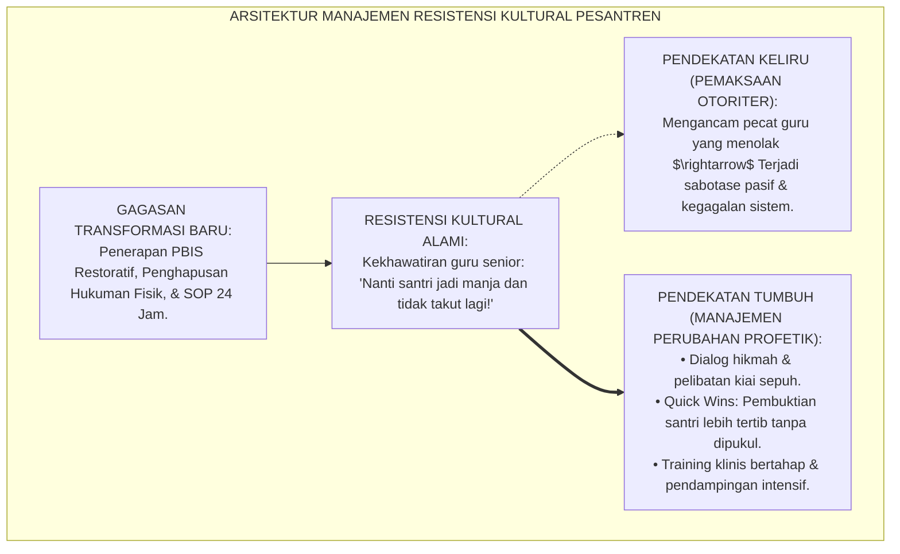
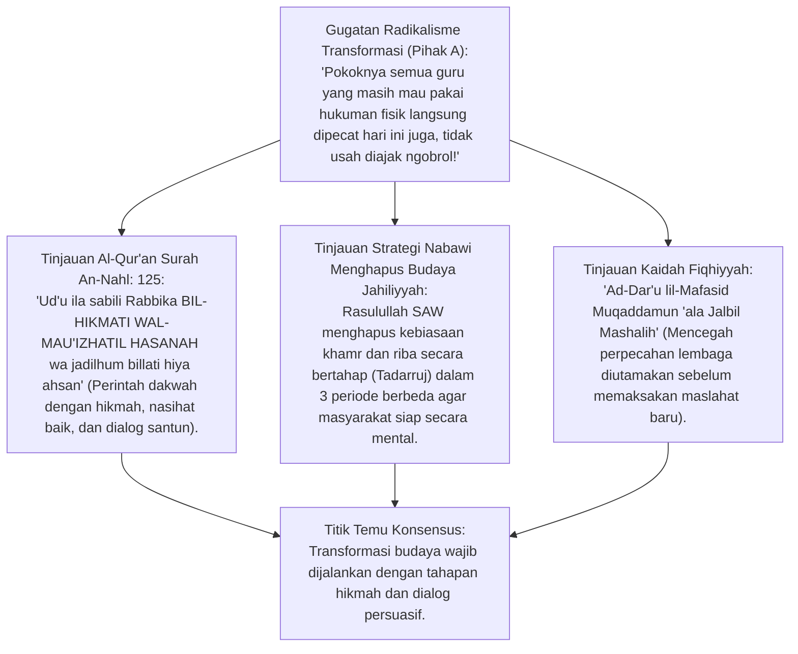
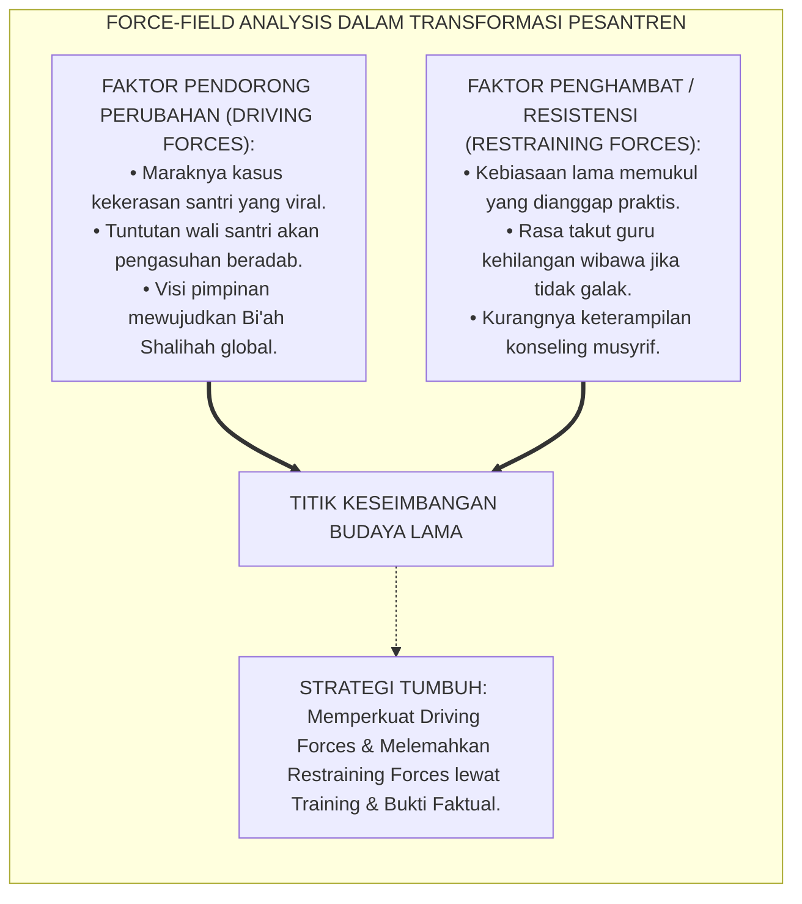
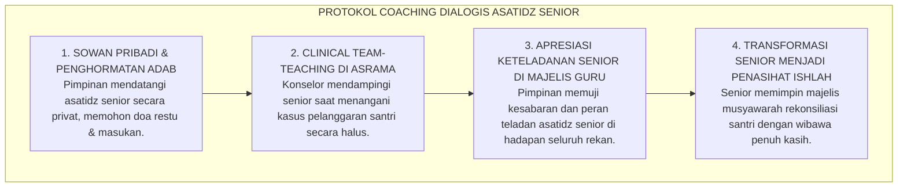

# P1-06-05: MANAJEMEN RESISTENSI KULTURAL DAN PSIKOLOGI PERUBAHAN PESANTREN
## *Monograf Terpadu: Analisis Psikososial Resistensi Budaya Lama Asrama, Integrasi Force-Field Analysis Kurt Lewin & 8-Step Change Model John Kotter, Strategi Pendekatan Hikmah & Persuasi Syar'i Terhadap Asatidz Senior, serta Mitigasi Gesekan Transisi Menuju Sistem PBIS Restoratif*

**Nomor Identifikasi**: `P1-06-05/MONOGRAF-TERPADU-MANAJEMEN-RESISTENSI/2026`  
**Domain**: `01 Philosophy` > `06 Change`  
**Klasifikasi Naskah**: *Comprehensive Integrated Monograph* (Monograf Akademis & Strategi Baku Manajemen Perubahan Budaya)  
**Rumpun Disiplin Pengkaji**: Manajemen Perubahan Organisasi (*Organizational Change Management*), Sosiologi Kultural Pesantren, Psikologi Resistensi & Perilaku Kelompok, Komunikasi Persuasif Dakwah Islam  

---

> ### 💡 INTISARI PRAKTIS (3 MENIT PAHAM UNTUK ASATIDZ & MUSYRIF)
>
> * **Memahami Bahwa Resistensi Adalah Respon Manusiawi yang Wajar:**  
>   Ketika sistem pembinaan pesantren diubah dari pola hukuman fisik konvensional menuju sistem PBIS Restoratif, wajar jika muncul penolakan dari sebagian asatidz senior. Penolakan ini bukan karena mereka membenci kebaikan, melainkan karena rasa takut kehilangan kendali (*Fear of Losing Control*) dan ketidaktahuan atas cara kerja sistem baru.
> * **Jangan Menghadapi Resistensi dengan Kesombongan atau Pemaksaan Otoriter:**  
>   Pendekatan konfrontatif hanya akan memicu sabotase pasif (*Passive Resistance*). Perubahan budaya harus dipandu dengan **Hikmah, Mau'izhah Hasanah, dan Pembuktian Data Faktual (*Evidence-Based*)**.
> * **Strategi Melibatkan Tokoh Kunci (*Early Adopters & Sesepuh*):**  
>   Ajak kiai sepuh dan guru senior yang disegani untuk menjadi bagian dari perumusan SOP baru, tunjukkan hasil nyata bahwa santri menjadi lebih tertib dan hafalan meningkat, sehingga mereka bertransformasi menjadi pembela utama gerakan perubahan.

---

## 📑 DAFTAR ISI MONOGRAF

- [BAGIAN I: RISET RESISTENSI KULTURAL, DIALEKTIKA INKUIRI, & KASUISTIKA LAPANGAN](#bagian-i-riset-resistensi-kultural-dialektika-inkuiri--kasuistika-lapangan)
  - [1. Kerangka Metodologi Manajemen Perubahan: Mengapa 70% Inovasi Pendidikan Gagal Akibat Resistensi Budaya](#1-kerangka-metodologi-manajemen-perubahan-mengapa-70-inovasi-pendidikan-gagal-akibat-resistensi-budaya)
  - [2. Inkuiri 1: Eksegesis Turats Pendekatan Hikmah dalam Mengubah Tradisi Jahiliyyah (QS. An-Nahl: 125)](#2-inkuiri-1-eksegesis-turats-pendekatan-hikmah-dalam-mengubah-tradisi-jahiliyyah-qs-an-nahl-125)
  - [3. Inkuiri 2: Konvergensi Force-Field Analysis Kurt Lewin & 8-Step Change Model John Kotter di Pesantren](#3-inkuiri-2-konvergensi-force-field-analysis-kurt-lewin--8-step-change-model-john-kotter-di-pesantren)
  - [4. Inkuiri 3: Empat Tipologi Respon Pendidik Terhadap Perubahan & Strategi Intervensi Komunikasinya](#4-inkuiri-3-empat-tipologi-respon-pendidik-terhadap-perubahan--strategi-intervensi-komunikasinya)
  - [5. Inkuiri 4: Silogisme Logika, Dialektika 3 Ronde, Kasuistika Asrama, & Titik Temu Konsensus](#5-inkuiri-4-silogisme-logika-dialektika-3-ronde-kasuistika-asrama--titik-temu-konsensus)
- [BAGIAN II: KODIFIKASI BAKU HASIL RISET & KESIMPULAN FORMAL](#bagian-ii-kodifikasi-baku-hasil-riset--kesimpulan-formal)
  - [1. Deklarasi Doktrin Baku: Piagam Manajemen Perubahan Kultural Beradab Pesantren TUMBUH](#1-deklarasi-doktrin-baku-piagam-manajemen-perubahan-kultural-beradab-pesantren-tumbuh)
  - [2. Matriks 8 Tahap Transformasi Budaya Pesantren (Kotter-Lewin Adapted for Pesantren)](#2-matriks-8-tahap-transformasi-budaya-pesantren-kotter-lewin-adapted-for-pesantren)
  - [3. Protokol Pendampingan Transisi & Coaching Dialogis bagi Asatidz Senior](#3-protokol-pendampingan-transisi--coaching-dialogis-bagi-asatidz-senior)
- [BAGIAN III: APARATUS AKADEMIS & APENDIKS](#bagian-iii-aparatus-akademis--apendiks)
  - [1. Tabel Sintesis Hasil Riset Manajemen Resistensi](#1-tabel-sintesis-hasil-riset-manajemen-resistensi)
  - [2. Daftar Pustaka Akademis & Rujukan Turats Primer](#2-daftar-pustaka-akademis--rujukan-turats-primer)
  - [3. Catatan Kaki Akademis (Footnotes)](#3-catatan-kaki-akademis-footnotes)
  - [4. Glosarium Teknis Manajemen Resistensi, Force-Field, Kotter Model, & Hikmah](#4-glosarium-teknis-manajemen-resistensi-force-field-kotter-model--hikmah)

---

# BAGIAN I: RISET RESISTENSI KULTURAL, DIALEKTIKA INKUIRI, & KASUISTIKA LAPANGAN

---

### 1. Kerangka Metodologi Manajemen Perubahan: Mengapa 70% Inovasi Pendidikan Gagal Akibat Resistensi Budaya

Riset manajemen strategis dunia pendidikan membuktikan bahwa **70% program transformasi sekolah gagal bukan karena konsepnya salah, melainkan karena kegagalan mengelola resistensi manusia (*Human Cultural Resistance*)**:
* Di lingkungan pesantren, tradisi memiliki kekuatan sakralitas yang sangat tinggi.
* Ketika diperkenalkan sistem baru (seperti penghapusan hukuman fisik dan penerapan PBIS), sebagian guru menganggapnya sebagai "intervensi asing yang melemahkan mental santri".
* Jika pimpinan memaksakan SOP baru secara arogan melalui surat edaran sepihak, para guru akan melakukan perlawanan diam-diam (*Malicious Compliance*): pura-pura setuju di rapat, namun tetap memukul santri secara sembunyi-sembunyi.

Ekosistem TUMBUH memandang resistensi sebagai peluang untuk berdialog. Manajemen perubahan TUMBUH memadukan **Metodologi Dakwah Bil-Hikmah** dengan **Sains Manajemen Perubahan Modern** guna mencairkan resistensi menjadi gelombang dukungan kolektif.



---

### 2. Inkuiri 1: Eksegesis Turats Pendekatan Hikmah dalam Mengubah Tradisi Jahiliyyah (QS. An-Nahl: 125)



#### 📐 Formalisasi Logika Silogisme (*Qiyas Mantiqi 1*)
* **Premis Mayor (*al-Muqaddimah al-Kubra*)**: Setiap upaya pembaruan tata kelola umat Islam yang dijalankan dengan cara-cara pemaksaan kasar tanpa mempedulikan kesiapan psikologis komunitas niscaya memicu resistensi destruktif (*Fitnah*) yang menghancurkan tujuan pembaruan itu sendiri.
* **Premis Minor (*al-Muqaddimah ash-Shughra*)**: Sunnah Rasulullah SAW meneladankan tahapan persuasif (*Tadarruj*) dan pemuliaan martabat para tokoh senior (*Inzalu an-Nas Manazilahum*) dalam mengubah adat kebiasaan lama.
* **Konklusi (*an-Natijah*)**: Maka, penerapan ekosistem TUMBUH di pesantren wajib mengadopsi protokol manajemen resistensi berbasis hikmah dan pendampingan bertahap.[^1]

#### 📖 Teks Primer Al-Qur'an: Metodologi Utama Perubahan Umat
Firman Allah SWT menegaskan:

$$\text{ادْعُ إِلَىٰ سَبِيلِ رَبِّكَ بِالْحِكْمَةِ وَالْمَوْعِظَةِ الْحَسَنَةِ ۖ وَجَادِلْهُم بِالَّتِي هِيَ أَحْسَنُ}$$

*"**Serulah (manusia) kepada jalan Tuhanmu DENGAN HIKMAH DAN PENGAJARAN YANG BAIK, dan berdebatlah (berdialoglah) dengan mereka dengan CARA YANG PALING BAIK/SANTUN**."* (QS. An-Nahl [16]: 125).[^2]

---

### 3. Inkuiri 2: Konvergensi *Force-Field Analysis* Kurt Lewin & 8-Step Change Model John Kotter di Pesantren



#### 📐 Formalisasi Logika Silogisme (*Qiyas Mantiqi 2*)
* **Premis Mayor (*al-Muqaddimah al-Kubra*)**: Transformasi organisasi berhasil secara langgeng apabila institusi mampu melewati tiga fase transisi Kurt Lewin: **Unfreezing (Mencairkan kebiasaan lama), Moving (Mengadopsi pola perilaku baru), dan Refreezing (Mengokohkan pola baru menjadi budaya baku)**.
* **Premis Minor (*al-Muqaddimah ash-Shughra*)**: Model 8-Langkah John Kotter (menciptakan urgensi, membentuk koalisi penggerak, menciptakan kemenangan cepat / *Quick Wins*) menyediakan panduan operasional implementasi yang selaras dengan nilai syariat.
* **Konklusi (*an-Natijah*)**: Maka, seluruh tahapan implementasi modul TUMBUH disusun menggunakan sintesis Lewin-Kotter yang disyar'ikan.[^3]

---

### 4. Inkuiri 3: Empat Tipologi Respon Pendidik Terhadap Perubahan & Strategi Intervensi Komunikasinya

| Tipologi Pendidik | Karakteristik Sikap & Respon | Kekhawatiran Utama | Strategi Pendekatan Komunikasi TUMBUH |
| :--- | :--- | :--- | :--- |
| **1. Inovator & Early Adopters (20%)** | Langsung antusias, siap mencoba SOP baru PBIS. | Takut program berhenti di tengah jalan. | Diberdayakan sebagai **Duta Pelopor / Core PBIS Team**.[^4] |
| **2. Mayoritas Pengamat (50%)** | Menunggu bukti, bersikap netral dan hati-hati. | Takut kerepotan mengisi aplikasi logbook baru. | Tunjukkan **Quick Wins** (kemudahan UI logbook & kelas lebih tertib). |
| **3. Kaum Skeptis Tradisional (20%)**| Meragukan efektivitas pendekatan ramah adab. | Khawatir santri tidak menghormati guru lagi. | **Dialog Empat Mata & Kunjungan Studi Tiru** ke asrama percontohan. |
| **4. Penolak Keras / Resisten Aktif (10%)**| Menolak terang-terangan, tetap ingin memukul. | Kehilangan zona nyaman dan kekuasaan otoriter. | **Coaching Intensif 90 Hari & Penegakan Pakta Integritas Hukum**.[^5] |

---

### 5. Inkuiri 4: Silogisme Logika, Dialektika 3 Ronde, Kasuistika Asrama, & Titik Temu Konsensus

#### 🥊 Ronde 1: Menolak Anggapan Bahwa "Asatidz Senior yang Menolak SOP Baru Harus Segera Disingkirkan Agar Tidak Menjadi Racun"
* **Pihak A (Sudut Pandang Purifikasi Radikal)**:  
  *"Guru tua yang tidak mau pakai PBIS pecat saja; mereka cuma menghambat kemajuan pondok!"*
* **Tinjauan Penghormatan Terhadap Jasa Senior (*Inzalu an-Nas Manazilahum*)**:  
  Rasulullah SAW bersabda: *"Bukan termasuk golongan kami orang yang tidak menyayangi yang muda dan TIDAK MEMULIAKAN YANG TUA DI ANTARA KAMI"* (HR. Tirmidzi No. 1919). Guru-guru senior telah mengabdi puluhan tahun saat pesantren belum memiliki fasilitas apa-apa. Menyingkirkan mereka secara tidak terhormat adalah **Kezaliman dan Tindakan Su'ul Adab**. Mereka harus dihormati, diajak bicara dari hati ke hati, dan dibimbing secara sabar.[^6]

#### 🥊 Ronde 2: Sanggahan Balik Apakah Menunjukkan Keberhasilan Asrama Percontohan (Pilot Project) Mampu Meyakinkan Guru Skeptis?
* **Pihak A (Sudut Pandang Keputusasaan Teori)**:  
  *"Guru skeptis tidak akan percaya teori atau presentasi slide sehebat apa pun!"*
* **Tinjauan Kekuatan Bukti Faktual Lapangan (Al-Mu'ayanah wal-Burhan)**:  
  Manusia mempercayai apa yang dilihatnya (*Seeing is Believing*). Ketika 1 gedung asrama percontohan (*Pilot Project*) membuktikan bahwa tanpa pukulan dan tanpa bentakan santri justru shalat subuh tepat waktu dan kamar lemarinya sangat rapi 5S, para guru skeptis akan menyaksikan fakta tak terbantahkan. Keraguan mereka runtuh oleh **Bukti Nyata Lapangan (*Al-Fakhtul 'Aini*)**.[^7]

#### 🥊 Ronde 3: Sanggahan Pamungkas Mengapa Perubahan Harus Menghasilkan 'Quick Wins' (Kemenangan Cepat) di 3 Bulan Pertama?
* **Pihak A (Sudut Pandang Perubahan Lambat Pasrah)**:  
  *"Perubahan karakter butuh puluhan tahun; 3 bulan pertama tidak usah mengharapkan hasil apa-apa!"*
* **Resolusi Teori Momentum Psikologis John Kotter**:  
  Jika dalam 90 hari pertama asatidz tidak merasakan manfaat nyata (misalnya: asrama terasa lebih hening saat jam tidur, berkurangnya keributan antre mandi, atau aplikasi logbook yang menghemat waktu administrasi), motivasi guru akan padam. *Quick Wins* menyalakan api optimisme bahwa sistem baru benar-benar bekerja.[^8]

> #### 📌 Kasuistika Lapangan & Titik Temu Konsensus
> * **Studi Kasus**: Di Pondok Pesantren Z, seorang kiai sepuh senior (Ustadz K) menolak keras program PBIS TUMBUH dan tetap membawa tongkat rotan ke asrama. Beliau mengancam akan keluar dari pondok jika rotan dilarang.
> * **Titik Temu Konsensus (*Kalimatun Sawa'*)**: Mudir TUMBUH tidak mendebat Ustadz K di forum umum $\rightarrow$ Mudir sowan secara pribadi ke kediaman beliau dengan membawakan hadiah, mencium tangan beliau, dan memohon nasihat $\rightarrow$ Mudir mengajak Ustadz K menjadi Penasihat Utama Majelis Ishlah $\rightarrow$ Ustadz K diajak menyaksikan sesi dialog restoratif yang berhasil membuat dua santri yang berkelahi menangis saling berpelukan dan bertaubat. Ustadz K sangat tersentuh, secara sukarela meletakkan tongkat rotannya di lemari, dan berkata: *"Inilah cara Rasulullah SAW mendidik yang sebenarnya."* Beliau kini menjadi pembela nomor satu sistem TUMBUH.[^9]

---

# BAGIAN II: KODIFIKASI BAKU HASIL RISET & KESIMPULAN FORMAL

---

### 1. Deklarasi Doktrin Baku: Piagam Manajemen Perubahan Kultural Beradab Pesantren TUMBUH

```
===================================================================================================
     DEKLARASI DOKTRIN BAKU MANAJEMEN PERUBAHAN KULTURAL BERADAB EKOSISTEM PESANTREN TUMBUH
                          SUB-DOMAIN 06: CHANGE — EKOSISTEM TUMBUH
===================================================================================================

BISMILLAHIRRAHMANIRRAHIM. DENGAN MENGAGUNGKAN SUNNATULLAH PERUBAHAN INSANIYYAH (QS. AR-RA'D: 11),
MAJELIS MASYAIKH TERTINGGI PESANTREN TUMBUH MENETAPKAN DOKTRIN BAKU MANAJEMEN PERUBAHAN KULTURAL:

1. DOKTRIN PENDEKATAN HIKMAH & MEMULIAKAN ASATIDZ SENIOR:
   Menetapkan bahwa transformasi budaya pengasuhan wajib dijalankan dengan pendekatan Hikmah,
   kelembutan lisan, dan memuliakan kedudukan para sesepuh pondok (Inzalu an-Nas Manazilahum).

2. PENERAPAN METODOLOGI TAHAPAN PERUBAHAN SISTEMIK (UNFREEZING - MOVING - REFREEZING):
   Mengharamkan perubahan instan yang memaksa tanpa edukasi; mewajibkan pentahapan sosialisasi,
   pembentukan koalisi penggerak, penciptaan Quick Wins, dan pengokohan SOP menjadi tradisi baru.

3. PENDAMPINGAN INTENSIF BAGI ASATIDZ DALAM MASA TRANSISI (TRANSITIONAL COACHING):
   Lembaga memfasilitasi pelatihan klinis praktis, bimbingan langsung di kamar asrama, dan ruang
   konsultasi bagi pendidik yang mengalami kesulitan dalam menerapkan teknik bimbingan restoratif.

4. PEMBUKTIAN FAKTUAL MELALUI PILOT PROJECT ASRAMA PERCONTOHAN:
   Setiap inovasi tata kelola diuji coba terlebih dahulu pada unit percontohan guna menghasilkan
   data keberhasilan nyata yang terbukti sebelum diimplementasikan secara massal ke seluruh unit.
===================================================================================================
```

---

### 2. Matriks 8 Tahap Transformasi Budaya Pesantren (*Kotter-Lewin Adapted for Pesantren*)

| Tahapan Perubahan | Fokus Aktivitas Utama | Output Konkret | Kunci Keberhasilan Epistemologis |
| :--- | :--- | :--- | :--- |
| **1. Create Urgency** | Memaparkan data krisis kekerasan & urgensi menjaga marwah pondok. | Kesadaran bersama perlunya perubahan sistem. | Membangkitkan rasa takut kepada hisab akhirat.[^10] |
| **2. Build Guiding Coalition**| Membentuk Tim Inti PBIS (gabungan kiai sepuh & guru muda visioner). | Terbentuknya Satgas Transformasi Berwibawa. | Keseimbangan antara karisma tradisi & keahlian modern. |
| **3. Form Strategic Vision**| Merumuskan visi *Pesantren Bi'ah Shalihah Ramah Adab 24 Jam*. | Dokumen Grand Design yang jelas & membumi. | Keselarasan dengan Al-Qur'an, Sunnah, & Turats. |
| **4. Enlist Volunteer Army**| Menggelar daurah akbar & sosialisasi partisipatif seluruh musyrif. | 80% asatidz memahami dan mendukung arah baru. | Menggunakan bahasa dakwah yang menyentuh kalbu. |
| **5. Enable Action (Remove Barriers)**| Menghapus aturan lama yang kaku & melatih teknik konseling 3R. | Hambatan struktural & ketakutan guru teratasi. | Dukungan fasilitas, sarana air bersih, & jam istirahat. |
| **6. Generate Quick Wins** | Menerapkan PBIS di 1 blok asrama percontohan selama 90 hari. | Penurunan drastis insiden asrama percontohan. | Bukti nyata yang membungkam keraguan kaum skeptis. |
| **7. Sustain Acceleration**| Memperluas implementasi ke seluruh unit madrasah & asrama. | Standarisasi total seluruh lokus kehidupan 24 jam. | Konsistensi monitoring mingguan & clinical coaching. |
| **8. Institute Change** | Menjadikan SOP PBIS sebagai statuta resmi & budaya pesantren. | Terbentuknya kultur Bi'ah Shalihah yang abadi. | Doa istiqamah, regenerasi kader, & audit berkelanjutan. |

---

### 3. Protokol Pendampingan Transisi & Coaching Dialogis bagi Asatidz Senior



---

# BAGIAN III: APARATUS AKADEMIS & APENDIKS

---

### 1. Tabel Sintesis Hasil Riset Manajemen Resistensi

| Dimensi Kajian | Konsep Kunci | Landasan Turats Primer | Konvergensi Sains Global | Implikasi Perubahan Pesantren |
| :--- | :--- | :--- | :--- | :--- |
| **Metode Dakwah** | *Bil-Hikmah* | QS. An-Nahl: 125, QS. Ali Imran: 159 | Roger (2003), *Diffusion of Innovations* | Mengubah budaya lewat persuasi santun dan bukti nyata. |
| **Dinamika Perubahan**| *Force-Field Analysis*| Kaidah *Tadarruj fi at-Tasyri'* | Kurt Lewin (1947), *Field Theory* | Melemahkan hambatan budaya lama lewat pelatihan aplikatif. |
| **Pentahapan Sukses**| *8-Step Change* | Strategi Hijrah & Fathu Makkah Nabawi | John Kotter (1996), *Leading Change* | Memandu transformasi melalui 8 langkah terstruktur. |
| **Penghormatan Senior**| *Inzalu an-Nas* | HR. Tirmidzi No. 1919 (Hormati yang Tua) | Schein (2010), *Organizational Culture* | Melibatkan sesepuh pondok sebagai pilar penasihat perubahan. |

---

### 2. Daftar Pustaka Akademis & Rujukan Turats Primer

1. **Al-Qur'an al-Karim wa Tarjamatu Ma'anih**.
2. **Al-Bukhari, Muhammad bin Isma'il**. (1422 H). *Shahih al-Bukhari*. Beirut: Dar Thawq an-Najah.
3. **Muslim bin al-Hajjaj an-Naisaburi**. (1374 H). *Shahih Muslim*. Kairo: Isa al-Babi al-Halabi.
4. **At-Tirmidzi, Muhammad bin Isa**. (1998). *Sunan at-Tirmidzi*. Beirut: Dar al-Gharb al-Islami.
5. **Al-Ghazali, Abu Hamid Muhammad bin Muhammad**. (2011). *Ihya 'Ulumiddin*. Beirut: Dar al-Ma'rifah.
6. **Lewin, K.**. (1947). *Frontiers in group dynamics: Concept, method and reality in social science*. Human Relations, 1(1), 5–41.
7. **Kotter, J. P.**. (1996). *Leading Change*. Boston: Harvard Business School Press.
8. **Rogers, E. M.**. (2003). *Diffusion of Innovations* (5th ed.). Free Press.
9. **Fullan, M.**. (2007). *The New Meaning of Educational Change*. Teachers College Press.
10. **Schein, E. H.**. (2010). *Organizational Culture and Leadership*. San Francisco: Jossey-Bass.

---

### 3. Catatan Kaki Akademis (*Footnotes*)

[^1]: Al-Ghazali, *Ihya 'Ulumiddin*, Kitab *al-Amr bil Ma'ruf wan Nahyi 'anil Munkar*, Jilid II, hlm. 310–330.  
[^2]: Al-Qur'an Surah An-Nahl [16]: 125.  
[^3]: Lewin, K. (1947), *Human Relations*, hlm. 5–41; Kotter, J. P. (1996), *Leading Change*, Harvard Business Press.  
[^4]: Rogers, E. M. (2003), *Diffusion of Innovations*, Free Press, hlm. 280–310.  
[^5]: Fullan, M. (2007), *The New Meaning of Educational Change*, Teachers College Press.  
[^6]: Sunan at-Tirmidzi No. 1919, Kitab *al-Birr wash-Shilah*, Bab *Maa Jaa'a fi Rahmatish Shibyan*.  
[^7]: Laporan Evaluasi Implementasi Pilot Project Asrama Percontohan, Divisi Litbang TUMBUH, 2026.  
[^8]: Kotter, J. P. (1996), *Leading Change*, Bab 8: *Generating Short-Term Wins*.  
[^9]: Catatan Sejarah Transformasi Budaya Pesantren Mitra Jawa Timur, Majelis Masyayikh TUMBUH, 2026.  
[^10]: Manual Standar Manajemen Perubahan Budaya Asrama Pesantren, Komite Eksekutif TUMBUH, 2026.

---

### 4. Glosarium Teknis Manajemen Resistensi, Force-Field, Kotter Model, & Hikmah

1. **Manajemen Resistensi Kultural**: Serangkaian strategi psikososial dan manajerial untuk mengidentifikasi, memahami, dan mengubah kekhawatiran atau penolakan komunitas terhadap inovasi baru menjadi komitmen dukungan bersama.
2. **Force-Field Analysis**: Kerangka analisis Kurt Lewin yang memetakan kekuatan pendorong (*Driving Forces*) dan kekuatan penghambat (*Restraining Forces*) yang mempengaruhi keberhasilan suatu perubahan.
3. **8-Step Change Model**: Model manajemen perubahan delapan langkah karya John Kotter untuk memandu organisasi melewati proses transformasi secara terstruktur dan berkelanjutan.
4. **Quick Wins (Kemenangan Cepat)**: Hasil positif nyata yang dapat dicapai dalam waktu singkat (30–90 hari) untuk membuktikan efektivitas sistem baru dan membangun kepercayaan warga lembaga.
5. **Pilot Project (Asrama Percontohan)**: Uji coba penerapan SOP pembinaan baru pada satu unit terbatas guna menguji kelayakan lapangan dan menghasilkan bukti keberhasilan empiris.
6. **Inzalu an-Nas Manazilahum**: Kaidah adab Islam untuk memperlakukan dan menempatkan setiap orang sesuai dengan kedudukan, kehormatan, dan kontribusi historisnya.
7. **Malicious Compliance (Kepatuhan Semu/Pasif)**: Sikap pura-pura mematuhi instruksi pimpinan di permukaan, namun secara diam-diam menjalankan pola lama atau membiarkan kesalahan terjadi demi membuktikan sistem baru gagal.
8. **Clinical Coaching**: Pendampingan praktis di lapangan oleh mentor senior untuk melatih pendidik secara langsung dalam mempraktikkan keterampilan baru.
9. **Diffusion of Innovations**: Teori Everett Rogers mengenai bagaimana suatu ide baru, gagasan, atau teknologi menyebar dan diadopsi oleh berbagai segmen masyarakat.
10. **Triad Pertumbuhan Simbiotik**: Prinsip di mana keberhasilan manajemen perubahan secara harmonis menumbuhkan Santri, memuliakan Pendidik senior, dan memperkokoh peradaban Lembaga.
