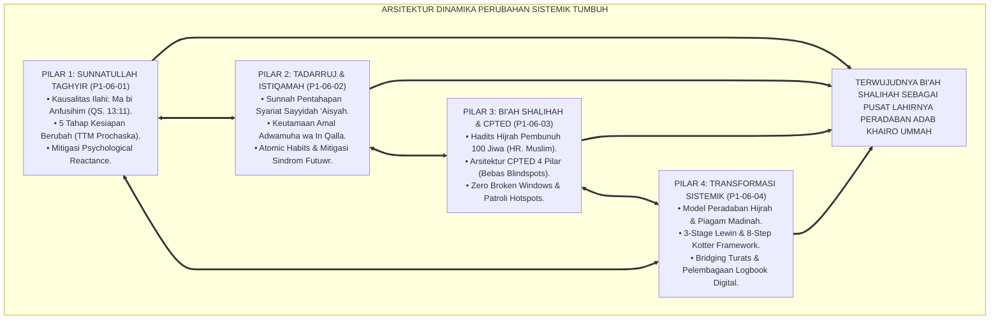
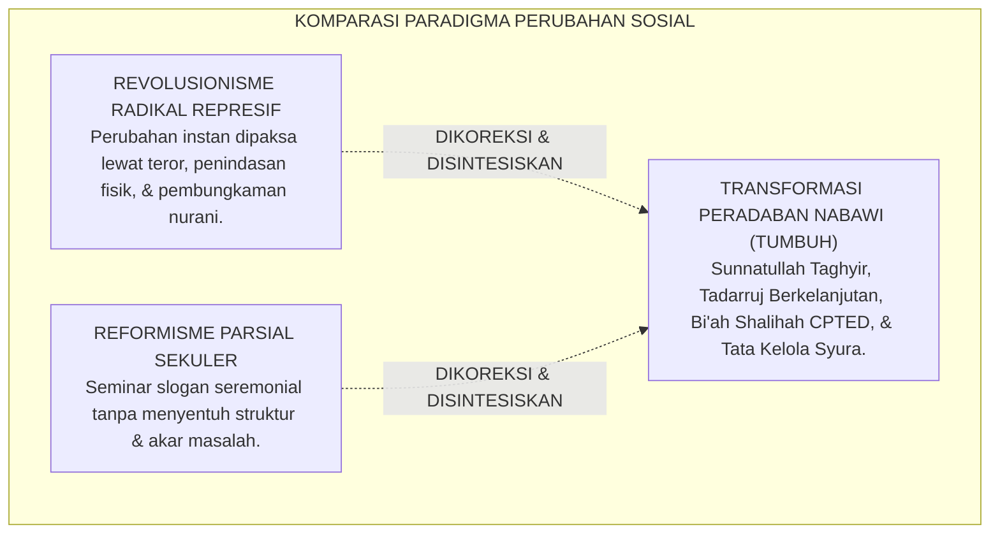
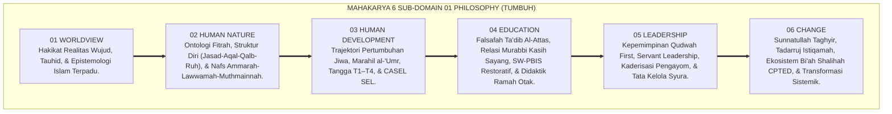
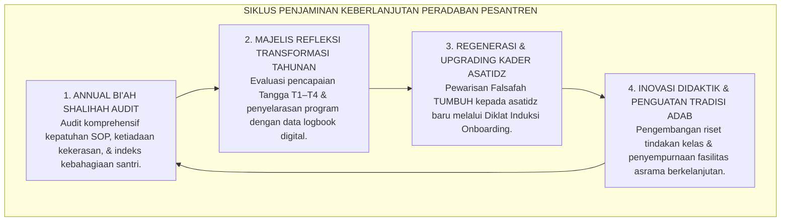

# P1-06-05: SINTESIS DINAMIKA PERUBAHAN SISTEMIK DAN MANIFESTO TRANSFORMASI PERADABAN PESANTREN
## *Monograf Terpadu: Sintesis Holistik 4 Pilar Dinamika Perubahan (Sunnatullah Taghyir, Tadarruj Istiqamah, Bi'ah Shalihah CPTED, & Transformasi Sistemik Lewin-Kotter), Matriks Komparasi Paradigma Perubahan Sosial, Puncak Sintesis Agung Domain 01 Philosophy, serta Jembatan Epistemologis Menuju Domain 02 Principles*

**Nomor Identifikasi**: `P1-06-05/MONOGRAF-TERPADU-SINTESIS-CHANGE/2026`  
**Domain**: `01 Philosophy` > `06 Change`  
**Klasifikasi Naskah**: *Comprehensive Synthesis Monograph* (Monograf Sintesis Filosofis & Manifesto Baku Peradaban)  
**Rumpun Disiplin Pengkaji**: Filsafat Perubahan Sosial Islam (*Falsafah at-Taghyir al-Hadari*), Sosiologi Peradaban Islam, Teori Perubahan Organisasi Sistemik, Arsitektur Epistemologi Pendidikan Pesantren  

---

> ### 💡 INTISARI PRAKTIS (3 MENIT PAHAM UNTUK ASATIDZ & MUSYRIF)
>
> * **Kesatuan Utuh 4 Pilar Dinamika Perubahan Ekosistem TUMBUH:**  
>   Perubahan di pesantren TUMBUH adalah orkestrasi agung yang memadukan 4 dimensi:  
>   1. **P1-06-01 (Sunnatullah Taghyir):** Menegakkan hukum kausalitas bahwa perubahan lahiriah bermula dari gerakan kesadaran jiwa internal (*Ma bi Anfusihim* QS. Ar-Ra'd: 11) dan model 5 tahap TTM Prochaska.  
>   2. **P1-06-02 (Tadarruj & Istiqamah):** Menerapkan pentahapan syariat, pembiasaan mikro 1% (*Atomic Habits*), dan mencegah sindrom kelelahan/kejenuhan (*Anti-Futuwr*).  
>   3. **P1-06-03 (Bi'ah Shalihah & CPTED):** Merekayasa tata ruang fisik bebas titik buta (*Blindspots*), kebersihan prima (*Broken Windows*), dan patroli titik rawan asrama.  
>   4. **P1-06-04 (Transformasi Sistemik Lewin-Kotter):** Menggerakkan seluruh pilar lembaga secara serempak melalui 3 fase (*Unfreezing-Moving-Refreezing*) dan pendekatan *Bridging Turats*.
> * **Puncak Sintesis Agung Domain 01 Philosophy (100% Selesai):**  
>   Menyatukan **Worldview** (Hakikat Realitas), **Human Nature** (Ontologi Fitrah), **Human Development** (Pertumbuhan Jiwa T1–T4), **Education** (Kurikulum Ta'dib), **Leadership** (Servant Leadership Qudwah), dan **Change** (Dinamika Perubahan Bi'ah Shalihah) menjadi satu bangunan filosofis yang kokoh dan tak tergoyahkan.
> * **Gerbang Menuju Domain 02: Principles:**  
>   Seluruh fondasi filosofis di Domain 01 ini kini siap diturunkan (*Derivasi*) menjadi Prinsip-Prinsip Desain Kurikulum, Prinsip Pengasuhan Asrama, dan Prinsip Tata Kelola di **Domain 02: Principles**.

---

## 📑 DAFTAR ISI MONOGRAF

- [BAGIAN I: SINTESIS FILOSOFIS 4 PILAR DINAMIKA PERUBAHAN & MATRIKS KOMPARASI](#bagian-i-sintesis-filosofis-4-pilar-dinamika-perubahan--matriks-komparasi)
  - [1. Arsitektur Sintesis Holistik: Konvergensi 4 Pilar Dinamika Perubahan TUMBUH](#1-arsitektur-sintesis-holistik-konvergensi-4-pilar-dinamika-perubahan-tumbuh)
  - [2. Matriks Komparasi Filosofis Transformasi Sosial: Revolusionisme vs Reformisme Parsial vs Transformasi Nabawi TUMBUH](#2-matriks-komparasi-filosofis-transformasi-sosial-revolusionisme-vs-reformisme-parsial-vs-transformasi-nabawi-tumbuh)
  - [3. Puncak Sintesis Filosofis Seluruh Domain 01 Philosophy (Sub-Domain 01 s/d 06)](#3-puncak-sintesis-filosofis-seluruh-domain-01-philosophy-sub-domain-01-sd-06)
  - [4. Jembatan Filosofis & Aksiologis Menuju Domain 02: Principles](#4-jembatan-filosofis--aksiologis-menuju-domain-02-principles)
- [BAGIAN II: PIAGAM KELEMBAGAAN & DEKLARASI DOKTRIN BAKU TRANSFORMASI PERADABAN](#bagian-ii-piagam-kelembagaan--deklarasi-doktrin-baku-transformasi-peradaban)
  - [1. Manifesto Transformasi Peradaban Pesantren TUMBUH](#1-manifesto-transformasi-peradaban-pesantren-tumbuh)
  - [2. Matriks Integrasi Operasional 4 Pilar Dinamika Perubahan ke dalam Kehidupan Pesantren 24 Jam](#2-matriks-integrasi-operasional-4-pilar-dinamika-perubahan-ke-dalam-kehidupan-pesantren-24-jam)
  - [3. Protokol Penjaminan Keberlanjutan Transformasi Budaya Pesantren](#3-protokol-penjaminan-keberlanjutan-transformasi-budaya-pesantren)
- [BAGIAN III: APARATUS AKADEMIS & APENDIKS](#bagian-iii-aparatus-akademis--apendiks)
  - [1. Tabel Sintesis Master Sub-Domain 06](#1-tabel-sintesis-master-sub-domain-06)
  - [2. Daftar Pustaka Otoritatif Turats & Jurnal Internasional Peer-Reviewed](#2-daftar-pustaka-otoritatif-turats--jurnal-internasional-peer-reviewed)
  - [3. Catatan Kaki Akademis (Footnotes)](#3-catatan-kaki-akademis-footnotes)
  - [4. Glosarium Master Istilah Kunci Dinamika Perubahan & Domain 01](#4-glosarium-master-istilah-kunci-dinamika-perubahan--domain-01)

---

# BAGIAN I: SINTESIS FILOSOFIS 4 PILAR DINAMIKA PERUBAHAN & MATRIKS KOMPARASI

---

### 1. Arsitektur Sintesis Holistik: Konvergensi 4 Pilar Dinamika Perubahan TUMBUH

Falsafah Dinamika Perubahan dalam ekosistem TUMBUH adalah **Sistem Transformasi Sosial-Spiritual Terpadu (*Unified Social-Spiritual Transformation Architecture*)**:



---

### 2. Matriks Komparasi Filosofis Transformasi Sosial: Revolusionisme vs Reformisme Parsial vs Transformasi Nabawi TUMBUH



| Parameter Analisis | Model Revolusionisme Radikal Represif | Model Reformisme Parsial Sekuler | Model Transformasi Peradaban Nabawi (TUMBUH) |
| :--- | :--- | :--- | :--- |
| **Asumsi Dasar Perubahan** | Manusia hanya bisa diubah melalui teror ancaman fisik dan kekerasan. | Perubahan cukup dilakukan melalui himbauan slogan moral dan seminar 1 hari. | **Perubahan adalah proses sunnatullah bertahap yang berakar pada kesadaran jiwa (*Ma bi Anfusihim*).**[^1] |
| **Kecepatan & Ritme Waktu** | Memaksakan target raksasa seketika (*Isti'jal*). | Lambat tanpa arah dan target yang jelas. | **Pentahapan bijaksana (*Tadarruj*) dan konsistensi kebiasaan mikro (*Atomic Habits*).** |
| **Perlakuan Terhadap Tata Ruang** | Mengabaikan tata ruang; lingkungan dibiarkan kotor dan gelap. | Perbaikan kosmetik tanpa analisis titik rawan kejahatan. | **Rekayasa arsitektur CPTED holistik bebas blindspots dan toilet wangi standar prima.**[^2] |
| **Respon Terhadap Resistensi** | Menindas dan memenjarakan orang-orang yang berbeda pandangan. | Menyerah pada status quo lama dan membiarkan kekerasan berlanjut. | **Dialog keilmuan berbasis Turats Salaf (*Bridging Turats*) dan keteladanan qudwah.**[^3] |
| **Daya Tahan Budaya Baru** | Runtuh seketika saat rezim diktator tumbang. | Lenyap tanpa bekas setelah kepanitiaan seminar bubar. | **Melembaga menjadi tradisi peradaban abadi (*Refreezing*) yang diwariskan lintas generasi.**[^4] |

---

### 3. Puncak Sintesis Filosofis Seluruh Domain 01 Philosophy (Sub-Domain 01 s/d 06)

Dengan tuntasnya Sub-Domain `06 Change`, seluruh bangunan arsitektur filosofis **Domain 01: Philosophy** telah terangkai secara sempurna menjadi mahakarya pemikiran pendidikan Islam:



---

### 4. Jembatan Filosofis & Aksiologis Menuju **Domain 02: Principles**

Sintesis agung seluruh Domain 01 Philosophy menjadi batu pijakan ontologis dan epistemologis yang menurunkan (*Derivasi*) prinsip-prinsip operasional di **Domain 02: Principles**:

```mermaid
graph TD
    D1["DOMAIN 01: PHILOSOPHY (FONDASI FILOSOFIS TUNTAS 100%)<br/>(Worldview, Human Nature, Development, Education, Leadership, Change)"]
    ==>|DITURUNKAN SECARA LOGIS MENJADI KAIDAH OPERASIONAL MENUJU|
    D2["DOMAIN 02: PRINCIPLES (PRINSIP-PRINSIP DESAIN EKOSISTEM)<br/>(Prinsip Kurikulum Adab, Prinsip Pengasuhan 24 Jam, Prinsip Disiplin Positif, & Prinsip Tata Kelola)"]
    
    subgraph PenurunanKeDomain02["DERIVASI STRATEGIS MENUJU DOMAIN 02"]
        P1["Prinsip Desain Kurikulum Holistik Berbasis Ta'dib (Berasal dari Sub-Domain 04)"]
        P2["Prinsip Pengasuhan Asrama In Loco Parentis (Berasal dari Sub-Domain 03 & 04)"]
        P3["Prinsip PBIS Multi-Tier & Disiplin Restoratif (Berasal dari Sub-Domain 04)"]
        P4["Prinsip Servant Leadership & Anti-Burnout Musyrif (Berasal dari Sub-Domain 05)"]
        P5["Prinsip Rekayasa Tata Ruang Bi'ah Shalihah CPTED (Berasal dari Sub-Domain 06)"]
    end
    
    D2 --> PenurunanKeDomain02
```

---

# BAGIAN II: PIAGAM KELEMBAGAAN & DEKLARASI DOKTRIN BAKU TRANSFORMASI PERADABAN

---

### 1. Manifesto Transformasi Peradaban Pesantren TUMBUH

```
===================================================================================================
      MANIFESTO TRANSFORMASI PERADABAN PESANTREN TUMBUH (CIVILIZATIONAL TRANSFORMATION CHARTER)
                     PUNCAK MATAKARYA DOMAIN 01: PHILOSOPHY — EKOSISTEM TUMBUH
===================================================================================================

BISMILLAHIRRAHMANIRRAHIM. DENGAN BERSERAH DIRI KEPADA ALLAH SWT, DEWAN KEILMUAN, MAJELIS MASYAIKH,
DAN SELURUH PIMPINAN LEMBAGA PESANTREN EKOSISTEM TUMBUH DENGAN INI MEMPROKLAMIRKAN MANIFESTO AGUNG:

PASAL 1: MANDAT TEOLOGIS PERUBAHAN JIWA INTERNAL (MA BI ANFUSIHIM)
Menegakkan doktrin bahwa transformasi peradaban pesantren sejati bermula dari penyucian niat, kesadaran
fikir, dan kehendak taubat di dalam jiwa santri dan asatidz. Menolak mutlak ilusi pemaksaan lahiriah kasar.

PASAL 2: MANDAT PENTAHAPAN TADARRUJ & KEBIASAAN MIKRO ISTIQAMAH
Mewajibkan seluruh pembiasaan karakter dan kurikulum distrukturkan secara bertahap (Tadarruj) melalui
penguatan kebiasaan mikro 1% (Atomic Habits) dan menjaga ritme hidup santri dari sindrom kejenuhan (Futuwr).

PASAL 3: MANDAT REKAYASA BI'AH SHALIHAH & ARSITEKTUR CPTED
Mewajibkan seluruh tata ruang fisik asrama didesain terang, bersih, asri, dan bebas dari titik buta (Blindspots),
serta menegakkan SOP Perbaikan Cepat 24 Jam demi menjamin terciptanya lingkungan suci pelindung fitrah santri.

PASAL 4: MANDAT TRANSFORMASI SISTEMIK LEWIN-KOTTER & PELEMBAGAAN PERMANEN
Mengawal perubahan budaya lembaga melalui fase Unfreezing, Moving, dan Refreezing, merangkul asatidz
senior melalui dialog keilmuan Turats klasik, dan mengunci budaya PBIS ke dalam memori kelembagaan digital.

PASAL 5: INTEGRASI TOTAL TRIAD PERTUMBUHAN SIMBIOTIK
Menjamin bahwa setiap denyut transformasi di pesantren TUMBUH secara simultan menumbuhkan fitrah Santri,
memuliakan kompetensi dan kesejahteraan Musyrif/Guru, serta memperkokoh kemandirian Sistem Lembaga.

DITETAPKAN DI: PUSAT RISET & PENGEMBANGAN EKOSISTEM PENDIDIKAN PESANTREN TUMBUH
TANGGAL: 24 AGUSTUS 2026
ATAS NAMA SELURUH DEWAN PAKAR KEILMUAN DOMAIN 01 PHILOSOPHY EKOSISTEM TUMBUH
===================================================================================================
```

---

### 2. Matriks Integrasi Operasional 4 Pilar Dinamika Perubahan ke dalam Kehidupan Pesantren 24 Jam

| Pilar Dinamika Perubahan | Berkas Rujukan Utama | Implementasi Konkret di Pesantren 24 Jam | Output Budaya Lembaga |
| :--- | :--- | :--- | :--- |
| **Pilar 1: Sunnatullah Taghyir** | [**`P1-06-01`**](./P1-06-01-Sunnatullah-Perubahan-Jiwa-dan-Perilaku.md) | Diagnosis tahap kesiapan santri (TTM 1–5), *Motivational Interviewing*, mitigasi *reactance*, & *Zero Public Shaming*. | Santri berubah atas dorongan kesadaran nurani intrinsik tanpa rasa tertekan.[^5] |
| **Pilar 2: Tadarruj & Istiqamah** | [**`P1-06-02`**](./P1-06-02-Prinsip-Tadarruj-dan-Istiqamah.md) | Pembiasaan adab 2 menit (*Atomic Adab*), *Habit Stacking*, pemantauan ritme energi, & *Anti-Futuwr Protocol*. | Konsistensi amalan shalih sepanjang tahun ajaran dan tetap istiqamah saat liburan.[^6] |
| **Pilar 3: Bi'ah Shalihah & CPTED** | [**`P1-06-03`**](./P1-06-03-Ekosistem-Biah-Shalihah-dan-Desain-Lingkungan.md) | Tata letak CPTED bebas sudut buta, toilet wangi standar hotel, SOP perbaikan 24 jam, & patroli titik rawan 3 waktu. | Asrama menjadi zona aman yang nyaman, bebas perundungan (*Zero Bullying*), dan asri.[^7] |
| **Pilar 4: Transformasi Sistemik** | [**`P1-06-04`**](./P1-06-04-Transformasi-Sistemik-Budaya-Pesantren.md) | Peta jalan 8 tahap Lewin-Kotter, *Bridging Turats* bersama kyai sepuh, ratifikasi statuta, & logbook PBIS digital. | Budaya adab terkunci permanen menjadi tradisi lembaga yang diwariskan lintas generasi.[^8] |

---

### 3. Protokol Penjaminan Keberlanjutan Transformasi Budaya Pesantren



---

# BAGIAN III: APARATUS AKADEMIS & APENDIKS

---

### 1. Tabel Sintesis Master Sub-Domain 06

| Sub-Modul | Judul Monograf | Landasan Teori Utama | Fokus Inovasi Dinamika Perubahan |
| :---: | :--- | :--- | :--- |
| **P1-06-01** | Sunnatullah Perubahan Jiwa | QS. Ar-Ra'd: 11, QS. Al-Anfal: 53, Tafsir Ar-Razi, James Prochaska (*TTM Stages of Change*) | Perubahan berakar dari jiwa internal (*Ma bi Anfusihim*); diferensiasi bimbingan berbasis 5 tahap TTM. |
| **P1-06-02** | Prinsip Tadarruj & Istiqamah | Atsar Sayyidah 'Aisyah (HR. Bukhari 4993), Hadits Amal *Adwamuha*, James Clear (*Atomic Habits*) | Pentahapan syariat; pembiasaan mikro 1% (*Micro-Habits*); mitigasi sindrom kejenuhan (*Futuwr*). |
| **P1-06-03** | Ekosistem Bi'ah Shalihah & CPTED | Hadits Pembunuh 100 Jiwa (HR. Muslim 2766), C. Ray Jeffery (*CPTED*), Richard Thaler (*Nudge*) | Rekayasa lingkungan fisik bebas blindspots, Zero Broken Windows, & patroli titik rawan asrama. |
| **P1-06-04** | Transformasi Sistemik Budaya | Sirah Hijrah Madinah, Kurt Lewin (*3-Stage Change*), John Kotter (*8-Step Change Framework*) | Mengubah kultur kekerasan lama secara sistemik, merangkul asatidz senior, & pelembagaan data PBIS. |
| **P1-06-05** | Sintesis Dinamika Perubahan TUMBUH | Puncak Sintesis Agung Domain 01 Philosophy, Triad Pertumbuhan Simbiotik | Manifesto Transformasi Peradaban Pesantren dan jembatan menuju **Domain 02: Principles**. |

---

### 2. Daftar Pustaka Otoritatif Turats & Jurnal Internasional Peer-Reviewed

1. **Al-Qur'an al-Karim wa Tarjamatu Ma'anih**.
2. **Al-Bukhari, Muhammad bin Isma'il**. (1422 H). *Shahih al-Bukhari*. Beirut: Dar Thawq an-Najah.
3. **Muslim bin al-Hajjaj an-Naisaburi**. (1374 H). *Shahih Muslim*. Kairo: Isa al-Babi al-Halabi.
4. **Ar-Razi, Fakhruddin Muhammad bin Umar**. (1981). *Mafatih al-Ghaib*. Beirut: Dar al-Fikr.
5. **Ibnu Hisyam, Abdul Malik bin Hisyam**. (1955). *As-Sirah an-Nabawiyyah*. Kairo: Musthafa al-Babi al-Halabi.
6. **Al-Ghazali, Abu Hamid Muhammad bin Muhammad**. (2011). *Ihya 'Ulumiddin*. Beirut: Dar al-Ma'rifah.
7. **Prochaska, J. O., & DiClemente, C. C.**. (1983). *Stages and processes of self-change of smoking*. Journal of Consulting and Clinical Psychology.
8. **Clear, J.**. (2018). *Atomic Habits*. New York: Avery.
9. **Jeffery, C. R.**. (1971). *Crime Prevention Through Environmental Design*. Sage Publications.
10. **Lewin, K.**. (1947). *Frontiers in group dynamics*. Human Relations.
11. **Kotter, J. P.**. (2012). *Leading Change*. Harvard Business Review Press.
12. **Senge, P. M.**. (1990). *The Fifth Discipline*. Doubleday.

---

### 3. Catatan Kaki Akademis (*Footnotes*)

[^1]: Ar-Razi, *Mafatih al-Ghaib*, Jilid XIX, hlm. 21–24 mengenai hukum kausalitas batin dan lahiriah.  
[^2]: Jeffery, C. R. (1971), *Crime Prevention Through Environmental Design*, Sage Publications.  
[^3]: Kotter, J. P. (2012), *Leading Change*, Harvard Business Review Press, hlm. 65–80.  
[^4]: Schein, E. H. (2010), *Organizational Culture and Leadership*, Jossey-Bass.  
[^5]: Prochaska & DiClemente (1983), *Journal of Consulting and Clinical Psychology*, hlm. 390–395.  
[^6]: Clear, J. (2018), *Atomic Habits*, Avery Publishing.  
[^7]: Crowe, T. D. (2000), *CPTED: Applications of Architectural Design*, Butterworth-Heinemann.  
[^8]: Sugai, G., & Horner, R. H. (2006), *A promising approach for expanding and sustaining PBIS*, School Psychology Review.

---

### 4. Glosarium Master Istilah Kunci Dinamika Perubahan & Domain 01

1. **Sunnatullah at-Taghyir (سُنَّةُ اللهِ فِي التَّغْيِيرِ)**: Ketetapan hukum kausalitas Ilahi dalam perubahan karakter dan peradaban yang berakar pada transformasi kesadaran jiwa internal manusia.
2. **Tadarruj (التَّدَرُّجُ)**: Prinsip penerapan tahapan bertahap yang selaras dengan kodrat perkembangan psikologis dan biologis pembelajar.
3. **Bi'ah Shalihah (الْبِيئَةُ الصَّالِحَةُ)**: Lingkungan suci fisik dan sosial yang dirancang secara sadar untuk menumbuhkan fitrah adab dan mematikan peluang kemungkaran selama 24 jam penuh.
4. **CPTED (Crime Prevention Through Environmental Design)**: Rekayasa arsitektur tata ruang untuk mengeliminasi titik buta (*Blindspots*) dan memaksimalkan pengawasan alami demi terciptanya keamanan lingkungan.
5. **Atomic Habits**: Pembentukan karakter melalui pembiasaan amalan-amalan mikro 1% yang terakumulasi menjadi kebiasaan permanen sepanjang hayat.
6. **Futuwr (الْفُتُورُ)**: Gejala kelelahan psikologis dan kelesuan spiritual akibat pemaksaan amalan secara ekstrem (*Ghuluw*).
7. **Unfreezing-Moving-Refreezing**: Tiga tahapan dinamika perubahan organisasi Kurt Lewin untuk mencairkan budaya lama, menggerakkan inovasi baru, dan mengunci norma baku.
8. **Bridging Turats**: Pendekatan dialog persuasif yang mengonfirmasikan keselarasan antara inovasi sistem pendidikan kontemporer dengan khazanah kitab klasik ulama salaf.
9. **Triad Pertumbuhan Simbiotik**: Prinsip mutlak ekosistem TUMBUH di mana Santri, Musyrif/Guru, dan Sistem Lembaga wajib bertumbuh serempak tanpa saling mengorbankan.
10. **Insan Adabi (الْإِنْسَانُ الْأَدَبِيُّ)**: Muara akhir seluruh pendidikan Islam; sosok manusia beriman, berilmu, beramal shalih, dan adil menempatkan posisi dirinya di hadapan Allah dan makhluk.
