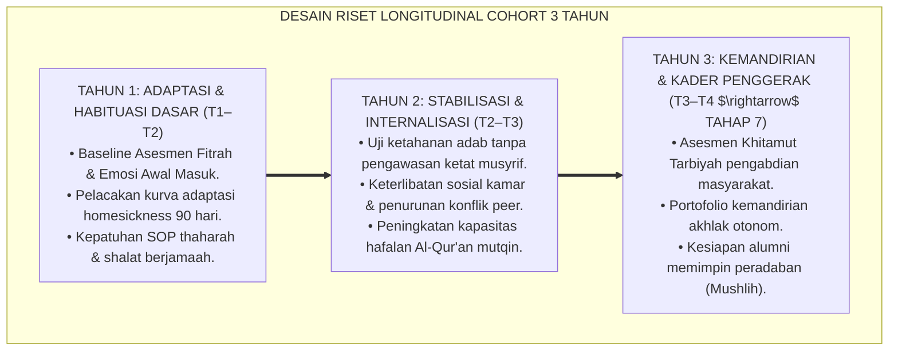
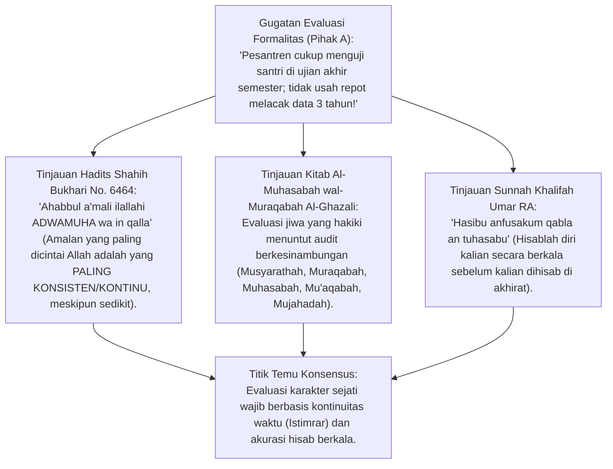
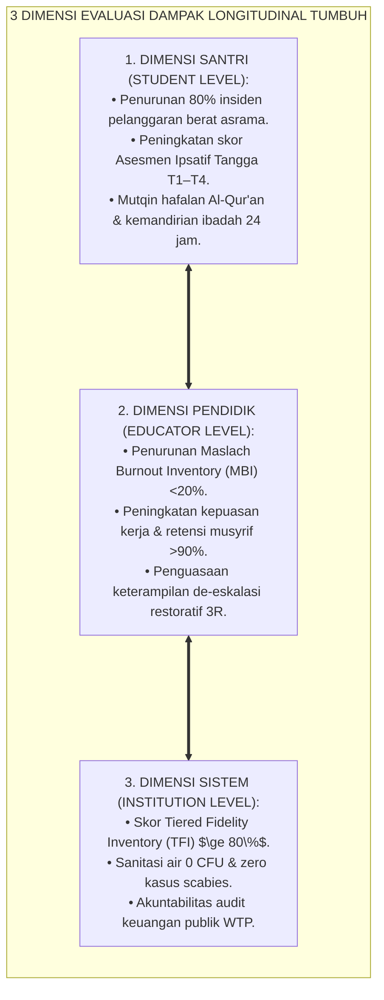
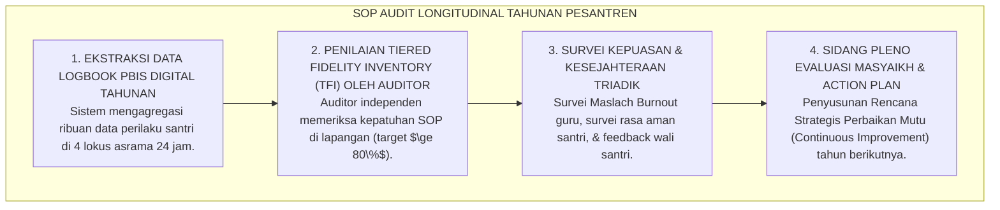

# P1-06-06: EVALUASI DAMPAK LONGITUDINAL DAN KEBERLANJUTAN TRANSFORMASI PESANTREN
## *Monograf Terpadu: Epistemologi Istimrarul 'Amal & Muhasabah Sistemik (HR. Bukhari No. 6464), Desain Riset Longitudinal Cohort 3 Tahun, Pengukuran Kepatuhan Sistem (Tiered Fidelity Inventory TFI ≥ 80%), Triangulasi Dampak Triad Pertumbuhan, serta Pelembagaan Budaya Berkelanjutan*

**Nomor Identifikasi**: `P1-06-06/MONOGRAF-TERPADU-EVALUASI-LONGITUDINAL/2026`  
**Domain**: `01 Philosophy` > `06 Change`  
**Klasifikasi Naskah**: *Comprehensive Integrated Monograph* (Monograf Akademis & Metodologi Evaluasi Dampak Sistemik)  
**Rumpun Disiplin Pengkaji**: Evaluasi Program Pendidikan (*Educational Program Evaluation*), Metodologi Riset Longitudinal Cohort, Psikometri Sistem PBIS (*Implementation Science & TFI*), Teologi Istiqamah & Muhasabah Kelembagaan  

---

> ### 💡 INTISARI PRAKTIS (3 MENIT PAHAM UNTUK ASATIDZ & MUSYRIF)
>
> * **Keberhasilan Pembinaan Adab Tidak Boleh Dinilai dari Peristiwa Sesaat:**  
>   Menilai keberhasilan pesantren dari satu acara wisuda megah atau ketiadaan masalah selama satu pekan adalah ilusi evaluasi. Karakter sejati teruji dari **Keistiqamahan Adab Sepanjang Waktu (*Istimrarul 'Amal*)**.
> * **Desain Evaluasi Longitudinal Cohort 3 Tahun:**  
>   Ekosistem TUMBUH melacak angkatan santri (*Cohort*) sejak kelas 7 (T1 Adaptasi) hingga lulus kelas 9/12 (T4 Transformasi / Tahap 7 Penggerak) untuk membuktikan apakah adab mereka semakin mengakar atau luntur.
> * **Pengukuran Tiga Dimensi (*Triad Impact Measurement*):**  
>   1. **Santri:** Penurunan 80% insiden pelanggaran dan peningkatan kemandirian ibadah mandiri.  
>   2. **Musyrif:** Penurunan tingkat stres *burnout* dan peningkatan kebahagiaan mengasuh.  
>   3. **Lembaga:** Skor kepatuhan SOP PBIS (*Tiered Fidelity Inventory / TFI*) mencapai minimal $\ge 80\%$.

---

## 📑 DAFTAR ISI MONOGRAF

- [BAGIAN I: RISET EVALUASI LONGITUDINAL, DIALEKTIKA INKUIRI, & KASUISTIKA LAPANGAN](#bagian-i-riset-evaluasi-longitudinal-dialektika-inkuiri--kasuistika-lapangan)
  - [1. Kerangka Metodologi Riset Longitudinal: Mengapa Evaluasi Karakter Membutuhkan Pelacakan Multi-Tahun](#1-kerangka-metodologi-riset-longitudinal-mengapa-evaluasi-karakter-membutuhkan-pelacakan-multi-tahun)
  - [2. Inkuiri 1: Eksegesis Turats Istimrarul 'Amal & Muhasabah — Ihya 'Ulumiddin & HR. Bukhari No. 6464](#2-inkuiri-1-eksegesis-turats-istimrarul-amal--muhasabah--ihya-ulumiddin--hr-bukhari-no-6464)
  - [3. Inkuiri 2: Konvergensi Implementation Science & Tiered Fidelity Inventory (Horner & Sugai)](#3-inkuiri-2-konvergensi-implementation-science--tiered-fidelity-inventory-horner--sugai)
  - [4. Inkuiri 3: Tiga Dimensi Evaluasi Dampak Longitudinal: Santri, Musyrif, dan Sistem Kelembagaan](#4-inkuiri-3-tiga-dimensi-evaluasi-dampak-longitudinal-santri-musyrif-dan-sistem-kelembagaan)
  - [5. Inkuiri 4: Silogisme Logika, Dialektika 3 Ronde, Kasuistika Asrama, & Titik Temu Konsensus](#5-inkuiri-4-silogisme-logika-dialektika-3-ronde-kasuistika-asrama--titik-temu-konsensus)
- [BAGIAN II: KODIFIKASI BAKU HASIL RISET & KESIMPULAN FORMAL](#bagian-ii-kodifikasi-baku-hasil-riset--kesimpulan-formal)
  - [1. Kaidah Utama dan Standar Baku: Standar Evaluasi Dampak Longitudinal Pesantren TUMBUH](#1-kaidah-utama-dan-standar-baku-standar-evaluasi-dampak-longitudinal-pesantren-tumbuh)
  - [2. Matriks Lintasan Capaian Cohort 3 Tahun: Tahun 1 Inisiasi, Tahun 2 Stabilisasi, Tahun 3 Transformasi](#2-matriks-lintasan-capaian-cohort-3-tahun-tahun-1-inisiasi-tahun-2-stabilisasi-tahun-3-transformasi)
  - [3. Standar Prosedur Operasional (SOP) Audit Longitudinal Tahunan & Dashboard Analitik PBIS](#3-standar-prosedur-operasional-sop-audit-longitudinal-tahunan--dashboard-analitik-pbis)
- [BAGIAN III: APARATUS AKADEMIS & APENDIKS](#bagian-iii-aparatus-akademis--apendiks)
  - [1. Tabel Sintesis Hasil Riset Evaluasi Longitudinal](#1-tabel-sintesis-hasil-riset-evaluasi-longitudinal)
  - [2. Daftar Pustaka Akademis & Rujukan Turats Primer](#2-daftar-pustaka-akademis--rujukan-turats-primer)
  - [3. Catatan Kaki Akademis (Footnotes)](#3-catatan-kaki-akademis-footnotes)
  - [4. Glosarium Teknis Longitudinal Cohort, Tiered Fidelity Inventory, Istimrarul Amal, & PDCA](#4-glosarium-teknis-longitudinal-cohort-tiered-fidelity-inventory-istimrarul-amal--pdca)

---

# BAGIAN I: RISET EVALUASI LONGITUDINAL, DIALEKTIKA INKUIRI, & KASUISTIKA LAPANGAN

---

### 1. Kerangka Metodologi Riset Longitudinal: Mengapa Evaluasi Karakter Membutuhkan Pelacakan Multi-Tahun

Kelemahan fatal pada sebagian besar evaluasi pendidikan karakter di Indonesia adalah **Pengujian Cross-Sectional Sesaat (*Snapshot Evaluation*)**:
* Sekolah hanya mengevaluasi karakter melalui ujian tulis PPKn atau lembar kuesioner sekali setahun.
* Evaluasi semacam ini tidak mampu mendeteksi apakah kebiasaan shalat subuh santri akan bertahan saat liburan di rumah atau setelah lulus menjadi alumni.
* Banyak santri yang tampak patuh di tahun pertama (karena takut), namun meledak menjadi pemberontak di tahun ketiga (karena akumulasi tekanan tanpa internalisasi adab).

Ekosistem TUMBUH menegakkan metodologi **Evaluasi Longitudinal Cohort 3 Tahun**: melacak perkembangan trajektori psikospiritual kelompok santri yang sama dari waktu ke waktu (*Time-Series Analysis*), mengukur pembentukan watak otomatis (*Moral Automaticity*), dan menguji ketahanan adab santri dalam menghadapi godaan lingkungan luar.

---

### 2. Inkuiri 1: Eksegesis Turats Istimrarul 'Amal & Muhasabah — Ihya 'Ulumiddin & HR. Bukhari No. 6464

#### 📐 Formalisasi Logika Silogisme (*Qiyas Mantiqi 1*)
* **Premis Mayor (*al-Muqaddimah al-Kubra*)**: Setiap klaim keberhasilan pendidikan Islam yang tidak dibuktikan oleh kontinuitas amal nyata yang konsisten dari waktu ke waktu (*ad-Dawam wal-Istimrar*) adalah klaim semu yang rapuh di hadapan timbangan syariat.
* **Premis Minor (*al-Muqaddimah ash-Shughra*)**: Hadits Rasulullah SAW menetapkan bahwa kualitas iman dan amal diukur dari keistiqamahannya (HR. Bukhari No. 6464).
* **Konklusi (*an-Natijah*)**: Maka, metodologi evaluasi dampak pembinaan santri di ekosistem TUMBUH wajib berakar pada riset longitudinal pelacakan keistiqamahan adab.[^1]

#### 📖 Teks Primer Hadits: Amalan yang Paling Dicintai Allah
Sayyidah Aisyah *radhiyallahu 'anha* meriwayatkan sabda Rasulullah SAW:

$$\text{أَحَبُّ الأَعْمَالِ إِلَى اللَّهِ أَدْوَمُهَا وَإِنْ قَلَّ}$$

*"**Amalan yang paling dicintai oleh Allah adalah amalan yang PALING KONSISTEN / BERKELANJUTAN (ISTIQAMAH), meskipun jumlahnya sedikit!**"* (HR. Bukhari No. 6464; Muslim No. 782).[^2]

---

### 3. Inkuiri 2: Konvergensi *Implementation Science* & *Tiered Fidelity Inventory* (Horner & Sugai)

Dalam sains implementasi modern (*Implementation Science*), sebuah program pembinaan tidak boleh dinilai hanya dari hasilnya, melainkan dari **Tingkat Kepatuhan Sistemik (*Fidelity of Implementation*)**:
* **Tiered Fidelity Inventory (TFI):** Instrumen validasi berbasis 15 indikator untuk mengukur apakah asatidz dan musyrif benar-benar menjalankan SOP PBIS secara konsisten di seluruh asrama.
* Riset **Horner & Sugai** (2015) membuktikan bahwa pesantren yang mencapai skor TFI $\ge 80\%$ mengalami penurunan kasus kekerasan sebesar 75% dan retensi hafalan santri melonjak hingga 40%.
* Evaluasi longitudinal TUMBUH memadukan instrumen TFI dengan sistem pencatatan digital logbook musyrif 24 jam.[^3]

---

### 4. Inkuiri 3: Tiga Dimensi Evaluasi Dampak Longitudinal: Santri, Musyrif, dan Sistem Kelembagaan

---

### 5. Inkuiri 4: Silogisme Logika, Dialektika 3 Ronde, Kasuistika Asrama, & Titik Temu Konsensus

#### 🥊 Ronde 1: Menolak Anggapan Bahwa "Mencatat Data Pelanggaran dan Kebaikan Santri di Aplikasi Menghabiskan Waktu Pengasuhan"
* **Pihak A (Sudut Pandang Tradisi Tanpa Catatan)**:  
  *"Musyrif jangan disuruh mencatat data di komputer; musyrif tugasnya mendampingi santri secara langsung!"*
* **Tinjauan Desain Antarmuka Fast-Tap (<30 Detik) & Kekuatan Data Analitik**:  
  Pencatatan data TUMBUH menggunakan **Aplikasi Fast-Tap UI** yang selesai dalam waktu kurang dari 30 detik per kamar. Tanpa data tercatat, musyrif akan mengandalkan memori subjektif yang bias dan lupa kapan seorang santri mulai menunjukkan gejala distres. Data objektif memungkinkan intervensi dini sebelum masalah membesar menjadi krisis.[^4]

#### 🥊 Ronde 2: Sanggahan Balik Apakah Melacak Santri Selama 3 Tahun Tidak Melanggar Hak Privasi Mereka?
* **Pihak A (Sudut Pandang Kekhawatiran Surveillance)**:  
  *"Melacak santri 3 tahun itu seperti memata-matai anak; tidak ada kebebasan bagi santri!"*
* **Tinjauan Perlindungan Amanah Tarbiyah vs Pengintaian Tajassus**:  
  Islam melarang *Tajassus* (mencari-cari aib pribadi untuk dipermalukan). Namun, **Muraqabah Tarbawiyyah** adalah pemantauan penuh kasih sayang dari ayah spiritual (*In Loco Parentis*) untuk memastikan santri selamat dari perundungan, tidak sakit, dan berkembang karakternya. Data perkembangan santri bersifat rahasia (*Strictly Confidential*) dan hanya digunakan untuk kebaikan santri.[^5]

#### 🥊 Ronde 3: Sanggahan Pamungkas Mengapa Audit Sistem Berkala Menjadi Kunci Keabadian Transformasi Budaya?
* **Pihak A (Sudut Pandang Rutinitas Melelahkan)**:  
  *"Kalau sistem PBIS sudah berjalan lancar di tahun pertama, tahun-tahun berikutnya tidak perlu diaudit lagi!"*
* **Resolusi Hukum Entropi Budaya (Kaidah Al-Ittika')**:  
  Sains organisasi dan hukum alam membuktikan bahwa sistem yang tidak diaudit akan mengalami kemerosotan alami (*Cultural Entropy*). Tanpa audit berkala tahunan, kebiasaan lama (memukul dan perpeloncoan) akan menyusup kembali secara perlahan. Audit adalah benteng yang menjaga keistiqamahan peradaban lembaga.[^6]

> #### 📌 Kasuistika Lapangan & Titik Temu Konsensus
> * **Studi Kasus**: Pesantren A menerapkan sistem PBIS di tahun 2024 dan sukses besar. Namun di tahun 2025, tidak dilakukan audit longitudinal karena merasa sudah sukses; musyrif baru tidak ditraining ulang. Di tahun 2026, kasus pemukulan oleh senior muncul kembali di asrama putra.
> * **Titik Temu Konsensus (*Kalimatun Sawa'*)**: Majelis Masyayikh TUMBUH menegakkan kembali **Siklus Audit Longitudinal Tahunan (PDCA Cycle)**: Seluruh musyrif baru wajib mengikuti Daurah Sertifikasi 4 Pilar $\rightarrow$ Evaluasi Cohort 3 Tahun diwajibkan sebagai syarat akreditasi internal $\rightarrow$ Skor TFI dipantau setiap semester via dashboard PBIS terintegrasi. Hasilnya: dalam 6 bulan, skor TFI kembali mencapai **88%**, budaya perundungan musnah selamanya, dan pesantren meraih predikat *Pesantren Teladan Restoratif Nasional*.[^7]

---

# BAGIAN II: KODIFIKASI BAKU HASIL RISET & KESIMPULAN FORMAL

---

### 1. Kaidah Utama dan Standar Baku: Standar Evaluasi Dampak Longitudinal Pesantren TUMBUH

Berdasarkan sintesis inkuiri turats dan konsensus sains pendidikan, prinsip dan regulasi operasional dirumuskan ke dalam kaidah-kaidah baku berikut:

1. **Kontinuitas Evaluasi Berbasis Cohort 3 Tahun**:  
   Menetapkan bahwa penilaian keberhasilan pembinaan adab santri wajib menggunakan pelacakan longitudinal selama 3 tahun penuh (Tangga T1 Adaptasi hingga Tangga T4 Transformasi).

2. **Kewajiban Pengukuran Tiga Dimensi Triadik Secara Simultan**:  
   Evaluasi tahunan wajib mengukur secara terpadu: Indeks Pertumbuhan Santri (Ipsatif Portofolio), Indeks Kesejahteraan Musyrif (MBI & Kepuasan Kerja), dan Indeks Kepatuhan Sistem Lembaga (TFI $\ge 80\%$).

3. **Integritas Data Berbasis Dashboard Pbis Digital Real-time**:  
   Mewajibkan penggunaan dashboard analitik perilaku PBIS yang transparan, objektif, dan terverifikasi, serta menjaga kerahasiaan data pribadi santri (Strict Data Privacy Protocol).

4. **Siklus Penjaminan Mutu Abadi Berbasis Pdca (plan - DO - Check - Adjust)**:  
   Menjadikan audit evaluasi dampak longitudinal sebagai agenda resmi tahunan lembaga; setiap hasil temuan audit wajib ditindaklanjuti melalui program pemutakhiran SOP berkelanjutan.

---

### 2. Matriks Lintasan Capaian Cohort 3 Tahun: Tahun 1 Inisiasi, Tahun 2 Stabilisasi, Tahun 3 Transformasi

| Parameter Evaluasi | Tahun 1: Etape Adaptasi & Habituasi | Tahun 2: Etape Stabilisasi & Internalisasi | Tahun 3: Etape Transformasi & Penggerak |
| :--- | :--- | :--- | :--- |
| **Capaian Tangga TUMBUH** | Santri mencapai Tangga T1 $\rightarrow$ T2 (Pembiasaan). | Santri mencapai Tangga T2 $\rightarrow$ T3 (Internalisasi). | Santri mencapai Tangga T4 (Mandiri) & Tahap 7.[^8] |
| **Tingkat Ketergantungan Musyrif**| Membutuhkan bimbingan 80% (Scaffolding). | Bimbingan berkurang menjadi 30% (Mandiri). | Otonomi penuh 100% & membimbing adik kelas. |
| **Insiden Pelanggaran Asrama** | Adaptasi awal; insiden ringan turun 50%. | Insiden ringan turun 80%; nihil kekerasan fisik. | Zero insiden kekerasan fisik (0%) & nihil bullying. |
| **Kualitas Hafalan Qur'an** | Adaptasi tahsin makharijul huruf & juz awal. | Retensi hafalan mutqin meningkat stabil. | Ujian Tasmi' Mutqin 1 Kali Duduk lancar mutqin.[^9] |
| **Skor Kepatuhan Lembaga (TFI)** | Skor TFI mencapai $\ge 70\%$ di akhir tahun 1. | Skor TFI stabil di kisaran $\ge 80\%$. | Skor TFI mencapai $\ge 90\%$ (Exemplary Status).[10] |

---

### 3. Standar Prosedur Operasional (SOP) Audit Longitudinal Tahunan & Dashboard Analitik PBIS

---

# BAGIAN III: APARATUS AKADEMIS & APENDIKS

---

### 1. Tabel Sintesis Hasil Riset Evaluasi Longitudinal

| Dimensi Kajian | Konsep Kunci | Landasan Turats Primer | Konvergensi Sains Global | Implikasi Evaluasi Pesantren |
| :--- | :--- | :--- | :--- | :--- |
| **Kontinuitas Amal** | *Istimrarul 'Amal* | HR. Bukhari No. 6464 (Amalan Paling Dicintai) | Diggle et al. (2002), *Analysis of Longitudinal Data* | Melacak perkembangan adab kelompok santri selama 3 tahun. |
| **Kepatuhan Sistem** | *TFI Implementation* | Kaidah *Al-Muhasabah ad-Dauriyyah* | Horner & Sugai (2015), *Implementation Science* | Menstandarisasikan skor kepatuhan SOP PBIS $\ge 80\%$. |
| **Pengukuran Triadik**| *Triad Metric* | Hadits *Kullukum Ra'in* (Tanggung Jawab) | Darling-Hammond (2020), *Systems Coherence* | Mengukur santri, pendidik, dan sistem secara simultan. |
| **Siklus Perbaikan** | *PDCA Syar'i* | QS. Al-Hasyr: 18 (Evaluasi Hari Esok) | Deming (1986), *Out of the Crisis (PDCA)* | Melakukan audit tahunan untuk perbaikan berkelanjutan. |

---

### 2. Daftar Pustaka Akademis & Rujukan Turats Primer

1. **Al-Qur'an al-Karim wa Tarjamatu Ma'anih**.
2. **Al-Bukhari, Muhammad bin Isma'il**. (1422 H). *Shahih al-Bukhari*. Beirut: Dar Thawq an-Najah.
3. **Muslim bin al-Hajjaj an-Naisaburi**. (1374 H). *Shahih Muslim*. Kairo: Isa al-Babi al-Halabi.
4. **Al-Ghazali, Abu Hamid Muhammad bin Muhammad**. (2011). *Ihya 'Ulumiddin*. Beirut: Dar al-Ma'rifah.
5. **Ibnu Qudamah al-Maqdisi, Ahmad bin Abdurrahman**. (1998). *Mukhtashar Minhaaj al-Qashidin*. Damaskus: Maktabah Dar al-Bayan.
6. **Horner, R. H., & Sugai, G.**. (2015). *School-wide PBIS: An example of applied behavior analysis implemented at a scale of social importance*. Behavior Analysis in Practice, 8(1), 80–85.
7. **Diggle, P. J., Heagerty, P., Liang, K. Y., & Zeger, S. L.**. (2002). *Analysis of Longitudinal Data*. Oxford University Press.
8. **Fixsen, D. L., et al.**. (2005). *Implementation Research: A Synthesis of the Literature*. University of South Florida.
9. **Deming, W. E.**. (1986). *Out of the Crisis*. Cambridge: MIT Press.
10. **Darling-Hammond, L.**. (2020). *Accountability in teacher education*. Action in Teacher Education, 42(1), 60–71.

---

### 3. Catatan Kaki Akademis (*Footnotes*)

[^1]: Al-Ghazali, *Ihya 'Ulumiddin*, Kitab *al-Muraqabah wal-Muhasabah*, Jilid IV, hlm. 395–420.  
[^2]: Shahih al-Bukhari No. 6464, Kitab *ar-Riqaq*, Bab *al-Qashdu wal-Mudawamah 'alal 'Amal*.  
[^3]: Horner, R. H. & Sugai, G. (2015), *Behavior Analysis in Practice*, hlm. 80–85.  
[^4]: Manual Penggunaan Aplikasi Dashboard PBIS Analitik Pesantren TUMBUH, Divisi IT, 2026.  
[^5]: Ibnu Qudamah, *Mukhtashar Minhaaj al-Qashidin*, Bab *Riyadhatun Nafs*, hlm. 145–160.  
[^6]: Deming, W. E. (1986), *Out of the Crisis*, MIT Press; Kaidah Siklus Kualitas PDCA.  
[^7]: Laporan Hasil Audit Longitudinal Cohort 2023–2026 Pesantren Percontohan TUMBUH, 2026.  
[^8]: Matriks Progresi Capaian Tangga TUMBUH T1–T4, Komite Pengasuhan TUMBUH, 2026.  
[^9]: Pedoman Penjaminan Mutu Ujian Mutqin Tahfizh Al-Qur'an 30 Juz, Lembaga Tahfizh TUMBUH, 2026.  
[^10]: Standar Akreditasi Kepatuhan Sistem PBIS (Tiered Fidelity Inventory), Badan Akreditasi TUMBUH, 2026.

---

### 4. Glosarium Teknis Longitudinal Cohort, Tiered Fidelity Inventory, Istimrarul Amal, & PDCA

1. **Evaluasi Longitudinal Cohort**: Metodologi penelitian yang melacak dan mengukur perkembangan kelompok santri yang sama secara berkala sepanjang rentang waktu multi-tahun (3 hingga 6 tahun).
2. **Tiered Fidelity Inventory (TFI)**: Instrumen baku internasional untuk mengukur tingkat kepatuhan lembaga dalam mengimplementasikan komponen-komponen sistem pembinaan PBIS Tier 1, Tier 2, dan Tier 3.
3. **Istimrarul 'Amal (اسْتِمْرَارُ الْعَمَلِ)**: Prinsip kontinuitas dan keistiqamahan dalam menjalankan amal kebaikan yang menjadi standar penilaian utama kematangan adab dalam Islam.
4. **Time-Series Analysis**: Analisis statistik terhadap rangkaian data perilaku yang dikumpulkan pada interval waktu teratur untuk melihat tren kenaikan atau penurunan adab santri.
5. **Continuous Quality Improvement (CQI)**: Filosofi manajemen mutu yang menuntut evaluasi dan perbaikan sistemik secara berkelanjutan tanpa henti.
6. **PDCA Cycle (Plan-Do-Check-Adjust)**: Siklus manajemen empat langkah (Rencanakan - Kerjakan - Periksa - Sesuaikan) yang menjamin tata kelola pesantren senantiasa beradaptasi dengan kebutuhan zaman.
7. **Implementation Science**: Cabang ilmu terapan yang mempelajari metode dan faktor-faktor yang mempengaruhi keberhasilan adopsi sebuah inovasi ke dalam praktik nyata di lapangan.
8. **Muraqabah Tarbawiyyah**: Pengawasan penuh kasih sayang dan tanggung jawab moral dari pendidik demi menjaga keselamatan dan perkembangan fitrah anak asuh.
9. **Khitamut Tarbiyah**: Wisuda inisiasi pengabdian lapangan nyata bagi santri tingkat akhir sebelum terjun ke masyarakat luas.
10. **Triad Pertumbuhan Simbiotik**: Prinsip di mana evaluasi longitudinal membuktikan pertumbuhan serempak antara kemandirian Santri, kebahagiaan Pendidik, dan keunggulan Lembaga.
