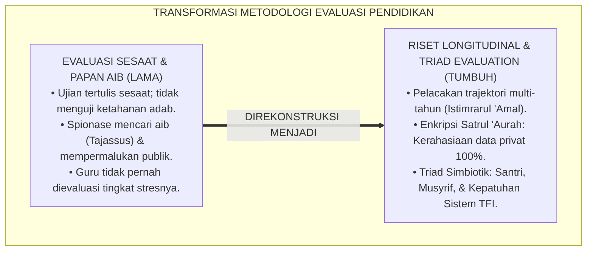
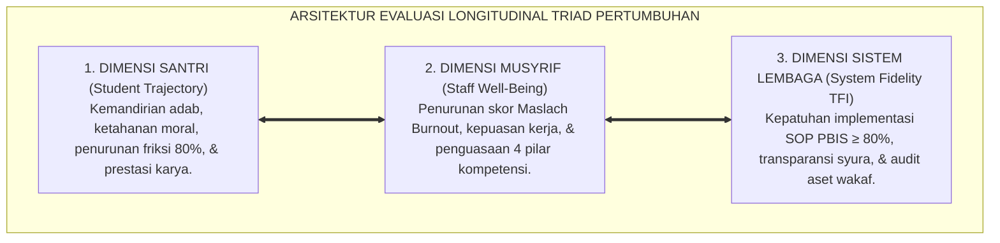
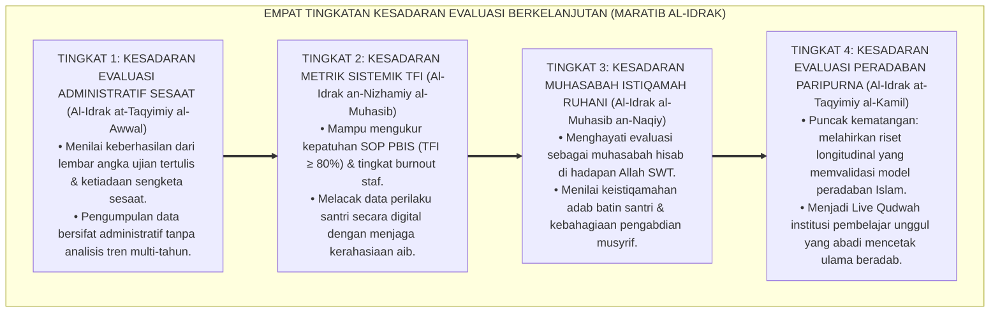
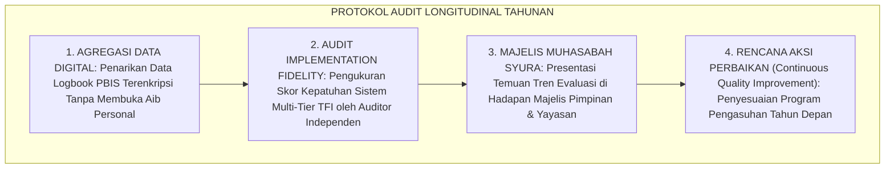
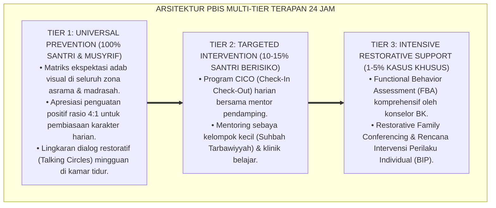

# P1-06-06: EVALUASI DAMPAK LONGITUDINAL DAN KEBERLANJUTAN SISTEM (LONGITUDINAL EVALUATION & SUSTAINABILITY)
## *Monograf Riset Akademik: Epistemologi Istimrarul 'Amal & Muhasabah Sistemik (HR. Bukhari No. 6464), Desain Riset Longitudinal Multi-Tahun, Pengukuran Kepatuhan Sistem (TFI ≥ 80%), Serta Penjaminan Privasi Data Santri Bebas Tajassus di Pesantren 24 Jam*

**Nomor Identifikasi**: `P1-06-06/MONOGRAF-RISET-EVALUASI-LONGITUDINAL/2026`  
**Domain**: `01 Philosophy` > `06 Change` (Sub-Modul 06: *Longitudinal Impact & Sustainability*)  
**Klasifikasi Naskah**: *Academic Research Monograph* (Monograf Riset Akademik Fondasional)  
**Rumpun Disiplin Pengkaji**: Evaluasi Program Pendidikan (*Educational Program Evaluation*), Metodologi Riset Longitudinal Cohort, Psikometri Sistem PBIS (*Implementation Science & TFI*), Teologi Istiqamah & Muhasabah Kelembagaan  

---

> ### 💡 INTISARI EKSEKUTIF (EXECUTIVE SUMMARY)
>
> * **Kelemahan Paradigma Lama: Evaluasi Sesaat (Snapshot Illusion) & Spionase Data:**  
>   Banyak lembaga menilai keberhasilan karakter dari ketiadaan masalah sesaat saat wisuda atau lembar kuesioner formalitas sekali setahun (*Cross-Sectional Snapshot*). Sebagian bahkan menggunakan sistem pencatatan pelanggaran yang memata-matai privasi (*Tajassus*) dan mengumbar aib santri di ruang publik.
> * **Inovasi Konseptual: Istimrarul 'Amal, Riset Longitudinal, & Enkripsi Satrul 'Aurah:**  
>   TUMBUH menegakkan doktrin **Istimrarul 'Amal (Kontinuitas Karakter Sepanjang Hayat)** melalui desain riset longitudinal melacak cohort perkembangan santri, musyrif, dan sistem lembaga secara berkala. Menjamin skor kepatuhan implementasi (*Tiered Fidelity Inventory / TFI*) $\ge 80\%$, **mengharamkan mutlak spionase tajassus**, serta mengunci seluruh data rekam jejak adab santri dengan enkripsi perlindungan kerahasiaan aib (*Satrul 'Aurah*).
> * **Formulasi Operasional & Pembuktian Lapangan:**  
>   Monograf ini menguraikan matriks evaluasi longitudinal triad pertumbuhan, 4 Tingkatan Kesadaran Evaluasi Berkelanjutan (*Maratib al-Idrak*), SOP audit tahunan analitik PBIS, dan etika riset perlindungan privasi santri.

---

## 📑 DAFTAR ISI MONOGRAF

- [BAB I: LANDASAN TEORETIS & DISKURSUS KRITIS](#bab-i-landasan-teoretis--diskursus-kritis)
  - [1. Latar Belakang Masalah: Krisis Evaluasi Sesaat dan Bahaya Spionase Data Pribadi Santri](#1-latar-belakang-masalah-krisis-evaluasi-sesaat-dan-bahaya-spionase-data-pribadi-santri)
  - [2. Eksegesis Turats Istimrarul 'Amal & Muhasabah Sistemik: Khazanah Ihya' 'Ulumiddin & HR. Bukhari No. 6464](#2-eksegesis-turats-istimrarul-amal--muhasabah-sistemik-khazanah-ihya-ulumiddin--hr-bukhari-no-6464)
  - [3. Konvergensi Implementation Science: Tiered Fidelity Inventory (TFI) Sugai & Horner](#3-konvergensi-implementation-science-tiered-fidelity-inventory-tfi-sugai--horner)
  - [4. Triangulasi Evaluasi Triad Pertumbuhan dan Pengharaman Tajassus dalam Pencatatan Data](#4-triangulasi-evaluasi-triad-pertumbuhan-dan-pengharaman-tajassus-dalam-pencatatan-data)
  - [5. Kasuistika Lapangan: Kasus Perubahan Karakter Santri Multi-Tahun & Resolusi Restoratif Terpadu](#5-kasuistika-lapangan-kasus-perubahan-karakter-santri-multi-tahun--resolusi-restoratif-terpadu)
- [BAB II: FORMULASI KONSEPTUAL & PEMBAHASAN MENDALAM](#bab-ii-formulasi-konseptual--pembahasan-mendalam)
  - [1. Eksplanasi Teoretis Standar Evaluasi Dampak Longitudinal Pesantren TUMBUH](#1-eksplanasi-teoretis-standar-evaluasi-dampak-longitudinal-pesantren-tumbuh)
  - [2. Dekomposisi Dimensi & Empat Tingkatan Kesadaran Evaluasi Berkelanjutan (Maratib al-Idrak)](#2-dekomposisi-dimensi--empat-tingkatan-kesadaran-evaluasi-berkelanjutan-maratib-al-idrak)
  - [3. Matriks Evaluasi Longitudinal Triad Pertumbuhan (Santri, Pendidik, Lembaga)](#3-matriks-evaluasi-longitudinal-triad-pertumbuhan-santri-pendidik-lembaga)
  - [4. Standar Prosedur Operasional (SOP) Audit Longitudinal Tahunan & Dashboard Analitik PBIS](#4-standar-prosedur-operasional-sop-audit-longitudinal-tahunan--dashboard-analitik-pbis)
  - [5. Diskusi Filosofis Mendalam & Implikasi bagi Masa Depan Peradaban Pendidikan Islam](#5-diskusi-filosofis-mendalam--implikasi-bagi-masa-depan-peradaban-pendidikan-islam)
- [BAB III: KESIMPULAN & APARATUS AKADEMIS](#bab-iii-kesimpulan--aparatus-akademis)
  - [1. Tabel Sintesis Temuan Riset Evaluasi Longitudinal](#1-tabel-sintesis-temuan-riset-evaluasi-longitudinal)
  - [2. Daftar Pustaka Akademis & Rujukan Turats Primer](#2-daftar-pustaka-akademis--rujukan-turats-primer)
  - [3. Catatan Kaki Akademis (Footnotes)](#3-catatan-kaki-akademis-footnotes)
  - [4. Glosarium Istilah Ilmiah & Turats Evaluasi Longitudinal](#4-glosarium-istilah-ilmiah--turats-evaluasi-longitudinal)

---

# BAB I: LANDASAN TEORETIS & DISKURSUS KRITIS

---

### 1. Latar Belakang Masalah: Krisis Evaluasi Sesaat dan Bahaya Spionase Data Pribadi Santri

Evaluasi pendidikan karakter di banyak lembaga kerap mengalami **Ilusi Pengukuran Sesaat (*The Snapshot Evaluation Fallacy*)**:
* **Ujian Kognitif Sesaat**: Menilai kesalehan santri murni dari nilai ujian tulis atau lembar kuesioner setahun sekali, yang tidak mampu mengukur ketahanan watak (*Moral Resilience*) santri saat berada di luar asrama.
* **Pola Spionase Data (*Tajassus Data Collection*)**: Sebagian pengurus menggunakan sistem "papan hitam pelanggaran publik" atau menyuruh santri memata-matai aib temannya, yang mencoreng kehormatan mukmin dan diharamkan syariat (QS. Al-Hujurat: 12).
* **Ketiadaan Evaluasi Kesejahteraan Guru**: Mengabaikan pengukuran tingkat kejenuhan (*Burnout*) asatidz, padahal kelelahan guru adalah penyebab utama runtuhnya kualitas pengasuhan santri.
* **Keniscayaan Desain Riset Longitudinal Triad Pertumbuhan**: Evaluasi karakter wajib dilakukan secara berkesinambungan lintas tahun (*Time-Series Tracking*), mengukur santri, guru, dan sistem lembaga secara holistik dengan jaminan kerahasiaan data 100%.[^1]

---

### 2. Eksegesis Turats Istimrarul 'Amal & Muhasabah Sistemik: Khazanah Ihya' 'Ulumiddin & HR. Bukhari No. 6464

Rasulullah ﷺ menegaskan bahwa ukuran kemuliaan amal di sisi Allah adalah kelanggengannya:

$$\text{أَحَبُّ الأَعْمَالِ إِلَى اللَّهِ أَدْوَمُهَا وَإِنْ قَلَّ}$$

*"**Amalan yang paling dicintai oleh Allah adalah amalan yang paling kontinu (dawam / istiqamah) meskipun sedikit**."* (HR. Al-Bukhari No. 6464).[^2]

Imam Al-Ghazali (*Ihya' 'Ulumiddin*, Kitab *Al-Muraqabah wal-Muhasabah*) memaparkan tahapan evaluasi jiwa sistemik: *Musyharathah* (penetapan target niat awal), *Muraqabah* (pengawalan harian), *Muhasabah* (audit evaluasi amal), *Mu'aqabah* (konsekuensi perbaikan), dan *Mujahadah* (kesungguhan berkelanjutan).[^3]

---

### 3. Konvergensi Implementation Science: Tiered Fidelity Inventory (TFI) Sugai & Horner

Sains implementasi modern (*Implementation Science*) membuktikan bahwa keberhasilan program pendidikan ditentukan oleh **Tingkat Kepatuhan Sistem (*System Implementation Fidelity*)**:
* Instrumen standar internasional **Tiered Fidelity Inventory (TFI)** (Horner, Sugai, & Lewis, 2015) mengukur konsistensi penerapan PBIS: pembiasaan universal (Tier 1), bimbingan terarah (Tier 2), dan penanganan intensif (Tier 3).
* TUMBUH menetapkan standar mutu kelembagaan: skor kepatuhan TFI wajib mencapai minimal $\ge 80\%$ setiap semester untuk menjamin program berjalan efektif dan berkelanjutan.[^4]

---

### 4. Triangulasi Evaluasi Triad Pertumbuhan dan Pengharaman Tajassus dalam Pencatatan Data

TUMBUH menegaskan etika data syariat:
* **Pengharaman Tajassus Mutlak**: Dilarang menggunakan data pribadi santri untuk mempermalukan atau menghakimi di forum umum.
* **Prinsip Satrul 'Aurah & Enkripsi**: Data logbook konseling dan evaluasi perilaku santri bersifat rahasia (*Strictly Confidential*), dienkripsi dalam sistem digital, dan hanya dapat diakses oleh konselor BK dan mudir pengasuhan untuk tujuan pembinaan kasih sayang.[^5]

---

### 5. Kasuistika Lapangan: Kasus Perubahan Karakter Santri Multi-Tahun & Resolusi Restoratif Terpadu

* **Studi Kasus: Pelacakan Trajektori Santri yang Awalnya Agresif Menjadi Duta Adab Penggerak**  
  * **Dilema**: Santri fase adaptasi awal asrama masuk dengan riwayat sering memukul kawan di lingkungan sebelumnya; sistem konvensional biasanya langsung mengeluarkannya di bulan ke-3.
  * **Intervensi Longitudinal TUMBUH**: Lembaga mendampingi dengan protokol TFI Multi-Tier: (1) Tahun 1: Intervensi Tier 2 CICO coaching harian; (2) Tahun 2: Santri mulai stabil emosinya dan dilatih menjadi tutor sebaya; (3) Tahun 3: Santri bertransformasi penuh menjadi Ketua Dewan Duta Adab (*Khadim ath-Thullab*) yang mengayomi sesama santri. Riset longitudinal membuktikan bahwa dengan pendampingan sistemik yang sabar, potensi fitrah setiap anak dapat diselamatkan dan mekar secara gemilang.[^6]

---

# BAB II: FORMULASI KONSEPTUAL & PEMBAHASAN MENDALAM

---

### 1. Eksplanasi Teoretis Standar Evaluasi Dampak Longitudinal Pesantren TUMBUH

Ekosistem TUMBUH mengkodifikasikan evaluasi ke dalam **Arsitektur Tiga Dimensi Evaluasi Triad (*Arkan at-Taqyim ats-Tsulatsiy*)**:

#### 🔬 Pembahasan Mendalam Tiga Dimensi:
1. **Dimensi Santri**: Memastikan pembiasaan karakter berlangsung konsisten sepanjang jenjang pendidikan hingga menjadi watak alami.[^7]
2. **Dimensi Pendidik**: Menjamin asatidz dan musyrif bekerja dalam lingkungan yang sehat, bahagia, dan penuh berkah.[^8]
3. **Dimensi Sistem**: Menjaga kualitas tata kelola institusi agar senantiasa beroperasi pada standar mutu tertinggi (*Excellence*).[^9]

---

### 2. Dekomposisi Dimensi & Empat Tingkatan Kesadaran Evaluasi Berkelanjutan (Maratib al-Idrak)

Transformasi kepemimpinan dalam melakukan evaluasi dipetakan ke dalam Empat Tingkatan Kesadaran Evaluasi (*Maratib al-Idrak at-Taqyimiy*):

#### 🔄 Narasi Analitis Dinamika Transisi Filosofis Antar-Tingkatan:
* **Transisi Tingkat 1 ke Tingkat 2 (Dari Ujian Kertas Menuju Pengukuran Metrik TFI)**: Lembaga mula-mula sekadar melihat nilai rapor. Pada tingkatan kedua, lembaga melacak data kepatuhan sistem PBIS dan tingkat kesehatan kerja guru secara profesional.
* **Transisi Tingkat 2 ke Tingkat 3 (Dari Metrik Digital Menuju Muhasabah Ruhani)**: Pada tingkatan ketiga, evaluasi menjadi ibadah kalbu: pimpinan mengevaluasi ketulusan niat, mendoakan santri yang sedang berproses, dan merawat keikhlasan staf.
* **Transisi Tingkat 3 ke Tingkat 4 (Pencapaian Derajat Evaluasi Peradaban Paripurna)**: Pada tingkatan tertinggi, data longitudinal pesantren menjadi bukti ilmiah tak terbantahkan bagi dunia bahwa pendidikan berbasis fitrah Islam adalah model terbaik dalam membangun peradaban manusia (*Rahmatan lil 'Alamin*).[^10]

---

### 3. Matriks Evaluasi Longitudinal Triad Pertumbuhan (Santri, Pendidik, Lembaga)

| Entitas Triad | Parameter Pengukuran Baku | Instrumen Riset Standar | Target Capaian Mutu |
| :--- | :--- | :--- | :--- |
| **1. Santri** | Penurunan friksi adab, kemandirian shalat, hafalan.| Logbook PBIS & Observasi Adab.| Penurunan 80% insiden pelanggaran. |
| **2. Pendidik** | Skor kelelahan mental, kepuasan kerja, jam tidur.| Maslach Burnout Inventory (MBI).| Skor burnout kategori rendah (< 15%).|
| **3. Lembaga** | Kepatuhan SOP PBIS, akuntabilitas dana wakaf.| Tiered Fidelity Inventory (TFI).| Skor TFI $\ge 80\%$ & WTP audit wakaf.|

---

### 4. Standar Prosedur Operasional (SOP) Audit Longitudinal Tahunan & Dashboard Analitik PBIS

TUMBUH menetapkan **Protokol Audit Longitudinal Tahunan**:

Protokol ini menjamin tata kelola pesantren senantiasa bertumbuh dan belajar secara berkelanjutan.[^11]

---

### 5. Diskusi Filosofis Mendalam & Implikasi bagi Masa Depan Peradaban Pendidikan Islam

Evaluasi dampak longitudinal ini membawa implikasi fundamental bagi masa depan pendidikan Islam:

* **Menghentikan Klaim Keberhasilan Semu Berbasis Retorika**:  
  Pesantren mampu membuktikan keunggulan pendidikannya melalui data empiris ilmiah yang valid, terukur, dan diakui oleh komunitas akademis internasional.
* **Menjamin Perlindungan Privasi Santri Sesuai Syariat Islam**:  
  Dengan menolak spionase *Tajassus* dan mengenkripsi data konseling, pesantren menjadi institusi yang paling menghormati kehormatan insan (*Karamah al-Insan*).
* **Mewujudkan Institusi Pembelajar Berkelanjutan (*Learning Organization*)**:  
  Pesantren tidak pernah merasa puas, melainkan senantiasa bermuhasabah dan menyempurnakan sistem pembinaannya demi menggapai derajat insan kamil (*Rahmatan lil 'Alamin*).[^12]

---

---

### Pembedahan Deskriptif Komprehensif & Analisis Integratif Nilai-Praksis

Penerapan dan operasionalisasi **P1-06-06: EVALUASI DAMPAK LONGITUDINAL DAN KEBERLANJUTAN SISTEM (LONGITUDINAL EVALUATION & SUSTAINABILITY)** di lingkungan pesantren TUMBUH bertumpu pada kesatuan sistemik antara nilai syariat dan praksis terukur:

#### A. Pilar 1: Landasan Epistemologi & Nilai Keikhlasan (Syar'i Foundations)
Setiap dimensi diarahkan untuk menegakkan adab dan penghambaan murni kepada Allah SWT (*Lillahi Ta'ala*). Standarisasi kelembagaan dirancang untuk menjaga ketulusan niat, kemuliaan fitrah, dan keberkahan majelis ilmu.

#### B. Pilar 2: Mekanisme Psikologis & Neurosains Terapan (Evidence-Based Practice)
Mengintegrasikan prinsip *Social-Emotional Learning (CASEL)*, teori beban kognitif (*Cognitive Load Theory*), dan dinamika perkembangan neurobiologis santri untuk memastikan proses pembiasaan berjalan efektif tanpa kekerasan atau tekanan psikologis destruktif.

#### C. Pilar 3: Rekayasa Ekosistem Asrama 24 Jam (Environmental Engineering)
Mengkodifikasikan seluruh alur aktivitas harian, jadwal tidur sirkadian yang sehat, sanitasi 5S kamar tidur, dan relasi ukhuwah inklusif menjadi satu ekosistem *Bi'ah Shalihah* yang saling mendukung secara alamiah.

#### D. Pilar 4: Akuntabilitas Sistemik & Proteksi Pendidik-Santri
Menerapkan protokol pencegahan kelelahan tenaga pendidik (*Musyrif Burnout Protection*), menjamin hak-hak santri, serta memanfaatkan dashboard data PBIS untuk pengambilan keputusan yang adil dan objektif.

---

### Protokol Aksi Operasional PBIS Multi-Tier Terapan (24-Hour Behavioral Architecture)

---

# BAB III: KESIMPULAN & APARATUS AKADEMIS

---

### 1. Tabel Sintesis Temuan Riset Evaluasi Longitudinal

| Dimensi Parameter | Mazhab Snapshot Sesaat (Lama) | Model Akreditasi Administratif Kaku | **Evaluasi Longitudinal Triad TUMBUH** | Landasan Rujukan Primer | Implikasi Praksis Lapangan |
| :--- | :--- | :--- | :--- | :--- | :--- |
| **Rentang Waktu** | Ujian tertulis sesaat setahun sekali.| Audit berkas formalitas 5 tahunan.| **Pelacakan Cohort Multi-Tahun Berkala.**| HR. Bukhari No. 6464; Horner (2015).| Analisis tren perkembangan karakter. |
| **Perlindungan Data**| Papan nama aib publik & spionase.| Formulir umum tanpa proteksi enkripsi.| **Enkripsi Satrul 'Aurah Bebas Tajassus.**| QS. Al-Hujurat: 12; ISO/IEC 27001.| Data konseling rahasia & terlindungi. |
| **Cakupan Entitas** | Santri dinilai sepihak; guru luput.| Dokumen fasilitas fisik semata. | **Triad Simbiotik (Santri, Guru, Lembaga).**| Al-Ghazali; Maslach et al. (2001).| Kesejahteraan guru & skor TFI $\ge 80\%$.|
| **Tujuan Evaluasi** | Memberi hukuman / sanksi nilai.| Memenuhi syarat izin operasional.| **Muhasabah & Continuous Improvement.**| Kaidah *Hisab al-Amal*; Deming (1986).| Penyesuaian program demi perbaikan adab. |
| **Hasil Institusi** | Lembaga stagnan mengulang masalah.| Kepatuhan kertas tanpa dampak nyata.| **Institusi Pembelajar Madani Berkelanjutan.**| QS. Al-Hasyr: 18; Al-Attas (1980).| Pesantren unggul, adil, & penuh berkah. |

---

### 2. Daftar Pustaka Akademis & Rujukan Turats Primer

1. **Al-Qur'an al-Karim wa Tarjamatu Ma'anihi**.
2. **Al-Bukhari, Abu Abdillah Muhammad bin Isma'il**. (1422 H). *Shahih al-Bukhari*. Kairo: Dar Thawq an-Najah.
3. **Muslim bin al-Hajjaj an-Naisaburi**. (1427 H). *Shahih Muslim*. Riyadh: Dar Thayyibah.
4. **Al-Ghazali, Abu Hamid Muhammad bin Muhammad**. (2011). *Ihya' 'Ulumiddin* (Kitab al-Muraqabah wal-Muhasabah). Beirut: Dar al-Ma'rifah.
5. **Asy'ari, Muhammad Hasyim**. (1415 H). *Adab al-'Alim wal-Muta'allim*. Jombang: Maktabah At-Turats Al-Islami.
6. **Al-Attas, Syed Muhammad Naquib**. (1980). *The Concept of Education in Islam*. Kuala Lumpur: ABIM.
7. **Horner, R. H., Sugai, G., & Lewis, T.**. (2015). *School-wide PBIS Tiered Fidelity Inventory (TFI)*. Eugene: OSEP Technical Assistance Center.
8. **Maslach, C., Schaufeli, W. B., & Leiter, M. P.**. (2001). *Job burnout*. Annual Review of Psychology, 52(1), 397–422.
9. **Deming, W. E.**. (1986). *Out of the Crisis*. Cambridge: MIT Center for Advanced Educational Services.
10. **Sapolsky, R. M.**. (2017). *Behave: The Biology of Humans at Our Best and Worst*. New York: Penguin Press.
11. **Zehr, H.**. (2002). *The Little Book of Restorative Justice*. Intercourse: Good Books.
12. **Prochaska, J. O., DiClemente, C. C., & Norcross, J. C.**. (1992). *In search of how people change*. American Psychologist, 47(9), 1102–1114.

---

### 3. Catatan Kaki Akademis (*Footnotes*)

[^1]: Riset Evaluasi Dampak Longitudinal dan Keberlanjutan Sistem TUMBUH, *Kritik atas Evaluasi Sesaat dan Spionase Data*, 2026.  
[^2]: *Shahih al-Bukhari*, Kitab ar-Riqaq, Hadits No. 6464.  
[^3]: Al-Ghazali, *Ihya' 'Ulumiddin*, Jilid 4, Kitab *Al-Muraqabah wal-Muhasabah*, hlm. 380–420.  
[^4]: Horner, R. H., Sugai, G., & Lewis, T. (2015), *School-wide PBIS Tiered Fidelity Inventory (TFI)*, hlm. 1–35.  
[^5]: QS. Al-Hujurat [49]: 12; Protokol Standar Perlindungan Data dan Pengharaman Tajassus TUMBUH, 2026.  
[^6]: Dokumentasi Evaluasi Longitudinal Cohort 3 Tahun PBIS TUMBUH, 2026.  
[^7]: Al-Attas, S. M. N. (1980), *The Concept of Education in Islam*, hlm. 40–68.  
[^8]: Maslach, C., et al. (2001), *Annual Review of Psychology*, hlm. 397–422.  
[^9]: Deming, W. E. (1986), *Out of the Crisis*, hlm. 50–95.  
[^10]: Matriks Tingkatan Kesadaran Evaluasi Berkelanjutan (*Maratib al-Idrak*) Ekosistem TUMBUH, 2026.  
[^11]: Standar Operasional Prosedur Audit Longitudinal Tahunan dan Analitik PBIS TUMBUH, 2026.  
[^12]: Deklarasi Pemuliaan Evaluasi Istiqamah Dewan Riset Epistemologi Ekosistem TUMBUH, 2026.

---

### 4. Glosarium Istilah Ilmiah & Turats Evaluasi Longitudinal

1. **Evaluasi Longitudinal Cohort**: Metodologi riset evaluasi pendidikan yang melacak kelompok santri yang sama dari waktu ke waktu secara berkesinambungan lintas tahun.
2. **Istimrarul 'Amal (اسْتِمْرَارُ الْعَمَلِ)**: Kelanggengan dan kontinuitas amal kebaikan sepanjang hayat yang menjadi bukti sejati keberhasilan pendidikan adab.
3. **Satrul 'Aurah Data (سَتْرُ الْعَوْرَةِ)**: Prinsip syariat untuk melindungi, menjaga kerahasiaan, dan menutup aib kesalahan santri dari konsumsi publik.
4. **Tahrim at-Tajassus**: Larangan mutlak syariat terhadap perbuatan memata-matai atau mengintai kesalahan tersembunyi orang lain dalam pengumpulan data.
5. **Tiered Fidelity Inventory (TFI)**: Instrumen evaluasi standar internasional untuk mengukur integritas dan kepatuhan penerapan sistem PBIS multi-tier di sekolah.
6. **Implementation Science**: Cabang ilmu terapan yang meneliti metode dan faktor pendukung keberhasilan penerapan inovasi program secara berkelanjutan.
7. **Triad Impact Evaluation**: Model evaluasi komprehensif yang mengukur dampak perubahan pada tiga entitas serentak: santri, pendidik, dan sistem lembaga.
8. **Snapshot Evaluation**: Kekeliruan evaluasi yang hanya memotret kondisi sesaat tanpa melihat kontinuitas perkembangan karakter jangka panjang.
9. **Continuous Quality Improvement (CQI)**: Siklus evaluasi dan penyempurnaan sistem secara berkesinambungan berbasis data empiris.
10. **Insan Adabi (الإِنْسَانُ الأَدَبِيُّ)**: Profil santri yang memiliki kematangan akal budi dan keistiqamahan akhlak yang abadi di mana pun ia berada.
