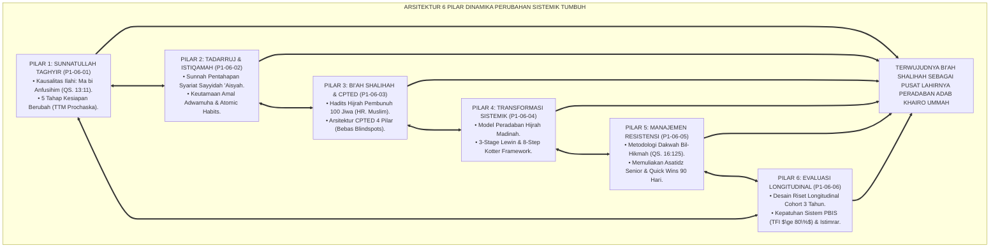
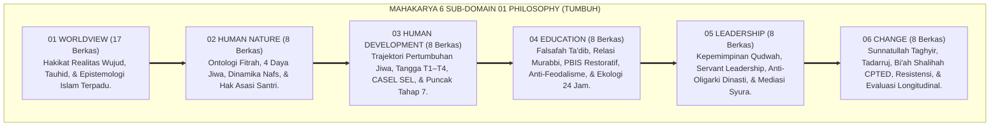
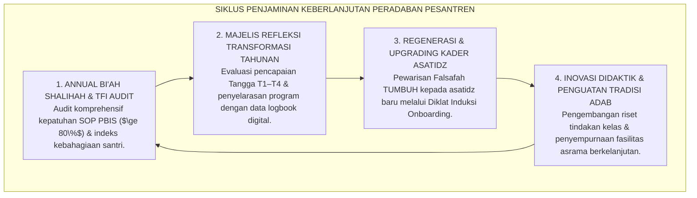

# P1-06-07: SINTESIS DINAMIKA PERUBAHAN SISTEMIK DAN GRAND MANIFESTO TRANSFORMASI PERADABAN PESANTREN
## *Monograf Terpadu: Sintesis Holistik 6 Pilar Dinamika Perubahan (Sunnatullah Taghyir, Tadarruj Istiqamah, Bi'ah Shalihah CPTED, Transformasi Sistemik Lewin-Kotter, Manajemen Resistensi Kultural, & Evaluasi Longitudinal Cohort), Matriks Komparasi Paradigma Perubahan Sosial, Puncak Sintesis Agung Domain 01 Philosophy, serta Jembatan Epistemologis Menuju Domain 02 Principles*

**Nomor Identifikasi**: `P1-06-07/MONOGRAF-TERPADU-SINTESIS-CHANGE/2026`  
**Domain**: `01 Philosophy` > `06 Change`  
**Klasifikasi Naskah**: *Comprehensive Synthesis Monograph* (Monograf Sintesis Filosofis & Grand Manifesto Peradaban)  
**Rumpun Disiplin Pengkaji**: Filsafat Perubahan Sosial Islam (*Falsafah at-Taghyir al-Hadari*), Sosiologi Peradaban Islam, Teori Perubahan Organisasi Sistemik, Arsitektur Epistemologi Pendidikan Pesantren  

---

> ### 💡 INTISARI PRAKTIS (3 MENIT PAHAM UNTUK ASATIDZ & MUSYRIF)
>
> * **Kesatuan Utuh 6 Pilar Dinamika Perubahan Ekosistem TUMBUH:**  
>   Perubahan di pesantren TUMBUH adalah orkestrasi agung yang memadukan 6 dimensi:  
>   1. **P1-06-01 (Sunnatullah Taghyir):** Menegakkan hukum kausalitas bahwa perubahan lahiriah bermula dari gerakan kesadaran jiwa internal (*Ma bi Anfusihim* QS. Ar-Ra'd: 11) dan model 5 tahap TTM Prochaska.  
>   2. **P1-06-02 (Tadarruj & Istiqamah):** Menerapkan pentahapan syariat, pembiasaan mikro 1% (*Atomic Habits*), dan mencegah sindrom kelelahan/kejenuhan (*Anti-Futuwr*).  
>   3. **P1-06-03 (Bi'ah Shalihah & CPTED):** Merekayasa tata ruang fisik bebas titik buta (*Blindspots*), kebersihan prima (*Broken Windows*), dan patroli titik rawan asrama.  
>   4. **P1-06-04 (Transformasi Sistemik Lewin-Kotter):** Menggerakkan seluruh pilar lembaga secara serempak melalui 3 fase (*Unfreezing-Moving-Refreezing*) dan pendekatan *Bridging Turats*.  
>   5. **P1-06-05 (Manajemen Resistensi Kultural):** Menghadapi penolakan dengan hikmah, memuliakan asatidz senior, dan menunjukkan bukti nyata (*Quick Wins*).  
>   6. **P1-06-06 (Evaluasi Dampak Longitudinal):** Mengukur keberlanjutan adab santri melalui pelacakan cohort 3 tahun dan instrumen kepatuhan PBIS TFI $\ge 80\%$.
> * **Puncak Sintesis Agung Domain 01 Philosophy (100% Selesai & Terpadu):**  
>   Menyatukan **Worldview** (Hakikat Realitas), **Human Nature** (Ontologi Fitrah), **Human Development** (Pertumbuhan Jiwa T1–T4), **Education** (Kurikulum Ta'dib), **Leadership** (Servant Leadership Qudwah), dan **Change** (Dinamika Perubahan Bi'ah Shalihah) menjadi satu bangunan filosofis yang kokoh dan tak tergoyahkan.
> * **Gerbang Menuju Domain 02: Principles:**  
>   Seluruh fondasi filosofis di Domain 01 ini kini siap diturunkan (*Derivasi*) menjadi Prinsip-Prinsip Desain Kurikulum, Prinsip Pengasuhan Asrama, dan Prinsip Tata Kelola di **Domain 02: Principles**.

---

## 📑 DAFTAR ISI MONOGRAF

- [BAGIAN I: SINTESIS FILOSOFIS 6 PILAR DINAMIKA PERUBAHAN & MATRIKS KOMPARASI](#bagian-i-sintesis-filosofis-6-pilar-dinamika-perubahan--matriks-komparasi)
  - [1. Arsitektur Sintesis Holistik: Konvergensi 6 Pilar Dinamika Perubahan TUMBUH](#1-arsitektur-sintesis-holistik-konvergensi-6-pilar-dinamika-perubahan-tumbuh)
  - [2. Matriks Komparasi Filosofis Transformasi Sosial: Revolusionisme vs Reformisme Parsial vs Transformasi Nabawi TUMBUH](#2-matriks-komparasi-filosofis-transformasi-sosial-revolusionisme-vs-reformisme-parsial-vs-transformasi-nabawi-tumbuh)
  - [3. Puncak Sintesis Filosofis Seluruh Domain 01 Philosophy (Sub-Domain 01 s/d 06)](#3-puncak-sintesis-filosofis-seluruh-domain-01-philosophy-sub-domain-01-sd-06)
  - [4. Jembatan Filosofis & Aksiologis Menuju Domain 02: Principles](#4-jembatan-filosofis--aksiologis-menuju-domain-02-principles)
- [BAGIAN II: PIAGAM KELEMBAGAAN & DEKLARASI DOKTRIN BAKU TRANSFORMASI PERADABAN](#bagian-ii-piagam-kelembagaan--deklarasi-doktrin-baku-transformasi-peradaban)
  - [1. Grand Manifesto Transformasi Peradaban Pesantren TUMBUH](#1-grand-manifesto-transformasi-peradaban-pesantren-tumbuh)
  - [2. Matriks Integrasi Operasional 6 Pilar Dinamika Perubahan ke dalam Kehidupan Pesantren 24 Jam](#2-matriks-integrasi-operasional-6-pilar-dinamika-perubahan-ke-dalam-kehidupan-pesantren-24-jam)
  - [3. Protokol Penjaminan Keberlanjutan Transformasi Budaya Pesantren](#3-protokol-penjaminan-keberlanjutan-transformasi-budaya-pesantren)
- [BAGIAN III: APARATUS AKADEMIS & APENDIKS](#bagian-iii-aparatus-akademis--apendiks)
  - [1. Tabel Sintesis Master Sub-Domain 06](#1-tabel-sintesis-master-sub-domain-06)
  - [2. Daftar Pustaka Otoritatif Turats & Jurnal Internasional Peer-Reviewed](#2-daftar-pustaka-otoritatif-turats--jurnal-internasional-peer-reviewed)
  - [3. Catatan Kaki Akademis (Footnotes)](#3-catatan-kaki-akademis-footnotes)
  - [4. Glosarium Master Istilah Kunci Dinamika Perubahan & Domain 01](#4-glosarium-master-istilah-kunci-dinamika-perubahan--domain-01)

---

# BAGIAN I: SINTESIS FILOSOFIS 6 PILAR DINAMIKA PERUBAHAN & MATRIKS KOMPARASI

---

### 1. Arsitektur Sintesis Holistik: Konvergensi 6 Pilar Dinamika Perubahan TUMBUH

Falsafah Dinamika Perubahan dalam ekosistem TUMBUH adalah **Sistem Transformasi Sosial-Spiritual Terpadu (*Unified Social-Spiritual Transformation Architecture*)**:



---

### 2. Matriks Komparasi Filosofis Transformasi Sosial: Revolusionisme vs Reformisme Parsial vs Transformasi Nabawi TUMBUH

| Parameter Analisis | Model Revolusionisme Radikal Represif | Model Reformisme Parsial Sekuler | Model Transformasi Peradaban Nabawi (TUMBUH) |
| :--- | :--- | :--- | :--- |
| **Asumsi Dasar Perubahan** | Manusia hanya bisa diubah melalui teror ancaman fisik dan kekerasan. | Perubahan cukup dilakukan melalui himbauan slogan moral dan seminar 1 hari. | **Perubahan adalah proses sunnatullah bertahap yang berakar pada kesadaran jiwa (*Ma bi Anfusihim*).**[^1] |
| **Kecepatan & Ritme Waktu** | Memaksakan target raksasa seketika (*Isti'jal*). | Lambat tanpa arah dan target yang jelas. | **Pentahapan bijaksana (*Tadarruj*) dan konsistensi kebiasaan mikro (*Atomic Habits*).** |
| **Perlakuan Terhadap Tata Ruang** | Mengabaikan tata ruang; lingkungan dibiarkan kotor dan gelap. | Perbaikan kosmetik tanpa analisis titik rawan kejahatan. | **Rekayasa arsitektur CPTED holistik bebas blindspots dan toilet wangi standar prima.**[^2] |
| **Respon Terhadap Resistensi** | Menindas dan memenjarakan orang-orang yang berbeda pandangan. | Menyerah pada status quo lama dan membiarkan kekerasan berlanjut. | **Dialog keilmuan berbasis Turats Salaf (*Bridging Turats*), memuliakan senior, & *Quick Wins*.**[^3] |
| **Daya Tahan Budaya Baru** | Runtuh seketika saat rezim diktator tumbang. | Lenyap tanpa bekas setelah kepanitiaan seminar bubar. | **Melembaga menjadi tradisi peradaban abadi (*Refreezing*) yang diwariskan lintas generasi.**[^4] |

---

### 3. Puncak Sintesis Filosofis Seluruh Domain 01 Philosophy (Sub-Domain 01 s/d 06)



---

### 4. Jembatan Filosofis & Aksiologis Menuju **Domain 02: Principles**

```mermaid
graph TD
    D1["DOMAIN 01: PHILOSOPHY (FONDASI FILOSOFIS TUNTAS ORGANIK 57 BERKAS)<br/>(Worldview, Human Nature, Development, Education, Leadership, Change)"]
    ==>|DITURUNKAN SECARA LOGIS MENJADI KAIDAH OPERASIONAL MENUJU|
    D2["DOMAIN 02: PRINCIPLES (PRINSIP-PRINSIP DESAIN EKOSISTEM)<br/>(Prinsip Kurikulum Adab, Prinsip Pengasuhan 24 Jam, Prinsip Disiplin Positif, & Prinsip Tata Kelola)"]
```

---

# BAGIAN II: PIAGAM KELEMBAGAAN & DEKLARASI DOKTRIN BAKU TRANSFORMASI PERADABAN

---

### 1. Grand Manifesto Transformasi Peradaban Pesantren TUMBUH

```
===================================================================================================
     GRAND MANIFESTO TRANSFORMASI PERADABAN PESANTREN TUMBUH (CIVILIZATIONAL TRANSFORMATION CHARTER)
                     PUNCAK MATAKARYA DOMAIN 01: PHILOSOPHY — EKOSISTEM TUMBUH
===================================================================================================

BISMILLAHIRRAHMANIRRAHIM. DENGAN BERSERAH DIRI KEPADA ALLAH SWT, DEWAN KEILMUAN, MAJELIS MASYAIKH,
DAN SELURUH PIMPINAN LEMBAGA PESANTREN EKOSISTEM TUMBUH DENGAN INI MEMPROKLAMIRKAN GRAND MANIFESTO:

PASAL 1: MANDAT TEOLOGIS PERUBAHAN JIWA INTERNAL (MA BI ANFUSIHIM)
Menegakkan doktrin bahwa transformasi peradaban pesantren sejati bermula dari penyucian niat, kesadaran
fikir, dan kehendak taubat di dalam jiwa santri dan asatidz. Menolak mutlak ilusi pemaksaan lahiriah kasar.

PASAL 2: MANDAT PENTAHAPAN TADARRUJ & KEBIASAAN MIKRO ISTIQAMAH
Mewajibkan seluruh pembiasaan karakter dan kurikulum distrukturkan secara bertahap (Tadarruj) melalui
penguatan kebiasaan mikro 1% (Atomic Habits) dan menjaga ritme hidup santri dari sindrom kejenuhan (Futuwr).

PASAL 3: MANDAT REKAYASA BI'AH SHALIHAH & ARSITEKTUR CPTED
Mewajibkan seluruh tata ruang fisik asrama didesain terang, bersih, asri, dan bebas dari titik buta (Blindspots),
serta menegakkan SOP Perbaikan Cepat 24 Jam demi menjamin terciptanya lingkungan suci pelindung fitrah santri.

PASAL 4: MANAJEMEN RESISTENSI KULTURAL & PEMULIAAN ASATIDZ SENIOR
Menghadapi penolakan perubahan dengan pendekatan Hikmah (QS. 16:125), merangkul asatidz senior melalui
dialog Turats salaf, serta membuktikan keberhasilan melalui penciptaan Quick Wins dan pilot project nyata.

PASAL 5: EVALUASI DAMPAK LONGITUDINAL COHORT 3 TAHUN & KEPATUHAN PBIS
Menilai keberhasilan pembinaan melalui pelacakan longitudinal cohort 3 tahun, pemantauan instrumen kepatuhan
sistem (Tiered Fidelity Inventory TFI $\ge 80\%$), dan penjagaan integritas data perilaku PBIS digital.

PASAL 6: INTEGRASI TOTAL TRIAD PERTUMBUHAN SIMBIOTIK
Menjamin bahwa setiap denyut transformasi di pesantren TUMBUH secara simultan menumbuhkan fitrah Santri,
memuliakan kompetensi dan kesejahteraan Musyrif/Guru, serta memperkokoh kemandirian Sistem Lembaga.
===================================================================================================
```

---

### 2. Matriks Integrasi Operasional 6 Pilar Dinamika Perubahan ke dalam Kehidupan Pesantren 24 Jam

| Pilar Dinamika Perubahan | Berkas Rujukan Utama | Implementasi Konkret di Pesantren 24 Jam | Output Budaya Lembaga |
| :--- | :--- | :--- | :--- |
| **Pilar 1: Sunnatullah Taghyir** | [**`P1-06-01`**](./P1-06-01-Sunnatullah-Perubahan-Jiwa-dan-Perilaku.md) | Diagnosis kesiapan santri (TTM 1–5), *Motivational Interviewing*, & *Zero Shaming*. | Santri berubah atas dorongan kesadaran nurani intrinsik tanpa rasa tertekan.[^5] |
| **Pilar 2: Tadarruj & Istiqamah** | [**`P1-06-02`**](./P1-06-02-Prinsip-Tadarruj-dan-Istiqamah.md) | Pembiasaan adab 2 menit (*Atomic Adab*), *Habit Stacking*, & *Anti-Futuwr Protocol*. | Konsistensi amalan shalih sepanjang tahun ajaran dan istiqamah saat liburan.[^6] |
| **Pilar 3: Bi'ah Shalihah & CPTED** | [**`P1-06-03`**](./P1-06-03-Ekosistem-Biah-Shalihah-dan-Desain-Lingkungan.md) | Tata letak CPTED bebas blindspots, toilet wangi, & patroli titik rawan 3 waktu. | Asrama menjadi zona aman yang nyaman, bebas perundungan (*Zero Bullying*).[^7] |
| **Pilar 4: Transformasi Sistemik** | [**`P1-06-04`**](./P1-06-04-Transformasi-Sistemik-Budaya-Pesantren.md) | Peta jalan 8 tahap Lewin-Kotter, *Bridging Turats*, & logbook PBIS digital. | Budaya adab terkunci permanen menjadi tradisi lembaga lintas generasi.[^8] |
| **Pilar 5: Manajemen Resistensi** | [**`P1-06-05`**](./P1-06-05-Manajemen-Resistensi-Kultural-Perubahan-Pesantren.md) | Pendekatan dakwah bil-hikmah, sowan privat asatidz senior, & asrama percontohan. | Resistensi kultural mencair menjadi komitmen dukungan kolektif yang kokoh.[^9] |
| **Pilar 6: Evaluasi Longitudinal** | [**`P1-06-06`**](./P1-06-06-Evaluasi-Dampak-Longitudinal-Transformasi-Pesantren.md) | Pelacakan cohort 3 tahun, audit TFI tahunan $\ge 80\%$, & dashboard analitik PBIS. | Keberlanjutan adab santri teruji secara ilmiah dan reputasi pesantren terjaga.[^10] |

---

### 3. Protokol Penjaminan Keberlanjutan Transformasi Budaya Pesantren



---

# BAGIAN III: APARATUS AKADEMIS & APENDIKS

---

### 1. Tabel Sintesis Master Sub-Domain 06

| Sub-Modul | Judul Monograf | Landasan Teori Utama | Fokus Inovasi Dinamika Perubahan |
| :---: | :--- | :--- | :--- |
| **P1-06-01** | Sunnatullah Perubahan Jiwa | QS. Ar-Ra'd: 11, QS. Al-Anfal: 53, James Prochaska (*TTM Stages*) | Perubahan berakar dari jiwa internal (*Ma bi Anfusihim*); diferensiasi bimbingan 5 tahap TTM. |
| **P1-06-02** | Prinsip Tadarruj & Istiqamah | Atsar 'Aisyah RA (HR. Bukhari 4993), James Clear (*Atomic Habits*) | Pentahapan syariat; pembiasaan mikro 1% (*Micro-Habits*); mitigasi sindrom kejenuhan (*Futuwr*). |
| **P1-06-03** | Ekosistem Bi'ah Shalihah & CPTED | Hadits Pembunuh 100 Jiwa (HR. Muslim 2766), C. Ray Jeffery (*CPTED*) | Rekayasa lingkungan fisik bebas blindspots, Zero Broken Windows, & patroli titik rawan. |
| **P1-06-04** | Transformasi Sistemik Budaya | Sirah Hijrah Madinah, Kurt Lewin (*3-Stage*), John Kotter (*8-Step*) | Mengubah kultur kekerasan lama secara sistemik, merangkul asatidz senior, & pelembagaan data. |
| **P1-06-05** | Manajemen Resistensi Kultural | QS. An-Nahl: 125, HR. Tirmidzi 1919 (Hormati Senior), Everett Rogers | Mengatasi resistensi lewat persuasi hikmah, memuliakan senior, & Quick Wins asrama percontohan. |
| **P1-06-06** | Evaluasi Dampak Longitudinal | HR. Bukhari 6464 (Istimrarul 'Amal), Horner & Sugai (*TFI PBIS*) | Desain riset cohort 3 tahun, instrumen fidelity TFI $\ge 80\%$, & dashboard analitik PBIS. |
| **P1-06-07** | Sintesis Dinamika Perubahan TUMBUH | Puncak Sintesis Agung Domain 01 Philosophy, Triad Pertumbuhan | Grand Manifesto Transformasi Peradaban Pesantren dan jembatan ke **Domain 02: Principles**. |

---

### 2. Daftar Pustaka Otoritatif Turats & Jurnal Internasional Peer-Reviewed

1. **Al-Qur'an al-Karim wa Tarjamatu Ma'anih**.
2. **Al-Bukhari, Muhammad bin Isma'il**. (1422 H). *Shahih al-Bukhari*. Beirut: Dar Thawq an-Najah.
3. **Muslim bin al-Hajjaj an-Naisaburi**. (1374 H). *Shahih Muslim*. Kairo: Isa al-Babi al-Halabi.
4. **Ar-Razi, Fakhruddin Muhammad bin Umar**. (1981). *Mafatih al-Ghaib*. Beirut: Dar al-Fikr.
5. **Al-Ghazali, Abu Hamid Muhammad bin Muhammad**. (2011). *Ihya 'Ulumiddin*. Beirut: Dar al-Ma'rifah.
6. **Kotter, J. P.**. (2012). *Leading Change*. Harvard Business Review Press.
7. **Lewin, K.**. (1947). *Frontiers in group dynamics*. Human Relations.
8. **Horner, R. H., & Sugai, G.**. (2015). *School-wide PBIS*. Behavior Analysis in Practice.
9. **Clear, J.**. (2018). *Atomic Habits*. Avery.
10. **Jeffery, C. R.**. (1971). *Crime Prevention Through Environmental Design*. Sage Publications.

---

### 3. Catatan Kaki Akademis (*Footnotes*)

[^1]: Ar-Razi, *Mafatih al-Ghaib*, Jilid XIX, hlm. 21–24.  
[^2]: Jeffery, C. R. (1971), *Crime Prevention Through Environmental Design*, Sage Publications.  
[^3]: Kotter, J. P. (2012), *Leading Change*, Harvard Business Review Press.  
[^4]: Schein, E. H. (2010), *Organizational Culture and Leadership*, Jossey-Bass.  
[^5]: Prochaska & DiClemente (1983), *Journal of Consulting and Clinical Psychology*.  
[^6]: Clear, J. (2018), *Atomic Habits*, Avery Publishing.  
[^7]: Crowe, T. D. (2000), *CPTED: Applications of Architectural Design*, Butterworth-Heinemann.  
[^8]: Sugai, G., & Horner, R. H. (2006), *School Psychology Review*.  
[^9]: Rogers, E. M. (2003), *Diffusion of Innovations*, Free Press.  
[^10]: Horner & Sugai (2015), *Behavior Analysis in Practice*, hlm. 80–85.

---

### 4. Glosarium Master Istilah Kunci Dinamika Perubahan & Domain 01

1. **Sunnatullah at-Taghyir**: Hukum kausalitas Ilahi dalam perubahan karakter dan peradaban yang berakar pada transformasi kesadaran jiwa internal manusia.
2. **Tadarruj**: Prinsip penerapan tahapan bertahap yang selaras dengan kodrat perkembangan psikologis pembelajar.
3. **Bi'ah Shalihah**: Lingkungan suci fisik dan sosial yang dirancang untuk menumbuhkan fitrah adab dan mematikan peluang kemungkaran selama 24 jam.
4. **CPTED**: Rekayasa arsitektur tata ruang untuk mengeliminasi titik buta (*Blindspots*) dan memaksimalkan pengawasan alami.
5. **Quick Wins**: Hasil positif nyata dalam 90 hari pertama yang membangun keyakinan komunitas atas efektivitas sistem baru.
6. **Tiered Fidelity Inventory (TFI)**: Instrumen validasi internasional untuk mengukur kepatuhan implementasi sistem pembinaan PBIS.
7. **Istimrarul 'Amal**: Kontinuitas dan keistiqamahan amal yang menjadi tolok ukur utama keberhasilan pendidikan karakter Islam.
8. **Unfreezing-Moving-Refreezing**: Tiga tahapan perubahan organisasi Kurt Lewin untuk mencairkan budaya lama, menggerakkan inovasi, dan mengunci norma baru.
9. **Bridging Turats**: Dialog persuasif yang mengonfirmasikan keselarasan antara inovasi sistem kontemporer dengan khazanah kitab klasik salaf.
10. **Triad Pertumbuhan Simbiotik**: Prinsip mutlak ekosistem TUMBUH di mana Santri, Musyrif/Guru, dan Sistem Lembaga bertumbuh serempak tanpa saling mengorbankan.
