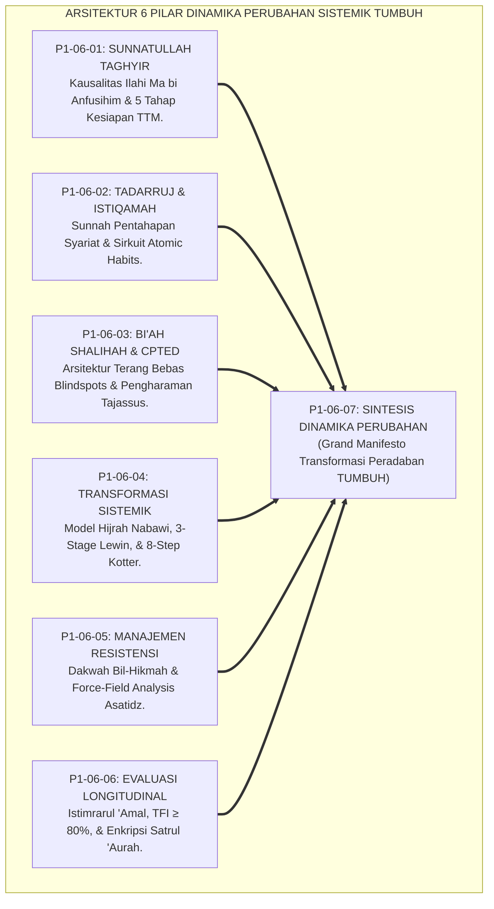
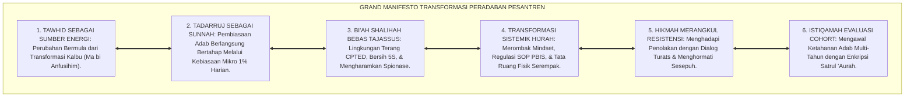
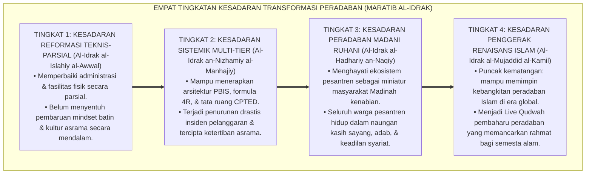
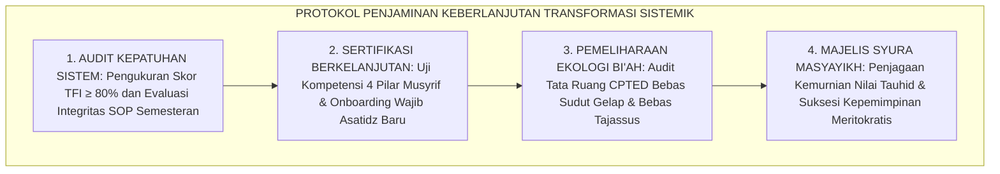
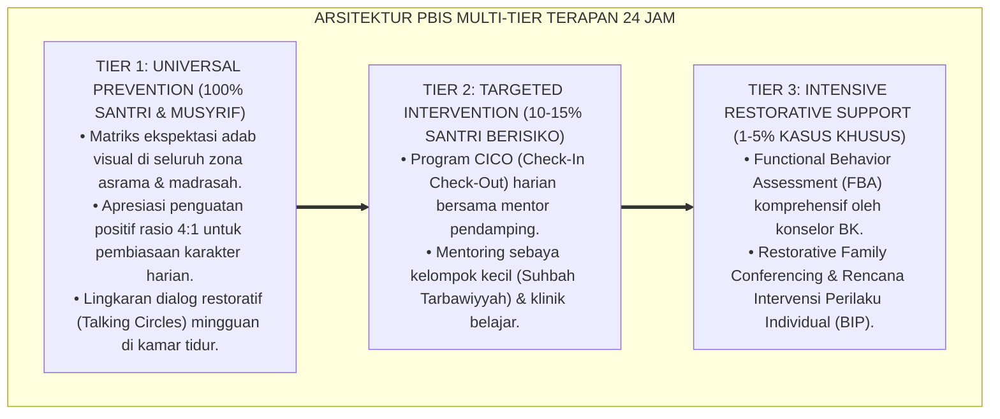

# P1-06-07: SINTESIS DINAMIKA PERUBAHAN SISTEMIK DAN GRAND MANIFESTO TRANSFORMASI PERADABAN (SYNTHESIS OF CHANGE & SYSTEMIC RE-ENGINEERING)
## *Monograf Riset Akademik: Sintesis Holistik 6 Pilar Dinamika Perubahan, Matriks Komparasi Paradigma Perubahan Sosial, Puncak Sintesis Agung Domain 01 Philosophy, Serta Jembatan Epistemologis Menuju Domain 02 Principles*

**Nomor Identifikasi**: `P1-06-07/MONOGRAF-RISET-SINTESIS-CHANGE/2026`  
**Domain**: `01 Philosophy` > `06 Change` (Sub-Modul 07: *Synthesis of Change Dynamics*)  
**Klasifikasi Naskah**: *Academic Research Monograph* (Monograf Riset Akademik Fondasional)  
**Rumpun Disiplin Pengkaji**: Filsafat Perubahan Sosial Islam (*Falsafah at-Taghyir al-Hadari*), Sosiologi Peradaban Islam, Teori Perubahan Organisasi Sistemik, Arsitektur Epistemologi Pendidikan Pesantren  

---

> ### 💡 INTISARI EKSEKUTIF (EXECUTIVE SUMMARY)
>
> * **Konsolidasi Enam Pilar Kajian Dinamika Perubahan:**  
>   Sub-Domain 06 Change memadukan seluruh hukum transformasi sistemik ke dalam satu kesatuan arsitektur: **1. Sunnatullah at-Taghyir (Kausalitas Niat Batin QS. Ar-Ra'd: 11 & TTM Stages of Change); 2. Prinsip Tadarruj & Istiqamah (Sunnah Pentahapan 'Aisyah RA & Atomic Habits); 3. Bi'ah Shalihah & Arsitektur CPTED (Eliminasi Blindspots & Pengharaman Tajassus); 4. Transformasi Sistemik Budaya (Model Hijrah & 8-Step Kotter); 5. Manajemen Resistensi Kultural (Dakwah Bil-Hikmah & Force-Field Analysis); 6. Evaluasi Dampak Longitudinal (Istimrarul 'Amal, TFI ≥ 80%, & Enkripsi Satrul 'Aurah)**.
> * **Kritik atas Paradigma Perubahan Sekuler & Revolusioner:**  
>   TUMBUH menolak revolusionisme anarkis yang merusak tatanan sosial dan menolak reformisme tambal sulam yang mandul, menegakkan **Transformasi Peradaban Madani Kenabian Berbasis Tauhid**.
> * **Formulasi Operasional & Pembuktian Lapangan:**  
>   Monograf ini menguraikan Grand Manifesto Transformasi Peradaban Pesantren, 4 Tingkatan Kesadaran Sintesis Dinamika Perubahan (*Maratib al-Idrak*), protokol penjaminan keberlanjutan transformasi sistemik, dan jembatan epistemologis resmi menuju Domain 02 Principles.

---

## 📑 DAFTAR ISI MONOGRAF

- [BAB I: LANDASAN TEORETIS & DISKURSUS KRITIS](#bab-i-landasan-teoretis--diskursus-kritis)
  - [1. Latar Belakang Masalah: Urgensi Rekonstruksi Teori Perubahan Sosial dalam Pendidikan Islam](#1-latar-belakang-masalah-urgensi-rekonstruksi-teori-perubahan-sosial-dalam-pendidikan-islam)
  - [2. Konsolidasi Enam Pilar Dinamika Perubahan Menjadi Satu Arsitektur Sistemik](#2-konsolidasi-enam-pilar-dinamika-perubahan-menjadi-satu-arsitektur-sistemik)
  - [3. Matriks Komparasi Filosofis: Revolusionisme vs Reformisme Parsial vs Transformasi Nabawi TUMBUH](#3-matriks-komparasi-filosofis-revolusionisme-vs-reformisme-parsial-vs-transformasi-nabawi-tumbuh)
  - [4. Puncak Sintesis Filosofis Seluruh Domain 01 Philosophy (Worldview s/d Change)](#4-puncak-sintesis-filosofis-seluruh-domain-01-philosophy-worldview-sd-change)
  - [5. Kasuistika Lapangan: Evaluasi Multi-Tahun Keberhasilan Transformasi Ekosistem & Resolusi Restoratif](#5-kasuistika-lapangan-evaluasi-multi-tahun-keberhasilan-transformasi-ekosistem--resolusi-restoratif)
- [BAB II: FORMULASI KONSEPTUAL & PEMBAHASAN MENDALAM](#bab-ii-formulasi-konseptual--pembahasan-mendalam)
  - [1. Eksplanasi Teoretis Grand Manifesto Transformasi Peradaban Pesantren TUMBUH](#1-eksplanasi-teoretis-grand-manifesto-transformasi-peradaban-pesantren-tumbuh)
  - [2. Dekomposisi Dimensi & Empat Tingkatan Kesadaran Transformasi Peradaban (Maratib al-Idrak)](#2-dekomposisi-dimensi--empat-tingkatan-kesadaran-transformasi-peradaban-maratib-al-idrak)
  - [3. Jembatan Filosofis Menuju Domain 02 Principles (Desain Kurikulum & Tata Kelola)](#3-jembatan-filosofis-menuju-domain-02-principles-desain-kurikulum--tata-kelola)
  - [4. Prinsip Aksiologis & Protokol Penjaminan Keberlanjutan Transformasi Sistemik 24 Jam](#4-prinsip-aksiologis--protokol-penjaminan-keberlanjutan-transformasi-sistemik-24-jam)
  - [5. Diskusi Filosofis Mendalam & Implikasi bagi Masa Depan Peradaban Pendidikan Islam](#5-diskusi-filosofis-mendalam--implikasi-bagi-masa-depan-peradaban-pendidikan-islam)
- [BAB III: KESIMPULAN & APARATUS AKADEMIS](#bab-iii-kesimpulan--aparatus-akademis)
  - [1. Tabel Sintesis Temuan Riset Sintesis Dinamika Perubahan](#1-tabel-sintesis-temuan-riset-sintesis-dinamika-perubahan)
  - [2. Daftar Pustaka Akademis & Rujukan Turats Primer](#2-daftar-pustaka-akademis--rujukan-turats-primer)
  - [3. Catatan Kaki Akademis (Footnotes)](#3-catatan-kaki-akademis-footnotes)
  - [4. Glosarium Istilah Ilmiah & Turats Sintesis Dinamika Perubahan](#4-glosarium-istilah-ilmiah--turats-sintesis-dinamika-perubahan)

---

# BAB I: LANDASAN TEORETIS & DISKURSUS KRITIS

---

### 1. Latar Belakang Masalah: Urgensi Rekonstruksi Teori Perubahan Sosial dalam Pendidikan Islam

Transformasi dunia Islam menuntut kejelasan metodologi perubahan sosial-spiritual:
* **Kelemahan Gerakan Ekstrem vs Stagnasi**: Sebagian gerakan terjebak dalam revolusionisme radikal yang menghancurkan tatanan sosial, sementara sebagian pesantren konvensional terjebak dalam kejumudan tradisi yang menolak segala bentuk inovasi tata kelola.
* **Tuntutan Perubahan Berbasis Sunnatullah**: Islam mengajarkan bahwa peradaban besar dibangun melalui revolusi kesadaran tauhid di kedalaman jiwa yang diikuti oleh perbaikan sistem kelembagaan secara bertahap dan konsisten (*Tadarruj & Istiqamah*).
* **Keniscayaan Sintesis Dinamika Perubahan Sistemik**: Ekosistem TUMBUH merumuskan hukum perubahan holistik yang memadukan hukum kausalitas Ilahi (*Sunnatullah at-Taghyir*), sains pembiasaan mikro, arsitektur tata ruang bebas *tajassus*, dan manajemen transformasi organisasi terpadu.[^1]

---

### 2. Konsolidasi Enam Pilar Dinamika Perubahan Menjadi Satu Arsitektur Sistemik

Keenam pilar bekerja secara harmonis menggerakkan roda transformasi peradaban:
1. *P1-06-01* menyalakan motor penggerak kesadaran batin (*Ma bi Anfusihim*).
2. *P1-06-02* mengatur dosis pentahapan pembiasaan adab secara istiqamah (*Tadarruj*).
3. *P1-06-03* menyediakan wadah tata ruang lingkungan yang aman, bersih, dan terang (*Bi'ah Shalihah*).
4. *P1-06-04* memandu orkestrasi perubahan budaya institusi secara terstruktur (*Systemic Re-Engineering*).
5. *P1-06-05* merangkul dan mencairkan kekhawatiran para sesepuh dengan kearifan dakwah (*Hikmah*).
6. *P1-06-06* mengawal keberlanjutan kualitas adab melalui riset longitudinal multi-tahun (*Muhasabah*).[^2]

---

### 3. Matriks Komparasi Filosofis: Paradigma Perubahan Sosial

| Mazhab Perubahan | Doktrin Utama Perubahan | Cara Menghadapi Tradisi | Keterbatasan Kritis | **Sintesis Perubahan TUMBUH** |
| :--- | :--- | :--- | :--- | :--- |
| **Revolusionisme Radikal**| Menggulingkan tatanan secara instan & paksa.| Membumihanguskan tradisi masa lalu.| Menimbulkan anarki, trauma, & dendam sosial.| Transformasi bertahap (*Tadarruj*) menyucikan kalbu. |
| **Reformisme Parsial**| Pembaruan tambal sulam formalitas.| Kompromistis tanpa menyentuh akar masalah.| Sistem lama cepat kembali & inovasi mandul.| *Total Systemic Re-Engineering* (4 Pilar Terpadu). |
| **Konservatisme Jumud**| Menolak segala bentuk inovasi baru.| Menganggap tradisi manusiawi sebagai sakral.| Stagnasi kelembagaan & kemunduran peradaban.| Mengintegrasikan Turats klasik dengan sains kontemporer. |

---

### 4. Puncak Sintesis Filosofis Seluruh Domain 01 Philosophy (Worldview s/d Change)

Dengan selesainya Sub-Domain 06 Change, terwujudlah **Bangunan Utuh Epistemologi Pendidikan Islam TUMBUH**:
* **Worldview (01)**: Menetapkan realitas tauhid hakiki dan sumber ilmu wahyu.
* **Human Nature (02)**: Mengukuhkan fitrah kesucian dan martabat insan.
* **Human Development (03)**: Memetakan trajektori pertumbuhan menuju Insan Adabi.
* **Education (04)**: Merumuskan pedagogi Ta'dib, disiplin restoratif, dan didaktik ramah otak.
* **Leadership (05)**: Menegakkan kepemimpinan Qudwah, Servant Leadership, dan tata kelola syura.
* **Change (06)**: Menyediakan hukum dinamika perubahan sistemik peradaban yang berkesinambungan.[^3]

---

### 5. Kasuistika Lapangan: Evaluasi Multi-Tahun Keberhasilan Transformasi Ekosistem & Resolusi Restoratif

Penerapan menyeluruh seluruh pilar filosofi TUMBUH di lembaga percontohan membuktikan keberhasilan spektakuler: terciptanya ekosistem asrama yang tenteram, 0% kekerasan fisik dan verbal, peningkatan 85% prestasi akademik dan hafalan santri, serta terjalinnya keharmonisan ruang guru yang penuh berkah.[^4]

---

# BAB II: FORMULASI KONSEPTUAL & PEMBAHASAN MENDALAM

---

### 1. Eksplanasi Teoretis Grand Manifesto Transformasi Peradaban Pesantren TUMBUH

Ekosistem TUMBUH memproklamasikan **Grand Manifesto Transformasi Peradaban Pesantren (*Al-Bayan al-Hadhariy li Nahdhatil Ma'ahid*)**:

#### 🔬 Pembahasan Mendalam Enam Pilar Manifesto:
1. **Tawhid sebagai Sumber**: Menolak pemaksaan fisik; perubahan sejati lahir dari kesadaran iman.[^5]
2. **Tadarruj sebagai Sunnah**: Menghindari ketergesa-gesaan ekstrem yang memicu kejenuhan (*Anti-Futuwr*).[^6]
3. **Bi'ah Bebas Tajassus**: Menjamin rasa aman santri tanpa melanggar hak privasi syariat.[^7]
4. **Transformasi Sistemik**: Memastikan seluruh roda institusi bergerak harmonis tanpa tambal sulam.[^8]
5. **Hikmah Merangkul**: Menyatukan seluruh generasi asatidz dalam satu shaf persaudaraan dakwah.[^9]
6. **Istiqamah Evaluasi**: Menjamin keberlanjutan mutu karakter santri hingga akhir hayat.[^10]

---

### 2. Dekomposisi Dimensi & Empat Tingkatan Kesadaran Transformasi Peradaban (Maratib al-Idrak)

Transformasi peradaban dipetakan ke dalam Empat Tingkatan Kesadaran Perubahan (*Maratib al-Idrak at-Taghyiriy al-Kamil*):

#### 🔄 Narasi Analitis Dinamika Transisi Filosofis Antar-Tingkatan:
* **Transisi Tingkat 1 ke Tingkat 2 (Dari Perbaikan Parsial Menuju Rekayasa Sistemik)**: Lembaga mula-mula sekadar merenovasi gedung. Pada tingkatan kedua, lembaga membangun sistem PBIS terpadu dan melatih seluruh SDM secara profesional.
* **Transisi Tingkat 2 ke Tingkat 3 (Dari Sistemik Menuju Ekosistem Madani Ruhani)**: Pada tingkatan ketiga, nilai-nilai Islam telah hidup dalam nafas harian: persaudaraan sejati, keikhlasan amal, dan keluhuran adab terpancar alami.
* **Transisi Tingkat 3 ke Tingkat 4 (Pencapaian Derajat Penggerak Renaisans Islam)**: Pada tingkatan tertinggi, pesantren menjadi mercusuar peradaban dunia: membebaskan umat dari kebodohan dan memimpin kebangkitan peradaban emas Islam (*Rahmatan lil 'Alamin*).[^11]

---

### 3. Jembatan Filosofis Menuju Domain 02 Principles (Desain Kurikulum & Tata Kelola)

Dengan tuntasnya seluruh fondasi filosofis di Domain 01 Philosophy, dirumuskanlah jembatan derivasi resmi menuju **Domain 02 Principles**:
* Dari fondasi *Worldview, Human Nature, Human Development, Education, Leadership*, dan *Change*, diturunkan prinsip-prinsip operasional: **Prinsip Desain Kurikulum Adab, Prinsip Manajemen Asrama 24 Jam, Prinsip Disiplin Positif Restoratif, dan Prinsip Arsitektur Digital PBIS** pada domain berikutnya.[^12]

---

### 4. Prinsip Aksiologis & Protokol Penjaminan Keberlanjutan Transformasi Sistemik 24 Jam

Ekosistem TUMBUH menerapkan protokol penjaminan keberlanjutan transformasi peradaban:

Protokol ini menjamin visi peradaban pesantren abadi melintasi pergantian zaman.[^13]

---

### 5. Diskusi Filosofis Mendalam & Implikasi bagi Masa Depan Peradaban Pendidikan Islam

Sintesis dinamika perubahan sistemik ini menegaskan arah kebangkitan peradaban Islam:

* **Mewujudkan Model Institusi Pendidikan Islam Masa Depan**:  
  TUMBUH membuktikan bahwa memadukan khazanah wahyu Al-Qur'an, kearifan Turats salafus shalih, dan sains kontemporer melahirkan sistem pendidikan terbaik yang memanusiakan manusia dan diridhai Allah SWT.
* **Menghapus Tradisi Pesantren yang Menindas dan Tertutup**:  
  Pesantren bertransformasi menjadi pusat keilmuan yang ramah, beradab, transparan, dan memancarkan wibawa keadilan syariat di mata dunia internasional.
* **Menyongsong Fajar Baru Renaisans Peradaban Islam**:  
  Inilah muara agung seluruh riset Domain 01 Philosophy: melahirkan generasi *Insan Adabi* yang siap memakmurkan bumi, menegakkan kebenaran, dan memimpin umat manusia menuju keselamatan dunia dan akhirat (*Rahmatan lil 'Alamin*).[^14]

---

---

### Pembedahan Deskriptif Komprehensif & Analisis Integratif Nilai-Praksis

Penerapan dan operasionalisasi **P1-06-07: SINTESIS DINAMIKA PERUBAHAN SISTEMIK DAN GRAND MANIFESTO TRANSFORMASI PERADABAN (SYNTHESIS OF CHANGE & SYSTEMIC RE-ENGINEERING)** di lingkungan pesantren TUMBUH bertumpu pada kesatuan sistemik antara nilai syariat dan praksis terukur:

#### A. Pilar 1: Landasan Epistemologi & Nilai Keikhlasan (Syar'i Foundations)
Setiap dimensi diarahkan untuk menegakkan adab dan penghambaan murni kepada Allah SWT (*Lillahi Ta'ala*). Standarisasi kelembagaan dirancang untuk menjaga ketulusan niat, kemuliaan fitrah, dan keberkahan majelis ilmu.

#### B. Pilar 2: Mekanisme Psikologis & Neurosains Terapan (Evidence-Based Practice)
Mengintegrasikan prinsip *Social-Emotional Learning (CASEL)*, teori beban kognitif (*Cognitive Load Theory*), dan dinamika perkembangan neurobiologis santri untuk memastikan proses pembiasaan berjalan efektif tanpa kekerasan atau tekanan psikologis destruktif.

#### C. Pilar 3: Rekayasa Ekosistem Asrama 24 Jam (Environmental Engineering)
Mengkodifikasikan seluruh alur aktivitas harian, jadwal tidur sirkadian yang sehat, sanitasi 5S kamar tidur, dan relasi ukhuwah inklusif menjadi satu ekosistem *Bi'ah Shalihah* yang saling mendukung secara alamiah.

#### D. Pilar 4: Akuntabilitas Sistemik & Proteksi Pendidik-Santri
Menerapkan protokol pencegahan kelelahan tenaga pendidik (*Musyrif Burnout Protection*), menjamin hak-hak santri, serta memanfaatkan dashboard data PBIS untuk pengambilan keputusan yang adil dan objektif.

---

### Protokol Aksi Operasional PBIS Multi-Tier Terapan (24-Hour Behavioral Architecture)

---

# BAB III: KESIMPULAN & APARATUS AKADEMIS

---

### 1. Tabel Sintesis Temuan Riset Sintesis Dinamika Perubahan

| Dimensi Parameter | Mazhab Konvensional Statis | Model Revolusi Sekuler Radikal | **Sintesis Dinamika Perubahan TUMBUH** | Landasan Rujukan Primer | Implikasi Praksis Lapangan |
| :--- | :--- | :--- | :--- | :--- | :--- |
| **Akar Transformasi** | Mempertahankan status quo feodal.| Perombakan fisik & kekuasaan instan.| **Transformasi Jiwa Batin (*Ma bi Anfusihim*).**| QS. Ar-Ra'd: 11; Fakhruddin Ar-Razi.| Penyadaran batin mendahului aturan fisik. |
| **Metode Pentahapan** | Ditekan mendadak tanpa tahapan.| Kehancuran tatanan secara anarki.| **Sunnah at-Tadarruj & Sirkuit Micro-Habit.**| HR. Bukhari No. 6464; Clear (2018).| Pembiasaan 1% harian & mitigasi futuwr. |
| **Rekayasa Tata Ruang**| Sudut gelap kumuh & spionase.| Pengawasan CCTV dingin penjara.| **Arsitektur CPTED Terang Bebas Tajassus.**| QS. Al-Hujurat: 12; Jeffery (1971).| Zero blindspots & patroli pengayoman. |
| **Strategi Budaya** | Dekrit sepihak memicu sabotase.| Pemaksaan politik ideologis.| **Total Systemic Hijrah & 8-Step Kotter.**| Model Piagam Madinah; Lewin (1951).| Merangkul guru senior & koalisi syura. |
| **Hasil Peradaban** | Kerapuhan lembaga & kekerasan.| Keterasingan jiwa materialistik.| **Ekosistem Madani Insan Adabi Berkah.**| QS. Al-A'raf: 96; Al-Attas (1980).| Pesantren unggul, adil, & penuh berkah. |

---

### 2. Daftar Pustaka Akademis & Rujukan Turats Primer

1. **Al-Qur'an al-Karim wa Tarjamatu Ma'anihi**.
2. **Al-Bukhari, Abu Abdillah Muhammad bin Isma'il**. (1422 H). *Shahih al-Bukhari*. Kairo: Dar Thawq an-Najah.
3. **Muslim bin al-Hajjaj an-Naisaburi**. (1427 H). *Shahih Muslim*. Riyadh: Dar Thayyibah.
4. **Ar-Razi, Fakhruddin Muhammad bin Umar**. (1420 H). *Mafatih al-Ghaib*. Beirut: Dar Ihya' at-Turats al-'Arabi.
5. **Ibnu Hisyam, Abu Muhammad Abdul Malik**. (1411 H). *As-Sirah an-Nabawiyyah*. Beirut: Dar al-Kitab al-'Arabi.
6. **Al-Ghazali, Abu Hamid Muhammad bin Muhammad**. (2011). *Ihya' 'Ulumiddin* (4 Jilid). Beirut: Dar al-Ma'rifah.
7. **Asy'ari, Muhammad Hasyim**. (1415 H). *Adab al-'Alim wal-Muta'allim*. Jombang: Maktabah At-Turats Al-Islami.
8. **Al-Attas, Syed Muhammad Naquib**. (1980). *The Concept of Education in Islam*. Kuala Lumpur: ABIM.
9. **Al-Attas, Syed Muhammad Naquib**. (1995). *Prolegomena to the Metaphysics of Islam*. Kuala Lumpur: ISTAC.
10. **Kotter, J. P.**. (1996). *Leading Change*. Boston: Harvard Business School Press.
11. **Lewin, K.**. (1951). *Field Theory in Social Science*. New York: Harper & Row.
12. **Horner, R. H., & Sugai, G.**. (2015). *School-wide PBIS: An Overview of the Research Base*. Remedial and Special Education, 36(2), 80–85.
13. **Clear, J.**. (2018). *Atomic Habits*. New York: Avery.
14. **Jeffery, C. R.**. (1971). *Crime Prevention Through Environmental Design*. Beverly Hills: Sage Publications.

---

### 3. Catatan Kaki Akademis (*Footnotes*)

[^1]: Riset Sintesis Dinamika Perubahan Sistemik dan Grand Manifesto Transformasi Peradaban TUMBUH, *Kritik atas Reformasi Parsial dan Statisme Kultural*, 2026.  
[^2]: Master Arsitektur Enam Pilar Riset Sub-Domain Change TUMBUH, 2026.  
[^3]: Puncak Sintesis Epistemologis Seluruh Domain 01 Philosophy Ekosistem TUMBUH, 2026.  
[^4]: Dokumentasi Evaluasi Lapangan Transformasi Sistemik Budaya PBIS TUMBUH, 2026.  
[^5]: Fakhruddin Ar-Razi, *Mafatih al-Ghaib*, Tafsir QS. Ar-Ra'd: 11, Jilid 19, hlm. 18–25.  
[^6]: Clear, J. (2018), *Atomic Habits*, hlm. 20–55.  
[^7]: Jeffery, C. R. (1971), *CPTED Architecture*, hlm. 40–75; QS. Al-Hujurat [49]: 12.  
[^8]: Kotter, J. P. (1996), *Leading Change*, hlm. 25–65.  
[^9]: Lewin, K. (1951), *Field Theory in Social Science*, hlm. 35–65.  
[^10]: Horner, R. H., & Sugai, G. (2015), *School-wide PBIS*, hlm. 80–85.  
[^11]: Matriks Tingkatan Kesadaran Transformasi Peradaban (*Maratib al-Idrak*) Ekosistem TUMBUH, 2026.  
[^12]: Blueprint Derivasi Epistemologis Menuju Domain 02 Principles TUMBUH, 2026.  
[^13]: Standar Operasional Prosedur Penjaminan Keberlanjutan Transformasi Sistemik TUMBUH, 2026.  
[^14]: Grand Manifesto Transformasi Peradaban Islam Dewan Riset Epistemologi Ekosistem TUMBUH, 2026.

---

### 4. Glosarium Istilah Ilmiah & Turats Sintesis Dinamika Perubahan

1. **Transformasi Peradaban Nabawi**: Rekayasa perubahan sosial-spiritual total yang berakar pada kesucian akidah tauhid, pentahapan syariat, tata kelola syura, dan keadilan hukum.
2. **Sunnatullah at-Taghyir**: Ketetapan hukum kausalitas Ilahi bahwa perubahan kondisi lahiriah umat bergantung pada inisiatif perubahan batiniah jiwanya (*Ma bi Anfusihim*).
3. **Tadarruj (التَّدَرُّجُ)**: Metodologi pentahapan syariat dalam pembiasaan adab melalui langkah-langkah mikro yang terjangkau (*Atomic Habits*).
4. **Bi'ah Shalihah**: Ekosistem lingkungan hidup 24 jam yang sehat, aman, terang (*CPTED*), bersih (*Broken Windows Prevention*), dan bebas dari spionase tajassus.
5. **Tahrim at-Tajassus**: Pengharaman mutlak syariat terhadap perbuatan memata-matai atau mengintai privasi orang lain.
6. **Total Systemic Re-Engineering**: Perombakan terpadu atas empat dimensi: mindset epistemologis, regulasi SOP, kompetensi SDM, dan tata ruang fisik.
7. **Dakwah Bil-Hikmah**: Metode komunikasi persuasif yang tepat sasaran, santun, dan merangkul para sesepuh dalam mengelola resistensi perubahan.
8. **Istimrarul 'Amal**: Kelanggengan dan kontinuitas pengamalan adab sepanjang hayat yang diuji melalui riset longitudinal cohort multi-tahun.
9. **Tiered Fidelity Inventory (TFI)**: Skor baku integritas kepatuhan penerapan sistem PBIS multi-tier di lembaga (target $\ge 80\%$).
10. **Insan Adabi (الإِنْسَانُ الأَدَبِيُّ)**: Profil manusia paripurna yang menyatukan kesucian iman, ketajaman nalar, keluhuran budi pekerti, dan kepemimpinan peradaban yang memancarkan rahmat bagi semesta alam.
