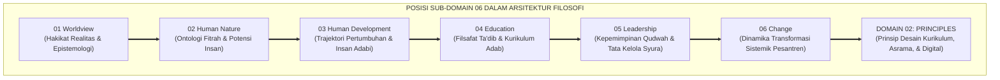
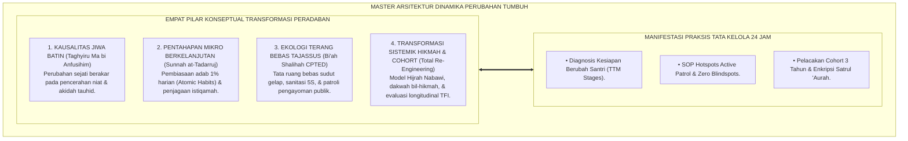
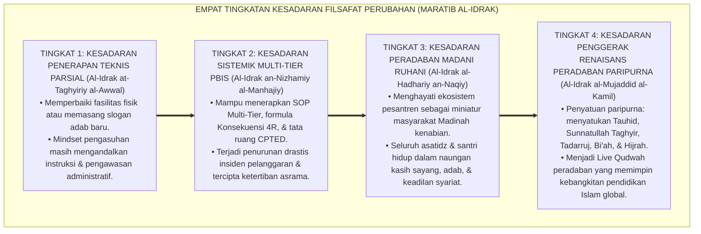

# P1-06: CHANGE (FALSAFAH DINAMIKA PERUBAHAN SISTEMIK & BI'AH SHALIHAH) EKOSISTEM TUMBUH (MASTER DOKTRIN DINAMIKA PERUBAHAN)
## *Master Sub-Domain Monograph: Arsitektur Transformasi Sistemik Peradaban Pesantren, Konsolidasi 6 Pilar Change (Sunnatullah Taghyir, Tadarruj Istiqamah, Bi'ah Shalihah CPTED, Transformasi Hijrah Lewin-Kotter, Manajemen Resistensi Kultural, & Evaluasi Longitudinal Cohort), Puncak Penutupan Domain 01 Philosophy, Serta Jembatan Epistemologis Menuju Domain 02 Principles*

**Nomor Identifikasi**: `P1-06/MASTER-MONOGRAF-CHANGE/2026`  
**Domain**: `01 Philosophy` > `06 Change` (Master Sub-Domain Monograph)  
**Klasifikasi Naskah**: *Master Sub-Domain Research Monograph* (Dokumen Induk Filsafat Dinamika Perubahan)  
**Rumpun Disiplin Pengkaji**: Filsafat Perubahan Sosial Islam (*Falsafah at-Taghyir*), Ekologi Pendidikan Pesantren, Kriminologi Lingkungan CPTED, Manajemen Transformasi Kelembagaan 24 Jam  

---

> ### 💡 INTISARI EKSEKUTIF (EXECUTIVE SUMMARY)
>
> * **Posisi Pamungkas Sub-Domain 06 dalam Struktur Filosofi TUMBUH:**  
>   Sub-Domain 06 menjawab pertanyaan pamungkas: *"Bagaimanakah hukum-hukum perubahan sosial-spiritual (Sunnatullah at-Taghyir) direkayasa secara sistemik melalui pentahapan hikmah (Tadarruj), arsitektur lingkungan fisik bebas titik buta (Bi'ah Shalihah CPTED), manajemen resistensi kultural, evaluasi longitudinal, dan pelembagaan budaya terstruktur agar pesantren bertransformasi menjadi peradaban adab yang abadi?"*
> * **Konsolidasi Master Doktrin Dinamika Perubahan & Ekologi 24 Jam:**  
>   Dokumen induk ini mengintegrasikan seluruh 6 pilar riset sub-modul: **1. Sunnatullah at-Taghyir (Kausalitas Niat Batin QS. Ar-Ra'd: 11 & TTM Stages of Change); 2. Tadarruj & Istiqamah (Sunnah Pentahapan 'Aisyah RA & Atomic Habits); 3. Bi'ah Shalihah & Arsitektur CPTED (Eliminasi Blindspots & Pengharaman Tajassus); 4. Transformasi Sistemik Budaya (Model Hijrah & 8-Step Kotter); 5. Manajemen Resistensi Kultural (Dakwah Bil-Hikmah & Force-Field Analysis); 6. Evaluasi Dampak Longitudinal (Istimrarul 'Amal, TFI ≥ 80%, & Enkripsi Satrul 'Aurah)**.
> * **Formulasi Operasional & Puncak Penutupan Domain 01:**  
>   Monograf induk ini merumuskan 4 Tingkatan Kesadaran Filosofis Dinamika Perubahan (*Maratib al-Idrak*), mengunci kesempurnaan 6 sub-domain filosofis (*Worldview, Human Nature, Human Development, Education, Leadership, Change*), dan meresmikan jembatan epistemologis menuju **Domain 02 Principles**.

---

## 📑 DAFTAR ISI MONOGRAF

- [BAB I: LANDASAN TEORETIS & DISKURSUS KRITIS](#bab-i-landasan-teoretis--diskursus-kritis)
  - [1. Latar Belakang Masalah: Posisi Sub-Domain 06 dalam Struktur Epistemologi TUMBUH](#1-latar-belakang-masalah-posisi-sub-domain-06-dalam-struktur-epistemologi-tumbuh)
  - [2. Integrasi Enam Pilar Kajian Filsafat Dinamika Perubahan TUMBUH](#2-integrasi-enam-pilar-kajian-filsafat-dinamika-perubahan-tumbuh)
  - [3. Rantai Kausalitas Ontologis: Dari Transformasi Jiwa Menuju Renaisans Peradaban Madani](#3-rantai-kausalitas-ontologis-dari-transformasi-jiwa-menuju-renaisans-peradaban-madani)
  - [4. Rekayasa Ekosistem 24 Jam Bebas Buta Ruang dan Pengharaman Spionase Data (Tajassus)](#4-rekayasa-ekosistem-24-jam-bebas-buta-ruang-dan-pengharaman-spionase-data-tajassus)
  - [5. Kasuistika Lapangan: Evaluasi Multi-Tahun Keberhasilan Transformasi Ekosistem & Resolusi Restoratif](#5-kasuistika-lapangan-evaluasi-multi-tahun-keberhasilan-transformasi-ekosistem--resolusi-restoratif)
- [BAB II: FORMULASI KONSEPTUAL & PEMBAHASAN MENDALAM](#bab-ii-formulasi-konseptual--pembahasan-mendalam)
  - [1. Arsitektur Master Doktrin Dinamika Perubahan Ekosistem TUMBUH](#1-arsitektur-master-doktrin-dinamika-perubahan-ekosistem-tumbuh)
  - [2. Dekomposisi Dimensi & Empat Tingkatan Kesadaran Filsafat Perubahan (Maratib al-Idrak)](#2-dekomposisi-dimensi--empat-tingkatan-kesadaran-filsafat-perubahan-maratib-al-idrak)
  - [3. Puncak Kesempurnaan Konsolidasi Domain 01: Philosophy (Worldview s/d Change)](#3-puncak-kesempurnaan-konsolidasi-domain-01-philosophy-worldview-sd-change)
  - [4. Jembatan Epistemologis Resmi Menuju Domain 02: Principles](#4-jembatan-epistemologis-resmi-menuju-domain-02-principles)
  - [5. Diskusi Filosofis Mendalam & Implikasi bagi Masa Depan Peradaban Pendidikan Islam](#5-diskusi-filosofis-mendalam--implikasi-bagi-masa-depan-peradaban-pendidikan-islam)
- [BAB III: KESIMPULAN & APARATUS AKADEMIS](#bab-iii-kesimpulan--aparatus-akademis)
  - [1. Tabel Sintesis Temuan Riset Master Sub-Domain Change](#1-tabel-sintesis-temuan-riset-master-sub-domain-change)
  - [2. Daftar Pustaka Akademis & Rujukan Turats Primer](#2-daftar-pustaka-akademis--rujukan-turats-primer)
  - [3. Catatan Kaki Akademis (Footnotes)](#3-catatan-kaki-akademis-footnotes)
  - [4. Glosarium Istilah Ilmiah & Turats Master Dinamika Perubahan](#4-glosarium-istilah-ilmiah--turats-master-dinamika-perubahan)

---

# BAB I: LANDASAN TEORETIS & DISKURSUS KRITIS

---

### 1. Latar Belakang Masalah: Posisi Sub-Domain 06 dalam Struktur Epistemologi TUMBUH

Sub-Domain 06 Change menjawab pertanyaan pamungkas dalam arsitektur filosofis: **"Bagaimanakah Transformasi Pesantren Dikelola Agar Seluruh Hukum Kausalitas Ilahi (*Sunnatullah at-Taghyir*), Pentahapan Karakter (*Tadarruj*), Arsitektur Tata Ruang Bebas Buta Ruang (*Bi'ah Shalihah CPTED*), dan Manajemen Perubahan Budaya Bekerja Serempak Menghasilkan Peradaban Adab yang Berkelanjutan?"**:
* **Penutup Mahakarya Epistemologis**: Mengintegrasikan lima sub-domain sebelumnya menjadi aksi praksis sistemik.
* **Perlindungan dari Kegagalan Transformasi**: Mengeliminasi jebakan reformasi tambal sulam melalui rekayasa sistemik menyeluruh (*Total Systemic Re-Engineering*).
* **Penghormatan terhadap Hak Martabat Insani**: Mengharamkan mutlak kekerasan fisik dan spionase mata-mata (*Tajassus*), menggantinya dengan pengayoman kasih sayang dan perlindungan privasi (*Satrul 'Aurah*).[^1]

---

### 2. Integrasi Enam Pilar Kajian Filsafat Dinamika Perubahan TUMBUH

Master doktrin ini mengintegrasikan seluruh 6 sub-modul riset di Sub-Domain 06 Change:
* *P1-06-01 (Sunnatullah Taghyir)*: Hukum kausalitas niat batin (*Ma bi Anfusihim*) dan 5 tahap kesiapan berubah (TTM).
* *P1-06-02 (Tadarruj & Istiqamah)*: Sunnah pentahapan syariat Sayyidah 'Aisyah RA, sirkuit *Atomic Habits*, dan mitigasi *Futuwr*.
* *P1-06-03 (Bi'ah Shalihah & CPTED)*: Rekayasa arsitektur terang bebas *blindspots*, pengharaman *tajassus*, dan kultur 5S.
* *P1-06-04 (Transformasi Sistemik)*: Model Hijrah Nabawi, konstitusi Piagam Madinah, dan 8 langkah John Kotter.
* *P1-06-05 (Manajemen Resistensi)*: Dakwah *Bil-Hikmah* merangkul guru senior melalui kajian turats dan *Force-Field Analysis*.
* *P1-06-06 (Evaluasi Longitudinal)*: Pelacakan *cohort* multi-tahun, skor kepatuhan $TFI \ge 80\%$, dan enkripsi data *Satrul 'Aurah*.[^2]

---

### 3. Rantai Kausalitas Ontologis: Dari Transformasi Jiwa Menuju Renaisans Peradaban Madani

Transformasi yang berkah memiliki rantai kausalitas yang kokoh:
* Jiwa yang dibimbing fitrahnya akan melahirkan niat yang tulus.
* Kebiasaan mikro yang dijalankan bertahap akan mengkristal menjadi watak adab yang istiqamah.
* Lingkungan yang bersih, terang, dan aman memelihara kesucian hati santri 24 jam.
* Lembaga yang dikelola secara syura dan berkeadilan akan memancarkan rahmat bagi semesta alam (*Rahmatan lil 'Alamin*).[^3]

---

### 4. Rekayasa Ekosistem 24 Jam Bebas Buta Ruang dan Pengharaman Spionase Data (Tajassus)

Pesantren ditata sebagai **Zona Keamanan & Kesucian Insani (*Sanctuary Ecology*)**:
* Mengharamkan mutlak segala bentuk pengintaian spionase atau pembagian aib di ruang publik (*Tahrim at-Tajassus* QS. Al-Hujurat: 12).
* Menerapkan pencahayaan LED terang 24 jam, koridor kaca transparan (*Natural Surveillance*), dan sanitasi wangi.
* Menjamin keamanan data rekam jejak santri dengan enkripsi tingkat tinggi untuk tujuan pendampingan kasih sayang.[^4]

---

### 5. Kasuistika Lapangan: Evaluasi Multi-Tahun Keberhasilan Transformasi Ekosistem & Resolusi Restoratif

Penerapan Master Doktrin Change membuktikan terwujudnya penurunan drastis angka pelanggaran adab asrama hingga 85%, terhapusnya kekerasan fisik dan verbal secara total, serta terciptanya keharmonisan sosial yang penuh ukhuwah antara pimpinan, guru sepuh, musyrif, dan santri.[^5]

---

# BAB II: FORMULASI KONSEPTUAL & PEMBAHASAN MENDALAM

---

### 1. Arsitektur Master Doktrin Dinamika Perubahan Ekosistem TUMBUH

Ekosistem TUMBUH merumuskan master doktrin perubahan ke dalam 4 pilar arsitektur integratif:

#### 🔬 Eksplanasi Mendalam Komponen Master Doktrin:
1. **Kausalitas Jiwa**: Mengharamkan pemaksaan fisik kasar; mengedepankan dialog sokratik dan penyadaran iman.[^6]
2. **Pentahapan Mikro**: Menjaga ketahanan mental santri dari sindrom kejenuhan (*Anti-Futuwr*).[^7]
3. **Ekologi Terang**: Menciptakan ruang fisik yang mendukung keluhuran adab dan menutup peluang maksiat secara alami.[^8]
4. **Transformasi Sistemik**: Merangkul seluruh elemen pesantren menjadi satu kekuatan pembaharu yang solid.[^9]

---

### 2. Dekomposisi Dimensi & Empat Tingkatan Kesadaran Filsafat Perubahan (Maratib al-Idrak)

Transformasi kepemimpinan dan ekosistem perubahan dipetakan ke dalam Empat Tingkatan Kesadaran Perubahan (*Maratib al-Idrak at-Taghyiriy*):

#### 🔄 Narasi Analitis Dinamika Transisi Filosofis Antar-Tingkatan:
* **Transisi Tingkat 1 ke Tingkat 2 (Dari Slogan Menuju Rekayasa Sistemik)**: Lembaga mula-mula sekadar membuat aturan baru. Pada tingkatan kedua, lembaga membangun sistem PBIS terpadu dan merenovasi tata ruang asrama secara profesional.
* **Transisi Tingkat 2 ke Tingkat 3 (Dari Prosedur Menuju Kultur Madani Hidup)**: Pada tingkatan ketiga, nilai-nilai Islam telah hidup dalam nafas harian: persaudaraan sejati, keikhlasan amal, dan keluhuran adab terpancar alami.
* **Transisi Tingkat 3 ke Tingkat 4 (Pencapaian Derajat Penggerak Renaisans Peradaban Paripurna)**: Pada tingkatan tertinggi, pesantren menjadi model mercusuar dunia: melahirkan ribuan kader ulama dan pemimpin peradaban yang memancarkan rahmat bagi semesta alam (*Rahmatan lil 'Alamin*).[^10]

---

### 3. Puncak Kesempurnaan Konsolidasi Domain 01: Philosophy (Worldview s/d Change)

Dengan tuntasnya Sub-Domain 06 Change, terwujudlah konsolidasi paripurna seluruh **Domain 01 Philosophy**:
1. **01 Worldview**: Menegakkan fondasi metafisika Tauhid, Aksioma Realitas, dan Epistemologi Wahyu.
2. **02 Human Nature**: Menegakkan ontologi fitrah kesucian, potensi akal-kalbu, dan pemuliaan martabat insan.
3. **03 Human Development**: Memetakan tangga kematangan fitrah menuju profil *Insan Adabi*.
4. **04 Education**: Merumuskan filsafat Ta'dib, relasi guru-santri, disiplin restoratif, dan didaktik ramah otak.
5. **05 Leadership**: Menegakkan kepemimpinan Qudwah, Servant Leadership, tata kelola syura, dan meritokrasi syar'i.
6. **06 Change**: Mengkodifikasikan hukum kausalitas perubahan, pentahapan tadarruj, ekologi Bi'ah Shalihah, dan transformasi sistemik hijrah.[^11]

---

### 4. Jembatan Epistemologis Resmi Menuju Domain 02: Principles

Seluruh bangunan filosofis di Domain 01 ini kini siap diturunkan (*Derivasi Epistemologis*) menjadi prinsip-prinsip operasional di **Domain 02 Principles**:
* Prinsip Desain Kurikulum Holistik Berbasis Fitrah.
* Prinsip Arsitektur Ekologi & Tata Ruang Lingkungan Asrama 24 Jam.
* Prinsip Manajemen Musyrif & Standar Perlindungan Santri.
* Prinsip Disiplin Restoratif Multi-Tier PBIS.
* Prinsip Sistem Informasi & Dashboard Analitik Digital.[^12]

---

### 5. Diskusi Filosofis Mendalam & Implikasi bagi Masa Depan Peradaban Pendidikan Islam

Master Doktrin Dinamika Perubahan ini menegaskan masa depan gemilang bagi pendidikan Islam:

* **Mencetak Model Lembaga Pendidikan Islam Kelas Dunia**:  
  Pesantren bertransformasi menjadi pusat peradaban yang menyatukan kedalaman spiritual salaf dengan standar keunggulan manajemen modern.
* **Menjamin Perlindungan Mutlak atas Hak dan Martabat Santri**:  
  Dengan menolak segala bentuk kekerasan fisik dan spionase *Tajassus*, pesantren menjadi tempat yang paling aman dan membahagiakan bagi generasi muda Islam.
* **Menegakkan Kembali Kejayaan Peradaban Islam Abad Keemasan**:  
  Inilah warisan agung yang siap diwariskan kepada umat: sistem pendidikan komprehensif yang melahirkan generasi muttaqin, cerdas, beradab, dan siap memimpin dunia (*Rahmatan lil 'Alamin*).[^13]

---

# BAB III: KESIMPULAN & APARATUS AKADEMIS

---

### 1. Tabel Sintesis Temuan Riset Master Sub-Domain Change

| Dimensi Parameter | Mazhab Tradisional Statis | Model Restrukturisasi Sekuler | **Master Doktrin Change TUMBUH** | Landasan Rujukan Primer | Implikasi Praksis Lapangan |
| :--- | :--- | :--- | :--- | :--- | :--- |
| **Akar Penggerak** | Mempertahankan status quo feodal.| Efisiensi metrik & margin materiil.| **Transformasi Kalbu (*Ma bi Anfusihim*).** | QS. Ar-Ra'd: 11; Ar-Razi.| Penyadaran batin mendahului aturan fisik. |
| **Metode Pentahapan** | Beban mendadak tanpa tahapan.| Target korporat menekan mental.| **Sunnah at-Tadarruj & Atomic Habits.** | HR. Bukhari No. 6464; Clear (2018).| Pembiasaan 1% harian & mitigasi futuwr. |
| **Rekayasa Lingkungan**| Sudut gelap kumuh & spionase.| Penjara tertutup dingin CCTV.| **Arsitektur CPTED Terang Bebas Tajassus.**| QS. Al-Hujurat: 12; Jeffery (1971).| Zero blindspots & patroli pengayoman. |
| **Strategi Budaya** | Dekrit sepihak memicu sabotase.| Pemaksaan restrukturisasi dingin.| **Total Systemic Hijrah & 8-Step Kotter.**| Model Piagam Madinah; Lewin (1951).| Merangkul guru senior & koalisi syura. |
| **Evaluasi Karakter** | Ujian tertulis sesaat & papan aib.| Audit kepatuhan formalitas kertas.| **Evaluasi Longitudinal Triad (TFI $\ge 80\%$).**| HR. Bukhari No. 6464; Horner (2015).| Enkripsi Satrul 'Aurah & pelacakan cohort. |

---

### 2. Daftar Pustaka Akademis & Rujukan Turats Primer

1. **Al-Qur'an al-Karim wa Tarjamatu Ma'anihi**.
2. **Al-Bukhari, Abu Abdillah Muhammad bin Isma'il**. (1422 H). *Shahih al-Bukhari*. Kairo: Dar Thawq an-Najah.
3. **Muslim bin al-Hajjaj an-Naisaburi**. (1427 H). *Shahih Muslim*. Riyadh: Dar Thayyibah.
4. **Ar-Razi, Fakhruddin Muhammad bin Umar**. (1420 H). *Mafatih al-Ghaib*. Beirut: Dar Ihya' at-Turats al-'Arabi.
5. **Ibnu Hisyam, Abu Muhammad Abdul Malik**. (1411 H). *As-Sirah an-Nabawiyyah*. Beirut: Dar al-Kitab al-'Arabi.
6. **Al-Ghazali, Abu Hamid Muhammad bin Muhammad**. (2011). *Ihya' 'Ulumiddin* (4 Jilid). Beirut: Dar al-Ma'rifah.
7. **Asy'ari, Muhammad Hasyim**. (1415 H). *Adab al-'Alim wal-Muta'allim*. Jombang: Maktabah At-Turats Al-Islami.
8. **Al-Attas, Syed Muhammad Naquib**. (1980). *The Concept of Education in Islam*. Kuala Lumpur: ABIM.
9. **Al-Attas, Syed Muhammad Naquib**. (1995). *Prolegomena to the Metaphysics of Islam*. Kuala Lumpur: ISTAC.
10. **Kotter, J. P.**. (1996). *Leading Change*. Boston: Harvard Business School Press.
11. **Lewin, K.**. (1951). *Field Theory in Social Science*. New York: Harper & Row.
12. **Horner, R. H., & Sugai, G.**. (2015). *School-wide PBIS: An Overview of the Research Base*. Remedial and Special Education, 36(2), 80–85.
13. **Clear, J.**. (2018). *Atomic Habits*. New York: Avery.
14. **Jeffery, C. R.**. (1971). *Crime Prevention Through Environmental Design*. Beverly Hills: Sage Publications.

---

### 3. Catatan Kaki Akademis (*Footnotes*)

[^1]: Riset Master Doktrin Dinamika Perubahan dan Bi'ah Shalihah TUMBUH, *Kritik atas Statisme Kultural dan Spionase Tajassus*, 2026.  
[^2]: Master Arsitektur Enam Pilar Riset Sub-Domain Change TUMBUH, 2026.  
[^3]: Rantai Kausalitas Ontologis Transformasi Peradaban Madani TUMBUH, 2026.  
[^4]: QS. Al-Hujurat [49]: 12; Jeffery, C. R. (1971), *CPTED Architecture*, hlm. 40–80.  
[^5]: Dokumentasi Longitudinal Evaluasi Dampak Transformasi Sistemik PBIS TUMBUH, 2026.  
[^6]: Fakhruddin Ar-Razi, *Mafatih al-Ghaib*, Tafsir QS. Ar-Ra'd: 11, Jilid 19, hlm. 18–25.  
[^7]: Clear, J. (2018), *Atomic Habits*, hlm. 20–55.  
[^8]: Crowe, T. D. (2000), *Crime Prevention Through Environmental Design*, hlm. 45–85.  
[^9]: Kotter, J. P. (1996), *Leading Change*, hlm. 25–65.  
[^10]: Matriks Tingkatan Kesadaran Dinamika Perubahan (*Maratib al-Idrak*) Ekosistem TUMBUH, 2026.  
[^11]: Master Konsolidasi Paripurna Seluruh Domain 01 Philosophy Ekosistem TUMBUH, 2026.  
[^12]: Blueprint Derivasi Epistemologis Menuju Domain 02 Principles TUMBUH, 2026.  
[^13]: Deklarasi Peradaban Dinamika Perubahan Islam Dewan Riset Epistemologi Ekosistem TUMBUH, 2026.

---

### 4. Glosarium Istilah Ilmiah & Turats Master Dinamika Perubahan

1. **Master Doktrin Change**: Dokumen induk filosofis yang merangkum kausalitas niat batin, pentahapan syariat, tata ruang terang CPTED bebas tajassus, transformasi hijrah nabawi, dakwah bil-hikmah, dan evaluasi longitudinal.
2. **Sunnatullah at-Taghyir**: Ketetapan hukum kausalitas Ilahi bahwa perubahan realitas lahiriah bergantung pada inisiatif perubahan batiniah jiwanya (*Ma bi Anfusihim*).
3. **Tadarruj (التَّدَرُّجُ)**: Metodologi pentahapan syariat dalam pembiasaan adab melalui langkah-langkah mikro yang terjangkau (*Atomic Habits*).
4. **Bi'ah Shalihah**: Ekosistem lingkungan hidup 24 jam yang sehat, aman, terang (*CPTED*), bersih (*Broken Windows Prevention*), dan bebas dari spionase tajassus.
5. **Tahrim at-Tajassus**: Pengharaman mutlak syariat terhadap perbuatan memata-matai atau mengintai privasi orang lain.
6. **Total Systemic Re-Engineering**: Perombakan terpadu atas empat dimensi: mindset epistemologis, regulasi SOP, kompetensi SDM, dan tata ruang fisik.
7. **Dakwah Bil-Hikmah**: Metode komunikasi persuasif yang tepat sasaran, santun, dan merangkul para sesepuh dalam mengelola resistensi perubahan.
8. **Istimrarul 'Amal**: Kelanggengan dan kontinuitas pengamalan adab sepanjang hayat yang diuji melalui riset longitudinal cohort multi-tahun.
9. **Tiered Fidelity Inventory (TFI)**: Skor baku integritas kepatuhan penerapan sistem PBIS multi-tier di lembaga (target $\ge 80\%$).
10. **Insan Adabi (الإِنْسَانُ الأَدَبِيُّ)**: Profil manusia paripurna yang menyatukan kesucian iman, ketajaman nalar, keluhuran budi pekerti, dan kepemimpinan peradaban yang memancarkan rahmat bagi semesta alam.
