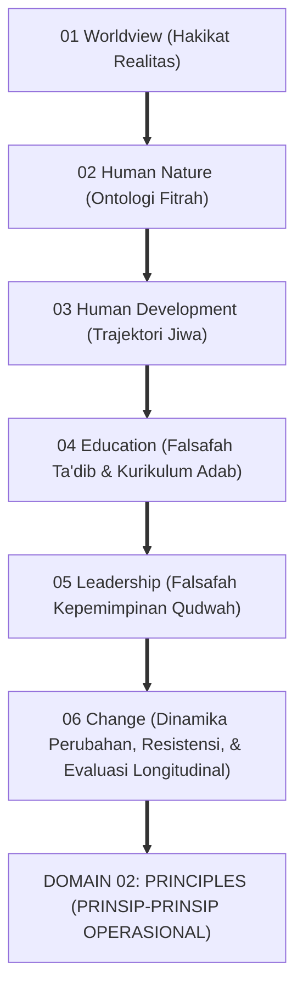
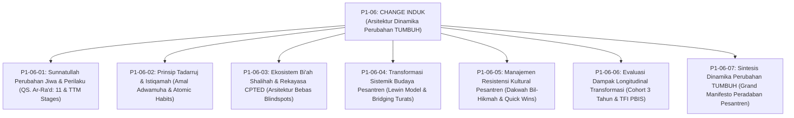
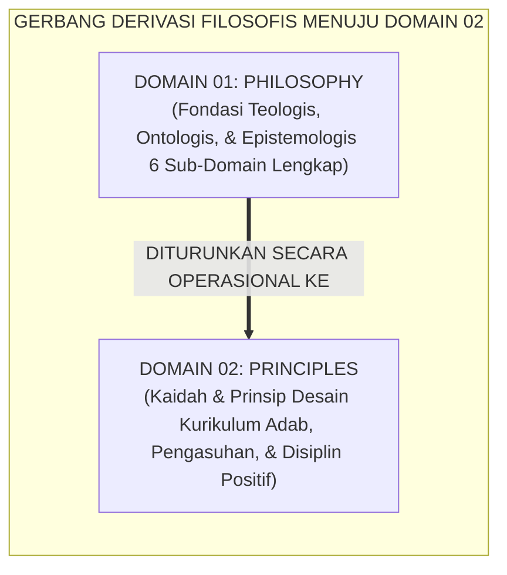

# P1-06: CHANGE (DINAMIKA PERUBAHAN & BI'AH SHALIHAH) EKOSISTEM TUMBUH
## *Monograf Induk Sub-Domain 06: Arsitektur Dinamika Transformasi Sistemik Pesantren, Rekapitulasi 6 Pilar Change (Sunnatullah Taghyir, Tadarruj Istiqamah, Bi'ah Shalihah CPTED, Transformasi Sistemik, Manajemen Resistensi Kultural, & Evaluasi Longitudinal Cohort), Penutupan Mahakarya Domain 01 Philosophy, & Gerbang Epistemologis Menuju Domain 02 Principles*

**Nomor Identifikasi**: `P1-06/MONOGRAF-INDUK-CHANGE/2026`  
**Domain**: `01 Philosophy` > `06 Change`  
**Klasifikasi Naskah**: *Master Sub-Domain Monograph* (Monograf Induk Sub-Domain Dinamika Perubahan)  
**Rumpun Disiplin Pengkaji**: Filsafat Perubahan Sosial Islam (*Falsafah at-Taghyir*), Ekologi Pendidikan Pesantren, Kriminologi Lingkungan CPTED, Manajemen Transformasi Kelembagaan 24 Jam  

---

> ### 💡 INTISARI PRAKTIS (3 MENIT PAHAM UNTUK ASATIDZ & MUSYRIF)
>
> * **Posisi Sub-Domain 06 Change:**  
>   Menjawab pertanyaan mendasar kelima sekaligus pamungkas dalam filsafat pendidikan Islam: *"Bagaimanakah hukum-hukum perubahan sosial-spiritual (Sunnatullah at-Taghyir) direkayasa secara sistemik melalui pentahapan hikmah (Tadarruj), arsitektur lingkungan fisik bebas titik rawan (Bi'ah Shalihah CPTED), manajemen resistensi kultural, evaluasi longitudinal, dan manajemen budaya terstruktur agar pesantren bertransformasi menjadi peradaban adab yang berkah?"*
> * **Enam Pilar Dinamika Perubahan Ekosistem TUMBUH yang Terintegrasi:**  
>   1. **P1-06-01 (Sunnatullah Taghyir):** Menegakkan hukum kausalitas Ilahi bahwa perubahan lahiriah bersumber dari gerakan kesadaran jiwa internal (*Ma bi Anfusihim* QS. Ar-Ra'd: 11) dan model 5 tahap TTM Prochaska.  
>   2. **P1-06-02 (Tadarruj & Istiqamah):** Menerapkan pentahapan syariat Sayyidah 'Aisyah RA, pembiasaan mikro 1% (*Atomic Habits*), dan mencegah sindrom kelelahan amalan (*Anti-Futuwr*).  
>   3. **P1-06-03 (Bi'ah Shalihah & CPTED):** Merekayasa tata ruang asrama bebas sudut buta (*Blindspots*), kebersihan toilet standar hotel (*Broken Windows*), dan patroli titik rawan 3 waktu.  
>   4. **P1-06-04 (Transformasi Sistemik Lewin-Kotter):** Menggerakkan perubahan serempak (*Unfreezing-Moving-Refreezing*), pendekatan *Bridging Turats*, dan pelembagaan logbook digital.  
>   5. **P1-06-05 (Manajemen Resistensi Kultural):** Menghadapi penolakan dengan hikmah, memuliakan asatidz senior, dan menunjukkan bukti nyata (*Quick Wins*).  
>   6. **P1-06-06 (Evaluasi Dampak Longitudinal):** Mengukur keberlanjutan adab santri melalui pelacakan cohort 3 tahun dan instrumen kepatuhan PBIS TFI $\ge 80\%$.
> * **Puncak Kesempurnaan Domain 01 Philosophy:**  
>   Sub-Domain 06 mengunci keutuhan 6 sub-domain filosofis (01 Worldview, 02 Human Nature, 03 Human Development, 04 Education, 05 Leadership, 06 Change) dan membuka pintu gerbang operasional menuju **Domain 02: Principles**.

---

## 📑 DAFTAR ISI MONOGRAF INDUK

- [BAGIAN I: ARSITEKTUR ONTOLOGIS & POHON HUBUNGAN SUB-DOMAIN 06](#bagian-i-arsitektur-ontologis--pohon-hubungan-sub-domain-06)
  - [1. Posisi Dokumen dalam Taksonomi 11 Domain TUMBUH](#1-posisi-dokumen-dalam-taksonomi-11-domain-tumbuh)
  - [2. Pohon Hubungan Antar-Monograf Sub-Domain 06 Change](#2-pohon-hubungan-antar-monograf-sub-domain-06-change)
  - [3. Rangkuman 6 Pilar Dinamika Perubahan & Rekayasa Bi'ah Shalihah](#3-rangkuman-6-pilar-dinamika-perubahan--rekayasa-biah-shalihah)
  - [4. Puncak Mahakarya Penutupan Seluruh Domain 01: Philosophy (Rekapitulasi 6 Sub-Domain)](#4-puncak-mahakarya-penutupan-seluruh-domain-01-philosophy-rekapitulasi-6-sub-domain)
- [BAGIAN II: KODIFIKASI MATRIKS RESMI & DIREKTORI MONOGRAF TERPADU](#bagian-ii-kodifikasi-matriks-resmi--direktori-monograf-terpadu)
  - [1. Matriks Rujukan Lengkap 7 Berkas Monograf Sub-Domain 06](#1-matriks-rujukan-lengkap-7-berkas-monograf-sub-domain-06)
  - [2. Gerbang Derivasi Filosofis Menuju Domain 02 Principles](#2-gerbang-derivasi-filosofis-menuju-domain-02-principles)
- [BAGIAN III: APARATUS AKADEMIS & APENDIKS](#bagian-iii-aparatus-akademis--apendiks)
  - [1. Daftar Pustaka Otoritatif Turats & Sains Global](#1-daftar-pustaka-otoritatif-turats--sains-global)
  - [2. Catatan Kaki Akademis (Footnotes)](#2-catatan-kaki-akademis-footnotes)
  - [3. Glosarium Istilah Kunci Dinamika Perubahan Induk](#3-glosarium-istilah-kunci-dinamika-perubahan-induk)

---

# BAGIAN I: ARSITEKTUR ONTOLOGIS & POHON HUBUNGAN SUB-DOMAIN 06

---

### 1. Posisi Dokumen dalam Taksonomi 11 Domain TUMBUH

---

### 2. Pohon Hubungan Antar-Monograf Sub-Domain 06 Change

Sub-Domain `06 Change` memuat 1 Monograf Induk dan 7 Monograf Riset Khusus yang saling menopang secara utuh:

---

### 3. Rangkuman 6 Pilar Dinamika Perubahan & Rekayasa Bi'ah Shalihah

1. **Pilar 1: Sunnatullah Taghyir & Kausalitas Batin (P1-06-01)**:  
   Menegakkan hukum Ilahi bahwa perubahan masyarakat dan santri mensyaratkan perubahan niat dan kehendak di dalam diri (*Ma bi Anfusihim* QS. Ar-Ra'd: 11). Mengintegrasikan 5 tahap kesiapan psikologis *Transtheoretical Model (TTM)* Prochaska, memitigasi *Psychological Reactance*, dan menghapus hukuman mempermalukan di depan umum (*Zero Public Shaming*).
2. **Pilar 2: Tadarruj & Istiqamah Kebiasaan Mikro (P1-06-02)**:  
   Menerapkan sunnah pentahapan syariat Sayyidah 'Aisyah RA dan keutamaan amal yang dawam/kontinu (*Adwamuha wa In Qalla*). Mengadopsi sains pembiasaan *Atomic Habits* James Clear (peningkatan 1% harian) pada sirkuit *Basal Ganglia*, serta menegakkan *Anti-Futuwr Protocol* untuk menjaga kebugaran jiwa santri.
3. **Pilar 3: Rekayasa Lingkungan Fisik Bi'ah Shalihah CPTED (P1-06-03)**:  
   Menghayati ibrah hadits hijrah pembunuh 100 jiwa (HR. Muslim) mengenai urgensi lingkungan suci. Menerapkan 4 pilar arsitektur *CPTED* C. Ray Jeffery (*Natural Surveillance, Access Control, Territorial Reinforcement, Maintenance*), *Nudge Theory* Richard Thaler, *Zero Broken Windows Policy*, dan SOP patroli titik rawan (*Hotspots Active Patrol*).
4. **Pilar 4: Transformasi Sistemik Budaya Pesantren (P1-06-04)**:  
   Mengadopsi model peradaban Hijrah Nabawi (Masjid, Mu'akhah, Piagam Madinah) yang disintesiskan dengan model perubahan Kurt Lewin (*Unfreezing-Moving-Refreezing*) dan John Kotter (8 Langkah Perubahan). Merangkul asatidz senior melalui pendekatan *Bridging Turats* dan mengunci budaya PBIS ke dalam logbook digital lembaga.
5. **Pilar 5: Manajemen Resistensi Kultural Pesantren (P1-06-05)**:  
   Menghadapi penolakan perubahan dengan pendekatan Hikmah (QS. 16:125), merangkul asatidz senior melalui sowan privat dan pelibatan sebagai penasihat, serta membuktikan keberhasilan melalui penciptaan *Quick Wins* 90 hari di asrama percontohan.
6. **Pilar 6: Evaluasi Dampak Longitudinal Transformasi (P1-06-06)**:  
   Menilai keberlanjutan adab santri melalui pelacakan longitudinal cohort 3 tahun, pemantauan instrumen kepatuhan sistem (*Tiered Fidelity Inventory TFI* $\ge 80\%$), dan penjagaan integritas data perilaku PBIS digital.[^1]

---

### 4. Puncak Mahakarya Penutupan Seluruh Domain 01: Philosophy (Rekapitulasi 6 Sub-Domain)

| Sub-Domain | Judul Sub-Domain | Pertanyaan Eksistensial yang Dijawab | Inti Doktrin Filosofis yang Ditetapkan |
| :---: | :--- | :--- | :--- |
| **01** | **Worldview** | *Apakah hakikat realitas, Tuhan, alam semesta, dan kebenaran?* | **Tauhid & Realitas Integral Multi-Layer**: Menolak sekularisme dan dualisme; epistemologi wahyu, akal sehat, dan indera. |
| **02** | **Human Nature** | *Siapakah hakikat manusia dan bagaimana struktur dirinya?* | **Ontologi Fitrah & Insan Kamil**: Struktur Jasad-Aqal-Qalb-Ruh; penyucian jiwa dari Nafs Ammarah menuju Muthmainnah. |
| **03** | **Human Development** | *Bagaimanakah lintasan pertumbuhan jiwa santri sepanjang hayat?* | **Trajektori Tangga TUMBUH T1–T4**: Marahil al-'Umr, integrasi 5 kompetensi CASEL SEL, & pembentukan regulasi diri otonom. |
| **04** | **Education** | *Bagaimanakah adab diajarkan dan ditanamkan dalam kurikulum?* | **Falsafah Ta'dib Al-Attas**: Relasi murabbi kasih sayang KH. Hasyim Asy'ari, SW-PBIS Multi-Tier Restoratif, & Didaktik Ramah Otak. |
| **05** | **Leadership** | *Bagaimanakah pemimpin mengayomi dan mengelola lembaga?* | **Servant Leadership Qudwah First**: *Sayyidul Qawmi Khadimuhum*, meritokrasi syar'i anti-oligarki, & mediasi sengketa syura. |
| **06** | **Change** | *Bagaimanakah budaya pesantren ditransformasikan secara sistemik?* | **Sunnatullah Taghyir & Bi'ah Shalihah CPTED**: Pentahapan Tadarruj Istiqamah, manajemen resistensi hikmah, & evaluasi longitudinal. |

---

# BAGIAN II: KODIFIKASI MATRIKS RESMI & DIREKTORI MONOGRAF TERPADU

---

### 1. Matriks Rujukan Lengkap 7 Berkas Monograf Sub-Domain 06

| Kode Berkas | Judul Naskah Monograf | Dewan Keilmuan Pengkaji | Tautan Berkas Markdown |
| :---: | :--- | :--- | :--- |
| **P1-06-01** | **Sunnatullah Perubahan Jiwa dan Perilaku** | `pakar-filosofi-tumbuh` `pakar-psikologi-belajar` `pakar-intervensi-preventif` | [**`Buka Naskah P1-06-01`**](./P1-06-01-Sunnatullah-Perubahan-Jiwa-dan-Perilaku.md) |
| **P1-06-02** | **Prinsip Tadarruj dan Istiqamah** | `pakar-filosofi-tumbuh` `pakar-epistemologi-turats` `pakar-desain-kurikulum-adab` | [**`Buka Naskah P1-06-02`**](./P1-06-02-Prinsip-Tadarruj-dan-Istiqamah.md) |
| **P1-06-03** | **Ekosistem Bi'ah Shalihah dan Desain Lingkungan** | `pakar-intervensi-preventif` `pakar-pengasuhan-asrama` `pakar-arsitektur-pbis-restoratif` | [**`Buka Naskah P1-06-03`**](./P1-06-03-Ekosistem-Biah-Shalihah-dan-Desain-Lingkungan.md) |
| **P1-06-04** | **Transformasi Sistemik Budaya Pesantren** | `pakar-tata-kelola-qudwah` `pakar-metodologi-riset-tumbuh` `pakar-arsitektur-digital-pesantren` | [**`Buka Naskah P1-06-04`**](./P1-06-04-Transformasi-Sistemik-Budaya-Pesantren.md) |
| **P1-06-05** | **Manajemen Resistensi Kultural Pesantren** | `pakar-tata-kelola-qudwah` `pakar-psikologi-sosial-santri` `pakar-kuratif-restoratif` | [**`Buka Naskah P1-06-05`**](./P1-06-05-Manajemen-Resistensi-Kultural-Perubahan-Pesantren.md) |
| **P1-06-06** | **Evaluasi Dampak Longitudinal Transformasi** | `pakar-metodologi-riset-tumbuh` `pakar-simulasi-sistem-tumbuh` `pakar-psikometri-dan-validasi-instrumen` | [**`Buka Naskah P1-06-06`**](./P1-06-06-Evaluasi-Dampak-Longitudinal-Transformasi-Pesantren.md) |
| **P1-06-07** | **Sintesis Dinamika Perubahan TUMBUH** | `pakar-filosofi-tumbuh` `pakar-kritikus-dan-auditor-kualitas` `pakar-tata-kelola-qudwah` | [**`Buka Naskah P1-06-07`**](./P1-06-07-Sintesis-Dinamika-Perubahan-TUMBUH.md) |

---

### 2. Gerbang Derivasi Filosofis Menuju Domain 02 Principles

---

# BAGIAN III: APARATUS AKADEMIS & APENDIKS

---

### 1. Daftar Pustaka Otoritatif Turats & Sains Global

1. **Al-Qur'an al-Karim wa Tarjamatu Ma'anih**.
2. **Al-Bukhari, Muhammad bin Isma'il**. (1422 H). *Shahih al-Bukhari*. Beirut: Dar Thawq an-Najah.
3. **Muslim bin al-Hajjaj an-Naisaburi**. (1374 H). *Shahih Muslim*. Kairo: Isa al-Babi al-Halabi.
4. **Ar-Razi, Fakhruddin Muhammad bin Umar**. (1981). *Mafatih al-Ghaib*. Beirut: Dar al-Fikr.
5. **Al-Ghazali, Abu Hamid Muhammad bin Muhammad**. (2011). *Ihya 'Ulumiddin*. Beirut: Dar al-Ma'rifah.
6. **Kotter, J. P.**. (2012). *Leading Change*. Harvard Business Review Press.
7. **Lewin, K.**. (1947). *Frontiers in group dynamics*. Human Relations.
8. **Horner, R. H., & Sugai, G.**. (2015). *School-wide PBIS*. Behavior Analysis in Practice.
9. **Clear, J.**. (2018). *Atomic Habits*. Avery.
10. **Jeffery, C. R.**. (1971). *Crime Prevention Through Environmental Design*. Sage Publications.

---

### 2. Catatan Kaki Akademis (*Footnotes*)

[^1]: Ar-Razi, *Mafatih al-Ghaib*, Jilid XIX, hlm. 21–24; Kotter, J. P. (2012), *Leading Change*, Harvard Business Review Press.

---

### 3. Glosarium Istilah Kunci Dinamika Perubahan Induk

1. **Sunnatullah at-Taghyir**: Hukum kepastian Ilahi bahwa perubahan masyarakat bermula dari perubahan kesadaran di dalam jiwa insan.
2. **Tadarruj**: Prinsip pentahapan hikmah yang selaras dengan kodrat perkembangan fitrah manusia.
3. **Bi'ah Shalihah**: Ekosistem fisik dan sosial suci yang memelihara keselamatan fitrah santri 24 jam.
4. **CPTED**: Arsitektur lingkungan yang dirancang untuk mencegah kejahatan dan mengeliminasi sudut buta.
5. **Quick Wins**: Kemenangan cepat dalam 90 hari yang membuktikan efektivitas sistem baru kepada komunitas.
6. **Tiered Fidelity Inventory (TFI)**: Instrumen validasi internasional untuk mengukur kepatuhan implementasi PBIS.
7. **Triad Pertumbuhan Simbiotik**: Maha-prinsip di mana transformasi sistemik secara serempak menumbuhkan Santri, memuliakan Pendidik, dan memperkokoh Lembaga.
