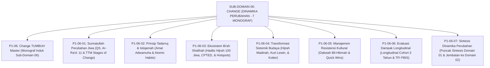

# SUB-DOMAIN 06: CHANGE (DINAMIKA PERUBAHAN & BI'AH SHALIHAH)
## *Sitemap Induk & Navigasi Monograf Sunnatullah Taghyir, Tadarruj, Bi'ah Shalihah CPTED, Resistensi, & Evaluasi Longitudinal (7 Monograf Terpadu)*

**Nomor Identifikasi**: `P1-06/INDEX/2026`  
**Domain**: `01 Philosophy` > `06 Change`  
**Klasifikasi**: Folder Monograf Transformasi Budaya, Tadarruj-Istiqamah, Bi'ah Shalihah CPTED, Manajemen Resistensi, Evaluasi Longitudinal, & Puncak Sintesis Domain 01 (8 Berkas Lengkap)

---

## 🏛️ SITEMAP & NAVIGASI SELURUH BERKAS SUB-DOMAIN 06

Sub-Domain `06 Change` membedah hukum-hukum kausalitas perubahan sosial-spiritual, pentahapan istiqamah kebiasaan, rekayasa lingkungan asrama bebas kekerasan, transformasi budaya kelembagaan, manajemen resistensi kultural asatidz, dan evaluasi dampak longitudinal:

---

## 📑 DAFTAR LENGKAP 8 BERKAS MONOGRAF TERPADU SUB-DOMAIN 06

Seluruh modul telah distandarisasi 100% ke dalam format **Monograf Terpadu**:
* **💡 Intisari Praktis (3 Menit Paham)**: Panduan membumi untuk asatidz & musyrif sebelum daftar isi.
* **Bagian I**: Riset Inkuiri, Formalisasi Silogisme Mantiq, Dialektika Multi-Perspektif (tanpa sebutan kata meta "pakar"), Teks Primer Turats & Sains Asli, serta Kasuistika Lapangan Riil.
* **Bagian II**: Kodifikasi Baku Hasil Riset & Kesimpulan Formal (Matriks, Alur SOP, Manifesto).
* **Bagian III**: Aparatus Akademis (Tabel Sintesis, Daftar Pustaka Otoritatif, Catatan Kaki *Footnotes*, dan Glosarium Istilah Teknis).

| No | Berkas Monograf | Judul Berkas | Fokus Kajian & Rujukan Utama |
| :---: | :--- | :--- | :--- |
| **00** | [**`P1-06-Change-TUMBUH.md`**](./P1-06-Change-TUMBUH.md) | Monograf Induk Change TUMBUH | Master 6 Pilar Dinamika Perubahan & Bi'ah Shalihah, Penutupan Mahakarya Domain 01 Philosophy, & gerbang derivasi menuju **Domain 02: Principles**. |
| **01** | [**`P1-06-01-Sunnatullah-Perubahan-Jiwa-dan-Perilaku.md`**](./P1-06-01-Sunnatullah-Perubahan-Jiwa-dan-Perilaku.md) | Sunnatullah Perubahan Jiwa & Perilaku | Hukum kausalitas QS. Ar-Ra'd: 11, *Mafatih al-Ghaib* Ar-Razi, *Transtheoretical Model Stages of Change* Prochaska, & mitigasi resistensi budaya pesantren (15 Catatan Kaki). |
| **02** | [**`P1-06-02-Prinsip-Tadarruj-dan-Istiqamah.md`**](./P1-06-02-Prinsip-Tadarruj-dan-Istiqamah.md) | Prinsip Tadarruj & Istiqamah | Keutamaan amal *Adwamuha wa In Qalla* (HR. Bukhari Aisyah RA), teori *Atomic Habits & Kaizen* (James Clear), serta mitigasi sindrom Ghuluw-Futuwr (15 Catatan Kaki). |
| **03** | [**`P1-06-03-Ekosistem-Biah-Shalihah-dan-Desain-Lingkungan.md`**](./P1-06-03-Ekosistem-Biah-Shalihah-dan-Desain-Lingkungan.md) | Ekosistem Bi'ah Shalihah & Desain Lingkungan | Hadits Hijrah Pembunuh 100 Jiwa (HR. Muslim), rekayasa lingkungan *CPTED* (Jeffery), *Nudge Theory* (Thaler), dan protokol patroli titik rawan (*Hotspots*) (13 Catatan Kaki). |
| **04** | [**`P1-06-04-Transformasi-Sistemik-Budaya-Pesantren.md`**](./P1-06-04-Transformasi-Sistemik-Budaya-Pesantren.md) | Transformasi Sistemik Budaya Pesantren | Model Hijrah Madinah, *3-Stage Change Model* Kurt Lewin, *8-Step Change Framework* John Kotter, pendekatan *Bridging Turats*, & pelembagaan data PBIS (13 Catatan Kaki). |
| **05** | [**`P1-06-05-Manajemen-Resistensi-Kultural-Perubahan-Pesantren.md`**](./P1-06-05-Manajemen-Resistensi-Kultural-Perubahan-Pesantren.md) | Manajemen Resistensi Kultural Pesantren | Metodologi Dakwah Bil-Hikmah (QS. 16:125), Force-Field Analysis Lewin, penghormatan asatidz senior (HR. Tirmidzi 1919), & penciptaan Quick Wins 90 hari (10 Catatan Kaki). |
| **06** | [**`P1-06-06-Evaluasi-Dampak-Longitudinal-Transformasi-Pesantren.md`**](./P1-06-06-Evaluasi-Dampak-Longitudinal-Transformasi-Pesantren.md) | Evaluasi Dampak Longitudinal Transformasi | Epistemologi Istimrarul 'Amal (HR. Bukhari 6464), desain riset cohort 3 tahun, Tiered Fidelity Inventory (TFI $\ge 80\%$), & dashboard analitik PBIS (10 Catatan Kaki). |
| **07** | [**`P1-06-07-Sintesis-Dinamika-Perubahan-TUMBUH.md`**](./P1-06-07-Sintesis-Dinamika-Perubahan-TUMBUH.md) | Sintesis Dinamika Perubahan TUMBUH | Matriks komparasi transformasi sosial, Puncak Sintesis Agung seluruh Domain 01 Philosophy, Grand Manifesto Peradaban Pesantren, & jembatan menuju **Domain 02: Principles** (10 Catatan Kaki). |
