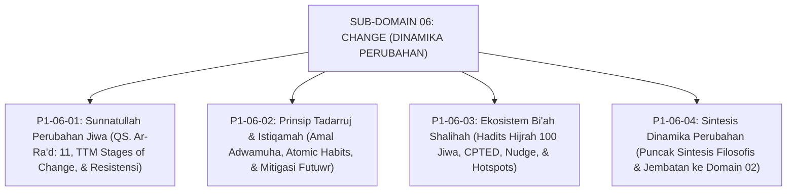

# SUB-DOMAIN 06: CHANGE (DINAMIKA PERUBAHAN & BI'AH SHALIHAH)
## *Sitemap Induk & Navigasi Monograf Sunnatullah Taghyir, Tadarruj, & Rekayasa Lingkungan*

**Nomor Identifikasi**: `P1-06/INDEX/2026`  
**Domain**: `01 Philosophy` > `06 Change`  
**Klasifikasi**: Folder Monograf Transformasi Budaya, Tadarruj-Istiqamah, & Bi'ah Shalihah

---

## 🏛️ SITEMAP & NAVIGASI SELURUH BERKAS SUB-DOMAIN 06

Sub-Domain `06 Change` membedah hukum-hukum kausalitas perubahan sosial-spiritual, pentahapan istiqamah kebiasaan, dan rekayasa lingkungan asrama bebas kekerasan:

---

## 📑 DAFTAR BERKAS MODULAR SUB-DOMAIN 06

| No | Berkas Monograf | Judul Berkas | Fokus Kajian & Rujukan Utama |
| :---: | :--- | :--- | :--- |
| **01** | [**`P1-06-01-Sunnatullah-Perubahan-Jiwa-dan-Perilaku.md`**](./P1-06-01-Sunnatullah-Perubahan-Jiwa-dan-Perilaku.md) | Sunnatullah Perubahan Jiwa & Perilaku | Hukum kausalitas QS. Ar-Ra'd: 11, *Mafatih al-Ghaib* Ar-Razi, *Transtheoretical Model Stages of Change* Prochaska, & mitigasi resistensi budaya pesantren. |
| **02** | [**`P1-06-02-Prinsip-Tadarruj-dan-Istiqamah.md`**](./P1-06-02-Prinsip-Tadarruj-dan-Istiqamah.md) | Prinsip Tadarruj & Istiqamah | Keutamaan amal *Adwamuha wa In Qalla* (HR. Bukhari Aisyah RA), teori *Atomic Habits & Kaizen* (James Clear), serta mitigasi sindrom Ghuluw-Futuwr. |
| **03** | [**`P1-06-03-Ekosistem-Biah-Shalihah-dan-Desain-Lingkungan.md`**](./P1-06-03-Ekosistem-Biah-Shalihah-dan-Desain-Lingkungan.md) | Ekosistem Bi'ah Shalihah & Desain Lingkungan | Hadits Hijrah Pembunuh 100 Jiwa (HR. Muslim), rekayasa lingkungan *CPTED* (Jeffery), *Nudge Theory* (Thaler), dan protokol patroli titik rawan (*Hotspots*). |
| **04** | [**`P1-06-04-Sintesis-Dinamika-Perubahan-TUMBUH.md`**](./P1-06-04-Sintesis-Dinamika-Perubahan-TUMBUH.md) | Sintesis Filosofis Dinamika Perubahan | Matriks integrasi 3 pilar perubahan, piagam transformasi peradaban pesantren, dan jembatan menuju **Domain 02: Principles**. |
