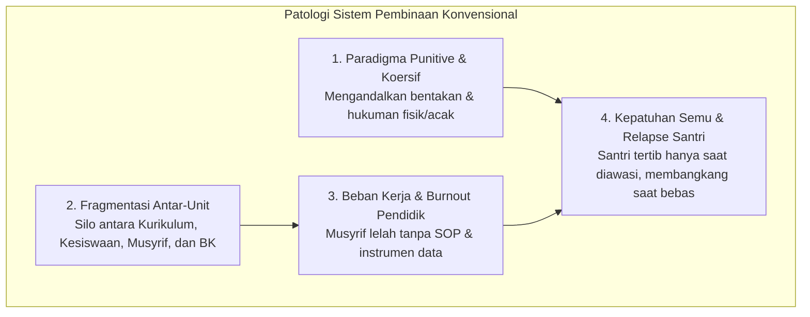
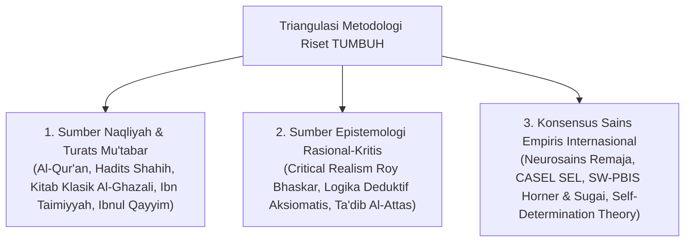
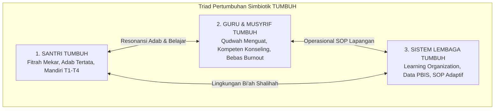

# MONOGRAF RISET AKADEMIK: REKONSTRUKSI FILOSOFIS SISTEM PEMBINAAN SANTRI DI DUNIA PESANTREN
## Pendekatan Integratif: Theocentric Worldview, Tradisi Turats, dan Konsensus Sains Perkembangan Global

**Dewan Riset & Keilmuan Ekosistem TUMBUH**  
*Dipublikasikan sebagai Naskah Monograf Riset Ilmiah (Jurnal Kebijakan & Filosofi Pendidikan Islam)*  
*Dokumen Rujukan Induk: Domain 01 Philosophy & Book Series Volume 01*

---

## ABSTRAK

> **Latar Belakang**: Mayoritas krisis pembinaan di dunia pesantren modern berakar pada ketiadaan sistem penunjang terpadu (*lack of systemic support*), dominasi pendekatan reaktif-koersif (*punitive discipline*), dan fragmentasi peran antara pengajaran kelas (*ta'lim*), pengasuhan asrama (*tarbiyah*), serta penanaman adab (*ta'dib*). Akibatnya, santri sering mengalami kepatuhan semu (*compliance under duress*), guru/musyrif mengalami kelelahan mental (*burnout*), dan institusi terjebak dalam krisis tata kelola berulang.
>
> **Tujuan Penelitian**: Merumuskan dan memvalidasi fondasi filosofis, ontologis, epistemologis, dan metodologis dari sistem baru yang disebut **Ekosistem TUMBUH** (*Human Development System*) untuk dunia pesantren, yang secara eksplisit menjawab 10 pertanyaan fundamental filosofis dan menyinergikan secara simbiotik: *Santri Bertumbuh, Guru/Musyrif Bertumbuh, dan Sistem Lembaga Bertumbuh*.
>
> **Metode**: Penelitian ini menggunakan metode integratif-kritis (*integrative-critical synthesis*) yang memadukan triangulasi hermeneutika *Nash & Turats* Islam, *Critical Realism*, neurosains perkembangan kognitif remaja, psikologi motivasi (*Self-Determination Theory*), *Social-Emotional Learning (CASEL)*, *School-Wide Positive Behavioral Interventions and Supports (SW-PBIS)*, dan etika hukum *Restorative Justice*.
>
> **Hasil Riset**: Terbentuk arsitektur filosofis 6 pilar yang koheren yang menjawab 10 pertanyaan eksistensial dasar: (1) *Theocentric Worldview*; (2) Antropologi *Fitrah* dan 5 lapis jiwa (*Jasad, Ruh, Nafs, Qalb, 'Aql*); (3) Hukum perkembangan *Tazkiyatun Nafs* (*T1–T4*); (4) Pedagogi holistik Disiplin Restoratif (*Firm & Kind*) & PBIS Multi-Tier; (5) Falsafah kepemimpinan **Qudwah** (*Sayyidul Qaumi Khaadimuhum*); serta (6) Sunnatullah perubahan melalui *Tadarruj*, *Istiqamah*, dan *Bi'ah Shalihah*.
>
> **Kata Kunci**: *Ekosistem TUMBUH, Pesantren, Qudwah, Tazkiyatun Nafs, Disiplin Restoratif, PBIS Multi-Tier, Fitrah, Triad Pertumbuhan.*

---

## 1. PENDAHULUAN & LATAR BELAKANG MASALAH

Pesantren adalah institusi pendidikan Islam tertua di Nusantara yang memiliki tradisi keilmuan dan keteladanan yang luhur. Namun, di tengah transformasi sosial kontemporer dan kompleksitas latar belakang santri generasi digital, dunia pesantren menghadapi tantangan sistemik yang mendasar.

Berdasarkan telaah empiris dan data lapangan (*Sistem Pembinaan Pesantren 2026*), akar masalah pembinaan bukanlah pada dedikasi atau keikhlasan para pengasuhnya, melainkan pada **ketiadaan sistem penunjang (*systemic support*) yang kokoh, terstandarisasi, dan terukur**.

---

## 2. KERANGKA METODOLOGI RISET

Penelitian filosofis dan desain sistem ini menggunakan **Metodologi Triangulasi Integratif Multi-Disiplin** (*The Integrative Epistemological Triangulation Protocol*):

---

## 3. JAWABAN AKADEMIS EKSPLISIT ATAS 10 PERTANYAAN FUNDAMENTAL FILOSOFIS

Sistem **TUMBUH** memberikan jawaban akademis, teologis, dan saintifik atas 10 pertanyaan eksistensial dasar pendidikan:

| No | Pertanyaan Fundamental Filosofis | Jawaban Konseptual & Akademis Ekosistem TUMBUH | Rujukan Utama |
| :---: | :--- | :--- | :--- |
| **1** | **Apa hakikat realitas yang sebenarnya?** *(Ontologi)* | Realitas adalah kesatuan utuh antara alam nyata (*'Alam asy-Syahadah*) dan alam gaib (*'Alam al-Ghaib*) di bawah kekuasaan absolut Allah SWT (*Theocentric Realism*). | QS. Al-Baqarah: 2–3; Roy Bhaskar (Critical Realism). |
| **2** | **Siapa manusia dan bagaimana strukturnya?** *(Antropologi)* | Manusia adalah makhluk suci berfitrah tauhid yang terdiri dari 5 lapis jiwa-raga: *Jasad, Ruh, Nafs, Qalb,* dan *'Aql*. | QS. Ar-Rum: 30; *Ihya' 'Ulumiddin* (Al-Ghazali). |
| **3** | **Mengapa manusia diciptakan dan ke mana akhirnya?** *(Teleologi/Eskatologi)* | Manusia diciptakan untuk beribadah dan bertanggung jawab di akhirat atas seluruh amalnya (*Inna lillahi wa inna ilaihi raji'un*). | QS. Az-Zariyat: 56; QS. Al-Qiyamah: 36. |
| **4** | **Apa tujuan sejati kehidupan di dunia?** | Menjalankan penghambaan (*'Ubudiyyah*) dan mandat kemakmuran bumi melalui kepemimpinan pelayanan (*Amanah Qiyadah & Khidmah*). | QS. Al-Baqarah: 30; *Adz-Dzari'ah* (Al-Isfahani). |
| **5** | **Apa makna sejati pertumbuhan?** | Pertumbuhan (*Al-Inma'*) adalah proses peningkatan kapasitas manusia secara utuh (spiritual, emosional, intelektual, sosial, & fisik) menuju kematangan fitrah. | QS. Asy-Syams: 9; CASEL SEL Framework. |
| **6** | **Apa tolok ukur keberhasilan manusia?** | Kedalaman adab, integritas akhlak mulia, dan regulasi diri mandiri, bukan sekadar ranking angka atau prestasi piala kognitif semata. | HR. Tirmidzi (Sempurnanya Iman); Dweck (Growth Mindset). |
| **7** | **Apa hakikat pendidikan Islam?** | Trilogi agung: **Tarbiyah** (pengasuhan biologis-emosional asrama), **Ta'dib** (penanaman adab/moral), dan **Ta'lim** (pengajaran intelektual kelas). | *The Concept of Education in Islam* (Al-Attas). |
| **8** | **Bagaimana dinamika perubahan perilaku terjadi?** | Melalui hukum sunnatullah (*Habit Loop 66-Hari, Choice Architecture Nudges, & Bi'ah Shalihah* dengan Magic Ratio 4:1). | QS. Ar-Ra'd: 11; Wood & Clear (Habit Science). |
| **9** | **Apa hakikat kepemimpinan dan relasi sosial?** | Kepemimpinan berbasis **Qudwah Hasanah** (*Shidq al-Amal*) dan **Servant Leadership** (*Sayyidul Qaumi Khaadimuhum*) yang menghapus feodalisme. | QS. Al-Ahzab: 21; Greenleaf (Servant Leadership). |
| **10**| **Bagaimana memposisikan waktu dan proses?** | Waktu adalah amanah ilahi yang diisi dengan proses bertahap (*Tadarruj*) dan ketabahan konsisten (*Istiqamah*) melalui Tangga T1–T4. | QS. Al-'Asr: 1–3; Kaizen & Scaffolding Theory. |

---

## 4. ANALISIS KOMPREHENSIF 6 PILAR FILOSOFIS PROJEK 1

### 4.1. Pillar 1: Worldview & Epistemologi Islam (`01 Worldview`)
Sistem TUMBUH dibangun di atas **Theocentric Realism** (Aksioma 1–10). Realitas terdiri dari dua dimensi yang tak terpisahkan: alam nyata (*'Alam asy-Syahadah*) dan alam gaib (*'Alam al-Ghaib*).

### 4.2. Pillar 2: Antropologi & Hakikat Manusia (`02 Human Nature`)
Manusia diciptakan di atas fondasi **Fitrah** bawaan yang suci dan luhur (*Ashalah al-Khair - QS. Ar-Rum: 30*).

### 4.3. Pillar 3: Perkembangan Santri & Tazkiyatun Nafs (`03 Human Development`)
Proses pembinaan santri adalah operasionalisasi dari doktrin **Tazkiyatun Nafs** melalui 3 fase klasik: *Takhalli, Tahalli,* dan *Tajalli* yang diterjemahkan ke dalam **Tangga TUMBUH T1–T4**.

### 4.4. Pillar 4: Falsafah Pendidikan & Disiplin Restoratif PBIS (`04 Education`)
Menyatukan trilogi agung **Tarbiyah, Ta'dib, dan Ta'lim** dengan pergeseran ke Disiplin Restoratif (*Firm & Kind*) dan PBIS Multi-Tier (Tier 1–3).

### 4.5. Pillar 5: Kepemimpinan Berbasis Qudwah (`05 Leadership`)
Asas utama **Qudwah Qabla ad-Da'wah** dan **Servant Leadership (*Sayyidul Qaumi Khaadimuhum*)** yang membebaskan pesantren dari feodalisme senioritas.

### 4.6. Pillar 6: Sunnatullah Dinamika Perubahan (`06 Change`)
Prinsip gradualisme (*Tadarruj*), konsistensi (*Istiqamah*), dan arsitektur *Bi'ah Shalihah* (Magic Ratio 4:1).

---

## 5. MAHA-PRINSIP: MODEL TRIAD PERTUMBUHAN SIMBIOTIK

Inti terdalam dari riset filosofis ini adalah penegakan **Triad Pertumbuhan Simbiotik (*The Triadic Symbiotic Growth Model*)**:

---

## 6. ANALISIS KRITIK, EVALUASI GAP & MITIGASI RISIKO LAPANGAN

* **Mitigasi Abstraksi Filosofis**: Penerjemahan 10 Aksioma ke dalam Matriks Operasional Kamar Asrama.
* **Mitigasi Salah Paham De-sekularisasi**: Pembenteng Syar'i berbasis Hadits Hikmah dan Kaidah Fiqih *Al-Ibahah & Wasilah*.

---

## 7. OPERASIONALISASI PRAKTIS: MATRIKS PENERJEMAHAN AKSIOMA KE KAMAR ASRAMA

| No | Aksioma Filosofis Worldview | Skenario Kejadian di Asrama | Tindakan Konkrit Musyrif / Ustadz |
| :---: | :--- | :--- | :--- |
| **1** | **Hakikat Sumber Kebenaran** | Santri mempertanyakan aturan larangan gadget/konten tidak beradab. | Menjelaskan hikmah syariat & kehormatan diri (*Iffah*) berbasis wahyu dengan kelembutan. |
| **2** | **Hakikat Manusia & Fitrah** | Santri melanggar aturan kebersihan kamar atau terlambat. | Menggunakan pendekatan *Husnudzan Aktif*: melihat santri sebagai pribadi baik yang butuh bimbingan. |
| **3** | **Tujuan Kehidupan** | Santri enggan piket kamar atau malas berorganisasi. | Mengajarkan bahwa piket & khidmah adalah bagian dari amanah kepemimpinan dan ibadah muamalah. |
| **4** | **Makna Pertumbuhan** | Santri menunjukkan kemajuan adab meski hafalannya lambat. | Memberikan apresiasi positif (*Poin PBIS*) atas pertumbuhan karakter tanpa mendiskriminasi hafalan. |
| **5** | **Makna Keberhasilan** | Pembagian raport akhir semester di pesantren. | Menonjolkan grafik radar pertumbuhan adab dan catatan kualitatif motivasi Musyrif. |
| **6** | **Poros Gravitasi Tauhid** | Membangunkan santri untuk Sholat Subuh berjamaah. | Menggunakan pendekatan *Fiqhu al-Inhadh*: membangunkan dengan nada hangat, sentuhan lembut, & doa Subuh. |
| **7** | **Hakikat Interaksi Sosial** | Terjadi perselisihan/ejekan antar-santri senior & junior. | Menghentikan ejekan seketika, mengadakan *Restorative Chat*, dan menegakkan iklim aman. |
| **8** | **Tanggung Jawab Lingkungan** | Sampah berserakan di sekitar halaman kamar asrama. | Mengajak santri kerja bakti bersama (*Mayoran & Khidmah*) dengan teladan Musyrif turun tangan. |
| **9** | **Integrasi Ilmu Pengetahuan** | Kajian materi kebersihan & kesehatan reproduksi remaja. | Memadukan sunnah thaharah Turats dengan sains kebersihan medis & neurosains perkembangan. |
| **10**| **Waktu & Sunnatullah Proses** | Santri baru (T1) masih mengalami *homesick* & lupa jadwal. | Memfasilitasi proses adaptasi bertahap (*Scaffolding*) & *Peer Buddy T4* tanpa menuntut sempurna. |

---

## 8. LANDASAN SYAR'I & DE-SEKULARISASI ILMU (INTEGRASI SAINS & TURATS)

1. **Dalil Hikmah (HR. Tirmidzi)**: Metodologi sains empiris mengenai perilaku manusia (PBIS dan neurosains) adalah bagian dari *Hikmah* yang wajib diserap.
2. **Kaidah Al-Aslu fil-Asy-ya'i al-Ibahah**: Penggunaan instrumen manajemen perilaku (Kartu CICO, aplikasi digital, rubrik PBIS) adalah sarana (*Wasilah*) muamalah pendidikan yang hukum asalnya BOLEH.
3. **Kaidah Ma La Yatimmu al-Wajib Illa Bihi Fahuwa Wajib**: Menjaga keharmonisasi asrama dan melindungi santri dari kekerasan fisik (*Hifzh an-Nafs*) adalah WAJIB.

---

## 9. DAFTAR PUSTAKA KOMPREHENSIF (REFERENCES)

### Khazanah Turats & Literatur Islam
* Al-Attas, S. M. N. (1978). *Islam and Secularism*. ABIM.
* Al-Ghazali, Abu Hamid. (1998). *Ihya' 'Ulum ad-Din*. Dar al-Kutub al-'Ilmiyyah.
* Ibn Jama'ah, Badruddin. (2012). *Tadzkirah as-Sami' wa al-Mutakallim*. Dar al-Basyair.
* Ibn Taimiyyah, Taqi ad-Din. (1991). *Dar' Ta'arud al-'Aql wa an-Naql*. Jami'ah al-Imam.
* Ibnul Qayyim al-Jauziyyah. (2003). *Madarijus Salikin*. Dar al-Hadits.

### Literatur Sains Internasional & Peer-Reviewed Journals
* Baumrind, D. (1991). Authoritative parenting. *Journal of Early Adolescence*, 11(1), 56–95.
* CASEL. (2020). *CASEL's SEL Framework*. Collaborative for Academic, Social, and Emotional Learning.
* Clear, J. (2018). *Atomic Habits*. Avery.
* Deci, E. L., & Ryan, R. M. (2000). Self-determination theory. *Psychological Inquiry*, 11(4), 227–268.
* Horner, R. H., & Sugai, G. (2015). School-wide PBIS. *Behavior Analysis in Practice*, 8(1), 80–85.
* Kouzes, J. M., & Posner, B. Z. (2017). *The Leadership Challenge*. Wiley.
* Zehr, H. (2002). *The Little Book of Restorative Justice*. Good Books.
