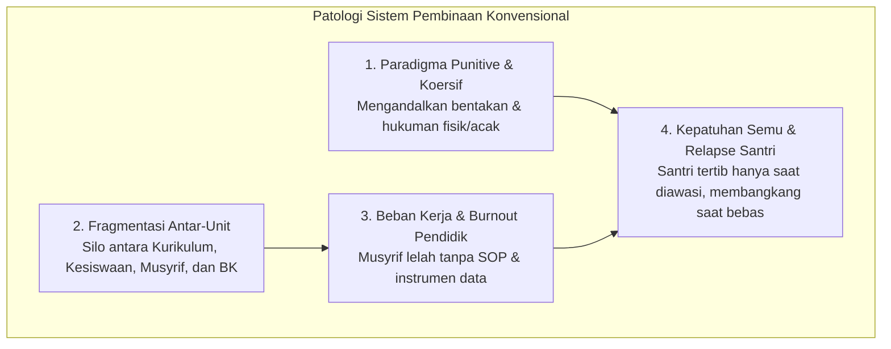
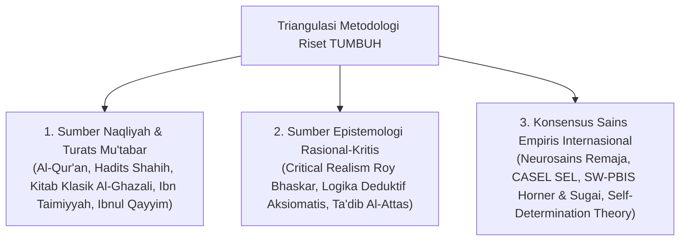
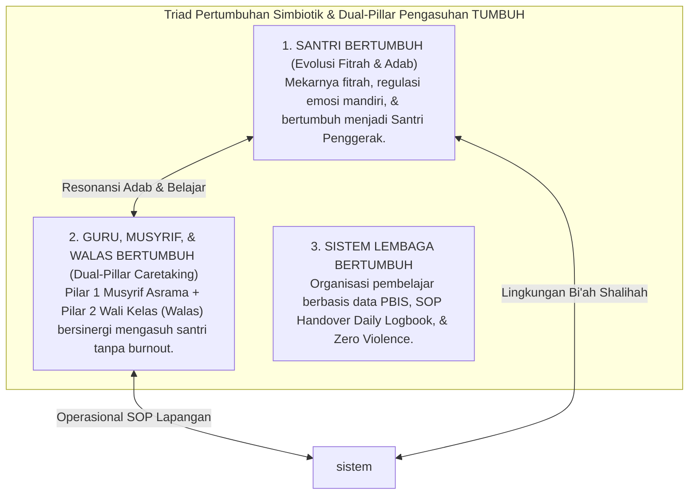

# MONOGRAF RISET AKADEMIK: REKONSTRUKSI FILOSOFIS SISTEM PEMBINAAN SANTRI DI DUNIA PESANTREN
## Pendekatan Integratif: Theocentric Worldview, Tradisi Turats, Konsensus Sains Perkembangan Global, Dual-Pillar Pengasuhan (Musyrif & Walas), dan Kontinuum 10 Tahap Pertumbuhan

**Dewan Riset & Keilmuan Ekosistem TUMBUH**  
*Dipublikasikan sebagai Naskah Monograf Riset Ilmiah (Jurnal Kebijakan & Filosofi Pendidikan Islam)*  
*Dokumen Rujukan Induk: Domain 01 Philosophy & Book Series Volume 01*

---

## ABSTRAK

> **Latar Belakang**: Mayoritas krisis pembinaan di dunia pesantren modern berakar pada ketiadaan sistem penunjang terpadu (*lack of systemic support*), dominasi pendekatan reaktif-koersif (*punitive discipline*), dan fragmentasi peran antara pengajaran kelas (*ta'lim*), pengasuhan asrama (*tarbiyah*), serta penanaman adab (*ta'dib*). Akibatnya, santri sering mengalami kepatuhan semu (*compliance under duress*), guru/musyrif mengalami kelelahan mental (*burnout*), dan institusi terjebak dalam krisis tata kelola berulang.
>
> **Tujuan Penelitian**: Merumuskan dan memvalidasi fondasi filosofis dari **Ekosistem TUMBUH** (*Human Development System*), yang secara eksplisit menjawab 10 pertanyaan fundamental filosofis, merumuskan **Dual-Pillar Pengasuhan (Musyrif Asrama & Wali Kelas Walas)**, dan menyinergikan secara simbiotik melintasi Kontinuum 10 Tahap Pertumbuhan.
>
> **Hasil Riset**: Terbentuk arsitektur filosofis 6 pilar yang koheren yang menjawab 10 pertanyaan eksistensial dasar: (1) *Theocentric Worldview*; (2) Antropologi *Fitrah* dan 5 lapis jiwa (*Jasad, Ruh, Nafs, Qalb, 'Aql*); (3) Hukum perkembangan *Tazkiyatun Nafs* (*Tadarruj Maratib al-Idrak s/d Kematangan Insan Adabi*); (4) Pedagogi holistik Disiplin Restoratif (*Firm & Kind*) & Dual-Pillar Pengasuhan; (5) Falsafah kepemimpinan **Qudwah** (*Sayyidul Qaumi Khaadimuhum*); serta (6) Sunnatullah perubahan melalui *Tadarruj*, *Istiqamah*, dan *Bi'ah Shalihah*.
>
> **Kata Kunci**: *Ekosistem TUMBUH, Pesantren, Qudwah, Dual-Pillar Caretaking, Musyrif & Walas, Tazkiyatun Nafs, Disiplin Restoratif, Triad Pertumbuhan.*

---

## 1. PENDAHULUAN & LATAR BELAKANG MASALAH

Pesantren adalah institusi pendidikan Islam tertua di Nusantara yang memiliki tradisi keilmuan dan keteladanan yang luhur. Namun, di tengah transformasi sosial kontemporer dan kompleksitas latar belakang santri generasi digital, dunia pesantren menghadapi tantangan sistemik yang mendasar.

---

## 2. KERANGKA METODOLOGI RISET

Penelitian filosofis dan desain sistem ini menggunakan **Metodologi Triangulasi Integratif Multi-Disiplin** (*The Integrative Epistemological Triangulation Protocol*):

---

## 3. JAWABAN AKADEMIS EKSPLISIT ATAS 10 PERTANYAAN FUNDAMENTAL FILOSOFIS

Sistem **TUMBUH** memberikan jawaban akademis, teologis, dan saintifik atas 10 pertanyaan eksistensial dasar pendidikan:

| No | Pertanyaan Fundamental Filosofis | Jawaban Konseptual & Akademis Ekosistem TUMBUH | Rujukan Utama |
| :---: | :--- | :--- | :--- |
| **1** | **Apa hakikat realitas yang sebenarnya?** *(Ontologi)* | Realitas adalah kesatuan utuh antara alam nyata (*'Alam asy-Syahadah*) dan alam gaib (*'Alam al-Ghaib*) di bawah kekuasaan absolut Allah SWT (*Theocentric Realism*). | QS. Al-Baqarah: 2–3; Roy Bhaskar (Critical Realism). |
| **2** | **Siapa manusia dan bagaimana strukturnya?** *(Antropologi)* | Manusia adalah makhluk suci berfitrah tauhid yang terdiri dari 5 lapis jiwa-raga: *Jasad, Ruh, Nafs, Qalb,* dan *'Aql*. | QS. Ar-Rum: 30; *Ihya' 'Ulumiddin* (Al-Ghazali). |
| **3** | **Mengapa manusia diciptakan dan ke mana akhirnya?** *(Teleologi/Eskatologi)* | Manusia diciptakan untuk beribadah dan bertanggung jawab di akhirat atas seluruh amalnya (*Inna lillahi wa inna ilaihi raji'un*). | QS. Az-Zariyat: 56; QS. Al-Qiyamah: 36. |
| **4** | **Apa tujuan sejati kehidupan di dunia?** | Menjalankan penghambaan (*'Ubudiyyah*) dan mandat kemakmuran bumi melalui kepemimpinan pelayanan (*Amanah Qiyadah & Khidmah*). | QS. Al-Baqarah: 30; *Adz-Dzari'ah* (Al-Isfahani). |
| **5** | **Apa makna sejati pertumbuhan?** | Pertumbuhan (*Al-Inma'*) adalah proses peningkatan kapasitas manusia secara utuh melintasi Tahap 1 s/d 10 (Penggerak, Pelaksana, Pembina, & Pemberdaya). | QS. Asy-Syams: 9; CASEL SEL Framework. |
| **6** | **Apa tolok ukur keberhasilan manusia?** | Kedalaman adab, integritas akhlak mulia, dan regulasi diri mandiri, bukan sekadar ranking angka atau prestasi piala kognitif semata. | HR. Tirmidzi (Sempurnanya Iman); Dweck (Growth Mindset). |
| **7** | **Apa hakikat pendidikan Islam?** | Trilogi agung: **Tarbiyah** (asrama), **Ta'dib** (adab/moral), dan **Ta'lim** (intelektual kelas) yang dikelola via Dual-Pillar Pengasuhan (Musyrif & Walas). | *The Concept of Education in Islam* (Al-Attas). |
| **8** | **Bagaimana dinamika perubahan perilaku terjadi?** | Melalui hukum sunnatullah (*Habit Loop 66-Hari, Choice Architecture Nudges, & Bi'ah Shalihah* dengan Magic Ratio 4:1). | QS. Ar-Ra'd: 11; Wood & Clear (Habit Science). |
| **9** | **Apa hakikat kepemimpinan dan relasi sosial?** | Kepemimpinan berbasis **Qudwah Hasanah** (*Shidq al-Amal*) dan **Servant Leadership** (*Sayyidul Qaumi Khaadimuhum*) yang menghapus feodalisme. | QS. Al-Ahzab: 21; Greenleaf (Servant Leadership). |
| **10**| **Bagaimana memposisikan waktu dan proses?** | Waktu adalah amanah ilahi yang diisi dengan proses bertahap (*Tadarruj*) dan ketabahan konsisten (*Istiqamah*) melalui pentahapan kesadaran ruhani (*Maratib al-Idrak*) dan kematangan fitrah (*Tazkiyatun Nafs*). | QS. Al-'Asr: 1–3; Kaizen & Scaffolding Theory. |

---

## 4. MAHA-PRINSIP: MODEL TRIAD PERTUMBUHAN SIMBIOTIK & DUAL-PILLAR PENGASUHAN

---

## 5. DAFTAR PUSTAKA KOMPREHENSIF (REFERENCES)

### Khazanah Turats & Literatur Islam
* Al-Attas, S. M. N. (1978). *Islam and Secularism*. ABIM.
* Al-Ghazali, Abu Hamid. (1998). *Ihya' 'Ulum ad-Din*. Dar al-Kutub al-'Ilmiyyah.
* Ibn Jama'ah, Badruddin. (2012). *Tadzkirah as-Sami' wa al-Mutakallim*. Dar al-Basyair.

### Literatur Sains Internasional & Peer-Reviewed Journals
* Baumrind, D. (1991). Authoritative parenting. *Journal of Early Adolescence*, 11(1), 56–95.
* CASEL. (2020). *CASEL's SEL Framework*. Collaborative for Academic, Social, and Emotional Learning.
* Clear, J. (2018). *Atomic Habits*. Avery.
* Horner, R. H., & Sugai, G. (2015). School-wide PBIS. *Behavior Analysis in Practice*, 8(1), 80–85.
* Kouzes, J. M., & Posner, B. Z. (2017). *The Leadership Challenge*. Wiley.
