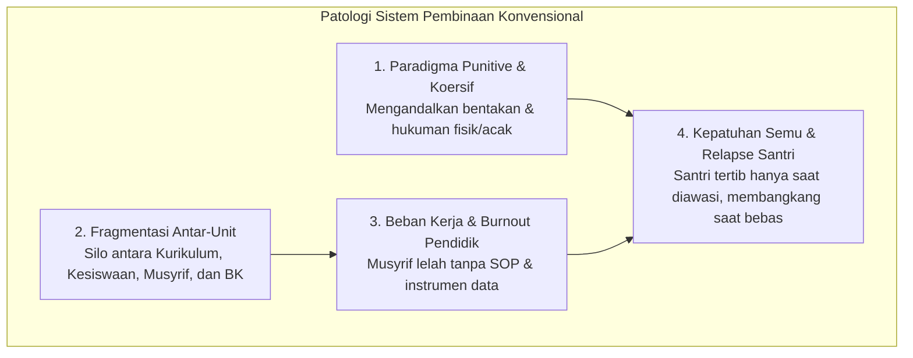
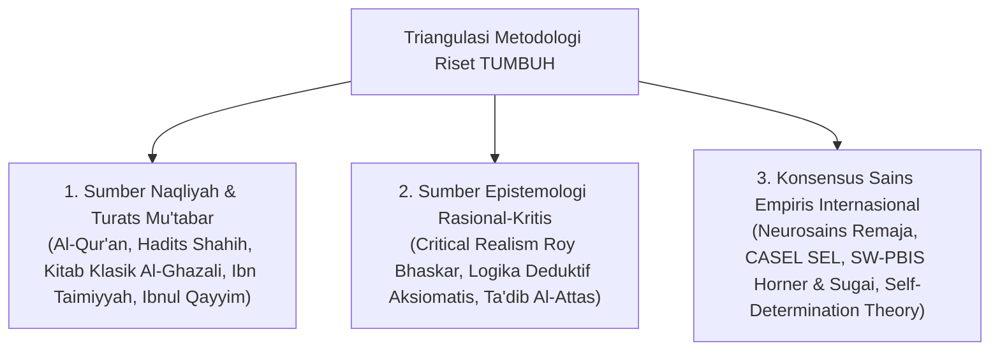
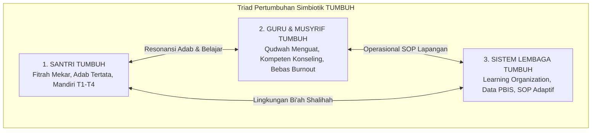
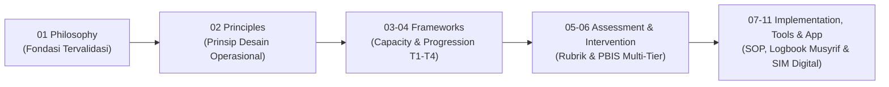

# MONOGRAF RISET AKADEMIK: REKONSTRUKSI FILOSOFIS SISTEM PEMBINAAN SANTRI DI DUNIA PESANTREN
## Pendekatan Integratif: Theocentric Worldview, Tradisi Turats, dan Konsensus Sains Perkembangan Global

**Dewan Riset & Keilmuan Ekosistem TUMBUH**  
*Dipublikasikan sebagai Naskah Monograf Riset Ilmiah (Jurnal Kebijakan & Filosofi Pendidikan Islam)*  
*Dokumen Rujukan Induk: Domain 01 Philosophy & Book Series Volume 01*

---

## ABSTRAK

> **Latar Belakang**: Mayoritas krisis pembinaan di dunia pesantren modern berakar pada ketiadaan sistem penunjang terpadu (*lack of systemic support*), dominasi pendekatan reaktif-koersif (*punitive discipline*), dan fragmentasi peran antara pengajaran kelas (*ta'lim*), pengasuhan asrama (*tarbiyah*), serta penanaman adab (*ta'dib*). Akibatnya, santri sering mengalami kepatuhan semu (*compliance under duress*), guru/musyrif mengalami kelelahan mental (*burnout*), dan institusi terjebak dalam krisis tata kelola berulang.
>
> **Tujuan Penelitian**: Merumuskan dan memvalidasi fondasi filosofis, ontologis, epistemologis, dan metodologis dari sistem baru yang disebut **Ekosistem TUMBUH** (*Human Development System*) untuk dunia pesantren, yang menyinergikan secara simbiotik: *Santri Bertumbuh, Guru/Musyrif Bertumbuh, dan Sistem Lembaga Bertumbuh*.
>
> **Metode**: Penelitian ini menggunakan metode integratif-kritis (*integrative-critical synthesis*) yang memadukan triangulasi hermeneutika *Nash & Turats* Islam, *Critical Realism*, neurosains perkembangan kognitif remaja, psikologi motivasi (*Self-Determination Theory*), *Social-Emotional Learning (CASEL)*, *School-Wide Positive Behavioral Interventions and Supports (SW-PBIS)*, dan etika hukum *Restorative Justice*.
>
> **Hasil Riset**: Terbentuk arsitektur filosofis 6 pilar yang koheren: (1) *Theocentric Worldview* yang memadukan realitas fisik dan metafisik; (2) Antropologi *Fitrah* dan struktur jiwa 5 lapis (*Jasad, Ruh, Nafs, Qalb, 'Aql*) dengan orientasi motivasi *Mahabbah*; (3) Hukum perkembangan *Tazkiyatun Nafs* (*Takhalli-Tahalli-Tajalli*) yang dioperasionalkan dalam Tangga TUMBUH (T1–T4); (4) Pedagogi holistik berbasis Disiplin Restoratif (*Firm & Kind*) dan PBIS Multi-Tier (Tier 1–3); (5) Falsafah kepemimpinan berbasis **Qudwah** (*Sayyidul Qaumi Khaadimuhum*) dan kaderisasi anti-feodalisme; serta (6) Sunnatullah perubahan melalui gradualisme (*Tadarruj*), konsistensi (*Istiqamah*), dan arsitektur lingkungan (*Bi'ah Shalihah*).
>
> **Implikasi Kebijakan**: Sistem TUMBUH memberikan blueprint akademik dan operasional baku untuk mentransformasi pesantren menjadi *Learning Organization* berbasis data objektif dan membebaskan institusi dari segala bentuk kekerasan fisik maupun intimidasi senioritas.
>
> **Kata Kunci**: *Ekosistem TUMBUH, Pesantren, Qudwah, Tazkiyatun Nafs, Disiplin Restoratif, PBIS Multi-Tier, Fitrah, Triad Pertumbuhan.*

---

## 1. PENDAHULUAN & LATAR BELAKANG MASALAH

Pesantren adalah institusi pendidikan Islam tertua di Nusantara yang memiliki tradisi keilmuan dan keteladanan yang luhur. Namun, di tengah transformasi sosial kontemporer dan kompleksitas latar belakang santri generasi digital, dunia pesantren menghadapi tantangan sistemik yang mendasar.

Berdasarkan telaah empiris dan data lapangan (*Sistem Pembinaan Pesantren 2026*), akar masalah pembinaan bukanlah pada dedikasi atau keikhlasan para pengasuhnya, melainkan pada **ketiadaan sistem penunjang (*systemic support*) yang kokoh, terstandarisasi, dan terukur**.

Kelemahan sistemik ini memicu lingkaran setan (*vicious cycle*):
1. **Reduksionisme Disiplin**: Disiplin dimaknai secara sempit sebagai "membuat anak jera dengan hukuman fisik atau sanksi acak" (lari lapangan, push up, pemotongan rambut kasar). Secara neurobiologis, ini mematikan motivasi intrinsik dan menumbuhkan dendam (*resentment*).
2. **Feodalisme Senioritas**: Pelimpahan wewenang kedisiplinan yang liar kepada santri pengurus tanpa supervisi SOP melahirkan budaya intimidasi dan perpeloncoan antar-angkatan.
3. **Ketiadaan Data Objektif**: Keputusan pembinaan sering didasarkan pada asumsi subjektif atau laporan insidental saat masalah sudah meledak, bukan pada pencegahan berbasis data (*data-driven prevention*).

Oleh karena itu, diperlukan **Rekonstruksi Filosofis Total** yang melahirkan sistem pembinaan terintegrasi, ilmiah, dan berakar pada nilai syariat.

---

## 2. KERANGKA METODOLOGI RISET

Penelitian filosofis dan desain sistem ini menggunakan **Metodologi Triangulasi Integratif Multi-Disiplin** (*The Integrative Epistemological Triangulation Protocol*):

Setiap proposisi diuji kelayakannya melalui 4 filter ilmiah:
1. **Filter Teologis (*Syar'i Validity*)**: Tidak boleh bertentangan dengan *Maqashid Syari'ah* dan *Nash Qath'i*.
2. **Filter Neurokognitif (*Cognitive Plausibility*)**: Selaras dengan tahap maturitas sistem saraf dan otak remaja (*Prefrontal Cortex vs Amygdala*).
3. **Filter Behavioral (*Empirical Applicability*)**: Dapat diobservasi, diukur perilakunya, dan diterapkan dalam interaksi nyata di asrama.
4. **Filter Etika Restoratif (*Human Dignity Protection*)**: Menjaga kemuliaan martabat santri (*Karamah Insaniyyah*) dan melarang kekerasan fisik/mental.

---

## 3. ANALISIS KOMPREHENSIF 6 PILAR FILOSOFIS PROJEK 1

### 3.1. Pillar 1: Worldview & Epistemologi Islam (`01 Worldview`)
Sistem TUMBUH dibangun di atas **Theocentric Realism** (Aksioma 1–10). Realitas terdiri dari dua dimensi yang tak terpisahkan: alam nyata (*'Alam asy-Syahadah*) dan alam gaib (*'Alam al-Ghaib*).
* **Kritik Epistemologis**: Mematahkan dualisme sekuler yang memisahkan ilmu agama dan sains modern. Sains modern adalah sarana memahami *Ayat Kauniyah* (Sunnatullah), sedangkan wahyu adalah penuntun arah nilai moral (*Ghayah*).
* **Integrasi Metodologis**: Menjadikan riset berbasis data (PBIS) sebagai manifestasi syar'i dari kehati-hatian (*Tabayyun*) dan keadilan (*'Adalah*).

### 3.2. Pillar 2: Antropologi & Hakikat Manusia (`02 Human Nature`)
Manusia diciptakan di atas fondasi **Fitrah** bawaan yang suci dan luhur (*Ashalah al-Khair - QS. Ar-Rum: 30*).
* **Struktur 5 Lapis Insan**: 
  - **Ruh**: Sumber koneksi spiritual kepada Allah (*Spiritual Meaning*).
  - **Qalb**: Pusat kesadaran moral, niat, dan iman (*Emotional Center & Core Values*).
  - **'Aql**: Daya nalar kognitif dan pembeda benar-salah (*Executive Function & Responsible Decision-Making*).
  - **Nafs**: Dinamika dorongan diri dari *Ammaarah* (impulsif), *Lawwaamah* (kesadaran muhasabah), hingga *Muthmainnah* (regulasi diri stabil).
  - **Jasad**: Wadah biologis motorik dan kebiasaan harian (*Physical Habits*).
* **Transformasi Motivasi**: Menggeser motivasi dari level rendah (*Khauf / Fear of Punishment*) menuju level puncak (*Mahabbah, Syukr, dan Self-Regulation* - Deci & Ryan, 2000).

### 3.3. Pillar 3: Perkembangan Santri & Tazkiyatun Nafs (`03 Human Development`)
Proses pembinaan santri adalah operasionalisasi dari doktrin **Tazkiyatun Nafs** melalui 3 fase klasik yang disintesiskan dengan sains modern:
1. **Takhalli (Dekomposisi Kebiasaan Buruk)** $\rightarrow$ *Root-cause Analysis & Restorative De-escalation*.
2. **Tahalli (Habituasi Kebajikan)** $\rightarrow$ *Explicit Instruction & Positive Reinforcement*.
3. **Tajalli (Karakter Spontan / Malakah)** $\rightarrow$ *Mastery, Qudwah, & Self-Directed Leadership*.

Lintasan ini diterjemahkan ke dalam **Tangga TUMBUH**:
* **T1 (Adaptasi & Orientasi)**: Pengenalan kultur dan rasa aman (*Psychological Safety*).
* **T2 (Habituasi Dasar)**: Pembentukan rutinitas ibadah dan adab harian (*Habit Formation*).
* **T3 (Internalisasi Nilai)**: Penguatan pemahaman mendalam dan regulasi emosi (*CASEL SEL Integration*).
* **T4 (Kemandirian & Keteladanan)**: Integritas mandiri dan menjadi figur teladan (*Qudwah*) bagi adik kelas.

### 3.4. Pillar 4: Falsafah Pendidikan & Disiplin Restoratif PBIS (`04 Education`)
Menyatukan trilogi agung **Tarbiyah** (pengasuhan biologis-emosional di asrama), **Ta'dib** (penanaman adab dan disiplin moral), dan **Ta'lim** (pengajaran intelektual di kelas).
* **Pergeseran ke Disiplin Restoratif**: Berfokus pada perbaikan kerugian (*Restitution*), penyelesaian masalah (*Resolution*), dan pemulihan relasi (*Reconciliation - Zehr, 2002*).
* **Sistem Dukungan Berjenjang (School-Wide PBIS Multi-Tier)**:
  - **Tier 1 (Universal - 80-90%)**: Matriks ekspektasi positif di seluruh area, pengajaran eksplisit, rasio apresiasi 4:1.
  - **Tier 2 (Targeted - 10-15%)**: Intervensi kelompok kecil, bimbingan konseling, *Check-In/Check-Out (CICO)*.
  - **Tier 3 (Intensive - 1-5%)**: Penanganan komprehensif terpadu oleh Tim BK, Musyrif, dan Keluarga.

### 3.5. Pillar 5: Kepemimpinan Berbasis Qudwah (`05 Leadership`)
* **Asas Utama: Qudwah Qabla ad-Da'wah (*Model The Way - Kouzes & Posner, 2017*)**: Otoritas pembina bersumber dari keselarasan amalan (*Shidq al-Amal*), bukan dari tingginya nada bentakan.
* **Servant Leadership (*Sayyidul Qaumi Khaadimuhum*)**: Pemimpin hadir untuk melayani kebutuhan pertumbuhan santri.
* **Kaderisasi Santri Anti-Feodalisme**: Organisasi Santri (OSIS/Klub) difungsikan sebagai wadah *Peer Mentoring*, menghapus segala tradisi perpeloncoan atau kontak fisik tidak beradab.

### 3.6. Pillar 6: Sunnatullah Dinamika Perubahan (`06 Change`)
* **Prinsip Tadarruj (Gradualisme / Kaizen)**: Karakter terbentuk melalui akumulasi kebiasaan-kebiasaan kecil (*micro-habits - Clear, 2018*) yang realistis.
* **Prinsip Istiqamah (Konsistensi Repetisi)**: Menjaga repetisi amalan dengan sokongan jadwal dan SOP yang mengunci konsistensi.
* **Arsitektur Bi'ah Shalihah**: Menata lingkungan asrama (*Nudge Theory & Choice Architecture - Thaler & Sunstein, 2008*) untuk menutup titik rawan (*hotspots*) dan menjaga rasio interaksi positif minimal **4:1 hingga 5:1** (*Gottman Ratio*).

---

## 4. MAHA-PRINSIP: MODEL TRIAD PERTUMBUHAN SIMBIOTIK

Inti terdalam dari riset filosofis ini adalah penegakan **Triad Pertumbuhan Simbiotik (*The Triadic Symbiotic Growth Model*)**:

| Entitas | Kondisi Sebelum TUMBUH | Transformasi Pasca TUMBUH | Indikator Keberhasilan Pertumbuhan |
| :--- | :--- | :--- | :--- |
| **Santri** | Patuh karena takut, sering relapse, pasif, rentan friksi sosial. | Mandiri (*self-regulated*), memiliki adab luhur, berempati, dan aktif berorganisasi. | Sholat tepat waktu mandiri, inisiatif kebersihan, kepemimpinan T4. |
| **Guru & Musyrif** | Lelah (*burnout*), reaktif membentak, minim pelatihan konseling. | Pendidik profesional, sabar (*hilm*), menguasai pedagogi restoratif, sejahtera batin. | Kemampuan mendengarkan aktif, rasio apresiasi > 4:1, keteladanan ibadah. |
| **Sistem Lembaga** | Birokrasi kaku, silo antar-unit, penanganan kasus berbasis gosip/emosi. | *Learning Organization*, SOP baku, keputusan berbasis data PBIS, iklim tanpa rasa takut. | Penurunan pelanggaran 30–50%, evaluasi berkala adaptif, kepercayaan wali santri tinggi. |

---

## 5. ANALISIS KRITIK, EVALUASI GAP & MITIGASI RISIKO LAPANGAN

### 5.1. Kritik Terhadap Pola Pikir Lama di Pesantren
1. **Kritik Ilusi "Jera Melalui Kekerasan"**: Secara sains neurobiologi kognitif, hukuman fisik hanya menekan perilaku ke alam bawah sadar dan memicu lonjakan kortisol. Begitu pengawasan hilang, perilaku buruk kembali muncul dalam bentuk yang lebih manipulatif (*covert delinquency*).
2. **Kritik Terhadap Formalisme Kurikulum**: Pesantren yang hanya mengejar target hafalan (*Ta'lim*) tanpa merawat adab pergaulan (*Ta'dib*) dan kesehatan emosional santri (*Tarbiyah*) melahirkan generasi yang cerdas intelektual namun rapuh karakternya.

### 5.2. Evaluasi Potensi Hambatan Lapangan & Rekomendasi Mitigasi
* **Hambatan 1: Resistensi Musyrif Senior terhadap Disiplin Restoratif**:
  - *Mitigasi*: Program sertifikasi intensif musyrif mengenai psikologi perkembangan remaja dan simulasi penanganan kasus dengan pendekatan *Firm & Kind*.
* **Hambatan 2: Beban Administrasi Pencatatan Data Perilaku PBIS**:
  - *Mitigasi*: Pengembangan aplikasi digital mobile-first (*TUMBUH App*) yang memungkinkan musyrif mencatat presensi dan insiden dalam 1–2 ketukan layar (*low-friction user interface*).
* **Hambatan 3: Diskoneksi Komunikasi antara Asrama dan Sekolah/Madrasah**:
  - *Mitigasi*: Standarisasi forum koordinasi mingguan antara Musyrif Kamar dan Wali Kelas dengan agenda telaah data perilaku terpadu.

---

## 6. REKOMENDASI ROADMAP PENGEMBANGAN SISTEMIK

---

## 7. OPERASIONALISASI PRAKTIS: MATRIKS PENERJEMAHAN AKSIOMA KE KAMAR ASRAMA

| No | Aksioma Filosofis Worldview | Skenario Kejadian di Asrama | Tindakan Konkrit Musyrif / Ustadz | Tindakan Terlarang (Pelanggaran Aksioma) |
| :---: | :--- | :--- | :--- | :--- |
| **1** | **Hakikat Sumber Kebenaran** | Santri mempertanyakan aturan larangan gadget/konten tidak beradab. | Menjelaskan hikmah syariat & kehormatan diri (*Iffah*) berbasis wahyu dengan kelembutan. | Menjawab dengan emosi: *"Aturan ya aturan, jangan banyak protes!"* |
| **2** | **Hakikat Manusia & Fitrah** | Santri melanggar aturan kebersihan kamar atau terlambat. | Menggunakan pendekatan *Husnudzan Aktif*: melihat santri sebagai pribadi baik yang butuh bimbingan adab. | Melabeli santri dengan julukan buruk (*"anak nakal", "pemalas", "pembuat onar"*). |
| **3** | **Tujuan Kehidupan** | Santri enggan piket kamar atau malas berorganisasi. | Mengajarkan bahwa piket & khidmah adalah bagian dari amanah kepemimpinan dan ibadah muamalah. | Menganggap piket hanya tugas mekanis sepele tanpa nilai spiritual. |
| **4** | **Makna Pertumbuhan (*Al-Inma'*)**| Santri menunjukkan kemajuan adab meski hafalannya lambat. | Memberikan apresiasi positif (*Poin PBIS*) atas pertumbuhan karakter tanpa mendiskriminasi hafalan. | Membanding-bandingkan santri secara destruktif dengan kawan yang lebih cepat. |
| **5** | **Makna Keberhasilan** | Pembagian raport akhir semester di pesantren. | Menonjolkan grafik radar pertumbuhan adab dan catatan kualitatif motivasi Musyrif. | Hanya memuji santri juara 1 akademik dan mengabaikan santri berakhlak mulia. |
| **6** | **Poros Gravitasi Tauhid** | Membangunkan santri untuk Sholat Subuh berjamaah. | Menggunakan pendekatan *Fiqhu al-Inhadh*: membangunkan dengan nada hangat, sentuhan lembut, & doa Subuh. | Menyiram air, membentak keras, atau memukul tempat tidur dengan kayu. |
| **7** | **Hakikat Interaksi Sosial** | Terjadi perselisihan/ejekan antar-santri senior & junior. | Menghentikan ejekan seketika, mengadakan *Restorative Chat*, dan menegakkan iklim aman. | Membiarkan senior mengintimidasi junior dengan alasan "pendisiplinan senioritas". |
| **8** | **Tanggung Jawab Lingkungan** | Sampah berserakan di sekitar halaman kamar asrama. | Mengajak santri kerja bakti bersama (*Mayoran & Khidmah*) dengan teladan Musyrif turun tangan. | Memerintah santri membersihkan sampah sementara Musyrif hanya mengawasi sambil main HP. |
| **9** | **Integrasi Ilmu Pengetahuan** | Kajian materi kebersihan & kesehatan reproduksi remaja. | Memadukan sunnah thaharah Turats dengan sains kebersihan medis & neurosains perkembangan. | Memisahkan pelajaran syariat dari fakta sains medis secara dikotomis. |
| **10**| **Waktu & Sunnatullah Proses** | Santri baru (T1) masih mengalami *homesick* & lupa jadwal. | Memfasilitasi proses adaptasi bertahap (*Scaffolding*) & *Peer Buddy T4* tanpa menuntut sempurna. | Menuntut santri T1 langsung mandiri total seperti santri T4 di minggu pertama. |

---

## 8. LANDASAN SYAR'I & DE-SEKULARISASI ILMU (INTEGRASI SAINS & TURATS)

### 8.1. Dalil Syar'i & Kaidah Fiqih Integrasi Sains
1. **Dalil Hikmah (HR. Tirmidzi)**: Metodologi sains empiris mengenai perilaku manusia (PBIS dan neurosains) yang terbukti membawa kemaslahatan adalah bagian dari *Hikmah* yang wajib diserap dan dinaungi di bawah tauhid.
2. **Kaidah Al-Aslu fil-Asy-ya'i al-Ibahah**: Penggunaan instrumen manajemen perilaku (Kartu CICO, aplikasi digital, rubrik PBIS) adalah sarana (*Wasilah*) muamalah pendidikan yang hukum asalnya BOLEH.
3. **Kaidah Ma La Yatimmu al-Wajib Illa Bihi Fahuwa Wajib**: Menjaga keharmonisasi asrama dan melindungi santri dari kekerasan fisik (*Hifzh an-Nafs*) adalah WAJIB.

### 8.2. Tabel Jawaban atas Sanggahan & Salah Paham

| Sanggahan / Salah Paham | Jawaban Dalil Syar'i & Epistemologis | Rujukan Ulama & Sains |
| :--- | :--- | :--- |
| *"Mengapa memakai PBIS dan CASEL SEL dari Barat? Apakah Turats tidak cukup?"* | Turats memberikan **Prinsip Nilai Moral Absolute (*Ghayah*)**, sedangkan PBIS/SEL memberikan **Tools Teknis Empiris (*Wasilah*)**. Memadukan keduanya adalah sunnah ulama klasik. | *Dar'u Ta'arud* (Ibn Taimiyyah); HR. Tirmidzi tentang Hikmah. |
| *"Menghilangkan hukuman fisik akan membuat santri manja dan tidak tahan banting."* | Rasulullah SAW tidak pernah memukul anak/istri sepanjang hidupnya. Ketahanan banting (*Grit*) terbentuk melalui tantangan beradab (*Scaffolding T1-T4*), bukan dari trauma fisik. | HR. Muslim (Kelembutan Rasulullah); *Atomic Habits* (Clear, 2018). |
| *"Pencatatan data perilaku PBIS mengurangi keikhlasan Musyrif."* | Pencatatan data adalah bentuk **Tabayyun** (klarifikasi objektif - QS. Al-Hujurat: 6) dan pencatatan ketertiban (*Kitabah* - QS. Al-Baqarah: 282). | QS. Al-Hujurat: 6; *Ihya' 'Ulumiddin* (Al-Ghazali). |

---

## 9. DAFTAR PUSTAKA KOMPREHENSIF (REFERENCES)

### Khazanah Turats & Literatur Islam
* Al-Attas, S. M. N. (1978). *Islam and Secularism*. ABIM.
* Al-Ghazali, Abu Hamid. (1998). *Ihya' 'Ulum ad-Din* (4 Jilid). Dar al-Kutub al-'Ilmiyyah.
* Ibn Jama'ah, Badruddin. (2012). *Tadzkirah as-Sami' wa al-Mutakallim*. Dar al-Basyair.
* Ibn Taimiyyah, Taqi ad-Din. (1991). *Dar' Ta'arud al-'Aql wa an-Naql*. Jami'ah al-Imam.
* Ibnul Qayyim al-Jauziyyah. (2003). *Madarijus Salikin*. Dar al-Hadits.

### Literatur Sains Internasional & Peer-Reviewed Journals
* Baumrind, D. (1991). Authoritative parenting. *Journal of Early Adolescence*, 11(1), 56–95.
* CASEL. (2020). *CASEL's SEL Framework*. Collaborative for Academic, Social, and Emotional Learning.
* Clear, J. (2018). *Atomic Habits*. Avery.
* Deci, E. L., & Ryan, R. M. (2000). Self-determination theory. *Psychological Inquiry*, 11(4), 227–268.
* Horner, R. H., & Sugai, G. (2015). School-wide PBIS. *Behavior Analysis in Practice*, 8(1), 80–85.
* Kouzes, J. M., & Posner, B. Z. (2017). *The Leadership Challenge*. Wiley.
* Zehr, H. (2002). *The Little Book of Restorative Justice*. Good Books.
