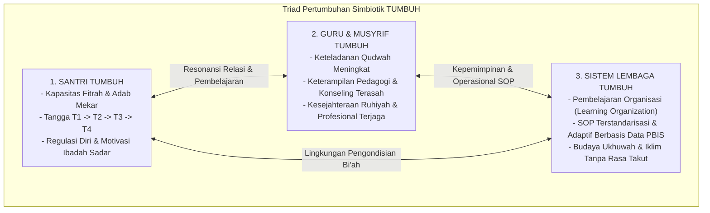

# P1-00-Model-Pertumbuhan-Triadik: Santri Tumbuh, Guru Tumbuh, Sistem Tumbuh

## Tujuan
Merumuskan hukum pertumbuhan ekosistem pesantren yang bersifat simbiotik dan menyeluruh: **Pertumbuhan Santri**, **Pertumbuhan Guru & Musyrif**, dan **Pertumbuhan Sistem Lembaga** sebagai satu kesatuan organik (*The Triadic Symbiotic Growth Model*).

---

## 1. Kegagalan Model Konvensional (Sistem Satu Arah)

Banyak pesantren mengalami kemandekan (*stagnasi*) karena memandang pertumbuhan hanya sebagai beban sepihak bagi santri:
* Santri dituntut berakhlak mulia, sementara guru/musyrif mengalami kejenuhan mental (*burnout*) dan tidak pernah ditingkatkan kapasitasnya.
* Guru menuntut santri disiplin, sementara sistem lembaga kaku, reaktif, dan tidak memiliki mekanisme evaluasi berbasis data.

---

## 2. Paradigma Triad Pertumbuhan Simbiotik TUMBUH

---

## 3. Rincian 3 Pilar Pertumbuhan

### A. Pilar 1: Santri Tumbuh (*Pertumbuhan Subjek Didik*)
* **Esensi**: Santri tidak dicetak seperti pabrik, melainkan difasilitasi tumbuh dari benih fitrah menjadi pribadi mandiri yang berilmu dan berakhlak mulia.
* **Lintasan**: Melalui Tangga T1 (Adaptasi) → T2 (Habituasi) → T3 (Internalisasi) → T4 (Kemandirian & Qudwah).
* **Indikator**: Mampu meregulasi emosi, berinisiatif dalam ibadah tanpa diawasi, dan aktif berkontribusi bagi sesama santri.

### B. Pilar 2: Guru & Musyrif Tumbuh (*Pertumbuhan Pendidik & Pengasuh*)
* **Esensi**: Pendidik bukan sekadar pengawas kaku atau penceramah satu arah, melainkan pembelajar abadi (*Continuous Learner*) yang terus bertumbuh kapasitas jiwanya.
* **Lintasan**: 
  1. *Penguatan Ruhiyah & Qudwah*: Memperdalam keikhlasan dan ketenangan batin (*Hilm*).
  2. *Kecakapan Pedagogi & Konseling*: Menguasai teknik komunikasi restoratif (*Firm & Kind*), identifikasi kebutuhan perilaku (FBA), dan diferensiasi pembelajaran di kelas.
  3. *Kesejahteraan Mental*: Terhindar dari *burnout* melalui supervisi suportif, beban kerja terukur, dan penghargaan institusi.
* **Indikator**: Meningkatnya kemampuan mendengarkan aktif, berkurangnya reaksi emosional saat menghadapi pelanggaran santri, dan kebahagiaan dalam mengasuh.

### C. Pilar 3: Sistem Lembaga Tumbuh (*Pertumbuhan Institusi & Budaya*)
* **Esensi**: Pesantren bertransformasi menjadi **Organisasi Pembelajar (*Learning Organization - Peter Senge*)** yang adaptif dan terus menyempurnakan diri (*Continuous Quality Improvement / Kaizen*).
* **Lintasan**:
  1. *Sistem Berbasis Bukti (Data-Driven)*: Mengambil keputusan pembinaan berdasarkan rekam data faktual PBIS (lokasi rawan, waktu kejadian, tren perilaku), bukan asumsi subjektif.
  2. *Standarisasi SOP yang Jelas*: Menghilangkan tumpang tindih peran antara Kurikulum, Musyrif, BK, dan Sarpras.
  3. *Budaya Tanpa Intimidasi (*Psychological Safety*)*: Menumbuhkan atmosfer ukhuwah di mana kesalahan menjadi data evaluasi untuk perbaikan bersama, bukan ajang mencari kambing hitam.
* **Indikator**: Berkurangnya angka pelanggaran tahunan secara terukur, SOP yang makin ringkas dan efektif, serta reputasi lembaga yang makin dipercaya umat.

---

## 4. Hukum Hubungan Timbal Balik (Resonansi Ekologis)

> *"Santri yang bertumbuh mustahil lahir dari guru yang jiwanya tertekan, dan guru yang bahagia mustahil bertahan di dalam sistem yang rapuh dan kacau."*

1. **Jika Sistem Sehat**: Memudahkan guru yang baik untuk menjalankan kebaikan secara konsisten (*Sistem Pembinaan Pesantren 2026*).
2. **Jika Guru Bahagia & Kompeten**: Menghadirkan keteladanan (*Qudwah*) yang menenteramkan jiwa santri.
3. **Jika Santri Beradab**: Membawa keberkahan, kemudahan pengelolaan, dan kebanggaan bagi seluruh ekosistem pesantren.
