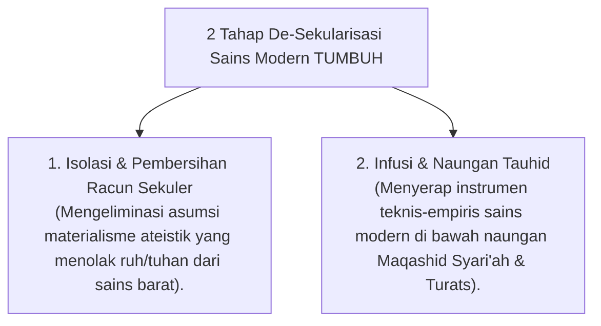

# P1-01: PANDUAN ARGUMENTASI SYAR'I INTEGRASI SAINS MODERN DAN TURATS ISLAM
## Kerangka Epistemologis De-Sekularisasi Ilmu dan Implikasi Metodologis dalam Ekosistem TUMBUH

**Dewan Keilmuan Ekosistem TUMBUH**  
*Sub-Domain*: `01 Philosophy / 01 Worldview`  
*Penanggung Jawab*: Pakar Epistemologi Turats & Pakar Filosofi TUMBUH

---

## 1. PENDAHULUAN & DIALEKTIKA INTEGRASI KEILMUAN

Dokumen ini disusun sebagai **panduan pertanggungjawaban Syar'i dan pembenteng epistemologis** untuk merespons kekhawatiran atau salah paham dari kalangan konservatif yang menganggap pemaduan sains modern (*SW-PBIS, CASEL SEL, Neurosains, SDT*) dengan tradisi *Turats* sebagai "bida'ah metodologis" atau "westernisasi pesantren".

---

## 2. DASAR HUKUM SYAR'I & KAIDAH FIQIH INTEGRASI SAINS

### A. Dalil Al-Qur'an dan Sunnah Shahihah

1. **Dalil Hikmah dari Mana Saja Datangnya**:
   > *"Hikmah (ilmu yang bermanfaat) itu adalah barang hilang milik orang mukmin. Di mana pun ia menemukannya, maka dialah yang paling berhak mengambilnya."* (HR. Tirmidzi).
   * **Analisis Syar'i**: Metodologi sains empiris mengenai perilaku manusia (seperti PBIS dan neurosains) yang terbukti membawa kemaslahatan adalah bagian dari *Hikmah* yang wajib diserap dan dinaungi di bawah tauhid.

2. **Perintah Memperhatikan Ayat Kauniyah**:
   > *"Kami akan memperlihatkan kepada mereka tanda-tanda (kekuasaan) Kami di segenap ufuk dan pada diri mereka sendiri, sehingga jelaslah bagi mereka bahwa Al-Qur'an itu adalah benar."* (QS. Fussilat: 53).
   * **Analisis Syar'i**: Temuan neurosains mengenai fungsi otak dan psikologi remaja adalah penyingkapan *Ayat Kauniyah* Allah pada diri manusia.

### B. Kaidah Fiqih & Usuliyyah

1. **Kaidah Al-Aslu fil-Asy-ya'i al-Ibahah (Hukum Asal Muamalah/Metode adalah Boleh)**:
   > **"Al-Aslu fil-Asy-ya'i al-Ibahah hatta Yadulla ad-Dalilu 'ala at-Tahrim."**
   * **Implikasi**: Penggunaan instrumen manajemen perilaku (seperti Kartu CICO, aplikasi digital, atau rubrik PBIS) adalah sarana (*Wasilah*) muamalah pendidikan yang hukum asalnya BOLEH dan disukai selama tidak mengharamkan yang halal atau menghalalkan yang haram.

2. **Kaidah Ma La Yatimmu al-Wajib Illa Bihi Fahuwa Wajib (Sarana Kewajiban)**:
   > **"Ma La Yatimmu al-Wajib Illa Bihi Fahuwa Wajib."** (Sesuatu yang menyebabkan kewajiban tidak sempurna tanpanya, maka hukumnya menjadi wajib).
   * **Implikasi**: Menjaga keharmonisasi asrama dan melindungi santri dari kekerasan fisik (*Hifzh an-Nafs*) adalah WAJIB. Jika pencegahan kekerasan tersebut membutuhkan sistem instrumen data PBIS dan pelatihan SEL, maka penggunaan instrumen sains tersebut menjadi sangat dianjurkan/wajib secara metodologis.

---

## 3. PROSES DE-SEKULARISASI ILMU (SINTESIS EPISTEMOLOGIS)

Sesuai kerangka epistemologi Prof. Syed Naquib al-Attas (*Islam and Secularism*, 1978), ekosistem **TUMBUH** melakukan **De-sekularisasi Ilmu** terhadap sains modern melalui 2 tahap:

---

## 4. TABEL JAWABAN ATAS SANGGAHAN & SALAH PAHAM

| Sanggahan / Salah Paham | Jawaban Dalil Syar'i & Epistemologis | Rujukan Ulama & Sains |
| :--- | :--- | :--- |
| *"Mengapa memakai PBIS dan CASEL SEL dari Barat? Apakah Turats tidak cukup?"* | Turats memberikan **Prinsip Nilai Moral Absolute (*Ghayah*)**, sedangkan PBIS/SEL memberikan **Tools Teknis Empiris (*Wasilah*)**. Memadukan keduanya adalah sunnah ulama klasik (seperti Ibn Sina yang menyerap logika Aristoteles untuk membela akidah). | *Dar'u Ta'arud* (Ibn Taimiyyah); HR. Tirmidzi tentang Hikmah. |
| *"Menghilangkan hukuman fisik akan membuat santri manja dan tidak tahan banting."* | Rasulullah SAW tidak pernah memukul anak/istri sepanjang hidupnya. Ketahanan banting (*Grit*) terbentuk melalui tantangan beradab (*Scaffolding T1-T4*), bukan melalui trauma fisik yang merusak Prefrontal Cortex. | HR. Muslim (Kelembutan Rasulullah); *Atomic Habits* (Clear, 2018). |
| *"Pencatatan data perilaku PBIS mengurangi keikhlasan Musyrif."* | Pencatatan data adalah bentuk **Tabayyun** (klarifikasi objektif - QS. Al-Hujurat: 6) dan pencatatan ketertiban (*Kitabah* - QS. Al-Baqarah: 282) agar penilaian Musyrif tidak didasari fitnah atau prasangka (*Zhan*). | QS. Al-Hujurat: 6; *Ihya' 'Ulumiddin* (Al-Ghazali). |

---

## 5. KESIMPULAN LEGITIMASI

Integrasi sains modern di ekosistem **TUMBUH** bukan sekadar peminjaman tanpa arah, melainkan **Penyingkapan Ayat Kauniyah Allah** yang memperkokoh pelaksanaan Syariat Islam secara ilmiah, adil, dan beradab.
