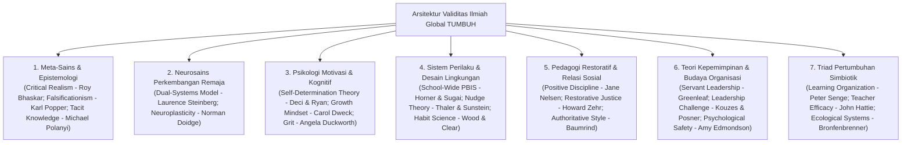

# Laporan Pertanggungjawaban Ilmiah & Validitas Akademis Multi-Disiplin Global: Sistem TUMBUH

## 1. Landasan Epistemologi Global & Integrasi Multi-Disiplin
Sistem **TUMBUH** dibangun bukan hanya di atas tradisi teologi dan turats Islam, melainkan diperkuat secara rigor oleh **konsensus sains global terkini**—mencakup *Cognitive Neuroscience, Developmental Psychology, Behavioral Economics, Applied Behavior Analysis (ABA), Social-Emotional Learning (SEL), Restorative Practices,* dan *Modern Organizational Leadership*.

---

## 2. Prinsip Triad Pertumbuhan Simbiotik (The Triadic Symbiotic Growth Model)

Sistem TUMBUH menolak paradigma lama yang menuntut pertumbuhan hanya pada diri santri. TUMBUH menegakkan hukum simbiotik:
1. **Santri Tumbuh**: Dari adaptasi, pembiasaan, hingga kemandirian dan kepemimpinan adab (J1–J4).
2. **Guru & Musyrif Tumbuh**: Melalui pengembangan profesional berkelanjutan, kecakapan konseling restoratif, keteladanan *Qudwah*, dan pencegahan *burnout*.
3. **Sistem Lembaga Tumbuh**: Bertransformasi menjadi *Learning Organization* berbasis data objektif PBIS, evaluasi SOP adaptif (*Continuous Improvement / Kaizen*), dan kultur *Psychological Safety*.

---

## 2. Matriks Komprehensif Rujukan Sains Internasional per Domain

| Domain TUMBUH | Konsep Kunci TUMBUH | Rujukan Syariat & Turats | Rujukan Literatur Ilmiah Internasional (Peer-Reviewed & Global Studies) |
| :--- | :--- | :--- | :--- |
| **01 Worldview** | Realitas objektif utuh; Integrasi Wahyu & Sains; Anti-relativisme moral. | QS. Al-Baqarah: 2–3; QS. Fussilat: 53; *Dar' Ta'arud* (Ibn Taimiyyah); *Islam and Secularism* (Al-Attas, 1978). | • **Roy Bhaskar (1975)**: *A Realist Theory of Science* (Critical Realism). • **Karl Popper (1959)**: *The Logic of Scientific Discovery* (Realisme Objektif). • **Michael Polanyi (1966)**: *The Tacit Dimension*. |
| **02 Human Nature** | Fitrah kebaikan bawaan; 5 Lapis Struktur Jiwa; Motivasi Intrinsik (*Mahabbah*). | QS. Ar-Rum: 30; HR. Bukhari no. 1385; *Ihya' 'Ulumiddin* (Al-Ghazali). | • **Edward L. Deci & Richard M. Ryan (2000)**: *Self-Determination Theory* (Intrinsic Motivation, Autonomy, Competence, Relatedness). • **Viktor Frankl (1946)**: *Man's Search for Meaning* (Logotherapy). • **Carl Rogers (1961)**: *On Becoming a Person* (Unconditional Positive Regard). |
| **03 Human Development** | *Tazkiyatun Nafs*; Jenjang J1–J4; 5 Dimensi SEL & 10 Karakter Santri. | QS. Asy-Syams: 7–10; *Madarijus Salikin* (Ibnul Qayyim). | • **Laurence Steinberg (2008)**: *A Social Neuroscience Perspective on Adolescent Risk-Taking* (Prefrontal Cortex vs Socioemotional System). • **CASEL Meta-Analysis (Durlak et al., 2011; Mahoney et al., 2021)**: Dampak SEL pada peningkatan akademik 11 persentil dan penurunan problem perilaku. • **Carol Dweck (2006)**: *Mindset: The New Psychology of Success*. • **Erik Erikson (1968)**: *Identity: Youth and Crisis*. |
| **04 Education** | Trilogi *Tarbiyah-Ta'dib-Ta'lim*; Disiplin Restoratif; PBIS Multi-Tier (Tier 1–3). | HR. Abu Dawud no. 495; Kaidah Fiqh *Dar'ul Mafasid*. | • **George Sugai & Robert H. Horner (2002, 2015)**: *School-Wide Positive Behavioral Interventions and Supports (SW-PBIS)*. • **Jane Nelsen & Lynn Lott (2006)**: *Positive Discipline in the Classroom* (Firm & Kind approach). • **Howard Zehr (2002)**: *The Little Book of Restorative Justice*. • **Diana Baumrind (1991)**: *Authoritative Parenting and Adolescent Development*. • **John Hattie (2009)**: *Visible Learning* (Effect size hubungan guru-siswa d = 0.72). |
| **05 Leadership** | Kepemimpinan **Qudwah**; *Sayyidul Qaumi Khaadimuhum*; Kaderisasi Anti-Bullying. | QS. Al-Ahzab: 21; HR. Bukhari no. 893; HR. Muslim no. 1829. | • **James Kouzes & Barry Posner (2017)**: *The Leadership Challenge* (Prinsip #1: *Model the Way* = Qudwah). • **Robert K. Greenleaf (1977)**: *Servant Leadership*. • **Amy Edmondson (1999, 2018)**: *The Fearless Organization* (Psychological Safety & Anti-Fear Culture). • **Albert Bandura (1977)**: *Social Learning Theory* (Observational Learning & Role Modeling). |
| **06 Change Dynamics** | Sunnatullah perubahan; *Tadarruj* (Gradual); *Istiqamah*; Bi'ah Shalihah (Rasio 4:1). | QS. Ar-Ra'd: 11; Hadits Pembunuh 100 Nyawa (HR. Bukhari & Muslim). | • **Wendy Wood & David Neal (2009)**: *The Habitual Consumer* (Habit Loops & Environmental Cues). • **James Clear (2018)**: *Atomic Habits*. • **Richard Thaler & Cass Sunstein (2008)**: *Nudge: Improving Decisions About Health, Wealth, and Happiness*. • **John Gottman & Robert Levenson (1992)**: *The Magic Ratio* (Minimal 5:1 rasio interaksi positif). |

---

## 3. Telaah Bukti Empiris & Neurosains Lapangan

### A. Neurosains Emosi & Bahaya Hukuman Fisik (Punitive Coercion)
* Studi neuroimaging (**Teicher et al., 2016; McLaughlin et al., 2019**) membuktikan bahwa kekerasan verbal, fisik, dan hukuman mempermalukan anak memicu hiperaktivitas pada *amygdala* dan penyusutan volume *hippocampus* serta penekanan fungsi *dorsolateral prefrontal cortex (dlPFC)*.
* Akibat biologis: Santri masuk ke mode defensif bertahan hidup (*fight, flight, or freeze*). Dalam kondisi ini, **pembelajaran moral dan pembentukan karakter mustahil terjadi**, yang tersisa hanyalah kepatuhan semu di depan mata pembina (*compliance under threat*) yang meledak menjadi pemberontakan (*relapse*) saat lepas pengawasan.

### B. Keberhasilan Efektivitas PBIS & Restorative Discipline di Ribuan Sekolah Dunia
* Evaluasi multi-tahun oleh **U.S. Department of Education (OSEP Technical Assistance Center on PBIS)** pada lebih dari 27.000 sekolah menunjukkan bahwa penerapan intervensi berjenjang (Tier 1 Universal, Tier 2 Targeted, Tier 3 Intensive):
  1. Menurunkan angka pelanggaran disiplin dan skorsing sebesar **30% hingga 50%**.
  2. Meningkatkan waktu belajar efektif (*instructional time*) dan iklim keselamatan sekolah (*school climate*).
  3. Memperbaiki hubungan kepercayaan antara siswa dan tenaga pendidik secara terukur.

### C. Teori Determinasi Diri (*Self-Determination Theory*)
* Penelitian empiris **Deci, Ryan, & Niemiec (2006)** menunjukkan bahwa motivasi berbasis kontrol eksternal (hadiah materi/ancaman sanksi) menghasilkan retensi karakter yang rapuh. Sebaliknya, pemenuhan 3 kebutuhan psikologis dasar (**Autonomy**, **Competence**, **Relatedness**) melahirkan motivasi otonom (*autonomous motivation*) yang bertahan seumur hidup.

---

## 4. Kesimpulan Kredibilitas Global
Dengan integrasi rujukan internasional ini, sistem **TUMBUH** membuktikan bahwa prinsip-prinsip pendidikan pesantren (adab, qudwah, tazkiyah, bi'ah shalihah) memiliki **kesejajaran mutlak dengan temuan sains modern terdepan di tingkat global**. Sistem ini dapat diuji, direplikasi, dan dipertanggungjawabkan di tingkat akademik internasional.
