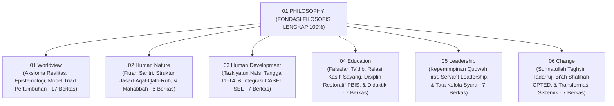

# Domain 01: Philosophy (Fondasi Filosofis Ekosistem TUMBUH)

Domain ini merupakan akar ontologis, epistemologis, dan antropologis dari seluruh sistem pembinaan santri di ekosistem **TUMBUH** di dunia pesantren.

---

## 🏛️ Struktur Sub-Domain (6 Pilar Lengkap 100%)

---

## 📑 Indeks Dokumen Induk & Jurnal Riset Monograf Utuh

* 📄 **[Jurnal-Monograf-Riset-Filosofi-TUMBUH.md](./Jurnal-Monograf-Riset-Filosofi-TUMBUH.md)**: **Monograf Riset Ilmiah Utuh & Terkonsolidasi** (Mencakup 6 Pilar Filosofis, Matriks Operational Asrama, Pertanggungjawaban Syar'i & De-sekularisasi Sains, serta Rujukan Turats & Sains Internasional).
* 📄 **[P1-00-Model-Pertumbuhan-Triadik.md](./P1-00-Model-Pertumbuhan-Triadik.md)**: Maha-Prinsip Triad Pertumbuhan Simbiotik (Santri Tumbuh, Guru Tumbuh, Sistem Tumbuh).
* 📄 **[P1-Pertanggungjawaban-Ilmiah-Filosofi-TUMBUH.md](./P1-Pertanggungjawaban-Ilmiah-Filosofi-TUMBUH.md)**: Laporan validitas ilmiah multi-disiplin global.

---

## 📁 Direktori 6 Sub-Domain (Tersusun 100% Monograf Komprehensif)

1. 📁 **[01 Worldview](./01%20Worldview/README.md)** (17 Dokumen: Ontologi Wujud, Epistemologi Islam Terpadu, & Model Triad)
2. 📁 **[02 Human Nature](./02%20Human%20Nature/README.md)** (6 Dokumen: Hakikat Fitrah, Struktur Insan, & Motivasi Mahabbah)
3. 📁 **[03 Human Development](./03%20Human%20Development/README.md)** (7 Dokumen: Tazkiyatun Nafs, Tangga T1–T4, & CASEL SEL)
4. 📁 **[04 Education](./04%20Education/README.md)** (7 Dokumen: Falsafah Ta'dib, Relasi Murabbi, SW-PBIS Restoratif, & Didaktik Ramah Otak)
5. 📁 **[05 Leadership](./05%20Leadership/README.md)** (7 Dokumen: Falsafah Kepemimpinan Qudwah, Servant Leadership, & Tata Kelola Syura)
6. 📁 **[06 Change](./06%20Change/README.md)** (7 Dokumen: Sunnatullah Taghyir, Tadarruj Istiqamah, Bi'ah Shalihah CPTED, & Transformasi Sistemik)
