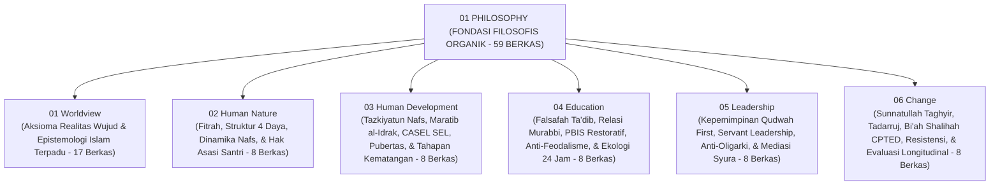

# DOMAIN 01: PHILOSOPHY (FONDASI FILOSOFIS EKOSISTEM TUMBUH)
## *Sitemap Induk Konstitusi Nilai, Ontologi Insan Pembelajar, Epistemologi Integratif, & Filsafat Pendidikan Pesantren (59 Berkas Organik Lengkap)*

**Nomor Identifikasi**: `P1/INDEX-MASTER/2026`  
**Domain**: `01 Philosophy`  
**Klasifikasi**: Master Indeks Fondasi Filosofis, Worldview Islam, Epistemologi, Antropologi Insan, Trajektori Pertumbuhan, Ta'dib, Kepemimpinan Qudwah, & Dinamika Perubahan

---

## 🏛️ STRUKTUR SUB-DOMAIN (100% ORGANIK, MENDALAM, & KOMPREHENSIF)

Domain ini merupakan akar ontologis, epistemologis, dan antropologis dari seluruh sistem pembinaan santri di ekosistem **TUMBUH** di dunia pesantren:

---

## 📑 DOKUMEN INDUK & JURNAL RISET MONOGRAF UTUH

* 📄 **[Jurnal-Monograf-Riset-Filosofi-TUMBUH.md](./Jurnal-Monograf-Riset-Filosofi-TUMBUH.md)**: **Monograf Riset Ilmiah Utuh & Terkonsolidasi** (Mencakup 6 Pilar Filosofis, Matriks Operational Asrama, Pertanggungjawaban Syar'i & De-sekularisasi Sains, serta Rujukan Turats & Sains Internasional).
* 📄 **[P1-00-Model-Pertumbuhan-Triadik.md](./P1-00-Model-Pertumbuhan-Triadik.md)**: Maha-Prinsip Triad Pertumbuhan Simbiotik (Santri Tumbuh, Guru Tumbuh, Sistem Tumbuh).
* 📄 **[P1-Pertanggungjawaban-Ilmiah-Filosofi-TUMBUH.md](./P1-Pertanggungjawaban-Ilmiah-Filosofi-TUMBUH.md)**: Laporan validitas ilmiah multi-disiplin global.

---

## 📁 DIREKTORI 6 SUB-DOMAIN (59 BERKAS ORGANIK TUNTAS)

1. 📁 **[01 Worldview](./01%20Worldview/README.md)** (**17 Dokumen**: Ontologi Realitas Wujud, Aksioma Dasar, Validasi Dalil/Turats, Kritik Internal, Sumber Ilmu, Proses Perolehan, Validasi, Integrasi, Batas Ilmu, Hikmah, & Sintesis Epistemologi)
2. 📁 **[02 Human Nature](./02%20Human%20Nature/README.md)** (**8 Dokumen**: Hakikat Fitrah, Struktur Insan 4 Lapis, Potensi Amanah, Motivasi Intrinsik, Dinamika 3 Nafs, Hak Asasi Santri, & Sintesis)
3. 📁 **[03 Human Development](./03%20Human%20Development/README.md)** (**8 Dokumen**: Tazkiyatun Nafs, Fase Remaja, Maratib al-Idrak, CASEL SEL, Krisis Pubertas, Puncak Insan Adabi, & Sintesis)
4. 📁 **[04 Education](./04%20Education/README.md)** (**8 Dokumen**: Falsafah Ta'dib, Relasi Murabbi Kasih Sayang, SW-PBIS Restoratif, Didaktik Ramah Otak, Kritik Feodalisme, Desain Ekologi 24 Jam, & Sintesis)
5. 📁 **[05 Leadership](./05%20Leadership/README.md)** (**8 Dokumen**: Falsafah Kepemimpinan Qudwah, Servant Leadership, Kaderisasi Santri, Tata Kelola Musyrif, Kritik Oligarki Dinasti, Mediasi Resolusi Konflik Asatidz, & Sintesis)
6. 📁 **[06 Change](./06%20Change/README.md)** (**8 Dokumen**: Sunnatullah Taghyir, Tadarruj Istiqamah, Bi'ah Shalihah CPTED, Transformasi Sistemik, Manajemen Resistensi Kultural, Evaluasi Dampak Longitudinal, & Sintesis)
