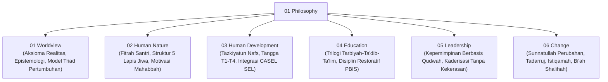

# Domain 01: Philosophy (Fondasi Filosofis Ekosistem TUMBUH)

Domain ini merupakan akar ontologis, epistemologis, dan antropologis dari seluruh sistem pembinaan santri di ekosistem **TUMBUH** di dunia pesantren.

---

## Struktur Sub-Domain

---

## Indeks Dokumen Induk & Jurnal Riset Monograf Utuh

* 📄 **[Jurnal-Monograf-Riset-Filosofi-TUMBUH.md](./Jurnal-Monograf-Riset-Filosofi-TUMBUH.md)**: **Monograf Riset Ilmiah Utuh & Terkonsolidasi** (Mencakup 6 Pilar Filosofis, Matriks Operational Asrama, Pertanggungjawaban Syar'i & De-sekularisasi Sains, serta Rujukan Turats & Sains Internasional).
* 📄 **[P1-00-Model-Pertumbuhan-Triadik.md](./P1-00-Model-Pertumbuhan-Triadik.md)**: Maha-Prinsip Triad Pertumbuhan Simbiotik (Santri Tumbuh, Guru Tumbuh, Sistem Tumbuh).
* 📄 **[P1-Pertanggungjawaban-Ilmiah-Filosofi-TUMBUH.md](./P1-Pertanggungjawaban-Ilmiah-Filosofi-TUMBUH.md)**: Laporan validitas ilmiah multi-disiplin global.

---

## Direktori Sub-Domain
1. 📁 **[01 Worldview](./01%20Worldview/README.md)** (17 Dokumen: Ontologi, Epistemologi & Model Triad)
2. 📁 **[02 Human Nature](./02%20Human%20Nature/README.md)** (5 Dokumen: Hakikat Fitrah & Struktur Insan)
3. 📁 **[03 Human Development](./03%20Human%20Development/README.md)** (5 Dokumen: Tazkiyah, Tangga T1-T4 & SEL)
4. 📁 **[04 Education](./04%20Education/README.md)** (4 Dokumen: Falsafah Tarbiyah & Disiplin Restoratif PBIS)
5. 📁 **[05 Leadership](./05%20Leadership/README.md)** (4 Dokumen: Falsafah Kepemimpinan Qudwah & Kaderisasi)
6. 📁 **[06 Change](./06%20Change/README.md)** (4 Dokumen: Sunnatullah Perubahan & Bi'ah Shalihah)
