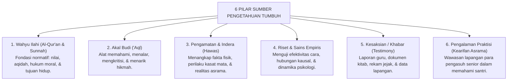

# 02 — Sumber Pengetahuan

Sistem pendidikan TUMBUH tidak dibangun dari satu sumber pengetahuan saja. Kita hidup dalam dunia nyata yang membutuhkan bimbingan agama, kejernihan akal sehat, dan ketelitian ilmu pengetahuan.

Namun, menggunakan banyak sumber bukan berarti mencampuradukkannya secara serampangan. Setiap sumber pengetahuan memiliki **kewenangan, fungsi, dan batas kodrati** masing-masing. Kekacauan cara berpikir terjadi ketika seseorang memaksakan suatu sumber untuk menjawab pertanyaan yang bukan wilayahnya.[^1]

Dalam sistem TUMBUH, sumber-sumber pengetahuan dipetakan ke dalam enam pilar yang bekerja secara terpadu:

## 1. Wahyu Ilahi (*Al-Wahy*)

Wahyu Allah yang termaktub dalam Al-Qur'an al-Karim dan Sunnah Nabi yang shahih merupakan **sumber kebenaran tertinggi dan mutlak** bagi hal-hal yang bersifat normatif, keyakinan aqidah, hukum halal-haram, dan tujuan akhir penciptaan manusia.[^2]

Wahyu tidak diperlakukan sebagai data laboratorium yang menunggu dibuktikan oleh survei manusia agar menjadi benar. Perintah Allah untuk berbuat adil, larangan berbuat zalim, dan kepastian hari akhirat adalah kebenaran sejati yang menjadi pemandu hidup. 

Namun demikian, wahyu tidak boleh disalahgunakan untuk menggantikan penyelidikan teknis. Al-Qur'an tidak diturunkan untuk menjadi buku panduan tata cara memperbaiki pompa air asrama atau resep takaran obat batuk santri. Untuk urusan-urusan duniawi tersebut, manusia diperintahkan menggunakan akal dan sains.

## 2. Akal Budi (*Al-'Aql*)

Akal adalah anugerah agung yang membedakan manusia dari binatang. Akal berfungsi untuk menimbang, memahami hubungan sebab-akibat, membandingkan argumen, dan menyimpulkan hikmah dari ayat-ayat qauliyyah (teks Al-Qur'an) maupun ayat-ayat kauniyyah (keteraturan alam).[^3]

Al-Qur'an berulang kali mencela orang-orang yang tidak mau menggunakan akalnya:

> أَفَلَا تَعْقِلُونَ
>
> *"Maka apakah kamu tidak berakal (tidak berpikir)?"* (QS. Al-Baqarah [2]: 44)[^4]

Imam Sa'duddin at-Taftazani dalam *Syarh al-'Aqa'id an-Nasafiyyah* menempatkan akal sebagai salah satu sarana ilmu pengetahuan (*asbab al-'ilm*) yang sah.[^5] Namun, akal bukanlah tuhan. Akal manusia memiliki batas kemampuan; akal tidak bisa mengarang sendiri bagaimana rincian alam kubur atau tata cara shalat lima waktu tanpa bimbingan wahyu. Akal bekerja sebagai penerang dan pengolah, bukan pencipta kebenaran mutlak.

## 3. Pengalaman dan Pengamatan Inderawi (*Al-Hawas*)

Pengamatan langsung melalui panca indera yang sehat (*al-hawas as-salimah*) memberikan pengetahuan nyata tentang kondisi di sekitar kita.[^6] Dalam kehidupan pesantren, pengamatan indera sangat penting untuk memeriksa:
- Apakah santri tampak pucat dan kelelahan saat bangun pagi;
- Bagaimana kerapian kamar asrama dan kebersihan lemari santri;
- Pola nada bicara guru saat mengajar di kelas.

Namun, pengamatan sepintas tidak otomatis menjadi kesimpulan yang pasti benar. Apa yang kita lihat bisa menipu jika kita tergesa-gesa mengambil kesimpulan. Sebagai contoh: seorang santri yang duduk termenung di pojok masjid bisa disangka "sedang khusyuk berdzikir", padahal kenyataannya ia sedang menangis karena rindu orang tuanya atau sedang pusing menahan sakit gigi. Karena itu, pengamatan indera harus selalu dipadukan dengan konfirmasi dan penyelidikan lebih lanjut.

## 4. Penelitian Ilmiah (*Riset Empiris*)

Penelitian ilmiah adalah cara pengamatan yang dilakukan secara sistematis, terencana, dan menggunakan metode yang teruji. Riset sangat dibutuhkan oleh TUMBUH ketika kita ingin membuat pernyataan (*klaim*) mengenai:
- Pola perkembangan psikologis santri usia remaja;
- Efektivitas kurikulum pembelajaran bahasa Arab;
- Desain tata ruang asrama yang sehat dan ramah anak.

Dalam riset modern, ada satu kaidah emas yang harus dipatuhi: **hubungan keterkaitan (korelasi) tidak otomatis membuktikan adanya hubungan sebab-akibat (kausalitas)**.[^7] 

Misalnya: data menunjukkan bahwa santri yang sering minum susu di kantin memiliki nilai hafalan yang tinggi. Kita tidak boleh langsung menyimpulkan bahwa *"minum susu menyebabkan santri cepat hafal Al-Qur'an"*. Bisa jadi santri yang membeli susu berasal dari keluarga yang sangat peduli pada pendidikan dan memiliki kebiasaan belajar yang lebih teratur di rumah. Analisis sebab-akibat membutuhkan pengujian variabel yang sangat teliti.

## 5. Kesaksian dan Keterangan Orang Lain (*Testimony / Al-Khabar*)

Kita tidak mungkin mengamati sendiri seluruh kejadian di pesantren sepanjang 24 jam. Pimpinan pesantren mengetahui kondisi santri dari laporan musyrif; musyrif mengetahui masalah kamar dari laporan ketua kamar; dan orang tua mengetahui perkembangan anak dari buku evaluasi lembaga.

Pengetahuan yang diperoleh melalui penuturan orang lain ini sah digunakan, asalkan memenuhi dua syarat utama:[^8]
1. **Integritas Pembawa Kabar (*'Adalah*)**: Pembawa berita dikenal jujur, tidak gemar berdusta, dan tidak memiliki kepentingan pribadi atau dendam terhadap pihak yang diberitakan;
2. **Kecakapan dan Kejelian (*Dhabth*)**: Pembawa berita benar-benar memahami apa yang ia sampaikan, bukan sekadar mendengar selentingan kabar burung dari orang lain.

## 6. Pengalaman Praktisi Lapangan (*Kearifan Asrama*)

Para kyai, nyai, dan musyrif senior yang telah mengabdi puluhan tahun memiliki kepekaan rasa (*intuisi pedagogis*) yang sangat tajam dalam membaca watak santri. Pengalaman lapangan ini sangat berharga untuk memahami situasi-situasi rumit yang tidak tertulis di buku teks teori.

Namun demikian, TUMBUH menjaga agar pengalaman pribadi tidak diubah menjadi hukum mutlak. Pengalaman seorang musyrif dalam menangani satu santri pada masa lalu belum tentu cocok diterapkan kepada santri lain yang memiliki latar belakang keluarga dan psikologis yang berbeda. Pengalaman lapangan harus dipadukan dengan evaluasi yang adil dan prinsip-prinsip umum perlindungan anak.

---

## Menghubungkan Pertanyaan dengan Sumber yang Tepat

Epistemology TUMBUH tidak membuat peringkat kaku seolah-olah satu sumber selalu mengalahkan sumber lainnya dalam segala situasi. Yang benar adalah **mencocokkan jenis pertanyaan dengan sumber pengetahuan yang berwenang**:[^9]

| Pertanyaan yang Dihadapi | Sumber Pengetahuan Utama | Cara Pemeriksaan yang Tepat |
| :--- | :--- | :--- |
| *"Untuk apa manusia hidup dan apa batasan halal-haram?"* | **Wahyu (Al-Qur'an & Sunnah)** | Kajian tafsir, hadits shahih, ushul fiqih, dan maqashid syari'ah. |
| *"Apakah program pembiasaan tidur tepat waktu efektif menurunkan stres santri?"* | **Riset Empiris & Data Kesehatan** | Pengukuran tingkat stres, catatan klinik asrama, dan kuesioner sebelum-sesudah program. |
| *"Siapa yang memulai perselisihan di kamar 4 tadi malam?"* | **Khabar, Observasi, & Wawancara (Tabayyun)** | Mendengarkan kedua belah pihak secara langsung, memeriksa saksi, dan mencocokkan fakta tanpa emosi. |
| *"Bagaimana cara terbaik menjelaskan materi faraidh agar mudah dipahami santri usia 15 tahun?"* | **Pedagogi, Akal Budi, & Pengalaman Praktisi** | Menggunakan analogi diagram, latihan studi kasus, dan evaluasi hasil latihan di kelas. |

Inilah kedewasaan berpikir yang dibangun dalam TUMBUH: kita menghormati wahyu tanpa menjadi anti-sains, dan kita memanfaatkan sains tanpa kehilangan kompas keimanan.

Pertanyaan berikutnya adalah: **bagaimana cara kita memperoleh pengetahuan dari sumber-sumber tersebut sesuai dengan ragam pertanyaan yang kita hadapi?**

Pembahasan tersebut diuraikan pada berkas selanjutnya: `03-Cara-Memperoleh-Pengetahuan.md`.

---

### Sumber yang Digunakan (*Footnotes*)

[^1]: Al-Attas, Syed Muhammad Naquib. (1993). *Islam and Secularism*. Kuala Lumpur: ISTAC, hlm. 120–135 (Kritik terhadap kekeliruan epistemologi yang memutlakkan satu sumber atau mengaburkan hierarki ilmu).
[^2]: Al-Ghazali, Abu Hamid Muhammad bin Muhammad. (1997). *Al-Mustashfa min 'Ilm al-Ushul*, Jilid 1. Beirut: Mu'assasah ar-Risalah, hlm. 100–115.
[^3]: Al-Mawardi, Ali bin Muhammad bin Habib. (1987). *Adab ad-Dunya wa ad-Din*. Beirut: Dar al-Kutub al-Ilmiyyah, hlm. 25–40 (Kedudukan akal sebagai anugerah utama penuntun manusia).
[^4]: Al-Qur'an al-Karim, Surah Al-Baqarah [2] ayat 44.
[^5]: Al-Taftazani, Sa'duddin Mas'ud bin Umar. (1418 H). *Syarh al-'Aqa'id an-Nasafiyyah*. Kairo: Maktabah al-Kulliyyat al-Azhariyyah, hlm. 15–20.
[^6]: Al-Raghib al-Ashfahani, Al-Husain bin Muhammad. (1987). *Al-Dhari'ah ila Makarim asy-Syari'ah*. Kairo: Dar ash-Shahwah, hlm. 55–65.
[^7]: Pearl, Judea. (2009). *Causality: Models, Reasoning, and Inference* (2nd ed.). Cambridge: Cambridge University Press, hlm. 1–35. Penjelasan ilmiah mengenai perbedaan mendasar antara asosiasi statistik/korelasi dengan inferensi kausal.
[^8]: Lackey, Jennifer. (2021). Epistemological Problems of Testimony. In E. N. Zalta (Ed.), *The Stanford Encyclopedia of Philosophy*. https://plato.stanford.edu/entries/testimony-episprob/.
[^9]: Basri, M., Fadriati, & Suryana, E. (2025). Sources of Knowledge in Islam: Epistemology of Revelation, Reason, Senses, and Intuition. *At-Tasyrih: Jurnal Tarbiyah dan Hukum Islam*, 11(2), 178–187. https://doi.org/10.55849/attasyrih.v11i2.353.
