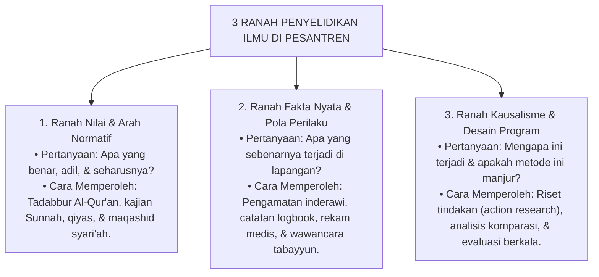

# 03 — Cara Memperoleh Pengetahuan

Setelah kita mengenali berbagai sumber pengetahuan, langkah penting berikutnya adalah memahami **bagaimana pengetahuan tersebut diperoleh secara benar**.

Sebuah pisau bedah sangat bermanfaat di tangan seorang dokter ahli bedah, tetapi bisa sangat berbahaya jika digunakan untuk menebang pohon besar. Begitu pula dalam dunia ilmu: **setiap metode pencarian ilmu dirancang untuk jenis pertanyaan tertentu**. Jika kita salah memilih cara memperoleh informasi, maka kesimpulan yang kita hasilkan akan keliru, tidak adil, dan menyesatkan.[^1]

Dalam sistem pendidikan pesantren TUMBUH, kita tidak memaksakan satu metode tunggal untuk segala urusan. Kita memegang kaidah metodologis yang sangat mendasar: **metode harus tunduk dan mengikuti jenis pertanyaan yang hendak dijawab (*al-manhaj yatba'u al-mas'alah*)**.[^2]

---

## 1. Tiga Ranah Penyelidikan dan Cara Memperolehnya

Dalam keseharian di pesantren, setidaknya ada tiga ranah besar persoalan yang membutuhkan cara penyelidikan yang berbeda:

### A. Ranah Nilai dan Arah Hidup (Normatif)
Ketika kita bertanya: *"Bagaimana adab murid kepada guru?"* atau *"Apakah boleh menghukum santri dengan cara mempermalukannya di depan umum?"*, pertanyaan ini tidak bisa dijawab hanya dengan melakukan pemungutan suara (voting) santri atau survei kepuasan.

Pertanyaan ini berkaitan dengan hukum halal-haram dan kehormatan manusia. Cara memperoleh pengetahuannya adalah dengan **merujuk kepada dalil wahyu, memahami kaidah-kaidah hukum Islam (*ushul al-fiqh*), dan mengkaji maqashid syari'ah** (tujuan-tujuan perlindungan jiwa, akal, dan martabat manusia).[^3] Akal budi kita gunakan untuk memahami konteks penerapannya, bukan untuk mengubah hukum syariat semau kita.

### B. Ranah Fakta Nyata dan Perilaku Harian (Empiris)
Ketika kita bertanya: *"Mengapa santri di asrama lantai 2 sering terlambat bangun shalat subuh?"*, pertanyaan ini tidak selesai hanya dengan membaca nasihat keutamaan bangun pagi di kitab kuning.

Kita harus turun ke lapangan untuk memeriksa fakta nyata:
- Apakah lampu kamar dimatikan tepat waktu?
- Apakah ada antrean panjang di kamar mandi asrama?
- Apakah ada kegiatan malam yang selesai terlalu larut sehingga waktu tidur santri terpangkas?

Cara memperoleh pengetahuan di ranah ini adalah melalui **observasi langsung, pencatatan waktu yang akurat, wawancara santri secara empatik, dan pemeriksaan lingkungan**.[^4] Nasihat moral tetap penting, namun perbaikan tata kelola fasilitas nyata adalah kewajiban yang tidak boleh diabaikan.

### C. Ranah Pengalaman Pribadi dan Emosi Santri (Kualitatif / Konseling)
Ketika seorang santri tiba-tiba menjadi pendiam, prestasinya merosot, atau menarik diri dari pergaulan, kita tidak bisa memahaminya hanya dengan melihat lembar absensi atau deretan angka rapor.

Cara memperoleh pengetahuan tentang kondisi batin santri adalah melalui **pendekatan konseling yang amanah (*al-inshat at-tarbawi*)**:[^5]
- Menyediakan ruang bicara yang nyaman tanpa intimidasi;
- Menjamin kerahasiaan masalah pribadinya (*hifzh as-sirr*);
- Mendengarkan cerita dari sudut pandang santri dengan tulus tanpa terburu-buru menghakimi atau menyalahkan.

---

## 2. Kehati-hatian dalam Menarik Kesimpulan: Belajar dari Al-Ghazali

Imam Abu Hamid Al-Ghazali (w. 505 H) dalam pengembaraan intelektualnya yang terkenal (*Al-Munqidh min ad-Dalal*) memberikan teladan luar biasa tentang pentingnya kehati-hatian dalam memperoleh pengetahuan.[^6] Beliau menguji apakah informasi yang diterima mata kita selalu benar:
> *"Bintang di langit tampak oleh matamu hanya sebesar uang koin emas, padahal penalaran astronomi membuktikan bahwa bintang tersebut jauh lebih besar daripada bumi."*

Pelajaran dari Al-Ghazali ini sangat berharga bagi para pendidik dan santri di pesantren:
- **Jangan tergesa-gesa menyimpulkan dari satu pandangan mata.** Seorang santri yang tertidur saat pengajian kitab belum tentu karena ia malas atau berniat meremehkan guru; bisa jadi ia baru saja membersihkan asrama yang kotor atau sedang demam tinggi.
- **Periksa kembali dasar kesimpulan kita.** Apakah kita menyimpulkan berdasarkan bukti yang kuat, atau sekadar prasangka (*zhann*) yang dihembuskan oleh rasa curiga?

Al-Qur'an mengingatkan:

> يَا أَيُّهَا الَّذِينَ آمَنُوا اجْتَنِبُوا كَثِيرًا مِّنَ الظَّنِّ إِنَّ بَعْضَ الظَّنِّ إِثْمٌ
>
> *"Wahai orang-orang yang beriman, jauhilah banyak dari prasangka, sesungguhnya sebagian prasangka itu adalah dosa..."* (QS. Al-Hujurat [49]: 12)[^7]

---

## 3. Pilihan Metodologis Sistem TUMBUH

TUMBUH menolak dua kekeliruan besar dalam cara memperoleh pengetahuan:
1. **Dogmatisme Buta**: Menganggap bahwa semua persoalan kehidupan asrama bisa diselesaikan hanya dengan nasihat umum tanpa mau memeriksa data lapangan, sanitasi, dan psikologi perkembangan anak;
2. **Kekaguman Buta pada Metode Asing (Metodolatri)**: Mengambil mentah-mentah instrumen psikologi barat sekuler yang memandang manusia hanya sebagai hewan biologis tanpa mempertimbangkan nilai ruhani, fitrah, dan adab Islam.

Yang dipilih oleh TUMBUH adalah **keharmonisan yang adil antara pertanyaan, sumber, dan cara pencariannya**:[^8]

- Jika mencari arah moral $\rightarrow$ rujuk Wahyu Al-Qur'an dan Sunnah;
- Jika mencari sebab keterlambatan santri $\rightarrow$ periksa fakta lapangan dan lakukan tabayyun;
- Jika mencari cara pengajaran yang efektif $\rightarrow$ padukan metode pedagogi terbaik dengan evaluasi berkala;
- Jika mendengar desas-desus atau tuduhan pelanggaran $\rightarrow$ lakukan klarifikasi yang adil dan dengarkan saksi yang terpercaya.

Dengan cara inilah, pengetahuan yang digunakan oleh pesantren TUMBUH menjadi pengetahuan yang kokoh, tidak mengawang-awang, berkeadilan, dan membawa keberkahan bagi pembinaan santri.

Pertanyaan berikutnya: **setelah sebuah informasi atau pengetahuan kita peroleh, bagaimana kita menguji dan memastikan apakah pengetahuan tersebut benar-benar dapat dipercaya dan layak dijadikan dasar keputusan?**

Pembahasan tersebut diuraikan pada berkas selanjutnya: `04-Cara-Memeriksa-dan-Menilai-Pengetahuan.md`.

---

### Sumber yang Digunakan (*Footnotes*)

[^1]: Stanford Encyclopedia of Philosophy. (2024). *Epistemology*. Substantive revision by Matthias Steup & Ram Neta. https://plato.stanford.edu/entries/epistemology/.
[^2]: Al-Ghazali, Abu Hamid Muhammad bin Muhammad. (1997). *Al-Mustashfa min 'Ilm al-Ushul*, Jilid 1. Beirut: Mu'assasah ar-Risalah, hlm. 15–28 (Hubungan antara instrumen logika/manhaj dengan objek yang diselidiki).
[^3]: Al-Amidi, Ali bin Abi Ali bin Muhammad. (2003). *Al-Ihkam fi Ushul al-Ahkam*, Jilid 1. Riyadh: Dar ash-Shami'i, hlm. 75–88.
[^4]: Bandura, Albert. (2001). Social Cognitive Theory: An Agentic Perspective. *Annual Review of Psychology*, 52(1), 1–26. https://doi.org/10.1146/annurev.psych.52.1.1.
[^5]: Ibnu Jama'ah, Badruddin Muhammad bin Ibrahim. (2012). *Tadzkirah as-Sami' wa al-Mutakallim*. Beirut: Dar al-Basyair al-Islamiyyah, hlm. 55–68 (Etika pendidik dalam mendengarkan murid dan memahami latar belakang kejiwaannya).
[^6]: Al-Ghazali, Abu Hamid Muhammad bin Muhammad. (1967). *Al-Munqidh min ad-Dalal*. Beirut: Dar al-Andalus, hlm. 68–74.
[^7]: Al-Qur'an al-Karim, Surah Al-Hujurat [49] ayat 12. Terjemahan Kementerian Agama RI.
[^8]: Basri, M., Fadriati, & Suryana, E. (2025). Sources of Knowledge in Islam: Epistemology of Revelation, Reason, Senses, and Intuition. *At-Tasyrih: Jurnal Tarbiyah dan Hukum Islam*, 11(2), 178–187. https://doi.org/10.55849/attasyrih.v11i2.353.
