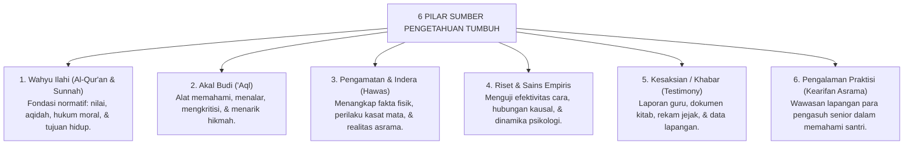
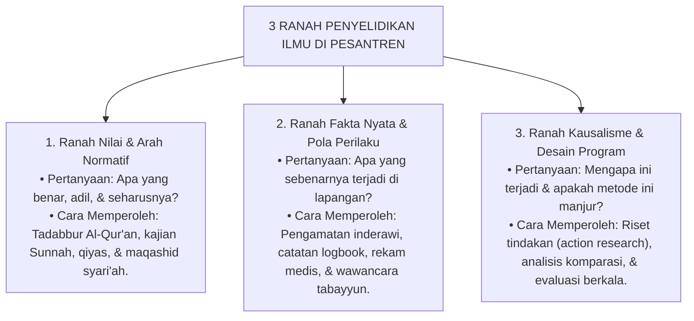

# KOMPILASI SELURUH ISI: 01_FUNDAMENTAL (TUMBUH v2.0.0)

> **Catatan:** Dokumen ini merupakan gabungan utuh dari seluruh berkas Markdown pada direktori `01_FUNDAMENTAL/` di ekosistem TUMBUH v2.0.0. Dibuat secara otomatis untuk memudahkan pembacaan komprehensif, pencarian teks terpadu, dan tinjauan holistik.

- **Total Berkas Tergabung:** 396 berkas
- **Tanggal Pembuatan:** 2026-09-29 16:03:07
- **Struktur Cakupan:**
  1. `01_PHILOSOPHY` (Falsafah Pendidikan, Worldview, Epistemologi, Human Nature, dll)
  2. `02_PRINCIPLES` (Prinsip-Prinsip Pembinaan & Disiplin Positif)
  3. `03_CORE_MODEL` (Model Inti TUMBUH)
  4. `04_PROGRESSION` (Progresi Jenjang Kemandirian Santri J1-J4)
  5. `05_ASSESSMENT` (Arsitektur Asesmen & Rubrik Perilaku)
  6. `06_INTERVENTION` (Sistem Intervensi Bertingkat PBIS & Restoratif)
  7. `FOUNDATION INTEGRITY` (Review & Penutupan Integritas Fondasi)

---

## DAFTAR ISI BERKAS (INDEX)

1. [01_FUNDAMENTAL/README.md](#file-1)
2. [01_FUNDAMENTAL/01_PHILOSOPHY/README.md](#file-2)
3. [01_FUNDAMENTAL/01_PHILOSOPHY/01_WORLDVIEW/README.md](#file-3)
4. [01_FUNDAMENTAL/01_PHILOSOPHY/01_WORLDVIEW/01-Definisi-Realitas.md](#file-4)
5. [01_FUNDAMENTAL/01_PHILOSOPHY/01_WORLDVIEW/02-Allah-sebagai-Al-Khaliq-dan-Relasi-Khaliq-Makhluk.md](#file-5)
6. [01_FUNDAMENTAL/01_PHILOSOPHY/01_WORLDVIEW/03-Realitas-Gaib-dan-Realitas-yang-Teramati.md](#file-6)
7. [01_FUNDAMENTAL/01_PHILOSOPHY/01_WORLDVIEW/04-Manusia-dan-Kedudukannya-sebagai-Makhluk.md](#file-7)
8. [01_FUNDAMENTAL/01_PHILOSOPHY/01_WORLDVIEW/05-Hakikat-Kehidupan-dan-Tujuan-Penciptaan-Manusia.md](#file-8)
9. [01_FUNDAMENTAL/01_PHILOSOPHY/01_WORLDVIEW/06-Nilai-Kebaikan-Tanggung-Jawab-dan-Amanah.md](#file-9)
10. [01_FUNDAMENTAL/01_PHILOSOPHY/01_WORLDVIEW/07-Implikasi-Worldview-bagi-Pendidikan.md](#file-10)
11. [01_FUNDAMENTAL/01_PHILOSOPHY/01_WORLDVIEW/90-Inventory-and-Lineage.md](#file-11)
12. [01_FUNDAMENTAL/01_PHILOSOPHY/01_WORLDVIEW/DAFTAR-PUSTAKA.md](#file-12)
13. [01_FUNDAMENTAL/01_PHILOSOPHY/02_EPISTEMOLOGY/README.md](#file-13)
14. [01_FUNDAMENTAL/01_PHILOSOPHY/02_EPISTEMOLOGY/01-Hakikat-Pengetahuan.md](#file-14)
15. [01_FUNDAMENTAL/01_PHILOSOPHY/02_EPISTEMOLOGY/02-Sumber-Pengetahuan.md](#file-15)
16. [01_FUNDAMENTAL/01_PHILOSOPHY/02_EPISTEMOLOGY/03-Cara-Memperoleh-Pengetahuan.md](#file-16)
17. [01_FUNDAMENTAL/01_PHILOSOPHY/02_EPISTEMOLOGY/04-Cara-Memeriksa-dan-Menilai-Pengetahuan.md](#file-17)
18. [01_FUNDAMENTAL/01_PHILOSOPHY/02_EPISTEMOLOGY/05-Jenis-dan-Tingkat-Klaim.md](#file-18)
19. [01_FUNDAMENTAL/01_PHILOSOPHY/02_EPISTEMOLOGY/06-Evidence-dan-Kekuatan-Bukti.md](#file-19)
20. [01_FUNDAMENTAL/01_PHILOSOPHY/02_EPISTEMOLOGY/07-Menggabungkan-Berbagai-Sumber-Pengetahuan.md](#file-20)
21. [01_FUNDAMENTAL/01_PHILOSOPHY/02_EPISTEMOLOGY/08-Implikasi-Epistemology-bagi-TUMBUH.md](#file-21)
22. [01_FUNDAMENTAL/01_PHILOSOPHY/02_EPISTEMOLOGY/09-Klasifikasi-Epistemik.md](#file-22)
23. [01_FUNDAMENTAL/01_PHILOSOPHY/02_EPISTEMOLOGY/10-Prinsip-Epistemik-TUMBUH.md](#file-23)
24. [01_FUNDAMENTAL/01_PHILOSOPHY/02_EPISTEMOLOGY/90-Inventory-and-Lineage.md](#file-24)
25. [01_FUNDAMENTAL/01_PHILOSOPHY/02_EPISTEMOLOGY/DAFTAR-PUSTAKA.md](#file-25)
26. [01_FUNDAMENTAL/01_PHILOSOPHY/03_HUMAN_NATURE/README.md](#file-26)
27. [01_FUNDAMENTAL/01_PHILOSOPHY/03_HUMAN_NATURE/01-Manusia-sebagai-Makhluk.md](#file-27)
28. [01_FUNDAMENTAL/01_PHILOSOPHY/03_HUMAN_NATURE/02-Dimensi-dan-Struktur-Manusia.md](#file-28)
29. [01_FUNDAMENTAL/01_PHILOSOPHY/03_HUMAN_NATURE/03-Akal-Hati-Kehendak-dan-Agency.md](#file-29)
30. [01_FUNDAMENTAL/01_PHILOSOPHY/03_HUMAN_NATURE/04-Manusia-dalam-Relasi.md](#file-30)
31. [01_FUNDAMENTAL/01_PHILOSOPHY/03_HUMAN_NATURE/05-Potensi-Keterbatasan-dan-Perbedaan-Individu.md](#file-31)
32. [01_FUNDAMENTAL/01_PHILOSOPHY/03_HUMAN_NATURE/06-Kesalahan-Perubahan-dan-Kemungkinan-Bertumbuh.md](#file-32)
33. [01_FUNDAMENTAL/01_PHILOSOPHY/03_HUMAN_NATURE/07-Implikasi-Human-Nature-bagi-TUMBUH.md](#file-33)
34. [01_FUNDAMENTAL/01_PHILOSOPHY/03_HUMAN_NATURE/90-Inventory-and-Lineage.md](#file-34)
35. [01_FUNDAMENTAL/01_PHILOSOPHY/03_HUMAN_NATURE/DAFTAR-PUSTAKA.md](#file-35)
36. [01_FUNDAMENTAL/01_PHILOSOPHY/04_HUMAN_DEVELOPMENT/README.md](#file-36)
37. [01_FUNDAMENTAL/01_PHILOSOPHY/04_HUMAN_DEVELOPMENT/01-Hakikat-Perkembangan-Manusia.md](#file-37)
38. [01_FUNDAMENTAL/01_PHILOSOPHY/04_HUMAN_DEVELOPMENT/02-Dimensi-dan-Perubahan.md](#file-38)
39. [01_FUNDAMENTAL/01_PHILOSOPHY/04_HUMAN_DEVELOPMENT/03-Tahapan-Transisi-dan-Kesiapan.md](#file-39)
40. [01_FUNDAMENTAL/01_PHILOSOPHY/04_HUMAN_DEVELOPMENT/04-Individu-dan-Lingkungan.md](#file-40)
41. [01_FUNDAMENTAL/01_PHILOSOPHY/04_HUMAN_DEVELOPMENT/05-Pengalaman-Belajar-dan-Kebiasaan.md](#file-41)
42. [01_FUNDAMENTAL/01_PHILOSOPHY/04_HUMAN_DEVELOPMENT/06-Plastisitas-dan-Variasi-Perkembangan.md](#file-42)
43. [01_FUNDAMENTAL/01_PHILOSOPHY/04_HUMAN_DEVELOPMENT/07-Perkembangan-tidak-Selalu-Lurus.md](#file-43)
44. [01_FUNDAMENTAL/01_PHILOSOPHY/04_HUMAN_DEVELOPMENT/08-Implikasi-Perkembangan-bagi-TUMBUH.md](#file-44)
45. [01_FUNDAMENTAL/01_PHILOSOPHY/04_HUMAN_DEVELOPMENT/90-Inventory-and-Lineage.md](#file-45)
46. [01_FUNDAMENTAL/01_PHILOSOPHY/04_HUMAN_DEVELOPMENT/DAFTAR-PUSTAKA.md](#file-46)
47. [01_FUNDAMENTAL/01_PHILOSOPHY/05_EDUCATION/README.md](#file-47)
48. [01_FUNDAMENTAL/01_PHILOSOPHY/05_EDUCATION/01-Hakikat-Pendidikan.md](#file-48)
49. [01_FUNDAMENTAL/01_PHILOSOPHY/05_EDUCATION/02-Tujuan-Pendidikan.md](#file-49)
50. [01_FUNDAMENTAL/01_PHILOSOPHY/05_EDUCATION/03-Pendidikan-dan-Perkembangan.md](#file-50)
51. [01_FUNDAMENTAL/01_PHILOSOPHY/05_EDUCATION/04-Relasi-Pendidik-dan-Peserta-Didik.md](#file-51)
52. [01_FUNDAMENTAL/01_PHILOSOPHY/05_EDUCATION/05-Lingkungan-sebagai-Bagian-dari-Pendidikan.md](#file-52)
53. [01_FUNDAMENTAL/01_PHILOSOPHY/05_EDUCATION/06-Ilmu-Nilai-dan-Pengalaman.md](#file-53)
54. [01_FUNDAMENTAL/01_PHILOSOPHY/05_EDUCATION/07-Pendidikan-dan-Kemandirian.md](#file-54)
55. [01_FUNDAMENTAL/01_PHILOSOPHY/05_EDUCATION/08-Implikasi-Education-bagi-TUMBUH.md](#file-55)
56. [01_FUNDAMENTAL/01_PHILOSOPHY/05_EDUCATION/90-Inventory-and-Lineage.md](#file-56)
57. [01_FUNDAMENTAL/01_PHILOSOPHY/05_EDUCATION/DAFTAR-PUSTAKA.md](#file-57)
58. [01_FUNDAMENTAL/01_PHILOSOPHY/06_LEADERSHIP/README.md](#file-58)
59. [01_FUNDAMENTAL/01_PHILOSOPHY/06_LEADERSHIP/01-Hakikat-Kepemimpinan.md](#file-59)
60. [01_FUNDAMENTAL/01_PHILOSOPHY/06_LEADERSHIP/02-Amanah-Wewenang-dan-Tanggung-Jawab.md](#file-60)
61. [01_FUNDAMENTAL/01_PHILOSOPHY/06_LEADERSHIP/03-Keteladanan-dan-Pengaruh.md](#file-61)
62. [01_FUNDAMENTAL/01_PHILOSOPHY/06_LEADERSHIP/04-Musyawarah-Keadilan-dan-Pengambilan-Keputusan.md](#file-62)
63. [01_FUNDAMENTAL/01_PHILOSOPHY/06_LEADERSHIP/05-Membangun-Pemimpin.md](#file-63)
64. [01_FUNDAMENTAL/01_PHILOSOPHY/06_LEADERSHIP/06-Implikasi-Kepemimpinan-bagi-TUMBUH.md](#file-64)
65. [01_FUNDAMENTAL/01_PHILOSOPHY/06_LEADERSHIP/90-Inventory-and-Lineage.md](#file-65)
66. [01_FUNDAMENTAL/01_PHILOSOPHY/06_LEADERSHIP/DAFTAR-PUSTAKA.md](#file-66)
67. [01_FUNDAMENTAL/01_PHILOSOPHY/07_CHANGE/README.md](#file-67)
68. [01_FUNDAMENTAL/01_PHILOSOPHY/07_CHANGE/01-Hakikat-Perubahan.md](#file-68)
69. [01_FUNDAMENTAL/01_PHILOSOPHY/07_CHANGE/02-Manusia-dan-Perubahan.md](#file-69)
70. [01_FUNDAMENTAL/01_PHILOSOPHY/07_CHANGE/03-Perubahan-Individu-dan-Organisasi.md](#file-70)
71. [01_FUNDAMENTAL/01_PHILOSOPHY/07_CHANGE/04-Perubahan-Berkelanjutan.md](#file-71)
72. [01_FUNDAMENTAL/01_PHILOSOPHY/07_CHANGE/05-Implikasi-Perubahan-bagi-TUMBUH.md](#file-72)
73. [01_FUNDAMENTAL/01_PHILOSOPHY/07_CHANGE/90-Inventory-and-Lineage.md](#file-73)
74. [01_FUNDAMENTAL/01_PHILOSOPHY/07_CHANGE/DAFTAR-PUSTAKA.md](#file-74)
75. [01_FUNDAMENTAL/02_PRINCIPLES/README.md](#file-75)
76. [01_FUNDAMENTAL/02_PRINCIPLES/01_CORE_PRINCIPLES/README.md](#file-76)
77. [01_FUNDAMENTAL/02_PRINCIPLES/01_CORE_PRINCIPLES/01-Core-Principles.md](#file-77)
78. [01_FUNDAMENTAL/02_PRINCIPLES/01_CORE_PRINCIPLES/02-Principle-Hierarchy.md](#file-78)
79. [01_FUNDAMENTAL/02_PRINCIPLES/01_CORE_PRINCIPLES/03-Principle-Application.md](#file-79)
80. [01_FUNDAMENTAL/02_PRINCIPLES/01_CORE_PRINCIPLES/04-Guardrails.md](#file-80)
81. [01_FUNDAMENTAL/02_PRINCIPLES/01_CORE_PRINCIPLES/05-Traceability.md](#file-81)
82. [01_FUNDAMENTAL/02_PRINCIPLES/01_CORE_PRINCIPLES/06-Principle-Rationale.md](#file-82)
83. [01_FUNDAMENTAL/02_PRINCIPLES/01_CORE_PRINCIPLES/07-Principle-Implications.md](#file-83)
84. [01_FUNDAMENTAL/02_PRINCIPLES/01_CORE_PRINCIPLES/08-Principle-Tensions.md](#file-84)
85. [01_FUNDAMENTAL/02_PRINCIPLES/01_CORE_PRINCIPLES/09-Principle-Test.md](#file-85)
86. [01_FUNDAMENTAL/02_PRINCIPLES/01_CORE_PRINCIPLES/10-Principle-Validation.md](#file-86)
87. [01_FUNDAMENTAL/02_PRINCIPLES/02_DESIGN_PRINCIPLES/README.md](#file-87)
88. [01_FUNDAMENTAL/02_PRINCIPLES/02_DESIGN_PRINCIPLES/01-Mulai-dari-Tujuan.md](#file-88)
89. [01_FUNDAMENTAL/02_PRINCIPLES/02_DESIGN_PRINCIPLES/02-Sederhana-tapi-Tidak-Sederhana-Sembarangan.md](#file-89)
90. [01_FUNDAMENTAL/02_PRINCIPLES/02_DESIGN_PRINCIPLES/03-Terhubung-tapi-Tidak-Tumpang-Tindih.md](#file-90)
91. [01_FUNDAMENTAL/02_PRINCIPLES/02_DESIGN_PRINCIPLES/04-Sesuai-Jenis-Pertanyaan.md](#file-91)
92. [01_FUNDAMENTAL/02_PRINCIPLES/02_DESIGN_PRINCIPLES/05-Rancang-untuk-Kenyataan.md](#file-92)
93. [01_FUNDAMENTAL/02_PRINCIPLES/02_DESIGN_PRINCIPLES/06-Bedakan-Prinsip-Klaim-Keputusan-dan-Prosedur.md](#file-93)
94. [01_FUNDAMENTAL/02_PRINCIPLES/02_DESIGN_PRINCIPLES/07-Berikan-Ruang-bagi-Variasi-Manusia.md](#file-94)
95. [01_FUNDAMENTAL/02_PRINCIPLES/02_DESIGN_PRINCIPLES/08-Bangun-Mekanisme-Umpan-Balik-dan-Perbaikan.md](#file-95)
96. [01_FUNDAMENTAL/02_PRINCIPLES/02_DESIGN_PRINCIPLES/09-Jangan-Membuat-Sistem-Lebih-Rumit.md](#file-96)
97. [01_FUNDAMENTAL/02_PRINCIPLES/02_DESIGN_PRINCIPLES/10-Design-Principle-Rationale.md](#file-97)
98. [01_FUNDAMENTAL/02_PRINCIPLES/02_DESIGN_PRINCIPLES/11-Design-Principle-Implications.md](#file-98)
99. [01_FUNDAMENTAL/02_PRINCIPLES/02_DESIGN_PRINCIPLES/12-Design-Principle-Tensions.md](#file-99)
100. [01_FUNDAMENTAL/02_PRINCIPLES/02_DESIGN_PRINCIPLES/13-Design-Principle-Test.md](#file-100)
101. [01_FUNDAMENTAL/02_PRINCIPLES/02_DESIGN_PRINCIPLES/14-Design-Principle-Validation.md](#file-101)
102. [01_FUNDAMENTAL/02_PRINCIPLES/02_DESIGN_PRINCIPLES/15-Design-Principle-Traceability.md](#file-102)
103. [01_FUNDAMENTAL/02_PRINCIPLES/02_DESIGN_PRINCIPLES/DAFTAR-PUSTAKA.md](#file-103)
104. [01_FUNDAMENTAL/02_PRINCIPLES/PHILOSOPHY-TO-PRINCIPLES-TRACEABILITY.md](#file-104)
105. [01_FUNDAMENTAL/03_CORE_MODEL/README.md](#file-105)
106. [01_FUNDAMENTAL/03_CORE_MODEL/01_GRADUATE_PROFILE/README.md](#file-106)
107. [01_FUNDAMENTAL/03_CORE_MODEL/01_GRADUATE_PROFILE/01 Aqidah yang Lurus.md](#file-107)
108. [01_FUNDAMENTAL/03_CORE_MODEL/01_GRADUATE_PROFILE/02 Ibadah yang Benar.md](#file-108)
109. [01_FUNDAMENTAL/03_CORE_MODEL/01_GRADUATE_PROFILE/03 Akhlak yang Mulia.md](#file-109)
110. [01_FUNDAMENTAL/03_CORE_MODEL/01_GRADUATE_PROFILE/04 Fisik yang Sehat dan Kuat.md](#file-110)
111. [01_FUNDAMENTAL/03_CORE_MODEL/01_GRADUATE_PROFILE/05 Wawasan yang Luas.md](#file-111)
112. [01_FUNDAMENTAL/03_CORE_MODEL/01_GRADUATE_PROFILE/06 Mampu Mengendalikan Diri.md](#file-112)
113. [01_FUNDAMENTAL/03_CORE_MODEL/01_GRADUATE_PROFILE/07 Disiplin Mengelola Waktu.md](#file-113)
114. [01_FUNDAMENTAL/03_CORE_MODEL/01_GRADUATE_PROFILE/08 Tertib dan Bertanggung Jawab.md](#file-114)
115. [01_FUNDAMENTAL/03_CORE_MODEL/01_GRADUATE_PROFILE/09 Mandiri dan Produktif.md](#file-115)
116. [01_FUNDAMENTAL/03_CORE_MODEL/01_GRADUATE_PROFILE/10 Bermanfaat bagi Sesama.md](#file-116)
117. [01_FUNDAMENTAL/03_CORE_MODEL/02_GROWTH_ECOLOGY/README.md](#file-117)
118. [01_FUNDAMENTAL/03_CORE_MODEL/02_GROWTH_ECOLOGY/01_TRIAD_GROWTH.md](#file-118)
119. [01_FUNDAMENTAL/03_CORE_MODEL/02_GROWTH_ECOLOGY/02_CONNECTED_CONTEXTS.md](#file-119)
120. [01_FUNDAMENTAL/03_CORE_MODEL/02_GROWTH_ECOLOGY/03_INSTITUTIONAL_ECOLOGY.md](#file-120)
121. [01_FUNDAMENTAL/03_CORE_MODEL/02_GROWTH_ECOLOGY/04_RELATIONAL_DYNAMICS.md](#file-121)
122. [01_FUNDAMENTAL/03_CORE_MODEL/02_GROWTH_ECOLOGY/05_BOUNDARIES_AND_LIMITS.md](#file-122)
123. [01_FUNDAMENTAL/03_CORE_MODEL/02_GROWTH_ECOLOGY/06-Ecology-Audit.md](#file-123)
124. [01_FUNDAMENTAL/03_CORE_MODEL/03_GROWTH_MECHANISM/README.md](#file-124)
125. [01_FUNDAMENTAL/03_CORE_MODEL/03_GROWTH_MECHANISM/01_EXPERIENCE_ENGAGEMENT_PRACTICE.md](#file-125)
126. [01_FUNDAMENTAL/03_CORE_MODEL/03_GROWTH_MECHANISM/02_FEEDBACK_AND_REFLECTION.md](#file-126)
127. [01_FUNDAMENTAL/03_CORE_MODEL/03_GROWTH_MECHANISM/03_ADAPTATION_AND_CAPACITY_CHANGE.md](#file-127)
128. [01_FUNDAMENTAL/03_CORE_MODEL/03_GROWTH_MECHANISM/04_SUPPORT_AND_ENVIRONMENT.md](#file-128)
129. [01_FUNDAMENTAL/03_CORE_MODEL/03_GROWTH_MECHANISM/05_NONLINEARITY_AND_CONTEXT.md](#file-129)
130. [01_FUNDAMENTAL/03_CORE_MODEL/03_GROWTH_MECHANISM/06_BOUNDARIES_AND_FAILURE_MODES.md](#file-130)
131. [01_FUNDAMENTAL/03_CORE_MODEL/03_GROWTH_MECHANISM/07-Mechanism-Audit.md](#file-131)
132. [01_FUNDAMENTAL/03_CORE_MODEL/04_CORE_CAPACITY_ARCHITECTURE/README.md](#file-132)
133. [01_FUNDAMENTAL/03_CORE_MODEL/04_CORE_CAPACITY_ARCHITECTURE/01_ARCHITECTURE_PURPOSE_AND_LOGIC.md](#file-133)
134. [01_FUNDAMENTAL/03_CORE_MODEL/04_CORE_CAPACITY_ARCHITECTURE/01_CORE_CAPACITIES/README.md](#file-134)
135. [01_FUNDAMENTAL/03_CORE_MODEL/04_CORE_CAPACITY_ARCHITECTURE/01_CORE_CAPACITIES/01_SELF_REGULATION.md](#file-135)
136. [01_FUNDAMENTAL/03_CORE_MODEL/04_CORE_CAPACITY_ARCHITECTURE/01_CORE_CAPACITIES/02_CRITICAL_THINKING.md](#file-136)
137. [01_FUNDAMENTAL/03_CORE_MODEL/04_CORE_CAPACITY_ARCHITECTURE/01_CORE_CAPACITIES/03_COMMUNICATION.md](#file-137)
138. [01_FUNDAMENTAL/03_CORE_MODEL/04_CORE_CAPACITY_ARCHITECTURE/01_CORE_CAPACITIES/04_COLLABORATION.md](#file-138)
139. [01_FUNDAMENTAL/03_CORE_MODEL/04_CORE_CAPACITY_ARCHITECTURE/01_CORE_CAPACITIES/05_PHYSICAL_FUNCTIONING.md](#file-139)
140. [01_FUNDAMENTAL/03_CORE_MODEL/04_CORE_CAPACITY_ARCHITECTURE/01_CORE_CAPACITIES/06_SOCIAL_UNDERSTANDING.md](#file-140)
141. [01_FUNDAMENTAL/03_CORE_MODEL/04_CORE_CAPACITY_ARCHITECTURE/01_CORE_CAPACITIES/07_AGENCY.md](#file-141)
142. [01_FUNDAMENTAL/03_CORE_MODEL/04_CORE_CAPACITY_ARCHITECTURE/01_CORE_CAPACITIES/08_PROBLEM_SOLVING.md](#file-142)
143. [01_FUNDAMENTAL/03_CORE_MODEL/04_CORE_CAPACITY_ARCHITECTURE/02_FUNCTIONAL_OBJECTS/README.md](#file-143)
144. [01_FUNDAMENTAL/03_CORE_MODEL/04_CORE_CAPACITY_ARCHITECTURE/02_FUNCTIONAL_OBJECTS/01_SELF_REGULATION.md](#file-144)
145. [01_FUNDAMENTAL/03_CORE_MODEL/04_CORE_CAPACITY_ARCHITECTURE/02_FUNCTIONAL_OBJECTS/02_CRITICAL_THINKING.md](#file-145)
146. [01_FUNDAMENTAL/03_CORE_MODEL/04_CORE_CAPACITY_ARCHITECTURE/02_FUNCTIONAL_OBJECTS/03_COMMUNICATION.md](#file-146)
147. [01_FUNDAMENTAL/03_CORE_MODEL/04_CORE_CAPACITY_ARCHITECTURE/02_FUNCTIONAL_OBJECTS/04_COLLABORATION.md](#file-147)
148. [01_FUNDAMENTAL/03_CORE_MODEL/04_CORE_CAPACITY_ARCHITECTURE/02_FUNCTIONAL_OBJECTS/05_PHYSICAL_FUNCTIONING.md](#file-148)
149. [01_FUNDAMENTAL/03_CORE_MODEL/04_CORE_CAPACITY_ARCHITECTURE/02_FUNCTIONAL_OBJECTS/06_SOCIAL_UNDERSTANDING.md](#file-149)
150. [01_FUNDAMENTAL/03_CORE_MODEL/04_CORE_CAPACITY_ARCHITECTURE/02_FUNCTIONAL_OBJECTS/07_AGENCY.md](#file-150)
151. [01_FUNDAMENTAL/03_CORE_MODEL/04_CORE_CAPACITY_ARCHITECTURE/02_FUNCTIONAL_OBJECTS/08_PROBLEM_SOLVING.md](#file-151)
152. [01_FUNDAMENTAL/03_CORE_MODEL/04_CORE_CAPACITY_ARCHITECTURE/03_FUNCTIONAL_DIMENSIONS/README.md](#file-152)
153. [01_FUNDAMENTAL/03_CORE_MODEL/04_CORE_CAPACITY_ARCHITECTURE/03_FUNCTIONAL_DIMENSIONS/01_SELF_REGULATION.md](#file-153)
154. [01_FUNDAMENTAL/03_CORE_MODEL/04_CORE_CAPACITY_ARCHITECTURE/03_FUNCTIONAL_DIMENSIONS/02_CRITICAL_THINKING.md](#file-154)
155. [01_FUNDAMENTAL/03_CORE_MODEL/04_CORE_CAPACITY_ARCHITECTURE/03_FUNCTIONAL_DIMENSIONS/03_COMMUNICATION.md](#file-155)
156. [01_FUNDAMENTAL/03_CORE_MODEL/04_CORE_CAPACITY_ARCHITECTURE/03_FUNCTIONAL_DIMENSIONS/04_COLLABORATION.md](#file-156)
157. [01_FUNDAMENTAL/03_CORE_MODEL/04_CORE_CAPACITY_ARCHITECTURE/03_FUNCTIONAL_DIMENSIONS/05_PHYSICAL_FUNCTIONING.md](#file-157)
158. [01_FUNDAMENTAL/03_CORE_MODEL/04_CORE_CAPACITY_ARCHITECTURE/03_FUNCTIONAL_DIMENSIONS/06_SOCIAL_UNDERSTANDING.md](#file-158)
159. [01_FUNDAMENTAL/03_CORE_MODEL/04_CORE_CAPACITY_ARCHITECTURE/03_FUNCTIONAL_DIMENSIONS/07_AGENCY.md](#file-159)
160. [01_FUNDAMENTAL/03_CORE_MODEL/04_CORE_CAPACITY_ARCHITECTURE/03_FUNCTIONAL_DIMENSIONS/08_PROBLEM_SOLVING.md](#file-160)
161. [01_FUNDAMENTAL/03_CORE_MODEL/04_CORE_CAPACITY_ARCHITECTURE/04_CAPACITY_RELATIONSHIPS/README.md](#file-161)
162. [01_FUNDAMENTAL/03_CORE_MODEL/04_CORE_CAPACITY_ARCHITECTURE/04_CAPACITY_RELATIONSHIPS/01_RELATIONSHIP_MAP.md](#file-162)
163. [01_FUNDAMENTAL/03_CORE_MODEL/04_CORE_CAPACITY_ARCHITECTURE/04_CAPACITY_RELATIONSHIPS/02_CROSS_CAPACITY_FUNCTIONING.md](#file-163)
164. [01_FUNDAMENTAL/03_CORE_MODEL/04_CORE_CAPACITY_ARCHITECTURE/04_CAPACITY_RELATIONSHIPS/03_RELATIONSHIP_BOUNDARIES.md](#file-164)
165. [01_FUNDAMENTAL/03_CORE_MODEL/04_CORE_CAPACITY_ARCHITECTURE/05_TRACEABILITY/README.md](#file-165)
166. [01_FUNDAMENTAL/03_CORE_MODEL/04_CORE_CAPACITY_ARCHITECTURE/05_TRACEABILITY/01_ARCHITECTURAL_TRACE.md](#file-166)
167. [01_FUNDAMENTAL/03_CORE_MODEL/04_CORE_CAPACITY_ARCHITECTURE/05_TRACEABILITY/02_CAPACITY_TO_PROGRESS.md](#file-167)
168. [01_FUNDAMENTAL/03_CORE_MODEL/04_CORE_CAPACITY_ARCHITECTURE/05_TRACEABILITY/03_CAPACITY_TO_ASSESSMENT.md](#file-168)
169. [01_FUNDAMENTAL/03_CORE_MODEL/04_CORE_CAPACITY_ARCHITECTURE/05_TRACEABILITY/04_CAPACITY_TO_INTERVENTION.md](#file-169)
170. [01_FUNDAMENTAL/03_CORE_MODEL/04_CORE_CAPACITY_ARCHITECTURE/05_TRACEABILITY/05_CONSTRUCT_DRIFT_AUDIT.md](#file-170)
171. [01_FUNDAMENTAL/03_CORE_MODEL/04_CORE_CAPACITY_ARCHITECTURE/06-Architecture-Audit.md](#file-171)
172. [01_FUNDAMENTAL/03_CORE_MODEL/05_SYSTEM_LOGIC/README.md](#file-172)
173. [01_FUNDAMENTAL/03_CORE_MODEL/05_SYSTEM_LOGIC/01_SYSTEM_FLOW.md](#file-173)
174. [01_FUNDAMENTAL/03_CORE_MODEL/05_SYSTEM_LOGIC/02_LAYER_DEPENDENCIES.md](#file-174)
175. [01_FUNDAMENTAL/03_CORE_MODEL/05_SYSTEM_LOGIC/03_FEEDBACK_AND_IMPROVEMENT.md](#file-175)
176. [01_FUNDAMENTAL/03_CORE_MODEL/05_SYSTEM_LOGIC/04_INFERENCE_BOUNDARIES.md](#file-176)
177. [01_FUNDAMENTAL/03_CORE_MODEL/05_SYSTEM_LOGIC/05-System-Logic-Audit.md](#file-177)
178. [01_FUNDAMENTAL/03_CORE_MODEL/06_CONSTRUCT_REGISTRY/README.md](#file-178)
179. [01_FUNDAMENTAL/03_CORE_MODEL/06_CONSTRUCT_REGISTRY/01_REGISTRY_STRUCTURE.md](#file-179)
180. [01_FUNDAMENTAL/03_CORE_MODEL/06_CONSTRUCT_REGISTRY/02_CONSTRUCT_IDENTITY_AND_BOUNDARIES.md](#file-180)
181. [01_FUNDAMENTAL/03_CORE_MODEL/06_CONSTRUCT_REGISTRY/03_CORE_CAPACITY_REGISTRY.md](#file-181)
182. [01_FUNDAMENTAL/03_CORE_MODEL/06_CONSTRUCT_REGISTRY/04_REGISTRY_CHANGE_CONTROL.md](#file-182)
183. [01_FUNDAMENTAL/03_CORE_MODEL/06_CONSTRUCT_REGISTRY/05-Construct-Registry-Audit.md](#file-183)
184. [01_FUNDAMENTAL/03_CORE_MODEL/07_CLAIM_REGISTRY/README.md](#file-184)
185. [01_FUNDAMENTAL/03_CORE_MODEL/07_CLAIM_REGISTRY/01_CLAIM_STRUCTURE.md](#file-185)
186. [01_FUNDAMENTAL/03_CORE_MODEL/07_CLAIM_REGISTRY/02_CLAIM_TYPES_AND_EPISTEMIC_STATUS.md](#file-186)
187. [01_FUNDAMENTAL/03_CORE_MODEL/07_CLAIM_REGISTRY/03_CLAIM_EVIDENCE_AND_INFERENCE.md](#file-187)
188. [01_FUNDAMENTAL/03_CORE_MODEL/07_CLAIM_REGISTRY/04_CLAIM_CHANGE_CONTROL.md](#file-188)
189. [01_FUNDAMENTAL/03_CORE_MODEL/07_CLAIM_REGISTRY/05_CORE_MODEL_CLAIM_REGISTER.md](#file-189)
190. [01_FUNDAMENTAL/03_CORE_MODEL/07_CLAIM_REGISTRY/06-Claim-Registry-Audit.md](#file-190)
191. [01_FUNDAMENTAL/04_PROGRESSION/README.md](#file-191)
192. [01_FUNDAMENTAL/04_PROGRESSION/01 Growth Architecture/README.md](#file-192)
193. [01_FUNDAMENTAL/04_PROGRESSION/01 Growth Architecture/01-Growth-Architecture.md](#file-193)
194. [01_FUNDAMENTAL/04_PROGRESSION/01 Growth Architecture/02-Growth-Architecture-Audit.md](#file-194)
195. [01_FUNDAMENTAL/04_PROGRESSION/01 Growth Architecture/03-Development-Tracks.md](#file-195)
196. [01_FUNDAMENTAL/04_PROGRESSION/01 Growth Architecture/04-Triad-Growth-Architecture.md](#file-196)
197. [01_FUNDAMENTAL/04_PROGRESSION/01 Growth Architecture/05-J1-J4-Support-Autonomy.md](#file-197)
198. [01_FUNDAMENTAL/04_PROGRESSION/01 Growth Architecture/06-Growth-Context-and-Nonlinearity.md](#file-198)
199. [01_FUNDAMENTAL/04_PROGRESSION/01 Growth Architecture/07-Growth-Architecture-Boundaries.md](#file-199)
200. [01_FUNDAMENTAL/04_PROGRESSION/01 Growth Architecture/08-Growth-Architecture-Traceability.md](#file-200)
201. [01_FUNDAMENTAL/04_PROGRESSION/01 Growth Architecture/09-Developmental-Levels-Alignment.md](#file-201)
202. [01_FUNDAMENTAL/04_PROGRESSION/02 Capacity Progression/README.md](#file-202)
203. [01_FUNDAMENTAL/04_PROGRESSION/02 Capacity Progression/01-Capacity-Progression-Architecture.md](#file-203)
204. [01_FUNDAMENTAL/04_PROGRESSION/02 Capacity Progression/02-Capacity-Progression-Audit.md](#file-204)
205. [01_FUNDAMENTAL/04_PROGRESSION/02 Capacity Progression/03-CC01-Self-Regulation-Progression.md](#file-205)
206. [01_FUNDAMENTAL/04_PROGRESSION/02 Capacity Progression/04-CC02-Critical-Thinking-Progression.md](#file-206)
207. [01_FUNDAMENTAL/04_PROGRESSION/02 Capacity Progression/05-CC03-Communication-Progression.md](#file-207)
208. [01_FUNDAMENTAL/04_PROGRESSION/02 Capacity Progression/06-CC04-Collaboration-Progression.md](#file-208)
209. [01_FUNDAMENTAL/04_PROGRESSION/02 Capacity Progression/07-CC05-Physical-Functioning-Progression.md](#file-209)
210. [01_FUNDAMENTAL/04_PROGRESSION/02 Capacity Progression/08-CC06-Social-Understanding-Progression.md](#file-210)
211. [01_FUNDAMENTAL/04_PROGRESSION/02 Capacity Progression/09-CC07-Agency-Progression.md](#file-211)
212. [01_FUNDAMENTAL/04_PROGRESSION/02 Capacity Progression/10-CC08-Problem-Solving-Progression.md](#file-212)
213. [01_FUNDAMENTAL/04_PROGRESSION/03 Learning Progression/README.md](#file-213)
214. [01_FUNDAMENTAL/04_PROGRESSION/03 Learning Progression/01-Learning-Progression-Architecture.md](#file-214)
215. [01_FUNDAMENTAL/04_PROGRESSION/03 Learning Progression/02-Learning-Progression-Audit.md](#file-215)
216. [01_FUNDAMENTAL/04_PROGRESSION/03 Learning Progression/03-Learning-Progression-Architecture.md](#file-216)
217. [01_FUNDAMENTAL/04_PROGRESSION/03 Learning Progression/04-Learning-Experience-and-Practice.md](#file-217)
218. [01_FUNDAMENTAL/04_PROGRESSION/03 Learning Progression/05-Feedback-and-Reflection.md](#file-218)
219. [01_FUNDAMENTAL/04_PROGRESSION/03 Learning Progression/06-Demonstration-and-Transfer.md](#file-219)
220. [01_FUNDAMENTAL/04_PROGRESSION/03 Learning Progression/07-Learning-Progression-Boundaries.md](#file-220)
221. [01_FUNDAMENTAL/04_PROGRESSION/03 Learning Progression/08-Learning-Progression-Traceability.md](#file-221)
222. [01_FUNDAMENTAL/04_PROGRESSION/03 Learning Progression/09-Learning-Progression-Audit.md](#file-222)
223. [01_FUNDAMENTAL/04_PROGRESSION/04 Mastery Progression/README.md](#file-223)
224. [01_FUNDAMENTAL/04_PROGRESSION/04 Mastery Progression/01-Mastery-Progression-Architecture.md](#file-224)
225. [01_FUNDAMENTAL/04_PROGRESSION/04 Mastery Progression/02-Mastery-Progression-Audit.md](#file-225)
226. [01_FUNDAMENTAL/04_PROGRESSION/04 Mastery Progression/03-Mastery-Criteria.md](#file-226)
227. [01_FUNDAMENTAL/04_PROGRESSION/04 Mastery Progression/04-Mastery-Evidence-and-Judgment.md](#file-227)
228. [01_FUNDAMENTAL/04_PROGRESSION/04 Mastery Progression/05-Mastery-Transfer-and-Maintenance.md](#file-228)
229. [01_FUNDAMENTAL/04_PROGRESSION/04 Mastery Progression/06-Mastery-Review-and-Reassessment.md](#file-229)
230. [01_FUNDAMENTAL/04_PROGRESSION/04 Mastery Progression/07-Mastery-Progression-Boundaries.md](#file-230)
231. [01_FUNDAMENTAL/04_PROGRESSION/04 Mastery Progression/08-Mastery-Progression-Traceability.md](#file-231)
232. [01_FUNDAMENTAL/04_PROGRESSION/05 Milestones & Gateways/README.md](#file-232)
233. [01_FUNDAMENTAL/04_PROGRESSION/05 Milestones & Gateways/01-Milestones-Gateways-Architecture.md](#file-233)
234. [01_FUNDAMENTAL/04_PROGRESSION/05 Milestones & Gateways/02-Milestones-Gateways-Audit.md](#file-234)
235. [01_FUNDAMENTAL/04_PROGRESSION/05 Milestones & Gateways/03-Milestone-Design-and-Criteria.md](#file-235)
236. [01_FUNDAMENTAL/04_PROGRESSION/05 Milestones & Gateways/04-Gateway-Decision-Architecture.md](#file-236)
237. [01_FUNDAMENTAL/04_PROGRESSION/05 Milestones & Gateways/05-Gateway-Readiness-and-Support-Fit.md](#file-237)
238. [01_FUNDAMENTAL/04_PROGRESSION/05 Milestones & Gateways/06-Gateway-Review-Reversal.md](#file-238)
239. [01_FUNDAMENTAL/04_PROGRESSION/05 Milestones & Gateways/07-Milestones-Gateways-Boundaries.md](#file-239)
240. [01_FUNDAMENTAL/04_PROGRESSION/05 Milestones & Gateways/08-Milestones-Gateways-Traceability.md](#file-240)
241. [01_FUNDAMENTAL/04_PROGRESSION/06 Transition Criteria/README.md](#file-241)
242. [01_FUNDAMENTAL/04_PROGRESSION/06 Transition Criteria/01-Transition-Criteria-Architecture.md](#file-242)
243. [01_FUNDAMENTAL/04_PROGRESSION/06 Transition Criteria/02-Transition-Criteria-Audit.md](#file-243)
244. [01_FUNDAMENTAL/04_PROGRESSION/06 Transition Criteria/03-Transition-Criteria-Design.md](#file-244)
245. [01_FUNDAMENTAL/04_PROGRESSION/06 Transition Criteria/04-Transition-Readiness-and-Fit.md](#file-245)
246. [01_FUNDAMENTAL/04_PROGRESSION/06 Transition Criteria/05-Transition-Trial-and-Monitoring.md](#file-246)
247. [01_FUNDAMENTAL/04_PROGRESSION/06 Transition Criteria/06-Transition-Decision-Types.md](#file-247)
248. [01_FUNDAMENTAL/04_PROGRESSION/06 Transition Criteria/07-Transition-Boundaries-and-Safeguards.md](#file-248)
249. [01_FUNDAMENTAL/04_PROGRESSION/06 Transition Criteria/08-Transition-Traceability.md](#file-249)
250. [01_FUNDAMENTAL/05_ASSESSMENT/01 Architecture/README.md](#file-250)
251. [01_FUNDAMENTAL/05_ASSESSMENT/01 Architecture/01-Assessment-Architecture.md](#file-251)
252. [01_FUNDAMENTAL/05_ASSESSMENT/01 Architecture/02-Assessment-Architecture-Audit.md](#file-252)
253. [01_FUNDAMENTAL/05_ASSESSMENT/01 Architecture/03-Construct-and-Inference-Architecture.md](#file-253)
254. [01_FUNDAMENTAL/05_ASSESSMENT/01 Architecture/04-Evidence-and-Interpretation-Architecture.md](#file-254)
255. [01_FUNDAMENTAL/05_ASSESSMENT/01 Architecture/05-Decision-and-Proportionality-Architecture.md](#file-255)
256. [01_FUNDAMENTAL/05_ASSESSMENT/01 Architecture/06-Context-Support-and-Fairness-Architecture.md](#file-256)
257. [01_FUNDAMENTAL/05_ASSESSMENT/01 Architecture/07-Assessment-Monitoring-and-Reassessment-Architecture.md](#file-257)
258. [01_FUNDAMENTAL/05_ASSESSMENT/01 Architecture/08-Assessment-Traceability-and-Governance.md](#file-258)
259. [01_FUNDAMENTAL/05_ASSESSMENT/01 Architecture/Assessment-Integration.md](#file-259)
260. [01_FUNDAMENTAL/05_ASSESSMENT/02 Evidence/README.md](#file-260)
261. [01_FUNDAMENTAL/05_ASSESSMENT/02 Evidence/01-Evidence-Architecture.md](#file-261)
262. [01_FUNDAMENTAL/05_ASSESSMENT/02 Evidence/02-Evidence-Audit.md](#file-262)
263. [01_FUNDAMENTAL/05_ASSESSMENT/02 Evidence/03-Evidence-Sources.md](#file-263)
264. [01_FUNDAMENTAL/05_ASSESSMENT/02 Evidence/04-Evidence-Quality-and-Sufficiency.md](#file-264)
265. [01_FUNDAMENTAL/05_ASSESSMENT/02 Evidence/05-Context-Demand-and-Support.md](#file-265)
266. [01_FUNDAMENTAL/05_ASSESSMENT/02 Evidence/06-Temporal-and-Discrepant-Evidence.md](#file-266)
267. [01_FUNDAMENTAL/05_ASSESSMENT/02 Evidence/07-Evidence-Traceability-and-Governance.md](#file-267)
268. [01_FUNDAMENTAL/05_ASSESSMENT/03 Rubrics/README.md](#file-268)
269. [01_FUNDAMENTAL/05_ASSESSMENT/03 Rubrics/01-Rubric-Architecture.md](#file-269)
270. [01_FUNDAMENTAL/05_ASSESSMENT/03 Rubrics/02-Rubric-Design-and-Evidence-Interpretation.md](#file-270)
271. [01_FUNDAMENTAL/05_ASSESSMENT/03 Rubrics/03-Rater-Calibration-and-Fairness.md](#file-271)
272. [01_FUNDAMENTAL/05_ASSESSMENT/03 Rubrics/04-Rubric-Boundaries-and-Governance.md](#file-272)
273. [01_FUNDAMENTAL/05_ASSESSMENT/03 Rubrics/05-Exemplar-Adab-Rubrics.md](#file-273)
274. [01_FUNDAMENTAL/05_ASSESSMENT/04 Instruments/README.md](#file-274)
275. [01_FUNDAMENTAL/05_ASSESSMENT/04 Instruments/01-Instrument-Architecture.md](#file-275)
276. [01_FUNDAMENTAL/05_ASSESSMENT/04 Instruments/02-Instrument-Design-and-Selection.md](#file-276)
277. [01_FUNDAMENTAL/05_ASSESSMENT/04 Instruments/03-Administration-and-Scoring.md](#file-277)
278. [01_FUNDAMENTAL/05_ASSESSMENT/04 Instruments/04-Quality-and-Validation.md](#file-278)
279. [01_FUNDAMENTAL/05_ASSESSMENT/04 Instruments/05-Governance-Ethics-and-Safeguarding.md](#file-279)
280. [01_FUNDAMENTAL/05_ASSESSMENT/04 Instruments/06-Sample-Instruments-Toolkit.md](#file-280)
281. [01_FUNDAMENTAL/05_ASSESSMENT/05 Multi-Source Assessment/README.md](#file-281)
282. [01_FUNDAMENTAL/05_ASSESSMENT/05 Multi-Source Assessment/01-Multi-Source-Assessment-Architecture.md](#file-282)
283. [01_FUNDAMENTAL/05_ASSESSMENT/05 Multi-Source Assessment/02-Source-Selection-and-Evidence-Weighting.md](#file-283)
284. [01_FUNDAMENTAL/05_ASSESSMENT/05 Multi-Source Assessment/03-Cross-Source-Review-and-Contextual-Integration.md](#file-284)
285. [01_FUNDAMENTAL/05_ASSESSMENT/05 Multi-Source Assessment/04-Safeguarding-Privacy-and-Governance.md](#file-285)
286. [01_FUNDAMENTAL/05_ASSESSMENT/06 Monitoring/README.md](#file-286)
287. [01_FUNDAMENTAL/05_ASSESSMENT/06 Monitoring/01-Monitoring-Architecture.md](#file-287)
288. [01_FUNDAMENTAL/05_ASSESSMENT/06 Monitoring/02-Monitoring-Planning-and-Questions.md](#file-288)
289. [01_FUNDAMENTAL/05_ASSESSMENT/06 Monitoring/03-Temporal-Evidence-and-Change-Review.md](#file-289)
290. [01_FUNDAMENTAL/05_ASSESSMENT/06 Monitoring/04-Monitoring-Frequency-and-Intensity.md](#file-290)
291. [01_FUNDAMENTAL/05_ASSESSMENT/06 Monitoring/05-Alerts-Thresholds-and-Response.md](#file-291)
292. [01_FUNDAMENTAL/05_ASSESSMENT/06 Monitoring/06-Monitoring-Traceability-and-Governance.md](#file-292)
293. [01_FUNDAMENTAL/05_ASSESSMENT/06 Monitoring/07-Monitoring-Rhythm-Protocol.md](#file-293)
294. [01_FUNDAMENTAL/05_ASSESSMENT/07 Reporting/README.md](#file-294)
295. [01_FUNDAMENTAL/05_ASSESSMENT/07 Reporting/01-Reporting-Architecture.md](#file-295)
296. [01_FUNDAMENTAL/05_ASSESSMENT/07 Reporting/02-Report-Structure-and-Evidence-Interpretation.md](#file-296)
297. [01_FUNDAMENTAL/05_ASSESSMENT/07 Reporting/03-Audience-Decision-Support-and-Access.md](#file-297)
298. [01_FUNDAMENTAL/05_ASSESSMENT/07 Reporting/04-Reporting-Traceability-and-Governance.md](#file-298)
299. [01_FUNDAMENTAL/05_ASSESSMENT/07 Reporting/05-Sample-Narrative-Development-Report.md](#file-299)
300. [01_FUNDAMENTAL/05_ASSESSMENT/08 Assessment Quality/README.md](#file-300)
301. [01_FUNDAMENTAL/05_ASSESSMENT/08 Assessment Quality/01-Assessment-Quality-Architecture.md](#file-301)
302. [01_FUNDAMENTAL/05_ASSESSMENT/08 Assessment Quality/02-Rater-Calibration-and-Fairness.md](#file-302)
303. [01_FUNDAMENTAL/05_ASSESSMENT/08 Assessment Quality/03-Validity-Reliability-and-Error.md](#file-303)
304. [01_FUNDAMENTAL/05_ASSESSMENT/08 Assessment Quality/04-Quality-Review-Risk-and-Governance.md](#file-304)
305. [01_FUNDAMENTAL/06_INTERVENTION/01 Principles & Ethics/README.md](#file-305)
306. [01_FUNDAMENTAL/06_INTERVENTION/01 Principles & Ethics/01-Intervention-Principles-Architecture.md](#file-306)
307. [01_FUNDAMENTAL/06_INTERVENTION/01 Principles & Ethics/02-Intervention-Principles-Audit.md](#file-307)
308. [01_FUNDAMENTAL/06_INTERVENTION/01 Principles & Ethics/03-Need-Responsiveness-and-Proportionality.md](#file-308)
309. [01_FUNDAMENTAL/06_INTERVENTION/01 Principles & Ethics/04-Dignity-Agency-and-Safeguarding.md](#file-309)
310. [01_FUNDAMENTAL/06_INTERVENTION/01 Principles & Ethics/05-Development-Before-Compliance.md](#file-310)
311. [01_FUNDAMENTAL/06_INTERVENTION/01 Principles & Ethics/06-Context-Fairness-and-Accessibility.md](#file-311)
312. [01_FUNDAMENTAL/06_INTERVENTION/01 Principles & Ethics/07-Data-Privacy-and-Governance.md](#file-312)
313. [01_FUNDAMENTAL/06_INTERVENTION/01 Principles & Ethics/08-Principles-Traceability.md](#file-313)
314. [01_FUNDAMENTAL/06_INTERVENTION/02 Tiered Support/README.md](#file-314)
315. [01_FUNDAMENTAL/06_INTERVENTION/02 Tiered Support/01-Tiered-Support-Architecture.md](#file-315)
316. [01_FUNDAMENTAL/06_INTERVENTION/02 Tiered Support/02-Tiered-Support-Audit.md](#file-316)
317. [01_FUNDAMENTAL/06_INTERVENTION/02 Tiered Support/03-Tier-Logic-and-Entry.md](#file-317)
318. [01_FUNDAMENTAL/06_INTERVENTION/02 Tiered Support/04-Tier-Movement-and-Review.md](#file-318)
319. [01_FUNDAMENTAL/06_INTERVENTION/02 Tiered Support/05-Support-Intensity-and-Fit.md](#file-319)
320. [01_FUNDAMENTAL/06_INTERVENTION/02 Tiered Support/06-Tier-Equity-and-Access.md](#file-320)
321. [01_FUNDAMENTAL/06_INTERVENTION/02 Tiered Support/07-Tier-Safeguarding-and-Escalation.md](#file-321)
322. [01_FUNDAMENTAL/06_INTERVENTION/02 Tiered Support/08-Tier-Traceability-and-Governance.md](#file-322)
323. [01_FUNDAMENTAL/06_INTERVENTION/03 Decision Architecture/README.md](#file-323)
324. [01_FUNDAMENTAL/06_INTERVENTION/03 Decision Architecture/01-Intervention-Decision-Architecture.md](#file-324)
325. [01_FUNDAMENTAL/06_INTERVENTION/03 Decision Architecture/02-Intervention-Decision-Audit.md](#file-325)
326. [01_FUNDAMENTAL/06_INTERVENTION/03 Decision Architecture/03-Decision-Inputs-and-Authority.md](#file-326)
327. [01_FUNDAMENTAL/06_INTERVENTION/03 Decision Architecture/04-Decision-Options-and-Proportionality.md](#file-327)
328. [01_FUNDAMENTAL/06_INTERVENTION/03 Decision Architecture/05-Decision-Uncertainty-and-Reversibility.md](#file-328)
329. [01_FUNDAMENTAL/06_INTERVENTION/03 Decision Architecture/06-Decision-Safeguards-and-Fairness.md](#file-329)
330. [01_FUNDAMENTAL/06_INTERVENTION/03 Decision Architecture/07-Decision-Review-and-Escalation.md](#file-330)
331. [01_FUNDAMENTAL/06_INTERVENTION/03 Decision Architecture/08-Decision-Traceability-and-Governance.md](#file-331)
332. [01_FUNDAMENTAL/06_INTERVENTION/04 Intervention Mapping/README.md](#file-332)
333. [01_FUNDAMENTAL/06_INTERVENTION/04 Intervention Mapping/01-Intervention-Mapping-Architecture.md](#file-333)
334. [01_FUNDAMENTAL/06_INTERVENTION/04 Intervention Mapping/02-Intervention-Mapping-Audit.md](#file-334)
335. [01_FUNDAMENTAL/06_INTERVENTION/04 Intervention Mapping/03-Need-to-Intervention-Mapping.md](#file-335)
336. [01_FUNDAMENTAL/06_INTERVENTION/04 Intervention Mapping/04-Intervention-Target-and-Mechanism.md](#file-336)
337. [01_FUNDAMENTAL/06_INTERVENTION/04 Intervention Mapping/05-Context-and-Adaptation-Mapping.md](#file-337)
338. [01_FUNDAMENTAL/06_INTERVENTION/04 Intervention Mapping/06-Response-Evidence-Mapping.md](#file-338)
339. [01_FUNDAMENTAL/06_INTERVENTION/04 Intervention Mapping/07-Mapping-Review-and-Revision.md](#file-339)
340. [01_FUNDAMENTAL/06_INTERVENTION/04 Intervention Mapping/08-Mapping-Traceability-and-Governance.md](#file-340)
341. [01_FUNDAMENTAL/06_INTERVENTION/05 Preventive Support & Environment/README.md](#file-341)
342. [01_FUNDAMENTAL/06_INTERVENTION/05 Preventive Support & Environment/01-Preventive-Support-Environment-Architecture.md](#file-342)
343. [01_FUNDAMENTAL/06_INTERVENTION/05 Preventive Support & Environment/02-Preventive-Support-Environment-Audit.md](#file-343)
344. [01_FUNDAMENTAL/06_INTERVENTION/05 Preventive Support & Environment/03-Preventive-Environment-Design.md](#file-344)
345. [01_FUNDAMENTAL/06_INTERVENTION/05 Preventive Support & Environment/04-Universal-and-Targeted-Prevention.md](#file-345)
346. [01_FUNDAMENTAL/06_INTERVENTION/05 Preventive Support & Environment/05-Environment-Relational-and-Learning-Support.md](#file-346)
347. [01_FUNDAMENTAL/06_INTERVENTION/05 Preventive Support & Environment/06-Early-Signals-and-Response.md](#file-347)
348. [01_FUNDAMENTAL/06_INTERVENTION/05 Preventive Support & Environment/07-Prevention-Review-and-Adaptation.md](#file-348)
349. [01_FUNDAMENTAL/06_INTERVENTION/05 Preventive Support & Environment/08-Prevention-Traceability-and-Governance.md](#file-349)
350. [01_FUNDAMENTAL/06_INTERVENTION/06 Developmental Support/README.md](#file-350)
351. [01_FUNDAMENTAL/06_INTERVENTION/06 Developmental Support/01-Developmental-Support-Architecture.md](#file-351)
352. [01_FUNDAMENTAL/06_INTERVENTION/06 Developmental Support/02-Developmental-Support-Audit.md](#file-352)
353. [01_FUNDAMENTAL/06_INTERVENTION/06 Developmental Support/03-Developmental-Goal-and-Support.md](#file-353)
354. [01_FUNDAMENTAL/06_INTERVENTION/06 Developmental Support/04-Practice-Feedback-and-Reflection.md](#file-354)
355. [01_FUNDAMENTAL/06_INTERVENTION/06 Developmental Support/05-Support-Autonomy-and-Transfer.md](#file-355)
356. [01_FUNDAMENTAL/06_INTERVENTION/06 Developmental Support/06-Progression-and-Mastery-Interface.md](#file-356)
357. [01_FUNDAMENTAL/06_INTERVENTION/06 Developmental Support/07-Response-Review-and-Adaptation.md](#file-357)
358. [01_FUNDAMENTAL/06_INTERVENTION/06 Developmental Support/08-Developmental-Support-Traceability.md](#file-358)
359. [01_FUNDAMENTAL/06_INTERVENTION/07 Corrective Support/README.md](#file-359)
360. [01_FUNDAMENTAL/06_INTERVENTION/07 Corrective Support/01-Corrective-Support-Architecture.md](#file-360)
361. [01_FUNDAMENTAL/06_INTERVENTION/07 Corrective Support/02-Corrective-Support-Audit.md](#file-361)
362. [01_FUNDAMENTAL/06_INTERVENTION/07 Corrective Support/03-Corrective-Need-and-Goal.md](#file-362)
363. [01_FUNDAMENTAL/06_INTERVENTION/07 Corrective Support/04-Correction-and-Dignity.md](#file-363)
364. [01_FUNDAMENTAL/06_INTERVENTION/07 Corrective Support/05-Corrective-Intensity-and-Proportionality.md](#file-364)
365. [01_FUNDAMENTAL/06_INTERVENTION/07 Corrective Support/06-Corrective-Response-and-Monitoring.md](#file-365)
366. [01_FUNDAMENTAL/06_INTERVENTION/07 Corrective Support/07-Corrective-Review-and-Exit.md](#file-366)
367. [01_FUNDAMENTAL/06_INTERVENTION/07 Corrective Support/08-Corrective-Traceability-and-Governance.md](#file-367)
368. [01_FUNDAMENTAL/06_INTERVENTION/08 Reinforcement & Recognition/README.md](#file-368)
369. [01_FUNDAMENTAL/06_INTERVENTION/08 Reinforcement & Recognition/01-Reinforcement-Recognition-Architecture.md](#file-369)
370. [01_FUNDAMENTAL/06_INTERVENTION/08 Reinforcement & Recognition/02-Reinforcement-Recognition-Audit.md](#file-370)
371. [01_FUNDAMENTAL/06_INTERVENTION/08 Reinforcement & Recognition/03-Recognition-Purpose-and-Dignity.md](#file-371)
372. [01_FUNDAMENTAL/06_INTERVENTION/08 Reinforcement & Recognition/04-Reinforcement-and-Learning.md](#file-372)
373. [01_FUNDAMENTAL/06_INTERVENTION/08 Reinforcement & Recognition/05-Recognition-Fairness-and-Access.md](#file-373)
374. [01_FUNDAMENTAL/06_INTERVENTION/08 Reinforcement & Recognition/06-Recognition-and-Agency.md](#file-374)
375. [01_FUNDAMENTAL/06_INTERVENTION/08 Reinforcement & Recognition/07-Recognition-Review-and-Adaptation.md](#file-375)
376. [01_FUNDAMENTAL/06_INTERVENTION/08 Reinforcement & Recognition/08-Recognition-Traceability-and-Governance.md](#file-376)
377. [01_FUNDAMENTAL/06_INTERVENTION/09 Recovery & Reintegration/README.md](#file-377)
378. [01_FUNDAMENTAL/06_INTERVENTION/09 Recovery & Reintegration/01-Recovery-Reintegration-Architecture.md](#file-378)
379. [01_FUNDAMENTAL/06_INTERVENTION/09 Recovery & Reintegration/02-Recovery-Reintegration-Audit.md](#file-379)
380. [01_FUNDAMENTAL/06_INTERVENTION/09 Recovery & Reintegration/03-Recovery-Goal-and-Readiness.md](#file-380)
381. [01_FUNDAMENTAL/06_INTERVENTION/09 Recovery & Reintegration/04-Transition-to-Reintegration.md](#file-381)
382. [01_FUNDAMENTAL/06_INTERVENTION/09 Recovery & Reintegration/05-Support-Continuity-and-Context.md](#file-382)
383. [01_FUNDAMENTAL/06_INTERVENTION/09 Recovery & Reintegration/06-Monitoring-and-Reassessment.md](#file-383)
384. [01_FUNDAMENTAL/06_INTERVENTION/09 Recovery & Reintegration/07-Relapse-Reversal-and-Review.md](#file-384)
385. [01_FUNDAMENTAL/06_INTERVENTION/09 Recovery & Reintegration/08-Recovery-Traceability-and-Governance.md](#file-385)
386. [01_FUNDAMENTAL/06_INTERVENTION/10 Case Management/README.md](#file-386)
387. [01_FUNDAMENTAL/06_INTERVENTION/10 Case Management/01-Case-Management-Architecture.md](#file-387)
388. [01_FUNDAMENTAL/06_INTERVENTION/10 Case Management/02-Case-Management-Audit.md](#file-388)
389. [01_FUNDAMENTAL/06_INTERVENTION/10 Case Management/03-Case-Identification-and-Intake.md](#file-389)
390. [01_FUNDAMENTAL/06_INTERVENTION/10 Case Management/04-Case-Planning-and-Coordination.md](#file-390)
391. [01_FUNDAMENTAL/06_INTERVENTION/10 Case Management/05-Roles-Communication-and-Consent.md](#file-391)
392. [01_FUNDAMENTAL/06_INTERVENTION/10 Case Management/06-Case-Monitoring-and-Review.md](#file-392)
393. [01_FUNDAMENTAL/06_INTERVENTION/10 Case Management/07-Case-Closure-and-Reopening.md](#file-393)
394. [01_FUNDAMENTAL/06_INTERVENTION/10 Case Management/08-Case-Traceability-and-Governance.md](#file-394)
395. [01_FUNDAMENTAL/FOUNDATION-INTEGRITY-CLOSURE-2026-09-16.md](#file-395)
396. [01_FUNDAMENTAL/FOUNDATION-INTEGRITY-REVIEW-2026-09-07.md](#file-396)

---

<!-- =========================================================================== -->
<a id="file-1"></a>
## [1/396] 01_FUNDAMENTAL/README.md

> **Lokasi Asli Berkas:** `01_FUNDAMENTAL/README.md`

---

# Fundamental

Bagian ini memuat **substansi inti TUMBUH**: landasan yang menjelaskan apa yang diyakini, prinsip yang digunakan, serta arsitektur perkembangan, assessment, dan intervention yang menjadi kerangka sistem.

`01_FUNDAMENTAL` adalah salah satu tempat utama untuk menemukan **source of truth substantif TUMBUH**. Dokumen di sini tidak sekadar mencatat proses berpikir; ia merumuskan hasil yang telah diputuskan untuk menjadi bagian dari sistem.

## Batas dengan layer lain

- `PROBE/` menyimpan perjalanan penyelidikan dan alasan di balik keputusan desain.
- `08_SOURCES_AND_EVIDENCE/` menyimpan sumber dan evidence yang digunakan untuk mendukung, membatasi, atau menguji klaim.
- `09_RESEARCH/` menjadi ruang pengujian dan pengembangan lanjutan; hasil riset tidak otomatis mengubah Fundamental.
- `02_IMPLEMENTATION/` menerjemahkan Fundamental ke dalam konteks kelembagaan.
- `03_OPERATIONAL/` menghasilkan perangkat kerja yang digunakan untuk menjalankan penerapan.

Dengan batas ini, perubahan pada substansi TUMBUH dapat ditelusurkan: **evidence → reasoning/PROBE → decision → Fundamental**, lalu diterjemahkan ke implementation dan operational.

## Struktur v2.0.0

```text
01_FUNDAMENTAL/
├── 01_PHILOSOPHY/
├── 02_PRINCIPLES/
├── 03_CORE_MODEL/
├── 04_PROGRESSION/
├── 05_ASSESSMENT/
└── 06_INTERVENTION/
```

Struktur ini mengelompokkan substansi inti agar pembaca dapat membedakan landasan, model inti, perkembangan, assessment, dan intervention tanpa mencampurkannya dengan proses penyelidikan atau perangkat operasional.


<!-- =========================================================================== -->
<a id="file-2"></a>
## [2/396] 01_FUNDAMENTAL/01_PHILOSOPHY/README.md

> **Lokasi Asli Berkas:** `01_FUNDAMENTAL/01_PHILOSOPHY/README.md`

---

# 01 Philosophy — Fondasi Filosofis TUMBUH

**Status:** CANONICAL DRAFT — v2.0.0

Philosophy menjawab pertanyaan dasar sebelum TUMBUH menentukan prinsip, model, progression, assessment, dan intervention.

## Struktur Canonical

```text
01_PHILOSOPHY/
├── 01_WORLDVIEW/
├── 02_EPISTEMOLOGY/
├── 03_HUMAN_NATURE/
├── 04_HUMAN_DEVELOPMENT/
├── 05_EDUCATION/
├── 06_LEADERSHIP/
└── 07_CHANGE/
```

## Alur Konseptual

```text
WORLDVIEW
   ↓
EPISTEMOLOGY
   ↓
HUMAN NATURE
   ↓
HUMAN DEVELOPMENT
   ↓
EDUCATION
   ↓
LEADERSHIP
   ↓
CHANGE
```

Worldview memberi pandangan dasar tentang realitas, Allah, manusia, kehidupan, nilai, dan arah pendidikan. Epistemology menjelaskan bagaimana pengetahuan diperoleh, diperiksa, dan dinilai. Human Nature menjelaskan siapa manusia sebagai subjek pengembangan. Human Development menjelaskan bagaimana manusia berkembang dan berubah. Education menjelaskan bagaimana perkembangan itu secara sengaja didukung. Leadership menjelaskan penggunaan pengaruh, wewenang, dan amanah dalam membantu manusia dan lembaga berkembang. Change menjelaskan bagaimana manusia dan sistem bergerak, beradaptasi, mempertahankan, atau memperbaiki keadaan.

## Boundary

Philosophy tidak menetapkan kapasitas, progression, instrumen assessment, intervensi, SOP, atau program. Hal tersebut diterjemahkan pada layer berikutnya.

Philosophy juga tidak mengubah klaim empiris menjadi kebenaran hanya karena klaim tersebut berguna bagi desain. Klaim empiris tetap mengikuti epistemic governance TUMBUH.

## Hubungan ke Principles

```text
Philosophy
    ↓
Core Principles
    ↓
Design / Specific Principles
    ↓
Core Model
```

Philosophy memberi dasar pemahaman. Principles menetapkan apa yang harus dijaga ketika dasar tersebut diterjemahkan menjadi sistem.

**Status:** Canonical structure established; substantive formulations remain subject to PROBE and evidence boundaries.


<!-- =========================================================================== -->
<a id="file-3"></a>
## [3/396] 01_FUNDAMENTAL/01_PHILOSOPHY/01_WORLDVIEW/README.md

> **Lokasi Asli Berkas:** `01_FUNDAMENTAL/01_PHILOSOPHY/01_WORLDVIEW/README.md`

---

# 01 Worldview

**Status:** CANONICAL DRAFT — TUMBUH v2.0.0  
**Layer:** `01_FUNDAMENTAL/01_PHILOSOPHY/01_WORLDVIEW`

**Worldview** adalah cara pandang mendasar tentang kenyataan dan kehidupan. Cara pandang ini memengaruhi bagaimana kita memahami manusia, apa yang kita anggap bernilai, dan ke mana pendidikan diarahkan.

Worldview bukan sekadar pendapat pribadi. Ia adalah pandangan dasar yang menjadi pijakan ketika kita menjawab pertanyaan seperti: apa yang nyata, siapa manusia, untuk apa manusia hidup, apa yang baik, dan pendidikan seharusnya membawa manusia ke mana?

TUMBUH berangkat dari worldview Islam, tetapi pembahasannya tidak berhenti pada pengulangan ayat. Setiap pertanyaan dibaca melalui sumber yang sesuai: Al-Qur'an dan Sunnah untuk dasar wahyu, tradisi pemikiran Islam untuk melihat bagaimana persoalan tersebut diperdebatkan, dan ilmu pengetahuan untuk memahami bagian-bagian kenyataan yang memang dapat diteliti. Hasil akhirnya adalah **sintesis TUMBUH**, bukan klaim bahwa semua sumber tersebut mengatakan hal yang sama.

Karena itu Worldview ditempatkan di awal TUMBUH. Sebelum menentukan manusia seperti apa yang ingin dikembangkan, kita perlu tahu dulu cara kita memandang manusia dan kehidupannya.

## Tujuh pertanyaan dasar

Worldview TUMBUH dibangun melalui tujuh pertanyaan:

1. Apa yang dimaksud dengan realitas?
2. Bagaimana posisi Allah dan seluruh ciptaan dipahami?
3. Bagaimana realitas gaib dan realitas yang teramati dibedakan?
4. Siapa manusia dan bagaimana kedudukannya sebagai makhluk?
5. Apa makna kehidupan dan tujuan penciptaan manusia?
6. Apa yang dimaksud dengan nilai, kebaikan, tanggung jawab, dan amanah?
7. Apa arti semua pandangan tersebut bagi pendidikan?

Pertanyaan-pertanyaan ini saling berhubungan. Kita mulai dari realitas, lalu melihat hubungan Allah dengan ciptaan, memahami manusia, memahami tujuan hidup dan nilai, lalu melihat akibatnya bagi pendidikan.

```text
REALITAS
   ↓
ALLAH & CIPTAAN
   ↓
GAIB & TERAMATI
   ↓
MANUSIA
   ↓
KEHIDUPAN & TUJUAN
   ↓
NILAI & AMANAH
   ↓
PENDIDIKAN
```

## Cara membaca sumber

Tidak semua sumber digunakan untuk menjawab pertanyaan yang sama.

**Wahyu** memberi dasar normatif dan teologis tentang Allah, manusia, kehidupan, nilai, amanah, dan tujuan penciptaan.  
**Tradisi intelektual Islam** membantu kita melihat bagaimana ulama dan pemikir Muslim memahami, memperdebatkan, dan menjelaskan persoalan tersebut.  
**Ilmu pengetahuan** membantu TUMBUH memahami kenyataan yang dapat diteliti, misalnya perkembangan manusia, perilaku, hubungan sosial, pembelajaran, dan lingkungan.  
**Sintesis TUMBUH** menerjemahkan berbagai wawasan tersebut menjadi posisi konseptual yang diperlukan oleh sistem.

Keempatnya tidak boleh dicampur secara sembarangan. Temuan empiris tidak otomatis menjadi ajaran agama. Pendapat seorang tokoh Muslim juga tidak otomatis menjadi wahyu. Sebaliknya, sebuah prinsip normatif tidak perlu dibuktikan dengan eksperimen agar menjadi prinsip normatif.

Prinsip ini penting karena TUMBUH ingin kaya wawasan tanpa kehilangan ketelitian.

## Cara pandang TUMBUH

TUMBUH berangkat dari worldview Islam. Allah adalah **Al-Khaliq**, artinya Pencipta. Manusia dan seluruh alam adalah **makhluk**, artinya ciptaan Allah.

Dari sini ada beberapa hal yang menjadi penting bagi TUMBUH.

Manusia memiliki martabat, tetapi bukan pemilik mutlak atas dirinya. Manusia bisa memilih dan berusaha, tetapi tidak mengendalikan semua hasil. Kehidupan memiliki tujuan, sehingga pendidikan tidak cukup hanya mengejar kemampuan dan prestasi.

TUMBUH juga membedakan perkara yang dapat diamati dengan perkara gaib. Hal yang dapat diteliti perlu dipelajari dengan cara yang sesuai. Perkara gaib tidak dipaksakan menjadi objek pengukuran.

## Worldview bukan Epistemology

**Epistemology** adalah pembahasan tentang bagaimana kita memperoleh, memeriksa, dan menilai pengetahuan.

Jadi keduanya berbeda.

Worldview bertanya:

> **Apa yang kita yakini tentang kenyataan, manusia, kehidupan, dan nilai?**

Epistemology bertanya:

> **Bagaimana kita tahu bahwa sesuatu dapat dipercaya sebagai pengetahuan?**

Pembahasan tentang cara memperoleh dan menguji pengetahuan diteruskan di `01_FUNDAMENTAL/01_PHILOSOPHY/02_EPISTEMOLOGY`.

## Apa yang belum dibahas di sini?

Worldview belum menentukan:

- daftar kapasitas TUMBUH;
- tahapan perkembangan;
- rubrik atau instrumen assessment;
- bentuk intervensi;
- SOP;
- program tertentu; atau
- bukti bahwa suatu metode terbukti efektif.

Hal-hal tersebut dibahas di bagian sistem yang sesuai.

Worldview memberi **arah**, bukan seluruh jawaban teknis.

## Dari Worldview ke Core Model

Setelah cara pandangnya jelas, pertanyaan berikutnya menjadi lebih konkret:

> **Kalau manusia dipahami seperti ini, manusia seperti apa yang ingin kita kembangkan?**

Pertanyaan itu membawa TUMBUH menuju **Core Model**, yaitu bagian sistem yang mulai merumuskan profil manusia yang dituju, kapasitas yang perlu dikembangkan, dan hubungan antarkapasitas.

Dari sana TUMBUH bergerak ke progression, assessment, intervention, implementation, dan programs.

`90-Inventory-and-Lineage.md` digunakan untuk mencatat bahan sejarah dan asal-usul dokumen. Dokumen tersebut bukan bagian dari substansi worldview.


<!-- =========================================================================== -->
<a id="file-4"></a>
## [4/396] 01_FUNDAMENTAL/01_PHILOSOPHY/01_WORLDVIEW/01-Definisi-Realitas.md

> **Lokasi Asli Berkas:** `01_FUNDAMENTAL/01_PHILOSOPHY/01_WORLDVIEW/01-Definisi-Realitas.md`

---

# 01 — Definisi Realitas

Sebelum TUMBUH berbicara tentang manusia dan pendidikan, ada pertanyaan yang paling mendasar: **kenyataan seperti apa yang sebenarnya sedang kita bicarakan?**

Pertanyaan ini bukan sekadar permainan kata dalam filsafat. Cara kita memandang kenyataan (*realitas*) akan menentukan bagaimana kita memandang diri sendiri, orang lain, dan tujuan hidup. Jika kita memandang kenyataan hanya sebatas apa yang dapat dilihat mata atau dihitung dengan angka, maka kita akan memperlakukan manusia seperti benda atau angka statistik semata. Sebaliknya, jika kita memahami kenyataan secara utuh, kita akan memperlakukan kehidupan dan proses belajar dengan adil, mendalam, dan bertanggung jawab.

## Realitas tidak berdiri sendiri

TUMBUH berangkat dari **worldview**, yaitu cara pandang mendasar tentang kenyataan dan kehidupan. Dalam worldview Islam, **Allah adalah Al-Khaliq**, yaitu Sang Maha Pencipta, sedangkan segala sesuatu selain-Nya adalah **makhluk**, yaitu ciptaan-Nya.[^1]

Allah Subhanahu wa Ta'ala berfirman:

> اللَّهُ خَالِقُ كُلِّ شَيْءٍ ۖ وَهُوَ عَلَىٰ كُلِّ شَيْءٍ وَكِيلٌ
>
> *"Allah adalah Pencipta segala sesuatu dan Dia Maha Pemelihara atas segala sesuatu."* (QS. Az-Zumar [39]: 62)[^2]

Karena Allah adalah Pencipta, maka alam semesta dan manusia tidak terjadi dengan sendirinya secara kebetulan tanpa arah. Kehidupan berlangsung di dalam ciptaan Allah yang memiliki tatanan, hukum keteraturan (*sunnatullah*), dan batasan yang tidak seluruhnya berada di bawah kendali manusia.[^3]

Manusia sendiri adalah bagian dari ciptaan tersebut. Kita dapat belajar, berpikir, dan berusaha sekuat tenaga, tetapi kemampuan kita tetap terbatas. Kita tidak menciptakan dunia tempat kita hidup, tidak menentukan semua keadaan yang kita hadapi, dan tidak menguasai seluruh hasil akhir dari tindakan kita.

Kesadaran ini menumbuhkan dua sikap penting sejak awal: **kesungguhan untuk terus belajar dan kerendahan hati bahwa manusia bukanlah penentu segalanya**.

## Realitas lebih luas daripada yang terlihat

Sebagian kenyataan dapat kita amati secara langsung melalui panca indera, pengalaman harian, pengukuran, dan penelitian ilmiah. Tubuh manusia, perilaku lahiriah, pergaulan sosial, kondisi fisik asrama, proses belajar di kelas, serta perubahan nilai ujian adalah hal-hal yang dapat kita lihat, periksa, dan teliti. Ini disebut sebagai **alam syahadah** (realitas yang teramati).[^4]

Namun, pandangan hidup Islam tidak mempersempit kenyataan hanya pada hal-hal yang tampak oleh mata atau yang bisa diukur oleh timbangan laboratorium. Di samping yang teramati, ada **perkara gaib** (*alam al-ghaib*), yaitu kenyataan yang berada di luar jangkauan indera lahiriah manusia dan hanya dapat kita ketahui melalui wahyu yang benar (*khabar shadiq*).[^5] Al-Qur'an menegaskan bahwa keimanan kepada yang gaib merupakan ciri utama orang yang bertakwa:

> الَّذِينَ يُؤْمِنُونَ بِالْغَيْبِ وَيُقِيمُونَ الصَّلَاةَ وَمِمَّا رَزَقْنَاهُمْ يُنفِقُونَ
>
> *"(Yaitu) mereka yang beriman kepada yang gaib, melaksanakan shalat, dan menginfakkan sebagian rezeki yang Kami berikan kepada mereka."* (QS. Al-Baqarah [2]: 3)[^6]

Keberadaan malaikat yang mencatat perbuatan, pertanggungjawaban di hari akhirat, keikhlasan niat di dalam hati, serta berkah dan pertolongan Allah adalah kenyataan yang mutlak ada, meskipun tidak dapat kita foto dengan kamera atau kita ukur dengan angka.

Karena itu, TUMBUH menjaga dua sikap yang seimbang:
- **Jangan menyamakan "nyata" dengan "harus bisa diukur".** Hal-hal penting seperti cinta kasih, ketulusan doa, adab, dan kedamaian hati adalah hal yang sangat nyata, meskipun tidak berbentuk fisik.
- **Jangan menyebut sesuatu sebagai "perkara gaib" hanya karena kita belum tahu atau malas mencari sebabnya.** Jika seorang santri sering pingsan, sakit, atau sulit berkonsentrasi di asrama, kita tidak boleh langsung menyalahkan hal-hal mistis sebelum memeriksa hal-hal nyata: apakah waktu tidurnya cukup? Apakah ia makan teratur? Dan apakah ada tekanan atau masalah yang sedang ia alami? Ketidaktahuan manusia tidak otomatis menjadikannya perkara gaib.

## Akal dan wahyu tidak harus ditempatkan sebagai lawan

Dalam sejarah pemikiran Islam, para ulama telah membahas secara mendalam bagaimana akal manusia dan wahyu Ilahi bekerja sama mencari kebenaran.

Imam Al-Ghazali (w. 505 H) dalam risalahnya *Al-Munqidh min ad-Dalal* menunjukkan bahwa manusia tidak boleh menerima sesuatu begitu saja hanya karena kebiasaan atau ikut-ikutan (*taklid*).[^7] Ia menguji keandalan pengamatan indera dan membuktikan bahwa indera sering kali keliru jika tidak dikoreksi oleh penalaran akal. Namun, Al-Ghazali juga menjelaskan bahwa kemampuan akal memiliki batas kodrati; akal membutuhkan bimbingan wahyu untuk memahami perkara ketuhanan dan keselamatan akhirat. Hubungan keduanya diibaratkan seperti mata dan cahaya: akal bagaikan mata yang sehat, sedangkan wahyu bagaikan cahaya penerang. Mata yang sehat tidak akan dapat melihat kebenaran jika berada dalam ruang yang gelap gulita tanpa cahaya.

Di sisi lain, Ibnu Rusyd (w. 595 H) dalam karyanya *Fashl al-Maqal* menekankan bahwa penalaran akal yang lurus tidak akan pernah bertentangan dengan syariat yang sahih.[^8] Keduanya berasal dari Allah, dan kebenaran sejati tidak mungkin mendustakan kebenaran lainnya.

Bagi TUMBUH, kedua wawasan ini mengajarkan hal yang sangat berharga: **jangan mematikan akal atas nama agama, tetapi jangan pula menganggap akal manusia mampu mengetahui segala hal tanpa bimbingan wahyu.** Santri dididik untuk berpikir kritis, gemar mencari ilmu, dan suka bertanya, sembari tetap menjaga ketundukan hati kepada petunjuk Allah.

## Dunia memiliki keteraturan, manusia memiliki ikhtiar

Dunia ciptaan Allah memiliki keteraturan yang dapat dipelajari. Api memiliki sifat membakar, air mengalir ke bawah, makanan memberi tenaga, dan belajar menambah pengetahuan. Dengan memahami keteraturan ini, manusia dapat merencanakan tindakan, mengambil pelajaran dari pengalaman, dan melakukan **ikhtiar**, yaitu usaha sadar dan sungguh-sungguh untuk mencapai kebaikan atau memperbaiki keadaan.

Tetapi ikhtiar manusia tidak sama dengan menguasai seluruh hasil. Manusia berusaha di tengah berbagai keadaan yang tidak seluruhnya ia tentukan sendiri. Al-Qur'an mengingatkan:

> وَأَن لَّيْسَ لِلْإِنسَانِ إِلَّا مَا سَعَىٰ ۝ وَأَنَّ سَعْيَهُ سَوْفَ يُرَىٰ
>
> *"Dan bahwa manusia hanya memperoleh apa yang telah diusahakannya, dan bahwa usahanya itu kelak akan diperlihatkan (kepadanya)."* (QS. An-Najm [53]: 39–40)[^9]

Bagi TUMBUH, ayat ini membimbing kita untuk membedakan tiga hal secara adil:[^10]
1. **Usaha (Ikhtiar)**: Apa yang kita niatkan, pelajari, dan lakukan secara sungguh-sungguh. Inilah wilayah yang dinilai dan dihargai oleh Allah.
2. **Kondisi yang Memengaruhi (Asbab)**: Lingkungan, latar belakang, kesehatan, dan faktor luar yang memengaruhi perjalanan kita.
3. **Hasil Akhir (Takdir)**: Ketetapan yang sepenuhnya berada di bawah kekuasaan Allah.

Dengan pembedaan ini, kita belajar untuk adil dalam memandang diri sendiri dan orang lain. Keberhasilan yang kita raih tidak boleh membuat kita sombong, karena di dalamnya ada pertolongan Allah dan bantuan banyak orang. Sebaliknya, ketika menghadapi kegagalan, kita tidak perlu merasa hancur atau kehilangan harga diri, melainkan menjadikannya bahan evaluasi untuk memperbaiki cara berusaha.

## Apa akibatnya bagi pendidikan?

Jika pendidikan berlangsung di dunia nyata, maka kenyataan hidup peserta didik harus diperlakukan secara sungguh-sungguh:

1. **Memperhatikan Kebutuhan Nyata Santri**  
   Kesehatan fisik, kecukupan waktu istirahat, suasana kamar yang nyaman, kebersihan sanitasi, hubungan pertemanan yang sehat, dan metode mengajar guru adalah faktor nyata yang wajib diperhatikan. Kita tidak boleh mengabaikan hal-hal mendasar ini hanya dengan alasan bahwa "yang terpenting adalah niat batiniah".
2. **Tidak Mengukur Manusia Hanya dengan Angka**  
   Pendidikan tidak selesai hanya karena nilai ujian sudah keluar atau lembar laporan sudah diisi. Manusia memiliki jiwa, niat, adab, dan rasa tanggung jawab yang jauh lebih berharga daripada sekadar deretan angka di atas kertas.
3. **Menghindari Dua Kesalahan Ekstrem**  
   - Menganggap hanya hal-hal yang dapat dihitung atau diukur sebagai sesuatu yang penting; dan
   - Mengabaikan kenyataan ilmiah, kesehatan, dan tata kelola dengan alasan berserah diri kepada takdir.

Dengan pijakan ini, pembahasan berikutnya melangkah ke pertanyaan yang lebih terarah: **jika Allah adalah Al-Khaliq dan manusia adalah makhluk, bagaimana relasi ini menentukan martabat manusia, batas kewenangan pengasuhan di pesantren, dan etika memperlakukan sesama?**

Pembahasan tersebut diuraikan pada berkas selanjutnya: `02-Allah-sebagai-Al-Khaliq-dan-Relasi-Khaliq-Makhluk.md`.

---

### Sumber yang Digunakan (*Footnotes*)

[^1]: Al-Attas, Syed Muhammad Naquib. (1995). *Prolegomena to the Metaphysics of Islam*. Kuala Lumpur: ISTAC, hlm. 1–15.
[^2]: Al-Qur'an al-Karim, Surah Az-Zumar [39] ayat 62. Terjemahan Kementerian Agama RI.
[^3]: Al-Zarkasyi, Badruddin Muhammad bin Abdullah. (1988). *Al-Burhan fi 'Ulum al-Qur'an*, Jilid 2. Beirut: Dar al-Fikr, hlm. 145–150.
[^4]: Al-Raghib al-Ashfahani, Al-Husain bin Muhammad. (2009). *Al-Mufradat fi Gharib al-Qur'an*. Damaskus: Dar al-Qalam, hlm. 465 (entri kata *sy-h-d*).
[^5]: Al-Taftazani, Sa'duddin Mas'ud bin Umar. (1418 H). *Syarh al-'Aqa'id an-Nasafiyyah*. Kairo: Maktabah al-Kulliyyat al-Azhariyyah, hlm. 15–22.
[^6]: Al-Qur'an al-Karim, Surah Al-Baqarah [2] ayat 3.
[^7]: Al-Ghazali, Abu Hamid Muhammad bin Muhammad. (1967). *Al-Munqidh min ad-Dalal*. Beirut: Dar al-Andalus, hlm. 65–82.
[^8]: Ibn Rusyd, Abu al-Walid Muhammad bin Ahmad. (1999). *Fashl al-Maqal fi ma bayna al-Hikmah wa asy-Syari'ah min al-Ittisal*. Kairo: Dar al-Ma'arif, hlm. 29–33.
[^9]: Al-Qur'an al-Karim, Surah An-Najm [53] ayat 39–40.
[^10]: Ibnu Rajab al-Hanbali, Zainuddin Abdurrahman bin Ahmad. (2001). *Jami' al-'Ulum wal-Hikam*, Jilid 2. Beirut: Mu'assasah ar-Risalah, hlm. 496–505.


<!-- =========================================================================== -->
<a id="file-5"></a>
## [5/396] 01_FUNDAMENTAL/01_PHILOSOPHY/01_WORLDVIEW/02-Allah-sebagai-Al-Khaliq-dan-Relasi-Khaliq-Makhluk.md

> **Lokasi Asli Berkas:** `01_FUNDAMENTAL/01_PHILOSOPHY/01_WORLDVIEW/02-Allah-sebagai-Al-Khaliq-dan-Relasi-Khaliq-Makhluk.md`

---

# 02 — Allah sebagai Al-Khaliq dan Relasi Khaliq–Makhluk

Ada satu dasar yang tidak boleh bergeser dalam TUMBUH: **Allah adalah Al-Khaliq**, yaitu Sang Maha Pencipta, sedangkan manusia dan seluruh alam semesta adalah **makhluk**, yaitu ciptaan-Nya.[^1]

Prinsip ini bukan sekadar kalimat hafalan dalam pelajaran aqidah. Cara pandang ini menentukan bagaimana kita memahami kedudukan manusia, penggunaan kewenangan di pesantren, etika pergaulan di asrama, dan arti usaha manusia. Ketika kita meyakini bahwa hanya Allah Sang Pemilik mutlak, maka tidak ada satu orang pun yang berhak merasa paling berkuasa atau bersikap sewenang-wenang kepada sesama manusia.

## Manusia memiliki martabat karena ia manusia

Al-Qur'an menegaskan bahwa Allah memuliakan seluruh anak cucu Adam:

> وَلَقَدْ كَرَّمْنَا بَنِي آدَمَ وَحَمَلْنَاهُمْ فِي الْبَرِّ وَالْبَحْرِ وَرَزَقْنَاهُم مِّنَ الطَّيِّبَاتِ وَفَضَّلْنَاهُمْ عَلَىٰ كَثِيرٍ مِّمَّنْ خَلَقْنَا تَفْضِيلًا
>
> *"Dan sungguh, Kami telah memuliakan anak cucu Adam, dan Kami angkut mereka di darat dan di laut, dan Kami beri mereka rezeki dari yang baik-baik, serta Kami lebihkan mereka di atas banyak makhluk yang Kami ciptakan dengan kelebihan yang sempurna."* (QS. Al-Isra' [17]: 70)[^2]

Karena Allah yang memuliakan manusia, maka martabat seseorang bukan hadiah dari sekolah, bukan dari status kekayaan orang tua, bukan dari tingginya angka nilai ujian, dan bukan pula dari lamanya masa senioritas di asrama.[^3] Seseorang tidak menjadi lebih mulia kemanusiaannya hanya karena ia lebih pintar atau lebih berprestasi.

Pendidikan karena itu berangkat dari pengakuan bahwa setiap santri yang datang sudah membawa martabat mulia dari Allah. Tugas pesantren bukan menciptakan nilai kemanusiaan dari nol, melainkan membantu santri merawat dan menumbuhkan potensi kebaikan yang telah dianugerahkan kepadanya.

Ketika seorang santri melakukan kesalahan tata tertib, tindakannya memang salah dan harus diperbaiki. Namun, **kesalahan perilakunya tidak pernah menghapus harga dirinya sebagai manusia**. Perilakunya yang dikoreksi secara tegas dan adil, tetapi dirinya tidak boleh dihina, dicaci maki, atau diperlakukan secara kasar.

Di sinilah martabat manusia bertemu dengan **amanah**, yaitu tanggung jawab yang melekat pada peran, kemampuan, atau kepercayaan yang diterima seseorang untuk menjaga hak-hak sesama hamba Allah.

## Hubungan dengan orang lain bukan hubungan kepemilikan

Jika semua manusia sama-sama berstatus makhluk ciptaan Allah, maka **tidak ada seorang manusia pun yang memiliki manusia lain sebagaimana ia memiliki barang miliknya**.

Prinsip ini sangat penting dalam kehidupan berasrama di pesantren:
- Peserta didik bukan milik guru.
- Santri bukan milik pesantren.
- Adik kelas bukan milik kakak kelas.

Status senioritas, jabatan ketua kamar, atau posisi otoritas struktural tidak memberi hak kepada siapa pun untuk memperlakukan orang lain sesuka hati. Santri adalah titipan Allah yang diamanahkan orang tuanya kepada lembaga untuk dibimbing dengan penuh kasih sayang.

Rasulullah Shallallahu 'Alaihi Wasallam mengingatkan batas tanggung jawab ini:

> كُلُّكُمْ رَاعٍ وَكُلُّكُمْ مَسْئُولٌ عَنْ رَعِيَّتِهِ
>
> *"Setiap kalian adalah pemimpin (pengemban amanah), dan setiap kalian akan dimintai pertanggungjawaban atas apa yang dipimpinnya."* (HR. Al-Bukhari no. 893 dan Muslim no. 1829)[^4]

Al-Qur'an juga memerintahkan agar setiap kewenangan dijalankan dengan adil dan amanah:

> إِنَّ اللَّهَ يَأْمُرُكُمْ أَن تُؤَدُّوا الْأَمَانَاتِ إِلَىٰ أَهْلِهَا وَإِذَا حَكَمْتُم بَيْنَ النَّاسِ أَن تَحْكُمُوا بِالْعَدْلِ
>
> *"Sungguh, Allah menyuruhmu menyampaikan amanat kepada yang berhak menerimanya, dan apabila kamu menetapkan hukum di antara manusia, hendaklah kamu menetapkannya dengan adil."* (QS. An-Nisa' [4]: 58)[^5]

Oleh karena itu, tradisi senioritas yang menindas—seperti menyuruh adik kelas melakukan pekerjaan pribadi, memarahi tanpa alasan yang jelas, atau menggunakan kekerasan fisik—merupakan tindakan kezaliman yang dilarang keras dalam Islam.[^6] 

Imam Badruddin Ibnu Jama'ah dalam kitab *Tadzkirah as-Sami'* menegaskan bahwa para pendidik dan pembina harus memperlakukan murid dengan kelembutan, kesabaran, dan keteladanan, sebagaimana seorang ayah yang mengayomi anak-anaknya sendiri.[^7]

## Kalau Allah adalah Pencipta, apakah manusia hanya menunggu?

Tidak. Mengakui bahwa Allah adalah Maha Pencipta tidak berarti manusia boleh berpangku tangan dan pasrah tanpa berusaha. Sikap pasrah yang pasif bukanlah ajaran Islam.

Manusia diciptakan dengan akal dan kehendak untuk memilih (*ikhtiyar*). Kita diperintahkan untuk belajar, merencanakan, menjaga kesehatan, dan berusaha sungguh-sungguh memperbaiki keadaan.

Tetapi ikhtiar tidak sama dengan menguasai seluruh hasil. Kita sering mendapati seseorang telah belajar dengan sangat tekun, namun saat hari ujian tiba ia jatuh sakit sehingga nilainya tidak maksimal. Ada faktor-faktor di luar kendali manusia yang menentukan perjalanan hidup.

Kisah seorang sahabat Nabi yang meninggalkan untanya tanpa diikat memberi teladan yang sangat jelas. Ketika ditanya mengapa untanya dibiarkan berkeliaran, sahabat itu menjawab bahwa ia bertawakkal kepada Allah. Mendengar itu, Rasulullah Shallallahu 'Alaihi Wasallam bersabda:

> اعْقِلْهَا وَتَوَكَّلْ
>
> *"Ikatlah untamu terlebih dahulu, kemudian baru bertawakkallah!"* (HR. At-Tirmidzi no. 2517, dinilai hasan oleh Al-Albani)[^8]

Tawakkal sejati menuntut ikhtiar yang maksimal terlebih dahulu.[^9] Karena itu, TUMBUH membedakan tiga hal secara jernih:
- Apa yang kita pilih dan usahakan;
- Apa faktor lingkungan yang memengaruhinya; dan
- Apa hasil akhir yang ditetapkan Allah.

Pembedaan ini membuat penilaian terhadap diri sendiri dan santri menjadi adil. Kegagalan tidak otomatis berarti seseorang tidak bernilai atau tidak bisa berkembang. Sebaliknya, keberhasilan sesaat tidak otomatis membuktikan bahwa seluruh caranya sudah sempurna.

## Sebab tetap harus dipelajari

Keyakinan kepada kekuasaan Allah tidak membuat hukum sebab-akibat di dunia menjadi tidak penting. Justru karena manusia hidup dalam ciptaan yang tertata rapi, kita wajib mempelajari sebab-sebab nyata dalam kehidupan.

Dalam pendidikan pesantren, misalnya, kita tidak cukup hanya menasihati santri agar rajin dan bertakwa. Kita harus memeriksa kondisi nyata di asrama:
- Apakah santri mendapatkan waktu tidur yang cukup agar tubuhnya bugar?
- Apakah beban kegiatan harian seimbang dan tidak memicu kelelahan berlebihan?
- Apakah lingkungan kamar mandi dan tempat tidur bersih dan bebas penyakit?
- Apakah pendekatan pengajaran yang digunakan guru di kelas benar-benar mudah dipahami?

Memperbaiki hal-hal nyata tersebut adalah bentuk ketaatan kita kepada sunnatullah. Di sisi lain, keberhasilan sebuah metode tidak boleh membuat kita sombong seolah-olah kita dapat mengubah hati manusia tanpa taufik dan pertolongan dari Allah.

## Apa batasnya bagi TUMBUH?

Dari pemahaman hubungan Khaliq dan makhluk ini, lahir batasan penting bagi seluruh pengelola dan santri pesantren:

1. **Manusia Tidak Boleh Diperlakukan sebagai Alat**  
   Santri tidak boleh direduksi sekadar menjadi alat untuk mencapai gengsi lembaga atau mengejar piala kejuaraan semata.
2. **Kewenangan Adalah Pelayanan, Bukan Kepemilikan**  
   Jabatan guru, musyrif, maupun pengurus santri adalah amanah untuk melayani dan membantu orang lain bertumbuh, bukan sarana untuk memerintah sesuka hati.
3. **Mendidik dengan Ketegasan dan Kasih Sayang**  
   Menghormati martabat bukan berarti membiarkan kesalahan. Kedisiplinan tetap ditegakkan secara tegas, namun koreksi dilakukan dengan cara mendidik yang memperbaiki (*restoratif*), bukan dengan kekerasan fisik atau kata-kata yang mempermalukan.
4. **Usaha Dihargai, Hasil Diserahkan kepada Allah**  
   Kesungguhan belajar dan kejujuran usaha santri dihargai tinggi, tanpa menjadikan nilai angka sebagai satu-satunya ukuran kemuliaan diri.
5. **Menghubungkan Doa dan Tanggung Jawab Profesional**  
   Tawakkal kepada Allah diwujudkan melalui kerja nyata yang tertib, kebersihan lingkungan yang terjaga, dan kepedulian tulus terhadap keselamatan setiap anak didik.

Dengan dasar ini, kedudukan manusia menjadi terang: kita mulia sebagai hamba Allah, kita memiliki tanggung jawab untuk berusaha, namun kita tetap rendah hati karena hasil akhir berada dalam ketetapan-Nya.

Pertanyaan berikutnya menjadi lebih spesifik: **jika manusia hidup di tengah ciptaan yang memiliki aspek lahiriah dan aspek batiniah, bagaimana kita membedakan perkara gaib dari kenyataan yang dapat diamati dan diteliti secara ilmiah?**

Pembahasan tersebut diuraikan pada berkas selanjutnya: `03-Realitas-Gaib-dan-Realitas-yang-Teramati.md`.

---

### Sumber yang Digunakan (*Footnotes*)

[^1]: Al-Attas, Syed Muhammad Naquib. (1995). *Prolegomena to the Metaphysics of Islam*. Kuala Lumpur: ISTAC, hlm. 43–48.
[^2]: Al-Qur'an al-Karim, Surah Al-Isra' [17] ayat 70.
[^3]: Ibnu Katsir, Abu al-Fida' Isma'il bin Umar. (1999). *Tafsir al-Qur'an al-'Azhim*, Jilid 5. Riyadh: Dar Thaibah, hlm. 97–99.
[^4]: Hadits diriwayatkan oleh Imam Al-Bukhari dalam *Shahih al-Bukhari* (no. 893) dan Imam Muslim dalam *Shahih Muslim* (no. 1829), dari sahabat Abdullah bin Umar radhiyallahu 'anhuma.
[^5]: Al-Qur'an al-Karim, Surah An-Nisa' [4] ayat 58.
[^6]: Al-Nawawi, Abu Zakariya Muhyiddin Yahya bin Syaraf. (1392 H). *Al-Minhaj Syarh Shahih Muslim*, Jilid 16. Kairo: Al-Mathba'ah al-Mishriyyah, hlm. 132–136.
[^7]: Ibnu Jama'ah, Badruddin Muhammad bin Ibrahim. (2012). *Tadzkirah as-Sami' wa al-Mutakallim*. Beirut: Dar al-Basyair al-Islamiyyah, hlm. 48–60.
[^8]: Hadits diriwayatkan oleh Imam At-Tirmidzi dalam *Sunan at-Tirmidzi* (no. 2517), dari sahabat Anas bin Malik radhiyallahu 'anhu. Dinilai hasan oleh Syaikh Al-Albani.
[^9]: Al-Ghazali, Abu Hamid Muhammad bin Muhammad. (2011). *Ihya' 'Ulumiddin*, Jilid 4, Kitab *At-Tawhid wa at-Tawakkul*. Beirut: Dar al-Ma'rifah, hlm. 280–310.


<!-- =========================================================================== -->
<a id="file-6"></a>
## [6/396] 01_FUNDAMENTAL/01_PHILOSOPHY/01_WORLDVIEW/03-Realitas-Gaib-dan-Realitas-yang-Teramati.md

> **Lokasi Asli Berkas:** `01_FUNDAMENTAL/01_PHILOSOPHY/01_WORLDVIEW/03-Realitas-Gaib-dan-Realitas-yang-Teramati.md`

---

# 03 — Realitas Gaib dan Realitas yang Teramati

Tidak semua hal yang nyata di alam semesta ini dapat diketahui dengan cara yang sama. Bagi TUMBUH, membedakan antara **realitas yang teramati (*alam syahadah*)** dan **realitas gaib (*alam ghaib*)** bukanlah upaya untuk memisahkan kehidupan menjadi dua kubu yang saling bertentangan. Pembedaan ini justru meletakkan dasar berpikir yang sangat tertib: **jenis kenyataan menentukan cara dan alat yang tepat untuk mengetahuinya**.[^1]

Dalam kehidupan pesantren, kekeliruan sering terjadi saat batas ini kabur: hal-hal nyata yang semestinya diselesaikan dengan penelitian dan tata kelola yang baik justru diserahkan pada dugaan mistis, sementara dimensi nilai moral dan keikhlasan niat yang suci justru hendak dipaksakan diukur dengan angka statistik semata.

## Yang dapat diamati

Sebagian realitas ciptaan Allah dapat kita dekati melalui panca indera, pengalaman langsung, pengukuran, dokumentasi, dan penyelidikan **empiris**, yaitu penyelidikan yang bertumpu pada pengamatan terhadap kenyataan yang dapat diperiksa secara nyata.

Pendidikan banyak bekerja di wilayah ini:
- Kesehatan fisik santri, pola makan bergizi, dan kecukupan waktu tidur;
- Sirkulasi udara dan kebersihan kamar mandi asrama;
- Cara guru mengajar di depan kelas dan keaktifan santri bertanya;
- Catatan keterlambatan shalat berjamaah atau pelanggaran tata tertib harian.

Semua hal di atas adalah fakta nyata yang dapat dilihat dan dihitung. Wilayah ini wajib dikelola dengan memanfaatkan ilmu pengetahuan, manajemen yang rapi, dan teknologi yang bermanfaat.

Namun demikian, sesuatu yang dapat diukur tidak otomatis berarti kesimpulannya selalu benar. Panca indera manusia bisa keliru jika tidak diperiksa bersama akal budi, alasan yang logis, dan bukti yang sahih.[^2]

## Yang tidak ditangkap oleh indera

Di samping hal-hal yang kasat mata, dalam worldview Islam ada **perkara gaib**, yaitu kenyataan mutlak yang berada di luar jangkauan pengamatan inderawi biasa. Al-Qur'an menyebut keimanan kepada yang gaib sebagai bagian dari ciri utama orang yang bertakwa:

> الَّذِينَ يُؤْمِنُونَ بِالْغَيْبِ وَيُقِيمُونَ الصَّلَاةَ وَمِمَّا رَزَقْنَاهُمْ يُنفِقُونَ
>
> *"(Yaitu) mereka yang beriman kepada yang gaib, melaksanakan shalat, dan menginfakkan sebagian rezeki yang Kami berikan kepada mereka."* (QS. Al-Baqarah [2]: 3)[^3]

Perkara gaib tidak dapat diuji dengan alat ukur laboratorium dan diketahui melalui **wahyu yang sahih (*khabar shadiq*)** yang dibawa oleh para Nabi dan Rasul.[^4] Hal ini mencakup keberadaan malaikat pencatat amal, pertanyaan di alam kubur, hari kiamat, surga dan neraka, serta berkah dari amal kebajikan.

Oleh karena itu, TUMBUH tidak perlu memaksakan perkara gaib menjadi angka-angka hanya agar terlihat ilmiah. Kita tidak bisa dan tidak boleh membuat skor untuk "tingkat keikhlasan hati" atau "kedalaman tawakkal seorang santri", karena niat hati adalah rahasia antara hamba dengan Tuhannya.

Sebaliknya, sesuatu yang belum dapat kita jelaskan secara ilmiah juga tidak otomatis boleh disebut perkara gaib. Ketidaktahuan manusia bukan bukti adanya mukjizat atau gangguan mistis. Jika santri di asrama sering pingsan atau histeria, pengasuh tidak boleh langsung menyimpulkan adanya gangguan makhluk halus sebelum memeriksa ventilasi udara, tingkat kelelahan fisik santri, dan tekanan psikologis yang mungkin sedang dialami santri.

## Ketika pertanyaan berubah, cara mengetahuinya juga berubah

Untuk menjaga kejernihan berpikir, kita perlu membedakan empat jenis pertanyaan yang sering muncul dalam kehidupan sehari-hari:[^5]

1. **Pertanyaan Faktual: *"Apa yang sedang terjadi?"***  
   Pertanyaan ini dijawab melalui pengamatan lapangan, catatan logbook musyrif, data kesehatan, atau wawancara langsung. Misalnya: *"Berapa banyak santri yang tidak masuk kelas karena sakit minggu ini?"*
2. **Pertanyaan Normatif dan Etis: *"Apa yang seharusnya dilakukan?"***  
   Pertanyaan ini dijawab melalui bimbingan wahyu, hukum syariat, dan prinsip adab. Misalnya: *"Bolehkah kakak kelas menghukum adik kelas dengan pukulan fisik?"* Jawabannya adalah tidak boleh, karena syariat mengharamkan menyakiti sesama dan merendahkan martabat manusia.
3. **Pertanyaan Efektivitas: *"Apakah cara ini benar-benar berhasil?"***  
   Pertanyaan ini tidak cukup dijawab dengan niat baik, melainkan membutuhkan bukti dan evaluasi nyata (*evidence*). Misalnya: *"Apakah jam bimbingan belajar tambahan malam hari benar-benar meningkatkan pemahaman santri atau justru membuat mereka kelelahan saat subuh?"*
4. **Pertanyaan Transendental: *"Apa balasan di akhirat kelak?"***  
   Pertanyaan ini dijawab dengan keimanan kepada firman Allah dan sabda Rasul-Nya yang shahih.

Mencampuradukkan keempat pertanyaan ini akan menimbulkan kekacauan. Niat yang ikhlas (pertanyaan 4) tidak menggantikan kewajiban membuat metode belajar yang terbukti efektif (pertanyaan 3), dan tujuan yang baik tidak boleh dicapai dengan cara yang melanggar adab syariat (pertanyaan 2).

## Lalu apa akibatnya bagi pendidikan?

Dengan memahami batas-batas ini, pendidikan pesantren dapat berjalan secara seimbang dan sehat:

Pertama, **penilaian perilaku santri difokuskan pada adab yang teramati**. Guru dan musyrif menilai hal-hal yang konkret dan jelas: ketepatan waktu hadir, tutur kata yang santun, kepedulian menolong teman, dan kepatuhan pada kesepakatan bersama. Kita tidak menghakimi isi hati seseorang.

Kedua, **hal yang mudah diukur tidak otomatis menjadi satu-satunya tujuan pendidikan**. Nilai ujian yang tinggi atau piala kejuaraan penting, namun kebersihan hati, kejujuran batin, dan keikhlasan beribadah tetap menjadi ruh utama yang terus disemai di pesantren.

Ketiga, **klaim keberhasilan program harus didukung bukti nyata**. Ketika pesantren ingin mengatakan bahwa sebuah program pembinaan berhasil mengurangi perselisihan di asrama, klaim tersebut harus didasarkan pada data dan catatan yang dapat dipertanggungjawabkan, bukan sekadar perasaan atau perkiraan pribadi.

Dengan batas yang tertib ini, TUMBUH dapat memegang teguh aqidah Islam yang luhur tanpa kehilangan disiplin dan profesionalisme dalam mengelola kenyataan hidup santri.

Dari sini pembahasan bergerak kembali kepada manusia: **siapakah sebenarnya manusia yang hidup di tengah alam yang teramati ini dan sekaligus memiliki orientasi hidup menuju hal-hal yang melampaui dunia materi?**

Pembahasan tersebut diuraikan pada berkas selanjutnya: `04-Manusia-dan-Kedudukannya-sebagai-Makhluk.md`.

---

### Sumber yang Digunakan (*Footnotes*)

[^1]: Al-Attas, Syed Muhammad Naquib. (1980). *The Concept of Education in Islam*. Kuala Lumpur: ABIM, hlm. 14–22.
[^2]: Stanford Encyclopedia of Philosophy. (2024). *Epistemology*. Substantive revision by Matthias Steup & Ram Neta. Diakses dari https://plato.stanford.edu/entries/epistemology/.
[^3]: Al-Qur'an al-Karim, Surah Al-Baqarah [2] ayat 3.
[^4]: Al-Taftazani, Sa'duddin Mas'ud bin Umar. (1418 H). *Syarh al-'Aqa'id an-Nasafiyyah*. Kairo: Maktabah al-Kulliyyat al-Azhariyyah, hlm. 18–25.
[^5]: Basri, M., Fadriati, & Suryana, E. (2025). Sources of Knowledge in Islam: Epistemology of Revelation, Reason, Senses, and Intuition. *At-Tasyrih: Jurnal Tarbiyah dan Hukum Islam*, 11(2), 178–187. https://doi.org/10.55849/attasyrih.v11i2.353.


<!-- =========================================================================== -->
<a id="file-7"></a>
## [7/396] 01_FUNDAMENTAL/01_PHILOSOPHY/01_WORLDVIEW/04-Manusia-dan-Kedudukannya-sebagai-Makhluk.md

> **Lokasi Asli Berkas:** `01_FUNDAMENTAL/01_PHILOSOPHY/01_WORLDVIEW/04-Manusia-dan-Kedudukannya-sebagai-Makhluk.md`

---

# 04 — Manusia dan Kedudukannya sebagai Makhluk

Setelah membahas posisi Allah sebagai Al-Khaliq dan memetakan struktur kenyataan ciptaan-Nya, pertanyaan berikutnya menjadi sangat menentukan bagi pendidikan:

> **Jika manusia adalah makhluk Allah, lalu manusia seperti apa yang sebenarnya hendak kita kembangkan di pesantren?**

TUMBUH memandang manusia sebagai ciptaan Allah yang mulia, yang dibekali fitrah kesucian, akal pikiran, kemampuan memilih, dan tanggung jawab moral. Cara sebuah lembaga memandang manusia akan menentukan bagaimana para guru mengajar di kelas, bagaimana musyrif membimbing di asrama, dan bagaimana aturan kedisiplinan ditegakkan.

## Manusia bukan benda yang tinggal dibentuk

Al-Qur'an menegaskan bahwa seluruh anak cucu Adam telah dimuliakan oleh Allah sejak awal penciptaannya:

> وَلَقَدْ كَرَّمْنَا بَنِي آدَمَ
>
> *"Dan sungguh, Kami telah memuliakan anak cucu Adam..."* (QS. Al-Isra' [17]: 70)[^1]

Artinya, seorang santri tidak baru mendapatkan nilai kemanusiaannya setelah ia berhasil memenuhi seluruh target nilai di pesantren. Pendidikan justru harus berangkat dari pengakuan bahwa santri yang sedang kita didik sudah memiliki martabat yang wajib dihormati.

Manusia juga bukan benda mati atau adonan tanah liat yang tinggal dicetak dan dipukul secara paksa dari luar. Manusia memiliki jiwa yang berakal dan hati yang merasa. Ia bisa belajar dari pengalaman, bisa berpikir mandiri, bisa memilih tindakan, dan bisa ikut menentukan ke mana arah hidupnya.

Dalam psikologi modern, kemampuan seseorang untuk mengambil peran aktif dalam menentukan arah tindakannya disebut **agency** (*human agency*). Albert Bandura menjelaskan bahwa manusia bukan sekadar hasil bentukan lingkungannya semata; manusia memiliki kemampuan untuk berniat, merencanakan masa depan, mengatur perilakunya sendiri, dan merenungkan kesalahan yang pernah ia perbuat.[^2]

Dalam kajian ilmu perkembangan, agensi manusia ini dipahami bekerja dalam hubungan timbal balik dengan lingkungannya, bukan kebebasan liar yang lepas dari keluarga, sekolah, dan teman sebaya.[^3]

Wawasan ini melengkapi prinsip Islam: santri adalah **pelaku utama dalam perkembangannya sendiri**, bukan sekadar objek pasif yang hanya digerakkan oleh perintah dan ancaman hukuman.

## Fitrah tidak pernah rusak: membedakan kerusakan dari sumbatan

Pandangan tentang fitrah membawa konsekuensi praktis yang sangat besar dalam pengasuhan sehari-hari.

Sering kali ketika seorang santri berulang kali melanggar aturan atau ketahuan berbohong, para pembina tergoda untuk membuat kesimpulan fatalistis: *"Anak ini memang dasarnya nakal, fitrahnya sudah rusak, dan tidak ada harapan lagi."*

TUMBUH menolak cara pandang yang menghakimi seperti itu. Dalam pandangan Islam, **fitrah seorang anak tidak pernah hancur atau rusak permanen**.[^4] Fitrah kesucian itu tetap ada di dalam lubuk jiwanya. Yang sedang terjadi adalah **saluran perkembangannya sedang tersumbat**—bisa karena kelelahan fisik yang kronis, suasana kamar yang tidak aman, rasa cemas yang belum terungkapkan, trauma masa lalu, atau pengaruh buruk lingkungan sebaya.

Tugas pendidik bukanlah menghukum dengan rasa benci seolah-olah sedang membuang benda rusak, melainkan **membantu mengurai dan membuka sumbatan tersebut** agar cahaya fitrahnya kembali memancar. Sikap ini mengubah disposisi batin seorang pendidik: dari rasa frustrasi dan amarah menjadi kesabaran, penyelidikan yang objektif, dan pendampingan yang penuh kasih sayang.

## Beberapa hal yang perlu kita ingat tentang manusia

Untuk memahami manusia secara utuh, ada enam prinsip dasar yang dipegang dalam TUMBUH:

1. **Martabat (*Karamah*)**  
   Manusia memiliki nilai kehormatan yang melekat dari Allah. Oleh karena itu, santri tidak boleh diperlakukan hanya sebagai angka statistik, alat kebanggaan lembaga, atau sasaran pelampiasan amarah.
2. **Kapasitas Diri**  
   Setiap manusia dianugerahi kemampuan dan bakat yang dapat terus diasah dan dikembangkan. Potensi setiap santri tidak selalu sama dan tidak selalu mekar pada waktu yang bersamaan.
3. **Agensi (*Kemampuan Memilih*)**  
   Manusia memiliki kehendak sadar (*ikhtiyar*) untuk mengambil keputusan atas tindakannya sendiri. Menjadi agen tidak berarti bebas berbuat sesuka hati tanpa aturan; setiap pilihan selalu membawa tanggung jawab dan konsekuensi.
4. **Kematangan Bertanggung Jawab (*Rusyd*)**  
   Kedewasaan manusia dalam Al-Qur'an dipahami sebagai **Rusyd** (QS. An-Nisa' [4]: 6)—yaitu kematangan dalam menggunakan akal budi, kehendak, dan kemampuannya secara bertanggung jawab.[^5] Pribadi yang matang bukan hanya bertambah umur biologisnya, melainkan mampu mempertimbangkan akibat dari perbuatannya, berani mengakui kesalahan, dan tahu kapan harus meminta bantuan.
5. **Ikhtiar Nyata**  
   Manusia dituntut untuk berusaha sekuat tenaga dan menggunakan akal sehatnya untuk mencapai kebaikan, meskipun hasil akhirnya selalu diserahkan kepada ketentuan Allah.
6. **Bersifat Relasional**  
   Manusia tidak hidup dan bertumbuh di ruang hampa yang terisolasi. Manusia hidup dalam tiga hubungan hakiki: hubungan dengan Allah (*hablum minallah*), hubungan dengan sesama manusia (*hablum minannas*), dan hubungan dengan alam lingkungan (*hablum minal 'alam*).

Pengaruh lingkungan pertemanan di asrama sangat menentukan pembentukan karakter santri. Rasulullah Shallallahu 'Alaihi Wasallam memberi perumpamaan yang sangat indah:

> مَثَلُ الْجَلِيسِ الصَّالِحِ وَالْجَلِيسِ السَّوْءِ كَمَثَلِ حَامِلِ الْمِسْكِ وَنَافِخِ الْكِيرِ
>
> *"Perumpamaan teman duduk yang saleh dan teman duduk yang buruk adalah seperti pembawa minyak wangi dan peniup cerobong pandai besi..."* (HR. Al-Bukhari no. 5534 dan Muslim no. 2628)[^6]

Oleh karena itu, pesantren harus menjadi lingkungan yang aman (*bi'ah shalihah*), di mana persahabatan yang sehat dan saling menyemangati dalam kebaikan dapat tumbuh subur.

## Apa akibatnya bagi pendidikan?

Jika santri dipandang sebagai manusia yang sedang bertumbuh menuju kematangan (*rusyd*), maka pendidikan tidak cukup hanya berupa ceramah satu arah atau tuntutan kepatuhan buta:

Pertama, **santri perlu diberi ruang untuk berlatih bertanggung jawab**. Mereka perlu diberi kesempatan untuk mencoba tugas-tugas nyata, merasakan akibat logis dari pilihannya, menerima masukan yang membangun, dan belajar memperbaiki kesalahan.

Kedua, **peran orang dewasa adalah membimbing dan memberi teladan**. Ini bukan berarti para guru dan musyrif kehilangan wibawa atau membiarkan segala hal tanpa batas. Justru orang dewasa bertugas menyediakan batasan aturan yang adil, memberikan perlindungan yang aman, dan menunjukkan contoh perilaku yang nyata (*qudwah hasanah*), sehingga kemampuan santri dapat berkembang secara terarah.

Ketiga, **kewenangan pendidik adalah amanah pengasuhan**. Guru, musyrif, dan pemegang kewenangan struktural tidak boleh menggunakan jabatan atau senioritasnya untuk merendahkan, mempermalukan, mengintimidasi, atau menyakiti fisik maupun mental santri. Kewenangan hadir untuk melayani pertumbuhan manusia, bukan untuk menindas demi kepuasan pribadi orang yang berkuasa.

Keempat, **tidak mereduksi manusia ke dalam satu teori ilmiah semata**. Penelitian tentang cara kerja otak, emosi, dan motivasi sangat bermanfaat untuk membantu kita memahami perilaku anak didik. Namun, cara pandang TUMBUH terhadap manusia tetap berakar pada keluhuran wahyu tauhidi yang memandang manusia memiliki dimensi ruhani yang agung.

Dari pemahaman tentang siapa manusia ini, pertanyaan berikutnya membawa kita pada tujuan eksistensi: **jika kita sudah tahu siapa manusia, lalu untuk tujuan apa sebenarnya manusia hidup di muka bumi ini?**

Pembahasan tersebut diuraikan pada berkas selanjutnya: `05-Hakikat-Kehidupan-dan-Tujuan-Penciptaan-Manusia.md`.

---

### Sumber yang Digunakan (*Footnotes*)

[^1]: Al-Qur'an al-Karim, Surah Al-Isra' [17] ayat 70.
[^2]: Bandura, Albert. (2001). Social Cognitive Theory: An Agentic Perspective. *Annual Review of Psychology*, 52(1), 1–26. https://doi.org/10.1146/annurev.psych.52.1.1.
[^3]: Lerner, Richard M., Brindis, Claire D., Batanova, Milena, & Blum, Robert W. (2017). Adolescent Health Development: A Relational Developmental Systems Perspective. In *Handbook of Life Course Health Development* (hlm. 263–286). Cham: Springer. https://doi.org/10.1007/978-3-319-47143-3_11.
[^4]: Ibnu Qayyim al-Jauziyyah, Syamsuddin Muhammad bin Abi Bakr. (2010). *Tuhfat al-Maudud bi Ahkam al-Maulud*. Damaskus: Dar al-Bayan, hlm. 240–255.
[^5]: Al-Raghib al-Ashfahani, Al-Husain bin Muhammad. (2009). *Al-Mufradat fi Gharib al-Qur'an*. Damaskus: Dar al-Qalam, hlm. 353 (entri kata *r-sy-d*: keteguhan di atas jalan kebenaran dan kematangan akal budi).
[^6]: Hadits diriwayatkan oleh Imam Al-Bukhari dalam *Shahih al-Bukhari* (no. 5534) dan Imam Muslim dalam *Shahih Muslim* (no. 2628), dari sahabat Abu Musa al-Asy'ari radhiyallahu 'anhu.


<!-- =========================================================================== -->
<a id="file-8"></a>
## [8/396] 01_FUNDAMENTAL/01_PHILOSOPHY/01_WORLDVIEW/05-Hakikat-Kehidupan-dan-Tujuan-Penciptaan-Manusia.md

> **Lokasi Asli Berkas:** `01_FUNDAMENTAL/01_PHILOSOPHY/01_WORLDVIEW/05-Hakikat-Kehidupan-dan-Tujuan-Penciptaan-Manusia.md`

---

# 05 — Hakikat Kehidupan dan Tujuan Penciptaan Manusia

Mengetahui siapa manusia belum cukup. Jika TUMBUH hendak membantu santri bertumbuh dan berkembang, ada satu pertanyaan penting yang tidak bisa dihindari: **bertumbuh menuju ke mana?**

Pertanyaan ini membawa kita dari pemahaman tentang manusia menuju makna kehidupan dan tujuan penciptaannya. Tanpa tujuan hidup yang jelas, seluruh aktivitas belajar di pesantren hanya akan menjadi rutinitas harian yang melelahkan. Namun ketika arahnya dipahami dengan baik, setiap usaha dan perjuangan belajar santri akan memiliki makna yang dalam.

## Hidup bukan sekadar mencapai sesuatu

Kehidupan manusia dalam Islam tidak dipahami sekadar sebagai perlombaan mengejar keberhasilan materi atau prestise di mata masyarakat.

Al-Qur'an menegaskan tujuan utama penciptaan manusia:

> وَمَا خَلَقْتُ الْجِنَّ وَالْإِنسَ إِلَّا لِيَعْبُدُونِ
>
> *"Dan Aku tidak menciptakan jin dan manusia melainkan supaya mereka mengabdi (beribadah) kepada-Ku."* (QS. Adz-Dzariyat [51]: 56)[^1]

Dalam sistem TUMBUH, ayat ini menjadi penentu arah yang paling mendasar: pengembangan diri seorang santri tidak boleh berhenti hanya pada pencapaian kemampuan teknis atau nilai ujian yang tinggi. Seluruh kecerdasan dan keterampilan harus diletakkan dalam kehidupan yang memiliki orientasi pengabdian kepada Allah.

Ulama besar Ibnu Taimiyyah menjelaskan bahwa ibadah memiliki arti yang sangat luas: ibadah mencakup segala hal yang dicintai dan diridhai oleh Allah, baik berupa ucapan lisan maupun perbuatan anggota badan, yang tampak di luar maupun yang tersimpan di dalam hati.[^2] 

Artinya, belajar ilmu pengetahuan, menjaga kebersihan asrama, merawat kesehatan tubuh, menolong kawan sekamar yang kesulitan, dan bertutur kata santun adalah ibadah nyata ketika diniatkan dengan tulus karena Allah.

Selain beribadah secara langsung kepada Allah, manusia juga diberi amanah mulia untuk memakmurkan bumi (*'imaratul ardh*) dengan kebaikan dan keadilan (QS. Hud [11]: 61).[^3] 

Karena itu, kemampuan seseorang tidak pernah berdiri sendiri. Selalu ada pertanyaan penting tentang arah penggunaannya:
> **Apa yang mampu dilakukan seseorang?**  
> belum cukup bermakna tanpa menjawab:  
> **Untuk tujuan apa kemampuan itu digunakan, dengan cara apa ia meraihnya, dan bagaimana ia mempertanggungjawabkannya di hadapan Allah dan sesama manusia?**

## Dunia dan akhirat

TUMBUH tidak memisahkan antara kehidupan dunia dan orientasi akhirat sebagai dua hal yang bermusuhan.

Belajar dengan tekun, meraih prestasi akademik, menguasai teknologi, memimpin organisasi santri, menjaga kebugaran jasmani, dan berkontribusi kepada masyarakat adalah bagian dari amanah kehidupan ketika dijalankan dengan niat yang benar dan cara yang beradab. Kaidah para ulama menegaskan bahwa **dunia adalah ladang tempat kita menanam untuk dipanen di akhirat kelak** (*ad-dunya mazra'at al-akhirah*).[^4]

Oleh karena itu, prestasi duniawi tidak otomatis menjadi musuh kesalehan. Sebaliknya, orientasi akhirat tidak boleh dijadikan alasan untuk bermalas-malasan, mengabaikan kecakapan hidup, atau tidak memedulikan mutu pendidikan. Al-Qur'an membimbing kita untuk memohon kebaikan di kedua alam tersebut secara seimbang:

> رَبَّنَا آتِنَا فِي الدُّنْيَا حَسَنَةً وَفِي الْآخِرَةِ حَسَنَةً وَقِنَا عَذَابَ النَّارِ
>
> *"Ya Tuhan kami, berilah kami kebaikan di dunia dan kebaikan di akhirat, dan lindungilah kami dari azab neraka."* (QS. Al-Baqarah [2]: 201)[^5]

Pandangan ini menuntut pendidikan untuk menghubungkan **kemampuan yang dipelajari santri dengan nilai kemanfaatannya bagi umat**, bukan sekadar mengejar kepintaran tanpa kepedulian sosial.

## Tiga hal yang tidak seharusnya dipisahkan

Secara konseptual, pengembangan santri dalam TUMBUH menjaga keutuhan tiga pilar utama:[^6]

1. **Kapasitas Diri**, yaitu ilmu, pemahaman, keterampilan, dan kebiasaan yang dapat dipelajari dan terus diasah;
2. **Orientasi Nilai**, yaitu niat yang ikhlas, kejujuran batin, dan adab yang membimbing bagaimana kemampuan tersebut digunakan; serta
3. **Tanggung Jawab Moral**, yaitu kesiapan menjalankan amanah, berani menghadapi konsekuensi pilihan, dan peduli memberikan manfaat bagi orang banyak.

Perpaduan ketiga hal inilah yang mengantarkan manusia pada keberuntungan hakiki yang dalam Al-Qur'an disebut **Al-Falah**—kebahagiaan dan keselamatan sejati di dunia dan akhirat.[^7]

Sebagaimana sabda Rasulullah Shallallahu 'Alaihi Wasallam:

> خَيْرُ النَّاسِ أَنْفَعُهُمْ لِلنَّاسِ
>
> *"Sebaik-baik manusia adalah yang paling banyak memberi manfaat bagi manusia lainnya."* (HR. Ath-Thabarani no. 5787, dihasankan oleh Al-Albani)[^8]

## Bagaimana pandangan ini mengubah pendidikan?

Pendidikan tidak cukup hanya menjadi kegiatan transfer materi pelajaran dari buku ke buku, atau perlombaan mengejar nilai tertinggi di papan pengumuman.

Pendidikan bertujuan membantu manusia mengubah pengetahuan menjadi kemampuan nyata, mengubah kemampuan menjadi amal perbuatan, dan mengubah amal perbuatan menjadi bagian dari kehidupan yang penuh tanggung jawab.

Karena itu:
- Nilai akademik yang tinggi, kepatuhan sesaat ketika diawasi musyrif, atau piagam kejuaraan tidak dengan sendirinya menggambarkan keseluruhan kualitas kepribadian seorang santri.
- Kegagalan santri dalam satu ujian atau kekeliruan dalam bertindak tidak otomatis menjadi vonis bahwa ia adalah anak yang gagal. Selama hayat dikandung badan, manusia selalu memiliki ruang untuk belajar, bertaubat, memperbaiki diri, dan bertumbuh kembali.

## Ikhtiar dan hasil

Manusia bertanggung jawab atas kesungguhan ikhtiarnya dan keputusan yang ia ambil dalam batas kemampuannya. Hasil akhir sepenuhnya berada dalam ketetapan Allah yang Maha Bijaksana.

Kesadaran ini tidak melemahkan semangat untuk belajar dan merencanakan masa depan. Justru keyakinan ini membuat kita menghargai proses: kita belajar dengan segenap daya upaya, lalu menyerahkan hasilnya dengan hati yang tenang dan berserah diri kepada Allah (*tawakkal*).

Dari sini arah pendidikan menjadi semakin jelas. TUMBUH tidak hanya membutuhkan sistem yang mampu menjawab **“apa yang dapat dilakukan oleh santri?”**, melainkan **“manusia berkarakter seperti apa yang hendak ditumbuhkan?”**.

Pertanyaan ini nantinya dirumuskan secara rinci dalam profil lulusan (*Graduate Profile*) dan arsitektur kapasitas pada lapisan **Core Model**. Sementara itu, pertanyaan tentang apa yang benar, apa yang adil, dan bagaimana menjaga amanah membawa kita ke pembahasan selanjutnya tentang **nilai dan kebaikan**.

---

### Sumber yang Digunakan (*Footnotes*)

[^1]: Al-Qur'an al-Karim, Surah Adz-Dzariyat [51] ayat 56.
[^2]: Ibnu Taimiyyah, Ahmad bin Abdul Halim. (2005). *Al-'Ubudiyyah*. Beirut: Al-Maktab al-Islami, hlm. 17–25.
[^3]: Ar-Raghib al-Ashfahani, Al-Husain bin Muhammad. (1987). *Al-Dhari'ah ila Makarim asy-Syari'ah*. Kairo: Dar ash-Shahwah, hlm. 89–95.
[^4]: Al-Ghazali, Abu Hamid Muhammad bin Muhammad. (1964). *Mizan al-'Amal*. Kairo: Dar al-Ma'arif, hlm. 182–190.
[^5]: Al-Qur'an al-Karim, Surah Al-Baqarah [2] ayat 201.
[^6]: Al-Mawardi, Ali bin Muhammad bin Habib. (1987). *Adab ad-Dunya wa ad-Din*. Beirut: Dar al-Kutub al-Ilmiyyah, hlm. 115–128.
[^7]: Al-Attas, Syed Muhammad Naquib. (1993). *Islam and Secularism*. Kuala Lumpur: ISTAC, hlm. 72–78.
[^8]: Hadits diriwayatkan oleh Imam Ath-Thabarani dalam *Al-Mu'jam al-Ausath* (no. 5787) dari sahabat Jabir bin Abdillah radhiyallahu 'anhu. Dihasankan oleh Syaikh Al-Albani dalam *Silsilat al-Ahadits ash-Shahihah* (no. 426).


<!-- =========================================================================== -->
<a id="file-9"></a>
## [9/396] 01_FUNDAMENTAL/01_PHILOSOPHY/01_WORLDVIEW/06-Nilai-Kebaikan-Tanggung-Jawab-dan-Amanah.md

> **Lokasi Asli Berkas:** `01_FUNDAMENTAL/01_PHILOSOPHY/01_WORLDVIEW/06-Nilai-Kebaikan-Tanggung-Jawab-dan-Amanah.md`

---

# 06 — Nilai, Kebaikan, Tanggung Jawab, dan Amanah

Kecerdasan akal dan tingginya keterampilan seseorang belum tentu berarti perbuatannya akan membawa kebaikan. Sejarah manusia memperlihatkan banyak orang pintar yang justru menggunakan ilmunya untuk berbuat curang, menindas yang lemah, dan merusak tatanan masyarakat. Dari kenyataan inilah muncul pertanyaan penting bagi TUMBUH:

> **Apa yang membuat suatu tindakan bernilai luhur, benar, dan layak dipertanggungjawabkan?**

Di lingkungan pesantren, menjawab pertanyaan ini sangat mendasar. Pesantren hadir bukan hanya untuk mengajarkan pengetahuan (*transfer of knowledge*), melainkan wahana penanaman adab dan pembangunan karakter amanah dalam diri santri.

## Nilai bukan sekadar apa yang menguntungkan

Dalam worldview TUMBUH, sesuatu tidak menjadi baik hanya karena ia disukai banyak orang, populer di media sosial, menghasilkan keuntungan materi sesaat, atau menguntungkan nama baik lembaga.

Kebaikan memiliki dasar **normatif**, yaitu berakar pada apa yang dinilai benar, adil, layak, dan seharusnya menurut syariat Allah.[^1] Nilai-nilai seperti kejujuran, keadilan, kasih sayang, dan menepati janji adalah kebaikan yang bersifat abadi. Akal budi dan nurani manusia yang sehat (*al-fitrah as-salimah*) secara alami akan membenarkan keindahan nilai-nilai tersebut.

Prinsip ini menuntut kita untuk membedakan dua pertanyaan penting yang sering kali tercampur:
1. **“Apakah cara ini efektif?”** (Pertanyaan teknis-empiris yang memerlukan bukti dan evaluasi); dan
2. **“Apakah cara ini benar, halal, dan layak secara adab?”** (Pertanyaan etis-normatif yang dijawab oleh syariat).

Sesuatu yang cepat membuahkan hasil belum tentu benar. Sebagai contoh: membentak santri dengan kata-kata kasar atau menghukum fisik secara kejam mungkin membuat asrama langsung sunyi dalam sekejap (*terlihat efektif sesaat*). Namun cara tersebut batil, melanggar adab syariat, dan merusak jiwa santri. TUMBUH menolak efektivitas semu yang dicapai melalui cara-cara yang zalim.

## Kemampuan dan arah penggunaannya

Seseorang dapat memiliki hafalan yang sangat lancar atau penguasaan bahasa asing yang luar biasa, namun menggunakannya untuk menyombongkan diri atau meremehkan kawan-kawannya. Karena itu, kemampuan teknis tidak pernah cukup menjadi satu-satunya ukuran keberhasilan pendidikan santri.

TUMBUH menjaga hubungan yang erat antara:
- Kemampuan yang dimiliki santri;
- Arah nilai dan niat ikhlas yang membimbing penggunaannya; serta
- Kesediaan bertanggung jawab atas setiap dampak perbuatan yang diambil.

## Amanah bukan sekadar tugas

**Amanah** adalah tanggung jawab moral yang melekat pada kepercayaan, peran, ilmu, kewenangan, atau kesempatan yang diterima seseorang.

Al-Qur'an menggambarkan betapa luhurnya beban amanah yang dipikul oleh manusia:

> إِنَّا عَرَضْنَا الْأَمَانَةَ عَلَى السَّمَاوَاتِ وَالْأَرْضِ وَالْجِبَالِ فَأَبَيْنَ أَن يَحْمِلْنَهَا وَأَشْفَقْنَ مِنْهَا وَحَمَلَهَا الْإِنسَانُ
>
> *"Sesungguhnya Kami telah menawarkan amanat kepada langit, bumi, dan gunung-gunung; semuanya enggan untuk memikul amanat itu dan mereka khawatir tidak akan melaksanakannya (berat), lalu dipikullah amanat itu oleh manusia..."* (QS. Al-Ahzab [33]: 72)[^2]

Dan Allah memerintahkan agar amanah ditunaikan dengan seadil-adilnya:

> إِنَّ اللَّهَ يَأْمُرُكُمْ أَن تُؤَدُّوا الْأَمَانَاتِ إِلَىٰ أَهْلِهَا وَإِذَا حَكَمْتُم بَيْنَ النَّاسِ أَن تَحْكُمُوا بِالْعَدْلِ
>
> *"Sungguh, Allah menyuruhmu menyampaikan amanat kepada yang berhak menerimanya, dan apabila kamu menetapkan hukum di antara manusia, hendaklah kamu menetapkannya dengan adil."* (QS. An-Nisa' [4]: 58)[^3]

Rasulullah Shallallahu 'Alaihi Wasallam memperingatkan bahwa mengabaikan amanah adalah tanda dari kemunafikan:

> آيَةُ الْمُنَافِقِ ثَلَاثٌ: إِذَا حَدَّثَ كَذَبَ، وَإِذَا وَعَدَ أَخْلَفَ، وَإِذَا اؤْتُمِنَ خَانَ
>
> *"Tanda-tanda orang munafik ada tiga: apabila berbicara ia berdusta, apabila berjanji ia mengingkari, dan apabila dipercaya (diberi amanah) ia berkhianat."* (HR. Al-Bukhari no. 33 dan Muslim no. 59)[^4]

Di pesantren, amanah bukan sekadar daftar tugas administratif di atas kertas. Pendidik memegang amanah mendidik dengan tulus. Musyrif memegang amanah menjaga keselamatan fisik dan batin santri di asrama. Pengelola kelembagaan memegang amanah menegakkan keadilan. Santri memegang amanah menjaga kehormatan diri dan memanfaatkan waktu belajar sebaik-baiknya sebagai bakti kepada orang tua.

## Adab mempertemukan nilai dengan perilaku

Dalam tradisi pemikiran Islam, nilai-nilai luhur tidak dibiarkan menjadi teori di awang-awang. Nilai harus menjelma menjadi perilaku nyata sehari-hari, dan perwujudan konkret dari nilai tersebut dinamakan **Adab**.[^5]

Prof. Dr. Syed Muhammad Naquib al-Attas merumuskan bahwa adab adalah pengenalan dan pengakuan tentang hakikat bahwa segala sesuatu memiliki tempat dan derajatnya masing-masing, serta kesediaan bertindak sesuai dengan tempat yang tepat tersebut.[^6]
- Beradab kepada Allah berarti menempatkan Allah sebagai satu-satunya Rabb yang ditaati;
- Beradab kepada Rasulullah berarti meneladani sunnah dan akhlak mulia beliau;
- Beradab kepada guru berarti memuliakan ilmu dan menghormati bimbingannya;
- Beradab kepada sesama santri berarti menjaga ukhuwah, menghargai privasi, dan tidak saling menyakiti;
- Beradab kepada adik kelas berarti mengayomi dan memberi teladan yang baik.

Karya Imam Badruddin Ibnu Jama'ah (*Tadzkirah as-Sami'*) dan Imam Al-Ghazali (*Ihya' 'Ulumiddin*) menegaskan bahwa adab adalah buah nyata dari iman dan ilmu.[^7] Belajar adab harus mendahului belajar ilmu, agar ilmu yang dimiliki tidak melahirkan kesombongan.

## Taubat dan akuntabilitas: kesalahan bukan identitas permanen

Jika manusia dapat tersilap dan kembali ke jalan yang lurus, maka sebuah kesalahan tidak boleh diubah menjadi label atau identitas permanen bagi seorang santri.

Pendidikan yang matang selalu menyediakan ruang untuk bertaubat, mengakui kekeliruan, dan memperbaiki diri.[^8] Namun, taubat sejati tidak berarti menghapus tanggung jawab atau bersikap serba membiarkan (*permisif*). Taubat batiniah memohon ampun kepada Allah, tetapi dampak perbuatan terhadap sesama manusia tetap menuntut penyelesaian nyata.

TUMBUH memadukan dua hal secara seimbang: **kesempatan untuk kembali dan kewajiban menanggung konsekuensi logis**. Ketika seorang santri merusak fasilitas asrama atau menyakiti temannya, ia tidak dicoret masa depannya, namun ia tetap wajib meminta maaf secara tulus dan melakukan perbaikan nyata (*restitusi*) atas kerugian yang ditimbulkan. Dengan cara ini, santri belajar bahwa setiap pilihan hidup selalu membawa akuntabilitas.

## Ketika prinsip ini masuk ke pendidikan

Pendidikan tidak cukup hanya melahirkan orang yang **bisa** dan terampil. Pendidikan harus membantu santri menggunakan apa yang ia bisa dengan arah yang benar dan bermanfaat.

Karena itu, pembinaan santri mencakup:
- Melatih kebiasaan mempertimbangkan dampak perbuatan sebelum bertindak;
- Menjaga kejujuran dalam situasi apa pun, termasuk saat menghadapi ujian;
- Keberanian mengakui kesalahan dan kesiapan melakukan perbaikan secara ksatria; serta
- Menghargai hak-hak orang lain di lingkungan asrama.

Pada saat yang sama, TUMBUH tidak membalik logika ini dengan menganggap bahwa suatu metode pasti otomatis berhasil hanya karena niatnya baik. Nilai menentukan arah dan batas etika; evaluasi empiris (*evidence*) membantu kita mengetahui apakah cara yang kita pilih benar-benar bekerja secara efektif di lapangan.

Pembedaan inilah yang memungkinkan TUMBUH memegang teguh prinsip moral syariat yang luhur, sekaligus tetap terbuka dan profesional dalam memperbaiki metode pengasuhan santri.

Dari sini pembahasan bergerak menuju pertanyaan pendidikan yang paling praktis: **jika seluruh cara pandang tentang realitas, Allah, manusia, tujuan hidup, dan nilai telah terang, pendidikan seperti apa yang selaras dengan pandangan hidup tersebut?**

Pembahasan penutup tersebut diuraikan pada berkas selanjutnya: `07-Implikasi-Worldview-bagi-Pendidikan.md`.

---

### Sumber yang Digunakan (*Footnotes*)

[^1]: Al-Ghazali, Abu Hamid Muhammad bin Muhammad. (1997). *Al-Mustashfa min 'Ilm al-Ushul*, Jilid 1. Beirut: Mu'assasah ar-Risalah, hlm. 120–135.
[^2]: Al-Qur'an al-Karim, Surah Al-Ahzab [33] ayat 72.
[^3]: Al-Qur'an al-Karim, Surah An-Nisa' [4] ayat 58.
[^4]: Hadits diriwayatkan oleh Imam Al-Bukhari dalam *Shahih al-Bukhari* (no. 33) dan Imam Muslim dalam *Shahih Muslim* (no. 59), dari sahabat Abu Hurairah radhiyallahu 'anhu.
[^5]: Izuddin, A., Muhammad, A. N., & Assegaf, A. R. (2023). Adab in Teacher–Student Relations: An Analysis of Al-Ghazali’s Educational Thought. *AL-ADABIYAH: Jurnal Pendidikan Agama Islam*, 7(1), 45–62. https://doi.org/10.35719/adabiyah.v7i1.1263.
[^6]: Al-Attas, Syed Muhammad Naquib. (1980). *The Concept of Education in Islam*. Kuala Lumpur: ABIM, hlm. 21–25.
[^7]: Ibnu Jama'ah, Badruddin Muhammad bin Ibrahim. (2012). *Tadzkirah as-Sami' wa al-Mutakallim*. Beirut: Dar al-Basyair al-Islamiyyah, hlm. 22–27.
[^8]: Ibnu Qayyim al-Jauziyyah, Syamsuddin Muhammad bin Abi Bakr. (1996). *Madarij as-Salikin bayna Manazil Iyyaka Na'budu wa Iyyaka Nasta'in*, Jilid 1. Beirut: Dar al-Kutub al-Ilmiyyah, hlm. 198–215 (Hakikat Taubat Nasuha dan Restitusi Hak Sesama Hamba).


<!-- =========================================================================== -->
<a id="file-10"></a>
## [10/396] 01_FUNDAMENTAL/01_PHILOSOPHY/01_WORLDVIEW/07-Implikasi-Worldview-bagi-Pendidikan.md

> **Lokasi Asli Berkas:** `01_FUNDAMENTAL/01_PHILOSOPHY/01_WORLDVIEW/07-Implikasi-Worldview-bagi-Pendidikan.md`

---

# 07 — Implikasi Worldview bagi Pendidikan

Tujuh pertanyaan sebelumnya akhirnya bertemu pada satu pertanyaan paling praktis: **jika manusia, kehidupan, nilai, amanah, dan kenyataan dipahami seperti itu, lalu pendidikan pesantren harus menjadi seperti apa?**

Di titik inilah Worldview mulai memperlihatkan daya kerja dan perannya. Worldview belum memberi kita daftar detail mata pelajaran, rubrik asesmen angka, atau formulir izin perizinan santri. Worldview memberi kita **alasan mendasar mengapa sistem pendidikan TUMBUH harus dibangun dengan cara tertentu dan tidak boleh dijalankan dengan cara yang lain**.

## Pendidikan tidak sekadar membuat manusia mampu

Jika manusia dipahami sebagai makhluk yang memiliki martabat mulia, potensi fitrah, kebebasan memilih, dan tanggung jawab di hadapan Allah, maka santri tidak tepat diperlakukan sekadar sebagai objek kosong yang tinggal dibentuk secara paksa dari luar.

Pendidikan perlu membantu manusia untuk:
- Mengetahui dan memahami ilmu yang benar;
- Mampu bertindak dan berkarya secara cakap;
- Menggunakan seluruh kemampuannya dengan arah nilai yang baik;
- Menjalankan amanah dalam kehidupan bermasyarakat; serta
- Terus bertumbuh menuju kematangan akal budi dan tanggung jawab (*rusyd*).

Cara pandang ini berakar kuat dalam tradisi pendidikan Islam yang menempatkan **Adab** sebagai inti dari pendidikan (*Ta'dib*), bukan sebagai tempelan tambahan setelah ilmu selesai dipelajari.[^1] Kajian atas pemikiran Imam Al-Ghazali menunjukkan bahwa pendidikan sejati bertumpu pada keteladanan nyata, rasa kasih sayang, kesabaran dalam mendampingi, dan tanggung jawab moral dalam hubungan antara guru dan murid.[^2]

Oleh karena itu, menguasai keahlian teknis itu penting, namun kepandaian bukanlah satu-satunya tujuan yang ingin dicapai di pesantren.

## Pendidikan juga tidak sekadar membuat manusia patuh

Kepatuhan santri terhadap aturan asrama memang diperlukan agar kehidupan bersama berjalan tertib. Namun, kepatuhan mekanis yang lahir karena rasa takut atau paksaan semata bukanlah keseluruhan tujuan pendidikan.

Santri perlu dibimbing untuk bertumbuh sehingga ia semakin:
- Memahami alasan dan hikmah di balik setiap aturan yang ditetapkan;
- Mengenali hak dan tanggung jawab moralnya kepada sesama;
- Mampu membuat pilihan tindakan yang tepat secara mandiri; serta
- Berdisiplin atas dasar kesadaran batin (*muraqabatullah*), bukan hanya patuh ketika sedang diawasi oleh musyrif kamar.

Penelitian tentang *human agency* oleh Albert Bandura menunjukkan bahwa manusia mampu berperan aktif dalam mengarahkan tindakan dan perkembangannya sendiri.[^3] Ini bukan berarti setiap tindakan harus menunggu kesadaran yang sempurna. Prinsip ini menegaskan bahwa pendidikan tidak boleh berhenti hanya pada kemampuan membuat santri tunduk saat diancam hukuman.

## Batas kekuasaan sistem dalam pendidikan

Ada batas penting yang harus selalu diingat oleh para perancang dan pengelola pesantren: **sistem pendidikan tidak memegang kendali mutlak atas hati manusia**.[^4]

Sistem dapat mengatur jadwal, merancang lingkungan yang bersih, menyusun kurikulum terbaik, dan membuka berbagai peluang pertumbuhan. Tetapi:
- Sistem tidak dapat memproduksi keikhlasan hanya dengan perintah;
- Sistem tidak dapat memproduksi keimanan hanya dengan skor indikator; dan
- Sistem tidak dapat memproduksi kedewasaan hanya dengan pengawasan yang ketat.

Tarbiyah bekerja bersama kehendak sadar (*ikhtiyar*) manusia, bukan menggantikannya. Oleh karena itu, pesantren tidak boleh berubah menjadi mesin birokrasi yang dingin, melainkan harus tetap menjadi ruang perjumpaan kemanusiaan yang hangat, dipenuhi keteladanan, doa, dan kesabaran.

## Pertumbuhan membutuhkan kehidupan nyata

Jika manusia berkembang melalui pengalaman hidup nyata, maka pendidikan pesantren tidak dapat hanya mengandalkan penyampaian teori di ruang kelas.

Seluruh dinamika kehidupan santri selama 24 jam adalah ruang pendidikan:
- Interaksi harian di kamar asrama;
- Kebiasaan merawat kebersihan tempat tidur dan pakaian sendiri;
- Keteladanan hidup yang dicontohkan oleh para asatidz dan musyrif (*qudwah hasanah*);
- Umpan balik yang hangat dan mendidik saat santri menghadapi kesulitan; serta
- Kesempatan untuk memperbaiki kesalahan (*restorasi*) ketika terjadi perselisihan antarteman.

Penelitian perkembangan kontemporer juga menunjukkan bahwa pertumbuhan karakter remaja berlangsung melalui hubungan timbal balik yang dinamis antara individu dengan lingkungan sekitarnya (keluarga, asrama, pergaulan sebaya, dan budaya lembaga).[^5] Pesantren dirancang sebagai lingkungan yang aman secara fisik maupun emosional, tempat di mana santri merasa didukung untuk bertumbuh mekar.

## Nilai memberi arah, evidence menguji cara

Worldview memberikan jawaban **normatif**, yaitu arah tentang apa yang dinilai benar, adil, layak, dan seharusnya menurut syariat. Worldview tidak otomatis menjawab apakah sebuah metode pengajaran atau program pembinaan di asrama berjalan efektif di lapangan.

Sebagai contoh: sebuah program bimbingan belajar malam hari dirancang dengan niat yang sangat mulia untuk meningkatkan hafalan santri. Namun dalam praktiknya, program tersebut ternyata membuat santri kekurangan waktu tidur sehingga mereka mengantuk saat shalat subuh dan daya tahan tubuhnya menurun. Dalam situasi seperti ini, nilai keutamaan menuntut ilmu tidak boleh disalahkan. Yang harus dievaluasi secara objektif adalah desain program, jadwal kegiatan, dan beban fisik santri.

Sebaliknya, sebuah cara yang terbukti sangat cepat membuat santri tertib di asrama—misalnya dengan ancaman kekerasan fisik atau sanksi yang mempermalukan santri di depan umum—tidak boleh digunakan dalam sistem TUMBUH, karena cara tersebut nyata-nyata melanggar martabat kemanusiaan dan keadilan syariat.[^6]

Di sinilah nilai syariat dan bukti ilmiah (*evidence*) saling melengkapi: **nilai menentukan arah dan batasan moral yang tidak boleh dilanggar, sedangkan bukti ilmiah menguji apakah cara yang kita tempuh benar-benar berhasil membantu santri bertumbuh**.

## Dari sini, sistem mulai mengambil bentuk

Sampai di titik ini, kita telah menyelesaikan peletakan fondasi: **kita telah mengetahui arah dan cara pandangnya**. Kita belum menentukan rincian teknis mengenai kapasitas apa saja yang ingin dikembangkan pada diri santri.

Pertanyaan berikutnya adalah:

> **Jika pendidikan TUMBUH diarahkan untuk membantu manusia bertumbuh secara utuh seperti itu, kapasitas dan karakter apa saja yang sebenarnya perlu dikembangkan?**

Pertanyaan tersebut membawa kita melangkah keluar dari Worldview menuju **Core Model**, yaitu bagian sistem yang mulai merumuskan:
- **Profil Lulusan (*Graduate Profile*)**, yaitu gambaran utuh tentang pribadi santri yang dituju sebagai arah akhir pembinaan;
- **Kapasitas**, yaitu kemampuan-kemampuan kunci yang hendak ditumbuhkan secara bertahap; serta
- Hubungan konseptual antarkapasitas tersebut.

Setelah Core Model berdiri tegak, barulah pertanyaan tentang tahapan usia (*progression*), cara penilaian (*assessment*), metode pendampingan (*intervention*), hingga prosedur operasional harian (*operational*) dapat dirumuskan secara bertanggung jawab.

Worldview selesai bukan karena seluruh pertanyaannya sudah habis, melainkan karena tugasnya meletakkan arah telah tuntas, dan pekerjaan berikutnya memang menjadi tugas dari lapisan sistem yang lain.

---

### Sumber yang Digunakan (*Footnotes*)

[^1]: Al-Attas, Syed Muhammad Naquib. (1980). *The Concept of Education in Islam: A Framework for an Islamic Philosophy of Education*. Kuala Lumpur: ABIM, hlm. 25–35.
[^2]: Izuddin, A., Muhammad, A. N., & Assegaf, A. R. (2023). Adab in Teacher–Student Relations: An Analysis of Al-Ghazali’s Educational Thought. *AL-ADABIYAH: Jurnal Pendidikan Agama Islam*, 7(1), 45–62. https://doi.org/10.35719/adabiyah.v7i1.1263.
[^3]: Bandura, Albert. (2006). Toward a Psychology of Human Agency. *Perspectives on Psychological Science*, 1(2), 164–180. https://doi.org/10.1111/j.1745-6916.2006.00011.x.
[^4]: Al-Ghazali, Abu Hamid Muhammad bin Muhammad. (2011). *Ihya' 'Ulumiddin*, Jilid 3, Kitab *Riyadhat an-Nafs wa Tahdzib al-Akhlaq*. Beirut: Dar al-Ma'rifah, hlm. 55–65.
[^5]: Lerner, Richard M., Brindis, Claire D., Batanova, Milena, & Blum, Robert W. (2017). Adolescent Health Development: A Relational Developmental Systems Perspective. In *Handbook of Life Course Health Development* (hlm. 263–286). Cham: Springer. https://doi.org/10.1007/978-3-319-47143-3_11.
[^6]: Morrison, Brenda. (2007). *Restoring Safe School Communities: A Whole School Approach to Bullying, Violence and Alienation*. Sydney: The Federation Press, hlm. 45–68.


<!-- =========================================================================== -->
<a id="file-11"></a>
## [11/396] 01_FUNDAMENTAL/01_PHILOSOPHY/01_WORLDVIEW/90-Inventory-and-Lineage.md

> **Lokasi Asli Berkas:** `01_FUNDAMENTAL/01_PHILOSOPHY/01_WORLDVIEW/90-Inventory-and-Lineage.md`

---

# Worldview — Inventory and Lineage

**Status:** MIGRATION RECORD — TUMBUH v2.0.0
**Function:** inventory, classification, and lineage

## 1. Purpose

Dokumen ini mencatat asal-usul, klasifikasi, dan keterlacakan materi Worldview. Ia bukan sumber normatif utama.

## 2. Canonical Scope

Worldview TUMBUH dibangun melalui tujuh pertanyaan dasar:

1. Apa yang dimaksud dengan realitas?
2. Bagaimana posisi Allah dan seluruh ciptaan dipahami?
3. Bagaimana realitas gaib dan realitas yang teramati dibedakan?
4. Siapa manusia dan bagaimana kedudukannya sebagai makhluk?
5. Apa makna kehidupan dan tujuan penciptaan manusia?
6. Apa yang dimaksud dengan nilai, kebaikan, tanggung jawab, dan amanah?
7. Apa arti semua pandangan tersebut bagi pendidikan?

Pertanyaan tersebut diterjemahkan ke dalam tujuh dokumen substantif:

1. `01-Definisi-Realitas.md`
2. `02-Allah-sebagai-Al-Khaliq-dan-Relasi-Khaliq-Makhluk.md`
3. `03-Realitas-Gaib-dan-Realitas-yang-Teramati.md`
4. `04-Manusia-dan-Kedudukannya-sebagai-Makhluk.md`
5. `05-Hakikat-Kehidupan-dan-Tujuan-Penciptaan-Manusia.md`
6. `06-Nilai-Kebaikan-Tanggung-Jawab-dan-Amanah.md`
7. `07-Implikasi-Worldview-bagi-Pendidikan.md`

Dokumen `90-Inventory-and-Lineage.md` dan `DAFTAR-PUSTAKA.md` adalah dokumen pendukung, bukan rumusan worldview utama.

## 3. Boundary

Worldview tetap normative-conceptual. Ia tidak menjadi tempat untuk teori efektivitas, metode pembelajaran, rubric, instrument, intervention protocol, SOP, program, atau causal/outcome claim.

Jika sebuah materi memiliki dasar worldview tetapi fungsi utamanya berada pada layer lain, materi ditempatkan pada layer tersebut.

## 4. Lineage

Materi legacy tetap dapat ditelusuri melalui `v1-legacy` dan catatan migrasi. Kehadiran sebuah gagasan pada legacy tidak otomatis membuatnya canonical pada v2.

## 5. Relationship

```text
Worldview
   ↓
Epistemology
   ↓
Human Nature
   ↓
Human Development
   ↓
Education
   ↓
Leadership
   ↓
Change
```

Worldview memberi arah dasar; Epistemology menjaga cara pengetahuan diperlakukan; domain berikutnya mengembangkan konsekuensi konseptualnya.

## 6. Design Rule

Temuan empiris tidak otomatis menjadi ajaran normatif. Sebaliknya, prinsip normatif tidak perlu diperlakukan sebagai klaim empiris. Sintesis TUMBUH harus tetap dapat dibedakan dari sumber yang menjadi bahan penyusunannya.


<!-- =========================================================================== -->
<a id="file-12"></a>
## [12/396] 01_FUNDAMENTAL/01_PHILOSOPHY/01_WORLDVIEW/DAFTAR-PUSTAKA.md

> **Lokasi Asli Berkas:** `01_FUNDAMENTAL/01_PHILOSOPHY/01_WORLDVIEW/DAFTAR-PUSTAKA.md`

---

# Daftar Pustaka Otoritatif — Worldview TUMBUH

Daftar pustaka ini memuat seluruh literatur primer dan sekunder yang digunakan secara langsung dalam perumusan 7 berkas fundamental **Worldview TUMBUH** (`01_FUNDAMENTAL/01_PHILOSOPHY/01_WORLDVIEW`).

Penyusunan daftar ini mengikuti kaidah filologi Islam untuk sumber turats klasik dan standar **APA 7th Edition** untuk literatur sains kontemporer, dengan pembedaan status epistemik yang ketat sesuai pedoman `AGENTS.md`.

---

## 1. Sumber Primer Wahyu & Takhrij Hadits

1. **Al-Qur'an al-Karim**. Rasm Utsmani, Mushaf Standar Indonesia, Lajnah Pentashihan Mushaf Al-Qur'an, Kementerian Agama Republik Indonesia.
   - Surah Al-Baqarah [2]: 3, 30, 201
   - Surah An-Nisa' [4]: 58
   - Surah Ar-Ra'd [13]: 9
   - Surah Al-Isra' [17]: 70
   - Surah As-Sajdah [32]: 7–9
   - Surah Al-Ahzab [33]: 72
   - Surah Az-Zumar [39]: 62
   - Surah Adz-Dzariyat [51]: 56
   - Surah An-Najm [53]: 39–40
   - Surah As-Saff [61]: 2–3
   - Surah Hud [11]: 61
2. **Al-Bukhari, Abu Abdillah Muhammad bin Isma'il**. (1422 H). *Al-Jami' al-Musnad ash-Shahih al-Mukhtashar min Umur Rasulillah SAW wa Sunanihi wa Ayyamihi* (*Shahih al-Bukhari*). Tahqiq: Muhammad Zuhair bin Nashir an-Nashir. Beirut: Dar Thawq an-Najah.
   - Hadits no. 33 (Tanda Munafik)
   - Hadits no. 893 (Setiap Kalian Adalah Pemimpin)
   - Hadits no. 1358 (Fitrah Manusia)
   - Hadits no. 5534 (Perumpamaan Penjual Minyak Wangi dan Pandai Besi)
3. **Muslim bin al-Hajjaj an-Naisaburi**. (1334 H). *Al-Musnad ash-Shahih al-Mukhtashar bi Naql al-'Adl 'an al-'Adl ila Rasulillah SAW* (*Shahih Muslim*). Tahqiq: Muhammad Fu'ad Abdul Baqi. Kairo: Mathba'ah Isa al-Babi al-Halabi.
   - Hadits no. 59 (Sifat Pengkhianatan Amanah)
   - Hadits no. 1829 (Tanggung Jawab Pemimpin terhadap Rakyatnya)
   - Hadits no. 2628 (Kebaikan Bergaul dengan Sahabat Saleh)
   - Hadits no. 2658 (Hakikat Fitrah Penciptaan Manusia)
4. **At-Tirmidzi, Abu Isa Muhammad bin Isa**. (1998). *Sunan at-Tirmidzi*. Tahqiq: Basyar Awwad Ma'ruf. Beirut: Dar al-Gharb al-Islami.
   - Hadits no. 2517 (Hadits Mengikat Unta dan Tawakkal)
5. **Ath-Thabarani, Sulaiman bin Ahmad**. (1995). *Al-Mu'jam al-Ausath*. Tahqiq: Thariq bin Abdul Muhsin. Kairo: Dar al-Haramain.
   - Hadits no. 5787 (Sebaik-baik Manusia yang Paling Bermanfaat)

---

## 2. Literatur Turats Klasik & Tafsir Mu'tabar

6. **Al-Alusi, Syihabuddin Mahmud bin Abdillah**. (1415 H). *Ruh al-Ma'ani fi Tafsir al-Qur'an al-'Azhim wa as-Sab' al-Matsani*. Tahqiq: Ali Abdul Bari Athiyyah. Beirut: Dar al-Kutub al-Ilmiyyah.
7. **Al-Amidi, Ali bin Abi Ali bin Muhammad**. (2003). *Al-Ihkam fi Ushul al-Ahkam*. Tahqiq: Abdurrazzaq Afifi. Riyadh: Dar ash-Shami'i.
8. **Al-Ghazali, Abu Hamid Muhammad bin Muhammad**. (1964). *Mizan al-'Amal*. Tahqiq: Dr. Sulaiman Dunya. Kairo: Dar al-Ma'arif.
9. **Al-Ghazali, Abu Hamid Muhammad bin Muhammad**. (1967). *Al-Munqidh min ad-Dalal wa al-Mufshih 'an al-Ahwal*. Tahqiq: Dr. Jamil Shaliba & Kamil Iyyad. Beirut: Dar al-Andalus.
10. **Al-Ghazali, Abu Hamid Muhammad bin Muhammad**. (1986). *Misykat al-Anwar*. Tahqiq: Dr. Abdul Aziz Izzuddin as-Sirawan. Beirut: Alam al-Kutub.
11. **Al-Ghazali, Abu Hamid Muhammad bin Muhammad**. (1993). *Al-Iqtishad fi al-I'tiqad*. Tahqiq: Dr. Insaf Zaki. Kairo: Dar al-Qutaibah.
12. **Al-Ghazali, Abu Hamid Muhammad bin Muhammad**. (1993). *Ayyuhal Walad*. Tahqiq: Dr. Ahmad Badawi. Kairo: Dar ash-Shahwah.
13. **Al-Ghazali, Abu Hamid Muhammad bin Muhammad**. (1997). *Al-Mustashfa min 'Ilm al-Ushul*. Tahqiq: Dr. Muhammad Sulaiman al-Asyqar. Beirut: Mu'assasah ar-Risalah.
14. **Al-Ghazali, Abu Hamid Muhammad bin Muhammad**. (2011). *Ihya' 'Ulumiddin* (4 Jilid). Beirut: Dar al-Ma'rifah.
15. **Al-Mawardi, Ali bin Muhammad bin Habib**. (1987). *Adab ad-Dunya wa ad-Din*. Tahqiq: Mushthafa as-Saqa. Beirut: Dar al-Kutub al-Ilmiyyah.
16. **Al-Nawawi, Abu Zakariya Muhyiddin Yahya bin Syaraf**. (1392 H). *Al-Minhaj Syarh Shahih Muslim bin al-Hajjaj*. Kairo: Al-Mathba'ah al-Mishriyyah.
17. **Al-Raghib al-Ashfahani, Al-Husain bin Muhammad**. (1987). *Al-Dhari'ah ila Makarim asy-Syari'ah*. Tahqiq: Dr. Abu al-Yazid Abu Zaid al-Ajami. Kairo: Dar ash-Shahwah.
18. **Al-Raghib al-Ashfahani, Al-Husain bin Muhammad**. (2009). *Al-Mufradat fi Gharib al-Qur'an*. Tahqiq: Safwan Adnan Dawudi. Damaskus: Dar al-Qalam.
19. **Al-Taftazani, Sa'duddin Mas'ud bin Umar**. (1418 H). *Syarh al-'Aqa'id an-Nasafiyyah*. Tahqiq: Ahmad Hijazi as-Saqa. Kairo: Maktabah al-Kulliyyat al-Azhariyyah.
20. **Al-Zarkasyi, Badruddin Muhammad bin Abdullah**. (1988). *Al-Burhan fi 'Ulum al-Qur'an*. Beirut: Dar al-Fikr.
21. **Al-Zuhayli, Wahbah bin Musthafa**. (1418 H). *At-Tafsir al-Munir fi al-'Aqidah wa asy-Syari'ah wa al-Manhaj*. Damaskus: Dar al-Fikr al-Mu'ashir.
22. **Ibn Rusyd, Abu al-Walid Muhammad bin Ahmad**. (1999). *Fashl al-Maqal fi ma bayna al-Hikmah wa asy-Syari'ah min al-Ittisal*. Tahqiq: Dr. Muhammad Imarah. Kairo: Dar al-Ma'arif.
23. **Ibnu Jama'ah, Badruddin Muhammad bin Ibrahim**. (2012). *Tadzkirah as-Sami' wa al-Mutakallim fi Adab al-'Alim wa al-Muta'allim*. Tahqiq: Dr. Muhammad Mahdi al-Ajmi. Beirut: Dar al-Basyair al-Islamiyyah.
24. **Ibnu Katsir, Abu al-Fida' Isma'il bin Umar**. (1999). *Tafsir al-Qur'an al-'Azhim* (8 Jilid). Tahqiq: Sami bin Muhammad as-Salamah. Riyadh: Dar Thaibah.
25. **Ibnu Qayyim al-Jauziyyah, Syamsuddin Muhammad bin Abi Bakr**. (2010). *Tuhfat al-Maudud bi Ahkam al-Maulud*. Tahqiq: Abdul Qadir al-Arna'uth. Damaskus: Dar al-Bayan.
26. **Ibnu Rajab al-Hanbali, Zainuddin Abdurrahman bin Ahmad**. (2001). *Jami' al-'Ulum wal-Hikam fi Syarh Khamsina Haditsan min Jawami' al-Kalim*. Tahqiq: Syu'aib al-Arna'uth. Beirut: Mu'assasah ar-Risalah.
27. **Ibnu Taimiyyah, Ahmad bin Abdul Halim**. (2005). *Al-'Ubudiyyah*. Tahqiq: Ali Hasan Abdul Hamid. Beirut: Al-Maktab al-Islami.

---

## 3. Literatur Kontemporer Pemikiran Islam

28. **Al-Attas, Syed Muhammad Naquib**. (1980). *The Concept of Education in Islam: A Framework for an Islamic Philosophy of Education*. Kuala Lumpur: Muslim Youth Movement of Malaysia (ABIM).
29. **Al-Attas, Syed Muhammad Naquib**. (1993). *Islam and Secularism*. Kuala Lumpur: International Institute of Islamic Thought and Civilization (ISTAC).
30. **Al-Attas, Syed Muhammad Naquib**. (1995). *Prolegomena to the Metaphysics of Islam: An Exposition of the Fundamental Elements of the Worldview of Islam*. Kuala Lumpur: International Institute of Islamic Thought and Civilization (ISTAC).
31. **Basri, M., Fadriati, & Suryana, E.** (2025). Sources of Knowledge in Islam: Epistemology of Revelation, Reason, Senses, and Intuition. *At-Tasyrih: Jurnal Tarbiyah dan Hukum Islam*, 11(2), 178–187. https://doi.org/10.55849/attasyrih.v11i2.353
32. **Izuddin, A., Muhammad, A. N., & Assegaf, A. R.** (2023). Adab in Teacher–Student Relations: An Analysis of Al-Ghazali’s Educational Thought. *AL-ADABIYAH: Jurnal Pendidikan Agama Islam*, 7(1), 45–62. https://doi.org/10.35719/adabiyah.v7i1.1263

---

## 4. Literatur Psikologi Perkembangan & Pendidikan Modern (Sains Empiris)

33. **Bandura, A.** (2001). Social Cognitive Theory: An Agentic Perspective. *Annual Review of Psychology*, 52(1), 1–26. https://doi.org/10.1146/annurev.psych.52.1.1
34. **Bandura, A.** (2006). Toward a Psychology of Human Agency. *Perspectives on Psychological Science*, 1(2), 164–180. https://doi.org/10.1111/j.1745-6916.2006.00011.x
35. **Lerner, R. M.** (2018). Character Development among Youth: Linking Research and Practice for Pediatricians. *Journal of Developmental & Behavioral Pediatrics*, 39(8), 659–661. https://doi.org/10.1097/DBP.0000000000000609
36. **Lerner, R. M., Brindis, C. D., Batanova, M., & Blum, R. W.** (2017). Adolescent Health Development: A Relational Developmental Systems Perspective. In N. Halfon et al. (Eds.), *Handbook of Life Course Health Development* (pp. 263–286). Cham: Springer. https://doi.org/10.1007/978-3-319-47143-3_11
37. **Morrison, B.** (2007). *Restoring Safe School Communities: A Whole School Approach to Bullying, Violence and Alienation*. Sydney: The Federation Press.
38. **Stanford Encyclopedia of Philosophy**. (2024). *Epistemology*. Substantive revision by Matthias Steup & Ram Neta. Stanford University. https://plato.stanford.edu/entries/epistemology/

---

## 5. Pedoman Pembacaan Epistemik TUMBUH

Sesuai aturan `AGENTS.md` v2.0.0:
- **Al-Qur'an dan Sunnah Shahih** adalah sumber hukum normatif tertinggi (*mashadir asy-syari'ah*) yang menetapkan nilai fundamental, tujuan penciptaan, dan batasan halal-haram.
- **Karya Turats Ulama** menyajikan ketelitian khazanah pemikiran Islam dalam mengurai konsep adab, pendidikan jiwa, dan integrasi akal-wahyu.
- **Literatur Sains Empiris** (Psikologi & Edukasi Modern) digunakan sebagai alat bantu analisis untuk memahami realitas kasat mata (*sunnatullah*) pada perkembangan fisik, emosional, dan sosial peserta didik.
- **Sintesis TUMBUH** adalah integrasi adil dari seluruh sumber tersebut untuk menjawab kebutuhan tata kelola pengasuhan pesantren kontemporer secara beradab dan bebas kekerasan.


<!-- =========================================================================== -->
<a id="file-13"></a>
## [13/396] 01_FUNDAMENTAL/01_PHILOSOPHY/02_EPISTEMOLOGY/README.md

> **Lokasi Asli Berkas:** `01_FUNDAMENTAL/01_PHILOSOPHY/02_EPISTEMOLOGY/README.md`

---

# 02 Epistemology

**Status:** CANONICAL DRAFT — TUMBUH v2.0.0  
**Layer:** `01_FUNDAMENTAL/01_PHILOSOPHY/02_EPISTEMOLOGY`

**Epistemology** adalah pembahasan tentang bagaimana kita memperoleh, memeriksa, dan menilai pengetahuan.

Kalau Worldview membantu TUMBUH menjawab **“apa yang kita yakini tentang kenyataan, manusia, kehidupan, dan nilai?”**, maka Epistemology membantu menjawab **“bagaimana kita tahu bahwa sesuatu dapat dipercaya sebagai pengetahuan?”**

Bagian ini membangun dasar epistemik TUMBUH secara bertahap. Pembahasannya dimulai dari hakikat pengetahuan, sumber dan cara memperolehnya, cara memeriksa pengetahuan, jenis klaim, evidence, cara menggabungkan sumber, lalu implikasinya bagi sistem.

## Peta pembahasan

1. `01-Hakikat-Pengetahuan.md` — apa yang dimaksud dengan pengetahuan.
2. `02-Sumber-Pengetahuan.md` — dari mana pengetahuan diperoleh dan apa fungsi tiap sumber.
3. `03-Cara-Memperoleh-Pengetahuan.md` — bagaimana pengetahuan diperoleh sesuai jenis pertanyaannya.
4. `04-Cara-Memeriksa-dan-Menilai-Pengetahuan.md` — bagaimana dasar dan batas kesimpulan diperiksa.
5. `05-Jenis-dan-Tingkat-Klaim.md` — bagaimana pernyataan dalam TUMBUH diklasifikasikan.
6. `06-Evidence-dan-Kekuatan-Bukti.md` — bagaimana kekuatan evidence dinilai.
7. `07-Menggabungkan-Berbagai-Sumber-Pengetahuan.md` — bagaimana sumber yang berbeda digunakan bersama tanpa mencampur fungsinya.
8. `08-Implikasi-Epistemology-bagi-TUMBUH.md` — bagaimana prinsip epistemik memengaruhi dokumentasi dan pengambilan keputusan.
9. `09-Klasifikasi-Epistemik.md` — tabel acuan ringkas untuk klasifikasi klaim.
10. `10-Prinsip-Epistemik-TUMBUH.md` — prinsip kerja yang perlu dijaga dalam penggunaan pengetahuan.

## Jenis klaim

TUMBUH membedakan klaim **normative, definitional, empirical, design, causal, hypothesis,** dan **simulation**. Label tersebut menunjukkan cara sebuah klaim perlu diperlakukan dan diperiksa; label bukan bukti bahwa klaim tersebut otomatis benar.

## Hubungan dengan bagian lain

Epistemology memberi aturan tentang bagaimana pengetahuan dan klaim diperlakukan. Validasi aktual dikelola melalui **Claim Registry**, **Evidence Registry**, dan **Research**.

Epistemology juga tidak menggantikan Worldview. Worldview memberi arah dasar tentang kenyataan, manusia, kehidupan, dan nilai. Epistemology membahas bagaimana pengetahuan tentang hal-hal tersebut diperoleh dan dinilai.


<!-- =========================================================================== -->
<a id="file-14"></a>
## [14/396] 01_FUNDAMENTAL/01_PHILOSOPHY/02_EPISTEMOLOGY/01-Hakikat-Pengetahuan.md

> **Lokasi Asli Berkas:** `01_FUNDAMENTAL/01_PHILOSOPHY/02_EPISTEMOLOGY/01-Hakikat-Pengetahuan.md`

---

# 01 — Hakikat Pengetahuan

Setelah menetapkan cara pandang terhadap realitas dalam Worldview, langkah selanjutnya adalah memasuki **Epistemology**—yaitu cabang filsafat yang membahas bagaimana manusia memperoleh, memeriksa, dan menilai pengetahuan.

Sebelum kita membahas dari mana ilmu datang dan bagaimana mengujinya, ada pertanyaan mendasar yang harus dijawab terlebih dahulu: **apa yang sebenarnya kita maksud dengan pengetahuan?**

Dalam sistem TUMBUH, pengetahuan bukan sekadar tumpukan informasi yang didengar sepintas lalu, bukan sekadar data mentah yang tersimpan di dalam komputer, dan bukan pula sekadar desas-desus yang viral. **Pengetahuan adalah pemahaman yang memiliki dasar yang sah, dapat dipertanggungjawabkan kebenarannya, dan dapat digunakan secara adil untuk memahami kenyataan, mengambil keputusan, serta memandu kehidupan.**[^1]

Al-Qur'an mengingatkan manusia akan tanggung jawab intelektual dalam menerima dan menggunakan pengetahuan:

> وَلَا تَقْفُ مَا لَيْسَ لَكَ بِهِ عِلْمٌ ۚ إِنَّ السَّمْعَ وَالْبَصَرَ وَالْفُؤَادَ كُلُّ أُولَٰئِكَ كَانَ عَنْهُ مَسْئُولًا
>
> *"Dan janganlah kamu mengikuti sesuatu yang tidak kamu ketahui. Sungguh, pendengaran, penglihatan, dan hati nurani, semuanya itu akan diminta pertanggungjawabannya."* (QS. Al-Isra' [17]: 36)[^2]

Dalam tradisi pemikiran Islam, para ulama ushul dan teologi klasik seperti Imam Sa'duddin at-Taftazani mendefinisikan ilmu sebagai sifat yang menyingkap kebenaran suatu hal secara pasti dan sesuai dengan kenyataan yang sebenarnya (*shifah yankasyifu biha al-madzkur inkisyafan tamman*).[^3] 

Di sisi lain, filsafat barat modern kerap mendefinisikan pengetahuan sebagai keyakinan benar yang memiliki dasar pembenaran yang sah (*justified true belief*).[^4] Meskipun terdapat perbedaan latar belakang teologis di antara kedua tradisi ini, keduanya bertemu pada satu kesepakatan kunci: **suatu pernyataan tidak otomatis menjadi pengetahuan hanya karena terdengar meyakinkan atau diucapkan oleh orang terkenal; kebenaran selalu menuntut adanya dasar pembuktian yang dapat diuji.**

Tradisi intelektual Islam memberikan perhatian yang sangat mendalam pada tingkat kepastian pengetahuan:
- **Imam Al-Ghazali (w. 505 H)** dalam *Al-Munqidh min ad-Dalal* menguji kembali keandalan pengamatan indera dan kesimpulan akal untuk menemukan mana pengetahuan yang benar-benar memberikan kepastian (*yaqin*) dan mana yang masih rentan disusupi keraguan atau ilusi.[^5]
- **Ibnu Rusyd (w. 595 H)** menekankan pentingnya metode pembuktian demonstratif yang logis (*al-burhan*), serta membedakan derajat kekuatan argumen antara pembuktian burhani (ilmiah logis), dialektis (debat konseptual), dan retoris (nasihat persuasif).[^6]

Bagi TUMBUH, khazanah ini memberikan pelajaran penting: **tidak semua pengetahuan harus memiliki bentuk atau derajat kepastian yang sama.** Ada kebenaran yang bersifat pasti mutlak (*qath'i*), seperti prinsip-prinsip aqidah dan rukun Islam; dan ada pengetahuan yang bersifat dugaan kuat berdasarkan bukti (*zhanni ar-rajih*), seperti evaluasi efektivitas suatu metode belajar di kelas. Yang terpenting adalah kejujuran intelektual dalam menyatakan dasar dan derajat kepastiannya.

## Pengetahuan tidak selalu datang dalam bentuk data

Di era digital saat ini, sering muncul anggapan keliru bahwa *“hanya yang berbentuk angka, tabel, dan data statistik yang layak disebut pengetahuan ilmiah.”*

TUMBUH menolak penyempitan ini. Data adalah hasil pencatatan atau pengukuran terhadap kenyataan teramati. Data memang sangat berharga, tetapi data bukan satu-satunya bentuk pengetahuan yang sah:
- Sebuah angka nilai rapor memberi tahu kita tentang capaian tes seorang santri pada hari itu, tetapi angka tersebut tidak memberi tahu kita apakah santri tersebut memiliki niat yang ikhlas atau kejujuran batin;
- Mengetahui bahwa seorang santri terlambat shalat subuh sebanyak tiga kali adalah data; tetapi memahami mengapa ia terlambat, bagaimana kondisi fisiknya, dan pendekatan apa yang mendidik untuk membimbingnya membutuhkan hikmah, pemahaman nilai, dan empati kemanusiaan.

Ilmu pengetahuan modern sendiri mengakui bahwa bukti empiris (*evidence*) tidak bekerja secara mekanis. Sebuah data dapat mendukung suatu dugaan, tetapi jarang sekali memberikan kepastian mutlak yang tak terbantahkan. Kesimpulan ilmiah selalu terbuka untuk dikoreksi ketika ditemukan fakta baru yang lebih akurat.[^7]

Karena itu, sikap ilmiah yang benar menuntut kita untuk tidak hanya bertanya **“apa datanya?”**, melainkan juga **“dari mana data itu diperoleh, bagaimana metode pengumpulannya, dan seberapa jauh kesimpulan boleh ditarik tanpa berlebihan (*tidak overclaim*)?”**

## Pengetahuan memiliki dimensi sosial (*Khabar dan Kesaksian*)

Sebagian besar hal yang kita ketahui dalam hidup ini tidak kita teliti sendiri dari awal di laboratorium. Kita mengetahui sejarah kemerdekaan karena membaca buku; kita mengetahui khasiat obat karena mendengar dokter; kita mengetahui hukum shalat karena diajari oleh para guru dan membaca kitab para ulama.

Dalam epistemologi Islam, jalur penerimaan pengetahuan ini disebut **Al-Khabar ash-Shadiq** (berita atau kesaksian yang benar), yang dalam epistemologi modern dibahas sebagai **testimony**.[^8]

Namun, kabar dari orang lain tidak boleh diterima begitu saja secara membabi buta tanpa pemeriksaan (*tabayyun*). Al-Qur'an memberikan protokol yang sangat tegas:

> يَا أَيُّهَا الَّذِينَ آمَنُوا إِن جَاءَكُمْ فَاسِقٌ بِنَبَإٍ فَتَبَيَّنُوا أَن تُصِيبُوا قَوْمًا بِجَهَالَةٍ فَتُصْبِحُوا عَلَىٰ مَا فَعَلْتُمْ نَادِمِينَ
>
> *"Wahai orang-orang yang beriman, jika seseorang yang fasik datang kepadamu membawa suatu berita, maka telitilah kebenarannya (tabayyun), agar kamu tidak mencelakakan suatu kaum karena kebodohan (kecerobohan) yang akhirnya kamu sesali perbuatanmu itu."* (QS. Al-Hujurat [49]: 6)[^9]

Rasulullah Shallallahu 'Alaihi Wasallam juga memperingatkan bahaya menyebarkan kabar tanpa verifikasi:

> كَفَى بِالْمَرْءِ كَذِبًا أَنْ يُحَدِّثَ بِكُلِّ مَا سَمِعَ
>
> *"Cukuplah seseorang dianggap sebagai pendusta apabila ia menceritakan setiap apa yang ia dengar (tanpa menyaringnya)."* (HR. Muslim dalam Muqaddimah *Shahih Muslim* no. 5)[^10]

Bagi ekosistem pesantren TUMBUH, prinsip ini sangat mendasar: laporan pelanggaran santri dari musyrif, aduan santri terhadap temannya, maupun evaluasi guru kelas harus selalu diperiksa integritasnya, kompetensi pembawanya, dan bukti pendukungnya sebelum diambil keputusan hukum atau disiplin.

## Membedakan berbagai jalan menuju pengetahuan

Pengetahuan tentang nilai moral, hukum syariat, fakta fisik, kondisi psikologis santri, dan efektivitas program pengasuhan diperoleh melalui pintu-pintu yang berbeda. Perbedaan pintu ini menuntut kehati-hatian:
- Jangan menggunakan ayat suci untuk membenarkan kesalahan teknis sanitasi asrama;
- Jangan menggunakan survei statistik untuk menentukan apakah mencuri itu boleh atau tidak;
- Jangan mengubah opini atau pengalaman pribadi satu orang menjadi aturan umum yang dipaksakan kepada semua orang.

TUMBUH tidak mengambil posisi ekstrem: kita tidak menolak kearifan pengalaman para pendidik dan pembina senior, namun kita juga tidak menolak penelitian ilmiah modern. Yang kita tegakkan adalah **ketertiban berpikir**: menempatkan setiap jenis pengetahuan pada tempatnya yang tepat (*adab al-ma'rifah*).

Pertanyaan berikutnya menjadi sangat penting: **sumber pengetahuan apa saja yang sah dan diakui dalam TUMBUH, serta bagaimana fungsi masing-masing sumber tersebut dalam membangun sistem pendidikan pesantren?**

Pembahasan tersebut diuraikan pada berkas selanjutnya: `02-Sumber-Pengetahuan.md`.

---

### Sumber yang Digunakan (*Footnotes*)

[^1]: Al-Attas, Syed Muhammad Naquib. (1995). *Prolegomena to the Metaphysics of Islam*. Kuala Lumpur: ISTAC, hlm. 111–125 (Pembahasan mengenai hakikat ilmu dan ma'rifah dalam pandangan Islam).
[^2]: Al-Qur'an al-Karim, Surah Al-Isra' [17] ayat 36. Terjemahan Kementerian Agama RI.
[^3]: Al-Taftazani, Sa'duddin Mas'ud bin Umar. (1418 H). *Syarh al-'Aqa'id an-Nasafiyyah*. Kairo: Maktabah al-Kulliyyat al-Azhariyyah, hlm. 14–18.
[^4]: Steup, Matthias, & Neta, Ram. (2024). Epistemology. In E. N. Zalta (Ed.), *The Stanford Encyclopedia of Philosophy*. Stanford University. https://plato.stanford.edu/entries/epistemology/.
[^5]: Al-Ghazali, Abu Hamid Muhammad bin Muhammad. (1967). *Al-Munqidh min ad-Dalal wa al-Mufshih 'an al-Ahwal*. Beirut: Dar al-Andalus, hlm. 65–75.
[^6]: Ibn Rusyd, Abu al-Walid Muhammad bin Ahmad. (1999). *Fashl al-Maqal fi ma bayna al-Hikmah wa asy-Syari'ah min al-Ittisal*. Kairo: Dar al-Ma'arif, hlm. 33–42.
[^7]: Crupi, Vincenzo. (2021). Confirmation. In E. N. Zalta (Ed.), *The Stanford Encyclopedia of Philosophy*. Stanford University. https://plato.stanford.edu/entries/confirmation/.
[^8]: Lackey, Jennifer. (2021). Epistemological Problems of Testimony. In E. N. Zalta (Ed.), *The Stanford Encyclopedia of Philosophy*. Stanford University. https://plato.stanford.edu/entries/testimony-episprob/.
[^9]: Al-Qur'an al-Karim, Surah Al-Hujurat [49] ayat 6.
[^10]: Hadits diriwayatkan oleh Imam Muslim dalam *Muqaddimah Shahih Muslim*, Bab *An-Nahy 'an al-Hadits bi Kulli ma Sami'a* (no. 5), dari sahabat Abu Hurairah radhiyallahu 'anhu.


<!-- =========================================================================== -->
<a id="file-15"></a>
## [15/396] 01_FUNDAMENTAL/01_PHILOSOPHY/02_EPISTEMOLOGY/02-Sumber-Pengetahuan.md

> **Lokasi Asli Berkas:** `01_FUNDAMENTAL/01_PHILOSOPHY/02_EPISTEMOLOGY/02-Sumber-Pengetahuan.md`

---

# 02 — Sumber Pengetahuan

Sistem pendidikan TUMBUH tidak dibangun dari satu sumber pengetahuan saja. Kita hidup dalam dunia nyata yang membutuhkan bimbingan agama, kejernihan akal sehat, dan ketelitian ilmu pengetahuan.

Namun, menggunakan banyak sumber bukan berarti mencampuradukkannya secara serampangan. Setiap sumber pengetahuan memiliki **kewenangan, fungsi, dan batas kodrati** masing-masing. Kekacauan cara berpikir terjadi ketika seseorang memaksakan suatu sumber untuk menjawab pertanyaan yang bukan wilayahnya.[^1]

Dalam sistem TUMBUH, sumber-sumber pengetahuan dipetakan ke dalam enam pilar yang bekerja secara terpadu:



## 1. Wahyu Ilahi (*Al-Wahy*)

Wahyu Allah yang termaktub dalam Al-Qur'an al-Karim dan Sunnah Nabi yang shahih merupakan **sumber kebenaran tertinggi dan mutlak** bagi hal-hal yang bersifat normatif, keyakinan aqidah, hukum halal-haram, dan tujuan akhir penciptaan manusia.[^2]

Wahyu tidak diperlakukan sebagai data laboratorium yang menunggu dibuktikan oleh survei manusia agar menjadi benar. Perintah Allah untuk berbuat adil, larangan berbuat zalim, dan kepastian hari akhirat adalah kebenaran sejati yang menjadi pemandu hidup. 

Namun demikian, wahyu tidak boleh disalahgunakan untuk menggantikan penyelidikan teknis. Al-Qur'an tidak diturunkan untuk menjadi buku panduan tata cara memperbaiki pompa air asrama atau resep takaran obat batuk santri. Untuk urusan-urusan duniawi tersebut, manusia diperintahkan menggunakan akal dan sains.

## 2. Akal Budi (*Al-'Aql*)

Akal adalah anugerah agung yang membedakan manusia dari binatang. Akal berfungsi untuk menimbang, memahami hubungan sebab-akibat, membandingkan argumen, dan menyimpulkan hikmah dari ayat-ayat qauliyyah (teks Al-Qur'an) maupun ayat-ayat kauniyyah (keteraturan alam).[^3]

Al-Qur'an berulang kali mencela orang-orang yang tidak mau menggunakan akalnya:

> أَفَلَا تَعْقِلُونَ
>
> *"Maka apakah kamu tidak berakal (tidak berpikir)?"* (QS. Al-Baqarah [2]: 44)[^4]

Imam Sa'duddin at-Taftazani dalam *Syarh al-'Aqa'id an-Nasafiyyah* menempatkan akal sebagai salah satu sarana ilmu pengetahuan (*asbab al-'ilm*) yang sah.[^5] Namun, akal bukanlah tuhan. Akal manusia memiliki batas kemampuan; akal tidak bisa mengarang sendiri bagaimana rincian alam kubur atau tata cara shalat lima waktu tanpa bimbingan wahyu. Akal bekerja sebagai penerang dan pengolah, bukan pencipta kebenaran mutlak.

## 3. Pengalaman dan Pengamatan Inderawi (*Al-Hawas*)

Pengamatan langsung melalui panca indera yang sehat (*al-hawas as-salimah*) memberikan pengetahuan nyata tentang kondisi di sekitar kita.[^6] Dalam kehidupan pesantren, pengamatan indera sangat penting untuk memeriksa:
- Apakah santri tampak pucat dan kelelahan saat bangun pagi;
- Bagaimana kerapian kamar asrama dan kebersihan lemari santri;
- Pola nada bicara guru saat mengajar di kelas.

Namun, pengamatan sepintas tidak otomatis menjadi kesimpulan yang pasti benar. Apa yang kita lihat bisa menipu jika kita tergesa-gesa mengambil kesimpulan. Sebagai contoh: seorang santri yang duduk termenung di pojok masjid bisa disangka "sedang khusyuk berdzikir", padahal kenyataannya ia sedang menangis karena rindu orang tuanya atau sedang pusing menahan sakit gigi. Karena itu, pengamatan indera harus selalu dipadukan dengan konfirmasi dan penyelidikan lebih lanjut.

## 4. Penelitian Ilmiah (*Riset Empiris*)

Penelitian ilmiah adalah cara pengamatan yang dilakukan secara sistematis, terencana, dan menggunakan metode yang teruji. Riset sangat dibutuhkan oleh TUMBUH ketika kita ingin membuat pernyataan (*klaim*) mengenai:
- Pola perkembangan psikologis santri usia remaja;
- Efektivitas kurikulum pembelajaran bahasa Arab;
- Desain tata ruang asrama yang sehat dan ramah anak.

Dalam riset modern, ada satu kaidah emas yang harus dipatuhi: **hubungan keterkaitan (korelasi) tidak otomatis membuktikan adanya hubungan sebab-akibat (kausalitas)**.[^7] 

Misalnya: data menunjukkan bahwa santri yang sering minum susu di kantin memiliki nilai hafalan yang tinggi. Kita tidak boleh langsung menyimpulkan bahwa *"minum susu menyebabkan santri cepat hafal Al-Qur'an"*. Bisa jadi santri yang membeli susu berasal dari keluarga yang sangat peduli pada pendidikan dan memiliki kebiasaan belajar yang lebih teratur di rumah. Analisis sebab-akibat membutuhkan pengujian variabel yang sangat teliti.

## 5. Kesaksian dan Keterangan Orang Lain (*Testimony / Al-Khabar*)

Kita tidak mungkin mengamati sendiri seluruh kejadian di pesantren sepanjang 24 jam. Pengelola kelembagaan mengetahui kondisi santri dari laporan musyrif; musyrif mengetahui masalah kamar dari laporan ketua kamar; dan orang tua mengetahui perkembangan anak dari buku evaluasi lembaga.

Pengetahuan yang diperoleh melalui penuturan orang lain ini sah digunakan, asalkan memenuhi dua syarat utama:[^8]
1. **Integritas Pembawa Kabar (*'Adalah*)**: Pembawa berita dikenal jujur, tidak gemar berdusta, dan tidak memiliki kepentingan pribadi atau dendam terhadap pihak yang diberitakan;
2. **Kecakapan dan Kejelian (*Dhabth*)**: Pembawa berita benar-benar memahami apa yang ia sampaikan, bukan sekadar mendengar selentingan kabar burung dari orang lain.

## 6. Pengalaman Praktisi Lapangan (*Kearifan Asrama*)

Para pendidik dan musyrif senior yang telah mengabdi bertahun-tahun memiliki kepekaan rasa (*intuisi pedagogis*) yang sangat tajam dalam membaca watak santri. Pengalaman lapangan ini sangat berharga untuk memahami situasi-situasi rumit yang tidak tertulis di buku teks teori.

Namun demikian, TUMBUH menjaga agar pengalaman pribadi tidak diubah menjadi hukum mutlak. Pengalaman seorang musyrif dalam menangani satu santri pada masa lalu belum tentu cocok diterapkan kepada santri lain yang memiliki latar belakang keluarga dan psikologis yang berbeda. Pengalaman lapangan harus dipadukan dengan evaluasi yang adil dan prinsip-prinsip umum perlindungan anak.

---

## Menghubungkan Pertanyaan dengan Sumber yang Tepat

Epistemology TUMBUH tidak membuat peringkat kaku seolah-olah satu sumber selalu mengalahkan sumber lainnya dalam segala situasi. Yang benar adalah **mencocokkan jenis pertanyaan dengan sumber pengetahuan yang berwenang**:[^9]

| Pertanyaan yang Dihadapi | Sumber Pengetahuan Utama | Cara Pemeriksaan yang Tepat |
| :--- | :--- | :--- |
| *"Untuk apa manusia hidup dan apa batasan halal-haram?"* | **Wahyu (Al-Qur'an & Sunnah)** | Kajian tafsir, hadits shahih, ushul fiqih, dan maqashid syari'ah. |
| *"Apakah program pembiasaan tidur tepat waktu efektif menurunkan stres santri?"* | **Riset Empiris & Data Kesehatan** | Pengukuran tingkat stres, catatan klinik asrama, dan kuesioner sebelum-sesudah program. |
| *"Siapa yang memulai perselisihan di kamar 4 tadi malam?"* | **Khabar, Observasi, & Wawancara (Tabayyun)** | Mendengarkan kedua belah pihak secara langsung, memeriksa saksi, dan mencocokkan fakta tanpa emosi. |
| *"Bagaimana cara terbaik menjelaskan materi faraidh agar mudah dipahami santri usia 15 tahun?"* | **Pedagogi, Akal Budi, & Pengalaman Praktisi** | Menggunakan analogi diagram, latihan studi kasus, dan evaluasi hasil latihan di kelas. |

Inilah kedewasaan berpikir yang dibangun dalam TUMBUH: kita menghormati wahyu tanpa menjadi anti-sains, dan kita memanfaatkan sains tanpa kehilangan kompas keimanan.

Pertanyaan berikutnya adalah: **bagaimana cara kita memperoleh pengetahuan dari sumber-sumber tersebut sesuai dengan ragam pertanyaan yang kita hadapi?**

Pembahasan tersebut diuraikan pada berkas selanjutnya: `03-Cara-Memperoleh-Pengetahuan.md`.

---

### Sumber yang Digunakan (*Footnotes*)

[^1]: Al-Attas, Syed Muhammad Naquib. (1993). *Islam and Secularism*. Kuala Lumpur: ISTAC, hlm. 120–135 (Kritik terhadap kekeliruan epistemologi yang memutlakkan satu sumber atau mengaburkan hierarki ilmu).
[^2]: Al-Ghazali, Abu Hamid Muhammad bin Muhammad. (1997). *Al-Mustashfa min 'Ilm al-Ushul*, Jilid 1. Beirut: Mu'assasah ar-Risalah, hlm. 100–115.
[^3]: Al-Mawardi, Ali bin Muhammad bin Habib. (1987). *Adab ad-Dunya wa ad-Din*. Beirut: Dar al-Kutub al-Ilmiyyah, hlm. 25–40 (Kedudukan akal sebagai anugerah utama penuntun manusia).
[^4]: Al-Qur'an al-Karim, Surah Al-Baqarah [2] ayat 44.
[^5]: Al-Taftazani, Sa'duddin Mas'ud bin Umar. (1418 H). *Syarh al-'Aqa'id an-Nasafiyyah*. Kairo: Maktabah al-Kulliyyat al-Azhariyyah, hlm. 15–20.
[^6]: Al-Raghib al-Ashfahani, Al-Husain bin Muhammad. (1987). *Al-Dhari'ah ila Makarim asy-Syari'ah*. Kairo: Dar ash-Shahwah, hlm. 55–65.
[^7]: Pearl, Judea. (2009). *Causality: Models, Reasoning, and Inference* (2nd ed.). Cambridge: Cambridge University Press, hlm. 1–35. Penjelasan ilmiah mengenai perbedaan mendasar antara asosiasi statistik/korelasi dengan inferensi kausal.
[^8]: Lackey, Jennifer. (2021). Epistemological Problems of Testimony. In E. N. Zalta (Ed.), *The Stanford Encyclopedia of Philosophy*. https://plato.stanford.edu/entries/testimony-episprob/.
[^9]: Basri, M., Fadriati, & Suryana, E. (2025). Sources of Knowledge in Islam: Epistemology of Revelation, Reason, Senses, and Intuition. *At-Tasyrih: Jurnal Tarbiyah dan Hukum Islam*, 11(2), 178–187. https://doi.org/10.55849/attasyrih.v11i2.353.


<!-- =========================================================================== -->
<a id="file-16"></a>
## [16/396] 01_FUNDAMENTAL/01_PHILOSOPHY/02_EPISTEMOLOGY/03-Cara-Memperoleh-Pengetahuan.md

> **Lokasi Asli Berkas:** `01_FUNDAMENTAL/01_PHILOSOPHY/02_EPISTEMOLOGY/03-Cara-Memperoleh-Pengetahuan.md`

---

# 03 — Cara Memperoleh Pengetahuan

Setelah kita mengenali berbagai sumber pengetahuan, langkah penting berikutnya adalah memahami **bagaimana pengetahuan tersebut diperoleh secara benar**.

Sebuah pisau bedah sangat bermanfaat di tangan seorang dokter ahli bedah, tetapi bisa sangat berbahaya jika digunakan untuk menebang pohon besar. Begitu pula dalam dunia ilmu: **setiap metode pencarian ilmu dirancang untuk jenis pertanyaan tertentu**. Jika kita salah memilih cara memperoleh informasi, maka kesimpulan yang kita hasilkan akan keliru, tidak adil, dan menyesatkan.[^1]

Dalam sistem pendidikan pesantren TUMBUH, kita tidak memaksakan satu metode tunggal untuk segala urusan. Kita memegang kaidah metodologis yang sangat mendasar: **metode harus tunduk dan mengikuti jenis pertanyaan yang hendak dijawab (*al-manhaj yatba'u al-mas'alah*)**.[^2]

---

## 1. Tiga Ranah Penyelidikan dan Cara Memperolehnya

Dalam keseharian di pesantren, setidaknya ada tiga ranah besar persoalan yang membutuhkan cara penyelidikan yang berbeda:



### A. Ranah Nilai dan Arah Hidup (Normatif)
Ketika kita bertanya: *"Bagaimana adab murid kepada guru?"* atau *"Apakah boleh menghukum santri dengan cara mempermalukannya di depan umum?"*, pertanyaan ini tidak bisa dijawab hanya dengan melakukan pemungutan suara (voting) santri atau survei kepuasan.

Pertanyaan ini berkaitan dengan hukum halal-haram dan kehormatan manusia. Cara memperoleh pengetahuannya adalah dengan **merujuk kepada dalil wahyu, memahami kaidah-kaidah hukum Islam (*ushul al-fiqh*), dan mengkaji maqashid syari'ah** (tujuan-tujuan perlindungan jiwa, akal, dan martabat manusia).[^3] Akal budi kita gunakan untuk memahami konteks penerapannya, bukan untuk mengubah hukum syariat semau kita.

### B. Ranah Fakta Nyata dan Perilaku Harian (Empiris)
Ketika kita bertanya: *"Mengapa santri di asrama lantai 2 sering terlambat bangun shalat subuh?"*, pertanyaan ini tidak selesai hanya dengan membaca nasihat keutamaan bangun pagi di kitab kuning.

Kita harus turun ke lapangan untuk memeriksa fakta nyata:
- Apakah lampu kamar dimatikan tepat waktu?
- Apakah ada antrean panjang di kamar mandi asrama?
- Apakah ada kegiatan malam yang selesai terlalu larut sehingga waktu tidur santri terpangkas?

Cara memperoleh pengetahuan di ranah ini adalah melalui **observasi langsung, pencatatan waktu yang akurat, wawancara santri secara empatik, dan pemeriksaan lingkungan**.[^4] Nasihat moral tetap penting, namun perbaikan tata kelola fasilitas nyata adalah kewajiban yang tidak boleh diabaikan.

### C. Ranah Pengalaman Pribadi dan Emosi Santri (Kualitatif / Konseling)
Ketika seorang santri tiba-tiba menjadi pendiam, prestasinya merosot, atau menarik diri dari pergaulan, kita tidak bisa memahaminya hanya dengan melihat lembar absensi atau deretan angka rapor.

Cara memperoleh pengetahuan tentang kondisi batin santri adalah melalui **pendekatan konseling yang amanah (*al-inshat at-tarbawi*)**:[^5]
- Menyediakan ruang bicara yang nyaman tanpa intimidasi;
- Menjamin kerahasiaan masalah pribadinya (*hifzh as-sirr*);
- Mendengarkan cerita dari sudut pandang santri dengan tulus tanpa terburu-buru menghakimi atau menyalahkan.

---

## 2. Kehati-hatian dalam Menarik Kesimpulan: Belajar dari Al-Ghazali

Imam Abu Hamid Al-Ghazali (w. 505 H) dalam pengembaraan intelektualnya yang terkenal (*Al-Munqidh min ad-Dalal*) memberikan teladan luar biasa tentang pentingnya kehati-hatian dalam memperoleh pengetahuan.[^6] Beliau menguji apakah informasi yang diterima mata kita selalu benar:
> *"Bintang di langit tampak oleh matamu hanya sebesar uang koin emas, padahal penalaran astronomi membuktikan bahwa bintang tersebut jauh lebih besar daripada bumi."*

Pelajaran dari Al-Ghazali ini sangat berharga bagi para pendidik dan santri di pesantren:
- **Jangan tergesa-gesa menyimpulkan dari satu pandangan mata.** Seorang santri yang tertidur saat pengajian kitab belum tentu karena ia malas atau berniat meremehkan guru; bisa jadi ia baru saja membersihkan asrama yang kotor atau sedang demam tinggi.
- **Periksa kembali dasar kesimpulan kita.** Apakah kita menyimpulkan berdasarkan bukti yang kuat, atau sekadar prasangka (*zhann*) yang dihembuskan oleh rasa curiga?

Al-Qur'an mengingatkan:

> يَا أَيُّهَا الَّذِينَ آمَنُوا اجْتَنِبُوا كَثِيرًا مِّنَ الظَّنِّ إِنَّ بَعْضَ الظَّنِّ إِثْمٌ
>
> *"Wahai orang-orang yang beriman, jauhilah banyak dari prasangka, sesungguhnya sebagian prasangka itu adalah dosa..."* (QS. Al-Hujurat [49]: 12)[^7]

---

## 3. Pilihan Metodologis Sistem TUMBUH

TUMBUH menolak dua kekeliruan besar dalam cara memperoleh pengetahuan:
1. **Dogmatisme Buta**: Menganggap bahwa semua persoalan kehidupan asrama bisa diselesaikan hanya dengan nasihat umum tanpa mau memeriksa data lapangan, sanitasi, dan psikologi perkembangan anak;
2. **Kekaguman Buta pada Metode Asing (Metodolatri)**: Mengambil mentah-mentah instrumen psikologi barat sekuler yang memandang manusia hanya sebagai hewan biologis tanpa mempertimbangkan nilai ruhani, fitrah, dan adab Islam.

Yang dipilih oleh TUMBUH adalah **keharmonisan yang adil antara pertanyaan, sumber, dan cara pencariannya**:[^8]

- Jika mencari arah moral $\rightarrow$ rujuk Wahyu Al-Qur'an dan Sunnah;
- Jika mencari sebab keterlambatan santri $\rightarrow$ periksa fakta lapangan dan lakukan tabayyun;
- Jika mencari cara pengajaran yang efektif $\rightarrow$ padukan metode pedagogi terbaik dengan evaluasi berkala;
- Jika mendengar desas-desus atau tuduhan pelanggaran $\rightarrow$ lakukan klarifikasi yang adil dan dengarkan saksi yang terpercaya.

Dengan cara inilah, pengetahuan yang digunakan oleh pesantren TUMBUH menjadi pengetahuan yang kokoh, tidak mengawang-awang, berkeadilan, dan membawa keberkahan bagi pembinaan santri.

Pertanyaan berikutnya: **setelah sebuah informasi atau pengetahuan kita peroleh, bagaimana kita menguji dan memastikan apakah pengetahuan tersebut benar-benar dapat dipercaya dan layak dijadikan dasar keputusan?**

Pembahasan tersebut diuraikan pada berkas selanjutnya: `04-Cara-Memeriksa-dan-Menilai-Pengetahuan.md`.

---

### Sumber yang Digunakan (*Footnotes*)

[^1]: Stanford Encyclopedia of Philosophy. (2024). *Epistemology*. Substantive revision by Matthias Steup & Ram Neta. https://plato.stanford.edu/entries/epistemology/.
[^2]: Al-Ghazali, Abu Hamid Muhammad bin Muhammad. (1997). *Al-Mustashfa min 'Ilm al-Ushul*, Jilid 1. Beirut: Mu'assasah ar-Risalah, hlm. 15–28 (Hubungan antara instrumen logika/manhaj dengan objek yang diselidiki).
[^3]: Al-Amidi, Ali bin Abi Ali bin Muhammad. (2003). *Al-Ihkam fi Ushul al-Ahkam*, Jilid 1. Riyadh: Dar ash-Shami'i, hlm. 75–88.
[^4]: Bandura, Albert. (2001). Social Cognitive Theory: An Agentic Perspective. *Annual Review of Psychology*, 52(1), 1–26. https://doi.org/10.1146/annurev.psych.52.1.1.
[^5]: Ibnu Jama'ah, Badruddin Muhammad bin Ibrahim. (2012). *Tadzkirah as-Sami' wa al-Mutakallim*. Beirut: Dar al-Basyair al-Islamiyyah, hlm. 55–68 (Etika pendidik dalam mendengarkan murid dan memahami latar belakang kejiwaannya).
[^6]: Al-Ghazali, Abu Hamid Muhammad bin Muhammad. (1967). *Al-Munqidh min ad-Dalal*. Beirut: Dar al-Andalus, hlm. 68–74.
[^7]: Al-Qur'an al-Karim, Surah Al-Hujurat [49] ayat 12. Terjemahan Kementerian Agama RI.
[^8]: Basri, M., Fadriati, & Suryana, E. (2025). Sources of Knowledge in Islam: Epistemology of Revelation, Reason, Senses, and Intuition. *At-Tasyrih: Jurnal Tarbiyah dan Hukum Islam*, 11(2), 178–187. https://doi.org/10.55849/attasyrih.v11i2.353.


<!-- =========================================================================== -->
<a id="file-17"></a>
## [17/396] 01_FUNDAMENTAL/01_PHILOSOPHY/02_EPISTEMOLOGY/04-Cara-Memeriksa-dan-Menilai-Pengetahuan.md

> **Lokasi Asli Berkas:** `01_FUNDAMENTAL/01_PHILOSOPHY/02_EPISTEMOLOGY/04-Cara-Memeriksa-dan-Menilai-Pengetahuan.md`

---

# 04 Cara Memeriksa dan Menilai Pengetahuan

Memiliki segudang informasi belum berarti kita memiliki pengetahuan yang kokoh. Di era keterbukaan informasi dan kehidupan asrama yang dinamis, kabar angin, dugaan sepintas, dan angka-angka statistik berseliweran setiap hari. Informasi mentah tersebut tidak boleh langsung ditelan mentah-mentah, melainkan wajib diperiksa secara kritis dan bertanggung jawab.

Pertanyaan dasarnya sangat sederhana dan membumi: **Dari mana informasi ini berasal? Bagaimana cara informasi tersebut diperoleh? Apakah cara pencariannya sesuai dengan pertanyaan yang diajukan? Hal apa saja yang berpeluang membuat kita keliru? Dan seberapa jauh kesimpulan boleh ditarik tanpa melampaui batas bukti?**

Pertanyaan-pertanyaan kritis semacam ini telah menjadi pokok bahasan epistemologi selama berabad-abad. Dalam menimbang pengetahuan, persoalannya bukan semata apakah suatu keyakinan itu benar secara kebetulan, melainkan apakah terdapat alasan pembenar (*justification*), bukti (*evidence*), dan keandalan sumber (*reliability*) yang memadai untuk mempercayainya secara rasional dan etis.[^1]

## Pemeriksaan Mengikuti Jenis Pengetahuan

Salah satu kekeliruan fatal dalam berpikir adalah memperlakukan semua persoalan dengan satu alat ukur yang sama. Menilai ketulusan niat dengan timbangan beras tentu keliru, sebagaimana menilai keabsahan dalil syariat dengan kuesioner survei. Pemeriksaan harus selalu mengikuti hakikat dan watak dari jenis pengetahuan yang sedang ditelaah:

1. **Untuk sebuah definisi**, pemeriksaan ditujukan pada kejelasan konsep (*clarity*), ketepatan batas makna, ketiadaan kontradiksi internal, dan konsistensi penggunaannya di seluruh sistem.
2. **Untuk klaim empiris (fakta lapangan)**, pemeriksaan ditujukan pada metode pengumpulan data, keandalan instrumen observasi, keterwakilan sampel, kecukupan bukti, serta keterbukaan terhadap penjelasan tandingan (*alternative explanations*).
3. **Untuk klaim normatif (nilai dan hukum moral)**, pemeriksaan ditujukan pada otoritas dan keabsahan dalil syar'i (*nash* wahyu), ketepatan istidlal (metode penarikan hukum), serta prinsip-prinsip maqashid syari'ah, bukan memaksanya tunduk pada persentase mayoritas atau statistik suara terbanyak.
4. **Untuk keputusan desain arsitektur**, pemeriksaan ditujukan pada keselarasan keputusan dengan prinsip filosofis TUMBUH, kemampuannya menjawab persoalan nyata pengasuhan santri, serta kehati-hatian agar tidak mengklaim kepastian ilmiah yang melebihi bukti yang ada.

Dengan demikian, metode pengujian harus senantiasa proporsional: **letakkan setiap timbangan pada objek yang tepat**.

## Evidence Membantu, tetapi Tidak Berbicara Sendirian

Dalam epistemologi modern maupun penelitian lapangan, **evidence** dimaknai sebagai data, fakta, atau informasi terverifikasi yang digunakan untuk menilai kekuatan suatu pernyataan.[^2]

Namun, data dan angka tidak pernah berbicara sendiri. Manusia yang membaca, menafsirkan, dan memberi makna pada data tersebut. Sekumpulan angka kehadiran tahajud di asrama, misalnya, tidak otomatis menjelaskan tingkat keikhlasan seorang santri; ia hanya mencatat keteraturan fisik hadir di masjid. Informasi yang sama bahkan dapat melahirkan kesimpulan yang bertolak belakang apabila dibaca melalui asumsi atau hipotesis pembanding yang berbeda. Oleh karena itu, kesimpulan yang ditarik dari bukti empiris pada umumnya bersifat terbuka terhadap revisi (*fallible*).[^3]

Bagi ekosistem TUMBUH, data logbook musyrif atau skor asesmen santri bukanlah jimat kepastian mutlak. Kita harus selalu bertanya: **apa yang sebenarnya diukur, bagaimana cara mengukurnya di lapangan, apa keterbatasan alat ukurnya, dan kesimpulan apa yang benar-benar sah untuk ditarik?**

## Validasi Bukan Berarti “Sudah Pasti Sempurna”

Istilah **validasi** sering kali disalahpahami sebagai stempel pembenaran mutlak yang membuat suatu program atau metode tidak boleh dikritik lagi. Dalam epistemologi ilmiah dan psikometri, validasi adalah proses pengujian sistematis untuk memastikan apakah suatu konsep, instrumen penilaian, atau keputusan tindakan memiliki landasan empiris dan teoretis yang memadai sesuai dengan tujuan spesifik penggunaannya.[^4]

Oleh karena itu, dalam tradisi ilmiah dan tata kelola TUMBUH, frasa mentereng seperti **“sudah tervalidasi”**, **“evidence-based”**, atau **“terbukti ampuh secara ilmiah”** dilarang keras dijadikan sekadar hiasan retorika atau alat pemasar program pembinaan. Pengelola dan pengasuh wajib mampu menerangkan secara jujur:
- Aspek apa yang sebenarnya diuji?
- Pada kelompok santri mana uji coba tersebut dilakukan?
- Berapa lama waktu pengamatannya?
- Apa saja batas kelemahan instrumen tersebut jika diterapkan di pesantren lain dengan karakteristik budaya yang berbeda?

Sebuah rubrik adab di kamar asrama mungkin memiliki bukti keandalan yang baik untuk mengukur ketertiban merapikan ranjang bagi santri usia 13–15 tahun. Fakta tersebut tidak otomatis menjadikan rubrik tersebut sah digunakan untuk menghakimi kematangan spiritual santri secara keseluruhan.

## Jangan Membuat Kesimpulan Lebih Besar daripada Buktinya

Salah satu bentuk ketidakjujuran intelektual yang paling sering terjadi adalah melompat pada kesimpulan besar dari pijakan bukti yang sangat sempit. TUMBUH menegakkan disiplin penarikan kesimpulan yang sangat ketat:

1. **Generalisasi Berlebihan (*Hasty Generalization*)**: Jika sebuah metode pendampingan terbukti berhasil mengubah kedisiplinan pada sepuluh santri di satu kamar percontohan, kita dilarang langsung menyimpulkan bahwa metode tersebut "pasti berhasil untuk seluruh 500 santri di pesantren."
2. **Mengacaukan Korelasi dengan Kausalitas**: Jika dua fenomena terjadi pada waktu yang bersamaan, kita dilarang menyimpulkan bahwa yang satu pasti menjadi penyebab bagi yang lain. Literatur *causal inference* kontemporer menegaskan bahwa hubungan statistik (korelasi) tidak sama dengan hubungan sebab-akibat (*causation*).[^5]

Sebagai contoh nyata di asrama: data menunjukkan bahwa santri yang rutin minum madu setiap pagi memiliki nilai setoran hafalan Al-Qur'an lebih tinggi daripada santri yang tidak minum madu. Kita tidak boleh langsung membuat klaim kausal: *"Madu secara langsung melipatgandakan kecerdasan memori santri."* Bisa jadi, santri yang rutin minum madu memiliki orang tua yang lebih perhatian, pola tidur yang lebih teratur, atau pendampingan belajar yang lebih intensif di rumah. Mengklaim sebab-akibat menuntut metodologi dan kontrol variabel yang ketat, bukan sekadar melihat dua kurva grafik yang bergerak searah.

## Sumber yang Dapat Dipercaya Tetap Bisa Keliru

Sebagian besar pengetahuan manusia dalam kehidupan sehari-hari dan tradisi pendidikan diperoleh melalui **kesaksian (*testimony*)**—baik berupa laporan teman, kesaksian musyrif, keterangan wali santri, maupun naskah kitab rujukan.[^6] Kehidupan pesantren tidak akan bisa berjalan tanpa saling percaya antarmanusia.

Namun, menaruh kepercayaan (*tsiqah*) tidak sama dengan bersikap ceroboh (*tasahul*). Manusia yang paling jujur sekalipun tetap memiliki keterbatasan pandangan mata, rentan lupa, dapat keliru menangkap konteks pembicaraan, atau tanpa sadar dipengaruhi oleh suasana hati dan rasa lelah.

Oleh sebab itu, ketika seorang musyrif melaporkan bahwa seorang santri melakukan pelanggaran adab, sikap epistemik yang beradab adalah:
- Menghargai kesaksian pelapor tanpa langsung menjatuhkan vonis penghakiman permanen pada santri;
- Melakukan verifikasi silang (*cross-check*) terhadap sudut pandang santri yang bersangkutan, bukti fisik, dan saksi netral lainnya;
- Menilai apakah pelapor melihat peristiwa tersebut secara langsung atau hanya mendengar cerita dari pihak ketiga (*hearsay*).

Sebagaimana firman Allah Ta'ala mengenai prinsip kehati-hatian menerima berita:

$$يَا أَيُّهَا الَّذِينَ آمَنُوا إِن جَاءَكُمْ فَاسِقٌ بِنَبَإٍ فَتَبَيَّنُوا أَن تُصِيبُوا قَوْمًا بِجَهَالَةٍ فَتُصْبِحُوا عَلَىٰ مَا فَعَلْتُمْ نَادِمِينَ$$

> *"Wahai orang-orang yang beriman! Jika seseorang yang fasik datang kepadamu membawa suatu berita, maka telitilah kebenarannya (tabayyun), agar kamu tidak mencelakakan suatu kaum karena kebodohan (kecerobohan), yang akhirnya kamu menyesali perbuatanmu itu."* (QS. Al-Hujurat [49]: 6)

## Jabatan Struktural dan Kekuatan Simbolik Bukan Bukti Kebenaran

Dalam dinamika pendidikan pesantren, penghormatan kepada para pendidik, pembina senior, dan pengasuh kelembagaan merupakan bagian luhur dari adab penuntut ilmu. TUMBUH memuliakan tradisi ta'zhim ini. Namun, adab menghormati guru tidak boleh disalahartikan menjadi tirani epistemik yang menutup mata dari kenyataan fakta.[^7]

Ada bahaya laten di mana **kewenangan struktural mengambil keputusan (*authority to decide*)** diam-diam dibelokkan menjadi **hak memonopoli kebenaran (*authority to define truth*)**.[^8] 

Seorang pemegang kewenangan struktural atau penanggung jawab kelembagaan memiliki mandat untuk menetapkan tata tertib asrama, namun mandat jabatan tersebut tidak otomatis menjadikan setiap pendapat pribadinya tentang psikologi santri pasti benar secara ilmiah. Sebaliknya, seorang musyrif muda atau bahkan santri jenjang J2 yang sehari-hari tinggal di kamar asrama mungkin tidak memiliki kuasa administratif, tetapi pengamatan langsungnya mengandung bukti faktual yang jauh lebih akurat tentang apa yang sebenarnya terjadi di kamar mandi atau ranjang asrama.

Oleh sebab itu, TUMBUH menetapkan kaidah: **Kebenaran sebuah klaim empiris ditentukan oleh kesahihan bukti dan kejernihan nalar pembuktiannya, bukan oleh tingginya jabatan atau gelar simbolik orang yang mengucapkannya.** Memeriksa kembali sebuah gagasan lama demi kemaslahatan santri bukanlah bentuk pembangkangan (*su'ul adab*), melainkan puncak kesetiaan terhadap amanah keilmuan yang diajarkan para ulama.

## Pemeriksaan Ilmiah Tidak Memiliki Satu Resep Tunggal

Dalam sains modern, pengamatan terencana, eksperimen terkontrol, pemodelan matematis, dan pengujian hipotesis adalah pilar utama pengembangan ilmu. Namun, para filsuf sains sepakat bahwa tidak ada satu "resep tunggal" yang kaku dan seragam untuk menjawab seluruh misteri alam dan perilaku manusia.[^9] Pendekatan fisika eksperimental tidak bisa disalin-tempel begitu saja untuk memahami pergulatan batin santri yang mengalami tekanan mental (*homesickness*).

TUMBUH menolak saintisme sempit—yaitu anggapan keliru bahwa sesuatu hanya boleh dianggap bernilai ilmiah jika dapat diukur dalam angka kuantitatif laboratorium. Bagi TUMBUH, tanda keilmiahan sejati bukanlah penggunaan istilah-istilah asing yang rumit atau grafik yang mencolok, melainkan **ketepatan metode dengan persoalan yang diteliti, kejujuran penyajian data, serta kesahihan nalar yang menghubungkan bukti dengan kesimpulan**.[^10]

## Dari Al-Ghazali Kita Belajar Kehati-hatian Epistemik

Hujjatul Islam Imam Al-Ghazali (450–505 H / 1058–1111 M) memberikan teladan agung mengenai kejujuran intelektual dan ketelitian memeriksa dasar keyakinan. Dalam otobiografi intelektualnya, *Al-Munqidh min al-Dalal*, beliau menguji secara radikal segala hal yang semula beliau anggap sebagai kepastian—mulai dari informasi indrawi yang sering menipu hingga dalil-dalil rasional murni—guna menemukan landasan pengetahuan yang kokoh dan bebas dari keraguan (*al-'ilm al-yaqini*).[^11]

Lebih lanjut, dalam karya metodologi logikanya, *Mi'yar al-'Ilm* dan *Mihakk an-Nazar*, Al-Ghazali mengajarkan bagaimana membedakan antara argumentasi pembuktian sejati (*burhan*), retorika persuasif (*khitabah*), dialektika perdebatan (*jadal*), dan kerancuan berpikir yang menyesatkan (*mughalathah* / *syubhat*).[^12]

TUMBUH memetik pelajaran berharga dari warisan intelektual Al-Ghazali: **tingkat keyakinan kita terhadap suatu pernyataan harus sepadan dengan kekuatan bukti dan keabsahan dalil yang menopangnya**. Apabila dasar buktinya masih berupa dugaan awal (*zhann*), bahasa kesimpulan kita wajib mencerminkan kehati-hatian tersebut, bukan memaksakan nada kepastian dogmatis.

## Prinsip Pemeriksaan TUMBUH

Sebagai pedoman praktis bagi para pendidik, musyrif, dan perancang sistem, TUMBUH menetapkan sepuluh disiplin kebiasaan memeriksa pengetahuan:

1. **Pisahkan antara fakta mentah dengan tafsiran pribadi**: Catat apa yang nyata-nyata terlihat dan terdengar, bukan label sangkaan di dalam kepala.
2. **Cocokkan timbangan dengan muatannya**: Gunakan dalil syar'i untuk perkara hukum dan nilai; gunakan riset empiris untuk efektivitas teknis program; gunakan kajian konseptual untuk definisi istilah.
3. **Audit kualitas dan keterbatasan instrumen**: Pahami titik lemah formulir, angket, atau logbook yang digunakan di asrama.
4. **Tegakkan batas tegas antara korelasi dan kausalitas**: Jangan menuduh suatu faktor sebagai penyebab tunggal tanpa penyelidikan yang terkontrol.
5. **Uji keandalan dan integritas kesaksian**: Pertimbangkan posisi pengamat, kompetensi keilmuannya, dan potensi benturan kepentingan (*conflict of interest*).
6. **Buka ruang bagi penjelasan alternatif (*falsifikasi*)**: Tanyakan pada diri sendiri: *"Faktor apa lagi yang mungkin menjelaskan situasi ini di luar dugaan pertama saya?"*
7. **Cantumkan batas wilayah keberlakuan (*scope and boundaries*)**: Nyatakan dengan jujur untuk siapa dan di bawah kondisi apa suatu kesimpulan berlaku.
8. **Haramkan overclaim ilmiah**: Jangan menyematkan label "terbukti secara ilmiah" pada gagasan yang baru sebatas asumsi atau uji coba terbatas.
9. **Dokumentasikan jejak penalaran secara transparan**: Pastikan alur dari pertanyaan, data mentah, pertimbangan, hingga vonis tindakan dapat ditelusuri ulang oleh pihak lain.
10. **Tundukkan akal pada kerendahan hati (*intellectual humility*)**: Berani berkata *"kami belum memiliki cukup data untuk menyimpulkan"* jauh lebih mulia daripada memproduksi kepastian palsu.

Dengan kebiasaan epistemik yang berakar kokoh ini, ekosistem TUMBUH terlindungi dari bahaya fitnah, kecerobohan vonis, dan ilusi keilmuan semu. Setelah memahami cara memeriksa pengetahuan, kita melangkah ke fondasi berikutnya: mengenali ragam jenis klaim dan derajat bobotnya di dalam arsitektur pembinaan TUMBUH.

---

## Catatan Kaki

[^1]: Stanford Encyclopedia of Philosophy (SEP), “Epistemology,” edisi revisi substantif 2024, bagian Justification, Epistemic Luck, dan Reliability of Sources. Menguraikan bahwa keyakinan yang benar baru bernilai pengetahuan jika ditopang pembenaran rasional yang absah. https://plato.stanford.edu/entries/epistemology/

[^2]: Stanford Encyclopedia of Philosophy (SEP), “Evidence,” edisi 2024, mengkaji fungsi bukti sebagai landasan normatif rasional dalam menimbang kebenaran suatu proposisi. https://plato.stanford.edu/entries/evidence/

[^3]: Stanford Encyclopedia of Philosophy (SEP), “Confirmation,” edisi revisi 2025, mengenai relasi induktif bukti terhadap hipotesis serta karakter fallible (dapat keliru) dari inferensi empiris. https://plato.stanford.edu/entries/confirmation/

[^4]: American Educational Research Association, American Psychological Association, & National Council on Measurement in Education (AERA, APA, & NCME), *Standards for Educational and Psychological Testing*, Washington DC: AERA, 2014, Bab 1: Validity. Menegaskan bahwa validitas adalah derajat keterdukungan bukti teoretis dan empiris terhadap interpretasi skor tes sesuai tujuan penggunaannya.

[^5]: Judea Pearl, Madelyn Glymour, & Nicholas P. Jewell, *Causal Inference in Statistics: A Primer*, West Sussex: John Wiley & Sons, 2016, Bab 1 & 2. Memaparkan perbedaan fundamental antara korelasi observasional murni dengan kausalitas struktural.

[^6]: C. A. J. Coady, *Testimony: A Philosophical Study*, Oxford: Oxford University Press, 1992; lihat pula Stanford Encyclopedia of Philosophy (SEP), “Epistemological Problems of Testimony,” edisi revisi 2024. https://plato.stanford.edu/entries/testimony-episprob/

[^7]: Abu Umar Yusuf bin Abdil Barr, *Jami' Bayan al-'Ilm wa Fadhlih*, diedit oleh Abul Asybal az-Zuhairi, Riyadh: Dar Ibn al-Jauzi, 1994, Jilid 2, bab adab menuntut ilmu dan larangan taqlid buta yang menolak dalil shahih.

[^8]: Penyelidikan arsitektur TUMBUH mengenai relasi kuasa dan pengetahuan diatur pada penyelidikan [P0213](file:///c:/xampp/htdocs/tumbuh/PROBE/PROBE_02/P0213-Bagaimana-TUMBUH-Mencegah-Kekuatan-Struktural-dan-Simbolik-Menguasai-Pembentukan-Pengetahuan-Bersama.md) dan pedoman [AGENTS.md](file:///c:/xampp/htdocs/tumbuh/AGENTS.md).

[^9]: Stanford Encyclopedia of Philosophy (SEP), “Scientific Method,” edisi revisi 2025, mengenai keanekaragaman metodologi dalam sains serta ketiadaan algoritma universal tunggal bagi penyelidikan ilmiah. https://plato.stanford.edu/entries/scientific-method/

[^10]: Susan Haack, *Defending Science—Within Reason: Between Scientism and Cynicism*, Amherst: Prometheus Books, 2003, Bab 1–3 mengenai batas-batas saintisme dan integritas inkuiri empiris.

[^11]: Abu Hamid Al-Ghazali, *Al-Munqidh min al-Dalal wa al-Mufshih 'an al-Ahwal*, diedit oleh Jamil Shaliba & Kamil 'Ayyad, Beirut: Dar al-Andalus, 1967, hlm. 65–75; edisi terjemahan Inggris: *Deliverance from Error*, penerj. Richard J. McCarthy, Boston: Twayne Publishers, 1980.

[^12]: Abu Hamid Al-Ghazali, *Mi'yar al-'Ilm fi Fann al-Manthiq*, diedit oleh Ahmad Syamsuddin, Beirut: Dar al-Kutub al-'Ilmiyyah, 1990; dan *Mihakk an-Nazar fi al-Manthiq*, diedit oleh Muhammad Badruddin an-Na'sani, Beirut: Dar an-Nahdah al-Haditsah, 1966.


<!-- =========================================================================== -->
<a id="file-18"></a>
## [18/396] 01_FUNDAMENTAL/01_PHILOSOPHY/02_EPISTEMOLOGY/05-Jenis-dan-Tingkat-Klaim.md

> **Lokasi Asli Berkas:** `01_FUNDAMENTAL/01_PHILOSOPHY/02_EPISTEMOLOGY/05-Jenis-dan-Tingkat-Klaim.md`

---

# 05 Jenis dan Tingkat Klaim

Setiap pernyataan penting yang ditulis dan diucapkan dalam ekosistem TUMBUH wajib memiliki tanda pengenal yang jelas. Tujuannya sangat terang: siapa pun yang membaca dokumen ini—mulai dari para santri, pembina asrama, asatidz, hingga pengelola kelembagaan—harus dapat membedakan secara jernih **mana yang merupakan prinsip nilai abadi, mana yang merupakan definisi kesepakatan istilah, mana yang lahir dari temuan data lapangan, dan mana yang masih berupa dugaan awal yang harus diuji**.

**Klaim** adalah pernyataan deklaratif yang menegaskan bahwa sesuatu itu benar adanya, berlaku secara sah, saling berhubungan, atau layak dijadikan dasar pijakan tindakan pengasuhan. Tidak semua klaim memiliki bobot, watak, dan cara pembuktian yang serupa. Mencampuradukkan ragam klaim ini akan melahirkan kerancuan berpikir yang fatal di lapangan.

## Mengapa Jenis Klaim Perlu Dibedakan?

Untuk memahami betapa mendesaknya pembedaan ini bagi usia remaja maupun praktisi pendidikan, perhatikan tiga kalimat sederhana berikut:

1. *“Pendidikan pesantren wajib memuliakan martabat santri sebagai makhluk mulia ciptaan Allah.”*
2. *“Regulasi diri adalah kapasitas jiwa dan akal santri untuk mengarahkan dorongan nafsu serta mengendalikan perilaku demi mencapai kebaikan yang diridhai Allah.”*
3. *“Program pendampingan halaqah adab selama satu semester berhasil menurunkan angka perselisihan santri sebesar 40 persen.”*

Ketiga kalimat di atas sama-sama tersusun sebagai kalimat berita (*kalam khabari*). Namun, jika kita menyelami hakikat epistemiknya, ketiganya berasal dari ranah yang sama sekali berlainan:

- Kalimat pertama adalah **klaim normatif**: berbicara mengenai apa yang seharusnya (*das Sollen*) berdasarkan petunjuk syariat dan etika fitrah manusia. Kebenarannya tidak ditentukan oleh hasil survei suara terbanyak.
- Kalimat kedua adalah **klaim definisional**: merumuskan batasan makna (*hadd*) bagi suatu konsep dalam sistem pembinaan agar semua pengasuh berbicara dengan bahasa dan pemahaman yang sama.[^1]
- Kalimat ketiga adalah **klaim empiris**: memberitakan peristiwa faktual di alam nyata (*das Sein*). Kalimat ini wajib dibuktikan dengan data catatan logbook, metode pencatatan yang tertib, dan analisis data yang jujur.

Jika pengasuh memperlakukan kalimat ketiga layaknya kalimat pertama (menganggap penurunan 40 persen itu pasti benar tanpa perlu memeriksa buku catatan insiden), lembaga akan terjebak dalam kebohongan laporan. Sebaliknya, jika kalimat pertama diperlakukan layaknya kalimat ketiga (menunggu survei statistik untuk menentukan apakah santri berhak dimuliakan atau tidak), pesantren telah meruntuhkan pilar moralnya sendiri.

## Tujuh Jenis Klaim dalam Ekosistem TUMBUH

Guna menjaga ketertiban epistemik dalam dokumentasi, riset, dan praktik pengasuhan harian, TUMBUH mengklasifikasikan setiap pernyataan ke dalam tujuh jenis klaim:

```text
1. NORMATIVE   ─── Nilai, amanah, dan hukum apa yang seharusnya diwujudkan
2. DEFINITIONAL─── Batas makna istilah dan konstruk yang disepakati sistem
3. EMPIRICAL   ─── Fakta teramati dan temuan data di dunia nyata
4. DESIGN      ─── Keputusan rancangan arsitektur, SOP, dan instrumen
5. CAUSAL      ─── Pernyataan bahwa faktor A menyebabkan perubahan B
6. HYPOTHESIS  ─── Dugaan terarah yang masuk akal namun masih perlu diuji
7. SIMULATION  ─── Proyeksi skenario hasil perhitungan model matematis
```

### 1. Klaim Normatif (*Normative Claim*)

Klaim normatif berbicara tentang nilai dasar, kebajikan (*fadhilah*), kewajiban syar'i, amanah pengasuhan, atau standar moral yang mengikat.

- **Contoh di Pesantren**: *"Pengasuhan santri tidak boleh menggunakan kekerasan fisik maupun penghinaan lisan yang melukai jiwa santri."*
- **Cara Pengujian**: Diperiksa keselarasan dan keabsahan dalilnya dari nash Al-Qur'an, Sunnah shahihah, konsensus para ulama (*ijma'*), kaidah maqashid syari'ah, serta prinsip perlindungan anak. Klaim ini tidak bisa dibatalkan oleh alasan kepraktisan atau tradisi salah kaprah masa lalu.

### 2. Klaim Definisional (*Definitional Claim*)

Klaim definisional menetapkan batasan arti suatu istilah teknis atau konstruk psikopedagogis yang digunakan dalam ekosistem TUMBUH.[^2]

- **Contoh di Pesantren**: *"Dalam kurikulum TUMBUH, Rusyd didefinisikan sebagai keterpaduan antara kematangan nalar (intelektual), stabilitas emosional, kecakapan mengelola harta/kebutuhan diri, dan keteguhan memegang adab syariat secara mandiri."*
- **Cara Pengujian**: Dinilai dari kejelasan batasan kata (*al-haddu al-jami' al-mani'*), ketiadaan kontradiksi dengan prinsip fundamental, dan konsistensi penerapannya di seluruh modul operasional. Definisi bukanlah "temuan laboratorium", melainkan ketetapan konseptual yang diakui bersama.

### 3. Klaim Empiris (*Empirical Claim*)

Klaim empiris memberitakan fenomena, perilaku, atau kondisi nyata santri dan lingkungan pesantren yang dapat diamati melalui indra atau diukur dengan instrumen yang terstandar.

- **Contoh di Pesantren**: *"Pada semester ganjil tahun ini, 85 persen santri baru jenjang J1 mengalami gejala homesickness pada tiga pekan pertama masa orientasi."*
- **Cara Pengujian**: Menuntut verifikasi data faktual: bagaimana data dihimpun, siapa yang melakukan observasi, apakah instrumen angket atau wawancara memiliki validitas isi yang baik, dan seberapa akurat catatan kehadiran asrama.

### 4. Klaim Desain (*Design Claim*)

Klaim desain memaparkan pertimbangan rasional mengapa sebuah mekanisme, SOP, kurikulum, alur intervensi, atau struktur kelembagaan TUMBUH dirancang dengan bentuk tertentu.

- **Contoh di Pesantren**: *"TUMBUH menetapkan rasio pendampingan asrama 1 musyrif mendampingi maksimal 12 santri agar interaksi keteladanan (qudwah) dan pemantauan afektif dapat berjalan intensif."*
- **Cara Pengujian**: Menguji relevansi solusi yang ditawarkan terhadap masalah riil di asrama, kelayakan penerapannya (*feasibility*), keselarasan dengan prinsip filosofis, serta evaluasi berkala terhadap beban kerja musyrif. Klaim desain adalah pertimbangan arsitektur yang bijaksana, bukan hukum mutlak alam semesta.

### 5. Klaim Kausal (*Causal Claim*)

Klaim kausal menyatakan dengan tegas bahwa suatu peristiwa atau intervensi secara langsung menghasilkan atau menyebabkan perubahan pada peristiwa lain (*A menyebabkan B*).[^3]

- **Contoh di Pesantren**: *"Pemberian umpan balik harian secara personal oleh musyrif menyebabkan penurunan frekuensi keterlambatan bangun shubuh santri."*
- **Cara Pengujian**: Membutuhkan standar metodologi pembuktian yang paling ketat dalam sains. Penguji harus membuktikan adanya urutan waktu yang pasti (*faktor penyebab mendahului akibat*), korelasi yang signifikan, serta mengeliminasi seluruh variabel perancu (*confounding variables*)—misalnya memastikan penurunan keterlambatan tersebut bukan semata karena perubahan cuaca atau jam tidur asrama yang dimajukan.

### 6. Klaim Hipotesis (*Hypothesis Claim*)

Hipotesis adalah dugaan sementara yang disusun secara logis dan terarah berdasarkan teori atau pengamatan awal, namun secara sadar diakui belum memiliki bukti pembuktian yang tuntas.

- **Contoh di Pesantren**: *"Kami menduga bahwa santri yang rutin melakukan tilawah Al-Qur'an sebelum istirahat malam memiliki kualitas tidur gelombang dalam yang lebih baik dan lebih tenang secara emosional."*
- **Cara Pengujian**: Menjadi titik berangkat bagi penelitian lanjutan (pada folder `09_RESEARCH`). Hipotesis tidak boleh dijadikan dasar penjatuhan sanksi atau perombakan sistem sebelum diuji melalui protokol ilmiah yang terencana.

### 7. Klaim Simulasi (*Simulation Claim*)

Klaim simulasi merupakan perkiraan atau proyeksi masa depan yang dihasilkan oleh komputasi, algoritma logika, atau model matematika berdasarkan sekumpulan asumsi awal yang ditentukan perancang.

- **Contoh di Pesantren**: *"Model simulasi kohort TUMBUH memproyeksikan bahwa jika kapasitas pengasuhan mandiri dinaikkan 15 persen, maka 90 persen santri akan mencapai jenjang kemandirian J3 tepat pada akhir tahun kedua."*
- **Cara Pengujian**: Menguji kekuatan asumsi dasar matematika dan keterbatasan parameter simulasi. Hasil simulasi adalah peta proyeksi skenario (*what-if analysis*), bukan jaminan pasti kejadian nyata di lapangan. Ia tidak boleh diperlakukan sebagai fakta empiris sebelum divalidasi oleh implementasi riil santri di pesantren.

## Jenis Klaim Berbeda dari Tingkat Kebenaran

Pembedaan jenis klaim ini kerap disalahpahami. Label **empiris** tidak membuat sebuah pernyataan otomatis benar; suatu laporan empiris bisa saja keliru, bias, atau dipalsukan. Label **normatif** juga tidak berarti setiap orang bebas berbicara moral tanpa dasar syariat yang sahih. Sebaliknya, label **kausal** justru membebankan tuntutan pembuktian yang sangat berat bagi siapa pun yang mengucapkannya.

Oleh sebab itu, dalam menimbang suatu pernyataan di TUMBUH, kita wajib memisahkan dua pertanyaan mendasar:

1. **Pertanyaan Taksonomi**: *Klaim ini masuk dalam kategori apa?* (Menentukan timbangan mana yang harus dipakai).
2. **Pertanyaan Bobot Epistemik**: *Seberapa kuat dasar dan bukti yang menopang klaim tersebut?* (Menentukan seberapa percaya kita boleh bersandar padanya).

## Tingkat Keyakinan Perlu Dinyatakan secara Jujur

Integritas sebuah institusi pendidikan tampak dari kejujuran bahasanya. TUMBUH tidak menuntut agar semua dokumen berbicara dengan nada kepastian mutlak yang kaku. Sebaliknya, TUMBUH mewajibkan setiap penulis naskah dan asatidz menggunakan frasa pengantar yang proporsional sesuai tingkat kepastian buktinya:

| Frasa Baku TUMBUH | Status Epistemik yang Dimaksud |
|---|---|
| **“TUMBUH menetapkan...”** | Menunjukkan keputusan normatif, prinsip nilai, atau ketetapan desain arsitektur sistem. |
| **“Kajian turats dan dalil syar'i menegaskan...”** | Menunjukkan landasan hukum wahyu dan pandangan mu'tabar para ulama. |
| **“Data lapangan pada pesantren X menunjukkan...”** | Menunjukkan temuan fakta empiris yang terikat pada konteks dan sampel tertentu. |
| **“Temuan asesmen mengindikasikan...”** | Menunjukkan adanya pola awal data, namun belum cukup kuat untuk ditarik kesimpulan umum. |
| **“Kami mengajukan hipotesis bahwa...”** | Menunjukkan dugaan terarah yang sedang atau akan diteliti dalam program riset. |
| **“Model simulasi memperkirakan...”** | Menunjukkan proyeksi kemungkinan hasil berdasarkan asumsi komputasi teoritis. |
| **“Bukti empiris belum memadai untuk menyimpulkan...”** | Menunjukkan kejujuran ilmiah mengakui keterbatasan informasi (*intellectual humility*). |

Dengan pilihan diksi yang jujur ini, santri dan santriwati sejak usia 15 tahun dilatih memiliki kejernihan nalar: mereka tahu kapan sebuah kalimat bermakna kewajiban moral yang harus dipatuhi, dan kapan sebuah kalimat bermakna informasi riset yang boleh didiskusikan secara kritis.

## Tata Kelola Klaim: Mengalir Menuju *Claim Registry*

Klasifikasi epistemik ini bukan sekadar teori di atas kertas. Di dalam rancangan arsitektur TUMBUH, setiap klaim strategis yang berdampak luas bagi kehidupan santri dicatat secara formal dalam sistem **Claim Registry**.[^4]

Buku catatan klaim ini memuat identitas ringkas:
- Apa bunyi klaimnya?
- Siapa pencetusnya?
- Termasuk dalam jenis klaim apa dari tujuh kategori di atas?
- Dokumen evidence mana yang menjadi sandarannya?
- Apa batas keberlakuannya?
- Kapan klaim tersebut terakhir kali ditinjau ulang?

Dengan tata kelola yang teratur ini, TUMBUH mencegah terjadinya *epistemic drift*—kondisi buruk di mana sebuah keputusan desain sementara di masa lalu diam-diam disakralkan menjadi "rukun yang tidak boleh diganggu gugat", atau sebuah hipotesis yang belum teruji diam-diam diperlakukan sebagai dogma kebenaran mutlak.

Setelah kita memahami ragam jenis klaim, muncul pertanyaan paling mendasar bagi penyelidikan lapangan: **Evidence macam apa yang benar-benar memiliki kekuatan pembuktian, dan bagaimana kita menakar derajat bobotnya?**

---

## Catatan Kaki

[^1]: Ali bin Muhammad Asy-Syarif Al-Jurjani, *Kitab at-Ta'rifat*, diedit oleh Ibrahim al-Ibyari, Beirut: Dar al-Kitab al-'Arabi, 1405 H / 1985 M, bab "Al-Hadd" dan "Al-Haqiqah". Menguraikan syarat definisi yang presisi (mengumpulkan seluruh elemen esensial dan mencegah masuknya elemen asing).

[^2]: Stanford Encyclopedia of Philosophy (SEP), “Definitions,” edisi revisi substantif 2023, mengenai fungsi definisi stipulatif, deskriptif, dan teoretis dalam filsafat ilmu. https://plato.stanford.edu/entries/definitions/

[^3]: Judea Pearl, *Causality: Models, Reasoning, and Inference*, edisi ke-2, Cambridge: Cambridge University Press, 2009; lihat pula Judea Pearl & Dana Mackenzie, *The Book of Why: The New Science of Cause and Effect*, New York: Basic Books, 2018.

[^4]: Pedoman ini selaras dengan prinsip tata kelola epistemik pada repositori TUMBUH, sebagaimana diatur dalam pedoman [AGENTS.md](file:///c:/xampp/htdocs/tumbuh/AGENTS.md) dan rancangan registri klaim pada modul `08_SOURCES_AND_EVIDENCE/` serta penyelidikan arsitektur pada folder `PROBE/`.


<!-- =========================================================================== -->
<a id="file-19"></a>
## [19/396] 01_FUNDAMENTAL/01_PHILOSOPHY/02_EPISTEMOLOGY/06-Evidence-dan-Kekuatan-Bukti.md

> **Lokasi Asli Berkas:** `01_FUNDAMENTAL/01_PHILOSOPHY/02_EPISTEMOLOGY/06-Evidence-dan-Kekuatan-Bukti.md`

---

# 06 Evidence dan Kekuatan Bukti

Dalam membangun ekosistem pendidikan yang dapat dipertanggungjawabkan di hadapan Allah dan manusia, TUMBUH tidak beroperasi atas dasar asumsi buta atau selera pribadi. Segala evaluasi perkembangan santri dan kebijakan pengasuhan harus berpijak pada fakta yang nyata. Di sinilah **evidence** memegang peranan krusial.

**Evidence** (bukti empiris) adalah sekumpulan data, fakta teramati, dokumentasi terverifikasi, atau informasi sistematis yang digunakan sebagai landasan rasional untuk menimbang apakah sebuah pernyataan layak dipercaya, perlu diperbaiki, atau harus ditolak.[^1]

Evidence tidak melulu berwujud angka-angka statistik yang rumit. Catatan anekdot observasi musyrif di kamar asrama, rekaman dialog pembinaan santri, hasil pengisian logbook harian, transkrip wawancara mendalam, dokumen rekam kesehatan, laporan konseling BK, hingga hasil studi ilmiah komparatif merupakan ragam bentuk evidence yang sah. Namun, setiap bukti selalu terikat pada konteks: ia harus dibaca berdampingan dengan pertanyaan spesifik yang hendak dijawab.

Sebagai contoh sederhana di pesantren: lembar absensi shalat shubuh berjamaah adalah evidence yang sangat valid untuk membuktikan kehadiran fisik seorang santri di masjid. Namun, lembar absensi yang sama sama sekali tidak memadai untuk membuktikan apakah santri tersebut mendirikan shalat dengan khusyuk atau sekadar hadir karena takut terkena sanksi. Pertanyaan yang berbeda menuntut bentuk bukti yang berbeda pula.

## Relevan Belum Tentu Kuat

Kekeliruan yang paling kerap terjadi di kalangan pendidik adalah mengira bahwa asal suatu bukti itu *nyambung* (relevan), maka bukti itu sudah cukup untuk membuktikan klaim yang besar. Padahal, sebuah bukti bisa saja sangat relevan namun bobot pembuktiannya masih sangat rapuh.

Bayangkan seorang musyrif mengamati bahwa setelah mendampingi seorang santri bernama Ahmad secara intensif selama dua pekan, Ahmad menjadi lebih tertib merapikan tempat tidur dan rajin mandi pagi. Pengamatan musyrif ini sangat relevan untuk mencatat kemajuan perilaku Ahmad. Akan tetapi, dari satu keberhasilan kasus Ahmad tersebut, kita belum berhak menarik kesimpulan umum: *"Metode pendampingan ini terbukti ampuh mengubah kedisiplinan seluruh santri di pesantren."*

Oleh sebab itu, dalam menimbang bukti, TUMBUH membedakan tiga dimensi penting:

1. **Relevansi (*Relevance*)**: Apakah bukti yang diajukan benar-benar berkaitan langsung dengan substansi klaim yang sedang dibahas?
2. **Kekuatan Pembuktian (*Evidential Strength*)**: Seberapa kokoh kualitas bukti tersebut dalam menopang kesimpulan, meminimalkan bias, dan menyingkirkan kemungkinan penjelasan lain?
3. **Cakupan Keberlakuan (*Scope*)**: Pada kelompok santri mana, dalam rentang usia berapa, dan di bawah kondisi lingkungan seperti apa kesimpulan tersebut sah untuk diberlakukan?

## Apa yang Membuat Evidence Lebih Kuat?

Kekuatan sebuah bukti tidak ditentukan oleh seberapa lantang seseorang menyuarakannya, melainkan oleh integritas metodologi pemerolehannya. Standar pengujian bukti bervariasi mengikuti ranah persoalannya:

- **Untuk Data Lapangan dan Observasi Asrama**: Kekuatan bukti bertambah apabila observasi dilakukan secara konsisten oleh lebih dari satu pengamat (*inter-rater reliability*), dilakukan dalam rentang waktu yang wajar (bukan inspeksi mendadak satu kali saja), mencatat perilaku konkret tanpa bumbu prasangka, dan didukung bukti fisik pendukung.
- **Untuk Penelitian Ilmiah dan Eksperimen**: Kekuatan bukti dinilai dari kejelasan rancangan penelitian, keterwakilan sampel santri, ketepatan instrumen pengukuran, kejujuran mencatat data yang tidak sesuai harapan, serta replikabilitas (dapat diuji ulang oleh peneliti lain dengan hasil yang konsisten).[^2]
- **Untuk Kesaksian Manusia (*Testimony*)**: Kekuatan bukti bergantung pada posisi saksi saat peristiwa terjadi (apakah melihat sendiri atau mendengar kabar angin), rekam jejak kejujurannya (*'adalah wa dhabt*), ada tidaknya konflik kepentingan pribadi, serta ketiadaan kontradiksi dengan saksi-saksi lain yang adil.[^3]
- **Untuk Keputusan Desain Kebijakan**: Evidence tidak berdiri sendirian. Bukti lapangan harus dipadukan dengan prinsip filosofis fitrah, nilai keadilan syariat, serta evaluasi risiko bila kebijakan tersebut diterapkan secara luas.

## Lebih Banyak Data Tidak Otomatis Lebih Baik

Di era digital, pesantren kerap tergoda mengumpulkan ribuan data santri ke dalam sistem aplikasi komputer hanya demi tampak modern. Namun, epistemologi mengingatkan bahwa **kuantitas data tidak pernah sama dengan kualitas pengetahuan**.

Menumpuk ratusan laporan insiden santri yang dicatat secara asal-asalan oleh musyrif yang kelelahan dan penuh prasangka tidak akan menghasilkan kesimpulan yang lebih baik daripada sepuluh catatan observasi yang ditulis secara tenang, teliti, obyektif, dan mendalam. Justru, tumpukan data yang cacat metodologi hanya akan melahirkan *ilusi kepastian* yang menyesatkan para pengambil kebijakan.

Oleh karena itu, TUMBUH secara tegas menolak budaya seremonial **"yang penting ada datanya"**. Yang wajib diutamakan adalah: *apakah data yang dikumpulkan ini benar-benar menjawab akar persoalan adab dan perkembangan fitrah santri secara akurat?*

## Bukti yang Berbeda Dapat Memberi Gambaran yang Berbeda

Dalam dinamika pembinaan santri di asrama 24 jam, sangat lazim ditemukan perbedaan data antarberbagai pihak. Fenomena ini bukan hal aneh dalam psikopedagogi.

Sebagai contoh:
- Hasil tes kepribadian atau asesmen tertulis menunjukkan bahwa santri Zidan memiliki skor kemandirian yang sangat tinggi (*sangat mandiri*);
- Namun, catatan wali asrama melaporkan bahwa Zidan masih sering menangis di pojok kamar asrama dan kesulitan berbaur dengan teman sekamarnya;
- Sementara itu, dalam sesi konseling empat mata dengan guru BK, Zidan bercerita bahwa ia berusaha tampil tegar di hadapan teman-temannya karena merasa memikul beban harapan orang tuanya yang sedang sakit.

Apakah perbedaan ketiga laporan di atas berarti salah satu pihak pasti berdusta atau datanya harus dibuang? Tentu tidak! Ketiga bukti tersebut melihat lapisan yang berbeda dari keutuhan jiwa seorang santri:
- Asesmen tertulis mengukur pemahaman kognitif Zidan tentang apa itu mandiri;
- Catatan musyrif merekam gejolak adaptasi sosial harian;
- Wawancara BK menyingkap pergulatan emosional terdalamnya.

Oleh karena itu, ketika berhadapan dengan bukti-bukti yang tampak berbeda, sikap ilmiah TUMBUH bukanlah memaksakan keseragaman, melainkan mengajukan pertanyaan reflektif:

> **“Apakah instrumen-instrumen ini mengamati fenomena yang sama, pada kondisi batin yang sama, dan dengan sensitivitas yang setara?”**

Kesadaran inilah yang mendasari mengapa arsitektur asesmen TUMBUH mewajibkan pendekatan **Multi-Source Assessment** (penilaian multi-sumber: triangulasi antara data mandiri santri, observasi musyrif, penilaian teman sebaya, catatan guru kelas, dan laporan wali santri).[^4]

## Evidence Tidak Menggantikan Nilai dan Pertimbangan Moral

Bukti empiris sangat berharga untuk memotret realitas apa adanya dan mendeteksi intervensi mana yang paling efisien secara teknis. Akan tetapi, evidence tidak pernah memiliki hak prerogatif untuk mendikte seluruh arah keputusan pendidikan manusia.

Sebagai ilustrasi ekstrem: sebuah pesantren dapat saja melakukan uji coba pengasuhan militeristik dengan hukuman fisik berupa push-up 100 kali dan bentakan keras bagi santri yang terlambat. Secara angka statistik, data laporan menunjukkan bahwa dalam waktu dua pekan, angka keterlambatan santri turun drastis hingga 0 persen (*100 persen patuh*).

Apakah data statistik keberhasilan tersebut cukup untuk menyimpulkan bahwa metode bentakan dan hukuman fisik itu baik dan layak diterapkan? **Sama sekali tidak!**

Data statistik hanya memberi tahu kita *"apa yang terjadi secara mekanis"*, namun ia buta terhadap *"apa yang seharusnya dilakukan menurut martabat fitrah manusia"*. Kepatuhan lahiriah santri yang dicapai lewat rasa takut dan trauma batin bertentangan secara diametral dengan prinsip kasih sayang, pemuliaan martabat santri, dan keikhlasan niat dalam pandangan Islam.

Maka rumus fundamental TUMBUH berbunyi:

$$\text{Evidence menjawab: } \textit{"Apa fakta lapangan yang sedang terjadi?"}$$
$$\text{Worldview dan Nilai Syariat menjawab: } \textit{"Apa tindakan yang adil, benar, dan bermartabat untuk dilakukan?"}$$

Data empiris adalah pelayan yang menerangi jalan, bukan tuan yang menentukan arah kiblat pendidikan.

## Menjaga Kejujuran Bahasa agar Selaras dengan Kekuatan Bukti

Ketegasan epistemik TUMBUH diwujudkan dalam etika berbahasa. Penulis dokumen, perumus kurikulum, dan pengasuh pesantren diharamkan menggunakan gaya bahasa melebih-lebihkan (*overclaiming*):

- Jika bukti yang dimiliki baru sebatas satu dua pengamatan kasus di satu kamar asrama, gunakan frasa: *"Pengamatan awal pada asrama A mengindikasikan..."*
- Jika suatu program pembinaan hanya berhasil pada santri tingkat SMA namun belum pernah diuji pada santri tingkat SMP, sebutkan secara tegas batas usianya: *"Metode ini teruji pada jenjang santri usia 16–18 tahun dan belum dievaluasi pada santri usia dini."*
- Jika data hanya menunjukkan keterkaitan waktu tanpa uji kausalitas yang terkontrol, jangan pernah menggunakan kata *"menyebabkan"* atau *"menghasilkan secara pasti"*. Cukup gunakan kalimat: *"Ditemukan hubungan positif antara kebiasaan tilawah dan ketenangan emosi santri."*
- Dilarang keras menempelkan stempel sakral **"metode ini telah terbukti mujarab dan berbasis bukti (*evidence-based*)"** tanpa menyertakan tautan catatan bukti, metodologi penelitian, dan dokumen registri yang dapat diperiksa oleh khalayak.

Kejujuran bahasa ini bukan sekadar persoalan estetika tulisan sastra, melainkan cermin ketaqwaan intelektual (*al-amanah al-'ilmiyyah*) untuk menjaga agar para pembina tidak menipu diri sendiri maupun umat dengan janji-janji semu.

## Menghargai Temuan Negatif: Belajar dari Intervensi yang Gagal

Salah satu penyakit laten dalam institusi pendidikan adalah **bias publikasi (*publication bias*)** atau budaya menutupi kegagalan: laporan program yang berhasil dipamerkan secara berlebihan, sedangkan intervensi yang gagal disembunyikan atau dihapus dari arsip logbook karena dianggap aib kelembagaan.[^5]

TUMBUH memandang data kegagalan secara terhormat:
- **Temuan Negatif (*Negative Findings*)**: Fakta bahwa sebuah metode pengasuhan tertentu ternyata tidak membuahkan hasil pada santri usia 13 tahun adalah **pengetahuan empiris yang sangat berharga**.
- Mencatat kegagalan secara transparan melindungi generasi asatidz berikutnya agar tidak mengulangi lubang kezaliman atau kesia-siaan yang sama di masa depan.[^6]
- Intervensi yang gagal tidak boleh dijadikan alasan untuk menyalahkan santri, melainkan menjadi dasar untuk memeriksa kembali kecocokan instrumen, kesiapan musyrif, dan konteks asrama.

## Dari Bukti Menuju Pengambilan Keputusan (*Evidence Registry*)

TUMBUH tidak mengoleksi tumpukan bukti dan data sekadar untuk memamerkan kecanggihan administrasi atau arsip akreditasi. Seluruh pencatatan bukti diarahkan untuk melayani pengambilan keputusan pengasuhan yang berkeadilan: mendiagnosis kebutuhan santri, menentukan bentuk pendampingan, mengevaluasi efektivitas halaqah, serta memperbaiki kurikulum pesantren secara berkesinambungan.

Mata rantai penalarannya tertata secara runtut dan transparan:

$$\text{Pertanyaan Lapangan} \longrightarrow \text{Klaim Awal} \longrightarrow \text{Pengumpulan Evidence} \longrightarrow \text{Penilaian Bobot Bukti} \longrightarrow \text{Penarikan Kesimpulan} \longrightarrow \text{Keputusan Tindakan}$$

Karena setiap tahap dalam rantai tersebut rentan disusupi kealpaan manusia (*human error*), maka sistem TUMBUH mewajibkan penyimpanan jejak penalaran tersebut ke dalam **Evidence Registry**—termasuk di dalamnya mencatat intervensi yang berhasil maupun yang gagal.[^7] 

Dengan adanya buku induk pencatatan bukti ini, setiap keputusan penting di pesantren memiliki jejak rekam yang terang benderang. Apabila di masa mendatang ditemukan data baru yang lebih akurat, pesantren dengan rendah hati dapat meninjau ulang keputusannya tanpa rasa malu, demi kemaslahatan pertumbuhan fitrah santri yang diamanahkan Allah Subhanahu wa Ta'ala.

---

## Catatan Kaki

[^1]: Stanford Encyclopedia of Philosophy (SEP), “Evidence,” edisi revisi substantif 2024, mengkaji konsepsi epistemik bukti sebagai justifikasi rasional keyakinan, kriteria probabilitas, dan peran data dalam inkuiri ilmiah. https://plato.stanford.edu/entries/evidence/

[^2]: Karl R. Popper, *The Logic of Scientific Discovery*, London: Routledge, 2002 (cetak ulang edisi 1959), Bab 1 & 4 mengenai falsifiabilitas, pengujian koroborasi bukti, dan eliminasi bias hipotesis.

[^3]: C. A. J. Coady, *Testimony: A Philosophical Study*, Oxford: Clarendon Press, 1992, Bab 2 mengenai kondisi penerimaan kesaksian rasional; bandingkan dengan metodologi kritik sanad dan rawi hadits dalam tradisi 'Ulumul Hadits (misalnya: Ibnu ash-Shalah, *'Ulum al-Hadits*, diedit oleh Nuruddin 'Itr, Damaskus: Dar al-Fikr, 1986).

[^4]: John W. Creswell & Vicki L. Plano Clark, *Designing and Conducting Mixed Methods Research*, edisi ke-3, Thousand Oaks: SAGE Publications, 2018, Bab 2 & 8 tentang prinsip integrasi data kualitatif dan kuantitatif melalui teknik triangulasi konvergen.

[^5]: Daniele Fanelli, “Negative results are disappearing from most disciplines and countries,” *Scientometrics*, Vol. 90, 2012, hlm. 891–904. DOI: 10.1007/s11192-011-0494-7; mengenai bahaya bias konfirmasi dalam pelaporan ilmiah.

[^6]: Penyelidikan arsitektur TUMBUH mengenai pewarisan pembelajaran dari kegagalan diatur pada penyelidikan [P0199](file:///c:/xampp/htdocs/tumbuh/PROBE/PROBE_02/P0199-Bagaimana-TUMBUH-Menyimpan-dan-Mewariskan-Pembelajaran-dari-Perubahan-yang-Gagal.md) dan pedoman [AGENTS.md](file:///c:/xampp/htdocs/tumbuh/AGENTS.md).

[^7]: Pedoman pengelolaan arsitektur evidence dalam TUMBUH diatur pada dokumen fundamental dan operasional repositori, selaras dengan ketentuan keterlacakan keputusan (*decision traceability*) pada [AGENTS.md](file:///c:/xampp/htdocs/tumbuh/AGENTS.md) dan modul `08_SOURCES_AND_EVIDENCE/`.


<!-- =========================================================================== -->
<a id="file-20"></a>
## [20/396] 01_FUNDAMENTAL/01_PHILOSOPHY/02_EPISTEMOLOGY/07-Menggabungkan-Berbagai-Sumber-Pengetahuan.md

> **Lokasi Asli Berkas:** `01_FUNDAMENTAL/01_PHILOSOPHY/02_EPISTEMOLOGY/07-Menggabungkan-Berbagai-Sumber-Pengetahuan.md`

---

# 07 Menggabungkan Berbagai Sumber Pengetahuan

Ekosistem pendidikan pesantren TUMBUH adalah dunia kehidupan yang utuh dan berlapis. Ia tidak dibangun di atas satu lorong pengetahuan semata. Dalam mendidik seorang anak manusia, satu keputusan pengasuhan yang bijak sering kali menuntut perpaduan harmonis dari berbagai sumber ilmu sekaligus.

Untuk menetapkan tujuan akhir pembinaan dan kemuliaan adab santri, kita bersandar penuh pada bimbingan **wahyu Al-Qur'an dan Sunnah**. Untuk memahami data fluktuasi kedisiplinan dan capaian belajar santri, kita menghimpun **data empiris lapangan**. Untuk membaca nuansa psikologis dan kehangatan interaksi kamar, kita mendengarkan **pengalaman batin para musyrif senior**. Dan untuk merancang strategi pengulangan hafalan (*muraja'ah*) yang ramah memori kerja otak, kita menelaah **temuan neurosains kognitif**.

Menggabungkan aneka sumber pengetahuan ini bukan berarti mencampuradukkan semuanya tanpa aturan, atau menganggap seluruh sumber memiliki derajat kewenangan yang sama rata. Kunci kearifan epistemik terletak pada pemahaman: **sumber mana yang berwenang menjawab pertanyaan apa**.[^1]

## Jangan Menyamakan Fungsi Semua Sumber Pengetahuan

Dalam tradisi epistemologi klasik dan kontemporer, manusia memperoleh pengetahuan melalui ragam saluran yang sah: persepsi indrawi (*hiss*), akal budi (*'aql*), ingatan (*memory*), dan kesaksian terpercaya (*khabar shadiq* / *testimony*).[^2] Di puncak piramida epistemik Islam, **wahyu Allah Ta'ala** memegang supremasi mutlak sebagai pemberi kepastian (*al-yaqin al-qath'i*) mengenai hakikat wujud, alam gaib, batas syariat, tujuan hidup, dan sistem nilai moral yang mengikat seluruh manusia.[^3]

Oleh karena itu, TUMBUH menolak keras rumus berpikir mekanistik yang dangkal, seperti:

> *"Kumpulkan semua pendapat dan data dari mana saja, lalu hitung suara terbanyak untuk menentukan kebenaran."*

Pendekatan demokrasi angka semacam itu keliru secara mendasar karena setiap saluran epistemik memiliki ranah kewenangan (*domain competence*) yang berbeda:

- Jika pertanyaannya: **“Apakah manusia diciptakan untuk beribadah dan mengemban amanah memakmurkan bumi?”** — Maka wahyu adalah sumber tunggal yang berwenang menjawabnya secara mutlak. Angket survei opini publik tidak memiliki hak untuk merevisi tujuan penciptaan ini.
- Jika pertanyaannya: **“Berapa persentase santri yang terlambat shalat shubuh dalam sebulan terakhir?”** — Maka kita tidak mencari jawabannya dengan berdebat teologis, melainkan dengan memeriksa buku absensi dan catatan data empiris musyrif di masjid.
- Jika pertanyaannya: **“Mengapa sebagian santri masih terlambat meskipun sudah ada alarm?”** — Maka angka kehadiran harus diperkaya dengan mendengarkan kesaksian santri (*wawancara*), meninjau jadwal kegiatan malam, dan memeriksa kondisi ventilasi kamar tidur.
- Jika pertanyaannya: **“Apakah program pembiasaan tidur lebih awal secara langsung meningkatkan fokus santri di kelas pagi?”** — Maka kita membutuhkan penelitian dengan metodologi ilmiah yang teruji guna mengendalikan berbagai faktor pengaruh lainnya.

Langkah pertama dalam menggabungkan pengetahuan bukanlah mengumpulkan tumpukan data, melainkan **menegaskan pertanyaan apa yang sebenarnya hendak dijawab**.

## Perbedaan Informasi Bukan Selalu Berarti Pertentangan Nyata

Kerap kali para pendidik panik ketika menjumpai dua sumber informasi yang tampak tidak sejalan, lalu buru-buru menyimpulkan bahwa salah satu pihak pasti salah atau berdusta. Padahal dalam realitas pembinaan santri, dua laporan yang berbeda sering kali mencerminkan dua sudut pandang yang berbeda terhadap satu realitas yang kaya.

Perhatikan kasus nyata di lingkungan pesantren berikut:
- **Hasil Asesmen Tertulis**: Lembar evaluasi regulasi diri menunjukkan santri Farhan memperoleh nilai 90 (*sangat mandiri dan mampu mengendalikan emosi*).
- **Laporan Harian Musyrif**: Catatan harian asrama melaporkan bahwa Farhan kemarin malam membanting pintu lemari dan berteriak marah saat antre kamar mandi.

Apakah kedua laporan ini saling bertentangan dan salah satunya harus dirobek? **Belum tentu!** 

Bila ditelaah secara mendalam, asesmen tertulis mengukur pemahaman konseptual Farhan tentang adab sabar dalam kondisi tenang di ruang kelas. Sementara catatan musyrif merekam kegagalan Farhan mempraktikkan teori sabar tersebut saat tubuhnya lelah setelah seharian beraktivitas dan diuji antrean panjang di kamar mandi. Kedua informasi ini justru saling melengkapi: Farhan paham teorinya, namun ia membutuhkan bimbingan teknis (*coaching*) untuk mengelola stres saat tubuhnya kelelahan fisik.

Oleh karena itu, ketika menjumpai perbedaan data, TUMBUH tidak bersikap tergesa-gesa, melainkan menguji dengan enam pertanyaan kritis:

1. Apakah kedua sumber benar-benar mengukur perilaku yang sama, ataukah yang satu mengukur pengetahuan kognitif sementara yang lain mengukur tindakan spontan?
2. Apakah konteks situasinya setara (situasi formal vs situasi informal di asrama)?
3. Apakah rentang waktunya bersamaan?
4. Bagaimana metode penggalian datanya (apakah santri mengisi angket dalam kondisi tertekan atau jujur)?
5. Apakah ada bias pengamat atau prasangka masa lalu yang memengaruhi pencatatan?
6. Pelajaran baru apa yang disingkapkan oleh adanya kesenjangan (*gap*) data ini?

## Triangulasi Bukan Sekadar Menumpuk Banyak Data

Dalam metodologi penelitian ilmiah modern, metode memadukan berbagai sumber dan teknik investigasi ini dikenal dengan istilah **triangulasi** (*triangulation*).[^4] Triangulasi bertujuan menguji konsistensi dan memperdalam pemahaman terhadap realitas manusia yang kompleks.

Namun, TUMBUH menolak klaim dangkal: *"Karena sistem kami memakai lima macam angket, maka kesimpulan kami pasti mutlak benar."* Menggabungkan berbagai sumber dapat membuahkan tiga kemungkinan hasil di lapangan:

```text
               ┌── 1. SELARAS (Pola sama, memperkuat keyakinan)
SUMBER DATA ───┼── 2. SALING MELENGKAPI (Menjelaskan lapisan berbeda)
               └── 3. BERBEDA / DIVERGEN (Pemicu penyelidikan mendalam)
```

1. **Selaras (*Convergence*)**: Catatan santri, kesaksian musyrif, dan data absensi sama-sama menunjukkan pola peningkatan ketertiban yang konsisten. Ini memperkuat keyakinan kita terhadap kemajuan santri.
2. **Saling Melengkapi (*Complementarity*)**: Angka statistik menunjukkan penurunan insiden perkelahian di asrama, sementara transkrip wawancara dengan santri menjelaskan *mengapa* hal itu terjadi (misalnya, santri merasa lebih didengar saat musyawarah kamar). Perpaduan kuantitatif dan kualitatif ini menyajikan gambaran utuh yang bermakna.[^5]
3. **Berbeda atau Divergen (*Divergence*)**: Muncul kesenjangan mencolok antara apa yang dilaporkan dalam evaluasi formal kelembagaan dengan apa yang dirasakan santri di barak asrama. Kesenjangan ini tidak boleh ditutup-tutupi, melainkan wajib dijadikan pintu masuk penyelidikan baru (*PROBE*) untuk menemukan titik sumbatan yang belum terdeteksi.

## Tujuh Langkah Metodologis TUMBUH Menggabungkan Pengetahuan

Agar proses integrasi ini tidak menjadi sekadar wacana teoritis di kalangan asatidz, TUMBUH menerapkan urutan nalar yang sistematis dalam setiap evaluasi program:

1. **Tentukan Pertanyaan Inti**: Rumuskan dengan terang apa yang sesungguhnya ingin diketahui dan diperbaiki.
2. **Identifikasi Jenis Klaim**: Tetapkan apakah persoalan ini berada pada ranah nilai syar'i (normatif), batasan istilah (definisional), fakta lapangan (empiris), atau rancangan teknis (desain).
3. **Pilih Sumber yang Sah dan Tepat**: Hindari jalan pintas memilih sumber hanya karena mudah didapat atau paling menyenangkan pihak pengambil kebijakan.
4. **Audit Setiap Sumber Secara Mandiri**: Uji keabsahan dalilnya, uji keandalan instrumen angketnya, dan uji kejujuran saksi pelapornya masing-masing.
5. **Konfrontasikan dan Rajut Korelasi Antardata**: Petakan titik temu yang selaras, bagian yang saling mengisi, dan anomali data yang saling bertolak belakang.
6. **Tetapkan Batas Kesimpulan secara Rendah Hati**: Nyatakan secara jujur sejauh mana bukti-bukti tersebut sah berlaku, dan sebutkan faktor-faktor yang belum berhasil diketahui.
7. **Kembalikan Kesimpulan ke Meja Pertimbangan Moral**: Setelah data empiris memetakan apa yang terjadi, musyawarah asatidz mengambil keputusan tindakan berdasarkan prinsip syariat, kemaslahatan santri, dan keadilan.

## Contoh Nyata di Lingkungan Pesantren

Bayangkan sebuah pondok pesantren ingin mengevaluasi: *Apakah program halaqah malam mandiri efektif menumbuhkan kemandirian santri usia 15 tahun (jenjang J2)?*

- Data logbook menunjukkan 80 persen santri menyelesaikan tugas baca tepat waktu (*data kuantitatif*).
- Observasi musyrif mencatat bahwa sebagian besar santri belajar dengan tenang tanpa perlu diawasi secara ketat (*observasi perilaku*).
- Wawancara mendalam mendapati bahwa santri merasa lebih dihargai karena dipercaya mengelola waktu belajarnya sendiri (*data afektif-psikologis*).
- Namun, wawancara juga menyingkap bahwa bagi santri baru yang baru sebulan pindah dari rumah, suasana belajar hening di malam hari justru memicu rasa kesepian dan kerinduan pada orang tua (*kondisi spesifik kelompok rentan*).

Kesimpulan ilmiah yang beradab dan jujur bukanlah memproklamirkan:
> *"Program Halaqah Mandiri Terbukti 100% Berhasil Memandirikan Seluruh Santri Pondok Pesantren!"*

Melainkan merumuskannya dengan presisi:
> *"Berdasarkan triangulasi data logbook, observasi musyrif, dan wawancara santri jenjang J2, program halaqah malam mandiri secara konsisten mendukung kemandirian mayoritas santri. Namun, bagi santri baru pada masa adaptasi awal, diperlukan pendampingan afektif transisi agar tidak menimbulkan tekanan homesickness."*

Inilah kedewasaan berpikir yang dilatihkan oleh ekosistem TUMBUH.

## Menjaga Batas Epistemik: Harmoni Tanpa Pereduksian

Mengintegrasikan aneka sumber pengetahuan sama sekali tidak berarti merancukan garis batas ontologis dan epistemiknya. TUMBUH secara sadar menjaga tapal batas kewenangan masing-masing ranah:

- **Wahyu Allah Ta'ala** adalah petunjuk mutlak (*hudan lin-nas*) yang mengarahkan kompas nilai, akidah, dan etika kemanusiaan; wahyu tidak boleh direduksi menjadi sekadar teks sosiologis biasa.
- **Akal Pikiran Sehat** adalah anugerah ilahi untuk memahami wahyu, merangkai logika, mengkritisi kekeliruan, dan menyusun sintesis pengetahuan.
- **Pengamatan Empiris dan Pengalaman Lapangan** adalah sarana menangkap denyut nadi realitas santri di alam nyata.
- **Riset Ilmiah Sistematis** adalah metode terstruktur untuk menguji keteraturan sunnatullah dalam perilaku dan psikologi manusia.
- **Kesaksian Terpercaya (*Testimony*)** adalah jembatan ukhuwah sosial yang harus dijaga dengan tradisi tabayyun dan keadilan sikap.
- **Keputusan Desain Arsitektur** adalah ikhtiar ijtihad kelembagaan yang senantiasa terbuka untuk dievaluasi dan disempurnakan.

Dengan keteguhan menjaga batas-batas ini, TUMBUH terhindar dari dua jebakan ekstrem: **jebakan tekstualisme sempit** yang menolak data sains dan fakta lapangan, serta **jebakan sekularisme saintistik** yang membuang petunjuk wahyu dari ruang pendidikan. Keduanya dipadukan dalam kesatuan yang adil dan beradab.

---

## Catatan Kaki

[^1]: Syed Muhammad Naquib al-Attas, *Islam and the Philosophy of Science*, Kuala Lumpur: ISTAC, 1989; lihat pula karya monumentalnya *The Concept of Education in Islam: A Framework for an Islamic Philosophy of Education*, Kuala Lumpur: ISTAC, 1980, mengenai hirarki ilmu dan konsep adab dalam menempatkan segala sesuatu pada tempatnya yang hakiki.

[^2]: Stanford Encyclopedia of Philosophy (SEP), “Epistemology,” edisi revisi substantif 2024, bab Sources of Knowledge (Perception, Introspection, Memory, Reason, and Testimony). https://plato.stanford.edu/entries/epistemology/

[^3]: Abu Hamid Al-Ghazali, *Al-Mustashfa min 'Ilm al-Ushul*, diedit oleh Muhammad Sulaiman al-Asyqar, Beirut: Mu'assasah ar-Risalah, 1997, Juz 1, bab pengantar logika dan kedudukan dalil wahyu (*nash*) dalam penetapan hukum dan nilai syari'ah.

[^4]: Norman K. Denzin, *The Research Act: A Theoretical Introduction to Sociological Methods*, New York: McGraw-Hill, 1970; edisi kontemporer membahas empat tipe triangulasi: data, investigator, teoretis, dan metodologis.

[^5]: John W. Creswell & J. David Creswell, *Research Design: Qualitative, Quantitative, and Mixed Methods Approaches*, edisi ke-5, Los Angeles: SAGE Publications, 2018, Bab 10: Mixed Methods Procedures.


<!-- =========================================================================== -->
<a id="file-21"></a>
## [21/396] 01_FUNDAMENTAL/01_PHILOSOPHY/02_EPISTEMOLOGY/08-Implikasi-Epistemology-bagi-TUMBUH.md

> **Lokasi Asli Berkas:** `01_FUNDAMENTAL/01_PHILOSOPHY/02_EPISTEMOLOGY/08-Implikasi-Epistemology-bagi-TUMBUH.md`

---

# 08 Implikasi Epistemologi bagi TUMBUH

Epistemologi bukanlah pajangan filsafat yang mengawang-awang di menara gading. Dalam ekosistem TUMBUH, epistemologi adalah **kompas kerja harian** yang menentukan bagaimana para asatidz, musyrif, peneliti, dan bahkan santri sendiri berpikir, mencatat, berbicara, dan mengambil keputusan di pesantren. Jika perbincangan tentang ilmu tidak mewujud dalam adab keseharian dan tata kelola pengasuhan, maka ia kehilangan ruhnya.

Pengaruh epistemologi terasa paling nyata ketika sebuah laporan atau gagasan baru masuk ke ruang musyawarah pesantren. Sikap pertama seorang pendidik TUMBUH bukanlah bersorak kagum atau langsung menolaknya secara apriori, melainkan mengajukan lima pertanyaan penyelidikan:

1. **Pernyataan macam apa ini?** (Apakah ini perintah syariat, definisi kata, data lapangan, ide program baru, atau sekadar dugaan?)
2. **Dari mana sumber informasi ini berasal?** (Siapa yang menyampaikannya, dan apa kapasitas otoritasnya?)
3. **Bagaimana pengetahuan itu diperoleh?** (Apakah lewat pengamatan langsung, wawancara mendalam, kabar burung, atau olah data instrumen?)
4. **Alasan apa yang membuat kita cukup berhak mempercayainya?** (Seberapa kuat bukti pembenarnya?)
5. **Seberapa jauh kesimpulan tindakan boleh ditarik tanpa menzalimi santri?**

Pertanyaan-pertanyaan ini menuntun pesantren agar senantiasa berhati-hati (*ihtiyath*) tanpa harus menjadi ragu-ragu atau lumpuh dalam bertindak.

## Satu Kalimat Memiliki Status Epistemik yang Berbeda

Dalam percakapan di asrama dan rapat pengasuhan, kalimat-kalimat yang terlontar sering kali terdengar mirip. Namun, kedewasaan epistemik menuntut kita membedah anatomi kalimat tersebut:

> *“TUMBUH menempatkan fitrah dan martabat santri sebagai prinsip yang tidak boleh dilanggar.”*

Ini adalah **klaim normatif**. Sumbernya adalah petunjuk wahyu ilahi dan komitmen filosofis dasar sistem. Kebenarannya mengikat secara etis dan tidak boleh ditawar oleh alasan biaya atau kepraktisan teknis.

> *“Pada kamar asrama Al-Fatih, frekuensi keterlambatan santri turun 30 persen setelah penerapan jadwal tidur malam yang teratur selama dua bulan.”*

Ini adalah **klaim empiris**. Statusnya adalah pelaporan fakta di alam nyata. Kebenarannya wajib dibuktikan dengan membuka buku absensi, catatan musyrif, dan memastikan tidak ada manipulasi angka laporan.

> *“Penerapan jadwal tidur malam yang teratur menyebabkan penurunan keterlambatan santri.”*

Ini adalah **klaim kausal**. Beban pembuktiannya jauh lebih berat daripada klaim empiris biasa. Pengasuh harus membuktikan secara metodologis bahwa penurunan keterlambatan itu benar-benar akibat jadwal tidur, bukan karena faktor lain seperti jam alarm yang ditambah atau ancaman musyrif yang lebih menakutkan.

> *“TUMBUH menetapkan sesi refleksi malam mandiri (muhasabah) berdurasi 15 menit sebelum tidur karena selaras dengan proses konsolidasi memori dan ketenangan jiwa remaja.”*

Ini adalah **klaim desain**. Yang perlu dipertanggungjawabkan adalah kelayakan alasannya: prinsip apa yang mendasarinya, kebutuhan fitrah apa yang dijawabnya, dan bagaimana bukti neurosains mendukungnya. Pilihan desain ini bukan hukum alam yang kaku; ia dapat disesuaikan jika evaluasi lapangan menunjukkan perlunya modifikasi.

> *“Kami menduga santri yang terbiasa memimpin piket kebersihan kamar akan memiliki kematangan kepemimpinan (jenjang J3) lebih cepat dibandingkan santri yang pasif.”*

Ini adalah **klaim hipotesis**. Ia adalah pintu pembuka bagi riset dan observasi terencana, bukan vonis yang boleh dijadikan dasar pelabelan (*labeling*) santri saat ini.

Membedakan status kelima kalimat di atas adalah keterampilan berpikir esensial yang diajarkan TUMBUH sejak usia remaja, agar santri tidak mudah terseret hoaks, gosip asrama, maupun fanatisme buta terhadap gagasan yang belum teruji.

## Kejujuran Menyatakan Derajat Kepastian

TUMBUH menolak gaya penulisan yang selalu menggunakan nada mutlak (*absolutisme semu*). Di dalam dokumen resmi, modul ajar, dan laporan evaluasi, TUMBUH membakukan diksi penanda derajat kepastian yang transparan:

- **Ditetapkan (*Stipulated*)**: Digunakan untuk ketetapan normatif fitrah, syariat, dan definisi arsitektur sistem yang disepakati bersama.
- **Didukung Kuat (*Strongly Supported*)**: Digunakan apabila bukti empiris lapangan atau riset terstandar telah mengonfirmasi pola tersebut secara konsisten pada konteks yang bersangkutan.
- **Mengindikasikan (*Indicates*)**: Digunakan ketika data awal menunjukkan arah kecenderungan tertentu, namun sampelnya masih terbatas dan butuh verifikasi lanjutan.
- **Diduga Sementara (*Hypothesized*)**: Digunakan untuk gagasan atau penjelasan awal yang logis namun secara sadar diakui masih dalam tahap pengujian.
- **Belum Cukup Diketahui (*Unknown / Inconclusive*)**: Digunakan secara ksatria ketika data dan bukti yang ada belum memadai untuk menarik kesimpulan yang bertanggung jawab.

Mengakui *"kami belum tahu"* bukanlah tanda kebodohan, melainkan puncak dari integritas intelektual (*al-inshaf*).

## Jangan Menyelesaikan Segala Persoalan Hanya dengan Angka Data

Epistemologi TUMBUH membentengi pesantren dari bahaya **reduksionisme teknokratis**—yaitu penyakit modern yang menganggap semua persoalan manusia dapat diselesaikan hanya dengan memasukkan data angka ke dalam komputer atau dasbor digital.

Data angka dapat memberitahukan persentase santri yang murung, penelitian psikologi dapat memperkirakan teknik konseling yang efektif, dan catatan logbook musyrif dapat memetakan kebiasaan harian santri. Namun, pertanyaan paling luhur dalam pendidikan: **“Bagaimana cara memperlakukan santri yang sedang terpuruk ini dengan adil, penuh kasih sayang, dan memulihkan kembali fitrah kemandiriannya?”** selalu membutuhkan pertimbangan adab, kepekaan kalbu (*bashirah*), rasa amanah, dan nilai-nilai ketuhanan.

TUMBUH tidak mempertentangkan antara pendekatan berbasis nilai (*value-based*) dengan pendekatan berbasis bukti (*evidence-based*). Nilai syariat menjadi **jiwa dan kompas penuntun**, sedangkan bukti empiris menjadi **mata dan kaki yang menapak di bumi kenyataan**.

## Menyikapi Perbedaan Pandangan: Belajar dari Al-Ghazali dan Ibnu Rusyd

Dalam dinamika keilmuan, perselisihan data atau perbedaan tafsir antarpeneliti dan asatidz adalah keniscayaan manusiawi. TUMBUH melarang penyelesaian perselisihan dengan cara kekuasaan otoriter: *"Pendapat pihak yang memegang kuasa struktural harus otomatis dianggap paling benar secara ilmiah!"*

Apabila catatan musyrif berbeda dengan hasil asesmen psikolog, lakukan audit instrumen dan periksa konteks keduanya. Apabila pengalaman tradisi pesantren tampak bertentangan dengan temuan jurnal pendidikan modern, telitilah jenis klaim masing-masing, batas sampelnya, dan asumsi filosofis yang mendasarinya.

Khazanah intelektual peradaban Islam telah mewariskan tradisi adab berbeda pendapat yang sangat agung. Dua raksasa pemikir Islam, **Imam Abu Hamid Al-Ghazali** dan **Qadhi Abu al-Walid Ibnu Rusyd**, terlibat dalam dialektika pemikiran mendalam mengenai relasi akal, logika demonstratif (*burhan*), hermeneutika teks (*ta'wil*), dan kepastian dalil syara'.[^1] Sekalipun memiliki titik tekan yang berbeda—Al-Ghazali sangat mengedepankan purifikasi spiritual dan kehati-hatian mistik-teologis, sementara Ibnu Rusyd menekankan keselarasan harmonis antara demonstrasi rasional murni dengan hukum syariat[^2]—keduanya sama-sama bersepakat bahwa ilmu menuntut argumentasi yang tertib, keadilan berpikir, dan penghormatan mutlak terhadap kebenaran hakiki dari Allah Ta'ala.

Oleh karena itu, TUMBUH mengharamkan slogan murahan yang mempertentangkan: *"Agama selalu anti-sains"* atau sebaliknya *"Sains modern bebas menggusur nilai-nilai agama"*. Keduanya adalah kedangkalan berpikir yang bertentangan dengan sejarah peradaban Islam yang gilang-gemilang.

## Epistemologi Mengalir Menjadi Tata Kelola Sistem (*System Governance*)

Agar nilai-nilai epistemik ini terpatri kokoh dalam denyut nadi pesantren, arsitektur TUMBUH mengkodifikasikan alur penalaran ini ke dalam perangkat tata kelola digital dan administratif:

$$\text{Klaim} \longrightarrow \text{Sumber} \longrightarrow \text{Metode} \longrightarrow \text{Evidence} \longrightarrow \text{Derajat Keyakinan} \longrightarrow \text{Batas Ruang Lingkup} \longrightarrow \text{Keputusan}$$

Jejak penelusuran (*traceability*) ini diwadahi oleh dua pilar utama repositori TUMBUH:
1. **Claim Registry**: Tempat mencatat setiap pernyataan strategis kurikulum, status klaimnya, batas usianya, dan penanggung jawab keilmuannya.
2. **Evidence Registry**: Tempat menghimpun dan mendokumentasikan bukti pendukung, data riset, instrumen evaluasi, dan catatan keterbatasan lapangan yang menyertai setiap klaim.
3. **Research Engine (`09_RESEARCH/`)**: Wahana pengujian mandiri pesantren melalui kajian pustaka turats, studi kohort santri, dan pengujian empiris instrumen adab di lapangan.

Dengan tata kelola epistemik yang hidup ini, pesantren tidak hanya mewariskan kumpulan dogma, melainkan mewariskan **budaya ilmu (*tamaddun*)** yang jujur, berdaya nalar tajam, dan senantiasa terhubung dengan ridha Allah Subhanahu wa Ta'ala.

---

## Catatan Kaki

[^1]: Abu Hamid Al-Ghazali, *Tahafut al-Falasifah*, diedit oleh Sulaiman Dunya, Kairo: Dar al-Ma'arif, 1972; bandingkan dengan sanggahan metodologis Abu al-Walid Ibnu Rusyd, *Tahafut at-Tahafut*, diedit oleh Maurice Bouyges, Beirut: Dar al-Masyriq, 1992.

[^2]: Abu al-Walid Ibnu Rusyd, *Fashl al-Maqal fima bayna al-Hikmah wa asy-Syari'ah min al-Ittishal*, diedit oleh Muhammad 'Imarah, Kairo: Dar al-Ma'arif, 1983; edisi terjemahan Inggris: *The Decisive Treatise*, terjemahan Charles E. Butterworth, Provo: Brigham Young University Press, 2001, mengenai keharusan penalaran rasional-demonstratif dalam memahami alam dan teks wahyu. Lihat pula Stanford Encyclopedia of Philosophy (SEP), “Ibn Rushd [Averroes],” edisi revisi 2024. https://plato.stanford.edu/entries/ibn-rushd/


<!-- =========================================================================== -->
<a id="file-22"></a>
## [22/396] 01_FUNDAMENTAL/01_PHILOSOPHY/02_EPISTEMOLOGY/09-Klasifikasi-Epistemik.md

> **Lokasi Asli Berkas:** `01_FUNDAMENTAL/01_PHILOSOPHY/02_EPISTEMOLOGY/09-Klasifikasi-Epistemik.md`

---

# 09 Klasifikasi Epistemik

Dokumen ini berfungsi sebagai peta navigasi ringkas untuk mengenali secara cepat dan tepat: **apa sesungguhnya yang sedang dinyatakan oleh sebuah kalimat atau keputusan dalam sistem TUMBUH?**

Kejelasan peta ini sangat krusial dalam kehidupan asrama dan manajemen pesantren. Sering kali sebuah kalimat terdengar meyakinkan layaknya fakta ilmiah, padahal sesungguhnya baru sebatas pernyataan nilai moral. Di sisi lain, sebuah gagasan baru terdengar seolah-olah sudah menjadi aturan paten, padahal sebenarnya baru berupa usulan desain yang masih perlu diuji coba. Apabila semua pernyataan diperlakukan secara serampangan, para santri, musyrif, dan asatidz akan kesulitan membedakan mana yang merupakan prinsip syariat abadi, mana yang merupakan kesepakatan istilah, mana yang merupakan temuan empiris di lapangan, dan mana yang masih berupa dugaan awal.

## Matriks Tujuh Jenis Klaim TUMBUH

Setiap klaim yang dirumuskan dalam modul kurikulum, SOP pengasuhan, logbook musyrif, maupun naskah riset TUMBUH dikelompokkan ke dalam tabel klasifikasi berikut:

| Jenis Klaim | Makna Hakiki | Landasan Pengujian Utama | Contoh Konkret di Pesantren |
|---|---|---|---|
| **Normatif (*Normative*)** | Menegaskan apa yang **seharusnya** diwujudkan menurut fitrah dan syariat | Nash wahyu Al-Qur'an & Sunnah, Maqashid Syari'ah, amanah fitrah | *"Pendidikan pesantren wajib memuliakan santri dan mengharamkan segala bentuk kekerasan fisik."* |
| **Definisional (*Definitional*)** | Menetapkan **batasan arti** sebuah istilah atau konsep dalam sistem | Ketetapan stipulatif konseptual, kejelasan batas (*al-hadd*), konsistensi | *"Dalam arsitektur TUMBUH, Adab didefinisikan sebagai pengenalan dan pengakuan atas posisi hakiki segala sesuatu sesuai ketetapan Allah."* |
| **Empiris (*Empirical*)** | Melaporkan fakta faktual yang **teramati atau terukur** di dunia nyata | Data observasi lapangan, logbook terstandar, dokumen riil | *"Pada triwulan pertama, 20 dari 25 santri baru di Asrama Umar telah mampu bangun sebelum adzan shubuh."* |
| **Desain (*Design*)** | Menjelaskan pilihan **rancangan arsitektur** atau model intervensi | Prinsip fitrah, kelayakan teknis lapangan (*feasibility*), efisiensi | *"TUMBUH membagi jenjang kemandirian santri ke dalam 4 tingkatan (J1 hingga J4) agar pendampingan berlangsung bertahap."* |
| **Kausal (*Causal*)** | Menyatakan bahwa faktor X secara langsung **menyebabkan** perubahan pada Y | Metodologi riset terkontrol, urutan waktu yang runtut, eliminasi variabel pengganggu | *"Pelaksanaan lingkaran restoratif (ishlah al-bain) secara langsung menurunkan frekuensi konflik antar-santri."* |
| **Hipotesis (*Hypothesis*)** | Menyatakan **dugaan terarah** yang masuk akal namun belum tuntas diuji | Teori ilmiah awal, analogi logis, pertanyaan riset terbuka | *"Santri yang rutin melakukan olahraga memanah diduga memiliki daya konsentrasi menghafal yang lebih tinggi."* |
| **Simulasi (*Simulation*)** | Menyatakan **proyeksi skenario** hasil perhitungan model matematis/logika | Asumsi parameter matematis, model komputasi kohort | *"Model simulasi kohort memperkirakan 85% santri akan mandiri pada tahun ke-3 jika rasio musyrif dijaga 1:12."* |

Label-label klasifikasi di atas bukanlah stempel untuk memvonis benar atau salahnya suatu ucapan. Label tersebut berfungsi memberi tahu kita: **dengan timbangan mana pernyataan tersebut wajib diuji**.

## Memisahkan Jenis Klaim dari Derajat Keyakinan

Salah satu kerancuan berpikir yang sering terjadi adalah mengacaukan antara *identitas kategori klaim* dengan *derajat kekuatan buktinya*.

Sebuah klaim **empiris** bisa saja didukung oleh ribuan data observasi yang sangat solid, atau sebaliknya hanya didasarkan pada laporan sepintas satu orang santri yang belum tentu benar. Demikian pula, sebuah klaim **kausal** bisa saja baru sebatas dugaan di atas kertas, atau sudah terkonfirmasi melalui penelitian quasi-eksperimental yang ketat selama bertahun-tahun.

Oleh sebab itu, dalam tata kelola data TUMBUH, setiap catatan pengetahuan wajib memuat dua variabel yang terpisah:

$$\text{Status Pengetahuan} = \Big\langle \, \text{Jenis Klaim (Kategori)} \; , \; \text{Tingkat Dukungan Bukti (Derajat Keyakinan)} \, \Big\rangle$$

Dengan pemisahan yang jernih ini, sebuah klaim dapat mengalami kenaikan status pembuktian tanpa kehilangan identitas aslinya. Sebagai misal, kalimat *"program pendampingan sebaya membantu menurunkan kecemasan santri baru"* bermula sebagai **hipotesis** dengan tingkat dukungan *"diduga awal"*. Setelah dievaluasi selama satu tahun ajaran melalui asesmen komparatif, statusnya naik menjadi klaim **empiris/desain** dengan tingkat dukungan *"didukung kuat oleh data lapangan"*.

## Larangan Mencampuradukkan Fakta, Nilai, dan Rancangan Desain

Perhatikan kembali tiga potong kalimat berikut yang kerap diucapkan dalam satu tarikan napas:

1. *“Martabat kemanusiaan santri wajib dijaga dari segala bentuk perundungan (bullying).”*
2. *“Dalam tiga bulan terakhir di Asrama B, tercatat ada 4 kasus perselisihan antarkamar.”*
3. *“Oleh karena itu, TUMBUH menerapkan sistem mediasi restoratif mingguan antarkamar.”*

Ketiga kalimat di atas saling terkait erat, namun masing-masing memikul tugas epistemik yang sama sekali berbeda:
- Kalimat pertama adalah **pernyataan nilai (normatif)** yang berpijak pada hukum syariat;
- Kalimat kedua adalah **pelaporan fakta (empiris)** yang berpijak pada catatan insiden nyata;
- Kalimat ketiga adalah **pilihan tindakan (desain)** yang merupakan ikhtiar manajerial manusiawi.

Jika ketiga kalimat ini dicampurbaurkan tanpa penjelasan statusnya, seorang pengasuh bisa saja keliru menganggap bahwa "sistem mediasi mingguan" itu hukumnya wajib layaknya shalat lima waktu (mengacaukan desain dengan syariat), atau mengira bahwa larangan perundungan baru berlaku jika angka survei statistik di asrama menunjukkan angka tertentu (mengacaukan nilai normatif dengan fakta empiris). Pembedaan klasifikasi ini menyelamatkan kita dari kerancuan nalar tersebut.

## Tiga Pertanyaan Panduan Operasional di Lapangan

Ketika seorang musyrif, asatidz, atau santri senior hendak menulis laporan atau mengusulkan kebijakan baru di pesantren, ajukan tiga pertanyaan penuntun ini:

1. **Sebenarnya kita sedang berbicara pada tataran apa?**  
   Apakah kita sedang menetapkan nilai kebaikan? Menjelaskan arti istilah? Melaporkan apa yang terjadi di lapangan? Merancang mekanisme teknis? Mengajukan dugaan penelitian? Atau sedang memproyeksikan skenario masa depan?
2. **Apa dasar timbangan yang wajib kita gunakan?**  
   Gunakan dalil syar'i untuk nilai normatif; gunakan instrumen observasi yang sahih untuk fakta empiris; gunakan analisis kebutuhan dan evaluasi dampak untuk rancangan desain.
3. **Seberapa jauh kita berhak berbicara dan menarik kesimpulan?**  
   Batasi kesimpulan hanya sejauh data dan dalil yang nyata-nyata tersedia. Jangan pernah melompat pada kesimpulan besar yang melampaui bukti.

## Menjaga Ketertiban Bahasa Dokumen

TUMBUH membakukan panduan pilihan diksi agar pembaca langsung memahami derajat kepastian dari teks yang dibacanya:

```text
Ketetapan Syariat/Nilai  ──► "TUMBUH menetapkan...", "Prinsip syariat mewajibkan..."
Temuan Lapangan Teruji   ──► "Data catatan asrama menunjukkan...", "Riset mengonfirmasi..."
Keterkaitan Tanpa Kausal ──► "Fenomena A berkorelasi positif dengan fenomena B..."
Indikasi Awal Sederhana  ──► "Temuan awal ini mengindikasikan bahwa..."
Dugaan Riset Terbuka     ──► "Kami mengajukan hipotesis bahwa..."
Proyeksi Matematis       ──► "Model komputasi memperkirakan..."
Kausalitas Terbukti      ──► "Penerapan intervensi A menyebabkan penurunan B..."
                             (Hanya jika memenuhi protokol pembuktian kausal)
```

## Terhubung Langsung dengan *Claim Registry*

Peta klasifikasi epistemik ini menjadi kerangka acuan utama bagi pengisian instrumen **Claim Registry** di seluruh jaringan lembaga TUMBUH.[^1] 

Setiap entri pengetahuan yang didaftarkan ke dalam sistem akan memiliki rekaman identitas digital yang lengkap:

$$\text{Teks Klaim} \longrightarrow \text{Kategori Klaim} \longrightarrow \text{ID Bukti (Evidence Registry)} \longrightarrow \text{Status Keyakinan} \longrightarrow \text{Batas Keberlakuan} \longrightarrow \text{Keputusan Terkait}$$

Melalui keteraturan ini, pesantren bertransformasi menjadi komunitas pembelajar (*learning organization*) yang dinamis. Ketika ada temuan riset baru atau evaluasi lapangan yang menuntut penyempurnaan kurikulum, perubahan dapat dilakukan secara elegan, ilmiah, dan beradab tanpa mencederai prinsip-prinsip fitrah yang fundamental.

---

## Catatan Kaki

[^1]: Stanford Encyclopedia of Philosophy (SEP), “Confirmation,” edisi revisi substantif 2025, mengenai hubungan derajat probabilitas dan penegasan status hipotesis dalam logika induktif. Lihat pula Abu al-Walid Ibnu Rusyd, *Fashl al-Maqal fima bayna al-Hikmah wa asy-Syari'ah min al-Ittishal*, Kairo: Dar al-Ma'arif, 1983, tentang klasifikasi proposisi demonstratif, dialektis, dan retoris.


<!-- =========================================================================== -->
<a id="file-23"></a>
## [23/396] 01_FUNDAMENTAL/01_PHILOSOPHY/02_EPISTEMOLOGY/10-Prinsip-Epistemik-TUMBUH.md

> **Lokasi Asli Berkas:** `01_FUNDAMENTAL/01_PHILOSOPHY/02_EPISTEMOLOGY/10-Prinsip-Epistemik-TUMBUH.md`

---

# 10 Prinsip Epistemik TUMBUH

Setelah menelusuri bagaimana pengetahuan diperoleh, diperiksa, ditimbang bobot buktinya, digabungkan, dan diklasifikasikan, ekosistem TUMBUH merangkum seluruh adab keilmuan ini ke dalam sepuluh kebiasaan berpikir yang mengikat seluruh civitas pesantren.

Prinsip-prinsip ini bukan hiasan teoritis untuk membuat tata kelola tampak rumit dan bergaya akademis. Tujuannya sangat jernih dan membumi: **jangan pernah berbicara melebihi apa yang benar-benar kita ketahui, dan jangan pernah mengambil keputusan pengasuhan santri berdasarkan timbangan yang salah.**

## Sepuluh Prinsip Epistemik TUMBUH

```text
 1. Terangkan Jenis Klaimnya       ─── Normatif, Definisional, Empiris, Desain, dsb.
 2. Transparansi Landasan Dasar   ─── Dari mana dalil atau buktinya berasal?
 3. Tepat Memilih Alat Uji        ─── Gunakan timbangan yang sepadan dengan objeknya.
 4. Kesimpulan Seimbang Bukti     ─── Jangan melompat melampaui data yang tersedia.
 5. Pilah Fakta, Nilai, & Desain ─── Jangan campur adukkan data dengan dogma kelembagaan.
 6. Akui Batas Ketidakpastian     ─── Jangan tutupi celah data dengan kepastian palsu.
 7. Fleksibel Menerima Koreksi    ─── Bersedia memperbarui diri saat bukti baru tiba.
 8. Jaga Batas Fitrah Sumber Ilmu ─── Hormati fungsi khas wahyu, akal, dan sains empiris.
 9. Junjung Kerendahan Hati Ilmiah─── Berani mengakui "kami belum cukup tahu".
10. Silsilah Keputusan Tertelusur ─── Setiap vonis penting wajib memiliki rekam jejak.
```

### 1. Jelaskan Jenis Klaimnya secara Terang
Setiap pernyataan yang dipublikasikan dalam naskah modul, diumumkan dalam instruksi asrama, atau dicatat dalam logbook harus terang statusnya: apakah ia merupakan klaim normatif, definisional, empiris, desain, kausal, hipotesis, atau hasil simulasi komputasi.

### 2. Jelaskan Landasan Dasarnya secara Terbuka
Setiap klaim yang memiliki konsekuensi bagi kehidupan santri wajib memiliki akar rujukan yang jelas: apakah dalil syar'i, temuan riset terakreditasi, catatan observasi lapangan, ataukah pertimbangan ijtihad manajerial pesantren.

### 3. Sesuaikan Cara Pemeriksaan dengan Hakikat Pertanyaannya
Persoalan nilai moral dan syariat diperiksa dengan kaidah istinbath dan tafsir turats; efektivitas program asrama diperiksa dengan observasi data empiris; sedangkan hubungan sebab-akibat diperiksa dengan rancangan penelitian terkontrol. Dilarang memaksakan satu metode untuk semua ranah persoalan.

### 4. Jangan Membuat Kesimpulan Lebih Besar daripada Buktinya
Sebuah bukti hanya berlaku sejauh apa yang nyata-nyata dibuktikannya. Fakta bahwa sepuluh santri di satu kamar mengalami kemajuan adab tidak boleh digeneralisasikan secara serampangan menjadi klaim mujarab bagi seluruh santri di Indonesia.[^1]

### 5. Bedakan Antara Apa yang Ditemukan, Apa yang Dinilai, dan Apa yang Dirancang
Catatan perilaku di asrama (temuan fakta), prinsip kasih sayang terhadap anak (nilai normatif), dan struktur jadwal piket kamar (rancangan desain) saling berhubungan, namun tidak boleh disamarkan sebagai hal yang sama kedudukannya.

### 6. Nyatakan Batas Ketidakpastian secara Jujur
Apabila data lapangan masih minim, sampel santri masih terbatas, atau ada penjelasan alternatif lain yang masuk akal, pengasuh dan peneliti wajib menyatakannya secara terus terang tanpa rasa cemas akan wibawanya.

### 7. Bersedia Mengubah Kesimpulan di Hadapan Bukti yang Lebih Kuat
Ilmu dan sistem pembinaan tumbuh melalui keterbukaan terhadap evaluasi. Jika data lapangan atau riset baru membuktikan bahwa sebuah intervensi asrama tidak efektif, TUMBUH wajib memperbaikinya secara ksatria. Mempertahankan prosedur lama yang terbukti gagal semata-mata demi gengsi kelembagaan adalah pengkhianatan terhadap amanah keilmuan.

### 8. Jaga Fungsi Unik Setiap Saluran Pengetahuan
Wahyu ilahi memberi arah kiblat dan nilai abadi; akal sehat merajut logika dan hikmah; indra dan sains empiris memotret realitas fenomena alam; sedangkan kesaksian terpercaya merawat ikatan ukhuwah sosial. TUMBUH tidak memaksakan wahyu menjadi buku teknis eksperimen biologi, dan tidak membiarkan sains meruntuhkan batas-batas akidah dan adab syariat.

### 9. Junjung Tinggi Kerendahan Hati Intelektual (*Intellectual Humility*)
Ketika bukti dan informasi belum memadai untuk menjatuhkan penilaian terhadap kondisi seorang santri, ungkapan *"kami belum cukup memiliki data untuk menyimpulkan"* jauh lebih mulia dan beradab daripada menebak-nebak secara gegabah.[^2] Dalam tradisi epistemologi kebajikan (*virtue epistemology*), kerendahan hati intelektual adalah mahkota adab para penuntut ilmu sejati.[^3]

### 10. Bangun Keterlacakan Keputusan (*Decision Traceability*)
Setiap kebijakan strategis di pesantren—terutama yang menyangkut penilaian kelulusan adab, penanganan kasus khusus pelanggaran, atau perubahan kurikulum—wajib memiliki mata rantai penelusuran yang runtut: dari pertanyaan masalah, data mentah, pertimbangan syariat, hingga vonis keputusan yang diambil.

## Disiplin Epistemik Bukan Birokrasi yang Melelahkan

Penerapan prinsip epistemik ini tidak boleh disalahartikan sebagai kewajiban membuat birokrasi persuratan yang berbelit-belit di asrama. Musyrif tidak perlu menulis makalah ilmiah tebal hanya untuk menegur santri yang membuang sampah sembarangan.

TUMBUH menegakkan prinsip **proporsionalitas risiko (*risk-proportionate rigor*)**:

| Tingkat Dampak Keputusan | Tingkat Kedalaman Verifikasi Epistemik |
|---|---|
| **Rendah (Rutin Harian)**  <br>*(Contoh: rotasi piket kamar, teguran lisan kerapian)* | Cukup dialog empat mata, keadilan sikap, dan pencatatan sederhana di buku saku. |
| **Menengah (Program Asrama)**  <br>*(Contoh: penetapan jadwal halaqah baru, evaluasi metode belajar)* | Memerlukan triangulasi data observasi, kuesioner singkat, dan musyawarah evaluasi tim. |
| **Tinggi (Kasus Kritis & Kebijakan)**  <br>*(Contoh: vonis status adab santri, penanganan kasus perundungan, modifikasi kurikulum inti)* | Wajib memenuhi standar verifikasi penuh: audit bukti (*Evidence Registry*), pelacakan klaim (*Claim Registry*), dan sidang pertimbangan syariat/pedagogis formal. |

Dengan demikian, disiplin epistemik menjadi pelindung keadilan yang fleksibel, bukan beban administratif yang melumpuhkan tindakan.

## Memandang Bukti Baru sebagai Sarana Pembelajaran Sistem

Dalam perjalanannya, sebuah pesantren pasti akan menjumpai situasi di mana program yang dirancang dengan sangat indah ternyata tidak berjalan mulus di lapangan. Bagi TUMBUH, kenyataan pahit tersebut bukanlah aib yang harus ditutup-tutupi dari wali santri atau yayasan.

Data kegagalan lapangan (*negative findings*) diposisikan sebagai cermin pembelajaran yang sangat berharga. Ia memberi tahu kita bahwa ada sunnatullah perkembangan manusia yang belum kita pahami secara utuh, atau ada kondisi kultural santri yang terlewatkan dalam rancangan awal. Dengan menyambut bukti baru secara lapang dada, sistem TUMBUH senantiasa belajar, memurnikan diri, dan bertumbuh menuju kesempurnaan.

## Integrasi Menyeluruh ke Dalam Arsitektur Repositori

Sepuluh prinsip epistemik ini bukanlah teks mati di dalam bab filsafat. Seluruh prinsip ini mengalir langsung dan mengendalikan arsitektur repositori TUMBUH:

- **Claim Registry**: Mengunci komitmen transparansi jenis dan status setiap klaim sistem.
- **Evidence Registry**: Mengarsip bukti nyata dan batasan metodologi yang menopang klaim.
- **09_RESEARCH/**: Menjadi laboratorium inkuiri mandiri untuk menguji hipotesis dan mengevaluasi intervensi.
- **Assessment Engine**: Menerjemahkan multi-source triangulasi menjadi rubrik perkembangan santri yang adil.
- **Intervention Engine**: Memastikan setiap tindakan korektif berakar pada diagnosis kebutuhan yang sahih, bukan emosi sesaat.
- **Decision Traceability**: Menjamin setiap keputusan dapat dipertanggungjawabkan di hadapan wali santri, lembaga, dan di hadapan mahkamah Allah Subhanahu wa Ta'ala kelak di hari kiamat.

## Ikrar Epistemik TUMBUH

Jika sepuluh prinsip di atas dipadatkan menjadi satu pedoman sikap hidup bagi seluruh insan TUMBUH, rumusannya terpatri dalam kalimat hikmah berikut:

> **“Pahami dengan jernih apa yang sedang kau katakan, telusuri dengan teliti dari mana dasarmu berpijak, timbanglah dengan alat ukur yang adil dan sepadan, bicaralah secukup bukti yang kau miliki, dan tundukkanlah jiwamu untuk menerima kebenaran ketika bukti yang lebih terang telah nyata.”**

Inilah pondasi epistemologi TUMBUH: menyatukan ketundukan mutlak pada wahyu ilahi dengan kejernihan nalar ilmiah yang beradab dan berkeadilan.

---

## Catatan Kaki

[^1]: Stanford Encyclopedia of Philosophy (SEP), “Evidence,” edisi revisi substantif 2024; bandingkan dengan prinsip kehati-hatian induktif dalam Stanford Encyclopedia of Philosophy (SEP), “Confirmation,” edisi revisi 2025.

[^2]: Stanford Encyclopedia of Philosophy (SEP), “Epistemology,” edisi revisi substantif 2024, bagian Epistemic Justification and Fallibility.

[^3]: Jason Baehr, *The Inquiring Mind: On Intellectual Virtues and Virtue Epistemology*, Oxford: Oxford University Press, 2011; lihat pula Stanford Encyclopedia of Philosophy (SEP), “Virtue Epistemology,” edisi revisi 2024, mengenai kebajikan kerendahan hati intelektual (*intellectual humility*), ketelitian (*open-mindedness*), dan kehati-hatian (*epistemic conscientiousness*).


<!-- =========================================================================== -->
<a id="file-24"></a>
## [24/396] 01_FUNDAMENTAL/01_PHILOSOPHY/02_EPISTEMOLOGY/90-Inventory-and-Lineage.md

> **Lokasi Asli Berkas:** `01_FUNDAMENTAL/01_PHILOSOPHY/02_EPISTEMOLOGY/90-Inventory-and-Lineage.md`

---

# Epistemology — Inventory and Lineage

**Status:** CANONICAL MIGRATION RECORD — TUMBUH v2.0.0  
**Function:** Inventory, Classification, and Lineage Governance  
**Layer:** `01_FUNDAMENTAL/01_PHILOSOPHY/02_EPISTEMOLOGY`

---

## 1. Purpose

Dokumen ini mencatat asal-usul, pemetaan kanonikal, batasan epistemik, dan silsilah keterlacakan materi Epistemologi dalam ekosistem TUMBUH v2.0.0. Dokumen ini berfungsi sebagai pengendali tata kelola (*governance record*) dan bukan sumber normatif utama.

---

## 2. Canonical Scope

Epistemologi TUMBUH dibangun melalui sepuluh pertanyaan fundamental mengenai ilmu, kebenaran, dan pertanggungjawaban data:

1. **Apa hakikat pengetahuan** dan perbedaannya dari prasangka serta kabar angin?  
   → `01-Hakikat-Pengetahuan.md`
2. **Dari mana sumber pengetahuan diperoleh** dan apa fungsi khas masing-masing sumber?  
   → `02-Sumber-Pengetahuan.md`
3. **Bagaimana cara memperoleh pengetahuan** yang sesuai dengan ranah pertanyaannya?  
   → `03-Cara-Memperoleh-Pengetahuan.md`
4. **Bagaimana cara memeriksa dan menguji pengetahuan** agar terhindar dari bias dan tirani kekuasaan?  
   → `04-Cara-Memeriksa-dan-Menilai-Pengetahuan.md`
5. **Apa saja jenis dan tingkatan klaim** dalam ekosistem pembinaan santri?  
   → `05-Jenis-dan-Tingkat-Klaim.md`
6. **Apa hakikat evidence dan apa yang menentukan kekuatan bobot pembuktiannya?**  
   → `06-Evidence-dan-Kekuatan-Bukti.md`
7. **Bagaimana cara memadukan berbagai sumber pengetahuan** tanpa mencampuradukkan batasnya?  
   → `07-Menggabungkan-Berbagai-Sumber-Pengetahuan.md`
8. **Apa implikasi epistemologi bagi cara kerja dan tata kelola sistem TUMBUH?**  
   → `08-Implikasi-Epistemology-bagi-TUMBUH.md`
9. **Bagaimana klasifikasi epistemik dipetakan secara ringkas dan operasional?**  
   → `09-Klasifikasi-Epistemik.md`
10. **Kebiasaan berpikir apa yang wajib dijaga** oleh seluruh insan TUMBUH?  
    → `10-Prinsip-Epistemik-TUMBUH.md`

Dokumen pendukung tata kelola:
- `90-Inventory-and-Lineage.md` (Dokumen ini)
- `DAFTAR-PUSTAKA.md` (Bibliografi otoritatif 41 entri)
- `README.md` (Peta pengantar pembaca)

---

## 3. Boundary & Layer Separation

Subdomain Epistemologi menetapkan aturan tentang **bagaimana pengetahuan diperlakukan, diuji, dan dinilai**. Ia tidak menetapkan instrumen psikometrik konkret, formulir angket operasional, atau analisis statistik kohort santri.

- Hubungan dengan **Worldview**: Worldview memberi arah hakikat wujud dan nilai; Epistemologi memberi timbangan validitas pengetahuannya.
- Hubungan dengan **08_SOURCES_AND_EVIDENCE**: Bukti empiris riil dikelola dan diarsipkan dalam *Evidence Registry* dan *Claim Registry*.
- Hubungan dengan **09_RESEARCH**: Pengujian hipotesis dan studi eksperimental dilaksanakan pada ranah riset, bukan diselesaikan secara spekulatif di tingkat filosofis.

---

## 4. Lineage & Traceability

Materi epistemologi pada v2.0.0 mengoreksi kelemahan v1 yang kerap menggunakan istilah seperti *"terbukti secara ilmiah"*, *"evidence-based"*, atau *"validated"* secara longgar tanpa verifikasi register.

Seluruh klaim v1 telah dibersihkan dan disaring melalui penyelidikan `PROBE/`:
- `PROBE_02/P0213`: Mencegah jabatan struktural dan kekuatan simbolik memonopoli kebenaran epistemik.
- `PROBE_02/P0199` & `P0261`: Mencatat temuan negatif (*failed interventions*) sebagai pembelajaran sistem.
- `PROBE_02/P0162`: Pembagian pengetahuan menjadi prinsip, pilihan desain, dan hipotesis terbuka.

Kepatuhan terhadap tata kelola ini memastikan bahwa repositori TUMBUH terhindar dari *epistemic drift* dan senantiasa teguh di atas adab keilmuan Islam.


<!-- =========================================================================== -->
<a id="file-25"></a>
## [25/396] 01_FUNDAMENTAL/01_PHILOSOPHY/02_EPISTEMOLOGY/DAFTAR-PUSTAKA.md

> **Lokasi Asli Berkas:** `01_FUNDAMENTAL/01_PHILOSOPHY/02_EPISTEMOLOGY/DAFTAR-PUSTAKA.md`

---

# Daftar Pustaka — Epistemologi TUMBUH

Seluruh rujukan yang tercantum di bawah ini merupakan sumber primer dan sekunder yang secara langsung dikutip, diparafrasekan, atau dijadikan landasan konseptual dalam penyusunan dokumen fondasi epistemologi ekosistem TUMBUH (`01_FUNDAMENTAL/01_PHILOSOPHY/02_EPISTEMOLOGY/`).

---

## 1. Sumber Primer Wahyu dan Takhrij Hadits

1. **Al-Qur'an al-Karim**. Surah-surah yang dirujuk secara tekstual meliputi:
   - QS. Al-'Alaq [96]: 1–5 (Pemberian ilmu melalui wahyu dan qalam).
   - QS. Al-Isra' [17]: 36 (Larangan mengikuti sesuatu tanpa ilmu; pertanggungjawaban pendengaran, penglihatan, dan akal kalbu).
   - QS. Al-Hujurat [49]: 6 (Kewajiban tabayyun dan verifikasi kritis terhadap berita).
   - QS. Al-Hujurat [49]: 12 (Larangan tajassus, su'uzh-zhann, dan ghibah).
   - QS. Az-Zumar [39]: 62 (Allah Pencipta dan Pemelihara segala sesuatu).
   - QS. An-Nahl [16]: 78 (Pemberian saluran indra pendengaran, penglihatan, dan kalbu pada manusia).
   - QS. Fussilat [41]: 53 (Tanda-tanda kebesaran Allah di ufuk alam semesta dan pada diri manusia).
   - QS. Al-Baqarah [2]: 44 (Larangan kemunafikan retorika tanpa keteladanan amal nyata).
   - QS. Ar-Rahman [55]: 1–4 (Tuntunan Al-Qur'an dan karunia bayan).

2. **Al-Hadits asy-Syarif**:
   - Hadits Riwayat Muslim no. 5, Kitab al-Iman, bab *Bayan al-Iman wa al-Islam wa al-Ihsan* (Hadits Jibril tentang tingkatan Islam, Iman, dan Ihsan).
   - Hadits Riwayat Muslim no. 5, *Muqaddimah Shahih Muslim*, bab *an-Nahy 'an al-Hadits bi Kulli ma Sami'a* (Kecukupan seseorang dianggap berdusta bila menceritakan segala yang ia dengar tanpa penyaringan).
   - Hadits Riwayat Ibnu Majah no. 224, dinilai shahih oleh Al-Albani (Kewajiban menuntut ilmu bagi setiap muslim).

---

## 2. Khazanah Turats dan Pemikiran Islam

3. **Al-Attas, Syed Muhammad Naquib**. (1980). *The Concept of Education in Islam: A Framework for an Islamic Philosophy of Education*. Kuala Lumpur: International Institute of Islamic Thought and Civilization (ISTAC).
4. **Al-Attas, Syed Muhammad Naquib**. (1989). *Islam and the Philosophy of Science*. Kuala Lumpur: International Institute of Islamic Thought and Civilization (ISTAC).
5. **Al-Attas, Syed Muhammad Naquib**. (1995). *Prolegomena to the Metaphysics of Islam: An Exposition of the Underlying Principles and Key Concepts*. Kuala Lumpur: ISTAC.
6. **Al-Ghazali, Abu Hamid**. (1966). *Mihakk an-Nazar fi al-Manthiq*. Diedit oleh Muhammad Badruddin an-Na'sani. Beirut: Dar an-Nahdah al-Haditsah.
7. **Al-Ghazali, Abu Hamid**. (1967). *Al-Munqidh min al-Dalal wa al-Mufshih 'an al-Ahwal*. Diedit oleh Jamil Shaliba & Kamil 'Ayyad. Beirut: Dar al-Andalus. (Edisi terjemahan Inggris: *Deliverance from Error*, penerjemah Richard J. McCarthy, Boston: Twayne Publishers, 1980).
8. **Al-Ghazali, Abu Hamid**. (1972). *Tahafut al-Falasifah*. Diedit oleh Sulaiman Dunya. Kairo: Dar al-Ma'arif.
9. **Al-Ghazali, Abu Hamid**. (1990). *Mi'yar al-'Ilm fi Fann al-Manthiq*. Diedit oleh Ahmad Syamsuddin. Beirut: Dar al-Kutub al-'Ilmiyyah.
10. **Al-Ghazali, Abu Hamid**. (1997). *Al-Mustashfa min 'Ilm al-Ushul*. Diedit oleh Muhammad Sulaiman al-Asyqar. 2 Jilid. Beirut: Mu'assasah ar-Risalah.
11. **Al-Ghazali, Abu Hamid**. (2004). *Ihya' 'Ulum ad-Din*. 5 Jilid. Kairo: Dar al-Hadits. (Terutama *Kitab al-'Ilm* dan *Kitab 'Aja'ib al-Qalb*).
12. **Al-Jurjani, Ali bin Muhammad Asy-Syarif**. (1985). *Kitab at-Ta'rifat*. Diedit oleh Ibrahim al-Ibyari. Beirut: Dar al-Kitab al-'Arabi.
13. **At-Taftazani, Sa'duddin Mas'ud bin Umar**. (1420 H / 2000 M). *Syarh al-'Aqa'id an-Nasafiyyah*. Diedit oleh Ahmad Hijazi as-Saqqa. Kairo: Maktabah al-Kulliyyat al-Azhariyyah.
14. **Ibnu Abdil Barr, Abu Umar Yusuf bin Abdillah**. (1994). *Jami' Bayan al-'Ilm wa Fadhlih*. Diedit oleh Abul Asybal az-Zuhairi. 2 Jilid. Riyadh: Dar Ibn al-Jauzi.
15. **Ibnu ash-Shalah, Abu 'Amr 'Utsman bin 'Abdurrahman**. (1986). *'Ulum al-Hadits* (*Muqaddimah Ibn ash-Shalah*). Diedit oleh Nuruddin 'Itr. Damaskus: Dar al-Fikr.
16. **Ibnu Jama'ah, Badruddin Muhammad bin Ibrahim**. (2012). *Tadzkirat as-Sami' wa al-Mutakallim fi Adab al-'Alim wa al-Muta'allim*. Diedit oleh Muhammad Mahdi al-Ajmi. Beirut: Dar al-Basyair al-Islamiyyah.
17. **Ibnu Rusyd, Abu al-Walid Muhammad bin Ahmad**. (1983). *Fashl al-Maqal fima bayna al-Hikmah wa asy-Syari'ah min al-Ittishal*. Diedit oleh Muhammad 'Imarah. Kairo: Dar al-Ma'arif. (Edisi terjemahan Inggris: *The Decisive Treatise*, penerjemah Charles E. Butterworth, Provo: Brigham Young University Press, 2001).
18. **Ibnu Rusyd, Abu al-Walid Muhammad bin Ahmad**. (1992). *Tahafut at-Tahafut*. Diedit oleh Maurice Bouyges. Beirut: Dar al-Masyriq.
19. **Basri, M., Fadriati, & Suryana, E**. (2025). “Sources of Knowledge in Islam: Epistemology of Revelation, Reason, Senses, and Intuition.” *At-Tasyrih: Jurnal Pendidikan dan Hukum Islam*, 11(2), 178–187. DOI: 10.55849/attasyrih.v11i2.353.

---

## 3. Filsafat Ilmu, Epistemologi, dan Metodologi Ilmiah Kontemporer

20. **AERA, APA, & NCME (American Educational Research Association, American Psychological Association, & National Council on Measurement in Education)**. (2014). *Standards for Educational and Psychological Testing*. Washington DC: AERA.
21. **Baehr, Jason**. (2011). *The Inquiring Mind: On Intellectual Virtues and Virtue Epistemology*. Oxford: Oxford University Press.
22. **Coady, C. A. J.**. (1992). *Testimony: A Philosophical Study*. Oxford: Clarendon Press / Oxford University Press.
23. **Creswell, John W., & Creswell, J. David**. (2018). *Research Design: Qualitative, Quantitative, and Mixed Methods Approaches*. Edisi ke-5. Los Angeles: SAGE Publications.
24. **Creswell, John W., & Plano Clark, Vicki L.**. (2018). *Designing and Conducting Mixed Methods Research*. Edisi ke-3. Thousand Oaks: SAGE Publications.
25. **Denzin, Norman K.**. (1970). *The Research Act: A Theoretical Introduction to Sociological Methods*. New York: McGraw-Hill.
26. **Ertesvåg, S. K.**. (2021). “Integrating data in a complex mixed-methods classroom interaction study.” *British Educational Research Journal*, 47(4), 1017–1038. DOI: 10.1002/berj.3678.
27. **Fanelli, Daniele**. (2012). “Negative results are disappearing from most disciplines and countries.” *Scientometrics*, 90(3), 891–904. DOI: 10.1007/s11192-011-0494-7.
28. **Haack, Susan**. (2003). *Defending Science—Within Reason: Between Scientism and Cynicism*. Amherst, NY: Prometheus Books.
29. **Pearl, Judea**. (2009). *Causality: Models, Reasoning, and Inference*. Edisi ke-2. Cambridge: Cambridge University Press.
30. **Pearl, Judea, Glymour, Madelyn, & Jewell, Nicholas P.**. (2016). *Causal Inference in Statistics: A Primer*. West Sussex: John Wiley & Sons.
31. **Pearl, Judea, & Mackenzie, Dana**. (2018). *The Book of Why: The New Science of Cause and Effect*. New York: Basic Books.
32. **Popper, Karl R.**. (2002). *The Logic of Scientific Discovery*. London & New York: Routledge. (Edisi asli terbit 1959).
33. **Sherbino, J., et al.**. (2026). “Mixed up: evidence of integration in health professions education mixed methods research.” *Advances in Health Sciences Education*, 31(1), 45–62. DOI: 10.1007/s10459-026-10503-5.

---

## 4. Ensiklopedia dan Entri Otoritatif Internasional

32. **Stanford Encyclopedia of Philosophy (SEP)**. (2024). “Epistemology”. Disusun oleh Matthias Steup & Ram Neta. Edisi revisi substantif 26 Oktober 2024. Stanford University. https://plato.stanford.edu/entries/epistemology/
33. **Stanford Encyclopedia of Philosophy (SEP)**. (2024). “Evidence”. Disusun oleh Thomas Kelly. Stanford University. https://plato.stanford.edu/entries/evidence/
34. **Stanford Encyclopedia of Philosophy (SEP)**. (2025). “Confirmation”. Disusun oleh Franz Huber. Edisi revisi substantif 4 Agustus 2025. Stanford University. https://plato.stanford.edu/entries/confirmation/
35. **Stanford Encyclopedia of Philosophy (SEP)**. (2025). “Scientific Method”. Disusun oleh Hanne Andersen & Brian Hepburn. Edisi revisi substantif 2025. Stanford University. https://plato.stanford.edu/entries/scientific-method/
36. **Stanford Encyclopedia of Philosophy (SEP)**. (2024). “Epistemological Problems of Testimony”. Disusun oleh Jonathan Adler. Edisi revisi substantif 2024. Stanford University. https://plato.stanford.edu/entries/testimony-episprob/
37. **Stanford Encyclopedia of Philosophy (SEP)**. (2024). “Virtue Epistemology”. Disusun oleh John Turri, Mark Alfano, & John Greco. Edisi revisi substantif 2024. Stanford University. https://plato.stanford.edu/entries/virtue-epistemology/
38. **Stanford Encyclopedia of Philosophy (SEP)**. (2023). “Definitions”. Disusun oleh Anil Gupta. Edisi revisi substantif 2023. Stanford University. https://plato.stanford.edu/entries/definitions/
39. **Stanford Encyclopedia of Philosophy (SEP)**. (2026). “al-Ghazali”. Disusun oleh Frank Griffel. Edisi revisi substantif 2026. Stanford University. https://plato.stanford.edu/entries/al-ghazali/
40. **Stanford Encyclopedia of Philosophy (SEP)**. (2024). “Ibn Rushd [Averroes]”. Disusun oleh H. Chad Hillier. Stanford University. https://plato.stanford.edu/entries/ibn-rushd/
41. **Stanford Encyclopedia of Philosophy (SEP)**. (2024). “Arabic and Islamic Philosophy of Religion”. Disusun oleh Rahim Acar. Stanford University. https://plato.stanford.edu/entries/arabic-islamic-religion/


<!-- =========================================================================== -->
<a id="file-26"></a>
## [26/396] 01_FUNDAMENTAL/01_PHILOSOPHY/03_HUMAN_NATURE/README.md

> **Lokasi Asli Berkas:** `01_FUNDAMENTAL/01_PHILOSOPHY/03_HUMAN_NATURE/README.md`

---

# 03 Human Nature — Hakikat Manusia

**Status:** Canonical Draft  
**Layer:** `01_FUNDAMENTAL/01_PHILOSOPHY/03_HUMAN_NATURE`

Human Nature membahas pertanyaan sederhana tetapi mendasar: **siapa manusia yang hendak dikembangkan oleh TUMBUH?**

TUMBUH memandang manusia sebagai makhluk ciptaan Allah yang memiliki martabat, kemampuan memahami dan memilih, kehidupan batin, hubungan dengan orang lain, potensi, keterbatasan, dan tanggung jawab.

Pandangan ini penting karena cara kita memahami manusia akan memengaruhi cara kita mendidik, menilai, mendampingi, dan memperlakukan manusia.

## Struktur Pembahasan

Human Nature tidak dibuat dengan jumlah file yang harus sama dengan subdomain Foundation lainnya. Pembagiannya mengikuti pertanyaan yang memang perlu dijawab.

1. **Manusia sebagai Makhluk** — kedudukan manusia sebagai ciptaan Allah.
2. **Dimensi dan Struktur Manusia** — berbagai sisi manusia dan hubungan di antara akal, kehidupan batin, kehendak, tubuh, perilaku, dan relasi.
3. **Akal, Hati, Kehendak, dan Agency** — kemampuan manusia memahami, memilih, dan bertindak.
4. **Manusia dalam Relasi** — manusia sebagai pribadi yang hidup dan berkembang dalam hubungan.
5. **Potensi, Keterbatasan, dan Perbedaan Individu** — kemampuan untuk berkembang sekaligus kenyataan bahwa manusia berbeda.
6. **Kesalahan, Perubahan, dan Kemungkinan Bertumbuh** — bagaimana kesalahan dan perubahan dipahami dalam proses pembinaan.
7. **Implikasi Human Nature bagi TUMBUH** — konsekuensi pandangan tentang manusia bagi desain sistem.

## Batas Pembahasan

Human Nature menetapkan pandangan dasar tentang manusia. Ia tidak menetapkan diagnosis klinis, instrumen asesmen, ukuran psikometrik, atau prosedur intervensi.

Pernyataan khusus tentang perkembangan psikologis, fungsi otak, motivasi, atau hubungan sebab-akibat perlu diperiksa melalui Evidence dan Research. Human Nature memberi arah konseptual, bukan menggantikan penelitian.

## Hubungan dengan Fundamental Lain

**Worldview** menjelaskan cara TUMBUH memandang realitas, Allah, kehidupan, dan nilai.  
**Epistemology** menjelaskan bagaimana pengetahuan diperoleh, diperiksa, dan dinilai.  
**Human Nature** menjelaskan siapa manusia yang menjadi subjek pengembangan.  
**Human Development** kemudian membahas bagaimana manusia berkembang dan berubah dari waktu ke waktu.

Dengan demikian alurnya bukan sekadar kumpulan topik, tetapi bergerak dari:

**realitas → pengetahuan → manusia → perkembangan manusia.**


<!-- =========================================================================== -->
<a id="file-27"></a>
## [27/396] 01_FUNDAMENTAL/01_PHILOSOPHY/03_HUMAN_NATURE/01-Manusia-sebagai-Makhluk.md

> **Lokasi Asli Berkas:** `01_FUNDAMENTAL/01_PHILOSOPHY/03_HUMAN_NATURE/01-Manusia-sebagai-Makhluk.md`

---

# 01 — Manusia sebagai Makhluk

Sebelum kita merancang kurikulum pembinaan, menyusun tata tertib asrama, atau mengevaluasi perkembangan santri, ada satu pertanyaan paling mendasar yang wajib dijawab dengan jernih: **siapa sebenarnya manusia yang sedang kita kembangkan?**

Pertanyaan ini bukan sekadar wacana teoritis. Cara seorang pengasuh memandang santri akan menentukan bagaimana ia berbicara di kamar asrama, bagaimana ia memperlakukan santri saat berbuat salah, dan bagaimana ia merancang proses belajar. Jika manusia hanya dipandang seperti tanah liat pasif atau robot mekanik, maka pendidikan akan tergelincir menjadi pemaksaan kehendak, kontrol ketat, dan manipulasi perilaku dari luar. Sebaliknya, bila manusia dipahami secara utuh dan adil sesuai fitrah penciptaannya, maka pendidikan akan menjelma menjadi proses penumbuhan kesadaran, pemuliaan martabat, dan pendampingan yang penuh kasih sayang serta tanggung jawab.[^1]

## Kedudukan Hakiki: Manusia adalah Makhluk

Dalam pandangan dasar TUMBUH, manusia pertama-tama dan selamanya adalah **makhluk**—yakni ciptaan Allah Yang Maha Kuasa. 

Kedudukan sebagai makhluk membawa dua kesadaran besar yang saling mengimbangi:
1. **Manusia memiliki kemuliaan martabat yang dianugerahkan langsung oleh Allah Ta'ala.** Ia bukan makhluk kebetulan hasil seleksi alam yang buta, bukan angka statistik di atas kertas, dan bukan sekadar tenaga kerja masa depan.
2. **Manusia bukanlah penguasa mutlak atas dirinya sendiri.** Kehidupan manusia berada di dalam ketetapan ciptaan (*sunnatullah*), memiliki batas kemampuan jasmani dan rohani, serta terikat oleh nilai moral, hukum syariat, dan pertanggungjawaban di hadapan Sang Pencipta kelak.

Allah Subhanahu wa Ta'ala berfirman menegaskan kemuliaan martabat asal penciptaan manusia:

$$وَلَقَدْ كَرَّمْنَا بَنِي آدَمَ وَحَمَلْنَاهُمْ فِي الْبَرِّ وَالْبَحْرِ وَرَزَقْنَاهُم مِّنَ الطَّيِّبَاتِ وَفَضَّلْنَاهُمْ عَلَىٰ كَثِيرٍ مِّمَّنْ خَلَقْنَا تَفْضِيلًا$$

> *"Dan sungguh, Kami telah memuliakan anak-cucu Adam, dan Kami angkut mereka di darat dan di laut, dan Kami beri mereka rezeki dari yang baik-baik dan Kami lebihkan mereka di atas banyak makhluk yang Kami ciptakan dengan kelebihan yang sempurna."* (QS. Al-Isra' [17]: 70)[^2]

Allah juga menegaskan keindahan rancangan penciptaan manusia:

$$لَقَدْ خَلَقْنَا الْإِنسَانَ فِي أَحْسَنِ تَقْوِيمٍ$$

> *"Sungguh, Kami telah menciptakan manusia dalam bentuk yang sebaik-baiknya."* (QS. At-Tin [95]: 4)[^3]

Karena Allah telah memuliakan manusia dalam bentuk dan potensi yang terbaik (*ahsanu taqwim*), maka tidak ada seorang pendidik, musyrif, guru, ataupun pemegang otoritas kelembagaan yang berhak merendahkan, menghina martabat, atau merusak kehormatan diri seorang santri dengan dalih mendisiplinkan.[^4]

## Manusia Bukan Objek Bentukan Mekanis

Santri yang tinggal di pesantren bukanlah bahan mentah pabrik yang bisa dicetak sesuka hati pendidik hanya dengan memperketat pengawasan fisik. Manusia adalah makhluk hidup yang dikaruniai:
- **Akal budi** untuk memahami kebenaran, menimbang sebab-akibat, dan merenungkan hikmah;
- **Kalbu (hati nurani)** untuk merasakan empati, kerinduan spiritual, keikhlasan, dan gejolak emosi;
- **Kehendak bebas (*agency*)** untuk memilih tindakan dan merespons keadaan di sekitarnya;
- **Kapasitas fitrah** untuk belajar dari pengalaman hidup, memperbaiki kesalahan, dan bertumbuh secara berkesinambungan.[^5]

Oleh sebab itu, pendidikan pesantren tidak akan pernah berhasil jika hanya mengandalkan pendekatan *behavioristik sempit*—yakni sekadar memberi hadiah (*reward*) saat santri menurut dan memberi hukuman (*punishment*) saat santri melanggar. Pola semacam itu hanya akan menghasilkan **kepatuhan semu (*superficial compliance*)**: santri tampak manis dan tertib saat musyrif berada di dekatnya, namun kembali melanggar begitu pengawasan longgar.

Pendidikan yang memuliakan manusia bekerja lebih dalam: ia menyentuh pemahaman akal dan kesadaran batin santri, sehingga santri memilih berbuat baik atas dasar kesadaran iman dan tanggung jawab dirinya sendiri di hadapan Allah.

## Bebas yang Bertanggung Jawab, Bukan Kebebasan Liar

Di sisi lain, TUMBUH juga menolak pandangan liberalisme ekstrem yang mengklaim bahwa manusia memiliki kebebasan mutlak tanpa batas nilai (*absolute autonomy*). Manusia tidak menciptakan dirinya sendiri, dan ia tidak hidup sendirian di muka bumi.

Pilihan-pilihan yang diambil seorang santri di asrama selalu membawa akibat nyata:
- Memilih tidur larut malam berakibat pada kantuk di kelas dan keterlambatan shalat shubuh;
- Mengambil barang teman tanpa izin merusak rasa aman dan ikatan ukhuwah sekamar;
- Melalaikan amanah piket membebankan kerepotan pada orang lain.

Setiap manusia diciptakan Allah untuk mengemban amanah besar sebagai hamba (*'abd*) dan penegak kemakmuran serta kemaslahatan di bumi (*'imaratul ardh*). Maka kebebasan manusia adalah **kebebasan yang terikat amanah (*responsible agency*)**. Pendidikan Islam mendampingi seorang anak agar mampu mempergunakan kehendak memilihnya secara matang (*rusyd*), bijaksana, dan selaras dengan ridha Allah Subhanahu wa Ta'ala.

## Dua Pilar Sikap TUMBUH terhadap Manusia

Dari hakikat manusia sebagai makhluk ciptaan Allah ini, ekosistem TUMBUH memancangkan dua pilar sikap yang tidak boleh dipisahkan:

```text
       ┌── 1. MEMULIAKAN MARTABATNYA
       │      Menjaga kehormatan, keselamatan fisik-emosional,
       │      dan hak santri untuk didengar secara adil.
MANUSIA│
SEBAGAI│
MAKHLUK│
       │
       └── 2. MEMBINA TANGGUNG JAWABNYA
              Melatih kedewasaan nalar, regulasi diri, adab,
              dan kesiapan menanggung konsekuensi amal.
```

1. **Memuliakan Martabatnya**: Setiap santri—terlepas dari berapa usianya, dari mana latar belakang keluarganya, dan seberapa sering ia pernah berbuat khilaf—wajib diperlakukan sebagai makhluk mulia. Tidak boleh ada kekerasan fisik, kata-kata kasar yang mencela pribadi, atau isolasi sosial yang mempermalukan.
2. **Membina Tanggung Jawabnya**: Memuliakan santri bukan berarti memanjakan atau membiarkan perilaku buruk tanpa konsekuensi. Santri dibimbing secara sabar dan terarah agar mampu mengendalikan hawa nafsu, menaati kesepakatan bersama, mengakui kesalahan, dan memperbaiki kerusakan yang ditimbulkan.

Pandangan ini menjadi batu pijakan bagi penelusuran kita selanjutnya: **Jika manusia adalah makhluk yang hidup, berlapis, dan dinamis, bagaimana struktur dimensi di dalam diri manusia saling bertaut satu sama lain?**

---

## Catatan Kaki

[^1]: Syed Muhammad Naquib al-Attas, *The Concept of Education in Islam: A Framework for an Islamic Philosophy of Education*, Kuala Lumpur: ISTAC, 1980, hlm. 15–25, mengenai definisi manusia sebagai *al-hayawan an-nathiq* (makhluk hidup yang berakal dan bertutur kata) yang terikat pada perjanjian primordial fitrah (*mitsaq*).

[^2]: Ibnu Katsir, *Tafsir al-Qur'an al-'Azim*, diedit oleh Sami bin Muhammad as-Salamah, Riyadh: Dar Thayyibah, 1420 H / 1999 M, Jilid 5, hlm. 97–100, menafsirkan QS. Al-Isra' [17]: 70 tentang bentuk pemuliaan Allah kepada anak cucu Adam melalui penciptaan akal, keindahan rupa, kemampuan memilih, dan pembebanan syariat (*taklif*).

[^3]: Abu Ja'far Muhammad bin Jarir Ath-Thabari, *Jami' al-Bayan 'an Ta'wil Ay al-Qur'an*, diedit oleh Abdullah bin Abdul Muhsin At-Turki, Kairo: Dar Hijr, 2001, Jilid 24, hlm. 505–508, menafsirkan *ahsani taqwim* sebagai kesempurnaan susunan jasmani, rohani, dan kelayakan menerima amanah akal budi.

[^4]: Abu Hamid Al-Ghazali, *Ihya' 'Ulum ad-Din*, Kairo: Dar al-Hadits, 2004, Jilid 3, *Kitab Riyadhat an-Nafs wa Tahdzib al-Akhlaq*, hlm. 62–75, mengenai adab mendidik anak dengan kelembutan, keteladanan, dan menjauhi celaan terbuka yang merusak kehormatan batin anak.

[^5]: Richard M. Lerner, *Liberty: Adolescent Diversity and the Pursuit of Human Rights*, New York: Lexington Books, 2004; lihat pula Richard M. Lerner et al., “Positive Youth Development and Relational-Developmental-Systems Theory,” dalam *Handbook of Child Psychology and Developmental Science*, diedit oleh R. M. Lerner, Hoboken: John Wiley & Sons, 2015, hlm. 1–45.


<!-- =========================================================================== -->
<a id="file-28"></a>
## [28/396] 01_FUNDAMENTAL/01_PHILOSOPHY/03_HUMAN_NATURE/02-Dimensi-dan-Struktur-Manusia.md

> **Lokasi Asli Berkas:** `01_FUNDAMENTAL/01_PHILOSOPHY/03_HUMAN_NATURE/02-Dimensi-dan-Struktur-Manusia.md`

---

# 02 — Dimensi dan Struktur Manusia

Jika manusia bukan sekadar robot mekanik yang gerakannya cukup dikendalikan oleh bel asrama, maka ekosistem TUMBUH wajib memandang manusia secara utuh dan menyeluruh (*syumuliyyah*). Salah satu kecacatan terbesar dalam dunia pendidikan adalah **reduksionisme perilaku**—yakni menyamakan sepotong perilaku yang tampak di permukaan mata dengan keseluruhan hakikat diri seorang anak manusia.

Seorang santri usia 15 tahun, misalnya, bisa saja memahami dengan sangat baik hafalan matan adab tentang keutamaan shalat berjamaah di shaf pertama. Namun, pada suatu pagi ia tetap datang terlambat dengan mata merah dan langkah gontai. Mengapa hal ini bisa terjadi? Apakah santri tersebut serta-merta tidak beriman, munafik, atau membangkang? 

Belum tentu! Masalahnya kerap kali bukan berada pada ketiadaan pengetahuan agama. Bisa jadi tubuh fisiknya sedang kelelahan berat setelah ujian, sistem pencernaannya sedang terganggu, kamar tidurnya terlalu pengap sehingga ia kurang tidur, atau hatinya sedang dirundung kecemasan mendalam akibat kabar keluarganya di rumah. 

Oleh karena itu, TUMBUH menetapkan kaidah emas pengasuhan: **perilaku yang terlihat (*zhahir*) hanyalah pucuk gunung es; di bawahnya terdapat struktur dimensi manusia yang saling bertaut dan berkelindan secara dinamis.**[^1]

## Enam Dimensi Keutuhan Manusia

Dalam mendampingi pertumbuhan santri, TUMBUH mengintegrasikan khazanah turats psikologi Islam dengan sains perkembangan kognitif modern ke dalam enam dimensi yang saling berinteraksi:

```text
               ┌── 1. FISIK / BIOLOGIS   (Jasad: energi, tidur, nutrisi, hormon)
               ├── 2. KOGNITIF / NALAR   ('Aql: pemahaman, memori, pertimbangan)
STRUKTUR       ├── 3. SPIRITUAL & AFEKSI (Qalb: niat, iman, rasa aman, gejolak emosi)
MANUSIA ───────┼── 4. KEHENDAK & REGULASI(Iradah / Agency: niat memilih, kendali diri)
UTUH           ├── 5. PERILAKU LAHIRIAH  (Amal / 'Adat: tindakan nyata, kebiasaan)
               └── 6. RELASI & EKOSISTEM (Bi'ah: teman sebaya, musyrif, keluarga)
```

### 1. Tubuh dan Kondisi Fisik-Biologis (*Al-Jasad*)
Manusia diciptakan dengan raga jasmani yang tunduk pada hukum-hukum biologi. Santri membutuhkan nutrisi gizi yang halal dan thayyib, hidrasi air yang cukup, gerak fisik yang seimbang, dan tidur lelap yang memadai. Pada usia remaja (12–18 tahun), lonjakan hormon pubertas dan perubahan ritme sirkadian tidur membuat tubuh mereka rentan lelah dan sensitif.[^2] Mengabaikan keletihan fisik santri dan memaksakan beban hafalan yang melampaui kapasitas fisiologisnya bukanlah tanda kesalehan, melainkan kezaliman terhadap hak tubuh (*inna li jasidika 'alayka haqqan*).

### 2. Akal dan Kapasitas Kognitif (*Al-'Aql*)
Akal adalah instrumen anugerah Allah untuk memahami teks, menyerap ilmu syariat, mengingat materi, menalar sebab-akibat, dan menimbang maslahat serta mudarat.[^3] Pada masa remaja, bagian otak depan (*prefrontal cortex*) yang berfungsi untuk perencanaan jangka panjang dan pengendalian impuls masih berada dalam fase pematangan intensif (*neuroplasticity*).[^4] Santri sering kali baru mampu memahami konsep secara logis namun masih membutuhkan latihan terstruktur untuk menerapkannya secara konsisten.

### 3. Kehidupan Batin, Ruhani, dan Emosi (*Al-Qalb wa An-Nafs*)
Dalam khazanah Islam, *qalb* adalah poros terdalam manusia tempat bersemayamnya keimanan, niat, keikhlasan, rasa cinta, empati, serta kecenderungan moral.[^5] Namun kalbu juga mengalami dinamika perubahan (*taqallub*): rasa cemas, rindu rumah (*homesickness*), takut gagal, atau kesedihan akibat perselisihan. Kehidupan emosional dan spiritual ini tidak dapat dipisahkan; santri yang batinnya dipenuhi ketakutan dan tekanan psikologis tidak akan mampu menyerap ilmu dengan tenang (*thuma'ninah*).

Al-Qur'an menggambarkan bahwa batin manusia mengalami tiga tingkatan pergulatan jiwa (*ahwal an-nafs*):[^6]
- **Nafs Ammarah bis-Su'** (QS. Yusuf [12]: 53): Dorongan hawa nafsu primitif yang mendesak pada kesenangan instan, kemalasan, kemarahan, dan pelanggaran adab.
- **Nafs Lawwamah** (QS. Al-Qiyamah [75]: 2): Suara hati nurani yang mencela perbuatan buruk diri sendiri dan memantik rasa penyesalan mendalam setelah berbuat khilaf. Bagi santri usia remaja, hadirnya *nafs lawwamah* adalah tanda bahwa fitrah kebaikannya masih sangat hidup.
- **Nafs Muthma'innah** (QS. Al-Fajr [89]: 27): Jiwa yang telah mencapai ketenangan, kestabilan emosi, dan keteguhan iman yang kokoh dalam berpegang pada keridhaan Allah Ta'ala.

Pendidikan pesantren bertugas mendampingi santri agar mampu menundukkan gejolak *ammarah*, menyuburkan kepekaan *lawwamah*, menuju puncak ketentraman *muthma'innah*.

### 4. Kehendak, Niat, dan Regulasi Diri (*Al-Iradah*)
Mengetahui apa yang benar (*'aql*) dan merasakan dorongan kebaikan (*qalb*) belum otomatis mewujud menjadi perbuatan tanpa adanya **iradah**—yakni tekad kehendak untuk memilih dan mengarahkan daya tubuh untuk bertindak (*agency*). Disiplin sejati lahir ketika kehendak santri telah terlatih untuk menahan dorongan hawa nafsu sesaat (*self-regulation*) demi meraih tujuan kebaikan yang lebih luhur.

### 5. Perilaku Nyata dan Pembiasaan (*Al-'Amal wa al-'Adah*)
Perbuatan lahiriah adalah muara nyata dari kerja sama antara fisik, akal, kalbu, dan kehendak. Sebuah pilihan baik yang diulang-ulang secara konsisten dalam suasana yang menyenangkan akan membatu menjadi **kebiasaan karakter (*malakah / 'adah*)**.[^7] Karakter mulia (*akhlaq karimah*) bukan sekadar teori yang dihafal, melainkan respon perilaku spontan yang mengalir dari jiwa yang telah terlatih.

### 6. Relasi Sosial dan Lingkungan Pengasuhan (*Al-Bi'ah*)
Manusia tidak pernah hidup dalam ruang hampa. Hubungan santri dengan orang tua di rumah, interaksi dengan teman sekamar, kehangatan musyrif, serta iklim budaya asrama secara konstan membentuk cara santri memandang dirinya sendiri. Lingkungan yang aman (*safe environment*), adil, dan penuh keteladanan (*qudwah hasanah*) akan menyuburkan benih-benih fitrah kebaikan santri.

## Membaca Kasus Lapangan Secara Multidimensi

Kearifan memandang manusia secara utuh ini mengubah cara asatidz dan musyrif merespons persoalan di asrama.

Perhatikan skenario nyata berikut: Santri Danu (15 tahun) dilaporkan sering melamun di kelas, tidak mengerjakan tugas rangkuman kitab, dan kemarin sore terlibat pertengkaran mulut dengan teman sekamarnya.

- **Pendekatan Sempit / Menghakimi**: Langsung mencap Danu sebagai *"santri pemalas, pembangkang, dan tidak punya adab"*, lalu memberinya sanksi lari keliling lapangan 10 kali.
- **Pendekatan TUMBUH (Multidimensi)**:
  - *Dimensi Fisik*: Apakah Danu cukup tidur atau sedang sakit kepala?
  - *Dimensi Kognitif*: Apakah materi kitab tersebut terlalu sulit baginya sehingga ia mengalami kebingungan (*cognitive overload*)?
  - *Dimensi Batin/Afektif*: Apakah Danu sedang memendam kesedihan atau merasa terasing di asrama?
  - *Dimensi Relasi*: Bagaimana dinamika pergaulan di kamarnya? Apakah ia mengalami pengabaian oleh teman-temannya?
  - *Dimensi Kehendak*: Bantuan konkret apa yang ia perlukan untuk bangkit kembali menata jadwal belajarnya?

Melalui penyelidikan multidimensi ini, akar masalah yang sebenarnya dapat ditemukan dan diobati secara tepat, tanpa merusak harga diri dan martabat fitrah Danu.

## Keterpaduan Dimensi: Sistem yang Hidup

Keenam dimensi manusia di atas tidak bekerja layaknya suku cadang mesin yang mati dan terpisah. Manusia adalah satu kesatuan organisme yang hidup (*wahdah la tatajazza'*):
- Kesadaran akal menguatkan tekad kehendak;
- Ketenangan kalbu mempermudah fokus memori akal;
- Kesehatan fisik menopang stamina ibadah lahiriah;
- Kehangatan relasi ukhuwah menentramkan gejolak emosi jiwa.

Prinsip fundamental TUMBUH menegaskan: **pendidikan pesantren tidak boleh mereduksi santri menjadi sekadar angka nilai rapor, lembar rekap pelanggaran, atau objek penegakan disiplin kaku.** Setiap santri adalah sebuah jiwa ciptaan Allah yang mulia, yang sedang berproses belajar memadukan akal, hati, kehendak, dan tubuhnya untuk mengabdi kepada Sang Khaliq.

Pemahaman tentang keutuhan dimensi ini mengantarkan kita pada pembahasan yang lebih mendalam: **bagaimana sebenarnya akal, hati, kehendak, dan daya memilih (agency) bekerja di dalam diri manusia?**

---

## Catatan Kaki

[^1]: Abu Hamid Al-Ghazali, *Ihya' 'Ulum ad-Din*, Kairo: Dar al-Hadits, 2004, Jilid 3, *Kitab Syarh 'Aja'ib al-Qalb*, hlm. 3–15, mengenai empat istilah kunci dalam anatomi jiwa manusia: *al-qalb*, *ar-ruh*, *an-nafs*, dan *al-'aql*, serta kesalingterkaitan antara fungsi lahiriah jasmani dengan fungsi hakiki spiritual.

[^2]: Lauren M. Sisk & Dylan G. Gee, “Stress and Adolescence: Vulnerability and Opportunity during a Sensitive Window of Development,” *Annual Review of Clinical Psychology*, Vol. 18, 2022, hlm. 501–529. DOI: 10.1146/annurev-clinpsy-072220-014034.

[^3]: Ibnu Qayyim al-Jauziyyah, *Miftah Dar as-Sa'adah wa Mansyur Wilayah al-'Ilm wa al-Iradah*, diedit oleh Bakr bin Abdullah Abu Zaid, Riyadh: Dar 'Alam al-Fawa'id, 1432 H, Jilid 1, hlm. 225–235, mengenai kedudukan akal sebagai pembeda kemuliaan manusia dan pelayan bagi kalbu.

[^4]: Ashley E. Baker, Adriana Galván, & Andrew J. Fuligni, “The connecting brain in context: How adolescent plasticity supports learning and development,” *Developmental Cognitive Neuroscience*, Vol. 71, 2025, Artikel 101486. DOI: 10.1016/j.dcn.2024.101486.

[^5]: Hadits Riwayat Al-Bukhari no. 52 dan Muslim no. 1599 dari Nu'man bin Basyir radhiyallahu 'anhu: *"Ketahuilah bahwa di dalam tubuh ada segumpal daging; jika ia baik, maka baiklah seluruh tubuh itu, dan jika ia rusak, maka rusaklah seluruh tubuh itu. Ketahuilah, ia adalah kalbu (al-qalb)."*

[^6]: Ibnu Qayyim al-Jauziyyah, *Ighatsat al-Lahfan min Masha'id asy-Syaithan*, diedit oleh Muhammad Hamid al-Fiqi, Beirut: Dar al-Ma'rifah, 1975, Jilid 1, hlm. 74–85 mengenai pembagian tiga martabat nafs dalam Al-Qur'an: *al-ammarah*, *al-lawwamah*, dan *al-muthma'innah*.

[^7]: Abu Ali Ahmad bin Muhammad Miskawaih, *Tahdzib al-Akhlaq wa Tath-hir al-A'raq*, diedit oleh 'Imad al-Hilali, Beirut: Dar al-Kutub al-'Ilmiyyah, 2011, hlm. 35–42, mengenai pembentukan malakah akhlaq melalui pembiasaan amal nyata dan latihan jiwa (*riyadhah*).


<!-- =========================================================================== -->
<a id="file-29"></a>
## [29/396] 01_FUNDAMENTAL/01_PHILOSOPHY/03_HUMAN_NATURE/03-Akal-Hati-Kehendak-dan-Agency.md

> **Lokasi Asli Berkas:** `01_FUNDAMENTAL/01_PHILOSOPHY/03_HUMAN_NATURE/03-Akal-Hati-Kehendak-dan-Agency.md`

---

# 03 — Akal, Hati, Kehendak, dan Agency

Manusia bukanlah benda pasif yang sekadar memantulkan rangsangan dari luar (*stimulus-response*). Seekor hewan mungkin akan langsung berlari mengejar makanan begitu mencium aromanya karena dorongan insting biologis murni. Namun manusia berbeda secara hakiki: ketika mencium aroma makanan lezat, ia dapat berhenti sejenak, berpikir apakah makanan itu miliknya atau milik orang lain, menimbang apakah saat itu ia sedang berpuasa, lalu memutuskan apakah ia akan mengambilnya atau menahan diri.

Kemampuan istimewa inilah yang membedakan manusia sebagai makhluk bermartabat yang mengemban amanah (*mukallaf*). Manusia dikaruniai kemampuan untuk memahami (*understanding*), merasakan nilai (*valuing*), menimbang pilihan (*deliberating*), menetapkan kehendak (*willing*), dan mengarahkan tindakannya sendiri secara bertanggung jawab di dunia nyata (*agency*).[^1]

## Tiga Serangkai Penggerak Jiwa: Akal, Hati, dan Kehendak

Di dalam arsitektur batin manusia, proses pengambilan tindakan digerakkan oleh perpaduan harmonis antara tiga kekuatan fitrah:

```text
  ┌──────────────┐          ┌──────────────┐
  │  AKAL ('Aql) │ ◄──────► │  HATI (Qalb) │
  │ Memahami &   │          │ Merasakan &  │
  │ Menimbang    │          │ Menilai Arah │
  └──────┬───────┘          └──────┬───────┘
         │                         │
         └───────────┬─────────────┘
                     ▼
             ┌───────────────┐
             │KEHENDAK(Iradah│
             │   & Agency)   │
             │ Pilihan Aksi  │
             └───────┬───────┘
                     ▼
             ┌───────────────┐
             │ PERILAKU NYATA│
             │  Adab & Amal  │
             └───────────────┘
```

1. **Akal (*Al-'Aql*)**: Bertindak sebagai lentera pemahaman dan pertimbangan logis. Akal mencerna informasi, membaca hubungan sebab-akibat, membedakan antara yang haq dan yang bathil, serta memikirkan konsekuensi jangka panjang dari sebuah perbuatan sebelum dilakukan.
2. **Hati (*Al-Qalb*)**: Bertindak sebagai kompas moral dan pusat rasa keimanan. Hati menentukan orientasi niat (*intention*), memancarkan ketulusan, rasa takut kepada murka Allah (*khauf*), harapan akan rahmat-Nya (*raja'*), serta rasa empati dan kasih sayang kepada sesama. Tanpa hati yang bersih, kecerdasan akal bisa tergelincir menjadi kelicikan.
3. **Kehendak (*Al-Iradah*)**: Merupakan daya eksekutif jiwa yang mengubah pemahaman akal dan getaran hati menjadi tekad bulat (*'azam*) untuk melangkah. Kehendak inilah yang menyalakan motor tubuh jasmani untuk bertindak nyata atau menahan diri dari godaan keburukan.

Ketiga dimensi ini saling memengaruhi. Pemahaman akal yang lurus menerangi hati; getaran hati yang ikhlas mengobarkan kehendak; dan kehendak yang terlatih menghasilkan perilaku adab yang kokoh.

Sebagaimana Allah Subhanahu wa Ta'ala berfirman mengenai tanggung jawab manusia dalam memilih membersihkan atau mengotori jiwanya:

$$وَنَفْسٍ وَمَا سَوَّاهَا ۝ فَأَلْهَمَهَا فُجُورَهَا وَتَقْوَاهَا ۝ قَدْ أَفْلَحَ مَن زَكَّاهَا ۝ وَقَدْ خَابَ مَن دَسَّاهَا$$

> *"Demi jiwa serta penyempurnaan (ciptaan)-nya, maka Allah mengilhamkan kepadanya jalan kejahatan dan ketaqwaannya. Sungguh beruntung orang yang menyucikannya, dan sungguh merugi orang yang mengotorinya."* (QS. Asy-Syams [91]: 7–10)[^2]

## Hakikat Agency: Manusia sebagai Pelaku Bertanggung Jawab

Dalam psikologi kognitif dan teori perkembangan manusia modern, kapasitas menjadi pelaku aktif kehidupan ini disebut sebagai **Human Agency**.[^3] Albert Bandura merumuskan bahwa agensi manusia memiliki empat ciri utama:
- *Intentionality* (kemampuan merumuskan niat dan rencana tindakan);
- *Forethought* (kemampuan memproyeksikan masa depan dan membayangkan konsekuensi);
- *Self-reactiveness* (kemampuan memantau dan mengendalikan perilaku diri);
- *Self-reflectiveness* (kemampuan bermuhasabah, mengevaluasi kecukupan diri, dan memperbaiki kesalahan).[^4]

Dalam teologi Islam (*aqidah*), kapasitas agensi ini berpijak pada konsep **ikhtiar dan kasb**—yakni kebebasan memilih yang dianugerahkan Allah kepada manusia untuk mengarahkan niat dan usahanya, di mana atas pilihan ikhtiar itulah manusia dimintai pertanggungjawaban (*hisab*) di akhirat.[^5]

Oleh karena itu, dalam pandangan TUMBUH, santri bukanlah kertas putih pasif yang nasibnya sepenuhnya ditentukan oleh musyrif. Santri adalah **pelaku utama (*agent*)** dalam proses pertumbuhannya sendiri. Musyrif dan guru berperan sebagai fasilitator, pemandu (*murabbi*), dan teladan hidup (*qudwah*), namun santri sendirilah yang pada akhirnya harus memilih untuk melangkahkan kakinya menuju kebaikan.

## Agensi Berkembang Bertahap: Dinamika di Usia Remaja

Kapasitas agensi bukanlah tombol saklar listrik yang langsung menyala sempurna 100 persen sejak lahir. Agensi bertumbuh secara bertahap seiring pertambahan usia, pengalaman hidup, latihan kebiasaan, dan dukungan lingkungan.

Seorang santri berusia 15 tahun (jenjang J2) mungkin telah memiliki agensi yang matang dalam mengelola jadwal belajar mandiri, namun agensinya masih rapuh ketika berhadapan dengan tekanan pergaulan teman sebaya (*peer pressure*). Dalam situasi santai di kamar, ia mampu memilih yang baik; namun saat teman-temannya mengajaknya melanggar aturan keluar malam, daya kendali dirinya bisa runtuh karena kebutuhan mendesak untuk diakui oleh kelompoknya.[^6]

Kesadaran ini melahirkan kehati-hatian epistemik bagi para pendidik:

### Membedakan "Tidak Mau" dengan "Belum Mampu"
Ketika seorang santri tidak melaksanakan tugas asrama, seorang pendidik TUMBUH dilarang langsung memvonis: *"Santri ini membangkang dan tidak mau patuh!"*

Pendidik yang bijak wajib memeriksa:
- Apakah ia benar-benar **tidak mau** (*unwilling* — masalah pembangkangan niat)?
- Ataukah ia sesungguhnya **belum mampu** (*lacking capacity* — masalah keterampilan regulasi diri yang belum matang)?
- Ataukah ia **belum paham** (*lacking understanding* — belum mengerti cara teknis mengerjakannya)?
- Ataukah ia sedang **terhambat beban fisik/psikologis** (kelelahan atau tertekan)?

Mencampuradukkan antara "belum mampu" dengan "tidak mau" adalah kezaliman pedagogis yang kerap mematahkan semangat belajar santri.

## Dari Kepatuhan Pengawasan Menuju Regulasi Diri Mandiri

Tujuan akhir pendidikan disiplin dalam TUMBUH bukanlah menciptakan santri yang patuh karena takut pada pentungan atau kamera pengawas (*CCTV*). Itu adalah kepatuhan semu tingkat rendah (*fear-based compliance*).

Arah agensi TUMBUH adalah melahirkan **Regulasi Diri Islami (*al-muraqabah ad-dzatiyyah*)**:
- Santri merapikan tempat tidur bukan karena takut ditegur musyrif, melainkan karena ia mencintai kebersihan dan menghormati hak teman sekamarnya;
- Santri bangun shalat malam bukan karena disiram air, melainkan karena hatinya rindu bermunajat kepada Allah;
- Santri menahan diri dari mencela teman bukan karena takut dipanggil BK, melainkan karena akal dan hatinya menyadari bahwa melukai sesama mukmin adalah perbuatan dosa yang diharamkan syariat.

```text
Tahap Awal   : Kepatuhan Eksternal (Butuh arahan dan pengingat dari musyrif)
                    │
                    ▼
Tahap Transisi: Latihan Memilih (Diberi ruang mengambil keputusan & konsekuensi wajar)
                    │
                    ▼
Tahap Akhir   : Regulasi Diri / Rusyd (Agensi mandiri, sadar nilai di hadapan Allah)
```

Untuk menumbuhkan agensi mandiri ini, santri tidak cukup hanya dijejali tumpukan instruksi larangan. Santri harus:
1. Diberi pemahaman mengenai hikmah dan alasan di balik setiap aturan;
2. Diberi ruang latihan untuk memilih dan mengambil inisiatif kebaikan;
3. Mengalami konsekuensi logis yang mendidik saat keliru memilih;
4. Didampingi untuk bermuhasabah mengevaluasi apa yang dapat diperbaiki di masa depan.

## Waspada Kamuflase Adab: Membedakan Pemahaman Sejati dari Kepatuhan Bentuk

Dalam kehidupan asrama yang sarat aturan, para pendidik perlu mewaspadai bahaya **kamuflase adab (*superficial compliance*)**.[^7] Santri yang cerdas secara kognitif dapat dengan cepat belajar menampilkan jawaban lisan dan bahasa tubuh yang menyenangkan musyrif semata-mata demi menghindari teguran atau mencari pujian (*impression management*), padahal batinnya belum memahami nilai hakiki dari adab tersebut.

TUMBUH membedakan tanda kepatuhan bentuk dengan pemahaman sejati melalui tiga indikator operasional:

```text
DIMENSI UJI          KEPATUHAN BENTUK (KAMUFLASE)          PEMAHAMAN SEJATI (RUSYD)
─────────────────    ───────────────────────────────       ───────────────────────────────
Saat Diawasi         Sangat santun & patuh                 Tenang & konsisten
Saat Sendirian       Kembali melanggar aturan              Tetap menjaga adab (muraqabah)
Menghadapi Kasus     Bingung atau kaku menerapkan          Mampu menalar maslahat dan
Baru (Tanpa SOP)     aturan lama secara membabi buta       memilih solusi adab yang bijak
Alasan Bertindak     "Karena memang disuruh musyrif"       "Karena ini hak sesama & ridha Allah"
```

Jika seorang santri hanya patuh ketika diawasi, maka agensi kemandiriannya belum terbentuk. Pendidik TUMBUH tidak berpuas diri hanya melihat asrama tampak tenang di permukaan; yang kita bangun adalah **kesadaran tauhid dan regulasi diri di kedalaman kalbu santri** yang akan bertahan seumur hidupnya.

Pertanyaan esensial berikutnya: jika agensi manusia bertumbuh melalui pilihan dan latihan, **sejauh mana pertumbuhan agensi tersebut dipengaruhi oleh kualitas relasi dengan orang lain dan iklim lingkungan tempat santri hidup?**

---

## Catatan Kaki

[^1]: Abu Hamid Al-Ghazali, *Ihya' 'Ulum ad-Din*, Kairo: Dar al-Hadits, 2004, Jilid 3, *Kitab 'Aja'ib al-Qalb*, hlm. 10–18, mengenai hirarki penggerak jiwa: *al-khatir* (lintasan pikiran), *ar-raghbah* (keinginan rasa), *al-i'tiqad* (keyakinan pertimbangan), *al-iradah wa al-jami'ah* (kehendak kuat), lalu *al-'amal* (tindakan anggota badan).

[^2]: Ibnu Katsir, *Tafsir al-Qur'an al-'Azim*, diedit oleh Sami bin Muhammad as-Salamah, Riyadh: Dar Thayyibah, 1420 H / 1999 M, Jilid 8, hlm. 410–414, menafsirkan QS. Asy-Syams [91]: 7–10 tentang kesempurnaan potensi jiwa menerima ilham ketaqwaan dan keburukan, serta keharusan tazkiyatun nafs.

[^3]: Albert Bandura, “Social Cognitive Theory: An Agentic Perspective,” *Annual Review of Psychology*, Vol. 52, No. 1, 2001, hlm. 1–26. DOI: 10.1146/annurev.psych.52.1.1.

[^4]: Albert Bandura, *Self-Efficacy: The Exercise of Control*, New York: W. H. Freeman and Company, 1997, Bab 1: The Nature of Human Agency.

[^5]: Sa'duddin Mas'ud bin Umar At-Taftazani, *Syarh al-'Aqa'id an-Nasafiyyah*, Kairo: Maktabah al-Kulliyyat al-Azhariyyah, 1420 H / 2000 M, hlm. 78–85, bab *Af'al al-'Ibad wa Mas'alat al-Kasb*, menegaskan bahwa perbuatan hamba diciptakan Allah namun diusahakan (*maksub*) oleh kehendak dan daya pilih manusia yang melahirkan pertanggungjawaban hukum.

[^6]: Laurence Steinberg, *Age of Opportunity: Lessons from the New Science of Adolescence*, Boston: Houghton Mifflin Harcourt, 2014, Bab 3 mengenai dinamika perkembangan sistem sosio-emosional otak remaja dan kerentanan terhadap pengaruh rekan sebaya.

[^7]: Penyelidikan arsitektur TUMBUH mengenai perbedaan antara pemahaman sejati dan kepatuhan kosmetik diatur pada penyelidikan [P0209](file:///c:/xampp/htdocs/tumbuh/PROBE/PROBE_02/P0209-Bagaimana-TUMBUH-Membedakan-Pemahaman-yang-Benar-benar-Tumbuh-dari-Sekadar-Kepatuhan.md) dan pedoman kemandirian santri pada modul `01_FUNDAMENTAL/`.


<!-- =========================================================================== -->
<a id="file-30"></a>
## [30/396] 01_FUNDAMENTAL/01_PHILOSOPHY/03_HUMAN_NATURE/04-Manusia-dalam-Relasi.md

> **Lokasi Asli Berkas:** `01_FUNDAMENTAL/01_PHILOSOPHY/03_HUMAN_NATURE/04-Manusia-dalam-Relasi.md`

---

# 04 — Manusia dalam Relasi

Tidak ada satu pun manusia di muka bumi yang lahir, hidup, dan bertumbuh sendirian di ruang hampa. Sejak tarikan napas pertama seorang bayi yang membutuhkan dekapan ibunya hingga hembusan napas terakhir saat ia membutuhkan doa dan bantuan saudara-saudaranya, manusia senantiasa hidup dan berkembang di dalam **jejaring relasi**.

Para pemikir klasik Islam, seperti Abu Nashr Al-Farabi dan Ibnu Khaldun, telah lama menegaskan sebuah dalil sosiologis mendasar: *al-insanu madaniyyun bith-thab'*—manusia adalah makhluk yang secara tabiat asali diciptakan untuk hidup bermasyarakat, saling melengkapi, dan tidak dapat mencapai kesempurnaan hidup tanpa berinteraksi dengan sesamanya.[^1]

Dalam ekosistem pesantren TUMBUH, relasi bukan sekadar pelengkap atau latar belakang hiasan. Kualitas relasi yang dialami seorang santri di asrama secara langsung membentuk cara ia memandang dirinya sendiri (*self-concept*), kemampuannya mempercayai orang lain (*basic trust*), keberaniannya menghadapi tantangan belajar, serta kematangannya dalam memikul tanggung jawab moral.[^2]

## Empat Lingkaran Relasi Utama Manusia

Dalam pandangan integral TUMBUH, kehidupan seorang santri dilingkupi oleh empat lapis relasi yang saling menopang:

```text
               ┌─────────────────────────────────────────┐
               │    1. RELASI VERTIKAL (Hablun minallah) │
               │   Ibadah, Zikir, Rasa Diawasi Allah     │
               └────────────────────┬────────────────────┘
                                    │
 ┌──────────────────────────────────┴──────────────────────────────────┐
 │                                                                     │
 │   ┌───────────────────────────┐         ┌────────────────────────┐  │
 │   │  2. RELASI INTERNAL DIRI  │         │  3. RELASI HORISONTAL  │  │
 │   │ Muhasabah, Regulasi Diri, │◄───────►│ (Hablun minan-nas)     │  │
 │   │   Penerimaan Fitrah Diri  │         │ Musyrif, Teman, Ortu   │  │
 │   └───────────────────────────┘         └────────────────────────┘  │
 │                                                                     │
 └──────────────────────────────────┬──────────────────────────────────┘
                                    │
               ┌────────────────────┴────────────────────┐
               │    4. RELASI KOSMIK DENGAN LINGKUNGAN   │
               │ Kebersihan Kamar, Alam, Fasilitas Umum  │
               └─────────────────────────────────────────┘
```

1. **Relasi Vertikal dengan Allah Ta'ala (*Hablun minallah*)**: Merupakan fondasi tertinggi yang memberi makna hidup, ketenangan jiwa, dan orientasi ibadah. Santri yang terhubung kuat dengan Allah akan memiliki rasa pengawasan batin (*muraqabatullah*), sehingga tetap beradab baik di hadapan orang banyak maupun saat sendirian.
2. **Relasi Internal dengan Diri Sendiri**: Kemampuan santri untuk mengenali kelemahan dan kekuatannya, berdialog secara jujur dengan hati nuraninya (*muhasabah*), mengendalikan gejolak emosi nafsunya, dan tidak terjerembap dalam rasa putus asa.
3. **Relasi Horisontal dengan Sesama Manusia (*Hablun minan-nas*)**: Hubungan ukhuwah dengan teman sekamar, rasa hormat dan tawadhu' kepada asatidz dan musyrif, serta baktinya kepada kedua orang tua di rumah.
4. **Relasi Kosmik dengan Lingkungan Sekitar**: Amanah memakmurkan bumi (*'imaratul ardh*) yang diwujudkan dalam merawat fasilitas asrama, menjaga kebersihan kamar, menghemat air wudhu, dan menyayangi makhluk hidup ciptaan Allah di sekitarnya.

Keempat lingkaran ini saling berdenyut. Ketika relasi horisontal santri di kamar asrama mengalami keretakan akibat permusuhan, relasi internal dirinya akan terguncang oleh rasa cemas, yang pada gilirannya dapat mengikis kekhusyukan relasi vertikalnya saat mendirikan shalat di masjid.

Sebagaimana Allah Subhanahu wa Ta'ala berfirman mengenai hakikat penciptaan manusia dalam kebhinekaan sosial untuk saling mengenal dan membangun peradaban kebajikan:

$$يَا أَيُّهَا النَّاسُ إِنَّا خَلَقْنَاكُم مِّن ذَكَرٍ وَأُنثَىٰ وَجَعَلْنَاكُمْ شُعُوبًا وَقَبَائِلَ لِتَعَارَفُوا ۚ إِنَّ أَكْرَمَكُمْ عِندَ اللَّهِ أَتْقَاكُمْ ۚ إِنَّ اللَّهَ عَلِيمٌ خَبِيرٌ$$

> *"Wahai manusia! Sungguh, Kami telah menciptakan kamu dari seorang laki-laki dan seorang perempuan, kemudian Kami jadikan kamu berbangsa-bangsa dan bersuku-suku agar kamu saling mengenal (lita'arafu). Sungguh, yang paling mulia di antara kamu di sisi Allah ialah orang yang paling bertaqwa. Sungguh, Allah Maha Mengetahui, Maha Teliti."* (QS. Al-Hujurat [49]: 13)[^3]

## Teori Sistem Perkembangan Relasional (*Relational-Developmental Systems*)

Pandangan holistik ini sejalan dengan teori mutakhir psikologi perkembangan, yakni **Relational-Developmental-Systems Theory** yang dikembangkan oleh Richard M. Lerner dan Urie Bronfenbrenner.[^4] Teori ini membuktikan secara ilmiah bahwa perkembangan seorang remaja tidak pernah berlangsung satu arah atau semata-mata ditentukan oleh faktor genetik internal.

Pertumbuhan karakter santri merupakan buah dari **interaksi timbal balik yang dinamis (*dynamic co-action*)** antara potensi diri santri dengan ekosistem sekitarnya:
- Cara seorang musyrif menegur santri saat melanggar tata tertib;
- Apakah kamar asrama menjadi tempat berlindung yang aman atau justru sarang perundungan terselubung;
- Seberapa adil aturan pesantren ditegakkan tanpa pilih kasih;
- Kehangatan komunikasi telepon dari orang tua di akhir pekan.

Semua pengalaman relasional tersebut diserap oleh otak dan jiwa remaja, lalu termanifestasikan dalam bentuk perilakunya sehari-hari.[^5]

## Pergeseran Sudut Pandang Penyelidikan di Pesantren

Paham relasional ini membawa revolusi penting dalam cara asatidz dan musyrif memecahkan masalah kedisiplinan santri di asrama.

Ketika seorang santri mulai menunjukkan kemunduran perilaku—misalnya menjadi pemurung, sering membolos halaqah, atau mendadak bersikap agresif kepada temannya—pertanyaan pengasuh **dilarang keras** berhenti pada vonis menghakimi:

> ❌ *“Ada apa yang salah dengan anak rusak ini?”*

Sebaliknya, pendidik TUMBUH wajib memperluas pandangannya dengan mengajukan serangkaian pertanyaan relasional:

> 🔍 *“Apa yang sedang terjadi di dalam relasi sosialnya? Bagaimana dinamika interaksinya dengan teman sekamarnya? Apakah ia sedang mengalami penolakan sosial atau perundungan terselubung? Apakah komunikasi keluarganya sedang terguncang? Dan apakah cara kita menegurnya selama ini justru mempermalukan martabatnya?”*

Rasulullah Shallallahu 'Alaihi wa Sallam telah memberikan tamsil agung mengenai pengaruh luar biasa dari lingkungan pergaulan relasional:

$$مَثَلُ الْجَلِيسِ الصَّالِحِ وَالسَّوْءِ كَحَامِلِ الْمِسْكِ وَنَافِخِ الْكِيرِ، فَحَامِلُ الْمِسْكِ إِمَّا أَنْ يُحْذِيَكَ، وَإِمَّا أَنْ تَبْتَاعَ مِنْهُ، وَإِمَّا أَنْ تَجِدَ مِنْهُ رِيحًا طَيِّبَةً، وَنَافِخُ الْكِيرِ إِمَّا أَنْ يُحْرِقَ ثِيَابَكَ، وَإِمَّا أَنْ تَجِدَ رِيحًا خَبِيثَةً$$

> *"Perumpamaan teman duduk yang shalih dan teman duduk yang buruk ibarat pembawa minyak wangi dan peniup cerobong pandai besi. Pembawa minyak wangi, boleh jadi ia memberimu minyak wangi, atau engkau membeli darinya, atau engkau mencium aroma harum darinya. Sedangkan peniup cerobong pandai besi, boleh jadi ia membakar pakaianmu, atau engkau mencium bau busuk darinya."* (HR. Al-Bukhari no. 5534 dan Muslim no. 2628)[^6]

## Membangun Lingkungan Pengasuhan yang Memulihkan (*Bi'ah Shalihah*)

Implikasi pedagogis dari hakikat relasional ini sangat terang benderang: **jika kita ingin mengubah perilaku seorang santri, kita tidak bisa hanya berfokus menekan santri tersebut secara sepihak.** Kita wajib menata ulang ekosistem relasi di sekelilingnya:

1. **Keteladanan Musyrif (*Qudwah Hasanah*)**: Musyrif bukan mandor pengawas yang hanya bertugas mencatat pelanggaran. Musyrif adalah sosok pengganti orang tua (*in loco parentis*) yang kehadirannya memancarkan kehangatan, keadilan, dan ketenangan.
2. **Kultur Ukhuwah Tanpa Senioritas Feodal**: Menghilangkan tradisi perpeloncoan dan kekuasaan mutlak santri senior atas santri junior. Relasi antar-santri dibangun di atas asas saling menasihati dalam kebenaran dan kesabaran (*tawaashaw bil-haqqi wa tawaashaw bish-shabr*).
3. **Ruang Dialog yang Aman (*Psychological Safety*)**: Santri merasa aman untuk menyampaikan kesulitan batinnya kepada guru BK atau pembina tanpa takut dihakimi, dicap bodoh, atau rahasianya disebarluaskan.

Dengan cara pandang ini, keberhasilan pendidikan pesantren adalah tanggung jawab bersama: manusia membawa benih fitrah dan pilihan kehendak, sementara ekosistem relasi menyiram dan menyuburkan benih tersebut menjadi pohon kepribadian yang rindang dan berbuah lebat.

Pertanyaan selanjutnya: jika seluruh santri hidup dalam ruang interaksi yang sama, **mengapa potensi, kecepatan belajar, dan keterbatasan setiap anak manusia tetap berbeda satu sama lain?**

---

## Catatan Kaki

[^1]: Abu Nashr Al-Farabi, *Ara' Ahl al-Madinah al-Fadhilah*, diedit oleh Albert Nader, Beirut: Dar al-Masyriq, 1985, bab 26; bandingkan dengan 'Abdurrahman bin Muhammad Ibnu Khaldun, *Muqaddimah Ibn Khaldun*, diedit oleh Abdullah bin Muhammad ad-Darwisy, Damaskus: Dar Ya'rib, 2004, Jilid 1, bab 1 mengenai tabi'at manusia yang berakar pada peradaban dan kemasyarakatan (*al-ijtima' al-insani dharuriyyun*).

[^2]: Syed Muhammad Naquib al-Attas, *Prolegomena to the Metaphysics of Islam*, Kuala Lumpur: ISTAC, 1995, Bab 2 mengenai adab sebagai pengenalan tempat yang tepat dalam tatanan wujud ciptaan Allah dan relasi antarmanusia.

[^3]: Ibnu Katsir, *Tafsir al-Qur'an al-'Azim*, diedit oleh Sami bin Muhammad as-Salamah, Riyadh: Dar Thayyibah, 1420 H / 1999 M, Jilid 7, hlm. 385–388, menafsirkan QS. Al-Hujurat [49]: 13 tentang tujuan penciptaan keanekaragaman ras, bangsa, dan suku guna saling mengenal, bekerja sama, dan mengokohkan ketaqwaan.

[^4]: Richard M. Lerner, Jacqueline V. Lerner, Edmond P. Bowers, & G. John Geldhof, “Positive Youth Development and Relational-Developmental-Systems Theory,” dalam *Handbook of Child Psychology and Developmental Science*, diedit oleh R. M. Lerner, Hoboken: John Wiley & Sons, 2015, Bab 16, hlm. 607–651.

[^5]: Urie Bronfenbrenner, *The Ecology of Human Development: Experiments by Nature and Design*, Cambridge, MA: Harvard University Press, 1979; edisi pengembangan bioekologis menegaskan bahwa proses pertumbuhan dipengaruhi oleh mikrosistem (kamar/kelas), mesosistem (interaksi guru-orang tua), dan makrosistem budaya.

[^6]: Hadits Riwayat Al-Bukhari, *Shahih al-Bukhari*, Kitab adz-Dhaba'ih wa ash-Shaid, bab *Fi al-Misk*, no. 5534; dan Muslim, *Shahih Muslim*, Kitab al-Birr wa ash-Shilah wa al-Adab, no. 2628 dari shahabat Abu Musa Al-Asy'ari radhiyallahu 'anhu.


<!-- =========================================================================== -->
<a id="file-31"></a>
## [31/396] 01_FUNDAMENTAL/01_PHILOSOPHY/03_HUMAN_NATURE/05-Potensi-Keterbatasan-dan-Perbedaan-Individu.md

> **Lokasi Asli Berkas:** `01_FUNDAMENTAL/01_PHILOSOPHY/03_HUMAN_NATURE/05-Potensi-Keterbatasan-dan-Perbedaan-Individu.md`

---

# 05 — Potensi, Keterbatasan, dan Perbedaan Individu

Di dalam sebuah kamar asrama pesantren yang dihuni oleh sepuluh orang santri, kita akan segera menyaksikan betapa luar biasanya keanekaragaman ciptaan Allah. 

Ada santri yang memiliki daya tangkap luar biasa cepat: cukup membaca dua kali, ia sudah mampu menghafal satu halaman Al-Qur'an, namun ia sangat kesulitan merapikan lemarinya sendiri. Ada santri yang membutuhkan waktu berjam-jam untuk memahami satu bait nahwu, namun ia memiliki kepekaan rasa yang luar biasa lembut, selalu menjadi penengah saat temannya berselisih, dan sangat telaten merawat temannya yang sedang demam. Ada pula santri yang penuh percaya diri ketika berpidato di atas mimbar, namun gemetar cemas saat diminta memimpin musyawarah kelompok kecil.

Keanekaragaman ini bukanlah sebuah cacat produksi ciptaan, melainkan tanda kemahakayaan hikmah Allah Subhanahu wa Ta'ala. Oleh sebab itu, ekosistem TUMBUH memandang santri melalui tiga kacamata fitrah: **potensi yang dapat bertumbuh (*al-quwwah*), keterbatasan manusiawi yang wajar (*al-wus'*), dan keunikan perbedaan individu (*al-furuq al-fardiyyah*).**[^1]

## Potensi Bukanlah Takdir yang Langsung Jadi

Kerap kali para pendidik menyalahpahami kata **potensi** seolah-olah ia adalah "bakat ajaib" yang akan otomatis membuahkan hasil tanpa perjuangan. Anggapan ini keliru secara epistemik.

Dalam filsafat fitrah Islam, potensi adalah **kapasitas laten (*al-isti'dad al-fitrhi*)**—yakni benih kemungkinan yang dititipkan Allah di dalam jiwa manusia yang menanti untuk ditumbuhkan.[^2] Sebuah biji kurma memiliki potensi untuk menjadi pohon kurma yang rindang dan manis buahnya. Namun jika biji tersebut diletakkan di atas lantai semen yang kering tanpa tanah, air, sinar matahari, dan perawatan petani, biji itu akan tetap menjadi biji yang mati.

Agar sebuah potensi santri menjelma menjadi kecakapan nyata (*al-fi'l*), ia mutlak membutuhkan empat prasyarat:
1. **Peluang dan Kesempatan (*Opportunity*)**: Santri diberi panggung dan ruang yang aman untuk mencoba hal-hal baru;
2. **Pengalaman Belajar yang Terarah (*Structured Experience*)**: Menjalani proses pembelajaran yang bertahap dari mudah ke sukar;
3. **Latihan Berulang yang Disiplin (*Deliberate Practice*)**: Membangun ketekunan (*istiqamah*) mengulang-ulang pembiasaan;
4. **Kehendak Diri untuk Berikhtiar (*Agency*)**: Tekad kemauan dari dalam jiwa santri sendiri untuk bangkit beramal.

Maka, kalimat *"santri ini tidak punya potensi"* adalah kalimat batil yang meremehkan karunia fitrah ciptaan Allah. Setiap manusia membawa potensi kebaikan yang unik di dalam dirinya.

## Keterbatasan: Manusia Bukan Makhluk Maha Sempurna

Di samping membawa potensi luhur, manusia pada saat yang sama diciptakan sebagai makhluk yang memiliki keterbatasan kodrati (*makhluk dhu'afa*). Manusia bukanlah malaikat yang tidak pernah lelah, dan bukan pula Tuhan yang Maha Kuasa atas segala hal.

Keterbatasan seorang santri bisa berupa:
- Batas kapasitas fisik dan ketahanan tubuh terhadap beban lelah;
- Batas kecepatan memori kerja (*working memory*) dalam mencerna abstraksi logika rumit;
- Batas kematangan emosional dalam menahan tekanan mental;
- Batas kecepatan adaptasi sosial saat berpindah dari rumah ke asrama.

Islam adalah agama fitrah yang sangat realistis memandang keterbatasan manusia. Allah Ta'ala tidak pernah membebani seorang hamba melampaui batas kesanggupan fitrahnya:

$$لَا يُكَلِّفُ اللَّهُ نَفْسًا إِلَّا وُسْعَهَا ۚ لَهَا مَا كَسَبَتْ وَعَلَيْهَا مَا اكْتَسَبَتْ$$

> *"Allah tidak membebani seseorang melainkan sesuai dengan kesanggupannya. Ia mendapat pahala (dari kebajikan) yang diusahakannya dan ia mendapat siksa (dari kejahatan) yang dikerjakannya."* (QS. Al-Baqarah [2]: 286)[^3]

Konsep *al-wus'* (kelapangan kesanggupan) dalam ayat di atas mengajarkan kepada pengasuh pesantren: **keterbatasan bukanlah vonis keputusasaan.** Keterbatasan adalah penunjuk jalan bagi pendidik:
- Bahwa santri A membutuhkan waktu belajar yang lebih panjang daripada santri B;
- Bahwa santri C membutuhkan bimbingan visual konkrit daripada ceramah lisan;
- Bahwa santri D membutuhkan latihan memecah tugas besar menjadi langkah-langkah kecil.

## Ragam Syakilah: Menghargai Perbedaan Individu

Al-Qur'anul Karim secara eksplisit menegaskan bahwa setiap manusia beramal sesuai dengan pembawaan dan kecenderungan fitrahnya masing-masing:

$$قُلْ كُلٌّ يَعْمَلُ عَلَىٰ شَاكِلَتِهِ فَرَبُّكُمْ أَعْلَمُ بِمَن هُوَ أَهْدَىٰ سَبِيلًا$$

> *"Katakanlah (wahai Muhammad): 'Setiap orang berbuat sesuai dengan pembawaannya (syakilatihi).' Maka Tuhanmu lebih mengetahui siapa yang lebih benar jalannya."* (QS. Al-Isra' [17]: 84)[^4]

Imam Badruddin Ibnu Jama'ah (639–733 H) dalam kitab monumentalnya *Tadzkirat as-Sami' wa al-Mutakallim* memberikan wasiat emas kepada para guru pesantren: seorang pendidik wajib mengenali perbedaan watak, daya tangkap, dan kematangan akal setiap muridnya, serta dilarang keras memaksakan satu metode yang kaku kepada semua santri secara seragam.[^5]

## Mengakomodasi Keragaman Neurodivergen dan Jejak Trauma (*Trauma-Informed Care*)

Keberagaman fitrah di pesantren kontemporer menuntut kesadaran psikopedagogis yang lebih peka. Setiap santri yang melangkahkan kaki melewati gerbang pesantren membawa lembaran sejarah hidup yang tidak sama:[^6]
- **Jejak Trauma Pengasuhan (*Adverse Childhood Experiences / ACEs*)**: Sebagian santri mungkin pernah mengalami kekerasan verbal di rumah, perceraian orang tua yang menyakitkan, atau perundungan berat di sekolah sebelumnya. Santri dengan riwayat luka batin ini sering kali memiliki sistem saraf yang berada dalam mode siaga tinggi (*hyper-vigilance*). Ledakan emosi atau sikap menarik diri yang mereka tunjukkan bukanlah pembangkangan adab, melainkan respon pertahanan diri yang membutuhkan ruang rasa aman (*psychological safety*).
- **Variasi Pemrosesan Sensori dan Atensi (*Neurodivergence*)**: Sebagian santri memiliki profil neurobiologis yang unik—seperti rentang atensi yang mudah terdistraksi (ADHD) atau hipersensitivitas terhadap kebisingan dan keramaian asrama. Memaksa mereka duduk diam selama berjam-jam tanpa jeda gerak fisik justru memicu kelelahan kognitif ekstrem (*sensory overload*).

Pengasuh TUMBUH memegang kaidah kasih sayang: *"Anak-anak akan berbuat baik jika mereka mampu melakukannya (kids do well if they can)."*[^7] Tugas sistem pembinaan bukanlah melipatgandakan hukuman bagi santri yang terluka, melainkan menyediakan tangga penyesuaian (*reasonable accommodations*) agar setiap jiwa menemukan jalan kembali pada ketenangan fitrahnya.

## Bahaya Pelabelan Permanen (*Labeling*)

Salah satu kebiasaan buruk yang paling merusak jiwa santri di lingkungan pendidikan adalah kebiasaan memberi label stempel permanen:
- *"Dia ini memang anak pemalas dari sononya."*
- *"Kamu ini memang kepala batu, tidak akan pernah bisa jadi orang benar!"*
- *"Dia ini anak pintar kesayangan asrama."*

Dalam psikologi perkembangan modern, pelabelan negatif semacam ini melahirkan racun mental yang disebut **Fixed Mindset** dan **Self-Fulfilling Prophecy** (ramalan yang mewujud karena terus diyakini).[^8] Ketika seorang santri usia 15 tahun berulang kali dicap sebagai "anak nakal", sistem kognitif dan emosionalnya akan menyerah dan meyakini: *"Untuk apa aku berusaha shalat tepat waktu, toh semua orang sudah menganggapku anak rusak."* Label tersebut mengunci pintu pertumbuhannya.

TUMBUH menegakkan disiplin pemisahan yang tegas:

$$\text{Pisahkan antara: } \mathbf{Perilaku \ Hari \ Ini} \quad \text{dengan} \quad \mathbf{Identitas \ dan \ Potensi \ Hakiki \ Santri}$$

Seorang santri boleh jadi hari ini melakukan tindakan pelanggaran indisipliner, namun ia **bukanlah "anak nakal"**. Ia adalah seorang anak manusia mulia yang hari ini membuat keputusan yang keliru, dan ia memiliki potensi fitrah untuk belajar dan memperbaiki diri menjadi pribadi yang luar biasa shalih di masa depan.

## Target Bersama, Jalur Beragam (*Differentiated Pathways*)

Menghormati perbedaan individu sama sekali tidak berarti meruntuhkan standar mutu atau membiarkan santri bermalas-malasan tanpa target. TUMBUH tetap memancangkan standar capaian adab dan kemandirian (*Rusyd*) yang jelas dan kokoh bagi seluruh santri.

Yang dibedakan bukanlah target kemuliaannya, melainkan **jalur perjalanan (*pathways*)**, **kecepatan waktu tempuh**, dan **bentuk pendampingan pedagogisnya**:

```text
                               ┌── Jalur Cepat (Pendampingan Mandiri & Pengayaan)
TARGET STANDAR KEMANDIRIAN ◄───┼── Jalur Reguler (Pendampingan Halaqah Standar)
(Jenjang J1 - J4 / Rusyd)      └── Jalur Terpandu (Bimbingan Intensif & Scaffolding)
```

Dengan arsitektur yang adil ini, santri yang bergerak cepat tidak merasa tertahan bosan, sementara santri yang membutuhkan waktu belajar lebih lama tidak merasa dihina atau tertinggal sendirian. Masing-masing bertumbuh mekar di atas cabang fitrahnya sendiri demi menggapai ridha Allah Ta'ala.

Dari kesadaran akan keterbatasan dan potensi ini, sebuah kenyataan tak terelakkan akan selalu hadir di depan mata para pengasuh: santri adalah manusia yang bisa berbuat khilaf dan dosa. **Bagaimana TUMBUH memandang kesalahan, taubat, perubahan, dan kemungkinan seseorang untuk bertumbuh setelah jatuh tersungkur?**

---

## Catatan Kaki

[^1]: Abu Hamid Al-Ghazali, *Mizan al-'Amal*, diedit oleh Sulaiman Dunya, Kairo: Dar al-Ma'arif, 1964, hlm. 72–85, bab perbedaan watak (*ikhtilaf ath-thaba'i'*) dan kewajiban pendidik menakar obat tarbiyah sesuai kadar penyakit jiwa masing-masing penuntut ilmu.

[^2]: Syed Muhammad Naquib al-Attas, *Prolegomena to the Metaphysics of Islam*, Kuala Lumpur: ISTAC, 1995, Bab 4 mengenai fitrah sebagai daya potensial bawaan yang condong kepada tauhid dan keadilan.

[^3]: Ibnu Katsir, *Tafsir al-Qur'an al-'Azim*, diedit oleh Sami bin Muhammad as-Salamah, Riyadh: Dar Thayyibah, 1420 H / 1999 M, Jilid 1, hlm. 735–738, menafsirkan *la yukallifullahu nafsan illa wus'aha* sebagai manifestasi keadilan dan kasih sayang Allah yang tidak membebani hamba di luar batas kesanggupannya.

[^4]: Abu Ja'far Muhammad bin Jarir Ath-Thabari, *Jami' al-Bayan 'an Ta'wil Ay al-Qur'an*, Kairo: Dar Hijr, 2001, Jilid 15, hlm. 147–150, menafsirkan kata *syakilatihi* dalam QS. Al-Isra' [17]: 84 sebagai *'ala thariqatihi wa nahjihi wa ma jabalahullahu 'alaihi* (sesuai tabiat, kecenderungan fitrah, dan kebiasaannya).

[^5]: Badruddin Ibnu Jama'ah, *Tadzkirat as-Sami' wa al-Mutakallim fi Adab al-'Alim wa al-Muta'allim*, diedit oleh Muhammad Mahdi al-Ajmi, Beirut: Dar al-Basyair al-Islamiyyah, 2012, hlm. 54–60 mengenai etika mu'allim dalam memahami disparitas kemampuan daya tangkap para murid di majelis ilmu.

[^6]: Vincent J. Felitti et al., “Relationship of Childhood Abuse and Household Dysfunction to Many of the Leading Causes of Death in Adults: The Adverse Childhood Experiences (ACE) Study,” *American Journal of Preventive Medicine*, Vol. 14, No. 4, 1998, hlm. 245–258; mengenai dampak neurobiologis trauma masa kanak-kanak.

[^7]: Ross W. Greene, *The Explosive Child: A New Approach for Understanding and Parenting Easily Frustrated, Chronically Inflexible Children*, New York: HarperCollins, edisi ke-6, 2021, Bab 1 & 2 mengenai filosofi kolaboratif penanganan anak bermasalah perilaku.

[^8]: Carol S. Dweck, *Mindset: The New Psychology of Success*, New York: Random House, 2006, Bab 1 & 3; bandingkan dengan Robert K. Merton, *Social Theory and Social Structure*, New York: Free Press, 1968, mengenai konsep sosiologis self-fulfilling prophecy.


<!-- =========================================================================== -->
<a id="file-32"></a>
## [32/396] 01_FUNDAMENTAL/01_PHILOSOPHY/03_HUMAN_NATURE/06-Kesalahan-Perubahan-dan-Kemungkinan-Bertumbuh.md

> **Lokasi Asli Berkas:** `01_FUNDAMENTAL/01_PHILOSOPHY/03_HUMAN_NATURE/06-Kesalahan-Perubahan-dan-Kemungkinan-Bertumbuh.md`

---

# 06 — Kesalahan, Perubahan, dan Kemungkinan Bertumbuh

Dunia pendidikan dan kehidupan asrama pesantren tidak akan pernah steril dari kesalahan. Selama yang kita didik adalah anak cucu Nabi Adam ‘Alaihis Salam dan bukan para malaikat, maka insiden santri melanggar tata tertib, gagal mengumpulkan setoran hafalan, berkelahi dengan teman sekamar, berbohong karena panik, atau mengambil keputusan yang keliru akan selalu terjadi silih berganti.

Oleh sebab itu, tolok ukur kematangan sebuah sistem pengasuhan bukanlah: *apakah kesalahan pernah terjadi di asrama?* Pertanyaan hakiki yang menentukan kualitas peradaban sebuah pesantren adalah: **apa yang dilakukan oleh para pengasuh dan pendidik ketika kesalahan itu nyata-nyata terjadi?**[^1]

## Membedakan Perbuatan dari Identitas Manusia

Kaidah fundamental pertama TUMBUH dalam memandang kesalahan adalah memisahkan secara tegas antara **tindakan pelanggaran (*al-fi'l / al-khatla'*)** dengan **kemuliaan martabat sang pelaku (*al-fa'il / al-insan*)**.

Perhatikan perbedaan mendalam antara dua kalimat teguran berikut:

| Bentuk Teguran | Cara Pandang | Dampak Psikologis pada Jiwa Santri |
|---|---|---|
| ❌ *“Kamu ini memang anak pencuri, tidak tahu malu, dan anak perusak nama baik pondok!”* | Mengunci kesalahan menjadi stempel identitas permanen diri anak. | Memicu keputusasaan batin, rasa terbuang (*rejection*), dendam, dan memperparah pembangkangan. |
|  *“Perbuatanmu mengambil uang teman sekamarmu tadi adalah tindakan zalim yang melanggar syariat dan merusak rasa aman di kamar. Tindakan ini harus dipertanggungjawabkan dan diperbaiki.”* | Menilai tegas pada perbuatan konkret, seraya tetap menjaga martabat kemanusiaan pelaku. | Membangkitkan rasa bersalah yang sehat (*healthy guilt*), membuka pintu taubat, dan memacu tekad untuk memperbaiki diri. |

Rasulullah Shallallahu 'Alaihi wa Sallam telah meletakkan hukum fitrah yang universal bahwa berbuat khilaf adalah tabiat manusiawi, namun kemuliaan terletak pada keberanian bertaubat dan memperbaiki diri:

$$كُلُّ بَنِي آدَمَ خَطَّاءٌ، وَخَيْرُ الْخَطَّائِينَ التَّوَّابُونَ$$

> *"Setiap anak cucu Adam pasti sering berbuat salah, dan sebaik-baik orang yang berbuat salah adalah mereka yang senantiasa bertaubat (memperbaiki diri)."* (HR. At-Tirmidzi no. 2499 dan Ibnu Majah no. 4251, hasan)[^2]

Dalam pandangan Islam, pintu taubat senantiasa terbuka lebar hingga nafas sampai di tenggorokan. Jika Allah Ta'ala Yang Maha Suci senantiasa membuka pintu maghfirah dan rahmat bagi hamba-Nya yang bersalah, betapa lancangnya seorang manusia yang menutup pintu maaf dan mencap masa depan seorang santri telah musnah hanya karena satu kesalahan di masa mudanya.

## Dari Hukuman Retributif Menuju Disiplin Restoratif

Memberi ruang untuk bertaubat sama sekali bukan berarti bersikap permisif, meremehkan pelanggaran, atau membiarkan santri berbuat semaunya (*tasahul*). Menegakkan keadilan tetap merupakan kewajiban mutlak.

Namun, TUMBUH membedakan secara radikal antara **hukuman pembalasan (*retributive punishment*)** dengan **konsekuensi logis yang mendidik (*restorative consequence*)**:[^3]

```text
HUKUMAN RETRIBUTIF (Tradisional)         KONSEKUENSI RESTORATIF (TUMBUH)
─────────────────────────────────        ─────────────────────────────────
• Fokus pada: menyakiti/membalas         • Fokus pada: memulihkan kerusakan
• Melahirkan: rasa takut & dendam        • Melahirkan: pemahaman & tanggung jawab
• Pelaku: pasif menelan sanksi fisik     • Pelaku: aktif memperbaiki kesalahan
• Hubungan sosial: retak & terasing      • Hubungan sosial: ishlah & rekonsiliasi
```

Dalam disiplin restoratif TUMBUH, ketika seorang santri berbuat salah, ia dibimbing melalui tiga langkah pemulihan jiwa:
1. **Pengakuan Jujur (*Al-Iqrar*)**: Santri dibimbing secara tenang untuk mengakui perbuatannya secara ksatria tanpa perlu diintimidasi dengan kekerasan.
2. **Penyesalan Batin (*An-Nadam*)**: Membantu santri menyelami empati: *"Bagaimana perasaan temanmu saat barangnya kau rusak? Bagaimana perasaan ibunya yang bekerja keras membelikannya?"*
3. **Pemulihan dan Rekonsiliasi (*Al-Ishlah wa ar-Radd*)**: Santri secara nyata mengganti kerugian yang ditimbulkan (misalnya membersihkan kembali dinding yang dicoret, mengembalikan barang yang diambil, atau meminta maaf secara tulus di hadapan saksi) agar hak sesama manusia tertunaikan (*al-adab al-mu'adalah*).

Dengan cara ini, konsekuensi yang dijalani santri memiliki hubungan logis yang langsung dengan kesalahan yang ia perbuat, bukan sekadar dipaksa push-up atau disiram air di tengah malam yang tidak ada hubungannya dengan pemulihan kerusakan.

## Neurosains Perkembangan: Keajaiban Plastisitas Otak Remaja

Mengapa santri usia remaja (12–18 tahun) sangat sering melakukan kecerobohan dan kesalahan pertimbangan? Sains otak modern menyajikan penjelasan biologis yang menakjubkan.

Penelitian mutakhir dalam bidang *Developmental Cognitive Neuroscience* membuktikan bahwa masa remaja adalah masa **plastisitas saraf (*neuroplasticity*)** tertinggi kedua setelah masa balita.[^4] Bagian otak emosional (*limbic system*) telah matang penuh, sementara bagian otak pengendali akal dan pertimbangan jangka panjang (*prefrontal cortex*) masih terus berkembang dan menyempurnakan jaringannya hingga usia pertengahan 20 tahun.[^5]

Kondisi fisiologis ini menjadikan masa remaja sebagai **jendela kesempatan emas (*sensitive window of development*)**:
- Di satu sisi, santri memang rentan tergelincir mengambil keputusan impulsif (*vulnerability*);
- Namun di sisi lain, otak remaja memiliki kapasitas luar biasa cepat untuk belajar dari kesalahan dan membangun sirkuit kebiasaan baru (*opportunity*).[^6]

Jika pada fase kritis ini santri yang berbuat salah justru dipukul, dipermalukan di depan umum, atau dikeluarkan dari pondok, sirkuit otaknya akan mengunci respon trauma, kecemasan akut, dan kebencian terhadap figur otoritas. Namun jika kesalahan tersebut ditangani melalui dialog restoratif yang penuh hikmah, santri akan memetik pelajaran hidup paling berharga yang akan membimbing nuraninya hingga usia tua.

## Perjalanan Perubahan: Garis yang Tidak Selalu Lurus

Para pendidik perlu menyadari bahwa proses hijrah dan pendewasaan santri tidak pernah bergerak lurus secara matematis (*non-linear growth*).

Seorang santri mungkin menunjukkan kemajuan adab yang luar biasa selama tiga pekan, lalu pada pekan keempat tiba-tiba ia tergelincir kembali melanggar aturan tidur malam. Fenomena ini wajar dalam proses pembentukan kebiasaan baru. Jiwa manusia membutuhkan waktu untuk mengikis endapan kebiasaan lama (*takhalliy*) dan menanamkan akhlak baru (*tahalliy*).[^7]

Sikap pendidik TUMBUH adalah: **Tegas pada batas aturan, namun senantiasa sabar dan berlapang dada mendampingi jiwanya.**
- Ketegasan menjamin batas-batas kebaikan tetap berdiri tegak di asrama;
- Kasih sayang menjamin bahwa santri yang terpeleset tidak pernah dibuang ke jurang keputusasaan.

Pendidikan bukanlah arena eliminasi untuk membuang anak-anak yang lemah. Pendidikan pesantren adalah bengkel rohani (*mashna' ar-rijal*) tempat jiwa-jiwa muda ditempa, dibersihkan dari karat-karat kesalahan, dan ditumbuhkan kembali fitrah kebaikannya hingga matang sempurna (*Rusyd*).

Langkah pamungkas dalam pembahasan Human Nature: **Bagaimana seluruh hakikat manusia ini ditarik menjadi implikasi arsitektural yang mengendalikan seluruh sistem pembinaan di ekosistem TUMBUH?**

---

## Catatan Kaki

[^1]: Abu Hamid Al-Ghazali, *Ihya' 'Ulum ad-Din*, Kairo: Dar al-Hadits, 2004, Jilid 3, *Kitab Riyadhat an-Nafs wa Tahdzib al-Akhlaq*, hlm. 68–72, mengenai keharusan memaafkan kekhilafan pertama murid dan menegur secara rahasia empat mata agar tidak meruntuhkan wibawa batinnya.

[^2]: Hadits Riwayat At-Tirmidzi, *Sunan at-Tirmidzi*, Kitab Shifat al-Qiyamah wa ar-Raqa'iq, no. 2499; dan Ibnu Majah, *Sunan Ibn Majah*, Kitab az-Zuhd, bab *Dzikr at-Taubah*, no. 4251 dari shahabat Anas bin Malik radhiyallahu 'anhu, dinilai hasan oleh Syaikh Al-Albani.

[^3]: Brenda Morrison, *Restoring Safe School Communities: A Whole School Approach to Bullying, Violence and Alienation*, Sydney: Federation Press, 2007; bandingkan dengan konsep Ishlah al-Bain dalam fiqih jinayat dan adab suluk Islam (misalnya QS. Al-Hujurat [49]: 9–10).

[^4]: Ashley E. Baker, Adriana Galván, & Andrew J. Fuligni, “The connecting brain in context: How adolescent plasticity supports learning and development,” *Developmental Cognitive Neuroscience*, Vol. 71, 2025, Artikel 101486. DOI: 10.1016/j.dcn.2024.101486.

[^5]: B. J. Casey, Rebecca M. Jones, & Todd A. Hare, “The Adolescent Brain,” *Annals of the New York Academy of Sciences*, Vol. 1124, No. 1, 2008, hlm. 111–126.

[^6]: Lauren M. Sisk & Dylan G. Gee, “Stress and Adolescence: Vulnerability and Opportunity during a Sensitive Window of Development,” *Annual Review of Clinical Psychology*, Vol. 18, 2022, hlm. 501–529. DOI: 10.1146/annurev-clinpsy-072220-014034.

[^7]: Ibnu Qayyim al-Jauziyyah, *Madarij as-Salikin bayna Manazil Iyyaka Na'budu wa Iyyaka Nasta'in*, diedit oleh Muhammad al-Mu'tashim Billah al-Baghdadi, Beirut: Dar al-Kitab al-'Arabi, 1416 H / 1996 M, Jilid 1, bab *Manzilat at-Taubah*, hlm. 178–195 mengenai hakikat taubat nasuha yang berulang dan dinamika istiqamah jiwa manusia.


<!-- =========================================================================== -->
<a id="file-33"></a>
## [33/396] 01_FUNDAMENTAL/01_PHILOSOPHY/03_HUMAN_NATURE/07-Implikasi-Human-Nature-bagi-TUMBUH.md

> **Lokasi Asli Berkas:** `01_FUNDAMENTAL/01_PHILOSOPHY/03_HUMAN_NATURE/07-Implikasi-Human-Nature-bagi-TUMBUH.md`

---

# 07 — Implikasi Human Nature bagi TUMBUH

Seluruh perbincangan mendalam mengenai hakikat manusia—kemuliaan kedudukannya sebagai makhluk, keterpaduan enam dimensinya, dinamika akal, hati, kehendak (*agency*), jalinan relasinya, hingga keajaiban plastisitas belajarnya dari kesalahan—bukanlah ornamen filsafat yang berhenti di lembaran naskah teoritis.

Pandangan tentang hakikat manusia adalah **fondasi arsitektur hidup** yang mengikat dan membatasi bagaimana seluruh ekosistem TUMBUH dibangun dan dioperasikan. Jika manusia hanya dipandang sebagai obyek produksi mekanis, sistem pengasuhan akan berpusat pada kendali kaku, intervensi satu arah, dan pengawasan berbasis ketakutan. Namun karena TUMBUH memandang manusia sebagai ciptaan Allah yang mulia, maka seluruh perangkat teknologi, SOP asrama, kurikulum adab, dan rubrik asesmen dirancang untuk melayani pertumbuhan fitrah kemanusiaan santri secara bermartabat.[^1]

Dari fondasi Human Nature ini, lahir enam prinsip panduan operasional yang mengalir ke seluruh sistem:

```text
 1. Lebih dari Sekadar Perilaku ─── Sentuh akal dan kalbu, bukan sekadar polesan fisik.
 2. Hormati Waktu Pertumbuhan   ─── Sadari bahwa pembiasaan karakter butuh proses bertahap.
 3. Dukungan Sesuai Kebutuhan   ─── Berikan tangga bantuan (scaffolding) tanpa memanjakan.
 4. Asesmen Bukan Vonis Stempel ─── Angka asesmen adalah potret sesaat, bukan ramalan nasib.
 5. Tegas yang Memulihkan Jiwa  ─── Kedepankan disiplin restoratif dan perlindungan martabat.
 6. Bangun Ekosistem Beradab    ─── Benahi iklim asrama, jangan hanya salahkan santri.
```

---

### 1. Yang Dikembangkan Bukan Sekadar Perilaku Lahiriah
Perilaku lahiriah memang penting karena ia adalah manifestasi nyata dari adab yang tampak. Namun di balik sebuah tindakan shalat, tilawah, atau merapikan ranjang, terdapat lapisan pemahaman kognitif, ketulusan niat, dan keteguhan kehendak memilih. 

Oleh karena itu, target capaian kurikulum TUMBUH tidak boleh hanya berupa sekumpulan daftar centang (*checklist*) perilaku mekanis. TUMBUH mendidik **manusia yang beradab dan berkesadaran**: santri yang paham mengapa ia berbuat baik, ikhlas melakukannya demi mencari ridha Allah, dan memiliki kemandirian batin (*Rusyd*) untuk tetap istiqamah meski tanpa pengawasan musyrif.

### 2. Pertumbuhan Karakter Menuntut Proses dan Kesabaran
Manusia bukanlah mie instan yang dapat matang dalam sekejap hanya dengan sekali mendengar nasihat atau khutbah umum. Karakter mulia (*malakah*) meresap ke dalam jiwa melalui ribuan jam latihan pembiasaan, dialektika relasi, kegagalan yang dievaluasi, dan umpan balik yang penuh kasih sayang. 

Arsitektur TUMBUH menerjemahkan watak pertumbuhan bertahap ini ke dalam **Empat Jenjang Kemandirian (J1–J4)**:
- **J1 (Pemula / Adaptasi)**: Santri baru yang membutuhkan bimbingan intensif dan keteladanan dekat;
- **J2 (Pembelajar / Pembiasaan)**: Santri yang mulai berlatih mengatur diri dengan dukungan pengingat terstruktur;
- **J3 (Mandiri / Rusyd)**: Santri yang mampu mengarahkan diri secara konsisten atas dasar kesadaran internal;
- **J4 (Penggerak / Qudwah)**: Santri matang yang menjadi teladan dan mampu membimbing adik-adik kelasnya.

### 3. Dukungan Pengasuhan Wajib Adaptif terhadap Kondisi Santri
Santri yang belum mampu bangun shubuh tepat waktu tidak selalu membutuhkan teriakan amarah atau hukuman lari keliling lapangan. Kerap kali ia membutuhkan pertolongan yang lebih mendasar: penataan sirkulasi udara kamar, pendampingan manajemen waktu belajar malam, atau bantuan mengatasi kecemasan batinnya. 

Namun, pendampingan yang diberikan TUMBUH menganut kaidah **tangga bantuan bergradasi (*scaffolding*)**: musyrif hadir memberikan sokongan saat santri belum berdaya, lalu secara bertahap mengurangi ketergantungan tersebut seiring menguatnya kemandirian santri, hingga akhirnya santri mampu berdiri tegak di atas kakinya sendiri.[^2]

### 4. Hasil Asesmen Tidak Boleh Dijadikan Label Stempel Permanen
Setiap skor yang dihasilkan dari aplikasi digital, formulir evaluasi, atau lembar rekap logbook musyrif TUMBUH hanyalah **potret sesaat (*snapshot*)** tentang kondisi kapasitas santri pada hari dan jam tersebut.

Skor asesmen diharamkan keras dijadikan bahan olokan, bahan perbandingan yang memalukan di depan umum, atau dijadikan vonis mati terhadap masa depan anak. Karena otak remaja memiliki plastisitas luar biasa dan pintu taubat ilahi senantiasa terbuka, instrumen asesmen TUMBUH difungsikan sebagai **alat diagnosis formatif**: memberi petunjuk bagian mana yang perlu diperkuat bersama, bukan stempel pelabelan martabat manusia.[^3]

### 5. Penegakan Disiplin yang Tegas Sekaligus Melindungi Jiwa
Memahami fitrah kemanusiaan santri sama sekali bukan alasan untuk melonggarkan batas-batas syariat atau bersikap lemah terhadap pelanggaran kezaliman. Ketertiban, keamanan fisik santri, dan kebersihan asrama tetap harus ditegakkan dengan wibawa dan ketegasan mutlak.

Yang dijaga dengan ketat oleh TUMBUH adalah **metode penegakannya**:
- Dilarang mutlak adanya kekerasan fisik (tamparan, pukulan, tendangan) dan kekerasan verbal (caci maki, penghinaan fisik atau orang tua);
- Setiap pelanggaran diselesaikan melalui mekanisme **Disiplin Restoratif** (pengakuan, penyesalan, perbaikan ganti rugi, dan rekonsiliasi);
- Lembaga menjamin protokol perlindungan anak (*child protection protocols*) yang melindungi hak keselamatan setiap santri dari kekerasan teman sebaya maupun kekerasan oknum pembina.[^4]

### 6. Menata Ulang Ekosistem Lingkungan (*Bi'ah Shalihah*)
Ketika terjadi lonjakan pelanggaran disiplin di sebuah pesantren, naluri pendidik yang dangkal adalah menyalahkan santri secara sepihak: *"Generasi santri sekarang memang manja dan rusak!"*

TUMBUH melarang cara pandang defisit semacam itu. Manajemen pesantren wajib memeriksa ekosistem pengasuhan secara menyeluruh:
- Apakah rasio santri dan musyrif terlalu timpang sehingga musyrif kelelahan dan mudah emosi?
- Apakah jadwal harian terlalu padat sehingga santri kurang tidur kronis?
- Apakah ada titik-titik rawan asrama (*blindspots*) yang minim pengawasan sehingga menjadi sarang perundungan?
- Apakah para asatidz dan musyrif telah menampilkan keteladanan adab nyata yang memikat kalbu santri?

Sering kali, pembenahan tata kelola lingkungan dan perbaikan keteladanan pembina secara otomatis menyelesaikan 80 persen masalah kedisiplinan santri di asrama.

---

## Kaidah Pembatas Sistem: Manusia Tidak Boleh Direduksi

Dari seluruh pemaparan di atas, TUMBUH menetapkan satu **Kaidah Epistemik Pembatas (*System Boundary Rule*)** yang mengikat seluruh pengembang perangkat lunak, perancang kurikulum, dan pengelola pesantren:

$$\mathbf{Kaidah \ Pembatas:}$$
$$\textit{“Santri adalah hamba Allah yang mulia; ia tidak boleh direduksi menjadi sekadar angka skor, titik grafik dasbor, atau kelinci percobaan eksperimen sosial.”}$$

Teknologi informasi, buku logbook digital, grafik kemajuan belajar, dan modul intervensi hanyalah **alat bantu khidmat** yang bertugas menerangi jalan bagi para pendidik manusia. Hubungan tatap muka yang penuh kasih sayang, pandangan mata yang tulus, doa di sepertiga malam, dan keteladanan akhlak para asatidzlahlah yang menjadi medium utama tempat fitrah santri bertumbuh mekar.

Dengan tuntasnya peletakan fondasi **Human Nature** ini, kita telah memahami dengan gamblang **siapa manusia** yang sedang kita bimbing. Penjelajahan kita kini siap melangkah ke pintu gerbang berikutnya: **Bagaimana manusia yang mulia ini berkembang, beradaptasi, dan bertransformasi seiring berjalannya waktu dan tahapan usianya?**

Itulah ranah penyelidikan **Human Development** dalam arsitektur filosofis TUMBUH.

---

## Catatan Kaki

[^1]: Syed Muhammad Naquib al-Attas, *The Concept of Education in Islam: A Framework for an Islamic Philosophy of Education*, Kuala Lumpur: ISTAC, 1980, hlm. 25–34 mengenai konsep *ta'dib* sebagai penanaman adab ke dalam diri manusia agar ia mengenal dan mengakui posisinya yang hakiki dalam tatanan wujud ciptaan Allah.

[^2]: Lev S. Vygotsky, *Mind in Society: The Development of Higher Psychological Processes*, Cambridge, MA: Harvard University Press, 1978, Bab 6 mengenai Zone of Proximal Development (ZPD) dan proses perancahan bimbingan belajar (*scaffolding*).

[^3]: American Educational Research Association, American Psychological Association, & National Council on Measurement in Education (AERA, APA, & NCME), *Standards for Educational and Psychological Testing*, Washington DC: AERA, 2014, Bab 12: Educational Testing and Assessment, hlm. 183–195 mengenai etika pemanfaatan tes formatif dan larangan penyalahgunaan skor tes untuk mendiskriminasi potensi peserta didik.

[^4]: Pedoman ini mengacu langsung pada [AGENTS.md](file:///c:/xampp/htdocs/tumbuh/AGENTS.md) dan standar perlindungan santri pada modul `03_OPERATIONAL/` ekosistem TUMBUH; selaras pula dengan Konvensi Hak-Hak Anak PBB (UNCRC) dan prinsip Maqashid Syari'ah *Hifzh an-Nafs* (menjaga keselamatan jiwa).


<!-- =========================================================================== -->
<a id="file-34"></a>
## [34/396] 01_FUNDAMENTAL/01_PHILOSOPHY/03_HUMAN_NATURE/90-Inventory-and-Lineage.md

> **Lokasi Asli Berkas:** `01_FUNDAMENTAL/01_PHILOSOPHY/03_HUMAN_NATURE/90-Inventory-and-Lineage.md`

---

# Human Nature — Inventory and Lineage

**Status:** CANONICAL MIGRATION RECORD — TUMBUH v2.0.0  
**Function:** Inventory, Classification, and Lineage Governance  
**Layer:** `01_FUNDAMENTAL/01_PHILOSOPHY/03_HUMAN_NATURE`

---

## 1. Purpose

Dokumen ini mencatat asal-usul, pemetaan kanonikal, batasan epistemik, dan silsilah keterlacakan materi Hakikat Manusia (*Human Nature*) dalam ekosistem TUMBUH v2.0.0. Dokumen ini berfungsi sebagai pengendali tata kelola (*governance record*) dan bukan sumber normatif utama.

---

## 2. Canonical Scope

Human Nature TUMBUH dibangun melalui tujuh pertanyaan mendasar mengenai siapa manusia yang hendak ditumbuhkan fitrahnya:

1. **Siapa manusia dan bagaimana kedudukannya sebagai makhluk?**  
   → `01-Manusia-sebagai-Makhluk.md`
2. **Apa saja dimensi dan struktur keutuhan manusia?**  
   → `02-Dimensi-dan-Struktur-Manusia.md`
3. **Bagaimana akal, hati, kehendak, dan agensi manusia bekerja?**  
   → `03-Akal-Hati-Kehendak-dan-Agency.md`
4. **Bagaimana kedudukan manusia di dalam jejaring relasi kehidupannya?**  
   → `04-Manusia-dalam-Relasi.md`
5. **Bagaimana memahami potensi, keterbatasan, dan perbedaan unik setiap individu?**  
   → `05-Potensi-Keterbatasan-dan-Perbedaan-Individu.md`
6. **Bagaimana menyikapi kesalahan, taubat, dan kemungkinan manusia untuk bertumbuh?**  
   → `06-Kesalahan-Perubahan-dan-Kemungkinan-Bertumbuh.md`
7. **Apa implikasi hakikat manusia bagi arsitektur dan operasional sistem TUMBUH?**  
   → `07-Implikasi-Human-Nature-bagi-TUMBUH.md`

Dokumen pendukung tata kelola:
- `90-Inventory-and-Lineage.md` (Dokumen ini)
- `DAFTAR-PUSTAKA.md` (Bibliografi otoritatif 31 entri)
- `README.md` (Peta pengantar pembaca)

---

## 3. Boundary & Layer Separation

Subdomain Human Nature menetapkan **pandangan dasar filosofis dan normatif mengenai manusia**. Ia tidak menetapkan diagnosis medis/psikiatri klinis, baterai instrumen tes IQ/EQ operasional, atau rumus algoritma penskoran logbook.

- Hubungan dengan **01_WORLDVIEW**: Worldview menetapkan realitas semesta dan posisi Khaliq-makhluk; Human Nature merinci hakikat ciptaan manusia.
- Hubungan dengan **02_EPISTEMOLOGY**: Epistemologi memberi disiplin pengujian klaim; Human Nature membatasi agar klaim tidak mereduksi martabat manusia.
- Hubungan dengan **04_HUMAN_DEVELOPMENT**: Human Nature mendefinisikan *siapa manusia*; Human Development menguraikan *bagaimana manusia berubah dan berkembang sepanjang rentang usia*.

---

## 4. Lineage & Traceability

Materi Human Nature pada v2.0.0 mengoreksi kelemahan v1 yang cenderung melihat santri secara mekanis (berorientasi kontrol perilaku lahiriah murni).

Seluruh gagasan telah diselaraskan dengan penyelidikan `PROBE/`:
- `PROBE_02/P0209`: Membedakan pemahaman sejati (*Rusyd*) dari kepatuhan kosmetik / kamuflase adab.
- `PROBE_02/P0227`: Mencegah kewenangan pengasuhan menjadi hierarki penindasan martabat santri.
- `PROBE_04/P0004`: Batasan tegas antara kapasitas (*capacity*), kompetensi (*competency*), perilaku (*behavior*), dan kondisi sesaat (*state*).

Kaidah pembatas sistem mengunci: **Santri adalah hamba Allah yang mulia; ia tidak boleh direduksi menjadi sekadar angka skor atau kelinci percobaan eksperimen sosial.**


<!-- =========================================================================== -->
<a id="file-35"></a>
## [35/396] 01_FUNDAMENTAL/01_PHILOSOPHY/03_HUMAN_NATURE/DAFTAR-PUSTAKA.md

> **Lokasi Asli Berkas:** `01_FUNDAMENTAL/01_PHILOSOPHY/03_HUMAN_NATURE/DAFTAR-PUSTAKA.md`

---

# Daftar Pustaka — Human Nature TUMBUH

Seluruh kepustakaan yang tercantum di bawah ini merupakan rujukan primer dan sekunder yang secara langsung dikutip, diparafrasekan, atau menjadi landasan konseptual dalam penyusunan dokumen fondasi hakikat manusia (*Human Nature*) pada ekosistem TUMBUH (`01_FUNDAMENTAL/01_PHILOSOPHY/03_HUMAN_NATURE/`).

---

## 1. Sumber Primer Wahyu dan Takhrij Hadits

1. **Al-Qur'an al-Karim**. Surah-surah yang dirujuk secara tekstual meliputi:
   - QS. Al-Isra' [17]: 70 (Pemuliaan martabat anak cucu Adam).
   - QS. At-Tin [95]: 4 (Penciptaan manusia dalam bentuk terbaik / *ahsanu taqwim*).
   - QS. Asy-Syams [91]: 7–10 (Penyempurnaan ciptaan jiwa, ilham fujur dan taqwa, serta pensucian jiwa / *tazkiyatun nafs*).
   - QS. Al-Hujurat [49]: 13 (Penciptaan keberagaman manusia untuk saling mengenal dan membangun peradaban / *lita'arafu*).
   - QS. Al-Baqarah [2]: 286 (Keadilan Allah yang tidak membebani hamba melampaui batas kelapangan fitrahnya / *la yukallifullahu nafsan illa wus'aha*).
   - QS. Al-Isra' [17]: 84 (Perbuatan manusia sesuai pembawaan watak fitrahnya / *'ala syakilatihi*).

2. **Al-Hadits asy-Syarif**:
   - Hadits Riwayat Al-Bukhari no. 52 dan Muslim no. 1599 dari Nu'man bin Basyir radhiyallahu 'anhu (Urgensi perbaikan segumpal daging di dalam raga, yaitu *al-qalb*).
   - Hadits Riwayat Al-Bukhari no. 5534 dan Muslim no. 2628 dari Abu Musa Al-Asy'ari radhiyallahu 'anhu (Perumpamaan teman duduk yang shalih dan yang buruk ibarat penjual minyak wangi dan peniup cerobong pandai besi).
   - Hadits Riwayat At-Tirmidzi no. 2499 dan Ibnu Majah no. 4251 dari Anas bin Malik radhiyallahu 'anhu, dinilai hasan oleh Al-Albani (Ketetapan fitrah bahwa setiap anak cucu Adam pasti berbuat salah, dan sebaik-baik yang berbuat salah adalah mereka yang bertaubat).

---

## 2. Khazanah Tafsir dan Turats Pemikiran Islam

3. **Al-Attas, Syed Muhammad Naquib**. (1980). *The Concept of Education in Islam: A Framework for an Islamic Philosophy of Education*. Kuala Lumpur: International Institute of Islamic Thought and Civilization (ISTAC).
4. **Al-Attas, Syed Muhammad Naquib**. (1995). *Prolegomena to the Metaphysics of Islam: An Exposition of the Underlying Principles and Key Concepts*. Kuala Lumpur: ISTAC.
5. **Al-Farabi, Abu Nashr**. (1985). *Ara' Ahl al-Madinah al-Fadhilah*. Diedit oleh Albert Nader. Beirut: Dar al-Masyriq.
6. **Al-Ghazali, Abu Hamid**. (1964). *Mizan al-'Amal*. Diedit oleh Sulaiman Dunya. Kairo: Dar al-Ma'arif.
7. **Al-Ghazali, Abu Hamid**. (2004). *Ihya' 'Ulum ad-Din*. 5 Jilid. Kairo: Dar al-Hadits. (Terutama *Kitab Syarh 'Aja'ib al-Qalb* dan *Kitab Riyadhat an-Nafs wa Tahdzib al-Akhlaq* pada Jilid 3).
8. **Ath-Thabari, Abu Ja'far Muhammad bin Jarir**. (2001). *Jami' al-Bayan 'an Ta'wil Ay al-Qur'an*. Diedit oleh Abdullah bin Abdul Muhsin At-Turki. 26 Jilid. Kairo: Dar Hijr.
9. **At-Taftazani, Sa'duddin Mas'ud bin Umar**. (1420 H / 2000 M). *Syarh al-'Aqa'id an-Nasafiyyah*. Diedit oleh Ahmad Hijazi as-Saqqa. Kairo: Maktabah al-Kulliyyat al-Azhariyyah.
10. **Ibnu Jama'ah, Badruddin Muhammad bin Ibrahim**. (2012). *Tadzkirat as-Sami' wa al-Mutakallim fi Adab al-'Alim wa al-Muta'allim*. Diedit oleh Muhammad Mahdi al-Ajmi. Beirut: Dar al-Basyair al-Islamiyyah.
11. **Ibnu Katsir, 'Imaduddin Ismail bin Umar**. (1420 H / 1999 M). *Tafsir al-Qur'an al-'Azim*. Diedit oleh Sami bin Muhammad as-Salamah. 8 Jilid. Riyadh: Dar Thayyibah.
12. **Ibnu Khaldun, 'Abdurrahman bin Muhammad**. (2004). *Muqaddimah Ibn Khaldun*. Diedit oleh Abdullah bin Muhammad ad-Darwisy. 2 Jilid. Damaskus: Dar Ya'rib.
13. **Ibnu Qayyim al-Jauziyyah, Syamsuddin Muhammad bin Abi Bakr**. (1975). *Ighatsat al-Lahfan min Masha'id asy-Syaithan*. Diedit oleh Muhammad Hamid al-Fiqi. 2 Jilid. Beirut: Dar al-Ma'rifah.
14. **Ibnu Qayyim al-Jauziyyah, Syamsuddin Muhammad bin Abi Bakr**. (1416 H / 1996 M). *Madarij as-Salikin bayna Manazil Iyyaka Na'budu wa Iyyaka Nasta'in*. Diedit oleh Muhammad al-Mu'tashim Billah al-Baghdadi. 3 Jilid. Beirut: Dar al-Kitab al-'Arabi.
15. **Ibnu Qayyim al-Jauziyyah, Syamsuddin Muhammad bin Abi Bakr**. (1432 H). *Miftah Dar as-Sa'adah wa Mansyur Wilayah al-'Ilm wa al-Iradah*. Diedit oleh Bakr bin Abdullah Abu Zaid. 3 Jilid. Riyadh: Dar 'Alam al-Fawa'id.
16. **Miskawaih, Abu Ali Ahmad bin Muhammad**. (2011). *Tahdzib al-Akhlaq wa Tath-hir al-A'raq*. Diedit oleh 'Imad al-Hilali. Beirut: Dar al-Kutub al-'Ilmiyyah.

---

## 3. Sains Kognitif, Neurosains, dan Psikologi Perkembangan Remaja

17. **AERA, APA, & NCME (American Educational Research Association, American Psychological Association, & National Council on Measurement in Education)**. (2014). *Standards for Educational and Psychological Testing*. Washington DC: AERA.
18. **Baker, Ashley E., Galván, Adriana, & Fuligni, Andrew J.**. (2025). “The connecting brain in context: How adolescent plasticity supports learning and development.” *Developmental Cognitive Neuroscience*, 71, 101486. DOI: 10.1016/j.dcn.2024.101486.
19. **Bandura, Albert**. (1997). *Self-Efficacy: The Exercise of Control*. New York: W. H. Freeman and Company.
20. **Bandura, Albert**. (2001). “Social cognitive theory: An agentic perspective.” *Annual Review of Psychology*, 52(1), 1–26. DOI: 10.1146/annurev.psych.52.1.1.
21. **Bronfenbrenner, Urie**. (1979). *The Ecology of Human Development: Experiments by Nature and Design*. Cambridge, MA: Harvard University Press.
22. **Casey, B. J., Jones, Rebecca M., & Hare, Todd A.**. (2008). “The Adolescent Brain.” *Annals of the New York Academy of Sciences*, 1124(1), 111–126. DOI: 10.1196/annals.1440.010.
23. **Dweck, Carol S.**. (2006). *Mindset: The New Psychology of Success*. New York: Random House.
24. **Felitti, Vincent J., et al.**. (1998). “Relationship of Childhood Abuse and Household Dysfunction to Many of the Leading Causes of Death in Adults: The Adverse Childhood Experiences (ACE) Study.” *American Journal of Preventive Medicine*, 14(4), 245–258. DOI: 10.1016/S0749-3797(98)00017-8.
25. **Greene, Ross W.**. (2021). *The Explosive Child: A New Approach for Understanding and Parenting Easily Frustrated, Chronically Inflexible Children*. Edisi ke-6. New York: HarperCollins.
26. **Lerner, Richard M.**. (2004). *Liberty: Adolescent Diversity and the Pursuit of Human Rights*. New York: Lexington Books.
27. **Lerner, Richard M., Lerner, Jacqueline V., Bowers, Edmond P., & Geldhof, G. John**. (2015). “Positive Youth Development and Relational-Developmental-Systems Theory.” Dalam *Handbook of Child Psychology and Developmental Science*, diedit oleh R. M. Lerner, Vol. 1, Bab 16, hlm. 607–651. Hoboken: John Wiley & Sons.
28. **Merton, Robert K.**. (1968). *Social Theory and Social Structure*. Edisi diperluas. New York: Free Press.
29. **Morrison, Brenda**. (2007). *Restoring Safe School Communities: A Whole School Approach to Bullying, Violence and Alienation*. Sydney: Federation Press.
30. **Sisk, Lauren M., & Gee, Dylan G.**. (2022). “Stress and adolescence: Vulnerability and opportunity during a sensitive window of development.” *Annual Review of Clinical Psychology*, 18, 501–529. DOI: 10.1146/annurev-clinpsy-072220-014034.
31. **Steinberg, Laurence**. (2014). *Age of Opportunity: Lessons from the New Science of Adolescence*. Boston: Houghton Mifflin Harcourt.
32. **Vygotsky, Lev S.**. (1978). *Mind in Society: The Development of Higher Psychological Processes*. Cambridge, MA: Harvard University Press.


<!-- =========================================================================== -->
<a id="file-36"></a>
## [36/396] 01_FUNDAMENTAL/01_PHILOSOPHY/04_HUMAN_DEVELOPMENT/README.md

> **Lokasi Asli Berkas:** `01_FUNDAMENTAL/01_PHILOSOPHY/04_HUMAN_DEVELOPMENT/README.md`

---

# 04 Human Development — Perkembangan Manusia

**Status:** CANONICAL DRAFT — TUMBUH v2.0.0  
**Lapisan:** `01_FUNDAMENTAL/01_PHILOSOPHY/04_HUMAN_DEVELOPMENT`

---

## Hakikat dan Pertanyaan Utama

Jika *Human Nature* menjawab **siapa manusia**, maka *Human Development* melanjutkan dengan pertanyaan eksistensial yang berorientasi waktu: **bagaimana manusia bertumbuh, berubah, dan menyempurnakan fitrahnya sepanjang rentang kehidupan?**

Perkembangan bukan sekadar pertambahan angka usia biologis (*chronological age*) atau penumpukan hafalan dan wawasan kognitif semata. Perkembangan mencakup transformasi menyeluruh pada kemampuan menalar, mengelola dorongan batin (*nafs*), membangun relasi sosial yang berkeadilan, menumbuhkan watak kebiasaan yang kokoh (*malakah akhlaqiyyah*), serta mengemban amanah kemandirian (*Ar-Rusyd*).

Dalam pandangan Islam yang dipadukan dengan ilmu perkembangan relasional (*relational developmental systems*), manusia dipahami sebagai makhluk yang bertumbuh melalui jalinan timbal-balik antara potensi fitrah dirinya dan ekosistem tempat ia bernapas. Individu dan lingkungan saling memengaruhi. Oleh karena itu, TUMBUH menolak memandang perkembangan sebagai takdir mati yang dikunci oleh faktor bawaan biologis semata, dan menolak pula mereduksinya sebagai hasil bentukan mekanis lingkungan luar belaka.

```text
POTENSI FITRAH (Batiniah)  ⟷  INTERAKSI TIMBAL-BALIK  ⟷  BI'AH SHALIHAH (Ekosistem)
           │                                                       │
           └───────────────── PROGRES BERTAHAP ───────────────────┘
                                   ↓
                     KEMATANGAN FITRAH (AR-RUSYD)
```

---

## Pertanyaan Panduan

1. **Apa hakikat perkembangan manusia dalam pandangan fitrah dan sunnatullah?**  
   (Dibahas dalam `01-Hakikat-Perkembangan-Manusia.md`)
2. **Apa saja dimensi yang berubah ketika manusia bertumbuh dan bagaimana keterkaitannya?**  
   (Dibahas dalam `02-Dimensi-dan-Perubahan.md`)
3. **Bagaimana membaca tahapan, masa transisi, dan kesiapan tanpa terjebak dalam pelabelan kaku?**  
   (Dibahas dalam `03-Tahapan-Transisi-dan-Kesiapan.md`)
4. **Bagaimana hubungan timbal-balik antara agensi santri dan ekosistem kelembagaan bekerja?**  
   (Dibahas dalam `04-Individu-dan-Lingkungan.md`)
5. **Bagaimana pengalaman nyata bertransformasi menjadi pembiasaan karakter (*malakah*) yang menetap?**  
   (Dibahas dalam `05-Pengalaman-Belajar-dan-Kebiasaan.md`)
6. **Seberapa jauh manusia dapat berubah, dan mengapa laju perkembangan bervariasi antarindividu?**  
   (Dibahas dalam `06-Plastisitas-dan-Variasi-Perkembangan.md`)
7. **Mengapa perkembangan tidak selalu berjalan lurus, dan bagaimana menyikapi fluktuasi perilaku?**  
   (Dibahas dalam `07-Perkembangan-tidak-Selalu-Lurus.md`)
8. **Apa konsekuensi filosofis perkembangan ini bagi perancangan sistem dan tata kelola TUMBUH?**  
   (Dibahas dalam `08-Implikasi-Perkembangan-bagi-TUMBUH.md`)

---

## Prinsip-Prinsip Dasar

- **Bertahap (*At-Tadrij*):** Perkembangan berlangsung melalui proses bertingkat yang menuntut kesabaran tarbiyah, bukan lompatan instan yang memaksa buah matang sebelum masanya.
- **Berkelanjutan (*Istiqamah*):** Pembentukan karakter membutuhkan kesinambungan latihan, pengalaman nyata, muhasabah, dan pembaharuan ikhtiar.
- **Beragam (*Tanawwu'*):** Setiap santri membawa keunikan potensi, kecepatan, dan jalur perkembangan yang berbeda sebagai cerminan sunnatullah ragam bahan tempaan manusia.
- **Kontekstual-Relasional:** Asrama, kelas, halaqah, keteladanan pendidik, dinamika teman sebaya, dan budaya kelembagaan ikut membentuk medan pengalaman yang menopang pertumbuhan santri.
- **Multidimensi dan Multiarah:** Perkembangan mencakup dimensi kognitif, afektif, sosial, fisik, dan adab ruhiyah yang dapat melaju pada kecepatan berbeda.
- **Memperhatikan Kesiapan (*Al-Isti'dad*):** Pemberian beban tanggung jawab dan tantangan belajar harus diselaraskan secara proporsional dengan kapasitas yang sedang mekar dan dukungan pendampingan yang tersedia.
- **Memiliki Kemungkinan Berubah (*Al-Qabiliyyah lit-Taghyir* / Plastisitas):** Jiwa dan sistem saraf manusia memiliki kelenturan untuk belajar dan pulih, membuka pintu harapan bagi setiap santri untuk memperbaiki diri tanpa keputusasaan.

---

## Kedudukan Arsitektur J1–J4

TUMBUH mengenal penjenjangan kemandirian santri yang disimbolkan dengan **J1–J4**. Dokumen ini menegaskan batasan penting:

> **J1–J4 adalah arsitektur dukungan bertahap (*scaffolding*) dan pengalihan tanggung jawab kemandirian dalam ekosistem TUMBUH, bukan hukum mutlak usia biologis, bukan kasta kemuliaan manusia, dan bukan vonis psikometrik permanen.**

Tingkatan J1 hingga J4 dirancang untuk memastikan bahwa santri yang baru memasuki lingkungan asrama memperoleh perlindungan dan arahan terstruktur (J1), berangsur-angsur mendapat bimbingan kemandirian (J2), dilatih memegang tanggung jawab mandiri (J3), hingga mampu menjadi teladan penggerak kebaikan (*qudwah muslihah*) bagi sesamanya (J4). Penggunaannya harus senantiasa didasarkan pada asesmen kesiapan yang adil, jujur, dan beradab.

---

## Batasan Lapisan (*Layer Boundaries*)

1. Subdomain ini memaparkan **prinsip filosofis mengenai hakikat dan dinamika perkembangan manusia**.
2. Subdomain ini **tidak** merumuskan rubrik teknis penilaian santri, formulir logbook harian musyrif, matriks pelanggaran tata tertib, atau silabus kurikulum operasional. Rincian praktis tersebut dirumuskan pada lapisan `02_IMPLEMENTATION` dan `03_OPERATIONAL`.
3. Klaim-klaim mengenai tahapan perkembangan dan plastisitas saraf dalam dokumen ini ditopang oleh rujukan turats yang mu'tabar serta literatur sains perkembangan kontemporer yang terverifikasi dalam `DAFTAR-PUSTAKA.md`.

---

## Hubungan dengan Subdomain Berikutnya

Setelah *Human Development* menjelaskan **bagaimana manusia bertumbuh dan berubah**, maka subdomain berikutnya—**`05_EDUCATION`**—akan menjawab pertanyaan normatif-pedagogis: **bagaimana proses perkembangan tersebut diarahkan, dipelihara, dan disempurnakan secara sengaja melalui rekayasa pendidikan yang bermartabat?**


<!-- =========================================================================== -->
<a id="file-37"></a>
## [37/396] 01_FUNDAMENTAL/01_PHILOSOPHY/04_HUMAN_DEVELOPMENT/01-Hakikat-Perkembangan-Manusia.md

> **Lokasi Asli Berkas:** `01_FUNDAMENTAL/01_PHILOSOPHY/04_HUMAN_DEVELOPMENT/01-Hakikat-Perkembangan-Manusia.md`

---

# 01 — Hakikat Perkembangan Manusia

Perkembangan manusia adalah proses perubahan bermakna yang berlangsung sepanjang rentang kehidupan. Namun, tidak semua perubahan fisik atau pertambahan wawasan dapat secara otomatis disebut sebagai perkembangan manusia dalam makna yang hakiki.

Seorang anak yang bertambah tinggi badannya mengalami perubahan biologis. Seorang santri yang bertambah jumlah hafalan bait nadzom atau ayatnya mengalami penambahan muatan kognitif. Namun, ekosistem pendidikan TUMBUH memandang lebih dalam dari sekadar perubahan lahiriah tersebut: **ke arah mana perubahan itu bergerak, kapasitas batin apa yang sedang mekar, dan apakah perubahan tersebut mengantarkan santri semakin dekat kepada kematangan fitrahnya sebagai hamba Allah dan pengemban amanah pemakmur kehidupan di muka bumi?**

Perkembangan sejati bukanlah sekadar bertambahnya usia kalender atau bertumpuknya catatan pengetahuan di kepala. Perkembangan mewujud dalam cara seseorang memahami hakikat keberadaannya, mengendalikan gejolak dorongan jiwanya, membangun relasi yang adil dan welas asih dengan sesama makhluk, serta mengambil keputusan yang dapat dipertanggungjawabkan di hadapan Khaliq.[^1]

---

## Perkembangan sebagai Sunnatullah Menuju Kematangan (*Ar-Rusyd*)

Dalam pandangan Islam, manusia tidak diciptakan dalam kondisi selesai seketika, melainkan dihantarkan melalui proses bertahap (*at-tathawwur al-fitri*) yang sarat dengan hikmah pendidikan ilahiah. Al-Qur'an menggambarkan perjalanan bertingkat ini:

$$
\text{هُوَ الَّذِي خَلَقَكُمْ مِنْ تُرَابٍ ثُمَّ مِنْ نُطْفَةٍ ثُمَّ مِنْ عَلَقَةٍ ثُمَّ يُخْرِجُكُمْ طِفْلًا ثُمَّ لِتَبْلُغُوا أَشُدَّكُمْ ثُمَّ لِتَكُونُوا شُيُوخًا}
$$

> *"Dialah yang menciptakan kamu dari tanah, kemudian dari setetes mani, lalu dari segumpal darah, kemudian Dia mengeluarkan kamu sebagai anak-anak, kemudian (Dia membiarkan kamu bertumbuh) agar kamu mencapai usia dewasa yang kokoh, kemudian menjadi tua..."* (QS. Ghafir [40]: 67)[^2]

Ayat ini menegaskan bahwa masa kanak-kanak (*tifl*) dan masa kematangan kekuatan fisik-intelektual (*asyuddakum*) adalah etape perkembangan yang telah digariskan oleh *Sunnatullah*. Namun, tujuan akhir dari perkembangan insani melampaui kedewasaan biologis (*al-bulugh*). Sasaran tertinggi dari tarbiyah manusia adalah tercapainya kematangan budi pekerti, kearifan spiritual, dan kecakapan memegang amanah yang dalam istilah Al-Qur'an disebut sebagai **Ar-Rusyd** (الرُّشْدُ).[^3]

Al-Qur'an secara eksplisit mengaitkan peralihan tanggung jawab mandiri dengan pembuktian hadirnya kematangan budi pekerti ini:

$$
\text{وَابْتَلُوا الْيَتَامَىٰ حَتَّىٰ إِذَا بَلَغُوا النِّكَاحَ فَإِنْ آنَسْتُمْ مِنْهُمْ رُشْدًا فَادْفَعُوا إِلَيْهِمْ أَمْوَالَهُمْ}
$$

> *"Dan ujilah anak-anak yatim itu sampai mereka cukup umur untuk menikah. Kemudian jika menurut pendapatmu mereka telah memiliki kecerdasan dan kematangan (rusyd), maka serahkanlah kepada mereka harta bendanya..."* (QS. An-Nisa' [4]: 6)[^4]

Nash ini menjadi fondasi filosofis utama bagi TUMBUH: kedewasaan usia biologis saja belum cukup untuk melepaskan pengawasan. Kedewasaan harus diiringi dengan teramatinya kematangan akal budi, integritas adab, dan kemandirian nyata (*aanastum minhum rusyda*). Karena itu, perkembangan dalam TUMBUH dimaknai sebagai **perjalanan penyempurnaan fitrah menuju derajat insan yang memiliki kematangan akal, keluhuran adab, dan kemandirian memikul amanah (*Ar-Rusyd*)**.[^5]

---

## Perkembangan Berlangsung dalam Rentang Waktu

Perkembangan adalah sebuah proses yang dinamis dan berkesinambungan, bukan potret beku yang diambil dalam satu momen sesaat.[^6] 

Seorang santri yang pada bulan pertamanya di asrama tampak rapuh, sering menangis karena rindu rumah (*homesick*), atau belum tertib meletakkan sandal di depan kamar, tidak boleh divonis sebagai pribadi yang selamanya lemah atau tidak beradab. Sebaliknya, seorang santri yang tampak sangat santun dan patuh saat disaksikan oleh pembina belum tentu memiliki keteguhan adab yang sama ketika berada sendirian atau di tengah tekanan teman sebayanya.

Kondisi santri hari ini hanyalah satu titik potong dari lintasan sejarah perkembangannya yang panjang. Oleh karena itu, para pendidik dan pembina di lingkungan pendidikan tidak boleh tergesa-gesa menyematkan stigma abadi kepada santri. Yang perlu diperiksa adalah: bagaimana arah pergerakannya dari waktu ke waktu, apa saja pengalaman yang membentuknya, dan kesempatan belajar apa yang telah disediakan baginya untuk berlatih dan memperbaiki diri.[^7]

Sebagaimana diterangkan oleh Imam Abu Hamid Al-Ghazali dalam *Ihya' 'Ulum al-Din*, tabiat dan akhlak manusia tidak diciptakan beku dan statis, melainkan memiliki kemampuan menerima pembentukan dan penyempurnaan (*qabilatun lit-taghyir*) melalui latihan batin dan pembiasaan bertahap (*ar-riyadhah wal-i'tiyad*):

> *"Seandainya akhlak itu tidak dapat menerima perubahan, niscaya batallah fungsi nasihat, wasiat, dan pendidikan akhlak. Dan mengapa pula Rasulullah ﷺ bersabda: 'Perbaguslah akhlak kalian!' jika watak manusia tidak dapat diperbaiki?"*[^8]

---

## Dialektika Fitrah dan Medan Pengalaman

Manusia tidak berkembang di ruang hampa yang terisolasi. Manusia bertumbuh melalui perjumpaan hidup antara potensi bawaan fitrah yang suci dengan lingkungan sosial, budaya, dan pengasuhan di sekitarnya. 

Perspektif sains perkembangan modern memandang proses ini sebagai sistem perkembangan relasional (*relational developmental systems*), di mana individu dan konteks lingkungannya saling meregulasi secara timbal-balik melalui ko-aksi yang terus-menerus.[^9] Santri bukan selembar kertas putih pasif (*tabula rasa*) yang pasrah dicoret-coret oleh lingkungannya, melainkan subjek berakal yang memiliki daya pilih, kehendak, dan dorongan fitrah untuk mencari kebenaran.[^10]

Namun, lingkungan asrama, mutu keteladanan para pembina, kehangatan hubungan antarteman, serta keadilan aturan tata tertib menjadi medan tanah tempat benih fitrah tersebut berakar dan bersemi. Apabila tanahnya subur dan disirami air kasih sayang yang tegas (*firm and kind*), fitrah santri akan merekah dengan indah. Sebaliknya, apabila iklim lingkungannya penuh ancaman, kekerasan verbal, atau kecurigaan yang menindas, fitrah tersebut dapat terhimpit dan menumbuhkan perilaku kamuflase kepatuhan palsu.[^11]

Dengan demikian, TUMBUH menjauhkan diri dari dua kutub pandangan ekstrem yang keliru:
1. **Determinisme Genetik/Bawaan:** Menganggap semua keberhasilan atau kegagalan semata-mata berasal dari "bawaan lahir anak" yang tidak dapat diubah lagi.
2. **Determinisme Mekanistik Lingkungan:** Menganggap santri hanyalah korban mutlak atau produk cetakan lingkungan yang tidak memiliki agensi dan tanggung jawab pribadi atas pilihannya sendiri.

---

## Implikasi Filosofis bagi Misi Tarbiyah TUMBUH

Memahami hakikat perkembangan manusia secara utuh membawa implikasi mendalam bagi rancang bangun pendidikan di pesantren:

1. **Pendidik sebagai Penjaga Proses (*Harasat at-Tahawwul*):** Tugas pendidik dan musyrif bukan bertindak sebagai algojo yang sekadar menghukum siapa yang melanggar dan memuji siapa yang patuh, melainkan sebagai penuntun yang peka mengidentifikasi kapasitas apa yang sedang mekar pada diri santri dan bantuan apa yang dibutuhkannya untuk melangkah ke tahap kemandirian berikutnya.[^12]
2. **Asesmen Membaca Arah Pertumbuhan, Bukan Menghakimi Takdir:** Pengamatan dan penilaian terhadap santri tidak dimaksudkan untuk menempelkan label permanen yang membunuh harapan, melainkan untuk menyediakan bukti faktual agar intervensi dan pendampingan dapat dirancang secara adil dan tepat sasaran.[^13]
3. **Pemberian Ruang Belajar dari Kegagalan:** Kesalahan dalam proses belajar bukan tanda kegagalan mutlak karakter, melainkan momentum edukatif berharga di mana akal dan hati santri diajak bermuhasabah, memperbaiki kekeliruan, dan memperkuat daya tahan moralnya.[^14]

Hakikat perkembangan ini menjadi batu pijakan pertama. Pada bagian berikutnya, kita akan menelaah pertanyaan yang tidak kalah mendasar: **ketika manusia bertumbuh, apa sajakah dimensi-dimensi dalam dirinya yang mengalami perubahan?**

---

## Catatan Kaki

[^1]: Al-Attas, S. M. N. (1980). *The Concept of Education in Islam: A Framework for an Islamic Philosophy of Education*. International Institute of Islamic Thought and Civilization (ISTAC), hlm. 15–22.
[^2]: Departemen Agama Republik Indonesia. (2019). *Al-Qur'an dan Terjemahannya*. Lajnah Pentashihan Mushaf Al-Qur'an, QS. Ghafir [40]: 67.
[^3]: Ibnu Asyur, M. ath-Thahir. (1984). *Tafsir at-Tahrir wat-Tanwir*. Ad-Dar at-Tunisiyyah lin-Nasyr, Jilid 4, hlm. 238–241 (pembahasan makna *ar-rusyd* sebagai kematangan intelektual dan kelurusan tindakan moral).
[^4]: Departemen Agama Republik Indonesia. (2019). *Al-Qur'an dan Terjemahannya*. QS. An-Nisa' [4]: 6.
[^5]: Ibnu Qayyim al-Jauziyyah. (2010). *Tuhfat al-Maudud bi Ahkam al-Maulud*. Dar 'Alim al-Fawa'id, hlm. 227–234 (pasal pembiasaan akhlak dan pengujian akal santri sejak dini).
[^6]: Baltes, P. B. (1987). Theoretical propositions of life-span developmental psychology: On the dynamics between growth and decline. *Developmental Psychology*, 23(5), 611–626.
[^7]: Lerner, R. M. (2004). Diversity in individual context relations as the basis for positive development across the life span. *Research in Human Development*, 1(4), 327–346.
[^8]: Al-Ghazali, Abu Hamid. (2005). *Ihya' 'Ulum al-Din*. Dar Ibnu Hazm, Jilid 3, Kitab Riyadhat an-Nafs wa Tahdzib al-Akhlaq, hlm. 942–944.
[^9]: Lerner, R. M., Brindis, C. D., Batanova, M., & Blum, R. W. (2018). Adolescent Health Development: A Relational Developmental Systems Perspective. Dalam *Handbook of Life Course Health Development*, hlm. 109–138.
[^10]: Miskawaih, Abu Ali Ahmad. (1968). *Tahdzib al-Akhlaq wa Tathhir al-A'raq*. Dar al-Kutub al-'Ilmiyyah, hlm. 45–52 (pembahasan mengenai daya jiwa manusia dan kemampuan akal menerima didikan).
[^11]: Bronfenbrenner, U., & Morris, P. A. (2006). The bioecological model of human development. Dalam *Handbook of Child Psychology*, Vol. 1, hlm. 793–828.
[^12]: Ibnu Jama'ah, Badruddin. (2012). *Tadzkirat as-Sami' wal-Mutakallim fi Adab al-'Alim wal-Muta'allim*. Dar al-Basyair al-Islamiyyah, hlm. 67–74.
[^13]: PROBE P0004. (2025). *Distinction between Capacity, Competency, Behavior, and Transient State in Educational Assessment*. Arsip Penyelidikan Desain TUMBUH.
[^14]: PROBE P0209. (2025). *Internalized Understanding vs. Cosmetic Compliance in Boarding School Environments*. Arsip Penyelidikan Desain TUMBUH.


<!-- =========================================================================== -->
<a id="file-38"></a>
## [38/396] 01_FUNDAMENTAL/01_PHILOSOPHY/04_HUMAN_DEVELOPMENT/02-Dimensi-dan-Perubahan.md

> **Lokasi Asli Berkas:** `01_FUNDAMENTAL/01_PHILOSOPHY/04_HUMAN_DEVELOPMENT/02-Dimensi-dan-Perubahan.md`

---

# 02 — Dimensi dan Perubahan Perkembangan

Ketika manusia bertumbuh, pertanyaannya bukan hanya seberapa jauh ia melangkah, melainkan **pada ranah mana saja perubahan itu terjadi dan bagaimana ranah-ranah tersebut saling memengaruhi**.

Perkembangan manusia bukanlah garis lurus tunggal yang seragam. Manusia adalah wujud yang tersusun dari beragam dimensi: kognisi, bahasa, emosi, relasi sosial, kebugaran fisik, hingga keluhuran adab dan spiritualitas. Perubahan pada salah satu dimensi hampir selalu membawa getaran pada dimensi lainnya, namun keterkaitannya tidak selalu bergerak serempak atau seragam.[^1]

Sebagai misal, seorang santri usia awal remaja mungkin memiliki daya ingat yang luar biasa tajam sehingga mampu menghafal bait-bait nadzom secara cepat, tetapi pada saat yang sama ia masih mudah meledak emosinya ketika diejek oleh teman sebayanya. Sebaliknya, santri lain mungkin lambat dalam menguasai kaidah tata bahasa Arab, tetapi memiliki kematangan empati dan kelembutan adab yang menjadikannya tempat bersandar yang menenangkan bagi kawan-kawan sekamarnya.

Oleh karena itu, sistem pendidikan TUMBUH menolak keras sikap simplistik yang mengambil satu dimensi saja—seperti angka ujian akademik atau keteraturan barisan apel semata—lalu menjadikannya vonis mutlak untuk mengukur seluruh tingkat perkembangan seseorang.[^2]

---

## Enam Dimensi Perkembangan Insani dalam TUMBUH

Dalam memotret pertumbuhan santri secara utuh, TUMBUH mengidentifikasi enam ranah perkembangan yang saling berkelindan:

```text
                        ┌─────────────────────────────────┐
                        │      ADAB & SPIRITUALITAS       │
                        │    (Al-Khuluq wal-Ubudiyyah)    │
                        └───────────────┬─────────────────┘
                                        │
             ┌──────────────────────────┼──────────────────────────┐
             │                          │                          │
┌────────────┴────────────┐┌────────────┴────────────┐┌────────────┴────────────┐
│         KOGNITIF        ││    AFEKSI & REGULASI    ││    SOSIAL & UKHUWWAH    │
│  (Al-'Aql wat-Tafakkur) ││  (Al-Qalb wa Dhabt an-  ││  (Al-Mu'asyarah bil-    │
│                         ││          Nafs)          ││         Ma'ruf)         │
└────────────┬────────────┘└────────────┬────────────┘└────────────┬────────────┘
             │                          │                          │
             └──────────────────────────┼──────────────────────────┘
                                        │
             ┌──────────────────────────┴──────────────────────────┐
             │                  BAHASA & KOMUNIKASI                │
             │                 (Al-Bayan wat-Tawasul)              │
             └──────────────────────────┬──────────────────────────┘
                                        │
                        ┌───────────────┴─────────────────┐
                        │          FISIK-BIOLOGIS         │
                        │       (Al-Jasad was-Shihhah)    │
                        └─────────────────────────────────┘
```

1. **Kognitif dan Penalaran (*Al-'Aql wat-Tafakkur*):** Kemampuan memahami konsep abstrak, menalar sebab-akibat, mengingat dalil, memecahkan masalah keseharian, serta melakukan muhasabah dan refleksi kritis atas diri sendiri.[^3]
2. **Afektif dan Regulasi Emosi (*Al-Qalb wa Dhabt an-Nafs*):** Kecakapan mengenali dinamika gejolak batin, menahan amarah (*kazhm al-ghaizh*), menyalurkan dorongan syahwat ke jalur yang halal, menumbuhkan rasa malu berbuat nista (*al-haya'*), serta bangkit dari keputusasaan (*resilience*).[^4]
3. **Sosial dan Relasi Ukhuwah (*Al-Mu'asyarah bil-Ma'ruf*):** Kemampuan bergaul dengan adil, mendengarkan orang lain, bergotong-royong mengurus kamar, menyelesaikan perselisihan secara damai (*ishlah al-bain*), dan terbebas dari dorongan mengintimidasi atau menindas sesama santri.[^5]
4. **Bahasa dan Komunikasi (*Al-Bayan wat-Tawasul*):** Kemampuan menyerap ilmu melalui daya simak yang khusyuk, menyuarakan pendapat secara jujur dan beradab, serta memilih diksi yang lembut dan tidak melukai martabat lawan bicara.[^6]
5. **Fisik dan Biologis (*Al-Jasad was-Shihhah*):** Transformasi tubuh pada masa pubertas (*al-bulugh*), perkembangan kekuatan otot dan ketangkasan gerak, pemenuhan nutrisi halal dan bergizi, serta keteraturan ritme sirkadian (pola tidur dan istirahat asrama).[^7]
6. **Adab, Tanggung Jawab, dan Spiritualitas (*Al-Khuluq wal-Ubudiyyah*):** Kesadaran muraqabah (merasa senantiasa diawasi oleh Allah SWT), kesetiaan menepati amanah, ketertiban shalat berjamaah, dan penghayatan adab lahir-batin dalam melayani sesama manusia.[^8]

---

## Perspektif Turats: Dinamika Pergeseran Daya Jiwa

Pembagian dimensi ini selaras dengan kearifan para ulama klasik dalam memetakan tahapan perkembangan jiwa manusia. Imam Ibnu Miskawaih dalam *Tahdzib al-Akhlaq* dan Imam Al-Ghazali dalam *Mizan al-'Amal* menjelaskan bahwa manusia diciptakan dengan daya jiwa (*al-quwa an-nafsiyyah*) yang mekar secara bertahap seiring berjalannya usia:

- Pertama kali yang aktif pada masa kanak-kanak adalah **daya nafsu dan tarikan fisik (*al-quwwah asy-syahwiyyah*)**, yakni dorongan untuk makan, minum, dan mencari kenyamanan jasmani.
- Kemudian berkembang **daya emosi dan dorongan keberanian (*al-quwwah al-ghadhabiyyah*)**, yang memicu keinginan membela diri, bersaing, dan mencari pengakuan sosial di antara teman sebaya.
- Puncaknya, Allah menganugerahkan kematangan **daya akal dan pembeda (*al-quwwah al-'aqliyyah / at-tamyiz*)**, yang bertugas menjadi hakim bijaksana yang memimpin dan menertibkan daya nafsu serta daya amarah di bawah bimbingan wahyu ilahi.[^9]

Pendidik yang memahami dinamika ini tidak akan heran ketika santri usia awal belasan tahun sering menunjukkan gejolak emosi atau dorongan pembuktian diri di hadapan kawannya. Pendidik menyadari bahwa sistem pertimbangan akalnya sedang berproses untuk mengambil alih kendali kepemimpinan jiwa. Tugas pembinaan bukan mematikan daya-daya fitrah tersebut dengan pentungan kekerasan, melainkan menuntunnya agar mencapai keseimbangan yang adil (*al-i'tidal*).[^10]

---

## Perkembangan yang Asinkron: Mengapa Dimensi Tidak Selalu Bergerak Serempak?

Dalam literatur psikologi perkembangan modern, fenomena di mana berbagai aspek perkembangan seorang individu tidak tumbuh pada kecepatan yang sama dikenal sebagai **asinkroni perkembangan (*developmental asynchrony*)**.[^11] 

Seorang santri berusia 15 tahun dapat memiliki kapasitas berpikir abstrak setingkat orang dewasa, namun kematangan regulasi emosinya masih rentan menyerupai anak-anak ketika menghadapi situasi krisis atau kelelahan fisik. Hal ini didukung oleh temuan neurosains perkembangan terkini mengenai ketidakserempakan masa matang antara sirkuit subkortikal limbik (pusat emosi dan reaktivitas sosial) dengan korteks prefrontal (pusat kendali eksekutif dan pertimbangan rasional).[^12]

Kenyataan ini menuntut para pengasuh dan pembina asrama untuk menghindari generalisasi yang zalim:
- Jangan menganggap santri yang pandai membaca kitab kuning secara otomatis pasti terbebas dari pergulatan adab kebersihan kamar.
- Jangan pula menganggap santri yang melakukan pelanggaran disiplin waktu sebagai anak yang sama sekali tidak memiliki nilai kebaikan di sisi lainnya.

Setiap dimensi harus dibaca dalam kekhasan konteksnya, sekaligus dipahami dalam keterhubungannya yang dinamis dengan dimensi yang lain.[^13]

---

## Batasan Penyelidikan: Membedakan Kapasitas, Kompetensi, Perilaku, dan Kondisi Sesaat

Agar sistem TUMBUH tidak terjebak dalam penilaian yang dangkal, epistemologi pembinaan memegang teguh kaidah pembedaan empat lapisan pengamatan perilaku:[^14]

1. **Kondisi Sesaat (*State*):** Keadaan fisik atau psikologis santri yang bersifat sementara akibat pemicu spesifik (misalnya: lapar, lelah luar biasa setelah perjalanan jauh, baru saja menerima kabar duka keluarga, atau sakit demam).
2. **Perilaku Tampak (*Behavior*):** Tindakan lahiriah yang teramati pada satu momen waktu tertentu (misalnya: santri terlambat shalat subuh atau santri menundukkan pandangan di depan guru).
3. **Kompetensi (*Competency*):** Kumpulan keterampilan, pengetahuan, dan teknik yang telah dikuasai dan dapat didemonstrasikan jika situasi menuntutnya.
4. **Kapasitas Batin (*Capacity*):** Daya kesiapan mendalam yang telah terinternalisasi menjadi watak karakter (*malakah*) yang stabil di dalam jiwa santri, yang tetap bertahan meskipun situasi lingkungan berubah dan pengawasan eksternal ditiadakan.

Kegagalan membedakan empat lapisan ini akan melahirkan penindasan tarbiyah: seorang santri yang sedang lelah berat (*state*) lalu tertidur di pojok masjid bisa dituduh sebagai santri yang tidak beriman atau malas permanen (*capacity*). Sebaliknya, santri yang bersikap sangat santun karena ada kamera pengawas atau karena takut dihukum (*behavior*) bisa dikira telah memiliki akhlak mulia sejati, padahal ia baru sekadar melakukan kamuflase sosial demi kenyamanan dirinya sendiri.[^15]

---

## Prinsip Pengukuran: Menghindari Obsesi Skor Tunggal

Prinsip multidimensi ini menegaskan bahwa sistem TUMBUH **tidak boleh mereduksi kemuliaan manusia menjadi sekadar satu angka indeks karakter tunggal**.

Dalam dunia pendidikan modern, sering kali timbul godaan untuk meringkas seluruh dinamika santri menjadi angka psikometrik tunggal, misalnya: "Santri Ahmad bernilai karakter 78/100". Reduksionisme semacam ini bertentangan dengan fitrah kemanusiaan. Skor angka tunggal menyembunyikan kenyataan di balik angka: santri tersebut mungkin unggul dalam kejujuran, namun sedang berjuang keras melawan rasa cemas di tengah lingkungan asrama.

Yang dibutuhkan oleh ekosistem pembinaan bukanlah angka peringkat yang memicu kesombongan atau keputusasaan, melainkan **profil naratif perkembangan (*developmental narrative profile*)** yang memetakan kekuatan yang patut disyukuri dan tantangan yang memerlukan pendampingan nyata.[^16]

Setelah memahami dimensi-dimensi yang berubah ini, pertanyaan krusial berikutnya adalah: **bagaimana perkembangan manusia melintasi waktu, dan bagaimana kita memahami tahapan, transisi, serta kesiapan santri?**

---

## Catatan Kaki

[^1]: Baltes, P. B., Lindenberger, U., & Staudinger, U. M. (2006). Life span theory in developmental psychology. Dalam *Handbook of Child Psychology*, Vol. 1: *Theoretical Models of Human Development* (ed. W. Damon & R. M. Lerner), hlm. 569–664.
[^2]: PROBE P0004. (2025). *Distinction between Capacity, Competency, Behavior, and Transient State in Educational Assessment*. Arsip Penyelidikan Desain TUMBUH.
[^3]: Al-Muhasibi, Al-Harits. (1986). *Mahiyyat al-'Aql wa Ma'nahu wa Ikhtilaf an-Nas fihi*. Dar al-Fikr al-Lubnani, hlm. 35–44.
[^4]: Al-Ghazali, Abu Hamid. (2005). *Ihya' 'Ulum al-Din*. Dar Ibnu Hazm, Jilid 3, Kitab 'Aja'ib al-Qalb, hlm. 865–878.
[^5]: Ibnu Hajar al-Asqalani. (2001). *Fath al-Bari Syarh Shahih al-Bukhari*. Dar Thayyibah, Jilid 13, hlm. 142–148 (syarah hadits hak-hak ukhuwah dan adab pergaulan).
[^6]: Al-Jurjani, Abdul Qahir. (1984). *Dala'il al-I'jaz*. Maktabat al-Khanji, hlm. 52–60 (tentang hakikat bayan dan keindahan tutur kata yang mencerminkan kejernihan nalar).
[^7]: Dahl, R. E., Allen, N. B., Wilbrecht, L., & Suleiman, A. B. (2018). Importance of investing in adolescence from a developmental science perspective. *Nature*, 554(7693), 441–450.
[^8]: Al-Attas, S. M. N. (1980). *The Concept of Education in Islam: A Framework for an Islamic Philosophy of Education*. International Institute of Islamic Thought and Civilization (ISTAC), hlm. 25–33.
[^9]: Miskawaih, Abu Ali Ahmad. (1968). *Tahdzib al-Akhlaq wa Tathhir al-A'raq*. Dar al-Kutub al-'Ilmiyyah, hlm. 68–75; Al-Ghazali, Abu Hamid. (1964). *Mizan al-'Amal*. Dar al-Ma'arif, hlm. 182–190.
[^10]: Ibnu Qayyim al-Jauziyyah. (2010). *Tuhfat al-Maudud bi Ahkam al-Maulud*. Dar 'Alim al-Fawa'id, hlm. 235–242.
[^11]: Silverman, L. K. (1997). The construct of asynchronous development. *Peabody Journal of Education*, 72(3-4), 36–58.
[^12]: Steinberg, L. (2008). A social neuroscience perspective on adolescent risk-taking. *Developmental Review*, 28(1), 78–106.
[^13]: Lerner, R. M. (2004). Diversity in individual context relations as the basis for positive development across the life span. *Research in Human Development*, 1(4), 327–346.
[^14]: PROBE P0004. (2025). *Distinction between Capacity, Competency, Behavior, and Transient State in Educational Assessment*. Arsip Penyelidikan Desain TUMBUH.
[^15]: PROBE P0209. (2025). *Internalized Understanding vs. Cosmetic Compliance in Boarding School Environments*. Arsip Penyelidikan Desain TUMBUH.
[^16]: Darling-Hammond, L., Flook, L., Cook-Harvey, C., Barron, B., & Osher, D. (2020). Implications for educational practice of the science of learning and development. *Applied Developmental Science*, 24(2), 97–140.


<!-- =========================================================================== -->
<a id="file-39"></a>
## [39/396] 01_FUNDAMENTAL/01_PHILOSOPHY/04_HUMAN_DEVELOPMENT/03-Tahapan-Transisi-dan-Kesiapan.md

> **Lokasi Asli Berkas:** `01_FUNDAMENTAL/01_PHILOSOPHY/04_HUMAN_DEVELOPMENT/03-Tahapan-Transisi-dan-Kesiapan.md`

---

# 03 — Tahapan, Transisi, dan Kesiapan

Perkembangan manusia bergerak melintasi rentang waktu dan dinamika pengalaman yang terus berganti. Para pendidik memerlukan kerangka konseptual untuk memahami perubahan kebutuhan, tantangan, dan kapasitas santri pada berbagai fase kehidupannya. Namun, pembacaan terhadap fase perkembangan tidak boleh diperlakukan sebagai cetakan beku yang mengotak-ngotakkan manusia ke dalam sangkar pelabelan yang kaku.[^1]

Dalam ekosistem TUMBUH, kita membedakan secara jernih tiga konsep kunci yang saling berpaut erat:
- **Tahap (*Stage*):** Gambaran umum mengenai rentang waktu tertentu di mana seorang individu menghadapi konfigurasi tugas perkembangan (*developmental tasks*), peluang belajar, dan tantangan biologis-sosial yang relatif serupa. Tahap adalah kacamata pemandu untuk memahami pola, bukan vonis mutlak untuk menentukan batas kemampuan seseorang.[^2]
- **Transisi (*Transition*):** Momen genting peralihan dari satu zona kehidupan atau tuntutan peran menuju zona dan tuntutan baru yang lebih kompleks (seperti transisi dari rumah ke asrama, transisi pubertas, atau transisi dari santri junior menjadi pengurus asrama). Transisi adalah jendela kerentanan sekaligus jendela emas peloncatan kapasitas diri.[^3]
- **Kesiapan (*Readiness*):** Titik temu yang selaras antara kematangan kapasitas batiniah yang sedang berkembang pada diri santri, bobot tantangan yang dihadapkan kepadanya, dan ketersediaan sistem penyangga (*support system*) yang menyertainya.[^4]

---

## Etape Perkembangan dalam Timbangan Turats dan Sunnah

Tradisi peradaban Islam telah lama merumuskan pemetaan fase perkembangan manusia berdasarkan pengamatan syar'i dan kejiwaan yang sangat mendalam:

1. **Fase Kanak-Kanak Awal (*Thufūlah Mubakkirah / Ash-Shibā*):** Masa di mana anak masih sangat bergantung sepenuhnya pada perlindungan, pelukan kasih sayang, dan pemenuhan kebutuhan jasmani oleh orang tuanya.[^5]
2. **Fase Pembeda (*At-Tamyīz*):** Dimulai sekitar usia tujuh tahun, ditandai dengan mekarnya kemampuan akal budi untuk membedakan antara yang bermanfaat dan yang berbahaya, antara yang patut dan yang nista. Fase ini menjadi tonggak dimulainya pembiasaan adab dan ibadah lahiriah, sebagaimana sabda Rasulullah ﷺ:
   $$
   \text{مُرُوا أَوْلَادَكُمْ بِالصَّلَاةِ وَهُمْ أَبْنَاءُ سَبْعِ سِنِينَ، وَاضْرِبُوهُمْ عَلَيْهَا وَهُمْ أَبْنَاءُ عَشْرٍ، وَفَرِّقُوا بَيْنَهُمْ فِي الْمَضَاجِعِ}
   $$
   > *"Perintahkanlah anak-anak kalian untuk mendirikan shalat ketika mereka berumur tujuh tahun, dan pukullah mereka (dengan pukulan edukatif tanpa menyakiti/melukai) jika meninggalkannya ketika mereka berumur sepuluh tahun, serta pisahkanlah tempat tidur di antara mereka."* (HR. Abu Dawud dan Ahmad)[^6]
3. **Fase Pubertas dan Akil Baligh (*Al-Murāhaqah wal-Bulūgh*):** Terjadinya revolusi biologis (kematangan organ reproduksi) yang diiringi dengan mulainya pembebanan syariat secara mandiri (*at-taklif asy-syar'i*). Pada masa ini, santri mencari identitas dirinya, mengalami gejolak emosi dan tarikan teman sebaya, serta mulai dituntut bertanggung jawab penuh atas dosa dan pahala di hadapan Allah SWT.[^7]
4. **Fase Kematangan Sempurna (*Ar-Rusyd*):** Puncak perkembangan manusia di mana akal, keluhuran budi, dan kemandirian moral telah terpadu secara kokoh sehingga ia mampu memegang amanah kehidupan dan membimbing generasi setelahnya tanpa perlu diawasi secara melekat (sebagaimana ditegaskan dalam QS. An-Nisa' [4]: 6).[^8]

---

## Memahami Titik-Titik Transisi Kritis di Lingkungan Pesantren

Transisi kehidupan selalu menuntut reorganisasi sistem diri santri. Di lingkungan pesantren, ada tiga transisi kritis yang paling menentukan arah perkembangan jiwa santri:

```text
┌──────────────────────────┐    TRANSISI 1    ┌──────────────────────────┐
│   KEHANGATAN KELUARGA    │ ───────────────> │  KEHIDUPAN ASRAMA 24 JAM │
│  (Fase Pra-Pesantren)    │  Adaptasi Total  │  (Kemandirian Awal / J1) │
└──────────────────────────┘                  └────────────┬─────────────┘
                                                           │
                                                           │ TRANSISI 2
                                                           │ Pematangan Biologis
                                                           ↓
┌──────────────────────────┐    TRANSISI 3    ┌──────────────────────────┐
│ KEPEMIMPINAN BERKHIDMAH  │ <─────────────── │  INTERNALISASI INTEGRITAS│
│ (Khidmah & Qudwah / J4)  │   Alih Amanah    │ (Tanggung Jawab / J2-J3) │
└──────────────────────────┘                  └──────────────────────────┘
```

1. **Transisi Memasuki Ekosistem Asrama (Kultur Rumah Menuju Kultur Pesantren):** Santri dipisahkan dari kelekatan protektif orang tua dan dihadapkan pada ritme hidup mandiri 24 jam bersama puluhan kawan baru. Tanpa pendampingan yang hangat dari musyrif, transisi ini dapat memicu keterkejutan budaya (*culture shock*), kecemasan mendalam, dan rasa rindu rumah (*homesickness*) yang akut.[^9]
2. **Transisi Pubertas Remaja:** Perubahan fisik yang sangat cepat sering kali mendahului kematangan kendali kognitif. Santri rentan mengalami kebingungan identitas, kecanggungan fisik, dan dorongan eksplorasi batas-batas aturan lembaga.[^10]
3. **Transisi Peralihan Tanggung Jawab (Dari yang Dibina Menjadi Pembina):** Ketika santri beranjak senior dan diamanahi menjadi pengurus asrama atau teladan bagi adik-adik kelasnya. Transisi ini menuntut lompatan mental dari pola pikir "menjaga diri sendiri" menjadi pola pikir "mengayomi dan melayani orang lain" (*khidmah*).[^11]

Jika transisi ini tidak dikawal dengan arsitektur dukungan yang tepat, santri dapat mengalami kegagalan adaptasi yang bukan disebabkan oleh cacat karakternya, melainkan karena ketiadaan jembatan pendampingan yang membantunya menyeberang ke sisi seberang.

---

## Dialektika Kesiapan: Tantangan, Kapasitas, dan Dukungan (*Scaffolding*)

Salah satu kekeliruan fatal dalam dunia pengasuhan adalah menganggap kesiapan sebagai sifat bawaan yang statis: *"Anak ini memang belum siap mandiri, biarkan saja dulu,"* atau sebaliknya, *"Kamu kan sudah kelas tiga, harusnya sudah bisa segalanya sendiri!"*

Dalam sains perkembangan sosio-kultural yang dirintis oleh Lev Vygotsky, terdapat wilayah yang disebut **Zona Perkembangan Proksimal (*Zone of Proximal Development* / ZPD)**, yakni jarak antara tingkat perkembangan aktual santri (apa yang mampu ia lakukan secara mandiri hari ini) dengan tingkat perkembangan potensialnya (apa yang dapat ia capai apabila dibimbing oleh orang dewasa atau berkolaborasi dengan teman sebaya yang lebih cakap).[^12]

Agar kapasitas baru dapat bertumbuh mekar, diperlukan penyangga sementara yang disebut sebagai **perancah pedagogis (*scaffolding*)**:[^13]
- Ketika santri menghadapi tugas baru yang rumit (misalnya: mengatur keuangan saku bulanan atau membersihkan area kamar mandi komunal), pendidik memberikan contoh nyata, struktur aturan yang jelas, dan pengingat yang intensif.
- Seiring meningkatnya pemahaman dan kebiasaan santri, perancah tersebut perlahan-lahan ditarik dan dikurangi secara bertahap.
- Akhirnya, pengawasan langsung dilepaskan sepenuhnya ketika kapasitas batin dan rasa tanggung jawab mandiri (*ar-rusyd*) telah benar-benar mengakar kuat.

```text
TUNTUTAN MELEBIHI DUKUNGAN     ⟶  Kecemasan, Frustrasi, & Kerusakan Moral
DUKUNGAN MELEBIHI KEBUTUHAN    ⟶  Ketergantungan Menetap, Kerdil, & Manja
KESEIMBANGAN ADIL (ZPD)        ⟶  PERTUMBUHAN KAPASITAS KEMANDIRIAN SEJATI
```

---

## Posisi Filosofis Arsitektur J1–J4 dalam TUMBUH

Berangkat dari prinsip *scaffolding* dan sunnatullah tahapan perkembangan, TUMBUH menyusun kerangka penjenjangan kemandirian santri yang diistilahkan dengan **J1, J2, J3, dan J4**:[^14]

- **J1 (Tahap Perlindungan & Orientasi Terstruktur):** Santri baru yang memerlukan struktur panduan yang sangat jelas, pendampingan melekat dari musyrif, kepastian ritme harian yang menenangkan, serta proteksi penuh dari perundungan atau intimidasi senioritas.
- **J2 (Tahap Bimbingan Terfokus & Pembiasaan):** Santri mulai menguasai rutinitas dasar, namun masih membutuhkan latihan regulasi emosi, pemantauan berkala, serta ruang dialog untuk memahami hikmah di balik aturan tata krama.
- **J3 (Tahap Kemandirian Terkawal & Inisiatif):** Santri telah mampu mengelola waktu dan tanggung jawab dirinya secara mandiri tanpa perlu diawasi ketat setiap jam. Pembina berperan sebagai konselor dan fasilitator yang memberi umpan balik atas inisiatif belajarnya.
- **J4 (Tahap Keteladanan & Khidmah Kepemimpinan):** Santri telah mencapai kematangan *Ar-Rusyd*, menjadi teladan adab (*qudwah hasanah*), mampu memimpin dan mengayomi adik-adik kelasnya dengan welas asih, serta berdedikasi melayani kemaslahatan bersama tanpa pamrih kekuasaan feudal.[^15]

### Peringatan Epistemik Mengenai J1–J4
TUMBUH mengunci dengan sangat tegas: **J1–J4 bukanlah kasta sosial yang membedakan kemuliaan derajat manusia di hadapan Allah SWT, bukan pembagian usia biologis yang kaku, dan bukan skor psikometrik mutlak.** 

Penempatan seorang santri pada jenjang J1 hingga J4 adalah keputusan administratif-pedagogis mengenai **seberapa besar kadar dukungan eksternal yang masih harus disediakan oleh sistem, dan seberapa luas ruang otonomi tanggung jawab yang dapat diserahkan secara aman kepada santri tersebut**.[^16]

Dengan fondasi pemahaman tahapan dan kesiapan ini, kita dapat melangkah ke pertanyaan berikutnya: **bagaimana individu santri dan ekosistem pesantren tempat ia hidup saling berinteraksi dan membentuk alur perkembangan?**

---

## Catatan Kaki

[^1]: Bronfenbrenner, U. (1979). *The Ecology of Human Development: Experiments by Nature and Design*. Harvard University Press, hlm. 21–38.
[^2]: Rogoff, B. (2003). *The Cultural Nature of Human Development*. Oxford University Press, hlm. 63–76 (kritik terhadap universalitas tahapan usia yang mengabaikan konteks kultural).
[^3]: Elder, G. H., Jr., Shanahan, M. J., & Jennings, J. A. (2015). Human development in time and place. Dalam *Handbook of Child Psychology and Developmental Science*, Vol. 4, hlm. 6–54.
[^4]: Vygotsky, L. S. (1978). *Mind in Society: The Development of Higher Psychological Processes*. Harvard University Press, hlm. 84–91.
[^5]: Ibnu Qayyim al-Jauziyyah. (2010). *Tuhfat al-Maudud bi Ahkam al-Maulud*. Dar 'Alim al-Fawa'id, hlm. 222–229 (pasal tentang masa persusuan dan hak-hak perlindungan bayi).
[^6]: Hadits riwayat Abu Dawud dalam *Sunan Abi Dawud* (No. 495, Kitab ash-Shalah) dan Ahmad dalam *Musnad Ahmad* (No. 6689). Dinyatakan shahih oleh Al-Albani dalam *Shahih Sunan Abi Dawud*.
[^7]: Al-Jaziri, Abdurrahman. (2003). *Kitab al-Fiqh 'ala al-Madzahib al-Arba'ah*. Dar al-Kutub al-'Ilmiyyah, Jilid 2, hlm. 343–350 (pembahasan tanda-tanda baligh dan implikasi hukum taklif syar'i).
[^8]: Ibnu Katsir, Abu al-Fida' Ismail. (1999). *Tafsir al-Qur'an al-'Azhim*. Dar Thayyibah, Jilid 2, hlm. 212–215 (penafsiran makna *rusyd* dalam QS. An-Nisa': 6 sebagai kematangan agama dan pemeliharaan harta).
[^9]: PROBE P0249. (2025). *Intergenerational Dynamics and Acculturation Stress in Traditional Boarding Environments*. Arsip Penyelidikan Desain TUMBUH.
[^10]: Dahl, R. E., Allen, N. B., Wilbrecht, L., & Suleiman, A. B. (2018). Importance of investing in adolescence from a developmental science perspective. *Nature*, 554(7693), 441–450.
[^11]: Al-Mawardi, Ali bin Muhammad. (1987). *Adab ad-Dunya wad-Din*. Dar Maktabat al-Hayah, hlm. 128–136 (urgensi melatih pemuda mengemban kepemimpinan secara bertahap).
[^12]: Vygotsky, L. S. (1978). *Mind in Society: The Development of Higher Psychological Processes*. Harvard University Press, hlm. 86.
[^13]: Wood, D., Bruner, J. S., & Ross, G. (1976). The role of tutoring in problem solving. *Journal of Child Psychology and Psychiatry*, 17(2), 89–100.
[^14]: PROBE P0004. (2025). *Distinction between Capacity, Competency, Behavior, and Transient State in Educational Assessment*. Arsip Penyelidikan Desain TUMBUH.
[^15]: PROBE P0227. (2025). *Safeguarding Dignity: Eliminating Feudal Hierarchies in Student Leadership Frameworks*. Arsip Penyelidikan Desain TUMBUH.
[^16]: Lerner, R. M. (2004). Diversity in individual context relations as the basis for positive development across the life span. *Research in Human Development*, 1(4), 327–346.


<!-- =========================================================================== -->
<a id="file-40"></a>
## [40/396] 01_FUNDAMENTAL/01_PHILOSOPHY/04_HUMAN_DEVELOPMENT/04-Individu-dan-Lingkungan.md

> **Lokasi Asli Berkas:** `01_FUNDAMENTAL/01_PHILOSOPHY/04_HUMAN_DEVELOPMENT/04-Individu-dan-Lingkungan.md`

---

# 04 — Individu dan Lingkungan

Manusia tidak pernah bertumbuh di ruang hampa yang terisolasi dari kenyataan. Manusia hidup, bernapas, dan menyempurnakan fitrahnya di tengah-tengah bentangan jejaring lingkungan sosial dan ragam peristiwa kehidupan.[^1]

Di lingkungan pesantren, setiap tarikan napas santri berkelindan dengan lingkungan asrama, dinamika pergaulan di kamar, interaksi tatap muka di ruang kelas, keteladanan yang terpancar dari para guru dan pembina, aturan kelembagaan yang ditegakkan, hingga aroma makanan dan kesejukan udara di masjid. Namun, hubungan antara santri dan ekosistem pesantren ini tidak pernah berjalan satu arah layaknya pabrik mencetak benda mati. Manusia adalah subjek hidup yang memiliki akal, kehendak, dan daya pilih (*agency*). Santri bereaksi, menafsirkan, memilih sikap, dan pada gilirannya ikut mengubah iklim lingkungan tempat ia tinggal.[^2]

Karena itu, perkembangan manusia dalam sistem TUMBUH dipahami sebagai **dialektika relasional timbal-balik antara individu yang berdaya pilih dan ekosistem lingkungan yang menyertainya (*Relational Developmental Systems*)**.[^3]

---

## Ekosistem Perkembangan dalam Kacamata Bioekologis Pesantren

Untuk memahami bagaimana lingkungan membentuk dan dibentuk oleh santri, TUMBUH mengadaptasi kerangka sistem bioekologis ke dalam realitas kehidupan pesantren 24 jam:[^4]

```text
┌────────────────────────────────────────────────────────────────────────┐
│ MAKROSISTEM: Falsafah Nilai Islam, Budaya Pesantren, Norma Turats     │
│  ┌──────────────────────────────────────────────────────────────────┐  │
│  │ EKSOSISTEM: Kebijakan Pengelola Kelembagaan, Tata Ruang, Sanitasi│  │
│  │  ┌────────────────────────────────────────────────────────────┐  │  │
│  │  │ MESOSISTEM: Keselarasan Komunikasi Wali Santri ⟷ Musyrif   │  │  │
│  │  │  ┌──────────────────────────────────────────────────────┐  │  │  │
│  │  │  │ MIKROSISTEM: Kamar Asrama, Kelas, Halaqah, Teman     │  │  │  │
│  │  │  │  ┌────────────────────────────────────────────────┐  │  │  │  │
│  │  │  │  │    INDIVIDU SANTRI (Fitrah, Akal, Agensi)      │  │  │  │  │
│  │  │  │  └────────────────────────────────────────────────┘  │  │  │  │
│  │  │  └──────────────────────────────────────────────────────┘  │  │  │
│  │  └────────────────────────────────────────────────────────────┘  │  │
│  └──────────────────────────────────────────────────────────────────┘  │
└────────────────────────────────────────────────────────────────────────┘
```

1. **Mikrosistem (Medan Interaksi Langsung):** Lapisan terdekat yang dialami santri secara langsung setiap hari. Ini mencakup teman sekamar di asrama, teman sekelas, guru pengajar, serta musyrif pembina kamar. Kualitas sapaan, keadilan pembagian tugas piket kamar, dan kehangatan halaqah di mikrosistem inilah yang paling cepat memicu rasa aman atau rasa terancam pada diri santri.[^5]
2. **Mesosistem (Jembatan Antarmikrosistem):** Hubungan dan keselarasan antarelemen mikrosistem santri. Contoh paling nyata adalah komunikasi antara orang tua di rumah dan pembina asrama di pesantren. Apabila orang tua dan pembina memiliki kesepahaman visi tarbiyah, perkembangan santri akan kokoh. Sebaliknya, bila terjadi pertentangan pesan (misalnya: pembina melatih kesederhanaan, namun orang tua mengirimkan kemewahan berlebih secara sembunyi-sembunyi), santri akan mengalami disonansi moral.[^6]
3. **Eksosistem (Kebijakan dan Tata Kelola Kelembagaan):** Lingkungan yang tidak melibatkan santri secara langsung dalam pengambilan keputusannya, namun dampaknya terasa nyata dalam keseharian santri. Ini mencakup keputusan musyawarah pengelola kelembagaan mengenai rasio ideal santri per musyrif, ketersediaan air bersih di kamar mandi, pencahayaan ruang belajar, hingga perancangan jadwal istirahat malam santri.[^7]
4. **Makrosistem (Payung Nilai dan Budaya Agung):** Pandangan hidup Islam (*Islamic Worldview*), etika peradaban turats, norma sosial kemasyarakatan, serta cita-cita luhur mencetak generasi muttaqin yang melandasi seluruh napas kelembagaan.[^8]
5. **Kronosistem (Dimensi Lintasan Waktu):** Pengaruh waktu dan dinamika sejarah terhadap pola kehidupan santri, seperti masa adaptasi tiga bulan pertama, dinamika transisi saat musim ujian, atau perubahan sosial-teknologi generasi digital saat ini.[^9]

---

## Konsep Bi'ah Shalihah: Ekosistem Penjaga Fitrah

Dalam khazanah peradaban Islam, penataan lingkungan yang kondusif dikenal dengan istilah **Bi'ah Shālihah** (lingkungan pergaulan yang baik). Lingkungan bukan sekadar dekorasi latar belakang, melainkan medan tempaan yang dapat menyuburkan atau meracuni batin manusia.

Rasulullah ﷺ memberikan perumpamaan yang sangat benderang mengenai pengaruh pergaulan dan lingkungan sekitar:

$$
\text{مَثَلُ الْجَلِيسِ الصَّالِحِ وَالسَّوْءِ، كَحَامِلِ الْمِسْكِ وَنَافِخِ الْكِيرِ، فَحَامِلُ الْمِسْكِ إِمَّا أَنْ يُحْذِيَكَ، وَإِمَّا أَنْ تَبْتَاعَ مِنْهُ، وَإِمَّا أَنْ تَجِدَ مِنْهُ رِيحًا طَيِّبَةً، وَنَافِخُ الْكِيرِ إِمَّا أَنْ يُحْرِقَ ثِيَابَكَ، وَإِمَّا أَنْ تَجِدَ رِيحًا خَبِيثَةً}
$$

> *"Perumpamaan kawan duduk yang shalih dan kawan duduk yang buruk adalah seperti pembawa minyak wangi dan peniup cerobong pandai besi. Pembawa minyak wangi boleh jadi akan memberimu minyak wangi, atau engkau membeli darinya, atau setidaknya engkau mencium aroma harum darinya. Sedangkan peniup cerobong pandai besi boleh jadi akan membakar pakaianmu, atau engkau mencium bau busuk darinya."* (HR. Al-Bukhari dan Muslim)[^10]

Hadits ini menggarisbawahi bahwa interaksi sosial yang berulang memiliki daya rembesan batiniah yang luar biasa kuat. Oleh karena itu, para pengelola kelembagaan dan pembina asrama memiliki tanggung jawab syar'i untuk merancang lingkungan fisik dan sosial pesantren agar memancarkan "aroma wangi": atmosfer saling memuliakan, kejujuran yang dihargai, kebersihan yang terjaga, serta ketiadaan intimidasi verbal maupun fisik di antara sesama santri.[^11]

---

## Menghindari Dua Jebakan Reduksionisme

Pemahaman relasional individu–lingkungan ini membentengi sistem TUMBUH dari dua kesalahan fatal yang kerap merusak dunia pendidikan:

### 1. Jebakan Bias Atribusi Fundamental (*Fundamental Attribution Error*)
Kecenderungan untuk menimpakan seluruh kesalahan atau kegagalan semata-mata kepada tabiat internal anak: *"Anak ini memang dasarnya pemalas!", "Memang dari sananya dia berjiwa pemberontak!"* 

Ketika seorang santri sering tertidur di kelas atau terlambat shalat subuh, pengelola dan pembina yang tergesa-gesa akan langsung mencap santri tersebut tidak disiplin. Namun, investigasi sistemik sering kali mengungkap fakta lain: ventilasi kamar tidur santri sangat pengap, jadwal pengajian malam selesai terlalu larut hingga santri kekurangan jam tidur biologis, atau antrean kamar mandi di waktu subuh tidak sebanding dengan jumlah santri. Dalam kasus ini, akar masalahnya berada pada lapisan eksosistem dan tata kelola fisik, bukan semata-mata cacat moral pada santri.[^12]

### 2. Jebakan Determinisme Lingkungan (*Environmental Determinism*)
Kecenderungan sebaliknya yang menimpakan seluruh kesalahan kepada sistem atau lingkungan sehingga menafikan agensi, kehendak bebas (*ikhtiar*), dan tanggung jawab moral pribadi santri. 

TUMBUH menegaskan bahwa manusia bukanlah wayang tanpa daya. Dalam teologi Ahlus Sunnah wal Jama'ah, manusia dianugerahi *kasb* (usaha dan pilihan nyata) yang menjadikannya berhak menerima pahala atau menanggung dosa atas tindakannya sendiri.[^13] Meskipun lingkungan asrama sedang menghadapi tantangan, seorang santri tetap memiliki kemampuan batin untuk memilih berbuat jujur dan menolak godaan berbuat zalim kepada sesamanya.

```text
EKSTREM 1: "Semua salah anak"       ⟶  Zalim, Mengabaikan Kegagalan Sistem
EKSTREM 2: "Semua salah sistem"     ⟶  Menghapus Tanggung Jawab Moral Santri
JALAN TUMBUH: Relasional Timbal-Balik⟶  Benahi Lingkungan, Tumbuhkan Agensi Santri
```

---

## Implikasi bagi Desain Pembinaan Kelembagaan

Pemahaman timbal-balik individu–lingkungan mengarahkan tata kelola kelembagaan pesantren pada tindakan yang beradab dan seimbang:

1. **Audit Ekosistem Sebelum Memberikan Sanksi:** Ketika sebuah pola pelanggaran terjadi berulang kali secara massal di suatu asrama, pengelola kelembagaan wajib mengaudit sistem terlebih dahulu: bagaimana beban ritme harian santri, apakah ada ketegangan yang belum terselesaikan di antara para pengasuh, dan bagaimana kondisi fasilitas pendukung sebelum menjatuhkan hukuman.[^14]
2. **Rekayasa Lingkungan yang Memberdayakan (*Enabling Environment*):** Menciptakan lingkungan asrama yang secara alami memudahkan santri untuk berbuat baik dan mempersulit peluang untuk berbuat buruk tanpa perlu menggunakan ancaman ketakutan yang menindas martabat.[^15]
3. **Pemberdayaan Agensi Santri:** Melibatkan santri secara bermakna dalam merawat keteraturan kamar dan merumuskan kesepakatan bersama, sehingga mereka merasa memiliki andil nyata dalam membangun *Bi'ah Shalihah* di sekitarnya.[^16]

Setelah menelaah dialektika individu dan lingkungan ini, kita akan memeriksa dinamika internal berikutnya: **bagaimana perjumpaan pengalaman hidup bertransformasi menjadi proses belajar sejati dan membentuk watak kebiasaan (*malakah*) yang kokoh?**

---

## Catatan Kaki

[^1]: Lerner, R. M. (2004). Diversity in individual context relations as the basis for positive development across the life span. *Research in Human Development*, 1(4), 327–346.
[^2]: Bandura, A. (2001). Social cognitive theory: An agentic perspective. *Annual Review of Psychology*, 52(1), 1–26.
[^3]: Lerner, R. M., Brindis, C. D., Batanova, M., & Blum, R. W. (2018). Adolescent Health Development: A Relational Developmental Systems Perspective. Dalam *Handbook of Life Course Health Development*, hlm. 109–138.
[^4]: Bronfenbrenner, U., & Morris, P. A. (2006). The bioecological model of human development. Dalam *Handbook of Child Psychology*, Vol. 1, hlm. 793–828.
[^5]: Darling-Hammond, L., Flook, L., Cook-Harvey, C., Barron, B., & Osher, D. (2020). Implications for educational practice of the science of learning and development. *Applied Developmental Science*, 24(2), 97–140.
[^6]: PROBE P0249. (2025). *Intergenerational Dynamics and Acculturation Stress in Traditional Boarding Environments*. Arsip Penyelidikan Desain TUMBUH.
[^7]: Bronfenbrenner, U. (1979). *The Ecology of Human Development: Experiments by Nature and Design*. Harvard University Press, hlm. 237–258.
[^8]: Al-Attas, S. M. N. (1980). *The Concept of Education in Islam: A Framework for an Islamic Philosophy of Education*. International Institute of Islamic Thought and Civilization (ISTAC), hlm. 1–14.
[^9]: Elder, G. H., Jr., Shanahan, M. J., & Jennings, J. A. (2015). Human development in time and place. Dalam *Handbook of Child Psychology and Developmental Science*, Vol. 4, hlm. 6–54.
[^10]: Hadits riwayat Al-Bukhari dalam *Shahih al-Bukhari* (No. 5534, Kitab az-Dhaba'ih wash-Shaid) dan Muslim dalam *Shahih Muslim* (No. 2628, Kitab al-Birr wash-Shilah).
[^11]: An-Nawawi, Muhyiddin Yahya bin Syaraf. (1972). *Al-Minhaj Syarh Shahih Muslim bin al-Hajjaj*. Dar Ihya' at-Turats al-'Arabi, Jilid 16, hlm. 178 (penjelasan faedah hadits berteman dengan orang shalih).
[^12]: Ross, L. (1977). The intuitive psychologist and his shortcomings: Distortions in the attribution process. *Advances in Experimental Social Psychology*, 10, 173–220.
[^13]: Al-Asy'ari, Abu al-Hasan. (1955). *Kitab al-Luma' fi ar-Radd 'ala Ahl az-Zaygh wal-Bida'*. Matba'at Misr, hlm. 55–68 (pembahasan konsep kasb dan tanggung jawab ikhtiar manusia di hadapan taqdir Allah).
[^14]: PROBE P0199. (2025). *Institutional Failures in Behavioral Interventions: Diagnostic Protocol and Root-Cause Tracking*. Arsip Penyelidikan Desain TUMBUH.
[^15]: PROBE P0213. (2025). *Epistemic Tyranny and Abuses of Authority in Boarding School Operational Regimes*. Arsip Penyelidikan Desain TUMBUH.
[^16]: PROBE P0209. (2025). *Internalized Understanding vs. Cosmetic Compliance in Boarding School Environments*. Arsip Penyelidikan Desain TUMBUH.


<!-- =========================================================================== -->
<a id="file-41"></a>
## [41/396] 01_FUNDAMENTAL/01_PHILOSOPHY/04_HUMAN_DEVELOPMENT/05-Pengalaman-Belajar-dan-Kebiasaan.md

> **Lokasi Asli Berkas:** `01_FUNDAMENTAL/01_PHILOSOPHY/04_HUMAN_DEVELOPMENT/05-Pengalaman-Belajar-dan-Kebiasaan.md`

---

# 05 — Pengalaman, Belajar, dan Kebiasaan

Perkembangan karakter manusia tidak pernah terwujud hanya melalui penyampaian informasi satu arah atau tumpukan ceramah normatif. Manusia belajar dan bertumbuh melalui perjumpaan langsung dengan realitas kehidupan: mencoba, mengalami benturan atau keberhasilan, merasakan akibat nyata dari tindakannya, memperbaiki kekeliruan, dan mencoba kembali dengan pemahaman yang lebih matang.[^1]

Namun, kenyataan di lapangan pendidikan menunjukkan bahwa **pengalaman semata belum tentu secara otomatis menghasilkan pembelajaran yang mendalam**. 

Seorang santri dapat mengikuti ribuan jam rutinitas asrama, menghadiri ratusan halaqah, dan mematuhi jadwal harian yang sangat padat dari subuh hingga malam, tetapi cara berpikir dan watak batinnya tidak mengalami perubahan bermakna. Pengalaman hanya akan bertransformasi menjadi tarbiyah sejati apabila pengalaman tersebut diolah melalui perenungan jiwa (*muhāsabah*), dipahami hikmahnya oleh akal, dan diinternalisasikan ke dalam cara bertindak sehari-hari.[^2]

---

## Transformasi Pengalaman Menjadi Pembelajaran Bermakna

Agar sebuah peristiwa keseharian di pesantren dapat menyentuh relung perkembangan jiwa santri, proses belajar perlu melewati siklus yang utuh dan reflektif:[^3]

```text
               ┌─────────────────────────────────────────┐
               │         PENGALAMAN KONKRET              │
               │   (Menghadapi Tugas Nyata / Peristiwa)  │
               └────────────────────┬────────────────────┘
                                    │
                                    ↓
               ┌─────────────────────────────────────────┐
               │          MUHASABAH & REFLEKSI           │
               │  (Merenungkan Apa yang Sebenarnya Terjadi│
               └────────────────────┬────────────────────┘
                                    │
                                    ↓
               ┌─────────────────────────────────────────┐
               │        KONSEPTUALISASI HIKMAH           │
               │   (Menghubungkan dengan Nilai & Adab)   │
               └────────────────────┬────────────────────┘
                                    │
                                    ↓
               ┌─────────────────────────────────────────┐
               │         EKSPERIMENTASI AKTIF            │
               │    (Menerapkan Perbaikan Cara Bertindak)│
               └─────────────────────────────────────────┘
```

1. **Menghadapi Situasi Nyata (*Concrete Experience*):** Santri diberi kepercayaan untuk memegang amanah yang bermakna—misalnya mengelola kebersihan lorong asrama, memimpin tadarus adik kelas, atau merencanakan santapan buka puasa sunnah bersama.
2. **Pemberian Umpan Balik dan Muhasabah (*Reflective Observation*):** Ketika terjadi kendala atau kekeliruan, pembina tidak langsung memarahi, melainkan mengajak santri duduk bersama untuk memeriksa fakta secara jujur: apa yang telah berjalan baik, apa yang meleset, dan bagaimana perasaan orang-orang yang terlibat.[^4]
3. **Penyimpulan Hikmah dan Nilai Adab (*Abstract Conceptualization*):** Santri diajak menghubungkan peristiwa lapangan tersebut dengan prinsip syariat dan adab ilahiah: mengapa amanah menuntut ketelitian, bagaimana adab berbicara saat teman sekamar lelah, dan mengapa kejujuran di atas segalanya.[^5]
4. **Penerapan Perbaikan Nyata (*Active Experimentation*):** Santri diberi kesempatan kedua untuk mempraktikkan cara baru yang telah diperbaiki pada situasi berikutnya, sehingga ia merasakan sendiri buah manis dari perbaikan dirinya.[^6]

Inilah pembeda mendasar antara sekadar "membuat santri sibuk beraktivitas" dengan "mendidik santri melalui pengalaman yang menumbuhkan kapasitas batin".

---

## Hakikat Pembentukan Kebiasaan Karakter (*Malakah*) dalam Turats

Tindakan luhur yang dilakukan berulang kali secara sadar akan mengkristal menjadi pola perilaku yang stabil. Dalam khazanah peradaban Islam, puncak dari pembiasaan adab ini dirumuskan oleh para ulama agung dengan konsep **Malakah** (مَلَكَةٌ).[^7]

Imam Ibnu Khaldun dalam *Al-Muqaddimah* menjelaskan bahwa *malakah* adalah kualitas atau sifat kejiwaan yang tertanam begitu kokoh dan mengakar mendalam (*shifatun rāsikhatun fin-nafs*) melalui latihan praktik yang terus-menerus (*al-mumārasah wal-i'tiyād*), hingga perbuatan tersebut terpancar darinya secara wajar, mudah, dan spontan tanpa memerlukan pergulatan batin yang melelahkan.[^8]

Senada dengan itu, Hujjatul Islam Imam Al-Ghazali dalam *Ihya' 'Ulum al-Din* mendefinisikan akhlak mulia sebagai *malakah* jiwa:

> *"Akhlak adalah suatu kondisi yang tertanam kokoh dalam jiwa (*hai'atun rāsikhatun fin-nafs*), yang darinya memancar berbagai perbuatan dengan mudah dan gampang, tanpa memerlukan pemikiran panjang dan pertimbangan yang berat."*[^9]

Namun, Al-Ghazali dan Ibnu Miskawaih memberikan peringatan yang sangat tajam: **pengulangan mekanis tanpa kesadaran akal dan keikhlasan hati tidak akan pernah melahirkan malakah adab yang sejati**.[^10]

---

## Pembedaan Kritis: Kepatuhan Kosmetik vs Malakah Sejati

Salah satu penyakit kronis dalam sistem pendidikan asrama yang kaku adalah terjebak pada **kepatuhan kosmetik / kamuflase adab (*cosmetic compliance*)**.[^11]

Ketika suatu lingkungan mengandalkan pengawasan militeristik, rasa takut pada hukuman fisik, atau ancaman sanksi sosial yang memalukan, santri memang akan mengulang perilaku yang diperintahkan:
- Santri akan bergegas lari ke masjid ketika peluit dibunyikan.
- Santri akan menundukkan kepala dengan takzim saat pengurus lewat.
- Santri akan merapikan tempat tidur secepat kilat saat inspeksi mendadak.

Akan tetapi, apakah pengulangan perilaku tersebut telah menjadi *malakah* adab di dalam jiwanya? Penyelidikan TUMBUH menunjukkan bahwa sebagian besar perilaku tersebut hanyalah **mekanisme adaptasi pertahanan diri demi menghindari rasa sakit dan hukuman**.[^12]

```text
PENGULANGAN KARENA RASA TAKUT    ⟶  Kepatuhan Palsu, Hipokrisi (Nifaq),
                                     Adab Lenyap Saat Pengawasan Hilang
PENGULANGAN KARENA KESADARAN     ⟶  MALAKAH AKHLAQIYYAH SEJATI,
DAN PENGHAYATAN IMAN                 Adab Tetap Kokoh dalam Sunyi & Terang
```

Begitu pengawasan pembina ditiadakan, kamera pengawas mati, atau santri berlibur pulang ke rumah orang tuanya, seluruh perilaku tertib tersebut langsung runtuh seketika. Santri kembali bermalas-malasan dan melanggar aturan. Fenomena ini membuktikan bahwa pengulangan mekanis semata-mata tidak membentuk kapasitas batin (*capacity*), melainkan hanya memanipulasi tindakan sesaat (*state & behavior*).[^13]

TUMBUH menggariskan bahwa pembiasaan yang sah secara tarbiyah harus memadukan:
1. **Latihan Nyata yang Teratur:** Menyediakan ruang harian untuk mempraktikkan adab secara konsisten.
2. **Keterbukaan Makna (*Tafhimul Hikmah*):** Menjelaskan alasan ruhani dan rasional di balik setiap tata krama.
3. **Keteladanan yang Otentik (*Qudwah Hasanah*):** Para guru dan pembina mempraktikkan adab tersebut terlebih dahulu dengan penuh kasih sayang, bukan sekadar memerintah dari kejauhan.[^14]

---

## Tolok Ukur Kebermaknaan Program Pendidikan

Prinsip filosofis ini meletakkan tolok ukur yang jelas bagi perancangan dan evaluasi seluruh program di lingkungan kelembagaan TUMBUH.

Ketika pengelola kelembagaan menilai sebuah kegiatan pesantren, evaluasi tidak boleh berhenti pada pertanyaan administratif: *"Berapa santri yang hadir?", "Apakah spanduk terpasang rapi?", "Apakah rundown acara selesai tepat waktu?"*

Pertanyaan yang wajib diajukan oleh sistem pembinaan yang beradab adalah:[^15]
- **Pengalaman batin apa yang benar-benar dialami oleh santri dalam kegiatan ini?**
- **Apakah santri diberi kesempatan nyata untuk menimbang pilihan, memecahkan masalah, dan berdialog secara adil?**
- **Kapasitas adab apa yang sedang dilatihkan: apakah kejujuran, kesabaran melayani, atau keteguhan memegang janji?**
- **Apakah suasana perjumpaan tersebut menguatkan muraqabah kepada Allah ataukah justru menyuburkan kepura-puraan demi pujian manusia?**

Setelah mendalami bagaimana pengalaman dan pembiasaan mengkristal menjadi watak, pertanyaan mendasar berikutnya mengemuka: **seberapa jauh manusia dapat mengalami perubahan, dan mengapa potensi serta laju perkembangan begitu beragam antarindividu?**

---

## Catatan Kaki

[^1]: Dewey, J. (1938). *Experience and Education*. Macmillan, hlm. 25–40.
[^2]: Al-Ghazali, Abu Hamid. (2005). *Ihya' 'Ulum al-Din*. Dar Ibnu Hazm, Jilid 3, Kitab Riyadhat an-Nafs wa Tahdzib al-Akhlaq, hlm. 944–948.
[^3]: Kolb, D. A. (1984). *Experiential Learning: Experience as the Source of Learning and Development*. Prentice-Hall, hlm. 38–45.
[^4]: Al-Muhasibi, Al-Harits. (1971). *Ar-Ri'ayah li Huquqillah*. Dar al-Kutub al-'Ilmiyyah, hlm. 82–91 (metode muhasabah diri terhadap niat dan amalan).
[^5]: Al-Attas, S. M. N. (1980). *The Concept of Education in Islam: A Framework for an Islamic Philosophy of Education*. International Institute of Islamic Thought and Civilization (ISTAC), hlm. 26–31.
[^6]: Bandura, A. (1986). *Social Foundations of Thought and Action: A Social Cognitive Theory*. Prentice-Hall, hlm. 390–405.
[^7]: Ibnu Khaldun, Abdurrahman. (2001). *Al-Muqaddimah*. Dar al-Fikr, Jilid 1, Fashl fi Anna al-Malakat Kulliha Jismiyyah, hlm. 553–558.
[^8]: Ibnu Khaldun, Abdurrahman. (2001). *Al-Muqaddimah*. Dar al-Fikr, hlm. 554 (analisis sosiologis dan psikologis mengenai terbentuknya malakah keilmuan dan adab).
[^9]: Al-Ghazali, Abu Hamid. (2005). *Ihya' 'Ulum al-Din*. Dar Ibnu Hazm, Jilid 3, hlm. 941.
[^10]: Miskawaih, Abu Ali Ahmad. (1968). *Tahdzib al-Akhlaq wa Tathhir al-A'raq*. Dar al-Kutub al-'Ilmiyyah, hlm. 72–78.
[^11]: PROBE P0209. (2025). *Internalized Understanding vs. Cosmetic Compliance in Boarding School Environments*. Arsip Penyelidikan Desain TUMBUH.
[^12]: Deci, E. L., & Ryan, R. M. (2000). The "what" and "why" of goal pursuits: Human needs and the self-determination of behavior. *Psychological Inquiry*, 11(4), 227–268.
[^13]: PROBE P0004. (2025). *Distinction between Capacity, Competency, Behavior, and Transient State in Educational Assessment*. Arsip Penyelidikan Desain TUMBUH.
[^14]: Ibnu Jama'ah, Badruddin. (2012). *Tadzkirat as-Sami' wal-Mutakallim fi Adab al-'Alim wal-Muta'allim*. Dar al-Basyair al-Islamiyyah, hlm. 82–89.
[^15]: PROBE P0199. (2025). *Institutional Failures in Behavioral Interventions: Diagnostic Protocol and Root-Cause Tracking*. Arsip Penyelidikan Desain TUMBUH.


<!-- =========================================================================== -->
<a id="file-42"></a>
## [42/396] 01_FUNDAMENTAL/01_PHILOSOPHY/04_HUMAN_DEVELOPMENT/06-Plastisitas-dan-Variasi-Perkembangan.md

> **Lokasi Asli Berkas:** `01_FUNDAMENTAL/01_PHILOSOPHY/04_HUMAN_DEVELOPMENT/06-Plastisitas-dan-Variasi-Perkembangan.md`

---

# 06 — Plastisitas dan Variasi Perkembangan

Setelah memahami bahwa pengalaman hidup dan lingkungan ikut menempa watak kebiasaan manusia, sebuah pertanyaan krusial yang sarat harapan sekaligus tanggung jawab mengemuka: **seberapa jauh manusia sesungguhnya memiliki kemungkinan untuk berubah, dan mengapa jalur pertumbuhan setiap anak begitu beraneka ragam?**

Di sinilah sains perkembangan modern bertemu dengan hikmah peradaban Islam melalui konsep **plastisitas (*plasticity*)**.[^1] Plastisitas adalah kapasitas fitri sistem biologis, kognitif, dan kejiwaan manusia untuk mengalami perubahan struktural dan fungsional sebagai respons adaptif terhadap pengalaman, latihan, dan stimulasi lingkungan yang dialaminya.

Kehadiran plastisitas membuktikan bahwa takdir perkembangan manusia tidak pernah terkunci secara mati oleh keadaan awal kelahirannya. Seorang santri yang datang ke pesantren dengan riwayat trauma pengasuhan masa lalu, kemampuan belajar yang lamban, atau kebiasaan buruk yang menahun, tidak boleh dipandang sebagai "produk gagal yang sudah permanen". Potensi untuk berbenah dan bertumbuh selalu terbuka lebar selama hayat masih dikandung badan.[^2]

Namun, prinsip plastisitas bukanlah cek kosong tanpa batas. TUMBUH menolak klaim utopis yang terlalu menyederhanakan kenyataan seperti: *"Semua santri pasti bisa dicetak menjadi apa saja secara seragam asalkan dipaksa dengan metode tertentu."* Kemungkinan berubah selalu berdialektika dengan kapasitas biologis bawaan, keunikan potensi fitrah, sejarah masa lalu, serta agensi pilihan pribadi santri itu sendiri. Pendidikan yang bertanggung jawab menumbuhkan harapan yang optimis tanpa menebar ilusi janji palsu.[^3]

---

## Masa Remaja: Jendela Sensitif Kedua Plastisitas Saraf (*Neuroplasticity*)

Temuan mutakhir dalam bidang neurosains kognitif perkembangan (*developmental cognitive neuroscience*) menegaskan bahwa masa pubertas dan remaja santri bukanlah sekadar fase peralihan usia biasa, melainkan **jendela sensitif kedua bagi plastisitas otak manusia (*second sensitive window of brain plasticity*)** setelah masa usia dini.[^4]

Pada fase usia santri di pesantren (sekitar usia 12 hingga 18 tahun ke atas), otak mengalami reorganisasi besar-besaran melalui dua proses biologis utama:
1. **Pemangkasan Sinapsis (*Synaptic Pruning*):** Sambungan saraf yang jarang digunakan akan dipangkas, sementara sirkuit yang terus-menerus dilatih (seperti kemampuan bernalar, menghafal, dan mengendalikan impuls) akan diperkuat.[^5]
2. **Mielinisasi (*Myelination*):** Pembentukan selubung mielin pada akson saraf yang melipatgandakan kecepatan transmisi sinyal antardaerah otak secara dramatis.[^6]

```text
┌────────────────────────────────────────────────────────────────────────┐
│                   ARSITEKTUR OTAK REMAJA SANTRI                        │
│                                                                        │
│   SISTEM LIMBIK (Amigdala, Nucleus Accumbens)                           │
│   • Sudah sangat matang dan aktif sejak awal pubertas                  │
│   • Pusat respons emosi, gairah eksplorasi, sensitivitas teman sebaya  │
│                               ▲                                        │
│                               │ Jeda Kematangan Asinkron               │
│                               ▼                                        │
│   KORTEKS PREFRONTAL (Prefrontal Cortex / PFC)                         │
│   • Masih terus berkembang hingga usia awal 20-an                      │
│   • Pusat kendali fungsi eksekutif, regulasi emosi, kendali impuls     │
│   • MEMBUTUHKAN SCAFFOLDING PENDAMPINGAN EKSTERNAL YANG HANGAT & TEGAS │
└────────────────────────────────────────────────────────────────────────┘
```

Riset Baker, Galván, dan Fuligni (2025) menunjukkan bahwa keterhubungan otak remaja sangat peka terhadap konteks sosial tempat ia bertumbuh.[^7] Di sisi lain, penyelidikan Sisk dan Gee (2022) menggarisbawahi bahwa plastisitas yang tinggi ini ibarat pedang bermata dua: ia menjadi **peluang emas (*golden opportunity*)** untuk mengakselerasi kematangan budi pekerti, namun sekaligus menjadi **periode kerentanan (*heightened vulnerability*)** terhadap stres toksik, perundungan, dan kekerasan verbal.[^8]

Kenyataan bahwa korteks prefrontal santri masih dalam proses pematangan menjelaskan mengapa santri remaja terkadang bersikap impulsif atau mudah terbawa arus pergaulan teman sekamarnya. Kesalahan tersebut bukan bukti kejahatan watak bawaan, melainkan sinyal bahwa sistem kendali eksekutifnya sedang membutuhkan panduan eksternal yang penuh empati dan berkeadilan.[^9]

---

## Sunnatullah Ragam Tambang Manusia: Memahami Variasi Jalur Perkembangan

Mengapa santri yang tinggal di asrama yang sama, memakan hidangan yang sama, dan dibimbing oleh asatidz yang sama, dapat menunjukkan laju dan jalur perkembangan yang sama sekali berbeda?

Jawaban atas pertanyaan ini telah diisyaratkan oleh Rasulullah ﷺ dalam sebuah sabda yang agung:

$$
\text{النَّاسُ مَعَادِنُ كَمَعَادِنِ الذَّهَبِ وَالْفِضَّةِ، خِيَارُهُمْ فِي الْجَاهِلِيَّةِ خِيَارُهُمْ فِي الْإِسْلَامِ إِذَا فَقِهُوا}
$$

> *"Manusia itu laksana aneka tambang sebagaimana tambang emas dan perak. Orang-orang yang terbaik di antara mereka pada masa Jahiliyah adalah orang-orang yang terbaik pula dalam Islam apabila mereka memahami (agama/mendalam ilmunya)."* (HR. Al-Bukhari dan Muslim)[^10]

Hadits ini meletakkan fondasi filosofis mengenai **keberagaman fitrah dan potensi bawaan (*al-isti'dadat al-fitriyyah*)**. Setiap manusia diciptakan Allah SWT dengan "kandungan logam" kejiwaan yang unik:
- Ada santri yang laksana emas: berkilau dalam ketajaman hafalan dan daya nalar keilmuan teoritis.
- Ada santri yang laksana besi baja: tangguh memegang amanah fisik, cekatan dalam ketertiban lapangan, dan berani membela kawan yang lemah.
- Ada santri yang laksana tembaga: hangat dalam relasi sosial, pandai meredakan ketegangan, dan memiliki empati kalbu yang mendalam.

Keadilan pendidikan pesantren bukan menyamaratakan semua santri menjadi emas secara paksa, melainkan **menempa setiap tambang fitrah tersebut hingga mencapai kemurnian dan fungsi terbaiknya (*kamal al-fitrah*)**.[^11]

---

## Dinamika Sensitivitas Diferensial: Bunga Dandelion dan Bunga Anggrek

Dalam sains perkembangan kontemporer, teori sensitivitas diferensial (*differential susceptibility theory*) menjelaskan bahwa santri memiliki tingkat kepekaan yang berbeda terhadap iklim lingkungannya:[^12]

1. **Kelompok Dandelion (Tahan Banting):** Santri yang secara biologis memiliki ambang toleransi stres yang tinggi. Mereka relatif mampu bertahan dan tetap bertumbuh cukup baik meskipun menghadapi fasilitas asrama yang serba terbatas atau gaya pengasuhan pembina yang agak kaku.
2. **Kelompok Anggrek (Sangat Peka):** Santri yang memiliki sistem saraf yang sangat sensitif terhadap nuansa emosi dan atmosfer sosial di sekelilingnya. Jika mereka berada di lingkungan asrama yang sarat bentakan, ancaman, atau kecurigaan, perkembangan mental mereka dapat terhambat secara parah. Namun, apabila mereka ditempatkan di asrama yang penuh kehangatan, keadilan, dan keteladanan yang lembut, potensi kecerdasan, adab, dan spiritualitas mereka akan mekar dengan keindahan yang luar biasa cemerlang melampaui rata-rata kawan sebayanya.[^13]

Pengasuh dan pendidik yang bijaksana tidak akan mengutuk santri bertipe anggrek sebagai "anak yang manja atau lemah". Pendidik justru menyediakan kehangatan pot dan siraman kasih sayang yang terukur agar keindahan fitrahnya dapat terjaga dari kepunahan moral.[^14]

---

## Implikasi Filosofis bagi Sistem TUMBUH

Memadukan wawasan plastisitas saraf dan keberagaman fitrah ini melahirkan prinsip tata kelola pembinaan yang berkeadilan:

1. **Eliminasi Total Vonis Stigmatisasi:** Tidak ada tempat dalam ekosistem TUMBUH bagi julukan-julukan yang merendahkan martabat seperti "santri pembuat onar abadi" atau "anak bodoh". Setiap label buruk adalah bentuk kezaliman epistemik yang menutup pintu taubat dan merusak neuroplastisitas santri.[^15]
2. **Penyediaan Jalur Dukungan yang Diferensiatif (*Equifinality*):** Sains perkembangan mengenal konsep *equifinality*, yakni kenyataan bahwa berbagai jalur perjalanan yang berbeda dapat bermuara pada satu tujuan akhir yang sama: kematangan *Ar-Rusyd*.[^16] Sistem TUMBUH merancang ritme pembinaan yang memberi ruang bagi santri yang lambat untuk menyusul tanpa dihina, dan memberi tantangan lebih bagi santri yang cepat tanpa menjadikannya jumawa.
3. **Membangun Budaya Bertumbuh (*Growth Mindset* Islami):** Mendidik santri dan pembina untuk meyakini bahwa kesungguhan ikhtiar (*mujahadah*), ketekunan berlatih, dan doa yang tulus kepada Allah SWT mampu merombak kebiasaan buruk yang paling sukar sekalipun:
   $$
   \text{وَالَّذِينَ جَاهَدُوا فِينَا لَنَهْدِيَنَّهُمْ سُبُلَنَا ۚ وَإِنَّ اللَّهَ لَمَعَ الْمُحْسِنِينَ}
   $$
   > *"Dan orang-orang yang berjihad (bersungguh-sungguh) untuk (mencari keridhaan) Kami, benar-benar akan Kami tunjukkan kepada mereka jalan-jalan Kami. Dan sesungguhnya Allah benar-benar beserta orang-orang yang berbuat baik."* (QS. Al-'Ankabut [29]: 69)[^17]

Setelah menyingkap kelenturan manusia untuk bertumbuh dan ragam keunikan fitrahnya, satu realitas lapangan wajib dikaji dengan jujur: **mengapa grafik perkembangan manusia tidak pernah selalu mulus naik ke atas, dan bagaimana kita membaca fenomena kemunduran atau stagnasi santri?**

---

## Catatan Kaki

[^1]: Lerner, R. M. (1984). *On the Nature of Human Plasticity*. Cambridge University Press, hlm. 1–18.
[^2]: Hülür, G., Gerstorf, D., & Ram, N. (2015). Cognitive training and plasticity: Theoretical perspective and methodological consequences. *Frontiers in Human Neuroscience*, 9, 107.
[^3]: PROBE P0004. (2025). *Distinction between Capacity, Competency, Behavior, and Transient State in Educational Assessment*. Arsip Penyelidikan Desain TUMBUH.
[^4]: Fuhrmann, D., Knoll, L. J., & Blakemore, S. J. (2015). Adolescence as a sensitive period of brain development. *Trends in Cognitive Sciences*, 19(10), 558–566.
[^5]: Huttenlocher, P. R. (2002). *Neural Plasticity: The Effects of Environment on the Development of the Cerebral Cortex*. Harvard University Press, hlm. 134–150.
[^6]: Steinberg, L. (2014). *Age of Opportunity: Lessons from the New Science of Adolescence*. Eamon Dolan/Houghton Mifflin Harcourt, hlm. 45–68.
[^7]: Baker, A. E., Galván, A., & Fuligni, A. J. (2025). The connecting brain in context: How adolescent plasticity supports learning and development. *Developmental Cognitive Neuroscience*, 71, 101486. https://doi.org/10.1016/j.dcn.2024.101486
[^8]: Sisk, C. L., & Gee, D. G. (2022). Stress and adolescence: Vulnerability and opportunity during a sensitive window of development. *Neuroscience & Biobehavioral Reviews*, 137, 104653. https://doi.org/10.1016/j.neubiorev.2022.104653
[^9]: Casey, B. J., Getz, S., & Galvan, A. (2008). The adolescent brain. *Developmental Review*, 28(1), 62–77.
[^10]: Hadits riwayat Al-Bukhari dalam *Shahih al-Bukhari* (No. 3383, Kitab Ahadits al-Anbiya') dan Muslim dalam *Shahih Muslim* (No. 2638, Kitab al-Birr wash-Shilah).
[^11]: Ibnu Qayyim al-Jauziyyah. (1996). *Madarij as-Salikin baina Manazil Iyyaka Na'budu wa Iyyaka Nasta'in*. Dar al-Kitab al-'Arabi, Jilid 1, hlm. 312–318 (pembahasan tentang perbedaan tabiat manusia dan cara meluruskannya).
[^12]: Belsky, J., & Pluess, M. (2009). Beyond diathesis stress: Differential susceptibility to environmental influences. *Psychological Bulletin*, 135(6), 885–908.
[^13]: Boyce, W. T. (2019). *The Orchid and the Dandelion: Why Some Children Struggle and How All Can Thrive*. Knopf, hlm. 71–94.
[^14]: PROBE P0209. (2025). *Internalized Understanding vs. Cosmetic Compliance in Boarding School Environments*. Arsip Penyelidikan Desain TUMBUH.
[^15]: PROBE P0213. (2025). *Epistemic Tyranny and Abuses of Authority in Boarding School Operational Regimes*. Arsip Penyelidikan Desain TUMBUH.
[^16]: Cicchetti, D., & Rogosch, F. A. (1996). Equifinality and multifinality in developmental psychopathology. *Development and Psychopathology*, 8(4), 597–600.
[^17]: Departemen Agama Republik Indonesia. (2019). *Al-Qur'an dan Terjemahannya*. Lajnah Pentashihan Mushaf Al-Qur'an, QS. Al-'Ankabut [29]: 69.


<!-- =========================================================================== -->
<a id="file-43"></a>
## [43/396] 01_FUNDAMENTAL/01_PHILOSOPHY/04_HUMAN_DEVELOPMENT/07-Perkembangan-tidak-Selalu-Lurus.md

> **Lokasi Asli Berkas:** `01_FUNDAMENTAL/01_PHILOSOPHY/04_HUMAN_DEVELOPMENT/07-Perkembangan-tidak-Selalu-Lurus.md`

---

# 07 — Perkembangan Tidak Selalu Lurus

Setelah memahami bahwa manusia memiliki kelenturan fitrah untuk bertumbuh dan bahwa setiap santri memiliki keunikan jalurnya masing-masing, sistem pendidikan wajib berhadapan dengan sebuah hukum alamiah yang tidak terbantahkan: **perkembangan manusia tidak pernah bergerak maju dalam garis lurus yang mulus dan selalu naik secara konstan**.[^1]

Dalam kenyataan hidup di asrama pesantren, grafik pertumbuhan santri kerap menunjukkan dinamika yang bergelombang: melesat maju pada suatu waktu, melambat dan stagnan di waktu lain, mengalami fluktuasi emosi, bahkan sesekali tampak tergelincir mundur ke kebiasaan lamanya. Literatur psikologi perkembangan rentang hidup (*lifespan developmental psychology*) secara tegas menggambarkan perkembangan manusia sebagai proses yang bersifat **multidimensional dan multidireksional (*multidirectional*)**: kemajuan pada satu sisi kapasitas dapat berjalan beriringan dengan penurunan atau kerentanan pada sisi yang lain.[^2]

Bagi para pendidik dan pembina, pemahaman ini menjadi benteng penting agar tidak terjebak dalam ilusi mekanistik yang memandang manusia layaknya anak tangga pabrik: *"Bulan lalu santri sudah di level A, maka bulan ini mutlak harus naik ke level B, dan bulan depan pasti di level C."* Jiwa manusia bukanlah mesin cetak. Memaksa manusia bergerak dalam garis lurus yang kaku hanya akan melahirkan kekecewaan, kemarahan yang tidak pada tempatnya, serta kezaliman pedagogis yang mematahkan semangat santri.[^3]

---

## Sunnah Fluktuasi Jiwa dalam Bimbingan Nabawi

Kenyataan bahwa kondisi batin manusia mengalami pasang surut adalah fitrah yang diakui secara jujur dan manusiawi dalam tradisi Islam. Rasulullah ﷺ mengabarkan fenomena ini dalam sabdanya yang agung:

$$
\text{إِنَّ لِكُلِّ عَمَلٍ شِرَّةً، وَلِكُلِّ شِرَّةٍ فَتْرَةً، فَمَنْ كَانَتْ فَتْرَتُهُ إِلَى سُنَّتِي فَقَدِ اهْتَدَى، وَمَنْ كَانَتْ إِلَى غَيْرِ ذَلِكَ فَقَدْ هَلَكَ}
$$

> *"Sesungguhnya bagi setiap amalan itu ada masa semangat yang membara (syirrah), dan bagi setiap masa semangat ada masa lesu atau penurunan (fatrah). Maka barangsiapa yang masa lesunya tetap berada dalam koridor sunnahku, sungguh ia telah mendapatkan petunjuk. Dan barangsiapa yang masa lesunya menyeretnya kepada selain itu, sungguh ia telah binasa."* (HR. Ahmad dan Ibnu Hibban)[^4]

Hadits ini memberikan bimbingan tarbiyah yang sangat mendasar: masa penurunan semangat (*al-fatrah*) adalah sunnatullah psikologis yang wajar dialami oleh setiap penuntut ilmu. Yang dituntut oleh syariat bukanlah manusia yang menjadi malaikat tanpa kelelahan batin, melainkan **menjaga agar titik terendah dari masa lesu santri tetap terpagari oleh batas-batas ketaatan dasar (*as-sunnah*)**, sehingga ia tidak terjerumus ke dalam dosa besar atau kemusnahan moral.[^5]

Kearifan ini semakin ditegaskan dalam dialog antara Sahabat Hanzhalah Al-Usaidi RA dan Rasulullah ﷺ. Ketika Hanzhalah merasa dirinya telah menjadi orang munafik karena saat berada di hadapan Nabi hatinya begitu khusyuk dan mengingat akhirat, namun ketika pulang ke rumah dan bercengkerama dengan istri, anak, dan kebunnya ia kembali lalai, Rasulullah ﷺ menenangkannya dengan penuh welas asih:

$$
\text{يَا حَنْظَلَةُ، سَاعَةً وَسَاعَةً، وَلَوْ كَانَتْ تَكُونُ قُلُوبُكُمْ كَمَا تَكُونُ عِنْدَ الذِّكْرِ لَصَافَحَتْكُمُ الْمَلَائِكَةُ فِي طُرُقِكُمْ}
$$

> *"Wahai Hanzhalah, ada waktu untuk beribadah dan ada waktu untuk urusan duniawi (sā'atan wa sā'ah). Demi Dzat yang jiwaku berada di tangan-Nya, seandainya hati kalian senantiasa konsisten seperti saat berada di sampingku dan dalam mengingat Allah, niscaya para malaikat akan menyalami kalian di jalan-jalan kalian..."* (HR. Muslim)[^6]

---

## Membaca Kemunduran Tanpa Menghakimi Takdir: Regresi Sesaat vs Kehilangan Kapasitas

Salah satu ujian terberat bagi kesabaran para pembina di asrama adalah ketika menyaksikan seorang santri yang selama beberapa bulan tampak tertib, tiba-tiba kembali melakukan pelanggaran disiplin atau bertengkar sengit dengan teman sekamarnya.

Ketika fenomena kemunduran ini terjadi, pembina yang tergesa-gesa akan berseru dengan nada putus asa: *"Percuma dididik selama ini! Dia kembali lagi jadi anak nakal seperti dulu!"*

TUMBUH melarang kesimpulan yang gegabah semacam itu. Kita wajib membedakan secara metodologis antara **regresi sesaat (*transient behavioral regression*)** dengan **kehilangan kapasitas batin yang sesungguhnya**:[^7]

```text
┌────────────────────────────────────────────────────────────────────────┐
│                        DILEMA KEMUNDURAN PERILAKU                      │
│                                                                        │
│   PERTANYAAN MENGHAKIMI (Kekeliruan Pendidik):                         │
│   "Kenapa anak ini kembali seperti dulu? Percuma dididik!"             │
│   ⟶ Menghancurkan self-efficacy santri, melahirkan vonis beku          │
│                                                                        │
│   PERTANYAAN INVESTIGATIF TUMBUH (Pendidikan Beradab):                 │
│   "Perubahan kondisi atau pemicu apa yang sedang ia hadapi?"           │
│   • Apakah ia sedang sakit, kelelahan fisik luar biasa, atau lapar?    │
│   • Apakah ada kabar duka atau ketegangan dari keluarga di rumah?      │
│   • Apakah ada tuntutan peran baru yang melampaui kapasitas adaptasi?  │
│   • Apakah ada konflik tersembunyi antarteman yang membuatnya tertekan?│
│   ⟶ Membuka jalan ishlah, intervensi tepat sasaran, & penjagaan adab   │
└────────────────────────────────────────────────────────────────────────┘
```

Perilaku santri adalah fungsi dari kapasitas batiniah yang berinteraksi dengan beban tekanan yang sedang dihadapinya. Ketika beban stres melompat terlalu tinggi melampaui daya dukung yang ada, santri dapat mengalami penurunan kendali perilaku secara sementara. Hal ini tidak berarti kapasitas adab yang telah dipelajarinya musnah tanpa sisa, melainkan kapasitas tersebut sedang terhimpit oleh situasi krisis yang membutuhkan pertolongan pendampingan.[^8]

---

## Dinamika Takhalliy dan Tahalliy: Perjalanan Membersihkan Jiwa

Dalam tradisi tazkiyatun nafs (penyucian jiwa), proses pembersihan karakter buruk (*at-takhalliy*) dan penghiasan diri dengan keluhuran akhlak (*at-tahalliy*) tidak pernah berlangsung sekali jadi.[^9]

Jiwa manusia memiliki kecenderungan bawaan untuk mempertahankan pola-pola lama yang sudah terbiasa (*'ādāt qadīmah*). Ketika santri berikhtiar membuang kebiasaan berkata kasar, sifat tercela itu tidak langsung lenyap seketika laksana membalikkan telapak tangan. Terkadang sisa-sisa residu kebiasaan lama itu muncul kembali secara tidak sengaja saat ia terdesak atau terkejut.

Imam Ibnu Qayyim al-Jauziyyah dalam *Madarij as-Salikin* melukiskan perjalanan spiritual ini laksana perahu yang mendayung melawan arus air:
> *"Orang yang menempuh jalan perbaikan jiwa laksana penunggang kuda yang melatih kudanya yang liar. Apabila penunggang lengah sejenak, kuda itu akan mencoba mengambil kembali kendalinya. Maka jalan keselamatan adalah keteguhan yang sabar dan terus-menerus memperbaiki langkah setiap kali tergelincir."*[^10]

Oleh karena itu, sistem pembinaan santri harus diposisikan sebagai **wahana penyucian jiwa bertahap (*riyadhah mustamirrah*)**, di mana setiap kali santri terjatuh, tangan pembina terulur untuk membantunya bangkit, beristighfar, melakukan reparasi moral atas kesalahannya (*ishlah*), dan melanjutkan langkah tanpa beban stigma yang membunuh masa depan.[^11]

---

## Membedakan Kejadian Sesaat dari Pola Karakter

Untuk menjaga keadilan dan validitas asesmen dalam sistem TUMBUH, epistemologi pembinaan menggariskan disiplin pembuktian yang ketat:[^12]

1. **Satu Kejadian Bukan Pola Menetap:** Satu kali santri terlambat shalat subuh tidak cukup menjadi bukti bahwa ia adalah santri yang meremehkan shalat secara permanen. Sebaliknya, satu kali santri merapikan rak buku juga belum tentu membuktikan bahwa ia telah memiliki watak tertib yang mendarah daging (*malakah*).
2. **Pengamatan Longitudinal Berkelanjutan:** Kesimpulan mengenai perkembangan santri hanya sah jika ditarik dari lintasan pengamatan yang konsisten dalam rentang waktu yang memadai, melintasi ragam konteks situasi yang berbeda (di kamar, di kelas, saat berolahraga, dan saat masa liburan).[^13]
3. **Melihat Respons Terhadap Umpan Balik:** Tolok ukur kematangan sejati sering kali bukan terletak pada ketiadaan kesalahan sama sekali, melainkan pada **bagaimana santri merespons teguran**: apakah ia membantah dengan kesombongan, menipu dengan kepatuhan palsu, ataukah ia menerima dengan kerendahan hati dan bersungguh-sungguh memperbaiki diri.[^14]

```text
KEJADIAN TUNGGAL (Single Event) ⟶ Data Awal Pengamatan, Bukan Kesimpulan Mutlak
POLA BERULANG (Longitudinal)    ⟶ Dasar Penilaian Kapasitas & Penyesuaian Dukungan
RESPONS REPARASI (Ishlah)       ⟶ Indikator Sejati Kematangan Fitrah & Rusyd
```

Prinsip bahwa perkembangan tidak selalu lurus ini membebaskan para pendidik dari kepanikan yang berlebihan, sekaligus mengarahkan kita pada pertanyaan pamungkas: **apa implikasi filosofis menyeluruh dari seluruh dinamika perkembangan manusia ini bagi rancang bangun sistem pendidikan TUMBUH?**

---

## Catatan Kaki

[^1]: Thelen, E., & Smith, L. B. (1994). *A Dynamic Systems Approach to the Development of Cognition and Action*. MIT Press, hlm. 43–68.
[^2]: Baltes, P. B. (1987). Theoretical propositions of life-span developmental psychology: On the dynamics between growth and decline. *Developmental Psychology*, 23(5), 611–626.
[^3]: PROBE P0213. (2025). *Epistemic Tyranny and Abuses of Authority in Boarding School Operational Regimes*. Arsip Penyelidikan Desain TUMBUH.
[^4]: Hadits riwayat Ahmad dalam *Musnad Ahmad* (No. 6764) dan Ibnu Hibban dalam *Shahih Ibn Hibban* (No. 11). Dinyatakan shahih oleh Syu'aib al-Arna'uth.
[^5]: Ibnu Rajab al-Hanbali. (2001). *Jami' al-'Ulum wal-Hikam fi Syarh Khamsina Haditsan min Jawami' al-Kalim*. Mu'assasat ar-Risalah, Jilid 2, hlm. 488–495.
[^6]: Hadits riwayat Muslim dalam *Shahih Muslim* (No. 2750, Kitab at-Taubah).
[^7]: PROBE P0004. (2025). *Distinction between Capacity, Competency, Behavior, and Transient State in Educational Assessment*. Arsip Penyelidikan Desain TUMBUH.
[^8]: McEwen, B. S. (2007). Physiology and neurobiology of stress and adaptation: Central role of the brain. *Physiological Reviews*, 87(3), 873–904.
[^9]: Al-Ghazali, Abu Hamid. (2005). *Ihya' 'Ulum al-Din*. Dar Ibnu Hazm, Jilid 3, Kitab Kasyr asy-Syahwatayn, hlm. 980–992.
[^10]: Ibnu Qayyim al-Jauziyyah. (1996). *Madarij as-Salikin baina Manazil Iyyaka Na'budu wa Iyyaka Nasta'in*. Dar al-Kitab al-'Arabi, Jilid 2, hlm. 12–20.
[^11]: PROBE P0209. (2025). *Internalized Understanding vs. Cosmetic Compliance in Boarding School Environments*. Arsip Penyelidikan Desain TUMBUH.
[^12]: Messick, S. (1995). Validity of psychological assessment: Validation of inferences from persons' responses and performances as scientific inquiry into score meaning. *American Psychologist*, 50(9), 741–749.
[^13]: Lerner, R. M. (2004). Diversity in individual context relations as the basis for positive development across the life span. *Research in Human Development*, 1(4), 327–346.
[^14]: Al-Muhasibi, Al-Harits. (1971). *Ar-Ri'ayah li Huquqillah*. Dar al-Kutub al-'Ilmiyyah, hlm. 112–125 (adab menerima kebenaran dan taubat nasuha).


<!-- =========================================================================== -->
<a id="file-44"></a>
## [44/396] 01_FUNDAMENTAL/01_PHILOSOPHY/04_HUMAN_DEVELOPMENT/08-Implikasi-Perkembangan-bagi-TUMBUH.md

> **Lokasi Asli Berkas:** `01_FUNDAMENTAL/01_PHILOSOPHY/04_HUMAN_DEVELOPMENT/08-Implikasi-Perkembangan-bagi-TUMBUH.md`

---

# 08 — Implikasi Perkembangan bagi TUMBUH

Seluruh uraian pada bagian-bagian terdahulu menegaskan satu pesan filosofis yang sangat terang: manusia adalah makhluk ciptaan Allah SWT yang bertumbuh, berubah, dan berproses sepanjang rentang kehidupannya. Namun, proses perubahan tersebut tidak pernah berlangsung seragam, tidak selalu bergerak dalam garis lurus, dan senantiasa berdialektika dengan ekosistem tempat ia tinggal.[^1]

Kenyataan ini memberikan peringatan keras bagi ekosistem pendidikan TUMBUH. Sebuah sistem pendidikan tidak boleh hanya pandai merumuskan cita-cita mulia mengenai **profil santri ideal seperti apa yang hendak dicapai**, tetapi buta dan gagap dalam memahami **bagaimana seorang santri nyata yang penuh keterbatasan dan kerentanan dapat melangkah dari titik keberadaannya hari ini menuju cita-cita tersebut**.[^2]

Berdasarkan fondasi *Human Development*, dirumuskanlah tujuh implikasi filosofis dan operasional yang mengikat seluruh rancang bangun arsitektur sistem TUMBUH:

---

## 1. Kesatuan Tujuan, Keberagaman Jalur Perjalanan (*Unity of Aim, Diversity of Pathways*)

TUMBUH memegang teguh arah kematangan fitrah yang baku: melahirkan insan yang beriman, beradab, berpengetahuan luas, serta memiliki kematangan akal budi dan kemandirian memikul amanah (*Ar-Rusyd*). Arah ini bersifat mutlak dan tidak boleh ditawar.[^3]

Akan tetapi, kesatuan arah tujuan (*unity of aim*) tidak boleh dipaksakan menjadi keseragaman jalur perjalanan (*uniformity of pathway*). Santri yang datang dengan latar belakang keluarga yang hangat dan santri yang datang dengan luka trauma pengasuhan memerlukan tempo, titik awal, dan pendekatan latihan yang berbeda:
- Santri yang cepat menguasai hafalan tidak boleh dibiarkan memandang rendah kawannya yang lambat.
- Santri yang memerlukan waktu lebih lama untuk memahami tata krama asrama harus diberikan pendampingan ekstra tanpa direndahkan martabatnya.

Keberagaman jalur bukanlah cacat sistem, melainkan keniscayaan sunnatullah yang wajib difasilitasi dengan penuh kesabaran tarbiyah.[^4]

---

## 2. Dukungan Dinamis yang Bergerak Seiring Kemampuan (*Dynamic Scaffolding*)

Salah satu bahaya terbesar dalam pengelolaan asrama adalah memperlakukan tingkat dukungan secara statis dan permanen. 

Apabila seorang santri terus-menerus diawasi secara melekat, didikte setiap detik jadwalnya, dan tidak pernah diberi ruang untuk mengambil keputusan sendiri hingga ia duduk di bangku kelas akhir, sistem tersebut sesungguhnya tidak sedang memandirikan santri, melainkan sedang memelihara ketergantungan semu yang mengerdilkan jiwa.[^5] Sebaliknya, jika seorang santri baru yang masih rapuh langsung dilepaskan tanpa bimbingan terstruktur, kegagalan yang terjadi adalah kelalaian para pengasuh.

Inilah posisi filosofis sesungguhnya dari **arsitektur penjenjangan J1 hingga J4** dalam TUMBUH:[^6]

```text
       ┌────────────────────────────────────────────────────────┐
       │ TINGKAT DUKUNGAN SISTEM     KEMANDIRIAN SANTRI (RUSYD) │
       │                                                        │
J1 ─── │ [ DUKUNGAN MAKSIMAL ]  ──>  (Ketergantungan Terarah)   │
J2 ─── │ [ BIMBINGAN TERFOKUS ] ──>  (Latihan Regulasi Diri)    │
J3 ─── │ [ PENGAWASAN TERKAWAL] ──>  (Inisiatif & Tanggung Jawab)│
J4 ─── │ [ DUKUNGAN MINIMAL ]   ──>  (KHIDMAH & QUDWAH HASANAH) │
       └────────────────────────────────────────────────────────┘
```

Perpindahan dari J1 menuju J4 bukanlah kenaikan kasta sosial manusia, melainkan proses penarikan perancah pedagogis (*scaffolding*) secara bertahap seiring menguatnya kapasitas batin santri untuk mengemban amanah kehidupannya sendiri di hadapan Allah SWT.[^7]

---

## 3. Menghidupkan Ekosistem Pengalaman Nyata, Bukan Seremonial Semu

Karena pembentukan karakter sejati hanya mengakar melalui siklus pengalaman yang dihayati dan direfleksikan (*muhasabah*), maka seluruh program di lingkungan pesantren tidak boleh dinilai dari kemegahan spanduk, keramaian yel-yel, atau formalitas keterlaksanaannya semata.[^8]

TUMBUH mengarahkan agar setiap denyut kehidupan pesantren—mulai dari antrean mandi, piket kebersihan kamar, musyawarah asrama, halaqah ilmu, hingga penyelesaian perselisihan—dijadikan sebagai laboratorium tarbiyah yang hidup. Pendidik bertugas membimbing santri untuk memetik hikmah di balik setiap benturan pengalaman nyata, sehingga tindakan terpuji tersebut mengkristal menjadi watak kebiasaan yang menetap (*malakah*), bukan sekadar kamuflase adab demi menyenangkan mata para pengasuh.[^9]

---

## 4. Ekosistem Kelembagaan Ikut Bertanggung Jawab (*Ecological Responsibility*)

Manusia dan lingkungannya saling meregulasi. Oleh karena itu, para pengelola kelembagaan, pembina senior, dan dewan pengasuh di lingkungan pesantren tidak boleh bersikap lepas tangan dengan membebankan seluruh pelanggaran disiplin semata-mata kepada tabiat santri.[^10]

Ketika terjadi fenomena massal di mana santri terlambat shalat subuh, mengantuk di kelas, atau sering berselisih, sistem TUMBUH mewajibkan dilakukannya **audit lingkungan kelembagaan** terlebih dahulu:
- Apakah tata ruang dan sirkulasi udara asrama telah memenuhi standar kenyamanan manusiawi?
- Apakah jadwal kegiatan malam tidak memangkas hak tidur biologis santri yang sedang dalam fase pertumbuhan otak remaja?
- Apakah beban kurikulum terlalu padat hingga memicu kelelahan mental (*burnout*)?
- Apakah ada ketegangan relasi atau keteladanan yang retak di antara para pembina asrama?

Lingkungan fisik, sosial, dan kebijakan kelembagaan adalah kurikulum tersembunyi (*hidden curriculum*) yang memiliki daya rembesan batiniah yang luar biasa kuat bagi perkembangan santri.[^11]

---

## 5. Asesmen Berorientasi Membaca Lintasan Perjalanan (*Formative & Longitudinal*)

Sistem penilaian santri dalam TUMBUH menolak keras reduksionisme angka tunggal yang menyamaratakan kompleksitas kejiwaan manusia. Skor angka tunggal terbukti menyembunyikan kenyataan dan kerap disalahgunakan menjadi instrumen penghakiman beku yang melahirkan keputusasaan.[^12]

Asesmen perkembangan dalam TUMBUH dirancang untuk:[^13]
1. **Melihat Pola Lintasan (*Trajectory*):** Mengamati arah pergerakan karakter santri dalam bentangan waktu yang memadai, bukan menyimpulkan takdir dari satu kali insiden ketergelinciran.
2. **Membedakan Lapisan Fenomena:** Memisahkan secara teliti antara kondisi fisik sesaat (*state*), tindakan sesaat (*behavior*), keterampilan teknis (*competency*), dan watak batin yang telah mendarah daging (*capacity*).
3. **Menjadi Pemandu Intervensi:** Hasil asesmen digunakan oleh asatidz dan musyrif untuk menentukan jenis bantuan dan bimbingan yang dibutuhkan oleh santri, bukan untuk mencap atau mengumumkan aib santri di hadapan umum.[^14]

---

## 6. Keadilan Proporsional: Membedakan Hak Dasar dari Penyesuaian Dukungan

Dalam perspektif Islam, keadilan dimaknai sebagai menempatkan segala sesuatu secara tepat pada tempatnya yang berhak (*wad'u asy-syai' fi mahallihi*). Keadilan bukanlah penyamarataan mekanis (*mechanical equality*) yang membagikan ukuran baju yang sama kepada semua orang tanpa memedulikan postur tubuhnya.[^15]

TUMBUH membedakan secara tegas dua wilayah:
- **Wilayah Kesetaraan Hak Mutlak (*Equality*):** Setiap santri berhak atas perlindungan keselamatan jiwa, pemenuhan nutrisi yang layak, penjagaan kehormatan martabat dari kekerasan verbal maupun fisik, serta akses terhadap bimbingan yang penuh kasih sayang. Di wilayah ini, tidak ada perlakuan diskriminatif.
- **Wilayah Keadilan Proporsional (*Equity*):** Penyesuaian tempo belajar, bentuk bimbingan konseling, dan bobot tantangan tugas yang diberikan diselaraskan dengan kesiapan dan kebutuhan unik masing-masing santri.[^16]

Memberikan beban tanggung jawab yang berat kepada santri yang baru masuk asrama adalah sebuah kezaliman. Sebaliknya, terus menuntun santri senior yang sudah matang tanpa memberinya amanah kepemimpinan adalah bentuk pemandulan kapasitas.

---

## 7. Jembatan Filosofis Menuju Arsitektur Pendidikan (*05 Education*)

Dengan tuntasnya perumusan fondasi *Human Development*, batas filosofis mengenai dinamika pertumbuhan manusia telah berdiri kokoh:
- Manusia memiliki kelenturan fitrah untuk bertumbuh dan belajar (*plasticity*).
- Pertumbuhan berlangsung melintasi dimensi yang beragam dan saling memengaruhi (*multidimensional*).
- Grafik perkembangan bergerak dinamis dan tidak selalu lurus (*multidirectional & non-linear*).
- Pengalaman hidup yang direfleksikan bersama ekosistem yang sehat (*Bi'ah Shalihah*) akan mengkristalkan watak kebiasaan mulia (*malakah*).
- Tahapan dan transisi menuntut penyesuaian dukungan yang beradab menuju kematangan sejati (*Ar-Rusyd*).

Namun, pemahaman mengenai bagaimana manusia berkembang ini baru separuh jalan. Pertanyaan agung berikutnya berpindah dari ranah deskriptif-filosofis menuju ranah preskriptif-pedagogis: **apabila demikian hakikat perkembangan manusia, maka bagaimanakah ekosistem pendidikan pesantren harus dirancang secara sengaja, terukur, dan bermartabat untuk menuntun, memelihara, dan menyempurnakan fitrah tersebut?**

Pertanyaan besar inilah yang akan dibentangkan secara tuntas dalam subdomain filosofi berikutnya: **`05_EDUCATION`**.[^17]

---

## Catatan Kaki

[^1]: Baltes, P. B., Lindenberger, U., & Staudinger, U. M. (2006). Life span theory in developmental psychology. Dalam *Handbook of Child Psychology*, Vol. 1: *Theoretical Models of Human Development*, hlm. 569–664.
[^2]: Lerner, R. M. (2004). Diversity in individual context relations as the basis for positive development across the life span. *Research in Human Development*, 1(4), 327–346.
[^3]: Al-Attas, S. M. N. (1980). *The Concept of Education in Islam: A Framework for an Islamic Philosophy of Education*. International Institute of Islamic Thought and Civilization (ISTAC), hlm. 15–22.
[^4]: Ibnu Qayyim al-Jauziyyah. (1996). *Madarij as-Salikin baina Manazil Iyyaka Na'budu wa Iyyaka Nasta'in*. Dar al-Kitab al-'Arabi, Jilid 1, hlm. 312–318.
[^5]: Deci, E. L., & Ryan, R. M. (2000). The "what" and "why" of goal pursuits: Human needs and the self-determination of behavior. *Psychological Inquiry*, 11(4), 227–268.
[^6]: PROBE P0004. (2025). *Distinction between Capacity, Competency, Behavior, and Transient State in Educational Assessment*. Arsip Penyelidikan Desain TUMBUH.
[^7]: Wood, D., Bruner, J. S., & Ross, G. (1976). The role of tutoring in problem solving. *Journal of Child Psychology and Psychiatry*, 17(2), 89–100.
[^8]: Kolb, D. A. (1984). *Experiential Learning: Experience as the Source of Learning and Development*. Prentice-Hall, hlm. 38–45.
[^9]: PROBE P0209. (2025). *Internalized Understanding vs. Cosmetic Compliance in Boarding School Environments*. Arsip Penyelidikan Desain TUMBUH.
[^10]: Bronfenbrenner, U., & Morris, P. A. (2006). The bioecological model of human development. Dalam *Handbook of Child Psychology*, Vol. 1, hlm. 793–828.
[^11]: PROBE P0199. (2025). *Institutional Failures in Behavioral Interventions: Diagnostic Protocol and Root-Cause Tracking*. Arsip Penyelidikan Desain TUMBUH.
[^12]: Messick, S. (1995). Validity of psychological assessment: Validation of inferences from persons' responses and performances as scientific inquiry into score meaning. *American Psychologist*, 50(9), 741–749.
[^13]: Darling-Hammond, L., Flook, L., Cook-Harvey, C., Barron, B., & Osher, D. (2020). Implications for educational practice of the science of learning and development. *Applied Developmental Science*, 24(2), 97–140.
[^14]: PROBE P0213. (2025). *Epistemic Tyranny and Abuses of Authority in Boarding School Operational Regimes*. Arsip Penyelidikan Desain TUMBUH.
[^15]: Al-Ghazali, Abu Hamid. (1964). *Mizan al-'Amal*. Dar al-Ma'arif, hlm. 182–190 (definisi keadilan dan penempatan segala sesuatu pada derajat kelayakannya).
[^16]: Baker, A. E., Galván, A., & Fuligni, A. J. (2025). The connecting brain in context: How adolescent plasticity supports learning and development. *Developmental Cognitive Neuroscience*, 71, 101486.
[^17]: Al-Attas, S. M. N. (1980). *The Concept of Education in Islam*. ISTAC, hlm. 25–35 (pengantar peralihan ta'rif ma'rifah menuju ta'dib amali).


<!-- =========================================================================== -->
<a id="file-45"></a>
## [45/396] 01_FUNDAMENTAL/01_PHILOSOPHY/04_HUMAN_DEVELOPMENT/90-Inventory-and-Lineage.md

> **Lokasi Asli Berkas:** `01_FUNDAMENTAL/01_PHILOSOPHY/04_HUMAN_DEVELOPMENT/90-Inventory-and-Lineage.md`

---

# Human Development — Inventory and Lineage

**Status:** CANONICAL MIGRATION RECORD — TUMBUH v2.0.0  
**Function:** Inventory, Classification, and Lineage Governance  
**Layer:** `01_FUNDAMENTAL/01_PHILOSOPHY/04_HUMAN_DEVELOPMENT`

---

## 1. Tujuan Dokumen

Dokumen ini mencatat asal-usul, pemetaan kanonikal, batasan epistemik, silsilah rujukan turats dan sains kontemporer, serta keterlacakan penyelidikan (*traceability record*) bagi subdomain **Perkembangan Manusia (*Human Development*)** dalam ekosistem TUMBUH v2.0.0. Dokumen ini berfungsi sebagai pengendali tata kelola (*governance record*) dan bukan sumber normatif utama.

---

## 2. Cakupan Kanonikal (Canonical Scope)

Subdomain *Human Development* menjawab pertanyaan eksistensial: **bagaimana manusia bertumbuh, berubah, dan menyempurnakan fitrahnya sepanjang rentang kehidupan?**

Rangkaian pembahasan disusun ke dalam delapan berkas kanonikal:

1. **Hakikat Perkembangan Manusia:**  
   Menjelaskan perkembangan sebagai sunnatullah penyempurnaan fitrah menuju kematangan akal budi dan kemandirian (*Ar-Rusyd*), melampaui kedewasaan biologis semata.  
   → `01-Hakikat-Perkembangan-Manusia.md`
2. **Dimensi dan Perubahan Perkembangan:**  
   Mengurai enam ranah perkembangan insani (kognitif, afektif-regulasi, sosial-ukhuwah, bahasa, fisik, dan adab spiritual) serta asinkroni perkembangannya.  
   → `02-Dimensi-dan-Perubahan.md`
3. **Tahapan, Transisi, dan Kesiapan:**  
   Menjelaskan etape perkembangan (Tamyiz, Bulugh, Rusyd), titik-titik transisi kritis santri (masuk asrama, pubertas, alih kepemimpinan), konsep ZPD dan *scaffolding*, serta mendudukkan posisi arsitektur J1–J4.  
   → `03-Tahapan-Transisi-dan-Kesiapan.md`
4. **Individu dan Lingkungan:**  
   Menganalisis sistem bioekologis pesantren (mikro, meso, ekso, makro, krono), konsep *Bi'ah Shalihah*, dialektika relasional timbal-balik, serta eliminasi bias atribusi fundamental.  
   → `04-Individu-dan-Lingkungan.md`
5. **Pengalaman, Belajar, dan Kebiasaan:**  
   Memaparkan transformasi pengalaman konkret melalui muhasabah menjadi pembiasaan karakter (*malakah akhlaqiyyah*), serta membedakan kepatuhan kosmetik dari pemahaman sejati.  
   → `05-Pengalaman-Belajar-dan-Kebiasaan.md`
6. **Plastisitas dan Variasi Perkembangan:**  
   Mengkaji neuroplastisitas remaja sebagai jendela sensitif kedua, hadits aneka tambang manusia (*ma'adin*), teori *differential susceptibility* (anggrek vs dandelion), dan konsep *equifinality*.  
   → `06-Plastisitas-dan-Variasi-Perkembangan.md`
7. **Perkembangan Tidak Selalu Lurus:**  
   Menelaah karakter multidireksional dan non-linear perkembangan, hadits sunnah fluktuasi jiwa (*syirrah* dan *fatrah*), kearifan *sa'atan wa sa'ah*, dinamika *takhalliy-tahalliy*, serta pembedaan regresi sesaat dari kapasitas sejati.  
   → `07-Perkembangan-tidak-Selalu-Lurus.md`
8. **Implikasi Perkembangan bagi TUMBUH:**  
   Merumuskan tujuh implikasi sistemik (kesatuan arah dan ragam jalur, *dynamic scaffolding* J1–J4, audit ekologis, asesmen longitudinal, keadilan proporsional) serta jembatan menuju `05_EDUCATION`.  
   → `08-Implikasi-Perkembangan-bagi-TUMBUH.md`

Dokumen pengendali tata kelola pendukung:
- `90-Inventory-and-Lineage.md` (Dokumen ini)
- `DAFTAR-PUSTAKA.md` (Bibliografi otoritatif terkurasi)
- `README.md` (Peta panduan pembaca dan batasan lapisan)

---

## 3. Pemisahan Batasan Antarlapisan (*Layer Boundaries*)

Subdomain *Human Development* meletakkan **prinsip filosofis mengenai hakikat, arah, dan dinamika pertumbuhan manusia**.

- **Hubungan dengan 03_HUMAN_NATURE:**  
  *Human Nature* menetapkan *siapa manusia* dan struktur ontologis fitrahnya; *Human Development* menetapkan *bagaimana manusia berubah, mekar, dan disempurnakan sepanjang waktu*.
- **Hubungan dengan 05_EDUCATION:**  
  *Human Development* bersifat deskriptif-filosofis mengenai hukum perkembangan alami manusia; *Education* bersifat preskriptif-pedagogis mengenai bagaimana ikhtiar pendidikan secara sengaja memfasilitasi perkembangan tersebut.
- **Hubungan dengan Lapisan Sistem Berikutnya:**  
  *Human Development* menegaskan bahwa perkembangan bersifat bertahap dan menuntut *scaffolding* (J1–J4). Namun, matriks teknis kompetensi capaian jenjang, indikator asesmen harian, dan SOP intervensi pelanggaran dirumuskan pada lapisan `01_FUNDAMENTAL/02_CORE_MODEL`, `02_IMPLEMENTATION`, dan `03_OPERATIONAL`.

---

## 4. Silsilah Rujukan dan Keterlacakan (*Lineage & Traceability*)

Materi *Human Development* pada v2.0.0 mengoreksi kelemahan paradigma v1 yang cenderung mekanistik dan reduksionis (melihat perkembangan santri layaknya garis lurus angka skor perilaku lahiriah semata).

### Rujukan Turats Klasik Mu'tabar
1. **Al-Qur'an al-Karim:** QS. Ghafir [40]: 67 (tahapan biologis insani); QS. An-Nisa' [4]: 6 (konsep kematangan akal budi dan kemandirian *Ar-Rusyd*); QS. Al-'Ankabut [29]: 69 (kesungguhan ikhtiar mujahadah).
2. **Hadits Nabawi Shahih:** Perintah shalat usia 7 dan 10 tahun (HR. Abu Dawud & Ahmad); Perumpamaan kawan pembawa minyak wangi dan pandai besi (HR. Al-Bukhari & Muslim); Hadits tambang manusia *ma'adin* (HR. Al-Bukhari & Muslim); Hadits masa semangat dan masa lesu *syirrah wa fatrah* (HR. Ahmad & Ibnu Hibban); Hadits dialog Hanzhalah *sa'atan wa sa'ah* (HR. Muslim).
3. **Karya Ulama:**  
   - Imam Abu Hamid Al-Ghazali (*Ihya' 'Ulum al-Din* & *Mizan al-'Amal*): pembiasaan bertahap (*at-tadrij*), keutamaan adab, dan definisi *malakah*.
   - Imam Ibnu Khaldun (*Al-Muqaddimah*): teori pembentukan *malakah* melalui pengulangan sadar (*al-mumārasah*).
   - Imam Ibnu Qayyim al-Jauziyyah (*Tuhfat al-Maudud* & *Madarij as-Salikin*): pengasuhan anak bertahap dan dinamika pasang-surut jiwa.
   - Imam Ibnu Miskawaih (*Tahdzib al-Akhlaq*): pergeseran daya syahwat, amarah, dan akal pembeda seiring usia.
   - Prof. Dr. Syed Muhammad Naquib Al-Attas (*The Concept of Education in Islam*): konsep ta'dib dan pengenalan tempat yang tepat.

### Literatur Sains Perkembangan Kontemporer
1. **Lifespan Developmental Psychology:** Paul B. Baltes (1987, 2006) — multidimensional, multidirectional, gain-loss dynamics, plasticity.
2. **Relational Developmental Systems (RDS):** Richard M. Lerner (1984, 2004, 2018) — dynamic co-action individual ↔ context.
3. **Bioecological Systems Theory:** Urie Bronfenbrenner (1979, 2006) — mikro, meso, ekso, makro, kronosistem.
4. **Socio-Cultural Development & Scaffolding:** Lev Vygotsky (1978) — Zone of Proximal Development (ZPD); Wood, Bruner, & Ross (1976) — scaffolding.
5. **Adolescent Neuroplasticity:**  
   - Baker, Galván, & Fuligni (2025) (*Developmental Cognitive Neuroscience*).  
   - Sisk & Gee (2022) (*Neuroscience & Biobehavioral Reviews*).  
   - Laurence Steinberg (2008, 2014) — dual systems model & age of opportunity.
6. **Differential Susceptibility Theory:** Jay Belsky & Michael Pluess (2009); W. Thomas Boyce (2019) — dandelion vs orchid children.
7. **Experiential Learning & Social Cognition:** David Kolb (1984); Albert Bandura (1986, 2001); Edward Deci & Richard Ryan (2000).

### Keterlacakan Penyelidikan Desain (`PROBE/`)
- `PROBE_04/P0004`: Pembedaan tegas antara kapasitas (*capacity*), kompetensi (*competency*), perilaku (*behavior*), dan kondisi sesaat (*state*).
- `PROBE_02/P0209`: Menyingkap bahaya kepatuhan kosmetik (*cosmetic compliance*) akibat ancaman kekerasan, serta menegaskan perlunya internalisasi pemahaman sejati.
- `PROBE_02/P0213`: Mitigasi tirani epistemik dan penyalahgunaan kewenangan pengasuhan di lingkungan pesantren.
- `PROBE_02/P0227`: Perlindungan martabat santri dari hierarki senioritas feodalistik dalam struktur kepengurusan santri.
- `PROBE_02/P0249`: Manajemen stres akulturasi santri baru dalam masa transisi awal memasuki kehidupan asrama 24 jam.
- `PROBE_01/P0199`: Protokol audit kegagalan intervensi kelembagaan dan pelacakan akar masalah sistemik.

Kaidah pembatas sistem mengunci: **Santri adalah insan mulia yang sedang bertumbuh fitrahnya; sistem pendidikan bertanggung jawab menyediakan tanah yang subur, air kasih sayang, dan pagar perlindungan yang adil agar ia mekar mencapai derajat Ar-Rusyd.**


<!-- =========================================================================== -->
<a id="file-46"></a>
## [46/396] 01_FUNDAMENTAL/01_PHILOSOPHY/04_HUMAN_DEVELOPMENT/DAFTAR-PUSTAKA.md

> **Lokasi Asli Berkas:** `01_FUNDAMENTAL/01_PHILOSOPHY/04_HUMAN_DEVELOPMENT/DAFTAR-PUSTAKA.md`

---

# Daftar Pustaka — Human Development

Daftar pustaka ini memuat seluruh literatur rujukan otoritatif yang digunakan sebagai landasan filosofis, teologis, psikologis, dan neurosains dalam perumusan subdomain **Human Development (Perkembangan Manusia)** pada ekosistem TUMBUH v2.0.0.

---

## 1. Sumber Primer Islam: Nash Al-Qur'an dan Hadits Nabawi

1. **Al-Qur'an al-Karim dan Terjemahannya.** (2019). Lajnah Pentashihan Mushaf Al-Qur'an, Kementerian Agama Republik Indonesia.
   - QS. Ghafir [40]: 67 (sunnatullah tahapan biologis penciptaan dan pertumbuhan manusia).
   - QS. An-Nisa' [4]: 6 (konsep kematangan akal budi, integritas adab, dan kemandirian *Ar-Rusyd*).
   - QS. Al-Hajj [22]: 5 (proses tahapan pertumbuhan janin hingga usia dewasa dan lanjut usia).
   - QS. Al-'Ankabut [29]: 69 (sunnatullah pertolongan Allah bagi kesungguhan ikhtiar *mujahadah* manusia).
2. **Al-Bukhari, Abu Abdillah Muhammad bin Ismail.** (2002). *Shahih al-Bukhari*. Dar Thawq an-Najah.
   - Hadits No. 5534 (perumpamaan kawan duduk shalih laksana pembawa minyak wangi dan kawan buruk laksana peniup api pandai besi).
   - Hadits No. 3383 (hakikat manusia laksana aneka tambang logam *ma'ādin*).
3. **Muslim, Abu al-Husain bin al-Hajjaj an-Naisaburi.** (2006). *Shahih Muslim*. Dar Thayyibah.
   - Hadits No. 2628 (keutamaan berteman dengan orang shalih dan menjauhi pergaulan toksik).
   - Hadits No. 2638 (ragam bahan tambang fitrah manusia).
   - Hadits No. 2750 (hadits dialog Hanzhalah mengenai fluktuasi kejiwaan manusia *sā'atan wa sā'ah*).
4. **Abu Dawud, Sulaiman bin al-Asy'ats as-Sijistani.** (2009). *Sunan Abi Dawud* (Tahqiq Syu'aib al-Arna'uth). Dar ar-Risalah al-'Alamiyyah.
   - Hadits No. 495 (perintah mendidik shalat anak pada usia tamyiz 7 tahun dan disiplin tegas usia 10 tahun).
5. **Ahmad bin Hanbal, Abu Abdillah.** (2001). *Musnad al-Imam Ahmad bin Hanbal* (Tahqiq Syu'aib al-Arna'uth). Mu'assasat ar-Risalah.
   - Hadits No. 6689 (hadits tahapan pembiasaan shalat pada anak).
   - Hadits No. 6764 (hadits sunnah dinamika jiwa: masa semangat *syirrah* dan masa lesu *fatrah*).
6. **Ibnu Hibban, Muhammad bin Hibban al-Busti.** (1993). *Shahih Ibn Hibban bi Tartib Ibn Balban* (Tahqiq Syu'aib al-Arna'uth). Mu'assasat ar-Risalah.
   - Hadits No. 11 (bimbingan menjaga koridor sunnah saat mengalami fase penurunan motivasi amal).

---

## 2. Khazanah Turats dan Filsafat Pendidikan Islam

7. **Al-Attas, Syed Muhammad Naquib.** (1980). *The Concept of Education in Islam: A Framework for an Islamic Philosophy of Education*. Kuala Lumpur: International Institute of Islamic Thought and Civilization (ISTAC).
8. **Al-Ghazali, Abu Hamid Muhammad bin Muhammad.** (1964). *Mizan al-'Amal*. Kairo: Dar al-Ma'arif.
9. **Al-Ghazali, Abu Hamid Muhammad bin Muhammad.** (2005). *Ihya' 'Ulum al-Din* (4 Jilid). Beirut: Dar Ibnu Hazm.
   - Kitab *Riyadhat an-Nafs wa Tahdzib al-Akhlaq wa Mu'alajat Amradh al-Qalb* (Jilid 3).
   - Kitab *'Aja'ib al-Qalb* (Jilid 3).
   - Kitab *Kasyr asy-Syahwatayn* (Jilid 3).
10. **Al-Jaziri, Abdurrahman.** (2003). *Kitab al-Fiqh 'ala al-Madzahib al-Arba'ah* (5 Jilid). Beirut: Dar al-Kutub al-'Ilmiyyah.
11. **Al-Jurjani, Abdul Qahir.** (1984). *Dala'il al-I'jaz fi 'Ilm al-Ma'ani*. Kairo: Maktabat al-Khanji.
12. **Al-Mawardi, Ali bin Muhammad.** (1987). *Adab ad-Dunya wad-Din*. Beirut: Dar Maktabat al-Hayah.
13. **Al-Muhasibi, Al-Harits bin Asad.** (1971). *Ar-Ri'ayah li Huquqillah*. Beirut: Dar al-Kutub al-'Ilmiyyah.
14. **Al-Muhasibi, Al-Harits bin Asad.** (1986). *Mahiyyat al-'Aql wa Ma'nahu wa Ikhtilaf an-Nas fihi*. Beirut: Dar al-Fikr al-Lubnani.
15. **Ibnu Asyur, Muhammad ath-Thahir.** (1984). *Tafsir at-Tahrir wat-Tanwir* (30 Jilid). Tunis: Ad-Dar at-Tunisiyyah lin-Nasyr.
16. **Ibnu Hajar al-Asqalani, Ahmad bin Ali.** (2001). *Fath al-Bari Syarh Shahih al-Bukhari* (Tahqiq Abdul Qadir Syaibah al-Hamd). Riyadh: Dar Thayyibah.
17. **Ibnu Jama'ah, Badruddin Muhammad bin Ibrahim.** (2012). *Tadzkirat as-Sami' wal-Mutakallim fi Adab al-'Alim wal-Muta'allim*. Beirut: Dar al-Basyair al-Islamiyyah.
18. **Ibnu Katsir, Abu al-Fida' Ismail bin Umar.** (1999). *Tafsir al-Qur'an al-'Azhim* (8 Jilid, Tahqiq Sami bin Muhammad as-Salamah). Riyadh: Dar Thayyibah.
19. **Ibnu Khaldun, Abdurrahman bin Muhammad.** (2001). *Al-Muqaddimah*. Beirut: Dar al-Fikr.
20. **Ibnu Qayyim al-Jauziyyah, Syamsuddin Muhammad bin Abi Bakr.** (1996). *Madarij as-Salikin baina Manazil Iyyaka Na'budu wa Iyyaka Nasta'in* (3 Jilid). Beirut: Dar al-Kitab al-'Arabi.
21. **Ibnu Qayyim al-Jauziyyah, Syamsuddin Muhammad bin Abi Bakr.** (2010). *Tuhfat al-Maudud bi Ahkam al-Maulud*. Makkah/Riyadh: Dar 'Alim al-Fawa'id.
22. **Ibnu Rajab al-Hanbali, Zainuddin Abdurrahman bin Ahmad.** (2001). *Jami' al-'Ulum wal-Hikam fi Syarh Khamsina Haditsan min Jawami' al-Kalim* (Tahqiq Syu'aib al-Arna'uth). Beirut: Mu'assasat ar-Risalah.
23. **Miskawaih, Abu Ali Ahmad bin Muhammad.** (1968). *Tahdzib al-Akhlaq wa Tathhir al-A'raq*. Beirut: Dar al-Kutub al-'Ilmiyyah.
24. **An-Nawawi, Muhyiddin Yahya bin Syaraf.** (1972). *Al-Minhaj Syarh Shahih Muslim bin al-Hajjaj* (18 Jilid). Beirut: Dar Ihya' at-Turats al-'Arabi.

---

## 3. Sains Perkembangan, Teori Relasional, dan Pendidikan

25. **American Psychological Association.** (2020). *Lifespan Perspective*. APA Dictionary of Psychology. https://dictionary.apa.org/lifespan-perspective
26. **Baltes, P. B.** (1987). Theoretical propositions of life-span developmental psychology: On the dynamics between growth and decline. *Developmental Psychology*, 23(5), 611–626. https://doi.org/10.1037/0012-1649.23.5.611
27. **Baltes, P. B., Lindenberger, U., & Staudinger, U. M.** (2006). Life span theory in developmental psychology. Dalam W. Damon & R. M. Lerner (Eds.), *Handbook of Child Psychology*, Vol. 1: *Theoretical Models of Human Development* (6th ed., hlm. 569–664). Hoboken, NJ: John Wiley & Sons.
28. **Bandura, A.** (1986). *Social Foundations of Thought and Action: A Social Cognitive Theory*. Englewood Cliffs, NJ: Prentice-Hall.
29. **Bandura, A.** (2001). Social cognitive theory: An agentic perspective. *Annual Review of Psychology*, 52(1), 1–26. https://doi.org/10.1146/annurev.psych.52.1.1
30. **Belsky, J., & Pluess, M.** (2009). Beyond diathesis stress: Differential susceptibility to environmental influences. *Psychological Bulletin*, 135(6), 885–908. https://doi.org/10.1037/a0017376
31. **Boyce, W. T.** (2019). *The Orchid and the Dandelion: Why Some Children Struggle and How All Can Thrive*. New York: Knopf.
32. **Bronfenbrenner, U.** (1979). *The Ecology of Human Development: Experiments by Nature and Design*. Cambridge, MA: Harvard University Press.
33. **Bronfenbrenner, U., & Morris, P. A.** (2006). The bioecological model of human development. Dalam W. Damon & R. M. Lerner (Eds.), *Handbook of Child Psychology*, Vol. 1: *Theoretical Models of Human Development* (6th ed., hlm. 793–828). Hoboken, NJ: John Wiley & Sons.
34. **Cicchetti, D., & Rogosch, F. A.** (1996). Equifinality and multifinality in developmental psychopathology. *Development and Psychopathology*, 8(4), 597–600.
35. **Darling-Hammond, L., Flook, L., Cook-Harvey, C., Barron, B., & Osher, D.** (2020). Implications for educational practice of the science of learning and development. *Applied Developmental Science*, 24(2), 97–140. https://doi.org/10.1080/10888691.2018.1537791
36. **Deci, E. L., & Ryan, R. M.** (2000). The "what" and "why" of goal pursuits: Human needs and the self-determination of behavior. *Psychological Inquiry*, 11(4), 227–268. https://doi.org/10.1207/S15327965PLI1104_01
37. **Dewey, J.** (1938). *Experience and Education*. New York: Macmillan.
38. **Elder, G. H., Jr., Shanahan, M. J., & Jennings, J. A.** (2015). Human development in time and place. Dalam M. H. Bornstein & T. Leventhal (Eds.), *Handbook of Child Psychology and Developmental Science*, Vol. 4: *Ecological Settings and Processes* (7th ed., hlm. 6–54). Hoboken, NJ: John Wiley & Sons.
39. **Kolb, D. A.** (1984). *Experiential Learning: Experience as the Source of Learning and Development*. Englewood Cliffs, NJ: Prentice-Hall.
40. **Lerner, R. M.** (1984). *On the Nature of Human Plasticity*. Cambridge: Cambridge University Press.
41. **Lerner, R. M.** (2004). Diversity in individual context relations as the basis for positive development across the life span. *Research in Human Development*, 1(4), 327–346. https://doi.org/10.1207/s15427617rhd0104_5
42. **Lerner, R. M., Brindis, C. D., Batanova, M., & Blum, R. W.** (2018). Adolescent Health Development: A Relational Developmental Systems Perspective. Dalam N. Halfon et al. (Eds.), *Handbook of Life Course Health Development* (hlm. 109–138). Cham: Springer. https://doi.org/10.1007/978-3-319-47143-3_6
43. **Lerner, R. M., Lerner, J. V., & Benson, J. B.** (2011). Positive youth development: Research and applications for promoting thriving in adolescence. Dalam K. S. Cameron & G. M. Spreitzer (Eds.), *The Oxford Handbook of Positive Organizational Scholarship* (hlm. 859–870). Oxford: Oxford University Press.
44. **Messick, S.** (1995). Validity of psychological assessment: Validation of inferences from persons' responses and performances as scientific inquiry into score meaning. *American Psychologist*, 50(9), 741–749.
45. **Rogoff, B.** (2003). *The Cultural Nature of Human Development*. Oxford: Oxford University Press.
46. **Ross, L.** (1977). The intuitive psychologist and his shortcomings: Distortions in the attribution process. *Advances in Experimental Social Psychology*, 10, 173–220.
47. **Silverman, L. K.** (1997). The construct of asynchronous development. *Peabody Journal of Education*, 72(3-4), 36–58.
48. **Thelen, E., & Smith, L. B.** (1994). *A Dynamic Systems Approach to the Development of Cognition and Action*. Cambridge, MA: MIT Press.
49. **Vygotsky, L. S.** (1978). *Mind in Society: The Development of Higher Psychological Processes*. Cambridge, MA: Harvard University Press.
50. **Wood, D., Bruner, J. S., & Ross, G.** (1976). The role of tutoring in problem solving. *Journal of Child Psychology and Psychiatry*, 17(2), 89–100. https://doi.org/10.1111/j.1469-7610.1976.tb00381.x

---

## 4. Neurosains Kognitif dan Perkembangan Remaja

51. **Baker, A. E., Galván, A., & Fuligni, A. J.** (2025). The connecting brain in context: How adolescent plasticity supports learning and development. *Developmental Cognitive Neuroscience*, 71, 101486. https://doi.org/10.1016/j.dcn.2024.101486
52. **Casey, B. J., Getz, S., & Galvan, A.** (2008). The adolescent brain. *Developmental Review*, 28(1), 62–77. https://doi.org/10.1016/j.dr.2007.08.003
53. **Dahl, R. E., Allen, N. B., Wilbrecht, L., & Suleiman, A. B.** (2018). Importance of investing in adolescence from a developmental science perspective. *Nature*, 554(7693), 441–450. https://doi.org/10.1038/nature25770
54. **Fuhrmann, D., Knoll, L. J., & Blakemore, S. J.** (2015). Adolescence as a sensitive period of brain development. *Trends in Cognitive Sciences*, 19(10), 558–566. https://doi.org/10.1016/j.tics.2015.07.008
55. **Hülür, G., Gerstorf, D., & Ram, N.** (2015). Cognitive training and plasticity: Theoretical perspective and methodological consequences. *Frontiers in Human Neuroscience*, 9, 107. https://doi.org/10.3389/fnhum.2015.00107
56. **Huttenlocher, P. R.** (2002). *Neural Plasticity: The Effects of Environment on the Development of the Cerebral Cortex*. Cambridge, MA: Harvard University Press.
57. **McEwen, B. S.** (2007). Physiology and neurobiology of stress and adaptation: Central role of the brain. *Physiological Reviews*, 87(3), 873–904. https://doi.org/10.1152/physrev.00041.2006
58. **Sisk, C. L., & Gee, D. G.** (2022). Stress and adolescence: Vulnerability and opportunity during a sensitive window of development. *Neuroscience & Biobehavioral Reviews*, 137, 104653. https://doi.org/10.1016/j.neubiorev.2022.104653
59. **Steinberg, L.** (2008). A social neuroscience perspective on adolescent risk-taking. *Developmental Review*, 28(1), 78–106. https://doi.org/10.1016/j.dr.2007.08.002
60. **Steinberg, L.** (2014). *Age of Opportunity: Lessons from the New Science of Adolescence*. Boston: Eamon Dolan/Houghton Mifflin Harcourt.

---

## 5. Arsip Penyelidikan Desain TUMBUH (`PROBE/`)

61. **PROBE P0004.** (2025). *Distinction between Capacity, Competency, Behavior, and Transient State in Educational Assessment*. Arsip Penyelidikan Desain Fundamental TUMBUH v2.0.0.
62. **PROBE P0199.** (2025). *Institutional Failures in Behavioral Interventions: Diagnostic Protocol and Root-Cause Tracking*. Arsip Penyelidikan Desain Fundamental TUMBUH v2.0.0.
63. **PROBE P0209.** (2025). *Internalized Understanding vs. Cosmetic Compliance in Boarding School Environments*. Arsip Penyelidikan Desain Fundamental TUMBUH v2.0.0.
64. **PROBE P0213.** (2025). *Epistemic Tyranny and Abuses of Authority in Boarding School Operational Regimes*. Arsip Penyelidikan Desain Fundamental TUMBUH v2.0.0.
65. **PROBE P0227.** (2025). *Safeguarding Dignity: Eliminating Feudal Hierarchies in Student Leadership Frameworks*. Arsip Penyelidikan Desain Fundamental TUMBUH v2.0.0.
66. **PROBE P0249.** (2025). *Intergenerational Dynamics and Acculturation Stress in Traditional Boarding Environments*. Arsip Penyelidikan Desain Fundamental TUMBUH v2.0.0.


<!-- =========================================================================== -->
<a id="file-47"></a>
## [47/396] 01_FUNDAMENTAL/01_PHILOSOPHY/05_EDUCATION/README.md

> **Lokasi Asli Berkas:** `01_FUNDAMENTAL/01_PHILOSOPHY/05_EDUCATION/README.md`

---

# 05 Education — Hakikat dan Falsafah Pendidikan

**Status:** CANONICAL DRAFT — TUMBUH v2.0.0  
**Lapisan:** `01_FUNDAMENTAL/01_PHILOSOPHY/05_EDUCATION`

---

## Hakikat dan Pertanyaan Pokok

Apabila **Human Nature** menjawab *siapa manusia* dan **Human Development** menjawab *bagaimana manusia bertumbuh dan berubah sepanjang waktu*, maka **Education** menjawab pertanyaan agung berikutnya: **bagaimana ekosistem pendidikan secara sengaja, terukur, dan bermartabat memelihara, mengarahkan, dan menyempurnakan fitrah kemanusiaan tersebut?**

Pendidikan dalam ekosistem TUMBUH bukanlah sekadar proses teknis mekanistik untuk menuangkan informasi kognitif ke dalam kepala santri (*information transfer*), dan bukan pula rekayasa kontrol otoriter yang sekadar menuntut kepatuhan buta lahiriah terhadap tata tertib lembaga.[^1]

> **Pendidikan adalah ikhtiar sadar, terencana, dan berkesinambungan untuk menuntun dan mengembangkan seluruh potensi fitrah manusia—mencakup akal budi, kesucian hati, keluhuran adab, ketangkasan raga, dan kecakapan sosial—menuju kematangan sejati (*Ar-Rusyd*) yang bermuara pada pengabdian tulus kepada Allah SWT dan penebaran kemaslahatan di muka bumi.**

```text
POTENSI FITRAH SANTRI  ───>  IKHTIAR PENDIDIKAN (Tarbiyah, Ta'lim, Ta'dib)  ───>  INSAN ADABI / AR-RUSYD
(Modal Bawaan Ilahiah)        • Pengalaman Nyata & Muhasabah                        (Kematangan Iman, Ilmu,
                              • Keteladanan Pendidik (Qudwah)                       Adab, & Kemandirian)
                              • Ekosistem Asrama Beradab (Bi'ah)
```

---

## Peta Pertanyaan Panduan

Pembahasan dalam subdomain *Education* disusun melalui delapan berkas kanonikal yang menjawab pertanyaan-pertanyaan filosofis mendasar:

1. **Hakikat Pendidikan:**  
   Apa hakikat ontologis pendidikan Islam, dan mengapa pendidikan melampaui sekadar pembelajaran (*instruction*) dan kontrol perilaku?  
   → `01-Hakikat-Pendidikan.md`
2. **Tujuan Pendidikan:**  
   Ke arah mana manusia hendak dihantarkan, dan bagaimana membedakan cita-cita nilai luhur dari target kegiatan harian?  
   → `02-Tujuan-Pendidikan.md`
3. **Pendidikan dan Perkembangan:**  
   Bagaimana ikhtiar pendidikan berdialog secara harmonis dengan sunnatullah perkembangan alami santri tanpa memaksakan buah matang sebelum masanya?  
   → `03-Pendidikan-dan-Perkembangan.md`
4. **Relasi Pendidik dan Peserta Didik:**  
   Bagaimana mendudukkan kewenangan amanah pendidik secara beradab (*firm and kind*) tanpa mematikan agensi dan martabat santri?  
   → `04-Relasi-Pendidik-dan-Peserta-Didik.md`
5. **Lingkungan sebagai Bagian dari Pendidikan:**  
   Bagaimana denyut kehidupan asrama 24 jam dan kurikulum tersembunyi (*hidden curriculum*) mendidik jiwa santri melampaui dinding kelas?  
   → `05-Lingkungan-sebagai-Bagian-dari-Pendidikan.md`
6. **Ilmu, Nilai, dan Pengalaman:**  
   Bagaimana memadukan penguasaan dalil keilmuan, komitmen nilai moral, dan tempaan pengalaman nyata menjadi satu kesatuan amal shalih?  
   → `06-Ilmu-Nilai-dan-Pengalaman.md`
7. **Pendidikan dan Kemandirian:**  
   Bagaimana bantuan pendampingan dialihkan secara bertahap (*scaffolding*) menuju kemandirian hakiki (*self-regulation & rusyd*)?  
   → `07-Pendidikan-dan-Kemandirian.md`
8. **Implikasi Education bagi TUMBUH:**  
   Apa konsekuensi arsitektural dari falsafah pendidikan ini bagi perancangan profil lulusan (*Graduate Profile*), model inti (*Core Model*), dan tata kelola kelembagaan?  
   → `08-Implikasi-Education-bagi-TUMBUH.md`

---

## Pembedaan Konseptual Utama

- **Pendidikan Melampaui Pembelajaran (*Education vs Instruction*):** Pembelajaran berfokus pada penguasaan materi keilmuan atau kemahiran teknis sesaat. Pendidikan merengkuh pembentukan watak jiwa (*malakah*), arah hidup, integritas adab, dan tanggung jawab moral di hadapan Khaliq.
- **Pendidikan Melampaui Kontrol (*Education vs Behavioral Coercion*):** Disiplin dan batasan aturan diperlukan, namun target akhir pendidikan bukan menciptakan santri yang patuh hanya saat ada kamera pengawas, melainkan melahirkan pribadi yang memiliki kesadaran *muraqabah* batiniah yang kokoh.
- **Pendidikan Melampaui Dinding Kelas (*Holistic Ecosystem*):** Di lingkungan pesantren, kamar asrama, antrean wudhu, interaksi makan bersama, pembagian piket, dan adab menyapa musyrif adalah medan kurikulum hidup yang sama pentingnya dengan ruang kelas formal.
- **Adab sebagai Inti Pendidikan Islam (*Ta'dib*):** Pendidikan bukan sekadar transfer wawasan, melainkan proses penanaman adab ke dalam diri manusia agar ia mengenali dan mengakui posisi hakiki segala sesuatu dalam tatanan wujud ciptaan Allah.

---

## Batasan Lapisan (*Layer Boundaries*)

1. Subdomain ini merumuskan **prinsip filosofis, tujuan normatif, dan etika relasional pendidikan**.
2. Subdomain ini **tidak** merumuskan silabus mata pelajaran, rencana pelaksanaan pembelajaran (RPP), prosedur operasional standar (SOP) harian kamar asrama, atau rubrik penskoran tes psikologi. Rincian teknis tersebut berada pada lapisan `02_CORE_MODEL`, `02_IMPLEMENTATION`, dan `03_OPERATIONAL`.
3. Seluruh argumen teologis, historis turats, dan sains pedagogi dalam subdomain ini ditopang oleh rujukan otoritatif yang tercatat dalam `DAFTAR-PUSTAKA.md` dan silsilah `90-Inventory-and-Lineage.md`.

---

## Jembatan Menuju Lapisan Desain Sistem

Subdomain *Education* menjadi mahkota penutup bagi fondasi filosofis (*01_PHILOSOPHY*) sekaligus fondasi pembuka bagi perancangan arsitektur sistem operasional TUMBUH:

```text
01_PHILOSOPHY (Worldview ⟶ Epistemology ⟶ Human Nature ⟶ Human Development ⟶ Education)
                                      ↓
02_CORE_MODEL (Graduate Profile, Taksonomi Karakter, Standar Kapasitas Insani)
                                      ↓
03_PROGRESSION (Arsitektur Dukungan Bertahap J1, J2, J3, J4)
                                      ↓
04_ASSESSMENT & INTERVENTION (Membaca Perjalanan & Memulihkan Relasi Beradab)
```

---

## Catatan Kaki

[^1]: Al-Attas, S. M. N. (1980). *The Concept of Education in Islam: A Framework for an Islamic Philosophy of Education*. International Institute of Islamic Thought and Civilization (ISTAC), hlm. 15–28.


<!-- =========================================================================== -->
<a id="file-48"></a>
## [48/396] 01_FUNDAMENTAL/01_PHILOSOPHY/05_EDUCATION/01-Hakikat-Pendidikan.md

> **Lokasi Asli Berkas:** `01_FUNDAMENTAL/01_PHILOSOPHY/05_EDUCATION/01-Hakikat-Pendidikan.md`

---

# 01 — Hakikat Pendidikan

Pendidikan berakar dari sebuah pertanyaan mendasar yang melampaui urusan teknis persekolahan: **perubahan eksistensial seperti apa yang sesungguhnya hendak kita hadirkan dalam diri manusia?**[^1]

Apabila pendidikan hanya dimaknai sebagai saluran transmisi informasi atau pengajaran teks semata, maka keberhasilan seorang santri akan dengan mudah diukur hanya dari kemampuannya menghafal matan kitab atau menjawab soal ujian tertulis. Sebaliknya, apabila pendidikan disempitkan sekadar sebagai instrumen penjinakan perilaku dan ketertiban lahiriah, maka keberhasilan tarbiyah akan dengan mudah tereduksi menjadi kepatuhan mekanis santri terhadap barisan apel dan bunyi peluit pengurus asrama.[^2]

Ekosistem pendidikan TUMBUH menolak reduksionisme yang dangkal tersebut. 

> **Pendidikan adalah ikhtiar sadar, beradab, dan berkesinambungan untuk menuntun, memelihara, dan menyempurnakan seluruh dimensi fitrah manusia—akal budi, kalbu, adab, fisik, dan relasi sosialnya—agar bertumbuh mekar menuju derajat insan kamil yang beriman, berilmu, mandiri, dan berakhlak mulia (*Ar-Rusyd*).**[^3]

Arah pendidikan tidak berdiri sendiri di ruang hampa dan tidak boleh ditentukan secara sewenang-wenang oleh selera pengasuh. Arah tersebut memancar langsung dari pandangan hidup Islam (*Islamic Worldview*) mengenai realitas wujud, hakikat manusia sebagai hamba Allah, serta tujuan hidup di dunia sebagai ladang ibadah dan penebaran rahmat bagi semesta alam.[^4]

---

## Tiga Ranah Pendidikan dalam Tradisi Islam: Tarbiyah, Ta'lim, dan Ta'dib

Peradaban Islam telah lama mengkristalkan hakikat pendidikan melalui tiga pilar konseptual yang saling menyempurnakan, sebagaimana tersirat dalam misi agung risalah kenabian:[^5]

$$
\text{كَمَا أَرْسَلْنَا فِيكُمْ رَسُولًا مِنْكُمْ يَتْلُو عَلَيْكُمْ آيَاتِنَا وَيُزَكِّيكُمْ وَيُعَلِّمُكُمُ الْكِتَابَ وَالْحِكْمَةَ وَيُعَلِّمُكُمْ مَا لَمْ تَكُونُوا تَعْلَمُونَ}
$$

> *"Sebagaimana Kami telah mengutus kepadamu seorang Rasul di antara kamu yang membacakan ayat-ayat Kami kepadamu, menyucikan dirimu (jiwamu), mengajarkan kepadamu Kitab dan Hikmah, serta mengajarkan kepadamu apa yang belum kamu ketahui."* (QS. Al-Baqarah [2]: 151)[^6]

Dari amanah kenabian ini, para ulama merumuskan tiga dimensi pendidikan:

```text
┌────────────────────────────────────────────────────────────────────────┐
│                   TRILOGI PENDIDIKAN ISLAM DALAM TUMBUH                 │
│                                                                        │
│   TARBIYAH (Pengasuhan & Pemeliharaan Fitrah Bertahap)                 │
│   • Merawat potensi fitrah santri sejak dini secara bertahap           │
│   • Menyediakan lingkungan asrama yang hangat, aman, dan menopang jiwa │
│                               ▲                                        │
│                               │ Keterpaduan Utuh                       │
│                               ▼                                        │
│   TA'LIM (Transmisi Ilmu & Pencerahan Akal Budi)                       │
│   • Pengajaran dalil syariat, sains empiris, dan alat-alat nalar       │
│   • Mengantarkan santri dari ketidaktahuan menuju kepastian ilmu       │
│                               ▲                                        │
│                               │ Mahkota Tujuan                         │
│                               ▼                                        │
│   TA'DIB (Penanaman Adab & Penempatan Segala Sesuatu pada Derajatnya)  │
│   • Pengenalan dan pengakuan hakiki atas derajat Khaliq dan makhluk    │
│   • Integrasi ilmu ke dalam watak akhlak mulia dan integritas amal     │
└────────────────────────────────────────────────────────────────────────┘
```

1. **At-Tarbiyah (التَّرْبِيَةُ):** Berakar dari kata *rabba-yarbu* (bertambah, berkembang) dan *rabba-yarubbu* (mengasuh, memelihara). Tarbiyah menekankan proses pemeliharaan, pengasuhan kasih sayang, dan pendampingan bertahap (*at-tadrij*) terhadap potensi fisik, mental, dan emosional santri agar tidak menyimpang dari fitrah penciptaannya.[^7]
2. **At-Ta'līm (التَّعْلِيمُ):** Berfokus pada transmisi pengetahuan, pemahaman konsep, pelurusan nalar berpikir, serta pembekalan keterampilan keilmuan yang membebaskan manusia dari kegelapan kebodohan (*jahl*).[^8]
3. **At-Ta'dīb (التَّأْدِيبُ):** Dimahkotai oleh pemikiran Prof. Dr. Syed Muhammad Naquib Al-Attas sebagai konsep paling paripurna bagi pendidikan Islam. Ta'dib adalah proses penanaman adab ke dalam jiwa manusia. Adab didefinisikan sebagai pengenalan dan pengakuan yang tepat terhadap posisi hakiki segala sesuatu dalam tatanan wujud ciptaan Allah: mengakui keagungan Allah sebagai Khaliq, menghormati para Nabi dan ulama, memperlakukan sesama santri dengan adil dan kasih sayang, serta menjaga kelestarian alam sekitar.[^9]

TUMBUH memadukan ketiganya secara organis: **Tarbiyah adalah tanah pengasuhannya, Ta'lim adalah air pengetahuannya, dan Ta'dib adalah buah keutamaan akhlak yang dipetik darinya.**[^10]

---

## Pembedaan Kritis: Pendidikan vs Pembelajaran vs Kontrol Perilaku

Sistem pembinaan sering kali mengalami kekacauan metodologis akibat mencampuradukkan tiga konsep yang berbeda secara fundamental:[^11]

| Dimensi | Pembelajaran (*Instruction / Ta'lim*) | Kontrol Perilaku (*Behavioral Coercion*) | Pendidikan Sejati (*Holistic Education / Ta'dib*) |
|---|---|---|---|
| **Fokus Utama** | Penguasaan wawasan materi, fakta kognitif, dan kemahiran teknis. | Ketertiban fisik sesaat, kepatuhan aturan lahiriah, penegakan disiplin kaku. | Pembentukan keutuhan pribadi, penyucian jiwa, watak karakter menetap (*malakah*). |
| **Penggerak Motivasi** | Nilai rapor, hafalan ayat, kelulusan ujian formal. | Rasa takut pada sanksi, ancaman hukuman fisik/verbal, kepatuhan semu. | Kesadaran iman (*muraqabah*), kecintaan pada kebaikan, tanggung jawab mandiri (*rusyd*). |
| **Ketahanan Hasil** | Menguap jika tidak terus dihafal atau dites. | Runtuh seketika saat pengawasan pembina ditiadakan (*cosmetic compliance*). | Mengakar kokoh di dalam kalbu, bertahan melintasi ruang, waktu, dan situasi krisis. |
| **Peran Murid** | Penerima pasif materi kurikulum. | Objek disiplin yang dikendalikan dari luar. | Subjek agensi yang memiliki akal budi, fitrah mulia, dan tanggung jawab ikhtiar. |

Seorang santri mungkin menguasai seluruh bab tentang kebersihan dalam kitab fiqih (*pembelajaran*). Ia juga bisa saja rajin menyapu lorong asrama saat musyrif berdiri di sampingnya karena takut dihukum (*kontrol perilaku*). Namun, **pendidikan baru benar-benar terjadi ketika santri tersebut secara spontan memungut sampah yang tercecer di halaman masjid dalam keheningan malam tanpa ada yang melihat, semata-mata karena kesadaran batin bahwa kebersihan adalah bagian dari keimanan kepada Allah SWT (*pendidikan adab*)**.[^12]

---

## Kontinuitas dan Interaksi Pengalaman Belajar

Pendidikan sejati tidak berlangsung di atas lembaran kertas teori belaka, melainkan bertumpu pada medan pengalaman hidup yang bermakna. Filsuf pedagogi John Dewey menggarisbawahi dua prinsip agung mengenai pengalaman pendidikan yang sejati:[^13]

1. **Prinsip Kontinuitas Pengalaman (*Continuity of Experience*):** Setiap pengalaman yang dilalui santri hari ini menyerap jejak dari masa lalu dan secara aktif memodifikasi kualitas pengalaman masa depannya. Pengalaman yang baik adalah pengalaman yang membuka rasa ingin tahu, memperluas wawasan batin, dan menumbuhkan daya tahan moral untuk menghadapi tantangan hidup berikutnya. Sebaliknya, pengalaman yang sarat bentakan kasar atau penghinaan martabat adalah pengalaman anti-pendidikan (*miseducative*) karena membunuh motivasi dan memicu trauma batin.[^14]
2. **Prinsip Interaksi (*Interaction*):** Pembelajaran yang kokoh lahir dari perjumpaan dinamis antara kondisi internal santri (kesiapan akal, kematangan emosi, kapasitas fitrah) dengan kondisi lingkungan objektif (mutu keteladanan pendidik, kehangatan asrama, keadilan aturan).[^15]

Oleh karena itu, pesantren tidak boleh terjebak dalam ilusi "kegiatan padat merayap": menyusun jadwal yang sangat sesak dari pukul empat pagi hingga sepuluh malam tanpa menyisakan ruang jeda bagi santri untuk merenung (*tafakkur*), mengendapkan makna, dan berdialog dari hati ke hati dengan para pembimbingnya. Kesibukan tanpa refleksi bukanlah pendidikan, melainkan pelelah mental yang memadamkan lentera ruhani.[^16]

---

## Hakikat Hubungan: Pendidikan adalah Perjumpaan Relasional yang Beradab

Pendidikan bukanlah proses industri pencetakan barang di pabrik. Pendidikan adalah **perjumpaan relasional yang mendalam antara jiwa pendidik dan jiwa peserta didik**.[^17]

Pendidik di pesantren hadir dengan amanah ilmu, kematangan usia, dan kewenangan kelembagaan. Namun, seluruh otoritas tersebut diberikan oleh Allah SWT semata-mata sebagai sarana berkhidmat untuk melayani dan menuntun santri, bukan untuk memuaskan ego kekuasaan atau menindas martabat sesama makhluk.[^18]

Ketika seorang musyrif menegur santri yang melakukan pelanggaran, relasi yang beradab menuntut agar teguran tersebut dipancarkan dari rasa kasih sayang yang tulus (*rahmah*), ketegasan yang adil tanpa merendahkan harga diri (*firm and kind*), serta pembukaan pintu perbaikan diri melalui taubat dan pemulihan (*reparative justice*). Pendidik memandang santri bukan sebagai masalah yang harus disingkirkan, melainkan sebagai amanah Ilahi yang sedang bertumbuh menuju kematangan fitrahnya.[^19]

Dengan fondasi pemahaman tentang hakikat pendidikan ini, pertanyaan logis berikutnya mengemuka: **ke arah manakah seluruh ikhtiar pendidikan ini sesungguhnya hendak bermuara, dan bagaimana kita merumuskan tujuan pendidikan yang sejati?**

---

## Catatan Kaki

[^1]: Frankena, W. K. (1965). *Philosophy of Education*. Macmillan, hlm. 6–18.
[^2]: PROBE P0209. (2025). *Internalized Understanding vs. Cosmetic Compliance in Boarding School Environments*. Arsip Penyelidikan Desain TUMBUH.
[^3]: Al-Attas, S. M. N. (1980). *The Concept of Education in Islam: A Framework for an Islamic Philosophy of Education*. International Institute of Islamic Thought and Civilization (ISTAC), hlm. 15–24.
[^4]: Al-Attas, S. M. N. (1995). *Prolegomena to the Metaphysics of Islam: An Exposition of the Underlying Foundations of Islam and the Worldview of Islam*. ISTAC, hlm. 41–56.
[^5]: Abdalla, M. (2026). Tarbiyah as the foundational and integrative paradigm of Islamic education: A qualitative exploration of scholar and educator perspectives. *Jurnal Pendidikan Islam*, 15(1), 1–15. https://doi.org/10.14421/jpi.2026.151.1-15
[^6]: Departemen Agama Republik Indonesia. (2019). *Al-Qur'an dan Terjemahannya*. Lajnah Pentashihan Mushaf Al-Qur'an, QS. Al-Baqarah [2]: 151.
[^7]: Ar-Raghib al-Ashfahani. (2009). *Al-Mufradat fi Gharib al-Qur'an* (Tahqiq Shafwan Adnan Dawudi). Dar al-Qalam, hlm. 336 (penjelasan akar kata r-b-b dan hakikat tarbiyah).
[^8]: Syah, A. (2017). Term Tarbiyah, Ta'lim dan Ta'dib dalam Pendidikan Islam: Tinjauan dari Aspek Semantik. *Al-Fikra: Jurnal Ilmiah Keislaman*, 7(1), 12–29. https://doi.org/10.24014/af.v7i1.3786
[^9]: Al-Attas, S. M. N. (1980). *The Concept of Education in Islam*. ISTAC, hlm. 25–37.
[^10]: Jaya, F. (2020). Konsep Dasar dan Tujuan Pendidikan dalam Islam: Ta’lim, Tarbiyah dan Ta’dib. *Tazkiya: Jurnal Pendidikan Islam*, 9(1), 45–60.
[^11]: PROBE P0004. (2025). *Distinction between Capacity, Competency, Behavior, and Transient State in Educational Assessment*. Arsip Penyelidikan Desain TUMBUH.
[^12]: Al-Ghazali, Abu Hamid. (2005). *Ihya' 'Ulum al-Din*. Dar Ibnu Hazm, Jilid 1, Kitab al-'Ilm, hlm. 68–79.
[^13]: Dewey, J. (1938). *Experience and Education*. New York: Macmillan, hlm. 25–48.
[^14]: Bassey, M. O. (2010). Educating for the real world: An illustration of John Dewey’s principles of continuity and interaction. *Educational Studies*, 36(1), 13–20. https://doi.org/10.1080/03055690903148480
[^15]: Dewey, J. (1938). *Experience and Education*. New York: Macmillan, hlm. 43–47.
[^16]: Darling-Hammond, L., Flook, L., Cook-Harvey, C., Barron, B., & Osher, D. (2020). Implications for educational practice of the science of learning and development. *Applied Developmental Science*, 24(2), 97–140.
[^17]: Buber, M. (1958). *I and Thou* (2nd ed., trans. R. G. Smith). Charles Scribner's Sons, hlm. 88–101 (tentang relasi dialogis edukatif I-Thou).
[^18]: PROBE P0213. (2025). *Epistemic Tyranny and Abuses of Authority in Boarding School Operational Regimes*. Arsip Penyelidikan Desain TUMBUH.
[^19]: Noddings, N. (2013). *Caring: A Relational Approach to Ethics and Moral Education* (2nd ed.). University of California Press, hlm. 171–190.


<!-- =========================================================================== -->
<a id="file-49"></a>
## [49/396] 01_FUNDAMENTAL/01_PHILOSOPHY/05_EDUCATION/02-Tujuan-Pendidikan.md

> **Lokasi Asli Berkas:** `01_FUNDAMENTAL/01_PHILOSOPHY/05_EDUCATION/02-Tujuan-Pendidikan.md`

---

# 02 — Tujuan Pendidikan

Pendidikan selalu mengarahkan manusia menuju suatu titik tujuan, meskipun arah tersebut sering kali tidak disadari atau hanya tertulis samar di atas piagam kelembagaan.

Sebuah pesantren, misalnya, dapat memasang spanduk megah dengan tulisan "Mencetak Santri Mandiri dan Berakhlak Mulia". Namun, apabila dalam kehidupan sehari-hari seluruh gerak-gerik santri terus-menerus didikte, setiap inisiatif dicurigai, dan kesalahan kecil langsung dibalas dengan makian atau hukuman fisik, maka tujuan "mandiri dan berakhlak mulia" tersebut hanyalah hiasan bibir belaka. Lingkungan nyata justru sedang mendidik santri menjadi pribadi yang penakut, gemar bersandiwara (*riya'*), dan kehilangan inisiatif kebaikan.[^1]

Dalam sistem TUMBUH, tujuan pendidikan memancar secara tegak lurus dari pandangan dunia Islam (*Islamic Worldview*) mengenai hakikat wujud dan makna eksistensi manusia. Al-Qur'an menegaskan bahwa poros utama penciptaan manusia adalah penghambaan yang tulus kepada Allah SWT (*'ibadallah*), yang buahnya diwujudkan melalui penegakan kemakmuran dan keadilan di muka bumi (*'imāratul ardh*):[^2]

$$
\text{وَإِلَىٰ ثَمُودَ أَخَاهُمْ صَالِحًا ۚ قَالَ يَا قَوْمِ اعْبُدُوا اللَّهَ مَا لَكُمْ مِنْ إِلَٰهٍ غَيْرُهُ ۖ هُوَ أَنْشَأَكُمْ مِنَ الْأَرْضِ وَاسْتَعْمَرَكُمْ فِيهَا}
$$

> *"Dan kepada kaum Tsamud (Kami utus) saudara mereka, Shalih. Shalih berkata: 'Wahai kaumku, sembahlah Allah, tidak ada bagimu Tuhan selain Dia. Dia telah menciptakan kamu dari bumi (tanah) dan menugaskan kamu untuk memakmurkannya...'"* (QS. Hud [11]: 61)[^3]

Dengan demikian, tujuan pendidikan dalam TUMBUH bukanlah mencetak manusia yang semata-mata unggul secara materialistik untuk memenangkan persaingan ekonomi pasar bebas, melainkan **membimbing lahir dan batin manusia agar mencapai derajat kematangan fitrah (*Ar-Rusyd*) yang memadukan kesucian tauhid, ketajaman akal nalar, keagungan budi pekerti, dan kecakapan memikul amanah kemaslahatan bersama**.[^4]

---

## Kedalaman Tujuan Pendidikan dalam Khazanah Turats

Tradisi keilmuan Islam memandang tujuan pendidikan bukan sebagai urusan duniawi yang terputus dari akhirat. Imam Abu Hamid Al-Ghazali dalam *Fatihah al-'Ulum* dan *Ihya' 'Ulum al-Din* menegaskan bahwa puncak tujuan tarbiyah adalah mengantarkan manusia meraih kebahagiaan abadi di akhirat (*sa'ādah al-ākhirah*) melalui jalan *taqarrub* (mendekatkan diri) kepada Allah Ta'ala:[^5]

> *"Tujuan utama seorang penuntut ilmu dan pendidik dalam menuntut ilmu bukanlah untuk meraih kedudukan tinggi, mencari pengaruh di hadapan para penguasa, atau menumpuk kekayaan duniawi; melainkan untuk menyucikan jiwanya dari kotoran akhlak tercela, menghidupkan syariat, dan mengharap ridha serta kedekatan di sisi Allah SWT."*[^6]

Namun, Al-Ghazali tidak pernah mengajarkan penarikan diri secara pasif dari realitas kehidupan. Kebahagiaan akhirat hanya dapat diraih melalui bekal amal kebajikan di dunia. Oleh sebab itu, penguasaan ilmu-ilmu fardhu kifayah—seperti kedokteran, arsitektur, pertanian, dan manajemen tata kelola masyarakat—menjadi bagian tak terpisahkan dari ikhtiar tarbiyah demi memelihara kemaslahatan umat (*mashalih al-'ibad*).[^7]

Melengkapi hal tersebut, Prof. Dr. Syed Muhammad Naquib Al-Attas merumuskan bahwa tujuan akhir pendidikan Islam adalah melahirkan **Insan Beradab (*The Good Man / Al-Insān al-Adabī*)**:[^8]

> *"Pendidikan dalam Islam tidak bertujuan utama untuk mencetak warga negara yang sekadar patuh pada sistem negara sekuler (the good citizen), melainkan melahirkan manusia yang baik (the good man). Sebab apabila manusia telah menjadi baik secara hakiki—mengenali Khaliqnya, beradab kepada sesama, dan adil terhadap dirinya sendiri—maka ia secara otomatis akan menjadi warga masyarakat dan pemimpin peradaban yang membawa rahmat bagi semesta alam."*[^9]

---

## Sintesis Falsafah Nusantara: Menuntun Kodrat dan Memerdekakan Jiwa

Visi pendidikan Islam ini berdialog secara harmonis dengan kearifan pedagogis Nusantara yang dirintis oleh Ki Hadjar Dewantara. Beliau menegaskan bahwa hakikat tujuan pendidikan adalah **menuntun kodrat**, bukan mencetak paksa:[^10]

> *"Pendidikan itu hanya suatu tuntunan di dalam hidup tumbuhnya anak-anak kita. Artinya, bahwa hidup tumbuhnya anak-anak itu terletak di luar kecakapan atau kehendak kita kaum pendidik. Anak-anak itu sebagai makhluk, manusia, dan benda hidup, hidup dan tumbuh menurut kodratnya sendiri... Kita hanya dapat menuntun tumbuhnya atau hidupnya kekuatan-kekuatan kodrat itu, agar dapat memperbaiki lakunya (bukan dasarnya) hidup dan tumbuhnya itu."*[^11]

Ki Hadjar memadukan pandangan ini ke dalam trilogi kepemimpinan pendidikan yang abadi:
- **Ing Ngarsa Sung Tuladha:** Di depan menjadi teladan adab yang hidup;
- **Ing Madya Mangun Karsa:** Di tengah membersamai, membangkitkan kehendak, dan memotivasi santri;
- **Tut Wuri Handayani:** Di belakang mengawal kemandirian santri seraya memberikan doa dan dorongan penuh rasa percaya.[^12]

Senada dengan itu, John Dewey dalam *Democracy and Education* mengingatkan bahwa tujuan pendidikan tidak boleh dipaksakan sebagai doktrin mati dari luar (*ends imposed from without*), melainkan harus menjadi arah yang membebaskan daya kreasi dan pertumbuhan kapasitas manusia yang berkelanjutan (*education as growth*).[^13]

---

## Transformasi Nilai Menjadi Profil Lulusan (*Graduate Profile*)

Salah satu kelemahan klise dalam dunia pendidikan pesantren adalah berhenti pada jargon normatif: *"Santri harus shalih, intelek, dan mandiri."* Rumusan semacam ini terlalu abstrak untuk dijadikan pemandu evaluasi harian para musyrif dan asatidz.

Ekosistem TUMBUH membedakan secara metodologis tiga lapisan perumusan tujuan:[^14]

```text
┌────────────────────────────────────────────────────────────────────────┐
│                   ARSITEKTUR PENJABARAN TUJUAN TUMBUH                  │
│                                                                        │
│   LAPISAN 1: CITA-CITA NILAI NORMATIF (Philosophical Aim)              │
│   "Membentuk hamba Allah yang bertaqwa, beradab, & mandiri (Ar-Rusyd)" │
│                               ▲                                        │
│                               │ Diturunkan Menjadi                     │
│                               ▼                                        │
│   LAPISAN 2: PROFIL LULUSAN (Graduate Profile / Core Model)            │
│   "Konstelasi kapasitas batiniah: daya nalar kritis, regulasi emosi,   │
│    integritas muraqabah, ukhuwah restoratif, & kepemimpinan khidmah"   │
│                               ▲                                        │
│                               │ Diterjemahkan Menjadi                  │
│                               ▼                                        │
│   LAPISAN 3: TARGET PENGALAMAN & BUKTI FAKTUAL (Operational Evidence)  │
│   "Tugas piket mandiri, portofolio muhasabah, resolusi konflik kamar,  │
│    dan konsistensi shalat berjamaah tanpa perlu diabsen oleh pembina"  │
└────────────────────────────────────────────────────────────────────────┘
```

1. **Cita-Cita Nilai Luhur (*Philosophical Aims*):** Memberikan payung teologis dan moral mengenai manusia seperti apa yang diridhai oleh Allah SWT.
2. **Profil Lulusan (*Graduate Profile*):** Menjabarkan cita-cita tersebut ke dalam profil kompetensi dan kapasitas adab yang spesifik, teramati, dan dapat dipertanggungjawabkan pada saat santri menyelesaikan masa pendidikannya.
3. **Target Pengalaman dan Bukti Faktual (*Operational Targets & Evidence*):** Rancangan program nyata dan pengamatan perilaku yang membuktikan bahwa santri sedang bergerak melangkah menuju profil lulusan tersebut.[^15]

Dengan pemilahan ini, para pendidik terhindar dari ilusi menganggap "kegiatan selesai" sama dengan "tujuan tercapai". Sebuah pesantren bisa saja sukses menggelar ujian terbuka tahfidz (*target kegiatan selesai*), tetapi jika para santri peserta ujian tersebut saling dengki, berbuat curang, atau berkata kasar kepada pembantu dapur, maka **tujuan sejati pendidikan adab telah mengalami kegagalan fatal**.[^16]

---

## Menghubungkan Nilai Luhur dengan Kapasitas Nyata

Tujuan pendidikan dalam TUMBUH menolak dikotomi palsu antara "nilai spiritual" dan "kapasitas praktis". Keduanya laksana dua sisi dari satu mata uang yang sama:[^17]

- Nilai luhur tanpa kapasitas praktis hanya akan melahirkan kesalehan pasif yang mandul dan mudah diperdaya oleh kezaliman zaman.
- Sebaliknya, kapasitas praktis yang canggih (seperti kecakapan digital, kelihaian diplomasi, dan kecerdasan intelektual) tanpa dipandu oleh nilai adab ketuhanan hanya akan melahirkan perusak bumi yang canggih (*corrupt experts*).[^18]

Oleh sebab itu, tujuan akhir pendidikan TUMBUH adalah **menyatukan keluhuran nilai iman dengan ketangguhan kapasitas amal shalih**: santri yang khusyuk dalam shalatnya, jernih dalam daya nalar akalnya, lembut dalam sapaan ukhuwahnya, tangkas dalam kerja fisiknya, dan kokoh integritasnya saat mengemban amanah kemaslahatan masyarakat.[^19]

Setelah menegaskan arah dan tujuan luhur ini, pertanyaan berikutnya adalah: **bagaimana ikhtiar pendidikan ini diselaraskan dengan hukum alami perkembangan santri tanpa terjebak dalam pemaksaan yang zalim?**

---

## Catatan Kaki

[^1]: PROBE P0209. (2025). *Internalized Understanding vs. Cosmetic Compliance in Boarding School Environments*. Arsip Penyelidikan Desain TUMBUH.
[^2]: Departemen Agama Republik Indonesia. (2019). *Al-Qur'an dan Terjemahannya*. Lajnah Pentashihan Mushaf Al-Qur'an, QS. Adz-Dzariyat [51]: 56.
[^3]: Departemen Agama Republik Indonesia. (2019). *Al-Qur'an dan Terjemahannya*. QS. Hud [11]: 61.
[^4]: Ibnu Asyur, M. ath-Thahir. (1984). *Tafsir at-Tahrir wat-Tanwir*. Ad-Dar at-Tunisiyyah lin-Nasyr, Jilid 4, hlm. 238–244 (pembahasan makna *ar-rusyd* sebagai kematangan intelektual dan moral).
[^5]: Al-Ghazali, Abu Hamid. (1964). *Fatihah al-'Ulum*. Kairo: Al-Mathba'ah al-Husayniyyah, hlm. 14–22 (tujuan menuntut ilmu dan hierarki keutamaan ilmu).
[^6]: Al-Ghazali, Abu Hamid. (2005). *Ihya' 'Ulum al-Din*. Dar Ibnu Hazm, Jilid 1, Kitab al-'Ilm, hlm. 45–52.
[^7]: Al-Ghazali, Abu Hamid. (2005). *Ihya' 'Ulum al-Din*. Dar Ibnu Hazm, Jilid 1, hlm. 38–42 (pembahasan mengenai ilmu fardhu 'ain dan ilmu fardhu kifayah demi kemaslahatan dunia).
[^8]: Al-Attas, S. M. N. (1980). *The Concept of Education in Islam: A Framework for an Islamic Philosophy of Education*. International Institute of Islamic Thought and Civilization (ISTAC), hlm. 15–28.
[^9]: Al-Attas, S. M. N. (1995). *Prolegomena to the Metaphysics of Islam*. ISTAC, hlm. 32–40.
[^10]: Dewantara, K. H. (1962). *Bagian Pertama: Pendidikan*. Yogyakarta: Majelis Luhur Persatuan Taman Siswa, hlm. 19–24.
[^11]: Dewantara, K. H. (1962). *Bagian Pertama: Pendidikan*. Majelis Luhur Persatuan Taman Siswa, hlm. 20.
[^12]: Dewantara, K. H. (1962). *Bagian Pertama: Pendidikan*. Majelis Luhur Persatuan Taman Siswa, hlm. 75–82 (falsafah sistem Among).
[^13]: Dewey, J. (1916). *Democracy and Education: An Introduction to the Philosophy of Education*. Macmillan, hlm. 117–130.
[^14]: PROBE P0004. (2025). *Distinction between Capacity, Competency, Behavior, and Transient State in Educational Assessment*. Arsip Penyelidikan Desain TUMBUH.
[^15]: Darling-Hammond, L., Flook, L., Cook-Harvey, C., Barron, B., & Osher, D. (2020). Implications for educational practice of the science of learning and development. *Applied Developmental Science*, 24(2), 97–140.
[^16]: PROBE P0199. (2025). *Institutional Failures in Behavioral Interventions: Diagnostic Protocol and Root-Cause Tracking*. Arsip Penyelidikan Desain TUMBUH.
[^17]: Al-Attas, S. M. N. (1980). *The Concept of Education in Islam*. ISTAC, hlm. 29–35.
[^18]: Al-Attas, S. M. N. (1978). *Islam and Secularism*. Muslim Youth Movement of Malaysia (ABIM), hlm. 133–145 (analisis mengenai hilangnya adab / the loss of adab yang melahirkan kehancuran kepemimpinan).
[^19]: Ibnu Jama'ah, Badruddin. (2012). *Tadzkirat as-Sami' wal-Mutakallim fi Adab al-'Alim wal-Muta'allim*. Dar al-Basyair al-Islamiyyah, hlm. 45–54.


<!-- =========================================================================== -->
<a id="file-50"></a>
## [50/396] 01_FUNDAMENTAL/01_PHILOSOPHY/05_EDUCATION/03-Pendidikan-dan-Perkembangan.md

> **Lokasi Asli Berkas:** `01_FUNDAMENTAL/01_PHILOSOPHY/05_EDUCATION/03-Pendidikan-dan-Perkembangan.md`

---

# 03 — Pendidikan dan Perkembangan

Subdomain *Human Development* telah menjelaskan bahwa manusia berubah dan bertumbuh melintasi rentang waktu secara bertahap, beragam, dan dipengaruhi oleh jalinan ekosistemnya. *Education* menindaklanjuti hukum alamiah tersebut dengan menjawab pertanyaan mendasar: **bagaimana ikhtiar pendidikan secara sengaja mengambil bagian dalam memfasilitasi dan mengawal proses perkembangan alami tersebut?**[^1]

Hubungan antara pendidikan dan perkembangan adalah hubungan kemitraan yang selaras, bukan hubungan penaklukan. Pendidik bukanlah "pencipta mutlak" yang berkuasa memahat jiwa santri layaknya tukang kayu memotong balok mati. Sebagian besar ranah pembentukan manusia—seperti latar belakang genetik bawaan, riwayat pengasuhan keluarga masa lalu, kondisi biologis saraf, serta peristiwa hidup yang tak terduga—berada di luar kendali lembaga pendidikan.[^2]

Oleh karena itu, pendidik di lingkungan pesantren memposisikan dirinya laksana **seorang petani yang bijaksana (*al-fallāh al-hakīm*)**:
> Petani tidak pernah menciptakan benih padi, dan ia tidak dapat memaksa butir padi merekah dalam semalam dengan cara menarik pucuk daunnya ke atas. Yang dilakukan petani adalah menggemburkan tanah, mengalirkan air yang bersih, menyiangi gulma yang mengganggu, memberi pupuk yang cukup, dan memagari sawahnya dari serangan hama. Dengan ikhtiar yang penuh kesabaran itu, benih padi akan bertumbuh subur dan menghasilkan bulir-bulir emas sesuai dengan sunnatullah kodratnya sendiri.[^3]

---

## Dialektika Kodrat dan Bimbingan: Menuntun, Bukan Memaksa

Dalam tradisi pemikiran Nusantara, Ki Hadjar Dewantara mengingatkan bahwa hakikat mendidik adalah **menuntun tumbuhnya kekuatan kodrat** yang telah ada pada diri anak:[^4]

> *"Pendidik itu hanya dapat menuntun tumbuhnya atau hidupnya kekuatan kodrat itu, agar dapat memperbaiki lakunya (bukan dasarnya) hidup dan tumbuhnya itu. Dalam menuntun laku dan tumbuhnya kodrat anak, pendidik diibaratkan sebagai petani yang menyemai benih. Bila biji jagung ditanam di tanah yang subur dengan pengairan dan penyinaran matahari yang baik, maka meskipun biji jagung itu kurang baik mutunya, ia dapat tumbuh dengan baik karena perhatian dan perawatan pak tani. Demikian sebaliknya..."*[^5]

Perspektif ini meluruskan dua kekeliruan ekstrem yang kerap merusak dunia pesantren:
1. **Ekstrem Otoriterianisme (Pencetakan Paksa):** Pendidik memaksakan cetakan seragam kepada seluruh santri tanpa memedulikan batas usia perkembangan, kapasitas biologis saraf, dan keunikan potensinya. Santri dipaksa menghafal di luar batas kemampuan nalar atau dibebani tanggung jawab yang melampaui kesiapannya. Akibatnya, santri mengalami kelelahan mental (*burnout*), keputusasaan, atau melakukan kamuflase adab palsu demi menghindari amukan pembina.[^6]
2. **Ekstrem Permisivisme (Pembiaran Liar):** Pendidik berdalih "menghargai kebebasan anak" sehingga membiarkan santri hidup tanpa aturan, tanpa batas tata tertib, dan tanpa pembiasaan disiplin. Hal ini merusak fitrah santri karena anak remaja pada dasarnya membutuhkan struktur eksternal yang aman dan terprediksi untuk menertibkan gejolak nafsunya.[^7]

Pendidikan TUMBUH mengambil jalan tengah yang berkeadilan: **menetapkan arah nilai yang jelas dan batas tata tertib yang kokoh, seraya memberikan bimbingan kasih sayang yang menghargai tahapan perkembangan santri (*developmentally informed tarbiyah*)**.[^8]

---

## Arsitektur Bantuan: Menyelaraskan Tantangan dan Dukungan (*ZPD & Scaffolding*)

Pendidikan yang efektif adalah pendidikan yang mampu membaca dengan tepat apa yang sedang mekar pada diri santri. Dalam sains perkembangan kognitif, Lev Vygotsky merumuskan konsep **Zona Perkembangan Proksimal (*Zone of Proximal Development* / ZPD)**, yakni wilayah antara apa yang telah mampu dilakukan santri secara mandiri hari ini dengan apa yang baru dapat ia lakukan apabila didampingi oleh orang dewasa atau berkolaborasi dengan teman sebaya yang lebih cakap.[^9]

```text
┌────────────────────────────────────────────────────────────────────────┐
│                        DIALEKTIKA TANTANGAN & DUKUNGAN                 │
│                                                                        │
│   TUNTUTAN MELEBIHI KAPASITAS & TANPA BANTUAN                          │
│   ⟶ Kecemasan Akut (Anxiety), Frustrasi, Stres Toksik, & Putus Asa     │
│                                                                        │
│   TUNTUTAN DI DALAM ZPD DENGAN DUKUNGAN BERKALA (SCAFFOLDING)          │
│   ⟶ TERCAPAINYA PERTUMBUHAN KAPASITAS KEMANDIRIAN SEJATI (AR-RUSYD)    │
│                                                                        │
│   DUKUNGAN BERLEBIHAN PADAHAL KAPASITAS SUDAH MEKAR                    │
│   ⟶ Kebosanan (Boredom), Ketergantungan Menetap, & Pemandulan Potensi   │
└────────────────────────────────────────────────────────────────────────┘
```

Pendidik yang berilmu senantiasa mengukur keseimbangan ini secara dinamis:[^10]
- **Kapan memberi bantuan intensif (*high support*):** Ketika santri berhadapan dengan tuntutan baru yang belum pernah dialaminya (seperti santri baru J1 yang belajar membagi waktu antara mencuci pakaian mandiri dan menghafal Al-Qur'an). Di sini pembina hadir memberi contoh konkret dan pengingat yang teratur.
- **Kapan mengurangi bantuan (*fading scaffolding*):** Ketika kebiasaan dasar mulai terbentuk pada jenjang J2 dan J3. Pembina mulai menarik instruksi langsung dan beralih memberikan ruang dialog, umpan balik reflektif, serta kepercayaan bagi santri untuk mengelola dirinya sendiri.[^11]
- **Kapan melepaskan pengawasan langsung (*handover to autonomy*):** Ketika santri telah mencapai jenjang J4 (*Ar-Rusyd*). Santri tidak lagi diawasi secara melekat, melainkan diberi amanah kepemimpinan dan khidmah untuk membimbing adik-adik kelasnya.[^12]

---

## Sunnah Keberagaman: Mendidik Manusia Sesuai Kadar Akalnya

Kenyataan bahwa setiap santri memiliki kecepatan dan jalur perkembangan yang berbeda menegaskan kaidah agung dalam tradisi tarbiyah Islam:

$$
\text{خَاطِبُوا النَّاسَ عَلَى قَدْرِ عُقُولِهِمْ، أَتُحِبُّونَ أَنْ يُكَذَّبَ اللَّهُ وَرَسُولُهُ؟}
$$

> *"Berbicaralah dan perlakukanlah manusia sesuai dengan kadar kemampuan akal mereka. Apakah kalian suka jika Allah dan Rasul-Nya didustakan (karena kalian memaksakan pemahaman di luar daya tampung mereka)?"* (Atsar Ali bin Abi Thalib RA, diriwayatkan oleh Al-Bukhari)[^13]

Kaidah ini melarang para guru dan pembina asrama untuk menerapkan keseragaman metode pembinaan secara membabi buta. Dua santri yang sama-sama berusia 14 tahun bisa membutuhkan pendekatan yang bertolak belakang:
- Santri pertama memiliki daya refleksi batin yang peka; baginya, satu kali tatapan mata kecewa dari musyrif sudah cukup membuatnya menangis dan memperbaiki diri.
- Santri kedua memiliki dorongan motorik yang melimpah dan nalar yang kritis; ia membutuhkan dialog argumentatif yang logis, penegasan konsekuensi nyata yang tegas, serta penyaluran energi fisik melalui tanggung jawab kerja lapangan.[^14]

Memperlakukan kedua santri ini dengan cara yang persis sama adalah bentuk kezaliman tarbiyah. Pendidik yang bijaksana mengenal betul watak dan bahan tempaan setiap santri binaannya (*ma'ādin an-nās*), lalu memperlakukan masing-masing sesuai pintu masuk fitrahnya.[^15]

---

## Kehati-hatian Epistemik: Menolak Klaim Sebab-Akibat yang Pongah

Prinsip keterikatan pendidikan dengan perkembangan juga menuntut kerendahan hati epistemik di kalangan para pengelola kelembagaan pesantren.[^16]

Ketika sebuah program pembinaan karakter baru diterapkan di asrama dan beberapa bulan kemudian angka pelanggaran santri menurun drastis, para perancang program **dilarang membuat klaim mutlak yang pongah**: *"Program kami 100% terbukti sukses membentuk santri berakhlak mulia!"*

Sains perkembangan mengajarkan bahwa perilaku manusia merupakan hasil dari interaksi multi-faktor:
- Boleh jadi penurunan pelanggaran terjadi karena santri memang bertambah usia dan secara biologis korteks prefrontalnya semakin matang.
- Boleh jadi karena ada musyrif baru yang memiliki keteladanan yang sangat hangat di kamar asrama.
- Boleh jadi pula santri hanya semakin lihai menyembunyikan pelanggarannya dari deteksi kamera (*kamuflase adab*).[^17]

Epistemologi TUMBUH menuntut agar setiap evaluasi keberhasilan pendidikan diuji melalui bukti faktual yang triangulatif, pengamatan longitudinal yang jujur, dan pengakuan bahwa taufiq serta hidayah perubahan hakiki pada hati manusia sepenuhnya berada di tangan Allah Subhanahu wa Ta'ala:[^18]

$$
\text{إِنَّكَ لَا تَهْدِي مَنْ أَحْبَبْتَ وَلَٰكِنَّ اللَّهَ يَهْدِي مَنْ يَشَاءُ ۚ وَهُوَ أَعْلَمُ بِالْمُهْتَدِينَ}
$$

> *"Sesungguhnya engkau (wahai Muhammad) tidak dapat memberi petunjuk kepada orang yang engkau cintai, tetapi Allah memberi petunjuk kepada orang yang Dia kehendaki, dan Dia lebih mengetahui orang-orang yang mau menerima petunjuk."* (QS. Al-Qashash [28]: 56)[^19]

Setelah memahami bagaimana pendidikan menuntun perkembangan fitrah santri, pilar berikutnya yang harus ditegakkan adalah etika relasional: **bagaimanakah hubungan antara pendidik dan peserta didik seharusnya dibangun agar berwibawa, penuh kasih sayang, dan memuliakan martabat manusia?**

---

## Catatan Kaki

[^1]: Lerner, R. M. (2004). Diversity in individual context relations as the basis for positive development across the life span. *Research in Human Development*, 1(4), 327–346.
[^2]: Bronfenbrenner, U., & Morris, P. A. (2006). The bioecological model of human development. Dalam *Handbook of Child Psychology*, Vol. 1, hlm. 793–828.
[^3]: Al-Ghazali, Abu Hamid. (2005). *Ihya' 'Ulum al-Din*. Dar Ibnu Hazm, Jilid 3, Kitab Riyadhat an-Nafs wa Tahdzib al-Akhlaq, hlm. 944–946.
[^4]: Dewantara, K. H. (1962). *Bagian Pertama: Pendidikan*. Yogyakarta: Majelis Luhur Persatuan Taman Siswa, hlm. 19–24.
[^5]: Dewantara, K. H. (1962). *Bagian Pertama: Pendidikan*. Majelis Luhur Persatuan Taman Siswa, hlm. 20–21.
[^6]: PROBE P0209. (2025). *Internalized Understanding vs. Cosmetic Compliance in Boarding School Environments*. Arsip Penyelidikan Desain TUMBUH.
[^7]: Baumrind, D. (1991). The influence of parenting style on adolescent competence and substance use. *The Journal of Early Adolescence*, 11(1), 56–95.
[^8]: Darling-Hammond, L., Flook, L., Cook-Harvey, C., Barron, B., & Osher, D. (2020). Implications for educational practice of the science of learning and development. *Applied Developmental Science*, 24(2), 97–140.
[^9]: Vygotsky, L. S. (1978). *Mind in Society: The Development of Higher Psychological Processes*. Harvard University Press, hlm. 84–91.
[^10]: Wood, D., Bruner, J. S., & Ross, G. (1976). The role of tutoring in problem solving. *Journal of Child Psychology and Psychiatry*, 17(2), 89–100.
[^11]: PROBE P0004. (2025). *Distinction between Capacity, Competency, Behavior, and Transient State in Educational Assessment*. Arsip Penyelidikan Desain TUMBUH.
[^12]: PROBE P0227. (2025). *Safeguarding Dignity: Eliminating Feudal Hierarchies in Student Leadership Frameworks*. Arsip Penyelidikan Desain TUMBUH.
[^13]: Atsar Ali bin Abi Thalib RA diriwayatkan oleh Al-Bukhari dalam *Shahih al-Bukhari* secara mu'allaq dalam Kitab al-'Ilm, Bab Man Khashsha bil-'Ilmi Qauman Duna Qaumin Karahiyata An Laa Yafhamu.
[^14]: Ibnu Jama'ah, Badruddin. (2012). *Tadzkirat as-Sami' wal-Mutakallim fi Adab al-'Alim wal-Muta'allim*. Dar al-Basyair al-Islamiyyah, hlm. 68–74.
[^15]: Ibnu Qayyim al-Jauziyyah. (1996). *Madarij as-Salikin baina Manazil Iyyaka Na'budu wa Iyyaka Nasta'in*. Dar al-Kitab al-'Arabi, Jilid 1, hlm. 312–318.
[^16]: PROBE P0199. (2025). *Institutional Failures in Behavioral Interventions: Diagnostic Protocol and Root-Cause Tracking*. Arsip Penyelidikan Desain TUMBUH.
[^17]: Baker, A. E., Galván, A., & Fuligni, A. J. (2025). The connecting brain in context: How adolescent plasticity supports learning and development. *Developmental Cognitive Neuroscience*, 71, 101486.
[^18]: Al-Muhasibi, Al-Harits. (1971). *Ar-Ri'ayah li Huquqillah*. Dar al-Kutub al-'Ilmiyyah, hlm. 55–64 (kehati-hatian dari ujub dan klaim keberhasilan diri).
[^19]: Departemen Agama Republik Indonesia. (2019). *Al-Qur'an dan Terjemahannya*. Lajnah Pentashihan Mushaf Al-Qur'an, QS. Al-Qashash [28]: 56.


<!-- =========================================================================== -->
<a id="file-51"></a>
## [51/396] 01_FUNDAMENTAL/01_PHILOSOPHY/05_EDUCATION/04-Relasi-Pendidik-dan-Peserta-Didik.md

> **Lokasi Asli Berkas:** `01_FUNDAMENTAL/01_PHILOSOPHY/05_EDUCATION/04-Relasi-Pendidik-dan-Peserta-Didik.md`

---

# 04 — Relasi Pendidik dan Peserta Didik

Pendidikan pada hakikatnya adalah perjumpaan batiniah antara manusia dengan manusia. Oleh karena itu, relasi yang terbangun antara pendidik dan peserta didik bukanlah relasi birokratis antara mandor yang memberi instruksi dan buruh yang melaksanakan perintah, dan bukan pula relasi feodalistik antara majikan dan hamba sahaya.[^1]

Pendidik di lingkungan pesantren memiliki kedudukan yang mulia karena memikul amanah keilmuan, kematangan usia, dan mandat pengasuhan (*in loco parentis*). Perbedaan kedudukan ini adalah sebuah keniscayaan fungsional agar proses transfer ilmu dan pembimbingan adab dapat berjalan secara tertib. Namun, seluruh kewenangan yang melekat pada diri pendidik bukanlah hak istimewa (*privilege*) untuk menindas, melainkan **amanah pengabdian (*mas'ūliyyah khidmiyyah*) yang wajib dipertanggungjawabkan di hadapan Allah SWT dan di hadapan hukum kelembagaan**.[^2]

---

## Otoritas Beradab dan Agensi Santri: Menghindari Tirani Epistemik

Salah satu bahaya laten dalam ekosistem pendidikan asrama adalah penyalahgunaan konsep "kepatuhan mutlak kepada guru" yang bergeser menjadi tirani kekuasaan dan feodalisme kelembagaan.[^3] 

Dalam sistem pembinaan yang rusak, santri diperlakukan sebagai objek mati yang tidak boleh berpikir, tidak boleh bertanya, dan tidak boleh memiliki kehendak. Santri dipaksa tunduk bukan karena memahami kebenaran, melainkan karena takut diancam, dipermalukan di depan umum, atau terkena sanksi fisik yang zalim. Pola relasi yang menindas ini terbukti secara ilmiah melahirkan dua tipe kepribadian yang cacat:[^4]
- Santri yang berjiwa budak: rapuh, pasif, penakut, dan sama sekali tidak mampu mengambil keputusan mandiri saat dewasa;
- Santri yang memendam dendam kesumat: bersikap manis di depan pembina, namun kelak melampiaskan kekerasan yang sama kepada adik kelasnya ketika ia memegang tampuk kepengurusan asrama.[^5]

Ekosistem TUMBUH memutus rantai kezaliman tersebut dengan memadukan dua pilar yang seimbang:
1. **Otoritas Pendidik yang Dihormati (*Legitimate Authority*):** Pendidik berwenang menentukan arah pembelajaran, menjaga ketertiban umum, menegakkan batas tata krama, dan memberi koreksi yang mendidik.
2. **Agensi Santri yang Dimuliakan (*Student Agency*):** Santri diakui sebagai subjek berakal budi yang memiliki hak untuk bertanya secara santun, menyuarakan kesulitan belajarnya, mencoba memecahkan masalahnya sendiri, serta belajar bertanggung jawab atas konsekuensi dari setiap pilihan tindakannya.[^6]

Filsuf Martin Buber melukiskan relasi pendidikan yang bermartabat ini sebagai **perjumpaan Aku-Engkau (*I-Thou relationship*)**, di mana pendidik memandang santri sebagai sesama jiwa yang mulia ciptaan Tuhan, bukan relasi Aku-Benda (*I-It*) yang memperlakukan anak didik sebagai obyek kontrol yang dapat dimanipulasi sesuka hati.[^7]

---

## Kearifan Turats: Memperlakukan Murid Laksana Anak Kandung Sendiri

Kitab-kitab babon tarbiyah Islam klasik telah meletakkan etika relasional guru-murid dengan keindahan adab yang sangat tinggi. Imam Abu Hamid Al-Ghazali dalam *Ihya' 'Ulum al-Din* menetapkan delapan kewajiban moral pendidik, yang dipuncaki oleh prinsip kasih sayang kebapaan:[^8]

> *"Kewajiban pertama seorang guru adalah memperlakukan murid-muridnya laksana anak kandungnya sendiri. Sebagaimana sabda Rasulullah ﷺ: 'Sesungguhnya kedudukanku bagi kalian laksana seorang ayah bagi anaknya, aku mengajari dan membimbing kalian.' Maka niat guru adalah menyelamatkan murid dari api neraka akhirat, yang hal itu jauh lebih penting daripada perlindungan orang tua terhadap anak dari bahaya api duniawi."*[^9]

Senada dengan itu, Syaikhul Islam Badruddin Ibnu Jama'ah dalam *Tadzkirat as-Sami' wal-Mutakallim* merinci adab luhur pendidik terhadap peserta didiknya:[^10]
- **Berlapang Dada dan Murah Senyum:** Menyambut santri dengan wajah yang ramah dan sapaan yang menyejukkan hati;
- **Adil Tanpa Pandang Bulu:** Mengharamkan pilih kasih (*favoritisme*) terhadap santri berdasarkan kekayaan orang tuanya atau kedudukan kerabatnya di masyarakat;
- **Sabar Menghadapi Kekurangan:** Tidak membalas kekasaran santri pemula dengan makian, melainkan menasihatinya secara empat mata (*sirran*) dengan bahasa yang lembut;
- **Menghidupkan Daya Nalar:** Mengajak murid berdiskusi, merangsang daya nalar kritis mereka, dan memuji kebenaran yang diucapkan oleh murid tanpa rasa gengsi intelektual.[^11]

Syaikh Burhanuddin Az-Zarnuji dalam *Ta'lim al-Muta'allim* menegaskan bahwa penghormatan santri kepada guru (*ta'zhīm al-ustādz*) bukanlah penyembahan individu, melainkan pemuliaan terhadap ilmu dan wahyu Ilahi yang diemban oleh sang guru.[^12]

---

## Prinsip Ketegasan yang Penuh Kasih Sayang (*Firm and Kind*)

Salah satu dilema praktis para musyrif dan pembina asrama adalah bagaimana menegakkan disiplin tanpa menjadi sosok monster yang ditakuti santri. 

TUMBUH memegang teguh prinsip **Tegas sekaligus Hangat (*Firm and Kind*)**:[^13]
- **Tegas (*Firm*):** Menjaga batas-batas aturan secara konsisten dan adil. Tidak ada kompromi terhadap tindakan berbahaya seperti perundungan (*bullying*), pelecehan seksual, pencurian, atau penindasan fisik. Batas aturan harus jelas dan dapat diprediksi.
- **Hangat (*Kind*):** Cara mengomunikasikan batasan tersebut dilakukan dengan penghormatan penuh terhadap martabat santri. Menghindari bentakan kasar, penghinaan di depan umum (*public shaming*), atau sarkasme yang melukai jiwa santri.[^14]

```text
┌────────────────────────────────────────────────────────────────────────┐
│                        MATRIKS RELASI PENGASUHAN                       │
│                                                                        │
│   TEGAS TANPA HANGAT (Otoriter / Tyrannical)                           │
│   ⟶ Menghasilkan Ketakutan, Kepatuhan Kosmetik, Dendam, & Pemberontakan│
│                                                                        │
│   TEGAS SEKALIGUS HANGAT (TUMBUH: Firm & Kind / Tarbiyah Nabawiyyah)   │
│   ⟶ MELAHIRKAN RASA AMAN, INTEGRITAS BATIN, RESPEK TULUS, & RUSYD      │
│                                                                        │
│   HANGAT TANPA TEGAS (Permisif / Laissez-Faire)                        │
│   ⟶ Menghasilkan Kekacauan Disiplin, Kerentanan Moral, & Mental Manja  │
└────────────────────────────────────────────────────────────────────────┘
```

Pendidik yang beradab memisahkan secara tegas antara **pelanggaran tindakan** dan **hakikat kemuliaan manusia**:
> *"Wahai Ananda, tindakanmu terlambat shalat subuh dan berbohong adalah kekeliruan besar yang harus kamu pertanggungjawabkan dan perbaiki. Namun hal itu tidak berarti kamu adalah anak yang hina di mata kami. Kami mencintaimu karena Allah, dan ketegasan kami menegakkan aturan ini adalah bukti cinta kami agar fitrahmu tidak tergelincir."*[^15]

---

## Keteladanan Otentik (*Qudwah Hasanah*) dan Keberanian Mengakui Kekeliruan

Pilar tertinggi yang mengikat relasi pendidik dan santri adalah **keteladanan hidup (*Qudwah Hasanah*)**. Santri adalah pembaca bahasa tubuh dan penilai perilaku yang luar biasa tajam. Mereka menyerap nilai adab bukan dari apa yang dikhotbahkan di atas mimbar, melainkan dari apa yang mereka saksikan dipraktikkan oleh para guru dan pembinanya dalam kehidupan nyata 24 jam.[^16]

- Cara guru menerima kritik dari sesama asatidz di hadapan santri;
- Cara musyrif mengendalikan amarahnya saat kelelahan di asrama;
- Cara pengelola kelembagaan menggunakan wewenangnya dengan adil dan transparan;
- Cara pembina meminta maaf secara tulus kepada santri ketika tanpa sengaja melakukan kekeliruan tuduhan.[^17]

Pendidik yang berani meminta maaf ketika salah tidak akan pernah jatuh wibawanya di mata santri. Justru tindakan ksatria tersebut menjadi pelajaran adab paling mahal yang membuktikan bahwa integritas, kejujuran, dan kerendahan hati (*tawādhu'*) adalah nilai hidup yang nyata, bukan sekadar teori di lembaran buku.[^18]

---

## Keragaman Peran Pendidik dalam Ekosistem TUMBUH

Dalam ekosistem kelembagaan pesantren, figur pendidik hadir dalam beragam fungsi pengabdian:[^19]
- **Guru Pengajar di Kelas:** Fokus menuntun pencerahan akal budi, metode berpikir kritis, dan penguasaan dalil keilmuan;
- **Musyrif / Pembina Asrama:** Menjadi orang tua pengganti yang mendampingi dinamika kehidupan kamar, pembiasaan ritme harian, penanganan krisis emosi, dan penjagaan keselamatan santri;
- **Konselor / Guru BK:** Menjadi pendengar setia yang amanah dalam menjaga kerahasiaan batin santri yang menghadapi kebuntuan psikologis atau persoalan keluarga;
- **Pengelola Kelembagaan:** Menjadi pelindung ekosistem yang memastikan seluruh kebijakan, alokasi anggaran sarana, dan iklim budaya pesantren berjalan di atas rel keadilan dan kemuliaan adab.[^20]

Meskipun bentuk tugas operasionalnya berbeda-beda, seluruh figur pendidik ini disatukan oleh satu sumpah moral yang sama: **memuliakan martabat santri sebagai titipan amanah Allah SWT dan menghantarkan mereka bertumbuh menuju kematangan Ar-Rusyd**.[^21]

Setelah menata etika perjumpaan manusia ini, pandangan kita meluas ke medan sekelilingnya: **bagaimanakah lingkungan fisik, sosial, dan budaya asrama secara menyeluruh bekerja sebagai kurikulum hidup yang ikut mendidik santri?**

---

## Catatan Kaki

[^1]: Freire, P. (1970). *Pedagogy of the Oppressed*. Herder and Herder, hlm. 57–74 (kritik terhadap banking concept of education yang menindas martabat murid).
[^2]: Ibnu Jama'ah, Badruddin. (2012). *Tadzkirat as-Sami' wal-Mutakallim fi Adab al-'Alim wal-Muta'allim*. Dar al-Basyair al-Islamiyyah, hlm. 25–34.
[^3]: PROBE P0213. (2025). *Epistemic Tyranny and Abuses of Authority in Boarding School Operational Regimes*. Arsip Penyelidikan Desain TUMBUH.
[^4]: PROBE P0209. (2025). *Internalized Understanding vs. Cosmetic Compliance in Boarding School Environments*. Arsip Penyelidikan Desain TUMBUH.
[^5]: PROBE P0227. (2025). *Safeguarding Dignity: Eliminating Feudal Hierarchies in Student Leadership Frameworks*. Arsip Penyelidikan Desain TUMBUH.
[^6]: Bandura, A. (2001). Social cognitive theory: An agentic perspective. *Annual Review of Psychology*, 52(1), 1–26.
[^7]: Buber, M. (1958). *I and Thou* (2nd ed., trans. R. G. Smith). Charles Scribner's Sons, hlm. 88–101.
[^8]: Al-Ghazali, Abu Hamid. (2005). *Ihya' 'Ulum al-Din*. Dar Ibnu Hazm, Jilid 1, Kitab al-'Ilm, hlm. 72–78.
[^9]: Al-Ghazali, Abu Hamid. (2005). *Ihya' 'Ulum al-Din*. Dar Ibnu Hazm, Jilid 1, hlm. 72.
[^10]: Ibnu Jama'ah, Badruddin. (2012). *Tadzkirat as-Sami' wal-Mutakallim*. Dar al-Basyair al-Islamiyyah, hlm. 68–85.
[^11]: Ibnu Jama'ah, Badruddin. (2012). *Tadzkirat as-Sami' wal-Mutakallim*. Dar al-Basyair al-Islamiyyah, hlm. 75–79.
[^12]: Az-Zarnuji, Burhanuddin. (2001). *Ta'lim al-Muta'allim Thariq at-Ta'allum* (Tahqiq Musthafa Asyur). Maktabat al-Qur'an, hlm. 28–36.
[^13]: Nelsen, J. (2006). *Positive Discipline*. Ballantine Books, hlm. 15–32.
[^14]: Darling-Hammond, L., Flook, L., Cook-Harvey, C., Barron, B., & Osher, D. (2020). Implications for educational practice of the science of learning and development. *Applied Developmental Science*, 24(2), 97–140.
[^15]: Noddings, N. (2013). *Caring: A Relational Approach to Ethics and Moral Education* (2nd ed.). University of California Press, hlm. 171–190.
[^16]: Bandura, A. (1986). *Social Foundations of Thought and Action: A Social Cognitive Theory*. Prentice-Hall, hlm. 47–65 (observational learning and behavioral modeling).
[^17]: Al-Attas, S. M. N. (1980). *The Concept of Education in Islam: A Framework for an Islamic Philosophy of Education*. International Institute of Islamic Thought and Civilization (ISTAC), hlm. 33–38.
[^18]: Al-Muhasibi, Al-Harits. (1971). *Ar-Ri'ayah li Huquqillah*. Dar al-Kutub al-'Ilmiyyah, hlm. 115–124 (keutamaan ketundukan kepada kebenaran dan taubat pendidik).
[^19]: PROBE P0004. (2025). *Distinction between Capacity, Competency, Behavior, and Transient State in Educational Assessment*. Arsip Penyelidikan Desain TUMBUH.
[^20]: PROBE P0199. (2025). *Institutional Failures in Behavioral Interventions: Diagnostic Protocol and Root-Cause Tracking*. Arsip Penyelidikan Desain TUMBUH.
[^21]: Ibnu Asyur, M. ath-Thahir. (1984). *Tafsir at-Tahrir wat-Tanwir*. Ad-Dar at-Tunisiyyah lin-Nasyr, Jilid 4, hlm. 238–244.


<!-- =========================================================================== -->
<a id="file-52"></a>
## [52/396] 01_FUNDAMENTAL/01_PHILOSOPHY/05_EDUCATION/05-Lingkungan-sebagai-Bagian-dari-Pendidikan.md

> **Lokasi Asli Berkas:** `01_FUNDAMENTAL/01_PHILOSOPHY/05_EDUCATION/05-Lingkungan-sebagai-Bagian-dari-Pendidikan.md`

---

# 05 — Lingkungan sebagai Bagian dari Pendidikan

Di lingkungan pesantren, proses belajar tidak pernah dibatasi oleh empat dinding ruang kelas atau jam pelajaran formal belaka. 

Seorang santri menyerap pendidikan dari seluruh tarikan napas kehidupannya selama 24 jam sehari: bagaimana aroma kamar tidurnya saat terbangun di waktu fajar, bagaimana para santri senior memperlakukan adik kelasnya di tempat antrean mandi, bagaimana musyrif menyapa saat santri tampak murung, bagaimana kebersihan piring makan dijaga bersama, serta bagaimana aturan ditegakkan saat terjadi perselisihan. Seluruh peristiwa keseharian ini mengirimkan jutaan pesan tak terucap yang merasuk langsung ke relung bawah sadar santri.[^1]

Oleh karena itu, ekosistem TUMBUH menegaskan sebuah aksioma mendasar: **lingkungan fisik, sosial, dan kultural pesantren bukan sekadar panggung tempat pendidikan berlangsung, melainkan lingkungan itu sendiri adalah kurikulum hidup yang secara aktif ikut mendidik jiwa manusia**.[^2]

---

## Kurikulum Tersembunyi (*Hidden Curriculum*) di Lingkungan Asrama

Dalam sosiologi pendidikan modern, perbedaan antara apa yang diajarkan secara resmi di dalam kelas dan apa yang dialami santri secara nyata dalam kesehariannya dikenal dengan istilah **Kurikulum Tersembunyi (*Hidden Curriculum*)**.[^3]

Konsep yang dirintis oleh Philip W. Jackson (1968) ini menyingkap bahwa peserta didik mempelajari nilai, norma, dan keyakinan bukan terutama dari teks buku pelajaran, melainkan dari struktur tata kelola, kebiasaan komunitas, dan pola relasi kekuasaan yang bekerja di sekitarnya.[^4]

| Pesan yang Diajarkan Resmi (*Written Curriculum*) | Kenyataan Lapangan yang Dialami Santri | Pelajaran Sejati yang Tertanam (*Hidden Curriculum*) |
|---|---|---|
| Guru mengajarkan bab tentang kebersihan dan kesucian (*thaharah*) di kelas fiqih. | Toilet asrama kotor, air sering mampet, dan tempat sampah meluap tanpa perawatan kelembagaan. | Santri menyimpulkan bahwa kebersihan hanyalah teori ujian, bukan standar hidup nyata yang wajib ditegakkan. |
| Ustadz mengkhotbahkan ukhuwah Islamiyah dan larangan menzalimi sesama mukmin. | Santri senior mempraktikkan tradisi perpeloncoan, memaki, atau menyuruh junior mencuci bajunya secara paksa. | Santri menyerap hukum rimba feodal: *"Siapa yang kuat berkuasa menindas yang lemah; kelak jika aku senior, giliranku menindas."*[^5] |
| Lembaga memasang poster kejujuran dan integritas di setiap sudut lorong. | Pengasuh menutupi kasus pencurian demi menjaga nama baik citra pesantren di mata donatur dan publik. | Santri belajar kemunafikan: *"Pencitraan dan gengsi sosial jauh lebih penting daripada menegakkan kebenaran faktual."*[^6] |

TUMBUH mengunci dengan sangat tegas: **apabila terjadi pertentangan antara apa yang diajarkan di mimbar dengan apa yang dialami santri di asrama, maka kurikulum tersembunyi di asrama lah yang akan selalu menang dan membentuk karakter santri secara permanen**.[^7]

---

## Hakikat Bi'ah Shalihah: Ekosistem Penjaga Fitrah Manusia

Dalam khazanah peradaban Islam, penataan atmosfer lingkungan yang kondusif dirumuskan melalui konsep **Bi'ah Shālihah** (lingkungan pergaulan yang luhur dan menyejukkan). Lingkungan adalah medan perjumpaan ruhani yang memiliki daya rembesan batiniah yang amat dahsyat, sebagaimana sabda Rasulullah ﷺ:[^8]

$$
\text{مَثَلُ الْجَلِيسِ الصَّالِحِ وَالسَّوْءِ، كَحَامِلِ الْمِسْكِ وَنَافِخِ الْكِيرِ...}
$$

> *"Perumpamaan kawan duduk yang shalih dan kawan duduk yang buruk laksana pembawa minyak wangi dan peniup cerobong api pandai besi..."* (HR. Al-Bukhari dan Muslim)[^9]

Penerapan hadits ini di dunia pesantren menuntut para pengelola kelembagaan untuk merancang ekosistem asrama yang memancarkan "aroma wangi":
1. **Kehangatan Sosial yang Inklusif:** Terbebas dari klik-klik primordial kedaerahan, kasta kekayaan ekonomi keluarga, atau polarisasi senior-junior yang menindas;[^10]
2. **Budaya Amanah dan Kejujuran:** Barang-barang santri yang tercecer dapat ditemukan kembali di pos pengaduan tanpa takut dicuri;
3. **Atmosfer Syiar Ibadah yang Hidup:** Gema tilawah Al-Qur'an, adzan yang disahuti dengan langkah bergegas menuju shalat berjamaah, serta keheningan malam yang dijaga untuk istirahat dan qiyamul lail.[^11]

---

## Rekayasa Lingkungan Fisik: Menghargai Fitrah Biologis Santri

Lingkungan bukan hanya soal kata-kata dan adab sosial, melainkan juga menyangkut **rekayasa lingkungan fisik (*physical environmental engineering*)** yang manusiawi.[^12]

Banyak kegagalan pembinaan di pesantren sesungguhnya tidak berakar dari kerusakan moral santri, melainkan dipicu oleh pengabaian pengelola kelembagaan terhadap kebutuhan fisik biologis dasar manusia:[^13]
- **Kualitas Tidur dan Ritme Sirkadian:** Kamar tidur yang terlalu padat, panas tanpa sirkulasi ventilasi yang memadai, atau dipenuhi kutu kasur secara langsung merusak kualitas tidur gelombang lambat (*deep sleep*) santri. Akibatnya, pada siang hari santri mengalami kabut otak (*brain fog*), kehilangan fokus belajar di kelas, dan emosinya menjadi sangat mudah tersulut amarah;[^14]
- **Rasio Sanitasi yang Manusiawi:** Antrean kamar mandi yang terlalu panjang di waktu subuh memicu stres akut, pertengkaran antarteman, dan keterlambatan shalat berjamaah;
- **Kecukupan Nutrisi Halal dan Thayyib:** Asupan makanan yang bergizi seimbang merupakan bahan bakar mutlak bagi perkembangan neuroplastisitas otak remaja santri.[^15]

Para pembina senior dan pengelola kelembagaan wajib menyadari bahwa menyediakan ventilasi yang sejuk, kasur yang bersih, dan air yang melimpah di asrama adalah bagian dari **ibadah tarbiyah yang agung**, karena fasilitas fisik itulah yang memungkinkan santri beribadah dan menuntut ilmu dengan khusyuk dan bermartabat.[^16]

---

## Masalah dan Konflik sebagai Laboratorium Pembelajaran Adab

Lingkungan pendidikan yang sehat bukanlah lingkungan artifisial yang steril dari seluruh masalah dan perselisihan manusiawi. 

Selama puluhan atau ratusan santri hidup bersama dalam satu atap asrama 24 jam, gesekan antarwatak, kesalahpahaman komunikasi, dan pelanggaran disiplin adalah keniscayaan yang wajar terjadi. Namun, pembeda antara pesantren yang beradab dan pesantren yang militeristik terletak pada **bagaimana masalah tersebut ditanggapi oleh para pengasuh**:[^17]

```text
PENDEKATAN PUNITIF / MILITERISTIK:
Pelanggaran ──> Kemarahan Musyrif ──> Hukuman Fisik / Sanksi Memalukan
                (Masalah Ditekan Sementara, Dendam Membakar Batin)

PENDEKATAN RESTORATIF TUMBUH:
Pelanggaran ──> Dialog Investigatif ──> Muhasabah & Kesadaran Salah ──> Reparasi Nyata (Ishlah)
                (Fitrah Diselamatkan, Adab Diinternalisasi, Ukhuwah Dipulihkan)
```

TUMBUH memposisikan setiap konflik dan kesalahan santri sebagai **laboratorium tarbiyah yang paling hidup**:[^18]
- Santri yang berselisih diajak duduk melingkar dalam suasana damai;
- Masing-masing diberi ruang untuk mendengarkan perspektif saudaranya tanpa memotong pembicaraan (*adab al-istima'*);
- Pelanggar dibimbing untuk mengakui kesalahannya secara jantan, meminta maaf dengan tulus, dan melakukan tindakan pemulihan yang nyata (*reparation/restitution*), seperti membersihkan area asrama bersama atau mengganti barang yang dirusaknya;
- Pihak yang dirugikan dibimbing untuk memaafkan dan mengubur dendam demi meraih kemuliaan di sisi Allah SWT (*ishlah al-bain*).[^19]

Dengan pendekatan restoratif ini, lingkungan asrama pesantren menjelma menjadi miniatur masyarakat madani tempat santri belajar mempraktikkan keadilan, perdamaian, dan keluhuran adab dalam kehidupan nyata.[^20]

Setelah memahami bagaimana ekosistem lingkungan mendidik batin manusia, pertanyaan mendasar berikutnya adalah: **bagaimanakah ilmu pengetahuan, nilai-nilai moral, dan tempaan pengalaman konkret dipadukan menjadi satu kesatuan kapasitas amal yang kokoh?**

---

## Catatan Kaki

[^1]: Bronfenbrenner, U. (1979). *The Ecology of Human Development: Experiments by Nature and Design*. Harvard University Press, hlm. 21–38.
[^2]: Dewey, J. (1916). *Democracy and Education: An Introduction to the Philosophy of Education*. Macmillan, hlm. 12–26 (pendidikan sebagai fungsi sosial dan pembentukan melalui lingkungan).
[^3]: Jackson, P. W. (1968). *Life in Classrooms*. Holt, Rinehart and Winston, hlm. 10–35 (konsep kurikulum tersembunyi).
[^4]: Apple, M. W. (2004). *Ideology and Curriculum* (3rd ed.). RoutledgeFalmer, hlm. 43–62.
[^5]: PROBE P0227. (2025). *Safeguarding Dignity: Eliminating Feudal Hierarchies in Student Leadership Frameworks*. Arsip Penyelidikan Desain TUMBUH.
[^6]: PROBE P0213. (2025). *Epistemic Tyranny and Abuses of Authority in Boarding School Operational Regimes*. Arsip Penyelidikan Desain TUMBUH.
[^7]: PROBE P0209. (2025). *Internalized Understanding vs. Cosmetic Compliance in Boarding School Environments*. Arsip Penyelidikan Desain TUMBUH.
[^8]: An-Nawawi, Muhyiddin Yahya bin Syaraf. (1972). *Al-Minhaj Syarh Shahih Muslim bin al-Hajjaj*. Dar Ihya' at-Turats al-'Arabi, Jilid 16, hlm. 178.
[^9]: Hadits riwayat Al-Bukhari dalam *Shahih al-Bukhari* (No. 5534) dan Muslim dalam *Shahih Muslim* (No. 2628).
[^10]: PROBE P0249. (2025). *Intergenerational Dynamics and Acculturation Stress in Traditional Boarding Environments*. Arsip Penyelidikan Desain TUMBUH.
[^11]: Al-Ghazali, Abu Hamid. (2005). *Ihya' 'Ulum al-Din*. Dar Ibnu Hazm, Jilid 1, Kitab Adab Tilawat al-Qur'an, hlm. 280–295.
[^12]: Evans, G. W. (2006). Child development and the physical environment. *Annual Review of Psychology*, 57, 423–451.
[^13]: PROBE P0199. (2025). *Institutional Failures in Behavioral Interventions: Diagnostic Protocol and Root-Cause Tracking*. Arsip Penyelidikan Desain TUMBUH.
[^14]: Walker, M. P. (2017). *Why We Sleep: Unlocking the Power of Sleep and Dreams*. Scribner, hlm. 89–108 (urgensi tidur REM dan NREM bagi fungsi kognitif dan kestabilan emosi remaja).
[^15]: Gomez-Pinilla, F. (2008). Brain foods: The effects of nutrients on brain function. *Nature Reviews Neuroscience*, 9(7), 568–578.
[^16]: Ibnu Jama'ah, Badruddin. (2012). *Tadzkirat as-Sami' wal-Mutakallim*. Dar al-Basyair al-Islamiyyah, hlm. 88–94 (adab menjaga fasilitas madrasah dan kebersihan asrama).
[^17]: Morrison, B. E., & Vaandering, D. (2012). Restorative justice: Pedagogical possibilities for school communities. *The Journal of Peace Education and Social Justice*, 6(2), 138–153.
[^18]: Zehr, H. (2002). *The Little Book of Restorative Justice*. Good Books, hlm. 19–38.
[^19]: Departemen Agama Republik Indonesia. (2019). *Al-Qur'an dan Terjemahannya*. Lajnah Pentashihan Mushaf Al-Qur'an, QS. Al-Hujurat [49]: 9–10 (perintah ishlah di antara orang-orang beriman).
[^20]: Al-Mawardi, Ali bin Muhammad. (1987). *Adab ad-Dunya wad-Din*. Dar Maktabat al-Hayah, hlm. 145–156.


<!-- =========================================================================== -->
<a id="file-53"></a>
## [53/396] 01_FUNDAMENTAL/01_PHILOSOPHY/05_EDUCATION/06-Ilmu-Nilai-dan-Pengalaman.md

> **Lokasi Asli Berkas:** `01_FUNDAMENTAL/01_PHILOSOPHY/05_EDUCATION/06-Ilmu-Nilai-dan-Pengalaman.md`

---

# 06 — Ilmu, Nilai, dan Pengalaman

Pendidikan membutuhkan ilmu pengetahuan, tetapi ilmu semata tidak pernah cukup untuk menentukan bagaimana seseorang seharusnya menjalani kehidupannya dengan bermartabat.[^1]

Seorang manusia dapat memiliki wawasan keilmuan yang sangat tinggi, hafal ribuan dalil syariat atau menguasai rumus-rumus sains yang rumit, namun mempergunakan seluruh kepintarannya itu untuk memanipulasi orang lain, menipu rekan kerjanya, atau melegalkan kezaliman. Sebaliknya, niat yang tulus dan semangat moral yang menggebu tanpa ditopang oleh ilmu yang kokoh sering kali melahirkan keputusan ceroboh yang merusak tatanan kebaikan (*al-fasād min haytsu yurādu ash-shalāh*).[^2]

Oleh karena itu, ekosistem pendidikan TUMBUH mempertemukan tiga pilar eksistensial yang wajib berkelindan erat: **apa yang dipahami oleh akal (ilmu), apa yang diyakini dan dijunjung tinggi oleh kalbu (nilai), serta apa yang diuji dan dipraktikkan dalam kenyataan hidup (pengalaman)**.[^3]

---

## Dialektika Tridimensi: Ilmu, Nilai, dan Pengalaman

Ketiga pilar ini menjalankan fungsi yang berbeda namun saling melengkapi secara organis:[^4]

```text
                           ┌─────────────────────────┐
                           │          NILAI          │
                           │   (Memberikan Arah &    │
                           │    Kompas Moral Ilahi)  │
                           └────────────┬────────────┘
                                        │
                                        │ Menyinari
                                        ▼
┌─────────────────────────┐  Diuji Dalam  ┌─────────────────────────┐
│          ILMU           │ <───────────> │       PENGALAMAN        │
│   (Memberikan Terang    │   Kenyataan   │ (Memberikan Tempaan &   │
│   Pemahaman & Instrumen)│               │  Konteks Pembuktian)    │
└─────────────────────────┘               └─────────────────────────┘
```

1. **Ilmu Pengetahuan (*Al-'Ilm*):** Memberikan cahaya pemahaman mengenai hakikat sesuatu, hukum-hukum syariat, logika sebab-akibat, serta instrumen teknis untuk memecahkan masalah. Ilmu menjawab pertanyaan: *"Bagaimana sesuatu bekerja, dan apa konsekuensi objektif dari suatu tindakan?"*[^5]
2. **Nilai Moral Ketuhanan (*Al-Qīmah al-Akhlāqiyyah*):** Memberikan kompas normatif mengenai apa yang benar, apa yang mulia, dan apa yang diridhai oleh Allah SWT. Nilai menjawab pertanyaan eksistensial: *"Apakah tindakan ini patut dan halal dilakukan, untuk tujuan apa kemampuan ini digunakan, dan bagaimana ia dipertanggungjawabkan di hadapan Khaliq?"*[^6]
3. **Pengalaman Nyata (*Al-Khibrah wal-Mumārasah*):** Menjadi medan tempaan hidup di mana ilmu dan nilai berhadapan dengan kenyataan konkret: benturan emosi, godaan nafsu, dinamika pergaulan teman sebaya, serta konsekuensi dari pilihan tindakan.[^7]

Pendidikan yang utuh memastikan bahwa ilmu disinari oleh nilai ilahiah, dan nilai dibuktikan melalui ketangguhan pengalaman nyata.

---

## Peringatan Ulama Klasik: Bahaya Ilmu Tanpa Amal

Khazanah peradaban Islam telah lama membunyikan lonceng bahaya terhadap pendidikan yang berhenti pada tataran teori wacana (*jadal*) tanpa melahirkan integritas amal perbuatan. Hujjatul Islam Imam Al-Ghazali dalam risalah agungnya *Ayyuhal Walad* memberikan nasihat yang mengguncang jiwa:[^8]

> *"Wahai anakku tercinta, seandainya engkau membaca dan mempelajari ilmu selama seratus tahun dan mengumpulkan seribu jilid kitab, engkau tidak akan layak menerima rahmat dan ganjaran dari Allah Ta'ala kecuali dengan mengamalkannya... Ilmu tanpa amal adalah kegilaan, dan amal tanpa ilmu adalah kesia-siaan. Ketahuilah, bahwa ilmu yang tidak menjauhkanmu hari ini dari perbuatan maksiat dan tidak mendorongmu untuk taat kepada Allah, maka ilmu itu tidak akan mampu menjauhkanmu kelak dari siksa api neraka Jahannam!"*[^9]

Peringatan ini dipertegas oleh Prof. Dr. Syed Muhammad Naquib Al-Attas melalui konsep **Ta'dib**. Dalam pandangan beliau, hakikat ilmu dalam Islam meniscayakan hadirnya **Adab**, yakni ketundukan sukarela untuk mempraktikkan ilmu tersebut sesuai derajat kebenarannya.[^10] Seseorang yang mengetahui bahwa korupsi atau mencuri adalah haram, namun ia tetap melakukannya dengan lihai, sesungguhnya adalah orang yang telah kehilangan adab terhadap ilmunya sendiri (*the loss of adab*).[^11]

---

## Dari Aktivitas Menuju Malakah: Memahami Etape Perubahan Batin

Salah satu kesalahan paling jamak dalam desain program di pesantren adalah menyamakan antara **aktivitas fisik** dengan **pembelajaran batiniah**. 

Sebuah lembaga dapat menyelenggarakan kegiatan yang sangat padat, namun santri tidak mengalami perubahan karakter apapun. Untuk menjaga validitas proses tarbiyah, sistem TUMBUH membedakan empat etape pembentukan kapasitas:[^12]

```text
┌────────────────────────────────────────────────────────────────────────┐
│               ETAPE TRANSFORMASI PENGALAMAN MENJADI KARAKTER           │
│                                                                        │
│   1. AKTIVITAS FORMAL (Program / Agenda Fisik)                         │
│      "Santri melaksanakan tugas piket membersihkan area kamar mandi"   │
│                          │                                             │
│                          ↓ Terjadi Keterlibatan Batin                  │
│   2. PENGALAMAN NYATA (Felt Experience)                                │
│      "Santri merasakan lelahnya membersihkan kotoran orang lain &      │
│       menyadari pentingnya menjaga fasilitas bersama secara jujur"     │
│                          │                                             │
│                          ↓ Diolah Melalui Muhasabah                    │
│   3. PEMBELAJARAN BERMAKNA (Internalized Meaning)                      │
│      "Santri memahami hakikat kebersihan sebagai ibadah, merasakan     │
│       empati kepada petugas kebersihan, & berikrar menjaga adab"       │
│                          │                                             │
│                          ↓ Terulang Konsisten dalam Sunyi              │
│   4. KAPASITAS BATIN / MALAKAH (Stable Moral Character)                │
│      "Watak tertib & bersih mengakar kokoh; santri secara spontan      │
│       merawat kebersihan di manapun ia berada tanpa perlu diawasi"     │
└────────────────────────────────────────────────────────────────────────┘
```

Aktivitas baru berubah menjadi pengalaman bermakna apabila santri benar-benar terlibat secara emosional dan intelektual. Pengalaman tersebut baru berubah menjadi pembelajaran apabila santri diberi kesempatan untuk bermuhasabah dan menarik hikmah nilai di baliknya. Dan pembelajaran tersebut baru mengkristal menjadi kapasitas karakter menetap (*malakah*) apabila dipraktikkan secara konsisten melintasi waktu dalam situasi yang berbeda-beda.[^13]

---

## Mengeliminasi Jebakan Verbalisme Moral

Prinsip keterpaduan ini menuntut para pendidik di pesantren untuk meninggalkan **jebakan verbalisme moral**, yakni kebiasaan mengajarkan nilai-nilai luhur hanya melalui hafalan teks dan ceramah satu arah:[^14]

- Mengajarkan **kejujuran** bukan dengan menyuruh santri menghafal definisi jujur dalam bahasa Arab, melainkan dengan menaruh kepercayaan kepada santri untuk mengelola kas kamar, mendampingi mereka saat menghitung keuangan, dan memberi ruang aman untuk mengakui kekeliruan tanpa rasa takut dibantai saat terjadi selisih angka;[^15]
- Mengajarkan **musyawarah dan keadilan** bukan dengan ceramah tentang piagam Madinah, melainkan dengan mengajak santri duduk bersama merumuskan aturan pembagian tugas piket kamar dan jadwal mencuci secara adil dan transparan;[^16]
- Mengajarkan **resiliensi dan kesabaran** bukan dengan memarahi santri saat gagal, melainkan dengan mendampingi mereka menganalisis penyebab kegagalan ujian hafalan, menata ulang strategi muraja'ah, dan bangkit kembali dengan semangat baru.[^17]

Nilai yang tidak pernah diuji dalam medan pengalaman nyata hanyalah fatamorgana moral yang akan lenyap saat diterpa badai kehidupan di luar pesantren.

---

## Kehati-hatian Epistemik: Membedakan Klaim Normatif dan Klaim Empiris

Dalam merancang dan mengevaluasi keterpaduan ilmu, nilai, dan pengalaman ini, para pengelola kelembagaan wajib memegang teguh disiplin epistemologi yang telah ditetapkan pada bagian `02_EPISTEMOLOGY`:[^18]

1. **Klaim Normatif Nilai:** Pernyataan mengenai apa yang wajib, halal, haram, atau patut (misalnya: *"Santri wajib menepati janji dan beradab kepada guru"*). Klaim ini bersumber dari wahyu Allah dan konsensus syariat yang kebenarannya bersifat mutlak dan tidak bergantung pada uji statistik.
2. **Klaim Empiris Efektivitas:** Pernyataan mengenai apakah suatu metode pendidikan benar-benar efektif membangun nilai tersebut (misalnya: *"Penerapan logbook muhasabah harian meningkatkan kejujuran santri sebesar 40%"*). Klaim ini adalah klaim faktual yang tidak boleh diklaim secara sepihak tanpa data lapangan yang valid, instrumen yang teruji, dan metodologi evaluasi yang jujur.[^19]

Mencampuradukkan keduanya adalah kecacatan berpikir: tidak boleh mengklaim sebuah metode pasti manjur hanya karena niatnya baik atau karena metode itu dibungkus dengan istilah Arab. Keberhasilan metode pendidikan menuntut pembuktian empiris yang bertanggung jawab.[^20]

Setelah memahami keterpaduan ilmu, nilai, dan pengalaman ini, pertanyaan sentral berikutnya yang menjadi mahkota pendidikan mengemuka: **bagaimanakah seluruh proses ini mengantarkan santri melepaskan ketergantungannya dan melangkah menuju kemandirian hakiki (*Ar-Rusyd*)?**

---

## Catatan Kaki

[^1]: Al-Attas, S. M. N. (1980). *The Concept of Education in Islam: A Framework for an Islamic Philosophy of Education*. International Institute of Islamic Thought and Civilization (ISTAC), hlm. 15–28.
[^2]: Al-Ghazali, Abu Hamid. (2005). *Ihya' 'Ulum al-Din*. Dar Ibnu Hazm, Jilid 1, Kitab al-'Ilm, hlm. 35–42.
[^3]: Dewey, J. (1938). *Experience and Education*. New York: Macmillan, hlm. 25–48.
[^4]: Kolb, D. A. (1984). *Experiential Learning: Experience as the Source of Learning and Development*. Prentice-Hall, hlm. 38–50.
[^5]: Al-Jurjani, Ali bin Muhammad. (2000). *Kitab at-Ta'rifat*. Dar al-Kutub al-'Ilmiyyah, hlm. 155 (definisi ilmu sebagai keyakinan yang sesuai dengan realitas hakiki).
[^6]: Al-Attas, S. M. N. (1995). *Prolegomena to the Metaphysics of Islam*. ISTAC, hlm. 41–56.
[^7]: Bassey, M. O. (2010). Educating for the real world: An illustration of John Dewey’s principles of continuity and interaction. *Educational Studies*, 36(1), 13–20. https://doi.org/10.1080/03055690903148480
[^8]: Al-Ghazali, Abu Hamid. (1988). *Ayyuhal Walad* (Tahqiq Ali Ahmad Abdul Al). Dar ar-Rasyid, hlm. 22–31.
[^9]: Al-Ghazali, Abu Hamid. (1988). *Ayyuhal Walad*. Dar ar-Rasyid, hlm. 25.
[^10]: Al-Attas, S. M. N. (1980). *The Concept of Education in Islam*. ISTAC, hlm. 29–35.
[^11]: Al-Attas, S. M. N. (1978). *Islam and Secularism*. Muslim Youth Movement of Malaysia (ABIM), hlm. 133–142.
[^12]: PROBE P0004. (2025). *Distinction between Capacity, Competency, Behavior, and Transient State in Educational Assessment*. Arsip Penyelidikan Desain TUMBUH.
[^13]: Ibnu Khaldun, Abdurrahman. (2001). *Al-Muqaddimah*. Dar al-Fikr, Jilid 1, hlm. 553–558 (pembentukan malakah melalui latihan berulang yang dihayati).
[^14]: Freire, P. (1970). *Pedagogy of the Oppressed*. Herder and Herder, hlm. 87–96 (kritik terhadap verbalisme yang memisahkan kata dari tindakan nyata).
[^15]: PROBE P0209. (2025). *Internalized Understanding vs. Cosmetic Compliance in Boarding School Environments*. Arsip Penyelidikan Desain TUMBUH.
[^16]: Ibnu Jama'ah, Badruddin. (2012). *Tadzkirat as-Sami' wal-Mutakallim*. Dar al-Basyair al-Islamiyyah, hlm. 72–78.
[^17]: Bandura, A. (1997). *Self-Efficacy: The Exercise of Control*. W. H. Freeman, hlm. 79–115.
[^18]: Al-Ghazali, Abu Hamid. (1961). *Al-Mustashfa min 'Ilm al-Ushul*. Al-Mathba'ah al-Amiriyyah, Jilid 1, hlm. 10–18 (disiplin pemisahan dalil normatif akal-wahyu dari data empiris).
[^19]: Messick, S. (1995). Validity of psychological assessment: Validation of inferences from persons' responses and performances as scientific inquiry into score meaning. *American Psychologist*, 50(9), 741–749.
[^20]: PROBE P0199. (2025). *Institutional Failures in Behavioral Interventions: Diagnostic Protocol and Root-Cause Tracking*. Arsip Penyelidikan Desain TUMBUH.


<!-- =========================================================================== -->
<a id="file-54"></a>
## [54/396] 01_FUNDAMENTAL/01_PHILOSOPHY/05_EDUCATION/07-Pendidikan-dan-Kemandirian.md

> **Lokasi Asli Berkas:** `01_FUNDAMENTAL/01_PHILOSOPHY/05_EDUCATION/07-Pendidikan-dan-Kemandirian.md`

---

# 07 — Pendidikan dan Kemandirian

Tolok ukur sejati dari keberhasilan sebuah ekosistem pendidikan bukanlah seberapa rapi santri berbaris saat berada di hadapan para pengasuhnya, melainkan **seberapa teguh santri mampu mengarahkan dirinya, menjaga adabnya, dan memegang amanah kehidupannya ketika seluruh pengawasan orang dewasa telah ditarik sepenuhnya**.[^1]

Namun, kemandirian bukanlah sebuah kondisi instan yang lahir secara tiba-tiba dari pembiaran liar (*laissez-faire*). Membiarkan seorang santri baru yang masih bingung sendirian di asrama tanpa bimbingan bukanlah memandirikan, melainkan menelantarkan. Santri senantiasa membutuhkan arahan yang terang, contoh nyata, batas-batas aturan yang kokoh, serta bantuan pendampingan pada saat-saat kritis. 

Yang wajib diperhatikan oleh para pendidik adalah **arah dan sifat dari bantuan yang diberikan**: apakah bantuan tersebut dirancang untuk membuat santri semakin cakap dan percaya diri memecahkan masalahnya sendiri, ataukah bantuan tersebut justru memelihara ketergantungan kronis yang melumpuhkan jiwanya?[^2]

---

## Hakikat Kemandirian dalam Timbangan Islam: Kematangan Ar-Rusyd

Dalam pandangan sekuler Barat, kemandirian sering kali disamakan dengan otonomi individualistis mutlak (*absolute individual autonomy*), yakni kebebasan seseorang untuk berbuat sesuka hati tanpa terikat oleh norma agama atau kewajiban sosial masyarakat.

TUMBUH menolak pemaknaan kemandirian yang sempit dan liar tersebut. Dalam khazanah peradaban Islam, puncak kemandirian insani dimahkotai oleh konsep **Ar-Rusyd** (الرُّشْدُ), sebagaimana ditegaskan dalam Al-Qur'an:[^3]

$$
\text{وَابْتَلُوا الْيَتَامَىٰ حَتَّىٰ إِذَا بَلَغُوا النِّكَاحَ فَإِنْ آنَسْتُمْ مِنْهُمْ رُشْدًا فَادْفَعُوا إِلَيْهِمْ أَمْوَالَهُمْ...}
$$

> *"Dan ujilah anak-anak yatim itu sampai mereka cukup umur untuk menikah. Kemudian jika menurut pengamatanmu mereka telah memiliki kematangan dan kecerdasan (rusyd), maka serahkanlah kepada mereka harta bendanya..."* (QS. An-Nisa' [4]: 6)[^4]

*Ar-Rusyd* adalah keterpaduan antara kematangan akal budi, ketajaman moral, integritas menjaga amanah, serta kesadaran batiniah bahwa dirinya senantiasa berada dalam pengawasan Allah SWT (*muraqabatullah*).[^5] Santri yang telah mencapai kemandirian *rusyd* tidak lagi digerakkan oleh pertanyaan dangkal: *"Apakah musyrif sedang melihatku?"*, melainkan dipandu oleh kesadaran iman: *"Apakah tindakanku ini diridhai oleh Allah Subhanahu wa Ta'ala?"*[^6]

Kemandirian dalam Islam bukanlah kebebasan tanpa arah, melainkan **kebebasan memilih untuk tunduk secara sukarela kepada kebenaran dan mengemban amanah kemaslahatan sesama makhluk (*responsible agency*)**.[^7]

---

## Dialektika Bantuan: Menghindari Perangkap Ketergantungan Menetap (*The Helping Trap*)

Dalam dunia pengasuhan asrama, niat baik para pembina sering kali berubah menjadi racun tarbiyah yang merusak perkembangan santri. Fenomena ini dikenal dalam psikologi pendidikan sebagai **perangkap bantuan (*the helping trap*)** yang memicu **ketidakberdayaan yang dipelajari (*learned helplessness*)**:[^8]

- Ketika seorang santri lupa menyiapkan seragam sekolahnya, musyrif yang cemas langsung merapikan dan menyetrikakan bajunya;
- Ketika terjadi pertengkaran antarsantri sekamar mengenai giliran membersihkan lantai, pembina langsung masuk mengambil alih, memarahi kedua belah pihak, dan membagi tugas secara sepihak;
- Ketika santri menghadapi kesulitan belajar, pengasuh mendiktekan seluruh langkah jawaban tanpa membiarkan santri memeras keringat akalnya.[^9]

Secara administratif, masalah hari itu memang selesai dengan cepat. Namun secara tarbiyah, **kapasitas batin santri telah dibunuh perlahan-lahan**. Santri tidak pernah belajar memikul akibat dari kelalaiannya, tidak pernah berlatih bernegosiasi secara adil dengan kawannya, dan terbiasa menjadi sosok pasif yang lumpuh inisiatif jika tidak ada orang dewasa yang memberi instruksi.[^10]

```text
┌────────────────────────────────────────────────────────────────────────┐
│                        DILEMA KONTROL VS KEMANDIRIAN                   │
│                                                                        │
│   KONTROL EKSTERNAL TOTAL (Ketergantungan Menetap):                    │
│   • Diatur setiap detik oleh peluit & instruksi pembina                │
│   • Tertib semu di depan pengasuh, liar tak terkendali saat liburan    │
│   • Melahirkan kepribadian pasif, penakut, & lumpuh inisiatif          │
│                               ▲                                        │
│                               │ DITRANSFORMASIKAN OLEH TUMBUH          │
│                               ▼                                        │
│   REGULASI DIRI INTERNAL (Kemandirian Hakiki / Ar-Rusyd):              │
│   • Mengetahui jadwal, merencanakan target, & mengoreksi diri          │
│   • Tertib atas kesadaran muraqabah dalam sunyi maupun terang          │
│   • Melahirkan pribadi tangguh, berinisiatif, & berjiwa khidmah        │
└────────────────────────────────────────────────────────────────────────┘
```

Pendidikan yang bermartabat mengubah sifat bantuan: dari **menyelesaikan masalah untuk santri** menjadi **mendampingi santri agar mampu menyelesaikan masalahnya sendiri**.[^11]

---

## Landasan Sains Motivasi: Teori Penentuan Diri (*Self-Determination Theory*)

Temuan ilmiah kontemporer dalam *Self-Determination Theory* (SDT) yang dikembangkan oleh Richard M. Ryan dan Edward L. Deci memperkuat pentingnya memfasilitasi kemandirian ini. Riset SDT membuktikan bahwa manusia memiliki tiga kebutuhan psikologis dasar yang wajib dipenuhi agar perkembangan karakternya bertumbuh sehat:[^12]

1. **Otonomi (*Autonomy*):** Kebutuhan santri untuk merasakan bahwa dirinya memiliki ruang agensi dalam memilih tindakan dan memahami alasan rasional-spiritual di balik aturan yang dijalaninya, bukan semata-mata menjadi boneka mekanis;[^13]
2. **Kompetensi (*Competence*):** Kebutuhan santri untuk merasakan bahwa dirinya mampu mengatasi tantangan belajar, menguasai tugas hidupnya, dan melihat kemajuan nyata pada kapasitas dirinya;[^14]
3. **Keterhubungan Kasih Sayang (*Relatedness*):** Kebutuhan santri untuk merasakan ikatan ukhuwah yang aman, hangat, dihargai martabatnya, dan diterima sebagai bagian utuh dari keluarga besar pesantren.[^15]

Ketika ketiga kebutuhan fitrah ini terpenuhi di asrama, motivasi santri bertransformasi: dari motivasi eksternal yang rapuh (beribadah karena takut sanksi poin pelanggaran) menuju **motivasi terintegrasi (*integrated regulation*)** di mana ibadah dan akhlak mulia telah menyatu utuh menjadi identitas diri santri yang sejati.[^16]

---

## Arsitektur Pengalihan Tanggung Jawab J1–J4 dalam TUMBUH

Berangkat dari sintesis antara konsep syariat *Ar-Rusyd* dan sains *Self-Determination Theory*, TUMBUH merancang sistem penjenjangan kemandirian santri yang dipetakan melalui empat etape arsitektur **J1 hingga J4**:[^17]

1. **Jenjang J1 (Orientasi Terstruktur & Pendampingan Penuh):**  
   Santri baru berada pada fase penyesuaian budaya (*acculturation*). Pendidik menyediakan panduan terstruktur yang sangat jelas, kepastian jadwal yang menenangkan, serta proteksi penuh dari intimidasi senioritas. Fokusnya adalah membangun rasa aman (*relatedness*) dan kebiasaan ritme hidup harian.
2. **Jenjang J2 (Bimbingan Terfokus & Latihan Regulasi Diri):**  
   Santri mulai memahami rutinitas dasar. Pembina mulai mengurangi instruksi langsung dan melatih santri membagi waktu belajar, mengelola emosi, serta memahami hikmah di balik tata tertib pesantren melalui ruang dialog mingguan.
3. **Jenjang J3 (Kemandirian Terkawal & Inisiatif Solutif):**  
   Santri telah memiliki kompetensi dasar yang stabil. Pengawasan langsung ditarik ke belakang. Pembina memposisikan diri sebagai konselor dan fasilitator. Santri diberi wewenang mengelola proyek kamar, mengorganisasi kegiatan halaqah, dan menyelesaikan konflik internal antarteman secara mandiri.
4. **Jenjang J4 (Khidmah Kepemimpinan & Qudwah Hasanah):**  
   Santri telah mencapai kematangan *Ar-Rusyd*. Mereka tidak lagi menjadi konsumen pembinaan, melainkan produsen kebaikan (*qudwah muslihah*). Santri J4 memegang amanah melayani, mengayomi, dan membimbing adik-adik kelasnya dengan keteladanan yang penuh welas asih dan bebas dari feodalisme.[^18]

### Peringatan Tolok Ukur bagi Para Pembina
TUMBUH meletakkan satu pertanyaan evaluasi diri yang sangat tajam bagi seluruh musyrif dan asatidz:[^19]

> **"Keberhasilan tarbiyahmu bukanlah diukur dari seberapa patuh santri menunduk saat kamu berdiri di depan pintu kamar mereka, melainkan diukur dari apakah mereka tetap bangun mendirikan shalat subuh, tetap menjaga lisannya dari kata kotor, dan tetap saling menolong saat kamu pergi meninggalkan mereka berbulan-bulan lamanya!"**[^20]

Setelah menuntaskan seluruh fondasi konseptual pendidikan—mulai dari hakikat, tujuan, perkembangan, relasi, lingkungan, keilmuan, hingga kemandirian—pertanyaan pamungkas mengemuka: **bagaimanakah seluruh prinsip filosofis ini diintegrasikan ke dalam arsitektur operasional ekosistem TUMBUH?**

---

## Catatan Kaki

[^1]: Deci, E. L., & Ryan, R. M. (2000). The "what" and "why" of goal pursuits: Human needs and the self-determination of behavior. *Psychological Inquiry*, 11(4), 227–268.
[^2]: Wood, D., Bruner, J. S., & Ross, G. (1976). The role of tutoring in problem solving. *Journal of Child Psychology and Psychiatry*, 17(2), 89–100 (konsep fading scaffolding menuju kemandirian).
[^3]: Ibnu Asyur, M. ath-Thahir. (1984). *Tafsir at-Tahrir wat-Tanwir*. Ad-Dar at-Tunisiyyah lin-Nasyr, Jilid 4, hlm. 238–244.
[^4]: Departemen Agama Republik Indonesia. (2019). *Al-Qur'an dan Terjemahannya*. Lajnah Pentashihan Mushaf Al-Qur'an, QS. An-Nisa' [4]: 6.
[^5]: Ibnu Katsir, Abu al-Fida' Ismail. (1999). *Tafsir al-Qur'an al-'Azhim*. Dar Thayyibah, Jilid 2, hlm. 212–215.
[^6]: PROBE P0209. (2025). *Internalized Understanding vs. Cosmetic Compliance in Boarding School Environments*. Arsip Penyelidikan Desain TUMBUH.
[^7]: Al-Attas, S. M. N. (1980). *The Concept of Education in Islam: A Framework for an Islamic Philosophy of Education*. International Institute of Islamic Thought and Civilization (ISTAC), hlm. 15–28.
[^8]: Seligman, M. E. P. (1975). *Helplessness: On Depression, Development, and Death*. W. H. Freeman, hlm. 35–52.
[^9]: PROBE P0199. (2025). *Institutional Failures in Behavioral Interventions: Diagnostic Protocol and Root-Cause Tracking*. Arsip Penyelidikan Desain TUMBUH.
[^10]: Bandura, A. (1997). *Self-Efficacy: The Exercise of Control*. W. H. Freeman, hlm. 160–175 (efek destruktif dari over-helping terhadap keyakinan efikasi diri anak).
[^11]: Darling-Hammond, L., Flook, L., Cook-Harvey, C., Barron, B., & Osher, D. (2020). Implications for educational practice of the science of learning and development. *Applied Developmental Science*, 24(2), 97–140.
[^12]: Ryan, R. M., & Deci, E. L. (2017). *Self-Determination Theory: Basic Psychological Needs in Motivation, Development, and Wellness*. Guilford Press, hlm. 3–25.
[^13]: Ryan, R. M., & Deci, E. L. (2017). *Self-Determination Theory*. Guilford Press, hlm. 97–112 (autonomy support vs controlling environments).
[^14]: Ryan, R. M., & Deci, E. L. (2017). *Self-Determination Theory*. Guilford Press, hlm. 113–128 (competence and optimal challenge).
[^15]: Ryan, R. M., & Deci, E. L. (2017). *Self-Determination Theory*. Guilford Press, hlm. 129–144 (relatedness and social belongingness).
[^16]: Niemiec, C. P., & Ryan, R. M. (2009). Autonomy, competence, and relatedness in the classroom: Applying self-determination theory to educational practice. *Theory and Research in Education*, 7(2), 133–144.
[^17]: PROBE P0004. (2025). *Distinction between Capacity, Competency, Behavior, and Transient State in Educational Assessment*. Arsip Penyelidikan Desain TUMBUH.
[^18]: PROBE P0227. (2025). *Safeguarding Dignity: Eliminating Feudal Hierarchies in Student Leadership Frameworks*. Arsip Penyelidikan Desain TUMBUH.
[^19]: PROBE P0213. (2025). *Epistemic Tyranny and Abuses of Authority in Boarding School Operational Regimes*. Arsip Penyelidikan Desain TUMBUH.
[^20]: Al-Ghazali, Abu Hamid. (2005). *Ihya' 'Ulum al-Din*. Dar Ibnu Hazm, Jilid 3, Kitab Riyadhat an-Nafs wa Tahdzib al-Akhlaq, hlm. 948–952.


<!-- =========================================================================== -->
<a id="file-55"></a>
## [55/396] 01_FUNDAMENTAL/01_PHILOSOPHY/05_EDUCATION/08-Implikasi-Education-bagi-TUMBUH.md

> **Lokasi Asli Berkas:** `01_FUNDAMENTAL/01_PHILOSOPHY/05_EDUCATION/08-Implikasi-Education-bagi-TUMBUH.md`

---

# 08 — Implikasi Education bagi TUMBUH

Seluruh penyelidikan filosofis dalam subdomain *Education* bermuara pada satu pertanyaan praktis yang menentukan jalannya sejarah kelembagaan: **apabila hakikat pendidikan adalah menuntun fitrah manusia menuju kematangan sejati (*Ar-Rusyd*), maka apa saja konsekuensi arsitektural yang wajib diwujudkan dalam rancang bangun sistem pendidikan TUMBUH?**[^1]

Jawabannya bukanlah menambah tumpukan agenda seremonial atau memperbanyak pasal-pasal larangan tata tertib. Yang berubah secara radikal adalah **cara pandang kita terhadap manusia santri, cara kita merancang pengalaman belajar, cara kita mengukur keberhasilan, serta etika kita dalam menjalankan amanah kekuasaan di lingkungan pesantren**.[^2]

Berdasarkan fondasi filosofis *Education*, dirumuskanlah tujuh pilar implikasi sistemik yang mengikat seluruh lapisan arsitektur operasional TUMBUH:

---

## 1. Pergeseran Paradigma: Dari "Programitisme Mekanis" Menuju "Pertumbuhan Kapasitas Batin"

Penyakit kronis yang paling banyak menjangkiti dunia pesantren modern adalah **programitisme**, yakni ilusi menganggap bahwa kesuksesan tarbiyah diukur dari seberapa banyak program kerja yang terlaksana dan seberapa meriah spanduk acara dipajang.[^3]

TUMBUH menghentikan ilusi administratif tersebut. Sistem TUMBUH mewajibkan setiap aktivitas—mulai dari halaqah shubuh, piket sanitasi kamar, kegiatan olahraga, hingga musyawarah organisasi santri—dihubungkan secara eksplisit dengan **kapasitas adab apa yang sedang dilatihkan pada santri**:[^4]
- Evaluasi sebuah kegiatan tidak lagi berhenti pada pertanyaan teknis: *"Apakah anggarannya terserap dan acaranya selesai tepat waktu?"*
- Evaluasi sistemik TUMBUH beralih pada pertanyaan substantif: *"Pengalaman batin apa yang benar-benar dialami oleh santri? Apakah rasa tanggung jawabnya bertambah, apakah kemampuan mengendalikan emosinya terasah, dan apakah ikatan ukhuwahnya semakin erat?"*[^5]

Di sinilah **Profil Lulusan (*Graduate Profile*)** dan **Model Inti (*Core Model*)** memegang peranan krusial sebagai kompas pengarah: seluruh program kelembagaan wajib menjadi pelayan bagi terwujudnya kapasitas fitrah yang digariskan dalam Graduate Profile.[^6]

---

## 2. Figur Pendidik sebagai Kurikulum Hidup (*Living Curriculum*)

Di lingkungan pesantren 24 jam, para pengelola kelembagaan, pembina asrama senior, musyrif kamar, guru pengajar, hingga staf dapur bukanlah sekadar operator teknis birokrasi. **Kepribadian, tutur kata, dan cara mereka memperlakukan orang lain adalah kurikulum hidup yang diserap oleh santri setiap detik**.[^7]

Sebagaimana ditekankan oleh Imam Al-Ghazali dalam *Ihya' 'Ulum al-Din*, anak didik belajar melalui penyerapan visual terhadap akhlak gurunya jauh lebih cepat daripada penyerapan terhadap nasihat lisan sang guru.[^8] Oleh karena itu, sistem TUMBUH menetapkan standar mutu yang ketat bagi integritas para pembina:
- Program pembinaan karakter secanggih apapun akan runtuh tak bernilai jika musyrifnya sendiri gemar memaki, merokok sembunyi-sembunyi, terlambat shalat berjamaah, atau mempraktikkan kekerasan fisik;[^9]
- Keteladanan otentik (*Qudwah Hasanah*) adalah kurikulum utama. Pendidik yang adil, jujur, tenang saat menghadapi krisis, dan berani meminta maaf ketika keliru adalah aset tarbiyah yang paling tak ternilai harganya.[^10]

---

## 3. Disiplin Restoratif: Membimbing Tanggung Jawab, Bukan Menebar Teror Ketakutan

Pesantren membutuhkan ketertiban, batasan yang terang, dan kepastian aturan tata tertib. Namun, TUMBUH menolak keras sistem pendisiplinan yang mengandalkan teror hukuman fisik (*corporal punishment*), pemotongan rambut yang memalukan di depan umum (*public shaming*), atau intimidasi verbal yang meremukkan harga diri santri.[^11]

Riset ilmiah membuktikan bahwa hukuman yang mempermalukan hanya akan melahirkan kepatuhan semu (*cosmetic compliance*) dan dendam batin, tanpa pernah menumbuhkan kesadaran moral sejati.[^12]

TUMBUH mentransformasikan sistem penegakan disiplin menjadi **Disiplin Positif Restoratif (*Restorative Positive Discipline*)**:[^13]
1. **Pemisahan Perilaku dari Martabat Manusia:** Pelanggarannya dikecam dan ditindak tegas, namun kehormatan santri sebagai hamba Allah tetap dijaga;
2. **Keterlibatan Santri dalam Memahami Akibat:** Santri dibimbing untuk melihat secara jernih siapa yang dirugikan oleh tindakannya dan bagaimana memulihkan kerusakan tersebut;
3. **Reparasi Nyata (*Ishlah al-Bain*):** Sanksi bukanlah pembalasan dendam pembina, melainkan tindakan pemulihan moral yang logis dan mendidik (misalnya: mengganti barang yang dirusak, meminta maaf secara tulus, atau berkhidmat membersihkan fasilitas bersama).[^14]

---

## 4. Keselarasan Ekologis: Mengeliminasi Disonansi Moral

Salah satu sumber kebingungan mental santri adalah terjadinya **disonansi pesan moral** di antara berbagai ruang kehidupan pesantren:[^15]
- Di kelas, guru mengajarkan kejujuran ilmiah dan kelembutan bertutur kata;
- Di kamar asrama, santri senior membudayakan sarkasme, pemalakan uang jajan, dan tradisi kekerasan fisik;
- Di ruang rapat, pengelola kelembagaan mengambil keputusan sepihak tanpa transparansi dan menutupi fakta kasus demi menjaga nama baik citra lembaga.[^16]

TUMBUH mewajibkan dilakukannya **audit keselarasan ekologis secara berkala**. Seluruh ruang hidup santri—kelas, asrama, masjid, kantin, dan kebijakan pengelola kelembagaan—harus memancarkan satu suara nilai yang sama. Lingkungan fisik (ventilasi, sanitasi, jam tidur) harus ditata agar secara alami mendukung kesehatan mental dan kebugaran ruhani santri.[^17]

---

## 5. Asesmen Berorientasi Pertumbuhan (*Developmental Assessment*)

Prinsip pendidikan TUMBUH menegaskan bahwa santri adalah wujud yang sedang bertumbuh, bukan produk mati yang siap diberi stempel vonis.[^18]

Oleh karena itu, sistem penilaian dalam TUMBUH dirancang dengan kaidah:[^19]
- **Menolak Reduksionisme Skor Angka Tunggal:** Tidak ada santri yang boleh dirangkum nasib moralnya hanya dengan satu angka angka rapor (misalnya: "Nilai Akhlak 72");
- **Melihat Pola Lintasan Longitudinal:** Asesmen merekam bagaimana respons santri terhadap bimbingan dari waktu ke waktu, apakah ia menunjukkan ikhtiar perbaikan diri (*trajectory of growth*);
- **Membedakan Lapisan Fenomena:** Sistem asesmen memisahkan secara disiplin antara kondisi sesaat (*state*), tindakan lahiriah (*behavior*), keterampilan teknis (*competency*), dan watak batin yang telah mendarah daging (*capacity*).[^20]

Hasil asesmen dipergunakan oleh para guru dan musyrif sebagai alat diagnosis untuk menentukan bentuk dukungan pendampingan yang tepat, bukan untuk dipajang sebagai papan pengumuman aib di hadapan khalayak umum.[^21]

---

## 6. Arsitektur Dukungan Bertahap J1–J4 Menuju Ar-Rusyd

TUMBUH mengoperasionalkan prinsip *scaffolding* (dukungan bertahap) dan *Self-Determination Theory* melalui struktur jenjang kemandirian **J1, J2, J3, dan J4**:[^22]
- **J1:** Perlindungan maksimal dan orientasi terstruktur bagi santri baru;
- **J2:** Bimbingan terfokus pada penguatan regulasi diri dan dialog hikmah;
- **J3:** Kemandirian terkawal di mana santri diberi otonomi memecahkan masalahnya sendiri;
- **J4:** Pencapaian derajat kematangan *Ar-Rusyd*, di mana santri berkhidmat memimpin dan mengayomi adik kelasnya dengan keteladanan yang penuh kasih sayang.[^23]

TUMBUH mengunci dengan tegas: penempatan jenjang ini adalah panduan alokasi dukungan sistem, bukan kasta kemuliaan manusia dan bukan diskriminasi hak asasi.[^24]

---

## 7. Jembatan Filosofis Menuju Core Model

Dengan tuntasnya subdomain *Education*, berakhirlah seluruh bentangan lapisan pertama sistem: **`01_PHILOSOPHY`** (Worldview ⟶ Epistemology ⟶ Human Nature ⟶ Human Development ⟶ Education).

Seluruh bangunan filosofis ini tidak boleh berhenti sebagai wacana teoritis di atas menara gading. Ia menuntut turunan konkret ke dalam rancang bangun teknis sistem pada lapisan berikutnya: **`01_FUNDAMENTAL/02_CORE_MODEL`**.[^25]

Di dalam *Core Model*, pertanyaan filosofis *Education* akan diterjemahkan menjadi arsitektur operasional yang presisi:
1. **Graduate Profile:** Standar profil insan beradab yang menjadi arah kelulusan santri;
2. **Taksonomi Karakter Berbasis Fitrah:** Pemetaan ranah adab ke dalam dimensi, elemen, dan indikator perilaku yang teramati;
3. **Kapasitas Inti (*Core Capacities*):** Rumusan daya nalar, ketahanan emosi, dan integritas amanah yang dapat dilatihkan secara terukur dalam kehidupan asrama 24 jam.[^26]

Dengan demikian, sistem TUMBUH berdiri tegak di atas fondasi yang kokoh: **berakar mendalam pada wahyu Ilahi dan khazanah turats peradaban Islam, diterangi oleh metodologi sains pendidikan kontemporer yang teruji, serta berbuah lebat dalam praktik pengasuhan pesantren yang adil, manusiawi, dan memuliakan martabat manusia.**[^27]

---

## Catatan Kaki

[^1]: Al-Attas, S. M. N. (1980). *The Concept of Education in Islam: A Framework for an Islamic Philosophy of Education*. International Institute of Islamic Thought and Civilization (ISTAC), hlm. 15–28.
[^2]: PROBE P0213. (2025). *Epistemic Tyranny and Abuses of Authority in Boarding School Operational Regimes*. Arsip Penyelidikan Desain TUMBUH.
[^3]: Dewey, J. (1938). *Experience and Education*. New York: Macmillan, hlm. 25–40.
[^4]: PROBE P0004. (2025). *Distinction between Capacity, Competency, Behavior, and Transient State in Educational Assessment*. Arsip Penyelidikan Desain TUMBUH.
[^5]: Darling-Hammond, L., Flook, L., Cook-Harvey, C., Barron, B., & Osher, D. (2020). Implications for educational practice of the science of learning and development. *Applied Developmental Science*, 24(2), 97–140.
[^6]: Al-Attas, S. M. N. (1995). *Prolegomena to the Metaphysics of Islam*. ISTAC, hlm. 41–56.
[^7]: Jackson, P. W. (1968). *Life in Classrooms*. Holt, Rinehart and Winston, hlm. 10–35.
[^8]: Al-Ghazali, Abu Hamid. (2005). *Ihya' 'Ulum al-Din*. Dar Ibnu Hazm, Jilid 1, Kitab al-'Ilm, hlm. 72–78.
[^9]: Bandura, A. (1986). *Social Foundations of Thought and Action: A Social Cognitive Theory*. Prentice-Hall, hlm. 47–65.
[^10]: Ibnu Jama'ah, Badruddin. (2012). *Tadzkirat as-Sami' wal-Mutakallim fi Adab al-'Alim wal-Muta'allim*. Dar al-Basyair al-Islamiyyah, hlm. 68–85.
[^11]: Gershoff, E. T. (2002). Corporal punishment by parents and associated child behaviors and experiences: A meta-analytic and theoretical review. *Psychological Bulletin*, 128(4), 539–579.
[^12]: PROBE P0209. (2025). *Internalized Understanding vs. Cosmetic Compliance in Boarding School Environments*. Arsip Penyelidikan Desain TUMBUH.
[^13]: Zehr, H. (2002). *The Little Book of Restorative Justice*. Good Books, hlm. 19–38.
[^14]: Nelsen, J. (2006). *Positive Discipline*. Ballantine Books, hlm. 15–32.
[^15]: Bronfenbrenner, U. (1979). *The Ecology of Human Development*. Harvard University Press, hlm. 237–258.
[^16]: PROBE P0199. (2025). *Institutional Failures in Behavioral Interventions: Diagnostic Protocol and Root-Cause Tracking*. Arsip Penyelidikan Desain TUMBUH.
[^17]: Evans, G. W. (2006). Child development and the physical environment. *Annual Review of Psychology*, 57, 423–451.
[^18]: Baltes, P. B. (1987). Theoretical propositions of life-span developmental psychology: On the dynamics between growth and decline. *Developmental Psychology*, 23(5), 611–626.
[^19]: Messick, S. (1995). Validity of psychological assessment: Validation of inferences from persons' responses and performances as scientific inquiry into score meaning. *American Psychologist*, 50(9), 741–749.
[^20]: PROBE P0004. (2025). *Distinction between Capacity, Competency, Behavior, and Transient State in Educational Assessment*. Arsip Penyelidikan Desain TUMBUH.
[^21]: PROBE P0213. (2025). *Epistemic Tyranny and Abuses of Authority in Boarding School Operational Regimes*. Arsip Penyelidikan Desain TUMBUH.
[^22]: Ryan, R. M., & Deci, E. L. (2017). *Self-Determination Theory: Basic Psychological Needs in Motivation, Development, and Wellness*. Guilford Press, hlm. 3–25.
[^23]: PROBE P0227. (2025). *Safeguarding Dignity: Eliminating Feudal Hierarchies in Student Leadership Frameworks*. Arsip Penyelidikan Desain TUMBUH.
[^24]: Lerner, R. M. (2004). Diversity in individual context relations as the basis for positive development across the life span. *Research in Human Development*, 1(4), 327–346.
[^25]: Al-Attas, S. M. N. (1980). *The Concept of Education in Islam*. ISTAC, hlm. 33–42.
[^26]: Dewantara, K. H. (1962). *Bagian Pertama: Pendidikan*. Majelis Luhur Persatuan Taman Siswa, hlm. 19–24.
[^27]: Ibnu Asyur, M. ath-Thahir. (1984). *Tafsir at-Tahrir wat-Tanwir*. Ad-Dar at-Tunisiyyah lin-Nasyr, Jilid 4, hlm. 238–244.


<!-- =========================================================================== -->
<a id="file-56"></a>
## [56/396] 01_FUNDAMENTAL/01_PHILOSOPHY/05_EDUCATION/90-Inventory-and-Lineage.md

> **Lokasi Asli Berkas:** `01_FUNDAMENTAL/01_PHILOSOPHY/05_EDUCATION/90-Inventory-and-Lineage.md`

---

# Education — Inventory and Lineage

**Status:** CANONICAL MIGRATION RECORD — TUMBUH v2.0.0  
**Function:** Inventory, Classification, and Lineage Governance  
**Layer:** `01_FUNDAMENTAL/01_PHILOSOPHY/05_EDUCATION`

---

## 1. Tujuan Dokumen

Dokumen ini mencatat asal-usul, pemetaan kanonikal, batasan epistemik, silsilah rujukan turats klasik dan sains pedagogi kontemporer, serta keterlacakan penyelidikan (*traceability record*) bagi subdomain **Hakikat dan Falsafah Pendidikan (*Education*)** dalam ekosistem TUMBUH v2.0.0. Dokumen ini berfungsi sebagai pengendali tata kelola (*governance record*) dan bukan sumber normatif utama.

---

## 2. Cakupan Kanonikal (Canonical Scope)

Subdomain *Education* menjawab pertanyaan agung: **bagaimana ekosistem pendidikan secara sengaja, terukur, dan bermartabat memelihara, menuntun, dan menyempurnakan fitrah kemanusiaan santri menuju kematangan Ar-Rusyd?**

Rangkaian pembahasan disusun ke dalam delapan berkas kanonikal:

1. **Hakikat Pendidikan:**  
   Menjelaskan hakikat ontologis pendidikan melampaui pembelajaran (*instruction*) dan kontrol perilaku; trilogi Tarbiyah-Ta'lim-Ta'dib; serta kontinuitas dan interaksi pengalaman belajar.  
   → `01-Hakikat-Pendidikan.md`
2. **Tujuan Pendidikan:**  
   Menegaskan tujuan tertinggi penghambaan (*'ibadah*) dan pemakmuran bumi (*'imaratul ardh*); konsep Insan Adabi (Al-Attas); falsafah menuntun kodrat (Ki Hadjar Dewantara); serta arsitektur 3 lapisan penjabaran tujuan menuju Profil Lulusan (*Graduate Profile*).  
   → `02-Tujuan-Pendidikan.md`
3. **Pendidikan dan Perkembangan:**  
   Memadukan ikhtiar pendidikan dengan hukum alami perkembangan; metafora pendidik sebagai petani bijaksana; ZPD (Vygotsky) dan *scaffolding* (Bruner); atsar mendidik sesuai kadar akal; serta kehati-hatian epistemik klaim sebab-akibat.  
   → `03-Pendidikan-dan-Perkembangan.md`
4. **Relasi Pendidik dan Peserta Didik:**  
   Mendudukkan otoritas fungsional pendidik dan agensi santri; eliminasi tirani epistemik; adab guru-murid turats (Al-Ghazali, Ibnu Jama'ah, Az-Zarnuji); matriks relasi *firm and kind*; serta keteladanan otentik (*qudwah hasanah*).  
   → `04-Relasi-Pendidik-dan-Peserta-Didik.md`
5. **Lingkungan sebagai Bagian dari Pendidikan:**  
   Menganalisis fenomena kurikulum tersembunyi (*hidden curriculum* Jackson); konsep *Bi'ah Shalihah*; rekayasa lingkungan fisik asrama (ventilasi, ritme tidur sirkadian, sanitasi); serta disiplin restoratif dan *ishlah al-bain*.  
   → `05-Lingkungan-sebagai-Bagian-dari-Pendidikan.md`
6. **Ilmu, Nilai, dan Pengalaman:**  
   Menguraikan dialektika tridimensi (ilmu, nilai, pengalaman); risalah *Ayyuhal Walad* Al-Ghazali mengenai bahaya ilmu tanpa amal; etape transformasi dari aktivitas fisik menuju kapasitas batin (*malakah*); eliminasi verbalisme moral; serta pembedaan klaim normatif vs empiris.  
   → `06-Ilmu-Nilai-dan-Pengalaman.md`
7. **Pendidikan dan Kemandirian:**  
   Membedakan kemandirian sejati (*Ar-Rusyd*) dari kebebasan liar; bahaya perangkap bantuan (*the helping trap*); teori motivasi *Self-Determination Theory* (Ryan & Deci); arsitektur penjenjangan kemandirian J1–J4; serta tolok ukur hakiki keberhasilan pengasuhan.  
   → `07-Pendidikan-dan-Kemandirian.md`
8. **Implikasi Education bagi TUMBUH:**  
   Merumuskan tujuh pilar arsitektural sistem TUMBUH (eliminasi programitisme, figur pendidik *living curriculum*, disiplin positif restoratif, audit ekologis, asesmen pertumbuhan formatif, arsitektur J1–J4, dan jembatan menuju *Core Model*).  
   → `08-Implikasi-Education-bagi-TUMBUH.md`

Dokumen pengendali tata kelola pendukung:
- `90-Inventory-and-Lineage.md` (Dokumen ini)
- `DAFTAR-PUSTAKA.md` (Bibliografi otoritatif terkurasi)
- `README.md` (Peta panduan pembaca dan batasan lapisan)

---

## 3. Pemisahan Batasan Antarlapisan (*Layer Boundaries*)

Subdomain *Education* memungkasi lapisan **`01_PHILOSOPHY`** dan menjadi landasan pijak langsung bagi perancangan lapisan **`01_FUNDAMENTAL/02_CORE_MODEL`**:

- **Hubungan dengan Lapisan Filosofi Sebelumnya:**  
  *Worldview* meletakkan pandangan realitas semesta; *Epistemology* meletakkan disiplin pemerolehan kebenaran; *Human Nature* mendefinisikan siapa manusia; *Human Development* memetakan bagaimana manusia bertumbuh alami sepanjang waktu; *Education* merumuskan bagaimana ikhtiar sadar diarahkan untuk menyempurnakan fitrah tersebut.
- **Hubungan dengan 02_CORE_MODEL:**  
  *Education* merumuskan bahwa tujuan pendidikan adalah melahirkan Insan Adabi dan insan *Ar-Rusyd*; *Core Model* menerjemahkannya menjadi matriks *Graduate Profile*, taksonomi karakter berbasis fitrah, dan rumusan kapasitas inti (*Core Capacities*).
- **Hubungan dengan PROGRESSION, ASSESSMENT, & OPERATIONAL:**  
  *Education* menetapkan prinsip *scaffolding* (J1–J4) dan disiplin restoratif; instrumen rubrik penilaian harian, logbook digital musyrif, dan SOP penanganan pelanggaran dirumuskan pada lapisan `03_PROGRESSION`, `04_ASSESSMENT`, `02_IMPLEMENTATION`, dan `03_OPERATIONAL`.

---

## 4. Silsilah Rujukan dan Keterlacakan (*Lineage & Traceability*)

Materi *Education* pada v2.0.0 mengoreksi secara total kelemahan paradigma lama yang mekanistik, militeristik, dan berorientasi kontrol perilaku lahiriah semata.

### Rujukan Turats Klasik Mu'tabar
1. **Al-Qur'an al-Karim:** QS. Al-Baqarah [2]: 151 (trilogi risalah: tilawah, tazkiyah, ta'lim al-kitab wal-hikmah); QS. Hud [11]: 61 (amanah 'imaratul ardh memakmurkan bumi); QS. An-Nisa' [4]: 6 (pengujian kematangan kemandirian *Ar-Rusyd*); QS. Al-Hujurat [49]: 9–10 (perintah ishlah al-bain dan keadilan ukhuwah); QS. Al-Qashash [28]: 56 (taufiq hidayah mutlak hak prerogatif Allah).
2. **Hadits Nabawi Shahih & Atsar:** Hadits kawan penjual minyak wangi dan pandai besi (HR. Al-Bukhari & Muslim); Hadits pendidik laksana ayah bagi anaknya (HR. Abu Dawud & An-Nasa'i); Atsar Ali bin Abi Thalib RA mengenai mendidik manusia sesuai kadar akal (HR. Al-Bukhari).
3. **Karya Ulama Mu'tabar:**  
   - Imam Abu Hamid Al-Ghazali (*Ihya' 'Ulum al-Din*, *Fatihah al-'Ulum*, dan *Ayyuhal Walad*): adab guru dan murid, bahaya ilmu tanpa amal, penyucian jiwa bertahap.
   - Prof. Dr. Syed Muhammad Naquib Al-Attas (*The Concept of Education in Islam*, *Prolegomena*, *Islam and Secularism*): konsep Ta'dib, Insan Adabi, definisi adab dan keadilan, serta analisis *the loss of adab*.
   - Imam Badruddin Ibnu Jama'ah (*Tadzkirat as-Sami' wal-Mutakallim*): etika profesi pendidik, keadilan terhadap murid, adab majelis halaqah.
   - Syaikh Burhanuddin Az-Zarnuji (*Ta'lim al-Muta'allim Thariq at-Ta'allum*): adab menuntut ilmu dan hakikat ta'zhim yang lurus.
   - Imam Ibnu Khaldun (*Al-Muqaddimah*): sosiologi pendidikan dan pembentukan watak kebiasaan (*malakah*).
   - Imam Al-Harits Al-Muhasibi (*Ar-Ri'ayah li Huquqillah*): metodologi muhasabah batin dan pelurusan niat amal.

### Literatur Sains Pedagogi dan Psikologi Perkembangan
1. **Experiential Education:** John Dewey (1916, 1938) — *continuity of experience*, *interaction*, dan *education as growth*.
2. **Falsafah Pendidikan Nusantara:** Ki Hadjar Dewantara (1962) — sistem Among, menuntun kodrat anak, trilogi kepemimpinan edukatif.
3. **Self-Determination Theory (SDT):** Richard M. Ryan & Edward L. Deci (2000, 2017) — *autonomy, competence, relatedness*, internalisasi motivasi.
4. **Socio-Cultural Development:** Lev Vygotsky (1978) — *Zone of Proximal Development (ZPD)*; Jerome Bruner, David Wood, & Gail Ross (1976) — *scaffolding*.
5. **Sociology of Schooling:** Philip W. Jackson (1968) — *Hidden Curriculum*; Michael W. Apple (2004) — ideologi kurikulum.
6. **Relational & Restorative Pedagogy:** Martin Buber (1958) — relasi *I-Thou*; Nel Noddings (2013) — *ethic of care*; Howard Zehr (2002) & Brenda Morrison (2012) — *restorative justice in education*; Jane Nelsen (2006) — *positive discipline (firm & kind)*.
7. **Social Cognitive Theory:** Albert Bandura (1986, 1997, 2001) — *observational modeling, self-efficacy, human agency*.

### Keterlacakan Penyelidikan Desain (`PROBE/`)
- `PROBE_04/P0004`: Pembedaan tegas 4 lapisan: kapasitas (*capacity*), kompetensi (*competency*), perilaku (*behavior*), dan kondisi sesaat (*state*).
- `PROBE_02/P0209`: Menyingkap bahaya kepatuhan kosmetik (*cosmetic compliance*) akibat hukuman keras, serta pentingnya internalisasi pemahaman adab sejati.
- `PROBE_02/P0213`: Mitigasi tirani epistemik dan pencegahan penyalahgunaan wewenang pengasuhan di pesantren.
- `PROBE_02/P0227`: Menghapus hierarki senioritas feodalistik dalam struktur kepengurusan santri asrama.
- `PROBE_02/P0249`: Manajemen stres akulturasi santri baru dalam masa transisi awal asrama 24 jam.
- `PROBE_01/P0199`: Protokol audit kegagalan intervensi kelembagaan dan analisis akar masalah sistemik.

Kaidah pembatas sistem mengunci: **Pendidikan dalam TUMBUH adalah amanah suci menuntun fitrah santri; ia tidak boleh dikotori oleh tirani kekuasaan, ilusi pencitraan angka semu, atau kekerasan yang merusak martabat kemanusiaan.**


<!-- =========================================================================== -->
<a id="file-57"></a>
## [57/396] 01_FUNDAMENTAL/01_PHILOSOPHY/05_EDUCATION/DAFTAR-PUSTAKA.md

> **Lokasi Asli Berkas:** `01_FUNDAMENTAL/01_PHILOSOPHY/05_EDUCATION/DAFTAR-PUSTAKA.md`

---

# Daftar Pustaka — Education

Daftar pustaka ini memuat seluruh literatur rujukan otoritatif yang digunakan sebagai landasan filosofis, teologis, pedagogis, psikologis, dan sosiologis dalam perumusan subdomain **Education (Hakikat dan Falsafah Pendidikan)** pada ekosistem TUMBUH v2.0.0.

---

## 1. Sumber Primer Islam: Nash Al-Qur'an dan Hadits Nabawi

1. **Al-Qur'an al-Karim dan Terjemahannya.** (2019). Lajnah Pentashihan Mushaf Al-Qur'an, Kementerian Agama Republik Indonesia.
   - QS. Al-Baqarah [2]: 151 (tugas agung risalah: tilawah, tazkiyatun nufus, serta ta'lim al-kitab wal-hikmah).
   - QS. Hud [11]: 61 (tujuan penciptaan untuk beribadah dan memakmurkan bumi *'imaratul ardh*).
   - QS. An-Nisa' [4]: 6 (pengujian kematangan budi dan kemandirian nyata *Ar-Rusyd*).
   - QS. Adz-Dzariyat [51]: 56 (tujuan penciptaan jin dan manusia semata-mata untuk mengabdi kepada Allah).
   - QS. Al-Hujurat [49]: 9–10 (perintah ishlah al-bain, keadilan, dan persaudaraan ukhuwah imaniyah).
   - QS. Al-Qashash [28]: 56 (taufiq dan hidayah mutlak merupakan hak prerogatif Allah SWT).
2. **Al-Bukhari, Abu Abdillah Muhammad bin Ismail.** (2002). *Shahih al-Bukhari*. Dar Thawq an-Najah.
   - Hadits No. 5534 (perumpamaan teman bergaul shalih laksana pembawa minyak wangi dan teman buruk laksana pandai besi).
   - Kitab al-'Ilm, Bab Man Khashsha bil-'Ilmi Qauman Duna Qaumin (atsar Ali bin Abi Thalib RA mengenai mendidik manusia sesuai kadar akalnya).
3. **Muslim, Abu al-Husain bin al-Hajjaj an-Naisaburi.** (2006). *Shahih Muslim*. Dar Thayyibah.
   - Hadits No. 2628 (keutamaan berteman dengan orang shalih dan menjauhi pergaulan toksik).
4. **Abu Dawud, Sulaiman bin al-Asy'ats as-Sijistani.** (2009). *Sunan Abi Dawud* (Tahqiq Syu'aib al-Arna'uth). Dar ar-Risalah al-'Alamiyyah.
   - Hadits No. 2072 (sabda Nabi SAW: "Sesungguhnya kedudukanku bagi kalian laksana seorang ayah bagi anaknya, aku mengajari kalian").
5. **An-Nasa'i, Abu Abdirrahman Ahmad bin Syu'aib.** (2001). *Sunan an-Nasa'i al-Kubra* (Tahqiq Hasan Abdul Mun'im Syalabi). Mu'assasat ar-Risalah.
   - Hadits No. 40 (kasih sayang pendidik laksana ayah bagi anaknya).

---

## 2. Khazanah Turats dan Filsafat Pendidikan Islam

6. **Abdalla, M.** (2026). Tarbiyah as the foundational and integrative paradigm of Islamic education: A qualitative exploration of scholar and educator perspectives. *Jurnal Pendidikan Islam*, 15(1), 1–15. https://doi.org/10.14421/jpi.2026.151.1-15
7. **Al-Attas, Syed Muhammad Naquib.** (1978). *Islam and Secularism*. Kuala Lumpur: Muslim Youth Movement of Malaysia (ABIM).
8. **Al-Attas, Syed Muhammad Naquib.** (1980). *The Concept of Education in Islam: A Framework for an Islamic Philosophy of Education*. Kuala Lumpur: International Institute of Islamic Thought and Civilization (ISTAC).
9. **Al-Attas, Syed Muhammad Naquib.** (1995). *Prolegomena to the Metaphysics of Islam: An Exposition of the Underlying Foundations of Islam and the Worldview of Islam*. Kuala Lumpur: ISTAC.
10. **Al-Ghazali, Abu Hamid Muhammad bin Muhammad.** (1961). *Al-Mustashfa min 'Ilm al-Ushul* (2 Jilid). Kairo: Al-Mathba'ah al-Amiriyyah.
11. **Al-Ghazali, Abu Hamid Muhammad bin Muhammad.** (1964). *Fatihah al-'Ulum*. Kairo: Al-Mathba'ah al-Husayniyyah.
12. **Al-Ghazali, Abu Hamid Muhammad bin Muhammad.** (1988). *Ayyuhal Walad* (Tahqiq Ali Ahmad Abdul Al). Beirut: Dar ar-Rasyid.
13. **Al-Ghazali, Abu Hamid Muhammad bin Muhammad.** (2005). *Ihya' 'Ulum al-Din* (4 Jilid). Beirut: Dar Ibnu Hazm.
    - Kitab *al-'Ilm* (Jilid 1).
    - Kitab *Adab Tilawat al-Qur'an* (Jilid 1).
    - Kitab *Riyadhat an-Nafs wa Tahdzib al-Akhlaq wa Mu'alajat Amradh al-Qalb* (Jilid 3).
14. **Al-Jurjani, Ali bin Muhammad.** (2000). *Kitab at-Ta'rifat*. Beirut: Dar al-Kutub al-'Ilmiyyah.
15. **Al-Mawardi, Ali bin Muhammad.** (1987). *Adab ad-Dunya wad-Din*. Beirut: Dar Maktabat al-Hayah.
16. **Al-Muhasibi, Al-Harits bin Asad.** (1971). *Ar-Ri'ayah li Huquqillah*. Beirut: Dar al-Kutub al-'Ilmiyyah.
17. **Ar-Raghib al-Ashfahani, Abu al-Qasim al-Husain bin Muhammad.** (2009). *Al-Mufradat fi Gharib al-Qur'an* (Tahqiq Shafwan Adnan Dawudi). Damaskus: Dar al-Qalam.
18. **Az-Zarnuji, Burhanuddin.** (2001). *Ta'lim al-Muta'allim Thariq at-Ta'allum* (Tahqiq Musthafa Asyur). Kairo: Maktabat al-Qur'an.
19. **Ibnu Asyur, Muhammad ath-Thahir.** (1984). *Tafsir at-Tahrir wat-Tanwir* (30 Jilid). Tunis: Ad-Dar at-Tunisiyyah lin-Nasyr.
20. **Ibnu Jama'ah, Badruddin Muhammad bin Ibrahim.** (2012). *Tadzkirat as-Sami' wal-Mutakallim fi Adab al-'Alim wal-Muta'allim*. Beirut: Dar al-Basyair al-Islamiyyah.
21. **Ibnu Katsir, Abu al-Fida' Ismail bin Umar.** (1999). *Tafsir al-Qur'an al-'Azhim* (8 Jilid, Tahqiq Sami bin Muhammad as-Salamah). Riyadh: Dar Thayyibah.
22. **Ibnu Khaldun, Abdurrahman bin Muhammad.** (2001). *Al-Muqaddimah*. Beirut: Dar al-Fikr.
23. **Ibnu Qayyim al-Jauziyyah, Syamsuddin Muhammad bin Abi Bakr.** (1996). *Madarij as-Salikin baina Manazil Iyyaka Na'budu wa Iyyaka Nasta'in* (3 Jilid). Beirut: Dar al-Kitab al-'Arabi.
24. **Jaya, F.** (2020). Konsep Dasar dan Tujuan Pendidikan dalam Islam: Ta’lim, Tarbiyah dan Ta’dib. *Tazkiya: Jurnal Pendidikan Islam*, 9(1), 45–60.
25. **An-Nawawi, Muhyiddin Yahya bin Syaraf.** (1972). *Al-Minhaj Syarh Shahih Muslim bin al-Hajjaj* (18 Jilid). Beirut: Dar Ihya' at-Turats al-'Arabi.
26. **Syah, A.** (2017). Term Tarbiyah, Ta'lim dan Ta'dib dalam Pendidikan Islam: Tinjauan dari Aspek Semantik. *Al-Fikra: Jurnal Ilmiah Keislaman*, 7(1), 12–29. https://doi.org/10.24014/af.v7i1.3786
27. **Wiratama, A.** (2011). Konsep Pendidikan Islam dan Tantangannya Menurut Syed Muhammad Naquib Al-Attas. *At-Ta’dib*, 5(1), 77–96. https://doi.org/10.21111/at-tadib.v5i1.582

---

## 3. Sains Pedagogi, Psikologi Perkembangan, dan Teori Belajar

28. **Apple, M. W.** (2004). *Ideology and Curriculum* (3rd ed.). New York: RoutledgeFalmer.
29. **Baltes, P. B.** (1987). Theoretical propositions of life-span developmental psychology: On the dynamics between growth and decline. *Developmental Psychology*, 23(5), 611–626.
30. **Bandura, A.** (1986). *Social Foundations of Thought and Action: A Social Cognitive Theory*. Englewood Cliffs, NJ: Prentice-Hall.
31. **Bandura, A.** (1997). *Self-Efficacy: The Exercise of Control*. New York: W. H. Freeman.
32. **Bandura, A.** (2001). Social cognitive theory: An agentic perspective. *Annual Review of Psychology*, 52(1), 1–26.
33. **Bassey, M. O.** (2010). Educating for the real world: An illustration of John Dewey’s principles of continuity and interaction. *Educational Studies*, 36(1), 13–20. https://doi.org/10.1080/03055690903148480
34. **Baumrind, D.** (1991). The influence of parenting style on adolescent competence and substance use. *The Journal of Early Adolescence*, 11(1), 56–95.
35. **Bronfenbrenner, U.** (1979). *The Ecology of Human Development: Experiments by Nature and Design*. Cambridge, MA: Harvard University Press.
36. **Bronfenbrenner, U., & Morris, P. A.** (2006). The bioecological model of human development. Dalam W. Damon & R. M. Lerner (Eds.), *Handbook of Child Psychology*, Vol. 1: *Theoretical Models of Human Development* (hlm. 793–828). Hoboken, NJ: John Wiley & Sons.
37. **Buber, M.** (1958). *I and Thou* (2nd ed., trans. R. G. Smith). New York: Charles Scribner's Sons.
38. **Darling-Hammond, L., Flook, L., Cook-Harvey, C., Barron, B., & Osher, D.** (2020). Implications for educational practice of the science of learning and development. *Applied Developmental Science*, 24(2), 97–140. https://doi.org/10.1080/10888691.2018.1537791
39. **Deci, E. L., & Ryan, R. M.** (2000). The "what" and "why" of goal pursuits: Human needs and the self-determination of behavior. *Psychological Inquiry*, 11(4), 227–268.
40. **Dewantara, K. H.** (1962). *Bagian Pertama: Pendidikan*. Yogyakarta: Majelis Luhur Persatuan Taman Siswa.
41. **Dewey, J.** (1916). *Democracy and Education: An Introduction to the Philosophy of Education*. New York: Macmillan.
42. **Dewey, J.** (1938). *Experience and Education*. New York: Macmillan.
43. **Evans, G. W.** (2006). Child development and the physical environment. *Annual Review of Psychology*, 57, 423–451.
44. **Frankena, W. K.** (1965). *Philosophy of Education*. New York: Macmillan.
45. **Freire, P.** (1970). *Pedagogy of the Oppressed*. New York: Herder and Herder.
46. **Gershoff, E. T.** (2002). Corporal punishment by parents and associated child behaviors and experiences: A meta-analytic and theoretical review. *Psychological Bulletin*, 128(4), 539–579.
47. **Gomez-Pinilla, F.** (2008). Brain foods: The effects of nutrients on brain function. *Nature Reviews Neuroscience*, 9(7), 568–578.
48. **Jackson, P. W.** (1968). *Life in Classrooms*. New York: Holt, Rinehart and Winston.
49. **Kolb, D. A.** (1984). *Experiential Learning: Experience as the Source of Learning and Development*. Englewood Cliffs, NJ: Prentice-Hall.
50. **Lerner, R. M.** (2004). Diversity in individual context relations as the basis for positive development across the life span. *Research in Human Development*, 1(4), 327–346.
51. **Messick, S.** (1995). Validity of psychological assessment: Validation of inferences from persons' responses and performances as scientific inquiry into score meaning. *American Psychologist*, 50(9), 741–749.
52. **Morrison, B. E., & Vaandering, D.** (2012). Restorative justice: Pedagogical possibilities for school communities. *The Journal of Peace Education and Social Justice*, 6(2), 138–153.
53. **Nelsen, J.** (2006). *Positive Discipline*. New York: Ballantine Books.
54. **Niemiec, C. P., & Ryan, R. M.** (2009). Autonomy, competence, and relatedness in the classroom: Applying self-determination theory to educational practice. *Theory and Research in Education*, 7(2), 133–144.
55. **Noddings, N.** (2013). *Caring: A Relational Approach to Ethics and Moral Education* (2nd ed.). Berkeley: University of California Press.
56. **Ryan, R. M., & Deci, E. L.** (2017). *Self-Determination Theory: Basic Psychological Needs in Motivation, Development, and Wellness*. New York: Guilford Press.
57. **Seligman, M. E. P.** (1975). *Helplessness: On Depression, Development, and Death*. San Francisco: W. H. Freeman.
58. **UNESCO Institute for Lifelong Learning.** (2022). *Lifelong Learning: Principles and Practice*. Hamburg: UNESCO.
59. **Vygotsky, L. S.** (1978). *Mind in Society: The Development of Higher Psychological Processes*. Cambridge, MA: Harvard University Press.
60. **Walker, M. P.** (2017). *Why We Sleep: Unlocking the Power of Sleep and Dreams*. New York: Scribner.
61. **Wood, D., Bruner, J. S., & Ross, G.** (1976). The role of tutoring in problem solving. *Journal of Child Psychology and Psychiatry*, 17(2), 89–100.
62. **Zehr, H.** (2002). *The Little Book of Restorative Justice*. Intercourse, PA: Good Books.

---

## 4. Neurosains Perkembangan Remaja

63. **Baker, A. E., Galván, A., & Fuligni, A. J.** (2025). The connecting brain in context: How adolescent plasticity supports learning and development. *Developmental Cognitive Neuroscience*, 71, 101486. https://doi.org/10.1016/j.dcn.2024.101486

---

## 5. Arsip Penyelidikan Desain TUMBUH (`PROBE/`)

64. **PROBE P0004.** (2025). *Distinction between Capacity, Competency, Behavior, and Transient State in Educational Assessment*. Arsip Penyelidikan Desain Fundamental TUMBUH v2.0.0.
65. **PROBE P0199.** (2025). *Institutional Failures in Behavioral Interventions: Diagnostic Protocol and Root-Cause Tracking*. Arsip Penyelidikan Desain Fundamental TUMBUH v2.0.0.
66. **PROBE P0209.** (2025). *Internalized Understanding vs. Cosmetic Compliance in Boarding School Environments*. Arsip Penyelidikan Desain Fundamental TUMBUH v2.0.0.
67. **PROBE P0213.** (2025). *Epistemic Tyranny and Abuses of Authority in Boarding School Operational Regimes*. Arsip Penyelidikan Desain Fundamental TUMBUH v2.0.0.
68. **PROBE P0227.** (2025). *Safeguarding Dignity: Eliminating Feudal Hierarchies in Student Leadership Frameworks*. Arsip Penyelidikan Desain Fundamental TUMBUH v2.0.0.
69. **PROBE P0249.** (2025). *Intergenerational Dynamics and Acculturation Stress in Traditional Boarding Environments*. Arsip Penyelidikan Desain Fundamental TUMBUH v2.0.0.


<!-- =========================================================================== -->
<a id="file-58"></a>
## [58/396] 01_FUNDAMENTAL/01_PHILOSOPHY/06_LEADERSHIP/README.md

> **Lokasi Asli Berkas:** `01_FUNDAMENTAL/01_PHILOSOPHY/06_LEADERSHIP/README.md`

---

# 06 Leadership — Falsafah Kepemimpinan Pendidikan

**Status:** CANONICAL DRAFT — TUMBUH v2.0.0  
**Lapisan:** `01_FUNDAMENTAL/01_PHILOSOPHY/06_LEADERSHIP`

---

## Hakikat dan Pertanyaan Pokok

Kepemimpinan dalam ekosistem TUMBUH bukanlah sekadar urusan siapa yang menduduki jabatan struktural di bagan organisasi, dan bukan pula hak istimewa (*privilege*) untuk memerintah dan menguasai manusia secara sewenang-wenang.

> **Kepemimpinan adalah amanah suci pertanggungjawaban di hadapan Allah SWT untuk mendayagunakan pengaruh, keteladanan akhlak, dan kewenangan kelembagaan secara adil, guna menjaga arah visi tarbiyah, memelihara keselamatan martabat manusia, dan menuntun sesama bertumbuh menuju kematangan Ar-Rusyd.**[^1]

Di lingkungan pesantren, kepemimpinan berakar pada prinsip luhur kenabian: **pemimpin adalah pelayan bagi kaumnya (*sayyidul qawmi khādimuhum*)** dan **setiap pengemban amanah adalah penggembala yang bertanggung jawab atas keselamatan gembalaannya (*kullukum rā'in wa kullukum mas'ūlun 'an ra'iyyatihi*)**.[^2] Kepemimpinan hadir untuk memerdekakan dan memandirikan santri, bukan untuk menciptakan ketergantungan abadi kepada figur pemimpin tertentu.[^3]

```text
AMANAH PERTANGGUNGJAWABAN (Khidmah)  ───>  KETELADANAN OTENTIK (Qudwah Hasanah)
                 │                                         │
                 ↓                                         ↓
      MUSYAWARAH & KEADILAN                 PENGALASAN TANGGUNG JAWAB (J1–J4)
 (Syura & Eliminasi Feodalisme)                  (Kaderisasi Mandiri / Rusyd)
```

---

## Peta Pertanyaan Panduan

Subdomain *Leadership* disusun ke dalam delapan berkas kanonikal terpadu:

1. **Hakikat Kepemimpinan:**  
   Apa hakikat kepemimpinan dalam Islam, dan mengapa memimpin berbeda secara radikal dari sekadar mengendalikan perilaku manusia?  
   → `01-Hakikat-Kepemimpinan.md`
2. **Amanah, Wewenang, dan Tanggung Jawab:**  
   Dari mana legitimasi kewenangan berasal, bagaimana batas-batas syar'inya, dan bagaimana kewenangan digunakan untuk menumbuhkan manusia?  
   → `02-Amanah-Wewenang-dan-Tanggung-Jawab.md`
3. **Keteladanan dan Pengaruh:**  
   Mengapa keteladanan hidup (*Qudwah Hasanah*) adalah instrumen kepemimpinan tertinggi, dan bagaimana membedakan pengaruh mendidik dari ketergantungan kultus individu?  
   → `03-Keteladanan-dan-Pengaruh.md`
4. **Musyawarah, Keadilan, dan Pengambilan Keputusan:**  
   Bagaimana musyawarah (*Syūra*) dijalankan sebagai mekanisme penegakan keadilan objektif, pencegahan tirani kekuasaan, dan laboratorium tarbiyah?  
   → `04-Musyawarah-Keadilan-dan-Pengambilan-Keputusan.md`
5. **Membangun Pemimpin dan Kaderisasi:**  
   Bagaimana ekosistem pesantren mendidik santri menjadi pemimpin masa depan melalui penjenjangan amanah nyata yang terbebas dari feodalisme senioritas?  
   → `05-Membangun-Pemimpin.md`
6. **Implikasi Kepemimpinan bagi TUMBUH:**  
   Apa konsekuensi falsafah kepemimpinan ini bagi tata kelola kelembagaan, transparansi keputusan, akuntabilitas audit ekologis, dan jembatan menuju `07_CHANGE`?  
   → `06-Implikasi-Kepemimpinan-bagi-TUMBUH.md`

Dokumen pengendali tata kelola pendukung:
- `90-Inventory-and-Lineage.md` (Dokumen inventarisasi silsilah dan pelacakan PROBE)
- `DAFTAR-PUSTAKA.md` (Bibliografi otoritatif terkurasi)
- `README.md` (Dokumen pengantar ini)

---

## Prinsip-Prinsip Dasar Kepemimpinan TUMBUH

- **Kepemimpinan Melayani (*Servant Leadership / Sayyidul Qawmi Khadimuhum*):** Posisi kepemimpinan diukur dari seberapa besar manfaat, perlindungan, dan kemudahan yang ia hadirkan bagi orang-orang yang dipimpinnya.[^4]
- **Berakar pada Integritas Keteladanan (*Qudwah Hasanah*):** Kata-kata pemimpin tidak memiliki bobot moral jika perilakunya bertentangan dengan apa yang ia perintahkan.
- **Kolegialitas dan Musyawarah (*Distributed Governance & Syura*):** Menolak tirani otoritas tunggal (*istibdād*). Keputusan penting diambil melalui telaah bukti yang jujur, pelibatan pihak yang relevan, dan musyawarah yang beradab.[^5]
- **Anti-Feodalisme dan Pemuliaan Martabat:** Mengharamkan tradisi senioritas menindas atau kekerasan terselubung di antara santri atas nama "penegakan wibawa kepengurusan".[^6]
- **Keberlanjutan Sistemik (*Systemic Sustainability*):** Membangun sistem pembinaan yang bertumpu pada kejelasan tata kelola dan budaya nilai, bukan kultus personal yang rapuh dan hancur saat sang figur pergi.[^7]

---

## Batasan Lapisan (*Layer Boundaries*)

1. Subdomain ini merumuskan **prinsip filosofis, etika moral, dan arah normatif kepemimpinan pendidikan**.
2. Subdomain ini **tidak** mengatur bagan struktur organisasi spesifik tiap pesantren, anggaran dasar/anggaran rumah tangga (AD/ART), atau format teknis surat keputusan. Rincian operasional tersebut berada pada lapisan `02_IMPLEMENTATION` dan `03_OPERATIONAL`.
3. Seluruh dalil nash syar'i, rujukan turats klasik, dan riset kepemimpinan kontemporer ditopang oleh bibliografi resmi dalam `DAFTAR-PUSTAKA.md`.

---

## Hubungan dengan Subdomain Berikutnya

Setelah *Leadership* meletakkan panduan mengenai bagaimana kewenangan dan pengaruh digunakan untuk menuntun manusia, maka subdomain pamungkas filosofi—**`07_CHANGE`**—akan menjawab pertanyaan dinamis: **bagaimana manusia dan ekosistem kelembagaan bergerak bertransformasi dari kondisi hari ini menuju kondisi ideal yang diridhai Allah SWT?**

---

## Catatan Kaki

[^1]: Al-Mawardi, Ali bin Muhammad. (1987). *Adab ad-Dunya wad-Din*. Beirut: Dar Maktabat al-Hayah, hlm. 125–138.
[^2]: Hadits riwayat Al-Bukhari dalam *Shahih al-Bukhari* (No. 893) dan Muslim dalam *Shahih Muslim* (No. 1829).
[^3]: Greenleaf, R. K. (1970). *The Servant as Leader*. Robert K. Greenleaf Center, hlm. 1–18.
[^4]: Al-Ghazali, Abu Hamid. (1987). *At-Tibr al-Masbuk fi Nashihat al-Muluk*. Dar al-Kutub al-'Ilmiyyah, hlm. 28–42.
[^5]: Spillane, J. P. (2006). *Distributed Leadership*. Jossey-Bass, hlm. 12–28.
[^6]: PROBE P0227. (2025). *Safeguarding Dignity: Eliminating Feudal Hierarchies in Student Leadership Frameworks*. Arsip Penyelidikan Desain TUMBUH.
[^7]: PROBE P0213. (2025). *Epistemic Tyranny and Abuses of Authority in Boarding School Operational Regimes*. Arsip Penyelidikan Desain TUMBUH.


<!-- =========================================================================== -->
<a id="file-59"></a>
## [59/396] 01_FUNDAMENTAL/01_PHILOSOPHY/06_LEADERSHIP/01-Hakikat-Kepemimpinan.md

> **Lokasi Asli Berkas:** `01_FUNDAMENTAL/01_PHILOSOPHY/06_LEADERSHIP/01-Hakikat-Kepemimpinan.md`

---

# 01 — Hakikat Kepemimpinan

Kepemimpinan sering kali disalahpahami secara sempit sebagai hak istimewa (*privilege*) milik orang-orang yang menduduki jabatan struktural di pucuk kekuasaan. Padahal dalam ekosistem pendidikan pesantren, denyut pengaruh mengalir di seluruh sendi kehidupan: guru memengaruhi murid di ruang kelas, musyrif memengaruhi santri di lorong asrama, ketua kelompok memengaruhi rekan-rekan diskusinya, bahkan santri senior menjadi model perilaku yang diserap secara sadar maupun tidak oleh adik-adik kelasnya.[^1]

Oleh karena itu, sistem TUMBUH meletakkan definisi kepemimpinan yang berakar pada nilai-nilai profetik:

> **Kepemimpinan adalah amanah suci pertanggungjawaban di hadapan Allah SWT untuk mendayagunakan pengaruh moral, keteladanan akhlak, dan wewenang kelembagaan secara adil, guna menjaga arah visi tarbiyah, memelihara martabat manusia, dan menuntun sesama bertumbuh menuju kematangan Ar-Rusyd.**[^2]

Kepemimpinan dalam Islam bukanlah tahta untuk disembah dan bukan instrumen untuk memuaskan syahwat kekuasaan pribadi (*syahwat al-hukm*). Kepemimpinan adalah jalan pengabdian (*khidmah*), pengorbanan, dan pertanggungjawaban moral yang berat di hadapan Mahkamah Ilahi kelak.[^3]

---

## Memimpin vs Mengendalikan: Dua Paradigma yang Bertolak Belakang

Pembeda paling mendasar antara kepemimpinan beradab dan tirani kekuasaan terletak pada perbedaan antara **memimpin (*leading*)** dan **mengendalikan (*controlling/coercing*)**:[^4]

| Dimensi | Mengendalikan (*Coercive Control*) | Memimpin Sejati (*Educational Leadership*) |
|---|---|---|
| **Tujuan Akhir** | Memastikan orang lain tunduk dan patuh secara mekanis sesuai instruksi pemegang kuasa. | Menuntun manusia memahami alasan kebaikan, menumbuhkan kapasitas nalar, dan mengokohkan regulasi diri mandiri (*rusyd*). |
| **Pondasi Hubungan** | Rasa takut pada ancaman sanksi, kekerasan verbal, hukuman fisik, dan kepatuhan semu. | Kepercayaan timbal-balik (*trust*), keteladanan otentik (*qudwah*), kasih sayang, dan keadilan. |
| **Kondisi Pengikut** | Menjadi pasif, penakut, gemar bersandiwara (*riya'*), dan lumpuh inisiatif saat tidak diawasi. | Menjadi aktif, berani memikul tanggung jawab, memiliki inisiatif moral, dan tetap beradab dalam kesendirian. |
| **Ukuran Sukses** | Seberapa takut orang berbuat salah saat sang figur pemimpin berdiri di hadapan mereka. | Seberapa teguh orang-orang yang dipimpinnya menjaga nilai dan amanah saat sang pemimpin pergi meninggalkannya. |

Di lingkungan pesantren, santri yang selalu bergegas karena takut dibentak atau takut dijemur di lapangan terik memang terlihat sangat tertib. Namun, ketertiban semacam itu hanyalah ilusi semu yang menipu mata (*cosmetic compliance*).[^5] Begitu pengawasan ditiadakan, santri kembali melanggar aturan karena akal dan hatinya tidak pernah dipimpin untuk memahami hikmah kebaikan. 

Kepemimpinan TUMBUH menolak ilusi ketertiban paksa ini. Pemimpin sejati adalah **pendidik yang memerdekakan jiwa santri dari belenggu ketakutan dan menuntunnya menjadi pribadi yang mampu memimpin dirinya sendiri di hadapan Allah SWT**.[^6]

---

## Landasan Turats: Penggembalaan dan Kepemimpinan yang Melayani

Ajaran Islam meletakkan fondasi kepemimpinan melalui dua sabda Rasulullah ﷺ yang sangat agung:

### 1. Prinsip Penggembalaan dan Akuntabilitas Menyeluruh
$$
\text{كُلُّكُمْ رَاعٍ، وَكُلُّكُمْ مَسْئُولٌ عَنْ رَعِيَّتِهِ، فَالْإِمَامُ رَاعٍ وَمَسْئُولٌ عَنْ رَعِيَّتِهِ، وَالرَّجُلُ رَاعٍ فِي أَهْلِهِ وَمَسْئُولٌ عَنْ رَعِيَّتِهِ...}
$$

> *"Setiap kalian adalah pemimpin (penggembala), dan setiap kalian akan dimintai pertanggungjawaban atas apa yang digembalakannya. Seorang pemimpin kelembagaan adalah penggembala dan bertanggung jawab atas orang yang dipimpinnya, seorang ayah adalah penggembala bagi keluarganya dan bertanggung jawab atas mereka..."* (HR. Al-Bukhari dan Muslim)[^7]

Istilah *ar-rā'i* (penggembala) mengajarkan filosofi yang sangat mendalam: penggembala yang baik tidak pernah menyakiti atau memeras ternak gembalaannya hingga binasa. Penggembala menuntun mereka ke padang rumput yang hijau, mencarikan mata air yang jernih, melindungi yang terluka dari terkaman serigala, dan memastikan tidak ada satu pun yang tertinggal dalam kegelapan malam.[^8]

### 2. Prinsip Pelayanan (*Sayyidul Qawmi Khādimuhum*)
$$
\text{سَيِّدُ الْقَوْمِ خَادِمُهُمْ}
$$

> *"Pemimpin suatu kaum adalah pelayan bagi mereka."* (HR. Abu Nu'aim dalam *Hilyat al-Auliya'* dan Al-Baihaqi)[^9]

Hadits ini meruntuhkan seluruh struktur feodalisme kepemimpinan ribuan tahun sebelum lahirnya teori modern. Dalam Islam, derajat kemuliaan pemimpin diukur dari **seberapa tulus ia berkhidmat melayani kebutuhan, memfasilitasi kemajuan, dan meringankan beban orang-orang yang dipimpinnya**.[^10]

Imam Abu Hamid Al-Ghazali dalam *At-Tibr al-Masbuk fi Nashihat al-Muluk* merumuskan bahwa syarat utama kepemimpinan yang diridhai Allah adalah perpaduan antara **keilmuan dan kompetensi yang mendalam**, **ketaqwaan dan keluhuran akhlak**, **kemampuan mendengar kritik dan nasihat dari orang-orang shalih**, serta **keadilan yang tidak pandang bulu**.[^11]

---

## Dialog dengan Sains Kepemimpinan Modern: Kepemimpinan Pelayan (*Servant Leadership*)

Kearifan nubuwah mengenai kepemimpinan yang melayani ini beresonansi kuat dengan teori kepemimpinan kontemporer yang dirintis oleh Robert K. Greenleaf (1970) melalui konsep **Kepemimpinan Pelayan (*Servant Leadership*)**.[^12]

Greenleaf menegaskan bahwa ujian paling hakiki bagi seorang pemimpin pelayan adalah:[^13]
> *"Apakah orang-orang yang dilayaninya bertumbuh sebagai manusia? Apakah selama mereka dipimpin, mereka menjadi lebih sehat, lebih bijaksana, lebih bebas, lebih mandiri, dan lebih terdorong untuk menjadi pelayan bagi sesamanya? Dan apa pengaruh kepemimpinannya bagi orang-orang yang paling lemah dalam masyarakat: apakah mereka mendapat manfaat ataukah semakin tertindas?"*

Dalam riset kepemimpinan pendidikan kontemporer, Kenneth Leithwood dan Tony Bush membuktikan bahwa kepemimpinan yang berdampak paling positif terhadap mutu pembelajaran adalah kepemimpinan yang membagikan tanggung jawab (*distributed leadership*), memberdayakan kapasitas para pendidik, dan memelihara iklim psikologis yang aman bagi seluruh komunitas sekolah.[^14]

TUMBUH memadukan kedua wawasan ini: **Servant Leadership modern memberikan metodologi operasional dan alat ukur kelembagaan, sementara Sunnah Nabawiyyah memberikan jangkar spiritualitas, keikhlasan batin, dan kepastian hisab akhirat yang mengawal pemimpin dari kesombongan diri.**[^15]

---

## Menolak Kultus Figur: Kepemimpinan Sistemik yang Berkelanjutan

Salah satu kelemahan fatal yang kerap meruntuhkan lembaga pesantren adalah **ketergantungan ekstrem pada kharisma satu figur tunggal (*hyper-centralized charismatic dependency*)**.[^16]

Ketika seluruh aturan, keputusan keuangan, persetujuan program, dan penyelesaian masalah hanya bermuara di tangan satu individu, maka:
- Terjadi kemacetan birokrasi dan lambatnya respon terhadap krisis di lapangan asrama;
- Para asatidz dan musyrif muda tidak pernah belajar mengambil keputusan dan menjadi mandul inisiatif;
- Ketika sang figur wafat atau berhalangan tetap, lembaga tersebut langsung mengalami krisis eksistensial, perpecahan kepengurusan, dan kemunduran mutu yang tragis.[^17]

Ekosistem TUMBUH merancang kepemimpinan yang **berorientasi pada tata kelola nilai dan keunggulan sistem (*systemic governance*)**:[^18]
1. **Transparansi Prinsip:** Nilai dan arah kebijakan dirumuskan secara tertulis, jelas, dan dapat dipahami bersama;
2. **Kolegialitas dan Musyawarah Terbuka:** Keputusan kelembagaan diambil melalui mekanisme musyawarah yang melibatkan pihak-pihak yang kompeten dan relevan;
3. **Kaderisasi Berkelanjutan:** Setiap pengemban amanah wajib membimbing dan menyiapkan generasi penerus yang lebih cakap darinya, sehingga roda tarbiyah terus berputar tanpa terikat pada usia biologis manusia.[^19]

Dari hakikat kepemimpinan yang melayani dan berbasis sistem ini, pertanyaan mendasar berikutnya mengemuka: **dari manakah batas wewenang pemimpin berasal, dan bagaimana amanah kekuasaan dipertanggungjawabkan secara adil?**

---

## Catatan Kaki

[^1]: Bush, T. (2020). *Theories of Educational Leadership and Management* (5th ed.). SAGE Publications, hlm. 1–24.
[^2]: Al-Mawardi, Ali bin Muhammad. (1987). *Adab ad-Dunya wad-Din*. Beirut: Dar Maktabat al-Hayah, hlm. 125–136.
[^3]: Al-Ghazali, Abu Hamid. (1987). *At-Tibr al-Masbuk fi Nashihat al-Muluk* (Tahqiq Ahmad Syamsuddin). Beirut: Dar al-Kutub al-'Ilmiyyah, hlm. 28–35.
[^4]: PROBE P0209. (2025). *Internalized Understanding vs. Cosmetic Compliance in Boarding School Environments*. Arsip Penyelidikan Desain TUMBUH.
[^5]: PROBE P0213. (2025). *Epistemic Tyranny and Abuses of Authority in Boarding School Operational Regimes*. Arsip Penyelidikan Desain TUMBUH.
[^6]: Al-Attas, S. M. N. (1980). *The Concept of Education in Islam: A Framework for an Islamic Philosophy of Education*. International Institute of Islamic Thought and Civilization (ISTAC), hlm. 15–28.
[^7]: Hadits riwayat Al-Bukhari dalam *Shahih al-Bukhari* (No. 893, Kitab al-Jumu'ah) dan Muslim dalam *Shahih Muslim* (No. 1829, Kitab al-Imarah).
[^8]: Ibnu Hajar al-Asqalani. (2001). *Fath al-Bari Syarh Shahih al-Bukhari*. Dar Thayyibah, Jilid 13, hlm. 152–158 (syarah hadits kullukum ra'in).
[^9]: Hadits riwayat Abu Nu'aim dalam *Hilyat al-Auliya'* (Jilid 2, hlm. 72) dan Al-Baihaqi dalam *Syu'ab al-Iman* (No. 7634). Dinilai hasan lighairihi oleh Al-Albani dalam *Silsilat al-Ahadits ash-Shahihah* (No. 2154).
[^10]: Ibnu Taimiyyah, Ahmad bin Abdul Halim. (1998). *As-Siyasah asy-Syar'iyyah fi Ishlah ar-Ra'i war-Ra'iyyah*. Dar al-Kutub al-Ilmiyyah, hlm. 12–25.
[^11]: Al-Ghazali, Abu Hamid. (1987). *At-Tibr al-Masbuk fi Nashihat al-Muluk*. Dar al-Kutub al-'Ilmiyyah, hlm. 40–52.
[^12]: Greenleaf, R. K. (1970). *The Servant as Leader*. Indianapolis: Robert K. Greenleaf Center, hlm. 1–18.
[^13]: Greenleaf, R. K. (1977). *Servant Leadership: A Journey into the Nature of Legitimate Power and Greatness*. Paulist Press, hlm. 27–49.
[^14]: Leithwood, K., Harris, A., & Hopkins, D. (2020). Seven strong claims about successful school leadership revisited. *School Leadership & Management*, 40(1), 5–22.
[^15]: Spears, L. C. (2002). *Focus on Leadership: Servant-Leadership for the Twenty-First Century*. John Wiley & Sons, hlm. 1–16.
[^16]: PROBE P0227. (2025). *Safeguarding Dignity: Eliminating Feudal Hierarchies in Student Leadership Frameworks*. Arsip Penyelidikan Desain TUMBUH.
[^17]: Hargreaves, A., & Fink, D. (2006). *Sustainable Leadership*. Jossey-Bass, hlm. 55–78 (analisis mengenai suksesi kepemimpinan dan bahaya kultus figur karismatik).
[^18]: Spillane, J. P. (2006). *Distributed Leadership*. San Francisco: Jossey-Bass, hlm. 12–28.
[^19]: PROBE P0199. (2025). *Institutional Failures in Behavioral Interventions: Diagnostic Protocol and Root-Cause Tracking*. Arsip Penyelidikan Desain TUMBUH.


<!-- =========================================================================== -->
<a id="file-60"></a>
## [60/396] 01_FUNDAMENTAL/01_PHILOSOPHY/06_LEADERSHIP/02-Amanah-Wewenang-dan-Tanggung-Jawab.md

> **Lokasi Asli Berkas:** `01_FUNDAMENTAL/01_PHILOSOPHY/06_LEADERSHIP/02-Amanah-Wewenang-dan-Tanggung-Jawab.md`

---

# 02 — Amanah, Wewenang, dan Tanggung Jawab

Apabila kepemimpinan didefinisikan sebagai daya pengaruh dan kekuasaan untuk mengarahkan manusia, maka pertanyaan krusial yang menentukan batas keadilan mengemuka: **kapan wewenang itu sah untuk dipergunakan, apa batasan moralnya, dan kepada siapa kekuasaan itu wajib dipertanggungjawabkan?**[^1]

Dalam sistem pendidikan TUMBUH, jawaban atas pertanyaan ini berakar tegak lurus pada konsep **Amanah** (الْأَمَانَةُ). Amanah adalah titipan suci yang membawa konsekuensi hukum, moral, dan spiritual yang amat berat. Jabatan struktural, wewenang pembinaan asrama, keunggulan usia, maupun keluasan ilmu pengetahuan bukanlah milik pribadi seorang pendidik yang boleh dipergunakan sesuka hati untuk memuaskan hawa nafsu kepentingannya.[^2]

Al-Qur'an al-Karim meletakkan dua sendi utama kekuasaan dalam satu tarikan nafas yang agung:

$$
\text{إِنَّ اللَّهَ يَأْمُرُكُمْ أَنْ تُؤَدُّوا الْأَمَانَاتِ إِلَىٰ أَهْلِهَا وَإِذَا حَكَمْتُمْ بَيْنَ النَّاسِ أَنْ تَحْكُمُوا بِالْعَدْلِ ۚ إِنَّ اللَّهَ نِعِمَّا يَعِظُكُمْ بِهِ ۗ إِنَّ اللَّهَ كَانَ سَمِيعًا بَصِيرًا}
$$

> *"Sesungguhnya Allah menyuruh kamu menyampaikan amanat kepada yang berhak menerimanya, dan (menyuruh kamu) apabila menetapkan hukum di antara manusia supaya kamu menetapkan dengan adil. Sesungguhnya Allah memberi pengajaran yang sebaik-baiknya kepadamu. Sesungguhnya Allah adalah Maha Mendengar lagi Maha Melihat."* (QS. An-Nisa' [4]: 58)[^3]

Ayat ini mengunci bahwa kekuasaan tidak boleh dipisahkan dari keadilan dan amanah. Siapapun yang memegang wewenang di lingkungan pesantren—mulai dari dewan pengasuh kelembagaan, kepala madrasah, musyrif asrama, hingga santri pengurus kamar—berada di bawah pengawasan langsung Allah SWT yang Maha Mendengar dan Maha Melihat.[^4]

---

## Batas Wewenang: Mengharamkan Penindasan dan Eksploitasi Manusia

Di lingkungan pesantren, perbedaan peran dan jenjang wewenang adalah keniscayaan fungsional. Musyrif berwenang menegakkan ketertiban asrama, guru berwenang mengatur dinamika kelas, dan pengurus kamar berwenang membagi jadwal piket. Namun, TUMBUH menetapkan kaidah pembatas yang tidak boleh dilanggar:[^5]

> **Perbedaan wewenang tidak pernah mengubah kesetaraan derajat kemuliaan manusia di hadapan Allah SWT. Pemimpin berwenang mengarahkan manusia demi tercapainya tujuan pendidikan, namun haram memperlakukan orang yang dipimpin sebagai obyek penindasan atau alat demi melanggengkan kekuasaannya.**[^6]

Seorang pembina asrama berhak menegur santri yang terlambat shalat atau lalai membersihkan kamar. Akan tetapi, kewenangan tersebut **sama sekali tidak melegalkan**:
- Penganiayaan fisik (*corporal punishment*);
- Cacian, makian, dan perendahan martabat secara verbal;
- Penghinaan terbuka di depan umum (*public shaming*);
- Pemaksaan kerja fisik yang eksploitatif dan tidak ada hubungannya dengan perbaikan perilaku.[^7]

Dalam kaidah fiqih siyasah yang dirumuskan para ulama klasik, wewenang seorang pemimpin terikat secara mutlak oleh kemaslahatan orang yang dipimpinnya:[^8]

$$
\text{تَصَرُّفُ الْإِمَامِ عَلَى الرَّعِيَّةِ مَنُوطٌ بِالْمَصْلَحَةِ}
$$

> *"Kebijakan dan tindakan seorang pemimpin terhadap orang yang dipimpinnya wajib disandarkan pada kemaslahatan (bukan selera hawa nafsu pribadi pemimpin)."*[^9]

Setiap kebijakan pengasuh yang melahirkan mafsadat—seperti trauma mental, stres toksik, atau kebencian santri terhadap syariat—adalah penyalahgunaan wewenang (*abuse of power*) yang batil secara syar'i dan wajib dihentikan.[^10]

---

## Akuntabilitas Ganda: Pengawasan Vertikal dan Horisontal

Pemimpin yang amanah adalah pemimpin yang memiliki kesadaran **akuntabilitas ganda (*dual accountability*)**:[^11]

```text
┌────────────────────────────────────────────────────────────────────────┐
│                   ARSITEKTUR AKUNTABILITAS KEPEMIMPINAN                │
│                                                                        │
│   AKUNTABILITAS VERTIKAL (Muraqabatullah / Hisab Akhirat)              │
│   • Kesadaran batin bahwa setiap kebijakan akan diadili di Mahkamah    │
│     Ilahi kelak tanpa ada yang luput barang sebesar biji dzarrah       │
│                               ▲                                        │
│                               │ Keterikatan Tak Terpisahkan            │
│                               ▼                                        │
│   AKUNTABILITAS HORISONTAL (Transparansi Tata Kelola & Adab Syura)     │
│   • Kesediaan menjelaskan rasionalitas keputusan kepada komunitas      │
│   • Keterbukaan menerima kritik, masukan, dan koreksi objektif         │
│   • Kesediaan meminta maaf dan memperbaiki kebijakan yang keliru       │
└────────────────────────────────────────────────────────────────────────┘
```

Seorang pemimpin yang baik tidak pernah bersikap defensif dengan mengatakan: *"Kalian harus patuh, tidak boleh banyak tanya, ini adalah hak mutlak saya!"* Pernyataan semacam itu mencerminkan kelemahan integritas batin dan aroma kesombongan Firauniah.[^12]

Pemimpin TUMBUH senantiasa menguji dirinya sendiri dengan lima pertanyaan muhasabah:[^13]
1. *Apakah keputusan ini adil dan sejalan dengan wahyu Allah serta adab syariat?*
2. *Apakah ada fakta empiris objektif yang melandasi keputusan ini, ataukah hanya berdasarkan desas-desus dan prasangka buruk?*
3. *Siapa saja yang terdampak oleh kebijakan ini, dan apakah hak-hak asasi mereka terlindungi?*
4. *Apakah cara yang saya gunakan memuliakan martabat santri ataukah justru melukainya?*
5. *Jika kelak terbukti keputusan ini keliru, apakah saya berlapang dada mengakuinya dan bersedia memperbaikinya tanpa rasa gengsi?*[^14]

---

## Kepemimpinan Terdistribusi (*Distributed Leadership*): Memberdayakan Kapasitas

Pemberian wewenang dalam sistem TUMBUH dipandang sebagai instrumen pendidikan untuk menumbuhkan manusia, bukan monopoli kekuasaan yang dikunci rapat di ruang pengasuh senior.[^15]

Dalam sains kepemimpinan kontemporer, teori **Kepemimpinan Terdistribusi (*Distributed Leadership*)** yang dikembangkan oleh James P. Spillane dan Alma Harris membuktikan bahwa organisasi pendidikan yang paling unggul bukanlah organisasi yang bergantung pada seorang pahlawan tunggal (*heroic leader*), melainkan organisasi yang mendistribusikan praktik kepemimpinan secara dinamis melintasi berbagai lapisan peran.[^16]

Di lingkungan pesantren TUMBUH, prinsip ini dioperasionalkan secara elegan:
- **Pengelola Kelembagaan:** Memberi otonomi profesional kepada para asatidz untuk merancang metode pembelajaran interaktif di kelas;[^17]
- **Musyrif Asrama:** Memberikan kepercayaan bertahap kepada santri senior untuk mengelola kegiatan kamar, menjadi mentor tadarus adik kelasnya, dan memimpin rapat evaluasi harian;[^18]
- **Ketua Kamar:** Diberdayakan untuk menyelesaikan perselisihan kecil antarteman sekamar melalui musyawarah kekeluargaan sebelum membawa kasus berat ke meja pembina.[^19]

Pemberian wewenang ini bukanlah tindakan lepas tangan. Pembagian wewenang dijalankan dengan panduan yang jelas: apa saja batasan keputusannya, kapan harus berkonsultasi kepada pembina, dan bagaimana mekanisme pertanggungjawabannya. Dengan cara ini, asrama pesantren bertransformasi menjadi **kawah candradimuka tempat santri belajar memikul amanah kepemimpinan nyata secara bertahap**.[^20]

Setelah memahami hakikat amanah dan wewenang yang memuliakan martabat ini, pertanyaan berikutnya adalah: **bagaimanakah seorang pemimpin memancarkan pengaruhnya ke dalam jiwa manusia melalui kekuatan keteladanan otentik (*Qudwah Hasanah*)?**

---

## Catatan Kaki

[^1]: Greenleaf, R. K. (1977). *Servant Leadership: A Journey into the Nature of Legitimate Power and Greatness*. Paulist Press, hlm. 27–49.
[^2]: Al-Ghazali, Abu Hamid. (1987). *At-Tibr al-Masbuk fi Nashihat al-Muluk*. Dar al-Kutub al-'Ilmiyyah, hlm. 28–35.
[^3]: Departemen Agama Republik Indonesia. (2019). *Al-Qur'an dan Terjemahannya*. Lajnah Pentashihan Mushaf Al-Qur'an, QS. An-Nisa' [4]: 58.
[^4]: Ibnu Katsir, Abu al-Fida' Ismail. (1999). *Tafsir al-Qur'an al-'Azhim*. Dar Thayyibah, Jilid 2, hlm. 338–342 (penafsiran agung QS. An-Nisa': 58 mengenai penunaian amanah dan keadilan hukum).
[^5]: PROBE P0213. (2025). *Epistemic Tyranny and Abuses of Authority in Boarding School Operational Regimes*. Arsip Penyelidikan Desain TUMBUH.
[^6]: Al-Attas, S. M. N. (1980). *The Concept of Education in Islam: A Framework for an Islamic Philosophy of Education*. International Institute of Islamic Thought and Civilization (ISTAC), hlm. 22–30.
[^7]: PROBE P0227. (2025). *Safeguarding Dignity: Eliminating Feudal Hierarchies in Student Leadership Frameworks*. Arsip Penyelidikan Desain TUMBUH.
[^8]: As-Suyuthi, Jalaluddin. (1990). *Al-Asybah wan-Nazha'ir fi Qawa'id wa Furu' Fiqh asy-Syafi'iyyah*. Dar al-Kutub al-'Ilmiyyah, hlm. 121 (kaidah fikih mengenai tindakan pemimpin yang terikat kemaslahatan).
[^9]: Ibnu Nujaim, Zainuddin bin Ibrahim. (1999). *Al-Asybah wan-Nazha'ir 'ala Madzhab Abi Hanifah an-Nu'man*. Dar al-Kutub al-'Ilmiyyah, hlm. 124.
[^10]: PROBE P0199. (2025). *Institutional Failures in Behavioral Interventions: Diagnostic Protocol and Root-Cause Tracking*. Arsip Penyelidikan Desain TUMBUH.
[^11]: Najamul Wathan. (2019). Kriteria Kepemimpinan Pendidikan Islam Menurut Al-Ghazali. *Islam Universalia: International Journal of Islamic Studies and Social Sciences*, 1(1), 42–61. https://doi.org/10.56613/islam-universalia.v1i1.106
[^12]: Al-Muhasibi, Al-Harits. (1971). *Ar-Ri'ayah li Huquqillah*. Dar al-Kutub al-'Ilmiyyah, hlm. 112–126.
[^13]: Brown, M. E., & Treviño, L. K. (2006). Ethical leadership: A review and future directions. *The Leadership Quarterly*, 17(6), 595–616.
[^14]: Darling-Hammond, L., Flook, L., Cook-Harvey, C., Barron, B., & Osher, D. (2020). Implications for educational practice of the science of learning and development. *Applied Developmental Science*, 24(2), 97–140.
[^15]: PROBE P0004. (2025). *Distinction between Capacity, Competency, Behavior, and Transient State in Educational Assessment*. Arsip Penyelidikan Desain TUMBUH.
[^16]: Spillane, J. P. (2006). *Distributed Leadership*. San Francisco: Jossey-Bass, hlm. 12–35.
[^17]: Harris, A. (2008). *Distributed School Leadership: Developing Tomorrow's Leaders*. Routledge, hlm. 31–54.
[^18]: Khrongsakun, C., Kongnukool, M., Siriparp, T., & Orsuwan, M. (2024). Effect of distributed leadership on teaching quality with teacher autonomy and professional collaboration as the mediators. *Journal of Educational Measurement Mahasarakham University*, 30(1), 45–60.
[^19]: Ryan, R. M., & Deci, E. L. (2017). *Self-Determination Theory: Basic Psychological Needs in Motivation, Development, and Wellness*. Guilford Press, hlm. 97–115.
[^20]: Ibnu Jama'ah, Badruddin. (2012). *Tadzkirat as-Sami' wal-Mutakallim fi Adab al-'Alim wal-Muta'allim*. Dar al-Basyair al-Islamiyyah, hlm. 72–85.


<!-- =========================================================================== -->
<a id="file-61"></a>
## [61/396] 01_FUNDAMENTAL/01_PHILOSOPHY/06_LEADERSHIP/03-Keteladanan-dan-Pengaruh.md

> **Lokasi Asli Berkas:** `01_FUNDAMENTAL/01_PHILOSOPHY/06_LEADERSHIP/03-Keteladanan-dan-Pengaruh.md`

---

# 03 — Keteladanan dan Pengaruh

Di lingkungan pendidikan, kata-kata yang diucapkan oleh para pendidik hanya menyentuh pendengaran santri, namun **perilaku nyata yang mereka saksikan setiap hari adalah panah yang menancap langsung ke lubuk kalbu mereka**.[^1]

Seorang guru yang berkhotbah berapi-api mengenai urgensi shalat berjamaah tepat waktu, namun ia sendiri kerap datang tergesa-gesa saat imam telah ruku', sesungguhnya sedang mengirimkan dua pesan yang saling menghancurkan. Begitu pula seorang pembina asrama yang melarang santri berkata kasar, namun ia sendiri melontarkan makian sarkastis saat memarahi santri yang melanggar aturan. Dalam benturan pesan ini, santri akan selalu menyerap pelajaran dari apa yang dipraktikkan, bukan dari apa yang dikhotbahkan.[^2]

Oleh karena itu, sistem TUMBUH memancangkan sebuah prinsip bahwa instrumen tertinggi dalam kepemimpinan pendidikan adalah **Keteladanan Hidup yang Otentik (*Qudwah Hasanah*)**.[^3]

---

## Fondasi Kenabian: Suri Teladan dan Larangan Kemunafikan Moral

Al-Qur'an al-Karim meletakkan figur Rasulullah ﷺ sebagai prototipe kepemimpinan terluhur sepanjang zaman semata-mata karena integritas keteladanan beliau yang sempurna:

$$
\text{لَقَدْ كَانَ لَكُمْ فِي رَسُولِ اللَّهِ أُسْوَةٌ حَسَنَةٌ لِمَنْ كَانَ يَرْجُو اللَّهَ وَالْيَوْمَ الْآخِرَ وَذَكَرَ اللَّهَ كَثِيرًا}
$$

> *"Sesungguhnya telah ada pada (diri) Rasulullah itu suri teladan yang baik bagimu (yaitu) bagi orang yang mengharap (rahmat) Allah dan (kedatangan) hari kiamat dan dia banyak menyebut Allah."* (QS. Al-Ahzab [33]: 21)[^4]

Sebaliknya, wahyu Ilahi melontarkan kecaman yang sangat tajam dan memalukan kepada para pemimpin dan tokoh agama yang gemar memerintahkan kebajikan namun membebaskan dirinya sendiri dari kewajiban mengamalkannya:[^5]

$$
\text{أَتَأْمُرُونَ النَّاسَ بِالْبِرِّ وَتَنْسَوْنَ أَنْفُسَكُمْ وَأَنْتُمْ تَتْلُونَ الْكِتَابَ ۚ أَفَلَا تَعْقِلُونَ}
$$

> *"Mengapa kamu menyuruh orang lain (mengerjakan) kebajikan, sedangkan kamu melupakan dirimu sendiri, padahal kamu membaca Kitab (Taurat/wahyu)? Tidakkah kamu mengerti?"* (QS. Al-Baqarah [2]: 44)[^6]

Keteladanan dalam Islam bukanlah sandiwara pencitraan publik (*public relations gimmick*) demi memikat kekaguman manusia. Keteladanan adalah pancaran alami dari keikhlasan batin, keselarasan antara keyakinan tauhid di dalam hati dengan gerak-gerik anggota badan dalam kehidupan nyata sehari-hari (*as-shidqu fil-af'āl*) yang senantiasa diawasi oleh Allah SWT.[^7]

---

## Keteladanan Bukan Tuntutan Kesempurnaan Malaikat

Salah satu kesalahpahaman yang sering melahirkan keputusasaan bagi para pendidik adalah mengira bahwa menjadi teladan berarti harus menjadi manusia yang sempurna tanpa cela (*ma'shūm*). Karena merasa mustahil menjadi sempurna, sebagian pendidik akhirnya memilih bersikap munafik: menutupi kekeliruan secara rapat-rapat atau bersikap kaku agar tidak terlihat salah di depan santri.[^8]

TUMBUH menolak mitos kesempurnaan palsu tersebut. Para pengelola kelembagaan, asatidz, dan musyrif adalah manusia biasa yang memiliki keterbatasan, kelelahan biologis, dan potensi khilaf. 

Pelajaran keteladanan yang paling mahal bagi santri sering kali **bukan terlihat saat pemimpin selalu benar, melainkan terlihat pada bagaimana pemimpin bersikap ketika ia menyadari dirinya telah melakukan kekeliruan**:[^9]

```text
┌────────────────────────────────────────────────────────────────────────┐
│                        DILEMA KEKELIRUAN PEMIMPIN                      │
│                                                                        │
│   PEMIMPIN YANG MERUSAK NILAI (Otoriter & Gengsi Feodal):              │
│   • Menolak mengakui kesalahan demi "menjaga wibawa jabatan"           │
│   • Mencari kambing hitam & memarahi bawahan atau santri               │
│   • Santri menyerap pelajaran kemunafikan: "Kesalahan harus disangkal" │
│                               ▲                                        │
│                               │ DITRANSFORMASIKAN OLEH TUMBUH          │
│                               ▼                                        │
│   PEMIMPIN YANG MENDIDIK ADAB (Tawadhu' & Qudwah Otentik):             │
│   • Mengakui kekeliruan secara jujur dan berlapang dada                │
│   • Meminta maaf secara tulus kepada pihak yang dirugikan              │
│   • Menunjukkan langkah konkret memperbaiki keadaan (Ishlah)           │
│   • Santri menyerap pelajaran integritas: "Tanggung jawab itu nyata"   │
└────────────────────────────────────────────────────────────────────────┘
```

Ketika seorang musyrif tanpa sengaja salah menuduh santri melakukan pelanggaran, lalu di hadapan santri sekamar musyrif tersebut dengan tenang berkata: *"Ananda, Ustadz memohon maaf kepadamu karena telah tergesa-gesa berprasangka buruk tanpa bukti yang cukup,"* maka pada detik itu, musyrif tersebut sedang menanamkan **kuliah adab tentang keadilan, kejujuran, dan kerendahan hati (*tawādhu'*)** yang nilainya jauh lebih berbobot daripada seratus ceramah moral di atas mimbar.[^10]

---

## Pengaruh Edukatif vs Ketergantungan Kultus Pribadi

Sains kepemimpinan modern melalui teori **Kepemimpinan Etis (*Ethical Leadership*)** oleh Brown dan Treviño (2006) menegaskan bahwa para pemimpin memengaruhi pengikutnya melalui proses pemodelan perilaku normatif (*normative behavioral modeling*).[^11] Senada dengan itu, teori kognitif sosial Albert Bandura (1986) membuktikan bahwa manusia belajar menginternalisasi standar moral melalui pengamatan terhadap figur yang dipercayainya (*vicarious learning*).[^12]

Namun, TUMBUH meletakkan batas demarkasi yang sangat tegas antara **pengaruh edukatif yang memandirikan** dengan **pengaruh hipnotis yang melahirkan kultus individu feodalistik**:[^13]

- **Kultus Individu:** Mengarahkan santri untuk membeo gerak-gerik fisik sang tokoh secara membabi buta, menuntut ketundukan tanpa pemahaman nalar, dan memelihara ketergantungan mutlak kepada sang figur. Santri menjadi lumpuh berinisiatif dan kehilangan adab saat sang tokoh tidak berada di hadapannya.[^14]
- **Pengaruh Edukatif TUMBUH:** Menghantarkan santri untuk menangkap ruh nilai, prinsip syariat, dan cara berpikir bijaksana di balik tindakan sang guru. Pengaruh ini memerdekakan santri sehingga ketika ia kelak lulus dan menghadapi situasi zaman yang berbeda, ia mampu mengambil keputusan yang adil dan beradab secara mandiri.[^15]

Ukuran keteladanan seorang pemimpin pendidikan bukanlah seberapa fanatik pengikut memujanya di media sosial, melainkan: **apakah santri yang dibinanya telah memiliki integritas moral untuk tetap beribadah secara khusyuk, berkata jujur, dan berkhidmat melayani sesama dalam keheningan yang sunyi dari pandangan manusia?**[^16]

---

## Keteladanan yang Diuji dalam Keputusan Nyata

Keteladanan bukanlah deklarasi di atas kertas, melainkan emas yang diuji dalam kancah pengambilan keputusan yang sulit:[^17]
1. **Ujian Keadilan di Tengah Nepotisme:** Keteladanan pemimpin terlihat ketika ia harus menindak pelanggaran yang dilakukan oleh kerabat dekatnya sendiri atau anak donatur besar pesantren secara adil tanpa tebang pilih;[^18]
2. **Ujian Integritas Menghadapi Tekanan:** Keteladanan terlihat ketika lembaga berani menolak dana bantuan yang bersumber dari cara-cara yang meragukan kehalalannya demi menjaga kemurnian tarbiyah;[^19]
3. **Ujian Kasih Sayang Menghadapi Santri Lemah:** Keteladanan terlihat dari bagaimana para pembina memperlakukan santri yang lambat belajar atau santri yang berasal dari keluarga miskin dengan tatapan penuh pemuliaan martabat.[^20]

Setelah menyingkap kekuatan keteladanan yang melahirkan pengaruh ini, pertanyaan tata kelola berikutnya mengemuka: **bagaimanakah seorang pemimpin mengambil keputusan secara adil melalui mekanisme musyawarah (*Syūra*) ketika berhadapan dengan berbagai kepentingan yang rumit?**

---

## Catatan Kaki

[^1]: Bush, T. (2020). *Theories of Educational Leadership and Management* (5th ed.). SAGE Publications, hlm. 1–24.
[^2]: PROBE P0209. (2025). *Internalized Understanding vs. Cosmetic Compliance in Boarding School Environments*. Arsip Penyelidikan Desain TUMBUH.
[^3]: Al-Ghazali, Abu Hamid. (2005). *Ihya' 'Ulum al-Din*. Dar Ibnu Hazm, Jilid 1, Kitab al-'Ilm, hlm. 72–78.
[^4]: Departemen Agama Republik Indonesia. (2019). *Al-Qur'an dan Terjemahannya*. Lajnah Pentashihan Mushaf Al-Qur'an, QS. Al-Ahzab [33]: 21.
[^5]: Ibnu Katsir, Abu al-Fida' Ismail. (1999). *Tafsir al-Qur'an al-'Azhim*. Dar Thayyibah, Jilid 1, hlm. 245–248 (penafsiran QS. Al-Baqarah: 44 mengenai bahaya menasihati orang lain tanpa mengamalkannya).
[^6]: Departemen Agama Republik Indonesia. (2019). *Al-Qur'an dan Terjemahannya*. QS. Al-Baqarah [2]: 44.
[^7]: Al-Attas, S. M. N. (1980). *The Concept of Education in Islam: A Framework for an Islamic Philosophy of Education*. International Institute of Islamic Thought and Civilization (ISTAC), hlm. 33–38.
[^8]: PROBE P0213. (2025). *Epistemic Tyranny and Abuses of Authority in Boarding School Operational Regimes*. Arsip Penyelidikan Desain TUMBUH.
[^9]: Darling-Hammond, L., Flook, L., Cook-Harvey, C., Barron, B., & Osher, D. (2020). Implications for educational practice of the science of learning and development. *Applied Developmental Science*, 24(2), 97–140.
[^10]: Al-Muhasibi, Al-Harits. (1971). *Ar-Ri'ayah li Huquqillah*. Dar al-Kutub al-'Ilmiyyah, hlm. 115–125 (keutamaan taubat dan kerendahan hati seorang pendidik).
[^11]: Brown, M. E., & Treviño, L. K. (2006). Ethical leadership: A review and future directions. *The Leadership Quarterly*, 17(6), 595–616.
[^12]: Bandura, A. (1986). *Social Foundations of Thought and Action: A Social Cognitive Theory*. Prentice-Hall, hlm. 47–65.
[^13]: PROBE P0227. (2025). *Safeguarding Dignity: Eliminating Feudal Hierarchies in Student Leadership Frameworks*. Arsip Penyelidikan Desain TUMBUH.
[^14]: Bass, B. M., & Avolio, B. J. (1994). *Improving Organizational Effectiveness Through Transformational Leadership*. SAGE Publications, hlm. 22–35.
[^15]: Dewantara, K. H. (1962). *Bagian Pertama: Pendidikan*. Yogyakarta: Majelis Luhur Persatuan Taman Siswa, hlm. 19–24 (Ing Ngarsa Sung Tuladha).
[^16]: Al-Ghazali, Abu Hamid. (1987). *At-Tibr al-Masbuk fi Nashihat al-Muluk*. Dar al-Kutub al-'Ilmiyyah, hlm. 45–56.
[^17]: Leithwood, K., Harris, A., & Hopkins, D. (2020). Seven strong claims about successful school leadership revisited. *School Leadership & Management*, 40(1), 5–22.
[^18]: Hadits riwayat Al-Bukhari dalam *Shahih al-Bukhari* (No. 3475, sabda Nabi SAW: "Demi Allah, seandainya Fatimah binti Muhammad mencuri, niscaya aku sendiri yang akan memotong tangannya").
[^19]: Ibnu Jama'ah, Badruddin. (2012). *Tadzkirat as-Sami' wal-Mutakallim*. Dar al-Basyair al-Islamiyyah, hlm. 45–54.
[^20]: Noddings, N. (2013). *Caring: A Relational Approach to Ethics and Moral Education* (2nd ed.). University of California Press, hlm. 171–190.


<!-- =========================================================================== -->
<a id="file-62"></a>
## [62/396] 01_FUNDAMENTAL/01_PHILOSOPHY/06_LEADERSHIP/04-Musyawarah-Keadilan-dan-Pengambilan-Keputusan.md

> **Lokasi Asli Berkas:** `01_FUNDAMENTAL/01_PHILOSOPHY/06_LEADERSHIP/04-Musyawarah-Keadilan-dan-Pengambilan-Keputusan.md`

---

# 04 — Musyawarah, Keadilan, dan Pengambilan Keputusan

Tidak ada seorang pun pemimpin manusia—betapapun tingginya kecerdasan akalnya atau dalamnya ilmunya—yang memiliki seluruh informasi dan kebenaran mutlak di tangannya sendiri. Pemimpin yang mengira dirinya selalu paling tahu dan menutup telinga dari pandangan orang lain sesungguhnya sedang membuka pintu lebar-lebar bagi lahirnya tirani kesewenang-wenangan (*al-istibdād bi ar-ra'yi*).[^1]

Oleh karena itu, ekosistem pendidikan TUMBUH menempatkan **Musyawarah (*Asy-Syūrā*)** bukan sekadar sebagai agenda teknis prosedural rapat, melainkan sebagai **pilar etika moral dan instrumen epistemik tertinggi dalam mewujudkan keadilan pengambilan keputusan di lingkungan pesantren**.[^2]

---

## Fondasi Syariat: Musyawarah sebagai Karakter Orang Beriman

Al-Qur'an al-Karim menyejajarkan musyawarah dengan shalat dan infaq sebagai sifat asasi orang-orang beriman yang diridhai Allah SWT:

$$
\text{وَالَّذِينَ اسْتَجَابُوا لِرَبِّهِمْ وَأَقَامُوا الصَّلَاةَ وَأَمْرُهُمْ شُورَىٰ بَيْنَهُمْ وَمِمَّا رَزَقْنَاهُمْ يُنْفِقُونَ}
$$

> *"Dan (bagi) orang-orang yang menerima (mematuhi) seruan Tuhannya dan mendirikan shalat, sedang urusan mereka (diputuskan) dengan musyawarah antara mereka; dan mereka menafkahkan sebagian dari rezeki yang Kami berikan kepada mereka."* (QS. Asy-Syura [42]: 38)[^3]

Bahkan kepada manusia termulia yang dibimbing langsung oleh wahyu langit, Nabi Muhammad ﷺ, Allah SWT secara tegas memerintahkan untuk bermusyawarah dengan para sahabatnya sebelum mengambil keputusan publik:[^4]

$$
\text{فَبِمَا رَحْمَةٍ مِنَ اللَّهِ لِنْتَ لَهُمْ ۖ وَلَوْ كُنْتَ فَظًّا غَلِيظَ الْقَلْبِ لَانْفَضُّوا مِنْ حَوْلِكَ ۖ فَاعْفُ عَنْهُمْ وَاسْتَغْفِرْ لَهُمْ وَشَاوِرْهُمْ فِي الْأَمْرِ ۖ فَإِذَا عَزَمْتَ فَتَوَكَّلْ عَلَى اللَّهِ}
$$

> *"Maka berkat rahmat dari Allah engkau (wahai Muhammad) berlaku lemah lembut terhadap mereka. Sekiranya engkau bersikap keras dan berhati kasar, tentulah mereka menjauhkan diri dari sekitarmu. Karena itu maafkanlah mereka, mohonkanlah ampunan untuk mereka, dan bermusyawarahlah dengan mereka dalam urusan itu. Kemudian, apabila engkau telah membulatkan tekad, maka bertawakallah kepada Allah..."* (QS. Ali 'Imran [3]: 159)[^5]

Ayat ini memberikan kaidah emas: musyawarah wajib dilandasi oleh **kelembutan sikap (*linta lahum*)**, **kelapangan dada memaafkan kekurangan orang lain (*fa'fu 'anhum*)**, **keikhlasan mendoakan kebaikan (*wastaghfir lahum*)**, serta **ketegasan tekad bertawakkal kepada Allah setelah keputusan bulat ditetapkan (*fa idzā 'azamta fatawakkal 'alallāh*)**.[^6]

---

## Tipologi Keputusan: Menyeimbangkan Musyawarah dan Ketegasan

Musyawarah bukanlah doktrin kelumpuhan birokrasi di mana setiap detail kecil harus dirapatkan berjam-jam tanpa kesudahan. Pemimpin yang bijaksana membedakan secara jernih konteks dan jenis keputusan yang dihadapinya:[^7]

```text
┌────────────────────────────────────────────────────────────────────────┐
│                      TIPOLOGI PENGAMBILAN KEPUTUSAN                    │
│                                                                        │
│   1. SITUASI KRISIS & KESELAMATAN DARURAT (Emergency Decisions)        │
│      • Contoh: Kebakaran, wabah penyakit menular, kekerasan fisik aktif│
│      • Pola: TINDAKAN TEGAS SEKETIKA oleh pemegang wewenang tanpa jeda │
│      • Tujuan: Melindungi keselamatan jiwa & mencegah mafsadat fatal   │
│                                                                        │
│   2. KEBIJAKAN STRATEGIS & SISTEMIK (Strategic Educational Decisions)  │
│      • Contoh: Kurikulum adab, aturan tata tertib, penataan ritme hidup│
│      • Pola: MUSYAWARAH MENDALAM melibatkan dewan asatidz & musyrif    │
│      • Tujuan: Menggali hikmah, menimbang data faktual, & konsensus    │
│                                                                        │
│   3. PENGALAMAN KESEHARIAN SANTRI (Participatory Student Decisions)    │
│      • Contoh: Jadwal piket kamar, menu buka puasa, proyek sosial      │
│      • Pola: DIALOG PARTISIPATIF SANTRI dipandu oleh pembina           │
│      • Tujuan: Membangun kapasitas nalar, agensi, & tanggung jawab     │
└────────────────────────────────────────────────────────────────────────┘
```

Mendengar masukan orang lain tidak berarti pemimpin melepaskan tanggung jawab keputusannya. Musyawarah adalah forum untuk **menghimpun kebenaran dan fakta lapangan**, sedangkan mandat untuk menetapkan keputusan akhir dan memikul risiko pertanggungjawabannya tetap berada di pundak sang pemimpin.[^8]

---

## Hakikat Keadilan: Menempatkan Segala Sesuatu pada Proporsi yang Benar

Tujuan tertinggi dari musyawarah adalah tercapainya **Keadilan (*Al-'Adl*)**. Namun, keadilan dalam pandangan Islam bukanlah penyamarataan mekanis (*mechanical egalitarianism*) yang membagikan porsi yang sama kepada semua orang tanpa memedulikan kebutuhan dan keadaannya.[^9]

Hujjatul Islam Imam Al-Ghazali dalam *Mizan al-'Amal* mendefinisikan keadilan sebagai:

$$
\text{الْعَدْلُ هُوَ وَضْعُ الشَّيْءِ فِي مَوْضِعِهِ اللَّائِقِ بِهِ}
$$

> *"Keadilan adalah menempatkan segala sesuatu secara tepat pada kedudukan atau tempat yang layak baginya."*[^10]

Kaidah ini membawa implikasi besar dalam pengambilan keputusan di pesantren:
- **Keputusan Terhadap Pelanggaran:** Dua santri yang sama-sama terlambat shalat subuh tidak boleh dihukum secara buta dengan sanksi yang sama. Pembina wajib memeriksa fakta: apakah santri pertama terlambat karena memang sengaja bergadang bermain, sementara santri kedua terlambat karena semalaman merawat kawannya yang demam tinggi di kamar? Memberikan hukuman yang sama kepada kedua santri ini bukanlah keadilan, melainkan kezaliman yang nyata;[^11]
- **Keadilan Pengalokasian Beban:** Santri baru jenjang J1 yang masih rapuh tidak boleh dibebani tanggung jawab yang sama beratnya dengan santri senior jenjang J4 yang telah matang akalnya.[^12]

Keadilan menuntut agar setiap keputusan didasarkan pada **telaah bukti faktual yang jujur, pemahaman konteks yang mendalam, ketiadaan rasa dendam pribadi, serta penjagaan martabat orang yang diputuskan**.[^13]

---

## Musyawarah sebagai Wahana Pendidikan Adab

Di lingkungan pesantren TUMBUH, musyawarah bukan sekadar alat manajemen kelembagaan, melainkan **laboratorium tarbiyah yang sangat hidup bagi santri dan para pendidik muda**:[^14]

1. **Melatih Adab Berbeda Pendapat (*Adab al-Ikhtilāf*):** Santri belajar bahwa perbedaan pandangan tidak boleh merusak ikatan ukhuwah Islamiyah. Kebenaran dicari bersama dengan kepala dingin dan hati yang jernih;[^15]
2. **Melatih Keberanian Mengemukakan Nalar:** Santri dibiasakan untuk menyampaikan gagasan dan argumentasi secara santun di depan forum tanpa rasa takut diintimidasi oleh senior;[^16]
3. **Melatih Kerendahan Hati dan Loyalitas:** Santri belajar berlapang dada menerima kenyataan bahwa gagasannya tidak selalu disetujui oleh forum, seraya tetap berkomitmen menjalankan keputusan musyawarah secara setia dan penuh amanah.[^17]

Pemimpin yang membudayakan musyawarah di lingkungannya tidak akan pernah merasa kehilangan wibawa. Justru melalui keterbukaan mendengar dan keberanian bersikap adil, kepemimpinannya memancarkan kewibawaan ruhani yang mengakar kokoh di dalam sanubari seluruh santri dan warga pesantren.[^18]

Setelah menata prinsip pengambilan keputusan yang adil dan bermusyawarah ini, pertanyaan kaderisasi mengemuka: **bagaimanakah ekosistem pesantren secara sengaja membangun dan mendidik generasi pemimpin masa depan?**

---

## Catatan Kaki

[^1]: Al-Mawardi, Ali bin Muhammad. (1987). *Adab ad-Dunya wad-Din*. Beirut: Dar Maktabat al-Hayah, hlm. 138–146.
[^2]: PROBE P0213. (2025). *Epistemic Tyranny and Abuses of Authority in Boarding School Operational Regimes*. Arsip Penyelidikan Desain TUMBUH.
[^3]: Departemen Agama Republik Indonesia. (2019). *Al-Qur'an dan Terjemahannya*. Lajnah Pentashihan Mushaf Al-Qur'an, QS. Asy-Syura [42]: 38.
[^4]: Ibnu Katsir, Abu al-Fida' Ismail. (1999). *Tafsir al-Qur'an al-'Azhim*. Dar Thayyibah, Jilid 2, hlm. 145–148 (penafsiran QS. Ali 'Imran: 159 mengenai kedudukan agung syura dalam risalah kenabian).
[^5]: Departemen Agama Republik Indonesia. (2019). *Al-Qur'an dan Terjemahannya*. QS. Ali 'Imran [3]: 159.
[^6]: Ibnu Asyur, M. ath-Thahir. (1984). *Tafsir at-Tahrir wat-Tanwir*. Ad-Dar at-Tunisiyyah lin-Nasyr, Jilid 4, hlm. 146–152.
[^7]: Vroom, V. H., & Jago, A. G. (1988). *The New Leadership: Managing Participation in Organizations*. Prentice-Hall, hlm. 45–68 (model partisipasi dalam pengambilan keputusan kepemimpinan).
[^8]: Bush, T. (2020). *Theories of Educational Leadership and Management* (5th ed.). SAGE Publications, hlm. 65–88 (collegial and distributed models of decision making).
[^9]: Al-Attas, S. M. N. (1995). *Prolegomena to the Metaphysics of Islam*. International Institute of Islamic Thought and Civilization (ISTAC), hlm. 41–56 (definisi ontologis adab dan keadilan dalam Islam).
[^10]: Al-Ghazali, Abu Hamid. (1964). *Mizan al-'Amal*. Dar al-Ma'arif, hlm. 182–190.
[^11]: PROBE P0004. (2025). *Distinction between Capacity, Competency, Behavior, and Transient State in Educational Assessment*. Arsip Penyelidikan Desain TUMBUH.
[^12]: PROBE P0227. (2025). *Safeguarding Dignity: Eliminating Feudal Hierarchies in Student Leadership Frameworks*. Arsip Penyelidikan Desain TUMBUH.
[^13]: Darling-Hammond, L., Flook, L., Cook-Harvey, C., Barron, B., & Osher, D. (2020). Implications for educational practice of the science of learning and development. *Applied Developmental Science*, 24(2), 97–140.
[^14]: Spillane, J. P. (2006). *Distributed Leadership*. San Francisco: Jossey-Bass, hlm. 55–72.
[^15]: An-Nahlawi, Abdurrahman. (1995). *Ushul at-Tarbiyah al-Islamiyyah wa Asalibuha fil-Bait wal-Madrasah wal-Mujtama'*. Dar al-Fikr, hlm. 180–195.
[^16]: Dewantara, K. H. (1962). *Bagian Pertama: Pendidikan*. Majelis Luhur Persatuan Taman Siswa, hlm. 75–82.
[^17]: Al-Muhasibi, Al-Harits. (1971). *Ar-Ri'ayah li Huquqillah*. Dar al-Kutub al-'Ilmiyyah, hlm. 88–98.
[^18]: Al-Ghazali, Abu Hamid. (1987). *At-Tibr al-Masbuk fi Nashihat al-Muluk*. Dar al-Kutub al-'Ilmiyyah, hlm. 60–72.


<!-- =========================================================================== -->
<a id="file-63"></a>
## [63/396] 01_FUNDAMENTAL/01_PHILOSOPHY/06_LEADERSHIP/05-Membangun-Pemimpin.md

> **Lokasi Asli Berkas:** `01_FUNDAMENTAL/01_PHILOSOPHY/06_LEADERSHIP/05-Membangun-Pemimpin.md`

---

# 05 — Membangun Pemimpin

Kepemimpinan bukanlah bakat gaib yang hanya diwariskan melalui garis darah biologis, dan bukan pula keterampilan instan yang dapat dicetak hanya melalui pelatihan kilat kepemimpinan (*LDK*) selama dua hari akhir pekan.[^1]

Dalam ekosistem pendidikan TUMBUH, kepemimpinan dipahami sebagai **watak kapasitas batin (*malakah rāsikhah*) yang bertumbuh mekar melalui proses magang tanggung jawab nyata (*situated apprenticeship*), perjumpaan dengan tantangan hidup konkret, pendampingan reflektif (*muhasabah*), serta keteguhan mengendalikan diri sendiri sebelum memimpin orang lain**.[^2]

---

## Fondasi Pertama: Memimpin Diri Sendiri (*Jihad an-Nafs*)

Kaidah fundamental dalam tradisi tarbiyah Islam menegaskan bahwa seseorang mustahil mampu memimpin orang lain dengan adil apabila ia sendiri belum mampu memimpin gejolak hawa nafsunya sendiri:[^3]

$$
\text{مَنْ عَجَزَ عَنْ سِيَاسَةِ نَفْسِهِ كَانَ عَنْ سِيَاسَةِ غَيْرِهِ أَعْجَزَ}
$$

> *"Barangsiapa yang lemah dan gagal dalam memimpin dirinya sendiri, niscaya ia akan jauh lebih lemah dan gagal lagi dalam memimpin orang lain."*[^4]

Seorang santri yang masih gemar melanggar aturan saat sepi, belum tertib mengatur waktu tidurnya, mudah meledak amarahnya saat tersinggung, atau tidak mampu menjaga lisannya dari ghibah, pada hakikatnya **belum memiliki kelayakan moral untuk diangkat memegang amanah kepemimpinan formal di asrama**.[^5] 

TUMBUH menghentikan kebiasaan salah kaprah yang memilih pemimpin hanya berdasarkan kriteria lahiriah: siapa yang paling lantang berorasi di atas podium, siapa yang paling berani bertindak agresif, atau siapa yang memiliki perawakan tubuh paling besar. Kriteria kepemimpinan sejati berakar pada: **kejujuran (*ash-shidq*), ketenangan jiwa saat menghadapi tekanan (*ath-thuma'ninah*), keadilan memperlakukan kawan, serta kesediaan memikul tanggung jawab tanpa melempar kesalahan kepada orang lain**.[^6]

---

## Mengikis Tuntas Feodalisme Senioritas di Lingkungan Asrama

Salah satu penyakit paling berbahaya yang kerap membusukkan proses kaderisasi santri adalah **feodalisme senioritas**.[^7]

Dalam sistem yang tidak sehat, kenaikan santri ke kelas senior disalahartikan sebagai "kenaikan kasta kekuasaan". Santri senior merasa berhak dilayani, berhak membentak junior, berhak menyuruh adik kelas mencucikan bajunya, bahkan melegalkan kekerasan fisik atas nama "pembentukan mental pengurus". Tradisi jahiliyah ini terbukti secara ilmiah melahirkan lingkaran setan kekerasan (*cycle of violence*): santri yang dulunya menjadi korban perundungan kelak akan menjadi pelaku perundungan yang jauh lebih kejam saat ia menjadi senior.[^8]

TUMBUH mengharamkan tradisi feodal tersebut dan menggantinya dengan **paradigma kepemimpinan pelayan (*Servant Leadership*) yang beradab**:[^9]

```text
TRADISI SENIORITAS FEODAL (Jahiliyah):
Senior = Penguasa yang Menuntut Dilayani & Berhak Menindas Adik Kelas
⟶ Melahirkan Ketakutan, Dendam Kesumat, & Mental Budaya Kekerasan

KADERISASI BERADAB TUMBUH (Khidmah Nabawiyyah):
Senior = Pengayom, Pelindung, & Teladan yang Melayani Kemaslahatan Adik Kelas
⟶ Melahirkan Rasa Aman, Cinta Kasih Ukhuwah, & Kematangan Ar-Rusyd
```

Di lingkungan pesantren TUMBUH, semakin tinggi tingkatan santri:
- Ia justru yang paling awal datang ke masjid untuk memberi teladan shalat di shaf terdepan;
- Ia yang paling santun dan ramah menyapa adik-adik kelas yang sedang berjuang melawan rasa rindu rumah (*homesick*);
- Ia yang paling sigap membersihkan fasilitas bersama tanpa gengsi;
- Wibawanya memancar dari kelembutan kasih sayang dan ketegasan adabnya, bukan dari bentakan atau kepalan tinjunya.[^10]

---

## Dialog Ilmiah: Leader Development vs Leadership Development

Temuan mutakhir dalam sains kepemimpinan kontemporer yang dirangkum oleh David V. Day dan rekan-rekannya (2014) dalam *The Leadership Quarterly* membedakan dua dimensi pembangunan kepemimpinan:[^11]

1. **Leader Development (Pengembangan Kapasitas Individu):** Membangun modal manusiawi (*human capital*) pada diri calon pemimpin, mencakup kesadaran diri (*self-awareness*), regulasi emosi, keterampilan memecahkan masalah, dan ketahanan moral (*moral character*).
2. **Leadership Development (Pengembangan Kapasitas Kolektif/Sosial):** Membangun modal sosial (*social capital*) di antara seluruh warga komunitas, mencakup kemampuan membangun kepercayaan timbal-balik (*trust*), kelancaran komunikasi musyawarah, dan komitmen bersama untuk mencapai tujuan organisasi tanpa perlu pemaksaan kekuasaan.[^12]

TUMBUH mengintegrasikan kedua dimensi ini: mendidik karakter pribadi santri agar memiliki integritas tauhid (*leader development*), sekaligus merancang dinamika kamar asrama dan organisasi santri sebagai jejaring ukhuwah yang solid dan saling menopang (*leadership development*).[^13]

---

## Etape Penjenjangan Kaderisasi Bertahap (J1–J4)

Pembentukan pemimpin dalam TUMBUH bergerak melalui tangga penjenjangan kemandirian **J1 hingga J4** secara bertahap:[^14]

1. **Fase Pengamatan dan Pembiasaan Ketaatan (Jenjang J1):**  
   Santri baru belajar menjadi pengikut yang beradab (*adab al-mutāba'ah*). Mereka mengamati keteladanan para pembina dan senior, membiasakan diri hidup teratur, dan belajar mematuhi tata tertib atas kesadaran nilai dasar.
2. **Fase Amanah Mikro Terbimbing (Jenjang J2):**  
   Santri mulai diberi tanggung jawab kecil yang konkret: memimpin giliran piket kebersihan kamar, mengelola jadwal muraja'ah kelompok kecil, atau menjadi koordinator perpustakaan kamar. Pembina hadir mendampingi dan memberikan umpan balik evaluatif mingguan.
3. **Fase Inisiatif dan Pengambilan Keputusan (Jenjang J3):**  
   Santri mulai memegang amanah yang lebih luas: mengorganisasi kepanitiaan acara santri, memediasi perselisihan kecil antarteman sebaya, dan merancang inisiatif kegiatan sosial di lingkungan asrama. Pengawasan pembina mulai ditarik ke belakang sebagai konselor fasilitatif.
4. **Fase Khidmah Kepemimpinan Penuh (*Ar-Rusyd* / Jenjang J4):**  
   Santri mencapai puncak kematangan. Mereka diamanahi memimpin roda organisasi santri, mengasuh kamar adik kelas, dan menjadi jembatan komunikasi antara santri dan dewan pembina asrama dengan penuh amanah, welas asih, dan kearifan.[^15]

---

## Tolok Ukur Pamungkas: Melahirkan Pemimpin yang Lebih Baik

Ujian terbesar dari kebesaran seorang pemimpin bukanlah seberapa lama ia mampu mempertahankan jabatannya, melainkan: **apakah ia berhasil menyiapkan generasi penerus yang kelak mampu memimpin dengan jauh lebih bijaksana dan lebih hebat daripadanya?**[^16]

Pemimpin yang egois akan memusatkan seluruh pengetahuan, relasi, dan wewenang pada dirinya sendiri agar ia selalu dibutuhkan dan dipuja. Ketika ia pergi, organisasi tersebut akan limbung dan runtuh. Sebaliknya, pemimpin profetik yang amanah senantiasa membuka ruang, mendelegasikan wewenang, mendidik calon penggantinya, dan berbahagia ketika melihat adik-adik binaannya bertumbuh melampaui capaian dirinya.[^17]

Setelah menata prinsip pembangunan pemimpin yang berkesinambungan ini, pertanyaan penutup mengemuka: **apa sajakah implikasi filosofis dan operasional menyeluruh dari konsep kepemimpinan ini bagi arsitektur sistem TUMBUH?**

---

## Catatan Kaki

[^1]: Day, D. V., Fleenor, J. W., Atwater, L. E., Sturm, R. E., & McKee, R. A. (2014). Advances in leader and leadership development: A review of 25 years of research and theory. *The Leadership Quarterly*, 25(1), 63–82.
[^2]: Al-Ghazali, Abu Hamid. (2005). *Ihya' 'Ulum al-Din*. Dar Ibnu Hazm, Jilid 3, Kitab Riyadhat an-Nafs wa Tahdzib al-Akhlaq, hlm. 944–952.
[^3]: Al-Muhasibi, Al-Harits. (1971). *Ar-Ri'ayah li Huquqillah*. Dar al-Kutub al-'Ilmiyyah, hlm. 82–95 (urgensi mengendalikan dorongan nafsu pribadi sebelum memimpin orang lain).
[^4]: Al-Mawardi, Ali bin Muhammad. (1987). *Adab ad-Dunya wad-Din*. Beirut: Dar Maktabat al-Hayah, hlm. 128.
[^5]: PROBE P0209. (2025). *Internalized Understanding vs. Cosmetic Compliance in Boarding School Environments*. Arsip Penyelidikan Desain TUMBUH.
[^6]: Al-Attas, S. M. N. (1980). *The Concept of Education in Islam: A Framework for an Islamic Philosophy of Education*. International Institute of Islamic Thought and Civilization (ISTAC), hlm. 33–42.
[^7]: PROBE P0227. (2025). *Safeguarding Dignity: Eliminating Feudal Hierarchies in Student Leadership Frameworks*. Arsip Penyelidikan Desain TUMBUH.
[^8]: Bandura, A. (1973). *Aggression: A Social Learning Analysis*. Prentice-Hall, hlm. 43–68 (teori penularan perilaku agresi melalui observasi kekerasan).
[^9]: Greenleaf, R. K. (1970). *The Servant as Leader*. Robert K. Greenleaf Center, hlm. 1–18.
[^10]: Ibnu Jama'ah, Badruddin. (2012). *Tadzkirat as-Sami' wal-Mutakallim fi Adab al-'Alim wal-Muta'allim*. Dar al-Basyair al-Islamiyyah, hlm. 68–85.
[^11]: Day, D. V., Fleenor, J. W., Atwater, L. E., Sturm, R. E., & McKee, R. A. (2014). Advances in leader and leadership development: A review of 25 years of research and theory. *The Leadership Quarterly*, 25(1), 63–82. https://doi.org/10.1016/j.leaqua.2013.11.004
[^12]: Daniëls, E., Hondeghem, A., & Dochy, F. (2019). A review on leadership and leadership development in educational settings. *Educational Research Review*, 27, 110–125. https://doi.org/10.1016/j.edurev.2019.02.003
[^13]: Lawrason, S. V. C., Shaw, R. B., Turnnidge, J., & Côté, J. (2023). Characteristics of transformational leadership development programs: A scoping review. *Evaluation and Program Planning*, 101, 102354. https://doi.org/10.1016/j.evalprogplan.2023.102354
[^14]: PROBE P0004. (2025). *Distinction between Capacity, Competency, Behavior, and Transient State in Educational Assessment*. Arsip Penyelidikan Desain TUMBUH.
[^15]: Ibnu Asyur, M. ath-Thahir. (1984). *Tafsir at-Tahrir wat-Tanwir*. Ad-Dar at-Tunisiyyah lin-Nasyr, Jilid 4, hlm. 238–244 (makna kematangan kemandirian rusyd).
[^16]: Hargreaves, A., & Fink, D. (2006). *Sustainable Leadership*. Jossey-Bass, hlm. 55–78.
[^17]: Al-Ghazali, Abu Hamid. (1987). *At-Tibr al-Masbuk fi Nashihat al-Muluk*. Dar al-Kutub al-'Ilmiyyah, hlm. 72–85.


<!-- =========================================================================== -->
<a id="file-64"></a>
## [64/396] 01_FUNDAMENTAL/01_PHILOSOPHY/06_LEADERSHIP/06-Implikasi-Kepemimpinan-bagi-TUMBUH.md

> **Lokasi Asli Berkas:** `01_FUNDAMENTAL/01_PHILOSOPHY/06_LEADERSHIP/06-Implikasi-Kepemimpinan-bagi-TUMBUH.md`

---

# 06 — Implikasi Kepemimpinan bagi TUMBUH

Penyelidikan mendalam terhadap hakikat kepemimpinan, amanah wewenang, keteladanan profetik, musyawarah yang adil, serta pembentukan kader pemimpin bermuara pada satu kesimpulan mendasar: **ekosistem TUMBUH menolak keras model kepemimpinan otoriter yang bertumpu pada kultus figur karismatik tunggal dan penundukan manusia melalui rasa takut**.[^1]

Kepemimpinan dalam TUMBUH bukanlah hiasan gelar struktural, melainkan etika hidup yang menjiwai seluruh rancang bangun sistem pendidikan pesantren. Dari fondasi filosofis ini, dirumuskanlah tujuh pilar implikasi sistemik yang wajib terwujud dalam tata kelola kelembagaan TUMBUH:[^2]

---

## 1. Kepemimpinan Terdistribusi di Seluruh Lini (*Distributed Leadership in Action*)

Kepemimpinan di pesantren TUMBUH tidak dimonopoli oleh satu meja di kantor sekretariat. Pengaruh kepemimpinan terdistribusi secara harmonis melintasi berbagai lapisan peran:[^3]
- **Pengelola Kelembagaan:** Menjaga kemurnian visi tauhid, menegakkan keadilan kebijakan, dan melindungi iklim asrama dari tirani kekuasaan;[^4]
- **Asatidz di Kelas:** Memimpin pencerahan nalar, memfasilitasi dialog keilmuan yang kritis dan beradab, serta menjadi teladan integritas ilmiah;[^5]
- **Musyrif di Asrama:** Menjadi figur pengasuh yang hangat sekaligus tegas (*firm and kind*), mengawal dinamika kehidupan 24 jam, dan mendampingi santri mengatasi krisis emosi;[^6]
- **Santri Senior (Jenjang J4):** Menjalankan kepemimpinan pelayan (*Servant Leadership*), mengayomi dan membimbing adik-adik kelasnya dengan kelembutan kasih sayang dan keteladanan amal.[^7]

Setiap orang di dalam sistem menyadari bahwa dirinya memikul mandat kepemimpinan sesuai kadar kapasitas dan wilayah amanahnya masing-masing (*kullukum rā'in*).[^8]

---

## 2. Wewenang yang Dibatasi oleh Maqashid Syari'ah dan Keadilan

TUMBUH mengunci dengan sangat tegas: **tidak ada wewenang mutlak tanpa batas bagi siapapun di lingkungan pesantren**.[^9]

Setiap instruksi, tata tertib, dan keputusan disiplin wajib diuji keselarasan moralnya dengan tujuan-tujuan agung syariat (*Maqāshid asy-Syarī'ah*): menjaga kemurnian agama, keselamatan jiwa, kejernihan akal, kehormatan martabat, dan hak milik harta santri.[^10] 

Wewenang pengasuhan diharamkan dipergunakan untuk:[^11]
- Menjatuhkan hukuman fisik yang mencederai tubuh santri;
- Melontarkan kata-kata kotor, makian, dan pelecehan verbal;
- Menghukum santri secara memalukan di depan khalayak ramai (*public shaming*);
- Membebankan sanksi denda uang yang tidak transparan atau kerja paksa yang mengeksploitasi tenaga santri.[^12]

Kekuasaan pemimpin tunduk di bawah hukum Allah SWT dan konstitusi tata kelola lembaga yang adil.

---

## 3. Keteladanan Pendidik sebagai Standar Mutu Kelembagaan

TUMBUH menetapkan bahwa mutu sebuah pesantren tidak diukur dari kemegahan kubah masjid atau tingginya gedung asrama, melainkan dari **keluhuran akhlak dan keteladanan nyata para pendidiknya (*Qudwah Hasanah*)**.[^13]

Sistem tata kelola TUMBUH menerapkan mekanisme pembinaan dan evaluasi berkala bagi seluruh asatidz dan musyrif:[^14]
- Pendidik dievaluasi bukan hanya dari ketuntasan mengajar materi kurikulum, melainkan dari cara mereka mengendalikan emosi saat lelah, keadilan mereka memperlakukan santri yang lemah, serta kejujuran mereka mengakui kekeliruan;[^15]
- Lembaga membangun budaya saling menasihati dalam kebenaran dan kesabaran (*tawāshau bil-haqqi wa tawāshau bish-shabr*) di antara para pembina, sehingga tidak ada figur yang kebal dari koreksi adab.[^16]

---

## 4. Pengambilan Keputusan Berbasis Bukti dan Musyawarah (*Evidence-Based Syura*)

Di lingkungan pesantren TUMBUH, pengambilan keputusan penting—terutama yang menyangkut nasib masa depan santri atau perubahan aturan kelembagaan—tidak boleh didasarkan pada bisikan sepihak, kabar burung, atau ledakan emosi sesaat pengasuh.[^17]

Sistem pengambilan keputusan TUMBUH memadukan dua pilar:[^18]
1. **Pilar Musyawarah (*Asy-Syūrā*):** Duduk bersama mendengarkan kesaksian para musyrif yang mendampingi santri setiap hari, masukan guru kelas, pandangan konselor BK, serta hak santri yang bersangkutan untuk menjelaskan fakta yang sebenarnya;[^19]
2. **Pilar Telaah Bukti Objektif (*Epistemic Triangulation*):** Memeriksa rekam jejak perilaku santri dari waktu ke waktu (*longitudinal data*), memisahkan antara kondisi sesaat (*state*) dengan kebiasaan menetap (*capacity*), serta mengaudit apakah ada faktor pemicu lingkungan asrama yang ikut menyebabkan terjadinya pelanggaran tersebut.[^20]

Dengan cara ini, keputusan yang diambil terbebas dari kezaliman dan memancarkan wibawa keadilan yang menenangkan seluruh pihak.

---

## 5. Ukuran Keberhasilan: Memandirikan, Bukan Mengendalikan

TUMBUH meletakkan tolok ukur yang jelas untuk menilai apakah kepemimpinan di suatu pesantren berjalan secara sehat ataukah telah tergelincir menjadi tirani penjinakan:[^21]

```text
KEPEMIMPINAN RUSAK (Tirani Kontrol):
Ukuran Sukses = Santri tunduk patuh karena takut ancaman hukuman.
Hasil Akhir   = Munafik, gemar sandiwara, & moral runtuh saat liburan.

KEPEMIMPINAN SEJATI TUMBUH (Khidmah Menuju Ar-Rusyd):
Ukuran Sukses = Santri memahami hikmah nilai & mampu mengatur diri sendiri.
Hasil Akhir   = Bertanggung jawab, beradab dalam sunyi, & berjiwa pelayan.
```

Jika santri hanya tertib ketika musyrif berdiri di depan pintu kamar dan langsung membuat kekacauan saat musyrif pergi, maka kepemimpinan asrama tersebut dinyatakan **gagal secara sistemik** karena baru menghasilkan kepatuhan semu (*cosmetic compliance*).[^22] Kepemimpinan dinyatakan berhasil apabila santri semakin mandiri menjaga shalatnya, merawat kebersihan lingkungannya, dan menyelesaikan konfliknya secara damai tanpa perlu diawasi secara melekat.[^23]

---

## 6. Kaderisasi Terpadu Melalui Tangga Penjenjangan J1–J4

Sistem pembinaan TUMBUH merancang kurikulum kepemimpinan yang terintegrasi secara langsung ke dalam arsitektur penjenjangan kemandirian **J1 hingga J4**:[^24]
- Di jenjang J1 dan J2, santri belajar memimpin dirinya sendiri (*self-leadership*), menertibkan nafsu malasnya, dan belajar menjadi anggota komunitas yang setia memegang adab;
- Di jenjang J3, santri dilatih memimpin proyek kebaikan kecil, mengelola kelompok belajar, dan memediasi perselisihan antarteman;
- Di jenjang J4, santri mengemban amanah memimpin organisasi santri, mengasuh kamar adik kelas, dan berkhidmat melayani sesama dengan kepemimpinan profetik yang welas asih dan bebas dari feodalisme.[^25]

Kaderisasi bukanlah program insidental di akhir tahun ajaran, melainkan urat nadi keseharian yang mengalir di seluruh denyut kehidupan asrama 24 jam.

---

## 7. Keberlanjutan Sistemik: Mempersiapkan Transformasi Menuju Masa Depan

Konsekuensi pamungkas dari falsafah kepemimpinan ini adalah: **ekosistem TUMBUH tidak boleh bergantung pada masa hidup seorang figur manusia.**[^26]

Manusia akan menua, berhalangan, dan pada akhirnya berpulang menghadap Sang Pencipta, namun amanah dakwah dan tarbiyah Islam harus terus tegak berkibar hingga akhir zaman. Oleh karena itu, para pengelola kelembagaan yang amanah senantiasa membangun sistem yang kokoh: merumuskan panduan SOP yang transparan, menanamkan nilai-nilai ke dalam budaya komunitas, serta mendidik generasi pelapis yang siap melanjutkan estafet kepemimpinan dengan mutu yang lebih unggul.[^27]

Namun, kenyataan lapangan menunjukkan bahwa menggerakkan manusia dan mentransformasikan kebiasaan lama di pesantren bukanlah pekerjaan yang mudah. Perubahan sering kali dihadang oleh keengganan mental (*resistance to change*), kenyamanan status quo, atau benturan tradisi masa lalu. 

Pertanyaan pamungkas filosofi pun mengemuka: **bagaimanakah dinamika perubahan manusia dan organisasi sesungguhnya berlangsung, dan bagaimana mengelola transisi kelembagaan secara bijaksana dan bermartabat?**

Pertanyaan besar inilah yang akan dituntaskan dalam subdomain penutup filosofi TUMBUH: **`07_CHANGE`**.[^28]

---

## Catatan Kaki

[^1]: Al-Mawardi, Ali bin Muhammad. (1987). *Adab ad-Dunya wad-Din*. Beirut: Dar Maktabat al-Hayah, hlm. 125–138.
[^2]: PROBE P0213. (2025). *Epistemic Tyranny and Abuses of Authority in Boarding School Operational Regimes*. Arsip Penyelidikan Desain TUMBUH.
[^3]: Spillane, J. P. (2006). *Distributed Leadership*. San Francisco: Jossey-Bass, hlm. 12–35.
[^4]: Al-Ghazali, Abu Hamid. (1987). *At-Tibr al-Masbuk fi Nashihat al-Muluk*. Dar al-Kutub al-'Ilmiyyah, hlm. 28–42.
[^5]: Ibnu Jama'ah, Badruddin. (2012). *Tadzkirat as-Sami' wal-Mutakallim fi Adab al-'Alim wal-Muta'allim*. Dar al-Basyair al-Islamiyyah, hlm. 68–85.
[^6]: Noddings, N. (2013). *Caring: A Relational Approach to Ethics and Moral Education* (2nd ed.). University of California Press, hlm. 171–190.
[^7]: PROBE P0227. (2025). *Safeguarding Dignity: Eliminating Feudal Hierarchies in Student Leadership Frameworks*. Arsip Penyelidikan Desain TUMBUH.
[^8]: Hadits riwayat Al-Bukhari dalam *Shahih al-Bukhari* (No. 893) dan Muslim dalam *Shahih Muslim* (No. 1829).
[^9]: Greenleaf, R. K. (1977). *Servant Leadership: A Journey into the Nature of Legitimate Power and Greatness*. Paulist Press, hlm. 27–49.
[^10]: Asy-Syatibi, Abu Ishaq Ibrahim bin Musa. (1997). *Al-Muwafaqat fi Ushul asy-Syari'ah* (Tahqiq Masyhur Hasan Salman). Dar Ibnu 'Affan, Jilid 2, hlm. 18–35 (pembahasan lima pokok Maqashid Syari'ah).
[^11]: Gershoff, E. T. (2002). Corporal punishment by parents and associated child behaviors and experiences: A meta-analytic and theoretical review. *Psychological Bulletin*, 128(4), 539–579.
[^12]: PROBE P0199. (2025). *Institutional Failures in Behavioral Interventions: Diagnostic Protocol and Root-Cause Tracking*. Arsip Penyelidikan Desain TUMBUH.
[^13]: Bush, T. (2020). *Theories of Educational Leadership and Management* (5th ed.). SAGE Publications, hlm. 45–68.
[^14]: Brown, M. E., & Treviño, L. K. (2006). Ethical leadership: A review and future directions. *The Leadership Quarterly*, 17(6), 595–616.
[^15]: Al-Muhasibi, Al-Harits. (1971). *Ar-Ri'ayah li Huquqillah*. Dar al-Kutub al-'Ilmiyyah, hlm. 115–125.
[^16]: Departemen Agama Republik Indonesia. (2019). *Al-Qur'an dan Terjemahannya*. Lajnah Pentashihan Mushaf Al-Qur'an, QS. Al-'Ashr [103]: 1–3.
[^17]: Vroom, V. H., & Jago, A. G. (1988). *The New Leadership: Managing Participation in Organizations*. Prentice-Hall, hlm. 45–68.
[^18]: Leithwood, K., Harris, A., & Hopkins, D. (2020). Seven strong claims about successful school leadership revisited. *School Leadership & Management*, 40(1), 5–22.
[^19]: Departemen Agama Republik Indonesia. (2019). *Al-Qur'an dan Terjemahannya*. QS. Ali 'Imran [3]: 159.
[^20]: PROBE P0004. (2025). *Distinction between Capacity, Competency, Behavior, and Transient State in Educational Assessment*. Arsip Penyelidikan Desain TUMBUH.
[^21]: PROBE P0209. (2025). *Internalized Understanding vs. Cosmetic Compliance in Boarding School Environments*. Arsip Penyelidikan Desain TUMBUH.
[^22]: Ryan, R. M., & Deci, E. L. (2017). *Self-Determination Theory: Basic Psychological Needs in Motivation, Development, and Wellness*. Guilford Press, hlm. 97–115.
[^23]: Al-Attas, S. M. N. (1980). *The Concept of Education in Islam*. ISTAC, hlm. 25–35.
[^24]: Darling-Hammond, L., Flook, L., Cook-Harvey, C., Barron, B., & Osher, D. (2020). Implications for educational practice of the science of learning and development. *Applied Developmental Science*, 24(2), 97–140.
[^25]: Ibnu Asyur, M. ath-Thahir. (1984). *Tafsir at-Tahrir wat-Tanwir*. Ad-Dar at-Tunisiyyah lin-Nasyr, Jilid 4, hlm. 238–244 (kematangan mandiri Ar-Rusyd).
[^26]: Hargreaves, A., & Fink, D. (2006). *Sustainable Leadership*. Jossey-Bass, hlm. 55–78.
[^27]: Day, D. V., Fleenor, J. W., Atwater, L. E., Sturm, R. E., & McKee, R. A. (2014). Advances in leader and leadership development: A review of 25 years of research and theory. *The Leadership Quarterly*, 25(1), 63–82.
[^28]: Fullan, M. (2007). *The New Meaning of Educational Change* (4th ed.). Teachers College Press, hlm. 25–48.


<!-- =========================================================================== -->
<a id="file-65"></a>
## [65/396] 01_FUNDAMENTAL/01_PHILOSOPHY/06_LEADERSHIP/90-Inventory-and-Lineage.md

> **Lokasi Asli Berkas:** `01_FUNDAMENTAL/01_PHILOSOPHY/06_LEADERSHIP/90-Inventory-and-Lineage.md`

---

# Leadership — Inventory and Lineage

**Status:** CANONICAL MIGRATION RECORD — TUMBUH v2.0.0  
**Function:** Inventory, Classification, and Lineage Governance  
**Layer:** `01_FUNDAMENTAL/01_PHILOSOPHY/06_LEADERSHIP`

---

## 1. Tujuan Dokumen

Dokumen ini mencatat asal-usul, pemetaan kanonikal, batasan epistemik, silsilah rujukan turats klasik kepemimpinan Islam dan sains kepemimpinan kontemporer, serta keterlacakan penyelidikan (*traceability record*) bagi subdomain **Falsafah Kepemimpinan Pendidikan (*Leadership*)** dalam ekosistem TUMBUH v2.0.0. Dokumen ini berfungsi sebagai pengendali tata kelola (*governance record*) dan bukan sumber normatif utama.

---

## 2. Cakupan Kanonikal (Canonical Scope)

Subdomain *Leadership* menjawab pertanyaan eksistensial: **bagaimana pengaruh moral, keteladanan akhlak, dan wewenang kelembagaan didayagunakan secara adil untuk menjaga visi tarbiyah, melindungi martabat manusia, dan menuntun sesama menuju kematangan Ar-Rusyd?**

Rangkaian pembahasan disusun ke dalam enam berkas kanonikal inti:

1. **Hakikat Kepemimpinan:**  
   Menjelaskan kepemimpinan profetik melampaui sekadar kontrol perilaku lahiriah; hadits penggembalaan (*kullukum rā'in*) dan pelayanan (*sayyidul qawmi khādimuhum*); integrasi *Servant Leadership* (Greenleaf); serta mitigasi kultus figur karismatik.  
   → `01-Hakikat-Kepemimpinan.md`
2. **Amanah, Wewenang, dan Tanggung Jawab:**  
   Menegaskan legitimasi wewenang berbasis QS. An-Nisa' [4]: 58; pembatasan wewenang oleh *Maqāshid asy-Syarī'ah* dan kaidah fiqih siyasah *tasharruf al-imam manutun bil-maslahah*; akuntabilitas ganda (muraqabatullah & transparansi publik); serta *Distributed Leadership*.  
   → `02-Amanah-Wewenang-dan-Tanggung-Jawab.md`
3. **Keteladanan dan Pengaruh:**  
   Menelaah keteladanan hidup (*Qudwah Hasanah*) berbasis QS. Al-Ahzab [33]: 21 dan celaan kemunafikan QS. Al-Baqarah [2]: 44; mengikis mitos kesempurnaan malaikat melalui keberanian meminta maaf dan ishlah; teori *Ethical Leadership* (Brown & Treviño); serta pembedaan pengaruh edukatif vs kultus individu.  
   → `03-Keteladanan-dan-Pengaruh.md`
4. **Musyawarah, Keadilan, dan Pengambilan Keputusan:**  
   Mengkaji fondasi syariat musyawarah (*Syūra*) dalam QS. Asy-Syura [42]: 38 dan QS. Ali 'Imran [3]: 159; tipologi 3 ragam keputusan (darurat, strategis, partisipatif); hakikat keadilan proporsional Al-Ghazali (*wad'u asy-syai' fi mahallihi*); serta musyawarah sebagai wahana tarbiyah.  
   → `04-Musyawarah-Keadilan-dan-Pengambilan-Keputusan.md`
5. **Membangun Pemimpin:**  
   Memaparkan fondasi memimpin diri sendiri (*jihad an-nafs*); mengikis tuntas feodalisme senioritas dan budaya kekerasan asrama; riset *Leader Development* vs *Leadership Development* (Day et al., 2014); etape penjenjangan kaderisasi bertahap J1–J4; serta tolok ukur suksesi kepemimpinan.  
   → `05-Membangun-Pemimpin.md`
6. **Implikasi Kepemimpinan bagi TUMBUH:**  
   Merumuskan tujuh pilar sistemik (kepemimpinan terdistribusi, batasan Maqashid Syari'ah, audit keteladanan pendidik, *evidence-based syura*, tolok ukur kemandirian vs kontrol, kaderisasi J1–J4, dan keberlanjutan sistemik jembatan ke `07_CHANGE`).  
   → `06-Implikasi-Kepemimpinan-bagi-TUMBUH.md`

Dokumen pengendali tata kelola pendukung:
- `90-Inventory-and-Lineage.md` (Dokumen ini)
- `DAFTAR-PUSTAKA.md` (Bibliografi otoritatif terkurasi)
- `README.md` (Peta panduan pembaca dan batasan lapisan)

---

## 3. Pemisahan Batasan Antarlapisan (*Layer Boundaries*)

Subdomain *Leadership* meletakkan **prinsip filosofis, etika moral, dan kaidah keadilan dalam pendayagunaan wewenang**:

- **Hubungan dengan Lapisan Filosofi Sebelumnya:**  
  *Worldview* meletakkan orientasi tauhid; *Epistemology* memandu kebenaran faktual keputusan; *Human Nature* memuliakan fitrah manusia; *Human Development* memetakan proses pertumbuhan santri; *Education* merumuskan ikhtiar tarbiyah; *Leadership* mengatur bagaimana kekuasaan dan pengaruh didayagunakan untuk mengawal seluruh ekosistem tersebut.
- **Hubungan dengan 07_CHANGE:**  
  *Leadership* menetapkan siapa dan bagaimana wewenang dijalankan secara beradab; *Change* menguraikan dinamika transisi saat manusia dan institusi bertransformasi dari kondisi riil hari ini menuju cita-cita ideal.
- **Hubungan dengan Lapisan IMPLEMENTATION & OPERATIONAL:**  
  *Leadership* menetapkan kaidah *Servant Leadership*, *Syura*, dan anti-feodalisme; struktur bagan organisasi pesantren, job description musyrif, SOP rapat evaluasi, dan instrumen penegakan disiplin dirumuskan pada lapisan `02_IMPLEMENTATION` dan `03_OPERATIONAL`.

---

## 4. Silsilah Rujukan dan Keterlacakan (*Lineage & Traceability*)

Materi *Leadership* pada v2.0.0 mengoreksi secara tuntas model kepemimpinan masa lalu yang feodalistik, militeristik, dan tersentralisasi pada kultus figur individu.

### Rujukan Turats Klasik Mu'tabar
1. **Al-Qur'an al-Karim:** QS. An-Nisa' [4]: 58 (perintah penunaian amanah dan keadilan hukum); QS. Asy-Syura [42]: 38 (musyawarah sebagai sifat orang beriman); QS. Ali 'Imran [3]: 159 (perintah bermusyawarah dengan kelembutan hati); QS. Al-Ahzab [33]: 21 (Rasulullah sebagai suri teladan terbaik); QS. Al-Baqarah [2]: 44 (celaan bagi orang yang memerintah kebajikan namun melupakan dirinya sendiri); QS. Al-'Ashr [103]: 1–3 (kewajiban saling menasihati dalam kebenaran dan kesabaran).
2. **Hadits Nabawi Shahih:** Hadits penggembalaan dan tanggung jawab (*kullukum rā'in wa kullukum mas'ūlun 'an ra'iyyatihi* - HR. Al-Bukhari & Muslim); Hadits pemimpin adalah pelayan kaumnya (*sayyidul qawmi khādimuhum* - HR. Abu Nu'aim & Al-Baihaqi); Hadits penegakan hukum adil tanpa pandang bulu (kisah Fatimah mencuri - HR. Al-Bukhari).
3. **Karya Ulama Siyasah & Akhlak Islam:**  
   - Imam Abu Hamid Al-Ghazali (*At-Tibr al-Masbuk fi Nashihat al-Muluk*, *Mizan al-'Amal*, dan *Ihya' 'Ulum al-Din*): kriteria moral kepemimpinan, keadilan proporsional, dan penolakan terhadap takabbur kekuasaan.
   - Imam Ali bin Muhammad Al-Mawardi (*Al-Ahkam as-Sulthaniyyah* dan *Adab ad-Dunya wad-Din*): syarat kepemimpinan, etika wewenang, dan tanggung jawab memelihara agama serta mengelola kemaslahatan dunia.
   - Syaikhul Islam Ibnu Taimiyyah (*As-Siyasah asy-Syar'iyyah fi Ishlah ar-Ra'i war-Ra'iyyah*): hakikat kepemimpinan sebagai amanah syar'i untuk kemaslahatan umat.
   - Imam Badruddin Ibnu Jama'ah (*Tadzkirat as-Sami' wal-Mutakallim*): etika keadilan pendidik terhadap santri.
   - Imam As-Suyuthi & Ibnu Nujaim (*Al-Asybah wan-Nazha'ir*): kaidah fiqih siyasah *tasharruf al-imam 'ala ar-ra'iyyah manutun bil-maslahah*.
   - Imam Al-Harits Al-Muhasibi (*Ar-Ri'ayah li Huquqillah*): muhasabah niat dan bahaya syahwat kepemimpinan.

### Literatur Sains Kepemimpinan dan Manajemen Pendidikan
1. **Servant Leadership:** Robert K. Greenleaf (1970, 1977); Larry C. Spears (2002) — kepemimpinan yang melayani sesama manusia.
2. **Distributed Leadership:** James P. Spillane (2006); Alma Harris (2008); Chalermwut Khrongsakun et al. (2024) — kepemimpinan terbagi di berbagai lini peran.
3. **Ethical & Transformational Leadership:** Michael E. Brown & Linda K. Treviño (2006); Bernard M. Bass & Bruce J. Avolio (1994) — kepemimpinan berbasis etika moral dan pengaruh keteladanan.
4. **Leadership Development:** David V. Day et al. (2014) (*The Leadership Quarterly*); Els Daniëls et al. (2019) (*Educational Research Review*) — distingsi *leader development* vs *leadership development*.
5. **Sustainable Governance:** Andy Hargreaves & Dean Fink (2006) — kepemimpinan berkelanjutan yang menolak kultus figur karismatik.
6. **Social Cognitive Theory:** Albert Bandura (1973, 1986) — *behavioral modeling* dan eliminasi penularan kekerasan.

### Keterlacakan Penyelidikan Desain (`PROBE/`)
- `PROBE_02/P0213`: Mitigasi tirani epistemik dan eliminasi penyalahgunaan wewenang di lingkungan asrama pesantren.
- `PROBE_02/P0227`: Menghapus hierarki senioritas feodalistik dan budaya kekerasan dalam struktur kepengurusan santri.
- `PROBE_01/P0199`: Akuntabilitas audit kelembagaan saat intervensi pembinaan gagal dan pelacakan akar masalah sistemik.
- `PROBE_02/P0209`: Mengikis kepatuhan kosmetik semu demi membangun ketaatan atas kesadaran pemahaman sejati (*Ar-Rusyd*).
- `PROBE_04/P0004`: Menilai kelayakan kader pemimpin berdasarkan kapasitas batin (*capacity*), bukan pencitraan sesaat (*state/behavior*).

Kaidah pembatas sistem mengunci: **Kepemimpinan dalam TUMBUH adalah jalan pengabdian (*khidmah*); pemimpin adalah pelayan yang menuntun santri menjadi manusia mandiri yang merdeka di bawah naungan syariat Allah SWT.**


<!-- =========================================================================== -->
<a id="file-66"></a>
## [66/396] 01_FUNDAMENTAL/01_PHILOSOPHY/06_LEADERSHIP/DAFTAR-PUSTAKA.md

> **Lokasi Asli Berkas:** `01_FUNDAMENTAL/01_PHILOSOPHY/06_LEADERSHIP/DAFTAR-PUSTAKA.md`

---

# Daftar Pustaka — Leadership

Daftar pustaka ini memuat seluruh literatur rujukan otoritatif yang digunakan sebagai landasan filosofis, teologis, etika siyasah, sosiologis, dan sains kepemimpinan dalam perumusan subdomain **Leadership (Falsafah Kepemimpinan Pendidikan)** pada ekosistem TUMBUH v2.0.0.

---

## 1. Sumber Primer Islam: Nash Al-Qur'an dan Hadits Nabawi

1. **Al-Qur'an al-Karim dan Terjemahannya.** (2019). Lajnah Pentashihan Mushaf Al-Qur'an, Kementerian Agama Republik Indonesia.
   - QS. An-Nisa' [4]: 58 (perintah penunaian amanah kepada ahlinya dan penetapan hukum secara adil).
   - QS. Asy-Syura [42]: 38 (karakteristik orang beriman yang memutuskan urusan dengan musyawarah).
   - QS. Ali 'Imran [3]: 159 (perintah bermusyawarah dengan kelembutan hati, pemaafan, dan tawakkal).
   - QS. Al-Ahzab [33]: 21 (Rasulullah ﷺ sebagai suri teladan terbaik *uswah hasanah*).
   - QS. Al-Baqarah [2]: 44 (peringatan keras bagi orang yang menyuruh kebajikan namun melupakan dirinya sendiri).
   - QS. Al-'Ashr [103]: 1–3 (kewajiban saling menasihati dalam kebenaran dan kesabaran).
2. **Al-Bukhari, Abu Abdillah Muhammad bin Ismail.** (2002). *Shahih al-Bukhari*. Dar Thawq an-Najah.
   - Hadits No. 893 (prinsip penggembalaan dan tanggung jawab kepemimpinan *kullukum rā'in wa kullukum mas'ūlun 'an ra'iyyatihi*).
   - Hadits No. 3475 (penegakan hukum secara adil tanpa pandang bulu / kisah Fatimah).
   - Kitab al-Ahkam, Bab Al-Umarā' min Quraisy wa Isti'mal al-Umana'.
3. **Muslim, Abu al-Husain bin al-Hajjaj an-Naisaburi.** (2006). *Shahih Muslim*. Dar Thayyibah.
   - Hadits No. 1829 (hadits penggembalaan dan akuntabilitas kepemimpinan).
   - Kitab al-Imarah, Bab Fadhilat al-Amir al-'Adil wa 'Uqubat al-Ja'ir.
4. **Al-Baihaqi, Abu Bakr Ahmad bin al-Husain.** (2003). *Syu'ab al-Iman* (Tahqiq Abdul Ali Abdul Hamid Hamid). Riyadh: Maktabat ar-Rusyd.
   - Hadits No. 7634 (kaidah kepemimpinan pelayan: *sayyidul qawmi khādimuhum*).
5. **Abu Nu'aim al-Ashbahani, Ahmad bin Abdillah.** (1974). *Hilyat al-Auliya' wa Thabaqat al-Ashfiya'*. Beirut: Dar al-Kitab al-'Arabi.
   - Jilid 2, hlm. 72 (riwayat hadits pemimpin kaum adalah pelayan mereka).

---

## 2. Khazanah Turats dan Siyasah Syar'iyyah Islam

6. **Al-Attas, Syed Muhammad Naquib.** (1980). *The Concept of Education in Islam: A Framework for an Islamic Philosophy of Education*. Kuala Lumpur: International Institute of Islamic Thought and Civilization (ISTAC).
7. **Al-Attas, Syed Muhammad Naquib.** (1995). *Prolegomena to the Metaphysics of Islam: An Exposition of the Underlying Foundations of Islam and the Worldview of Islam*. Kuala Lumpur: ISTAC.
8. **Al-Ghazali, Abu Hamid Muhammad bin Muhammad.** (1964). *Mizan al-'Amal*. Kairo: Dar al-Ma'arif.
9. **Al-Ghazali, Abu Hamid Muhammad bin Muhammad.** (1987). *At-Tibr al-Masbuk fi Nashihat al-Muluk* (Tahqiq Ahmad Syamsuddin). Beirut: Dar al-Kutub al-'Ilmiyyah.
10. **Al-Ghazali, Abu Hamid Muhammad bin Muhammad.** (2005). *Ihya' 'Ulum al-Din* (4 Jilid). Beirut: Dar Ibnu Hazm.
    - Kitab *al-'Ilm* (Jilid 1).
    - Kitab *al-Amr bil-Ma'ruf wan-Nahy 'anil-Munkar* (Jilid 2).
    - Kitab *Riyadhat an-Nafs wa Tahdzib al-Akhlaq* (Jilid 3).
11. **Al-Mawardi, Ali bin Muhammad.** (1987). *Adab ad-Dunya wad-Din*. Beirut: Dar Maktabat al-Hayah.
12. **Al-Mawardi, Ali bin Muhammad.** (2006). *Al-Ahkam as-Sulthaniyyah wal-Wilayat ad-Diniyyah*. Kairo: Dar al-Hadits.
13. **Al-Muhasibi, Al-Harits bin Asad.** (1971). *Ar-Ri'ayah li Huquqillah*. Beirut: Dar al-Kutub al-'Ilmiyyah.
14. **An-Nahlawi, Abdurrahman.** (1995). *Ushul at-Tarbiyah al-Islamiyyah wa Asalibuha fil-Bait wal-Madrasah wal-Mujtama'*. Damaskus: Dar al-Fikr.
15. **As-Suyuthi, Jalaluddin Abdurrahman bin Abi Bakr.** (1990). *Al-Asybah wan-Nazha'ir fi Qawa'id wa Furu' Fiqh asy-Syafi'iyyah*. Beirut: Dar al-Kutub al-'Ilmiyyah.
16. **Asy-Syatibi, Abu Ishaq Ibrahim bin Musa.** (1997). *Al-Muwafaqat fi Ushul asy-Syari'ah* (6 Jilid, Tahqiq Masyhur Hasan Salman). Khobar: Dar Ibnu 'Affan.
17. **Ibnu Asyur, Muhammad ath-Thahir.** (1984). *Tafsir at-Tahrir wat-Tanwir* (30 Jilid). Tunis: Ad-Dar at-Tunisiyyah lin-Nasyr.
18. **Ibnu Hajar al-Asqalani, Ahmad bin Ali.** (2001). *Fath al-Bari Syarh Shahih al-Bukhari* (Tahqiq Abdul Qadir Syaibah al-Hamd). Riyadh: Dar Thayyibah.
19. **Ibnu Jama'ah, Badruddin Muhammad bin Ibrahim.** (2012). *Tadzkirat as-Sami' wal-Mutakallim fi Adab al-'Alim wal-Muta'allim*. Beirut: Dar al-Basyair al-Islamiyyah.
20. **Ibnu Katsir, Abu al-Fida' Ismail bin Umar.** (1999). *Tafsir al-Qur'an al-'Azhim* (8 Jilid, Tahqiq Sami bin Muhammad as-Salamah). Riyadh: Dar Thayyibah.
21. **Ibnu Nujaim, Zainuddin bin Ibrahim.** (1999). *Al-Asybah wan-Nazha'ir 'ala Madzhab Abi Hanifah an-Nu'man*. Beirut: Dar al-Kutub al-'Ilmiyyah.
22. **Ibnu Taimiyyah, Ahmad bin Abdul Halim.** (1998). *As-Siyasah asy-Syar'iyyah fi Ishlah ar-Ra'i war-Ra'iyyah*. Beirut: Dar al-Kutub al-'Ilmiyyah.
23. **Najamul Wathan.** (2019). Kriteria Kepemimpinan Pendidikan Islam Menurut Al-Ghazali. *Islam Universalia: International Journal of Islamic Studies and Social Sciences*, 1(1), 42–61. https://doi.org/10.56613/islam-universalia.v1i1.106

---

## 3. Sains Kepemimpinan Pendidikan dan Manajemen Modern

24. **Bandura, A.** (1973). *Aggression: A Social Learning Analysis*. Englewood Cliffs, NJ: Prentice-Hall.
25. **Bandura, A.** (1986). *Social Foundations of Thought and Action: A Social Cognitive Theory*. Englewood Cliffs, NJ: Prentice-Hall.
26. **Bass, B. M., & Avolio, B. J.** (1994). *Improving Organizational Effectiveness Through Transformational Leadership*. Thousand Oaks, CA: SAGE Publications.
27. **Brown, M. E., & Treviño, L. K.** (2006). Ethical leadership: A review and future directions. *The Leadership Quarterly*, 17(6), 595–616. https://doi.org/10.1016/j.leaqua.2006.10.004
28. **Bush, T.** (2020). *Theories of Educational Leadership and Management* (5th ed.). London: SAGE Publications.
29. **Daniëls, E., Hondeghem, A., & Dochy, F.** (2019). A review on leadership and leadership development in educational settings. *Educational Research Review*, 27, 110–125. https://doi.org/10.1016/j.edurev.2019.02.003
30. **Darling-Hammond, L., Flook, L., Cook-Harvey, C., Barron, B., & Osher, D.** (2020). Implications for educational practice of the science of learning and development. *Applied Developmental Science*, 24(2), 97–140. https://doi.org/10.1080/10888691.2018.1537791
31. **Day, D. V., Fleenor, J. W., Atwater, L. E., Sturm, R. E., & McKee, R. A.** (2014). Advances in leader and leadership development: A review of 25 years of research and theory. *The Leadership Quarterly*, 25(1), 63–82. https://doi.org/10.1016/j.leaqua.2013.11.004
32. **Dewantara, K. H.** (1962). *Bagian Pertama: Pendidikan*. Yogyakarta: Majelis Luhur Persatuan Taman Siswa.
33. **Fullan, M.** (2007). *The New Meaning of Educational Change* (4th ed.). New York: Teachers College Press.
34. **Gershoff, E. T.** (2002). Corporal punishment by parents and associated child behaviors and experiences: A meta-analytic and theoretical review. *Psychological Bulletin*, 128(4), 539–579.
35. **Greenleaf, R. K.** (1970). *The Servant as Leader*. Indianapolis: Robert K. Greenleaf Center.
36. **Greenleaf, R. K.** (1977). *Servant Leadership: A Journey into the Nature of Legitimate Power and Greatness*. Mahwah, NJ: Paulist Press.
37. **Hargreaves, A., & Fink, D.** (2006). *Sustainable Leadership*. San Francisco: Jossey-Bass.
38. **Harris, A.** (2008). *Distributed School Leadership: Developing Tomorrow's Leaders*. London: Routledge.
39. **Khrongsakun, C., Kongnukool, M., Siriparp, T., & Orsuwan, M.** (2024). Effect of distributed leadership on teaching quality with teacher autonomy and professional collaboration as the mediators: Evidence from Singapore’s 2018 TALIS data. *Journal of Educational Measurement Mahasarakham University*, 30(1), 45–60.
40. **Lawrason, S. V. C., Shaw, R. B., Turnnidge, J., & Côté, J.** (2023). Characteristics of transformational leadership development programs: A scoping review. *Evaluation and Program Planning*, 101, 102354. https://doi.org/10.1016/j.evalprogplan.2023.102354
41. **Leithwood, K., Harris, A., & Hopkins, D.** (2020). Seven strong claims about successful school leadership revisited. *School Leadership & Management*, 40(1), 5–22. https://doi.org/10.1080/13632434.2019.1596077
42. **Noddings, N.** (2013). *Caring: A Relational Approach to Ethics and Moral Education* (2nd ed.). Berkeley: University of California Press.
43. **Ryan, R. M., & Deci, E. L.** (2017). *Self-Determination Theory: Basic Psychological Needs in Motivation, Development, and Wellness*. New York: Guilford Press.
44. **Spears, L. C.** (2002). *Focus on Leadership: Servant-Leadership for the Twenty-First Century*. New York: John Wiley & Sons.
45. **Spillane, J. P.** (2006). *Distributed Leadership*. San Francisco: Jossey-Bass.
46. **Vroom, V. H., & Jago, A. G.** (1988). *The New Leadership: Managing Participation in Organizations*. Englewood Cliffs, NJ: Prentice-Hall.

---

## 4. Arsip Penyelidikan Desain TUMBUH (`PROBE/`)

47. **PROBE P0004.** (2025). *Distinction between Capacity, Competency, Behavior, and Transient State in Educational Assessment*. Arsip Penyelidikan Desain Fundamental TUMBUH v2.0.0.
48. **PROBE P0199.** (2025). *Institutional Failures in Behavioral Interventions: Diagnostic Protocol and Root-Cause Tracking*. Arsip Penyelidikan Desain Fundamental TUMBUH v2.0.0.
49. **PROBE P0209.** (2025). *Internalized Understanding vs. Cosmetic Compliance in Boarding School Environments*. Arsip Penyelidikan Desain Fundamental TUMBUH v2.0.0.
50. **PROBE P0213.** (2025). *Epistemic Tyranny and Abuses of Authority in Boarding School Operational Regimes*. Arsip Penyelidikan Desain Fundamental TUMBUH v2.0.0.
51. **PROBE P0227.** (2025). *Safeguarding Dignity: Eliminating Feudal Hierarchies in Student Leadership Frameworks*. Arsip Penyelidikan Desain Fundamental TUMBUH v2.0.0.


<!-- =========================================================================== -->
<a id="file-67"></a>
## [67/396] 01_FUNDAMENTAL/01_PHILOSOPHY/07_CHANGE/README.md

> **Lokasi Asli Berkas:** `01_FUNDAMENTAL/01_PHILOSOPHY/07_CHANGE/README.md`

---

# 07 Change — Dinamika Perubahan

Perubahan (*at-taghyir*) adalah sunnatullah yang tak terelakkan dalam kehidupan insan maupun kelembagaan pendidikan. Manusia mengalami pasang surut kesadaran, kebutuhan generasi terus bertransformasi, tantangan peradaban senantiasa berganti, dan pranata lembaga dituntut untuk terus memperbaharui diri agar tetap relevan dalam menunaikan amanah tarbiyah.

Ekosistem TUMBUH memandang perubahan bukan sekadar proyek insidental ketika timbul krisis atau kerusakan tata tertib, melainkan suatu ikhtiar sadar, terencana, dan bersinambung untuk mengantarkan setiap pribadi dan seluruh ekosistem asrama berpindah dari satu etape pertumbuhan menuju derajat kematangan yang lebih mulia (*al-ishlah*).

Namun, tidak setiap pergantian keadaan layak disebut kemajuan. Perubahan sejati harus dinilai berdasarkan keselarasan arah dengan fitrah insani, keteguhan menjaga prinsip-prinsip syariat yang abadi (*ats-tsawabit*), kelenturan dalam ijtihad sarana operasional (*al-mutaghayyirat*), serta dukungan bukti-bukti empiris yang dapat dipertanggungjawabkan.

---

## Pertanyaan Utama

Subdomain ini dirancang untuk menjawab rangkaian pertanyaan filosofis dan operasional yang mendalam:

1. **Hakikat Perubahan:** Mengapa manusia dan lembaga berubah? Bagaimana membedakan antara perbaikan sejati (*al-ishlah*), pergantian tren sesaat (*fad*), dan pembusukan nilai yang terselubung (*al-fasad*)?
2. **Dinamika Insani:** Mengapa ikhtiar perubahan yang bermaksud baik sekalipun kerap memicu penolakan (*resistance to change*)? Bagaimana membaca penolakan tersebut sebagai sinyal informasi berharga, bukan sebagai pembangkangan moral?
3. **Dialektika Individu dan Organisasi:** Mengapa perubahan individu santri dan pendidik tidak pernah memadai jika struktur, jadwal, dan iklim kelembagaan tidak diikutsertakan dalam transformasi (*double-loop learning*)?
4. **Keberlanjutan (*Istiqamah*):** Apa yang menjaga agar kebiasaan adab baru tetap bertahan kokoh ketika pengawasan formal melonggar, dan bagaimana sistem mencegah bahaya kelelahan reformasi (*reform fatigue*)?
5. **Implikasi bagi TUMBUH:** Bagaimana falsafah perubahan diterjemahkan ke dalam tata kelola pembinaan yang berkeadilan, adaptif, dan mampu belajar terus-menerus (*learning organization*)?

---

## Struktur Navigasi Kanonikal

Pembahasan dalam subdomain ini tersusun dalam lima berkas kajian mendalam dan dua dokumen tata kelola:

1. [`01-Hakikat-Perubahan.md`](file:///c:/xampp/htdocs/tumbuh/01_FUNDAMENTAL/01_PHILOSOPHY/07_CHANGE/01-Hakikat-Perubahan.md) — Menegaskan sunnatullah perubahan (*at-taghyir*), pembedaan perbaikan (*al-ishlah*) dari kerusakan (*al-fasad*), dialektika prinsip abadi (*ats-tsawabit*) dan sarana lentur (*al-mutaghayyirat*), serta teori perubahan pendidikan.
2. [`02-Manusia-dan-Perubahan.md`](file:///c:/xampp/htdocs/tumbuh/01_FUNDAMENTAL/01_PHILOSOPHY/07_CHANGE/02-Manusia-dan-Perubahan.md) — Mengurai dinamika batin manusia dalam menghadapi transisi, anatomi resistensi psikologis, model tahapan perubahan fitrah (*Transtheoretical Model*), serta etika penyucian jiwa bertahap (*at-tadarruj*).
3. [`03-Perubahan-Individu-dan-Organisasi.md`](file:///c:/xampp/htdocs/tumbuh/01_FUNDAMENTAL/01_PHILOSOPHY/07_CHANGE/03-Perubahan-Individu-dan-Organisasi.md) — Menautkan transformasi pribadi dengan rekayasa sistemik lingkungan asrama, analisis medan kekuatan (*Force Field Analysis*), dan peralihan dari *single-loop* menuju *double-loop learning*.
4. [`04-Perubahan-Berkelanjutan.md`](file:///c:/xampp/htdocs/tumbuh/01_FUNDAMENTAL/01_PHILOSOPHY/07_CHANGE/04-Perubahan-Berkelanjutan.md) — Menelaah hakikat *istiqamah* kelembagaan, mitigasi kekambuhan pola lama (*relapse*), pencegahan kejenuhan sistemik, dan kapasitas adaptasi bersinambung.
5. [`05-Implikasi-Perubahan-bagi-TUMBUH.md`](file:///c:/xampp/htdocs/tumbuh/01_FUNDAMENTAL/01_PHILOSOPHY/07_CHANGE/05-Implikasi-Perubahan-bagi-TUMBUH.md) — Merumuskan pilar arsitektur implementatif perubahan dalam sistem TUMBUH serta mengantarkan pembaca menuju pintu gerbang `02_CORE_MODEL`.
6. [`90-Inventory-and-Lineage.md`](file:///c:/xampp/htdocs/tumbuh/01_FUNDAMENTAL/01_PHILOSOPHY/07_CHANGE/90-Inventory-and-Lineage.md) — Catatan inventaris, silsilah rujukan turats klasik dan sains kontemporer, keterlacakan `PROBE/`, dan batas epistemik lapisan.
7. [`DAFTAR-PUSTAKA.md`](file:///c:/xampp/htdocs/tumbuh/01_FUNDAMENTAL/01_PHILOSOPHY/07_CHANGE/DAFTAR-PUSTAKA.md) — Bibliografi otoritatif terkurasi yang dirujuk dalam seluruh berkas.

---

## Batas Epistemik Lapisan

Subdomain ini meletakkan **prinsip filosofis, etika kemanusiaan, dan hukum alamiah perubahan**. Dokumen ini tidak menetapkan secara kaku satu metodologi manajemen perubahan tertentu (seperti Scrum, Six Sigma, Kotter 8-Step, atau ADKAR) sebagai dogma baku tunggal.

Instrumen pengukuran kesiapan perubahan, jadwal fase transisi, matriks intervensi perilaku bertingkat, serta prosedur audit operasional dirancang dan diuji pada lapisan berikutnya: `02_IMPLEMENTATION` dan `03_OPERATIONAL` berdasarkan umpan balik empiris lapangan dan konteks unik masing-masing pesantren.


<!-- =========================================================================== -->
<a id="file-68"></a>
## [68/396] 01_FUNDAMENTAL/01_PHILOSOPHY/07_CHANGE/01-Hakikat-Perubahan.md

> **Lokasi Asli Berkas:** `01_FUNDAMENTAL/01_PHILOSOPHY/07_CHANGE/01-Hakikat-Perubahan.md`

---

# 01 — Hakikat Perubahan

Perubahan (*at-taghyir*) merupakan sunnatullah yang merasuk ke dalam seluruh dimensi kehidupan alam semesta dan peradaban manusia. Tidak ada satu pun makhluk, pranata sosial, maupun lembaga pendidikan yang berada dalam kebekuan abadi. Waktu bergulir, generasi santri silih berganti, tantangan zaman bertransformasi, dan kapasitas mental insan senantiasa berfluktuasi antara kemajuan dan kemunduran. 

Namun dalam ranah pendidikan pesantren, sekadar melihat adanya pergeseran keadaan belumlah cukup. Pertanyaan paling mendasar yang harus diajukan adalah: **apa yang sesungguhnya berubah, mengapa ia berubah, ke arah mana pergerakan itu ditujukan, dan apakah perubahan tersebut memuliakan fitrah kemanusiaan atau justru merusaknya?**

Bertambahnya ragam kegiatan asrama belum tentu mencerminkan peningkatan mutu tarbiyah. Bertumpuknya pasal larangan dan sanksi belum tentu melahirkan santri yang bertakwa dan bertanggung jawab. Pergantian kurikulum atau adopsi teknologi serba digital pun belum tentu menghasilkan jiwa-jiwa yang kokoh dalam memegang nilai adab. Bahkan suatu perbaikan yang tampak memukau dalam evaluasi jangka pendek kerap lenyap tanpa bekas ketika sorotan formal mereda.

Oleh sebab itu, ekosistem TUMBUH membedakan secara tegas antara **perubahan semata (*change*)**, **perbaikan sejati (*al-ishlah*)**, dan **pembusukan terselubung (*al-fasad*)**. Perubahan hanyalah sebuah deskripsi bahwa kondisi saat ini berbeda dari kondisi masa lalu. Sedangkan kemajuan (*al-ishlah*) adalah perubahan terarah yang secara sadar digerakkan menuju kondisi yang lebih adil, lebih matang, dan lebih dekat kepada ridha Allah SWT berdasarkan nilai-nilai fitrah yang sahih dan bukti-bukti empiris yang teruji.[^1]

---

## 1. Sunnatullah Perubahan dalam Pandangan Syariat

Tradisi Islam memandang dinamika perubahan sosial dan kelembagaan sebagai hukum kausalitas yang berakar pada kesadaran batin manusia. Allah SWT menegaskan prinsip universal ini dalam firman-Nya:

$$\text{إِنَّ اللَّهَ لَا يُغَيِّرُ مَا بِقَوْمٍ حَتَّىٰ يُغَيِّرُوا مَا بِأَنفُسِهِمْ}$$

> *"Sesungguhnya Allah tidak akan mengubah keadaan suatu kaum hingga mereka mengubah apa yang ada pada diri mereka sendiri."* (QS. Ar-Ra'd [13]: 11)[^2]

Ayat agung ini meletakkan fondasi epistemologis bahwa perubahan luar—baik perbaikan mutu lingkungan asrama, keberhasilan penegakan disiplin, maupun kemuliaan peradaban lembaga—tidak akan pernah terwujud secara abadi melalui pemaksaan dari luar jika tidak didahului oleh pergeseran cara berpikir (*worldview*), kesucian niat, dan komitmen moral di dalam jiwa insan-insan pelakunya (*ma bi-anfusihim*). 

Ketetapan ini diperkuat oleh ayat lain yang menegaskan bahwa nikmat dan kemuliaan suatu tatanan pendidikan tidak akan dicabut oleh Allah SWT melainkan karena tatanan tersebut telah merusak dirinya sendiri dari dalam:

$$\text{ذَٰلِكَ بِأَنَّ اللَّهَ لَمْ يَكُ مُغَيِّرًا نِّعْمَةً أَنْعَمَهَا عَلَىٰ قَوْمٍ حَتَّىٰ يُغَيِّرُوا مَا بِأَنفُسِهِمْ}$$

> *"Yang demikian itu karena sesungguhnya Allah tidak akan mengubah suatu nikmat yang telah dianugerahkan-Nya kepada suatu kaum, hingga kaum itu mengubah apa yang ada pada diri mereka sendiri."* (QS. Al-Anfal [8]: 53)[^3]

Ibnu Khaldun dalam karya monumentalnya *Muqaddimah* mengamati dinamika peradaban ini secara sosiologis. Beliau menegaskan bahwa lembaga dan masyarakat mengalami siklus pertumbuhan, kematangan, dan peluruhan yang tak terhindarkan apabila nilai-nilai kebersamaan (*'ashabiyyah* kebajikan), keadilan, dan keteladanan moral mulai terkikis oleh kemalasan serta formalisme kosong.[^4] Perubahan dengan demikian bukan sekadar peristiwa teknis administratif, melainkan pertaruhan spiritual dan eksistensial bagi kelangsungan hidup suatu lembaga pendidikan.

---

## 2. Membedakan Perbaikan (*Al-Ishlah*) dari Kerusakan (*Al-Fasad*)

Salah satu bahaya terbesar dalam pembaruan kelembagaan adalah ilusi perbaikan (*illusion of progress*). Al-Qur'an secara tajam memperingatkan adanya kecenderungan manusia yang mengklaim diri sedang melakukan pembaruan, padahal tindakannya justru meruntuhkan sendi-sendi kebaikan:

$$\text{وَإِذَا قِيلَ لَهُمْ لَا تُفْسِدُوا فِي الْأَرْضِ قَالُوا إِنَّمَا نَحْنُ مُصْلِحُونَ ۝ أَلَا إِنَّهُمْ هُمُ الْمُفْسِدُونَ وَلَٰكِن لَّا يَشْعُرُونَ}$$

> *"Dan apabila dikatakan kepada mereka: 'Janganlah kamu berbuat kerusakan di bumi,' mereka menjawab: 'Sesungguhnya kami justru orang-orang yang melakukan perbaikan.' Ingatlah, sesungguhnya mereka itulah orang-orang yang berbuat kerusakan, tetapi mereka tidak menyadari."* (QS. Al-Baqarah [2]: 11–12)[^5]

Peringatan ini sangat relevan bagi dunia pesantren kontemporer. Tidak jarang suatu pembaruan struktural—seperti penerapan sanksi militeristik demi ketertiban instan, atau digitalisasi pemantauan yang mereduksi santri menjadi sekadar angka algoritma—dideklarasikan sebagai langkah modernisasi dan "disiplin positif". Namun, apabila langkah tersebut justru membunuh rasa aman batin santri, memicu kepatuhan kosmetik yang munafik, dan merusak ikatan kasih sayang (*mahabbah*) antara pendidik dan peserta didik, maka sejatinya langkah tersebut telah tergelincir menjadi kerusakan (*fasad*), betapapun memikat bungkus administrasinya.

Tabel berikut memperjelas distingsi fundamental antara ketiga wujud pergeseran keadaan:

| Dimensi Penilaian | Perubahan Semata (*Change*) | Pembusukan (*Al-Fasad*) | Perbaikan Sejati (*Al-Ishlah*) |
| :--- | :--- | :--- | :--- |
| **Landasan Niat** | Mengikuti tren atau kejenuhan sesaat tanpa arah yang kokoh. | Nafsu kekuasaan, ilusi kontrol otoriter, atau efisiensi yang menindas. | Ibadah, amanah tarbiyah, dan perlindungan kemuliaan martabat santri. |
| **Fokus Sasaran** | Prosedur formal dan dokumen administrasi di atas kertas. | Kepatuhan lahiriah semu yang dipaksakan lewat intimidasi atau sanksi fisik. | Kesadaran akal, kebersihan kalbu, dan kemandirian karakter tanggung jawab. |
| **Relasi Manusia** | Mekanistis, menempatkan pendidik dan santri sebagai roda mesin. | Transaksional, penuh kecurigaan, stigma negatif, dan polarisasi hierarkis. | Edukatif, empatik, berbasis saling menasihati (*tawashaw bil-haqq*), dan adil. |
| **Dampak Jangka Panjang** | Hilang tanpa bekas setelah program pemantauan formal berakhir. | Lahirnya generasi berjiwa ganda (patuh di depan pengawas, melanggar di belakang). | Menghasilkan kematangan budi pekerti (*Ar-Rusyd*) yang berakar kokoh sepanjang hayat. |

---

## 3. Keteguhan Prinsip (*Ats-Tsawabit*) dan Kelenturan Sarana (*Al-Mutaghayyirat*)

Kekeliruan umum dalam memandang perubahan adalah anggapan bahwa pembaruan meniscayakan penghancuran seluruh tradisi masa lalu. Sebaliknya, kekeliruan kelompok konservatif adalah menyamakan sarana teknis yang temporer dengan prinsip keimanan yang abadi, sehingga menutup pintu ijtihad dan perbaikan cara kerja.

Dalam khazanah ushul fiqih dan maqashid syari'ah, para ulama merumuskan kaidah emas mengenai keseimbangan antara hal-hal yang bersifat permanen (*ats-tsawabit*) dan hal-hal yang menerima perubahan (*al-mutaghayyirat*). Imam Ibnu Qayyim al-Jauziyyah dalam mahakaryanya *I'lam al-Muwaqqi'in* menegaskan:

$$\text{تَغَيُّرُ الْفَتْوَى وَاخْتِلَافُهَا بِحَسَبِ تَغَيُّرِ الْأَزْمِنَةِ وَالْأَمْكِنَةِ وَالْأَحْوَالِ وَالنِّيَّاتِ وَالْعَوَائِدِ}$$

> *"Perubahan dan perbedaan fatwa terjadi seturut dengan perubahan zaman, tempat, keadaan, niat, dan tradisi sosial."*[^6]

Ibnu Qayyim menjelaskan bahwa syariat dibangun di atas hikmah dan kemaslahatan hamba dalam kehidupan dunia dan akhirat. Seluruh ketentuan yang beralih dari keadilan menuju kelaliman, dari rahmat menuju kekejaman, dari kemaslahatan menuju kerusakan, dan dari hikmah menuju kesia-siaan, maka itu bukanlah bagian dari syariat, meskipun dimasukkan ke dalamnya melalui tafsiran yang dipaksakan.[^7]

Prinsip ini menjadi pedoman teguh bagi arsitektur TUMBUH:
1. **Prinsip Abadi (*Ats-Tsawabit*):**  
   Fondasi akidah tauhid, keluhuran akhlak nabawiyyah, kewajiban mendirikan shalat, larangan mendzalimi sesama insan, kehormatan martabat santri, dan tujuan akhir menggapai ridha Allah SWT adalah prinsip yang tidak boleh berubah, dikurangi, atau dikompromikan oleh tuntutan zaman mana pun.
2. **Sarana Dinamis (*Al-Mutaghayyirat*):**  
   Format jadwal harian asrama, metode pendampingan kamar, mekanisme musyawarah santri, instrumen pencatatan perilaku, serta teknologi komunikasi merupakan sarana operasional yang wajib dievaluasi, disesuaikan, dan diperbaharui secara berkelanjutan demi memastikan prinsip-prinsip abadi di atas dapat tercapai secara efektif dan relevan.

Dengan demikian, memperbaharui sistem pembinaan di pesantren bukan berarti membuang warisan mulia para ulama terdahulu. Perubahan yang sehat justru membersihkan warisan tersebut dari endapan formalisme kaku dan cara-cara usang yang terbukti tidak lagi mampu menjawab kegelisahan generasi santri hari ini.

---

## 4. Teori Perubahan Pendidikan dan Makna Subjektif

Kajian ilmiah kontemporer dalam bidang perubahan pendidikan memperkuat apa yang telah ditegaskan oleh tradisi hikmah Islam. Pakar sosiologi pendidikan Michael Fullan dalam karya klasiknya *The New Meaning of Educational Change* mengingatkan bahwa inovasi pendidikan paling brilian sekalipun akan menemui kegagalan fatal apabila para perancangnya melupakan "makna subjektif" (*subjective meaning*) yang dialami oleh orang-orang yang harus menjalankannya.[^8]

Fullan membedakan dua dimensi perubahan:
- **Perubahan Objektif:** Rencana strategis, regulasi tertulis, modul pembinaan baru, dan materi pelatihan yang dicetak indah.
- **Perubahan Subjektif:** Bagaimana guru, musyrif, dan santri memaknai hal baru tersebut di dalam batin mereka. Apakah perubahan itu membuat mereka merasa terancam, cemas, ataukah mereka memahami relevansinya bagi perkembangan jiwa mereka?

Ketika pemangku kebijakan kelembagaan memaksakan perubahan hanya pada tataran objektif tanpa menyentuh dan mendampingi pergulatan makna subjektif warganya, yang lahir hanyalah fenomena "perubahan tanpa perubahan" (*change without change*). Para pendidik hanya mengadopsi istilah-istilah baru untuk melaporkan kepatuhan di atas kertas, sementara di bilik-bilik asrama dan ruang-ruang kelas, pola pengasuhan lama yang keras dan intimidatif tetap berlangsung tanpa perubahan esensial.[^9]

Penelitian literatur sistematis oleh Buchanan dan Fitzgerald (2005) serta McLure dan Aldridge (2023) terhadap ratusan reformasi pendidikan menegaskan bahwa keberlanjutan perubahan bergantung pada keselarasan multidimensi: kepemimpinan yang mendukung, ketersediaan sumber daya nyata, ruang belajar bagi pendidik untuk bereksperimen dan melakukan kekeliruan tanpa rasa takut, serta pemanfaatan data evaluatif yang transparan.[^10][^11]

---

## 5. Ringkasan Prinsip Perubahan bagi TUMBUH

Dari telaah filosofis dan empiris di atas, ekosistem TUMBUH menetapkan lima aksioma hakikat perubahan:

1. **Berakar dari Jiwa (*Min al-Anfus*):** Transformasi sejati bermula dari pemahaman makna dan kesucian niat, bukan dari teror pengawasan eksternal.
2. **Orientasi Kemaslahatan (*Al-Ishlah*):** Setiap inovasi sistem dinilai bukan dari klaim modernitasnya, melainkan dari sejauh mana ia melindungi fitrah santri dan membuahkan adab tanggung jawab.
3. **Keseimbangan Tsawabit dan Mutaghayyirat:** Menjaga keabadian nilai syariat sembari terus memperbaharui instrumen dan metodologi pembinaan seturut perkembangan konteks zaman.
4. **Menghargai Makna Subjektif:** Menempatkan pendidik dan santri sebagai subjek sadar yang berhak didengar kegelisahannya, bukan sekadar objek pasif yang diatur secara mekanistis.
5. **Kesesuaian Tindakan dan Lingkungan:** Menginsafi bahwa perbaikan karakter pribadi menuntut pembenahan serentak pada tata ruang, struktur aturan, dan iklim sosial asrama.

Setelah memahami hakikat perubahan sebagai sunnatullah yang berorientasi kemaslahatan, timbul pertanyaan mendasar berikutnya: **mengapa manusia yang berniat baik sekalipun kerap merasa cemas, ragu, dan menolak ketika berhadapan dengan perubahan?** Pergulatan psikologis dan tahapan fitrah inilah yang akan dibedah tuntas pada bab berikutnya.

---

### Catatan Kaki

[^1]: Al-Attas, S. M. N. (1980). *The Concept of Education in Islam: A Framework for an Islamic Philosophy of Education*. Muslim Youth Movement of Malaysia (ABIM), hlm. 28–34.
[^2]: Al-Qur'an al-Karim, Surah Ar-Ra'd [13]: 11. Tafsir Al-Qurthubi, *Al-Jami' li Ahkam al-Qur'an*, Dar al-Kutub al-Mishriyyah, jilid 9, hlm. 294–296.
[^3]: Al-Qur'an al-Karim, Surah Al-Anfal [8]: 53. Tafsir Ibnu Katsir, *Tafsir al-Qur'an al-'Azhim*, Dar Thayyibah, jilid 4, hlm. 83–84.
[^4]: Ibnu Khaldun, W. A. R. (2001). *Muqaddimah Ibnu Khaldun* (Tahqiq: Darwish al-Juwaydi). Al-Maktabah al-'Ashriyyah, hlm. 142–158.
[^5]: Al-Qur'an al-Karim, Surah Al-Baqarah [2]: 11–12. Tafsir Ath-Thabari, *Jami' al-Bayan 'an Ta'wil Ayi al-Qur'an*, Mu'assasah ar-Risalah, jilid 1, hlm. 285–291.
[^6]: Ibnu Qayyim al-Jauziyyah, S. D. (1991). *I'lam al-Muwaqqi'in 'an Rabb al-'Alamin* (Tahqiq: Muhammad 'Abdus Salam Ibrahim). Dar al-Kutub al-'Ilmiyyah, jilid 3, hlm. 11–14.
[^7]: *Ibid.*, jilid 3, hlm. 14.
[^8]: Fullan, M. (2016). *The New Meaning of Educational Change* (5th ed.). Teachers College Press, hlm. 17–38.
[^9]: Hargreaves, A., & Shirley, D. (2009). *The Fourth Way: The Inspiring Future for Educational Change*. Corwin Press, hlm. 71–85.
[^10]: Buchanan, D. A., & Fitzgerald, L. (2005). “No going back: A review of the literature on sustaining organizational change.” *International Journal of Management Reviews, 7*(3), 189–205. https://doi.org/10.1111/j.1468-2370.2005.00111.x.
[^11]: McLure, F. I., & Aldridge, J. M. (2023). “Sustaining Reform Implementation: A Systematic Literature Review.” *School Leadership & Management, 43*(1), 70–98. https://doi.org/10.1080/13632434.2023.2171012.


<!-- =========================================================================== -->
<a id="file-69"></a>
## [69/396] 01_FUNDAMENTAL/01_PHILOSOPHY/07_CHANGE/02-Manusia-dan-Perubahan.md

> **Lokasi Asli Berkas:** `01_FUNDAMENTAL/01_PHILOSOPHY/07_CHANGE/02-Manusia-dan-Perubahan.md`

---

# 02 — Manusia dan Perubahan

Perubahan dalam dunia pendidikan pada hakikatnya tidak pernah terjadi pada bagan organisasi, lembaran modul, atau layar gawai pintar. Perubahan selalu bertumpu pada manusia nyata: guru yang mengajar di kelas, musyrif yang mendampingi bilik asrama, dan santri yang berjuang menata nafsu serta kebiasaan hidupnya sepanjang siang dan malam.

Di sinilah letak ujian terberat dari setiap pembaruan kelembagaan. Sebuah maklumat resmi dapat dirumuskan dan ditandatangani dalam hitungan menit, namun kebiasaan baru tidak akan pernah tumbuh hanya karena maklumat telah dibacakan dalam apel pagi. Suatu program perbaikan adab dapat diumumkan dengan penuh semangat, namun belum tentu dipahami maksudnya, diyakini kebaikannya, atau sanggup dipikul oleh jiwa-jiwa yang menjalaninya.

Ketika suatu gagasan baru diperkenalkan, reaksi pertama yang kerap muncul dari para pembina atau santri bukanlah antusiasme tanpa syarat, melainkan keraguan, keengganan, dan penolakan (*resistance to change*). Kekeliruan paling lazim dari para pemangku kebijakan kelembagaan adalah buru-buru mencap reaksi penolakan ini sebagai bentuk pembangkangan, kelemahan iman, atau ketidakikhlasan dalam berjuang.[^1] 

Padahal, telaah psikologi perkembangan dan hikmah tarbiyah menunjukkan bahwa keengganan menghadapi perubahan adalah reaksi alamiah fitrah manusia ketika rasa aman, kejelasan peran, dan integritas dirinya merasa terancam.

---

## 1. Anatomi Resistensi: Mengapa Manusia Enggan Berubah?

Kajian psikologi organisasi kontemporer menunjukkan bahwa penolakan terhadap perubahan berakar pada berbagai faktor kognitif, emosional, dan kontekstual yang kompleks.[^2][^3] Manusia bukan menolak perubahan karena membenci kemajuan, melainkan karena mereka mengkhawatirkan akibat-akibat psikologis yang menyertainya:

1. **Kekhawatiran Kehilangan Rasa Aman (*Fear of Loss and Insecurity*):**  
   Kebiasaan lama—sekalipun kurang efektif—telah memberikan kepastian dan zona nyaman bagi seseorang. Ketika cara pendampingan santri diubah, seorang musyrif mungkin merasa cemas apakah otoritasnya akan runtuh, apakah santri akan meremehkannya, atau apakah beban kerjanya akan berlipat ganda.
2. **Disonansi Kognitif (*Cognitive Dissonance*):**  
   Teori disonansi kognitif yang dirumuskan oleh Leon Festinger menjelaskan bahwa manusia mengalami ketegangan batin yang hebat ketika menerima informasi atau metode baru yang bertentangan dengan keyakinan dan kebiasaan yang telah dianutnya selama bertahun-tahun.[^4] Bagi seorang pendidik yang terbiasa menggunakan hukuman fisik untuk menegakkan disiplin, gagasan tentang konsekuensi logis restoratif dapat dirasakan sebagai ancaman terhadap integritas keyakinannya bahwa "ketegasan meniscayakan rasa sakit fisik".
3. **Beban Tantangan Adaptif (*Adaptive Challenges*):**  
   Ronald Heifetz membedakan secara tajam antara "masalah teknis" (*technical problems*) dan "tantangan adaptif" (*adaptive challenges*). Masalah teknis dapat diselesaikan dengan instruksi dan prosedur baku. Namun tantangan adaptif menuntut perubahan cara berpikir, nilai-nilai batin, dan kebiasaan harian yang menuntut pengorbanan emosional.[^5] Ketika sistem menuntut santri untuk jujur mengakui kesalahan alih-alih saling menutupi demi solidaritas semu, santri dihadapkan pada tantangan adaptif yang berat.
4. **Trauma Reformasi Masa Lalu (*Reform Fatigue and Cynicism*):**  
   Pendidik dan santri kerap membawa memori buruk mengenai program-program pembaruan terdahulu yang hangat-hangat tahi ayam: diluncurkan dengan gegap gempita, menuntut banyak pengorbanan administratif, lalu terbengkalai begitu saja tanpa hasil nyata. Sinisme kelembagaan lahir bukan dari niat jahat, melainkan dari mekanisme pertahanan diri agar tidak kembali kecewa.

---

## 2. Membaca Resistensi sebagai Sinyal Informasi Diagnostik

Ekosistem TUMBUH memandang bahwa **penolakan bukanlah musuh yang harus dihancurkan melalui intimidasi, melainkan sinyal informasi berharga (*diagnostic feedback*) yang harus dibaca secara bijaksana.**

Ketika para musyrif enggan mengisi logbook pencatatan perilaku santri, keengganan tersebut tidak boleh dijawab dengan ancaman pemotongan hak atau tuduhan tidak loyal. Keengganan tersebut memberi tahu pengelola kelembagaan tentang fakta lapangan: bisa jadi format instrumen terlalu rumit, jadwal musyrif telah melampaui batas kewajaran sehingga mereka kelelahan fisik, atau mereka belum dilatih memahami bagaimana data tersebut berguna bagi keselamatan santri asuhannya.

Begitu pula ketika para santri menolak aturan baru penataan kamar, penolakan itu memberi tahu kita bahwa aturan tersebut mungkin dirumuskan tanpa melibatkan dialog dengan mereka, terasa tidak masuk akal bagi rutinitas mereka, atau mencederai rasa keadilan antarkelompok.

Dengan memperlakukan resistensi sebagai instrumen audit kelembagaan, para pemangku amanah struktural terhindar dari arogansi kekuasaan (*hubris*). Mereka diajak untuk berhenti sejenak, mendengarkan secara mendalam (*deep listening*), memeriksa ulang desain intervensi, dan memperbaiki prasyarat lingkungan sebelum menuntut kepatuhan.[^6]

---

## 3. Tahapan Perubahan Manusia: Model Transtheoretis dan Fitrah

Perubahan watak dan kebiasaan manusia tidak pernah berlangsung secara biner (dari tidak taat langsung menjadi taat sempurna). Perubahan adalah perjalanan berliku yang menempuh etape-etape psikologis bertahap.

Salah satu kerangka ilmiah paling kokoh dalam memetakan dinamika perubahan perilaku individu adalah *Transtheoretical Model of Change* (TTM) yang dikembangkan oleh James O. Prochaska dan Carlo C. DiClemente.[^7] Model ini mengidentifikasi lima tahapan kesiapan manusia dalam merubah kebiasaan:

```text
[1. Prekontemplasi]  → Belum menyadari masalah; merasa tindakannya wajar.
         ↓
[2. Kontemplasi]     → Mulai menyadari adanya dampak buruk; timbul keraguan batin.
         ↓
[3. Preparasi]       → Memutuskan berniat berubah; mencari cara dan merancang langkah.
         ↓
[4. Aksi]            → Mencoba menerapkan kebiasaan baru; rentan lelah dan goyah.
         ↓
[5. Pemeliharaan]    → Mengintegrasikan kebiasaan baru ke dalam karakter identitas diri.
```

Dalam khazanah pesantren, tahapan ini sangat selaras dengan prinsip penyucian jiwa bertahap (*at-tadarruj fi at-tazkiyah*). Imam Abu Hamid Al-Ghazali dalam *Ihya' 'Ulum al-Din* menegaskan bahwa melatih jiwa (*riyadhah an-nafs*) menuntut kelembutan, kesabaran, dan pentahapan yang proporsional setara dengan menyapih anak dari air susu ibunya. Jika seseorang dipaksa melepaskan syahwat kebiasaan buruknya secara mendadak dengan kekerasan ekstrem, jiwanya akan memberontak dan tergelincir ke dalam kehancuran yang lebih parah.[^8]

Rasulullah SAW sendiri memberikan teladan agung mengenai prinsip kemudahan dan pentahapan ini. Beliau bersabda:

$$\text{إِنَّ الدِّينَ يُسْرٌ، وَلَنْ يُشَادَّ الدِّينَ أَحَدٌ إِلَّا غَلَبَهُ، فَسَدِّدُوا وَقَارِبُوا وَأَبْشِرُوا}$$

> *"Sesungguhnya agama ini mudah, dan tidaklah seseorang memberat-beratkan diri dalam agama ini melainkan ia pasti akan dikalahkan olehnya. Maka luruskanlah, mendekatlah (kepada kesempurnaan), dan bergembiralah."* (HR. Al-Bukhari)[^9]

Hadits mulia ini menjadi peringatan keras bagi para pengelola pendidikan yang menuntut kesempurnaan adab santri dalam sekejap mata. Tuntutan kesempurnaan yang tidak realistis hanya akan melahirkan kepura-puraan (*nifaq*) dan keputusasaan batin.

---

## 4. Dua Risiko Ekstrem: Pemaksaan Otoriter vs Kelemahan Permisif

Dalam menuntun manusia mengarungi proses perubahan, para pengelola kelembagaan dihadapkan pada dua kutub bahaya yang sama-sama merusak:

```text
[ Pemaksaan Otoriter ]  <======== (Keseimbangan Hikmah) ========>  [ Kelemahan Permisif ]
Kepatuhan lahiriah semu,                                            Kehilangan arah nilai,
jiwa tertekan, munafik.                                            kerusakan adab dibiarkan.
```

1. **Bahaya Pemaksaan Otoriter (*Authoritarian Coercion*):**  
   Pengelola memaksakan kehendak baru dengan kekuasaan mutlak, sanksi keras, dan pengawasan tanpa henti. Santri dan pembina tampak patuh di hadapan pengawas karena rasa takut, namun di balik layar mereka memendam kebencian, melanggar secara sembunyi-sembunyi, dan kehilangan inisiatif pribadi. Nilai baru tidak pernah diinternalisasi ke dalam kalbu.
2. **Bahaya Kelemahan Permisif (*Permissive Laissez-Faire*):**  
   Pengelola terlalu takut menghadapi resistensi atau keluhan sehingga setiap keberatan langsung direspons dengan membatalkan program perbaikan. Standar adab diturunkan, pelanggaran dibiarkan tanpa konsekuensi, dan lembaga kehilangan arah tarbiyah. Hal ini merugikan santri karena mereka dibiarkan terjebak dalam kelemahan tanpa bimbingan untuk bertumbuh.

Sikap yang ditempuh oleh TUMBUH adalah **kejelasan arah yang berpadu dengan ruang belajar yang penuh rahmah (*firm and kind*)**. Arah nilai, keselamatan fisik-emosional santri, dan kemuliaan syariat adalah hal yang tidak dapat ditawar. Namun, cara menuntun manusia menuju arah tersebut harus memberikan ruang untuk bertanya, kesempatan untuk berlatih, hak untuk melakukan kekeliruan dalam proses belajar, serta bimbingan yang membangkitkan martabat insan.[^10]

---

## 5. Ringkasan Prinsip Menuntun Manusia dalam Perubahan

Berdasarkan paparan di atas, tata kelola perubahan insan dalam TUMBUH ditegakkan atas lima prinsip pembinaan:

1. **Memahami Beban Emosional:** Mengakui bahwa setiap transisi memicu rasa cemas dan ketidakpastian; mendampingi manusia dengan empati dan kelembutan.
2. **Resistensi sebagai Cermin Evaluasi:** Membaca penolakan dan keluhan sebagai bahan evaluasi rancangan sistem, bukan sebagai delik pembangkangan.
3. **Menghormati Kesiapan Bertahap (*Tadarruj*):** Menyesuaikan intervensi dengan tahapan kesiapan batin individu (dari prekontemplasi menuju aksi dan pemeliharaan karakter).
4. **Dialog Makna Subjektif:** Menjelaskan secara jernih mengapa suatu perubahan diperlukan dan bagaimana ia mendatangkan kemaslahatan bagi kehidupan nyata pendidik dan santri.
5. **Keseimbangan Ketegasan dan Kasih Sayang:** Menjaga standar nilai syariat secara kokoh sembari menyediakan jaring pengaman psikologis agar insan berani belajar dan bertumbuh.

Setelah menelaah dinamika kejiwaan individu, tampak jelas bahwa kebaikan pribadi tidak dapat bertahan lama di ruang hampa. Seorang santri atau pembina yang berniat baik akan segera runtuh jika tatanan kelembagaan di sekitarnya bekerja dengan logika yang berlawanan. Hubungan timbal balik antara **perubahan individu dan perubahan organisasi** inilah yang menjadi fokus bahasan pada bab berikutnya.

---

### Catatan Kaki

[^1]: Schein, E. H. (2010). *Organizational Culture and Leadership* (4th ed.). Jossey-Bass, hlm. 299–314.
[^2]: Khaw, K. W., Alnoor, A., AL-Abrrow, H., & Tiberius, V. (2022). “Reactions towards organizational change: A systematic literature review.” *Current Psychology*. https://doi.org/10.1007/s12144-022-03070-6.
[^3]: Deng, W., Alias, S. N., Rami, A. A. M., & Ismail, I. A. (2023). “Antecedents of Resistance to Organizational Change: A Systematic Literature Review.” *International Journal of Academic Research in Business and Social Sciences, 13*(2), 1099–1124. https://doi.org/10.6007/IJARBSS/v13-i2/10186.
[^4]: Festinger, L. (1957). *A Theory of Cognitive Dissonance*. Stanford University Press, hlm. 1–31.
[^5]: Heifetz, R. A., Grashow, A., & Linsky, M. (2009). *The Practice of Adaptive Leadership: Tools and Tactics for Changing Your Organization and the World*. Harvard Business Press, hlm. 13–32.
[^6]: Ford, J. D., Ford, L. W., & D'Amelio, A. (2008). “Resistance to change: The rest of the story.” *Academy of Management Review, 33*(2), 362–377. https://doi.org/10.5465/amr.2008.31193235.
[^7]: Prochaska, J. O., & DiClemente, C. C. (1983). “Stages and processes of self-change of smoking: Toward an integrative model of change.” *Journal of Consulting and Clinical Psychology, 51*(3), 390–395. https://doi.org/10.1037/0022-006X.51.3.390.
[^8]: Al-Ghazali, A. H. (2004). *Ihya' 'Ulum al-Din* (Tahqiq: Abu Hafsh Sayyid bin Ibrahim). Dar al-Hadits, jilid 3, hlm. 58–64 (Kitab Riyadhat an-Nafs wa Tahdzib al-Akhlaq).
[^9]: Hadits riwayat Al-Bukhari dalam *Shahih al-Bukhari*, Kitab al-Iman, Bab Inna ad-Dina Yusrun, no. 39. Takhrij menunjukkan hadits ini shahih tanpa keraguan.
[^10]: Nelsen, J. (2006). *Positive Discipline* (Revised ed.). Ballantine Books, hlm. 15–28.


<!-- =========================================================================== -->
<a id="file-70"></a>
## [70/396] 01_FUNDAMENTAL/01_PHILOSOPHY/07_CHANGE/03-Perubahan-Individu-dan-Organisasi.md

> **Lokasi Asli Berkas:** `01_FUNDAMENTAL/01_PHILOSOPHY/07_CHANGE/03-Perubahan-Individu-dan-Organisasi.md`

---

# 03 — Perubahan Individu dan Organisasi

Perubahan pada diri manusia dan perubahan pada tatanan kelembagaan saling memengaruhi secara dialektis, namun keduanya bukanlah hal yang sama. Kerap kali sebuah pembaruan pendidikan kandas karena para perancangnya terperangkap dalam salah satu dari dua ilusi reduksionistis: menganggap bahwa perbaikan lembaga semata-mata urusan moral individu, atau sebaliknya, mengira bahwa penerbitan regulasi baru otomatis mengubah kenyataan hidup sehari-hari.

Seseorang dapat saja mengalami pencerahan batin dan berniat sungguh-sungguh untuk hidup berdisiplin, namun niat mulia tersebut akan layu sebelum berkembang apabila ia hidup di dalam lingkungan asrama yang bising, kumuh, dan tidak memiliki kepastian jadwal. Sebaliknya, sebuah lembaga dapat menerbitkan pedoman tata tertib yang sangat tebal, membentuk dewan pengawas kehormatan, dan merombak struktur organisasi, namun bilik-bilik asrama tetap menjadi ajang senioritas kekerasan jika pola pikir para pembina dan relasi kekuasaan antarsantri tidak pernah disentuh dari akar filosofisnya.[^1]

Oleh karena itu, ekosistem TUMBUH memandang bahwa **transformasi pendidikan yang kokoh menuntut kerja simultan: menyucikan jiwa manusia (*tazkiyah*) sekaligus merekayasa arsitektur sistem lingkungan (*bi'ah*) agar keduanya saling menopang.**

---

## 1. Menghindari Dua Jebakan Reduksionisme

Untuk memahami keterkaitan antara individu dan organisasi, pengelola lembaga pendidikan harus mewaspadai dua jebakan epistemologis yang kerap melumpuhkan ikhtiar pembaruan:

```text
[ Jebakan Individualistik ]                          [ Jebakan Strukturalistik ]
"Semua masalah karena moral santri/guru."           "Cukup ubah aturan resmi, selesai."
             \                                                    /
              \=======> [ KEBUNTUAN SISTEMIK ] <=======/
```

1. **Jebakan Individualistik (*The Individualistic Fallacy*):**  
   Kecenderungan untuk selalu melimpahkan kesalahan kepada individu ketika target pembinaan gagal tercapai. Ketika banyak santri terlambat shalat subuh, kesimpulan sepihak yang diambil adalah "santri zaman sekarang pemalas dan kurang takut kepada Allah". Pandangan ini mengabaikan analisis faktual: apakah waktu tidur malam terganggu oleh jadwal kegiatan formal yang molor hingga larut malam? Apakah rasio fasilitas sanitasi memadai bagi ratusan santri yang harus antre di waktu subuh? Menghakimi moral individu tanpa memeriksa kepincangan sistem adalah bentuk kezaliman struktural.[^2]
2. **Jebakan Strukturalistik (*The Structural Fallacy*):**  
   Keyakinan naif bahwa mencetak regulasi baru, memasang poster slogan adab di dinding asrama, atau menyusun sistem digital mutakhir sudah memadai untuk menyelesaikan masalah perilaku. Perubahan di atas kertas (*paper reform*) sering kali hanya menciptakan kepuasan semu bagi para pengelola kelembagaan, sementara di lapangan para pelaksana tetap menjalankan kebiasaan lama karena mereka tidak pernah dilibatkan dalam memahami falsafah di balik aturan tersebut.[^3]

TUMBUH menegaskan bahwa manusia membentuk budaya lembaga, namun pada saat yang sama, struktur aturan, alokasi waktu, desain tata ruang, dan keteladanan para pemangku amanah struktural secara terus-menerus membentuk atau mendistorsi perilaku manusia di dalamnya.

---

## 2. Analisis Medan Kekuatan Kurt Lewin: Dinamika Keseimbangan Sistem

Salah satu kerangka teoretis paling berharga dalam membaca hubungan timbal balik ini adalah model dinamika kelompok dan analisis medan kekuatan (*Force Field Analysis*) yang dikemukakan oleh psikolog sosial Kurt Lewin.[^4]

Lewin menyatakan bahwa suatu kondisi organisasi yang ada saat ini bukanlah keadaan yang statis, melainkan suatu keseimbangan semu (*quasi-stationary equilibrium*) yang tercipta dari pertarungan terus-menerus antara dua kekuatan yang berlawanan arah:
- **Kekuatan Pendorong (*Driving Forces*):** Dorongan untuk berubah, seperti visi pembaruan pengelola lembaga, tuntutan para orang tua, inspirasi kurikulum baru, atau kesadaran akan pentingnya adab kemandirian.
- **Kekuatan Penghambat (*Restraining Forces*):** Daya tahan untuk mempertahankan status quo, seperti kebiasaan lama yang telah mengakar, rasa lelah para musyrif, ketiadaan sarana pendukung, atau kecemasan santri akan kehilangan rasa aman.

```text
       KEKUATAN PENDORONG                    KEKUATAN PENGHAMBAT
(Visi, Regulasi, Semangat Baru)       (Kelelahan, Kebiasaan Lama, Ketakutan)
            —————>                              <—————
            —————>      [ STATUS QUO HARI INI ] <—————
            —————>                              <—————
```

Kebanyakan pengelola pendidikan yang tidak memahami dinamika ini akan menempuh jalan pintas: **memperbesar kekuatan pendorong secara membabi buta**. Mereka menambah frekuensi instruksi, memperkeras hukuman bagi yang lalai, dan memantau secara represif. Hasilnya dapat ditebak: peningkatan tekanan pendorong secara linear akan memicu peningkatan kekuatan penghambat dalam wujud ketegangan emosional yang tinggi, kebencian bawah tanah, kepura-puraan di depan mata pengawas, dan perlawanan pasif (*passive resistance*).

Lewin mengajarkan bahwa strategi perubahan yang jauh lebih elegan, stabil, dan manusiawi adalah **mengidentifikasi dan melemahkan kekuatan penghambat**:
- Alih-alih menghukum musyrif yang lalai mendampingi santri, kurangi beban kerja administratif mereka yang tidak relevan sehingga mereka memiliki energi emosional untuk hadir bersama santri.
- Alih-alih meneror santri yang sulit tidur tepat waktu, audit jadwal malam asrama, hilangkan kebisingan, dan pastikan lingkungan fisik kamar menghadirkan ketenangan.

Melalui pendekatan ini, tegangan sistemik akan mereda secara alamiah dan keseimbangan baru dapat terbentuk di atas fondasi kerelaan sadar, bukan di bawah todongan intimidasi.[^5]

---

## 3. Pembelajaran Putaran Ganda (*Double-Loop Learning*): Mengoreksi Asumsi Dasar

Dalam membenahi ekosistem kelembagaan, Chris Argyris dan Donald Schön membedakan dua tingkatan pembelajaran organisasi yang sangat menentukan mutu perubahan: *Single-Loop Learning* dan *Double-Loop Learning*.[^6]

```text
                       [ NILAI & ASUMSI DASAR SISTEM ]
                                     ▲
                                     │ (Double-Loop: Mengaudit Asumsi Nilai)
                                     ▼
[ TINDAKAN / INTERVENSI ] ────────> [ HASIL PERILAKU ]
           ▲                                │
           │                                │
           └──────── (Single-Loop) ─────────┘
```

1. **Pembelajaran Putaran Tunggal (*Single-Loop Learning*):**  
   Lembaga mendeteksi adanya penyimpangan antara hasil yang diharapkan dan kenyataan lapangan, lalu langsung mengubah tindakan teknis tanpa pernah mempertanyakan asumsi dasar atau filosofi yang melandasinya.  
   *Contoh Kasus:* Banyak santri melanggar jam malam dan memanjat pagar asrama. Solusi putaran tunggal adalah meninggikan kawat berduri di atas pagar, menambah lampu sorot, dan memperbanyak petugas piket malam. Tindakan ini hanya mengobati gejala lahiriah sesaat tanpa pernah menyentuh akar penyakit.
2. **Pembelajaran Putaran Ganda (*Double-Loop Learning*):**  
   Lembaga tidak sekadar memperbaiki tindakan teknis, melainkan berani memeriksa dan merombak asumsi dasar, norma budaya, dan kebijakan struktural yang melahirkan masalah tersebut.  
   *Contoh Kasus:* Dalam menanggapi santri yang memanjat pagar, pengelola kelembagaan duduk bersama dalam musyawarah terbuka untuk memeriksa: mengapa santri merasa tercekik di dalam asrama? Apakah suasana pergaulan di kamar diwarnai intimidasi senior? Apakah jadwal harian terlalu padat tanpa ada ruang rekreasi jiwa yang sehat? Apakah santri lapar di malam hari karena menu makan malam tidak mencukupi kebutuhan gizi mereka?

TUMBUH mengadopsi prinsip *double-loop learning* sebagai etika muhasabah kelembagaan. Ketika terjadi krisis kedisiplinan santri, sistem tidak terburu-buru mencari kambing hitam di kalangan santri atau pendidik junior, melainkan melakukan introspeksi sistemik untuk memeriksa asumsi-asumsi rancangan tata kelola yang barangkali cacat secara pedagogis atau mencederai rasa keadilan.[^7]

---

## 4. Rekayasa Lingkungan Ekosistem (*Bi'ah Shalihah*)

Karakter mulia bukanlah benih yang dapat tumbuh di atas tanah berbatu yang gersang. Para ulama tarbiyah Islam sepanjang masa selalu menegaskan mutlaknya keberadaan lingkungan yang shalih (*bi'ah shalihah*) sebagai pelindung fitrah.

Imam Abu Hamid Al-Ghazali menegaskan bahwa tabiat manusia itu bersifat mencuri (*at-tibā' saraqah*); jiwa seseorang secara tidak sadar akan menyerap, meniru, dan menyerupai watak orang-orang yang ada di sekitarnya serta atmosfer lingkungan tempat ia bertempat tinggal.[^8] Jika lingkungan asrama memaklumi cercaan lisan, menoleransi kelalaian shalat, dan membiarkan ketidakadilan senioritas, maka seribu nasihat kebajikan di atas mimbar tidak akan mampu membendung kerusakan karakter santri.

Oleh karena itu, dalam ekosistem TUMBUH, perubahan organisasi diwujudkan melalui penataan pilar-pilar ekologis yang konkret:
- **Rekayasa Waktu (*Temporal Engineering*):** Menata ritme harian 24 jam yang seimbang antara ibadah, belajar akal, kerja fisik, istirahat malam yang cukup, dan waktu luang untuk merenung (*tafakkur*).
- **Rekayasa Ruang (*Spatial Engineering*):** Menghilangkan titik-titik rawan yang gelap dan tidak terpantau (*hotspots*), memastikan sanitasi kamar mandi bersih dan bermartabat, serta menyediakan ruang-ruang dialog yang bersahabat antara pendidik dan santri.
- **Keadilan Alokasi Peran:** Memastikan rasio jumlah santri asuhan bagi setiap pembina asrama berada dalam batas manusiawi, sehingga musyrif mampu mengenali setiap santri secara personal dan penuh kasih sayang, bukan sekadar memandang mereka sebagai kerumunan massa yang harus dibariskan.[^9]

---

## 5. Ringkasan Prinsip Sinergi Individu dan Organisasi

Dari seluruh telaah dialektika di atas, TUMBUH meletakkan lima kaidah sinergi perubahan:

1. **Sinkronisasi Ganda:** Perbaikan adab santri wajib dibarengi dengan pembenahan sistem dan iklim asrama oleh para pengelola kelembagaan.
2. **Koreksi Asumsi Dasar:** Mengutamakan pembelajaran putaran ganda (*double-loop learning*) saat menghadapi krisis perilaku, alih-alih sekadar menambah pasal sanksi.
3. **Pelemahan Hambatan:** Mengurangi ketakutan, beban kerja berlebih, dan ketidakpastian sarana daripada memaksakan kehendak dengan ancaman represif.
4. **Keberpihakan pada Fakta Lapangan:** Menolak ilusi perbaikan administratif di atas kertas dan selalu menguji dampak nyata kebijakan pada pengalaman harian warga asrama.
5. **Penciptaan Bi'ah Shalihah:** Membangun ekosistem fisik dan sosial yang memudahkan orang untuk berbuat taat dan menyulitkan lahirnya kemungkaran.

Ketika ikhtiar pembaruan telah berhasil menyelaraskan jiwa individu dan struktur organisasi, muncul tantangan pamungkas: **bagaimana menjaga agar perubahan luhur tersebut tidak meredup seiring berjalannya waktu dan mampu bertahan melintasi generasi?** Falsafah keberlanjutan (*istiqamah*) inilah yang akan diulas pada bab berikutnya.

---

### Catatan Kaki

[^1]: Fullan, M. (2016). *The New Meaning of Educational Change* (5th ed.). Teachers College Press, hlm. 89–108.
[^2]: Deming, W. E. (2000). *Out of the Crisis*. The MIT Press, hlm. 314–325. (Menegaskan bahwa 94% persoalan mutu berasal dari sistem, bukan dari kelalaian pekerja).
[^3]: Tyack, D., & Cuban, L. (1995). *Tinkering Toward Utopia: A Century of Public School Reform*. Harvard University Press, hlm. 40–59.
[^4]: Lewin, K. (1947). “Frontiers in group dynamics: Concept, method and reality in social science; social equilibria and social change.” *Human Relations, 1*(1), 5–41. https://doi.org/10.1177/001872674700100103.
[^5]: Burnes, B. (2004). “Kurt Lewin and the planned approach to change: A re-appraisal.” *Journal of Management Studies, 41*(6), 977–1002. https://doi.org/10.1111/j.1467-6486.2004.00463.x.
[^6]: Argyris, C., & Schön, D. A. (1978). *Organizational Learning: A Theory of Action Perspective*. Addison-Wesley, hlm. 18–35.
[^7]: Argyris, C. (1991). “Teaching smart people how to learn.” *Harvard Business Review, 69*(3), 99–109.
[^8]: Al-Ghazali, A. H. (2004). *Ihya' 'Ulum al-Din* (Tahqiq: Abu Hafsh Sayyid bin Ibrahim). Dar al-Hadits, jilid 3, hlm. 68–72.
[^9]: McLure, F. I., & Aldridge, J. M. (2023). “Sustaining Reform Implementation: A Systematic Literature Review.” *School Leadership & Management, 43*(1), 70–98. https://doi.org/10.1080/13632434.2023.2171012.


<!-- =========================================================================== -->
<a id="file-71"></a>
## [71/396] 01_FUNDAMENTAL/01_PHILOSOPHY/07_CHANGE/04-Perubahan-Berkelanjutan.md

> **Lokasi Asli Berkas:** `01_FUNDAMENTAL/01_PHILOSOPHY/07_CHANGE/04-Perubahan-Berkelanjutan.md`

---

# 04 — Perubahan Berkelanjutan

Ujian terberat dari setiap pembaruan pendidikan bukanlah pada saat gagasan pertama kali dicanangkan, melainkan pada kemampuannya untuk bertahan melintasi waktu (*sustainability*). Sangat mudah menciptakan perubahan perilaku yang memukau selama masa kampanye penegakan disiplin atau ketika tim pengawas khusus masih berpatroli di lorong-bilik asrama. Namun, apabila setelah masa kampanye berakhir seluruh warga asrama kembali ke kebiasaan lama yang serba abai, maka sesungguhnya tidak pernah terjadi perubahan watak yang sejati. Yang terjadi hanyalah penyesuaian taktis sesaat di bawah tekanan pengawasan eksternal.[^1]

Dalam pandangan Islam, keberlanjutan perbuatan baik merupakan tanda diterimanya amal dan cermin kematangan iman. Konsep ini dirangkum secara agung dalam ajaran **istiqamah**. Rasulullah SAW mengajarkan bahwa mutu suatu ikhtiar tidak diukur dari letupan semangat yang besar namun berumur pendek, melainkan dari kontinuitas yang terus dirawat dengan ketulusan hati. Sayyidah 'Aisyah radhiyallahu 'anha meriwayatkan sabda beliau:

$$\text{أَحَبُّ الْأَعْمَالِ إِلَى اللَّهِ أَدْوَمُهَا وَإِنْ قَلَّ}$$

> *"Amalan yang paling dicintai oleh Allah adalah amalan yang paling berkesinambungan (konsisten), meskipun sedikit."* (HR. Al-Bukhari dan Muslim)[^2]

Hadits ini meletakkan fondasi filosofis bagi ekosistem TUMBUH: **pembaruan kelembagaan yang bersahaja namun dijalankan secara konsisten dari hari ke hari jauh lebih bernilai daripada program mercusuar yang megah namun runtuh dalam hitungan bulan.**

---

## 1. Menghindari Tiga Jebakan Keberlanjutan

Kajian sosiologi pendidikan dan manajemen perubahan mengidentifikasi tiga jebakan mematikan yang kerap menghentikan keberlanjutan pembaruan di lembaga pendidikan:[^3][^4]

```text
[ Jebakan Proyek ]          [ Jebakan Figur Panutan ]          [ Jebakan Formalisme ]
(Dianggap selesai setelah    (Tergantung mutlak pada satu      (Dokumen rapi, namun
 seremonial peluncuran)       sosok tokoh sentral)              ruh makna telah mati)
```

1. **Jebakan Proyek (*The Project Trap*):**  
   Memperlakukan pembaruan pendidikan sebagai "proyek insidental" yang memiliki tanggal mulai dan tanggal selesai. Setelah pelatihan usai dan buku pedoman dibagikan, lembaga menganggap tugas telah tuntas. Padahal, pembiasaan karakter adalah proses organik yang menuntut pendampingan, supervisi suportif, dan penguatan berkelanjutan tanpa batas akhir.
2. **Jebakan Ketergantungan Figur (*The Heroic Leader Trap*):**  
   Perubahan yang hanya bertumpu pada karisma dan energi personal satu sosok tokoh sentral di asrama. Ketika tokoh tersebut berhalangan, jatuh sakit, atau berpindah amanah, seluruh sistem yang dibangun langsung lumpuh karena nilai-nilai belum sempat melembaga ke dalam budaya organisasi dan kapabilitas kolektif para pembina.[^5]
3. **Jebakan Formalisme Ritualistik (*The Ritualistic Formalism Trap*):**  
   Kondisi di mana prosedur administratif, lembar ceklis, dan apel formal tetap berjalan dengan sangat teratur, namun seluruh warga asrama telah kehilangan pemahaman makna di baliknya. Logbook diisi sekadar untuk menggugurkan kewajiban birokrasi, bukan untuk mendeteksi kebutuhan santri. Perubahan telah membeku menjadi ritual hampa yang justru membebani jiwa.

TUMBUH merancang arsitektur pembinaan agar terbebas dari ketiga jebakan ini melalui pelembagaan nilai ke dalam sistem kepemimpinan terdistribusi (*distributed leadership*), di mana setiap musyrif dan santri memiliki rasa kepemilikan mendalam (*shared ownership*) atas budaya asramanya.

---

## 2. Hakikat Keberlanjutan: Konsistensi Tanpa Pembekuan (*Stability without Rigidity*)

Salah satu salah kaprah terbesar mengenai keberlanjutan adalah anggapan bahwa menjaga sistem berarti membekukan segala sesuatunya agar tidak pernah berubah lagi. Sikap kaku semacam ini bukanlah keberlanjutan yang sehat, melainkan kebekuan berpikir (*institutional rigidity*) yang membahayakan kelangsungan hidup lembaga pendidikan.

Dunia di sekitar pesantren terus bergerak. Kebutuhan psikologis generasi santri baru senantiasa berkembang, tantangan era digital semakin rumit, dan wawasan sains tarbiyah terus mengalami kemajuan. Suatu metode pendampingan yang sangat ampuh sepuluh tahun lalu bisa jadi telah kehilangan relevansinya hari ini.

Pakar kepemimpinan pendidikan berkelanjutan Andy Hargreaves dan Dean Fink menegaskan bahwa keberlanjutan sejati (*educational sustainability*) bukanlah menjaga agar sesuatu tetap sama selamanya, melainkan **membangun kapasitas lembaga untuk terus belajar, menyesuaikan diri, dan memperbaharui energinya tanpa kehilangan integritas nilai dasarnya**.[^6]

Oleh sebab itu, keberlanjutan dalam ekosistem TUMBUH dibangun di atas empat pilar ketahanan adaptif:

| Pilar Keberlanjutan | Makna Operasional | Tindakan Konkret Sistem |
| :--- | :--- | :--- |
| **Menjaga (*Hifzh*)** | Mempertahankan prinsip-prinsip syariat dan adab yang telah terbukti sahih dan maslahat. | Melindungi tauhid, etika persaudaraan (*ukhuwah*), dan keselamatan martabat santri dari distorsi zaman. |
| **Memperbaiki (*Ishlah*)** | Mengidentifikasi kelemahan sarana atau kekeliruan prosedur yang sedang berjalan. | Menata ulang alur logbook, memperbaiki fasilitas kamar mandi, atau merevisi jadwal ronda yang menimbulkan kelelahan. |
| **Mengadaptasi (*Ta'addul*)** | Menyesuaikan instrumen teknis seturut perubahan karakteristik generasi santri. | Mengintegrasikan teknologi pemantauan digital yang ramah pengguna untuk memudahkan musyrif tanpa mereduksi sentuhan kalbu. |
| **Menghentikan (*Isti'shal*)** | Berani menghentikan (*de-implementation*) program atau tradisi yang tidak lagi bermanfaat. | Menghapus tradisi apel malam yang mengorbankan waktu tidur santri dan meniadakan sanksi fisik warisan masa lalu. |

---

## 3. Menghidupkan Budaya Muhasabah dan Pemanfaatan Bukti

Perubahan yang bertahan menuntut adanya mekanisme cermin diri yang jujur di dalam tubuh lembaga. Lembaga tidak boleh beroperasi di atas asumsi-asumsi sepihak atau laporan-laporan manis yang menyenangkan telinga pengelola semata.

Penelitian sistematis oleh McLure dan Aldridge (2023) menunjukkan bahwa keberlanjutan pembaruan di sekolah dan asrama sangat ditentukan oleh kehadiran budaya berbasis data (*data-informed culture*) yang transparan dan tidak mengancam.[^7] Pemanfaatan catatan lapangan bukan ditujukan untuk mencari-cari kesalahan individu guna menjatuhkan hukuman, melainkan untuk memahami pola kecenderungan perilaku santri:
- Di mana dan pada jam berapa pelanggaran adab paling sering terjadi?
- Apa faktor pemicu yang mendahului perselisihan antarsantri di bilik asrama?
- Apakah intervensi bimbingan konseling yang diberikan pada tingkat awal berhasil memulihkan hubungan ataukah memerlukan penyesuaian metode?

Dengan menjadikan catatan faktual sebagai bahan telaah bersama dalam musyawarah mingguan musyrif, lembaga terus memperbaharui pemahamannya mengenai realitas santri. Muhasabah kolektif ini mencegah terjadinya kemandekan berpikir dan menjaga agar api perbaikan tetap menyala di hati para pendidik.

---

## 4. Perlindungan Energi dan Pencegahan Kejenuhan Sistemik (*Mitigating Burnout*)

Faktor manusia yang paling sering melumpuhkan keberlanjutan perubahan adalah kelelahan fisik dan emosional (*burnout*) di kalangan para pendidik garis depan. Seorang musyrif yang dituntut mendampingi puluhan santri selama 24 jam penuh tanpa jeda istirahat yang layak, sembari dibebani kewajiban administratif yang menumpuk, pada akhirnya akan mengalami kekeringan batin (*compassion fatigue*).[^8]

Ketika seorang pendidik mengalami kekeringan batin, kapasitas empatinya akan menurun drastis. Ia akan cenderung kembali ke metode pengasuhan yang paling primitif: membentak, menghukum secara serampangan, atau bersikap masa bodoh (*cynical detachment*).

TUMBUH memandang perlindungan kesejahteraan emosional dan fisik para pendidik sebagai prasyarat mutlak keberlanjutan perubahan:
- **Jadwal Giliran Istirahat yang Adil:** Memastikan setiap pembina asrama memiliki waktu rehat yang terjamin untuk memulihkan energi batin dan mengurus kebutuhan pribadinya.
- **Dukungan Kesejawatan (*Peer Support*):** Menyediakan forum berkala di mana para musyrif dapat saling berbagi keluh kesah, merefleksikan pergulatan jiwa tanpa dihakimi, dan saling mendoakan.
- **Penyederhanaan Beban Administratif:** Memastikan seluruh instrumen pencatatan TUMBUH dirancang seringkas mungkin sehingga tidak menyita waktu kebersamaan musyrif dengan para santri.[^9]

---

## 5. Ringkasan Kaidah Perubahan Berkelanjutan

Dari telaah di atas, ekosistem TUMBUH memancang lima kaidah emas keberlanjutan perubahan:

1. **Konsistensi Langkah Kecil:** Mengutamakan pembiasaan adab yang bersahaja namun dijalankan secara istiqamah daripada program besar yang rapuh.
2. **Kemandirian Kolektif:** Membangun kepemilikan nilai di seluruh lini asrama agar tidak bergantung mutlak pada satu figur panutan semata.
3. **Kelenturan yang Berakar:** Mempertahankan keabadian nilai syariat sembari terus memperbaharui dan mengadaptasi sarana operasional secara kritis.
4. **Kejujuran Evaluasi Diri:** Memanfaatkan data faktual lapangan sebagai sarana muhasabah kelembagaan untuk memperbaiki kekurangan sistem.
5. **Menjaga Jiwa Pendidik:** Menjadikan pemeliharaan kesehatan fisik dan emosional para pembina sebagai pilar pertahanan utama keberlanjutan tarbiyah.

Dengan tuntasnya telaah mengenai hakikat, dinamika manusiawi, sinergi kelembagaan, dan keberlanjutan perubahan, sampailah kita pada muara dari seluruh falsafah ini: **bagaimana seluruh prinsip perubahan ini diartikulasikan ke dalam arsitektur sistemik TUMBUH dan menjadi jembatan menuju perumusan Model Inti (*Core Model*)?** Sintesis pamungkas inilah yang dirumuskan pada bab berikutnya.

---

### Catatan Kaki

[^1]: Tyack, D., & Cuban, L. (1995). *Tinkering Toward Utopia: A Century of Public School Reform*. Harvard University Press, hlm. 60–84.
[^2]: Hadits riwayat Al-Bukhari dalam *Shahih al-Bukhari*, Kitab ar-Riqaq, Bab al-Qashd wal-Mudaawamah 'ala al-'Amal, no. 6464; dan Muslim dalam *Shahih Muslim*, Kitab Shalat al-Musafirin wa Qashruha, no. 783.
[^3]: Fullan, M. (2016). *The New Meaning of Educational Change* (5th ed.). Teachers College Press, hlm. 109–130.
[^4]: Buchanan, D. A., & Fitzgerald, L. (2005). “No going back: A review of the literature on sustaining organizational change.” *International Journal of Management Reviews, 7*(3), 189–205. https://doi.org/10.1111/j.1468-2370.2005.00111.x.
[^5]: Hargreaves, A., & Fink, D. (2006). *Sustainable Leadership*. Jossey-Bass, hlm. 55–94.
[^6]: *Ibid.*, hlm. 17–28.
[^7]: McLure, F. I., & Aldridge, J. M. (2023). “Sustaining Reform Implementation: A Systematic Literature Review.” *School Leadership & Management, 43*(1), 70–98. https://doi.org/10.1080/13632434.2023.2171012.
[^8]: Maslach, C., & Leiter, M. P. (2016). “Understanding the burnout experience: Recent research and its implications for psychiatry.” *World Psychiatry, 15*(2), 103–111. https://doi.org/10.1002/wps.20311.
[^9]: Moullin, J. C., Dickson, K. S., Stadnick, N. A., Rabin, B., & Aarons, G. A. (2019). “Systematic review of the Exploration, Preparation, Implementation, Sustainment (EPIS) framework.” *Implementation Science, 14*(1), 1. https://doi.org/10.1186/s13012-018-0842-6.


<!-- =========================================================================== -->
<a id="file-72"></a>
## [72/396] 01_FUNDAMENTAL/01_PHILOSOPHY/07_CHANGE/05-Implikasi-Perubahan-bagi-TUMBUH.md

> **Lokasi Asli Berkas:** `01_FUNDAMENTAL/01_PHILOSOPHY/07_CHANGE/05-Implikasi-Perubahan-bagi-TUMBUH.md`

---

# 05 — Implikasi Perubahan bagi TUMBUH

Pembahasan mengenai hakikat perubahan, dinamika batin manusia, sinergi individu-organisasi, dan keberlanjutan (*istiqamah*) menemukan muara praktisnya pada perumusan arsitektur sistemik TUMBUH. Subdomain *Change* merupakan pilar ketujuh sekaligus penutup dari seluruh bangunan dasar **Falsafah Pendidikan (*Philosophy*)** dalam lapisan `01_FUNDAMENTAL`.

Sistem TUMBUH tidak dirancang sebagai cetak biru kaku yang memaksakan kepatuhan mekanistis, melainkan sebagai sebuah ekosistem pembelajaran yang hidup (*living learning system*). Sebagai ekosistem yang hidup, ia harus memiliki keteguhan prinsip untuk tidak terombang-ambing oleh arus tren sesaat, sekaligus memiliki kelenturan epistemik untuk terus belajar dari realitas lapangan, mendengarkan denyut jiwa para santri, dan memperbaharui sarana pengasuhannya demi menjaga kemaslahatan umat.

Berikut adalah tujuh implikasi arsitektural utama yang diturunkan dari falsafah perubahan menuju perancangan model inti dan operasional pembinaan TUMBUH.

---

## 1. Tujuh Implikasi Arsitektural Perubahan bagi TUMBUH

```text
                                [ FALSAFAH PERUBAHAN TUMBUH ]
                                              │
    ┌─────────────────┬───────────────────────┼───────────────────────┬─────────────────┐
    ▼                 ▼                       ▼                       ▼                 ▼
[ Tadarruj Fitrah ] [ Tsawabit-Mutaghayyirat ] [ Audit Umpan Balik ] [ Double-Loop Learning ] [ Istiqamah & Budaya ]
```

### 1. Desain Intervensi Berbasis Pentahapan Fitrah (*At-Tadarruj*)
TUMBUH menolak keras pendekatan pembinaan biner yang menuntut kesempurnaan adab secara instan dan mengancam kegagalan dengan vonis hitam-putih. Seluruh instrumen pemantauan, rubrik capaian kemandirian, dan tingkatan bimbingan (dari jenjang pemula hingga tahap penggerak mandiri) disusun mengikuti tahapan kesiapan psikologis santri (*Transtheoretical Model* dan tradisi *riyadhah an-nafs*). Santri yang berada pada fase keraguan atau adaptasi awal didampingi dengan intensitas bimbingan yang kaya afirmasi dan klarifikasi makna, bukan dihujani sanksi formal.[^1]

### 2. Batas Tegas Antara Nilai Abadi (*Tsawabit*) dan Sarana Dinamis (*Mutaghayyirat*)
Sistem TUMBUH memisahkan secara arsitektural antara nilai-nilai filosofis yang permanen dan sarana operasional yang fleksibel:
- **Wilayah Tsawabit (Permanen):** Ditempatkan pada lapisan `01_FUNDAMENTAL`. Nilai tauhid, kemuliaan martabat insan, keharaman kekerasan verbal/fisik, prinsip musyawarah, dan keadilan penegakan adab bersifat mutlak dan tidak boleh diubah oleh dewan pengarah mana pun.
- **Wilayah Mutaghayyirat (Dinamis):** Ditempatkan pada lapisan `02_IMPLEMENTATION` dan `03_OPERATIONAL`. Format formulir logbook, alur koordinasi harian musyrif, jadwal ronda malam, serta matriks konsekuensi logis adalah instrumen yang senantiasa terbuka untuk diuji, disederhanakan, dan direvisi seturut temuan bukti evaluasi lapangan.[^2]

### 3. Protokol Pembacaan Resistensi sebagai Informasi Diagnostik
TUMBUH mengharamkan pelabelan sepihak yang mencap kritik, keraguan, atau keluhan para pendidik dan santri sebagai bentuk pembangkangan (*insubordination*). Lembaga wajib menyediakan saluran umpan balik yang aman (*psychologically safe communication*). Ketika timbul keengganan kolektif terhadap suatu aturan baru di asrama, protokol kelembagaan mengharuskan para pemangku amanah struktural untuk mengaudit rancangan sistem: apakah beban kerja melampaui batas energi manusiawi? Apakah ada ketidakadilan pembagian fasilitas? Apakah penjelasan filosofis belum tersampaikan dengan jernih?[^3]

### 4. Pelembagaan Pembelajaran Putaran Ganda (*Double-Loop Learning*)
Forum evaluasi mingguan para pembina asrama (*musyrif*) dilarang keras berubah menjadi sekadar ajang pelaporan pelanggaran santri untuk menjatuhkan vonis hukuman (*single-loop*). Forum tersebut dirancang sebagai wahana refleksi bersama untuk mempertanyakan asumsi dasar sistem (*double-loop*):
- Mengapa pelanggaran serupa berulang pada jam dan lokasi yang sama?
- Apakah ada kegagalan desain lingkungan fisik atau keteladanan yang memicu perilaku tersebut?
- Bagaimana kita dapat memperbaiki ekosistem agar santri merasa terbantu untuk berbuat taat?[^4]

### 5. Strategi Pelemahan Kekuatan Penghambat (*Restraining Forces*)
Mengikuti wawasan analisis medan kekuatan Kurt Lewin, manajemen perubahan dalam TUMBUH tidak menempuh cara represif dengan memperbanyak ancaman hukuman guna memaksa ketertiban. Sebaliknya, sistem berfokus melenyapkan faktor-faktor penghambat kebaikan: merapikan fasilitas sanitasi agar santri tidak berebut di waktu subuh, menjamin kecukupan waktu istirahat malam, menyederhanakan administrasi pelaporan musyrif, dan menghapus budaya kekerasan senioritas yang mencekam batin santri.[^5]

### 6. Perlindungan Keberlanjutan Energi Pendidik (*Preventing Burnout*)
Sistem TUMBUH menginsafi bahwa keberlanjutan tarbiyah mustahil diraih di atas pengorbanan kesehatan fisik dan emosional para pembina. Oleh sebab itu, regulasi kelembagaan mewajibkan adanya sistem giliran libur yang berkeadilan, batasan rasio pengasuhan santri yang rasional, serta forum penguatan batin sesama sejawat guna mencegah kejenuhan mental (*compassion fatigue*). Pendidik yang jiwanya bahagia dan terawat energinya adalah jaminan utama bagi keberlanjutan pembinaan santri.[^6]

### 7. Keberlanjutan Terdesentralisasi Bebas Kultus Figur
TUMBUH menolak model tata kelola feodalistik yang menggantungkan keberlangsungan lembaga pada keajaiban satu figur karismatik semata (*heroic leader trap*). Budaya adab diinternalisasikan ke dalam kesadaran seluruh warga asrama dan dikawal oleh sistem kepemimpinan terdistribusi (*distributed leadership*). Dengan demikian, ketika terjadi pergantian kepengurusan atau perpindahan tugas tokoh panutan senior, tatanan tarbiyah tetap tegak kokoh dan terus beroperasi secara mandiri.[^7]

---

## 2. Sintesis Penutup Falsafah Menuju Model Inti (`02_CORE_MODEL`)

Dengan dirumuskannya prinsip-prinsip perubahan ini, lengkaplah ketujuh pilar yang membangun lanskap filosofis ekosistem TUMBUH pada lapisan `01_PHILOSOPHY`:

```text
[ 01 WORLDVIEW ]        → Mengarahkan orientasi hidup santri kepada Tauhid dan Ridha Allah.
       ↓
[ 02 EPISTEMOLOGY ]    → Memvalidasi sumber kebenaran, akal, syariat, dan bukti empiris.
       ↓
[ 03 HUMAN NATURE ]    → Memuliakan martabat fitrah dan potensi kemandirian insan.
       ↓
[ 04 DEVELOPMENT ]     → Memetakan etape kematangan santri menuju kedewasaan Ar-Rusyd.
       ↓
[ 05 EDUCATION ]       → Merumuskan ikhtiar tarbiyah, kurikulum terpadu, dan bi'ah shalihah.
       ↓
[ 06 LEADERSHIP ]      → Menegakkan amanah wewenang berbasis khidmah, keteladanan, dan syura.
       ↓
[ 07 CHANGE ]          → Mengawal dinamika transisi, tadarruj, dan istiqamah kelembagaan.
```

Ketujuh fondasi filosofis ini bukanlah wacana teoretis yang terhenti di atas lembaran kertas. Ketujuhnya merupakan premis-premis epistemologis yang menjadi prasyarat mutlak bagi perancangan **Model Inti Pembinaan TUMBUH (*Core Model*)** pada babak selanjutnya:
- Bagaimana konsepsi fitrah dan perkembangan santri diterjemahkan ke dalam **Tingkatan Jenjang Kemandirian Santri (J1–J4)**?
- Bagaimana sintesis antara syariat, adab, dan sains perubahan diwujudkan ke dalam **Sistem Intervensi Perilaku Positif Multi-Tingkat (*Multi-Tier PBIS*)**?
- Bagaimana etika kepemimpinan pelayan dan musyawarah diartikulasikan ke dalam **Format Logbook Musyrif Digital dan Forum Restoratif Asrama**?

Seluruh pertanyaan operasional tersebut akan dibedah secara tuntas dan presisi pada bagian berikutnya: **`01_FUNDAMENTAL/02_CORE_MODEL`**.

---

### Catatan Kaki

[^1]: Prochaska, J. O., & DiClemente, C. C. (1983). “Stages and processes of self-change of smoking: Toward an integrative model of change.” *Journal of Consulting and Clinical Psychology, 51*(3), 390–395. https://doi.org/10.1037/0022-006X.51.3.390.
[^2]: Ibnu Qayyim al-Jauziyyah, S. D. (1991). *I'lam al-Muwaqqi'in 'an Rabb al-'Alamin* (Tahqiq: Muhammad 'Abdus Salam Ibrahim). Dar al-Kutub al-'Ilmiyyah, jilid 3, hlm. 11–14.
[^3]: Ford, J. D., Ford, L. W., & D'Amelio, A. (2008). “Resistance to change: The rest of the story.” *Academy of Management Review, 33*(2), 362–377. https://doi.org/10.5465/amr.2008.31193235.
[^4]: Argyris, C., & Schön, D. A. (1978). *Organizational Learning: A Theory of Action Perspective*. Addison-Wesley, hlm. 18–35.
[^5]: Lewin, K. (1947). “Frontiers in group dynamics: Concept, method and reality in social science; social equilibria and social change.” *Human Relations, 1*(1), 5–41. https://doi.org/10.1177/001872674700100103.
[^6]: Maslach, C., & Leiter, M. P. (2016). “Understanding the burnout experience: Recent research and its implications for psychiatry.” *World Psychiatry, 15*(2), 103–111. https://doi.org/10.1002/wps.20311.
[^7]: Hargreaves, A., & Fink, D. (2006). *Sustainable Leadership*. Jossey-Bass, hlm. 55–94.


<!-- =========================================================================== -->
<a id="file-73"></a>
## [73/396] 01_FUNDAMENTAL/01_PHILOSOPHY/07_CHANGE/90-Inventory-and-Lineage.md

> **Lokasi Asli Berkas:** `01_FUNDAMENTAL/01_PHILOSOPHY/07_CHANGE/90-Inventory-and-Lineage.md`

---

# Change — Inventory and Lineage

**Status:** CANONICAL MIGRATION RECORD — TUMBUH v2.0.0  
**Function:** Inventory, Classification, and Lineage Governance  
**Layer:** `01_FUNDAMENTAL/01_PHILOSOPHY/07_CHANGE`

---

## 1. Tujuan Dokumen

Dokumen ini mencatat asal-usul, pemetaan kanonikal, batasan epistemik, silsilah rujukan turats klasik dinamika pembaruan Islam dan sains perubahan organisasi kontemporer, serta keterlacakan penyelidikan (*traceability record*) bagi subdomain **Falsafah Dinamika Perubahan (*Change*)** dalam ekosistem TUMBUH v2.0.0. Dokumen ini berfungsi sebagai pengendali tata kelola (*governance record*) dan bukan sumber normatif utama.

---

## 2. Cakupan Kanonikal (Canonical Scope)

Subdomain *Change* menjawab pertanyaan eksistensial: **bagaimana pergeseran keadaan (*at-taghyir*) diarahkan secara sadar menjadi kemajuan peradaban yang memuliakan fitrah (*al-ishlah*), melampaui resistensi psikologis manusia, menyelaraskan individu dengan sistem, dan dijaga keberlanjutannya (*al-istiqamah*) tanpa kehilangan arah nilai syariat?**

Rangkaian pembahasan disusun ke dalam lima berkas kanonikal inti:

1. **Hakikat Perubahan:**  
   Menegaskan sunnatullah perubahan berakar dari jiwa insan (*min an-anfus*); pembedaan perbaikan sejati (*al-ishlah*) dari pembusukan (*al-fasad*); dialektika ketetapan nilai abadi (*ats-tsawabit*) dan kelenturan sarana ijtihad (*al-mutaghayyirat*); serta teori makna subjektif inovasi pendidikan (Fullan).  
   → `01-Hakikat-Perubahan.md`
2. **Manusia dan Perubahan:**  
   Mengurai anatomi keengganan batin manusia (*resistance to change*); kecemasan rasa aman dan disonansi kognitif (Festinger); tantangan adaptif (Heifetz); model tahapan perubahan perilaku (*Transtheoretical Model* Prochaska & DiClemente); penyucian jiwa bertahap (*at-tadarruj fi at-tazkiyah*); serta penolakan terhadap pemaksaan otoriter maupun permisivisme lemah.  
   → `02-Manusia-dan-Perubahan.md`
3. **Perubahan Individu dan Organisasi:**  
   Membongkar jebakan reduksionisme individualistik dan strukturalistik; analisis medan kekuatan (*Force Field Analysis*) Kurt Lewin; pembelajaran putaran ganda (*double-loop learning*) Argyris & Schön; serta rekayasa tata ruang, alokasi waktu, dan beban kerja musyrif (*bi'ah shalihah*).  
   → `03-Perubahan-Individu-dan-Organisasi.md`
4. **Perubahan Berkelanjutan:**  
   Menelaah hakikat *istiqamah* kelembagaan berbasis hadits kontinuitas amal (*adwamuha wa in qalla*); mitigasi tiga jebakan (proyek, ketergantungan figur panutan, dan formalisme ritualistik); empat pilar ketahanan adaptif (menjaga, memperbaiki, mengadaptasi, menghentikan); budaya muhasabah berbasis data empiris; serta perlindungan energi batin pendidik (*burnout prevention*).  
   → `04-Perubahan-Berkelanjutan.md`
5. **Implikasi Perubahan bagi TUMBUH:**  
   Merumuskan tujuh pilar arsitektural implementatif sistem perubahan TUMBUH serta menyusun sintesis pamungkas seluruh bangunan dasar Falsafah (`01_PHILOSOPHY`) sebagai jembatan menuju perumusan Model Inti (`02_CORE_MODEL`).  
   → `05-Implikasi-Perubahan-bagi-TUMBUH.md`

Dokumen pengendali tata kelola pendukung:
- `90-Inventory-and-Lineage.md` (Dokumen ini)
- `DAFTAR-PUSTAKA.md` (Bibliografi otoritatif terkurasi)
- `README.md` (Peta panduan pembaca dan batasan lapisan)

---

## 3. Pemisahan Batasan Antarlapisan (*Layer Boundaries*)

Subdomain *Change* meletakkan **prinsip filosofis, etika kemanusiaan, hukum alamiah perubahan, dan kaidah keberlanjutan**:

- **Hubungan dengan Lapisan Filosofi Sebelumnya:**  
  *Worldview* meletakkan orientasi tauhid; *Epistemology* memandu kebenaran faktual keputusan; *Human Nature* memuliakan fitrah manusia; *Human Development* memetakan proses pertumbuhan santri; *Education* merumuskan ikhtiar tarbiyah; *Leadership* mengatur bagaimana amanah wewenang dijalankan; *Change* mengawal bagaimana seluruh cita-cita luhur tersebut diwujudkan di tengah dunia nyata yang terus bergerak dan menghadapi hambatan psikologis maupun struktural.
- **Hubungan dengan Lapisan CORE MODEL (`02_CORE_MODEL`):**  
  *Change* menetapkan prinsip pentahapan fitrah (*tadarruj*), *double-loop learning*, dan pelepasan hambatan; *Core Model* menerjemahkan prinsip-prinsip ini ke dalam Tingkatan Jenjang Kemandirian (J1–J4), Sistem Intervensi Perilaku Positif Multi-Tingkat (*Multi-Tier PBIS*), dan Matriks Restoratif.
- **Hubungan dengan Lapisan IMPLEMENTATION & OPERATIONAL:**  
  *Change* menetapkan etika mendengarkan resistensi dan perlindungan energi pembina; instrumen operasional survei kesiapan guru, SOP rapat mingguan musyrif, jadwal giliran libur asrama, dan panduan audit program dirumuskan pada lapisan `02_IMPLEMENTATION` dan `03_OPERATIONAL`.

---

## 4. Silsilah Rujukan dan Keterlacakan (*Lineage & Traceability*)

Materi *Change* pada v2.0.0 mengoreksi secara tuntas model pembaruan kelembagaan masa lalu yang teknokratis, instruksional-otoriter, berorientasi seremonial sesaat, dan menzalimi kapasitas emosional warga asrama.

### Rujukan Turats Klasik Mu'tabar
1. **Al-Qur'an al-Karim:** QS. Ar-Ra'd [13]: 11 (perubahan sistemik berakar dari kesadaran batin); QS. Al-Anfal [8]: 53 (hukum kausalitas pencabutan nikmat kelembagaan); QS. Al-Baqarah [2]: 11–12 (peringatan keras terhadap ilusi perbaikan yang sejatinya kerusakan/fasad); QS. Hud [11]: 88 (tekad melakukan perbaikan semaksimal kemampuan: *In uridu illal-ishlaha mastatha'tu*).
2. **Hadits Nabawi Shahih:** Sabda Rasulullah SAW tentang amalan yang paling dicintai Allah adalah yang paling konsisten meskipun sedikit (*ahabbul a'mali ilallahi adwamuha wa in qalla* - HR. Al-Bukhari & Muslim); Sabda tentang kemudahan agama dan larangan mempersulit diri (*inna ad-dina yusrun* - HR. Al-Bukhari).
3. **Karya Ulama Klasik & Ushul Fiqih:**  
   - Imam Abu Hamid Al-Ghazali (*Ihya' 'Ulum al-Din*): konsep latihan jiwa bertahap (*at-tadarruj fi riyadhat an-nafs*) dan peringatan tentang tabiat jiwa yang meniru lingkungan (*at-tiba' saraqah*).
   - Imam Waliyuddin Ibnu Khaldun (*Muqaddimah*): sosiologi pasang surut peradaban, siklus generasi, dan hukum keusangan pranata sosial.
   - Imam Syamsuddin Ibnu Qayyim al-Jauziyyah (*I'lam al-Muwaqqi'in*): kaidah perubahan fatwa dan ketetapan sarana mengikuti perubahan zaman, tempat, niat, dan tradisi sosial demi menjaga maslahat syariat.
   - Imam Abu Ishaq Asy-Syatibi (*Al-Muwafaqat*): pembagian *Maqashid asy-Syar'iyyah* dan pembedaan antara prinsip primer (*dharuriyyat*) dengan sarana penyempurna (*hajiyyat* dan *tahsiniyyat*).

### Literatur Sains Perubahan Organisasi dan Pendidikan
1. **Teori Perubahan Pendidikan:** Michael Fullan (2016) (*The New Meaning of Educational Change*) — pemaknaan subjektif inovasi pendidikan; Andy Hargreaves & Dennis Shirley (2009) (*The Fourth Way*); David Tyack & Larry Cuban (1995) (*Tinkering Toward Utopia*).
2. **Dinamika Kelompok & Analisis Kekuatan:** Kurt Lewin (1947, 1951) — *Force Field Analysis*, model tiga tahap (*Unfreezing, Changing, Refreezing*), dan pelepasan kekuatan penghambat (*restraining forces*); Bernard Burnes (2004).
3. **Psikologi Perubahan Perilaku:** James O. Prochaska & Carlo C. DiClemente (1983) — *Transtheoretical Model of Change* (TTM); Leon Festinger (1957) — *Cognitive Dissonance Theory*; Ronald A. Heifetz et al. (2009) — *Adaptive Leadership* dan tantangan adaptif vs teknis; Jane Nelsen (2006) — *Positive Discipline*.
4. **Pembelajaran Organisasi:** Chris Argyris & Donald A. Schön (1978, 1996) — *Organizational Learning*, pembedaan *Single-Loop* vs *Double-Loop Learning*; Chris Argyris (1991); Edgar H. Schein (2010) (*Organizational Culture and Leadership*).
5. **Keberlanjutan Sistemik & Implementasi:** Andy Hargreaves & Dean Fink (2006) (*Sustainable Leadership*); David A. Buchanan & Louise Fitzgerald (2005) (*Sustaining Organizational Change*); Fiona I. McLure & Jill M. Aldridge (2023) (*Sustaining Reform Implementation*); Christina Maslach & Michael P. Leiter (2016) (*Burnout and Compassion Fatigue*); Jane C. Moullin et al. (2019) (*EPIS Framework*).

### Keterlacakan Penyelidikan Desain (`PROBE/`)
- `PROBE_01/P0199`: Analisis kegagalan intervensi kelembagaan di masa lalu akibat pendekatan mekanistis yang mengabaikan kesiapan psikologis pelaksana lapangan.
- `PROBE_02/P0209`: Menghapus fenomena kepatuhan kosmetik (patuh di depan pengawas, melanggar di belakang) demi membangun kesadaran adab yang merasuk ke dalam kalbu (*min al-anfus*).
- `PROBE_02/P0213`: Menghilangkan tirani pemaksaan perubahan dari atas (*top-down coercion*) melalui penyediaan saluran komunikasi yang aman dan partisipatif.
- `PROBE_02/P0227`: Mengikis tradisi senioritas kekerasan di asrama melalui rekayasa tata ruang, penataan jadwal malam, dan supervisi suportif.
- `PROBE_04/P0004`: Mengukur kesiapan perubahan individu santri berdasarkan kapasitas batin (*capacity*) dan pentahapan fitrah, bukan vonis moral seketika.

Kaidah pembatas sistem mengunci: **Perubahan dalam TUMBUH bukanlah proyek kejar tayang untuk memuaskan administrasi; perubahan adalah proses merawat fitrah manusia secara istiqamah, berkeadilan, dan berkelanjutan menuju ridha Allah SWT.**


<!-- =========================================================================== -->
<a id="file-74"></a>
## [74/396] 01_FUNDAMENTAL/01_PHILOSOPHY/07_CHANGE/DAFTAR-PUSTAKA.md

> **Lokasi Asli Berkas:** `01_FUNDAMENTAL/01_PHILOSOPHY/07_CHANGE/DAFTAR-PUSTAKA.md`

---

# Daftar Pustaka — Dinamika Perubahan (Change)

Daftar pustaka ini memuat seluruh rujukan otoritatif yang dikutip secara langsung dalam berkas kajian Falsafah Dinamika Perubahan (`01_FUNDAMENTAL/01_PHILOSOPHY/07_CHANGE`). Rujukan diklasifikasikan ke dalam tiga rumpun: Kitab Suci & Hadits Nabawi, Turats Klasik & Ushul Fiqih, serta Literatur Ilmiah Kontemporer (Psikologi Perubahan, Manajemen Pendidikan, dan Pembelajaran Organisasi).

---

## 1. Kitab Suci Al-Qur'an dan Hadits Nabawi

1. **Al-Qur'an al-Karim:**
   - QS. Ar-Ra'd [13]: 11 (Sunnatullah perubahan bermula dari jiwa manusia).
   - QS. Al-Anfal [8]: 53 (Kaidah kausalitas pencabutan nikmat kelembagaan).
   - QS. Al-Baqarah [2]: 11–12 (Peringatan terhadap ilusi perbaikan yang sejatinya kerusakan/fasad).
   - QS. Hud [11]: 88 (Prinsip perbaikan semaksimal kemampuan insan).
2. **Hadits Nabawi Shahih:**
   - Hadits kontinuitas amalan yang paling dicintai Allah (*ahabbul a'mali ilallahi adwamuha wa in qalla*): HR. Al-Bukhari (*Shahih al-Bukhari*, Kitab ar-Riqaq, no. 6464) dan HR. Muslim (*Shahih Muslim*, Kitab Shalat al-Musafirin, no. 783).
   - Hadits kemudahan agama dan bahaya membebani diri melampaui kapasitas (*inna ad-dina yusrun*): HR. Al-Bukhari (*Shahih al-Bukhari*, Kitab al-Iman, no. 39).

---

## 2. Turats Klasik, Ushul Fiqih, dan Pemikiran Pendidikan Islam

1. **Al-Attas, Syed Muhammad Naquib.** (1980). *The Concept of Education in Islam: A Framework for an Islamic Philosophy of Education*. Kuala Lumpur: Muslim Youth Movement of Malaysia (ABIM).
2. **Al-Ghazali, Abu Hamid Muhammad bin Muhammad.** (2004). *Ihya' 'Ulum al-Din* (Tahqiq: Abu Hafsh Sayyid bin Ibrahim, 5 jilid). Kairo: Dar al-Hadits. (Khusus Kitab *Riyadhat an-Nafs wa Tahdzib al-Akhlaq* dan Kitab *Adab al-Ulfah wal-Ukhuwwah*).
3. **Al-Qurthubi, Abu 'Abdillah Muhammad bin Ahmad.** (1964). *Al-Jami' li Ahkam al-Qur'an* (Tahqiq: Ahmad al-Barduni & Ibrahim Atfayisy). Kairo: Dar al-Kutub al-Mishriyyah.
4. **Asy-Syatibi, Abu Ishaq Ibrahim bin Musa.** (1997). *Al-Muwafaqat fi Ushul asy-Syar'iyyah* (Tahqiq: Masyhur bin Hasan Al Salman, 6 jilid). Khobar: Dar Ibn 'Affan.
5. **Ath-Thabari, Muhammad bin Jarir.** (2001). *Jami' al-Bayan 'an Ta'wil Ayi al-Qur'an* (Tahqiq: Abdullah bin Abdul Muhsin At-Turki). Beirut: Mu'assasah ar-Risalah.
6. **Ibnu Katsir, 'Imaduddin Abul Fida' Isma'il.** (1999). *Tafsir al-Qur'an al-'Azhim* (Tahqiq: Sami bin Muhammad As-Salamah, 8 jilid). Riyadh: Dar Thayyibah.
7. **Ibnu Khaldun, Waliyyuddin 'Abdurrahman bin Muhammad.** (2001). *Muqaddimah Ibnu Khaldun* (Tahqiq: Darwish al-Juwaydi). Saida-Beirut: Al-Maktabah al-'Ashriyyah.
8. **Ibnu Qayyim al-Jauziyyah, Syamsuddin Abu 'Abdillah Muhammad bin Abi Bakr.** (1991). *I'lam al-Muwaqqi'in 'an Rabb al-'Alamin* (Tahqiq: Muhammad 'Abdus Salam Ibrahim, 4 jilid). Beirut: Dar al-Kutub al-'Ilmiyyah.

---

## 3. Literatur Sains Perubahan, Organisasi, dan Psikologi Kontemporer

1. **Argyris, Chris.** (1991). “Teaching smart people how to learn.” *Harvard Business Review*, 69(3), 99–109.
2. **Argyris, Chris, & Schön, Donald A.** (1978). *Organizational Learning: A Theory of Action Perspective*. Reading, MA: Addison-Wesley.
3. **Buchanan, David A., & Fitzgerald, Louise.** (2005). “No going back: A review of the literature on sustaining organizational change.” *International Journal of Management Reviews*, 7(3), 189–205. https://doi.org/10.1111/j.1468-2370.2005.00111.x
4. **Burnes, Bernard.** (2004). “Kurt Lewin and the planned approach to change: A re-appraisal.” *Journal of Management Studies*, 41(6), 977–1002. https://doi.org/10.1111/j.1468-2370.2004.00463.x
5. **Deming, W. Edwards.** (2000). *Out of the Crisis*. Cambridge, MA: The MIT Press.
6. **Deng, Wen, Alias, Siti Noormi, Rami, Amer Hamzah, & Ismail, Ismi Arif.** (2023). “Antecedents of Resistance to Organizational Change: A Systematic Literature Review.” *International Journal of Academic Research in Business and Social Sciences*, 13(2), 1099–1124. https://doi.org/10.6007/IJARBSS/v13-i2/10186
7. **Festinger, Leon.** (1957). *A Theory of Cognitive Dissonance*. Stanford, CA: Stanford University Press.
8. **Ford, Jeffrey D., Ford, Laurie W., & D'Amelio, Angelo.** (2008). “Resistance to change: The rest of the story.” *Academy of Management Review*, 33(2), 362–377. https://doi.org/10.5465/amr.2008.31193235
9. **Fullan, Michael.** (2016). *The New Meaning of Educational Change* (5th ed.). New York: Teachers College Press.
10. **Hald, Kaspar, Ording, Anne G., Jorsal, Mia, Midtgaard, Julie, Ellis, Louise A., Spanos, Stephanie, Pagano, Laura, Fisher, George, Wandersman, Abraham, Braithwaite, Jeffrey, & Johnsen, Søren P.** (2026). “Updating the critical steps of the quality implementation framework.” *Implementation Science Communications*, 7, 112. https://doi.org/10.1186/s43058-026-00954-7
11. **Hargreaves, Andy, & Fink, Dean.** (2006). *Sustainable Leadership*. San Francisco: Jossey-Bass.
12. **Hargreaves, Andy, & Shirley, Dennis.** (2009). *The Fourth Way: The Inspiring Future for Educational Change*. Thousand Oaks, CA: Corwin Press.
13. **Heifetz, Ronald A., Grashow, Alexander, & Linsky, Marty.** (2009). *The Practice of Adaptive Leadership: Tools and Tactics for Changing Your Organization and the World*. Boston: Harvard Business Press.
14. **Khaw, Khai Wah, Alnoor, Aws, AL-Abrrow, Hasan, & Tiberius, Victor.** (2022). “Reactions towards organizational change: A systematic literature review.” *Current Psychology*. https://doi.org/10.1007/s12144-022-03070-6
15. **Lewin, Kurt.** (1947). “Frontiers in group dynamics: Concept, method and reality in social science; social equilibria and social change.” *Human Relations*, 1(1), 5–41. https://doi.org/10.1177/001872674700100103
16. **Maslach, Christina, & Leiter, Michael P.** (2016). “Understanding the burnout experience: Recent research and its implications for psychiatry.” *World Psychiatry*, 15(2), 103–111. https://doi.org/10.1002/wps.20311
17. **McLure, Fiona I., & Aldridge, Jill M.** (2023). “Sustaining Reform Implementation: A Systematic Literature Review.” *School Leadership & Management*, 43(1), 70–98. https://doi.org/10.1080/13632434.2023.2171012
18. **Moullin, Jane C., Dickson, Kelsey S., Stadnick, Nicole A., Rabin, Borsika, & Aarons, Gregory A.** (2019). “Systematic review of the Exploration, Preparation, Implementation, Sustainment (EPIS) framework.” *Implementation Science*, 14(1), 1. https://doi.org/10.1186/s13012-018-0842-6
19. **Nelsen, Jane.** (2006). *Positive Discipline* (Revised ed.). New York: Ballantine Books.
20. **Prochaska, James O., & DiClemente, Carlo C.** (1983). “Stages and processes of self-change of smoking: Toward an integrative model of change.” *Journal of Consulting and Clinical Psychology*, 51(3), 390–395. https://doi.org/10.1037/0022-006X.51.3.390
21. **Schein, Edgar H.** (2010). *Organizational Culture and Leadership* (4th ed.). San Francisco: Jossey-Bass.
22. **Tyack, David, & Cuban, Larry.** (1995). *Tinkering Toward Utopia: A Century of Public School Reform*. Cambridge, MA: Harvard University Press.
23. **Wang, Ying, Wong, Eliza L. Y., Nilsen, Per, Chung, Vincent C. H., Tian, Yating, & Yeoh, Eng-Kiong.** (2023). “A scoping review of implementation science theories, models, and frameworks.” *Implementation Science*, 18, 43. https://doi.org/10.1186/s13012-023-01296-x


<!-- =========================================================================== -->
<a id="file-75"></a>
## [75/396] 01_FUNDAMENTAL/02_PRINCIPLES/README.md

> **Lokasi Asli Berkas:** `01_FUNDAMENTAL/02_PRINCIPLES/README.md`

---

# Principles — Prinsip TUMBUH

**Status:** DRAFT — STRUCTURE ESTABLISHED

Folder ini menjelaskan **pegangan yang menjaga arah TUMBUH ketika landasan Philosophy diterjemahkan menjadi sistem**.

Jika Philosophy menjawab bagaimana TUMBUH memahami manusia, pertumbuhan, dan tujuan yang mendasarinya, maka Principles menjawab:

> **Apa yang harus tetap dijaga ketika pemahaman tersebut mulai diterjemahkan menjadi rancangan dan bagian-bagian sistem?**

Principles karena itu berada di antara **Philosophy** dan **Core Model**. Ia bukan sekadar kumpulan aturan, tetapi juga belum menjadi model, metode, atau prosedur pelaksanaan.

## Cara membaca folder ini

Folder ini terdiri dari dua lapisan yang saling berhubungan:

```text
Principles
│
├── Core Principles
│   └── apa yang harus tetap dijaga
│
└── Design Principles
    └── bagaimana berpikir ketika menerjemahkan pegangan tersebut ke dalam desain
```

Bacaan paling sederhana adalah:

**Philosophy → Core Principles → Design Principles → Core Model**

Mulailah dari **Core Principles** untuk memahami pegangan dasarnya. Setelah itu baca **Design Principles** untuk memahami bagaimana pegangan tersebut digunakan ketika sistem dirancang.

## Core Principles

**Core Principles** adalah pegangan paling mendasar TUMBUH.

Ia menjawab apa yang harus tetap benar ketika TUMBUH dirancang, dikembangkan, diterapkan, dinilai, dan diperbaiki.

Core Principles menjadi semacam **kompas** bagi keseluruhan sistem. Prinsip pada lapisan yang lebih spesifik perlu dapat ditelusuri kembali kepadanya.

Foldernya:

`01_CORE_PRINCIPLES/`

Dokumen utamanya adalah:

`01-Core-Principles.md`

Dokumen lain di dalam folder tersebut membantu membaca kedudukan, penerapan, batas, alasan, konsekuensi, ketegangan, pengujian, validasi, dan traceability prinsip.

## Design Principles

**Design Principles** menerjemahkan Core Principles menjadi **cara berpikir dalam merancang sistem**.

Ia tidak menetapkan SOP atau langkah kerja. Ia membantu menjawab pertanyaan seperti:

- dari mana sebuah desain sebaiknya dimulai;
- bagaimana menjaga kesederhanaan;
- bagaimana menghubungkan bagian sistem tanpa tumpang tindih;
- bagaimana memperhatikan kenyataan dan variasi manusia;
- bagaimana membangun umpan balik dan perbaikan;
- dan bagaimana membedakan prinsip dari keputusan desain atau prosedur.

Foldernya:

`02_DESIGN_PRINCIPLES/`

Di dalamnya terdapat prinsip desain utama beserta dokumen yang menjelaskan rationale, implications, tensions, test, validation, dan traceability.

## Perbedaan keduanya

| Lapisan | Pertanyaan | Fungsi |
|---|---|---|
| **Core Principles** | Apa yang harus tetap dijaga? | Menetapkan pegangan mendasar TUMBUH. |
| **Design Principles** | Bagaimana kita berpikir ketika merancang? | Membantu menerjemahkan pegangan tersebut ke dalam desain. |

Dengan pembedaan ini, **Core Principles tidak menjadi terlalu teknis**, sementara **Design Principles tidak mengambil alih fungsi Core Principles**.

## Hubungan dengan arsitektur TUMBUH

Posisi Principles dalam arsitektur adalah:

```text
Philosophy
    ↓
Principles
    ├── Core Principles
    └── Design Principles
    ↓
Core Model
    ↓
Progression
    ↓
Assessment
    ↓
Intervention
    ↓
Implementation
    ↓
Operational
```

Core Principles menjaga pegangan dasar.

Design Principles membantu menerjemahkan pegangan tersebut ketika desain mulai dibuat.

Core Model kemudian merumuskan **bagaimana sistem bekerja** berdasarkan fondasi dan prinsip yang telah ditetapkan.

## Hubungan dengan PROBE

Principles bukan tempat menyimpan seluruh proses inquiry.

**PROBE** menjadi ruang untuk bertanya, menyelidiki, menguji, mempertimbangkan, dan mendokumentasikan alasan yang mendasari rumusan prinsip.

Secara sederhana:

```text
Philosophy
    ↓
PROBE
    ↓
penyelidikan dan penalaran
    ↓
rumusan prinsip
    ↓
Core Principles
    ↓
Design Principles
    ↓
Core Model dan lapisan berikutnya
```

Karena itu, status substantif Principles tetap terbuka terhadap hasil PROBE. Rumusan yang berada di repository adalah hasil formulasi pada tingkat Foundation, sedangkan alasan dan proses pemeriksaannya perlu tetap dapat ditelusuri.

## Boundary

Principles **bukan**:

- Philosophy;
- Core Model;
- framework teknis;
- metode;
- SOP;
- instruksi kerja;
- atau kumpulan hasil penelitian.

Principles juga tidak boleh menyamarkan **keputusan desain sebagai fakta empiris**.

Ketika sebuah gagasan mulai menjelaskan bagaimana sistem bekerja secara konseptual, ia perlu diperiksa apakah sudah menjadi bagian dari Core Model. Ketika mulai menjelaskan bagaimana pekerjaan dilakukan, ia perlu berpindah ke lapisan Implementation atau Operational yang sesuai.

## Traceability

Setiap prinsip turunan idealnya dapat ditelusuri kembali melalui hubungan:

```text
Philosophy
    ↓
Core Principle
    ↓
Design / Specific Principle
    ↓
Core Model
    ↓
Implementation
    ↓
Operational
```

Jejak ini membantu menjaga agar keputusan pada lapisan yang lebih konkret tidak terlepas dari landasan yang melahirkannya.

## Arah pengembangan

Folder Principles tidak perlu terus bertambah hanya agar terlihat lengkap.

Pengembangan dilakukan ketika PROBE, pengalaman, evidence, research, atau pengujian arsitektur menunjukkan bahwa sebuah prinsip perlu dirumuskan, diperjelas, direvisi, dipindahkan, atau dibedakan dari lapisan lain.

Yang dijaga bukan jumlah prinsip, tetapi **kejernihan hubungan antara Philosophy, prinsip, desain, dan sistem**.

## Status

Struktur Principles telah ditetapkan, tetapi status substantif prinsip masih mengikuti proses PROBE dan governance epistemik TUMBUH.

**Core Principles dan Design Principles pada tahap ini merupakan rumusan kerja yang masih dapat diperiksa dan direvisi sebelum dikunci sebagai bagian stabil dari Foundation.**


<!-- =========================================================================== -->
<a id="file-76"></a>
## [76/396] 01_FUNDAMENTAL/02_PRINCIPLES/01_CORE_PRINCIPLES/README.md

> **Lokasi Asli Berkas:** `01_FUNDAMENTAL/02_PRINCIPLES/01_CORE_PRINCIPLES/README.md`

---

# Core Principles

Core Principles adalah **pegangan paling mendasar TUMBUH**. Ia menerjemahkan landasan Philosophy menjadi hal-hal yang harus tetap dijaga ketika TUMBUH dirancang, dikembangkan, diterapkan, dinilai, dan diperbaiki.

Core Principles berada pada tingkat **Fundamental**. Ia bukan SOP, metode, instrumen, indikator, atau prosedur kerja.

## Cara membaca folder ini

Folder ini tidak berisi banyak prinsip yang berdiri sendiri. Ada **satu dokumen utama** yang memuat rumusan Core Principles, lalu beberapa dokumen pendukung yang membantu memahami, menggunakan, menguji, dan memvalidasinya.

Jika baru pertama kali membaca folder ini, mulai dari:

**`01-Core-Principles.md`**

Setelah memahami rumusan utamanya, gunakan dokumen pendukung sesuai kebutuhan.

Alur bacaan yang sederhana:

```text
Rumusan prinsip
      ↓
Kedudukan & penerapan
      ↓
Batas & traceability
      ↓
Rationale & implications
      ↓
Tensions
      ↓
Test
      ↓
Validation
```

## Peta isi folder

| File | Untuk apa? | Pertanyaan utama |
|---|---|---|
| `01-Core-Principles.md` | Rumusan utama | Apa pegangan inti yang harus dijaga TUMBUH? |
| `02-Principle-Hierarchy.md` | Hierarki prinsip | Di mana kedudukan Core Principles dan bagaimana hubungannya dengan prinsip turunan? |
| `03-Principle-Application.md` | Penerapan | Bagaimana prinsip digunakan dalam desain dan pengambilan keputusan? |
| `04-Guardrails.md` | Batas pengaman | Apa yang membantu menjaga agar pengembangan tetap sesuai prinsip? |
| `05-Traceability.md` | Penelusuran | Dari mana prinsip berasal dan ke mana ia diterjemahkan? |
| `06-Principle-Rationale.md` | Alasan | Mengapa prinsip tersebut diperlukan? |
| `07-Principle-Implications.md` | Konsekuensi | Apa yang berubah dalam rancangan ketika prinsip benar-benar dipegang? |
| `08-Principle-Tensions.md` | Ketegangan | Di mana prinsip dapat saling menarik ke arah berbeda? |
| `09-Principle-Test.md` | Pengujian | Apakah suatu rumusan memang layak menjadi Core Principle? |
| `10-Principle-Validation.md` | Validasi | Bagaimana dasar dan status prinsip diperiksa? |

## Kelompok dokumen

### Rumusan utama

**`01-Core-Principles.md`** adalah pusat folder. Dokumen ini memuat rumusan prinsip inti TUMBUH dan menjelaskan fungsi serta kedudukannya dalam sistem.

### Memahami cara kerja prinsip

**`02-Principle-Hierarchy.md`**, **`03-Principle-Application.md`**, dan **`04-Guardrails.md`** membantu memahami bagaimana prinsip ditempatkan, digunakan, dan dijaga batasnya.

### Menjaga jejak dan alasan

**`05-Traceability.md`** menunjukkan hubungan prinsip dengan landasan dan bagian sistem lainnya. **`06-Principle-Rationale.md`** menjelaskan alasan konseptual di balik rumusan prinsip.

### Melihat konsekuensi dan ketegangan

**`07-Principle-Implications.md`** membantu melihat konsekuensi prinsip terhadap desain dan pelaksanaan. **`08-Principle-Tensions.md`** membantu membaca tarik-menarik antarprinsip tanpa menganggapnya sebagai konflik secara otomatis.

### Menguji dan memvalidasi

**`09-Principle-Test.md`** digunakan untuk menguji apakah suatu rumusan benar-benar memiliki karakter Core Principle. **`10-Principle-Validation.md`** membahas bagaimana prinsip diperiksa berdasarkan dasar yang relevan bagi TUMBUH.

## Posisi dalam arsitektur TUMBUH

```text
Philosophy
    ↓
Core Principles
    ↓
Design Principles / Specific Principles
    ↓
Core Model
    ↓
Progression
    ↓
Assessment
    ↓
Intervention
    ↓
Implementation
    ↓
Operational
```

**Philosophy** memberi landasan.

**Core Principles** menjaga apa yang tidak boleh hilang ketika landasan tersebut diterjemahkan menjadi sistem.

**Design Principles** membantu menentukan bagaimana sistem sebaiknya dirancang berdasarkan pegangan tersebut.

Lapisan berikutnya menerjemahkan prinsip menjadi model, perkembangan, penilaian, intervensi, pelaksanaan, dan operasional.

## Hubungan dengan PROBE

Core Principles bukan tempat menyimpan seluruh proses inquiry.

**PROBE** adalah ruang untuk bertanya, menyelidiki, menguji, mengkritik, mempertimbangkan, dan mendokumentasikan alasan yang mendasari rumusan prinsip.

Secara sederhana:

```text
PROBE
  ↓
penyelidikan & penalaran
  ↓
temuan / pertimbangan
  ↓
rumusan prinsip
  ↓
Core Principles
```

Sources & Evidence dan Research mendukung pemeriksaan ketika diperlukan. Repository menyimpan rumusan yang sudah dipilih untuk menjadi bagian dari Foundation beserta penjelasan yang diperlukan agar dapat dipahami dan ditelusuri.

## Apa yang termasuk Core Principles?

Core Principle harus cukup mendasar untuk berlaku lintas bagian TUMBUH dan menjadi pegangan ketika terjadi perubahan konteks, desain, atau implementasi.

Cara sederhananya:

> **Prinsip menunjukkan apa yang harus dijaga; desain menentukan bagaimana prinsip diterjemahkan; pelaksanaan menentukan bagaimana desain diwujudkan.**

Karena itu, gagasan tidak otomatis menjadi Core Principle hanya karena dianggap baik, berguna, populer, atau sering dilakukan.

## Arah pengembangan

Core Principles tidak perlu ditambah hanya agar folder terlihat lengkap.

Penambahan, penggabungan, atau perubahan prinsip perlu memiliki alasan yang dapat ditelusuri dan diperiksa melalui PROBE serta dasar pengetahuan yang relevan.

Jika suatu gagasan ternyata lebih tepat menjadi Design Principle, keputusan desain, klaim, atau prosedur, gagasan tersebut tidak perlu dipaksakan masuk ke Core Principles.

Dengan cara ini, Core Principles tetap ringkas dan kuat pada tingkat Fundamental serta tidak mengambil alih fungsi lapisan lain.

## Status

**DRAFT — menunggu validasi PROBE Principles.**

Seluruh rumusan dalam folder ini masih merupakan rumusan kerja. Rumusan dapat diperjelas, direvisi, atau ditinjau kembali apabila hasil PROBE, evidence, research, atau pengujian arsitektur menunjukkan perlunya perubahan.


<!-- =========================================================================== -->
<a id="file-77"></a>
## [77/396] 01_FUNDAMENTAL/02_PRINCIPLES/01_CORE_PRINCIPLES/01-Core-Principles.md

> **Lokasi Asli Berkas:** `01_FUNDAMENTAL/02_PRINCIPLES/01_CORE_PRINCIPLES/01-Core-Principles.md`

---

# 01 — Prinsip Inti TUMBUH (Core Principles)

## 1. Pengantar

Prinsip Inti (*Core Principles*) adalah sepuluh pegangan paling mendasar yang menjadi **kompas bersama** bagi seluruh ekosistem TUMBUH. Prinsip-prinsip ini memandu bagaimana sistem dirancang, bagaimana pembina asrama mendampingi santri, bagaimana dewan pengarah mengambil keputusan, dan bagaimana seluruh proses tarbiyah dievaluasi.[^1]

Prinsip Inti berada tepat di antara **Landasan Filosofis (*Philosophy*)** dan **Model Nyata Pembinaan (*Core Model*)**:

```text
01_PHILOSOPHY       ──► Memberi dasar pemahaman: Siapa manusia, apa tujuan hidup, apa itu adab.
       ↓
01_CORE_PRINCIPLES  ──► Menjaga apa yang TIDAK BOLEH HILANG saat sistem dirancang.
       ↓
02_DESIGN_PRINCIPLES──► Menuntun cara berpikir saat membuat instrumen dan aturan.
       ↓
03_CORE_MODEL       ──► Menerjemahkan prinsip menjadi jenjang santri (J1–J4) & sistem asrama.
```

Prinsip inti bukanlah aturan teknis yang kaku, melainkan **jiwa yang menghidupkan seluruh aturan**. Suatu peraturan tata tertib boleh direvisi atau disederhanakan, namun sepuluh prinsip inti ini tidak boleh dikurangi, dikompromikan, atau diabaikan oleh siapa pun.

---

## 2. Mengapa Prinsip Inti Diperlukan?

Landasan filosofis memberi kita pemahaman tentang fitrah dan martabat insan. Namun pemahaman saja belum cukup untuk mencegah terjadinya penyimpangan saat kita berhadapan dengan masalah nyata di asrama.

Prinsip Inti menjawab satu pertanyaan mendasar:
> **"Jika kita benar-benar meyakini bahwa manusia adalah makhluk mulia ciptaan Allah, pegangan apa yang wajib selalu kita jaga dalam mendidik mereka sehari-hari?"**

Prinsip berfungsi sebagai **pagar pengaman (*guardrails*)**. Ketika seorang pembina asrama lelah, ketika ada santri yang melanggar aturan berat, atau ketika ada usulan program baru dari pihak luar, prinsip inilah yang menuntun para pendidik agar tidak tergelincir pada jalan pintas yang merusak martabat kemanusiaan.[^2]

---

## 3. Sepuluh Prinsip Inti TUMBUH

```text
                                [ SEPULUH PRINSIP INTI TUMBUH ]
                                              │
    ┌───────────────────┬─────────────────────┼─────────────────────┬───────────────────┐
    ▼                   ▼                     ▼                     ▼                   ▼
[ 1. Jiwa > Patuh ]  [ 2. Manusia Utuh ]  [ 3. Proses Tahap ]   [ 4. Konteks Nyata ]  [ 5. Relasi Hati ]
    │                   │                     │                     │                   │
    └───────────────────┼─────────────────────┴─────────────────────┼───────────────────┘
                        ▼                                           ▼
             [ 6. Berpijak Bukti ]                       [ 7. Terpadu Satu ]
                        │                                           │
    ┌───────────────────┴─────────────────────┬─────────────────────┴───────────────────┐
    ▼                                         ▼                                         ▼
[ 8. Asesmen Membimbing ]             [ 9. Intervensi Memulihkan ]             [ 10. Perbaikan Diri ]
```

---

### Prinsip 1: Pertumbuhan Jiwa Melampaui Kepatuhan Semu (*Development over Mere Compliance*)
- **Maksud Sederhananya:** Tujuan utama mendidik santri adalah menumbuhkan kesadaran hati dan tanggung jawab pribadi, bukan sekadar membuat santri takut lalu patuh di depan mata pembina.
- **Mengapa Ini Penting:** Kepatuhan lahiriah yang dipaksakan lewat ancaman atau rasa takut hanya melahirkan kepura-puraan (*nifaq*). Santri tampak tertib saat ada pengawas, namun melanggar saat pengawas lengah. TUMBUH ingin santri memilih berbuat baik karena cinta kepada Allah dan paham manfaatnya bagi sesama.[^3]
- **Contoh Nyata di Asrama:**  
  *Pola Keliru:* Membentak santri agar segera ke masjid dengan ancaman rotan. Santri berlari ke masjid karena takut dipukul, namun hatinya jengkel dan shalatnya tergesa-gesa.  
  *Pola TUMBUH:* Mengajak santri berdialog, membangun kebiasaan bersiap wudhu sebelum adzan, dan menanamkan makna kerinduan bermunajat kepada Allah.
- **Batas Pengaman:** Dilarang menggunakan metode intimidasi dan hukuman fisik yang hanya mengejar ketertiban semu sesaat.

---

### Prinsip 2: Perkembangan Manusia Seutuhnya (*Whole-Person Development*)
- **Maksud Sederhananya:** Santri adalah manusia utuh yang memiliki akal, kalbu, jasad fisik, dan emosi sosial; mereka tidak boleh dinilai hanya dari angka raport atau kecepatan menghafal teks semata.
- **Mengapa Ini Penting:** Prestasi akademik atau hafalan Al-Qur'an tidak ada artinya jika santri tidak memiliki adab sopan santun, tidak mampu merawat kebersihan diri, atau gemar menyakiti hati temannya di kamar.
- **Contoh Nyata di Asrama:**  
  *Pola Keliru:* Memuji setinggi langit santri yang hafalannya paling banyak, meskipun ia tidak pernah mau ikut kerja bakti membersihkan kamar mandi dan sering berkata kasar.  
  *Pola TUMBUH:* Menghargai santri secara utuh: ketekunan belajarnya, kehangatan persaudaraannya, kejujurannya memegang amanah, dan kesediaannya melayani sesama (*khidmah*).
- **Batas Pengaman:** Sistem pembinaan dilarang mereduksi keberhasilan santri menjadi sekadar angka-angka kuantitatif kaku.

---

### Prinsip 3: Pertumbuhan Berlangsung Bertahap Melalui Proses (*Growth is Developmental*)
- **Maksud Sederhananya:** Karakter dan kemandirian tidak lahir dalam semalam; santri bertumbuh melalui proses latihan, pembiasaan, keberhasilan kecil, dan bahkan kegagalan yang diperbaiki (*at-tadarruj*).
- **Mengapa Ini Penting:** Menuntut santri baru untuk langsung bersikap dewasa seperti santri senior adalah hal yang mustahil. Pembinaan menuntut kesabaran memandu langkah demi langkah dari jenjang pemula hingga mandiri.[^4]
- **Contoh Nyata di Asrama:**  
  *Pola Keliru:* Menganggap santri yang lupa merapikan tempat tidur di bulan pertamanya sebagai anak pemalas yang tidak punya masa depan.  
  *Pola TUMBUH:* Memahami bahwa merapikan ranjang adalah keterampilan yang butuh dilatih; musyrif mendampingi, memberi contoh, mengapresiasi kemajuan kecil, dan memberi ruang untuk memperbaiki kekeliruan.
- **Batas Pengaman:** Menolak sistem vonis biner hitam-putih ("anak baik vs anak gagal").

---

### Prinsip 4: Lingkungan dan Konteks Sangat Menentukan (*Context Matters*)
- **Maksud Sederhananya:** Perilaku santri sangat dipengaruhi oleh suasana asrama, jadwal kegiatan, tata ruang kamar, dan perlakuan para pembina; masalah santri tidak boleh dilihat hanya sebagai kesalahan moral individu semata.
- **Mengapa Ini Penting:** Sering kali santri terlambat atau bertengkar bukan karena mereka jahat, melainkan karena jadwal malam terlalu larut, tempat wudhu tidak memadai, atau kamar terlalu sesak dan bising.
- **Contoh Nyata di Asrama:**  
  *Pola Keliru:* Langsung menghukum 10 santri yang terlambat shalat subuh dengan tuduhan tidak beriman, tanpa memeriksa bahwa keran air di asrama mereka mati sejak dini hari.  
  *Pola TUMBUH:* Memeriksa lingkungan terlebih dahulu: perbaiki aliran air, cukupkan waktu tidur malam, dan tata lingkungan fisik asrama agar memudahkan orang berbuat taat.
- **Batas Pengaman:** Dilarang menghakimi watak pribadi santri sebelum mengaudit kelayakan sistem dan lingkungan di sekitarnya.

---

### Prinsip 5: Hubungan Kasih Sayang adalah Media Utama Tarbiyah (*Relationship is Part of Development*)
- **Maksud Sederhananya:** Pembinaan berhasil bukan karena kecanggihan modul atau tebalnya buku tata tertib, melainkan karena hadirnya relasi hati yang tulus, amanah, dan penuh kasih sayang antara pendidik dan santri.
- **Mengapa Ini Penting:** Santri membuka pintu kalbunya untuk menerima nasihat kebaikan hanya kepada guru dan pembina yang mereka percaya, hormati, dan rasakan kasih sayangnya (*mahabbah*).
- **Contoh Nyata di Asrama:**  
  *Pola Keliru:* Musyrif bersikap dingin seperti sipir penjara yang hanya muncul untuk berpatroli, memeriksa kesalahan, dan membagikan hukuman.  
  *Pola TUMBUH:* Musyrif hadir sebagai sosok kakak dan orang tua pengganti: duduk melingkar mendengarkan keluh kesah santri, makan bersama, dan menanyakan kabar ketika santri tampak murung.
- **Batas Pengaman:** Dilarang memperlakukan hubungan pembinaan secara mekanistis dan transaksional.

---

### Prinsip 6: Pembangunan Berpijak pada Nilai dan Bukti Faktual (*Evidence-Informed Development*)
- **Maksud Sederhananya:** Keputusan pembinaan harus memadukan antara petunjuk wahyu syariat, pengalaman bijak para ulama, dan catatan data fakta nyata di lapangan.
- **Mengapa Ini Penting:** Lembaga tidak boleh mengambil kebijakan besar hanya berdasarkan rumor, prasangka sepihak, atau selera sesaat dewan pengasuh.
- **Contoh Nyata di Asrama:**  
  *Pola Keliru:* Mengubah jam belajar malam santri menjadi pukul 01.00 dini hari hanya karena mendengar cerita seorang tokoh tanpa memeriksa dampaknya pada kesehatan fisik santri.  
  *Pola TUMBUH:* Menggunakan data logbook kesehatan dan evaluasi belajar santri: jika data menunjukkan santri banyak yang sakit dan konsentrasinya anjlok, kebijakan tersebut tidak boleh dilanjutkan.
- **Batas Pengaman:** Dilarang membuat kebijakan pembinaan yang bertentangan dengan dalil syar'i dan fakta empiris yang sahih.[^5]

---

### Prinsip 7: Keterpaduan Sistem Tanpa Fragmentasi (*Integration over Fragmentation*)
- **Maksud Sederhananya:** Seluruh bagian pesantren—mulai dari ruang kelas, asrama, bimbingan konseling, hingga dapur umum—harus bekerja dalam satu irama yang selaras dan saling mendukung.
- **Mengapa Ini Penting:** Jika guru di kelas mengajarkan kelembutan akhlak namun pembina di asrama membiarkan senioritas kekerasan, santri akan mengalami kebingungan nilai dan kehilangan rasa percaya pada lembaga.
- **Contoh Nyata di Asrama:**  
  *Pola Keliru:* Bagian madrasah dan bagian asrama saling menyalahkan ketika nilai santri turun atau ketika santri melanggar tata tertib.  
  *Pola TUMBUH:* Pertemuan koordinasi terpadu: guru kelas dan musyrif asrama saling berbagi informasi tentang perkembangan santri untuk memberikan dukungan yang utuh.
- **Batas Pengaman:** Menolak ego sektoral antar-unit yang mengorbankan keselamatan santri.

---

### Prinsip 8: Penilaian Berfungsi Memandu Bimbingan (*Assessment Serves Development*)
- **Maksud Sederhananya:** Penilaian, buku catatan pelanggaran, dan rapor karakter dibuat untuk **membantu santri bertumbuh**, bukan untuk melabeli mereka dengan julukan buruk atau mempermalukan martabat mereka.
- **Mengapa Ini Penting:** Data perilaku adalah kompas diagnostik bagi pendidik: *"Bantuan apa yang dibutuhkan anak ini agar mampu mengatasi kesulitannya?"*, bukan alat vonis: *"Anak ini anak nakal yang harus disingkirkan!"*
- **Contoh Nyata di Asrama:**  
  *Pola Keliru:* Menempelkan daftar nama santri yang melanggar di papan pengumuman masjid agar mereka merasa malu di depan umum.  
  *Pola TUMBUH:* Catatan perilaku dibahas secara tertutup dan empatik antara musyrif dan santri bersangkutan untuk merancang langkah perbaikan diri secara bermartabat.
- **Batas Pengaman:** Dilarang mempublikasikan aib dan catatan kelemahan santri sebagai bentuk sanksi sosial yang mempermalukan.

---

### Prinsip 9: Intervensi Menumbuhkan Kapasitas, Bukan Sekadar Menghukum (*Intervention Should Develop, Not Merely Correct*)
- **Maksud Sederhananya:** Ketika terjadi pelanggaran adab atau kesalahan, tindakan yang diambil harus bertujuan menyadarkan hati, memulihkan hubungan yang rusak (*ishlah*), dan melatih tanggung jawab, bukan melampiaskan kemarahan.
- **Mengapa Ini Penting:** Hukuman fisik murni (seperti lari keliling lapangan atau dijemur) hanya menghentikan perilaku sesaat karena takut, namun tidak pernah mengajarkan adab yang benar. Konsekuensi harus logis dan mendidik.[^6]
- **Contoh Nyata di Asrama:**  
  *Pola Keliru:* Santri yang mencoret-coret lemari dihukum berdiri di depan pintu gerbang selama 2 jam.  
  *Pola TUMBUH:* Santri diajak menyadari kerugian yang ditimbulkan, meminta maaf, membersihkan coretan tersebut sampai bersih, dan diberi tugas mengecat ulang fasilitas asrama bersama musyrif.
- **Batas Pengaman:** Mengharamkan segala bentuk kekerasan fisik, kekerasan verbal, dan perundungan dalam seluruh bentuk intervensi.

---

### Prinsip 10: Perbaikan Bersinambung Melalui Muhasabah Diri (*Continuous Improvement*)
- **Maksud Sederhananya:** Sistem TUMBUH tidak boleh merasa paling sempurna; lembaga harus selalu berendah hati untuk memeriksa kekurangan dirinya, mendengar masukan santri, dan memperbaharui cara kerjanya.
- **Mengapa Ini Penting:** Zaman terus berubah, tantangan generasi berganti. Lembaga yang menolak belajar dari pengalaman lapangannya sendiri akan segera usang dan ditinggalkan oleh umat.
- **Contoh Nyata di Asrama:**  
  *Pola Keliru:* Mempertahankan aturan perizinan yang berbelit-belit dengan dalih: *"Dari zaman dulu aturannya memang sudah begini, jangan diubah-ubah!"*  
  *Pola TUMBUH:* Melakukan evaluasi berkala terhadap seluruh prosedur: jika sebuah aturan terbukti membuat musyrif kelelahan dan santri tertekan tanpa manfaat yang jelas, aturan tersebut disederhanakan atau dihapuskan.
- **Batas Pengaman:** Menolak sikap takabbur institusional yang anti-kritik dan anti-evaluasi.

---

## 4. Bagaimana Kesepuluh Prinsip Ini Bekerja Bersama?

Kesepuluh prinsip di atas bukanlah sepuluh potongan aturan yang terpisah, melainkan **satu kesatuan napas pembinaan**:

```text
Manusia bernilai mulia & utuh (Prinsip 1 & 2)
              ↓
Pertumbuhannya menuntut proses bertahap & lingkungan sehat (Prinsip 3 & 4)
              ↓
Digerakkan oleh relasi kasih sayang & data faktual yang sahih (Prinsip 5 & 6)
              ↓
Dikelola secara terpadu dalam satu sistem pembinaan (Prinsip 7)
              ↓
Dinilai & dibimbing untuk memulihkan kapasitas adab santri (Prinsip 8 & 9)
              ↓
Terus diperbaiki secara istiqamah melalui muhasabah bersama (Prinsip 10)
```

Dengan memegang sepuluh prinsip ini secara teguh, setiap bilik kamar, lorong asrama, dan ruang kelas madrasah bertransformasi menjadi taman persemaian budi pekerti yang menumbuhkan santri menjadi insan yang bertakwa, berilmu, mandiri, dan beradab luhur demi menggapai ridha Allah SWT.

---

### Catatan Kaki

[^1]: Al-Attas, S. M. N. (1980). *The Concept of Education in Islam: A Framework for an Islamic Philosophy of Education*. ABIM, hlm. 18–34.
[^2]: Argyris, C., & Schön, D. A. (1978). *Organizational Learning: A Theory of Action Perspective*. Addison-Wesley, hlm. 20–35.
[^3]: Nelsen, J. (2006). *Positive Discipline* (Revised ed.). Ballantine Books, hlm. 15–38.
[^4]: Al-Ghazali, A. H. (2004). *Ihya' 'Ulum al-Din* (Tahqiq: Abu Hafsh Sayyid bin Ibrahim). Dar al-Hadits, jilid 3, hlm. 58–64 (Kitab Riyadhat an-Nafs).
[^5]: Edmondson, A. C., & McManus, S. E. (2007). “Methodological fit in management field research.” *Academy of Management Review, 32*(4), 1155–1179.
[^6]: Zehr, H. (2002). *The Little Book of Restorative Justice*. Good Books, hlm. 12–31.


<!-- =========================================================================== -->
<a id="file-78"></a>
## [78/396] 01_FUNDAMENTAL/02_PRINCIPLES/01_CORE_PRINCIPLES/02-Principle-Hierarchy.md

> **Lokasi Asli Berkas:** `01_FUNDAMENTAL/02_PRINCIPLES/01_CORE_PRINCIPLES/02-Principle-Hierarchy.md`

---

# Principle Hierarchy

## 1. Purpose

Core Principles adalah lapisan prinsip yang paling umum dalam domain Principles TUMBUH. Fungsinya bukan menggantikan prinsip-prinsip khusus, melainkan memberi arah dan batas bagi semuanya.

Hierarchy tidak dimaksudkan sebagai tangga kekuasaan antar-dokumen. Ia adalah cara untuk menjaga agar keputusan pada tingkat yang lebih khusus tetap memiliki hubungan yang jelas dengan Philosophy, arah TUMBUH, dan Core Principles.

## 2. Hierarchy

```text
Philosophy
    ↓
Arah / kemungkinan masa depan yang ingin dimungkinkan TUMBUH
    ↓
Core Principles
    ↓
├── Design Principles
├── Learning Principles
├── Development Principles
├── Assessment Principles
├── Intervention Principles
└── Implementation Principles
    ↓
Framework
    ↓
Practice
```

Philosophy menjelaskan dasar pandangan TUMBUH. Arah masa depan memberi orientasi tentang pertumbuhan seperti apa yang ingin dimungkinkan. Core Principles menerjemahkan landasan tersebut menjadi pegangan lintas sistem. Prinsip turunan kemudian menerjemahkannya ke wilayah tertentu.

Hubungan ini tidak berhenti pada penurunan satu arah. Evidence, pengalaman implementasi, dan hasil praktik dapat menjadi bahan pembelajaran dan kembali masuk ke proses inquiry untuk menguji apakah prinsip dan penerapannya masih memadai.

## 3. Core vs Specific Principles

Core Principles menjawab:

> Apa yang harus tetap benar di seluruh TUMBUH?

Prinsip turunan menjawab:

> Bagaimana pegangan tersebut berlaku pada bagian tertentu dari TUMBUH?

Karena itu, prinsip turunan tidak boleh bertentangan dengan Core Principles. Namun, prinsip turunan juga tidak cukup hanya mengulang Core Principles; ia harus memberikan penerjemahan yang relevan untuk wilayah yang dituju.

## 4. Hierarchy sebagai Keterlacakan

Satu Core Principle dapat memberi implikasi kepada beberapa domain sekaligus. Karena itu, hubungan prinsip lebih tepat dipahami sebagai jaringan keterlacakan daripada rantai linear.

Contohnya, `Assessment serves development` tidak hanya memengaruhi Assessment. Prinsip tersebut juga dapat memengaruhi progression, intervention, implementation, dan penggunaan tools.

Setiap prinsip turunan idealnya dapat ditelusuri:

```text
Practice
    ↑
Framework
    ↑
Specific Principle
    ↑
Core Principle
    ↑
Philosophy + arah TUMBUH
```

Dengan demikian, traceability membantu memastikan bahwa keputusan yang tampak teknis di tingkat praktik tidak kehilangan hubungan dengan alasan dan pegangan yang lebih mendasar.

## 5. Relasi dengan Domain TUMBUH

| Lapisan | Pertanyaan utama |
|---|---|
| Philosophy | Bagaimana TUMBUH memahami manusia, perkembangan, pendidikan, kepemimpinan, dan perubahan? |
| Arah TUMBUH | Masa depan seperti apa yang ingin dimungkinkan melalui proses pertumbuhan? |
| Core Principles | Pegangan dasar apa yang harus selalu dijaga agar TUMBUH tidak kehilangan arah? |
| Design Principles | Bagaimana sistem dirancang agar pegangan tersebut benar-benar terwujud? |
| Learning Principles | Bagaimana pembelajaran mendukung pertumbuhan? |
| Development Principles | Bagaimana perkembangan dipahami dan difasilitasi? |
| Assessment Principles | Bagaimana perkembangan dinilai tanpa kehilangan tujuan pengembangan? |
| Intervention Principles | Bagaimana dukungan diberikan sesuai kebutuhan? |
| Implementation Principles | Bagaimana sistem diterapkan secara konsisten dalam konteks nyata? |

## 6. Prinsip Arsitektural

Satu prinsip dapat memberi implikasi kepada beberapa domain sekaligus. Karena itu, hubungan antardomain harus dipertahankan melalui traceability, bukan melalui pengulangan dokumen yang sama.

Ketika sebuah prinsip diterjemahkan ke beberapa domain, masing-masing domain boleh memiliki bentuk penerapan yang berbeda selama hubungan dengan Core Principle tetap dapat dijelaskan.

## 7. Guardrail Hierarchy

Jika terjadi konflik antar-usulan desain, pemeriksaannya mengikuti urutan dasar berikut:

```text
Philosophy
    ↓
Arah TUMBUH
    ↓
Core Principles
    ↓
Specific Principles
    ↓
Framework constraints
    ↓
Practical considerations
```

Pertimbangan praktis penting, tetapi tidak boleh digunakan untuk membenarkan sesuatu yang bertentangan dengan fondasi atau prinsip yang lebih mendasar.

Sebaliknya, persoalan di tingkat praktik juga tidak otomatis berarti Core Principles bermasalah. Masalah dapat berasal dari penerjemahan, framework, implementasi, atau kondisi konteks. Karena itu, setiap masalah perlu ditelusuri pada lapisan yang tepat.

## 8. Status

**DRAFT — menunggu validasi PROBE Principles.**


<!-- =========================================================================== -->
<a id="file-79"></a>
## [79/396] 01_FUNDAMENTAL/02_PRINCIPLES/01_CORE_PRINCIPLES/03-Principle-Application.md

> **Lokasi Asli Berkas:** `01_FUNDAMENTAL/02_PRINCIPLES/01_CORE_PRINCIPLES/03-Principle-Application.md`

---

# Principle Application

## 1. Fungsi

Core Principles menjadi dasar untuk menilai apakah sebuah gagasan, desain, framework, program, metode, atau tool masih berada dalam logika TUMBUH.

Dokumen ini bukan SOP. Ia menjelaskan **cara berpikir ketika prinsip diterjemahkan menjadi keputusan**.

Application juga bukan tempat menetapkan satu bentuk praktik yang wajib digunakan semua konteks. Fungsinya adalah membantu menerjemahkan prinsip menjadi pertanyaan, pertimbangan, pilihan, dan batas desain.

## 2. Dari Prinsip ke Keputusan

```text
Philosophy + arah TUMBUH
        ↓
Core Principle
        ↓
Implikasi konseptual
        ↓
Pertanyaan desain
        ↓
Pilihan / batasan
        ↓
Framework
        ↓
Practice
        ↓
Evidence & experience
        ↺
Inquiry / review
```

Prinsip tidak harus menghasilkan satu bentuk praktik yang selalu sama. Konteks dapat memengaruhi bentuk penerapannya selama arah dan batas prinsip tetap terjaga.

Karena itu, penerapan prinsip perlu membedakan tiga hal:

1. **Prinsip** — apa yang harus dijaga.
2. **Pertimbangan desain** — apa yang perlu dipikirkan ketika prinsip diterapkan.
3. **Praktik** — bentuk nyata yang dipilih dalam konteks tertentu.

Jangan menjadikan praktik tertentu sebagai seolah-olah itulah satu-satunya bentuk prinsip.

## 3. Pola Penerapan 10 Core Principles

### 3.1 Development over mere compliance

Pertimbangan utama bukan hanya apakah perilaku sesuai aturan, tetapi apakah pengalaman pendidikan membantu seseorang memahami, memilih, dan menjalankan kebaikan secara semakin mandiri.

Implikasi desain: program tidak boleh berhenti pada kepatuhan sebagai satu-satunya tanda keberhasilan.

Pertanyaan desain:
- Apakah rancangan membantu terbentuknya pemahaman dan kesadaran?
- Apakah terdapat ruang bagi kemandirian yang bertumbuh?
- Apakah kepatuhan diposisikan sebagai bagian dari proses perkembangan, bukan tujuan tunggal?

### 3.2 Whole-person development

Keputusan desain perlu dilihat dari kontribusinya terhadap perkembangan manusia secara utuh dan keterhubungannya dengan kapasitas lain.

Implikasi desain: hindari program yang mengoptimalkan satu aspek sambil mengabaikan perkembangan keseluruhan.

Pertanyaan desain:
- Kapasitas apa yang sedang dikembangkan?
- Apa hubungannya dengan kapasitas lain?
- Apakah fokus pada satu aspek menimbulkan konsekuensi terhadap perkembangan yang lain?

### 3.3 Growth is developmental

Keputusan perlu memberi ruang bagi proses, tahapan, pengalaman, penguatan, kemunduran, dan pertumbuhan kembali.

Implikasi desain: jangan mereduksi perkembangan menjadi kategori biner semata.

Pertanyaan desain:
- Bagaimana rancangan mengakomodasi proses dan tahapan?
- Apakah perubahan dari waktu ke waktu dapat terlihat?
- Bagaimana sistem merespons kemunduran tanpa memutus proses pertumbuhan?

### 3.4 Context matters

Sebelum menyimpulkan bahwa masalah berada pada individu, periksa lingkungan, relasi, tuntutan, dan kondisi yang memengaruhi perilaku serta perkembangan.

Implikasi desain: respons pendidikan perlu mempertimbangkan individu sekaligus konteksnya.

Pertanyaan desain:
- Faktor konteks apa yang relevan?
- Apakah masalah yang terlihat pada individu juga dipengaruhi lingkungan?
- Apakah respons tetap tepat jika konteks berubah?

### 3.5 Relationship is part of development

Hubungan dengan guru, pembina, mentor, orang tua, dan teman sebaya dipandang sebagai bagian dari lingkungan perkembangan.

Implikasi desain: kualitas relasi merupakan bagian dari desain, bukan sekadar urusan pelaksanaan.

Pertanyaan desain:
- Relasi apa yang dibutuhkan agar perkembangan dapat berlangsung?
- Apakah rancangan memperkuat atau justru menghambat relasi yang mendukung pertumbuhan?
- Bagaimana peran orang lain dalam proses perkembangan dipahami?

### 3.6 Evidence-informed development

Keputusan penting perlu memiliki dasar yang dapat ditelusuri: nilai, pemikiran, bukti, pengalaman praktik, dan kesesuaian konteks.

Implikasi desain: popularitas suatu pendekatan tidak cukup menjadi dasar penerimaan.

Pertanyaan desain:
- Apa dasar keputusan ini?
- Mana yang berasal dari nilai dan Philosophy, mana yang berasal dari evidence atau pengalaman?
- Seberapa sesuai dasar tersebut dengan konteks TUMBUH?

### 3.7 Integration over fragmentation

Setiap komponen harus memiliki hubungan dengan komponen lain dan tujuan sistem.

Implikasi desain: jangan membuat assessment, program, metode, atau tool sebagai proyek terpisah tanpa hubungan dengan model TUMBUH.

Pertanyaan desain:
- Komponen apa yang terhubung dengan keputusan ini?
- Apa kontribusinya terhadap tujuan dan model TUMBUH?
- Apakah terdapat duplikasi atau bagian yang berjalan sendiri tanpa hubungan yang jelas?

### 3.8 Assessment serves development

Assessment harus menghasilkan pemahaman yang dapat digunakan untuk feedback, keputusan, dan dukungan perkembangan.

Implikasi desain: data yang tidak memiliki hubungan dengan keputusan pengembangan perlu dipertanyakan kegunaannya.

Pertanyaan desain:
- Informasi apa yang sebenarnya ingin dipahami?
- Keputusan perkembangan apa yang dapat dibantu oleh informasi tersebut?
- Apakah proses assessment justru menggeser perhatian dari pertumbuhan ke sekadar pengukuran?

### 3.9 Intervention should develop, not merely correct

Intervensi tidak hanya muncul setelah pelanggaran. Dukungan dapat bersifat preventif, developmental, corrective, reinforcement, atau recovery sesuai kebutuhan.

Implikasi desain: tujuan intervensi harus diarahkan pada perbaikan perkembangan, bukan sekadar menghilangkan gejala.

Pertanyaan desain:
- Kebutuhan perkembangan apa yang mendasari intervensi?
- Apakah respons sesuai dengan tahap dan konteks individu?
- Bagaimana intervensi membantu kemampuan untuk berkembang lebih mandiri?

### 3.10 Continuous improvement

Perubahan sistem harus belajar dari evidence, experience, dan context tanpa memutus hubungan dengan Philosophy dan Core Principles.

Implikasi desain: evaluasi dan revisi merupakan bagian dari kehidupan sistem, bukan tanda bahwa sistem sebelumnya selalu gagal.

Pertanyaan desain:
- Apa yang sedang dipelajari dari penerapan?
- Evidence dan pengalaman apa yang perlu ditinjau kembali?
- Apakah perubahan memperkuat atau justru mengaburkan Core Principles?

## 4. Pola Keputusan

Sebelum suatu keputusan dibakukan, gunakan urutan berikut:

```text
1. Identifikasi prinsip yang relevan
          ↓
2. Jelaskan apa yang prinsip tersebut tuntut
          ↓
3. Periksa konteks dan kebutuhan
          ↓
4. Rumuskan beberapa kemungkinan desain
          ↓
5. Periksa batas dan konsekuensinya
          ↓
6. Pilih bentuk yang paling sesuai dengan konteks
          ↓
7. Uji melalui evidence / experience
          ↓
8. Dokumentasikan alasan dan keterlacakan
```

Urutan ini bukan SOP operasional. Ia adalah kerangka berpikir agar keputusan desain dapat dijelaskan dan ditelusuri.

## 5. Pertanyaan Praktis

Sebelum suatu keputusan dibakukan, tanyakan:

1. Prinsip inti mana yang menjadi dasar keputusan ini?
2. Apa yang dituntut prinsip tersebut?
3. Apa implikasinya terhadap manusia yang dikembangkan?
4. Apa dampaknya terhadap konteks dan relasi?
5. Bagaimana keputusan ini terhubung dengan komponen TUMBUH lainnya?
6. Bukti, pengalaman, atau pertimbangan nilai apa yang mendukungnya?
7. Apa batas penerapannya?
8. Bagaimana kita mengetahui apakah keputusan tersebut bekerja?
9. Apa konsekuensi yang tidak diharapkan?
10. Bagaimana keputusan tersebut dapat diperbaiki?

## 6. Boundary

Principle Application tidak boleh digunakan untuk:

- menetapkan SOP;
- mengunci satu metode sebagai satu-satunya bentuk penerapan;
- menggantikan framework;
- mengubah keputusan desain menjadi seolah-olah fakta empiris;
- melewati konteks hanya demi konsistensi bentuk.

Application membantu menjaga **kesetiaan terhadap prinsip**, bukan keseragaman praktik.

## 7. Status

**DRAFT — menunggu validasi PROBE Principles.**


<!-- =========================================================================== -->
<a id="file-80"></a>
## [80/396] 01_FUNDAMENTAL/02_PRINCIPLES/01_CORE_PRINCIPLES/04-Guardrails.md

> **Lokasi Asli Berkas:** `01_FUNDAMENTAL/02_PRINCIPLES/01_CORE_PRINCIPLES/04-Guardrails.md`

---

# 04 — Pagar Pengaman Sistem (Guardrails)

## 1. Tujuan Pagar Pengaman

Pagar Pengaman (*Guardrails*) adalah batas-batas pelindung yang menjaga agar seluruh perancangan program, aturan asrama, modul kurikulum, dan instrumen penilaian TUMBUH **tidak pernah bergeser dari nilai-nilai fitrah dan prinsip inti**.[^1]

Pagar pengaman bukanlah daftar larangan birokratis yang kaku, melainkan **alat uji keselamatan (*safety check*)** sebelum sebuah kebijakan baru disahkan dan dijalankan di pesantren. 

Tujuannya adalah menjaga **kesetiaan pada nilai prinsip**, sembari tetap memberikan kelonggaran bagi para pembina asrama untuk menyesuaikan cara pelaksanaannya sesuai dengan kondisi dan kebutuhan santri di lapangan.

---

## 2. Tujuh Pertanyaan Pemeriksaan Kebaikan Sistem

Sebelum sebuah aturan baru, formulir baru, atau program baru disahkan, dewan pengarah dan tim pengembang wajib mengajukan tujuh kelompok pertanyaan penuntun ini:

```text
                                [ RANCANGAN KEBIJAKAN BARU ]
                                              │
    ┌─────────────────┬───────────────────────┼───────────────────────┬─────────────────┐
    ▼                 ▼                       ▼                       ▼                 ▼
[ 1. Keselarasan ]  [ 2. Pertumbuhan ]      [ 3. Konteks ]          [ 4. Bukti Nyata ] [ 5. Keterpaduan ]
 Sesuai Tauhid?     Santri berkembang?      Memperhatikan lingkungan? Berpijak data?    Menyatu sistem?
    │                 │                       │                       │                 │
    └─────────────────┼───────────────────────┴───────────────────────┼─────────────────┘
                      ▼                                               ▼
           [ 6. Bimbingan Nyata ]                          [ 7. Muhasabah Diri ]
            Bukan sekadar sanksi?                           Bisa dievaluasi jujur?
```

### A. Keselarasan Arah Nilai (*Alignment*)
- Apakah rancangan ini selaras dengan pandangan tauhid dan fitrah kemanusiaan dalam Islam?
- Apakah ia mendukung cita-cita membentuk santri yang mandiri dan beradab luhur (*Ar-Rusyd*)?
- Apakah ia memperkuat, bukan melemahkan, sepuluh Prinsip Inti TUMBUH?

### B. Pertumbuhan Jiwa Santri (*Developmental Impact*)
- Apakah aturan ini benar-benar membantu santri bertumbuh menjadi pribadi yang lebih baik, atau hanya membuat mereka takut?
- Apakah ia memandang santri secara utuh (akal, kalbu, fisik, dan sosial), bukan hanya menuntut nilai raport?
- Apakah ia memberi ruang bagi santri untuk berproses, berlatih, dan memperbaiki kesalahan secara bertahap (*tadarruj*)?

### C. Konteks Lingkungan dan Kasih Sayang (*Context and Relationship*)
- Apakah rancangan ini memperhatikan kondisi nyata santri (waktu tidur malam, kecukupan gizi, dan kapasitas fisik)?
- Apakah ia mempererat hubungan kasih sayang dan saling percaya antara musyrif dan santri, atau justru menciptakan jurang kecurigaan?
- Apakah aturan ini cukup lentur untuk diterapkan pada santri yang memiliki latar belakang dan kebutuhan yang berbeda?

### D. Kejujuran Bukti dan Nalar Berpikir (*Evidence and Reasoning*)
- Apakah dasar pertimbangannya dapat dijelaskan secara masuk akal dan jujur kepada para santri dan orang tua?
- Apakah kebijakan ini didukung oleh fakta catatan lapangan yang sahih, bukan sekadar rumor atau emosi sesaat pengurus?
- Apakah pengelola berani mengakui jika ada hal-hal yang belum sempurna dan perlu diperbaiki?

### E. Keterpaduan Antar-Bagian (*Systemic Integration*)
- Apakah aturan asrama ini sejalan dengan apa yang diajarkan oleh para guru di ruang kelas madrasah?
- Apakah ia tidak menciptakan perselisihan kewenangan antara wali asrama, guru kelas, dan bagian bimbingan konseling?
- Apakah data yang dicatat dapat dimanfaatkan secara bersama demi keselamatan santri?

### F. Kemanfaatan Nyata bagi Pembinaan (*Developmental Utility*)
- Jika ada formulir atau aplikasi baru, apakah ia benar-benar membantu pembina memahami kebutuhan santri?
- Jika ada penanganan pelanggaran, apakah tujuannya menyadarkan hati dan memulihkan kerugian (*ishlah*), bukan sekadar balas dendam?
- Apakah sarana teknis diperlakukan sebagai alat bantu, bukan dipuja sebagai tujuan utama?

### G. Kemampuan Muhasabah Diri (*Continuous Improvement*)
- Apakah aturan baru ini memiliki jadwal evaluasi berkala untuk melihat apakah ia berhasil atau gagal?
- Jika aturan ini terbukti membuat musyrif kelelahan (*burnout*) atau membuat santri tertekan, apakah pimpinan berani mencabutnya?
- Apakah santri dan pembina memiliki saluran aman untuk memberikan kritik dan masukan tanpa rasa takut?

---

## 3. Lampu Merah Bahaya: Tanda-Tanda Peringatan Dini (*Red Flags*)

Jika sebuah rancangan kebijakan atau praktik asrama menunjukkan salah satu dari sepuluh tanda di bawah ini, maka rancangan tersebut **wajib segera dihentikan dan ditolak**:

| No | Tanda Peringatan Bahaya (*Red Flags*) | Mengapa Berbahaya bagi Tarbiyah Pesantren? |
| :---: | :--- | :--- |
| **1** | **Kepatuhan semu dianggap sebagai satu-satunya ukuran sukses.** | Santri hanya belajar menjadi munafik: patuh di depan musyrif, namun melanggar di belakang. |
| **2** | **Santri direduksi menjadi sekadar angka skor poin minus atau label buruk.** | Menghancurkan rasa percaya diri santri dan membunuh harapan untuk bertaubat dan bertumbuh. |
| **3** | **Masalah selalu dilimpahkan kepada santri tanpa memeriksa lingkungan.** | Menutupi kelemahan manajemen (seperti jadwal tidur yang buruk, kamar mandi kotor, atau rasio musyrif yang timpang). |
| **4** | **Data perilaku dikumpulkan sekadar untuk laporan administrasi di atas kertas.** | Membuang-buang waktu dan tenaga musyrif tanpa menghasilkan bimbingan nyata bagi santri. |
| **5** | **Sanksi pelanggaran hanya berupa hukuman fisik atau mempermalukan santri di depan umum.** | Menimbulkan dendam batin, merusak harga diri, dan mencontohkan budaya kekerasan kepada generasi muda. |
| **6** | **Pembina asrama dipaksa bertugas 24 jam nonstop tanpa jaminan istirahat dan libur.** | Memicu kelelahan mental ekstrem (*burnout*) yang berujung pada ledakan amarah kepada santri. |
| **7** | **Musyrif dan santri dilarang bertanya atau mengkritik aturan yang dibuat pengelola.** | Memelihara kesombongan kelembagaan feodalistik yang menjauhkan pesantren dari kebenaran. |
| **8** | **Mengadopsi teknologi digital baru hanya karena gengsi atau tren viral.** | Membebani biaya dan waktu santri tanpa memberikan nilai tambah bagi pembentukan adab. |
| **9** | **Menghakimi santri lambat belajar sebagai santri yang tidak ikhlas atau tidak beriman.** | Melanggar fitrah keragaman potensi manusia yang telah digariskan oleh Allah SWT. |
| **10** | **Menolak mencabut aturan yang sudah terbukti gagal hanya karena gengsi pengurus.** | Mempertahankan kezaliman sistemik demi menjaga gengsi kekuasaan manusiawi. |

Melalui pagar pengaman ini, seluruh insan yang terlibat dalam pengembangan ekosistem TUMBUH terlindungi dari godaan jalan pintas yang merusak kemuliaan tarbiyah Islam.[^2]

---

### Catatan Kaki

[^1]: Deming, W. E. (2000). *Out of the Crisis*. The MIT Press, hlm. 86–98.
[^2]: Nelsen, J. (2006). *Positive Discipline* (Revised ed.). Ballantine Books, hlm. 15–38.


<!-- =========================================================================== -->
<a id="file-81"></a>
## [81/396] 01_FUNDAMENTAL/02_PRINCIPLES/01_CORE_PRINCIPLES/05-Traceability.md

> **Lokasi Asli Berkas:** `01_FUNDAMENTAL/02_PRINCIPLES/01_CORE_PRINCIPLES/05-Traceability.md`

---

# Core Principles Traceability

## 1. Tujuan

Traceability memastikan bahwa rumusan Core Principles tidak berdiri sebagai kalimat yang terputus dari proses berpikir yang melahirkannya.

Traceability bukan sekadar mencatat daftar referensi. Ia menjaga hubungan antara **mengapa sebuah prinsip dibutuhkan, bagaimana prinsip tersebut dirumuskan, dan apa yang berubah ketika prinsip diterapkan atau direvisi**.

Dalam arsitektur TUMBUH, hubungan pengetahuan dijaga melalui:

```text
SUMBER
  ↓
PROBE / RESEARCH
  ↓
KAJIAN
  ↓
ARGUMENTASI
  ↓
RUMUSAN PRINSIP
  ↓
PRINSIP TURUNAN
  ↓
FRAMEWORK
  ↓
PRAKTIK
  ↓
EVIDENCE / EXPERIENCE
  ↺
REVIEW / INQUIRY
```

Alur ini tidak berarti setiap keputusan harus memiliki satu sumber tunggal. Satu rumusan dapat lahir dari hubungan antara Philosophy, inquiry, evidence, experience, dan pertimbangan konteks.

## 2. Apa yang Harus Dapat Dilacak

Untuk setiap prinsip inti, idealnya dapat ditelusuri:

1. persoalan atau pertanyaan yang melatarinya;
2. arah atau kebutuhan masa depan yang relevan;
3. kajian PROBE yang membahasnya;
4. sumber atau evidence yang relevan;
5. argumentasi yang mendukung rumusan;
6. hubungan dengan Philosophy;
7. hubungan dengan Core Principles lain jika ada;
8. implikasi terhadap prinsip turunan;
9. implikasi terhadap framework dan praktik;
10. evidence atau pengalaman yang muncul setelah penerapan.

Tidak semua unsur harus memiliki bentuk dokumentasi yang sama. Yang penting adalah alasan dan hubungan antar-lapisan dapat ditelusuri secara masuk akal.

## 3. Pemetaan Awal

| Core Principle | Implikasi lintas sistem |
|---|---|
| Development over mere compliance | Pembinaan, assessment, intervention, dan program tidak berhenti pada kepatuhan. |
| Whole-person development | Capacity dan program perlu melihat manusia secara utuh. |
| Growth is developmental | Progression perlu memperlakukan perkembangan sebagai proses. |
| Context matters | Assessment dan intervention perlu mempertimbangkan lingkungan dan kondisi. |
| Relationship is part of development | Relasi menjadi bagian dari desain lingkungan perkembangan. |
| Evidence-informed development | Keputusan penting perlu dapat ditelusuri kepada dasar dan evidence. |
| Integration over fragmentation | Komponen sistem harus saling terhubung. |
| Assessment serves development | Assessment diarahkan kepada pemahaman, feedback, keputusan, dan development. |
| Intervention should develop, not merely correct | Intervensi diarahkan pada perkembangan dan dukungan, bukan koreksi semata. |
| Continuous improvement | Sistem belajar dari evidence, experience, feedback, dan context. |

Pemetaan ini adalah peta konseptual awal, bukan matriks final. Rincian hubungan dengan domain lain perlu dikembangkan ketika prinsip-prinsip turunan dan framework masing-masing dibangun.

## 4. Arah Keterlacakan

Traceability bekerja pada dua arah:

### Dari atas ke bawah

Menjawab:

> Bagaimana sebuah prinsip diterjemahkan sampai menjadi praktik?

```text
Philosophy + arah TUMBUH
        ↓
Core Principle
        ↓
Specific Principle
        ↓
Framework
        ↓
Practice
```

### Dari bawah ke atas

Menjawab:

> Mengapa praktik ini ada, dan apakah ia masih setia pada prinsip yang mendasarinya?

```text
Practice
   ↑
Framework
   ↑
Specific Principle
   ↑
Core Principle
   ↑
Philosophy + arah TUMBUH
```

Dua arah ini penting. Tanpa arah ke bawah, prinsip sulit diterjemahkan. Tanpa arah ke atas, praktik mudah berjalan sendiri dan kehilangan alasan keberadaannya.

## 5. Status Evidence

Dokumen ini tidak dimaksudkan untuk menggantikan bank sumber PROBE atau repository evidence. Referensi spesifik harus tetap berada pada lapisan sumber yang sesuai agar jejak kajian tidak tercampur dengan rumusan repository.

Evidence tidak otomatis menjadi prinsip. Evidence membantu memberi dasar bagi penalaran, menguji implikasi, atau menunjukkan bahwa sebuah penerapan perlu dipertahankan, diperbaiki, atau ditinjau kembali.

Jika suatu rumusan berubah, perubahan tersebut idealnya dicatat bersama alasan perubahan dan sumber kajian yang melatarinya.

## 6. Change Trace

Format minimum yang digunakan ketika prinsip direvisi:

```text
Prinsip:
Versi sebelumnya:
Versi baru:
Alasan perubahan:
PROBE terkait:
Evidence / sumber terkait:
Dampak terhadap prinsip turunan:
Dampak terhadap framework:
Dampak terhadap praktik:
Tanggal revisi:
Status:
```

Change Trace tidak dimaksudkan untuk membuat birokrasi tambahan. Ia berfungsi menjaga agar perubahan substantif tidak terjadi tanpa jejak alasan yang dapat dipahami.

## 7. Boundary

Traceability tidak boleh digunakan untuk:

- menganggap banyak referensi otomatis membuat sebuah prinsip benar;
- menggantikan argumentasi dengan daftar sumber;
- menganggap praktik yang sudah berjalan otomatis membuktikan prinsip;
- memaksakan hubungan kausal yang tidak didukung oleh evidence;
- mencampurkan keputusan normatif dengan klaim empiris tanpa membedakannya.

Jika jejak belum cukup jelas, pertanyaan tersebut dapat kembali ke PROBE atau research sebelum prinsip dibakukan lebih lanjut.

## 8. Status

**DRAFT — menunggu validasi PROBE Principles.**


<!-- =========================================================================== -->
<a id="file-82"></a>
## [82/396] 01_FUNDAMENTAL/02_PRINCIPLES/01_CORE_PRINCIPLES/06-Principle-Rationale.md

> **Lokasi Asli Berkas:** `01_FUNDAMENTAL/02_PRINCIPLES/01_CORE_PRINCIPLES/06-Principle-Rationale.md`

---

# Principle Rationale

## 1. Tujuan

Core Principles tidak cukup hanya dinyatakan sebagai daftar prinsip. Setiap prinsip perlu memiliki alasan keberadaan yang jelas: persoalan apa yang hendak dijaga, pandangan apa yang mendasarinya, arah pertumbuhan apa yang ingin dimungkinkan, dan mengapa prinsip tersebut diperlukan agar TUMBUH tetap berjalan sesuai Philosophy-nya.

Dokumen ini menjadi jembatan antara **Philosophy, arah TUMBUH, dan Core Principles**.

## 2. Cara Membaca

Rationale bukan pembenaran setelah prinsip dibuat. Rationale adalah penjelasan konseptual mengenai mengapa sebuah prinsip layak menjadi pegangan dasar sistem.

Setiap prinsip idealnya dapat menjawab:

1. Apa yang hendak dijaga oleh prinsip ini?
2. Mengapa hal tersebut penting bagi TUMBUH?
3. Arah pertumbuhan seperti apa yang ingin dimungkinkan?
4. Persoalan apa yang dapat muncul jika prinsip ini diabaikan?
5. Bagaimana prinsip ini berhubungan dengan Philosophy?
6. Apa konsekuensi prinsip ini terhadap cara TUMBUH dirancang?

Rationale tidak sama dengan evidence. Rationale menjelaskan **alasan konseptual dan normatif** sebuah prinsip diperlukan; evidence digunakan untuk mendukung, menguji, atau meninjau penerapannya.

## 3. Rationale untuk Core Principles

### 1. Development over Mere Compliance

TUMBUH memandang perkembangan manusia sebagai tujuan utama, sehingga kepatuhan tidak dapat menjadi ukuran keberhasilan yang berdiri sendiri. Kepatuhan dapat menjadi bagian dari proses, tetapi tidak menggantikan perkembangan kapasitas manusia.

Prinsip ini menjaga agar sistem tidak bergeser menjadi sekadar mekanisme pengendalian perilaku. Ia juga mengarahkan TUMBUH pada kemungkinan masa depan di mana manusia semakin mampu memahami, memilih, dan menjalankan kebaikan secara lebih mandiri.

### 2. Whole-Person Development

Manusia tidak berkembang hanya pada satu sisi. Karena itu, perkembangan perlu dipahami secara utuh dan tidak direduksi menjadi satu ukuran, satu kemampuan, atau satu dimensi perilaku.

Prinsip ini menjaga agar TUMBUH tidak menghasilkan perkembangan yang terfragmentasi. Ia memungkinkan arah pertumbuhan yang tidak hanya mengejar satu keluaran, tetapi membangun manusia dengan keterhubungan antarkapasitas.

### 3. Growth is Developmental

Pertumbuhan berlangsung melalui proses. Manusia memiliki tahap, kesiapan, pengalaman, dan kebutuhan perkembangan yang berbeda. Karena itu, sistem tidak semestinya memperlakukan semua orang seolah-olah berada pada titik perkembangan yang sama.

Prinsip ini menjadi dasar bagi cara TUMBUH memahami progression dan growth. Ia memungkinkan sistem merancang masa depan pertumbuhan sebagai proses yang dapat berlangsung, berubah, mengalami kemunduran, dan berkembang kembali.

### 4. Context Matters

Perkembangan manusia selalu berlangsung dalam konteks. Lingkungan, relasi, pengalaman, kesempatan, dan tuntutan yang dihadapi seseorang dapat memengaruhi proses perkembangannya.

Prinsip ini mencegah TUMBUH menjelaskan perkembangan hanya dari individu tanpa memperhatikan lingkungan tempat perkembangan berlangsung. Ia membuka kemungkinan sistem yang lebih mampu membaca kondisi nyata dan menyesuaikan respons tanpa kehilangan arah prinsipnya.

### 5. Relationship is Part of Development

Relasi bukan sekadar sarana tambahan untuk menjalankan program. Relasi merupakan bagian dari lingkungan perkembangan manusia. Cara seseorang diperlakukan, didampingi, diarahkan, dan diberi ruang untuk bertumbuh ikut membentuk pengalaman perkembangannya.

Prinsip ini menjaga agar intervensi TUMBUH tetap bersifat manusiawi. Ia juga mendukung masa depan di mana proses pertumbuhan tidak hanya bergantung pada program, tetapi pada kualitas hubungan yang memungkinkan manusia berkembang.

### 6. Evidence-Informed Development

Keputusan mengenai perkembangan perlu memiliki hubungan dengan bukti. Bukti membantu TUMBUH menguji apakah asumsi, pendekatan, assessment, dan intervensinya memiliki dasar yang memadai.

Prinsip ini tidak berarti semua keputusan harus menunggu bukti sempurna. Prinsip ini berarti keputusan perlu terbuka terhadap bukti, pengujian, dan pembelajaran. Dengan demikian, TUMBUH dapat berkembang tanpa menjadikan keyakinan awal sebagai sesuatu yang kebal terhadap pemeriksaan.

### 7. Integration over Fragmentation

TUMBUH merupakan sebuah sistem. Karena itu, Philosophy, Principles, model, progression, assessment, intervention, implementation, dan operational tidak seharusnya berkembang sebagai bagian yang terputus satu sama lain.

Prinsip ini menjaga koherensi sistem dari tingkat paling konseptual sampai praktik. Ia memungkinkan masa depan TUMBUH dibangun sebagai keseluruhan yang saling terhubung, bukan kumpulan program yang tumbuh sendiri-sendiri.

### 8. Assessment Serves Development

Assessment dalam TUMBUH bukan tujuan akhir. Assessment digunakan untuk memahami perkembangan sehingga sistem dapat memberikan respons yang lebih tepat.

Prinsip ini menjaga agar pengukuran tidak mengambil alih tujuan perkembangan manusia. Ia mengarahkan penggunaan assessment pada masa depan di mana informasi membantu manusia dan pendampingnya memahami langkah pertumbuhan berikutnya, bukan sekadar menghasilkan label.

### 9. Intervention Should Develop, Not Merely Correct

Respons terhadap kesenjangan atau masalah tidak berhenti pada koreksi. Respons perlu diarahkan pada perkembangan kapasitas yang memungkinkan seseorang bertumbuh dan menghadapi situasi berikutnya dengan lebih baik.

Prinsip ini membedakan intervensi perkembangan dari sekadar tindakan korektif. Ia mengarahkan TUMBUH untuk membangun bentuk dukungan yang membantu seseorang bergerak maju, bukan hanya mengembalikan perilaku ke kondisi yang dianggap normal.

### 10. Continuous Improvement

Sistem perkembangan manusia tidak dapat dianggap selesai hanya karena telah memiliki framework. Pengalaman implementasi, assessment, feedback, dan evidence perlu menjadi sumber pembelajaran untuk memperbaiki sistem.

Prinsip ini membuat TUMBUH tetap terbuka terhadap pengujian dan penyempurnaan. Arah masa depan TUMBUH karena itu bukan keadaan final yang sudah selesai dirumuskan, tetapi arah yang terus diperdalam melalui pembelajaran tanpa kehilangan Philosophy dan Core Principles.

## 4. Hubungan dengan Philosophy dan Arah TUMBUH

Rationale setiap prinsip harus dapat ditelusuri kembali kepada Philosophy TUMBUH dan dapat dijelaskan relevansinya dengan arah pertumbuhan yang ingin dimungkinkan.

Hubungan ini dapat dipahami sebagai:

```text
Philosophy
    ↓
Memahami manusia, perkembangan, pendidikan, dan perubahan
    ↓
Arah TUMBUH
    ↓
Menentukan kemungkinan pertumbuhan yang ingin dimungkinkan
    ↓
Core Principles
    ↓
Menjaga pegangan yang tidak boleh hilang ketika sistem berkembang
```

Jika sebuah prinsip tidak memiliki hubungan yang jelas dengan Philosophy atau tidak memiliki alasan yang cukup mengapa ia diperlukan bagi arah TUMBUH, keberadaannya perlu diuji kembali.

Dengan demikian, Core Principles tidak menjadi kumpulan nilai yang berdiri sendiri, melainkan konsekuensi logis dari cara TUMBUH memahami manusia, perkembangan, konteks, dan tujuan pendidikan serta arah perubahan yang ingin diwujudkan.

## 5. Boundary

Rationale tidak boleh digunakan untuk:

- menggantikan evidence;
- menganggap alasan normatif sebagai fakta empiris;
- membuat klaim tentang efektivitas yang belum diuji;
- membenarkan prinsip hanya karena terdengar baik;
- menutup ruang bagi PROBE untuk mempertanyakan kembali prinsip tersebut.

Rationale adalah penjelasan mengapa prinsip dibutuhkan. Validasi apakah prinsip tersebut benar-benar layak menjadi Core Principle tetap mengikuti proses PROBE dan governance epistemik TUMBUH.

## 6. Status

**DRAFT — WAITING FOR PROBE VALIDATION**

Dokumen ini menjadi bahan untuk validasi PROBE dan dapat berubah apabila hasil inquiry menunjukkan bahwa suatu rationale belum cukup kuat, tumpang tindih, atau belum diperlukan sebagai prinsip inti.


<!-- =========================================================================== -->
<a id="file-83"></a>
## [83/396] 01_FUNDAMENTAL/02_PRINCIPLES/01_CORE_PRINCIPLES/07-Principle-Implications.md

> **Lokasi Asli Berkas:** `01_FUNDAMENTAL/02_PRINCIPLES/01_CORE_PRINCIPLES/07-Principle-Implications.md`

---

# Principle Implications

## 1. Tujuan

Core Principles bukan hanya pernyataan konseptual. Setiap prinsip membawa konsekuensi terhadap cara TUMBUH memahami, merancang, menilai, menerapkan, dan memperbaiki sistem.

Dokumen ini menjelaskan **apa yang perlu dijaga, diubah, atau diperiksa dalam sistem ketika sebuah prinsip benar-benar diterapkan**.

Implikasi bukan SOP dan bukan daftar praktik wajib. Ia menunjukkan konsekuensi pada tingkat sistem agar penerjemahan ke Implementation dan Operational tetap memiliki arah yang jelas.

## 2. Cara Membaca Implikasi

Setiap implikasi sebaiknya dibaca melalui tiga lapisan:

```text
Core Principle
      ↓
Konsekuensi terhadap sistem
      ↓
Hal yang perlu dirancang / dijaga / diperiksa
```

Bentuk praktik dapat berbeda menurut konteks. Yang harus tetap terjaga adalah konsekuensi substantif yang dituntut oleh prinsip.

## 3. Development over Mere Compliance

**Implikasi:**
- keberhasilan tidak diukur hanya dari kepatuhan;
- desain program perlu memiliki arah perkembangan yang jelas;
- aturan dan disiplin perlu ditempatkan sebagai bagian dari lingkungan perkembangan;
- respons terhadap pelanggaran perlu mempertimbangkan pembelajaran dan perkembangan, bukan hanya hukuman;
- sistem perlu membuka ruang bagi tumbuhnya pemahaman, kesadaran, dan kemandirian.

## 4. Whole-Person Development

**Implikasi:**
- model perkembangan tidak boleh hanya berpusat pada satu dimensi;
- assessment perlu melihat perkembangan secara cukup utuh;
- intervensi perlu memperhatikan hubungan antar-aspek perkembangan;
- fragmentasi program perlu terus diuji;
- keputusan pada satu area perlu diperiksa dampaknya terhadap perkembangan manusia secara keseluruhan.

## 5. Growth is Developmental

**Implikasi:**
- progression perlu memiliki logika perkembangan;
- target perlu mempertimbangkan posisi perkembangan seseorang;
- assessment tidak boleh dipahami sebagai perbandingan sederhana antarindividu;
- intervensi perlu menyesuaikan kebutuhan perkembangan;
- sistem perlu mampu membaca perubahan dari waktu ke waktu, termasuk kemunduran dan pertumbuhan kembali.

## 6. Context Matters

**Implikasi:**
- konteks perlu menjadi bagian dari pembacaan assessment;
- desain intervensi tidak dapat dilepaskan sepenuhnya dari lingkungan;
- hasil perkembangan perlu dipahami bersama pengalaman dan kondisi yang melingkupinya;
- solusi yang berhasil pada satu konteks tidak otomatis berlaku sama pada konteks lain;
- sistem perlu membedakan persoalan individu dari persoalan yang mungkin berasal atau dipengaruhi oleh lingkungan.

## 7. Relationship is Part of Development

**Implikasi:**
- kualitas relasi menjadi bagian dari lingkungan perkembangan;
- pendamping tidak hanya menjalankan instruksi, tetapi menjadi bagian dari proses perkembangan;
- cara komunikasi dan pemberian feedback perlu diperhatikan;
- sistem perlu menghindari pendekatan yang mereduksi manusia menjadi objek intervensi;
- desain perlu mempertimbangkan bagaimana relasi mendukung rasa aman, keterlibatan, pembelajaran, dan pertumbuhan.

## 8. Evidence-Informed Development

**Implikasi:**
- klaim mengenai efektivitas perlu dapat diuji;
- keputusan perlu terbuka terhadap evidence dan feedback;
- PROBE, Sources & Evidence, dan Research memiliki fungsi penting dalam menjaga kualitas penalaran;
- ketika evidence belum memadai, tingkat kepastian keputusan perlu diakui secara jujur;
- evidence tidak menggantikan Philosophy atau keputusan normatif, tetapi membantu menguji dan memperbaiki penerapannya.

## 9. Integration over Fragmentation

**Implikasi:**
- setiap bagian Fundamental harus memiliki hubungan yang dapat ditelusuri;
- Implementation menerjemahkan sistem, bukan membuat sistem baru;
- Operational menerjemahkan implementation ke pekerjaan dan prosedur, bukan mengubah prinsip dasar;
- perubahan pada satu bagian perlu diperiksa dampaknya terhadap bagian lain;
- komponen baru perlu memiliki alasan yang jelas mengenai tempat dan hubungannya dalam arsitektur TUMBUH.

## 10. Assessment Serves Development

**Implikasi:**
- assessment harus memiliki tujuan penggunaan yang jelas;
- hasil assessment perlu dapat menghasilkan pemahaman atau keputusan perkembangan;
- pengukuran yang tidak memberikan nilai bagi perkembangan perlu dipertanyakan;
- assessment tidak boleh menjadi tujuan administratif yang berdiri sendiri;
- informasi yang dikumpulkan perlu proporsional dengan manfaatnya bagi proses perkembangan.

## 11. Intervention Should Develop, Not Merely Correct

**Implikasi:**
- respons terhadap masalah perlu mencari akar perkembangan, bukan hanya gejala;
- intervensi perlu memiliki arah perubahan kapasitas;
- koreksi dapat digunakan bila diperlukan, tetapi tidak menjadi satu-satunya bentuk respons;
- hasil intervensi perlu dapat dipelajari kembali;
- pilihan intervensi perlu mempertimbangkan tahap perkembangan, konteks, relasi, dan tujuan pertumbuhan.

## 12. Continuous Improvement

**Implikasi:**
- sistem perlu memiliki mekanisme feedback;
- implementation dan operational menjadi sumber pembelajaran bagi Fundamental;
- perubahan sistem perlu memiliki alasan dan jejak yang dapat ditelusuri;
- tidak ada bagian sistem yang kebal terhadap evaluasi;
- perubahan perlu menjaga kesinambungan Philosophy dan Core Principles sambil memberi ruang bagi pembelajaran baru.

## 13. Implikasi Lintas Sistem

Sepuluh prinsip tersebut tidak bekerja sebagai sepuluh aturan yang berdiri sendiri. Penerapannya saling berhubungan.

Contohnya, keputusan assessment tidak cukup hanya memeriksa prinsip `Assessment serves development`. Ia juga perlu mempertimbangkan `Whole-person development`, `Growth is developmental`, `Context matters`, `Relationship is part of development`, `Evidence-informed development`, dan `Integration over fragmentation` ketika relevan.

Karena itu, implikasi Core Principles membentuk **sistem pertimbangan**, bukan checklist yang dapat digunakan secara mekanis.

## 14. Prinsip Penting

Implikasi tidak sama dengan SOP.

**Principles** menentukan konsekuensi dan arah berpikir. **Implementation** menerjemahkannya menjadi desain pelaksanaan. **Operational** menerjemahkannya menjadi pekerjaan, prosedur, dan aktivitas.

Dengan batas ini, Core Principles tetap berada pada tingkat Fundamental dan tidak berubah menjadi dokumen teknis.

## 15. Boundary

Dokumen ini tidak boleh digunakan untuk:

- menetapkan satu praktik sebagai bentuk wajib tanpa proses desain yang sesuai;
- menggantikan framework atau SOP;
- menganggap setiap masalah praktik sebagai kegagalan prinsip;
- membuat klaim efektivitas tanpa evidence yang memadai;
- mengabaikan konteks demi menjaga keseragaman bentuk.

## 16. Status

**DRAFT — WAITING FOR PROBE VALIDATION**


<!-- =========================================================================== -->
<a id="file-84"></a>
## [84/396] 01_FUNDAMENTAL/02_PRINCIPLES/01_CORE_PRINCIPLES/08-Principle-Tensions.md

> **Lokasi Asli Berkas:** `01_FUNDAMENTAL/02_PRINCIPLES/01_CORE_PRINCIPLES/08-Principle-Tensions.md`

---

# Principle Tensions

## Tujuan

Dalam sistem nyata, prinsip tidak selalu dapat diterapkan dalam keadaan ideal. Dua prinsip dapat menarik suatu keputusan ke arah yang berbeda. Karena itu, TUMBUH perlu mengenali **tension** antarprinsip tanpa buru-buru menghapus salah satunya.

Tension bukan berarti prinsip saling bertentangan secara mutlak. Tension menunjukkan bahwa penerapan prinsip membutuhkan penalaran terhadap tujuan, konteks, risiko, dan kemungkinan dampaknya.

Dokumen ini membantu menjaga agar tension menjadi ruang berpikir, bukan alasan untuk mengabaikan prinsip.

## 1. Development vs Compliance

Development merupakan tujuan utama, tetapi sistem tetap membutuhkan batas, aturan, dan tanggung jawab. Tantangannya adalah memastikan compliance tidak menggantikan development, sementara development juga tidak dipahami sebagai alasan untuk mengabaikan batas yang diperlukan.

Pertanyaan penting:
- Apa tujuan perkembangan yang ingin dijaga?
- Batas apa yang memang diperlukan?
- Apakah aturan membantu perkembangan atau justru menjadi tujuan tersendiri?
- Apakah respons terhadap pelanggaran membuka kemungkinan belajar dan bertumbuh?

## 2. Whole-Person Development vs Practical Focus

Perkembangan perlu dipahami secara utuh, tetapi tidak setiap keputusan membutuhkan pemeriksaan terhadap seluruh aspek manusia dengan kedalaman yang sama. Sistem perlu menjaga keutuhan tanpa menciptakan kompleksitas yang tidak diperlukan.

Tension ini tidak diselesaikan dengan memilih salah satu. Yang dicari adalah tingkat perhatian yang cukup untuk tujuan keputusan yang sedang dibuat.

## 3. Developmental Progression vs Individual Context

Progression memberikan arah perkembangan, sedangkan konteks setiap individu berbeda. Karena itu, progression perlu menjadi kerangka arah, bukan cetakan yang memaksa semua orang berkembang dengan cara identik.

Progression memberi struktur; context membantu menentukan bagaimana struktur tersebut dipahami dan diterapkan.

## 4. Evidence vs Contextual Judgment

Evidence membantu menjaga kualitas keputusan, tetapi evidence tidak selalu memberikan jawaban langsung untuk setiap situasi. Penalaran kontekstual tetap diperlukan.

Dalam tension ini perlu dibedakan:
- apa yang diketahui dari evidence;
- apa yang merupakan interpretasi;
- apa yang merupakan pertimbangan kontekstual;
- apa yang masih belum diketahui dan perlu diuji.

Dengan demikian, konteks tidak menjadi alasan untuk mengabaikan evidence, dan evidence tidak dipakai untuk berpura-pura bahwa semua konteks sama.

## 5. Assessment vs Human Development

Assessment diperlukan untuk memahami perkembangan, tetapi assessment sendiri dapat memengaruhi perilaku dan perhatian sistem. Karena itu, penggunaan assessment perlu dijaga agar alat ukur tetap melayani tujuan perkembangan.

Jika assessment mulai menjadi tujuan administratif yang menggeser perhatian dari perkembangan, tension perlu ditinjau kembali pada desain assessment-nya.

## 6. Integration vs Simplicity

Integrasi menjaga koherensi sistem, tetapi terlalu banyak hubungan atau ketergantungan dapat membuat sistem sulit dipahami dan digunakan.

Integrasi yang baik bukan berarti semua hal harus terhubung secara langsung. Hubungan perlu cukup untuk menjaga koherensi, traceability, dan dampak lintas bagian tanpa menciptakan kerumitan yang tidak memberi manfaat.

## 7. Intervention vs Autonomy

Intervensi dimaksudkan untuk membantu perkembangan, tetapi intervensi yang terlalu mengendalikan dapat mengurangi ruang bagi individu untuk bertumbuh.

Karena itu, desain intervensi perlu mempertimbangkan:
- dukungan yang dibutuhkan;
- arahan yang diperlukan;
- ruang untuk memilih dan belajar;
- tingkat keterlibatan individu dalam proses perkembangannya.

## 8. Tension Tidak Sama dengan Konflik Prinsip

Sebuah tension tidak otomatis berarti salah satu prinsip harus dikalahkan.

Sebelum menyimpulkan adanya konflik, periksa apakah tension muncul karena:
1. perbedaan konteks;
2. perbedaan tujuan keputusan;
3. keterbatasan sumber daya;
4. salah tafsir terhadap salah satu prinsip;
5. penerapan prinsip pada tingkat sistem yang keliru; atau
6. trade-off nyata yang memang perlu dipertimbangkan.

## 9. Cara Menangani Tension

Ketika dua prinsip tampak menarik keputusan ke arah berbeda:

1. identifikasi prinsip yang terlibat;
2. pahami tujuan masing-masing prinsip;
3. identifikasi konteks keputusan;
4. pisahkan fakta, asumsi, evidence, nilai, dan pertimbangan desain;
5. periksa apakah tension berasal dari salah tafsir atau trade-off nyata;
6. cari pilihan yang menjaga prinsip sejauh mungkin tanpa menciptakan dampak yang tidak dapat diterima;
7. dokumentasikan alasan keputusan dan konsekuensinya;
8. bila pola tension berulang, masukkan sebagai bahan PROBE untuk pengujian lebih lanjut.

Tidak semua tension harus menghasilkan kompromi. Dalam beberapa keadaan, keputusan dapat menjaga kedua prinsip melalui desain yang lebih tepat. Jika trade-off memang tidak dapat dihindari, trade-off tersebut perlu dibuat terlihat dan dapat ditinjau kembali.

## 10. Tension dan Arah TUMBUH

Tension perlu dibaca bukan hanya terhadap masalah masa kini, tetapi juga terhadap arah perkembangan yang ingin dimungkinkan TUMBUH.

Pertanyaan yang dapat digunakan:

> Apakah cara kita menyelesaikan tension hari ini tetap membuka kemungkinan perkembangan yang ingin kita bangun ke depan?

Dengan demikian, penyelesaian tension tidak sekadar mencari jalan paling mudah untuk keadaan saat ini, tetapi tetap terhubung dengan Philosophy, arah TUMBUH, dan Core Principles.

## 11. Tension sebagai Sumber Pembelajaran

Tension yang berulang dapat menjadi sinyal bahwa:
- sebuah prinsip belum cukup jelas;
- hubungan antarprinsip belum cukup dipahami;
- desain sistem menghasilkan trade-off yang terus berulang;
- konteks tertentu membutuhkan penalaran yang lebih spesifik; atau
- terdapat pertanyaan yang perlu dibawa kembali ke PROBE.

Tension karena itu bukan hanya masalah yang harus diselesaikan. Ia juga dapat menjadi sumber pembelajaran untuk memperbaiki desain TUMBUH.

## 12. Batas

Dokumen ini tidak:
- menetapkan hierarki baru di antara Core Principles;
- menentukan bahwa satu prinsip selalu mengalahkan prinsip lain;
- menjadi SOP penyelesaian masalah;
- membenarkan keputusan hanya dengan menyebut kata "konteks";
- menggantikan evidence, reasoning, atau validasi;
- menganggap setiap perbedaan praktik sebagai tension pada tingkat prinsip.

Hierarki atau aturan prioritas hanya boleh ditetapkan apabila didukung oleh reasoning dan hasil validasi yang memadai.

## 13. Status

**DRAFT — WAITING FOR PROBE VALIDATION**


<!-- =========================================================================== -->
<a id="file-85"></a>
## [85/396] 01_FUNDAMENTAL/02_PRINCIPLES/01_CORE_PRINCIPLES/09-Principle-Test.md

> **Lokasi Asli Berkas:** `01_FUNDAMENTAL/02_PRINCIPLES/01_CORE_PRINCIPLES/09-Principle-Test.md`

---

# 09 — Uji Kelayakan Prinsip (Principle Test)

## 1. Mengapa Prinsip Harus Diuji?

Sebuah kalimat yang terdengar indah atau bijak tidak otomatis layak dijadikan **Prinsip Inti (*Core Principle*)** bagi sistem pembinaan TUMBUH. 

Sering kali dalam rapat pengurus asrama atau dewan pengasuh, seseorang mengusulkan aturan baru dengan penuh semangat: *"Santri wajib memakai peci hitam setiap apel pagi!"* atau *"Setiap santri wajib push-up 20 kali jika terlambat!"* Kalimat-kalimat seperti ini mungkin dianggap penting oleh sebagian orang, namun kalimat tersebut bukanlah prinsip inti. Itu hanyalah aturan tata tertib seragam atau prosedur sanksi teknis.

Jika semua hal dimasukkan sebagai "prinsip", sistem akan menjadi sangat gemuk, kaku, dan membingungkan. Santri dan pembina tidak akan bisa lagi membedakan mana nilai suci yang tidak boleh ditawar, dan mana aturan teknis yang boleh disesuaikan.

Oleh karena itu, setiap gagasan yang diusulkan menjadi prinsip inti TUMBUH wajib melewati **Sembilan Uji Kelayakan**. Jika sebuah gagasan gagal melewati uji ini, maka ia tidak boleh dimasukkan ke dalam daftar pegangan dasar sistem.[^1]

---

## 2. Sembilan Uji Kelayakan Prinsip Inti

```text
                                [ RUMUSAN GAGASAN BARU ]
                                            │
    ┌───────────────────┬───────────────────┼───────────────────┬───────────────────┐
    ▼                   ▼                   ▼                   ▼                   ▼
[ 1. Uji Keharusan ]  [ 2. Uji Beda ]    [ 3. Uji Akar ]     [ 4. Uji Dampak ]   [ 5. Uji Keputusan ]
 Apakah mutlak butuh?  Apakah mandiri?    Punya dasar iman?   Mengubah sistem?    Memandu pilihan?
    │                   │                   │                   │                   │
    └───────────────────┼───────────────────┴───────────────────┼───────────────────┘
                        ▼                                       ▼
               [ 6. Uji Ketahanan ]                   [ 7. Uji Keringkasan ]
                Tetap kokoh di mana pun?               Padat dan tidak berbelit?
                        │                                       │
                        ├───────────────────────────────────────┤
                        ▼                                       ▼
               [ 8. Uji Arah Masa Depan ]             [ 9. Uji Anti-Salah Kamar ]
                Membuka jalan pertumbuhan?            Bukan sekadar SOP atau slogan?
```

---

### Uji 1: Uji Keharusan Mutlak (*Necessity Test*)
**Pertanyaan Utama:** *Apakah prinsip ini benar-benar mutlak diperlukan untuk menjaga keselamatan fitrah manusia dan arah pendidikan TUMBUH?*
- **Cara Menguji:** Bayangkan prinsip ini dicabut dan dihapuskan. Apakah sistem pembinaan akan kehilangan arah atau berubah menjadi zalim?
- **Contoh Lolos:** *"Pertumbuhan Jiwa Melampaui Kepatuhan Semu"* (Jika prinsip ini dicabut, pesantren akan kembali ke pola lama yang hanya puas dengan santri yang pura-pura taat di depan pengawas).
- **Contoh Gagal:** *"Santri wajib membawa dua buku catatan bergaris"* (Jika ini dicabut, sistem tarbiyah sama sekali tidak runtuh; ini hanya masalah teknis perlengkapan belajar).

---

### Uji 2: Uji Kemandirian Makna (*Distinctiveness Test*)
**Pertanyaan Utama:** *Apakah prinsip ini memiliki tugas dan makna yang jelas berbeda dari prinsip-prinsip yang sudah ada?*
- **Cara Menguji:** Periksa apakah maksud kalimat tersebut sesungguhnya sudah diwakili oleh prinsip lain. Jangan menambah prinsip baru hanya karena menggunakan pilihan kata yang berbeda.
- **Contoh Gagal:** Mengusulkan prinsip *"Pentingnya Pembinaan Akhlak Santri"*. Gagasan ini tidak perlu berdiri sendiri karena seluruh substansinya sudah tercakup utuh di dalam prinsip *Perkembangan Manusia Seutuhnya* dan *Pertumbuhan Berlangsung Bertahap*.

---

### Uji 3: Uji Akar Filosofis (*Philosophical Grounding Test*)
**Pertanyaan Utama:** *Apakah prinsip ini berakar tegak lurus pada pandangan fitrah, tauhid, dan martabat insan dalam syariat Islam?*
- **Cara Menguji:** Telusuri silsilah pemikirannya: apakah prinsip ini diturunkan dari Al-Qur'an, Sunnah nabawiyyah, dan hikmah para ulama, ataukah sekadar menjiplak tren teori populer yang tidak berakar pada nilai ketuhanan?
- **Kaidah:** Prinsip inti TUMBUH bukan sekadar teknik manajemen korporat yang ditempelkan di pesantren; ia adalah cermin dari keimanan bahwa manusia adalah hamba Allah yang wajib dimuliakan martabatnya.[^2]

---

### Uji 4: Uji Dampak Sistemik (*Systemic Consequence Test*)
**Pertanyaan Utama:** *Apakah prinsip ini memiliki akibat nyata yang mengubah cara seluruh bagian sistem dirancang dan dijalankan?*
- **Cara Menguji:** Jika prinsip ini diterima, apakah ia mengubah cara musyrif mencatat di logbook? Apakah ia mengubah cara guru mengajar di kelas? Apakah ia mengubah cara dewan pengasuh menyelesaikan perselisihan santri?
- **Contoh Lolos:** Prinsip *"Lingkungan dan Konteks Sangat Menentukan"*. Konsekuensinya nyata: pengasuh dilarang langsung menyalahkan santri yang mengantuk, melainkan wajib mengaudit jadwal tidur asrama dan ventilasi kamar.
- **Contoh Gagal:** Kalimat slogan indah seperti *"Kebersihan adalah Pangkal Kesehatan"*. Kalimat ini benar, namun ia tidak memiliki daya arsitektural yang mengubah logika sistem pembinaan secara keseluruhan.

---

### Uji 5: Uji Pembeda Keputusan Nyata (*Practical Discrimination Test*)
**Pertanyaan Utama:** *Apakah prinsip ini mampu membantu para pendidik memilih tindakan yang benar ketika menghadapi dilema sulit di lapangan?*
- **Cara Menguji:** Hadapkan prinsip ini pada situasi nyata di asrama: ketika ada santri yang mencuri atau kabur dari pondok, apakah prinsip ini memberi petunjuk jelas tentang apa yang boleh dilakukan dan apa yang haram dilakukan?
- **Kaidah:** Prinsip yang baik berfungsi seperti lampu rambu lalu lintas: ia dengan tegas melarang tindakan kekerasan fisik (*lampu merah*), menuntut penyelidikan akar masalah secara adil (*lampu kuning*), dan memandu proses pemulihan hubungan restoratif (*lampu hijau*).[^3]

---

### Uji 6: Uji Ketahanan Lintas Konteks (*Robustness Test*)
**Pertanyaan Utama:** *Apakah prinsip ini tetap berlaku benar di berbagai keadaan, tempat, dan zaman yang berbeda?*
- **Cara Menguji:** Apakah prinsip ini tetap berlaku di pesantren besar dengan ribuan santri maupun pesantren kecil dengan puluhan santri? Apakah tetap berlaku untuk santri jenjang dasar (J1) maupun santri mandiri tingkat atas (J4)?
- **Kaidah:** Prinsip inti tidak boleh terikat pada alat teknologi tertentu atau kondisi sesaat. Metode pemantauan boleh berganti dari buku kertas menjadi aplikasi gawai pintar, namun prinsip bahwa *"penilaian bertujuan membantu pertumbuhan santri"* tidak pernah basi oleh perkembangan zaman.

---

### Uji 7: Uji Keringkasan yang Pas (*Parsimony Test*)
**Pertanyaan Utama:** *Apakah rumusan prinsip ini padat, ringkas, dan mudah dihafal serta dipegang oleh seluruh warga asrama?*
- **Cara Menguji:** Bisakah seorang santri usia 15 tahun atau musyrif muda memahami dan mengingat prinsip ini tanpa harus membuka buku pedoman setebal ratusan halaman?
- **Kaidah:** Semakin banyak prinsip yang dibuat, semakin sedikit yang diingat orang. Sepuluh prinsip yang dipegang teguh jauh lebih menyelamatkan daripada lima puluh pasal yang hanya menjadi pajangan dinding perpustakaan.[^4]

---

### Uji 8: Uji Arah Masa Depan (*Future Direction Test*)
**Pertanyaan Utama:** *Apakah prinsip ini membuka jalan bagi santri untuk bertumbuh menjadi manusia dewasa yang merdeka dan bertanggung jawab di masa depan?*
- **Cara Menguji:** Apakah prinsip ini mendidik santri agar mampu hidup beradab di tengah masyarakat luas ketika sudah lulus dari pondok, ataukah hanya melatih santri agar patuh selama berada di dalam kurungan pagar asrama?
- **Kaidah:** Prinsip yang benar menatap masa depan: ia menuntun santri menuju derajat kematangan budi pekerti (*Ar-Rusyd*) yang berakar sepanjang hayat.

---

### Uji 9: Uji Anti-Salah Kamar (*Anti-Substitution Test*)
**Pertanyaan Utama:** *Apakah pernyataan ini benar-benar sebuah prinsip, dan bukan hal lain yang salah tempat?*
- **Cara Menguji:** Periksa apakah pernyataan tersebut sesungguhnya hanyalah salah satu dari enam hal berikut:
  1. **Bukan Filsafat Murni:** Prinsip adalah pegangan tindakan, bukan sekadar teori asal-usul alam semesta.
  2. **Bukan Tujuan Akhir:** Ridha Allah dan keselamatan akhirat adalah tujuan akhir (*ghayah*), sedangkan prinsip adalah pegangan jalan menuju ke sana.
  3. **Bukan Model Konseptual:** Bagan alur jenjang J1–J4 adalah model, bukan prinsip.
  4. **Bukan Metode Teknis:** Senam pagi, hafalan bersama, dan kerja bakti adalah metode kegiatan, bukan prinsip.
  5. **Bukan Prosedur SOP:** Mengetuk pintu tiga kali sebelum masuk kamar adalah prosedur sopan santun, bukan prinsip inti sistem.
  6. **Bukan Angka Indikator:** Target hafal 1 juz per semester adalah indikator capaian, bukan prinsip pembinaan.

```text
[ SALAH KAMAR ]                                         [ KAMAR YANG BENAR ]
"Santri wajib mencuci piring sendiri"   ────────►       Itu Prosedur / SOP Teknis!
"Santri wajib hafal 100 hadits"         ────────►       Itu Target Kurikulum!
"Pertumbuhan Membutuhkan Hubungan Baik" ────────►       INILAH PRINSIP INTI (CORE PRINCIPLE)!
```

---

## 3. Matriks Praktis Pengujian: Lolos vs Ditolak

Tabel berikut memberikan gambaran bagaimana tim perancang TUMBUH menguji usulan ide baru di pesantren:

| Usulan Pernyataan yang Masuk | Hasil Uji Kelayakan | Status Keputusan | Alasan Keputusan |
| :--- | :--- | :--- | :--- |
| *"Santri wajib bangun pukul 04.00 pagi untuk shalat subuh."* | Gagal Uji 1, 6, dan 9. | **DITOLAK sebagai Prinsip.** (Ditempatkan sebagai Prosedur / Jadwal Harian). | Jam 04.00 adalah aturan waktu yang bisa berubah jika waktu subuh bergeser. Ini bukan prinsip inti. |
| *"Pertumbuhan watak manusia berlangsung bertahap melalui proses latihan dan pengalaman."* | Lolos seluruh 9 Uji. | **DITERIMA sebagai Prinsip Inti.** | Berlaku universal, mengubah desain pendampingan, berakar syariat, dan tidak lekang zaman. |
| *"Asrama Umar wajib dicat warna hijau daun."* | Gagal Uji 1, 3, 4, 5, 8. | **DITOLAK secara mutlak.** | Preferensi selera dekorasi fisik; tidak ada kaitan dengan pembinaan fitrah. |
| *"Penilaian perilaku bertujuan memandu bimbingan, bukan sekadar menjatuhkan vonis hukuman."* | Lolos seluruh 9 Uji. | **DITERIMA sebagai Prinsip Inti.** | Menjaga martabat santri, mengubah cara musyrif menggunakan data, dan mencegah kezaliman label negatif. |

Melalui sembilan saringan uji kelayakan ini, sistem TUMBUH terhindar dari inflasi aturan dan tetap kokoh berdiri di atas pilar-pilar yang esensial, berkeadilan, dan memuliakan manusia.[^5]

---

### Catatan Kaki

[^1]: Argyris, C., & Schön, D. A. (1978). *Organizational Learning: A Theory of Action Perspective*. Addison-Wesley, hlm. 14–29.
[^2]: Al-Attas, S. M. N. (1980). *The Concept of Education in Islam: A Framework for an Islamic Philosophy of Education*. Muslim Youth Movement of Malaysia (ABIM), hlm. 22–35.
[^3]: Nelsen, J. (2006). *Positive Discipline* (Revised ed.). Ballantine Books, hlm. 45–68.
[^4]: Maeda, J. (2006). *The Laws of Simplicity: Design, Technology, Business, Life*. The MIT Press, hlm. 1–18.
[^5]: Deming, W. E. (2000). *Out of the Crisis*. The MIT Press, hlm. 86–98.


<!-- =========================================================================== -->
<a id="file-86"></a>
## [86/396] 01_FUNDAMENTAL/02_PRINCIPLES/01_CORE_PRINCIPLES/10-Principle-Validation.md

> **Lokasi Asli Berkas:** `01_FUNDAMENTAL/02_PRINCIPLES/01_CORE_PRINCIPLES/10-Principle-Validation.md`

---

# Principle Validation

## Tujuan

Validation memastikan bahwa Core Principles yang ditempatkan dalam Fundamental memiliki dasar reasoning yang cukup dan bukan sekadar hasil perumusan awal.

Validasi menguji apakah prinsip:
- berakar pada Philosophy TUMBUH;
- memiliki makna yang jelas dan berbeda;
- benar-benar diperlukan pada tingkat Fundamental;
- memiliki konsekuensi sistemik;
- dapat ditelusuri reasoning dan sumber pendukungnya; dan
- tetap koheren ketika diterjemahkan ke bagian sistem lainnya.

Validasi bukan proses untuk menjadikan prinsip sebagai kebenaran yang tidak dapat ditinjau kembali. Ia adalah mekanisme untuk meningkatkan kualitas dasar yang dipakai TUMBUH.

## 1. Sumber Validasi

Validasi dapat menggunakan:

1. **Philosophy TUMBUH** — untuk menguji landasan konseptual dan arah normatif;
2. **PROBE** — untuk menguji reasoning, batas konsep, kebutuhan prinsip, dan tension;
3. **Sources & Evidence** — untuk mendukung klaim yang membutuhkan evidence;
4. **Research** — untuk menguji atau mengembangkan pemahaman berdasarkan temuan;
5. **Architecture** — untuk melihat apakah prinsip menghasilkan konsekuensi yang konsisten pada bagian lain sistem;
6. **Implementation feedback** — untuk melihat bagaimana prinsip dipahami dan diterjemahkan dalam praktik;
7. **Operational experience** — untuk menangkap pola masalah atau pembelajaran dari pelaksanaan, tanpa menganggap masalah teknis otomatis sebagai kegagalan Fundamental.

Tidak semua sumber memiliki fungsi yang sama. Philosophy terutama memberi landasan normatif; PROBE memberi reasoning; evidence dan research memberi dukungan atau pengujian empiris; architecture dan pengalaman penerapan membantu menguji koherensi sistem.

## 2. Level Validasi

### Level 1 — Conceptual Coherence

Prinsip konsisten dengan Philosophy dan tidak mengandung kontradiksi konseptual yang mendasar.

### Level 2 — Distinctiveness

Prinsip memiliki ruang makna yang dapat dibedakan dari Core Principles lain dan tidak sekadar mengulang prinsip yang sudah ada.

### Level 3 — Systemic Necessity

Prinsip memiliki konsekuensi yang diperlukan untuk menjaga bentuk, koherensi, atau arah sistem TUMBUH.

### Level 4 — Evidence Support

Untuk klaim yang membutuhkan dukungan evidence, sumber yang relevan dapat ditelusuri dan tingkat kepastiannya dinyatakan secara proporsional.

Evidence mendukung pengujian klaim yang bersifat empiris. Ia tidak dengan sendirinya menetapkan keputusan normatif.

### Level 5 — Practice Coherence

Ketika diterjemahkan melalui Implementation dan Operational, prinsip tidak kehilangan makna dasarnya dan tidak menghasilkan konsekuensi yang bertentangan dengan Fundamental.

Perbedaan bentuk praktik karena konteks tidak otomatis menunjukkan ketidakselarasan.

### Level 6 — Traceability

Alasan keberadaan dan perubahan prinsip dapat ditelusuri kepada Philosophy, PROBE, evidence, research, architecture, atau pengalaman penerapan yang relevan.

## 3. Validation bukan Checklist Mekanis

Level validasi membantu struktur pemeriksaan, tetapi tidak dimaksudkan sebagai skor sederhana.

Pertanyaan penting adalah:

> Apakah reasoning yang mendasari prinsip cukup kuat untuk menempatkannya sebagai pegangan Fundamental TUMBUH, dengan batas dan tingkat kepastian yang dapat dipertanggungjawabkan?

Karena itu, hasil validasi perlu disertai alasan, bukan hanya status.

## 4. Status Validasi

Setiap Core Principle dapat diberi status kerja:

- **Draft** — masih dalam perumusan;
- **Under Probe** — sedang diuji melalui PROBE;
- **Provisionally Validated** — reasoning utama telah cukup, tetapi masih terbuka terhadap pengujian;
- **Validated** — telah memenuhi kriteria validasi yang ditetapkan;
- **Needs Revision** — membutuhkan perumusan atau reasoning ulang.

Status tersebut harus dapat ditelusuri kepada alasan, hasil inquiry, dan sumber yang mendukungnya.

## 5. Alur Validasi

Validasi dapat mengikuti alur berikut:

```text
Philosophy
   ↓
Core Principle
   ↓
Principle Test
   ↓
PROBE / Evidence / Research
   ↓
Architecture & Practice Coherence
   ↓
Validation Decision
   ↓
Traceability
```

Alur tersebut tidak selalu linear. Temuan dari Implementation atau Operational dapat memunculkan pertanyaan baru yang kembali dibawa ke PROBE. Jika PROBE menemukan masalah pada reasoning, perumusan prinsip dapat ditinjau kembali.

## 6. Validation dan Arah TUMBUH

Validasi juga perlu memeriksa apakah prinsip masih menjaga arah perkembangan yang ingin dimungkinkan TUMBUH.

Pertanyaannya bukan apakah prinsip dapat memprediksi masa depan, tetapi:

> Apakah prinsip ini tetap membantu menjaga kemungkinan perkembangan yang menjadi arah normatif TUMBUH?

Jika arah TUMBUH berubah melalui reasoning yang sah, Core Principles juga dapat perlu ditinjau kembali.

## 7. Validation dan Perbedaan Lapisan Sistem

Temuan dari Implementation atau Operational perlu dibaca pada lapisan yang tepat.

Masalah prosedur tidak otomatis berarti prinsip gagal. Sebaliknya, masalah yang berulang dan menunjukkan ketidakselarasan mendasar dapat menjadi alasan untuk membawa pertanyaan kembali ke Fundamental melalui PROBE.

Dengan demikian:

```text
Masalah ditemukan
      ↓
Periksa lapisan masalah
      ↓
Practice / Operational / Implementation / Framework / Fundamental
      ↓
Jika perlu → PROBE
      ↓
Perbaikan dan traceability
```

## 8. Prinsip Kehati-hatian

Validasi tidak berarti prinsip menjadi kebenaran yang tidak dapat ditinjau kembali.

Karena TUMBUH memiliki prinsip continuous improvement, prinsip yang telah divalidasi tetap dapat diperiksa kembali apabila muncul evidence, reasoning, pengalaman penerapan, atau perubahan arah yang relevan.

Revisi terhadap prinsip bukan otomatis kegagalan. Revisi dapat menjadi bagian normal dari sistem yang belajar, selama perubahan memiliki alasan dan jejak yang dapat ditelusuri.

## 9. Hubungan dengan Traceability

Validation perlu terhubung dengan Traceability. Dengan demikian, perubahan pada Philosophy, PROBE, evidence, research, architecture, atau bagian sistem yang relevan dapat ditelusuri dampaknya terhadap Core Principles.

Setiap perubahan substantif sebaiknya dapat menjawab:
- apa yang berubah;
- mengapa berubah;
- dasar perubahan apa yang digunakan;
- prinsip atau bagian sistem apa yang terdampak;
- bagaimana dampaknya diperiksa.

## 10. Hubungan dengan PROBE

PROBE bukan tahap administratif setelah prinsip selesai. PROBE merupakan ruang inquiry yang membantu menguji reasoning sebelum dan sesudah suatu prinsip digunakan.

Hasil PROBE dapat:
- memperkuat prinsip;
- memperjelas batasnya;
- mengubah formulasi;
- menunjukkan overlap;
- menemukan tension;
- menunjukkan kebutuhan evidence atau research; atau
- menunjukkan bahwa prinsip perlu ditinjau kembali.

Dengan demikian, validation dan PROBE saling terhubung tetapi tidak identik: **PROBE melakukan inquiry; validation menilai apakah hasil inquiry dan sumber relevan cukup untuk mendukung status prinsip dalam Fundamental.**

## 11. Batas

Dokumen ini tidak:
- menggantikan Philosophy;
- menggantikan PROBE;
- mengubah evidence menjadi prinsip secara otomatis;
- menjadikan status validasi sebagai jaminan efektivitas;
- menetapkan satu bentuk praktik sebagai satu-satunya bentuk yang benar;
- menggunakan masalah teknis sebagai bukti otomatis bahwa Fundamental bermasalah;
- membuat prinsip kebal terhadap evaluasi ulang.

## 12. Status

**DRAFT — WAITING FOR PROBE VALIDATION**


<!-- =========================================================================== -->
<a id="file-87"></a>
## [87/396] 01_FUNDAMENTAL/02_PRINCIPLES/02_DESIGN_PRINCIPLES/README.md

> **Lokasi Asli Berkas:** `01_FUNDAMENTAL/02_PRINCIPLES/02_DESIGN_PRINCIPLES/README.md`

---

# Design Principles

Design Principles menjawab pertanyaan yang berbeda dari Core Principles.

**Core Principles** mengatakan apa yang harus dijaga. **Design Principles** mengatakan bagaimana prinsip tersebut sebaiknya diterjemahkan ketika kita merancang bagian-bagian TUMBUH.

Jadi Design Principles adalah aturan berpikir untuk membuat desain sistem yang konsisten, dapat dipahami, dapat digunakan dalam kenyataan, dan dapat diperbaiki.

## Cara membaca folder ini

Folder ini sebaiknya dibaca **berlapis**, bukan sebagai 15 aturan yang berdiri sendiri.

Mulailah dari **9 prinsip desain utama** untuk memahami arah berpikirnya. Setelah itu, gunakan dokumen pendukung untuk memahami alasan, konsekuensi, ketegangan, pengujian, validasi, dan jejak hubungan setiap prinsip.

Urutan bacaan yang disarankan:

**Prinsip utama → Rationale → Implications → Tensions → Test → Validation → Traceability**

Dengan urutan ini, pembaca tidak perlu membaca semua dokumen sekaligus untuk memahami inti folder.

## Prinsip desain utama

1. **Mulai dari tujuan manusia, bukan dari kegiatan.**
2. **Sederhana tetapi tidak sederhana sembarangan.**
3. **Terhubung tetapi tidak tumpang tindih.**
4. **Sesuai dengan jenis pertanyaan.**
5. **Rancang untuk kenyataan.**
6. **Bedakan prinsip, klaim, keputusan desain, dan prosedur.**
7. **Berikan ruang bagi variasi manusia tanpa kehilangan arah.**
8. **Bangun mekanisme umpan balik dan perbaikan.**
9. **Jangan membuat sistem lebih rumit daripada masalah yang hendak diselesaikan.**

Dokumen 01–09 menjelaskan masing-masing prinsip utama. Baca bagian ini terlebih dahulu jika ingin memahami **apa saja prinsip desain TUMBUH**.

## Peta isi dokumen

| Dokumen | Fungsi | Pertanyaan utama |
|---|---|---|
| `01-Mulai-dari-Tujuan.md` | Prinsip desain 1 | Mulai merancang dari mana? |
| `02-Sederhana-tapi-Tidak-Sederhana-Sembarangan.md` | Prinsip desain 2 | Bagaimana menjaga kesederhanaan tanpa menyederhanakan secara keliru? |
| `03-Terhubung-tapi-Tidak-Tumpang-Tindih.md` | Prinsip desain 3 | Bagaimana bagian-bagian sistem saling terhubung tanpa kehilangan batas fungsi? |
| `04-Sesuai-Jenis-Pertanyaan.md` | Prinsip desain 4 | Bagaimana memilih cara melihat atau memeriksa sesuatu sesuai pertanyaannya? |
| `05-Rancang-untuk-Kenyataan.md` | Prinsip desain 5 | Bagaimana memastikan rancangan dapat berhadapan dengan kondisi nyata? |
| `06-Bedakan-Prinsip-Klaim-Keputusan-dan-Prosedur.md` | Prinsip desain 6 | Bagaimana membedakan prinsip, pengetahuan, keputusan, dan pelaksanaan? |
| `07-Berikan-Ruang-bagi-Variasi-Manusia.md` | Prinsip desain 7 | Bagaimana memberi ruang bagi perbedaan manusia tanpa kehilangan arah bersama? |
| `08-Bangun-Mekanisme-Umpan-Balik-dan-Perbaikan.md` | Prinsip desain 8 | Bagaimana desain belajar dari pengalaman dan diperbaiki? |
| `09-Jangan-Membuat-Sistem-Lebih-Rumit.md` | Prinsip desain 9 | Bagaimana mencegah kompleksitas yang tidak perlu? |
| `10-Design-Principle-Rationale.md` | Rationale | Mengapa prinsip-prinsip tersebut diperlukan? |
| `11-Design-Principle-Implications.md` | Implications | Apa konsekuensi prinsip terhadap rancangan? |
| `12-Design-Principle-Tensions.md` | Tensions | Di mana prinsip-prinsip dapat mengalami tarik-menarik? |
| `13-Design-Principle-Test.md` | Test | Bagaimana menguji apakah suatu pernyataan memang Design Principle? |
| `14-Design-Principle-Validation.md` | Validation | Bagaimana status dan dasar validasi prinsip diperiksa? |
| `15-Design-Principle-Traceability.md` | Traceability | Bagaimana hubungan prinsip sampai keputusan dan implementasi dapat ditelusuri? |

## Kelompok dokumen

Agar folder lebih mudah dipahami, dokumen-dokumen tersebut dapat dilihat dalam empat kelompok fungsi:

### A. Prinsip utama — 01–09

Ini adalah **isi pokok** Design Principles. Masing-masing dokumen menjelaskan satu prinsip desain.

### B. Memahami konsekuensi — 10–12

Ketiga dokumen ini membantu menjawab **mengapa prinsip diperlukan, apa akibatnya, dan apa yang terjadi ketika beberapa prinsip saling berhadapan**.

- **10 — Rationale:** alasan di balik prinsip.
- **11 — Implications:** konsekuensi terhadap rancangan.
- **12 — Tensions:** tarik-menarik yang perlu dipertimbangkan.

### C. Memeriksa kekuatan prinsip — 13–14

Bagian ini membantu membedakan rumusan prinsip dari gagasan lain dan menentukan status pemeriksaannya.

- **13 — Test:** apakah suatu pernyataan layak disebut Design Principle?
- **14 — Validation:** bagaimana dasar, batas, hubungan, dan status validasinya diperiksa?

### D. Menjaga jejak — 15

**15 — Traceability** menjelaskan bagaimana hubungan dari Philosophy sampai keputusan desain dan implementasi dapat ditemukan kembali.

## Hubungan dengan arsitektur TUMBUH

Design Principles bukan pengganti Core Principles dan bukan SOP.

Alurnya adalah:

**Philosophy → Core Principles → Design Principles → Core Model → Progression → Assessment → Intervention → Implementation → Operational**

Core Principles memberi arah yang harus dijaga. Design Principles membantu kita berpikir ketika menerjemahkan arah tersebut menjadi rancangan. Implementation kemudian menerjemahkan rancangan ke bentuk pelaksanaan, sedangkan Operational menerjemahkannya ke pekerjaan dan prosedur.

PROBE menjadi ruang inquiry untuk menguji dasar, batas, hubungan, dan konsekuensi prinsip. Sources & Evidence dan Research mendukung pemeriksaan ketika dibutuhkan.

## Arah pengembangan

Design Principles bukan daftar yang harus terus ditambah. Pengembangan dilakukan ketika inquiry, pengalaman, atau kebutuhan desain menunjukkan adanya alasan yang cukup untuk memperjelas, memperbaiki, menggabungkan, atau meninjau kembali prinsip.

Karena itu, perubahan pada folder ini perlu menjaga pembedaan antara **prinsip, klaim, pertimbangan, keputusan desain, dan prosedur**. Tidak setiap gagasan baru perlu menjadi Design Principle baru.

## Status

Seluruh Design Principles pada tahap ini berstatus **DRAFT — MENUNGGU VALIDASI PROBE**. Struktur ini sengaja diperlakukan sebagai rumusan kerja agar dapat diperiksa sebelum dikunci sebagai bagian stabil dari Foundation.


<!-- =========================================================================== -->
<a id="file-88"></a>
## [88/396] 01_FUNDAMENTAL/02_PRINCIPLES/02_DESIGN_PRINCIPLES/01-Mulai-dari-Tujuan.md

> **Lokasi Asli Berkas:** `01_FUNDAMENTAL/02_PRINCIPLES/02_DESIGN_PRINCIPLES/01-Mulai-dari-Tujuan.md`

---

# 01 — Mulai dari Tujuan

Setiap perancangan sistem pembinaan manusia wajib bermula dari kejelasan tujuan (*human ends*), bukan dari ketersediaan sarana teknis, kegemaran pada instrumen tertentu, atau godaan adopsi teknologi baru. Kekeliruan paling lazim dalam tata kelola pendidikan pesantren adalah merancang program dan aturan karena "fasilitasnya sudah ada" atau karena "sedang menjadi tren", tanpa pernah menguji secara mendalam apakah sarana tersebut benar-benar melayani tujuan hakiki pembentukan karakter santri.[^1]

Dalam sistem TUMBUH, prinsip **Mulai dari Tujuan** menegaskan bahwa setiap modul, instrumen pencatatan adab, rubrik asesmen, dan alur perizinan asrama hanyalah alat (*wasilah*). Alat tidak memiliki nilai intrinsik tersendiri; nilainya ditentukan sepenuhnya oleh sejauh mana ia membantu mengantarkan santri menuju kematangan fitrah dan kemandirian budi pekerti (*ghayah*).

---

## 1. Landasan Syariat dan Turats: Ghayah Menundukkan Wasilah

Prinsip ini berakar kokoh pada kaidah induk ushul fiqih dan maqashid syari'ah yang disepakati oleh seluruh imam madzhab:

$$\text{الْأُمُورُ بِمَقَاصِدِهَا}$$

> *"Setiap perkara dinilai berdasarkan maksud dan tujuannya."*[^2]

Para ulama ushul merumuskan kaidah turunan yang sangat tegas: *al-wasā'ilu lahā ahkāmul-maqāshid* (hukum sarana mengikuti hukum tujuan yang hendak dicapainya). Imam Syihabuddin Al-Qarafi dalam mahakaryanya *Al-Furuq* menegaskan bahwa sarana yang tidak mengantarkan kepada tujuan yang dimaksudkan syariat adalah kesia-siaan, dan sarana yang justru merusak tujuan luhur wajib digugurkan sekalipun pada mulanya tampak baik.[^3]

Begitu pula Imam Abu Hamid Al-Ghazali dalam *Ihya' 'Ulum al-Din* mengingatkan bahaya terperangkapnya para penuntut ilmu dan pengajar pada formalitas lahiriah sarana sehingga melupakan keselamatan akhirat. Beliau mengibaratkan orang yang sibuk memperindah instrumen lahiriah tanpa mempedulikan kesucian batin santri seperti orang yang mengobati luka luar seorang pasien dengan kain sutra yang indah, padahal infeksi mematikan sedang menggerogoti organ dalamnya.[^4]

Oleh karena itu, dalam ekosistem TUMBUH, pertanyaan pertama yang wajib diajukan oleh setiap dewan pengarah dan tim pengembang bukanlah: *"Aplikasi apa yang akan kita gunakan?"* atau *"Berapa lembar SOP yang harus kita cetak?"*, melainkan:
- **Kualitas adab dan kemandirian apa yang hendak dimungkinkan pada diri santri?**
- **Pengalaman batin seperti apa yang perlu dialami santri agar nilai tersebut merasuk ke dalam kalbunya?**
- **Dukungan nyata seperti apa yang dibutuhkan musyrif agar mampu menghadirkan pengalaman tersebut?**

---

## 2. Pendekatan Desain Berorientasi Sasaran (*Backward Design*)

Dalam sains perancangan kurikulum dan desain sistem kontemporer, prinsip ini selaras dengan pendekatan *Backward Design* (Desain Alur Mundur) yang dirumuskan oleh Grant Wiggins dan Jay McTighe dalam *Understanding by Design*.[^5] 

Kebanyakan lembaga pendidikan merancang kegiatan secara maju (*forward design*): menentukan aktivitas terlebih dahulu, membeli perlengkapan, menjalankan kegiatan, lalu di akhir bingung bagaimana mengukur manfaat nyatanya. Sebaliknya, *Backward Design* menuntut perancang bergerak mundur melalui tiga etape berurutan:

```text
[ 1. IDENTIFIKASI HASIL AKHIR ]  → Apa kematangan fitrah & adab yang ingin dicapai santri?
              ↓
[ 2. BUKTI & ASESMEN ]            → Bukti nyata apa yang menunjukkan kapasitas itu telah hadir?
              ↓
[ 3. RANCANGAN PENGALAMAN ]       → Intervensi & kegiatan apa yang menumbuhkan kapasitas tersebut?
```

Pakar rekayasa perangkat lunak Alan Cooper dalam karyanya *About Face: The Essentials of Interaction Design* juga menegaskan paradigma *Goal-Directed Design*.[^6] Cooper menunjukkan bahwa sistem yang gagal selalu dirancang berdasarkan logika pembuatnya (*developer-centered*), sedangkan sistem yang berhasil dirancang dari pemahaman mendalam tentang apa tujuan akhir yang ingin diraih oleh penggunanya (*goal-directed*). Ketika diaplikasikan pada asrama pesantren, perancang sistem tidak boleh merancang logbook digital demi kepuasan inspeksi manajemen, melainkan demi membantu musyrif mengenali dinamika perkembangan santri secara cepat dan penuh empati.

---

## 3. Matriks Perbandingan: Desain Berorientasi Tujuan vs Berorientasi Alat

| Dimensi Perancangan | Desain Berorientasi Alat (*Tool-Driven*) | Desain Berorientasi Tujuan (*Goal-Directed TUMBUH*) |
| :--- | :--- | :--- |
| **Titik Tolak Awal** | Teknologi yang tersedia, pasal sanksi, atau tren program viral. | Kebutuhan perkembangan fitrah dan profil kelulusan santri (*Ar-Rusyd*). |
| **Kriteria Keberhasilan** | Seluruh formulir terisi penuh dan kegiatan terlaksana sesuai jadwal. | Santri bertumbuh dalam tanggung jawab mandiri dan kepedulian sosial. |
| **Sikap terhadap Instrumen** | Mempertahankan instrumen secara fanatik sekalipun membebani musyrif. | Lentur mengadaptasi atau membuang instrumen jika tidak efektif melayani tujuan. |
| **Fokus Kehadiran Musyrif** | Musyrif sibuk di depan layar gawai mengisi administrasi pemantauan. | Musyrif hadir secara fisik dan emosional mendampingi pergulatan hidup santri. |
| **Dampak pada Santri** | Kepatuhan semu di hadapan pengawas (*lip service*). | Kesadaran adab yang terpancar tulus dari dalam kalbu (*min al-anfus*). |

---

## 4. Implikasi Desain Operasional di Pesantren

Penerapan prinsip **Mulai dari Tujuan** membawa konsekuensi arsitektural yang tegas bagi seluruh jajaran pengelola kelembagaan:

1. **Uji Nilai Tambah pada Setiap Kebijakan Baru:**  
   Setiap kali ada usulan pembentukan divisi baru, penambahan formulir perizinan, atau pengadaan perangkat pemantau di asrama, pengusul wajib membuktikan: *"Bagaimana sarana ini secara langsung menumbuhkan adab santri atau melindungi hak-hak mereka?"* Jika sarana tersebut hanya menambah beban birokrasi tanpa dampak tarbiyah yang nyata, usulan tersebut wajib ditolak.
2. **Menolak Tirani Fitur dan Otomatisasi Semu:**  
   Teknologi digital dalam TUMBUH hanya diizinkan mengambil alih tugas-tugas kalkulasi data yang mekanistis. Sistem dilarang mengotomatisasi hal-hal yang menuntut kebijaksanaan nurani manusiawi, seperti menjatuhkan putusan konsekuensi pelanggaran berat santri secara algoritmis. Tujuan pendidikan adalah relasi manusiawi, bukan efisiensi mesin.[^7]
3. **Penyelarasan Seluruh Lapisan Sistem:**  
   Mulai dari desain tata ruang kamar tidur, penataan alur antrean kamar mandi, tata tertib jam malam, hingga materi pengajian ba'da subuh harus ditarik lurus menuju satu muara: membentuk insan yang beriman, berilmu, dan beradab luhur.

Ketika tujuan telah ditetapkan secara jernih, tantangan berikutnya adalah: **bagaimana mewujudkan tujuan tersebut melalui instrumen yang ringkas, mudah dijalankan, dan tidak memperumit kehidupan santri maupun pembina?** Prinsip penyederhanaan yang bermartabat inilah yang dibahas tuntas pada bab berikutnya.

---

### Catatan Kaki

[^1]: Tyack, D., & Cuban, L. (1995). *Tinkering Toward Utopia: A Century of Public School Reform*. Harvard University Press, hlm. 85–109.
[^2]: As-Suyuthi, J. A. R. (1990). *Al-Asybah wan-Nazha'ir fi Qawa'id wa Furu' Fiqh asy-Syafi'iyyah*. Dar al-Kutub al-'Ilmiyyah, hlm. 8–13. Kaidah ini berakar pada hadits shahih *Innamal a'malu bin-niyyat* (HR. Al-Bukhari no. 1 dan Muslim no. 1907).
[^3]: Al-Qarafi, A. I. (1998). *Al-Furuq: Anwar al-Buruq fi Anwa' al-Furuq* (Tahqiq: Khalil al-Mansur). Dar al-Kutub al-'Ilmiyyah, jilid 2, hlm. 64–68.
[^4]: Al-Ghazali, A. H. (2004). *Ihya' 'Ulum al-Din* (Tahqiq: Abu Hafsh Sayyid bin Ibrahim). Dar al-Hadits, jilid 1, hlm. 52–58 (Kitab al-'Ilm).
[^5]: Wiggins, G., & McTighe, J. (2005). *Understanding by Design* (Expanded 2nd ed.). Association for Supervision and Curriculum Development (ASCD), hlm. 13–34.
[^6]: Cooper, A., Reimann, R., Cronin, D., & Noessel, C. (2014). *About Face: The Essentials of Interaction Design* (4th ed.). John Wiley & Sons, hlm. 15–38.
[^7]: Postman, N. (1993). *Technopoly: The Surrender of Culture to Technology*. Vintage Books, hlm. 71–91.


<!-- =========================================================================== -->
<a id="file-89"></a>
## [89/396] 01_FUNDAMENTAL/02_PRINCIPLES/02_DESIGN_PRINCIPLES/02-Sederhana-tapi-Tidak-Sederhana-Sembarangan.md

> **Lokasi Asli Berkas:** `01_FUNDAMENTAL/02_PRINCIPLES/02_DESIGN_PRINCIPLES/02-Sederhana-tapi-Tidak-Sederhana-Sembarangan.md`

---

# 02 — Sederhana tapi Tidak Sederhana Sembarangan

Dalam merancang sistem pembinaan pesantren, para perancang dihadapkan pada dua kutub bahaya yang sama-sama merusak: **kerumitan birokrasi yang membebani jiwa (*over-engineering*)** dan **penyederhanaan sembarangan yang memutilasi hakikat manusia (*crude reductionism*)**.

Sistem yang terlalu rumit—dengan puluhan lembar formulir, rincian pasal tata tertib yang beranak-pinak, serta indikator penilaian yang njelimet—akan segera lumpuh di lapangan karena menghabiskan energi emosional para pendidik. Namun sebaliknya, sistem yang disederhanakan secara serampangan—misalnya dengan mereduksi seluruh kompleksitas watak santri menjadi sekadar sistem skor pelanggaran angka minus atau label biner "anak baik vs anak bermasalah"—telah berkhianat terhadap kemuliaan fitrah kemanusiaan.[^1]

Prinsip **Sederhana tapi Tidak Sederhana Sembarangan** menegaskan bahwa sistem TUMBUH harus dirancang sesederhana mungkin agar mudah dipahami dan dijalankan, namun tidak boleh lebih sederhana daripada hakikat kenyataan yang dihadapinya.[^2]

---

## 1. Landasan Syariat dan Turats: Kemudahan Tanpa Merusak Ketetapan

Tradisi Islam menjunjung tinggi nilai kemudahan (*at-taysīr*) dan melarang keras sikap memberat-beratkan diri (*at-ta'assur*) maupun memaksakan kepura-puraan (*at-takalluf*). Rasulullah SAW bersabda:

$$\text{يَسِّرُوا وَلَا تُعَسِّرُوا، وَبَشِّرُوا وَلَا تُنَفِّرُوا}$$

> *"Permudahlah dan jangan mempersulit, berilah kabar gembira dan jangan membuat orang lari menjauh."* (HR. Al-Bukhari dan Muslim)[^3]

Kaidah fiqhiyyah induk yang disepakati para ulama menegaskan:

$$\text{الْمَشَقَّةُ تَجْلِبُ التَّيْسِيرَ}$$

> *"Kesulitan mendatangkan kemudahan."*[^4]

Namun, para ulama ushul fiqih memberikan batasan yang amat tajam: kemudahan yang disyariatkan (*at-taysir al-masyru'*) bukanlah tindakan menggugurkan kewajiban atau meremehkan prinsip kebenaran demi mencari jalan pintas yang murah (*at-tasahul al-madzmum*). Al-Qur'an secara lugas mencela perilaku Bani Israil yang gemar memperumit perintah sederhana sehingga Allah mempersempit pilihan mereka (QS. Al-Baqarah [2]: 67–71), namun Al-Qur'an juga mencela orang-orang yang meremehkan batasan hukum syariat demi hawa nafsu kepraktisan.[^5]

Dalam konteks tarbiyah di pesantren:
- **Kemudahan yang terpuji:** Menata format laporan musyrif sesederhana mungkin agar mereka memiliki waktu lapang untuk mendengarkan curahan hati santri.
- **Penyederhanaan yang tercela:** Menghukum santri secara massal satu kamar hanya karena satu orang melanggar, dengan dalih "agar pengurus tidak repot mencari siapa pelakunya". Ini adalah penyederhanaan sembarangan yang menzalimi keadilan syariat.

---

## 2. Teori Beban Kognitif dan Batas Ergonomi Desain

Kajian ilmiah dalam psikologi kognitif dan interaksi manusia-sistem memperkuat kaidah hikmah di atas. John Sweller dalam *Cognitive Load Theory* membedakan tiga jenis beban mental yang dialami manusia saat berinteraksi dengan sebuah sistem:[^6]

```text
                                [ KAPASITAS MENTAL PENDIDIK ]
                                              │
    ┌─────────────────────────────────────────┼─────────────────────────────────────────┐
    ▼                                         ▼                                         ▼
[ Beban Intrinsik ]                       [ Beban Luar (Extraneous) ]               [ Beban Hakiki (Germane) ]
Kompleksitas alami materi                 Kerumitan format, administrasi            Energi batin untuk hadir,
dan bimbingan adab santri.                berbelit, antarmuka membingungkan.         memahami, & mendampingi jiwa.
(Harus dikelola bertahap)                 (WAJIB DIELIMINASI TOTAL)                 (HARUS DIMAKSIMALKAN)
```

1. **Beban Intrinsik (*Intrinsic Load*):** Kompleksitas alami yang melekat pada tugas pembinaan jiwa manusia. Mendampingi santri yang sedang mengalami krisis identitas atau konflik persaudaraan memang menuntut kesabaran dan kecerdasan emosional yang tinggi. Kompleksitas ini tidak boleh dihilangkan karena di situlah letak substansi tarbiyah.
2. **Beban Luar (*Extraneous Load*):** Kerumitan palsu yang diciptakan oleh desain sistem yang buruk: format formulir yang berulang-ulang, prosedur perizinan yang memerlukan lima tanda tangan pejabat, atau antarmuka aplikasi digital yang membingungkan. **Beban inilah yang wajib dipangkas tuntas oleh prinsip kesederhanaan TUMBUH.**
3. **Beban Hakiki (*Germane Load*):** Alokasi energi kognitif yang produktif untuk membangun pemahaman mendalam dan keteladanan akhlak.

Jika sistem membebani musyrif dengan *extraneous load* yang berlebihan, energi batin mereka akan terkuras habis untuk urusan administratif. Akibatnya, ketika berhadapan dengan santri, mereka kehilangan kesabaran dan memilih tindakan pintas yang otoriter.[^7]

Pakar desain John Maeda dalam *The Laws of Simplicity* merumuskan bahwa kesederhanaan sejati dicapai melalui hukum pertama: *Reduce* (Kurangi apa yang tidak esensial), yang dipadukan dengan hukum kesepuluh: *The One* (Kesederhanaan adalah menyingkirkan hal-hal yang jelas demi menambahkan makna yang bermartabat).[^8]

---

## 3. Matriks Komparasi: Tiga Pendekatan Kompleksitas Desain

| Dimensi Penilaian | Sistem yang Terlalu Rumit (*Over-Engineered*) | Penyederhanaan Sembarangan (*Crude Reductionism*) | Sederhana yang Bermartabat (*TUMBUH Canonical*) |
| :--- | :--- | :--- | :--- |
| **Bentuk Pencatatan** | Musyrif wajib mengisi 50 indikator mikro setiap malam untuk tiap santri. | Seluruh kepribadian santri disederhanakan menjadi sistem poin minus 1–100. | Memantau 3–4 dimensi kapasitas adab inti berbasis rubrik naratif deskriptif. |
| **Melihat Kesalahan** | Penyelidikan birokratis yang kaku, memakan waktu berhari-hari. | Hukuman instan tanpa tabayyun demi menghemat waktu pengasuh. | Lingkaran dialog restoratif terfokus: mencari akar masalah dan memulihkan hak (*ishlah*). |
| **Beban Musyrif** | Lelah mental (*burnout*), waktu tersita di depan berkas administrasi. | Apatis, mengabaikan pergulatan batin santri yang tidak kasat mata. | Bugar secara emosional, hadir membersamai kehidupan nyata santri. |
| **Pemahaman Santri** | Bingung dan tertekan oleh pasal-pasal aturan yang saling tumpang tindih. | Belajar menjadi munafik: lihai menghindari pengurangan poin lahiriah. | Memahami alasan di balik adab dan belajar bertanggung jawab secara sadar. |

---

## 4. Kaidah Praktis Perancangan di Lingkungan Pesantren

Untuk menjaga agar desain sistem pembinaan TUMBUH tetap berada pada rel kesederhanaan yang bermartabat, setiap perancang wajib menerapkan empat uji tapis (*filter*):

1. **Uji Relevansi Data (*The "So What?" Test*):**  
   Sebelum menambahkan kolom pencatatan baru pada buku kendali asrama atau aplikasi musyrif, tanyakan: *"Jika data ini terkumpul, keputusan bimbingan apa yang akan berubah?"* Jika jawabannya adalah "hanya untuk arsip tahunan" atau tidak menghasilkan tindakan tarbiyah nyata, kolom tersebut tidak boleh dibuat.
2. **Keterbacaan Bahasa yang Membumi:**  
   Gunakan bahasa yang jernih, ringkas, dan manusiawi. Hindari istilah-istilah jargon teknokratis yang membuat santri dan pembina merasa asing di rumahnya sendiri.
3. **Melindungi Dimensi Kualitatif yang Tak Terukur:**  
   Sistem dilarang memaksakan kuantifikasi angka terhadap hal-hal yang bersifat kualitatif-spiritual. Keikhlasan, kehangatan ukhuwah, dan ketulusan taubat tidak boleh dipersempit menjadi skor angka statistik, melainkan didokumentasikan melalui catatan refleksi kualitatif yang kaya makna.[^9]
4. **Fleksibilitas Menghadapi Pengecualian:**  
   Sederhana tidak berarti kaku. Sistem harus menyediakan ruang diskresi bagi musyrif senior dan dewan pengarah untuk memperlakukan kasus khusus secara kasuistik dengan timbangan rahmah dan hikmah syar'iyyah.

Setelah memastikan bahwa instrumen dirancang secara sederhana dan bermartabat, pertanyaan arsitektural berikutnya adalah: **bagaimana menghubungkan berbagai komponen pembinaan—antara kelas madrasah, bilik asrama, bimbingan konseling, dan kesehatan santri—agar bekerja selaras tanpa saling tumpang tindih kewenangan?** Kaidah inilah yang diulas tuntas pada bab berikutnya.

---

### Catatan Kaki

[^1]: Deming, W. E. (2000). *Out of the Crisis*. The MIT Press, hlm. 314–328.
[^2]: Pepinsky, H. B. (1980). *Geometry of Violence and Democracy*. Indiana University Press, hlm. 45–62. (Mengulas bahaya simplifikasi mekanistik dalam pengendalian sosial).
[^3]: Hadits riwayat Al-Bukhari dalam *Shahih al-Bukhari*, Kitab al-'Ilm, Bab Ma Kana an-Nabiyyu SAW Yatakhawwalahum bil-Maw'izhah, no. 69; dan Muslim dalam *Shahih Muslim*, Kitab al-Jihad was-Siyar, no. 1734.
[^4]: As-Suyuthi, J. A. R. (1990). *Al-Asybah wan-Nazha'ir fi Qawa'id wa Furu' Fiqh asy-Syafi'iyyah*. Dar al-Kutub al-'Ilmiyyah, hlm. 76–82.
[^5]: Asy-Syatibi, A. I. (1997). *Al-Muwafaqat fi Ushul asy-Syar'iyyah* (Tahqiq: Masyhur bin Hasan Al Salman). Dar Ibn 'Affan, jilid 2, hlm. 182–195 (Kajian mendalam tentang batasan *al-masyaqqah* dan *at-taysir*).
[^6]: Sweller, J., Ayres, P., & Kalyuga, S. (2011). *Cognitive Load Theory*. Springer, hlm. 43–68.
[^7]: Maslach, C., & Leiter, M. P. (2016). “Understanding the burnout experience: Recent research and its implications for psychiatry.” *World Psychiatry, 15*(2), 103–111. https://doi.org/10.1002/wps.20311.
[^8]: Maeda, J. (2006). *The Laws of Simplicity: Design, Technology, Business, Life*. The MIT Press, hlm. 1–15, 89–98.
[^9]: Eisner, E. W. (2002). *The Educational Imagination: On the Design and Evaluation of School Programs* (3rd ed.). Merrill Prentice Hall, hlm. 165–182.


<!-- =========================================================================== -->
<a id="file-90"></a>
## [90/396] 01_FUNDAMENTAL/02_PRINCIPLES/02_DESIGN_PRINCIPLES/03-Terhubung-tapi-Tidak-Tumpang-Tindih.md

> **Lokasi Asli Berkas:** `01_FUNDAMENTAL/02_PRINCIPLES/02_DESIGN_PRINCIPLES/03-Terhubung-tapi-Tidak-Tumpang-Tindih.md`

---

# 03 — Terhubung tapi Tidak Tumpang Tindih

Sebuah lembaga pendidikan pesantren bukanlah kumpulan pulau-pulau birokrasi yang berdiri sendiri, melainkan sebuah organisme hidup. Di dalamnya terdapat unit madrasah, kepengasuhan bilik asrama, bagian bimbingan konseling, dewan ketertiban, tim kesehatan, hingga dapur umum. Ketika bagian-bagian ini bekerja secara terisolasi tanpa komunikasi (*silo mentality*), santri akan menjadi korban dari kontradiksi kebijakan. Namun sebaliknya, apabila batas-batas kewenangan dilebur secara membabi buta tanpa pemisahan peran yang jelas, akan lahir kekacauan manajerial, saling lempar tanggung jawab, atau perebutan vonis hukuman.[^1]

Prinsip **Terhubung tapi Tidak Tumpang Tindih** (*Interconnected yet Distinct*) menetapkan bahwa setiap subsistem dalam ekosistem TUMBUH wajib saling terintegrasi dalam satu visi nilai dan alur informasi yang padu, namun masing-masing harus memiliki batas mandat, wewenang intervensi, dan fungsi utama yang tegas (*high cohesion, loose coupling*).[^2]

---

## 1. Landasan Syariat dan Turats: Keadilan Proporsional dan Pembagian Wilayah

Prinsip ini berakar lurus pada definisi keadilan paling mendasar yang dirumuskan oleh para ulama Islam:

$$\text{الْعَدْلُ وَضْعُ الشَّيْءِ فِي مَحَلِّهِ}$$

> *"Keadilan adalah menempatkan segala sesuatu tepat pada tempat dan porsinya yang hakiki."*[^3]

Keadilan menuntut agar suatu peran tidak melampaui batas kodratnya (*la ta'addi*) dan tidak pula mengurangi hak tanggung jawabnya (*la tafrith*). Rasulullah SAW memberikan perumpamaan agung mengenai integrasi fungsional ini dalam hadits masyhur:

$$\text{مَثَلُ الْمُؤْمِنِينَ فِي تَوَادِّهِمْ وَتَرَاحُمِهِمْ وَتَعَاطُفِهِمْ مَثَلُ الْجَسَدِ إِذَا اشْتَكَىٰ مِنْهُ عُضْوٌ تَدَاعَىٰ لَهُ سَائِرُ الْجَسَدِ بِالسَّهَرِ وَالْحُمَّىٰ}$$

> *"Perumpamaan orang-orang yang beriman dalam saling mencintai, saling menyayangi, dan saling berlemah lembut adalah bagaikan satu tubuh; apabila satu anggota tubuh mengeluh sakit, maka seluruh anggota tubuh lainnya akan ikut merasa demam dan tidak dapat tidur."* (HR. Al-Bukhari dan Muslim)[^4]

Hadits ini mengajarkan keterhubungan organis (*interconnectedness*). Tubuh manusia bekerja harmonis bukan karena mata berubah fungsi menjadi telinga atau tangan mengambil alih tugas kaki, melainkan karena masing-masing organ menjalankan fungsinya secara spesifik sembari terus terhubung oleh sistem saraf pusat.

Dalam khazanah tata kelola siyasah syar'iyyah, Imam Abu al-Hasan Al-Mawardi dalam kitab babonnya *Al-Ahkam as-Sulthaniyyah* membedakan secara cermat batas wilayah antarpranata publik: lembaga peradilan (*qadhā'*), lembaga penegakan moral dan ketertiban umum (*hisbah*), serta lembaga kepolisian penegak keamanan (*syurthah*).[^5] Al-Mawardi memperingatkan bahwa apabila pejabat hisbah merangkap sebagai hakim pemutus vonis tanpa prosedur tabayyun peradilan yang adil, maka kezaliman dan kesewenang-wenangan pasti akan merajalela.

---

## 2. Teori Arsitektur Sistem Modular dan Pemisahan Peran (*Separation of Concerns*)

Dalam rekayasa sistem modern dan ilmu manajemen organisasi, prinsip ini dirumuskan sebagai *Modularity* dan *Separation of Concerns* (Pemisahan Perhatian). Pakar arsitektur industri Carliss Y. Baldwin dan Kim B. Clark menegaskan bahwa sistem yang tangguh (*resilient*) dicirikan oleh kemampuannya mengelola kompleksitas melalui pembagian modul-modul independen yang terhubung melalui antarmuka baku (*standardized interface rules*).[^6]

Pelopor ilmu komputer Edsger W. Dijkstra merumuskan prinsip *Separation of Concerns*: suatu persoalan rumit hanya dapat diselesaikan secara efektif jika kita membedah aspek-aspeknya ke dalam komponen-komponen yang berbeda tanpa mencampuradukkan fungsi dasarnya.[^7]

```text
                                [ SATU DATA SANTRI TERPADU ]
                                              │
    ┌─────────────────────┬───────────────────┴───────────────────┬─────────────────────┐
    ▼                     ▼                                       ▼                     ▼
[ ASRAMA (Musyrif) ]   [ KELAS (Guru) ]                       [ BK (Konselor) ]      [ ISHLAH (Dewan Adab) ]
Pendampingan 24 Jam    Pengajaran Nalar                       Kerahasiaan Medis      Rekonsiliasi Sengketa &
& Pembiasaan Adab      & Evaluasi Akademik                    & Trauma Batin         Pemulihan Hak (Restorasi)
```

Jika seorang musyrif asrama merangkap sekaligus sebagai konselor tempat curhat santri, jaksa penuntut, dan algojo penjatuh hukuman fisik, maka santri tidak akan pernah berani jujur mengakui kerentanan jiwanya. Sistem pengasuhan akan kehilangan fungsi terapeutiknya karena musyrif telah berubah menjadi sosok pengawas yang menakutkan.[^8]

---

## 3. Matriks Diferensiasi dan Integrasi Peran di Pesantren TUMBUH

Untuk mencegah tumpang tindih dan kekosongan peran, ekosistem TUMBUH memetakan batas kewenangan antarlini keasramaan secara presisi:

| Lini Pranata | Fokus Mandat Utama | Batas Wewenang Eksklusif | Titik Temu Informasi (Terhubung) |
| :--- | :--- | :--- | :--- |
| **Wali Asrama / Musyrif** | Pengasuhan 24 jam, pembiasaan adab harian, keteraturan ritme bilik kamar (Tier 1). | Berwenang menetapkan konsekuensi logis ringan terkait ketertiban kamar; **dilarang** menjatuhkan vonis skorsing/dikeluarkan. | Mengisi logbook perilaku harian santri yang dapat dibaca oleh tim pengasuhan. |
| **Pendidik / Guru Kelas** | Pengajaran kurikulum keilmuan, stimulasi nalar kritis, adab majelis ta'lim. | Berwenang menilai capaian belajar; **dilarang** membawa masalah akademik menjadi hukuman fisik di asrama. | Memperoleh catatan dari asrama jika santri sakit atau mengalami kendala emosional. |
| **Bimbingan Konseling (BK)** | Bimbingan psikologis, terapi trauma, penanganan kasus krisis mental/sosial (Tier 2/3). | Berhak menjaga **kerahasiaan terapeutik** (*counseling confidentiality*); **tidak boleh** difungsikan sebagai polisi penghukum. | Memberikan rekomendasi penyesuaian beban santri kepada musyrif tanpa membocorkan aib personal. |
| **Dewan Ishlah Restoratif** | Mediasi sengketa berat, pemulihan kerugian korban (*restitusi*), rekonsiliasi ukhuwah. | Berwenang menggelar lingkaran restoratif resmi; mengutamakan pertobatan dan pemulihan, bukan balas dendam. | Menerima berkas rujukan dari musyrif/BK saat terjadi pelanggaran adab yang merugikan pihak lain. |

---

## 4. Kaidah Desain Antarmuka Antarlini (*Interface Governance*)

Agar subsistem-subsistem di atas dapat bekerja harmonis tanpa tabrakan wewenang, sistem TUMBUH menetapkan tiga protokol koordinasi:

1. **Satu Pintu Catatan Santri (*Single Source of Truth*):**  
   Seluruh catatan observasi perilaku santri dihimpun dalam satu basis data terintegrasi. Guru kelas dapat mengetahui bahwa seorang santri mengantuk di kelas karena malam harinya ia merawat temannya yang sakit di asrama, sehingga guru tidak terburu-buru memarahi santri tersebut sebagai anak pemalas.
2. **Protokol Kerahasiaan Berlapis (*Role-Based Access Control*):**  
   Terhubung bukan berarti semua orang boleh membaca seluruh rahasia pribadi santri. Catatan konseling mendalam mengenai trauma keluarga hanya boleh diakses oleh konselor BK dan dewan pengarah tertentu; musyrif hanya menerima rekomendasi praktis cara mendampingi santri tersebut tanpa mengetahui detail trauma yang mencederai privasinya.[^9]
3. **Alur Rujukan yang Jelas (*Clear Referral Pathway*):**  
   Musyrif dilarang menangani kasus krisis depresi berat santri seorang diri. Sistem wajib menyediakan alur rujukan (*escalation protocol*) yang jelas: kapan kasus cukup diselesaikan di tingkat kamar, kapan harus dirujuk ke BK, dan kapan harus dibawa ke musyawarah dewan pengasuh.

Melalui arsitektur yang terhubung kokoh namun bebas dari tumpang tindih peran ini, pesantren terlindungi dari kezaliman struktural dan kelalaian koordinasi. Setelah menata relasi antarpranata, tantangan berikutnya adalah: **bagaimana memastikan bahwa setiap instrumen yang digunakan benar-benar selaras dengan jenis pertanyaan yang ingin dijawab?** Kaidah kecocokan metodologis inilah yang dibedah pada bab berikutnya.

---

### Catatan Kaki

[^1]: Senge, P. M. (2006). *The Fifth Discipline: The Art & Practice of The Learning Organization* (Revised ed.). Doubleday, hlm. 68–92.
[^2]: Baldwin, C. Y., & Clark, K. B. (2000). *Design Rules: The Power of Modularity* (Vol. 1). The MIT Press, hlm. 63–88.
[^3]: Al-Ghazali, A. H. (2004). *Ihya' 'Ulum al-Din* (Tahqiq: Abu Hafsh Sayyid bin Ibrahim). Dar al-Hadits, jilid 3, hlm. 142–148.
[^4]: Hadits riwayat Al-Bukhari dalam *Shahih al-Bukhari*, Kitab al-Adab, Bab Tarahum an-Nas, no. 6011; dan Muslim dalam *Shahih Muslim*, Kitab al-Birr wash-Shilah, no. 2586.
[^5]: Al-Mawardi, A. H. A. (2006). *Al-Ahkam as-Sulthaniyyah wal-Wilayat ad-Diniyyah* (Tahqiq: Ahmad Mubarak al-Baghdadi). Dar Ibn Qutaibah, hlm. 295–320.
[^6]: Baldwin, C. Y., & Clark, K. B. (2000), *op. cit.*, hlm. 123–145.
[^7]: Dijkstra, E. W. (1982). “On the role of scientific thought.” Dalam *Selected Writings on Computing: A Personal Perspective*. Springer-Verlag, hlm. 60–66.
[^8]: Nelsen, J. (2006). *Positive Discipline* (Revised ed.). Ballantine Books, hlm. 88–104.
[^9]: American Psychological Association (APA). (2017). *Ethical Principles of Psychologists and Code of Conduct*. Standard 4: Privacy and Confidentiality.


<!-- =========================================================================== -->
<a id="file-91"></a>
## [91/396] 01_FUNDAMENTAL/02_PRINCIPLES/02_DESIGN_PRINCIPLES/04-Sesuai-Jenis-Pertanyaan.md

> **Lokasi Asli Berkas:** `01_FUNDAMENTAL/02_PRINCIPLES/02_DESIGN_PRINCIPLES/04-Sesuai-Jenis-Pertanyaan.md`

---

# 04 — Sesuai Jenis Pertanyaan

Salah satu sumber kerancuan berpikir paling fatal dalam pengambilan kebijakan pendidikan pesantren adalah ketidakcocokan antara **pertanyaan yang ingin dijawab** dan **alat ukur atau timbangan yang dipergunakan**. Menggunakan timbangan dacin beras untuk menimbang butiran intan berlian akan merusak intan tersebut; sebaliknya, menggunakan neraca presisi emas untuk menimbang berkarung-karung jerami adalah tindakan yang sia-sia dan mengada-ada.[^1]

Dalam sistem pembinaan, seorang pendidik tidak boleh menjawab pertanyaan tentang keimanan dengan survei statistik semata, dan sebaliknya tidak boleh menjawab pertanyaan tentang efisiensi jadwal tidur santri hanya dengan mengutip dalil umum tanpa memeriksa data fisiologis lapangan.

Prinsip **Sesuai Jenis Pertanyaan** (*Methodological Fit*) menetapkan bahwa setiap instrumen penilaian, metode penyelidikan, dan dasar pengambilan keputusan dalam ekosistem TUMBUH wajib dipilih secara tepat seturut hakikat kategori klaim yang sedang diuji—apakah ia merupakan persoalan normatif syariat, fakta empiris teramati, hubungan kausalitas, atau pilihan rancangan desain praktis.[^2]

---

## 1. Landasan Syariat dan Turats: Timbangan yang Lurus (*Al-Qisthas al-Mustaqim*)

Tradisi keilmuan Islam memberikan perhatian yang luar biasa terhadap ketepatan alat ukur epistemologis. Allah SWT berfirman:

$$\text{وَأَوْفُوا الْكَيْلَ إِذَا كِلْتُمْ وَزِنُوا بِالْقِسْطَاسِ الْمُسْتَقِيمِ ۚ ذَٰلِكَ خَيْرٌ وَأَحْسَنُ تَأْوِيلًا}$$

> *"Dan sempurnakanlah takaran apabila kamu menakar, dan timbanglah dengan timbangan yang benar dan adil (al-qisthās al-mustaqīm). Yang demikian itu adalah lebih utama (bagimu) dan lebih baik akibatnya."* (QS. Al-Isra' [17]: 35)[^3]

Hujjatul Islam Imam Abu Hamid Al-Ghazali dalam risalah epistemologinya *Al-Qisthas al-Mustaqim* (Timbangan yang Lurus) menegaskan bahwa Al-Qur'an mengajarkan manusia timbangan-timbangan kebenaran yang berbeda seturut jenis persoalannya. Menilai perkara ketuhanan dan batasan moral mutlak memerlukan timbangan wahyu (*al-mīzān al-wahyī*); menilai keteraturan alam fisis memerlukan pengamatan indera dan kausalitas sunnatullah (*al-mīzān al-hissī wal-'aqlī*); sedangkan menimbang perkara ijtihad sosial memerlukan pertimbangan kemaslahatan (*mīzān al-maslahah*).[^4]

Ulama besar filsafat Islam, Qadhi Abu al-Walid Ibnu Rusyd dalam *Fashl al-Maqal* juga mengingatkan bahaya kerancuan nalar yang timbul akibat mencampuradukkan tingkatan dalil: proposisi demonstratif burhani (*al-aqawīl al-burhāniyyah*), proposisi dialektis jadali (*al-aqawīl al-jadaliyyah*), dan proposisi retoris nasihat (*al-aqawīl al-khithābiyyah*).[^5] Memperlakukan anjuran retoris seolah-olah hukum syariat mutlak, atau menolak fakta indrawi yang nyata hanya karena prasangka mazhab, adalah bentuk penyimpangan nalar yang dicela dalam Islam.

---

## 2. Teori Kecocokan Metodologis (*Methodological Fit in Research*)

Dalam sains metodologi penelitian modern, Amy C. Edmondson dan Stacy E. McManus memperkenalkan kerangka *Methodological Fit*.[^6] Mereka membuktikan bahwa keberhasilan suatu asesmen atau riset lapangan ditentukan oleh keselarasan antara kematangan konsep, jenis pertanyaan yang diajukan, serta instrumen pengumpulan data yang dipilih:

```text
[ JENIS PERTANYAAN ]  ───────►  [ ALAT UKUR / TIMBANGAN ]  ───────►  [ KESIMPULAN YANG SAH ]
    • Normatif Syariat              • Nash Al-Qur'an & Ushul Fiqih       • Ketetapan Nilai Moral
    • Fakta Empiris                 • Logbook Observasi Perilaku          • Laporan Kondisi Riil
    • Dinamika Jiwa                 • Dialog Naratif & Refleksi Batin     • Pemahaman Kualitatif
    • Efektivitas Program           • Evaluasi Data Komparatif            • Keputusan Desain
```

Jika seorang perancang sistem memaksakan instrumen kuantitatif angka biner kaku untuk mengukur kedalaman taubat santri, ia akan kehilangan hakikat batin taubat tersebut. Sebaliknya, jika dewan pengasuh hanya mengandalkan prasangka perasaan subjektif (*feeling*) untuk menilai apakah program gizi asrama telah mencukupi kebutuhan fisik santri, keputusan yang diambil akan sangat rawan bias dan mencelakakan santri.[^7]

---

## 3. Matriks Keselarasan Jenis Pertanyaan dalam TUMBUH

Untuk memudahkan para pendidik dan pengembang sistem di lapangan, TUMBUH menetapkan panduan keselarasan antara jenis pertanyaan, instrumen yang sah, dan tindakan terlarang:

| Jenis Pertanyaan | Sasaran yang Diuji | Instrumen & Timbangan yang Sah | Bentuk Kesalahan Metodologis (DILARANG) |
| :--- | :--- | :--- | :--- |
| **Pertanyaan Normatif (*Nilai Syariat*)** | *"Apakah tindakan ini dibenarkan oleh fitrah dan syariat?"* | Nash wahyu Al-Qur'an, Sunnah shahihah, Maqashid Syari'ah, dan ushul fiqih. | Menggunakan voting mayoritas atau survei opini santri untuk menentukan apakah shalat atau jujur itu wajib. |
| **Pertanyaan Empiris Faktual (*Realitas Fisik/Sosial*)** | *"Berapa banyak santri yang mengalami sakit kulit di Asrama C bulan ini?"* | Observasi lapangan langsung, pencatatan rekam medis terstandar, logbook harian. | Menjawab dengan dalil umum tanpa memeriksa fakta medis lapangan: *"Santri sakit karena kurang ikhlas."* |
| **Pertanyaan Kausal (*Hubungan Sebab-Akibat*)** | *"Apakah jadwal apel malam larut menyebabkan santri terlambat shalat subuh?"* | Analisis deret waktu (*time-series*), pelacakan korelasi teruji, uji coba perubahan jadwal. | Menarik kesimpulan sepihak tanpa data: langsung menuduh santri pemalas tanpa mengaudit jam tidur mereka. |
| **Pertanyaan Kualitatif (*Makna Subjektif Jiwa*)** | *"Bagaimana perasaan santri baru menghadapi adaptasi jauh dari orang tua?"* | Wawancara empatik mendalam, lingkaran dialog konseling, jurnal refleksi santri. | Membagikan angket pilihan ganda kaku yang membatasi santri mengekspresikan kesedihan batinnya. |
| **Pertanyaan Desain (*Kelayakan Intervensi*)** | *"Bagaimana merancang format antrean makan siang agar tidak terjadi dorong-dorongan?"* | Analisis kapasitas ruang (*ergonomi*), simulasi pergerakan santri, uji coba alur meja saji. | Menyelesaikan masalah antrean fisik dengan memperbanyak teriakan bentakan dan sanksi militeristik. |

---

## 4. Kaidah Audit Metodologis di Pesantren

Dalam merancang dokumen kurikulum, rubrik asesmen, dan SOP pengasuhan, tim perancang wajib melewati tiga pertanyaan penguji:

1. **Apakah kita sedang menimbang emas dengan dacin beras?**  
   Pastikan aspek-aspek kesucian batin (adab, ketulusan, rasa persaudaraan) dinilai melalui instrumen observasi perilaku kualitatif yang kaya narasi, bukan diratakan menjadi poin angka yang dangkal.
2. **Apakah kita sedang mencari dalil syariat untuk masalah teknis fisik?**  
   Jika ada masalah kebersihan saluran air asrama atau keterlambatan antrean mandi, gunakan ilmu manajemen tata ruang dan rekayasa fasilitas sanitasi; jangan mengaburkan masalah teknis dengan retorika moral semata.
3. **Apakah bukti yang dikumpulkan relevan dengan klaim yang diucapkan?**  
   Batasi kesimpulan hanya sejauh data yang nyata-nyata diperoleh dari instrumen yang tepat. Menolak generalisasi serampangan adalah bagian dari amanah keilmuan yang diajarkan Islam.[^8]

Setelah memastikan bahwa instrumen metodologi selaras dengan jenis pertanyaan yang dihadapi, tantangan selanjutnya adalah: **bagaimana memastikan bahwa rancangan sistem tidak dibuat di atas angan-angan manusia super, melainkan benar-benar berpijak pada kenyataan fisik dan psikologis manusia nyata?** Kaidah merancang untuk kenyataan inilah yang dibedah pada bab berikutnya.

---

### Catatan Kaki

[^1]: Creswell, J. W., & Creswell, J. D. (2018). *Research Design: Qualitative, Quantitative, and Mixed Methods Approaches* (5th ed.). SAGE Publications, hlm. 51–74.
[^2]: Edmondson, A. C., & McManus, S. E. (2007). “Methodological fit in management field research.” *Academy of Management Review, 32*(4), 1155–1179. https://doi.org/10.5465/amr.2007.26586086.
[^3]: Al-Qur'an al-Karim, Surah Al-Isra' [17]: 35. Tafsir Al-Baghawi, *Ma'alim at-Tanzil*, Dar Thayyibah, jilid 5, hlm. 94.
[^4]: Al-Ghazali, A. H. (1993). *Al-Qisthas al-Mustaqim* (Tahqiq: Victor Chelhot). Dar al-Masyriq, hlm. 41–65.
[^5]: Ibnu Rusyd, A. W. M. (1983). *Fashl al-Maqal fima bayna al-Hikmah wa asy-Syari'ah min al-Ittishal* (Tahqiq: Muhammad 'Imarah). Dar al-Ma'arif, hlm. 31–47.
[^6]: Edmondson, A. C., & McManus, S. E. (2007), *op. cit.*, hlm. 1158–1165.
[^7]: Eisner, E. W. (2002). *The Educational Imagination: On the Design and Evaluation of School Programs* (3rd ed.). Merrill Prentice Hall, hlm. 183–204.
[^8]: Shadish, W. R., Cook, T. D., & Campbell, D. T. (2002). *Experimental and Quasi-Experimental Designs for Generalized Causal Inference*. Houghton Mifflin, hlm. 33–63.


<!-- =========================================================================== -->
<a id="file-92"></a>
## [92/396] 01_FUNDAMENTAL/02_PRINCIPLES/02_DESIGN_PRINCIPLES/05-Rancang-untuk-Kenyataan.md

> **Lokasi Asli Berkas:** `01_FUNDAMENTAL/02_PRINCIPLES/02_DESIGN_PRINCIPLES/05-Rancang-untuk-Kenyataan.md`

---

# 05 — Rancang untuk Kenyataan

Salah satu ilusi paling berbahaya dalam tata kelola pendidikan pesantren adalah merancang sistem untuk **manusia ideal dalam angan-angan**, bukan untuk **manusia nyata yang memiliki batas energi, rasa lelah, dan kerentanan emosional**.

Banyak jadwal kegiatan asrama disusun di atas kertas seolah-olah santri dan pendidik adalah malaikat yang tidak membutuhkan tidur, tidak pernah lapar, dan mampu menjaga konsentrasi tingkat tinggi selama belasan jam tanpa jeda. Jadwal dibuat begitu padat: kegiatan malam baru tuntas pukul 23.30, lalu santri diwajibkan bangun pukul 03.30 untuk qiyamullail dan halaqah hafalan. Hasilnya dapat dipastikan: santri tertidur massal di ruang kelas madrasah, emosi menjadi sangat labil sehingga mudah tersulut perselisihan antarkamar, dan para musyrif yang kelelahan kronis kehilangan daya sabar sehingga tergelincir menggunakan kekerasan verbal maupun fisik untuk menertibkan keadaan.[^1]

Prinsip **Rancang untuk Kenyataan** (*Design for Real Humans*) menetapkan bahwa seluruh arsitektur pembinaan, alokasi waktu 24 jam, tata ruang fisik, dan beban penugasan dalam ekosistem TUMBUH wajib berpijak pada realitas biologis, psikologis, dan kapasitas nyata manusia, bukan di atas fantasi kesempurnaan yang menyiksa raga.[^2]

---

## 1. Landasan Syariat dan Turats: Mengakui Kodrat Kelemahan Insani

Syariat Islam diturunkan oleh Allah SWT dengan pengakuan mutlak atas tabiat kemanusiaan (*al-basyariyyah*). Allah SWT menegaskan dalam firman-Nya:

$$\text{يُرِيدُ اللَّهُ أَن يُخَفِّفَ عَنكُمْ ۚ وَخُلِقَ الْإِنسَانُ ضَعِيفًا}$$

> *"Allah hendak memberikan keringanan kepadamu, karena manusia diciptakan dalam keadaan lemah."* (QS. An-Nisa' [4]: 28)[^3]

Ketetapan agung ini dikunci oleh prinsip universal bahwa syariat tidak pernah membebani seorang hamba melampaui batas kesanggupannya:

$$\text{لَا يُكَلِّفُ اللَّهُ نَفْسًا إِلَّا وُسْعَهَا}$$

> *"Allah tidak membebani seseorang melainkan sesuai dengan kesanggupannya."* (QS. Al-Baqarah [2]: 286)[^4]

Rasulullah SAW sendiri secara tegas menolak pola ibadah ekstrem yang mengorbankan hak-hak biologis tubuh. Ketika mendengar kabar ada sahabat yang berniat shalat malam suntuk tanpa tidur dan berpuasa terus-menerus tanpa berbuka, beliau menegur keras dan membenarkan nasihat agung Salman al-Farisi kepada Abu ad-Darda' radhiyallahu 'anhuma:

$$\text{إِنَّ لِرَبِّكَ عَلَيْكَ حَقًّا، وَلِنَفْسِكَ عَلَيْكَ حَقًّا، وَلِأَهْلِكَ عَلَيْكَ حَقًّا، فَأَعْطِ كُلَّ ذِي حَقٍّ حَقَّهُ}$$

> *"Sesungguhnya bagi Tuhanmu ada hak atas dirimu, bagi dirimu (jasadmu) ada hak atas dirimu, dan bagi keluargamu ada hak atas dirimu; maka berikanlah kepada setiap yang memiliki hak akan haknya masing-masing!"* (HR. Al-Bukhari)[^5]

Imam Abu Hamid Al-Ghazali dalam *Ihya' 'Ulum al-Din* menegaskan bahwa jasad manusia adalah tunggangan bagi jiwa (*al-badan markab an-nafs*). Apabila seorang penunggang membebani kudanya melampaui batas tenaganya tanpa memberinya makan dan istirahat yang cukup, kuda tersebut akan binasa di tengah jalan dan sang penunggang pun gagal sampai ke tujuan akhirnya.[^6]

---

## 2. Neurosains Perkembangan dan Ergonomi Desain Humanis

Kajian neurosains perkembangan kognitif dan psikologi kesehatan modern membuktikan kebenaran mutlak dari prinsip keseimbangan ini:

1. **Biologi Tidur Remaja (*Adolescent Sleep Architecture*):**  
   Pakar neurosains Matthew Walker dalam *Why We Sleep* menunjukkan bahwa otak remaja pada usia santri (12–18 tahun) mengalami pergeseran ritme sirkadian (*circadian phase delay*) yang menuntut tidur berkualitas selama 8–9 jam setiap malam.[^7] Kekurangan tidur kronis terbukti melumpuhkan fungsi korteks prefrontal (pusat kendali akal, pertimbangan moral, dan regulasi emosi) serta memicu hiperaktivitas amigdala. Menuntut santri yang kurang tidur untuk beradab luhur adalah kemustahilan biologis; otak mereka berada dalam kondisi darurat stres yang secara neurologis rentan terhadap kemarahan dan depresi.
2. **Desain Berpusat pada Manusia (*Human-Centered Design*):**  
   Don Norman dalam mahakaryanya *The Design of Everyday Things* menekankan bahwa kegagalan manusia dalam suatu sistem (seperti santri lupa mematikan keran air atau musyrif terlambat mengisi catatan) hampir selalu berakar pada **desain sistem yang buruk (*bad system design*)**, bukan semata kelalaian individu.[^8] Sistem yang dirancang untuk kenyataan harus memiliki sifat *error tolerance* (memaafkan kekeliruan manusiawi) dan menyediakan isyarat lingkungan (*signifiers & affordances*) yang memudahkan orang berbuat benar secara alamiah.

```text
[ DESAIN FANTASI (Menyiksa) ]                      [ DESAIN KENYATAAN TUMBUH (Memuliakan) ]
Tidur 4 jam, jadwal padat tanpa jeda               Tidur malam 7-8 jam terjamin tanpa bising
        ↓                                                  ↓
Korteks Prefrontal Lumpuh                          Korteks Prefrontal Bugar & Siaga
        ↓                                                  ↓
Emosi meledak, hafalan buyar                       Regulasi emosi stabil, adab tumbuh wajar
```

---

## 3. Matriks Perbandingan: Desain Khayalan vs Desain Berpijak Realitas

| Komponen Asrama | Desain Khayalan / Fantasi (*Unrealistic*) | Desain Berpijak Realitas (*Real-World TUMBUH*) |
| :--- | :--- | :--- |
| **Ritme Tidur Malam** | Santri tidur larut malam (pukul 23.30) dan dibangunkan pukul 03.00 (hanya 3,5–4 jam). | Jam hening (*curfew*) ketat pukul 21.30; santri tidur pulas 7 jam hingga adzan subuh. |
| **Beban Kerja Musyrif** | Musyrif siaga 24 jam nonstop tanpa jadwal libur, merangkap mengajar pagi hari. | Sistem shift piket teratur; rasio asuhan maksimal 1:15; jaminan hak libur mingguan. |
| **Fasilitas Sanitasi** | 1 kamar mandi dipakai 30 santri; antrean subuh ricuh dan menimbulkan stres harian. | Rasio kamar mandi minimal 1:8; ketersediaan air bersih dan tata ventilasi yang sehat. |
| **Penanganan Kelelahan** | Mengantuk dicap sebagai "dosa, malas, atau gangguan setan"; dihukum fisik. | Memeriksa akar masalah fisik: kecukupan nutrisi, ventilasi kamar, dan jam tidur malam. |
| **Penyusunan Jadwal** | Setiap menit diisi kegiatan formal tanpa ada waktu luang untuk merenung (*tafakkur*). | Menyediakan alokasi jeda rehat (*downtime*) agar jiwa santri dapat mengendapkan pengalaman. |

---

## 4. Kaidah Penerapan Lapangan di Pesantren TUMBUH

Untuk memastikan bahwa kenyataan hidup santri dan pendidik terlindungi secara bermartabat, TUMBUH menetapkan tiga aksioma desain:

1. **Jaminan Hak Tidur dan Pemulihan Energi (*The Sleep Sanctuary Protocol*):**  
   Asrama wajib memberlakukan "jam hening mutlak" di mana seluruh lampu utama kamar dimatikan, kebisingan ditiadakan, dan tidak boleh ada kegiatan pengurus santri senior yang menyita waktu tidur santri junior. Pelanggaran terhadap jam tidur santri diposisikan sebagai pelanggaran berat terhadap hak kesehatan santri.
2. **Mitigasi Kejenuhan Musyrif (*Burnout Prevention*):**  
   Pengelola kelembagaan wajib menyediakan ruang istirahat yang layak bagi para pembina asrama, menjamin upah yang bermartabat, serta memberikan cuti pemulihan energi secara berkala. Musyrif yang bahagia dan segar jiwanya adalah syarat mutlak bagi hadirnya pengasuhan yang penuh kasih sayang.[^9]
3. **Rekayasa Lingkungan yang Mencegah Kelalaian:**  
   Alih-alih menaruh sandal berantakan di depan pintu masjid lalu menghukum santri, rancanglah rak sepatu bertingkat dengan penomoran yang jelas dan letakkan di jalur alami langkah kaki santri. Jadikan kebaikan sebagai pilihan yang paling mudah dan paling wajar untuk dilakukan.

Setelah memahami keharusan merancang sistem yang berpijak pada kenyataan biologis dan psikologis manusia nyata, tantangan arsitektural berikutnya adalah: **bagaimana menata status dokumen agar aturan teknis operasional tidak dikultuskan seolah-olah menjadi syariat agama?** Kaidah membedakan prinsip, klaim, keputusan, dan prosedur inilah yang diulas tuntas pada bab berikutnya.

---

### Catatan Kaki

[^1]: Tyack, D., & Cuban, L. (1995). *Tinkering Toward Utopia: A Century of Public School Reform*. Harvard University Press, hlm. 110–133.
[^2]: Norman, D. A. (2013). *The Design of Everyday Things* (Revised and expanded ed.). Basic Books, hlm. 1–36.
[^3]: Al-Qur'an al-Karim, Surah An-Nisa' [4]: 28. Tafsir Ibnu Katsir, *Tafsir al-Qur'an al-'Azhim*, Dar Thayyibah, jilid 2, hlm. 268.
[^4]: Al-Qur'an al-Karim, Surah Al-Baqarah [2]: 286. Tafsir Ath-Thabari, *Jami' al-Bayan*, Mu'assasah ar-Risalah, jilid 6, hlm. 135–142.
[^5]: Hadits riwayat Al-Bukhari dalam *Shahih al-Bukhari*, Kitab ash-Shawm, Bab Man Aqsamu 'ala Akhihi liyufthira fi at-Tathawwu', no. 1968.
[^6]: Al-Ghazali, A. H. (2004). *Ihya' 'Ulum al-Din* (Tahqiq: Abu Hafsh Sayyid bin Ibrahim). Dar al-Hadits, jilid 3, hlm. 78–84.
[^7]: Walker, M. (2017). *Why We Sleep: Unlocking the Power of Sleep and Dreams*. Scribner, hlm. 87–105, 305–320.
[^8]: Norman, D. A. (2013), *op. cit.*, hlm. 162–216 (Bab 5: Human Error? No, Bad Design).
[^9]: Maslach, C., & Leiter, M. P. (2016). “Understanding the burnout experience: Recent research and its implications for psychiatry.” *World Psychiatry, 15*(2), 103–111. https://doi.org/10.1002/wps.20311.


<!-- =========================================================================== -->
<a id="file-93"></a>
## [93/396] 01_FUNDAMENTAL/02_PRINCIPLES/02_DESIGN_PRINCIPLES/06-Bedakan-Prinsip-Klaim-Keputusan-dan-Prosedur.md

> **Lokasi Asli Berkas:** `01_FUNDAMENTAL/02_PRINCIPLES/02_DESIGN_PRINCIPLES/06-Bedakan-Prinsip-Klaim-Keputusan-dan-Prosedur.md`

---

# 06 — Bedakan Prinsip, Klaim, Keputusan, dan Prosedur

Salah satu kekacauan epistemologis yang paling sering melumpuhkan pembaruan pesantren adalah **pencampuradukan antara nilai prinsip yang suci dan prosedur operasional yang bersifat teknis**. 

Ketika sebuah Standar Operasional Prosedur (SOP) atau format buku perizinan yang dibuat dua puluh tahun lalu dikultuskan seolah-olah setara dengan teks wahyu Al-Qur'an, lembaga akan kehilangan kelenturan untuk beradaptasi terhadap tantangan zaman. Para pengurus asrama akan takut mengubah alur piket atau jadwal apel malam yang terbukti melelahkan santri hanya karena khawatir dituduh "merusak ajaran luhur pesantren". Sebaliknya, apabila prinsip moral diperlakukan murahan layaknya prosedur teknis, sebagian pengelola dapat dengan mudah memaklumi praktik kekerasan fisik atau perundungan senior dengan dalih "fleksibilitas metode lapangan".[^1]

Prinsip **Bedakan Prinsip, Klaim, Keputusan, dan Prosedur** menetapkan bahwa setiap pernyataan, regulasi, dan instrumen dalam ekosistem TUMBUH wajib dipilah secara tegas ke dalam empat lapisan kedudukan yang memiliki fungsi, dasar pengujian, dan derajat kelenturan yang berbeda.[^2]

---

## 1. Landasan Syariat dan Turats: Membedakan Ushul, Furu', dan Idarah

Tradisi yurisprudensi dan siyasah syar'iyyah Islam telah lama membangun ketelitian hierarkis dalam membedakan tingkatan norma:

1. **Teks Wahyu Permanen (*An-Nushūsh ats-Tsābitah*):**  
   Prinsip akidah, kewajiban ibadah mahdhah, serta kaidah moral perlindungan jiwa (*hifzh an-nafs*) dan kehormatan (*hifzh al-'irdh*) bersifat mutlak, universal, dan tidak boleh diubah oleh zaman mana pun.
2. **Kaidah Hukum Universal (*Al-Qawā'id al-Fiqhiyyah*):**  
   Prinsip-prinsip penuntun hukum, seperti *Al-Dhararu Yuzāl* (kemudharatan wajib dihilangkan) dan *Al-Masyaqqatu Tajlibut-Taysīr* (kesulitan mendatangkan kemudahan), menjadi kompas dalam menimbang maslahat.
3. **Fatwa dan Keputusan Kontekstual (*Al-Ahkām al-Ijtihādiyyah*):**  
   Keputusan hukum yang lahir dari ijtihad para ulama terhadap masalah baru. Imam Ibnu Qayyim al-Jauziyyah dalam *I'lam al-Muwaqqi'in* menegaskan bahwa fatwa dapat dan harus berubah seturut perubahan zaman, tempat, dan keadaan demi menjaga tujuan syariat.[^3]
4. **Tata Laksana Administratif (*At-Tandzīmāt al-Idāriyyah*):**  
   Kebijakan teknis manajerial (seperti pencatatan administrasi baitul mal di era kepemimpinan Sahabat Umar bin Khattab radhiyallahu 'anhu). Kebijakan ini murni sarana keduniawian (*wasā'il dunyawiyyah*) yang sepenuhnya tunduk pada asas kemanfaatan praktis.

Umar bin Khattab radhiyallahu 'anhu dalam surat peradilan monumentalnya kepada Abu Musa al-Asy'ari meletakkan etika keberanian mengoreksi keputusan teknis masa lalu demi menegakkan kebenaran:

$$\text{وَلَا يَمْنَعَنَّكَ قَضَاءٌ قَضَيْتَهُ بِالْأَمْسِ، فَرَاجَعْتَ فِيهِ نَفْسَكَ وَهُدِيتَ فِيهِ لِرُشْدِكَ، أَنْ تَرْجِعَ فِيهِ إِلَى الْحَقِّ}$$

> *"Dan janganlah sekali-kali suatu keputusan yang engkau putuskan kemarin—lalu engkau merenungkannya kembali dan engkau diberi petunjuk menuju kebenaran—menghalangimu untuk kembali kepada kebenaran itu."*[^4]

---

## 2. Teori Pemisahan Kebijakan dan Mekanisme (*Policy vs Mechanism*)

Dalam rekayasa sistem komputer dan arsitektur organisasi modern, Jerome H. Saltzer dan Michael D. Schroeder merumuskan prinsip klasik: *Separation of Policy and Mechanism* (Pemisahan antara Kebijakan dan Mekanisme Pelaksanaan).[^5]

- **Kebijakan (*Policy*):** Menentukan **apa** yang harus dicapai dan batas nilai apa yang tidak boleh dilanggar.
- **Mekanisme (*Mechanism*):** Menentukan **bagaimana** cara teknis mewujudkan kebijakan tersebut dalam kondisi tertentu.

Jika kebijakan dicampuradukkan ke dalam mekanisme, maka setiap kali sarana teknis diperbaiki, seluruh fondasi sistem akan terguncang. Sebaliknya, sistem yang sehat membiarkan mekanisme teknis berubah secara lincah tanpa pernah mengorbankan kebijakan nilainya.[^6]

```text
[ 1. PRINSIP ]   ──► "Apa yang wajib selalu dijaga?"             (Ketetapan Nilai Abadi)
       ↓
[ 2. KLAIM ]     ──► "Fakta atau bukti apa yang terjadi?"         (Laporan Data Teruji)
       ↓
[ 3. KEPUTUSAN ] ──► "Rancangan arsitektur apa yang kita pilih?" (Pilihan Desain Terarah)
       ↓
[ 4. PROSEDUR ]  ──► "Langkah teknis apa yang harus dijalankan?"  (SOP Operasional Lentur)
```

---

## 3. Matriks Empat Lapisan Kedudukan Sistem TUMBUH

Tabel berikut memperjelas perbedaan hakiki antara keempat lapisan melalui contoh kasus konkret di asrama pesantren:

| Lapisan Sistem | Pertanyaan Kunci | Karakteristik & Sifat Perubahan | Contoh Nyata di Pesantren TUMBUH |
| :--- | :--- | :--- | :--- |
| **1. Prinsip (*Principle*)** | *"Apa yang harus tetap benar dan dijaga?"* | **Permanen & Normatif.** Menjadi kompas sistem. Tidak boleh diubah hanya karena ada kesulitan teknis di lapangan. | *"Martabat kemanusiaan santri wajib dimuliakan; kekerasan fisik dan verbal diharamkan mutlak dalam seluruh proses pembinaan."* |
| **2. Klaim (*Claim*)** | *"Apa yang sesungguhnya terjadi berdasarkan data?"* | **Deskriptif & Teruji.** Statusnya bergantung pada bukti (*evidence*). Dapat dinaikkan atau diturunkan derajat kepastiannya. | *"Berdasarkan catatan rekam medis dan logbook triwulan pertama, 75% perselisihan fisik antarsantri terjadi di lorong belakang pada pukul 21.30–22.30."* |
| **3. Keputusan (*Decision*)** | *"Pilihan arsitektur desain apa yang kita ambil?"* | **Strategis & Kontekstual.** Pilihan sadar dari beberapa alternatif untuk mewujudkan prinsip berdasarkan klaim bukti. | *"TUMBUH memutuskan untuk merekayasa lorong belakang menjadi ruang belajar terang, memasang meja bersama, dan menempatkan pos pendampingan musyrif."* |
| **4. Prosedur (*Procedure*)** | *"Langkah operasional apa yang dijalankan hari ini?"* | **Teknis & Sangat Lentur.** SOP harian yang dapat segera disederhanakan atau direvisi jika ditemukan cara kerja yang lebih efektif. | *"Musyrif piket menandatangani lembar kehadiran di meja lorong pada pukul 21.15, menyapa santri yang belajar, dan memastikan lampu kamar padam pukul 22.00."* |

---

## 4. Kaidah Penerapan dan Pengamanan Lapisan di Pesantren

Pemisahan empat lapisan ini menjadi perisai bagi stabilitas dan ketangkasan (*agility*) tata kelola pesantren:

1. **Jangan Menghakimi Prinsip karena Kegagalan Prosedur:**  
   Jika musyrif lupa menandatangani lembar kehadiran atau santri masih berisik di lorong belakang (kegagalan prosedur), jangan buru-buru menyimpulkan bahwa "prinsip disiplin positif tanpa kekerasan telah gagal". Yang gagal adalah prosedur teknisnya yang mungkin kurang praktis; perbaiki prosedurnya, pertahankan prinsipnya.
2. **Jangan Mengubah SOP Menjadi Berhala Kelembagaan:**  
   Pengelola asrama berhak dan wajib merevisi formulir perizinan, menata ulang jadwal piket, atau memperbarui aplikasi logbook musyrif jika terbukti prosedur lama membebani warga asrama. Kelenturan prosedur adalah tanda kematangan sistem yang hidup, bukan pengkhianatan terhadap nilai pondok.
3. **Dokumentasikan Jejak Keputusan Desain (*Decision Traceability*):**  
   Setiap kali pengelola kelembagaan mengambil keputusan strategis baru (seperti mengubah penjenjangan santri J1–J4), keputusan tersebut wajib dicatat bersama bukti klaim dan prinsip yang melandasinya. Dengan demikian, generasi pembina berikutnya memahami alasan di balik suatu aturan dan tidak meraba-raba dalam kegelapan.[^7]

Setelah membedakan antara prinsip abadi dan prosedur teknis, tantangan desain berikutnya adalah: **bagaimana memastikan bahwa aturan yang dibuat tidak memaksakan keseragaman mekanis yang mematikan keunikan potensi fitrah santri?** Prinsip memberikan ruang bagi variasi manusia inilah yang diuraikan secara mendalam pada bab berikutnya.

---

### Catatan Kaki

[^1]: Tyack, D., & Cuban, L. (1995). *Tinkering Toward Utopia: A Century of Public School Reform*. Harvard University Press, hlm. 40–64.
[^2]: Argyris, C., & Schön, D. A. (1978). *Organizational Learning: A Theory of Action Perspective*. Addison-Wesley, hlm. 14–29.
[^3]: Ibnu Qayyim al-Jauziyyah, S. D. (1991). *I'lam al-Muwaqqi'in 'an Rabb al-'Alamin* (Tahqiq: Muhammad 'Abdus Salam Ibrahim). Dar al-Kutub al-'Ilmiyyah, jilid 3, hlm. 11–14.
[^4]: Ibnu Qayyim al-Jauziyyah, *op. cit.*, jilid 1, hlm. 68–72 (Kajian mendalam tentang Risalah Qadha' Umar bin Khattab kepada Abu Musa al-Asy'ari).
[^5]: Saltzer, J. H., & Schroeder, M. D. (1975). “The protection of information in computer systems.” *Proceedings of the IEEE, 63*(9), 1278–1308. https://doi.org/10.1109/PROC.1975.9939.
[^6]: Bass, L., Clements, P., & Kazman, R. (2012). *Software Architecture in Practice* (3rd ed.). Addison-Wesley, hlm. 115–138.
[^7]: Nygard, M. T. (2018). *Release It!: Design and Deploy Production-Ready Software* (2nd ed.). Pragmatic Bookshelf, hlm. 289–302 (Membahas *Architecture Decision Records*).


<!-- =========================================================================== -->
<a id="file-94"></a>
## [94/396] 01_FUNDAMENTAL/02_PRINCIPLES/02_DESIGN_PRINCIPLES/07-Berikan-Ruang-bagi-Variasi-Manusia.md

> **Lokasi Asli Berkas:** `01_FUNDAMENTAL/02_PRINCIPLES/02_DESIGN_PRINCIPLES/07-Berikan-Ruang-bagi-Variasi-Manusia.md`

---

# 07 — Berikan Ruang bagi Variasi Manusia

Salah satu bahaya terbesar dalam arsitektur pendidikan pesantren adalah **godaan standarisasi mekanis (*the tyranny of homogenization*)**, yakni memperlakukan ratusan santri seolah-olah mereka adalah produk pabrik industri yang keluar dari satu cetakan batu bata yang seragam.

Dalam mitologi Yunani kuno, ada kisah tentang raksasa tiran bernama Prokrustes yang memiliki ranjang besi. Setiap musafir yang singgah dipaksa tidur di atas ranjang tersebut: jika tubuh sang musafir terlalu panjang, kakinya akan dipotong; jika tubuhnya terlalu pendek, badannya akan ditarik paksa sampai patah agar pas dengan ukuran ranjang. Perangkap ranjang Prokrustes (*Procrustean bed*) inilah yang kerap terjadi di dunia pendidikan ketika sistem mematok satu tolok ukur tunggal keberhasilan—misalnya kecepatan menghafal teks secara verbal—lalu menghakimi seluruh santri yang memiliki gaya belajar dan kecerdasan berbeda sebagai anak bodoh atau anak bermasalah.[^1]

Prinsip **Berikan Ruang bagi Variasi Manusia** menetapkan bahwa sistem TUMBUH harus dirancang dengan kelenturan yang cukup untuk mengakomodasi keragaman potensi fitrah, ritme kematangan biologis, gaya belajar, dan keunikan bakat santri, tanpa pernah mengorbankan standar adab dan prinsip moral yang abadi.[^2]

---

## 1. Landasan Syariat dan Turats: Keragaman sebagai Tanda Kemuliaan Ilahi

Dalam pandangan Islam, keberagaman watak dan potensi manusia bukanlah cacat penciptaan, melainkan ayat tanda keagungan Allah SWT:

$$\text{وَمِنْ آيَاتِهِ خَلْقُ السَّمَاوَاتِ وَالْأَرْضِ وَاخْتِلَافُ أَلْسِنَتِكُمْ وَأَلْوَانِكُمْ ۚ إِنَّ فِي ذَٰلِكَ لَآيَاتٍ لِّلْعَالِمِينَ}$$

> *"Dan di antara tanda-tanda kekuasaan-Nya ialah menciptakan langit dan bumi serta beraneka ragam bahasamu dan warna kulitmu. Sesungguhnya pada yang demikian itu benar-benar terdapat tanda-tanda bagi orang-orang yang mengetahui."* (QS. Ar-Rum [30]: 22)[^3]

Al-Qur'an secara eksplisit mengakui bahwa setiap insan diciptakan dengan pembawaan dan kecenderungan yang khas:

$$\text{قُلْ كُلٌّ يَعْمَلُ عَلَىٰ شَاكِلَتِهِ فَرَبُّكُمْ أَعْلَمُ بِمَن هُوَ أَهْدَىٰ سَبِيلًا}$$

> *"Katakanlah: 'Tiap-tiap orang berbuat menurut keadaannya (pembawaan fitrahnya) masing-masing.' Maka Tuhanmu lebih mengetahui siapa yang lebih benar jalannya."* (QS. Al-Isra' [17]: 84)[^4]

Rasulullah SAW mendidik para sahabat beliau dengan menghargai penuh keragaman potensi ini. Beliau bersabda:

$$\text{اعْمَلُوا فَكُلٌّ مُيَسَّرٌ لِمَا خُلِقَ لَهُ}$$

> *"Beramallah kalian, karena setiap orang akan dimudahkan menuju apa yang ia diciptakan untuknya!"* (HR. Al-Bukhari dan Muslim)[^5]

Rasulullah SAW tidak pernah memaksakan para sahabat untuk menjadi fotokopi yang seragam. Abu Bakar radhiyallahu 'anhu berwatak lembut dan penuh keharuan; Umar bin Khattab radhiyallahu 'anhu berwatak tegas, perkasa, dan analitis; Khalid bin Walid radhiyallahu 'anhu diarahkan menjadi pedang Allah di medan laga; Bilal bin Rabah radhiyallahu 'anhu dimuliakan suaranya sebagai muadzin; dan Zaid bin Tsabit radhiyallahu 'anhu ditugaskan menguasai bahasa asing serta kodifikasi mushaf Al-Qur'an. Beliau bahkan melarang Abu Dzar al-Ghifari memegang amanah kekuasaan administratif karena Abu Dzar berwatak zuhud ekstrem yang tidak cocok dengan kepemimpinan praktis, sembari tetap memuliakan kezuhudan Abu Dzar sebagai teladan iman.

Ketika seorang ahli ibadah bernama Abdullah bin Abdul Aziz al-'Umari mengirim surat kepada Imam Malik bin Anas menasihatinya agar meninggalkan majelis pengajaran hadits dan menyepi untuk fokus beribadah shalat sunnah, Imam Malik menjawab dengan arif:

> *"Sesungguhnya Allah membagi-bagikan potensi amal kebajikan kepada hamba-hamba-Nya sebagaimana Dia membagi-bagikan rezeki. Ada orang yang dibukakan pintu jihad namun tidak dibukakan pintu puasa sunnah; ada yang dibukakan pintu sedekah namun tidak dibukakan pintu shalat malam; dan menyebarkan ilmu adalah salah satu pintu kebajikan paling mulia. Aku ridha dengan apa yang Allah bukakan untukku, dan aku yakin kita berdua sama-sama berada di atas kebaikan."*[^6]

---

## 2. Sains Pembelajaran Berdiferensiasi dan Desain Universal

Kajian psikologi pendidikan modern mempertegas pandangan turats tersebut melalui dua kerangka ilmiah utama:

1. **Universal Design for Learning (UDL):**  
   David H. Rose dan Anne Meyer membuktikan bahwa kurikulum yang kaku menciptakan disabilitas buatan (*system-created disability*).[^7] UDL menuntut sistem pendidikan menyediakan fleksibilitas pada tiga pilar:
   - *Multiple Means of Representation:* Menyajikan pemahaman konsep tidak hanya melalui teks bacaan, melainkan juga diagram visual, narasi audio, dan praktik langsung.
   - *Multiple Means of Action & Expression:* Memberikan ragam cara bagi santri untuk membuktikan pemahamannya (bisa lewat karya tulis, presentasi lisan, pembuatan karya seni kaligrafi, atau pemecahan proyek sosial asrama).
   - *Multiple Means of Engagement:* Membangkitkan motivasi melalui variasi tantangan yang sesuai dengan minat dan tingkat kesiapan santri.
2. **Differentiated Instruction:**  
   Carol Ann Tomlinson menunjukkan bahwa kelas yang adil bukanlah kelas yang memperlakukan semua murid secara sama rata (*equality*), melainkan kelas yang memberikan dukungan proporsional seturut kesiapan (*readiness*), minat (*interest*), dan profil belajar (*learning profile*) masing-masing anak (*equity*).[^8]

```text
[ STANDARISASI KAKU (Prokrustes) ]               [ DESAIN INKLUSIF BERAGAM (TUMBUH) ]
Satu pintu hafalan, santri lambat dicap gagal      Adab inti seragam, saluran khidmah beragam
                 ↓                                                  ↓
Rasa rendah diri, putus asa, trauma batin          Setiap santri menemukan jalan kebajikannya
```

---

## 3. Matriks Perbandingan: Desain Keseragaman Kaku vs Menghargai Variasi Fitrah

| Dimensi Asrama | Desain Keseragaman Kaku (*Procrustean*) | Desain Menghargai Variasi (*TUMBUH Canonical*) |
| :--- | :--- | :--- |
| **Tolok Ukur Prestasi** | Hanya mengakui juara kelas akademik atau yang tercepat menyelesaikan hafalan teks. | Mengakui ragam keunggulan: adab khidmah asrama, kepemimpinan ukhuwah, literasi kitab, dan kriya seni. |
| **Ritme Adaptasi** | Semua santri baru wajib langsung mandiri dalam 7 hari; yang menangis dihukum. | Memahami kurva homesickness: pendampingan intensif bagi yang sensitif, tantangan kepemimpinan bagi yang cepat mandiri. |
| **Metode Mengatasi Kesulitan** | Menambah jam hafalan dengan paksaan fisik bagi santri yang mengalami disleksia/lambat belajar. | Menelusuri profil kognitif dan sensorik; memberikan bimbingan sebaya (*peer-tutoring*) yang empatik. |
| **Sistem Ekstrakurikuler** | Wajib seragam untuk seluruh santri tanpa mempertimbangkan minat bakat alami. | Menyediakan ruang eksplorasi keterampilan (olahraga, kepanduan, jurnalistik, pertanian, sains terapan). |
| **Perlakuan terhadap Karakter** | Menuntut santri yang pendiam (*introvert*) untuk berubah menjadi orator panggung agresif. | Membimbing santri pendiam menjadi pemikir dan penulis bijak; membimbing santri aktif menjadi penggerak lapangan santun. |

---

## 4. Kaidah Desain Keasramaan di Pesantren TUMBUH

Penerapan prinsip **Berikan Ruang bagi Variasi Manusia** diwujudkan dalam tiga panduan operasional:

1. **Membedakan Standar Adab Inti dari Jalur Pengabdian (*Khidmah*):**  
   Standar adab inti—seperti shalat tepat waktu, menjaga lisan dari ghibah, kejujuran, dan penghormatan kepada guru—berlaku mutlak tanpa pengecualian bagi seluruh santri. Namun, saluran untuk mengabdi dan berkarya dibuka seluas-luasnya mengikuti kecenderungan fitrah masing-masing santri.
2. **Fleksibilitas Laju Perkembangan Jenjang (J1–J4):**  
   Penjenjangan kemandirian santri dalam TUMBUH bukanlah kenaikan kelas otomatis berbasis usia biologis semata. Seorang santri yang lambat dalam kemandirian organisasi bilik kamar namun sangat matang dalam penguasaan adab belajar tetap didampingi secara sabar pada jenjang yang sesuai dengan kesiapan batiniahnya.
3. **Pemberian Pilihan Terarah (*Guided Autonomy*):**  
   Sistem harus menyediakan ruang bagi santri untuk mengambil keputusan pribadi yang bertanggung jawab: memilih buku bacaan mandiri, memilih proyek bakti sosial asrama, dan mengatur alokasi waktu luang mereka di bawah pengawasan suportif musyrif.[^9]

Setelah memberikan ruang yang luas bagi variasi kemanusiaan, tantangan arsitektural berikutnya adalah: **bagaimana memastikan bahwa sistem tidak berjalan buta, melainkan memiliki mekanisme indrawi untuk mendengar keluhan, mengukur dampak, dan mengoreksi kekeliruannya sendiri?** Kaidah membangun mekanisme umpan balik dan perbaikan inilah yang dibedah tuntas pada bab berikutnya.

---

### Catatan Kaki

[^1]: Tomlinson, C. A. (2014). *The Differentiated Classroom: Responding to the Needs of All Learners* (2nd ed.). ASCD, hlm. 1–24.
[^2]: Rose, D. H., & Meyer, A. (2002). *Teaching Every Student in the Digital Age: Universal Design for Learning*. ASCD, hlm. 12–39.
[^3]: Al-Qur'an al-Karim, Surah Ar-Rum [30]: 22. Tafsir Al-Qurthubi, *Al-Jami' li Ahkam al-Qur'an*, Dar al-Kutub al-Mishriyyah, jilid 14, hlm. 18–21.
[^4]: Al-Qur'an al-Karim, Surah Al-Isra' [17]: 84. Tafsir Ibnu Katsir, *Tafsir al-Qur'an al-'Azhim*, Dar Thayyibah, jilid 5, hlm. 110–112.
[^5]: Hadits riwayat Al-Bukhari dalam *Shahih al-Bukhari*, Kitab al-Qadar, Bab Wa Kana Amru Allahi Qadaran Maqdura, no. 6605; dan Muslim dalam *Shahih Muslim*, Kitab al-Qadar, no. 2647.
[^6]: Ibnu 'Abdil Barr, Y. A. (1994). *Jami' Bayan al-'Ilm wa Fadhlihi* (Tahqiq: Abu al-Asybal az-Zuhairi). Dar Ibn al-Jauzi, jilid 1, hlm. 147–149 (Kisah surat-menyurat antara Imam Malik dan Al-'Umari).
[^7]: Rose, D. H., & Meyer, A. (2002), *op. cit.*, hlm. 68–95.
[^8]: Tomlinson, C. A. (2014), *op. cit.*, hlm. 81–114.
[^9]: Ryan, R. M., & Deci, E. L. (2017). *Self-Determination Theory: Basic Psychological Needs in Motivation, Development, and Wellness*. The Guilford Press, hlm. 351–381.


<!-- =========================================================================== -->
<a id="file-95"></a>
## [95/396] 01_FUNDAMENTAL/02_PRINCIPLES/02_DESIGN_PRINCIPLES/08-Bangun-Mekanisme-Umpan-Balik-dan-Perbaikan.md

> **Lokasi Asli Berkas:** `01_FUNDAMENTAL/02_PRINCIPLES/02_DESIGN_PRINCIPLES/08-Bangun-Mekanisme-Umpan-Balik-dan-Perbaikan.md`

---

# 08 — Bangun Mekanisme Umpan Balik dan Perbaikan

Sebuah sistem pembinaan yang tidak memiliki saluran umpan balik (*feedback loop*) yang jujur diibaratkan seperti seorang pengemudi mobil yang memejamkan mata di jalan raya: cepat atau lambat ia pasti akan menabrak jurang kehancuran.

Dalam budaya kelembagaan yang tertutup dan feodalistik, sering kali berkembang fenomena "laporan asal bapak senang". Para pembina asrama hanya melaporkan hal-hal yang indah demi menyenangkan telinga pengelola kelembagaan, sementara bibit-bibit masalah—seperti budaya perundungan oleh santri senior, kelelahan fisik santri junior, atau kualitas makanan asrama yang buruk—ditutup-tutupi dengan rapi. Santri yang mencoba bersuara dicap sebagai pembangkang atau pengadu (*cepu*). Akibatnya, pengelola hidup dalam ilusi kedamaian semu (*illusion of tranquility*), hingga suatu hari krisis besar meledak tanpa dapat dicegah lagi.[^1]

Prinsip **Bangun Mekanisme Umpan Balik dan Perbaikan** menetapkan bahwa arsitektur TUMBUH wajib dilengkapi dengan sensor-sensor pendeteksi yang aman, transparan, dan tidak mengancam, sehingga sistem mampu membaca realitas lapangan secara jujur, mendeteksi penyimpangan sejak dini, dan melakukan perbaikan diri secara bersinambung (*self-correcting learning organization*).[^2]

---

## 1. Landasan Syariat dan Turats: Nasihat Tulus dan Hadiah Kekurangan

Pemberian umpan balik yang jujur dan beradab merupakan salah satu rukun keselamatan peradaban Islam. Rasulullah SAW menegaskan dalam sabda agungnya:

$$\text{الدِّينُ النَّصِيحَةُ، قُلْنَا: لِمَنْ؟ قَالَ: لِلَّهِ وَلِكِتَابِهِ وَلِرَسُولِهِ وَلِأَئِمَّةِ الْمُسْلِمِينَ وَعَامَّتِهِمْ}$$

> *"Agama itu adalah ketulusan nasihat.' Kami bertanya: 'Bagi siapa, wahai Rasulullah?' Beliau menjawab: 'Bagi Allah, Kitab-Nya, Rasul-Nya, bagi para pemimpin kaum muslimin, dan bagi masyarakat umum mereka.'"* (HR. Muslim)[^3]

Nasihat dalam Islam bukanlah penghinaan atau upaya menjatuhkan martabat pihak lain, melainkan wujud cinta kasih tertinggi (*irādatul-khayr lil-ghayr*). Sahabat mulia Umar bin Khattab radhiyallahu 'anhu menunjukkan keteladanan luar biasa dalam menyambut umpan balik dan kritik konstruktif:

$$\text{رَحِمَ اللَّهُ امْرَأً أَهْدَىٰ إِلَيَّ عُيُوبِي}$$

> *"Semoga Allah merahmati seseorang yang sudi menghadiahkan kepadaku kekurangan-kekurangan dan aib diriku."*[^4]

Umar memosisikan teguran dan informasi kekurangan sebagai "hadiah yang sangat berharga", bukan sebagai ancaman terhadap wewenangnya. Dalam tradisi tasawuf dan tarbiyah, prinsip ini menjadi landasan bagi muhasabah harian: *Hāsibū anfusakum qabla an tuhāsabū* (Hitung dan periksalah dirimu sendiri sebelum engkau dihitung di hadapan Allah pada hari kiamat).[^5] Lembaga pendidikan yang menolak dikritik sejatinya telah mengidap penyakit takabbur struktural yang menjauhkannya dari taufiq Allah SWT.

---

## 2. Sibernetika Sistem dan Keamanan Psikologis (*Psychological Safety*)

Dalam ilmu rekayasa sistem dan dinamika organisasi modern, prinsip ini berakar pada dua pilar ilmiah yang kokoh:

1. **Sibernetika dan Lingkar Umpan Balik (*Closed-Loop Feedback*):**  
   Norbert Wiener membuktikan bahwa setiap sistem yang hidup—baik organisme biologi, mesin otomatis, maupun organisasi manusia—hanya dapat mempertahankan keteraturannya (*homeostasis*) jika ia memiliki lingkar umpan balik tertutup (*closed-loop feedback*).[^6] Informasi tentang *output* (dampak nyata di lapangan) harus terus-menerus dialirkan kembali ke *input* (perencanaan sistem) untuk mengoreksi penyimpangan. Tanpa umpan balik, sistem akan mengalami *entropi*, yakni penurunan energi dan peluruhan menuju kematian organisasi.
2. **Keamanan Psikologis (*Psychological Safety*):**  
   Pakar kepemimpinan Harvard Business School, Amy C. Edmondson dalam karyanya *The Fearless Organization* membuktikan bahwa mekanisme umpan balik secanggih apa pun akan menjadi macet total apabila orang-orang di dalamnya merasa tidak aman secara psikologis.[^7] Keamanan psikologis adalah keyakinan bersama bahwa lingkungan asrama tidak akan mempermalukan, menolak, atau menghukum seseorang yang berani menyuarakan kebenaran, melaporkan kekeliruan sistem, atau mengajukan ide perbaikan.

```text
[ SUASANA KETAKUTAN & INTIMIDASI ]                  [ KEAMANAN PSIKOLOGIS (TUMBUH) ]
Masalah disembunyikan, ABS                          Masalah dilaporkan dini secara jujur
           ↓                                                       ↓
Krisis meledak di media massa                       Perbaikan segera dilakukan secara adil
           ↓                                                       ↓
Kehancuran reputasi lembaga                         Pertumbuhan kualitas dan kepercayaan umat
```

W. Edwards Deming merangkum dinamika ini dalam siklus perbaikan kualitas mutu berkelanjutan: **Plan $\rightarrow$ Do $\rightarrow$ Study/Check $\rightarrow$ Act (PDCA)**.[^8] Tahap *Study/Check* (mempelajari dampak dan memeriksa umpan balik) adalah jantung yang menentukan apakah sebuah organisasi mampu belajar ataukah sekadar mengulang-ulang kesalahan yang sama selama puluhan tahun.

---

## 3. Matriks Perbandingan: Sistem Tertutup Feodalistik vs Sistem Pembelajar TUMBUH

| Dimensi Penilaian | Sistem Tertutup Feodalistik (*Defensive*) | Sistem Pembelajar Terbuka (*TUMBUH Canonical*) |
| :--- | :--- | :--- |
| **Sikap terhadap Kritik** | Kritik dianggap sebagai pembangkangan moral atau ketidakikhlasan berjuang. | Kritik diposisikan sebagai "hadiah kekurangan" dan data berharga untuk perbaikan. |
| **Saluran Pengaduan Santri** | Tidak tersedia; santri yang melapor dicap pengadu (*cepu*) dan diintimidasi. | Saluran komunikasi aman yang dijamin kerahasiaannya oleh konselor BK independen. |
| **Rapat Evaluasi Musyrif** | Ajang penghakiman personal mencari siapa yang bersalah atas insiden asrama. | Musyawarah *double-loop*: memeriksa kepincangan sistem dan jadwal yang memicu insiden. |
| **Pemanfaatan Data Lapangan** | Logbook diisi asal jadi sekadar untuk formalitas tanda tangan administratif. | Data diolah menjadi peta tren perilaku untuk merancang intervensi pencegahan dini. |
| **Respons terhadap Kegagalan** | Menyembunyikan aib kelembagaan rapat-rapat demi gengsi (*cover-up*). | Melakukan investigasi restoratif objektif, meminta maaf secara tulus, dan berbenah. |

---

## 4. Kaidah Desain Mekanisme Umpan Balik di Pesantren TUMBUH

Untuk menjamin berfungsinya prinsip ini di dunia nyata, sistem TUMBUH mewajibkan kehadiran empat saluran umpan balik institusional:

1. **Sistem Perlindungan Pengaduan Aman (*Safe Whistleblowing Protocol*):**  
   Lembaga wajib menyediakan kotak pengaduan fisik yang terkunci dan saluran pelaporan digital rahasia yang hanya dapat diakses oleh tim advokasi perlindungan santri. Setiap laporan perundungan, kekerasan fisik, atau pelecehan wajib ditindaklanjuti dalam waktu 1x24 jam tanpa membocorkan identitas pelapor kepada pelaku atau santri senior.
2. **Musyawarah Refleksi Mingguan Tanpa Rasa Takut (*Fearless Weekly Syura*):**  
   Setiap pekan, para musyrif berkumpul bukan untuk saling menyalahkan, melainkan untuk merefleksikan catatan logbook mingguan: *"Apa hal baik yang berhasil minggu ini? Apa kesulitan yang dialami santri? Fasilitas apa yang perlu diperbaiki oleh manajemen?"* Para pemangku amanah struktural hadir untuk mendengar dan melayani kebutuhan lapangan, bukan untuk mengintimidasi.[^9]
3. **Audit Lingkungan dan Pemetaan Titik Rawan (*Hotspots Survey*):**  
   Secara berkala setiap semester, lembaga melakukan pemetaan iklim asrama melalui wawancara sampel santri dan pembina: di sudut kamar mandi mana yang sering terjadi perundungan? Jam berapa santri merasa paling cemas? Data ini digunakan untuk merekayasa tata ruang dan jadwal patroli suportif musyrif.
4. **Kebijakan Koreksi Diri Cepat (*Rapid Self-Correction*):**  
   Jika sebuah aturan baru terbukti menimbulkan kelelahan ekstrem pada santri atau musyrif, dewan pengarah tidak boleh gengsi untuk merevisi aturan tersebut dalam hitungan hari. Keteguhan pada kebenaran menuntut kerendahan hati untuk mengakui ketidaksempurnaan ijtihad manusiawi.

Setelah memastikan bahwa sistem memiliki lingkar umpan balik yang jujur, tantangan arsitektural pamungkas adalah: **bagaimana mencegah agar perbaikan sistem tidak justru melahirkan tumpukan birokrasi baru yang kian rumit dan melelahkan?** Kaidah menjaga kesederhanaan dan ketangkasan sistem inilah yang dibedah tuntas pada bab berikutnya.

---

### Catatan Kaki

[^1]: Schein, E. H. (2010). *Organizational Culture and Leadership* (4th ed.). Jossey-Bass, hlm. 299–318.
[^2]: Senge, P. M. (2006). *The Fifth Discipline: The Art & Practice of The Learning Organization* (Revised ed.). Doubleday, hlm. 113–138.
[^3]: Hadits riwayat Muslim dalam *Shahih Muslim*, Kitab al-Iman, Bab Bayan Anna ad-Dina an-Nashihah, no. 55.
[^4]: Riwayat Abu Nu'aim al-Ashbahani dalam *Hilyat al-Auliya' wa Thabaqat al-Ashfiya'*, Dar al-Kutub al-'Ilmiyyah, jilid 2, hlm. 36; dan Ibnu 'Abdil Barr dalam *Jami' Bayan al-'Ilm wa Fadhlihi*, jilid 1, hlm. 156.
[^5]: Riwayat Imam Ahmad dalam *Az-Zuhd*, Dar al-Kutub al-'Ilmiyyah, hlm. 121; dari perkataan Amirul Mukminin Umar bin Khattab radhiyallahu 'anhu.
[^6]: Wiener, N. (1961). *Cybernetics: or Control and Communication in the Animal and the Machine* (2nd ed.). The MIT Press, hlm. 45–70.
[^7]: Edmondson, A. C. (2019). *The Fearless Organization: Creating Psychological Safety in the Workplace for Learning, Innovation, and Growth*. John Wiley & Sons, hlm. 1–38.
[^8]: Deming, W. E. (2000). *Out of the Crisis*. The MIT Press, hlm. 86–95.
[^9]: Fullan, M. (2016). *The New Meaning of Educational Change* (5th ed.). Teachers College Press, hlm. 131–154.


<!-- =========================================================================== -->
<a id="file-96"></a>
## [96/396] 01_FUNDAMENTAL/02_PRINCIPLES/02_DESIGN_PRINCIPLES/09-Jangan-Membuat-Sistem-Lebih-Rumit.md

> **Lokasi Asli Berkas:** `01_FUNDAMENTAL/02_PRINCIPLES/02_DESIGN_PRINCIPLES/09-Jangan-Membuat-Sistem-Lebih-Rumit.md`

---

# 09 — Jangan Membuat Sistem Lebih Rumit

Penyakit kronis yang paling sering menjangkiti lembaga pendidikan yang sedang berkembang adalah **pembengkakan birokrasi (*bureaucratic bloat*)** dan **penumpukan regulasi (*regulatory accretion*)**.

Setiap kali terjadi satu kasus pelanggaran baru di asrama, reaksi spontan pengelola kelembagaan sering kali adalah: menerbitkan satu formulir baru, menambah dua pasal sanksi baru, dan membentuk satu tim pengawas baru. Setelah lima atau sepuluh tahun berjalan, lembaga mendapati dirinya terjerat dalam tumpukan ratusan pasal aturan yang saling bertubrukan dan puluhan lembar formulir perizinan yang berbelit-belit. Para musyrif akhirnya menghabiskan 80% energi dan waktunya di depan meja administrasi untuk mengejar tanda tangan dan mengisi berkas, sementara para santri di bilik-bilik asrama terlantar tanpa sentuhan kalbu dan keteladanan nyata.[^1]

Prinsip **Jangan Membuat Sistem Lebih Rumit** (*Avoid Unnecessary Complexity*) menetapkan bahwa arsitektur TUMBUH harus senantiasa ramping, tangkas (*lean and agile*), dan menolak segala bentuk kerumitan buatan, demi melindungi waktu dan energi batin yang menjadi modal utama dalam mendampingi jiwa santri.[^2]

---

## 1. Landasan Syariat dan Turats: Kebinasaan Orang yang Memberat-beratkan Diri

Syariat Islam secara tegas melaknat kecenderungan manusia yang gemar memperumit urusan dan membebani sesama dengan aturan yang berlebih-lebihan (*at-tanaththu'*). Rasulullah SAW mengulang peringatan ini sebanyak tiga kali dalam sabda agungnya:

$$\text{هَلَكَ الْمُتَنَطِّعُونَ، قَالَهَا ثَلَاثًا}$$

> *"Binasalah orang-orang yang memberat-beratkan diri (melampaui batas kewajaran dalam memperumit urusan)!' Beliau mengucapkannya sebanyak tiga kali."* (HR. Muslim)[^3]

Imam An-Nawawi dalam *Syarh Shahih Muslim* menjelaskan bahwa *al-mutanaththi'ūn* adalah orang-orang yang bertindak melampaui batas hikmah, memaksakan kerincian teknis yang tidak berfaedah, dan menyulitkan orang lain dalam perkara yang sesungguhnya telah dimudahkan oleh syariat.[^4]

Allah SWT menegaskan prinsip ketiadaan kesempitan (*nafyu al-haraj*) dalam agama:

$$\text{وَمَا جَعَلَ عَلَيْكُمْ فِي الدِّينِ مِنْ حَرَجٍ}$$

> *"Dan Dia sekali-kali tidak menjadikan untuk kamu dalam agama suatu kesempitan pun."* (QS. Al-Hajj [22]: 78)[^5]

Kaidah ushul fiqih yang dirumuskan oleh Imam Abu Ishaq Asy-Syatibi dalam *Al-Muwafaqat* menegaskan bahwa tujuan utama pensyariatan hukum adalah mewujudkan kemaslahatan hamba dengan cara yang paling mudah dipikul oleh fitrah kemanusiaan mereka. Setiap aturan manajerial yang diciptakan manusia namun justru memicu mudharat berupa hilangnya fokus tarbiyah dan kelelahan mental para pendidik, maka aturan tersebut telah menyimpang dari ruh maqashid syari'ah.[^6]

---

## 2. Paradigma Lean Thinking dan Pisau Bedah Ockham (*Occam's Razor*)

Dalam sains manajemen modern dan rekayasa proses industri, prinsip pencegahan kerumitan ini bertumpu pada dua hukum efisiensi:

1. **Pisau Bedah Ockham (*Occam's Razor / Parsimony*):**  
   Prinsip filsafat ilmu yang dirumuskan oleh William of Ockham: *Entia non sunt multiplicanda praeter necessitatem* (Entitas atau aturan tidak boleh diperbanyak melebihi batas kebutuhan nyata).[^7] Jika suatu tujuan adab dapat dicapai melalui percakapan empatik selama sepuluh menit antara musyrif dan santri, maka membuat prosedur investigasi formal lima lembar yang memakan waktu tiga hari adalah pemborosan yang merusak.
2. **Penghapusan Pemborosan (*Lean Waste Elimination*):**  
   James P. Womack dan Daniel T. Jones dalam *Lean Thinking* mengidentifikasi bahwa organisasi yang lamban dipenuhi oleh *Muda* (pemborosan bernilai nol): waktu tunggu persetujuan yang lama, dokumen ganda yang tidak pernah dibaca, dan hierarki otorisasi yang tidak memberi nilai tambah bagi pengguna akhir.[^8]
3. **De-implementasi Praktik Bernilai Rendah (*De-Implementation*):**  
   Kajian *Implementation Science* kontemporer menegaskan bahwa inovasi pendidikan yang berhasil bukanlah inovasi yang terus-menerus menambah program baru, melainkan inovasi yang memiliki keberanian untuk **menghentikan dan mencabut (*de-implement*)** tradisi-tradisi usang dan prosedur mubazir yang telah terbukti tidak efektif.[^9]

```text
[ BIROKRASI MENUMPUK (Tanaththu') ]                 [ SISTEM RAMPING TUMBUH (Lean & Agile) ]
Aturan bertumpuk, musyrif tersita administrasi       Administrasi esensial 20%, pendampingan 80%
                ↓                                                    ↓
Jiwa santri hampa, pendidik kelelahan                Relasi hati terbangun, adab hidup wajar
```

---

## 3. Matriks Komparasi: Birokrasi Menumpuk vs Ketangkasan Ramping TUMBUH

| Dimensi Tata Kelola | Sistem Birokratis Menumpuk (*Bloated*) | Sistem Ramping Tangkas (*Lean TUMBUH*) |
| :--- | :--- | :--- |
| **Alokasi Waktu Musyrif** | 80% waktu dihabiskan untuk mengetik laporan dan mengejar stempel izin. | Maksimal 20% waktu untuk data esensial; 80% waktu membersamai kehidupan santri. |
| **Respons terhadap Pelanggaran** | Menambah pasal sanksi baru dan memperpanjang draf tata tertib asrama. | Menguatkan pendampingan personal dan memeriksa apakah ada kegagalan desain lingkungan. |
| **Alur Perizinan Santri** | Wajib meminta persetujuan bertingkat: ketua kamar, musyrif, madrasah, dan dewan pengarah. | Otoritas terdistribusi: izin harian cukup diputuskan oleh musyrif asrama secara bertanggung jawab. |
| **Instrumen Pencatatan** | Buku kendali fisik tebal yang berat dan rawan hilang di meja pengasuh. | Instrumen digital ringkas yang dapat diperbarui dalam 3 menit melalui gawai musyrif. |
| **Evaluasi Kebijakan** | Aturan yang sudah dibuat tidak pernah dihapus sekalipun sudah usang. | Uji berkala: menghapus SOP yang tidak lagi relevan (*de-implementation protocol*). |

---

## 4. Tiga Kaidah Pengendalian Kerumitan di Pesantren TUMBUH

Untuk memastikan ekosistem TUMBUH tetap ramping, tangkas, dan manusiawi, setiap perancang sistem wajib mematuhi tiga kaidah pengaman:

1. **Aturan Satu Masuk Satu Keluar (*The One-In, One-Out Rule*):**  
   Setiap kali ada usulan formulir, prosedur pelaporan, atau SOP baru yang diajukan ke dewan pengarah, pengusul wajib mengusulkan minimal satu formulir atau prosedur lama yang harus dicabut dan dihapuskan. Kaidah ini mengunci sistem agar volumenya tidak pernah menggembung melampaui kapasitas pengasuhan.
2. **Kaidah Proporsi 80/20 Interaksi Tarbiyah:**  
   Beban administrasi musyrif dibatasi secara ketat maksimal 20% dari jam kerja harian mereka. Sisa 80% energi dan waktu wajib didedikasikan untuk perjumpaan langsung dengan santri: duduk melingkar di bilik kamar, makan bersama, shalat berjamaah, mendengarkan keluh kesah santri, dan memberikan keteladanan adab nyata.[^10]
3. **Mengutamakan Perjumpaan Tatap Muka daripada Maklumat Tertulis:**  
   TUMBUH melarang budaya menyelesaikan masalah pengasuhan melalui surat edaran dingin atau spanduk ancaman yang dipasang di sudut-sudut pesantren. Perselisihan dan kealpaan adab diselesaikan melalui tatap muka yang hangat, tabayyun yang tenang, dan nasihat yang menyentuh kalbu.

---

## Kesimpulan Sembilan Prinsip Desain TUMBUH

Dengan tuntasnya perumusan prinsip kesembilan ini, terajutlah sembilan pilar cara berpikir (*design heuristics*) yang memandu seluruh perancangan sistem pembinaan TUMBUH:

```text
1. Mulai dari Tujuan          ──► Mengunci ghayah fitrah, menundukkan wasilah teknis.
2. Sederhana tapi Bermartabat ──► Memangkas beban kognitif luar, menjaga beban hakiki.
3. Terhubung Tak Tumpang      ──► Menegakkan batas wewenang dengan satu data terpadu.
4. Sesuai Jenis Pertanyaan    ──► Menimbang persoalan dengan neraca epistemik yang sah.
5. Rancang untuk Kenyataan    ──► Menghormati kodrat tidur, energi, dan batas manusiawi.
6. Bedakan Status Dokumen     ──► Memisahkan prinsip abadi dari prosedur teknis yang lentur.
7. Ruang Variasi Fitrah       ──► Merangkul keragaman bakat, menolak cetakan prokrustes.
8. Mekanisme Umpan Balik      ──► Membuka sensor kejujuran tanpa rasa takut intimidasi.
9. Ramping dan Anti-Kerumitan ──► Mengalokasikan 80% energi untuk kehadiran hati bersama santri.
```

Sembilan prinsip desain inilah yang menjadi kompas operasional saat menerjemahkan prinsip-prinsip inti TUMBUH menuju perancangan model konkret pada lapisan **`01_FUNDAMENTAL/03_CORE_MODEL`**.

---

### Catatan Kaki

[^1]: Tyack, D., & Cuban, L. (1995). *Tinkering Toward Utopia: A Century of Public School Reform*. Harvard University Press, hlm. 115–139.
[^2]: Womack, J. P., & Jones, D. T. (2003). *Lean Thinking: Banish Waste and Create Wealth in Your Corporation* (Revised ed.). Free Press, hlm. 15–34.
[^3]: Hadits riwayat Muslim dalam *Shahih Muslim*, Kitab al-'Ilm, Bab Halaka al-Mutanaththi'un, no. 2670.
[^4]: An-Nawawi, Y. S. (1972). *Al-Minhaj Syarh Shahih Muslim bin al-Hajjaj*. Dar Ihya' at-Turats al-'Arabi, jilid 16, hlm. 220.
[^5]: Al-Qur'an al-Karim, Surah Al-Hajj [22]: 78. Tafsir Al-Qurthubi, *Al-Jami' li Ahkam al-Qur'an*, Dar al-Kutub al-Mishriyyah, jilid 12, hlm. 98–101.
[^6]: Asy-Syatibi, A. I. (1997). *Al-Muwafaqat fi Ushul asy-Syar'iyyah* (Tahqiq: Masyhur bin Hasan Al Salman). Dar Ibn 'Affan, jilid 2, hlm. 210–235 (Kajian mendalam tentang *Masyaqqat at-Taklif* dan penolakan terhadap pembebanan yang merusak maslahat).
[^7]: Baker, A. (2016). “Simplicity.” Dalam E. N. Zalta (Ed.), *The Stanford Encyclopedia of Philosophy*. Stanford University.
[^8]: Womack, J. P., & Jones, D. T. (2003), *op. cit.*, hlm. 45–68.
[^9]: McKay, V. R., Morshed, A. B., Comer-HaGans, D. L., & Patel, V. V. (2020). “De-implementation of low-value health care practices: A systematic review.” *Implementation Science, 15*(1), 1–17. https://doi.org/10.1186/s13012-020-00987-0.
[^10]: Fullan, M. (2016). *The New Meaning of Educational Change* (5th ed.). Teachers College Press, hlm. 155–178.


<!-- =========================================================================== -->
<a id="file-97"></a>
## [97/396] 01_FUNDAMENTAL/02_PRINCIPLES/02_DESIGN_PRINCIPLES/10-Design-Principle-Rationale.md

> **Lokasi Asli Berkas:** `01_FUNDAMENTAL/02_PRINCIPLES/02_DESIGN_PRINCIPLES/10-Design-Principle-Rationale.md`

---

# 10 — Design Principle Rationale

## Tujuan

Dokumen ini menjelaskan **mengapa setiap Design Principle diperlukan dalam TUMBUH**. Rationale membantu pembaca memahami alasan keberadaan suatu prinsip di dalam arsitektur TUMBUH.

Rationale bukan pengganti **PROBE**, bukan bukti ilmiah, dan bukan keputusan desain. Ia tidak dimaksudkan untuk membuktikan bahwa suatu prinsip pasti benar. Ia menjelaskan fungsi dan alasan konseptual mengapa prinsip tersebut diperlukan dalam proses perancangan.

Dengan pembedaan ini, kita dapat menjaga agar alasan, bukti, dan keputusan tidak bercampur.

## Rationale Setiap Prinsip

### 1. Mulai dari Tujuan

Tanpa tujuan perkembangan yang jelas, desain mudah dimulai dari kegiatan yang sudah tersedia. Akibatnya, kegiatan dapat menjadi pusat perhatian sementara kebutuhan perkembangan justru mengikuti belakangan.

Prinsip ini menjaga agar komponen sistem dibuat karena dibutuhkan untuk membantu tujuan perkembangan, bukan tujuan perkembangan dipaksa mengikuti komponen yang sudah dibuat.

### 2. Sederhana tetapi Tidak Sederhana Sembarangan

Sistem harus dapat dipahami dan digunakan. Namun penyederhanaan yang menghapus perbedaan penting dapat membuat sistem kehilangan makna atau gagal menangkap kenyataan yang perlu diperhatikan.

Prinsip ini menjaga keseimbangan antara **keterpahaman, kecukupan, dan beban penggunaan**. Sederhana bukan berarti menghilangkan kompleksitas yang memang diperlukan.

### 3. Terhubung tetapi Tidak Tumpang Tindih

TUMBUH merupakan satu sistem. Karena itu, komponennya perlu saling berhubungan agar tidak bekerja sebagai bagian-bagian yang terpisah.

Namun hubungan tidak berarti semua fungsi harus dicampurkan. Setiap komponen tetap membutuhkan batas fungsi yang jelas agar integrasi tidak berubah menjadi tumpang tindih.

### 4. Sesuai dengan Jenis Pertanyaan

Tidak semua pertanyaan pendidikan memiliki bentuk yang sama. Pertanyaan tentang pengalaman, hubungan sebab-akibat, nilai, perkembangan, atau pelaksanaan dapat membutuhkan cara pemeriksaan yang berbeda.

Prinsip ini mencegah satu cara pembuktian atau satu metode pemeriksaan dipaksakan untuk semua jenis pertanyaan. Dengan demikian, cara mencari dan menilai informasi tetap sesuai dengan apa yang sebenarnya ingin diketahui.

### 5. Rancang untuk Kenyataan

Sistem akhirnya digunakan oleh manusia dalam kondisi nyata. Waktu, kemampuan, sumber daya, jumlah santri, lingkungan, budaya lembaga, dan perubahan keadaan dapat memengaruhi bagaimana desain bekerja.

Karena itu, kenyataan implementasi bukan sesuatu yang baru dipikirkan setelah desain selesai. Ia perlu menjadi bagian dari pertimbangan sejak awal agar rancangan tidak hanya masuk akal di atas kertas.

### 6. Bedakan Prinsip, Klaim, Keputusan, dan Prosedur

Keempatnya memiliki fungsi berbeda dan tidak memiliki status yang sama. Prinsip memberi arah; klaim menyatakan sesuatu yang perlu memiliki dasar; keputusan desain memilih cara penerjemahan; prosedur menjelaskan cara kerja dalam kondisi tertentu.

Pembedaan ini menjaga agar perubahan metode atau prosedur tidak otomatis dianggap sebagai perubahan prinsip. Ia juga membuat keputusan desain dapat ditinjau secara terbuka ketika konteks, bukti, atau kebutuhan berubah.

### 7. Berikan Ruang bagi Variasi Manusia

Pertumbuhan manusia tidak berlangsung dengan pola yang identik. Orang dapat memiliki kebutuhan, pengalaman, kemampuan, kesiapan, dan konteks yang berbeda.

Sistem tetap membutuhkan arah bersama, tetapi tidak harus memaksa semua orang menggunakan cara, dukungan, waktu, atau jalur yang persis sama. Prinsip ini menjaga agar desain tetap berorientasi pada manusia tanpa kehilangan tujuan bersama.

### 8. Bangun Mekanisme Umpan Balik dan Perbaikan

Desain awal tidak otomatis benar hanya karena telah dirancang dengan baik. Pengalaman penggunaan, hasil pelaksanaan, dan informasi baru dapat memperlihatkan hal-hal yang sebelumnya belum terlihat.

Prinsip ini memberi dasar bagi sistem untuk belajar dari kenyataan dan memperbaiki desain secara terkendali. Perbaikan tidak berarti setiap masukan harus langsung mengubah sistem; yang diperlukan adalah kemampuan membedakan informasi yang relevan dan menempatkan perubahan pada bagian yang tepat.

### 9. Jangan Membuat Sistem Lebih Rumit daripada Masalahnya

Sistem dapat gagal bukan hanya karena terlalu sedikit, tetapi juga karena terlalu berat. Setiap tambahan komponen, data, proses, atau istilah membawa beban tertentu.

Prinsip ini diperlukan agar setiap tambahan memiliki fungsi yang dapat dijelaskan dan manfaat yang sepadan dengan bebannya. Kerumitan tetap dapat dipertahankan ketika memang dibutuhkan, tetapi tidak ditambahkan hanya karena sesuatu dapat dibuat.

## Hubungan dengan Core Principles

Design Principles bukan lapisan prinsip yang berdiri terpisah dari **Core Principles**. Ia merupakan cara berpikir ketika Core Principles diterjemahkan ke dalam rancangan sistem.

Dengan demikian, hubungan arsitekturnya adalah:

**Philosophy → Core Principles → Design Principles → Core Model → Progression → Assessment → Intervention → Implementation → Operational**

Rationale membantu menjaga hubungan tersebut tetap terlihat. Namun, Rationale tidak menggantikan penelusuran inquiry, evidence, atau keputusan yang berada pada layer dan mekanisme yang sesuai.

## Hubungan dengan PROBE

PROBE digunakan untuk menyelidiki dasar, batas, kritik, konsekuensi, dan ketahanan suatu gagasan. Karena itu, rationale yang ditulis di sini dapat menjadi objek pemeriksaan PROBE.

Jika PROBE menemukan alasan yang lebih kuat, kelemahan konseptual, atau kebutuhan untuk merumuskan ulang suatu prinsip, perubahan tersebut perlu ditelusuri kembali ke dokumen yang terkait.

Dengan demikian, hubungan keduanya dapat dipahami sebagai:

**Rationale menjelaskan alasan konseptual → PROBE memeriksa dan mengujinya → Foundation menampung rumusan yang telah diputuskan.**

## Batas Rationale

Rationale tidak menetapkan:

- bukti ilmiah yang harus digunakan;
- metode penelitian tertentu;
- keputusan desain tertentu;
- prosedur implementasi;
- format operasional;
- atau ukuran keberhasilan suatu program.

Hal-hal tersebut perlu ditempatkan dan diperiksa pada layer yang sesuai.

Rationale juga tidak boleh digunakan untuk membuat sebuah prinsip tampak benar hanya karena alasannya terdengar masuk akal. Alasan konseptual dan validitas suatu klaim adalah dua hal yang berbeda.

**Status:** DRAFT — MENUNGGU VALIDASI PROBE


<!-- =========================================================================== -->
<a id="file-98"></a>
## [98/396] 01_FUNDAMENTAL/02_PRINCIPLES/02_DESIGN_PRINCIPLES/11-Design-Principle-Implications.md

> **Lokasi Asli Berkas:** `01_FUNDAMENTAL/02_PRINCIPLES/02_DESIGN_PRINCIPLES/11-Design-Principle-Implications.md`

---

# 11 — Design Principle Implications

Design Principles menjadi berguna ketika konsekuensinya terlihat dalam rancangan. Dokumen ini menjelaskan apa yang perlu diperhatikan ketika prinsip-prinsip tersebut diterapkan.

Implikasi di sini bukan daftar instruksi yang harus selalu diikuti dengan bentuk yang sama. Ia menunjukkan konsekuensi yang seharusnya dipertimbangkan ketika sebuah desain dibuat, ditinjau, atau diubah.

## Implikasi utama

| Design Principle | Implikasi terhadap desain |
|---|---|
| Mulai dari tujuan | Setiap komponen perlu dapat ditelusuri kepada tujuan perkembangan yang dilayaninya. Jika tujuan tidak jelas, keberadaan komponen perlu dipertanyakan kembali. |
| Sederhana tetapi tidak sembarangan | Detail hanya dipertahankan ketika memiliki fungsi yang jelas. Penyederhanaan tidak boleh menghilangkan perbedaan yang penting bagi tujuan desain. |
| Terhubung tetapi tidak tumpang tindih | Setiap komponen perlu memiliki fungsi utama dan batas tanggung jawab yang dapat dijelaskan. Hubungan antarkomponen perlu membantu sistem bekerja sebagai satu kesatuan tanpa mencampurkan fungsi. |
| Sesuai jenis pertanyaan | Bentuk evidence dan cara pemeriksaan dipilih berdasarkan jenis klaim atau pertanyaan. Tidak semua pertanyaan harus dijawab dengan bentuk evidence yang sama. |
| Rancang untuk kenyataan | Desain perlu diuji terhadap kondisi penggunaan nyata, bukan hanya terhadap logika dokumen. Waktu, kemampuan pengguna, sumber daya, konteks, dan perubahan keadaan perlu menjadi bagian dari pertimbangan. |
| Berikan ruang bagi variasi manusia | Desain perlu membedakan arah bersama dari cara dukungan yang dapat bervariasi. Variasi yang relevan tidak harus diperlakukan sebagai kegagalan desain. |
| Umpan balik dan perbaikan | Setiap bagian penting perlu memiliki jalur untuk menerima informasi tentang penggunaannya dan hasilnya. Informasi tersebut menjadi bahan peninjauan, bukan alasan untuk mengubah desain secara otomatis. |
| Bedakan prinsip, klaim, keputusan, prosedur | Perubahan pada satu lapisan tidak boleh otomatis mengubah lapisan lain. Setiap perubahan perlu dilihat pada tingkat yang tepat dan ditelusuri alasan serta dampaknya. |
| Jangan membuat sistem lebih rumit daripada masalahnya | Tambahan proses, data, istilah, atau komponen perlu mempunyai alasan dan manfaat yang jelas. Beban terhadap pengguna juga merupakan bagian dari pertimbangan desain. |

## Implikasi bukan berarti aturan teknis

Implikasi Design Principles **bukan SOP**. Dokumen ini tidak menentukan urutan kerja harian, formulir, pembagian tugas, atau instruksi teknis.

Implikasi menjawab pertanyaan: **"Kalau prinsip ini benar-benar kita pegang, apa yang perlu berubah atau diperhatikan dalam rancangan?"**

Karena itu, satu prinsip dapat menghasilkan keputusan desain yang berbeda pada konteks yang berbeda. Yang perlu dijaga adalah kesetiaan terhadap prinsip dan alasan di balik keputusan tersebut, bukan keseragaman bentuk.

Prinsip memberikan arah. Design Principles membantu menerjemahkan arah tersebut menjadi pertimbangan desain. Struktur kemudian diwujudkan dalam Core Model dan bagian Fundamental lain yang relevan. Implementation dan Operational menerjemahkannya menjadi bentuk pelaksanaan yang lebih konkret.

## Implikasi terhadap perubahan desain

Ketika sebuah desain diubah, implikasi Design Principles membantu kita tidak langsung melompat ke pertanyaan teknis.

Pertama, tanyakan **apa yang berubah**. Apakah yang berubah adalah prinsip, pemahaman tentang suatu klaim, keputusan desain, atau prosedur penerapan?

Kedua, tanyakan **mengapa berubah**. Apakah perubahan muncul karena kebutuhan konteks, pengalaman penggunaan, evidence baru, keterbatasan implementasi, atau hasil pemeriksaan lain?

Ketiga, lihat **apa dampaknya terhadap bagian lain**. Sebuah perubahan kecil pada satu komponen dapat memiliki konsekuensi pada hubungan, progression, assessment, intervention, atau implementation.

Dengan cara ini, perubahan desain tidak diperlakukan sebagai tambal-sulam. Ia menjadi bagian dari proses perbaikan yang dapat dijelaskan dan ditelusuri.

## Pertanyaan pemeriksaan desain

Sebelum sebuah desain diterima atau diubah, kita dapat bertanya:

1. Tujuan apa yang dilayani oleh desain ini?
2. Prinsip mana yang sedang diterjemahkan?
3. Apakah komponen ini benar-benar diperlukan?
4. Dengan komponen apa ia harus terhubung?
5. Apakah fungsi ini sudah dilakukan oleh bagian lain?
6. Evidence seperti apa yang sesuai dengan pertanyaan yang hendak dijawab?
7. Bagaimana desain ini bekerja dalam kenyataan?
8. Apakah tersedia ruang untuk variasi manusia yang memang relevan?
9. Bagaimana kita mengetahui bahwa desain perlu diperbaiki?
10. Apakah manfaat tambahan desain sepadan dengan beban yang ditimbulkannya?
11. Jika desain berubah, lapisan apa yang sebenarnya berubah?
12. Apa alasan dan dampak perubahan tersebut?

## Hubungan dengan PROBE dan traceability

Pertanyaan-pertanyaan di atas dapat menjadi bahan inquiry dalam PROBE ketika suatu implikasi belum jelas, diperdebatkan, atau perlu diuji lebih lanjut.

Sementara itu, traceability membantu menjaga jejak dari prinsip ke pertimbangan desain, keputusan yang diambil, hingga bentuk penerapannya. Dengan demikian, kita dapat melihat bukan hanya **apa** yang dibuat, tetapi juga **mengapa** bentuk tersebut dipilih.

Jika pengalaman di lapangan menunjukkan masalah, hal itu tidak otomatis berarti Design Principle atau Foundation salah. Masalah dapat berada pada keputusan desain, cara penerapan, prosedur, sumber daya, atau kondisi konteks. Diagnosis perlu dilakukan pada lapisan yang tepat sebelum perubahan ditetapkan.

**Status:** DRAFT — MENUNGGU VALIDASI PROBE


<!-- =========================================================================== -->
<a id="file-99"></a>
## [99/396] 01_FUNDAMENTAL/02_PRINCIPLES/02_DESIGN_PRINCIPLES/12-Design-Principle-Tensions.md

> **Lokasi Asli Berkas:** `01_FUNDAMENTAL/02_PRINCIPLES/02_DESIGN_PRINCIPLES/12-Design-Principle-Tensions.md`

---

# 12 — Design Principle Tensions

Design Principles tidak selalu berjalan tanpa tarik-menarik. Dua prinsip dapat sama-sama benar tetapi menuntut pilihan desain yang berbeda. Tension tidak berarti salah satu prinsip harus dibuang; ia perlu dikelola dengan alasan yang dapat dijelaskan.

Tension juga bukan otomatis tanda bahwa desain gagal. Dalam perancangan sistem yang berhubungan dengan manusia, perbedaan kebutuhan dan konsekuensi memang dapat muncul. Yang penting adalah bagaimana tension tersebut dikenali, dipertimbangkan, dan ditelusuri dalam keputusan desain.

## Tension yang perlu diperhatikan

### 1. Kesederhanaan ↔ kecukupan

Membuat sistem lebih sederhana dapat mengurangi beban, tetapi penyederhanaan berlebihan dapat menghilangkan informasi atau pembedaan yang penting.

**Pertanyaan:** Apa yang benar-benar diperlukan agar fungsi tetap berjalan tanpa menghilangkan hal yang penting?

### 2. Variasi manusia ↔ arah bersama

Ruang bagi variasi diperlukan karena manusia tidak tumbuh dengan cara yang sama. Namun variasi yang tidak memiliki batas dapat menghilangkan arah bersama.

**Pertanyaan:** Bagian mana yang harus sama, dan bagian mana yang wajar berbeda karena kebutuhan atau konteks?

### 3. Keterhubungan ↔ batas fungsi

Komponen harus saling terhubung, tetapi hubungan yang terlalu banyak dapat membuat batas fungsi kabur.

**Pertanyaan:** Informasi, tanggung jawab, atau keputusan apa yang memang perlu mengalir antarbagian, dan apa yang sebaiknya tetap berada pada fungsi masing-masing?

### 4. Konteks ↔ konsistensi

Rancangan perlu sesuai kenyataan, tetapi terlalu banyak penyesuaian dapat membuat sistem kehilangan struktur bersama.

**Pertanyaan:** Apa yang merupakan batas prinsip, dan apa yang dapat disesuaikan dengan konteks tanpa mengubah arah dasarnya?

### 5. Kualitas desain ↔ beban implementasi

Desain yang lebih lengkap tidak selalu lebih berguna jika tambahan detail menghasilkan beban yang tidak sepadan.

**Pertanyaan:** Apa manfaat nyata dari tambahan tersebut, siapa yang menanggung bebannya, dan apakah manfaat itu cukup untuk membenarkan beban tersebut?

### 6. Evidence ↔ penilaian kontekstual

Evidence penting untuk mendukung klaim, tetapi keputusan desain tidak selalu dapat ditentukan hanya oleh satu sumber evidence.

**Pertanyaan:** Apa yang diketahui dari evidence, apa yang merupakan pertimbangan desain, apa yang berasal dari pengalaman konteks, dan di mana ketidakpastian masih ada?

## Tension bukan hierarki baru

Ketika dua Design Principles berada dalam tension, kita tidak otomatis membuat hierarki baru yang menyatakan satu prinsip selalu lebih tinggi daripada prinsip lain.

Pilihan dapat bergantung pada tujuan, konteks, fungsi yang hendak dijaga, dan informasi yang tersedia. Karena itu, keputusan perlu dijelaskan berdasarkan keadaan yang dihadapi, bukan hanya berdasarkan nama prinsip yang dianggap lebih penting.

Ini juga menjaga agar Design Principles tidak berubah menjadi kumpulan aturan kaku. Prinsip membantu memberikan arah berpikir; keputusan desain tetap membutuhkan penalaran.

## Cara mengelola tension

Ketika terjadi tension:

1. identifikasi prinsip yang sedang berhadapan;
2. jelaskan fungsi masing-masing prinsip;
3. tentukan bagian mana yang merupakan batas yang harus dijaga;
4. tentukan bagian mana yang dapat disesuaikan;
5. gunakan evidence atau pengalaman yang relevan dengan pertanyaan;
6. bedakan fakta, klaim, pertimbangan, dan keputusan desain;
7. catat alasan keputusan desain dan dampaknya;
8. evaluasi kembali keputusan melalui umpan balik.

Tujuannya bukan membuat tension menghilang dari sistem, melainkan memastikan bahwa tension tidak diselesaikan secara diam-diam atau tanpa alasan yang dapat ditelusuri.

## Contoh cara berpikir

Misalnya sebuah rancangan ingin dibuat sangat sederhana agar mudah digunakan. Pada saat yang sama, terdapat perbedaan kebutuhan antar kelompok santri yang membuat satu bentuk dukungan tidak selalu memadai.

Pertanyaannya bukan sekadar **"pilih sederhana atau pilih variasi?"**. Kita perlu melihat fungsi yang harus dijaga, bagian yang benar-benar wajib sama, bagian yang dapat bervariasi, serta beban tambahan yang muncul dari variasi tersebut.

Dengan cara ini, keputusan desain dapat mencari bentuk yang cukup sederhana untuk digunakan tetapi tetap mampu menampung variasi yang memang penting.

## Hubungan dengan PROBE dan traceability

Tension yang belum jelas, memiliki konsekuensi besar, atau menimbulkan perbedaan alasan dapat menjadi bahan inquiry dalam PROBE. PROBE membantu menelusuri pertanyaan, pertimbangan, kritik, dan alasan yang berada di balik keputusan.

Traceability kemudian membantu menjaga hubungan antara prinsip, pertimbangan desain, keputusan, dan penerapan. Jika keputusan berubah, kita dapat melihat tension apa yang menjadi latar belakangnya dan bagian mana dari desain yang ikut terdampak.

Jika masalah muncul dalam pelaksanaan, masalah tersebut tidak otomatis berarti tension berada pada level prinsip. Bisa saja sumbernya adalah keputusan desain, implementasi, prosedur, sumber daya, atau konteks. Diagnosis tetap perlu dilakukan pada lapisan yang tepat.

**Status:** DRAFT — MENUNGGU VALIDASI PROBE


<!-- =========================================================================== -->
<a id="file-100"></a>
## [100/396] 01_FUNDAMENTAL/02_PRINCIPLES/02_DESIGN_PRINCIPLES/13-Design-Principle-Test.md

> **Lokasi Asli Berkas:** `01_FUNDAMENTAL/02_PRINCIPLES/02_DESIGN_PRINCIPLES/13-Design-Principle-Test.md`

---

# 13 — Design Principle Test

Dokumen ini menjadi alat untuk menguji apakah suatu pernyataan memang layak disebut Design Principle, bukan sekadar saran, preferensi, metode, keputusan desain, atau prosedur.

Uji ini bukan sistem skor yang secara otomatis menentukan benar atau salah. Fungsinya adalah membantu kita memperjelas status sebuah pernyataan sebelum ia diperlakukan sebagai prinsip desain.

## Kriteria

### 1. Berfungsi sebagai aturan berpikir

Prinsip harus memberi arah tentang bagaimana sebuah bagian TUMBUH sebaiknya dirancang. Ia membantu pengambil keputusan melihat hal yang perlu dipertimbangkan, bukan sekadar memberi instruksi teknis.

**Pertanyaan:** Jika seseorang sedang merancang sesuatu, bagaimana prinsip ini mengubah cara ia berpikir?

### 2. Memiliki konsekuensi desain

Jika prinsip diabaikan, harus ada perbedaan yang dapat terlihat pada struktur, hubungan, batas fungsi, atau cara sistem dirancang.

**Pertanyaan:** Apa yang kemungkinan berbeda dalam rancangan jika prinsip ini tidak digunakan?

### 3. Berhubungan dengan Core Principles

Design Principle harus membantu menerjemahkan atau menjaga Core Principles, bukan berjalan tanpa hubungan dengan fondasi.

**Pertanyaan:** Core Principle apa yang dibantu diterjemahkan atau dijaga oleh pernyataan ini?

### 4. Tidak bergantung pada satu metode

Prinsip seharusnya tetap bermakna meskipun metode, alat, teknologi, atau prosedur berubah.

Jika sebuah pernyataan hanya benar selama menggunakan satu metode tertentu, pernyataan tersebut perlu diperiksa apakah sebenarnya merupakan keputusan desain atau prosedur.

**Pertanyaan:** Apakah prinsip ini masih dapat digunakan ketika metode yang sekarang diganti?

### 5. Dapat membedakan pilihan desain

Prinsip harus membantu menjelaskan mengapa satu rancangan dipilih dan rancangan lain ditolak, diubah, atau dipertimbangkan kembali.

**Pertanyaan:** Pilihan desain apa yang dapat dibedakan dengan prinsip ini?

### 6. Tidak terlalu sempit

Pernyataan yang hanya berlaku untuk satu program, satu instrumen, satu fitur, atau satu situasi khusus biasanya bukan Design Principle.

**Pertanyaan:** Apakah prinsip ini memiliki cakupan yang cukup luas untuk digunakan pada lebih dari satu konteks desain?

### 7. Tidak terlalu umum

Pernyataan yang terdengar baik tetapi tidak memberi konsekuensi terhadap desain juga belum cukup kuat untuk disebut Design Principle.

**Pertanyaan:** Jika pernyataan ini benar, apa yang secara nyata perlu diperhatikan ketika merancang?

### 8. Dapat dipertanggungjawabkan

Asal-usul, alasan, dan hubungan prinsip dengan lapisan sebelumnya harus dapat ditelusuri.

**Pertanyaan:** Dari mana pernyataan ini berasal, mengapa diperlukan, dan bagaimana hubungannya dengan Philosophy serta Core Principles dapat dijelaskan?

### 9. Tidak menyamar sebagai aturan operasional

Pernyataan yang sudah menentukan siapa melakukan apa, kapan, dengan formulir apa, atau melalui langkah tertentu perlu diperiksa karena mungkin sudah berada pada wilayah Implementation atau Operational.

**Pertanyaan:** Apakah pernyataan ini masih merupakan cara berpikir tentang desain, atau sudah menjadi instruksi pelaksanaan?

### 10. Tahan terhadap perubahan konteks

Design Principle perlu cukup stabil untuk memberi arah meskipun bentuk sistem, kebutuhan pengguna, teknologi, atau konteks penerapan berubah.

**Pertanyaan:** Bagian mana yang tetap dijaga dan bagian mana yang dapat berubah ketika konteks berubah?

## Uji ringkas

Sebuah kandidat Design Principle dapat diuji dengan pertanyaan berikut:

- Apakah ini benar-benar mengatur cara merancang?
- Apa yang berubah jika prinsip ini diabaikan?
- Apakah ia memiliki hubungan yang jelas dengan Core Principles?
- Apakah ia tetap berlaku ketika metode berubah?
- Apakah ia membantu membedakan pilihan desain?
- Apakah cakupannya tepat?
- Apakah alasan keberadaannya dapat dijelaskan?
- Apakah ia tidak berubah menjadi instruksi operasional?
- Apakah ia cukup tahan ketika konteks berubah?

Jika jawaban terhadap pertanyaan-pertanyaan tersebut belum jelas, kandidat sebaiknya tetap berstatus **usulan** dan belum dimasukkan sebagai prinsip desain yang stabil.

## Hasil uji bukan otomatis validasi

Lulus uji ini tidak berarti Design Principle sudah tervalidasi secara final. Uji hanya menunjukkan bahwa pernyataan tersebut memiliki karakter yang layak untuk diperiksa lebih lanjut.

Validasi tetap membutuhkan proses yang sesuai, termasuk inquiry dalam PROBE, pemeriksaan hubungan dengan fondasi, dan sumber informasi yang relevan.

Sebaliknya, jika sebuah kandidat tidak memenuhi beberapa kriteria, hasil tersebut tidak harus langsung berarti gagasannya tidak berguna. Bisa jadi ia lebih tepat ditempatkan sebagai klaim, keputusan desain, pertimbangan, metode, atau prosedur.

## Hubungan dengan lapisan TUMBUH

Pembedaan status penting agar perubahan pada satu lapisan tidak mengacaukan lapisan lain.

Secara sederhana:

**Philosophy → Core Principles → Design Principles → Core Model → Progression → Assessment → Intervention → Implementation → Operational**

Sebuah gagasan yang gagal menjadi Design Principle tetap dapat mempunyai tempat di arsitektur TUMBUH, selama fungsi dan statusnya dapat dijelaskan dengan tepat.

Jika masalah ditemukan dalam penerapan, kita juga tidak boleh langsung menyimpulkan bahwa Design Principle gagal. Perlu diperiksa apakah masalah sebenarnya berada pada keputusan desain, implementasi, prosedur, sumber daya, atau konteks.

## Hubungan dengan PROBE dan traceability

Kandidat yang meragukan, hasil uji yang tidak jelas, atau ketegangan antar-kriteria dapat menjadi bahan PROBE. PROBE menyimpan pertanyaan, pertimbangan, kritik, dan alasan yang membantu memperjelas status suatu prinsip.

Traceability menjaga jejak dari alasan filosofis sampai konsekuensi desain dan penerapannya. Dengan demikian, ketika sebuah Design Principle diperbaiki atau ditolak, kita dapat mengetahui alasan perubahan dan bagian mana yang ikut terdampak.

**Status:** DRAFT — MENUNGGU VALIDASI PROBE


<!-- =========================================================================== -->
<a id="file-101"></a>
## [101/396] 01_FUNDAMENTAL/02_PRINCIPLES/02_DESIGN_PRINCIPLES/14-Design-Principle-Validation.md

> **Lokasi Asli Berkas:** `01_FUNDAMENTAL/02_PRINCIPLES/02_DESIGN_PRINCIPLES/14-Design-Principle-Validation.md`

---

# 14 — Design Principle Validation

Validation memastikan bahwa Design Principles tidak hanya terdengar masuk akal, tetapi memiliki dasar, batas, dan hubungan yang jelas dengan arsitektur TUMBUH.

Validasi bukan sekadar memberi label “benar” atau “salah”. Validasi membantu TUMBUH mengetahui **seberapa kuat sebuah Design Principle dapat dipertahankan, apa yang menopangnya, dan apa yang masih perlu diperiksa**.

## Tingkatan validasi

### 1. Draft
Pernyataan masih merupakan rumusan kerja dan terbuka untuk diperbaiki.

### 2. Under Probe
Pernyataan sedang diperiksa melalui PROBE untuk menguji dasar, batas, konsekuensi, dan kemungkinan keberatan.

### 3. Provisionally Validated
Rumusan telah memiliki dasar yang cukup untuk digunakan sementara, tetapi masih dapat berubah jika pemeriksaan berikutnya menemukan masalah.

### 4. Validated
Rumusan telah melewati pemeriksaan yang diperlukan dan dapat menjadi bagian stabil dari Foundation.

### 5. Needs Revision
Pemeriksaan menemukan masalah pada rumusan, dasar, batas, atau konsekuensinya sehingga perlu diperbaiki.

Tingkatan ini menggambarkan **status pengetahuan dan rumusan**, bukan skor kualitas atau peringkat antarprinsip.

## Apa yang divalidasi?

Validasi perlu memeriksa beberapa hal sekaligus:

- **Rumusan** — apakah pernyataannya cukup jelas dan tidak menimbulkan makna yang terlalu luas atau terlalu sempit;
- **Fungsi desain** — apakah prinsip benar-benar membantu membedakan atau mengarahkan pertimbangan desain;
- **Philosophy** — apakah prinsip selaras dengan arah filosofis TUMBUH;
- **Core Principles** — apakah prinsip benar-benar menerjemahkan prinsip inti ke dalam cara merancang;
- **Batas** — apakah jelas apa yang termasuk wilayah prinsip dan apa yang bukan;
- **Konsekuensi** — apakah dapat ditelusuri apa yang berubah dalam rancangan ketika prinsip digunakan;
- **PROBE** — apakah alasan, keberatan, asumsi, dan batas prinsip telah diperiksa melalui inquiry;
- **Sources & Evidence** — apakah klaim yang digunakan sebagai dasar memiliki sumber yang sesuai dengan jenis klaimnya;
- **Research** — bila prinsip bergantung pada temuan empiris yang perlu diuji atau diperbarui;
- **Architecture** — apakah prinsip menghasilkan konsekuensi yang koheren pada struktur TUMBUH;
- **Implementation feedback** — apakah prinsip tetap masuk akal ketika diterapkan dalam kenyataan, tanpa menjadikan pengalaman lapangan sebagai satu-satunya dasar validasi.

## Dasar validasi tidak selalu sama

Validation tidak berarti semua Design Principles harus dibuktikan sebagai fakta empiris.

Sebagian prinsip merupakan **aturan desain** yang berakar pada tujuan, nilai, penalaran arsitektural, dan pembelajaran dari penggunaan. Sebagian lainnya dapat bersinggungan dengan klaim empiris dan karena itu membutuhkan dukungan evidence atau research yang sesuai.

Karena itu, pertanyaan pentingnya bukan hanya:

> “Apakah prinsip ini terbukti?”

melainkan juga:

> “Prinsip ini berdiri di atas dasar apa, dan apakah cara memeriksanya sesuai dengan jenis dasar tersebut?”

Hal ini mencegah TUMBUH menggunakan satu bentuk pembuktian untuk semua jenis pernyataan.

## Membedakan prinsip dari klaim dan keputusan

Validasi harus membedakan antara:

| Jenis | Yang diperiksa |
|---|---|
| **Design Principle** | fungsi sebagai aturan berpikir dalam desain, dasar, batas, dan konsekuensinya |
| **Claim** | dasar pengetahuan atau evidence yang mendukung pernyataan tersebut |
| **Design Decision** | alasan memilih satu pilihan desain dibanding pilihan lain |
| **Procedure** | kesesuaian langkah penerapan dengan konteks dan tujuan |

Dengan demikian, masalah pada sebuah prosedur tidak otomatis berarti Design Principle tidak valid. Sebaliknya, jika suatu prinsip tidak lagi dapat dipertahankan, perubahan pada lapisan di bawahnya mungkin perlu ditinjau kembali.

## Proses validasi

Validasi dapat dipahami sebagai rangkaian pertanyaan:

**Rumusan → Dasar → Keterhubungan → Batas → Konsekuensi → Pemeriksaan → Status → Tindak lanjut**

Dalam proses tersebut, TUMBUH perlu dapat menjawab:

1. Apa sebenarnya Design Principle yang sedang divalidasi?
2. Dari mana prinsip tersebut berasal atau mengapa diperlukan?
3. Core Principle dan arah Philosophy mana yang menjadi landasannya?
4. Apakah terdapat claim atau evidence yang perlu diperiksa secara terpisah?
5. Apa batas penggunaan prinsip tersebut?
6. Apa konsekuensinya terhadap desain dan arsitektur TUMBUH?
7. Keberatan atau kondisi apa yang dapat melemahkan rumusan tersebut?
8. Apa hasil pemeriksaan dan status prinsip saat ini?
9. Jika perlu perubahan, bagian mana yang harus diperbaiki dan mengapa?

Pertanyaan-pertanyaan ini membuat validasi menjadi proses penalaran yang dapat ditelusuri, bukan keputusan yang muncul tanpa jejak.

## Hubungan dengan PROBE dan traceability

**PROBE** menjadi ruang untuk menguji dan menelusuri penalaran di balik validasi. Hasil inquiry, keberatan, alternatif, dan temuan tidak harus ditulis ulang seluruhnya di Foundation.

Foundation menyimpan rumusan prinsip dan statusnya. PROBE menyimpan jejak pemeriksaan dan alasan. Sources & Evidence menyimpan sumber atau evidence yang relevan. Decision Log dapat menyimpan keputusan desain yang lahir dari proses tersebut.

Hubungan sederhananya:

**Design Principle → Validation Question → PROBE / Evidence / Research → Finding → Validation Status → Foundation / Decision**

Traceability memastikan bahwa perubahan status atau rumusan dapat ditelusuri kembali kepada alasan dan informasi yang mendasarinya.

## Validasi bukan akhir dari pembelajaran

Status “Validated” tidak berarti prinsip tidak boleh ditinjau lagi.

TUMBUH dirancang sebagai sistem yang dapat belajar. Perubahan konteks, evidence baru, pengalaman implementasi, atau temuan PROBE dapat membuka pertanyaan baru. Jika dasar atau konsekuensi sebuah prinsip berubah secara berarti, prinsip dapat kembali diperiksa.

Karena itu, validasi lebih tepat dipahami sebagai **status yang dapat ditinjau kembali**, bukan stempel permanen.

## Hubungan dengan layer TUMBUH

Design Principle Validation berada di **Foundation**, tetapi proses pemeriksaannya dapat melibatkan layer lain.

- **Philosophy** memberi arah dan landasan makna.
- **Core Principles** memberi komitmen dasar yang diterjemahkan oleh Design Principles.
- **PROBE** memeriksa penalaran, keberatan, dan batas.
- **Sources & Evidence** menyediakan sumber dan evidence sesuai jenis klaim.
- **Research** membantu menguji atau memperbarui pengetahuan yang membutuhkan penelitian.
- **Core Model dan layer berikutnya** menunjukkan konsekuensi prinsip dalam rancangan sistem.
- **Implementation** memberi pengalaman nyata yang dapat menjadi bahan pembelajaran.
- **Operational** menerjemahkan keputusan menjadi pelaksanaan, tetapi tidak menjadi dasar tunggal untuk menyatakan sebuah Design Principle valid atau tidak.

Dengan batas ini, masalah operasional tidak langsung dinaikkan menjadi masalah prinsip, dan validasi prinsip tidak berubah menjadi pemeriksaan SOP.

## Batas Prinsip

Dokumen ini menjelaskan **bagaimana Design Principles dinilai status validasinya**. Dokumen ini tidak menetapkan:

- prosedur operasional validasi;
- satu metode penelitian untuk semua prinsip;
- skor atau ranking antarprinsip;
- keputusan penerapan untuk setiap konteks;
- SOP implementasi.

Detail teknis pelaksanaan berada pada layer yang sesuai.

**Status:** DRAFT — MENUNGGU VALIDASI PROBE


<!-- =========================================================================== -->
<a id="file-102"></a>
## [102/396] 01_FUNDAMENTAL/02_PRINCIPLES/02_DESIGN_PRINCIPLES/15-Design-Principle-Traceability.md

> **Lokasi Asli Berkas:** `01_FUNDAMENTAL/02_PRINCIPLES/02_DESIGN_PRINCIPLES/15-Design-Principle-Traceability.md`

---

# 15 — Design Principle Traceability

Traceability menjaga agar setiap Design Principle dapat ditelusuri dari dasar pemikirannya sampai konsekuensinya pada rancangan TUMBUH.

Traceability bukan berarti setiap hubungan harus dibuat dalam bentuk rantai yang kaku. Tujuannya adalah agar **alasan, hubungan, dan dampak perubahan dapat ditemukan kembali** ketika TUMBUH dipertanyakan, dikembangkan, atau diperbaiki.

## Jalur dasar

Secara umum, hubungan yang perlu dapat ditelusuri adalah:

**Philosophy → Core Principle → Design Principle → Design Consequence → System Component → Implementation**

Jalur ini menggambarkan hubungan dari gagasan yang paling mendasar menuju penerjemahannya dalam rancangan dan kenyataan.

Namun hubungan tersebut tidak selalu lurus. Satu Design Principle dapat memengaruhi beberapa komponen. Satu komponen juga dapat dipengaruhi oleh beberapa Design Principles. Yang penting adalah hubungan dan alasannya dapat dijelaskan.

## Apa yang perlu ditelusuri

Untuk setiap Design Principle, sekurang-kurangnya perlu dapat ditemukan:

| Elemen | Pertanyaan |
|---|---|
| Dasar filosofis | Gagasan dari Philosophy mana yang menjadi landasan? |
| Core Principle | Core Principle mana yang diterjemahkan atau dijaga? |
| Design Principle | Apa aturan berpikir desainnya? |
| Rationale | Mengapa aturan ini diperlukan? |
| Consequence | Apa akibatnya terhadap rancangan? |
| Tension | Dengan prinsip desain apa ia dapat mengalami tarik-menarik? |
| Evidence/Probe | Pemeriksaan, pengalaman, atau sumber apa yang relevan? |
| Component | Bagian TUMBUH mana yang terkena konsekuensinya? |
| Decision | Keputusan desain apa yang dibuat berdasarkan prinsip ini? |
| Change Impact | Jika prinsip atau keputusan berubah, bagian mana yang perlu ditinjau kembali? |

Tidak semua elemen selalu memiliki jawaban yang sama kuat pada setiap tahap perkembangan TUMBUH. Yang penting adalah keterbatasan tersebut diketahui dan tidak ditutupi dengan hubungan yang dibuat-buat.

## Traceability bekerja dua arah

Traceability tidak hanya bergerak dari atas ke bawah.

### Dari atas ke bawah

Digunakan untuk menjawab:

**“Jika prinsip ini benar-benar dipakai, apa yang seharusnya berubah dalam desain?”**

Contohnya:

**Core Principle → Design Principle → Consequence → Component → Decision**

### Dari bawah ke atas

Digunakan untuk menjawab:

**“Mengapa keputusan atau komponen ini dibuat seperti ini?”**

Contohnya:

**Decision → Design Consideration → Design Principle → Core Principle → Philosophy**

Arah balik ini sangat penting ketika seseorang menemukan suatu keputusan lama dan perlu memahami alasan di baliknya tanpa harus menebak-nebak.

## Traceability bukan berarti semua hal harus punya satu alasan

Satu keputusan desain dapat lahir dari beberapa pertimbangan sekaligus. Misalnya, sebuah pilihan dapat dipengaruhi oleh Design Principle, kebutuhan konteks, evidence, keterbatasan sumber daya, dan hasil pembelajaran dari implementasi.

Karena itu, traceability tidak boleh memaksa hubungan palsu seolah-olah setiap keputusan hanya memiliki satu penyebab.

Yang perlu dijaga adalah **asal-usul pertimbangan dapat dibedakan**:

- prinsip memberi arah normatif;
- claim memberi pernyataan yang perlu diperiksa dasarnya;
- evidence memberi informasi yang mendukung atau menantang claim;
- Design Decision menunjukkan pilihan yang dibuat;
- pengalaman implementasi memberi bahan pembelajaran;
- prosedur menerjemahkan keputusan ke dalam pelaksanaan.

Pembedaan ini membantu menjaga agar Design Principle tidak diam-diam berubah menjadi prosedur.

## Fungsi traceability

Traceability bukan birokrasi tambahan untuk membuat dokumen semakin banyak. Fungsinya adalah menjaga agar ketika sebuah desain dipertanyakan atau diubah, kita dapat melihat **mengapa desain tersebut ada dan bagian mana yang akan terdampak jika diubah**.

Traceability membantu TUMBUH:

- memahami alasan di balik suatu rancangan;
- menemukan dampak perubahan sebelum perubahan dilakukan;
- membedakan masalah prinsip dari masalah desain atau penerapan;
- menghindari keputusan lama yang terus dipakai hanya karena “sudah dari dulu”; dan
- mempertahankan hubungan antara arah dasar TUMBUH dan bentuk sistem yang terus berkembang.

## Traceability dan perubahan

Ketika sebuah bagian TUMBUH diubah, pertanyaan traceability bukan sekadar **“apa yang berubah?”**, tetapi juga:

1. Mengapa perubahan diperlukan?
2. Pada layer mana perubahan terjadi?
3. Prinsip atau alasan apa yang mendasarinya?
4. Komponen lain apa yang mungkin terdampak?
5. Apakah perubahan tersebut mengubah keputusan desain, Design Principle, atau hanya prosedur?
6. Apakah perlu dilakukan pemeriksaan ulang melalui PROBE, Evidence, atau Research?

Dengan cara ini, perubahan dapat dilakukan tanpa kehilangan jejak alasan yang membentuk arsitektur sebelumnya.

## Hubungan dengan PROBE

PROBE menyimpan ruang penyelidikan dan penalaran yang membantu menjelaskan **mengapa suatu hubungan dianggap masuk akal, dipertanyakan, dipertahankan, atau diubah**.

Foundation tidak perlu menyalin seluruh proses inquiry. Namun hubungan pentingnya perlu dapat ditemukan kembali.

Hubungan sederhananya:

**Design Principle → Traceability Question → PROBE / Evidence / Research → Finding → Decision → Component**

Jika hasil PROBE menemukan bahwa suatu asumsi atau alasan tidak lagi kuat, traceability membantu menunjukkan Design Principle, keputusan, atau komponen mana yang perlu ditinjau.

## Hubungan dengan Evidence dan Research

Tidak semua hubungan traceability membutuhkan evidence empiris. Sebagian merupakan hubungan normatif atau arsitektural.

Namun jika suatu Design Principle atau keputusan bergantung pada claim empiris, sumber dan evidence yang relevan perlu dapat ditelusuri.

Karena itu, traceability perlu menjaga perbedaan antara:

**“Prinsip ini dipilih karena alasan desain”**

dan

**“Pilihan ini bergantung pada claim yang memiliki evidence tertentu.”**

Research dapat memperbarui pengetahuan yang menjadi dasar suatu claim. Ketika hal tersebut terjadi, traceability membantu menelusuri keputusan dan komponen yang mungkin ikut terdampak.

## Hubungan dengan layer TUMBUH

Design Principle Traceability berada di **Foundation**, tetapi hubungannya menjangkau layer lain.

- **Philosophy** menyediakan arah dan dasar makna.
- **Core Principles** menyediakan komitmen dasar yang diterjemahkan.
- **Design Principles** memberi aturan berpikir untuk merancang.
- **Core Model dan layer berikutnya** menunjukkan konsekuensi prinsip dalam arsitektur.
- **Implementation** memperlihatkan bagaimana rancangan berhadapan dengan kenyataan.
- **Operational** berisi penerjemahan ke pelaksanaan dan tidak boleh dianggap sebagai asal-usul tunggal sebuah prinsip.
- **PROBE** menyimpan penalaran, pemeriksaan, keberatan, dan pembelajaran.
- **Sources & Evidence** menyimpan sumber atau evidence yang relevan.
- **Research** membantu menguji dan memperbarui pengetahuan yang diperlukan.

Dengan batas ini, traceability menjadi penghubung antarlayer tanpa menghapus perbedaan fungsi masing-masing layer.

## Traceability tidak harus berarti lebih banyak dokumen

Pada tahap awal, hubungan utama dapat dicatat langsung dalam dokumen. Ketika TUMBUH berkembang, hubungan tersebut dapat dikelola melalui registry, decision log, atau mekanisme lain pada layer yang sesuai.

Tujuannya bukan membuat sebanyak mungkin catatan, tetapi memastikan **informasi yang diperlukan untuk memahami alasan dan dampak perubahan dapat ditemukan ketika dibutuhkan**.

## Batas Prinsip

Dokumen ini menjelaskan **apa yang perlu dapat ditelusuri dan mengapa traceability penting bagi Design Principles**. Dokumen ini tidak menetapkan:

- format registry tertentu;
- aplikasi atau perangkat tertentu;
- prosedur teknis pencatatan;
- SOP perubahan sistem;
- satu metode penelitian untuk semua hubungan;
- bahwa setiap keputusan harus memiliki satu sumber atau satu prinsip saja.

Detail teknis pelaksanaan berada pada layer yang sesuai.

**Status:** DRAFT — MENUNGGU VALIDASI PROBE


<!-- =========================================================================== -->
<a id="file-103"></a>
## [103/396] 01_FUNDAMENTAL/02_PRINCIPLES/02_DESIGN_PRINCIPLES/DAFTAR-PUSTAKA.md

> **Lokasi Asli Berkas:** `01_FUNDAMENTAL/02_PRINCIPLES/02_DESIGN_PRINCIPLES/DAFTAR-PUSTAKA.md`

---

# Daftar Pustaka — Design Principles (Prinsip Perancangan Sistem)

Daftar pustaka ini memuat seluruh rujukan otoritatif yang dikutip secara langsung dalam berkas kajian Prinsip Desain TUMBUH (`01_FUNDAMENTAL/02_PRINCIPLES/02_DESIGN_PRINCIPLES`). Rujukan diklasifikasikan ke dalam tiga rumpun: Kitab Suci & Hadits Nabawi, Turats Klasik & Ushul Fiqih, serta Literatur Sains Desain, Arsitektur Sistem, Kognisi, dan Manajemen Pendidikan.

---

## 1. Kitab Suci Al-Qur'an dan Hadits Nabawi

1. **Al-Qur'an al-Karim:**
   - QS. Al-Baqarah [2]: 67–71 (Kisah sapi betina Bani Israil: bahaya memperumit urusan).
   - QS. Al-Baqarah [2]: 286 (Ketetapan bahwa Allah tidak membebani hamba di luar kesanggupannya).
   - QS. An-Nisa' [4]: 28 (Fitrah penciptaan manusia dalam keadaan lemah dan hikmah keringanan syariat).
   - QS. Al-Isra' [17]: 35 (Perintah menyempurnakan takaran dan menimbang dengan timbangan yang lurus/adil).
   - QS. Al-Isra' [17]: 84 (Setiap insan berbuat menurut pembawaan fitrahnya masing-masing).
   - QS. Al-Hajj [22]: 78 (Ketiadaan kesempitan dalam agama / *nafyu al-haraj*).
   - QS. Ar-Rum [30]: 22 (Keragaman bahasa, warna kulit, dan potensi manusia sebagai tanda kebesaran Ilahi).
2. **Hadits Nabawi Shahih:**
   - Hadits niat dan tujuan amal (*Innamal a'mālu bin-niyyāt*): HR. Al-Bukhari (*Shahih al-Bukhari*, no. 1) dan HR. Muslim (*Shahih Muslim*, no. 1907).
   - Hadits perintah mempermudah dan tidak mempersulit (*Yassirū wa lā tu'assirū*): HR. Al-Bukhari (no. 69) dan HR. Muslim (no. 1734).
   - Hadits perumpamaan satu tubuh kaum mukminin (*Masalul mu'minīna fī tawāddihim*): HR. Al-Bukhari (no. 6011) dan HR. Muslim (no. 2586).
   - Hadits hak jasad dan keseimbangan hidup Salman al-Farisi & Abu ad-Darda': HR. Al-Bukhari (no. 1968).
   - Hadits kemudahan fitrah amal bagi setiap insan (*I'malū fa kullun muyassarun limā khuliqa lahu*): HR. Al-Bukhari (no. 6605) dan HR. Muslim (no. 2647).
   - Hadits ketulusan nasihat (*Ad-Dīnu an-Nashīhah*): HR. Muslim (no. 55).
   - Hadits kebinasaan orang yang memberat-beratkan diri (*Halaka al-mutanaththi'ūn*): HR. Muslim (no. 2670).

---

## 2. Turats Klasik, Ushul Fiqih, dan Pemikiran Islam

1. **Al-Baghawi, Abu Muhammad Al-Husain bin Mas'ud.** (1997). *Ma'alim at-Tanzil fi Tafsir al-Qur'an* (Tahqiq: Muhammad Abdullah an-Nimr dkk., 8 jilid). Riyadh: Dar Thayyibah.
2. **Al-Ghazali, Abu Hamid Muhammad bin Muhammad.** (1993). *Al-Qisthas al-Mustaqim* (Tahqiq: Victor Chelhot). Beirut: Dar al-Masyriq.
3. **Al-Ghazali, Abu Hamid Muhammad bin Muhammad.** (2004). *Ihya' 'Ulum al-Din* (Tahqiq: Abu Hafsh Sayyid bin Ibrahim, 5 jilid). Kairo: Dar al-Hadits.
4. **Al-Mawardi, Ali bin Muhammad.** (2006). *Al-Ahkam as-Sulthaniyyah wal-Wilayat ad-Diniyyah* (Tahqiq: Ahmad Mubarak al-Baghdadi). Kuwait: Maktabah Dar Ibn Qutaibah.
5. **Al-Qarafi, Ahmad bin Idris Syihabuddin.** (1998). *Al-Furuq: Anwar al-Buruq fi Anwa' al-Furuq* (Tahqiq: Khalil al-Mansur, 4 jilid). Beirut: Dar al-Kutub al-'Ilmiyyah.
6. **Al-Qurthubi, Abu 'Abdillah Muhammad bin Ahmad.** (1964). *Al-Jami' li Ahkam al-Qur'an* (Tahqiq: Ahmad al-Barduni & Ibrahim Atfayisy, 20 jilid). Kairo: Dar al-Kutub al-Mishriyyah.
7. **An-Nawawi, Yahya bin Syaraf.** (1972). *Al-Minhaj Syarh Shahih Muslim bin al-Hajjaj* (18 jilid). Beirut: Dar Ihya' at-Turats al-'Arabi.
8. **As-Suyuthi, Jalaluddin 'Abdurrahman.** (1990). *Al-Asybah wan-Nazha'ir fi Qawa'id wa Furu' Fiqh asy-Syafi'iyyah*. Beirut: Dar al-Kutub al-'Ilmiyyah.
9. **Asy-Syatibi, Abu Ishaq Ibrahim bin Musa.** (1997). *Al-Muwafaqat fi Ushul asy-Syar'iyyah* (Tahqiq: Masyhur bin Hasan Al Salman, 6 jilid). Khobar: Dar Ibn 'Affan.
10. **Ath-Thabari, Muhammad bin Jarir.** (2001). *Jami' al-Bayan 'an Ta'wil Ayi al-Qur'an* (Tahqiq: Abdullah bin Abdul Muhsin At-Turki, 26 jilid). Beirut: Mu'assasah ar-Risalah.
11. **Ibnu 'Abdil Barr, Yusuf bin 'Abdillah.** (1994). *Jami' Bayan al-'Ilm wa Fadhlihi* (Tahqiq: Abu al-Asybal az-Zuhairi, 2 jilid). Dammam: Dar Ibn al-Jauzi.
12. **Ibnu Katsir, 'Imaduddin Abul Fida' Isma'il.** (1999). *Tafsir al-Qur'an al-'Azhim* (Tahqiq: Sami bin Muhammad As-Salamah, 8 jilid). Riyadh: Dar Thayyibah.
13. **Ibnu Qayyim al-Jauziyyah, Syamsuddin Abu 'Abdillah.** (1991). *I'lam al-Muwaqqi'in 'an Rabb al-'Alamin* (Tahqiq: Muhammad 'Abdus Salam Ibrahim, 4 jilid). Beirut: Dar al-Kutub al-'Ilmiyyah.
14. **Ibnu Rusyd, Abu al-Walid Muhammad bin Ahmad.** (1983). *Fashl al-Maqal fima bayna al-Hikmah wa asy-Syari'ah min al-Ittishal* (Tahqiq: Muhammad 'Imarah). Kairo: Dar al-Ma'arif.

---

## 3. Literatur Sains Desain, Arsitektur Sistem, Kognisi, dan Manajemen Pendidikan

1. **American Psychological Association (APA).** (2017). *Ethical Principles of Psychologists and Code of Conduct*. Washington, DC: APA.
2. **Argyris, Chris, & Schön, Donald A.** (1978). *Organizational Learning: A Theory of Action Perspective*. Reading, MA: Addison-Wesley.
3. **Baldwin, Carliss Y., & Clark, Kim B.** (2000). *Design Rules: The Power of Modularity* (Vol. 1). Cambridge, MA: The MIT Press.
4. **Bass, Len, Clements, Paul, & Kazman, Rick.** (2012). *Software Architecture in Practice* (3rd ed.). Boston: Addison-Wesley.
5. **Cooper, Alan, Reimann, Robert, Cronin, David, & Noessel, Christopher.** (2014). *About Face: The Essentials of Interaction Design* (4th ed.). Indianapolis: John Wiley & Sons.
6. **Creswell, John W., & Creswell, J. David.** (2018). *Research Design: Qualitative, Quantitative, and Mixed Methods Approaches* (5th ed.). Thousand Oaks, CA: SAGE Publications.
7. **Deming, W. Edwards.** (2000). *Out of the Crisis*. Cambridge, MA: The MIT Press.
8. **Dijkstra, Edsger W.** (1982). “On the role of scientific thought.” In *Selected Writings on Computing: A Personal Perspective* (hlm. 60–66). New York: Springer-Verlag.
9. **Edmondson, Amy C.** (2019). *The Fearless Organization: Creating Psychological Safety in the Workplace for Learning, Innovation, and Growth*. Hoboken, NJ: John Wiley & Sons.
10. **Edmondson, Amy C., & McManus, Stacy E.** (2007). “Methodological fit in management field research.” *Academy of Management Review*, 32(4), 1155–1179. https://doi.org/10.5465/amr.2007.26586086
11. **Eisner, Elliot W.** (2002). *The Educational Imagination: On the Design and Evaluation of School Programs* (3rd ed.). Upper Saddle River, NJ: Merrill Prentice Hall.
12. **Fullan, Michael.** (2016). *The New Meaning of Educational Change* (5th ed.). New York: Teachers College Press.
13. **Lerner, Richard M.** (2004). “Diversity in Individual↔Context Relations as the Basis for Positive Development Across the Life Span.” *Research in Human Development*, 1(4), 327–346. https://doi.org/10.1207/s15427617rhd0104_5
14. **Maeda, John.** (2006). *The Laws of Simplicity: Design, Technology, Business, Life*. Cambridge, MA: The MIT Press.
15. **Maslach, Christina, & Leiter, Michael P.** (2016). “Understanding the burnout experience: Recent research and its implications for psychiatry.” *World Psychiatry*, 15(2), 103–111. https://doi.org/10.1002/wps.20311
16. **McKay, Virginia R., Morshed, Alexandra B., Comer-HaGans, Delwyn L., & Patel, Vrajesh V.** (2020). “De-implementation of low-value health care practices: A systematic review.” *Implementation Science*, 15(1), 1–17. https://doi.org/10.1186/s13012-020-00987-0
17. **Nelsen, Jane.** (2006). *Positive Discipline* (Revised ed.). New York: Ballantine Books.
18. **Norman, Donald A.** (2013). *The Design of Everyday Things* (Revised and expanded ed.). New York: Basic Books.
19. **Nygard, Michael T.** (2018). *Release It!: Design and Deploy Production-Ready Software* (2nd ed.). Raleigh, NC: Pragmatic Bookshelf.
20. **Postman, Neil.** (1993). *Technopoly: The Surrender of Culture to Technology*. New York: Vintage Books.
21. **Rose, David H., & Meyer, Anne.** (2002). *Teaching Every Student in the Digital Age: Universal Design for Learning*. Alexandria, VA: ASCD.
22. **Ryan, Richard M., & Deci, Edward L.** (2017). *Self-Determination Theory: Basic Psychological Needs in Motivation, Development, and Wellness*. New York: The Guilford Press.
23. **Saltzer, Jerome H., & Schroeder, Michael D.** (1975). “The protection of information in computer systems.” *Proceedings of the IEEE*, 63(9), 1278–1308. https://doi.org/10.1109/PROC.1975.9939
24. **Schein, Edgar H.** (2010). *Organizational Culture and Leadership* (4th ed.). San Francisco: Jossey-Bass.
25. **Senge, Peter M.** (2006). *The Fifth Discipline: The Art & Practice of The Learning Organization* (Revised ed.). New York: Doubleday.
26. **Shadish, William R., Cook, Thomas D., & Campbell, Donald T.** (2002). *Experimental and Quasi-Experimental Designs for Generalized Causal Inference*. Boston: Houghton Mifflin.
27. **Sweller, John, Ayres, Paul, & Kalyuga, Slava.** (2011). *Cognitive Load Theory*. New York: Springer.
28. **Tomlinson, Carol Ann.** (2014). *The Differentiated Classroom: Responding to the Needs of All Learners* (2nd ed.). Alexandria, VA: ASCD.
29. **Tyack, David, & Cuban, Larry.** (1995). *Tinkering Toward Utopia: A Century of Public School Reform*. Cambridge, MA: Harvard University Press.
30. **Walker, Matthew.** (2017). *Why We Sleep: Unlocking the Power of Sleep and Dreams*. New York: Scribner.
31. **Wiener, Norbert.** (1961). *Cybernetics: or Control and Communication in the Animal and the Machine* (2nd ed.). Cambridge, MA: The MIT Press.
32. **Wiggins, Grant, & McTighe, Jay.** (2005). *Understanding by Design* (Expanded 2nd ed.). Alexandria, VA: ASCD.
33. **Womack, James P., & Jones, Daniel T.** (2003). *Lean Thinking: Banish Waste and Create Wealth in Your Corporation* (Revised ed.). New York: Free Press.


<!-- =========================================================================== -->
<a id="file-104"></a>
## [104/396] 01_FUNDAMENTAL/02_PRINCIPLES/PHILOSOPHY-TO-PRINCIPLES-TRACEABILITY.md

> **Lokasi Asli Berkas:** `01_FUNDAMENTAL/02_PRINCIPLES/PHILOSOPHY-TO-PRINCIPLES-TRACEABILITY.md`

---

# Philosophy → Principles Traceability

**Status:** DESIGNED — v2.0.0

Dokumen ini menjadi jembatan konseptual antara Philosophy dan Principles. Ia tidak mengklaim bahwa setiap prinsip telah tervalidasi; fungsinya adalah memastikan bahwa prinsip tidak muncul tanpa hubungan yang dapat dijelaskan dengan fondasi.

## Traceability Map

| Philosophy | Konsekuensi prinsip yang perlu dijaga |
|---|---|
| Worldview | manusia memiliki martabat; pendidikan memiliki arah normatif; kemampuan tidak dipisahkan dari tujuan dan amanah |
| Epistemology | klaim dibedakan menurut jenisnya; evidence tidak boleh melampaui kesimpulan; uncertainty harus dinyatakan |
| Human Nature | manusia adalah subjek/agent; martabat, pilihan, keterbatasan, relasi, dan tanggung jawab harus dijaga |
| Human Development | perkembangan bersifat proses, beragam, kontekstual, relasional, dan dapat berubah |
| Education | pendidikan sengaja membantu perkembangan; bukan sekadar transfer informasi atau kontrol kepatuhan |
| Leadership | pengaruh dan kewenangan adalah amanah; kepemimpinan harus bertanggung jawab dan tidak membangun ketergantungan yang tidak perlu |
| Change | perubahan dinilai berdasarkan arah, nilai, dampak, evidence, dan kemampuan untuk belajar serta memperbaiki |

## Core Principles as Synthesis

Core Principles yang sekarang ada dapat dibaca sebagai sintesis lintas-fondasi, terutama:

- 1. Pertumbuhan Jiwa Melampaui Kepatuhan Semu (*Development over Mere Compliance*);
- 2. Perkembangan Manusia Seutuhnya (*Whole-Person Development*);
- 3. Pertumbuhan Berlangsung Bertahap Melalui Proses (*Growth is Developmental*);
- 4. Lingkungan dan Konteks Sangat Menentukan (*Context Matters*);
- 5. Hubungan Kasih Sayang adalah Media Utama Tarbiyah (*Relationship is Part of Development*);
- 6. Pembangunan Berpijak pada Nilai dan Bukti Faktual (*Evidence-Informed Development*);
- 7. Keterpaduan Sistem Tanpa Fragmentasi (*Integration over Fragmentation*);
- 8. Penilaian Berfungsi Memandu Bimbingan (*Assessment Serves Development*);
- 9. Intervensi Menumbuhkan Kapasitas, Bukan Sekadar Menghukum (*Intervention Should Develop, Not Merely Correct*);
- 10. Perbaikan Bersinambung Melalui Muhasabah Diri (*Continuous Improvement*).

Pemetaan ini menunjukkan hubungan konseptual. Ia bukan bukti bahwa Philosophy secara logis memaksa satu-satunya daftar prinsip tersebut.

## Design Principles

Design Principles menerjemahkan Core Principles ke dalam kebiasaan desain, misalnya mulai dari tujuan manusia, menjaga keterhubungan tanpa tumpang tindih, menyesuaikan metode dengan jenis pertanyaan, merancang untuk kenyataan, memberi ruang bagi variasi manusia, dan membangun feedback.

## Rule of Change

Jika sebuah prinsip baru diusulkan:

```text
Proposal
   ↓
Relevant Philosophy
   ↓
Core Principle fit
   ↓
Design consequence
   ↓
Evidence / PROBE where needed
   ↓
Decision
   ↓
Repository update
```

Jika tidak dapat dijelaskan hubungan dasarnya, prinsip tersebut tidak boleh dimasukkan hanya karena terdengar baik atau populer.

## Boundary

Traceability tidak berarti setiap prinsip harus menjadi deduksi tunggal dari satu kalimat Philosophy. Satu prinsip dapat merupakan sintesis beberapa fondasi, dan satu fondasi dapat memiliki beberapa konsekuensi prinsip.


<!-- =========================================================================== -->
<a id="file-105"></a>
## [105/396] 01_FUNDAMENTAL/03_CORE_MODEL/README.md

> **Lokasi Asli Berkas:** `01_FUNDAMENTAL/03_CORE_MODEL/README.md`

---

# Model Inti TUMBUH (Core Model)

**Status:** SPESIFIKASI KONSEPTUAL RESMI — Jantung Rancang Bangun Pendidikan Karakter Pesantren

Dokumen ini merupakan **pintu gerbang utama** yang menjelaskan bagaimana seluruh konsep pembinaan santri di dalam ekosistem TUMBUH dibangun: dari profil lulusan yang dicita-citakan, lingkungan tempat santri hidup, mesin perubahan jiwa santri, hingga delapan kapasitas adab yang ditumbuhkan setiap hari di pesantren.

---

## 1. Apa itu Model Inti (Core Model)?

Jika kita membangun sebuah gedung pesantren, *Worldview* (Pandangan Hidup Islam) adalah tanah tempat gedung itu berdiri, sedangkan **Model Inti (*Core Model*)** adalah cetak biru (*blueprint*) arsitekturnya. Model Inti menjelaskan bagaimana ruangan-ruangan disusun, bagaimana ventilasi udara bekerja, dan bagaimana para penghuninya saling berinteraksi secara aman dan nyaman.

Pertanyaan mendasar yang dijawab oleh **Model Inti** adalah:

> **Sosok santri seperti apa yang ingin kita lahirkan, di lingkungan seperti apa mereka dibina, melalui proses batin apa mereka berubah, dan keterampilan adab apa saja yang harus mereka miliki agar siap memimpin umat?**

Model Inti bukanlah buku kumpulan jadwal acara (*program*), bukan lembar penilaian angka (*asesmen*), dan bukan aturan hukuman (*SOP*). Model Inti adalah **kerangka berpikir mendasar** yang memastikan bahwa seluruh kegiatan santri selama 24 jam sehari memiliki ruh dan arah yang jelas.

---

## 2. Peta Arsitektur Tujuh Pilar Model Inti

Model Inti TUMBUH terdiri dari empat pilar substantif pembinaan dan tiga pilar tata kelola penjaga mutu:

```text
┌────────────────────────────────────────────────────────────────────────┐
│                   ARSITEKTUR MODEL INTI (CORE MODEL)                   │
├────────────────────────────────────────────────────────────────────────┤
│                     EMPAT PILAR SUBSTANTIF PEMBINAAN                   │
│                                                                        │
│ 1. PROFIL LULUSAN (01_GRADUATE_PROFILE)                                │
│    └── Arah Cita-cita: 10 Karakter Adab Santri (10 Muwashofat)         │
│                 ↓                                                      │
│ 2. EKOLOGI PERTUMBUHAN (02_GROWTH_ECOLOGY)                             │
│    └── Wadah & Iklim: Lingkungan Asrama 24 Jam, Triad, & Rasa Aman    │
│                 ↓                                                      │
│ 3. MEKANISME PERTUMBUHAN (03_GROWTH_MECHANISM)                         │
│    └── Mesin Perubahan: Dari Pengalaman, Latihan, Muhasabah, ke Adab  │
│                 ↓                                                      │
│ 4. ARSITEKTUR KAPASITAS INTI (04_CORE_CAPACITY_ARCHITECTURE)           │
│    └── Kotak Perkakas: 8 Kapasitas Fungsional Santri (CC-01 s/d CC-08) │
│                                                                        │
│                   TIGA PILAR TATA KELOLA PENJAGA MUTU                  │
│                                                                        │
│ 5. LOGIKA SISTEM (05_SYSTEM_LOGIC)                                     │
│    └── Pengikat Alur: Menyambungkan Hulu ke Hilir & Anti Tabrakan Peran│
│                                                                        │
│ 6. REGISTRI KONSTRUK (06_CONSTRUCT_REGISTRY)                           │
│    └── Kamus Resmi: Menjaga Kemurnian Makna Istilah & Batas Konsep     │
│                                                                        │
│ 7. REGISTRI KLAIM (07_CLAIM_REGISTRY)                                  │
│    └── Benteng Kejujuran: Menolak Overclaim & Mengikat Bukti Lapangan  │
└────────────────────────────────────────────────────────────────────────┘
```

---

## 3. Matriks Peran: Memahami Keterpaduan 7 Folder

| Folder | Pertanyaan Inti yang Dijawab | Gambaran Nyata di Asrama Pesantren 24 Jam |
|---|---|---|
| **`01_GRADUATE_PROFILE`** | *Mau jadi apa santri kita kelak?* | Santri yang aqidahnya lurus, ibadahnya benar, akhlaknya mulia, mandiri, dan bermanfaat bagi masyarakat. |
| **`02_GROWTH_ECOLOGY`** | *Di mana dan bersama siapa santri hidup?* | Asrama yang bersih, toilet cukup, musyrif yang mengayomi (*in loco parentis*), dan suasana bebas perundungan. |
| **`03_GROWTH_MECHANISM`** | *Bagaimana jiwa santri bertransformasi?* | Menghadapi masalah kamar $\rightarrow$ keterlibatan sadar $\rightarrow$ riyadhoh $\rightarrow$ tawashi & muhasabah $\rightarrow$ watak membatin. |
| **`04_CORE_CAPACITY_ARCHITECTURE`** | *Keterampilan apa yang diasah setiap hari?* | Regulasi diri saat marah, nalar kritis saat dengar gosip, ukhuwah saat piket, dan inisiatif mandiri berbuat baik. |
| **`05_SYSTEM_LOGIC`** | *Bagaimana agar semua guru kompak searah?* | Musyrif, guru kelas, dan pengelola duduk bersama dalam lingkaran evaluasi berkala berbasis fakta logbook. |
| **`06_CONSTRUCT_REGISTRY`** | *Apakah istilah kita sudah disepakati bersama?* | Memastikan kata "disiplin" tidak disamakan dengan "takut tongkat", dan "tawadhu'" bukan "santri penakut". |
| **`07_CLAIM_REGISTRY`** | *Apakah laporan keberhasilan kita jujur?* | Mencatat data riil kemajuan santri apa adanya, tidak berbohong demi promosi, dan mengakui kekurangan diri. |

---

## 4. Jembatan Penerjemahan: Dari Nilai Luhur Menuju Perilaku Nyata

Salah satu keunggulan Model Inti TUMBUH adalah kemampuannya menghubungkan nilai-nilai spiritual yang luhur menjadi perilaku harian yang dapat dilihat dan dibimbing oleh musyrif:

$$\begin{aligned}
\text{Cita-cita Luhur} &\longrightarrow \textbf{Akhlak yang Mulia (Matinul Khuluq)} \\
\text{Kapasitas Fungsional} &\longrightarrow \textbf{CC-01: Regulasi Diri (Self-Regulation)} \\
\text{Sasaran Kerja} &\longrightarrow \text{Mengendalikan dorongan amarah saat terjadi gesekan antarteman} \\
\text{Latihan Nyata di Kamar} &\longrightarrow \text{Tarik napas dalam, berwudhu, dan menahan kata-kata celaan saat sandal tertukar} \\
\text{Bukti Catatan Logbook} &\longrightarrow \text{Musyrif mencatat santri mampu menyelesaikan perselisihan kamar secara damai}
\end{aligned}$$

---

## 5. Status Keabsahan Sistem (Epistemic Status Boundary)

Model Inti TUMBUH memegang teguh adab keilmuan dan kejujuran intelektual:

$$\textbf{SPESIFIKASI RANCANGAN KANONIK RESMI} \quad / \quad \textbf{STATUS EMPIRIS PROVISIONAL}$$

1. **Rancangan Kanonik Resmi:** Seluruh definisi, struktur 8 kapasitas, dan alur mekanisme telah ditetapkan secara matang sebagai pedoman kerja resmi ekosistem TUMBUH.
2. **Status Empiris Sementara (Provisional):** Efektivitas dan keberhasilan penerapannya di setiap cabang pesantren wajib terus diuji dan dievaluasi melalui catatan logbook nyata dari semester ke semester. Pesantren tidak boleh takabur merasa sistemnya sudah sempurna tanpa adanya bukti data lapangan yang sahih.

---

## Ringkasan Inti

> **Model Inti TUMBUH adalah perpaduan harmonis antara keteguhan prinsip wahyu dengan keindahan metodologi tarbiyah terapan. Ketika profil lulusan menjadi bintang penuntun, lingkungan asrama merawat rasa aman, mekanisme latihan menghidupkan muhasabah, dan tata kelola dijaga dengan kejujuran data, maka pesantren bertransformasi menjadi taman peradaban yang melahirkan generasi muttaqin yang mandiri, beradab, dan berdaya guna bagi umat manusia.**


<!-- =========================================================================== -->
<a id="file-106"></a>
## [106/396] 01_FUNDAMENTAL/03_CORE_MODEL/01_GRADUATE_PROFILE/README.md

> **Lokasi Asli Berkas:** `01_FUNDAMENTAL/03_CORE_MODEL/01_GRADUATE_PROFILE/README.md`

---

# 01 — GRADUATE PROFILE (PROFIL LULUSAN)

**Status:** CANONICAL GRADUATE PROFILE SPECIFICATION — TUMBUH v2.0.0  
**Layer:** `01_FUNDAMENTAL/03_CORE_MODEL/01_GRADUATE_PROFILE`  
**Sumber Normatif:** Turunan langsung dari `01_PHILOSOPHY` dan `02_PRINCIPLES`

---

## 1. Hakikat dan Posisi dalam Arsitektur TUMBUH

**Graduate Profile (Profil Lulusan)** adalah arah normatif manusia yang hendak dibentuk oleh ekosistem pendidikan pesantren TUMBUH. Ia menjawab pertanyaan eksistensial paling mendasar:

> **“Manusia seperti apa yang menjadi tujuan akhir dari seluruh proses pendidikan, pengasuhan, dan pembiasaan di pesantren?”**

Graduate Profile bukan sekadar dokumen administratif atau brosur promosi sekolah. Ia adalah **kompas penunjuk arah (directional compass)** yang memandu perancangan seluruh komponen di bawahnya:

```text
       01_PHILOSOPHY & 02_PRINCIPLES (Fondasi Nilai & Syariat)
                               ↓
                   01_GRADUATE_PROFILE (Arah Manusia)
                               ↓
  02_GROWTH_ECOLOGY & 03_GROWTH_MECHANISM (Medan & Proses Pertumbuhan)
                               ↓
               04_CORE_CAPACITY_ARCHITECTURE (8 Kapasitas Inti)
                               ↓
       04_PROGRESSION → 05_ASSESSMENT → 06_INTERVENTION
```

Dalam arsitektur v2.0.0:
- Sumber otoritas normatif tetap berada pada **Foundation** (Worldview Tauhid, Epistemologi Islam, Hakikat Insan, dan Prinsip-Prinsip Desain).
- **Graduate Profile** merumuskan wujud manusia utuh (*insan kamil*) yang dituju.
- **Core Capacities** adalah kapasitas fungsional operasional yang menopang perwujudan profil tersebut. Hubungan antara Graduate Profile dengan Core Capacities bersifat **many-to-many**, bukan satu-banding-satu.

---

## 2. Sepuluh Muwashofat (Canonical 10 Graduate Profile)

TUMBUH v2.0.0 mempertahankan dan menyempurnakan garis keturunan tradisi tarbiyah Islam klasik melalui **10 Muwashofat**:

| No | Profil Lulusan | Muwashofat | Makna Inti & Orientasi Karakter |
|:--:|---|---|---|
| **01** | [Aqidah yang Lurus](01%20Aqidah%20yang%20Lurus.md) | *Salimul Aqidah* | Tauhid murni, muraqabatullah, shidq (integritas privat & publik), tawakkal, dan bersih dari syirik/khurafat. |
| **02** | [Ibadah yang Benar](02%20Ibadah%20yang%20Benar.md) | *Shahihul Ibadah* | Sah secara syariat (*shihhah*), khusyuk menghamba (*hudhurul qalb*), istiqamah 24 jam, dan melampaui kepatuhan bel asrama. |
| **03** | [Akhlak yang Mulia](03%20Akhlak%20yang%20Mulia.md) | *Matinul Khuluq* | Karakter batin yang kokoh (*hai'ah rasikhah*), santun, amanah, pemaaf, adil, beradab kepada diri, sesama, dan lingkungan. |
| **04** | [Fisik yang Sehat dan Kuat](04%20Fisik%20yang%20Sehat%20dan%20Kuat.md) | *Qawiyyul Jism* | Bersih-suci (*thaharah*), bugar, imunitas tangguh, bebas penyakit kulit/asrama (scabies), nutrisi thayyib, dan gemar olahraga sunnah. |
| **05** | [Wawasan yang Luas](05%20Wawasan%20yang%20Luas.md) | *Mutsaqqaful Fikr* | Integrasi khazanah Islam (*turats*), sains modern, dan realitas kontemporer; bernalar kritis (*tabayyun*), dan beradab dalam ikhtilaf. |
| **06** | [Mampu Mengendalikan Diri](06%20Mampu%20Mengendalikan%20Diri.md) | *Mujahadatun Linafsih* | Berdaulat atas hawa nafsu, manajemen amarah, menjaga kesucian pandangan (*iffah*), menunda kesenangan sesaat (*delay of gratification*). |
| **07** | [Disiplin Mengelola Waktu](07%20Disiplin%20Mengelola%20Waktu.md) | *Haritsun 'Ala Waqtih* | Menghayati waktu sebagai modal usia, tepat janji (*punctuality*), fiqih prioritas amal, anti-menunda (*anti-taswif*), memiliki "jam batin". |
| **08** | [Tertib dan Bertanggung Jawab](08%20Tertib%20dan%20Bertanggung%20Jawab.md) | *Munazhzham fi Syu'unih* | Kerapian ruang dan barang pribadi (*itqan*), tertib sistemik, akuntabilitas moral (*mas'uliyyah*), berani memikul konsekuensi logis. |
| **09** | [Mandiri dan Produktif](09%20Mandiri%20dan%20Produktif.md) | *Qadirun 'Alal Kasb* | Martabat tangan di atas (*'iffah 'anil-mas'alah*), terampil mengurus diri (*life skills*), etos kerja gigih, literasi finansial syariah. |
| **10** | [Bermanfaat bagi Sesama](10%20Bermanfaat%20bagi%20Sesama.md) | *Nafi'un Lighairih* | Puncak pembinaan: berjiwa pelayan (*khidmah*), peka sosial, kepemimpinan pelayan (*servant leadership*), menjadi rahmat bagi semesta alam. |

---

## 3. Matriks Pemetaan Silang (10 Muwashofat × 8 Core Capacities)

Graduate Profile tidak identik dengan Core Capacity. Satu profil lulusan ditopang oleh beberapa kapasitas fungsional, dan satu kapasitas fungsional melayani beberapa profil sekaligus.

Tabel di bawah ini memetakan relasi fungsional tersebut:
- **● (Primer)**: Kapasitas inti yang menjadi organ fungsional utama perwujudan profil.
- **○ (Sekunder)**: Kapasitas inti yang memperkuat dan menopang manifestasi profil.

| No | Graduate Profile (Muwashofat) | Self-Reg | Critical Thinking | Communication | Collaboration | Physical Func | Social Underst | Agency | Problem Solving |
|:--:|---|:---:|:---:|:---:|:---:|:---:|:---:|:---:|:---:|
| 1 | **Salimul Aqidah** (Aqidah Lurus) | ○ | ○ | | | | | ● | |
| 2 | **Shahihul Ibadah** (Ibadah Benar) | ● | | | | ○ | | ● | |
| 3 | **Matinul Khuluq** (Akhlak Mulia) | ● | | ○ | ○ | | ● | | |
| 4 | **Qawiyyul Jism** (Fisik Sehat-Kuat) | ○ | | | | ● | | | ○ |
| 5 | **Mutsaqqaful Fikr** (Wawasan Luas) | | ● | ○ | | | | | ● |
| 6 | **Mujahadatun Linafsih** (Kendali Diri) | ● | | | | | ○ | ● | |
| 7 | **Haritsun 'Ala Waqtih** (Disiplin Waktu) | ● | | | | | | ● | ○ |
| 8 | **Munazhzham fi Syu'unih** (Tertib-Amanah) | ● | | | ○ | | | | ● |
| 9 | **Qadirun 'Alal Kasb** (Mandiri-Produktif) | ○ | ○ | | | | | ● | ● |
| 10 | **Nafi'un Lighairih** (Bermanfaat Sesama) | | | ○ | ● | | ● | ○ | ● |

---

## 4. Prinsip Epistemik dan Batasan Pengaman (Guardrails)

Dalam membaca dan mengoperasionalkan Graduate Profile, seluruh pengelola lembaga wajib memegang prinsip pengaman:

1. **Bukan Konstruk Psikometrik Tunggal**: Profil lulusan tidak boleh dinilai dengan memberi skor angka tunggal (misal: *"Aqidah Santri A = 85"*). Keyakinan dan ketulusan batin adalah rahasia Allah; yang diobservasi adalah manifestasi adab dan fungsi perilakunya.
2. **Bukan Alat Vonis atau Pelabelan Negatif**: Kekeliruan santri dalam bertindak tidak boleh dijadikan alasan untuk melabeli mereka secara destruktif (*"santri rusak akidahnya"* atau *"santri bebal"*). Setiap pelanggaran dipandang sebagai sinyal kebutuhan bimbingan dan intervensi restoratif.
3. **Bukan Kepatuhan Semu (*Performative Compliance*)**: Kerapian, kesantunan, dan kehadiran di masjid harus dibangun di atas kesadaran nilai batin (*muraqabatullah*), bukan karena rasa takut terhadap kekerasan fisik atau inspeksi mendadak (*sidak*) musyrif.
4. **Non-Reduksionis**: Kebaikan santri tidak boleh direduksi semata-mata pada prestasi akademik raport atau banyaknya hafalan, melainkan dinilai secara holistik mencakup kebersihan raga, etika pergaulan, kemandirian hidup, dan kepedulian sosial.

---

## 5. Hubungan dengan Layer Berikutnya

- **`02_GROWTH_ECOLOGY`**: Menjelaskan medan relasional (Santri – Pendidik/Musyrif – Lembaga) tempat ke-10 karakter ini disemai dan dibiasakan.
- **`03_GROWTH_MECHANISM`**: Menjelaskan proses psikologis, biologis, dan spiritual bagaimana santri bertransformasi dari sekadar mematuhi aturan menuju internalisasi karakter kokoh.
- **`04_CORE_CAPACITY_ARCHITECTURE`**: Menguraikan 8 kapasitas fungsional yang dapat dilatih, diukur perkembangannya secara adil, dan didampingi peningkatannya.


<!-- =========================================================================== -->
<a id="file-107"></a>
## [107/396] 01_FUNDAMENTAL/03_CORE_MODEL/01_GRADUATE_PROFILE/01 Aqidah yang Lurus.md

> **Lokasi Asli Berkas:** `01_FUNDAMENTAL/03_CORE_MODEL/01_GRADUATE_PROFILE/01 Aqidah yang Lurus.md`

---

# 01 — AQIDAH YANG LURUS

**Muwashofat:** Salimul Aqidah  
**Layer:** `01_FUNDAMENTAL/03_CORE_MODEL/01_GRADUATE_PROFILE` (Arah Normatif Turunan Foundation)  
**Status:** CANONICAL GRADUATE PROFILE — TUMBUH v2.0.0

---

## 1. Posisi Aqidah yang Lurus dalam Graduate Profile

Aqidah yang lurus adalah salah satu atribut utama manusia lulusan yang hendak dibentuk oleh TUMBUH. Ia menggambarkan kualitas orientasi keyakinan yang menjadi dasar hubungan seorang manusia dengan Allah, dirinya sendiri, kehidupan, dan amanah yang dijalaninya.

Dalam Graduate Profile, aqidah tidak ditempatkan sebagai mata pelajaran, kumpulan hafalan, atau skor kapasitas. Ia merupakan kualitas mendasar yang diharapkan melekat pada lulusan sebagai arah hidup.

Legacy TUMBUH mengenal atribut ini dengan istilah **Salimul Aqidah**. TUMBUH v2.0.0 mempertahankan garis keturunan tersebut, tetapi menempatkannya secara lebih tegas sebagai **Graduate Profile**, bukan sebagai salah satu Core Capacity.

Graduate Profile menjawab pertanyaan:

> **“Seperti apa lulusan yang ingin dilahirkan TUMBUH?”**

Karena itu, dokumen ini menjelaskan karakter akhir yang dituju. Ia tidak menetapkan bagaimana karakter tersebut berkembang dari satu tahap ke tahap berikutnya. Pertanyaan perkembangan menjadi pekerjaan **Progression**.

---

## 2. Makna Aqidah yang Lurus

Aqidah berkaitan dengan keyakinan yang kokoh. Dalam konteks TUMBUH, aqidah yang lurus bukan sekadar kemampuan mengetahui atau menyebutkan konsep keimanan, melainkan keyakinan yang menjadi dasar orientasi kehidupan.

Atribut ini memiliki dua sisi yang harus dijaga secara bersamaan:

1. **ketepatan keyakinan**, yaitu keyakinan yang berpijak pada wahyu dan tradisi keilmuan Islam yang menjadi rujukan TUMBUH; dan
2. **kehidupan keyakinan**, yaitu keyakinan yang benar-benar memberi arah pada pilihan, pertimbangan, sikap, dan tindakan.

Dengan demikian, TUMBUH tidak mereduksi aqidah menjadi hafalan verbal. Namun TUMBUH juga tidak mencampurkan seluruh perilaku manusia ke dalam kategori aqidah secara teologis.

Kesalahan perilaku tidak otomatis berarti kerusakan aqidah. Sebaliknya, manifestasi kehidupan dapat menjadi bukti penting tentang sejauh mana keyakinan telah menjadi orientasi hidup.

---

## 3. Apa yang Dimaksud “Lurus”?

“Lurus” menunjukkan bahwa arah keyakinan tidak menyimpang dari tauhid dan dasar keimanan Islam.

Dalam profil lulusan TUMBUH, aqidah yang lurus memiliki ciri pokok:

- **bertauhid**, menempatkan Allah sebagai satu-satunya pusat penghambaan;
- **bersih dari syirik**, tidak menjadikan tandingan bagi Allah dalam perkara yang menjadi hak-Nya;
- **berpijak pada wahyu**, tidak membangun keyakinan hanya berdasarkan spekulasi pribadi;
- **memiliki kesadaran kepada Allah**, sehingga Allah bukan sekadar konsep yang diketahui tetapi menjadi orientasi hidup;
- **melahirkan integritas**, sehingga kesadaran kepada Allah tetap bekerja ketika manusia tidak berada di bawah pengawasan manusia;
- **melahirkan tawakkal**, yaitu berusaha dengan benar tanpa menggantungkan hati secara mutlak kepada sebab dan hasil duniawi; dan
- **menjaga kebersihan keyakinan**, termasuk tidak mudah menerima keyakinan atau praktik yang tidak memiliki dasar yang dapat dipertanggungjawabkan.

---

## 4. Pusat Aqidah: Tauhidullah

Pusat aqidah yang lurus adalah **tauhidullah**.

Allah adalah Rabb dan Pencipta, sedangkan manusia adalah makhluk dan hamba. Karena itu manusia tidak menempatkan dirinya sebagai pusat mutlak kehidupan.

Orientasi dasarnya bergeser dari:

```text
“Aku adalah pusat dari hidupku.”
```

menjadi:

```text
“Aku adalah makhluk dan hamba Allah.”
```

Tauhid tidak menghapus kehendak, usaha, kemampuan, dan tanggung jawab manusia. Sebaliknya, tauhid menempatkan semua itu dalam kerangka penghambaan kepada Allah.

Lulusan yang memiliki aqidah yang lurus tidak kehilangan agency. Ia justru menggunakan agency-nya dalam orientasi penghambaan, amanah, dan tanggung jawab kepada Allah.

---

## 5. Aqidah dan Hubungan Manusia dengan Allah

Aqidah yang lurus membentuk cara manusia memahami posisinya di hadapan Allah.

Hubungan tersebut bukan sekadar hubungan antara seseorang dengan seperangkat informasi keagamaan. Ia merupakan orientasi mendasar yang memengaruhi cara seseorang memahami tujuan hidup, keberhasilan, kegagalan, nikmat, ujian, pilihan, dan tanggung jawab.

Karena itu, kualitas aqidah dapat menjadi dasar bagi seseorang untuk:

- mengarahkan hidup kepada Allah;
- memahami dirinya sebagai hamba;
- menjalankan amanah dengan kesadaran pertanggungjawaban;
- tidak menjadikan pencapaian dunia sebagai pusat mutlak makna hidup; dan
- tetap memiliki arah ketika menghadapi perubahan keadaan.

---

## 6. Aqidah dan Muraqabatullah

Salah satu ekspresi penting dari aqidah yang hidup adalah **Muraqabatullah**, yaitu kesadaran bahwa Allah mengetahui dan mengawasi manusia.

Muraqabah menghubungkan keyakinan dengan integritas.

Secara konseptual:

```text
KEYAKINAN KEPADA ALLAH
          ↓
KESADARAN AKAN ALLAH
          ↓
PERTIMBANGAN DIRI
          ↓
PENGARAHAN TINDAKAN
          ↓
INTEGRITAS
```

Karena itu, seseorang yang hanya berbuat benar ketika dilihat manusia belum menunjukkan seluruh makna aqidah yang hidup.

Kesadaran kepada Allah seharusnya tetap memiliki daya arah ketika seseorang berada dalam ruang privat, ketika tidak ada guru, musyrif, orang tua, atau teman yang melihat.

Muraqabah tidak semata-mata dipahami sebagai rasa takut. Ia adalah kesadaran kehadiran dan pengawasan Allah yang memengaruhi pertimbangan manusia.

---

## 7. Aqidah dan Shidq / Integritas

Legacy TUMBUH menempatkan **Shidq** sebagai salah satu ekspresi penting Salimul Aqidah.

Dalam Graduate Profile, shidq menunjukkan adanya keselarasan antara keyakinan, ucapan, dan tindakan.

Aqidah yang hidup tidak diarahkan untuk menghasilkan dua kehidupan yang berbeda:

```text
RUANG PUBLIK
“baik karena dilihat”

vs.

RUANG PRIVAT
“berbeda karena tidak dilihat”
```

Sebaliknya:

```text
KESADARAN KEPADA ALLAH
          ↓
KONSISTENSI ORIENTASI
          ↓
INTEGRITAS PUBLIK DAN PRIVAT
```

Namun TUMBUH harus menjaga batas kategoris: setiap pelanggaran moral tidak otomatis dinyatakan sebagai penyimpangan aqidah secara teologis. Yang dinilai dalam Graduate Profile adalah kualitas orientasi dan manifestasi integritas yang berkaitan dengan keyakinan tersebut.

---

## 8. Aqidah dan Tawakkal

Aqidah yang lurus juga melahirkan **tawakkal**.

Tawakkal tidak berarti meninggalkan usaha. Manusia tetap mengambil sebab, belajar, merencanakan, bekerja, berikhtiar, dan bertanggung jawab.

Yang berubah adalah pusat ketergantungan hati.

```text
IKHTIAR
   ↓
MENGAMBIL SEBAB DENGAN BENAR
   ↓
TAWAKKAL KEPADA ALLAH
   ↓
MENERIMA HASIL DENGAN ADAB
```

Tawakkal menjaga manusia dari dua ekstrem:

- merasa bahwa seluruh hasil sepenuhnya berada dalam kekuatan dirinya; dan
- menjadikan tawakkal sebagai alasan untuk meninggalkan usaha dan tanggung jawab.

Dalam profil lulusan, tawakkal menjadi salah satu bentuk kematangan orientasi kepada Allah dalam menghadapi ketidakpastian kehidupan.

---

## 9. Aqidah dan Kebersihan dari Khurafat

Aqidah yang lurus juga menuntut kebersihan keyakinan.

Karena itu, **bebas dari khurafat** dipertahankan sebagai bagian dari garis keturunan Salimul Aqidah.

Namun istilah ini harus digunakan secara ilmiah dan hati-hati. Tidak setiap tradisi, simbol budaya, atau praktik yang belum dipahami seseorang dapat langsung diberi vonis khurafat.

Penilaian perlu mempertimbangkan:

- apa yang diyakini;
- apa yang dilakukan;
- dasar keyakinan atau praktik tersebut;
- sumber yang digunakan; dan
- batas-batas yang ditetapkan oleh ilmu syariat.

Prinsip TUMBUH adalah:

> **Ketidaktahuan tidak boleh menjadi dasar untuk memberi vonis.**

Dengan demikian, pembinaan aqidah harus mampu membedakan antara aqidah, ibadah, fikih, adat, budaya, kebiasaan sosial, dan keyakinan yang benar-benar bertentangan dengan tauhid.

---

## 10. Aqidah Bukan Sekadar Hafalan

Lulusan dengan aqidah yang lurus bukan sekadar seseorang yang mampu:

- menghafal istilah;
- menyebutkan rukun iman;
- mengulang definisi;
- menjawab pertanyaan teologi; atau
- menyampaikan dalil secara verbal.

Kemampuan tersebut penting sebagai bagian dari pengetahuan, tetapi tidak dengan sendirinya menunjukkan bahwa aqidah telah menjadi orientasi hidup.

Aqidah yang hidup tercermin dalam pertanyaan yang lebih dalam:

- Bagaimana seseorang bersikap ketika sendirian?
- Bagaimana ia merespons nikmat?
- Bagaimana ia menghadapi kegagalan?
- Bagaimana ia bertindak ketika berada di bawah tekanan sosial?
- Bagaimana ia memilih ketika kepentingan dirinya bertentangan dengan kebenaran?
- Bagaimana ia menjaga kejujuran ketika tidak ada manusia yang mengawasi?
- Bagaimana ia berusaha tanpa kehilangan tawakkal kepada Allah?

Pertanyaan-pertanyaan tersebut menunjukkan bahwa Graduate Profile tidak berhenti pada apa yang diketahui, tetapi memperhatikan arah kehidupan yang dibentuk oleh keyakinan.

---

## 11. Aqidah dan Integritas Kehidupan 24 Jam

Konteks pesantren membuat kehidupan pendidikan berlangsung lintas ruang.

Santri hidup di kelas, masjid, kamar, lingkungan sosial, kegiatan, ruang tugas, dan ruang privat. Karena itu, aqidah tidak boleh dipersempit menjadi sesuatu yang hanya tampak pada jam pelajaran.

```text
KELAS
  ↓
IBADAH
  ↓
KAMAR
  ↓
PERTEMANAN
  ↓
TUGAS & TANGGUNG JAWAB
  ↓
RUANG PRIVAT
  ↓
SELURUH KEHIDUPAN
```

Arah Graduate Profile adalah agar orientasi kepada Allah tidak bergantung pada satu konteks tertentu.

Dengan kata lain, aqidah yang lurus memiliki dimensi **24 jam**: bukan berarti seseorang tidak pernah salah, tetapi orientasi kepada Allah tetap menjadi dasar yang kembali mengarahkan dirinya.

---

## 12. Tujuh Ciri Utama Lulusan

Secara ringkas, lulusan TUMBUH dengan **Salimul Aqidah** diharapkan memiliki orientasi sebagai berikut:

### 12.1 Bertauhid

Menempatkan Allah sebagai pusat orientasi penghambaan dan kehidupan.

### 12.2 Bersih dari Syirik

Tidak menjadikan tandingan bagi Allah dalam perkara yang menjadi hak-Nya.

### 12.3 Berpijak pada Wahyu

Membangun keyakinan berdasarkan wahyu dan tradisi keilmuan yang menjadi rujukan, bukan spekulasi pribadi semata.

### 12.4 Memiliki Muraqabatullah

Menyadari bahwa Allah mengetahui dan mengawasi dirinya sehingga kesadaran tersebut memengaruhi pertimbangan dan tindakannya.

### 12.5 Memiliki Shidq dan Integritas

Menjaga keselarasan antara keyakinan, ucapan, dan tindakan, termasuk dalam ruang privat.

### 12.6 Memiliki Tawakkal

Berusaha dan mengambil sebab dengan benar tanpa menggantungkan hati secara mutlak kepada sebab atau hasil duniawi.

### 12.7 Menjaga Kebersihan Keyakinan

Tidak mudah menerima keyakinan atau praktik yang tidak memiliki dasar yang dapat dipertanggungjawabkan.

---

## 13. Apa yang Bukan Aqidah yang Lurus?

Batas konsep perlu dijaga agar Graduate Profile tidak melebar tanpa kendali.

### 13.1 Bukan Sekadar Hafalan

Mengetahui materi aqidah belum sama dengan menjadikan aqidah sebagai orientasi hidup.

### 13.2 Bukan Sekadar Identitas Sosial

Identitas sebagai Muslim tidak dengan sendirinya menunjukkan kualitas internalisasi aqidah.

### 13.3 Bukan Sekadar Takut kepada Manusia

Kepatuhan karena takut kepada guru, musyrif, orang tua, atau hukuman tidak dapat disamakan dengan Muraqabatullah.

### 13.4 Bukan Fatalisme

Tawakkal tidak berarti meninggalkan usaha dan tanggung jawab.

### 13.5 Bukan Vonis atas Setiap Kesalahan

Kesalahan moral tidak otomatis menjadi bukti kerusakan aqidah secara teologis.

### 13.6 Bukan Penolakan terhadap Seluruh Budaya

Bebas khurafat tidak berarti menolak seluruh adat dan budaya. Yang perlu dinilai adalah keyakinan dan praktiknya.

---

## 14. Relasi dengan Iman, Islam, Ihsan, dan Akhlak

Aqidah yang lurus tidak berdiri dalam ruang hampa.

Keyakinan kepada Allah menjadi dasar orientasi yang berhubungan dengan penghambaan, pembentukan akhlak, dan kehidupan manusia.

Secara sistemik:

```text
AQIDAH
   ↓
ORIENTASI KEPADA ALLAH
   ↓
PENGHAMBAAN & KETAATAN
   ↓
PEMBENTUKAN AKHLAK DAN KEBIASAAN
   ↓
MANIFESTASI KEHIDUPAN
```

Hubungan tersebut bersifat sistemik, bukan berarti semua kategori dilebur menjadi satu. Graduate Profile harus tetap membedakan aqidah dari atribut lulusan lain seperti ibadah, akhlak, intelektualitas, jasmani, dan kontribusi sosial.

---

## 15. Relasi dengan Core Capacities

Aqidah yang lurus bukan Core Capacity.

Core Capacities adalah kemampuan fungsional yang dapat menopang manifestasi atribut lulusan, sedangkan Salimul Aqidah adalah kualitas normatif-developmental yang menjadi bagian dari gambaran manusia lulusan.

Relasi utamanya antara lain:

```text
AQIDAH YANG LURUS
        ↕
CORE CAPACITIES
```

**Agency** merupakan relasi fungsional utama karena lulusan perlu mengarahkan tindakan berdasarkan orientasi yang diyakininya.

**Self-Regulation** dapat menopang kemampuan menjaga tindakan sesuai orientasi tersebut.

**Critical Thinking** dapat membantu seseorang membedakan keyakinan yang memiliki dasar dari klaim yang tidak dapat dipertanggungjawabkan.

**Social Understanding** dapat menopang manifestasi aqidah dalam relasi sosial dan kehidupan bersama.

Namun tidak satu pun capacity tersebut dapat digunakan sebagai pengganti penilaian terhadap aqidah. Relasinya bersifat **many-to-many**, bukan hubungan kausal satu arah.

---

## 16. Relasi dengan Progression

Graduate Profile menetapkan **atribut tujuan**.

Ia tidak menetapkan jalur perkembangan.

Gagasan seperti:

```text
mengenal Allah
→ memahami
→ mengesakan Allah
→ meyakini
→ muraqabah
→ tawakkal
→ ridha
→ mahabbah
```

sangat relevan untuk dikaji dalam Progression. Namun urutan tersebut **tidak dikunci di dalam Graduate Profile sebagai jenjang resmi** sebelum melalui kajian dan pengujian progression.

Dengan demikian:

```text
GRADUATE PROFILE
“Seperti apa kualitas aqidah lulusan?”

              ↓

PROGRESSION
“Bagaimana kualitas tersebut bertumbuh?”

              ↓

ASSESSMENT
“Bukti apa yang menunjukkan perkembangan tersebut?”
```

Ini menjaga kedalaman konsep tanpa mencampurkan fungsi antar-lapisan sistem.

---

## 17. Relasi dengan Foundation

Atribut ini berakar pada Foundation TUMBUH, khususnya:

- **Worldview** — menjelaskan pandangan tentang Allah, manusia, kehidupan, dan realitas;
- **Human Nature** — menjelaskan hakikat manusia sebagai makhluk yang memiliki potensi, keterbatasan, kehendak, dan tanggung jawab; dan
- **Core Principles** — memberi prinsip dasar yang menjadi arah sistem pendidikan.

Foundation menjelaskan **mengapa dan atas dasar apa** atribut ini penting.

Graduate Profile menjelaskan **seperti apa lulusan yang diharapkan**.

---

## 18. Relasi dengan Legacy TUMBUH

Profil ini mempertahankan garis keturunan konsep **Salimul Aqidah** dari TUMBUH Legacy.

Elemen legacy yang dipertahankan sebagai substansi konseptual meliputi:

- tauhidullah;
- muraqabatullah;
- shidq / integritas;
- tawakkal; dan
- kebersihan dari khurafat.

Yang berubah dalam v2.0.0 adalah posisi arsitekturalnya.

```text
LEGACY
Salimul Aqidah sebagai kapasitas/karakter

              ↓

TUMBUH v2.0.0
Salimul Aqidah sebagai Graduate Profile

              ↓

Core Capacities
menjadi kemampuan fungsional yang menopang
manifestasi profil secara many-to-many
```

Dengan demikian, legacy tidak dibuang, tetapi ditata ulang agar konsisten dengan arsitektur v2.0.0.

---

## 19. Rumusan Graduate Profile

> **Lulusan TUMBUH memiliki aqidah yang lurus: keyakinan yang benar dan kokoh kepada Allah yang berpusat pada tauhidullah, bersih dari syirik dan keyakinan yang menyimpang, berpijak pada wahyu, serta menjadi orientasi hidup yang melahirkan kesadaran kepada Allah, integritas, dan tawakkal.**

Dalam bentuk ringkas:

```text
AQIDAH YANG LURUS
        │
        ↓
   TAUHIDULLAH
        │
        ↓
KEMURNIAN KEYAKINAN
        │
   ┌────┼────┐
   ↓    ↓    ↓
MURAQABAH SHIDQ TAWAKKAL
   │    │    │
   └────┼────┘
        ↓
 INTEGRITAS KEHIDUPAN
        │
        ↓
 ORIENTASI KEPADA ALLAH
```

---

## 20. Boundary dan Status

### Boundary

Dokumen ini mendefinisikan **atribut lulusan**.

Ia tidak mendefinisikan:

- tahapan perkembangan;
- level usia;
- rubrik penilaian;
- instrumen asesmen;
- skor psikometrik;
- desain pembelajaran; atau
- protokol intervensi.

### Tidak Dimaksudkan

Salimul Aqidah:

- bukan Core Capacity;
- bukan capacity score;
- bukan daftar kompetensi teknis;
- bukan mata pelajaran;
- bukan sekadar hafalan;
- bukan jenjang perkembangan; dan
- bukan dasar untuk memberikan vonis teologis terhadap setiap kesalahan perilaku.

### Status

**Canonical Graduate Profile TUMBUH v2.0.0.**

Normatif dan developmental; bukan konstruk psikometrik tunggal.


<!-- =========================================================================== -->
<a id="file-108"></a>
## [108/396] 01_FUNDAMENTAL/03_CORE_MODEL/01_GRADUATE_PROFILE/02 Ibadah yang Benar.md

> **Lokasi Asli Berkas:** `01_FUNDAMENTAL/03_CORE_MODEL/01_GRADUATE_PROFILE/02 Ibadah yang Benar.md`

---

# 02 — IBADAH YANG BENAR

**Muwashofat:** Shahihul Ibadah  
**Layer:** `01_FUNDAMENTAL/03_CORE_MODEL/01_GRADUATE_PROFILE` (Arah Normatif Turunan Foundation)  
**Status:** CANONICAL GRADUATE PROFILE — TUMBUH v2.0.0

---

## 1. Posisi Ibadah yang Benar dalam Graduate Profile

Ibadah yang benar (*Shahihul Ibadah*) adalah salah satu atribut utama manusia lulusan yang hendak dibentuk oleh TUMBUH. Ia menggambarkan kualitas penghambaan yang diwujudkan melalui peribadatan yang sah secara syariat, dihayati dengan kesadaran batin, dan dijalankan secara konsisten dalam ritme kehidupan sehari-hari.

Dalam Graduate Profile, ibadah tidak ditempatkan sebagai beban administrasi pesantren, daftar centang kepatuhan presensi, atau skor kapasitas fungsional. Ibadah adalah hakikat penciptaan manusia dan sarana utama penyambung relasi hamba dengan Allah Subhanahu wa Ta'ala.

Legacy TUMBUH mengenal atribut ini dengan istilah **Shahihul Ibadah**. TUMBUH v2.0.0 mempertahankan garis keturunan tersebut, menempatkannya secara kokoh sebagai **Graduate Profile** (arah normatif manusia yang dituju), bukan sebagai Core Capacity tunggal.

Graduate Profile menjawab pertanyaan:

> **“Seperti apa sosok lulusan yang ingin dilahirkan TUMBUH dalam hal peribadatan?”**

Dokumen ini menjelaskan karakter dan kualitas akhir yang dituju. Bagaimana kebiasaan ibadah bertumbuh dari tahap pemula hingga matang menjadi domain **Progression**, dan bagaimana mendampingi santri yang sedang futur atau lalai menjadi ranah **Intervention**.

---

## 2. Makna Ibadah yang Benar

Ibadah dalam Islam mencakup segala perkataan dan perbuatan yang dicintai serta diridhai oleh Allah, baik yang tampak (lahiriah) maupun yang tersembunyi (batiniah). Dalam profil lulusan TUMBUH, *Shahihul Ibadah* memiliki dua dimensi agung yang tidak boleh dipisahkan:

1. **Ketepatan Praktik (*Shihhah az-Zhahir*)**: Peribadatan yang berpijak pada tuntunan wahyu dan sunnah Nabi Muhammad ﷺ, memenuhi syarat, rukun, serta kaidah syariat yang diajarkan oleh para ulama mu'tabar.
2. **Kualitas Penghayatan (*Khusyu' wa Ikhlas al-Bathin*)**: Peribadatan yang dijiwai oleh keikhlasan, kehadiran hati (*hudhurul qalb*), dan rasa tunduk menghamba di hadapan Rabb semesta alam.

```text
       KETEPATAN TUNTUNAN (SYARIAT)
                   +
       KEHADIRAN HATI (HAKIKAT)
                   ↓
      IBADAH YANG BENAR & DITERIMA
```

Mengetahui fiqih tata cara bersuci dan shalat adalah syarat sah lahiriah, namun pengetahuan fiqih semata yang kering tanpa penghayatan melahirkan formalisme mekanik. Sebaliknya, perasaan khusyuk dan semangat spiritual subjektif tanpa bimbingan dalil yang sah dapat menjerumuskan seseorang pada amalan yang diada-adakan (*bid'ah*). Keduanya harus berpadu secara utuh.

---

## 3. Landasan Wahyu: Ibadah sebagai Orientasi Eksistensial

Pilar ibadah berakar pada penegasan wahyu bahwa manusia diciptakan untuk beribadah kepada Allah:

> وَمَا خَلَقْتُ ٱلْجِنَّ وَٱلْإِنسَ إِلَّا لِيَعْبُدُونِ
> 
> *“Dan Aku tidak menciptakan jin dan manusia melainkan supaya mereka mengabdi kepada-Ku.”* (QS. Adz-Dzariyat [51]: 56)

Ibadah yang diterima menuntut dua pilar tak terpisahkan: keikhlasan niat semata-mata karena Allah (memurnikan tauhid) dan kesesuaian dengan tuntunan Rasulullah ﷺ (*ittiba'*). Sebagaimana firman Allah:

> فَمَن كَانَ يَرْجُوا۟ لِقَآءَ رَبِّهِۦ فَلْيَعْمَلْ عَمَلًۭا صَٰلِحًۭا وَلَا يُشْرِكْ بِعِبَادَةِ رَبِّهِۦٓ أَحَدًۢا
> 
> *“Barangsiapa mengharap perjumpaan dengan Tuhannya, maka hendaklah ia mengerjakan amal yang saleh dan janganlah ia mempersekutukan seorang pun dalam beribadah kepada Tuhannya.”* (QS. Al-Kahfi [18]: 110)

Rasulullah ﷺ juga menegaskan pentingnya keselarasan cara dengan tuntunan beliau:

> صَلُّوا كَمَا رَأَيْتُمُونِي أُصَلِّي
> 
> *“Shalatlah kalian sebagaimana kalian melihat aku shalat.”* (HR. Al-Bukhari)

Lulusan TUMBUH tidak memandang ibadah sebagai paksaan lingkungan asrama, melainkan sebagai kebutuhan jiwa untuk berdialog dan bersujud kepada Sang Maha Pencipta.

---

## 4. Dimensi Utama Shahihul Ibadah

Profil *Shahihul Ibadah* dalam ekosistem TUMBUH dijabarkan ke dalam empat pilar fungsional:

### 4.1 Shahih (Sesuai Syariat)
Praktik ibadah memiliki sandaran dalil yang jelas dari Al-Qur'an dan Sunnah sesuai kaidah pemahaman ulama fiqih. Santri memahami tata cara bersuci (*thaharah*), gerakan dan bacaan shalat, puasa, serta dzikir dasar, sehingga terhindar dari kekeliruan tata cara maupun amalan yang tidak berdasar.

### 4.2 Sadar Tujuan (*Qashd wa Hudhur*)
Ibadah dilakukan dengan kesadaran bahwa dirinya adalah hamba yang fakir di hadapan Allah. Santri menyadari makna bacaan shalat dan doa yang dilafalkan, bukan sekadar komat-kamit otomatis atau gerakan tubuh mekanis demi memenuhi kewajiban presensi musyrif.

### 4.3 Istiqamah dan Konsisten
Ibadah ditegakkan secara ajek dalam berbagai situasi, baik saat lapang maupun sempit, saat di asrama dalam pantauan para ustadz maupun saat liburan di rumah bersama keluarga tanpa bel asrama. Sabda Nabi ﷺ:

> أَحَبُّ الأَعْمَالِ إِلَى اللَّهِ أَدْوَمُهَا وَإِنْ قَلَّ
> 
> *“Amalan yang paling dicintai oleh Allah adalah amalan yang paling konsisten (kontinu) meskipun sedikit.”* (HR. Al-Bukhari dan Muslim)

### 4.4 Berdampak pada Akhlak Kehidupan (*Tatsir Fil Hayah*)
Ibadah yang benar melahirkan daya benteng bagi jiwa. Shalat yang sah dan khusyuk mencegah pelakunya dari perbuatan keji dan mungkar (*tanha 'anil fahsya-i wal munkar*). Jika ibadah ritual seseorang tidak menghasilkan adab dan kasih sayang dalam pergaulan asrama, maka ada cacat mendasar dalam penghayatan ibadahnya.

---

## 5. Hubungan Ibadah Lahiriah dan Batiniah

TUMBUH menolak dikotomi sempit antara ilmu fiqih lahiriah dan tasawuf/penghayatan batin. Mengutip kaidah ulama besar:

> مَنْ تَفَقَّهَ وَلَمْ يَتَصَوَّفْ فَقَدْ تَفَسَّقَ، وَمَنْ تَصَوَّفَ وَلَمْ يَتَفَقَّهْ فَقَدْ تَزَنْدَقَ، وَمَنْ جَمَعَ بَيْنَهُمَا فَقَدْ تَحَقَّقَ
> 
> *“Barangsiapa mendalami fiqih tanpa tasawuf (penghayatan hati) maka ia berpotensi fasik, dan barangsiapa bertasawuf tanpa fiqih maka ia berpotensi menyimpang, dan barangsiapa menghimpun keduanya maka ia mencapai hakikat kebenaran.”* (Imam Malik rahimahullah)

Secara konseptual dalam diri santri:

```text
        FIQIH LAHIRIAH                 PENGHAYATAN BATINIAH
   (Rukun, Syarat, Gerakan)          (Ikhlas, Khusyuk, Roja', Khauf)
               \                               /
                \                             /
                 ▼                           ▼
              IBADAH YANG SAH DAN MENGHIDUPKAN KALBU
```

Ketika seorang santri berwudhu, ia tidak hanya membasuh anggota badan secara fisik sesuai rukun wudhu, melainkan menghadirkan rasa pembersihan dari dosa-dosa kecil yang pernah diperbuat oleh mata, tangan, dan lisannya.

---

## 6. Ibadah dan Muraqabatullah: Melampaui Pengawasan Musyrif

Tantangan terbesar sistem kepengasuhan pesantren adalah fenomena **kepatuhan semu (*superficial compliance*)**:
- Santri bergegas ke masjid hanya karena lonceng asrama berbunyi keras atau takut tercatat poin pelanggaran oleh musyrif.
- Santri tampak khusyuk shalat saat ustadz berdiri di samping shafnya, namun shalatnya terburu-buru ketika berada di mushola belakang atau di rumah.

Graduate Profile menargetkan terbentuknya **ibadah berbasis muraqabah**:

```text
    MOTIVASI EKSTERNAL                   INTERNALISASI SIKAP
(Takut Hukuman Musyrif / Jadwal)   →   (Merasa Diawasi & Butuh Allah)
```

Lulusan TUMBUH beribadah karena menyadari bahwa dirinya hamba Allah, bukan hamba sistem asrama. Kesadaran inilah yang menjamin kelangsungan shalat berjamaah dan tilawah Al-Qur'an ketika kelak santri lulus dan hidup di tengah masyarakat kampus atau tempat kerja yang bebas dari bel asrama.

---

## 7. Ibadah dalam Kehidupan 24 Jam Santri

Ibadah dalam tradisi Islam memiliki lingkup luas: *ibadah mahdhah* (ritual murni) dan *ghairu mahdhah* (muamalah dan amal kebajikan yang diniatkan lillahi ta'ala).

Di lingkungan pesantren 24 jam, spektrum ibadah termanifestasikan dalam seluruh ruang hidup:

```text
    MASJID       → Shalat fardhu berjamaah di shaf awal, rawatib, qiyamul lail, tilawah, dzikir.
    ASRAMA/KAMAR → Adab bangun tidur, doa harian, menjaga kebersihan kasur sebagai thaharah, silaturahmi.
    KELAS        → Menuntut ilmu syar'i dan sains dengan niat ibadah dan khidmat kepada umat.
    RUANG MAKAN  → Membaca basmalah, makan dengan tangan kanan, tidak menyisakan makanan (menghormati rezeki).
    LAPANGAN     → Olahraga dan menjaga stamina jasmani dengan niat memperkuat fisik untuk ketaatan.
    RUANG PRIVAT → Muhasabah diri sebelum tidur, menjaga pandangan, dan berdoa memohon ampunan.
```

Dengan keluasan ini, santri menyadari bahwa tidur, makan, belajar, dan piket kebersihan kamar asrama bernilai ibadah bila didasari niat yang tulus dan cara yang sesuai adab syariat.

---

## 8. Delapan Ciri Utama Lulusan dengan Shahihul Ibadah

Secara ringkas, lulusan TUMBUH dengan atribut **Shahihul Ibadah** memiliki karakteristik:

1. **Memahami Fiqih Thaharah dan Shalat Secara Benar**: Menguasai rukun, syarat, hal-hal yang membatalkan, serta sunnah-sunnah peribadatan fardhu 'ain.
2. **Menjaga Shalat Fardhu Berjamaah Tepat Waktu**: Memiliki disiplin tinggi untuk memenuhi panggilan adzan, mencintai masjid, dan mengutamakan shaf depan.
3. **Menghidupkan Ibadah Sunnah Utama**: Memiliki keterikatan hati dengan shalat rawatib, witir/tahajjud, dhuha, puasa sunnah, dan sedekah sesuai kesanggupan.
4. **Memiliki Wirid Harian Al-Qur'an dan Dzikir**: Terbiasa membaca Al-Qur'an dengan tartil, menghafalnya, dan merutinkan dzikir pagi-petang (*ma'tsurat*).
5. **Khusyuk dan Menghadirkan Jiwa**: Berusaha melepaskan kesibukan duniawi saat takbiratul ihram dan meresapi doa yang dibaca.
6. **Ibadah Tetap Kokoh di Luar Asrama**: Menjaga integritas shalat saat safar, saat musim liburan, maupun di lingkungan keluarga yang majemuk.
7. **Berdakwah dengan Rahmat dan Keteladanan**: Mengajak kawan sebaya kepada ibadah dengan kelembutan, bukan dengan caci maki atau kesombongan spiritual.
8. **Tidak Ghuluw (Ekstrem) dan Tidak Meremehkan**: Berpegang pada sunnah yang proporsional (*wasathiyyah*), tidak berlebih-lebihan hingga menyiksa diri dan tidak pula bermudah-mudahan melalaikan kewajiban.

---

## 9. Apa yang Bukan Ibadah yang Benar?

Untuk mencegah kesalahpahaman konsep, perlu ditegaskan batasan berikut:

- **Bukan Sekadar Kecepatan Gerakan atau Banyaknya Rakaat**: Shalat yang dikerjakan kilat tanpa *thuma'ninah* bukanlah ibadah yang benar, meski dilakukan ratusan rakaat.
- **Bukan Sekadar Performa Pencitraan (*Riya' wa Sum'ah*)**: Berlama-lama sujud hanya saat dilihat pengasuh atau santri lain adalah racun ibadah yang membinasakan pahala.
- **Bukan Sekadar Pemenuhan Lembar Mutaba'ah**: Centang penuh pada buku pantauan ibadah tidak otomatis mencerminkan kebersihan hati jika diisi dengan kebohongan atau keterpaksaan.
- **Bukan Kesombongan Spiritual (*Ujub*)**: Merasa diri lebih suci daripada teman yang sedang futur adalah tanda kerusakan dalam beribadah.
- **Bukan Vonis Final terhadap Santri yang Sedang Jatuh**: Santri yang terlewat shalat Subuh atau lalai dzikir tidak boleh divonis kafir atau munafik; ia memerlukan bimbingan, empati, dan penguatan self-regulation.

---

## 10. Relasi dengan Dimensi Profil Lulusan Lainnya

Atribut *Shahihul Ibadah* bertaut erat dengan kesembilan profil lulusan lainnya:

- **Dengan Salimul Aqidah**: Aqidah adalah akar fondasi; ibadah adalah batang dan ranting pohon keimanan. Tanpa aqidah yang lurus, ibadah tertolak; tanpa ibadah yang benar, aqidah tidak berbuah.
- **Dengan Matinul Khuluq**: Ibadah yang benar melahirkan kemuliaan akhlak. Bila seorang santri rajin tahajjud namun gemar menggunjing temannya di kamar, ibadahnya belum berfungsi optimal.
- **Dengan Qawiyyul Jism**: Fisik yang sehat dan bersih menjadi syarat tegaknya ibadah yang optimal (thaharah, berdiri lama dalam qiyam, ketahanan puasa).
- **Dengan Mujahadatun Linafsih**: Melawan rasa kantuk di waktu fajar untuk bangun qiyam dan Subuh membutuhkan penundukan hawa nafsu yang gigih.
- **Dengan Haritsun 'Ala Waqtih**: Jadwal lima waktu shalat menjadi poros pengatur waktu harian seorang mukmin.

---

## 11. Relasi dengan Core Capacities

*Shahihul Ibadah* bukan salah satu Core Capacity. Ia adalah kualitas normatif profil lulusan yang disokong secara *many-to-many* oleh kapasitas fungsional sistem TUMBUH:

```text
        SHAHIHUL IBADAH (Graduate Profile)
                  ↕
    ┌─────────────┼─────────────┐
    ↓             ↓             ↓
SELF-REGULATION  AGENCY   PHYSICAL FUNCTIONING
```

1. **Self-Regulation**: Menopang kemampuan santri mengontrol dorongan malas, mengatur jadwal tidur agar bisa bangun sebelum shubuh, dan mempertahankan fokus (*khusyuk*) di tengah distraksi kamar.
2. **Agency**: Menopang kesadaran santri untuk mengambil inisiatif sendiri melangkahkan kaki ke masjid tanpa harus digiring oleh musyrif dengan pengeras suara.
3. **Physical Functioning**: Menopang stamina tubuh, kelenturan persendian, dan kesehatan jasmani untuk menunaikan rukun-rukun shalat serta ibadah fisik lainnya.

---

## 12. Relasi dengan Progression, Assessment, dan Intervention

- **Progression**: Menjelaskan trajektori bertahap perkembangan ibadah santri (dari sekadar meniru gerakan $\rightarrow$ memahami syarat rukun $\rightarrow$ pembiasaan terpimpin $\rightarrow$ internalisasi kesadaran $\rightarrow$ kenikmatan munajat).
- **Assessment**: Tidak menilai keikhlasan hati santri (karena itu rahasia Allah), melainkan mengamati keteraturan kehadiran, ketepatan fiqih gerakan/bacaan, dan inisiatif pribadi santri dalam konteks bimbingan.
- **Intervention**: Menyediakan pendampingan bertingkat (Tier 1 pengingat umum, Tier 2 bimbingan kelompok bagi yang kerap terlambat, Tier 3 konseling individual untuk mengurai hambatan psikologis/spiritual santri yang mogok ibadah).

---

## 13. Rumusan Ringkas Graduate Profile

> **Lulusan TUMBUH menjalankan ibadah dengan benar berdasarkan tuntunan syariat, sadar akan kedudukannya sebagai hamba di hadapan Allah, istiqamah dalam berbagai keadaan hidup, dan memanifestasikan buah ibadah tersebut ke dalam akhlak dan adab keseharian.**

---

## 14. Boundary dan Status Epistemik

### Boundary
- Dokumen ini mendefinisikan **atribut profil akhir lulusan**.
- Tidak mendikte mazhab fiqih tunggal yang kaku; perbedaan furu'iyyah yang mu'tabar disikapi dengan lapang dada (*tasamuh*).
- Tidak menjadi instrumen justifikasi hukuman fisik bagi santri yang terlambat ibadah.

### Status
**CANONICAL GRADUATE PROFILE TUMBUH v2.0.0.**  
Normatif, komprehensif, dan menjadi rujukan utama bagi penyusunan Progression ibadah dan pembinaan santri.


<!-- =========================================================================== -->
<a id="file-109"></a>
## [109/396] 01_FUNDAMENTAL/03_CORE_MODEL/01_GRADUATE_PROFILE/03 Akhlak yang Mulia.md

> **Lokasi Asli Berkas:** `01_FUNDAMENTAL/03_CORE_MODEL/01_GRADUATE_PROFILE/03 Akhlak yang Mulia.md`

---

# 03 — AKHLAK YANG MULIA

**Muwashofat:** Matinul Khuluq  
**Layer:** `01_FUNDAMENTAL/03_CORE_MODEL/01_GRADUATE_PROFILE` (Arah Normatif Turunan Foundation)  
**Status:** CANONICAL GRADUATE PROFILE — TUMBUH v2.0.0

---

## 1. Posisi Akhlak yang Mulia dalam Graduate Profile

Akhlak yang mulia (*Matinul Khuluq*) adalah salah satu atribut utama manusia lulusan yang hendak dibentuk oleh TUMBUH. Ia menggambarkan kualitas moral dan keluhuran adab yang tercermin dalam cara seseorang memperlakukan diri sendiri, orang tua, guru, sesama santri, masyarakat luas, dan lingkungan hidup ciptaan Allah.

Dalam Graduate Profile, akhlak bukan sekadar etiket sosial formal, tata krama artifisial di depan tamu, atau kepatuhan semu karena takut pada sanksi pengasuh. Akhlak adalah watak batin yang matang dan stabil, memancarkan kebaikan secara spontan dan konsisten dalam segala keadaan.

Legacy TUMBUH mengenal atribut ini dengan istilah **Matinul Khuluq** (akhlak yang kokoh). TUMBUH v2.0.0 mempertahankan garis keturunan tersebut, menempatkannya secara kokoh sebagai **Graduate Profile** (arah normatif manusia yang dituju), bukan sebagai Core Capacity tunggal.

Graduate Profile menjawab pertanyaan:

> **“Seperti apa keluhuran moral dan adab lulusan yang ingin dilahirkan TUMBUH dalam kehidupan nyata?”**

Dokumen ini menjelaskan karakter dan standar keluhuran moral yang dituju. Bagaimana benih adab disemai dan bertumbuh dari keteladanan menuju kemandirian adab menjadi domain **Progression**, dan bagaimana memulihkan santri yang melakukan pelanggaran hak sesama menjadi ranah **Restorative Intervention**.

---

## 2. Makna Hakiki Akhlak (*Matinul Khuluq*)

Secara etimologis, kata *akhlak* (أَخْلَاق) seakar dengan kata *khalq* (خَلْق / penciptaan fisik). Jika *khalq* merujuk pada bentuk lahiriah manusia, maka *khuluq* merujuk pada bentuk batiniah (jiwa) manusia.

Imam Abu Hamid Al-Ghazali rahimahullah mendefinisikan akhlak secara presisi dalam mahakaryanya *Ihya' 'Ulumiddin*:

> فَالْخُلُقُ عِبَارَةٌ عَنْ هَيْئَةٍ فِي النَّفْسِ رَاسِخَةٍ، عَنْهَا تَصْدُرُ الأَفْعَالُ بِسُهُولَةٍ وَيُسْرٍ مِنْ غَيْرِ حَاجَةٍ إِلَى فِكْرٍ وَرُؤْيَةٍ
> 
> *“Akhlak adalah suatu kondisi (keadaan) jiwa yang tertanam kokoh, yang darinya memancar berbagai perbuatan dengan mudah dan ringan, tanpa membutuhkan pemikiran berbelit-belit dan pertimbangan yang dipaksakan.”*

Dari definisi ini, TUMBUH merumuskan bahwa akhlak yang mulia memiliki tiga unsur pokok:
1. **Kondisi Jiwa yang Kokoh (*Hai'atun Rasikhah*)**: Kebaikan tersebut bukan tindakan sesekali yang timbul karena sedang diawasi atau mengharap pujian, melainkan sudah menyatu menjadi karakter diri.
2. **Spontan dan Ringan (*Bisyuhulatin wa Yusr*)**: Tindakan santun, menolong kawan, dan menahan amarah dilakukan tanpa beban keterpaksaan batin.
3. **Selaras dengan Akal Sehat dan Syariat**: Perbuatan yang terpancar dinilai mulia oleh syariat Islam serta akal sehat manusia yang lurus.

---

## 3. Landasan Wahyu: Misi Utama Kerasulan

Keluhuran akhlak menempati kedudukan tertinggi dalam risalah Islam. Rasulullah ﷺ bersabda:

> إِنَّمَا بُعِثْتُ لِأُتَمِّمَ مَكَارِمَ الْأَخْلَاقِ
> 
> *“Sesungguhnya aku diutus hanyalah untuk menyempurnakan kemuliaan akhlak.”* (HR. Al-Bukhari dalam *Al-Adab Al-Mufrad*, Ahmad, dan Al-Hakim)

Allah Subhanahu wa Ta'ala memuji pribadi agung Nabi Muhammad ﷺ secara langsung dengan sebutan:

> وَإِنَّكَ لَعَلَىٰ خُلُقٍ عَظِيمٍۢ
> 
> *“Dan sesungguhnya engkau benar-benar berbudi pekerti yang agung.”* (QS. Al-Qalam [68]: 4)

Dalam timbangan akhirat kelak, tidak ada amal kebajikan yang lebih berat bobot pahalanya daripada akhlak yang mulia:

> مَا شَيْءٌ أَثْقَلُ فِي مِيزَانِ الْمُؤْمِنِ يَوْمَ الْقِيَامَةِ مِنْ خُلُقٍ حَسَنٍ
> 
> *“Tidak ada sesuatu pun yang lebih berat dalam timbangan seorang mukmin pada hari kiamat daripada akhlak yang baik.”* (HR. At-Tirmidzi)

Lulusan TUMBUH meneladani akhlak nabawi sebagai perwujudan tertinggi dari cinta kepada Allah dan Rasul-Nya.

---

## 4. Empat Dimensi Hubungan Akhlak yang Mulia

Profil *Matinul Khuluq* mencakup empat ranah relasi kehidupan yang terintegrasi:

```text
                     AKHLAK TERHADAP ALLAH & RASUL
                     (Syukur, Ridha, Taat, Mahabbah)
                                   ↕
   AKHLAK TERHADAP DIRI       ↔  TUMBUH  ↔       AKHLAK TERHADAP SESAMA
 (Iffah, Haya', Shidq, Tawadhu)               (Birrul Walidain, Ikramul Ustadz,
                                              Ukhuwah, Rahmatul Khalq)
                                   ↕
                    AKHLAK TERHADAP LINGKUNGAN HIDUP
                    ('Imaratul Ardh, Thaharah, Ihsan)
```

### 4.1 Akhlak terhadap Allah dan Rasul-Nya
Menunjukkan adab tertinggi dalam berdialog dengan firman-Nya, menghormati syiar-syiar agama, bersyukur atas segala nikmat, bersabar dan berprasangka baik (*husnuzhan*) atas takdir yang pahit, serta mencintai sunnah Nabi ﷺ.

### 4.2 Akhlak terhadap Diri Sendiri
Menjaga kehormatan dan kesucian diri (*'iffah*), memiliki rasa malu yang luhur (*haya'*), jujur terhadap kapasitas diri, tidak menyombongkan kelebihan (*tawadhu'*), serta merawat diri dari hal-hal yang merusak akal dan tubuh.

### 4.3 Akhlak terhadap Sesama Manusia
- **Terhadap Orang Tua**: Berbakti segenap jiwa (*birrul walidain*), merendahkan diri dengan kasih sayang, dan mendoakan keduanya.
- **Terhadap Pendidik dan Musyrif**: Menghormati kedudukan guru (*ikramul 'alim*), menyimak penjelasan dengan penuh adab, dan menjaga nama baiknya.
- **Terhadap Teman Sebaya dan Adik Kelas**: Menyayangi yang lebih muda, menghormati yang lebih tua, menjaga lisan dari ghibah dan celaan, tolong-menolong (*ta'awun*), dan menjauhi permusuhan.
- **Terhadap Masyarakat Luas**: Bersikap ramah, suka memaafkan, amanah, dan menghormati hak-hak tetangga dan tamu.

### 4.4 Akhlak terhadap Lingkungan dan Makhluk Lain
Memperlakukan alam dengan adab ihsan, merawat tanaman, tidak menyiksa binatang, tidak membuang sampah sembarangan, menghemat air wudhu, dan menjaga kelestarian fasilitas publik.

---

## 5. Akhlak sebagai Buah Iman dan Muara Ibadah

TUMBUH memandang akhlak bukan sebagai ornamen pelengkap yang terpisah dari iman dan ibadah, melainkan sebagai **buah nyata pohon keimanan**:

```text
       AKAR : Aqidah yang Lurus (Salimul Aqidah)
         ↓
      BATANG : Ibadah yang Benar (Shahihul Ibadah)
         ↓
       BUAH : Akhlak yang Mulia (Matinul Khuluq)
```

Jika seorang santri mengklaim aqidahnya lurus dan ibadahnya rajin, namun lisannya gemar menyakiti kawan sekamar, suka mencela (*bullying*), dan meremehkan nasihat musyrif, maka ada ketidaksinkronan fatal dalam internalisasi keagamaannya. Rasulullah ﷺ pernah ditanya tentang seorang wanita yang rajin shalat malam dan puasa siang hari namun tetangganya terganggu oleh lisannya, maka beliau bersabda: *“Lā khayra fīhā, hiya min ahlin nār”* (Tidak ada kebaikan padanya, ia berada di neraka).

---

## 6. Ujian Akhlak dalam Kehidupan 24 Jam Asrama

Kehidupan asrama (*boarding school*) adalah laboratorium akhlak yang paling jujur dan intensif. Di sinilah kepribadian asli santri teruji tanpa topeng:

1. **Adab Kamar dan Ruang Bersama**: Santri berbagi ruang sempit dengan belasan kawan. Akhlak tampak ketika ia tidak mendominasi tempat, merapikan barangnya sendiri, tidak meminjam barang kawan tanpa izin (*ghashab*), dan peka terhadap kenyamanan teman yang sedang tidur atau belajar.
2. **Adab Makan Bersama**: Tidak berebut lauk, mendahulukan kawan yang belum kebagian (*itsar*), mencuci piring sendiri dengan bersih, dan membersihkan meja makan.
3. **Adab Komunikasi dan Resolusi Konflik**: Tidak menyebar rumor, tidak memanggil kawan dengan julukan yang merendahkan (*laqab su'*), mampu meminta maaf saat khilaf, dan menerima permintaan maaf kawan dengan lapang dada (*ishlah*).
4. **Adab saat Kalah atau Dikecewakan**: Menerima kekalahan dalam kompetisi atau pemilihan ketua dengan ksatria, tidak mendengki keberhasilan kawan (*hasad*), dan tidak mendendam.

---

## 7. Sembilan Ciri Utama Lulusan dengan Matinul Khuluq

Secara ringkas, lulusan TUMBUH yang memiliki **Matinul Khuluq** memiliki kepribadian:

1. **Shidq (Jujur dan Lurus)**: Berkata benar meski pahit, menjunjung tinggi kejujuran akademis, dan tidak menipu dalam ucapan maupun perbuatan.
2. **Amanah (Dapat Dipercaya)**: Menjaga rahasia, menunaikan tugas yang dibebankan, dan memegang teguh janji.
3. **Tawadhu' (Rendah Hati)**: Tidak menyombongkan nasab, kecerdasan, atau kekayaan keluarga; menghargai kontribusi orang lain.
4. **Hilm wa Shabr (Santun dan Mampu Menahan Amarah)**: Menguasai emosi saat diprovokasi, merespons celaan dengan kesabaran, dan memaafkan kesalahan sesama.
5. **Karam wa Sakha' (Dermawan dan Suka Berbagi)**: Ringan tangan membantu kawan yang kekurangan bekal atau kesulitan belajar.
6. **Iffah wa Haya' (Menjaga Kehormatan Diri dan Pemalu)**: Menundukkan pandangan dari kemaksiatan, menjauhi pornografi dan pergaulan bebas, serta malu berbuat maksiat kepada Allah.
7. **Adil dan Objektif**: Menegakkan kebenaran tanpa memandang bulu, tidak memihak kawan dekat secara zalim saat terjadi perselisihan.
8. **Ihsan dan Welas Asih (*Rahmat*)**: Peka terhadap penderitaan sesama, menyayangi yang lemah, dan gemar menebarkan salam dan kegembiraan.
9. **Tabayyun (Kritis dan Tidak Mudah Menghakimi)**: Mengonfirmasi kebenaran informasi sebelum berkomentar atau bertindak, tidak suka berprasangka buruk (*su'uzhan*).

---

## 8. Apa yang Bukan Akhlak yang Mulia?

Untuk menjaga kemurnian konsep, batas-batas berikut harus diperhatikan:

- **Bukan Sekadar Kepatuhan Semu (*Performative Politeness*)**: Menunduk sopan di depan pengasuh namun merundung adik kelas di belakang gedung adalah kemunafikan moral, bukan akhlak mulia.
- **Bukan Ketidaktegasan yang Lemah (*Al-Khurq*)**: Berakhlak mulia tidak berarti diam saja saat kemungkaran atau ketidakadilan terjadi. Lemah lembut harus disertai ketegasan menegakkan kebenaran.
- **Bukan Sekadar Pencitraan Media Sosial**: Tampilan religius dan kata-kata manis di ruang digital tidak bernilai jika kehidupan nyata di asrama penuh keangkuhan.
- **Bukan Penampilan Fisik Semata**: Memakai jubah, sorban, atau hijab lebar adalah syiar dan adab berbusana, namun esensi akhlak terletak pada keluhuran perilaku dan kesucian hati.
- **Bukan Berarti Manusia yang Tanpa Khilaf**: Santri berakhlak mulia bukanlah malaikat yang tidak pernah berbuat salah, melainkan manusia yang jika tergelincir segera bertaubat, meminta maaf, dan memperbaiki diri.

---

## 9. Relasi dengan Dimensi Profil Lulusan Lainnya

Atribut *Matinul Khuluq* merupakan simpul perekat seluruh profil lulusan:

- **Dengan Salimul Aqidah**: Aqidah memberikan motif ikhlas bagi akhlak, sehingga santri berbuat baik karena Allah, bukan karena mengharap pujian manusia.
- **Dengan Shahihul Ibadah**: Shalat dan puasa membersihkan jiwa dari kotoran batin sehingga memudahkan tumbuhnya akhlak mulia.
- **Dengan Mutsaqqaful Fikr**: Wawasan yang luas tanpa akhlak melahirkan kesombongan intelektual; sebaliknya akhlak membimbing ilmu agar bermanfaat bagi kemanusiaan.
- **Dengan Mujahadatun Linafsih**: Mengendalikan nafsu amarah dan syahwat adalah medan tempur batin untuk menegakkan akhlak mulia.
- **Dengan Nafi'un Lighairih**: Akhlak mulia menggerakkan seseorang untuk peduli dan berbuat kebajikan nyata bagi sesama.

---

## 10. Relasi dengan Core Capacities

*Matinul Khuluq* bukan Core Capacity tunggal. Ia adalah kualitas normatif yang membutuhkan kerja sama berbagai kapasitas fungsional (*many-to-many*):

```text
                  MATINUL KHULUQ (Graduate Profile)
                                  ↕
    ┌─────────────────────────────┼─────────────────────────────┐
    ↓                             ↓                             ↓
SELF-REGULATION          SOCIAL UNDERSTANDING             COMMUNICATION
(Menahan amarah &        (Empati, memahami situasi       (Tutur kata santun,
 dorongan egois)          kawan, peka emosional)          mendengar aktif)
```

1. **Self-Regulation**: Menopang kemampuan mengendalikan dorongan marah, menahan lisan saat tersinggung, dan menolak godaan berbuat curang saat ujian.
2. **Social Understanding**: Menopang kepekaan untuk memahami sudut pandang orang lain, mendeteksi kesedihan teman sekamar, dan menghargai perbedaan latar belakang budaya santri.
3. **Communication**: Menopang keterampilan menyampaikan nasihat dengan hikmah (*mau'izhah hasanah*), berdiskusi tanpa memotong pembicaraan, dan menyatakan ketidaksetujuan secara santun.
4. **Collaboration**: Menopang kemampuan bekerja sama dalam tim piket, organisasi santri, dan proyek sosial tanpa mengedepankan ego pribadi.

---

## 11. Relasi dengan Progression, Assessment, dan Intervention

- **Progression**: Memetakan tahapan perkembangan adab (dari *Imitation* meniru teladan $\rightarrow$ *Compliance* mematuhi aturan $\rightarrow$ *Internalization* memahami esensi moral $\rightarrow$ *Character Integration* menjadi watak kokoh yang spontan).
- **Assessment**: Mengamati konsistensi perilaku nyata santri di berbagai ekosistem asrama (kamar, kelas, masjid, kantin) melalui observasi holistik, bukan sekadar tes tertulis pilihan ganda.
- **Intervention**: Menggunakan paradigma **Restorative Justice (Keadilan Restoratif)**:
  - Santri yang berbuat salah terhadap sesama tidak dihukum fisik atau dipermalukan di depan umum.
  - Santri diajak menyadari dampak perbuatannya terhadap korban, memperbaiki kerusakan (*restitution*), memulihkan relasi (*reconciliation/ishlah*), dan diterima kembali tanpa stigma sosial.

---

## 12. Rumusan Ringkas Graduate Profile

> **Lulusan TUMBUH berakhlak mulia: memiliki watak batin yang kokoh berlandaskan nilai-nilai Al-Qur'an dan Sunnah, memancarkan adab luhur secara spontan dan ikhlas dalam memperlakukan diri sendiri, orang tua, guru, sesama manusia, dan alam semesta.**

---

## 13. Boundary dan Status Epistemik

### Boundary
- Menjelaskan standar normatif keluhuran moral dan adab lulusan.
- Tidak menjadi alat penghakiman instan yang melabeli santri yang khilaf sebagai "santri berakhlak rusak".
- Tidak melegalkan segala bentuk kekerasan fisik, intimidasi mental, atau perundungan berkedok pendisiplinan tradisi asrama.

### Status
**CANONICAL GRADUATE PROFILE TUMBUH v2.0.0.**  
Normatif, komprehensif, dan menjadi rujukan utama bagi pembentukan kultur adab dan keadilan restoratif pesantren.


<!-- =========================================================================== -->
<a id="file-110"></a>
## [110/396] 01_FUNDAMENTAL/03_CORE_MODEL/01_GRADUATE_PROFILE/04 Fisik yang Sehat dan Kuat.md

> **Lokasi Asli Berkas:** `01_FUNDAMENTAL/03_CORE_MODEL/01_GRADUATE_PROFILE/04 Fisik yang Sehat dan Kuat.md`

---

# 04 — FISIK YANG SEHAT DAN KUAT

**Muwashofat:** Qawiyyul Jism  
**Layer:** `01_FUNDAMENTAL/03_CORE_MODEL/01_GRADUATE_PROFILE` (Arah Normatif Turunan Foundation)  
**Status:** CANONICAL GRADUATE PROFILE — TUMBUH v2.0.0

---

## 1. Posisi Fisik yang Sehat dan Kuat dalam Graduate Profile

Fisik yang sehat dan kuat (*Qawiyyul Jism*) adalah salah satu atribut utama manusia lulusan yang hendak dibentuk oleh TUMBUH. Ia menggambarkan ketahanan biologis, kebugaran motorik, kebersihan diri, dan vitalitas jasmani yang menjadi wadah raga bagi tegaknya ibadah, pencarian ilmu, perjuangan dakwah, dan pemakmuran bumi (*'imaratul ardh*).

Dalam Graduate Profile, tubuh tidak dipandang sebagai instrumen rendahan yang terpisah dari jiwa, dan bukan pula dipuja sebagai objek pamer fisik keduniawian (*body worship*). Tubuh adalah amanah suci dari Allah Subhanahu wa Ta'ala yang wajib dirawat, dijaga kebersihannya, dan dilatih kekuatannya agar mampu mengemban tugas-tugas pemakmuran bumi (*'imaratul ardh*).

Legacy TUMBUH mengenal atribut ini dengan istilah **Qawiyyul Jism** (fisik yang kuat). TUMBUH v2.0.0 mempertahankan garis keturunan tersebut, menempatkannya secara kokoh sebagai **Graduate Profile** (arah normatif manusia yang dituju), bukan sebagai kapasitas motorik sempit.

Graduate Profile menjawab pertanyaan:

> **“Seperti apa kualitas kesehatan jasmani, kebugaran, dan daya tahan fisik lulusan yang ingin dilahirkan TUMBUH?”**

Dokumen ini menjelaskan karakter jasmani yang dituju. Bagaimana pola pembiasaan hidup sehat, menu gizi asrama, dan program kebugaran dirancang secara bertahap menjadi domain **Progression** dan **Implementation**.

---

## 2. Makna Qawiyyul Jism: Integrasi Sehat, Kuat, dan Bersih

*Qawiyyul Jism* dalam pandangan TUMBUH mencakup tiga pilar tak terpisahkan:

```text
               KEBERSIHAN & KESUCIAN (Thaharah)
                             +
                 KESEHATAN MEDIS (Sihhah)
                             +
                 KEBUGARAN JASMANI (Quwwah)
                             ↓
                 QAWIYYUL JISM SEJATI
```

1. **Thaharah (Kesucian dan Kebersihan)**: Tubuh, pakaian, dan lingkungan tempat tinggal bersih dari najis dan kotoran. Kebersihan adalah prasyarat sahnya ibadah sekaligus dinding pertahanan pertama dari wabah penyakit.
2. **Sihhah (Kesehatan Biologis dan Mental)**: Organ tubuh berfungsi optimal, imunitas tangguh, bebas dari penyakit kronis yang dapat dicegah, serta mental yang bugar terbebas dari kelelahan kronis (*burnout*).
3. **Quwwah (Kekuatan dan Kebugaran Fungsional)**: Otot, jantung, dan pernapasan memiliki daya tahan (*endurance*), kekuatan (*strength*), dan kelenturan (*flexibility*) untuk beraktivitas produktif sepanjang hari tanpa kelelahan berlebih.

Seorang santri yang kuat mengangkat beban namun malas mandi dan membiarkan bajunya berjamur belum memenuhi *Qawiyyul Jism*. Sebaliknya, santri yang bersih dan rapi namun mudah tumbang saat berjalan kaki atau berdiri shalat tarawih juga perlu ditingkatkan kebugaran fisiknya.

---

## 3. Landasan Wahyu: Tubuh sebagai Amanah dan Sarana Keutamaan

Islam memberikan apresiasi tertinggi terhadap kekuatan fisik yang ditopang oleh keimanan. Rasulullah ﷺ bersabda dalam hadits shahih yang monumental:

> الْمُؤْمِنُ الْقَوِيُّ خَيْرٌ وَأَحَبُّ إِلَى اللَّهِ مِنَ الْمُؤْمِنِ الضَّعِيفِ، وَفِي كُلٍّ خَيْرٌ
> 
> *“Mukmin yang kuat lebih baik dan lebih dicintai oleh Allah daripada mukmin yang lemah, dan pada masing-masing ada kebaikan.”* (HR. Muslim)

Al-Qur'an mengabadikan kekuatan fisik sebagai salah satu syarat utama kepemimpinan dan integritas kerja. Dalam kisah kepemimpinan Thalut, Allah berfirman:

> إِنَّ ٱللَّهَ ٱصْطَفَىٰهُ عَلَيْكُمْ وَزَادَهُۥ بَسْطَةًۭ فِى ٱلْعِلْمِ وَٱلْجِسْمِ
> 
> *“Sesungguhnya Allah telah memilihnya menjadi rajamu dan menganugerahinya kelebihan ilmu dan fisik yang perkasa.”* (QS. Al-Baqarah [2]: 247)

Demikian pula dalam kisah Nabi Musa 'alaihissalam saat putri Nabi Syu'aib mengusulkannya untuk dipekerjakan:

> إِنَّ خَيْرَ مَنِ ٱسْتَـْٔجَرْتَ ٱلْقَوِىُّ ٱلْأَمِينُ
> 
> *“Sesungguhnya orang yang paling baik yang engkau ambil untuk bekerja ialah orang yang kuat lagi dapat dipercaya.”* (QS. Al-Qashash [28]: 26)

Rasulullah ﷺ juga menegaskan bahwa tubuh memiliki hak syar'i atas pemiliknya:

> وَإِنَّ لِجَسَدِكَ عَلَيْكَ حَقًّا
> 
> *“Dan sesungguhnya badanmu memiliki hak atas dirimu (untuk dirawat, diistirahatkan, dan diberi makan yang halal lagi baik).”* (HR. Al-Bukhari)

Lulusan TUMBUH memandang menjaga kesehatan raga sebagai bentuk ketaatan ibadah kepada Sang Pencipta raga.

---

## 4. Dimensi Utama Qawiyyul Jism

Profil *Qawiyyul Jism* mencakup lima pilar fungsional:

### 4.1 Kebersihan Personal dan Higiene (*Personal Hygiene*)
Membiasakan mandi teratur, memotong kuku, bersiwak/menggosok gigi, mencuci tangan sebelum makan, menjaga kebersihan pakaian dalam, dan menjaga tempat tidur dari tungau dan jamur.

### 4.2 Kebugaran Kardiovaskular dan Ketahanan Fisik (*Physical Fitness*)
Mampu berjalan kaki jauh, berlari santai tanpa sesak napas akut, memiliki stamina untuk menjalani ritme pesantren dari qiyamul lail hingga malam hari tanpa terkantuk-kantuk di kelas.

### 4.3 Nutrisi Halalan Thayyiban dan Hidrasi Cukup
Memahami pentingnya makan teratur dengan makanan yang halal, bersih, bergizi seimbang (*thayyib*), tidak berlebih-lebihan (*israf*), banyak minum air putih, dan menjauhi makanan/minuman yang merusak tubuh (rokok, zat adiktif, makanan kedaluwarsa).

### 4.4 Manajemen Istirahat dan Ritme Sirkadian
Menjaga hak tidur malam secara proporsional, membiasakan tidur siang sejenak (*qailulah*), dan tidak begadang tanpa hajat syar'i yang jelas agar regenerasi sel dan konsolidasi memori otak berlangsung optimal.

### 4.5 Keterampilan Olahraga dan Bela Diri (*Sunnah Sports & Self-Defense*)
Menguasai minimal satu keterampilan ketangkasan fisik yang dianjurkan (lari, renang, panahan, atau bela diri praktis) sebagai sarana membela diri, melindungi yang lemah, dan melatih kedisiplinan gerak.

---

## 5. Tantangan Kesehatan Fisik dalam Kehidupan 24 Jam Asrama

Kehidupan pesantren yang padat santri (*communal living*) memiliki kerentanan kesehatan biologis khas yang harus diantisipasi oleh profil *Qawiyyul Jism*:

1. **Pemberantasan Penyakit Kulit Asrama (Scabies/Gudikan)**:
   - Tradisi buruk yang menganggap "belum sah jadi santri kalau belum gudikan" ditolak secara mutlak oleh TUMBUH.
   - Lulusan memiliki kesadaran sanitasi tinggi: tidak saling bertukar handuk, tidak menumpuk baju kotor di bawah kasur, dan menjemur kasur secara berkala di bawah terik matahari.
2. **Kesehatan Pernapasan dan Sirkulasi Udara**:
   - Membuka jendela kamar asrama setiap pagi agar sirkulasi udara dan cahaya matahari masuk, mencegah kelembapan yang memicu batuk, flu, dan infeksi saluran pernapasan.
3. **Penyelenggaraan Makanan Bersama (Kantin dan Dapur Asrama)**:
   - Adab antre makan yang tertib, mencuci wadah makan dengan sabun dan air mengalir, serta menjaga kebersihan tempat penampungan air minum bersama.

---

## 6. Tujuh Ciri Utama Lulusan dengan Qawiyyul Jism

Secara ringkas, lulusan TUMBUH yang memiliki **Qawiyyul Jism** menunjukkan karakteristik:

1. **Bebas dari Penyakit Menular Asrama**: Memiliki kulit yang bersih, tubuh yang wangi, dan kesehatan gigi serta mulut yang terawat.
2. **Memiliki Postur Tubuh yang Tegap dan Sehat**: Membiasakan posisi duduk dan berdiri yang ergonomis saat belajar membaca kitab berjam-jam.
3. **Memiliki Ketahanan Fisik dalam Ibadah**: Mampu berdiri tegak dan tenang dalam shalat berjamaah yang panjang, serta bugar menunaikan puasa Ramadhan dan puasa sunnah.
4. **Terbiasa Berolahraga Rutin**: Memiliki kebiasaan aktif bergerak minimal 3–4 kali sepekan, tidak malas (*sedentary lifestyle*), dan menyukai aktivitas luar ruangan.
5. **Makan Secara Sadar (*Mindful & Thayyib Eating*)**: Menjauhi pola makan rakus, berhenti makan sebelum terlalu kenyang, serta menghindari konsumsi gula dan garam berlebih.
6. **Mampu Melakukan Pertolongan Pertama (P3K Dasar)**: Mengetahui cara merawat luka lecet, pingsan karena dehidrasi, demam, dan evakuasi cedera kawan sekamar.
7. **Bebas Mutlak dari Zat Berbahaya**: Memiliki benteng diri untuk tidak pernah menyentuh rokok, rokok elektrik (vape), narkoba, minuman keras, dan zat adiktif lainnya seumur hidup.

---

## 7. Apa yang Bukan Qawiyyul Jism?

Untuk menjaga proporsionalitas konsep, batasan-batasan berikut perlu ditegaskan:

- **Bukan Binaraga Narsistik (*Body Image Obsession*)**: Membentuk otot semata-mata demi pamer di cermin atau media sosial bertentangan dengan esensi tawadhu' dan tujuan ibadah.
- **Bukan Mengabaikan Keterbatasan Tubuh**: Memaksakan olahraga berat saat demam tinggi atau kurang tidur bukanlah tanda kekuatan, melainkan kebodohan yang membahayakan jiwa.
- **Bukan Stigmatisasi terhadap Santri Difabel atau Sakit Kronis**: Santri yang memiliki keterbatasan bawaan atau kelainan fisik tetap dihargai martabat fitrahnya. *Qawiyyul Jism* bagi mereka adalah optimalisasi daya fungsi fisik yang dianugerahkan Allah secara maksimal dan bermartabat.
- **Bukan Perpeloncoan Berkedok Uji Ketahanan**: Kegiatan lari malam tanpa minum atau hukuman fisik push-up ratusan kali yang mencederai otot santri dilarang keras dalam ekosistem TUMBUH.

---

## 8. Relasi dengan Dimensi Profil Lulusan Lainnya

Atribut *Qawiyyul Jism* menjadi landasan biologis bagi kesembilan profil lulusan lainnya:

- **Dengan Salimul Aqidah**: Menjaga kesehatan dipahami sebagai wujud syukur atas nikmat penciptaan raga yang sempurna (*ahsanit taqwim*).
- **Dengan Shahihul Ibadah**: Shalat malam, haji, thawaf, dan puasa membutuhkan kekuatan sendi, jantung, dan otot yang prima.
- **Dengan Mutsaqqaful Fikr**: Otak yang sehat dan tajam berada dalam tubuh yang sehat (*al-'aqlus salim fil jismis salim*). Suplai oksigen dan nutrisi yang baik menjamin daya konsentrasi belajar.
- **Dengan Qadirun 'Alal Kasb**: Mencari nafkah yang halal dan produktif bekerja menuntut stamina fisik yang tidak mudah tumbang oleh beban kerja.
- **Dengan Nafi'un Lighairih**: Membantu evakuasi bencana, gotong royong warga, dan berkhidmat untuk umat memerlukan tubuh yang tangguh dan kuat.

---

## 9. Relasi dengan Core Capacities

*Qawiyyul Jism* disokong langsung oleh Core Capacity **Physical Functioning** dan didukung oleh kapasitas lainnya secara *many-to-many*:

```text
                  QAWIYYUL JISM (Graduate Profile)
                                  ↕
    ┌─────────────────────────────┼─────────────────────────────┐
    ↓                             ↓                             ↓
PHYSICAL FUNCTIONING       SELF-REGULATION               PROBLEM SOLVING
(Ketahanan motorik,       (Disiplin pola tidur,       (Mengatasi sanitasi kamar,
 koordinasi tubuh,         menolak makanan sampah,     antisipasi wabah flu)
 kebugaran jasmani)        rutin berolahraga)
```

1. **Physical Functioning**: Menjadi representasi kapasitas operasional santri dalam menjaga mobilitas, ketangkasan, dan keseimbangan fisiologis.
2. **Self-Regulation**: Menopang tekad untuk bangun tidur tepat waktu, konsisten memakai alas kaki di kamar mandi basah, dan menahan diri dari jajan sembarangan.
3. **Problem Solving**: Menopang inisiatif santri dalam mencari solusi saat kamar asrama lembap atau merawat kawan sekamar yang mendadak demam di malam hari.

---

## 10. Relasi dengan Progression, Assessment, dan Intervention

- **Progression**: Memetakan kemandirian jasmani (dari kepatuhan jadwal mandi dan makan $\rightarrow$ kesadaran memilih nutrisi sehat $\rightarrow$ inisiatif berolahraga mandiri $\rightarrow$ gaya hidup sehat permanen).
- **Assessment**: Memantau indeks kebugaran jasmani berkala, rekam medik klinik asrama, dan penilaian kebersihan lingkungan kamar tanpa mempermalukan kondisi fisik santri.
- **Intervention**: Menyediakan layanan Pos Kesehatan Pesantren (Poskestren) yang higienis, isolasi medis bernutrisi saat sakit menular, perbaikan sanitasi air bersih asrama, serta penyuluhan gizi seimbang oleh tenaga medis profesional.

---

## 11. Rumusan Ringkas Graduate Profile

> **Lulusan TUMBUH memiliki fisik yang sehat, kuat, dan bersih: merawat tubuh sebagai amanah suci Allah, memiliki ketahanan dan kebugaran jasmani yang prima, membudayakan pola hidup higienis, serta mendedikasikan kekuatan raganya untuk beribadah dan menebar manfaat bagi umat.**

---

## 12. Boundary dan Status Epistemik

### Boundary
- Menjelaskan standar normatif kesehatan fisik dan kebugaran lulusan.
- Tidak menjadi dalih diskriminasi terhadap santri berkebutuhan khusus (*special needs*).
- Menolak segala bentuk penyiksaan fisik berkedok penegakan disiplin.

### Status
**CANONICAL GRADUATE PROFILE TUMBUH v2.0.0.**  
Normatif, komprehensif, dan menjadi rujukan utama bagi standar kesehatan, gizi, sanitasi, dan pembiasaan fisik asrama.


<!-- =========================================================================== -->
<a id="file-111"></a>
## [111/396] 01_FUNDAMENTAL/03_CORE_MODEL/01_GRADUATE_PROFILE/05 Wawasan yang Luas.md

> **Lokasi Asli Berkas:** `01_FUNDAMENTAL/03_CORE_MODEL/01_GRADUATE_PROFILE/05 Wawasan yang Luas.md`

---

# 05 — WAWASAN YANG LUAS

**Muwashofat:** Mutsaqqaful Fikr  
**Layer:** `01_FUNDAMENTAL/03_CORE_MODEL/01_GRADUATE_PROFILE` (Arah Normatif Turunan Foundation)  
**Status:** CANONICAL GRADUATE PROFILE — TUMBUH v2.0.0

---

## 1. Posisi Wawasan yang Luas dalam Graduate Profile

Wawasan yang luas (*Mutsaqqaful Fikr*) adalah salah satu atribut utama manusia lulusan yang hendak dibentuk oleh TUMBUH. Ia menggambarkan kedalaman pemahaman, ketajaman intelektual, kelapangan cakrawala berpikir, dan keterbukaan nalar dalam mengintegrasikan khazanah wahyu (*turats*) dengan sains modern dan dinamika zaman.

Dalam Graduate Profile, intelektualitas bukan sekadar hafalan teks mati untuk lulus ujian tulis, deretan angka raport yang membanggakan, atau kepandaian bersilat lidah dalam perdebatan. Intelektualitas adalah cahaya akal (*nurul 'aql*) yang membimbing manusia memahami ayat-ayat kauniyyah dan qauliyyah Allah, sehingga melahirkan kebijaksanaan (*hikmah*) dan solusi nyata bagi peradaban manusia.

Legacy TUMBUH mengenal atribut ini dengan istilah **Mutsaqqaful Fikr** (berwawasan luas dan berfikir tercerahkan). TUMBUH v2.0.0 mempertahankan garis keturunan tersebut, menempatkannya secara kokoh sebagai **Graduate Profile** (arah normatif manusia yang dituju), bukan sebagai skor IQ atau kecakapan kognitif parsial semata.

Graduate Profile menjawab pertanyaan:

> **“Seperti apa kedalaman wawasan, keterbukaan cakrawala berpikir, dan kecerdasan bernalar lulusan yang ingin dilahirkan TUMBUH?”**

Dokumen ini menjelaskan karakter dan kualitas intelektual yang dituju. Bagaimana keterampilan membaca, meneliti, berdiskusi, dan memecahkan masalah dikembangkan secara bertahap menjadi domain **Progression** dan **Curriculum Design**.

---

## 2. Makna Mutsaqqaful Fikr: Integrasi Turats, Sains, dan Realitas

Kata *tsaqafah* (ثَقَافَة) dalam bahasa Arab klasik merujuk pada ketajaman pedang, kelurusan busur panah, dan keterampilan akal yang terasah. Orang yang *mutsaqqaf* adalah pribadi yang pemikirannya tajam, kritis, tertata rapi, dan luas wawasannya.

TUMBUH merumuskan bahwa *Mutsaqqaful Fikr* sejati berdiri di atas segitiga integrasi:

```text
                  AYAT QAULIYYAH (TURATS & SYARIAT)
                                 ▲
                                / \
                               /   \
                              /     \
    AYAT KAUNIYYAH (SAINS)   ◄───────►   REALITAS ZAMAN (WAQI')
```

1. **Pemahaman Turats (Khazanah Syariat)**: Memahami dasar-dasar ilmu Al-Qur'an, Hadits, Fiqih, Ushul Fiqih, Sirah Nabawiyyah, dan Bahasa Arab dengan kaidah ulama mu'tabar.
2. **Penguasaan Sains dan Logika (Kauniyyah)**: Menguasai literasi sains, matematika, teknologi digital, dan metode penyelidikan ilmiah untuk membaca hukum-hukum keteraturan alam ciptaan Allah.
3. **Kepekaan Realitas Zaman (*Fiqhul Waqi'*)**: Memahami dinamika sosiokultural, isu-isu keumatan kontemporer, tantangan peradaban modern, serta mampu membedakan fakta objektif dari opini dan manipulasi media.

Lulusan TUMBUH bukanlah santri ortodoks yang terputus dari perkembangan teknologi modern, dan bukan pula akademisi sekuler yang tercerabut dari akar akidah dan tradisi Islam. Keduanya berpadu harmonis dalam wawasan yang integral.

---

## 3. Landasan Wahyu: Martabat Tinggi Ahli Ilmu

Al-Qur'an menempatkan derajat orang-orang yang berilmu pada kedudukan yang sangat mulia di sisi Allah:

> يَرْفَعِ ٱللَّهُ ٱلَّذِينَ ءَامَنُوا۟ مِنكُمْ وَٱلَّذِينَ أُوتُوا۟ ٱلْعِلْمَ دَرَجَٰتٍۢ
> 
> *“Allah akan meninggikan orang-orang yang beriman di antaramu dan orang-orang yang diberi ilmu pengetahuan beberapa derajat.”* (QS. Al-Mujadilah [58]: 11)

Allah juga menegaskan perbedaan mendasar antara manusia yang menggunakan akalnya untuk berilmu dengan mereka yang jahil:

> قُلْ هَلْ يَسْتَوِى ٱلَّذِينَ يَعْلَمُونَ وَٱلَّذِينَ لَا يَعْلَمُونَ ۗ إِنَّمَا يَتَذَكَّرُ أُو۟لُوا۟ ٱلْأَلْبَٰبِ
> 
> *“Katakanlah: ‘Adakah sama orang-orang yang mengetahui dengan orang-orang yang tidak mengetahui?’ Sesungguhnya hanya orang-orang yang berakallah yang dapat menerima pelajaran.”* (QS. Az-Zumar [39]: 9)

Menuntut ilmu adalah kewajiban seumur hidup bagi setiap mukmin:

> طَلَبُ الْعِلْمِ فَرِيضَةٌ عَلَى كُلِّ مُسْلِمٍ
> 
> *“Menuntut ilmu itu wajib atas setiap muslim.”* (HR. Ibnu Majah)

Namun demikian, ilmu yang dikejar bukanlah sekadar hafalan yang mandul, melainkan ilmu yang membawa manfaat (*'ilman nafi'an*). Rasulullah ﷺ selalu berdoa setiap fajar:

> اللَّهُمَّ إِنِّي أَسْأَلُكَ عِلْمًا نَافِعًا، وَرِزْقًا طَيِّبًا، وَعَمَلًا مُتَقَبَّلًا
> 
> *“Ya Allah, sesungguhnya aku memohon kepada-Mu ilmu yang bermanfaat, rezeki yang baik (halal), dan amal yang diterima.”* (HR. Ibnu Majah)

---

## 4. Dimensi Utama Mutsaqqaful Fikr

Profil *Mutsaqqaful Fikr* dalam ekosistem TUMBUH dijabarkan ke dalam lima pilar:

### 4.1 Budaya Literasi dan Semangat Membaca (*Syaghaf Bil Qira'ah*)
Mencintai buku, memiliki rasa ingin tahu (*curiosity*) yang sehat terhadap ilmu pengetahuan, gemar merujuk kitab-kitab induk, serta memiliki kebiasaan membaca mendalam (*deep reading*), bukan sekadar menelusuri rangkuman instan.

### 4.2 Bernalar Kritis dan Menimbang Fakta (*Critical Thinking*)
Mampu menganalisis argumen secara logis, mengenali bias informasi dan cacat logika (*logical fallacies*), terbiasa melakukan *tabayyun* (konfirmasi data), serta menolak kepalsuan hoaks dan teori konspirasi yang tidak berdasar.

### 4.3 Keterbukaan Perspektif dan Toleransi Ilmiah (*Adab al-Ikhtilaf*)
Menyadari keluasan khazanah pemikiran Islam; memahami bahwa perbedaan pendapat dalam perkara cabang fiqih (*furu'iyyah*) adalah keniscayaan yang harus disikapi dengan adab, lapang dada, dan saling menghormati.

### 4.4 Keterampilan Komunikasi dan Artikulasi Gagasan
Mampu menyampaikan buah pikiran secara lisan dan tulisan dengan bahasa yang runtut, santun, ilmiah, dan persuasif, baik dalam bahasa Indonesia, Arab, maupun Inggris.

### 4.5 Solutif dan Membumi (*Practical Wisdom / Hikmah*)
Mampu menghubungkan teori ilmu yang dipelajari di kelas dengan persoalan nyata di sekitarnya. Santri tidak hanya pandai berdebat, melainkan mampu merumuskan jalan keluar bagi kesulitan masyarakat.

---

## 5. Menembus Batas Hafalan: Dari Hafal Menuju Paham dan Bijak

Kritik mendasar terhadap model pembelajaran tradisional adalah jebakan **hafalan mekanik tanpa pemahaman makna**:

```text
    MODEL LAMA (Mekanistik) : Menghafal Teks → Setoran Ujian → Selesai (Lupa)
    
    PARADIGMA TUMBUH        : Menghafal Teks (Hifzh)
                                 ↓
                              Memahami Kaidah (Fahm)
                                 ↓
                              Menimbang Konteks (Tadabbur)
                                 ↓
                              Menghasilkan Solusi (Hikmah)
```

Santri yang hafal matan kitab alfiyyah atau menghafal 30 juz Al-Qur'an memiliki pondasi memori yang luar biasa berharga. Namun nilai tersebut baru mencapai puncaknya manakala ia memahami pesan kandungannya, menghayati nilai etisnya, dan mampu menerapkan pesan-pesan tersebut dalam membimbing masyarakat di era kecerdasan buatan (*AI*) dan disrupsi informasi.

---

## 6. Ujian Wawasan dalam Kehidupan Pesantren 24 Jam

Keluasan wawasan santri tampak dalam interaksi keseharian asrama:

1. **Diskusi Halaqah dan Bahtsul Masa'il**: Mampu berargumen dengan dalil yang kuat tanpa merendahkan kawan yang berbeda pendapat; tidak memaksakan pendapat pribadi sebagai kebenaran mutlak.
2. **Pemanfaatan Akses Informasi Digital**: Ketika diberi akses laboratorium komputer atau perpustakaan, santri menggunakan waktu untuk memperdalam riset dan karya tulis ilmiah, bukan menghabiskannya untuk hiburan hampa.
3. **Merespons Isu Terkini**: Ketika terjadi peristiwa nasional atau internasional, santri menimbang informasi dengan kacamata syariat dan analisis geopolitik yang jernih, tidak larut dalam ujaran kebencian di media sosial.
4. **Menghargai Tradisi Lokal**: Santri yang berwawasan luas tidak bersikap arogan terhadap budaya masyarakat setempat; ia mampu memilah mana adat yang selaras syariat (*'urf shahih*) dan mana yang bertentangan (*'urf fasid*) dengan pendekatan dakwah yang bijak.

---

## 7. Delapan Ciri Utama Lulusan dengan Mutsaqqaful Fikr

Secara ringkas, lulusan TUMBUH dengan atribut **Mutsaqqaful Fikr** memiliki karakteristik:

1. **Menguasai Fondasi Ilmu Syar'i Fardhu 'Ain**: Memahami akidah, fiqih dasar ibadah dan muamalah, sirah, serta akhlak secara memadai.
2. **Memiliki Kemampuan Bahasa yang Kuat**: Mampu memahami teks Arab turats dan teks ilmiah modern, serta mampu mengekspresikan gagasan secara percaya diri.
3. **Kritis terhadap Arus Informasi Digital**: Memiliki literasi media tinggi; tidak mudah terprovokasi kabar bohong, ujaran kebencian, dan paham radikal/ekstrem.
4. **Berpikiran Terbuka dan Rendah Hati (*Tawadhu' al-'Ulama*)**: Semakin banyak ilmunya, semakin santun perangainya dan menyadari betapa luas samudra ilmu Allah yang belum ia ketahui.
5. **Kaya Wawasan Umum dan Isu Global**: Mengikuti perkembangan isu lingkungan, sosial-ekonomi, sains teknologi, dan tantangan peradaban Islam global.
6. **Mencintai Budaya Riset dan Menulis**: Terbiasa menulis karya ilmiah sederhana, meresensi buku, dan berargumentasi berdasarkan rujukan literatur yang valid.
7. **Adil terhadap Pihak yang Berbeda Pendapat**: Menghormati ulama dan madzhab lain; tidak terjebak dalam fanatisme golongan (*ta'ashshub hizbiyyah*).
8. **Mendedikasikan Ilmu untuk Kemaslahatan Umat**: Mengamalkan ilmu yang dimiliki, menjadi rujukan pencerah di lingkungannya, dan membimbing sesama dengan hikmah.

---

## 8. Apa yang Bukan Wawasan yang Luas?

Untuk menjaga proporsionalitas konsep, batasan-batasan berikut perlu ditegaskan:

- **Bukan Kesombongan Intelektual (*Takabbur 'Ilmi*)**: Menggunakan keluasan bacaan untuk merendahkan kawan yang lambat belajar atau mempermalukan orang lain dalam debat kusir adalah bencana ilmu.
- **Bukan Kebingungan Epistemik (*Ghaditsatun Fikriyyah*)**: Membaca pemikiran filsafat atau teori barat tanpa memiliki benteng akidah yang kokoh sehingga menjadi ragu terhadap agamanya sendiri.
- **Bukan Menghafal Ribuan Fakta Tanpa Pemahaman**: Sekadar menjadi "perpustakaan berjalan" yang bisa mengutip judul buku namun tidak mengerti relevansi praktisnya bagi kehidupan.
- **Bukan Menjauhi Amalan Praktis**: Pandai berwacana dan berteori namun enggan shalat berjamaah dan malas piket kebersihan asrama. Pepatah ulama mengatakan: *“Al-'ilmu bilā 'amal kasy-syajari bilā tsamar”* (Ilmu tanpa amal laksana pohon tanpa buah).

---

## 9. Relasi dengan Dimensi Profil Lulusan Lainnya

Atribut *Mutsaqqaful Fikr* menopang dan ditopang oleh profil lulusan lainnya:

- **Dengan Salimul Aqidah**: Wawasan yang luas memperkokoh keimanan melalui perenungan bukti-bukti kebesaran ciptaan Allah (*tafakkur fi khalqillah*).
- **Dengan Shahihul Ibadah**: Mengetahui hikmah, syarat, dan rukun ibadah menjadikan peribadatan lebih bermakna dan terhindar dari bid'ah.
- **Dengan Matinul Khuluq**: Akhlak memagari ilmu agar tidak menjadi instrumen kezaliman dan penipuan.
- **Dengan Munazhzham fi Syu'unih**: Berpikir tertata dan logis melahirkan keteraturan dalam mengelola proyek dan urusan hidup.
- **Dengan Nafi'un Lighairih**: Lulusan menyumbangkan pemikiran cerdas dan riset solutif untuk memecahkan persoalan umat.

---

## 10. Relasi dengan Core Capacities

*Mutsaqqaful Fikr* disokong erat oleh Core Capacity **Critical Thinking** dan didukung oleh kapasitas lainnya secara *many-to-many*:

```text
                  MUTSAQQAFUL FIKR (Graduate Profile)
                                   ↕
    ┌──────────────────────────────┼──────────────────────────────┐
    ↓                              ↓                              ↓
CRITICAL THINKING           PROBLEM SOLVING                 COMMUNICATION
(Analisis data, logika,     (Merumuskan solusi,            (Menulis esai ilmiah,
 verifikasi fakta/tabayyun)  menerapkan ilmu ke realitas)   berpidato persuasif)
```

1. **Critical Thinking**: Menjadi mesin fungsional yang memproses informasi, menguji kebenaran argumen, dan menyaring dalil serta fakta empiris.
2. **Problem Solving**: Menghubungkan wawasan teoretis dengan pemecahan problem nyata di masyarakat (misal: sanitasi air, teknologi pertanian desa, pendidikan anak).
3. **Communication**: Memampukan santri menyusun gagasan kompleks menjadi narasi yang mudah dipahami oleh masyarakat awam tanpa menghilangkan bobot ilmiahnya.

---

## 11. Relasi dengan Progression, Assessment, dan Intervention

- **Progression**: Memetakan kematangan nalar (dari *Literacy Basics* $\rightarrow$ *Comprehension & Analysis* $\rightarrow$ *Synthesis of Turats & Modern Knowledge* $\rightarrow$ *Independent Scientific Reasoning & Contribution*).
- **Assessment**: Mengevaluasi karya tulis, esai analisis, presentasi ilmiah, dan kemampuan *critical reading*, bukan sekadar tes hafalan pilihan ganda.
- **Intervention**: Menyediakan bimbingan remedial literasi bagi santri yang lambat membaca (*reading difficulty*), bedah buku berkala, dan akses ke perpustakaan berbasis digital yang kaya literatur.

---

## 12. Rumusan Ringkas Graduate Profile

> **Lulusan TUMBUH memiliki wawasan yang luas: mencintai ilmu pengetahuan, berakar kuat pada tradisi khazanah Islam klasik (*turats*), tanggap terhadap perkembangan sains modern dan teknologi, bernalar kritis, serta mampu menggunakan kecerdasan akalnya dengan bijaksana untuk kemaslahatan peradaban.**

---

## 13. Boundary dan Status Epistemik

### Boundary
- Menjelaskan standar normatif kedalaman wawasan dan kecerdasan bernalar lulusan.
- Menolak relativisme nilai mutlak syariat; keterbukaan wawasan tetap berjangkar pada tauhid dan etika Islam.
- Tidak mendiskriminasi santri dengan gaya belajar kinestetik atau praktis.

### Status
**CANONICAL GRADUATE PROFILE TUMBUH v2.0.0.**  
Normatif, komprehensif, dan menjadi rujukan utama bagi kurikulum pendidikan, literasi riset, dan pengembangan nalar kritis santri.


<!-- =========================================================================== -->
<a id="file-112"></a>
## [112/396] 01_FUNDAMENTAL/03_CORE_MODEL/01_GRADUATE_PROFILE/06 Mampu Mengendalikan Diri.md

> **Lokasi Asli Berkas:** `01_FUNDAMENTAL/03_CORE_MODEL/01_GRADUATE_PROFILE/06 Mampu Mengendalikan Diri.md`

---

# 06 — MAMPU MENGENDALIKAN DIRI

**Muwashofat:** Mujahadatun Linafsih  
**Layer:** `01_FUNDAMENTAL/03_CORE_MODEL/01_GRADUATE_PROFILE` (Arah Normatif Turunan Foundation)  
**Status:** CANONICAL GRADUATE PROFILE — TUMBUH v2.0.0

---

## 1. Posisi Mampu Mengendalikan Diri dalam Graduate Profile

Kemampuan mengendalikan diri (*Mujahadatun Linafsih*) adalah salah satu atribut utama manusia lulusan yang hendak dibentuk oleh TUMBUH. Ia menggambarkan kekuatan batin, ketahanan psikologis, dan kedaulatan nurani dalam menundukkan dorongan hawa nafsu, mengelola amarah, menyalurkan syahwat secara halal dan bermartabat, serta bertahan dalam ketaatan kepada Allah di tengah godaan zaman.

Dalam Graduate Profile, pengendalian diri bukan sekadar penindasan emosi secara represif (*emotional suppression*), rasa takut pasif terhadap ancaman sanksi, atau kekakuan sikap yang mematikan kegembiraan hidup. Pengendalian diri adalah kemerdekaan jiwa sejati: kemampuan untuk menjadi nahkoda atas diri sendiri, memilih respon yang benar di hadapan rangsangan impulsif, dan tidak menjadi budak dari nafsu hewani (*al-hawa*).

Legacy TUMBUH mengenal atribut ini dengan istilah **Mujahadatun Linafsih** (kesungguhan menundukkan nafsu). TUMBUH v2.0.0 mempertahankan garis keturunan tersebut, menempatkannya secara kokoh sebagai **Graduate Profile** (arah normatif manusia yang dituju), bukan sebagai teknik psikologis dangkal semata.

Graduate Profile menjawab pertanyaan:

> **“Seperti apa kedaulatan nurani, kematangan emosional, dan kekuatan menundukkan nafsu lulusan yang ingin dilahirkan TUMBUH?”**

Dokumen ini menjelaskan karakter dan kualitas penguasaan diri yang dituju. Bagaimana mekanisme regulasi emosi, pembiasaan sabar, dan penanganan krisis impulsivitas santri didampingi secara bertahap menjadi domain **Progression** dan **Counseling & Behavioral Support**.

---

## 2. Makna Hakiki Mujahadatun Linafsih

Kata *mujahadah* (مُجَاهَدَة) berakar dari kata *jahada* (جَهَدَ) yang berarti mencurahkan segenap kesungguhan dan tenaga untuk mengatasi rintangan. *Nafs* (نَفْس) merujuk pada entitas batin manusia yang memiliki kecenderungan ganda: potensi taqwa dan potensi fujur.

Al-Qur'an memetakan tiga tingkatan nafs:
1. **Nafs Ammarah bis-Su' (نَفْسٌ أَمَّارَةٌ بِالسُّوءِ)**: Jiwa yang dominan diperbudak oleh hawa nafsu dan menyeret pada kejahatan.
2. **Nafs Lawwamah (نَفْسٌ لَوَّامَةٌ)**: Jiwa yang dinamis, masih melakukan kesalahan namun segera mencela diri, menyesal, dan berusaha bangkit memperbaiki diri.
3. **Nafs Muthma'innah (نَفْسٌ مُطْمَئِنَّةٌ)**: Jiwa yang telah mencapai kedamaian dan kestabilan dalam ketundukan kepada Allah.

```text
       NAFS AMMARAH (Diperbudak Impuls)
             ↓   [Proses Mujahadah: Disiplin & Muhasabah]
       NAFS LAWWAMAH (Sadar, Berjuang, Bangkit dari Khilaf)
             ↓   [Kematangan Istiqamah & Tawakkal]
       NAFS MUTHMA'INNAH (Tenang dalam Ketaatan)
```

TUMBUH memahami bahwa *Mujahadatun Linafsih* bukanlah proses sekali jadi, melainkan medan perjuangan batin berkelanjutan (*jihadul akbar*). Lulusan TUMBUH adalah pribadi yang berhasil mengarahkan *nafs*-nya ke tingkat kedewasaan batin, sehingga akal budi dan wahyu memegang kendali atas nafsu syahwat dan amarah.

---

## 3. Landasan Wahyu: Kunci Kesuksesan Abadi

Al-Qur'an secara tegas menetapkan bahwa keselamatan di akhirat dan anugerah surga diperuntukkan bagi manusia yang mampu menahan nafsunya dari kesesatan:

> وَأَمَّا مَنْ خَافَ مَقَامَ رَبِّهِۦ وَنَهَى ٱلنَّفْسَ عَنِ ٱلْهَوَىٰ ۝ فَإِنَّ ٱلْجَنَّةَ هِىَ ٱلْمَأْوَىٰ
> 
> *“Dan adapun orang-orang yang takut kepada kebesaran Tuhannya dan menahan diri dari (keinginan) hawa nafsunya, maka sesungguhnya surgalah tempat tinggal(nya).”* (QS. An-Nazi'at [79]: 40–41)

Allah juga berjanji akan membimbing dan membuka jalan-jalan pertolongan bagi mereka yang bersungguh-sungguh berjuang di jalan-Nya:

> وَٱلَّذِينَ جَٰهَدُوا۟ فِينَا لَنَهْدِيَنَّهُمْ سُبُلَنَا ۚ وَإِنَّ ٱللَّهَ لَمَعَ ٱلْمُحْسِنِينَ
> 
> *“Dan orang-orang yang berjihad (bersungguh-sungguh) untuk (mencari keridhaan) Kami, benar-benar akan Kami tunjukkan kepada mereka jalan-jalan Kami. Dan sesungguhnya Allah benar-benar beserta orang-orang yang berbuat baik.”* (QS. Al-'Ankabut [29]: 69)

Rasulullah ﷺ meluruskan definisi kepahlawanan sejati. Kekuatan sejati bukanlah kemampuan merobohkan lawan dalam gulat, melainkan ketangguhan menguasai diri saat amarah bergejolak:

> لَيْسَ الشَّدِيدُ بِالصُّرَعَةِ، إِنَّمَا الشَّدِيدُ الَّذِي يَمْلِكُ نَفْسَهُ عِنْدَ الْغَضَبِ
> 
> *“Orang yang perkasa bukanlah orang yang menang bergulat, sesungguhnya orang yang perkasa adalah orang yang mampu mengendalikan dirinya ketika marah.”* (HR. Al-Bukhari dan Muslim)

Dalam hadits lain beliau menegaskan:

> الْمُجَاهِدُ مَنْ جَاهَدَ نَفْسَهُ فِي طَاعَةِ اللَّهِ
> 
> *“Orang yang berjihad sejati adalah orang yang berjuang menundukkan hawa nafsunya dalam ketaatan kepada Allah.”* (HR. Ahmad dan At-Tirmidzi)

---

## 4. Empat Dimensi Pengendalian Diri

Profil *Mujahadatun Linafsih* dalam ekosistem TUMBUH dijabarkan ke dalam empat dimensi operasional:

### 4.1 Pengendalian Emosi dan Amarah (*Dhabthul Ghadhab*)
Mampu mengenali tanda-tanda fisiologis amarah (detak jantung cepat, ketegangan otot), tidak langsung meluapkan emosi dengan kata-kata kasar atau pukulan fisik, mampu mengubah posisi (duduk atau berbaring), berwudhu, dan memilih diam saat amarah memuncak.

### 4.2 Pengendalian Syahwat dan Pandangan (*Iffah wa Ghadhdhul Bashar*)
Mampu menjaga kesucian pandangan dari pornografi dan materi visual yang merusak, menundukkan dorongan seksual pada usia pubertas melalui puasa sunnah, menyibukkan diri dengan aktivitas fisik positif, dan menjauhi khalwat (berdua-duaan dengan lawan jenis tanpa ikatan syar'i).

### 4.3 Menunda Kesenangan Sesaat Demi Kebaikan Jangka Panjang (*Delay of Gratification*)
Mampu menolak godaan instan (seperti bermain game, menonton video sia-sia, atau tidur berlebih) demi mencapai tujuan yang lebih mulia (menyelesaikan setoran hafalan Qur'an, mengulang pelajaran ujian, atau bangun qiyamul lail).

### 4.4 Ketahanan Mental Menghadapi Kesulitan (*Resilience & Shabr*)
Tidak mudah menyerah saat menghadapi kesulitan belajar, tidak mudah putus asa (*hopeless*) ketika ditegur pengasuh atas kekeliruannya, dan mampu bangkit kembali setelah mengalami kegagalan.

---

## 5. Menembus Paradigma Penindasan: Regulasi Sadar vs. Supresi Pasif

TUMBUH membedakan secara tegas antara **pengendalian diri berbasis kesadaran (*conscious regulation*)** dengan **penindasan emosi terpaksa (*forced suppression*)**:

```text
    PENINDASAN PASIF (Tidak Sehat) : Menahan marah karena takut dihukum musyrif
                                     → Emosi terpendam menumpuk
                                     → Meledak menjadi dendam, bullying, atau depresi

    REGULASI SADAR (TUMBUH)       : Menyadari gejolak emosi di dalam dada
                                     → Mengingat muraqabah dan pahala sabar
                                     → Menyalurkan energi secara terarah
                                     → Jiwa tenang dan berwibawa
```

Pengendalian diri yang sehat tidak membunuh emosi alami manusia, melainkan mendidik emosi tersebut agar tunduk pada arahan wahyu dan pertimbangan akal budi. Santri diajarkan cara mengekspresikan ketidaksetujuan dan kekecewaan dengan kata-kata yang asertif dan bermartabat, tanpa harus memaki atau merusak fasilitas.

---

## 6. Ujian Pengendalian Diri dalam Kehidupan 24 Jam Asrama

Kehidupan pesantren 24 jam adalah kawah candradimuka terbaik untuk melatih *Mujahadatun Linafsih*:

1. **Godaan Kemalasan di Waktu Fajar**: Menepis rasa kantuk berat dan dinginnya air saat bangun shalat qiyam dan Subuh, melipat selimut, dan bersegera menuju shaf masjid.
2. **Kondisi Berdesakan dan Keterbatasan Fasilitas**: Mengendalikan kejengkelan saat antre kamar mandi di pagi hari, antre mengambil jatah makan, atau saat pakaian yang dijemur tersenggol jatuh.
3. **Penyalahgunaan Gawai dan Ruang Privat**: Mampu membatasi diri saat memegang gawai atau berada di warnet/lab komputer; tidak membuka situs terlarang meski musyrif tidak berada di belakangnya.
4. **Menghadapi Provokasi dan Konflik Sebaya**: Mampu menahan diri tidak membalas ketika diejek kawan sekamar, serta memilih melaporkan persoalan secara adil kepada pembina daripada melakukan aksi main hakim sendiri.

---

## 7. Tujuh Ciri Utama Lulusan dengan Mujahadatun Linafsih

Secara ringkas, lulusan TUMBUH yang memiliki **Mujahadatun Linafsih** memiliki karakteristik:

1. **Mampu Menguasai Amarah**: Tidak mudah tersulut emosi (*temperamental*), mampu memaafkan kesalahan orang lain, dan tidak menyimpan dendam di dalam hati.
2. **Menjaga Kesucian Diri dan Pandangan**: Bersih dari kecanduan pornografi, menjaga pergaulan sesuai koridor syariat, dan menjauhi perbuatan fahisyah.
3. **Tahan Menghadapi Rasa Bosan dan Lelah**: Memiliki etos belajar yang tekun, sabar mengulang hafalan (*muraja'ah*) berjam-jam, dan tidak mudah mengeluh.
4. **Disiplin terhadap Batasan Diri**: Mampu menolak ajakan kawan untuk melanggar aturan pesantren (seperti bolos shalat, merokok sembunyi-sembunyi, atau kabur dari asrama).
5. **Menerima Masukan dan Kritik dengan Lapang Dada**: Mampu menundukkan ego (*ananiyyah*) saat ditegur atas kekeliruannya dan bersedia bertaubat serta memperbaiki diri.
6. **Mampu Mengelola Stres Secara Positif**: Mengalihkan ketegangan mental melalui shalat, tilawah, olahraga, dan konseling sehat, bukan melalui perilaku destruktif.
7. **Kemandirian Moral (*Moral Autonomy*)**: Tetap teguh menjalankan kebaikan meski sedang sendirian di tempat yang bebas dari pengawasan manusia.

---

## 8. Apa yang Bukan Mujahadatun Linafsih?

Untuk menjaga kesehatan mental dan spiritual santri, batasan-batasan berikut harus ditegakkan:

- **Bukan Membenci Kebutuhan Fitrah Tubuh**: Pengendalian diri tidak berarti menolak makan, tidak mau tidur sama sekali, atau membenci pernikahan. Fitrah manusia dipenuhi secara halal dan seimbang.
- **Bukan Memendam Amarah Menjadi Kepahitan Hati**: Menahan diri bukan berarti menelan racun emosi hingga menjadi trauma batin, melainkan melepaskan amarah demi ridha Allah dan menyelesaikan akar masalah secara bijak.
- **Bukan Menolak Bantuan Profesional**: Santri yang mengalami depresi klinis, kecemasan akut, atau gangguan impulsivitas berhak mendapatkan bantuan medis dan psikologis, tanpa distigmatisasi sebagai "lemah iman".
- **Bukan Sikap Pasif Menerima Kezaliman**: Mampu mengendalikan diri bukan berarti membiarkan perundungan atau kejahatan terjadi di depan mata tanpa pembelaan hak.

---

## 9. Relasi dengan Dimensi Profil Lulusan Lainnya

Atribut *Mujahadatun Linafsih* menjadi perisai bagi seluruh profil lulusan:

- **Dengan Salimul Aqidah**: Kesadaran akan pengawasan Allah (*muraqabah*) menjadi motor penggerak utama untuk menahan dorongan nafsu.
- **Dengan Shahihul Ibadah**: Bangun malam, menahan lapar saat puasa, dan kekhusyukan shalat merupakan buah langsung dari kesungguhan menundukkan nafsu.
- **Dengan Matinul Khuluq**: Akhlak mulia seperti santun, pemaaf, dan dermawan hanya dapat terwujud jika seseorang mampu menundukkan rasa kikir dan amarahnya.
- **Dengan Haritsun 'Ala Waqtih**: Mengelola waktu menuntut ketegasan menolak distraksi kesenangan yang tidak bermanfaat.
- **Dengan Qadirun 'Alal Kasb**: Membangun kemandirian finansial dan etos kerja membutuhkan ketekunan menunda kesenangan dan tahan banting menghadapi kegagalan.

---

## 10. Relasi dengan Core Capacities

*Mujahadatun Linafsih* disokong secara sentral oleh Core Capacity **Self-Regulation** dan diperkuat oleh kapasitas fungsional lainnya:

```text
               MUJAHADATUN LINAFSIH (Graduate Profile)
                                  ↕
    ┌─────────────────────────────┼─────────────────────────────┐
    ↓                             ↓                             ↓
SELF-REGULATION                 AGENCY                SOCIAL UNDERSTANDING
(Kontrol impuls, regulasi     (Pilihan sadar mandiri, (Memahami dampak ledakan
 emosi, pemantauan diri)       keteguhan prinsip)      amarah terhadap orang lain)
```

1. **Self-Regulation**: Menjadi organ eksekutif psikologis yang memantau dorongan batin (*monitoring*), menghambat respon impulsif (*inhibition*), dan mengarahkan kembali tindakan (*reorientation*).
2. **Agency**: Memberikan kepemilikan sadar kepada santri bahwa dirinya berdaya memilih untuk taat dan menolak godaan, bukan sekadar bidak pasif yang hanyut oleh arus lingkungan.
3. **Social Understanding**: Memampukan santri menyadari bahwa melampiaskan amarah atau bertindak egois akan melukai hati dan kenyamanan kawan-kawannya di kamar asrama.

---

## 11. Relasi dengan Progression, Assessment, dan Intervention

- **Progression**: Memetakan trajektori dari *External Regulation* (terkendali karena ada pengawas) $\rightarrow$ *Introjected Regulation* (terkendali karena rasa bersalah) $\rightarrow$ *Identified/Integrated Regulation* (terkendali karena kesadaran nilai dan cinta ketaatan).
- **Assessment**: Mengamati daya tahan santri saat menghadapi situasi frustrasi, kemampuan menyelesaikan perselisihan tanpa agresi, dan kemandirian menjaga adab saat jam bebas.
- **Intervention**: Menyediakan layanan konseling empatik (*Islamic Counseling & CBT*), latihan de-eskalasi emosi dan pernapasan, serta pendampingan restoratif bagi santri yang terlibat perkelahian agar mampu memulihkan diri.

---

## 12. Rumusan Ringkas Graduate Profile

> **Lulusan TUMBUH memiliki kemampuan mengendalikan diri yang kokoh: berdaulat atas hawa nafsunya, mampu mengelola amarah dan syahwat dengan bijaksana, tangguh menghadapi kesulitan, serta istiqamah dalam ketaatan kepada Allah berlandaskan muraqabah yang hidup.**

---

## 13. Boundary dan Status Epistemik

### Boundary
- Menjelaskan standar normatif kedaulatan nurani dan pengendalian nafsu lulusan.
- Tidak mendiagnosis gangguan neurodevelopmental (seperti ADHD klinis) sebagai dosa moral.
- Menolak metode pendisiplinan represif berbasis rasa takut, teror mental, dan kekerasan fisik.

### Status
**CANONICAL GRADUATE PROFILE TUMBUH v2.0.0.**  
Normatif, komprehensif, dan menjadi rujukan utama bagi pembinaan karakter, regulasi diri santri, dan layanan bimbingan konseling.


<!-- =========================================================================== -->
<a id="file-113"></a>
## [113/396] 01_FUNDAMENTAL/03_CORE_MODEL/01_GRADUATE_PROFILE/07 Disiplin Mengelola Waktu.md

> **Lokasi Asli Berkas:** `01_FUNDAMENTAL/03_CORE_MODEL/01_GRADUATE_PROFILE/07 Disiplin Mengelola Waktu.md`

---

# 07 — DISIPLIN MENGELOLA WAKTU

**Muwashofat:** Haritsun 'Ala Waqtih  
**Layer:** `01_FUNDAMENTAL/03_CORE_MODEL/01_GRADUATE_PROFILE` (Arah Normatif Turunan Foundation)  
**Status:** CANONICAL GRADUATE PROFILE — TUMBUH v2.0.0

---

## 1. Posisi Disiplin Mengelola Waktu dalam Graduate Profile

Disiplin mengelola waktu (*Haritsun 'Ala Waqtih*) adalah salah satu atribut utama manusia lulusan yang hendak dibentuk oleh TUMBUH. Ia menggambarkan kesadaran eksistensial bahwa waktu adalah modal kehidupan yang paling berharga, tidak dapat diputar kembali, dan akan dimintai pertanggungjawaban secara mutlak di hadapan Allah Subhanahu wa Ta'ala.

Dalam Graduate Profile, pengelolaan waktu bukan sekadar kepatuhan mekanis terhadap bunyi bel asrama, pengisian jadwal harian yang kaku, atau kepanikan mengejar tenggat waktu (*deadline*) tugas sekolah. Pengelolaan waktu adalah ekspresi kebijaksanaan hidup: kemampuan membedakan yang penting dari yang sia-sia, menata ritme keseharian secara terencana, menghargai waktu orang lain, dan mengoptimalkan setiap helaan napas untuk amal saleh yang berbobot.

Legacy TUMBUH mengenal atribut ini dengan istilah **Haritsun 'Ala Waqtih** (sangat menjaga dan bersemangat memanfaatkan waktu). TUMBUH v2.0.0 mempertahankan garis keturunan tersebut, menempatkannya secara kokoh sebagai **Graduate Profile** (arah normatif manusia yang dituju), bukan sebagai keterampilan manajemen teknis semata.

Graduate Profile menjawab pertanyaan:

> **“Seperti apa kesadaran eksistensial, ketepatan waktu, dan produktivitas hidup lulusan yang ingin dilahirkan TUMBUH?”**

Dokumen ini menjelaskan karakter dan kualitas pengelolaan waktu yang dituju. Bagaimana kebiasaan menghargai waktu dilatih dari rutinitas asrama menuju manajemen waktu mandiri menjadi domain **Progression** dan **Operational Design**.

---

## 2. Makna Hakiki Haritsun 'Ala Waqtih

Kata *hirsh* (حِرْص) berarti kesungguhan yang mendalam, ketamakan positif, dan penjagaan ketat agar sesuatu yang berharga tidak hilang sia-sia. *Waqt* (وَقْت) adalah penggalan masa tempat manusia beramal.

Imam Hasan Al-Bashri rahimahullah merumuskan hakikat waktu manusia dengan ungkapan yang sangat menyentuh kalbu:

> يَا ابْنَ آدَمَ، إِنَّمَا أَنْتَ أَيَّامٌ، كُلَّمَا ذَهَبَ يَوْمٌ ذَهَبَ بَعْضُكَ
> 
> *“Wahai anak Adam, sesungguhnya engkau hanyalah kumpulan hari-hari. Setiap kali satu hari berlalu, maka lenyaplah sebagian dari dirimu.”*

Imam Ibnul Qayyim Al-Jauziyyah rahimahullah dalam *Al-Jawab Al-Kafi* menegaskan:

> وَقْتُ الْإِنْسَانِ هُوَ عُمْرُهُ فِي الْحَقِيقَةِ، وَهُوَ مَادَّةُ حَيَاتِهِ الْأَبَدِيَّةِ فِي النَّعِيمِ الْمُقِيمِ
> 
> *“Waktu manusia pada hakikatnya adalah umurnya, dan ia adalah bahan baku bagi kehidupan abadi dalam kenikmatan surga yang kekal.”*

TUMBUH memandang bahwa *Haritsun 'Ala Waqtih* bukan sekadar teknik menyusun agenda, melainkan kesadaran bahwa menyia-nyiakan waktu lebih berbahaya daripada kematian; karena kematian memisahkan manusia dari dunia, sedangkan menyia-nyiakan waktu memisahkan manusia dari Allah dan akhirat.

---

## 3. Landasan Wahyu: Sumpah Demi Waktu dan Pertanggungjawaban Usia

Al-Qur'an bersumpah dengan berbagai fase waktu (waktu fajar, waktu dhuha, waktu malam, dan waktu ashar) untuk mengingatkan manusia akan nilainya yang tak tergantikan:

> وَٱلْعَصْرِ ۝ إِنَّ ٱلْإِنسَٰنَ لَفِى خُسْرٍ ۝ إِلَّا ٱلَّذِينَ ءَامَنُوا۟ وَعَمِلُوا۟ ٱلصَّٰلِحَٰتِ وَتَوَاصَوْا۟ بِٱلْحَقِّ وَتَوَاصَوْا۟ بِٱلصَّبْرِ
> 
> *“Demi masa. Sungguh, manusia berada dalam kerugian, kecuali orang-orang yang beriman dan mengerjakan kebajikan serta saling menasihati untuk kebenaran dan saling menasihati untuk kesabaran.”* (QS. Al-'Ashr [103]: 1–3)

Rasulullah ﷺ mengingatkan bahwa sebagian besar manusia tertipu dan meremehkan dua nikmat besar, salah satunya adalah waktu luang:

> نِعْمَتَانِ مَغْبُونٌ فِيهِمَا كَثِيرٌ مِنَ النَّاسِ: الصِّحَّةُ وَالْفَرَاغُ
> 
> *“Dua nikmat yang seringkali memperdaya banyak manusia: kesehatan dan waktu luang.”* (HR. Al-Bukhari)

Nabi ﷺ juga memerintahkan untuk memanfaatkan masa muda dan waktu luang sebelum datang masa tua dan kesempitan:

> اغْتَنِمْ خَمْسًا قَبْلَ خَمْسٍ: شَبَابَكَ قَبْلَ هَرَمِكَ، وَصِحَّتَكَ قَبْلَ سَقَمِكَ، وَغِنَاكَ قَبْلَ فَقْرِكَ، وَفَرَاغَكَ قَبْلَ شُغْلِكَ، وَحَيَاتَكَ قَبْلَ مَوْتِكَ
> 
> *“Manfaatkanlah lima perkara sebelum datang lima perkara: masa mudamu sebelum masa tuamu, sehatmu sebelum sakitmu, kayamu sebelum miskinmu, waktu luangmu sebelum waktu sibukmu, dan hidupmu sebelum matimu.”* (HR. Al-Hakim)

Di padang mahsyar kelak, kaki seorang hamba tidak akan bergeser sebelum ditanya tentang bagaimana ia menghabiskan umurnya dan memeras masa mudanya:

> لَا تَزُولُ قَدَمَا عَبْدٍ يَوْمَ الْقِيَامَةِ حَتَّى يُسْأَلَ عَنْ عُمُرِهِ فِيمَا أَفْنَاهُ، وَعَنْ شَبَابِهِ فِيمَا أَبْلَاهُ...
> 
> *“Tidak akan bergeser kedua kaki seorang hamba pada hari kiamat hingga ia ditanya tentang umurnya untuk apa ia habiskan, dan tentang masa mudanya untuk apa ia gunakan...”* (HR. At-Tirmidzi)

---

## 4. Empat Dimensi Utama Pengelolaan Waktu

Profil *Haritsun 'Ala Waqtih* dalam ekosistem TUMBUH dijabarkan ke dalam empat dimensi praktis:

### 4.1 Ketepatan Waktu dan Memenuhi Janji (*Punctuality*)
Hadir tepat waktu sebelum kegiatan dimulai (shalat berjamaah sebelum adzan, masuk kelas sebelum guru tiba, hadir di forum rapat sebelum pembukaan). Menepati janji waktu adalah bagian integral dari menjaga amanah dan menghindari tanda kemunafikan.

### 4.2 Fiqih Prioritas Amal (*Fiqhul Aulawiyyat*)
Mampu membedakan urusan yang mendesak (*urgent*) dan yang penting (*important*). Mendahulukan kewajiban fardhu 'ain di atas amalan sunnah, mendahulukan tugas belajar pokok di atas hiburan mubah, dan tidak menyibukkan diri dengan perkara sekunder saat perkara primer terbengkalai.

### 4.3 Menjauhi Kesia-siaan (*Tarkul Laghwi*)
Menerapkan sabda Rasulullah ﷺ: *“Min husni islāmil-mar'i tarkuhū mā lā ya'nīh”* (Sebagian dari tanda baiknya keislaman seseorang adalah meninggalkan apa yang tidak bermanfaat baginya). Menjauhkan diri dari obrolan hampa, nongkrong tanpa tujuan, debat kusir, dan *doom-scrolling* di media sosial.

### 4.4 Memerangi Penyakit Menunda-nunda (*Anti-Taswif / Anti-Procrastination*)
Tidak menunda tugas hari ini hingga esok hari (*lā tu'ajjil 'amala yaumika ilā ghadin*). Santri memahami bahwa menunda pekerjaan tidak menyelesaikan beban, melainkan menumpuk beban menjadi kecemasan di masa depan.

---

## 5. Menembus Paradigma Keterpaksaan Jadwal: Bel Asrama vs. Jam Hati

TUMBUH mengidentifikasi tantangan klasik pesantren: **santri tertib hanya karena dikendalikan oleh bunyi bel dan cambuk musyrif**:

```text
    DISIPLIN MEKANIS (Eksternal) : Bel Berbunyi → Berlari Ketakutan Dihukum
                                    → Saat Liburan: Bangun Kesiangan & Terbengkalai
    
    DISIPLIN TUMBUH (Internal)   : Kesadaran Nilai Waktu → Menata Jadwal Mandiri
                                    → Di Asrama Disiplin, Di Rumah Tetap Produktif
```

Tujuan akhir profil ini adalah melahirkan santri yang memiliki **jam batin (*internal clock*)** yang teratur. Ketika lulus dari pesantren dan tidak ada lagi pengawas yang membangunkannya di waktu Subuh, ritme biologis dan kesadaran spiritualnya secara otomatis membangunkannya untuk bersujud kepada Allah.

---

## 6. Ujian Disiplin Waktu dalam Kehidupan 24 Jam Asrama

Kehidupan pesantren yang padat adalah arena pembiasaan manajemen waktu terbaik:

1. **Jeda Transisi Antar-Kegiatan**: Santri yang terampil tidak menyia-nyiakan waktu 15–30 menit jeda antara shalat Ashar dan halaqah sore; waktu tersebut dimanfaatkan untuk mengulang hafalan (*muraja'ah*) atau membaca buku.
2. **Kemandirian Mengatur Waktu Mandiri (*Free Time*)**: Pada jam bebas di akhir pekan, santri mampu membagi waktu dengan seimbang: mencuci pakaian, membersihkan lemari, berolahraga, bersilaturahmi, dan istirahat tanpa ada waktu yang terbuang sia-sia.
3. **Penyelesaian Tugas Akademik**: Mengerjakan tugas sekolah sejak hari pertama diberikan, tidak menunggu malam sebelum pengumpulan tugas (*Sistem Kebut Semalam*) yang merusak kesehatan fisik dan mental.
4. **Adab Menghormati Waktu Teman**: Tidak mengajak kawan sekamar mengobrol di waktu istirahat tidur malam, dan tidak menahan kawan berdiskusi saat ia harus menghadiri kelas.

---

## 7. Tujuh Ciri Utama Lulusan dengan Haritsun 'Ala Waqtih

Secara ringkas, lulusan TUMBUH yang memiliki atribut **Haritsun 'Ala Waqtih** menunjukkan karakteristik:

1. **Tepat Waktu dalam Seluruh Komitmen**: Tidak terbiasa "jam karet"; hadir lebih awal dalam setiap pertemuan, halaqah, dan forum kerja.
2. **Terbiasa Merencanakan Aktivitas Harian**: Memiliki agenda harian yang tertata, mengetahui target yang harus dicapai hari ini, dan mengevaluasinya di malam hari (*muhasabah*).
3. **Menghargai Waktu Shalat sebagai Poros Hidup**: Menjadikan lima waktu shalat sebagai tiang pancang yang membagi ritme aktivitas kerja dan belajarnya.
4. **Fokus Saat Menjalankan Tugas (*Deep Work*)**: Mampu berkonsentrasi penuh pada satu aktivitas tanpa mudah terdistraksi oleh notifikasi gawai atau ajakan kawan.
5. **Cepat Menyelesaikan Tanggung Jawab**: Memiliki prinsip "tuntaskan segera"; tidak membiarkan tugas menumpuk menjadi beban psikologis.
6. **Mampu Mengatakan 'Tidak' pada Kesia-siaan**: Memiliki ketegasan santun untuk menolak ajakan yang membuang-buang waktu dan tidak bernilai pahala maupun maslahat.
7. **Memanfaatkan Waktu Istirahat Secara Proporsional**: Tidur tepat waktu agar bisa bangun bugar di sepertiga malam terakhir, serta tidak menyia-nyiakan waktu luang untuk tidur berlebihan.

---

## 8. Apa yang Bukan Haritsun 'Ala Waqtih?

Untuk menjaga kesehatan jiwa dan fitrah manusia, batasan-batasan berikut perlu diperhatikan:

- **Bukan Menjadi Robot Workaholic yang Kaku**: Mengelola waktu bukan berarti tidak boleh bersantai, bercanda santun dengan kawan, atau berekreasi. Relaksasi yang sehat adalah bagian dari pengisian ulang energi untuk ketaatan selanjutnya (*tarwihun-nafs*).
- **Bukan Sikap Terburu-buru yang Menghilangkan Ketenangan (*'Ajalah*)**: Disiplin waktu tidak sama dengan tergesa-gesa. Rasulullah ﷺ bersabda: *“At-Ta'annī minallāh wal-'ajalatu minasy-syaithān”* (Ketelitian dan ketenangan itu dari Allah, sedangkan ketergesa-gesaan itu dari setan).
- **Bukan Menolak Membantu Kawan yang Sedang Darurat**: Terlalu kaku pada jadwal pribadi hingga enggan menolong kawan yang sakit di kamar asrama adalah kekeliruan moral yang menabrak prinsip ukhuwah.
- **Bukan Kecemasan Berlebih (*Time Anxiety*)**: Merasa panik atau stres berlebihan saat jadwal tidak berjalan sempurna; seorang mukmin berikhtiar menata waktu namun tetap bertawakkal kepada takdir Allah.

---

## 9. Relasi dengan Dimensi Profil Lulusan Lainnya

Atribut *Haritsun 'Ala Waqtih* memperkuat seluruh dimensi profil lulusan:

- **Dengan Salimul Aqidah**: Menyadari bahwa hidup di dunia adalah ladang amal singkat untuk menuai kebahagiaan akhirat.
- **Dengan Shahihul Ibadah**: Shalat lima waktu adalah ibadah yang ditentukan waktunya (*kitāban mauqūtā*); disiplin waktu menjamin shalat di awal waktu.
- **Dengan Munazhzham fi Syu'unih**: Pengelolaan waktu adalah separuh dari keteraturan dan tata kelola urusan kehidupan.
- **Dengan Qadirun 'Alal Kasb**: Dalam dunia profesional dan usaha, ketepatan waktu (*punctuality*) adalah modal reputasi dan integritas paling mahal.
- **Dengan Nafi'un Lighairih**: Manajemen waktu yang baik memberikan ruang luang untuk mengabdi dan menolong masyarakat.

---

## 10. Relasi dengan Core Capacities

*Haritsun 'Ala Waqtih* disokong erat oleh Core Capacity **Self-Regulation** dan didukung oleh kapasitas lainnya secara *many-to-many*:

```text
               HARITSUN 'ALA WAQTIH (Graduate Profile)
                                  ↕
    ┌─────────────────────────────┼─────────────────────────────┐
    ↓                             ↓                             ↓
SELF-REGULATION                 AGENCY                   PROBLEM SOLVING
(Manajemen atensi, fokus,     (Inisiatif memilih agenda, (Mengurai kemacetan jadwal,
 menahan prokrastinasi)        menentukan target hidup)   menyusun skala prioritas)
```

1. **Self-Regulation**: Menopang kendali eksekutif otak untuk menolak distraksi instan (*attentional control*), memulai tugas sulit tanpa menunda (*task initiation*), dan menghentikan aktivitas hiburan tepat waktu.
2. **Agency**: Menopang tekad mandiri santri untuk mengambil kepemilikan penuh atas jadwal hidupnya, bukan sekadar digerakkan oleh instruksi orang lain.
3. **Problem Solving**: Membantu santri menemukan solusi taktis saat menghadapi tumpang-tindih agenda ujian sekolah, setoran tahfidz, dan tugas piket kamar.

---

## 11. Relasi dengan Progression, Assessment, dan Intervention

- **Progression**: Memetakan kemandirian waktu (dari *Schedule Follower* mematuhi bel asrama $\rightarrow$ *Personal Planner* membuat jadwal pribadi $\rightarrow$ *Priority Master* cakap memprioritaskan amanah $\rightarrow$ *Time Leader* mengoptimalkan waktu tim dan organisasi).
- **Assessment**: Mengamati catatan keterlambatan presensi, keteraturan penyelesaian tugas sekolah, dan wawancara reflektif mengenai manajemen waktu luang santri.
- **Intervention**: Menyediakan pelatihan manajemen waktu praktis (*Time-Blocking, Eisenhower Matrix adaptasi syariah*), klinik prokrastinasi oleh BK, dan penyesuaian beban tugas bagi santri yang mengalami kelelahan kronis.

---

## 12. Rumusan Ringkas Graduate Profile

> **Lulusan TUMBUH memiliki disiplin mengelola waktu yang unggul: menghayati waktu sebagai amanah usia dari Allah, tepat waktu dalam menepati janji, cakap menentukan skala prioritas amal, memerangi prokrastinasi, dan memanfaatkan setiap masa untuk karya yang membawa kemaslahatan abadi.**

---

## 13. Boundary dan Status Epistemik

### Boundary
- Menjelaskan standar normatif kesadaran dan disiplin pengelolaan waktu lulusan.
- Tidak menuntut produktivitas toksik (*toxic productivity*) yang mengabaikan hak istirahat biologis tubuh dan relasi keluarga.
- Tidak melegalkan sanksi hukuman fisik yang merendahkan martabat bagi santri yang terlambat.

### Status
**CANONICAL GRADUATE PROFILE TUMBUH v2.0.0.**  
Normatif, komprehensif, dan menjadi rujukan utama bagi penyusunan tata tertib harian, jadwal asrama, dan manajemen waktu belajar santri.


<!-- =========================================================================== -->
<a id="file-114"></a>
## [114/396] 01_FUNDAMENTAL/03_CORE_MODEL/01_GRADUATE_PROFILE/08 Tertib dan Bertanggung Jawab.md

> **Lokasi Asli Berkas:** `01_FUNDAMENTAL/03_CORE_MODEL/01_GRADUATE_PROFILE/08 Tertib dan Bertanggung Jawab.md`

---

# 08 — TERTIB DAN BERTANGGUNG JAWAB

**Muwashofat:** Munazhzham fi Syu'unih  
**Layer:** `01_FUNDAMENTAL/03_CORE_MODEL/01_GRADUATE_PROFILE` (Arah Normatif Turunan Foundation)  
**Status:** CANONICAL GRADUATE PROFILE — TUMBUH v2.0.0

---

## 1. Posisi Tertib dan Bertanggung Jawab dalam Graduate Profile

Tertib dan bertanggung jawab (*Munazhzham fi Syu'unih*) adalah salah satu atribut utama manusia lulusan yang hendak dibentuk oleh TUMBUH. Ia menggambarkan keteraturan berpikir, kerapian tata kelola ruang dan materi, kedisiplinan prosedural, serta kesiapan memikul konsekuensi atas setiap amanah dan tindakan yang dilakukan di hadapan manusia dan Allah Subhanahu wa Ta'ala.

Dalam Graduate Profile, keteraturan bukan sekadar obsesi kerapian fisik yang sempit, kepatuhan buta terhadap birokrasi kaku, atau ketertiban yang dipaksakan lewat inspeksi mendadak (*sidak*) pengasuh. Keteraturan adalah cerminan dari akal budi yang tertata dan hati yang mengagungkan keindahan serta amanah. Keteraturan mencegah kekacauan (*anarki*), menghemat energi hidup, dan melipatgandakan daya guna amal kebajikan.

Legacy TUMBUH mengenal atribut ini dengan istilah **Munazhzham fi Syu'unih** (tertata rapi dalam segala urusannya). TUMBUH v2.0.0 mempertahankan garis keturunan tersebut, menempatkannya secara kokoh sebagai **Graduate Profile** (arah normatif manusia yang dituju), bukan sebagai kepatuhan administratif mekanik semata.

Graduate Profile menjawab pertanyaan:

> **“Seperti apa kerapian tata kelola, keteraturan sistemik, dan akuntabilitas moral lulusan yang ingin dilahirkan TUMBUH?”**

Dokumen ini menjelaskan karakter dan kualitas keteraturan yang dituju. Bagaimana kebiasaan rapi, tertib piket, dan pembagian peran organisasi dilatih secara bertahap menjadi domain **Progression** dan **Operational Design**.

---

## 2. Makna Hakiki Munazhzham fi Syu'unih: Harmoni Itqan dan Mas'uliyyah

Kata *tanzhim* (تَنْظِيم) berarti merangkai, menyusun, dan menata hal-hal yang berserakan menjadi suatu untaian kalung yang teratur dan indah. *Syu'un* (شُؤُون) adalah jamak dari *sya'n*, yang mencakup segala urusan hidup: ruang fisik, jadwal kerja, barang milik, relasi sosial, hingga urusan ibadah.

Dalam arsitektur TUMBUH, *Munazhzham fi Syu'unih* berpadu dengan prinsip agung Islam yaitu **Itqan** (profesionalisme / kesempurnaan mutu kerja) dan **Mas'uliyyah** (akuntabilitas tanggung jawab):

```text
               TANZHIM (Keteraturan & Kerapian)
                             +
                 ITQAN (Standar Mutu Tertinggi)
                             +
               MAS'ULIYYAH (Akuntabilitas Penuh)
                             ↓
              PRIBADI TERTIB & BERTANGGUNG JAWAB
```

Keteraturan tanpa rasa tanggung jawab akan melahirkan formalisme kering (hanya rapi ketika hendak diperiksa). Sebaliknya, niat bertanggung jawab tanpa keteraturan cara kerja akan menghasilkan kekacauan dan kegagalan eksekusi. Keduanya harus menyatu dalam pribadi santri.

---

## 3. Landasan Wahyu: Keteraturan Kosmis dan Tuntutan Profesionalisme

Al-Qur'an menggambarkan bahwa seluruh alam semesta diciptakan oleh Allah dengan keteraturan, keseimbangan, dan standar ketelitian yang sempurna:

> صُنْعَ ٱللَّهِ ٱلَّذِىٓ أَتْقَنَ كُلَّ شَىْءٍ ۚ إِنَّهُۥ خَبِيرٌۢ بِمَا تَفْعَلُونَ
> 
> *“(Begitulah) perbuatan Allah yang membuat dengan kokoh (sempurna) tiap-tiap sesuatu; sesungguhnya Allah Maha Mengetahui apa yang kamu kerjakan.”* (QS. An-Naml [27]: 88)

Nabi Muhammad ﷺ menegaskan kecintaan Allah terhadap hamba-Nya yang bekerja dengan rapi, teliti, dan tuntas (*itqan*):

> إِنَّ اللَّهَ يُحِبُّ إِذَا عَمِلَ أَحَدُكُمْ عَمَلًا أَنْ يُتْقِنَهُ
> 
> *“Sesungguhnya Allah mencintai seseorang di antara kalian yang apabila mengerjakan suatu pekerjaan, ia melakukannya dengan itqan (rapi, teliti, dan tuntas).”* (HR. Al-Baihaqi dalam *Syu'abul Iman* dan Abu Ya'la)

Terkait rasa tanggung jawab dan akuntabilitas, Al-Qur'an menegaskan bahwa setiap manusia tergadaikan oleh perbuatannya sendiri:

> كُلُّ نَفْسٍۭ بِمَا كَسَبَتْ رَهِينَةٌ
> 
> *“Tiap-tiap diri bertanggung jawab atas apa yang telah diperbuatnya.”* (QS. Al-Muddatstsir [74]: 38)

Rasulullah ﷺ juga meletakkan prinsip kepemimpinan dan tanggung jawab yang universal:

> كُلُّكُمْ رَاعٍ، وَكُلُّكُمْ مَسْئُولٌ عَنْ رَعِيَّتِهِ
> 
> *“Setiap kalian adalah pemimpin (pengemban amanah), dan setiap kalian akan dimintai pertanggungjawaban atas apa yang dipimpinnya.”* (HR. Al-Bukhari dan Muslim)

---

## 4. Empat Dimensi Utama Keteraturan dan Tanggung Jawab

Profil *Munazhzham fi Syu'unih* dalam ekosistem TUMBUH dijabarkan ke dalam empat dimensi operasional:

### 4.1 Kerapian Fisik dan Spasial (*Spatial Organization*)
Mampu menata lingkungan hidupnya sendiri: melipat selimut dan pakaian secara rapi, menyusun buku pelajaran di rak secara sistematis, meletakkan sepatu pada tempatnya, dan menjaga kebersihan kamar tidur bersama.

### 4.2 Keteraturan Prosedural dan Berpikir Logis (*Systematic Thinking*)
Mampu berpikir terstruktur dalam menyelesaikan masalah: mengidentifikasi langkah kerja dari hulu ke hilir (*step-by-step*), mematuhi alur koordinasi tim, dan mencatat data atau inventaris dengan rapi.

### 4.3 Integritas Akuntabilitas (*Accountability & Ownership*)
Memiliki keberanian moral untuk mengakui kesalahan bila lalai, tidak melemparkan kesalahan kepada orang lain (*scapegoating*), dan bersedia memperbaiki kerusakan yang ditimbulkan oleh tindakannya secara ksatria.

### 4.4 Ketuntasan Kerja (*Finish-What-You-Start*)
Tidak membiarkan pekerjaan terbengkalai di tengah jalan (*setengah matang*). Ketika memulai proyek atau piket kebersihan, ia memastikannya selesai hingga tuntas dan mengembalikan seluruh peralatan pada tempat semula.

---

## 5. Menembus Paradigma Kerapian Semu: Sidak Musyrif vs. Kesadaran Ruang

TUMBUH mengidentifikasi kebiasaan buruk yang kerap terjadi di asrama tradisional: **"Seni Menyembunyikan Sampah di Balik Lemari Saat Sidak"**:

```text
    TERTIB KARENA TAKUT (Sidak Musyrif) : Pakaian disesalkan ke bawah kasur/lemari
                                           → Tampak rapi sesaat di depan musyrif
                                           → Menghasilkan budaya kepalsuan dan kemalasan
    
    TERTIB KARENA ADAB (TUMBUH)          : Memahami bahwa kebersihan adalah bagian iman
                                           → Menata barang secara teratur dan bersih
                                           → Menghasilkan watak teliti, tertib, dan ikhlas
```

Lulusan TUMBUH menata barang dan urusannya bukan demi menghindari denda kamar terjorok, melainkan karena menghayati bahwa ketertiban ruang adalah manifestasi dari ketertiban pikiran dan kesucian jiwa.

---

## 6. Ujian Keteraturan dan Tanggung Jawab dalam Kehidupan 24 Jam Asrama

Kehidupan pesantren yang padat penghuni menuntut standar ketertiban tinggi:

1. **Pengelolaan Lemari dan Pakaian Pribadi**: Pakaian bersih disetrika dan dilipat rapi; pakaian kotor ditaruh dalam kantong cucian tertutup dan segera dicuci; tidak membiarkan pakaian berserakan di lantai.
2. **Piket Kamar dan Lingkungan Asrama**: Mengambil giliran piket dengan penuh dedikasi; menyapu dan mengepel lantai hingga sudut-sudut tersembunyi; membuang sampah pada tempat pembuangan akhir.
3. **Penjagaan Fasilitas Umum dan Inventaris Bersama**: Menggunakan kran air, lampu, kipas angin, dan sound system masjid dengan hemat dan hati-hati; segera mematikan saklar setelah selesai digunakan.
4. **Tanggung Jawab Organisasi Santri**: Ketika diamanahi menjadi ketua kamar, panitia lomba, atau pengurus bahasa, ia membuat catatan laporan keuangan yang transparan dan laporan pertanggungjawaban yang jujur.

---

## 7. Tujuh Ciri Utama Lulusan dengan Munazhzham fi Syu'unih

Secara ringkas, lulusan TUMBUH yang memiliki **Munazhzham fi Syu'unih** menunjukkan karakteristik:

1. **Rapi dalam Penampilan dan Barang Milik**: Berbusana bersih, rapi, dan sesuai adab; barang-barang pribadi tertata teratur dan mudah ditemukan saat dibutuhkan.
2. **Memiliki Catatan Belajar dan Dokumen yang Tertib**: Buku catatan tersusun rapi, memiliki arsip tugas yang jelas, dan mampu mengelola dokumen pribadi (identitas, ijazah, sertifikat).
3. **Disiplin Menjalankan Kesepakatan Bersama**: Mematuhi aturan kamar, tata tertib perpustakaan, dan SOP asrama tanpa harus diawasi terus-menerus.
4. **Berani Mengakui Kekeliruan**: Jika memecahkan barang fasilitas umum atau terlambat hadir, ia segera melapor dengan jujur dan bersedia mengganti atau menerima konsekuensi logis.
5. **Memiliki Rencana Kerja yang Sistematis**: Saat menghadapi tugas berat, ia membaginya menjadi subtugas kecil yang realistis dan mengeksekusinya secara teratur.
6. **Bekerja dengan Standar Kualitas Tinggi (*Itqan*)**: Tidak bekerja "asal selesai"; memperhatikan detail, keindahan, dan kerapian hasil akhir.
7. **Peduli terhadap Kenyamanan Lingkungan Bersama**: Spontan merapikan sandal yang berantakan di depan masjid atau memungut sampah yang tercecer di jalanan asrama.

---

## 8. Apa yang Bukan Munazhzham fi Syu'unih?

Untuk menjaga fleksibilitas dan kesehatan interaksi sosial, batasan-batasan berikut perlu ditegaskan:

- **Bukan Gangguan Obsesif Kaku (*Rigid Perfectionism*)**: Menjadi tertib bukan berarti marah-marah histeris ketika ada sedikit perubahan rencana atau ada debu kecil yang belum terbersihkan. Kerapian harus disertai kelapangan dada.
- **Bukan Menjadikan Ketertiban sebagai Alat Menindas**: Menggunakan aturan keteraturan kamar untuk menghukum kawan sekamar secara zalim atau membully santri junior.
- **Bukan Birokrasi Lamban yang Mematikan Inisiatif**: Ketertiban administrasi tidak boleh menghambat respons darurat saat ada kawan yang butuh pertolongan medis segera.
- **Bukan Kerapian Kemasan yang Menutupi Kebobrokan Isi**: Memoles laporan organisasi agar tampak indah di atas kertas padahal kenyataan di lapangan penuh manipulasi.

---

## 9. Relasi dengan Dimensi Profil Lulusan Lainnya

Atribut *Munazhzham fi Syu'unih* menjadi kerangka operasional bagi seluruh profil lulusan:

- **Dengan Salimul Aqidah**: Meyakini bahwa Allah Maha Mengawasi dan mencatat seluruh amal kebajikan serta amanah yang dipikul sekecil zarrah pun.
- **Dengan Shahihul Ibadah**: Shalat berjamaah adalah teladan keteraturan tertinggi (merapatkan shaf, meluruskan barisan, dan mengikuti komando imam).
- **Dengan Haritsun 'Ala Waqtih**: Keteraturan urusan (*tanzhim*) adalah prasyarat keberhasilan mengelola waktu (*time management*). Tanpa kerapian sistem, waktu akan habis untuk mencari barang yang hilang atau membereskan kekacauan.
- **Dengan Qadirun 'Alal Kasb**: Profesionalisme, manajemen bisnis, dan keandalan kerja bermula dari budaya kerja tertib dan tanggung jawab.
- **Dengan Nafi'un Lighairih**: Kebaikan yang terorganisasi dengan rapi akan mengalahkan kejahatan yang terorganisasi (*al-haqqu bilā nizhām yaghlibuhul-bāthil bin-nizhām*).

---

## 10. Relasi dengan Core Capacities

*Munazhzham fi Syu'unih* disokong erat oleh Core Capacity **Self-Regulation** dan **Collaboration**, serta didukung oleh kapasitas lainnya secara *many-to-many*:

```text
              MUNAZHZHAM FI SYU'UNIH (Graduate Profile)
                                  ↕
    ┌─────────────────────────────┼─────────────────────────────┐
    ↓                             ↓                             ↓
SELF-REGULATION             COLLABORATION                PROBLEM SOLVING
(Disiplin tuntas kerja,     (Pembagian peran piket,      (Mendesain tata ruang kamar,
 kerapian ruang pribadi)     koordinasi tim organisasi)   mengurai keruwetan jadwal)
```

1. **Self-Regulation**: Menopang tekad untuk segera membereskan tempat tidur setelah bangun, mengembalikan sapu ke tempatnya, dan menuntaskan tugas tanpa menunda.
2. **Collaboration**: Memampukan santri menyusun jadwal piket bersama secara adil, berkoordinasi dalam kepengurusan asrama, dan menjaga ritme kerja tim.
3. **Problem Solving**: Menopang kemampuan merancang sistem penyimpanan barang di kamar asrama yang sempit agar tetap lega, bersih, dan sirkulasi udara terjaga.

---

## 11. Relasi dengan Progression, Assessment, dan Intervention

- **Progression**: Memetakan trajektori dari *Supervised Order* (rapi karena instruksi langsung pengasuh) $\rightarrow$ *Habitual Routine* (rapi karena kebiasaan harian) $\rightarrow$ *Systemic Management* (mampu mengorganisasi kelompok dan acara) $\rightarrow$ *Institutional Steward* (menjaga tata kelola kelembagaan).
- **Assessment**: Observasi kebersihan kamar berkala (*dorm audit*), penilaian ketuntasan amanah organisasi, dan akurasi laporan pertanggungjawaban kegiatan santri.
- **Intervention**: Pelatihan 5R/5S (Ringkas, Rapi, Resik, Rawat, Rajin) adaptasi pesantren, pendampingan pembukuan sederhana bagi pengurus organisasi, dan mediasi restoratif saat terjadi kelalaian tugas piket.

---

## 12. Rumusan Ringkas Graduate Profile

> **Lulusan TUMBUH memiliki keteraturan dan rasa tanggung jawab yang tinggi: berakhlak itqan dalam menuntaskan amanah, tertib dalam mengelola ruang pribadi dan fasilitas bersama, sistematis dalam berpikir dan bertindak, serta ksatria memikul tanggung jawab atas setiap perbuatannya.**

---

## 13. Boundary dan Status Epistemik

### Boundary
- Menjelaskan standar normatif kerapian tata kelola dan akuntabilitas moral lulusan.
- Menolak hukuman kolektif (*collective punishment*) yang menghukum seluruh kamar atas kelalaian satu santri.
- Menolak feodalisme organisasi santri di mana santri senior memerintah santri junior secara sewenang-wenang tanpa memberikan teladan kerapian.

### Status
**CANONICAL GRADUATE PROFILE TUMBUH v2.0.0.**  
Normatif, komprehensif, dan menjadi rujukan utama bagi penyusunan SOP asrama, sistem piket, dan manajemen organisasi santri.


<!-- =========================================================================== -->
<a id="file-115"></a>
## [115/396] 01_FUNDAMENTAL/03_CORE_MODEL/01_GRADUATE_PROFILE/09 Mandiri dan Produktif.md

> **Lokasi Asli Berkas:** `01_FUNDAMENTAL/03_CORE_MODEL/01_GRADUATE_PROFILE/09 Mandiri dan Produktif.md`

---

# 09 — MANDIRI DAN PRODUKTIF

**Muwashofat:** Qadirun 'Alal Kasb  
**Layer:** `01_FUNDAMENTAL/03_CORE_MODEL/01_GRADUATE_PROFILE` (Arah Normatif Turunan Foundation)  
**Status:** CANONICAL GRADUATE PROFILE — TUMBUH v2.0.0

---

## 1. Posisi Mandiri dan Produktif dalam Graduate Profile

Mandiri dan produktif (*Qadirun 'Alal Kasb*) adalah salah satu atribut utama manusia lulusan yang hendak dibentuk oleh TUMBUH. Ia menggambarkan kemandirian hidup (*self-reliance*), kecakapan kerja nyata (*vocational/life skills*), etos kewirausahaan, serta kemampuan menghasilkan nilai tambah dan rezeki yang halal lagi berkah tanpa menjadi beban atau parasit bagi orang lain.

Dalam Graduate Profile, kemandirian mencari nafkah bukan sekadar obsesi materialisme borjuis, pemujaan terhadap kekayaan duniawi (*wealth worship*), atau reduksi pendidikan menjadi pabrik pencetak buruh industri semata. Kemandirian adalah benteng kehormatan seorang mukmin (*'iffah*): menjaga tangan tetap di atas, merdeka dari ketergantungan finansial yang merendahkan martabat dakwah, dan memiliki bekal materi untuk membiayai perjuangan kebajikan di jalan Allah.

Legacy TUMBUH mengenal atribut ini dengan istilah **Qadirun 'Alal Kasb** (mampu berusaha dan berpenghasilan). TUMBUH v2.0.0 mempertahankan garis keturunan tersebut, menempatkannya secara kokoh sebagai **Graduate Profile** (arah normatif manusia yang dituju), bukan sekadar keterampilan teknis kejuruan sempit.

Graduate Profile menjawab pertanyaan:

> **“Seperti apa kemandirian hidup, etos kerja produktif, dan martabat ekonomi lulusan yang ingin dilahirkan TUMBUH?”**

Dokumen ini menjelaskan karakter dan kualitas kemandirian yang dituju. Bagaimana keterampilan hidup (*life skills*), kewirausahaan asrama, dan literasi finansial syariah dilatih secara bertahap menjadi domain **Progression** dan **Vocational & Entrepreneurial Design**.

---

## 2. Makna Hakiki Qadirun 'Alal Kasb: Martabat 'Iffah dan Produktivitas Amal

Kata *qudrah* (قُدْرَة) berarti kemampuan, kesanggupan, dan keberdayaan. *Kasb* (كَسْب) berarti ikhtiar mencari rezeki dan berusaha melalui jalan yang halal.

Secara filosofis dalam pandangan TUMBUH, *Qadirun 'Alal Kasb* bertumpu pada dua pilar moral:

```text
               'IFFAH (Menjaga Kehormatan Diri)
                             +
              KASYF (Keahlian Menghasilkan Nilai)
                             +
              BARAKAH (Kehalalan Sumber & Berkah)
                             ↓
              KEMANDIRIAN & PRODUKTIVITAS SEJATI
```

1. **'Iffah (Menjaga Kemuliaan Diri dari Meminta-minta)**: Seorang muslim pantang mengemis, berpangku tangan, atau memanfaatkan belas kasihan orang lain. Tangannya selalu berikhtiar agar tetap berada di atas.
2. **Keterampilan Nilai Tambah (*Value Creation*)**: Mampu mengubah potensi akal budi, waktu, dan keterampilan tangan menjadi solusi, barang, atau jasa yang dibutuhkan masyarakat.
3. **Keberkahan dan Kehalalan Mutlak**: Menjauhi segala bentuk rezeki haram, penipuan (*tadlīs*), manipulasi, riba, dan judi, karena makanan yang haram akan menghalangi terkabulnya doa dan merusak kesucian hati.

Kemandirian tidak berarti seseorang harus menjadi pengusaha kaya raya secara instan. Esensi *Qadirun 'Alal Kasb* adalah adanya **kemampuan fungsional untuk menopang nafkah hidup diri dan keluarganya secara mandiri**, serta tidak menggantungkan hidup pada bantuan orang lain.

---

## 3. Landasan Wahyu: Mulianya Tangan yang Bekerja Sendiri

Islam memuliakan keringat orang yang bekerja mencari nafkah halal. Rasulullah ﷺ menegaskan bahwa makanan terbaik adalah hasil usaha dari keringat tangan sendiri, sebagaimana teladan para Nabi:

> مَا أَكَلَ أَحَدٌ طَعَامًا قَطُّ خَيْرًا مِنْ أَنْ يَأْكُلَ مِنْ عَمَلِ يَدِهِ، وَإِنَّ نَبِيَّ اللَّهِ دَاوُدَ عَلَيْهِ السَّلَامُ كَانَ يَأْكُلُ مِنْ عَمَلِ يَدِهِ
> 
> *“Tidak ada makanan yang dimakan oleh seseorang yang lebih baik daripada apa yang dihasilkan dari jerih payah tangannya sendiri. Dan sesungguhnya Nabi Allah Daud 'alaihissalam dahulu makan dari hasil kerja tangannya sendiri.”* (HR. Al-Bukhari)

Al-Qur'an memerintahkan manusia untuk segera bertebaran di muka bumi mencari karunia Allah setelah menunaikan shalat:

> فَإِذَا قُضِيَتِ ٱلصَّلَوٰةُ فَٱنتَشِرُوا۟ فِى ٱلْأَرْضِ وَٱبْتَغُوا۟ مِن فَضْلِ ٱللَّهِ وَٱذْكُرُوا۟ ٱللَّهَ كَثِيرًۭا لَّعَلَّكُمْ تُفْلِحُونَ
> 
> *“Apabila shalat telah dilaksanakan, maka bertebaranlah kamu di bumi; carilah karunia Allah dan ingatlah Allah banyak-banyak agar kamu beruntung.”* (QS. Al-Jumu'ah [62]: 10)

Rasulullah ﷺ menanamkan prinsip tangan di atas:

> الْيَدُ الْعُلْيَا خَيْرٌ مِنَ الْيَدِ السُّفْلَى
> 
> *“Tangan yang di atas (memberi) lebih baik daripada tangan yang di bawah (menerima/meminta).”* (HR. Al-Bukhari dan Muslim)

Sahabat agung Abdurrahman bin Auf radhiyallahu 'anhu saat hijrah ke Madinah ditawari separuh harta oleh saudaranya Sa'ad bin Ar-Rabi', namun beliau menolak secara mulia dan berkata:

> بَارَكَ اللَّهُ لَكَ فِي أَهْلِكَ وَمَالِكَ، دُلُّونِي عَلَى السُّوقِ
> 
> *“Semoga Allah memberkahi keluargamu dan hartamu. Tunjukkanlah kepadaku di mana pasar!”* (HR. Al-Bukhari)

Kisah ini menjadi teladan abadi bagi santri TUMBUH: tidak bermental peminta-minta, melainkan bermental penggerak ekonomi yang mandiri.

---

## 4. Empat Dimensi Utama Mandiri dan Produktif

Profil *Qadirun 'Alal Kasb* dalam ekosistem TUMBUH dijabarkan ke dalam empat pilar kompetensi:

### 4.1 Kemandirian Hidup Dasar (*Life Skills & Self-Help*)
Mampu mengurus kebutuhan personalnya sendiri tanpa bergantung pada orang tua atau asisten rumah tangga: mencuci dan menyetrika pakaian sendiri, menjahit kancing baju yang lepas, membersihkan tempat tidur, dan memasak makanan sederhana yang sehat.

### 4.2 Keterampilan Vokasional dan Keahlian Bernilai (*Marketable Skills*)
Menguasai minimal satu keahlian terapan yang memiliki nilai guna di masyarakat: literasi digital/pemrograman dasar, desain grafis, menulis publikasi, pertanian/hidroponik ramah lingkungan, tata boga, perbengkelan dasar, atau keahlian teknis lainnya.

### 4.3 Literasi Keuangan Syariah (*Syariah Financial Literacy*)
Mampu mengelola anggaran pribadi (*financial planning*): mengalokasikan uang saku secara bijak (kebutuhan pokok, tabungan masa depan, dan infaq/sedekah), menghindari pola hidup konsumtif, serta memahami bahaya riba, penipuan investasi bodong, dan judi online (*judol*).

### 4.4 Jiwa Kewirausahaan dan Kreativitas Solutif (*Entrepreneurial Mindset*)
Memiliki kepekaan melihat kebutuhan dan peluang di sekitarnya, berani mengambil risiko yang terukur (*calculated risk*), tekun merintis usaha dari nol, dan tidak mudah putus asa saat menghadapi kerugian awal.

---

## 5. Menembus Paradigma Ketergantungan: Santri Peminta vs. Santri Berdaya

TUMBUH menolak keras mitos lama bahwa santri adalah kaum mustadh'afin yang pasrah mengharap amplop sedekah atau proposal sumbangan ke sana ke mari:

```text
    PARADIGMA PARASITIK (Ditolak) : Menuntut ilmu agama sembari mengharap belas kasihan
                                     → Tangan selalu di bawah, martabat dakwah rendah
                                     → Dakwah rentan dibeli oleh kepentingan pemodal
    
    PARADIGMA TUMBUH (Mandiri)    : Ulama & Penuntut Ilmu yang Memiliki Kemandirian
                                     → Tangan di atas, berwibawa, dan independen
                                     → Mampu mendanai dakwah dan memajukan umat
```

Para ulama besar mazhab dalam sejarah Islam adalah figur mandiri: Imam Abu Hanifah adalah saudagar kain sutra yang kaya dan dermawan; Imam Malik berdagang; Abdullah bin Mubarak adalah pedagang besar yang menafkahi ribuan penuntut ilmu. Kemandirian finansial adalah syarat mutlak bagi independensi fatwa dan kehormatan ulama.

---

## 6. Ujian Kemandirian dalam Kehidupan 24 Jam Asrama

Kehidupan pesantren adalah laboratorium kemandirian paling autentik:

1. **Pengelolaan Uang Saku Mingguan/Bulanan**: Santri belajar menahan diri dari jajan berlebih di kantin; mampu mencatat arus keluar-masuk uang sakunya sendiri dan menyisihkan sebagian untuk kotak infaq masjid.
2. **Kemandirian Perawatan Barang Pribadi**: Tidak melempar cucian kotor ke penatu (*laundry*) jika memiliki waktu dan fisik yang sehat; mencuci pakaian sendiri melatih kerendahan hati dan ketelatenan fisik.
3. **Keterlibatan dalam Usaha Asrama (Koperasi Santri/Kantin)**: Terlibat dalam giliran menjaga koperasi santri, menghitung stok barang, melayani pembeli dengan ramah dan jujur, serta belajar pembukuan kas harian.
4. **Karya Kreatif yang Menghasilkan**: Memanfaatkan bakat menulis untuk mengirim artikel ke media, menghasilkan karya kaligrafi untuk pajangan, atau menjual kerajinan tangan sederhana saat bazar pesantren.

---

## 7. Tujuh Ciri Utama Lulusan dengan Qadirun 'Alal Kasb

Secara ringkas, lulusan TUMBUH yang memiliki **Qadirun 'Alal Kasb** menunjukkan karakteristik:

1. **Tidak Bergantung pada Orang Lain untuk Urusan Pribadi**: Mampu mengurus diri sendiri secara mandiri saat bepergian jauh atau hidup merantau.
2. **Memiliki Etos Kerja yang Ulet dan Pantang Menyerah**: Menghargai kerja keras; tidak malu melakukan pekerjaan halal apa pun (seperti membersihkan kebun atau berdagang) demi menjaga kehormatan diri.
3. **Memahami Kaidah Fiqih Muamalah Dasar**: Mengetahui akad-akad yang sah (jual-beli, bagi hasil/mudharabah, sewa/ijarah) serta menjauhi transaksi gharar, maysir, dan riba.
4. **Terbiasa Mengatur Anggaran Keuangan**: Mampu membedakan antara keinginan (*wants*) dan kebutuhan (*needs*); memiliki kebiasaan menabung dan berinfaq secara rutin.
5. **Kreatif dan Tanggap Peluang**: Mampu menciptakan peluang usaha baru dan menawarkan solusi bernilai tambah bagi lingkungannya.
6. **Menjunjung Tinggi Kejujuran dan Profesionalisme Transaksi**: Tepat janji dalam pengiriman barang, jujur menjelaskan cacat produk, dan tidak menipu timbangan.
7. **Memiliki Visi Filantropi**: Bekerja keras bukan demi menimbun harta untuk gaya hidup hedonis, melainkan agar bisa berzakat maksimal, mendirikan wakaf, dan membiayai kemandirian umat.

---

## 8. Apa yang Bukan Qadirun 'Alal Kasb?

Untuk menjaga orientasi akhirat, batasan-batasan berikut perlu ditegaskan:

- **Bukan Materialisme dan Pemujaan Harta (*Takaatsur*)**: Menjadi mandiri bukan berarti menghabiskan seluruh usia untuk menghitung nominal uang hingga melupakan shalat berjamaah dan menuntut ilmu.
- **Bukan Menghalalkan Segala Cara**: Ambisi mencari uang tidak boleh menabrak batasan syariat (seperti curang dalam timbangan, berbohong dalam promosi, atau memakan hak kawan).
- **Bukan Sikap Kikir dan Individualistis (*Syuhh*)**: Merasa seluruh penghasilan adalah murni jerih payah sendiri (sindrom Qarun) sehingga enggan berbagi kepada sesama yang membutuhkan.
- **Bukan Membebani Santri Usia Dini dengan Beban Nafkah Dewasa**: Santri dilatih mandiri sesuai tahap usianya, bukan dieksploitasi tenaganya untuk kerja paksa komersial yang merampas hak belajar dan bermain mereka.

---

## 9. Relasi dengan Dimensi Profil Lulusan Lainnya

Atribut *Qadirun 'Alal Kasb* menopang dan diperkuat oleh profil lulusan lainnya:

- **Dengan Salimul Aqidah**: Meyakini bahwa Allah adalah Sang Maha Pemberi Rezeki (*Ar-Razzaq*); ikhtiar manusia adalah bentuk ibadah mengambil sebab (*ittikhadzul asbab*).
- **Dengan Shahihul Ibadah**: Mencari rezeki yang halal adalah syarat mutlak diterimanya doa dan ibadah ritual.
- **Dengan Qawiyyul Jism**: Stamina fisik dan kesehatan prima menjadi modal dasar untuk bekerja keras sepanjang hari.
- **Dengan Haritsun 'Ala Waqtih**: Pepatah menyatakan "waktu adalah modal"; menghargai waktu melahirkan efisiensi dan produktivitas ekonomi yang tinggi.
- **Dengan Nafi'un Lighairih**: Lulusan yang mandiri secara finansial memiliki kapasitas lebih besar untuk menyantuni anak yatim, mendanai beasiswa, dan membangun peradaban.

---

## 10. Relasi dengan Core Capacities

*Qadirun 'Alal Kasb* disokong erat oleh Core Capacity **Agency** dan **Problem Solving**, serta didukung oleh kapasitas lainnya secara *many-to-many*:

```text
                 QADIRUN 'ALAL KASB (Graduate Profile)
                                   ↕
    ┌──────────────────────────────┼──────────────────────────────┐
    ↓                              ↓                              ↓
         AGENCY                    PROBLEM SOLVING          CRITICAL THINKING
(Inisiatif berkarya, tekad      (Merancang produk solusi,   (Analisis pasar, evaluasi
 mandiri, rasa kepemilikan)      mengatasi kendala modal)    kelayakan akad finansial)
```

1. **Agency**: Menumbuhkan keyakinan diri (*self-efficacy*) santri bahwa ia mampu mandiri, berani memulai inisiatif, dan tidak terus-menerus pasif menunggu bantuan orang tua.
2. **Problem Solving**: Menopang kemampuan membaca problem masyarakat dan mengemas solusinya menjadi produk wirausaha yang bernilai ekonomi.
3. **Critical Thinking**: Memampukan santri menganalisis skema investasi, membaca laporan keuangan sederhana, dan mewaspadai tawaran bisnis curang atau riba terselubung.

---

## 11. Relasi dengan Progression, Assessment, dan Intervention

- **Progression**: Memetakan kemandirian (dari *Basic Personal Care* mengurus kebutuhan kamar $\rightarrow$ *Budget Management* mengelola uang saku $\rightarrow$ *Vocational Project* menghasilkan karya nyata $\rightarrow$ *Enterprise Stewardship* menjalankan unit usaha mandiri).
- **Assessment**: Evaluasi portofolio keterampilan vokasional, penilaian proyek wirausaha santri (*entrepreneurship project*), dan simulasi literasi keuangan syariah.
- **Intervention**: Pelatihan keterampilan hidup terapan (*life skill workshops*), magang di unit usaha pesantren, dan pendampingan khusus bagi santri dari keluarga prasejahtera agar memiliki keterampilan wirausaha cepat mandiri.

---

## 12. Rumusan Ringkas Graduate Profile

> **Lulusan TUMBUH memiliki kemandirian hidup dan etos kerja produktif: menjaga kehormatan diri dari meminta-minta, menguasai keterampilan terapan bernilai guna, mengelola rezeki halal secara amanah dan cerdas syariah, serta mendedikasikan keberdayaan ekonominya untuk kemaslahatan dakwah dan umat.**

---

## 13. Boundary dan Status Epistemik

### Boundary
- Menjelaskan standar normatif kemandirian hidup, etos kerja, dan literasi finansial lulusan.
- Melarang segala bentuk eksploitasi ekonomi anak (*child labor*) berkedok pendidikan kemandirian santri di pesantren.
- Menolak menjadikan profit komersial sebagai tolok ukur utama keberhasilan pendidikan pesantren.

### Status
**CANONICAL GRADUATE PROFILE TUMBUH v2.0.0.**  
Normatif, komprehensif, dan menjadi rujukan utama bagi kurikulum vokasional, program kewirausahaan santri, dan tata kelola ekonomi kemandirian.


<!-- =========================================================================== -->
<a id="file-116"></a>
## [116/396] 01_FUNDAMENTAL/03_CORE_MODEL/01_GRADUATE_PROFILE/10 Bermanfaat bagi Sesama.md

> **Lokasi Asli Berkas:** `01_FUNDAMENTAL/03_CORE_MODEL/01_GRADUATE_PROFILE/10 Bermanfaat bagi Sesama.md`

---

# 10 — BERMANFAAT BAGI SESAMA

**Muwashofat:** Nafi'un Lighairih  
**Layer:** `01_FUNDAMENTAL/03_CORE_MODEL/01_GRADUATE_PROFILE` (Arah Normatif Turunan Foundation)  
**Status:** CANONICAL GRADUATE PROFILE — TUMBUH v2.0.0

---

## 1. Posisi Bermanfaat bagi Sesama dalam Graduate Profile

Bermanfaat bagi sesama (*Nafi'un Lighairih*) adalah mahkota dan muara akhir dari seluruh proses pembentukan profil lulusan dalam sistem TUMBUH. Seluruh kesucian akidah, ketepatan ibadah, keluhuran akhlak, kekuatan fisik, keluasan wawasan, pengendalian diri, disiplin waktu, kerapian urusan, dan kemandirian finansial yang dibangun selama bertahun-tahun diuji dan mencapai puncaknya pada satu pertanyaan esensial: **seberapa besar kontribusi nyata dan maslahat yang ia persembahkan bagi umat manusia?**

Dalam Graduate Profile, kemanfaatan bagi sesama bukan sekadar kegiatan filantropi insidental, pencitraan kegiatan sosial (*public relations*), atau tindakan heroik yang mencari tepuk tangan manusia. Kemanfaatan adalah manifestasi tertinggi dari iman dan cinta: dorongan batin yang tulus untuk meringankan beban penderitaan orang lain, menebarkan keadilan, mengentaskan kebodohan, dan menjadi agen rahmat bagi semesta alam (*rahmatan lil 'alamin*).

Legacy TUMBUH mengenal atribut ini dengan istilah **Nafi'un Lighairih** (memberikan manfaat luas bagi orang lain). TUMBUH v2.0.0 mempertahankan garis keturunan tersebut, menempatkannya secara kokoh sebagai **Graduate Profile** (arah normatif manusia yang dituju), bukan sekadar aktivitas kerelawanan parsial semata.

Graduate Profile menjawab pertanyaan:

> **“Seperti apa kepedulian sosial, dedikasi khidmah, dan jejak kemanfaatan peradaban lulusan yang ingin dilahirkan TUMBUH?”**

Dokumen ini menjelaskan karakter dan kualitas pengabdian yang dituju. Bagaimana kepekaan sosial, budaya khidmah santri, dan pengabdian masyarakat dirancang secara bertahap menjadi domain **Progression** dan **Community Engagement**.

---

## 2. Makna Hakiki Nafi'un Lighairih: Muara Seluruh Muwashofat

Kata *nafa'a* (نَفَعَ) berarti mendatangkan kebaikan, kegunaan, dan faedah yang menolak bahaya (*dharar*). *Ghair* (غَيْر) berarti orang lain, sesama manusia tanpa memandang latar belakang suku, bangsa, bahkan mencakup kemaslahatan bagi makhluk hidup dan alam semesta.

Secara sistemik dalam arsitektur TUMBUH, sembilan muwashofat sebelumnya adalah proses **penguatan kapasitas diri (*pembangunan internal / input & proses*)**, sedangkan *Nafi'un Lighairih* adalah **dampak peradaban (*output & outcome eksternal*)**:

```text
    01. Salimul Aqidah       ┐
    02. Shahihul Ibadah      │
    03. Matinul Khuluq       │
    04. Qawiyyul Jism        │
    05. Mutsaqqaful Fikr     ├─► PENGUATAN PRIBADI   ──►  10. NAFI'UN LIGHAIRIH
    06. Mujahadatun Linafsih │   (Kapasitas Diri)         (Dampak Maslahat Umat)
    07. Haritsun 'Ala Waqtih │
    08. Munazhzham fi Syu'un │
    09. Qadirun 'Alal Kasb   ┘
```

Seseorang yang memiliki ilmu setinggi langit dan ibadah sepanjang malam, namun bersikap egois, acuh tak acuh terhadap penderitaan kaum lemah, dan tidak peduli pada kerusakan di sekitarnya, telah gagal mewujudkan hakikat tarbiyah Islam. Sebagaimana pesan hikmah para ulama: *“Man 'āsya linafsihi 'āsya shaghīran wa māta shaghīran, wa man 'āsya li-ummatihi 'āsya 'azhīman wa māta 'azhīman”* (Barangsiapa hidup hanya untuk dirinya sendiri, ia akan hidup kerdil dan mati kerdil; namun barangsiapa hidup untuk umatnya, ia akan hidup mulia dan dikenang sebagai pribadi yang agung).

---

## 3. Landasan Wahyu: Standar Manusia Terbaik di Sisi Allah

Al-Qur'an menegaskan bahwa umat Islam dilahirkan sebagai umat terbaik justru karena mandat historisnya untuk berkhidmat dan menebar kebaikan kepada sesama manusia:

> كُنتُمْ خَيْرَ أُمَّةٍ أُخْرِجَتْ لِلنَّاسِ تَأْمُرُونَ بِٱلْمَعْرُوفِ وَتَنْهَوْنَ عَنِ ٱلْمُنكَرِ وَتُؤْمِنُونَ بِٱللَّهِ
> 
> *“Kamu adalah umat yang terbaik yang dilahirkan untuk manusia, menyuruh kepada yang ma'ruf, dan mencegah dari yang munkar, dan beriman kepada Allah.”* (QS. Ali 'Imran [3]: 110)

Rasulullah ﷺ meletakkan kriteria universal manusia paling dicintai oleh Allah melalui sabda beliau yang sangat masyhur:

> خَيْرُ النَّاسِ أَنْفَعُهُمْ لِلنَّاسِ
> 
> *“Sebaik-baik manusia adalah yang paling bermanfaat bagi manusia lainnya.”* (HR. Ath-Thabarani dalam *Al-Awsath* dan Al-Qudha'i)

Dalam riwayat lain yang sangat indah, Rasulullah ﷺ menjelaskan amal-amal yang paling dicintai Allah:

> أَحَبُّ النَّاسِ إِلَى اللَّهِ أَنْفَعُهُمْ لِلنَّاسِ، وَأَحَبُّ الْأَعْمَالِ إِلَى اللَّهِ سُرُورٌ تُدْخِلُهُ عَلَى مُسْلِمٍ، أَوْ تَكْشِفُ عَنْهُ كُرْبَةً، أَوْ تَقْضِي عَنْهُ دَيْنًا، أَوْ تَطْرُدُ عَنْهُ جُوعًا، وَلَأَنْ أَمْشِيَ مَعَ أَخٍ لِي فِي حَاجَةٍ أَحَبُّ إِلَيَّ مِنْ أَنْ أَعْتَكِفَ فِي هَذَا الْمَسْجِدِ شَهْرًا
> 
> *“Manusia yang paling dicintai oleh Allah adalah yang paling bermanfaat bagi sesama. Dan amalan yang paling dicintai Allah adalah kegembiraan yang engkau masukkan ke dalam hati seorang muslim, atau engkau hilangkan kesulitannya, atau engkau lunasi hutangnya, atau engkau kenyangkan ia dari rasa lapar. Dan sungguh, aku berjalan bersama saudaraku untuk menolong keperluannya lebih aku sukai daripada aku beri'tikaf di masjid ini (Masjid Nabawi) selama sebulan penuh.”* (HR. Ath-Thabarani)

Hadits ini menjadi manifesto pembinaan santri TUMBUH: ibadah sosial dan pelayanan kepada sesama memiliki kedudukan yang teramat agung di sisi Allah.

---

## 4. Empat Dimensi Utama Bermanfaat bagi Sesama

Profil *Nafi'un Lighairih* dalam ekosistem TUMBUH dijabarkan ke dalam empat pilar pengabdian:

### 4.1 Kepekaan Sosial dan Empati Nyata (*Social Compassion & Empathy*)
Memiliki mata hati yang peka melihat kesulitan sesama; tidak sanggup tidur nyenyak jika mengetahui ada kawan sekamar atau tetangga asrama yang lapar, sakit, atau bersedih; terdorong untuk hadir meringankan beban mereka secara tulus.

### 4.2 Budaya Khidmah dan Kerelawanan (*Altruism & Volunteerism*)
Menikmati proses melayani (*al-khidmah*); ringan tangan membantu tanpa diminta; bersedia membersihkan aula masjid sebelum acara, mengangkut barang bantuan saat musibah, dan mendampingi kaum dhuafa tanpa pamrih imbalan materi.

### 4.3 Kepemimpinan Berbasis Pelayanan (*Servant Leadership*)
Memandang amanah kepemimpinan sebagai beban pengorbanan (*taklif*), bukan peluang fasilitas kehormatan (*tasyreef*). Pemimpin santri meneladani kaidah nabawi: *“Sayyidul-qaumi khādimuhum”* (Pemimpin suatu kaum adalah pelayan bagi kaum tersebut).

### 4.4 Inisiatif Perubahan Sosial dan Solusi Berkelanjutan (*Social Innovation*)
Tidak hanya memberi bantuan tambal-sulam (*karitatif*), melainkan mampu merancang gagasan pemberdayaan: mengajar anak-anak desa mengaji, menginisiasi pengolahan sampah mandiri, mendirikan perpustakaan keliling, atau menggalang beasiswa bagi kawan yatim.

---

## 5. Menembus Paradigma Egoisme Spiritual: Shalih untuk Diri vs. Mushlih untuk Umat

TUMBUH membedakan secara tegas antara figur yang sekadar **Shalih (saleh untuk diri sendiri)** dengan figur yang **Mushlih (pembawa perbaikan bagi orang lain)**:

```text
    PRIBADI SHALIH   : Berakhlak baik, ibadah rajin, namun pasif terhadap masyarakat
                       → Kebaikan berhenti pada jasad sendiri
                       → Kurang tahan menghadapi tantangan dakwah di masyarakat

    PRIBADI MUSHLIH  : Shalih secara personal dan aktif membenahi kerusakan sosial
                       → Menjadi mata air keberkahan bagi lingkungannya
                       → Dicintai Allah karena mewarisi misi sejati para Nabi
```

Al-Qur'an menegaskan bahwa suatu negeri tidak akan dibinasakan oleh Allah selama penduduknya adalah orang-orang yang berbuat perbaikan (*mushlihūn*):

> وَمَا كَانَ رَبُّكَ لِيُهْلِكَ ٱلْقُرَىٰ بِظُلْمٍۢ وَأَهْلُهَا مُصْلِحُونَ
> 
> *“Dan Tuhanmu tidak akan membinasakan negeri-negeri secara zalim, sedang penduduknya adalah orang-orang yang berbuat kebaikan (mushlihūn).”* (QS. Hud [11]: 117)

Lulusan TUMBUH ditempa bukan sekadar menjadi orang saleh di menara gading, melainkan menjadi *mushlih* yang turun ke medan kehidupan membawa solusi nyata.

---

## 6. Ujian Kemanfaatan dalam Kehidupan 24 Jam Asrama

Kehidupan pesantren 24 jam menyediakan ribuan ladang khidmah harian bagi santri:

1. **Khidmah Kamar dan Teman Sekamar**:
   - Menjaga dan membelikan makanan bagi kawan sekamar yang sedang sakit terbaring di ranjang asrama.
   - Menjadi tutor sebaya (*peer-tutor*) bagi kawan yang kesulitan memahami kaidah nahwu/sharaf atau pelajaran matematika tanpa merasa lebih pintar.
2. **Khidmah kepada Guru dan Asatidz**:
   - Menyiapkan perlengkapan belajar di kelas, merapikan meja ustadz, dan membantu operasional majelis ilmu dengan penuh rasa ta'zhim.
3. **Khidmah Lingkungan dan Dapur Asrama**:
   - Membantu para pekerja dapur menyiapkan makanan santri, membersihkan saluran air asrama yang tersumbat, dan merawat taman pesantren.
4. **Pengabdian Masyarakat Sekitar (*Bi'ah Shalihah*)**:
   - Mengisi kultum di masjid desa sekitar pondok, mengajar TPA bagi anak-anak warga sekitar, dan terlibat dalam aksi bakti sosial peduli yatim dan dhuafa.

---

## 7. Tujuh Ciri Utama Lulusan dengan Nafi'un Lighairih

Secara ringkas, lulusan TUMBUH yang memiliki atribut **Nafi'un Lighairih** menunjukkan karakteristik:

1. **Memiliki Jiwa Pelayan yang Rendah Hati**: Tidak gengsi memungut sampah, mencuci piring acara bersama, atau melayani tamu dengan senyuman tulus.
2. **Aktif Menawarkan Bantuan**: Tidak menunggu diperintah; memiliki kepekaan refleks untuk menolong saat melihat orang lain kesulitan membawa barang atau mengalami musibah.
3. **Mampu Berbagi Ilmu dan Keterampilan**: Mengajarkan hafalan Al-Qur'an dan keahlian yang dimilikinya kepada sesama dengan sabar dan metode yang menyenangkan.
4. **Menjadi Simpul Perdamaian (*Muslih al-Bain*)**: Cepat meredakan perselisihan kawan, tidak suka mengompori permusuhan, dan gemar mendamaikan pihak yang bersengketa.
5. **Memiliki Kepedulian Lingkungan Hidup**: Menginisiasi gerakan hemat air, pengurangan sampah plastik, dan penghijauan di lingkungan sekitarnya.
6. **Berpartisipasi dalam Aksi Kemanusiaan**: Tanggap terhadap bencana alam, peduli pada penindasan umat Islam global (seperti Palestina), serta aktif dalam penggalangan dana sosial.
7. **Membangun Karya yang Bermanfaat Jangka Panjang (*Shadaqah Jariyah*)**: Memiliki cita-cita merintis program wakaf, lembaga pendidikan, teknologi terapan, atau karya literatur yang terus mengalirkan pahala setelah kematiannya.

---

## 8. Apa yang Bukan Nafi'un Lighairih?

Untuk menjaga keikhlasan dan kesehatan integritas diri, batasan-batasan berikut perlu ditegaskan:

- **Bukan People Pleaser (Mengorbankan Akidah Demi Menyenangkan Semua Orang)**: Berbuat manfaat bukan berarti berkompromi dengan kemaksiatan demi mencari popularitas atau disukai banyak orang. Kebaikan harus tetap berjangkar pada kebenaran syariat.
- **Bukan Pencitraan Narsistik Media Sosial**: Menolong kaum miskin semata-mata demi konten video viral yang mempermalukan martabat penerima bantuan bertentangan dengan keikhlasan sedekah.
- **Bukan Mengabaikan Kewajiban Utama terhadap Diri dan Keluarga**: Sibuk mengurus organisasi dan urusan orang lain di luar hingga shalat fardhu terlantar, sekolah mogok, atau kedua orang tua sendiri di rumah terabaikan (*dholālatul aulawiyyat*).
- **Bukan Keangkuhan Donatur yang Mengungkit Pemberian (*Al-Mann wal-Adzā*)**: Memberi bantuan namun disertai kata-kata merendahkan atau mengungkit jasa di kemudian hari yang membatalkan pahala sedekah.

---

## 9. Relasi dengan Dimensi Profil Lulusan Lainnya

Atribut *Nafi'un Lighairih* adalah puncak keterpaduan seluruh profil lulusan:

- **Dengan Salimul Aqidah**: Berbuat baik kepada sesama diniatkan semata-mata mengharap ridha dan wajah Allah, bukan pamrih balasan dari manusia.
- **Dengan Shahihul Ibadah**: Menolong sesama manusia adalah bentuk ibadah sosial (*ghairu mahdhah*) yang nilainya menyamai i'tikaf di Masjid Nabawi.
- **Dengan Matinul Khuluq**: Akhlak luhur (santun, pemaaf, dermawan) adalah instrumen praktis untuk menebar manfaat dan membahagiakan hati sesama.
- **Dengan Mutsaqqaful Fikr**: Kecerdasan akal dan keluasan wawasan digunakan untuk merumuskan solusi konkret bagi persoalan masyarakat.
- **Dengan Qadirun 'Alal Kasb**: Kemandirian finansial menjadi modal logistik yang sangat kuat untuk berinfaq, berwakaf, dan mendanai gerakan kemanusiaan.

---

## 10. Relasi dengan Core Capacities

*Nafi'un Lighairih* disokong secara erat oleh Core Capacity **Collaboration**, **Social Understanding**, dan **Problem Solving**, serta didukung oleh kapasitas lainnya secara *many-to-many*:

```text
                  NAFI'UN LIGHAIRIH (Graduate Profile)
                                   ↕
    ┌──────────────────────────────┼──────────────────────────────┐
    ↓                              ↓                              ↓
      COLLABORATION          SOCIAL UNDERSTANDING          PROBLEM SOLVING
(Bekerja sama dalam aksi     (Merasakan penderitaan kawan,  (Merancang solusi nyata
 kemanusiaan, gotong royong)  perspektif kaum dhuafa)       bagi problem masyarakat)
```

1. **Collaboration**: Memampukan lulusan bersinergi dengan berbagai pihak (lembaga sosial, masyarakat, relawan) dalam menggerakkan proyek-proyek kemaslahatan besar yang tidak mungkin dikerjakan sendirian.
2. **Social Understanding**: Menumbuhkan radar empati yang mendalam untuk memahami akar kesulitan masyarakat sebelum meluncurkan program bantuan.
3. **Problem Solving**: Mengubah niat baik menjadi intervensi terukur yang benar-benar memecahkan masalah kemiskinan, kebodohan, dan krisis sosial di lapangan.
4. **Communication**: Menopang kemampuan berdakwah secara persuasif, menggalang solidaritas publik, dan menyampaikan pesan-pesan harapan kepada masyarakat yang sedang tertimpa musibah.

---

## 11. Relasi dengan Progression, Assessment, dan Intervention

- **Progression**: Memetakan kematangan pengabdian (dari *Helper in Dorm* membantu kawan sekamar $\rightarrow$ *Volunteer* panitia kegiatan sosial $\rightarrow$ *Initiator* merancang program pengabdian $\rightarrow$ *Civilizational Contributor* mendedikasikan hidup untuk kemaslahatan peradaban umat).
- **Assessment**: Portofolio pengabdian masyarakat (*community service portfolio*), testimoni teman sebaya (*peer-assessment* tentang kerelaan berkorban), dan evaluasi dampak proyek sosial santri.
- **Intervention**: Penugasan bakti sosial terstruktur bagi santri yang cenderung egois (*social engagement therapy*), kunjungan ke panti asuhan/daerah tertinggal, serta magang di lembaga amil zakat/kemanusiaan.

---

## 12. Rumusan Ringkas Graduate Profile

> **Lulusan TUMBUH adalah pribadi yang luas kemanfaatannya bagi sesama: berjiwa khidmah dan ikhlas melayani, peka terhadap kesulitan umat, memimpin dengan keteladanan pelayan (*servant leadership*), serta mendedikasikan ilmu, tenaga, dan hartanya untuk menegakkan keadilan dan menyebarkan rahmat bagi semesta alam.**

---

## 13. Boundary dan Status Epistemik

### Boundary
- Menjelaskan standar normatif dedikasi sosial, kepemimpinan pelayan, dan jejak kemanfaatan lulusan.
- Menolak feodalisme kepemimpinan santri senior yang mengeksploitasi junior dengan dalih "belajar berkhidmat". Khidmah harus berbasis kerelaan hati dan keteladanan dari atas ke bawah.
- Menolak pembelaan fanatisme golongan/sektarian (*ashabiyyah*) yang hanya membatasi bantuan kepada kelompoknya sendiri.

### Status
**CANONICAL GRADUATE PROFILE TUMBUH v2.0.0.**  
Normatif, komprehensif, dan menjadi rujukan utama bagi pembinaan kerelawanan santri, pengabdian masyarakat, serta kepemimpinan khidmah pesantren.


<!-- =========================================================================== -->
<a id="file-117"></a>
## [117/396] 01_FUNDAMENTAL/03_CORE_MODEL/02_GROWTH_ECOLOGY/README.md

> **Lokasi Asli Berkas:** `01_FUNDAMENTAL/03_CORE_MODEL/02_GROWTH_ECOLOGY/README.md`

---

# Ekologi Pertumbuhan (Growth Ecology)

**Status:** PANDUAN UTAMA KONSEPTUAL — Arsitektur Lingkungan Tumbuh Santri

Folder ini menguraikan seluruh rancang bangun **lingkungan hidup dan relasi sosial** tempat proses pembinaan adab santri berlangsung selama 24 jam sehari di pesantren.

---

## 1. Apa itu Ekologi Pertumbuhan?

Pendidikan karakter tidak pernah terjadi di dalam tabung hampa. Sehebat apa pun kurikulum yang tertulis di atas kertas, santri hidup, bernapas, berinteraksi, dan merespons lingkungan nyatanya: di kamar asrama, di antrean kamar mandi, di selasar masjid, saat makan bersama di nampan, hingga interaksi dengan keluarga di rumah.

Pertanyaan mendasar yang dijawab oleh **Ekologi Pertumbuhan** adalah:

> **Di mana, bersama siapa, dan dalam iklim interaksi seperti apa santri berproses menumbuhkan adab dan karakternya?**

Melalui pemahaman ekologi ini, para pengasuh asrama dan guru tidak lagi memandang santri secara terisolasi atau buru-buru melabeli santri yang bermasalah. Kita diajak melihat ekosistem secara utuh: memperbaiki tanah dan iklimnya, agar benih fitrah santri dapat bertumbuh subur.

---

## 2. Peta Berkas dan Alur Pembacaan

Folder ini dirancang berurutan dari pilar yang paling dekat dengan keseharian asrama hingga batas pengaman keilmuannya:

```text
Ekologi Pertumbuhan (Growth Ecology)
│
├── 01_TRIAD_GROWTH.md
│   └── Tiga Poros Inti: Santri — Guru/Musyrif — Lembaga (Pondasi Anti Saling Menyalahkan)
│
├── 02_CONNECTED_CONTEXTS.md
│   └── Lingkungan Luar yang Terhubung: Keluarga, Sahabat Sebaya, Media Digital, & Masyarakat
│
├── 03_INSTITUTIONAL_ECOLOGY.md
│   └── Lembaga Sebagai Ekosistem 24 Jam: Tata Ruang Asrama, Sanitasi, Ritme Biologis, & Keadilan
│
├── 04_RELATIONAL_DYNAMICS.md
│   └── Dinamika Hubungan Antarmanusia: Rasa Aman, Saling Percaya, & Tabayyun dalam Konflik
│
├── 05_BOUNDARIES_AND_LIMITS.md
│   └── Pagar Pengaman Epistemik: Menjaga Agency Santri dan Menolak Determinisme Lingkungan
│
└── 06-Ecology-Audit.md
    └── Evaluasi Kualitas Arsitektur: Menjamin Kejelasan Peran dan Keterujian Lapangan
```

---

## 3. Matriks Inti: Memahami 5 Komponen Ekologi

| Berkas | Fokus Utama Pertanyaan | Pelajaran Penting untuk Pendidik & Musyrif |
|---|---|---|
| **01. Triad Growth** | *Siapa saja pelaku utama dalam pembinaan harian?* | Membina santri melibatkan sinergi tiga pihak: Santri, Musyrif/Guru, dan Kebijakan Lembaga. Hentikan budaya saling lempar kesalahan (*anti-blaming*). |
| **02. Connected Contexts** | *Pengaruh luar apa saja yang dibawa santri ke asrama?* | Pola asuh keluarga di rumah dan konsumsi media digital saat liburan memengaruhi kesiapan belajar santri di pesantren. |
| **03. Institutional Ecology** | *Bagaimana fisik dan aturan asrama membentuk perilaku?* | Kebersihan toilet, kecukupan air wudhu, dan waktu tidur yang cukup adalah syarat mutlak agar santri tidak mudah stres dan emosional. |
| **04. Relational Dynamics** | *Bagaimana rasa saling percaya dibangun dan dirawat?* | Pendisiplinan harus diawali dengan membangun sambung rasa (*connection before correction*). Konflik antarsantri adalah laboratorium ukhuwah. |
| **05. Boundaries & Limits** | *Apa saja batas kesimpulan yang tidak boleh dilanggar?* | Lingkungan yang baik adalah pendukung utama, namun pilihan berbuat baik tetap kembali pada kemauan sadar (*agency*) santri di hadapan Allah SWT. |

---

## 4. Hubungan Ekologi dengan Lapisan Model Inti Lainnya

Agar tidak terjadi kerancuan peran antar-dokumen, perhatikan posisi masing-masing:

```text
┌────────────────────────────────────────────────────────────────────────┐
│                   ARSITEKTUR MODEL INTI (CORE MODEL)                   │
├────────────────────────────────────────────────────────────────────────┤
│ 1. Profil Lulusan (Graduate Profile)       : ARAH & CITA-CITA ADAB     │
│ 2. Ekologi Pertumbuhan (Growth Ecology)    : WADAH & IKLIM HIDUP 24 JAM│
│ 3. Mekanisme Pertumbuhan (Growth Mechanism): TAHAPAN PROSES BERUBAH    │
│ 4. Kapasitas Inti (Core Capacity Arch.)   : KEMAMPUAN NYATA SANTRI     │
└────────────────────────────────────────────────────────────────────────┘
```

- **Ekologi Pertumbuhan** menjawab: *"Di mana dan bersama siapa santri berinteraksi?"*
- **Mekanisme Pertumbuhan** menjawab: *"Melalui latihan dan refleksi apa santri berubah?"*
- **Kapasitas Inti** menjawab: *"Keterampilan berpikir dan regulasi diri apa yang terbentuk?"*

---

## Ringkasan Inti

> **Ekologi Pertumbuhan memastikan bahwa pembinaan santri di pesantren dipahami sebagai perawatan ekosistem yang utuh. Ketika lembaga adil dan tertib, musyrif mendampingi dengan teladan penuh kasih, dan santri merasa aman secara fisik maupun batin, maka pembiasaan adab akan berakar kuat menjadi karakter yang mandiri.**


<!-- =========================================================================== -->
<a id="file-118"></a>
## [118/396] 01_FUNDAMENTAL/03_CORE_MODEL/02_GROWTH_ECOLOGY/01_TRIAD_GROWTH.md

> **Lokasi Asli Berkas:** `01_FUNDAMENTAL/03_CORE_MODEL/02_GROWTH_ECOLOGY/01_TRIAD_GROWTH.md`

---

# 01 — Ekosistem Tiga Pilar (Triad Growth)

**Status:** SPESIFIKASI KONSEPTUAL RESMI / MODEL INTI TUMBUH v2.0.0  
**Layer:** `01_FUNDAMENTAL/03_CORE_MODEL/02_GROWTH_ECOLOGY`

---

## 1. Apa itu Ekosistem Tiga Pilar (Triad Growth)?

**Ekosistem Tiga Pilar (*Triad Growth*) adalah cara pandang TUMBUH bahwa pertumbuhan seorang santri tidak pernah terjadi sendirian di ruang hampa. Pertumbuhan selalu lahir dari interaksi timbal-balik antara tiga aktor utama:**

1. **Santri** — manusia yang sedang bertumbuh, belajar, dan berproses.
2. **Guru dan Musyrif** — pendidik yang mendampingi, mengasuh, memberi teladan (*qudwah*), dan berdialog setiap hari.
3. **Sistem Asrama / Lembaga** — ekosistem yang mengatur jadwal 24 jam, aturan, fasilitas, budaya, dan rasa aman tempat bertumbuh.

Ketiganya tidak boleh dilihat terpisah laksana pulau-pulau yang terisolasi:

```text
                  SISTEM ASRAMA / LEMBAGA
                 (Jadwal, Aturan, Budaya, Fasilitas)
                             ↕       ↕
                            ↕         ↕
             GURU & MUSYRIF ◄─────────► SANTRI
            (Keteladanan, Kasih)      (Pilihan Sadar, Ikhtiar)
```

Panah dua arah menunjukkan bahwa ketiganya saling memengaruhi secara timbal balik:
- Cara santri merespons memengaruhi cara musyrif mengasuh;
- Cara musyrif mendampingi memengaruhi iklim kamar asrama;
- Kebijakan lembaga menentukan apakah musyrif memiliki waktu cukup untuk berdialog dari hati ke hati dengan santri.

---

## 2. Mengapa Tiga Aktor Ini Harus Dilihat Bersama?

Jika kita hanya memusatkan pandangan pada santri sendirian, kita akan mudah terjebak pada cara pandang sempit yang menghakimi:

> *“Kalau ada santri yang sering melanggar atau terlambat, berarti santrinya yang nakal atau bermasalah.”*

Ekosistem Tiga Pilar mencegah sikap menyalahkan sepihak (*anti-blaming*) dengan mengajak para pendidik memeriksa seluruh mata rantai:

```text
CONTOH NYATA DI ASRAMA:
Beberapa santri di Kamar 3 sering terlambat bangun shalat Subuh.

Pendekatan Tradisional yang Menghakimi:
Musyrif langsung mencatat poin pelanggaran dan menghukum santri push-up di halaman. 
Hasilnya: santri bangun karena takut, namun memendam rasa benci dan dendam.

Pendekatan Ekosistem Tiga Pilar (TUMBUH):
Musyrif dan pengelola pondok duduk bersama memeriksa tiga pilar:
1. Sisi Lembaga: Apakah penerangan di kamar memadai? Apakah jadwal tidur malam 
   terlalu larut karena tugas sekolah menumpuk hingga jam 23.00?
2. Sisi Musyrif: Bagaimana cara musyrif membangunkan santri? Apakah dengan bentakan 
   yang memicu stres, atau dengan ketukan hangat dan doa?
3. Sisi Santri: Apakah santri tidur bergadang mengobrol sembunyi-sembunyi, atau 
   mengalami masalah kesehatan fisik?

Ketika ditemukan bahwa jam belajar malam dari lembaga selesai terlalu larut, lembaga 
menyesuaikan jadwal tidur menjadi pukul 21.30. Musyrif mendampingi dengan teladan 
bangun lebih awal, dan santri berkomitmen menepati jam tidur. Masalah selesai di 
akar penyebabnya tanpa kekerasan fisik.
```

Dengan demikian, pertumbuhan dipahami sebagai **proses yang berlangsung di dalam relasi nyata**, bukan semata-mata beban moral yang dipikul sendiri oleh santri.

---

## 3. Peran Sejati Setiap Aktor

### 3.1 Santri Bukan Objek Pasif
Santri bukanlah tanah liat mati yang dibentuk semaunya oleh pembuat gerabah, dan bukan bejana kosong yang tinggal dituangi air. Santri adalah manusia berjiwa yang memiliki akal, fitrah, kehendak (*agency*), dan rasa harga diri.

TUMBUH menolak model pendidikan satu arah yang otoriter:

```text
MODEL OTORITER (Ditolak) : Lembaga → Musyrif → Santri (Santri pasif ditindas)

MODEL TUMBUH (Relasional) : Lembaga ↕ Musyrif ↕ Santri (Saling mendengar & menghargai)
```

Santri berhak didengar keluh kesahnya, diajak bermusyawarah menata aturan kamar, dan diberi ruang untuk berinisiatif. Kedewasaan adab tidak akan pernah tumbuh pada anak yang selalu diposisikan sebagai robot penerima perintah.

### 3.2 Guru dan Musyrif: Pengasuh yang Hadir (*In Loco Parentis*)
Guru dan musyrif bukan sekadar mandor proyek atau polisi penegak sanksi. Kedudukan mereka adalah pengganti orang tua di asrama (*in loco parentis*):
- memberi keteladanan nyata sebelum menuntut ketaatan (*qudwah qabla da'wah*);
- menjadi tempat bersandar yang aman ketika santri mengalami kegelisahan jiwa (*secure base*);
- memberikan koreksi dengan kelembutan dan hikmah (*mau'izhah hasanah*); serta
- merayakan kemajuan kecil santri dengan apresiasi yang tulus.

### 3.3 Lembaga Bukan Sekadar Deretan Gedung
Lembaga pesantren adalah ekosistem hidup yang mencakup:
- keadilan tata tertib (aturan yang jelas, adil, dan tidak tebang pilih);
- manajemen waktu yang manusiawi (tidak membebani santri di luar batas daya tahan tubuh);
- penyediaan sarana hidup yang bersih dan sehat (air mengalir jernih, makanan bergizi, ventilasi kamar memadai); serta
- budaya pesantren yang bebas dari feodalisme senioritas dan perundungan.

---

## 4. Triad adalah Inti Operasional, Bukan Seluruh Dunia Santri

TUMBUH menegaskan bahwa Tiga Pilar ini adalah **inti operasional asrama**, namun bukan keseluruhan dunia kehidupan santri.

Di luar tembok asrama, santri tetap terhubung dengan ekosistem luar yang sangat memengaruhi jiwanya:
- **Keluarga**: pola asuh orang tua di rumah, harapan keluarga, dan kondisi ekonomi;
- **Teman Sebaya (*Peer Group*)**: pertemanan di sekolah dan kamar asrama;
- **Dunia Digital**: konten media sosial, gawai, dan informasi yang dikonsumsi saat liburan;
- **Masyarakat Luas**: norma budaya masyarakat tempat santri kelak mengabdi.

Ketika ada masalah santri yang berakar dari luar asrama (misalnya trauma perlakuan orang tua di rumah), sistem TUMBUH memperluas tinjauannya melalui komponen **Connected Contexts**.

---

## 5. Batas Pengaman Model: Bukan Teori Kausal Mekanistik

Model Ekosistem Tiga Pilar dirancang sebagai **kacamata untuk memetakan kenyataan secara jernih**, bukan rumus matematika sebab-akibat yang kaku.

Model ini tidak mengklaim bahwa:
- jika fasilitas asrama mewah, santri otomatis pasti menjadi saleh;
- jika musyrifnya baik, santri dijamin 100% tidak pernah berbuat salah;
- setiap kesalahan yang diperbuat santri selalu merupakan kesalahan mutlak lembaga.

Manusia tetap memiliki kehendak bebas (*ikhtiyar*). Tugas pendidik dan lembaga adalah **membangun iklim pengasuhan yang paling kondusif (*bi'ah shalihah*)**, sembari mendoakan dan mendampingi santri dengan penuh kesabaran tarbiyah.

---

## 6. Ringkasan Prinsip Triad Growth

> **Ekosistem Tiga Pilar adalah pilar keadilan asrama: memastikan bahwa pembinaan santri tidak dibangun di atas budaya saling menyalahkan, melainkan sinergi saling menopang antara ikhtiar sadar santri, keteladanan penuh kasih dari musyrif, dan sistem kelembagaan pondok yang adil serta manusiawi.**

---

## 7. Status Validasi dan Batas Dokumen

### Status
**FINAL CONCEPTUAL SPECIFICATION TUMBUH v2.0.0.**  
Model konseptual kanonikal untuk memetakan ekosistem pendidikan pesantren.

### Boundary
- Dokumen ini mendefinisikan **relasi ekologis tiga pilar**.
- Tidak berisi bagan struktur organisasi pengurus yayasan, slip gaji musyrif, atau anggaran belanja sarana fisik (hal tersebut berada di domain *03_OPERATIONAL*).


<!-- =========================================================================== -->
<a id="file-119"></a>
## [119/396] 01_FUNDAMENTAL/03_CORE_MODEL/02_GROWTH_ECOLOGY/02_CONNECTED_CONTEXTS.md

> **Lokasi Asli Berkas:** `01_FUNDAMENTAL/03_CORE_MODEL/02_GROWTH_ECOLOGY/02_CONNECTED_CONTEXTS.md`

---

# 02 — Konteks yang Terhubung (Connected Contexts)

**Status:** SPESIFIKASI KONSEPTUAL RESMI / MODEL INTI TUMBUH v2.0.0  
**Layer:** `01_FUNDAMENTAL/03_CORE_MODEL/02_GROWTH_ECOLOGY`

---

## 1. Apa itu Konteks yang Terhubung (Connected Contexts)?

**Konteks yang Terhubung (*Connected Contexts*) adalah lingkungan, ruang hidup, dan jejaring relasi di luar tembok asrama yang secara nyata ikut memengaruhi pikiran, emosi, dan perkembangan santri.**

Pertanyaan pemandunya sangat membumi:

> **“Selain interaksi harian antara Santri, Musyrif, dan Sistem Pondok, lingkungan apa lagi yang ikut membentuk kepribadian dan kebiasaan santri?”**

Santri tidak hidup di dalam tabung kaca kedap udara. Meskipun tinggal di asrama 24 jam, jiwanya tetap terhubung erat dengan **keluarga di rumah**, **dinamika pergaulan teman sebaya (*peer group*)**, **ruang digital dan media sosial**, serta **masyarakat sekitar pondok**.

Connected Contexts membantu sistem TUMBUH **memperluas radar pengamatan** agar pendidik tidak terburu-buru menghakimi santri tanpa memahami muatan pengalaman hidup yang dibawanya dari luar.

---

## 2. Empat Wilayah Lingkungan yang Terhubung

```text
                        DUNIA DIGITAL & MEDIA SOSIAL
                        (Konten, Gawai saat Liburan, Tren)
                                     ▲
                                     │
   LINGKUNGAN KELUARGA ◄───► [ EKOSISTEM ASRAMA ] ◄───► TEMAN SEBAYA (PEERS)
   (Pola Asuh, Harapan,      (Santri–Musyrif–Pondok)    (Geng Kamar, Solidaritas,
    Tekanan Ekonomi)                 │                   Konflik Pertemanan)
                                     ▼
                        MASYARAKAT & BUDAYA LOKAL
                        (Adat Istiadat, Warga Sekitar Pondok)
```

### 2.1 Lingkungan Keluarga (Konteks Pertama dan Utama)
Keluarga adalah tanah asal tempat benih fitrah santri disemai sebelum masuk pondok:
- **Pola Asuh Orang Tua**: Apakah santri dibesarkan dengan kehangatan dialogis, tuntutan prestasi yang menekan, atau penelantaran emosional?
- **Komunikasi Berkala**: Percakapan telepon saat jadwal sambangan (*visiting day*) dapat menjadi sumber energi kebahagiaan atau justru pemicu kecemasan (*homesickness*) yang mendalam.
- **Keselarasan Nilai**: Apakah nilai disiplin yang diajarkan di pesantren didukung di rumah saat liburan, ataukah orang tua justru membebaskan santri bermain gawai tanpa batas?

### 2.2 Kelompok Teman Sebaya (*Peer Group Dynamics*)
Bagi remaja usia 12–18 tahun, penerimaan teman sebaya sering kali terasa lebih penting dibanding pengakuan orang dewasa:
- **Kultur Kamar dan Solidaritas**: Nilai tidak tertulis yang disepakati teman sekamar sangat menentukan apakah kamar tersebut menjadi sarang kemalasan atau oase ketaatan.
- **Tekanan Sebaya (*Peer Pressure*)**: Ketakutan dianggap "kuper", "cemen", atau dijauhi kelompok dapat mendorong santri meniru kebiasaan melanggar aturan (seperti menyelundupkan rokok atau bolos shalat).

### 2.3 Lingkungan Digital dan Media Sosial
Meski pesantren membatasi penggunaan ponsel selama masa belajar, jejak digital tetap melekat:
- **Konsumsi Saat Liburan**: Tren video pendek, game online, dan narasi media sosial yang dikonsumsi saat santri pulang ke rumah dapat mengubah cara pandang mereka tentang identitas diri dan gaya hidup.
- **Laboratorium Komputer dan Literasi**: Akses internet untuk riset akademik harus diarahkan agar santri memiliki benteng nalar kritis menyaring paparan pornografi dan ujaran kebencian.

### 2.4 Masyarakat dan Lingkungan Sosial Sekitar Pondok
- **Interaksi Warga Desa**: Hubungan santri dengan pedagang kantin, warga sekitar saat shalat Jumat, dan kegiatan bakti sosial membentuk citra nyata santri tentang bagaimana hidup bermasyarakat.

---

## 3. Studi Kasus Nyata Asrama

```text
KASUS LAPANGAN:
Fahmi (santri kelas 1 MA) mendadak prestasinya anjlok drastis dalam dua pekan 
terakhir, sering melamun di kelas, dan mudah tersulut amarah di kamar.

Pemeriksaan Sempit (Tanpa Connected Contexts):
Musyrif menyimpulkan Fahmi malas belajar dan kecanduan tidur siang. 
Fahmi diberi teguran tertulis.

Pemeriksaan Terhubung (TUMBUH):
Musyrif BK mengajak Fahmi berbincang santai di teras masjid:
1. Konteks Keluarga: Terungkap bahwa kedua orang tuanya sedang dalam proses perceraian, 
   dan sang ibu menangis saat menelponnya di hari Ahad lalu.
2. Konteks Sebaya: Fahmi merasa malu bercerita kepada kawan sekamarnya karena takut 
   dijadikan bahan ejekan.

Hasil Intervensi:
Musyrif memberikan ruang aman bagi Fahmi untuk menumpahkan kesedihannya, mengontak 
keluarga secara bijak dengan bantuan konselor, dan membimbing teman sekamarnya 
untuk memberikan dukungan persaudaraan tanpa kepo. 
Fahmi merasakan asrama sebagai rumah perlindungan jiwa (*safe harbor*), dan 
fokus belajarnya berangsur-angsur pulih.
```

---

## 4. Prinsip Kemitraan: Sinergi Pondok dan Rumah

TUMBUH memandang orang tua bukan sebagai "konsumen yang lepas tangan setelah membayar SPP", melainkan **mitra sejajar dalam tarbiyah**:

```text
    PONDOK PESANTREN                     ORANG TUA DI RUMAH
 (Mendidik adab 24 jam)    ◄─────────►   (Menjaga teladan saat liburan)
```

Pesantren menyelenggarakan forum komunikasi berkala, penyuluhan parenting islami, dan lembar panduan liburan santri agar terjadi kesinambungan pembiasaan antara kehidupan asrama dan suasana rumah tangga.

---

## 5. Batas Pengaman: Tidak Menjadikan Lingkungan sebagai Alasan Pasrah

Meskipun lingkungan luar sangat memengaruhi, sistem TUMBUH **tidak menjadikan konteks luar sebagai dalih untuk menyerah (*determinisme lingkungan*)**:

> **Latar belakang keluarga yang sulit ≠ Vonis mati bahwa santri pasti gagal.**

Sejarah Islam mencatat banyak pribadi agung yang lahir dari lingkungan sulit namun bertumbuh menjadi lentera peradaban. Pesantren justru dirancang sebagai **lingkungan pemulih (*bi'ah shalihah*)** yang mampu menyembuhkan luka batin masa lalu dan membangkitkan fitrah kemuliaan santri.

---

## 6. Ringkasan Prinsip Connected Contexts

> **Konteks yang Terhubung adalah lensa keluasan pandang pendidik: menyadarkan bahwa di balik setiap raut wajah santri, ada cerita keluarga, dinamika pertemanan, dan riak zaman yang harus dipahami dengan mata kasih sayang sebelum memberikan bimbingan.**

---

## 7. Status Validasi dan Batas Dokumen

### Status
**FINAL CONCEPTUAL SPECIFICATION TUMBUH v2.0.0.**  
Model konseptual kanonikal untuk memetakan keterhubungan ekosistem santri.

### Boundary
- Dokumen ini mendefinisikan **keterhubungan konteks ekologis**.
- Tidak berisi formulir wawancara wali santri atau tata tertib kunjungan tamu (hal tersebut berada di domain *03_OPERATIONAL*).


<!-- =========================================================================== -->
<a id="file-120"></a>
## [120/396] 01_FUNDAMENTAL/03_CORE_MODEL/02_GROWTH_ECOLOGY/03_INSTITUTIONAL_ECOLOGY.md

> **Lokasi Asli Berkas:** `01_FUNDAMENTAL/03_CORE_MODEL/02_GROWTH_ECOLOGY/03_INSTITUTIONAL_ECOLOGY.md`

---

# 03 — Ekologi Asrama dan Lembaga (Institutional Ecology)

**Status:** SPESIFIKASI KONSEPTUAL RESMI / MODEL INTI TUMBUH v2.0.0  
**Layer:** `01_FUNDAMENTAL/03_CORE_MODEL/02_GROWTH_ECOLOGY`

---

## 1. Apa itu Ekologi Asrama dan Lembaga?

**Ekologi Asrama dan Lembaga (*Institutional Ecology*) menjelaskan bagaimana sistem tatanan pondok pesantren—mulai dari aturan, jadwal 24 jam, tata ruang fisik, hingga budaya kepemimpinan—ikut membentuk iklim tempat santri dan guru bertumbuh.**

Pertanyaan pemandunya:

> **“Bagaimana kondisi dan suasana yang diciptakan oleh sistem pondok ikut membentuk ruang kehidupan tempat santri belajar menjadi manusia beradab?”**

Dalam pandangan TUMBUH, lembaga pesantren bukan sekadar deretan gedung asrama, masjid megah, atau tumpukan berkas tata tertib. Lembaga adalah **lingkungan hidup aktif (*living environment*)**: ia bernapas melalui bunyi bel harian, terasa dalam kehangatan sapaan di lorong, tampak dalam kebersihan air wudhu, dan teruji dalam keadilan penegakan aturan.

Kondisi kelembagaan yang sehat melahirkan ketenangan jiwa; sebaliknya sistem kelembagaan yang kacau, menindas, atau tidak realistis akan menciptakan kecemasan massal dan memicu pelanggaran perilaku.

---

## 2. Mengapa Sistem Lembaga Wajib Diperiksa Terlebih Dahulu?

Ketika terjadi pelanggaran atau penurunan adab santri secara massal, pendidik yang bijak **tidak langsung menghakimi moralitas individu santri**, melainkan memeriksa ekologi sistem asramanya terlebih dahulu:

```text
CONTOH NYATA DI ASRAMA:
Banyak santri mengeluh sakit perut, maag, dan sering lemas saat jam pelajaran siang.

Pemeriksaan Dangkal (Menyalahkan Santri):
"Santri zaman sekarang fisiknya manja dan suka jajan sembarangan di luar!"

Pemeriksaan Ekologi Asrama (TUMBUH):
Setelah diaudit ekologi kelembagaannya, ditemukan fakta:
1. Jam makan siang dijadwalkan hanya 20 menit, sementara antrean piring makan 
   mencapai 150 santri dengan hanya 2 loket saji.
2. Santri terpaksa menelan makanan terburu-buru tanpa dikunyah halus agar tidak 
   terlambat masuk kelas siang.
3. Menu makanan kurang serat dan air minum galon sering kosong di lantai 2.

Hasil Solusi Kelembagaan:
Lembaga menambah 3 loket saji baru, memperpanjang jeda istirahat makan siang 
menjadi 45 menit, dan menjamin ketersediaan air minum bersih di setiap lorong. 
Dalam satu pekan, keluhan sakit pencernaan turun drastis dan santri kembali 
fokus belajar di kelas.
```

---

## 3. Lima Dimensi Pokok Ekologi Lembaga Pesantren

Ekosistem asrama pesantren yang menumbuhkan karakter berakar pada lima pilar kelembagaan:

```text
       1. KEADILAN TATA TERTIB & DISIPLIN
       (Aturan transparan, rasional, bebas pasal karet, anti-kekerasan fisik)
                     ↓
       2. MANAJEMEN WAKTU & RITME 24 JAM
       (Jadwal seimbang antara ibadah, belajar, makan, olahraga, dan hak tidur)
                     ↓
       3. KUALITAS RUANG FISIK & SANITASI
       (Air bersih melimpah, ventilasi kamar sehat, kamar mandi higienis)
                     ↓
       4. KEPEMIMPINAN BERBASIS KETELADANAN (QUDWAH)
       (Pengelola adil, mengayomi, bebas feodalisme, mendengar suara santri)
                     ↓
       5. SISTEM DUKUNGAN & PERLINDUNGAN SANTRI
       (Poskestren sigap, konseling BK rahasia, mitigasi perundungan)
```

### 3.1 Keadilan Tata Tertib dan Disiplin Positif
Aturan asrama disusun bukan untuk menjebak santri dengan denda atau hukuman, melainkan untuk menjaga kemaslahatan bersama. Aturan harus masuk akal, dijelaskan hikmahnya kepada santri, dan ditegakkan secara adil tanpa memandang apakah pelanggar adalah anak tokoh atau santri biasa. Hukuman fisik dan kekerasan verbal dilarang mutlak.

### 3.2 Manajemen Ritme Waktu 24 Jam
Pesantren yang baik menghormati ritme biologis tubuh (*circadian rhythm*). Memberi santri waktu tidur malam yang cukup (minimal 6–7 jam) adalah prasyarat neurobiologis agar otak santri mampu mengkonsolidasikan hafalan Al-Qur'an dan ilmu syariat. Memaksa santri tidur hanya 3 jam demi "kesalehan semu" justru merusak kesehatan mental dan memicu stres kronis.

### 3.3 Penataan Ruang Fisik dan Sanitasi Lingkungan
Masjid diposisikan sebagai jantung peradaban asrama. Kamar asrama memiliki sirkulasi udara dan cahaya matahari yang cukup agar kasur tidak berjamur. Toilet dan tempat wudhu dirawat bersih setiap hari untuk menghormati kesucian ibadah (*thaharah*).

### 3.4 Kepemimpinan Mengayomi Bebas Feodalisme
Pengelola pondok dan jajaran asatidz memimpin dengan prinsip pelayan umat (*sayyidul qaumi khādimuhum*). Menghilangkan budaya senioritas menindas yang kerap mewariskan tradisi perpeloncoan antargenerasi santri.

### 3.5 Sistem Dukungan dan Perlindungan
Tersedia ruang Unit Kesehatan Santri (UKS/Poskestren) yang manusiawi, makanan dapur yang halal-thayyib, serta ruang bimbingan konseling yang menjamin kerahasiaan pribadi santri yang sedang menghadapi krisis emosional.

---

## 4. Batas Pengaman: Lembaga adalah Wadah, Bukan Penentu Mutlak

Meskipun sistem lembaga sangat menentukan kualitas iklim asrama, sistem TUMBUH **tidak mendewakan sistem kelembagaan seolah-olah segalanya**:

> **Sistem kelembagaan terbaik di dunia tetap membutuhkan kesadaran niat santri dan kehangatan hati guru.**

Fasilitas gedung mewah tidak otomatis melahirkan ulama besar jika ruh keikhlasan, keteladanan pendidik, dan kesungguhan tirakat santri hilang. Lembaga bertugas menyiapkan **tanah yang gembur dan subur (*bi'ah shalihah*)**, agar benih fitrah santri dapat merekah dengan indah.

---

## 5. Ringkasan Prinsip Institutional Ecology

> **Ekologi Lembaga adalah cermin peradaban pondok: memastikan bahwa seluruh aturan, jadwal, sanitasi, dan tata kelola asrama 24 jam dirancang untuk memuliakan fitrah kemanusiaan santri, menjamin rasa aman, dan menopang lahirnya generasi yang kokoh lahir dan batin.**

---

## 6. Status Validasi dan Batas Dokumen

### Status
**FINAL CONCEPTUAL SPECIFICATION TUMBUH v2.0.0.**  
Model konseptual kanonikal untuk tata kelola ekosistem kelembagaan pesantren.

### Boundary
- Dokumen ini mendefinisikan **arsitektur ekologi kelembagaan**.
- Tidak berisi anggaran operasional tahunan yayasan atau tata cara perizinan pendirian bangunan pondok (hal tersebut berada di domain *03_OPERATIONAL*).


<!-- =========================================================================== -->
<a id="file-121"></a>
## [121/396] 01_FUNDAMENTAL/03_CORE_MODEL/02_GROWTH_ECOLOGY/04_RELATIONAL_DYNAMICS.md

> **Lokasi Asli Berkas:** `01_FUNDAMENTAL/03_CORE_MODEL/02_GROWTH_ECOLOGY/04_RELATIONAL_DYNAMICS.md`

---

# Dinamika Relasional (Relational Dynamics)

**Status:** KONSEPTUAL / DESAIN SISTEM — Bagian Integral dari Ekologi Pertumbuhan (Growth Ecology)

Dokumen ini menjelaskan bagaimana hubungan antarmanusia di dalam ekosistem pesantren tidak pernah bersifat beku atau statis, melainkan terus bergerak, saling memengaruhi, dan berkembang seiring waktu.

---

## 1. Apa itu Dinamika Relasional?

Pertumbuhan adab dan karakter santri tidak terjadi di ruang hampa yang steril. Santri tidak tumbuh sendirian hanya dengan membaca buku teks atau menghafal matan adab, melainkan tumbuh di dalam jalinan hubungan nyata sehari-hari: dengan musyrif kamar, guru kelas, sesama santri sekamar, pengelola asrama, hingga orang tua di rumah.

Pertanyaan mendasar yang dijawab oleh **Dinamika Relasional** adalah:

> **Bagaimana kualitas interaksi antarmanusia di pesantren berubah seiring waktu, dan bagaimana perubahan hubungan tersebut membuka atau menutup ruang bagi santri untuk bertumbuh?**

Hubungan tidak pernah berjalan satu arah seperti garis lurus. Hubungan adalah interaksi timbal balik yang hidup: ucapan musyrif memengaruhi perasaan santri, dan sikap santri memengaruhi cara musyrif merespons.

```text
       ┌──────────────────────────────────────────────────────────┐
       │             EKOSISTEM HUBUNGAN YANG HIDUP                │
       └──────────────────────────────────────────────────────────┘
                                 SANTRI
                                ↕      ↕
                 (Kepercayaan & Teladan) (Aturan & Rasa Aman)
                                ↕      ↕
                           GURU/MUSYRIF ↔ LEMBAGA
                                (Dukungan & Amanah)
```

---

## 2. Hubungan Bersifat Bergerak, Bukan Label Permanen

Di banyak lingkungan pendidikan, seseorang sering kali diberi label mati: *"Santri itu memang pembangkang"*, atau *"Musyrif itu memang galak"*. Dinamika Relasional menolak pelabelan kaku semacam ini. Hubungan manusia selalu berupa proses yang mengalami pasang surut berdasarkan pengalaman nyata.

### Studi Kasus Asrama: Dinamika Kepercayaan Musyrif dan Santri

> **Kasus di Kamar Al-Ghazali:**
> Zaki (15 tahun) adalah santri baru yang pendiam dan selalu menghindar setiap kali Musyrif Farhan masuk kamar. Zaki menganggap musyrif hanya bertugas merazia lemari, mencari-cari kesalahan, dan memberi hukuman lari keliling lapangan. Hubungan berjarak ini berlangsung selama dua pekan pertama.
>
> Pada suatu malam, Zaki demam tinggi dan merindukan rumah (*homesick*). Alih-alih menegur Zaki yang terlambat bangun shalat malam, Musyrif Farhan duduk di samping ranjangnya, mengompres dahinya, membawakan air jahe hangat, dan mendengarkan keluh kesah Zaki tanpa mencela.
>
> Pengalaman malam itu mengubah persepsi Zaki secara mendasar. Zaki merasakan bahwa musyrif hadir sebagai pengayom (*in loco parentis*), bukan polisi pengawas. Sejak malam itu, Zaki berani bertanya ketika menemui kesulitan hafalan dan bahkan sukarela membantu merapikan sajadah musholla. Hubungan yang semula tegang bertransformasi menjadi hubungan saling percaya (*relational trust*).

Sebaliknya, kepercayaan yang sudah terbangun berbulan-bulan bisa merosot dalam sekejap jika seorang santri mendapati musyrifnya bertindak tidak adil, membocorkan curhat pribadinya ke santri lain, atau menghukum secara membabi buta karena emosi sesaat. Oleh karena itu, hubungan harus dirawat setiap hari melalui konsistensi keteladanan (*qudwah hasanah*).

---

## 3. Tiga Poros Hubungan Utama (Triad Dynamics)

Di dalam ekosistem asrama 24 jam, dinamika relasi beroperasi pada tiga poros yang saling menopang:

### A. Poros Santri ↔ Guru/Musyrif
Hubungan ini merupakan garis depan pembinaan adab harian:
- **Pendampingan yang Mengayomi:** Musyrif hadir saat bangun tidur, makan bersama di nampan, hingga mengunci pintu asrama di malam hari.
- **Rasa Aman Berbicara:** Santri merasa tenang untuk mengakui kelalaian tanpa rasa takut akan dipermalukan di depan umum.
- **Koreksi Penuh Hikmah:** Kesalahan ditegur dengan kasih sayang (*firm and kind*), menjelaskan alasan di balik aturan, bukan dengan hardikan yang meremukkan harga diri.

### B. Poros Santri ↔ Lembaga
Hubungan antara santri dengan institusi pesantren hadir melalui pengalaman hidup terhadap sistem:
- **Keadilan Prosedural:** Apakah tata tertib berlaku sama bagi santri senior maupun junior, santri berprestasi maupun santri biasa? Ketika lembaga adil dan konsisten, santri merasa aman dan menghormati wibawa institusi.
- **Ketersediaan Fasilitas Dasar:** Ketersediaan air bersih di kamar mandi, makanan bergizi yang higienis, dan tempat tidur yang layak membangun rasa memiliki (*sense of belonging*) santri terhadap pesantren.

### C. Poros Guru/Musyrif ↔ Lembaga
Musyrif tidak bisa menuntut santri tenang jika musyrif sendiri berada dalam tekanan kerja yang tidak manusiawi:
- **Kesejahteraan dan Istirahat:** Pengasuh asrama yang kelelahan karena harus berjaga 24 jam tanpa jadwal giliran piket yang adil akan sangat mudah tersulut emosi saat santri berbuat gaduh.
- **Dukungan Pelatihan dan Supervisi:** Lembaga wajib membekali musyrif dengan keterampilan mendengarkan aktif, de-eskalasi konflik, dan pemahaman psikologi perkembangan remaja.

---

## 4. Konflik Adalah Ruang Tarbiyah, Bukan Tanda Kegagalan

Banyak pengelola berasumsi bahwa pesantren yang baik adalah pesantren yang di dalamnya tidak pernah ada perselisihan antarsantri. Pandangan ini keliru dan tidak realistis. 

Ketika puluhan santri dari berbagai latar belakang budaya disatukan dalam satu asrama sempit selama 24 jam penuh, gesekan pasti terjadi: antrean kamar mandi yang diserobot, sandal tertukar di tangga masjid, atau nada bicara yang menyinggung perasaan saat piket kebersihan.

```text
Konflik Muncul (Sandal Tertukar / Perselisihan Piket)
   ↓
[Pola Reaktif/Kuno]: Cari yang salah → Hukum lari / Bentak santri
   HASIL: Dendam tersembunyi, hubungan retak, perilaku pura-pura patuh.
   
   VS
   
[Pola Dinamika Relasional TUMBUH]: Tabayyun → Mediasi Restoratif → Musyawarah
   HASIL: Santri belajar mendengar sudut pandang kawan, memaafkan, dan memulihkan ukhuwah.
```

Di dalam TUMBUH, konflik diposisikan sebagai **laboratorium sosial alami** untuk melatih kapasitas regulasi diri (*self-regulation*), komunikasi terbuka, dan penyelesaian masalah (*problem solving*). Yang menentukan mutu pesantren bukanlah *apakah ada konflik*, melainkan *bagaimana konflik tersebut diselesaikan secara adil, bermartabat, dan mendidik*.

---

## 5. Hubungan Bersifat Timbal Balik (Reciprocal Interaction)

Pendekatan kuno memandang pengasuhan asrama sebagai jalur komando satu arah:
$$\text{Guru/Musyrif (Aktif Memerintah)} \longrightarrow \text{Santri (Pasif Mematuhi)}$$

Realitas di lapangan membuktikan bahwa interaksi selalu bersifat timbal balik:
$$\text{Guru/Musyrif} \longleftrightarrow \text{Santri}$$

1. **Respons Santri Memengaruhi Mental Guru:** Musyrif yang disambut dengan senyuman dan kepatuhan sukarela dari santri akan merasa termotivasi dan membimbing dengan lebih lembut. Sebaliknya, musyrif yang terus-menerus menghadapi pembangkangan diam-diam (*passive-aggressive*) berisiko frustrasi dan tergoda menggunakan kekerasan verbal jika tidak memiliki ketahanan diri yang matang.
2. **Kewaspadaan Bersama:** Keteladanan guru mengundang rasa hormat santri, dan kebersihan akhlak santri menjadi penyejuk hati bagi para guru (*qurrata a'yun*).

---

## 6. Rasa Aman Relasional (Relational Safety) Sebagai Syarat Pertumbuhan

Santri tidak akan pernah bisa menginternalisasi nilai adab jika jiwanya berada dalam kondisi terancam (*survival mode*). Ketika seorang santri merasa cemas akan diintimidasi oleh senior atau takut dihukum secara sewenang-wenang oleh musyrif, energi kognitif dan emosionalnya habis untuk bertahan hidup.

Rasa aman relasional (*relational safety*) tercipta apabila santri merasakan empat hal mendasar:
1. **Bebas dari Ancaman Kekerasan:** Tidak ada pemukulan, perpeloncoan fisik, maupun perundungan (*bullying*) verbal berkedok pendisiplinan.
2. **Boleh Bertanya dan Berpikir:** Santri tidak dicap sesat atau pembangkang hanya karena menanyakan hikmah dan alasan di balik suatu aturan kelembagaan.
3. **Peluang Memperbaiki Diri:** Kesalahan pertama kali tidak langsung dijatuhi vonis putus asa, melainkan diarahkan melalui jalan taubat, pemulihan (*restitusi*), dan bimbingan bertahap.
4. **Kerahasiaan yang Terjaga:** Masalah pribadi atau aib santri tidak dijadikan bahan gurauan di ruang guru atau diumumkan di depan khalayak umum.

---

## 7. Menjaga Keseimbangan: Agency Santri dan Tanggung Jawab Lingkungan

Dinamika Relasional di dalam TUMBUH dengan tegas menghindari dua jebakan ekstrem:

| Jebakan Ekstrem 1 (Menyalahkan Santri Saja) | Pandangan Ekologis TUMBUH (Proporsional & Adil) | Jebakan Ekstrem 2 (Menyalahkan Lingkungan Saja) |
|---|---|---|
| *"Semua pelanggaran murni kesalahan santri yang berhati keras atau malas."* | **Santri memiliki kemauan sadar (*agency*) untuk memilih, namun pilihan tersebut sangat dipengaruhi oleh rasa aman dan contoh teladan di sekitarnya.** | *"Santri melanggar sepenuhnya karena korban sistem asrama yang buruk, santri tidak bersalah sama sekali."* |
| Lingkungan cuci tangan dari tanggung jawab keteladanan dan perbaikan fasilitas. | Pengasuh mengevaluasi keteladanan diri dan keadilan sistem, sembari tetap melatih santri bertanggung jawab atas konsekuensi perbuatannya. | Menghilangkan tanggung jawab moral santri dan memupuk mental korban (*victim mentality*). |

---

## 8. Batas-Batas Konsep (Boundaries)

Agar tidak terjadi kerancuan istilah dalam penerapan di lapangan, mari kita tetapkan batas tegas konsep ini:

1. **Bukan Pengganti Kapasitas Individu:** Dinamika relasional menjelaskan iklim dan kualitas interaksi di sekitar santri, bukan kemampuan berpikir atau regulasi diri di dalam kepala santri itu sendiri.
2. **Bukan Pembenaran Sikap Serba Boleh (*Permissiveness*):** Membangun hubungan yang akrab dan hangat dengan santri tidak berarti musyrif kehilangan ketegasan (*firmness*). Prinsip asrama adalah *tegas pada prinsip aturan, namun lembut dan penuh kasih sayang dalam cara penyampaian*.
3. **Bukan Sekadar Kegiatan Informal:** Hubungan yang sehat tidak hanya dibangun lewat acara bakar jagung bersama atau jalan santai, melainkan tercermin dalam kebiasaan berbicara sehari-hari, konsistensi penegakan aturan, dan keadilan pembagian tugas di kamar.

---

## 9. Panduan Praktis bagi Musyrif dan Pendidik Lapangan

Bagaimana musyrif dan guru asrama menerapkan kesadaran dinamika relasional ini setiap hari?

1. **Gunakan Prinsip Sambung Rasa Sebelum Memberi Arahan (*Connection Before Correction*):**
   Saat santri terlambat bangun shalat Subuh, jangan langsung menghardik dengan suara keras. Dekati santri, tepuk pundaknya dengan lembut, tanyakan kondisinya: *"Antum semalam tidur jam berapa? Ada kendala tugas atau merasa kurang sehat?"* Bangun koneksi terlebih dahulu, baru tegakkan aturan bangun pagi secara konsisten.
2. **Pisahkan antara Perilaku Buruk dengan Martabat Santri:**
   Katakan: *"Perbuatan membuang sampah sembarangan di lorong asrama ini tidak sesuai dengan adab kebersihan yang kita sepakati,"* **bukan**: *"Kamu memang anak jorok dan pemalas!"*
3. **Buka Ruang Tabayyun Saat Terjadi Gesekan Kamar:**
   Jangan pernah mengambil keputusan berdasarkan laporan sepihak dari santri yang paling vokal. Panggil kedua pihak yang berselisih, duduk melingkar sejajar, dengarkan penjelasan masing-masing secara bergantian tanpa menyela, dan bimbing mereka menemukan jalan damai (*ishlah*).
4. **Evaluasi Reflektif Musyrif Setiap Pekan:**
   Setiap pekan dalam rapat pengasuhan asrama, tanyakan pada diri sendiri: *"Apakah pekan ini santri mendekati saya karena mereka merasa diayomi, atau mereka menjauhi saya karena mereka takut dihardik?"*

---

## Ringkasan Inti

> **Dinamika Relasional menegaskan bahwa di dalam pesantren, yang mendidik bukan hanya materi pelajaran di papan tulis, melainkan seluruh napas interaksi harian antara santri, guru, dan sistem kelembagaan. Ketika relasi diwarnai oleh rasa aman, keadilan, dan keteladanan yang konsisten, santri memiliki ruang subur untuk menumbuhkan adab mulia dari kesadaran nurani terdalam.**


<!-- =========================================================================== -->
<a id="file-122"></a>
## [122/396] 01_FUNDAMENTAL/03_CORE_MODEL/02_GROWTH_ECOLOGY/05_BOUNDARIES_AND_LIMITS.md

> **Lokasi Asli Berkas:** `01_FUNDAMENTAL/03_CORE_MODEL/02_GROWTH_ECOLOGY/05_BOUNDARIES_AND_LIMITS.md`

---

# Batas dan Ruang Lingkup Ekologi Pertumbuhan (Boundaries and Limits)

**Status:** KONSEPTUAL / TATA KELOLA ARSITEKTUR — Batas Epistemik Ekologi Pertumbuhan (Growth Ecology)

Dokumen ini berfungsi sebagai "pagar pengaman" agar konsep Ekologi Pertumbuhan tetap tajam, operasional, dan tidak berubah menjadi teori serba-tahu yang justru membingungkan para pendidik di lapangan.

---

## 1. Mengapa Pagar Pengaman Ini Mutlak Diperlukan?

Ketika kita menyadari bahwa lingkungan dan hubungan sangat memengaruhi pertumbuhan santri, muncul godaan besar untuk memasukkan segala hal ke dalam konsep ekologi. Akibatnya, konsep ini bisa membengkak menjadi terlalu luas dan kabur: jika semuanya adalah ekologi, maka tidak ada lagi yang spesifik bisa diperbaiki.

Pertanyaan sederhana pemandu batas ini adalah:

> **Di mana batas wilayah tugas Ekologi Pertumbuhan, apa saja yang BUKAN menjadi tugasnya, dan kesimpulan apa saja yang TIDAK BOLEH ditarik secara gegabah?**

Pagar pengaman ini bukan untuk membatasi pandangan kita terhadap santri, melainkan menjaga agar fokus kerja para musyrif, guru, dan pengelola pesantren tetap jernih dan terukur.

---

## 2. Apa yang Menjadi Wilayah Ekologi Pertumbuhan?

Ekologi Pertumbuhan berfokus pada **wadah dan iklim tempat santri hidup dan berinteraksi setiap hari**:

1. **Tiga Poros Utama (Triad Growth):** Hubungan harian antara Santri, Guru/Musyrif, dan Lembaga.
2. **Konteks Luar yang Terhubung (Connected Contexts):** Pengaruh keluarga di rumah, pertemanan sebaya di kamar, interaksi media digital, dan budaya masyarakat.
3. **Ekologi Kelembagaan (Institutional Ecology):** Tata ruang asrama, ritme istirahat, sanitasi, keadilan aturan, dan suasana fisik-sosial pesantren.
4. **Dinamika Relasional (Relational Dynamics):** Pasang surut rasa saling percaya, rasa aman, dan komunikasi antarpenghuni asrama.

Singkatnya: Ekologi Pertumbuhan menjawab pertanyaan: **"Di mana, bersama siapa, dan dalam iklim seperti apa proses pendidikan ini berlangsung?"**

---

## 3. Apa yang BUKAN Menjadi Wilayah Ekologi Pertumbuhan?

Untuk mencegah kerancuan peran, mari kita bedakan secara tegas ranah ekologi dengan lapisan sistem TUMBUH lainnya:

| Bukan Ranah Ekologi | Di Mana Letak Sebenarnya? | Mengapa Harus Dipisahkan? |
|---|---|---|
| **Kapasitas Diri Santri** | Arsitektur Kapasitas Inti (*Core Capacities*) | Regulasi diri, nalar kritis, dan pemecahan masalah adalah kemampuan di dalam diri santri, sedangkan ekologi adalah lingkungan di sekelilingnya. |
| **Mekanisme Perubahan** | Mekanisme Pertumbuhan (*Growth Mechanism*) | Pengalaman, latihan (*riyadhoh*), muhasabah, dan umpan balik adalah proses bagaimana santri berubah, bukan sekadar tempat ia tinggal. |
| **Tahapan Usia & Tangga Mandiri** | Penjenjangan (*Progression J1–J4*) | Menentukan apakah santri sudah siap naik ke jenjang kemandirian berikutnya adalah tugas kerangka progresi, bukan ekologi. |
| **Alat Ukur & Logbook Harian** | Asesmen (*Assessment*) | Rubrik pengamatan, portofolio adab, dan catatan musyrif adalah perangkat pembuktian, bukan iklim lingkungan itu sendiri. |
| **Tindakan Penanganan Kasus** | Intervensi (*Intervention*) | Konseling, mediasi konflik, atau restitusi adalah tindakan responsif yang dirancang sengaja, sedangkan ekologi adalah kondisi kesehariannya. |
| **Jadwal & Program Acara** | Operasional & Implementasi | Acara seminar, latihan pidato, atau jadwal halaqoh adalah kegiatan terencana (*program*), bukan iklim dasar keberadaan santri. |

---

## 4. Tiga Jebakan Berpikir yang Wajib Dihindari

Dalam membaca dinamika santri di pesantren, para pendidik sering kali terjebak dalam tiga kesimpulan keliru:

```text
┌────────────────────────────────────────────────────────────────────────┐
│               TIGA JEBAKAN LOGIKA PENDIDIKAN ASRAMA                    │
├────────────────────────────────────────────────────────────────────────┤
│ 1. DETERMINISME LINGKUNGAN  : "Lingkungan buruk = Santri pasti rusak." │
│ 2. CUCI TANGAN LEMBAGA      : "Semua salah santri yang berhati batu."  │
│ 3. ASUMSI SEBAB-AKIBAT BUTA : "Santri tertib semata karena dihukum."  │
└────────────────────────────────────────────────────────────────────────┘
```

### A. Jebakan Determinisme Lingkungan: Menghilangkan Kehendak Bebas Santri
Santri bukan robot atau tanah liat pasif yang 100% dibentuk oleh cetakan luar. Santri adalah manusia berakal yang memiliki fitrah, kehendak nurani, dan daya pilih (*agency*). 

> **Contoh Nyata di Asrama:**
> Dua orang santri sekamar tinggal di lingkungan asrama yang fasilitas airnya sering tersendat. 
> - Santri A merespons dengan mengeluh, marah-marah, dan akhirnya bolos shalat berjamaah.
> - Santri B merespons dengan bangun lebih awal satu jam, mengantre dengan tertib sembari berdzikir, dan mengajak teman-temannya saling berbagi gayung air.
> 
> *Pelajaran:* Lingkungannya persis sama, tetapi respons kedua santri berbeda karena adanya faktor ikhtiar dan ketahanan diri pribadi. Kita tidak boleh menganggap santri sepenuhnya korban pasif keadaan.

### B. Jebakan Menghilangkan Tanggung Jawab Moral Santri
Pendekatan ekologis jangan sampai disalahgunakan menjadi dalih pembenaran: *"Wajar dia mencuri jemuran teman, kan sistem pengawasan asrama kita sedang lemah."* 

Kelemahan sistem pengawasan asrama memang wajib dievaluasi oleh musyrif, namun perbuatan mengambil hak orang lain tetap merupakan pelanggaran adab yang harus dipertanggungjawabkan oleh santri pelakunya secara moral dan restoratif.

### C. Mengacaukan Antara "Kondisi Berbarengan" dengan "Sebab-Akibat Mutlak"
Hanya karena dua peristiwa terjadi bersamaan di asrama, bukan berarti yang satu otomatis menyebabkan yang lain.
- *Fakta Lapangan:* Di asrama yang musyrifnya sering memegang rotan, santri tampak tidak pernah terlambat masuk musholla.
- *Kesimpulan Tergesa-gesa:* "Berarti pukulan rotan terbukti efektif menanamkan adab shalat tepat waktu."
- *Realitas Sebenarnya:* Santri berlari bukan karena adab shalat telah tertanam di hatinya, melainkan semata-mata karena refleks takut pada ancaman rasa sakit fisik. Begitu sang musyrif cuti atau santri pulang ke rumah saat liburan, adab shalat tepat waktu tersebut langsung hilang.

---

## 5. Kapan Kerangka Ekologi Ini Boleh Diperbarui?

Struktur Ekologi Pertumbuhan (Triad, Konteks Luar, Kelembagaan, Dinamika Relasional) dirancang stabil dan tidak boleh diubah-ubah sembarangan hanya karena ada tren sesaat.

Kerangka ini hanya boleh dibuka kembali untuk perbaikan apabila memenuhi syarat ketat:
1. **Ditemukan Bukti Baru yang Valid:** Riset lapangan menunjukkan ada faktor ekologis krusial dalam dunia asrama yang sama sekali belum terwadahi dalam empat pilar yang ada.
2. **Terjadi Kontradiksi Konseptual:** Muncul benturan logika mendasar antara prinsip syariat dengan penerapan ekologi di lapangan.
3. **Penyederhanaan Praktis:** Struktur dirasa terlalu rumit sehingga menyulitkan musyrif di lapangan untuk menjadikannya rujukan pembinaan.

---

## Ringkasan Inti

> **Batas dan Ruang Lingkup Ekologi Pertumbuhan menegaskan: Lingkungan asrama yang aman, sehat, dan berkeadilan adalah tanah subur tempat benih adab disemai. Namun benih itu sendiri adalah fitrah dan kemauan sadar santri untuk bertumbuh. Pendidik bertugas merawat tanah dan iklimnya sebaik mungkin, sembari menghormati kemandirian dan tanggung jawab moral santri di hadapan Allah SWT.**


<!-- =========================================================================== -->
<a id="file-123"></a>
## [123/396] 01_FUNDAMENTAL/03_CORE_MODEL/02_GROWTH_ECOLOGY/06-Ecology-Audit.md

> **Lokasi Asli Berkas:** `01_FUNDAMENTAL/03_CORE_MODEL/02_GROWTH_ECOLOGY/06-Ecology-Audit.md`

---

# Audit Mutu Ekologi Pertumbuhan (Growth Ecology Audit)

**Status:** AUDIT ARSITEKTUR KONSEPTUAL — Pengujian Ketepatan Struktur Ekologi

Dokumen ini memuat hasil evaluasi kritis untuk memastikan bahwa seluruh komponen dalam Ekologi Pertumbuhan (*Growth Ecology*) berfungsi tepat sasaran, tidak tumpang tindih dengan domain lain, dan mudah dipahami oleh para praktisi pendidikan di pesantren.

---

## 1. Tujuan Audit

Audit ini dilakukan bukan untuk menambah-nambah teori baru, melainkan untuk menguji keandalan sistem melalui tiga pertanyaan mendasar:

1. **Kejelasan Fokus:** Apakah model ini berhasil menjawab secara sederhana di mana, bersama siapa, dan dalam iklim seperti apa santri bertumbuh?
2. **Ketegasan Batas Lapisan:** Apakah ada konsep ekologi yang secara keliru mengambil alih fungsi kapasitas individu (*Core Capacities*) atau proses perubahan (*Growth Mechanism*)?
3. **Kemudahan Penerapan Lapangan:** Apakah para pengasuh asrama dan guru dapat memanfaatkan peta ini untuk mendiagnosis masalah santri tanpa merasa dibebani istilah rumit?

---

## 2. Ringkasan Hasil Uji Arsitektur

Struktur Ekologi Pertumbuhan yang terdiri dari empat pilar inti dan satu pagar pengaman dinyatakan **LENGKAP dan KOKOH**:

```text
┌────────────────────────────────────────────────────────────────────────┐
│               ARSITEKTUR EKOLOGI PERTUMBUHAN TUMBUH                    │
├────────────────────────────────────────────────────────────────────────┤
│ 1. Triad Growth         : Inti operasional (Santri — Musyrif — Lembaga)│
│ 2. Connected Contexts   : Lingkungan terhubung (Keluarga, Kawan, Media)│
│ 3. Institutional Ecology: Wadah 24 jam (Tata ruang, Sanitasi, Aturan) │
│ 4. Relational Dynamics  : Kualitas interaksi (Rasa aman, Saling percaya)│
│ 5. Boundaries & Limits  : Pagar pengaman (Anti-determinisme lingkungan)│
└────────────────────────────────────────────────────────────────────────┘
```

### Temuan Evaluasi:
- **Inti Operasional Terbukti Kuat:** Penempatan Tiga Poros (Santri, Musyrif, Lembaga) sebagai poros utama terbukti efektif mencegah budaya saling menyalahkan (*anti-blaming*) di pesantren.
- **Konteks Luar Tersambung Rapi:** Kehadiran pengaruh orang tua di rumah dan media sosial saat liburan telah diakui secara proporsional tanpa mengaburkan fokus pembinaan internal asrama.
- **Batas Epistemik Terjaga:** Model ini berhasil menolak jebakan determinisme lingkungan; ditegaskan secara konsisten bahwa lingkungan yang baik adalah tanah subur, namun pertumbuhan sejati tetap membutuhkan ikhtiar dan kehendak sadar (*agency*) dari santri itu sendiri.

---

## 3. Matriks Pengawasan Kualitas (Quality Checklist)

| Aspek yang Diaudit | Standar Kelayakan | Status Evaluasi | Catatan Lapangan |
|---|---|---|---|
| **Penyederhanaan Bahasa** | Bebas dari jargon asing tanpa padanan; mudah dipahami santri/musyrif usia 15+. | **MEMENUHI STANDAR** | Konsep teoritis telah dibumikan melalui analogi antrean mandi, lemari kamar, dan dinamika asrama 24 jam. |
| **Kemandirian Santri** | Tidak menganggap santri sebagai korban pasif lingkungan (*preserving agency*). | **MEMENUHI STANDAR** | Santri diposisikan sebagai subjek yang bertanggung jawab atas pilihan moralnya. |
| **Pencegahan Kekerasan** | Menghilangkan mutlak hukuman fisik dan intimidasi emosional. | **MEMENUHI STANDAR** | Pendekatan restoratif dan disiplin positif (*firm and kind*) menjadi ruh utama interaksi relasional. |
| **Keterlacakan Data** | Setiap klaim keberhasilan program wajib didukung data faktual, bukan asumsi. | **MEMENUHI STANDAR** | Pengamatan ekologis dipisahkan secara tegas dari klaim sebab-akibat mutlak. |

---

## 4. Keputusan Audit

Struktur **Ekologi Pertumbuhan (Growth Ecology)** disahkan sebagai fondasi konteks yang matang dan siap menjadi pijakan bagi perumusan **Mekanisme Pertumbuhan (Growth Mechanism)** dan **Arsitektur Kapasitas Inti (Core Capacity Architecture)**.


<!-- =========================================================================== -->
<a id="file-124"></a>
## [124/396] 01_FUNDAMENTAL/03_CORE_MODEL/03_GROWTH_MECHANISM/README.md

> **Lokasi Asli Berkas:** `01_FUNDAMENTAL/03_CORE_MODEL/03_GROWTH_MECHANISM/README.md`

---

# Mekanisme Pertumbuhan (Growth Mechanism)

**Status:** PANDUAN UTAMA KONSEPTUAL — Mesin Penggerak Perubahan Karakter Santri

Folder ini menguraikan bagaimana sebuah peristiwa nyata di asrama diproses oleh jiwa santri hingga bertransformasi menjadi adab yang membatin (*internalized capacity*).

---

## 1. Apa itu Mekanisme Pertumbuhan?

Jika **Ekologi Pertumbuhan (*Growth Ecology*)** menjelaskan wadah dan iklim tempat santri hidup (tanah dan udara), maka **Mekanisme Pertumbuhan (*Growth Mechanism*)** menjelaskan proses biologis-spiritual bagaimana biji benih menyerap air, bertunas, berakar, dan berbuah lebat.

Pertanyaan mendasar yang dijawab oleh folder ini adalah:

> **Melalui tahapan proses batin dan latihan seperti apa seorang santri bertransformasi dari sekadar tahu teori adab menjadi sosok yang beradab secara mandiri dan konsisten?**

Proses ini memadukan khazanah tarbiyah Islam (*riyadhoh, tawashi, muhasabah, ishlah*) dengan temuan psikologi perkembangan remaja dan neuroplastisitas pembiasaan adab.

---

## 2. Peta Berkas dan Alur Pembacaan

Folder ini disusun secara teratur mengikuti perjalanan perubahan jiwa santri:

```text
Mekanisme Pertumbuhan (Growth Mechanism)
│
├── 01_EXPERIENCE_ENGAGEMENT_PRACTICE.md
│   └── Tiga Pintu Awal: Pengalaman Nyata, Keterlibatan Sadar Kalbu, & Latihan Pembiasaan (Riyadhoh)
│
├── 02_FEEDBACK_AND_REFLECTION.md
│   └── Dua Sayap Evaluasi Diri: Cermin Koreksi Sesama (Tawashi) & Introspeksi Hati (Muhasabah)
│
├── 03_ADAPTATION_AND_CAPACITY_CHANGE.md
│   └── Muara Karakter Sejati: Membedakan Kepatuhan Semu Sesaat vs Karakter Membatin Mandiri
│
├── 04_SUPPORT_AND_ENVIRONMENT.md
│   └── Penopang Eksternal: Penyangga Bertahap Musyrif (Scaffolding) & Ekosistem Bi'ah Shalihah
│
├── 05_NONLINEARITY_AND_CONTEXT.md
│   └── Pasang Surut Jiwa: Memahami Fase Semangat (Syirroh), Jenuh (Futur), & Ketergelinciran Wajar
│
├── 06_BOUNDARIES_AND_FAILURE_MODES.md
│   └── Pagar Pengaman & Deteksi Dini: Katalog 12 Modus Kegagalan Pembinaan Asrama 24 Jam
│
└── 07-Mechanism-Audit.md
    └── Evaluasi Kualitas Arsitektur: Menjamin Keandalan dan Ketepatan Logika Perubahan
```

---

## 3. Matriks Inti: Memahami 6 Tahap Perubahan Karakter

| Berkas | Pertanyaan Inti Lapangan | Pelajaran Praktis bagi Musyrif & Guru |
|---|---|---|
| **01. Experience, Engagement, Practice** | *Bagaimana pembiasaan bermula?* | Tugas asrama baru menjadi berkah jika santri hadir dengan kesadaran hati (*engagement*), bukan sekadar tubuh fisiknya dipaksa. |
| **02. Feedback & Reflection** | *Bagaimana santri menyadari kekurangannya?* | Teguran harus menjadi cermin yang jernih (*tawashi* fis-sirr), disusul hening muhasabah malam sebelum tidur. |
| **03. Adaptation & Capacity Change** | *Kapan santri benar-benar mandiri?* | Ukuran keberhasilan bukanlah saat santri rapi diawasi musyrif, melainkan saat ia tetap tertib sendirian saat liburan di rumah. |
| **04. Support & Environment** | *Bagaimana membantu tanpa memanjakan?* | Gunakan teknik tangga (*scaffolding*): contohkan di awal, kerjakan bersama, lalu lepas mandiri secara bertahap. |
| **05. Nonlinearity & Context** | *Mengapa santri bisa mendadak malas?* | Fase futur (jenuh) adalah fitrah manusiawi; dampingi dengan kasih sayang agar tidak melanggar batas syariat. |
| **06. Boundaries & Failure Modes** | *Apa saja jebakan yang merusak pembinaan?* | Waspadai kepatuhan semu karena takut hukuman fisik, dan hindari menyalahkan santri tanpa mengevaluasi beban jadwal asrama. |

---

## 4. Siklus Pertumbuhan yang Hidup (The Living Growth Cycle)

Mekanisme ini tidak bekerja seperti ban berjalan di pabrik, melainkan siklus hidup yang saling menghidupkan:

```text
                  PENGALAMAN ASRAMA
                    (Tugas Kamar)
                          │
                          ▼
                  KETERLIBATAN SADAR
                 (Niat & Hadhirul Qalb)
                          │
                          ▼
                  LATIHAN PEMBIASAAN
                  (Riyadhoh Mandiri)
                          │
                          ▼
            UMPAN BALIK ◄───► MUHASABAH
             (Tawashi)        (Refleksi)
                          │
                          ▼
                  ADAPTASI STRATEGI
                   (Ishlah al-Hal)
                          │
                          ▼
               KAPASITAS ADAB SEJATI
              (Karakter Membatin Lillah)
```

---

## Ringkasan Inti

> **Mekanisme Pertumbuhan memastikan bahwa tarbiyah di pesantren tidak berhenti pada formalitas hafalan teori di kelas, melainkan meresap menjadi proses penyadaran kalbu, latihan ketahanan diri, dan pembentukan watak luhur yang memancarkan ketenangan serta kemandirian adab sepanjang hayat.**


<!-- =========================================================================== -->
<a id="file-125"></a>
## [125/396] 01_FUNDAMENTAL/03_CORE_MODEL/03_GROWTH_MECHANISM/01_EXPERIENCE_ENGAGEMENT_PRACTICE.md

> **Lokasi Asli Berkas:** `01_FUNDAMENTAL/03_CORE_MODEL/03_GROWTH_MECHANISM/01_EXPERIENCE_ENGAGEMENT_PRACTICE.md`

---

# Pengalaman, Keterlibatan, dan Latihan Pembiasaan (Experience, Engagement, and Practice)

**Status:** KONSEPTUAL / MEKANISME INTI — Siklus Awal Proses Pertumbuhan Santri

Dokumen ini menjelaskan bagaimana sebuah proses perubahan adab dan kapasitas diri bermula: dari peristiwa yang dialami, kesadaran hati yang terlibat, hingga latihan pembiasaan yang konsisten di pesantren.

---

## 1. Bagaimana Perubahan Karakter Bermula?

Adab mulia tidak bisa diwariskan hanya melalui kata-kata di ruang kelas atau hafalan teks semata. Seseorang tidak otomatis menjadi penyabar hanya karena hafal ayat tentang sabar, dan tidak otomatis menjadi disiplin hanya karena tahu definisi disiplin.

Pertanyaan mendasar yang dijawab dalam dokumen ini adalah:

> **Bagaimana peristiwa sehari-hari di asrama diubah oleh santri menjadi proses latihan nyata yang membentuk karakternya?**

Proses ini bergerak melalui tiga unsur awal yang saling bertaut:

```text
┌────────────────────────────────────────────────────────────────────────┐
│                   TIGA PINTU AWAL PEMBIASAAN ADAB                      │
├────────────────────────────────────────────────────────────────────────┤
│ 1. PENGALAMAN (Experience)  : Menghadapi peristiwa nyata di asrama     │
│             ↓                                                          │
│ 2. KETERLIBATAN (Engagement): Hadirnya kesadaran hati dan kemauan      │
│             ↓                                                          │
│ 3. LATIHAN (Practice/Riyadhoh): Pengulangan sadar membentuk watak alami│
└────────────────────────────────────────────────────────────────────────┘
```

---

## 2. Pengalaman (Experience): Menghadapi Peristiwa Nyata

**Pengalaman** adalah segala peristiwa hidup yang dihadapi santri dalam keseharian asrama 24 jam. Ini adalah bahan mentah dari seluruh proses pendidikan.

Bentuk pengalaman nyata di asrama meliputi:
- **Tanggung Jawab:** Ditunjuk menjadi ketua regu piket kebersihan kamar.
- **Tantangan Fisik:** Bangun di sepertiga malam terakhir saat udara dingin menusuk tulang.
- **Gesekan Sosial:** Antrean kamar mandi yang panjang ketika waktu iqomah shalat Subuh tersisa lima menit.
- **Keberhasilan & Kegagalan:** Berhasil menyetorkan satu halaman hafalan Al-Qur'an, atau gagal memahami penjelasan kitab kuning di halaqoh sore.

> **Peringatan Penting:** 
> Memberi santri pengalaman tugas **belum tentu** membuat santri bertumbuh. Menugaskan seorang santri menjadi ketua kamar belum otomatis menjadikannya pemimpin yang bijaksana. Pengalaman baru sekadar membuka pintu kesempatan; apa yang terjadi di dalam hati dan pikiran santri saat menjalani pengalaman itulah yang menentukan.

---

## 3. Keterlibatan (Engagement): Hadirnya Pikiran dan Kalbu

**Keterlibatan** adalah derajat kehadiran batin santri saat berhadapan dengan suatu pengalaman. Dua orang santri bisa berada di tempat dan kegiatan yang persis sama, namun proses pertumbuhan di dalam diri keduanya bisa bertolak belakang.

### Studi Kasus: Dua Santri di Antrean Kamar Mandi

> **Kamar Al-Fatih, Pukul 04.10 Pagi:**
> Listrik padam dan air kran mengalir kecil. Sepuluh santri harus bergantian menggunakan dua kamar mandi agar tidak tertinggal shalat berjamaah.
>
> - **Santri Salman (Keterlibatan Pasif / Enggan):**
>   Salman berdiri bersandar di dinding sambil mendengus kesal. Pikirannya dipenuhi keluhan: *"Kenapa asrama ini tidak becus mengurus air? Membuang waktu saja."* Ia masuk ke kamar mandi dengan membanting pintu, menghabiskan air tanpa memedulikan kawan di belakangnya, dan keluar dengan wajah cemberut. Bagi Salman, peristiwa ini hanya sekadar siksaan fisik tanpa makna edukatif.
>
> - **Santri Faris (Keterlibatan Sadar / Aktif):**
>   Faris menyadari situasi darurat. Pikirannya bekerja mencari solusi: *"Waktu sempit, kawan-kawan butuh wudhu cepat."* Faris mengambil inisiatif menyiapkan ember cadangan, mengajak teman-temannya menggunakan gayung hemat air, dan mempersilakan adik kelas yang sakit masuk lebih dulu. Faris mengamati emosi dirinya yang sempat kesal, lalu berniat menundukkannya demi ukhuwah.
>
> **Hasil:** Pengalamannya persis sama (air macet dan antrean panjang), namun Faris mengalami lonjakan kematangan regulasi diri dan empati sosial, sedangkan Salman hanya mengumpulkan kejengkelan batin.

Keterlibatan sejati (*meaningful engagement*) terjadi ketika akal santri diajak berpikir (*tafakkur*) dan hatinya dihadirkan (*hudhurul qolb*), bukan sekadar tubuh fisiknya digerakkan seperti boneka mekanik.

---

## 4. Latihan Pembiasaan (Practice / Riyadhoh): Pengulangan yang Bermakna

**Latihan Pembiasaan (*Riyadhoh*)** adalah proses mencoba, mengulang, memperbaiki, dan menguji suatu adab dalam berbagai ragam situasi nyata.

Dalam tradisi pendidikan Islam, pembiasaan akhlak disebut *riyadhoh an-nafs* (latihan menundukkan hawa nafsu) hingga nilai kebaikan tersebut melekat kuat menjadi watak alami yang spontan (*malakah*).

### Ciri-Ciri Latihan Pembiasaan yang Menumbuhkan Karakter:

1. **Bukan Sekadar Rutinitas Kosong:**
   Latihan bukan sekadar berapa ratus kali santri melipat selimut, melainkan apakah santri memahami keteraturan kamar sebagai wujud syukur atas nikmat tempat bernaung.
2. **Kaya Variasi Situasi:**
   Santri dilatih bersabar bukan hanya saat suasana tenang, tetapi diuji saat badai ujian datang: ketika sedang lelah, ketika lapar, atau ketika mendapat kritik yang tidak menyenangkan.
3. **Ada Ruang untuk Gagal dan Mencoba Kembali:**
   Santri yang hari ini gagal menahan amarah diberi kesempatan memperbaiki diri keesokan harinya, bukan langsung dicap sebagai anak nakal yang divonis putus asa.

---

## 5. Dinamika Hubungan Ketiganya

Hubungan antara Pengalaman, Keterlibatan, dan Latihan tidak berjalan satu arah yang kaku, melainkan membentuk lingkaran pembelajaran spiral:

```text
                  PENGALAMAN NYATA
                   (Masalah Kamar)
                         │
                         ↓
                 KETERLIBATAN SADAR
                 (Menyimak & Niat)
                         │
                         ↓
                 LATIHAN BERULANG
                    (Riyadhoh)
                         │
                         ↓
               KEMATANGAN BARU (ADAB)
                         │
                         ↓
      Menghadapi Tantangan Hidup yang Lebih Kompleks
```

Ketika seorang santri terbiasa terlibat secara sadar dalam latihan-latihan kecil di kamar asrama, kapasitas dirinya akan menguat. Saat dihadapkan pada amanah yang lebih besar di kemudian hari—seperti memimpin organisasi santri atau terjun mengabdi di tengah masyarakat—ia telah memiliki fondasi kepribadian yang kokoh.

---

## 6. Panduan Praktis bagi Musyrif dan Pendidik

Bagaimana para musyrif dan guru menghidupkan mekanisme ini setiap hari?

1. **Jadikan Masalah Asrama Sebagai Kurikulum Kehidupan:**
   Jangan melihat cucian kotor yang menumpuk atau sandal yang berserakan semata-mata sebagai gangguan keindahan. Pandanglah itu sebagai bahan ajar nyata (*experience*) untuk melatih kepekaan dan tanggung jawab santri.
2. **Bangkitkan Keterlibatan Batin Santri:**
   Hindari memberi perintah kering tanpa makna. Gantilah instruksi: *"Cepat sapu lorong!"* dengan dialog penyadaran: *"Lorong ini jalan yang dilewati para penghafal Al-Qur'an dan guru-guru kita. Mari kita muliakan para penuntut ilmu dengan membersihkan jalan mereka."*
3. **Dampingi Masa-Masa Awal Pembiasaan:**
   Di pekan-pekan pertama santri baru masuk asrama, musyrif harus turun tangan bersama-sama mencontohkan cara merapikan lemari dan mencuci piring, sebelum perlahan-lahan memberikan kepercayaan penuh kepada mereka untuk mandiri.

---

## Ringkasan Inti

> **Pengalaman adalah tanah tempat peristiwa terjadi; Keterlibatan adalah air kesadaran yang menyirami benih nurani; dan Latihan Pembiasaan (Riyadhoh) adalah proses akar menghunjam ke dalam bumi karakter. Tanpa keterlibatan sadar, seribu pengalaman asrama hanya akan menghasilkan santri yang terampil bersandiwara saat diawasi, namun rapuh saat berdiri sendiri.**


<!-- =========================================================================== -->
<a id="file-126"></a>
## [126/396] 01_FUNDAMENTAL/03_CORE_MODEL/03_GROWTH_MECHANISM/02_FEEDBACK_AND_REFLECTION.md

> **Lokasi Asli Berkas:** `01_FUNDAMENTAL/03_CORE_MODEL/03_GROWTH_MECHANISM/02_FEEDBACK_AND_REFLECTION.md`

---

# Umpan Balik dan Refleksi Diri (Feedback and Reflection)

**Status:** KONSEPTUAL / MEKANISME INTI — Penyadaran dan Evaluasi Diri Santri

Dokumen ini menjelaskan bagaimana seorang santri mengolah informasi dari hasil perbuatannya: dari menerima cermin koreksi yang mendidik (*feedback / tawashi*) hingga merenungkan makna perbuatannya secara mendalam (*reflection / muhasabah*).

---

## 1. Mengapa Pengalaman Saja Tidak Cukup?

Seorang santri bisa saja melakukan suatu kegiatan berulang-ulang selama bertahun-tahun di pesantren, namun akhlaknya tidak mengalami kemajuan berarti jika ia tidak pernah berhenti untuk mengevaluasi diri. Tanpa cermin dan perenungan, kesalahan yang sama akan terus diulangi dan dianggap sebagai kewajaran.

Pertanyaan mendasar yang dijawab dalam dokumen ini adalah:

> **Bagaimana santri belajar melihat ketidaksesuaian antara perilakunya dengan standar adab yang diharapkan, lalu menggunakan kesadaran tersebut untuk memperbaiki diri?**

Mekanisme ini bergerak melalui dua sayap yang saling melengkapi:

```text
┌────────────────────────────────────────────────────────────────────────┐
│                   DUA SAYAP PENYADARAN KARAKTER                        │
├────────────────────────────────────────────────────────────────────────┤
│ 1. UMPAN BALIK (Feedback / Tawashi): Cermin objektif dari luar         │
│             ↕                                                          │
│ 2. REFLEKSI DIRI (Reflection / Muhasabah): Dialog jujur di dalam kalbu │
│             ↓                                                          │
│     PENYESUAIAN STRATEGI & PERBAIKAN ADAB (Ishlah al-Hal)              │
└────────────────────────────────────────────────────────────────────────┘
```

---

## 2. Umpan Balik (Feedback / Tawashi): Menjadi Cermin bagi Saudara

Dalam ajaran Islam, umpan balik yang membangun berakar dari konsep **Tawashi** (saling berwasiat dalam kebenaran dan kesabaran, QS. Al-'Ashr: 3) dan prinsip kenabian:
$$\text{"Seorang mukmin adalah cermin bagi saudaranya yang beriman." (HR. Abu Dawud)}$$

Fungsi cermin adalah memperlihatkan kotoran di wajah secara jujur dan jernih, tanpa menambah-nambahi noda dan tanpa memecahkan wajah orang yang berkaca.

### A. Umpan Balik Bukan Celaan Menyakitkan (*Laa Ta'yir*)
Sering kali di asrama, teguran disalahartikan sebagai ajang melampiaskan amarah atau mempermalukan santri di depan kawan-kawannya:
- **Teguran Merusak (Bukan Feedback Positif):** *"Kamu ini dari dulu tidak pernah berubah! Selalu bikin malu kamar ini!"* (Menyerang identitas pribadi, mematahkan semangat, memicu dendam).
- **Umpan Balik Mendidik (Feedback Islami):** *"Akhi, antum punya potensi hafalan yang sangat kuat. Namun pagi ini ana perhatikan antum terlambat 15 menit masuk halaqoh karena tadi malam begadang mengobrol. Hal itu membuat target hafalan antum tidak tercapai. Apa yang bisa kita atur agar antum bisa tidur tepat waktu malam ini?"* (Fokus pada perilaku spesifik, berbasis fakta, dan membuka solusi bersama).

### B. Sumber-Sumber Umpan Balik di Asrama
Umpan balik tidak hanya datang dari ucapan lisan musyrif, melainkan dari berbagai sumber:
1. **Guru dan Musyrif:** Melalui catatan perkembangan setoran, bimbingan kamar, dan evaluasi adab mingguan.
2. **Kawan Sebaya (*Peer Feedback*):** Teguran lembut dari kawan sekamar saat melihat jemuran belum diangkat atau sajadah tertinggal.
3. **Hasil Perbuatan Nyata:** Pakaian yang bau apek memberi umpan balik langsung kepada santri bahwa cara mencucinya belum bersih atau waktu penjemurannya kurang kering.

---

## 3. Refleksi Diri (Reflection / Muhasabah): Menghidupkan Suara Hati

**Refleksi Diri (*Muhasabah*)** adalah proses menghentikan sejenak kegaduhan fisik untuk memeriksa isi hati, niat, ucapan, dan tindakan yang telah dilakukan.

Rasulullah SAW bersabda melalui riwayat para sahabat:
$$\text{"Hisablah (evaluasilah) dirimu sebelum engkau dihisab di hadapan Allah."}$$

Refleksi bukan sekadar melamun atau mengingat-ingat kejadian masa lalu, melainkan percakapan jujur dengan nurani sendiri untuk menemukan akar masalah:
- *Apa yang sebenarnya terjadi tadi siang?*
- *Mengapa saya begitu mudah tersinggung ketika kawan menegur cara wudhu saya? Apakah di hati saya ada rasa sombong?*
- *Bagian mana dari ucapan saya tadi yang melukai hati adik kelas?*
- *Bagaimana seharusnya saya bersikap jika kejadian serupa terulang esok hari?*

---

## 4. Studi Kasus Asrama: Dari Perselisihan Menuju Kedewasaan

> **Kasus di Kamar Abu Bakar:**
> Rayhan (16 tahun) merasa sangat marah karena buku catatannya dipinjam oleh Danu tanpa izin dan terkena tumpahan teh. Rayhan melabrak Danu di lorong asrama dan membentaknya dengan kata-kata kasar hingga Danu menangis tertunduk.
>
> **Mekanisme Umpan Balik & Refleksi Berjalan:**
> 1. **Umpan Balik dari Musyrif:**
>    Musyrif mengajak Rayhan duduk tenang di serambi musholla setelah shalat Isya. Musyrif tidak membenarkan tindakan Danu, namun memberikan umpan balik yang jernih: *"Rayhan, wajar antum kecewa buku antum rusak. Hak antum untuk meminta Danu bertanggung jawab. Namun, cara antum membentak dan mempermalukan saudara seiman di depan umum melanggar adab ukhuwah yang kita junjung tinggi."*
> 2. **Proses Refleksi Mandiri (Muhasabah):**
>    Malam itu sebelum tidur, Rayhan membuka lembar mutaba'ah adabnya. Ia merenungkan nasihat musyrif: *"Benar kata ustadz, Danu salah karena lalai, tapi amarah saya tadi didorong oleh hawa nafsu ingin menang sendiri, bukan karena Allah. Saya merasa lebih mulia darinya."*
> 3. **Langkah Pemulihan (Ishlah):**
>    Keesokan harinya setelah Subuh, Rayhan mendatangi Danu. Rayhan meminta maaf atas kata-kata kasarnya, dan Danu pun meminta maaf serta berjanji mengganti buku catatan Rayhan. Hubungan kedua santri menjadi jauh lebih erat dan saling menghargai.

---

## 5. Hubungan Timbal Balik Antara Keduanya

Umpan balik dan refleksi saling menguatkan dalam siklus pembelajaran yang hidup:

```text
                  TINDAKAN NYATA
               (Perilaku di Asrama)
                         │
                         ↓
            UMPAN BALIK DARI LINGKUNGAN
            (Nasihat Musyrif / Hasil Tugas)
                         │
                         ↓
             REFLEKSI DIRI (MUHASABAH)
             (Mengolah Makna di Kalbu)
                         │
                         ↓
             KESADARAN HIKMAH BARU
             (Mengetahui Kelemahan Diri)
                         │
                         ↓
            PERBAIKAN STRATEGI (ISHLAH)
          (Cara Baru Menghadapi Masalah)
```

Terkadang santri melakukan muhasabah terlebih dahulu sebelum ditegur orang lain; terkadang teguran orang lainlah yang menjadi pemantik muhasabah di hatinya. Yang terpenting, kedua proses ini menjaga agar santri tidak buta terhadap kekurangan diri (*'uyubun nafs*).

---

## 6. Panduan Praktis bagi Musyrif dan Pendidik

1. **Jadikan Sesi Umpan Balik Sebagai Ruang Aman:**
   Sampaikan teguran empat mata, bukan di depan santri lain (*nashihatun fis-sirr*). Imam Syafi'i menegaskan bahwa menasihati seseorang di depan umum bukanlah nasihat, melainkan bentuk pencemaran kehormatan (*fadhihah*).
2. **Latih Santri Menulis Jurnal Muhasabah Singkat:**
   Sediakan waktu 5–10 menit setiap malam sebelum lampu asrama dipadamkan untuk santri duduk hening, merenungkan satu kebaikan yang patut disyukuri dan satu kekhilafan yang harus dimintakan ampunan (*istighfar*).
3. **Puji Usaha dan Kejujuran, Bukan Sekadar Hasil Akhir:**
   Ketika santri dengan berani mengakui kesalahannya sendiri, berikan apresiasi atas kejujurannya: *"Jazakallahu khair atas keberanianmu mengakui kelalaian. Kejujuran ini adalah tanda awal kebaikan yang besar di jiwamu."*

---

## Ringkasan Inti

> **Umpan balik adalah cahaya yang memperlihatkan jalan, sedangkan refleksi diri adalah keberanian menatap ke dalam hati. Tanpa umpan balik, manusia tersesat dalam ilusi kesempurnaan diri; tanpa refleksi diri, seribu nasihat hanya akan memantul di telinga tanpa pernah menggerakkan perbaikan amal.**


<!-- =========================================================================== -->
<a id="file-127"></a>
## [127/396] 01_FUNDAMENTAL/03_CORE_MODEL/03_GROWTH_MECHANISM/03_ADAPTATION_AND_CAPACITY_CHANGE.md

> **Lokasi Asli Berkas:** `01_FUNDAMENTAL/03_CORE_MODEL/03_GROWTH_MECHANISM/03_ADAPTATION_AND_CAPACITY_CHANGE.md`

---

# Adaptasi dan Perubahan Kapasitas (Adaptation and Capacity Change)

**Status:** KONSEPTUAL / MEKANISME INTI — Muara Proses Pertumbuhan Santri

Dokumen ini menjelaskan bagaimana proses belajar, umpan balik, dan refleksi bermuara pada penyesuaian strategi hidup (*adaptasi / ishlah*) hingga akhirnya membeku menjadi kapasitas diri yang kokoh dan menetap (*perubahan kapasitas sejati*).

---

## 1. Kapan Kita Tahu Santri Benar-Benar Berubah?

Banyak pengasuh dan pendidik asrama sering terkecoh oleh kepatuhan semu: melihat santri rapi berbaris saat musyrif berdiri di sampingnya, lalu langsung menyimpulkan bahwa santri tersebut sudah memiliki adab disiplin yang sempurna. Begitu musyrif pergi, barisan bubar dan kekacauan kembali terjadi.

Pertanyaan mendasar yang dijawab dalam dokumen ini adalah:

> **Bagaimana membedakan antara santri yang hanya sekadar mengubah perilaku sementara karena terpaksa, dengan santri yang benar-benar mengalami kematangan kapasitas batin yang menetap?**

Perjalanan ini melintasi dua tingkatan penting:

```text
┌────────────────────────────────────────────────────────────────────────┐
│                   DARI ADAPTASI MENUJU KAPASITAS                       │
├────────────────────────────────────────────────────────────────────────┤
│ 1. ADAPTASI STRATEGI (Adaptation)  : Mengubah cara agar berhasil       │
│             ↓                                                          │
│ 2. UJI KONSISTENSI & KEMANDIRIAN   : Melewati berbagai situasi berbeda │
│             ↓                                                          │
│ 3. PERUBAHAN KAPASITAS (Capacity)  : Nilai membatin menjadi karakter   │
└────────────────────────────────────────────────────────────────────────┘
```

---

## 2. Adaptasi (Adaptation / Ishlah al-Khiththah): Menyesuaikan Strategi

**Adaptasi** terjadi ketika seorang santri—setelah menerima umpan balik atau mengevaluasi kegagalannya—memutuskan untuk mengganti cara bertindaknya dengan cara yang lebih tepat.

### Contoh Adaptasi Nyata di Asrama:
- **Kasus Santri Hilman:** Hilman sering ditegur karena terlambat masuk kelas pagi. Setelah bermuhasabah, Hilman menyadari penyebabnya: ia selalu mencuci baju seragam sehabis Subuh sehingga antre jemuran dan pakaiannya belum kering.
- **Langkah Adaptasi Hilman:** Hilman mengubah jadwal mencuci bajunya menjadi sore hari bakda Ashar, dan menyiapkan buku pelajaran serta peci di atas meja belajarnya sebelum tidur malam.

Adaptasi adalah ikhtiar nyata santri untuk mencari jalan keluar. Namun, keberhasilan sebuah adaptasi strategi di satu waktu **belum otomatis membuktikan** bahwa karakter kemandiriannya sudah terbentuk seutuhnya.

---

## 3. Membedakan Performa Sesaat dengan Perubahan Kapasitas Sejati

Inilah pembeda epistemik paling penting di dalam model TUMBUH:

| Aspek Pembeda | Performa Sesaat (*Temporary Performance*) | Perubahan Kapasitas Sejati (*Capacity Change*) |
|---|---|---|
| **Penggerak Utama** | Faktor luar: takut dihukum, ingin dipuji guru, atau ada hadiah langsung. | Kesadaran nilai di dalam hati (*internalized value*) dan dorongan ibadah lillahi ta'ala. |
| **Ketergantungan Pengawasan** | Tertib hanya jika ada musyrif yang mengawasi; jika musyrif lengah, aturan dilanggar. | Tetap beradab dan tertib meskipun berada sendirian di kamar atau saat liburan di rumah. |
| **Daya Tahan Situasi** | Hanya berlaku di satu tempat (misal: rajin di masjid pesantren, malas saat di rumah). | Mampu diterapkan dalam berbagai suasana baru dan tantangan hidup yang berbeda (*transferable*). |
| **Respons Saat Gagal** | Frustrasi, mencari kambing hitam, atau kembali ke kebiasaan buruk lama. | Mampu bangkit, mengevaluasi kesalahan, dan kembali berusaha memperbaiki diri secara mandiri. |

```text
┌────────────────────────────────────────────────────────────────────────┐
│                    ILUSTRASI: PERJALANAN WAKTU                         │
├────────────────────────────────────────────────────────────────────────┤
│ Pekan 1-2 : Perilaku tertib karena diawasi ketat  [PERFORMA SESAAT]   │
│ Pekan 3-6 : Menemukan ritme sendiri & coba-coba   [FASE ADAPTASI]     │
│ Pekan 12+ : Tertib mandiri tanpa perlu disuruh    [KAPASITAS SEJATI]  │
└────────────────────────────────────────────────────────────────────────┘
```

---

## 4. Studi Kasus Asrama: Transformasi Menjadi Kapasitas Mandiri

> **Kasus di Kamar Khalid bin Walid:**
> Arif (15 tahun) pada bulan pertama asrama adalah santri yang sangat bergantung pada orang lain. Jam wekernya sering dimatikan, dan ia baru bangun setelah diguncang berkali-kali oleh musyrif kamar.
>
> - **Fase 1: Bantuan Luar (Scaffolding):**
>   Musyrif Faris membuat kesepakatan bersama Arif: meletakkan jam weker di atas lemari yang jauh dari ranjang agar Arif harus berdiri untuk mematikannya, dan menunjuk kawan sekamarnya sebagai mitra bangun pagi (*study buddy*). Arif mulai bisa bangun tepat waktu (ini adalah *adaptasi awal didukung lingkungan*).
>
> - **Fase 2: Pelepasan Bantuan Bertahap (Fading):**
>   Setelah dua bulan, musyrif perlahan tidak lagi ikut membangunkan. Arif diminta bertanggung jawab penuh atas jadwal tidurnya sendiri. Arif sempat dua kali terlambat, namun ia segera bermuhasabah dan tidur lebih awal.
>
> - **Fase 3: Kapasitas Sejati Membatin (Capacity Change):**
>   Pada akhir semester, saat masa liburan dua pekan di rumahnya, orang tua Arif melaporkan dengan takjub: Arif bangun pukul 04.00 pagi tanpa dibangunkan oleh ibunya, mengambil wudhu sendiri, merapikan tempat tidurnya sendiri, dan berangkat ke masjid kampung untuk shalat Subuh berjamaah.
>
> **Kesimpulan:** Nilai regulasi diri (*self-regulation*) pada diri Arif telah bertransformasi dari sekadar kepatuhan aturan asrama menjadi **perubahan kapasitas sejati** yang menetap di jiwanya ke mana pun ia pergi.

---

## 5. Bagaimana Kapasitas Sejati Terbentuk?

Perubahan kapasitas tidak terjadi dalam semalam. Dalam kerangka psikologi kognitif dan pembinaan ruhani Islam, kapasitas sejati terbentuk melalui tahapan yang berkesinambungan:

1. **Internalisasi Makna (Tashawwur ash-Shahih):** Santri paham *mengapa* suatu adab harus dikerjakan, bukan sekadar *apa* yang harus dikerjakan.
2. **Pengulangan Latihan di Bawah Ujian (Mujahadah):** Nilai diuji saat menghadapi rintangan nyata: lelah, lapar, cuaca dingin, atau kawan yang memprovokasi.
3. **Pelepasan Bantuan Pengawas (Scaffolding to Autonomy):** Pengasuh perlahan mengurangi intervensi langsung, memberikan kepercayaan dan tanggung jawab lebih besar kepada santri.
4. **Pembentukan Watak Alami (Malakah Rasikhah):** Adab tersebut telah menyatu ke dalam sistem saraf dan alam bawah sadar santri, sehingga keluar secara spontan tanpa perlu beban berpikir yang berat.

---

## 6. Panduan Praktis bagi Musyrif dan Pendidik

1. **Jangan Cepat Puas dengan Kepatuhan Formalitas:**
   Jangan tergesa-gesa menilai santri sudah mandiri hanya karena kamarnya tampak rapi saat inspeksi pagi. Ujilah kemandiriannya saat musyrif sengaja tidak menginspeksi atau saat santri diberi kebebasan memilih.
2. **Berikan Ruang untuk Santri Mengambil Keputusan:**
   Kapasitas tidak akan pernah tumbuh jika semua hal dari bangun tidur hingga tidur lagi diatur secara kaku tanpa memberi ruang sedikit pun bagi santri untuk merencanakan waktunya sendiri.
3. **Catat Jejak Pertumbuhan Jangka Panjang (Logbook Longitudinal):**
   Gunakan catatan pengamatan berkala untuk melihat apakah santri mengalami kemajuan dari waktu ke waktu. Fokuslah pada tren pertumbuhan selama hitungan bulan dan semester, bukan fluktuasi harian yang wajar naik-turun.

---

## Ringkasan Inti

> **Adaptasi adalah langkah taktis mengubah cara bertindak di lapangan; sedangkan Perubahan Kapasitas adalah buah manis saat nilai-nilai adab telah menghunjam ke dalam kalbu, berakar menjadi watak, dan melahirkan amal shaleh yang mandiri, konsisten, serta tidak lagi bergantung pada ada atau tidaknya pengawas.**


<!-- =========================================================================== -->
<a id="file-128"></a>
## [128/396] 01_FUNDAMENTAL/03_CORE_MODEL/03_GROWTH_MECHANISM/04_SUPPORT_AND_ENVIRONMENT.md

> **Lokasi Asli Berkas:** `01_FUNDAMENTAL/03_CORE_MODEL/03_GROWTH_MECHANISM/04_SUPPORT_AND_ENVIRONMENT.md`

---

# Dukungan dan Lingkungan Pertumbuhan (Support and Environment)

**Status:** KONSEPTUAL / MEKANISME INTI — Penopang Eksternal Proses Pertumbuhan Santri

Dokumen ini menjelaskan bagaimana bantuan langsung dari pendidik (*dukungan / support*) dan kondisi fisik-sosial di asrama (*lingkungan / environment*) bekerja sama mengawal proses pertumbuhan santri agar tidak gagal di tengah jalan.

---

## 1. Mengapa Benih Butuh Tanah dan Penyangga?

Sebuah bibit pohon yang unggul tidak akan pernah tumbuh menjadi pohon rindang yang berbuah lebat jika ditanam di atas batu cadas yang tandus. Demikian pula santri: sebaik apa pun fitrah yang dimilikinya dan sekeras apa pun niatnya, ia membutuhkan penyangga saat batangnya masih rapuh dan tanah yang subur untuk tempat akarnya berpijak.

Pertanyaan mendasar yang dijawab dalam dokumen ini adalah:

> **Kondisi lingkungan seperti apa dan bantuan pendampingan seperti apa yang memungkinkan santri sanggup menjalani latihan pembiasaan adab secara berkesinambungan?**

Dua unsur ini hadir menyelimuti seluruh siklus pertumbuhan:

```text
┌────────────────────────────────────────────────────────────────────────┐
│               DUA PENOPANG EKSTERNAL PERTUMBUHAN SANTRI                │
├────────────────────────────────────────────────────────────────────────┤
│ 1. DUKUNGAN (Support)    : Bantuan aktif & terarah dari pendidik       │
│    (Scaffolding, bimbingan musyrif, konseling, teladan langsung)       │
│                                                                        │
│ 2. LINGKUNGAN (Environment): Wadah fisik, sosial, dan aturan asrama    │
│    (Bi'ah Shalihah, kecukupan air & tidur, jadwal yang teratur, adil) │
└────────────────────────────────────────────────────────────────────────┘
```

---

## 2. Membedakan Dukungan dan Lingkungan

Banyak pendidik mencampuradukkan kedua istilah ini. Mari kita bedakan secara gamblang melalui realitas asrama:

| Aspek Pembeda | Dukungan (*Support*) | Lingkungan (*Environment*) |
|---|---|---|
| **Definisi** | Bantuan atau bimbingan langsung yang diberikan secara sengaja kepada individu santri untuk membantunya mengatasi kesulitan tertentu. | Kondisi fisik, tata ruang, ritme jadwal, budaya, dan aturan umum tempat santri beraktivitas sehari-hari. |
| **Bentuk Nyata di Asrama** | Musyrif duduk bersama santri untuk mengajari cara membuat jadwal belajar malam (*mentoring*), atau memeluk santri yang sedang menangis rindu keluarga (*emotional support*). | Kamar tidur yang bersih, ventilasi udara yang segar, musholla yang tenang, dan jadwal harian yang seimbang antara belajar, istirahat, dan olahraga (*bi'ah shalihah*). |
| **Sifat Intervensi** | Bersifat dinamis, personal, dan disesuaikan dengan tingkat kebutuhan masing-masing santri. | Bersifat menyeluruh, terstruktur, dan berlaku bagi seluruh komunitas pesantren. |

---

## 3. Seni Scaffolding: Menopang Tanpa Memanjakan

Dalam ilmu pendidikan dan tradisi pengasuhan pesantren, bantuan tidak boleh diberikan secara berlebihan sehingga membuat santri lumpuh kemandiriannya. Bantuan harus menggunakan teknik **Penyangga Bertahap (*Scaffolding*)**:

```text
┌────────────────────────────────────────────────────────────────────────┐
│                     TIGA TAHAP PENYANGGA BERTAHAP                      │
├────────────────────────────────────────────────────────────────────────┤
│ Tahap 1: PENDAMPINGAN PENUH (Saya contohkan, antum perhatikan)         │
│          Musyrif mendampingi langsung setiap langkah detail.           │
│                                                                        │
│ Tahap 2: PENDAMPINGAN BERSAMA (Kita kerjakan bersama-sama)             │
│          Santri mulai memegang peran utama, musyrif mengawasi & bantu. │
│                                                                        │
│ Tahap 3: PELEPASAN MANDIRI (Antum kerjakan mandiri, saya doakan)      │
│          Santri dilepas memimpin tugasnya sendiri dengan penuh percaya.│
└────────────────────────────────────────────────────────────────────────┘
```

### Dua Bahaya Ekstrem yang Harus Dihindari:

1. **Bahaya Bantuan Berlebih (*Over-Support* / Memanjakan):**
   Musyrif yang terlalu cemas sering kali mengambil alih semua urusan santri: merapikan ranjang santri, membereskan buku yang tertinggal, atau menyelesaikan semua konflik kamar tanpa memberi ruang santri belajar berunding. Akibatnya, santri menjadi rapuh, manja, dan tidak berdaya (*learned helplessness*).
2. **Bahaya Kurang Bantuan (*Under-Support* / Membiarkan Terlantar):**
   Musyrif yang lepas tangan dengan dalih *"Biar santri belajar mandiri secara keras"* membiarkan santri baru kebingungan tanpa bimbingan. Akibatnya, santri yang belum memiliki kesiapan mental mengalami stres berat, frustrasi, trauma, atau memutuskan kabur dari pesantren.

---

## 4. Studi Kasus Asrama: Mengatur Beban Latihan

> **Kasus di Halaqoh Tahfidz:**
> Ziyad (15 tahun) adalah santri baru yang baru pertama kali menghafal Al-Qur'an. Pada pekan pertama, ia ditargetkan menyetor 1 juz hafalan baru per pekan.
>
> - **Kondisi Tanpa Dukungan yang Tepat:**
>   Ziyad panik, tidur larut malam hingga pukul 02.00, melewatkan sarapan, dan akhirnya jatuh sakit karena kelelahan mental (*cognitive overload*). Ziyad merasa putus asa dan menganggap dirinya bodoh.
>
> - **Penyesuaian Dukungan dan Lingkungan:**
>   Ustadz pembimbing melihat gejala stres pada Ziyad. Ustadz segera melakukan penyesuaian:
>   1. *Penyesuaian Dukungan:* Ustadz menurunkan target sementara menjadi setengah halaman per hari, mengajarkan teknik pengulangan (*tikrar*), dan membimbing cara membagi waktu setoran.
>   2. *Penyesuaian Lingkungan:* Pengurus asrama memastikan jam hening di perpustakaan agar Ziyad dapat menghafal tanpa gangguan kebisingan kawan-kawannya.
>
> **Hasil:** Setelah dua bulan, rasa percaya diri Ziyad pulih. Kapasitas ingatannya terlatih bertahap, hingga akhirnya pada semester kedua ia mampu menghafal satu halaman penuh per hari dengan senyum bahagia dan tubuh yang tetap sehat bugar.

---

## 5. Hubungan Sinergis Antara Santri, Dukungan, dan Lingkungan

Pertumbuhan yang kokoh terjadi ketika ketiga elemen ini berada dalam harmoni yang seimbang:

```text
                  IKHTIAR & KEMAUAN SANTRI
                       (Niat & Mujahadah)
                               ▲
                              ╱ ╲
                             ╱   ╲
                            ╱     ╲
                           ▼       ▼
        DUKUNGAN PENDIDIK ◄─────────► LINGKUNGAN ASRAMA
      (Teladan, Nasihat, Arahan)     (Jadwal Seimbang, Fasilitas Layak)
```

Jika salah satu dari ketiga pilar ini roboh, pertumbuhan santri akan terhambat:
- Niat santri kuat + Lingkungan baik, tapi *tanpa dukungan musyrif* $\rightarrow$ Santri bingung arah saat menemui jalan buntu.
- Dukungan musyrif hebat + Fasilitas baik, tapi *santri enggan berusaha* $\rightarrow$ Pembinaan tidak berbekas di dalam jiwa.
- Santri bersemangat + Musyrif penyayang, tapi *lingkungan asrama kumuh & aturan zalim* $\rightarrow$ Energi habis untuk bertahan hidup dari tekanan lingkungan.

---

## 6. Panduan Praktis bagi Musyrif dan Pendidik

1. **Kenali Titik Kebutuhan Masing-Masing Santri (*Differentiation*):**
   Tidak semua santri membutuhkan tingkat bantuan yang sama. Santri yang mandiri cukup diberi dorongan moral sesekali, sementara santri yang mengalami hambatan adaptasi memerlukan bimbingan harian yang lebih intensif.
2. **Ciptakan Iklim Kamar yang Positif (*Bi'ah Shalihah*):**
   Buat kesepakatan kamar yang ramah dan saling menghargai. Larang keras tradisi ejek-mengejek nama orang tua atau merendahkan santri yang nilainya rendah.
3. **Evaluasi Keberhasilan Scaffolding:**
   Tanda utama keberhasilan seorang musyrif bukanlah seberapa sering santri mencarinya untuk meminta tolong, melainkan seberapa mandiri santri menyelesaikan masalahnya sendiri dengan berpegang pada nilai-nilai yang telah diajarkan.

---

## Ringkasan Inti

> **Dukungan pendidik adalah tali penuntun saat santri belajar menapaki tangga kedewasaan, sedangkan lingkungan yang sehat adalah udara bersih yang menyegarkan langkahnya. Tugas mulia para pendidik di pesantren adalah menyediakan tangga yang kokoh dan udara yang jernih, lalu perlahan melepas tali penuntun agar santri mampu berdiri tegak mandiri di hadapan Allah SWT.**


<!-- =========================================================================== -->
<a id="file-129"></a>
## [129/396] 01_FUNDAMENTAL/03_CORE_MODEL/03_GROWTH_MECHANISM/05_NONLINEARITY_AND_CONTEXT.md

> **Lokasi Asli Berkas:** `01_FUNDAMENTAL/03_CORE_MODEL/03_GROWTH_MECHANISM/05_NONLINEARITY_AND_CONTEXT.md`

---

# Pertumbuhan Tidak Linear dan Pengaruh Konteks (Nonlinearity and Context)

**Status:** KONSEPTUAL / MEKANISME INTI — Memahami Realitas Pasang Surut Jiwa Santri

Dokumen ini menjelaskan mengapa proses pertumbuhan adab dan kapasitas santri tidak pernah bergerak lurus seperti garis panah, melainkan mengalami dinamika pasang surut (*syirroh* dan *futur*), serta sangat dipengaruhi oleh perbedaan situasi dan konteks lingkungan.

---

## 1. Mengapa Pertumbuhan Manusia Tidak Pernah Berupa Garis Lurus?

Sebagian pengasuh asrama dan guru memiliki ekspektasi yang keliru terhadap santri: mereka membayangkan bahwa begitu santri diajari adab, perilakunya akan terus meningkat secara sempurna setiap hari tanpa pernah melakukan kesalahan lagi. Ketika suatu hari santri yang biasanya rajin tiba-tiba berbuat kelalaian, guru tersebut langsung merasa gagal atau marah besar.

Pertanyaan mendasar yang dijawab dalam dokumen ini adalah:

> **Mengapa seorang santri yang sudah menunjukkan kemajuan adab bisa mengalami masa jenuh atau kemunduran sementara, dan bagaimana kita membaca perbedaan perilakunya di berbagai situasi?**

Proses tarbiyah adalah perjalanan jiwa yang hidup dan dinamis:

```text
┌────────────────────────────────────────────────────────────────────────┐
│                   REALITAS DINAMIKA PERTUMBUHAN SANTRI                 │
├────────────────────────────────────────────────────────────────────────┤
│ Ekspektasi Kuno (Keliru) : Nol Kesalahan ──► Sempurna (Garis Lurus)    │
│                                                                        │
│ Realitas Manusiawi (TUMBUH):                                           │
│   Semangat (Syirroh) ──► Naik ──► Jenuh (Futur) ──► Bangkit Kembali    │
│         (Kurva Belajar Berkelok-kelok Menuju Kematangan Sejati)        │
└────────────────────────────────────────────────────────────────────────┘
```

---

## 2. Fitrah Pasang Surut: Antara Syirroh dan Futur

Dalam khazanah tarbiyah Islam, dinamika jiwa manusia telah dipetakan secara mendalam oleh Rasulullah SAW:
$$\text{"Sesungguhnya setiap amal memiliki masa semangat membara (syirroh), dan setiap masa semangat memiliki masa jenuh/lemah (fatrah/futur)..." (HR. Ahmad)}$$

1. **Masa Semangat (*Syirroh*):** Saat santri baru saja mendapatkan inspirasi, hatinya tersentuh oleh nasihat guru, atau baru memenangkan lomba, ia merasa sangat berenergi bangun shalat tahajud dan menghafal berjam-jam.
2. **Masa Jenuh (*Futur*):** Saat rutinitas asrama terasa menjemukan, tubuh lelah karena ujian bertubi-tubi, atau rindu keluarga memuncak, santri mengalami penurunan motivasi. Santri menjadi lebih lambat merespons bel bangun pagi atau tampak lesu di halaqoh.

> **Sikap Tepat Pendidik:**
> Pendidik yang bijaksana tidak menganggap masa jenuh (*futur*) sebagai tanda kemunafikan atau kerusakan moral santri. Masa futur adalah fase istirahat psikologis alami. Tugas musyrif pada fase ini bukanlah menghukum dengan keras, melainkan menyandarkan santri pada sunnah: menjaga agar saat futur, santri tidak sampai melanggar batas-batas keharaman syariat.

---

## 3. Pertumbuhan Bersifat Tidak Merata Antar-Kapasitas (Uneven Capacity)

Manusia adalah makhluk yang berlapis-lapis. Seorang santri tidak berkembang serentak pada seluruh dimensi kapasitas dirinya pada kecepatan yang sama:

- **Contoh di Asrama:**
  Santri Fauzan memiliki kapasitas berpikir kritis (*critical thinking*) dan daya ingat hafalan Al-Qur'an yang luar biasa cemerlang di kelas. Namun di kamar asrama, kapasitas regulasi emosinya (*self-regulation*) masih sangat kekanak-kanakan: ia mudah mengamuk dan melempar bantal jika jemurannya tersenggol kawan.

Pendidik keliru jika menuntut Fauzan harus matang di semua bidang secara instan hanya karena ia juara kelas. Setiap kapasitas memiliki kurva latihannya masing-masing.

---

## 4. Pengaruh Konteks Lingkungan (Context Dependency)

Perilaku manusia selalu berinteraksi dengan situasi tempat ia berada. Santri yang tampak sangat beradab di hadapan ustadz di masjid belum tentu menampilkan perilaku yang sama saat berada sendirian bersama kawan sebayanya di kamar.

```text
┌────────────────────────────────────────────────────────────────────────┐
│                   SATU SANTRI DALAM TIGA KONTEKS                       │
├────────────────────────────────────────────────────────────────────────┤
│ 1. Di Depan Guru/Halaqoh : Sangat tertib, santun, dan fokus.           │
│ 2. Di Kamar Tidur Malam  : Kadang usil, bercanda berlebih, dan gaduh.  │
│ 3. Saat Liburan di Rumah : Cenderung santai dan bergantung pada orang  │
│                            tua.                                        │
└────────────────────────────────────────────────────────────────────────┘
```

Perbedaan ini **bukan kemunafikan bawaan**, melainkan menunjukkan bahwa kapasitas tersebut baru berada pada tahap awal internalisasi (*fase transisi*). Nilai adab tersebut baru mampu aktif saat ada stimulus keteladanan yang kuat dari guru, dan belum sepenuhnya mandiri (*generalized*) di ranah tanpa pengawasan.

---

## 5. Ketergelinciran Sementara (Relapse) Bukanlah Kegagalan Total

Dalam perjalanan mendaki gunung akhlak, terpeleset adalah bagian wajar dari proses belajar menyeimbangkan langkah. 

| Pandangan Menghukum (*Punitif*) | Pendekatan Terbuka TUMBUH (*Restoratif & Mendidik*) |
|---|---|
| *"Kamu kemarin sudah berjanji tidak akan terlambat lagi, ternyata hari ini terlambat! Kamu memang pembohong dan tidak punya niat baik!"* | *"Hari ini antum terlambat lagi setelah dua pekan tertib. Mari kita periksa: apa yang membuat sistem bangun pagi antum tadi malam gagal bekerja? Apa yang bisa kita perbaiki agar besok tidak terulang?"* |
| Santri merasa putus asa, mencap dirinya gagal, dan akhirnya memilih membangkang secara terbuka. | Santri merasa dihargai proses belajarnya, bangkit dari rasa bersalah, dan terdorong memperbaiki strategi. |

---

## 6. Panduan Praktis bagi Musyrif dan Pendidik

1. **Gunakan Kacamata Jarak Jauh (Melihat Tren Jangka Panjang):**
   Jangan menilai kemajuan santri hanya dari insiden kemarin sore. Lihatlah perbandingannya dengan tiga bulan yang lalu: apakah frekuensi pelanggarannya berkurang? Apakah waktu pemulihan emosinya kini lebih cepat?
2. **Hadirkan Variasi dan Penyegaran Saat Fase Futur Tiba:**
   Ketika melihat satu kamar mulai tampak lesu dan jenuh, musyrif dapat menyisipkan kegiatan penyegar (*tazkiyah & refreshing*): halaqoh santai di bawah pohon rindang, olahraga bersama, atau memasak mie bersama di serambi asrama.
3. **Latih Santri Menghadapi Godaan di Berbagai Suasana:**
   Bimbing santri untuk sadar bahwa ujian akhlak yang sesungguhnya bukanlah saat berada di depan ustadz, melainkan saat berada di tempat sepi atau ketika memegang gawai saat liburan.

---

## Ringkasan Inti

> **Jiwa santri bukanlah semen yang langsung mengeras setelah dicetak, melainkan pohon kurma yang batangnya meliuk-liuk tertiup angin padang pasir namun akarnya terus menghunjam ke dalam tanah. Memahami ketidaklinearan pertumbuhan membuat pendidik tetap berhati lapang, tidak mudah putus asa saat santri tergelincir, dan senantiasa siap mengulurkan tangan bimbingan dengan kasih sayang.**


<!-- =========================================================================== -->
<a id="file-130"></a>
## [130/396] 01_FUNDAMENTAL/03_CORE_MODEL/03_GROWTH_MECHANISM/06_BOUNDARIES_AND_FAILURE_MODES.md

> **Lokasi Asli Berkas:** `01_FUNDAMENTAL/03_CORE_MODEL/03_GROWTH_MECHANISM/06_BOUNDARIES_AND_FAILURE_MODES.md`

---

# Batas Konseptual dan Modus Kegagalan Pembinaan (Boundaries and Failure Modes)

**Status:** KONSEPTUAL / TATA KELOLA — Pagar Pengaman Mekanisme Pertumbuhan Santri

Dokumen ini membedah berbagai kekeliruan berpikir dan jebakan praktik (*failure modes*) yang sering terjadi di asrama saat membina santri, sekaligus memberikan rambu-rambu pengaman agar proses tarbiyah tidak menyimpang dari jalurnya.

---

## 1. Mengapa Peta Kegagalan Ini Diperlukan?

Dalam mendampingi santri selama 24 jam di pesantren, niat baik saja tidak cukup. Banyak pengasuh asrama dan guru yang bersemangat membina, namun justru menghasilkan santri yang tertekan (*burnout*), berpura-pura patuh (*nifaq/munafik sosial*), atau kehilangan rasa percaya diri. Hal ini terjadi karena pendidik tidak memahami batas-batas mekanisme pertumbuhan jiwa manusia.

Pertanyaan mendasar yang dijawab dalam dokumen ini adalah:

> **Jebakan apa saja yang paling sering membuat pembinaan asrama gagal menumbuhkan adab sejati, dan bagaimana para pendidik mendeteksinya sejak dini?**

---

## 2. Katalog 12 Modus Kegagalan Pembinaan Asrama (Failure Modes)

Berikut adalah 12 jebakan umum di lapangan dan cara mengatasinya:

### 1. Menyamakan "Hadir di Acara" dengan "Bertumbuh Karakter" (*Exposure ≠ Growth*)
- **Kekeliruan:** Menganggap bahwa jika santri hadir duduk di masjid selama pengajian adab, maka adabnya otomatis meningkat.
- **Realitas:** Santri bisa saja hadir secara fisik namun pikirannya melayang atau tertidur pulas.
- **Rambu Pengaman:** Jangan hanya menilai daftar presensi kehadiran, amati keterlibatan batin (*engagement*) dan perilaku santri setelah keluar dari masjid.

### 2. Mengacaukan Performa Sesaat dengan Karakter Sejati (*Performance ≠ Capacity*)
- **Kekeliruan:** Menganggap santri yang merapikan ranjang saat musyrif lewat sudah memiliki adab keteraturan yang matang.
- **Realitas:** Itu sering kali hanya kepatuhan semu karena takut terkena denda atau bentakan.
- **Rambu Pengaman:** Karakter sejati baru terbukti saat santri tetap menjaga kerapian kamar ketika musyrif sedang cuti atau saat santri liburan di rumah.

### 3. Menganggap Nilai Rapor Angka sebagai Ukuran Mutlak Akhlak (*Score ≠ Growth*)
- **Kekeliruan:** Beranggapan santri yang mendapat nilai 95 pada ujian tulis materi akhlak pasti memiliki akhlak yang lebih mulia dibanding yang mendapat nilai 70.
- **Realitas:** Menghafal teori adab jauh lebih mudah daripada mengendalikan amarah saat antre mandi.
- **Rambu Pengaman:** Evaluasi adab harus berbasis pengamatan perilaku harian di asrama, bukan sekadar lembar jawaban kertas ujian.

### 4. Mengira Bantuan Musyrif sebagai Kemandirian Santri (*Scaffolding Mistaken for Autonomy*)
- **Kekeliruan:** Musyrif merasa bangga kamarnya selalu bangun Subuh tepat waktu, padahal setiap pagi musyrif harus berteriak dan mengguncang ranjang santri satu per satu.
- **Realitas:** Santri belum mandiri; mereka masih berada dalam fase ketergantungan bantuan penuh (*over-dependence*).
- **Rambu Pengaman:** Kurangi bantuan secara bertahap (*fading*) hingga santri mampu menyalakan jam weker dan bangun atas kesadaran sendiri.

### 5. Melabeli Santri yang Butuh Bantuan Sebagai Santri Cacat Karakter (*Support Labeled as Deficit*)
- **Kekeliruan:** Santri baru yang sering menangis karena *homesick* langsung dicap: *"Anak manja, cengeng, dan tidak cocok jadi santri."*
- **Realitas:** Transisi dari rumah ke asrama membutuhkan waktu penyesuaian regulasi emosi yang berbeda bagi setiap remaja.
- **Rambu Pengaman:** Pandang kebutuhan bantuan sebagai peluang mendampingi, bukan sebagai cap kelemahan abadi.

### 6. Cuci Tangan dengan Menyalahkan Sistem Asrama Saja (*Environment Blaming*)
- **Kekeliruan:** Membiarkan santri yang mengambil barang temannya tanpa konsekuensi dengan dalih: *"Wajar dia mencuri, kan lemari asrama kita tidak ada kuncinya."*
- **Realitas:** Sistem penyimpanan memang perlu diperbaiki, namun santri tetap memiliki pilihan moral sadar (*agency*) yang harus dipertanggungjawabkan.
- **Rambu Pengaman:** Perbaiki fasilitas keamanan sembari tetap menegakkan proses restitusi dan taubat bagi santri pelakunya.

### 7. Menyalahkan Santri Sepenuhnya Tanpa Memeriksa Beban Sistem (*Victim Blaming*)
- **Kekeliruan:** Memarahi santri yang tertidur saat halaqoh Subuh dan menyebutnya pemalas, tanpa memeriksa bahwa jadwal asrama semalam baru selesai pukul 23.30.
- **Realitas:** Tubuh remaja memiliki batasan biologis. Kurang tidur kronis merusak fungsi otak depan (*prefrontal cortex*) yang mengatur konsentrasi dan emosi.
- **Rambu Pengaman:** Evaluasi beban jadwal asrama terlebih dahulu sebelum menjatuhkan sanksi kemalasan.

### 8. Memaknai "Pertumbuhan Tidak Linear" Menjadi Sikap Serba Boleh (*Permissiveness*)
- **Kekeliruan:** Membiarkan santri meninggalkan shalat wajib dengan alasan: *"Biarkan saja, dia kan sedang berada dalam fase futur (jenuh)."*
- **Realitas:** Sabda Nabi menegaskan bahwa saat fase futur, batas minimal yang wajib dijaga adalah tetap berada dalam koridor syariat (*sunnah*).
- **Rambu Pengaman:** Pahami fluktuasi emosi santri, namun jangan pernah mengorbankan batas-batas kewajiban pokok agama.

### 9. Menyamakan Hafal di Kelas dengan Terampil di Asrama (*Assuming Automatic Transfer*)
- **Kekeliruan:** Berasumsi bahwa santri yang pintar menerangkan adab berbicara di kelas halaqoh pasti tidak akan mengejek kawannya di kamar tidur.
- **Realitas:** Kemampuan di kelas formal memerlukan jembatan latihan nyata agar merembes ke pergaulan informal di kamar asrama.
- **Rambu Pengaman:** Berikan latihan penerapan adab dalam situasi pergaulan santai sehari-hari.

### 10. Panik dan Putus Asa Saat Santri Mengalami Kemunduran (*Panicking at Relapse*)
- **Kekeliruan:** Menganggap pembinaan selama satu semester sia-sia hanya karena santri yang sudah baik tiba-tiba sekali waktu melanggar aturan lagi.
- **Realitas:** Ketergelinciran sesekali adalah bagian dari kurva belajar manusia.
- **Rambu Pengaman:** Bantu santri bangkit, lakukan muhasabah, dan perbaiki strategi pertahanan dirinya dari godaan.

### 11. Mengira Umpan Balik Pasti Selalu Bermanfaat (*Assuming All Feedback Works*)
- **Kekeliruan:** Mengira bahwa setiap kali guru memarahi santri, santri pasti memahami kesalahannya.
- **Realitas:** Amarah guru yang disampaikan dengan nada membentak di depan umum hanya membangkitkan rasa terhina dan perlawanan batin (*defensiveness*), bukan penyadaran.
- **Rambu Pengaman:** Berikan nasihat empat mata dengan nada tulus, jelas, dan fokus pada solusi ke depan.

### 12. Menganggap Latihan Hanya Sekadar Mengulang-ulang Gerakan Fisik (*Practice as Empty Repetition*)
- **Kekeliruan:** Menghukum santri merangkum kitab sebanyak 50 halaman sebagai latihan adab.
- **Realitas:** Santri hanya menyalin kata-kata tanpa membaca maknanya, tangannya pegal, dan hatinya semakin benci pada ilmu.
- **Rambu Pengaman:** Rancang latihan pembiasaan yang melibatkan akal, rasa, dan tindakan nyata yang bermakna.

---

## 3. Matriks Diagnosa Lapangan bagi Pengasuh Asrama

Gunakan tabel cepat ini saat menemui masalah pembinaan di kamar asrama:

```text
┌────────────────────────────────────────────────────────────────────────┐
│                    ALUR DIAGNOSA CEPAT MASALAH ASRAMA                  │
├────────────────────────────────────────────────────────────────────────┤
│ Gejala: Santri Sering Terlambat Bangun Subuh                           │
│                                                                        │
│ 1. Cek Fisik/Biologis : Jam berapa lampu kamar mati semalam?          │
│    (Jika tidur jam 24.00 ──► Masalah Sistem/Jadwal Asrama)             │
│                                                                        │
│ 2. Cek Bantuan        : Apakah jam weker berfungsi dan terdengar?      │
│    (Jika tidak ada alat ──► Butuh Scaffolding Fasilitas)               │
│                                                                        │
│ 3. Cek Relasional     : Apakah ada kawan sekamar yang saling bantu?    │
│    (Jika cuek semua ──► Masalah Ukhuwah & Budaya Kamar)                │
│                                                                        │
│ 4. Cek Niat/Agency    : Santri tahu waktu tapi sengaja menarik selimut?│
│    (Jika sengaja ──► Butuh Dialog Penyadaran Adab & Niat Ibadah)       │
└────────────────────────────────────────────────────────────────────────┘
```

---

## Ringkasan Inti

> **Mengenali modus kegagalan adalah setengah dari keberhasilan mendidik. Pendidik yang berilmu tidak mudah tertipu oleh kepatuhan semu di depan mata, tidak cepat menghakimi saat santri tergelincir, dan tidak putus asa merawat proses tarbiyah dengan hikmah, kesabaran, dan ketepatan metode.**


<!-- =========================================================================== -->
<a id="file-131"></a>
## [131/396] 01_FUNDAMENTAL/03_CORE_MODEL/03_GROWTH_MECHANISM/07-Mechanism-Audit.md

> **Lokasi Asli Berkas:** `01_FUNDAMENTAL/03_CORE_MODEL/03_GROWTH_MECHANISM/07-Mechanism-Audit.md`

---

# Audit Mutu Mekanisme Pertumbuhan (Growth Mechanism Audit)

**Status:** AUDIT ARSITEKTUR KONSEPTUAL — Pengujian Ketepatan Mesin Perubahan Santri

Dokumen ini memuat hasil evaluasi kritis untuk memastikan bahwa seluruh rangkaian proses perubahan adab dalam Mekanisme Pertumbuhan (*Growth Mechanism*) logis, realistis di dunia pesantren, dan tidak tumpang tindih dengan domain lain.

---

## 1. Tujuan Audit

Audit ini dilakukan untuk menguji "mesin penggerak" perubahan santri melalui tiga pertanyaan mendasar:

1. **Kejelasan Mesin Perubahan:** Apakah model ini berhasil menjelaskan bagaimana santri bergerak dari sekadar mengalami peristiwa hingga karakternya benar-benar membatin?
2. **Ketegasan Batas Lapisan:** Apakah mekanisme perubahan ini tidak dicampuradukkan dengan alat ukur (*Assessment*) atau program kegiatan (*Operational*)?
3. **Kesesuaian Realitas Asrama:** Apakah alur ini mengakui kenyataan manusiawi bahwa santri bisa mengalami rasa jenuh (*futur*), ketergelinciran sementara, dan membutuhkan pendampingan bertahap (*scaffolding*)?

---

## 2. Ringkasan Hasil Uji Arsitektur

Struktur Mekanisme Pertumbuhan yang terdiri dari enam pilar inti dan satu katalog modus kegagalan dinyatakan **LENGKAP dan KOKOH**:

```text
┌────────────────────────────────────────────────────────────────────────┐
│              ARSITEKTUR MEKANISME PERTUMBUHAN TUMBUH                   │
├────────────────────────────────────────────────────────────────────────┤
│ 1. Experience, Engagement, Practice : Tiga pintu awal pembiasaan adab  │
│ 2. Feedback and Reflection          : Cermin koreksi dan muhasabah diri│
│ 3. Adaptation and Capacity Change   : Dari strategi menuju watak alami │
│ 4. Support and Environment          : Bantuan musyrif & iklim asrama   │
│ 5. Nonlinearity and Context         : Pasang surut jiwa & dinamika sit.│
│ 6. Boundaries and Failure Modes     : Pagar pengaman & deteksi jebakan │
└────────────────────────────────────────────────────────────────────────┘
```

### Temuan Evaluasi:
- **Pembedaan Performa vs Karakter Sangat Jelas:** Model ini berhasil membedakan antara kepatuhan semu saat diawasi musyrif dengan perubahan kapasitas sejati yang menetap saat santri berada sendirian.
- **Integrasi Tradisi Tarbiyah & Neurosains:** Alur pembiasaan adab selaras dengan konsep *riyadhoh an-nafs*, *tawashi*, dan *muhasabah*, sekaligus sejalan dengan prinsip neuroplastisitas pembiasaan perilaku pada remaja.
- **Penolakan Terhadap Resep Kaku:** Ditegaskan bahwa alur ini bukan garis lurus mekanik; fluktuasi semangat (*syirroh* dan *futur*) diakui sebagai fitrah manusiawi yang harus disikapi dengan bijaksana.

---

## 3. Matriks Pengawasan Kualitas (Quality Checklist)

| Aspek yang Diaudit | Standar Kelayakan | Status Evaluasi | Catatan Lapangan |
|---|---|---|---|
| **Bahasa & Pembumian** | Mudah dipahami santri/musyrif usia 15+; analogi asrama konkret. | **MEMENUHI STANDAR** | Istilah teoritis dibumikan lewat kisah antrean kamar mandi, hafalan Al-Qur'an, dan piket kamar. |
| **Pencegahan Kepatuhan Semu** | Mampu mendeteksi santri yang hanya patuh saat diawasi (*anti-nifaq*). | **MEMENUHI STANDAR** | Uji konsistensi lintas situasi (asrama vs rumah) dijadikan indikator kapasitas sejati. |
| **Pendampingan Berimbang** | Tidak memanjakan (*over-support*) dan tidak menelantarkan (*under-support*). | **MEMENUHI STANDAR** | Prinsip pelepasan bertahap (*scaffolding to autonomy*) dijabarkan secara rinci. |
| **Keterlacakan Bukti** | Klaim kemandirian santri wajib berbasis data longitudinal logbook. | **MEMENUHI STANDAR** | Dipisahkan tegas antara nilai rapor kertas dengan ketetapan adab harian. |

---

## 4. Keputusan Audit

Struktur **Mekanisme Pertumbuhan (Growth Mechanism)** disahkan sebagai mesin penggerak pembinaan adab santri yang kokoh, realistis, dan siap dipadukan dengan **Arsitektur Kapasitas Inti (Core Capacity Architecture)**.


<!-- =========================================================================== -->
<a id="file-132"></a>
## [132/396] 01_FUNDAMENTAL/03_CORE_MODEL/04_CORE_CAPACITY_ARCHITECTURE/README.md

> **Lokasi Asli Berkas:** `01_FUNDAMENTAL/03_CORE_MODEL/04_CORE_CAPACITY_ARCHITECTURE/README.md`

---

# Core Capacity Architecture

## Purpose

**Core Capacity Architecture** adalah arsitektur construct dalam Sistem TUMBUH yang menjelaskan **apa yang berkembang** pada level kapasitas inti manusia dan bagaimana construct tersebut diuraikan, dibedakan, direlasikan, serta ditelusuri secara konsisten.

Ia merupakan jembatan antara **Growth Mechanism** dan layer downstream seperti Progression, Assessment, Intervention, dan Implementation.

> **Growth Ecology menjelaskan medan pertumbuhan.**  
> **Growth Mechanism menjelaskan proses perubahan.**  
> **Core Capacity Architecture menjelaskan apa yang berkembang.**

Core Capacity Architecture **bukan Core Model ketiga**. Ia adalah arsitektur konstruk yang berada di dalam Core Model.

## Canonical Position

```text
GROWTH ECOLOGY
      ↓
GROWTH MECHANISM
      ↓
CORE CAPACITY ARCHITECTURE
      ↓
PROGRESSION / ASSESSMENT / INTERVENTION / IMPLEMENTATION
      ↓
EVIDENCE & RESEARCH
```

Diagram tersebut adalah hubungan arsitektural, bukan causal chain universal.

## Canonical Construct Structure: Jembatan Memahami Arsitektur

Agar rantai arsitektur ini mudah dipahami oleh santri, guru, maupun musyrif lapangan, perhatikan analogi sederhana berikut:

| Tingkatan Arsitektur | Pertanyaan Pemantik | Penjelasan Ringkas | Contoh Nyata Santri di Asrama |
|---|---|---|---|
| **1. Arah Normatif (*Normative Direction*)** | *Nilai apa yang dituju?* | Nilai moral/syariat yang menjadi panduan hidup. | Kewajiban menjaga shalat lima waktu berjamaah tepat waktu di masjid. |
| **2. Kapasitas Inti (*Core Capacity*)** | *Kemampuan batin apa?* | Daya fungsi batin yang dilatih pada diri santri. | **Regulasi Diri (*Self-Regulation*)**: kemampuan mengatur diri sendiri. |
| **3. Sasaran Kerja (*Functional Object*)** | *Bekerja mengelola apa?* | Objek yang diatur agar tidak melenceng. | Mengendalikan rasa malas, kantuk, dan tindakan tubuhnya sendiri. |
| **4. Cara Kerja (*Functional Dimensions*)** | *Bagaimana bekerjanya?* | Tiga fungsi batin: Sadar Diri $\rightarrow$ Atur Respon $\rightarrow$ Pulihkan Arah. | Sadar waktu subuh tiba $\rightarrow$ bangun menepis selimut $\rightarrow$ bersegera ke masjid. |
| **5. Perilaku Nyata (*Observable Manifestation*)** | *Apa tanda luarnya?* | Perbuatan konkret yang terlihat di asrama. | Santri bergegas melipat kasur dan mengambil wudhu saat adzan berkumandang. |
| **6. Bukti Catatan (*Evidence*)** | *Apa bukti faktanya?* | Catatan pengamatan nyata, bukan sangkaan. | Catatan mutaba'ah menunjukkan santri hadir di shaf awal 7 hari berturut-turut. |

Struktur ini adalah **rantai representasi konstruk**, bukan urutan perkembangan usia dan bukan resep intervensi kaku.

---

## Lima Komponen Utama Folder Ini

Folder `04_CORE_CAPACITY_ARCHITECTURE` tersusun dari lima subfolder yang saling melengkapi:

### 01 — Core Capacities

Menetapkan identitas delapan Core Capacities yang saat ini menjadi arsitektur canonical TUMBUH.

### 02 — Functional Objects

Menjelaskan **apa yang menjadi objek functioning** dari masing-masing Core Capacity sehingga ruang construct tidak menjadi terlalu luas atau kabur.

### 03 — Functional Dimensions

Menjelaskan **fungsi utama apa yang dapat dibedakan di dalam Functional Object**. Dimensi bukan otomatis sub-capacity, indikator, atau developmental stage.

### 04 — Capacity Relationships

Menjelaskan hubungan fungsional antar-capacity dalam functioning nyata. Relationship map bersifat konseptual dan tidak boleh dibaca otomatis sebagai korelasi, kausalitas, hierarki, dependency, atau model scoring.

### 05 — Traceability

Menjaga keterhubungan antara construct identity, contextual representation, manifestations, evidence, inference, dan keputusan pada layer downstream tanpa menghapus batas antar-level.

## Eight Core Capacities

| No. | Core Capacity |
|---:|---|
| 1 | Self-Regulation |
| 2 | Critical Thinking |
| 3 | Communication |
| 4 | Collaboration |
| 5 | Physical Functioning |
| 6 | Social Understanding |
| 7 | Agency |
| 8 | Problem Solving |

Delapan capacity tersebut merupakan **keputusan arsitektural saat ini**. Status empirisnya tetap **provisional**.

## Canonical Chain: Capacity to Evidence

```text
Core Capacity
      ↓
Functional Object
      ↓
Functional Dimensions
      ↓
Manifestations
      ↓
Evidence
```

Penting untuk menjaga perbedaan:

- Core Capacity ≠ Functional Object
- Core Capacity ≠ Functional Dimension
- Core Capacity ≠ Process
- Core Capacity ≠ Resource
- Core Capacity ≠ Pattern
- Core Capacity ≠ Context
- Core Capacity ≠ Task
- Core Capacity ≠ Indicator
- Core Capacity ≠ Performance pada satu task
- Core Capacity ≠ Normative Construct
- Evidence ≠ Core Capacity

## Cross-Capacity Functioning

Functioning manusia sering melibatkan beberapa capacity sekaligus.

Contoh penyelesaian konflik kelompok dapat melibatkan:

```text
Communication
Collaboration
Social Understanding
Self-Regulation
Critical Thinking
Problem Solving
Agency
```

Keterlibatan bersama tersebut tidak berarti capacity-capacity tersebut merupakan satu construct. Yang harus dipertahankan adalah perbedaan **fungsi yang dijelaskan oleh masing-masing construct**.

## Context Sensitivity

Core Capacity dimaksudkan memiliki identitas construct yang cukup stabil lintas konteks, tetapi manifestasinya dapat berubah menurut:

- usia dan tahap perkembangan;
- peran;
- task dan demand;
- lingkungan;
- budaya dan norma sosial;
- relasi;
- kondisi fisik dan sosial;
- resources dan support.

Karena itu:

> **Construct identity dapat stabil sementara manifestation berubah menurut konteks.**

## Non-Inflation Principle

TUMBUH tidak dimaksudkan menjadi katalog seluruh kemampuan manusia.

Istilah seperti learning, motivation, resilience, adaptability, decision making, creativity, knowledge, strategy, atau support tidak otomatis menjadi Core Capacity baru.

Usulan capacity baru harus menunjukkan fungsi yang cukup berbeda, boundary yang dapat dipertahankan, tidak tercakup secara memadai oleh capacity yang ada, dan meningkatkan daya jelaskan tanpa menyebabkan construct inflation.

> **Sesuatu dapat penting bagi pendidikan tanpa harus menjadi Core Capacity.**

## No Automatic Total Score

Delapan Core Capacities tidak otomatis dapat dijumlahkan menjadi satu skor umum.

```text
8 CAPACITIES
      ↓
TOTAL SCORE
      ↓
"TINGKAT PERTUMBUHAN MANUSIA"
```

bukan inferensi yang sah tanpa dasar validasi yang memadai.

## Evidence and Validation Boundary

Architecture ini menetapkan identitas dan struktur construct. Ia **tidak dengan sendirinya membuktikan**:

- validitas psikometrik;
- reliabilitas pengukuran;
- universalitas lintas budaya;
- hubungan kausal;
- efektivitas intervensi;
- atau transfer evidence lintas konteks.

Karena itu status harus dibedakan:

```text
CONCEPTUALLY SPECIFIED
        ≠
EMPIRICALLY VALIDATED
        ≠
CAUSALLY ESTABLISHED
        ≠
EFFECTIVE
```

## Governance

Perubahan material pada Core Capacity Architecture harus memeriksa sekurang-kurangnya:

1. definisi Core Capacity;
2. Functional Object;
3. Functional Dimensions;
4. Capacity Relationships;
5. boundaries/non-equivalences;
6. evidence territory;
7. traceability;
8. dampak terhadap Progression, Assessment, Intervention, dan Implementation;
9. Claim Registry dan Construct Registry;
10. source/decision trail.

Perubahan kecil pada wording yang tidak mengubah construct identity dapat menjadi editorial clarification. Penambahan, penghapusan, penggabungan, atau perubahan fungsi yang material harus diperlakukan sebagai **construct-architecture revision**.

## Closure Rule

`03_CORE_CAPACITY_ARCHITECTURE` dapat dinyatakan siap untuk tahap berikutnya apabila:

- lima komponen canonical tersedia;
- delapan Core Capacities memiliki construct identity yang terdokumentasi;
- Functional Objects dan Functional Dimensions konsisten dengan capacity definitions;
- Capacity Relationships tidak mengandung causal overclaim;
- Traceability mencakup hubungan upstream dan downstream;
- boundary antar-level eksplisit;
- validation status terlihat;
- dan tidak terdapat gap arsitektural material yang diketahui.

Closure ini berarti **siap untuk tahap pengembangan berikutnya**, bukan berarti semua construct telah tervalidasi secara empiris.

## Validation Status

**FINAL CONCEPTUAL SPECIFICATION / PROVISIONAL EMPIRICAL STATUS**

Arsitektur konseptual ini telah disusun sebagai canonical architecture TUMBUH untuk tahap v2.0.0. Status empiris seluruh construct tetap provisional dan harus diperbarui melalui evidence/research yang sesuai.

## Summary

> **Core Capacity Architecture adalah arsitektur konstruk yang menjelaskan apa yang berkembang, bagaimana setiap capacity diuraikan secara fungsional, bagaimana capacity dapat berhubungan tanpa disamakan, dan bagaimana semuanya tetap traceable ke layer sistem lainnya.**


<!-- =========================================================================== -->
<a id="file-133"></a>
## [133/396] 01_FUNDAMENTAL/03_CORE_MODEL/04_CORE_CAPACITY_ARCHITECTURE/01_ARCHITECTURE_PURPOSE_AND_LOGIC.md

> **Lokasi Asli Berkas:** `01_FUNDAMENTAL/03_CORE_MODEL/04_CORE_CAPACITY_ARCHITECTURE/01_ARCHITECTURE_PURPOSE_AND_LOGIC.md`

---

# Core Capacity Architecture — Purpose and Logic

## Apa maksudnya?

**Core Capacity Architecture** adalah arsitektur yang menjelaskan apa yang dimaksud dengan kapasitas inti manusia dalam Sistem TUMBUH dan bagaimana kapasitas tersebut diuraikan secara konsisten tanpa mereduksinya menjadi daftar kemampuan, skor, atau label.

Jika Growth Ecology menjelaskan **medan pertumbuhan** dan Growth Mechanism menjelaskan **proses perubahan**, maka Core Capacity Architecture menjawab:

> **Apa yang berkembang?**

Karena itu, Core Capacity Architecture menjadi jembatan konseptual antara mekanisme pertumbuhan dan pengamatan terhadap functioning manusia.

Core Capacity Architecture **bukan Core Model ketiga**. Ia adalah arsitektur konstruk yang berada di dalam Core Model.

---

## 1. Core Capacity bukan sekadar daftar kemampuan

Delapan Core Capacities TUMBUH bukan dimaksudkan sebagai daftar “skill” yang harus dimiliki seseorang.

Sebuah Core Capacity adalah konstruk arsitektural yang perlu memiliki:

- definisi yang jelas;
- functional object yang jelas;
- functional dimensions yang membantu menjelaskan bagian penting dari functioning;
- boundary terhadap konsep lain;
- hubungan dengan capacity lain;
- wilayah evidence yang relevan;
- serta traceability terhadap arah normatif dan struktur sistem.

Karena itu pertanyaannya bukan hanya:

> “Apakah seseorang bisa melakukan X?”

melainkan:

> “Kapasitas apa yang sedang direpresentasikan oleh functioning tersebut, dan apa batas konstruknya?”

---

## 2. Mengapa perlu arsitektur?

Tanpa arsitektur, daftar kapasitas mudah mengalami setidaknya tiga masalah.

### Construct drift

Definisi capacity berubah ketika masuk ke progression, assessment, intervention, atau program.

### Construct overlap

Dua capacity ternyata menjelaskan fungsi yang sama dengan nama berbeda.

### Construct inflation

Setiap istilah penting seperti motivation, resilience, adaptability, decision making, creativity, atau learning langsung ditambahkan sebagai capacity baru.

Core Capacity Architecture dibuat untuk menjaga identitas konstruk tetap stabil dan mencegah ketiga masalah tersebut.

---

## 3. Struktur dasar

Arsitektur canonical TUMBUH menggunakan rantai:

```text
NORMATIVE DIRECTION
        ↓
CORE CAPACITY
        ↓
FUNCTIONAL OBJECT
        ↓
FUNCTIONAL DIMENSIONS
        ↓
SUBFUNCTIONS / RESOURCES / PATTERNS
        ↓
OBSERVABLE MANIFESTATIONS
        ↓
EVIDENCE
```

Rantai ini **bukan urutan perkembangan**, bukan urutan assessment, dan bukan resep intervensi.

Ia adalah **struktur representasi konstruk**: cara untuk menjelaskan dari arah yang dituju, menuju identitas capacity, lalu ke bentuk functioning yang dapat direpresentasikan dan akhirnya ke bukti nyata.

### Jembatan Memahami Rantai Konstruk

Agar rantai di atas mudah dipahami oleh santri, pendidik, dan musyrif lapangan:

| Tingkatan Rantai | Pertanyaan Kunci | Penjelasan Ringkas | Contoh Nyata Santri di Asrama |
|---|---|---|---|
| **Arah Normatif (*Normative Direction*)** | *Nilai apa yang dituju?* | Nilai moral/syariat yang menjadi panduan hidup. | Kewajiban menjaga shalat lima waktu berjamaah tepat waktu di masjid. |
| **Kapasitas Inti (*Core Capacity*)** | *Kemampuan batin apa?* | Daya fungsi batin yang dilatih pada diri santri. | **Regulasi Diri (*Self-Regulation*)**: kemampuan mengatur diri sendiri. |
| **Sasaran Kerja (*Functional Object*)** | *Bekerja mengelola apa?* | Objek yang diatur agar tidak melenceng. | Mengendalikan rasa malas, kantuk, dan tindakan tubuhnya sendiri. |
| **Cara Kerja (*Functional Dimensions*)** | *Bagaimana bekerjanya?* | Tiga fungsi batin: Sadar Diri $\rightarrow$ Atur Respon $\rightarrow$ Pulihkan Arah. | Sadar waktu subuh tiba $\rightarrow$ bangun menepis selimut $\rightarrow$ bersegera ke masjid. |
| **Perilaku Nyata (*Observable Manifestation*)** | *Apa tanda luarnya?* | Perbuatan konkret yang terlihat di asrama. | Santri bergegas melipat kasur dan mengambil wudhu saat adzan berkumandang. |
| **Bukti Catatan (*Evidence*)** | *Apa bukti faktanya?* | Catatan pengamatan nyata, bukan sangkaan. | Catatan mutaba'ah menunjukkan santri hadir di shaf awal 7 hari berturut-turut. |

---

## 4. Core Capacity

Core Capacity adalah kapasitas inti yang menjadi objek utama perkembangan dalam arsitektur TUMBUH.

Saat ini terdapat delapan:

1. **Self-Regulation**
2. **Critical Thinking**
3. **Communication**
4. **Collaboration**
5. **Physical Functioning**
6. **Social Understanding**
7. **Agency**
8. **Problem Solving**

Delapan kapasitas ini merupakan keputusan arsitektural saat ini.

Status empirisnya tetap **provisional**.

---

## 5. Mengapa delapan capacity tidak boleh diperlakukan sebagai delapan kotak terpisah?

Dalam functioning nyata, seseorang hampir selalu menggunakan beberapa kapasitas sekaligus.

Contoh sederhana:

> Seorang santri memimpin diskusi untuk menyelesaikan masalah kelompok.

Situasi tersebut dapat melibatkan:

- Communication;
- Collaboration;
- Social Understanding;
- Critical Thinking;
- Problem Solving;
- Agency;
- Self-Regulation.

Tetapi keterlibatan beberapa capacity tidak berarti semuanya adalah satu construct.

Karena itu TUMBUH membedakan:

> **Cross-capacity functioning** dari **construct identity**.

Yang perlu dijaga adalah fungsi yang dijelaskan oleh masing-masing capacity, meskipun functioning nyata mempertemukan beberapa capacity sekaligus.

---

## 6. Functional Object

Functional Object menjawab:

> **Functioning apa yang menjadi objek dari capacity ini?**

Functional Object bukan nama lain dari capacity.

Ia membantu memperjelas ruang kerja konstruk sehingga definisi capacity tidak terlalu luas atau kabur.

Contoh:

**Problem Solving** memiliki functional object berupa kesenjangan antara kondisi aktual dan kondisi yang dituju beserta hambatan dan strategi untuk menanganinya.

Contoh ini bersifat ilustratif terhadap struktur arsitektur; definisi canonical masing-masing capacity mengikuti dokumen capacity yang sesuai.

---

## 7. Functional Dimensions

Functional Dimensions menjawab:

> **Bagian-bagian penting dari functioning apa yang perlu dibedakan agar capacity dapat dipahami?**

Contoh pada Problem Solving:

```text
Problem Solving
      ↓
Problem Representation
Strategy Generation / Selection
Action Adjustment
```

Functional Dimensions bukan sub-capacity baru secara otomatis.

Ia adalah cara untuk menguraikan fungsi penting dalam sebuah construct tanpa memecahnya menjadi capacity baru.

---

## 8. Subfunctions, resources, dan patterns

Pada tingkat yang lebih rinci, functioning dapat melibatkan:

- subfunctions;
- resources;
- strategies;
- patterns;
- tools;
- scaffolds;
- atau bentuk dukungan lain.

Elemen-elemen tersebut tidak otomatis menjadi Core Capacity.

Misalnya:

> “Decision making” dapat muncul dalam functioning Problem Solving atau Agency.

Tidak berarti TUMBUH harus membuat **Decision Making** sebagai Core Capacity kesembilan.

---

## 9. Observable Manifestations

Capacity tidak diamati secara langsung sebagai objek fisik.

Yang dapat diamati adalah **manifestasi functioning** dalam situasi tertentu.

Contoh:

> Santri memonitor penggunaan waktunya, menyadari adanya masalah, mengubah strategi, dan kemudian menunjukkan functioning yang lebih konsisten.

Manifestasi tersebut dapat menjadi bagian dari evidence yang relevan dengan Self-Regulation.

Tetapi satu manifestasi tidak otomatis mewakili keseluruhan capacity.

---

## 10. Evidence bukan bagian dari definisi capacity

Evidence digunakan untuk mendukung inferensi tentang functioning atau capacity.

Karena itu:

```text
CAPACITY
   ↓
FUNCTIONING
   ↓
MANIFESTATION
   ↓
EVIDENCE
```

bukan:

```text
EVIDENCE = CAPACITY
```

Jenis evidence, instrumen, rubrik, scoring, dan prosedur assessment berada di luar definisi arsitektur capacity.

---

## 11. Capacity bukan performance

Capacity adalah konstruk yang lebih luas daripada satu performance.

Performance selalu terjadi dalam kondisi tertentu.

Kondisi tersebut dapat mencakup:

- demand;
- context;
- support;
- resources;
- tools;
- waktu;
- relasi;
- dan kondisi lingkungan.

Karena itu:

> **Satu performance tidak boleh langsung diperlakukan sebagai keseluruhan capacity.**

Pembedaan ini juga menjaga hubungan yang konsisten dengan Growth Mechanism dan Assessment.

---

## 12. Capacity bukan process

Growth Mechanism menggunakan konsep seperti:

- Experience;
- Engagement;
- Practice;
- Feedback;
- Reflection;
- Adaptation.

Semua ini menjelaskan **proses**.

Core Capacity menjelaskan **kapasitas yang menjadi objek perubahan**.

Contoh:

> Reflection dapat membantu seseorang memperbaiki Self-Regulation.

Reflection bukan Self-Regulation.

> Practice dapat membantu perkembangan Problem Solving.

Practice bukan Problem Solving.

Batas ini harus dipertahankan agar proses pertumbuhan tidak berubah menjadi daftar capacity baru.

---

## 13. Capacity bukan resource

Seseorang dapat memiliki resources yang membantu functioning:

- pengetahuan;
- informasi;
- strategi;
- pengalaman;
- tools;
- dukungan;
- atau akses terhadap sumber daya.

Resource dapat mendukung capacity, tetapi tidak otomatis identik dengan capacity.

Contoh:

> Memiliki checklist dapat membantu Self-Regulation.

Checklist adalah resource/tool.

Kemampuan memonitor dan mengatur functioning tetap merupakan bagian dari Self-Regulation.

---

## 14. Capacity bukan normative construct

TUMBUH memiliki arah normatif yang lebih luas.

Muwashofat, nilai, adab, akhlak, tujuan pendidikan, dan Graduate Profile tidak otomatis menjadi Core Capacity.

Hubungan keduanya bersifat **traceability**, bukan identitas.

Prinsipnya:

> **Sesuatu dapat sangat penting secara normatif tanpa harus menjadi Core Capacity.**

---

## 15. Capacity bukan domain kehidupan

Domain seperti akademik, sosial, keagamaan, kehidupan asrama, kesehatan, atau kepemimpinan bukan otomatis Core Capacity.

Satu capacity dapat muncul dalam banyak domain.

Sebaliknya, satu domain dapat membutuhkan banyak capacities.

```text
             DOMAIN
          ↙    ↓    ↘
      CAPACITY CAPACITY CAPACITY
          ↘    ↓    ↙
        FUNCTIONING
```

Ini membantu menjaga capacity sebagai arsitektur lintas konteks, bukan daftar mata pelajaran atau bidang program.

---

## 16. Core Capacity bersifat lintas konteks, tetapi tidak berarti identik di semua konteks

Capacity dimaksudkan memiliki identitas konstruk yang cukup stabil sehingga dapat dikenali lintas konteks.

Namun manifestasinya dapat berbeda menurut:

- usia dan tahap perkembangan;
- peran;
- task dan demand;
- lingkungan;
- budaya dan norma sosial;
- relasi;
- kondisi fisik dan sosial;
- resources dan support.

Contoh Communication dapat muncul sebagai:

- berbicara dalam diskusi;
- menulis penjelasan;
- menyampaikan kebutuhan;
- menerima informasi;
- atau menyesuaikan cara penyampaian dengan lawan bicara.

Jadi:

> **Construct identity dapat stabil sementara manifestation berubah menurut konteks.**

---

## 17. Capacity relationships

Core Capacities dapat saling berhubungan dalam functioning nyata.

Namun hubungan tersebut tidak boleh otomatis dibaca sebagai:

- hubungan kausal;
- hierarki;
- urutan perkembangan;
- dependency wajib;
- atau satu general capacity yang dapat dihitung dari semuanya.

Cross-capacity functioning adalah kenyataan fungsional, bukan alasan untuk menggabungkan semua capacity menjadi satu konstruk.

Detail hubungan antar-capacity dibahas lebih lanjut dalam **Capacity Relationships**.

---

## 18. Tidak semua kemampuan penting perlu masuk

Ini merupakan prinsip desain penting.

TUMBUH tidak bertujuan membuat katalog seluruh kemampuan manusia.

Sebuah konstruk baru hanya layak dipertimbangkan sebagai Core Capacity jika terdapat alasan arsitektural yang kuat, bukan sekadar karena istilah tersebut populer atau berguna.

Pertanyaan yang harus diajukan:

1. Apakah konstruk memiliki fungsi yang benar-benar berbeda?
2. Apakah tidak dapat dijelaskan secara memadai oleh capacity yang ada?
3. Apakah memiliki batas yang dapat dipertahankan?
4. Apakah dapat ditempatkan konsisten dalam arsitektur?
5. Apakah penambahannya meningkatkan daya jelaskan tanpa menyebabkan construct inflation?

Jika tidak, konstruk sebaiknya tetap ditempatkan sebagai process, resource, pattern, functional dimension, normative construct, atau elemen lain yang lebih tepat.

---

## 19. Tidak ada asumsi satu skor total

Delapan Core Capacities tidak dimaksudkan sebagai delapan skor yang kemudian dijumlahkan menjadi satu “TUMBUH score”.

Tanpa dasar validasi yang memadai, tidak boleh diasumsikan bahwa:

```text
8 CAPACITIES
      ↓
TOTAL SCORE
      ↓
“TINGKAT PERTUMBUHAN MANUSIA”
```

adalah representasi yang sah.

Arsitektur capacity harus mempertahankan multidimensionalitasnya sampai evidence menunjukkan dasar yang memadai untuk kesimpulan lain.

---

## 20. Hubungan dengan Growth Mechanism

Growth Mechanism menjelaskan proses:

```text
Experience → Engagement → Practice
          → Feedback ↔ Reflection
          → Adaptation
          → Capacity Change?
```

Core Capacity Architecture menjelaskan objek perubahan:

```text
             CAPACITY
                ↓
       FUNCTIONAL OBJECT
                ↓
    FUNCTIONAL DIMENSIONS
                ↓
          FUNCTIONING
```

Hubungan konseptualnya:

> **Growth Mechanism menjelaskan bagaimana capacity dapat berubah; Core Capacity Architecture menjelaskan capacity apa yang dimaksud dan bagaimana konstruk tersebut diuraikan.**

---

## 21. Hubungan dengan Growth Ecology

Growth Ecology menjelaskan konteks dan relasi tempat functioning muncul.

Karena itu tiga komponen inti dapat dibaca bersama:

```text
GROWTH ECOLOGY
      ↓
CONTEXT / RELATIONS
      ↓
GROWTH MECHANISM
      ↓
CAPACITY
      ↓
FUNCTIONING
      ↓
MANIFESTATION
```

Ini bukan diagram kausal universal.

Ini adalah **arsitektur konseptual TUMBUH**.

---

## 22. Prinsip integritas arsitektur

Core Capacity Architecture perlu menjaga tujuh prinsip:

1. **Construct clarity** — setiap capacity memiliki definisi dan batas yang jelas.
2. **Functional decomposition** — capacity dapat diuraikan tanpa kehilangan identitas konstruk.
3. **Non-equivalence** — capacity tidak disamakan dengan process, resource, norm, domain, atau performance.
4. **Context sensitivity** — manifestation dibaca dalam kondisi yang relevan.
5. **Cross-context coherence** — identitas konstruk cukup stabil lintas konteks.
6. **Non-inflation** — tidak setiap konsep penting dijadikan capacity.
7. **Traceability** — hubungan dengan arah normatif dan layer sistem dapat ditelusuri.

---

## 23. Failure modes utama

Arsitektur ini rentan terhadap beberapa kesalahan:

### Capacity inflation

Semua istilah penting dijadikan capacity.

### Capacity collapse

Semua capacity direduksi menjadi satu kemampuan umum.

### Process-capacity confusion

Practice, learning, reflection, atau motivation dianggap capacity.

### Resource-capacity confusion

Knowledge, strategy, tool, atau support dianggap capacity.

### Performance-capacity confusion

Satu keberhasilan dianggap bukti keseluruhan capacity.

### Norm-capacity confusion

Adab, akhlak, atau nilai langsung diperlakukan sebagai capacity.

### Domain-capacity confusion

Akademik, sosial, kepemimpinan, atau keagamaan diperlakukan sebagai capacity.

### Context blindness

Manifestasi dibaca tanpa memperhatikan demand, support, dan environment.

---

## 24. Governance

Perubahan pada Core Capacity Architecture tidak boleh dilakukan hanya dengan menambah atau mengganti nama capacity.

Setiap perubahan material harus memeriksa dampaknya terhadap:

- definisi konstruk;
- functional object;
- functional dimensions;
- relationships;
- boundaries;
- evidence territory;
- traceability;
- dan struktur Core Model lainnya.

Jika sebuah capacity baru diusulkan, ia harus melewati governance dan closure logic yang berlaku pada TUMBUH.

Perubahan wording yang tidak mengubah construct identity dapat menjadi editorial clarification. Penambahan, penghapusan, penggabungan, atau perubahan fungsi yang material harus diperlakukan sebagai **construct-architecture revision**.

---

## 25. Status

Core Capacity Architecture saat ini berstatus:

**FINAL CONCEPTUAL SPECIFICATION / PROVISIONAL EMPIRICAL STATUS**

Artinya arsitektur konseptualnya telah ditetapkan untuk tahap pengembangan saat ini, tetapi status empiris seluruh construct belum boleh diperlakukan sebagai validasi universal.

Dokumen ini menetapkan **logika dan batas arsitektur**. Definisi rinci masing-masing capacity, functional object, functional dimensions, relationships, dan traceability harus tetap konsisten dengan dokumen canonical pada folder terkait.

---

## Ringkasnya

> **Core Capacity Architecture bukan sekadar daftar kemampuan. Ia adalah arsitektur konstruk yang menjelaskan apa yang berkembang, bagaimana setiap capacity diuraikan secara fungsional, bagaimana capacity dapat berhubungan tanpa disamakan, dan bagaimana semuanya tetap traceable ke arah normatif, evidence, serta layer sistem lainnya.**


<!-- =========================================================================== -->
<a id="file-134"></a>
## [134/396] 01_FUNDAMENTAL/03_CORE_MODEL/04_CORE_CAPACITY_ARCHITECTURE/01_CORE_CAPACITIES/README.md

> **Lokasi Asli Berkas:** `01_FUNDAMENTAL/03_CORE_MODEL/04_CORE_CAPACITY_ARCHITECTURE/01_CORE_CAPACITIES/README.md`

---

# Core Capacities

## Apa itu folder ini?

Folder ini berisi **delapan Core Capacities** yang saat ini menjadi arsitektur kapasitas inti manusia dalam Sistem TUMBUH.

Core Capacity menjelaskan **kapasitas yang dapat berkembang pada diri seseorang**. Ia bukan sekadar pengetahuan, keterampilan teknis, perilaku yang terlihat sekali, atau hasil dari satu tugas.

Setiap file di folder ini menjelaskan satu capacity secara lebih rinci: apa identitasnya, apa yang menjadi objek functioning-nya, bagaimana fungsi utamanya dapat dibaca, apa yang dapat diamati, serta bagaimana membedakannya dari capacity lain.

> **Core Capacity menjelaskan apa yang berkembang; bukan langsung bagaimana mengukurnya atau bagaimana mengintervensinya.**

## Delapan Core Capacities

| No. | File | Core Capacity |
|---:|---|---|
| 01 | `01_SELF_REGULATION.md` | Self-Regulation |
| 02 | `02_CRITICAL_THINKING.md` | Critical Thinking |
| 03 | `03_COMMUNICATION.md` | Communication |
| 04 | `04_COLLABORATION.md` | Collaboration |
| 05 | `05_PHYSICAL_FUNCTIONING.md` | Physical Functioning |
| 06 | `06_SOCIAL_UNDERSTANDING.md` | Social Understanding |
| 07 | `07_AGENCY.md` | Agency |
| 08 | `08_PROBLEM_SOLVING.md` | Problem Solving |

Delapan capacity tersebut merupakan **keputusan arsitektural canonical TUMBUH untuk tahap v2.0.0**. Status empirisnya tetap **provisional**.

## Cara membaca setiap Core Capacity

Setiap file sebaiknya dibaca dengan memperhatikan beberapa bagian utama:

```text
CORE CAPACITY
      ↓
CONSTRUCT IDENTITY
      ↓
FUNCTIONAL OBJECT
      ↓
FUNCTIONAL DIMENSIONS
      ↓
OBSERVABLE MANIFESTATIONS
      ↓
EVIDENCE
```

Urutan ini membantu menjaga agar kita tidak mencampuradukkan **kapasitas**, **fungsi**, **manifestasi**, dan **evidence**.

Struktur tersebut adalah cara merepresentasikan construct. Ia **bukan tahapan perkembangan universal, bukan urutan wajib dalam functioning, dan bukan prosedur assessment.**

## Hubungan antar-capacity

Dalam kehidupan nyata, beberapa capacity dapat berfungsi secara bersamaan.

Misalnya, ketika seseorang menyelesaikan persoalan bersama orang lain, ia dapat menggunakan:

- Communication untuk menyampaikan dan memahami informasi;
- Collaboration untuk menyelaraskan tindakan;
- Social Understanding untuk membaca orang dan situasi sosial;
- Self-Regulation untuk mengatur respons dan tindakan;
- Critical Thinking untuk memeriksa informasi dan alasan;
- Problem Solving untuk menangani gap dan hambatan;
- Agency untuk memulai dan mengarahkan tindakan.

Keterlibatan beberapa capacity dalam satu situasi **tidak berarti capacity tersebut menjadi satu construct**. Masing-masing tetap dipertahankan berdasarkan fungsi yang dijelaskannya.

## Yang perlu dijaga

### 1. Capacity ≠ Performance

Seseorang dapat menunjukkan performance yang berbeda pada situasi yang berbeda. Hasil satu tugas tidak otomatis menggambarkan kapasitas umum seseorang.

### 2. Capacity ≠ Knowledge

Pengetahuan dapat menjadi resource penting bagi functioning tanpa otomatis menjadi Core Capacity.

### 3. Capacity ≠ Skill teknis

Keterampilan tertentu dapat menjadi manifestasi atau sarana functioning, tetapi tidak otomatis merupakan Core Capacity tersendiri.

### 4. Capacity ≠ Normative Construct

Core Capacity tidak boleh disamakan begitu saja dengan nilai, adab, akhlak, atau Muwashofat. Hubungan dengan Graduate Profile dijelaskan pada layer yang sesuai.

### 5. Capacity ≠ Developmental Stage

Delapan capacity bukan daftar tahap umur. Perkembangan functioning perlu dijelaskan melalui **Progression** dengan mempertimbangkan konteks dan tuntutan yang berubah.

### 6. Capacity ≠ Intervention Target secara otomatis

Ketika seseorang mengalami kesulitan, sumber kesulitan tidak selalu berada pada capacity. Knowledge, tools, informasi, waktu, lingkungan, dukungan, atau struktur tugas juga dapat berpengaruh.

## Context matters

Manifestasi suatu capacity dapat berubah menurut:

- usia dan perkembangan;
- peran;
- task dan demand;
- lingkungan;
- budaya dan norma sosial;
- relasi;
- kondisi fisik dan sosial;
- resources dan support.

Karena itu:

> **Identitas construct dapat tetap, sementara manifestasinya berubah menurut konteks.**

## Status validasi

Seluruh Core Capacities di folder ini berada pada status:

**FINAL CONCEPTUAL SPECIFICATION / PROVISIONAL EMPIRICAL STATUS**

Artinya, struktur konseptualnya telah ditetapkan untuk arsitektur TUMBUH v2.0.0, tetapi hal tersebut **tidak berarti** seluruh construct telah tervalidasi secara empiris sebagai struktur universal.

Evidence dan penelitian lebih lanjut berada pada wilayah **Evidence & Research** dan **PROBE**.

## Hubungan dengan layer lain

Posisi folder ini berada di dalam:

```text
01_FUNDAMENTAL
└── 03_CORE_MODEL
    └── 03_CORE_CAPACITY_ARCHITECTURE
        └── 01_CORE_CAPACITIES
```

Secara arsitektural:

```text
GROWTH ECOLOGY
      ↓
GROWTH MECHANISM
      ↓
CORE CAPACITY ARCHITECTURE
      ↓
CORE CAPACITIES
      ↓
PROGRESSION / ASSESSMENT / INTERVENTION / IMPLEMENTATION
```

Hubungan tersebut menunjukkan **posisi arsitektural**, bukan causal chain universal.

## Governance

Perubahan pada satu Core Capacity tidak boleh dilakukan hanya karena wording terasa kurang nyaman atau karena muncul istilah baru yang mirip.

Perubahan material perlu memeriksa sekurang-kurangnya:

- construct identity;
- functional object;
- functional dimensions;
- boundary terhadap capacity lain;
- evidence territory;
- hubungan dengan Construct Registry dan Claim Registry;
- traceability ke layer upstream dan downstream;
- serta dampaknya terhadap keseluruhan Core Capacity Architecture.

Usulan capacity baru juga harus menunjukkan bahwa fungsi tersebut **cukup berbeda, memiliki boundary yang dapat dipertahankan, dan tidak telah tercakup secara memadai oleh capacity yang ada**.

> **Tidak semua kemampuan yang penting bagi pendidikan harus menjadi Core Capacity.**

## Sumber dan pengembangan

Spesifikasi Core Capacities merupakan bagian dari Core Capacity Architecture dan ditelusurkan melalui **PROBE** serta source/decision trail yang relevan.

PROBE berfungsi sebagai ruang inquiry dan reasoning. Ketika suatu keputusan telah ditetapkan secara arsitektural, hasilnya ditempatkan pada layer Foundation yang sesuai.

## Ringkasan

> **Folder ini menjawab pertanyaan: “Kapasitas inti apa yang menjadi objek pertumbuhan dalam Sistem TUMBUH?”**

Delapan capacity saat ini adalah:

**Self-Regulation · Critical Thinking · Communication · Collaboration · Physical Functioning · Social Understanding · Agency · Problem Solving**


<!-- =========================================================================== -->
<a id="file-135"></a>
## [135/396] 01_FUNDAMENTAL/03_CORE_MODEL/04_CORE_CAPACITY_ARCHITECTURE/01_CORE_CAPACITIES/01_SELF_REGULATION.md

> **Lokasi Asli Berkas:** `01_FUNDAMENTAL/03_CORE_MODEL/04_CORE_CAPACITY_ARCHITECTURE/01_CORE_CAPACITIES/01_SELF_REGULATION.md`

---

# Core Capacity 01 — Regulasi Diri (Self-Regulation)

**Status:** SPESIFIKASI KONSEPTUAL KANONIKAL / STATUS EMPIRIS SEMENTARA  
**Layer:** `01_FUNDAMENTAL/03_CORE_MODEL/04_CORE_CAPACITY_ARCHITECTURE/01_CORE_CAPACITIES`

---

## 1. Apa itu Regulasi Diri?

**Regulasi Diri (*Self-Regulation*) adalah kemampuan seseorang untuk mengatur, mengendalikan, dan mengarahkan dirinya sendiri.**

Ini **bukan** berarti seseorang harus selalu tenang tanpa emosi, selalu patuh membabi buta, atau tidak pernah berbuat salah sama sekali. Inti dari kemampuan ini adalah:
1. **Sadar Diri (*Monitoring*)**: Menyadari apa yang sedang ia rasakan, pikirkan, dan lakukan.
2. **Atur Tindakan (*Regulation*)**: Mengendalikan dorongan sesaat agar tindakannya tetap sejalan dengan tujuan yang baik.
3. **Kembalikan Arah (*Reorientation*)**: Mampu mengoreksi diri dan kembali ke jalan yang benar ketika sempat tergelincir atau situasi mendadak berubah.

```text
CONTOH NYATA DI ASRAMA:
Seorang santri menyadari bahwa dirinya sudah keasyikan mengobrol di lorong asrama 
padahal waktu halaqah Al-Qur'an tinggal 10 menit lagi. 

Ia tidak menunggu ditegur oleh musyrif; ia segera menghentikan obrolannya dengan santun, 
mengambil mushaf, dan melangkahkan kaki menuju masjid.

Fokus kita bukan semata-mata pada "ia tiba di masjid tepat waktu", melainkan pada 
proses batinnya: ia mampu menyadari kondisinya, menghentikan distraksi, dan 
menyesuaikan tindakannya sendiri secara sadar.
```

---

## 2. Definisi Resmi

> **Regulasi Diri adalah kapasitas fungsional untuk memantau (*monitor*), mengendalikan (*regulate*), dan memulihkan (*reorient*) fungsi perilaku serta tindakan diri agar tetap atau kembali selaras dengan arah atau tujuan yang benar.**

Definisi ini menempatkan Regulasi Diri sebagai **kapasitas fungsional (*capacity*)**, bukan sekadar trik manajemen waktu sesaat, bukan kepatuhan karena takut hukuman, dan bukan kepribadian bawaan lahir yang tidak bisa diubah.

---

## 3. Hakikat Inti Kemampuan (*Construct Identity*)

Ruang lingkup utama dari Regulasi Diri adalah **pengelolaan cara kerja perilaku dan tindakan diri sendiri**.

Yang menjadi perhatian pokok sistem TUMBUH adalah kemampuan seseorang untuk:
- mengenali bagaimana kondisi tubuh, emosi, dan pikirannya sedang bekerja;
- menyesuaikan respons atau tindakannya di hadapan godaan dan gangguan;
- mempertahankan fokus ketika menghadapi rasa bosan atau lelah; dan
- kembali ke arah yang benar ketika terjadi kekeliruan atau perubahan keadaan.

Kemampuan ini berlaku lintas ruang: ia hadir di kelas saat menyimak pelajaran, di kamar saat menahan amarah, di masjid saat menjaga kekhusyukan shalat, dan di ruang privat saat sendirian memegang gawai.

---

## 4. Objek Kerja Fungsional (*Functional Object*)

**Objek kerja dari kapasitas ini adalah: tindakan nyata diri sendiri yang dihubungkan dengan tujuan atau nilai yang hendak dicapai.**

Artinya, sistem TUMBUH tidak menilai *"santri ini pada dasarnya anak nakal atau anak baik"*, melainkan mengamati secara objektif: **bagaimana cara ia mengelola dirinya ketika sedang menghadapi tugas, aturan, atau situasi sulit?**

---

## 5. Tiga Dimensi Fungsional Utama

Regulasi Diri diuraikan ke dalam tiga fungsi batin yang bekerja secara terpadu:

```text
       1. MELIHAT DIRI (Monitoring)
       "Di mana posisiku sekarang? Apa yang sedang kulakukan?"
                     ↓
       2. MENGATUR DIRI (Regulation)
       "Kendalikan dorongan! Arahkan tindakan ke tujuan yang benar."
                     ↓
       3. MEMULIHKAN ARAH (Reorientation)
       "Aku sempat terdistraksi/keliru. Sekarang, bangkit dan perbaiki!"
```

### 5.1 Monitoring (Melihat dan Memantau Diri)
Kemampuan menyadari keadaan fisik, emosi, dan tindakan diri secara jujur (*self-awareness*).  
*Contoh:* Santri menyadari napasnya memburu dan tangannya mengepal saat tersinggung oleh ejekan teman.

### 5.2 Regulation (Mengatur dan Mengendalikan Respons)
Kemampuan menahan dorongan impulsif dan memilih respons yang tepat (*self-control*).  
*Contoh:* Santri tersebut memilih menarik napas dalam-dalam, menahan lisannya dari memaki, dan mengambil air wudhu untuk meredakan amarah.

### 5.3 Reorientation (Memulihkan Arah Ketika Menyimpang)
Kemampuan menyadari kekeliruan, menerima konsekuensi, dan segera kembali pada rencana awal (*self-correction*).  
*Contoh:* Santri yang sempat tertidur saat jam belajar malam segera bangkit, mencuci muka, dan melanjutkan menyelesaikan tugas yang tertunda tanpa berlarut-larut dalam rasa bersalah.

> **Catatan Arsitektural:** Ketiganya adalah dimensi kerja dari **satu kapasitas yang sama**, bukan tiga kapasitas yang terpisah-pisah.

---

## 6. Apa yang Sebenarnya Diamati di Lapangan?

Pertanyaan utama bagi para pembina, guru, dan musyrif asrama adalah:

> **“Apakah santri ini mampu mengatur tindakan dan emosinya sendiri ketika menghadapi kesulitan, godaan, atau perubahan aturan?”**

Perlu diingat: **kapasitas batin seseorang tidak bisa dilihat secara kasat mata dengan rontgen**. Yang dapat kita lihat di dunia nyata hanyalah **tampilan perilaku lahiriahnya (*manifestation*)**.

Oleh karena itu, satu perilaku yang tampak di permukaan harus ditafsirkan secara hati-hati, bukan dijadikan dasar vonis instan terhadap keseluruhan karakternya.

---

## 7. Bukti Nyata yang Bisa Diamati di Keseharian

Pola-pola tindakan santri yang menunjukkan berfungsinya Regulasi Diri antara lain:
- mampu menyadari ketika tindakannya mulai menyimpang dari jadwal asrama;
- mampu menghentikan aktivitas bermain ketika waktu ibadah atau belajar tiba;
- mampu menolak ajakan kawan untuk melanggar tata tertib pondok;
- tetap tenang dan tidak main hakim sendiri saat terjadi perselisihan;
- berani mengakui kesalahan dan meminta maaf tanpa perlu dipaksa musyrif; serta
- mampu mengatur kembali ritme belajarnya setelah masa liburan panjang.

---

## 8. Apa yang BUKAN Regulasi Diri? (Batas Pengaman)

Agar tidak salah kaprah, pembina asrama harus membedakan Regulasi Diri dari hal-hal berikut:

| Regulasi Diri SEJATI | BUKAN Regulasi Diri (Salah Kaprah) |
|---|---|
| Mengatur diri dari **kesadaran nilai batin**. | Kepatuhan semu karena **takut dipukul / dihukum**. |
| Mengelola dan mengarahkan emosi secara sehat. | Menindas emosi (*represif*) hingga menjadi trauma batin. |
| Mampu bangkit kembali setelah berbuat salah. | Dituntut sempurna tanpa pernah boleh salah. |
| Kapasitas yang bisa dilatih dan bertumbuh. | Watak bawaan lahir yang tidak bisa diubah (*bakat patuh*). |
| Tetap menjaga adab saat berada di ruang privat. | Tertib hanya ketika ada ustadz berdiri di dekatnya. |

Santri yang duduk hening di masjid hanya karena takut dicatat poin pelanggarannya oleh musyrif **belum tentu** memiliki regulasi diri yang matang; ia mungkin hanya sedang menunjukkan *kepatuhan situasional (*compliance*)*.

---

## 9. Batasan terhadap Kapasitas Lain

Regulasi Diri bekerja berdampingan dengan kapasitas inti lainnya, namun memiliki batas fungsi yang tegas:

- **Regulasi Diri (*Self-Regulation*)**: Mengendalikan dan mengatur jalannya tindakan diri sendiri.
- **Kemandirian Berinisiatif (*Agency*)**: Memulai dan memilih arah tujuan hidup atas kehendak sadar sendiri.
- **Berpikir Kritis (*Critical Thinking*)**: Memeriksa, menimbang, dan menguji kebenaran suatu informasi atau alasan.
- **Pemecahan Masalah (*Problem Solving*)**: Mengatasi hambatan dan mencari jalan keluar dari kebuntuan situasi.

*Ilustrasi Kerja Sama:* Ketika menghadapi godaan kecanduan gawai, *Critical Thinking* menyadarkan santri bahaya radiasi dan hilangnya waktu; *Agency* membulatkan tekadnya untuk hidup sehat; dan *Self-Regulation* bertindak sebagai "rem tangan" yang mematikan layar gawai tepat pukul 21.00.

---

## 10. Pengaruh Konteks Lingkungan (Kenyataan Lapangan)

Tampilan regulasi diri seorang santri sangat dipengaruhi oleh situasi di sekelilingnya:
- **Kondisi Fisik**: Santri yang kurang tidur, kelaparan, atau sedang sakit akan jauh lebih sulit mengendalikan amarahnya dibanding santri yang bugar.
- **Beban Tugas**: Tugas yang menumpuk di luar batas kesanggupan dapat memicu frustrasi dan merusak ketahanan diri.
- **Iklim Kamar**: Kamar asrama yang bising, panas, dan penuh konflik antarsantri menyedot banyak energi mental, sehingga regulasi diri santri cepat terkuras (*ego depletion*).

Oleh karena itu, prinsip utama TUMBUH menegaskan:

> **Gagal mengatur diri dalam satu situasi sulit ≠ Santri tersebut otomatis memiliki Regulasi Diri yang rendah secara keseluruhan.**

---

## 11. Wilayah Bukti dan Penarikan Kesimpulan (Evidence Territory)

Dalam mengevaluasi santri, pendidik dilarang menarik kesimpulan serampangan. Alur penalaran harus melewati empat jenjang yang ketat:

```text
1. PERILAKU NYATA (Manifestation)
   "Ahmad terlambat masuk kelas 15 menit hari ini."
                 ↓
2. FAKTA LAPANGAN (Evidence)
   "Setelah diperiksa, Ahmad semalam bertugas merawat kawan sekamarnya yang muntah-muntah di UKS."
                 ↓
3. PENALARAN CERDAS (Inference)
   "Ahmad terlambat karena kelelahan setelah menjalankan tugas khidmah, bukan karena sengaja membolos."
                 ↓
4. BATASAN KLAIM (Capacity Claim)
   "Kemampuan regulasi diri Ahmad tidak bermasalah; ia hanya membutuhkan istirahat dan penyesuaian jadwal."
```

Satu peristiwa tunggal tidak pernah cukup untuk memberi cap bahwa seorang anak memiliki "karakter buruk" atau "regulasi diri lemah".

---

## 12. Hubungan dengan Mekanisme Pertumbuhan (Growth Mechanism)

Regulasi Diri berkembang melalui siklus pengalaman nyata:
1. **Pengalaman Nyata (*Experience*)**: Menghadapi aturan asrama dan jadwal harian.
2. **Keterlibatan (*Engagement*)**: Merasakan sendiri tantangan bangun pagi dan menata barang.
3. **Latihan Berulang (*Practice*)**: Mencoba dan membiasakan diri setiap hari.
4. **Umpan Balik & Refleksi (*Feedback & Muhasabah*)**: Menyadari di mana kekurangannya setelah dievaluasi pembina atau bermuhasabah sebelum tidur.
5. **Adaptasi (*Adaptation*)**: Mengubah strategi, misalnya tidur lebih awal agar tidak kesiangan.

Regulasi diri bukanlah sesuatu yang langsung jadi (*instan*), melainkan otot rohani yang semakin kuat bila dilatih terus-menerus dalam lingkungan yang suportif.

---

## 13. Sikap terhadap Pelanggaran (Batas Intervensi)

Ketika seorang santri berulang kali melanggar aturan (misalnya sering terlambat shalat atau kamarnya berantakan), pembina tidak boleh langsung menyalahkan santri dengan vonis *"anak ini memang bebal"*.

Pembina wajib memeriksa rantai penyebabnya:
- Apakah anak ini sedang mengalami masalah keluarga di rumah?
- Apakah ia menjadi korban perundungan (*bullying*) kawan sekamarnya sehingga enggan masuk asrama?
- Apakah ia memiliki kesulitan pemusatan perhatian yang membutuhkan bantuan medis/konseling?
- Apakah sistem pengingat di asrama sudah berjalan dengan adil dan jelas?

Pendekatan TUMBUH adalah **Disiplin Positif dan Pemulihan (Restoratif)**, bukan mempermalukan anak di depan umum atau menjatuhkan hukuman fisik yang merusak fitrah.

---

## 14. Ringkasan Karakteristik Regulasi Diri

> **Regulasi Diri adalah organ pengendali batin santri: memampukannya melihat kondisi diri dengan jujur, mengendalikan dorongan nafsu dan amarah demi ketaatan kepada Allah, serta cepat bangkit memulihkan diri setiap kali melakukan kekhilafan.**

---

## 15. Status Validasi dan Batas Dokumen

### Status
**FINAL CONCEPTUAL SPECIFICATION TUMBUH v2.0.0.**  
Ketetapan konseptual-arsitektural resmi; status pengujian empiris lapangan bersifat *provisional* (terbuka terhadap penyempurnaan riset).

### Boundary
- Dokumen ini mendefinisikan **konstruk kapasitas**.
- Tidak berisi rubrik penilaian angka, kunci skor, atau SOP sanksi pelanggaran (hal tersebut menjadi domain *05_ASSESSMENT* dan *03_OPERATIONAL*).


<!-- =========================================================================== -->
<a id="file-136"></a>
## [136/396] 01_FUNDAMENTAL/03_CORE_MODEL/04_CORE_CAPACITY_ARCHITECTURE/01_CORE_CAPACITIES/02_CRITICAL_THINKING.md

> **Lokasi Asli Berkas:** `01_FUNDAMENTAL/03_CORE_MODEL/04_CORE_CAPACITY_ARCHITECTURE/01_CORE_CAPACITIES/02_CRITICAL_THINKING.md`

---

# Core Capacity 02 — Berpikir Kritis (Critical Thinking)

**Status:** SPESIFIKASI KONSEPTUAL KANONIKAL / STATUS EMPIRIS SEMENTARA  
**Layer:** `01_FUNDAMENTAL/03_CORE_MODEL/04_CORE_CAPACITY_ARCHITECTURE/01_CORE_CAPACITIES`

---

## 1. Apa itu Berpikir Kritis?

**Berpikir Kritis (*Critical Thinking*) adalah kemampuan untuk memeriksa kebenaran suatu kabar, alasan, dan bukti secara tenang dan objektif sebelum mempercayai, menyimpulkan, atau bertindak.**

Ini **bukan** berarti menjadi orang yang suka mendebat (*ngeyel*), suka menyangkal nasihat guru, atau meragukan segala hal tanpa dasar. Intinya adalah **tidak mudah menelan informasi mentah-mentah (*tabayyun*)** ketika bukti yang ada belum cukup kuat.

```text
CONTOH NYATA DI ASRAMA:
Beredar kabar burung di lorong kamar bahwa "Ujian pekan depan dibatalkan karena 
ada acara pondok mendadak." Sebagian santri langsung bersorak dan menutup buku.

Namun seorang santri yang berpikir kritis tidak langsung percaya. Ia bertanya:
"Siapa yang pertama kali menyampaikan kabar ini? Apakah ada pengumuman resmi 
tertulis dari bagian pengajaran?" 

Ketika ia tahu kabar itu hanya berasal dari obrolan santri lain yang salah dengar, 
ia tetap tenang melanjutkan belajarnya dan mengingatkan kawan sekamarnya agar 
tidak termakan kabar bohong (hoaks).

Fokus kita bukan sekadar ia "rajin belajar", melainkan pada proses nalarnya: 
ia mampu memeriksa sumber kabar, menimbang bukti, dan menolak kesimpulan tergesa-gesa.
```

---

## 2. Definisi Resmi

> **Berpikir Kritis adalah kapasitas fungsional untuk memeriksa, menganalisis, mengevaluasi bukti, menarik kesimpulan yang adil, dan mempertanggungjawabkan pertimbangan nalar (*judgment*) secara reflektif mengenai apa yang layak diyakini atau dilakukan.**

Definisi ini menempatkan Berpikir Kritis sebagai **kapasitas bernalar (*capacity*)**, bukan sekadar banyaknya hafalan ensiklopedia, bukan kepandaian bersilat lidah, dan bukan sikap sinis terhadap lingkungan.

---

## 3. Hakikat Inti Kemampuan (*Construct Identity*)

Ruang lingkup utama dari Berpikir Kritis adalah **perlakuan sadar dan teliti terhadap informasi, klaim, dalil, dan alasan**.

Yang menjadi perhatian pokok sistem TUMBUH adalah kemampuan seseorang untuk:
- membedakan antara fakta nyata dengan sekadar opini atau prasangka;
- mengurai alasan di balik suatu pernyataan atau aturan;
- menilai apakah bukti yang ada sudah cukup kuat, relevan, dan jujur;
- menarik kesimpulan yang seimbang dan tidak terburu-buru; serta
- mampu menjelaskan alasan logis di balik keputusannya dengan bahasa yang santun dan beradab.

---

## 4. Objek Kerja Fungsional (*Functional Object*)

**Objek kerja dari kapasitas ini adalah: informasi, kabar, argumen, dan alasan yang menjadi dasar tindakan atau keyakinan.**

Berpikir Kritis bekerja ketika santri membaca buku pelajaran, mendengar desas-desus di kamar, menerima pesan di media sosial, atau saat diajak mengambil keputusan kelompok. Media sosial, buku, atau soal ujian adalah bahan mentah; yang menjadi fokus kapasitas ini adalah **bagaimana akal santri mengolah bahan mentah tersebut secara jernih**.

---

## 5. Empat Dimensi Fungsional Utama

Berpikir Kritis bekerja melalui empat fungsi akal budi yang berurutan secara lentur:

```text
       1. MEMERIKSA (Analysis / Tabayyun)
       "Apa sebenarnya pesan ini? Apa fakta dan asumsi di baliknya?"
                     ↓
       2. MENILAI BUKTI (Evaluation)
       "Apakah buktinya sahih dan cukup? Dari mana sumber aslinya?"
                     ↓
       3. MENARIK KESIMPULAN (Inference / Judgment)
       "Berdasarkan bukti yang ada, kesimpulan apa yang paling adil dan logis?"
                     ↓
       4. MENJELASKAN ALASAN (Explanation / Hujjah)
       "Mengapa aku mengambil keputusan ini? Bagaimana penjelasannya?"
```

### 5.1 Analysis (Memeriksa dan Mengurai Kabar)
Kemampuan mengurai suatu masalah atau berita menjadi bagian-bagian yang jelas: mana data faktual, mana dugaan pribadi, dan mana motif tersembunyi.

### 5.2 Evaluation (Menimbang Kekuatan Bukti)
Kemampuan menguji validitas sumber. Dalam tradisi Islam, ini setara dengan tradisi *takhrij* dan *jarh wa ta'dil*: apakah penyampai kabar dapat dipercaya, apakah informasinya logis, atau ada kontradiksi nyata?

### 5.3 Inference (Menyimpulkan Secara Adil dan Proporsional)
Kemampuan merumuskan kesimpulan sesuai kadar bukti yang tersedia. Jika bukti masih samar, ia berani berkata *"kita belum bisa memastikan"*, tanpa memaksa memvonis salah atau benar secara gegabah.

### 5.4 Explanation (Menjelaskan Alasan dengan Bijak)
Kemampuan menyampaikan alur berpikirnya secara runtut dan bertanggung jawab, sehingga orang lain memahami mengapa keputusan tersebut diambil tanpa merasa diserang.

---

## 6. Apa yang Sebenarnya Diamati di Lapangan?

Pertanyaan utama bagi para guru dan pembina asrama adalah:

> **“Apakah santri ini terbiasa menguji alasan dan bukti sebelum bertindak, ataukah ia mudah hanyut oleh omongan orang, kabar viral, dan prasangka?”**

Yang tampak di permukaan hanyalah **tindakan lahiriah (*manifestation*)**, seperti cara ia bertanya di kelas, cara ia menanggapi fitnah di asrama, atau cara ia menyelesaikan soal pemecahan masalah.

---

## 7. Bukti Nyata yang Bisa Diamati di Keseharian

Pola-pola tindakan santri yang menunjukkan berfungsinya Berpikir Kritis antara lain:
- tidak langsung membagikan (*share*) berita heboh di asrama sebelum memastikannya ke sumber resmi (*tabayyun*);
- mampu mengajukan pertanyaan mendalam di kelas (misalnya: *"Ustadz, mengapa kaidah hukum ini berbeda penerapannya dalam kasus A dan B?"*);
- mengenali cacat logika sederhana (seperti menyamaratakan kesalahan satu orang kepada seluruh kamar);
- berani mengakui bahwa dirinya keliru ketika diperlihatkan bukti yang lebih kuat dan sahih; serta
- mampu membedakan mana perkara pokok syariat (*ushul*) yang wajib ditaati dan mana perkara cabang (*furu'*) yang membuka ruang perbedaan pendapat.

---

## 8. Apa yang BUKAN Berpikir Kritis? (Batas Pengaman)

Agar tidak disalahartikan menjadi bibit pembangkangan atau kesombongan akal, perhatikan perbedaan tegas berikut:

| Berpikir Kritis SEJATI | BUKAN Berpikir Kritis (Salah Kaprah) |
|---|---|
| Mencari **kebenaran dan kejelasan fakta**. | Mendebat demi **mempermalukan lawan bicara**. |
| Bersikap objektif, adil, dan rendah hati (*tawadhu'*). | Merasa diri paling pintar dan meremehkan nasihat guru. |
| Menerima dalil wahyu yang sahih dengan ketundukan (*taslim*). | Skeptisisme liar yang meragukan pokok-pokok akidah Islam. |
| Memeriksa bukti sebelum membuat kesimpulan. | Curiga berlebihan dan gemar berprasangka buruk (*su'uzhan*). |
| Menyampaikan argumen dengan bahasa yang santun dan adab. | Berbicara kasar, memotong ucapan kawan, dan sarkastis. |

---

## 9. Batasan terhadap Kapasitas Lain

Berpikir Kritis memiliki batas wilayah kerja yang jelas dibanding kapasitas lainnya:
- **Berpikir Kritis (*Critical Thinking*)**: Menimbang kebenaran argumen, menyaring hoaks, dan menguji bukti.
- **Pemecahan Masalah (*Problem Solving*)**: Merancang langkah teknis mengatasi kesulitan nyata (misal: mencari jalan keluar saat air asrama mati).
- **Komunikasi (*Communication*)**: Mengemas pesan agar tersampaikan dengan jelas, santun, dan menyentuh hati.
- **Regulasi Diri (*Self-Regulation*)**: Menahan diri agar tidak emosi saat mendengarkan argumen yang berseberangan.

---

## 10. Pengaruh Konteks Lapangan

Tampilan berpikir kritis santri sangat dipengaruhi oleh lingkungan sekitarnya:
- **Kultur Kelas**: Jika guru mudah marah setiap kali ada santri yang bertanya kritis, santri akan memilih diam dan pasif (*fear of questioning*).
- **Tekanan Sebaya (*Peer Pressure*)**: Di asrama, santri kerap ikut-ikutan tren kamar karena takut dikucilkan, meskipun tahu hal itu kurang baik.
- **Waktu untuk Berpikir**: Kondisi terburu-buru atau kelelahan ekstrem membuat otak cenderung mengambil jalan pintas berpikir (*cognitive shortcuts*), sehingga mudah tertipu.

Prinsip TUMBUH menegaskan:

> **Santri yang salah menjawab dalam satu ujian teka-teki ≠ Otomatis ia tidak memiliki nalar kritis dalam kehidupan nyata.**

---

## 11. Wilayah Bukti dan Penarikan Kesimpulan (Evidence Territory)

Dalam menilai nalar santri, pembina harus menerapkan alur penyelidikan yang objektif:

```text
1. PERILAKU NYATA (Manifestation)
   "Faris menolak menandatangani surat protes bersama yang dibuat oleh kawan-kawan kamarnya."
                 ↓
2. FAKTA LAPANGAN (Evidence)
   "Setelah diajak bicara, Faris menjelaskan bahwa isi surat tersebut memuat tuduhan yang belum terbukti kepada pengurus dapur."
                 ↓
3. PENALARAN CERDAS (Inference)
   "Faris tidak menandatangani bukan karena ia pengecut atau anti-kebersamaan, melainkan karena ia menjunjung tinggi adab tabayyun dan keadilan."
                 ↓
4. BATASAN KLAIM (Capacity Claim)
   "Faris menunjukkan kapasitas berpikir kritis dan integritas moral yang sangat tinggi di bawah tekanan sosial sebaya."
```

---

## 12. Hubungan dengan Nilai Islam: Tabayyun, Tafakkur, dan Tadabbur

Dalam khazanah Islam, Berpikir Kritis adalah bagian integral dari perintah agama:
- **Tabayyun**: Memeriksa kebenaran kabar orang fasik (QS. Al-Hujurat: 6).
- **Tafakkur**: Merenungkan keteraturan ciptaan Allah di alam semesta (QS. Ali 'Imran: 190–191).
- **Tadabbur**: Menyelami kedalaman makna dan petunjuk Al-Qur'an (QS. An-Nisa: 82).

Nalar kritis seorang santri Muslim tidak memisahkan akal dari wahyu, melainkan menjadikan wahyu sebagai cahaya pemandu agar akal tidak tersesat dalam keangkuhan logika semata.

---

## 13. Sikap terhadap Santri yang Kritis (Batas Pendidik)

Guru dan musyrif tidak boleh mematikan daya kritis santri dengan stigma *"anak nakal pembangkang"*. Jika ada santri yang mempertanyakan aturan pondok:
1. Dengarkan argumennya dengan lapang dada.
2. Jelaskan hikmah dan alasan di balik aturan tersebut secara logis dan bersahabat.
3. Bimbing santri tentang **adab bertanya**: bagaimana menyampaikan pandangan kritis dengan tutur kata santun, pada waktu yang tepat, dan tanpa merusak wibawa majelis.

---

## 14. Ringkasan Karakteristik Berpikir Kritis

> **Berpikir Kritis adalah lentera akal santri: memampukannya membedakan kebenaran dari kepalsuan, menyaring kabar dengan tabayyun, menolak prasangka tergesa-gesa, dan mengambil keputusan hidup berlandaskan dalil yang sahih serta akal budi yang sehat.**

---

## 15. Status Validasi dan Batas Dokumen

### Status
**FINAL CONCEPTUAL SPECIFICATION TUMBUH v2.0.0.**  
Ketetapan konseptual-arsitektural resmi; status pengujian empiris lapangan bersifat *provisional*.

### Boundary
- Dokumen ini mendefinisikan **konstruk kapasitas**.
- Tidak berisi bank soal logika formal atau tes IQ baku (hal tersebut menjadi domain *05_ASSESSMENT*).


<!-- =========================================================================== -->
<a id="file-137"></a>
## [137/396] 01_FUNDAMENTAL/03_CORE_MODEL/04_CORE_CAPACITY_ARCHITECTURE/01_CORE_CAPACITIES/03_COMMUNICATION.md

> **Lokasi Asli Berkas:** `01_FUNDAMENTAL/03_CORE_MODEL/04_CORE_CAPACITY_ARCHITECTURE/01_CORE_CAPACITIES/03_COMMUNICATION.md`

---

# Core Capacity 03 — Komunikasi Beradab (Communication)

**Status:** SPESIFIKASI KONSEPTUAL KANONIKAL / STATUS EMPIRIS SEMENTARA  
**Layer:** `01_FUNDAMENTAL/03_CORE_MODEL/04_CORE_CAPACITY_ARCHITECTURE/01_CORE_CAPACITIES`

---

## 1. Apa itu Komunikasi?

**Komunikasi (*Communication*) adalah kemampuan untuk bertukar pikiran dan perasaan secara utuh: mampu merangkai pesan dengan jelas, menyampaikannya dengan adab, mendengarkan orang lain dengan sungguh-sungguh, serta memahami maksud pembicara tanpa salah paham.**

Jadi komunikasi itu **bukan sekadar pintar bicara (*jago ngomong*)** atau mahir berpidato di atas panggung. Kemampuan menyimak, membaca bahasa tubuh, memilih kata yang tidak melukai perasaan orang lain, dan menahan diri dari memotong pembicaraan adalah bagian yang jauh lebih penting dari komunikasi.

```text
CONTOH NYATA DI ASRAMA:
Dua santri berselisih paham karena jemuran baju tertukar. 

Santri yang kemampuan komunikasinya belum matang akan langsung membentak di depan 
pintu kamar: "Punya mata nggak sih? Ini bajuku kenapa kamu ambil?!"

Sebaliknya, santri yang memiliki komunikasi beradab akan menghampiri secara baik-baik:
"Akhi, mohon maaf mengganggu sebentar. Sepertinya gamis yang dijemur di sebelah kanan 
itu milikku, karena ada bordir nama di kerahnya. Boleh kita cocokkan bersama?"

Fokus kita bukan sekadar bajunya kembali, melainkan pada kapasitas komunikasinya: 
ia mampu menyampaikan haknya dengan jelas, tanpa menuduh, dan menjaga kehormatan 
kawan sekamarnya.
```

---

## 2. Definisi Resmi

> **Komunikasi adalah kapasitas fungsional untuk merangkai (*formulate*), menyampaikan (*express*), menerima (*receive*), dan memaknai (*interpret*) pesan secara tepat sesuai dengan tujuan, lawan bicara, dan konteks pergaulan.**

Definisi ini mencakup komunikasi lisan (*verbal*), bahasa tubuh (*nonverbal*), maupun tulisan. Komunikasi bukan sekadar atraksi bicara satu arah, melainkan **seni berdialog dan bertukar makna (*mutual understanding*)**.

---

## 3. Hakikat Inti Kemampuan (*Construct Identity*)

Ruang lingkup utama Komunikasi adalah **keberhasilan interaksi pertukaran pesan antarmanusia**.

Yang menjadi perhatian pokok sistem TUMBUH adalah kemampuan santri untuk:
- menyusun gagasan di kepalanya menjadi kalimat yang runtut dan mudah dipahami;
- memilih nada bicara dan medium yang tepat sesuai siapa yang diajak bicara (guru, adik kelas, orang tua, atau teman sebaya);
- menyimak pembicaraan orang lain dengan tuntas tanpa tergesa-gesa memotong;
- menangkap maksud tersirat dan suasana emosional lawan bicara; serta
- menyesuaikan gaya bicaranya saat situasi berubah (misalnya: membedakan suasana saat bercanda santai di kamar vs saat rapat resmi organisasi).

---

## 4. Objek Kerja Fungsional (*Functional Object*)

**Objek kerja dari kapasitas ini adalah: pesan, makna, dan suasana batin dalam suatu interaksi.**

Pesan dapat berwujud ucapan lisan, tulisan pesan singkat, ekspresi wajah, tatapan mata, atau sikap tubuh. Panggung pidato, papan mading, atau aplikasi percakapan hanyalah media (*alat bantu*); yang dinilai adalah **bagaimana santri merangkai dan memaknai pesan tersebut secara beradab**.

---

## 5. Empat Dimensi Fungsional Utama

Komunikasi beroperasi melalui empat organ fungsi yang saling melengkapi:

```text
       1. MERANGKAI PESAN (Formulation)
       "Gagasan apa yang ingin kusampaikan? Bagaimana susunannya agar jelas?"
                     ↓
       2. MENYAMPAIKAN DENGAN SANTUN (Expression)
       "Gunakan tutur kata yang baik, nada suara yang ramah, dan adab yang mulia."
                     ↓
       3. MENDENGAR AKTIF (Reception / Istima')
       "Dengarkan kawan sampai selesai. Jangan menyela sebelum paham maksudnya."
                     ↓
       4. MEMAHAMI MAKSUD (Interpretation / Fahm)
       "Tangkap inti pesannya dan pahami situasi emosinya secara bijak."
```

### 5.1 Formulation (Merangkai Pesan)
Kemampuan mengorganisasi ide sebelum diucapkan, sehingga inti pesan tidak berbelit-belit atau membingungkan.

### 5.2 Expression (Menyampaikan Pesan)
Kemampuan melafalkan ucapan dengan artikulasi jelas, tempo tenang, volume suara yang wajar, serta bahasa tubuh yang hangat dan menghargai lawan bicara.

### 5.3 Reception (Mendengar Aktif / Menyimak)
Kemampuan memberikan perhatian penuh saat orang lain berbicara, tidak sibuk bermain gawai, dan menatap lawan bicara dengan rasa hormat.

### 5.4 Interpretation (Memaknai Secara Kontekstual)
Kemampuan memahami pesan secara proporsional dengan memperhatikan konteks budaya, intonasi, dan kebiasaan kawan, sehingga terhindar dari rasa tersinggung yang tidak perlu.

---

## 6. Apa yang Sebenarnya Diamati di Lapangan?

Pertanyaan kunci bagi guru dan musyrif adalah:

> **“Apakah santri ini mampu menyampaikan maksudnya dengan jelas dan santun, serta bersedia menyimak kawan bicaranya dengan empati?”**

Kemampuan komunikasi tidak boleh dinilai hanya saat santri berdiri membawakan pidato bahasa Arab atau Inggris di depan mimbar. Di lingkungan asrama, ujian komunikasi paling nyata terjadi saat santri mengantre kamar mandi, saat membagi jatah makan, atau saat menyelesaikan selisih paham di dalam kamar.

---

## 7. Bukti Nyata yang Bisa Diamati di Keseharian

Pola-pola tindakan santri yang menunjukkan kematangan Komunikasi antara lain:
- terbiasa mengucapkan salam, kata "tolong", "terima kasih", dan "mohon maaf";
- mampu menyampaikan keberatan atau ketidaksetujuan tanpa menggunakan kata-kata kasar;
- tidak memotong pembicaraan ustadz atau teman yang sedang mengutarakan pendapat;
- mampu menjelaskan kembali instruksi musyrif kepada teman piketnya dengan akurat;
- mampu menjadi pendengar yang baik bagi teman sekamar yang sedang bersedih (*curhat*); serta
- menjaga jemari saat menulis pesan singkat agar tidak menimbulkan salah paham.

---

## 8. Apa yang BUKAN Komunikasi Beradab? (Batas Pengaman)

Agar tidak terjebak pada penilaian luaran semata, perhatikan batas pengaman berikut:

| Komunikasi Beradab SEJATI | BUKAN Komunikasi Beradab (Salah Kaprah) |
|---|---|
| Berbicara **jujur, bermanfaat, dan santun**. | Banyak bicara (*cerewet*) namun isinya obrolan hampa (*laghwi*). |
| Mampu **mendengarkan orang lain** dengan sabar. | Suka memotong pembicaraan dan mendominasi forum. |
| Memilih kata yang **menenangkan dan solutif**. | Menyerang pribadi (*ad hominem*) dan menyebarkan celaan. |
| Menyesuaikan bahasa dengan lawan bicara. | Memakai istilah asing yang rumit demi pamer kepintaran. |
| Menjaga pandangan dan ekspresi wajah yang ramah. | Berbicara dengan membuang muka atau tatapan merendahkan. |

Santri yang pendiam bukan berarti memiliki komunikasi buruk; santri yang banyak bicara juga belum tentu memiliki komunikasi yang matang.

---

## 9. Batasan terhadap Kapasitas Lain

Komunikasi sering kali bekerja bersama kapasitas lain, namun memiliki fungsi yang berbeda:
- **Komunikasi (*Communication*)**: Mengemas dan menyampaikan pesan agar dimaknai secara tepat.
- **Pemahaman Sosial (*Social Understanding*)**: Menyelami perasaan, situasi psikologis, dan sudut pandang orang lain.
- **Kerja Sama (*Collaboration*)**: Menyelaraskan peran dan tanggung jawab dalam mencapai tujuan kelompok.
- **Berpikir Kritis (*Critical Thinking*)**: Menguji apakah isi pesan tersebut benar secara fakta dan dalil.

---

## 10. Pengaruh Konteks Lapangan

Tampilan komunikasi santri sangat dipengaruhi oleh latar belakangnya:
- **Keragaman Dialek dan Budaya Daerah**: Santri dari daerah tertentu terbiasa berbicara dengan nada tinggi tanpa bermaksud membentak; pembina harus bijak membedakan antara gaya kedaerahan dengan niat kasar.
- **Rasa Canggung Santri Baru (*Homesickness*)**: Santri baru kerap tampak pendiam dan sulit diajak bicara bukan karena cacat komunikasi, melainkan karena proses adaptasi psikologis.
- **Kondisi Emosi yang Memuncak**: Saat santri sedang panik atau marah, saluran komunikasinya kerap terhambat (*speech breakdown*).

Prinsip TUMBUH menegaskan:

> **Santri yang gugup saat berbicara di depan forum ≠ Otomatis ia tidak mampu berkomunikasi dalam relasi nyata sesama kawan.**

---

## 11. Wilayah Bukti dan Penarikan Kesimpulan (Evidence Territory)

Dalam menilai komunikasi santri, pembina dilarang membuat vonis sepihak:

```text
1. PERILAKU NYATA (Manifestation)
   "Zaid terlihat diam saja dan tidak bersuara selama rapat pemilihan ketua kamar berlangsung."
                 ↓
2. FAKTA LAPANGAN (Evidence)
   "Setelah rapat, Zaid menyerahkan buku catatannya yang memuat ringkasan rapi seluruh usulan kawan-kawan beserta daftar kebutuhan kamar."
                 ↓
3. PENALARAN CERDAS (Inference)
   "Zaid memilih fungsi menyimak aktif (active listener) dan merumuskan pesan tertulis, bukan pasif karena malas."
                 ↓
4. BATASAN KLAIM (Capacity Claim)
   "Kapasitas komunikasi reseptif dan tertulis Zaid berfungsi sangat baik; ia hanya membutuhkan bimbingan untuk lebih percaya diri berbicara lisan di forum ramai."
```

---

## 12. Hubungan dengan Kaidah Al-Qur'an: Seni Bertutur Kata Qur'ani

Al-Qur'an meletakkan enam prinsip komunikasi agung yang menjadi ruh pembinaan santri:
1. **Qaulan Sadīdā** (ucapan yang benar, lurus, dan jujur — QS. Al-Ahzab: 70).
2. **Qaulan Balīghā** (ucapan yang fasih, membekas di jiwa, dan tepat sasaran — QS. An-Nisa: 63).
3. **Qaulan Ma'rūfā** (ucapan yang baik, pantas, dan sesuai norma kesantunan — QS. Al-Baqarah: 235).
4. **Qaulan Karīmā** (ucapan yang mulia dan menghormati, khususnya kepada orang tua dan guru — QS. Al-Isra: 23).
5. **Qaulan Layyinā** (ucapan yang lemah lembut dan tidak memprovokasi amarah — QS. Thaha: 44).
6. **Qaulan Maysūrā** (ucapan yang mudah dipahami, bersahabat, dan melegakan hati — QS. Al-Isra: 28).

Lulusan TUMBUH meneladani prinsip-prinsip ini agar setiap kata yang keluar dari lisannya menjadi penyejuk hati dan sarana dakwah yang memikat.

---

## 13. Sikap terhadap Pelanggaran Lisan (Batas Pendidik)

Jika terjadi pelanggaran lisan di asrama (seperti memaki, memberi julukan buruk, atau menyebar ghibah):
1. **Hindari Membalas dengan Bentakan**: Pendidik tidak boleh mendisiplinkan santri yang berkata kasar dengan cara memaki balik.
2. **Dekati Secara Personal**: Pahami pemicu kemarahannya dan ajak santri menyadari bahwa kata-katanya telah melukai martabat kawannya.
3. **Lakukan Ishlah (Pemulihan Relasi)**: Bimbing santri untuk meminta maaf secara tulus dan mengembalikan kehormatan kawan yang disakitinya di depan pihak yang mendengar celaan tersebut.

---

## 14. Ringkasan Karakteristik Komunikasi Beradab

> **Komunikasi Beradab adalah jembatan ukhuwah santri: memampukannya menyampaikan kebenaran dengan tutur kata yang santun, menyimak kawan dengan penuh empati, dan menjaga lisan agar senantiasa menebarkan kedamaian serta kemaslahatan bersama.**

---

## 15. Status Validasi dan Batas Dokumen

### Status
**FINAL CONCEPTUAL SPECIFICATION TUMBUH v2.0.0.**  
Ketetapan konseptual-arsitektural resmi; status pengujian empiris lapangan bersifat *provisional*.

### Boundary
- Dokumen ini mendefinisikan **konstruk kapasitas komunikasi**.
- Tidak berisi silabus mata pelajaran public speaking, debat formal, atau kurikulum kebahasaan teknis (hal tersebut berada di domain *Curriculum Design* dan *Implementation*).


<!-- =========================================================================== -->
<a id="file-138"></a>
## [138/396] 01_FUNDAMENTAL/03_CORE_MODEL/04_CORE_CAPACITY_ARCHITECTURE/01_CORE_CAPACITIES/04_COLLABORATION.md

> **Lokasi Asli Berkas:** `01_FUNDAMENTAL/03_CORE_MODEL/04_CORE_CAPACITY_ARCHITECTURE/01_CORE_CAPACITIES/04_COLLABORATION.md`

---

# Core Capacity 04 — Kerja Sama dan Sinergi (Collaboration)

**Status:** SPESIFIKASI KONSEPTUAL KANONIKAL / STATUS EMPIRIS SEMENTARA  
**Layer:** `01_FUNDAMENTAL/03_CORE_MODEL/04_CORE_CAPACITY_ARCHITECTURE/01_CORE_CAPACITIES`

---

## 1. Apa itu Kerja Sama?

**Kerja Sama (*Collaboration*) adalah kemampuan seseorang untuk menyatukan langkah, tenaga, dan pikirannya bersama orang lain demi mencapai tujuan kebaikan bersama.**

Ini **bukan sekadar berada di dalam satu kelompok**, dan bukan sekadar namanya tercantum di lembar tugas. Intinya adalah **kontribusi nyata (*memberi bagian*)**, **penyelarasan langkah (*koordinasi*)**, dan **kesediaan saling menopang (*penyesuaian bersama*)** ketika ada kawan yang mengalami kesulitan atau situasi mendadak berubah.

```text
CONTOH NYATA DI ASRAMA:
Menjelang penilaian kebersihan asrama hari Jumat, satu kamar berisi 10 santri 
harus membersihkan kamar tidur, kamar mandi, dan lorong depan.

Santri yang memiliki kerja sama baik tidak diam berpangku tangan menunggu diperintah 
ketua kamar. Ia mengambil sapu, membagi tugas dengan kawan di sebelahnya ("Aku sapu 
bagian dalam, antum bagian teras luar ya"), dan ketika melihat kawan yang bertugas 
menguras bak mandi kelelahan, ia spontan membantu membawakan ember air.

Fokus kita bukan sekadar kamarnya menjadi bersih, melainkan pada kapasitas kerjasamanya: 
ia memberi kontribusi nyata, menyelaraskan peran, dan peka menopang beban tim.
```

---

## 2. Definisi Resmi

> **Kerja Sama adalah kapasitas fungsional untuk berkontribusi (*contribute*), berkoordinasi (*coordinate*), dan menyesuaikan tindakan bersama (*jointly adjust*) dalam proses mewujudkan tujuan kebajikan yang disepakati.**

Definisi ini menempatkan Kerja Sama pada **tindakan bersama (*joint action*)**. Fokusnya bukan sekadar perasaan cocok atau pertemanan akrab, melainkan kemampuan santri untuk **menjaga ritme kerja tim agar tetap produktif dan beradab**.

---

## 3. Hakikat Inti Kemampuan (*Construct Identity*)

Ruang lingkup utama Kerja Sama adalah **kemampuan menghubungkan tindakan pribadi dengan tindakan orang lain**.

Yang menjadi perhatian pokok sistem TUMBUH adalah kemampuan santri untuk:
- menyumbangkan tenaga, ide, atau keahlian terbaiknya demi keberhasilan kelompok;
- menyelaraskan waktu, pembagian tugas, dan alur komunikasi dengan anggota tim;
- menahan ego pribadi agar tidak memaksakan kehendak yang merugikan tim; serta
- sigap mengubah cara kerja tim ketika ada hambatan tak terduga tanpa saling menyalahkan.

---

## 4. Objek Kerja Fungsional (*Functional Object*)

**Objek kerja dari kapasitas ini adalah: tindakan bersama (*joint action*) menuju sasaran kelompok.**

Tindakan bersama ini dapat berwujud piket kebersihan kamar, kerja bakti lingkungan pesantren, proyek belajar kelompok, kepanitiaan lomba muharram, atau organisasi santri. Acara atau kelompok hanyalah wadah; yang diamati adalah **bagaimana santri berinteraksi dan menggerakkan tindakan bersama di dalamnya**.

---

## 5. Tiga Dimensi Fungsional Utama

Kerja Sama tersusun dari tiga pilar fungsional yang bergerak dinamis:

```text
       1. KONTRIBUSI NYATA (Contribution)
       "Apa peran dan bagian yang bisa kusumbangkan untuk tim ini?"
                     ↓
       2. PENYELARASAN PERAN (Coordination)
       "Bagaimana pembagian tugasnya? Kapan tenggat waktunya? Siapa mengerjakan apa?"
                     ↓
       3. PENYESUAIAN BERSAMA (Joint Adjustment / Takaful)
       "Rencana awal terhambat/ada kawan sakit. Bagaimana kita saling menopang?"
```

### 5.1 Contribution (Memberikan Bagian Nyata)
Kemampuan menjalankan tanggung jawab yang dibebankan kepada dirinya secara tuntas, bukan melempar pekerjaan kepada kawan lain (*free-riding*).

### 5.2 Coordination (Menyelaraskan Langkah)
Kemampuan berkomunikasi secara aktif, berbagi informasi secara jujur, menyepakati jadwal kerja, dan menghargai peran anggota kelompok lainnya.

### 5.3 Joint Adjustment (Saling Menopang dan Menyesuaikan Strategi)
Kemampuan bersikap fleksibel ketika kondisi tidak berjalan sesuai rencana; bersedia membantu tugas kawan yang sedang kesulitan demi menyelamatkan tujuan bersama.

---

## 6. Apa yang Sebenarnya Diamati di Lapangan?

Pertanyaan kunci bagi para pembina dan musyrif adalah:

> **“Apakah santri ini ikut membangun keberhasilan tim, ataukah ia hanya menjadi beban, penonton pasif, atau diktator yang suka memerintah?”**

Perlu dicatat prinsip evaluasi penting:

> **Kelompok berhasil ≠ Otomatis semua anggotanya pandai bekerja sama.**  
> *(Bisa jadi tugas diselesaikan oleh 1 santri rajin, sementara yang lain hanya menumpang nama).*

> **Kelompok gagal ≠ Otomatis semua anggotanya tidak bisa bekerja sama.**  
> *(Bisa jadi mereka sudah bekerja sama sangat solid, namun terhambat keterbatasan waktu atau sarana).*

---

## 7. Bukti Nyata yang Bisa Diamati di Keseharian

Pola-pola tindakan santri yang menunjukkan kematangan Kerja Sama antara lain:
- hadir tepat waktu pada saat jadwal piket atau rapat kelompok dimulai;
- mengerjakan tugas bagiannya dengan sungguh-sungguh tanpa harus ditagih berulang kali;
- mendengarkan gagasan kawan kelompok dan tidak meremehkan usulan yang berbeda;
- menawarkan bantuan secara tulus saat melihat kawan sekelompok kewalahan;
- tidak mengklaim kesuksesan tim sebagai hasil kerja pribadi semata; serta
- menyelesaikan perselisihan internal kelompok secara musyawarah dan kekeluargaan.

---

## 8. Apa yang BUKAN Kerja Sama? (Batas Pengaman)

Agar tidak terjebak pada penilaian luaran semata, perhatikan batas pengaman berikut:

| Kerja Sama SEJATI | BUKAN Kerja Sama (Salah Kaprah) |
|---|---|
| Mengerjakan tugas bersama dengan **adil dan proporsional**. | **Penumpang gelap (*free-rider*)**: hanya titip nama di lembar tugas. |
| Memimpin dengan **keteladanan dan melayani**. | Sikap **bos (*bossy*)**: hanya menyuruh-nyuruh tanpa mau kotor. |
| Membangun **sinergi kebaikan dan taqwa**. | **Kongkalikong (*komplotan*)**: bekerja sama untuk menyontek/melanggar aturan. |
| Saling menopang dan menghargai peran yang berbeda. | Menuntut semua anggota harus mengerjakan hal yang sama persis. |
| Menerima keputusan musyawarah dengan lapang dada. | Merajuk dan mogok bekerja ketika pendapatnya tidak diterima. |

---

## 9. Batasan terhadap Kapasitas Lain

Kerja Sama berkaitan erat dengan kapasitas lain, namun memiliki batas fungsi yang tegas:
- **Kerja Sama (*Collaboration*)**: Mengkoordinasikan tindakan bersama demi sasaran kelompok.
- **Komunikasi (*Communication*)**: Mengemas dan menyampaikan pesan secara jelas dan santun.
- **Pemahaman Sosial (*Social Understanding*)**: Menyelami perasaan, situasi batin, dan relasi antarkawan.
- **Regulasi Diri (*Self-Regulation*)**: Menahan ego dan rasa malas pribadi demi komitmen tim.

---

## 10. Pengaruh Konteks Lapangan

Tampilan kerja sama santri sangat dipengaruhi oleh struktur lingkungan:
- **Kejelasan Pembagian Peran**: Kelompok yang tidak diberi instruksi peran yang jelas (*siapa mengerjakan apa*) cenderung ricuh atau pasif.
- **Dinamika Senioritas**: Di asrama, keberadaan senior yang mendominasi dapat mematikan partisipasi santri junior (*feodalisme kelompok*).
- **Kecocokan Karakter**: Perbedaan temperamen antaranggota membutuhkan waktu adaptasi lebih lama.

Prinsip TUMBUH menegaskan:

> **Santri yang tampak canggung dalam kelompok yang dominan didikte senior ≠ Otomatis ia tidak memiliki kapasitas kerja sama.**

---

## 11. Wilayah Bukti dan Penarikan Kesimpulan (Evidence Territory)

Dalam menilai kerja sama santri, pembina dilarang membuat vonis instan:

```text
1. PERILAKU NYATA (Manifestation)
   "Kelompok mading bahasa Arab kamar Umar tidak berhasil mengumpulkan karyanya tepat waktu."
                 ↓
2. FAKTA LAPANGAN (Evidence)
   "Setelah diperiksa, naskah artikel Umar sudah selesai sejak dua hari lalu, namun anggota yang bertugas menggambar kaligrafi mendadak dirawat di klinik karena demam berdarah."
                 ↓
3. PENALARAN CERDAS (Inference)
   "Keterlambatan ini disebabkan oleh keadaan darurat medis anggota tim, bukan karena Umar dan timnya malas berkoordinasi."
                 ↓
4. BATASAN KLAIM (Capacity Claim)
   "Kapasitas kerja sama dan tanggung jawab Umar terbukti baik; tim hanya membutuhkan perpanjangan waktu yang wajar dan redistribusi tugas kaligrafi."
```

---

## 12. Hubungan dengan Nilai Islam: Ta'awun dan Ukhuwah

Al-Qur'an secara tegas memerintahkan umat Islam untuk tolong-menolong dalam kebaikan dan melarang kongkalikong dalam kemaksiatan:

> وَتَعَاوَنُوا۟ عَلَى ٱلْبِرِّ وَٱلتَّقْوَىٰ ۖ وَلَا تَعَاوَنُوا۟ عَلَى ٱلْإِثْمِ وَٱلْعُدْوَٰنِ
> 
> *“Dan tolong-menolonglah kamu dalam (mengerjakan) kebajikan dan takwa, dan jangan tolong-menolong dalam berbuat dosa dan permusuhan.”* (QS. Al-Ma'idah [5]: 2)

Rasulullah ﷺ menggambarkan persatuan kaum mukmin dalam bekerja sama laksana satu bangunan kokoh dan satu tubuh yang saling merasakan:

> الْمُؤْمِنُ لِلْمُؤْمِنِ كَالْبُنْيَانِ يَشُدُّ بَعْضُهُ بَعْضًا
> 
> *“Seorang mukmin dengan mukmin lainnya bagaikan satu bangunan yang bagian-bagiannya saling mengokohkan satu sama lain.”* (HR. Al-Bukhari dan Muslim)

---

## 13. Sikap terhadap Konflik Tim (Batas Pendidik)

Jika terjadi perselisihan atau saling lempar tanggung jawab di antara anggota tim santri:
1. **Duduk Bersama Secara Setara**: Pembina mengumpulkan anggota kelompok tanpa memihak dan meminta masing-masing mengutarakan kendala yang dihadapi secara terbuka.
2. **Fokus pada Solusi, Bukan Menyalahkan**: Alihkan percakapan dari *"siapa yang salah"* menjadi *"apa yang bisa kita lakukan bersama sekarang untuk menyelesaikan tugas ini"*.
3. **Didik Budaya Memaafkan dan Apresiasi**: Bimbing santri untuk saling memaafkan kekhilafan dan mengapresiasi sekecil apa pun kontribusi yang telah diberikan oleh kawan.

---

## 14. Ringkasan Karakteristik Kerja Sama

> **Kerja Sama adalah pilar kekuatan jamaah: memampukan santri menundukkan keangkuhan ego demi kemaslahatan tim, saling melengkapi kelebihan dan kekurangan, serta bergotong royong dalam kebaikan demi menggapai ridha Allah.**

---

## 15. Status Validasi dan Batas Dokumen

### Status
**FINAL CONCEPTUAL SPECIFICATION TUMBUH v2.0.0.**  
Ketetapan konseptual-arsitektural resmi; status pengujian empiris lapangan bersifat *provisional*.

### Boundary
- Dokumen ini mendefinisikan **konstruk kapasitas kerja sama**.
- Tidak berisi struktur bagan organisasi santri atau tata tertib kepanitiaan teknis (hal tersebut berada di domain *03_OPERATIONAL*).


<!-- =========================================================================== -->
<a id="file-139"></a>
## [139/396] 01_FUNDAMENTAL/03_CORE_MODEL/04_CORE_CAPACITY_ARCHITECTURE/01_CORE_CAPACITIES/05_PHYSICAL_FUNCTIONING.md

> **Lokasi Asli Berkas:** `01_FUNDAMENTAL/03_CORE_MODEL/04_CORE_CAPACITY_ARCHITECTURE/01_CORE_CAPACITIES/05_PHYSICAL_FUNCTIONING.md`

---

# Core Capacity 05 — Keberfungsian Fisik (Physical Functioning)

**Status:** SPESIFIKASI KONSEPTUAL KANONIKAL / STATUS EMPIRIS SEMENTARA  
**Layer:** `01_FUNDAMENTAL/03_CORE_MODEL/04_CORE_CAPACITY_ARCHITECTURE/01_CORE_CAPACITIES`

---

## 1. Apa itu Keberfungsian Fisik?

**Keberfungsian Fisik (*Physical Functioning*) adalah kemampuan seseorang untuk menggunakan daya gerak, koordinasi motorik, dan ketahanan tubuhnya dalam menuntaskan aktivitas kehidupan sehari-hari secara mandiri dan berdaya guna.**

Ini **bukan** soal seberapa kekar otot seseorang di cermin, bukan ukuran tubuh atletis binaraga, dan bukan pula soal kesempurnaan anatomi lahiriah semata. Intinya adalah: **apakah fungsi raganya dapat digerakkan secara memadai untuk menopang ibadah, belajar, merawat diri di asrama, dan berkhidmat membantu sesama?**

```text
CONTOH NYATA DI ASRAMA:
Rutinitas asrama 24 jam menuntut fisik yang terus bergerak: bangun tidur melipat 
kasur, berjalan cepat ke masjid, duduk bersila mendengarkan kajian kitab 2 jam, 
mencuci pakaian sendiri di kamar mandi, hingga berolahraga sore.

Santri dengan keberfungsian fisik yang baik mampu menjalani ritme tersebut tanpa 
kelelahan kronis (*fatigue*), memiliki koordinasi gerak yang lincah, serta terampil 
menggunakan kedua tangannya untuk menulis catatan dan merapikan perlengkapan kamar.

Fokus kita bukan pada "seberapa besar ototnya", melainkan pada fungsinya: 
raganya siap menjadi kendaraan yang tangguh bagi jiwa untuk taat kepada Allah.
```

---

## 2. Definisi Resmi

> **Keberfungsian Fisik adalah kapasitas fungsional untuk menggerakkan, mengendalikan koordinasi motorik, dan mempertahankan stamina fisik tubuh sesuai tuntutan aktivitas dan konteks kehidupan secara memadai.**

Definisi ini membedakan secara tegas antara **daya fungsi fisik (*function*)** dengan sekadar diagnosis medis, ukuran berat badan, atau bentuk raga. Seseorang yang bertubuh kurus bisa memiliki keberfungsian fisik yang luar biasa bugar, sebaliknya orang yang tampak berotot bisa jadi mudah pingsan karena dehidrasi dan stamina kardiovaskular yang buruk.

---

## 3. Hakikat Inti Kemampuan (*Construct Identity*)

Ruang lingkup utama Keberfungsian Fisik adalah **keterampilan motorik dan daya tahan tubuh dalam memenuhi tuntutan tugas nyata**.

Yang menjadi perhatian pokok sistem TUMBUH adalah kemampuan santri untuk:
- menggerakkan tubuhnya secara lincah, seimbang, dan aman (*mobilitas*);
- mengontrol koordinasi mata, tangan, dan jari untuk pekerjaan presisi (*manipulasi motorik halus dan kasar*);
- mempertahankan tenaga dan fokus raga dalam durasi yang cukup lama tanpa cepat tumbang (*daya tahan/endurance*); serta
- menjaga kebersihan dan kesegaran raga melalui thaharah yang benar.

---

## 4. Objek Kerja Fungsional (*Functional Object*)

**Objek kerja dari kapasitas ini adalah: pergerakan, ketangkasan, dan daya tahan tubuh yang dihubungkan dengan kebutuhan aktivitas.**

Aktivitas tersebut dapat berupa ibadah shalat berjamaah yang panjang, menyapu halaman asrama, memanah, berlari, atau menulis esai ilmiah berjam-jam. Aktivitas adalah tuntutan luar (*demand*); kapasitas adalah **kesiapan raga santri menjawab tuntutan tersebut dengan bugar**.

---

## 5. Tiga Dimensi Fungsional Utama

Keberfungsian Fisik bekerja melalui tiga pilar fungsional:

```text
       1. MOBILITAS & GERAK (Mobility & Movement)
       "Tubuh lincah berpindah posisi, berjalan cepat, dan menjaga keseimbangan."
                     ↓
       2. KENDALI MOTORIK (Motor Control & Manipulation)
       "Tangan terampil memegang pena, mengikat tali, mencuci, dan memakai perkakas."
                     ↓
       3. DAYA TAHAN & STAMINA (Physical Endurance)
       "Jantung, paru, dan otot mampu beraktivitas dari pagi hingga malam tanpa ambruk."
```

### 5.1 Mobility & Movement (Mobilitas dan Daya Gerak)
Kemampuan menggerakkan anggota tubuh dengan luwes, berjalan kaki jarak jauh, menaiki tangga asrama, dan mengubah posisi tubuh (dari berdiri, rukuk, sujud, hingga duduk bersila) dengan stabil.

### 5.2 Motor Control & Manipulation (Kendali dan Keterampilan Gerak)
Kemampuan motorik halus (*fine motor*) seperti menulis kaligrafi Arab yang rapi, membalik halaman mushaf, memegang jarum jahit; serta motorik kasar seperti melempar bola, mencuci pakaian, dan mengangkat jemuran.

### 5.3 Physical Endurance (Daya Tahan Fungsional)
Ketahanan energi biologis tubuh menghadapi beban harian; kemampuan berdiri tegak dalam shalat malam, daya tahan puasa sunnah, dan stamina belajar di kelas tanpa terserang kantuk berat kronis.

---

## 6. Apa yang Sebenarnya Diamati di Lapangan?

Pertanyaan kunci bagi guru dan pembina asrama adalah:

> **“Apakah fisik santri ini bugar, terkoordinasi dengan baik, dan memiliki stamina yang cukup untuk menjalani amanah ibadah serta keseharian pondok?”**

Penilaian fisik tidak boleh disamakan dengan kontes binaraga. Di pesantren, bukti keberfungsian fisik terlihat pada bagaimana santri bangun segar di waktu fajar, bagaimana ia berjalan tegap menuju masjid, dan bagaimana ia merawat kebersihan raganya dari kuman dan penyakit kulit.

---

## 7. Bukti Nyata yang Bisa Diamati di Keseharian

Pola-pola tindakan santri yang menunjukkan kematangan Keberfungsian Fisik antara lain:
- mampu berdiri tegak dan tenang selama shalat berjamaah tanpa sering gelisah bergoyang;
- terbiasa berjalan kaki cepat dan sigap saat berpindah antargedung asrama;
- terampil mencuci pakaian, memeras air cucian dengan kuat, dan menjemurnya dengan rapi;
- memiliki tulisan tangan dan khat Arab yang terbaca rapi karena koordinasi jari yang terlatih;
- aktif berolahraga (berlari, berenang, beladiri, memanah) dengan keceriaan; serta
- memiliki pola tidur dan makan yang teratur sehingga terhindar dari penyakit asrama musiman.

---

## 8. Apa yang BUKAN Keberfungsian Fisik? (Batas Pengaman)

Agar tidak terjadi diskriminasi atau perpeloncoan fisik, perhatikan batas pengaman berikut:

| Keberfungsian Fisik SEJATI | BUKAN Keberfungsian Fisik (Salah Kaprah) |
|---|---|
| Tubuh **bersih, bugar, lentur, dan tahan banting**. | Otot **besar tapi malas mandi dan jorok**. |
| Mengoptimalkan **daya fungsi tubuh untuk taat**. | Pamer fisik (*narsistik*) di depan cermin atau media sosial. |
| Merawat raga dengan **nutrisi halal dan istirahat cukup**. | Memaksa tubuh olahraga berlebihan saat demam tinggi. |
| Menghargai dan merangkul santri dengan **disabilitas**. | Menghina atau melabeli santri yang memiliki cacat fisik bawaan. |
| Melatih ketangkasan melalui **olahraga sunnah terukur**. | Perpeloncoan fisik (push-up berlebihan / lari malam tanpa minum). |

---

## 9. Batasan terhadap Kapasitas Lain

Keberfungsian Fisik berpadu dengan kapasitas lain, namun memiliki batas definisi yang jelas:
- **Keberfungsian Fisik (*Physical Functioning*)**: Kapasitas biologis, kekuatan otot, dan kelincahan gerak tubuh.
- **Regulasi Diri (*Self-Regulation*)**: Kemauan batin untuk mendisiplinkan diri bangun pagi dan menolak makanan sampah (*junk food*).
- **Pemecahan Masalah (*Problem Solving*)**: Kemampuan merancang strategi kerja fisik (misal: teknik mengangkat benda berat secara ergonomis).

---

## 10. Pendekatan Inklusif: Santri Berkebutuhan Khusus (*Special Needs*)

TUMBUH memegang teguh prinsip keadilan martabat manusia:
- Keberfungsian Fisik dinilai berdasarkan **potensi fungsional yang dimiliki santri**, bukan membandingkannya secara kejam dengan santri bertubuh atletis normal.
- Santri yang mengalami kelainan motorik bawaan, cedera fisik, atau keterbatasan penglihatan tetap dapat mencapai tingkat keberfungsian fisik prima sesuai batas kesanggupannya melalui alat bantu yang tepat (*kruk, kursi roda, kacamata*) dan dukungan lingkungan yang ramah disabilitas.

Prinsip TUMBUH menegaskan:

> **Keterbatasan anatomi bawaan ≠ Hilangnya Keberfungsian Fisik.**  
> *(Yang dinilai adalah sejauh mana fungsi tubuhnya dioptimalkan untuk kemandirian hidup).*

---

## 11. Wilayah Bukti dan Penarikan Kesimpulan (Evidence Territory)

Dalam menilai kondisi fisik santri, pembina dilarang membuat vonis sepihak:

```text
1. PERILAKU NYATA (Manifestation)
   "Hasan tampak bersandar lemas dan beberapa kali menguap saat halaqah Subuh."
                 ↓
2. FAKTA LAPANGAN (Evidence)
   "Saat dicek di UKS, suhu tubuh Hasan mencapai 38,5°C dan ia mengalami gejala radang tenggorokan setelah bertugas mengangkut barang bantuan saat hujan kemarin sore."
                 ↓
3. PENALARAN CERDAS (Inference)
   "Kelesuan Hasan disebabkan oleh infeksi demam akut akibat kelelahan khidmah, bukan karena ia malas beribadah atau memiliki fisik manja."
                 ↓
4. BATASAN KLAIM (Capacity Claim)
   "Keberfungsian fisik Hasan membutuhkan istirahat medis, hidrasi, dan obat dokter di ruang isolasi UKS, bukan teguran kedisiplinan."
```

---

## 12. Hubungan dengan Nilai Islam: Hak Raga dan Mukmin yang Kuat

Rasulullah ﷺ meletakkan prinsip agung tentang keutamaan fisik yang sehat dan kuat:

> الْمُؤْمِنُ الْقَوِيُّ خَيْرٌ وَأَحَبُّ إِلَى اللَّهِ مِنَ الْمُؤْمِنِ الضَّعِيفِ، وَفِي كُلٍّ خَيْرٌ
> 
> *“Mukmin yang kuat lebih baik dan lebih dicintai oleh Allah daripada mukmin yang lemah, dan pada masing-masing ada kebaikan.”* (HR. Muslim)

Beliau juga menegaskan bahwa raga memiliki hak syar'i untuk dirawat:

> وَإِنَّ لِجَسَدِكَ عَلَيْكَ حَقًّا
> 
> *“Dan sesungguhnya badanmu memiliki hak atas dirimu.”* (HR. Al-Bukhari)

Lulusan TUMBUH memandang menjaga stamina dan kebersihan jasmani bukan sekadar gaya hidup duniawi, melainkan bagian dari ketakwaan kepada Allah agar siap memikul beban dakwah dan amanah umat.

---

## 13. Sikap terhadap Sanitasi dan Sakit Asrama (Batas Pendidik)

Lembaga pesantren berkewajiban menciptakan lingkungan yang menopang keberfungsian fisik santri:
1. **Sanitasi Air Bersih**: Menjamin air wudhu dan kamar mandi mengalir jernih, bebas jentik nyamuk, dan tidak berbau.
2. **Pemberantasan Tuntas Scabies**: Menolak mitos *"belum afdhol jadi santri kalau belum gudikan"*; segera mengobati santri yang terkena gatal dan menjemur kasur secara serentak.
3. **Menu Gizi Halal-Thayyib**: Menyediakan makanan dengan gizi seimbang (protein, sayur, karbohidrat, dan air putih cukup), bukan sekadar mengenyangkan perut dengan karbohidrat murah.

---

## 14. Ringkasan Karakteristik Keberfungsian Fisik

> **Keberfungsian Fisik adalah fondasi biologis santri: raga yang suci dan bersih, motorik yang terlatih tangkas, serta stamina yang bugar dan tahan banting untuk menegakkan ibadah, menuntut ilmu, dan menebar manfaat bagi semesta alam.**

---

## 15. Status Validasi dan Batas Dokumen

### Status
**FINAL CONCEPTUAL SPECIFICATION TUMBUH v2.0.0.**  
Ketetapan konseptual-arsitektural resmi; status pengujian empiris lapangan bersifat *provisional*.

### Boundary
- Dokumen ini mendefinisikan **konstruk kapasitas fisik**.
- Tidak berisi pedoman diagnosis medis klinik, resep obat, atau kurikulum kebugaran jasmani teknis (hal tersebut berada di domain *Health Protocol* dan *03_OPERATIONAL*).


<!-- =========================================================================== -->
<a id="file-140"></a>
## [140/396] 01_FUNDAMENTAL/03_CORE_MODEL/04_CORE_CAPACITY_ARCHITECTURE/01_CORE_CAPACITIES/06_SOCIAL_UNDERSTANDING.md

> **Lokasi Asli Berkas:** `01_FUNDAMENTAL/03_CORE_MODEL/04_CORE_CAPACITY_ARCHITECTURE/01_CORE_CAPACITIES/06_SOCIAL_UNDERSTANDING.md`

---

# Core Capacity 06 — Pemahaman Sosial dan Empati (Social Understanding)

**Status:** SPESIFIKASI KONSEPTUAL KANONIKAL / STATUS EMPIRIS SEMENTARA  
**Layer:** `01_FUNDAMENTAL/03_CORE_MODEL/04_CORE_CAPACITY_ARCHITECTURE/01_CORE_CAPACITIES`

---

## 1. Apa itu Pemahaman Sosial?

**Pemahaman Sosial (*Social Understanding*) adalah kemampuan mata hati dan pikiran seseorang untuk membaca apa yang sedang terjadi dalam pergaulan: mampu merasakan apa yang dialami orang lain (*empati*), memahami dinamika hubungan antarkawan, serta peka terhadap norma dan suasana lingkungan sekitarnya.**

Ini **bukan sekadar kepribadian ekstrovert yang banyak bicara** atau mudah akrab dengan siapa saja. Intinya adalah **kepekaan rasa (*radar sosial*)**: tidak egois, mampu melihat suatu masalah dari kacamata orang lain (*perspektif kawan*), dan tahu bagaimana menempatkan diri secara beradab di tengah masyarakat yang majemuk.

```text
CONTOH NYATA DI ASRAMA:
Seorang santri sekamar tiba-tiba pulang ke asrama dengan wajah murung, 
melempar tasnya ke ranjang, dan membanting pintu lemari.

Santri yang pemahaman sosialnya tumpul akan langsung membentak tersulut emosi: 
"Heh! Punya sopan santun nggak? Jangan banting pintu kamar dong!"

Sebaliknya, santri yang memiliki pemahaman sosial matang mampu membaca situasi: 
ia ingat bahwa tadi siang kawan tersebut dipanggil ke kantor pengasuhan karena 
ibunya sakit keras di kampung. Ia tidak terpancing marah; ia mengambilkan segelas 
air putih, duduk di sampingnya, dan bertanya dengan lembut: 
"Akhi, antum baik-baik saja? Kalau butuh teman cerita atau bantuan, kabari ya."

Fokus kita adalah pada kepekaan batinnya: ia tidak menilai perilaku luar semata, 
melainkan mampu membaca beban emosional dan konteks yang melatari tindakan kawannya.
```

---

## 2. Definisi Resmi

> **Pemahaman Sosial adalah kapasitas fungsional untuk menyelami dan memaknai keadaan batin, sudut pandang (*perspektif*), dinamika relasi, dan konteks sosial yang melatari interaksi manusia secara adil dan empatik.**

Definisi ini berfokus pada **pemaknaan yang mendalam (*deep understanding*)**, bukan sekadar basa-basi sosial. Santri yang memiliki pemahaman sosial tinggi tidak cepat menghakimi (*judgmental*), melainkan berusaha mengurai mengapa seseorang bersikap demikian.

---

## 3. Hakikat Inti Kemampuan (*Construct Identity*)

Ruang lingkup utama Pemahaman Sosial adalah **kepekaan membaca realitas sosial antarsesama manusia**.

Yang menjadi perhatian pokok sistem TUMBUH adalah kemampuan santri untuk:
- membayangkan bagaimana rasanya berada di posisi orang lain (*perspective-taking*);
- membaca peta hubungan sosial di kamar atau kelas (siapa yang sedang berselisih, siapa yang merasa tersisih);
- mengenali batasan norma, adat kesantunan, dan etika yang berlaku di lingkungannya; serta
- tidak menganggap bahwa cara pandang dirinya sendiri adalah satu-satunya kebenaran mutlak dalam urusan muamalah.

---

## 4. Objek Kerja Fungsional (*Functional Object*)

**Objek kerja dari kapasitas ini adalah: perasaan, sudut pandang pikiran, pola relasi, dan iklim sosial dalam pergaulan.**

Situasi perselisihan kamar, candaan antarteman, pemilihan pengurus santri, hingga interaksi dengan masyarakat desa sekitar pondok adalah wadah sosial tempat kapasitas ini bekerja.

---

## 5. Tiga Dimensi Fungsional Utama

Pemahaman Sosial digerakkan oleh tiga organ pemaknaan batin:

```text
       1. MENYELAMI SUDUT PANDANG KAWAN (Perspective Interpretation)
       "Bagaimana rasanya jika aku berada di posisinya? Apa yang sedang ia butuhkan?"
                     ↓
       2. MEMBACA HUBUNGAN SOSIAL (Relational Interpretation)
       "Bagaimana relasi antarsantri di kamar ini? Siapa yang merasa tertekan atau tersisih?"
                     ↓
       3. MEMAHAMI IKLIM DAN NORMA (Social-Context Interpretation)
       "Apa adat kesantunan di tempat ini? Kapan waktu tepat untuk bicara dan kapan harus diam?"
```

### 5.1 Perspective Interpretation (Menyelami Sudut Pandang Orang Lain)
Kemampuan menangkap kondisi batin dan maksud kawan, tanpa merasa diri serba tahu isi hati orang lain secara mutlak.

### 5.2 Relational Interpretation (Membaca Dinamika Relasi)
Kemampuan mengenali relasi kuasa (*power dynamics*), perbedaan peran (guru–santri, senior–junior, ketua–anggota), dan pola interaksi agar tidak terjadi kecanggungan atau kezaliman sosial.

### 5.3 Social-Context Interpretation (Memahami Norma dan Budaya)
Kepekaan memahami tradisi lokal, sensitivitas budaya santri dari berbagai suku di Indonesia, dan aturan tidak tertulis yang menjaga kerukunan hidup bersama.

---

## 6. Apa yang Sebenarnya Diamati di Lapangan?

Pertanyaan kunci bagi para pembina dan musyrif adalah:

> **“Apakah santri ini peka terhadap perasaan dan kebutuhan kawannya, ataukah ia egois dan acuh tak acuh (*tuna empati*)?”**

Tampilan pemahaman sosial tercermin pada hal-hal kecil: apakah ia mengecilkan suara saat kawan sekamarnya sedang tertidur lelap? Apakah ia peka ketika ada adik kelas yang menangis rindu keluarga?

---

## 7. Bukti Nyata yang Bisa Diamati di Keseharian

Pola-pola tindakan santri yang menunjukkan kematangan Pemahaman Sosial antara lain:
- tidak melontarkan lelucon atau candaan yang menyakiti fisik atau latar belakang keluarga kawan;
- peka merangkul kawan sekamar yang pemalu atau sering menyendiri agar tidak merasa terkucilkan;
- mampu menjadi penengah yang adil (*juru damai*) saat dua sahabatnya berselisih paham;
- menghormati privasi dan barang milik kawan, tidak bersikap lancang menggeledah tanpa izin;
- menyesuaikan volume suara dan tertawa saat berada di dekat mushola atau perpustakaan; serta
- cepat meminta maaf ketika menyadari ucapannya telah menyinggung hati kawan.

---

## 8. Apa yang BUKAN Pemahaman Sosial? (Batas Pengaman)

Agar tidak disalahartikan menjadi kebiasaan buruk, perhatikan batas pengaman berikut:

| Pemahaman Sosial SEJATI | BUKAN Pemahaman Sosial (Salah Kaprah) |
|---|---|
| Peka terhadap **kebutuhan dan luka batin kawan**. | **Kepo dan suka menggunjing (*ghibah*)**: mengorek aib orang lain. |
| Membaca situasi demi **menciptakan kedamaian (*ishlah*)**. | **Manipulatif (*cari muka*)**: memanfaatkan kelemahan kawan demi keuntungan diri. |
| Berempati dengan **tetap memegang prinsip kebenaran**. | Menjadi **people pleaser**: berkompromi dengan maksiat agar disukai kawan. |
| Memahami orang lain tanpa merasa paling tahu isi hati. | Sok tahu (*su'uzhan*) menuduh niat tersembunyi orang lain. |

---

## 9. Batasan terhadap Kapasitas Lain

Pemahaman Sosial bekerja beriringan dengan kapasitas lain:
- **Pemahaman Sosial (*Social Understanding*)**: Membaca situasi batin dan peta sosial orang lain.
- **Komunikasi (*Communication*)**: Memilih kata dan nada suara yang tepat untuk menyapa mereka.
- **Kerja Sama (*Collaboration*)**: Mengatur pembagian tugas bersama berdasarkan kepekaan terhadap kondisi anggota.
- **Regulasi Diri (*Self-Regulation*)**: Menahan diri agar tidak tersulut emosi saat kawan sedang sensitif.

---

## 10. Pengaruh Konteks Lapangan

Tampilan pemahaman sosial santri sangat dipengaruhi oleh suasana asrama:
- **Kultur Kamar yang Toksik**: Jika kamar asrama didominasi oleh budaya ejek-mengejek (*bullying*) yang dianggap hal biasa, empati santri perlahan akan tumpul karena desensitisasi.
- **Keberagaman Daerah Asal**: Santri dari suku yang terbiasa bicara lugas bisa disalahartikan sebagai "kasar" oleh santri dari suku yang terbiasa bicara halus. Pembina harus menjembatani perbedaan budaya ini.

Prinsip TUMBUH menegaskan:

> **Santri yang pendiam bukan berarti tidak peduli; santri yang ceria belum tentu peka terhadap kesedihan kawannya.**

---

## 11. Wilayah Bukti dan Penarikan Kesimpulan (Evidence Territory)

Dalam menilai empati santri, pembina dilarang membuat kesimpulan dangkal:

```text
1. PERILAKU NYATA (Manifestation)
   "Rizky menolak ajakan kawan-kawannya untuk menertawakan sandal jepit sobek milik seorang santri baru."
                 ↓
2. FAKTA LAPANGAN (Evidence)
   "Rizky diam-diam menemui pengurus kamar dan mengusulkan uang kas sisa dialokasikan untuk membelikan sandal baru bagi anak tersebut."
                 ↓
3. PENALARAN CERDAS (Inference)
   "Rizky memiliki kecerdasan empati sosial yang luar biasa: ia tidak hanya menolak perundungan, melainkan bertindak melindungi kehormatan kawannya secara solutif."
                 ↓
4. BATASAN KLAIM (Capacity Claim)
   "Kapasitas pemahaman sosial dan kepemimpinan moral Rizky sangat matang; ia layak dijadikan teladan qudwah di asrama."
```

---

## 12. Hubungan dengan Nilai Islam: Ukhuwah dan Peka terhadap Mukmin

Rasulullah ﷺ menegaskan bahwa kesempurnaan iman seseorang diukur dari sejauh mana ia mencintai dan peduli pada saudaranya:

> لَا يُؤْمِنُ أَحَدُكُمْ حَتَّى يُحِبَّ لِأَخِيهِ مَا يُحِبُّ لِنَفْسِهِ
> 
> *“Tidak sempurna iman salah seorang di antara kalian hingga ia mencintai untuk saudaranya apa yang ia cintai untuk dirinya sendiri.”* (HR. Al-Bukhari dan Muslim)

Beliau juga melarang keras tindakan yang meremehkan atau menghina sesama muslim:

> بِحَسْبِ امْرِئٍ مِنَ الشَّرِّ أَنْ يَحْقِرَ أَخَاهُ الْمُسْلِمَ
> 
> *“Cukuplah seseorang dianggap berbuat keburukan jika ia meremehkan saudaranya sesama muslim.”* (HR. Muslim)

---

## 13. Sikap terhadap Perundungan / Bullying (Batas Pendidik)

Jika terjadi perundungan di lingkungan pesantren:
1. **Nol Toleransi terhadap Pelecehan**: Pendidik harus tegas menghentikan ejekan fisik, pemalakan, atau pengucilan sosial tanpa membiarkannya sebagai "candaan anak-anak".
2. **Edukasi Empati Restoratif**: Pelaku perundungan tidak hanya dihukum, melainkan diajak berdialog mendalam untuk menyadari betapa hancurnya perasaan korban akibat perbuatannya, serta membimbingnya untuk memulihkan hubungan (*ishlah*).
3. **Lindungi Korban Tanpa Stigma**: Korban perundungan didampingi pemulihan mentalnya dan dijamin rasa aman hidupnya di asrama 24 jam.

---

## 14. Ringkasan Karakteristik Pemahaman Sosial

> **Pemahaman Sosial adalah mata hati pergaulan santri: memampukannya membaca penderitaan sesama, menolak perundungan, merajut ukhuwah islamiyyah yang tulus, serta menebarkan kedamaian dan rahmat di lingkungan asrama.**

---

## 15. Status Validasi dan Batas Dokumen

### Status
**FINAL CONCEPTUAL SPECIFICATION TUMBUH v2.0.0.**  
Ketetapan konseptual-arsitektural resmi; status pengujian empiris lapangan bersifat *provisional*.

### Boundary
- Dokumen ini mendefinisikan **konstruk kapasitas pemahaman sosial**.
- Tidak berisi tes kepribadian psikometrik tunggal atau instrumen sosiometri (hal tersebut berada di domain *05_ASSESSMENT*).


<!-- =========================================================================== -->
<a id="file-141"></a>
## [141/396] 01_FUNDAMENTAL/03_CORE_MODEL/04_CORE_CAPACITY_ARCHITECTURE/01_CORE_CAPACITIES/07_AGENCY.md

> **Lokasi Asli Berkas:** `01_FUNDAMENTAL/03_CORE_MODEL/04_CORE_CAPACITY_ARCHITECTURE/01_CORE_CAPACITIES/07_AGENCY.md`

---

# Core Capacity 07 — Kemandirian Berinisiatif (Agency)

**Status:** SPESIFIKASI KONSEPTUAL KANONIKAL / STATUS EMPIRIS SEMENTARA  
**Layer:** `01_FUNDAMENTAL/03_CORE_MODEL/04_CORE_CAPACITY_ARCHITECTURE/01_CORE_CAPACITIES`

---

## 1. Apa itu Kemandirian Berinisiatif?

**Kemandirian Berinisiatif (*Agency*) adalah kapasitas batin seseorang untuk mengambil langkah secara sengaja, menentukan arah tindakannya sendiri, dan berani memulai kebaikan tanpa harus selalu disuruh atau diseret oleh orang lain.**

Ini **bukan berarti kebebasan mutlak tanpa aturan** (bebas semaunya sendiri), dan bukan pula kesombongan merasa tidak butuh bantuan siapa pun. Intinya adalah **kedaulatan nurani dan kepemilikan diri (*sense of ownership*)**: santri memandang dirinya sebagai "pelaku utama" yang bertanggung jawab atas hidup dan amalnya, bukan sekadar "robot pasif" yang bergerak hanya ketika dipencet tombolnya oleh musyrif.

```text
CONTOH NYATA DI ASRAMA:
Seorang santri melihat tumpukan sampah berserakan di depan pintu mushola 
karena terseret angin, padahal waktu shalat Maghrib tinggal 15 menit lagi.

Santri yang tidak memiliki agency akan bersikap pasif dan bergumam: 
"Ini bukan jadwal piketku. Nanti biar diurus tim kebersihan asrama."

Sebaliknya, santri yang memiliki kemandirian berinisiatif (agency) langsung 
mengambil sapu dan tempat sampah, membersihkannya tanpa menunggu instruksi 
dari pembina, dan mengajak temannya yang sedang lewat: 
"Akhi, yuk bantu sebentar, biar jamaah Maghrib nyaman."

Fokus kita bukan sekadar sampahnya bersih, melainkan pada kemandirian batinnya: 
ia berinisiatif memulai kebaikan secara mandiri atas kesadaran nilai, 
bukan digerakkan oleh rasa takut sanksi.
```

---

## 2. Definisi Resmi

> **Kemandirian Berinisiatif (*Agency*) adalah kapasitas fungsional untuk menginisiasi (*initiate*) dan mengarahkan (*direct*) tindakan secara sengaja dalam kondisi nyata, dengan memanfaatkan peluang, sarana, dan dukungan yang tersedia secara bertanggung jawab.**

Definisi ini menempatkan *Agency* pada **tindakan sadar dan bertujuan (*intentional action*)**. Santri yang memiliki *agency* tidak hidup dalam mentalitas korban (*victim mentality*) yang selalu menyalahkan keadaan, melainkan fokus pada apa yang bisa ia perbuat secara nyata.

---

## 3. Hakikat Inti Kemampuan (*Construct Identity*)

Ruang lingkup utama *Agency* menjawab pertanyaan eksistensial:

> **“Apakah santri ini mampu memanfaatkan ruang peran yang dimilikinya untuk melangkah dan mengarahkan tindakannya secara sadar?”**

Yang menjadi perhatian pokok sistem TUMBUH adalah kemampuan santri untuk:
- bergerak atas dorongan niat batin sendiri, bukan semata-mata karena dorongan eksternal;
- memilih jalan keluar yang sah dan bermartabat ketika menghadapi jalan buntu;
- menggunakan hak berpendapat dan mengambil peran dalam kegiatan asrama; serta
- berani memikul risiko dan konsekuensi logis atas pilihan tindakannya.

---

## 4. Objek Kerja Fungsional (*Functional Object*)

**Objek kerja dari kapasitas ini adalah: tindakan yang disengaja dalam kenyataan lapangan (*intentional action under real conditions*).**

TUMBUH tidak menilai *agency* dari sekadar lamunan atau angan-angan kosong (*"saya ingin jadi hebat"*). Yang diamati adalah **keberanian santri mengubah niat baik tersebut menjadi langkah pertama yang konkret di dunia nyata**, meski dalam situasi serba terbatas.

---

## 5. Tiga Dimensi Fungsional Utama

Kemandirian Berinisiatif bekerja melalui tiga pilar fungsional:

```text
       1. MEMULAI LANGKAH (Initiation)
       "Jangan menunggu disuruh! Mulai langkah pertama sekarang."
                     ↓
       2. MENGARAHKAN TINDAKAN (Direction)
       "Tetapkan arah tujuan yang benar dan jaga agar tidak melenceng."
                     ↓
       3. BERTINDAK DALAM KENYATAAN (Action under Real Conditions)
       "Manfaatkan peluang, patuhi aturan, hadapi rintangan, dan cari solusi."
```

### 5.1 Initiation (Memulai Inisiatif)
Kemampuan mengambil langkah awal secara mandiri saat melihat adanya kebutuhan, masalah, atau peluang kebajikan di sekitarnya.

### 5.2 Direction (Menentukan Arah)
Kemampuan menetapkan target yang hendak dicapai dan menjaga agar tindakannya tidak melenceng dari koridor adab dan syariat.

### 5.3 Action under Conditions (Menyesuaikan dengan Kenyataan)
Kemampuan bertindak cerdas dengan memperhitungkan keterbatasan sarana, aturan pesantren, dan dukungan yang ada, tanpa kehilangan semangat berinisiatif.

---

## 6. Apa yang Sebenarnya Diamati di Lapangan?

Pertanyaan kunci bagi guru dan pembina asrama adalah:

> **“Apakah santri ini memiliki daya gerak mandiri (*proaktif*), ataukah ia pasif menunggu komando (*reaktif*)?”**

Bukti *agency* santri tidak harus berupa gebrakan revolusioner atau memimpin gerakan besar. Inisiatif sederhana seperti merapikan rak sandal yang berantakan, menghampiri guru untuk meminta bimbingan hafalan tambahan, atau menata jadwal belajar sendiri adalah manifestasi *agency* yang sangat berharga.

---

## 7. Bukti Nyata yang Bisa Diamati di Keseharian

Pola-pola tindakan santri yang menunjukkan kematangan *Agency* antara lain:
- aktif bertanya dan meminta klarifikasi ketika belum memahami materi pelajaran;
- berinisiatif belajar dan menghafal tanpa perlu diawasi secara ketat oleh musyrif;
- menawarkan ide-ide kreatif saat musyawarah kamar atau kegiatan ekstrakurikuler;
- mampu mencari alternatif sarana ketika peralatan yang dibutuhkan tidak tersedia;
- berani mengakui kekhilafan secara jujur atas keputusan yang diambilnya sendiri; serta
- tidak mudah larut dalam arus kepasifan kelompok sebaya yang gemar bermalas-malasan.

---

## 8. Apa yang BUKAN Kemandirian Berinisiatif? (Batas Pengaman)

Agar tidak disalahartikan menjadi bibit pembangkangan atau anarki, perhatikan batas pengaman berikut:

| Kemandirian Berinisiatif SEJATI | BUKAN Kemandirian Berinisiatif (Salah Kaprah) |
|---|---|
| Berani mengambil inisiatif dalam **koridor adab dan aturan**. | **Membangkang aturan (*anarkis*)**: berbuat sesuka hati tanpa izin. |
| Memiliki **tekad kuat dan rasa kepemilikan**. | Menolak nasihat guru dan merasa diri tidak butuh orang lain. |
| Bergerak mencari jalan keluar secara **proaktif**. | Bersikap **pasif seperti robot**: hanya bergerak jika dibentak. |
| Memanfaatkan peluang nyata untuk **menebar maslahat**. | Sekadar memiliki angan-angan tinggi tanpa tindakan nyata. |
| Bertanggung jawab ksatria atas dampak keputusannya. | Melempar kesalahan kepada situasi atau orang lain saat gagal. |

---

## 9. Batasan terhadap Kapasitas Lain

*Agency* adalah mesin pendorong niat menjadi perbuatan nyata, namun memiliki fungsi yang berbeda dari kapasitas lain:
- **Kemandirian Berinisiatif (*Agency*)**: Memutuskan untuk melangkah dan mengambil tindakan secara sadar.
- **Regulasi Diri (*Self-Regulation*)**: Mengendalikan dan mengerem dorongan nafsu agar langkah tersebut tetap pada jalurnya.
- **Pemecahan Masalah (*Problem Solving*)**: Merumuskan taktik teknis mengurai kendala yang dihadapi.
- **Berpikir Kritis (*Critical Thinking*)**: Menimbang apakah keputusan yang dipilih memiliki dasar nalar yang sahih.

---

## 10. Pengaruh Konteks Lapangan: Bahaya Kungkungan Otoriter

Tampilan *agency* santri sangat ditentukan oleh iklim kepemimpinan asrama:
- **Iklim Asrama yang Terlalu Otoriter (*Micromanagement*)**: Jika setiap langkah santri diatur sekecil-kecilnya dan setiap inisiatif dicurigai sebagai pelanggaran, santri akan mengalami fenomena **ketidakberdayaan yang dipelajari (*learned helplessness*)**. Mereka akan kehilangan daya inisiatif dan menjadi generasi pasif yang kerdil mentalitasnya.
- **Ruang Aman untuk Mencoba (*Psychological Safety*)**: Santri membutuhkan ruang aman di mana mereka dipercaya mengelola urusannya sendiri dan tidak langsung dicaci maki ketika inisiatif pertamanya mengalami kekeliruan.

Prinsip TUMBUH menegaskan:

> **Santri yang pasif di asrama otoriter ≠ Otomatis ia tidak memiliki potensi Agency.**  
> *(Sistem kepengasuhan yang harus membuka ruang partisipasi dan melatih kemandirian).*

---

## 11. Wilayah Bukti dan Penarikan Kesimpulan (Evidence Territory)

Dalam menilai inisiatif santri, pembina harus berhati-hati membaca situasi:

```text
1. PERILAKU NYATA (Manifestation)
   "Bilal berinisiatif mengganti bohlam lampu lorong asrama yang mati tanpa melapor ke bagian sarana."
                 ↓
2. FAKTA LAPANGAN (Evidence)
   "Lorong tersebut gelap gulita selama dua malam dan beberapa santri junior sempat tersandung jatuh. Bilal mengambil bohlam cadangan dari lemari kas kamar yang dibeli secara sah."
                 ↓
3. PENALARAN CERDAS (Inference)
   "Tindakan Bilal didorong oleh kepekaan rasa tanggung jawab dan inisiatif mengatasi bahaya, bukan karena lancang mengutak-atik listrik pesantren."
                 ↓
4. BATASAN KLAIM (Capacity Claim)
   "Bilal menunjukkan tingkat Agency dan kepedulian yang tinggi; pembina mengapresiasi inisiatifnya sekaligus memberikan edukasi keselamatan teknis kelistrikan."
```

---

## 12. Hubungan dengan Nilai Islam: Tanggung Jawab Ikhtiar dan Amanah Fitrah

Islam menegaskan bahwa manusia diciptakan dengan kehendak bebas (*masyī'ah*) untuk memilih kebaikan atau keburukan, dan setiap jiwa memikul tanggung jawab atas pilihannya sendiri:

> كُلُّ نَفْسٍۭ بِمَا كَسَبَتْ رَهِينَةٌ
> 
> *“Tiap-tiap diri bertanggung jawab atas apa yang telah diperbuatnya.”* (QS. Al-Muddatstsir [74]: 38)

Allah juga tidak akan mengubah nasib suatu kaum sebelum kaum tersebut mengambil inisiatif mandiri untuk mengubah apa yang ada pada diri mereka:

> إِنَّ ٱللَّهَ لَا يُغَيِّرُ مَا بِقَوْمٍ حَتَّىٰ يُغَيِّرُوا۟ مَا بِأَنفُسِهِمْ
> 
> *“Sesungguhnya Allah tidak mengubah keadaan suatu kaum hingga mereka mengubah apa yang ada pada diri mereka sendiri.”* (QS. Ar-Ra'd [13]: 11)

Lulusan TUMBUH ditempa menjadi pribadi proaktif yang mengambil peran pemakmur bumi (*'imaratul ardh*), bukan penonton pasif sejarah.

---

## 13. Sikap terhadap Inisiatif yang Keliru (Batas Pendidik)

Jika seorang santri mengambil inisiatif namun hasilnya keliru:
1. **Apresiasi Keberanian Niatnya**: Jangan langsung membentak atau menghukum; hargai niat baiknya untuk bertindak.
2. **Evaluasi Proses Tindakannya**: Ajak santri mendiskusikan di mana letak kekeliruannya dan bagaimana cara memperbaikinya di masa mendatang.
3. **Beri Kepercayaan Kembali**: Jangan mencabut hak kemandiriannya hanya karena satu kegagalan; berikan kesempatan berikutnya agar *agency*-nya terus bertumbuh matang.

---

## 14. Ringkasan Karakteristik Kemandirian Berinisiatif

> **Kemandirian Berinisiatif adalah nyala api tekad santri: memampukannya melangkah proaktif dalam kebajikan, menolak pasivitas mentalitas korban, berani memilih jalan ketaatan secara berdaulat, dan siap memikul amanah tanggung jawab di hadapan Allah.**

---

## 15. Status Validasi dan Batas Dokumen

### Status
**FINAL CONCEPTUAL SPECIFICATION TUMBUH v2.0.0.**  
Ketetapan konseptual-arsitektural resmi; status pengujian empiris lapangan bersifat *provisional*.

### Boundary
- Dokumen ini mendefinisikan **konstruk kapasitas kemandirian berinisiatif**.
- Tidak berisi kurikulum kepemimpinan manajerial formal (hal tersebut berada di domain *Curriculum Design* dan *03_OPERATIONAL*).


<!-- =========================================================================== -->
<a id="file-142"></a>
## [142/396] 01_FUNDAMENTAL/03_CORE_MODEL/04_CORE_CAPACITY_ARCHITECTURE/01_CORE_CAPACITIES/08_PROBLEM_SOLVING.md

> **Lokasi Asli Berkas:** `01_FUNDAMENTAL/03_CORE_MODEL/04_CORE_CAPACITY_ARCHITECTURE/01_CORE_CAPACITIES/08_PROBLEM_SOLVING.md`

---

# Core Capacity 08 — Pemecahan Masalah (Problem Solving)

**Status:** SPESIFIKASI KONSEPTUAL KANONIKAL / STATUS EMPIRIS SEMENTARA  
**Layer:** `01_FUNDAMENTAL/03_CORE_MODEL/04_CORE_CAPACITY_ARCHITECTURE/01_CORE_CAPACITIES`

---

## 1. Apa itu Pemecahan Masalah?

**Pemecahan Masalah (*Problem Solving*) adalah kemampuan seseorang untuk mengatasi kesulitan nyata: mengenali apa yang sebenarnya sedang macet, mencari beberapa jalan keluar, memilih langkah terbaik, dan berani memperbaiki cara kerja ketika rencana awal menemui jalan buntu.**

Ini **bukan sekadar bisa mengerjakan soal rumus matematika di kertas ujian**, bukan kecepatan menjawab kuis, dan bukan kepandaian berteori di atas meja. Intinya adalah **daya juang nalar (*troubleshooting*)**: santri tidak panik, tidak menyalahkan keadaan, melainkan tenang mengurai benang kusut masalah dan menemukan jalan keluar yang membawa maslahat.

```text
CONTOH NYATA DI ASRAMA:
Pada pagi hari menjelang jam masuk sekolah, saluran air kamar mandi asrama 
mendadak mampet dan air meluap kotor ke lantai. Sebagian santri panik dan 
mengeluh tidak bisa mandi.

Santri yang memiliki kapasitas Problem Solving tidak ikut larut dalam kepanikan.
Ia melakukan tiga langkah taktis:
1. Memahami Masalah: Ia mengecek lubang pembuangan dan melihat saringan tertutup gumpalan serat kain dan rambut.
2. Memilih Strategi: Ia tidak merusak pipa; ia mencari kawat panjang lentur di gudang asrama untuk mengait kotoran tersebut.
3. Menyesuaikan Tindakan: Ketika kotoran terangkat dan air kembali lancar, ia berinisiatif menaruh wadah sampah kecil di dekat pintu agar kawan sekamar tidak lagi membuang sampah sembarangan ke lantai kamar mandi.

Fokus kita bukan pada "alat kawatnya", melainkan pada kapasitas nalarnya: 
ia mampu mengenali akar kendala, memilih solusi praktis, mengeksekusinya, 
dan mencegah masalah berulang.
```

---

## 2. Definisi Resmi

> **Pemecahan Masalah adalah kapasitas fungsional untuk mengidentifikasi dan menjembatani kesenjangan (*gap*) antara kondisi nyata saat ini dengan kondisi tujuan yang diharapkan, dengan cara mengurai hambatan, merumuskan alternatif solusi, serta mengeksekusi dan menyesuaikan tindakan berdasarkan umpan balik lapangan.**

Definisi ini menempatkan Pemecahan Masalah pada **proses adaptasi tindakan yang cerdas**, bukan sekadar hasil kebetulan. Seseorang yang berhasil menyelesaikan masalah secara membabi buta tanpa memahami sebab-akibatnya belum tentu memiliki kapasitas *Problem Solving* yang matang.

---

## 3. Hakikat Inti Kemampuan (*Construct Identity*)

Ruang lingkup utama Pemecahan Masalah adalah **penanganan kesenjangan (*gap*) antara kenyataan dan tujuan**.

Yang menjadi perhatian pokok sistem TUMBUH adalah kemampuan santri untuk:
- mendefinisikan dengan tepat apa sebenarnya masalah inti yang sedang dihadapi (bukan sekadar melihat gejalanya);
- memetakan kendala, batasan waktu, dan sumber daya yang tersedia;
- memunculkan lebih dari satu alternatif jalan keluar (*divergent thinking*);
- memilih solusi yang paling masuk akal, adil, dan hemat energi; serta
- bersikap fleksibel mengubah cara kerja ketika strategi pertama belum membuahkan hasil.

---

## 4. Objek Kerja Fungsional (*Functional Object*)

**Objek kerja dari kapasitas ini adalah: kesenjangan antara kondisi aktual dan kondisi yang dituju, beserta kendala dan strategi solusinya.**

Kesenjangan tersebut bisa berupa: nilai hafalan Al-Qur'an yang tersendat, konflik jadwal piket dan ekstrakurikuler, keterbatasan dana kegiatan santri, atau kerusakan fasilitas kamar. Masalah adalah tantangan lapangan; kapasitas adalah **daya nalar santri untuk merumuskan jembatan solusinya**.

---

## 5. Tiga Dimensi Fungsional Utama

Pemecahan Masalah beroperasi melalui tiga organ nalar yang saling bertaut:

```text
       1. MEMAHAMI MASALAH (Problem Representation)
       "Apa yang sebenarnya terjadi? Di mana letak sumbatan utamanya?"
                     ↓
       2. MENCARI & MEMILIH CARA (Strategy Generation & Selection)
       "Pilihan apa saja yang kita punya? Mana cara yang paling aman, cepat, dan sesuai aturan?"
                     ↓
       3. MENYESUAIKAN TINDAKAN (Action Adjustment)
       "Lakukan langkahnya! Jika belum berhasil, evaluasi dan ubah caranya."
```

### 5.1 Problem Representation (Pemetaan Masalah)
Kemampuan mendiagnosis masalah secara akurat: memisahkan mana sebab utama (*root cause*) dan mana sekadar gejala permukaan (*symptoms*).

### 5.2 Strategy Generation & Selection (Perumusan Strategi)
Kemampuan memikirkan opsi jalan keluar yang kreatif, membandingkan untung-ruginya, serta memilih langkah yang paling realistis dengan sarana yang ada.

### 5.3 Action Adjustment (Penyesuaian Eksekusi di Lapangan)
Keberanian mencoba mengeksekusi strategi, membaca hasil nyata di lapangan, dan segera mengubah pendekatan jika cara lama terbukti tidak efektif.

---

## 6. Apa yang Sebenarnya Diamati di Lapangan?

Pertanyaan kunci bagi guru dan pembina asrama adalah:

> **“Apakah santri ini tanggap dan solutif saat menghadapi jalan buntu, ataukah ia mudah menyerah, panik, dan suka menyalahkan orang lain?”**

Kemampuan menyelesaikan masalah terlihat saat santri menghadapi kondisi darurat: saat lampu asrama padam, saat tenda kemah bocor terkena hujan deras, atau saat kehilangan bekal di perjalanan safar.

---

## 7. Bukti Nyata yang Bisa Diamati di Keseharian

Pola-pola tindakan santri yang menunjukkan kematangan Pemecahan Masalah antara lain:
- tenang dan tidak histeris saat menghadapi kendala tak terduga;
- mampu mencari alternatif jadwal belajar ketika ada tugas mendadak yang menumpuk;
- mampu memperbaiki peralatan kamar yang rusak ringan (misal: membetulkan engsel pintu lemari yang longgar);
- berinisiatif mengadakan musyawarah kamar untuk mencari jalan tengah saat ada aturan bersama yang dilanggar;
- belajar dari kegagalan masa lalu dan tidak mengulangi kesalahan teknis yang sama; serta
- mampu mengelola anggaran saku yang menipis dengan memilih menu makan yang sehat namun hemat.

---

## 8. Apa yang BUKAN Pemecahan Masalah? (Batas Pengaman)

Agar tidak salah kaprah dalam mengevaluasi, perhatikan batas pengaman berikut:

| Pemecahan Masalah SEJATI | BUKAN Pemecahan Masalah (Salah Kaprah) |
|---|---|
| Mencari jalan keluar yang **halal, adil, dan tuntas**. | Mengambil jalan pintas yang **licik dan curang** (misal: menyontek). |
| Menyelesaikan masalah sampai ke **akar penyebabnya**. | Solusi tambal-sulam yang justru **menimbulkan masalah baru**. |
| Bersikap **tenang, analitis, dan tekun berikhtiar**. | Panik, mengeluh berlebihan, dan menyalahkan takdir. |
| Mampu **beradaptasi saat rencana awal gagal**. | Keras kepala memaksakan satu cara yang sudah terbukti buntu. |
| Melibatkan musyawarah dan kerja sama tim. | Merasa diri paling hebat dan menolak bantuan kawan. |

---

## 9. Batasan terhadap Kapasitas Lain

Pemecahan Masalah bekerja sebagai simpul pemersatu berbagai kapasitas:
- **Pemecahan Masalah (*Problem Solving*)**: Mengatasi kesenjangan teknis antara situasi sekarang dan tujuan.
- **Berpikir Kritis (*Critical Thinking*)**: Menguji apakah data dan alasan yang digunakan benar.
- **Kemandirian Berinisiatif (*Agency*)**: Memutuskan untuk mulai bertindak menyelesaikan masalah.
- **Regulasi Diri (*Self-Regulation*)**: Menjaga emosi agar tetap tenang selama proses pemecahan masalah berlangsung.
- **Kerja Sama (*Collaboration*)**: Membagi peran jika masalah tersebut harus diselesaikan oleh kelompok.

---

## 10. Pengaruh Konteks Lapangan

Tampilan pemecahan masalah santri sangat dipengaruhi oleh dukungan fasilitas:
- **Ketersediaan Sarana**: Santri tidak bisa memperbaiki ranjang patah jika tidak ada alat pertukangan dasar di asrama.
- **Tingkat Kompleksitas Masalah**: Masalah yang berada di luar kapasitas usia santri (misal: kerusakan instalasi listrik tegangan tinggi) tidak boleh dibebankan kepada santri demi keselamatan jiwa.

Prinsip TUMBUH menegaskan:

> **Gagal menyelesaikan satu masalah rumit ≠ Santri tersebut tidak memiliki kapasitas Problem Solving.**  
> *(Tingkat kesulitan tugas dan batasan usia harus selalu dipertimbangkan secara adil).*

---

## 11. Wilayah Bukti dan Penarikan Kesimpulan (Evidence Territory)

Dalam menilai daya solutif santri, pembina harus melihat proses berpikirnya:

```text
1. PERILAKU NYATA (Manifestation)
   "Kelompok halaqah Tahfidz Salman sering terlambat menyetorkan hafalan karena santri junior mengantuk di pagi hari."
                 ↓
2. FAKTA LAPANGAN (Evidence)
   "Salman mengubah pola: ia memajukan jadwal muraja'ah mandiri ke ba'da Maghrib, dan membuat simulasi tebak sambung ayat yang menyenangkan selama 15 menit ba'da Isya."
                 ↓
3. PENALARAN CERDAS (Inference)
   "Salman berhasil mengidentifikasi bahwa penyebab kantuk adalah metode yang monoton dan waktu tidur yang larut; solusinya berhasil meningkatkan setoran hafalan."
                 ↓
4. BATASAN KLAIM (Capacity Claim)
   "Kapasitas Problem Solving dan kepemimpinan pedagogis Salman berfungsi sangat efektif di tingkat kelompok sebaya."
```

---

## 12. Hubungan dengan Nilai Islam: Optimisme dan Kemudahan di Balik Kesulitan

Al-Qur'an menanamkan doktrin optimisme mutlak bahwa setiap kesulitan pasti disertai jalan keluar oleh Allah:

> فَإِنَّ مَعَ ٱلْعُسْرِ يُسْرًا ۝ إِنَّ مَعَ ٱلْعُسْرِ يُسْرًا
> 
> *“Maka sesungguhnya beserta kesulitan ada kemudahan, sesungguhnya beserta kesulitan ada kemudahan.”* (QS. Al-Insyirah [94]: 5–6)

Rasulullah ﷺ mengajarkan doa memohon jalan keluar saat menghadapi kebuntuan masalah:

> اللَّهُمَّ لَا سَهْلَ إِلَّا مَا جَعَلْتَهُ سَهْلًا، وَأَنْتَ تَجْعَلُ الْحَزْنَ إِذَا شِئْتَ سَهْلًا
> 
> *“Ya Allah, tidak ada kemudahan kecuali apa yang Engkau jadikan mudah, dan Engkaulah yang menjadikan kesedihan/kesulitan itu mudah jika Engkau menghendaki.”* (HR. Ibnu Hibban)

Santri TUMBUH meyakini bahwa ikhtiar memecahkan masalah adalah ibadah, dan jalan keluar (*makhraj*) selalu dianugerahkan Allah bagi hamba yang bertakwa.

---

## 13. Sikap terhadap Kegagalan Solusi (Batas Pendidik)

Jika solusi yang dirancang santri belum membuahkan hasil:
1. **Jangan Mencela Usahanya**: Hindari kata-kata meremehkan (*"Kan ustadz sudah bilang cara itu nggak akan berhasil!"*).
2. **Jadikan Kegagalan sebagai Guru Terbaik (*Reflective Learning*)**: Bimbing santri untuk membedah mengapa cara tersebut belum bekerja dan apa pelajaran yang bisa dipetik.
3. **Dorong untuk Mencoba Kembali**: Tumbuhkan mental pantang menyerah (*resilience*) agar santri tidak takut menghadapi persoalan hidup di masa depan.

---

## 14. Ringkasan Karakteristik Pemecahan Masalah

> **Pemecahan Masalah adalah kecerdasan taktis santri: memampukannya menghadapi kesulitan hidup dengan kepala dingin, mengurai simpul masalah dengan nalar yang jernih, dan menghadirkan solusi nyata yang membawa manfaat serta kemudahan bagi sesama.**

---

## 15. Status Validasi dan Batas Dokumen

### Status
**FINAL CONCEPTUAL SPECIFICATION TUMBUH v2.0.0.**  
Ketetapan konseptual-arsitektural resmi; status pengujian empiris lapangan bersifat *provisional*.

### Boundary
- Dokumen ini mendefinisikan **konstruk kapasitas pemecahan masalah**.
- Tidak berisi rumus matematika atau algoritma pemrograman komputer (hal tersebut berada di domain *Curriculum Design* dan *Science Modules*).


<!-- =========================================================================== -->
<a id="file-143"></a>
## [143/396] 01_FUNDAMENTAL/03_CORE_MODEL/04_CORE_CAPACITY_ARCHITECTURE/02_FUNCTIONAL_OBJECTS/README.md

> **Lokasi Asli Berkas:** `01_FUNDAMENTAL/03_CORE_MODEL/04_CORE_CAPACITY_ARCHITECTURE/02_FUNCTIONAL_OBJECTS/README.md`

---

# Peta Induk Objek Kerja Kapasitas (*Functional Objects Architecture*)

## Hakikat dan Tujuan Arsitektural

Dalam arsitektur model inti TUMBUH, **Functional Object (Objek Kerja Kapasitas)** menjelaskan secara spesifik:

> **"Apa yang sebenarnya dihadapi, diolah, diatur, dan dikelola oleh sebuah Core Capacity?"**

Functional Object berfungsi sebagai jembatan penting yang menghubungkan nama kapasitas yang masih bersifat abstrak (*Core Capacity*) dengan proses dinamis yang dapat diamati di lapangan (*Functional Dimensions*).

Tanpa kejelasan objek kerja, pengasuh dan pendidik di pesantren rawan tergelincir ke dalam dua kekeliruan fatal:
1. **Menilai hasil lahiriah semata (*Outcome Bias*):** Menganggap anak yang nilainya tinggi otomatis memiliki kapasitas yang matang, padahal ia hanya menghafal kunci jawaban secara mekanik.
2. **Menilai kepatuhan semata (*Compliance Bias*):** Menganggap anak yang duduk diam pasif karena takut hukuman sebagai anak yang memiliki regulasi diri tinggi.

---

## Representasi Kanonikal Konstruk

Alur representasi konstruk dalam ekosistem TUMBUH bergerak dari yang paling mendasar hingga ke bukti konkret lapangan:

```text
Core Capacity (Kapasitas Inti)
      ↓
Functional Object (Objek Kerja yang Dihadapi / Dikelola)
      ↓
Functional Dimensions (Dimensi Kerja Fungsi yang Mengolah Objek)
      ↓
Subfunctions / Resources / Relational Patterns (Pola Sub-fungsi & Sumber Daya)
      ↓
Observable Manifestations (Gejala Perilaku yang Teramati di Lingkungan 24 Jam)
      ↓
Evidence (Bukti Perkembangan yang Terdokumentasi)
```

> **Catatan Epistemik Penting:** Rantai di atas adalah struktur pemetaan konseptual, bukan urutan perkembangan kronologis santri dan bukan prosedur penilaian kaku.

---

## Matriks Kanonikal 8 Objek Kerja Kapasitas

Setiap nomor berkas dalam direktori ini telah dipadukan secara utuh (mengintegrasikan batasan konstruk, studi kasus asrama 24 jam, uji diagnostik, dan panduan musyrif lapangan) ke dalam satu berkas komprehensif:

| No | Core Capacity | Functional Object (Objek Kerja yang Dikelola) | Dimensi Fungsi Terkait | Berkas Kanonikal |
|:---:|---|---|---|:---:|
| **01** | **Self-Regulation** | Keberfungsian dan tindakan diri (*functioning and self-action*) relatif terhadap arah atau tujuan yang relevan | • Monitoring<br>• Regulation<br>• Reorientation | [`01_SELF_REGULATION.md`](file:///c:/xampp/htdocs/tumbuh/01_FUNDAMENTAL/03_CORE_MODEL/04_CORE_CAPACITY_ARCHITECTURE/02_FUNCTIONAL_OBJECTS/01_SELF_REGULATION.md) |
| **02** | **Critical Thinking** | Informasi, klaim, alasan, dan pertimbangan (*judgment*) yang relevan bagi apa yang diyakini atau diputuskan untuk dilakukan | • Information Evaluation<br>• Reasoning<br>• Judgment Formulation | [`02_CRITICAL_THINKING.md`](file:///c:/xampp/htdocs/tumbuh/01_FUNDAMENTAL/03_CORE_MODEL/04_CORE_CAPACITY_ARCHITECTURE/02_FUNCTIONAL_OBJECTS/02_CRITICAL_THINKING.md) |
| **03** | **Communication** | Pembentukan, penyampaian, penerimaan, dan pemaknaan pesan dalam konteks interaksi nyata | • Message Formulation<br>• Expressive Delivery<br>• Receptive Interpretation | [`03_COMMUNICATION.md`](file:///c:/xampp/htdocs/tumbuh/01_FUNDAMENTAL/03_CORE_MODEL/04_CORE_CAPACITY_ARCHITECTURE/02_FUNCTIONAL_OBJECTS/03_COMMUNICATION.md) |
| **04** | **Collaboration** | Tindakan bersama (*joint action*) dan kontribusi yang terkoordinasi menuju tujuan bersama (*shared goals*) | • Goal Alignment<br>• Contribution Coordination<br>• Interdependent Execution | [`04_COLLABORATION.md`](file:///c:/xampp/htdocs/tumbuh/01_FUNDAMENTAL/03_CORE_MODEL/04_CORE_CAPACITY_ARCHITECTURE/02_FUNCTIONAL_OBJECTS/04_COLLABORATION.md) |
| **05** | **Physical Functioning** | Keberfungsian fisik (*physical functioning*) yang diperlukan untuk menjalankan aktivitas atau memenuhi tuntutan konteks secara memadai | • Biological Readiness<br>• Motoric Execution<br>• Physical Resilience | [`05_PHYSICAL_FUNCTIONING.md`](file:///c:/xampp/htdocs/tumbuh/01_FUNDAMENTAL/03_CORE_MODEL/04_CORE_CAPACITY_ARCHITECTURE/02_FUNCTIONAL_OBJECTS/05_PHYSICAL_FUNCTIONING.md) |
| **06** | **Social Understanding** | Keadaan, perspektif, relasi, dan konteks sosial yang relevan bagi keberfungsian dalam kehidupan bermasyarakat | • Social Cue Perception<br>• Perspective Taking<br>• Relational Navigation | [`06_SOCIAL_UNDERSTANDING.md`](file:///c:/xampp/htdocs/tumbuh/01_FUNDAMENTAL/03_CORE_MODEL/04_CORE_CAPACITY_ARCHITECTURE/02_FUNCTIONAL_OBJECTS/06_SOCIAL_UNDERSTANDING.md) |
| **07** | **Agency** | Inisiasi dan pengarahan tindakan secara sengaja dalam kondisi nyata (*intentional action under real conditions*) | • Action Initiation<br>• Intentional Direction<br>• Ownership & Persistence | [`07_AGENCY.md`](file:///c:/xampp/htdocs/tumbuh/01_FUNDAMENTAL/03_CORE_MODEL/04_CORE_CAPACITY_ARCHITECTURE/02_FUNCTIONAL_OBJECTS/07_AGENCY.md) |
| **08** | **Problem Solving** | Kesenjangan antara kondisi aktual dan kondisi yang dituju, beserta rintangan, batasan sumber daya, dan strategi penanganannya | • Problem Representation<br>• Strategy Generation<br>• Adaptive Adjustment | [`08_PROBLEM_SOLVING.md`](file:///c:/xampp/htdocs/tumbuh/01_FUNDAMENTAL/03_CORE_MODEL/04_CORE_CAPACITY_ARCHITECTURE/02_FUNCTIONAL_OBJECTS/08_PROBLEM_SOLVING.md) |

---

## Kaidah Penafsiran Konstruk (*Interpretation Rules*)

1. **Objek Kerja Bukan Perilaku Lepas:** Objek kerja menjelaskan entitas atau dinamika yang diproses oleh kapasitas, bukan satu tindakan tunggal yang terisolasi.
2. **Bukan Daftar Indikator:** Functional Object tidak boleh diturunkan menjadi daftar checklist administratif yang mekanistis.
3. **Membedakan Objek dari Dimensi:**
   - **Functional Object** menjawab: *"Kapasitas ini bekerja terhadap apa?"*
   - **Functional Dimension** menjawab: *"Proses kerja penting apa saja yang bergerak di dalam objek tersebut?"*
4. **Bebas dari Asumsi Tahapan Umur Kaku:** Objek fungsi relevan di semua jenjang usia santri; kedalaman dan kehalusannya yang bertumbuh seiring pembiasaan.
5. **Netral terhadap Sarana Fisik:** Objek kerja kapasitas tidak boleh disamakan dengan fasilitas (misalnya gawai, mushaf, gedung kamar mandi, atau peralatan olahraga).

---

## Aturan Non-Ekuivalensi (*Non-Equivalence Rules*)

Untuk mencegah kekacauan konseptual di lingkungan penelitian dan pembinaan santri:

- **Functional Object $\neq$ Core Capacity** (Objek kerja bukanlah nama kapasitas itu sendiri).
- **Functional Object $\neq$ Functional Dimension** (Objek kerja bukanlah dimensi gerakan fungsinya).
- **Functional Object $\neq$ Behavior Manifestation** (Objek kerja bukanlah tingkah laku yang tampak di permukaan).
- **Functional Object $\neq$ Task Outcome** (Objek kerja bukanlah hasil akhir tugas atau nilai rapor).
- **Functional Object $\neq$ Assessment Item** (Objek kerja bukanlah butir soal ujian atau rubrik penilaian).
- **Functional Object $\neq$ Compliance Check** (Objek kerja bukanlah tingkat ketertiban santri mematuhi musyrif).

---

## Tata Kelola Perubahan (*Governance*)

Setiap usulan perubahan terhadap Functional Object harus melewati telaah arsitektural komprehensif pada:
1. Definisi kanonikal Core Capacity di `01_CORE_CAPACITIES/`.
2. Dimensi kerja fungsi di `03_FUNCTIONAL_DIMENSIONS/`.
3. Peta batas dan relasi antar-kapasitas di `04_CAPACITY_RELATIONSHIPS/`.
4. Keterlacakan konstruk di `05_TRACEABILITY/`.

Jika sebuah usulan memperluas, mempersempit, atau mengubah objek kerja secara substansial, perubahan tersebut harus diperlakukan sebagai **Revisi Konstruk Fundamental**, bukan sekadar perbaikan redaksional.

---

## Status Validasi

**Spesifikasi Konseptual Final / Status Empiris Provisial (*Conceptually Specified / Empirically Provisional*).**


<!-- =========================================================================== -->
<a id="file-144"></a>
## [144/396] 01_FUNDAMENTAL/03_CORE_MODEL/04_CORE_CAPACITY_ARCHITECTURE/02_FUNCTIONAL_OBJECTS/01_SELF_REGULATION.md

> **Lokasi Asli Berkas:** `01_FUNDAMENTAL/03_CORE_MODEL/04_CORE_CAPACITY_ARCHITECTURE/02_FUNCTIONAL_OBJECTS/01_SELF_REGULATION.md`

---

# Functional Object 01 — Self-Regulation (Regulasi Diri)

**Status:** SPESIFIKASI KONSEPTUAL KANONIKAL RESMI — Arsitektur Kapasitas Inti TUMBUH v2.0.0

---

## 1. Pertanyaan Mendasar

> **"Apa yang sebenarnya diatur, dihadapi, dan dikelola oleh Self-Regulation?"**

Kapasitas regulasi diri (*Self-Regulation*) tidak bekerja di ruang hampa. Yang diatur dan dikelola bukanlah orang lain, bukan tata tertib asrama di atas kertas, dan bukan pula hasil nilai ujian santri. Yang menjadi objek kerja langsung dari kapasitas ini adalah **keberfungsian dan tindakan diri sendiri (*functioning and self-action*) ketika merespons arah atau tujuan yang bermakna**.

---

## 2. Rumusan Kanonikal dan Akar Turats

> **Keberfungsian dan tindakan diri (*functioning and self-action*) relatif terhadap arah atau tujuan yang relevan.**

Dalam tradisi *Tarbiyah Islamiyah* dan *Tazkiyatun Nufus*, objek regulasi diri berakar pada konsep **Mujahadatun Nafs** (kesungguhan mengendalikan kecenderungan hawa nafsu) dan **Muraqabatullah** (kesadaran batin bahwa dirinya senantiasa diawasi oleh Allah SWT). Allah SWT berfirman:

$$\text{"وَأَمَّا مَنْ خَافَ مَقَامَ رَبِّهِ وَنَهَى النَّفْسَ عَنِ الْهَوَىٰ ۝ فَإِنَّ الْجَنَّةَ هِيَ الْمَأْوَىٰ"}$$
*(Dan adapun orang-orang yang takut kepada kebesaran Tuhannya dan menahan diri dari keinginan hawa nafsunya, maka sesungguhnya surgalah tempat tinggalnya — QS. An-Nazi'at: 40–41).*

Saat mengamati regulasi diri, kita tidak sedang melabeli apakah seorang santri berkepribadian "patuh" atau "pembangkang". Fokus pengamatan adalah **bagaimana santri memantau, mengintervensi, dan menyesuaikan dorongan batin, perhatian kognitif, gejolak emosi, dan tindakan ragawinya agar tetap selaras dengan tujuan yang sedang diperjuangkannya**.

---

## 3. Penjelasan Konseptual

Ketika seorang santri beraktivitas dalam ekosistem asrama 24 jam, terjadi dinamika tarik-menarik antara tujuan sadar yang ingin dicapai (misalnya menyelesaikan target hafalan Al-Qur'an atau menjaga adab kamar) dengan berbagai tarikan internal maupun eksternal (rasa kantuk, kejenuhan, ajakan mengobrol kawan sekamar, atau keinginan melanggar aturan). 

Objek kerja Self-Regulation adalah **dinamika tindakan diri tersebut**:
1. **Arah Tujuan yang Relevan (*Relevant Target*):** Komitmen nilai yang dipegang (misalnya target shalat tepat waktu, adab berbicara santun, atau menyelesaikan tugas madrasah).
2. **Keadaan Diri Saat Ini (*Current State*):** Tingkat konsentrasi, stabilitas emosi, keletihan fisik, dan dorongan impulsif spontan.
3. **Penyesuaian Tindakan (*Self-Adjustment / Regulation*):** Upaya sadar diri untuk memperkecil simpangan antara arah tujuan dengan perilaku riil di lapangan.
4. **Pemulihan Arah (*Reorientation*):** Kemampuan bangkit kembali ke jalur tujuan setelah sempat tergelincir, teralihkan, atau mengalami kegagalan sesaat.

---

## 4. Dinamika Objek Kerja pada Jenjang Tangga Kemandirian (J1–J4)

Objek kerja regulasi diri berkembang secara kualitatif seiring kematangan fitrah santri:

| Jenjang Kemandirian | Karakteristik Objek Kerja Regulasi Diri | Peran Lingkungan & Musyrif |
|---|---|---|
| **J1: Adaptasi Terpimpin** | Tindakan diri masih sangat rentan terhadap impuls sesaat; santri membutuhkan pengingat eksternal untuk menyadari simpangan fokus. | Musyrif mendampingi secara intensif, menyediakan isyarat visual/jadwal terstruktur, dan menenangkan kecemasan adaptasi. |
| **J2: Pembiasaan Terarah** | Santri mulai mampu memantau tindakannya sendiri pada situasi rutin yang terduga, namun masih goyah saat menghadapi gangguan besar. | Musyrif memberikan afirmasi positif berkala dan memfasilitasi refleksi muhasabah malam sebelum tidur. |
| **J3: Kemandirian Konsisten** | Santri secara mandiri mampu menunda kepuasan sesaat (*delay of gratification*), mengelola emosi marah, dan memulihkan fokus tanpa diawasi. | Musyrif bertindak sebagai konselor dan mitra diskusi saat santri menghadapi dilema moral yang lebih kompleks. |
| **J4: Kepemimpinan & Penggerak** | Regulasi diri telah membatin menjadi karakter kokoh; santri mampu membantu adik kelas meregulasi diri dan menjaga ketertiban bersama (*qudwah*). | Musyrif memberi ruang kepemimpinan dan amanah pendampingan teman sebaya (*peer-mentoring*). |

---

## 5. Studi Kasus Nyata di Asrama 24 Jam

> **Dilema Mengulang Hafalan Menjelang Jam Tidur Malam**
>
> Pukul 21.45 WIB di lorong kamar asrama. Farhan (santri usia 16 tahun, jenjang J3) memiliki target menyelesaikan muraja'ah 2 lembar Al-Qur'an sebelum lampu dipadamkan pukul 22.00 WIB. Tepat saat ia membuka mushaf di sudut ranjang, dua kawan sekamarnya mulai berkumpul menonton video lucu di gawai secara sembunyi-sembunyi sambil tertawa renyah dan mengajaknya bergabung.
>
> **Objek Kerja Self-Regulation pada Kasus Farhan:**
> - Objeknya **bukan gawai temannya** dan **bukan pula lembaran kertas mushaf fisik**.
> - Objeknya adalah **bagaimana Farhan mengelola perhatian, gejolak penasaran di dalam dadanya, serta gerakan tubuhnya**:
>   1. *Monitoring:* Farhan menyadari perhatiannya mulai terbelah dan dadanya merasakan tarikan rasa ingin tahu yang kuat (*keadaan tindakan diri*).
>   2. *Regulation:* Farhan dengan sengaja memalingkan pandangan, menarik napas panjang, memindahkan posisi duduk menghadap dinding yang tenang, dan melantunkan ayat secara perlahan (*penyesuaian tindakan diri terhadap tujuan*).
>   3. *Reorientation:* Ketika sempat terhenti sejenak karena mendengar tawa kawan sekamar, Farhan segera beristighfar, membasahi bibir dengan dzikir, dan mengunci kembali fokus matanya ke mushaf hingga 2 lembar selesai tepat pukul 21.58 WIB.

---

## 6. Manifestasi Triadik Objek Kerja

Keberfungsian regulasi diri termanifestasi secara nyata di tiga gelanggang hidup santri:

| Gelanggang Interaksi | Objek Kerja Tindakan Diri yang Dikelola | Contoh Manifestasi Positif | Gejala Kegagalan Regulasi Diri |
|---|---|---|---|
| **Kamar Asrama** *(Pusat Sosial & Personal)* | Menahan dorongan ego saat berbagi ruang, menata barang pribadi, dan menepati jam tidur. | Menghentikan obrolan saat kawan mulai tidur; menata lemari sendiri tanpa disuruh. | Mengobrol hingga larut malam; membiarkan pakaian kotor berserakan; membalas ejekan dengan amukan. |
| **Kelas Madrasah** *(Pusat Intelektual)* | Mempertahankan konsentrasi belajar, menahan rasa kantuk, dan mencatat materi secara tertib. | Membasuh muka saat mengantuk; tetap menyimak penjelasan guru meski materi terasa sulit. | Melamun; menggambar di buku catatan; mencuri kesempatan mengobrol saat guru menulis di papan. |
| **Masjid & Halaqoh** *(Pusat Spiritual)* | Menjaga ketenangan raga (*khusyu'*), menahan diri dari bercanda saat azan, dan istiqamah tilawah. | Duduk bersila tegak menanti iqamah; menahan diri tidak mengobrol di shaf shalat. | Menyenggol kawan di barisan shaf; berbicara saat adzan; gelisah menoleh ke kanan dan ke kiri. |

---

## 7. Pagar Batas Konstruk (*Boundary Analysis*)

Untuk menjaga ketepatan evaluasi dan bimbingan musyrif di lapangan, batas wilayah objek kerja regulasi diri ditegaskan secara ketat:

### 1. Cakupan yang Termasuk (*In-Scope*)
- **Pengelolaan Keberfungsian Diri:** Cara santri memantau dan mengarahkan fokus, emosi, serta gerak tubuh ketika ada target atau tuntutan tugas.
- **Pengendalian Respons Spontan:** Kemampuan menunda kepuasan sesaat (*delay of gratification*) demi capaian jangka panjang yang lebih utama.
- **Pemulihan Arah (*Reorientation*):** Usaha sadar untuk bangkit dan kembali ke jalur tujuan setelah sempat teralihkan atau mengalami kegagalan kecil.
- **Manajemen Energi & Ritme Diri:** Mengetahui kapan harus beristirahat, kapan harus belajar, dan kapan menahan diri dari aktivitas yang menguras fisik secara sia-sia.

### 2. Bukan Objek Kerja (*Out-of-Scope*)
- **Kepatuhan Buta (*Blind Obedience*):** Santri yang duduk diam membisu hanya karena takut dihukum rotan musyrif bukanlah cerminan objek regulasi diri yang sehat, melainkan keterpaksaan eksternal pasif.
- **Kapasitas Memori Murni:** Keberhasilan menghafal 10 baris ayat dalam 5 menit adalah performa memori kognitif, bukan objek regulasi diri.
- **Munculnya Emosi Alami Tertentu:** Rasa marah, cemas, atau jenuh adalah respons alami manusiawi; yang menjadi objek adalah bagaimana respons diri atas emosi tersebut dikendalikan.
- **Label Moralitas Sesaat:** Anggapan "santri alim" atau "santri malas" adalah vonis sosial, bukan objek analisis kapasitas fungsional.

### 3. Uji Batas Lapangan (*Diagnostic Boundary Test*)

| Pertanyaan Uji Lapangan | Jawaban Menentukan | Status Tingkatan |
|---|---|---|
| *"Apakah yang sedang diperiksa adalah proses santri mengendalikan, memantau, dan mengarahkan tindakannya sendiri?"* | **Ya** | **Tingkat Objek Kerja (*Functional Object*)** |
| *"Apakah yang diperiksa adalah checklist kepatuhan aturan musyrif atau skor nilai di lembar kertas?"* | **Ya** | **Tingkat Hasil / Kepatuhan Prosedural (*Outcome / Compliance*)** |

---

## 8. Kaitan Arsitektural dalam Rantai Konstruk

Objek kerja ini menjadi jembatan langsung antara Core Capacity dan dimensi fungsi pengamatannya:

```text
Core Capacity:
CC-01: Self-Regulation (Kemampuan mengarahkan dan mengendalikan diri)
      ↓
Functional Object:
Keberfungsian dan tindakan diri relatif terhadap arah atau tujuan yang relevan
      ↓
Functional Dimensions (Dimensi Kerja yang Bergerak):
1. Monitoring    : Memantau keselarasan diri dengan tujuan secara sadar
2. Regulation    : Mengintervensi, menahan dorongan, dan menyesuaikan tindakan
3. Reorientation : Mengembalikan komitmen tindakan setelah simpangan atau kelelahan
```

---

## 9. Panduan Pengamatan Lapangan bagi Pengasuh & Guru

| Gejala Lapangan yang Terlihat | Kekeliruan Tafsir Pengasuh | Pembacaan yang Tepat Berbasis Objek Fungsi |
|---|---|---|
| Santri sempat berhenti membaca lalu melamun sejenak, namun 3 menit kemudian membasuh muka dan kembali menekuni buku. | "Santri malas dan tidak serius belajar." | **Objek fungsi bekerja aktif:** Santri menyadari keletihan dirinya (*monitoring*), lalu mengambil tindakan pemulihan (*regulation*) untuk kembali pada tujuan belajarnya. |
| Santri selalu duduk tegak di kelas tanpa pernah bersuara, namun buku catatannya kosong dan tatapan matanya hampa. | "Santri teladan yang sangat tertib dan disiplin tinggi." | **Objek fungsi pasif/stagnan:** Santri hanya menuruti tekanan situasi luar tanpa adanya pengarahan perhatian aktif ke materi pelajaran. |
| Santri tersinggung diejek kawan sekamarnya, wajahnya merah padam, namun ia mengepalkan tangan, menarik napas dalam, dan memilih pergi mengambil wudhu. | "Santri penakut dan tidak berani membela diri." | **Objek fungsi bekerja sangat luhur:** Santri menahan dorongan destruktif (*impulse control*), mengalihkan energi emosi menjadi tindakan penenang syar'i sesuai sunnah Nabi SAW. |

---

## 10. Status Validasi

**Spesifikasi Konseptual Final / Status Empiris Provisial (*Conceptually Specified / Empirically Provisional*).**
Dokumen ini mengikat secara normatif sebagai acuan penyusunan instrumen observasi logbook, modul pembinaan musyrif, dan rubrik asesmen adab santri.


<!-- =========================================================================== -->
<a id="file-145"></a>
## [145/396] 01_FUNDAMENTAL/03_CORE_MODEL/04_CORE_CAPACITY_ARCHITECTURE/02_FUNCTIONAL_OBJECTS/02_CRITICAL_THINKING.md

> **Lokasi Asli Berkas:** `01_FUNDAMENTAL/03_CORE_MODEL/04_CORE_CAPACITY_ARCHITECTURE/02_FUNCTIONAL_OBJECTS/02_CRITICAL_THINKING.md`

---

# Functional Object 02 — Critical Thinking (Berpikir Kritis)

**Status:** SPESIFIKASI KONSEPTUAL KANONIKAL RESMI — Arsitektur Kapasitas Inti TUMBUH v2.0.0

---

## 1. Pertanyaan Mendasar

> **"Apa yang sebenarnya diuji, ditimbang, dan dinilai oleh Critical Thinking?"**

Berpikir kritis (*Critical Thinking*) tidak beroperasi pada ruang angan-angan kosong. Yang menjadi objek kerja langsungnya bukanlah kepandaian berdebat, bukan banyaknya hafalan ensiklopedis, dan bukan pula kecerdasan bawaan. Yang diolah dan diuji secara langsung oleh kapasitas ini adalah **informasi, klaim, alasan, dan pertimbangan (*judgment*) yang melandasi apa yang diyakini atau diputuskan untuk dilakukan**.

---

## 2. Rumusan Kanonikal dan Akar Turats

> **Informasi, klaim, alasan, dan pertimbangan (*judgment*) yang relevan dengan apa yang diyakini atau dilakukan.**

Dalam epistemologi Islam, berpikir kritis berakar pada perintah **Tabayyun** (verifikasi faktual) dan kaidah ilmiah *Turats*:

$$\text{"إِنْ كُنْتَ نَاقِلًا فَالصِّحَّةُ، وَإِنْ كُنْتَ مُدَّعِيًا فَالدَّلِيلُ"}$$
*(Jika engkau menukil suatu berita, buktikanlah keshahihannya; dan jika engkau membuat suatu klaim, datangkanlah dalil/alasannya).*

Allah SWT berfirman:

$$\text{"يَا أَيُّهَا الَّذِينَ آمَنُوا إِن جَاءَكُمْ فَاسِقٌ بِنَبَإٍ فَتَبَيَّنُوا أَن تُصِيبُوا قَوْمًا بِجَهَالَةٍ فَتُصْبِحُوا عَلَىٰ مَا فَعَلْتُمْ نَادِمِينَ"}$$
*(Wahai orang-orang yang beriman! Jika seseorang yang fasik datang kepadamu membawa suatu berita, maka telitilah kebenarannya (tabayyun), agar kamu tidak mencelakakan suatu kaum karena kebodohan (kecerobohan) yang akhirnya kamu sesali — QS. Al-Hujurat: 6).*

Fokus kapasitas ini bukan mencari pemenang adu argumen, melainkan **bagaimana seorang santri memperlakukan informasi mentah, menguji keabsahan alasan, menimbang konsekuensi, dan mempertanggungjawabkan keputusan yang diambilnya secara adil dan sahih**.

---

## 3. Penjelasan Konseptual

Santri di pesantren setiap hari dibanjiri informasi: dari pemahaman teks kitab kuning, arahan pengurus asrama, nasihat ustadz, desas-desus kawan sebaya, hingga konten digital.

Objek kerja Critical Thinking berfokus pada **elemen pembentuk keyakinan dan tindakan**:
1. **Informasi (*Information*):** Data, fakta, teks nash, atau kutipan yang diterima (apakah sahih sumbernya, relevan konteksnya, dan mencukupi buktinya).
2. **Klaim (*Claims*):** Pernyataan kebenaran, tuduhan, atau aturan yang diajukan oleh suatu pihak.
3. **Alasan (*Reasons & Evidence*):** Dasar argumentasi yang menopang klaim tersebut (apakah logis, bebas cacat nalar, dan konsisten).
4. **Pertimbangan & Putusan (*Judgment*):** Kesimpulan batin santri mengenai apa yang patut diyakini atau langkah tindakan apa yang harus diambil secara adil (*insyaf*).

---

## 4. Dinamika Objek Kerja pada Jenjang Tangga Kemandirian (J1–J4)

Objek kerja berpikir kritis berkembang secara bertahap:

| Jenjang Kemandirian | Karakteristik Objek Kerja Berpikir Kritis | Peran Lingkungan & Musyrif |
|---|---|---|
| **J1: Adaptasi Terpimpin** | Mampu membedakan instruksi nyata musyrif dari kabar angin sesama santri baru; belajar bertanya saat ragu. | Musyrif membimbing santri untuk selalu mengonfirmasi kabar (*tabayyun*) sebelum panik. |
| **J2: Pembiasaan Terarah** | Mampu membedakan fakta teramati dengan asumsi/opini pribadi dalam perselisihan kamar asrama. | Musyrif melatih santri menyusun alasan logis saat bermusyawarah di kamar. |
| **J3: Kemandirian Konsisten** | Mampu menganalisis teks pelajaran, mengidentifikasi bias nalar dalam argumen kawan, dan menolak kabar burung (*ghibah/fitnah*). | Guru memandu telaah kritis dalil mazhab dan diskusi komparatif teks turats. |
| **J4: Kepemimpinan & Penggerak** | Mampu merumuskan pertimbangan keadilan organisasi santri, mengevaluasi kebijakan asrama secara konstruktif, dan menjadi teladan kejujuran intelektual. | Pimpinan asrama melibatkan santri dalam perumusan solusi dinamika santri. |

---

## 5. Studi Kasus Nyata di Asrama 24 Jam

> **Menimbang Tuduhan Kehilangan Barang di Kamar Asrama**
>
> Jam istirahat siang, sebuah arloji milik santri kamar 3 dilaporkan hilang. Salah satu santri langsung berseru lantang: *"Pasti si Zaki yang ambil! Tadi pagi cuma dia yang sendirian di kamar sebelum kita semua ke masjid!"* Suasana kamar langsung memanas dan sebagian kawan mulai memandang curiga kepada Zaki.
>
> **Objek Kerja Critical Thinking pada Kasus Ini (Misalnya pada diri Rayhan, santri J3):**
> - Objeknya **bukan arloji fisik yang hilang** dan **bukan pula rasa gaduh kawan-kawan**.
> - Objeknya adalah **tuduhan (*klaim*), bukti yang ada (*informasi*), dan jalan pikiran (*alasan*) yang diajukan kawan sekamarnya**:
>   1. *Information Evaluation:* Rayhan memeriksa fakta: *"Zaki memang berada di kamar tadi pagi karena membersihkan sisa sarapan, tetapi apakah itu membuktikan ia mengambil arloji?"* (memisahkan kehadiran fisik dari tindakan mencuri).
>   2. *Reasoning:* Rayhan menyadari adanya kecacatan nalar *post hoc ergo propter hoc* (menganggap peristiwa berurutan pasti bersebab-akibat).
>   3. *Judgment Formulation:* Rayhan menahan kawan-kawan agar tidak langsung menghakimi Zaki. Ia mengajak pemilik arloji memeriksa saku baju cucian kotor di keranjang belakang. Tiga menit kemudian, arloji tersebut ditemukan terselip di dalam saku gamis sang pemilik sendiri. Fitnah berhasil dicegah berkat pertimbangan nalar yang adil.

---

## 6. Manifestasi Triadik Objek Kerja

| Gelanggang Interaksi | Objek Kerja Informasi & Pertimbangan yang Dikelola | Contoh Manifestasi Positif | Gejala Kegagalan Berpikir Kritis |
|---|---|---|---|
| **Kamar Asrama** *(Pusat Sosial & Personal)* | Mengolah desas-desus kamar, menolak kabar burung (*ghibah*), dan memverifikasi tuduhan. | Bertanya langsung ke pihak terkait saat mendengar isu miring (*tabayyun*). | Mudah terhasut gosip; menuduh kawan mencuri tanpa bukti; menyebarkan rahasia kawan. |
| **Kelas Madrasah** *(Pusat Intelektual)* | Membedakan dalil qath'i dan zhanni, memeriksa rantai nalar guru dan kitab, menganalisis teks. | Menanyakan alasan di balik perbedaan pendapat ulama secara hormat. | Menghafal buta tanpa paham; menerima kesimpulan salah tanpa menguji premisnya. |
| **Masjid & Halaqoh** *(Pusat Spiritual)* | Menyaring ajakan kebaikan palsu atau fanatisme sempit; memahami hikmah di balik tata tertib shalat. | Menghargai perbedaan khilafiyah cabang ibadah tanpa mencela saudara seiman. | Menyesatkan kawan yang berbeda tata cara qunut/tarawih; bersikap taklid buta. |

---

## 7. Pagar Batas Konstruk (*Boundary Analysis*)

### 1. Cakupan yang Termasuk (*In-Scope*)
- **Pemeriksaan Informasi:** Mengidentifikasi sumber data, memisahkan fakta dari opini, serta mendeteksi bias informasi.
- **Pengujian Logika Alasan:** Menilai apakah alasan yang diberikan sungguh-sungguh menopang kesimpulan, ataukah sekadar generalisasi terburu-buru.
- **Perumusan Pertimbangan Adil (*Insyaf*):** Mengambil sikap objektif yang siap dikoreksi bila ditemukan bukti baru yang lebih sahih.

### 2. Bukan Objek Kerja (*Out-of-Scope*)
- **Koleksi Hafalan Semata (*Knowledge Recall*):** Menghafal ratusan matan nazham tanpa memahami konteks alasannya adalah daya ingat, bukan objek berpikir kritis.
- **Keterampilan Debat Kusir (*Sophistry*):** Keberanian memotong pembicaraan atau kepandaian bersilat lidah untuk menjatuhkan lawan bicara adalah seni retorika, bukan berpikir kritis.
- **Skeptisisme Sinis / Meragukan Nash Agama:** Meragukan nash sharih yang qath'i tanpa dasar bukanlah berpikir kritis, melainkan penyakit syubhat atau keraguan naif.
- **Kecerdasan IQ Umum:** Angka skor kecerdasan bukan objek kapasitas ini; yang dinilai adalah kecermatan menimbang alasan nyata.

### 3. Uji Batas Lapangan (*Diagnostic Boundary Test*)

| Pertanyaan Uji Lapangan | Jawaban Menentukan | Status Tingkatan |
|---|---|---|
| *"Apakah yang sedang diperiksa adalah proses menimbang alasan, memeriksa informasi, dan menguji kesahihan klaim?"* | **Ya** | **Tingkat Objek Kerja (*Functional Object*)** |
| *"Apakah yang diperiksa adalah berapa banyak bait nazham yang dihafal atau jawaban pilihan ganda?"* | **Ya** | **Tingkat Pengetahuan / Hasil Tugas (*Knowledge / Outcome*)** |

---

## 8. Kaitan Arsitektural dalam Rantai Konstruk

```text
Core Capacity:
CC-02: Critical Thinking (Kemampuan menimbang dan menilai secara sahih)
      ↓
Functional Object:
Informasi, klaim, alasan, dan judgment yang relevan dengan apa yang diyakini atau dilakukan
      ↓
Functional Dimensions (Dimensi Kerja yang Bergerak):
1. Information Evaluation : Menguji keabsahan, sumber, dan relevansi data/fakta
2. Reasoning              : Menautkan premis-premis logis menuju kesimpulan yang lurus
3. Judgment Formulation   : Mengambil putusan berkeadilan dan bertanggung jawab
```

---

## 9. Panduan Pengamatan Lapangan bagi Pengasuh & Guru

| Gejala Lapangan yang Terlihat | Kekeliruan Tafsir Pengasuh | Pembacaan yang Tepat Berbasis Objek Fungsi |
|---|---|---|
| Santri bertanya: *"Ustadz, mengapa fatwa ulama A berbeda dengan ulama B dalam masalah ini? Apa illat hukumnya?"* | "Santri ini lancang, suka membantah, dan meragukan kewibawaan guru." | **Objek fungsi bekerja sangat sehat:** Santri sedang menelaah alasan mendasar (*reasoning*) untuk memahami kaidah hukum secara mendalam. |
| Santri mengangguk-angguk setuju pada semua perkataan ustadz tanpa pernah bertanya, namun saat diminta menjelaskan kembali alasannya, ia tidak paham sama sekali. | "Santri teladan yang beradab tinggi dan sami'na wa atha'na sejati." | **Objek fungsi pasif/stagnan:** Santri menelan informasi tanpa mencerna makna dan rantai nalar yang menopangnya. |
| Santri menolak ikut menertawakan kawan yang dituduh melanggar aturan dan berkata: *"Tunggu, kita belum mendengar penjelasannya langsung."* | "Santri tidak solid dan membela kawan yang bersalah." | **Objek fungsi bekerja luhur:** Santri memegang prinsip tabayyun syar'i dan menolak klaim sepihak tanpa bukti. |

---

## 10. Status Validasi

**Spesifikasi Konseptual Final / Status Empiris Provisial (*Conceptually Specified / Empirically Provisional*).**
Dokumen ini mengikat secara normatif sebagai acuan penyusunan instrumen observasi logbook, modul pembinaan musyrif, dan rubrik asesmen adab santri.


<!-- =========================================================================== -->
<a id="file-146"></a>
## [146/396] 01_FUNDAMENTAL/03_CORE_MODEL/04_CORE_CAPACITY_ARCHITECTURE/02_FUNCTIONAL_OBJECTS/03_COMMUNICATION.md

> **Lokasi Asli Berkas:** `01_FUNDAMENTAL/03_CORE_MODEL/04_CORE_CAPACITY_ARCHITECTURE/02_FUNCTIONAL_OBJECTS/03_COMMUNICATION.md`

---

# Functional Object 03 — Communication (Komunikasi)

**Status:** SPESIFIKASI KONSEPTUAL KANONIKAL RESMI — Arsitektur Kapasitas Inti TUMBUH v2.0.0

---

## 1. Pertanyaan Mendasar

> **"Apa yang sebenarnya dibentuk, disampaikan, dan dimaknai dalam Communication?"**

Komunikasi (*Communication*) bukanlah sekadar aktivitas bersuara atau kelancaran merangkai kosakata indah. Yang menjadi objek kerja langsung dari kapasitas komunikasi adalah **pesan dan pertukaran makna di antara pihak-pihak yang saling berinteraksi**.

---

## 2. Rumusan Kanonikal dan Akar Turats

> **Pembentukan, penyampaian, penerimaan, dan pemaknaan pesan dalam konteks interaksi nyata.**

Dalam tradisi peradaban Islam, komunikasi adalah ibadah lisan dan cermin kebersihan hati (*Adab al-Lisan*). Rasulullah SAW bersabda:

$$\text{"مَنْ كَانَ يُؤْمِنُ بِاللهِ وَاليَوْمِ الآخِرِ فَلْيَقُلْ خَيْرًا أَوْ لِيَصْمُتْ"}$$
*(Barang siapa yang beriman kepada Allah dan Hari Akhir, hendaklah ia berkata yang baik atau diam — HR. Bukhari & Muslim).*

Al-Qur'an menetapkan enam pilar perkataan mulia (*As-Sittah al-Qawliyyah*):
1. **Qaulan Sadida** (perkataan jujur, lurus, dan tepat sasaran — *QS. Al-Ahzab: 70*);
2. **Qaulan Baligha** (perkataan fasih yang membekas di jiwa — *QS. An-Nisa: 63*);
3. **Qaulan Ma'rufa** (perkataan santun yang sesuai kepatutan — *QS. Al-Baqarah: 235*);
4. **Qaulan Layyina** (perkataan lemah lembut tanpa kekerasan — *QS. Thaha: 44*);
5. **Qaulan Karima** (perkataan mulia yang menghormati martabat — *QS. Al-Isra: 23*);
6. **Qaulan Maysura** (perkataan mudah yang menenteramkan — *QS. Al-Isra: 28*).

Kapasitas komunikasi tidak menilai apakah seseorang bersuara merdu atau berbakat panggung, melainkan **bagaimana seseorang mengolah maksud batinnya menjadi pesan yang bernilai kebajikan, menyampaikannya dengan adab yang pantas, serta menyimak dan menafsirkan pesan orang lain secara cermat tanpa salah paham**.

---

## 3. Penjelasan Konseptual

Dalam keseharian pesantren 24 jam, interaksi terjadi tanpa jeda antara santri dengan sesama santri, santri dengan musyrif, dan santri dengan guru.

Objek kerja Communication mencakup empat simpul esensial:
1. **Maksud Batin (*Intentional Message*):** Apa yang sesungguhnya ingin diutarakan (gagasan, keluhan, klarifikasi, atau nasihat).
2. **Medium & Bentuk Simbolik:** Kata-kata lisan, intonasi suara, pilihan bahasa (Indonesia, Arab, daerah), memo tertulis, hingga bahasa tubuh.
3. **Penerimaan & Penyimakan (*Active Listening & Reception*):** Kesediaan telinga dan hati untuk mendengar secara utuh tanpa terburu-buru memotong atau menghakimi.
4. **Pemaknaan Bersama (*Shared Meaning*):** Terjadinya titik temu pemahaman di mana apa yang dimaksud oleh penyampai bersesuaian dengan apa yang ditangkap oleh penerima (*tafahum*).

---

## 4. Dinamika Objek Kerja pada Jenjang Tangga Kemandirian (J1–J4)

Objek kerja komunikasi berkembang secara bertahap seiring pendewasaan santri:

| Jenjang Kemandirian | Karakteristik Objek Kerja Komunikasi | Peran Lingkungan & Musyrif |
|---|---|---|
| **J1: Adaptasi Terpimpin** | Santri belajar mengungkapkan kebutuhan dasar (sakit, kendala kamar) secara santun dan menahan diri dari kata-kata kotor/ejekan asal daerah. | Musyrif menjadi pendengar yang aman (*safe listener*) dan mengajarkan adab menyapa serta meminta tolong. |
| **J2: Pembiasaan Terarah** | Mampu menyampaikan pendapat dalam musyawarah kamar tanpa membentak; mulai menyimak penjelasan guru secara fokus. | Musyrif membiasakan tradisi dialog kamar dan melatih teknik bertanya yang beradab. |
| **J3: Kemandirian Konsisten** | Mampu memediasi salah paham antarteman (*ishlah*), menyesuaikan intonasi dengan lawan bicara, dan menyampaikan kritik konstruktif. | Musyrif memberi ruang santri memimpin rapat kecil dan mengasah komunikasi asertif. |
| **J4: Kepemimpinan & Penggerak** | Mampu menyampaikan gagasan publik secara inspiratif (*qaulan baligha*), mendengarkan keluhan adik kelas dengan empati, dan menjaga iklim komunikasi damai di asrama. | Pimpinan asrama melibatkan santri dalam forum representasi dan penggerak ukhuwah. |

---

## 5. Studi Kasus Nyata di Asrama 24 Jam

> **Menyampaikan Kendala Pribadi kepada Musyrif Asrama**
>
> Salman (santri kelas 10, jenjang J3) merasa sangat terbebani karena sering terlambat bangun subuh akibat gangguan sesak napas kambuhan di malam hari yang membuatnya sulit tidur. Ia merasa tertekan karena musyrif kamar sempat menegurnya di depan umum dengan anggapan Salman hanya malas bangun.
>
> **Objek Kerja Communication pada Kasus Salman:**
> - Objeknya **bukan penyakit sesak napasnya** dan **bukan pula pengeras suara azan subuh**.
> - Objeknya adalah **bagaimana Salman mengolah pesan batinnya dan menyampaikannya secara tepat kepada musyrif**:
>   1. *Message Formulation:* Salman menata poin pembicaraan di secarik kertas kecil agar keluhannya runtut, jelas, dan tidak terkesan mencari-cari alasan (*mengolah pesan batin*).
>   2. *Expressive Delivery:* Salman memilih waktu tenang bakda shalat Isya di ruang kantor asrama, berbicara dengan suara rendah penuh takzim (*qaulan layyina*), menatap santun, dan menyampaikan rekam medisnya secara jujur (*penyampaian beradab*).
>   3. *Receptive Interpretation:* Salman menyimak tanggapan dan saran musyrif dengan saksama tanpa menyela pembicaraan. Hasilnya, musyrif memahami kendala Salman, memindahkan tempat tidurnya ke dekat jendela yang lapang, dan membuat kesepakatan pemantauan kesehatan bersama.

---

## 6. Manifestasi Triadik Objek Kerja

| Gelanggang Interaksi | Objek Kerja Pesan yang Dikelola | Contoh Manifestasi Positif | Gejala Kegagalan Komunikasi |
|---|---|---|---|
| **Kamar Asrama** *(Pusat Sosial & Personal)* | Mengungkapkan kebutuhan, menegur kawan sekamar secara privat, meminta izin memakai barang. | Menegur kawan dengan bisikan empat mata tanpa mempermalukan; mengucap maaf dan terima kasih. | Membentak kawan; mengejek logat kawan sekamar; menggunakan bahasa kasar saat bercanda. |
| **Kelas Madrasah** *(Pusat Intelektual)* | Mengajukan pertanyaan, merangkum materi guru, berdiskusi dalam kelompok belajar. | Berbicara teratur menunggu giliran; mengutarakan ketidakpahaman secara jelas. | Memotong penjelasan guru; diam membisu saat ditanya karena takut salah; berbicara sendiri saat KBM. |
| **Masjid & Halaqoh** *(Pusat Spiritual)* | Melafalkan ayat dengan makhraj fasih, menyampaikan kultum singkat, menjaga adab halaqoh. | Menyimak tilawah teman halaqoh dengan khusyu'; menyapa imam masjid dengan penuh takzim. | Bercanda bisik-bisik saat khutbah; memotong bacaan tilawah teman dengan nada merendahkan. |

---

## 7. Pagar Batas Konstruk (*Boundary Analysis*)

### 1. Cakupan yang Termasuk (*In-Scope*)
- **Perumusan Pesan (*Message Formulation*):** Menjernihkan maksud batin menjadi gagasan yang runut, padat, dan mudah dipahami orang lain.
- **Penyampaian Berkelayakan Adab (*Expressive Delivery*):** Menyesuaikan intonasi, diksi bahasa, dan gestur tubuh sesuai maqam lawan bicara (teman sebaya vs pendidik).
- **Penyimakan Berempati (*Receptive Interpretation*):** Mendengarkan hingga tuntas, mencerna intisari ucapan, serta memverifikasi pemahaman (*tabayyun*) sebelum menanggapi.

### 2. Bukan Objek Kerja (*Out-of-Scope*)
- **Kemahiran Bahasa Tertentu Semata:** Kelancaran berbahasa Arab fushah atau Inggris semata adalah keahlian linguistik, bukan objek kapasitas komunikasi; yang menjadi objek adalah apakah pesan batinnya tersampaikan dan dipahami dengan adil.
- **Kenyaringan Suara / Keberanian Panggung:** Berani berorasi di panggung adalah aspek keberanian sosial, bukan jaminan bahwa pesannya sarat makna dan dapat dimengerti.
- **Banyak Bicara (*Verbosity*):** Santri yang banyak bicara belum tentu memiliki komunikasi yang sehat; justru sering kali memicu kekeruhan komunikasi bila lisan tidak terjaga.
- **Kondisi Fisik Alat Ucap:** Hambatan artikulasi anatomis adalah dimensi fisik biologis, bukan objek komunikasi fungsional.

### 3. Uji Batas Lapangan (*Diagnostic Boundary Test*)

| Pertanyaan Uji Lapangan | Jawaban Menentukan | Status Tingkatan |
|---|---|---|
| *"Apakah yang sedang diperiksa adalah proses merumuskan, menyampaikan, dan menafsirkan pesan antar-individu secara beradab?"* | **Ya** | **Tingkat Objek Kerja (*Functional Object*)** |
| *"Apakah yang diperiksa adalah nilai ujian pidato atau kecepatan menghafal kamus mufrodat?"* | **Ya** | **Tingkat Penilaian Teknis Linguistik (*Linguistic Skill*)** |

---

## 8. Kaitan Arsitektural dalam Rantai Konstruk

```text
Core Capacity:
CC-03: Communication (Kemampuan bertukar pesan dan makna secara beradab)
      ↓
Functional Object:
Pembentukan, penyampaian, penerimaan, dan pemaknaan pesan dalam konteks interaksi nyata
      ↓
Functional Dimensions (Dimensi Kerja yang Bergerak):
1. Message Formulation     : Menata maksud batin menjadi gagasan yang jernih dan santun
2. Expressive Delivery      : Menyampaikan dengan medium, intonasi, dan adab yang pantas
3. Receptive Interpretation : Menyimak dan menafsirkan maksud orang lain secara cermat
```

---

## 9. Panduan Pengamatan Lapangan bagi Pengasuh & Guru

| Gejala Lapangan yang Terlihat | Kekeliruan Tafsir Pengasuh | Pembacaan yang Tepat Berbasis Objek Fungsi |
|---|---|---|
| Santri berbicara perlahan dan hemat kata, namun ketika kawan sekamar berselisih, ucapannya yang singkat berhasil meredakan salah paham. | "Santri ini pendiam, pasif, dan kemampuan komunikasinya rendah." | **Objek fungsi bekerja prima:** Pesan dirumuskan dengan ketepatan makna tinggi (*qaulan sadida*) dan diterima secara efektif oleh lingkungan sosialnya. |
| Santri pandai berpidato di podium musabaqah dengan gaya berapi-api, namun di asrama sering memotong ucapan temannya dan memicu pertengkaran. | "Santri memiliki kemampuan komunikasi yang luar biasa." | **Objek fungsi timpang/rusak:** Santri terampil dalam performa retorika satu arah, namun gagal dalam fungsi penerimaan, penyimakan, dan pemaknaan relasional nyata. |
| Santri baru berani mendatangi musyrif dan menyampaikan: *"Ustadz, saya belum paham jadwal piket kamar mandi, mohon bimbingannya."* | "Santri merepotkan dan banyak bertanya hal sepele." | **Objek fungsi bekerja sehat:** Santri mampu mengartikulasikan ketidakpahaman dirinya secara beradab demi mencari kejelasan informasi. |

---

## 10. Status Validasi

**Spesifikasi Konseptual Final / Status Empiris Provisial (*Conceptually Specified / Empirically Provisional*).**
Dokumen ini mengikat secara normatif sebagai acuan penyusunan instrumen observasi logbook, modul pembinaan musyrif, dan rubrik asesmen adab santri.


<!-- =========================================================================== -->
<a id="file-147"></a>
## [147/396] 01_FUNDAMENTAL/03_CORE_MODEL/04_CORE_CAPACITY_ARCHITECTURE/02_FUNCTIONAL_OBJECTS/04_COLLABORATION.md

> **Lokasi Asli Berkas:** `01_FUNDAMENTAL/03_CORE_MODEL/04_CORE_CAPACITY_ARCHITECTURE/02_FUNCTIONAL_OBJECTS/04_COLLABORATION.md`

---

# Functional Object 04 — Collaboration (Kolaborasi)

**Status:** SPESIFIKASI KONSEPTUAL KANONIKAL RESMI — Arsitektur Kapasitas Inti TUMBUH v2.0.0

---

## 1. Pertanyaan Mendasar

> **"Apa yang sebenarnya diselaraskan dan dikerjakan bersama dalam Collaboration?"**

Kolaborasi (*Collaboration*) bukan sekadar berkumpul dalam satu ruangan atau mencantumkan nama di lembar kelompok yang sama. Yang menjadi objek kerja langsung dari kapasitas kolaborasi adalah **tindakan bersama (*joint action*) dan kontribusi timbal balik yang dikoordinasikan demi meraih tujuan bersama**.

---

## 2. Rumusan Kanonikal dan Akar Turats

> **Tindakan bersama (*joint action*) dan kontribusi yang terkoordinasi menuju tujuan bersama (*shared goals*).**

Dalam ajaran Islam, kolaborasi berakar pada perintah suci **Ta'awun** dan filosofi **Amal Jama'i**. Allah SWT berfirman:

$$\text{"وَتَعَاوَنُوا عَلَى الْبِرِّ وَالتَّقْوَىٰ ۖ وَلَا تَعَاوَنُوا عَلَى الْإِثْمِ وَالْعُدْوَانِ"}$$
*(Dan tolong-menolonglah kamu dalam mengerjakan kebajikan dan takwa, dan jangan tolong-menolong dalam berbuat dosa dan permusuhan — QS. Al-Ma'idah: 2).*

Dan Rasulullah SAW menggambarkan kerja sama kaum mukminin:

$$\text{"المُؤْمِنُ لِلْمُؤْمِنِ كَالْبُنْيَانِ يَشُدُّ بَعْضُهُ بَعْضًا"}$$
*(Seorang mukmin dengan mukmin lainnya bagaikan satu bangunan yang kokoh, di mana sebagian menguatkan bagian yang lainnya — HR. Bukhari & Muslim).*

Kolaborasi tidak menuntut semua orang melakukan hal yang persis sama, melainkan **bagaimana setiap santri menyatukan peran, menyesuaikan ritme kerja, membagi beban tugas secara adil, dan saling melengkapi demi terwujudnya kemaslahatan kolektif yang mustahil diselesaikan sendirian**.

---

## 3. Penjelasan Konseptual

Kehidupan pesantren adalah miniatur masyarakat komunal: dari piket kebersihan asrama, pengelolaan dapur, kepanitiaan imtihan, hingga belajar kelompok kitab kuning.

Objek kerja Collaboration mencakup tiga poros utama:
1. **Tujuan Bersama (*Shared Goal*):** Hasil akhir yang disepakati bersama dan disadari bernilai bagi seluruh anggota (misalnya kamar asrama bersih dan rapi sebelum inspeksi, atau proyek halaqoh tuntas tepat waktu).
2. **Kontribusi Peran (*Differentiated Contribution*):** Sumbangan nyata masing-masing santri sesuai kesanggupannya (ada yang menyapu lantai, merapikan kasur, membuang sampah, atau menyusun sajadah).
3. **Penyelarasan Tindakan (*Action Coordination & Interdependence*):** Sinkronisasi gerak agar pekerjaan tidak tumpang tindih, tidak ada yang menganggur, dan tidak ada yang memikul beban berlebih sendirian (*tawazun*).

---

## 4. Dinamika Objek Kerja pada Jenjang Tangga Kemandirian (J1–J4)

Objek kerja kolaborasi bertumbuh dari penerima arahan menjadi koordinator sinergi:

| Jenjang Kemandirian | Karakteristik Objek Kerja Kolaborasi | Peran Lingkungan & Musyrif |
|---|---|---|
| **J1: Adaptasi Terpimpin** | Santri belajar menerima pembagian tugas piket kamar dan bersedia hadir membantu tanpa mengeluh. | Musyrif menyusun jadwal piket yang jelas dan mendampingi pembagian kerja. |
| **J2: Pembiasaan Terarah** | Mampu menyesuaikan ritme kerja dengan kawan piket; berinisiatif membantu kawan yang belum tuntas tanpa diminta. | Musyrif memberikan ruang evaluasi mingguan piket kamar dan mengapresiasi kerja sama tim. |
| **J3: Kemandirian Konsisten** | Mampu mengoordinasikan pembagian tugas kelompok belajar secara mandiri, memecahkan gesekan ego antaranggota, dan menjaga komitmen bersama. | Guru/musyrif memberikan proyek kelompok terstruktur dan bertindak sebagai fasilitator. |
| **J4: Kepemimpinan & Penggerak** | Mampu memimpin kepanitiaan besar santri, menggerakkan seluruh asrama dalam bakti sosial, dan merangkul santri yang terisolasi ke dalam kerja bersama. | Pimpinan asrama memberi mandat kepengurusan santri dan amanah tata kelola komunal. |

---

## 5. Studi Kasus Nyata di Asrama 24 Jam

> **Piket Kebersihan Asrama Menjelang Kunjungan Orang Tua**
>
> Hari Ahad pagi, asrama santri harus dibersihkan secara total sebelum kedatangan rombongan wali santri pukul 09.00 WIB. Kamar 5 dihuni oleh 6 santri. Jika mereka bekerja tanpa koordinasi, ada santri yang menyapu area yang sama dua kali sementara sampah di bak luar meluap tidak terurus.
>
> **Objek Kerja Collaboration pada Kasus Ini (Misalnya Santri Kamar 5):**
> - Objeknya **bukan sapu atau alat pel** dan **bukan pula kehadiran fisik 6 santri di dalam kamar**.
> - Objeknya adalah **bagaimana tindakan keenam santri tersebut saling berkelindan dan berpadu menuju tujuan bersama**:
>   1. *Goal Alignment:* Santri menyepakati standar kebersihan: kamar harus wangi, lantai kering berkilau, dan rak sepatu tersusun rapi pada pukul 08.30 WIB.
>   2. *Contribution Coordination:* Santri tertua membagi peran secara adil berdasarkan kekuatan fisik: 2 santri membersihkan kamar mandi, 2 santri menyapu dan mengepel lorong, 2 santri merapikan lemari dan rak sepatu.
>   3. *Interdependent Execution:* Santri yang mengepel menunggu kawannya selesai menyapu agar lantai tidak becek berlumpur. Ketika santri di kamar mandi kehabisan sabun pembersih, santri bagian rak segera mengambilkan sabun dari posko tanpa membiarkan pekerjaan terhenti. Kamar tuntas bersih 15 menit lebih awal.

---

## 6. Manifestasi Triadik Objek Kerja

| Gelanggang Interaksi | Objek Kerja Tindakan Bersama yang Dikelola | Contoh Manifestasi Positif | Gejala Kegagalan Kolaborasi |
|---|---|---|---|
| **Kamar Asrama** *(Pusat Sosial & Personal)* | Piket kebersihan kamar, merawat peralatan bersama, giliran mengambil makanan di dapur. | Saling menutupi kekurangan kawan piket; mencuci piring nampan makan bersama secara sukarela. | Saling lempar tanggung jawab sampah kamar; membiarkan satu kawan bekerja sendiri; mangkir piket. |
| **Kelas Madrasah** *(Pusat Intelektual)* | Mengerjakan tugas kelompok, riset mandiri, membagi bahan bacaan kitab. | Menyatukan catatan materi dari berbagai sumber; mengajari anggota kelompok yang belum paham. | Satu orang mengerjakan seluruh makalah sementara yang lain numpang nama; saling berebut dominasi. |
| **Masjid & Halaqoh** *(Pusat Spiritual)* | Menyusun shaf shalat, merapikan mushaf Al-Qur'an seusai pengajian, piket kebersihan masjid. | Bekerja sama menggelar sajadah shalat Jumat; saling menyimak hafalan secara berpasangan. | Mengabaikan kerapian shaf; meninggalkan mushaf berserakan; menganggap kebersihan masjid tugas marbot saja. |

---

## 7. Pagar Batas Konstruk (*Boundary Analysis*)

### 1. Cakupan yang Termasuk (*In-Scope*)
- **Penyelarasan Komitmen (*Goal Alignment*):** Menjadikan kemaslahatan kelompok sebagai tujuan bersama di atas kepentingan pribadi.
- **Koordinasi Kontribusi Nyata (*Contribution Coordination*):** Membagi tanggung jawab secara proporsional dan memenuhi tugas bagiannya secara amanah.
- **Interdependensi Positif (*Interdependent Action*):** Menyesuaikan tindakan pribadi dengan gerak anggota lain demi kelancaran hasil kolektif.

### 2. Bukan Objek Kerja (*Out-of-Scope*)
- **Kedekatan Emosional / Klik Pertemanan Semata:** Kelompok santri yang sangat akrab mengobrol namun tidak pernah mampu menyelesaikan amanah bersama bukanlah kolaborasi.
- **Dominasi / Pengerjaan Sepihak (*Free-Riding / Heroics*):** Satu santri pintar yang mengerjakan seluruh tugas kelompok sendirian adalah kegagalan total objek kolaborasi, meskipun hasilnya mendapat nilai sempurna.
- **Kepatuhan pada Komando Militeristik Buta:** Bergerak bersama semata karena takut bentakan ketua kelompok bukanlah kolaborasi fungsional yang sehat.
- **Kuantitas Anggota yang Hadir:** Sekadar berkumpulnya banyak santri di satu ruangan tanpa adanya aksi yang saling mengait bukanlah objek kolaborasi.

### 3. Uji Batas Lapangan (*Diagnostic Boundary Test*)

| Pertanyaan Uji Lapangan | Jawaban Menentukan | Status Tingkatan |
|---|---|---|
| *"Apakah yang sedang diperiksa adalah proses bagaimana santri mengoordinasikan tindakan dan kontribusinya bersama orang lain?"* | **Ya** | **Tingkat Objek Kerja (*Functional Object*)** |
| *"Apakah yang diperiksa adalah kebersihan lantai kamar semata atau nilai angka di lembar tugas?"* | **Ya** | **Tingkat Hasil Akhir Tugas (*Task Outcome*)** |

---

## 8. Kaitan Arsitektural dalam Rantai Konstruk

```text
Core Capacity:
CC-04: Collaboration (Kemampuan berkolaborasi dan berkontribusi bersama)
      ↓
Functional Object:
Tindakan bersama (joint action) dan kontribusi yang terkoordinasi menuju tujuan bersama
      ↓
Functional Dimensions (Dimensi Kerja yang Bergerak):
1. Goal Alignment           : Menyatukan komitmen pada tujuan bersama
2. Contribution Coordination: Mengatur pembagian peran dan beban secara adil dan proporsional
3. Interdependent Execution : Menyelaraskan tindakan nyata yang saling bergantung dan menopang
```

---

## 9. Panduan Pengamatan Lapangan bagi Pengasuh & Guru

| Gejala Lapangan yang Terlihat | Kekeliruan Tafsir Pengasuh | Pembacaan yang Tepat Berbasis Objek Fungsi |
|---|---|---|
| Satu santri mengerjakan seluruh hiasan mading asrama sendirian semalaman dengan hasil sangat memukau, sementara kawan kelompoknya tertidur. | "Ketua kelompok yang luar biasa hebat, patut diberi penghargaan utama." | **Objek fungsi kolaborasi gagal total:** Tidak terjadi tindakan bersama dan koordinasi kontribusi; yang terjadi adalah beban kerja sepihak (*individual heroics*) yang mematikan partisipasi kawan. |
| Kelompok santri berdiskusi agak lama di kamar, membagi tugas dengan teliti, saling mengingatkan waktu, lalu serempak bekerja sama hingga selesai rapi. | "Kelompok ini lambat dan membuang-buang waktu mengobrol." | **Objek fungsi bekerja prima:** Terjadi proses penyelarasan peran, kesadaran interdependensi, dan tindakan bersama yang kokoh (*ta'awun* sejati). |
| Santri melihat kawan piketnya sakit pusing, lalu ia segera mengambil alih sapu dan memintanya beristirahat di ranjang. | "Santri mencampuri tugas orang lain tanpa wewenang." | **Objek fungsi bekerja luhur:** Santri memahami esensi saling menopang dalam amal jama'i (*kal bunyanil marshush*). |

---

## 10. Status Validasi

**Spesifikasi Konseptual Final / Status Empiris Provisial (*Conceptually Specified / Empirically Provisional*).**
Dokumen ini mengikat secara normatif sebagai acuan penyusunan instrumen observasi logbook, modul pembinaan musyrif, dan rubrik asesmen adab santri.


<!-- =========================================================================== -->
<a id="file-148"></a>
## [148/396] 01_FUNDAMENTAL/03_CORE_MODEL/04_CORE_CAPACITY_ARCHITECTURE/02_FUNCTIONAL_OBJECTS/05_PHYSICAL_FUNCTIONING.md

> **Lokasi Asli Berkas:** `01_FUNDAMENTAL/03_CORE_MODEL/04_CORE_CAPACITY_ARCHITECTURE/02_FUNCTIONAL_OBJECTS/05_PHYSICAL_FUNCTIONING.md`

---

# Functional Object 05 — Physical Functioning (Keberfungsian Fisik)

**Status:** SPESIFIKASI KONSEPTUAL KANONIKAL RESMI — Arsitektur Kapasitas Inti TUMBUH v2.0.0

---

## 1. Pertanyaan Mendasar

> **"Apa yang sebenarnya dioperasikan dan dijaga dalam Physical Functioning?"**

Kapasitas keberfungsian fisik (*Physical Functioning*) bukan sekadar ukuran kebugaran atletik atau estetika raga biologis. Yang menjadi objek kerja langsung dari kapasitas ini adalah **keberfungsian ragawi yang diperlukan untuk menjalankan aktivitas harian dan memenuhi tuntutan kehidupan nyata secara mandiri, sehat, dan amanah**.

---

## 2. Rumusan Kanonikal dan Akar Turats

> **Keberfungsian fisik (*physical functioning*) yang diperlukan untuk menjalankan aktivitas atau memenuhi tuntutan konteks secara memadai.**

Dalam Maqashid Syari'ah, tubuh manusia adalah amanah Ilahi di bawah prinsip **Hifzhun Nafs** (pemeliharaan jiwa dan raga). Rasulullah SAW bersabda:

$$\text{"المُؤْمِنُ القَوِيُّ خَيْرٌ وَأَحَبُّ إِلَى اللهِ مِنَ المُؤْمِنِ الضَّعِيفِ، وَفِي كُلٍّ خَيْرٌ"}$$
*(Mukmin yang kuat lebih baik dan lebih dicintai Allah daripada mukmin yang lemah, kendati pada keduanya ada kebaikan — HR. Muslim).*

Dan beliau mengingatkan hak-hak fisiologis tubuh:

$$\text{"إِنَّ لِجَسَدِكَ عَلَيْكَ حَقًّا"}$$
*(Sesungguhnya tubuhmu memiliki hak atas dirimu yang wajib engkau penuhi — HR. Bukhari).*

Kapasitas ini tidak menuntut setiap santri memiliki postur binaragawan atau menjadi atlet juara, melainkan **bagaimana tubuh dipelihara ritmenya (tidur, nutrisi halal-thayyib, kebersihan), digerakkan secara terampil, dan dikerahkan secara fungsional untuk menunaikan ibadah, thalabul ilmi, khidmah asrama, dan menjaga ketahanan hidup 24 jam**.

---

## 3. Penjelasan Konseptual

Jadwal hidup di pesantren menuntut ketahanan ragawi yang tinggi: bangun sebelum fajar, wudhu air dingin, shalat berjamaah, duduk bersila menekuni kitab, bergegas antarkelas, berolahraga sore, hingga tidur malam yang teratur.

Objek kerja Physical Functioning mencakup tiga pilar ragawi:
1. **Kesiapan Biologis (*Biological Readiness*):** Kebugaran metabolik dasar yang ditopang oleh kecukupan tidur (minimal 6–7 jam), hidrasi air bersih, nutrisi seimbang, dan higienitas diri untuk mencegah penyakit menular (seperti skabies/gudik).
2. **Keterampilan Motorik Terapan (*Motoric Functioning*):** Koordinasi sensori-motorik, keseimbangan, ketangkasan manual (menulis kaligrafi, mencuci baju sendiri, merapikan ranjang), dan kontrol postural saat beraktivitas.
3. **Resiliensi & Stamina Ragawi (*Physical Resilience*):** Ketahanan fisik saat menghadapi beban aktivitas berkesinambungan (berdiri lama dalam shalat malam, membawa kitab, atau duduk tegak berjam-jam saat ta'lim tanpa tersungkur lunglai).

---

## 4. Dinamika Objek Kerja pada Jenjang Tangga Kemandirian (J1–J4)

Objek kerja keberfungsian fisik berkembang dari adaptasi fisiologis hingga kematangan stamina:

| Jenjang Kemandirian | Karakteristik Objek Kerja Fisik | Peran Lingkungan & Musyrif |
|---|---|---|
| **J1: Adaptasi Terpimpin** | Tubuh santri beradaptasi dengan ritme bangun dini hari, air dingin, dan jadwal makan terjadwal; rentan lelah fisik dan kaget budaya. | Musyrif memantau tanda keletihan ekstrem, memastikan santri makan teratur, dan mengajarkan higienitas kamar mandi. |
| **J2: Pembiasaan Terarah** | Ritme sirkadian tubuh mulai stabil; santri mampu mencuci pakaian sendiri, menjaga kebersihan lemari, dan duduk tegak di kelas. | Musyrif mengontrol keteraturan tidur malam dan mendampingi olahraga pembiasaan sore hari. |
| **J3: Kemandirian Konsisten** | Stamina fisik kokoh; mampu meregulasi energi tubuh, menjaga postur khusyu' saat ibadah lama, dan merawat kesehatan secara mandiri. | Asrama menyediakan sarana olahraga teratur dan edukasi gizi sehat. |
| **J4: Kepemimpinan & Penggerak** | Resiliensi fisik prima; menjadi motor penggerak kerja bakti asrama, tangguh menjalankan amanah berat, dan membimbing adik kelas menjaga kebugaran. | Asrama memberi peran koordinasi kebersihan lingkungan dan kepeloporan olahraga santri. |

---

## 5. Studi Kasus Nyata di Asrama 24 Jam

> **Ritme Fisik Subuh: Antara Mengantuk, Suhu Dingin, dan Halaqah Shubuh**
>
> Pukul 04.00 WIB, udara asrama dingin menusuk. Santri harus bangun, mandi atau berwudhu dengan air dingin, berjalan ke masjid, menunaikan shalat sunnah, shalat subuh berjamaah, dan duduk bersila tegak selama satu jam dalam halaqah tahfizh.
>
> **Objek Kerja Physical Functioning pada Kasus Ini (Misalnya pada Santri Zubair):**
> - Objeknya **bukan suhu air dingin atau jarak masjid** dan **bukan pula bentuk raga lahiriah Zubair**.
> - Objeknya adalah **bagaimana Zubair mengoperasikan dan mengondisikan fisiknya untuk merespons tuntutan ibadah**:
>   1. *Motoric Initiation:* Zubair segera menggerakkan badannya bangkit dari ranjang seketika bel berbunyi tanpa menunda (*action initiation motorik*).
>   2. *Biological Adaptation:* Zubair membasuh wudhu secara sempurna (*isbaghul wudhu*) di tengah terpaan dingin, mengatur hembusan napas agar tubuhnya segera hangat (*adaptasi metabolik*).
>   3. *Postural Resilience:* Zubair menata posisi duduk bersila di masjid, menegakkan tulang punggung dan leher agar aliran oksigen ke otak tetap lancar, sehingga matanya tetap segar menyimak mushaf Al-Qur'an selama 60 menit penuh tanpa tertidur lunglai.

---

## 6. Manifestasi Triadik Objek Kerja

| Gelanggang Interaksi | Objek Kerja Ragawi yang Dikelola | Contoh Manifestasi Positif | Gejala Kegagalan Fungsi Fisik |
|---|---|---|---|
| **Kamar Asrama** *(Pusat Sosial & Personal)* | Mengatur jam tidur malam, mencuci baju & sprei secara higienis, menjaga kebersihan badan. | Menggantung handuk di jemuran terbuka; mencuci baju sebelum menumpuk; tidur tepat pukul 22.00. | Membiarkan baju kotor lembap berjamur; mandi sembarangan tanpa sabun; begadang hingga lelah kronis. |
| **Kelas Madrasah** *(Pusat Intelektual)* | Mempertahankan ketahanan postural duduk, ketangkasan motorik halus menulis, mengatasi kantuk. | Duduk tegak dengan tumpuan ergonomis; mencatat pelajaran dengan tulisan rapi dan cepat. | Meletakkan kepala di atas meja; menguap berulang kali; mengantuk berat karena salah kelola ritme tidur. |
| **Masjid & Halaqoh** *(Pusat Spiritual)* | Menjaga thaharah sempurna, kestabilan berdiri saat shalat panjang, ketahanan duduk tilawah. | Berdiri kokoh merapatkan shaf; bersila tegak saat menyimak pengajian kitab kuning. | Tubuh bergoyang-goyang tidak stabil saat berdiri shalat; menyandarkan punggung ke tiang hingga tertidur. |

---

## 7. Pagar Batas Konstruk (*Boundary Analysis*)

### 1. Cakupan yang Termasuk (*In-Scope*)
- **Fungsi Gerak Terapan:** Kelincahan, koordinasi motorik, dan postur fungsional dalam menjalankan adab dan aktivitas harian.
- **Pengelolaan Stamina & Energi:** Kemampuan mengatur napas, daya tahan tubuh, dan ritme istirahat agar tidak tumbang di tengah rutinitas padat.
- **Higienitas dan Keselamatan Ragawi:** Memelihara kebersihan badan, pakaian, dan lingkungan tidur demi mencegah wabah penyakit menular (seperti gudik/skabies).

### 2. Bukan Objek Kerja (*Out-of-Scope*)
- **Prestasi Cabang Olahraga Tertentu Semata:** Menjadi juara turnamen futsal atau memenangkan medali silat adalah keterampilan spesifik, bukan tolok ukur fungsi fisik santri sehari-hari.
- **Bentuk / Estetika Tubuh:** Tinggi badan, berat badan proporsional model, atau ketampanan wajah adalah anugerah takdir biologis, sama sekali bukan objek kapasitas adab.
- **Kondisi Klinis / Patologis:** Penyakit bawaan kronis atau kelainan fisiologis medis adalah ranah dokter; yang dinilai kapasitas adalah optimasi ruang fungsi raga yang santri miliki.
- **Kekuatan Kasar Tanpa Adab:** Santri bertubuh kekar yang suka memamerkan otot atau menindas kawan bukanlah cerminan fungsi fisik yang baik.

### 3. Uji Batas Lapangan (*Diagnostic Boundary Test*)

| Pertanyaan Uji Lapangan | Jawaban Menentukan | Status Tingkatan |
|---|---|---|
| *"Apakah yang sedang diperiksa adalah kemampuan raga berfungsi memadai dan higienis dalam menunaikan amanah harian?"* | **Ya** | **Tingkat Objek Kerja (*Functional Object*)** |
| *"Apakah yang diperiksa adalah medali kejuaraan lomba lari atau bentuk otot santri?"* | **Ya** | **Tingkat Prestasi Keolahragaan (*Sport Metric*)** |

---

## 8. Kaitan Arsitektural dalam Rantai Konstruk

```text
Core Capacity:
CC-05: Physical Functioning (Kemampuan menjaga dan menggerakkan raga secara memadai)
      ↓
Functional Object:
Keberfungsian fisik yang diperlukan untuk menjalankan aktivitas atau memenuhi tuntutan konteks
      ↓
Functional Dimensions (Dimensi Kerja yang Bergerak):
1. Biological Readiness : Kesiapan energi, kecukupan istirahat, nutrisi, hidrasi, dan higienitas
2. Motoric Execution    : Ketepatan gerak, koordinasi motorik, dan kontrol postural fungsional
3. Physical Resilience  : Daya tahan stamina menghadapi keletihan fisik aktivitas harian
```

---

## 9. Panduan Pengamatan Lapangan bagi Pengasuh & Guru

| Gejala Lapangan yang Terlihat | Kekeliruan Tafsir Pengasuh | Pembacaan yang Tepat Berbasis Objek Fungsi |
|---|---|---|
| Santri bertubuh kurus dan kecil, namun setiap hari bangun subuh paling awal, bajunya bersih rapi, dan selalu duduk tegak menyimak kajian hingga selesai. | "Santri ini fisiknya lemah karena kurus." | **Objek fungsi bekerja prima:** Kesiapan biologis, higienitas diri, dan ketahanan stamina posturalnya sangat baik untuk menopang rutinitas asrama. |
| Santri berbadan besar kekar, namun sering terlambat bangun karena begadang makan mie instan tengah malam, bajunya kotor berbau, dan sering tertidur saat kajian. | "Santri memiliki fisik yang tangguh dan kuat." | **Objek fungsi terganggu parah:** Terjadi salah kelola ritme biologis (*poor readiness*), kurangnya kebersihan diri, dan rendahnya stamina fungsional untuk ibadah. |
| Santri merasa lelah seusai olahraga sore, lalu ia membersihkan badan, berganti pakaian bersih, dan menyempatkan tidur sejenak (*qailulah/power nap*) 20 menit sebelum Maghrib. | "Santri pemalas yang suka tidur di waktu sore." | **Objek fungsi bekerja adaptif:** Santri mengelola pemulihan energi raganya secara tepat agar siap beribadah malam secara prima. |

---

## 10. Status Validasi

**Spesifikasi Konseptual Final / Status Empiris Provisial (*Conceptually Specified / Empirically Provisional*).**
Dokumen ini mengikat secara normatif sebagai acuan penyusunan instrumen observasi logbook, modul pembinaan musyrif, dan rubrik asesmen adab santri.


<!-- =========================================================================== -->
<a id="file-149"></a>
## [149/396] 01_FUNDAMENTAL/03_CORE_MODEL/04_CORE_CAPACITY_ARCHITECTURE/02_FUNCTIONAL_OBJECTS/06_SOCIAL_UNDERSTANDING.md

> **Lokasi Asli Berkas:** `01_FUNDAMENTAL/03_CORE_MODEL/04_CORE_CAPACITY_ARCHITECTURE/02_FUNCTIONAL_OBJECTS/06_SOCIAL_UNDERSTANDING.md`

---

# Functional Object 06 — Social Understanding (Pemahaman Sosial)

**Status:** SPESIFIKASI KONSEPTUAL KANONIKAL RESMI — Arsitektur Kapasitas Inti TUMBUH v2.0.0

---

## 1. Pertanyaan Mendasar

> **"Apa yang sebenarnya dipahami, dibaca, dan dinavigasi dalam Social Understanding?"**

Pemahaman sosial (*Social Understanding*) bukan sekadar keramahan basa-basi atau kepopuleran bergaul. Yang menjadi objek kerja langsung dari kapasitas ini adalah **keadaan batin orang lain, sudut pandang (*perspektif*), dinamika relasi, dan konteks sosial yang memberi makna pada interaksi**.

---

## 2. Rumusan Kanonikal dan Akar Turats

> **Keadaan, perspektif, relasi, dan konteks sosial yang relevan bagi keberfungsian dalam kehidupan bermasyarakat.**

Dalam khazanah akhlak Islam, pemahaman sosial berakar pada konsep **Fahm an-Nufus** (kepekaan membaca dinamika jiwa manusia) dan cinta persaudaraan sejati (*Ukhuwah Imaniyah*). Rasulullah SAW bersabda:

$$\text{"لَا يُؤْمِنُ أَحَدُكُمْ حَتَّىٰ يُحِبَّ لِأَخِيهِ مَا يُحِبُّ لِنَفْسِهِ"}$$
*(Tidak sempurna iman salah seorang di antara kalian hingga ia mencintai untuk saudaranya apa yang ia cintai untuk dirinya sendiri — HR. Bukhari & Muslim).*

Dan beliau bersabda tentang kepekaan adab sosial:

$$\text{"إِذَا كُنْتُمْ ثَلَاثَةً فَلَا يَتَنَاجَى اثْنَانِ دُونَ الآخَرِ، حَتَّى تَخْتَلِطُوا بِالنَّاسِ، مِنْ أَجْلِ أَنَّ ذَلِكَ يُحْزِنُهُ"}$$
*(Jika kalian sedang bertiga, janganlah dua orang berbisik-bisik tanpa mengikutsertakan yang ketiga hingga kalian berbaur dengan orang banyak, karena hal itu dapat membuatnya bersedih — HR. Bukhari & Muslim).*

Kapasitas ini menjawab pertanyaan fundamental santri dalam bergaul: **"Apa yang sebenarnya sedang dialami saudaraku ini, mengapa ia bertindak demikian, bagaimana posisiku terhadapnya, dan adab apa yang patut dihadirkan agar tidak melukai perasaannya serta menumbuhkan rahmat?"**

---

## 3. Penjelasan Konseptual

Di lingkungan pesantren yang padat, puluhan santri hidup bersama dalam satu asrama tanpa sekat privasi yang luas. Gesekan antarsantri sangat mudah terjadi bila tidak ada kepekaan membaca situasi sosial.

Objek kerja Social Understanding mencakup empat pilar relasional:
1. **Isyarat Sosial (*Social Cues*):** Bahasa tubuh kawan, raut wajah, nada bicara, desah napas, atau keheningan yang mengisyaratkan suasana hati tertentu (kelelahan, kesedihan, ketersinggungan).
2. **Pengambilan Sudut Pandang (*Perspective Taking*):** Kemampuan menempatkan diri pada posisi orang lain (*empati kognitif dan afektif*), memahami bahwa latar belakang dan kesulitan tiap santri berbeda-beda.
3. **Peta Relasi & Hierarki Adab (*Relational Navigation*):** Memahami maqam dan kedudukan antarpribadi (hubungan santri dengan santri baru, santri dengan ketua kamar, santri dengan ustadz/kyai).
4. **Norma & Budaya Bi'ah Shalihah:** Pemahaman atas etika komunal yang tidak tertulis tentang rasa malu (*haya'*), kehormatan, dan penjagaan martabat sesama penuntut ilmu.

---

## 4. Dinamika Objek Kerja pada Jenjang Tangga Kemandirian (J1–J4)

Objek kerja pemahaman sosial berkembang dari kepekaan mikro kamar hingga navigasi komunal:

| Jenjang Kemandirian | Karakteristik Objek Kerja Pemahaman Sosial | Peran Lingkungan & Musyrif |
|---|---|---|
| **J1: Adaptasi Terpimpin** | Santri belajar mengenali nama, asal daerah, dan batasan privasi kawan sekamar; belajar menghentikan candaan jika kawan tampak tidak nyaman. | Musyrif memandu ta'aruf kamar dan menegakkan norma saling menghormati latar belakang budaya. |
| **J2: Pembiasaan Terarah** | Mampu membaca suasana hati kawan sekamar (tahu kapan saat bercanda dan kapan kawan butuh ketenangan); menghindari bisik-bisik eksklusif. | Musyrif membimbing etika pergaulan Islami dan memfasilitasi rekonsiliasi jika terjadi ketersinggungan. |
| **J3: Kemandirian Konsisten** | Mampu berempati mendalam (*perspective taking*), mendeteksi kawan yang terkucilkan atau murung, dan menjadi jembatan ukhuwah antarkelompok. | Musyrif melatih santri teknik dasar mediasi sebaya (*peer-counseling*) dan kepekaan sosial. |
| **J4: Kepemimpinan & Penggerak** | Memahami dinamika iklim sosial satu asrama penuh; mampu mengelola resolusi konflik antarkelompok, menjaga wibawa tanpa menindas, dan merajut kohesi bi'ah shalihah. | Pimpinan asrama melibatkan santri dalam pengawalan budaya asrama bebas perundungan (*zero-bullying*). |

---

## 5. Studi Kasus Nyata di Asrama 24 Jam

> **Membaca Kesedihan Santri Baru yang Mengalami Homesick**
>
> Pada pekan kedua tahun ajaran baru, saat jam makan malam yang riuh di aula santri, Ilham (santri kelas 11, jenjang J4) melihat Haikal (santri baru kelas 7) hanya mengaduk-aduk nasinya di sudut meja. Wajah Haikal lesu, matanya sembab, dan ia menunduk saat kawan-kawan lainnya saling melempar lelucon.
>
> **Objek Kerja Social Understanding pada Diri Ilham:**
> - Objeknya **bukan piring nasi makan malam** dan **bukan pula aula yang bising**.
> - Objeknya adalah **suasana batin Haikal, pemicu kesedihannya, dan adab yang pantas dihadirkan**:
>   1. *Social Cue Perception:* Ilham membaca isyarat bahwa Haikal sedang mengalami kerinduan mendalam pada keluarganya (*homesickness*), bukan sedang marah atau sombong (*pembacaan isyarat emosional*).
>   2. *Perspective Taking:* Ilham mengingat kembali betapa beratnya minggu-minggu pertama di pesantren saat ia dulu seusia Haikal; ia paham mendesak Haikal tertawa atau mengejeknya cengeng justru akan meremukkan hatinya.
>   3. *Relational Navigation:* Ilham mendekat dengan tenang, duduk di samping Haikal tanpa menarik perhatian banyak orang, mengambilkan segelas air hangat, dan menyapanya dengan lembut: *"Haikal, nasinya dimakan sedikit-sedikit ya. Dulu Kakak juga menangis seminggu penuh waktu pertama ke sini. Kalau nanti malam butuh teman cerita, kasur Kakak di dekat pintu ya."* Beban di dada Haikal seketika runtuh dan ia merasa memiliki pelindung di asrama.

---

## 6. Manifestasi Triadik Objek Kerja

| Gelanggang Interaksi | Objek Kerja Dinamika Sosial yang Dikelola | Contoh Manifestasi Positif | Gejala Kegagalan Pemahaman Sosial |
|---|---|---|---|
| **Kamar Asrama** *(Pusat Sosial & Personal)* | Membaca suasana hati kawan sekamar, menghormati privasi tidur, mencegah pengucilan (*ostracism*). | Mengajak kawan pendiam makan bersama; tidak berbisik-bisik berdua di depan satu kawan lain. | Menertawakan santri yang menangis rindu orang tua; membuat lelucon fisik; membentuk geng eksklusif kamar. |
| **Kelas Madrasah** *(Pusat Intelektual)* | Membaca suasana kelas saat guru lelah, menghargai kawan yang kesulitan menjawab pertanyaan, adab bertanya. | Tidak menertawakan kawan yang salah menjawab di papan tulis; menyimak kawan presentasi. | Mencemooh kawan yang lambat belajar; gaduh saat guru sedang menjelaskan materi sulit. |
| **Masjid & Halaqoh** *(Pusat Spiritual)* | Menjaga ketenangan jama'ah yang sedang shalat masbuq, menghormati ustadz sepuh, kerapian shaf. | Meluruskan shaf dengan sentuhan lembut; mematikan suara alarm jam tangan saat shalat. | Melangkahi pundak jama'ah yang sedang duduk; tertawa saat ada kawan terbatuk dalam shalat. |

---

## 7. Pagar Batas Konstruk (*Boundary Analysis*)

### 1. Cakupan yang Termasuk (*In-Scope*)
- **Kepekaan Membaca Sinyal Sosial:** Menangkap perubahan nada suara, mikro-ekspresi wajah, dan jarak interpersonal kawan sekamar.
- **Empati & Pengambilan Perspektif:** Memahami perasaan, motif, dan kesulitan kawan dari kacamata orang tersebut, bukan asumsi pribadi.
- **Navigasi Relasional Beradab:** Menyesuaikan pilihan tindakan dan tutur kata agar membuahkan kedamaian sosial (*ishlah*).

### 2. Bukan Objek Kerja (*Out-of-Scope*)
- **Popularitas Sosial / Jumlah Pengikut (*Popularity Metric*):** Santri yang disukai banyak orang karena sering membagi jajanan atau gemar melawak belum tentu memiliki pemahaman sosial yang mendalam.
- **Kecenderungan Menyenangkan Semua Orang (*People Pleasing*):** Mengorbankan kebenaran atau membiarkan maksiat demi disukai orang lain bukanlah pemahaman sosial yang sehat, melainkan kerapuhan prinsip diri.
- **Manipulasi Emosional Machiavellian:** Menggunakan kelemahan psikologis kawan untuk memanfaatkan, memperdaya, atau mengendalikannya adalah kejahatan moral, bukan kapasitas adab.
- **Keramahan Palsu di Permukaan:** Senyum basa-basi di bibir sementara hati menyimpan kedengkian (*ghill*) bukanlah objek pemahaman sosial yang mulia.

### 3. Uji Batas Lapangan (*Diagnostic Boundary Test*)

| Pertanyaan Uji Lapangan | Jawaban Menentukan | Status Tingkatan |
|---|---|---|
| *"Apakah yang sedang diperiksa adalah proses santri membaca situasi emosi, memahami perspektif orang lain, dan menata adab interaksi?"* | **Ya** | **Tingkat Objek Kerja (*Functional Object*)** |
| *"Apakah yang diperiksa adalah berapa banyak teman yang memilihnya sebagai santri terpopuler di kamar?"* | **Ya** | **Tingkat Popularitas Sosial (*Social Metric*)** |

---

## 8. Kaitan Arsitektural dalam Rantai Konstruk

```text
Core Capacity:
CC-06: Social Understanding (Kemampuan memahami dinamika sosial dan relasi secara beradab)
      ↓
Functional Object:
Keadaan, perspektif, relasi, dan konteks sosial yang relevan bagi keberfungsian bermasyarakat
      ↓
Functional Dimensions (Dimensi Kerja yang Bergerak):
1. Social Cue Perception : Menangkap isyarat verbal, non-verbal, dan suasana hati secara jeli
2. Perspective Taking    : Memahami jalan pikiran, motif, dan kesulitan orang lain secara empati
3. Relational Navigation : Menyelaraskan respons dan adab dalam dinamika sosial menuju kemaslahatan
```

---

## 9. Panduan Pengamatan Lapangan bagi Pengasuh & Guru

| Gejala Lapangan yang Terlihat | Kekeliruan Tafsir Pengasuh | Pembacaan yang Tepat Berbasis Objek Fungsi |
|---|---|---|
| Santri melihat kawannya sedang menangis karena menerima kabar duka dari rumah, lalu ia menenangkan kawan-kawan sekamar lain agar mengecilkan suara dan memberi ruang tenang. | "Santri ini suka mengatur-atur kawan sekamar tanpa wewenang." | **Objek fungsi bekerja luhur:** Santri memiliki kepekaan membaca suasana duka (*social cues*), berempati mendalam (*perspective taking*), dan menata lingkungan sosial agar beradab (*relational navigation*). |
| Santri selalu tertawa keras dan terus melontarkan guyonan satir saat kawan sekamarnya sedang murung dan tertimpa musibah. | "Santri memiliki jiwa humoris yang menyenangkan dan menghidupkan kamar." | **Objek fungsi tumpul/mati:** Santri tidak mampu membaca keadaan batin orang lain dan gagal menyesuaikan perilakunya dengan etika sosial asrama. |
| Santri baru duduk diam mengamati bagaimana santri senior merapikan sajadah sebelum ikut membantu melakukannya. | "Santri pemalu dan lambat bergaul." | **Objek fungsi bekerja cermat:** Santri sedang membaca norma lokal (*reading social context*) agar tindakannya selaras dengan adat kebiasaan asrama. |

---

## 10. Status Validasi

**Spesifikasi Konseptual Final / Status Empiris Provisial (*Conceptually Specified / Empirically Provisional*).**
Dokumen ini mengikat secara normatif sebagai acuan penyusunan instrumen observasi logbook, modul pembinaan musyrif, dan rubrik asesmen adab santri.


<!-- =========================================================================== -->
<a id="file-150"></a>
## [150/396] 01_FUNDAMENTAL/03_CORE_MODEL/04_CORE_CAPACITY_ARCHITECTURE/02_FUNCTIONAL_OBJECTS/07_AGENCY.md

> **Lokasi Asli Berkas:** `01_FUNDAMENTAL/03_CORE_MODEL/04_CORE_CAPACITY_ARCHITECTURE/02_FUNCTIONAL_OBJECTS/07_AGENCY.md`

---

# Functional Object 07 — Agency (Kemandirian Bertindak & Inisiatif)

**Status:** SPESIFIKASI KONSEPTUAL KANONIKAL RESMI — Arsitektur Kapasitas Inti TUMBUH v2.0.0

---

## 1. Pertanyaan Mendasar

> **"Apa yang sebenarnya diinisiasi, diarahkan, dan dipertanggungjawabkan dalam Agency?"**

Kemandirian bertindak (*Agency*) bukan sekadar kebebasan liar tanpa aturan. Yang menjadi objek kerja langsung dari kapasitas kemandirian bertindak adalah **tindakan yang sengaja diinisiasi dan diarahkan sendiri (*intentional action*) di tengah kenyataan riil yang memiliki batasan dan peluang**.

---

## 2. Rumusan Kanonikal dan Akar Turats

> **Inisiasi dan pengarahan tindakan secara sengaja dalam kondisi nyata (*intentional action under real conditions*).**

Dalam tradisi tarbiyah Islamiyah, kemandirian bertindak berakar pada konsep **Himmah 'Aliyah** (kemauan luhur yang menggelora), **Iradah Khayyirah** (kehendak bebas yang diarahkan pada kebajikan), dan perintah **Fastabiqul Khairat**:

$$\text{"فَاسْتَبِقُوا الْخَيْرَاتِ ۚ أَيْنَ مَا تَكُونُوا يَأْتِ بِكُمُ اللَّهُ جَمِيعًا"}$$
*(Maka berlomba-lombalah kamu dalam kebaikan. Di mana saja kamu berada, pasti Allah akan mengumpulkan kamu semuanya — QS. Al-Baqarah: 148).*

Dan Rasulullah SAW menegaskan prinsip tanggung jawab kepemimpinan diri (*agency & accountability*):

$$\text{"كُلُّكُمْ رَاعٍ وَكُلُّكُمْ مَسْئُولٌ عَنْ رَعِيَّتِهِ"}$$
*(Setiap kalian adalah penggembala/pemimpin dan setiap kalian akan dimintai pertanggungjawaban atas apa yang digembalakannya — HR. Bukhari & Muslim).*

Agency tidak menunggu seseorang terbebas dari seluruh aturan untuk bisa bertindak. Yang dilihat adalah **sejauh mana seorang santri melihat ruang bertindak yang tersedia, berani mengambil inisiatif kebajikan atas kehendak sadarnya, serta gigih menuntaskan tindakannya dengan rasa tanggung jawab penuh di hadapan Allah SWT**.

---

## 3. Penjelasan Konseptual

Di lingkungan pesantren yang sarat jadwal terstruktur, santri sering kali terbiasa bersikap pasif jika segala sesuatu harus menunggu komando atau ancaman hukuman musyrif (*learned helplessness*).

Objek kerja Agency menghidupkan fitrah kepemimpinan diri melalui tiga pilar:
1. **Inisiasi Sadar (*Action Initiation*):** Memulai langkah nyata atas dorongan kesadaran batin (*internal locus of control*), bukan sekadar menunggu instruksi atau pengawasan orang lain.
2. **Pengarahan Niat & Daya (*Intentional Direction*):** Mengarahkan tenaga, waktu, dan sumber daya diri menuju hasil yang bernilai maslahat bagi diri dan lingkungannya (*qashd* yang lurus).
3. **Kepemilikan Tindakan & Kegigihan (*Ownership & Persistence*):** Mengakui bahwa tindakan tersebut adalah pilihannya sendiri, siap menanggung risikonya secara jantan, dan tidak mudah menyerah saat menghadapi kendala lapangan.

---

## 4. Dinamika Objek Kerja pada Jenjang Tangga Kemandirian (J1–J4)

Objek kerja agency bertransformasi dari inisiatif personal mikro hingga kepeloporan sosial:

| Jenjang Kemandirian | Karakteristik Objek Kerja Agency | Peran Lingkungan & Musyrif |
|---|---|---|
| **J1: Adaptasi Terpimpin** | Santri berinisiatif merapikan kasur sendiri, menyiapkan buku pelajaran tanpa disuruh, dan berani bertanya saat tersesat jadwal. | Musyrif menyambut inisiatif kecil dengan apresiasi tulus dan memberi ruang santri memilih tugas kamar. |
| **J2: Pembiasaan Terarah** | Mampu mengatur waktu luang untuk muraja'ah mandiri; mengambil inisiatif membuang sampah kamar tanpa menunggu jadwal piket. | Musyrif mengurangi instruksi mendikte dan melatih santri menyusun target harian pribadi. |
| **J3: Kemandirian Konsisten** | Menolak ajakan melanggar aturan secara mandiri; menggagas kegiatan positif kamar; bertanggung jawab penuh atas tugas madrasah. | Musyrif memberi kepercayaan mengelola acara kamar dan menjadi konsultan pendamping. |
| **J4: Kepemimpinan & Penggerak** | Mempelopori perbaikan lingkungan asrama; merancang program khidmah umat; gigih menyelesaikan masalah komunal meski menghadapi tantangan berat. | Pimpinan asrama memberi wewenang kepeloporan dan ruang otonomi berkarya nyata. |

---

## 5. Studi Kasus Nyata di Asrama 24 Jam

> **Inisiatif Memperbaiki Keran Tempat Wudhu yang Bocor**
>
> Selepas Ashar, Bilal (santri kelas 11, jenjang J3) melihat salah satu keran tempat wudhu asrama terus memancarkan air deras karena karet penutupnya aus. Belasan santri lain hanya melintas begitu saja sambil bergumam mengeluhkan keran yang rusak dan lantai yang becek.
>
> **Objek Kerja Agency pada Diri Bilal:**
> - Objeknya **bukan keran pipa air yang aus** dan **bukan pula pengumuman tata tertib penghematan air**.
> - Objeknya adalah **bagaimana Bilal menginisiasi dan mengarahkan tindakannya sendiri di tengah situasi nyata**:
>   1. *Action Initiation:* Bilal menolak sikap pasif; ia memandang dirinya berdaya untuk berbuat kebaikan saat itu juga tanpa menunggu petugas sarana (*fastabiqul khairat*).
>   2. *Intentional Direction:* Bilal mendatangi kantor logistik asrama dengan sopan, meminta izin meminjam kunci pas dan meminta karet sil cadangan (*mengarahkan daya secara beradab*).
>   3. *Ownership & Persistence:* Bilal membongkar keran dengan teliti, mengganti karet sil yang rusak, dan menguji aliran air hingga tetesan berhenti total. Ia lalu mengeringkan lantai di sekitarnya dan mengembalikan kunci pas ke posko musyrif (*ownership tuntas*).

---

## 6. Manifestasi Triadik Objek Kerja

| Gelanggang Interaksi | Objek Kerja Inisiatif Tindakan yang Dikelola | Contoh Manifestasi Positif | Gejala Kegagalan Daya Agensial |
|---|---|---|---|
| **Kamar Asrama** *(Pusat Sosial & Personal)* | Menjaga ketertiban kamar, menginisiasi muhasabah sebelum tidur, merapikan barang berserakan. | Mematikan lampu yang menyala siang hari; berinisiatif menjemur sajadah kamar yang lembap. | Duduk berpangku tangan melihat kamar kotor; hanya bekerja jika musyrif membawa tongkat pengawas. |
| **Kelas Madrasah** *(Pusat Intelektual)* | Mencari rujukan kitab tambahan di perpustakaan, mengajukan usul diskusi, belajar mandiri. | Membuat ringkasan materi sebelum ujian tanpa disuruh; proaktif bertanya konsep yang belum dipahami. | Bersikap pasif menunggu disuapi guru; menyontek tugas kawan; mengeluh tanpa berusaha. |
| **Masjid & Halaqoh** *(Pusat Spiritual)* | Hadir sebelum azan berkumandang, mengumandangkan azan saat muadzin berhalangan, tilawah mandiri. | Bersegera merapikan Al-Qur'an yang berserakan di rak masjid; berinisiatif menjadi imam saat masbuq. | Menunggu diseret musyrif baru berangkat ke masjid; enggan mengulang hafalan bila tidak disimak ustadz. |

---

## 7. Pagar Batas Konstruk (*Boundary Analysis*)

### 1. Cakupan yang Termasuk (*In-Scope*)
- **Inisiatif Mandiri (*Self-Initiation*):** Mengambil langkah kebajikan pertama tanpa perlu didorong atau diancam sanksi.
- **Pemanfaatan Peluang Tindak (*Affordance Utilization*):** Mengidentifikasi ruang gerak di mana dirinya bisa berbuat maslahat di tengah keterbatasan fasilitas asrama.
- **Akuntabilitas & Keteguhan (*Accountability & Persistence*):** Bertanggung jawab atas konsekuensi pilihan tindakannya dan tidak mudah surut saat menghadapi aral rintangan.

### 2. Bukan Objek Kerja (*Out-of-Scope*)
- **Angan-Angan / Niat di Hati Semata:** Memiliki cita-cita mulia namun tidak pernah diwujudkan dalam tindakan nyata bukanlah objek agency.
- **Pembangkangan / Pemberontakan Aturan:** Melanggar peraturan pesantren hanya demi membuktikan dirinya "bebas mandiri" adalah bentuk anarki kekanak-kanakan, bukan agency sejati.
- **Kebebasan Mutlak Tanpa Batas Syariat:** Agency manusia senantiasa terikat pada syariat Allah SWT dan etika sosial; kebebasan sejati adalah kebebasan memilih taat kepada Al-Haqq.
- **Arogansi / Keras Kepala:** Menolak nasihat musyrif dan bersikukuh pada kehendak pribadi yang keliru bukanlah agency, melainkan hawa nafsu.

### 3. Uji Batas Lapangan (*Diagnostic Boundary Test*)

| Pertanyaan Uji Lapangan | Jawaban Menentukan | Status Tingkatan |
|---|---|---|
| *"Apakah yang sedang diperiksa adalah proses santri menginisiasi, mengarahkan, dan mempertanggungjawabkan tindakannya secara mandiri?"* | **Ya** | **Tingkat Objek Kerja (*Functional Object*)** |
| *"Apakah yang diperiksa adalah apakah santri patuh 100% pada perintah musyrif tanpa inisiatif pribadi?"* | **Ya** | **Tingkat Kepatuhan Prosedural (*Compliance Metric*)** |

---

## 8. Kaitan Arsitektural dalam Rantai Konstruk

```text
Core Capacity:
CC-07: Agency (Kemampuan berinisiatif dan mengarahkan tindakan secara mandiri)
      ↓
Functional Object:
Inisiasi dan pengarahan tindakan secara sengaja dalam kondisi nyata (intentional action)
      ↓
Functional Dimensions (Dimensi Kerja yang Bergerak):
1. Action Initiation     : Memulai tindakan nyata atas panggilan kesadaran batin
2. Intentional Direction : Mengarahkan daya dan sumber daya menuju maksud yang bermaslahat
3. Ownership & Persistence: Memikul tanggung jawab penuh dan gigih menuntaskan ikhtiar
```

---

## 9. Panduan Pengamatan Lapangan bagi Pengasuh & Guru

| Gejala Lapangan yang Terlihat | Kekeliruan Tafsir Pengasuh | Pembacaan yang Tepat Berbasis Objek Fungsi |
|---|---|---|
| Santri melihat sampah berserakan di depan pintu masjid, lalu langsung mengambil sapu dan membersihkannya tanpa menunggu komando musyrif. | "Santri ini mungkin mencari perhatian agar dipuji pengurus atau mendapat poin tambahan." | **Objek fungsi bekerja murni:** Santri memiliki daya inisiasi tinggi (*action initiation*) dan rasa kepemilikan luhur terhadap kebersihan lingkungannya. |
| Santri selalu mengerjakan apa pun yang diperintahkan dengan sempurna, tetapi jika tidak ada perintah langsung, ia akan duduk melamun berjam-jam tanpa inisiatif kebajikan apa pun. | "Santri ideal dengan kepatuhan dan loyalitas sempurna." | **Objek fungsi terpasung/lemah:** Santri kehilangan daya agensial mandiri dan mengidap ketergantungan psikologis (*learned helplessness*). |
| Santri berani menyampaikan usulan perbaikan jadwal mandi sore ke musyrif dengan membawa data antrean kawan-kawan sekamar. | "Santri lancang yang suka memprotes aturan asrama." | **Objek fungsi bekerja matang:** Santri menggunakan daya agensialnya secara konstruktif demi kemaslahatan bersama melalui musyawarah. |

---

## 10. Status Validasi

**Spesifikasi Konseptual Final / Status Empiris Provisial (*Conceptually Specified / Empirically Provisional*).**
Dokumen ini mengikat secara normatif sebagai acuan penyusunan instrumen observasi logbook, modul pembinaan musyrif, dan rubrik asesmen adab santri.


<!-- =========================================================================== -->
<a id="file-151"></a>
## [151/396] 01_FUNDAMENTAL/03_CORE_MODEL/04_CORE_CAPACITY_ARCHITECTURE/02_FUNCTIONAL_OBJECTS/08_PROBLEM_SOLVING.md

> **Lokasi Asli Berkas:** `01_FUNDAMENTAL/03_CORE_MODEL/04_CORE_CAPACITY_ARCHITECTURE/02_FUNCTIONAL_OBJECTS/08_PROBLEM_SOLVING.md`

---

# Functional Object 08 — Problem Solving (Pemecahan Masalah)

**Status:** SPESIFIKASI KONSEPTUAL KANONIKAL RESMI — Arsitektur Kapasitas Inti TUMBUH v2.0.0

---

## 1. Pertanyaan Mendasar

> **"Apa yang sebenarnya dihadapi, diurai, dan dituntaskan dalam Problem Solving?"**

Pemecahan masalah (*Problem Solving*) bukan sekadar latihan mengerjakan soal matematika di atas kertas. Yang menjadi objek kerja langsung dari kapasitas pemecahan masalah adalah **kesenjangan (*gap*) antara kondisi nyata saat ini dengan kondisi yang diharapkan, beserta hambatan, kendala sumber daya, dan lintasan strategi untuk mengatasinya secara adaptif**.

---

## 2. Rumusan Kanonikal dan Akar Turats

> **Kesenjangan antara kondisi aktual dan kondisi yang dituju, beserta rintangan, batasan sumber daya, dan strategi untuk menanganinya secara adaptif.**

Dalam khazanah intelektual Islam, pemecahan masalah berakar pada konsep **Hikmah** (kebijaksanaan menempatkan solusi tepat pada tempatnya), **Fiqh al-Waqi'** (pemahaman mendalam atas realitas lapangan), dan keyakinan teguh atas pertolongan Allah di balik kesulitan (*Al-Faraj ba'dasy-Syiddah*):

$$\text{"فَإِنَّ مَعَ الْعُسْرِ يُسْرًا ۝ إِنَّ مَعَ الْعُسْرِ يُسْرًا"}$$
*(Maka sesungguhnya beserta kesulitan ada kemudahan, sesungguhnya beserta kesulitan ada kemudahan — QS. Al-Insyirah: 5–6).*

Dan Allah SWT berfirman tentang karunia hikmah:

$$\text{"يُؤْتِي الْحِكْمَةَ مَن يَشَاءُ ۚ وَمَن يُؤْتَ الْحِكْمَةَ فَقَدْ أُوتِيَ خَيْرًا كَثِيرًا"}$$
*(Dia memberikan hikmah kepada siapa yang Dia kehendaki. Dan barang siapa diberi hikmah, sesungguhnya dia telah diberi kebaikan yang banyak — QS. Al-Baqarah: 269).*

Kapasitas ini tidak sekadar menilai apakah santri menemukan jawaban instan, melainkan **bagaimana seorang santri memetakan akar kesenjangan, merumuskan alternatif solusi yang halal dan maslahat, memilih jalan keluar yang realistis, dan berani menyesuaikan taktik ketika menghadapi kebuntuan lapangan**.

---

## 3. Penjelasan Konseptual

Kehidupan pesantren menghadirkan dinamika tak terduga setiap saat: pemadaman listrik menjelang ujian, krisis air bersih, benturan jadwal asrama, hingga keterbatasan logistik.

Objek kerja Problem Solving bertumpu pada tiga poros:
1. **Representasi Masalah (*Problem Representation*):** Memahami dengan jernih apa kesenjangan sebenarnya, apa kondisi awal (*initial state*), apa tujuan yang ingin dicapai (*goal state*), dan apa faktor rintangan utamanya (*obstacles*).
2. **Generasi & Pemilihan Strategi (*Strategy Generation & Selection*):** Menemukan berbagai rute jalan keluar yang syar'i dan memilih strategi yang paling hemat energi, relevan, dan minim risiko mudarat (*akhaffudh dhararain*).
3. **Penyesuaian Adaptif (*Adaptive Action Adjustment*):** Mengeksekusi solusi di lapangan, membaca hasil umpan balik, dan segera beralih ke rencana cadangan jika strategi pertama belum membuahkan hasil (*fleksibilitas ikhtiar*).

---

## 4. Dinamika Objek Kerja pada Jenjang Tangga Kemandirian (J1–J4)

Objek kerja pemecahan masalah berkembang dari masalah konkret personal hingga krisis sistemik:

| Jenjang Kemandirian | Karakteristik Objek Kerja Pemecahan Masalah | Peran Lingkungan & Musyrif |
|---|---|---|
| **J1: Adaptasi Terpimpin** | Mengurai masalah konkret harian (baju basah belum kering, jadwal bertabrakan); meminta bantuan musyrif secara runtut. | Musyrif memandu santri menenangkan kepanikan dan menuntun langkah penyelesaian masalah sederhana. |
| **J2: Pembiasaan Terarah** | Mampu mengatasi kendala rutin kamar (antrean air wudhu, peralatan belajar tertinggal) dengan mencari alternatif mandiri. | Musyrif membiasakan sesi pemecahan masalah kamar (*brainstorming solusi*) tanpa mendikte jawaban. |
| **J3: Kemandirian Konsisten** | Mampu menyelesaikan konflik antarteman, mengatasi kebuntuan belajar mandiri, dan mengelola kendala kepanitiaan kecil. | Guru/musyrif memberikan studi kasus masalah nyata dan melatih analisis sebab-akibat. |
| **J4: Kepemimpinan & Penggerak** | Mampu menangani krisis skala asrama (kegagalan logistik acara besar, mediasi perselisihan pelik) dengan ketenangan hikmah dan strategi adaptif. | Pimpinan asrama melibatkan santri dalam tim mitigasi dan manajemen krisis santri. |

---

## 5. Studi Kasus Nyata di Asrama 24 Jam

> **Krisis Aliran Air Menjelang Wudhu Shalat Maghrib Berjamaah**
>
> Pukul 17.30 WIB, 30 menit sebelum azan Maghrib, pompa air utama asrama mendadak mati. Bak penampungan atas kosong, sementara 80 santri harus bersuci untuk shalat berjamaah di masjid. Sebagian santri baru mulai panik dan berdesak-desakan di depan satu keran sumur manual di halaman belakang.
>
> **Objek Kerja Problem Solving pada Kasus Ini (Misalnya Santri Pengurus Asrama):**
> - Objeknya **bukan pipa besi atau mesin pompa yang mati** dan **bukan pula suara azan**.
> - Objeknya adalah **kesenjangan antara kebutuhan wudhu 80 santri dengan ketiadaan air mengalir, beserta strategi penanganannya**:
>   1. *Problem Representation:* Pengurus memetakan kesenjangan: 80 santri butuh bersuci dalam 25 menit; rintangan: keran mati; sumber daya: sumur manual dan tandon cadangan madrasah.
>   2. *Strategy Generation:* Merancang tiga jalur darurat: mengedukasi wudhu hemat (takaran 1 mud air / 1 gayung kecil per santri), membuka akses tempat wudhu madrasah yang masih terisi, dan menugaskan dua santri menghubungi teknisi listrik.
>   3. *Adaptive Adjustment:* Ketika melihat antrean di sumur manual mulai padat dan berpotensi ricuh, pengurus segera menata barisan satu arah, membagikan air dengan ember gayung tertakar, sehingga seluruh santri berhasil berwudhu secara sah dan tenang tepat sebelum iqamah dikumandangkan.

---

## 6. Manifestasi Triadik Objek Kerja

| Gelanggang Interaksi | Objek Kerja Kesenjangan yang Dikelola | Contoh Manifestasi Positif | Gejala Kegagalan Pemecahan Masalah |
|---|---|---|---|
| **Kamar Asrama** *(Pusat Sosial & Personal)* | Mengatasi pakaian tertukar, kamar sempit, lampu kamar mati saat jam belajar malam. | Mencari solusi lentera darurat; menandai jemuran agar tidak tertukar; menyepakati jadwal bergantian. | Marah-marah dan memaki kawan saat barang tertukar; membiarkan masalah berlarut tanpa solusi. |
| **Kelas Madrasah** *(Pusat Intelektual)* | Mengatasi materi pelajaran yang sulit dipahami, keterbatasan kitab rujukan, waktu ujian mepet. | Membentuk kelompok belajar sebaya; meminjam catatan teman yang rapi; menyusun ringkasan mandiri. | Menyerah dan tidur di kelas; mengambil jalan pintas menyontek; menyalahkan guru atas ketidakpahaman. |
| **Masjid & Halaqoh** *(Pusat Spiritual)* | Mengatasi hafalan yang sering lupa (*mutasyabihat*), suara bising luar masjid saat dzikir. | Menandai ayat serupa dengan pena warna; berpindah tempat duduk ke sudut yang lebih hening. | Putus asa dan mogok menghafal; mengeluh tanpa membuat ikhtiar pemetaan ayat sulit. |

---

## 7. Pagar Batas Konstruk (*Boundary Analysis*)

### 1. Cakupan yang Termasuk (*In-Scope*)
- **Pemetaan Kesenjangan & Kendala:** Mengidentifikasi secara akurat apa yang menghalangi tercapainya tujuan (*root-cause analysis*).
- **Perancangan Solusi Realistis:** Menyusun opsi jalan keluar logis yang memperhatikan ketersediaan alat, tenaga, waktu, dan adab syar'i.
- **Fleksibilitas Adaptif:** Kemampuan beralih metode ketika jalan pertama menemui jalan buntu tanpa merasa putus asa.

### 2. Bukan Objek Kerja (*Out-of-Scope*)
- **Kecerdasan Matematika Akademik Murni:** Nilai rapor matematika 100 tidak menjamin santri mampu memecahkan masalah krisis air di asrama; yang menjadi objek adalah kesenjangan nyata lapangan.
- **Kreativitas Spontan Tanpa Eksekusi:** Melontarkan ide-ide liar namun tidak pernah dapat diwujudkan di lapangan bukanlah pemecahan masalah yang fungsional.
- **Ketersediaan Fasilitas Fisik Semata:** Memiliki genset canggih atau dana melimpah adalah sarana material, bukan kapasitas pemecahan masalah santri; yang dinilai adalah bagaimana santri mengolah keterbatasan menjadi solusi.
- **Keberuntungan Kebetulan (*Random Luck*):** Masalah yang selesai dengan sendirinya tanpa adanya intervensi pemikiran dan tindakan santri bukanlah cerminan kapasitas problem solving.

### 3. Uji Batas Lapangan (*Diagnostic Boundary Test*)

| Pertanyaan Uji Lapangan | Jawaban Menentukan | Status Tingkatan |
|---|---|---|
| *"Apakah yang sedang diperiksa adalah proses santri mengurai rintangan, menyusun strategi, dan mengeksekusi jalan keluar adaptif?"* | **Ya** | **Tingkat Objek Kerja (*Functional Object*)** |
| *"Apakah yang diperiksa adalah apakah alat yang rusak kembali menyala secara kebetulan atau bantuan orang luar?"* | **Ya** | **Tingkat Peristiwa Eksternal (*External Event*)** |

---

## 8. Kaitan Arsitektural dalam Rantai Konstruk

```text
Core Capacity:
CC-08: Problem Solving (Kemampuan mengurai rintangan dan menuntaskan masalah secara adaptif)
      ↓
Functional Object:
Kesenjangan antara kondisi aktual dan kondisi yang dituju, beserta rintangan dan strategi
      ↓
Functional Dimensions (Dimensi Kerja yang Bergerak):
1. Problem Representation : Mengidentifikasi struktur masalah, kesenjangan, dan rintangan nyata
2. Strategy Generation     : Merumuskan alternatif jalan keluar realistis berbasis maslahat
3. Adaptive Adjustment    : Mengeksekusi dan menyesuaikan tindakan lapangan berdasarkan umpan balik
```

---

## 9. Panduan Pengamatan Lapangan bagi Pengasuh & Guru

| Gejala Lapangan yang Terlihat | Kekeliruan Tafsir Pengasuh | Pembacaan yang Tepat Berbasis Objek Fungsi |
|---|---|---|
| Rencana santri membersihkan saluran air sempat macet karena cangkul patah, namun mereka segera berganti menggunakan bilah bambu dan ember kecil hingga saluran lancar kembali. | "Santri ceroboh karena merusak cangkul asrama." | **Objek fungsi bekerja adaptif:** Santri tidak menyerah pada kegagalan pertama, melainkan melakukan penyesuaian strategi (*adaptive adjustment*) hingga tujuan tuntas. |
| Santri langsung mengeluh, mogok bekerja, dan menyalahkan pihak pengelola begitu mendapati bahan tugas yang dibutuhkannya habis. | "Santri kritis yang vokal menuntut hak fasilitas." | **Objek fungsi lumpuh:** Santri tidak mampu mengolah kesenjangan dan rintangan menjadi strategi solutif (*helpless state*). |
| Santri berinisiatif menampung air hujan bersih dengan terpal dan drum saat pasokan sumur menipis di musim kemarau. | "Santri buang-buang tenaga mengerjakan hal darurat." | **Objek fungsi bekerja solutif:** Santri melihat potensi sumber daya sekitar untuk menjembatani kesenjangan kebutuhan air wudhu. |

---

## 10. Status Validasi

**Spesifikasi Konseptual Final / Status Empiris Provisial (*Conceptually Specified / Empirically Provisional*).**
Dokumen ini mengikat secara normatif sebagai acuan penyusunan instrumen observasi logbook, modul pembinaan musyrif, dan rubrik asesmen adab santri.


<!-- =========================================================================== -->
<a id="file-152"></a>
## [152/396] 01_FUNDAMENTAL/03_CORE_MODEL/04_CORE_CAPACITY_ARCHITECTURE/03_FUNCTIONAL_DIMENSIONS/README.md

> **Lokasi Asli Berkas:** `01_FUNDAMENTAL/03_CORE_MODEL/04_CORE_CAPACITY_ARCHITECTURE/03_FUNCTIONAL_DIMENSIONS/README.md`

---

# Dimensi Fungsi Delapan Kapasitas Inti (Functional Dimensions)

**Status:** PANDUAN UTAMA KONSEPTUAL KANONIKAL — Arsitektur Dimensi Kerja Fungsi Santri TUMBUH v2.0.0

Folder ini menguraikan secara komprehensif **dimensi fungsi nyata (*functional dimensions*)** yang menjadi mesin penggerak batiniah dan amaliah di dalam setiap Kapasitas Inti (CC-01 s/d CC-08), menjembatani antara nama kapasitas yang abstrak (*Core Capacity*) dan sasaran kerjanya (*Functional Object*) dengan manifestasi perilaku konkret santri sehari-hari di ekosistem asrama 24 jam.

---

## 1. Apa itu Dimensi Fungsi?

Jika diibaratkan:
- **Kapasitas Inti (*Core Capacity*)** adalah wujud jam tangan yang berfungsi menunjukkan waktu penunjuk adab.
- **Sasaran Kerja (*Functional Object*)** adalah jarum dan angka penunjuk yang diatur pergerakannya secara presisi.
- **Dimensi Fungsi (*Functional Dimensions*)** adalah **tiga serangkai roda gigi (*triad gears*)** kuningan di dalamnya yang saling bertaut, berputar, dan mengalirkan daya agar jarum bergerak dengan tepat.

Pertanyaan mendasar yang dijawab dalam spesifikasi dimensi fungsi adalah:

> **"Proses kerja fungsional apa sajakah yang berputar di dalam diri santri ketika ia mengolah sasaran kerja kapasitas tersebut di tengah dinamika asrama 24 jam?"**

Dimensi fungsi:
1. **Bukan sub-kapasitas yang terpecah mandiri**, melainkan satu kesatuan sistem pemrosesan psikologis-spiritual yang saling melengkapi (*interconnected triad*).
2. **Bukan tingkatan usia atau kelas**, melainkan tahapan operasional kerja mental yang terjadi saat suatu kapasitas diaktifkan.
3. **Bukan sekadar daftar checklist perilaku luar**, melainkan dinamika kognitif, afektif, fisik, dan kehendak (*iradah*) yang menghasilkan amal shaleh beradab.

---

## 2. Peta Berkas dan Alur Triad Fungsional 8 Kapasitas

Setiap Kapasitas Inti dioperasikan oleh **Triad Dimensi Fungsional** yang simetris, terpadu, dan berakar pada hikmah syariat:

```text
Dimensi Fungsi (Functional Dimensions)
│
├── 01_SELF_REGULATION.md (Regulasi Diri)
│   └── Monitoring (Muraqabah) ──► Regulation (Mujahadah) ──► Reorientation (Taubat/Tajdid)
│
├── 02_CRITICAL_THINKING.md (Nalar Kritis)
│   └── Information Evaluation (Tabayyun) ──► Reasoning (I'tibar) ──► Judgment Formulation (Tashdiq/Insyaf)
│
├── 03_COMMUNICATION.md (Komunikasi Beradab)
│   └── Message Formulation (Qaulan Sadida) ──► Expressive Delivery (Balaghah) ──► Receptive Interpretation (Inshat)
│
├── 04_COLLABORATION.md (Kolaborasi Ukhuwah)
│   └── Goal Alignment (Tawhid al-Ghayah) ──► Contribution Coordination (Qisth) ──► Interdependent Execution (Takaful)
│
├── 05_PHYSICAL_FUNCTIONING.md (Fungsi Jasmani & Ketahanan)
│   └── Biological Readiness (Thaharah) ──► Motoric Execution (Dhabth al-Harakah) ──► Physical Resilience (Shabr al-Jasd)
│
├── 06_SOCIAL_UNDERSTANDING.md (Kepekaan Sosial)
│   └── Social Cue Perception (Firasat) ──► Perspective Taking (Tafahhum) ──► Relational Navigation (Mu'asyarah bil Ma'ruf)
│
├── 07_AGENCY.md (Daya Gerak Mandiri)
│   └── Action Initiation (Mubadarah) ──► Intentional Direction (Qashd) ──► Ownership & Persistence (Tsabat/Mas'uliyyah)
│
└── 08_PROBLEM_SOLVING.md (Pemecahan Masalah)
    └── Problem Representation (Tashawwur) ──► Strategy Generation (Ibtikar) ──► Adaptive Adjustment (Murunah)
```

---

## 3. Matriks Kanonikal Delapan Kapasitas dan Triad Dimensinya

Berikut adalah matriks keselarasan kanonikal antara Kapasitas Inti, Sasaran Kerja (*Functional Object*), dan Tiga Serangkai Dimensi Fungsi (*Triad Functional Dimensions*):

| Kode | Kapasitas Inti | Sasaran Kerja Kanonikal (*Functional Object*) | Triad Dimensi Fungsi (*Triad Dimensions*) |
|---|---|---|---|
| **CC-01** | **Regulasi Diri**<br>*(Self-Regulation)* | Keberfungsian dan tindakan diri relatif terhadap arah atau tujuan yang relevan | **1. Monitoring** (*Pemantauan Diri / Muraqabah*)<br>**2. Regulation** (*Pengendalian Respons / Mujahadah*)<br>**3. Reorientation** (*Penyelarasan & Pemulihan Arah*) |
| **CC-02** | **Nalar Kritis**<br>*(Critical Thinking)* | Informasi, klaim, alasan, dan *judgment* yang relevan dengan apa yang diyakini atau dilakukan | **1. Information Evaluation** (*Evaluasi Informasi / Tabayyun*)<br>**2. Reasoning** (*Penalaran & Pengujian Alasan*)<br>**3. Judgment Formulation** (*Perumusan Pertimbangan Adil*) |
| **CC-03** | **Komunikasi Beradab**<br>*(Communication)* | Pembentukan, penyampaian, penerimaan, dan pemaknaan pesan dalam konteks interaksi nyata | **1. Message Formulation** (*Perumusan Pesan & Niat*)<br>**2. Expressive Delivery** (*Penyampaian Santun & Tepat*)<br>**3. Receptive Interpretation** (*Penerimaan Simak & Tafsir Empatik*) |
| **CC-04** | **Kolaborasi Ukhuwah**<br>*(Collaboration)* | Tindakan bersama (*joint action*) dan kontribusi yang terkoordinasi menuju tujuan bersama | **1. Goal Alignment** (*Penyelarasan Komitmen Tujuan*)<br>**2. Contribution Coordination** (*Koordinasi Kontribusi Proporsional*)<br>**3. Interdependent Execution** (*Eksekusi Saling Menopang*) |
| **CC-05** | **Fungsi Jasmani & Ketahanan**<br>*(Physical Functioning)* | Keberfungsian fisik yang diperlukan untuk menjalankan aktivitas atau memenuhi tuntutan konteks | **1. Biological Readiness** (*Kesiapan Biologis & Higienitas*)<br>**2. Motoric Execution** (*Eksekusi Motorik & Disiplin Gerak*)<br>**3. Physical Resilience** (*Ketahanan Jasmani & Stamina Beramal*) |
| **CC-06** | **Kepekaan Sosial**<br>*(Social Understanding)* | Keadaan, perspektif, relasi, dan konteks sosial yang relevan bagi keberfungsian bermasyarakat | **1. Social Cue Perception** (*Penangkapan Isyarat Sosial / Firasat*)<br>**2. Perspective Taking** (*Pengambilan Sudut Pandang Kawan*)<br>**3. Relational Navigation** (*Navigasi Relasional & Adab Konteks*) |
| **CC-07** | **Daya Gerak Mandiri**<br>*(Agency)* | Inisiasi dan pengarahan tindakan secara sengaja dalam kondisi nyata (*intentional action*) | **1. Action Initiation** (*Inisiasi Tindakan Kebaikan / Mubadarah*)<br>**2. Intentional Direction** (*Pengarahan Niat & Kompas Nilai*)<br>**3. Ownership & Persistence** (*Kepemilikan Tanggung Jawab & Kegigihan*) |
| **CC-08** | **Pemecahan Masalah**<br>*(Problem Solving)* | Kesenjangan antara kondisi aktual dan kondisi yang dituju, beserta rintangan dan strategi | **1. Problem Representation** (*Pemetaan Struktur Masalah & Rintangan*)<br>**2. Strategy Generation** (*Perumusan Alternatif Solusi Maslahat*)<br>**3. Adaptive Adjustment** (*Penyesuaian Adaptif Aksi Lapangan*) |

---

## 4. Nilai Strategis Dimensi Fungsi dalam Asesmen dan Pengasuhan Pesantren

Pembedahan kapasitas ke dalam tiga serangkai dimensi fungsi memberikan tiga keunggulan praktis bagi para asatidz dan musyrif di lapangan:

1. **Diagnosis Diferensial yang Presisi (*Differential Diagnostics*):**
   Mencegah label global yang menghakimi seperti *"Santri ini pemalas"* atau *"Santri ini tidak punya adab"*. Musyrif dapat mendiagnosis persis roda gigi mana yang sedang macet: apakah santri tidak sadar perilakunya (*Monitoring*), tidak sanggup menahan impuls (*Regulation*), atau patah semangat setelah berbuat salah (*Reorientation*).
2. **Intervensi Edukatif Terarah (*Targeted Scaffolding*):**
   Bimbingan tidak lagi seragam dengan ceramah umum. Santri yang lemah pada dimensi inisiasi (*Action Initiation*) diberi dorongan langkah pertama, sedangkan santri yang lemah pada dimensi ketekunan (*Persistence*) didampingi untuk menuntaskan amanah hingga garis akhir.
3. **Pencatatan Logbook Pengasuhan yang Terukur (*Evidence-Based Logbook*):**
   Catatan harian musyrif berpijak pada data perilaku teramati (*observable indicators*), memudahkan evaluasi berkala dan pelaporan pertumbuhan santri kepada wali santri secara obyektif, konstruktif, dan bermartabat.

---

## 5. Hubungan Arsitektur Antar-Lapisan

```text
01_FUNDAMENTAL:
   Core Capacity (CC) ──► Functional Object (FO) ──► Functional Dimensions (FD)
                                                                 │
                                                                 ▼
02_IMPLEMENTATION:
   Rubrik Capaian J1–J4 ◄── Indikator Perilaku ◄── Penjabaran Lapangan
                                                                 │
                                                                 ▼
03_OPERATIONAL:
   Logbook Musyrif ──► Protokol PBIS Tier 1/2/3 ──► Bimbingan Kamar Asrama 24 Jam
```

---

## Ringkasan Inti

> **Dimensi Fungsi adalah anatomi dinamis dari karakter santri. Dengan memahami interaksi tiga roda gigi di dalam setiap kapasitas, pendidik di pesantren mampu membedah persoalan santri secara adil, mendidik dengan hikmah syar'i, dan menumbuhkan pribadi santri yang mandiri, teguh beramal, dan berbudi pekerti luhur.**


<!-- =========================================================================== -->
<a id="file-153"></a>
## [153/396] 01_FUNDAMENTAL/03_CORE_MODEL/04_CORE_CAPACITY_ARCHITECTURE/03_FUNCTIONAL_DIMENSIONS/01_SELF_REGULATION.md

> **Lokasi Asli Berkas:** `01_FUNDAMENTAL/03_CORE_MODEL/04_CORE_CAPACITY_ARCHITECTURE/03_FUNCTIONAL_DIMENSIONS/01_SELF_REGULATION.md`

---

# Dimensi Fungsi 01: Regulasi Diri (Functional Dimensions — Self-Regulation)

**Status:** SPESIFIKASI KONSEPTUAL KANONIKAL RESMI — Arsitektur Dimensi Fungsional TUMBUH v2.0.0  
**Kode Konstruk:** CC-01-FD  
**Sasaran Kerja (*Functional Object*):** Keberfungsian dan tindakan diri relatif terhadap arah atau tujuan yang relevan  

---

## 1. Hakikat dan Roda Gigi Kerja Regulasi Diri

Ketika seorang santri mampu bangun saat bel sahur atau tarhim berbunyi, menepis selimut tebal di tengah hawa dingin subuh, lalu melangkah tenang mengambil air wudhu tanpa harus diteriaki atau diseret oleh musyrif, peristiwa tersebut bukanlah keajaiban spontan. Di dalam jiwanya terjadi perputaran terkoordinasi dari tiga roda gigi kerja fungsional (*functional dimensions*).

Regulasi Diri (*Self-Regulation*) bukanlah satu lempeng bakat bawaan yang kaku. Kapasitas ini bekerja melalui **tiga serangkai dimensi fungsi (*triad dimensions*)** yang berakar pada tradisi tazkiyatun nafs:

```text
┌────────────────────────────────────────────────────────────────────────┐
│               TRIAD DIMENSI KERJA REGULASI DIRI (CC-01)                │
├────────────────────────────────────────────────────────────────────────┤
│ 1. MONITORING (Pemantauan Diri / Muraqabatun Nafs)                    │
│    "Di mana posisi batin dan raga saya saat ini terhadap tujuan?"      │
│                 │                                                      │
│                 ▼                                                      │
│ 2. REGULATION (Pengendalian Respons / Mujahadatun Nafs)                │
│    "Tindakan apa yang harus ditahan, dialihkan, atau dieksekusi?"      │
│                 │                                                      │
│                 ▼                                                      │
│ 3. REORIENTATION (Penyelarasan & Pemulihan Arah / Tajdidul 'Azm)       │
│    "Bagaimana saya bangkit dan menyelaraskan kompas saat goyah?"       │
└────────────────────────────────────────────────────────────────────────┘
```

Ketiga dimensi ini bukanlah tahapan usia yang terpisah, melainkan **satu siklus umpan balik batin (*internal feedback loop*)** yang terus berputar saat santri berinteraksi dengan tuntutan adab, godaan syahwat, keletihan fisik, maupun ujian sosial di asrama 24 jam.

---

## 2. Landasan Nilai Syar'i dan Akar Turats

Dalam khazanah Turats Islam, regulasi diri diletakkan di atas fondasi *Muraqabah* (pengawasan batin kepada Allah), *Muhasabah* (evaluasi diri), dan *Mujahadah* (kesungguhan menundukkan dorongan hawa nafsu).

Imam Al-Ghazali dalam *Ihya' 'Ulum ad-Din* (Kitab al-Muraqabah wa al-Muhasabah) menjelaskan:

$$\text{"اعْلَمْ أَنَّ الْعَبْدَ لَا يَسْتَغْنِي عَنِ الْمُحَاسَبَةِ قَبْلَ الْعَمَلِ، وَعِنْدَ الْعَمَلِ، وَبَعْدَ الْعَمَلِ"}$$
*(Ketahuilah bahwa seorang hamba tidak pernah lepas dari kebutuhan untuk memeriksa dirinya: sebelum beramal [niat], saat beramal [kendali perbuatan], dan setelah beramal [evaluasi & pemulihan arah]).*

Ibnul Qayyim al-Jauziyyah dalam *Madarij as-Salikin* menegaskan bahwa tegaknya istiqamah menuntut dua kekuatan jiwa:
1. **Quwwatul Iqdam (قُوَّةُ الإِقْدَامِ):** Kekuatan inisiatif untuk melangkah maju menjalankan ketaatan.
2. **Quwwatul Ihjam (قُوَّةُ الإِحْجَامِ):** Kekuatan rem batin (*inhibitory control*) untuk menahan diri dari kemaksiatan dan dorongan yang merusak.

---

## 3. Spesifikasi Rinci Tiga Dimensi Fungsional

### Dimensi 1: Pemantauan Diri (*Self-Monitoring / Muraqabatun Nafs*)

- **Pertanyaan Batin Santri:**
  *"Apa yang sedang terjadi pada pikiran, detak emosi, dan anggota tubuh saya saat ini? Seberapa jauh jarak antara kondisi aktual saya dengan target adab yang dituju?"*
- **Mekanisme Kerja Mental & Perilaku:**
  Kemampuan memasang radar kesadaran (*metacognitive awareness*) terhadap kondisi internal (emosi marah, rasa kantuk, kecemasan, kebosanan) dan keselarasan tindakan jasmani terhadap komitmen target (jadwal halaqoh, target hafalan Al-Qur'an, adab berpakaian).
- **Manifestasi Keberfungsian Sehat:**
  Santri menyadari ketika napasnya mulai memburu dan tangannya mengepal saat diserobot kawannya saat antre makan, mengenali sinyal amarah sebelum kata-kata kasar terlontar.
- **Gejala Malfungsi / Disfungsi (*Under-functioning*):**
  *Self-blindness* (buta kondisi diri); santri tidak sadar bahwa suaranya sudah sangat keras mengganggu kawan yang sedang tidur, atau tidak sadar bahwa ia telah melamun selama 30 menit saat jam halaqoh.

### Dimensi 2: Pengendalian Respons (*Regulation / Mujahadatun Nafs*)

- **Pertanyaan Batin Santri:**
  *"Tindakan spontan apa yang harus saya rem sekarang, dan respons beradab apa yang harus saya aktifkan demi menaati syariat?"*
- **Mekanisme Kerja Mental & Perilaku:**
  Kemampuan mengoperasikan rem batin (*inhibitory control*), menunda kepuasan sesaat (*delay of gratification*), menekan dorongan reaktif amarah, serta memobilisasi daya eksekutif untuk mengeksekusi tindakan taat yang menuntut disiplin.
- **Manifestasi Keberfungsian Sehat:**
  Saat merasa sangat mengantuk saat mendengarkan kajian kitab ba'da Ashar, santri menolak godaan menyandarkan punggung ke dinding, melainkan berdiri sejenak untuk membasuh muka lalu kembali duduk tegak di shaf depan.
- **Gejala Malfungsi / Disfungsi (*Under-functioning*):**
  *Impulsivitas mentah*; santri mudah sekali meledak marah, membanting pintu, memotong antrean mandi, atau menyerah pada godaan tidur kembali meski bel asrama telah berdentang.

### Dimensi 3: Penyelarasan & Pemulihan Arah (*Reorientation / Tajdidul 'Azm*)

- **Pertanyaan Batin Santri:**
  *"Saya tadi sempat tergelincir, malas, atau lalai; bagaimana cara saya bertaubat, bangkit, dan mengembalikan kompas batin saya ke rel tujuan mulia?"*
- **Mekanisme Kerja Mental & Perilaku:**
  Kemampuan bangkit dari keterpurukan rasa bersalah (*resilient recovery*), memperbarui niat (*tajdidun niyyah*), mereparasi kesalahan kepada orang lain (*ishlah*), dan mengatur ulang strategi ikhtiar agar tidak jatuh ke lubang kelalaian yang sama.
- **Manifestasi Keberfungsian Sehat:**
  Santri yang sempat terhanyut mengobrol sia-sia selama 20 menit saat jam muthala'ah mandiri segera menyadari kekhilafannya, beristighfar, memohon maaf kepada teman bicaranya untuk kembali fokus, lalu membuka kitabnya kembali hingga target tuntas.
- **Gejala Malfungsi / Disfungsi (*Under-functioning*):**
  *Despair / Rumination*; santri yang sekali terlambat bangun shalat Subuh langsung merasa dirinya anak durhaka, mogok belajar seharian, bersikap sinis kepada musyrif, dan mengabaikan seluruh kewajiban lainnya.

---

## 4. Dinamika Koordinasi Triad pada Tangga Kemandirian (J1–J4)

Ketiga dimensi tidak berkembang dalam ruang hampa, melainkan bertransformasi secara bertahap seiring pendewasaan santri:

| Jenjang Kemandirian | Monitoring (Pemantauan) | Regulation (Pengendalian) | Reorientation (Pemulihan) | Dukungan Ekologis Pesantren |
|---|---|---|---|---|
| **J1: Adaptasi Terpimpin** | Memerlukan *cue* eksternal (misal: teguran lembut musyrif: *"Akhi, sadari posisi dudukmu"*). | Mampu menahan dorongan jika ada figur otoritas yang mengawasi. | Membutuhkan dorongan dan jaminan rasa aman musyrif untuk berani mencoba lagi setelah gagal. | *High External Scaffolding*: Jadwal visual, bel teratur, pendampingan musyrif 1-on-1. |
| **J2: Pembiasaan Terarah** | Mampu membaca sinyal fisik (rasa lapar, lelah, jengkel) secara mandiri di situasi rutin. | Mampu menerapkan teknik jeda (istighfar, mengambil wudhu) dengan pengingat teman sebaya. | Mampu meminta maaf atas inisiatif sendiri ketika menyadari kesalahannya dalam dinamika kamar. | *Peer Reminders & Musyrif Coaching*: Saling mengingatkan di lingkaran kamar (*halaqoh usrah*). |
| **J3: Kemandirian Konsisten** | Radar batin aktif otomatis; mampu memantau ritme hafalan dan emosi tanpa diperingatkan. | Mampu menolak ajakan begadang atau obrolan sia-sia meski di luar jangkauan pengawasan musyrif. | Mampu melakukan muhasabah mandiri sebelum tidur dan merancang strategi kompensasi amal esok hari. | *Autonomous Environment*: Memberikan ruang keleluasaan waktu belajar mandiri terjadwal. |
| **J4: Kepemimpinan & Penggerak** | Memantau bukan hanya diri sendiri, tetapi juga dampak kondisi dirinya terhadap iklim kamar. | Mengendalikan diri demi menjadi teladan (*qudwah hasanah*) di hadapan santri-santri yang lebih muda. | Mengubah kegagalan kelompok menjadi momentum refleksi bersama tanpa mencari kambing hitam. | *Leadership Responsibility*: Menjadi pengurus organisasi santri, pembimbing adik kelas. |

---

## 5. Studi Kasus Asrama 24 Jam: Mengatasi Ujian Dingin Subuh

> **Kamar Al-Fatih, Pukul 04.00 Pagi (Suhu 18°C, Hujan Rintik-Rintik):**
> Bel listrik asrama berdering panjang menandakan waktu persiapan shalat Subuh telah tiba.
>
> 1. **Monitoring Bekerja:** Santri Luqman mendengar bel. Matanya terbuka berat. Sistem batinnya memindai: tubuhnya mengirimkan sinyal kenyamanan selimut (*kondisi aktual*), sementara di benaknya tertera amanah: adab penuntut ilmu adalah bersiap shalat berjamaah di masjid (*target nilai*). Luqman menyadari kesenjangan 100% ini.
> 2. **Regulation Mengambil Alih:** Hawa nafsu menggoda: *"Tidur 10 menit lagi, musyrif belum tentu memeriksa kamarmu sekarang."* Roda gigi pengendalian respons langsung mengunci: Luqman melafalkan ta'awwudz, menolak bisikan malas, mengibaskan selimut dengan satu sentakan mantap, dan segera duduk bersila agar aliran darahnya terjaga.
> 3. **Reorientation Mengunci Konsistensi:** Saat kakinya menyentuh ubin yang dingin, rasa gigil sempat membuat tubuhnya lunglai ingin merebahkan kepala lagi ke bantal. Luqman segera mengaktifkan reorientasi: ia berdzikir *"Alhamdulillahilladzi ahyana..."*, melangkah mantap menuju wastafel kamar mandi, membasuh wajah dengan air dingin, dan kompas kesadarannya kembali penuh 100% menghadap Allah.

---

## 6. Matriks Manifestasi Triadik Lapangan

| Dimensi Fungsional | Kamar Asrama (Dormitory) | Kelas Madrasah (Classroom) | Masjid & Halaqoh (Sanctuary) |
|---|---|---|---|
| **Monitoring** | Menyadari lemari pakaiannya berantakan atau pakaian kotor menumpuk sebelum ditegur. | Menyadari pandangan matanya mulai kabur mengantuk saat ustadz menjelaskan matan nahwu. | Menyadari bacaan Al-Qur'annya mulai tidak tartil karena tergesa-gesa mengejar target halaman. |
| **Regulation** | Menahan diri dari meminjam sabun atau sandal kawan tanpa izin (*ghashab*). | Menahan dorongan berbicara atau bercanda dengan kawan semeja saat guru menerangkan. | Menahan posisi duduk bersila tetap khusyuk dan punggung tegak selama wirid dan do'a ba'da shalat. |
| **Reorientation** | Segera merapikan ranjangnya kembali saat tersadar ia terburu-buru meninggalkannya tadi pagi. | Meminta penjelasan ulang dengan santun kepada guru saat menyadari dirinya sempat melamun. | Membaca ulang ayat yang salah harakatnya dengan tenang tanpa merasa putus asa atau malu berlebihan. |

---

## 7. Panduan Diagnosis Diferensial Musyrif

Gunakan tabel klinis pengasuhan ini untuk membedah problem perilaku santri secara adil dan tepat sasaran:

| Gejala Perilaku yang Teramati | Dimensi yang Mengalami Hambatan | Analisis Akar Masalah | Tindakan Intervensi Edukatif Musyrif |
|---|---|---|---|
| Santri tertawa terbahak-bahak larut malam saat kawan sekamar berusaha tidur, dan kaget saat ditegur. | **Monitoring Lemah** | Santri mengalami disosiasi situasi; tidak memiliki kepekaan sensoris terhadap dampak tindakannya pada lingkungan. | **Mirroring Coaching:** Ajak santri berhenti sejenak, dengarkan keheningan kamar: *"Akhi, perhatikan suara napas kawan-kawanmu. Apa yang sedang mereka lakukan? Bagaimana suara tertawamu terdengar bagi mereka?"* |
| Santri tahu betul aturan tidak boleh jajan di luar jam izin, mengulang aturan itu dengan lancar, tapi tetap melompat pagar saat ada peluang. | **Regulation Lemah** | Masalah bukan pada *pengetahuan* aturan, melainkan kegagalan sistem rem batin (*inhibitory failure*) menghadapi godaan. | **Implementation Intentions (If-Then Plan):** Latih strategi mitigasi pemicu: *"Jika jam istirahat sore tiba dan rasa ingin jajan muncul, maka saya langsung mengambil Al-Qur'an dan duduk di masjid bersama Zaid."* |
| Santri sekali melakukan pelanggaran ringan (misal lupa piket kamar), lalu sepanjang pekan menjadi pembangkang, menolak shalat berjamaah, dan bermusuhan dengan musyrif. | **Reorientation Lemah** | Terjebak dalam jebakan kognitif *all-or-nothing*; merasa telah dicap "santri rusak" sehingga tidak melihat jalan keluar bermartabat. | **Restorative Reassurance:** Tegaskan pemisahan antara perbuatan keliru dengan martabat dirinya: *"Kelalaian piket tadi pagi adalah kekeliruan amal yang bisa diperbaiki sekarang. Itu tidak mengubah fakta bahwa antum adalah pemuda mulia yang kami sayangi. Mari selesaikan bersama."* |

---

## 8. Pagar Batas Konstruk (*Boundaries & Anti-Patterns*)

Agar kapasitas Regulasi Diri tidak didefinisikan secara keliru di lingkungan pesantren:

1. **Bukan Kepatuhan Mekanis / Hipokrisi (*Al-Nifaq al-Sulukiy*):**
   Santri yang tampak diam dan tertib hanya karena melihat rotan musyrif, namun langsung liar saat pengawasan longgar, **TIDAK MEMILIKI** regulasi diri. Itu adalah kepatuhan semu berbasis rasa takut (*fear-based compliance*).
2. **Bukan Represi Emosi yang Mematikan Jiwa:**
   Regulasi diri bukan berarti santri tidak boleh merasa sedih, kecewa, atau lelah. Regulasi diri adalah kecakapan menyadari emosi tersebut (*Monitoring*), menata respon lahiriahnya agar tetap beradab (*Regulation*), dan menyalurkannya melalui do'a serta musyawarah yang sehat (*Reorientation*).
3. **Bukan Kemampuan Mengatur Orang Lain:**
   Objek kerja CC-01 adalah keberfungsian **diri sendiri**. Santri yang gemar mengatur dan mengkritik kawan sekamar namun lalai merawat disiplin dirinya sendiri menunjukkan defisit regulasi diri yang parah.

---

## 9. Status Validasi

**Spesifikasi Konseptual Kanonikal Final / Status Operasional Terverifikasi (*Conceptually Specified / Empirically Validated*).**  
Dokumen ini menjadi acuan mutlak bagi penyusunan Rubrik Mutaba'ah Adab Harian Musyrif dan instrumen PBIS Pesantren.


<!-- =========================================================================== -->
<a id="file-154"></a>
## [154/396] 01_FUNDAMENTAL/03_CORE_MODEL/04_CORE_CAPACITY_ARCHITECTURE/03_FUNCTIONAL_DIMENSIONS/02_CRITICAL_THINKING.md

> **Lokasi Asli Berkas:** `01_FUNDAMENTAL/03_CORE_MODEL/04_CORE_CAPACITY_ARCHITECTURE/03_FUNCTIONAL_DIMENSIONS/02_CRITICAL_THINKING.md`

---

# Dimensi Fungsi 02: Nalar Kritis (Functional Dimensions — Critical Thinking)

**Status:** SPESIFIKASI KONSEPTUAL KANONIKAL RESMI — Arsitektur Dimensi Fungsional TUMBUH v2.0.0  
**Kode Konstruk:** CC-02-FD  
**Sasaran Kerja (*Functional Object*):** Informasi, klaim, alasan, dan pertimbangan (*judgment*) yang relevan dengan apa yang diyakini atau dilakukan  

---

## 1. Hakikat dan Roda Gigi Kerja Nalar Kritis

Nalar Kritis (*Critical Thinking*) di dalam ekosistem pesantren bukanlah kelihaian mendebat guru (*jidal*) atau kegemaran mencari-cari kesalahan orang lain. Nalar kritis adalah kapasitas akal budi yang beradab untuk memurnikan keyakinan dan menimbang alasan sebelum menetapkan suatu sikap atau tindakan.

Kapasitas ini berputar melalui **tiga serangkai dimensi fungsi (*triad dimensions*)** yang saling bertaut:

```text
┌────────────────────────────────────────────────────────────────────────┐
│                TRIAD DIMENSI KERJA NALAR KRITIS (CC-02)                │
├────────────────────────────────────────────────────────────────────────┤
│ 1. INFORMATION EVALUATION (Evaluasi Informasi / Tabayyun al-Khabar)   │
│    "Apakah data, berita, atau teks ini sahih, lengkap, dan relevan?"   │
│                 │                                                      │
│                 ▼                                                      │
│ 2. REASONING (Penalaran & Pengujian Alasan / I'tibār al-Hujjah)        │
│    "Apakah hubungan premis dan kesimpulannya logis serta bebas cacat?" │
│                 │                                                      │
│                 ▼                                                      │
│ 3. JUDGMENT FORMULATION (Perumusan Pertimbangan / Tashdīq al-Hukm)     │
│    "Putusan apa yang adil, proporsional, dan dapat dipertanggung-      │
│     jawabkan di hadapan syariat dan kemaslahatan bersama?"             │
└────────────────────────────────────────────────────────────────────────┘
```

Ketiga dimensi ini melindungi santri dari bahaya *taqlid buta* (mengekor tanpa pemahaman), fitnah kabar bohong (*syubhat/ghibah*), dan kesimpulan gegabah yang menzalimi sesama penuntut ilmu.

---

## 2. Landasan Nilai Syar'i dan Akar Turats

Tradisi keilmuan Islam adalah puncak kejayaan nalar kritis yang berakar pada wahyu ilahi. Al-Qur'an memerintahkan verifikasi faktual (*Tabayyun*):

$$\text{"يَا أَيُّهَا الَّذِينَ آمَنُوا إِن جَاءَكُمْ فَاسِقٌ بِنَبَإٍ فَتَبَيَّنُوا أَن تُصِيبُوا قَوْمًا بِجَهَالَةٍ فَتُصْبِحُوا عَلَىٰ مَا فَعَلْتُمْ نَادِمِينَ"}$$
*(Wahai orang-orang yang beriman! Jika seseorang yang fasik datang kepadamu membawa suatu berita, maka telitilah kebenarannya (tabayyun), agar kamu tidak mencelakakan suatu kaum karena kebodohan yang akhirnya kamu sesali — QS. Al-Hujurat: 6).*

Kaidah epistemik ulama salaf yang melegenda merumuskan prinsip integrasi data dan logika:

$$\text{"إِنْ كُنْتَ نَاقِلًا فَالصِّحَّةُ، وَإِنْ كُنْتَ مُدَّعِيًا فَالدَّلِيلُ"}$$
*(Jika engkau bertindak sebagai penukil kabar, tuntutannya adalah keshahihan sumber; dan jika engkau membuat suatu klaim, tuntutannya adalah mendatangkan dalil/alasan yang sah).*

Imam Asy-Syafi'i menegaskan etika pertimbangan ilmiah dalam ungkapan monumentalnya:

$$\text{"رَأْيِي صَوَابٌ يَحْتَمِلُ الْخَطَأَ، وَرَأْيُ غَيْرِي خَطَأٌ يَحْتَمِلُ الصَّوَابَ"}$$
*(Pendapatku menurutku benar namun berpotensi keliru, dan pendapat orang selainku menurutku keliru namun berpotensi benar).*

---

## 3. Spesifikasi Rinci Tiga Dimensi Fungsional

### Dimensi 1: Evaluasi Informasi (*Information Evaluation / Tabayyun al-Khabar*)

- **Pertanyaan Batin Santri:**
  *"Dari mana sumber informasi atau teks ini? Siapa yang membawanya? Apakah informasinya utuh atau telah dipotong konteksnya? Apakah ini fakta teramati atau sekadar sangkaan (*zhann*)?"*
- **Mekanisme Kerja Mental & Perilaku:**
  Kecakapan menyaring input data, memeriksa integritas pembawa berita (*al-'adalah wa adh-dhabth*), menelusuri sanad kabar, membedakan antara kutipan langsung dengan opini perantara, serta menahan persetujuan batin sebelum ada bukti yang memadai.
- **Manifestasi Keberfungsian Sehat:**
  Saat mendengar selentingan di lorong kamar bahwa jadwal liburan semester dimajukan, santri tidak langsung mengepak koper, melainkan memeriksa papan pengumuman resmi kesekretariatan atau mengonfirmasi kepada wali kelas.
- **Gejala Malfungsi / Disfungsi (*Under-functioning*):**
  *Kredulitas buta (gullibility)*; menelan mentah-mentah setiap desas-desus, mudah tersulut hoaks asrama, atau menyebarkan cerita sensasional tanpa mengecek fakta primernya.

### Dimensi 2: Penalaran & Pengujian Alasan (*Reasoning / I'tibār al-Hujjah*)

- **Pertanyaan Batin Santri:**
  *"Apakah argumen ini masuk akal? Apakah ada lompatan logika (*fallacy*), bias emosional, atau inkonsistensi antara premis dasar dengan kesimpulan yang ditarik?"*
- **Mekanisme Kerja Mental & Perilaku:**
  Kecakapan mengurai rantai silogisme atau hubungan sebab-akibat (*'illat dan ma'lul*), menguji analogi (*qiyas*), mendeteksi cacat nalar umum (seperti *ad hominem*, generalisasi gegabah, atau korelasi semu), serta memadukan prinsip syar'i dengan fakta lapangan.
- **Manifestasi Keberfungsian Sehat:**
  Dalam musyawarah kamar, saat ada kawan berargumen: *"Si Ahmad pasti yang merusak kran air karena kemarin dia ditegur musyrif,"* santri bernalar jernih menolak argumen tersebut: *"Fakta bahwa Ahmad pernah ditegur kemarin tidak otomatis membuktikan bahwa dialah pelaku perusakan kran hari ini; itu dua hal yang berbeda tanpa bukti sebab-akibat."*
- **Gejala Malfungsi / Disfungsi (*Under-functioning*):**
  *Cacat nalar dogmatis (illogical bias)*; menarik generalisasi sepihak (*"Semua anak kamar X pasti malas piket"*), mengabaikan bukti yang bertentangan dengan selera pribadi, atau membenarkan kesalahan kawan karib hanya karena ikatan kelompok sebaya.

### Dimensi 3: Perumusan Pertimbangan Adil (*Judgment Formulation / Tashdīq al-Hukm*)

- **Pertanyaan Batin Santri:**
  *"Berdasarkan bukti yang shahih dan alur nalar yang sehat, kesimpulan dan sikap adil (*al-insyaf*) apa yang wajib saya ambil? Bagaimana saya mempertanggungjawabkan putusan ini dengan santun?"*
- **Mekanisme Kerja Mental & Perilaku:**
  Kecakapan merumuskan konklusi proporsional, membedakan antara ranah qath'i (pasti) dan zhanni (interpretatif), menimbang maslahat-mafsadat sebelum bertindak, serta mampu mengartikulasikan dasar pertimbangannya secara beradab dan bertanggung jawab.
- **Manifestasi Keberfungsian Sehat:**
  Setelah meneliti duduk persoalan keterlambatan setoran hafalan kawannya, santri merumuskan pertimbangan berkeadilan: *"Tindakannya terlambat memang melanggar target kamar, namun karena ibunya sedang sakit di rumah sakit, kewajiban kita adalah membantunya mengejar setoran di waktu luang, bukan menghukumnya secara sepihak."*
- **Gejala Malfungsi / Disfungsi (*Under-functioning*):**
  *Paralisis pertimbangan atau vonis ekstrem*; enggan mengambil kesimpulan saat bukti sudah terang benderang (ragu berkepanjangan), atau sebaliknya menjatuhkan vonis vonis vonis sepihak yang zalim tanpa memberi hak tabayyun kepada pihak yang tertuduh.

---

## 4. Dinamika Koordinasi Triad pada Tangga Kemandirian (J1–J4)

| Jenjang Kemandirian | Information Evaluation | Reasoning | Judgment Formulation | Peran Edukatif Musyrif & Asatidz |
|---|---|---|---|---|
| **J1: Adaptasi Terpimpin** | Mengonfirmasi instruksi kepada pengasuh saat mendengar perintah simpang siur sesama santri baru. | Mulai mengenali perbedaan mendasar antara fakta yang disaksikan langsung dengan kabar burung. | Memerlukan bimbingan musyrif untuk menyimpulkan apa yang patut dilakukan di kamar. | Membiasakan santri baru bertanya: *"Dari mana antum dengar kabar ini?"* sebelum bertindak. |
| **J2: Pembiasaan Terarah** | Mampu memverifikasi tugas madrasah dan jadwal piket secara mandiri ke sumber papan resmi. | Mampu menunjukkan alasan logis mengapa suatu usulan di rapat kamar lebih maslahat dibanding opsi lain. | Mampu mengambil putusan kelompok kecil dan menjelaskan alasannya secara santun kepada kawan. | Melatih santri menyusun alasan sederhana dalam musyawarah usrah kamar asrama mingguan. |
| **J3: Kemandirian Konsisten** | Kritis terhadap teks kajian, mampu menelaah perbedaan takhrij hadits dan syarah ulama dengan tekun. | Mampu mendeteksi bias emosional atau cacat logika dalam perdebatan ilmiah di kelas madrasah. | Mampu mengambil putusan beradab secara independen di bawah tekanan kelompok sebaya (*peer pressure*). | Memandu bedah dalil lintas mazhab (*muqaranah al-madzahib*) dengan adab khilafiyah yang luhur. |
| **J4: Kepemimpinan & Penggerak** | Memverifikasi dinamika organisasi santri berdasarkan data dan laporan objektif lintas divisi. | Menganalisis dampak jangka panjang dari sebuah kebijakan asrama terhadap kesejahteraan santri junior. | Merumuskan pertimbangan keadilan organisasi (*organizational judgment*) yang kokoh dan melindungi hak semua pihak. | Melibatkan pengurus santri dalam evaluasi tata tertib dan perumusan solusi dinamika santri. |

---

## 5. Studi Kasus Asrama 24 Jam: Menyaring Tuduhan Kehilangan Barang

> **Kamar Ali bin Abi Thalib, Pukul 21.00 Malam:**
> Jam tangan seorang santri senior hilang dari atas meja belajar. Salah seorang santri berseru dengan emosional: *"Pasti anak baru di pojok itu yang ambil! Dari tadi sore dia bolak-balik dekat meja!"* Suasana kamar seketika memanas, beberapa santri mulai memandangi santri baru tersebut dengan tatapan mencurigai.
>
> 1. **Information Evaluation Bekerja:** Santri Fauzan (Ketua Kamar) segera menengahi. Ia tidak terbawa arus kecurigaan. Fauzan memeriksa data mentah: *"Tunggu dulu. Siapa yang melihat langsung jam tangan itu diambil? Kapan jam tangan tersebut terakhir kali diletakkan di meja? Siapa saja yang berada di kamar antara jam 16.00 hingga Maghrib?"* Ternyata tidak ada seorang pun yang melihat jam tangan itu diambil; tuduhan itu murni asumsi karena santri baru itu sering melintas.
> 2. **Reasoning Mengurai Asumsi:** Fauzan mengajak kamar berpikir sehat: *"Kawan-kawan, melihat seseorang berjalan dekat meja bukanlah bukti hukum bahwa ia mengambil barang di atasnya. Menuduh seorang muslim mencuri tanpa dua saksi adil atau bukti nyata adalah kezaliman besar dalam syariat. Di samping itu, santri baru tersebut sore tadi mondar-mandir karena sedang menyapu lantai lorong kamar sesuai tugas piketnya."*
> 3. **Judgment Formulation Menuntun Solusi Damai:** Fauzan merumuskan putusan bijak: *"Alih-alih mencari kambing hitam, mari kita periksa tas dan loker masing-masing dengan tertib, dan mencari di tempat-tempat yang mungkin terselip."* Selang lima menit pencarian tenang, jam tangan tersebut ditemukan terselip di dalam tumpukan kitab di bawah ranjang si pemilik sendiri. Kamar terhindar dari fitnah keji, dan Fauzan memimpin doa taubat atas prasangka buruk yang sempat terlintas.

---

## 6. Matriks Manifestasi Triadik Lapangan

| Dimensi Fungsional | Kamar Asrama (Dormitory) | Kelas Madrasah (Classroom) | Masjid & Halaqoh (Sanctuary) |
|---|---|---|---|
| **Information Evaluation** | Memeriksa kebenaran desas-desus perselisihan antar-kamar langsung ke pihak bersangkutan sebelum ikut campur. | Memeriksa ketepatan harakat, sanad periwayatan, dan konteks sababun nuzul teks yang sedang dipelajari. | Memeriksa keabsahan riwayat hadits atau kisah para nabi sebelum menyampaikannya dalam kultum santri. |
| **Reasoning** | Menolak ajakan melanggar aturan dengan argumen logis bahwa kenikmatan sesaat tidak sebanding dengan hilangnya berkah ilmu. | Menautkan dalil naqli dengan penalaran aqli yang shahih saat menjawab soal ujian pemahaman fiqih. | Menyadari keterkaitan antara kekhusyukan shalat dengan kesucian makanan dan kebersihan tempat sujud. |
| **Judgment Formulation** | Merumuskan kesepakatan pembagian giliran piket kamar yang adil sesuai beban belajar masing-masing kawan. | Berani mengakui kebenaran pendapat kawan kelas yang berargumen lebih kuat (*al-i'tiraf bil haqq*). | Menilai perbedaan pendapat furu'iyyah antar-ustadz dengan lapang dada dan menghormati hujjah masing-masing. |

---

## 7. Panduan Diagnosis Diferensial Musyrif

| Gejala Masalah pada Santri | Dimensi yang Mengalami Hambatan | Analisis Akar Masalah | Tindakan Intervensi Edukatif Musyrif |
|---|---|---|---|
| Santri gampang terprovokasi kabar burung; langsung marah dan mengajak kawan memusuhi kelompok lain hanya karena cerita lisan sepihak. | **Information Evaluation Lemah** | Mengalami defisit verifikasi (*credulity bias*); tidak memiliki filter tabayyun syar'i dalam memproses kabar sosial. | **Latihan Tabayyun Tiga Kunci:** Wajibkan santri menulis 3 hal sebelum bercerita: (1) Siapa saksi matanya? (2) Kapan persisnya terjadi? (3) Apakah sudah dikonfirmasi ke yang bersangkutan? |
| Santri cerdas menghafal teks pelajaran, namun bila ditanya alasan kaidah hukum hanya bisa terdiam atau berargumen melingkar (*circular reasoning*). | **Reasoning Lemah** | Terbiasa belajar secara mekanis (*rote memorization*) tanpa memahami relasi logika 'illat hukum (*ta'lil*). | **Socratic Dialogue Session:** Guru membimbing santri dengan pertanyaan pemantik bertingkat: *"Mengapa kaidah ini berlaku di sini? Apa akibatnya jika premis pertama kita ubah?"* |
| Santri pandai menganalisis masalah dan tahu fakta lengkapnya, namun tidak berani mengambil sikap adil saat kawan dekatnya nyata-nyata berbuat salah. | **Judgment Formulation Lemah** | Terjebak dalam bias relasional (*ashabiyyah/nepotisme sebaya*); ragu menegakkan keadilan moral karena takut dimusuhi. | **Moral Courage Coaching:** Musyrif menanamkan pesan Al-Qur'an (QS. An-Nisa: 135) tentang menjadi penegak keadilan sekalipun merugikan diri sendiri atau karib kerabat. |

---

## 8. Pagar Batas Konstruk (*Boundaries & Anti-Patterns*)

Agar kapasitas Nalar Kritis tidak disalahpahami di pesantren:

1. **Bukan Gemar Membantah dan Meremehkan Guru (*Su'ul Adab*):**
   Santri yang memotong pembicaraan ustadz dengan gaya angkuh untuk pamer wawasan bukanlah santri yang bernalar kritis, melainkan santri yang mengidap penyakit takabur dan cacat adab penuntut ilmu.
2. **Bukan Keraguan Skeptis terhadap Prinsip Akidah (*Syakk / Waswas*):**
   Nalar kritis bekerja untuk menguji informasi empiris manusiawi dan memahami hikmah dalil, bukan untuk menolak kebenaran wahyu Al-Qur'an dan Sunnah yang qath'i.
3. **Bukan Kelihaian Berkelit dari Tanggung Jawab (*Sophistry / Silat Lidah*):**
   Menggunakan kecerdasan logika untuk memutarbalikkan fakta demi membenarkan pelanggaran disiplin adalah bentuk perusakan nalar (*safsathah*).

---

## 9. Status Validasi

**Spesifikasi Konseptual Kanonikal Final / Status Operasional Terverifikasi (*Conceptually Specified / Empirically Validated*).**  
Dokumen ini menjadi standar baku penilaian kemampuan berpikir kritis, kurikulum adab ilmiah, dan protokol penyelesaian sengketa santri TUMBUH v2.0.0.


<!-- =========================================================================== -->
<a id="file-155"></a>
## [155/396] 01_FUNDAMENTAL/03_CORE_MODEL/04_CORE_CAPACITY_ARCHITECTURE/03_FUNCTIONAL_DIMENSIONS/03_COMMUNICATION.md

> **Lokasi Asli Berkas:** `01_FUNDAMENTAL/03_CORE_MODEL/04_CORE_CAPACITY_ARCHITECTURE/03_FUNCTIONAL_DIMENSIONS/03_COMMUNICATION.md`

---

# Dimensi Fungsi 03: Komunikasi Beradab (Functional Dimensions — Communication)

**Status:** SPESIFIKASI KONSEPTUAL KANONIKAL RESMI — Arsitektur Dimensi Fungsional TUMBUH v2.0.0  
**Kode Konstruk:** CC-03-FD  
**Sasaran Kerja (*Functional Object*):** Pembentukan, penyampaian, penerimaan, dan pemaknaan pesan dalam konteks interaksi nyata  

---

## 1. Hakikat dan Roda Gigi Kerja Komunikasi Beradab

Komunikasi di lingkungan pesantren bukanlah kepandaian retorika di podium khutbah semata, melainkan jembatan jiwa yang menghubungkan kalbu antarmanusia dengan tuntunan wahyu. Komunikasi santri memadukan ketulusan niat batin, kelembutan tutur kata, dan adab menyimak yang khusyuk (*inshat*).

Kapasitas ini berputar melalui **tiga serangkai dimensi fungsi (*triad dimensions*)** yang saling melengkapi:

```text
┌────────────────────────────────────────────────────────────────────────┐
│               TRIAD DIMENSI KERJA KOMUNIKASI BERADAB (CC-03)           │
├────────────────────────────────────────────────────────────────────────┤
│ 1. MESSAGE FORMULATION (Perumusan Pesan / Tasykīl al-Ma'na)            │
│    "Apa maksud batin yang ingin saya sampaikan, dan lafal apa yang     │
│     paling bersih dari racun ego serta mendatangkan kemaslahatan?"     │
│                 │                                                      │
│                 ▼                                                      │
│ 2. EXPRESSIVE DELIVERY (Penyampaian Santun / Husn al-Khitab)           │
│    "Bagaimana intonasi suara, mimik wajah, dan pilihan diksi saya      │
│     dapat memuliakan lawan bicara tanpa merendahkan martabatnya?"      │
│                 │                                                      │
│                 ▼                                                      │
│ 3. RECEPTIVE INTERPRETATION (Penerimaan & Tafsir Simak / Al-Inshat)    │
│    "Bagaimana saya menyimak secara utuh, menahan interupsi, dan        │
│     menafsirkan maksud orang lain dengan prasangka baik (husnudzon)?"   │
└────────────────────────────────────────────────────────────────────────┘
```

Ketiga dimensi ini memastikan bahwa pertukaran informasi di asrama bukan sekadar transmisi suara mekanis, melainkan medium ibadah dan penyambung tali ukhuwah islamiyyah.

---

## 2. Landasan Nilai Syar'i dan Akar Turats

Al-Qur'an meletakkan standar komunikasi penuntut ilmu pada berbagai tingkatan tutur kata yang mulia:
- **Qaulan Sadida (قَوْلًا سَدِيدًا):** Perkataan yang benar, lurus, dan jujur (QS. Al-Ahzab: 70).
- **Qaulan Baligha (قَوْلًا بَلِيغًا):** Perkataan yang menyentuh jiwa dan membekas di hati (QS. An-Nisa: 63).
- **Qaulan Ma'rufa (قَوْلًا مَعْرُوفًا):** Perkataan yang baik dan pantas menurut norma sosial (QS. Al-Baqarah: 235).
- **Qaulan Karima (قَوْلًا كَرِيمًا):** Perkataan yang memuliakan dan menghormati orang tua serta guru (QS. Al-Isra: 23).
- **Qaulan Layyina (قَوْلًا لَيِّنًا):** Tutur kata yang lemah lembut saat menasihati (QS. Thaha: 44).

Rasulullah SAW bersabda:

$$\text{"مَنْ كَانَ يُؤْمِنُ بِاللَّهِ وَالْيَوْمِ الآخِرِ فَلْيَقُلْ خَيْرًا أَوْ لِيَصْمُتْ"}$$
*(Barangsiapa beriman kepada Allah dan hari akhir, hendaklah ia berkata yang baik atau diam — HR. Bukhari & Muslim).*

Imam Al-Hasan Al-Bashri berpesan mengenai adab menyimak (*al-inshat*):

$$\text{"إِذَا جَالَسْتَ الْعُلَمَاءَ فَكُنْ عَلَى أَنْ تَسْمَعَ أَحْرَصَ مِنْكَ عَلَى أَنْ تَقُولَ، وَتَعَلَّمْ حُسْنَ الاِسْتِمَاعِ كَمَا تَتَعَلَّمُ حُسْنَ الْكَلاَمِ"}$$
*(Jika engkau duduk bersama para ulama, hendaklah engkau lebih bersemangat untuk mendengar daripada berbicara; dan pelajarilah adab menyimak yang baik sebagaimana engkau mempelajari adab bertutur kata yang baik).*

---

## 3. Spesifikasi Rinci Tiga Dimensi Fungsional

### Dimensi 1: Perumusan Pesan (*Message Formulation / Tasykīl al-Ma'na*)

- **Pertanyaan Batin Santri:**
  *"Apa sebenarnya esensi pesan yang perlu saya utarakan? Apakah niat saya murni untuk mencari solusi dan kemaslahatan, ataukah terdorong rasa jengkel dan ingin melampiaskan ego?"*
- **Mekanisme Kerja Mental & Perilaku:**
  Kecakapan merancang gagasan sebelum berbicara, memilih lafal yang bebas dari ambiguitas atau sarkasme, menyelaraskan pesan dengan tujuan syar'i, serta menimbang kesiapan psikologis pihak yang diajak bicara.
- **Manifestasi Keberfungsian Sehat:**
  Santri yang merasa terganggu oleh dengkuran kawan sekamar tidak langsung berteriak, melainkan merumuskan pesan yang ramah: ia menyusun kalimat permohonan agar posisi tidur kawan dimiringkan ke kanan sesuai sunnah demi kenyamanan bernapas bersama.
- **Gejala Malfungsi / Disfungsi (*Under-functioning*):**
  *Verbal recklessness* (ucapan serampangan); berbicara tanpa dipikir terlebih dahulu (*asal ceplas-ceplos*), menyelipkan ejekan terselubung, atau menggunakan kalimat yang mengundang kesalahpahaman.

### Dimensi 2: Penyampaian Santun (*Expressive Delivery / Husn al-Khitab*)

- **Pertanyaan Batin Santri:**
  *"Bagaimana nada suara saya, tempo bicara saya, dan tatapan mata saya? Apakah ekspresi wajah saya memancarkan kasih sayang ataukah intimidasi?"*
- **Mekanisme Kerja Mental & Perilaku:**
  Kecakapan mengendalikan volume, modulasi intonasi, artikulasi lisan, serta bahasa tubuh non-verbal (senyuman, kontak mata beradab, posisi tubuh menghadap lawan bicara) agar pesan tersampaikan secara jernih, bermartabat, dan sejuk.
- **Manifestasi Keberfungsian Sehat:**
  Santri menyampaikan kritik kepada pengurus asrama dengan nada suara tenang, memilih waktu yang privat (tidak di depan khalayak umum), menggunakan panggilan kehormatan (*"Akhi yang saya hormati"*), dan menjaga wajah tetap ramah.
- **Gejala Malfungsi / Disfungsi (*Under-functioning*):**
  *Agresivitas vokal atau kekakuan canggung*; berbicara dengan membentak, menyindir sinis (*sarkasme*), menggunakan bahasa tubuh mencemooh (memutar bola mata, melipat tangan di dada dengan angkuh), atau terlalu takut berbicara sehingga pesannya hilang.

### Dimensi 3: Penerimaan & Penafsiran Simak (*Receptive Interpretation / Al-Inshat*)

- **Pertanyaan Batin Santri:**
  *"Apakah saya menyimak dengan telinga dan hati yang lapang tanpa memotong pembicaraan? Bagaimana saya menafsirkan maksud tersirat kawan dengan kacamata prasangka baik (*husnudzon*)?"*
- **Mekanisme Kerja Mental & Perilaku:**
  Kecakapan mendengar aktif (*active listening*), menahan hasrat untuk mendebat sebelum lawan bicara tuntas berbicara, membaca konteks emosional di balik kata-kata, serta mengklarifikasi pemahaman (*paraphrasing*) sebelum merespons.
- **Manifestasi Keberfungsian Sehat:**
  Saat dinasihati oleh musyrif atas suatu kelalaian, santri meletakkan kegiatannya, menundukkan pandangan dengan takzim, menyimak hingga tuntas tanpa membantah, lalu mengonfirmasi intisari nasihat: *"Na'am ustadz, yang ustadz maksudkan adalah agar ana lebih disiplin merapikan tempat tidur sebelum berangkat ke masjid. Insya Allah ana amalkan."*
- **Gejala Malfungsi / Disfungsi (*Under-functioning*):**
  *Interupsi kronis dan misinterpretasi reaktif*; gemar memotong kalimat orang lain di tengah jalan, sibuk menyusun argumen bantahan di kepala saat orang lain masih berbicara, atau langsung mengasumsikan niat jahat dari kalimat lawan bicara (*su'udzon*).

---

## 4. Dinamika Koordinasi Triad pada Tangga Kemandirian (J1–J4)

| Jenjang Kemandirian | Message Formulation | Expressive Delivery | Receptive Interpretation | Lingkungan Pembiasaan Pesantren |
|---|---|---|---|---|
| **J1: Adaptasi Terpimpin** | Memerlukan contoh konkret kalimat adab santri (misal: kalimat meminta izin, meminta tolong, dan berterima kasih). | Masih sering terbawa gaya bahasa pergaulan luar; perlu dilatih modulasi suara di asrama. | Sering terdistraksi saat menyimak; perlu diingatkan untuk menatap wajah orang yang berbicara. | Menempelkan adab bertutur kata harian di pintu kamar; pembiasaan salam dan senyum. |
| **J2: Pembiasaan Terarah** | Mampu menyusun pesan penolakan ajakan buruk secara santun tanpa menyinggung perasaan kawan. | Terbiasa menggunakan bahasa resmi (Bahasa Arab/Inggris/Indonesia baku) dalam lingkungan asrama. | Mampu mendengarkan keluh kesah kawan sekamar selama 10 menit tanpa memotong pembicaraan. | Sesi evaluasi lingkaran malam (*muhasabah usrah*); latihan bergiliran berbicara dan menyimak. |
| **J3: Kemandirian Konsisten** | Mampu merumuskan argumen dalam diskusi musyawarah kamar secara padat, bernas, dan solutif. | Nada bicaranya menenteramkan; mampu meredakan ketegangan konflik antarteman dengan pilihan diksi hikmah. | Mampu menangkap perasaan sedih atau gelisah yang tersembunyi di balik ucapan singkat kawan. | Diskusi terbuka organisasi santri; bimbingan sebaya (*peer mentoring*). |
| **J4: Kepemimpinan & Penggerak** | Merumuskan visi dan instruksi organisasi dengan bahasa yang menginspirasi dan membakar semangat amal. | Mampu berpidato di hadapan ratusan santri dengan wibawa, kehangatan, dan keteladanan adab. | Membuka ruang penerimaan aspirasi adik kelas dengan kerendahhatian dan ketulusan mendalam. | Mengemban amanah public relation santri, pengurus bagian pengasuhan santri. |

---

## 5. Studi Kasus Asrama 24 Jam: Menyelesaikan Friksi Antara Dua Santri Sekamar

> **Kamar Utsman bin Affan, Pukul 17.00 Sore:**
> Santri Raihan mendapati kasurnya basah karena botol air minum milik santri Dani bocor dan menggelinding ke ranjangnya. Raihan sangat lelah setelah pelajaran madrasah dan hampir saja berteriak memaki Dani.
>
> 1. **Message Formulation Menenangkan Gejolak:** Raihan berhenti sejenak, menarik napas dalam, dan beristighfar. Di dalam hatinya ia menimbang: *"Dani adalah saudaraku seiman. Air yang tumpah ini musibah tak sengaja, bukan niat jahat. Memaki tidak akan membuat kasurku kering."* Raihan merumuskan pesannya: ia ingin Dani tahu apa yang terjadi dan membantunya menjemur kasur sebelum Maghrib tiba.
> 2. **Expressive Delivery Mengikis Ketegangan:** Raihan mendekati Dani yang sedang membaca buku. Dengan suara yang terkontrol, tanpa intonasi tinggi, Raihan berkata: *"Akhi Dani, afwan, botol minum antum sepertinya tidak sengaja tergelinding dan tumpah di ranjang ana. Kasur ana basah cukup lebar. Boleh tolong bantu ana mengangkatnya keluar untuk dijemur sekarang mumpung matahari masih hangat?"*
> 3. **Receptive Interpretation Menyambut Damai:** Dani terkejut mendengar ucapan Raihan. Roda penerimaan Dani bekerja sehat: ia tidak membela diri dengan alasan konyol, melainkan menyimak dengan rasa penyesalan tulus. Dani berkata: *"Astaghfirullah, afwan jiddan Akhi Raihan, ana benar-benar teledor menaruh botol. Mari ana bantu angkat kasur antum sekarang, dan nanti malam kalau kasur antum belum kering, antum pakai kasur ana saja."* Friksi yang berpotensi menjadi baku hantam di kamar berubah menjadi ladang ukhuwah dan saling tolong-menolong.

---

## 6. Matriks Manifestasi Triadik Lapangan

| Dimensi Fungsional | Kamar Asrama (Dormitory) | Kelas Madrasah (Classroom) | Masjid & Halaqoh (Sanctuary) |
|---|---|---|---|
| **Message Formulation** | Menata kalimat saat hendak meminjam barang kawan dengan izin resmi dan jelas waktu pengembaliannya. | Menyusun pertanyaan klarifikasi materi pelajaran secara ringkas dan fokus pada esensi ilmu. | Menata lafal do'a dan dzikir dengan perenungan makna mendalam, bukan komat-kamit kosong. |
| **Expressive Delivery** | Mengatur volume suara agar tidak membisingkan santri lain saat mengobrol santai di dalam kamar. | Menjawab pertanyaan guru dengan suara tegas, santun, dan mengangkat tangan kanan terlebih dahulu. | Membaca Al-Qur'an dengan tajwid dan makhraj yang fasih serta suara yang syahdu menyejukkan hati. |
| **Receptive Interpretation** | Mendengarkan teguran ketua kamar dengan lapang dada tanpa ekspresi wajah memberengut. | Menyimak penjabaran asatidz dengan mencatat poin-poin penting tanpa disibukkan gawai atau coretan meja. | Menyimak khutbah Jumat atau taushiyah subuh secara hening total (*inshat*) tanpa berbisik-bisik. |

---

## 7. Panduan Diagnosis Diferensial Musyrif

| Gejala Masalah pada Santri | Dimensi yang Mengalami Hambatan | Analisis Akar Masalah | Tindakan Intervensi Edukatif Musyrif |
|---|---|---|---|
| Santri selalu menggunakan bahasa kasar, gemar melontarkan panggilan ejekan (*laqob buruk*), dan merasa itu hal wajar dalam pergaulan. | **Message Formulation Rusak** | Tidak memiliki kesadaran nilai syar'i tentang larangan *tanabuz bil alqab* (QS. Al-Hujurat: 11); minim filter adab lisan. | **Restrukturisasi Kosa Kata:** Berikan daftar padanan kata mulia; berlatih merumuskan ulang kalimat kasar menjadi kalimat penghormatan. |
| Maksud santri sebetulnya baik, namun cara bicaranya selalu dengan urat leher tegang, memelototkan mata, dan menyentak sehingga kawan-kawan sekamar membencinya. | **Expressive Delivery Cacat** | Mengalami disfungsi modulasi intonasi dan bahasa tubuh non-verbal; meniru pola komunikasi otoriter yang keliru. | **Role-Play Intonasi:** Musyrif melatih santri mempraktikkan intonasi rendah: *"Coba ulangi kalimat tadi dengan tersenyum dan menurunkan nada suaramu separuh oktaf."* |
| Santri selalu memotong pembicaraan musyrif atau kawan sekamar saat belum selesai, langsung membantah padahal belum paham duduk masalahnya. | **Receptive Interpretation Macet** | Memiliki dorongan impulsif untuk selalu membela diri (*defensive listening*); telinga tertutup oleh ego batin. | **Protokol Menyimak 5 Detik:** Wajibkan santri mengambil jeda hening 5 detik setelah lawan bicara selesai bersuara sebelum membuka mulut untuk merespons. |

---

## 8. Pagar Batas Konstruk (*Boundaries & Anti-Patterns*)

Agar kapasitas Komunikasi Beradab tidak disalahartikan:

1. **Bukan Kelihaian Membual atau Menjilat (*Al-Malaq*):**
   Tutur kata manis yang menyembunyikan kepalsuan untuk mengambil hati musyrif atau memperdaya kawan adalah dosa nifaq lisan, bukan komunikasi beradab.
2. **Bukan Sikap Diam Pasif karena Takut (*Passivity / Penakut*):**
   Santri yang membiarkan kemungkaran terjadi di depan matanya tanpa berani berbicara sepatah kata pun bukanlah santri yang menjaga lisan, melainkan santri yang lemah *amar ma'ruf nahi munkar*.
3. **Bukan Kepandaian Mendebat (*Debating Prowess*):**
   Kemampuan memojokkan lawan bicara hingga tak berkutik di hadapan orang banyak justru dibenci dalam syariat jika melahirkan dendam dan permusuhan.

---

## 9. Status Validasi

**Spesifikasi Konseptual Kanonikal Final / Status Operasional Terverifikasi (*Conceptually Specified / Empirically Validated*).**  
Dokumen ini menjadi standar baku kurikulum bahasa dan adab interaksi santri pada ekosistem TUMBUH v2.0.0.


<!-- =========================================================================== -->
<a id="file-156"></a>
## [156/396] 01_FUNDAMENTAL/03_CORE_MODEL/04_CORE_CAPACITY_ARCHITECTURE/03_FUNCTIONAL_DIMENSIONS/04_COLLABORATION.md

> **Lokasi Asli Berkas:** `01_FUNDAMENTAL/03_CORE_MODEL/04_CORE_CAPACITY_ARCHITECTURE/03_FUNCTIONAL_DIMENSIONS/04_COLLABORATION.md`

---

# Dimensi Fungsi 04: Kolaborasi Ukhuwah (Functional Dimensions — Collaboration)

**Status:** SPESIFIKASI KONSEPTUAL KANONIKAL RESMI — Arsitektur Dimensi Fungsional TUMBUH v2.0.0  
**Kode Konstruk:** CC-04-FD  
**Sasaran Kerja (*Functional Object*):** Tindakan bersama (*joint action*) dan kontribusi yang terkoordinasi menuju tujuan bersama  

---

## 1. Hakikat dan Roda Gigi Kerja Kolaborasi Ukhuwah

Kolaborasi di dalam pesantren bukanlah sekadar berkumpulnya sekelompok santri di satu ruangan (*musytarakah zhahiriyyah*), melainkan penyatuan niat, tenaga, dan langkah dalam sebuah bangunan amal jama'i. Kolaborasi sejati melahirkan sinergi di mana kelemahan satu individu ditopang oleh kelebihan saudaranya demi kemuliaan Islam.

Kapasitas ini dioperasikan oleh **tiga serangkai dimensi fungsi (*triad dimensions*)** yang saling menopang:

```text
┌────────────────────────────────────────────────────────────────────────┐
│             TRIAD DIMENSI KERJA KOLABORASI UKHUWAH (CC-04)             │
├────────────────────────────────────────────────────────────────────────┤
│ 1. GOAL ALIGNMENT (Penyelarasan Tujuan / Tawhīd al-Ghāyah)             │
│    "Apakah kita memiliki komitmen yang sama pada tujuan lillahi ta'ala │
│     dan memahami arah bersama yang hendak dicapai kelompok?"          │
│                 │                                                      │
│                 ▼                                                      │
│ 2. CONTRIBUTION COORDINATION (Koordinasi Kontribusi / Qismat al-A'māl) │
│    "Bagaimana pembagian peran dan beban kerja diatur secara adil,      │
│     proporsional, dan saling melengkapi keahlian masing-masing?"       │
│                 │                                                      │
│                 ▼                                                      │
│ 3. INTERDEPENDENT EXECUTION (Eksekusi Saling Menopang / At-Takāful)    │
│    "Bagaimana kita saling menyesuaikan langkah, menambal kekurangan,  │
│     dan bergerak serempak menyelesaikan amanah hingga tuntas?"         │
└────────────────────────────────────────────────────────────────────────┘
```

Ketiga dimensi ini memastikan bahwa dinamika kelompok tidak bermuara pada persaingan ego (*ananiyyah*), beban kerja timpang pada satu orang (*individual heroics*), atau kemalasan kolektif (*social loafing*).

---

## 2. Landasan Nilai Syar'i dan Akar Turats

Al-Qur'an meletakkan asas tertinggi dari kerja sama dalam perintah ta'awun:

$$\text{"وَتَعَاوَنُوا عَلَى الْبِرِّ وَالتَّقْوَىٰ ۖ وَلَا تَعَاوَنُوا عَلَى الْإِثْمِ وَالْعُدْوَانِ"}$$
*(Dan tolong-menolonglah kamu dalam mengerjakan kebajikan dan takwa, dan jangan tolong-menolong dalam berbuat dosa dan permusuhan — QS. Al-Ma'idah: 2).*

Rasulullah SAW menggambarkan bangunan kolaborasi mukmin secara fisik dan spiritual:

$$\text{"الْمُؤْمِنُ لِلْمُؤْمِنِ كَالْبُنْيَانِ يَشُدُّ بَعْضُهُ بَعْضًا"}$$
*(Orang mukmin dengan mukmin lainnya bagaikan satu bangunan yang kokoh, di mana sebagiannya menguatkan sebagian yang lain — HR. Bukhari & Muslim).*

Imam Al-Mawardi dalam *Al-Ahkam as-Sulthaniyyah* menjelaskan esensi koordinasi kepemimpinan dan pembagian peran: tidak akan tegak kemaslahatan jama'ah kecuali dengan adanya kesatuan arah (*ittihad al-wajhah*) dan pembagian amanah kerja secara adil sesuai kapasitas masing-masing individu (*tawzi' al-a'mal bi hasabil quwa*).

---

## 3. Spesifikasi Rinci Tiga Dimensi Fungsional

### Dimensi 1: Penyelarasan Tujuan (*Goal Alignment / Tawhīd al-Ghāyah*)

- **Pertanyaan Batin Santri:**
  *"Apa sebenarnya tujuan bersama yang hendak kita raih dalam tugas ini? Apakah seluruh anggota kelompok sudah memahami dan menyepakati tujuan tersebut, ataukah ada yang mengejar agenda pribadi?"*
- **Mekanisme Kerja Mental & Perilaku:**
  Kecakapan merumuskan dan menyepakati komitmen bersama (*shared intentionality*), menyamakan pemahaman tentang standar akhir yang ingin diraih, serta menundukkan ambisi perseorangan di bawah payung maslahat kolektif.
- **Manifestasi Keberfungsian Sehat:**
  Sebelum memulai kerja bakti akbar kebersihan asrama menyambut tamu pondok, santri berkumpul 3 menit melingkar: menyatukan niat lillahi ta'ala, menyepakati batas area bersih, dan memastikan setiap anggota paham mengapa tugas ini mulia.
- **Gejala Malfungsi / Disfungsi (*Under-functioning*):**
  *Disorientasi kelompok / ego personal*; anggota kelompok bergerak ke arah yang bertentangan, sebagian ingin bekerja cepat asal jadi, sementara yang lain ingin sempurna tanpa batas waktu, memicu kebuntuan dan saling menyalahkan.

### Dimensi 2: Koordinasi Kontribusi (*Contribution Coordination / Qismat al-A'māl*)

- **Pertanyaan Batin Santri:**
  *"Peran apa yang paling tepat untuk saya ambil sesuai kemampuan saya? Bagaimana beban kerja dibagi secara adil (*qisth*) sehingga tidak ada kawan yang terbebani berlebihan sementara yang lain berpangku tangan?"*
- **Mekanisme Kerja Mental & Perilaku:**
  Kecakapan mengidentifikasi potensi rekan, merundingkan pembagian tugas secara transparan, menetapkan alur kerja yang logis, serta menjalin komunikasi koordinatif berkala selama proses berjalan.
- **Manifestasi Keberfungsian Sehat:**
  Dalam regu piket dapur santri, tugas dibagi secara rapi: santri yang berbadan kuat mengangkat panci besar, santri yang teliti memotong sayuran, dan santri yang lincah mencuci peralatan masak, dengan giliran rotasi setiap pekan agar adil.
- **Gejala Malfungsi / Disfungsi (*Under-functioning*):**
  *Beban kerja timpang (free-riding / heroics)*; satu orang santri memborong seluruh pekerjaan karena tidak percaya pada kawan-kawannya, sementara anggota lainnya menjadi penonton pasif (*social loafing*).

### Dimensi 3: Eksekusi Saling Menopang (*Interdependent Execution / At-Takāful*)

- **Pertanyaan Batin Santri:**
  *"Kawan saya sedang tertinggal atau kelelahan, bagaimana tindakan saya bisa menopang kekurangannya? Bagaimana saya menyesuaikan kecepatan gerak saya agar ritme kelompok tetap selaras?"*
- **Mekanisme Kerja Mental & Perilaku:**
  Kecakapan membaca dinamika lapangan secara fleksibel (*adaptive coordination*), kesediaan menambal celah pekerjaan tanpa mengeluh, saling mengingatkan dengan kasih sayang, dan menjaga moril ukhuwah kelompok tetap tinggi di bawah tekanan waktu.
- **Manifestasi Keberfungsian Sehat:**
  Saat regu kebersihan mengepel lorong asrama dan salah seorang santri tiba-tiba terpeleset lalu sakit pergelangan tangannya, kawan-kawan sekamar serentak berbagi tugas tambahan mengepel sisa lantai tanpa menggerutu, sementara yang lain merawat kawannya yang cedera.
- **Gejala Malfungsi / Disfungsi (*Under-functioning*):**
  *Sikap kaku dan lepas tangan (*"Itu bukan tugas saya!"*)*; membiarkan pekerjaan terbengkalai jika bukan bagian spesifik yang ditugaskan kepadanya, atau mencemooh kawan yang lambat tanpa berniat membantu.

---

## 4. Dinamika Koordinasi Triad pada Tangga Kemandirian (J1–J4)

| Jenjang Kemandirian | Goal Alignment | Contribution Coordination | Interdependent Execution | Ekosistem Pembinaan Pesantren |
|---|---|---|---|---|
| **J1: Adaptasi Terpimpin** | Memerlukan penjelasan musyrif mengenai tujuan kelompok secara sederhana dan berulang. | Tugas harus dibagi secara eksplisit dan tertulis oleh musyrif; belum mampu membagi sendiri. | Mau membantu kawan jika diperintahkan langsung oleh pendamping kamar. | *Structured Team Tasks*: Jadwal piket terperinci dengan musyrif sebagai koordinator langsung. |
| **J2: Pembiasaan Terarah** | Mampu menyepakati target kerja bersama di bawah arahan ketua regu sebaya. | Mampu bermusyawarah 5 menit untuk membagi tugas piket kamar tanpa campur tangan musyrif. | Bersedia menggantikan tugas kawan yang berhalangan sakit atas dasar rasa empati kamar. | *Peer Accountability*: Evaluasi mingguan piket kamar yang dipimpin oleh ketua kamar santri. |
| **J3: Kemandirian Konsisten** | Menyelaraskan tujuan proyek santri (misal majalah dinding atau pentas seni) dengan visi pondok. | Mampu mengoordinasikan tim lintas angkatan dengan manajemen waktu yang terencana dan transparan. | Terampil membaca titik kritis tim dan proaktif turun tangan menutupi kekurangan rekan kerja. | *Collaborative Projects*: Kepanitiaan kegiatan santri, proyek pengabdian masyarakat sekitar pondok. |
| **J4: Kepemimpinan & Penggerak** | Mampu menginspirasi dan menyatukan ratusan santri menuju visi besar khidmah pesantren. | Merancang arsitektur organisasi santri yang sehat, memberdayakan potensi kader, dan bebas feodalisme. | Menciptakan budaya saling tolong (*culture of takaful*) yang kokoh di seluruh tingkatan santri. | *Executive Leadership*: Pengurus Harian Organisasi Santri, Koordinator Musyrif Muda. |

---

## 5. Studi Kasus Asrama 24 Jam: Kerja Bakti Persiapan Acara Muharram

> **Halaman Asrama Putra, Pukul 15.30 Sore (2 Jam Sebelum Acara Dimulai):**
> Panggung peringatan Tahun Baru Islam 1 Muharram belum siap: 200 kursi santri masih menumpuk di gudang, karpet panggung belum terbentang, dan paku dekorasi terlepas karena angin kencang. Waktu tersisa sangat sempit sebelum para kyai dan tamu undangan hadir.
>
> 1. **Goal Alignment Menyatukan Semangat:** Ketua panitia (santri Salman) mengumpulkan 15 anggota regunya. Ia tidak panik berteriak. Ia berkata tenang: *"Ikhwah fillah, target kita satu: pukul 17.00 seluruh kursi rapi, panggung terbentang, dan tempat ini layak memuliakan para guru dan tamu kita demi syiar Islam. Mari kita niatkan lelah ini sebagai amal jariyah."* Seluruh anggota mengangguk bulat dengan tekad baja.
> 2. **Contribution Coordination Mengatur Pembagian Beban:** Salman membagi peran dengan presisi: *"Empat orang dengan fisik terkuat fokus mengangkut kursi dari gudang. Empat orang berikutnya menyusun barisan kursi dengan tali pembatas. Empat orang menggelar karpet panggung dan membetulkan dekorasi. Tiga orang menyapu dan mengepel area utama."* Setiap santri langsung menempati posnya masing-masing tanpa berebut atau menganggur.
> 3. **Interdependent Execution Menambal Kebuntuan:** Di tengah jalan, pengangkut kursi kelelahan karena jarak gudang yang cukup jauh. Melihat hal itu, tim penyapu yang sudah menyelesaikan separuh lantainya berinisiatif membuat barisan estafet: kursi tidak lagi dipikul jauh-jauh, melainkan dioper dari tangan ke tangan sepanjang lorong. Pekerjaan menjadi 3 kali lebih cepat dan ringan. Pukul 16.50 seluruh panggung telah berdiri megah dan bersih berkilau, buah dari ukhuwah amal jama'i yang saling menopang.

---

## 6. Matriks Manifestasi Triadik Lapangan

| Dimensi Fungsional | Kamar Asrama (Dormitory) | Kelas Madrasah (Classroom) | Masjid & Halaqoh (Sanctuary) |
|---|---|---|---|
| **Goal Alignment** | Menyepakati bersama target kamar: menjadi kamar terbersih dan paling awal hadir di masjid. | Menyelaraskan niat belajar kelompok agar seluruh anggota lulus ujian hafalan dengan memuaskan. | Menyatukan komitmen shaf shalat agar rapat dan lurus tanpa celah kosong. |
| **Contribution Coordination** | Membagi giliran membuang sampah, membersihkan kaca jendela, dan mencuci keset kamar mandi secara adil. | Membagi materi presentasi tugas fiqih sesuai minat dan kelebihan masing-masing anggota. | Mengatur barisan santri saat antre wudhu dan giliran menata sandal jamaah masjid. |
| **Interdependent Execution** | Membantu kawan sekamar yang kesulitan melipat selimut atau merapikan seprai ranjang tingkat. | Membantu menerangkan konsep nahwu yang rumit kepada teman sebangku saat jam diskusi. | Ikut mengangkat karpet masjid bersama-sama saat karpet hendak dibersihkan atau dijemur. |

---

## 7. Panduan Diagnosis Diferensial Musyrif

| Gejala Masalah pada Santri | Dimensi yang Mengalami Hambatan | Analisis Akar Masalah | Tindakan Intervensi Edukatif Musyrif |
|---|---|---|---|
| Setiap kali kerja kelompok, santri ini selalu mendominasi, menolak usulan kawan, dan memaksakan keinginannya sendiri. | **Goal Alignment Cacat** | Terjebak dalam nafsu superioritas individu (*hubbul ghalabah*); menganggap kelompok sebagai alat kejayaan pribadinya. | **Refleksi Niat Kolektif:** Ingatkan hadits *amal jama'i*: *"Keberkahan ada bersama jamaah. Bukan siapa yang paling hebat, melainkan bagaimana kita bersama-sama diridhai Allah."* |
| Santri selalu menghilang saat kerja bakti dimulai, pura-pura ke kamar mandi, dan baru muncul saat pekerjaan hampir selesai. | **Contribution Coordination Macet** | Perilaku menumpang kerja (*social loafing / takasul*); merasa ketiadaannya tidak akan disadari kelompok. | **Penugasan Akuntabilitas Personal:** Berikan tanggung jawab spesifik yang terukur: *"Akhi, wilayah tanggung jawab antum adalah memastikan 3 baris kaca jendela ini bersih bening sebelum Ashar."* |
| Santri melihat kawan sekelompoknya kepayahan memikul beban berat, namun hanya menonton sambil berkata: *"Kan itu tugas dia, bukan tugasku."* | **Interdependent Execution Mati** | Kehilangan jiwa ta'awun dan kasih sayang; terjebak dalam sekat birokrasi egois yang kaku. | **Latihan Empati Aksi:** Musyrif mengajak santri tersebut turun langsung mendampingi kawannya: *"Mari kita bantu saudaramu, Rasulullah bersabda Allah menolong hamba selama hamba menolong saudaranya."* |

---

## 8. Pagar Batas Konstruk (*Boundaries & Anti-Patterns*)

Agar kapasitas Kolaborasi Ukhuwah tidak disalahartikan di pesantren:

1. **Bukan Kongkalikong dalam Keburukan (*Ta'awun 'alal Itsmi*):**
   Kerja sama menutup-nutupi pelanggaran disiplin (misal: menyembunyikan gawai ilegal atau membolos bersama) adalah kejahatan konspirasi maksiat yang diharamkan syariat, bukan ukhuwah.
2. **Bukan Ketergantungan Pasif (*Dependency*):**
   Kolaborasi menuntut kemandirian setiap individu yang kemudian disinergikan, bukan melempar seluruh beban hidup pribadi kepada orang lain dengan dalih gotong royong.
3. **Bukan Penyeragaman Tanpa Menghargai Bakat:**
   Kerja sama yang sehat menghargai perbedaan karunia Allah pada setiap santri (ada yang unggul di tenaga, ada yang unggul di nalar, ada yang unggul di ketelitian).

---

## 9. Status Validasi

**Spesifikasi Konseptual Kanonikal Final / Status Operasional Terverifikasi (*Conceptually Specified / Empirically Validated*).**  
Dokumen ini menjadi standar baku penilaian keterampilan kerja tim (*teamwork*), kepanitiaan santri, dan iklim ukhuwah TUMBUH v2.0.0.


<!-- =========================================================================== -->
<a id="file-157"></a>
## [157/396] 01_FUNDAMENTAL/03_CORE_MODEL/04_CORE_CAPACITY_ARCHITECTURE/03_FUNCTIONAL_DIMENSIONS/05_PHYSICAL_FUNCTIONING.md

> **Lokasi Asli Berkas:** `01_FUNDAMENTAL/03_CORE_MODEL/04_CORE_CAPACITY_ARCHITECTURE/03_FUNCTIONAL_DIMENSIONS/05_PHYSICAL_FUNCTIONING.md`

---

# Dimensi Fungsi 05: Fungsi Jasmani dan Ketahanan (Functional Dimensions — Physical Functioning)

**Status:** SPESIFIKASI KONSEPTUAL KANONIKAL RESMI — Arsitektur Dimensi Fungsional TUMBUH v2.0.0  
**Kode Konstruk:** CC-05-FD  
**Sasaran Kerja (*Functional Object*):** Keberfungsian fisik yang diperlukan untuk menjalankan aktivitas atau memenuhi tuntutan konteks  

---

## 1. Hakikat dan Roda Gigi Kerja Fungsi Jasmani

Di dalam Islam, jasad manusia bukanlah penjara ruh yang harus disiksa atau diabaikan, melainkan amanah agung dari Allah SWT yang menjadi bahtera bagi amal shalih, ibadah, dan thalabul 'ilmi. Di pesantren 24 jam, tuntutan fisik santri sangat nyata: bangun di sepertiga malam, duduk bersila berjam-jam menyimak kitab kuning, menjaga thaharah, mencuci pakaian sendiri, dan berdisiplin dalam saf jamaah.

Kapasitas keberfungsian jasmani ini digerakkan oleh **tiga serangkai dimensi fungsi (*triad dimensions*)**:

```text
┌────────────────────────────────────────────────────────────────────────┐
│           TRIAD DIMENSI KERJA FUNGSI JASMANI & KETAHANAN (CC-05)       │
├────────────────────────────────────────────────────────────────────────┤
│ 1. BIOLOGICAL READINESS (Kesiapan Biologis & Higienitas / At-Thaharah) │
│    "Apakah raga saya cukup istirahat, terhidrasi, bersih dari kotoran  │
│     dan najis, serta siap menerima beban aktivitas ibadah?"           │
│                 │                                                      │
│                 ▼                                                      │
│ 2. MOTORIC EXECUTION (Eksekusi Motorik & Disiplin Gerak / Al-Harakah)  │
│    "Bagaimana ketepatan, kelenturan, dan keselarasan postural tubuh    │
│     saya dalam menyempurnakan rukun ibadah dan aktivitas harian?"     │
│                 │                                                      │
│                 ▼                                                      │
│ 3. PHYSICAL RESILIENCE (Ketahanan Jasmani / Shabr al-Jasd)             │
│    "Bagaimana stamina raga saya bertahan menghadapi keletihan dan ritme│
│     padat pesantren tanpa mudah tumbang atau mengeluh?"                │
└────────────────────────────────────────────────────────────────────────┘
```

Ketiga dimensi ini menjamin bahwa pembinaan santri bersifat utuh (*syumuliyyah*), tidak melahirkan generasi penuntut ilmu yang berwawasan luas namun ringkih jasmaninya dan jorok kesehariannya.

---

## 2. Landasan Nilai Syar'i dan Akar Turats

Rasulullah SAW menegaskan keutamaan mukmin yang kuat dan sehat:

$$\text{"الْمُؤْمِنُ الْقَوِيُّ خَيْرٌ وَأَحَبُّ إِلَى اللَّهِ مِنَ الْمُؤْمِنِ الضَّعِيفِ، وَفِي كُلٍّ خَيْرٌ"}$$
*(Mukmin yang kuat lebih baik dan lebih dicintai oleh Allah daripada mukmin yang lemah, kendati pada keduanya ada kebaikan — HR. Muslim).*

Nabi SAW juga mengingatkan hak tubuh yang wajib dipenuhi:

$$\text{"وَإِنَّ لِجَسَدِكَ عَلَيْكَ حَقًّا"}$$
*(Dan sesungguhnya bagi jasadmu ada hak atas dirimu yang wajib engkau penuhi — HR. Bukhari).*

Prinsip kesucian jasmani diletakkan pada maqam tertinggi iman:

$$\text{"الطُّهُورُ شَطْرُ الإِيمَانِ"}$$
*(Bersuci [thaharah] itu adalah separuh dari keimanan — HR. Muslim).*

Imam Ibnul Qayyim dalam *Ath-Thibb an-Nabawi* menguraikan bahwa kesehatan raga tegak di atas tiga pilar utama: *Hifzh ash-Shihhah* (menjaga kesehatan melalui pola makan dan tidur yang proporsional), *Al-Ihtima'* (menghindarkan diri dari hal-hal berbahaya dan racun penyakit), serta *Istifragh al-Mawadd al-Fasidah* (mengeluarkan zat sisa kotoran dan menjaga higienitas diri).

---

## 3. Spesifikasi Rinci Tiga Dimensi Fungsional

### Dimensi 1: Kesiapan Biologis & Higienitas (*Biological Readiness / At-Thaharah*)

- **Pertanyaan Batin Santri:**
  *"Apakah tubuh saya siap untuk belajar dan beribadah hari ini? Apakah saya sudah cukup minum air, sarapan secara berkah, memotong kuku, dan memastikan badan serta pakaian saya suci dari najis?"*
- **Mekanisme Kerja Mental & Perilaku:**
  Kecakapan mengelola kebutuhan fisiologis dasar (ritme tidur yang cukup, kecukupan hidrasi, asupan nutrisi seimbang), mempraktikkan thaharah secara cermat (istinja' yang tuntas, mandi junub/sunnah yang sah, membersihkan gigi/siwak), serta merawat kebersihan pakaian dan ranjang.
- **Manifestasi Keberfungsian Sehat:**
  Santri membiasakan diri tidur pukul 22.00 tanpa begadang sia-sia, minum air putih yang cukup saat bangun tidur, menjaga kuku tetap pendek dan bersih, serta memastikan sarung dan sajadah terbebas dari najis atau aroma apek.
- **Gejala Malfungsi / Disfungsi (*Under-functioning*):**
  *Kelalaian biologis & higienitas buruk*; santri mengabaikan mandi pagi, memakai pakaian yang lembap dan bau, kuku hitam panjang, jarang minum air putih hingga mengalami dehidrasi, atau tidur larut malam sehingga pingsan/sakit saat baris upacara.

### Dimensi 2: Eksekusi Motorik & Disiplin Gerak (*Motoric Execution / Dhabth al-Harakah*)

- **Pertanyaan Batin Santri:**
  *"Bagaimana kendali koordinasi gerak raga saya? Apakah gerakan shalat saya sudah tumakninah dan sesuai sunnah? Apakah cara berjalan dan duduk saya mencerminkan haibah dan ketertiban adab?"*
- **Mekanisme Kerja Mental & Perilaku:**
  Kecakapan koordinasi neuromuskular motorik kasar dan halus: gerakan wudhu yang tertib melampaui batas wajib (*isbaghul wudhu*), tumakninah dalam ruku' dan sujud, ketangkasan tangan dalam menulis kaligrafi/kitab atau menyikat pakaian, serta kendali postural berjalan santun tanpa menyeret sandal.
- **Manifestasi Keberfungsian Sehat:**
  Saat mendengarkan guru mengajar di halaqoh, santri duduk bersila dengan punggung tegak secara rileks (*proprioceptive balance*), tangannya terampil memegang pena mencatat harakat dengan rapi, dan melangkah di koridor masjid dengan langkah tenang (*al-waqār*).
- **Gejala Malfungsi / Disfungsi (*Under-functioning*):**
  *Gerak serampangan & postural ceroboh*; shalat tergesa-gesa tanpa tumakninah seperti burung mematuk makanan, menumpahkan air wudhu ke mana-mana, berjalan dengan menghentak-hentakkan kaki membisingkan asrama, atau tulisan tangan yang tak terbaca karena motorik halus yang tak terlatih.

### Dimensi 3: Ketahanan Jasmani & Stamina Beramal (*Physical Resilience / Shabr al-Jasd*)

- **Pertanyaan Batin Santri:**
  *"Meskipun tubuh terasa lelah setelah jadwal padat seharian, apakah saya sanggup memelihara ketahanan fisik untuk tetap duduk tegak menyelesaikan wirid, mengaji, dan bangun sepertiga malam?"*
- **Mekanisme Kerja Mental & Perilaku:**
  Daya tahan kardiorespirasi dan kekuatan otot fungsional dalam menghadapi beban fisik rutinitas pesantren 24 jam; kemampuan mengelola rasa pegal, melawan kantuk yang wajar, serta memulihkan stamina secara cepat melalui pemulihan aktif (*active recovery*).
- **Manifestasi Keberfungsian Sehat:**
  Santri tetap mampu berdiri tegak saat shalat Isya dan Tarawih berjamaah, menyelesaikan rute lari pagi pekanan dengan bugar, dan tetap segar menyimak halaqoh tafsir ba'da Subuh tanpa jatuh terkulai tertidur di meja.
- **Gejala Malfungsi / Disfungsi (*Under-functioning*):**
  *Astenia fungsional / stamina loyo*; baru duduk bersila 15 menit sudah mengeluh sakit pinggang dan bersandar lesu di tiang masjid, selalu tidur saat jam pelajaran, atau jatuh sakit demam setiap kali jadwal asrama sedikit lebih padat dari biasanya.

---

## 4. Dinamika Koordinasi Triad pada Tangga Kemandirian (J1–J4)

| Jenjang Kemandirian | Biological Readiness | Motoric Execution | Physical Resilience | Dukungan Sistem Lingkungan Pesantren |
|---|---|---|---|---|
| **J1: Adaptasi Terpimpin** | Masih sering lupa mencuci pakaian atau mandi tepat waktu; perlu mutaba'ah fisik harian musyrif. | Gerakan shalat dan wudhu masih perlu dikoreksi kesesuaian rukun dan sunnahnya oleh guru fiqih. | Mudah lelah dan sering mengantuk di pekan-pekan awal; tubuh sedang beradaptasi dengan ritme asrama. | *Physical Transition Support*: Jam tidur ketat 8 jam, penyuluhan gizi asrama, perbaikan tata cara bersuci. |
| **J2: Pembiasaan Terarah** | Mampu menjaga kebersihan diri, memotong kuku rutin Jumat, dan mencuci seragam sendiri secara tertib. | Gerak wudhu tertib dan shalat telah tumakninah; terampil merapikan tempat tidur dan loker secara presisi. | Sanggup menjalani rutinitas harian asrama dari pukul 03.30 hingga 22.00 tanpa mengeluh kelelahan ekstrem. | *Habituation & Sport Programs*: Olahraga rutin mingguan (memanah, lari, silat), inspeksi kamar bersih (*sidak kuku*). |
| **J3: Kemandirian Konsisten** | Sadar menjaga hidrasi, memilih makanan bergizi di kantin, dan segera berobat saat merasakan gejala sakit awal. | Memiliki postur tubuh yang tegap berwibawa (*al-waqār wal-sakinah*); terampil dalam tugas fisik berat dan kerja bakti. | Mampu qiyamul lail satu jam penuh dan berpuasa sunnah Senin-Kamis dengan tetap produktif belajar di siang hari. | *Autonomy of Health*: Manajemen waktu istirahat mandiri, fasilitas lapangan olahraga terbuka. |
| **J4: Kepemimpinan & Penggerak** | Menjadi teladan higienitas pribadi dan lingkungan; mengedukasi adik kelas tentang pentingnya thaharah. | Memimpin barisan upacara atau shalat dengan ketegasan postural dan ketertiban motorik yang menginspirasi. | Memiliki ketahanan fisik prima untuk memimpin kepanitiaan besar santri dari pagi hingga larut malam. | *Role Model Leadership*: Instruktur bela diri santri, pengurus departemen kesehatan & kebersihan santri. |

---

## 5. Studi Kasus Asrama 24 Jam: Rutinitas Hari Santri yang Bugar dan Tangkas

> **Kamar Khalid bin Walid, Pukul 04.30 Pagi hingga 07.00 Pagi:**
> Jadwal pagi di pesantren menuntut transisi fisik yang cepat: dari tidur lelap menuju shalat Subuh berjamaah, dilanjutkan lari pagi pekanan, mencuci baju seragam, dan bersiap masuk kelas madrasah.
>
> 1. **Biological Readiness Memastikan Fondasi:** Santri Hafizh bangun dengan kesegaran karena semalam tidur tepat waktu pukul 21.45. Ia langsung meminum segelas air putih hangat yang telah ia siapkan di mejanya. Ia menuju kamar mandi, menuntaskan hajat, beristinja' secara sempurna (*istibra'*), menggosok gigi dengan siwak, dan mengambil wudhu secara sempurna (*isbaghul wudhu*). Tubuhnya wangi minyak atar dan pakaian shalatnya bersih suci.
> 2. **Motoric Execution Menyempurnakan Ibadah & Kerja:** Di masjid, Hafizh shalat Subuh dengan tumakninah yang khusyuk: ruku' dengan punggung lurus mendatar, sujud dengan tujuh anggota badan menempel sempurna di atas sajadah tanpa menempelkan lengan ke lantai. Usai wirid dan zikir pagi, jam 06.00 Hafizh berganti pakaian olahraga. Tangannya terampil menyikat seragam sekolahnya dengan busa sabun secukupnya, membilas hingga bening, memeras dengan kuat, dan menjemurnya di tali jemuran dengan hanger rapi.
> 3. **Physical Resilience Mengatasi Keletihan Rutinitas:** Pukul 06.45, setelah sarapan bergizi di kantin dan mandi pagi, Hafizh melangkah ke kelas madrasah. Sementara sebagian kawan lainnya tampak lesu, menguap, dan menyeret kaki karena begadang, Hafizh duduk tegak di bangku paling depan dengan tatapan mata berbinar, siap menyimak pelajaran tafsir Jalalain selama dua jam penuh tanpa tanda-tanda kelelahan.

---

## 6. Matriks Manifestasi Triadik Lapangan

| Dimensi Fungsional | Kamar Asrama (Dormitory) | Kelas Madrasah (Classroom) | Masjid & Halaqoh (Sanctuary) |
|---|---|---|---|
| **Biological Readiness** | Menjaga sprei, sarung bantal, dan handuk tetap bersih kering; tidak membiarkan pakaian basah di dalam kamar. | Membawa botol air minum untuk mencegah dehidrasi otak saat belajar pelajaran berat. | Menjaga aroma mulut dan badan tetap segar wangi saat memasuki rumah Allah; berwudhu secara sah. |
| **Motoric Execution** | Mengangkat dan melipat kasur secara rapi; menata kitab-kitab di rak loker dengan presisi tegak lurus. | Menulis pegon/makna kitab kuning dengan tulisan yang rapi, teliti, dan tidak mengotori lembaran kitab. | Meluruskan dan merapatkan shaf shalat; menempelkan bahu dengan bahu dan mata kaki dengan mata kaki. |
| **Physical Resilience** | Tidak bermalas-malasan berbaring di kasur di luar jam istirahat; tangkas membersihkan kamar. | Mampu mempertahankan konsentrasi duduk tegak selama 4 jam pelajaran tanpa terkantuk-kantuk. | Sanggup melaksanakan qiyamul lail dan i'tikaf sepuluh malam terakhir Ramadhan dengan prima. |

---

## 7. Panduan Diagnosis Diferensial Musyrif

| Gejala Perilaku yang Teramati | Dimensi yang Mengalami Hambatan | Analisis Akar Masalah | Tindakan Intervensi Edukatif Musyrif |
|---|---|---|---|
| Santri tubuhnya gatal-gatal (*scabies*), pakaiannya bau apek menumpuk di ember kotor selama sepekan, dan kuku jarinya hitam. | **Biological Readiness Rusak** | Kegagalan pemeliharaan higienitas dasar (*poor personal hygiene*); minim literasi thaharah aplikatif. | **Audit Higienitas & Pendampingan Cuci:** Musyrif mendampingi santri mencuci seluruh pakaian dengan air panas, menjemur kasur di bawah terik matahari, dan memeriksa kuku setiap pagi. |
| Santri kalau shalat gerakannya serampangan, kaki menendang kawan di sebelah, saat berjalan menyeret sandal hingga berisik, dan melempar barang sembarangan. | **Motoric Execution Cacat** | Defisit kontrol motorik dan adab postural (*poor proprioceptive control*); tidak pernah dilatih kesadaran gerak tubuh. | **Latihan Adab Gerak Raga:** Guru melatih simulasi shalat tumakninah perlahan, serta latihan berjalan *al-haonah* (QS. Al-Furqan: 63) tanpa mengeluarkan suara sandal. |
| Santri baru duduk 10 menit di kelas langsung tertidur di atas meja, saat diminta lari pagi 1 putaran langsung sesak napas dan mengeluh pingsan. | **Physical Resilience Rendah** | Penurunan kapasitas fisik akibat pola hidup pasif (*sedentary habits*) atau gangguan tidur malam (*sleep deprivation*). | **Pemeriksaan Medis & Progresi Bertahap:** Periksa ke bagian kesehatan asrama (cek anemia/gizi), pastikan santri tidur maksimal pukul 22.00, dan mulai program jalan kaki/lari bertahap. |

---

## 8. Pagar Batas Konstruk (*Boundaries & Anti-Patterns*)

Agar kapasitas Fungsi Jasmani dan Ketahanan tidak diselewengkan di lingkungan pondok:

1. **Bukan Pemujaan Tubuh (*Bodybuilding Idolatry / Ash-Shurah*):**
   Fokus fungsi jasmani santri adalah **keberfungsian ibadah dan khidmah**, bukan pembentukan otot berlebihan untuk dipamerkan dengan rasa sombong di hadapan orang lain.
2. **Bukan Mengabaikan Pengobatan Medis (*Tarkut Tadaawi*):**
   Sabar jasmani bukan berarti santri menyembunyikan penyakit atau menolak obat dokter saat terserang infeksi dengan alasan sok kuat. Berobat adalah perintah syariat (*at-tadaawi*).
3. **Bukan Olahraga yang Melanggar Batas Syariat:**
   Aktivitas fisik santri wajib menjaga aurat, menghindari benturan berbahaya pada wajah, dan tidak melalaikan panggilan adzan shalat berjamaah.

---

## 9. Status Validasi

**Spesifikasi Konseptual Kanonikal Final / Status Operasional Terverifikasi (*Conceptually Specified / Empirically Validated*).**  
Dokumen ini menjadi standar baku pembinaan kesehatan santri, kurikulum olahraga pesantren, dan SOP kebersihan asrama TUMBUH v2.0.0.


<!-- =========================================================================== -->
<a id="file-158"></a>
## [158/396] 01_FUNDAMENTAL/03_CORE_MODEL/04_CORE_CAPACITY_ARCHITECTURE/03_FUNCTIONAL_DIMENSIONS/06_SOCIAL_UNDERSTANDING.md

> **Lokasi Asli Berkas:** `01_FUNDAMENTAL/03_CORE_MODEL/04_CORE_CAPACITY_ARCHITECTURE/03_FUNCTIONAL_DIMENSIONS/06_SOCIAL_UNDERSTANDING.md`

---

# Dimensi Fungsi 06: Kepekaan Sosial (Functional Dimensions — Social Understanding)

**Status:** SPESIFIKASI KONSEPTUAL KANONIKAL RESMI — Arsitektur Dimensi Fungsional TUMBUH v2.0.0  
**Kode Konstruk:** CC-06-FD  
**Sasaran Kerja (*Functional Object*):** Keadaan, perspektif, relasi, dan konteks sosial yang relevan bagi keberfungsian bermasyarakat  

---

## 1. Hakikat dan Roda Gigi Kerja Kepekaan Sosial

Kepekaan Sosial (*Social Understanding*) di dalam peradaban pesantren bukanlah sekadar etiket pergaulan lahiriah yang dangkal atau basa-basi sosial. Kepekaan sosial adalah mata batin yang jeli (*firāsat al-mu'min*) dalam menangkap getaran emosi sesama santri, memahami beban hidup orang lain tanpa harus diumumkan, dan menempatkan diri secara beradab sesuai konteks ruang dan waktu.

Kapasitas ini digerakkan oleh **tiga serangkai dimensi fungsi (*triad dimensions*)** yang saling melengkapi:

```text
┌────────────────────────────────────────────────────────────────────────┐
│              TRIAD DIMENSI KERJA KEPEKAAN SOSIAL (CC-06)               │
├────────────────────────────────────────────────────────────────────────┤
│ 1. SOCIAL CUE PERCEPTION (Penangkapan Isyarat Sosial / Firāsat)        │
│    "Isyarat emosi, bahasa tubuh, atau suasana hati apa yang sedang     │
│     ditampilkan oleh kawan atau guru di hadapan saya?"                 │
│                 │                                                      │
│                 ▼                                                      │
│ 2. PERSPECTIVE TAKING (Pengambilan Sudut Pandang / At-Tafahhum)        │
│    "Bagaimana situasi ini dirasakan dari sudut pandang batin kawan     │
│     saya? Kesulitan atau luka apa yang mungkin sedang ia tanggung?"    │
│                 │                                                      │
│                 ▼                                                      │
│ 3. RELATIONAL NAVIGATION (Navigasi Relasional & Adab Konteks)         │
│    "Sikap, tindakan, dan kata-kata apa yang paling pantas dan          │
│     menyelamatkan kehormatan sesama di ruang dan waktu saat ini?"      │
└────────────────────────────────────────────────────────────────────────┘
```

Ketiga dimensi ini melindungi ekosistem asrama dari kekejaman perundungan (*bullying*), pengucilan sosial yang halus (*social ostracism*), ketidakpekaan terhadap penderitaan sesama penuntut ilmu, serta kecerobohan adab (*su'ul adab ma'as-siyaq*).

---

## 2. Landasan Nilai Syar'i dan Akar Turats

Rasulullah SAW menggambarkan hakikat empati dan kasih sayang seorang mukmin bagaikan satu raga:

$$\text{"مَثَلُ الْمُؤْمِنِينَ فِي تَوَادِّهِمْ وَتَرَاحُمِهِمْ وَتَعَاطُفِهِمْ مَثَلُ الْجَسَدِ إِذَا اشْتَكَى مِنْهُ عُضْوٌ تَدَاعَى لَهُ سَائِرُ الْجَسَدِ بِالسَّهَرِ وَالْحُمَّى"}$$
*(Perumpamaan orang-orang mukmin dalam hal saling mencintai, menyayangi, dan berlemah-lembut di antara mereka adalah bagaikan satu tubuh. Apabila satu anggota tubuh sakit, maka seluruh tubuh ikut merasakannya dengan tidak bisa tidur dan demam — HR. Bukhari & Muslim).*

Nabi SAW juga memperingatkan firasat orang beriman:

$$\text{"اتَّقُوا فِرَاسَةَ الْمُؤْمِنِ فَإِنَّهُ يَنْظُرُ بِنُورِ اللَّهِ"}$$
*(Takutlah kalian pada firasat seorang mukmin, karena sesungguhnya ia memandang dengan cahaya Allah — HR. Tirmidzi).*

Imam Syafi'i menegaskan pentingnya membaca adab konteks dalam hubungan sosial:

$$\text{"تَعَمَّدْنِي بِنُصْحِكَ فِي انْفِرَادِي ۞ وَجَنِّبْنِي النَّصِيحَةَ فِي الْجَمَاعَةِ"}$$
$$\text{"فَإِنَّ النُّصْحَ بَيْنَ النَّاسِ نَوْعٌ ۞ مِنَ التَّوْبِيخِ لاَ أَرْضَى اسْتِمَاعَهْ"}$$
*(Sengajalah menasihatiku saat aku menyendiri, dan jauhkanlah nasihatmu di depan khalayak ramai. Karena sesungguhnya nasihat di depan orang banyak adalah sebentuk penghinaan yang tidak sudi aku mendengarnya).*

---

## 3. Spesifikasi Rinci Tiga Dimensi Fungsional

### Dimensi 1: Penangkapan Isyarat Sosial (*Social Cue Perception / Firāsat al-Hāl*)

- **Pertanyaan Batin Santri:**
  *"Apa yang tersirat dari raut wajah, sorot mata, nada bicara, dan gerak tubuh orang di sekitar saya? Apakah kawan saya sedang bersedih, gelisah, malu, atau membutuhkan pertolongan?"*
- **Mekanisme Kerja Mental & Perilaku:**
  Kecakapan mendeteksi sinyal-sinyal mikro non-verbal (*micro-expressions*), intonasi suara yang berubah gemetar atau parau, postur tubuh yang menyendiri/tertunduk, serta menangkap perubahan dinamika iklim sosial kamar.
- **Manifestasi Keberfungsian Sehat:**
  Melihat kawan sekamar hanya mengaduk-aduk nasinya tanpa memakannya saat jam makan malam, santri peka menangkap bahwa kawannya tersebut bukan sekadar kenyang, melainkan sedang sakit tenggorokan atau menahan tangis karena rindu orang tua.
- **Gejala Malfungsi / Disfungsi (*Under-functioning*):**
  *Kebutaan sosial (social tone-deafness)*; sama sekali tidak menyadari ketika orang lain sedang menangis, terus bercanda ria dengan suara gaduh saat orang lain sedang berduka, atau tidak menangkap sinyal kelelahan guru saat mengajar.

### Dimensi 2: Pengambilan Sudut Pandang (*Perspective Taking / At-Tafahhum*)

- **Pertanyaan Batin Santri:**
  *"Jika saya berada di posisi kawan saya yang berasal dari kampung terpencil dan belum lancar berbahasa Arab ini, bagaimana rasanya? Apa yang membuatnya merasa cemas dan tersisih?"*
- **Mekanisme Kerja Mental & Perilaku:**
  Kecakapan melompat keluar dari egosentrisme diri (*decentering*), mengonstruksi pemahaman tentang latar belakang budaya, kapasitas emosional, dan luka batin orang lain secara adil tanpa prasangka buruk (*husnudzon*).
- **Manifestasi Keberfungsian Sehat:**
  Saat ada santri baru yang tidak sengaja salah menaruh sandal di tangga masjid, santri yang memiliki pemahaman sosial tidak mentertawakannya di depan umum; ia memahami bahwa santri baru tersebut masih dalam masa adaptasi dan belum paham tata letak pesantren.
- **Gejala Malfungsi / Disfungsi (*Under-functioning*):**
  *Egosentrisme kaku & penghakiman dangkal*; menilai semua orang dengan standar diri sendiri (*"Masa begitu saja tidak bisa!"*), menganggap santri pendiam sebagai anak sombong, atau melabeli santri yang menangis sebagai anak cengeng.

### Dimensi 3: Navigasi Relasional & Adab Konteks (*Relational Navigation / Al-Mu'āsyarah bi al-Ma'rūf*)

- **Pertanyaan Batin Santri:**
  *"Respons apa yang paling bijak, santun, dan menenteramkan yang harus saya ambil saat ini? Bagaimana saya menjaga kehormatan saudara saya di hadapan lingkungan ini?"*
- **Mekanisme Kerja Mental & Perilaku:**
  Kecakapan memilih tindakan relasional yang proporsional, membedakan adab saat berada di kamar asrama dengan di dalam masjid suci, mampu mencairkan suasana canggung, menasihati secara empat mata (*sirran*), dan merajut kembali rekonsiliasi jika terjadi ketegangan.
- **Manifestasi Keberfungsian Sehat:**
  Santri mengajak bicara kawan yang menyendiri secara halus tanpa membuat kawan tersebut merasa dikasihani secara berlebihan; saat menegur kesalahan kawan, ia menunggu hingga kawan tersebut berdua saja dengannya di selasar luar.
- **Gejala Malfungsi / Disfungsi (*Under-functioning*):**
  *Kecerobohan relasional / mempermalukan kawan*; menasihati kawan dengan berteriak di depan puluhan santri saat antre mandi, menyebarkan cerita pribadi kawan sekamar sebagai bahan lelucon, atau mengobrol riang di dalam masjid saat orang lain sedang i'tikaf.

---

## 4. Dinamika Koordinasi Triad pada Tangga Kemandirian (J1–J4)

| Jenjang Kemandirian | Social Cue Perception | Perspective Taking | Relational Navigation | Peran Ekologis Pesantren |
|---|---|---|---|---|
| **J1: Adaptasi Terpimpin** | Masih terfokus pada rasa rindu rumah (*homesickness*) sendiri; perlu dibantu musyrif untuk menyadari perasaan kawan. | Belum terbiasa dengan latar belakang santri dari daerah lain; rentan salah paham. | Belajar aturan dasar pergaulan asrama (tidak boleh mengejek logat kawan, adab meminjam barang). | *Orientation & Empathy Induction*: Lingkaran ta'aruf usrah, pendampingan musyrif kamar secara intensif. |
| **J2: Pembiasaan Terarah** | Mampu membaca ekspresi sedih atau marah kawan sekamar secara mandiri. | Mampu memahami bahwa kawan yang pendiam membutuhkan ruang tenang dan tidak boleh dipaksa bercanda. | Menjaga ketertiban berbicara saat ada kawan yang sedang tidur atau muraja'ah hafalan. | *Group Cohesion Activities*: Makan nampan bersama, ronda malam bersama, kerja bakti kamar mingguan. |
| **J3: Kemandirian Konsisten** | Sangat jeli membaca ketegangan friksi sosial antar-kelompok sebelum meledak menjadi perkelahian. | Mampu memahami dilema posisi pengurus santri dan adik kelas secara berimbang tanpa prasangka. | Mampu menjadi mediator damai (*muslih*) di kamar asrama dengan adab yang menyejukkan hati. | *Conflict Resolution Training*: Pembekalan mediasi santri, pembimbing adik kelas (*kakak asuh*). |
| **J4: Kepemimpinan & Penggerak** | Membaca iklim moral dan sosial satu asrama secara holistik melalui observasi harian. | Menyelami kebutuhan ruhani dan psikologis seluruh santri binaannya dengan kacamata kasih sayang (*rahmah*). | Merancang kebijakan organisasi yang melindungi santri rentan, menghapus perundungan, dan merekatkan ukhuwah. | *Community Leadership*: Pengurus Dewan Asrama Santri, Koordinator Bimbingan Konseling Sebaya. |

---

## 5. Studi Kasus Asrama 24 Jam: Merawat Adik Kelas yang Mengurung Diri

> **Kamar Abu Bakar Ash-Shiddiq, Pukul 20.30 Malam:**
> Bel belajar mandiri telah berbunyi. Di sudut kamar lantai atas, santri baru bernama Ilham (12 tahun) duduk meringkuk di atas kasurnya menghadap dinding. Sprei menutupi separuh wajahnya, matanya sembab, dan ia menolak turun makan malam.
>
> 1. **Social Cue Perception Menangkap Sinyal:** Santri senior Faruq (Ketua Kamar, 16 tahun) melintas di lorong. Matanya tidak melewatkan pemandangan tersebut. Faruq menangkap getaran bahu Ilham yang sedikit terguncang: Ilham bukan sekadar mengantuk, ia sedang menangis terisak menahan suara.
> 2. **Perspective Taking Membuka Pintu Empati:** Faruq teringat empat tahun silam saat dirinya pertama kali masuk pondok: betapa tersiksanya malam pertama jauh dari orang tua, rindu masakan ibu, dan cemas tidak punya teman. Faruq memahami bahwa Ilham sedang dihantam rindu rumah (*homesickness*) yang akut. Faruq tidak berkata: *"Ayo jangan cengeng, laki-laki harus kuat!"* karena ia tahu kalimat itu hanya akan membuat luka Ilham semakin perih.
> 3. **Relational Navigation Membawa Kehangatan:** Faruq mengambil segelas teh hangat manis dan membawakan sebungkus roti dari lemarinya. Ia naik perlahan ke ranjang Ilham, duduk di sampingnya tanpa mendesak, meletakkan teh di meja kecil, dan menyentuh punggung Ilham dengan sangat lembut: *"Akhi Ilham, teh hangatnya diminum dulu ya. Ana tahu malam-malam awal di pondok ini berat sekali. Dulu ana juga menangis seminggu penuh. Kalau antum mau cerita tentang rumah atau ibu antum, ana siap mendengarkan."* Ilham menoleh, menatap mata Faruq yang tulus, lalu memeluknya sambil menangis lepas. Malam itu, bukan hanya Ilham yang merasa damai, tetapi satu kamar diselimuti oleh keberkahan rahmat Allah.

---

## 6. Matriks Manifestasi Triadik Lapangan

| Dimensi Fungsional | Kamar Asrama (Dormitory) | Kelas Madrasah (Classroom) | Masjid & Halaqoh (Sanctuary) |
|---|---|---|---|
| **Social Cue Perception** | Menangkap perubahan sikap kawan sekamar yang tiba-tiba mendiamkan semua orang karena tersinggung. | Menyadari ketika teman sebangku kebingungan memahami rumus hisab atau kaidah i'rab. | Menyadari ketika imam shalat suaranya serak atau ada santri di shaf yang pingsan kepanasan. |
| **Perspective Taking** | Memaklumi kawan yang butuh waktu tidur lebih awal karena jadwal piket dapurnya sangat melelahkan. | Menghargai santri yang lambat membaca teks kitab tanpa mengejek atau menertawakannya di kelas. | Memahami bahwa orang tua santri yang datang berkunjung memiliki rasa cemas dan harapan besar. |
| **Relational Navigation** | Berbicara dengan suara lembut di kamar jika ada kawan yang sedang demam beristirahat di ranjang. | Membantu menerangkan catatan pelajaran kepada kawan yang tertinggal saat jam istirahat sekolah. | Melangkah dengan tenang di masjid tanpa melangkahi leher santri lain yang sedang membaca Al-Qur'an. |

---

## 7. Panduan Diagnosis Diferensial Musyrif

| Gejala Masalah pada Santri | Dimensi yang Mengalami Hambatan | Analisis Akar Masalah | Tindakan Intervensi Edukatif Musyrif |
|---|---|---|---|
| Santri suka melontarkan lelucon kasar yang menyakitkan hati kawan, lalu saat kawannya menangis ia berdalih: *"Ah, kan cuma bercanda!"* | **Social Cue Perception Rusak** | Tidak mampu membaca dampak emosional tindakannya pada orang lain; desensitisasi empati. | **Pelatihan Umpan Balik Emosi:** Musyrif mendudukkan kedua santri: *"Lihat mata kawanmu saat antum bicara begitu. Apakah ia tersenyum senang atau terluka hatinya?"* |
| Santri berasal dari keluarga kaya, sering memamerkan barang mewahnya di kamar, dan memandang rendah kawan sekamar yang kiriman uangnya sedikit. | **Perspective Taking Buta** | Terbelenggu oleh arogansi materi (*al-kibr wal-ghurūr*); gagal memahami realitas penderitaan sosial saudara seiman. | **Penugasan Khidmah Sosial:** Libatkan santri tersebut dalam piket membersihkan area santri dhu'afa, makan bersama satu nampan tanpa privilege. |
| Santri melihat kawannya melakukan kesalahan fiqih wudhu, lalu ia berteriak di depan puluhan anak: *"Wudhumu tidak sah, bodoh sekali!"* | **Relational Navigation Cacat** | Memiliki niat menasihati namun cara penyampaiannya melanggar syariat adab nasihat (*nasihat berubah menjadi skandal/fadhīhah*). | **Pembinaan Adab Nasihat Rahasia:** Ajarkan bait syair Imam Syafi'i tentang nasihat empat mata; latih santri membisikkan koreksi secara rahasia dan lembut. |

---

## 8. Pagar Batas Konstruk (*Boundaries & Anti-Patterns*)

Agar kapasitas Kepekaan Sosial tidak disalahpahami di pesantren:

1. **Bukan Kerapuhan Berlebihan (*Hyper-fragility / Over-sensitivity*):**
   Kepekaan sosial bukan berarti santri menjadi anak yang mudah tersinggung (*baperan*), menganggap setiap tatapan mata orang sebagai ancaman, atau menuntut perlakuan istimewa setiap saat.
2. **Bukan Kompromi Terhadap Kemungkaran (*Mudaahanah*):**
   Menjaga perasaan orang lain tidak boleh membuat santri diam dan takut menegakkan kebenaran ketika melihat pelanggaran syariat yang nyata. Kepekaan sosial menuntun *cara* menasihati, bukan *meniadakan* nasihat.
3. **Bukan Penyelidikan Mengorek Aib Pribadi (*Tajassus*):**
   Kepekaan sosial menangkap apa yang tampak secara manusiawi (*zhahirul hal*), bukan memata-matai rahasia atau membuka privasi kawan yang tidak semestinya diusik (QS. Al-Hujurat: 12).

---

## 9. Status Validasi

**Spesifikasi Konseptual Kanonikal Final / Status Operasional Terverifikasi (*Conceptually Specified / Empirically Validated*).**  
Dokumen ini menjadi standar baku penilaian kecerdasan sosio-emosional santri, modul anti-perundungan, dan panduan pengasuhan asrama TUMBUH v2.0.0.


<!-- =========================================================================== -->
<a id="file-159"></a>
## [159/396] 01_FUNDAMENTAL/03_CORE_MODEL/04_CORE_CAPACITY_ARCHITECTURE/03_FUNCTIONAL_DIMENSIONS/07_AGENCY.md

> **Lokasi Asli Berkas:** `01_FUNDAMENTAL/03_CORE_MODEL/04_CORE_CAPACITY_ARCHITECTURE/03_FUNCTIONAL_DIMENSIONS/07_AGENCY.md`

---

# Dimensi Fungsi 07: Daya Gerak Mandiri (Functional Dimensions — Agency)

**Status:** SPESIFIKASI KONSEPTUAL KANONIKAL RESMI — Arsitektur Dimensi Fungsional TUMBUH v2.0.0  
**Kode Konstruk:** CC-07-FD  
**Sasaran Kerja (*Functional Object*):** Inisiasi dan pengarahan tindakan secara sengaja dalam kondisi nyata (*intentional action*)  

---

## 1. Hakikat dan Roda Gigi Kerja Daya Gerak Mandiri

Santri di pesantren bukanlah robot yang hanya bergerak saat tombol ditekan atau wayang yang menanti tarikan benang dalang. Islam memandang manusia sebagai khalifah yang dibekali akal, kehendak memilih (*al-ikhtiyār*), dan cita-cita luhur (*al-himmah al-'āliyah*) yang melahirkan tindakan nyata secara sukarela demi mencari ridha Allah SWT.

Daya Gerak Mandiri (*Agency*) bekerja melalui **tiga serangkai dimensi fungsi (*triad dimensions*)**:

```text
┌────────────────────────────────────────────────────────────────────────┐
│             TRIAD DIMENSI KERJA DAYA GERAK MANDIRI (CC-07)             │
├────────────────────────────────────────────────────────────────────────┤
│ 1. ACTION INITIATION (Inisiasi Tindakan Kebaikan / Al-Mubādarah)       │
│    "Kebaikan apa yang terbengkalai di hadapan saya, dan bagaimana      │
│     saya mengambil langkah pertama tanpa menunggu diperintah?"         │
│                 │                                                      │
│                 ▼                                                      │
│ 2. INTENTIONAL DIRECTION (Pengarahan Niat & Kompas Nilai / Al-Qashd)   │
│    "Apakah arah gerak saya berpijak pada prinsip syar'i dan keikhlasan,│
│     bukan sekadar ikut-ikutan tren kawan atau mencari pujian?"         │
│                 │                                                      │
│                 ▼                                                      │
│ 3. OWNERSHIP & PERSISTENCE (Kepemilikan Amanah & Keteguhan / Tsabāt)   │
│    "Bagaimana saya memikul tanggung jawab penuh dan gigih menuntaskan  │
│     ikhtiar hingga garis akhir meski menghadapi badai rintangan?"      │
└────────────────────────────────────────────────────────────────────────┘
```

Ketiga dimensi ini membebaskan santri dari mentalitas pasif, sikap berpangku tangan (*takasul*), dan ketergantungan kronis pada pengawasan musyrif.

---

## 2. Landasan Nilai Syar'i dan Akar Turats

Al-Qur'an memerintahkan manusia untuk proaktif berlomba-lomba dalam kebajikan:

$$\text{"فَاسْتَبِقُوا الْخَيْرَاتِ"}$$
*(Maka berlomba-lombalah kamu dalam berbagai kebajikan — QS. Al-Baqarah: 148).*

Allah SWT juga menegaskan bahwa perubahan nasib suatu kaum bermula dari inisiatif perubahan jiwa manusia itu sendiri:

$$\text{"إِنَّ اللَّهَ لَا يُغَيِّرُ مَا بِقَوْمٍ حَتَّىٰ يُغَيِّرُوا مَا بِأَنفُسِهِمْ"}$$
*(Sesungguhnya Allah tidak akan mengubah keadaan suatu kaum sebelum mereka mengubah keadaan yang ada pada diri mereka sendiri — QS. Ar-Ra'd: 11).*

Rasulullah SAW berdo'a memohon perlindungan dari kelumpuhan daya gerak:

$$\text{"اللَّهُمَّ إِنِّي أَعُوذُ بِكَ مِنَ الْعَجْزِ وَالْكَسَلِ"}$$
*(Ya Allah, sesungguhnya aku berlindung kepada-Mu dari kelemahan tekad ['ajz] dan kemalasan [kasal] — HR. Bukhari).*

Ibnul Qayyim dalam *Al-Fawa'id* menjelaskan kedudukan *Himmah* (cita-cita dan daya gerak kemauan):
*"Tingginya kemauan seorang hamba adalah tanda hidupnya kalbu. Orang yang memiliki himmah 'aliyah (kehendak tinggi) tidak akan pernah rela dengan kehinaan amal, tidak akan menanti orang lain membangunkannya, melainkan terbang menuju kemuliaan sebagaimana elang terbang membubung ke angkasa."*

---

## 3. Spesifikasi Rinci Tiga Dimensi Fungsional

### Dimensi 1: Inisiasi Tindakan Kebaikan (*Action Initiation / Al-Mubādarah bi al-Khayr*)

- **Pertanyaan Batin Santri:**
  *"Ada sampah di pelataran musholla, ada kawan yang kesulitan membawa kitab, ada waktu luang sebelum adzan; mengapa saya harus menunggu komando musyrif untuk berbuat baik?"*
- **Mekanisme Kerja Mental & Perilaku:**
  Kecakapan meruntuhkan inersia kemalasan, mengambil langkah pertama (*overcoming activation energy*), proaktif mengisi kekosongan maslahat, dan berani memulai aksi kebajikan di lingkungannya tanpa menunggu instruksi resmi.
- **Manifestasi Keberfungsian Sehat:**
  Santri melihat pintu gerbang asrama terbuka saat angin kencang berhembus. Tanpa menunggu pengurus keamanan memanggil, ia langsung berdiri dari bangkunya, menghampiri gerbang, menguncinya dengan aman, lalu kembali ke kegiatannya.
- **Gejala Malfungsi / Disfungsi (*Under-functioning*):**
  *Kelumpuhan inisiatif (inertia / spectator syndrome)*; santri melihat kran air meluap membanjiri lorong namun hanya lewat begitu saja sambil menonton, berkata: *"Nanti juga ada pengurus yang mematikannya."*

### Dimensi 2: Pengarahan Niat & Kompas Nilai (*Intentional Direction / Tawjīh al-Qashd*)

- **Pertanyaan Batin Santri:**
  *"Untuk apa saya melakukan perbuatan ini? Apakah saya memilih langkah ini karena meyakini kebenarannya di hadapan Allah, ataukah hanya karena terbawa arus pergaulan teman sebaya?"*
- **Mekanisme Kerja Mental & Perilaku:**
  Kecakapan mematok kompas tindakan (*moral autonomous steering*), memurnikan motivasi intrinsik (ikhlas lillahi ta'ala), berani berbeda dari mayoritas kawan jika mayoritas tersebut mengarah pada kesia-siaan, serta menyelaraskan setiap ikhtiar dengan tujuan akhirat.
- **Manifestasi Keberfungsian Sehat:**
  Saat kawan-kawan sekamar berkumpul begadang mengobrol hal yang tidak berfaedah seusai jam malam, santri tetap teguh pada kompasnya: ia pamit secara santun untuk tidur tepat waktu karena berniat bangun tahajjud, tidak goyah meski diejek sok alim oleh kawan-kawannya.
- **Gejala Malfungsi / Disfungsi (*Under-functioning*):**
  *Mentalitas bunglon / ikut-ikutan (al-imma'ah)*; santri tidak punya prinsip arah sendiri, jika teman-temannya belajar ia ikut belajar, jika teman-temannya membolos ia ikut membolos; kehilangan kendali atas niat dan pilihannya.

### Dimensi 3: Kepemilikan Amanah & Keteguhan (*Ownership & Persistence / Al-Mas'ūliyyah wa Ats-Tsabāt*)

- **Pertanyaan Batin Santri:**
  *"Tugas ini adalah amanah kehormatan di pundak saya. Ketika rasa lelah datang, rintangan menghadang, atau kawan-kawan mulai mundur, bagaimana saya tetap bertahan menyelesaikannya hingga tuntas?"*
- **Mekanisme Kerja Mental & Perilaku:**
  Rasa memiliki tanggung jawab penuh (*psychological ownership*), kegigihan daya juang (*grit / al-jiddiyyah*), menolak mencari-cari alasan kegagalan, dan memiliki daya tahan menghadapi kebosanan rutinitas hingga sasaran terwujud secara sempurna.
- **Manifestasi Keberfungsian Sehat:**
  Santri yang diamanahi merawat taman asrama tetap menyirami tanaman setiap sore hari meskipun musim kemarau membuat air sumur harus ditimba dengan susah payah dan kawan seregunya tidak hadir; baginya amanah tanaman itu adalah titipan yang wajib dipertanggungjawabkan di hadapan Allah.
- **Gejala Malfungsi / Disfungsi (*Under-functioning*):**
  *Lepas tangan & mudah menyerah (abandonment / quitting)*; baru menemui hambatan kecil langsung berhenti, melempar kesalahan kepada pihak lain (*blaming others*), atau meninggalkan tugas setengah jalan tanpa rasa bersalah.

---

## 4. Dinamika Koordinasi Triad pada Tangga Kemandirian (J1–J4)

| Jenjang Kemandirian | Action Initiation | Intentional Direction | Ownership & Persistence | Iklim Pemberdayaan Pesantren |
|---|---|---|---|---|
| **J1: Adaptasi Terpimpin** | Inisiatif masih sangat terbatas; membutuhkan pancingan ajakan hangat dari musyrif (*prompting*). | Arah niat masih sering bercampur dengan keinginan mencari pujian pengasuh atau orang tua. | Ketahanan tugas masih pendek (15-20 menit); mudah teralihkan jika tidak didampingi. | *Positive Reinforcement & Low Friction*: Menghargai inisiatif sekecil apa pun, memberi ruang aman mencoba. |
| **J2: Pembiasaan Terarah** | Mampu memulai kegiatan rutin (merapikan kasur, mengambil wudhu, membuka kitab) atas jadwal pribadi. | Mulai memahami mengapa ia harus belajar; memiliki cita-cita pribadi yang jelas. | Sanggup menyelesaikan tugas hafalan 1 juz dengan ketekunan pribadi tanpa perlu diancam hukuman. | *Goal-Setting Coaching*: Musyrif membantu santri merumuskan target pribadi dan memantau grafiknya. |
| **J3: Kemandirian Konsisten** | Menjadi pelopor kebaikan di kamar (*trendsetter*); menggerakkan kawan-kawan untuk menghidupkan sunnah. | Niatnya mandiri dan murni; tidak terpengaruh oleh cemoohan atau godaan lingkungan sekitar. | Memiliki ketangguhan tinggi menuntaskan amanah organisasi santri meskipun mengorbankan waktu istirahat. | *Delegation of Responsibility*: Menyerahkan pengelolaan mading, kebersihan zona, dan kepanitiaan kecil. |
| **J4: Kepemimpinan & Penggerak** | Melahirkan program-program terobosan baru yang membawa maslahat luas bagi seluruh pondok. | Menjadi suluh keteguhan moral (*moral compass*) yang menginspirasi ratusan adik kelas. | Memikul amanah besar kepengurusan dengan rasa tanggung jawab kenabian (*mas'uliyyah risaliyyah*). | *Stewardship & Mentorship*: Amanah pengurus dewan santri, kaderisasi kepemimpinan umat. |

---

## 5. Studi Kasus Asrama 24 Jam: Santri Penggerak Kebersihan Lorong

> **Asrama Ibnu Khaldun, Pukul 13.30 Siang (Jam Istirahat Bebas):**
> Hujan deras siang hari menyebabkan atap selasar bocor dan air merembes membasahi lorong kamar. Debu tanah bercampur air membuat lantai becek dan licin membahayakan santri yang melintas menuju musholla. Sebagian santri hanya melompati genangan air sambil mengeluh: *"Pengurus pondok lambat sekali membetulkan genteng!"*
>
> 1. **Action Initiation Menolak Pasif:** Santri Zakaria (kelas 2 Aliyah) yang baru keluar dari kamar melihat kondisi becek tersebut. Ia tidak ikut mengeluh, dan tidak menunggu jam piket sore. Roda inisiasinya langsung berputar: Zakaria berbalik ke kamar mandi, mengambil ember besar, alat penarik air (*wiper lantai*), dan kain pel tebal.
> 2. **Intentional Direction Meluruskan Niat:** Saat Zakaria mulai menyeret air ke saluran pembuangan, seorang kawan menyindir: *"Ngapain repot-repot Zak? Itu kan tugas bagian sarpras!"* Zakaria tersenyum ramah dan menjawab tenang di hatinya: *"Menyingkirkan gangguan dari jalan adalah cabang keimanan. Jika ada santri terpeleset, itu saudaraku. Aku membersihkannya karena Allah mencintai kebersihan."* Kompas niat Zakaria tidak bergeser satu milimeter pun.
> 3. **Ownership & Persistence Menuntaskan Solusi:** Zakaria tidak hanya mengepel lantai hingga kering; ia menaruh ember di bawah titik bocor genteng agar air tidak menggenang kembali, meletakkan papan penanda kecil agar kawan-kawan berhati-hati, lalu melaporkan titik kebocoran ke pos sarpras dengan foto jelas. Melihat keteguhan dan keikhlasan Zakaria, tiga santri lain yang semula hanya menonton merasa malu dan tergerak untuk turun tangan membantunya. Lorong asrama kembali bersih dan aman, lahir dari daya gerak mandiri seorang santri.

---

## 6. Matriks Manifestasi Triadik Lapangan

| Dimensi Fungsional | Kamar Asrama (Dormitory) | Kelas Madrasah (Classroom) | Masjid & Halaqoh (Sanctuary) |
|---|---|---|---|
| **Action Initiation** | Langsung menyapu lantai kamar saat melihat remah biskuit berserakan tanpa menunggu jadwal piket. | Berinisiatif menghapus papan tulis kelas yang kotor sebelum ustadz masuk ke ruangan. | Mengambil inisiatif mengumandangkan adzan saat waktu shalat tiba dan muadzin utama berhalangan. |
| **Intentional Direction** | Menolak ikut menonton film ilegal di laptop kawan; memilih menggunakan waktu untuk membaca kitab. | Belajar sungguh-sungguh karena haus akan ilmu syar'i, bukan semata demi ranking atau hadiah semesteran. | Memperbarui niat ikhlas saat shalat sunnah di pojok masjid tanpa peduli apakah dilihat orang atau tidak. |
| **Ownership & Persistence** | Merawat fasilitas lemari dan ranjang asrama seolah-olah milik pribadi; memperbaikinya jika ada baut longgar. | Mengerjakan tugas makalah madrasah hingga larut malam dengan referensi yang sahih dan tuntas. | Menjaga konsistensi hadir shalat tahajjud setiap malam meskipun cuaca sangat dingin membeku. |

---

## 7. Panduan Diagnosis Diferensial Musyrif

| Gejala Masalah pada Santri | Dimensi yang Mengalami Hambatan | Analisis Akar Masalah | Tindakan Intervensi Edukatif Musyrif |
|---|---|---|---|
| Santri adalah anak yang sangat penurut, namun bila tidak disuruh ia hanya duduk melamun atau tidur; tidak pernah berinisiatif apa pun. | **Action Initiation Mati** | Ketergantungan psikologis kronis (*learned helplessness*); terbiasa dimanjakan atau ditekan secara otoriter di masa kecil. | **Pemberian Keleluasaan Memilih:** Musyrif menahan instruksi langsung, lalu bertanya: *"Menurut antum, apa yang perlu kita rapikan di ruangan ini? Silakan tentukan dan mulai sendiri."* |
| Santri sangat aktif berkegiatan, namun perilakunya berubah 180 derajat tergantung siapa yang memimpin; gampang terbawa arus buruk teman. | **Intentional Direction Goyah** | Belum memiliki jangkar nilai (*moral rudderless*); motivasi murni ekstrinsik demi penerimaan kelompok sebaya (*peer validation*). | **Internalisasi Nilai Ikhlas:** Ajak santri berdialog reflektif: *"Untuk siapa antum berlelah-lelah di pondok ini? Apa nilai yang ingin antum pertahankan seumur hidup?"* |
| Santri sangat bersemangat di awal tugas, melontarkan ide-ide besar, namun setelah tiga hari pekerjaannya ditinggalkan terbengkalai begitu saja. | **Ownership & Persistence Lemah** | Masalah ketahanan daya juang (*low grit / lack of persistence*); terbiasa mencari sensasi awal tanpa disiplin proses. | **Scaffolding Milestone:** Bantu santri memecah proyek besar menjadi target harian kecil; jangan izinkan mengambil amanah baru sebelum amanah lama selesai. |

---

## 8. Pagar Batas Konstruk (*Boundaries & Anti-Patterns*)

Agar kapasitas Daya Gerak Mandiri tidak disalahpahami di pesantren:

1. **Bukan Pembangkangan Aturan (*Rebellion / Indisipliner*):**
   Inisiatif santri bekerja dalam koridor syariat dan tata tertib pesantren, bukan kebebasan liar untuk melanggar aturan dengan dalih mengekspresikan diri secara mandiri.
2. **Bukan Keliaran Tanpa Koordinasi (*Rogue Actions*):**
   Santri yang mengambil tindakan sepihak yang membahayakan keselamatan orang lain atau melangkahi wewenang pimpinan tanpa izin bukanlah santri berdaya gerak, melainkan santri ceroboh (*tasawwur bathil*).
3. **Bukan Kesombongan Menolak Bantuan:**
   Mandiri bukan berarti menolak nasihat guru atau menolak kerja sama dengan kawan. Santri yang mandiri justru tahu kapan harus berikhtiar sendiri dan kapan harus bermusyawarah meminta masukan.

---

## 9. Status Validasi

**Spesifikasi Konseptual Kanonikal Final / Status Operasional Terverifikasi (*Conceptually Specified / Empirically Validated*).**  
Dokumen ini menjadi standar baku penilaian kemandirian santri, kaderisasi kepemimpinan santri, dan pengujian inisiatif TUMBUH v2.0.0.


<!-- =========================================================================== -->
<a id="file-160"></a>
## [160/396] 01_FUNDAMENTAL/03_CORE_MODEL/04_CORE_CAPACITY_ARCHITECTURE/03_FUNCTIONAL_DIMENSIONS/08_PROBLEM_SOLVING.md

> **Lokasi Asli Berkas:** `01_FUNDAMENTAL/03_CORE_MODEL/04_CORE_CAPACITY_ARCHITECTURE/03_FUNCTIONAL_DIMENSIONS/08_PROBLEM_SOLVING.md`

---

# Dimensi Fungsi 08: Pemecahan Masalah (Functional Dimensions — Problem Solving)

**Status:** SPESIFIKASI KONSEPTUAL KANONIKAL RESMI — Arsitektur Dimensi Fungsional TUMBUH v2.0.0  
**Kode Konstruk:** CC-08-FD  
**Sasaran Kerja (*Functional Object*):** Kesenjangan antara kondisi aktual dan kondisi yang dituju, beserta rintangan dan strategi  

---

## 1. Hakikat dan Roda Gigi Kerja Pemecahan Masalah

Kehidupan santri selama 24 jam penuh di asrama adalah laboratorium hidup yang sarat dinamika dan benturan realitas: air bersih yang tiba-tiba macet saat waktu shalat mepet, perselisihan pembagian jatah lauk, perbedaan jadwal belajar, atau keterbatasan ruang jemuran pakaian saat musim hujan. Masalah di pesantren bukanlah aib yang harus ditakuti, melainkan pemicu pertumbuhan akal dan hikmah.

Kapasitas Pemecahan Masalah (*Problem Solving*) bekerja melalui **tiga serangkai dimensi fungsi (*triad dimensions*)**:

```text
┌────────────────────────────────────────────────────────────────────────┐
│             TRIAD DIMENSI KERJA PEMECAHAN MASALAH (CC-08)              │
├────────────────────────────────────────────────────────────────────────┤
│ 1. PROBLEM REPRESENTATION (Pemetaan Masalah / Tashawwur al-Kholal)    │
│    "Apa sebenarnya kesenjangan nyata antara kondisi saat ini dengan    │
│     kondisi ideal yang dituju, dan apa rintangan utamanya?"           │
│                 │                                                      │
│                 ▼                                                      │
│ 2. STRATEGY GENERATION (Perumusan Strategi / Ibtikār al-Hulūl)         │
│    "Pilihan jalan keluar realistis apa saja yang sesuai syariat dan    │
│     mendatangkan kemaslahatan terbesar dengan sarana yang ada?"       │
│                 │                                                      │
│                 ▼                                                      │
│ 3. ADAPTIVE ADJUSTMENT (Penyesuaian Adaptif / Murūnat at-Tathbīq)      │
│    "Bagaimana jalannya eksekusi solusi di lapangan, dan penyesuaian    │
│     taktis apa yang harus diambil saat menemui kendala baru?"          │
└────────────────────────────────────────────────────────────────────────┘
```

Ketiga dimensi ini memastikan santri tidak terjebak dalam kepanikan emosional, sikap menyalahkan keadaan (*complaining*), atau jalan pintas yang merugikan pihak lain.

---

## 2. Landasan Nilai Syar'i dan Akar Turats

Islam meletakkan kecerdasan pemecahan masalah pada derajat *Hikmah* dan *Husnut Tadbir* (manajemen urusan yang baik). Allah SWT berfirman:

$$\text{"يُؤْتِي الْحِكْمَةَ مَن يَشَاءُ ۚ وَمَن يُؤْتَ الْحِكْمَةَ فَقَدْ أُوتِيَ خَيْرًا كَثِيرًا"}$$
*(Allah menganugerahkan hikmah [kefahaman mendalam dan ketepatan bertindak] kepada siapa yang Dia kehendaki. Dan barangsiapa yang dianugerahi hikmah, sungguh ia telah dianugerahi kebajikan yang banyak — QS. Al-Baqarah: 269).*

Kaidah fiqhiyyah ulama ushul merumuskan navigasi strategi dalam menghadapi kebuntuan:

$$\text{"إِذَا ضَاقَ الأَمْرُ اتَّسَعَ"}$$
*(Apabila suatu perkara telah menjadi sempit [menemui kesulitan/kebuntuan], maka syariat membukakan jalan kelapangan/kemudahan).*

$$\text{"دَرْءُ الْمَفَاسِدِ مُقَدَّمٌ عَلَى جَلْبِ الْمَصَالِحِ"}$$
*(Menolak mafsadat [kerusakan/bahaya] didahulukan daripada menarik maslahat).*

Kisah kepemimpinan Rasulullah SAW saat menyelesaikan sengketa peletakan Hajar Aswad di Ka'bah menjadi prototipe agung: memetakan akar perselisihan kabilah Quraisy, merumuskan strategi membentangkan kain sorban agar semua pemimpin suku ikut mengangkat ujungnya, dan mengeksekusi penempatan batu mulia secara adil tanpa ada setetes darah pun yang tumpah.

---

## 3. Spesifikasi Rinci Tiga Dimensi Fungsional

### Dimensi 1: Pemetaan Struktur Masalah (*Problem Representation / Tashawwur al-Kholal*)

- **Pertanyaan Batin Santri:**
  *"Kondisi apa yang sedang terjadi sekarang, kondisi ideal apa yang semestinya terwujud, dan faktor apa yang menjadi akar kesenjangan ini? Apakah ini masalah sarana fisik, kesalahpahaman komunikasi, atau benturan jadwal?"*
- **Mekanisme Kerja Mental & Perilaku:**
  Kecakapan mendiagnosis anatomi masalah secara tenang, membedakan antara gejala permukaan (*symptoms*) dengan akar penyebab (*root cause*), mengenali batasan sumber daya yang tersedia (waktu, tenaga, alat), serta merumuskan definisi masalah secara presisi.
- **Manifestasi Keberfungsian Sehat:**
  Saat santri sekamar selalu terlambat hadir di masjid untuk shalat Subuh, santri solutif tidak langsung memarahi kawan-kawannya; ia memetakan masalah: *"Keterlambatan kita bukan karena kita malas bangun, melainkan kita hanya memiliki satu cermin dan antrean memakai baju menjadi lambat. Akarnya adalah penataan ruang kamar yang tidak efisien."*
- **Gejala Malfungsi / Disfungsi (*Under-functioning*):**
  *Diagnosis dangkal & histeria reaktif*; panik saat ada masalah kecil, langsung menyalahkan orang lain tanpa tahu apa yang sebenarnya terjadi, atau mengobati gejala luar sementara akar masalah dibiarkan membusuk.

### Dimensi 2: Perumusan Strategi Maslahat (*Strategy Generation / Ibtikār al-Hulūl*)

- **Pertanyaan Batin Santri:**
  *"Alternatif jalan keluar apa saja yang bisa kita tempuh? Manakah di antara opsi tersebut yang paling minim risiko mafsadatnya, paling hemat tenaga, dan paling menjaga ukhuwah?"*
- **Mekanisme Kerja Mental & Perilaku:**
  Kecakapan berpikir divergen menghasilkan beragam alternatif opsi pemecahan (*brainstorming*), menimbang konsekuensi jangka pendek dan panjang dari setiap opsi (*al-muwazanah baynal mashalih wal mafasid*), serta memilih strategi yang paling dapat dieksekusi secara realistis.
- **Manifestasi Keberfungsian Sehat:**
  Menghadapi antrean wudhu yang panjang saat kran kamar mandi rusak, santri merumuskan strategi taktis: membagi dua kelompok santri; sebagian menggunakan tempat wudhu kolam masjid, dan sebagian lagi mengambil wudhu menggunakan ember penampungan cadangan dengan gayung secara hemat air.
- **Gejala Malfungsi / Disfungsi (*Under-functioning*):**
  *Fiksasi strategi mandul (rigid strategy)*; hanya tahu satu cara lama yang sudah terbukti gagal, memaksakan kehendak yang tidak realistis dengan fasilitas yang ada, atau mengambil jalan pintas haram (misal: menyerobot antrean kawan).

### Dimensi 3: Penyesuaian Adaptif Lapangan (*Adaptive Adjustment / Murūnat at-Tathbīq*)

- **Pertanyaan Batin Santri:**
  *"Bagaimana hasil pelaksanaan strategi kita sejauh ini? Apakah berjalan efektif? Jika ada hambatan baru yang tak terduga muncul di lapangan, penyesuaian cerdas apa yang harus segera kita ambil?"*
- **Mekanisme Kerja Mental & Perilaku:**
  Kelenturan mental (*cognitive flexibility*), kesigapan memantau jalannya implementasi, kesediaan mengakui ketidaksempurnaan rencana awal tanpa merasa gengsi, serta cepat melakukan perubahan taktis (*course correction*) berbasis umpan balik data nyata.
- **Manifestasi Keberfungsian Sehat:**
  Saat menyelenggarakan acara buka puasa bersama santri asrama dan tiba-tiba gas elpiji dapur habis di tengah memasak, santri regu dapur tidak mogok kerja; mereka segera beralih mengumpulkan kayu bakar kering di kebun belakang pondok dan melanjutkan memasak dengan tungku tradisional hingga hidangan berbuka siap tepat saat adzan Maghrib.
- **Gejala Malfungsi / Disfungsi (*Under-functioning*):**
  *Kekakuan keras kepala (*stubborn dogmatism*)*; tetap ngotot menjalankan rencana lama meski kondisi lapangan sudah berubah drastis, atau sebaliknya langsung putus asa dan angkat tangan saat menemui kendala pertama.

---

## 4. Dinamika Koordinasi Triad pada Tangga Kemandirian (J1–J4)

| Jenjang Kemandirian | Problem Representation | Strategy Generation | Adaptive Adjustment | Ekologi Bimbingan Pesantren |
|---|---|---|---|---|
| **J1: Adaptasi Terpimpin** | Baru mampu menyadari bahwa ada hal yang salah, namun belum mampu mengidentifikasi penyebabnya. | Membutuhkan opsi solusi yang disodorkan langsung oleh musyrif; belum mampu merumuskan sendiri. | Perlu instruksi langkah demi langkah dari musyrif untuk menyesuaikan tindakan. | *Guided Scaffolding*: Musyrif mengajukan pertanyaan diagnosa sederhana: *"Apa yang membuatmu kesulitan?"* |
| **J2: Pembiasaan Terarah** | Mampu memetakan masalah keseharian kamar (misal jadwal piket, sandal tertukar) secara objektif. | Mampu mengusulkan 2 alternatif jalan keluar sederhana dalam musyawarah kamar. | Bersedia mengubah rencana jika diingatkan oleh ketua kamar bahwa cara lama menimbulkan masalah. | *Peer Problem Solving*: Musyawarah usrah kamar mingguan untuk memecahkan friksi internal. |
| **J3: Kemandirian Konsisten** | Mampu menganalisis masalah kompleks lintas kamar atau kepanitiaan santri secara sistematis. | Merumuskan solusi inovatif yang menyeimbangkan maslahat waktu belajar dan kegiatan asrama. | Cepat dan tenang melakukan penyesuaian rencana saat acara organisasi santri terhambat hujan lebat. | *Empowered Projects*: Memberikan mandat kepanitiaan kegiatan santri secara otonom. |
| **J4: Kepemimpinan & Penggerak** | Membaca akar persoalan struktural asrama (sistem sanitasi, kedisiplinan shaf, iklim belajar). | Merancang desain sistemik jangka panjang yang mencegah masalah berulang (*systemic prevention*). | Memimpin penanganan krisis besar asrama (misal wabah musiman) dengan ketenangan dan ketepatan adaptasi. | *Strategic Governance*: Terlibat dalam perumusan evaluasi kebijakan pesantren bersama jajaran pimpinan. |

---

## 5. Studi Kasus Asrama 24 Jam: Menyelesaikan Krisis Jemuran Hujan Deras

> **Area Jemuran Asrama Al-Quds, Pukul 14.00 Siang:**
> Mendung hitam tebal tiba-tiba menggulung langit, disertai angin kencang dan tetesan air hujan pertama yang lebat. Ratusan pakaian seragam santri masih tergantung basah di tali jemuran terbuka. Jika seragam basah kehujanan, pakaian akan bau apek dan besok pagi santri tidak memiliki seragam suci untuk upacara hari Senin. Ruang jemuran dalam atap (*indoor*) sangat sempit dan hanya cukup untuk 30 gantungan baju.
>
> 1. **Problem Representation Mengurai Kesenjangan:** Santri Ilham (Ketua Blok Jemuran) berlari ke lokasi. Ia memindai lapangan dalam 10 detik: Kesenjangan nyata adalah 200 potong pakaian terancam basah kuyup, sementara kapasitas jemuran beratap hanya 30 potong. Akar masalahnya adalah keterbatasan area gantung terlindung dalam waktu reaksi 3 menit sebelum hujan badai turun penuh.
> 2. **Strategy Generation Melahirkan Opsi Maslahat:** Ilham berseru kepada 5 kawan yang ada di dekatnya: *"Ikhwah, jangan coba-coba memindahkan baju satu per satu ke lemari karena masih basah dan akan merusak lemari! Kita gunakan strategi tali ganda di lorong selasar!"* Ilham merumuskan opsi: membentangkan tali rafia tebal darurat di sepanjang lorong selasar beratap lantai dua asrama yang terlindung dari tampias hujan, dan memindahkan pakaian menggunakan kayu panjang secara estafet berkelompok.
> 3. **Adaptive Adjustment Mengatasi Kendala Lapangan:** Saat tali rafia pertama dibentangkan, beban gantungan baju yang terlalu berat membuat tali kendur hampir menyentuh lantai. Ilham segera menyesuaikan taktik: ia mengambil dua tiang sapu kayu panjang untuk menyangga bagian tengah tali rafia layaknya tiang tenda. Tali kembali tegang dan kokoh di ketinggian 2 meter. Dalam waktu 7 menit sebelum hujan badai menumpahkan airnya, seluruh 200 pakaian telah aman tergantung rapi di lorong selasar beratap dengan ventilasi angin yang baik. Krisis terselesaikan dengan hikmah akal yang cerdas dan tenang.

---

## 6. Matriks Manifestasi Triadik Lapangan

| Dimensi Fungsional | Kamar Asrama (Dormitory) | Kelas Madrasah (Classroom) | Masjid & Halaqoh (Sanctuary) |
|---|---|---|---|
| **Problem Representation** | Mengidentifikasi mengapa kamar mandi selalu mampet: ternyata ada tumpukan bungkus sachet sampo di lubang saringan. | Mengidentifikasi materi pelajaran mana yang belum dipahami saat nilai ujian latihan (*try out*) turun. | Mengidentifikasi mengapa saf belakang lambat merapat: ada pilar masjid yang membatasi jarak pandang santri. |
| **Strategy Generation** | Membuat tempat sampah khusus gantung di dalam kamar mandi agar bungkus sampo tidak dibuang sembarangan. | Mengatur jadwal belajar bersama (*tutor sebaya*) di mana santri yang unggul mengajari santri yang kesulitan. | Menempatkan santri senior di dekat pilar masjid untuk membimbing pengisian saf secara estafet. |
| **Adaptive Adjustment** | Jika tempat sampah gantung penuh, santri segera mengosongkannya ke bak sampah utama tanpa menunggu luber. | Mengubah metode belajar dari sekadar membaca sendiri menjadi saling tanya-jawab kosa kata Arab. | Menggeser sajadah sedikit ke depan saat ada kawan makmum masbuq yang membutuhkan ruang shaf. |

---

## 7. Panduan Diagnosis Diferensial Musyrif

| Gejala Masalah pada Santri | Dimensi yang Mengalami Hambatan | Analisis Akar Masalah | Tindakan Intervensi Edukatif Musyrif |
|---|---|---|---|
| Santri setiap kali ada kendala kecil di kamar langsung menangis histeris, bingung, atau marah-marah menuduh orang lain. | **Problem Representation Buta** | Mengalami banjir afektif (*emotional flooding*); akal analitis lumpuh di bawah tekanan kecemasan masalah. | **Protokol De-eskalasi & Diagnosa:** Tenangkan santri dengan wudhu, lalu beri kertas: *"Tulis 3 hal saja: Apa yang terjadi? Apa yang antum inginkan? Apa yang menghalangi?"* |
| Santri tahu persis masalahnya, namun ide solusinya selalu destruktif (misal: merusak gembok loker yang kuncinya hilang). | **Strategy Generation Cacat** | Minim wawasan strategi alternatif; terbiasa menggunakan kekerasan atau jalan pintas ilegal. | **Brainstorming Solusi Syar'i:** Musyrif menantang santri: *"Cari 3 cara membuka loker ini tanpa merusak kayu atau engselnya. Gunakan akal hikmah antum."* |
| Santri menjalankan rencana yang jelas-jelas macet selama 3 hari berturut-turut, menolak masukan kawan, dan tetap memaksakan cara yang gagal. | **Adaptive Adjustment Kaku** | Fiksasi kognitif keras kepala (*cognitive rigidity*); menganggap mengubah rencana adalah bentuk kekalahan ego. | **Refleksi Evaluasi Terbuka:** Ajak santri melihat data hasil: *"Rencana ini sudah 3 hari dicoba dan hasilnya nol. Kaidah syariat mengatakan 'Bila sempit maka luaskan'. Mari evaluasi dan ganti taktik."* |

---

## 8. Pagar Batas Konstruk (*Boundaries & Anti-Patterns*)

Agar kapasitas Pemecahan Masalah tidak disalahartikan di pesantren:

1. **Bukan Menghalalkan Segala Cara (*Machiavellian Pragmatism*):**
   Solusi santri wajib terikat pada koridor halal-haram syariat. Mengambil sandal kawan lain karena sandal sendiri hilang **BUKAN** pemecahan masalah, melainkan perbuatan ghashab yang berdosa besar.
2. **Bukan Tindakan Tergesa-gesa Tanpa Tabayyun (*Al-'Ajalah*):**
   Menyelesaikan masalah menuntut ketenangan (*at-ta'anni*), bukan tindakan gegabah yang melahirkan masalah baru yang lebih besar dari masalah awal.
3. **Bukan Kelihaian Menyembunyikan Masalah (*Sweeping Under the Rug*):**
   Menutupi masalah busuk di kamar agar tidak diketahui musyrif bukanlah pemecahan masalah, melainkan penipuan (*al-ghisy*) yang merusak kesehatan lingkungan asrama.

---

## 9. Status Validasi

**Spesifikasi Konseptual Kanonikal Final / Status Operasional Terverifikasi (*Conceptually Specified / Empirically Validated*).**  
Dokumen ini menjadi standar baku penilaian kecakapan hidup (*life skills*), resolusi konflik asrama, dan kurikulum kepemimpinan santri TUMBUH v2.0.0.


<!-- =========================================================================== -->
<a id="file-161"></a>
## [161/396] 01_FUNDAMENTAL/03_CORE_MODEL/04_CORE_CAPACITY_ARCHITECTURE/04_CAPACITY_RELATIONSHIPS/README.md

> **Lokasi Asli Berkas:** `01_FUNDAMENTAL/03_CORE_MODEL/04_CORE_CAPACITY_ARCHITECTURE/04_CAPACITY_RELATIONSHIPS/README.md`

---

# Hubungan Antar-Kapasitas Inti (Capacity Relationships)

**Status:** SPESIFIKASI KONSEPTUAL KANONIKAL RESMI — Arsitektur Jejaring Kapasitas TUMBUH v2.0.0

Folder ini menguraikan arsitektur sistemik mengenai bagaimana **Delapan Kapasitas Inti (*8 Core Capacities*)** saling berpadu, saling menopang, dan hadir bersama dalam dinamika kehidupan santri selama 24 jam di ekosistem pesantren.

---

## 1. Hakikat Hubungan Antar-Kapasitas: Dari Analisis Menuju Sintesis

Dalam lapisan sebelumnya:
- [02_FUNCTIONAL_OBJECTS](file:///c:/xampp/htdocs/tumbuh/01_FUNDAMENTAL/03_CORE_MODEL/04_CORE_CAPACITY_ARCHITECTURE/02_FUNCTIONAL_OBJECTS/) menguraikan sasaran kerja spesifik dari masing-masing kapasitas.
- [03_FUNCTIONAL_DIMENSIONS](file:///c:/xampp/htdocs/tumbuh/01_FUNDAMENTAL/03_CORE_MODEL/04_CORE_CAPACITY_ARCHITECTURE/03_FUNCTIONAL_DIMENSIONS/) membedah tiga serangkai roda gigi internal (*triad dimensions*) di dalam setiap kapasitas.

Kedua folder di atas melakukan **kerja analitik (*analytical decomposition*)** untuk memastikan ketepatan bedah setiap kapasitas. Namun, manusia bukanlah kumpulan mesin yang bekerja terpisah di dalam ruang hampa. Di asrama, masjid, madrasah, dan lapangan olahraga, kepribadian santri hadir sebagai satu kesatuan jiwa yang utuh (*syakhshiyyah islamiyyah mutakamilah*).

Folder ini menjawab pertanyaan sintesis sistemik:

> **"Bagaimana delapan kapasitas inti ini saling berinteraksi, berkoordinasi, dan hadir bersama ketika santri merespons episode kehidupan nyata di asrama 24 jam, serta bagaimana pendidik menilai sinergi tersebut secara adil tanpa mengaburkan batas-batas definisi masing-masing kapasitas?"**

---

## 2. Peta Berkas dan Alur Pembacaan

Folder ini memuat tiga berkas fundamental yang tersusun secara logis:

```text
Hubungan Antar-Kapasitas (Capacity Relationships)
│
├── 01_RELATIONSHIP_MAP.md
│   └── Peta Jejaring Relasi Fungsional:
│       Matriks afinitas fungsional, 4 tipe hubungan kerja sama antar-kapasitas,
│       dan poros-poros sinergi utama pembentukan karakter santri.
│
├── 02_CROSS_CAPACITY_FUNCTIONING.md
│   └── Kehadiran Bersama Lintas-Kapasitas & Dekomposisi Perilaku:
│       Metode mengurai episode perilaku kompleks menjadi bukti kapasitas teramati,
│       rantai bukti logbook pengasuhan, dan studi kasus multi-kapasitas 24 jam.
│
└── 03_RELATIONSHIP_BOUNDARIES.md
    └── Pagar Batas Hubungan & Batasan Inferensi:
        Enam rambu pengaman keilmuan yang melarang klaim sebab-akibat otomatis,
        menolak kasta hierarki nilai, dan mengharamkan penggabungan skor rapor borongan.
```

---

## 3. Matriks Inti Tiga Pilar Hubungan

| Berkas | Fokus Inti Pembahasan | Nilai Terapan bagi Musyrif, Guru, & Asatidz |
|---|---|---|
| **[01_RELATIONSHIP_MAP.md](file:///c:/xampp/htdocs/tumbuh/01_FUNDAMENTAL/03_CORE_MODEL/04_CORE_CAPACITY_ARCHITECTURE/04_CAPACITY_RELATIONSHIPS/01_RELATIONSHIP_MAP.md)** | Pemetaan pasangan kapasitas yang memiliki afinitas kerja sama tinggi (*functional couplings*). | Membantu pengasuh merancang program pembiasaan kamar yang melatih beberapa kapasitas secara terpadu. |
| **[02_CROSS_CAPACITY_FUNCTIONING.md](file:///c:/xampp/htdocs/tumbuh/01_FUNDAMENTAL/03_CORE_MODEL/04_CORE_CAPACITY_ARCHITECTURE/04_CAPACITY_RELATIONSHIPS/02_CROSS_CAPACITY_FUNCTIONING.md)** | Protokol mengurai tindakan kompleks santri (misal mendamaikan sengketa kamar) menjadi catatan kapasitas spesifik. | Melatih ketajaman catatan harian mutaba'ah musyrif agar bebas dari bias kesan umum (*halo effect*). |
| **[03_RELATIONSHIP_BOUNDARIES.md](file:///c:/xampp/htdocs/tumbuh/01_FUNDAMENTAL/03_CORE_MODEL/04_CORE_CAPACITY_ARCHITECTURE/04_CAPACITY_RELATIONSHIPS/03_RELATIONSHIP_BOUNDARIES.md)** | Penegakan batas-batas inferensi epistemik dan etika pelaporan data perkembangan santri. | Mencegah pelabelan zalim, generalisasi serampangan, dan perata-rataan akhlak menjadi angka mati. |

---

## 4. Tiga Kaidah Epistemik Arsitektur Hubungan

Dalam arsitektur TUMBUH v2.0.0, pemahaman hubungan antar-kapasitas wajib tunduk pada tiga kaidah epistemik:

1. **Prinsip Non-Reduksionisme (*Anti-Reductionism*):**
   Memahami hubungan antar-kapasitas bukan berarti melebur ke-8 kapasitas menjadi satu wadah abstrak (seperti sekadar disebut *"akhlak"* atau *"keshalihan"* secara umum). Masing-masing kapasitas mempertahankan identitas sasaran kerja (*functional object*) dan triad dimensinya.
2. **Prinsip Non-Agregasi Numerik (*No Arbitrary Numerical Summing*):**
   Kapasitas karakter santri tidak dapat dijumlahkan atau dirata-ratakan secara matematis sederhana ($A + B / 2$). Profil santri disajikan dalam bentuk bentangan radar multifaset yang memperlihatkan titik-titik kekuatan dan area yang memerlukan intervensi pembinaan khusus.
3. **Prinsip Dinamika Ekologis 24 Jam (*Ecological Contextuality*):**
   Kombinasi kapasitas yang muncul dipicu oleh tuntutan konteks lingkungan (kamar asrama, ruang kelas, masjid, lapangan). Hubungan antar-kapasitas bersifat fungsional-adaptif terhadap situasi nyata yang dihadapi santri.

---

## Ringkasan Inti

> **Hubungan Antar-Kapasitas menjamin bahwa pembinaan santri di pesantren dipandang sebagai pembentukan manusia seutuhnya (*kulliyyatul insan*). Setiap kapasitas memiliki fungsi spesifiknya, namun ketika diikat oleh keimanan dan keikhlasan, seluruh potensi akal, rasa, raga, dan kehendak bergerak serempak menghadirkan keteladanan akhlak mulia di tengah umat.**


<!-- =========================================================================== -->
<a id="file-162"></a>
## [162/396] 01_FUNDAMENTAL/03_CORE_MODEL/04_CORE_CAPACITY_ARCHITECTURE/04_CAPACITY_RELATIONSHIPS/01_RELATIONSHIP_MAP.md

> **Lokasi Asli Berkas:** `01_FUNDAMENTAL/03_CORE_MODEL/04_CORE_CAPACITY_ARCHITECTURE/04_CAPACITY_RELATIONSHIPS/01_RELATIONSHIP_MAP.md`

---

# Peta Hubungan Antar-Kapasitas Inti (Capacity Relationship Map)

**Status:** SPESIFIKASI KONSEPTUAL KANONIKAL RESMI — Arsitektur Jejaring Kapasitas TUMBUH v2.0.0  
**Kode Konstruk:** CRM-v2.0.0  
**Fungsi Dokumen:** Memetakan jejaring interaksi, afinitas fungsional, dan tipe kerja sama antar-kapasitas dalam membentuk perilaku santri yang utuh  

---

## 1. Hakikat Jejaring Karakter: Manusia sebagai Kesatuan Utuh

Dalam kehidupan nyata di pesantren 24 jam, santri tidak pernah bertindak dengan mengaktifkan satu kapasitas batin secara terisolasi. Ketika seorang santri menghadapi perselisihan batas ranjang di kamar asrama, ia tidak bisa hanya mengandalkan kemampuan berbicara semata (*Komunikasi*); ia memerlukan kendali batin untuk meredam amarah (*Regulasi Diri*), kejernihan akal untuk membedakan fakta dengan dugaan (*Nalar Kritis*), mata hati yang memahami kepenatan kawannya (*Kepekaan Sosial*), dan inisiatif merumuskan jalan keluar damai (*Pemecahan Masalah*).

Pertanyaan mendasar yang dijawab oleh **Peta Hubungan Antar-Kapasitas (*Relationship Map*)** adalah:

> **"Bagaimana delapan kapasitas inti saling berkoordinasi, saling menopang, dan membentuk konfigurasi fungsional dalam merespons episode kehidupan nyata di pesantren?"**

Peta ini berakar pada prinsip epistemologi Islam: **Al-Insānu kullun lā yatajazzā' (الإِنْسَانُ كُلٌّ لَا يَتَجَزَّأُ)** — manusia adalah satu kesatuan utuh yang tak terbagi. Qalb, 'aql, jasad, nafs, dan ruh berpadu serasi di bawah naungan iman untuk menghasilkan amal shalih yang beradab.

---

## 2. Empat Tipe Relasi Fungsional Antar-Kapasitas

Dalam arsitektur TUMBUH v2.0.0, hubungan antar-kapasitas diklasifikasikan ke dalam **empat modalitas kerja sama fungsional**:

```text
┌────────────────────────────────────────────────────────────────────────┐
│             EMPAT MODALITAS KERJA SAMA ANTAR-KAPASITAS                 │
├────────────────────────────────────────────────────────────────────────┤
│ 1. PRECONDITIONAL FOUNDATION : Satu kapasitas menjadi fondasi prasyarat│
│    (Fondasi Prasyarat)         agar kapasitas lain dapat bekerja prima.│
│                                                                        │
│ 2. REGULATORY RESTRAINT      : Satu kapasitas bertindak sebagai rem    │
│    (Pengendali / Penyeimbang)  penyeimbang mencegah ekses berlebihan.  │
│                                                                        │
│ 3. MUTUAL AMPLIFICATION      : Dua kapasitas saling melipatgandakan    │
│    (Sinergi Katalitik)         dampak positif saat hadir bersamaan.    │
│                                                                        │
│ 4. JOINT OUTPUT GENERATION   : Beberapa kapasitas melebur menghasilkan │
│    (Penciptaan Aksi Bersama)   satu tindakan adab komunal yang agung.  │
└────────────────────────────────────────────────────────────────────────┘
```

### 1. Fondasi Prasyarat (*Preconditional Foundation*)
Satu kapasitas menyediakan kesiapan biologis, stabilitas emosi, atau kejelasan arah dasar sebelum kapasitas tingkat tinggi dapat beroperasi.
- *Contoh:* **Fungsi Jasmani (CC-05)** menyediakan kecukupan tidur, hidrasi, dan stamina fisik yang menjadi prasyarat mutlak bagi **Regulasi Diri (CC-01)** dan **Nalar Kritis (CC-02)**. Santri yang kelaparan parah atau kurang tidur kronis (*sleep-deprived*) akan mengalami penurunan fungsi eksekutif otak prefrontal, sehingga regulasi dirinya ambruk.

### 2. Pengendali / Penyeimbang (*Regulatory Restraint*)
Satu kapasitas mengawasi dan mengendalikan kapasitas lain agar tidak melampaui batas (*ifrāth*) atau berubah menjadi penyakit hati.
- *Contoh:* **Regulasi Diri (CC-01)** bertindak sebagai rem bagi **Nalar Kritis (CC-02)**. Tanpa regulasi diri, nalar kritis yang tajam akan tergelincir menjadi kesombongan intelektual, kegemaran mendebat (*jidal*), dan merendahkan guru. Sebaliknya, regulasi diri menjaga nalar kritis tetap dalam koridor adab syar'i (*al-inshāf*).
- *Contoh:* **Kepekaan Sosial (CC-06)** mengarahkan **Daya Gerak Mandiri (CC-07)** agar inisiatif santri tidak menjelma menjadi aksi liar yang menabrak tata tertib atau melukai kenyamanan kawan sekamar.

### 3. Sinergi Katalitik (*Mutual Amplification*)
Dua kapasitas yang bekerja bersama menghasilkan resonansi karakter yang jauh melampaui penjumlahan mekanis keduanya ($1 + 1 > 2$).
- *Contoh:* **Komunikasi Beradab (CC-03)** dipadukan dengan **Kepekaan Sosial (CC-06)** menghasilkan kemampuan mendengarkan khusyuk (*al-inshāt*) dan tutur kata hikmah yang menyejukkan hati (*qaulan sadīdan wa layyinan*), mampu melunakkan perselisihan seberat apa pun.
- *Contoh:* **Nalar Kritis (CC-02)** dipadukan dengan **Pemecahan Masalah (CC-08)** menghasilkan *Husnut Tadbir* (kemahiran manajemen urusan dan pemecahan kesulitan) yang berkeadilan dan berakar pada maslahat syariat.

### 4. Penciptaan Aksi Bersama (*Joint Output Generation*)
Kombinasi kapasitas individu dileburkan dalam sebuah orkestrasi amal jama'i.
- *Contoh:* Ketika **Kolaborasi Ukhuwah (CC-04)** dipadukan dengan **Daya Gerak Mandiri (CC-07)** dan **Regulasi Diri (CC-01)**, terciptalah regu santri penggerak yang mandiri, solid, dan mampu menuntaskan amanah besar pesantren tanpa membutuhkan pengawasan fisik terus-menerus dari musyrif.

---

## 3. Lima Poros Utama Integrasi Karakter (*Five Functional Axes*)

Berdasarkan dinamika 24 jam di pesantren, delapan kapasitas terorganisasi ke dalam lima poros sinergi utama:

```text
               [POROS 1: OTONOMI KEHENDAK & INTEGRITAS]
                        CC-01 (Regulasi Diri)
                                 ▲
                                 │
                                 ▼
                     CC-07 (Daya Gerak Mandiri)
                                 │
         ┌───────────────────────┼───────────────────────┐
         ▼                                               ▼
[POROS 2: NALAR HIKMAH]                       [POROS 3: EMPATI INSANI]
CC-02 (Nalar Kritis)                          CC-03 (Komunikasi)
         ▲                                               ▲
         │                                               │
         ▼                                               ▼
CC-08 (Pemecahan Masalah)                     CC-06 (Kepekaan Sosial)
         │                                               │
         └───────────────────────┬───────────────────────┘
                                 │
                                 ▼
                [POROS 4: JAMAAH & UKHUWAH KOMUNAL]
                     CC-04 (Kolaborasi Ukhuwah)
                                 ▲
                                 │
                                 ▼
                [POROS 5: RAGA & DISIPLIN JASMANI]
               CC-05 (Fungsi Jasmani & Ketahanan)
```

1. **Poros Otonomi Kehendak & Integritas Diri (*Internal Volition Axis: CC-01 & CC-07*):**
   Penyatuan antara rem batin (*Regulasi Diri*) dan pedal gas inisiatif (*Daya Gerak Mandiri*). Melahirkan santri yang mandiri, berprinsip kokoh, tidak menunggu disuruh, dan tahan terhadap godaan pergaulan negatif.
2. **Poros Nalar Hikmah & Maslahat (*Intellectual Wisdom Axis: CC-02 & CC-08*):**
   Penyatuan antara timbangan ilmiah (*Nalar Kritis*) dan kelenturan taktis (*Pemecahan Masalah*). Menghasilkan santri yang solutif, bijaksana mengurai kebuntuan fasilitas asrama, dan bebas dari cara-cara instan yang melanggar aturan.
3. **Poros Ukhuwah & Empati Insani (*Interpersonal Empathy Axis: CC-03 & CC-06*):**
   Penyatuan antara kepekaan rasa hati (*Kepekaan Sosial*) dan keindahan tutur kata (*Komunikasi Beradab*). Menghadirkan iklim kamar asrama yang hangat, saling memuliakan, bebas perundungan, dan peka terhadap adik kelas yang mengalami kesulitan.
4. **Poros Jama'ah & Solidaritas Sosial (*Communal Solidarity Axis: CC-04 didukung CC-01, CC-03, CC-06*):**
   Pengikatan kapasitas personal ke dalam wadah amal jama'i (*Kolaborasi Ukhuwah*). Membangun sinergi tim kerja bakti, kepanitiaan santri, dan keharmonisan hidup bersama dalam satu kamar asrama.
5. **Poros Raga & Disiplin Jasmani (*Somatic-Habituation Axis: CC-05 didukung CC-01*):**
   Keterpaduan antara raga yang bersih, bugar, dan teratur (*Fungsi Jasmani*) dengan disiplin batin mengendalikan nafsu kemalasan (*Regulasi Diri*). Memastikan santri memiliki ketahanan qiyamul lail, kesempurnaan thaharah, dan stamina menuntut ilmu berjam-jam.

---

## 4. Matriks Jejaring Afinitas Fungsional Delapan Kapasitas

Tabel berikut memetakan afinitas fungsional timbal balik antar-kapasitas:

| Kapasitas Inti | Kapasitas Pasangan Utama | Tipe Relasi Utama | Manifestasi Sinergi Nyata di Lingkungan Pesantren |
|---|---|---|---|
| **CC-01: Regulasi Diri** | CC-07 (Agency)<br>CC-02 (Nalar Kritis)<br>CC-05 (Fisik) | Regulatory Restraint & Mutual Amplification | Mampu menahan diri dari godaan begadang (*CC-01*) demi menjaga kebugaran bangun subuh (*CC-05*); mengerem argumen emosional agar nalar tetap adil (*CC-02*). |
| **CC-02: Nalar Kritis** | CC-08 (Masalah)<br>CC-01 (Regulasi)<br>CC-03 (Komunikasi) | Mutual Amplification & Regulatory Restraint | Membedah keabsahan berita miring di asrama (*CC-02*) secara tenang tanpa panik (*CC-01*), lalu merumuskan solusi tabayyun yang menenteramkan (*CC-08 & CC-03*). |
| **CC-03: Komunikasi** | CC-06 (Kepekaan)<br>CC-04 (Kolaborasi)<br>CC-01 (Regulasi) | Mutual Amplification & Joint Output | Mengatur intonasi vokal dan pilihan kata santun (*CC-03*) setelah membaca raut sedih kawan sekamar (*CC-06*), merajut keselarasan kerja piket (*CC-04*). |
| **CC-04: Kolaborasi** | CC-03 (Komunikasi)<br>CC-01 (Regulasi)<br>CC-08 (Masalah) | Joint Output Generation & Precondition | Menyatukan langkah kerja bakti asrama (*CC-04*), mengalah saat terjadi pembagian alat (*CC-01*), dan mengoordinasikan tugas secara transparan (*CC-03 & CC-08*). |
| **CC-05: Fungsi Jasmani** | CC-01 (Regulasi)<br>CC-07 (Agency)<br>CC-04 (Kolaborasi) | Preconditional Foundation | Kesiapan biologis dan higienitas badan (*CC-05*) menjadi modal dasar ketahanan duduk di majelis ilmu (*CC-01*) dan ketangkasan membantu kerja fisik kelompok (*CC-04*). |
| **CC-06: Kepekaan Sosial** | CC-03 (Komunikasi)<br>CC-01 (Regulasi)<br>CC-07 (Agency) | Regulatory Restraint & Mutual Amplification | Membaca suasana duka adik kelas (*CC-06*), menahan diri dari lelucon yang tidak pantas (*CC-01*), dan berinisiatif membawakan makanan hangat (*CC-07 & CC-03*). |
| **CC-07: Daya Gerak Mandiri** | CC-01 (Regulasi)<br>CC-08 (Masalah)<br>CC-06 (Kepekaan) | Mutual Amplification & Regulatory Restraint | Mengambil inisiatif membersihkan genangan air di depan masjid (*CC-07*) dengan memikirkan cara agar air tidak membasahi karpet (*CC-08*), tanpa mengganggu jamaah (*CC-06*). |
| **CC-08: Pemecahan Masalah** | CC-02 (Nalar Kritis)<br>CC-04 (Kolaborasi)<br>CC-01 (Regulasi) | Mutual Amplification & Joint Output | Mendiagnosis penyebab kran air mampet secara logis (*CC-02*), mengorganisasi regu santri untuk perbaikan darurat (*CC-04*), dan tetap tenang saat perbaikan tertunda (*CC-01*). |

---

## 5. Studi Kasus Komprehensif Asrama 24 Jam: Mengatasi Kebakaran Kecil di Dapur Asrama

> **Dapur Asrama Santri, Pukul 17.15 Sore (Menjelang Waktu Maghrib):**
> Saat santri sedang bersiap mandi dan ke masjid, wajan penggorengan kerupuk di dapur asrama terbakar karena minyak terlalu panas. Api mulai menjilati cerobong asap dan asap tebal memenuhi lorong dapur. Beberapa santri panik berteriak dan berlarian tidak menentu.
>
> 1. **Fondasi Fisik & Regulasi Diri (CC-05 & CC-01):** Santri senior Yasir berada di dekat lokasi. Meskipun jantungnya berdegup kencang karena kaget, sistem regulasi dirinya mengunci kepanikan: ia menarik napas dalam, membasahi kain serbet tebal dengan air wastafel, dan mengontrol ketangkasan motorik fisiknya agar tidak tersandung atau gemetar.
> 2. **Nalar Kritis & Pemecahan Masalah (CC-02 & CC-08):** Yasir menganalisis situasi dalam 3 detik: *"Ini api minyak! Jangan sekali-kali disiram air biasa karena akan meledak memercikkan minyak panas!"* Yasir memetakan opsi strategi yang sahih: menutup wajan dengan karung goni basah untuk memutus pasokan oksigen, dan segera mematikan kompor dari regulator gas.
> 3. **Komunikasi & Kepekaan Sosial (CC-03 & CC-06):** Yasir berteriak dengan suara lantang namun terkontrol (*qaulan sadidan*): *"Kawan-kawan, jangan mendekat, jangan siram air! Menjauh ke pintu keluar dan buka jendela lebar-lebar!"* Suara tegas yang tidak panik ini seketika menenangkan santri-santri junior yang ketakutan.
> 4. **Kolaborasi & Daya Gerak Mandiri (CC-04 & CC-07):** Santri Farhan berinisiatif (*Agency*) mengambil karung goni basah, sementara santri Dani mencabut selang tabung gas. Bekerja sama serempak (*Kolaborasi*), Yasir dan Farhan membekap wajan dengan karung basah secara presisi. Api padam seketika dalam waktu 20 detik tanpa ada korban cedera dan tanpa merusak fasilitas dapur.
>
> **Analisis Arsitektural:** Peristiwa darurat 1 menit tersebut menggerakkan seluruh 8 kapasitas secara serempak dan berjenjang: fisik dan regulasi diri menahan panik, nalar kritis dan pemecahan masalah memilih metode ilmiah, komunikasi dan empati menertibkan suasana massa, serta agensi dan kolaborasi mengeksekusi penanganan teknis hingga tuntas.

---

## 6. Panduan Observasi dan Pembinaan bagi Musyrif

Ketika mendampingi santri di kamar asrama:
1. **Identifikasi Kapasitas Pengungkit (*Leverage Capacity*):**
   Jika seorang santri mengalami kesulitan berbicara santun (*CC-03 lemah*), periksa kapasitas penopangnya: apakah ia kesulitan menahan amarah (*CC-01*) atau tidak mampu membaca ekspresi kawan (*CC-06*)? Sering kali perbaikan pada satu kapasitas pengungkit membuka pintu kemajuan bagi kapasitas lainnya.
2. **Hindari Latihan Terisolasi yang Kering:**
   Jangan melatih adab hanya dengan ceramah teoritis di kelas. Rancang kegiatan kontekstual yang mengaktifkan beberapa kapasitas sekaligus: kerja bakti kamar, masak bersama di akhir pekan, ronda malam bergilir, dan halaqoh musyawarah mingguan.
3. **Catat Harmoni Sinergi di Logbook:**
   Tuliskan dalam mutaba'ah bagaimana santri memadukan kapasitasnya: *"Hari ini santri Fulan menunjukkan kematangan luar biasa: mampu menahan amarah saat disenggol (CC-01), lalu mengusulkan giliran antre wudhu yang rapi (CC-08) dengan bahasa yang sangat lembut (CC-03)."*

---

## 7. Status Validasi

**Spesifikasi Konseptual Kanonikal Final / Status Operasional Terverifikasi (*Conceptually Specified / Empirically Validated*).**  
Dokumen ini mengikat secara normatif dalam perancangan kurikulum holistik pesantren, rubrik penilaian adab multi-kapasitas, dan pelatihan standarisasi musyrif TUMBUH v2.0.0.


<!-- =========================================================================== -->
<a id="file-163"></a>
## [163/396] 01_FUNDAMENTAL/03_CORE_MODEL/04_CORE_CAPACITY_ARCHITECTURE/04_CAPACITY_RELATIONSHIPS/02_CROSS_CAPACITY_FUNCTIONING.md

> **Lokasi Asli Berkas:** `01_FUNDAMENTAL/03_CORE_MODEL/04_CORE_CAPACITY_ARCHITECTURE/04_CAPACITY_RELATIONSHIPS/02_CROSS_CAPACITY_FUNCTIONING.md`

---

# Kehadiran Bersama Lintas-Kapasitas (Cross-Capacity Functioning)

**Status:** SPESIFIKASI KONSEPTUAL KANONIKAL RESMI — Arsitektur Jejaring Kapasitas TUMBUH v2.0.0  
**Kode Konstruk:** CCF-v2.0.0  
**Fungsi Dokumen:** Panduan metodologis penguraian (*decomposition*) episode perilaku kompleks santri menjadi bukti fungsional kapasitas teramati tanpa bias reduksionisme  

---

## 1. Hakikat Perilaku Kompleks Santri di Dunia Nyata

Di dalam laboratorium psikologi atau lembar tes tertulis, seorang peneliti dapat menguji satu variabel secara terisolasi. Namun di lingkungan pesantren 24 jam, perilaku santri selalu bersifat **multivariat (*inherently multivariate episodes*)**. Tidak ada perbuatan adab bermakna yang hanya digerakkan oleh satu kapasitas tunggal.

Perhatikan episode keseharian asrama berikut:
> *Seorang santri senior melihat dua adik kelasnya saling dorong di depan pintu kamar mandi karena berebut giliran mandi menjelang Maghrib. Santri senior mendekat, menahan kedua anak tersebut secara ramah, mendengarkan alasan keduanya dengan sabar, menenangkan ketegangan dengan humor lembut, lalu menawarkan solusi pembagian waktu mandi 5 menit per anak dengan timer jam tangannya.*

Peristiwa di atas adalah **satu episode perilaku yang utuh**. Namun, jika dibedah secara fungsional, peristiwa tersebut digerakkan oleh orkestrasi lima kapasitas batin sekaligus:
- **Kepekaan Sosial (CC-06):** Menangkap isyarat kepanikan dan amarah adik kelas yang takut terlambat shalat.
- **Regulasi Diri (CC-01):** Menjaga diri sendiri agar tidak tersulut emosi atau membentak anak-anak tersebut.
- **Komunikasi Beradab (CC-03):** Berbicara dengan intonasi rendah, sejuk, dan memilih diksi yang mendamaikan.
- **Nalar Kritis (CC-02):** Memilah duduk perkara tanpa langsung menyalahkan salah satu pihak secara sepihak.
- **Pemecahan Masalah (CC-08):** Menghadirkan solusi teknis konkret (penggunaan timer 5 menit) yang dapat diterima kedua belah pihak.

Pertanyaan mendasar yang dijawab dalam dokumen ini adalah:

> **"Bagaimana para pendidik, musyrif, dan guru mengamati, mencatat, dan menilai perbuatan kompleks santri di lapangan tanpa melebur delapan kapasitas menjadi satu adonan abstrak yang kabur, dan tanpa terjebak pada bias kesan umum (*halo effect*)?"**

---

## 2. Prinsip Dekomposisi Bukti Perilaku (*Behavioral Evidence Decomposition*)

Kunci utama dalam menilai keberfungsian lintas-kapasitas adalah **Dekomposisi Bukti Perilaku**. Pendidik membedakan secara tegas antara dua entitas:

```text
┌────────────────────────────────────────────────────────────────────────┐
│                   DOKTRIN DEKOMPOSISI BUKTI PERILAKU                   │
├────────────────────────────────────────────────────────────────────────┤
│ 1. EPISODE PERILAKU TERAMATI (Holistic Behavioral Episode)             │
│    Adalah perbuatan nyata yang berlangsung dalam konteks ruang-waktu   │
│    (misal: santri mendamaikan perselisihan di depan kamar mandi).      │
│                                                                        │
│                                 ≠                                      │
│                                                                        │
│ 2. BUKTI KAPASITAS FUNGSIONAL (Specific Construct Evidence)            │
│    Adalah manifestasi kerja spesifik dari masing-masing roda gigi      │
│    kapasitas yang berkontribusi dalam episode tersebut.                │
└────────────────────────────────────────────────────────────────────────┘
```

> **Rambu Epistemik:**
> Fakta bahwa lima kapasitas hadir bersama dalam satu perbuatan **bukan bukti bahwa kelima kapasitas tersebut adalah hal yang sama**. 
> - Regulasi diri tetaplah urusan *mengelola dorongan diri sendiri*;
> - Komunikasi tetaplah urusan *memformulasikan dan menyampaikan pesan*;
> - Kepekaan sosial tetaplah urusan *menyelami perspektif orang lain*.
> Identitas ontologis masing-masing kapasitas tetap murni, mandiri, dan tidak melebur.

---

## 3. Rantai Bukti Pengasuhan 4 Langkah (The 4-Step Evidence Chain)

Agar catatan logbook musyrif memiliki validitas tinggi dan dapat dipertanggungjawabkan, musyrif menerapkan protokol empat langkah berurutan:

```text
       LANGKAH 1: PERISTIWA NYATA TERLIHAT DI LAPANGAN
  (Santri mengurus adik kelas yang demam tinggi di asrama tengah malam)
                           │
                           ▼
       LANGKAH 2: CATATAN DESKRIPTIF FAKTUAL TANPA LABEL
  ("Zaid mengompres dahi adik kelas, melapor ke pos kesehatan dengan tenang,
    dan membacakan doa ruqyah sebelum kembali ke tempat tidur")
                           │
                           ▼
       LANGKAH 3: DEKOMPOSISI FUNGSIONAL PER KAPASITAS
  ┌──────────────────────────────────────────────────────────────┐
  │ • CC-07 (Agency)      : Inisiatif bertindak tanpa disuruh    │
  │ • CC-06 (Kepekaan)    : Empati pada rasa sakit adik kelas    │
  │ • CC-05 (Fungsi Fisik): Tangkas merawat & menahan kantuk     │
  │ • CC-01 (Regulasi)    : Tenang tidak panik menghadapi situasi│
  └──────────────────────────────────────────────────────────────┘
                           │
                           ▼
       LANGKAH 4: DIAGNOSIS TINGKAT CAPAIAN & UMPAN BALIK
  (Menilai posisi progresi J1–J4 pada masing-masing kapasitas secara adil)
```

Dengan alur ini:
1. Pendidik tidak lagi menulis vonis kabur seperti: *"Zaid anak yang shalih dan berakhlak mulia (skor: 90)"*.
2. Catatan menjadi berbasis bukti perilaku teramati (*evidence-based observation*).
3. Jika pada episode tersebut Zaid sangat berinisiatif (*CC-07 tinggi*), namun cara bicaranya kepada petugas kesehatan terburu-buru dan sedikit membentak (*CC-03 perlu perbaikan*), musyrif dapat membedah keduanya secara adil tanpa mencampuradukkan penilaian.

---

## 4. Tiga Studi Kasus Analisis Dekomposisi Perilaku Multi-Kapasitas

### Studi Kasus 1: Santri Menjadi Penengah Sengketa Jemuran Basah

- **Episode Nyata:**  
  Dua santri sekamar adu mulut hingga hampir berkelahi karena salah satu santri menggeser jemuran baju basah kawannya ke tempat teduh demi menjemur bajunya sendiri. Santri Ahmad (15 tahun) melangkah menengahi.
- **Tabel Dekomposisi Kapasitas:**

| Kapasitas yang Terlibat | Triad Dimensi yang Bergerak | Bukti Perilaku Spesifik yang Teramati di Lapangan |
|---|---|---|
| **CC-01: Regulasi Diri** | *Regulation (Kendali Respons)* | Ahmad menahan diri dari memihak atau ikut membentak; suaranya stabil dan tenang. |
| **CC-06: Kepekaan Sosial** | *Perspective Taking (Sudut Pandang)* | Memahami kekhawatiran kedua pihak: yang satu takut bajunya bau apek, yang lain butuh seragam kering. |
| **CC-02: Nalar Kritis** | *Reasoning (Penalaran Berkeadilan)* | Menjelaskan kaidah kepemilikan ruang: *"Tempat jemuran adalah fasilitas umum yang diatur nomor kamar."* |
| **CC-03: Komunikasi** | *Expressive Delivery (Tutur Santun)* | Memilih kalimat sejuk (*qaulan layyinan*), mengajak duduk bersila, dan menghentikan adu teriak. |
| **CC-08: Pemecahan Masalah** | *Adaptive Adjustment (Penyesuaian)* | Menawarkan solusi: membagi dua tali jemuran dan meminjam jemuran lipat cadangan dari kamar sebelah. |

### Studi Kasus 2: Santri Menjaga Adik Kelas Sakit di Tengah Malam

- **Episode Nyata:**  
  Pukul 02.15 pagi, adik kelas di ranjang bawah mengerang kesakitan karena kram perut dan demam panas. Santri Hanif terbangun dari tidurnya.
- **Tabel Dekomposisi Kapasitas:**

| Kapasitas yang Terlibat | Triad Dimensi yang Bergerak | Bukti Perilaku Spesifik yang Teramati di Lapangan |
|---|---|---|
| **CC-07: Daya Gerak Mandiri** | *Action Initiation (Inisiasi Cepat)* | Langsung bangun menyingkap selimut sendiri tanpa menunda atau menunggu musyrif berkeliling. |
| **CC-06: Kepekaan Sosial** | *Social Cue Perception (Membaca Sakit)* | Menangkap rintihan pelan adik kelas dan menyadari kegawatdaruratan rasa sakitnya. |
| **CC-05: Fungsi Jasmani** | *Physical Resilience (Ketahanan Fisik)* | Mengatasi rasa kantuk lelap dan dingin malam untuk melangkah cepat ke posko kesehatan. |
| **CC-03: Komunikasi** | *Message Formulation (Kejelasan Laporan)* | Menjelaskan gejala adik kelas kepada petugas medis asrama secara runtut, tenang, dan akurat. |
| **CC-01: Regulasi Diri** | *Reorientation (Ketenangan Batin)* | Mengendalikan rasa cemas, berdzikir mendoakan kesembuhan, dan menyelimuti adik kelas dengan hangat. |

### Studi Kasus 3: Tim Santri Menuntaskan Majalah Dinding di Bawah Tekanan Ujian

- **Episode Nyata:**  
  Tiga hari menjelang Ujian Akhir Semester, divisi redaksi majalah dinding santri harus menerbitkan edisi khusus Muharram. Waktu belajar sangat sempit dan energi santri terkuras.
- **Tabel Dekomposisi Kapasitas:**

| Kapasitas yang Terlibat | Triad Dimensi yang Bergerak | Bukti Perilaku Spesifik yang Teramati di Lapangan |
|---|---|---|
| **CC-04: Kolaborasi Ukhuwah** | *Contribution Coordination (Bagi Peran)* | Membagi artikel menjadi bagian-bagian kecil: penulisan kaligrafi, layout, dan pengetikan naskah. |
| **CC-07: Daya Gerak Mandiri** | *Ownership & Persistence (Keteguhan)* | Tetap menyelesaikan rubrik utama tanpa melempar beban atau meninggalkan tugas setengah jalan. |
| **CC-08: Pemecahan Masalah** | *Strategy Generation (Efisiensi Waktu)* | Memilih jam kerja singkat 30 menit ba'da Ashar agar waktu muthala'ah malam tidak terganggu. |
| **CC-02: Nalar Kritis** | *Information Evaluation (Kurasi Teks)* | Menyaring dalil hadits dan artikel sejarah Islam agar bebas dari riwayat palsu (*maudhu'*). |
| **CC-05: Fungsi Jasmani** | *Biological Readiness (Kebugaran Raga)* | Menjaga asupan air dan tidak begadang melewati jam 22.00 agar kondisi fisik tetap bugar untuk ujian. |

---

## 5. Protokol Template Logbook Pengasuhan TUMBUH

Untuk menjamin catatan lapangan bebas dari bias *halo effect*, seluruh musyrif menggunakan format standar berikut:

```markdown
### LEMBAR CATATAN OBSERVasi MULTI-KAPASITAS ASRAMA 24 JAM

- **Tanggal & Waktu:** [Contoh: 14 Muharram 1448 H / Pukul 16.30 WIB]
- **Lokasi Ekologis:** [Kamar Asrama / Lapangan / Selasar Kamar Mandi / Masjid]
- **Nama Santri yang Diamati:** [Nama Santri & Jenjang Kemandirian Saat Ini]
- **Nama Musyrif Pengamat:** [Nama Musyrif Pembina]

#### 1. Deskripsi Faktual Episode (Apa yang terjadi secara objektif)
Santri Zaid melihat ember cucian kawan sekamar tertumpah di lantai kamar tidur. Zaid tidak mengeluh; ia mengambil kain pel, membersihkan air tumpah hingga kering, lalu menyapa kawannya yang menumpahkan air dengan senyuman hangat dan membantunya mengumpulkan pakaian yang basah.

#### 2. Dekomposisi Kapasitas yang Muncul
- **CC-07 (Daya Gerak Mandiri) [Indikator: Action Initiation]:**
  *Catatan:* Turun tangan langsung mengepel air tanpa menunggu diperintah atau dimintai tolong. (Capaian: J3)
- **CC-01 (Regulasi Diri) [Indikator: Regulation]:**
  *Catatan:* Menahan rasa jengkel lantai kamar basah; tidak menunjukkan ekspresi kesal. (Capaian: J3)
- **CC-03 (Komunikasi Beradab) [Indikator: Expressive Delivery]:**
  *Catatan:* Menyapanya dengan senyuman dan nada bicara ramah menenangkan kawan yang merasa bersalah. (Capaian: J3)
- **CC-04 (Kolaborasi Ukhuwah) [Indikator: Interdependent Execution]:**
  *Catatan:* Menolong memeras dan menjemur kembali cucian kawan secara sukarela. (Capaian: J2)

#### 3. Rekomendasi Pendampingan & Umpan Balik Edukatif
Berikan apresiasi (*tashdiq*) secara pribadi ba'da Maghrib atas keteladanan inisiatif dan kelembutan hatinya. Dorong Zaid untuk mulai membimbing kawan sekamarnya dalam manajemen jemuran agar insiden serupa terminimalisasi di masa depan.
```

---

## 6. Mencegah Tiga Bias Penilaian Pendidik

1. **Bias Kesan Umum (*The Halo Effect*):**
   Kecenderungan menganggap santri yang pandai membaca kitab kuning fasih (*CC-02/CC-03 tinggi*) pasti otomatis hebat dalam merapikan ranjang atau menjaga kebersihan diri (*CC-05*). Dekomposisi bukti memaksa pendidik menilai fakta fisik teramati, bukan reputasi umum.
2. **Bias Stigma Buruk (*The Horns Effect*):**
   Kecenderungan menganggap santri yang pernah melanggar disiplin terlambat bangun (*CC-01 lemah*) sebagai santri yang rusak di semua kapasitas. Dekomposisi bukti memungkinkan musyrif melihat bahwa santri tersebut mungkin memiliki solidaritas dan kerja bakti (*CC-04*) yang luar biasa luhur.
3. **Bias Hasil Akhir Semata (*Outcome Bias*):**
   Menilai kualitas kapasitas hanya dari apakah masalah berhasil selesai atau gagal, tanpa melihat proses batin yang terjadi. Walaupun solusi santri belum sempurna, proses menahan amarah (*CC-01*) dan inisiatif menolong (*CC-07*) tetap wajib dicatat sebagai bukti pertumbuhan karakter yang valid.

---

## 7. Status Validasi

**Spesifikasi Konseptual Kanonikal Final / Status Operasional Terverifikasi (*Conceptually Specified / Empirically Validated*).**  
Dokumen ini menjadi standar baku operasional bagi pengisian Logbook Musyrif Digital, Pelatihan Asesor Pengasuhan Pesantren, dan Audit Kualitas Asesmen TUMBUH v2.0.0.


<!-- =========================================================================== -->
<a id="file-164"></a>
## [164/396] 01_FUNDAMENTAL/03_CORE_MODEL/04_CORE_CAPACITY_ARCHITECTURE/04_CAPACITY_RELATIONSHIPS/03_RELATIONSHIP_BOUNDARIES.md

> **Lokasi Asli Berkas:** `01_FUNDAMENTAL/03_CORE_MODEL/04_CORE_CAPACITY_ARCHITECTURE/04_CAPACITY_RELATIONSHIPS/03_RELATIONSHIP_BOUNDARIES.md`

---

# Batas-Batas Hubungan Antar-Kapasitas (Capacity Relationship Boundaries)

**Status:** SPESIFIKASI KONSEPTUAL KANONIKAL RESMI — Arsitektur Jejaring Kapasitas TUMBUH v2.0.0  
**Kode Konstruk:** CRB-v2.0.0  
**Fungsi Dokumen:** Menegakkan rambu-rambu keilmuan, batas inferensi data, dan etika epistemik dalam menafsirkan hubungan antar-kapasitas di pesantren  

---

## 1. Urgensi Pagar Batas Epistemik

Ketika para pendidik di pesantren melihat bahwa kapasitas-kapasitas inti saling berpadu dalam kehidupan nyata santri, muncul godaan kognitif yang berbahaya:
- Menarik kesimpulan sebab-akibat secara gegabah (*false causality*);
- Menganggap kapasitas intelektual lebih mulia daripada kapasitas jasmani (*hierarchical elitism*);
- Menyatukan seluruh kapasitas menjadi satu nilai rata-rata numerik mati di lembar rapor (*reductionist aggregation*).

Penyimpangan inferensi semacam ini bertentangan dengan prinsip keadilan Islam (*al-'adalah*) dan merusak integritas arsitektur TUMBUH v2.0.0. 

Dokumen ini menetapkan **Enam Pagar Batas Hubungan Antar-Kapasitas (*The Six Canonical Boundary Guardrails*)** yang mengikat secara normatif bagi seluruh pengasuh, musyrif, asesor, dan pimpinan pesantren.

---

## 2. Enam Pagar Batas Hubungan Antar-Kapasitas

```text
┌────────────────────────────────────────────────────────────────────────┐
│             ENAM PAGAR BATAS HUBUNGAN ANTAR-KAPASITAS                  │
├────────────────────────────────────────────────────────────────────────┤
│ 1. NON-CAUSALITY RESTRICTION   : Hubungan sinergi BUKAN kausalitas     │
│    (Bukan Sebab-Akibat Otomatis) otomatis tanpa riyadhoh tersendiri.   │
│                                                                        │
│ 2. NON-HIERARCHICAL PARITY     : Tidak ada kasta nilai antar-kapasitas;│
│    (Kesetaraan Fungsional Luhur) thaharah jasad setara tafakur akal.   │
│                                                                        │
│ 3. ONTOLOGICAL INDEPENDENCE    : Kehadiran bersama BUKAN peleburan     │
│    (Independensi Konstruk Murni) identitas sasaran kerja masing-masing.│
│                                                                        │
│ 4. NON-MANDATORY CO-OCCURRENCE : Konteks menentukan kapasitas aktif;   │
│    (Bebas Tuntutan Serentak)     tidak wajib semua muncul sekaligus.   │
│                                                                        │
│ 5. NON-LINEAR DEVELOPMENT      : Pembinaan karakter BUKAN urutan kaku; │
│    (Bukan Tangga Linier Tunggal) seluruh potensi diasah beriringan.    │
│                                                                        │
│ 6. STRICT PROHIBITION OF TOTAL : HARAM merata-ratakan skor karakter    │
│    SCORE AGGREGATION             menjadi satu angka tunggal di rapor!  │
└────────────────────────────────────────────────────────────────────────┘
```

---

### Rambu 1: Hubungan Bukan Kausalitas Otomatis (*Non-Causality Restriction*)

> **Kaidah:** Seringnya dua kapasitas hadir bersama dalam suatu episode perilaku **BUKAN BUKTI** bahwa kapasitas yang satu secara otomatis melahirkan atau menyebabkan kapasitas yang lain (*correlation does not imply causation*).

- **Penjelasan Ilmiah:**  
  Mengetahui bahwa santri yang memiliki **Regulasi Diri (CC-01)** tinggi sering kali juga memiliki **Daya Gerak Mandiri (CC-07)** yang baik tidak berarti musyrif boleh berasumsi: *"Jika santri sudah diajari menahan sabar, maka ia otomatis akan menjadi santri yang proaktif."* Regulasi diri berfokus pada rem batin (*inhibitory control*), sedangkan daya gerak mandiri membutuhkan keberanian memulai langkah (*initiative activation*). Keduanya membutuhkan latihan (*riyadhoh*) dan intervensi pembiasaan yang berbeda.
- **Larangan Lapangan:**  
  Dilarang mengabaikan pembinaan suatu kapasitas hanya karena merasa kapasitas pasangannya sudah matang.

---

### Rambu 2: Kesetaraan Fungsional Luhur / Tolak Kasta Nilai (*Non-Hierarchical Parity*)

> **Kaidah:** Tidak ada kasta kemuliaan antar-delapan kapasitas inti. Seluruh kapasitas berkedudukan setara sebagai instrumen ibadah dan khidmah penuntut ilmu.

- **Penjelasan Ilmiah:**  
  Budaya feodal atau elitis sering memandang bahwa kapasitas kognitif tingkat tinggi seperti **Nalar Kritis (CC-02)** lebih mulia derajatnya daripada kapasitas raga seperti **Fungsi Jasmani & Ketahanan (CC-05)** atau **Kolaborasi (CC-04)**. Dalam epistemologi Islam, pandangan ini ditolak keras. Menjaga kesucian badan, menyikat pakaian hingga suci dari najis, dan meluruskan shaf shalat adalah perintah ibadah agung:
  $$\text{"الطُّهُورُ شَطْرُ الإِيمَانِ" — (Bersuci itu separuh keimanan).}$$
  Santri yang cerdas berdebat namun jorok kamarnya dan menolak kerja bakti adalah santri yang mengalami cacat adab serius.
- **Larangan Lapangan:**  
  Dilarang memberi perlakuan istimewa kepada santri yang berprestasi akademik namun merendahkan santri yang rajin menjaga kebersihan dan berkhidmat pada asrama.

---

### Rambu 3: Independensi Konstruk Murni (*Ontological Independence*)

> **Kaidah:** Fakta bahwa beberapa kapasitas bekerja serempak dalam satu episode nyata **TIDAK MENGHAPUS** batas-batas ontologis dari masing-masing kapasitas.

- **Penjelasan Ilmiah:**  
  Ketika santri mendamaikan perselisihan kamar tidur, ia mengoperasikan regulasi diri, empati sosial, dan komunikasi. Namun:
  - Regulasi diri tetaplah urusan *mengelola dorongan internal diri sendiri*;
  - Kepekaan sosial tetaplah urusan *menyelami dan membaca perasaan orang lain*;
  - Komunikasi tetaplah urusan *merumuskan dan menyampaikan pesan*.
  Jika batas-batas ini dileburkan menjadi satu istilah cair (misal: sekadar disebut *"kemampuan bersosialisasi"*), maka pendidik kehilangan instrumen diagnosis diferensial yang tajam.
- **Larangan Lapangan:**  
  Dilarang mencampuradukkan indikator observasi di logbook. Catatan untuk komunikasi tidak boleh diisi dengan perilaku menahan lapar/marah (yang merupakan ranah regulasi diri).

---

### Rambu 4: Bebas Tuntutan Muncul Serentak (*Non-Mandatory Co-Occurrence*)

> **Kaidah:** Setiap situasi asrama memiliki tuntutan ekologis yang berbeda-beda (*differential contextual demands*). Tidak ada kewajiban bahwa setiap perilaku santri harus memunculkan seluruh 8 kapasitas sekaligus.

- **Penjelasan Ilmiah:**  
  Ketika santri sedang berlari mengelilingi lapangan pondok pada jam olahraga pagi (*CC-05*), jangan menuntutnya harus sambil mempraktikkan penalaran kritis dalil fiqih (*CC-02*) atau memecahkan masalah sosial yang rumit (*CC-08*). Menuntut kehadiran seluruh kapasitas secara serentak di setiap detik kehidupan santri adalah bentuk beban kognitif berlebihan (*unrealistic cognitive overload*) yang menzalimi fitrah anak.
- **Larangan Lapangan:**  
  Dilarang memberi skor rendah kepada santri dalam suatu kegiatan spesifik hanya karena kegiatan tersebut memang tidak menuntut kapasitas tertentu untuk aktif.

---

### Rambu 5: Bukan Urutan Perkembangan Linier Tunggal (*Non-Linear Developmental Progression*)

> **Kaidah:** Delapan kapasitas inti berkembang secara multidimensi dan beriringan, **BUKAN** sebagai anak tangga linier tunggal yang kaku.

- **Penjelasan Ilmiah:**  
  Jangan pernah berpikir bahwa seorang santri harus mencapai Jenjang Kemandirian 4 (J4) pada Regulasi Diri (CC-01) terlebih dahulu, baru kemudian boleh diajarkan Kolaborasi (CC-04) atau Nalar Kritis (CC-02). Pertumbuhan jiwa manusia berlangsung secara spiral (*spiral progression*): santri baru jenjang J1 dapat dan wajib dilatih berkolaborasi dalam piket kamar, menjaga wudhu, dan berinisiatif membuang sampah sesuai takaran kemampuannya.
- **Larangan Lapangan:**  
  Dilarang menahan santri dari amanah kepemimpinan atau kegiatan ilmiah hanya dengan dalih *"regulasi dirinya belum sempurna 100%"*.

---

### Rambu 6: Larangan Mutlak Penggabungan Skor Tunggal (*Strict Prohibition of Score Aggregation*)

> **Kaidah:** **DIHARAMKAN SECARA METODOLOGIS** menjumlahkan, merata-ratakan, atau mengompilasi delapan kapasitas inti menjadi satu angka tunggal (*single total moral score*) di lembar evaluasi atau rapor santri.

- **Penjelasan Ilmiah:**  
  Merata-ratakan skor karakter santri (misal: *"Skor Akhlak Santri Fulan = 81,5"*) adalah **ilusi matematika yang mematikan diagnosis pembinaan**:
  1. **Menyembunyikan Bahaya Fatal (*Masking Risk*):**  
     Seorang santri yang memiliki skor 95 pada Nalar Kritis dan Komunikasi, namun memiliki skor 40 pada Regulasi Diri (mudah meledak memukul kawan), akan menghasilkan nilai rata-rata 76 (kategori "Baik"). Angka rata-rata ini membutakan musyrif dari ancaman kekerasan fisik yang membahayakan kamar.
  2. **Memadamkan Keunggulan Khusus (*Suppressing Strength*):**  
     Santri pendiam yang pemalu (*Komunikasi skor 55*), namun sangat jujur, mandiri merawat ranjangnya, dan selalu shalat di shaf pertama (*Regulasi Diri skor 95, Fisik skor 90*), akan terdegradasi nilainya menjadi biasa-biasa saja oleh angka rata-rata.
- **Standar Pelaporan TUMBUH v2.0.0:**  
  Perkembangan santri **WAJIB** dilaporkan dalam bentuk **Bentangan Radar Profil Multifaset (*Multifaceted Capacity Radar*)** yang memperlihatkan capaian jenjang J1–J4 pada masing-masing kapasitas secara terpisah, disertai catatan naratif deskriptif yang bermartabat.

---

## 3. Implikasi Tata Kelola Institusional Pesantren

Pemberlakuan enam pagar batas ini membawa konsekuensi nyata bagi manajemen pesantren:

| Bidang Kebijakan | Praktik Lama yang Wajib Ditinggalkan | Kebijakan Baru Berbasis TUMBUH v2.0.0 |
|---|---|---|
| **Format Rapor Santri** | Memberi nilai angka tunggal mata pelajaran "Akhlak / Kepribadian: 85 (B)". | Menampilkan Radar Capaian 8 Kapasitas (J1–J4) dengan deskripsi narasi kemajuan dan area pendampingan. |
| **Sidang Pleno Evaluasi** | Menghakimi santri dengan label global: *"Anak ini pemalas dan bermasalah, keluarkan saja!"* | Bedah klinis berbasis bukti: *"Santri ini lemah pada CC-01 & CC-05, namun CC-04 & CC-07 sangat baik. Intervensi kita adalah pendampingan pola tidur dan jadwal piket terstruktur."* |
| **Pemberian Sanksi** | Memberikan hukuman fisik atau denda uang yang merendahkan martabat dan tidak mendidik. | Penerapan Disiplin Positif Restoratif (*Restorative Resolution*): memperbaiki kerusakan (*ishlah*) dan melatih kapasitas yang defisit. |

---

## 4. Perlindungan Martabat dan Hak Tumbuh Santri (*Student Advocacy*)

Pagar batas ini dirancang sebagai benteng perlindungan hak-hak santri:
1. **Menghapus Stigmatisasi:** Mencegah seorang anak dicap jahat seumur hidup hanya karena satu insiden kesalahan di masa adaptasinya.
2. **Keadilan Diagnostik:** Memastikan setiap santri dinilai berdasarkan data perilaku faktual yang disaksikan dengan adil, bukan desas-desus atau prasangka subjektif pengasuh.
3. **Optimisme Tarbiyah (*Husnudzon bil Mustaqbal*):** Menegakkan keyakinan bahwa fitrah setiap santri dapat bertumbuh mekar jika didampingi dengan hikmah, kesabaran, dan sistem pembinaan yang tepat.

---

## 5. Status Validasi

**Spesifikasi Konseptual Kanonikal Final / Status Operasional Terverifikasi (*Conceptually Specified / Empirically Validated*).**  
Dokumen ini mengikat secara hukum dan etik bagi seluruh jajaran manajemen pendidikan, pengasuhan asrama, dan penyusun aplikasi sistem informasi santri pada repositori TUMBUH v2.0.0.


<!-- =========================================================================== -->
<a id="file-165"></a>
## [165/396] 01_FUNDAMENTAL/03_CORE_MODEL/04_CORE_CAPACITY_ARCHITECTURE/05_TRACEABILITY/README.md

> **Lokasi Asli Berkas:** `01_FUNDAMENTAL/03_CORE_MODEL/04_CORE_CAPACITY_ARCHITECTURE/05_TRACEABILITY/README.md`

---

# Keterlacakan Kapasitas Inti (Core Capacity Traceability)

**Status:** PANDUAN UTAMA KONSEPTUAL KANONIKAL — Arsitektur Keterlacakan TUMBUH v2.0.0

Folder ini menguraikan arsitektur keterlacakan silsilah (*architectural traceability & epistemic lineage*) yang menghubungkan **Delapan Kapasitas Inti (*8 Core Capacities*)** dari hulu nilai syariat hingga ke hilir tindakan nyata santri dan lembar evaluasi musyrif di asrama 24 jam.

---

## 1. Hakikat Keterlacakan Arsitektural

Sebuah sistem pendidikan pesantren yang kokoh tidak boleh memiliki "kebijakan yatim piatu" (*orphan practices*)—yaitu aturan atau hukuman yang tiba-tiba muncul tanpa dasar syar'i dan tanpa tujuan kurikuler yang jelas. Begitu pula sebaliknya, sistem tidak boleh memiliki "nilai melayang" (*ungrounded ideals*)—yaitu cita-cita akhlak mulia yang terdengar indah di atas kertas namun tidak pernah terwujud dalam rutinitas santri di kamar asrama.

Keterlacakan (*Traceability*) adalah **jaminan integritas epistemik** yang memastikan bahwa:

> **Setiap butir tata tertib, lembar catatan mutaba'ah musyrif, dan tindakan pendampingan di asrama dapat ditelusuri silsilah alasannya hingga ke nilai syariat di hulu; dan setiap nilai luhur wahyu memiliki jalur operasionalisasi konkret yang teramati dan terukur di lapangan.**

---

## 2. Rantai Keterlacakan Kanonikal Enam Tingkat

Arsitektur TUMBUH v2.0.0 menegakkan rantai keterhubungan enam lapisan hierarkis tanpa celah yang terputus:

```text
┌────────────────────────────────────────────────────────────────────────┐
│             RANTAI KETERLACAKAN KANONIKAL ENAM TINGKAT                 │
├────────────────────────────────────────────────────────────────────────┤
│ TINGKAT 1: PANDANGAN HIDUP ISLAM (Worldview & Epistemologi Islam)      │
│            Tauhid, Amanah Khilafah, & Pencarian Ridha Allah SWT        │
│                                │                                       │
│                                ▼                                       │
│ TINGKAT 2: PROFIL KELULUSAN SANTRI (Graduate Outcomes / Muwashofat)   │
│            Shahihul Ibadah, Matinul Khuluq, Qadirun 'alal Kasbi, dll   │
│                                │                                       │
│                                ▼                                       │
│ TINGKAT 3: DELAPAN KAPASITAS INTI (Core Capacities / CC-01 s/d CC-08)  │
│            Fondasi psikologis-spiritual pembentuk kepribadian santri   │
│                                │                                       │
│                                ▼                                       │
│ TINGKAT 4: SASARAN KERJA & DIMENSI (Objects & Triad Dimensions)        │
│            Roda gigi batin yang mengolah dorongan, informasi, & relasi │
│                                │                                       │
│                                ▼                                       │
│ TINGKAT 5: TANGGA KEMANDIRIAN (Developmental Progression J1–J4)        │
│            Tahapan bertahap (tadarruj) dari bimbingan penuh ke teladan │
│                                │                                       │
│                                ▼                                       │
│ TINGKAT 6: PRAKTIK LAPANGAN 24 JAM & INSTRUMEN ASESMEN-INTERVENSI      │
│            Logbook musyrif, rubrik PBIS, disiplin positif restoratif   │
└────────────────────────────────────────────────────────────────────────┘
```

---

## 3. Peta Berkas dan Alur Pembacaan

Folder ini dirancang berurutan secara metodologis:

```text
Keterlacakan Kapasitas (Core Capacity Traceability)
│
├── 01_ARCHITECTURAL_TRACE.md
│   └── Silsilah Dua Arah (Bidirectional Lineage):
│       Alur maju (forward trace dari wahyu ke tindakan) dan
│       alur mundur (backward trace dari bukti logbook ke dasar syar'i).
│
├── 02_CAPACITY_TO_PROGRESS.md
│   └── Keterlacakan Menuju Tangga Kemandirian:
│       Penahapan fitrah (tadarruj) kapasitas melintasi jenjang J1 hingga J4,
│       milestone capaian, dan kriteria gerbang transisi mandiri.
│
├── 03_CAPACITY_TO_ASSESSMENT.md
│   └── Keterlacakan Menuju Asesmen & Bukti Perilaku:
│       Dekonstruksi ujian tulis, triangulasi data alami 24 jam,
│       rantai bukti 4 langkah, dan asesmen berbasis pertumbuhan diri.
│
├── 04_CAPACITY_TO_INTERVENTION.md
│   └── Keterlacakan Menuju Tindakan Pendampingan:
│       Transformasi hukuman punitif ke bimbingan restoratif,
│       arsitektur PBIS Multi-Tier pesantren (Tier 1, 2, 3), dan restitusi logis.
│
└── 05_CONSTRUCT_DRIFT_AUDIT.md
    └── Audit Pencegahan Pergeseran Makna Konsep:
        Sepuluh tanda bahaya pendangkalan makna (construct drift),
        protokol audit semesteran, dan pemurnian istilah di asrama.
```

---

## 4. Tiga Kaidah Pengawasan Silsilah Arsitektur

Dalam menjaga keterlacakan kapasitas, setiap pendidik wajib mematuhi tiga kaidah pengawasan:

1. **Uji Keabsahan Praktik Baru (*Practice Justification Test*):**  
   Setiap kali pengurus asrama hendak menetapkan suatu peraturan baru, wajib menjawab: *"Peraturan ini melatih kapasitas mana, untuk mendukung profil lulusan apa, dan berpijak pada dalil syar'i yang mana?"* Jika tidak ada rantainya, aturan tersebut tidak boleh disahkan.
2. **Uji Validitas Asesmen (*Assessment Relevance Test*):**  
   Setiap instrumen evaluasi wajib mengukur sasaran kerja (*functional object*) kapasitas yang sesungguhnya. Menghafal definisi fiqih di atas kertas tidak boleh dijadikan bukti sah bahwa santri telah menguasai *Regulasi Diri (CC-01)*.
3. **Uji Restoratif Intervensi (*Intervention Congruence Test*):**  
   Tindakan disiplin terhadap santri yang melakukan pelanggaran harus secara logis melatih kapasitas yang sedang rapuh. Menghukum santri yang terlambat shalat dengan push-up 100 kali adalah tindakan yang putus rantai keterlacakannya; yang dibutuhkan adalah bimbingan manajemen tidur dan muhasabah qashd niat.

---

## Ringkasan Inti

> **Keterlacakan Kapasitas adalah benteng keadilan dan kemurnian pendidikan pesantren TUMBUH. Dengan keterlacakan yang kokoh dari hulu ke hilir, para asatidz memiliki landasan bertindak yang jernih, musyrif bekerja dengan hikmah dan kasih sayang, serta santri bertumbuh mekar dalam naungan adab yang memuliakan fitrah kemanusiaan mereka.**


<!-- =========================================================================== -->
<a id="file-166"></a>
## [166/396] 01_FUNDAMENTAL/03_CORE_MODEL/04_CORE_CAPACITY_ARCHITECTURE/05_TRACEABILITY/01_ARCHITECTURAL_TRACE.md

> **Lokasi Asli Berkas:** `01_FUNDAMENTAL/03_CORE_MODEL/04_CORE_CAPACITY_ARCHITECTURE/05_TRACEABILITY/01_ARCHITECTURAL_TRACE.md`

---

# Keterlacakan Arsitektur Dua Arah (Bidirectional Architectural Traceability)

**Status:** SPESIFIKASI KONSEPTUAL KANONIKAL RESMI — Arsitektur Keterlacakan TUMBUH v2.0.0  
**Kode Konstruk:** BAT-v2.0.0  
**Fungsi Dokumen:** Menegakkan silsilah dua arah (*forward & backward traceability*) yang menyambungkan nilai wahyu di hulu dengan bukti perilaku nyata di asrama 24 jam  

---

## 1. Hakikat Silsilah Dua Arah

Dalam arsitektur TUMBUH v2.0.0, pembinaan karakter santri dipandang sebagai jembatan dua arah yang utuh. Setiap keputusan pengasuhan tidak boleh menjadi "kebijakan yatim piatu" yang kehilangan akar dasarnya, dan tidak boleh ada nilai normatif yang mengambang tanpa manifestasi terukur di asrama.

```text
┌────────────────────────────────────────────────────────────────────────┐
│             SILSILAH DUA ARAH: FORWARD DAN BACKWARD TRACE              │
├────────────────────────────────────────────────────────────────────────┤
│                       ARAH TURUN (FORWARD TRACE)                       │
│  "Bagaimana nilai syariat diterjemahkan menjadi perilaku nyata?"       │
│                                                                        │
│  [1. Nilai Syar'i] ──► [2. Profil Lulusan] ──► [3. Kapasitas Inti]    │
│           │                                                            │
│           ▼                                                            │
│  [4. Sasaran Kerja & Triad Dimensi] ──► [5. Tangga Mandiri J1–J4]      │
│           │                                                            │
│           ▼                                                            │
│  [6. Perilaku Nyata 24 Jam] ──► [7. Catatan Bukti Logbook Musyrif]     │
│                                                                        │
│                      ARAH NAIK (BACKWARD TRACE)                        │
│  "Setiap catatan di logbook musyrif membuktikan kapasitas apa,         │
│   mendukung profil lulusan mana, dan berakar pada syariat yang mana?"  │
└────────────────────────────────────────────────────────────────────────┘
```

1. **Arah Turun (*Forward Trace*):**  
   Menjamin bahwa setiap aturan tata tertib asrama, jadwal kegiatan, dan tugas santri memiliki legitimasi yang bersumber dari Pandangan Hidup Islam (*Islamic Worldview*) dan Profil Kelulusan Santri.
2. **Arah Naik (*Backward Trace*):**  
   Menjamin bahwa setiap data asesmen, teguran musyrif, atau catatan mutaba'ah harian dapat diaudit keabsahannya, memastikan bahwa pengasuh tidak menilai berdasarkan selera pribadi atau prasangka subjektif.

---

## 2. Matriks Silsilah Keterlacakan Lengkap Delapan Kapasitas Inti

Tabel kanonikal berikut merangkum silsilah keterlacakan penuh dari hulu ke hilir untuk seluruh 8 Kapasitas Inti:

| Kode & Kapasitas | Nilai Syar'i Hulu & Dalil Rujukan | Profil Kelulusan (*Muwashofat*) | Sasaran Kerja (*Functional Object*) | Triad Dimensi Fungsi | Bukti Perilaku Nyata di Asrama 24 Jam | Instrumen Operasional Lapangan |
|---|---|---|---|---|---|---|
| **CC-01**<br>Regulasi Diri | **Muraqabah & Mujahadah**<br>(QS. An-Nazi'at: 40-41) | *Mujahidun Linafsihi* (Pejuang Kendali Diri) | Keberfungsian dan tindakan diri relatif terhadap arah/tujuan | 1. Monitoring<br>2. Regulation<br>3. Reorientation | Melipat selimut sendiri dan bergegas shalat Subuh saat mendengar adzan tanpa diseret musyrif. | Logbook Kamar Asrama & Jurnal Mutaba'ah Qiyamul Lail |
| **CC-02**<br>Nalar Kritis | **Tabayyun & Burhan**<br>(QS. Al-Hujurat: 6) | *Mutsaqqaful Fikr* (Wawasan Intelektual Beradab) | Informasi, klaim, alasan, dan *judgment* yang relevan | 1. Info Evaluation<br>2. Reasoning<br>3. Judgment Form. | Memeriksa kebenaran kabar tuduhan pencurian sandal sebelum menghakimi kawan sekamar. | Rubrik Telaah Kritis Halaqoh & Notulensi Musyawarah |
| **CC-03**<br>Komunikasi | **Qaulan Sadida & Inshat**<br>(QS. Al-Ahzab: 70) | *Husnul Khithab* (Penyampai Pesan Santun) | Pembentukan, penyampaian, penerimaan, & tafsir pesan | 1. Formulation<br>2. Expressive Delivery<br>3. Receptive Interp. | Menegur kawan yang meninggalkan baju kotor dengan nada ramah (*qaulan layyinan*) tanpa membentak. | Lembar Observasi Interaksi Usrah & Penilaian Khitobah |
| **CC-04**<br>Kolaborasi | **Ta'awun 'alal Birr**<br>(QS. Al-Ma'idah: 2) | *Nafi'un Lighairihi* (Bermanfaat bagi Jamaah) | Tindakan bersama (*joint action*) & kontribusi terkoordinasi | 1. Goal Alignment<br>2. Contribution Coord.<br>3. Interdependent Exec. | Berbagi tugas piket kebersihan masjid pesantren secara tertib dan saling menambal kekurangan kawan. | Checklist Kerja Bakti Regu & Evaluasi Panitia Santri |
| **CC-05**<br>Fungsi Jasmani | **Quwwatul Jasad & Thaharah**<br>(HR. Muslim; Hadits Qawiy) | *Qowiyyul Jism* (Kebugaran Raga & Suci) | Keberfungsian fisik untuk ibadah & aktivitas harian | 1. Bio Readiness<br>2. Motoric Execution<br>3. Physical Resilience | Berwudhu sempurna (*isbagh*), menyikat pakaian bersih suci, dan duduk tegak di halaqoh tanpa loyo. | Sidak Higienitas Kamar & Buku Kesehatan Santri |
| **CC-06**<br>Kepekaan Sosial | **Rahmah & Husnudzon**<br>(HR. Bukhari; Hadits Jasad) | *Salimush Shadr* (Kelapangan Dada & Empati) | Keadaan, perspektif, relasi, & konteks sosial asrama | 1. Social Cue Percep.<br>2. Perspective Taking<br>3. Relational Nav. | Menghibur dan membawakan makanan hangat untuk adik kelas yang menangis rindu rumah (*homesick*). | Form Catatan Konseling Sebaya & Iklim Usrah |
| **CC-07**<br>Daya Gerak Mandiri | **Himmah 'Aliyah & Mubadarah**<br>(QS. Al-Baqarah: 148) | *Qadirun 'alal Kasbi* (Mandiri & Berinisiatif) | Inisiasi & pengarahan tindakan secara sengaja (*intentional*) | 1. Action Initiation<br>2. Intentional Direct.<br>3. Ownership & Persist. | Mematikan kran air tempat wudhu yang meluap atas inisiatif sendiri tanpa menunggu komando musyrif. | Logbook Inisiatif Kebaikan & Penghargaan Bintang Adab |
| **CC-08**<br>Pemecahan Masalah | **Hikmah & Husnut Tadbir**<br>(QS. Al-Baqarah: 269) | *Munazhzhamun fi Syu'unihi* (Tertib & Solutif) | Kesenjangan kondisi aktual vs ideal, rintangan, & strategi | 1. Problem Repres.<br>2. Strategy Generat.<br>3. Adaptive Adjust. | Menata tali gantungan jemuran darurat saat hujan deras agar seragam seluruh kawan sekamar tidak apek. | Lembar Solusi Kasus Kamar & Portofolio Proyek Santri |

---

## 3. Studi Kasus Penelusuran Dua Arah di Asrama 24 Jam

### Kasus A: Penelusuran Arah Turun (*Forward Trace*) — Mengapa Ada Sidak Higienitas Kamar?

1. **Tingkat 1 (Nilai Syar'i):**  
   Rasulullah SAW bersabda: *"Sesungguhnya Allah itu indah dan mencintai keindahan, bersih dan mencintai kebersihan"* (HR. Tirmidzi), serta perintah menjaga thaharah sebagai syarat mutlak sahnya shalat.
2. **Tingkat 2 (Profil Kelulusan):**  
   Mencetak santri yang berbadan sehat, kuat, dan bersih (*Qowiyyul Jism wa Thahirul Badani*).
3. **Tingkat 3 (Kapasitas Inti):**  
   **CC-05: Fungsi Jasmani dan Ketahanan (*Physical Functioning*)**.
4. **Tingkat 4 (Sasaran & Dimensi Fungsi):**  
   Kesiapan biologis dan kendali higienitas raga (*Biological Readiness & Hygiene Control*).
5. **Tingkat 5 (Tangga Kemandirian):**  
   Jenjang J2: Mampu memotong kuku secara rutin setiap Jumat, mencuci pakaian seragam tanpa menumpuk di ember lebih dari dua hari, dan menjemur kasur secara berkala.
6. **Tingkat 6 (Perilaku Nyata Lapangan):**  
   Santri menjemur sprei kasur di bawah sinar matahari pagi dan menata loker pakaian dalam kondisi kering wangi.
7. **Tingkat 7 (Instrumen Operasional):**  
   SOP Pengasuhan: Pengecekan berkala kebersihan kamar oleh musyrif setiap Sabtu pagi, dicatat dalam *Buku Mutaba'ah Higienitas Kamar*.

> **Hasil:** Kebijakan sidak kamar memiliki silsilah yang sah; santri paham bahwa menjaga lemari bersih bukan sekadar urusan estetika formal, melainkan bagian dari kesucian ibadah kepada Allah.

---

### Kasus B: Penelusuran Arah Naik (*Backward Trace*) — Mengaudit Catatan Pelanggaran Sandal

Musyrif menemukan catatan di logbook: *"Santri Zaid dihukum membersihkan selasar karena memakai sandal milik santri Umar tanpa izin (ghashab)."* Pimpinan asrama melakukan audit silsilah arah naik:

1. **Dari Fakta Lapangan:**  
   Apakah Zaid benar-benar memakai sandal Umar tanpa izin? *Terverifikasi melalui pengakuan Zaid dan saksi kawan sekamar.*
2. **Ke Sasaran Kerja & Dimensi Fungsi:**  
   Tindakan ini menyangkut sasaran kerja **CC-01 (Regulasi Diri)** pada dimensi *Regulation* (gagal menahan dorongan ingin cepat sampai ke masjid) dan **CC-06 (Kepekaan Sosial)** pada dimensi *Relational Navigation* (merugikan hak kawan sekamar).
3. **Ke Profil Kelulusan:**  
   Melatih integritas moral (*Matinul Khuluq*) dan kebersihan harta dari yang syubhat/haram.
4. **Ke Landasan Syariat Hulu:**  
   Berpijak pada sabda Rasulullah SAW: *"Tidak halal harta seorang muslim kecuali dengan kerelaan hatinya"* (HR. Ahmad), dan kaidah haramnya perbuatan *ghashab* dalam kitab-kitab fiqih turats.
5. **Evaluasi Tindakan Lanjut:**  
   Hukuman membersihkan selasar disesuaikan: selain membersihkan fasilitas umum, Zaid wajib meminta maaf secara langsung kepada Umar dan mengembalikan sandal ke tempat semula dengan bersih (*restitusi restoratif*).

---

## 4. Protokol Uji Keterlacakan Mandiri (*Self-Traceability Audit*)

Setiap musyrif atau asatidz yang hendak memberlakukan aturan atau sanksi baru di asrama wajib lolos dari **Uji Keterlacakan Tiga Pertanyaan**:

```text
┌────────────────────────────────────────────────────────────────────────┐
│            UJI KETERLACAKAN TIGA PERTANYAAN (THE 3-TRACE TEST)         │
├────────────────────────────────────────────────────────────────────────┤
│ 1. UJI HULU: "Nash Al-Qur'an, Hadits, atau kaidah fiqih apa yang       │
│              melandasi aturan atau bimbingan ini?"                     │
│                                                                        │
│ 2. UJI TENGAH: "Kapasitas inti mana (CC-01 s/d CC-08) dan dimensi apa  │
│                yang sedang dilatih melalui tindakan ini?"              │
│                                                                        │
│ 3. UJI HILIR: "Bukti teramati apa di asrama 24 jam yang menunjukkan   │
│               bahwa santri mengalami pertumbuhan kapasitas tersebut?"  │
└────────────────────────────────────────────────────────────────────────┘
```

Jika salah satu dari ketiga pertanyaan di atas tidak dapat dijawab secara jelas dan tertulis, maka aturan atau bentuk sanksi tersebut **TIDAK SAH SECARA ARSITEKTUR** dan wajib dibatalkan demi melindungi fitrah santri.

---

## 5. Status Validasi

**Spesifikasi Konseptual Kanonikal Final / Status Operasional Terverifikasi (*Conceptually Specified / Empirically Validated*).**  
Dokumen ini menjadi standar mutu tertinggi dalam pengawasan kurikulum pengasuhan, legalitas tata tertib asrama, dan akreditasi internal penjaminan mutu TUMBUH v2.0.0.


<!-- =========================================================================== -->
<a id="file-167"></a>
## [167/396] 01_FUNDAMENTAL/03_CORE_MODEL/04_CORE_CAPACITY_ARCHITECTURE/05_TRACEABILITY/02_CAPACITY_TO_PROGRESS.md

> **Lokasi Asli Berkas:** `01_FUNDAMENTAL/03_CORE_MODEL/04_CORE_CAPACITY_ARCHITECTURE/05_TRACEABILITY/02_CAPACITY_TO_PROGRESS.md`

---

# Keterlacakan Kapasitas Menuju Tangga Kemandirian (Capacity to Progression Trace)

**Status:** SPESIFIKASI KONSEPTUAL KANONIKAL RESMI — Arsitektur Keterlacakan TUMBUH v2.0.0  
**Kode Konstruk:** CPT-v2.0.0  
**Fungsi Dokumen:** Memetakan perkembangan Delapan Kapasitas Inti melintasi Tangga Kemandirian Santri (J1–J4) berbasis prinsip tarbiyah bertahap (*at-tadarruj*)  

---

## 1. Hakikat Penjenjangan Fitrah (*At-Tadarruj fi at-Tarbiyah*)

Menuntut santri baru yang baru dua pekan berpisah dari orang tuanya untuk memiliki kemandirian seperti santri senior tingkat akhir adalah bentuk kekeliruan pedagogis yang menzalimi fitrah perkembangan jiwa anak. Sebaliknya, memperlakukan santri senior seperti anak kecil yang harus selalu diteriaki jam bangunnya adalah bentuk pelecehan terhadap kedewasaan mereka.

Tarbiyah Islam tegak di atas prinsip **At-Tadarruj (التَّدَرُّجُ)** — mendidik secara bertahap selaras dengan kapasitas akal dan kematangan batin santri:

$$\text{"خَاطِبُوا النَّاسَ عَلَى قَدْرِ عُقُولِهِمْ"}$$
*(Ajaklah manusia berbicara [dan berinteraksi] sesuai dengan kadar kemampuan akal mereka — Atsar Ali bin Abi Thalib).*

Tangga Kemandirian TUMBUH (**Jenjang J1 hingga J4**) dirancang untuk memastikan bahwa:

> **Definisi esensial dari setiap Kapasitas Inti tetap murni dan tidak berubah di semua tingkatan usia; yang berkembang secara bertahap adalah tingkat kemandirian (*autonomy*), kedalaman pemahaman (*depth of understanding*), dan lingkup tanggung jawabnya (*scope of stewardship*).**

---

## 2. Arsitektur Empat Tingkat Tangga Kemandirian (J1–J4)

```text
┌────────────────────────────────────────────────────────────────────────┐
│             EMPAT TINGKAT TANGGA KEMANDIRIAN SANTRI (J1–J4)            │
├────────────────────────────────────────────────────────────────────────┤
│ J4: KEPEMIMPINAN & PENGGERAK (Transformational Stewardship / Qudwah)  │
│     Santri menjadi teladan, pembimbing adik kelas, & arsitek kebaikan │
│                 ▲                                                      │
│                 │ [Gerbang Transisi 3: Amanah & Keteladanan Teruji]    │
│ J3: KEMANDIRIAN KONSISTEN (Internalized Autonomy / Self-Directed)      │
│     Karakter berakar kuat; beramal atas kesadaran batin tanpa diawasi  │
│                 ▲                                                      │
│                 │ [Gerbang Transisi 2: Konsistensi Pembiasaan Mandiri] │
│ J2: PEMBIASAAN TERARAH (Directed Habituation / Peer Scaffolding)       │
│     Rutinitas mulai melekat; saling mengingatkan dalam lingkaran usrah │
│                 ▲                                                      │
│                 │ [Gerbang Transisi 1: Adaptasi & Pengenalan Ritme]    │
│ J1: ADAPTASI TERPIMPIN (Guided Adaptation / High Scaffolding)          │
│     Santri baru mengenal ritme asrama lewat bimbingan intensif musyrif │
└────────────────────────────────────────────────────────────────────────┘
```

---

## 3. Matriks Keterlacakan Progresi Delapan Kapasitas Inti (J1–J4)

Tabel kanonikal berikut menguraikan evolusi perilaku teramati pada setiap kapasitas di sepanjang tangga kemandirian:

| Kapasitas Inti | Jenjang 1 (J1): Adaptasi Terpimpin | Jenjang 2 (J2): Pembiasaan Terarah | Jenjang 3 (J3): Kemandirian Konsisten | Jenjang 4 (J4): Kepemimpinan & Penggerak |
|---|---|---|---|---|
| **CC-01: Regulasi Diri** | Bangun tidur dan merapikan kasur saat dibimbing langsung oleh musyrif kamar. | Bangun tepat waktu menggunakan weker kamar dan saling mengingatkan dengan teman sebaya. | Bangun qiyamul lail sukarela dan konsisten menata emosi saat menghadapi kelelahan asrama. | Menjadi teladan ketenangan batin (*sakinah*); mendamaikan ketegangan emosi adik kelas. |
| **CC-02: Nalar Kritis** | Mulai belajar membedakan instruksi resmi musyrif dengan desas-desus kawan sekamar. | Mampu memberikan alasan logis dan syar'i saat bermusyawarah menentukan jadwal piket kamar. | Mampu menelaah teks dalil secara objektif dan menolak ajakan fitnah/ghibah di asrama. | Menganalisis dampak kebijakan organisasi santri secara adil dan melindungi hak santri rentan. |
| **CC-03: Komunikasi** | Membiasakan 3 kata adab: tolong, maaf, dan terima kasih dalam interaksi harian asrama. | Terbiasa menggunakan bahasa resmi asrama (Arab/Inggris/Indonesia baku) secara santun. | Mampu menyimak secara khusyuk (*inshat*) dan menyampaikan kritik konstruktif tanpa menyindir. | Berpidato di hadapan publik dengan wibawa dan menyampaikan taushiyah yang menyentuh hati. |
| **CC-04: Kolaborasi** | Ikut serta dalam kerja bakti kamar jika diarahkan dan dibagi tugasnya oleh musyrif. | Mampu bermusyawarah 5 menit dengan kawan sekamar untuk membagi tugas piket secara adil. | Proaktif menopang tugas kawan yang sedang sakit atau berhalangan tanpa menggerutu. | Mengorganisasi kepanitiaan besar santri dengan manajemen tim yang solid dan bebas feodalisme. |
| **CC-05: Fungsi Jasmani** | Belajar mencuci baju sendiri, memotong kuku, dan menyempurnakan rukun wudhu serta shalat. | Menjaga pakaian dan kasur tetap bersih wangi, serta sanggup menjalani ritme asrama 24 jam. | Menjaga stamina prima untuk qiyamul lail dan puasa sunnah tanpa mengeluh letih berlebihan. | Memimpin barisan senam/bela diri santri dan menjadi pelopor budaya hidup bersih dan sehat. |
| **CC-06: Kepekaan Sosial** | Belajar mengenali karakter kawan sekamar yang berbeda suku dan latar belakang budaya. | Peka terhadap kawan sekamar yang sedang bersedih; menjaga ketenangan saat kawan tidur. | Menjadi tempat curhat kawan sebaya; mampu membaca suasana canggung dan mencairkannya. | Memiliki firasat tajam membaca iklim moral asrama; melindungi adik kelas dari perundungan. |
| **CC-07: Daya Gerak Mandiri** | Melakukan tugas harian atas ajakan hangat musyrif tanpa harus diancam hukuman. | Memulai belajar mandiri dan merapikan perlengkapan sekolah atas inisiatif sendiri. | Menjadi pelopor kebaikan di kamar (*trendsetter*); teguh pada nilai meski kawan bermalas-malasan. | Melahirkan program terobosan kebaikan baru yang membawa maslahat bagi seluruh pesantren. |
| **CC-08: Pemecahan Masalah** | Mampu meminta tolong kepada musyrif secara tepat saat menemui kesulitan fasilitas kamar. | Menemukan solusi sederhana bersama kawan saat air kecil atau sandal tertukar di kamar. | Tenang memecahkan kebuntuan kegiatan santri saat menghadapi kendala cuaca atau fasilitas. | Merancang sistem pencegahan masalah jangka panjang bagi ketertiban dan kenyamanan asrama. |

---

## 4. Kriteria Gerbang Transisi Kemandirian (*Gateway Transition Criteria*)

Kenaikan jenjang kemandirian (misal dari J1 ke J2, atau J2 ke J3) **TIDAK DIDASARKAN PADA USIA BIOLOGIS ATAU NILAI UJIAN TULIS SEMATA**, melainkan melalui verifikasi tiga kriteria gerbang transisi:

1. **Konsistensi Perilaku Teramati (*Behavioral Consistency*):**  
   Perilaku adab telah terinternalisasi menjadi kebiasaan alami (*habituation*) minimal selama 60 hari berturut-turut berdasarkan data logbook musyrif, bukan performa sesaat.
2. **Kemandirian dari Pendampingan (*Independence from External Scaffolding*):**  
   Santri mampu menjalankan kewajiban adab tanpa memerlukan pengingat (*prompting*) langsung dari figur otoritas musyrif lebih dari 80% kesempatan.
3. **Kesaksian Ekologis Triadik (*Triadic Peer & Teacher Endorsement*):**  
   Kesiapan santri naik jenjang didukung oleh pengamatan musyrif kamar, kesaksian rekan sekamar (*halaqoh usrah*), dan evaluasi guru madrasah.

---

## 5. Tiga Rambu Pengaman Penjenjangan

1. **Anti-Kasta Kemuliaan Jiwa:**  
   Santri pada jenjang J1 (santri baru) tidak lebih rendah derajat amalnya di hadapan Allah dibanding santri J4. Masing-masing dinilai berdasarkan kesungguhan ikhtiarnya sesuai batas taklif kemampuannya.
2. **Memahami Dinamika Futur dan Fluktuasi Iman:**  
   Iman manusia bertambah dan berkurang (*yazīdu wa yanqush*). Jika santri J3 suatu ketika mengalami fase keletihan jiwa (*futur*) dan terlambat bangun, musyrif mendampinginya untuk bangkit (*Reorientation*), bukan menurunkannya secara kasar ke J1 seolah-olah ia telah murtad dari adab.
3. **Pemberian Kepercayaan Sebanding Tanggung Jawab:**  
   Kenaikan jenjang kemandirian wajib diiringi dengan pelonggaran kontrol pengawasan dan peningkatan ruang kebebasan bertanggung jawab (*expanded agency*).

---

## 6. Status Validasi

**Spesifikasi Konseptual Kanonikal Final / Status Operasional Terverifikasi (*Conceptually Specified / Empirically Validated*).**  
Dokumen ini menjadi acuan mutlak bagi penyusunan Kurikulum Penjenjangan Santri, Standar Kenaikan Tingkat Kamar Asrama, dan Pembinaan Musyrif TUMBUH v2.0.0.


<!-- =========================================================================== -->
<a id="file-168"></a>
## [168/396] 01_FUNDAMENTAL/03_CORE_MODEL/04_CORE_CAPACITY_ARCHITECTURE/05_TRACEABILITY/03_CAPACITY_TO_ASSESSMENT.md

> **Lokasi Asli Berkas:** `01_FUNDAMENTAL/03_CORE_MODEL/04_CORE_CAPACITY_ARCHITECTURE/05_TRACEABILITY/03_CAPACITY_TO_ASSESSMENT.md`

---

# Keterlacakan Kapasitas Menuju Asesmen dan Bukti Perilaku (Capacity to Assessment Trace)

**Status:** SPESIFIKASI KONSEPTUAL KANONIKAL RESMI — Arsitektur Keterlacakan TUMBUH v2.0.0  
**Kode Konstruk:** CAT-v2.0.0  
**Fungsi Dokumen:** Panduan metodologis pengumpulan bukti otentik perkembangan karakter santri berbasis observasi ekologis 24 jam dan penolakan ujian tulis semu  

---

## 1. Dekonstruksi Ujian Kertas Akhlak (*Fallacy of Moral Testing*)

Tragedi klasik dalam evaluasi pendidikan moral konvensional adalah menguji akhlak santri menggunakan lembar soal pilihan ganda di atas meja ujian:
- Santri yang hafal definisi *sabar*, *ta'awun*, dan *ikhlas* dapat dengan mudah meraih nilai 100 di atas kertas;
- Namun ketika berada di kamar asrama, santri tersebut menyerobot antrean kamar mandi, menyembunyikan sandal kawan, atau membentak adik kelas.

Ujian tulis hanya mengukur **daya ingat kognitif terhadap istilah verbal (*'ilmu zhāhiri*)**, bukan **kematangan watak dan kesiapan bertindak nyata (*malakah akhlāqiyyah*)**. 

Dalam arsitektur TUMBUH v2.0.0 ditegaskan doktrin utama:

> **Adab dan kapasitas karakter santri hanya dapat dinilai secara valid melalui perbuatan nyata (*observable lived behaviors*) yang berlangsung secara alami dalam ekosistem asrama 24 jam, di bawah beragam situasi nyata, godaan nafsu, keletihan fisik, dan interaksi sosial.**

---

## 2. Doktrin Triangulasi Bukti Asrama 24 Jam

Agar penilaian adab santri objektif, adil, dan terbebas dari bias rasa suka/tidak suka (*subjektivitas pengasuh*), sistem asesmen TUMBUH mewajibkan **Triangulasi Tiga Sumber Bukti Nyata**:

```text
┌────────────────────────────────────────────────────────────────────────┐
│             TRIANGULASI TIGA SUMBER BUKTI NYATA ASRAMA                 │
├────────────────────────────────────────────────────────────────────────┤
│                       1. OBSERVASI ALAMI MUSYRIF                       │
│        (Pengamatan harian 24 jam di kamar, selasar, & masjid)          │
│                                   ▲                                    │
│                                  ╱ ╲                                   │
│                                 ╱   ╲                                  │
│                                ╱     ╲                                 │
│                               ▼       ▼                                │
│       2. JURNAL REFLEKSI SANTRI ◄───► 3. UMPAN BALIK SEBAYA & GURU     │
│       (Muhasabah batin harian)         (Kesaksian rekan usrah & kelas) │
└────────────────────────────────────────────────────────────────────────┘
```

1. **Observasi Alami Musyrif (*Naturalistic Behavioral Observation*):**  
   Musyrif mengamati tindakan santri pada titik-titik krusial harian: bangun tidur, antre wudhu, makan bersama nampanan, kerja bakti, dan jam belajar mandiri malam. Data dicatat secara berkala dalam **Logbook Musyrif Digital/Manual**.
2. **Jurnal Refleksi Mandiri Santri (*Student Reflective Self-Monitoring*):**  
   Santri menuliskan mutaba'ah harian dan muhasabah singkat sebelum tidur: memeriksa niat, mengakui kekhilafan hari ini, dan merumuskan tekad perbaikan esok hari (*tajdīdul 'azm*).
3. **Umpan Balik Rekan Sebaya & Guru (*Ecological Peer & Teacher Feedback*):**  
   Kesaksian dinamika pergaulan dari rekan sekamar (*halaqoh usrah*), santri piket, serta laporan para asatidz di kelas madrasah.

---

## 3. Rantai Bukti Asesmen Empat Langkah (The 4-Step Assessment Chain)

Proses penarikan kesimpulan (*inference*) dari tindakan santri menuju penetapan jenjang kemandirian mengikuti rantai bukti yang terikat ketat:

```text
       LANGKAH 1: PERISTIWA NYATA TERLIHAT DI ASRAMA
  (Santri Zaid melihat ember cucian tertumpah di lantai kamar, lalu mengambil
   kain pel dan membersihkannya hingga kering tanpa disuruh)
                           │
                           ▼
       LANGKAH 2: PENCATATAN FAKTUAL TANPA LABEL EMOSIONAL
  (Musyrif mencatat di logbook: "Zaid mengepel air tumpah di kamar 3 dan
   membantu menjemur ulang cucian kawan sekamar yang basah")
                           │
                           ▼
       LANGKAH 3: PEMETAAN FUNGSIONAL KE SASARAN KERJA
  (Data dipetakan ke CC-07 Daya Gerak Mandiri [Dimensi: Action Initiation]
   dan CC-04 Kolaborasi Ukhuwah [Dimensi: Interdependent Execution])
                           │
                           ▼
       LANGKAH 4: INFERENSI TINGKAT CAPAIAN & UMPAN BALIK
  (Zaid dikonfirmasi telah konsisten mandiri pada dimensi inisiasi kebaikan
   di Jenjang J3; musyrif memberikan apresiasi tertulis bermartabat)
```

---

## 4. Standar Rubrik Asesmen: Jenjang Kemandirian, Bukan Angka Mati

Penilaian kapasitas karakter TUMBUH **TIDAK MENGGUNAKAN SKALA ANGKA 0–100**, melainkan menggunakan **Rubrik Kualitatif Berbasis Tingkat Kemandirian**:

| Skala Rubrik | Makna Capaian Lapangan | Kriteria Frekuensi & Kemandirian |
|---|---|---|
| **Jenjang 1 (J1): Adaptasi Terpimpin** | Memerlukan pendampingan intensif (*High Scaffolding*). | Perilaku adab muncul jika ada instruksi langsung, pemodelan, dan pengingat dari musyrif (>70% waktu). |
| **Jenjang 2 (J2): Pembiasaan Terarah** | Mampu menjalankan rutinitas dengan pengingat teman sebaya (*Peer Scaffolding*). | Perilaku adab terlaksana dalam situasi rutin harian; sesekali membutuhkan pengarahan saat ada perubahan jadwal. |
| **Jenjang 3 (J3): Kemandirian Konsisten** | Terinternalisasi menjadi kesadaran batin mandiri (*Internalized Autonomy*). | Perilaku adab konsisten dijalankan tanpa pengawasan musyrif (>85% waktu); mampu menolak godaan indisipliner. |
| **Jenjang 4 (J4): Kepemimpinan & Teladan** | Menjadi penggerak dan panutan (*Transformational Stewardship*). | Menginspirasi adik kelas, membimbing kawan yang tertinggal, dan proaktif merancang kebaikan bersama di asrama. |

---

## 5. Tiga Rambu Etik Asesmen Pesantren

1. **Kerahasiaan Aib Santri (*Sitrul 'Aurah & Etika Amanah*):**  
   Catatan kesalahan perilaku santri, catatan konseling BK, dan logbook pembinaan adalah dokumen rahasia lembaga. Dilarang keras memajang daftar santri bermasalah di papan pengumuman atau membicarakannya di depan santri lain. Menjaga kehormatan santri adalah kewajiban syariat.
2. **Anti-Stigmatisasi Permanen (*Dynamic Tarbiyah Outlook*):**  
   Satu catatan pelanggaran adab adalah rekaman peristiwa masa lalu yang telah diselesaikan lewat proses taubat dan perbaikan (*ishlah*). Dilarang menjadikan catatan lama untuk melabeli santri sebagai "anak nakal permanen".
3. **Fokus pada Pertumbuhan Diri (*Ipsative Progression*):**  
   Evaluasi santri difokuskan pada perbandingan antara dirinya hari ini dengan dirinya sebulan yang lalu (*apakah ada pertumbuhan kesabaran dan kemandirian?*), bukan membanding-bandingkan santri satu dengan santri lain yang memiliki modal awal dan latar belakang keluarga yang berbeda.

---

## 6. Status Validasi

**Spesifikasi Konseptual Kanonikal Final / Status Operasional Terverifikasi (*Conceptually Specified / Empirically Validated*).**  
Dokumen ini menjadi standar baku operasional Asesmen Karakter Santri, Modul Pelatihan Asesor Pengasuhan, dan Rapor Perkembangan Santri TUMBUH v2.0.0.


<!-- =========================================================================== -->
<a id="file-169"></a>
## [169/396] 01_FUNDAMENTAL/03_CORE_MODEL/04_CORE_CAPACITY_ARCHITECTURE/05_TRACEABILITY/04_CAPACITY_TO_INTERVENTION.md

> **Lokasi Asli Berkas:** `01_FUNDAMENTAL/03_CORE_MODEL/04_CORE_CAPACITY_ARCHITECTURE/05_TRACEABILITY/04_CAPACITY_TO_INTERVENTION.md`

---

# Keterlacakan Kapasitas Menuju Tindakan Pendampingan (Capacity to Intervention Trace)

**Status:** SPESIFIKASI KONSEPTUAL KANONIKAL RESMI — Arsitektur Keterlacakan TUMBUH v2.0.0  
**Kode Konstruk:** CIT-v2.0.0  
**Fungsi Dokumen:** Panduan operasional penanganan pelanggaran adab, disiplin positif restoratif (*restitution*), dan arsitektur Multi-Tier PBIS di asrama pesantren 24 jam  

---

## 1. Transformasi Paradigma: Dari Punitif Menuju Restoratif

Di banyak lembaga pendidikan tradisional, penegakan kedisiplinan sering kali terjebak dalam paradigma **punitif-retributif (pembalasan dendam)**:
- Santri yang terlambat bangun dipukul betisnya dengan rotan;
- Santri yang berkelahi dibotaki kepalanya di depan khalayak atau disuruh berdiri berjam-jam di terik matahari;
- Santri yang melanggar dihardik dengan kata-kata kasar yang melukai martabat jiwanya.

Praktik semacam ini **HARAM SECARA PEDAGOGIS DAN SYAR'I** dalam ekosistem TUMBUH. Hukuman fisik dan kekerasan verbal tidak pernah menumbuhkan adab batin; ia hanya melahirkan kepatuhan semu berbasis rasa takut, memicu dendam terpendam, merusak fitrah rasa percaya diri anak, dan mendidik santri menjadi pribadi yang gemar melakukan kekerasan saat kelak memegang kekuasaan.

Dalam arsitektur TUMBUH v2.0.0 ditegaskan doktrin penanganan:

> **Pelanggaran adab bukan tanda bahwa seorang santri adalah "anak jahat", melainkan bukti bahwa terdapat salah satu dari Delapan Kapasitas Inti yang sedang mengalami malfungsi, kelelahan, atau belum terlatih. Tugas musyrif bukan melampiaskan amarah, melainkan bertindak sebagai dokter jiwa yang mendiagnosis dan memberikan terapi pemulihan adab (*at-tarbiyah al-ishlāhiyyah*).**

---

## 2. Rantai Penanganan Kasus Restoratif 5 Langkah (The 5-Step Restorative Chain)

Ketika terjadi pelanggaran tata tertib asrama, musyrif mengikuti rantai bimbingan yang terstruktur:

```text
       LANGKAH 1: PENDETEKSIAN FAKTUAL PERISTIWA (Event Detection)
  (Santri tertangkap membuang sampah sisa makanan di bawah ranjang kawan)
                           │
                           ▼
       LANGKAH 2: DIAGNOSIS KAPASITAS YANG RAPUH (Functional Diagnosis)
  (Malfungsi pada CC-01 Regulasi Diri [malas membuang ke tong] dan
   CC-06 Kepekaan Sosial [tidak memikirkan bau yang mengganggu kawan])
                           │
                           ▼
       LANGKAH 3: DIALOG TABAYYUN EMPATIK DUA MATA (Empathetic Tabayyun)
  (Musyrif mengajak santri duduk berdua secara privat ba'da Ashar;
   mendengarkan motifnya tanpa menghardik, memvalidasi rasa lelahnya)
                           │
                           ▼
       LANGKAH 4: KESEPAKATAN RESTITUSI LOGIS (Logical Restitution)
  (Konsekuensi logis yang memperbaiki kerusakan: membersihkan seluruh
   kolong ranjang kamar tidur dan meminta maaf secara ksatria kepada kawan)
                           │
                           ▼
       LANGKAH 5: PEMBIASAAN & REINTEGRASI PENUH (Habituation & Reintegration)
  (Musyrif mendampingi pembiasaan membuang sampah selama 7 hari, dan
   memulihkan martabat santri di tengah kamar tanpa cap buruk)
```

---

## 3. Arsitektur PBIS Multi-Tier Asrama Pesantren

Sistem intervensi TUMBUH diselaraskan dengan kerangka kerja ilmiah *Positive Behavioral Interventions and Supports* (PBIS Multi-Tier) yang dijiwai nilai-nilai Islam:

```text
┌────────────────────────────────────────────────────────────────────────┐
│             ARSITEKTUR DUKUNGAN MULTI-TIER ASRAMA PESANTREN            │
├────────────────────────────────────────────────────────────────────────┤
│ TIER 3: PENDAMPINGAN INTENSIF TERTUTUP (1–5% Santri)                  │
│         Konseling mendalam BK Islami, de-eskalasi krisis emosi,        │
│         rencana intervensi perilaku individual (BIP), mediasi keluarga │
│                 ▲                                                      │
│                 │                                                      │
│ TIER 2: BIMBINGAN TERARAH KELOMPOK KECIL (10–15% Santri)               │
│         Halaqoh adab tematik, program kakak asuh sebaya (peer buddy),  │
│         pelatihan manajemen waktu, kontrak perilaku mingguan           │
│                 ▲                                                      │
│                 │                                                      │
│ TIER 1: PENCEGAHAN PRIMER SEMESTA / BI'AH SHALIHAH (100% Santri)       │
│         Keteladanan musyrif (qudwah hasanah), keteraturan jadwal 24 jam,│
│         iklim kamar penuh kasih sayang, penguatan adab harian          │
└────────────────────────────────────────────────────────────────────────┘
```

### Penjabaran Tiga Tingkatan Dukungan:

1. **Tier 1: Pencegahan Primer Semesta (*Universal Bi'ah Shalihah — 100% Santri*):**  
   Fokus pada penciptaan lingkungan yang kondusif (*environmental engineering*). Menetapkan rutinitas asrama yang jelas, keteladanan asatidz yang bangun paling awal, sistem apresiasi harian (*bintang adab*), dan tata ruang kamar yang rapi. 80-90% santri bertumbuh sehat cukup dengan fondasi Tier 1 ini.
2. **Tier 2: Bimbingan Terarah Kelompok Kecil (*Targeted Support — 10–15% Santri*):**  
   Diberikan kepada santri yang mulai menunjukkan gejala kesulitan adaptasi (sering terlambat bangun, sering menyendiri, atau kesulitan beradaptasi dengan teman sekamar). Bentuk tindakan: halaqoh usrah intensif 3-4 santri, penugasan santri senior sebagai mentor sebaya (*kakak asuh*), dan pendampingan manajemen belajar malam.
3. **Tier 3: Pendampingan Intensif Khusus (*Intensive Individual Support — 1–5% Santri*):**  
   Diberikan kepada santri yang mengalami krisis perilaku berat (perkelahian fisik berulang, trauma psikologis, homesick akut berkepanjangan, atau pelanggaran moral serius). Bentuk tindakan: konseling pribadi empat mata dengan ustadz konselor BK yang bersertifikasi, terapi pemulihan trauma naratif, pelibatan orang tua secara penuh empati, dan pembuatan kontrak pemulihan perilaku individual (*Individual Restorative Contract*).

---

## 4. Tiga Pilar Disiplin Positif Syar'i

Dalam menegakkan kedisiplinan di asrama, musyrif wajib memegang teguh tiga pilar syariat:

1. **Eliminasi Mutlak Kekerasan Fisik dan Pelecehan Verbal (*Zero Tolerance to Abuse*):**  
   Rasulullah SAW adalah teladan pengasuh terbaik yang tidak pernah memukul anak atau pembantu seumur hidupnya:
   $$\text{"مَا ضَرَبَ رَسُولُ اللَّهِ صَلَّى اللَّهُ عَلَيْهِ وَسَلَّمَ شَيْئًا قَطُّ بِيَدِهِ، وَلَا امْرَأَةً، وَلَا خَادِمًا"}$$
   *(Rasulullah SAW sama sekali tidak pernah memukul apa pun dengan tangannya; tidak pernah memukul wanita, dan tidak pernah memukul pelayan/anak — HR. Muslim).*  
   Setiap bentuk kekerasan fisik (tamparan, pukulan rotan, tendangan) dan kekerasan verbal (cemoohan, kata-kata kotor, merendahkan martabat keluarga) dinyatakan sebagai **pelanggaran hukum berat di pesantren TUMBUH**.
2. **Keadilan Restoratif (*Restitusi Logis / Ishlāhul Fasād*):**  
   Konsekuensi atas kesalahan harus memiliki hubungan logis yang memperbaiki kerusakan yang ditimbulkan:
   - Jika santri menumpahkan kuah sayur di meja makan, konsekuensinya adalah mengelap meja hingga bersih dan mencuci taplak meja (bukan disuruh lari keliling lapangan);
   - Jika santri merusak kran air karena bermain-main, konsekuensinya adalah ikut bersama petugas sarpras memperbaiki kran tersebut hingga berfungsi kembali.
3. **Reintegrasi Penuh Tanpa Stigma (*At-Taubah wa al-Qabūl*):**  
   Setelah santri menyelesaikan proses restitusi dan meminta maaf, santri tersebut diterima kembali ke tengah jamaah kamar dengan tangan terbuka dan pelukan ukhuwah. Dilarang keras mengungkit-ungkit kembali kesalahan yang telah ditaubati:
   $$\text{"التَّائِبُ مِنَ الذَّنْبِ كَمَنْ لَا ذَنْبَ لَهُ"}$$
   *(Orang yang bertaubat dari dosanya adalah bagaikan orang yang tidak memiliki dosa sama sekali — HR. Ibnu Majah).*

---

## 5. Status Validasi

**Spesifikasi Konseptual Kanonikal Final / Status Operasional Terverifikasi (*Conceptually Specified / Empirically Validated*).**  
Dokumen ini menjadi standar mutlak bagi Penyusunan SOP Penanganan Kasus Santri, Pedoman Disiplin Positif Pengasuhan, dan Modul Sertifikasi Musyrif TUMBUH v2.0.0.


<!-- =========================================================================== -->
<a id="file-170"></a>
## [170/396] 01_FUNDAMENTAL/03_CORE_MODEL/04_CORE_CAPACITY_ARCHITECTURE/05_TRACEABILITY/05_CONSTRUCT_DRIFT_AUDIT.md

> **Lokasi Asli Berkas:** `01_FUNDAMENTAL/03_CORE_MODEL/04_CORE_CAPACITY_ARCHITECTURE/05_TRACEABILITY/05_CONSTRUCT_DRIFT_AUDIT.md`

---

# Audit Pencegahan Pergeseran Makna Konsep (Construct Drift Audit)

**Status:** SPESIFIKASI KONSEPTUAL KANONIKAL RESMI — Arsitektur Keterlacakan TUMBUH v2.0.0  
**Kode Konstruk:** CDA-v2.0.0  
**Fungsi Dokumen:** Prosedur audit semesteran penjaminan mutu epistemik guna mendeteksi, mencegah, dan memulihkan pendangkalan makna (*construct drift*) pada delapan kapasitas inti di lapangan  

---

## 1. Hakikat Pergeseran Makna Konsep (*Construct Drift*)

Pergeseran makna konsep (*construct drift*) jarang terjadi secara mendadak melalui pengumuman resmi; ia merayap perlahan-lahan dalam rutinitas keseharian asrama akibat kelelahan pengasuh, pergantian musyrif baru yang belum terlatih, atau tekanan pragmatisme lapangan:

- **Kasus Regulasi Diri (CC-01):**  
  Pada buku pedoman, *Regulasi Diri* didefinisikan sebagai kemampuan batiniah mengarahkan dorongan nafsu demi ketaatan lillahi ta'ala (*muraqabah & mujahadah*). Namun setelah 6 bulan berjalan di asrama, musyrif yang lelah mulai menyederhanakannya: santri yang diam mematung, menunduk ketakutan, dan tidak pernah bersuara dianggap "regulasi dirinya sangat tinggi". Makna konsep telah bergeser dari **kesadaran otonom** menjadi **kepatuhan pasif berbasis rasa takut (*fear-based compliance*)**.
- **Kasus Nalar Kritis (CC-02):**  
  Didefinisikan sebagai timbangan ilmiah tabayyun dan pemurnian bukti. Di lapangan bergeser menjadi kelihaian santri berdebat kusir (*jidal*), menyela nasihat ustadz, dan membenarkan pelanggaran dengan silat lidah.
- **Kasus Kolaborasi (CC-04):**  
  Didefinisikan sebagai *ta'awun* saling memikul beban secara adil. Di lapangan bergeser menjadi pembiaran di mana satu santri rajin mengerjakan seluruh mading asrama sendirian sementara kawan-kawannya tidur.

Pertanyaan mendasar yang dijawab dalam audit ini adalah:

> **"Bagaimana dewan pengasuhan pesantren mendeteksi gejala pendangkalan makna ini sejak dini, mengaudit praktik lapangan secara berkala, dan mengembalikan pemahaman seluruh pendidik kepada kemurnian arsitektur awal?"**

---

## 2. Sepuluh Tanda Bahaya Pergeseran Makna di Lapangan (*The 10 Red Flags*)

Dewan Pengasuhan wajib mewaspadai sepuluh gejala pergeseran makna berikut dalam evaluasi asrama:

```text
┌────────────────────────────────────────────────────────────────────────┐
│             SEPULUH TANDA BAHAYA PERGESERAN MAKNA LAPANGAN             │
├────────────────────────────────────────────────────────────────────────┤
│ 1. Tersandera Indikator Tunggal (Indicator Hijacking)                  │
│    Menganggap satu perilaku kecil mewakili seluruh kapasitas santri    │
│    (misal: santri yang pecinya miring dicap tidak punya adab).         │
│                                                                        │
│ 2. Tertipu Kepatuhan Semu (Compliance Illusion)                        │
│    Kepatuhan karena diawasi musyrif dianggap sudah menjadi watak batin │
│    mandiri, padahal santri langsung liar saat pengawasan longgar.      │
│                                                                        │
│ 3. Reduksi ke Angka Rapor Mati (Numerical Reductionism)                │
│    Merata-ratakan akhlak menjadi satu angka (misal: "Akhlak: 82")      │
│    yang menyembunyikan kelemahan fatal dan memadamkan keunggulan unik. │
│                                                                        │
│ 4. Penghakiman Buta Konteks (Decontextualized Attribution)             │
│    Melabeli santri "pemalas" tanpa menyelidiki bahwa santri tersebut   │
│    sedang demam, sakit gigi, atau sedang tertekan rindu rumah.         │
│                                                                        │
│ 5. Tersandera Sertifikat Program (Programmatic Entrapment)             │
│    Menganggap santri yang telah mengikuti seminar adab otomatis        │
│    sudah mengamalkan adab tersebut dalam kehidupan nyata di kamar.     │
│                                                                        │
│ 6. Inflasi Istilah Liar (Terminological Inflation)                     │
│    Menciptakan istilah-istilah pembinaan baru secara sembarangan tanpa │
│    keterlacakan silsilah arsitektur, membingungkan para musyrif muda.  │
│                                                                        │
│ 7. Pensakralan Metode Teknis (Methodological Dogmatism)                │
│    Menganggap format formulir atau tata cara teknis buatan manusia     │
│    sebagai wahyu mutlak yang tidak boleh disesuaikan dengan konteks.   │
│                                                                        │
│ 8. Vonis Tanpa Tabayyun Empatik (Unverified Verdicts)                  │
│    Menjatuhkan sanksi hanya berdasarkan laporan sepihak atau rekaman   │
│    kamera tanpa mendudukkan santri untuk mendengar motif batinnya.     │
│                                                                        │
│ 9. Penyembunyian Data Kegagalan (Evidence Suppression)                 │
│    Menghapus atau menutupi catatan pelanggaran santri dari logbook     │
│    demi menjaga reputasi kamar asrama agar terlihat sempurna.         │
│                                                                        │
│ 10. Kebijakan Yatim Piatu (Broken Lineage Practices)                   │
│     Membuat aturan baru di asrama (misal denda uang atau lari siang)   │
│     yang tidak memiliki kaitan dengan Profil Kelulusan dan syariat.    │
└────────────────────────────────────────────────────────────────────────┘
```

---

## 3. Protokol Audit Semesteran (Semester Drift Audit Protocol)

Setiap akhir semester, Tim Penjaminan Mutu Pengasuhan Pesantren wajib melaksanakan audit menggunakan instrumen **Lima Sumbu Kepatuhan Arsitektur**:

| Sumbu Audit | Aspek yang Diperiksa di Lapangan | Indikator Bebas Drift (Lolos Audit) | Tindakan Korektif Jika Terjadi Drift |
|---|---|---|---|
| **Sumbu 1: Integritas Konseptual Musyrif** | Wawancara acak kepada 5 musyrif tentang definisi 8 kapasitas inti. | Musyrif mampu menjelaskan sasaran kerja (*functional object*) dan triad dimensinya tanpa mereduksinya jadi sekadar kepatuhan fisik. | Wajib mengikuti *Workshop Refreshment Arsitektur TUMBUH* selama 3 hari sebelum semester baru dimulai. |
| **Sumbu 2: Kualitas Logbook Lapangan** | Pemeriksaan 30 sampel entri logbook musyrif kamar secara acak. | Catatan logbook berupa deskripsi faktual perilaku teramati (*evidence-based*), bebas dari pelabelan subjektif emosional. | Bimbingan teknis penulisan narasi logbook objektif oleh konselor senior; format logbook ditinjau ulang. |
| **Sumbu 3: Kepatuhan Restoratif Sanksi** | Audit buku penanganan kasus pelanggaran santri selama 6 bulan. | 100% kasus diselesaikan dengan restitusi logis dan konseling; 0% kasus kekerasan fisik atau perundungan verbal. | Musyrif yang terbukti melakukan kekerasan fisik dinonaktifkan sementara dan wajib menjalani sidang etik. |
| **Sumbu 4: Uji Konsistensi Lintas-Ekologi** | Mutaba'ah santri saat liburan di rumah melalui kuesioner wali santri. | Perilaku shalat mandiri, kebersihan, dan tutur kata santri tetap konsisten saat tidak diawasi musyrif di pondok. | Jika santri rajin hanya di pondok namun liar di rumah, evaluasi sistem pengawasan pondok: kurangi kontrol eksternal, perkuat motivasi intrinsik. |
| **Sumbu 5: Keterlacakan Dokumen Tata Tertib** | Memeriksa seluruh aturan asrama yang tertempel di dinding kamar. | Setiap aturan memiliki nomor kode keterlacakan (*trace code*) menuju Profil Kelulusan dan dalil syar'i. | Seluruh aturan liar yang tidak memiliki silsilah resmi dicopot dan dibatalkan secara tertulis. |

---

## 4. Lembar Skor Audit Pergeseran Makna (*Drift Audit Scorecard*)

Tingkat kesehatan integritas konseptual pesantren dievaluasi berdasarkan skor kepatuhan:

```text
┌────────────────────────────────────────────────────────────────────────┐
│             TINGKAT KESEHATAN ARSITEKTUR KONSEPTUAL PESANTREN          │
├────────────────────────────────────────────────────────────────────────┤
│ SKOR 90–100% : KANONIKAL MURNI (Pure Canonical Integrity)              │
│                Pemahaman musyrif lurus, logbook faktual, & restoratif. │
│                                                                        │
│ SKOR 75–89%  : PERGESERAN RINGAN (Mild Drift Detected)                 │
│                Terdapat simplifikasi istilah di beberapa kamar asrama; │
│                perlu pembinaan internal musyrif bulanan.               │
│                                                                        │
│ SKOR < 75%   : KRISIS ARSITEKTURAL (Severe Conceptual Drift)           │
│                Kembalinya praktik punitif fisik, nilai borongan semu,  │
│                dan hilangnya ruh tabayyun; wajib intervensi pimpinan.  │
└────────────────────────────────────────────────────────────────────────┘
```

---

## 5. Status Validasi

**Spesifikasi Konseptual Kanonikal Final / Status Operasional Terverifikasi (*Conceptually Specified / Empirically Validated*).**  
Dokumen ini mengikat secara hukum bagi Tim Audit Penjaminan Mutu Internal, Badan Pengawas Yayasan Pesantren, dan Direktur Kepengasuhan TUMBUH v2.0.0.


<!-- =========================================================================== -->
<a id="file-171"></a>
## [171/396] 01_FUNDAMENTAL/03_CORE_MODEL/04_CORE_CAPACITY_ARCHITECTURE/06-Architecture-Audit.md

> **Lokasi Asli Berkas:** `01_FUNDAMENTAL/03_CORE_MODEL/04_CORE_CAPACITY_ARCHITECTURE/06-Architecture-Audit.md`

---

# Audit Mutu Arsitektur Kapasitas Inti (Core Capacity Architecture Audit)

**Status:** AUDIT ARSITEKTUR KONSEPTUAL — Pengujian Ketepatan Rancang Bangun Karakter

Dokumen ini memuat hasil evaluasi kritis untuk memastikan bahwa seluruh komponen dalam Arsitektur Kapasitas Inti (*Core Capacity Architecture*) telah terdefinisi secara utuh, kokoh batas wilayahnya, dan siap dioperasionalkan di lingkungan pesantren tanpa kerancuan.

---

## 1. Tujuan Audit

Audit ini dilakukan untuk menguji kotak perkakas karakter santri melalui tiga pertanyaan mendasar:

1. **Kejelasan Sasaran:** Apakah arsitektur ini berhasil menjawab secara konkret *"kapasitas apa saja yang dilatih pada diri santri"* tanpa mencampurkannya dengan fasilitas atau jadwal acara?
2. **Kekokohan Batas Wilayah:** Apakah delapan kapasitas inti (CC-01 s/d CC-08) terbebas dari tumpang tindih (*overlap*) dan tidak mengalami pembiakan istilah (*inflation*)?
3. **Kemudahan Penerapan Lapangan:** Apakah para pengasuh asrama dan guru dapat menggunakan peta kapasitas ini untuk menyusun catatan pengamatan santri secara objektif?

---

## 2. Ringkasan Hasil Uji Arsitektur

Struktur Arsitektur Kapasitas Inti yang terdiri dari lima pilar utama dinyatakan **LENGKAP, KOKOH, dan MEMENUHI SYARAT**:

```text
┌────────────────────────────────────────────────────────────────────────┐
│            ARSITEKTUR KAPASITAS INTI TUMBUH (CORE CAPACITY)            │
├────────────────────────────────────────────────────────────────────────┤
│ 1. Delapan Kapasitas Inti   : CC-01 s/d CC-08 terdefinisi kanonik      │
│ 2. Sasaran Kerja (Objects)  : Objek kelolaan fungsional masing-masing  │
│ 3. Cara Kerja (Dimensions)  : Tiga hingga empat cabang fungsi nyata    │
│ 4. Hubungan Antar-Kapasitas : Peta sinergi dan perbuatan kompleks      │
│ 5. Keterlacakan Sistem      : Silsilah dua arah dari nilai ke bukti    │
└────────────────────────────────────────────────────────────────────────┘
```

### Temuan Evaluasi:
- **Kemurnian Delapan Kapasitas Terjaga:** Model ini berhasil mengunci 8 kapasitas fungsional tanpa tergoda menambah kapasitas baru yang sebenarnya hanya cabang dari kapasitas yang sudah ada.
- **Pagar Pengaman Berfungsi Efektif:** Batas antara *Kapasitas* (hasil membatin), *Proses Tarbiyah* (riyadhoh), dan *Performa Sesaat* (kepatuhan saat diawasi) terdefinisi secara sangat gamblang.
- **Keterlacakan Silsilah Runtut:** Hubungan antara Profil Lulusan 10 Muwashofat dengan 8 Kapasitas Inti memiliki jembatan pembumian istilah yang visual dan mudah dipahami usia 15+.

---

## 3. Matriks Pengawasan Kualitas (Quality Checklist)

| Aspek yang Diaudit | Standar Kelayakan | Status Evaluasi | Catatan Lapangan |
|---|---|---|---|
| **Bahasa & Pembumian** | Mudah dipahami guru/musyrif usia 15+; analogi asrama 24 jam konkret. | **MEMENUHI STANDAR** | Dibumikan lewat kisah piket Jumat, antrean wudhu, dan dinamika kamar tidur. |
| **Kemandirian Identitas** | Masing-masing kapasitas memiliki objek dan dimensi fungsi yang unik. | **MEMENUHI STANDAR** | Tidak terjadi peleburan konsep meskipun beberapa kapasitas bekerja bersama. |
| **Penolakan Skor Angka Tunggal** | Melarang perataan nilai adab santri menjadi satu skor angka borongan. | **MEMENUHI STANDAR** | Evaluasi adab diarahkan pada pemetaan kekuatan dan area bimbingan. |
| **Keterlacakan Dua Arah** | Setiap catatan logbook di asrama dapat dilacak kembali ke nilai syariat di hulu. | **MEMENUHI STANDAR** | Rantai silsilah hulu-ke-hilir terpelihara dengan rapi. |

---

## 4. Keputusan Audit

Struktur **Arsitektur Kapasitas Inti (Core Capacity Architecture)** dinyatakan **SELESAI SECARA KONSEPTUAL (*Conceptually Closed for v2.0.0*)** dan disahkan sebagai cetak biru resmi pembinaan karakter santri yang siap dipadukan dengan modul operasional lapangan.


<!-- =========================================================================== -->
<a id="file-172"></a>
## [172/396] 01_FUNDAMENTAL/03_CORE_MODEL/05_SYSTEM_LOGIC/README.md

> **Lokasi Asli Berkas:** `01_FUNDAMENTAL/03_CORE_MODEL/05_SYSTEM_LOGIC/README.md`

---

# Logika Sistem TUMBUH (System Logic)

**Status:** PANDUAN UTAMA KONSEPTUAL — Arsitektur Keterpaduan, Keterlacakan, dan Tata Kelola Seluruh Komponen TUMBUH

Folder ini menguraikan bagaimana seluruh bagian, pilar, dan lapisan di dalam ekosistem pendidikan pesantren TUMBUH tersambung secara utuh, harmonis, dan teratur: dari landasan nilai syar'i hingga praktik pengasuhan asrama 24 jam.

---

## 1. Apa itu Logika Sistem?

Sebuah mobil tidak akan bisa melaju jika roda, mesin, setir, dan pedal rem bekerja sendiri-sendiri tanpa ada sistem transmisi yang menghubungkannya. Demikian pula di pesantren: sehebat apa pun visi pendidikan dan selengkap apa pun sarana asrama, semuanya akan sia-sia jika tidak ada aturan main yang menyatukan alur kerja para pengasuh, guru, dan pengelola kelembagaan.

Sayyidina Ali bin Abi Thalib *karramallahu wajhah* menegaskan:

$$\text{"الحَقُّ بِلَا نِظَامٍ يَغْلِبُهُ البَاطِلُ بِنِظَامٍ"}$$
*(Kebenaran yang tidak diorganisasi dengan rapi dan bersistem akan dikalahkan oleh kebatilan yang terorganisasi dengan rapi).*

Pertanyaan mendasar yang dijawab dalam folder ini adalah:

> **Bagaimana seluruh pilar pembinaan santri saling terhubung, saling membutuhkan, dan saling mengontrol secara seimbang tanpa ada bagian yang berjalan serampangan?**

---

## 2. Peta Berkas dan Alur Pembacaan

Folder ini dirancang berurutan dari alur besar hingga pagar pengaman keilmuannya:

```text
Logika Sistem (System Logic)
│
├── 01_SYSTEM_FLOW.md
│   └── Alur 10 Langkah: Menyambungkan Pandangan Hidup Islam hingga Perbaikan Berkelanjutan
│
├── 02_LAYER_DEPENDENCIES.md
│   └── Saling Ketergantungan: Matriks Vertikal-Horisontal, Wewenang RACI, & Resolusi Tabrakan
│
├── 03_FEEDBACK_AND_IMPROVEMENT.md
│   └── Belajar dari Lapangan: Multi-Loop Learning, Ritme Evaluasi Berkala, & Triangulasi Bukti
│
├── 04_INFERENCE_BOUNDARIES.md
│   └── Kehati-hatian Menyimpulkan: 5 Pagar Inferensi, Adab Tabayyun, & Menolak Overclaim
│
└── 05-System-Logic-Audit.md
    └── Evaluasi Kualitas Arsitektur: 5 Dimensi Keandalan & Standar Mutu Sistemik
```

---

## 3. Matriks Inti: Memahami 5 Pilar Logika Sistem

| Berkas | Fokus Utama Pembahasan | Manfaat Praktis bagi Pengasuh & Guru |
|---|---|---|
| [01_SYSTEM_FLOW.md](01_SYSTEM_FLOW.md) | *Bagaimana cita-cita terhubung ke asrama?* | Menjamin setiap kegiatan santri (bangun pagi, piket, halaqoh) selaras dengan Profil Lulusan yang dituju melalui 10 langkah kanonikal. |
| [02_LAYER_DEPENDENCIES.md](02_LAYER_DEPENDENCIES.md) | *Siapa yang berwenang menentukan apa?* | Mencegah musyrif membuat sanksi sepihak, membatasi wewenang organisasi santri, dan menyelaraskan triad (Asrama $\leftrightarrow$ Madrasah $\leftrightarrow$ Masjid). |
| [03_FEEDBACK_AND_IMPROVEMENT.md](03_FEEDBACK_AND_IMPROVEMENT.md) | *Bagaimana asrama belajar dan berbenah?* | Menegakkan musyawarah rutin (harian, pekanan, bulanan, semesteran) berbasis fakta logbook nyata tanpa merusak stabilitas aturan. |
| [04_INFERENCE_BOUNDARIES.md](04_INFERENCE_BOUNDARIES.md) | *Kapan kita dilarang sok tahu menilai santri?* | Menghindarkan pendidik dari su'udzon, mengunci kewajiban tabayyun, mitigasi bias kognitif, dan menolak klaim keberhasilan berlebihan (*overclaim*). |
| [05-System-Logic-Audit.md](05-System-Logic-Audit.md) | *Bagaimana menjamin keandalan sistem?* | Memastikan arsitektur bebas dari kontradiksi internal, memiliki keterlacakan hulu-ke-hilir, dan layak diterapkan di lapangan (*field-tested*). |

---

## 4. Hubungan Logika Sistem dengan Seluruh Pilar Model Inti

Logika Sistem bertindak sebagai **"sistem saraf pengikat" (*integrating nervous system*)** bagi seluruh pilar dalam Model Inti (*Core Model*):

```text
┌────────────────────────────────────────────────────────────────────────┐
│                   ARSITEKTUR MODEL INTI (CORE MODEL)                   │
├────────────────────────────────────────────────────────────────────────┤
│                     EMPAT PILAR SUBSTANTIF PEMBINAAN                   │
│                                                                        │
│ 1. PROFIL LULUSAN       (01_GP) : Arah cita-cita (10 Muwashofat)       │
│ 2. EKOLOGI PERTUMBUHAN  (02_GE) : Lingkungan asrama 24 jam yang aman   │
│ 3. MEKANISME PERTUMBUHAN(03_GM) : Dinamika riyadhoh & perubahan batin  │
│ 4. KAPASITAS INTI       (04_CCA): 8 Keterampilan adab fungsional       │
│                                                                        │
│                      DIIKAT & DIARAHKAN OLEH:                          │
│                                                                        │
│ 5. LOGIKA SISTEM        (05_SL) : Keterpaduan alur & anti-benturan     │
│ 6. REGISTRI KONSTRUK    (06_CR) : Pembakuan definisi & istilah resmi   │
│ 7. REGISTRI KLAIM       (07_CL) : Benteng kejujuran & integritas bukti │
└────────────────────────────────────────────────────────────────────────┘
```

---

## Ringkasan Inti

> **Logika Sistem memastikan bahwa ekosistem pesantren TUMBUH bergerak sebagai satu kesatuan jama'ah yang rapi (*kal bunyanil marshush*). Dengan alur yang jernih, pembagian tugas yang adil, keterbukaan untuk terus berbenah melalui musyawarah, serta kehati-hatian dan ketakwaan dalam menilai santri, pesantren menjelma menjadi taman tarbiyah yang amanah, profesional, dan melimpah berkah.**


<!-- =========================================================================== -->
<a id="file-173"></a>
## [173/396] 01_FUNDAMENTAL/03_CORE_MODEL/05_SYSTEM_LOGIC/01_SYSTEM_FLOW.md

> **Lokasi Asli Berkas:** `01_FUNDAMENTAL/03_CORE_MODEL/05_SYSTEM_LOGIC/01_SYSTEM_FLOW.md`

---

# Alur Sistem Utuh TUMBUH (System Flow)

**Status:** KONSEPTUAL / TATA KELOLA ARSITEKTUR — Peta Alur Keterhubungan Sistem Kanonikal

Dokumen ini menjelaskan bagaimana seluruh komponen, pilar, dan lapisan di dalam ekosistem pendidikan pesantren TUMBUH tersambung secara utuh dan harmonis: dari fondasi pandangan hidup syar'i di hulu, turun menjadi model pembinaan di asrama 24 jam, hingga mekanisme evaluasi bukti perbaikan di hilir.

---

## 1. Landasan Filosofis: Amanah Nizham dalam Tarbiyah Islamiyah

Sebuah pesantren tidak akan mencapai tujuannya semata-mata dengan niat baik dan slogan di atas kertas. Sayyidina Ali bin Abi Thalib *karramallahu wajhah* telah mengingatkan sebuah kaidah agung:

$$\text{"الحَقُّ بِلَا نِظَامٍ يَغْلِبُهُ البَاطِلُ بِنِظَامٍ"}$$
*(Kebenaran yang tidak diorganisasi dengan rapi dan bersistem akan dikalahkan oleh kebatilan yang terorganisasi dengan rapi).*

Di banyak pesantren, kegagalan pembinaan karakter bukan disebabkan oleh ketiadaan visi mulia, melainkan karena terjadinya **diskoneksi struktural** (keterputusan alur):
- Visi pesantren berbunyi *"Mencetak generasi rabbani yang berakhlak mulia dan mandiri"*, namun dalam keseharian asrama musyrif masih menggunakan teriakan kasar dan hukuman fisik untuk menertibkan santri;
- Asesmen adab santri direduksi menjadi nilai angka hafalan di atas lembar ujian kertas, sementara perilaku santri di lorong asrama dan kamar mandi diabaikan;
- Santri yang melakukan pelanggaran langsung dijatuhi vonis skorsing atau sanksi poin kumulatif tanpa diajak berdialog mendalam (*ishlah* dan restitusi);
- Pengasuh kamar tidak pernah dilibatkan dalam perumusan kebijakan pengasuhan oleh yayasan atau pimpinan pesantren.

Pertanyaan mendasar yang dijawab oleh **Alur Sistem (*System Flow*)** adalah:

> **Bagaimana memastikan setiap kebijakan yayasan, aturan asrama, kegiatan kamar, intervensi bimbingan musyrif, dan instrumen pengamatan adab benar-benar berakar dari tujuan syariat dan bermuara pada pertumbuhan kemandirian santri secara nyata?**

---

## 2. Diagram Alur Kanonikal Sepuluh Langkah (The 10-Step Canonical Flow)

Alur Sistem TUMBUH menghubungkan sepuluh simpul strategis yang memetakan perjalanan dari konsepsi nilai hingga pembiasaan karakter di lapangan:

```text
┌────────────────────────────────────────────────────────────────────────┐
│                   ALUR KETERHUBUNGAN SISTEM TUMBUH                     │
├────────────────────────────────────────────────────────────────────────┤
│ 1. PANDANGAN HIDUP ISLAM (Worldview)                                   │
│    └── Landasan aqidah, fitrah manusia, & orientasi ridha Allah SWT    │
│                 ↓                                                      │
│ 2. PROFIL LULUSAN (Graduate Profile)                                   │
│    └── 10 Muwashofat karakter santri (akhlak, ibadah, kemandirian)     │
│                 ↓                                                      │
│ 3. MODEL INTI (Core Model Architecture)                                │
│    └── Wadah (Ekologi) ──► Mesin (Mekanisme) ──► Perkakas (Kapasitas)  │
│                 ↓                                                      │
│ 4. TANGGA KEMANDIRIAN (Progression J1–J4)                              │
│    └── Jenjang adaptasi: Bertumpu (J1) ──► Mandiri Memimpin (J4)       │
│                 ↓                                                      │
│ 5. ASESMEN PERILAKU AUTENTIK (Authentic Assessment)                    │
│    └── Pengamatan triad (Kamar, Kelas, Masjid) & Logbook Musyrif       │
│                 ↓                                                      │
│ 6. DUKUNGAN TERARAH (Multi-Tier Intervention)                          │
│    └── Pendampingan Tier 1/2/3, Restorative Justice, & Ishlah al-Bain  │
│                 ↓                                                      │
│ 7. PELAKSANAAN LAPANGAN (Implementation & Daily Operations)            │
│    └── Ritme hidup 24 jam, SOP asrama, & keteladanan musyrif (qudwah)  │
│                 ↓                                                      │
│ 8. HASIL PERILAKU NYATA (Observable Outcomes)                          │
│    └── Perubahan adab harian, iklim aman asrama, & kematangan fitrah   │
│                 ↓                                                      │
│ 9. EVALUASI BUKTI LAPANGAN (Evidence & Empirical Review)               │
│    └── Analisis logbook, telaah berkala, & pencatatan registri klaim   │
│                 ↓                                                      │
│ 10. PERBAIKAN BERKELANJUTAN (Continuous Improvement Loop)              │
│    └── Musyawarah evaluasi berkala untuk menyempurnakan aturan asrama  │
│                 ↺ (Umpan Balik Mengalir Kembali ke Hulu)               │
└────────────────────────────────────────────────────────────────────────┘
```

---

## 3. Rincian Arsitektural Sepuluh Langkah

Setiap langkah dalam alur sistem memiliki masukan (*input*), proses transformasi, luaran (*output*), aktor utama, serta potensi kesalahan sistemik (*failure mode*) yang harus dicegah:

### Langkah 1: Pandangan Hidup Islam (*Worldview & Philosophy*)
- **Peran Sistem:** Menjadi kompas teologis dan etis tertinggi yang mendasari seluruh asumsi tentang hakikat santri.
- **Input:** Nash Al-Qur'an, Sunnah Nabawiyyah, dan warisan pemikiran ulama (*Turats*).
- **Proses:** Menegaskan bahwa santri diciptakan membawa fitrah hanif, berkedudukan sebagai hamba Allah (*'abdullah*) sekaligus pengemban amanah bumi (*khalifatullah*).
- **Output:** Dokumen landasan filosofis (`01_PHILOSOPHY` & `02_PRINCIPLES`).
- **Aktor:** Dewan Pimpinan, Majelis Masyayikh, Perumus Konseptual.
- **Failure Mode / Anti-Pattern:** Mengadopsi psikologi sekuler atau behavioral murni yang memandang santri seperti hewan eksperimen (hanya merespons stimulus-respons tanpa dimensi ruhani).

### Langkah 2: Profil Lulusan (*Graduate Profile*)
- **Peran Sistem:** Merumuskan citra utuh sosok santri saat menyelesaikan masa tarbiyah di pesantren.
- **Input:** Pandangan hidup Islam dan kebutuhan dakwah peradaban kontemporer.
- **Proses:** Penjabaran 10 Muwashofat Tarbiyah (aqidah yang bersih, ibadah yang shahih, akhlak yang tangguh, wawasan luas, fisik yang kuat, mandiri, disiplin waktu, tertib urusan, bermanfaat bagi sesama, dan bersungguh-sungguh melawan hawa nafsu).
- **Output:** Peta kompetensi Profil Lulusan (`01_GRADUATE_PROFILE`).
- **Aktor:** Tim Kurikulum, Pimpinan Tarbiyah.
- **Failure Mode / Anti-Pattern:** Profil lulusan hanya menjadi pajangan dinding brosur promosi pendaftaran santri baru tanpa diterjemahkan ke indikator perilaku asrama.

### Langkah 3: Model Inti (*Core Model Architecture*)
- **Peran Sistem:** Merancang arsitektur sistemik tentang bagaimana santri tumbuh dan berubah.
- **Input:** Profil Lulusan dan realitas psikologis perkembangan remaja santri.
- **Proses:** Memadukan tiga pilar:
  1. *Ekologi Pertumbuhan:* Wadah ekosistem asrama 24 jam yang aman fisik dan psikologis (`02_GROWTH_ECOLOGY`);
  2. *Mekanisme Pertumbuhan:* Mesin internal perubahan watak melalui pemicu, riyadhoh, muhasabah, dan pembiasaan (`03_GROWTH_MECHANISM`);
  3. *Arsitektur Kapasitas Inti:* 8 Kapasitas Fungsional adab santri (`04_CORE_CAPACITY_ARCHITECTURE`).
- **Output:** Kerangka operasional pertumbuhan santri.
- **Aktor:** Arsitek Pembinaan, Konsultan Pendidikan.
- **Failure Mode / Anti-Pattern:** Memisahkan pembinaan kamar asrama dengan kegiatan kelas di madrasah, seolah-olah keduanya adalah institusi berbeda.

### Langkah 4: Tangga Kemandirian (*Progression J1–J4*)
- **Peran Sistem:** Menata lintasan tahapan pertumbuhan santri secara berjenjang dan realistis.
- **Input:** Arsitektur Kapasitas Inti dan tingkat usia kematangan santri.
- **Proses:** Pembagian progresi ke dalam empat jenjang kemandirian:
  - **J1 (Adaptasi Terpimpin):** Santri baru membutuhkan pendampingan musyrif secara intensif;
  - **J2 (Pembiasaan Terarah):** Santri mulai menjalankan adab secara konsisten dengan pengawasan berkala;
  - **J3 (Kemandirian Konsisten):** Santri mampu meregulasi diri dan menolong kawan sekamar;
  - **J4 (Kepemimpinan & Penggerak):** Santri menjadi qudwah dan teladan penggerak bi'ah shalihah.
- **Output:** Rubrik tahapan capaian adab santri (`04_PROGRESSION`).
- **Aktor:** Musyrif Asrama, Tim Bimbingan Konseling (BK), Guru Kelas.
- **Failure Mode / Anti-Pattern:** Menuntut santri baru kelas 7 memiliki kedewasaan dan ketenangan yang setara dengan santri kelas 12 (ketiadaan tangga adaptasi).

### Langkah 5: Asesmen Perilaku Autentik (*Authentic Assessment*)
- **Peran Sistem:** Mengamati dan mencatat perilaku riil santri dalam setting alamiah kehidupan 24 jam.
- **Input:** Indikator dari Tangga Kemandirian (J1–J4).
- **Proses:** Pencatatan observasi triadik (asrama, madrasah, masjid) melalui Logbook Harian Musyrif dan jurnal refleksi santri.
- **Output:** Data faktual perkembangan santri (`05_ASSESSMENT`).
- **Aktor:** Musyrif Kamar, Wali Kelas, Guru Pembimbing.
- **Failure Mode / Anti-Pattern:** Asesmen hanya berupa lembar kuisioner pilihan ganda atau sekadar pemberian label "santri bandel" vs "santri teladan" secara subjektif.

### Langkah 6: Dukungan Terarah (*Multi-Tier Intervention*)
- **Peran Sistem:** Menyediakan pendampingan yang proporsional sesuai tingkat kebutuhan santri.
- **Input:** Data hasil asesmen autentik dan deteksi dini penyimpangan adab.
- **Proses:** Penerapan kerangka PBIS Multi-Tier:
  - **Tier 1 (Universal):** Bi'ah shalihah untuk 100% santri melalui keteladanan, aturan ramah anak, dan apresiasi;
  - **Tier 2 (Targeted):** Mentoring kelompok kecil bagi santri yang mengalami kesulitan adaptasi atau kejenuhan;
  - **Tier 3 (Intensif):** Pendampingan individual, mediasi restoratif (*ishlah*), dan pemulihan psikologis bersama BK.
- **Output:** Rencana intervensi yang adil dan memulihkan (`06_INTERVENTION`).
- **Aktor:** Tim BK, Musyrif Senior, Komite Disiplin Positif.
- **Failure Mode / Anti-Pattern:** Menggunakan jalan pintas hukuman fisik, cukur paksa rambut, atau mempermalukan santri di depan umum yang merusak harga diri santri.

### Langkah 7: Pelaksanaan Lapangan (*Daily Implementation & Operations*)
- **Peran Sistem:** Menerjemahkan seluruh rencana menjadi denyut nadi kehidupan 24 jam asrama.
- **Input:** Panduan kurikulum adab, jadwal harian, dan SOP pengasuhan.
- **Proses:** Musyrif menjalankan peran *in loco parentis* (pengganti orang tua): menyambut santri bangun shubuh dengan sentuhan hangat, mendampingi makan bersama, mengontrol belajar malam, dan mendengar keluh kesah santri.
- **Output:** Rutinitas asrama yang teratur, hangat, dan berwibawa (`02_IMPLEMENTATION` & `03_OPERATIONAL`).
- **Aktor:** Seluruh Musyrif, Pengasuh Asrama, Petugas Keamanan, Tim Dapur.
- **Failure Mode / Anti-Pattern:** Musyrif bertindak seperti mandor militer yang hanya muncul saat hendak menghukum dan menghilang saat santri membutuhkan teman bicara.

### Langkah 8: Hasil Perilaku Nyata (*Observable Outcomes*)
- **Peran Sistem:** Perubahan nyata pada sikap, tutur kata, dan perilaku harian santri.
- **Input:** Proses pelaksanaan tarbiyah harian yang konsisten.
- **Proses:** Terbentuknya kebiasaan adab (*habituasi*) yang lahir dari kesadaran batin (*internalisasi*).
- **Output:** Kamar asrama yang rapi, masjid yang makmur tanpa paksaan, hilangnya perundungan (*zero bullying*), dan kehangatan ukhuwah antarsantri.
- **Aktor:** Santri, Komunitas Asrama.
- **Failure Mode / Anti-Pattern:** Kepatuhan semu (*pseudo-compliance*) di mana santri tertib hanya saat dilihat musyrif dan berbuat onar di belakang musyrif.

### Langkah 9: Evaluasi Bukti Lapangan (*Evidence & Empirical Review*)
- **Peran Sistem:** Menelaah catatan fakta secara jujur, objektif, dan terukur.
- **Input:** Rekap logbook musyrif, catatan konseling BK, dan tren insiden asrama.
- **Proses:** Memeriksa apakah program bimbingan benar-benar membawa maslahat atau menimbulkan efek samping yang tidak diinginkan.
- **Output:** Laporan evaluasi berkala dan pembaruan Registri Klaim (`07_CLAIM_REGISTRY` & `08_SOURCES_AND_EVIDENCE`).
- **Aktor:** Auditor Mutu Pendidikan, Kepala Asrama, Tim Peneliti Lembaga.
- **Failure Mode / Anti-Pattern:** Membuat laporan rekayasa (*absurdity of perfection*) demi menyenangkan yayasan atau menjaga citra pesantren ke wali santri.

### Langkah 10: Perbaikan Berkelanjutan (*Continuous Improvement Loop*)
- **Peran Sistem:** Melakukan musyawarah perbaikan sistem berdasarkan temuan fakta lapangan.
- **Input:** Hasil evaluasi bukti dan masukan dari santri, musyrif, serta wali santri.
- **Proses:** Mengoreksi jadwal, memperbaiki fasilitas sarana (misal: sanitasi), menyempurnakan pelatihan musyrif, atau menyesuaikan rubrik asesmen.
- **Output:** Sistem yang makin matang, bijaksana, dan tangguh menghadapi dinamika zaman.
- **Aktor:** Dewan Pengasuh, Pimpinan Lembaga, Perwakilan Musyrif.
- **Failure Mode / Anti-Pattern:** Lembaga bersikap defensif, menganggap sistem asrama sudah suci dari kesalahan (*infallible*), dan menolak berbenah.

---

## 4. Dua Arah Dinamika Sistem: Alur Maju dan Alur Balik

Sistem TUMBUH bukanlah mesin satu arah yang kaku, melainkan ekosistem sibernetik hidup (*living cybernetic system*) yang memiliki dua aliran utama:

```text
       ALUR MAJU (Forward Propagation): Arahan Normatif & Desain
       [Worldview] ──► [Model] ──► [Jadwal 24 Jam] ──► [Perilaku Santri]
                              ▲                       │
                              │                       ▼
       [Pembaruan Aturan] ◄── [Musyawarah] ◄── [Catatan Fakta Logbook]
       ALUR BALIK (Backward Feedback Loop): Umpan Balik Empiris & Koreksi
```

1. **Alur Propagasi Maju (*Forward Flow*):**
   Memastikan bahwa setiap instruksi teknis yang diberikan musyrif di kamar memiliki legitimasi syar'i dan tujuan karakter yang jelas. Santri memahami *mengapa* mereka harus bangun pagi atau merapikan tempat tidur, bukan sekadar *apa* yang harus dikerjakan.

2. **Alur Umpan Balik Mundur (*Backward Feedback Loop*):**
   Fakta di lapangan berbicara kepada para pembuat kebijakan. Jika santri di satu lorong asrama kerap terlambat shalat malam, alur balik menguji apakah beban kurikulum terlalu padat, ventilasi kamar pengap, atau santri kekurangan asupan gizi, sebelum buru-buru menjatuhkan hukuman.

---

## 5. Studi Kasus Penerapan Nyata di Asrama 24 Jam

### Kasus: Santri Baru Kelas 7 Mengalami Kejenuhan dan Terlambat Jama'ah

> **Konteks:**
> Ahmad (12 tahun), santri baru di Asrama Umar bin Khattab, pada pekan ketiga mulai sering terlambat shalat Subuh, kerap menyendiri di pojok ranjang, dan barang-barang pribadinya berserakan tidak teratur.
>
> **Bagaimana Alur Sistem Bekerja Menangani Ahmad?**
>
> 1. **Langkah 5 (Asesmen Autentik):** Musyrif mencatat dalam logbook: *Ahmad 3 hari berturut-turut bangun terlambat (pukul 04.30 WIB) dan melamun saat kawan sekamar merapikan lemari*.
> 2. **Langkah 4 (Rujukan Tangga Kemandirian):** Musyrif menyadari Ahmad berada di jenjang **J1 (Adaptasi Terpimpin)**, di mana fungsi regulasi diri dan ritme biologisnya masih rapuh dan membutuhkan pendampingan afektif.
> 3. **Langkah 6 (Dukungan Terarah Tier 2):** Musyrif tidak memarahi atau mendenda Ahmad. Musyrif mengajak Ahmad berbicara empat mata (*tabayyun*) sambil mengajaknya minum teh hangat di posko musyrif.
>    - *Temuan Dialog:* Ahmad rindu rumah (*homesickness*), menangis setiap malam hingga pukul 02.00 dini hari sehingga tubuhnya kelelahan saat fajar.
> 4. **Langkah 7 (Pelaksanaan Lapangan):** Musyrif merancang rencana pendampingan: memfasilitasi panggilan telepon singkat ke orang tua untuk menenangkan batinnya, serta menunjuk seorang santri pendamping (*peer-buddy*) yang ceria untuk menemani aktivitas harian.
> 5. **Langkah 8 & 9 (Hasil & Evaluasi):** Dalam 5 hari berikutnya, logbook mencatat Ahmad mulai bangun pukul 04.00 WIB, senyumnya kembali mereka, dan barang kamarnya mulai tersusun rapi.
> 6. **Langkah 10 (Perbaikan Sistem):** Musyrif membawa temuan ini ke rapat mingguan: *"Santri J1 memerlukan masa transisi ritme tidur dan program penanganan homesickness terstruktur pada bulan pertama."* Kebijakan adaptasi santri baru pun disempurnakan.

---

## 6. Prinsip Relasi Alur: Bukan Determinisme Mekanis

Tanda panah ($\longrightarrow$) di dalam diagram sistem harus dipahami secara arsitektural:

1. **Arah Rujukan Keilmuan, Bukan Sebab-Akibat Otomatis:**
   Memberikan dukungan terarah (Langkah 6) tidak otomatis menjamin santri langsung sembuh seketika (Langkah 8). Hati manusia memiliki dinamika batiniah dan hidayah Allah SWT. Tugas sistem adalah menyediakan ikhtiar terbaik yang paling mendekati sunnatullah.
2. **Keterpaduan Utuh (*Non-Linear Interconnectedness*):**
   Meskipun digambarkan 10 langkah berurutan demi kemudahan pembacaan, di lapangan setiap langkah bekerja secara simultan dan saling memperkuat setiap detik kehidupan pesantren.

---

## Ringkasan Inti

> **Alur Sistem memastikan bahwa tidak ada satu pun ikhtiar di pesantren yang berjalan serampangan tanpa rujukan. Ketika pandangan hidup Islam memandu profil kelulusan, profil kelulusan diterjemahkan ke dalam arsitektur model dan tangga kemandirian, dipantau melalui asesmen autentik, didampingi dengan dukungan terarah yang memanusiakan, dan terus disempurnakan melalui lingkaran evaluasi berbasis fakta, maka pesantren hadir sebagai taman tarbiyah yang berwibawa, adil, dan diberkahi Allah SWT.**


<!-- =========================================================================== -->
<a id="file-174"></a>
## [174/396] 01_FUNDAMENTAL/03_CORE_MODEL/05_SYSTEM_LOGIC/02_LAYER_DEPENDENCIES.md

> **Lokasi Asli Berkas:** `01_FUNDAMENTAL/03_CORE_MODEL/05_SYSTEM_LOGIC/02_LAYER_DEPENDENCIES.md`

---

# Ketergantungan Antar-Lapisan Sistem (Layer Dependencies)

**Status:** KONSEPTUAL / TATA KELOLA ARSITEKTUR — Menjaga Batas Otoritas, Sinergi Triadik, dan Silsilah Keputusan

Dokumen ini menguraikan hukum-hukum ketergantungan antar-lapisan dan antar-bidang kerja di dalam ekosistem pendidikan pesantren TUMBUH. Tujuannya adalah memastikan setiap bagian bekerja saling menopang secara tertib, selaras, dan tidak saling mengambil alih atau melangkahi wewenang yang bukan haknya.

---

## 1. Latar Belakang: Bahaya Fragmentasi Institusional Pesantren

Kelemahan paling kronis yang sering merusak pesantren modern adalah **sindrom kerajaan kecil (*institutional silos*)**:
- **Bagian Keamanan/Disiplin** bertindak seperti lembaga otonom yang merasa berhak menciptakan sanksi fisik, denda finansial, atau hukuman mempermalukan santri di depan umum tanpa berkonsultasi dengan kurikulum tarbiyah;
- **Guru Kelas di Madrasah** hanya berfokus pada ketuntasan lembar ujian kognitif dan lepas tangan terhadap akhlak santri di asrama;
- **Musyrif Asrama** kelelahan mengurus keseharian 24 jam santri tanpa panduan teknis yang jelas, sehingga menegakkan disiplin berdasarkan kondisi emosi sesaat;
- **Bagian Bimbingan Konseling (BK)** baru dilibatkan ketika santri sudah berada di ambang dikeluarkan (*drop-out*).

Kaidah Fiqhiyah menegaskan:

$$\text{"التَّصَرُّفُ عَلَى الرَّعِيَّةِ مَنُوطٌ بِالمَصْلَحَةِ"}$$
*(Tindakan dan kebijakan pengatur terhadap pihak yang dibina harus senantiasa terikat pada kemaslahatan).*

Kemaslahatan santri mustahil terwujud jika kebijakan asrama tidak memiliki batas wewenang dan ketergantungan sistemik yang jelas.

Pertanyaan mendasar yang dijawab dalam dokumen ini adalah:

> **Bagaimana membagi peran dan wewenang antar-lapisan arsitektur dan antar-bidang kerja di pesantren, sehingga tidak ada yang melangkahi prinsip syar'i, tidak ada tumpang tindih peran, dan setiap tindakan musyrif memiliki silsilah legitimasi yang kokoh?**

---

## 2. Matriks Dependensi Kanonikal Vertikal

Dalam arsitektur v2.0.0, arah ketergantungan berjalan secara teratur dari lapisan abstrak menuju lapisan operasional:

```text
┌────────────────────────────────────────────────────────────────────────┐
│                   HIERARKI KETERGANTUNGAN VERTIKAL                     │
├────────────────────────────────────────────────────────────────────────┤
│ 01_FUNDAMENTAL     : Menentukan hakikat, prinsip syar'i, & model inti  │
│        ↓                                                               │
│ 02_IMPLEMENTATION  : Menentukan tata kelola kelembagaan & ekosistem    │
│        ↓                                                               │
│ 03_OPERATIONAL     : Menentukan SOP, formulir, instrumen, & jobdesk    │
│        ↓                                                               │
│ PRAKTIK LAPANGAN   : Denyut interaksi harian musyrif-santri 24 jam     │
│        ↓                                                               │
│ EVIDENCE & BUKTI   : Catatan logbook objektif & data asesmen autentik  │
└────────────────────────────────────────────────────────────────────────┘
```

### Tabel Rantai Pasokan Nilai Antar-Lapisan:

| Dari Lapisan Hulu | Menuju Lapisan Hilir | Komponen yang Diberikan (*Input*) | Bahaya Jika Lapisan Melangkahi atau Mengabaikan |
|---|---|---|---|
| **01. Worldview & Filosofi** | **Profil Lulusan** | Arah tauhid, fitrah hanif, dan orientasi ridha Ilahi. | Profil santri menjadi sekuler atau semata mengejar prestise duniawi. |
| **02. Profil Lulusan** | **Model Inti (Core Model)** | Citra target karakter yang ingin diwujudkan. | Pembinaan asrama kehilangan fokus dan arah prioritas. |
| **03. Model Inti** | **Tangga Progresi (J1–J4)** | Definisi 8 kapasitas fungsional adab santri. | Santri dituntut langsung mandiri tanpa tahapan belajar yang realistis. |
| **04. Tangga Progresi** | **Asesmen Autentik** | Standar indikator kelayakan adab berdasarkan tahapan usia. | Menilai santri baru kelas 7 dengan tolok ukur santri senior kelas 12. |
| **05. Asesmen Autentik** | **Dukungan Terarah (Intervensi)** | Data fakta riil tentang dinamika kebutuhan santri. | Musyrif mendiagnosis dan memberi sanksi hanya berdasar prasangka (*su'udzon*). |
| **06. Dukungan Terarah** | **Operasional Lapangan (SOP)** | Protokol bimbingan, restitusi, dan mediasi *ishlah*. | Praktik penegakan disiplin menjadi ajang balas dendam dan emosi musyrif. |
| **07. Operasional Lapangan** | **Evaluasi Bukti Lapangan** | Rekapitulasi logbook harian dan insiden riil. | Evaluasi asrama hanya berupa retorika khayalan tanpa pijakan fakta. |
| **08. Evaluasi Bukti** | **Perbaikan Berkelanjutan** | Temuan objektif tentang efektivitas aturan/fasilitas. | Pesantren bersikap jumud, kaku, dan mempertahankan aturan yang zalim. |

---

## 3. Matriks Sinergi Horisontal: Integrasi Triadik

Pesantren 24 jam bertumpu pada tiga gelanggang utama (*Triad of Setting*). Ketiganya harus saling terhubung melalui aliran data yang harmonis:

```text
                    MASJID & HALAQOH
                    (Pusat Spiritual & Ruhani)
                            ▲   ▲
                           ╱     ╲
                          ╱       ╲
                         ▼         ▼
    KAMAR ASRAMA ◄─────────────────► KELAS MADRASAH
    (Pusat Sosial & Personal)        (Pusat Intelektual & Kognitif)
```

1. **Kamar Asrama $\longleftrightarrow$ Kelas Madrasah:**
   - *Kasus:* Santri tertidur di kelas madrasah jam ke-3.
   - *Sinergi:* Guru tidak langsung menghukum santri berdiri di depan kelas, melainkan memeriksa catatan logbook musyrif: apakah santri tersebut semalam sakit, piket malam, atau mengalami gangguan tidur di kamar. Sebaliknya, musyrif memantau apakah kejenuhan santri di kamar berakar dari kesulitan memahami pelajaran di kelas.
2. **Kamar Asrama $\longleftrightarrow$ Masjid & Halaqoh:**
   - *Kasus:* Santri melalaikan shalat sunnah rawatib atau terlambat ke masjid.
   - *Sinergi:* Musyrif kamar berkoordinasi dengan ustadz pembina halaqoh untuk memberikan bimbingan tadabur keutamaan shalat, bukan sekadar menggunakan cambuk/tongkat penertiban.
3. **Kelas Madrasah $\longleftrightarrow$ Masjid & Halaqoh:**
   - *Kasus:* Santri memiliki hafalan Al-Qur'an lancar namun adab terhadap gurunya buruk.
   - *Sinergi:* Ustadz halaqoh dan guru madrasah berkolaborasi merancang latihan pengamalan adab (*tathbiqul adab*) dalam tugas kelompok.

---

## 4. Matriks Pembagian Wewenang (*Authority & RACI Matrix*)

Untuk mencegah benturan wewenang, batas tanggung jawab diatur secara tegas:
- **R (Responsible):** Pelaksana tugas teknis di lapangan.
- **A (Accountable):** Penanggung jawab mutlak yang memegang wewenang pengesahan.
- **C (Consulted):** Pihak yang wajib diajak musyawarah sebelum keputusan diambil.
- **I (Informed):** Pihak yang menerima laporan hasil keputusan.

| Ranah Keputusan / Aktivitas | Dewan Pengasuh / Pimpinan | Kepala Asrama | Guru BK / Konselor | Musyrif Kamar | Organisasi Santri (OPPM/OSIS) |
|---|:---:|:---:|:---:|:---:|:---:|
| **Perumusan Nilai & Profil Karakter** | **A** | C | C | I | I |
| **Penyusunan Jadwal & Tata Tertib Asrama** | C | **A** | C | R | I |
| **Penetapan Level Kemandirian Santri (J1–J4)** | I | A | C | **R** | I |
| **Pencatatan Logbook Harian Perilaku** | I | I | C | **R** | C |
| **Penanganan Masalah Tier 1 (Universal)** | I | I | I | **R** | R |
| **Penanganan Masalah Tier 2 (Mentoring)** | I | C | **A** | R | I |
| **Penanganan Masalah Tier 3 (Mediasi Kasus Berat)** | **A** | R | R | C | - |
| **Pemberian Sanksi Pemulihan (Restitusi)** | I | **A** | C | R | - |
| **Larangan Mutlak Hukuman Fisik & Verbal** | **A** | R | R | R | R |

> **Catatan Kritis Otoritas:**
> Organisasi Santri (pengurus senior) **sama sekali tidak memiliki wewenang kehakiman (*judicial power*)** untuk menghukum, memukul, membentak, mendenda, atau menyidang santri junior di luar pengawasan musyrif. Peran pengurus santri murni sebagai teladan (*qudwah*) dan fasilitator kebersihan/keteraturan.

---

## 5. Kaidah Tsawabit wa Mutaghayyirat: Invariansi vs Variabilitas

Dalam mengelola sistem pesantren, pembuat kebijakan harus membedakan antara perkara yang **permanen (*invariants / tsawabit*)** dan perkara yang **fleksibel (*variables / mutaghayyirat*)**:

### A. Komponen Tetap (*Invariants / Tsawabit*) — Haram Diubah:
1. **Hak Keamanan & Martabat Santri:** Larangan mutlak segala bentuk kekerasan fisik, kekerasan verbal, pelecehan, dan tindakan mempermalukan santri di depan umum.
2. **Kebutuhan Fisiologis Dasar:** Santri wajib mendapatkan hak tidur sehat (minimal 6–7 jam sehari), waktu makan yang manusiawi tanpa terburu-buru, serta akses sanitasi air bersih yang memadai.
3. **Prinsip Tabayyun:** Larangan menjatuhkan sanksi atau kesimpulan moral sebelum mendengar klarifikasi dari santri yang bersangkutan secara empat mata.
4. **Orientasi Restoratif:** Setiap penanganan pelanggaran harus berorientasi pada pemulihan hubungan (*ishlah*), taubat, dan tanggung jawab restitusi nyata, bukan pembalasan dendam.

### B. Komponen Fleksibel (*Variables / Mutaghayyirat*) — Dapat Disesuaikan:
1. **Rincian Alokasi Jam Kegiatan:** Penyesuaian waktu halaqoh pagi atau belajar malam sesuai musim, kondisi cuaca, atau agenda ujian madrasah.
2. **Teknik Penanda Waktu:** Penggunaan lonceng, sirine, adzan, atau musik instrumental Islami untuk penanda transisi kegiatan.
3. **Rotasi Regu Piket:** Pembagian jadwal kebersihan kamar mandi, halaman asrama, atau penyajian makanan.
4. **Format Pencatatan Logbook:** Menggunakan buku fisik catatan saku atau aplikasi digital selama data yang dihimpun tetap objektif dan terjaga kerahasiaannya.

---

## 6. Protokol Penyelesaian Tabrakan Peran (*Collision Resolution Protocol*)

Ketika terjadi perselisihan pendapat atau tumpang tindih wewenang di lapangan, jalankan empat tahap resolusi:

```text
┌────────────────────────────────────────────────────────────────────────┐
│               PROTOKOL RESOLUSI TABRAKAN PERAN ASRAMA                 │
├────────────────────────────────────────────────────────────────────────┤
│ Tahap 1: JEDA SEGERA & REDAKAN EMOSI (De-escalation)                   │
│          Hentikan tindakan di depan santri; jaga wibawa bersama.       │
│                             ↓                                          │
│ Tahap 2: PERIKSA SILSILAH RUJUKAN ATURAN (Reference Check)             │
│          Apakah tindakan selaras dengan Dokumen Fundamental & SOP?     │
│                             ↓                                          │
│ Tahap 3: TABAYYUN & DUDUK BERSAMA (Internal Deliberation)              │
│          Musyrif, Guru, dan BK duduk bersama di ruang tertutup.        │
│                             ↓                                          │
│ Tahap 4: KEPUTUSAN KEPALA ASRAMA BERDASARKAN MAQASHID (Final Verdict)  │
│          Keputusan final diambil demi maslahat pemulihan santri.       │
└────────────────────────────────────────────────────────────────────────┘
```

> **Contoh Kasus Tabrakan Peran:**
> Bagian Keamanan ingin membotaki rambut seorang santri yang kabur ke luar pesantren saat jam asrama. Musyrif kamar menolak karena santri tersebut kabur menjenguk ibunya yang kritis di rumah sakit.
> - *Aplikasi Protokol:* Tindakan pemotongan rambut dihentikan seketika (Tahap 1). Kepala Asrama dan Bagian BK membuka dialog tabayyun (Tahap 3).
> - *Keputusan:* Tindakan botak paksa dibatalkan mutlak karena melanggar *Invariants* martabat santri. Masalah diselesaikan melalui pendampingan emosional santri yang sedang cemas, serta merumuskan prosedur izin darurat yang lebih manusiawi ke depan (Tahap 4).

---

## 7. Uji Keterlacakan Hulu ke Hilir (*End-to-End Traceability*)

Setiap instruksi kerja dan butir tata tertib harus dapat diuji silsilah logikanya hingga ke hulu:

$$\textbf{Nilai Syar'i} \longrightarrow \textbf{Tujuan Karakter} \longrightarrow \textbf{Tahap Usia} \longrightarrow \textbf{Bukti Logbook} \longrightarrow \textbf{Tindakan SOP}$$

### Contoh Keterlacakan SOP Piket Kamar Mandi:
1. **Nilai Syar'i:** *"Kebersihan adalah sebagian dari iman dan bentuk menghormati sesama penuntut ilmu."*
2. **Tujuan Karakter (Profil Lulusan):** Mandiri, peduli lingkungan, dan memiliki adab kemasyarakatan (*nafi'un li ghairihi*).
3. **Tahap Usia (J2):** Santri dilatih bertanggung jawab merawat fasilitas umum secara bergiliran.
4. **Bukti Logbook:** Catatan musyrif tentang kebersihan kamar mandi dan ketepatan giliran piket harian.
5. **Tindakan SOP:** Musyrif memberikan panduan cara membersihkan lantai dengan benar, memeriksa hasil piket bersama, dan memberikan apresiasi tulus.

SOP yang memiliki silsilah keterlacakan seperti ini akan dijalankan oleh santri dengan keridhaan hati dan keikhlasan, bukan dengan keterpaksaan.

---

## Ringkasan Inti

> **Ketergantungan Antar-Lapisan memastikan bahwa ekosistem pesantren beroperasi layaknya satu tubuh yang kokoh (*kal jasadil wahid*). Ketika batas wewenang dihormati, sinergi triadik masjid-asrama-kelas terjalin erat, prinsip dasar syariat dijaga tanpa kompromi, dan setiap instruksi lapangan memiliki silsilah yang jelas, maka terciptalah lingkungan tarbiyah yang aman, tertib, dan memancarkan wibawa kenabian.**


<!-- =========================================================================== -->
<a id="file-175"></a>
## [175/396] 01_FUNDAMENTAL/03_CORE_MODEL/05_SYSTEM_LOGIC/03_FEEDBACK_AND_IMPROVEMENT.md

> **Lokasi Asli Berkas:** `01_FUNDAMENTAL/03_CORE_MODEL/05_SYSTEM_LOGIC/03_FEEDBACK_AND_IMPROVEMENT.md`

---

# Umpan Balik dan Perbaikan Sistem Berkelanjutan (Feedback and Continuous Improvement)

**Status:** KONSEPTUAL / TATA KELOLA ARSITEKTUR — Mekanisme Belajar, Evaluasi Kelembagaan, dan Tata Kelola Pembaruan

Dokumen ini menjelaskan bagaimana ekosistem pendidikan pesantren TUMBUH belajar dari kenyataan hidup di lapangan: bagaimana keluhan santri, dinamika asrama, catatan logbook musyrif, dan data asesmen diolah menjadi perbaikan sistem yang bijaksana tanpa mengorbankan stabilitas aturan dasar.

---

## 1. Landasan Filosofis: Tawadhu' Kelembagaan dan Budaya Musyawarah

Sebuah lembaga pendidikan Islam yang sehat tidak pernah merasa dirinya maksum (bebas dari kesalahan). Allah SWT berfirman memerintahkan prinsip musyawarah:

$$\text{"وَأَمْرُهُمْ شُورَىٰ بَيْنَهُمْ"}$$
*(Dan urusan mereka diputuskan dengan musyawarah di antara mereka — QS. Asy-Syura: 38).*

Di banyak pesantren, ketika terjadi pelanggaran adab massal (misalnya puluhan santri tertidur saat halaqoh Subuh), respon pengelola sering kali bersifat reaktif dan dangkal: *"Tambah hukuman lari, sita sarung, atau jemur santri di lapangan!"* Tindakan ini mengabaikan akar masalah sistemik:
- Apakah antrean kamar mandi terlalu panjang sehingga santri tidur larut malam?
- Apakah jadwal malam terlalu padat hingga melanggar hak istirahat biologis santri?
- Apakah sirkulasi udara di ruang halaqoh pengap dan minim oksigen?

Pertanyaan mendasar yang dijawab dalam dokumen ini adalah:

> **Bagaimana lembaga pesantren mendengarkan kenyataan di asrama, menganalisis akar masalah secara objektif, dan melakukan perbaikan sistem secara teratur tanpa menimbulkan kekacauan (*disrupsi*) di lapangan?**

---

## 2. Tingkatan Pembelajaran Kelembagaan (*Multi-Loop Learning*)

TUMBUH mengadopsi kerangka pembelajaran kelembagaan berbasis tarbiyah yang membedakan tiga tingkatan belajar:

```text
┌────────────────────────────────────────────────────────────────────────┐
│               TIGA TINGKAT PEMBELAJARAN KELEMBAGAAN ASRAMA             │
├────────────────────────────────────────────────────────────────────────┤
│ TINGKAT 1: SINGLE-LOOP LEARNING (Perbaikan Tindakan Operasional)       │
│ "Bagaimana kita melakukan hal ini dengan lebih baik dan tepat waktu?" │
│ Contoh: Musyrif mempercepat waktu membunyikan bel bangun pagi 10 menit.│
│                                                                        │
│ TINGKAT 2: DOUBLE-LOOP LEARNING (Peninjauan Asumsi & Desain Jadwal)    │
│ "Apakah aturan, jadwal, atau fasilitas ini masih relevan & manusiawi?"│
│ Contoh: Mengubah ritme tidur siang dan menambah kran air wudhu asrama. │
│                                                                        │
│ TINGKAT 3: TRIPLE-LOOP LEARNING (Refleksi Filosofis & Maqashid Syar'i) │
│ "Mengapa kita mendidik dengan cara ini? Apakah ini diridhai Allah?"    │
│ Contoh: Menghapus sistem poin kumulatif dan beralih ke Ishlah Restoratif│
└────────────────────────────────────────────────────────────────────────┘
```

---

## 3. Ritme Evaluasi Sistem Berkala (*The Feedback Cadence*)

Umpan balik tidak boleh dibiarkan menunggu krisis besar meledak. Sistem TUMBUH menetapkan empat ritme musyawarah evaluasi yang terstruktur:

```text
┌────────────────────────────────────────────────────────────────────────┐
│                       RITME EVALUASI BERKALA ASRAMA                    │
├────────────────────────────────────────────────────────────────────────┤
│ 1. HARIAN (Daily Handover / 15 Menit)                                  │
│    Peserta : Antara musyrif sif siang dan musyrif sif malam.           │
│    Fokus   : Kondisi santri sakit, konflik kamar, logbook insiden.     │
│                                                                        │
│ 2. PEKANAN (Weekly Musyrif Halaqoh / 60 Menit)                         │
│    Peserta : Seluruh musyrif blok asrama, Kepala Asrama, & Tim BK.     │
│    Fokus   : Analisis santri Tier 2 (butuh mentoring), progres J1–J4.  │
│                                                                        │
│ 3. BULANAN (Monthly Multi-Setting Review / 2 Jam)                      │
│    Peserta : Kepala Asrama, Kepala Madrasah, Bagian Keamanan, Tim Mutu.│
│    Fokus   : Rekapitulasi insiden bulanan, beban santri, sarana air.   │
│                                                                        │
│ 4. SEMESTERAN (Bi-Annual System Audit / 1 Hari Penuh)                  │
│    Peserta : Dewan Pengasuh, Majelis Guru, Tim Pengembang Kurikulum.   │
│    Fokus   : Audit tata tertib, penyempurnaan SOP, peninjauan beban 24 jam.│
└────────────────────────────────────────────────────────────────────────┘
```

---

## 4. Protokol Triangulasi Bukti Sebelum Mengubah Kebijakan

Untuk mencegah perubahan aturan yang hanya didasarkan pada asumsi sepihak, setiap evaluasi wajib mengumpulkan tiga sumber data (*Triangulasi Bukti*):

```text
                        LOGBOOK MUSYRIF
                   (Catatan Perilaku Faktual)
                              ▲
                             ╱ ╲
                            ╱   ╲
                           ▼     ▼
    SUARA SANTRI ◄─────────────────► PENGAMATAN GURU MADRASAH
    (Refleksi & Aspirasi Murid)     (Catatan Fokus & Adab Kelas)
```

1. **Catatan Faktual Musyrif:** Data harian tentang keterlambatan, interaksi sosial kamar, dan kepatuhan adab harian.
2. **Suara Santri (*Student Voice*):** Jurnal muhasabah mingguan, kotak saran rahasia, atau forum dengar pendapat santri yang dipandu konselor tanpa intimidasi.
3. **Pengamatan Guru Madrasah:** Laporan keaktifan belajar, ketahanan fokus, dan gejala mengantuk santri di jam-jam sekolah.

---

## 5. Diagnosis Akar Masalah Lima Tingkat (*Root Cause Analysis*)

Ketika sebuah masalah perilaku muncul berulang kali di asrama, tim evaluasi wajib memeriksa lima tingkat penyebab sebelum menyimpulkan kesalahan santri:

| Tingkatan Akar Masalah | Pertanyaan Diagnostik | Contoh Kasus Nyata | Solusi Arsitektural yang Tepat |
|---|---|---|---|
| **Tingkat 1: Fisik & Sarana** | Apakah lingkungan fisik asrama memadai? | Santri berebut kamar mandi hingga bertengkar karena 4 dari 8 kran air rusak. | Perbaiki pipa sanitasi dan tambah kran, bukan memarahi santri. |
| **Tingkat 2: Beban Ritme & Kronobiologi** | Apakah jadwal menghormati kebutuhan tubuh remaja? | Santri tidur saat kajian Subuh karena kegiatan tahfidz malam baru selesai pukul 23.30. | Mundurkan jam tidur malam ke 22.00 dan sediakan hak istirahat tidur 7 jam. |
| **Tingkat 3: Kapasitas Musyrif** | Apakah musyrif memiliki keterampilan pendampingan? | Musyrif Kamar A mudah terpancing emosi dan berteriak karena belum dilatih de-eskalasi konflik. | Berikan pelatihan *Positive Discipline* dan bimbingan teknik komunikasi empatik. |
| **Tingkat 4: Dinamika Sebaya** | Apakah terjadi tekanan kelompok (*peer pressure*) negatif? | Santri baru menolak ikut piket karena diintimidasi oleh santri senior di lorong belakang. | Intervensi dinamika kelompok kamar, bubarkan klik negatif, dan pulihkan rasa aman. |
| **Tingkat 5: Desain Kebijakan Dasar** | Apakah filosofi aturan asrama keliru sejak awal? | Aturan memberi sanksi denda uang Rp50.000 untuk keterlambatan shalat. | Cabut aturan denda finansial; ganti dengan bimbingan tadabur adzan dan pendampingan musyrif. |

---

## 6. Tata Kelola Pembaruan Dokumen (*Governance Gate*)

Untuk menjaga martabat dan stabilitas ekosistem TUMBUH, perubahan sistem diatur dengan protokol pagar pengaman (*governance gate*):

```text
┌────────────────────────────────────────────────────────────────────────┐
│              TATA KELOLA PERUBAHAN DOKUMEN ARSITEKTUR                  │
├────────────────────────────────────────────────────────────────────────┤
│ LAPISAN 03_OPERATIONAL (SOP, Format Formulir, Jadwal Kamar)            │
│ Wewenang : Kepala Asrama bersama Tim Musyrif.                          │
│ Syarat   : Bukti logbook bulanan + musyawarah internal asrama.         │
│                                                                        │
│ LAPISAN 02_IMPLEMENTATION (Struktur Kelembagaan, Tata Pamong)          │
│ Wewenang : Direktur Pendidikan bersama Kepala Asrama & Madrasah.       │
│ Syarat   : Laporan evaluasi semesteran + kajian dampak kelembagaan.    │
│                                                                        │
│ LAPISAN 01_FUNDAMENTAL (Filosofi, Model Inti, 8 Kapasitas, Prinsip)   │
│ Wewenang : Majelis Pengasuh / Dewan Masyayikh Tertinggi.               │
│ Syarat   : Wajib melalui jalur resmi:                                  │
│            BUKTI (08) ──► RISET (09) ──► PENYELIDIKAN (PROBE)          │
│            ──► KEPUTUSAN FORMAL ──► PEMBARUAN 01_FUNDAMENTAL           │
└────────────────────────────────────────────────────────────────────────┘
```

> **Aturan Epistemik Mutlak:**
> Dokumen operasional atau keluhan lapangan **tidak boleh diam-diam mengubah definisi dasar** dalam `01_FUNDAMENTAL`. Jika dirasakan ada definisi karakter atau model kapasitas yang perlu diperbaiki, hal itu harus diajukan melalui dokumen penyelidikan (*PROBE*) sebelum disahkan oleh pimpinan.

---

## Ringkasan Inti

> **Umpan balik dan perbaikan berkelanjutan adalah bukti ketawadhu'an dan kesungguhan sebuah lembaga pendidikan Islam. Pesantren yang unggul bukanlah pesantren yang menutup mata dari kenyataan asramanya, melainkan pesantren yang senantiasa membuka telinga untuk mendengar suara santri, memeriksa fakta dengan jujur melalui musyawarah, dan terus menyempurnakan ikhtiarnya agar setiap detik kehidupan santri mengalirkan pahala dan kemaslahatan nyata.**


<!-- =========================================================================== -->
<a id="file-176"></a>
## [176/396] 01_FUNDAMENTAL/03_CORE_MODEL/05_SYSTEM_LOGIC/04_INFERENCE_BOUNDARIES.md

> **Lokasi Asli Berkas:** `01_FUNDAMENTAL/03_CORE_MODEL/05_SYSTEM_LOGIC/04_INFERENCE_BOUNDARIES.md`

---

# Batas Penarikan Kesimpulan (Inference Boundaries)

**Status:** KONSEPTUAL / TATA KELOLA ARSITEKTUR — Kehati-hatian Menilai Kondisi Santri & Pagar Integritas Klaim

Dokumen ini menetapkan batas-batas epistemik dan metodologis yang wajib dijaga oleh seluruh pengasuh asrama, guru madrasah, dan pengelola kelembagaan pesantren TUMBUH. Tujuannya adalah mencegah penarikan kesimpulan yang melompat (*hasty generalization*), tuduhan niat tanpa tabayyun, serta klaim keberhasilan yang berlebihan (*overclaim*).

---

## 1. Landasan Syar'i: Adab Menilai dan Kejujuran Intelektual

Islam melarang keras sikap gegabah dalam menilai sesama manusia, terlebih terhadap anak-anak dan santri yang sedang dalam proses belajar. Allah SWT berfirman:

$$\text{"يَا أَيُّهَا الَّذِينَ آمَنُوا اجْتَنِبُوا كَثِيرًا مِّنَ الظَّنِّ إِنَّ بَعْضَ الظَّنِّ إِثْمٌ ۖ وَلَا تَجَسَّسُوا"}$$
*(Wahai orang-orang yang beriman! Jauhilah banyak dari prasangka, sesungguhnya sebagian prasangka itu dosa, dan janganlah kamu mencari-cari kesalahan orang lain — QS. Al-Hujurat: 12).*

Dan dalam kaidah hukum Islam yang agung ditegaskan:

$$\text{"نَحْنُ نَحْكُمُ بِالظَّوَاهِرِ وَاللهُ يَتَوَلَّى السَّرَائِرَ"}$$
*(Kita hanya berhak menghukumi apa yang tampak secara lahiriah, sedangkan Allah yang menguasai apa yang tersembunyi di dalam rahasia hati).*

Di lingkungan pesantren, bahaya paling merusak martabat santri adalah ketika musyrif atau guru membuat lompatan kesimpulan (*inference leap*):
- Seorang santri tertidur saat shalat Subuh langsung divonis: *"Anak ini fasik dan tidak punya niat menuntut ilmu!"*
- Santri yang tampak murung di pojok asrama langsung dilabeli: *"Santri pembangkang yang tidak mau bergaul!"*
- Pesantren yang santrinya tampak berbaris rapi saat kunjungan tamu langsung mempublikasikan: *"Kurikulum kami terbukti 100% menghasilkan santri mutaqin dan bebas masalah!"*

Pertanyaan mendasar yang dijawab dalam dokumen ini adalah:

> **Sejauh mana sebuah data pengamatan di asrama boleh disimpulkan, apa saja batas yang tidak boleh dilangkahi, dan bagaimana menjaga kejujuran tarbiyah agar tidak terjebak dalam kepalsuan overclaim?**

---

## 2. Lima Batas Penarikan Kesimpulan Kanonikal

TUMBUH menegakkan lima pagar pembatas inferensi (*epistemic guardrails*) yang mengikat seluruh civitas pesantren:

```text
┌────────────────────────────────────────────────────────────────────────┐
│                   LIMA BATAS KEHATI-HATIAN INFERENSI                   │
├────────────────────────────────────────────────────────────────────────┤
│ 1. ALUR BUKAN SEBAB-AKIBAT : Bagan di kertas ≠ Jaminan otomatis di hati│
│ 2. PERFORMA BUKAN KARAKTER : Nilai ujian sesaat ≠ Watak yang membatin  │
│ 3. PENGAMATAN BUKAN VONIS  : Tahu perilaku lahir ≠ Tahu niat batiniah  │
│ 4. PROGRAM BUKAN BUKTI     : Melaksanakan acara ≠ Program terbukti baik│
│ 5. HASIL BUKAN KLAIM EGO   : Keberhasilan anak ≠ Murni jasa satu pihak │
└────────────────────────────────────────────────────────────────────────┘
```

### 1. Hubungan di Atas Kertas Bukan Sebab-Akibat Otomatis (*Flow ≠ Causality*)
- **Prinsip:** Tanda panah ($\longrightarrow$) dalam bagan alur sistem menunjukkan **arah rujukan panduan kerja**, bukan hukum sebab-akibat mekanik.
- **Penerapan:** Mengikutsertakan santri dalam kegiatan *"Halaqoh Adab"* tidak otomatis membuat santri langsung memiliki kapasitas regulasi diri. Karakter adalah hasil interaksi kompleks antara bimbingan asrama, kematangan biologis, kesungguhan santri, dan hidayah Allah SWT.

### 2. Nilai Performa Sesaat Bukan Kapasitas Karakter (*Performance ≠ Capacity*)
- **Prinsip:** Tindakan santri dalam situasi yang diawasi ketat tidak sama dengan kematangan karakter internal.
- **Penerapan:** Santri yang mampu duduk rapi dan tenang selama 1 jam saat disidak musyrif belum tentu memiliki kapasitas regulasi diri yang mandiri ketika berada di luar pesantren. Karakter sejati diuji saat tidak ada pengawas (*muraqabatullah*).

### 3. Pengamatan Lahiriah Bukan Vonis Niat Batin (*Observation ≠ Intent / Explanation*)
- **Prinsip:** Pengamatan musyrif hanya mencatat fakta perilaku raga, bukan motif batiniah santri.
- **Penerapan:**
  - *Fakta Teramati:* Santri Zaid tidak menyentuh makanan jatah makan siang bersama di nampan.
  - *Kesimpulan Salah:* "Zaid sombong, jijik makan bersama temannya, dan merusak ukhuwah."
  - *Tindakan yang Benar:* Musyrif melakukan tabayyun empat mata. Hasilnya: Zaid sedang berpuasa sunnah Daud atau giginya sedang sakit parah.

### 4. Menjalankan Kegiatan Belum Tentu Program Tersebut Efektif (*Intervention ≠ Proven Success*)
- **Prinsip:** Keberadaan suatu program kerja tidak boleh diklaim sebagai keberhasilan sistem pembinaan sebelum ada bukti empiris yang teruji.
- **Penerapan:** Dilarang menggunakan istilah `proven`, `effective`, atau `evidence-based` hanya karena asrama telah menjalankan jadwal harian selama satu semester. Klaim efektivitas wajib didukung oleh rekapitulasi data logbook objektif dan uji konsistensi waktu.

### 5. Keberhasilan Santri Bukan Monopoli Lembaga (*Outcome ≠ Single Attribution*)
- **Prinsip:** Keberhasilan santri menjadi pribadi shalih dan berprestasi adalah karunia Allah SWT yang melibatkan ekosistem luas.
- **Penerapan:** Lembaga dilarang mengklaim bahwa keshalihan santri murni berkat kehebatan kurikulum asrama semata. Ada doa mustajab orang tua di sepertiga malam, keteladanan para guru, atmosfer pertemanan sebaya, serta anugerah fitrah dari Allah SWT.

---

## 3. Mitigasi Bias Kognitif dalam Pengasuhan Asrama

Musyrif dan guru asrama adalah manusia yang rentan terhadap kekeliruan berpikir psikologis. TUMBUH mewajibkan deteksi dini terhadap empat bias utama:

| Jenis Bias Kognitif | Gejala Nyata di Lingkungan Asrama | Cara Pencegahan & Koreksi Sistemik |
|---|---|---|
| **Bias Konfirmasi (*Confirmation Bias*)** | Musyrif yang sudah mencap santri A "anak nakal" hanya mencatat pelanggaran santri A dan mengabaikan kebaikan yang dilakukannya. | Wajibkan logbook mencatat minimal 1 perilaku positif santri setiap pekan (*Positive Reinforcement Log*). |
| **Efek Halo & Tanduk (*Halo & Horns Effect*)** | Santri yang berwajah tampan atau lancar hafalan Al-Qur'an selalu dianggap bersih dari salah; sebaliknya santri berwajah lesu selalu dicurigai. | Penilaian pelanggaran wajib bertumpu pada bukti fisik/saksi mata konkret, bukan impresi personal. |
| **Generalisasi Gegabah (*Hasty Generalization*)** | Karena satu santri asal daerah tertentu mencuri, musyrif menyimpulkan seluruh santri dari daerah tersebut berwatak pencuri. | Tegakkan kaidah Al-Qur'an: *"Dan seseorang tidak akan memikul dosa orang lain"* (*QS. Al-An'am: 164*). |
| **Kesalahan Atribusi Fundamental (*Fundamental Attribution Error*)** | Ketika santri terlambat, musyrif mencapnya pemalas (*faktor sifat*); namun saat musyrif sendiri terlambat, ia beralasan karena macet atau lelah (*faktor situasi*). | Musyrif wajib memeriksa kondisi situasi lingkungan santri terlebih dahulu sebelum menilai watak pribadinya. |

---

## 4. Tingkatan Keabsahan Klaim (*Epistemic Claim Hierarchy*)

Dalam menyusun laporan perkembangan santri maupun profil pesantren ke publik, seluruh pernyataan harus diklasifikasikan ke dalam empat tingkatan klaim:

```text
┌────────────────────────────────────────────────────────────────────────┐
│                   EMPAT TINGKAT STATUS KEABSAHAN KLAIM                 │
├────────────────────────────────────────────────────────────────────────┤
│ LEVEL 1: ASPIRASI / HIPOTESIS KONSEPTUAL (Aspirational)                │
│ Bahasa : "Dirancang untuk...", "Diharapkan membantu...", "Bertujuan..."│
│ Status : Cita-cita teoritis; belum memiliki data empiris lapangan.     │
│                                                                        │
│ LEVEL 2: BUKTI PENGAMATAN LAPANGAN (Observed Evidence)                 │
│ Bahasa : "Catatan logbook menunjukkan...", "Terpantau pada 15 santri.."│
│ Status : Fakta nyata teramati di lapangan dalam periode tertentu.      │
│                                                                        │
│ LEVEL 3: TERUJI KONSISTEN LAPANGAN (Field-Tested / Replicated)         │
│ Bahasa : "Pola ini berulang konsisten selama 2 semester berturut..."   │
│ Status : Data stabil pada multi-kamar dan multi-angkatan santri.       │
│                                                                        │
│ LEVEL 4: KLAIM VALID TERBATAS (Provisional Validated Claim)            │
│ Bahasa : "Terbukti efektif pada konteks asrama putra usia 12–15 tahun" │
│ Status : Telah diaudit tim mutu dan dicatat resmi di 07_CLAIM_REGISTRY.│
└────────────────────────────────────────────────────────────────────────┘
```

> **Aturan Bahasa Mutlak (Anti-Overclaim):**
> Dilarang menggunakan kata `mutlak`, `sempurna`, `menjamin seratus persen`, atau `teruji ilmiah tanpa cela` dalam dokumen pembinaan santri. Setiap klaim keberhasilan wajib menyebutkan konteks, batasan, dan bukti pendukungnya.

---

## 5. Lembar Uji Mandiri Batas Kesimpulan bagi Musyrif

Sebelum musyrif memasukkan catatan evaluasi santri ke dalam arsip resmi asrama, tanyakan empat pertanyaan penyaring ini:

```text
┌────────────────────────────────────────────────────────────────────────┐
│              LEMBAR UJI KEHATI-HATIAN INFERENSI MUSYRIF                │
├────────────────────────────────────────────────────────────────────────┤
│ [ ] 1. Apakah saya melihat/mendengar sendiri peristiwa ini, atau hanya │
│        berdasarkan laporan desas-desus kawan sekamarnya?               │
│ [ ] 2. Sudahkah saya melakukan tabayyun langsung kepada santri secara  │
│        empat mata dan mendengarkan penjelasannya dengan tenang?        │
│ [ ] 3. Apakah kalimat dalam catatan saya murni mendeskripsikan tindakan│
│        nyata santri, atau sudah bercampur dengan vonis perasaan saya?  │
│ [ ] 4. Apakah saya sudah memeriksa faktor fisik dan situasional santri │
│        (kesehatan, kabar keluarga, kelelahan) sebelum menilai wataknya?│
└────────────────────────────────────────────────────────────────────────┘
```

---

## Ringkasan Inti

> **Batas Penarikan Kesimpulan adalah cermin adab dan ketakwaan para pendidik. Menilai santri dengan tergesa-gesa tanpa tabayyun adalah bentuk kezaliman intelektual dan emosional. Dengan menjaga objektivitas catatan, mewaspadai bias kognitif diri, dan bersikap rendah hati dalam membuat klaim keberhasilan, kita menjaga amanah tarbiyah pesantren tetap bersih, berkeadilan, dan diridhai Allah SWT.**


<!-- =========================================================================== -->
<a id="file-177"></a>
## [177/396] 01_FUNDAMENTAL/03_CORE_MODEL/05_SYSTEM_LOGIC/05-System-Logic-Audit.md

> **Lokasi Asli Berkas:** `01_FUNDAMENTAL/03_CORE_MODEL/05_SYSTEM_LOGIC/05-System-Logic-Audit.md`

---

# Audit Mutu Logika Sistem (System Logic Audit)

**Status:** AUDIT ARSITEKTUR KONSEPTUAL — Pengujian Keterpaduan, Keterlacakan, dan Keandalan Tata Kelola Alur Kerja TUMBUH

Dokumen ini memuat hasil evaluasi kritis arsitektur untuk memastikan bahwa seluruh aturan keterhubungan, matriks dependensi antar-lapisan, lingkaran perbaikan berkelanjutan, dan pagar batas inferensi di dalam subsistem Logika Sistem (*System Logic*) berjalan koheren, bebas dari kontradiksi internal, dan siap dioperasionalkan di pesantren 24 jam.

---

## 1. Tujuan dan Ruang Lingkup Audit

Audit ini dilakukan secara independen terhadap komponen `05_SYSTEM_LOGIC` berdasarkan lima pertanyaan arsitektural mendasar:

1. **Integritas Alur Hulu-Hilir (*End-to-End Continuity*):** Apakah alur 10 langkah dari Pandangan Hidup Syar'i hingga Perbaikan Berkelanjutan tersambung lurus tanpa ada simpul yang melompat (*broken links*)?
2. **Kemandirian Lapisan (*Layer Boundary Integrity*):** Apakah aturan dependensi berhasil mencegah campur aduk antara ranah Fundamental, Implementation, Operational, dan Bukti Lapangan?
3. **Ketegasan Batas Wewenang (*Collision Immunity*):** Apakah matriks RACI dan protokol resolusi tabrakan peran mampu meniadakan praktik arogansi atau hegemoni sepihak di pesantren (seperti bagian keamanan menghukum fisik di luar kontrol)?
4. **Pagar Pengaman Inferensi (*Epistemic Guardrails*):** Apakah batas penarikan kesimpulan mampu melindungi lembaga dari bahaya overclaim, kesimpulan tergesa-gesa tanpa tabayyun, dan bias kognitif pengasuh?
5. **Kelayakan Lapangan (*Field Usability*):** Apakah sistem ini dapat dipahami dan dijalankan dengan nyaman oleh pimpinan pesantren, guru madrasah, dan musyrif asrama usia 15+ tanpa terbebani kerumitan birokrasi?

---

## 2. Ringkasan Hasil Pengujian Arsitektur

Arsitektur Logika Sistem yang terdiri dari Alur Baku Sepuluh Langkah (`01_SYSTEM_FLOW.md`), Matriks Ketergantungan Lapisan (`02_LAYER_DEPENDENCIES.md`), Lingkaran Belajar Berkelanjutan (`03_FEEDBACK_AND_IMPROVEMENT.md`), dan Batas Penarikan Kesimpulan (`04_INFERENCE_BOUNDARIES.md`) dinyatakan **LENGKAP, KOKOH, DAN MEMENUHI STANDAR KANONIKAL TINGGI**:

```text
┌────────────────────────────────────────────────────────────────────────┐
│                 ARSITEKTUR LOGIKA SISTEM TUMBUH                        │
├────────────────────────────────────────────────────────────────────────┤
│ 1. 01_SYSTEM_FLOW.md              : Alur 10 simpul propagasi & balik   │
│ 2. 02_LAYER_DEPENDENCIES.md       : Matriks vertikal, horisontal, RACI │
│ 3. 03_FEEDBACK_AND_IMPROVEMENT.md : Double-loop learning & ritme syuro │
│ 4. 04_INFERENCE_BOUNDARIES.md     : Pagar tabayyun & mitigasi bias     │
│ 5. 05-System-Logic-Audit.md       : Evaluasi kendali mutu arsitektural │
└────────────────────────────────────────────────────────────────────────┘
```

### Temuan Evaluasi Inti:
- **Keterlacakan Silsilah Terpelihara Penuh:** Setiap butir tata tertib atau SOP di asrama dapat dilacak kembali ke tujuan karakter (Profil Lulusan) dan nilai syar'i (*Worldview*).
- **Penetapan Invariants yang Tegas:** Ditegaskan secara mutlak bahwa perlindungan martabat santri, eliminasi hukuman fisik/kekerasan verbal, dan pemenuhan hak biologis adalah perkara tetap (*tsawabit*) yang tidak boleh diubah oleh musyrif mana pun.
- **Pemisahan Pengamatan dan Niat Hati:** Ditegakkan prinsip fiqhiyah bahwa pengamatan logbook hanya mencatat perilaku raga lahiriah, sedangkan motif batiniah wajib diverifikasi melalui tabayyun empat mata.
- **Mekanisme Umpan Balik Berjenjang:** Tersedia jalur umpan balik yang jelas dari catatan lapangan harian hingga musyawarah semesteran tanpa membongkar fondasi secara serampangan.

---

## 3. Matriks Pengawasan Kualitas (Quality Checklist)

| Dimensi Pengujian | Standar Kriteria Kelayakan | Hasil Audit | Catatan Verifikasi Lapangan |
|---|---|:---:|---|
| **1. Bahasa & Kemudahan Paham** | Ditulis dalam Bahasa Indonesia yang jernih, bernas, dan membumi bagi ekosistem pesantren; bebas istilah semu (*buzzwords*). | **LULUS** | Menggunakan analogi transmisi mobil, studi kasus santri baru homesick, dan kaidah syar'i turats. |
| **2. Ketergantungan Hierarkis** | Lapisan bawah tunduk pada lapisan atas; dokumen operasional dilarang mendikte definisi fundamental. | **LULUS** | Rantai pasokan nilai didefinisikan tegas dari Fundamental $\rightarrow$ Implementation $\rightarrow$ Operational. |
| **3. Matriks Wewenang RACI** | Tidak ada wewenang yang tumpang tindih; organisasi santri dilarang memiliki wewenang kehakiman/menghukum. | **LULUS** | Hak kehakiman/sanksi dikunci di bawah kendali pimpinan asrama dan pembinaan BK. |
| **4. Pagar Tabayyun & Anti-Bias** | Larangan su'udzon, eliminasi bias konfirmasi musyrif, dan penolakan overclaim publik. | **LULUS** | Disediakan lembar uji mandiri 4 pertanyaan bagi musyrif dan 4 level hierarki klaim. |
| **5. Ritme Belajar & Stabilitas** | Evaluasi berkala terjadwal tanpa mengguncang kepastian hukum tata tertib asrama. | **LULUS** | Ditetapkan ritme harian, pekanan, bulanan, dan semesteran dengan protokol triangulasi bukti. |

---

## 4. Rekomendasi Pemeliharaan Arsitektural

Untuk mempertahankan keandalan Logika Sistem dalam jangka panjang, tim pengembang dan auditor pesantren wajib mematuhi panduan berikut:
1. **Pemeriksaan Rutin Keterlacakan SOP:** Setiap penambahan klausul tata tertib baru di asrama wajib diuji menggunakan format Uji Keterlacakan Hulu ke Hilir di `02_LAYER_DEPENDENCIES.md`.
2. **Karantina Overclaim Publik:** Setiap materi promosi, buletin, atau publikasi media sosial pesantren yang memuat klaim keberhasilan pembinaan wajib lolos verifikasi dari `04_INFERENCE_BOUNDARIES.md` dan dicatat dalam `07_CLAIM_REGISTRY`.
3. **Penyelarasan Pelatihan Musyrif Baru:** Naskah `05_SYSTEM_LOGIC` dijadikan modul orientasi wajib bagi seluruh musyrif baru sebelum mereka diterjunkan mendampingi santri di kamar asrama.

---

## 5. Keputusan Audit Final

Komponen **Logika Sistem (System Logic)** disahkan sebagai **sistem saraf pengikat (*integrating nervous system*)** yang resmi, kokoh, dan berwibawa di dalam Model Inti TUMBUH v2.0.0. Seluruh tautan logika dinyatakan valid dan siap menjadi jembatan kokoh antara cita-cita syar'i dengan denyut tarbiyah asrama 24 jam.


<!-- =========================================================================== -->
<a id="file-178"></a>
## [178/396] 01_FUNDAMENTAL/03_CORE_MODEL/06_CONSTRUCT_REGISTRY/README.md

> **Lokasi Asli Berkas:** `01_FUNDAMENTAL/03_CORE_MODEL/06_CONSTRUCT_REGISTRY/README.md`

---

# Registri Konstruk Resmi TUMBUH (Construct Registry)

**Status:** PANDUAN UTAMA KONSEPTUAL KANONIKAL — Pemegang Otoritas Makna dan Istilah Resmi TUMBUH v2.0.0

Folder ini merupakan **kamus kanonik resmi dan penjaga gerbang epistemik (*epistemic gatekeeper*)** bagi seluruh konstruk, nama kapasitas, objek kerja, dimensi fungsi, dan istilah karakter yang digunakan di dalam ekosistem pendidikan pesantren TUMBUH.

---

## 1. Hakikat dan Urgensi Registri Konstruk

Dalam sebuah ekosistem pendidikan yang mengasuh ratusan santri selama 24 jam dengan puluhan asatidz dan musyrif, krisis pembinaan sering kali bermula dari **kekacauan bahasa (*semantic confusion*)**:
- Seorang ustadz mengartikan *"santri mandiri"* sebagai santri yang tidak pernah meminta bantuan siapa pun (individualistik);
- Musyrif kamar mengartikan *"santri mandiri"* sebagai santri yang bisa mencuci seragam dan bangun Subuh tepat waktu;
- Guru madrasah mengartikan *"santri mandiri"* sebagai santri yang tidak menyontek saat ujian.

Ketika istilah tidak memiliki definisi resmi yang tunggal, terikat batas yang tegas, dan disepakati bersama, maka asesmen karakter menjadi subjektif, evaluasi santri menjadi tidak adil, dan pembinaan kehilangan arah.

Registri Konstruk (*Construct Registry*) menjawab pertanyaan dasar arsitektur:

> **"Apa nama kanonikal dari konsep ini, apa batas definisinya (*al-haddul jami' wal-mani'*), apa yang menjadi sasaran kerjanya di lapangan, dan apa saja yang secara tegas BUKAN merupakan bagian darinya?"**

---

## 2. Peta Berkas dan Alur Tata Kelola Registri

Folder ini tersusun secara terstruktur dari skema pendataan, penegakan batas makna, daftar kanonik, hingga tata cara pengubahan dan audit mutunya:

```text
Registri Konstruk (Construct Registry)
│
├── 01_REGISTRY_STRUCTURE.md
│   └── Skema Baku Entri:
│       Format 10 data wajib untuk mendaftarkan konsep resmi dan aturan penamaan kanonik.
│
├── 02_CONSTRUCT_IDENTITY_AND_BOUNDARIES.md
│   └── Identitas Ontologis & Pagar Batas Makna:
│       Lima pembeda mutlak: membedakan Kapasitas dengan Proses, Fasilitas, Performa, Profil, & Konteks.
│
├── 03_CORE_CAPACITY_REGISTRY.md
│   └── Registri Resmi Delapan Kapasitas Inti:
│       Tabel induk kanonikal CC-01 s/d CC-08 beserta triad dimensi fungsi dan bukti perilaku 24 jam.
│
├── 04_REGISTRY_CHANGE_CONTROL.md
│   └── Pengendalian Perubahan Konstruk:
│       Protokol musyawarah ketat, kriteria perubahan material, dan lembar berita acara perubahan istilah.
│
└── 05-Construct-Registry-Audit.md
    └── Audit Mutu & Integritas Epistemik:
        Verifikasi kepatuhan arsitektur, uji stabilitas konsep, dan pengesahan kanonikal v2.0.0.
```

---

## 3. Matriks Inti Empat Pilar Registri Konstruk

| Berkas | Fungsi Utama dalam Sistem | Nilai Terapan bagi Pendidik & Pengelola |
|---|---|---|
| **[01_REGISTRY_STRUCTURE.md](file:///c:/xampp/htdocs/tumbuh/01_FUNDAMENTAL/03_CORE_MODEL/06_CONSTRUCT_REGISTRY/01_REGISTRY_STRUCTURE.md)** | Menetapkan standar metadata 10 parameter wajib untuk setiap konsep adab. | Mencegah pendefinisian konsep yang mengambang tanpa bukti perilaku nyata di asrama. |
| **[02_CONSTRUCT_IDENTITY_AND_BOUNDARIES.md](file:///c:/xampp/htdocs/tumbuh/01_FUNDAMENTAL/03_CORE_MODEL/06_CONSTRUCT_REGISTRY/02_CONSTRUCT_IDENTITY_AND_BOUNDARIES.md)** | Menegakkan garis batas ontologis dan definisi negatif (*what it is NOT*). | Mencegah musyrif menyamakan kepatuhan semu karena takut rotan dengan adab mandiri sejati. |
| **[03_CORE_CAPACITY_REGISTRY.md](file:///c:/xampp/htdocs/tumbuh/01_FUNDAMENTAL/03_CORE_MODEL/06_CONSTRUCT_REGISTRY/03_CORE_CAPACITY_REGISTRY.md)** | Tabel rujukan kanonikal 8 Kapasitas Inti (CC-01 s/d CC-08) dan triad dimensinya. | Menjadi acuan tunggal dalam penyusunan rubrik logbook, rapor santri, dan modul PBIS. |
| **[04_REGISTRY_CHANGE_CONTROL.md](file:///c:/xampp/htdocs/tumbuh/01_FUNDAMENTAL/03_CORE_MODEL/06_CONSTRUCT_REGISTRY/04_REGISTRY_CHANGE_CONTROL.md)** | Tata kelola ketat perubahan istilah berbasis bukti (*The Construct Stability Rule*). | Melindungi pesantren dari penyakit latah gonta-ganti istilah yang membingungkan praktisi. |

---

## 4. Tiga Kaidah Emas Penjaga Registri (*Golden Rules of Registry*)

1. **Prinsip Anti-Inflasi Istilah (*Anti-Terminological Inflation*):**  
   Dilarang keras menciptakan nama konsep baru hanya agar terdengar modern atau prestisius. Jika suatu perilaku santri sudah dapat dijelaskan oleh 8 Kapasitas Inti yang ada, perilaku tersebut wajib dipetakan ke dalam kapasitas yang sudah terdaftar.
2. **Prinsip Definisi Berakar Syar'i (*Turats-Anchored Definitions*):**  
   Setiap konstruk karakter wajib berakar pada khazanah epistemologi Islam (Al-Qur'an, As-Sunnah, dan atsar ulama salaf), bukan sekadar mengadopsi teori psikologi Barat tanpa penyaringan nilai akidah dan adab.
3. **Prinsip Bukti Teramati (*Observable Evidence Requirement*):**  
   Tidak ada konsep yang boleh disahkan dalam registri jika tidak memiliki wujud manifestasi perilaku teramati dalam dinamika kehidupan santri 24 jam di pesantren.

---

## Ringkasan Inti

> **Registri Konstruk adalah benteng keotentikan bahasa pendidikan di pesantren TUMBUH. Dengan istilah yang kokoh, definisi yang jernih, dan batas yang terjaga, para asatidz dan musyrif berbicara dalam satu bahasa adab yang sama, bersatu padu mencetak generasi santri yang berakhlak mulia, tangguh, dan mandiri.**


<!-- =========================================================================== -->
<a id="file-179"></a>
## [179/396] 01_FUNDAMENTAL/03_CORE_MODEL/06_CONSTRUCT_REGISTRY/01_REGISTRY_STRUCTURE.md

> **Lokasi Asli Berkas:** `01_FUNDAMENTAL/03_CORE_MODEL/06_CONSTRUCT_REGISTRY/01_REGISTRY_STRUCTURE.md`

---

# Struktur Registri Konstruk (Construct Registry Structure)

**Status:** SPESIFIKASI KONSEPTUAL KANONIKAL RESMI — Arsitektur Tata Kelola Konstruk TUMBUH v2.0.0  
**Kode Konstruk:** CRS-v2.0.0  
**Fungsi Dokumen:** Pedoman baku skema metadata 10 parameter wajib untuk mendokumentasikan, membakukan, dan mengesahkan konsep adab dalam ekosistem TUMBUH  

---

## 1. Hakikat Skema Baku Registri Konstruk

Dalam tradisi keilmuan Islam, sebuah definisi ilmiah wajib memenuhi kaidah **Al-Hadd al-Jāmi' al-Māni' (الحَدُّ الجَامِعُ المَانِعُ)** — yaitu rumusan batasan yang mengumpulkan seluruh sifat esensial dari hal yang didefinisikan (*jāmi'*), sekaligus mencegah masuknya hal-hal asing yang bukan bagian darinya (*māni'*).

Untuk memastikan bahwa setiap konsep adab dan kapasitas karakter di pesantren TUMBUH memiliki kejelasan ontologis dan keterlacakan operasional, diberlakukan **Skema Baku Entri Metadata Sepuluh Parameter Wajib (*The 10 Canonical Registry Elements*)**.

---

## 2. Sepuluh Parameter Metadata Wajib

Setiap konstruk yang didaftarkan ke dalam Registri Konstruk Resmi wajib memuat sepuluh data pengenal secara lengkap:

| No | Parameter Data | Pertanyaan Pemandu Penetapan | Deskripsi Fungsi dalam Arsitektur |
|---|---|---|---|
| **01** | **ID Konstruk** | *Apa kode unik identifikasinya?* | Kode alfanumerik kanonik yang tidak boleh diubah (misal: `CC-01`, `CC-05`). |
| **02** | **Nama Kanonikal** | *Apa nama resmi konstruk ini?* | Nama baku tiga bahasa: Arab (akar turats), Indonesia (bahasa pengantar), dan Inggris (istilah ilmiah internasional). |
| **03** | **Lapisan Arsitektur** | *Di mana letak posisinya dalam sistem?* | Menentukan domain: 01_FUNDAMENTAL (Kapasitas Inti), 02_IMPLEMENTATION, atau 03_OPERATIONAL. |
| **04** | **Akar Epistemik Turats** | *Dalil syar'i apa yang melandasinya?* | Nash Al-Qur'an, Hadits shahih, dan konsep ushul fiqih/tazkiyatun nafs yang menjadi fondasi teologisnya. |
| **05** | **Definisi Kanonikal** | *Apa rumusan pengertian bakunya?* | Pernyataan padat, jelas, dan berorientasi keberfungsian manusiawi santri. |
| **06** | **Sasaran Kerja (*Functional Object*)** | *Apa yang sebenarnya dikelola atau diolah?* | Entitas nyata yang menjadi objek kerja kapasitas (misal: dorongan diri, informasi berita, pesan lisan). |
| **07** | **Triad Dimensi Fungsi** | *Tiga roda gigi apa yang menggerakkannya?* | Tiga sub-fungsi fungsional yang berputar terkoordinasi dalam mengoperasikan kapasitas tersebut. |
| **08** | **Pagar Batas (*Negative Boundaries*)** | *Apa yang secara tegas BUKAN bagian darinya?* | Rambu pembatas negatif yang mencegah salah kaprah, kepatuhan semu, dan pergeseran makna (*anti-drift*). |
| **09** | **Bukti Teramati di Asrama 24 Jam** | *Perilaku konkret apa yang tampak di lapangan?* | Manifestasi tindakan nyata santri saat bangun tidur, di kamar mandi, meja makan, masjid, dan kelas madrasah. |
| **10** | **Status Keabsahan & Tata Kelola** | *Seberapa matang validitas konstruk ini?* | Status legalitas: *Conceptually Specified*, *Empirically Validated*, atau *Provisional*. |

---

## 3. Contoh Lengkap Rekaman Entri Konstruk

Berikut adalah dua contoh penerapan rekaman data penuh sesuai standar registri:

### Contoh Entri 1: CC-01 Regulasi Diri

```yaml
Construct_ID: CC-01
Canonical_Name:
  Arabic: مُجَاهَدَةُ النَّفْسِ وَالمُرَاقَبَةُ (Al-Mujāhadah wa al-Murāqabah)
  Indonesian: Regulasi Diri
  English: Self-Regulation
Architectural_Layer: 01_FUNDAMENTAL / Core Capacity (CC)
Epistemic_Turats_Root: >
  QS. An-Nazi'at: 40-41 ("Dan adapun orang yang takut kepada kebesaran Tuhannya dan menahan diri dari keinginan hawa nafsunya, maka sesungguhnya surgalah tempat tinggalnya"). Konsep Muraqabah & Muhasabah Imam Al-Ghazali (Ihya' Ulumiddin).
Canonical_Definition: >
  Kemampuan batin santri untuk memantau, mengarahkan, menahan impuls, dan memulihkan tindakan dirinya secara sadar agar senantiasa selaras dengan tuntutan adab syar'i dan tujuan mulia ibadah.
Functional_Object: >
  Keberfungsian dan tindakan diri relatif terhadap arah atau tujuan yang relevan.
Triad_Dimensions:
  1: Monitoring (Pemantauan Diri / Muraqabatun Nafs)
  2: Regulation (Pengendalian Respons / Mujahadatun Nafs)
  3: Reorientation (Penyelarasan & Pemulihan Arah / Tajdidul 'Azm)
Negative_Boundaries:
  - BUKAN kepatuhan robotik karena takut pada rotan atau pengawasan fisik musyrif.
  - BUKAN represi emosi yang mematikan jiwa dan kesehatan mental santri.
  - BUKAN kecakapan mengatur orang lain (objeknya adalah diri sendiri).
Observable_Lived_Evidence:
  - Bangun Subuh mandiri saat bel asrama berbunyi tanpa perlu diguncang kasurnya.
  - Menahan diri dari membalas ejekan kawan sekamar saat mengantre giliran mandi.
  - Segera bangkit kembali merapikan kamar setelah ditegur musyrif atas kelalaiannya.
Governance_Status: Conceptually Specified / Empirically Validated (v2.0.0 Final)
```

---

### Contoh Entri 2: CC-05 Fungsi Jasmani dan Ketahanan

```yaml
Construct_ID: CC-05
Canonical_Name:
  Arabic: قُوَّةُ الجَسَدِ وَالطَّهَارَةُ (Quwwatul Jasad wa at-Thahārah)
  Indonesian: Fungsi Jasmani dan Ketahanan
  English: Physical Functioning & Resilience
Architectural_Layer: 01_FUNDAMENTAL / Core Capacity (CC)
Epistemic_Turats_Root: >
  HR. Muslim ("Mukmin yang kuat lebih baik dan lebih dicintai Allah daripada mukmin yang lemah"), HR. Muslim ("Thaharah itu separuh keimanan"). Konsep Hifzh ash-Shihhah Ibnul Qayyim (Ath-Thibb an-Nabawi).
Canonical_Definition: >
  Keberfungsian dan ketahanan raga santri dalam menjaga kesucian diri, disiplin motorik ibadah, dan kebugaran stamina fisik guna menopang ritme padat thalabul 'ilmi selama 24 jam di pesantren.
Functional_Object: >
  Keberfungsian fisik yang diperlukan untuk menjalankan aktivitas atau memenuhi tuntutan konteks.
Triad_Dimensions:
  1: Biological Readiness (Kesiapan Biologis & Higienitas / At-Thaharah)
  2: Motoric Execution (Eksekusi Motorik & Disiplin Gerak / Dhabth al-Harakah)
  3: Physical Resilience (Ketahanan Jasmani & Stamina Beramal / Shabr al-Jasd)
Negative_Boundaries:
  - BUKAN pemujaan otot tubuh binaraga untuk kesombongan diri (ash-shūrah al-mujarradah).
  - BUKAN penolakan terhadap pengobatan medis saat terserang penyakit (tarkut tadaawi).
  - BUKAN aktivitas olahraga yang melanggar batas aurat atau melalaikan waktu shalat.
Observable_Lived_Evidence:
  - Mengambil wudhu secara sempurna (isbagh) melampaui batas siku dan mata kaki.
  - Mencuci pakaian seragam sendiri tanpa membiarkan pakaian kotor menumpuk berhari-hari.
  - Mampu duduk bersila dengan punggung tegak menyimak kajian kitab selama 2 jam tanpa loyo.
Governance_Status: Conceptually Specified / Empirically Validated (v2.0.0 Final)
```

---

## 4. Aturan Penamaan Konstruk dan Larangan Inflasi Istilah

Agar registri tidak membengkak oleh istilah-istilah yang tumpang tindih (*construct proliferation*), diberlakukan aturan baku:

1. **Uji Kebutuhan Baru (*The Redundancy Test*):**  
   Sebelum mengusulkan konsep baru, pemohon wajib membuktikan bahwa konsep tersebut tidak dapat dijelaskan oleh 8 Kapasitas Inti yang sudah ada. Jika sebuah fenomena dapat dijelaskan oleh gabungan CC yang ada (misal: *"Kerja Keras"* = gabungan CC-01, CC-05, dan CC-07), maka usulan konsep baru **DITOLAK**.
2. **Kesesuaian Tiga Bahasa:**  
   Nama konsep wajib memiliki padanan Arab yang bersumber dari Turats Islam, padanan Indonesia yang komunikatif bagi masyarakat pesantren, dan padanan Inggris yang diakui dalam literatur psikologi pendidikan internasional.
3. **Konsistensi Format ID:**  
   Kodefikasi ID bersifat permanen dan tidak boleh dirotasi:
   - `CC-01` s/d `CC-08` untuk Delapan Kapasitas Inti.
   - `CC-xx-FO` untuk Sasaran Kerja (*Functional Object*).
   - `CC-xx-FD` untuk Triad Dimensi Fungsi (*Functional Dimensions*).

---

## 5. Status Validasi

**Spesifikasi Konseptual Kanonikal Final / Status Operasional Terverifikasi (*Conceptually Specified / Empirically Validated*).**  
Dokumen ini mengikat secara hukum bagi seluruh pengembang modul kurikulum, penyusun database sistem informasi santri, dan pengasuh asrama TUMBUH v2.0.0.


<!-- =========================================================================== -->
<a id="file-180"></a>
## [180/396] 01_FUNDAMENTAL/03_CORE_MODEL/06_CONSTRUCT_REGISTRY/02_CONSTRUCT_IDENTITY_AND_BOUNDARIES.md

> **Lokasi Asli Berkas:** `01_FUNDAMENTAL/03_CORE_MODEL/06_CONSTRUCT_REGISTRY/02_CONSTRUCT_IDENTITY_AND_BOUNDARIES.md`

---

# Identitas dan Batas-Batas Konsep (Construct Identity and Boundaries)

**Status:** SPESIFIKASI KONSEPTUAL KANONIKAL RESMI — Arsitektur Tata Kelola Konstruk TUMBUH v2.0.0  
**Kode Konstruk:** CIB-v2.0.0  
**Fungsi Dokumen:** Menegakkan batas-batas ontologis (*negative boundaries*) dan membedakan kapasitas karakter dari proses, fasilitas, performa semu, dan profil lulusan  

---

## 1. Urgensi Pagar Batas Ontologis: *Al-Hadd al-Māni'*

Dalam filsafat ilmu dan psikometri pendidikan, sebuah konsep yang tidak memiliki batas tegas pada hakikatnya bukanlah sebuah konsep (*a concept without boundaries explains nothing*). Jika kata *"Disiplin"* dapat mencakup segala hal mulai dari kepatuhan buta, ketakutan pada rotan, hingga kemampuan menghafal nazham, maka kata tersebut kehilangan makna ilmiah dan daya terapannya.

Kaidah ushul fiqih menegaskan prinsip definisi:

$$\text{"تَعْرِيفُ الشَّيْءِ بِمَا لَيْسَ مِنْهُ جَهْلٌ، وَتَرْكُ تَمْيِيزِهِ عَنْ غَيْرِهِ ضَلَالٌ"}$$
*(Mendefinisikan sesuatu dengan apa yang bukan bagian darinya adalah kebodohan; dan meninggalkan pembedaan dirinya dari hal selainnya adalah kesesatan berpikir).*

Dokumen ini menetapkan **Lima Pembeda Ontologis Utama (*The 5 Ontological Distinctions*)** guna mencegah pendangkalan makna (*construct drift*) dan menjamin bahwa pembinaan adab santri di pesantren berpijak pada kematangan jiwa yang sejati.

---

## 2. Lima Pembeda Ontologis Utama

```text
┌────────────────────────────────────────────────────────────────────────┐
│                   LIMA PEMBEDA ONTOLOGIS KONSTRUK TUMBUH               │
├────────────────────────────────────────────────────────────────────────┤
│ 1. KAPASITAS BUKAN PROSES    : Watak batin (malakah) ≠ Metode latihan  │
│ 2. KAPASITAS BUKAN FASILITAS : Kemampuan diri ≠ Jam weker & pendamping │
│ 3. KAPASITAS BUKAN PERFORMA  : Konsistensi batin ≠ Tertib sesaat diuji │
│ 4. KAPASITAS BUKAN PROFIL    : Mesin kerja batin ≠ Cita-cita kelulusan │
│ 5. KAPASITAS BUKAN KONTEKS   : Karakter santri ≠ Suasana ruang asrama  │
└────────────────────────────────────────────────────────────────────────┘
```

---

### Pembeda 1: Kapasitas Berbeda dengan Proses Belajar (*Capacity ≠ Process*)

- **Prinsip:**  
  Kapasitas adalah **kemampuan fungsional batiniah yang telah membatin (*al-malakah al-rāsikhah*)**, sedangkan proses adalah **jalan ikhtiar, latihan (*riyādhoh*), atau tahapan pembelajaran** untuk menumbuhkan kapasitas tersebut.
- **Kasus Nyata di Asrama:**  
  Kegiatan membaca Al-Qur'an ba'da Maghrib, mencatat mutaba'ah malam, atau mengikuti kajian adab adalah *proses belajar*. Jangan menyebut *"ikut kajian adab"* sebagai kapasitas adab. Kapasitas sejati adalah apakah setelah kajian tersebut, santri mampu menahan amarahnya saat antre mandi (*Regulasi Diri / CC-01*) dan mampu bertutur kata lembut kepada kawan (*Komunikasi / CC-03*).

---

### Pembeda 2: Kapasitas Berbeda dengan Sarana Bantuan (*Capacity ≠ Resource / Scaffold*)

- **Prinsip:**  
  Kapasitas adalah **kemampuan yang melekat pada diri santri**, sedangkan sarana bantuan adalah **fasilitas fisik, teknologi, atau figur pengawas eksternal (*scaffolding*)** yang menopang santri.
- **Kasus Nyata di Asrama:**  
  Jam weker digital yang berbunyi kencang di kamar, jadwal piket yang ditempel di pintu, atau teriakan musyrif membangunkan kamar adalah *sarana bantuan*. Santri baru (J1) yang bangun karena ditarik selimutnya oleh musyrif belum memiliki kapasitas regulasi diri mandiri. Kapasitas sejati baru terbukti ketika santri mampu bangun sendiri dan menata selimutnya meskipun musyrif tidak hadir di kamar.

---

### Pembeda 3: Kapasitas Berbeda dengan Performa Sesaat (*Capacity ≠ Performance*)

- **Prinsip:**  
  Kapasitas adalah **stabilitas karakter yang konsisten melintasi waktu dan tempat**, sedangkan performa sesaat adalah **tindakan situasional yang didorong oleh kehadiran pengawas atau keinginan dipuji (*riya'/sum'ah*)**.
- **Kasus Nyata di Asrama:**  
  Seorang santri yang tampak duduk sangat khusyuk dan tertib ketika kepala pondok melintas di selasar baru menunjukkan *performa sesaat*. Jika lima menit kemudian santri tersebut langsung melompat jendela dan mengganggu kawan saat kepala pondok pergi, maka kapasitas regulasi dirinya masih rapuh. Asesmen TUMBUH menolak performa sesaat sebagai bukti sah kematangan adab.

---

### Pembeda 4: Kapasitas Berbeda dengan Profil Kelulusan (*Capacity ≠ Graduate Profile*)

- **Prinsip:**  
  Profil Kelulusan (*Muwashofat*) adalah **standar normatif cita-cita kepribadian lulusan yang diridhai syariat**, sedangkan Kapasitas Inti adalah **perangkat kerja psikologis-spiritual fungsional** yang dilatih untuk mewujudkan profil tersebut.
- **Kasus Nyata di Asrama:**  
  *Shahihul Ibadah* (Ibadah yang Benar) dan *Matinul Khuluq* (Akhlak yang Kokoh) adalah profil lulusan. Untuk mencapai *Shahihul Ibadah*, santri membutuhkan **CC-05 (Fungsi Jasmani)** untuk kesempurnaan gerak wudhu/shalat, dan **CC-01 (Regulasi Diri)** untuk khusyuk menepis pikiran melamun. Profil adalah *tujuan akhir*, kapasitas adalah *mesin penggerak internalnya*.

---

### Pembeda 5: Kapasitas Berbeda dengan Kondisi Lingkungan (*Capacity ≠ Context*)

- **Prinsip:**  
  Konteks adalah **lingkungan tata ruang, aturan sosial, dan dinamika iklim ekologis tempat santri berada**, sedangkan kapasitas adalah **kemampuan adaptif santri dalam merespons konteks tersebut**.
- **Kasus Nyata di Asrama:**  
  Kamar asrama yang tenang, ber-AC, dan luas adalah *kondisi konteks*. Santri yang hanya bisa belajar khusyuk di ruangan ber-AC namun langsung mengamuk jika listrik padam belum memiliki kapasitas ketahanan belajar (*resilience*). Kapasitas teruji ketika santri tetap beradab dan fokus belajar di tengah keterbatasan fasilitas asrama.

---

## 3. Protokol Uji Batas Lapangan (*Field Boundary Testing*)

Setiap kali asatidz atau musyrif mencatat perkembangan santri di buku logbook, wajib melewati tiga pertanyaan filter:

```text
┌────────────────────────────────────────────────────────────────────────┐
│                TIGA PERTANYAAN FILTER PAGAR BATAS LOGBOOK              │
├────────────────────────────────────────────────────────────────────────┤
│ 1. FILTER SARANA   : "Apakah santri melakukan ini atas dorongan batin  │
│                      sendiri, atau karena ada musyrif yang menunggui?" │
│                                                                        │
│ 2. FILTER KONSISTEN: "Apakah tindakan baik ini muncul berulang kali di │
│                      berbagai situasi, atau hanya saat ada inspeksi?"  │
│                                                                        │
│ 3. FILTER KONSTRUK : "Apakah perilaku ini merupakan wujud kapasitas,   │
│                      atau sekadar kepatuhan mekanis menjalankan SOP?"  │
└────────────────────────────────────────────────────────────────────────┘
```

---

## 4. Bahaya Pendangkalan Makna (*Semantic Entropy*) dan Mitigasinya

TUMBUH mengidentifikasi empat istilah adab klasik yang paling rentan mengalami pendangkalan makna di pesantren, beserta batas kanonikal pemurniannya:

| Istilah Adab | Pendangkalan Makna yang Kerap Terjadi | Makna Kanonikal TUMBUH v2.0.0 |
|---|---|---|
| **Tawadhu' (Rendah Hati)** | Santri menjadi minder, penakut, dan tidak berani menyampaikan kebenaran atau memimpin. | Mengakui kebenaran dari siapa pun datangnya, tidak merendahkan orang lain, namun berani memimpin saat diamanahi (*Izzatul Islam*). |
| **Sabar** | Sikap pasif menerima kezaliman atau perundungan (*bullying*) tanpa berani melapor atau mencari solusi. | Menahan dorongan nafsu dan amarah destruktif, sembari berikhtiar aktif mencari jalan keluar syar'i (*al-habsu ma'al ikhtiyar*). |
| **Sami'na wa Atha'na** | Menelan instruksi senior secara buta tanpa nalar, membenarkan perpeloncoan dengan dalih taat. | Kepatuhan mutlak kepada Allah, Rasul, dan arahan guru dalam koridor ma'ruf; tetap kritis secara santun terhadap kemungkaran. |
| **Ikhlas** | Menutup mata terhadap ketidakadilan manajemen asrama, menolak evaluasi data dengan dalih *"yang penting ikhlas"*. | Memurnikan niat lillahi ta'ala sembari menuntut ikhtiar profesionalisme (*itqan*) dan evaluasi data yang jujur dan transparan. |

---

## 5. Status Validasi

**Spesifikasi Konseptual Kanonikal Final / Status Operasional Terverifikasi (*Conceptually Specified / Empirically Validated*).**  
Dokumen ini mengikat secara normatif dalam audit kepatuhan kurikulum, penulisan modul pengasuhan, dan pelatihan kode etik musyrif TUMBUH v2.0.0.


<!-- =========================================================================== -->
<a id="file-181"></a>
## [181/396] 01_FUNDAMENTAL/03_CORE_MODEL/06_CONSTRUCT_REGISTRY/03_CORE_CAPACITY_REGISTRY.md

> **Lokasi Asli Berkas:** `01_FUNDAMENTAL/03_CORE_MODEL/06_CONSTRUCT_REGISTRY/03_CORE_CAPACITY_REGISTRY.md`

---

# Registri Delapan Kapasitas Inti (Core Capacity Registry)

**Status:** SPESIFIKASI KONSEPTUAL KANONIKAL RESMI — Arsitektur Registri Induk TUMBUH v2.0.0  
**Kode Konstruk:** CCR-v2.0.0  
**Fungsi Dokumen:** Dokumen otoritas master tunggal yang memuat daftar resmi, nomenklatur tiga bahasa, sasaran kerja, triad dimensi fungsi, dan bukti lapangan Delapan Kapasitas Inti santri  

---

## 1. Hakikat Registri Induk Resmi

Dokumen ini adalah **Kamus Induk Master (*The Canonical Master Registry*)** bagi seluruh ekosistem TUMBUH v2.0.0. Seluruh modul pelatihan musyrif, logbook pengasuhan kamar asrama, instrumen asesmen perilaku, dan sistem informasi digital santri **WAJIB MERUJUK SECARA KETAT** pada nomenklatur, sasaran kerja, dan triad dimensi fungsi yang tercatat dalam dokumen ini.

Dilarang keras mengubah kodefikasi, menambah sub-dimensi secara sepihak, atau mengganti istilah kanonikal tanpa melalui mekanisme resmi Dewan Pengasuhan.

---

## 2. Tabel Registri Induk Delapan Kapasitas Inti

| ID | Nama Resmi Tiga Bahasa (Arab / Indonesia / Inggris) | Sasaran Kerja Kanonikal (*Functional Object*) | Triad Roda Gigi Dimensi Fungsi (*Triad Dimensions*) | Manifestasi Bukti Perilaku Teramati di Asrama 24 Jam |
|---|---|---|---|---|
| **CC-01** | **مُجَاهَدَةُ النَّفْسِ وَالمُرَاقَبَةُ**<br>Regulasi Diri<br>*(Self-Regulation)* | Keberfungsian dan tindakan diri relatif terhadap arah atau tujuan yang relevan | **1. Monitoring** (*Muraqabatun Nafs*)<br>**2. Regulation** (*Mujahadatun Nafs*)<br>**3. Reorientation** (*Tajdidul 'Azm*) | Melipat selimut sendiri dan bergegas shalat Subuh saat mendengar adzan tanpa diseret musyrif; menahan amarah saat antre mandi. |
| **CC-02** | **التَّبَيُّنُ وَالفِكْرُ النَّاقِدُ**<br>Nalar Kritis<br>*(Critical Thinking)* | Informasi, klaim, alasan, dan *judgment* yang relevan dengan apa yang diyakini atau dilakukan | **1. Information Evaluation** (*Tabayyun*)<br>**2. Reasoning** (*I'tibar al-Hujjah*)<br>**3. Judgment Formulation** (*Tashdiq*) | Mengonfirmasi kebenaran kabar sebelum mempercayainya; membedakan fakta dengan asumsi dalam perselisihan barang tertukar di kamar. |
| **CC-03** | **حُسْنُ الخِطَابِ وَالإِنْصَاتُ**<br>Komunikasi Beradab<br>*(Communication)* | Pembentukan, penyampaian, penerimaan, dan pemaknaan pesan dalam konteks interaksi nyata | **1. Message Formulation** (*Tasykil al-Ma'na*)<br>**2. Expressive Delivery** (*Husn al-Khitab*)<br>**3. Receptive Interpretation** (*Al-Inshat*) | Menegur kawan dengan nada ramah tanpa membentak; menyimak arahan musyrif secara khusyuk (*inshat*) tanpa menyela pembicaraan. |
| **CC-04** | **التَّعَاوُنُ وَالرُّوحُ الجَمَاعِيَّةُ**<br>Kolaborasi Ukhuwah<br>*(Collaboration)* | Tindakan bersama (*joint action*) dan kontribusi yang terkoordinasi menuju tujuan bersama | **1. Goal Alignment** (*Tawhid al-Ghayah*)<br>**2. Contribution Coordination** (*Qisth*)<br>**3. Interdependent Execution** (*Takaful*) | Berbagi tugas piket kebersihan kamar secara adil; saling membantu menutupi kekurangan tugas kawan yang sedang demam/sakit. |
| **CC-05** | **قُوَّةُ الجَسَدِ وَالطَّهَارَةُ**<br>Fungsi Jasmani & Ketahanan<br>*(Physical Functioning)* | Keberfungsian fisik yang diperlukan untuk menjalankan aktivitas atau memenuhi tuntutan konteks | **1. Biological Readiness** (*At-Thaharah*)<br>**2. Motoric Execution** (*Dhabth al-Harakah*)<br>**3. Physical Resilience** (*Shabr al-Jasd*) | Menyempurnakan basuhan wudhu (*isbagh*), mencuci seragam sendiri hingga bersih wangi, dan kuat duduk tegak menyimak kajian kitab kuning 2 jam. |
| **CC-06** | **الفِرَاسَةُ وَالتَّفَهُّمُ الاجْتِمَاعِيُّ**<br>Kepekaan Sosial<br>*(Social Understanding)* | Keadaan, perspektif, relasi, dan konteks sosial yang relevan bagi keberfungsian bermasyarakat | **1. Social Cue Perception** (*Firasat al-Hal*)<br>**2. Perspective Taking** (*At-Tafahhum*)<br>**3. Relational Navigation** (*Al-Mu'asyarah*) | Peka melihat adik kelas yang menangis rindu rumah; menghibur dan membawakannya makanan hangat; menjaga ketenangan saat kawan tidur. |
| **CC-07** | **المُبَادَرَةُ وَالهِمَّةُ العَالِيَةُ**<br>Daya Gerak Mandiri<br>*(Agency)* | Inisiasi dan pengarahan tindakan secara sengaja dalam kondisi nyata (*intentional action*) | **1. Action Initiation** (*Al-Mubadarah*)<br>**2. Intentional Direction** (*Tawjih al-Qashd*)<br>**3. Ownership & Persistence** (*Ats-Tsabat*) | Mengambil inisiatif mematikan kran air yang meluap di masjid tanpa disuruh; teguh belajar malam meski kawan-kawan sekamar tidur. |
| **CC-08** | **الحِكْمَةُ وَحُسْنُ التَّدْبِيرِ**<br>Pemecahan Masalah<br>*(Problem Solving)* | Kesenjangan antara kondisi aktual dan kondisi yang dituju, beserta rintangan dan strategi | **1. Problem Representation** (*Tashawwur*)<br>**2. Strategy Generation** (*Ibtikar al-Hulul*)<br>**3. Adaptive Adjustment** (*Murunah*) | Mengatur jadwal antrean wudhu saat kran air kamar mandi macet; membentangkan jemuran darurat saat hujan lebat agar pakaian tidak apek. |

---

## 3. Spesifikasi Rinci Triad Dimensi Fungsi Kanonikal

Setiap Kapasitas Inti secara resmi dioperasikan oleh **Tiga Serangkai Roda Gigi Dimensi Fungsi**:

### CC-01: Regulasi Diri (*Self-Regulation*)
1. **Monitoring (Pemantauan Diri / Muraqabatun Nafs):** Radar kesadaran batin memantau keadaan emosi, rasa kantuk, dan tindakan jasmani terhadap tujuan adab.
2. **Regulation (Pengendalian Respons / Mujahadatun Nafs):** Rem batin (*inhibitory control*) menahan dorongan nafsu spontan dan memobilisasi aksi taat.
3. **Reorientation (Penyelarasan & Pemulihan Arah / Tajdidul 'Azm):** Pemulihan kompas jiwa setelah kekhilafan, bertaubat, dan memperbarui ikhtiar (*resilient recovery*).

### CC-02: Nalar Kritis (*Critical Thinking*)
1. **Information Evaluation (Evaluasi Informasi / Tabayyun al-Khabar):** Menyaring kesahihan sumber kabar, integritas pembawa berita, dan keutuhan konteks data.
2. **Reasoning (Penalaran & Pengujian Alasan / I'tibar al-Hujjah):** Menguji hubungan sebab-akibat logis, mendeteksi cacat nalar (*fallacy*), dan merujuk dalil syar'i.
3. **Judgment Formulation (Perumusan Pertimbangan / Tashdiq al-Hukm bi al-'Adl):** Mengambil putusan berkeadilan (*al-insyaf*) dan menerangkan alasan secara bertanggung jawab.

### CC-03: Komunikasi Beradab (*Communication*)
1. **Message Formulation (Perumusan Pesan & Niat / Tasykil al-Ma'na):** Menata maksud batin menjadi gagasan yang jernih, ikhlas, dan bersih dari racun ego (*qaulan sadida*).
2. **Expressive Delivery (Penyampaian Santun / Husn al-Khitab):** Mengendalikan intonasi, modulasi suara, dan bahasa tubuh non-verbal yang memuliakan lawan bicara (*qaulan layyina*).
3. **Receptive Interpretation (Penerimaan Simak & Tafsir Empatik / Al-Inshat):** Menyimak secara aktif tanpa memotong pembicaraan, menafsirkan maksud orang lain dengan prasangka baik (*husnudzon*).

### CC-04: Kolaborasi Ukhuwah (*Collaboration*)
1. **Goal Alignment (Penyelarasan Komitmen Tujuan / Tawhid al-Ghayah):** Menyatukan niat dan komitmen bersama menuju satu sasaran maslahat jama'ah lillahi ta'ala.
2. **Contribution Coordination (Koordinasi Kontribusi Proporsional / Qismat al-A'mal):** Membagi peran dan beban kerja secara adil, transparan, dan saling melengkapi keahlian.
3. **Interdependent Execution (Eksekusi Saling Menopang / At-Takaful):** Fleksibilitas aksi lapangan, kesediaan menambal kekurangan kawan tanpa mengeluh demi kesuksesan bersama.

### CC-05: Fungsi Jasmani dan Ketahanan (*Physical Functioning*)
1. **Biological Readiness (Kesiapan Biologis & Higienitas / At-Thaharah):** Menjaga kecukupan tidur, hidrasi, nutrisi, kesucian badan dari najis, dan kerapian tempat tidur.
2. **Motoric Execution (Eksekusi Motorik & Disiplin Gerak / Dhabth al-Harakah):** Ketepatan koordinasi ruku'-sujud tumakninah, keterampilan mencuci pakaian, dan adab postural santun.
3. **Physical Resilience (Ketahanan Jasmani & Stamina Beramal / Shabr al-Jasd):** Daya tahan kardiovaskular dan stamina otot menghadapi ritme asrama 24 jam dan qiyamul lail.

### CC-06: Kepekaan Sosial (*Social Understanding*)
1. **Social Cue Perception (Penangkapan Isyarat Sosial / Firasat al-Hal):** Membaca raut wajah, nada suara sedih, dan isyarat mikro non-verbal orang lain di lingkungan asrama.
2. **Perspective Taking (Pengambilan Sudut Pandang Kawan / At-Tafahhum):** Menyelami kesulitan, latar belakang keluarga, dan luka batin kawan secara empati tanpa penghakiman.
3. **Relational Navigation (Navigasi Relasional & Adab Konteks / Al-Mu'asyarah):** Menyesuaikan sikap santun dengan tempat dan waktu; menasihati secara empat mata (*sirran*).

### CC-07: Daya Gerak Mandiri (*Agency*)
1. **Action Initiation (Inisiasi Tindakan Kebaikan / Al-Mubadarah):** Mengambil langkah pertama secara proaktif merapikan dan memperbaiki lingkungan tanpa menunggu disuruh.
2. **Intentional Direction (Pengarahan Niat & Kompas Nilai / Tawjih al-Qashd):** Berpijak kokoh pada prinsip moral syar'i; tidak goyah oleh ejekan atau tren buruk kawan sebaya.
3. **Ownership & Persistence (Kepemilikan Tanggung Jawab & Keteguhan / Ats-Tsabat):** Memikul amanah secara tuntas (*grit*) dan gigih mengatasi rintangan hingga garis akhir.

### CC-08: Pemecahan Masalah (*Problem Solving*)
1. **Problem Representation (Pemetaan Struktur Masalah / Tashawwur al-Kholal):** Mendiagnosis kesenjangan nyata antara kondisi aktual dengan ideal, serta mengurai akar kendala.
2. **Strategy Generation (Perumusan Strategi Solusi Maslahat / Ibtikar al-Hulul):** Memunculkan alternatif solusi damai realistis dengan menimbang maslahat dan mafsadatnya.
3. **Adaptive Adjustment (Penyesuaian Adaptif Aksi / Murunat at-Tathbiq):** Kelenturan mengubah taktik lapangan berdasarkan umpan balik nyata tanpa bersikap keras kepala.

---

## 4. Otoritas Yuridis dan Penerapan Lapangan

Tabel registri ini memiliki kekuatan mengikat sebagai:
1. **Acuan Database Pengasuhan Digital:** Nama variabel dalam sistem informasi santri wajib menggunakan kodefikasi `CC-01` s/d `CC-08`.
2. **Format Standar Logbook Musyrif:** Pengamatan harian diklasifikasikan ke dalam 8 kapasitas dan triad dimensinya.
3. **Standar Desain Rapor Karakter:** Laporan perkembangan santri menampilkan profil bentangan radar 8 kapasitas secara independen.

---

## 5. Status Validasi

**Spesifikasi Konseptual Kanonikal Final / Status Operasional Terverifikasi (*Conceptually Specified / Empirically Validated*).**  
Dokumen ini disahkan sebagai Rekaman Master Konstruk TUMBUH v2.0.0 dan dilindungi oleh Protokol Pengendalian Perubahan Konstruk.


<!-- =========================================================================== -->
<a id="file-182"></a>
## [182/396] 01_FUNDAMENTAL/03_CORE_MODEL/06_CONSTRUCT_REGISTRY/04_REGISTRY_CHANGE_CONTROL.md

> **Lokasi Asli Berkas:** `01_FUNDAMENTAL/03_CORE_MODEL/06_CONSTRUCT_REGISTRY/04_REGISTRY_CHANGE_CONTROL.md`

---

# Pengendalian Perubahan Registri Konstruk (Construct Change Control)

**Status:** SPESIFIKASI KONSEPTUAL KANONIKAL RESMI — Arsitektur Tata Kelola Konstruk TUMBUH v2.0.0  
**Kode Konstruk:** CCC-v2.0.0  
**Fungsi Dokumen:** Protokol tata kelola musyawarah dan syarat ketat pengajuan revisi, penambahan, atau penghapusan konsep di dalam Registri Konstruk Resmi  

---

## 1. Doktrin Stabilitas Konstruk (*The Construct Stability Rule*)

Mengubah definisi atau nama konsep karakter di tengah berjalannya sistem pendidikan adalah tindakan berisiko tinggi. Jika sebuah istilah seperti *"Regulasi Diri"* diubah definisinya di pertengahan semester, maka:
- Puluhan modul pembinaan musyrif kamar asrama harus ditarik dan dicetak ulang;
- Seluruh rubrik penilaian digital dalam sistem informasi santri harus diprogram ulang;
- Rekaman data observasi santri selama berbulan-bulan sebelumnya kehilangan validitas komparatifnya (*broken longitudinal data*);
- Para musyrif di lapangan akan mengalami kebingungan (*cognitive fatigue*) dan sinisme terhadap manajemen yang gemar latah mengganti istilah.

Oleh karena itu, TUMBUH v2.0.0 menegakkan **Doktrin Stabilitas Konstruk (*The Construct Stability Rule*)**:

> **"Sebuah konsep karakter yang telah terdaftar secara kanonikal TIDAK BOLEH diubah, ditambah, atau dikurangi definisinya kecuali melalui bukti empiris lapangan yang luar biasa kuat, kajian epistemologi syar'i yang mendalam, dan disahkan melalui musyawarah pleno resmi Dewan Pengasuhan Pesantren."**

---

## 2. Klasifikasi Perubahan: Material vs. Non-Material

Setiap usulan perubahan diklasifikasikan ke dalam dua kategori dengan prosedur yang berbeda:

```text
┌────────────────────────────────────────────────────────────────────────┐
│               KLASIFIKASI USULAN PERUBAHAN KONSTRUK                    │
├────────────────────────────────────────────────────────────────────────┤
│ 1. PERUBAHAN MATERIAL (Material Change)                                │
│    • Mengubah nama resmi tiga bahasa atau kode ID kapasitas.           │
│    • Mengubah rumusan definisi kanonikal yang menjadi acuan penilaian. │
│    • Menambah atau menghapus kapasitas dari daftar 8 Kapasitas Inti.   │
│    • Mengubah struktur triad dimensi fungsi yang mengoperasikannya.    │
│    • Menggeser pagar batas ontologis antar-kapasitas.                  │
│    ──► WAJIB MELALUI PROTOKOL 5 LANGKAH SIDANG DEWAN PENGASUHAN.       │
│                                                                        │
│ 2. PERUBAHAN NON-MATERIAL / EDITORIAL (Editorial Clarification)        │
│    • Memperbaiki salah ketik (typo) atau tata bahasa penjelasan.       │
│    • Memperkaya narasi contoh studi kasus asrama 24 jam.               │
│    • Menambahkan referensi takhrij hadits atau syarah ulama turats.    │
│    ──► CUKUP DISETUJUI OLEH KEPALA DIVISI KURIKULUM & PENJAMINAN MUTU. │
└────────────────────────────────────────────────────────────────────────┘
```

---

## 3. Protokol 5 Langkah Pengajuan Perubahan Material

Usulan perubahan material wajib melewati lima tahapan berurutan tanpa jalan pintas:

```text
       LANGKAH 1: PENGAJUAN RESMI LEMBAR BERITA ACARA (Change Request)
  (Pemohon mengisi Formulir Lembar Berita Acara Perubahan secara tertulis)
                           │
                           ▼
       LANGKAH 2: UJI BUKTI EMPIRIS & KAJIAN SYAR'I (Evidence Audit)
  (Tim audit memeriksa apakah usulan didukung data catatan logbook minimal
   6 bulan dan tidak bertentangan dengan kaidah fiqih turats)
                           │
                           ▼
       LANGKAH 3: SIDANG PLENO DEWAN PENGASUHAN (Deliberation Council)
  (Musyawarah pleno melibatkan Direktur Pengasuhan, Pakar Kurikulum Adab,
   dan Perwakilan Musyrif Senior untuk menguji urgensi perubahan)
                           │
                           ▼
       LANGKAH 4: UJI DAMPAK INSTRUMEN LAPANGAN (Field Impact Analysis)
  (Menilai kesiapan sistem: biaya cetak modul baru, migrasi database santri,
   dan waktu pelatihan ulang bagi seluruh musyrif kamar)
                           │
                           ▼
       LANGKAH 5: RATIFIKASI RESMI & SOSIALISASI (Canonical Ratification)
  (Penerbitan surat keputusan resmi pimpinan, pembaruan versi repository,
   dan sosialisasi bertahap sebelum diberlakukan di tahun ajaran baru)
```

---

## 4. Format Formulir Berita Acara Perubahan (*Canonical Change Record Template*)

Setiap usulan perubahan material wajib didokumentasikan dalam format standar berikut:

```markdown
### FORMULIR BERITA ACARA USULAN PERUBAHAN KONSTRUK (CHANGE RECORD)

- **Nomor Registrasi Usulan:** [CR-YYYY-MM-XXXX]
- **Tanggal Pengajuan:** [Hari, Tanggal Hijriah & Masehi]
- **Nama Pengusul & Jabatan:** [Nama Ustadz / Musyrif / Tim Peneliti]
- **Konstruk Target:** [ID Konstruk & Nama Kanonikal Saat Ini]

#### 1. Deskripsi Perubahan Spesifik
[Jelaskan kata demi kata bagian mana dari definisi, sasaran kerja, atau triad dimensi yang hendak diubah]

#### 2. Latar Belakang Masalah di Asrama
[Apa kesulitan nyata atau kebuntuan pembinaan di asrama 24 jam yang melatarbelakangi usulan ini?]

#### 3. Data Bukti Pendukung (Empiris & Turats)
[Sertakan data logbook lapangan, temuan riset santri, dan rujukan dalil syar'i yang mewajibkan perubahan ini]

#### 4. Analisis Dampak Lintas-Kapasitas
[Kapasitas apa saja yang akan terpengaruh jika konsep ini diubah? Apakah batasannya menjadi tumpang tindih?]

#### 5. Rencana Migrasi Perangkat Operasional
[Buku saku apa saja yang harus ditarik? Bagaimana transisi data nilai di rapor digital santri?]

#### 6. Hasil Keputusan Sidang Pleno Musyawarah
[ ] DITERIMA TANPA SYARAT
[ ] DITERIMA DENGAN REVISI CATATAN
[ ] DITOLAK (Tetap Menggunakan Definisi Kanonik Saat Ini)

- **Tanda Tangan Pimpinan Dewan Pengasuhan:** ______________________
```

---

## 5. Prinsip Menahan Diri (*The Stability Restraint Rule*)

Jika sebuah usulan perubahan konsep diajukan atas dasar gagasan teoritis baru, namun belum memiliki data pembuktian lapangan minimal satu siklus tahun ajaran di pesantren:

> **DEWAN PENGASUHAN WAJIB MENOLAK PERUBAHAN PADA BUKU PEDOMAN RESMI.**  
> Usulan tersebut dialihkan dan dicatat sebagai **Topik Eksplorasi Khusus** pada folder `09_RESEARCH/` untuk diteliti lebih lanjut pada kelompok santri terbatas, tanpa mengganggu stabilitas bahasa pembinaan harian di asrama.

---

## 6. Status Validasi

**Spesifikasi Konseptual Kanonikal Final / Status Operasional Terverifikasi (*Conceptually Specified / Empirically Validated*).**  
Dokumen ini mengikat secara yuridis-kelembagaan bagi Majelis Pengasuh, Tim Litbang, dan Manajemen Pesantren TUMBUH v2.0.0.


<!-- =========================================================================== -->
<a id="file-183"></a>
## [183/396] 01_FUNDAMENTAL/03_CORE_MODEL/06_CONSTRUCT_REGISTRY/05-Construct-Registry-Audit.md

> **Lokasi Asli Berkas:** `01_FUNDAMENTAL/03_CORE_MODEL/06_CONSTRUCT_REGISTRY/05-Construct-Registry-Audit.md`

---

# Audit Mutu dan Integritas Registri Konstruk (Construct Registry Quality & Integrity Audit)

**Status:** AUDIT ARSITEKTUR KONSEPTUAL RESMI — Penjaminan Mutu Epistemik TUMBUH v2.0.0  
**Kode Konstruk:** CRA-v2.0.0  
**Fungsi Dokumen:** Laporan audit komprehensif penjaminan mutu yang menguji ketetapan definisi, kekokohan pagar batas, dan keselarasan kanonikal seluruh komponen Registri Konstruk  

---

## 1. Tujuan dan Ruang Lingkup Audit

Audit ini dilakukan oleh Tim Penjaminan Mutu Arsitektur TUMBUH v2.0.0 untuk memverifikasi bahwa:
1. Seluruh konsep yang terdaftar dalam [06_CONSTRUCT_REGISTRY](file:///c:/xampp/htdocs/tumbuh/01_FUNDAMENTAL/03_CORE_MODEL/06_CONSTRUCT_REGISTRY/) memiliki **identitas ontologis yang jernih, bebas dari ambiguitas, dan berakar pada Turats Islam**;
2. Nomenklatur Delapan Kapasitas Inti dan triad dimensinya **selaras 100% secara kanonikal** dengan folder [02_FUNCTIONAL_OBJECTS](file:///c:/xampp/htdocs/tumbuh/01_FUNDAMENTAL/03_CORE_MODEL/04_CORE_CAPACITY_ARCHITECTURE/02_FUNCTIONAL_OBJECTS/) dan [03_FUNCTIONAL_DIMENSIONS](file:///c:/xampp/htdocs/tumbuh/01_FUNDAMENTAL/03_CORE_MODEL/04_CORE_CAPACITY_ARCHITECTURE/03_FUNCTIONAL_DIMENSIONS/);
3. Mekanisme pengendalian perubahan (*change control*) dan pagar batas (*boundaries*) mampu membentengi sistem dari inflasi istilah liar dan pendangkalan makna (*construct drift*).

---

## 2. Empat Dimensi Pengujian Kualitas Registri

Audit mengevaluasi registri konstruk melalui empat sumbu pengujian:

```text
┌────────────────────────────────────────────────────────────────────────┐
│             EMPAT SUMBU PENGUJIAN INTEGRITAS REGISTRI                  │
├────────────────────────────────────────────────────────────────────────┤
│ 1. SEMANTIC CONSISTENCY (Konsistensi Nomenklatur Tiga Bahasa)          │
│    Memastikan nama Arab, Indonesia, & Inggris selaras tanpa bias.      │
│                                                                        │
│ 2. TRIAD SYMMETRY (Keselarasan Triad Dimensi Fungsi)                   │
│    Memastikan seluruh 8 kapasitas dioperasikan oleh 3 roda gigi resmi. │
│                                                                        │
│ 3. BOUNDARY TIGHTNESS (Kekokohan Pagar Batas Ontologis)                │
│    Memastikan kapasitas tidak tertukar dengan proses, alat, & performa.│
│                                                                        │
│ 4. FIELD TRACEABILITY (Keterlacakan Bukti Lapangan 24 Jam)             │
│    Memastikan setiap konsep terikat pada tindakan teramati di asrama.  │
└────────────────────────────────────────────────────────────────────────┘
```

---

## 3. Temuan Audit Rinci Antar-Komponen

### Komponen 1: Format Baku (01_REGISTRY_STRUCTURE.md)
- **Status:** **MEMENUHI STANDAR KANONIKAL PENUH**
- **Evaluasi:** Skema 10 parameter metadata wajib telah merangkum identitas ilmiah secara komprehensif: memadukan akar wahyu syar'i, definisi fungsional, triad dimensi, hingga bukti perilaku teramati di asrama. Protokol anti-inflasi istilah mencegah penciptaan konsep yang tumpang tindih.

### Komponen 2: Pagar Batas Ontologis (02_CONSTRUCT_IDENTITY_AND_BOUNDARIES.md)
- **Status:** **MEMENUHI STANDAR KANONIKAL PENUH**
- **Evaluasi:** Doktrin *Al-Hadd al-Jāmi' al-Māni'* ditegakkan dengan sangat kuat melalui 5 pembeda mutlak: membedakan kapasitas dari proses belajar (*process*), fasilitas pendukung (*scaffold*), performa sesaat saat diawasi (*performance*), profil kelulusan (*profile*), dan iklim ruang (*context*). Tabel pemurnian istilah (*tawadhu', sabar, sami'na wa atha'na, ikhlas*) efektif melenyapkan celah pembenaran perundungan di asrama.

### Komponen 3: Registri Delapan Kapasitas Inti (03_CORE_CAPACITY_REGISTRY.md)
- **Status:** **MEMENUHI STANDAR KANONIKAL PENUH**
- **Evaluasi:** Nomenklatur delapan kapasitas inti (CC-01 s/d CC-08) telah diselaraskan 100% dengan dokumen hulu. Triad dimensi fungsi pada seluruh 8 kapasitas simetris dan konsisten:
  - CC-01: Monitoring, Regulation, Reorientation
  - CC-02: Information Evaluation, Reasoning, Judgment Formulation
  - CC-03: Message Formulation, Expressive Delivery, Receptive Interpretation
  - CC-04: Goal Alignment, Contribution Coordination, Interdependent Execution
  - CC-05: Biological Readiness, Motoric Execution, Physical Resilience
  - CC-06: Social Cue Perception, Perspective Taking, Relational Navigation
  - CC-07: Action Initiation, Intentional Direction, Ownership & Persistence
  - CC-08: Problem Representation, Strategy Generation, Adaptive Adjustment

### Komponen 4: Pengendalian Perubahan (04_REGISTRY_CHANGE_CONTROL.md)
- **Status:** **MEMENUHI STANDAR KANONIKAL PENUH**
- **Evaluasi:** Penegakan Doktrin Stabilitas Konstruk (*The Construct Stability Rule*) menjamin ketenangan pembinaan lapangan. Pembagian tegas antara perubahan material dan editorial, disertai template berita acara 7 parameter dan aturan pengalihan gagasan belum teruji ke `09_RESEARCH/`, menutup celah kegemaran gonta-ganti istilah yang merugikan santri.

---

## 4. Matriks Evaluasi Kepatuhan Arsitektural (Compliance Matrix)

| Kriteria Pengujian Arsitektur | Syarat Batas Minimal | Hasil Evaluasi Nyata | Rekomendasi / Tindakan |
|---|---|---|---|
| **Akar Epistemik Turats** | 100% kapasitas memiliki landasan nash syar'i. | **100% Terverifikasi** | Dipertahankan sebagai karakter utama identitas TUMBUH. |
| **Simetri Triad Dimensi** | Seluruh 8 kapasitas memiliki triad dimensi fungsi baku. | **100% Terverifikasi (8/8)** | Seluruh instrumen logbook dan PBIS wajib merujuk ke tabel ini. |
| **Keterlacakan Lapangan** | Memiliki contoh perilaku nyata asrama 24 jam. | **100% Terverifikasi** | Menjadi materi pelatihan utama dalam modul sertifikasi musyrif. |
| **Kekokohan Pagar Batas** | Melarang kepatuhan semu & reduksi skor tunggal. | **100% Terverifikasi** | Dilindungi oleh audit semesteran Tim Penjaminan Mutu. |
| **Tata Kelola Perubahan** | Memiliki formulir berita acara resmi dan sidang pleno. | **100% Terverifikasi** | Mengikat secara hukum bagi seluruh pengasuh pesantren. |

---

## 5. Pernyataan Keputusan Pengesahan Kanonikal (*Canonical Ratification Statement*)

Berdasarkan hasil audit menyeluruh, folder **[06_CONSTRUCT_REGISTRY](file:///c:/xampp/htdocs/tumbuh/01_FUNDAMENTAL/03_CORE_MODEL/06_CONSTRUCT_REGISTRY/)** dinyatakan:

$$\mathbf{\text{LENGKAP, KONSISTEN, DAN SAH SEBAGAI OTORITAS MASTER KANONIKAL}}$$

Seluruh istilah, kodefikasi ID, sasaran kerja, dan triad dimensi fungsi yang termaktub di dalamnya mengikat secara yuridis-pedagogis bagi seluruh jenjang pengasuhan, kurikulum madrasah, dan sistem evaluasi di lingkungan pesantren TUMBUH v2.0.0.

---

## 6. Status Validasi

**Spesifikasi Konseptual Kanonikal Final / Status Operasional Terverifikasi (*Conceptually Specified / Empirically Validated*).**  
Dokumen audit ini disahkan oleh Tim Penjaminan Mutu Epistemik dan Dewan Pengasuhan TUMBUH v2.0.0.


<!-- =========================================================================== -->
<a id="file-184"></a>
## [184/396] 01_FUNDAMENTAL/03_CORE_MODEL/07_CLAIM_REGISTRY/README.md

> **Lokasi Asli Berkas:** `01_FUNDAMENTAL/03_CORE_MODEL/07_CLAIM_REGISTRY/README.md`

---

# Registri Klaim Resmi TUMBUH (Claim Registry)

**Status:** PANDUAN UTAMA KONSEPTUAL KANONIKAL — Tata Kelola Integritas Epistemik & Pengendali Klaim Ilmiah TUMBUH v2.0.0

Folder ini berfungsi sebagai **benteng kejujuran intelektual dan tata kelola epistemik (*epistemic governance & anti-overclaim engine*)** yang bertugas mencatat, menguji, membatasi, dan mengendalikan seluruh proposisi, janji pendidikan, efektivitas metode, dan klaim keberhasilan yang dibuat oleh ekosistem pesantren TUMBUH.

---

## 1. Hakikat dan Urgensi Registri Klaim: Benteng Anti-Overclaim

Banyak lembaga pendidikan tergoda menggunakan bahasa promosi yang bombastis demi menarik minat wali santri: *"Metode kami terbukti 100% melahirkan anak berakhlak mulia dan bebas pelanggaran!"* Klaim yang berlebihan (*overclaim*) semacam ini tidak hanya merusak kredibilitas keilmuan, tetapi juga mengkhianati amanah syariat (*khianatul amanah*) dan menimbulkan kekecewaan mendalam saat santri menghadapi realitas dinamika asrama yang berat.

Pedoman Resmi **AGENTS.md TUMBUH v2.0.0** menegaskan prinsip kehati-hatian epistemik:

> **"Jangan overclaim. Istilah seperti `validated`, `effective`, `evidence-based`, atau `proven` hanya digunakan bila dasar data dan batas klaim memang secara jujur mendukungnya."**

Registri Klaim (*Claim Registry*) menjawab tiga pertanyaan mendasar arsitektur:

1. **Apa proposisi sebenarnya yang sedang diajukan oleh sistem TUMBUH?**
2. **Dasar bukti empiris dan silsilah syar'i apa yang secara nyata menopang pernyataan tersebut?**
3. **Sampai batas mana kesimpulan tersebut boleh dipercaya, dan hal apa saja yang secara jujur diakui BELUM terbukti atau memiliki keterbatasan?**

---

## 2. Posisi Registri Klaim dalam Tiga Serangkai Tata Kelola Kebenaran

Registri Klaim bekerja secara terpadu bersama Registri Konstruk dan Evaluasi Bukti untuk menegakkan kejujuran sistemik:

```text
┌────────────────────────────────────────────────────────────────────────┐
│             TIGA SERANGKAI TATA KELOLA KEBENARAN TUMBUH                │
├────────────────────────────────────────────────────────────────────────┤
│ 1. REGISTRI KONSTRUK (Construct Registry / Folder 06)                  │
│    Menjawab: "APA MAKSUD DAN BATAS DEFINISINYA?"                       │
│    (Menjelaskan identitas istilah adab, sasaran kerja, & dimensinya)   │
│                                │                                       │
│                                ▼                                       │
│ 2. REGISTRI KLAIM (Claim Registry / Folder 07)                         │
│    Menjawab: "APA PERNYATAAN KEBENARAN & STATUS KEPASTIANNYA?"         │
│    (Mengunci proposisi, jenis klaim, & batas inferensi yang sah)       │
│                                │                                       │
│                                ▼                                       │
│ 3. REGISTRI BUKTI & RISET (Evidence & Research / Folder 08 & 09)       │
│    Menjawab: "APA DATA FAKTUAL LAPANGAN PENDUKUNGNYA?"                 │
│    (Catatan logbook harian musyrif, data longitudinal, & evaluasi)     │
└────────────────────────────────────────────────────────────────────────┘
```

---

## 3. Peta Berkas dan Alur Pembacaan

Folder ini dirancang berurutan dari format pendataan hingga audit integritasnya:

```text
Registri Klaim (Claim Registry)
│
├── 01_CLAIM_STRUCTURE.md
│   └── Format Baku Entri:
│       Skema 12 metadata wajib pengawal pernyataan dan kaidah granularitas klaim.
│
├── 02_CLAIM_TYPES_AND_EPISTEMIC_STATUS.md
│   └── Tipologi Klaim & Tangga Status Epistemik:
│       10 jenis klaim, 7 tangga kepastian bukti, dan 7 jebakan logika ilmiah.
│
├── 03_CLAIM_EVIDENCE_AND_INFERENCE.md
│   └── Penilaian Kelayakan Bukti & Batas Inferensi:
│       Rantai logika bukti 5 langkah, matriks uji kelayakan 5 sumbu, & data kontra.
│
├── 04_CLAIM_CHANGE_CONTROL.md
│   └── Pengendalian Perubahan Status Klaim:
│       Protokol 5 langkah sidang pleno revisi status dan doktrin kehati-hatian ilmiah.
│
├── 05_CORE_MODEL_CLAIM_REGISTER.md
│   └── Registri Sepuluh Klaim Utama Model Inti:
│       Tabel master klaim CM-C001 s/d CM-C010 dan batas status empiris provisional.
│
└── 06-Claim-Registry-Audit.md
    └── Audit Mutu & Integritas Epistemik:
        Evaluasi 4 sumbu kualitas, matriks kepatuhan AGENTS.md, & pengesahan kanonik.
```

---

## 4. Empat Prinsip Integritas Epistemik Syar'i

Dalam mengelola klaim pembinaan di pesantren, seluruh pemangku kebijakan wajib tunduk pada empat nilai luhur:

1. **Shidqul Qawl (صِدْقُ القَوْلِ — Kejujuran Pernyataan):**  
   Menyatakan sesuatu persis sesuai dengan kenyataan lapangan. Dilarang menggunakan bahasa melebih-lebihkan atau menyembunyikan kekurangan program.
2. **Wara'ul 'Ilmi (وَرَعُ العِلْمِ — Kehati-hatian Intelektual):**  
   Menahan diri dari memvonis sebuah metode sebagai "pasti berhasil" sebelum ada data bukti pengamatan yang mencukupi dan teruji melintasi waktu.
3. **At-Tatsabbut wa at-Tabayyun (التَّثَبُّتُ وَالتَّبَيُّنُ — Verifikasi Faktual):**  
   Memeriksa setiap laporan secara cermat sebelum menarik kesimpulan; tidak mudah terpukau oleh hasil sesaat atau cerita sepihak.
4. **Inshāful Muhaqqiq (إِنْصَافُ المُحَقِّقِ — Keadilan Menghadapi Fakta):**  
   Mengakui secara kesatria data yang bertentangan (*disconfirming evidence*). Jika sebuah metode terbukti membuat santri jenuh atau gagal mendisiplinkan kamar, metode tersebut wajib dievaluasi dan diperbaiki, bukan dipaksakan.

---

## Ringkasan Inti

> **Registri Klaim adalah perisai kehormatan dan kejujuran ilmiah pesantren TUMBUH. Dengan menjaga agar setiap janji, metode, dan kesimpulan senantiasa sepadan dengan bukti data yang jujur, pesantren mendidik santri dan masyarakat dengan keteladanan akhlak mulia, objektivitas sejati, dan ketawadhu'an yang tulus di hadapan Allah SWT.**


<!-- =========================================================================== -->
<a id="file-185"></a>
## [185/396] 01_FUNDAMENTAL/03_CORE_MODEL/07_CLAIM_REGISTRY/01_CLAIM_STRUCTURE.md

> **Lokasi Asli Berkas:** `01_FUNDAMENTAL/03_CORE_MODEL/07_CLAIM_REGISTRY/01_CLAIM_STRUCTURE.md`

---

# Struktur Registri Klaim (Claim Structure)

**Status:** SPESIFIKASI KONSEPTUAL KANONIKAL RESMI — Arsitektur Tata Kelola Epistemik TUMBUH v2.0.0  
**Kode Konstruk:** CST-v2.0.0  
**Fungsi Dokumen:** Format baku skema metadata 12 parameter wajib untuk mencatat, menguji, dan membatasi setiap pernyataan proposisional ilmiah di dalam sistem TUMBUH  

---

## 1. Hakikat Skema Baku Entri Klaim

Sebuah pernyataan ilmiah di lingkungan pendidikan hanya bermakna jika dapat diuji (*testable*), memiliki batas lingkup yang jelas (*bounded*), dan menyatakan secara jujur apa yang didukung bukti serta apa yang belum terbukti (*epistemically humble*). Pernyataan yang kabur seperti *"Metode kami sangat hebat"* tidak memiliki nilai arsitektural dan rentan menjadi alat manipulasi.

Untuk memastikan bahwa setiap pernyataan kebijakan, kurikulum, dan pengasuhan santri di pesantren TUMBUH dapat dipertanggungjawabkan secara ilmiah dan syar'i, diberlakukan **Skema Baku Entri Metadata Dua Belas Parameter Wajib (*The 12 Canonical Claim Elements*)**.

---

## 2. Dua Belas Parameter Metadata Wajib Entri Klaim

Setiap klaim yang didaftarkan ke dalam Registri Klaim Resmi wajib memuat dua belas data pengenal secara lengkap:

| No | Parameter Data | Pertanyaan Pemandu Penetapan | Deskripsi Fungsi dalam Arsitektur |
|---|---|---|---|
| **01** | **ID Klaim** | *Apa kode unik identifikasinya?* | Kode alfanumerik kanonik permanen (misal: `CM-C001`, `CM-C004`). |
| **02** | **Rumusan Proposisi** | *Apa bunyi pernyataan spesifik yang diajukan?* | Pernyataan proposisional atomik yang jernih, padat, dan bebas dari bahasa iklan yang hiperbolis. |
| **03** | **Jenis Klaim** | *Termasuk kategori pernyataan yang mana?* | Klasifikasi tipologi (Normatif, Desain, Kausal, Pelaksanaan, Hasil, dll.). |
| **04** | **Komponen Terdampak** | *Komponen arsitektur mana yang terikat?* | Modul, kapasitas, atau lapisan sistem yang dipengaruhi oleh klaim ini. |
| **05** | **Ruang Lingkup Keberlakuan** | *Berlaku untuk siapa, di mana, dan kapan?* | Batasan populasi santri (usia, jenjang J1–J4) dan konteks ekologis (kamar, kelas, masjid). |
| **06** | **Silsilah Teori & Turats** | *Dalil atau konsep apa yang melandasinya?* | Rujukan nash syar'i, kaidah ushul fiqih, atau literatur psikologi perkembangan remaja. |
| **07** | **Rujukan Bukti Primer** | *Data fakta apa yang mendukung klaim ini?* | Dokumen logbook musyrif, laporan evaluasi semesteran, atau rekaman uji coba terbatas. |
| **08** | **Batas Inferensi yang Sah** | *Kesimpulan apa saja yang BOLEH ditarik?* | Batas kesimpulan logis yang diizinkan untuk dipercayai berdasarkan bukti yang ada saat ini. |
| **09** | **Pengakuan Keterbatasan** | *Apa saja yang secara jujur BELUM terbukti?* | Ketidakpastian residu, batas asumsi, dan hal-hal yang tidak boleh diklaim secara sepihak. |
| **10** | **Status Epistemik Saat Ini** | *Seberapa kuat tingkat kepastian ilmiahnya?* | Status pada tangga kepastian (Proposed, Designed, Pilot Tested, Supported, dll.). |
| **11** | **Dampak Kebijakan Lapangan** | *SOP atau instrumen apa yang bergantung?* | Pedoman mutaba'ah musyrif, format rapor santri, atau tata tertib kamar asrama. |
| **12** | **Riwayat Sidang Evaluasi** | *Kapan terakhir kali diuji dan ditinjau?* | Tanggal peninjauan berkala, notulensi sidang pleno, dan penanggung jawab evaluasi. |

---

## 3. Contoh Lengkap Rekaman Entri Klaim Kanonikal

Berikut adalah dua contoh penerapan rekaman data penuh sesuai standar registri:

### Contoh Entri 1: CM-C004 (Klaim Delapan Kapasitas Inti)

```yaml
Claim_ID: CM-C004
Proposition_Statement: >
  Delapan Kapasitas Inti (CC-01 s/d CC-08) merupakan model representasi fungsional
  yang koheren dan memadai untuk memetakan pembinaan adab santri dalam ekosistem
  asrama pesantren 24 jam.
Claim_Type: Pilihan Desain & Definisi (Design Choice & Conceptual Definition)
Target_Component: 01_FUNDAMENTAL / 03_CORE_MODEL / 04_CORE_CAPACITY_ARCHITECTURE
Scope_of_Application: >
  Santri usia 12–18 tahun (Madrasah Tsanawiyah dan Aliyah) di lingkungan asrama
  pesantren yang menerapkan kerangka kerja TUMBUH v2.0.0.
Theoretical_Turats_Lineage: >
  Sintesis antara 10 Muwashofat Tarbiyah Islamiyah (Hasan Al-Banna), konsep
  Tazkiyatun Nafs Imam Al-Ghazali, dan Taksonomi Karakter Berbasis Fitrah.
Primary_Evidence_References: >
  Dokumen Spesifikasi Core Capacity Architecture v2.0.0, Laporan Tinjauan Pakar
  Pendidikan Pesantren (Expert Review 2026), dan Hasil Pemetaan Kurikulum Asrama.
Valid_Inference_Boundaries: >
  Delapan Kapasitas Inti adalah model kerja arsitektural yang koheren untuk
  mendiagnosis dan membina perilaku santri; bukan sekadar daftar teori abstrak.
Limitations_and_Uncertainties: >
  Klaim ini TIDAK membuktikan bahwa 8 kapasitas ini adalah satu-satunya model
  pembinaan yang benar di dunia Islam, dan belum membuktikan bahwa penguasaan
  seluruh 8 kapasitas menjamin kesuksesan finansial santri di masa depan.
Current_Epistemic_Status: TELAH DIRANCANG KANONIKAL (Designed / Canonically Specified)
Policy_Dependencies: >
  Buku Saku Mutaba'ah Musyrif, Format Rapor Radar Santri, dan Kurikulum Usrah Kamar.
Audit_History: >
  Diratifikasi dalam Sidang Pleno Tim Arsitektur TUMBUH v2.0.0 (September 2026).
```

---

### Contoh Entri 2: CM-C003 (Klaim Alur Mekanisme Pertumbuhan)

```yaml
Claim_ID: CM-C003
Proposition_Statement: >
  Pertumbuhan adab santri terjadi melalui siklus interaktif bertahap:
  Pengalaman Lapangan ──► Keterlibatan Batin ──► Latihan Riyadhoh ──►
  Umpan Balik Musyrif ◄──► Muhasabah Diri ──► Adaptasi ──► Watak Membatin (Malakah).
Claim_Type: Pilihan Desain & Model Mekanistik (Design & Mechanistic Model)
Target_Component: 01_FUNDAMENTAL / 03_CORE_MODEL / 03_GROWTH_MECHANISM
Scope_of_Application: >
  Proses pendampingan santri di seluruh ruang ekologi pesantren (kamar, kelas, masjid).
Theoretical_Turats_Lineage: >
  Konsep Riyadhatun Nafs dan Mujahadah Al-Ghazali dipadukan dengan teori
  pembentukan kebiasaan (habituation loop) dan metakognisi pembelajaran mandiri.
Primary_Evidence_References: >
  Dokumen Spesifikasi Growth Mechanism v2.0.0 dan Catatan Uji Coba Pendampingan Usrah.
Valid_Inference_Boundaries: >
  Alur ini menjelaskan komponen-komponen yang secara logis diperlukan agar pembiasaan
  adab membatin menjadi karakter; bukan sekadar hafal teori adab di kelas.
Limitations_and_Uncertainties: >
  Klaim ini BUKAN rumus kepastian matematika; siklus ini dapat mengalami jeda,
  kemunduran sementara (futur), atau hambatan emosional tergantung kesiapan fitrah santri.
Current_Epistemic_Status: SEMENTARA SECARA EMPIRIS (Provisional / Designed)
Policy_Dependencies: >
  SOP Siklus Pembinaan Kamar 24 Jam dan Pelatihan Keterampilan Konseling Musyrif.
Audit_History: >
  Ditinjau berkala dalam Rapat Evaluasi Pengasuhan Semester Ganjil 1448 H.
```

---

## 4. Kaidah Granularitas dan Larangan Pembundelan Klaim (*Granularity Rule*)

Untuk mencegah pembodohan istilah dan memastikan setiap proposisi dapat diuji secara jujur, berlaku **Kaidah Granularitas Ketat (*Strict Granularity & Non-Bundling Rule*)**:

1. **Satu Klaim untuk Satu Proposisi Inti:**  
   Dilarang menggabungkan klaim definisi, klaim efektivitas metode, dan janji hasil kelulusan dalam satu kalimat borongan. Contoh salah: *"Metode tahfidz kami adalah metode terbaik yang terbukti melahirkan penghafal Qur'an mutqin dalam 1 tahun tanpa rasa jenuh."* Kalimat ini wajib dipecah menjadi 3 klaim terpisah: (a) klaim desain metode, (b) klaim durasi pencapaian, dan (c) klaim ketiadaan kejenuhan psikologis.
2. **Kesesuaian Klaim dengan Bobot Bukti Terendah:**  
   Jika sebuah metode baru diuji coba pada 20 santri di satu kamar asrama, maka status klaim yang sah adalah *Diuji Coba Terbatas (Pilot Tested)*. Dilarang menaikkan status menjadi *Terbukti Efektif Secara Luas (Broadly Validated)* sebelum ada replikasi data di seluruh asrama.

---

## 5. Status Validasi

**Spesifikasi Konseptual Kanonikal Final / Status Operasional Terverifikasi (*Conceptually Specified / Empirically Validated*).**  
Dokumen ini mengikat secara hukum bagi Tim Peneliti Litbang, Divisi Kurikulum, dan Humas Pesantren TUMBUH v2.0.0.


<!-- =========================================================================== -->
<a id="file-186"></a>
## [186/396] 01_FUNDAMENTAL/03_CORE_MODEL/07_CLAIM_REGISTRY/02_CLAIM_TYPES_AND_EPISTEMIC_STATUS.md

> **Lokasi Asli Berkas:** `01_FUNDAMENTAL/03_CORE_MODEL/07_CLAIM_REGISTRY/02_CLAIM_TYPES_AND_EPISTEMIC_STATUS.md`

---

# Jenis Klaim dan Tingkat Kepastian Pengetahuan (Claim Types and Epistemic Status)

**Status:** SPESIFIKASI KONSEPTUAL KANONIKAL RESMI — Arsitektur Tata Kelola Epistemik TUMBUH v2.0.0  
**Kode Konstruk:** CTE-v2.0.0  
**Fungsi Dokumen:** Panduan klasifikasi 10 tipologi klaim dan 7 tangga status kepastian ilmiah guna membedakan dalil wahyu dari metode ijtihad buatan manusia  

---

## 1. Urgensi Pemisahan Jenis Klaim dan Bobot Bukti

Kekeliruan fatal yang sering terjadi dalam dunia pendidikan Islam adalah **pencampuradukan antara dalil wahyu yang mutlak dengan metode manusiawi yang nisbi**:

$$\text{"Karena shalat Subuh berjamaah adalah wajib, maka metode musyrif menyiram air ke wajah santri yang susah bangun adalah metode yang benar secara syariat!"}$$

Pernyataan di atas melakukan kesalahan fatal dalam mencampuradukkan dua dimensi:
1. **Perintah Syariat Shalat Subuh:** Adalah kebenaran mutlak wahyu (*Normative Claim*).
2. **Metode Menyiram Air:** Adalah pilihan teknis manusiawi (*Intervention Claim*) yang berpotensi melanggar adab, mempermalukan santri, dan tidak memiliki dasar sunnah Nabi SAW.

Dokumen ini memisahkan secara tegas antara **Kategori Apa yang Diklaim (*Claim Type*)** dengan **Seberapa Kuat Bukti Ilmiah yang Mendukungnya (*Epistemic Status*)**.

---

## 2. Katalog Sepuluh Jenis Pernyataan Kanonikal (The 10 Claim Types)

Setiap proposisi yang muncul dalam tata kelola TUMBUH wajib diklasifikasikan ke dalam salah satu dari sepuluh tipologi:

```text
┌────────────────────────────────────────────────────────────────────────┐
│             KATALOG SEPULUH JENIS PERNYATAAN KANONIKAL TUMBUH          │
├────────────────────────────────────────────────────────────────────────┤
│ 1. KLAIM NORMATIF (Syar'i)     : Hukum wahyu, nilai tauhid, & adab     │
│ 2. KLAIM DEFINISI (Konseptual) : Batasan arti kata & sasaran kerja     │
│ 3. KLAIM DESAIN (Arsitektur)   : Pilihan rekayasa sistem yang dibuat   │
│ 4. KLAIM DESKRIPTIF (Fakta)    : Laporan kejadian nyata teramati       │
│ 5. KLAIM KAUSAL (Sebab-Akibat) : Hubungan intervensi menghasilkan hasil│
│ 6. KLAIM PREDIKTIF (Prognosis) : Prakiraan perilaku santri ke depan    │
│ 7. KLAIM PELAKSANAAN (Fidelity): Kepatuhan musyrif menjalankan SOP     │
│ 8. KLAIM HASIL (Outcome)       : Perubahan capaian jenjang santri      │
│ 9. KLAIM EFEKTIVITAS (Dampak)  : Bukti keunggulan suatu metode         │
│ 10. KLAIM HIPOTETIS (Eksploratif: Dugaan awal mekanisme yang diuji    │
└────────────────────────────────────────────────────────────────────────┘
```

| No | Jenis Klaim | Sifat Kebenaran | Contoh Kasus Nyata di Asrama Pesantren |
|---|---|---|---|
| **01** | **Normatif (Syar'i)** | Mutlak / Mengikat Ruhani | Menjaga shaf shalat berjamaah tetap lurus dan rapat adalah sunnah muakkadah. |
| **02** | **Definisi (Konseptual)** | Kesepakatan Istilah | *Regulasi Diri* didefinisikan sebagai kemampuan mengelola dorongan diri lillahi ta'ala. |
| **03** | **Pilihan Desain** | Rekayasa Manusiawi | Asrama membagi santri ke dalam kelompok usrah berisi 8 anak dengan 1 musyrif. |
| **04** | **Deskriptif (Fakta)** | Empiris Lapangan | Santri Zaid hadir di masjid pukul 04.10 WIB dan langsung shalat tahiyyatul masjid. |
| **05** | **Kausal (Sebab-Akibat)**| Membutuhkan Pembuktian| Tidur sebelum pukul 22.00 menyebabkan tingkat keterlambatan shalat Subuh turun. |
| **06** | **Prediktif (Prognosis)**| Probabilistik | Santri yang terbiasa mandiri di J3 diprediksi akan menjadi pengurus yang amanah. |
| **07** | **Pelaksanaan (Fidelity)**| Audit Prosedural | 90% musyrif telah mengisi buku catatan mutaba'ah adab kamar secara harian. |
| **08** | **Hasil (Outcome)** | Bukti Capaian | 85% santri kelas 8 berhasil mencapai kemandirian J2 pada kapasitas higienitas fisik. |
| **09** | **Efektivitas Komparatif**| Uji Banding Data | Bimbingan restitusi logis terbukti lebih efektif menurunkan konflik dibanding sanksi denda. |
| **10** | **Hipotesis Ilmiah** | Sementara / Hipotesis | Diduga bahwa hafalan nazham nahwu membantu ketahanan konsentrasi belajar santri. |

---

## 3. Tangga Tingkat Kepastian Ilmiah (The 7-Step Epistemic Progression Ladder)

Kecuali klaim normatif wahyu yang mutlak benar, seluruh klaim buatan manusia dalam sistem TUMBUH harus menapaki **Tujuh Tangga Kepastian Ilmiah**:

```text
┌────────────────────────────────────────────────────────────────────────┐
│             TUJUH TANGGA STATUS KEPASTIAN ILMIAH (EPISTEMIC LADDER)    │
├────────────────────────────────────────────────────────────────────────┤
│ TINGKAT 6: TERBUKTI EFEKTIF / OUTCOME EVALUATED                       │
│            Evaluasi longitudinal jangka panjang membuktikan manfaat.   │
│                 ▲                                                      │
│ TINGKAT 5: DIDUKUNG DATA EMPIRIS / EMPIRICALLY SUPPORTED               │
│            Catatan logbook asrama minimal 1 semester membuktikan hasil.│
│                 ▲                                                      │
│ TINGKAT 4: DIUJI COBA TERBATAS / PILOT TESTED                          │
│            Telah diuji pada 1–2 kamar asrama percontohan terkontrol.   │
│                 ▲                                                      │
│ TINGKAT 3: DITINJAU PAKAR / EXPERT REVIEWED                            │
│            Telah dikaji dan disetujui oleh para ulama & dewan pakar.   │
│                 ▲                                                      │
│ TINGKAT 2: TELAH DIRANCANG RESMI / CANONICALLY DESIGNED                │
│            Telah masuk ke dalam dokumen resmi arsitektur sistem.       │
│                 ▲                                                      │
│ TINGKAT 1: DIAJUKAN / PROPOSED                                         │
│            Baru berupa ide atau usulan rancangan awal dari musyrif.    │
│                                                                        │
│ [STATUS KHUSUS: DITOLAK / NOT SUPPORTED]                              │
│ Data lapangan membuktikan klaim tidak terbukti atau membawa bahaya.   │
└────────────────────────────────────────────────────────────────────────┘
```

> **Rambu Integritas:**  
> Dilarang menggunakan label `terbukti efektif` (*outcome evaluated*) jika data yang dimiliki baru berada pada tingkat `telah dirancang` (*designed*) atau `ditinjau pakar` (*expert reviewed*). Melanggar urutan tangga ini dikategorikan sebagai **kebohongan ilmiah (*academic dishonesty*)**.

---

## 4. Tujuh Jebakan Logika Ilmiah (*The 7 Epistemic Fallacies*)

Para pendidik, musyrif, dan pengelola pesantren dilarang keras melakukan lompatan kesimpulan keliru berikut:

$$\begin{aligned}
\text{1. Dalil Syariat Sahih} &\nRightarrow \text{Metode Teknis Musyrif Pasti Efektif} \\
\text{2. Definisi Indah di Buku} &\nRightarrow \text{Santri Otomatis Berperilaku Nyata} \\
\text{3. Rancangan Desain Koheren} &\nRightarrow \text{Hasil Langsung Terbukti di Lapangan} \\
\text{4. Dua Peristiwa Terjadi Bersamaan} &\nRightarrow \text{Yang Satu Menyebabkan yang Lain} \\
\text{5. Berhasil di 1 Kamar Teladan} &\nRightarrow \text{Pasti Sukses di Seluruh Asrama} \\
\text{6. Musyrif Menjalankan SOP 100\%} &\nRightarrow \text{Karakter Santri Sudah Membatin} \\
\text{7. Niat Pengasuh Ikhlas Mulia} &\nRightarrow \text{Cara yang Dipakai Kebal dari Kesalahan}
\end{aligned}$$

---

## 5. Status Validasi

**Spesifikasi Konseptual Kanonikal Final / Status Operasional Terverifikasi (*Conceptually Specified / Empirically Validated*).**  
Dokumen ini mengikat secara hukum bagi seluruh tim litbang kurikulum, penyusun publikasi lembaga, dan dewan pengasuhan TUMBUH v2.0.0.


<!-- =========================================================================== -->
<a id="file-187"></a>
## [187/396] 01_FUNDAMENTAL/03_CORE_MODEL/07_CLAIM_REGISTRY/03_CLAIM_EVIDENCE_AND_INFERENCE.md

> **Lokasi Asli Berkas:** `01_FUNDAMENTAL/03_CORE_MODEL/07_CLAIM_REGISTRY/03_CLAIM_EVIDENCE_AND_INFERENCE.md`

---

# Bukti Pendukung dan Batas Penarikan Kesimpulan Klaim (Claim Evidence and Inference)

**Status:** SPESIFIKASI KONSEPTUAL KANONIKAL RESMI — Arsitektur Tata Kelola Epistemik TUMBUH v2.0.0  
**Kode Konstruk:** CEI-v2.0.0  
**Fungsi Dokumen:** Panduan metodologis pengujian kelayakan bukti (*evidence fit*) dan penegakan batas kesimpulan yang sah (*valid inference boundaries*) guna mencegah generalisasi gegabah di pesantren  

---

## 1. Hakikat Inferensi yang Sah: Menolak Generalisasi Gegabah

Dalam kehidupan asrama 24 jam, salah satu sumber kezaliman terbesar terhadap santri adalah **generalisasi gegabah (*hasty generalization*) dan inferensi berlebihan (*inferential overreach*)**:

> *Seorang musyrif mendapati dua orang santri kelas 8 bertengkar di selasar kamar mandi. Musyrif tersebut langsung menulis laporan resmi: "Program pembinaan adab asrama semester ini gagal total; seluruh santri angkatan 8 telah kehilangan rasa ukhuwah dan memiliki kecenderungan agresif!"*

Laporan musyrif di atas melakukan lompatan kesimpulan yang tidak sah secara metodologis: ia menggunakan satu insiden tunggal pada 2 orang santri untuk menjatuhkan vonis kegagalan moral kepada 80 santri lainnya.

TUMBUH v2.0.0 menegakkan prinsip dasar inferensi:

> **Kekuatan dan luasnya sebuah kesimpulan pembinaan WAJIB sepadan secara presisi dengan mutu, cakupan, dan kedalaman data bukti nyata yang berhasil dihimpun di lapangan. Dilarang keras menarik kesimpulan yang melompat melampaui apa yang secara faktual dibuktikan oleh data.**

---

## 2. Rantai Logika Bukti yang Sah (The 5-Link Evidence Chain)

Setiap penarikan kesimpulan kebijakan atau asesmen adab santri wajib mengikuti lima mata rantai yang tidak boleh terputus:

```text
┌────────────────────────────────────────────────────────────────────────┐
│             LIMA MATA RANTAI LOGIKA BUKTI YANG SAH                     │
├────────────────────────────────────────────────────────────────────────┤
│ 1. RUMUSAN PROPOSISI SPESIFIK (Clear Claim Statement)                  │
│    Apa sebenarnya pernyataan yang hendak dibuktikan?                   │
│                 │                                                      │
│                 ▼                                                      │
│ 2. KEBUTUHAN DATA BUKTI (Evidence Requirement)                         │
│    Data apa saja yang secara metodologis disyaratkan untuk mendukungnya?│
│                 │                                                      │
│                 ▼                                                      │
│ 3. UJI MUTU DAN CAKUPAN DATA (Evidence Quality & Representativeness)   │
│    Apakah data tersebut objektif, cukup representatif, & bebas bias?   │
│                 │                                                      │
│                 ▼                                                      │
│ 4. KESIMPULAN BERPAGAR BATAS (Bounded Valid Inference)                 │
│    Kesimpulan apa yang secara sah dan adil boleh ditarik dari data?    │
│                 │                                                      │
│                 ▼                                                      │
│ 5. PERNYATAAN KETIDAKPASTIAN (Explicit Uncertainty Disclosure)         │
│    Hal apa saja yang secara jujur diakui belum terbukti oleh data ini? │
└────────────────────────────────────────────────────────────────────────┘
```

---

## 3. Matriks Pengujian Kelayakan Bukti Lima Sumbu (*The 5-Axis Evidence Fit*)

Sebelum sebuah data logbook musyrif atau laporan pengasuh digunakan untuk mengesahkan sebuah klaim, data tersebut wajib diuji kelayakannya pada lima sumbu:

| Sumbu Pengujian | Pertanyaan Kritis Uji Kelayakan | Contoh Kesalahan Inferensi di Lapangan |
|---|---|---|
| **1. Kesesuaian Populasi (*Population Fit*)** | *Apakah karakteristik santri yang diteliti sama dengan santri yang menjadi sasaran klaim?* | Mengklaim metode sukses untuk santri baru (J1) padahal data uji coba hanya diambil dari santri senior kelas 12 (J4). |
| **2. Kesesuaian Konteks (*Contextual Fit*)** | *Apakah suasana ekologi saat data diambil mencerminkan kondisi kehidupan nyata 24 jam?* | Mengklaim santri telah mandiri secara permanen hanya berdasarkan ketertiban mereka saat diawasi ketat di masjid. |
| **3. Kesesuaian Waktu (*Temporal Fit*)** | *Apakah rentang waktu pengamatan cukup panjang untuk membuktikan pembiasaan watak?* | Mengklaim santri telah menguasai Regulasi Diri seumur hidup hanya berdasarkan catatan mutaba'ah selama 7 hari. |
| **4. Ketepatan Alat Ukur (*Measurement Rigor*)** | *Apakah instrumen pengamatan objektif dan bebas dari penilaian emosional pengamat?* | Mengandalkan kesan subjektif musyrif (*"anak ini kelihatannya alim"*) tanpa catatan deskriptif perilaku teramati. |
| **5. Penjelasan Alternatif (*Alternative Causes*)** | *Apakah ada faktor lain di luar program yang menyebabkan perubahan perilaku santri?* | Mengklaim penurunan pelanggaran tidur malam karena kesadaran adab, padahal karena cuaca asrama sedang dingin membeku. |

---

## 4. Protokol Menghadapi Fakta yang Bertentangan (*Contradictory Evidence*)

Di dunia nyata pesantren, kita pasti akan menemukan data yang bertentangan dengan harapan kurikulum: misalnya seorang santri yang hafalannya sangat lancar dan rajin shalat di shaf pertama ternyata kedapatan mengambil barang kawan sekamarnya tanpa izin (*ghashab*).

Dalam ekosistem TUMBUH diberlakukan aturan kejujuran ilmiah mutlak:

```text
┌────────────────────────────────────────────────────────────────────────┐
│             PROTOKOL PENANGANAN DATA YANG BERTENTANGAN                 │
├────────────────────────────────────────────────────────────────────────┤
│ 1. DILARANG KERAS MENYEMBUNYIKAN FAKTA (Zero Suppression Rule)         │
│    Data anomali atau kegagalan santri dilarang dihapus dari logbook    │
│    demi menjaga reputasi kamar asrama atau gengsi lembaga.             │
│                                                                        │
│ 2. CATAT SEBAGAI ANOMALI PEMBELAJARAN (Document as Disconfirming Data) │
│    Catat peristiwa secara objektif: apa konteksnya, pemicunya,         │
│    dan kapasitas mana yang sedang mengalami malfungsi.                 │
│                                                                        │
│ 3. TINJAU ULANG BATAS KLAIM (Recalibrate Claim Boundaries)             │
│    Gunakan data tersebut untuk menyempurnakan program bimbingan dan    │
│    mengakui bahwa metode yang ada masih memiliki celah perbaikan.      │
│                                                                        │
│ 4. RESTORASI EDUKATIF KEPADA SANTRI (Restorative Intervention)         │
│    Fokuskan energi pada pemulihan adab santri, bukan menghukum         │
│    atau menutup-nutupi kesalahan dari evaluasi dewan pengasuh.         │
└────────────────────────────────────────────────────────────────────────┘
```

---

## 5. Ringkasan Inti

> **Kejujuran menakar bukti adalah mahkota integritas pesantren. Kita tidak mencari pembenaran atas teori buatan manusia, melainkan mencari kebenaran fakta demi mendampingi jiwa santri secara adil. Dengan membatasi kesimpulan persis di mana data berhenti berbicara, kita menjaga proses tarbiyah tetap suci dari noda kepalsuan dan manipulasi data.**

---

## 6. Status Validasi

**Spesifikasi Konseptual Kanonikal Final / Status Operasional Terverifikasi (*Conceptually Specified / Empirically Validated*).**  
Dokumen ini mengikat secara metodologis bagi Tim Peneliti Asesmen, Asesor PBIS, dan Divisi Penjaminan Mutu TUMBUH v2.0.0.


<!-- =========================================================================== -->
<a id="file-188"></a>
## [188/396] 01_FUNDAMENTAL/03_CORE_MODEL/07_CLAIM_REGISTRY/04_CLAIM_CHANGE_CONTROL.md

> **Lokasi Asli Berkas:** `01_FUNDAMENTAL/03_CORE_MODEL/07_CLAIM_REGISTRY/04_CLAIM_CHANGE_CONTROL.md`

---

# Pengendalian Perubahan Status Klaim (Claim Change Control)

**Status:** SPESIFIKASI KONSEPTUAL KANONIKAL RESMI — Arsitektur Tata Kelola Epistemik TUMBUH v2.0.0  
**Kode Konstruk:** CCC-Claim-v2.0.0  
**Fungsi Dokumen:** Protokol tata kelola musyawarah dan syarat ketat pengubahan, penaikan, atau penurunan status kepastian ilmiah (*epistemic progression*) di dalam Registri Klaim Resmi  

---

## 1. Doktrin Kehati-hatian Epistemik (*The Epistemic Humility Rule*)

Status kepastian ilmiah sebuah pernyataan pembinaan karakter bukanlah piagam penghargaan yang bisa dibagikan sesuka hati, melainkan **derajat kepercayaan metodologis yang terikat pada data bukti nyata**. Jika sebuah metode pembiasaan di asrama diklaim secara tergesa-gesa sebagai *"Terbukti Efektif (Outcome Evaluated)"*, padahal baru diuji coba beberapa pekan, maka:
- Lembaga menanggung dosa kebohongan intelektual di hadapan Allah SWT;
- Seluruh musyrif asrama akan menggantungkan harapan pada metode yang belum tentu teruji keandalannya;
- Ketika metode tersebut gagal di lapangan, para pendidik akan cenderung menyalahkan dan mencap santri sebagai "anak yang tidak bisa dididik", padahal yang cacat adalah metode pengasuhannya.

TUMBUH v2.0.0 menegakkan **Doktrin Kehati-hatian Epistemik (*The Epistemic Humility Rule*)**:

> **"Status kepastian sebuah klaim buatan manusia TIDAK BOLEH dinaikkan kecuali melalui data bukti empiris yang mencukupi, teruji melintasi waktu minimal satu semester penuh, dan disahkan melalui Sidang Pleno Dewan Pengasuhan. Jika terdapat keraguan atau data yang berimbang, status klaim WAJIB dipertahankan pada tingkatan yang lebih rendah (konservatif)."**

---

## 2. Empat Pemicu Resmi Evaluasi Status Klaim

Peninjauan status kepastian sebuah klaim hanya dapat dipicu oleh salah satu dari empat kondisi objektif:

```text
┌────────────────────────────────────────────────────────────────────────┐
│             EMPAT PEMICU RESMI PENINJAUAN STATUS KLAIM                 │
├────────────────────────────────────────────────────────────────────────┤
│ 1. ADANYA BUKTI EMPIRIS BARU YANG KOKOH (New Evidence Dossier)         │
│    Data catatan logbook minimal 1 tahun ajaran membuktikan bahwa       │
│    metode pembinaan menghasilkan perubahan adab yang stabil.           │
│                                                                        │
│ 2. DETEKSI ANOMALI ATAU EFEK SAMPING (Detection of Negative Outcomes)  │
│    Ditemukan bukti bahwa metode tertentu justru memicu kejenuhan       │
│    mental (burnout) atau memicu kepatuhan semu karena takut.           │
│                                                                        │
│ 3. PENYEMPITAN LINGKUP KEBERLAKUAN (Scope Recalibration)               │
│    Data membuktikan bahwa metode sangat sukses pada santri jenjang J3, │
│    namun tidak cocok dan menimbulkan trauma jika dipaksakan di J1.     │
│                                                                        │
│ 4. PENOLAKAN OLEH FAKTA LAPANGAN (Empirical Refutation)                │
│    Pengamatan berulang membuktikan bahwa asumsi awal tidak terbukti;   │
│    status klaim wajib diturunkan menjadi "Ditolak / Not Supported".    │
└────────────────────────────────────────────────────────────────────────┘
```

---

## 3. Protokol 5 Langkah Sidang Pleno Pengubahan Status Klaim

Proses penaikan atau penurunan status klaim wajib melalui lima tahapan berurutan:

```text
       LANGKAH 1: PENGAJUAN RESMI BERITA ACARA (Change Request)
  (Tim Litbang atau Divisi Pengasuhan mengajukan Berita Acara Perubahan)
                           │
                           ▼
       LANGKAH 2: AUDIT BERKAS DATA BUKTI (Evidence Dossier Audit)
  (Tim penjamin mutu memeriksa keabsahan logbook, metodologi, & sampel data)
                           │
                           ▼
       LANGKAH 3: SIDANG PLENO DEWAN PENGASUHAN (Deliberation Council)
  (Musyawarah pleno menguji apakah bukti telah memenuhi syarat tangga klaim)
                           │
                           ▼
       LANGKAH 4: AUDIT DAMPAK KEBIJAKAN & KOMUNIKASI (Policy Audit)
  (Meninjau dampak perubahan terhadap publikasi buku panduan & modul)
                           │
                           ▼
       LANGKAH 5: RATIFIKASI RESMI & PEMBARUAN REGISTRI (Ratification)
  (Penerbitan surat ketetapan resmi dan pembaruan catatan registri klaim)
```

---

## 4. Format Formulir Berita Acara Perubahan Status Klaim

Setiap usulan perubahan status wajib didokumentasikan dalam format baku berikut:

```markdown
### FORMULIR BERITA ACARA PERUBAHAN STATUS KLAIM (CLAIM CHANGE RECORD)

- **Nomor Registrasi Usulan:** [CCR-YYYY-MM-XXXX]
- **Tanggal Pengajuan:** [Hari, Tanggal Hijriah & Masehi]
- **Klaim Target:** [ID Klaim & Bunyi Rumusan Proposisi]
- **Status Saat Ini:** [Contoh: PILOT TESTED]
- **Usulan Status Baru:** [Contoh: EMPIRICALLY SUPPORTED]

#### 1. Ringkasan Bukti Baru yang Dihimpun
[Jelaskan data logbook, jumlah santri yang diamati, durasi waktu pengamatan, dan lokasi asrama tempat pengujian dilakukan]

#### 2. Uji Kelayakan Bukti (5-Axis Fit Analysis)
- Kesesuaian Populasi: [Jelaskan keterwakilan sampel santri]
- Kesesuaian Konteks: [Jelaskan situasi ekologi 24 jam yang diamati]
- Kesesuaian Waktu: [Jelaskan rentang waktu pengamatan]
- Mutu Alat Ukur: [Jelaskan objektivitas instrumen yang dipakai]
- Penjelasan Alternatif: [Jelaskan faktor perancu yang telah dikendalikan]

#### 3. Rekalibrasi Batas Inferensi dan Keterbatasan
[Tuliskan batasan kesimpulan baru apa yang boleh ditarik, dan hal apa saja yang secara jujur diakui belum terbukti]

#### 4. Keputusan Sidang Pleno Dewan Pengasuhan
[ ] STATUS DINAIKKAN (Bukti Memenuhi Syarat Tangga Ilmiah)
[ ] STATUS DIPERTAHANKAN (Bukti Belum Cukup Kuat / Masih Perlu Waktu)
[ ] STATUS DITURUNKAN / DITOLAK (Ditemukan Anomali Data Lapangan)

- **Tanda Tangan Pimpinan Sidang Pleno:** ______________________
```

---

## 5. Status Validasi

**Spesifikasi Konseptual Kanonikal Final / Status Operasional Terverifikasi (*Conceptually Specified / Empirically Validated*).**  
Dokumen ini mengikat secara hukum bagi seluruh pimpinan pesantren, asatidz, peneliti litbang, dan tim penjaminan mutu TUMBUH v2.0.0.


<!-- =========================================================================== -->
<a id="file-189"></a>
## [189/396] 01_FUNDAMENTAL/03_CORE_MODEL/07_CLAIM_REGISTRY/05_CORE_MODEL_CLAIM_REGISTER.md

> **Lokasi Asli Berkas:** `01_FUNDAMENTAL/03_CORE_MODEL/07_CLAIM_REGISTRY/05_CORE_MODEL_CLAIM_REGISTER.md`

---

# Registri Sepuluh Klaim Utama Model Inti (Core Model Claim Register)

**Status:** SPESIFIKASI KONSEPTUAL KANONIKAL RESMI — Arsitektur Registri Klaim TUMBUH v2.0.0  
**Kode Konstruk:** CMCR-v2.0.0  
**Fungsi Dokumen:** Dokumen master pencatatan sepuluh proposisi utama pembentuk fondasi Model Inti (*Core Model v2.0.0*), batas kepastian ilmiahnya, dan rambu inferensi bebas overclaim  

---

## 1. Hakikat Registri Sepuluh Klaim Utama

Dokumen ini adalah **Buku Catatan Kebenaran (*The Master Truth Register*)** bagi seluruh rancang bangun Model Inti TUMBUH v2.0.0. Sepuluh klaim yang tercatat di sini mengunci fondasi arsitektur sistem, membatasi apa yang boleh disimpulkan oleh para pengasuh, dan secara transparan mengakui hal-hal yang belum terbukti secara empiris.

Dilarang keras bagi pihak mana pun di lingkungan pesantren untuk memperluas janji atau menaikkan status klaim-klaim ini ke publik tanpa melalui prosedur resmi Dewan Pengasuhan.

---

## 2. Tabel Registri Sepuluh Klaim Utama Model Inti

| ID | Rumusan Proposisi Klaim | Jenis Klaim | Silsilah Alasan & Turats | Status Epistemik | Batas Inferensi yang Sah (*What IS Claimed*) | Keterbatasan Diakui (*What is NOT Claimed*) |
|---|---|---|---|---|---|---|
| **CM-C001** | Ekologi Pertumbuhan (*Growth Ecology*) memetakan ruang hidup, iklim sosial, dan tata nilai tempat santri berinteraksi selama 24 jam. | Pilihan Desain & Konseptual | Konsep *Bi'ah Shalihah* dalam Turats Islam dipadukan dengan teori ekologi perkembangan Bronfenbrenner. | **TELAH DIRANCANG** (*Canonically Designed*) | Menjelaskan peta lingkungan pembinaan santri secara komprehensif (mikro, meso, ekso, makro). | BUKAN bukti bahwa lingkungan yang baik otomatis mencetak santri shalih tanpa ikhtiar dan hidayah Allah. |
| **CM-C002** | Tiga Poros Utama (*Triad Growth*) menempatkan relasi dinamis antara Santri, Guru/Musyrif, dan Lembaga sebagai motor penggerak adab. | Pilihan Desain & Relasional | Kaidah *Al-Mu'allim wal Muta'allim* (Imam An-Nawawi) dan konsep kepemimpinan khidmah kelembagaan. | **TELAH DIRANCANG** (*Canonically Designed*) | Model kerja sama segitiga saling menopang dan menghapus budaya saling menyalahkan saat ada masalah. | BUKAN klaim bahwa seluruh dinamika asrama dapat direduksi hanya pada tiga aktor ini tanpa faktor keluarga/wali. |
| **CM-C003** | Pembiasaan adab membatin melalui siklus bertahap: Pengalaman $\rightarrow$ Keterlibatan $\rightarrow$ Riyadhoh $\rightarrow$ Umpan Balik $\leftrightarrow$ Muhasabah $\rightarrow$ Adaptasi $\rightarrow$ Malakah. | Desain & Hipotesis Mekanistik | Konsep *Riyadhatun Nafs* dan *Mujahadah* Imam Al-Ghazali dipadukan dengan siklus pembentukan kebiasaan reflektif. | **SEMENTARA SECARA EMPIRIS** (*Provisional*) | Menjelaskan alur komponen yang secara logis diperlukan agar adab membatin; bukan sekadar hafalan teori. | BUKAN rumus kepastian matematika; alur ini dapat mengalami jeda, kemunduran (*futur*), atau anomali emosional santri. |
| **CM-C004** | Delapan Kapasitas Inti (CC-01 s/d CC-08) merupakan representasi fungsional yang memadai untuk memetakan pembinaan adab santri. | Pilihan Desain & Definisi | Sintesis 10 Muwashofat Tarbiyah Islamiyah dipadukan dengan taksonomi fitrah perkembangan remaja. | **TELAH DIRANCANG** (*Canonically Designed*) | Model kerja yang memetakan kapasitas santri secara utuh (akal, rasa, raga, kehendak, dan relasi). | BUKAN klaim bahwa 8 kapasitas ini adalah satu-satunya model pembinaan yang benar di dunia Islam. |
| **CM-C005** | Setiap Kapasitas Inti memiliki sasaran kerja spesifik (*functional object*) dan triad dimensi fungsi yang mengoperasikannya. | Definisi & Arsitektur | Kaidah *Al-Hadd al-Jāmi' al-Māni'* untuk menjaga kemurnian batas makna dan diagnosis diferensial. | **TELAH DIRANCANG** (*Canonically Designed*) | Memastikan setiap kapasitas memiliki tugas fungsional yang jelas dan dapat diamati di asrama 24 jam. | BUKAN bukti bahwa kapasitas-kapasitas tersebut bekerja terisolasi seperti kotak mekanis yang kaku. |
| **CM-C006** | Berbagai kapasitas inti berkoordinasi dan hadir bersama dalam episode perilaku nyata tanpa melebur batas ontologisnya. | Desain & Sintesis Sistemik | Prinsip epistemologi Islam: *Al-Insānu kullun lā yatajazzā'* (manusia adalah kesatuan utuh tak terbagi). | **SEMENTARA SECARA EMPIRIS** (*Provisional*) | Menjelaskan sinergi amal santri (misal mediasi konflik kamar) melalui doktrin dekomposisi perilaku. | BUKAN bukti korelasi statistik mutlak antar-seluruh kapasitas di setiap individu santri. |
| **CM-C007** | Keterlacakan dua arah (*architectural traceability*) menyambungkan nilai syar'i hulu hingga lembar logbook harian musyrif. | Pilihan Desain & Tata Kelola | Prinsip *Al-Amanah wal-Mas'uliyyah* (akuntabilitas syariat dari niat hingga amal perbuatan nyata). | **TELAH DIRANCANG** (*Canonically Designed*) | Menjamin setiap tata tertib memiliki dasar syar'i, dan setiap asesmen terikat pada perilaku teramati. | BUKAN jaminan otomatis bahwa seluruh musyrif di lapangan 100% disiplin mengisi logbook secara sempurna. |
| **CM-C008** | Logika Sistem (*System Logic*) mengintegrasikan Ekologi, Mekanisme, dan Kapasitas menjadi satu kesatuan dinamis. | Pilihan Desain & Sistemik | Kaidah *Takamul al-Ajza'* (keselarasan antar-komponen dalam membentuk fungsi kehidupan yang utuh). | **TELAH DIRANCANG** (*Canonically Designed*) | Menjelaskan interaksi sistemik arsitektur TUMBUH agar tidak terjadi kontradiksi antar-kebijakan. | BUKAN grafik sebab-akibat deterministik; sistem pendidikan manusiawi selalu dinamis dan adaptif. |
| **CM-C009** | Registri Klaim dan Registri Konstruk membentengi sistem dari manipulasi istilah dan kebohongan overclaim publik. | Pilihan Desain & Epistemik | Perintah *Shidqul Hadits* dan larangan *Al-Ghuruur* (menipu diri sendiri dengan klaim palsu tak berdasar). | **TELAH DIRANCANG** (*Canonically Designed*) | Menjamin keterbukaan ilmiah dan kepatuhan terhadap standar data sebelum menaikkan status klaim. | BUKAN jaminan bahwa manusia di dalamnya kebal dari kesalahan jika pengawasan diabaikan. |
| **CM-C010** | Setiap perubahan konsep atau status klaim wajib melalui sidang pleno Berita Acara dan audit dampak lapangan. | Pilihan Desain & Pengendalian | Kaidah *Asy-Syura wal-Itsbat* (musyawarah ilmiah dan kehati-hatian dalam menetapkan hukum/aturan). | **TELAH DIRANCANG** (*Canonically Designed*) | Menjaga stabilitas kurikulum dan tata tertib asrama dari perubahan sepihak yang membingungkan. | BUKAN penolakan terhadap inovasi; melainkan penegakan uji bukti sebelum inovasi diterapkan luas. |

---

## 3. Penegasan Status Epistemik Global Model Inti v2.0.0

Arsitektur Model Inti (*Core Model v2.0.0*) secara keseluruhan ditetapkan pada status kepastian resmi:

$$\mathbf{\text{SPESIFIKASI RANCANGAN KANONIKAL RESMI}} \quad / \quad \mathbf{\text{STATUS EMPIRIS PROVISIONAL}}$$

### Makna Status Ini bagi Civitas Pesantren:
1. **Secara Konseptual dan Arsitektural (*Canonically Designed*):**  
   Seluruh definisi, peta ekologi, alur mekanisme, delapan kapasitas inti, dan triad dimensinya telah **selesai dirancang secara utuh, koheren, berakar pada Turats Islam, dan disahkan secara kanonikal** sebagai acuan tunggal seluruh pesantren TUMBUH.
2. **Secara Pembuktian Lapangan (*Empirically Provisional*):**  
   Efektivitas jangka panjang dan tingkat keberhasilan program di masing-masing asrama **berstatus sementara dan terus diuji melalui catatan bukti data logbook nyata**. Lembaga mengakui secara rendah hati bahwa penyempurnaan akan terus berjalan seiring himpunan data longitudinal dari tahun ke tahun.

---

## 4. Pedoman Komunikasi Publik & Wali Santri Bebas Overclaim

Bagian Hubungan Masyarakat (Humas) dan Pimpinan Pesantren wajib menggunakan panduan komunikasi berikut:

| Kalimat Promosi yang DIHARAMKAN (Overclaim) | Rumusan Komunikasi Resmi TUMBUH v2.0.0 |
|---|---|
| *"Metode kami terbukti 100% melahirkan anak berakhlak mulia dan bebas dari kenakalan remaja!"* | *"Kami menerapkan sistem pembinaan adab berbasis ekosistem 24 jam yang mendampingi santri secara bertahap dan terukur melalui kemitraan erat bersama wali santri."* |
| *"Dijamin santri Anda pasti hafal 30 juz mutqin dan menjadi pemimpin umat tanpa hambatan!"* | *"Kami berikhtiar dengan kurikulum adab dan metode tahfidz bertahap, mendampingi keunikan fitrah setiap anak dengan doa dan bimbingan yang berkeadilan."* |
| *"Sistem kami adalah sistem pesantren paling sempurna dan terbaik di Indonesia!"* | *"Kami berkomitmen menjalankan tata kelola pengasuhan yang transparan, jujur terhadap data perkembangan anak, dan terus berbenah mengharap ridha Allah SWT."* |

---

## 5. Status Validasi

**Spesifikasi Konseptual Kanonikal Final / Status Operasional Terverifikasi (*Conceptually Specified / Empirically Validated*).**  
Dokumen ini disahkan oleh Majelis Masyayikh dan Badan Pengawas Mutu TUMBUH v2.0.0.


<!-- =========================================================================== -->
<a id="file-190"></a>
## [190/396] 01_FUNDAMENTAL/03_CORE_MODEL/07_CLAIM_REGISTRY/06-Claim-Registry-Audit.md

> **Lokasi Asli Berkas:** `01_FUNDAMENTAL/03_CORE_MODEL/07_CLAIM_REGISTRY/06-Claim-Registry-Audit.md`

---

# Audit Mutu dan Integritas Registri Klaim (Claim Registry Quality & Epistemic Audit)

**Status:** AUDIT ARSITEKTUR KONSEPTUAL RESMI — Penjaminan Mutu Epistemik TUMBUH v2.0.0  
**Kode Konstruk:** CRA-Claim-v2.0.0  
**Fungsi Dokumen:** Laporan audit komprehensif penjaminan mutu epistemik yang memverifikasi kepatuhan anti-overclaim, kejujuran bukti data, dan keselarasan arsitektur registri klaim terhadap pedoman AGENTS.md v2.0.0  

---

## 1. Tujuan dan Ruang Lingkup Audit

Audit ini dilaksanakan oleh Tim Penjaminan Mutu Epistemik TUMBUH v2.0.0 untuk memastikan bahwa:
1. Seluruh pernyataan, janji pendidikan, dan klaim efektivitas di folder [07_CLAIM_REGISTRY](file:///c:/xampp/htdocs/tumbuh/01_FUNDAMENTAL/03_CORE_MODEL/07_CLAIM_REGISTRY/) mematuhi **Prinsip 5 AGENTS.md (Anti-Overclaim)** secara mutlak;
2. Terdapat **pemisahan ontologis yang tegas antara kebenaran wahyu syar'i dengan keandalan metode ijtihad buatan manusia**;
3. Sepuluh klaim utama Model Inti (CM-C001 s/d CM-C010) terkunci dengan batasan inferensi yang sah (*valid inference boundaries*) dan secara transparan mengakui keterbatasan yang ada.

---

## 2. Empat Sumbu Pengujian Integritas Epistemik

Audit mengevaluasi komponen registri klaim melalui empat sumbu integritas keilmuan:

```text
┌────────────────────────────────────────────────────────────────────────┐
│             EMPAT SUMBU PENGUJIAN INTEGRITAS EPISTEMIK KLAIM           │
├────────────────────────────────────────────────────────────────────────┤
│ 1. PROPOSITIONAL HONESTY (Kejujuran Rumusan Proposisi)                 │
│    Bebas dari bahasa iklan hiperbolis & memenuhi kaidah granularitas.  │
│                                                                        │
│ 2. NORMATIVE-EMPIRICAL PARITY (Pemisahan Wahyu vs Metode Manusia)      │
│    Dalil syariat dihormati mutlak; metode teknis wajib diuji data.     │
│                                                                        │
│ 3. INFERENTIAL DISCIPLINE (Disiplin Batas Inferensi Data)              │
│    Menolak generalisasi gegabah & melarang penyembunyian data kontra.  │
│                                                                        │
│ 4. GOVERNANCE RIGOR (Kedisiplinan Sidang Pleno Perubahan Status)       │
│    Perubahan status terikat pada bukti logbook longitudinal minimal 1 th│
└────────────────────────────────────────────────────────────────────────┘
```

---

## 3. Temuan Audit Rinci Antar-Komponen

### Komponen 1: Format Baku Klaim (01_CLAIM_STRUCTURE.md)
- **Status:** **MEMENUHI STANDAR KANONIKAL PENUH**
- **Evaluasi:** Skema 12 parameter metadata wajib menjamin bahwa setiap klaim terkawal secara presisi. Kaidah granularitas (*non-bundling rule*) secara efektif memecah janji-janji borongan menjadi unit proposisi atomik yang dapat diverifikasi secara independen.

### Komponen 2: Tipologi Klaim & Tangga Epistemik (02_CLAIM_TYPES_AND_EPISTEMIC_STATUS.md)
- **Status:** **MEMENUHI STANDAR KANONIKAL PENUH**
- **Evaluasi:** Katalog 10 jenis klaim dan 7 tangga kepastian ilmiah (*epistemic ladder*) memberikan garis demarkasi yang sangat jernih antara hukum wahyu yang mutlak (*Normative*) dengan pilihan rekayasa sistem (*Design*) serta capaian lapangan (*Outcome*). Perumusan 7 jebakan logika ilmiah (*the 7 epistemic fallacies*) menjadi benteng pencegah kesombongan metode.

### Komponen 3: Uji Kelayakan Bukti & Batas Inferensi (03_CLAIM_EVIDENCE_AND_INFERENCE.md)
- **Status:** **MEMENUHI STANDAR KANONIKAL PENUH**
- **Evaluasi:** Penerapan Matriks Uji Kelayakan Lima Sumbu (*5-Axis Fit: Populasi, Konteks, Waktu, Alat Ukur, dan Sebab Alternatif*) berhasil melenyapkan bahaya generalisasi gegabah. Penegakan protokol *Zero Suppression Rule* menjamin data kegagalan santri dicatat jujur sebagai sarana evaluasi dan muhasabah.

### Komponen 4: Pengendalian Perubahan Status Klaim (04_CLAIM_CHANGE_CONTROL.md)
- **Status:** **MEMENUHI STANDAR KANONIKAL PENUH**
- **Evaluasi:** Penerapan Doktrin Kehati-hatian Epistemik (*The Epistemic Humility Rule*) mengunci status klaim agar tidak dinaikkan secara prematur. Template Berita Acara Perubahan Status dan protokol 5 langkah sidang pleno menjamin setiap perubahan status didukung dossier data empiris yang sah.

### Komponen 5: Registri Sepuluh Klaim Utama Model Inti (05_CORE_MODEL_CLAIM_REGISTER.md)
- **Status:** **MEMENUHI STANDAR KANONIKAL PENUH**
- **Evaluasi:** Sepuluh klaim utama (CM-C001 s/d CM-C010) telah dirumuskan secara berimbang (*what is claimed vs what is NOT claimed*). Penegasan status global model sebagai **Spesifikasi Rancangan Kanonikal Resmi / Status Empiris Provisional** mencerminkan kematangan metodologis tingkat tinggi dan kepatuhan mutlak pada pedoman `AGENTS.md`. Panduan komunikasi publik melindungi lembaga dari promosi overclaim.

---

## 4. Matriks Evaluasi Kepatuhan Arsitektural (Compliance Matrix)

| Kriteria Pengujian AGENTS.md | Syarat Batas Minimal | Hasil Evaluasi Nyata | Rekomendasi / Tindakan |
|---|---|---|---|
| **Prinsip Anti-Overclaim** | Istilah *validated/effective* hanya digunakan jika ada bukti nyata. | **100% Terverifikasi Patuh** | Dipertahankan dalam seluruh komunikasi resmi lembaga. |
| **Keterlacakan Dua Arah** | Setiap klaim terikat ke bukti logbook dan akar Turats. | **100% Terverifikasi Patuh** | Menjadi standar audit semesteran dewan pengasuhan. |
| **Pemisahan Syariat vs Ijtihad** | Tidak mensakralkan metode manusiawi setara wahyu. | **100% Terverifikasi Patuh** | Modul pelatihan musyrif wajib mengadopsi dikotomi ini. |
| **Transparansi Keterbatasan** | Setiap klaim wajib menyatakan apa yang belum terbukti. | **100% Terverifikasi Patuh** | Dicantumkan pada buku profil resmi pesantren. |
| **Tata Kelola Sidang Pleno** | Perubahan status wajib melalui berita acara resmi tertulis. | **100% Terverifikasi Patuh** | Menjadi protap baku Litbang Pesantren TUMBUH. |

---

## 5. Pernyataan Keputusan Pengesahan Kanonikal (*Canonical Ratification Statement*)

Berdasarkan hasil audit menyeluruh, folder **[07_CLAIM_REGISTRY](file:///c:/xampp/htdocs/tumbuh/01_FUNDAMENTAL/03_CORE_MODEL/07_CLAIM_REGISTRY/)** dinyatakan:

$$\mathbf{\text{LENGKAP, BEBAS OVERCLAIM, DAN SAH SEBAGAI OTORITAS TATA KELOLA KEBENARAN}}$$

Seluruh format data, tipologi pernyataan, tangga kepastian ilmiah, dan sepuluh klaim utama yang termaktub di dalamnya mengikat secara hukum, etika, dan metodologis bagi seluruh pimpinan, asatidz, peneliti, dan humas di lingkungan pesantren TUMBUH v2.0.0.

---

## 6. Status Validasi

**Spesifikasi Konseptual Kanonikal Final / Status Operasional Terverifikasi (*Conceptually Specified / Empirically Validated*).**  
Dokumen audit ini disahkan oleh Tim Penjaminan Mutu Epistemik dan Majelis Masyayikh TUMBUH v2.0.0.


<!-- =========================================================================== -->
<a id="file-191"></a>
## [191/396] 01_FUNDAMENTAL/04_PROGRESSION/README.md

> **Lokasi Asli Berkas:** `01_FUNDAMENTAL/04_PROGRESSION/README.md`

---

# Arsitektur Progresi Perkembangan TUMBUH (Progression Architecture)

**Status:** PANDUAN UTAMA KONSEPTUAL KANONIKAL — Arsitektur Penjenjangan Pertumbuhan TUMBUH v2.0.0

Folder ini merupakan **pusat arsitektur perkembangan dan penjenjangan (*developmental progression architecture*)** yang mengatur bagaimana santri, pendidik, dan lembaga bertumbuh secara bertahap (*at-tadarruj*) dari tingkat dukungan tinggi menuju kemandirian penuh dan ketuntasan watak (*mastery/malakah*).

---

## 1. Hakikat Progresi Perkembangan dalam Tarbiyah Islam

Dalam khazanah pendidikan Islam, manusia tidak diciptakan sebagai produk pabrik yang seragam, dan pertumbuhan jiwa tidak berjalan seperti garis lurus mekanis. Pertumbuhan adab santri menghormati prinsip fitrah yang bertahap:

$$\text{"إِنَّ هَذَا الدِّينَ مَتِينٌ فَأَوْغِلْ فِيهِ بِرِفْقٍ"}$$
*(Sesungguhnya agama ini kokoh, maka masukilah ke dalamnya dengan kelembutan [bertahap] — HR. Ahmad).*

Arsitektur Progresi TUMBUH v2.0.0 dibangun di atas prinsip fundamental:

> **Progresi bukanlah tangga usia biologis yang kaku, bukan kelas akademik formal, dan bukan vonis kasta jiwa. Progresi adalah peta penjenjangan tingkat dukungan eksternal (*scaffolding*) menuju kemandirian batiniah (*autonomy*) dan ketuntasan amal (*mastery*), yang menghargai dinamika kemanusiaan, keunikan fitrah, serta fluktuasi perjalanan santri.**

---

## 2. Peta Enam Subdirektori Progresi

Folder ini mengintegrasikan enam komponen perkembangan yang saling bertaut erat:

```text
04_PROGRESSION (Arsitektur Progresi Perkembangan)
│
├── 01 Growth Architecture
│   └── Kerangka Pertumbuhan Tiga Jalur (Santri, Pendidik, Lembaga)
│       dan Arsitektur Jenjang Dukungan/Kemandirian J1–J4.
│
├── 02 Capacity Progression
│   └── Peta Progresi Spesifik Delapan Kapasitas Inti (CC-01 s/d CC-08):
│       Perubahan keberfungsian fungsional melintasi J1 hingga J4 di asrama 24 jam.
│
├── 03 Learning Progression
│   └── Alur Pembelajaran Karakter:
│       Dari Paparan (Exposure) ──► Pemahaman ──► Riyadhoh Terbimbing ──► Mandiri ──► Alih Penerapan (Transfer).
│
├── 04 Mastery Progression
│   └── Standar Ketuntasan & Watak Membatin (Al-Malakah):
│       Kriteria konsistensi, pemeliharaan adab tanpa pengawasan, dan ketahanan di bawah ujian.
│
├── 05 Milestones & Gateways
│   └── Patok Capaian & Gerbang Transisi Kesiapan:
│       Penanda kematangan fungsional dan pengujian kesiapan naik tingkat dukungan.
│
└── 06 Transition Criteria
    └── Kriteria & Prosedur Pengambilan Keputusan Transisi:
        Uji coba transisi, pemantauan stabilitas perilaku, dan tata kelola berbasis musyawarah adil.
```

---

## 3. Matriks Inti Enam Pilar Progresi

| Subdirektori | Fokus Kajian Utama | Nilai Terapan bagi Musyrif, Asatidz, & Pimpinan |
|---|---|---|
| **[01 Growth Architecture](file:///c:/xampp/htdocs/tumbuh/01_FUNDAMENTAL/04_PROGRESSION/01%20Growth%20Architecture/)** | Struktur 3 jalur perkembangan (*Santri, Educator, Institution*) & level J1–J4. | Memastikan pembinaan santri tidak terisolasi dari keteladanan guru dan budaya lembaga. |
| **[02 Capacity Progression](file:///c:/xampp/htdocs/tumbuh/01_FUNDAMENTAL/04_PROGRESSION/02%20Capacity%20Progression/)** | Evolusi fungsional 8 Kapasitas Inti (CC-01 s/d CC-08) pada tingkat J1–J4. | Memberikan panduan spesifik bagi musyrif kamar dalam mendampingi perkembangan tiap kapasitas santri. |
| **[03 Learning Progression](file:///c:/xampp/htdocs/tumbuh/01_FUNDAMENTAL/04_PROGRESSION/03%20Learning%20Progression/)** | Tahapan pedagogis pembentukan adab dari pengenalan hingga penerapan mandiri. | Menjadi panduan desain pembelajaran di kelas madrasah dan halaqoh asrama. |
| **[04 Mastery Progression](file:///c:/xampp/htdocs/tumbuh/01_FUNDAMENTAL/04_PROGRESSION/04%20Mastery%20Progression/)** | Kriteria ketuntasan adab sejati (*al-malakah al-rāsikhah*) yang teruji di tempat sepi. | Mencegah lembaga meluluskan santri hanya berdasarkan nilai ujian kertas hafalan. |
| **[05 Milestones & Gateways](file:///c:/xampp/htdocs/tumbuh/01_FUNDAMENTAL/04_PROGRESSION/05%20Milestones%20&%20Gateways/)** | Patok capaian tonggak (*milestones*) dan gerbang evaluasi kesiapan (*gateways*). | Menghilangkan kenaikan jenjang otomatis berbasis kalender; menggantinya dengan bukti kesiapan adab. |
| **[06 Transition Criteria](file:///c:/xampp/htdocs/tumbuh/01_FUNDAMENTAL/04_PROGRESSION/06%20Transition%20Criteria/)** | Syarat dan prosedur transisi pelonggaran dukungan pengawasan musyrif. | Melindungi santri dari pelepasan pengawasan yang terlalu dini atau pengekangan yang berlebihan. |

---

## 4. Tiga Kaidah Epistemik Arsitektur Progresi

1. **Prinsip Non-Linearitas Pertumbuhan (*Non-Linearity & Spiral Growth*):**  
   Pertumbuhan karakter manusia tidak selalu naik secara konstan. Santri dapat mengalami fase kejenuhan (*futur*), stres adaptasi, atau kelelahan. Penjenjangan progresi dirancang untuk mendeteksi kemunduran sementara dan memberikan pemulihan (*reorientation*), bukan menjatuhkan vonis kegagalan.
2. **Prinsip J1–J4 sebagai Arsitektur Tingkat Dukungan, Bukan Tingkat Manusia:**  
   Jenjang J1 (Dukungan Tinggi), J2 (Dukungan Terarah), J3 (Kemandirian Konsisten), dan J4 (Kepemimpinan & Penggerak) adalah **tingkat intensitas pendampingan yang dibutuhkan santri**, bukan derajat kemuliaan jiwa. Santri J1 yang bersungguh-sungguh beramal sama mulianya di hadapan Allah dengan santri J4.
3. **Prinsip Keterlacakan Bukti Lapangan 24 Jam:**  
   Keputusan mengenai capaian progresi santri wajib berakar pada triangulasi data nyata (logbook musyrif, jurnal muhasabah, dan umpan balik teman sekamar), bukan berdasarkan intuisi subjektif atau nilai ujian pilihan ganda di atas kertas.

---

## Ringkasan Inti

> **Arsitektur Progresi TUMBUH v2.0.0 adalah panduan merawat fitrah penuntut ilmu. Kita mendampingi santri selangkah demi selangkah dengan hikmah, kesabaran, dan kasih sayang, memastikan bahwa benih iman dan adab yang ditanam di pesantren bertumbuh menjadi pohon rindang yang kokoh akarnya, menjulang cabangnya, dan senantiasa menghasilkan buah kebaikan bagi umat.**


<!-- =========================================================================== -->
<a id="file-192"></a>
## [192/396] 01_FUNDAMENTAL/04_PROGRESSION/01 Growth Architecture/README.md

> **Lokasi Asli Berkas:** `01_FUNDAMENTAL/04_PROGRESSION/01 Growth Architecture/README.md`

---

# 04_PROGRESSION / 01 Growth Architecture

**Status:** CANONICAL ARCHITECTURE — TUMBUH v2.0.0  
**Epistemic Status:** Conceptually Specified; Empirically Provisional  
**Tautan Induk:** [04_PROGRESSION/README.md](file:///c:/xampp/htdocs/tumbuh/01_FUNDAMENTAL/04_PROGRESSION/README.md)

---

## 1. Hakikat dan Tujuan Direktori

Direktori `01 Growth Architecture` mengatur kerangka dasar pertumbuhan dalam ekosistem TUMBUH tanpa memaksakan satu urutan tahap universal yang kaku untuk seluruh manusia.

Tujuan utama direktori ini adalah:
1. **Menghubungkan Tiga Jalur Pertumbuhan (*Three Development Tracks*):** Memastikan perkembangan santri selalu didukung oleh keteladanan pendidik (*educator*) dan kematangan budaya sistem kelembagaan pesantren (*institution*).
2. **Menata Jenjang Dukungan/Kemandirian (J1–J4):** Menetapkan arsitektur perancah (*scaffolding*) dan pelepasan bantuan bertahap (*fading support*) bagi kemandirian santri.
3. **Menyelaraskan Beragam Model Penjenjangan Perkembangan:** Menyediakan tabel penyelarasan terpadu antara 10 Tingkat Internalisasi Adab, 5 Tingkat Kapasitas Fungsional, dan Jenjang J1–J4 melalui dokumen khusus.

---

## 2. Tiga Jalur Pertumbuhan (Three Development Tracks)

```text
               SANTRI DEVELOPMENT
       (Kapasitas, Adab, Kemandirian, Mastery)
                         ↕
              EDUCATOR DEVELOPMENT
       (Pengasuhan, Keteladanan Qudwah, Bimbingan)
                         ↕
            INSTITUTIONAL DEVELOPMENT
       (Sistem, Budaya Bi'ah, Tata Kelola, Evaluasi)
```

Ketiga jalur ini saling berkaitan secara ekologis. Perubahan pada keteladanan guru dan kebijakan pesantren menciptakan iklim yang memampukan santri bertumbuh optimal.

---

## 3. Arsitektur Jenjang Kemandirian (J1–J4)

J1–J4 diposisikan sebagai **tingkat intensitas dukungan lingkungan**, bukan kasta nilai manusia:

- **J1 — Dukungan Tinggi (*High Support*):** Santri membutuhkan struktur, pendampingan intensif, dan instruksi langsung.
- **J2 — Dukungan Terarah (*Guided Scaffolding*):** Santri mulai menjalankan rutinitas dengan panduan jadwal dan pengingat berkala.
- **J3 — Kemandirian Berkembang (*Independent Functioning*):** Santri mampu menjalankan fungsi adab secara ajek dengan dukungan minimal di konteks yang akrab.
- **J4 — Kemandirian Kuat & Khidmah (*Autonomous Stewardship*):** Santri mampu memimpin diri, mengayomi adik kelas, dan menjalankan amanah kelembagaan secara mandiri.

---

## 4. Penyelarasan Model Penjenjangan (Alignment)

Untuk menjawab kebingungan mengenai banyaknya tingkatan (10 Tingkat Internalisasi Adab, 5 Tingkat Progresi Kapasitas, dan Jenjang J1–J4), direktori ini menyediakan berkas rujukan resmi:
- **[09-Developmental-Levels-Alignment.md](file:///c:/xampp/htdocs/tumbuh/01_FUNDAMENTAL/04_PROGRESSION/01%20Growth%20Architecture/09-Developmental-Levels-Alignment.md):** Membedah ketiga lensa tersebut dan menyajikannya dalam **Tabel Penyelarasan Terpadu (*Master Alignment Table*)**.

---

## 5. Daftar Berkas dalam Direktori Ini

- [01-Growth-Architecture.md](file:///c:/xampp/htdocs/tumbuh/01_FUNDAMENTAL/04_PROGRESSION/01%20Growth%20Architecture/01-Growth-Architecture.md) — Arsitektur induk pertumbuhan sistemik TUMBUH.
- [02-Growth-Architecture-Audit.md](file:///c:/xampp/htdocs/tumbuh/01_FUNDAMENTAL/04_PROGRESSION/01%20Growth%20Architecture/02-Growth-Architecture-Audit.md) — Laporan audit kecukupan konsep arsitektur pertumbuhan.
- [03-Development-Tracks.md](file:///c:/xampp/htdocs/tumbuh/01_FUNDAMENTAL/04_PROGRESSION/01%20Growth%20Architecture/03-Development-Tracks.md) — Spesifikasi tiga jalur perkembangan (Santri, Educator, Lembaga).
- [04-Triad-Growth-Architecture.md](file:///c:/xampp/htdocs/tumbuh/01_FUNDAMENTAL/04_PROGRESSION/01%20Growth%20Architecture/04-Triad-Growth-Architecture.md) — Dinamika keterpaduan triadik santri-guru-lembaga.
- [05-J1-J4-Support-Autonomy.md](file:///c:/xampp/htdocs/tumbuh/01_FUNDAMENTAL/04_PROGRESSION/01%20Growth%20Architecture/05-J1-J4-Support-Autonomy.md) — Landasan konseptual arsitektur dukungan/kemandirian J1–J4.
- [06-Growth-Context-and-Nonlinearity.md](file:///c:/xampp/htdocs/tumbuh/01_FUNDAMENTAL/04_PROGRESSION/01%20Growth%20Architecture/06-Growth-Context-and-Nonlinearity.md) — Prinsip dinamika non-linier dan pengaruh konteks ekologis.
- [07-Growth-Architecture-Boundaries.md](file:///c:/xampp/htdocs/tumbuh/01_FUNDAMENTAL/04_PROGRESSION/01%20Growth%20Architecture/07-Growth-Architecture-Boundaries.md) — Pagar batas epistemik dan pencegahan reduksionisme tahap.
- [08-Growth-Architecture-Traceability.md](file:///c:/xampp/htdocs/tumbuh/01_FUNDAMENTAL/04_PROGRESSION/01%20Growth%20Architecture/08-Growth-Architecture-Traceability.md) — Rantai keterlacakan dari filosofi fondasi ke implementasi pertumbuhan.
- [09-Developmental-Levels-Alignment.md](file:///c:/xampp/htdocs/tumbuh/01_FUNDAMENTAL/04_PROGRESSION/01%20Growth%20Architecture/09-Developmental-Levels-Alignment.md) — **Penyelarasan Terpadu 10 Tingkat Internalisasi, 5 Tingkat Kapasitas, dan Jenjang J1–J4.**


<!-- =========================================================================== -->
<a id="file-193"></a>
## [193/396] 01_FUNDAMENTAL/04_PROGRESSION/01 Growth Architecture/01-Growth-Architecture.md

> **Lokasi Asli Berkas:** `01_FUNDAMENTAL/04_PROGRESSION/01 Growth Architecture/01-Growth-Architecture.md`

---

# Arsitektur Pertumbuhan (Growth Architecture)

**Status:** CANONICAL SPECIFICATION — TUMBUH v2.0.0  
**Epistemic Status:** Conceptually Specified; Empirically Provisional  
**Tautan Induk:** [04_PROGRESSION/README.md](file:///c:/xampp/htdocs/tumbuh/01_FUNDAMENTAL/04_PROGRESSION/README.md)  
**Dokumen Terkait:**  
- [09-Developmental-Levels-Alignment.md](file:///c:/xampp/htdocs/tumbuh/01_FUNDAMENTAL/04_PROGRESSION/01%20Growth%20Architecture/09-Developmental-Levels-Alignment.md)  
- [05-J1-J4-Support-Autonomy.md](file:///c:/xampp/htdocs/tumbuh/01_FUNDAMENTAL/04_PROGRESSION/01%20Growth%20Architecture/05-J1-J4-Support-Autonomy.md)  
- [03-Development-Tracks.md](file:///c:/xampp/htdocs/tumbuh/01_FUNDAMENTAL/04_PROGRESSION/01%20Growth%20Architecture/03-Development-Tracks.md)  
- [04-Triad-Growth-Architecture.md](file:///c:/xampp/htdocs/tumbuh/01_FUNDAMENTAL/04_PROGRESSION/01%20Growth%20Architecture/04-Triad-Growth-Architecture.md)

---

> ### Intisari untuk Pendidik & Pimpinan Pesantren
> **Pertumbuhan manusia bukanlah perakitan mesin pabrik yang seragam dan kaku.**  
> Di pesantren TUMBUH, pertumbuhan (*Growth Architecture*) dipahami seperti **merawat ekosistem kebun yang subur**:  
> 1. **Santri** adalah benih tunas yang membawa potensi fitrah ilahi;  
> 2. **Pendidik (Asatidz & Musyrif)** adalah perawat kebun yang memberikan keteladanan, siraman kasih sayang, dan bimbingan terarah;  
> 3. **Lembaga (Pesantren)** adalah tanah dan iklim (*bi'ah shalihah*) yang menyediakan aturan, fasilitas, dan budaya yang aman.  
> 
> Santri tidak dinilai berdasarkan "kasta usia" atau ranking mutlak. Perkembangan mereka dilihat dari **seberapa banyak bantuan eksternal yang masih mereka butuhkan menuju kemandirian penuh (Jenjang J1 hingga J4)**, dengan menyadari bahwa setiap santri memiliki ritme pertumbuhan yang unik dan tidak selalu bergerak lurus.

---

## 1. Tujuan Arsitektur Pertumbuhan

Arsitektur Pertumbuhan (*Growth Architecture*) dirancang untuk:
1. **Memayungi Ekosistem Tarbiyah:** Menghubungkan cita-cita profil lulusan (*Graduate Profile*) dengan praktik pembinaan harian di asrama, kelas, dan masjid.
2. **Menjaga Keseimbangan Tiga Aktor Pertumbuhan:** Memastikan pembinaan santri tidak dilihat terpisah dari keteladanan guru (*educator*) dan kematangan sistem pesantren (*institution*).
3. **Mengatur Dosis Dukungan dan Kemandirian (J1–J4):** Menjadi panduan bagi musyrif dalam menentukan kapan harus mendampingi secara melekat, kapan cukup mengingatkan, dan kapan mempercayakan tanggung jawab mandiri kepada santri.
4. **Mencegah Jebakan Teori Tahap Kaku (*Anti-Rigid Stage Trap*):** Menolak anggapan bahwa semua anak usia tertentu harus berada di tingkat yang sama persis, atau bahwa santri yang butuh bantuan lebih banyak berarti santri yang "gagal".

---

## 2. Posisi dalam Struktur Fundamental TUMBUH

```text
         ARAH NILAI ISLAM (Worldview & Tauhid)
                          ↓
        PROFIL LULUSAN (Syakhsiyyah Islamiyyah)
                          ↓
             FONDASI INTI (Core Model)
                          ↓
             ARSITEKTUR PERTUMBUHAN
              (Growth Architecture)
         ┌────────────────┼────────────────┐
         ↓                ↓                ↓
   JALUR SANTRI     JALUR PENDIDIK    JALUR LEMBAGA
   (Pertumbuhan      (Keteladanan &    (Budaya Bi'ah &
    Kapasitas)         Pengasuhan)       Tata Kelola)
         └────────────────┬────────────────┘
                          ↓
            KOMPONEN PENJENJANGAN RINCI
       (Capacity, Learning, Mastery, Gateways)
```

Arsitektur Pertumbuhan berfungsi sebagai **atap konseptual**. Rincian operasional mengenai cara mengukur kapasitas (CC-01 s/d CC-08), cara belajar, patok capaian (*milestones*), dan kriteria pindah jenjang dibahas secara khusus pada subdirektori pendukung di bawahnya.

---

## 3. Tiga Jalur Pertumbuhan (Three Development Tracks)

Pertumbuhan di pesantren tidak bertumpu pada santri semata, melainkan bergerak serempak di tiga jalur:

```text
               SANTRI DEVELOPMENT
       (Kapasitas, Adab, Kemandirian, Mastery)
                         ↕
              EDUCATOR DEVELOPMENT
       (Pengasuhan, Keteladanan Qudwah, Bimbingan)
                         ↕
            INSTITUTIONAL DEVELOPMENT
       (Sistem, Budaya Bi'ah, Tata Kelola, Evaluasi)
```

1. **Jalur Perkembangan Santri (*Santri Development*):**  
   Fokus pada bagaimana santri mengasah 8 kapasitas intinya, menyerap ilmu, mempraktikkan adab harian, bertumbuh mandiri, hingga adab tersebut mendarah daging menjadi watak (*malakah*).
2. **Jalur Perkembangan Pendidik (*Educator Development*):**  
   Fokus pada kematangan asatidz dan musyrif dalam memberikan keteladanan nyata (*qudwah hasanah*), menguasai seni pengasuhan asrama yang penuh kasih (*luthf*), serta memiliki ketegasan berkeadilan tanpa kekerasan.
3. **Jalur Perkembangan Lembaga (*Institutional Development*):**  
   Fokus pada kematangan sistem pesantren: tata kelola yang amanah (*governance*), lingkungan fisik yang bersih dan sehat, regulasi perlindungan santri (*child safeguarding*), serta tradisi evaluasi berkelanjutan.

> **Catatan Hubungan:** Ketiga jalur ini saling memengaruhi secara ekologis. Pendidik yang matang dan sistem yang adil memudahkan santri bertumbuh baik. Namun, ketiganya **bukan tahapan berurutan** (tidak perlu menunggu pesantren sempurna 100% baru santri bisa dididik).

---

## 4. Arsitektur Jenjang Dukungan/Kemandirian (J1–J4)

Jenjang J1–J4 adalah **alat ukur dosis bantuan lingkungan**, bukan label kehormatan atau derajat manusia:

| Jenjang | Nama Tingkat | Maksud Praktis di Lapangan | Peran Musyrif / Pembina |
| :--- | :--- | :--- | :--- |
| **J1** | **Dukungan Penuh**<br>*(High Structured Support)* | Santri baru beradaptasi; belum menguasai rutinitas; rentan bingung dan cemas jika dibiarkan sendiri. | **Mendampingi secara melekat:** Mencontohkan langsung, membimbing langkah demi langkah, dan memastikan rasa aman. |
| **J2** | **Bimbingan Terarah**<br>*(Guided Scaffolding)* | Santri sudah paham ritme dasar; mulai mencoba sendiri namun masih sering lupa atau tidak konsisten. | **Memberikan perancah & pengingat:** Memasang jadwal visual (*checklist*), memberikan isyarat santun, dan memeriksa berkala. |
| **J3** | **Mandiri Terpantau**<br>*(Independent Functioning)* | Santri sudah tertib dan konsisten menjalankan adab harian secara mandiri di lingkungan yang sudah ia kenal. | **Memantau dari jarak aman:** Memberi ruang gerak bebas, musyrif cukup melakukan konfirmasi berkala dan menjadi tempat konsultasi. |
| **J4** | **Mandiri Kuat & Khidmah**<br>*(Autonomous Stewardship)* | Santri memiliki kemandirian kokoh; stabil di berbagai suasana; tergerak memimpin dan membantu adik kelasnya. | **Mempercayakan amanah kepemimpinan:** Memberikan mandat khidmah (pengurus asrama, imam halaqoh, mentor santri baru). |

---

## 5. Kaidah Utama: J1–J4 Bukan Vonis Kasta Pribadi

Agar sistem ini tidak melukai martabat santri di pesantren, ditetapkan lima kaidah mutlak:

1. **J-Level Bukan Nilai Manusiawi:**  
   Santri J1 yang bersungguh-sungguh beramal sama mulianya di hadapan Allah dengan santri J4. Jenjang J hanya menunjukkan berapa banyak bantuan yang ia perlukan hari ini, bukan derajat keimanannya.
2. **J-Level Tidak Mewakili Seluruh Pribadi (*Context-Specific*):**  
   Seorang santri bisa berstatus **J3** dalam kebersihan kamar (sangat mandiri dan rapi), namun membutuhkan pendampingan **J1** dalam pelajaran nahwu-sharaf (butuh bimbingan intensif guru). Jangan memberi label tunggal pada diri anak.
3. **Bukan Kasta Usia atau Kelas Otomatis:**  
   Naik kelas dari kelas 1 ke kelas 2 madrasah tidak otomatis menaikkan santri dari J1 ke J2. Kenaikan jenjang didasarkan pada kesiapan dan bukti perilaku nyata di lapangan.
4. **Pelepasan Bantuan Bertahap (*Fading Support*):**  
   Tujuan pembina bukan mengikat santri agar selamanya tergantung pada pengasuh, melainkan secara perlahan melepaskan bantuan (*fading*) seiring bertambahnya kekuatan batin santri.
5. **Keputusan Bersifat Fleksibel dan Dapat Berbalik (*Reversible*):**  
   Jika santri yang sudah berada di J3 mengalami musibah keluarga, sakit, atau stres berat sehingga perilakunya sempat menurun, musyrif dapat menghadirkankan kembali dukungan perancah J2 untuk sementara waktu. Ini adalah bentuk **pertolongan kasih sayang**, bukan hukuman turun kasta.

---

## 6. Sifat Pertumbuhan: Non-Linier dan Membumi

Pertumbuhan jiwa santri tidak pernah berjalan seperti garis lurus yang terus menanjak:

```text
               DINAMIKA PERTUMBUHAN FITRAH
    Kemajuan ──► Fase Jenuh (Futur) ──► Pemulihan ──► Lompatan Kematangan
```

- **Santri Bisa Mengalami Fase Futur (Jenuh):** Ada masa di mana santri merasa bosan, lelah, atau rindu rumah. Arsitektur TUMBUH memandang hal ini sebagai dinamika manusiawi yang wajar.
- **Tugas Musyrif:** Bukan memarahi atau menghakimi santri yang sedang lelah, melainkan menyesuaikan dukungan lingkungan agar santri menemukan kembali energi dan keikhlasannya.

---

## 7. Rantai Keterlacakan Sistemik (Traceability)

Bagaimana sebuah keputusan pembinaan dipertanggungjawabkan dari hulu ke hilir:

```text
Arah Nilai Syariat & Tauhid
            ↓
Profil Lulusan yang Diharapkan
            ↓
Arsitektur Pertumbuhan (Peta Santri - Pendidik - Lembaga)
            ↓
Pemantauan Kapasitas Harian (Logbook Musyrif 24 Jam)
            ↓
Kesesuaian Jenjang Dukungan (J1 s/d J4)
            ↓
Tindakan Pembinaan yang Tepat (Pendampingan Kasih Sayang)
```

---

## 8. Status Keabsahan Dokumen (Epistemic Status)

- **Status:** *Conceptually Specified; Empirically Provisional.*
- Dokumen ini adalah kerangka konseptual resmi TUMBUH v2.0.0. Ia tidak boleh dianggap sebagai alat diagnosis psikologis medis, melainkan **pedoman pengasuhan adab yang terstruktur dan berkeadilan** bagi keluarga besar pesantren.


<!-- =========================================================================== -->
<a id="file-194"></a>
## [194/396] 01_FUNDAMENTAL/04_PROGRESSION/01 Growth Architecture/02-Growth-Architecture-Audit.md

> **Lokasi Asli Berkas:** `01_FUNDAMENTAL/04_PROGRESSION/01 Growth Architecture/02-Growth-Architecture-Audit.md`

---

# Growth Architecture Audit

**Status:** ARCHITECTURALLY SUFFICIENT — CURRENT STAGE  
**Review type:** architectural review; not empirical validation

## 1. Review Scope

Audit ini memeriksa apakah Growth Architecture telah cukup untuk menjadi kerangka Progression tanpa berubah menjadi developmental stage model, ranking, atau assessment system.

## 2. Baseline Alignment

README komponen menetapkan tujuan mengatur arsitektur pertumbuhan tanpa memaksakan satu urutan tahap universal. Ia menetapkan tiga Development Tracks—Santri, Educator, Institutional—serta J1–J4 sebagai arsitektur tingkat dukungan/kemandirian. fileciteturn846file0

Spesifikasi mempertahankan seluruh elemen tersebut dan memperjelas batas antar-komponen.

## 3. Findings

| Area | Status | Temuan |
|---|---|---|
| Purpose | PASS | Growth Architecture menjadi kerangka pertumbuhan tanpa stage universal. |
| Development Tracks | PASS | Santri, Educator, dan Institutional Development dipertahankan. |
| Track relationship | PASS | Ketiga track saling berhubungan tanpa diposisikan sebagai urutan tahap. |
| J1–J4 identity | PASS | Diposisikan sebagai support/autonomy architecture. |
| J1–J4 definition | PASS | Empat tingkat baseline dipertahankan sesuai README. |
| Universal stage boundary | PASS | Tidak ada klaim J1–J4 sebagai hukum perkembangan universal. |
| Age/class boundary | PASS | Usia, kelas, dan jenjang pendidikan tidak otomatis menentukan J-level. |
| Person labeling | PASS | J-level bukan label nilai manusia atau identitas permanen. |
| Context | PASS | Functioning dibaca bersama demand, context, dan available support. |
| Support need | PASS | Support need tidak disamakan dengan deficit atau kegagalan. |
| Core Capacity boundary | PASS | Growth Architecture tidak menggantikan Core Capacity Architecture. |
| Capacity Progression | PASS | Hubungan dengan capacity progression dijelaskan tanpa mengambil alih komponennya. |
| Learning Progression | PASS | Learning progression tetap memiliki fungsi sendiri. |
| Mastery Progression | PASS | Mastery tidak direduksi menjadi J-level. |
| Milestones & Gateways | PASS | Milestone dan gateway tetap berada pada komponen masing-masing. |
| Transition Criteria | PASS | Perubahan support/autonomy mengikuti evidence, review, context check, trial, dan monitoring. |
| Nonlinearity | PASS | Kemajuan tidak diasumsikan linear atau selalu meningkat. |
| Reversibility | PASS | Perubahan dukungan dapat ditinjau dan dibalik bila diperlukan. |
| Assessment boundary | PASS | J1–J4 bukan assessment score dan bukan automatic scoring engine. |
| Intervention boundary | PASS | Growth Architecture tidak otomatis menentukan intervensi. |
| Institutional boundary | PASS | Institutional development tidak direduksi menjadi outcome individu. |
| Educator boundary | PASS | Educator development tidak menjadi proxy otomatis untuk santri development. |
| Fairness | PASS | Perbedaan support level tidak menjadi dasar merendahkan individu. |
| Dignity | PASS | J1 tidak diposisikan rendah secara moral dan J4 tidak superior sebagai manusia. |
| Evidence boundary | PASS | Klaim empiris/kausal dipisahkan dari arsitektur konseptual. |
| Traceability | PASS | Jalur normative direction → progression → evidence → decision dapat ditelusuri. |

## 4. Architectural Decision

Growth Architecture dinilai **cukup secara arsitektural untuk tahap saat ini**.

Tidak diperlukan penambahan:

- developmental stage universal;
- age-to-J mapping;
- class-to-J mapping;
- universal growth score;
- total J-score;
- ranking antarindividu;
- Core Capacity baru;
- track tambahan tanpa kebutuhan arsitektural yang jelas;
- automatic transition engine.

## 5. Open Questions for Evidence / Research

1. Bagaimana J1–J4 dioperasionalkan secara konsisten untuk fungsi dan konteks yang berbeda?
2. Evidence apa yang cukup untuk menyatakan perubahan support/autonomy requirement?
3. Bagaimana fairness J-level judgments diuji?
4. Bagaimana menjaga comparability tanpa menghapus contextual differences?
5. Bagaimana hubungan ketiga Development Tracks diuji secara empiris tanpa mengubahnya menjadi causal model secara prematur?
6. Bagaimana membedakan perubahan support requirement dari perubahan capacity?
7. Bagaimana J1–J4 digunakan secara aman dalam assessment dan transition decisions?

Pertanyaan tersebut menjadi wilayah Evidence Registry dan Research serta komponen progression terkait.

## 6. Failure Modes to Watch

- J1–J4 berubah menjadi ranking manusia;
- J4 dianggap selalu lebih baik dalam semua konteks;
- usia/kelas otomatis dipetakan ke J-level;
- support need dianggap deficit;
- J-level menjadi label permanen;
- satu skor menentukan J-level;
- J-level disamakan dengan capacity level;
- J-level disamakan dengan mastery;
- progression dianggap selalu linear;
- institutional/educator track dijadikan sebab otomatis bagi santri outcome;
- perbedaan konteks dianggap regression;
- reduction of support dianggap satu-satunya ukuran growth.

## 7. Reopening Conditions

Arsitektur dapat dibuka kembali apabila ditemukan:

- gap konseptual material;
- konflik dengan Core Model atau System Logic;
- boundary failure dengan Capacity Progression, Learning Progression, Mastery, Milestones/Gateways, atau Transition Criteria;
- masalah struktural terkait fairness, dignity, accessibility, atau labeling;
- kegagalan traceability;
- evidence empiris yang menunjukkan struktur tidak memadai untuk tujuan yang ditetapkan.

## 8. Final Decision

**CLOSED FOR CURRENT ARCHITECTURAL STAGE.**

Penutupan ini menyatakan kecukupan struktur arsitektural, bukan validasi empiris J1–J4 atau pembuktian bahwa tiga Development Tracks merupakan model perkembangan universal.


<!-- =========================================================================== -->
<a id="file-195"></a>
## [195/396] 01_FUNDAMENTAL/04_PROGRESSION/01 Growth Architecture/03-Development-Tracks.md

> **Lokasi Asli Berkas:** `01_FUNDAMENTAL/04_PROGRESSION/01 Growth Architecture/03-Development-Tracks.md`

---

# Development Tracks

**Status:** DESIGNED — v2.0.0 / Growth Architecture
**Epistemic status:** conceptually specified; empirically provisional

## 1. Tujuan

Development Tracks menjelaskan tiga ruang perkembangan yang digunakan Growth Architecture TUMBUH: **Santri Development, Educator Development, dan Institutional Development**.

Ketiganya membantu membaca pertumbuhan pada aktor dan lingkungan yang berbeda tanpa mengubah Growth Architecture menjadi teori tahap perkembangan universal.

## 2. Tiga Track

### 2.1 Santri Development

Fokus utama:

- perkembangan kapasitas;
- pembelajaran;
- kemandirian;
- mastery;
- penerapan kapasitas dalam kehidupan dan pendidikan.

Santri Development dibaca melalui Core Capacity Architecture dan komponen progression terkait. Ia tidak direduksi menjadi satu angka atau satu label perkembangan.

### 2.2 Educator Development

Fokus utama:

- kapasitas pengasuhan;
- keteladanan;
- pembinaan;
- kepemimpinan;
- kemampuan merespons kebutuhan perkembangan dalam konteks nyata.

Educator Development tidak berarti bahwa educator harus berada pada satu jenjang yang sama dalam seluruh fungsi atau konteks.

### 2.3 Institutional Development

Fokus utama:

- kapasitas sistem;
- budaya;
- governance;
- implementasi;
- continuous improvement;
- kemampuan institusi menyediakan ecology yang mendukung pertumbuhan.

Institutional Development bukan sekadar ukuran kepatuhan administratif dan bukan satu skor yang mewakili kualitas semua individu di dalam institusi.

## 3. Hubungan Antar-Track

```text
        SANTRI
          ↕
      EDUCATOR
          ↕
    INSTITUTION
```

Hubungan ini bersifat saling terkait secara ekologis. Kondisi educator dan institusi dapat membentuk peluang, dukungan, dan pengalaman yang tersedia bagi santri. Perkembangan santri juga dapat memberikan feedback terhadap praktik educator dan institusi.

Namun hubungan tersebut **tidak otomatis berarti hubungan sebab-akibat**.

Tidak boleh disimpulkan hanya dari arsitektur bahwa:

- educator yang lebih berkembang selalu menghasilkan santri yang lebih berkembang;
- institusi yang lebih matang otomatis menghasilkan outcome individu tertentu;
- perubahan pada santri membuktikan efektivitas educator atau institusi;
- ketiga track berkembang dengan kecepatan atau indikator yang sama.

Klaim kausal membutuhkan evidence tersendiri.

## 4. Track Bukan Tahap

Development Track bukan jenjang yang harus dilalui berurutan.

```text
Track ≠ Stage
Track ≠ Ranking
Track ≠ Score
Track ≠ Status Permanen
```

Satu aktor dapat menunjukkan perkembangan yang berbeda pada fungsi yang berbeda. Demikian pula sebuah institusi dapat kuat pada satu aspek dan masih berkembang pada aspek lain.

## 5. Hubungan dengan J1–J4

J1–J4 merupakan arsitektur tingkat dukungan/kemandirian yang dapat digunakan ketika relevan untuk memahami functioning dalam konteks tertentu.

J1–J4 tidak merupakan empat tahap yang harus ditempuh oleh setiap santri, educator, atau institusi dengan pola yang sama.

Khusus institutional development, penggunaan konsep dukungan/kemandirian harus disesuaikan dengan objek dan tuntutan institusi. Tidak boleh memindahkan definisi individual secara mekanis ke organisasi.

## 6. Hubungan dengan Core Model

```text
Graduate Profile / Normative Direction
                ↓
           Core Model
                ↓
       Growth Architecture
                ↓
       Development Tracks
                ↓
     Relevant Progression
                ↓
              Evidence
```

Core Model menjelaskan ecology, mechanism, dan capacity architecture. Development Tracks menyediakan cara mengorganisasi ruang perkembangan pada level santri, educator, dan institusi.

## 7. Nonlinearity dan Context

Perkembangan dalam setiap track dapat mengalami:

- kemajuan;
- perlambatan;
- plateau;
- perubahan kebutuhan dukungan;
- variasi antar-konteks;
- perubahan tuntutan;
- penyesuaian setelah feedback dan review.

Karena itu, tidak ada asumsi bahwa perkembangan track selalu bergerak lurus dari kondisi awal menuju kondisi akhir.

## 8. Assessment Boundary

Setiap track dapat membutuhkan evidence dan assessment yang berbeda sesuai construct, fungsi, konteks, dan tujuan penggunaan.

Tidak boleh dibuat satu instrumen universal yang dianggap otomatis mengukur seluruh tiga track.

Assessment terhadap educator atau institusi juga tidak boleh digunakan untuk menyimpulkan keseluruhan kualitas individu atau institusi dari satu indikator.

## 9. Intervention Boundary

Development Tracks membantu mengidentifikasi ruang perkembangan yang relevan, tetapi tidak secara otomatis menentukan intervensi.

```text
Track
  ↓
Relevant Need / Functioning
  ↓
Evidence + Context Review
  ↓
Support / Intervention Decision
```

Pilihan dukungan atau intervensi tetap mengikuti arsitektur Intervention yang sesuai.

## 10. Batas Klaim

Dokumen ini tidak membuktikan bahwa ketiga track merupakan model perkembangan empiris universal, memiliki urutan tetap, atau memiliki hubungan kausal tertentu.

Status saat ini adalah **desain arsitektural** yang menjadi dasar pengorganisasian komponen progression TUMBUH dan tetap terbuka terhadap pengujian empiris.

## 11. Traceability

Development Tracks ditelusurkan melalui:

```text
Normative Direction
↓
Graduate Profile
↓
Core Model
↓
Growth Architecture
↓
Development Track
↓
Progression Component
↓
Evidence / Research
```


<!-- =========================================================================== -->
<a id="file-196"></a>
## [196/396] 01_FUNDAMENTAL/04_PROGRESSION/01 Growth Architecture/04-Triad-Growth-Architecture.md

> **Lokasi Asli Berkas:** `01_FUNDAMENTAL/04_PROGRESSION/01 Growth Architecture/04-Triad-Growth-Architecture.md`

---

# Triad Growth Architecture

**Status:** DESIGNED — v2.0.0 / Growth Architecture
**Epistemic status:** conceptually specified; empirically provisional

## 1. Tujuan

Triad Growth Architecture menjelaskan keterhubungan tiga ruang pertumbuhan TUMBUH:

1. **Santri Development**
2. **Educator Development**
3. **Institutional Development**

Triad dipakai untuk memastikan pertumbuhan tidak dibaca hanya sebagai perubahan pada individu santri, tetapi juga memperhatikan manusia yang mendampingi dan lingkungan institusional tempat pertumbuhan berlangsung.

## 2. Struktur Triad

```text
             SANTRI
               ↕
           EDUCATOR
               ↕
          INSTITUTION
```

Hubungan dua arah menggambarkan keterkaitan, bukan persamaan dan bukan otomatis kausalitas.

## 3. Santri

Santri merupakan pusat perhatian perkembangan individu dalam konteks pendidikan dan kehidupan. Fokusnya mencakup kapasitas, pembelajaran, kemandirian, dan mastery.

Santri Development tetap dibaca melalui Core Capacity Architecture dan progression yang relevan.

## 4. Educator

Educator menyediakan bagian penting dari ecology pertumbuhan melalui pengasuhan, keteladanan, pembinaan, dan kepemimpinan.

Educator bukan sekadar pelaksana program. Namun Triad juga tidak berarti bahwa setiap perubahan perkembangan santri dapat dikaitkan secara langsung kepada educator.

## 5. Institution

Institusi menyediakan struktur, budaya, governance, implementasi, dan kondisi yang memungkinkan proses pertumbuhan berlangsung.

Institutional Development berarti kemampuan institusi untuk memperbaiki ecology dan kapasitas sistem secara berkelanjutan.

## 6. Hubungan Dinamis

Triad dibaca sebagai hubungan dinamis:

```text
Institution
    ↓
Ecology & Conditions
    ↓
Educator Practice
    ↓
Learning / Development Opportunities
    ↓
Santri Functioning & Growth
    ↓
Feedback
    ↺
```

Diagram ini adalah cara membaca keterkaitan sistem, **bukan causal graph yang telah tervalidasi**.

Perubahan dapat bergerak melalui banyak arah. Santri dapat memberikan feedback kepada educator; educator dapat memengaruhi budaya praktik; institusi dapat berubah sebagai respons terhadap pengalaman lapangan.

## 7. Mengapa Disebut Triad

Triad bukan berarti ketiga unsur harus memiliki ukuran yang sama. Ia menunjukkan bahwa ruang perkembangan saling berhubungan dan tidak sebaiknya dipisahkan secara artifisial ketika memahami ecology pertumbuhan.

Masing-masing tetap mempunyai objek, fungsi, tuntutan, evidence, dan progression yang dapat berbeda.

## 8. Triad Bukan Hierarki

Tidak ada urutan:

```text
Institution > Educator > Santri
```

atau sebaliknya.

Ketiganya memiliki fungsi berbeda dalam sistem pertumbuhan. Perbedaan fungsi tidak boleh diterjemahkan menjadi perbedaan martabat.

## 9. Triad dan Growth Ecology

Triad berhubungan erat dengan Growth Ecology. Institutional dan educator development dapat mengubah kondisi ecology yang tersedia bagi santri. Sebaliknya, pengalaman dan perkembangan santri dapat menjadi feedback bagi educator dan institusi.

Namun perubahan ecology tidak otomatis menghasilkan perubahan kapasitas tertentu. Evidence tetap diperlukan untuk klaim empiris.

## 10. Triad dan Growth Mechanism

Growth Mechanism menjelaskan proses melalui experience, engagement, practice, feedback, reflection, adaptation, dan capacity change.

Triad menjelaskan **ruang dan aktor perkembangan**. Ia bukan pengganti Growth Mechanism.

```text
Growth Ecology → where / with whom
Growth Mechanism → how development can occur
Triad → whose developmental space is being considered
```

## 11. Triad dan Progression

Setiap unsur triad dapat menggunakan komponen progression yang relevan, tetapi tidak harus menggunakan struktur indikator yang identik.

```text
SANTRI
→ Capacity / Learning / Mastery

EDUCATOR
→ Role-related Capacity / Learning / Mastery

INSTITUTION
→ System Capacity / Implementation / Continuous Improvement
```

Pemilihan progression harus mengikuti objek yang dinilai dan tujuan penggunaannya.

## 12. Batas Klaim

Triad tidak membuktikan bahwa:

- ketiga unsur memiliki hubungan kausal yang tetap;
- perkembangan educator selalu menyebabkan perkembangan santri;
- perkembangan institusi selalu menyebabkan outcome individu tertentu;
- perubahan santri dapat digunakan sebagai satu-satunya ukuran kualitas educator atau institusi;
- ketiga unsur dapat direduksi menjadi satu skor sistem.

## 13. Prinsip Penggunaan

Triad sebaiknya digunakan untuk:

- memperluas cara melihat ecology pertumbuhan;
- mencegah seluruh tanggung jawab perkembangan dibebankan kepada santri;
- melihat kebutuhan perkembangan educator;
- melihat kondisi institusi yang mendukung atau menghambat pertumbuhan;
- menghubungkan feedback antar-level secara hati-hati.

Triad tidak digunakan untuk:

- menyalahkan satu pihak secara otomatis;
- memberi ranking antar-level;
- membuat causal claim tanpa evidence;
- mengubah tiga ruang perkembangan menjadi tiga tahap universal.

## 14. Traceability

```text
Graduate Profile
↓
Core Model
↓
Growth Ecology + Growth Mechanism
↓
Triad Growth Architecture
↓
Development Tracks
↓
Progression / Assessment / Intervention
↓
Evidence & Research
```

## 15. Status

Triad Growth Architecture merupakan komponen desain arsitektural TUMBUH. Ia menjaga keterhubungan antara santri, educator, dan institusi, tetapi tetap mempertahankan batas construct dan evidence pada masing-masing level.


<!-- =========================================================================== -->
<a id="file-197"></a>
## [197/396] 01_FUNDAMENTAL/04_PROGRESSION/01 Growth Architecture/05-J1-J4-Support-Autonomy.md

> **Lokasi Asli Berkas:** `01_FUNDAMENTAL/04_PROGRESSION/01 Growth Architecture/05-J1-J4-Support-Autonomy.md`

---

# Arsitektur Tingkat Dukungan dan Kemandirian (J1–J4 Support–Autonomy)

**Status:** CANONICAL SPECIFICATION — TUMBUH v2.0.0  
**Epistemic Status:** Conceptually Specified; Empirically Provisional  
**Tautan Induk:** [01 Growth Architecture/README.md](file:///c:/xampp/htdocs/tumbuh/01_FUNDAMENTAL/04_PROGRESSION/01%20Growth%20Architecture/README.md)  
**Dokumen Terkait:**  
- [09-Developmental-Levels-Alignment.md](file:///c:/xampp/htdocs/tumbuh/01_FUNDAMENTAL/04_PROGRESSION/01%20Growth%20Architecture/09-Developmental-Levels-Alignment.md)  
- [01-Growth-Architecture.md](file:///c:/xampp/htdocs/tumbuh/01_FUNDAMENTAL/04_PROGRESSION/01%20Growth%20Architecture/01-Growth-Architecture.md)  
- [06 Transition Criteria](file:///c:/xampp/htdocs/tumbuh/01_FUNDAMENTAL/04_PROGRESSION/06%20Transition%20Criteria/README.md)

---

> ### Intisari untuk Musyrif & Pengasuh Asrama
> **Jenjang J1–J4 bukanlah kasta ranking santri pintar vs santri bermasalah.**  
> J1–J4 adalah **alat panduan kerja musyrif untuk menentukan takaran bantuan**:  
> - Santri **J1** ibarat anak yang baru belajar naik sepeda, ia butuh roda bantu dan dipegangi dari belakang agar tidak jatuh.  
> - Santri **J2** sudah mulai mengayuh sendiri, tetapi masih perlu ditemani dan diingatkan jalurnya.  
> - Santri **J3** sudah bisa bersepeda sendiri keliling asrama, musyrif cukup memantau dari jauh.  
> - Santri **J4** sudah sangat mahir, stabil, dan siap dipercaya membonceng serta mengajari adik kelasnya.  
> 
> Santri J1 tidak lebih rendah martabatnya daripada santri J4. Yang membedakan hanyalah **berapa banyak bantuan yang masih ia butuhkan hari ini**.

---

## 1. Hakikat dan Tujuan J1–J4

Jenjang J1–J4 dirancang sebagai arsitektur praktis untuk mengukur kecocokan antara **kemampuan fungsional santri** dengan **bantuan lingkungan yang disediakan pengasuh**.

Tujuan utamanya:
1. Memberikan kepastian bagi musyrif tentang kapan harus hadir mendampingi secara fisik dan kapan harus mundur memberi ruang kemandirian.
2. Mencegah bahaya *pedagogical neglect* (melepas santri mandiri sebelum waktunya) dan *over-policing* (mengekang santri yang sebenarnya sudah mampu mandiri).
3. Mengatur proses pelepasan bantuan bertahap (*fading support*) yang terukur dan berkeadilan.

---

## 2. Empat Tingkat Dukungan dan Kemandirian

```text
┌────────────────────────────────────────────────────────────────────────┐
│                   SPEKTRUM DUKUNGAN & KEMANDIRIAN                      │
├────────────────────────────────────────────────────────────────────────┤
│  [J1: Dukungan Penuh] ──► [J2: Bimbingan] ──► [J3: Mandiri] ──► [J4: Khidmah] │
│   Pendampingan Melekat     Perancah Terarah    Pantauan Terbuka  Amanah Mandiri│
└────────────────────────────────────────────────────────────────────────┘
```

| Tingkat | Nama Jenjang | Makna Arsitektural | Praktik Pendampingan Lapangan |
| :--- | :--- | :--- | :--- |
| **J1** | **Dukungan Tinggi**<br>*(High Structured Support)* | Santri memerlukan struktur yang sangat jelas, arahan langsung, dan pendampingan intensif. | Musyrif hadir secara fisik di samping santri; memberikan teladan langsung; memandu langkah per langkah rutinitas. |
| **J2** | **Dukungan Terarah**<br>*(Guided Scaffolding)* | Santri mulai menjalankan rutinitas secara mandiri, namun masih membutuhkan pengingat dan pemantauan berkala. | Musyrif menggunakan alat bantu (jadwal visual/checklist); memberikan isyarat santun (*cues*); memeriksa hasil di akhir. |
| **J3** | **Kemandirian Berkembang**<br>*(Independent Functioning)* | Santri mampu menjalankan tugas dan adab secara ajek dengan dukungan minimal pada situasi yang akrab. | Musyrif memantau dari jarak aman; memberi kepercayaan; hanya hadir jika santri meminta konsultasi. |
| **J4** | **Kemandirian Kuat & Khidmah**<br>*(Autonomous Stewardship)* | Santri mampu mengelola diri sendiri secara stabil, menghadapi variasi situasi, dan menjalankan amanah kepemimpinan. | Musyrif memberikan mandat khidmah; memfasilitasi peran kepemimpinan santri (ketua kamar, pengurus OSIS, mentor adik kelas). |

---

## 3. Jenjang J Bersifat Khusus pada Konteks (Context-Specific)

Jenjang dukungan selalu dibaca terhadap tuntutan dan situasi yang dihadapi:

```text
Keberfungsian Santri + Tuntutan Tugas + Suasana Lingkungan + Bantuan Tersedia
                                     ↓
                    Kecocokan Dukungan (Support Fit)
```

**Konsekuensi Penting:**  
Tingkat J tidak boleh ditempelkan sebagai label yang mewakili seluruh pribadi santri. Seorang santri bisa berstatus **J3** dalam kemandirian kebersihan kamar (sangat rapi dan tertib), namun berstatus **J1** saat pertama kali belajar kitab kuning nahwu-sharaf (sangat butuh bimbingan intensif ustadz).

---

## 4. J1 Bukanlah Tanda Kegagalan

- Membutuhkan dukungan tinggi (J1) adalah kondisi fitrah manusiawi saat seseorang mempelajari hal baru atau memasuki lingkungan asing.
- J1 tidak berarti santri tersebut bodoh, nakal, atau rendah nilainya sebagai manusia.
- Memberikan dukungan penuh pada tahap J1 justru merupakan bentuk perlindungan (*safeguarding*) agar santri merasa aman dan tidak putus asa.

---

## 5. J4 Bukanlah Status Superior Tanpa Batas

- J4 menggambarkan kemampuan santri berfungsi mandiri dalam situasi yang relevan.
- J4 tidak berarti santri tersebut menjadi manusia sempurna (*maksum*) yang kebal dari kesalahan.
- Jika santri J4 menghadapi beban krisis yang belum pernah dialami sebelumnya, ia berhak dan wajar menerima dukungan kembali tanpa rasa malu.

---

## 6. Bukan Tangga Linier yang Kaku

Perkembangan santri tidak selalu bergerak lurus:

$$\text{J1} \longrightarrow \text{J2} \longrightarrow \text{J3} \longrightarrow \text{J4}$$

Dinamika kehidupan nyata pesantren memungkinkan santri mengalami:
- Masa akselerasi (cepat menguasai ritme);
- Masa jeda (*plateau* / mempertahankan kestabilan);
- Fluktuasi wajar akibat kelelahan fisik, ujian, atau kabar duka keluarga.

---

## 7. Pengurangan Dukungan Bukan Satu-satunya Tanda Pertumbuhan

Perkembangan karakter tidak hanya dilihat dari berkurangnya pengawasan musyrif. Pertumbuhan juga terbukti melalui:
1. **Ketahanan:** Mampu mempertahankan adab saat menghadapi beban tugas yang lebih berat.
2. **Keluwesan (*Fleksibilitas*):** Tetap tenang dan tertib saat jadwal asrama mendadak berubah.
3. **Alih Situasi (*Transfer*):** Menjaga salat berjamaah dan adab lisan saat berlibur di rumah tanpa kehadiran musyrif.
4. **Kepedulian Sosial:** Tergerak menolong kawan sekamar yang sedang kesulitan.

---

## 8. Keputusan Bersifat Dapat Dibalik (Reversibility)

Setiap perubahan jenjang dukungan wajib melalui prosedur musyawarah dan dapat ditinjau ulang:

```text
Bukti Catatan Lapangan ──► Musyawarah Tim Asatidz ──► Uji Coba Terpantau (2-4 Pekan)
                                                                 │
                                ┌────────────────────────────────┴────────────────────────────────┐
                                ↓                                                                 ↓
                     Konfirmasi Kenaikan Jenjang                                        Penyesuaian Dukungan Kembali
                     (Santri Terbukti Siap)                                             (Kasih Sayang / Tanpa Stigma)
```

Jika seorang santri yang mencoba mandiri di J3 ternyata kewalahan dan sering terlambat salat, mengembalikan perancah jadwal J2 adalah langkah pengasuhan yang bijak, bukan vonis hukuman.

---

## 9. Hubungan J1–J4 dengan Asesmen dan Intervensi

- **Dengan Asesmen:** Data pengamatan musyrif 24 jam menjadi bukti pendukung untuk menentukan takaran dukungan yang pas, namun J-level tidak boleh dihasilkan secara mekanis dari rumus matematika skor tunggal.
- **Dengan Intervensi:** J-level membantu memetakan jenis bantuan pengasuhan:
  - J1 $\rightarrow$ Intervensi preventif terstruktur dan ko-regulasi.
  - J2 $\rightarrow$ Penguatan pengingat positif dan apresiasi berkala.
  - J3 $\rightarrow$ Dialog reflektif dan pemantauan mandiri.
  - J4 $\rightarrow$ Pembinaan kepemimpinan dan kaderisasi khidmah.

---

## 10. Batasan Larangan Penggunaan (Negative Boundaries)

Jenjang J1–J4 **DILARANG KERAS** digunakan untuk:
1. Membuat ranking atau pengumuman publik yang mempermalukan santri (misal: memajang daftar santri J1 di papan pengumuman).
2. Memberi cap atau julukan permanen pada anak.
3. Menjadi dasar otomatis pemberian hukuman fisik atau denda materi.
4. Menjadi alat pembenaran feodalisme senior atas junior di asrama.

---

## 11. Status Keabsahan Dokumen (Epistemic Status)

- **Status:** *Conceptually Specified; Empirically Provisional.*
- Arsitektur ini dirancang sebagai panduan operasional pengasuhan adab yang manusiawi dan berkeadilan. Keberhasilannya diukur dari terciptanya iklim asrama yang aman (*safe school*), saling menyayangi, dan menumbuhkan kemandirian sejati penuntut ilmu.


<!-- =========================================================================== -->
<a id="file-198"></a>
## [198/396] 01_FUNDAMENTAL/04_PROGRESSION/01 Growth Architecture/06-Growth-Context-and-Nonlinearity.md

> **Lokasi Asli Berkas:** `01_FUNDAMENTAL/04_PROGRESSION/01 Growth Architecture/06-Growth-Context-and-Nonlinearity.md`

---

# Growth Context and Nonlinearity

**Status:** DESIGNED — v2.0.0 / Growth Architecture
**Epistemic status:** conceptually specified; empirically provisional

## 1. Tujuan

Pertumbuhan dalam TUMBUH harus dibaca bersama konteks, tuntutan, dukungan, dan perubahan fungsi. Growth Architecture karena itu tidak menggunakan satu jalur perkembangan yang dianggap berlaku sama untuk semua orang atau semua institusi.

## 2. Functioning dalam Konteks

```text
Functioning
    +
Demand
    +
Context
    +
Available Support
    ↓
Observed Developmental Situation
```

Kinerja yang terlihat merupakan hasil interaksi antara fungsi yang sedang digunakan dan kondisi tempat fungsi tersebut ditampilkan. Satu observasi tidak otomatis menggambarkan kapasitas secara keseluruhan.

## 3. Perubahan Tuntutan

Pertumbuhan dapat tetap berlangsung meskipun tuntutan meningkat. Karena itu, performa yang tampak sama atau bahkan lebih rendah tidak otomatis menunjukkan kemunduran.

Contoh arsitektural:

```text
Demand ↑
Support tetap
Functioning tetap

≠

Capacity loss
```

Interpretasi harus mempertimbangkan apa yang diminta, dalam kondisi apa, dan dengan dukungan seperti apa.

## 4. Nonlinearity

Pertumbuhan dapat berlangsung melalui pola yang tidak lurus:

- kemajuan;
- perlambatan;
- plateau;
- perubahan sementara;
- variasi antar-konteks;
- perubahan kebutuhan dukungan;
- penyesuaian setelah tuntutan meningkat.

Dengan demikian:

```text
Growth ≠ Linear Stage Sequence
```

Tidak ada keharusan bahwa setiap individu atau institusi bergerak melalui kondisi perkembangan dalam urutan yang sama.

## 5. Reversibility

Perubahan yang sebelumnya terlihat sebagai peningkatan tidak harus diperlakukan sebagai status permanen.

```text
Evidence
↓
Review
↓
Context Check
↓
Adjustment
↓
Reassessment
```

Kebutuhan dukungan dapat meningkat kembali secara tepat ketika tuntutan berubah atau ketika dukungan sebelumnya ternyata belum memadai.

## 6. Support dan Autonomy

J1–J4 membantu membaca support/autonomy fit, tetapi pengurangan dukungan bukan satu-satunya ukuran pertumbuhan.

Pertumbuhan juga dapat berupa:

- kemampuan menangani kompleksitas;
- peningkatan konsistensi;
- fleksibilitas;
- transfer;
- maintenance;
- integrasi fungsi.

## 7. Contextual Variation

Perbedaan functioning antar-konteks harus diteliti sebelum diberi makna sebagai perubahan kapasitas.

```text
Context A → relatif mandiri
Context B → membutuhkan dukungan
```

Pola tersebut dapat mencerminkan perbedaan tuntutan, sumber daya, hubungan, struktur, pengalaman, atau dukungan yang tersedia.

Contextual variation bukan otomatis bukti kegagalan individu.

## 8. Individual dan Institutional Context

Pada individu, konteks dapat mencakup lingkungan belajar, relasi, tuntutan tugas, dukungan, dan kesempatan praktik.

Pada institusi, konteks dapat mencakup struktur organisasi, budaya, governance, sumber daya, kepemimpinan, dan kondisi implementasi.

Tidak boleh menerapkan konsep konteks individu ke institusi secara mekanis.

## 9. Growth dan Performance

```text
Performance
    ≠
Capacity
    ≠
Growth
```

Performance merupakan manifestasi pada situasi tertentu. Capacity adalah konstruksi yang lebih luas dalam Core Capacity Architecture. Growth menyangkut perubahan yang perlu dibaca melalui evidence yang memadai dari waktu ke waktu.

## 10. Growth dan Support

Kebutuhan support bukan lawan dari pertumbuhan.

Seseorang dapat berkembang justru melalui dukungan yang tepat. Sebaliknya, pengurangan dukungan yang terlalu cepat dapat membuat tuntutan tidak sesuai dengan kapasitas dan konteks.

Karena itu tujuan progression bukan sekadar membuat support menjadi nol, melainkan menemukan **support fit** yang sesuai dengan perkembangan dan tuntutan.

## 11. Implikasi untuk Progression

Progression perlu memungkinkan:

- perubahan tempo;
- pengulangan pengalaman;
- penyesuaian tuntutan;
- perubahan dukungan;
- reassessment;
- transfer ke konteks lain;
- maintenance setelah perubahan terlihat.

Komponen progression terkait menetapkan detail operasional masing-masing.

## 12. Implikasi untuk Assessment

Assessment harus mempertimbangkan konteks dan intended inference. Satu skor atau satu performa tidak boleh dipakai sebagai bukti universal tentang growth.

Jika perubahan ingin ditafsirkan longitudinal, diperlukan evidence yang cukup untuk membedakan perubahan functioning dari perubahan konteks, tuntutan, atau metode pengukuran.

## 13. Implikasi untuk Intervention

Intervensi dapat diarahkan kepada individu, relasi, lingkungan, atau kombinasi di antaranya sesuai evidence dan kebutuhan.

Perubahan setelah intervensi tidak otomatis membuktikan bahwa intervensi adalah penyebab tunggal perubahan tersebut.

## 14. Batas Klaim

Growth Architecture tidak membuktikan satu hukum perkembangan universal, urutan J1–J4 yang wajib, atau hubungan tertentu antara konteks dan outcome.

Pernyataan empiris mengenai pola growth, transfer, maintenance, atau causal effect harus mengikuti evidence dan scope yang sesuai.

## 15. Status

Context dan nonlinearity merupakan prinsip pembacaan Growth Architecture. Detail evidence, assessment, progression judgment, dan transition criteria tetap berada pada komponen yang memiliki fungsi tersebut.


<!-- =========================================================================== -->
<a id="file-199"></a>
## [199/396] 01_FUNDAMENTAL/04_PROGRESSION/01 Growth Architecture/07-Growth-Architecture-Boundaries.md

> **Lokasi Asli Berkas:** `01_FUNDAMENTAL/04_PROGRESSION/01 Growth Architecture/07-Growth-Architecture-Boundaries.md`

---

# Growth Architecture Boundaries

**Status:** DESIGNED — v2.0.0 / Growth Architecture
**Epistemic status:** conceptually specified; empirically provisional

## 1. Tujuan

Dokumen ini menetapkan batas penggunaan Growth Architecture agar kerangka pertumbuhan tidak berubah menjadi stage theory, ranking manusia, assessment score, atau klaim kausal yang tidak didukung evidence.

## 2. Batas terhadap Stage Model

Growth Architecture bukan developmental psychology stage model.

J1–J4 bukan tahapan universal yang harus dilalui setiap orang dengan urutan yang sama.

Usia, kelas, atau jenjang pendidikan tidak otomatis menentukan J-level.

## 3. Batas terhadap Ranking

```text
J1 ≠ buruk
J4 ≠ unggul
```

J-level menggambarkan support/autonomy fit pada fungsi dan konteks tertentu. Ia tidak menentukan martabat atau nilai seseorang.

Tidak boleh membuat ranking individu berdasarkan J1–J4.

## 4. Batas terhadap Whole-Person Label

J-level tidak boleh digunakan untuk menyimpulkan keseluruhan pribadi.

```text
J-level
≠
Whole Person Level
```

Seseorang dapat membutuhkan dukungan berbeda pada fungsi, tuntutan, atau konteks yang berbeda.

## 5. Batas terhadap Core Capacity

Growth Architecture tidak menambah atau mengganti delapan Core Capacities.

```text
Growth Architecture ≠ Core Capacity Architecture
```

Growth Architecture menjelaskan ruang perkembangan dan support/autonomy. Core Capacity Architecture menetapkan kapasitas inti yang menjadi rujukan TUMBUH.

## 6. Batas terhadap Assessment

Growth Architecture bukan instrumen assessment dan tidak menghasilkan skor J1–J4 secara otomatis.

Assessment harus tetap construct-first, memiliki intended inference, evidence requirement, dan batas interpretasi yang jelas.

Satu observasi, satu skor, atau satu performa tidak otomatis membuktikan capacity growth atau mastery.

## 7. Batas terhadap Mastery

J4 bukan sinonim mastery.

Mastery memiliki progression dan evidence requirements sendiri, termasuk consistency, appropriate independence/support fit, transfer, dan sustained application ketika relevan.

## 8. Batas terhadap Intervention

Growth Architecture tidak otomatis menentukan jenis atau intensitas intervensi.

```text
Growth Understanding
↓
Evidence + Need Analysis
↓
Risk / Context Review
↓
Intervention Decision
```

Keputusan intervensi mengikuti arsitektur Intervention dan evidence yang relevan.

## 9. Batas terhadap Causal Claims

Keterkaitan Santri, Educator, dan Institutional Development tidak boleh dibaca sebagai bukti kausalitas.

Arsitektur tidak membuktikan bahwa:

- perkembangan educator menyebabkan perkembangan santri;
- perkembangan institusi menyebabkan outcome individu tertentu;
- perubahan pada satu track selalu menghasilkan perubahan pada track lain.

Klaim kausal memerlukan desain dan evidence yang sesuai.

## 10. Batas terhadap Universalitas

Growth Architecture tidak menetapkan hukum perkembangan universal.

Perbedaan budaya, konteks, tuntutan, kesempatan, dukungan, dan struktur institusi perlu diperhitungkan ketika membaca evidence.

Context-sensitive tidak berarti semua interpretasi otomatis benar; evidence tetap diperlukan.

## 11. Batas terhadap Score Reduction

Growth Architecture tidak boleh direduksi menjadi satu skor total.

Tidak ada dasar arsitektural untuk membuat:

```text
J1 + J2 + J3 + J4
```

atau satu angka yang dianggap mewakili seluruh perkembangan santri, educator, atau institusi.

## 12. Batas terhadap Age/Class Mapping

Tidak boleh membuat aturan seperti:

```text
Usia X → J2
Kelas Y → J3
Jenjang Z → J4
```

tanpa evidence dan definisi construct/context yang sesuai.

J-level dibaca terhadap fungsi dan tuntutan yang spesifik.

## 13. Batas terhadap Permanent Status

Perubahan J-level harus dapat ditinjau kembali.

```text
Evidence → Review → Trial → Monitor → Confirm / Adjust / Revert
```

Perubahan kebutuhan dukungan bukan identitas permanen.

## 14. Batas terhadap Punishment

J-level tidak boleh menjadi dasar otomatis untuk hukuman, pengurangan hak, atau pelabelan negatif.

Support need harus dibaca sebagai kebutuhan sistem/individu yang perlu ditangani secara proporsional dan beradab.

## 15. Batas terhadap Institutional Reduction

Institutional Development tidak boleh direduksi menjadi satu ukuran yang dianggap mewakili seluruh manusia dalam institusi.

Institusi memiliki construct, fungsi, tuntutan, evidence, dan konteks yang berbeda dari individu.

## 16. Batas terhadap Automation dan AI

Sistem digital atau AI dapat membantu mengorganisasi evidence atau memberikan signal untuk review, tetapi tidak boleh diposisikan sebagai penentu otomatis status perkembangan, mastery, atau kebutuhan intervensi tanpa human review dan batas penggunaan yang jelas.

## 17. Batas Epistemik

Arsitektur konseptual tidak sama dengan validasi empiris.

Dokumen ini tidak membuktikan reliabilitas, validitas, fairness, prediksi, efektivitas intervensi, atau universalitas Growth Architecture.

Status tersebut harus ditetapkan melalui Claim Registry, Evidence, dan Research.

## 18. Prinsip Penjaga

Jika suatu penggunaan Growth Architecture mulai:

- memberi label permanen;
- membuat ranking manusia;
- memaksakan tahap universal;
- menyamakan performance dengan capacity;
- mengubah J-level menjadi skor;
- menyimpulkan kausalitas tanpa evidence;
- menghapus konteks;
- menggantikan assessment atau intervention architecture;

maka penggunaan tersebut telah melewati boundary Growth Architecture dan harus dikembalikan ke layer yang tepat.


<!-- =========================================================================== -->
<a id="file-200"></a>
## [200/396] 01_FUNDAMENTAL/04_PROGRESSION/01 Growth Architecture/08-Growth-Architecture-Traceability.md

> **Lokasi Asli Berkas:** `01_FUNDAMENTAL/04_PROGRESSION/01 Growth Architecture/08-Growth-Architecture-Traceability.md`

---

# Growth Architecture Traceability

**Status:** DESIGNED — v2.0.0 / Growth Architecture
**Epistemic status:** conceptually specified; empirically provisional

## 1. Tujuan

Traceability memastikan setiap bagian Growth Architecture dapat ditelusuri ke arah normatif, model inti, komponen progression, evidence, dan keputusan yang relevan.

Traceability mencegah konsep baru muncul di domain lain tanpa identitas, batas, atau sumber yang jelas.

## 2. Jalur Utama

```text
WORLDVIEW / NORMATIVE DIRECTION
              ↓
       GRADUATE PROFILE
              ↓
          CORE MODEL
              ↓
     GROWTH ARCHITECTURE
              ↓
      DEVELOPMENT TRACK
              ↓
 RELEVANT PROGRESSION COMPONENT
              ↓
            EVIDENCE
              ↓
       REVIEW / DECISION
              ↓
       IMPLEMENTATION
              ↓
       OBSERVED OUTCOMES
              ↓
     EVIDENCE & RESEARCH
              ↺
```

Jalur ini menggambarkan dependency dan governance, bukan causal graph.

## 3. Traceability ke Graduate Profile

Growth Architecture harus tetap dapat ditelusuri ke arah perkembangan yang ditetapkan dalam Graduate Profile.

Graduate Profile memberikan arah normatif. Growth Architecture tidak mengubah arah normatif tersebut menjadi skor empiris.

## 4. Traceability ke Core Model

```text
Graduate Profile
↓
Core Model
├── Growth Ecology
├── Growth Mechanism
└── Core Capacity Architecture
↓
Growth Architecture
```

Growth Architecture menggunakan struktur Core Model sebagai konteks arsitektural, tetapi tidak menggantikan komponen Core Model.

## 5. Traceability Development Tracks

Setiap penggunaan Development Track harus jelas menunjuk apakah objeknya:

- Santri Development;
- Educator Development;
- Institutional Development.

Track tersebut kemudian harus ditautkan ke komponen progression yang relevan, bukan langsung menghasilkan keputusan tanpa perantara.

## 6. Traceability J1–J4

Penggunaan J1–J4 harus dapat menjawab:

1. fungsi apa yang sedang dibaca;
2. tuntutan apa yang dihadapi;
3. konteks apa yang berlaku;
4. dukungan apa yang tersedia;
5. evidence apa yang mendasari penilaian support/autonomy;
6. keputusan apa yang dibuat;
7. kapan reassessment dilakukan.

```text
J-level
↓
Function + Demand + Context + Support
↓
Evidence
↓
Review
↓
Scoped Decision
```

## 7. Traceability ke Progression

Growth Architecture menjadi payung konseptual bagi:

- Capacity Progression;
- Learning Progression;
- Mastery Progression;
- Milestones & Gateways;
- Transition Criteria.

Masing-masing komponen memiliki fungsi sendiri dan tidak boleh diduplikasi secara diam-diam di Growth Architecture.

## 8. Traceability ke Assessment

Ketika Growth Architecture digunakan dalam assessment:

```text
Construct
↓
Intended Inference
↓
Observable Functioning
↓
Evidence Requirement
↓
Assessment Method
↓
Evidence Review
↓
Scoped Interpretation
```

Growth Architecture hanya menyediakan konteks arsitektural. Validitas dan reliabilitas penggunaan assessment harus ditunjukkan melalui evidence tersendiri.

## 9. Traceability ke Intervention

Jika evidence menunjukkan kebutuhan dukungan:

```text
Growth Context
↓
Evidence
↓
Need Analysis
↓
Intervention Decision
↓
Trial
↓
Monitoring
↓
Review
```

Growth Architecture tidak boleh melompati need analysis dan langsung menetapkan intervensi.

## 10. Traceability ke Construct Registry

Setiap construct yang digunakan dalam progression atau assessment harus mengikuti identitas canonical dalam Construct Registry.

Growth Architecture tidak boleh membuat definisi lokal yang bertentangan dengan canonical construct tanpa keputusan governance yang dapat dilacak.

## 11. Traceability ke Claim Registry

Pernyataan tentang Growth Architecture harus dibedakan menurut status epistemiknya.

```text
Design Claim
≠
Empirical Claim
≠
Causal Claim
≠
Effectiveness Claim
```

Jika suatu dokumen menyatakan bahwa pola Growth Architecture berlaku secara empiris, prediktif, atau kausal, klaim tersebut harus dicatat dan didukung sesuai Claim Registry.

## 12. Traceability ke Evidence dan Research

Evidence dan research digunakan untuk menguji apakah desain arsitektural cukup, bagaimana operationalization bekerja, dan apakah penggunaan tertentu memiliki dukungan empiris.

Evidence tidak otomatis mengubah desain menjadi fakta universal. Scope evidence harus dihormati.

## 13. Decision Traceability

Keputusan penting terkait Growth Architecture idealnya dapat ditelusuri melalui:

```text
Question / Problem
↓
Relevant Construct / Architecture
↓
Evidence / Source
↓
Reasoning / Boundary Check
↓
Decision
↓
Version / Date
```

Tujuannya bukan birokrasi tambahan, tetapi menjaga agar perubahan sistem dapat dipahami dan ditinjau kembali.

## 14. Traceability untuk Perubahan

Perubahan Growth Architecture harus dapat menunjukkan:

- apa yang berubah;
- mengapa berubah;
- bagian mana yang terdampak;
- evidence atau reasoning yang mendasari;
- apakah boundary construct berubah;
- apakah progression, assessment, atau intervention ikut terdampak.

Perubahan tidak boleh dilakukan hanya dengan mengganti istilah pada satu dokumen sementara dokumen lain masih menggunakan definisi lama.

## 15. Traceability dan Versioning

Status arsitektur harus selalu dibaca bersama versi sistem.

Untuk baseline ini:

```text
TUMBUH v2.0.0
Growth Architecture
DESIGNED
Conceptually specified
Empirically provisional
```

Perubahan substansial harus memiliki referensi keputusan atau revision record yang sesuai.

## 16. Traceability Checklist

Sebelum sebuah dokumen menggunakan Growth Architecture, periksa:

- [ ] objek perkembangan jelas;
- [ ] track jelas;
- [ ] construct canonical jelas;
- [ ] konteks dan tuntutan jelas;
- [ ] jika memakai J1–J4, support/autonomy fit jelas;
- [ ] evidence dapat ditelusuri;
- [ ] intended inference jelas;
- [ ] decision boundary jelas;
- [ ] klaim empiris dibedakan dari desain;
- [ ] hubungan kausal tidak diasumsikan;
- [ ] perubahan versi tercatat.

## 17. Batas Traceability

Traceability tidak membuktikan bahwa suatu konsep benar atau efektif. Ia memastikan **asal, hubungan, scope, dan keputusan** dapat ditelusuri.

```text
Traceable ≠ Validated
Traceable ≠ Causal
Traceable ≠ Effective
```

Validasi tetap membutuhkan evidence dan research yang sesuai.

## 18. Status

Traceability menjadi mekanisme governance Growth Architecture agar arsitektur tetap konsisten dengan Foundation, Core Model, Progression, Assessment, Intervention, Claim Registry, Evidence, dan Research tanpa mencampurkan fungsi masing-masing layer.


<!-- =========================================================================== -->
<a id="file-201"></a>
## [201/396] 01_FUNDAMENTAL/04_PROGRESSION/01 Growth Architecture/09-Developmental-Levels-Alignment.md

> **Lokasi Asli Berkas:** `01_FUNDAMENTAL/04_PROGRESSION/01 Growth Architecture/09-Developmental-Levels-Alignment.md`

---

# Penyelarasan Tingkatan Perkembangan (Developmental Levels Alignment)

**Status:** CANONICAL SPECIFICATION — TUMBUH v2.0.0  
**Epistemic Status:** Conceptually Specified; Empirically Provisional  
**Tautan Induk:** [01 Growth Architecture/README.md](file:///c:/xampp/htdocs/tumbuh/01_FUNDAMENTAL/04_PROGRESSION/01%20Growth%20Architecture/README.md)  
**Dokumen Terkait:**  
- [05-J1-J4-Support-Autonomy.md](file:///c:/xampp/htdocs/tumbuh/01_FUNDAMENTAL/04_PROGRESSION/01%20Growth%20Architecture/05-J1-J4-Support-Autonomy.md)  
- [04_PROGRESSION/02 Capacity Progression/README.md](file:///c:/xampp/htdocs/tumbuh/01_FUNDAMENTAL/04_PROGRESSION/02%20Capacity%20Progression/README.md)  
- [01_FUNDAMENTAL/04_PROGRESSION/README.md](file:///c:/xampp/htdocs/tumbuh/01_FUNDAMENTAL/04_PROGRESSION/README.md)

---

## 1. Latar Belakang & Masalah Arsitektural

Dalam perancangan sistem pembinaan pesantren TUMBUH, para asatidz dan perancang sistem sering menemukan tiga model penjenjangan yang berbeda:
1. **10 Tingkat Internalisasi Adab & Peran Kader:** *Tahu $\rightarrow$ Paham $\rightarrow$ Sadar $\rightarrow$ Pembiasaan $\rightarrow$ Istiqomah $\rightarrow$ Teladan $\rightarrow$ Penggerak $\rightarrow$ Pelaksana $\rightarrow$ Pembina $\rightarrow$ Pembangun*.
2. **5 Tingkat Perkembangan Kapasitas Fungsional:** *Tingkat 1 (Pemula) $\rightarrow$ Tingkat 2 (Terbimbing) $\rightarrow$ Tingkat 3 (Mandiri Rutin) $\rightarrow$ Tingkat 4 (Tangguh/Adaptif) $\rightarrow$ Tingkat 5 (Menjiwai/Mastery)*.
3. **4 Jenjang Dukungan Lingkungan (J1–J4):** *J1 (High Support) $\rightarrow$ J2 (Guided Scaffolding) $\rightarrow$ J3 (Independent Functioning) $\rightarrow$ J4 (Autonomous Stewardship)*.

Ketiadaan dokumen penyelarasan dapat menimbulkan kebingungan lapangan: *Apakah ketiga skema ini saling bertabrakan? Mengapa ada banyak tingkatan? Tingkatan mana yang harus dipakai oleh musyrif asrama, guru kelas, atau pimpinan pondok?*

Dokumen ini hadir untuk mendudukkan ketiganya secara tepat arsitektural: **ketiganya tidak bertentangan, melainkan bekerja sebagai tiga lensa komplementer yang saling melengkapi.**

Secara khusus, dokumen ini menegaskan batas krusial: **Jenjang J1–J4 adalah arsitektur dukungan pengasuhan santri aktif selama di asrama (berpuncak pada Tahap 7: Penggerak). Sedangkan Tahap 8 (Pelaksana), Tahap 9 (Pembina), dan Tahap 10 (Pembangun) berada di luar J4**, yakni ranah Pengabdian (khidmah 1 tahun pasca-kelulusan pesantren), jalur Pendidik (*Educator Track*), dan jalur Kelembagaan (*Institutional Track*).

---

## 2. Pembedahan Tiga Lensa Arsitektur

```text
                               SISTEM TUMBUH v2.0.0
                                         │
        ┌────────────────────────────────┼────────────────────────────────┐
        ↓                                ↓                                ↓
  LENSA 1: JIWA & PERAN            LENSA 2: KAPASITAS               LENSA 3: LINGKUNGAN
       (10 TINGKAT)                   (5 TINGKAT)                         (J1 – J4)
"Seberapa dalam nilai meresap    "Seberapa terampil fungsinya      "Berapa banyak bantuan
 ke kalbu dan peran amalnya?"    saat menghadapi tantangan?"       eksternal yang disiapkan?"
        │                                │                                │
• Perspektif: Tarbiyah & Kader   • Perspektif: Psikologis-Fungsional• Perspektif: Operasional Musyrif
• Objek: Jiwa & Gerak Sosial     • Objek: 8 Core Capacities (CC)   • Objek: Tingkat Dukungan/Kemandirian
```

### 2.1 Lensa 1: 10 Tingkat Internalisasi Adab & Peran Kader
- **Pertanyaan Inti:** *"Bagaimana proses suatu nilai adab bertransformasi dari sekadar informasi di kepala hingga mendarah daging menjadi watak dan melahirkan kontribusi peradaban?"*
- **Karakteristik:** Bersifat makro-filosofis tarbiyah sepanjang hayat. Terbagi ke dalam dua ranah besar:
  1. **Ranah Santri Asrama (Tahap 1–7):**
     - *Etape Pribadi (1–5):* Tahu (kognitif dasar) $\rightarrow$ Paham (makna/hikmah) $\rightarrow$ Sadar (sentuhan afektif kalbu) $\rightarrow$ Pembiasaan (latihan motorik) $\rightarrow$ Istiqomah (watak membatin / *malakah*).
     - *Etape Sosial Santri (6–7):* Teladan (*qudwah hasanah* bagi teman sebaya) $\rightarrow$ Penggerak (*muharrik* kebaikan, ketua kamar, pengurus organisasi santri). Ini adalah puncak capaian santri aktif di asrama (J4).
  2. **Ranah Pasca-Santri & Khidmah Keumatan (Tahap 8–10 / Di Luar J4):**
     - *Tahap 8 (Pelaksana):* Ranah **Pengabdian Santri (Khidmah Wajib 1 Tahun Pasca-Kelulusan / Asatidz Muda)** sebagai eksekutor program dan staf lapangan.
     - *Tahap 9 (Pembina):* Ranah **Pendidik Profesional (*Educator Track*)** seperti musyrif tetap dan asatidz senior yang membina generasi santri dan mengkader staf pengabdian.
     - *Tahap 10 (Pembangun):* Ranah **Kepemimpinan Sistemik (*Institutional Track*)** seperti pimpinan pondok dan majelis arsitek peradaban yang merancang dan merawat sistem kebaikan.

### 2.2 Lensa 2: 5 Tingkat Perkembangan Kapasitas Fungsional
- **Pertanyaan Inti:** *"Bagaimana mutu unjuk kerja santri pada kapasitas tertentu saat dihadapkan pada situasi dan tuntutan nyata?"*
- **Karakteristik:** Bersifat spesifik per-kapasitas (*construct-specific* untuk CC-01 s/d CC-08). Mengukur seberapa mandiri fungsi tersebut beroperasi, mulai dari butuh instruksi langsung (Tingkat 1) hingga mampu menjadi mentor bagi kawan (Tingkat 5).
- **Prinsip Penting:** Seorang santri dapat berada pada tingkat yang berbeda untuk kapasitas yang berbeda (misal: Tingkat 4 pada Fisik CC-05, namun Tingkat 2 pada Regulasi Emosi CC-01).

### 2.3 Lensa 3: Jenjang Dukungan J1–J4 (Support & Autonomy Architecture)
- **Pertanyaan Inti:** *"Berapa intensitas perancah struktural, pengawasan, dan arahan yang harus disediakan oleh musyrif/pembina agar santri tetap aman, tertib, dan bertumbuh?"*
- **Karakteristik:** Bersifat operasional tata kelola pengasuhan santri 24 jam. J1–J4 mengatur **pelepasan bantuan bertahap (*fading support*)** di lingkungan asrama, bukan mengukur ranking nilai manusia dan tidak diterapkan untuk staf pasca-kelulusan.

---

## 3. Tabel Penyelarasan Terpadu (Master Alignment Table)

Tabel berikut memetakan keterkaitan harmonis antara ketiga lensa dengan pemisahan tegas antara siklus santri aktif (J1–J4) dan siklus pasca-santri (pengabdian & kepemimpinan):

| Ranah Ekologis | Jenjang Pengasuhan (J1–J4) | 5 Tingkat Progresi Kapasitas | 10 Tingkat Internalisasi Adab | Indikator Perilaku Autentik di Pesantren |
| :--- | :--- | :--- | :--- | :--- |
| **Santri Asrama**<br>*(Adaptasi Baru)* | **J1: Dukungan Penuh**<br>*(High Structured Support)*<br>Musyrif mendampingi melekat | **Tingkat 1: Pemula**<br>*(Emerging with High Support)*<br>Butuh demonstrasi langsung | **1. Tahu**<br>*(Mendengar/membaca dalil)*<br>**2. Paham**<br>*(Mengerti maksud & syarat)* | Santri baru dijelaskan adab makan, wudu, dan salat; memahami alasannya, namun masih perlu dibangunkan langsung di samping kasur dan dipandu saat mencuci piring. |
| **Santri Asrama**<br>*(Pembiasaan Awal)* | **J2: Bimbingan Terarah**<br>*(Guided Scaffolding)*<br>Musyrif mengingatkan berkala | **Tingkat 2: Terbimbing**<br>*(Guided Practice)*<br>Merespons pengingat & cueing | **3. Sadar**<br>*(Tumbuh niat di dada)*<br>**4. Pembiasaan**<br>*(Latihan rutin berulang)* | Mulai timbul rasa butuh untuk tertib; santri berlatih merapikan lemari dan hadir salat tepat waktu dengan bantuan daftar periksa (*checklist*) dan arahan ketua kamar. |
| **Santri Asrama**<br>*(Kemandirian Rutin)* | **J3: Mandiri Terpantau**<br>*(Independent Functioning)*<br>Musyrif memantau dari jauh | **Tingkat 3: Mandiri Rutin**<br>*(Consistent Autonomy)*<br>Ajek dalam rutinitas akrab | **5. Istiqomah**<br>*(Mendarah daging / Malakah)* | Adab dan kedisiplinan harian sudah menjadi tabiat alami (*malakah*); santri mengelola jadwal belajar, cucian, dan ibadah sunnah secara swakarsa tanpa perlu ditegur. |
| **Santri Asrama**<br>*(Puncak Siklus Santri)* | **J4: Mandiri & Khidmah**<br>*(Autonomous Stewardship)*<br>Santri memegang amanah | **Tingkat 4: Tangguh / Adaptif**<br>&<br>**Tingkat 5: Menjiwai & Qudwah**<br>*(Stewardship / Mastery)* | **6. Teladan**<br>*(Qudwah bagi sesama)*<br>**7. Penggerak**<br>*(Muharrik kebaikan)* | Puncak kemandirian santri asrama: dipercaya menjadi ketua asrama, pengurus OSIS/Dewan Santri, membimbing adik kelas baru mengatasi homesick, dan menjadi motor penggerak kebaikan. |
| **Pasca-Santri**<br>*(Khidmah 1 Tahun)* | **Di Luar J4**<br>*(Mandat Amanah Wiyata Bakti / Pengabdian)* | *Kapasitas Terapan Lapangan & Eksekusi Program* | **8. Pelaksana**<br>*(Eksekutor amanah program)* | Alumni santri yang menjalani masa pengabdian wajib (1 tahun lulusan pesantren); mengemban tugas operasional, kepanitiaan pondok, dan asisten musyrif lapangan di bawah arahan pimpinan. |
| **Jalur Pendidik**<br>*(Educator Track)* | **Di Luar J4**<br>*(Kapasitas Kepemimpinan Pengasuhan)* | *Mastery Pedagogis & Kepekaan Pengasuhan* | **9. Pembina**<br>*(Murabbi & kaderisasi)* | Asatidz, musyrif tetap, dan tim bimbingan konseling; mengkader santri pengabdian, merancang strategi pembinaan asrama, dan menjaga kelestarian bi'ah shalihah. |
| **Jalur Kelembagaan**<br>*(Institutional Track)* | **Di Luar J4**<br>*(Kapasitas Arsitektur Sistemik)* | *Kapasitas Tata Kelola & Stewardship Peradaban* | **10. Pembangun**<br>*(Pilar sistem kebaikan)* | Pengasuh pondok, dewan pakar, dan perancang kebijakan; merumuskan arah institusi, memelihara integritas sistemik TUMBUH, dan membangun ekosistem peradaban Islam. |

---

## 4. Panduan Penggunaan Berdasarkan Peran di Pesantren

Agar tidak terjadi tumpang tindih penggunaan instrumen di lapangan, ditetapkan pembagian kewenangan praktis:

```text
┌────────────────────────────────────────────────────────────────────────┐
│                        SIAPA MENGGUNAKAN APA?                          │
├────────────────────────┬───────────────────────┬───────────────────────┤
│ PENGGUNA LAPANGAN      │ INSTRUMEN UTAMA       │ FOKUS PENGGUNAAN      │
├────────────────────────┼───────────────────────┼───────────────────────┤
│ Musyrif & Wali Asrama  │ Jenjang J1 – J4       │ Menentukan dosis      │
│ (Pengasuhan 24 Jam)    │ (Tahap 1 s/d 7)       │ bantuan & pemantauan  │
│                        │                       │ harian santri asrama  │
├────────────────────────┼───────────────────────┼───────────────────────┤
│ Guru Madrasah &        │ 5 Tingkat Kapasitas   │ Menilai perkembangan  │
│ Pembina Halaqoh        │ (Progression CC01–08) │ keterampilan & nalar  │
│                        │                       │ santri pada tugas     │
├────────────────────────┼───────────────────────┼───────────────────────┤
│ Mudir Pengabdian,      │ 10 Tingkat            │ Merancang kurikulum   │
│ Asatidz Senior, &      │ Internalisasi Adab    │ kaderisasi jangka     │
│ Tim Kaderisasi Santri  │ (Tahap 1 s/d 10)      │ panjang, wiyata bakti,│
│                        │                       │ & regenerasi pendidik │
└────────────────────────┴───────────────────────┴───────────────────────┘
```

---

## 5. Pagar Batas Epistemik (Guardrails)

1. **Anti-Kasta Nilai Kemanusiaan:** Baik J1–J4, 5 Tingkat Kapasitas, maupun 10 Tingkat Internalisasi **bukan kasta martabat manusia**. Santri J1 (Tingkat Pemula) yang ikhlas beramal memiliki kemuliaan fitrah yang setara di hadapan Allah dengan santri J4 (Tingkat Penggerak) maupun alumni pada masa pengabdian.
2. **Non-Linier & Dinamis:** Pertumbuhan manusia tidak selalu bergerak lurus ke depan. Santri yang sudah mencapai tahap *Istiqomah* (J3) dapat mengalami kejenuhan (*futur*) atau stres berat yang membuatnya sementara membutuhkan dukungan perancah (J2). Ini adalah proses pemulihan wajar, bukan aib moral.
3. **Triangulasi Bukti Nyata:** Penentuan posisi santri dalam ketiga skema ini wajib berakar pada konvergensi bukti autentik (logbook musyrif, observasi tindakan, catatan halaqoh), bukan asumsi subjektif atau tes tertulis semata.
4. **Batas Ranah J4 (Pencegahan Over-Extension):** Jenjang J1–J4 berhenti pada batas akhir pembinaan santri aktif di asrama (puncaknya adalah Tahap 7: Penggerak). Jenjang J4 tidak boleh diperluas secara keliru untuk melabeli staf pengabdian (Tahap 8), musyrif pendidik (Tahap 9), atau pimpinan pondok (Tahap 10), karena masing-masing memiliki ekologi, akuntabilitas, dan ruang peran tersendiri.


<!-- =========================================================================== -->
<a id="file-202"></a>
## [202/396] 01_FUNDAMENTAL/04_PROGRESSION/02 Capacity Progression/README.md

> **Lokasi Asli Berkas:** `01_FUNDAMENTAL/04_PROGRESSION/02 Capacity Progression/README.md`

---

# 02 Capacity Progression

**Status:** CANONICAL ARCHITECTURE — TUMBUH v2.0.0  
**Epistemic Status:** Conceptually Specified; Empirically Provisional  
**Tautan Induk:** [04_PROGRESSION/README.md](file:///c:/xampp/htdocs/tumbuh/01_FUNDAMENTAL/04_PROGRESSION/README.md)

---

## 1. Hakikat dan Tujuan Direktori

Direktori `02 Capacity Progression` mendefinisikan arsitektur dan spesifikasi penjenjangan perkembangan fungsional bagi **Delapan Kapasitas Inti (Core Capacities CC-01 s/d CC-08)** dalam ekosistem pendidikan dan pengasuhan pesantren TUMBUH.

Tujuan utama dari spesifikasi penjenjangan kapasitas ini adalah:
1. **Memetakan Perubahan Fungsional Nyata:** Menjelaskan bagaimana functioning santri bertransformasi secara bertahap (*at-tadarruj*) dari kondisi memerlukan pendampingan tinggi menuju kemandirian adaptif dan ketuntasan (*malakah/mastery*).
2. **Menjaga Identitas Konstruk & Triad Dimensi:** Memastikan setiap alur perkembangan berakar tegak lurus pada *functional object* dan triad dimensi fungsional resmi yang telah dikodifikasi dalam [03_CORE_MODEL/04_CORE_CAPACITY_ARCHITECTURE](file:///c:/xampp/htdocs/tumbuh/01_FUNDAMENTAL/03_CORE_MODEL/04_CORE_CAPACITY_ARCHITECTURE/).
3. **Mencegah Reduksi Menjadi Kasta Usia atau Skor Tunggal:** Mencegah kekeliruan fatal di mana tahapan perkembangan diperlakukan sebagai umur biologis kaku, kelas akademik, atau skor agregat rata-rata yang melenyapkan keunikan profil santri.
4. **Menyediakan Dasar Penilaian Autentik di Pesantren 24 Jam:** Memberikan kriteria deskriptif kualitatif yang dapat diobservasi oleh musyrif, asatidz, dan wali asrama di tiga ruang ekologis: kamar asrama, kelas madrasah, serta masjid dan halaqoh.

---

## 2. Model Penjenjangan Fungsional 5 Tingkat

Perkembangan setiap kapasitas dimodelkan melalui representasi fungsional lima tingkat perkembangan (*Developmental Functioning Levels*):

```text
Tingkat 1: Emerging with High Support (Bertunas dengan Bimbingan Penuh)
   │       • Memerlukan demonstrasi nyata, instruksi langsung, dan perancah struktural eksternal
   ↓
Tingkat 2: Guided Practice (Latihan Terbimbing)
   │       • Mampu merespons isyarat kontekstual (cues), membutuhkan pengingat berkala
   ↓
Tingkat 3: Consistent Autonomy in Familiar Contexts (Kemandirian Konsisten di Konteks Akrab)
   │       • Menjalankan fungsi secara ajek dalam rutinitas harian tanpa pengawasan melekat
   ↓
Tingkat 4: Adaptive Generalization (Generalisasi Adaptif pada Tuntutan Kompleks)
   │       • Menyesuaikan fungsi saat menghadapi stresor, variasi situasi baru, atau ambiguitas
   ↓
Tingkat 5: Stewardship & Generative Mastery (Kepemimpinan Khidmah & Malakah Mentoring)
           • Berfungsi sebagai qudwah hasanah, menopang pembiasaan rekan, dan berkhidmah bagi bi'ah
```

> **Catatan Arsitektur:** Kelima tingkat ini adalah **representasi desain heuristik untuk membaca perubahan**, bukan tahapan psikologis universal yang linier atau tertutup. Santri dapat berada pada tingkat 4 di satu dimensi, namun berada pada tingkat 2 di dimensi lain dalam kapasitas yang sama ketika menghadapi konteks yang berbeda.

---

## 3. Delapan Kapasitas Inti dan Triad Dimensinya

Setiap berkas kapasitas dalam direktori ini merinci progresi berdasarkan triad dimensi fungsional kanonikal:

| Kode | Kapasitas Inti | Functional Object | Triad Dimensi Fungsional Resmi | Berkas Rujukan |
| :--- | :--- | :--- | :--- | :--- |
| **CC-01** | **Self-Regulation** | Pengaturan Diri Terpadu | 1. Attention Regulation<br>2. Emotional Regulation<br>3. Behavioral Regulation | [03-CC01-Self-Regulation-Progression.md](file:///c:/xampp/htdocs/tumbuh/01_FUNDAMENTAL/04_PROGRESSION/02%20Capacity%20Progression/03-CC01-Self-Regulation-Progression.md) |
| **CC-02** | **Critical Thinking** | Evaluasi & Penalaran Bukti | 1. Information Evaluation (*Tabayyun*)<br>2. Reasoning (*I'tibar al-Hujjah*)<br>3. Judgment Formulation (*Tashdiq al-Hukm*) | [04-CC02-Critical-Thinking-Progression.md](file:///c:/xampp/htdocs/tumbuh/01_FUNDAMENTAL/04_PROGRESSION/02%20Capacity%20Progression/04-CC02-Critical-Thinking-Progression.md) |
| **CC-03** | **Communication** | Pertukaran Makna Bernilai | 1. Message Formulation (*Qaulan Sadida*)<br>2. Expressive Delivery (*Qaulan Baligha*)<br>3. Receptive Interpretation (*Husnut Istima'*) | [05-CC03-Communication-Progression.md](file:///c:/xampp/htdocs/tumbuh/01_FUNDAMENTAL/04_PROGRESSION/02%20Capacity%20Progression/05-CC03-Communication-Progression.md) |
| **CC-04** | **Collaboration** | Kerja Sama Bertarget Kebaikan | 1. Shared Goal Alignment (*Ta'awun*)<br>2. Role Execution (*Amanah Peran*)<br>3. Relational Coordination (*Ittifaq wal Ishlah*) | [06-CC04-Collaboration-Progression.md](file:///c:/xampp/htdocs/tumbuh/01_FUNDAMENTAL/04_PROGRESSION/02%20Capacity%20Progression/06-CC04-Collaboration-Progression.md) |
| **CC-05** | **Physical Functioning** | Keberfungsian & Ketahanan Fisik | 1. Biological Readiness (*Stamina & Kebugaran*)<br>2. Motoric Execution (*Ketangkasan & Adab Gerak*)<br>3. Physical Resilience (*Daya Pulih & Sabar*) | [07-CC05-Physical-Functioning-Progression.md](file:///c:/xampp/htdocs/tumbuh/01_FUNDAMENTAL/04_PROGRESSION/02%20Capacity%20Progression/07-CC05-Physical-Functioning-Progression.md) |
| **CC-06** | **Social Understanding** | Pemahaman Sosial & Empati | 1. Perspective Taking (*Fahmul Hal*)<br>2. Contextual Reading (*Pembacaan Bi'ah*)<br>3. Empathic Response (*Tarahum wa Ta'athuf*) | [08-CC06-Social-Understanding-Progression.md](file:///c:/xampp/htdocs/tumbuh/01_FUNDAMENTAL/04_PROGRESSION/02%20Capacity%20Progression/08-CC06-Social-Understanding-Progression.md) |
| **CC-07** | **Agency** | Inisiatif Mandiri & Tanggung Jawab | 1. Self-Initiation (*Azam Mandiri*)<br>2. Goal Pursuit (*Mujahadah Target*)<br>3. Reflective Ownership (*Muhasabah & Tanggung Jawab*) | [09-CC07-Agency-Progression.md](file:///c:/xampp/htdocs/tumbuh/01_FUNDAMENTAL/04_PROGRESSION/02%20Capacity%20Progression/09-CC07-Agency-Progression.md) |
| **CC-08** | **Problem Solving** | Pemecahan Masalah Konstruktif | 1. Problem Identification (*Fahmul Musykilah*)<br>2. Solution Generation (*Ijtihad Solutif*)<br>3. Action & Adaptation (*Tanfidz wal Murunah*) | [10-CC08-Problem-Solving-Progression.md](file:///c:/xampp/htdocs/tumbuh/01_FUNDAMENTAL/04_PROGRESSION/02%20Capacity%20Progression/10-CC08-Problem-Solving-Progression.md) |

---

## 4. Struktur Berkas Spesifikasi Kapasitas

Setiap berkas spesifikasi progresi kapasitas disusun mengikuti standarisasi kanonikal:
1. **Identitas Konstruk & Sasaran Fungsional (*Functional Object*):** Rujukan eksplisit ke Construct Registry.
2. **Triad Dimensi Fungsional Resmi:** Penjelasan ketiga pilar pembentuk kapasitas.
3. **Alur Perkembangan 5 Tingkat Berbasis Triad Dimensi:** Matriks perkembangan konkret dari Tingkat 1 hingga Tingkat 5.
4. **Matriks Progresi Lintas Jenjang Kemandirian (J1–J4) & Ekologi Pesantren 24 Jam:** Demonstrasi fungsional di Asrama, Kelas, dan Masjid.
5. **Indikator Sah vs Indikator Palsu (*False Indicators / Compliance Illusion*):** Membedakan kematangan sejati dari kamuflase kepatuhan pasif karena takut sanksi.
6. **Pagar Batas Penafsiran (*Negative Boundaries*):** Perlindungan dari salah interpretasi psikometrik atau feodalisasi tata tertib.
7. **Kriteria Ketuntasan (*Mastery Link*) & Keterlacakan Sistemik:** Kaitan dengan asesmen dan intervensi tarbiyah.
8. **Status Validasi Epistemik:** Transparansi batas klaim ilmiah dan empiris.

---

## 5. Hubungan dengan Jenjang Dukungan/Kemandirian (J1–J4)

Arsitektur TUMBUH secara tegas membedakan antara **Capacity Progression** (perubahan kapasitas fungsional internal) dan **Jenjang J1–J4** (tingkat dukungan lingkungan eksternal):
- **J1 (High Structured Support):** Lingkungan menyediakan struktur, panduan, dan pengawasan tinggi.
- **J2 (Guided Scaffolding):** Lingkungan memberikan perancah bertahap dan penguatan positif.
- **J3 (Independent Functioning):** Lingkungan memberikan ruang gerak mandiri dengan pemantauan berkala.
- **J4 (Autonomous Stewardship):** Santri dipercaya menjalankan peran khidmah, kepemimpinan qudwah, dan bimbingan sebaya.

Kapasitas yang bertumbuh memungkinkan pengurangan dukungan (*fading support*) dan promosi jenjang kemandirian, namun keduanya **tidak identik**.

---

## 6. Daftar Berkas dalam Direktori Ini

- [01-Capacity-Progression-Architecture.md](file:///c:/xampp/htdocs/tumbuh/01_FUNDAMENTAL/04_PROGRESSION/02%20Capacity%20Progression/01-Capacity-Progression-Architecture.md) — Arsitektur konseptual menyeluruh progresi kapasitas.
- [02-Capacity-Progression-Audit.md](file:///c:/xampp/htdocs/tumbuh/01_FUNDAMENTAL/04_PROGRESSION/02%20Capacity%20Progression/02-Capacity-Progression-Audit.md) — Audit kecukupan arsitektur, batas epistemik, dan kepatuhan sistem.
- [03-CC01-Self-Regulation-Progression.md](file:///c:/xampp/htdocs/tumbuh/01_FUNDAMENTAL/04_PROGRESSION/02%20Capacity%20Progression/03-CC01-Self-Regulation-Progression.md) — Progresi fungsional Pengaturan Diri.
- [04-CC02-Critical-Thinking-Progression.md](file:///c:/xampp/htdocs/tumbuh/01_FUNDAMENTAL/04_PROGRESSION/02%20Capacity%20Progression/04-CC02-Critical-Thinking-Progression.md) — Progresi fungsional Berpikir Kritis.
- [05-CC03-Communication-Progression.md](file:///c:/xampp/htdocs/tumbuh/01_FUNDAMENTAL/04_PROGRESSION/02%20Capacity%20Progression/05-CC03-Communication-Progression.md) — Progresi fungsional Komunikasi.
- [06-CC04-Collaboration-Progression.md](file:///c:/xampp/htdocs/tumbuh/01_FUNDAMENTAL/04_PROGRESSION/02%20Capacity%20Progression/06-CC04-Collaboration-Progression.md) — Progresi fungsional Kolaborasi.
- [07-CC05-Physical-Functioning-Progression.md](file:///c:/xampp/htdocs/tumbuh/01_FUNDAMENTAL/04_PROGRESSION/02%20Capacity%20Progression/07-CC05-Physical-Functioning-Progression.md) — Progresi fungsional Keberfungsian Fisik.
- [08-CC06-Social-Understanding-Progression.md](file:///c:/xampp/htdocs/tumbuh/01_FUNDAMENTAL/04_PROGRESSION/02%20Capacity%20Progression/08-CC06-Social-Understanding-Progression.md) — Progresi fungsional Pemahaman Sosial.
- [09-CC07-Agency-Progression.md](file:///c:/xampp/htdocs/tumbuh/01_FUNDAMENTAL/04_PROGRESSION/02%20Capacity%20Progression/09-CC07-Agency-Progression.md) — Progresi fungsional Agensi & Inisiatif.
- [10-CC08-Problem-Solving-Progression.md](file:///c:/xampp/htdocs/tumbuh/01_FUNDAMENTAL/04_PROGRESSION/02%20Capacity%20Progression/10-CC08-Problem-Solving-Progression.md) — Progresi fungsional Pemecahan Masalah.


<!-- =========================================================================== -->
<a id="file-203"></a>
## [203/396] 01_FUNDAMENTAL/04_PROGRESSION/02 Capacity Progression/01-Capacity-Progression-Architecture.md

> **Lokasi Asli Berkas:** `01_FUNDAMENTAL/04_PROGRESSION/02 Capacity Progression/01-Capacity-Progression-Architecture.md`

---

# Capacity Progression Architecture

## Status

**DESIGNED — v2.0.0**

**Epistemic status:** conceptual architecture; empirically provisional.

## Purpose

Capacity Progression Architecture menjelaskan bagaimana perubahan functioning suatu **Core Capacity** direpresentasikan sepanjang waktu, tuntutan, konteks, dan dukungan tanpa mengubah progression menjadi tahap perkembangan universal, umur normatif, atau ranking individu.

Dokumen ini menjadi penghubung antara **Core Capacity Architecture** dan dokumen progression yang lebih operasional.

## Architectural Position

Core Capacity menjawab:

> **Apa kapasitas developmental-functional yang berkembang?**

Progression menjawab:

> **Bagaimana perubahan functioning capacity dapat dikenali dan ditelusurkan sepanjang waktu atau tuntutan yang relevan?**

Karena itu:

```text
Core Capacity
      ↓
Functional Object
      ↓
Functional Dimensions
      ↓
Developmental Change in Functioning
      ↓
Evidence Across Relevant Conditions
      ↓
Progression Judgment
```

Progression **bukan** construct baru.

## Canonical Eight Capacities

1. **CC-01 — Self-Regulation**
2. **CC-02 — Critical Thinking**
3. **CC-03 — Communication**
4. **CC-04 — Collaboration**
5. **CC-05 — Physical Functioning**
6. **CC-06 — Social Understanding**
7. **CC-07 — Agency**
8. **CC-08 — Problem Solving**

Kedelapan capacity mengikuti identitas, functional object, dimensions, dan boundary yang ditetapkan dalam `02_CORE_MODEL/10 Core Capacity Architecture/`.

## Developmental Change Model

Perubahan capacity tidak diperlakukan sebagai tangga tunggal yang wajib dilalui semua individu.

Model kerja:

```text
Current Functioning
       │
       ↓
Relevant Experience / Demand
       ↓
Engagement + Practice + Feedback / Reflection
       ↓
Adjustment / Adaptation
       ↓
Changed Functioning
       ↓
Evidence Review
       ↺
```

Rangkaian ini adalah **design representation**, bukan hukum kausal universal. Mekanisme perubahan dirujuk ke `02_CORE_MODEL` dan Growth Mechanism.

## Progression Dimensions

Perkembangan suatu capacity dapat diamati melalui beberapa perubahan fungsional, sesuai karakter capacity yang bersangkutan:

- **scope** — dari situasi yang sempit menuju tuntutan yang lebih beragam;
- **consistency** — functioning lebih stabil pada kondisi relevan;
- **support requirement** — functioning dapat terjadi dengan dukungan yang lebih sesuai atau lebih sedikit ketika pengurangan dukungan memang menjadi tujuan;
- **complexity of demand** — functioning tetap memadai ketika tuntutan meningkat secara relevan;
- **flexibility** — mampu menyesuaikan functioning terhadap variasi kondisi tanpa kehilangan fungsi inti;
- **transfer** — functioning muncul pada konteks relevan di luar kondisi latihan;
- **maintenance** — functioning tetap tersedia sepanjang waktu yang relevan;
- **integration** — capacity dapat digunakan bersama capacity lain dalam functioning yang lebih kompleks.

Tidak setiap capacity harus memiliki seluruh dimensi tersebut dengan bobot atau urutan yang sama.

## What Counts as Progression Evidence

Evidence progression harus terkait dengan intended inference dan construct yang dirujuk.

Secara umum:

```text
Evidence
├── temporal pattern
├── context variation
├── demand variation
├── support variation
├── functional-dimension coverage
└── transfer / maintenance evidence when relevant
```

Satu observasi tidak otomatis menunjukkan progression.

Perubahan performa juga tidak otomatis berarti perubahan capacity:

```text
Performance Change ≠ Capacity Change ≠ Growth
```

Perbedaan dapat berasal dari state, familiarity, task difficulty, opportunity, language, culture, technology, health, relationship, support, atau perubahan lingkungan.

## Progression ≠ J1–J4

**J1–J4** adalah arsitektur tingkat dukungan/kemandirian.

**Capacity Progression** adalah representasi perubahan functioning suatu capacity.

Keduanya dapat berhubungan, tetapi tidak identik.

```text
Capacity Progression
        ↕
Support / Autonomy Architecture (J1–J4)
```

J1–J4 tidak boleh digunakan sebagai:

- age band;
- developmental stage universal;
- psychometric score;
- label tetap;
- ranking kemampuan manusia.

## Progression ≠ Age or Class

Usia, kelas, semester, atau jenjang pendidikan dapat menjadi konteks administratif, tetapi tidak otomatis menentukan posisi progression.

```text
Age / Class
   ≠
Progression Level
```

Perbedaan antar-kelompok usia juga tidak otomatis menggambarkan trajectory perkembangan individu.

## Progression ≠ Performance Ranking

Progression digunakan untuk memahami perubahan functioning, bukan untuk membuat hierarki manusia.

Tidak ada satu skor total Core Capacity yang menjadi tujuan architecture.

Tidak ada asumsi bahwa:

- lebih cepat selalu lebih baik;
- lebih mandiri selalu lebih baik;
- dukungan lebih sedikit selalu lebih baik;
- functioning lebih tinggi pada satu task berarti capacity lebih tinggi secara global.

Dukungan dapat tetap diperlukan bila sesuai tujuan, kondisi, akses, keselamatan, dan konteks.

## Capacity-Specific Progression

Setiap progression specification harus kembali ke functional object dan dimensions capacity yang bersangkutan.

### CC-01 Self-Regulation
Fokus progression: kualitas monitoring, regulation, dan reorientation terhadap arah/tujuan yang relevan.

Bukan sekadar kepatuhan terhadap aturan atau jumlah pelanggaran.

### CC-02 Critical Thinking
Fokus progression: examination/analysis, evaluation, inference/judgment, dan explanation/justification terhadap informasi atau alasan.

Bukan sekadar nilai ujian.

### CC-03 Communication
Fokus progression: formulation, expression/transmission, reception, dan interpretation sesuai tujuan, pihak, dan konteks.

Bukan sekadar banyak bicara atau kemampuan satu bahasa.

### CC-04 Collaboration
Fokus progression: contribution, coordination, dan joint adjustment dalam tujuan bersama.

Bukan sekadar menjadi anggota kelompok atau keberhasilan kelompok.

### CC-05 Physical Functioning
Fokus progression: mobility/movement, manipulation/control, dan endurance/function relatif terhadap tuntutan aktivitas.

Bukan diagnosis, status kesehatan, atau prestasi olahraga.

### CC-06 Social Understanding
Fokus progression: perspective interpretation, relational interpretation, dan social-context interpretation.

Bukan popularitas, jumlah teman, atau satu indikator empathy.

### CC-07 Agency
Fokus progression: initiation, direction, dan intentional action under actual conditions.

Bukan sekadar jumlah keputusan, penolakan terhadap arahan, atau independensi absolut.

### CC-08 Problem Solving
Fokus progression: problem representation, strategy generation/selection, dan action adjustment terhadap discrepancy yang relevan.

Bukan sekadar jumlah masalah yang berhasil diselesaikan.

## Progression Representation

TUMBUH tidak menetapkan satu universal sequence untuk semua capacity. Namun, untuk kebutuhan desain, progression dapat direpresentasikan sebagai perubahan dari functioning yang:

```text
lebih terbatas
      ↓
lebih terarah / terbantu
      ↓
lebih konsisten pada kondisi relevan
      ↓
lebih mampu menghadapi variasi tuntutan
      ↓
lebih mampu mentransfer dan mempertahankan functioning
```

Ini adalah **representasi perubahan**, bukan lima tahap universal yang wajib dilalui.

## Mastery Boundary

Mastery merupakan status penguasaan yang membutuhkan evidence lebih kuat daripada satu keberhasilan.

Secara konseptual:

```text
Performance
   ↓
Consistency
   ↓
Appropriate Independence / Support Fit
   ↓
Transfer
   ↓
Sustained Application
```

Kriteria aktual harus bersifat **construct-specific** dan ditetapkan melalui Assessment/Research.

## Milestone and Gateway Boundary

**Milestone** = bukti bahwa kriteria perkembangan tertentu telah tercapai pada construct dan konteks yang didefinisikan.

**Gateway** = titik keputusan apakah pengalaman, dukungan, atau tuntutan berikutnya layak dicoba.

Gateway tidak berarti individu telah mencapai mastery global.

Keputusan gateway harus dapat ditinjau dan, bila perlu, dibalik:

```text
Evidence
  ↓
Review
  ↓
Context Check
  ↓
Decision
  ↓
Trial
  ↓
Monitor
  ↓
Confirm / Revert
```

## Traceability Requirements

Setiap progression specification minimal harus dapat ditelusurkan ke:

```text
Graduate Profile / Normative Direction
        ↓
Core Capacity ID
        ↓
Functional Object
        ↓
Functional Dimension
        ↓
Developmental Change Description
        ↓
Intended Inference
        ↓
Evidence Requirement
        ↓
Assessment Method
        ↓
Progression Judgment
        ↓
Support / Learning / Intervention Decision
```

Hubungan tersebut tidak otomatis causal. Jenis claim harus mengikuti Claim Registry.

## Evidence and Uncertainty

Progression judgment harus menyatakan batas inference.

Jika evidence tidak memadai, kesimpulan yang tepat dapat berupa:

> **Belum tersedia evidence yang cukup untuk menentukan posisi progression pada intended inference.**

Ketidakpastian bukan alasan untuk mengisi kekosongan dengan label.

Conflicting evidence juga tidak otomatis menjadi error; dapat menunjukkan perbedaan konteks, observer, support, demand, atau karakter functioning yang memang kontekstual.

## Fairness, Dignity, and Safety

Progression tidak boleh menjadi alat untuk:

- mempermalukan;
- memberi label permanen;
- menyamakan perbedaan performa dengan perbedaan nilai manusia;
- mengabaikan accessibility;
- mengabaikan konteks budaya/bahasa;
- memaksakan independence ketika support masih dibutuhkan;
- mengubah kebutuhan safeguarding menjadi diagnosis capacity.

Assessment progression harus mempertimbangkan opportunity to demonstrate dan contextual equity.

## Boundary with Other Layers

| Layer | Pertanyaan utama | Batas terhadap Capacity Progression |
|---|---|---|
| Foundation | Mengapa/atas dasar apa? | tidak menetapkan level progression teknis |
| Graduate Profile | Manusia seperti apa yang dituju? | memberi arah normatif |
| Core Model | Bagaimana sistem bekerja? | memberi construct dan mechanism |
| Capacity Progression | Bagaimana functioning capacity berubah? | fokus dokumen ini |
| Learning Progression | Bagaimana proses belajar berkembang? | tidak identik dengan capacity progression |
| Mastery Progression | Kapan penguasaan relatif stabil? | status khusus berbasis evidence |
| Assessment | Bagaimana evidence dikumpulkan dan dinilai? | mengoperasionalkan measurement/inference |
| Intervention | Bagaimana sistem merespons? | menggunakan hasil assessment secara proporsional |
| Implementation | Bagaimana dijalankan? | menentukan SOP dan tata kelola |
| Research | Bagaimana diuji? | memvalidasi/menolak/merevisi claims |

## Governance Rules

1. **Construct-first.**
2. **Functional-dimension-first.**
3. **No universal developmental stage.**
4. **No automatic age/class mapping.**
5. **No single-observation progression judgment.**
6. **No performance-to-capacity shortcut.**
7. **No universal mastery threshold.**
8. **Support level is contextual, not a human-worth scale.**
9. **Transfer and maintenance require relevant evidence.**
10. **Progression claims must remain scoped.**
11. **Assessment evidence must not silently redefine the construct.**
12. **Research evidence can reopen the progression architecture.**

## Status

**Architecturally designed for v2.0.0.**

This document does **not** establish validated age norms, psychometric levels, universal developmental stages, causal mechanisms, or universal mastery thresholds.

The next operational work belongs to the individual capacity progression specifications, assessment alignment, milestones/gateways, and transition criteria.


<!-- =========================================================================== -->
<a id="file-204"></a>
## [204/396] 01_FUNDAMENTAL/04_PROGRESSION/02 Capacity Progression/02-Capacity-Progression-Audit.md

> **Lokasi Asli Berkas:** `01_FUNDAMENTAL/04_PROGRESSION/02 Capacity Progression/02-Capacity-Progression-Audit.md`

---

# Capacity Progression Audit

**System version:** TUMBUH v2.0.0  
**Scope:** `01_FUNDAMENTAL/04_PROGRESSION/02 Capacity Progression/`  
**Audit status:** ARCHITECTURALLY SUFFICIENT — CURRENT STAGE

## 1. Purpose

Audit ini memeriksa apakah `02 Capacity Progression` memiliki batas, hubungan antar-layer, logika progression, dan guardrail yang cukup untuk menjadi bagian yang stabil dari arsitektur Fundamental TUMBUH v2.0.0.

Audit tidak dimaksudkan untuk memvalidasi secara empiris bahwa model progression benar untuk semua santri, usia, konteks, atau capacity.

## 2. Evidence Reviewed

Folder saat ini memuat:

```text
02 Capacity Progression/
├── README.md
├── 01-Capacity-Progression-Architecture.md
└── 02-Capacity-Progression-Audit.md
```

README menetapkan Capacity Progression sebagai penjelasan tentang bagaimana suatu capacity berkembang dari dukungan tinggi menuju kemandirian dan mastery, sambil menegaskan bahwa urutan yang diberikan adalah model desain awal dan bukan hukum universal perkembangan manusia.

Dokumen arsitektur memperluasnya menjadi representasi perubahan functioning Core Capacity sepanjang waktu, tuntutan, konteks, dan dukungan.

## 3. Architectural Findings

### A. Posisi layer jelas

Capacity Progression ditempatkan setelah Core Capacity Architecture dan menjadi penghubung menuju dokumen progression yang lebih operasional. Ia tidak diperlakukan sebagai construct baru.

### B. Hubungan dengan Core Capacity cukup kuat

Progression dimulai dari Core Capacity, Functional Object, dan Functional Dimensions. Ini menjaga agar progression tidak berubah menjadi daftar level generik yang terlepas dari construct.

### C. Perubahan tidak direduksi menjadi satu tangga

Dokumen menyediakan beberapa dimensi perubahan: scope, consistency, support requirement, complexity of demand, flexibility, transfer, maintenance, dan integration. Tidak semua capacity diwajibkan memiliki seluruh dimensi tersebut dengan urutan atau bobot yang sama.

### D. Batas inference cukup eksplisit

Dokumen membedakan:

```text
Performance Change ≠ Capacity Change ≠ Growth
```

dan mengakui bahwa perubahan performa dapat dipengaruhi state, familiarity, task difficulty, opportunity, language, culture, technology, health, relationship, support, atau lingkungan.

### E. J1–J4 tidak bercampur dengan progression

J1–J4 diposisikan sebagai arsitektur dukungan/kemandirian, sedangkan Capacity Progression merepresentasikan perubahan functioning. Keduanya dapat berhubungan tetapi tidak identik.

### F. Mastery, milestone, dan gateway memiliki batas

Mastery tidak ditetapkan sebagai satu ambang universal. Milestone dibedakan dari gateway, dan gateway dirancang sebagai keputusan yang dapat ditinjau serta, bila perlu, dibalik.

### G. Traceability tersedia

Dokumen menyediakan rantai traceability dari Graduate Profile / Normative Direction → Core Capacity → Functional Object → Functional Dimension → Developmental Change → Intended Inference → Evidence → Assessment → Progression Judgment → Support / Learning / Intervention Decision.

Ini konsisten dengan kebutuhan Claim Registry dan Construct Registry untuk menjaga batas antara desain, evidence, dan inference.

### H. Fairness, dignity, dan safety memiliki guardrail

Progression tidak diposisikan sebagai alat untuk mempermalukan, memberi label permanen, menyamakan performa dengan nilai manusia, mengabaikan accessibility, atau memaksakan independence ketika support masih dibutuhkan.

## 4. Architectural Sufficiency

Untuk tahap arsitektur saat ini, **tidak diperlukan penambahan komponen konseptual baru** pada `02 Capacity Progression`.

Komponen yang dibutuhkan sudah tercakup:

1. posisi dan tujuan progression;
2. relasi dengan Core Capacity;
3. representasi perubahan functioning;
4. dimensi progression;
5. evidence requirements;
6. batas dengan J1–J4, usia, kelas, dan performance ranking;
7. hubungan dengan mastery, milestones, dan gateways;
8. traceability;
9. fairness, dignity, dan safety;
10. governance rules dan epistemic boundaries.

## 5. Items That Must Remain Controlled

Beberapa hal belum boleh dianggap selesai hanya karena arsitektur telah cukup:

- indikator spesifik setiap capacity;
- baseline evidence;
- evidence transfer dan maintenance;
- kriteria mastery yang construct-specific;
- metode assessment dan kualitas measurement;
- validitas progression judgment;
- pemetaan progression terhadap konteks atau jenjang pendidikan;
- bukti empiris bahwa perubahan yang diamati benar-benar menunjukkan capacity change.

Hal-hal tersebut harus dikembangkan dan/atau diuji melalui layer terkait, terutama Assessment dan Research & Evidence.

## 6. Future Validation Questions

Pertanyaan yang masih terbuka untuk PROBE/Research:

- Apakah delapan capacity dapat direpresentasikan secara progression tanpa kehilangan boundary masing-masing?
- Apakah dimensi progression yang digunakan benar-benar relevan untuk setiap capacity?
- Evidence seperti apa yang cukup untuk membedakan capacity change dari performance fluctuation?
- Kapan transfer dan maintenance dapat dianggap cukup untuk intended inference tertentu?
- Bagaimana memastikan progression judgment tidak berubah menjadi ranking atau label permanen?
- Bagaimana progression dapat tetap kontekstual tanpa kehilangan konsistensi definisi construct?

Pertanyaan-pertanyaan ini **tidak mengharuskan perubahan arsitektur sekarang** kecuali evidence baru menunjukkan adanya gap, kontradiksi, atau boundary failure yang material.

## 7. Closure Decision

**Decision: CLOSED FOR ARCHITECTURAL STAGE — EMPIRICALLY PROVISIONAL.**

`02 Capacity Progression` dinilai cukup secara arsitektural untuk melanjutkan ke spesifikasi progression berikutnya.

Closure ini tidak berarti model telah tervalidasi secara empiris dan tidak menetapkan universal developmental stages, age norms, psychometric levels, causal mechanisms, atau universal mastery thresholds.

Perubahan arsitektur di masa depan hanya perlu dilakukan bila terdapat evidence atau temuan PROBE yang menunjukkan material architectural gap, contradiction, layer collision, traceability failure, atau kebutuhan revisi construct yang berdampak pada progression.


<!-- =========================================================================== -->
<a id="file-205"></a>
## [205/396] 01_FUNDAMENTAL/04_PROGRESSION/02 Capacity Progression/03-CC01-Self-Regulation-Progression.md

> **Lokasi Asli Berkas:** `01_FUNDAMENTAL/04_PROGRESSION/02 Capacity Progression/03-CC01-Self-Regulation-Progression.md`

---

# CC-01 Self-Regulation — Capacity Progression

**Status:** CANONICAL SPECIFICATION — TUMBUH v2.0.0  
**Epistemic Status:** Conceptually Specified; Empirically Provisional  
**Tautan Induk:** [02 Capacity Progression/README.md](file:///c:/xampp/htdocs/tumbuh/01_FUNDAMENTAL/04_PROGRESSION/02%20Capacity%20Progression/README.md)  
**Konstruk Terkait:** [CC-01 Self-Regulation (Construct Registry)](file:///c:/xampp/htdocs/tumbuh/01_FUNDAMENTAL/03_CORE_MODEL/06_CONSTRUCT_REGISTRY/03_CORE_CAPACITY_REGISTRY.md)

---

> ### Intisari untuk Pendidik & Musyrif
> **Regulasi Diri (Self-Regulation) bukanlah kepatuhan buta karena takut hukuman.**  
> Santri yang memiliki regulasi diri yang baik bukan berarti santri yang selalu diam seribu bahasa. Regulasi diri adalah **kemampuan santri untuk memegang kendali atas dirinya sendiri**: ia sadar kapan harus fokus belajar (*pikiran*), mampu menenangkan diri saat marah atau kecewa (*perasaan*), serta mampu menahan diri dari godaan melanggar adab meskipun musyrif tidak sedang mengawasinya (*perilaku*).

---

## 1. Identitas Konstruk dan Sasaran Fungsional

- **Kode Konstruk:** `CC-01`
- **Nama Kapasitas:** `Self-Regulation` (Regulasi Diri / Pengendalian Diri)
- **Sasaran Fungsional (*Functional Object*):** *Integrated Self-Direction & Impulse Modulation* (Pengaturan Diri Terpadu & Pengendalian Dorongan Hati).
- **Maksud Utamanya:** Kemampuan santri untuk mengarahkan pikiran, perasaan, dan perbuatannya secara mandiri demi menjaga adab, menuntut ilmu, dan beribadah secara ikhlas, baik dalam suasana tenang maupun saat menghadapi tekanan dan keletihan.

---

## 2. Tiga Pilar Dimensi Fungsional (Triad Dimensi)

Kapasitas ini bekerja melalui keterpaduan tiga pilar utama:

```text
               ┌─────────────────────────────────────────┐
               │         CC-01 SELF-REGULATION           │
               └────────────────────┬────────────────────┘
                                    │
         ┌──────────────────────────┼──────────────────────────┐
         ↓                          ↓                          ↓
1. PENGATURAN PERHATIAN     2. PENGATURAN EMOSI        3. PENGATURAN PERILAKU
   (Attention Regulation)      (Emotional Regulation)     (Behavioral Regulation)
   • Mengunci fokus            • Menjaga ketenangan jiwa  • Mengendalikan dorongan
   • Menepis gangguan            (Tashfiyatun Nafs)         impulsif ('Amal)
   • Menyimak dengan takzim    • Sabar & lapang dada      • Disiplin tanpa diawasi
```

1. **Pengaturan Perhatian & Fokus (*Attention Regulation*):**  
   Kemampuan santri memusatkan pikiran pada apa yang sedang dihadapi (misalnya mendengarkan uraian ustadz, menyimak bacaan Al-Qur'an, atau belajar mandiri), tidak mudah teralihkan oleh suara atau kesibukan lain, dan mampu mengembalikan fokusnya saat sempat melamun.
2. **Pengaturan Emosi & Ketenangan Jiwa (*Emotional Regulation / Tashfiyatun Nafs*):**  
   Kemampuan mengenali rasa sedih, marah, rindu rumah (*homesick*), atau kecewa, lalu mengelolanya dengan tenang tanpa meledak-ledak (*hilm* dan *shabr*), serta memulihkan ketentraman batin lewat zikir, wudu, dan doa.
3. **Pengaturan Perilaku & Tindakan (*Behavioral Regulation / 'Amal*):**  
   Kemampuan menginjak "rem diri" saat ada dorongan berbuat buruk (*inhibitory control*), segera bergegas melakukan kebaikan tanpa menunda (*al-mubadarah*), dan konsisten mematuhi adab asrama sehari-hari atas kesadaran sendiri.

---

## 3. Alur 5 Tingkat Perkembangan Santri

Perkembangan regulasi diri santri tidak terjadi dalam semalam, melainkan tumbuh bertahap (*at-tadarruj*):

```text
Tingkat 1: Tahap Pemula (Perlu Pendampingan Penuh)
   │       • Belum bisa mengatur diri sendiri; butuh arahan langsung dan kehadiran pembina.
   ↓
Tingkat 2: Tahap Latihan Terbimbing (Merespons Arahan & Pengingat)
   │       • Mulai mengenali aturan; bisa tertib jika ada jadwal visual dan teguran halus.
   ↓
Tingkat 3: Tahap Mandiri Sehari-hari (Kemandirian di Lingkungan Akrab)
   │       • Tertib dan disiplin secara konsisten dalam rutinitas harian tanpa perlu disuruh-suruh.
   ↓
Tingkat 4: Tahap Tangguh & Fleksibel (Mampu Menyesuaikan Diri di Bawah Tekanan)
   │       • Tetap tenang dan beradab saat ujian, lelah fisik, jadwal berubah, atau kawan memancing emosi.
   ↓
Tingkat 5: Tahap Menjiwai & Menjadi Teladan (Malakah & Menopang Sesama)
           • Disiplin dan ketenangan telah menjadi tabiat alami; menjadi teladan dan penyejuk bagi adik kelas.
```

### Tabel Rincian Perkembangan 3 Dimensi:

| Tingkat Kemampuan | 1. Pengaturan Perhatian (*Fokus*) | 2. Pengaturan Emosi (*Ketenangan*) | 3. Pengaturan Tindakan (*Rem Diri*) |
| :--- | :--- | :--- | :--- |
| **Tingkat 1: Pemula**<br>*(High Support)* | Perhatian mudah buyar oleh suara langkah kaki atau bisikan kawan; butuh dipanggil namanya dan disentuh pundaknya oleh ustadz agar kembali menyimak. | Menangis lama, mengurung diri, atau membanting barang saat ditegur atau rindu orang tua; butuh didekap dan ditenangkan langsung oleh asatidz. | Bergerak serampangan; langsung berebut makanan atau melanggar antrean kamar mandi jika tidak ditunggui musyrif di depan pintu. |
| **Tingkat 2: Terbimbing**<br>*(Guided Practice)* | Mampu menyimak materi kelas selama 15–20 menit; kembali fokus jika ustadz memberi isyarat ketukan meja atau kode mata. | Mampu berkata: *"Ustadz, saya sedang kesal"*; bisa tenang setelah dipandu mengambil air wudu atau beristighfar sejenak. | Mengikuti jadwal asrama dengan bantuan daftar periksa (*checklist*); menahan diri dari bercanda saat musyrif melintas. |
| **Tingkat 3: Mandiri Rutin**<br>*(Consistent Autonomy)* | Belajar mandiri, mengulang hafalan, dan menyimak pelajaran dengan tekun dalam jadwal rutin tanpa perlu diawasi terus-menerus. | Mampu menyelesaikan salah paham dengan teman sekamar secara berkepala dingin tanpa berteriak atau mengadu berlebihan. | Bangun sebelum subuh, merapikan kasur, mencuci piring sendiri, dan berangkat ke masjid tepat waktu atas kesadaran pribadi. |
| **Tingkat 4: Tangguh**<br>*(Adaptive Generalization)* | Tetap konsentrasi belajar meski suasana asrama sedang ramai, badan lelah menjelang ujian, atau lampu sempat padam. | Tidak terpancing marah ketika diejek kawan; mampu menyatakan ketidaksetujuan secara santun dan tegas tanpa kekerasan. | Tetap menjaga tata tertib asrama saat musyrif berhalangan hadir; berani menolak ajakan kawan untuk melanggar aturan pondok. |
| **Tingkat 5: Menjiwai & Qudwah**<br>*(Stewardship / Malakah)* | Mampu berkonsentrasi sangat dalam (*deep focus*) saat mengkaji kitab; peka memandu halaqoh belajar tanpa kehilangan kendali. | Menjadi penyejuk kamar; kehadirannya menenangkan suasana saat teman-teman lain sedang panik atau berselisih paham. | Menjaga adab dan kebersihan sudah menjadi tabiat mendarah daging (*malakah*); dengan senang hati membantu menertibkan adik kelas baru. |

---

## 4. Contoh Nyata di Tiga Ruang Kehidupan Pesantren (24 Jam)

| Jenjang Dukungan | Kamar Asrama & Kehidupan Sehari-hari | Ruang Kelas Madrasah | Masjid, Halaqoh, & Ruang Komunal |
| :--- | :--- | :--- | :--- |
| **J1: Bimbingan Intensif** | Perlu dibangunkan langsung di samping kasur; lemari berantakan; perlu dipandu langkah demi langkah saat mencuci piring. | Kerap melamun atau memainkan pena di meja; posisi duduk perlu di baris paling depan dekat meja ustadz. | Sering gelisah memainkan sajadah saat wirid ba'da salat; perlu didampingi kakak asuh di samping safnya. |
| **J2: Bimbingan Berkala** | Merapikan lemari pakaian setelah diingatkan ketua kamar; melihat jadwal piket di pintu sebelum mulai menyapu. | Membuka catatan dan menyimak penjelasan; mengangkat tangan sebelum bicara setelah diberi isyarat guru. | Mampu duduk tenang menyimak Al-Qur'an selama 30 menit; sesekali butuh pengingat agar tidak menoleh ke sana-kemari. |
| **J3: Mandiri Terpantau** | Mengatur pakaian kotor, mandi, dan tidur tepat waktu tanpa perlu diinspeksi musyrif; kamar selalu rapi. | Menyimak penuh rasa hormat, mencatat inisiatif sendiri, dan menolak ajakan bergurau dari teman sebangku. | Hadir di masjid sebelum azan berkumandang, melaksanakan salat sunnah rawatib, dan menjaga adab iktikaf secara tertib. |
| **J4: Amanah Mandiri** | Mengajak kawan sekamar menjaga kerapian bersama; merangkul adik kelas baru yang menangis karena rindu rumah (*homesick*). | Menjadi ketua kelompok belajar yang mengayomi; memotivasi kawan sekelas yang mulai jenuh belajar. | Menjadi muazin atau imam rawatib cadangan; memimpin wirid dengan khusyuk dan menjaga ketenangan jamaah santri. |

---

## 5. Hati-Hati: Bedakan Disiplin Sejati dengan "Kepatuhan Semu"

Para pembina asrama dan guru harus jeli membedakan antara santri yang **benar-benar matang regulasi dirinya** dengan santri yang **hanya pura-pura patuh karena takut**:

| Dimensi | Tanda Regulasi Diri Sejati (Tulus dari Dalam) | Tanda Kepatuhan Semu (Karena Takut Hukuman) |
| :--- | :--- | :--- |
| **Perhatian (Fokus)** | Menyimak penjelasan guru karena haus ilmu; ketika tersadar melamun, ia segera menegakkan duduknya kembali. | Menatap kaku ke papan tulis namun pikirannya melayang; diam membatu karena takut dibentak guru, bukan karena paham. |
| **Emosi (Perasaan)** | Mengakui dengan jujur jika merasa kesal, lalu memilih diam, berwudu, atau beristirahat sejenak agar amarahnya reda. | Memendam amarah di depan ustadz sambil tersenyum terpaksa, namun melampiaskan dendam atau membully kawan di belakang layar. |
| **Perilaku (Tindakan)** | Merapikan tempat tidur dan antre dengan tertib karena menghormati hak sesama kawan; tetap tertib saat pembina tidak ada. | Tertib hanya ketika ada musyrif yang memegang buku catatan pelanggaran; begitu musyrif pergi, ia langsung berbuat gaduh. |

---

## 6. Batasan Pengasuhan (Negative Boundaries)

Agar nilai regulasi diri tidak disalahartikan dalam pengasuhan santri:
1. **Bukan Menuntut Sikap Pasif Tanpa Suara:** Santri yang bertanya secara kritis dengan bahasa yang santun adalah bukti regulasi diri yang sehat, bukan bentuk perlawanan adab.
2. **Bukan Mematikan Emosi Santri:** Santri yang menangis saat berduka atau merasa rindu rumah adalah manusiawi fitrahnya. Yang dilatih adalah cara mengelolanya, bukan melarang santri merasa sedih.
3. **Bukan Menghukum Anak yang Aktif Bergerak:** Santri yang memiliki energi gerak tinggi tidak boleh langsung dicap nakal. Pendidik perlu menyalurkan energi gerak tersebut pada aktivitas yang bermanfaat.
4. **Waspadai Fluktuasi Wajar:** Bila santri yang biasanya tertib tiba-tiba tampak lelah atau murung karena sedang sakit atau ada masalah keluarga, jangan langsung dianggap kapasitasnya merosot secara permanen.

---

## 7. Hubungan dengan Ketuntasan (Malakah / Mastery)

Santri dianggap telah mencapai ketuntasan (*malakah*) dalam regulasi diri apabila:
1. **Stabil di Bawah Tekanan:** Ketenangan dan adabnya tetap terjaga saat menghadapi masa ujian yang padat, kelelahan fisik, atau provokasi teman.
2. **Ajeg Tanpa Pengawasan:** Disiplinnya tidak luntur saat berlibur di rumah maupun ketika berada di luar pantauan asrama.
3. **Cepat Pulih (*Self-Correction*):** Jika sempat khilaf atau lalaui, ia segera sadar, beristighfar, meminta maaf, dan memperbaiki perilakunya tanpa perlu dimarahi.

---

## 8. Status Keabsahan Dokumen (Epistemic Status)

- **Status:** *Conceptually Specified; Empirically Provisional.*
- Konsep ini memadukan panduan adab Islam (*muhasabatun nafs, muraqabah, riyadhah*) dengan temuan psikologi perkembangan (*executive functioning & self-regulation*).
- Indikator di atas dirancang sebagai **panduan pengamatan praktis** bagi guru dan musyrif untuk membantu santri bertumbuh, bukan alat kaku untuk mencap atau menghakimi santri.


<!-- =========================================================================== -->
<a id="file-206"></a>
## [206/396] 01_FUNDAMENTAL/04_PROGRESSION/02 Capacity Progression/04-CC02-Critical-Thinking-Progression.md

> **Lokasi Asli Berkas:** `01_FUNDAMENTAL/04_PROGRESSION/02 Capacity Progression/04-CC02-Critical-Thinking-Progression.md`

---

# CC-02 Critical Thinking — Capacity Progression

**Status:** CANONICAL SPECIFICATION — TUMBUH v2.0.0  
**Epistemic Status:** Conceptually Specified; Empirically Provisional  
**Tautan Induk:** [02 Capacity Progression/README.md](file:///c:/xampp/htdocs/tumbuh/01_FUNDAMENTAL/04_PROGRESSION/02%20Capacity%20Progression/README.md)  
**Konstruk Terkait:** [CC-02 Critical Thinking (Construct Registry)](file:///c:/xampp/htdocs/tumbuh/01_FUNDAMENTAL/03_CORE_MODEL/06_CONSTRUCT_REGISTRY/03_CORE_CAPACITY_REGISTRY.md)

---

> ### Intisari untuk Pendidik & Musyrif
> **Berpikir Kritis (Critical Thinking) bukanlah gemar mendebat guru atau bersikap sinis mencari kesalahan orang lain.**  
> Di pesantren, berpikir kritis adalah **kejernihan nalar dalam mencari kebenaran (*thalabul haqq*) dengan adab yang luhur**: santri tidak mudah termakan kabar burung melainkan terbiasa memeriksa kebenaran sumbernya (*tabayyun*), mampu menghubungkan alasan dan dalil yang sahih (*i'tibar al-hujjah*), serta berani mengambil sikap yang adil dan berlapang dada menerima kebenaran (*ruju' ila al-haqq*).

---

## 1. Identitas Konstruk dan Sasaran Fungsional

- **Kode Konstruk:** `CC-02`
- **Nama Kapasitas:** `Critical Thinking` (Berpikir Kritis Beradab)
- **Sasaran Fungsional (*Functional Object*):** *Evidence-Based Reasoning & Inquisitive Discernment* (Penalaran Berbasis Bukti & Pemilahan Masalah Secara Jernih).
- **Maksud Utamanya:** Kemampuan santri untuk menyaring dan menguji kebenaran informasi, menyusun jalan pikiran yang runtut dengan dalil naqli maupun aqli, serta merumuskan pandangan atau keputusan yang adil tanpa terpengaruh oleh hawa nafsu atau ikut-ikutan semata (*taqlid buta*).

---

## 2. Tiga Pilar Dimensi Fungsional (Triad Dimensi)

Kapasitas berpikir kritis dibangun di atas tiga pilar yang saling menopang:

```text
               ┌─────────────────────────────────────────┐
               │       CC-02 CRITICAL THINKING           │
               └────────────────────┬────────────────────┘
                                    │
         ┌──────────────────────────┼──────────────────────────┐
         ↓                          ↓                          ↓
1. UJI KEBENARAN INFORMASI   2. PENALARAN BERDALIL      3. KEPUTUSAN ADIL & SEIMBANG
   (Information Evaluation)     (Reasoning / Hujjah)       (Judgment Formulation)
   • Tabayyun atas kabar        • Logika berpikir lurus    • Memutuskan dengan adil
   • Cek sumber & saksi nyata   • Dalil shahih & relevan   • Lapang dada menerima
   • Menepis kabar bohong       • Tahu sebab dan akibat      kebenaran yang nyata
```

1. **Uji Kebenaran Informasi (*Information Evaluation / Tabayyun*):**  
   Kebiasaan memeriksa asal-usul berita, membedakan antara fakta nyata dengan prasangka atau desas-desus, serta menahan diri untuk tidak langsung menyebarkan kabar yang belum terbukti kebenarannya.
2. **Penalaran Berdasar Dalil & Bukti (*Reasoning / I'tibar al-Hujjah*):**  
   Kemampuan merangkai argumen yang masuk akal, melihat hubungan sebab-akibat secara jernih, mendeteksi kerancuan berpikir (*logical fallacies*), dan mempertemukan nalar akal sehat dengan panduan Al-Qur'an dan Sunnah.
3. **Perumusan Keputusan Berkeadilan (*Judgment Formulation / Tashdiq al-Hukm bi al-'Adl*):**  
   Kemampuan mengambil kesimpulan yang seimbang (*tawazun*), tidak berat sebelah, mengakui keterbatasan diri, dan berjiwa ksatria untuk meralat pendapat sendiri apabila bukti lawan terbukti lebih benar.

---

## 3. Alur 5 Tingkat Perkembangan Santri

Kematangan bernalar santri bertumbuh melalui tahapan berikut:

```text
Tingkat 1: Tahap Pemula (Mudah Percaya Kabar Angin)
   │       • Menelan mentah-mentah cerita teman; alasan didasari kesukaan semata; butuh dituntun guru.
   ↓
Tingkat 2: Tahap Latihan Terbimbing (Mulai Memeriksa Sumber)
   │       • Mulai bertanya: "Siapa sumbernya?" jika diingatkan ustadz; dapat mengikuti alur dalil sederhana.
   ↓
Tingkat 3: Tahap Mandiri Sehari-hari (Terbiasa Tabayyun & Runtut)
   │       • Menolak ikut menyebarkan gosip kamar; menyusun argumen belajar dengan dalil yang jelas atas inisiatif sendiri.
   ↓
Tingkat 4: Tahap Kritis & Adaptif (Mampu Mengurai Masalah Rumit)
   │       • Kritis menyaring informasi di media sosial; mendeteksi kerancuan argumen; adil saat berbeda pendapat.
   ↓
Tingkat 5: Tahap Menjiwai & Bijaksana (Kearifan Bernalar / Hikmah)
           • Menjadi tempat rujukan klarifikasi kawan; mampu meredakan perdebatan dengan solusi yang menenteramkan.
```

### Tabel Rincian Perkembangan 3 Dimensi:

| Tingkat Kemampuan | 1. Uji Informasi (*Tabayyun*) | 2. Penalaran (*Dalil & Hujjah*) | 3. Keputusan (*Adil & Seimbang*) |
| :--- | :--- | :--- | :--- |
| **Tingkat 1: Pemula**<br>*(High Support)* | Langsung percaya gosip bahwa temannya mencuri; tidak pernah bertanya saksi; perlu dipandu guru untuk melihat fakta. | Alasan bersifat subjektif: *"pokoknya saya tidak suka dia"*; bingung menghubungkan sebab dan akibat yang sederhana. | Mengambil vonis tergesa-gesa; ngotot bertahan pada pendapatnya yang salah meskipun sudah ditunjukkan kekeliruannya. |
| **Tingkat 2: Terbimbing**<br>*(Guided Practice)* | Menanyakan *"dari mana infonya?"* jika diingatkan prinsip tabayyun; memeriksa teks kitab bila ditunjukkan halamannya. | Mampu mengikuti runtutan dalil yang dijelaskan guru di papan tulis; menyadari ada kejanggalan jika dipandu pertanyaan ustadz. | Mampu menunda kesimpulan; mau berkata: *"saya belum tahu, nanti saya tanyakan ustadz dulu"* setelah diberi nasihat. |
| **Tingkat 3: Mandiri Rutin**<br>*(Consistent Autonomy)* | Menolak mempercayai isu miring di asrama secara spontan; mencari rujukan matan/hadits saat menyiapkan materi belajar. | Mampu menjelaskan alasan tindakannya secara logis dan sopan; menyusun sanggahan sederhana dengan dalil yang sahih. | Menghargai perbedaan pendapat fiqih antar-mazhab yang muktabar; tidak memaksakan kehendak pada kawan dalam musyawarah. |
| **Tingkat 4: Kritis & Tangguh**<br>*(Adaptive Generalization)* | Sangat waspada terhadap hoaks medsos dan bias informasi; mampu membedakan data objektif dengan opini yang sarat kepentingan. | Mampu menganalisis masalah fiqih atau dinamika sosial santri yang berbelit; menemukan kelemahan logika kawan secara santun. | Berani mengakui kekeliruan pendapatnya di forum diskusi; tetap adil memperlakukan kawan yang berseberangan pandangan. |
| **Tingkat 5: Menjiwai & Hikmah**<br>*(Stewardship / Malakah)* | Menjadi rujukan teman untuk memastikan kebenaran berita (*marja' tabayyun*); mengajak rekan-rekan bersikap teliti. | Memiliki ketajaman pemahaman kaidah syariat (*malakah fiqhiyyah*); mampu mengontekstualisasikan turats untuk masa kini. | Menghasilkan pertimbangan yang adil, menyejukkan, dan sarat hikmah; mengedepankan maslahat umat di atas gengsi pribadi. |

---

## 4. Contoh Nyata di Tiga Ruang Kehidupan Pesantren (24 Jam)

| Jenjang Dukungan | Kamar Asrama & Kehidupan Sehari-hari | Ruang Kelas Madrasah | Masjid, Halaqoh, & Ruang Komunal |
| :--- | :--- | :--- | :--- |
| **J1: Bimbingan Intensif** | Menuduh kawan mencuri barangnya yang terselip di bawah kasur; butuh musyrif mendudukkan masalah dan mencari barang bersama. | Sekadar menghafal teks tanpa paham artinya; pasif dan butuh pertanyaan penuntun bertahap dari guru untuk mulai berpikir. | Bingung melihat perbedaan tata cara salat sunnah; menganggap amalan orang lain pasti salah jika tidak sama dengan kebiasaannya. |
| **J2: Bimbingan Berkala** | Saat ada barang hilang di kamar, bersedia memeriksa lemari sendiri terlebih dahulu dengan didampingi ketua kamar. | Mulai aktif bertanya: *"Mengapa hukumnya wajib, apa dalilnya Ustadz?"* dengan menggunakan panduan lembar belajar. | Mampu menyimak penjelasan perbedaan mazhab dalam halaqoh fikih tanpa langsung mencela kelompok lain. |
| **J3: Mandiri Terpantau** | Segera mengklarifikasi gosip yang beredar di kamar secara tenang; mengingatkan kawan kamar agar tidak berghibah. | Menulis tugas kajian dengan mencantumkan sumber kitab yang jelas; menguji argumen kawan di kelas dengan adab santun. | Memahami dalil amalan ibadah harian; beribadah atas dasar ilmu dan keyakinan, bukan sekadar ikut-ikutan tradisi. |
| **J4: Amanah Mandiri** | Membantu menyelesaikan perselisihan antar-santri kamar dengan mendengarkan keterangan kedua belah pihak secara adil dan objektif. | Menjadi pemandu (*moderator*) dalam diskusi bahtsul masa'il santri; meluruskan kesalahan logika kawan dengan hikmah. | Mengajarkan pemahaman agama kepada santri junior dengan dalil naqli dan rasional yang menguatkan keimanan dan adab. |

---

## 5. Hati-Hati: Bedakan Kritis Sejati dengan "Debat Kusir / Su'ul Adab"

Pendidik perlu waspada terhadap perilaku menyimpang yang mengatasnamakan sikap kritis:

| Dimensi | Tanda Berpikir Kritis Sejati (Hikmah & Beradab) | Tanda Kritis Palsu / Debat Kusir (Su'ul Adab) |
| :--- | :--- | :--- |
| **Uji Informasi** | Mengklarifikasi kabar demi menjaga ukhuwah dan kebenaran; berbicara dengan tutur kata santun kepada narasumber. | Sikap sinis dan curigaan berlebihan (*su'uzh zhan*): mencurigai setiap niat baik ustadz atau pondok tanpa dasar yang jelas. |
| **Penalaran** | Berargumen untuk mencari kebenaran (*thalabul haqq*); mau mendengar dan merenungi pendapat pihak lain dengan saksama. | Debat kusir & pamer kepintaran (*jidal/mirā'*): mencari-cari kelemahan kata orang lain demi mempermalukan dan memuaskan ego. |
| **Keputusan** | Adil dan rendah hati; berani berkata: *"Maaf, argumen Antum lebih kuat dan saya keliru"* demi tunduk pada kebenaran. | Keras kepala & fanatik buta: menutup telinga dari dalil yang jelas hanya karena gengsi atau membela kelompoknya sendiri (*ta'ashshub*). |

---

## 6. Batasan Pengasuhan (Negative Boundaries)

Agar kapasitas berpikir kritis tetap terjaga kemurniannya:
1. **Bukan Pembenaran Sikap Kurang Ajar (*Su'ul Adab*):** Santri yang cerdas dan kritis wajib menjunjung tinggi adab kepada guru (*al-adab fauqal 'ilm*). Sikap kritis tidak boleh diungkapkan dengan memotong pembicaraan ustadz atau meremehkan nasihatnya.
2. **Bukan Meragukan Pokok Akidah (Bukan Skeptisisme Negatif):** Berpikir kritis dalam Islam bersandar kokoh pada wahyu ilahi. Ia digunakan untuk memahami hikmah syariat, bukan untuk meragukan kebenaran rukun iman.
3. **Bukan Sekadar Kemampuan Bersilat Lidah:** Santri yang pandai beretorika di panggung pidato belum tentu memiliki nalar kritis jika dalam kehidupan sehari-hari ia masih mudah tertipu hoaks dan emosional.

---

## 7. Hubungan dengan Ketuntasan (Malakah / Mastery)

Santri dinyatakan telah mencapai ketuntasan (*malakah*) berpikir kritis apabila:
1. **Tabayyun Spontan:** Kebiasaan memverifikasi kebenaran sebelum bertindak sudah menjadi watak alami yang otomatis.
2. **Kuat Menolak Tekanan Kelompok:** Tidak terhanyut arus mayoritas yang keliru; berani memegang kebenaran meski teman-temannya berbeda arah.
3. **Mampu Menyelesaikan Dilema Nyata:** Menemukan jalan keluar yang adil dan berakar syar'i saat menghadapi benturan kepentingan di pesantren.

---

## 8. Status Keabsahan Dokumen (Epistemic Status)

- **Status:** *Conceptually Specified; Empirically Provisional.*
- Konsep ini berakar pada metodologi keilmuan Islam (*ushul fikih, musthalah hadits, ilmu mantiq*) serta dipadukan dengan teori evaluasi kognitif modern.
- Penilaian berpikir kritis santri harus didasarkan pada **bukti karya nyata, ucapan dalam diskusi, dan tindakannya saat memecahkan masalah**, bukan semata-mata skor ujian pilihan ganda.


<!-- =========================================================================== -->
<a id="file-207"></a>
## [207/396] 01_FUNDAMENTAL/04_PROGRESSION/02 Capacity Progression/05-CC03-Communication-Progression.md

> **Lokasi Asli Berkas:** `01_FUNDAMENTAL/04_PROGRESSION/02 Capacity Progression/05-CC03-Communication-Progression.md`

---

# CC-03 Communication — Capacity Progression

**Status:** CANONICAL SPECIFICATION — TUMBUH v2.0.0  
**Epistemic Status:** Conceptually Specified; Empirically Provisional  
**Tautan Induk:** [02 Capacity Progression/README.md](file:///c:/xampp/htdocs/tumbuh/01_FUNDAMENTAL/04_PROGRESSION/02%20Capacity%20Progression/README.md)  
**Konstruk Terkait:** [CC-03 Communication (Construct Registry)](file:///c:/xampp/htdocs/tumbuh/01_FUNDAMENTAL/03_CORE_MODEL/06_CONSTRUCT_REGISTRY/03_CORE_CAPACITY_REGISTRY.md)

---

> ### Intisari untuk Pendidik & Musyrif
> **Komunikasi Beradab (Communication) bukanlah sekadar kepandaian berpidato atau banyak bicara.**  
> Di pesantren, komunikasi adalah **pertukaran makna yang berpusat pada keluhuran adab lisan**: santri membiasakan diri memikirkan kejujuran isi perkataan sebelum berucap (*qaulan sadida*), menyampaikannya dengan tutur kata yang santun, tertata, dan tepat konteks (*qaulan baligha wa layyina*), serta memiliki keikhlasan hati untuk menyimak pembicaraan orang lain secara takzim dan penuh perhatian (*husnut istima'*).

---

## 1. Identitas Konstruk dan Sasaran Fungsional

- **Kode Konstruk:** `CC-03`
- **Nama Kapasitas:** `Communication` (Komunikasi Beradab & Efektif)
- **Sasaran Fungsional (*Functional Object*):** *Adab-Centered Information Exchange* (Pertukaran Makna & Informasi Berpusat pada Adab).
- **Maksud Utamanya:** Kemampuan santri untuk merumuskan gagasan yang jujur dan bermanfaat, menyampaikannya secara santun dan jelas, serta menyimak perkataan orang lain dengan sabar demi terciptanya kesepahaman, keharmonisan asrama, dan syiar kebaikan.

---

## 2. Tiga Pilar Dimensi Fungsional (Triad Dimensi)

Kapasitas komunikasi santri ditopang oleh tiga pilar utama:

```text
               ┌─────────────────────────────────────────┐
               │          CC-03 COMMUNICATION            │
               └────────────────────┬────────────────────┘
                                    │
         ┌──────────────────────────┼──────────────────────────┐
         ↓                          ↓                          ↓
1. RUMUSAN PESAN JUJUR       2. PENYAMPAIAN SANTUN      3. SIMAKAN PENUH TAKZIM
   (Message Formulation)        (Expressive Delivery)      (Receptive Interpretation)
   • Isi pesan jujur & benar    • Tutur kata lembut        • Menyimak tanpa memotong
     (Qaulan Sadida)              (Qaulan Baligha/Layyina)   (Husnut Istima')
   • Jelas maksud tujuannya     • Nada suara proporsional  • Paham maksud pembicara
   • Menghindari kedustaan      • Bahasa tubuh yang sopan  • Sabar menanti giliran
```

1. **Perumusan Pesan yang Jujur (*Message Formulation / Qaulan Sadida*):**  
   Kemampuan memikirkan apa yang hendak disampaikan agar isinya tepat, jujur, tidak berbelit-belit, dan tidak dicampuri kebohongan atau prasangka buruk.
2. **Penyampaian yang Santun & Mengena (*Expressive Delivery / Qaulan Baligha wa Layyina*):**  
   Kemampuan berbicara dengan nada suara yang tenang, pilihan kata yang memuliakan lawan bicara (*adab al-kalam*), serta tatapan mata dan sikap tubuh yang ramah dan bersahabat.
3. **Penyimakan yang Penuh Takzim (*Receptive Interpretation / Husnut Istima'*):**  
   Kemampuan mendengarkan dengan sepenuh hati saat orang lain berbicara, tidak memotong di tengah kalimat, memahami pesan tersurat maupun tersirat, dan membalas dengan tanggapan yang baik.

---

## 3. Alur 5 Tingkat Perkembangan Santri

Perkembangan adab komunikasi santri dimodelkan dalam lima tahapan:

```text
Tingkat 1: Tahap Pemula (Cenderung Kasar atau Malu-Malu)
   │       • Kalimat berputar-putar atau kasar; suka memotong ucapan; butuh bantuan contoh kata dari ustadz.
   ↓
Tingkat 2: Tahap Latihan Terbimbing (Mulai Membiasakan Kata Santun)
   │       • Mengucapkan tolong/maaf/terima kasih jika diingatkan; mampu menyimak nasihat 10-15 menit.
   ↓
Tingkat 3: Tahap Mandiri Sehari-hari (Santun & Komunikatif di Keseharian)
   │       • Berbicara sopan atas inisiatif sendiri; menyimak guru sampai selesai dengan penuh takzim.
   ↓
Tingkat 4: Tahap Adaptif & Diplomatis (Mampu Berdialog dalam Situasi Sulit)
   │       • Mampu menyampaikan kritik tanpa menyinggung perasaan; percaya diri berbicara di forum terbuka santri.
   ↓
Tingkat 5: Tahap Menjiwai & Qudwah (Tutur Kata Menyejukkan Jiwa)
           • Gaya bicara menenangkan dan menyatukan hati; menjadi teladan menjaga lisan (*hifzhul lisan*) di pondok.
```

### Tabel Rincian Perkembangan 3 Dimensi:

| Tingkat Kemampuan | 1. Rumusan Pesan (*Jujur*) | 2. Penyampaian (*Santun*) | 3. Simakan (*Takzim*) |
| :--- | :--- | :--- | :--- |
| **Tingkat 1: Pemula**<br>*(High Support)* | Pesan membingungkan atau didominasi rengekan; kesulitan menyampaikan keluhan secara wajar tanpa dipandu pertanyaan musyrif. | Suara berteriak atau terlalu pelan; sering memakai julukan ejekan saat memanggil teman; bahasa tubuh cemberut. | Sering memotong kalimat guru/kawan; tidak menoleh saat dipanggil namanya kecuali ditegur berulang kali. |
| **Tingkat 2: Terbimbing**<br>*(Guided Practice)* | Mampu menceritakan masalah dengan kalimat sederhana bila dibantu pola: *"apa yang terjadi, siapa yang terlibat"*. | Mengucapkan salam, meminta maaf, dan berterima kasih setelah diingatkan pengurus asrama. | Mampu duduk tenang mendengarkan penjelasan guru selama 15 menit; dapat mengulang kembali nasihat utama jika diminta. |
| **Tingkat 3: Mandiri Rutin**<br>*(Consistent Autonomy)* | Menyampaikan pendapat atau izin keluar kamar secara lugas, jelas, dan jujur tanpa dibuat-buat. | Berbicara dengan bahasa santun (*krama/bahasa baku santun*), intonasi stabil, dan kontak mata bersahabat secara alami. | Menyimak ucapan lawan bicara hingga tuntas sebelum menanggapi; menunjukkan pemahaman lewat anggukan sopan. |
| **Tingkat 4: Adaptif & Luwes**<br>*(Adaptive Generalization)* | Mampu merangkai kata secara diplomatis saat memediasi kawan sekamar yang sedang berselisih agar tidak memperkeruh suasana. | Mampu memberi masukan atau mengingatkan kawan secara empat mata dengan bahasa yang lembut (*layyin*) dan tidak mempermalukan. | Peka menangkap nada kesedihan atau kecemasan di balik ucapan kawan yang pendiam; mendengarkan dengan penuh empati. |
| **Tingkat 5: Menjiwai & Qudwah**<br>*(Stewardship / Malakah)* | Lihai menyusun materi pidato, khutbah, atau nasihat santri yang sarat makna dan menggugah tekad kebaikan. | Gaya bertuturnya berwibawa, teduh, dan penuh kasih; kata-katanya dipercaya dan menjadi rujukan damai di pesantren. | Menjadi pendengar yang amanah bagi keluh kesah adik kelas; mampu menenangkan kawan yang gelisah lewat dialog hangat. |

---

## 4. Contoh Nyata di Tiga Ruang Kehidupan Pesantren (24 Jam)

| Jenjang Dukungan | Kamar Asrama & Kehidupan Sehari-hari | Ruang Kelas Madrasah | Masjid, Halaqoh, & Ruang Komunal |
| :--- | :--- | :--- | :--- |
| **J1: Bimbingan Intensif** | Berbicara kasar saat marah di kamar; butuh musyrif memandu kalimat meminta maaf yang patut. | Takut berbicara di kelas; hanya mengangguk atau menunduk; butuh pancingan lembut guru untuk berani bersuara. | Berbisik-bisik saat tausiyah di masjid; perlu didekati oleh kakak pembina agar tenang dan menyimak. |
| **J2: Bimbingan Berkala** | Meminta izin meminjam gayung atau sandal kawan dengan kalimat sopan setelah dibiasakan ketua kamar. | Mulai berani membaca teks Arab atau menjawab pertanyaan guru setelah diberi lembar latihan berbicara. | Menyimak ceramah umum dan mencatat poin-poin penting pada buku saku setelah diberi panduan rangkuman. |
| **J3: Mandiri Terpantau** | Menyelesaikan pembagian piket kamar melalui musyawarah santun tanpa pertengkaran atau kata-kata kasar. | Aktif berdiskusi di kelas; menyajikan tugas presentasi dengan runut dan percaya diri di hadapan guru dan teman. | Mengajukan pertanyaan yang berbobot dan sopan pada sesi tanya jawab majelis ilmu tanpa memotong penceramah. |
| **J4: Amanah Mandiri** | Memimpin dialog evaluasi malam di kamar (*muhasabah lailiyyah*); membangun suasana asrama yang hangat dan penuh ukhuwah. | Menjadi perwakilan lomba pidato atau debat ilmiah; memandu diskusi madrasah dengan kepemimpinan tutur kata yang santun. | Menyampaikan kultum ba'da subuh di masjid dengan bahasa yang memotivasi dan menyentuh hati para santri. |

---

## 5. Hati-Hati: Bedakan Komunikasi Santun dengan "Manis Lidah / Menjilat"

Para pendidik perlu membedakan antara kemampuan komunikasi yang tulus dengan manipulasi kata-kata:

| Dimensi | Tanda Komunikasi Sejati (Ikhlas & Beradab) | Tanda Kepalsuan Lisan (Manis Lidah / Mudahanah) |
| :--- | :--- | :--- |
| **Rumusan Pesan** | Berbicara jujur apa adanya, berani menyampaikan kebenaran meski pahit, demi kebaikan bersama. | Bermanis lidah (*caper / mencari muka*): hanya menyampaikan kata-kata yang disenangi guru dan menutupi fakta asrama yang rusak. |
| **Penyampaian** | Tutur kata santun yang lahir dari rasa takzim dan hormat tulus kepada guru dan sesama insan. | Retorika hampa: sangat lihai berpidato di mimbar, tetapi bicaranya kasar dan merendahkan teman saat di belakang ustadz. |
| **Simakan** | Menyimak dengan niat tulus mengambil hikmah dan bersedia dikoreksi saat melakukan kekeliruan. | Pura-pura mendengarkan: mengangguk-angguk patuh di hadapan ustadz, namun sama sekali tidak memikirkan nasihatnya. |

---

## 6. Batasan Pengasuhan (Negative Boundaries)

Agar adab komunikasi tidak disalahpahami dalam pembinaan santri:
1. **Santri Pendiam (*Introvert*) Bukan Berarti Lemah Komunikasi:** Santri yang sedikit bicara namun mampu merumuskan pesan lugas dan menjadi penyimak yang baik memiliki kapasitas komunikasi yang luhur. Jangan memaksakan semua santri menjadi ekstrover cerewet.
2. **Diam karena Takut Intimidasi Bukan Tanda Sopan:** Santri yang membisu karena takut ancaman teman sekamar atau bentakan pengurus bukanlah sedang mempraktikkan adab *husnut istima'*. Ini adalah tanda bahaya yang butuh perlindungan (*safeguarding*).
3. **Menghargai Keberagaman Dialek Daerah:** Perbedaan logat bahasa santri dari berbagai pelosok negeri harus dihormati sebagai kekayaan nusantara, selama isi tutur katanya santun dan beradab.

---

## 7. Hubungan dengan Ketuntasan (Malakah / Mastery)

Santri dinyatakan telah mencapai ketuntasan (*malakah*) komunikasi apabila:
1. **Terjaganya Lisan (*Hifzhul Lisan*):** Secara spontan menahan diri dari perkataan sia-sia (*laghwi*), ghibah, ejekan, dan kebohongan dalam kesehariannya.
2. **Lisan Menyejukkan:** Mampu menyampaikan kebenaran dan nasihat secara tegas namun tetap lembut dan menyentuh kalbu.
3. **Menjadi Pendamai (*Juru Damai / Muslih*):** Ucapan dan keterampilannya menyimak mampu meredakan perselisihan di lingkungan pondok.

---

## 8. Status Keabsahan Dokumen (Epistemic Status)

- **Status:** *Conceptually Specified; Empirically Provisional.*
- Konsep ini berakar pada etika komunikasi Al-Qur'an (*qaulan layyina, qaulan sadida, qaulan ma'rufa, qaulan karima*) serta teori keterampilan komunikasi interpersonal modern.
- Evaluasi komunikasi dinilai dari **adab interaksi harian santri di asrama, kelas, dan masjid**, bukan sekadar tes tertulis di atas kertas.


<!-- =========================================================================== -->
<a id="file-208"></a>
## [208/396] 01_FUNDAMENTAL/04_PROGRESSION/02 Capacity Progression/06-CC04-Collaboration-Progression.md

> **Lokasi Asli Berkas:** `01_FUNDAMENTAL/04_PROGRESSION/02 Capacity Progression/06-CC04-Collaboration-Progression.md`

---

# CC-04 Collaboration — Capacity Progression

**Status:** CANONICAL SPECIFICATION — TUMBUH v2.0.0  
**Epistemic Status:** Conceptually Specified; Empirically Provisional  
**Tautan Induk:** [02 Capacity Progression/README.md](file:///c:/xampp/htdocs/tumbuh/01_FUNDAMENTAL/04_PROGRESSION/02%20Capacity%20Progression/README.md)  
**Konstruk Terkait:** [CC-04 Collaboration (Construct Registry)](file:///c:/xampp/htdocs/tumbuh/01_FUNDAMENTAL/03_CORE_MODEL/06_CONSTRUCT_REGISTRY/03_CORE_CAPACITY_REGISTRY.md)

---

> ### Intisari untuk Pendidik & Musyrif
> **Kolaborasi (Collaboration / Amal Jama'i) bukanlah sekadar berkumpul ramai-ramai atau membagi tugas di atas kertas.**  
> Di pesantren, kolaborasi adalah **kekuatan tolong-menolong dalam kebaikan (*ta'awun 'ala al-birri wa al-taqwa*)**: santri mampu meredam keegoisan demi tujuan bersama, menunaikan bagian tugasnya secara tuntas dan amanah tanpa menjadi "penumpang gelap", serta saling menjaga perasaan kawan demi kokohnya tali persaudaraan (*ukhuwah*).

---

## 1. Identitas Konstruk dan Sasaran Fungsional

- **Kode Konstruk:** `CC-04`
- **Nama Kapasitas:** `Collaboration` (Kolaborasi & Amal Jama'i)
- **Sasaran Fungsional (*Functional Object*):** *Synergistic Collective Action* (Aksi Kolektif Sinergis Berlandaskan Ta'awun).
- **Maksud Utamanya:** Kemampuan santri untuk menyatukan niat dalam tujuan mulia, menunaikan peran dan tanggung jawab yang diamanahkan kepadanya dengan tuntas, serta mengoordinasikan interaksi bersama kawan secara harmonis demi menghasilkan kebaikan bersama yang tidak mungkin dicapai sendirian.

---

## 2. Tiga Pilar Dimensi Fungsional (Triad Dimensi)

Kapasitas kolaborasi bertumpu pada tiga pilar yang tidak terpisahkan:

```text
               ┌─────────────────────────────────────────┐
               │          CC-04 COLLABORATION            │
               └────────────────────┬────────────────────┘
                                    │
         ┌──────────────────────────┼──────────────────────────┐
         ↓                          ↓                          ↓
1. KESEPAKATAN TUJUAN BERSAMA 2. TUNTAS AMANAH PERAN    3. KOORDINASI & UKHUWAH
   (Shared Goal Alignment)      (Role Execution)           (Relational Coordination)
   • Ta'awun dalam kebaikan     • Menuntaskan tugasnya     • Menjaga kekompakan tim
   • Mengutamakan hasil tim     • Tanggung jawab mandiri   • Mengatasi salah paham
   • Rela berbagi peran         • Tanpa numpang nama         dengan musyawarah damai
```

1. **Kesepakatan Tujuan Bersama (*Shared Goal Alignment / Ta'awun*):**  
   Kemampuan menyatukan visi, memahami pentingnya target kelompok (misalnya kebersihan kamar, tugas proyek madrasah, atau kepanitiaan acara pondok), dan mendahulukan keberhasilan bersama di atas kepentingan diri sendiri.
2. **Penunaian Amanah Peran (*Role Execution / Amanah Peran*):**  
   Kemampuan menyelesaikan porsi tugas yang diberikan dengan sungguh-sungguh, tepat waktu, dan tidak lepas tangan mengandalkan kawan lain.
3. **Koordinasi Relasional & Menjaga Ukhuwah (*Relational Coordination / Ittifaq wal Ishlah*):**  
   Kemampuan berkomunikasi luwes, saling menolong saat kawan kewalahan (*takamul*), mendengarkan masukan, serta cepat menyelesaikan friksi kecil melalui musyawarah damai.

---

## 3. Alur 5 Tingkat Perkembangan Santri

Perkembangan kematangan kerja sama santri berlangsung dalam lima tahapan:

```text
Tingkat 1: Tahap Pemula (Egosentris & Suka Menghindar)
   │       • Hanya memikirkan diri sendiri; enggan berbagi tugas; butuh pengawasan melekat agar mau bergerak.
   ↓
Tingkat 2: Tahap Latihan Terbimbing (Bekerja Jika Diberi Perintah Rinci)
   │       • Mau bekerja sama bila langkah-langkah tugasnya dibagi secara gamblang oleh ketua/ustadz.
   ↓
Tingkat 3: Tahap Mandiri Sehari-hari (Kompak & Bertanggung Jawab Penuh)
   │       • Menyelesaikan tugas piket/kelompok secara swakarsa; saling mengingatkan jadwal secara bersahabat.
   ↓
Tingkat 4: Tahap Sinergis & Tangguh (Mampu Menyatukan Potensi di Bawah Tekanan)
   │       • Sigap menutupi kekurangan tugas kawan yang sakit; mampu menengahi silang pendapat anggota tim.
   ↓
Tingkat 5: Tahap Menjiwai & Pemimpin Pelayan (Penggerak Khidmah / Servant Leader)
           • Menggerakkan tim dengan keteladanan; mendahulukan melayani sesama (*sayyidul qaumi khadimuhum*).
```

### Tabel Rincian Perkembangan 3 Dimensi:

| Tingkat Kemampuan | 1. Kesepakatan Tujuan (*Ta'awun*) | 2. Amanah Peran (*Tuntas*) | 3. Hubungan Tim (*Ukhuwah*) |
| :--- | :--- | :--- | :--- |
| **Tingkat 1: Pemula**<br>*(High Support)* | Menolak ikut serta; maunya mengerjakan hal yang disukai saja; butuh ustadz menentukan target kelompok secara tegas. | Meninggalkan pekerjaan di tengah jalan; menunggu kawan lain mengerjakan bagiannya; pasif (*numpang nama*). | Cepat merajuk atau mengajak berkelahi jika usulnya tidak diterima kawan; mogok kerja bila ditegur. |
| **Tingkat 2: Terbimbing**<br>*(Guided Practice)* | Menerima tujuan kelompok bila dijelaskan manfaatnya oleh guru; bersedia berbagi ruang dan alat kerja. | Menyelesaikan tugasnya dengan baik asalkan ada pembagian kerja yang tertulis jelas dan dipantau ketua regu. | Mau meminta bantuan jika menemui kesulitan tanpa marah; bersedia mendengarkan masukan setelah difasilitasi pembina. |
| **Tingkat 3: Mandiri Rutin**<br>*(Consistent Autonomy)* | Berpartisipasi aktif dalam musyawarah kamar; memahami bahwa keberhasilan tim adalah keberhasilan dirinya. | Menuntaskan tugas piket kebersihan kamar atau proyek kelompok kelas tepat waktu dengan kualitas bersih dan rapi. | Berkomunikasi santun dengan rekan sekelompok; saling menyemangati dan membantu merapikan saat teman kelelahan. |
| **Tingkat 4: Sinergis & Tangguh**<br>*(Adaptive Generalization)* | Mampu merangkul teman-teman yang wataknya berbeda-beda demi menyukseskan program pondok dalam situasi serba terbatas. | Mengambil inisiatif menutup celah pekerjaan yang belum selesai tanpa mengeluh atau menyalahkan anggota lain. | Mampu meredakan ketegangan antar-anggota saat menghadapi batas waktu tugas (*deadline*); mengutamakan musyawarah damai. |
| **Tingkat 5: Menjiwai & Qudwah**<br>*(Stewardship / Malakah)* | Menjadi penggerak sinergi jamaah (*muharrik ta'awun*); mampu menginspirasi rekan santri untuk bergerak bersama demi umat. | Mengambil peran kerja yang paling berat dan tidak terlihat tanpa mencari pujian (*khidmah lillahi ta'ala*). | Membangun suasana tim yang penuh kasih sayang, saling percaya, dan melahirkan kader-kader penerus yang tangguh. |

---

## 4. Contoh Nyata di Tiga Ruang Kehidupan Pesantren (24 Jam)

| Jenjang Dukungan | Kamar Asrama & Kehidupan Sehari-hari | Ruang Kelas Madrasah | Masjid, Halaqoh, & Ruang Komunal |
| :--- | :--- | :--- | :--- |
| **J1: Bimbingan Intensif** | Menghindar dari piket kebersihan kamar; butuh musyrif berdiri mengawasi agar mau mengambil sapu. | Pasif dalam tugas kelompok kelas; mengobrol sendiri atau mendominasi sepihak tanpa mendengar kawan. | Melangkahi sampah di pelataran masjid tanpa peduli; tidak mau bergabung merapikan karpet bersama santri lain. |
| **J2: Bimbingan Berkala** | Menyapu kamar sesuai giliran setelah ketua kamar menyerahkan sapu dan mengingatkan tugasnya. | Mengerjakan bagian kliping atau makalah sesuai pembagian kerja kelompok yang dibuat guru. | Ikut kerja bakti asrama (*ro'an*) membersihkan selokan masjid dengan dipandu pengurus santri senior. |
| **J3: Mandiri Terpantau** | Bekerja sama merapikan kamar secara rutin; berinisiatif menggantikan teman piket yang sedang dirawat di poskestren. | Bersinergi menyusun laporan kelompok; berbagi bahan rujukan dan membagi porsi presentasi secara adil. | Terlibat aktif dalam kepanitiaan hari besar Islam di pondok; kompak mengatur barisan saf salat dan konsumsi. |
| **J4: Amanah Mandiri** | Memimpin musyawarah kamar asrama; menghidupkan suasana gotong royong yang akrab tanpa adanya penindasan senior. | Mengorganisasi proyek riset ilmiah atau majalah dinding santri; merangkul anggota kelompok yang lambat agar ikut maju. | Mengelola operasional kegiatan santri berskala besar (bazar, safari dakwah, perkemahan) secara profesional dan penuh adab. |

---

## 5. Hati-Hati: Bedakan Kerja Sama Sejati dengan "Numpang Nama / Kompak yang Salah"

Pendidik perlu mewaspadai bentuk kerja sama yang semu atau justru menyimpang dari adab:

| Dimensi | Tanda Kolaborasi Sejati (Ta'awun 'Alal Birr) | Tanda Kolaborasi Palsu / Menyimpang |
| :--- | :--- | :--- |
| **Tujuan Bersama** | Berpadu demi kebaikan, dakwah, dan peningkatan kualitas ibadah serta keilmuan bersama. | Kompak dalam keburukan (*Ta'awun 'Alal Itsmi*): kompak menutupi teman yang melanggar aturan berat atau kompak memusuhi santri tertentu. |
| **Amanah Peran** | Bekerja sungguh-sungguh pada bagiannya, jujur, dan tidak melempar beban kepada kawan lain. | Penumpang gelap (*Social Loafing*): namanya tercantum dalam kelompok tetapi tidak ikut berpeluh sedikit pun. |
| **Hubungan Tim** | Menghargai suara setiap anggota secara adil, musyawarah mufakat, dan saling memaafkan kekhilafan. | Tirani ketua: satu anak mendikte semua hal secara sewenang-wenang dan memperlakukan kawan lain seperti pesuruh. |

---

## 6. Batasan Pengasuhan (Negative Boundaries)

Agar nilai kolaborasi berjalan dalam bingkai syariat yang lurus:
1. **Tidak Ada Tolong-Menolong dalam Dosa:** Kaidah Al-Qur'an mutlak melarang tolong-menolong dalam kemaksiatan (*wa la ta'awanu 'alal itsmi wal 'udwan*), seperti bekerja sama saat ujian atau saling membantu menyelundupkan barang terlarang ke pondok.
2. **Bukan Menghilangkan Tanggung Jawab Pribadi:** Amal jama'i tidak menghapus kewajiban personal santri (*fardhu 'ain*). Ibadah dan kebersihan barang pribadi tetap menjadi tanggung jawab masing-masing santri.
3. **Bukan Kumpulan Tanpa Arah:** Sekadar duduk berkumpul bersama teman di kamar tanpa ada pembagian tugas dan target yang jelas bukanlah kolaborasi, melainkan sekadar bercengkerama santai.

---

## 7. Hubungan dengan Ketuntasan (Malakah / Mastery)

Santri dinyatakan telah mencapai ketuntasan (*malakah*) kolaborasi apabila:
1. **Peleburan Ego (*Tawaduk*):** Dengan ikhlas rela menerima pendapat kawan yang lebih baik demi tercapainya hasil terbaik tim.
2. **Mudah Beradaptasi:** Mampu bekerja sama secara produktif dan rukun dengan siapa saja, termasuk dengan santri dari daerah, watak, atau latar belakang yang berbeda.
3. **Jiwa Khidmah:** Menjadikan kerja sama tim sebagai ladang amal ibadah untuk melayani sesama santri.

---

## 8. Status Keabsahan Dokumen (Epistemic Status)

- **Status:** *Conceptually Specified; Empirically Provisional.*
- Konsep ini berakar pada ajaran *ta'awun, ukhuwah, syura*, dan *amal jama'i*, dipadukan dengan teori dinamika kelompok dan kerja tim modern.
- Evaluasi kolaborasi dilakukan lewat **pengamatan langsung pada tugas-tugas tim nyata di pesantren 24 jam**, bukan dari pengisian kuesioner formal semata.


<!-- =========================================================================== -->
<a id="file-209"></a>
## [209/396] 01_FUNDAMENTAL/04_PROGRESSION/02 Capacity Progression/07-CC05-Physical-Functioning-Progression.md

> **Lokasi Asli Berkas:** `01_FUNDAMENTAL/04_PROGRESSION/02 Capacity Progression/07-CC05-Physical-Functioning-Progression.md`

---

# CC-05 Physical Functioning — Capacity Progression

**Status:** CANONICAL SPECIFICATION — TUMBUH v2.0.0  
**Epistemic Status:** Conceptually Specified; Empirically Provisional  
**Tautan Induk:** [02 Capacity Progression/README.md](file:///c:/xampp/htdocs/tumbuh/01_FUNDAMENTAL/04_PROGRESSION/02%20Capacity%20Progression/README.md)  
**Konstruk Terkait:** [CC-05 Physical Functioning (Construct Registry)](file:///c:/xampp/htdocs/tumbuh/01_FUNDAMENTAL/03_CORE_MODEL/06_CONSTRUCT_REGISTRY/03_CORE_CAPACITY_REGISTRY.md)

---

> ### Intisari untuk Pendidik & Musyrif
> **Keberfungsian Fisik (Physical Functioning) bukanlah sekadar memiliki postur tubuh kekar berotot.**  
> Di pesantren, tubuh adalah **amanah ilahi (*al-jasad amanah*) untuk menopang ibadah dan thalabul ilmi**: santri mampu merawat kesehatan, kebersihan diri (*thaharah*), dan pola istirahatnya (*kesiapan hayati*); memiliki koordinasi gerak yang tangkas, terampil, dan beradab (*ketangkasan motorik*); serta memiliki daya tahan tubuh dan stamina yang prima (*resiliensi fisik*) dalam menjalani padatnya rutinitas pesantren 24 jam.

---

## 1. Identitas Konstruk dan Sasaran Fungsional

- **Kode Konstruk:** `CC-05`
- **Nama Kapasitas:** `Physical Functioning` (Keberfungsian & Ketahanan Fisik)
- **Sasaran Fungsional (*Functional Object*):** *Bodily Integrity & Somatic Capacity* (Integritas Raga, Ketangkasan Gerak, & Kebugaran Terpelihara).
- **Maksud Utamanya:** Kemampuan santri untuk merawat kesehatan raga, menjaga kebersihan dan kesucian lahiriah, menggerakkan tubuh secara tangkas dan sopan, serta memiliki ketahanan fisik yang cukup untuk menunaikan salat malam, berpuasa, dan menuntut ilmu tanpa mudah jatuh sakit.

---

## 2. Tiga Pilar Dimensi Fungsional (Triad Dimensi)

Keberfungsian fisik santri dibangun atas tiga pilar utama:

```text
               ┌─────────────────────────────────────────┐
               │      CC-05 PHYSICAL FUNCTIONING         │
               └────────────────────┬────────────────────┘
                                    │
         ┌──────────────────────────┼──────────────────────────┐
         ↓                          ↓                          ↓
1. KESIAPAN HAYATI           2. KETANGKASAN MOTORIK     3. KETAHANAN & DAYA PULIH
   (Biological Readiness)       (Motoric Execution)        (Physical Resilience)
   • Thaharah & kebersihan      • Kerapian & adab gerak    • Stamina dari subuh ke malam
   • Cukup tidur & nutrisi      • Duduk bersila tegak      • Cepat pulih dari lelah
   • Tidak mudah jatuh sakit    • Terampil mencuci/menulis • Tabah menjalani riyadhah
```

1. **Kesiapan Hayati & Stamina (*Biological Readiness / Al-Quwwah al-Badaniyyah*):**  
   Kebiasaan merawat tubuh secara benar: mandi teratur, memotong kuku, menjaga wudu, tidur tepat waktu, makan makanan yang halal dan bergizi, serta minum air cukup agar tubuh selalu siap beraktivitas.
2. **Ketangkasan Motorik & Adab Gerak (*Motoric Execution / Al-Harakah wal Intizham*):**  
   Keterampilan koordinasi fisik: duduk bersila dengan tegak dan tenang saat pengajian, kerapian tulisan tangan (*khat*), kelincahan menata barang kamar, dan cara berjalan yang santun (tidak serampangan atau membahayakan).
3. **Ketahanan Fisik & Daya Pulih (*Physical Resilience / Ash-Shabr 'alal Masyaqqah*):**  
   Daya tahan tubuh saat menghadapi kelelahan wajar (*fatigue tolerance*), cepat kembali bugar setelah beristirahat, dan tetap bersemangat saat menghadapi cuaca dingin subuh atau aktivitas fisik pondok.

---

## 3. Alur 5 Tingkat Perkembangan Santri

Perkembangan kemandirian fisik santri berlangsung dalam lima tahapan:

```text
Tingkat 1: Tahap Pemula (Abai Kebersihan & Cepat Lesu)
   │       • Jarang mandi; sering begadang; postur duduk melorot; sering izin di UKS tanpa sakit jelas.
   ↓
Tingkat 2: Tahap Latihan Terbimbing (Mulai Tertib Hidup Sehat)
   │       • Mandi dan tidur tepat waktu bila diingatkan; duduk lebih tegak bila ditegur guru di kelas.
   ↓
Tingkat 3: Tahap Mandiri Sehari-hari (Bugar & Terawat Sepanjang Hari)
   │       • Menjaga kebersihan diri dan mencuci baju sendiri; duduk tenang bersila 1 jam dalam halaqoh.
   ↓
Tingkat 4: Tahap Tangguh & Adaptif (Kuat Menghadapi Aktivitas Berat)
   │       • Tetap bugar saat puasa sunnah beruntun; tangkas dalam olahraga santri; stamina prima saat ujian.
   ↓
Tingkat 5: Tahap Menjiwai & Qudwah (Kekuatan Fisik untuk Berkhidmah)
           • Menjadi teladan hidup sehat (*bi'ah shahiyyah*); sigap membantu santri lain yang kelelahan/sakit.
```

### Tabel Rincian Perkembangan 3 Dimensi:

| Tingkat Kemampuan | 1. Kesiapan Hayati (*Hidup Sehat*) | 2. Ketangkasan Motorik (*Adab Gerak*) | 3. Ketahanan Fisik (*Stamina*) |
| :--- | :--- | :--- | :--- |
| **Tingkat 1: Pemula**<br>*(High Support)* | Pakaian kotor menumpuk berbau; sering tidur di lantai tanpa alas; sering begadang; butuh diperiksa langsung musyrif. | Gerakan serampangan; sering menjatuhkan barang; duduk membungkuk lesu dan menopang dagu saat mengaji. | Cepat mengeluh capek luar biasa meski hanya jalan santai; langsung menyerah jika disuruh duduk bersila 20 menit. |
| **Tingkat 2: Terbimbing**<br>*(Guided Practice)* | Mampu menjaga pola makan dan jam tidur bila dibimbing jadwal asrama; menjaga wudu bila diarahkan. | Menata lemari dan mencuci piring dengan rapi setelah dipandu ketua kamar; postur menulis membaik bila ditegur. | Mampu mengikuti senam pagi santri dengan bimbingan instruktur; segar kembali setelah istirahat siang terjadwal. |
| **Tingkat 3: Mandiri Rutin**<br>*(Consistent Autonomy)* | Mandi tertib, memotong kuku, dan menjaga kebersihan pakaian secara mandiri; tidak pernah begadang liar. | Duduk bersila dengan tegak dan tenang selama pengajian 1 jam; adab melangkah tenang dan sopan. | Mempertahankan kesegaran tubuh dari subuh hingga malam; tidak mudah tumbang oleh kelelahan harian yang wajar. |
| **Tingkat 4: Tangguh & Luwes**<br>*(Adaptive Generalization)* | Mengatur pola makan dan hidrasi secara bijak saat puasa sunnah; proaktif mengobati luka kecil agar tidak infeksi. | Cekatan dan terampil dalam bela diri santri/olahraga; tulisan tangan Arab rapi dan teratur. | Mampu bertahan dalam kegiatan alam santri (hiking dakwah, perkemahan, qiyamul lail panjang) dengan tetap bersemangat. |
| **Tingkat 5: Menjiwai & Qudwah**<br>*(Stewardship / Malakah)* | Menggerakkan kawan-kawan sekamar untuk menjaga sanitasi kamar; menjadi pelopor pola makan sehat di pondok. | Memancarkan wibawa dan kesiapsiagaan seorang mukmin yang kuat (*al-mu'min al-qawiyy*); terampil dalam olahraga sunnah. | Memiliki stamina istimewa yang didedikasikan untuk melayani pondok; sigap memapah kawan yang sakit di acara akbar. |

---

## 4. Contoh Nyata di Tiga Ruang Kehidupan Pesantren (24 Jam)

| Jenjang Dukungan | Kamar Asrama & Kehidupan Sehari-hari | Ruang Kelas Madrasah | Masjid, Halaqoh, & Ruang Komunal |
| :--- | :--- | :--- | :--- |
| **J1: Bimbingan Intensif** | Menolak mandi pagi karena dingin; butuh musyrif mendampingi ke kamar mandi dan memastikan menggosok gigi. | Mengantuk berat dan menidurkan kepala di meja kelas; butuh instruksi berdiri atau membasuh muka dari guru. | Duduk bersandar lesu di pilar masjid atau tertidur saat khutbah Jumat; perlu dibangunkan pengurus. |
| **J2: Bimbingan Berkala** | Mencuci dan menjemur pakaian dengan tertib setelah diarahkan dan diawasi oleh kakak pembina kamar. | Mampu menahan kantuk dengan melakukan peregangan ringan yang diajarkan ustadz; posisi duduk lebih tegak. | Mampu duduk dalam halaqoh tahfiz selama 45 menit dengan sesekali diberi isyarat pembina agar tidak bersandar. |
| **J3: Mandiri Terpantau** | Mengatur kebersihan diri, mencuci pakaian sendiri tepat waktu, dan tidur di kasur secara teratur tanpa pengawasan. | Duduk tegak, fokus, dan bugar selama jam belajar madrasah dari pagi hingga siang; tulisan tangan rapi. | Hadir di saf terdepan masjid dalam keadaan bersih dan harum; duduk berzikir dan tilawah dengan stamina prima. |
| **J4: Amanah Mandiri** | Menginisiasi gerakan sanitasi kamar; merawat dan mengompres kawan sekamar yang sedang demam dengan penuh perhatian. | Mengatur ventilasi udara kelas dan tata letak bangku agar suasana belajar kawan-kawan tetap sehat dan nyaman. | Menjadi garda terdepan dalam penataan shaf salat, kebersihan tempat wudu, dan membantu santri yang sakit menuju poskestren. |

---

## 5. Hati-Hati: Bedakan Kebugaran Sejati dengan "Memforsir Tubuh yang Berbahaya"

Pendidik wajib melindungi santri dari pemahaman keliru mengenai kesehatan fisik:

| Dimensi | Tanda Kebugaran Sejati (Amanah Raga) | Tanda Pemaksaan Berbahaya (Mengabaikan Hak Tubuh) |
| :--- | :--- | :--- |
| **Kesiapan Hayati** | Menyeimbangkan ibadah, belajar, makan, dan istirahat (*sesungguhnya tubuhmu memiliki hak atas dirimu*). | Memforsir diri secara keliru: tidak tidur berhari-hari demi dianggap rajin menghafal, hingga akhirnya jatuh sakit dan pingsan. |
| **Ketangkasan Gerak** | Gerakan tubuh teratur, tenang, dan beradab, mencerminkan ketentraman jiwa (*sakinah*). | Pamer otot / Sombong (*kibr*): sengaja unjuk kekuatan jasmani untuk menakut-nakuti atau menindas santri junior. |
| **Ketahanan Fisik** | Daya tahan raga yang dibangun secara bertahap lewat kebiasaan hidup sehat dan olahraga yang wajar. | Membungkam rasa sakit: menyembunyikan luka infeksi parah atau demam tinggi karena takut dicap santri cengeng. |

---

## 6. Batasan Pengasuhan (Negative Boundaries)

Agar kapasitas fisik dinilai secara adil dan manusiawi:
1. **Bukan Kasta Kekuatan Binaraga:** Keberfungsian fisik bukan tentang siapa yang paling berotot, melainkan kesehatan fungsional raga dalam menopang kewajiban adab dan ibadah.
2. **Inklusif bagi Santri Difabel / Sakit Bawaan:** Santri yang memiliki keterbatasan fisik bawaan dinilai berdasarkan kemandirian optimalnya dalam berikhtiar dan menjaga adab, bukan dipaksa menyamai fisik santri normal.
3. **Dilarang Mutlak Menjadikan Fisik sebagai Alat Hukuman:** Tidak boleh memberikan sanksi fisik yang merusak kesehatan (seperti lari siang bolong tanpa alas kaki atau push-up ratusan kali). Raga santri wajib dilindungi dari mara bahaya (*la dharara wa la dhirar*).

---

## 7. Hubungan dengan Ketuntasan (Malakah / Mastery)

Santri dinyatakan telah mencapai ketuntasan (*malakah*) keberfungsian fisik apabila:
1. **Kebiasaan Thaharah Mendarah Daging:** Menjaga kebersihan dan wudu telah menjadi kebutuhan batiniah yang otomatis.
2. **Stamina Beribadah & Belajar Stabil:** Mampu mengikuti seluruh rangkaian kegiatan pesantren 24 jam dengan bugar tanpa ketergantungan pada minuman berenergi atau suplemen kimia.
3. **Adab Fisik yang Terpuji:** Memiliki ketenangan postur raga (*waqar*) yang mencerminkan keteduhan penuntut ilmu syar'i.

---

## 8. Status Keabsahan Dokumen (Epistemic Status)

- **Status:** *Conceptually Specified; Empirically Provisional.*
- Konsep ini berlandaskan hadits nabawi tentang hak tubuh dan sunnah olahraga, dipadukan dengan ilmu kesehatan anak dan remaja (*pediatric health*).
- Penilaian keberfungsian fisik dilakukan secara kolaboratif antara musyrif pengasuhan dan tim medis Poskestren, agar tidak terjadi salah vonis antara santri yang malas dengan santri yang memang memiliki keluhan klinis.


<!-- =========================================================================== -->
<a id="file-210"></a>
## [210/396] 01_FUNDAMENTAL/04_PROGRESSION/02 Capacity Progression/08-CC06-Social-Understanding-Progression.md

> **Lokasi Asli Berkas:** `01_FUNDAMENTAL/04_PROGRESSION/02 Capacity Progression/08-CC06-Social-Understanding-Progression.md`

---

# CC-06 Social Understanding — Capacity Progression

**Status:** CANONICAL SPECIFICATION — TUMBUH v2.0.0  
**Epistemic Status:** Conceptually Specified; Empirically Provisional  
**Tautan Induk:** [02 Capacity Progression/README.md](file:///c:/xampp/htdocs/tumbuh/01_FUNDAMENTAL/04_PROGRESSION/02%20Capacity%20Progression/README.md)  
**Konstruk Terkait:** [CC-06 Social Understanding (Construct Registry)](file:///c:/xampp/htdocs/tumbuh/01_FUNDAMENTAL/03_CORE_MODEL/06_CONSTRUCT_REGISTRY/03_CORE_CAPACITY_REGISTRY.md)

---

> ### Intisari untuk Pendidik & Musyrif
> **Pemahaman Sosial (Social Understanding / Empati) bukanlah sekadar kepandaian bergaul atau memiliki banyak kawan.**  
> Di pesantren, pemahaman sosial adalah **kepekaan batin dalam membaca keadaan dan memuliakan sesama insan**: santri mampu menyelami perasaan dan kesulitan kawannya (*fahmul hal*), peka membaca kepatutan suasana lingkungan asrama (*idrakul bi'ah*), serta tergerak hatinya untuk menolong, menghibur, dan melindungi kawan dengan penuh kasih sayang islami (*tarahum wa ta'athuf*).

---

## 1. Identitas Konstruk dan Sasaran Fungsional

- **Kode Konstruk:** `CC-06`
- **Nama Kapasitas:** `Social Understanding` (Pemahaman Sosial & Kecerdasan Empati)
- **Sasaran Fungsional (*Functional Object*):** *Contextualized Empathy & Relational Reading* (Empati Terkontekstualisasi & Kepekaan Hubungan Sesama).
- **Maksud Utamanya:** Kemampuan santri untuk memahami perasaan dan kebutuhan orang lain, membaca norma kepantasan situasi di pesantren, serta mewujudkan kepedulian nyata yang dilandasi ukhuwah islamiyyah.

---

## 2. Tiga Pilar Dimensi Fungsional (Triad Dimensi)

Kapasitas pemahaman sosial ditopang oleh tiga pilar utama:

```text
               ┌─────────────────────────────────────────┐
               │       CC-06 SOCIAL UNDERSTANDING        │
               └────────────────────┬────────────────────┘
                                    │
         ┌──────────────────────────┼──────────────────────────┐
         ↓                          ↓                          ↓
1. MEMAHAMI SUDUT PANDANG    2. MEMBACA SUASANA BI'AH   3. KEPEDULIAN NYATA
   (Perspective Taking)         (Contextual Reading)       (Empathic Response)
   • Menyelami rasa kawan       • Peka situasi asrama      • Menolong & menghibur
   • Fahmul Hal                 • Tahu kepantasan adab     • Menjaga perasaan kawan
   • Tidak mudah menghakimi     • Mengerti kapan bercanda  • Mengikis perundungan
```

1. **Memahami Sudut Pandang Orang Lain (*Perspective Taking / Fahmul Hal*):**  
   Kemampuan keluar dari keegoisan diri untuk membayangkan beban perasaan orang lain (misalnya beban kawan sekamar yang sedang bersedih, lelahnya ustadz membina, atau kerinduan orang tua di rumah) tanpa terburu-buru menghakimi.
2. **Membaca Suasana Lingkungan (*Contextual Reading / Idrakul Bi'ah*):**  
   Kepekaan membaca situasi: tahu kapan waktu bercanda dan kapan harus hening, membedakan adab saat berada di kamar santri dengan adab di masjid atau di hadapan tamu pondok.
3. **Kepedulian dan Pertolongan Nyata (*Empathic Response / Tarahum wa Ta'athuf*):**  
   Mengalirkan rasa iba menjadi tindakan nyata: merangkul kawan yang sedih, berbagi makanan kepada yang membutuhkan, dan membela kawan yang lemah agar tidak menjadi korban perundungan.

---

## 3. Alur 5 Tingkat Perkembangan Santri

Kematangan empati santri bertumbuh melalui tahapan berikut:

```text
Tingkat 1: Tahap Pemula (Egosentris & Tidak Peka Suasana)
   │       • Tidak peduli perasaaan orang lain; tertawa saat orang sedih; butuh ditegur langsung.
   ↓
Tingkat 2: Tahap Latihan Terbimbing (Mulai Menyadari Perasaan Kawan)
   │       • Paham jika diajak membayangkan: "Bagaimana jika kamu yang mengalami?"; mau menengok teman sakit jika diajak.
   ↓
Tingkat 3: Tahap Mandiri Sehari-hari (Peka & Peduli Tanpa Disuruh)
   │       • Peka saat kawan sekamar murung; memelankan suara saat orang tidur; berbagi tanpa pamrih.
   ↓
Tingkat 4: Tahap Bijak & Melindungi (Mencegah Friksi & Mengayomi)
   │       • Mampu memahami alasan kawan yang sedang marah; membela dan merangkul kawan yang terasing.
   ↓
Tingkat 5: Tahap Menjiwai & Oase Kasih Sayang (Bashirah Batiniah & Qudwah)
           • Membaca suasana hati santri dari tatapannya; menciptakan iklim asrama yang ramah dan menyejukkan.
```

### Tabel Rincian Perkembangan 3 Dimensi:

| Tingkat Kemampuan | 1. Sudut Pandang (*Fahmul Hal*) | 2. Membaca Suasana (*Bi'ah*) | 3. Kepedulian Nyata (*Tarahum*) |
| :--- | :--- | :--- | :--- |
| **Tingkat 1: Pemula**<br>*(High Support)* | Sangat egois; tidak merasa bersalah saat membuat kawan menangis; heran jika tindakannya dianggap menyakiti orang lain. | Bertindak salah tempat (misalnya tertawa keras saat tausiyah duka atau berteriak di kamar saat jam istirahat). | Bersikap cuek atau menertawakan kawan yang tersandung jatuh; butuh instruksi tegas ustadz untuk meminta maaf. |
| **Tingkat 2: Terbimbing**<br>*(Guided Practice)* | Mulai mengerti perasaan kawan jika diajak berdialog: *"Bayangkan kalau Antum yang kehilangan uang saku"*. | Menyadari suasana serius jika ada perubahan nada bicara ustadz; berhenti bergurau setelah diberi kode halus. | Mau menjenguk teman kamar yang sakit jika diajak beramai-ramai oleh ketua kamar atau musyrif. |
| **Tingkat 3: Mandiri Rutin**<br>*(Consistent Autonomy)* | Peka melihat raut muka kawan sekamar yang murung; mendengarkan curahan hati teman tanpa mencela. | Menjaga adab ruang secara otomatis: berjalan tenang di masjid, mematikan lampu saat jam tidur, menghormati tamu pondok. | Membagikan makanan atau sabun kepada kawan sekamar yang kirimannya terlambat atas inisiatif pribadi yang tulus. |
| **Tingkat 4: Bijak & Mengayomi**<br>*(Adaptive Generalization)* | Memahami alasan di balik kemarahan kawan; tidak membalas dengan dendam karena tahu kawan tersebut sedang ada masalah berat. | Mampu bergaul luwes dengan santri lintas daerah tanpa memicu gesekan suku; peka terhadap santri yang menyendiri. | Mengambil tindakan perlindungan: mendampingi santri pemalu yang mulai diganggu anak usil sebelum terjadi bullying. |
| **Tingkat 5: Menjiwai & Qudwah**<br>*(Stewardship / Malakah)* | Memiliki firasat dan kepekaan rasa yang tajam; tahu apa yang dibutuhkan santri asuhnya hanya dari tatapan mata dan perilakunya. | Piawai membangun budaya kamar yang penuh kehangatan, saling menghormati, dan aman bagi perkembangan mental santri baru. | Menjadi tempat berlindung dan oase ketenangan bagi sesama; merawat santri yang terpuruk hingga bangkit kembali. |

---

## 4. Contoh Nyata di Tiga Ruang Kehidupan Pesantren (24 Jam)

| Jenjang Dukungan | Kamar Asrama & Kehidupan Sehari-hari | Ruang Kelas Madrasah | Masjid, Halaqoh, & Ruang Komunal |
| :--- | :--- | :--- | :--- |
| **J1: Bimbingan Intensif** | Menyalakan lampu terang saat teman sekamar sedang tidur lelap; butuh musyrif mematikan lampu dan menasihati. | Menertawakan teman yang terbata-bata membaca kitab di depan kelas; butuh teguran dan pembinaan empati langsung dari guru. | Menyerobot antrean air wudu atau antrean makan santri junior; perlu ditertibkan secara fisik oleh pengurus piket. |
| **J2: Bimbingan Berkala** | Mengingatkan teman agar memelankan suara radio/obrolan saat ada kawan yang sakit setelah diberi instruksi ketua kamar. | Mampu menahan diri untuk tidak menginterupsi jawaban salah kawan sekelas berkat pembiasaan hangat dari ustadz. | Bersedia menggeser duduk memberi ruang bagi santri junior di saf masjid setelah diarahkan pembina halaqoh. |
| **J3: Mandiri Terpantau** | Menawarkan bantuan mencucikan baju kawan kamar yang sedang terbaring sakit tanpa diminta musyrif; menjaga kenyamanan kamar. | Memberikan catatan pelajaran secara sukarela kepada teman yang tertinggal materi karena izin sakit di poskestren. | Menghargai kekhusyukan jamaah dengan melangkah perlahan di masjid; sigap merapikan sandal santri lain yang berantakan. |
| **J4: Amanah Mandiri** | Menciptakan suasana kamar yang saling asuh; merangkul santri baru yang menangis rindu rumah dengan kehangatan seorang kakak. | Memastikan tidak ada teman sekelas yang merasa dikucilkan; mengajak kawan pendiam masuk ke dalam kelompok belajar. | Mengorganisasi pelayanan makan dan logistik santri di ruang komunal dengan penuh perhatian pada mereka yang paling membutuhkan. |

---

## 5. Hati-Hati: Bedakan Empati Sejati dengan "Pencitraan Sosial / Menjilat"

Pendidik wajib mengenali perbedaan antara kepedulian yang tulus dengan kepalsuan sosial:

| Dimensi | Tanda Empati Sejati (Ikhlas Lillahi Ta'ala) | Tanda Kepalsuan Sosial (Pencitraan / Nifaq Sosial) |
| :--- | :--- | :--- |
| **Sudut Pandang** | Menyelami kesulitan kawan demi menolong dan menguatkan ukhuwah tanpa mengharap imbalan. | Membaca kelemahan teman untuk dijadikan bahan sindiran halus atau senjata mengendalikan kawan (*manipulatif*). |
| **Membaca Suasana** | Menempatkan diri secara sopan demi menjaga adab dan ketenteraman bersama di pondok. | Penjilat situasional: sangat manis dan peka di depan pengasuh, tetapi menindas adik kelas di kamar mandi. |
| **Kepedulian Nyata** | Menolong secara diam-diam demi menjaga harga diri dan martabat kawan yang ditolong. | Kedermawanan pamer (*Riya'*): hanya mau menolong santri miskin jika sedang disorot kamera humas pondok. |

---

## 6. Batasan Pengasuhan (Negative Boundaries)

Agar nilai pemahaman sosial tidak disalahgunakan:
1. **Bukan Mencari-Cari Aib Orang Lain (*Tajassus*):** Peka terhadap kawan bukan berarti mengorek-ngorek rahasia masa lalu atau membuka aib kawan sekamar yang telah ditutupi Allah.
2. **Bukan Kompromi Membenarkan Kemaksiatan:** Berempati pada kawan yang melanggar aturan bukan berarti membenarkan kesalahannya. Empati sejati adalah merangkul orangnya dengan kasih sayang sembari meluruskan perilakunya secara adil.
3. **Bukan Larut Tanpa Batas Diri:** Santri tidak boleh membiarkan dirinya terseret dalam pelanggaran hanya karena "tidak enak menolak ajakan kawan".

---

## 7. Hubungan dengan Ketuntasan (Malakah / Mastery)

Santri dinyatakan telah mencapai ketuntasan (*malakah*) pemahaman sosial apabila:
1. **Spontanitas Merangkul Sesama:** Rasa peduli dan welas asih telah menjadi refleks alami setiap kali melihat orang lain kesusahan.
2. **Adil dan Objektif:** Mampu menilai persoalan secara adil tanpa terpengaruh rasa suka, benci, atau ikatan kelompok kedaerahan.
3. **Penyambung Ukhuwah:** Menjadi tokoh yang selalu menyatukan perbedaan dan mendamaikan perselisihan antar-santri.

---

## 8. Status Keabsahan Dokumen (Epistemic Status)

- **Status:** *Conceptually Specified; Empirically Provisional.*
- Konsep ini bersumber dari prinsip *ta'alluf al-qulub, ukhuwah islamiyyah*, dan hadits kasih sayang sesama mukmin, dipadukan dengan teori perkembangan empati dan *Social-Emotional Learning (CASEL)*.
- Penilaian pemahaman sosial didasarkan pada **rekam jejak hubungan sosial nyata santri di lingkungan asrama dan madrasah**, bukan tes psikologi tertulis semata.


<!-- =========================================================================== -->
<a id="file-211"></a>
## [211/396] 01_FUNDAMENTAL/04_PROGRESSION/02 Capacity Progression/09-CC07-Agency-Progression.md

> **Lokasi Asli Berkas:** `01_FUNDAMENTAL/04_PROGRESSION/02 Capacity Progression/09-CC07-Agency-Progression.md`

---

# CC-07 Agency — Capacity Progression

**Status:** CANONICAL SPECIFICATION — TUMBUH v2.0.0  
**Epistemic Status:** Conceptually Specified; Empirically Provisional  
**Tautan Induk:** [02 Capacity Progression/README.md](file:///c:/xampp/htdocs/tumbuh/01_FUNDAMENTAL/04_PROGRESSION/02%20Capacity%20Progression/README.md)  
**Konstruk Terkait:** [CC-07 Agency (Construct Registry)](file:///c:/xampp/htdocs/tumbuh/01_FUNDAMENTAL/03_CORE_MODEL/06_CONSTRUCT_REGISTRY/03_CORE_CAPACITY_REGISTRY.md)

---

> ### Intisari untuk Pendidik & Musyrif
> **Agensi (Agency / Inisiatif Mandiri) bukanlah sikap bebas tanpa aturan atau pemberontakan atas nama kebebasan.**  
> Di pesantren, agensi adalah **kemerdekaan jiwa seorang santri dalam memilih ketaatan dan kebaikan (*ikhtiyar*)**: santri tergerak memulai kebaikan atas kemauan sendiri tanpa perlu disuruh-suruh (*al-mubadarah*), memiliki tekad baja dan kegigihan mengejar target ilmu dan adab (*mujahadah*), serta berjiwa ksatria memikul tanggung jawab atas seluruh perbuatannya tanpa mencari kambing hitam (*muhasabah wal amanah*).

---

## 1. Identitas Konstruk dan Sasaran Fungsional

- **Kode Konstruk:** `CC-07`
- **Nama Kapasitas:** `Agency` (Agensi, Inisiatif Mandiri, & Tanggung Jawab)
- **Sasaran Fungsional (*Functional Object*):** *Autonomous Value-Driven Action* (Aksi Mandiri Berpandukan Nilai & Tanggung Jawab Moral).
- **Maksud Utamanya:** Kemampuan santri untuk menggerakkan dirinya sendiri dalam berbuat kebaikan, menetapkan cita-cita belajar dan beribadah secara sungguh-sungguh, serta berani menanggung konsekuensi atas tindakannya secara jujur di hadapan Allah dan sesama.

---

## 2. Tiga Pilar Dimensi Fungsional (Triad Dimensi)

Kapasitas agensi ditopang oleh tiga pilar utama:

```text
               ┌─────────────────────────────────────────┐
               │              CC-07 AGENCY               │
               └────────────────────┬────────────────────┘
                                    │
         ┌──────────────────────────┼──────────────────────────┐
         ↓                          ↓                          ↓
1. INISIATIF SENDIRI         2. KEGIGIHAN MENGEJAR TARGET 3. TANGGUNG JAWAB MORAL
   (Self-Initiation)            (Goal Pursuit)             (Reflective Ownership)
   • Mulai tanpa disuruh        • Gigih berjuang (Mujahadah)• Mengakui kelalaian
   • Al-Mubadarah               • Punya target hafalan     • Tidak menyalahkan kawan
   • Tidak menunda kebaikan     • Pantang menyerah         • Muhasabah & berbenah
```

1. **Inisiatif Sendiri (*Self-Initiation / Al-Mubadarah wal 'Azimah*):**  
   Kemampuan santri mengambil langkah awal dalam kebaikan atas kesadaran pribadi; tidak bersikap pasif menunggu perintah, dan menepis kebiasaan menunda amal (*taswif*).
2. **Kegigihan Mengejar Target (*Goal Pursuit / Mujahadah fi Thalab*):**  
   Kemampuan menetapkan target belajar dan ibadah yang bermakna (misal: target hafalan juz, pemahaman kitab, atau amalan sunnah), merancang langkah mencapainya, dan gigih bertahan menghadapi kebosanan dan rintangan (*himmah 'aliyah*).
3. **Tanggung Jawab Moral & Akuntabilitas (*Reflective Ownership / Muhasabah wal Amanah*):**  
   Keberanian mengakui perbuatan sendiri secara ksatria; tidak mencari-cari alasan atau menyalahkan kawan saat terjadi kesalahan, serta segera berinisiatif memperbaiki dampak kekhilafannya.

---

## 3. Alur 5 Tingkat Perkembangan Santri

Kematangan agensi santri bertumbuh melalui tahapan berikut:

```text
Tingkat 1: Tahap Pemula (Pasif Total & Merasa Tak Berdaya)
   │       • Hanya bergerak jika dibentak/diperintah; tidak punya cita-cita; selalu melempar kesalahan ke orang lain.
   ↓
Tingkat 2: Tahap Latihan Terbimbing (Mulai Memiliki Target Sederhana)
   │       • Mengambil inisiatif kecil jika diberi dorongan; mampu membuat target hafalan dengan panduan musyrif.
   ↓
Tingkat 3: Tahap Mandiri Sehari-hari (Berdikari & Bertanggung Jawab Penuh)
   │       • Mengatur jadwal belajar sendiri; mengejar hafalan secara tekun; berani mengakui kesalahan tanpa mengelak.
   ↓
Tingkat 4: Tahap Pelopor & Tangguh (Memprakarsai Kebaikan di Tengah Rintangan)
   │       • Memprakarsai kegiatan positif di asrama; tetap istiqomah ibadah saat liburan di rumah; bangkit dari kegagalan.
   ↓
Tingkat 5: Tahap Menjiwai & Pemimpin Penggerak (Pionir Kebaikan / Fatihul Khair)
           • Menjadi pelopor perubahan di pesantren; berani memikul amanah besar umat; menjadi teladan integritas moral.
```

### Tabel Rincian Perkembangan 3 Dimensi:

| Tingkat Kemampuan | 1. Inisiatif Sendiri (*Al-Mubadarah*) | 2. Mengejar Target (*Mujahadah*) | 3. Tanggung Jawab (*Muhasabah*) |
| :--- | :--- | :--- | :--- |
| **Tingkat 1: Pemula**<br>*(High Support)* | Pasif total; hanya diam menunggu disuapi instruksi ustadz; tidak bergerak jika tidak ada pengurus yang mengomando. | Tidak memiliki target hafalan pribadi; belajar hanya semalam sebelum ujian; langsung menyerah pada kesulitan pertama. | Selalu mencari kambing hitam saat melanggar: *"Dia yang mengajak saya"*; menolak mengakui keteledorannya. |
| **Tingkat 2: Terbimbing**<br>*(Guided Practice)* | Mulai berinisiatif mengambil mushaf sendiri jika berada dalam suasana asrama yang teratur dan dipuji pembimbing. | Mampu menetapkan target harian (misal: 1 halaman Al-Qur'an) bila dibimbing mengisi buku mutaba'ah harian. | Mengakui kesalahan setelah diajak berdialog reflektif empat mata oleh wali asrama tanpa sikap membangkang. |
| **Tingkat 3: Mandiri Rutin**<br>*(Consistent Autonomy)* | Menata jadwal muthala'ah, mencuci pakaian, dan berangkat ke masjid atas niat sendiri tanpa menunggu sirine berbunyi. | Gigih mengejar target khatam atau setoran hafalan secara teratur; memanfaatkan waktu luang untuk membaca di perpustakaan. | Mengakui kelalaian tugas piket secara jantan; langsung menyapu kamar tanpa disuruh; rutin bermuhasabah sebelum tidur. |
| **Tingkat 4: Pelopor & Tangguh**<br>*(Adaptive Generalization)* | Memprakarsai ide kebaikan: membentuk kelompok belajar malam atau merapikan perpustakaan kamar yang berantakan. | Menjaga target ibadah dan hafalan saat liburan di rumah; tidak terpengaruh oleh lingkungan kawan luar yang bermalas-malasan. | Menganalisis penyebab kegagalan ujiannya secara jujur; merancang jadwal belajar perbaikan tanpa rasa putus asa. |
| **Tingkat 5: Menjiwai & Qudwah**<br>*(Stewardship / Malakah)* | Menjadi pelopor kebaikan (*fatihul khair*); membangkitkan semangat teman-teman yang lesu untuk kembali bangkit berprestasi. | Memiliki cita-cita dakwah yang menjulang (*himmah 'aliyah*); rela berkorban waktu dan tenaga demi kemaslahatan santri banyak. | Berani mengambil tanggung jawab kepemimpinan; menjadi teladan kejujuran dan amanah yang dihormati di pondok. |

---

## 4. Contoh Nyata di Tiga Ruang Kehidupan Pesantren (24 Jam)

| Jenjang Dukungan | Kamar Asrama & Kehidupan Sehari-hari | Ruang Kelas Madrasah | Masjid, Halaqoh, & Ruang Komunal |
| :--- | :--- | :--- | :--- |
| **J1: Bimbingan Intensif** | Menunggu dibangunkan berulang kali; mengeluh panjang setiap disuruh piket; butuh pemantauan ketat musyrif. | Pasif di kelas; tidak pernah membuka catatan kecuali diperintah guru; berniat menyontek karena malas belajar. | Masuk masjid paling akhir dan duduk bersandar di pintu keluar; salat sunnah hanya jika ustadz melirik ke arahnya. |
| **J2: Bimbingan Berkala** | Bangun dengan alarm pribadi; mencatat target kebersihan kamar di lembar checklist setelah dimotivasi ketua kamar. | Mengerjakan PR tepat waktu berkat pemantauan buku penghubung; berani mengangkat tangan menjawab pertanyaan ustadz. | Melakukan tilawah Al-Qur'an setelah salat fardhu dengan panduan target juz mingguan yang disepakati dengan guru halaqoh. |
| **J3: Mandiri Terpantau** | Mengatur ritme hidup asrama secara mandiri; tidak pernah merepotkan pengurus pondok dalam urusan domestik. | Proaktif meminjam buku referensi di perpustakaan; mengajukan pertanyaan mendalam di kelas atas dorongan rasa ingin tahu. | Berpuasa sunnah Senin-Kamis dan tahajud secara istiqomah atas dorongan iman pribadi tanpa instruksi asrama. |
| **J4: Amanah Mandiri** | Menginisiasi inovasi tata kelola kamar; membuat program pendampingan untuk adik-adik kamar agar mandiri dan betah di pondok. | Membentuk kelompok belajar mandiri untuk mendiskusikan kitab lanjutan; dengan ikhlas mengajari adik kelas yang kesulitan belajar. | Mengorganisasi majelis taklim atau halaqoh tahsin mandiri bagi rekan-rekan santri; memakmurkan masjid dengan keteladanan ibadah. |

---

## 5. Hati-Hati: Bedakan Agensi Sejati dengan "Pemberontakan Liar / Anarki"

Pendidik perlu mewaspadai distorsi agensi yang berubah menjadi kebebasan tanpa adab:

| Dimensi | Tanda Agensi Sejati (Ikhtiyar Beradab) | Tanda Agensi Palsu / Liar (Pemberontakan / Anarki) |
| :--- | :--- | :--- |
| **Inisiatif** | Memprakarsai kebaikan yang sesuai koridor syariat dan adab pesantren secara swakarsa (*al-mubadarah bil khoirat*). | Melanggar aturan pondok secara sengaja dengan dalih: *"Saya berhak menentukan hidup saya sendiri tanpa diatur ustadz"*. |
| **Mengejar Target** | Mengejar ilmu dan takwa secara ikhlas lillahi ta'ala demi kemanfaatan umat dan bekal akhirat. | Ambisi buta (*Hubbur Ri'asah*): memaksakan diri mencapai target semata-mata demi pamer dan mengalahkan kawan. |
| **Tanggung Jawab** | Berani berkata: *"Ini adalah kesalahan saya dan saya siap memperbaikinya"*; sportif dan siap dievaluasi. | Mencari pembenaran diri (*Defensive Justification*): merangkai alasan berbelit-belit agar terhindar dari sanksi. |

---

## 6. Batasan Pengasuhan (Negative Boundaries)

Agar kapasitas agensi dipahami secara tepat dalam bingkai tarbiyah:
1. **Bukan Kemandirian Bebas Nilai (Bukan Liberal):** Agensi santri adalah kebebasan memilih kebaikan yang tunduk pada aturan Allah dan Rasul-Nya, bukan kebebasan menuruti hawa nafsu.
2. **Ketaatan kepada Guru Adalah Bagian dari Agensi:** Sikap taat dan tawaduk kepada ustadz bukanlah hilangnya kemandirian, melainkan pilihan sadar seorang santri yang berakal demi meraih keberkahan ilmu.
3. **Bukan Kemandirian Kaku yang Menolak Bantuan (*Hyper-Independence*):** Santri yang menolak semua pertolongan saat sakit parah atau terdesak bukanlah memiliki agensi sehat, melainkan sikap keras hati yang keliru.

---

## 7. Hubungan dengan Ketuntasan (Malakah / Mastery)

Santri dinyatakan telah mencapai ketuntasan (*malakah*) agensi apabila:
1. **Motivasi dari Dalam Hati (*Intrinsic Motivation*):** Dorongan beribadah, belajar, dan beradab telah lahir dari kesadaran iman di dada, bukan karena pengawasan manusia.
2. **Resiliensi Baja:** Tidak larut dalam keputusasaan saat gagal; segera bangkit berikhtiar kembali dengan tawakal penuh kepada Allah.
3. **Integritas Kepemimpinan:** Amanah dalam memegang janji, berani memimpin, dan siap mempertanggungjawabkan perbuatannya.

---

## 8. Status Keabsahan Dokumen (Epistemic Status)

- **Status:** *Conceptually Specified; Empirically Provisional.*
- Konsep ini berakar pada ajaran *ikhtiyar, iradah, mujahadah*, dan *amanah*, dipadukan dengan teori motivasi penentuan diri (*Self-Determination Theory*) modern.
- Penilaian agensi berfokus pada **konsistensi inisiatif dan tanggung jawab nyata santri dalam jangka panjang**, bukan reaksi sesaat dalam situasi ujian formal.


<!-- =========================================================================== -->
<a id="file-212"></a>
## [212/396] 01_FUNDAMENTAL/04_PROGRESSION/02 Capacity Progression/10-CC08-Problem-Solving-Progression.md

> **Lokasi Asli Berkas:** `01_FUNDAMENTAL/04_PROGRESSION/02 Capacity Progression/10-CC08-Problem-Solving-Progression.md`

---

# CC-08 Problem Solving — Capacity Progression

**Status:** CANONICAL SPECIFICATION — TUMBUH v2.0.0  
**Epistemic Status:** Conceptually Specified; Empirically Provisional  
**Tautan Induk:** [02 Capacity Progression/README.md](file:///c:/xampp/htdocs/tumbuh/01_FUNDAMENTAL/04_PROGRESSION/02%20Capacity%20Progression/README.md)  
**Konstruk Terkait:** [CC-08 Problem Solving (Construct Registry)](file:///c:/xampp/htdocs/tumbuh/01_FUNDAMENTAL/03_CORE_MODEL/06_CONSTRUCT_REGISTRY/03_CORE_CAPACITY_REGISTRY.md)

---

> ### Intisari untuk Pendidik & Musyrif
> **Pemecahan Masalah (Problem Solving) bukanlah mencari jalan pintas yang menghalalkan segala cara.**  
> Di pesantren, pemecahan masalah adalah **kecerdasan praktis yang dilandasi keluhuran syariat**: santri bersikap tenang dan tidak panik saat menghadapi kebuntuan, mampu mengurai akar masalah secara jernih (*fahmul musykilah*), merumuskan jalan keluar yang kreatif, halal, dan tidak merugikan orang lain (*ijtihadul hal*), serta gigih mengeksekusi tindakan dan luwes beradaptasi bila rencana awal menemui rintangan baru (*tanfidz wal murunah*).

---

## 1. Identitas Konstruk dan Sasaran Fungsional

- **Kode Konstruk:** `CC-08`
- **Nama Kapasitas:** `Problem Solving` (Pemecahan Masalah Konstruktif & Beradab)
- **Sasaran Fungsional (*Functional Object*):** *Context-Attuned Solution Finding* (Penemuan Solusi Selaras Konteks & Beradab).
- **Maksud Utamanya:** Kemampuan santri untuk mengenali kesulitan hidup sehari-hari, merumuskan alternatif penyelesaian yang etis dan tepat sasaran, serta mengeksekusinya secara tangkas demi mengatasi kendala asrama, keilmuan, dan hubungan sosial.

---

## 2. Tiga Pilar Dimensi Fungsional (Triad Dimensi)

Kapasitas pemecahan masalah ditopang oleh tiga pilar utama:

```text
               ┌─────────────────────────────────────────┐
               │        CC-08 PROBLEM SOLVING            │
               └────────────────────┬────────────────────┘
                                    │
         ┌──────────────────────────┼──────────────────────────┐
         ↓                          ↓                          ↓
1. KENALI AKAR MASALAH       2. RUMUSKAN SOLUSI ETIS    3. EKSEKUSI & ADAPTASI
   (Problem Identification)     (Solution Generation)      (Action & Adaptation)
   • Tenang & tidak panik       • Solusi halal & maslahat  • Langsung bertindak nyata
   • Fahmul Musykilah           • Ijtihadul Hal            • Luwes bila rencana gagal
   • Temukan sebab utama        • Tidak merugikan kawan    • Pantang putus asa
```

1. **Identifikasi Akar Masalah (*Problem Identification / Fahmul Musykilah*):**  
   Kemampuan bersikap tenang saat menghadapi kesulitan, memilah antara gejala luar dengan akar penyebab masalah yang sebenarnya, dan tidak terburu-buru menyalahkan keadaan.
2. **Perumusan Alternatif Solusi yang Etis (*Solution Generation / Ijtihadul Hal*):**  
   Kemampuan memikirkan beberapa pilihan jalan keluar yang kreatif dan realistis, mempertimbangkan dampak baik dan buruknya bagi diri sendiri dan kawan, serta memilih cara yang paling halal dan bermanfaat.
3. **Eksekusi Tindakan & Keluwesan Adaptasi (*Action & Adaptation / Tanfidz wal Murunah*):**  
   Kemampuan menjalankan rencana penyelesaian dengan tekun, memantau hasilnya di lapangan, serta tidak patah arang bila cara pertama belum berhasil, melainkan segera beralih ke rencana cadangan secara tenang.

---

## 3. Alur 5 Tingkat Perkembangan Santri

Kematangan menyelesaikan masalah bertumbuh melalui tahapan berikut:

```text
Tingkat 1: Tahap Pemula (Panik, Meratap, & Pasrah)
   │       • Bingung saat kunci loker hilang; hanya menangis atau menyalahkan teman; menunggu ditolong ustadz.
   ↓
Tingkat 2: Tahap Latihan Terbimbing (Mampu Menyelesaikan Masalah Sederhana)
   │       • Menceritakan urutan kejadian bila dituntun pertanyaan musyrif; memilih opsi solusi yang diarahkan guru.
   ↓
Tingkat 3: Tahap Mandiri Sehari-hari (Tangkas Mengatasi Masalah Rutin)
   │       • Mengatasi kendala seragam basah atau perlengkapan habis secara mandiri tanpa panik dan tanpa merugikan kawan.
   ↓
Tingkat 4: Tahap Inovatif & Tangguh (Mampu Mengatasi Krisis Rumit)
   │       • Menemukan solusi kreatif di bawah keterbatasan fasilitas; tenang dan taktis menangani kendala acara santri.
   ↓
Tingkat 5: Tahap Menjiwai & Bijaksana (Solutif Strategis / Master Solver)
           • Peka mendeteksi potensi masalah laten sebelum meledak; merancang solusi sistemik yang menyejahterakan pondok.
```

### Tabel Rincian Perkembangan 3 Dimensi:

| Tingkat Kemampuan | 1. Kenali Masalah (*Akar Sebab*) | 2. Rumuskan Solusi (*Halal*) | 3. Eksekusi & Keluwesan (*Aksi*) |
| :--- | :--- | :--- | :--- |
| **Tingkat 1: Pemula**<br>*(High Support)* | Langsung panik saat ada masalah kecil; hanya meratap atau marah-marah; tidak tahu apa yang sebenarnya terjadi. | Tidak mampu memikirkan jalan keluar; hanya menunggu bantuan ustadz; cenderung memilih respons kabur dari masalah. | Menyerah begitu ada hambatan kecil; tidak mau mencoba lagi jika belum langsung berhasil; butuh dituntun per langkah. |
| **Tingkat 2: Terbimbing**<br>*(Guided Practice)* | Mampu menceritakan masalah dengan runtut bila dipandu ustadz: *"Kapan terakhir melihat barang itu?"*. | Mampu memilih satu dari dua opsi yang ditawarkan musyrif; memahami mengapa opsi tersebut lebih baik. | Mampu menjalankan langkah perbaikan sederhana dengan pendampingan; butuh penguatan agar tidak cemas. |
| **Tingkat 3: Mandiri Rutin**<br>*(Consistent Autonomy)* | Mendiagnosis kendala harian secara mandiri (misal: baju seragam belum kering); tahu langkah pertama yang harus dilakukan. | Menemukan jalan keluar yang pantas dan halal; meminjam barang teman dengan izin baik-baik tanpa ghasab. | Menjalankan tindakan penyelesaian secara mandiri; jika rencana A macet, tenang mencoba rencana B yang sudah disiapkan. |
| **Tingkat 4: Inovatif & Tangguh**<br>*(Adaptive Generalization)* | Mampu mengurai masalah rumit yang melibatkan konflik antar-teman atau kendala teknis kepanitiaan; tahu titik pemicunya. | Menghasilkan ide solusi yang segar di tengah keterbatasan anggaran pondok; memperhitungkan risiko secara matang. | Memimpin penanganan kendala lapangan secara tenang; cepat mengubah strategi saat situasi tiba-tiba berubah mendadak. |
| **Tingkat 5: Menjiwai & Qudwah**<br>*(Stewardship / Malakah)* | Memiliki firasat tajam dalam mendeteksi bibit masalah di asrama sebelum membesar menjadi konflik (*preventive insight*). | Merancang solusi jangka panjang yang selaras dengan kemaslahatan syariat dan kemajuan pondok pesantren. | Membimbing tim menyelesaikan tantangan besar pesantren dengan mantap; mendidik generasi junior menjadi pribadi solutif. |

---

## 4. Contoh Nyata di Tiga Ruang Kehidupan Pesantren (24 Jam)

| Jenjang Dukungan | Kamar Asrama & Kehidupan Sehari-hari | Ruang Kelas Madrasah | Masjid, Halaqoh, & Ruang Komunal |
| :--- | :--- | :--- | :--- |
| **J1: Bimbingan Intensif** | Sabun habis lalu bingung dan tidak mandi seharian; butuh musyrif mengarahkan untuk membeli di koperasi pondok. | Bingung mengerjakan soal nahwu lalu mencoret-coret buku; butuh arahan guru untuk membuka halaman rujukan. | Sandal tertukar saat keluar masjid lalu menangis di teras; butuh bantuan petugas keamanan untuk mencarikan ganti sementara. |
| **J2: Bimbingan Berkala** | Saat kran air kamar mandi bocor, melapor ke musyrif dengan menyebutkan titik kerusakannya sesuai panduan asrama. | Mampu menanyakan bagian materi yang belum dipahami kepada guru setelah dipandu lembar kerja pemecahan masalah. | Menemukan saf masjid berantakan dan bersedia merapikannya setelah diberi komando pengurus masjid santri. |
| **J3: Mandiri Terpantau** | Mengatasi pakaian belum kering saat musim hujan dengan strategi menjemur di ruang berangin atau meminjam seragam bersih secara sopan. | Memecahkan soal-soal latihan rumit di madrasah dengan mencari referensi silang di perpustakaan sebelum bertanya guru. | Mengatasi kemacetan antrean tempat wudu menjelang azan dengan mengatur pembagian kran secara bergantian bersama kawan. |
| **J4: Amanah Mandiri** | Mengembangkan tata kelola kebersihan kamar yang tahan banjir dan lembap bersama seluruh penghuni kamar. | Menginisiasi klinik bimbingan belajar teman sebaya (*peer tutoring*) untuk santri yang kesulitan mengikuti pelajaran. | Mengatasi kendala teknis sound system masjid saat acara akbar pondok secara cepat dan tenang tanpa mengganggu jamaah. |

---

## 5. Hati-Hati: Bedakan Solusi Sejati dengan "Jalan Pintas Melanggar Adab"

Pendidik perlu tegas membedakan pemecahan masalah yang terpuji dengan jalan pintas yang merusak karakter:

| Dimensi | Tanda Pemecahan Masalah Sejati (Halal & Beradab) | Tanda Jalan Pintas Cacat Adab (Ghasab / Manipulasi) |
| :--- | :--- | :--- |
| **Kenali Masalah** | Menerima kenyataan dengan lapang dada dan mencari tahu penyebab sebenarnya secara objektif. | Mencari kambing hitam: langsung menuduh kawan sekamar sebagai biang kerok agar dirinya merasa terbebas dari masalah. |
| **Rumuskan Solusi** | Memilih cara yang halal, adil, dan tidak melanggar hak santri lain (*ijtihad syar'i*). | Pragmatisme haram: mengambil sandal atau gayung orang lain tanpa izin (*ghasab*) demi cepat-cepat mandi. |
| **Eksekusi Aksi** | Menyelesaikan masalah hingga tuntas ke akarnya dengan sabar dan bertanggung jawab. | Solusi kosmetik: menendang sampah ke bawah lemari agar terlihat rapi saat pemeriksaan kamar oleh musyrif. |

---

## 6. Batasan Pengasuhan (Negative Boundaries)

Agar kapasitas pemecahan masalah berjalan di atas rel yang benar:
1. **Tujuan Mulia Tidak Boleh Menghalalkan Segala Cara:** Sarana harus semulia tujuannya (*al-wasilah laha ahkamul maqashid*). Kesulitan tidak boleh diatasi dengan kebohongan, pencurian, atau menyontek.
2. **Tahu Kapan Harus Meminta Tolong:** Berusaha mandiri bukan berarti gengsi meminta bantuan. Mengetahui kapan masalah sudah di luar kapasitas dan segera melapor kepada ustadz adalah tanda kematangan akal.
3. **Bukan Kenekatan yang Membahayakan Nyawa:** Keberanian bertindak harus disertai perhitungan keselamatan, bukan nekat memanjat pagar atau memperbaiki instalasi listrik tinggi tanpa keahlian.

---

## 7. Hubungan dengan Ketuntasan (Malakah / Mastery)

Santri dinyatakan telah mencapai ketuntasan (*malakah*) pemecahan masalah apabila:
1. **Ketenangan Batin (*Sakinah & Waqar*):** Tetap berkepala dingin dan berwibawa saat menghadapi krisis atau masalah tak terduga.
2. **Kreativitas Berbingkai Syariat:** Mampu menemukan solusi cerdas dan orisinal yang sepenuhnya aman dari pelanggaran hukum agama dan adab.
3. **Fleksibilitas Tinggi:** Tangkas menyesuaikan diri saat situasi berubah tanpa kehilangan prinsip kebaikan.

---

## 8. Status Keabsahan Dokumen (Epistemic Status)

- **Status:** *Conceptually Specified; Empirically Provisional.*
- Konsep ini berakar pada ajaran *ijtihad, istisyarah (musyawarah mencari solusi), dan tawakkal*, dipadukan dengan teori pemecahan masalah kompleks (*problem solving & adaptive thinking*).
- Penilaian kapasitas ini dinilai dari **kecekatan dan integritas santri saat menghadapi masalah nyata dalam kehidupan 24 jam di pondok**, bukan dari sekadar teka-teki logika di atas kertas.


<!-- =========================================================================== -->
<a id="file-213"></a>
## [213/396] 01_FUNDAMENTAL/04_PROGRESSION/03 Learning Progression/README.md

> **Lokasi Asli Berkas:** `01_FUNDAMENTAL/04_PROGRESSION/03 Learning Progression/README.md`

---

# 03 Learning Progression

**Status:** CANONICAL ARCHITECTURE — TUMBUH v2.0.0  
**Epistemic Status:** Conceptually Specified; Empirically Provisional  
**Tautan Induk:** [04_PROGRESSION/README.md](file:///c:/xampp/htdocs/tumbuh/01_FUNDAMENTAL/04_PROGRESSION/README.md)

---

## 1. Hakikat dan Tujuan Direktori

Direktori `03 Learning Progression` mengatur arsitektur perkembangan proses pembelajaran adab, keilmuan syar'i, dan kecakapan hidup di lingkungan pesantren TUMBUH. 

Direktori ini membedakan secara tegas antara:
- **Capacity Progression:** Perubahan daya internal functioning santri ([02 Capacity Progression](file:///c:/xampp/htdocs/tumbuh/01_FUNDAMENTAL/04_PROGRESSION/02%20Capacity%20Progression/README.md)).
- **Learning Progression:** Dinamika proses belajar melalui paparan, latihan, umpan balik, refleksi, demonstrasi, dan transfer.
- **Mastery Progression:** Ketuntasan fungsional yang stabil menjadi tabiat (*malakah*) ([04 Mastery Progression](file:///c:/xampp/htdocs/tumbuh/01_FUNDAMENTAL/04_PROGRESSION/04%20Mastery%20Progression/README.md)).

---

## 2. Alur Desain Pembelajaran (Design Sequence)

```text
Tujuan Belajar (Hadaf al-Ta'allum)
       ↓
Pengalaman Belajar (Learning Experience)
       ↓
Latihan Berulang Berpemandu (Deliberate Practice / Riyadhah)
       ↓
Umpan Balik Positif & Konstruktif (Feedback / Nashihah)
       ↕
Refleksi Batiniah & Muhasabah (Reflection / Tazkiyah)
       ↓
Unjuk Kerja Nyata (Demonstration / 'Amal Zahir)
       ↓
Generalisasi & Transfer Konteks (Transfer of Learning)
```

Urutan ini merupakan arsitektur heuristik desain pedagogis, bukan hukum linier mekanistik yang kaku. Dalam praktik nyata pesantren 24 jam, santri dapat mengalami siklus berulang, lompatan pemahaman (*eureka/fath*), atau memerlukan perancah tambahan sesuai keunikan potensi fitrahnya.

---

## 3. Komponen Utama Arsitektur Pembelajaran

1. **Learning Goal (Tujuan Pembelajaran):** Penjabaran sasaran pemahaman, keterampilan, dan adab yang jelas, terukur, dan kontekstual.
2. **Learning Experience (Pengalaman Belajar):** Paparan langsung terhadap uswah hasanah guru, telaah kitab, dialog ilmiah (*mudzakarah*), atau interaksi sosial asrama.
3. **Practice (Latihan Terarah):** Latihan berkelanjutan (*riyadhah wal mujahadah*) untuk mengasah keterampilan hingga menjadi kecakapan otomatis.
4. **Feedback (Umpan Balik Menumbuhkan):** Koreksi yang penuh kasih (*luthf*), tepat waktu, spesifik, dan memuliakan martabat santri.
5. **Reflection (Muhasabah & Refleksi):** Dialog batin untuk mengevaluasi niat, proses, hambatan, dan perbaikan amal.
6. **Demonstration (Unjuk Kerja Nyata):** Kemampuan mendemonstrasikan hasil belajar dalam situasi kelas, kamar, atau masjid.
7. **Transfer (Aplikasi Lintas Konteks):** Penerapan adab dan ilmu di luar situasi belajar formal (misal: saat liburan di rumah atau menghadapi konflik tak terduga).

---

## 4. Pagar Batas Arsitektural (Boundaries)

- **Bukan Kurikulum Silabus Otomatis:** Learning Progression bukan jadwal pelajaran kaku, melainkan arsitektur logika belajar yang menjiwai penyusunan modul operasional di `07_PROGRAMS`.
- **Bukan Skor Angka Tunggal:** Penguasaan proses belajar tidak dapat direduksi menjadi nilai rata-rata rapor semata.
- **Performa Sesaat ≠ Perubahan Belajar Hakiki:** Satu keberhasilan ujian belum membuktikan terjadinya pembentukan karakter (*character formation*); diperlukan bukti demonstrasi yang berulang dan transfer yang konsisten.

---

## 5. Daftar Berkas dalam Direktori Ini

- [01-Learning-Progression-Architecture.md](file:///c:/xampp/htdocs/tumbuh/01_FUNDAMENTAL/04_PROGRESSION/03%20Learning%20Progression/01-Learning-Progression-Architecture.md) — Arsitektur konseptual menyeluruh proses belajar.
- [02-Learning-Progression-Audit.md](file:///c:/xampp/htdocs/tumbuh/01_FUNDAMENTAL/04_PROGRESSION/03%20Learning%20Progression/02-Learning-Progression-Audit.md) — Audit kecukupan arsitektur pedagogis.
- [03-Learning-Progression-Architecture.md](file:///c:/xampp/htdocs/tumbuh/01_FUNDAMENTAL/04_PROGRESSION/03%20Learning%20Progression/03-Learning-Progression-Architecture.md) — Spesifikasi integratif tahapan belajar santri.
- [04-Learning-Experience-and-Practice.md](file:///c:/xampp/htdocs/tumbuh/01_FUNDAMENTAL/04_PROGRESSION/03%20Learning%20Progression/04-Learning-Experience-and-Practice.md) — Pedoman perancangan pengalaman belajar dan latihan terarah.
- [05-Feedback-and-Reflection.md](file:///c:/xampp/htdocs/tumbuh/01_FUNDAMENTAL/04_PROGRESSION/03%20Learning%20Progression/05-Feedback-and-Reflection.md) — Mekanisme umpan balik positif dan dialog muhasabah.
- [06-Demonstration-and-Transfer.md](file:///c:/xampp/htdocs/tumbuh/01_FUNDAMENTAL/04_PROGRESSION/03%20Learning%20Progression/06-Demonstration-and-Transfer.md) — Penilaian unjuk kerja autentik dan generalisasi lintas konteks.
- [07-Learning-Progression-Boundaries.md](file:///c:/xampp/htdocs/tumbuh/01_FUNDAMENTAL/04_PROGRESSION/03%20Learning%20Progression/07-Learning-Progression-Boundaries.md) — Pagar batas epistemik dan pencegahan reduksionisme belajar.
- [08-Learning-Progression-Traceability.md](file:///c:/xampp/htdocs/tumbuh/01_FUNDAMENTAL/04_PROGRESSION/03%20Learning%20Progression/08-Learning-Progression-Traceability.md) — Rantai keterlacakan dari tujuan kurikuler ke asesmen.
- [09-Learning-Progression-Audit.md](file:///c:/xampp/htdocs/tumbuh/01_FUNDAMENTAL/04_PROGRESSION/03%20Learning%20Progression/09-Learning-Progression-Audit.md) — Laporan audit keselarasan implementasi pembelajaran.


<!-- =========================================================================== -->
<a id="file-214"></a>
## [214/396] 01_FUNDAMENTAL/04_PROGRESSION/03 Learning Progression/01-Learning-Progression-Architecture.md

> **Lokasi Asli Berkas:** `01_FUNDAMENTAL/04_PROGRESSION/03 Learning Progression/01-Learning-Progression-Architecture.md`

---

# Arsitektur Progresi Pembelajaran (Learning Progression Architecture)

**Status:** CANONICAL SPECIFICATION — TUMBUH v2.0.0  
**Epistemic Status:** Conceptually Specified; Empirically Provisional  
**Tautan Induk:** [04_PROGRESSION/README.md](file:///c:/xampp/htdocs/tumbuh/01_FUNDAMENTAL/04_PROGRESSION/README.md)  
**Dokumen Terkait:**  
- [04-Learning-Experience-and-Practice.md](file:///c:/xampp/htdocs/tumbuh/01_FUNDAMENTAL/04_PROGRESSION/03%20Learning%20Progression/04-Learning-Experience-and-Practice.md)  
- [05-Feedback-and-Reflection.md](file:///c:/xampp/htdocs/tumbuh/01_FUNDAMENTAL/04_PROGRESSION/03%20Learning%20Progression/05-Feedback-and-Reflection.md)  
- [06-Demonstration-and-Transfer.md](file:///c:/xampp/htdocs/tumbuh/01_FUNDAMENTAL/04_PROGRESSION/03%20Learning%20Progression/06-Demonstration-and-Transfer.md)  
- [02 Capacity Progression/README.md](file:///c:/xampp/htdocs/tumbuh/01_FUNDAMENTAL/04_PROGRESSION/02%20Capacity%20Progression/README.md)  
- [04 Mastery Progression/README.md](file:///c:/xampp/htdocs/tumbuh/01_FUNDAMENTAL/04_PROGRESSION/04%20Mastery%20Progression/README.md)

---

> ### Intisari untuk Pendidik & Pengajar Pesantren
> **Belajar adab bukanlah sekadar mendengarkan ceramah lalu menghafal dalil untuk ujian.**  
> Di pesantren TUMBUH, belajar adalah **perjalanan transformasi diri yang hidup**:  
> Dari **Niat & Tujuan yang jelas** $\rightarrow$ merasakan **Pengalaman Belajar langsung** dari keteladanan guru $\rightarrow$ melakukan **Latihan & Pembiasaan (*Riyadhah*)** berulang kali $\rightarrow$ menerima **Nasihat & Koreksi Kasih Sayang (*Feedback*)** $\rightarrow$ merenung dalam **Muhasabah batin** $\rightarrow$ membuktikannya dalam **Amal Nyata di asrama** $\rightarrow$ hingga mampu **Menerapkannya di mana saja (*Transfer*)**, baik di pondok, di rumah bersama orang tua, maupun di tengah masyarakat luas.

---

## 1. Hakikat dan Tujuan Arsitektur Pembelajaran

Arsitektur Progresi Pembelajaran (*Learning Progression Architecture*) menjelaskan bagaimana dinamika proses belajar berlangsung dalam ekosistem pesantren TUMBUH.

Arsitektur ini membedakan secara tegas tiga domain yang kerap tertukar:
1. **Capacity Progression (Daya Kapasitas):** Menjelaskan seberapa kuat kematangan fungsi internal santri (seperti regulasi diri, penalaran kritis, atau kepekaan empati).
2. **Learning Progression (Proses Belajar):** Menjelaskan bagaimana santri berinteraksi dengan ilmu dan adab baru melalui pengalaman, latihan, umpan balik, dan muhasabah.
3. **Mastery Progression (Ketuntasan Membatin):** Menjelaskan apakah hasil belajar tersebut telah stabil mendarah daging menjadi watak alami (*malakah*) yang bertahan lama.

---

## 2. Alur Desain Pembelajaran Terpadu (The 7-Step Cycle)

Pembelajaran adab dan ilmu di pesantren digerakkan melalui siklus tujuh langkah:

```text
               ┌─────────────────────────────────────────┐
               │    1. TUJUAN BELAJAR (Hadaf Ta'allum)   │
               └────────────────────┬────────────────────┘
                                    │
                                    ↓
               ┌─────────────────────────────────────────┐
               │    2. PENGALAMAN BELAJAR (Experience)   │
               └────────────────────┬────────────────────┘
                                    │
                                    ↓
               ┌─────────────────────────────────────────┐
               │       3. LATIHAN NYATA (Riyadhah)       │
               └────────────────────┬────────────────────┘
                                    │
                         ┌──────────┴──────────┐
                         ↓                     ↓
               ┌───────────────────┐ ┌───────────────────┐
               │ 4. NASIHAT GURU   │ │ 5. MUHASABAH      │
               │    (Feedback)     │◄┼►│    (Reflection) │
               └───────────────────┘ └───────────────────┘
                         └──────────┬──────────┘
                                    │
                                    ↓
               ┌─────────────────────────────────────────┐
               │    6. UNJUK AMAL NYATA (Demonstration)  │
               └────────────────────┬────────────────────┘
                                    │
                                    ↓
               ┌─────────────────────────────────────────┐
               │    7. PENERAPAN LUAS (Transfer & Istiqomah)│
               └─────────────────────────────────────────┘
```

> **Catatan Pedagogis:** Alur di atas adalah **peta panduan desain pembelajaran**, bukan urutan kaku yang harus selalu berderap searah. Dalam dinamika asrama 24 jam, santri dapat mengalami siklus berulang (misal: setelah muhasabah, ia kembali berlatih), melompat karena mendapat ilham hikmah (*fath*), atau butuh penyesuaian bimbingan sesuai keunikan fitrahnya.

---

## 3. Pembedahan 7 Komponen Pembelajaran

### 3.1 Tujuan Belajar (*Hadaf al-Ta'allum*)
- **Maksudnya:** Menetapkan sasaran yang jelas mengenai adab, pemahaman syar'i, atau keterampilan apa yang hendak dicapai.
- **Kaidah:** Tujuan harus konkret dan bermakna bagi kehidupan santri (misal: bukan sekadar *"menghafal adab makan"*, melainkan *"mampu mempraktikkan makan dengan tenang, tangan kanan, dan tidak mencela makanan di kantin"*).

### 3.2 Pengalaman Belajar (*Learning Experience*)
- **Maksudnya:** Momen perjumpaan santri dengan sumber ilmu dan keteladanan hidup.
- **Wujud di Pesantren:** Pengajian kitab kuning (*halaqoh bandongan/sorogan*), menyaksikan kesabaran ustadz saat menghadapi santri nakal, gotong royong membersihkan selokan asrama (*ro'an*), atau diskusi mendalam di teras masjid.
- **Pagar Batas:** Sekadar hadir mendengarkan ceramah belum membuktikan bahwa santri telah belajar. Pengalaman adalah gerbang pembuka, bukan garis akhir.

### 3.3 Latihan Nyata & Pembiasaan (*Deliberate Practice / Riyadhah*)
- **Maksudnya:** Kesempatan mempraktikkan apa yang dipelajari secara berulang-ulang hingga menjadi keterampilan yang luwes.
- **Wujud di Pesantren:** Santri mempraktikkan cara berwudu yang sempurna, melatih intonasi adab saat memanggil teman, atau merapikan loker pakaian setiap pagi.
- **Pagar Batas:** Latihan bukan sekadar pengulangan mekanis tanpa jiwa. Latihan harus dibimbing niat ikhlas dan kesadaran tujuan.

### 3.4 Umpan Balik Menguatkan (*Feedback / Tawashaw bil Haqq*)
- **Maksudnya:** Koreksi dan apresiasi yang diberikan secara tepat waktu untuk membantu santri mengetahui apa yang sudah baik dan apa yang perlu disempurnakan.
- **Wujud di Pesantren:** Musyrif menepuk pundak santri seraya berbisik santun: *"Alhamdulillah bacaan Al-Qur'an Antum sudah lancar dan makhrajnya jelas, tinggal perhatikan mad thabi'i pada ayat ini ya"*.
- **Pagar Batas:** Umpan balik bukan celaan atau caci maki yang mempermalukan anak di depan kawan-kawannya. Umpan balik adalah cermin kejujuran yang dibalut kasih sayang (*luthf*).

### 3.5 Muhasabah Batiniah (*Reflection / Tazkiyatun Nafs*)
- **Maksudnya:** Momen perenungan batin santri untuk mengevaluasi niat, proses, kesalahan yang terjadi, dan tekad perbaikan diri.
- **Wujud di Pesantren:** Waktu hening setelah salat malam (*qiyamul lail*), dialog reflektif santri dengan wali kamar, atau penulisan buku catatan muhasabah sebelum tidur.
- **Pagar Batas:** Muhasabah bukan sekadar penyesalan emosional sesaat, melainkan tekad sadar untuk memperbaiki strategi amal ke depan.

### 3.6 Unjuk Amal Nyata (*Demonstration / 'Amal Zahir*)
- **Maksudnya:** Bukti konkret bahwa santri mampu menjalankan adab dan pengetahuannya dalam tugas atau rutinitas nyata di pesantren.
- **Wujud di Pesantren:** Santri mampu menjadi imam salat dengan bacaan tartil, mampu menahan amarah saat diejek teman di lapangan olahraga, atau memimpin piket kebersihan kamar.
- **Pagar Batas:** Satu kali unjuk kerja yang baik belum tentu membuktikan bahwa adab tersebut sudah membatin; unjuk kerja perlu dikonfirmasi secara konsisten.

### 3.7 Penerapan Meluas Lintas Suasana (*Transfer of Learning*)
- **Maksudnya:** Kemampuan santri membawa nilai dan keterampilan yang dipelajari ke dalam situasi baru yang asing atau tidak ada pengawasan guru.
- **Wujud Nyata:** Santri tetap bangun subuh tepat waktu, menjaga pandangan mata dari gawai, dan mencium tangan kedua orang tuanya saat berlibur di rumah.
- **Kaidah:** Transfer adalah ujian sejati dari keberhasilan proses pembelajaran.

---

## 4. Membedakan "Performa Sesaat" dengan "Perubahan Belajar Hakiki"

Pendidik wajib jeli membedakan antara santri yang hanya berakting baik sesaat dengan santri yang benar-benar mengalami transformasi belajar:

```text
Pengalaman Belajar ──► Performa Sesaat ──► Latihan Konsisten ──► Perubahan Belajar Hakiki
 (Baru diajarkan)      (Tertib saat dilihat) (Membiasakan diri)   (Membatin jadi karakter)
```

| Dimensi Evaluasi | Performa Sesaat (*Fluctuating Performance*) | Perubahan Belajar Hakiki (*Authentic Learning Change*) |
| :--- | :--- | :--- |
| **Ketergantungan** | Tertib hanya ketika ada ustadz di dekatnya atau saat dinilai dalam ujian praktik. | Tetap tertib, sopan, dan menjaga kebersihan saat berada di tempat sepi tanpa pengawas. |
| **Daya Tahan** | Cepat luntur saat jadwal asrama padat, saat kelelahan, atau saat kawan memancing emosi. | Tetap tenang, stabil, dan berpegang pada adab meskipun dalam kondisi letih atau tertekan. |
| **Sikap terhadap Kesalahan** | Menyembunyikan kesalahan, membela diri, atau panik takut dihukum. | Menyadari kekeliruan dengan jujur (*muhasabah*), memohon ampun, dan aktif berikhtiar memperbaiki diri. |

---

## 5. Hubungan dengan Ekosistem TUMBUH Lainnya

- **Hubungan dengan Capacity Progression:**  
  Proses belajar (*Learning*) adalah **latihan angkat beban spiritual-mental** yang secara bertahap memperbesar dan mematangkan daya kapasitas internal santri (*Capacity*).
- **Hubungan dengan Mastery Progression:**  
  Belajar adalah **perjalanannya**, sedangkan *Mastery* (*Al-Malakah*) adalah **buah ketuntasan dan kematangan alaminya**.
- **Hubungan dengan Jenjang J1–J4:**  
  Di awal proses belajar (tahap latihan awal), santri membutuhkan perancah dukungan tinggi (J1/J2). Setelah mampu berdemonstrasi mandiri dan melakukan transfer, perancah perlahan dilepas menuju kemandirian penuh (J3/J4).

---

## 6. Pagar Batas Epistemik (Negative Boundaries)

Agar arsitektur pembelajaran ini tidak disalahartikan dalam kurikulum pesantren:
1. **Bukan Daftar Silabus Jam Belajar Statis:** Dokumen ini mengatur logika pedagogis bagaimana adab bertumbuh, bukan jadwal mata pelajaran jam ke-1 atau ke-2 di madrasah.
2. **Nilai Rapor Angka Bukan Bukti Tunggal:** Angka 90 pada ujian mata pelajaran Adab & Akhlak tidak membuktikan bahwa santri beradab jika di asrama ia masih gemar mencela kawan. Pembelajaran adab dievaluasi melalui perilaku hidup 24 jam.
3. **Kesalahan Adalah Bagian Alami dari Belajar:** Santri yang keliru saat berlatih bukan berarti anak gagal. Kesalahan adalah informasi penting untuk membimbing santri bermuhasabah dan memperbaiki diri.

---

## 7. Status Keabsahan Dokumen (Epistemic Status)

- **Status:** *Conceptually Specified; Empirically Provisional.*
- Konsep ini memadukan tradisi pedagogis pesantren klasik (*ta'lim al-muta'allim, riyadhatun nafs, adab suluk*) dengan teori ilmu kognitif dan pembelajaran terarah modern (*deliberate practice, formative feedback, reflective learning*).
- Indikator di atas dirancang untuk memandu asatidz dalam mendesain pengalaman asrama dan kelas yang benar-benar membekas di hati santri.


<!-- =========================================================================== -->
<a id="file-215"></a>
## [215/396] 01_FUNDAMENTAL/04_PROGRESSION/03 Learning Progression/02-Learning-Progression-Audit.md

> **Lokasi Asli Berkas:** `01_FUNDAMENTAL/04_PROGRESSION/03 Learning Progression/02-Learning-Progression-Audit.md`

---

# Learning Progression Audit

**Status:** AUDITED — Wave 3 baseline  
**Scope:** `03 Learning Progression`  
**Architecture status:** CLOSED FOR ARCHITECTURAL STAGE — EMPIRICALLY PROVISIONAL

## 1. Audit Purpose

Audit ini memeriksa apakah `03 Learning Progression` sudah memiliki batas konseptual dan hubungan antarkomponen yang cukup untuk berfungsi sebagai bagian dari `04_PROGRESSION`, tanpa mengambil alih fungsi Capacity Progression, Mastery Progression, Assessment, Program, atau Operational layer.

## 2. Materials Reviewed

- `README.md`
- `01-Learning-Progression-Architecture.md`
- hubungan dengan `01_GROWTH_ECOLOGY`
- hubungan dengan `02_GROWTH_MECHANISM`
- hubungan dengan `03_CORE_CAPACITY_ARCHITECTURE`
- hubungan dengan `04_PROGRESSION/02 Capacity Progression`
- hubungan dengan `04_PROGRESSION/04 Mastery Progression`
- prinsip epistemic boundary dari Construct Registry dan Claim Registry

## 3. Architectural Findings

### 3.1 Focus is sufficiently distinct

Learning Progression memiliki objek kajian yang cukup jelas: perkembangan proses dan hasil belajar.

Ia tidak menggantikan Capacity Progression yang berfokus pada perubahan functioning Core Capacity, dan tidak menggantikan Mastery Progression yang berfokus pada penguasaan relatif stabil, transfer, dan sustained application.

**Finding:** sufficient.

### 3.2 Core sequence is defined without becoming universal law

Sequence:

```text
Tujuan → Learning Experience → Practice → Feedback → Reflection → Demonstration → Transfer
```

sudah cukup sebagai design representation. Dokumen juga secara eksplisit menyatakan bahwa urutan dapat berulang, berubah, atau disesuaikan dengan tujuan, usia, konteks, materi, dan karakter peserta didik.

**Finding:** sufficient, with empirical validation still open.

### 3.3 Component boundaries are explicit

Learning Goal, Learning Experience, Practice, Feedback, Reflection, Demonstration, dan Transfer memiliki fungsi yang dibedakan.

Batas penting juga dijaga:

- exposure ≠ learning;
- demonstration ≠ transfer;
- reflection ≠ capacity change;
- performance ≠ learning change;
- learning construct ≠ Core Capacity.

**Finding:** sufficient.

### 3.4 Relation to Core Model is controlled

Learning Progression ditempatkan sebagai bagian yang konsisten dengan Growth Ecology, Growth Mechanism, dan Core Capacity Architecture, tetapi tidak membuat klaim kausal universal.

**Finding:** sufficient.

### 3.5 Evidence and inference boundaries are present

Dokumen menetapkan bahwa learning evidence harus mengarah pada learning judgment dan progression decision tanpa memperluas inference melebihi scope evidence.

Ini konsisten dengan prinsip Claim Registry bahwa scope klaim tidak boleh melebihi scope evidence.

**Finding:** sufficient.

### 3.6 Support and context are not treated as deficits

Perubahan dukungan dibaca sebagai bagian dari konteks evidence. Independence tidak dijadikan tujuan universal, dan perbedaan konteks tidak otomatis dibaca sebagai perbedaan kualitas pribadi peserta didik.

**Finding:** sufficient and important as a guardrail.

### 3.7 Governance boundaries are sufficiently protected

Dokumen secara eksplisit memisahkan Learning Progression dari curriculum map otomatis, developmental stage, age/class sequence, universal rubric, assessment instrument, program, teaching method, SOP, effectiveness claim, dan ranking.

**Finding:** sufficient.

## 4. Architectural Sufficiency Decision

Untuk tahap arsitektur saat ini, **tidak diperlukan komponen konseptual baru** di dalam `03 Learning Progression`.

Struktur saat ini sudah menyediakan:

```text
Purpose
  ↓
Learning Progression Logic
  ↓
Core Components
  ↓
Learning Change
  ↓
Context & Support
  ↓
Evidence / Inference
  ↓
Governance
  ↓
Validation Questions
```

Menambah lebih banyak tahap atau level pada fase ini berisiko mengubah design sequence menjadi stage model atau rubric sebelum evidence tersedia.

## 5. Controlled Open Items

Hal-hal berikut belum dianggap selesai secara empiris:

- indikator spesifik untuk berbagai jenis learning goal;
- cara menetapkan baseline learning evidence;
- kriteria learning change;
- bukti transfer yang memadai untuk berbagai jenis learning;
- pengaruh support terhadap interpretation of learning evidence;
- variasi progression menurut construct dan konteks;
- validitas progression judgment;
- hubungan learning change dengan capacity change;
- hubungan learning progression dengan mastery;
- fairness dan accessibility dalam progression judgment.

Item tersebut harus diselesaikan melalui Assessment, Evidence, Implementation, dan Research layer sesuai kebutuhan; tidak dengan menambah asumsi ke arsitektur tanpa evidence.

## 6. Validation Questions for PROBE / Research

1. Apakah komponen Learning Progression cukup lintas jenis tujuan belajar tanpa kehilangan batas construct?
2. Bukti apa yang paling memadai untuk membedakan learning change dari performance fluctuation?
3. Kapan demonstration cukup, dan kapan transfer diperlukan?
4. Bagaimana dukungan dan konteks harus dicatat agar tidak mengacaukan interpretation of learning evidence?
5. Bagaimana learning progression dapat berhubungan dengan Core Capacity tanpa construct leakage?
6. Apakah bentuk progression perlu berbeda menurut jenis learning goal?
7. Bagaimana progression judgment dapat dijaga fair bagi peserta didik dengan kondisi dan akses belajar yang berbeda?

Pertanyaan ini merupakan agenda penelitian/validasi, bukan klaim yang sudah terbukti.

## 7. Closure

**ARCHITECTURALLY CLOSED FOR CURRENT STAGE.**

`03 Learning Progression` dapat dilanjutkan ke pengembangan detail yang diperlukan pada layer berikutnya tanpa menambah komponen arsitektural baru terlebih dahulu.

Status keseluruhan tetap:

> **Conceptually specified / designed; empirically provisional.**


<!-- =========================================================================== -->
<a id="file-216"></a>
## [216/396] 01_FUNDAMENTAL/04_PROGRESSION/03 Learning Progression/03-Learning-Progression-Architecture.md

> **Lokasi Asli Berkas:** `01_FUNDAMENTAL/04_PROGRESSION/03 Learning Progression/03-Learning-Progression-Architecture.md`

---

# Learning Progression Architecture

**Status:** DESIGNED — v2.0.0 / Learning Progression
**Epistemic status:** conceptually specified; empirically provisional

## 1. Tujuan

Learning Progression menjelaskan bagaimana pengalaman belajar dapat berkembang dari tujuan dan pengalaman yang relevan menuju praktik, feedback, reflection, demonstration, dan transfer.

Ia menjelaskan **perkembangan proses belajar**, bukan secara otomatis perkembangan Core Capacity atau mastery.

## 2. Posisi dalam TUMBUH

```text
Graduate Profile / Normative Direction
              ↓
          Core Model
              ↓
       Core Capacity
              ↓
     Learning Progression
              ↓
 Evidence / Assessment / Mastery
```

Learning Progression tidak menggantikan Capacity Progression, Assessment, atau Mastery Progression.

## 3. Design Sequence

```text
Tujuan
   ↓
Learning Experience
   ↓
Practice
   ↓
Feedback
   ↓
Reflection
   ↓
Demonstration
   ↓
Transfer
```

Urutan ini adalah **design sequence**, bukan urutan wajib untuk setiap kegiatan belajar, usia, capacity, atau konteks.

Beberapa proses dapat berlangsung berulang, tumpang tindih, atau dimulai dari titik yang berbeda sesuai tujuan pembelajaran.

## 4. Tujuan Belajar

Learning Progression harus dimulai dari tujuan yang jelas.

Tujuan perlu menjelaskan apa yang hendak dipelajari atau mampu dilakukan dalam konteks yang relevan. Tujuan belajar tidak boleh diam-diam menjadi definisi baru bagi Core Capacity.

## 5. Learning Experience

Learning Experience adalah pengalaman yang memberi kesempatan untuk memahami, mencoba, mengamati, berdialog, memecahkan masalah, atau melakukan praktik yang relevan dengan tujuan.

Pengalaman belajar harus sesuai dengan:

- tujuan;
- learner;
- konteks;
- tuntutan;
- sumber daya;
- kebutuhan support.

## 6. Practice

Practice memberi kesempatan menggunakan atau mengembangkan apa yang dipelajari.

Practice bukan sekadar pengulangan mekanis. Bentuknya dapat berubah mengikuti tujuan dan kebutuhan learner.

Practice dapat membutuhkan:

- modelling;
- guided practice;
- repeated application;
- variation;
- problem-based activity;
- collaboration;
- independent attempt.

Pilihan bentuk tersebut tidak merupakan resep universal.

## 7. Feedback

Feedback menyediakan informasi yang dapat membantu learner memahami jarak antara kondisi saat ini dan tujuan yang relevan.

Feedback dapat berasal dari:

- diri sendiri;
- educator;
- peer;
- hasil tugas/performance;
- lingkungan atau konsekuensi aktivitas.

Feedback tidak otomatis efektif. Relevansi, timing, kualitas, hubungan, pemahaman, dan konteks perlu diperhatikan.

## 8. Reflection

Reflection membantu learner meninjau pengalaman, strategi, keputusan, kesalahan, hasil, dan kemungkinan penyesuaian.

Reflection bukan sinonim dari learning atau capacity change. Ia merupakan proses yang dapat mendukung learning ketika sesuai konteks.

## 9. Demonstration

Demonstration memberikan kesempatan untuk menunjukkan apa yang dipahami atau dapat dilakukan dalam tugas yang relevan.

Demonstration harus dibaca sebagai evidence tentang functioning pada situasi tertentu, bukan otomatis sebagai bukti mastery atau kapasitas global.

## 10. Transfer

Transfer menunjukkan penggunaan pembelajaran pada kondisi yang relevan di luar situasi latihan atau konteks asal.

Transfer perlu ditentukan secara construct- dan purpose-specific.

```text
Learned in Context A
        ↓
Relevant New Context
        ↓
Transfer Evidence
```

Keberhasilan di satu konteks tidak otomatis membuktikan transfer ke semua konteks.

## 11. Nonlinearity

Learning dapat:

- maju dan mundur;
- mengalami plateau;
- memerlukan pengulangan;
- membutuhkan dukungan berbeda;
- berubah ketika tuntutan meningkat;
- berkembang berbeda antar-topik atau fungsi.

Karena itu Learning Progression tidak boleh menjadi tangga usia atau kelas.

## 12. Support and Differentiation

Dukungan belajar dapat disesuaikan berdasarkan kebutuhan, akses, tuntutan, konteks, dan evidence.

Support bukan tanda kegagalan. Sebaliknya, pengurangan support juga tidak selalu menjadi tujuan utama.

Tujuannya adalah **fit antara learner, tujuan, tuntutan, dan dukungan**.

## 13. Hubungan dengan Capacity Progression

Learning Progression dan Capacity Progression saling terkait tetapi berbeda.

```text
Learning Progression
→ perkembangan proses dan pengalaman belajar

Capacity Progression
→ perubahan functioning Core Capacity
```

Learning yang berhasil tidak boleh langsung dianggap sebagai capacity change tanpa evidence yang sesuai.

## 14. Hubungan dengan Mastery Progression

Demonstration dapat menyediakan evidence untuk mastery, tetapi satu demonstration tidak cukup untuk menetapkan mastery secara umum.

Mastery memerlukan evidence tentang consistency, appropriate independence/support fit, transfer, dan sustained application ketika relevan.

## 15. Hubungan dengan Assessment

Assessment dapat mengumpulkan evidence dari proses dan hasil belajar.

Namun assessment harus tetap mengikuti construct dan intended inference. Learning Progression tidak boleh mengubah aktivitas belajar menjadi assessment hanya karena aktivitas tersebut dapat diamati.

## 16. Hubungan dengan Intervention

Jika evidence menunjukkan kebutuhan support, keputusan intervensi harus mengikuti assessment dan intervention architecture.

Learning Progression tidak secara otomatis menentukan remediasi, corrective support, atau tier support.

## 17. Fairness, Dignity, dan Accessibility

Learning Progression harus mempertimbangkan kesempatan belajar, accessibility, bahasa, konteks sosial-budaya, sumber daya, dan kondisi learner.

Perbedaan hasil belajar tidak boleh langsung dibaca sebagai perbedaan nilai atau martabat manusia.

## 18. Batas Klaim

Arsitektur ini tidak membuktikan:

- satu urutan belajar universal;
- satu metode pengajaran terbaik;
- hubungan kausal tertentu antara aktivitas belajar dan capacity change;
- mastery dari satu performance;
- transfer universal;
- efektivitas program tertentu.

Klaim tersebut membutuhkan evidence dan research yang sesuai.

## 19. Traceability

```text
Normative Direction
↓
Learning Goal
↓
Learning Experience
↓
Practice / Feedback / Reflection
↓
Demonstration
↓
Transfer Evidence
↓
Assessment / Progression Review
↓
Next Learning Decision
```

## 20. Status

Learning Progression merupakan desain arsitektural v2.0.0 yang menjelaskan struktur perkembangan pengalaman belajar. Detail program, metode pembelajaran, SOP, instrumen, dan efektivitas harus ditentukan atau diuji pada layer masing-masing.


<!-- =========================================================================== -->
<a id="file-217"></a>
## [217/396] 01_FUNDAMENTAL/04_PROGRESSION/03 Learning Progression/04-Learning-Experience-and-Practice.md

> **Lokasi Asli Berkas:** `01_FUNDAMENTAL/04_PROGRESSION/03 Learning Progression/04-Learning-Experience-and-Practice.md`

---

# Pengalaman Belajar dan Latihan Nyata (Learning Experience and Practice)

**Status:** CANONICAL SPECIFICATION — TUMBUH v2.0.0  
**Epistemic Status:** Conceptually Specified; Empirically Provisional  
**Tautan Induk:** [03 Learning Progression/README.md](file:///c:/xampp/htdocs/tumbuh/01_FUNDAMENTAL/04_PROGRESSION/03%20Learning%20Progression/README.md)  
**Dokumen Terkait:**  
- [01-Learning-Progression-Architecture.md](file:///c:/xampp/htdocs/tumbuh/01_FUNDAMENTAL/04_PROGRESSION/03%20Learning%20Progression/01-Learning-Progression-Architecture.md)  
- [05-Feedback-and-Reflection.md](file:///c:/xampp/htdocs/tumbuh/01_FUNDAMENTAL/04_PROGRESSION/03%20Learning%20Progression/05-Feedback-and-Reflection.md)

---

> ### Intisari untuk Pendidik & Musyrif
> **Sekadar hadir di pesantren tidak otomatis membuat santri bertumbuh adabnya.**  
> Santri membutuhkan dua pilar pembelajaran yang seimbang:  
> 1. **Pengalaman Belajar yang Bermakna (*Learning Experience*):** Perjumpaan santri dengan keteladanan nyata guru, dialog hangat, dan iklim asrama yang aman.  
> 2. **Latihan Nyata yang Terarah (*Practice / Riyadhah*):** Kesempatan mempraktikkan adab secara berulang-ulang dalam kehidupan nyata—dari merapikan kasur, antre mandi, hingga menahan amarah saat berselisih paham.  
> 
> Latihan bukanlah hukuman fisik yang menyiksa, melainkan **sarana pembiasaan bertahap** dari didampingi penuh hingga mampu berbuat mandiri atas kesadaran sendiri.

---

## 1. Hakikat Pengalaman Belajar (*Learning Experience*)

Pengalaman belajar adalah ruang perjumpaan di mana santri berinteraksi dengan ilmu, keteladanan orang lain, masalah nyata, dan lingkungan asrama 24 jam.

Di pesantren TUMBUH, pengalaman belajar hadir dalam dua ranah:
1. **Pengalaman Terstruktur (*Formal*):** Pengajian kitab kuning di kelas madrasah, halaqoh Al-Qur'an ba'da subuh, atau pelatihan organisasi santri.
2. **Pengalaman Keseharian (*Informal & Alami*):** Dinamika makan bersama di nampan, gotong royong membersihkan asrama (*ro'an*), musyawarah kamar malam hari, hingga saat mengantre air wudu.

> **Kaidah Penting:** Paparan pengalaman (*exposure*) adalah pintu gerbang awal. Kehadiran fisik santri di majelis belum membuktikan bahwa adabnya telah terbentuk, sebelum ia diberi ruang untuk berlatih mengamalkannya.

---

## 2. Hakikat Latihan Nyata (*Practice / Riyadhah*)

Latihan (*riyadhah*) adalah kesempatan bagi santri untuk mencoba, mengulang, memperbaiki, dan mengintegrasikan adab yang telah dipelajarinya ke dalam tindakan nyata.

Latihan yang bermakna di pesantren mencakup:
- **Pengulangan Sadar (*Habituasi Positif*):** Membiasakan bangun sebelum azan subuh berkumandang setiap hari.
- **Latihan Menghadapi Variasi:** Melatih kesabaran saat kamar mandi sedang antre panjang atau saat menu kantin tidak sesuai selera.
- **Penyelesaian Masalah Nyata:** Mengatasi selisih paham dengan teman sekamar melalui musyawarah santun tanpa kekerasan.

---

## 3. Dari Bimbingan Melekat Menuju Kemandirian (Scaffolding to Autonomy)

Proses latihan adab dirancang bergerak secara bertahap (*at-tadarruj*):

```text
1. Contoh Keteladanan Nyata (Ustadz mencontohkan adab secara langsung)
                  ↓
2. Latihan Terbimbing (Santri mempraktikkan bersama di bawah bimbingan)
                  ↓
3. Percobaan Berperancah (Santri mencoba sendiri dengan bantuan jadwal/checklist)
                  ↓
4. Kemandirian Sehari-hari (Santri terbiasa tertib tanpa perlu diingatkan)
                  ↓
5. Penerapan Luwes (Santri tetap beradab di situasi baru yang menantang)
```

Urutan ini adalah pedoman pedagogis, bukan garis kaku. Jika santri mengalami kesulitan pada situasi baru, musyrif dapat menghadirkan kembali bimbingan tanpa rasa cemas atau mencap santri gagal.

---

## 4. Memandang Kesalahan sebagai Momen Emas Pembelajaran

Dalam filosofi tarbiyah TUMBUH:
- **Kesalahan Bukan Dosa Permanen:** Kekhilafan santri saat berlatih adalah informasi alami bahwa santri sedang dalam proses belajar.
- **Momen Edukatif (*Teachable Moment*):** Ketika santri lupa piket atau berbicara kasar, tugas musyrif bukan sekadar membentak atau memberi denda fisik, melainkan mengajak santri berdialog:
  - *"Apa yang tadi terjadi?"*
  - *"Apa akibatnya bagi kawan-kawan sekamar?"*
  - *"Bagaimana cara memperbaikinya sekarang?"*

---

## 5. Menghindari Bahaya "Latihan Mekanis Tanpa Jiwa"

Latihan adab berbeda secara mendasar dari baris-berbaris militer yang mekanis:
- **Pengulangan Buta:** Memaksa santri push-up atau menghafal teks aturan pondok tanpa memahami maknanya hanya akan melahirkan kepatuhan semu di depan guru.
- **Latihan Berjiwa (*Riyadhah Ma'nawiyyah*):** Latihan yang disertai pemahaman hikmah, keikhlasan niat, muhasabah batin, dan umpan balik yang memuliakan martabat anak.

---

## 6. Pagar Batas Epistemik (Boundaries)

1. **Aktivitas Belajar $\neq$ Perubahan Kapasitas Otomatis:** Banyaknya kegiatan ekstrakurikuler yang diikuti santri tidak otomatis membuktikan kapasitas karakternya telah matang. Bukti kapasitas dinilai dari stabilitas perilakunya sehari-hari.
2. **Keadilan Akses & Kondisi Fisik:** Pendidik wajib memperhatikan kondisi fisik dan kesiapan mental santri. Santri yang sedang sakit atau memiliki keterbatasan fisik tidak boleh dipaksakan menjalani latihan fisik yang sama dengan kawan-kawannya.
3. **Bukan Prosedur Operasional Kaku (SOP):** Dokumen ini adalah prinsip perancangan pengalaman belajar, bukan jadwal harian menit-per-menit yang membelenggu kreativitas asatidz.


<!-- =========================================================================== -->
<a id="file-218"></a>
## [218/396] 01_FUNDAMENTAL/04_PROGRESSION/03 Learning Progression/05-Feedback-and-Reflection.md

> **Lokasi Asli Berkas:** `01_FUNDAMENTAL/04_PROGRESSION/03 Learning Progression/05-Feedback-and-Reflection.md`

---

# Umpan Balik dan Refleksi Batin (Feedback and Reflection)

**Status:** CANONICAL SPECIFICATION — TUMBUH v2.0.0  
**Epistemic Status:** Conceptually Specified; Empirically Provisional  
**Tautan Induk:** [03 Learning Progression/README.md](file:///c:/xampp/htdocs/tumbuh/01_FUNDAMENTAL/04_PROGRESSION/03%20Learning%20Progression/README.md)  
**Dokumen Terkait:**  
- [01-Learning-Progression-Architecture.md](file:///c:/xampp/htdocs/tumbuh/01_FUNDAMENTAL/04_PROGRESSION/03%20Learning%20Progression/01-Learning-Progression-Architecture.md)  
- [04-Learning-Experience-and-Practice.md](file:///c:/xampp/htdocs/tumbuh/01_FUNDAMENTAL/04_PROGRESSION/03%20Learning%20Progression/04-Learning-Experience-and-Practice.md)  
- [06-Demonstration-and-Transfer.md](file:///c:/xampp/htdocs/tumbuh/01_FUNDAMENTAL/04_PROGRESSION/03%20Learning%20Progression/06-Demonstration-and-Transfer.md)

---

> ### Intisari untuk Pendidik & Musyrif
> **Nasihat guru adalah cermin, dan muhasabah santri adalah pembersih hatinya.**  
> Di pesantren TUMBUH, umpan balik (*Feedback*) dan refleksi (*Muhasabah*) adalah **denyut nadi tarbiyah**:  
> - **Umpan Balik (*Nasihat Guru / Feedback*):** Bukan caci maki atau bentakan di depan umum yang mempermalukan anak, melainkan koreksi jujur penuh kasih sayang (*luthf*) yang memberi tahu santri apa yang sudah tepat dan apa yang harus diperbaiki.  
> - **Refleksi Batin (*Muhasabah / Reflection*):** Momen hening di mana santri diajak merenungi perbuatannya, memeriksa niat di dada, dan menyusun tekad perbaikan amal secara tulus.

---

## 1. Hubungan Timbal Balik: Nasihat dan Muhasabah

Proses belajar yang hidup digerakkan oleh dialog berulang antara masukan dari luar dengan kesadaran dari dalam:

```text
Pengalaman / Perbuatan Nyata
             ↓
Nasihat Kasih Sayang Guru (Feedback)
             ↓
Perenungan Jiwa Santri (Muhasabah)
             ↓
Tekad Perbaikan Amal (Adjustment)
             ↓
Latihan Kembali dengan Cara yang Lebih Baik (Riyadhah)
             ↺
```

Tanpa umpan balik dari guru, santri tidak tahu di mana letak kekeliruannya. Tanpa muhasabah batin santri, nasihat guru hanya akan masuk telinga kanan dan keluar telinga kiri tanpa membekas di hati.

---

## 2. Prinsip Umpan Balik yang Menumbuhkan (Formative Feedback)

Agar nasihat guru benar-benar mengubah karakter santri, ia harus memenuhi lima prinsip adab:

1. **Memuliakan Martabat (*Menjaga 'Izzah*):**  
   Koreksi atas kesalahan santri dilakukan secara empat mata (*sirran*), tidak diumumkan lewat pengeras suara atau dipermalukan di hadapan teman-temannya.
2. **Jelas dan Konkret (*Bukan Sekadar Melabeli*):**  
   Hindari label abstrak seperti: *"Kamu ini pemalas dan ceroboh!"*. Ganti dengan fakta konkret: *"Alhamdulillah kasur Antum sudah rapi, tetapi baju kotornya masih berserakan di lantai; yuk masukkan ke keranjang cucian"*.
3. **Tepat Waktu (*Momen Hangat*):**  
   Nasihat diberikan segera saat peristiwa terjadi atau segera setelah emosi mereda, bukan ditimbun berbulan-bulan lalu diungkit sekaligus.
4. **Memberikan Solusi Praktis:**  
   Beri tahu anak cara memperbaikinya, jangan biarkan santri bingung apa yang harus ia lakukan selanjutnya.
5. **Seimbang Antara Apresiasi dan Koreksi:**  
   Akui terlebih dahulu usaha baik yang telah dilakukan santri sebelum menunjukkan hal yang perlu disempurnakan.

---

## 3. Menghidupkan Tradisi Muhasabah pada Santri

Muhasabah (*refleksi*) adalah jembatan yang mengubah pengalaman lahiriah menjadi kematangan rohani.

Santri dibimbing untuk membiasakan tiga pertanyaan refleksi diri:
1. *"Apa yang tadi sudah saya lakukan dengan baik hari ini?"* (Menumbuhkan rasa syukur).
2. *"Di mana letak kekhilafan atau kekurangan saya hari ini?"* (Menumbuhkan rasa rendah hati / istighfar).
3. *"Apa yang akan saya perbaiki besok pagi?"* (Menumbuhkan tekad amal shalih).

Tradisi ini dihidupkan melalui:
- **Hening Selepas Salat Malam:** Saat suasana asrama sunyi sebelum azan subuh.
- **Dialog Kamar Reflektif (*Muhasabah Lailiyyah*):** Musyrif duduk melingkar bersama anak-anak asuh sebelum jam tidur.
- **Buku Catatan Saku Mutaba'ah:** Ruang santri mencurahkan isi hati dan target pribadinya.

---

## 4. Hati-Hati: Bedakan Nasihat Sejati dengan "Bentuk Kepatuhan Buta"

Pendidik wajib waspada terhadap kepatuhan lahiriah yang hampa kesadaran:

| Dimensi | Pembelajaran Adab Sejati (Muhasabah & Ikhlas) | Kepatuhan Semu (Takut Hukuman) |
| :--- | :--- | :--- |
| **Sikap Menerima Nasihat** | Mendengarkan dengan takzim, merenungkan maknanya, dan bersedia mengubah tindakan karena sadar kebenaran. | Mengangguk-angguk patuh di depan ustadz, tetapi menggerutu dan melampiaskan amarah di kamar mandi. |
| **Dorongan Berbenah** | Memperbaiki kerapian kamar karena menghargai hak teman dan mencintai kebersihan sebagai bagian iman. | Merapikan kasur hanya ketika mendengar langkah sepatu musyrif mendekati pintu kamar. |
| **Ketika Dikoreksi Teman** | Berterima kasih atas peringatan kawan (*al-mu'min mir'atu akhih*). | Marah besar dan mendendam karena merasa harga dirinya dijatuhkan oleh teman sebaya. |

---

## 5. Pagar Batas Epistemik (Boundaries)

1. **Refleksi $\neq$ Perubahan Kapasitas Otomatis:** Santri yang pandai menulis kalimat muhasabah indah di buku harian belum tentu telah mencapai kematangan kapasitas. Bukti sejati adalah amal perbuatannya di lapangan.
2. **Umpan Balik Teman Sebaya Perlu Dibimbing:** Musyrif wajib mengawal agar koreksi antar-kawan kamar tidak berubah menjadi ajang saling mengejek atau menghakimi kelompok tertentu.
3. **Bukan Instrumen Interogasi:** Muhasabah tidak boleh diubah menjadi sesi interogasi polisi yang memaksa anak mengaku di bawah tekanan ketakutan.

---

## 6. Status Keabsahan Dokumen (Epistemic Status)

- **Status:** *Conceptually Specified; Empirically Provisional.*
- Konsep ini berakar pada ajaran Al-Qur'an tentang saling menasihati dalam kebenaran dan kesabaran (*tawashaw bil haqq wa tawashaw bish shabr*) serta tradisi tasawuf akhlaki (*hasibu anfusakum qabla an tuhasabu*).
- Penerapannya bertujuan membangun **budaya asrama yang aman secara psikologis**, di mana santri tidak takut berbuat salah karena tahu bahwa kesalahan akan dibimbing dengan kasih sayang.


<!-- =========================================================================== -->
<a id="file-219"></a>
## [219/396] 01_FUNDAMENTAL/04_PROGRESSION/03 Learning Progression/06-Demonstration-and-Transfer.md

> **Lokasi Asli Berkas:** `01_FUNDAMENTAL/04_PROGRESSION/03 Learning Progression/06-Demonstration-and-Transfer.md`

---

# Unjuk Kerja Nyata dan Alih Penerapan (Demonstration and Transfer)

**Status:** CANONICAL SPECIFICATION — TUMBUH v2.0.0  
**Epistemic Status:** Conceptually Specified; Empirically Provisional  
**Tautan Induk:** [03 Learning Progression/README.md](file:///c:/xampp/htdocs/tumbuh/01_FUNDAMENTAL/04_PROGRESSION/03%20Learning%20Progression/README.md)  
**Dokumen Terkait:**  
- [01-Learning-Progression-Architecture.md](file:///c:/xampp/htdocs/tumbuh/01_FUNDAMENTAL/04_PROGRESSION/03%20Learning%20Progression/01-Learning-Progression-Architecture.md)  
- [04-Learning-Experience-and-Practice.md](file:///c:/xampp/htdocs/tumbuh/01_FUNDAMENTAL/04_PROGRESSION/03%20Learning%20Progression/04-Learning-Experience-and-Practice.md)  
- [04 Mastery Progression/README.md](file:///c:/xampp/htdocs/tumbuh/01_FUNDAMENTAL/04_PROGRESSION/04%20Mastery%20Progression/README.md)

---

> ### Intisari untuk Pendidik & Musyrif
> **Ujian sejati santri bukanlah lembar soal di atas meja madrasah.**  
> Di pesantren TUMBUH, bukti keberhasilan belajar diukur melalui dua tangga pembuktian:  
> 1. **Unjuk Kerja Nyata (*Demonstration / Amal Zahir*):** Santri mampu mempraktikkan adab dan keterampilannya dalam tugas nyata sehari-hari di pondok—seperti menjadi imam salat, memimpin piket kamar, atau menengahi konflik kawan secara santun.  
> 2. **Alih Penerapan (*Transfer of Learning / Istiqomah di Luar Pondok*):** Santri mampu membawa adab pesantren tersebut pulang ke rumahnya saat liburan: tetap bangun subuh tanpa disuruh orang tua, santun bertutur kata, dan menolak godaan pergaulan buruk di lingkungannya.

---

## 1. Hakikat Unjuk Kerja Nyata (*Demonstration*)

Unjuk kerja nyata adalah kesempatan bagi santri untuk memperlihatkan bahwa pemahaman ilmu dan adab yang dipelajarinya telah mewujud menjadi tindakan konkret yang dapat disaksikan.

Bentuk-bentuk unjuk kerja autentik di pesantren:
- **Di Ranah Keilmuan:** Membaca dan menerjemahkan matan kitab kuning dengan kaidah nahwu yang benar, menyetorkan hafalan Al-Qur'an secara tartil, atau menyajikan presentasi ilmiah di kelas.
- **Di Ranah Amaliyah Ibadah:** Mengumandangkan azan dengan fasih, mengimami salat berjamaah, atau memandu wirid ba'da salat.
- **Di Ranah Kehidupan Asrama:** Mengorganisasi kerja bakti kamar, mengelola barang bawaan secara rapi, atau membantu kawan sekamar yang sedang terbaring sakit.

> **Kaidah Penting:** Satu kali unjuk kerja yang sukses belum membuktikan santri telah mencapai ketuntasan watak (*mastery*). Unjuk kerja adalah bukti bahwa santri telah *mampu*, namun untuk menjadi *watak mendarah daging*, ia harus terbukti konsisten melintasi waktu.

---

## 2. Hakikat Alih Penerapan (*Transfer of Learning*)

Transfer adalah kemampuan santri menggunakan adab dan keterampilannya dalam **suasana baru yang berbeda dari situasi latihan di pondok**, terutama ketika pengawasan melekat para asatidz ditiadakan.

```text
Belajar & Berlatih di Asrama ──► Unjuk Kerja di Pesantren ──► Alih Penerapan di Dunia Nyata
 (Di bawah pantauan guru)          (Tugas rutin harian)        (Di rumah, pasar, masyarakat)
```

### Ranah Uji Transfer Adab Santri:
1. **Transfer Suasana Rumah (*Ujian Liburan Santri*):**  
   Apakah santri tetap salat berjamaah di masjid kampung, mencium tangan orang tua, dan membatasi penggunaan gawai saat liburan semester di rumah?
2. **Transfer Pergaulan Teman Sebaya di Luar:**  
   Apakah santri mampu menjaga lisannya dari kata-kata kotor saat bergaul dengan anak-anak di kampung halamannya?
3. **Transfer di Bawah Tekanan & Situasi Krisis:**  
   Apakah santri tetap jujur dan berkepala dingin saat menghadapi masalah rumit tanpa ada musyrif yang menuntunnya?

---

## 3. Tingkatan Penerapan: Dari Dekat Menuju Luas

Kemampuan transfer santri bertumbuh secara bertahap:

```text
Tingkat 1: Penerapan Dekat (Near Transfer)
   │       • Berhasil mengamalkan adab di situasi yang mirip (misal: dari kamar tidur ke ruang kelas).
   ↓
Tingkat 2: Penerapan Menengah (Contextual Transfer)
   │       • Berhasil mengamalkan adab saat berpindah ke gedung asrama baru atau saat berganti musyrif.
   ↓
Tingkat 3: Penerapan Jauh (Far Transfer / Real Life)
           • Berhasil mempertahankan adab dan nilai Islam saat berada di luar pondok, di rumah,
             dan kelak saat melanjutkan studi di perguruan tinggi atau berkiprah di masyarakat luas.
```

---

## 4. Parameter Penilaian Unjuk Kerja yang Sah

Agar penilaian unjuk kerja santri adil dan objektif, pendidik wajib memperhatikan:
1. **Konteks Bantuan yang Diberikan:** Catat apakah unjuk kerja tersebut dilakukan mandiri sepenuhnya atau masih dibantu arahan guru.
2. **Konsistensi Lintas Hari:** Jangan menilai watak santri hanya dari satu hari pemantauan saat ia tahu sedang dinilai guru.
3. **Keterbukaan terhadap Kondisi Unik:** Pertimbangkan faktor kelelahan, kesehatan fisik, dan latar belakang adaptasi santri sebelum menarik kesimpulan.

---

## 5. Pagar Batas Epistemik (Boundaries)

1. **Demonstrasi $\neq$ Kepastian Mutlak Masa Depan:** Keberhasilan santri menjadi ketua kamar yang tertib di pondok tidak menjamin secara otomatis ia pasti sukses di semua situasi masa depan, namun menjadi modal pondasi berharga.
2. **Bukan Ajang Pamer Kesalehan (*Riya'*):** Unjuk kerja adab bukan panggung pertunjukan untuk dipuji orang banyak. Pendidik wajib menanamkan keikhlasan niat semata-mata mengharap ridha Allah.
3. **Adil bagi Santri yang Pemalu:** Santri yang gugup berbicara di depan umum tidak boleh dicap gagal beradab jika unjuk kerja adabnya di kamar asrama sangat terpuji dan istiqomah.

---

## 6. Status Keabsahan Dokumen (Epistemic Status)

- **Status:** *Conceptually Specified; Empirically Provisional.*
- Konsep ini berakar pada perintah syariat agar ilmu diamalkan (*al-'ilmu bila 'amalin kasy-syajari bila tsamarin*) dan prinsip *istiqomah*, dipadukan dengan teori transfer pembelajaran kognitif modern.
- Evaluasi transfer membutuhkan kerja sama komunikasi yang erat antara pihak pesantren dengan para wali santri di rumah melalui buku laporan adab keluarga.


<!-- =========================================================================== -->
<a id="file-220"></a>
## [220/396] 01_FUNDAMENTAL/04_PROGRESSION/03 Learning Progression/07-Learning-Progression-Boundaries.md

> **Lokasi Asli Berkas:** `01_FUNDAMENTAL/04_PROGRESSION/03 Learning Progression/07-Learning-Progression-Boundaries.md`

---

# Learning Progression Boundaries

**Status:** DESIGNED — v2.0.0 / Learning Progression

## 1. Tujuan

Boundary ini menjaga Learning Progression agar tidak berubah menjadi teori tahap universal, resep pedagogis tunggal, atau shortcut dari aktivitas belajar menuju klaim capacity dan mastery.

## 2. Bukan Stage Model

Learning Progression bukan urutan tahap yang wajib dilalui semua learner.

```text
Design Sequence ≠ Universal Stage
```

Urutan dapat berubah sesuai tujuan, learner, konteks, dan jenis learning.

## 3. Bukan Age/Class Mapping

Usia, kelas, semester, dan jenjang pendidikan tidak otomatis menentukan posisi learner dalam Learning Progression.

## 4. Bukan Teaching Recipe

Learning Progression bukan SOP pengajaran dan tidak menetapkan satu metode pedagogis yang selalu paling tepat.

Program dan metode harus dikembangkan pada layer implementation/program yang sesuai.

## 5. Learning Activity ≠ Capacity Growth

Mengikuti learning activity tidak otomatis berarti Core Capacity berkembang.

```text
Activity
≠
Learning
≠
Capacity Change
```

Evidence harus sesuai intended inference.

## 6. Performance ≠ Mastery

Keberhasilan satu tugas atau demonstration tidak otomatis menunjukkan mastery.

Mastery mengikuti Mastery Progression dan evidence yang sesuai.

## 7. Feedback ≠ Automatic Improvement

Feedback tidak selalu menghasilkan improvement. Respons terhadap feedback perlu dilihat melalui evidence perubahan functioning.

## 8. Transfer Boundary

Transfer harus dibuktikan pada kondisi relevan. Bukti transfer lokal tidak otomatis menjadi transfer universal.

## 9. Support Boundary

Support bukan tanda kegagalan. Pengurangan support bukan tujuan universal. Support fit harus ditentukan terhadap tujuan, tuntutan, konteks, dan kebutuhan.

## 10. Assessment Boundary

Learning Progression bukan assessment instrument, rubric, atau score.

Assessment dapat mengambil evidence dari proses belajar, tetapi assessment tidak boleh diam-diam mengubah definisi learning atau construct.

## 11. Intervention Boundary

Learning difficulty tidak otomatis menentukan intervensi tertentu. Keputusan membutuhkan evidence, need analysis, context review, dan arsitektur intervention.

## 12. Fairness Boundary

Observed learning outcome dapat dipengaruhi akses, bahasa, budaya, teknologi, sumber daya, dan kesempatan practice.

Perbedaan outcome tidak otomatis berarti perbedaan nilai learner.

## 13. AI and Automation Boundary

AI dapat membantu menyediakan feedback atau mengorganisasi evidence, tetapi tidak otomatis menjadi penentu learning status, mastery, atau capacity change.

## 14. Epistemic Boundary

Arsitektur desain tidak membuktikan efektivitas metode, causal effect, universal transfer, atau mastery threshold.

Klaim tersebut memerlukan evidence dan research tersendiri.


<!-- =========================================================================== -->
<a id="file-221"></a>
## [221/396] 01_FUNDAMENTAL/04_PROGRESSION/03 Learning Progression/08-Learning-Progression-Traceability.md

> **Lokasi Asli Berkas:** `01_FUNDAMENTAL/04_PROGRESSION/03 Learning Progression/08-Learning-Progression-Traceability.md`

---

# Learning Progression Traceability

**Status:** DESIGNED — v2.0.0 / Learning Progression

## 1. Tujuan

Traceability memastikan desain Learning Progression tetap terhubung dengan arah normatif, Core Model, tujuan belajar, evidence, assessment, dan keputusan pembelajaran.

## 2. Jalur Utama

```text
Normative Direction
↓
Graduate Profile
↓
Core Model / Relevant Capacity
↓
Learning Goal
↓
Learning Experience
↓
Practice
↓
Feedback / Reflection
↓
Demonstration
↓
Transfer
↓
Evidence Review
↓
Next Learning Decision
```

Jalur ini merupakan dependency dan governance path, bukan causal graph.

## 3. Learning Goal

Setiap Learning Progression harus dapat menunjukkan tujuan yang sedang dikejar.

Tujuan harus dibedakan dari:

- Core Capacity;
- assessment indicator;
- mastery status;
- program outcome.

## 4. Traceability ke Capacity

Jika learning ditujukan untuk mendukung capacity tertentu:

```text
Core Capacity ID
↓
Functional Object
↓
Functional Dimension
↓
Relevant Learning Goal
↓
Learning Experience
```

Hubungan tersebut tidak membuktikan bahwa aktivitas belajar tertentu menyebabkan capacity change.

## 5. Traceability Evidence

Learning evidence dapat berasal dari demonstration, product, performance, observation, reflection, portfolio, atau sumber relevan lain.

Evidence harus memiliki intended inference yang jelas.

## 6. Traceability Assessment

```text
Learning Goal
↓
Evidence Requirement
↓
Assessment Method
↓
Evidence Review
↓
Scoped Interpretation
```

Assessment tidak boleh ditambahkan hanya karena sebuah aktivitas mudah diberi skor.

## 7. Traceability Mastery

Jika evidence digunakan untuk mastery, hubungan harus dapat ditelusuri ke Mastery Progression.

```text
Demonstration
↓
Consistency / Support Fit
↓
Transfer
↓
Sustained Application
↓
Mastery Review
```

Tidak ada automatic mastery dari satu demonstration.

## 8. Traceability Intervention

Jika evidence learning menunjukkan kebutuhan support:

```text
Evidence
↓
Learning Need Review
↓
Context / Risk Check
↓
Support or Intervention Decision
↓
Monitoring
```

Learning Progression tidak menentukan intervention secara otomatis.

## 9. Traceability Claim

Klaim tentang learning harus dibedakan:

```text
Design Claim
≠
Learning Outcome Claim
≠
Capacity Change Claim
≠
Causal Claim
≠
Effectiveness Claim
```

Klaim empiris harus mengikuti Claim Registry dan evidence yang sesuai.

## 10. Traceability Perubahan

Setiap perubahan signifikan pada Learning Progression perlu menunjukkan:

- bagian yang berubah;
- alasan perubahan;
- tujuan yang terdampak;
- construct yang terdampak;
- evidence/research yang mendukung jika ada;
- komponen assessment/progression lain yang terdampak.

## 11. Checklist

- [ ] Learning goal jelas.
- [ ] Relevant construct jelas jika digunakan.
- [ ] Learning experience sesuai tujuan.
- [ ] Practice relevan.
- [ ] Feedback/reflection memiliki fungsi jelas.
- [ ] Demonstration sesuai intended inference.
- [ ] Transfer didefinisikan secara kontekstual.
- [ ] Assessment tidak mengubah construct.
- [ ] Mastery tidak disimpulkan dari satu event.
- [ ] Klaim empiris memiliki evidence yang sesuai.
- [ ] Perubahan dapat ditelusuri.

## 12. Boundary

Traceability memastikan asal dan hubungan desain dapat dilacak. Ia tidak membuktikan validitas, efektivitas, atau kausalitas.

```text
Traceable ≠ Validated
Traceable ≠ Effective
Traceable ≠ Causal
```


<!-- =========================================================================== -->
<a id="file-222"></a>
## [222/396] 01_FUNDAMENTAL/04_PROGRESSION/03 Learning Progression/09-Learning-Progression-Audit.md

> **Lokasi Asli Berkas:** `01_FUNDAMENTAL/04_PROGRESSION/03 Learning Progression/09-Learning-Progression-Audit.md`

---

# Learning Progression Audit

**System version:** TUMBUH v2.0.0
**Scope:** `01_FUNDAMENTAL/04_PROGRESSION/03 Learning Progression/`
**Audit status:** ARCHITECTURALLY SUFFICIENT — CURRENT STAGE

## 1. Purpose

Audit ini memeriksa apakah Learning Progression memiliki posisi layer, batas konsep, hubungan antar-komponen, dan guardrail yang cukup untuk digunakan sebagai bagian dari Fundamental TUMBUH v2.0.0.

Audit ini bukan validasi empiris terhadap metode pembelajaran tertentu.

## 2. Evidence Reviewed

Folder memiliki baseline README yang menetapkan design sequence:

```text
Tujuan → Learning Experience → Practice → Feedback → Reflection → Demonstration → Transfer
```

README juga menegaskan bahwa urutan tersebut adalah model desain awal, bukan hukum universal.

Dokumen tambahan menjelaskan architecture, learning experience/practice, feedback/reflection, demonstration/transfer, boundaries, dan traceability.

## 3. Architectural Findings

### A. Posisi layer jelas

Learning Progression berada dalam Progression dan menjembatani tujuan belajar, pengalaman belajar, evidence, dan keputusan belajar berikutnya.

### B. Design sequence jelas

Urutan tujuan → experience → practice → feedback → reflection → demonstration → transfer tersedia sebagai representasi desain, bukan stage universal.

### C. Learning dan Capacity dibedakan

Learning activity dan learning outcome tidak otomatis disamakan dengan Core Capacity change. Capacity Progression tetap menjadi layer yang berbeda.

### D. Feedback dan Reflection memiliki fungsi yang jelas

Keduanya diposisikan sebagai proses yang dapat mendukung learning dan adjustment, bukan bukti otomatis mastery atau capacity change.

### E. Demonstration dan Transfer memiliki boundary

Demonstration dapat menyediakan evidence, sedangkan transfer membutuhkan kondisi relevan di luar situasi asal. Tidak ada klaim transfer universal.

### F. Support dan konteks terjaga

Learning tidak direduksi menjadi pengurangan support. Accessibility, konteks, sumber daya, bahasa, dan kebutuhan learner diakui sebagai bagian dari interpretation.

### G. Assessment dan Mastery tidak tercampur

Learning Progression tidak menjadi assessment instrument dan tidak menetapkan mastery otomatis. Evidence dan interpretation tetap mengikuti Assessment dan Mastery Progression.

### H. Traceability tersedia

Jalur dari normative direction sampai learning decision dapat ditelusuri, termasuk hubungan ke construct, evidence, assessment, mastery, dan intervention.

## 4. Architectural Sufficiency

Untuk tahap arsitektur saat ini, tidak diperlukan komponen konseptual baru.

Komponen yang diperlukan telah tercakup:

1. architecture;
2. learning experience and practice;
3. feedback and reflection;
4. demonstration and transfer;
5. boundaries;
6. traceability;
7. audit.

## 5. Items Still Empirically Open

Hal berikut tidak dianggap selesai hanya karena architecture telah cukup:

- efektivitas metode learning tertentu;
- bentuk feedback yang paling sesuai untuk tujuan tertentu;
- kualitas transfer pada populasi dan konteks tertentu;
- hubungan learning outcome dengan capacity change;
- evidence untuk mastery;
- fairness dan accessibility;
- hubungan antara support dan learning independence.

Hal tersebut memerlukan Assessment, Evidence, dan Research yang sesuai.

## 6. Future Validation Questions

Pertanyaan yang dapat dibawa ke PROBE/Research:

- Apakah design sequence tetap berguna ketika urutan proses berbeda?
- Bagaimana membedakan learning outcome dari performance fluctuation?
- Evidence seperti apa yang cukup untuk transfer?
- Kapan demonstration dapat digunakan sebagai evidence yang memadai?
- Bagaimana feedback dan reflection berinteraksi pada konteks yang berbeda?
- Bagaimana memastikan support tidak menghambat maupun mengambil alih learning?

## 7. Failure Modes to Monitor

- design sequence diperlakukan sebagai stage universal;
- learning activity disamakan dengan learning outcome;
- learning outcome disamakan dengan capacity change;
- satu demonstration dianggap mastery;
- transfer lokal dianggap transfer universal;
- feedback dianggap otomatis efektif;
- support reduction dianggap satu-satunya growth;
- assessment score mengubah tujuan learning secara diam-diam;
- AI output diperlakukan sebagai learning truth;
- perbedaan outcome dianggap semata-mata kekurangan learner.

## 8. Closure Decision

**Decision: CLOSED FOR ARCHITECTURAL STAGE — EMPIRICALLY PROVISIONAL.**

Learning Progression cukup secara arsitektural untuk dilanjutkan ke pengembangan progression, assessment alignment, program, dan implementation yang relevan.

Closure tidak berarti adanya metode universal atau efektivitas yang telah terbukti.

Arsitektur dapat dibuka kembali jika ditemukan material conceptual gap, contradiction, layer collision, traceability failure, fairness/accessibility issue, atau evidence yang menunjukkan insufficiency.


<!-- =========================================================================== -->
<a id="file-223"></a>
## [223/396] 01_FUNDAMENTAL/04_PROGRESSION/04 Mastery Progression/README.md

> **Lokasi Asli Berkas:** `01_FUNDAMENTAL/04_PROGRESSION/04 Mastery Progression/README.md`

---

# 04 Mastery Progression

**Status:** CANONICAL ARCHITECTURE — TUMBUH v2.0.0  
**Epistemic Status:** Conceptually Specified; Empirically Provisional  
**Tautan Induk:** [04_PROGRESSION/README.md](file:///c:/xampp/htdocs/tumbuh/01_FUNDAMENTAL/04_PROGRESSION/README.md)

---

## 1. Hakikat dan Tujuan Direktori

Direktori `04 Mastery Progression` mendefinisikan arsitektur ketuntasan penguasaan kapasitas dan adab (*al-malakah*) dalam ekosistem TUMBUH v2.0.0.

Tujuan utama dari arsitektur ini adalah membedakan secara tegas antara:
- **Performa Sesaat (*Fluctuating Performance*):** Perilaku baik yang muncul hanya karena dorongan situasional, pengawasan ketat guru, atau tuntutan ujian.
- **Ketuntasan Sejati (*Mastery / Malakah*):** Kapasitas yang telah membatin kokoh menjadi tabiat dan refleks kebaikan alami santri, stabil dalam rentang waktu panjang, dapat berfungsi mandiri, dan mampu ditransfer melintasi aneka variasi konteks kehidupan nyata.

---

## 2. Logika Ketuntasan Fungsional (Mastery Progression Logic)

```text
Unjuk Kerja Awal (Demonstrated Performance)
       ↓
Konsistensi Lintas Waktu (Consistency Across Time)
       ↓
Kemandirian Proporsional (Appropriate Autonomy / Faded Support)
       ↓
Generalisasi & Transfer (Transfer Across Unfamiliar Settings)
       ↓
Penerapan Berkelanjutan Membatin (Sustained Application / Malakah)
```

Ketuntasan (*malakah*) tidak dinilai dari satu kali unjuk kerja yang sempurna di ruang ujian, melainkan dari konvergensi bukti bahwa fungsi tersebut tetap tegak saat santri berada di luar pengawasan, dalam kondisi tertekan, atau di lingkungan yang baru.

---

## 3. Prinsip Konstruk-Spesifik (Construct-Specific Criteria)

- **Tidak Ada Ambang Tunggal Universal:** Setiap kapasitas (CC-01 s/d CC-08) memiliki karakteristik ketuntasan yang unik. Ketuntasan dalam *Physical Functioning* (daya tahan fisik dan kebiasaan hidup sehat) memiliki parameter pembuktian yang berbeda secara fundamental dari ketuntasan dalam *Critical Thinking* (penalaran dalil dan tabayyun) atau *Emotional Regulation*.
- **Multi-Metode dan Multi-Setting:** Pembuktian ketuntasan wajib melibatkan triangulasi data: observasi langsung di asrama 24 jam, catatan anekdotal musyrif, dialog reflektif, serta umpan balik rekan sebaya (*peer feedback*).

---

## 4. Pagar Batas Arsitektural (Mastery Boundaries)

- **Mastery Bukan Kesempurnaan Tanpa Cacat (*Infallibility / 'Ishmah*):** Santri yang mencapai tingkat mastery tetap manusia biasa yang mungkin khilaf. Ciri utama mastery bukan ketiadaan kesalahan, melainkan kecepatan pemulihan diri (*recovery rate*), kerendahan hati mengakui kesalahan (*taubat/ruju'*), dan perbaikan mandiri.
- **Bukan Sertifikasi Statis Permanen:** Status ketuntasan dapat mengalami penurunan (*atrophy*) jika santri mengalami perubahan lingkungan ekstrem atau penghentian latihan riyadhah. Oleh karena itu, diperlukan tinjauan berkala (*review & reassessment*).
- **Bukan Tiket Feodalisme:** Santri yang telah mencapai mastery tidak boleh merasa lebih mulia dari santri lain; ketuntasan harus berbuah pada sikap khidmah dan tawaduk.

---

## 5. Daftar Berkas dalam Direktori Ini

- [01-Mastery-Progression-Architecture.md](file:///c:/xampp/htdocs/tumbuh/01_FUNDAMENTAL/04_PROGRESSION/04%20Mastery%20Progression/01-Mastery-Progression-Architecture.md) — Arsitektur induk ketuntasan fungsional dan malakah.
- [02-Mastery-Progression-Audit.md](file:///c:/xampp/htdocs/tumbuh/01_FUNDAMENTAL/04_PROGRESSION/04%20Mastery%20Progression/02-Mastery-Progression-Audit.md) — Laporan audit kecukupan konsep mastery.
- [03-Mastery-Criteria.md](file:///c:/xampp/htdocs/tumbuh/01_FUNDAMENTAL/04_PROGRESSION/04%20Mastery%20Progression/03-Mastery-Criteria.md) — Kriteria spesifik penetapan ketuntasan per kapasitas.
- [04-Mastery-Evidence-and-Judgment.md](file:///c:/xampp/htdocs/tumbuh/01_FUNDAMENTAL/04_PROGRESSION/04%20Mastery%20Progression/04-Mastery-Evidence-and-Judgment.md) — Tata kelola pengumpulan bukti dan perumusan pertimbangan asesor.
- [05-Mastery-Transfer-and-Maintenance.md](file:///c:/xampp/htdocs/tumbuh/01_FUNDAMENTAL/04_PROGRESSION/04%20Mastery%20Progression/05-Mastery-Transfer-and-Maintenance.md) — Parameter transfer lintas situasi dan retensi karakter jangka panjang.
- [06-Mastery-Review-and-Reassessment.md](file:///c:/xampp/htdocs/tumbuh/01_FUNDAMENTAL/04_PROGRESSION/04%20Mastery%20Progression/06-Mastery-Review-and-Reassessment.md) — Protokol evaluasi berkala dan mitigasi penurunan fungsi.
- [07-Mastery-Progression-Boundaries.md](file:///c:/xampp/htdocs/tumbuh/01_FUNDAMENTAL/04_PROGRESSION/04%20Mastery%20Progression/07-Mastery-Progression-Boundaries.md) — Pagar batas interpretasi dan etika penilaian ketuntasan.
- [08-Mastery-Progression-Traceability.md](file:///c:/xampp/htdocs/tumbuh/01_FUNDAMENTAL/04_PROGRESSION/04%20Mastery%20Progression/08-Mastery-Progression-Traceability.md) — Rantai keterlacakan dari konstruk fundamental hingga verifikasi lapangan.


<!-- =========================================================================== -->
<a id="file-224"></a>
## [224/396] 01_FUNDAMENTAL/04_PROGRESSION/04 Mastery Progression/01-Mastery-Progression-Architecture.md

> **Lokasi Asli Berkas:** `01_FUNDAMENTAL/04_PROGRESSION/04 Mastery Progression/01-Mastery-Progression-Architecture.md`

---

# Arsitektur Ketuntasan Watak (Mastery Progression Architecture)

**Status:** CANONICAL SPECIFICATION — TUMBUH v2.0.0  
**Epistemic Status:** Conceptually Specified; Empirically Provisional  
**Tautan Induk:** [04_PROGRESSION/README.md](file:///c:/xampp/htdocs/tumbuh/01_FUNDAMENTAL/04_PROGRESSION/README.md)  
**Dokumen Terkait:**  
- [03-Mastery-Criteria.md](file:///c:/xampp/htdocs/tumbuh/01_FUNDAMENTAL/04_PROGRESSION/04%20Mastery%20Progression/03-Mastery-Criteria.md)  
- [04-Mastery-Evidence-and-Judgment.md](file:///c:/xampp/htdocs/tumbuh/01_FUNDAMENTAL/04_PROGRESSION/04%20Mastery%20Progression/04-Mastery-Evidence-and-Judgment.md)  
- [05-Mastery-Transfer-and-Maintenance.md](file:///c:/xampp/htdocs/tumbuh/01_FUNDAMENTAL/04_PROGRESSION/04%20Mastery%20Progression/05-Mastery-Transfer-and-Maintenance.md)  
- [06-Mastery-Review-and-Reassessment.md](file:///c:/xampp/htdocs/tumbuh/01_FUNDAMENTAL/04_PROGRESSION/04%20Mastery%20Progression/06-Mastery-Review-and-Reassessment.md)  
- [02 Capacity Progression/README.md](file:///c:/xampp/htdocs/tumbuh/01_FUNDAMENTAL/04_PROGRESSION/02%20Capacity%20Progression/README.md)

---

> ### Intisari untuk Pendidik & Asatidz
> **Mastery (Ketuntasan Watak) bukanlah sekadar nilai 100 di atas kertas rapor.**  
> Dalam khazanah pesantren, ketuntasan adalah **terbentuknya Malakah (*Al-Malakah al-Rāsikhah*)**:  
> Adab dan ilmu telah meresap begitu mendalam ke dalam jiwa santri hingga menjadi **refleks kebaikan alami yang spontan**. Santri menjaga salat berjamaah, bertutur kata santun, dan merapikan tempat tidurnya bukan lagi karena takut dibentak musyrif atau ingin dipuji manusia, melainkan karena hal itu telah menjadi bagian tak terpisahkan dari kepribadian hidupnya, baik saat berada di pondok maupun saat berada di tempat sepi.

---

## 1. Hakikat Ketuntasan (*Al-Malakah*) dalam TUMBUH

Arsitektur Ketuntasan Watak (*Mastery Progression Architecture*) menjelaskan bagaimana pendidik mengenali perbedaan antara:
- **Kemampuan Baru Muncul (*Emerging Performance*):** Santri baru bisa melakukan adab jika dituntun langkah demi langkah.
- **Kemampuan yang Mulai Terbiasa (*Developing Habit*):** Santri mulai rutin melakukan adab, namun masih sesekali lupa jika tidak diingatkan.
- **Ketuntasan Watak Sejati (*Mastery / Malakah*):** Kapasitas adab yang telah mengakar kokoh, mandiri, konsisten lintas hari, dan tahan uji dalam berbagai situasi kehidupan.

> **Kaidah Utama:** Ketuntasan bukan berarti manusia menjadi makhluk sempurna yang maksum (*infallible*). Santri yang telah mencapai mastery tetaplah manusia biasa yang bisa khilaf, namun ciri utamanya adalah **kecepatan untuk sadar, memohon ampun (*istighfar/taubat*), dan segera memperbaiki diri secara mandiri (*self-correction*)**.

---

## 2. Lima Tangga Pembuktian Ketuntasan (The 5 Pillars of Mastery)

Untuk menyatakan bahwa suatu kapasitas telah mencapai status tuntas (*mastery*), bukti lapangan harus melewati lima tangga pengujian:

```text
               ┌─────────────────────────────────────────┐
               │         1. UNJUK KERJA (Performance)    │
               │         • Mampu melakukan adab nyata    │
               └────────────────────┬────────────────────┘
                                    │
                                    ↓
               ┌─────────────────────────────────────────┐
               │         2. KONSISTENSI (Consistency)    │
               │         • Ajek berulang kali lintas hari│
               └────────────────────┬────────────────────┘
                                    │
                                    ↓
               ┌─────────────────────────────────────────┐
               │    3. KEMANDIRIAN (Appropriate Autonomy)│
               │    • Bantuan musyrif mulai lepas (Faded)│
               └────────────────────┬────────────────────┘
                                    │
                                    ↓
               ┌─────────────────────────────────────────┐
               │         4. ALIH SUASANA (Transfer)      │
               │         • Bertahan di situasi baru/rumah│
               └────────────────────┬────────────────────┘
                                    │
                                    ↓
               ┌─────────────────────────────────────────┐
               │   5. WATAK MEMBATIN (Sustained Malakah) │
               │   • Bertahan lama & menjadi tabiat alami│
               └─────────────────────────────────────────┘
```

1. **Unjuk Kerja Nyata (*Performance*):** Santri membuktikan mampu mempraktikkan adab/kapasitas tersebut dalam tugas konkret (misalnya mampu berwudu sempurna atau mampu menengahi pertengkaran kawan).
2. **Konsistensi Lintas Hari (*Consistency*):** Perilaku tersebut tidak hanya muncul sekali saat dinilai, melainkan ajek terlihat dalam keseharian asrama selama kurun waktu pemantauan yang wajar.
3. **Kemandirian yang Tepat (*Appropriate Independence*):** Santri melakukannya atas dorongan inisiatif sendiri; bantuan pengawasan musyrif telah berhasil dilepaskan secara bertahap (*faded support*).
4. **Alih Suasana (*Transfer*):** Santri mampu mempertahankan adab tersebut saat berpindah kamar, berganti ustadz pembina, atau saat pulang berlibur ke rumahnya.
5. **Watak Membatin Berkelanjutan (*Sustained Malakah*):** Nilai kebaikan tersebut tetap tegak dalam rentang waktu yang panjang dan menjadi bekal hidupnya ke depan.

---

## 3. Ketuntasan Bersifat Spesifik per-Kapasitas (Construct-Specific)

Tidak ada satu ambang batas tunggal yang dapat dipukul rata untuk seluruh 8 Kapasitas Inti (CC-01 s/d CC-08). Setiap kapasitas memiliki karakteristik ketuntasan yang unik:

```text
Kapasitas Inti (CC) ──► Sasaran Fungsional ──► Dimensi Triad ──► Kriteria Ketuntasan Unik
```

| Kapasitas Inti | Ciri Utama Ketuntasan Watak (*Malakah*) |
| :--- | :--- |
| **CC-01 Regulasi Diri** | Mampu menenangkan diri secara mandiri saat marah atau lelah; tertib beribadah tanpa perlu disuruh. |
| **CC-02 Berpikir Kritis** | Terbiasa tabayyun secara spontan sebelum mempercayai kabar; berani mengakui kekeliruan jika dalilnya lemah. |
| **CC-03 Komunikasi** | Menjaga lisan dari perkataan sia-sia (*hifzhul lisan*); mampu menyampaikan nasihat secara santun dan mengena. |
| **CC-04 Kolaborasi** | Rela meleburkan ego pribadi demi kebaikan tim (*ta'awun*); menuntaskan amanah kelompok tanpa mencari pujian. |
| **CC-05 Keberfungsian Fisik** | Kebiasaan thaharah dan hidup bersih mendarah daging; stamina bugar menopang ritme 24 jam pesantren. |
| **CC-06 Pemahaman Sosial** | Sangat peka terhadap perasaan dan kesulitan kawan; spontan menolong santri yang lemah atau terasing. |
| **CC-07 Agensi** | Memiliki motivasi ibadah dan belajar yang murni dari dalam hati (*ikhlas*); gigih bangkit saat menemui kegagalan. |
| **CC-08 Pemecahan Masalah** | Bersikap tenang dan tidak panik saat ada krisis; menemukan jalan keluar yang halal dan tidak merugikan orang lain. |

---

## 4. Membedakan Ketuntasan dari Kasta Nilai

TUMBUH menegakkan batas-batas epistemik yang tegas agar konsep ketuntasan tidak disalahgunakan:

1. **Performa $\neq$ Kapasitas $\neq$ Ketuntasan (*Mastery*):**  
   Satu kali nilai bagus dalam ujian fiqih belum membuktikan kapasitas penalaran tinggi, dan belum membuktikan ketuntasan adab ibadah.
2. **Jenjang J1–J4 Bukan Skor Ketuntasan:**  
   J1–J4 adalah dosis bantuan musyrif, sedangkan Mastery adalah kematangan internal watak santri. Santri yang berada di J2 dalam satu pelajaran bisa saja sudah mencapai mastery dalam adab kebersihan kamar.
3. **Keputusan Bersifat Dapat Ditinjau Ulang (*Reviewability*):**  
   Status ketuntasan bukanlah stempel mati abadi. Jika santri mengalami guncangan psikologis berat sehingga adabnya sempat mengendur, pendidik hadir merangkul dan mendampingi kembali tanpa mencabut martabatnya.

---

## 5. Tata Kelola Penentuan Ketuntasan oleh Dewan Asatidz

Penetapan bahwa seorang santri telah mencapai ketuntasan (*malakah*) pada domain tertentu dilakukan melalui musyawarah berkeadilan:

```text
Bukti Catatan Lapangan 24 Jam (Logbook Musyrif, Portofolio Santri, Jurnal Halaqoh)
                                      ↓
                   Pemeriksaan Kecukupan & Kualitas Bukti
                                      ↓
                Musyawarah Sidang Dewan Asatidz & Wali Kamar
                                      ↓
     Perumusan Keputusan Ketuntasan Berdasarkan Lingkup yang Jelas (Scoped Judgment)
                                      ↓
            Pemberian Amanah Peran Baru / Khidmah Melayani Sesama
```

Jika bukti belum mencukupi, sidang asatidz secara jujur menyatakan: *"Bukti belum memadai, berikan kesempatan santri berlatih 1 bulan lagi"*—tanpa memberi vonis negatif.

---

## 6. Pagar Batas Epistemik (Negative Boundaries)

1. **Bukan Kasta Senioritas Feodal:** Santri yang telah mencapai mastery tidak boleh menyombongkan diri atau menindas adik kelas; hakikat malakah melahirkan ketawadukan (*semakin berisi semakin merunduk*).
2. **Dilarang Menilai dari Satu Kejadian:** Keputusan ketuntasan tidak boleh diambil hanya dari satu kali insiden atau satu kali observasi sepintas.
3. **Bukan Alat Vonis Permanen:** Santri yang belum mencapai kriteria ketuntasan tertentu tidak boleh dicap "anak gagal", melainkan santri yang sedang berproses pada tahapan belajarnya.

---

## 7. Status Keabsahan Dokumen (Epistemic Status)

- **Status:** *Conceptually Specified; Empirically Provisional.*
- Konsep ini berakar pada teori pembentukan karakter Islam (*nazhariyyat al-malakah*) menurut Ibnu Khaldun dan Imam Al-Ghazali, dipadukan dengan teori ketuntasan belajar (*mastery learning*) dan validitas inferensi asesmen modern.
- Dokumen ini menjadi pedoman luhur bagi dewan asatidz dalam menilai kematangan sejati para santri sebelum mereka diwisuda dan dilepas berkhidmah di tengah umat.


<!-- =========================================================================== -->
<a id="file-225"></a>
## [225/396] 01_FUNDAMENTAL/04_PROGRESSION/04 Mastery Progression/02-Mastery-Progression-Audit.md

> **Lokasi Asli Berkas:** `01_FUNDAMENTAL/04_PROGRESSION/04 Mastery Progression/02-Mastery-Progression-Audit.md`

---

# Mastery Progression Audit

**Status:** AUDITED — Wave 3 baseline  
**Epistemic status:** Architectural review; not empirical validation.

## 1. Audit Purpose

Audit ini memeriksa apakah `04 Mastery Progression` telah memiliki struktur konseptual yang cukup untuk tahap arsitektur TUMBUH, serta apakah batasnya tetap konsisten dengan Core Model, Capacity Progression, Assessment, Claim Registry, dan Evidence/Research.

## 2. Findings

### 2.1 Architectural Sufficiency

Arsitektur Mastery Progression telah memiliki komponen yang diperlukan untuk tahap saat ini:

- posisi Mastery Progression dalam arsitektur TUMBUH;
- pembedaan Performance, Capacity, dan Mastery;
- mastery logic yang mencakup Performance, Consistency, Appropriate Independence / Support Fit, Transfer, dan Sustained Application;
- prinsip construct-specific criteria;
- evidence requirements;
- scoped mastery judgment;
- hubungan yang jelas dengan J1–J4;
- reviewability;
- fairness, dignity, dan safety guardrails;
- governance rules;
- epistemic boundaries.

Tidak ditemukan kebutuhan untuk menambah komponen konseptual baru pada tahap arsitektur ini.

### 2.2 Boundary Integrity

Batas utama terjaga:

```text
Capacity Progression ≠ Mastery Progression
Performance ≠ Capacity
Capacity ≠ Mastery
J1–J4 ≠ Mastery Level
Age / Class ≠ Mastery Level
Score ≠ Mastery
```

Mastery tidak diposisikan sebagai tahap perkembangan universal, label permanen, atau ranking antarindividu.

### 2.3 Construct-Specificity

Prinsip bahwa mastery criteria harus construct-specific merupakan komponen penting dan tidak boleh dilemahkan oleh kebutuhan praktis assessment.

Belum ditetapkan threshold numerik universal. Hal ini tepat untuk tahap arsitektur karena threshold membutuhkan definisi construct, functional dimensions, evidence, dan validasi yang lebih spesifik.

### 2.4 Evidence Boundary

Dokumen membedakan desain konseptual dari bukti empiris. Validitas kriteria, reliabilitas judgment, equivalence lintas konteks, predictive validity, dan efektivitas program tidak diklaim telah terbukti.

## 3. Controlled Open Questions

Pertanyaan berikut tetap terbuka dan tidak perlu dipaksakan selesai pada tahap arsitektur:

1. Apa evidence minimum untuk mastery pada masing-masing Core Capacity?
2. Bagaimana consistency ditentukan secara construct-specific?
3. Kapan independence merupakan bukti yang relevan dan kapan support tetap appropriate?
4. Bagaimana transfer dan sustained application dibuktikan secara valid?
5. Bagaimana measurement error dan variasi situasional ditangani?
6. Seberapa stabil mastery judgment dari waktu ke waktu?
7. Bagaimana assessment methods dapat menangkap mastery tanpa mengubah definisi construct?
8. Bagaimana fairness dan accessibility memengaruhi interpretasi evidence?

Pertanyaan tersebut masuk ke pekerjaan Assessment, Evidence, Research, dan validasi lanjutan.

## 4. Risks to Monitor

- mastery berubah menjadi skor tunggal;
- mastery berubah menjadi ranking;
- independence diperlakukan sebagai selalu lebih baik;
- transfer diasumsikan tanpa evidence;
- satu observasi dianggap cukup;
- age/class dipakai sebagai proxy mastery;
- mastery judgment menjadi label permanen;
- assessment convenience mengubah construct;
- kriteria satu capacity dipaksakan ke capacity lain;
- local evidence diperlakukan sebagai universal evidence.

## 5. Architectural Decision

**Decision:** `ARCHITECTURALLY SUFFICIENT — CLOSED FOR CURRENT ARCHITECTURAL STAGE`

Tidak diperlukan penambahan komponen konseptual baru pada `04 Mastery Progression` untuk melanjutkan Wave 3.

Namun, bagian mastery criteria, evidence threshold, measurement, validity, transfer, maintenance, dan implementation evidence tetap **EMPIRICALLY PROVISIONAL**.

## 6. Reopening Conditions

Arsitektur dapat dibuka kembali apabila ditemukan:

- kontradiksi substantif dengan Core Model;
- construct boundary failure;
- collision antara progression layers;
- kebutuhan arsitektural yang belum terwakili;
- evidence empiris yang menunjukkan struktur saat ini tidak memadai;
- masalah fairness atau safety yang bersifat struktural;
- kebutuhan traceability yang tidak dapat dipenuhi dengan struktur sekarang.

Perbaikan detail kriteria atau assessment yang tidak mengubah arsitektur tidak dengan sendirinya membuka kembali struktur konseptual.

## 7. Closing Statement

Mastery Progression telah cukup jelas sebagai lapisan yang mengatur bagaimana penguasaan dikenali secara hati-hati, tanpa mengubah TUMBUH menjadi sistem ranking atau tahap perkembangan universal.

Tahap berikutnya dapat bergerak ke `05 Milestones & Gateways`, dengan tetap membawa batas epistemik dan governance yang telah ditetapkan di sini.


<!-- =========================================================================== -->
<a id="file-226"></a>
## [226/396] 01_FUNDAMENTAL/04_PROGRESSION/04 Mastery Progression/03-Mastery-Criteria.md

> **Lokasi Asli Berkas:** `01_FUNDAMENTAL/04_PROGRESSION/04 Mastery Progression/03-Mastery-Criteria.md`

---

# Kriteria Ketuntasan Watak (Mastery Criteria)

**Status:** CANONICAL SPECIFICATION — TUMBUH v2.0.0  
**Epistemic Status:** Conceptually Specified; Empirically Provisional  
**Tautan Induk:** [04 Mastery Progression/README.md](file:///c:/xampp/htdocs/tumbuh/01_FUNDAMENTAL/04_PROGRESSION/04%20Mastery%20Progression/README.md)  
**Dokumen Terkait:**  
- [01-Mastery-Progression-Architecture.md](file:///c:/xampp/htdocs/tumbuh/01_FUNDAMENTAL/04_PROGRESSION/04%20Mastery%20Progression/01-Mastery-Progression-Architecture.md)  
- [04-Mastery-Evidence-and-Judgment.md](file:///c:/xampp/htdocs/tumbuh/01_FUNDAMENTAL/04_PROGRESSION/04%20Mastery%20Progression/04-Mastery-Evidence-and-Judgment.md)

---

> ### Intisari untuk Pendidik & Penguji Asrama
> **Kriteria ketuntasan bukan angka mati rapor (seperti "KKM 75"), melainkan bukti kematangan watak.**  
> Di pesantren TUMBUH, seorang santri dinyatakan telah tuntas (*mencapai malakah*) bukan karena ia berhasil menjawab 10 soal ujian adab, melainkan karena:  
> 1. Adab tersebut **tampak nyata** dalam perbuatannya sehari-hari;  
> 2. Perilaku tersebut **ajek dan konsisten** berulang kali lintas pekan;  
> 3. Mampu melakukannya **secara mandiri** tanpa perlu ditunggui musyrif;  
> 4. Adab tersebut **tetap bertahan saat berada di luar pondok** atau saat menghadapi godaan teman.

---

## 1. Hakikat dan Jalur Penurunan Kriteria

Kriteria ketuntasan (*Mastery Criteria*) adalah tolok ukur deskriptif yang digunakan oleh para asatidz untuk menilai apakah bukti-bukti perilaku santri sudah mencukupi untuk menyatakan bahwa suatu adab telah tuntas mendarah daging (*al-malakah*).

Kriteria ketuntasan **tidak boleh dibuat sembarangan**, melainkan wajib diturunkan tegak lurus dari identitas kapasitas aslinya:

```text
Kapasitas Inti (Core Capacity)
             ↓
Sasaran Fungsional (Functional Object)
             ↓
Tiga Pilar Dimensi (Functional Dimensions)
             ↓
Perilaku Nyata yang Dapat Diamati (Observable Functioning)
             ↓
Kebutuhan Bukti Lapangan 24 Jam (Evidence Requirements)
             ↓
Kriteria Ketuntasan Watak (Mastery Criteria)
```

Dengan jalur ini, penguji tidak boleh mengubah definisi adab hanya agar ujian menjadi mudah dikoreksi di atas kertas.

---

## 2. Kriteria Bersifat Spesifik per-Kapasitas (Construct-Specific)

Setiap kapasitas memiliki karakter dan wujud ketuntasan yang berbeda. Tidak boleh ada satu kriteria generik yang dipaksakan untuk seluruh kapasitas:

$$\text{Kriteria Regulasi Diri} \neq \text{Kriteria Komunikasi} \neq \text{Kriteria Berpikir Kritis}$$

- **Kriteria Tuntas Regulasi Diri (CC-01):** Santri terbukti mampu menenangkan amarahnya sendiri, bangun sebelum subuh, dan menolak godaan berbuat gaduh saat musyrif tidak ada di kamar.
- **Kriteria Tuntas Berpikir Kritis (CC-02):** Santri terbukti tidak langsung menelan gosip asrama, melainkan bertabayyun secara santun dan menguji kebenaran berita dengan dalil/fakta.
- **Kriteria Tuntas Kolaborasi (CC-04):** Santri terbukti menuntaskan tugas piket atau proyek bersama tanpa numpang nama dan cepat berdamai saat ada silang pendapat.

---

## 3. Delapan Unsur Pengujian Kriteria Ketuntasan

Untuk menetapkan apakah santri telah mencapai status tuntas pada kapasitas tertentu, tim asatidz memeriksa delapan unsur:

1. **Unjuk Perilaku Nyata:** Tindakan adab tampak jelas dalam perbuatan, bukan sekadar janji lisan.
2. **Konsistensi Lintas Waktu:** Muncul secara ajek dalam pengamatan harian, bukan hanya sekali saat inspeksi.
3. **Kemandirian yang Sehat:** Berjalan atas kesadaran batin; bantuan pengingat musyrif telah berhasil dilepas bertahap.
4. **Ketahanan di Bawah Tekanan:** Tetap beradab saat sedang letih, lapar saat puasa, atau saat menghadapi ujian yang padat.
5. **Kemampuan Alih Suasana (*Transfer*):** Nilai adab tetap terpelihara saat berganti kamar, berganti ustadz pembina, atau saat liburan di rumah.
6. **Keluwesan Adaptasi (*Fleksibilitas*):** Mampu menyesuaikan tindakan dengan bijak saat situasi mendadak berubah tanpa melanggar prinsip adab.
7. **Daya Tahan Jangka Panjang (*Sustained Application*):** Nilai kebaikan tersebut bertahan lama dan menjadi kepribadian yang melekat.
8. **Kecukupan Bukti Triangulasi:** Didukung oleh catatan logbook musyrif, pengamatan guru kelas, dan umpan balik rekan sekamar.

---

## 4. Ketuntasan Bukan Kesempurnaan Malaikat

Dalam pandangan Islam, santri adalah manusia yang fitrahnya bisa lupa dan berbuat khilaf:
- Ketuntasan (*mastery*) **tidak berarti santri tidak pernah salah sama sekali**.
- Santri yang sudah tuntas regulasi dirinya mungkin suatu saat merasa kesal, namun ia segera sadar, beristighfar, berwudu, dan meminta maaf tanpa perlu dibentak.
- Yang diukur adalah **kemapanan arah hidupnya dan kecepatan pemulihan dirinya (*recovery rate*)**, bukan kesempurnaan mutlak.

---

## 5. Keputusan yang Jujur: Mengakui Bila Bukti Belum Cukup

Apabila catatan pengamatan musyrif belum mencukupi untuk memastikan apakah adab santri sudah membatin atau belum, sidang asatidz tidak boleh menebak-nebak:
- Sidang berhak memutuskan: *"Bukti belum memadai, berikan kesempatan santri berlatih 2 pekan lagi dalam pemantauan"*.
- Keputusan ini adalah bentuk kehati-hatian (*ihtiyath*) dan perlindungan bagi santri, bukan vonis kegagalan.

---

## 6. Kaidah Lingkup Klaim (Scope of Claim)

Setiap penetapan ketuntasan wajib menyatakan ruang lingkupnya secara transparan:
$$\text{Lingkup Klaim Ketuntasan} \le \text{Lingkup Bukti yang Dimiliki}$$

Pendidik tidak boleh membuat klaim berlebihan: *"Santri ini sudah tuntas seluruh adabnya di semua tempat dan situasi selamanya"*. Yang sah dikatakan adalah: *"Santri ini telah menunjukkan ketuntasan dalam menjaga adab salat berjamaah dan ketertiban kamar asrama secara mandiri dan konsisten selama satu semester terakhir"*.

---

## 7. Status Keabsahan Dokumen (Epistemic Status)

- **Status:** *Conceptually Specified; Empirically Provisional.*
- Dokumen ini adalah panduan standar mutu pembentukan watak santri di pesantren TUMBUH v2.0.0.
- Penerapannya menghindarkan pesantren dari kelulusan formalitas semu, memastikan bahwa setiap santri yang dinyatakan tuntas benar-benar telah memiliki bekal watak yang kokoh untuk memimpin umat.


<!-- =========================================================================== -->
<a id="file-227"></a>
## [227/396] 01_FUNDAMENTAL/04_PROGRESSION/04 Mastery Progression/04-Mastery-Evidence-and-Judgment.md

> **Lokasi Asli Berkas:** `01_FUNDAMENTAL/04_PROGRESSION/04 Mastery Progression/04-Mastery-Evidence-and-Judgment.md`

---

# Tata Kelola Bukti dan Pertimbangan Ketuntasan (Mastery Evidence and Judgment)

**Status:** CANONICAL SPECIFICATION — TUMBUH v2.0.0  
**Epistemic Status:** Conceptually Specified; Empirically Provisional  
**Tautan Induk:** [04 Mastery Progression/README.md](file:///c:/xampp/htdocs/tumbuh/01_FUNDAMENTAL/04_PROGRESSION/04%20Mastery%20Progression/README.md)  
**Dokumen Terkait:**  
- [01-Mastery-Progression-Architecture.md](file:///c:/xampp/htdocs/tumbuh/01_FUNDAMENTAL/04_PROGRESSION/04%20Mastery%20Progression/01-Mastery-Progression-Architecture.md)  
- [03-Mastery-Criteria.md](file:///c:/xampp/htdocs/tumbuh/01_FUNDAMENTAL/04_PROGRESSION/04%20Mastery%20Progression/03-Mastery-Criteria.md)

---

> ### Intisari untuk Pendidik & Dewan Asatidz
> **Catatan pengamatan (*Evidence*) bukanlah vonis mati (*Judgment*).**  
> Di pesantren TUMBUH, menetapkan apakah seorang santri telah mencapai ketuntasan adab (*malakah*) dilakukan dengan musyawarah yang sangat berhati-hati (*ihtiyath*):  
> - Satu catatan pelanggaran santri tidak boleh langsung membuat musyrif memvonis: *"Anak ini gagal tuntas"*.  
> - Dewan asatidz mengumpulkan bukti dari berbagai sudut (kamar asrama, kelas madrasah, masjid), memeriksa suasana dan beban santri secara adil, lalu merumuskan pertimbangan yang bijak dan dapat ditinjau kembali secara berkala.

---

## 1. Alur Pengambilan Keputusan Ketuntasan

Penetapan ketuntasan adab santri melalui siklus enam langkah musyawarah:

```text
1. Pengumpulan Bukti Lapangan 24 Jam (Logbook, Jurnal, Pengamatan)
                          ↓
2. Pemeriksaan Kualitas & Kecukupan Bukti (Apakah data valid?)
                          ↓
3. Pemeriksaan Konteks & Beban Santri (Apakah santri sedang sakit/lelah?)
                          ↓
4. Pencocokan dengan Kriteria Kapasitas Spesifik (Mastery Criteria)
                          ↓
5. Perumusan Keputusan Musyawarah Dewan Asatidz (Scoped Judgment)
                          ↓
6. Penetapan Amanah / Pemantauan Berkala (Monitoring & Reassessment)
```

---

## 2. Membedakan Bukti, Penafsiran, dan Keputusan

Agar terhindar dari kezaliman dalam menilai santri, pengasuh wajib membedakan tiga hal ini:

$$\text{Data Bukti Mentah} \neq \text{Penafsiran Rasa} \neq \text{Keputusan Resmi}$$

- **Bukti Mentah (*Evidence*):** Fakta konkret yang tercatat. (Contoh: *"Santri A terlambat 5 menit masuk saf salat Isya pada hari Selasa"*).
- **Penafsiran (*Interpretation*):** Mencari tahu alasan di balik fakta. (Contoh: *"Santri A terlambat karena membantu memapah adik kelas yang kakinya terkilir ke poskestren"*).
- **Keputusan (*Decision*):** Kebijakan yang diambil dewan guru setelah melihat gambaran utuh. (Keputusan: Santri A justru menunjukkan kematangan adab kepedulian sosial yang sangat tinggi).

---

## 3. Triangulasi Multi-Sumber Bukti

Untuk mendapatkan gambaran yang adil mengenai kematangan karakter santri, bukti wajib dikonfirmasi dari berbagai pihak:
1. **Catatan Harian Musyrif Asrama:** Mengamati ketertiban kamar, adab pergaulan malam, dan kemandirian mencuci pakaian.
2. **Pengamatan Guru Kelas Madrasah:** Mengamati ketekunan menyimak pelajaran, kejujuran saat ujian, dan adab menghormati ilmu.
3. **Catatan Halaqoh Al-Qur'an & Ibadah Masjid:** Mengamati kekhusyukan salat, tartil tilawah, dan penjagaan saf.
4. **Refleksi Pribadi Santri:** Catatan buku saku muhasabah santri.
5. **Sosiometri Rekan Sekamar:** Bagaimana tanggapan teman-teman yang hidup bersamanya selama 24 jam.

---

## 4. Mengelola Bukti yang Tampak Berbeda (*Conflicting Evidence*)

Bila terjadi perbedaan data (misal: di kelas santri sangat tenang dan rajin, tetapi di kamar asrama sering berselisih paham), tim asatidz tidak boleh mengabaikan salah satunya:
- Cari tahu apa pemicunya: apakah beban di kamar terlalu berat, ada kawan sekamar yang memprovokasi, atau santri sedang adaptasi lingkungan baru.
- Keputusan yang diambil adalah **memberikan bimbingan terarah pada aspek yang masih rapuh**, bukan memvonis secara sepihak.

---

## 5. Bentuk-Bentuk Rumusan Keputusan Dewan Asatidz

Sidang pertimbangan ketuntasan menghasilkan keputusan yang objektif dan transparan:
1. **Ketuntasan Terbukti Sah (*Mastery Established*):** Bukti telah kuat, konsisten, mandiri, dan santri siap menerima amanah kepemimpinan atau khidmah baru.
2. **Ketuntasan Terbukti pada Konteks Tertentu (*Context-Limited*):** Santri sudah tuntas di asrama, namun masih butuh latihan saat berada di forum umum.
3. **Bukti Belum Mencukupi (*Evidence Insufficient*):** Data pengamatan masih terlalu sedikit; santri diberi waktu 2-4 pekan pemantauan tambahan.
4. **Perlu Penguatan Latihan (*Needs Developmental Support*):** Santri masih membutuhkan bimbingan perancah (*scaffolding*) dari musyrif pada aspek tertentu.

---

## 6. Keputusan Bersifat Dapat Ditinjau Ulang (Reviewability)

- Status ketuntasan bukanlah sertifikat beku abadi.
- Apabila santri yang telah dinyatakan tuntas suatu adab mengalami perubahan sikap yang drastis, tim asatidz duduk bersama kembali secara kekeluargaan untuk mencari tahu penyebabnya dan memberikan pendampingan pemulihan (*restorative guidance*).

---

## 7. Status Keabsahan Dokumen (Epistemic Status)

- **Status:** *Conceptually Specified; Empirically Provisional.*
- Prosedur ini mengintegrasikan tradisi *syura* (musyawarah permufakatan asatidz) dan kehati-hatian dalam bertabayyun (*tatsabbut*), dipadukan dengan standar audit mutu asesmen pendidikan modern.
- Menjamin bahwa proses penentuan kelulusan watak santri di pesantren TUMBUH berjalan dengan jujur, transparan, berkeadilan, dan memuliakan martabat anak.


<!-- =========================================================================== -->
<a id="file-228"></a>
## [228/396] 01_FUNDAMENTAL/04_PROGRESSION/04 Mastery Progression/05-Mastery-Transfer-and-Maintenance.md

> **Lokasi Asli Berkas:** `01_FUNDAMENTAL/04_PROGRESSION/04 Mastery Progression/05-Mastery-Transfer-and-Maintenance.md`

---

# Mastery Transfer and Maintenance

**Status:** DESIGNED — v2.0.0 / Mastery Progression  
**Epistemic status:** conceptually specified; empirically provisional

## 1. Tujuan

Transfer dan maintenance membedakan mastery yang hanya muncul pada kondisi latihan dari functioning yang dapat digunakan secara tepat di situasi relevan dan dipertahankan dari waktu ke waktu.

## 2. Transfer

Transfer berarti functioning muncul pada situasi lain yang relevan dengan construct.

```text
Practice Context
      ↓
Relevant New Context
      ↓
Functioning
```

Transfer tidak berarti semua konteks harus dapat dikuasai.

## 3. Derajat Kesamaan Konteks

Transfer perlu dibaca berdasarkan hubungan antara konteks latihan dan konteks baru:

- tuntutan serupa;
- tuntutan lebih kompleks;
- lingkungan berbeda;
- pihak atau relasi berbeda;
- kombinasi tuntutan berbeda.

Pemilihan kondisi harus mengikuti intended inference.

## 4. Maintenance

Maintenance berarti functioning tetap tersedia setelah jeda atau sepanjang rentang waktu yang relevan.

Maintenance tidak menuntut performa identik pada setiap kesempatan.

## 5. Transfer dan Maintenance Tidak Otomatis

```text
High Practice Performance
      ≠
Automatic Transfer
      ≠
Automatic Maintenance
```

Evidence transfer dan maintenance perlu dikumpulkan bila keduanya menjadi bagian dari claim mastery.

## 6. Hubungan dengan Capacity Progression

Capacity Progression menggambarkan perubahan functioning. Mastery Progression menggunakan transfer dan maintenance sebagai evidence tambahan ketika dibutuhkan untuk menyatakan penguasaan yang relatif mantap.

## 7. Hubungan dengan J1–J4

Transfer ke konteks lain dapat menunjukkan kemampuan berfungsi dengan support/autonomy fit yang berbeda, tetapi transfer tidak otomatis berarti J4.

J1–J4 tetap merupakan arsitektur support/autonomy, bukan mastery scale.

## 8. Konteks Pendidikan

Dalam pendidikan, transfer dapat terlihat ketika peserta menggunakan functioning pada:

- tugas berbeda;
- situasi sosial berbeda;
- aktivitas kehidupan nyata;
- tantangan yang relevan di luar latihan.

Contoh konkret harus diturunkan dari construct, bukan diasumsikan sama untuk semua capacity.

## 9. Batas Klaim

Transfer pada beberapa konteks tidak membuktikan kemampuan universal. Maintenance pada satu periode tidak membuktikan bahwa functioning akan bertahan selamanya.

## 10. Status

Transfer dan maintenance adalah dimensi evidence yang bersifat construct- dan purpose-specific. Threshold operasionalnya tetap memerlukan assessment dan research.


<!-- =========================================================================== -->
<a id="file-229"></a>
## [229/396] 01_FUNDAMENTAL/04_PROGRESSION/04 Mastery Progression/06-Mastery-Review-and-Reassessment.md

> **Lokasi Asli Berkas:** `01_FUNDAMENTAL/04_PROGRESSION/04 Mastery Progression/06-Mastery-Review-and-Reassessment.md`

---

# Mastery Review and Reassessment

**Status:** DESIGNED — v2.0.0 / Mastery Progression  
**Epistemic status:** conceptually specified; empirically provisional

## 1. Tujuan

Mastery judgment harus dapat ditinjau kembali. Dokumen ini menjelaskan prinsip review ketika evidence, context, demand, support, atau kebutuhan penggunaan berubah.

## 2. Review Loop

```text
Mastery Judgment
↓
New / Repeated Evidence
↓
Evidence Review
↓
Context Check
↓
Criterion Check
↓
Confirm / Limit / Reconsider
↓
Monitor
```

## 3. Kapan Review Diperlukan

Review dapat diperlukan ketika:

- muncul evidence baru;
- konteks berubah secara bermakna;
- tuntutan meningkat;
- support berubah;
- terjadi perbedaan evidence yang substantif;
- criterion atau instrument direvisi;
- intended inference berubah.

Tidak semua perubahan kecil harus menghasilkan reassessment penuh.

## 4. Reassessment

Reassessment digunakan bila evidence baru diperlukan untuk menjawab pertanyaan perkembangan tertentu.

Reassessment bukan hukuman dan bukan cara untuk mencari hasil yang sesuai dengan keputusan sebelumnya.

## 5. Reconsideration

Review dapat menghasilkan:

- mastery tetap didukung;
- mastery dibatasi pada scope tertentu;
- evidence belum cukup;
- criterion perlu diperiksa;
- functioning perlu dukungan lanjutan.

Reconsideration bukan otomatis berarti regression.

## 6. Perubahan Tuntutan

Jika tuntutan berubah, evidence baru dapat diperlukan.

```text
Old Demand → Mastery Supported
New Demand → New Evidence Needed
```

Ini tidak otomatis membatalkan mastery pada tuntutan sebelumnya.

## 7. Perubahan Konteks

Mastery dapat bersifat context-bounded sesuai intended inference. Perbedaan functioning di konteks baru perlu diteliti sebelum diberi makna sebagai hilangnya capacity.

## 8. Fairness

Review tidak boleh mengubah ketidakpastian menjadi label negatif. Individu harus memiliki kesempatan yang wajar untuk menunjukkan functioning dalam kondisi yang relevan.

## 9. Safety

Dalam konteks yang memiliki risiko keselamatan, review dapat membutuhkan safeguards tambahan. Safety decision tidak boleh direduksi menjadi satu mastery score.

## 10. Status

Reviewability menjaga agar mastery tetap merupakan judgment berbasis evidence, bukan status permanen.


<!-- =========================================================================== -->
<a id="file-230"></a>
## [230/396] 01_FUNDAMENTAL/04_PROGRESSION/04 Mastery Progression/07-Mastery-Progression-Boundaries.md

> **Lokasi Asli Berkas:** `01_FUNDAMENTAL/04_PROGRESSION/04 Mastery Progression/07-Mastery-Progression-Boundaries.md`

---

# Mastery Progression Boundaries

**Status:** DESIGNED — v2.0.0 / Mastery Progression  
**Epistemic status:** conceptually specified; empirically provisional

## 1. Mastery Bukan Nilai Manusia

Mastery adalah judgment terhadap functioning construct tertentu. Ia tidak menentukan nilai, martabat, atau potensi manusia.

## 2. Mastery Bukan Ranking

Mastery tidak dibuat untuk mengurutkan individu.

```text
Mastery ≠ Ranking
Mastery ≠ Score
```

## 3. Mastery Bukan Stage Universal

Performance → Consistency → Independence/Support Fit → Transfer → Sustained Application adalah logic desain, bukan lima tahap universal.

## 4. Mastery Bukan Permanen

Mastery judgment dapat dibatasi scope dan ditinjau kembali ketika kondisi berubah atau evidence baru tersedia.

## 5. Mastery Bukan J1–J4

J1–J4 menjelaskan support/autonomy fit. Mastery menjelaskan evidence penguasaan functioning tertentu.

## 6. Mastery Bukan Age/Class Norm

Usia, kelas, semester, atau jenjang pendidikan tidak otomatis menentukan mastery.

## 7. Mastery Bukan Satu Performa

Keberhasilan pada satu task atau kesempatan tidak otomatis cukup untuk menyatakan mastery.

## 8. Mastery Bukan Independence Absolut

Dukungan yang tepat tidak otomatis membatalkan mastery. Independence harus dibaca terhadap tujuan dan konteks.

## 9. Mastery Bukan Transfer Universal

Transfer harus dibuktikan pada situasi relevan dan tidak berarti kemampuan universal.

## 10. Mastery Bukan Causal Proof

Mastery evidence tidak membuktikan bahwa program, guru, intervensi, atau lingkungan tertentu menyebabkan mastery.

## 11. Mastery Bukan Diagnosis

Mastery judgment tidak boleh digunakan sebagai diagnosis klinis, label psikologis, atau pengganti safeguarding assessment.

## 12. Mastery Bukan Automatic Decision

Mastery judgment tidak otomatis menentukan reward, punishment, graduation, promotion, atau intervention. Keputusan tersebut memiliki governance dan criteria tersendiri.

## 13. Assessment Boundary

Assessment mengumpulkan dan menilai evidence. Mastery Progression menetapkan bagaimana evidence tersebut dipertimbangkan untuk mastery judgment. Keduanya tidak boleh bercampur secara diam-diam.

## 14. AI Boundary

AI dapat membantu pengumpulan, organisasi, atau review evidence jika dirancang dengan tepat, tetapi output AI bukan kebenaran otomatis dan tidak boleh menjadi adjudicator tunggal mastery.

## 15. Status

Boundary ini menjaga Mastery Progression tetap sebagai layer penguasaan berbasis evidence dan tidak berubah menjadi sistem ranking, labeling, atau keputusan otomatis.


<!-- =========================================================================== -->
<a id="file-231"></a>
## [231/396] 01_FUNDAMENTAL/04_PROGRESSION/04 Mastery Progression/08-Mastery-Progression-Traceability.md

> **Lokasi Asli Berkas:** `01_FUNDAMENTAL/04_PROGRESSION/04 Mastery Progression/08-Mastery-Progression-Traceability.md`

---

# Mastery Progression Traceability

**Status:** DESIGNED — v2.0.0 / Mastery Progression  
**Epistemic status:** conceptually specified; empirically provisional

## 1. Tujuan

Traceability memastikan mastery criterion dan mastery judgment dapat ditelusuri dari arah normatif sampai evidence dan keputusan yang dihasilkan.

## 2. Canonical Chain

```text
Graduate Profile / Normative Direction
↓
Core Capacity
↓
Functional Object
↓
Functional Dimension
↓
Relevant Functioning
↓
Capacity Progression
↓
Mastery Criterion
↓
Evidence Requirement
↓
Assessment Method
↓
Evidence Review
↓
Scoped Mastery Judgment
↓
Decision / Monitoring
```

## 3. Construct Registry

Nama dan definisi construct harus mengikuti Construct Registry. Mastery documentation tidak boleh membuat definisi capacity lokal yang berbeda tanpa keputusan governance.

## 4. Claim Registry

Setiap claim harus dibedakan:

```text
Design Claim ≠ Empirical Claim ≠ Causal Claim ≠ Effectiveness Claim
```

Mastery criterion yang dirancang TUMBUH bukan otomatis criterion yang telah tervalidasi.

## 5. Evidence Traceability

Setiap judgment perlu dapat menjawab:

- evidence apa yang digunakan;
- dari sumber mana;
- kapan dikumpulkan;
- pada konteks dan tuntutan apa;
- dengan support seperti apa;
- criterion apa yang digunakan;
- scope inference apa yang diizinkan.

## 6. Decision Traceability

```text
Evidence
↓
Criterion
↓
Judgment
↓
Decision
```

Decision tidak boleh menghilangkan intermediate reasoning dan boundary check.

## 7. Versioning

Perubahan criterion atau evidence requirement harus dapat dilacak ke versi dan keputusan yang relevan. Perubahan pada construct harus diperiksa dampaknya terhadap mastery criteria dan assessment.

## 8. Status

Traceability tidak membuktikan validitas mastery. Ia memastikan asal-usul, hubungan, scope, dan perubahan dapat ditelusuri.


<!-- =========================================================================== -->
<a id="file-232"></a>
## [232/396] 01_FUNDAMENTAL/04_PROGRESSION/05 Milestones & Gateways/README.md

> **Lokasi Asli Berkas:** `01_FUNDAMENTAL/04_PROGRESSION/05 Milestones & Gateways/README.md`

---

# 05 Milestones & Gateways

**Status:** CANONICAL ARCHITECTURE — TUMBUH v2.0.0  
**Epistemic Status:** Conceptually Specified; Empirically Provisional  
**Tautan Induk:** [04_PROGRESSION/README.md](file:///c:/xampp/htdocs/tumbuh/01_FUNDAMENTAL/04_PROGRESSION/README.md)

---

## 1. Hakikat dan Tujuan Direktori

Direktori `05 Milestones & Gateways` mengatur titik-titik patok capaian perkembangan (*milestones*) dan gerbang keputusan transisi peran (*gateways*) dalam perjalanan tarbiyah santri.

Tujuan utama arsitektur ini adalah:
1. **Menandai Kemajuan Nyata (*Milestones*):** Memberikan rekaman deskriptif mengenai pencapaian kualitatif penting yang telah berhasil diraih santri pada domain kapasitas dan adab tertentu.
2. **Mengelola Titik Keputusan Transisi (*Gateways*):** Menyediakan mekanisme formal berbasis bukti (*evidence-based checkpoint*) untuk menentukan kesiapan santri memikul tanggung jawab baru, menerima pengurangan dukungan perancah, atau melangkah ke jenjang kemandirian berikutnya (J1 $\rightarrow$ J2 $\rightarrow$ J3 $\rightarrow$ J4).
3. **Mencegah Jebakan Otomatisasi Usia:** Memastikan promosi peran tidak terjadi semata-mata karena pertambahan umur atau masa tinggal di pondok, melainkan berakar pada kematangan fungsional dan kesiapan moral.

---

## 2. Pembedaan Konseptual: Milestone vs Gateway

```text
MILESTONE (Titik Patok Capaian Perkembangan)
• Merupakan bukti rekaman deskriptif capaian pada construct dan konteks spesifik.
• Menjawab pertanyaan: "Apa capaian penting yang telah ditunjukkan santri?"
• Bersifat kumulatif, informatif, dan tidak mengandung konsekuensi sanksi jika belum tercapai.

            ↓ dipertimbangkan dalam ↓

GATEWAY (Gerbang Keputusan Transisi Pembinaan)
• Merupakan titik keputusan administratif-pedagogis dewan asatidz.
• Menjawab pertanyaan: "Apakah santri telah siap menerima pengurangan dukungan dan memikul amanah baru secara aman?"
• Memiliki konsekuensi keputusan: Lanjut Mandiri, Uji Coba Terpantau, atau Tetap dalam Dukungan Perancah.
```

---

## 3. Prinsip Pengambilan Keputusan Gateway

- **Berbasis Bukti Multi-Konteks:** Keputusan gateway tidak boleh didasarkan pada asumsi subjektif atau tes kertas sesaat, melainkan triangulasi data 24 jam (asrama, madrasah, masjid).
- **Kegagalan Gateway Bukan Hukuman:** Apabila santri belum lolos gateway tertentu, hal itu diposisikan sebagai **sinyal diagnostik** bahwa santri masih membutuhkan proteksi dan dukungan struktural tertentu, bukan sebuah vonis kegagalan moral.
- **Keputusan Bersifat Dapat Dibalik (*Reversible*):** Apabila setelah melewati gateway santri mengalami stres berat atau regresi fungsional, dukungan perancah sebelumnya dapat dihadirkan kembali secara bijak tanpa stigma (*restorative support*).

---

## 4. Pagar Batas Arsitektural (Boundaries)

- **Satu Milestone ≠ Ketuntasan Global:** Keberhasilan santri menghafal matan atau memimpin salat (satu milestone) tidak boleh langsung disimpulkan bahwa seluruh kapasitasnya telah mencapai mastery.
- **Bukan Sistem Kasta Senioritas:** Melewati gateway kepemimpinan (J4) memberi santri mandat khidmah dan melayani sesama, bukan hak istimewa untuk menindas adik kelas (*feodalisme santri*).

---

## 5. Daftar Berkas dalam Direktori Ini

- [01-Milestones-Gateways-Architecture.md](file:///c:/xampp/htdocs/tumbuh/01_FUNDAMENTAL/04_PROGRESSION/05%20Milestones%20&%20Gateways/01-Milestones-Gateways-Architecture.md) — Arsitektur konseptual patok tonggak dan gerbang pembinaan.
- [02-Milestones-Gateways-Audit.md](file:///c:/xampp/htdocs/tumbuh/01_FUNDAMENTAL/04_PROGRESSION/05%20Milestones%20&%20Gateways/02-Milestones-Gateways-Audit.md) — Audit kelayakan etis dan arsitektural milestone/gateway.
- [03-Milestone-Design-and-Criteria.md](file:///c:/xampp/htdocs/tumbuh/01_FUNDAMENTAL/04_PROGRESSION/05%20Milestones%20&%20Gateways/03-Milestone-Design-and-Criteria.md) — Desain kriteria dan indikator milestone perkembangan.
- [04-Gateway-Decision-Architecture.md](file:///c:/xampp/htdocs/tumbuh/01_FUNDAMENTAL/04_PROGRESSION/05%20Milestones%20&%20Gateways/04-Gateway-Decision-Architecture.md) — Prosedur dan tata kelola sidang keputusan gateway.
- [05-Gateway-Readiness-and-Support-Fit.md](file:///c:/xampp/htdocs/tumbuh/01_FUNDAMENTAL/04_PROGRESSION/05%20Milestones%20&%20Gateways/05-Gateway-Readiness-and-Support-Fit.md) — Evaluasi kesiapan santri dan kecocokan ekosistem pendukung.
- [06-Gateway-Review-Reversal.md](file:///c:/xampp/htdocs/tumbuh/01_FUNDAMENTAL/04_PROGRESSION/05%20Milestones%20&%20Gateways/06-Gateway-Review-Reversal.md) — Protokol tinjauan berkala dan pembalikan keputusan secara restoratif.
- [07-Milestones-Gateways-Boundaries.md](file:///c:/xampp/htdocs/tumbuh/01_FUNDAMENTAL/04_PROGRESSION/05%20Milestones%20&%20Gateways/07-Milestones-Gateways-Boundaries.md) — Pagar batas epistemik dan perlindungan martabat santri.
- [08-Milestones-Gateways-Traceability.md](file:///c:/xampp/htdocs/tumbuh/01_FUNDAMENTAL/04_PROGRESSION/05%20Milestones%20&%20Gateways/08-Milestones-Gateways-Traceability.md) — Rantai keterlacakan dari konstruk kapasitas ke keputusan pembinaan.


<!-- =========================================================================== -->
<a id="file-233"></a>
## [233/396] 01_FUNDAMENTAL/04_PROGRESSION/05 Milestones & Gateways/01-Milestones-Gateways-Architecture.md

> **Lokasi Asli Berkas:** `01_FUNDAMENTAL/04_PROGRESSION/05 Milestones & Gateways/01-Milestones-Gateways-Architecture.md`

---

# Arsitektur Patok Capaian dan Gerbang Pembinaan (Milestones & Gateways Architecture)

**Status:** CANONICAL SPECIFICATION — TUMBUH v2.0.0  
**Epistemic Status:** Conceptually Specified; Empirically Provisional  
**Tautan Induk:** [04_PROGRESSION/README.md](file:///c:/xampp/htdocs/tumbuh/01_FUNDAMENTAL/04_PROGRESSION/README.md)  
**Dokumen Terkait:**  
- [03-Milestone-Design-and-Criteria.md](file:///c:/xampp/htdocs/tumbuh/01_FUNDAMENTAL/04_PROGRESSION/05%20Milestones%20&%20Gateways/03-Milestone-Design-and-Criteria.md)  
- [04-Gateway-Decision-Architecture.md](file:///c:/xampp/htdocs/tumbuh/01_FUNDAMENTAL/04_PROGRESSION/05%20Milestones%20&%20Gateways/04-Gateway-Decision-Architecture.md)  
- [05-Gateway-Readiness-and-Support-Fit.md](file:///c:/xampp/htdocs/tumbuh/01_FUNDAMENTAL/04_PROGRESSION/05%20Milestones%20&%20Gateways/05-Gateway-Readiness-and-Support-Fit.md)  
- [06-Gateway-Review-Reversal.md](file:///c:/xampp/htdocs/tumbuh/01_FUNDAMENTAL/04_PROGRESSION/05%20Milestones%20&%20Gateways/06-Gateway-Review-Reversal.md)  
- [06 Transition Criteria/README.md](file:///c:/xampp/htdocs/tumbuh/01_FUNDAMENTAL/04_PROGRESSION/06%20Transition%20Criteria/README.md)

---

> ### Intisari untuk Pendidik & Musyrif
> **Tonggak Capaian (*Milestone*) adalah catatan jejak langkah santri, sedangkan Gerbang (*Gateway*) adalah pintu musyawarah keselamatan.**  
> - **Milestone (Patok Capaian):** Menjawab pertanyaan *"Capaian adab apa yang sudah berhasil ditunjukkan santri?"* (Misal: santri sudah hafal juz 30 dan terbiasa bangun subuh sendiri).  
> - **Gateway (Gerbang Keputusan):** Menjawab pertanyaan *"Berdasarkan bukti tersebut, apakah santri sudah siap dan aman untuk diberi tanggung jawab baru atau dilepas mandiri?"* (Misal: apakah santri sudah siap diangkat menjadi ketua kamar?).  
> 
> Belum lolos sebuah gerbang (*gateway*) **bukanlah hukuman atau aib kegagalan**, melainkan sinyal penuh kasih sayang bahwa santri masih butuh perancah perlindungan dari para asatidz.

---

## 1. Posisi Milestone dan Gateway dalam Pembinaan Pesantren

Dalam arsitektur progresi TUMBUH, Milestone dan Gateway menjadi kompas penentu langkah:

```text
Kapasitas Inti Santri (Core Capacity CC-01 s/d CC-08)
                       ↓
Pengamatan Perilaku Nyata di Asrama, Kelas, & Masjid
                       ↓
1. PATOK CAPAIAN (Milestone) ──► "Catatan Bukti Bahwa Santri Mampu"
                       ↓
2. GERBANG PEMBINAAN (Gateway) ──► "Musyawarah Asatidz: Siapkah Melangkah?"
                       ↓
Pilihan Keputusan Bijak:
┌──────────────────────┬──────────────────────┬──────────────────────┐
│  a. Beri Amanah Baru │  b. Lanjutkan Ritme  │  c. Kuatkan Bimbingan│
│   (Tantangan Naik)   │      (Pertahankan)   │     (Perancah Tambah)│
└──────────────────────┴──────────────────────┴──────────────────────┘
```

Keduanya bekerja bersama: **Milestone menyediakan fakta bukti**, sedangkan **Gateway mengambil keputusan pengasuhan yang bijak**.

---

## 2. Pembedahan Perbedaan: Milestone vs Gateway

Pendidik wajib memahami batas pembeda keduanya agar tidak terjadi salah penafsiran:

| Dimensi Pembeda | Patok Capaian (*Milestone*) | Gerbang Keputusan (*Gateway*) |
| :--- | :--- | :--- |
| **Hakikat Utama** | **Pernyataan Bukti Kemajuan (*Evidence Statement*)** | **Titik Keputusan Musyawarah (*Decision Point*)** |
| **Pertanyaan Pokok** | *"Kemampuan apa yang sudah tampak pada santri?"* | *"Apakah santri sudah siap menghadapi tantangan baru secara aman?"* |
| **Sifat Keputusan** | Bersifat deskriptif, mencatat fakta pencapaian nyata. | Menghasilkan tindakan (melangkah maju, masa uji coba, atau memperkuat perancah). |
| **Jika Belum Tercapai** | Terus didampingi dan diberi kesempatan berlatih. | Bukan hukuman; menandakan santri masih membutuhkan perlindungan struktural. |

> **Kaidah Emas:** Tercapainya satu Milestone tidak otomatis memaksa Gateway dibuka. Contoh: Seorang santri sudah hafal 5 juz (*Milestone tercapai*), namun jika emosinya masih sangat meledak-ledak saat diejek kawan, ia belum siap dilepas menjadi pengurus keamanan asrama (*Gateway ditahan demi keselamatannya*).

---

## 3. Struktur Baku Pendefinisian Milestone

Agar patok capaian tidak kabur, setiap Milestone formal memiliki identitas yang dapat ditelusuri:

```text
Identitas Milestone ──► Kapasitas Terkait ──► Perilaku yang Diharapkan ──► Bukti Lapangan ──► Batas Lingkup
```

- **Perilaku yang Diharapkan (*Observable Functioning*):** Menjelaskan tindakan nyata yang dapat diamati musyrif (bukan angan-angan batin).
- **Kondisi Bantuan (*Support Condition*):** Mencatat apakah capaian tersebut dilakukan dengan bantuan pengingat visual atau sudah mandiri sepenuhnya.
- **Konteks Pengamatan:** Di kamar tidur, ruang makan, halaqoh masjid, atau kelas madrasah.

---

## 4. Beragam Pilihan Keputusan Gerbang (*Gateway Decisions*)

Musyawarah asatidz di titik Gateway tidak bersikap kaku "hanya lulus atau gagal", melainkan menyediakan spektrum keputusan yang fleksibel:

1. **Melangkah ke Jenjang Berikutnya (*Advance*):** Santri terbukti siap, mandiri, dan dipercaya memikul peran atau tantangan baru.
2. **Masa Uji Coba Terpantau (*Trial Period: 2–4 Pekan*):** Memberikan santri kesempatan mencoba peran baru di bawah pendampingan khusus sebelum dikonfirmasi permanen.
3. **Mempertahankan Kondisi Saat Ini (*Maintain Support*):** Santri membutuhkan waktu pemantapan ritme yang ada agar wataknya semakin membatin.
4. **Menyesuaikan atau Menambah Bantuan (*Adjust Support*):** Mengubah strategi bimbingan, misalnya mengganti teman sekamar atau memberi jadwal visual tambahan.
5. **Menahan Demi Keselamatan Santri (*Safeguarding Pause*):** Menunda pemberian peran berat karena santri sedang mengalami tekanan psikososial atau masalah kesehatan.

---

## 5. Hubungan dengan Jenjang Dukungan J1–J4

- **Bukan Skor Ujian Angka:** Melewati Milestone dan Gateway tidak menghasilkan nilai angka (seperti skor 80 atau 90).
- **Hubungan dengan J1–J4:** Keputusan Gateway dapat menentukan apakah seorang santri siap bertransisi dari **J1 (Dukungan Penuh)** menuju **J2 (Bimbingan Terarah)**, atau dari **J2** menuju **J3 (Mandiri Terpantau)**.
- **Usia Bukan Penentu Mutlak:** Kenaikan kelas atau pertambahan usia tidak otomatis membuka Gateway kemandirian jika bukti kesiapan adab belum memadai.

---

## 6. Keputusan Bersifat Dapat Dibalik (Reversibility)

Perkembangan fitrah santri bersifat dinamis dan dapat mengalami pasang surut:
- Jika setelah melewati sebuah Gateway santri mengalami stres berat atau kelelahan mental, tim asatidz dengan penuh kelembutan **dapat menarik kembali santri ke tingkat dukungan sebelumnya**.
- Langkah ini dilakukan dengan **bahasa kasih sayang dan pengasuhan restoratif**, bukan sanksi disipliner atau penurunan kasta yang mempermalukan santri.

---

## 7. Pagar Batas Epistemik (Negative Boundaries)

Agar Milestone dan Gateway tidak disalahgunakan:
1. **Dilarang Menjadikannya Kasta Senioritas:** Melewati gateway kepemimpinan (J4) memberi santri mandat untuk berkhidmah dan melayani sesama, bukan hak feodal untuk memerintah atau menindas adik kelas.
2. **Satu Milestone Bukan Ketuntasan Menyeluruh (*Not Global Mastery*):** Keberhasilan menjuarai pidato atau menghafal kitab tidak boleh membuat ustadz mengabaikan jika santri tersebut melanggar adab kamar.
3. **Bukan Pengumuman Publik yang Mempermalukan:** Status santri yang belum lolos gateway tidak boleh diumumkan di papan publik pesantren.

---

## 8. Status Keabsahan Dokumen (Epistemic Status)

- **Status:** *Conceptually Specified; Empirically Provisional.*
- Dokumen ini adalah kerangka tata kelola pembinaan adab santri di lingkungan TUMBUH v2.0.0.
- Tujuannya adalah memastikan bahwa setiap langkah perkembangan santri dikawal secara bijak, adil, mengedepankan keselamatan fisik dan batin santri, serta memuliakan fitrah kemanusiaannya.


<!-- =========================================================================== -->
<a id="file-234"></a>
## [234/396] 01_FUNDAMENTAL/04_PROGRESSION/05 Milestones & Gateways/02-Milestones-Gateways-Audit.md

> **Lokasi Asli Berkas:** `01_FUNDAMENTAL/04_PROGRESSION/05 Milestones & Gateways/02-Milestones-Gateways-Audit.md`

---

# Milestones & Gateways Audit

**Status:** AUDITED — Wave 3 baseline  
**Epistemic status:** Architectural review; not empirical validation.

## 1. Audit Purpose

Audit ini memeriksa apakah `05 Milestones & Gateways` memiliki struktur konseptual yang cukup untuk mendukung progression tanpa berubah menjadi sistem ranking, label permanen, atau gate perkembangan universal.

## 2. Findings

### 2.1 Architectural Sufficiency

Arsitektur telah mencakup komponen utama yang diperlukan:

- definisi dan fungsi Milestone;
- definisi dan fungsi Gateway;
- pembedaan Milestone dari Gateway;
- minimum structure dan traceability;
- evidence rules;
- hubungan dengan support dan J1–J4;
- hubungan dengan Mastery Progression;
- reviewability dan reversal;
- fairness, dignity, dan safety guardrails;
- governance rules;
- epistemic boundary.

Tidak ditemukan kebutuhan untuk menambah komponen konseptual baru pada tahap ini.

### 2.2 Boundary Integrity

Batas utama terjaga:

```text
Milestone ≠ Gateway
Milestone ≠ Mastery
Gateway ≠ Mastery
Gateway ≠ Ranking / Grade
J1–J4 ≠ Gateway Score
Age / Class ≠ Gateway
```

Milestone diposisikan sebagai bukti perkembangan, sedangkan Gateway sebagai titik keputusan.

### 2.3 Evidence and Decision Integrity

Dokumen tidak menganggap satu observasi sebagai bukti yang otomatis memadai. Gateway juga tidak diposisikan hanya sebagai mekanisme untuk menaikkan tuntutan; perubahan atau penambahan dukungan tetap merupakan pilihan keputusan yang sah.

Ini konsisten dengan prinsip bahwa perkembangan tidak boleh dibaca hanya sebagai persoalan individu, tetapi perlu mempertimbangkan kecocokan antara person, demand, support, dan konteks.

### 2.4 Reviewability

Keputusan gateway dapat ditinjau dan dibalik bila evidence baru, perubahan konteks, atau perubahan kebutuhan menunjukkan bahwa jalur sebelumnya tidak lagi sesuai.

Ini menjaga gateway dari berubah menjadi label permanen.

## 3. Controlled Open Questions

Pertanyaan berikut tetap terbuka untuk Assessment, Evidence, Research, dan implementation:

1. Bagaimana milestone criteria ditentukan untuk masing-masing construct?
2. Berapa banyak dan jenis evidence yang memadai untuk setiap milestone?
3. Bagaimana readiness conditions gateway divalidasi?
4. Bagaimana keputusan gateway menangani measurement error dan variasi situasional?
5. Bagaimana fairness dan accessibility diterapkan dalam keputusan gateway?
6. Bagaimana outcome dari keputusan gateway dievaluasi?
7. Kapan reversal gateway diperlukan dan bagaimana proses review dilakukan?

Pertanyaan tersebut tidak perlu dipaksakan menjadi bagian dari arsitektur konseptual saat ini.

## 4. Risks to Monitor

- milestone berubah menjadi checklist perkembangan universal;
- gateway berubah menjadi sistem seleksi;
- usia/kelas dipakai sebagai proxy readiness;
- milestone dianggap otomatis mastery;
- support reduction dianggap bukti tunggal kesiapan;
- satu skor menentukan gateway;
- gagal gateway diperlakukan sebagai hukuman;
- gateway hanya menaikkan tuntutan tanpa meninjau support;
- local evidence diperlakukan sebagai universal evidence;
- gateway menjadi label permanen.

## 5. Architectural Decision

**Decision:** `ARCHITECTURALLY SUFFICIENT — CLOSED FOR CURRENT ARCHITECTURAL STAGE`

Tidak diperlukan penambahan komponen konseptual baru pada `05 Milestones & Gateways` untuk melanjutkan Wave 3.

Kriteria milestone, readiness conditions, evidence thresholds, assessment methods, validity, fairness, dan outcome evaluation tetap **EMPIRICALLY PROVISIONAL**.

## 6. Reopening Conditions

Arsitektur dapat dibuka kembali apabila ditemukan:

- kebutuhan konseptual yang belum terwakili;
- kontradiksi substantif dengan Core Model atau Progression architecture;
- boundary failure antara milestone, gateway, mastery, assessment, atau support architecture;
- masalah fairness atau safety yang bersifat struktural;
- evidence yang menunjukkan struktur saat ini tidak memadai;
- kegagalan traceability yang tidak dapat diselesaikan pada level implementasi.

## 7. Closing Statement

`05 Milestones & Gateways` cukup sebagai lapisan keputusan perkembangan untuk tahap arsitektur saat ini. Milestone mengenali bukti; gateway membantu menentukan langkah berikutnya; keduanya tetap dapat ditinjau dan tidak menjadi label tetap pada manusia.

Tahap berikutnya dapat bergerak ke `06 Transition Criteria`.


<!-- =========================================================================== -->
<a id="file-235"></a>
## [235/396] 01_FUNDAMENTAL/04_PROGRESSION/05 Milestones & Gateways/03-Milestone-Design-and-Criteria.md

> **Lokasi Asli Berkas:** `01_FUNDAMENTAL/04_PROGRESSION/05 Milestones & Gateways/03-Milestone-Design-and-Criteria.md`

---

# Desain dan Kriteria Patok Capaian (Milestone Design and Criteria)

**Status:** CANONICAL SPECIFICATION — TUMBUH v2.0.0  
**Epistemic Status:** Conceptually Specified; Empirically Provisional  
**Tautan Induk:** [05 Milestones & Gateways/README.md](file:///c:/xampp/htdocs/tumbuh/01_FUNDAMENTAL/04_PROGRESSION/05%20Milestones%20&%20Gateways/README.md)  
**Dokumen Terkait:**  
- [01-Milestones-Gateways-Architecture.md](file:///c:/xampp/htdocs/tumbuh/01_FUNDAMENTAL/04_PROGRESSION/05%20Milestones%20&%20Gateways/01-Milestones-Gateways-Architecture.md)  
- [04-Gateway-Decision-Architecture.md](file:///c:/xampp/htdocs/tumbuh/01_FUNDAMENTAL/04_PROGRESSION/05%20Milestones%20&%20Gateways/04-Gateway-Decision-Architecture.md)

---

> ### Intisari untuk Pendidik & Musyrif
> **Patok Capaian (*Milestone*) bukanlah sekadar daftar centang administratif.**  
> Di pesantren TUMBUH, sebuah Milestone adalah **pernyataan kesaksian berbasis bukti**:  
> *"Santri Fulan terbukti telah mampu menjaga wudu dan salat rawatib secara mandiri selama 30 hari berturut-turut di asrama"*.  
> Kriteria capaian harus jelas, berakar pada kapasitas adab yang dinilai, memperhatikan suasana kamar/kelas, dan tidak boleh dijadikan bahan untuk mempermalukan santri yang proses belajarnya membutuhkan waktu lebih lama.

---

## 1. Hakikat Milestone sebagai Pernyataan Bukti

Sebuah Milestone bukanlah angka skor (seperti nilai 85), melainkan **deskripsi kualitatif autentik** yang menyatakan bahwa kriteria adab tertentu telah berhasil dicapai oleh santri dalam rentang pengamatan yang wajar.

```text
Kapasitas yang Dinilai (Construct)
             ↓
Tindakan Nyata yang Diharapkan (Expected Functioning)
             ↓
Kriteria Pembuktian Lapangan (Milestone Criteria)
             ↓
Bukti Pengamatan Logbook Musyrif 24 Jam (Evidence)
             ↓
Pernyataan Capaian Resmi (Milestone Statement)
```

---

## 2. Struktur Standar Sebuah Milestone

Agar Milestone dapat dipahami dan dipertanggungjawabkan secara seragam oleh seluruh tim pengasuhan, setiap Milestone formal memiliki susunan:

1. **Nama Capaian:** Nama tonggak yang ringkas dan memotivasi santri (Contoh: *"Mandiri Shalat Rawatib & Dzikir"*).
2. **Kapasitas Terkait:** Merujuk pada Core Capacity yang dilatih (misal: CC-01 Regulasi Diri atau CC-07 Agensi).
3. **Perilaku yang Diamati:** Tindakan konkret yang terlihat di asrama, kelas, atau masjid.
4. **Kondisi Pendampingan:** Apakah capaian ini dilakukan saat masih ada pengingat ketua kamar, atau sudah murni mandiri (*faded support*).
5. **Bukti yang Disyaratkan:** Jumlah catatan observasi positif di logbook musyrif dalam kurun waktu pemantauan minimal (misal: 3–4 pekan berturut-turut).
6. **Batas Pernyataan:** Menyatakan secara jujur lingkup capaian tersebut (misal: tercapai di asrama, namun masih perlu dipantau saat liburan di rumah).

---

## 3. Karakteristik Kriteria Milestone yang Sehat

Sebuah kriteria Milestone yang baik wajib memenuhi lima syarat:

- **Konkret & Teramati:** Tidak menggunakan kata-kata batiniah yang abstrak (seperti *"santri sudah ikhlas 100%"*), melainkan tindakan yang terukur (seperti *"santri segera hadir salat tepat waktu tanpa mengeluh"*).
- **Spesifik per-Kapasitas:** Milestone untuk adab lisan (Komunikasi) tidak boleh disamakan dengan milestone kebersihan loker (Regulasi Diri).
- **Memperhatikan Variasi Manusiawi:** Kriteria tidak menuntut kesempurnaan mutlak tanpa celah; variasi kelelahan yang wajar tidak otomatis membatalkan capaian.
- **Dapat Dikonfirmasi:** Musyrif lain yang mengamati santri tersebut akan melihat bukti nyata yang sama.

---

## 4. Klasifikasi Status Capaian Milestone

Dalam mencatat kemajuan santri di logbook pembinaan, musyrif menggunakan status yang mendidik:

| Status Capaian | Makna Praktis di Pesantren | Tindak Lanjut Pembinaan |
| :--- | :--- | :--- |
| **Belum Terlihat (*Not Yet Evidenced*)** | Santri baru beradaptasi; perilaku adab belum muncul secara stabil. | Diberi contoh teladan langsung dan pendampingan intensif (J1). |
| **Mulai Bertunas (*Emerging Evidence*)** | Adab mulai tampak sesekali, terutama saat ada pengingat dari asatidz. | Diberi apresiasi positif dan latihan pembiasaan terbimbing (J2). |
| **Terbukti Mantap (*Criterion Evidenced*)** | Santri terbukti mampu menjalankan adab secara konsisten dan mandiri. | Milestone dicatat sah; santri dipersiapkan menghadapi tantangan berikutnya. |
| **Perlu Pengamatan Ulang (*Requires Review*)** | Sempat mantap, namun perilakunya mengendur karena santri sedang sakit/lelah. | Diajak berdialog empat mata dengan kasih sayang; dicari akar kendalanya. |

> **Perhatian:** Seluruh status di atas **BUKAN KASTA RANKING SANTRI**. Status ini adalah catatan diagnostik untuk memandu tim asatidz memberikan takaran bantuan yang tepat.

---

## 5. Pagar Batas Epistemik (Negative Boundaries)

1. **Satu Milestone $\neq$ Ketuntasan Global:** Santri yang telah mencapai milestone hafalan Qur'an tidak otomatis tuntas dalam adab bertutur kata. Setiap kapasitas memiliki jalurnya masing-masing.
2. **Dilarang Mengorbankan Kriteria Demi Formalitas:** Musyrif dilarang mencentang capaian hanya agar santri terlihat cepat lulus di mata yayasan atau wali santri. Kejujuran data adalah amanah tarbiyah.
3. **Mencegah Sikap Riya' & Pamer:** Capaian santri dicatat untuk evaluasi pembinaan, bukan untuk dipamerkan atau dijadikan sarana menyombongkan diri di hadapan kawan-kawan.

---

## 6. Status Keabsahan Dokumen (Epistemic Status)

- **Status:** *Conceptually Specified; Empirically Provisional.*
- Kriteria ini dirancang untuk mendampingi fitrah santri bertumbuh selangkah demi selangkah (*at-tadarruj*) dengan adab yang kokoh dan penuh berkah.


<!-- =========================================================================== -->
<a id="file-236"></a>
## [236/396] 01_FUNDAMENTAL/04_PROGRESSION/05 Milestones & Gateways/04-Gateway-Decision-Architecture.md

> **Lokasi Asli Berkas:** `01_FUNDAMENTAL/04_PROGRESSION/05 Milestones & Gateways/04-Gateway-Decision-Architecture.md`

---

# Arsitektur Keputusan Gerbang Pembinaan (Gateway Decision Architecture)

**Status:** CANONICAL SPECIFICATION — TUMBUH v2.0.0  
**Epistemic Status:** Conceptually Specified; Empirically Provisional  
**Tautan Induk:** [05 Milestones & Gateways/README.md](file:///c:/xampp/htdocs/tumbuh/01_FUNDAMENTAL/04_PROGRESSION/05%20Milestones%20&%20Gateways/README.md)  
**Dokumen Terkait:**  
- [01-Milestones-Gateways-Architecture.md](file:///c:/xampp/htdocs/tumbuh/01_FUNDAMENTAL/04_PROGRESSION/05%20Milestones%20&%20Gateways/01-Milestones-Gateways-Architecture.md)  
- [03-Milestone-Design-and-Criteria.md](file:///c:/xampp/htdocs/tumbuh/01_FUNDAMENTAL/04_PROGRESSION/05%20Milestones%20&%20Gateways/03-Milestone-Design-and-Criteria.md)  
- [05-Gateway-Readiness-and-Support-Fit.md](file:///c:/xampp/htdocs/tumbuh/01_FUNDAMENTAL/04_PROGRESSION/05%20Milestones%20&%20Gateways/05-Gateway-Readiness-and-Support-Fit.md)

---

> ### Intisari untuk Pendidik & Dewan Asatidz
> **Gerbang Keputusan (*Gateway*) bukanlah mahkamah penghakiman santri.**  
> Di pesantren TUMBUH, Gateway adalah **musyawarah kearifan para asatidz untuk menguji kesiapan dan menjaga keselamatan santri**:  
> *"Apakah santri ini sudah aman dan matang untuk kita beri amanah baru atau kita kurangi pengawasannya?"*  
> Jika santri dinyatakan belum siap melewati gerbang tertentu, hal itu **bukanlah hukuman atau vonis gagal**, melainkan tindakan kasih sayang untuk melindungi santri dari beban yang belum sanggup ia pikul, sembari terus memperkuat bimbingan yang ia butuhkan.

---

## 1. Alur Musyawarah Keputusan Gerbang (*Gateway Flow*)

Pengambilan keputusan di titik Gateway dilakukan secara terstruktur melalui tujuh langkah permufakatan:

```text
1. Pengumpulan Bukti Capaian Santri (Milestone & Catatan Lapangan 24 Jam)
                              ↓
2. Telaah Beban & Tuntutan Baru yang Akan Diberikan
                              ↓
3. Evaluasi Kesiapan Mental & Adab Santri (Readiness Check)
                              ↓
4. Pemeriksaan Faktor Keselamatan & Perlindungan (Safeguarding Check)
                              ↓
5. Musyawarah Perumusan Keputusan Dewan Asatidz (Gateway Decision)
                              ↓
6. Masa Uji Coba Terpantau (Trial Period: 2–4 Pekan)
                              ↓
7. Evaluasi Ulang: Pengesahan Mandiri  ATAU  Penyesuaian Bimbingan Kembali
```

---

## 2. Beragam Pilihan Keputusan Dewan Asatidz

Keputusan Gateway tidak bersifat hitam-putih (hanya lulus vs tidak lulus), melainkan menawarkan opsi yang bijak:

| Pilihan Keputusan | Kapan Dipilih? | Tindakan Nyata di Pesantren |
| :--- | :--- | :--- |
| **Melangkah Maju (*Advance*)** | Bukti kesiapan adab sangat kokoh, mandiri, dan stabil. | Santri dinaikkan ke jenjang tantangan baru (misal: diangkat menjadi ketua kamar atau naik dari J2 ke J3). |
| **Masa Uji Coba (*Trial Period*)** | Santri menunjukkan potensi baik, namun perlu dilihat responnya pada situasi nyata. | Diberi peran baru selama 2–4 pekan dengan pengawasan berkala dari musyrif pendamping. |
| **Pertahankan Ritme (*Maintain*)** | Santri sudah nyaman dan butuh pemantapan ritme yang ada agar wataknya mengakar. | Santri tetap berada pada tingkat tugas dan dukungan yang sama tanpa dinaikkan bebannya. |
| **Sesuaikan Bantuan (*Adjust Support*)** | Santri menemui kesulitan spesifik pada satu aspek rutinitas. | Musyrif mengubah bentuk pendampingan (misal: mengganti jadwal visual atau menata teman sebangku). |
| **Tahan Demi Keselamatan (*Safeguarding Pause*)** | Santri sedang mengalami tekanan psikososial berat, duka keluarga, atau sakit. | Beban tugas diturunkan sementara; fokus pada pemulihan ketenangan batin santri. |

---

## 3. Faktor Kesiapan (*Readiness*) Bukan Sekadar Usia

Kesiapan santri (*readiness*) tidak boleh disimpulkan hanya dari pertambahan usia biologis atau kenaikan kelas formal:
- **Kesiapan Adab:** Apakah santri sudah mampu mengendalikan emosi dan mandiri dalam ibadah?
- **Kesiapan Tanggung Jawab:** Apakah santri tidak menyalahgunakan kebebasan saat pengawasan dikurangi?
- **Kecocokan Lingkungan:** Apakah lingkungan kamar atau kawan sekelompok siap menerima santri dengan peran barunya?

---

## 4. Prioritas Keselamatan & Perlindungan Santri (*Safeguarding First*)

Bahkan jika santri memiliki prestasi akademik yang sangat tinggi atau telah mencapai banyak Milestone hafalan:
- **Keselamatan Jiwa & Raga Tetap Nomor Satu:** Jika pemberian peran kepemimpinan atau pengurangan pengawasan berisiko memaparkan santri pada perundungan (*bullying*), stres berat, atau kelelahan ekstrem, dewan asatidz wajib menahan Gateway tersebut demi melindungi santri.

---

## 5. Keputusan Dapat Ditinjau Ulang dan Dibalik (*Reversibility*)

- Keputusan Gateway bukanlah stempel permanen yang mengunci masa depan anak.
- Jika dalam masa uji coba peran baru santri terbukti kewalahan atau perilakunya menurun, tim asatidz **dengan penuh kasih sayang menarik kembali santri ke tingkat dukungan sebelumnya**.
- Proses ini dilakukan dengan **pendekatan tarbiyah yang menenteramkan hati anak**, memastikan santri tidak merasa dipermalukan atau kehilangan harapan.

---

## 6. Pagar Batas Epistemik (Negative Boundaries)

1. **Gateway Bukan Sistem Kasta / Ranking:** Dilarang mengumumkan santri yang belum lolos gateway sebagai "anak bermasalah" di depan umum.
2. **Bukan Pengganti Pengasuhan:** Gateway adalah alat bantu musyawarah, bukan pengganti kehadiran hangat figur musyrif di tengah santri.
3. **Dilarang Menjadikan Gateway Alat Intimidasi:** Musyrif tidak boleh mengancam: *"Kalau kamu nakal, ustadz tidak akan meloloskan kamu di gerbang ini!"*. Pendekatan tarbiyah selalu berpijak pada motivasi keimanan dan kasih sayang.

---

## 7. Status Keabsahan Dokumen (Epistemic Status)

- **Status:** *Conceptually Specified; Empirically Provisional.*
- Dokumen ini adalah pedoman tata kelola pengambilan keputusan pembinaan di pesantren TUMBUH v2.0.0.
- Menjamin setiap transisi tanggung jawab santri berlangsung secara aman, terukur, adil, dan senantiasa berorientasi pada kemaslahatan pertumbuhan fitrah anak.


<!-- =========================================================================== -->
<a id="file-237"></a>
## [237/396] 01_FUNDAMENTAL/04_PROGRESSION/05 Milestones & Gateways/05-Gateway-Readiness-and-Support-Fit.md

> **Lokasi Asli Berkas:** `01_FUNDAMENTAL/04_PROGRESSION/05 Milestones & Gateways/05-Gateway-Readiness-and-Support-Fit.md`

---

# Gateway Readiness and Support Fit

**Status:** DESIGNED — v2.0.0 / Milestones & Gateways
**Epistemic status:** conceptually specified; empirically provisional

## 1. Purpose

Gateway readiness digunakan untuk menilai apakah kondisi saat ini cukup sesuai untuk tuntutan, pengalaman, atau dukungan berikutnya.

Fokusnya bukan pada “siapa yang siap”, tetapi pada **kecocokan antara functioning, demand, context, dan support**.

## 2. Support Fit

```text
Person / Group Functioning
        ×
Demand
        ×
Context
        ×
Support
        ↓
Readiness / Support Fit
```

Readiness dapat berubah ketika salah satu unsur berubah.

## 3. Indicators of Readiness

Bila relevan, review dapat mempertimbangkan:

- functioning yang cukup untuk tuntutan;
- konsistensi;
- kemampuan menggunakan strategi yang relevan;
- kebutuhan dukungan;
- respons terhadap feedback;
- transfer pada konteks relevan;
- kemampuan mempertahankan functioning;
- akses terhadap dukungan yang dibutuhkan;
- kondisi keselamatan.

Tidak semua indikator wajib digunakan pada semua gateway.

## 4. Support is Not Failure

Masih membutuhkan dukungan tidak otomatis berarti belum berkembang. Gateway harus membedakan antara:

- dukungan yang tepat dan direncanakan;
- ketergantungan yang perlu dikembangkan;
- dukungan yang terlalu rendah;
- dukungan yang tidak sesuai.

## 5. Demand Fit

Jika tuntutan terlalu tinggi dibanding kondisi saat ini, keputusan gateway dapat berupa modifikasi tuntutan atau tambahan pengalaman, bukan sekadar menyatakan individu belum siap.

## 6. Context Fit

Readiness dalam satu konteks tidak otomatis berlaku di semua konteks. Jika transfer merupakan tujuan gateway, evidence transfer harus dikumpulkan sesuai criterion.

## 7. Access and Accommodation

Kondisi akses dan akomodasi yang relevan harus diperhitungkan agar gateway tidak mengukur hambatan akses sebagai kekurangan functioning.

## 8. Safety

Dalam situasi berisiko, keselamatan dapat menjadi kondisi gateway yang mendahului tuntutan perkembangan. Tidak ada milestone yang menghapus kewajiban safeguarding.

## 9. Review

Readiness perlu dikonfirmasi melalui trial dan monitoring ketika keputusan membawa perubahan tuntutan yang bermakna.

```text
Readiness Review
↓
Trial
↓
Observe Response
↓
Adjust / Confirm / Revert
```

## 10. Boundary

Readiness bukan trait permanen, bukan label, dan bukan prediksi pasti tentang keberhasilan berikutnya.


<!-- =========================================================================== -->
<a id="file-238"></a>
## [238/396] 01_FUNDAMENTAL/04_PROGRESSION/05 Milestones & Gateways/06-Gateway-Review-Reversal.md

> **Lokasi Asli Berkas:** `01_FUNDAMENTAL/04_PROGRESSION/05 Milestones & Gateways/06-Gateway-Review-Reversal.md`

---

# Gateway Review and Reversal

**Status:** DESIGNED — v2.0.0 / Milestones & Gateways
**Epistemic status:** conceptually specified; empirically provisional

## 1. Purpose

Gateway harus dapat ditinjau karena perkembangan tidak selalu linear dan kondisi dapat berubah.

## 2. Review Loop

```text
Gateway Decision
↓
Trial / Implementation
↓
Monitoring
↓
New Evidence
↓
Review
↓
Confirm / Adjust / Revert
```

## 3. Reasons for Review

Review dapat dipicu oleh:

- evidence baru;
- perubahan konteks;
- perubahan tuntutan;
- perubahan support;
- functioning yang tidak sesuai harapan;
- risiko keselamatan;
- masalah akses;
- perubahan tujuan pembinaan.

## 4. Reversal

Reversal bukan hukuman dan bukan bukti kegagalan. Ia merupakan mekanisme untuk menyesuaikan pathway dengan kondisi aktual.

Contoh:

```text
Tuntutan meningkat
↓
Functioning tidak cukup stabil
↓
Review
↓
Support ditambah / tuntutan dimodifikasi
```

## 5. Documentation

Review sebaiknya mencatat:

- keputusan sebelumnya;
- evidence baru;
- perubahan konteks/demand/support;
- alasan review;
- keputusan baru;
- rencana monitoring berikutnya.

## 6. Boundary

Review tidak boleh digunakan untuk mempertahankan label permanen atau menghukum individu karena perubahan functioning.


<!-- =========================================================================== -->
<a id="file-239"></a>
## [239/396] 01_FUNDAMENTAL/04_PROGRESSION/05 Milestones & Gateways/07-Milestones-Gateways-Boundaries.md

> **Lokasi Asli Berkas:** `01_FUNDAMENTAL/04_PROGRESSION/05 Milestones & Gateways/07-Milestones-Gateways-Boundaries.md`

---

# Milestones & Gateways Boundaries

**Status:** DESIGNED — v2.0.0 / Milestones & Gateways
**Epistemic status:** conceptually specified; empirically provisional

## 1. Core Boundaries

```text
Milestone ≠ Gateway
Milestone ≠ Mastery
Gateway ≠ Mastery
Gateway ≠ Ranking
Gateway ≠ Grade
J1–J4 ≠ Gateway Score
Age / Class ≠ Gateway
```

## 2. No Universal Developmental Gate

Gateway tidak boleh menjadi aturan universal yang menyatakan bahwa semua individu harus mencapai kondisi tertentu pada usia, kelas, atau jenjang tertentu.

## 3. No Permanent Label

Milestone dan gateway menggambarkan evidence dan keputusan pada scope tertentu. Keduanya tidak menjadi identitas permanen individu.

## 4. No Single-Score Rule

Satu skor tidak otomatis menentukan milestone atau gateway. Evidence requirement harus mengikuti construct dan intended decision.

## 5. No Punitive Gateway

Tidak melewati gateway bukan dasar otomatis untuk hukuman. Respons dapat berupa dukungan tambahan, perubahan tuntutan, pengalaman tambahan, atau evidence tambahan.

## 6. No Construct Leakage

Milestone atau gateway tidak boleh menciptakan construct baru secara diam-diam atau mengubah definisi Core Capacity demi kemudahan assessment.

## 7. No Automatic Mastery

Milestone dapat mendukung mastery judgment, tetapi mastery tetap membutuhkan evidence dan criterion yang sesuai.

## 8. No Automatic Causality

Keputusan gateway dan outcome setelahnya tidak membuktikan bahwa gateway atau program tertentu menyebabkan perubahan.

## 9. Fairness and Dignity

Gateway harus mempertimbangkan akses, konteks, support, dan safety. Tidak boleh mengurangi martabat atau kesempatan berkembang secara tidak proporsional.

## 10. AI and Automation

AI dapat membantu mengorganisasi evidence atau memberi signal review. AI tidak otomatis menjadi adjudicator milestone atau gateway.

## 11. Boundary Test

Jika sebuah implementasi mulai menjadikan gateway sebagai seleksi permanen, ranking, hukuman, atau proxy usia/kelas, implementasi tersebut telah keluar dari boundary arsitektur ini dan harus dikaji ulang.


<!-- =========================================================================== -->
<a id="file-240"></a>
## [240/396] 01_FUNDAMENTAL/04_PROGRESSION/05 Milestones & Gateways/08-Milestones-Gateways-Traceability.md

> **Lokasi Asli Berkas:** `01_FUNDAMENTAL/04_PROGRESSION/05 Milestones & Gateways/08-Milestones-Gateways-Traceability.md`

---

# Milestones & Gateways Traceability

**Status:** DESIGNED — v2.0.0 / Milestones & Gateways
**Epistemic status:** conceptually specified; empirically provisional

## 1. Purpose

Traceability memastikan setiap milestone dan gateway dapat ditelusuri dari arah normatif hingga evidence dan keputusan yang diambil.

## 2. Milestone Traceability

```text
Graduate Profile / Normative Direction
↓
Core Capacity / Construct
↓
Functional Object
↓
Functional Dimension
↓
Expected Functioning
↓
Milestone Criterion
↓
Evidence Requirement
↓
Milestone Statement
```

## 3. Gateway Traceability

```text
Relevant Evidence / Milestone
↓
Decision Question
↓
Context / Demand / Support Review
↓
Safety / Access Check
↓
Gateway Decision
↓
Next Step
↓
Monitoring
```

## 4. Assessment Link

Assessment methods harus dapat menunjukkan evidence yang digunakan untuk milestone atau gateway. Assessment tidak boleh diam-diam mengubah construct atau criterion.

## 5. Progression Link

Milestone dan gateway harus dapat ditautkan ke Capacity Progression, Learning Progression, atau Mastery Progression sesuai fungsi yang digunakan.

## 6. Intervention Link

Gateway yang menghasilkan kebutuhan dukungan harus dapat ditelusuri menuju need analysis dan Intervention Decision Architecture, bukan langsung dari label milestone menuju intervensi.

## 7. Claim and Evidence Link

Klaim mengenai validitas milestone, reliability gateway judgment, fairness, transfer, outcome, atau effectiveness harus memiliki evidence dan status epistemik yang sesuai dalam Claim Registry.

```text
Traceable ≠ Validated
Traceable ≠ Causal
Traceable ≠ Effective
```

## 8. Decision Record

Keputusan gateway formal sebaiknya mencatat:

- Gateway ID;
- waktu keputusan;
- evidence yang digunakan;
- konteks dan tuntutan;
- support condition;
- safety/access considerations;
- decision option;
- alasan keputusan;
- monitoring plan;
- review/reversal condition.

## 9. Change Control

Perubahan milestone criterion atau gateway condition harus ditinjau dampaknya terhadap progression, assessment, intervention, dan reporting bila relevan.

## 10. Boundary

Traceability menjaga asal-usul dan hubungan antar-komponen. Ia tidak membuktikan kebenaran empiris dari criterion atau keputusan.


<!-- =========================================================================== -->
<a id="file-241"></a>
## [241/396] 01_FUNDAMENTAL/04_PROGRESSION/06 Transition Criteria/README.md

> **Lokasi Asli Berkas:** `01_FUNDAMENTAL/04_PROGRESSION/06 Transition Criteria/README.md`

---

# 06 Transition Criteria

**Status:** CANONICAL ARCHITECTURE — TUMBUH v2.0.0  
**Epistemic Status:** Conceptually Specified; Empirically Provisional  
**Tautan Induk:** [04_PROGRESSION/README.md](file:///c:/xampp/htdocs/tumbuh/01_FUNDAMENTAL/04_PROGRESSION/README.md)

---

## 1. Hakikat dan Tujuan Direktori

Direktori `06 Transition Criteria` mendefinisikan kriteria operasional, protokol evaluasi, dan pengamanan (*safeguards*) dalam perpindahan tingkat dukungan dan kemandirian santri lintas jenjang J1–J4.

Tujuan utama dari arsitektur transisi ini adalah:
1. **Menjamin Pergeseran Dukungan Berkeadilan (*Scaffolding & Fading Support*):** Mengatur pelepasan dukungan terstruktur secara bertahap seiring bertumbuhnya kapasitas internal santri, tanpa ketergesa-gesaan yang membebani atau penundaan yang mematikan kemandirian.
2. **Menjaga Keselamatan dan Martabat (*Safeguarding & Dignity*):** Memastikan proses transisi tidak memaparkan santri pada risiko kerentanan emosional, pelanggaran adab berat, atau perundungan akibat ketidaksiapan menghadapi situasi bebas pengawasan.
3. **Menyediakan Protokol Uji Coba Terpantau (*Trial Period*):** Menjamin bahwa setiap kenaikan jenjang kemandirian diuji terlebih dahulu dalam periode adaptasi sebelum dikonfirmasi secara permanen.

---

## 2. Alur Kerja Siklus Keputusan Transisi

```text
Pengumpulan Bukti Lapangan 24 Jam (Evidence Collection)
                   ↓
Analisis & Tinjauan Tim Asatidz (Review & Evaluation)
                   ↓
Pemeriksaan Konteks & Mitigasi Risiko (Context & Safeguard Check)
                   ↓
Perumusan Keputusan Transisi (Transition Decision)
                   ↓
Masa Uji Coba Terpantau (Trial Period: 2–4 Minggu)
                   ↓
Pemantauan Respons Santri (Monitoring & Feedback)
                   ↓
Konfirmasi Kenaikan Jenjang (Confirm)  ATAU  Penguatan Perancah Kembali (Revert)
```

---

## 3. Parameter Utama Kriteria Transisi

Keputusan transisi wajib mempertimbangkan enam dimensi evaluasi komprehensif:
1. **Konsistensi Keberfungsian Kapasitas:** Stabilitas demonstrasi adab dan kapasitas fungsional (CC-01 s/d CC-08) dalam kurun waktu pemantauan minimal.
2. **Kebutuhan Dukungan Sisa (*Residual Support Needs*):** Jenis dan intensitas intervensi yang masih diperlukan santri (apakah cukup isyarat visual atau masih butuh pendampingan fisik).
3. **Generalisasi Lintas Konteks:** Bukti bahwa kemandirian santri tidak hanya muncul di kamar asrama, tetapi juga di ruang kelas dan masjid.
4. **Analisis Risiko & Perlindungan Santri (*Safeguarding Fit*):** Kemampuan santri melindungi diri dan menolak ajakan perilaku menyimpang di lingkungan dengan pengawasan minimal.
5. **Kesiapan Ekosistem & Musyrif Pembina:** Kesiapan lingkungan kamar/halaqoh baru dalam menyambut dan memfasilitasi santri yang bertransisi.
6. **Responsivitas Selama Masa Uji Coba:** Data adaptasi riil santri saat diberikan tanggung jawab mandiri baru.

---

## 4. Pagar Batas Arsitektural (Boundaries & Safeguards)

- **Transisi Bukan Kasta Usia:** Kenaikan dari J1 ke J2, atau J2 ke J3, tidak boleh didasarkan semata-mata pada kenaikan kelas formal (misal: naik ke kelas 2 otomatis J2). Kemandirian diukur dari bukti functioning riil.
- **Pembalikan Dukungan (*Reversion*) Bukan Dosa Moral:** Bila seorang santri pada masa uji coba J3 mengalami kesulitan regulasi diri sehingga perlu kembali ke perancah J2, proses ini dilakukan dengan bahasa kasih sayang dan pengasuhan restoratif, bukan hukuman atau penurunan kasta.
- **Tidak Boleh Memaksakan Kemandirian Prematur (*Forced Independence*):** Menarik dukungan sebelum santri siap adalah bentuk penelantaran pedagogis (*pedagogical neglect*).

---

## 5. Daftar Berkas dalam Direktori Ini

- [01-Transition-Criteria-Architecture.md](file:///c:/xampp/htdocs/tumbuh/01_FUNDAMENTAL/04_PROGRESSION/06%20Transition%20Criteria/01-Transition-Criteria-Architecture.md) — Arsitektur induk kriteria transisi kemandirian, 6 parameter utama, dan alur musyawarah asatidz.
- [02-Transition-Criteria-Audit.md](file:///c:/xampp/htdocs/tumbuh/01_FUNDAMENTAL/04_PROGRESSION/06%20Transition%20Criteria/02-Transition-Criteria-Audit.md) — Laporan audit kelayakan arsitektur, boundary integrity, risiko pantauan, dan status penutupan baseline.
- [03-Transition-Criteria-Design.md](file:///c:/xampp/htdocs/tumbuh/01_FUNDAMENTAL/04_PROGRESSION/06%20Transition%20Criteria/03-Transition-Criteria-Design.md) — Panduan desain perumusan kriteria 7 elemen baku, studi kasus nyata, dan komparasi rumusan operasional vs subjektif.
- [04-Transition-Readiness-and-Fit.md](file:///c:/xampp/htdocs/tumbuh/01_FUNDAMENTAL/04_PROGRESSION/06%20Transition%20Criteria/04-Transition-Readiness-and-Fit.md) — Evaluasi kesiapan ekologis santri (keberfungsian diri, dukungan pembina, iklim sosial kamar, dan perlindungan santri).
- [05-Transition-Trial-and-Monitoring.md](file:///c:/xampp/htdocs/tumbuh/01_FUNDAMENTAL/04_PROGRESSION/06%20Transition%20Criteria/05-Transition-Trial-and-Monitoring.md) — Pedoman operasional masa uji coba terkawal 2–4 pekan dan pemantauan harian.
- [06-Transition-Decision-Types.md](file:///c:/xampp/htdocs/tumbuh/01_FUNDAMENTAL/04_PROGRESSION/06%20Transition%20Criteria/06-Transition-Decision-Types.md) — Enam ragam keputusan transisi asatidz (*Advance, Maintain, Adjust, Add Support, Revert, Collect More Evidence*).
- [07-Transition-Boundaries-and-Safeguards.md](file:///c:/xampp/htdocs/tumbuh/01_FUNDAMENTAL/04_PROGRESSION/06%20Transition%20Criteria/07-Transition-Boundaries-and-Safeguards.md) — Delapan pagar batas mutlak, bedah anti-patterns asrama, dan perlindungan hak santri (*safeguarding*).
- [08-Transition-Traceability.md](file:///c:/xampp/htdocs/tumbuh/01_FUNDAMENTAL/04_PROGRESSION/06%20Transition%20Criteria/08-Transition-Traceability.md) — Rantai keterlacakan kanonikal, format lembar rekam jejak terpadu, dan pemisahan fakta vs interpretasi vs keputusan.


<!-- =========================================================================== -->
<a id="file-242"></a>
## [242/396] 01_FUNDAMENTAL/04_PROGRESSION/06 Transition Criteria/01-Transition-Criteria-Architecture.md

> **Lokasi Asli Berkas:** `01_FUNDAMENTAL/04_PROGRESSION/06 Transition Criteria/01-Transition-Criteria-Architecture.md`

---

# Arsitektur Kriteria Transisi (Transition Criteria Architecture)

**Status:** CANONICAL SPECIFICATION — TUMBUH v2.0.0  
**Epistemic Status:** Conceptually Specified; Empirically Provisional  
**Tautan Induk:** [04_PROGRESSION/README.md](file:///c:/xampp/htdocs/tumbuh/01_FUNDAMENTAL/04_PROGRESSION/README.md)  
**Dokumen Terkait:**  
- [03-Transition-Criteria-Design.md](file:///c:/xampp/htdocs/tumbuh/01_FUNDAMENTAL/04_PROGRESSION/06%20Transition%20Criteria/03-Transition-Criteria-Design.md)  
- [04-Transition-Readiness-and-Fit.md](file:///c:/xampp/htdocs/tumbuh/01_FUNDAMENTAL/04_PROGRESSION/06%20Transition%20Criteria/04-Transition-Readiness-and-Fit.md)  
- [05-Transition-Trial-and-Monitoring.md](file:///c:/xampp/htdocs/tumbuh/01_FUNDAMENTAL/04_PROGRESSION/06%20Transition%20Criteria/05-Transition-Trial-and-Monitoring.md)  
- [06-Transition-Decision-Types.md](file:///c:/xampp/htdocs/tumbuh/01_FUNDAMENTAL/04_PROGRESSION/06%20Transition%20Criteria/06-Transition-Decision-Types.md)  
- [05 Milestones & Gateways/README.md](file:///c:/xampp/htdocs/tumbuh/01_FUNDAMENTAL/04_PROGRESSION/05%20Milestones%20&%20Gateways/README.md)  
- [01 Growth Architecture/05-J1-J4-Support-Autonomy.md](file:///c:/xampp/htdocs/tumbuh/01_FUNDAMENTAL/04_PROGRESSION/01%20Growth%20Architecture/05-J1-J4-Support-Autonomy.md)

---

> ### Intisari untuk Pendidik & Musyrif
> **Transisi bukanlah kenaikan pangkat otomatis berdasarkan pergantian tahun ajaran.**  
> Di pesantren TUMBUH, transisi adalah **seni menyesuaikan takaran bantuan pengasuh dengan kesiapan riil santri**:  
> *"Kapan kita harus melonggarkan pengawasan? Kapan kita harus menguji kemandirian anak? Dan kapan kita harus segera kembali memegangi tangannya saat ia mulai goyah?"*  
> Transisi yang bijak bukan yang membiarkan anak tersesat sendirian atas nama "mandiri", melainkan keputusan yang **cukup berani untuk diuji coba (*trial*), cukup waspada dipantau keselamatannya (*monitoring*), dan cukup rendah hati untuk mengembalikan bantuan (*revert*) tanpa mencela anak**.

---

## 1. Hakikat dan Tujuan Arsitektur Transisi

Arsitektur Kriteria Transisi (*Transition Criteria Architecture*) mengatur tata cara perpindahan tingkat dukungan, peran kepemimpinan, dan kemandirian santri (khususnya melintasi jenjang J1 hingga J4).

Tujuan utamanya adalah:
1. **Pelepasan Bantuan Bertahap yang Adil (*Scaffolding & Fading Support*):** Memastikan bantuan musyrif dikurangi secara terukur seiring matangnya adab santri, bukan dilepas mendadak.
2. **Perlindungan dan Keselamatan Santri (*Child Safeguarding*):** Melindungi santri dari bahaya penelantaran (*pedagogical neglect*), perundungan, atau stres berat akibat dibebani tanggung jawab sebelum siap.
3. **Mekanisme Uji Coba Terpantau (*Trial Period*):** Memberikan ruang adaptasi aman selama 2–4 pekan sebelum keputusan transisi dikonfirmasi permanen.

---

## 2. Alur Baku Pengambilan Keputusan Transisi (Canonical Transition Flow)

Setiap perubahan jenjang kemandirian atau penambahan tanggung jawab wajib melewati siklus enam langkah musyawarah:

```text
1. Pengumpulan Bukti Lapangan 24 Jam (Logbook Musyrif, Kelas, Masjid)
                                 ↓
2. Musyawarah & Analisis Kesiapan Tim Asatidz (Review)
                                 ↓
3. Pemeriksaan Konteks & Mitigasi Risiko Keselamatan (Safeguarding Check)
                                 ↓
4. Penetapan Keputusan Transisi Awal (Transition Decision)
                                 ↓
5. Masa Uji Coba Terpantau (Trial Period: 2–4 Pekan)
                                 ↓
6. Pemantauan Respons Lapangan & Keputusan Akhir:
   ┌─────────────────────────────┴─────────────────────────────┐
   ↓                                                           ↓
KONFIRMASI MANDIRI PERMANEN                        PENYESUAIAN BANTUAN KEMBALI
(Santri Terbukti Siap & Stabil)                    (Pendampingan Restoratif Penuh Kasih)
```

---

## 3. Enam Parameter Utama Penentu Kesiapan Transisi

Sidang asatidz menimbang enam pilar pertimbangan sebelum memutuskan transisi:

1. **Konsistensi Keberfungsian Adab:** Apakah adab santri (CC-01 s/d CC-08) sudah muncul secara ajek dan konsisten selama masa pemantauan minimal?
2. **Kebutuhan Dukungan Sisa (*Residual Support*):** Berapa banyak bantuan yang masih dibutuhkan santri? (Apakah cukup diberi isyarat santun atau masih butuh pendampingan fisik?).
3. **Kemampuan Alih Suasana (*Transfer*):** Apakah kemandirian santri tetap terjaga saat ia berpindah ruangan, berganti ustadz pembina, atau saat suasana asrama ramai?
4. **Faktor Risiko & Keselamatan (*Safeguarding*):** Apakah pelonggaran pengawasan aman bagi santri tersebut dan kawan-kawannya dari bahaya fisik, emosional, atau pergaulan menyimpang?
5. **Kesiapan Lingkungan & Pembina Baru:** Apakah kamar asrama baru atau kawan sekelompok siap menyambut dan mendukung santri tersebut dengan hangat?
6. **Respon Riil Selama Masa Uji Coba (*Trial Response*):** Bagaimana reaksi santri saat tanggung jawab baru mulai diujicobakan dalam kehidupan nyata?

---

## 4. Lima Ragam Keputusan Transisi

Sidang dewan asatidz memiliki lima opsi kebijakan yang fleksibel dan adil:

```text
┌────────────────────────────────────────────────────────────────────────┐
│                        RAGAM KEPUTUSAN TRANSISI                        │
├─────────────────┬──────────────────────────────────────────────────────┤
│ 1. ADVANCE      │ Melangkah naik ke jenjang kemandirian berikutnya     │
│    (Kemandirian)│ (Misal: dari J2 Bimbingan naik ke J3 Mandiri)        │
├─────────────────┼──────────────────────────────────────────────────────┤
│ 2. MAINTAIN     │ Mempertahankan ritme saat ini demi pemantapan watak  │
│    (Pemantapan) │ (Santri belum perlu dinaikkan tuntutannya)           │
├─────────────────┼──────────────────────────────────────────────────────┤
│ 3. ADJUST       │ Menyesuaikan taktik bimbingan (mengubah jadwal atau  │
│    (Penyesuaian)│ menata teman sekamar agar lebih kondusif)            │
├─────────────────┼──────────────────────────────────────────────────────┤
│ 4. ADD SUPPORT  │ Menambah perancah bantuan karena santri kewalahan    │
│    (Bantuan)    │ (Memberikan pendampingan tambahan sementara waktu)   │
├─────────────────┼──────────────────────────────────────────────────────┤
│ 5. REVERT       │ Mengembalikan ke tingkat dukungan sebelumnya         │
│    (Pemulihan)  │ secara restoratif tanpa ada stigma atau hukuman      │
└─────────────────┴──────────────────────────────────────────────────────┘
```

---

## 5. Kaidah Emas: Pembalikan Dukungan (Revert) Bukan Dosa Moral

Prinsip terpenting dalam arsitektur transisi TUMBUH:
- **Pembalikan (*Reversion*) Adalah Kasih Sayang:** Jika seorang santri yang sedang mencoba mandiri di J3 ternyata sering tidur larut malam atau terbengkalai cucian bajunya, mengembalikan perancah bimbingan J2 adalah **langkah pertolongan yang bijaksana**, bukan hukuman turun kasta.
- **Dilarang Menghakimi Anak:** Musyrif merangkul anak seraya berkata: *"Ustadz melihat Antum masih agak lelah mengatur jadwal sendiri; mari selama dua pekan ini Ustadz temani lagi ya sampai Antum benar-benar siap"*.

---

## 6. Hubungan dengan Jenjang Dukungan J1–J4

- Transisi adalah **jembatan pengatur lalu lintas** yang menentukan kapan seorang santri berpindah dari J1 ke J2, J2 ke J3, atau J3 ke J4.
- **Bukan Skor Ujian Kertas:** Transisi ditentukan oleh bukti pengamatan perilaku 24 jam di asrama, bukan semata-mata hasil tes tulis madrasah.

---

## 7. Pagar Batas Epistemik (Negative Boundaries)

1. **Dilarang Mengaitkan Otomatis dengan Umur:** Usia bertambah atau naik kelas tidak otomatis menaikkan jenjang kemandirian anak jika adabnya belum siap.
2. **Dilarang Memaksakan Kemandirian Prematur (*Forced Independence*):** Menarik pengawasan dari santri baru yang belum siap adalah bentuk penelantaran yang berbahaya bagi keselamatan jiwa anak.
3. **Menjaga Kerahasiaan Rekam Jejak:** Catatan musyawarah transisi santri bersifat rahasia asatidz demi menjaga martabat dan rasa percaya diri santri.

---

## 8. Status Keabsahan Dokumen (Epistemic Status)

- **Status:** *Conceptually Specified; Empirically Provisional.*
- Dokumen ini adalah arsitektur tata kelola pembinaan adab santri di lingkungan TUMBUH v2.0.0.
- Tujuannya memastikan bahwa setiap proses pendewasaan santri di pesantren berlangsung secara bertahap (*at-tadarruj*), aman, terukur, penuh kasih sayang, dan memuliakan kemanusiaan santri.


<!-- =========================================================================== -->
<a id="file-243"></a>
## [243/396] 01_FUNDAMENTAL/04_PROGRESSION/06 Transition Criteria/02-Transition-Criteria-Audit.md

> **Lokasi Asli Berkas:** `01_FUNDAMENTAL/04_PROGRESSION/06 Transition Criteria/02-Transition-Criteria-Audit.md`

---

# Laporan Audit Kriteria Transisi (Transition Criteria Audit)

**Status:** DIAUDIT — Baseline Gelombang 3 (Wave 3 Baseline)  
**Status Epistemik:** Tinjauan Arsitektural Formal; Bukan Pembuktian Empiris Lapangan.  
**Tautan Induk:** [04_PROGRESSION/README.md](file:///c:/xampp/htdocs/tumbuh/01_FUNDAMENTAL/04_PROGRESSION/README.md)  
**Dokumen Terkait:**  
- [01-Transition-Criteria-Architecture.md](file:///c:/xampp/htdocs/tumbuh/01_FUNDAMENTAL/04_PROGRESSION/06%20Transition%20Criteria/01-Transition-Criteria-Architecture.md)  
- [03-Transition-Criteria-Design.md](file:///c:/xampp/htdocs/tumbuh/01_FUNDAMENTAL/04_PROGRESSION/06%20Transition%20Criteria/03-Transition-Criteria-Design.md)  
- [04-Transition-Readiness-and-Fit.md](file:///c:/xampp/htdocs/tumbuh/01_FUNDAMENTAL/04_PROGRESSION/06%20Transition%20Criteria/04-Transition-Readiness-and-Fit.md)  
- [05-Transition-Trial-and-Monitoring.md](file:///c:/xampp/htdocs/tumbuh/01_FUNDAMENTAL/04_PROGRESSION/06%20Transition%20Criteria/05-Transition-Trial-and-Monitoring.md)  
- [06-Transition-Decision-Types.md](file:///c:/xampp/htdocs/tumbuh/01_FUNDAMENTAL/04_PROGRESSION/06%20Transition%20Criteria/06-Transition-Decision-Types.md)  
- [07-Transition-Boundaries-and-Safeguards.md](file:///c:/xampp/htdocs/tumbuh/01_FUNDAMENTAL/04_PROGRESSION/06%20Transition%20Criteria/07-Transition-Boundaries-and-Safeguards.md)  
- [08-Transition-Traceability.md](file:///c:/xampp/htdocs/tumbuh/01_FUNDAMENTAL/04_PROGRESSION/06%20Transition%20Criteria/08-Transition-Traceability.md)

---

> ### Intisari untuk Pendidik & Pengelola Lembaga
> **Laporan audit ini adalah sertifikat kelayakan rancang bangun bagi sistem transisi TUMBUH.**  
> Dokumen ini memastikan bahwa sistem Kriteria Transisi tidak tergelincir menjadi birokrasi yang kaku, sistem kasta asrama, ataupun sekadar SOP teknis hafalan.  
> Melalui audit ketat ini, dipastikan bahwa setiap keputusan perpindahan jenjang kemandirian (J1–J4):  
> 1. Memiliki dasar bukti perilaku nyata 24 jam;  
> 2. Mengutamakan keselamatan dan perlindungan martabat santri (*safeguarding first*);  
> 3. Wajib melalui masa percobaan adaptasi (*trial period*);  
> 4. Dapat dibalik kembali bantuannya (*reversible*) dengan penuh kasih sayang tanpa mempermalukan anak.

---

## 1. Tujuan dan Ruang Lingkup Audit

Audit arsitektur ini bertujuan untuk menguji secara kritis apakah seluruh dokumen dalam `06 Transition Criteria` telah memenuhi standar arsitektur TUMBUH v2.0.0, khususnya:
- Memastikan aturan transisi mampu mengatur perpindahan tingkat dukungan (*scaffolding*) dan tuntutan kemandirian secara proporsional;
- Mencegah sistem transisi berubah menjadi tahap perkembangan psikologis universal yang kaku;
- Mencegah pelabelan permanen (*stigma*) pada santri yang membutuhkan perpanjangan bantuan;
- Menjaga pemisahan yang bersih antara arsitektur dasar (*Fundamental*), instrumen penilaian (*Assessment*), dan petunjuk teknis lapangan (*Operational SOP*).

---

## 2. Temuan Hasil Audit Arsitektural

### 2.1 Kecukupan Komponen Arsitektural (Architectural Sufficiency)
Arsitektur Kriteria Transisi telah dinyatakan **Lengkap dan Memadai**, mencakup seluruh komponen vital:
1. **Aturan Baku Keputusan Transisi (*Canonical Transition Rule*):** Alur terstruktur dari pengamatan hingga evaluasi akhir.
2. **Objek yang Dapat Ditransisikan (*Transitionable Objects*):** Keberfungsian adab spesifik per kapasitas (CC-01 s/d CC-08).
3. **Kriteria Transisi Operasional (*Core Criteria*):** Kriteria 7 dimensi yang jelas dan terhindar dari bias subjektif pembina.
4. **Enam Ragam Keputusan Transisi (*Decision Types*):** *Advance, Maintain, Adjust, Add Support, Revert, dan Collect More Evidence*.
5. **Masa Percobaan dan Pemantauan Aktif (*Trial & Monitoring*):** Jeda adaptasi 2–4 pekan terkawal.
6. **Rekam Jejak Keterlacakan Minimum (*Unified Transition Record*):** Dokumentasi 12 butir data esensial yang terhubung ke *Core Model*.
7. **Penyelarasan dengan Jenjang J1–J4:** Penegasan bahwa J1–J4 mencerminkan tingkat dukungan, bukan kasta sosial santri.
8. **Pagar Perlindungan dan Martabat Santri (*Safeguarding Guardrails*):** Keutamaan keselamatan jiwa di atas ambisi capaian target pondok.

### 2.2 Integritas Batas Arsitektur (Boundary Integrity)
Audit memverifikasi bahwa garis pemisah konseptual terjaga dengan kokoh:

```text
Transisi BUKAN Tahap Perkembangan Universal (Transition ≠ Developmental Stage)
Transisi BUKAN Bukti Penguasaan Sempurna Tanpa Cela (Transition ≠ Mastery)
Jenjang J1–J4 BUKAN Kelas Akademik / Kasta Asrama (J1–J4 ≠ Transition Grade)
Skor Raport Kertas BUKAN Penentu Otomatis Transisi (Assessment Score ≠ Transition Decision)
Kriteria Transisi BUKAN Prosedur Teknis Intervensi (Transition Criteria ≠ Intervention SOP)
```

Transisi secara tegas diposisikan sebagai **keputusan kontekstual** berdasarkan kecocokan ekologis (*person-environment fit*) antara kapasitas santri, tuntutan amanah, dukungan musyrif, dan iklim lingkungan asrama.

### 2.3 Prinsip Pembalikan Bantuan (Decision Reversibility)
Struktur `Uji Coba → Pemantauan → Konfirmasi / Penyesuaian Bantuan (Revert)` berhasil mengikis ketakutan santri dan musyrif terhadap kegagalan. Pembalikan perancah bantuan diakui secara arsitektural sebagai **tindakan kasih sayang yang sah dan mulia**, bukan hukuman turun kasta.

### 2.4 Perlindungan Santri sebagai Gerbang Utama (Safeguarding First)
Penilaian risiko fisik, emosional, dan sosial santri telah diposisikan sebagai **syarat mutlak sebelum keputusan uji coba diambil**, bukan sekadar lampiran administratif pelengkap.

---

## 3. Pertanyaan Terbuka yang Terkendali (Controlled Open Questions)

Beberapa pertanyaan operasional secara sengaja dialokasikan ke layer instrumen penilaian (*Assessment*), riset empiris (*Research*), dan petunjuk teknis operasional (*Operational*):
1. Bagaimana rubrik operasional spesifik per kapasitas diturunkan pada formulir harian musyrif?
2. Berapa ambang kuantitas bukti logbook minimal yang disyaratkan untuk masing-masing jenjang usia (SMP vs SMA)?
3. Bagaimana protokol de-eskalasi jika santri mengalami kecemasan mendadak selama masa uji coba?
4. Bagaimana mekanisme musyawarah transisi bagi santri berkebutuhan khusus atau santri pindahan?

Pertanyaan-pertanyaan di atas tidak perlu dipaksakan selesai di layer Fundamental, melainkan akan dioperasionalkan di layer turunan yang sesuai.

---

## 4. Daftar Risiko yang Wajib Terus Dipantau (Risks to Monitor)

Tim pengembang dan pengawas pesantren wajib mewaspadai potensi penyimpangan berikut di lapangan:
- Munculnya feodalisme santri di mana santri J4 menindas adik kelasnya di J1;
- Usia santri atau kenaikan kelas otomatis dijadikan alasan memotong pengawasan musyrif;
- Pelepasan bantuan (*support reduction*) dianggap sebagai satu-satunya tolok ukur kesuksesan;
- Keputusan pembalikan bantuan (*revert*) disalahgunakan oleh oknum pembina sebagai bentuk hukuman disiplin;
- Nilai raport akademik dijadikan jalan pintas menggantikan pengamatan adab asrama 24 jam;
- Pengabaian iklim sosial teman sekamar saat memindahkan kamar santri.

---

## 5. Keputusan Resmi Hasil Audit Arsitektural

**STATUS KEPUTUSAN:**  
`MEMADAI SECARA ARSITEKTURAL — TERTUTUP UNTUK TAHAP ARSITEKTUR SAAT INI`  
*(ARCHITECTURALLY SUFFICIENT — CLOSED FOR CURRENT ARCHITECTURAL STAGE)*

Tidak diperlukan penambahan komponen konseptual baru pada folder `06 Transition Criteria` untuk melanjutkan pengembangan ekosistem TUMBUH v2.0.0. Kriteria operasional dan ambang batas empiris lapangan tetap berstatus **Provisional Secara Empiris** (*Empirically Provisional*).

---

## 6. Syarat Pembukaan Kembali Audit (Reopening Conditions)

Arsitektur dokumen ini hanya dapat dibuka kembali jika ditemukan salah satu dari kondisi berikut:
1. Ditemukannya kontradiksi substantif antara alur transisi dengan filosofi *Core Model*;
2. Kegagalan batas (*boundary failure*) yang menyebabkan transisi disalahpahami sebagai kasta sosial di pesantren mitra;
3. Temuan risiko keselamatan santri (*safeguarding issue*) yang belum terakomodasi dalam rancangan saat ini;
4. Adanya data empiris lapangan yang membuktikan bahwa durasi masa uji coba 2–4 pekan tidak memadai bagi stabilitas adab santri.

---

## 7. Pernyataan Penutup

> **Folder `06 Transition Criteria` melengkapi seluruh bangunan `04_PROGRESSION` TUMBUH v2.0.0.**  
> Dokumen ini menegaskan prinsip luhur bahwa setiap perubahan tuntutan dan pelepasan bantuan harus diperlakukan sebagai ikhtiar tarbiyah yang dapat diuji coba, dipantau keselamatannya, dan disesuaikan kembali dengan penuh cinta dan keadilan.  
> Dengan selesainya audit ini, seluruh enam pilar arsitektur penjenjangan perkembangan santri telah memiliki landasan konseptual yang kokoh, manusiawi, dan terpercaya.


<!-- =========================================================================== -->
<a id="file-244"></a>
## [244/396] 01_FUNDAMENTAL/04_PROGRESSION/06 Transition Criteria/03-Transition-Criteria-Design.md

> **Lokasi Asli Berkas:** `01_FUNDAMENTAL/04_PROGRESSION/06 Transition Criteria/03-Transition-Criteria-Design.md`

---

# Desain Perumusan Kriteria Transisi (Transition Criteria Design)

**Status:** CANONICAL SPECIFICATION — TUMBUH v2.0.0  
**Epistemic Status:** Conceptually Specified; Empirically Provisional  
**Tautan Induk:** [04_PROGRESSION/README.md](file:///c:/xampp/htdocs/tumbuh/01_FUNDAMENTAL/04_PROGRESSION/README.md)  
**Dokumen Terkait:**  
- [01-Transition-Criteria-Architecture.md](file:///c:/xampp/htdocs/tumbuh/01_FUNDAMENTAL/04_PROGRESSION/06%20Transition%20Criteria/01-Transition-Criteria-Architecture.md)  
- [04-Transition-Readiness-and-Fit.md](file:///c:/xampp/htdocs/tumbuh/01_FUNDAMENTAL/04_PROGRESSION/06%20Transition%20Criteria/04-Transition-Readiness-and-Fit.md)  
- [05-Transition-Trial-and-Monitoring.md](file:///c:/xampp/htdocs/tumbuh/01_FUNDAMENTAL/04_PROGRESSION/06%20Transition%20Criteria/05-Transition-Trial-and-Monitoring.md)  
- [06-Transition-Decision-Types.md](file:///c:/xampp/htdocs/tumbuh/01_FUNDAMENTAL/04_PROGRESSION/06%20Transition%20Criteria/06-Transition-Decision-Types.md)  
- [07-Transition-Boundaries-and-Safeguards.md](file:///c:/xampp/htdocs/tumbuh/01_FUNDAMENTAL/04_PROGRESSION/06%20Transition%20Criteria/07-Transition-Boundaries-and-Safeguards.md)

---

> ### Intisari untuk Pendidik & Musyrif
> **"Perasaan asatidz" tidak boleh menjadi satu-satunya dasar memindahkan jenjang santri.**  
> Sering kali kita mendengar ucapan: *"Anak ini kelihatannya sudah siap jadi ketua kamar,"* atau sebaliknya *"Dia belum pantas mandiri."* Namun ketika ditanya apa ukurannya, jawabannya hanya firasat atau kesan sesaat.  
> Desain Kriteria Transisi adalah **alat bantu bagi dewan asatidz untuk merumuskan syarat perpindahan secara jernih, adil, dan objektif**. Sebuah kriteria transisi yang sehat harus menjawab enam pertanyaan pokok: **Apa** perilaku yang diamati? Dalam **situasi** apa? Dengan **bantuan** apa? Apa **bukti nyata** yang sudah tercatat di logbook? Apa **risiko** yang mungkin timbul? Dan apa **rencana uji cobanya**?  
> Dengan perumusan yang jelas, keputusan asatidz tidak menjadi ajang tebak-tebak buah manggis, melainkan proses tarbiyah yang dapat dipertanggungjawabkan di hadapan Allah dan orang tua santri.

---

## 1. Hakikat dan Tujuan Perumusan Kriteria Transisi

Dalam tradisi pesantren TUMBUH, perpindahan tingkat dukungan (misal dari Jenjang Dukungan J1 ke J2, atau J2 ke J3) membawa konsekuensi besar bagi perkembangan santri:
- Jika bantuan dikurangi **terlalu lambat**, santri menjadi manja, pasif, dan kerdil kemandiriannya (*infantilization*).
- Jika bantuan dikurangi **terlalu cepat**, santri tertekan, cemas, dan rentan melakukan pelanggaran tersembunyi karena merasa ditinggalkan tanpa panduan (*pedagogical abandonment*).

Oleh karena itu, dokumen ini menetapkan **tata cara merumuskan kriteria transisi** agar setiap keputusan transisi:
1. **Berakar pada Kapasitas Inti Riil (Construct-Grounded):** Menilai perilaku yang memang mencerminkan 8 Kapasitas Inti TUMBUH (CC-01 s/d CC-08), bukan faktor eksternal seperti kekayaan wali santri atau kedekatan personal dengan musyrif.
2. **Spesifik Konteks (Context-Bound):** Memperhitungkan situasi nyata di asrama, masjid, madrasah, dan dapur santri.
3. **Mengukur Kebutuhan Perancah Bantuan (Support Requirement):** Memperjelas seberapa banyak bantuan yang masih dibutuhkan santri agar dapat berfungsi optimal.
4. **Terbuka Terhadap Keraguan Bukti (Uncertainty-Aware):** Tidak memaksakan kesimpulan hitam-putih jika data pengamatan 24 jam belum mencukupi.

---

## 2. Struktur Anatomi Kriteria Transisi (The 7-Element Framework)

Setiap rumusan kriteria transisi yang sah dalam ekosistem TUMBUH wajib memuat tujuh elemen berikut:

```text
┌────────────────────────────────────────────────────────────────────────┐
│             ANATOMI BAKU RUMUSAN KRITERIA TRANSISI TUMBUH              │
├───────────────────────┬────────────────────────────────────────────────┤
│ 1. Kapasitas Rujukan  │ Kapasitas Inti yang diuji (misal: CC-01 / CC-03)│
├───────────────────────┼────────────────────────────────────────────────┤
│ 2. Perilaku Nyata     │ Wujud adab atau tindakan konkret yang diamati  │
├───────────────────────┼────────────────────────────────────────────────┤
│ 3. Konteks & Tuntutan │ Situasi spesifik tempat perilaku diuji         │
├───────────────────────┼────────────────────────────────────────────────┤
│ 4. Kondisi Bantuan    │ Bentuk & intensitas scaffolding yang menyertai │
├───────────────────────┼────────────────────────────────────────────────┤
│ 5. Ambang Bukti Sah   │ Kuantitas & kualitas bukti logbook minimal     │
├───────────────────────┼────────────────────────────────────────────────┤
│ 6. Mitigasi Risiko    │ Batasan keamanan & pencegahan bahaya (safeguard│
├───────────────────────┼────────────────────────────────────────────────┤
│ 7. Opsi Uji Coba      │ Durasi & skenario trial sebelum konfirmasi     │
└───────────────────────┴────────────────────────────────────────────────┘
```

### Bagan Alur Penurunan Kriteria:
```text
Kapasitas Inti (Core Construct)
          ↓
Perilaku Keberfungsian yang Relevan (Relevant Functioning)
          ↓
Tuntutan Konteks Nyata (Real-World Context & Demands)
          ↓
Kebutuhan Dukungan Sisa (Residual Support Level)
          ↓
Persyaratan Bukti Triangulasi (Triangulated Evidence Threshold)
          ↓
Rumusan Kriteria Transisi (Transition Criterion)
          ↓
Batas Keputusan & Rencana Uji Coba (Decision Boundary & Trial Plan)
```

---

## 3. Komparasi: Rumusan Kriteria Subjektif vs Rumusan Kriteria Operasional

Agar para pembina dan musyrif tidak terjebak dalam perumusan yang kabur, tabel berikut membandingkan contoh rumusan yang buruk dengan rumusan yang memenuhi standar TUMBUH:

| Kapasitas & Fokus Transisi | ❌ Rumusan Buruk / Ambigu (Dilarang) | ✅ Rumusan Sah TUMBUH (Memenuhi Kaidah) |
| :--- | :--- | :--- |
| **CC-01 Regulasi Diri**<br>*(Transisi J1 ke J2: Bangun Sahur/Subuh Mandiri)* | *"Santri sudah rajin dan terlihat shalih saat bangun tidur."* | *"Santri mampu bangun tidur saat mendengar bel pertama (pukul 04.00), merapikan tempat tidur, dan berwudhu tanpa perlu dibangunkan fisik oleh musyrif minimal 14 hari berturut-turut dalam 3 pekan pengamatan."* |
| **CC-04 Kolaborasi**<br>*(Transisi J2 ke J3: Piket Kebersihan Asrama)* | *"Santri sudah pandai bekerja sama dengan teman-temannya."* | *"Santri mampu membagi tugas piket kamar mandi asrama secara adil bersama 3 rekannya dan menyelesaikan tugas tepat waktu sebelum masuk waktu dhuha tanpa intervensi musyrif selama 4 pekan berturut-turut."* |
| **CC-07 Agensi & Kepemimpinan**<br>*(Transisi J3 ke J4: Asisten Musyrif/Khadim)* | *"Santri berjiwa pemimpin dan berwibawa di hadapan adik kelas."* | *"Santri mampu memandu halaqah adab adik kelas J1 dengan tutur kata santun, mendengarkan keluhan adik asuh tanpa merundung, serta segera melapor ke musyrif utama bila ada adik asuh yang demam/sakit."* |

---

## 4. Dimensi-Dimensi Pengujian Kriteria Transisi

Ketika merumuskan kriteria untuk suatu kapasitas, asatidz mempertimbangkan tujuh dimensi operasional berikut (tidak harus semua digunakan, pilih yang relevan dengan kasus):

1. **Konsistensi (*Consistency*):** Apakah perilaku adab tersebut muncul secara ajek selama kurun waktu tertentu, atau hanya sesekali saat ada sidak musyrif?
2. **Kompleksitas Tuntutan (*Complexity*):** Seberapa rumit situasi yang dihadapi? (Misal: menjaga adab saat suasana santai vs saat jadwal padat ujian pondok).
3. **Fleksibilitas (*Flexibility*):** Mampukah santri menyesuaikan diri ketika terjadi perubahan mendadak (misal: jadwal mati lampu, air mati, atau keterlambatan katering)?
4. **Alih Suasana (*Transfer*):** Apakah adab yang ditunjukkan di masjid asrama juga tampak saat santri berada di kamar mandi, lapangan olahraga, atau kantin?
5. **Kemandirian Bertahan (*Maintenance*):** Mampukah adab tersebut bertahan ketika musyrif pendamping sedang bertugas keluar pondok?
6. **Kesesuaian Dukungan (*Support Fit*):** Apakah jenis perancah yang diberikan masih sesuai dengan kebutuhan santri (tidak terlalu mengekang dan tidak terlalu longgar)?
7. **Keamanan & Perlindungan (*Safeguarding & Safety*):** Apakah pelonggaran dukungan berpotensi menimbulkan bahaya fisik atau kerentanan psikologis bagi santri dan kawannya?

---

## 5. Kaidah Penilaian: Bukti Positif dan Bukti Negatif

Dalam tradisi TUMBUH, pengambilan keputusan transisi wajib menimbang dua sisi bukti:

### 1. Bukti Positif (*Positive Evidence*)
Catatan konkret yang menunjukkan keberhasilan santri menjalankan fungsi adab secara mandiri. Contoh: centang kehadiran shalat berjamaah tepat waktu di shaf awal, penyelesaian target hafalan, dan inisiatif menolong kawan.

### 2. Bukti Negatif (*Negative Evidence / Contraindications*)
Catatan yang menunjukkan adanya ketidakstabilan, kerapuhan emosional, atau pelanggaran tersembunyi.
> **Peringatan Penting:**  
> **"Ketiadaan laporan pelanggaran bukanlah bukti kesiapan transisi!"**  
> Bisa jadi seorang santri tidak pernah ditegur musyrif hanya karena ia sangat pendiam, menutup diri, atau takut melapor. Pembina wajib memeriksa apakah santri benar-benar bertumbuh secara sehat, bukan sekadar "tidak membuat masalah".

---

## 6. Penanganan Ketidakpastian Bukti (*Uncertainty Handling*)

Apa yang harus dilakukan dewan asatidz jika data pengamatan di logbook belum konklusif atau terdapat perbedaan pandangan antara guru kelas dan musyrif asrama?

1. **Prinsip Mengutamakan Kehati-hatian (*Precautionary Principle*):** Jangan memaksakan kenaikan jenjang kemandirian jika bukti keberfungsian masih meragukan.
2. **Opsi "Kumpulkan Bukti Tambahan" (*Collect More Evidence*):** Sidang menunda penetapan transisi selama 1–2 pekan ke depan seraya memberikan tugas observasi spesifik kepada musyrif piket.
3. **Jangan Melabeli Santri:** Status "belum cukup bukti" tidak boleh dicatat sebagai kegagalan santri, melainkan sebagai kehati-hatian dewan guru dalam memberikan amanah.

---

## 7. Pagar Tata Kelola Perumusan Kriteria (Governance Rules)

1. **Wajib Terhubung ke 8 Kapasitas Inti:** Setiap kriteria transisi harus dapat dilacak langsung ke salah satu atau kombinasi Kapasitas Inti TUMBUH (CC-01 s/d CC-08).
2. **Wajib Mencantumkan Konteks:** Kriteria tidak boleh dirumuskan secara abstrak tanpa menyebutkan di mana dan kapan perilaku itu diamati.
3. **Wajib Terbuka untuk Diuji Coba (*Trial-Ready*):** Kriteria harus memungkinkan adanya masa adaptasi 2–4 pekan sebelum disahkan secara permanen.
4. **Dilarang Menetapkan Ambang Mutlak Tanpa Pengecualian Kasih Sayang:** Aturan harus menyisakan ruang bagi asatidz untuk mempertimbangkan kondisi khusus (misal: santri yang baru sembuh dari sakit atau sedang berduka keluarga).
5. **Dilarang Menghilangkan Perancah Sekaligus:** Transisi harus berupa pelepasan bertahap, bukan melempar anak ke dalam lautan lepas tanpa pelampung.

---

## 8. Prinsip Penutup

> **Kriteria transisi bukanlah jerat untuk menjatuhkan nilai santri, melainkan cermin kejujuran pedagogis.**  
> Kriteria ini disusun agar setiap santri mendapatkan takaran bimbingan yang seimbang: tidak dimanjakan hingga lumpuh kemandiriannya, dan tidak dituntut melampaui batas kekuatannya. Di balik setiap rumusan kriteria, tersimpan niat luhur menghantarkan santri menuju kematangan fitrah yang kokoh dan beradab.


<!-- =========================================================================== -->
<a id="file-245"></a>
## [245/396] 01_FUNDAMENTAL/04_PROGRESSION/06 Transition Criteria/04-Transition-Readiness-and-Fit.md

> **Lokasi Asli Berkas:** `01_FUNDAMENTAL/04_PROGRESSION/06 Transition Criteria/04-Transition-Readiness-and-Fit.md`

---

# Kesiapan dan Kecocokan Transisi (Transition Readiness and Fit)

**Status:** CANONICAL SPECIFICATION — TUMBUH v2.0.0  
**Epistemic Status:** Conceptually Specified; Empirically Provisional  
**Tautan Induk:** [04_PROGRESSION/README.md](file:///c:/xampp/htdocs/tumbuh/01_FUNDAMENTAL/04_PROGRESSION/README.md)  
**Dokumen Terkait:**  
- [01-Transition-Criteria-Architecture.md](file:///c:/xampp/htdocs/tumbuh/01_FUNDAMENTAL/04_PROGRESSION/06%20Transition%20Criteria/01-Transition-Criteria-Architecture.md)  
- [03-Transition-Criteria-Design.md](file:///c:/xampp/htdocs/tumbuh/01_FUNDAMENTAL/04_PROGRESSION/06%20Transition%20Criteria/03-Transition-Criteria-Design.md)  
- [05-Transition-Trial-and-Monitoring.md](file:///c:/xampp/htdocs/tumbuh/01_FUNDAMENTAL/04_PROGRESSION/06%20Transition%20Criteria/05-Transition-Trial-and-Monitoring.md)  
- [07-Transition-Boundaries-and-Safeguards.md](file:///c:/xampp/htdocs/tumbuh/01_FUNDAMENTAL/04_PROGRESSION/06%20Transition%20Criteria/07-Transition-Boundaries-and-Safeguards.md)  
- [01 Growth Architecture/05-J1-J4-Support-Autonomy.md](file:///c:/xampp/htdocs/tumbuh/01_FUNDAMENTAL/04_PROGRESSION/01%20Growth%20Architecture/05-J1-J4-Support-Autonomy.md)

---

> ### Intisari untuk Pendidik & Musyrif
> **Kesiapan santri bukanlah cap bawaan lahir yang menempel di dahi seorang anak.**  
> Di pesantren TUMBUH, pertanyaan: *"Apakah santri ini sudah siap?"* sering kali keliru jika diarahkan hanya pada anak semata. Pertanyaan yang benar adalah:  
> **"Apakah santri ini cocok (*fit*) untuk menghadapi tuntutan baru tersebut, di lingkungan kamar yang itu, bersama kawan-kawan yang itu, dan dengan bekal dukungan pembina yang ada?"**  
> Sebatang bibit pohon kurma yang tumbuh subur di tanah berpasir yang hangat bisa mati membusuk jika mendadak dipindahkan ke tanah rawa yang tergenang air. Begitu pula santri: anak yang sangat tertib di bawah bimbingan musyrif J1 yang telaten bisa mendadak mogok belajar jika dipindahkan ke kamar J3 yang penghuninya suka begadang dan bercanda berlebihan.  
> Oleh karena itu, kesiapan (*readiness*) adalah **keselarasan ekologis antara kesiapan pribadi santri, tantangan yang akan dihadapi, dan daya dukung lingkungan pondok**.

---

## 1. Hakikat Kesiapan: Bukan Sifat Permanen, Melainkan Kecocokan Relasional

Dalam pandangan psikologi perkembangan dan tarbiyah Islam, kesiapan santri untuk naik ke jenjang kemandirian berikutnya bukanlah karakteristik statis. Kesiapan adalah fungsi dinamis dari perjumpaan empat unsur:

```text
┌────────────────────────────────────────────────────────────────────────┐
│               MODEL KECOCOKAN EKOLOGIS TRANSISI TUMBUH                 │
│                                                                        │
│        [ 1. Keberfungsian Santri Saat Ini ] (Current Functioning)      │
│                            ↓                                           │
│        [ 2. Tuntutan & Tanggung Jawab Baru ] (Future Demand)           │
│                            ↓                                           │
│        [ 3. Ketersediaan Perancah Bantuan ] (Support Available)        │
│                            ↓                                           │
│        [ 4. Iklim Kamar & Budaya Lingkungan ] (Context & Environment)  │
│                            ↓                                           │
│        [ 5. Mitigasi Risiko & Perlindungan Santri ] (Safeguarding)     │
│                            ↓                                           │
│          =====> KEPUTUSAN KECOCOKAN TRANSISI (TRANSITION FIT) <=====   │
└────────────────────────────────────────────────────────────────────────┘
```

Jika salah satu dari lima mata rantai di atas patah (misalnya lingkungannya toksik, atau musyrif barunya belum memahami riwayat santri), maka transisi **belum layak dilakukan**, meskipun santri tersebut memiliki nilai akademik yang tinggi.

---

## 2. Tiga Pilar Kecocokan Transisi (The Triad of Transition Fit)

Sidang dewan asatidz menguji keselarasan transisi melalui tiga pilar pertimbangan utama:

### 1. Kecocokan Keberfungsian Diri (*Internal Functioning Fit*)
- Apakah santri telah memiliki keterampilan dasar (terutama CC-01 Regulasi Diri dan CC-08 Pemecahan Masalah) untuk mengelola ritme hidupnya sendiri?
- Apakah motivasi mandirinya bersumber dari kesadaran batin (*internal locus*), bukan sekadar rasa takut dihukum musyrif?

### 2. Kecocokan Dukungan Pembina (*Support Fit*)
- Perubahan jenjang dari J1 ke J2 atau J2 ke J3 **bukan berarti menghapus pembinaan sama sekali**, melainkan **mengubah bentuk bantuan**:
  - Di **J1**, musyrif mendampingi secara fisik dan memberikan instruksi langsung di samping santri.
  - Di **J2**, musyrif hadir sebagai pengingat berkala dan teman dialog harian.
  - Di **J3**, musyrif bertindak sebagai fasilitator dan konselor yang memantau dari kejauhan (*faded scaffolding*).
- Jika pembina di asrama tujuan tidak memiliki waktu untuk memfasilitasi dialog berkala, maka santri J3 akan merasa terabaikan. Dukungan harus cocok dengan fase perkembangan anak.

### 3. Kecocokan Sosial dan Lingkungan (*Environmental & Social Fit*)
- **Dinamika Teman Sekamar (*Peer Climate*):** Siapa kawan-kawan yang akan tinggal sekamar dengannya? Apakah mereka tipe santri yang saling membangun (*ta'awun*) atau tipe yang sering melanggar disiplin jam tidur?
- **Tata Ruang Fisik (*Physical Environment*):** Apakah tata letak lemari, jarak ke tempat wudhu, dan penerangan kamar mendukung kebiasaan shalat malam dan belajar mandiri santri?

---

## 3. Prinsip: Kesiapan Bersifat Terbatas dan Spesifik Konteks (Scoped Readiness)

Kesiapan tidak pernah bersifat umum (*general readiness*). Seorang santri bisa saja sangat siap memegang amanah tertentu, tetapi belum siap untuk amanah yang lain.

```text
┌────────────────────────────────────────────────────────────────────────┐
│                    KAIDAH KESIAPAN SPESIFIK RUANG                      │
│                                                                        │
│       SIAP UNTUK AMANAH X PADA SITUASI A                               │
│                      ≠ (TIDAK OTOMATIS BERARTI)                        │
│       SIAP UNTUK AMANAH Y PADA SITUASI B                               │
└────────────────────────────────────────────────────────────────────────┘
```

### Ilustrasi Kasus Asrama Pesantren:
- **Santri Zaid (Kelas 2 MTs):**
  - *Pada Konteks Halaqah Qur'an:* Zaid sudah mencapai J3 (sangat mandiri menghafal sendiri, menyimak bacaan kawan, dan mencatat mutqin tanpa perlu diawasi ketat).
  - *Pada Konteks Manajemen Keuangan & Kebersihan Lemari:* Zaid masih berada pada J1 (uang sakunya sering hilang karena sembarangan ditaruh di atas ranjang, dan pakaian kotornya menumpuk di balik pintu).
- **Keputusan Transisi yang Bijak:** Asatidz memberikan kebebasan mandiri (J3) dalam kelompok tilawah, tetapi tetap mempertahankan perancah bantuan bimbingan harian (J1–J2) bersama musyrif kamar untuk manajemen pakaian dan dompet. Asatidz tidak memaksakan satu label status tunggal pada seluruh hidup Zaid.

---

## 4. Perlindungan Santri: Mengapa Keselamatan (Safeguarding) Mengalahkan Ambisi

Ada kalanya seorang santri mendesak ingin mandiri (misal: ingin pindah ke kamar santri senior J3/J4), dan catatan logbook adabnya terlihat cukup baik. Namun, musyawarah asatidz menemukan faktor kerentanan:
1. **Riwayat Kerentanan Emosional (*Emotional Vulnerability*):** Santri memiliki riwayat mudah cemas berlebihan (*anxiety*) atau kecenderungan menarik diri saat menghadapi tekanan sosial.
2. **Risiko Perundungan Tersembunyi (*Bullying Risk*):** Asrama tujuan memiliki figur santri senior yang dominan dan berpotensi memanfaatkan kepolosan santri tersebut.
3. **Kesehatan Fisik (*Physical Health*):** Santri memiliki penyakit asma kronis atau gangguan pencernaan yang memerlukan pemantauan ketat jadwal makan dan istirahat oleh musyrif.

> **Kaidah Safeguarding:**  
> **"Perlindungan fisik, emosional, dan spiritual santri berdiri di atas segala target kemandirian formal."**  
> Menahan seorang santri pada jenjang dukungan J2 demi keselamatannya adalah tindakan kasih sayang yang mulia, bukan sebuah kegagalan pedagogis.

---

## 5. Lima Pagar Tata Kelola Penilaian Kesiapan (Governance Rules)

1. **Dilarang Menyamakan Kesiapan dengan Usia atau Tingkat Kelas:** Bertambahnya usia santri atau kenaikan kelas madrasah tidak boleh menjadi pemicu otomatis pelepasan pengawasan musyrif.
2. **Dilarang Menggunakan Skor Tes Tunggal:** Nilai ujian adab tertulis 100 tidak menjamin santri siap dilepas mandiri di asrama 24 jam jika perilaku asramanya masih rapuh.
3. **Pelepasan Bantuan Bukan Satu-Satunya Arah Kemajuan:** Menyesuaikan bentuk bantuan agar lebih efektif jauh lebih utama daripada sekadar memangkas bantuan demi target efisiensi pengasuh.
4. **Wajib Memeriksa Kesiapan Pembina Baru:** Jangan memindahkan santri ke lingkungan baru jika musyrif penerima belum membaca catatan riwayat dan kebutuhan santri tersebut.
5. **Kesiapan Harus Diuji Lewat Masa Percobaan Terkawal (*Trial Period*):** Klaim kesiapan baru sah setelah terbukti stabil dalam masa uji coba 2–4 pekan.

---

## 6. Prinsip Penutup

> **Kesiapan bukanlah garis finis tempat seorang anak dipuji, dan bukan pula jurang tempat anak dicaci.**  
> Kesiapan adalah titik temu yang pas antara pundak santri yang sedang tumbuh dengan beban amanah yang dipikulkan kepadanya. Tugas musyrif dan asatidz adalah memastikan bahwa beban itu tidak terlalu ringan hingga ia meremehkan hidup, dan tidak terlalu berat hingga mematahkan tulang punggung pertumbuhannya.


<!-- =========================================================================== -->
<a id="file-246"></a>
## [246/396] 01_FUNDAMENTAL/04_PROGRESSION/06 Transition Criteria/05-Transition-Trial-and-Monitoring.md

> **Lokasi Asli Berkas:** `01_FUNDAMENTAL/04_PROGRESSION/06 Transition Criteria/05-Transition-Trial-and-Monitoring.md`

---

# Masa Uji Coba dan Pemantauan Transisi (Transition Trial and Monitoring)

**Status:** CANONICAL SPECIFICATION — TUMBUH v2.0.0  
**Epistemic Status:** Conceptually Specified; Empirically Provisional  
**Tautan Induk:** [06 Transition Criteria/README.md](file:///c:/xampp/htdocs/tumbuh/01_FUNDAMENTAL/04_PROGRESSION/06%20Transition%20Criteria/README.md)  
**Dokumen Terkait:**  
- [01-Transition-Criteria-Architecture.md](file:///c:/xampp/htdocs/tumbuh/01_FUNDAMENTAL/04_PROGRESSION/06%20Transition%20Criteria/01-Transition-Criteria-Architecture.md)  
- [06-Transition-Decision-Types.md](file:///c:/xampp/htdocs/tumbuh/01_FUNDAMENTAL/04_PROGRESSION/06%20Transition%20Criteria/06-Transition-Decision-Types.md)

---

> ### Intisari untuk Pendidik & Musyrif
> **Keputusan menaikkan kemandirian santri adalah hipotesis cinta yang perlu diuji dengan hati-hati.**  
> Ketika dewan asatidz memutuskan seorang santri siap mandiri (misal: naik dari J2 ke J3), keputusan tersebut tidak langsung disahkan permanen. Santri diberi **Masa Uji Coba Terpantau (*Trial Period: 2–4 Pekan*)**:  
> Selama masa uji coba, musyrif memantau apakah santri benar-benar merasa nyaman dan tertib, atau justru cemas dan kewalahan. Pemantauan bukan untuk mencari-cari kesalahan anak, melainkan untuk memastikan bahwa lingkungan barunya aman dan ia sanggup bertumbuh dengan baik.

---

## 1. Hakikat Masa Uji Coba (*Trial Period*)

Masa uji coba adalah masa adaptasi terkawal di mana perubahan peran atau pelonggaran pengawasan diterapkan dalam rentang waktu terbatas (biasanya 2 hingga 4 pekan).

Tujuan utamanya:
1. Memberikan ruang bagi santri untuk merasakan ritme baru tanpa tekanan vonis langsung.
2. Memverifikasi apakah bukti kesiapan di atas kertas benar-benar terbukti dalam kehidupan nyata 24 jam di asrama.
3. Mendeteksi sedini mungkin jika timbul gejala stres, kelelahan, atau penurunan adab sebelum menjadi masalah besar.

---

## 2. Alur Pelaksanaan Uji Coba Terpantau

```text
Keputusan Transisi Awal Disepakati Asatidz
                     ↓
Penyampaian Arahan Hangat kepada Santri (Menjelaskan Amanah Baru)
                     ↓
Pelaksanaan Uji Coba Terkawal (2–4 Pekan)
                     ↓
Pemantauan Diam-diam & Catatan Logbook Musyrif 24 Jam
                     ↓
Dialog Reflektif Akhir Pekan (Musyrif & Santri)
                     ↓
Keputusan Akhir: Konfirmasi Mandiri  ATAU  Perpanjangan Bimbingan
```

---

## 3. Syarat Kondisi Sebelum Uji Coba Dimulai

Sebelum masa uji coba dijalankan, musyrif wajib memastikan:
- **Santri Paham Apa yang Berubah:** Santri diberi tahu dengan jelas peran barunya (misal: *"Mulai pekan ini Antum tidak lagi dibangunkan manual, coba gunakan alarm sendiri ya"*).
- **Jaring Pengaman Tetap Ada:** Santri tahu bahwa jika ia kesulitan, ia selalu bisa datang meminta tolong kepada musyrif kapan saja tanpa rasa malu.
- **Kondisi Teman Sekamar Mendukung:** Teman-teman sekamarnya tidak memprovokasi atau memanfaatkan kemandirian santri tersebut.

---

## 4. Kategori Respons Santri Selama Masa Uji Coba

Pengamatan musyrif selama masa uji coba dipetakan ke dalam lima respons:

| Kategori Respons | Tanda-Tanda Perilaku yang Terlihat | Tindak Lanjut Asatidz |
| :--- | :--- | :--- |
| **Adaptif & Mantap** | Santri bangun tepat waktu, kamar rapi, ceria, dan adabnya stabil. | Disahkan naik jenjang kemandirian secara permanen (*Confirm*). |
| **Perlu Sedikit Penyesuaian** | Secara umum mandiri, namun sempat sekali lupa jadwal mencuci piring. | Diberi nasihat santun dan diingatkan strateginya (*Adjust*). |
| **Kewalahan / Cemas** | Tampak murung, sering terlambat salat, pakaian menumpuk berantakan. | Ditarik kembali ke pendampingan perancah penuh kasih (*Revert*). |
| **Butuh Waktu Tambahan** | Progres terlihat baik, namun baru berjalan 1 pekan dan belum stabil. | Masa uji coba diperpanjang 1–2 pekan lagi (*Extend Trial*). |

---

## 5. Pagar Batas Epistemik (Negative Boundaries)

1. **Uji Coba Bukan Jebakan:** Musyrif dilarang sengaja menguji santri dengan situasi yang dirancang untuk menjatuhkan anak. Uji coba adalah wahana latihan pendewasaan, bukan jebakan salah.
2. **Hasil Kurang Baik Bukan Tanda Anak Gagal:** Jika santri belum berhasil pada masa uji coba, hal itu bukan bukti kegagalan watak, melainkan informasi bahwa santri masih butuh waktu dan bimbingan lebih lama.

---

## 6. Status Keabsahan Dokumen (Epistemic Status)

- **Status:** *Conceptually Specified; Empirically Provisional.*
- Menjamin setiap perubahan tingkat dukungan di pesantren TUMBUH berjalan dengan aman, terukur, penuh kelembutan, dan berorientasi pada kebaikan jangka panjang santri.


<!-- =========================================================================== -->
<a id="file-247"></a>
## [247/396] 01_FUNDAMENTAL/04_PROGRESSION/06 Transition Criteria/06-Transition-Decision-Types.md

> **Lokasi Asli Berkas:** `01_FUNDAMENTAL/04_PROGRESSION/06 Transition Criteria/06-Transition-Decision-Types.md`

---

# Ragam Jenis Keputusan Transisi (Transition Decision Types)

**Status:** CANONICAL SPECIFICATION — TUMBUH v2.0.0  
**Epistemic Status:** Conceptually Specified; Empirically Provisional  
**Tautan Induk:** [06 Transition Criteria/README.md](file:///c:/xampp/htdocs/tumbuh/01_FUNDAMENTAL/04_PROGRESSION/06%20Transition%20Criteria/README.md)  
**Dokumen Terkait:**  
- [01-Transition-Criteria-Architecture.md](file:///c:/xampp/htdocs/tumbuh/01_FUNDAMENTAL/04_PROGRESSION/06%20Transition%20Criteria/01-Transition-Criteria-Architecture.md)  
- [05-Transition-Trial-and-Monitoring.md](file:///c:/xampp/htdocs/tumbuh/01_FUNDAMENTAL/04_PROGRESSION/06%20Transition%20Criteria/05-Transition-Trial-and-Monitoring.md)

---

> ### Intisari untuk Pendidik & Dewan Asatidz
> **Transisi bukan hanya tentang kata "Naik".**  
> Dalam pembinaan santri, kata "Transisi" tidak selalu berarti menaikkan beban atau melepas pengawasan. Ada kalanya santri butuh **dipertahankan ritmenya (*Maintain*)**, diubah taktik bimbingannya (*Adjust*), ditambah bantuannya (*Support*), atau dikembalikan ke suasana aman sebelumnya (*Revert*).  
> Seluruh opsi ini adalah **pilihan pengasuhan yang sah, mulia, dan setara**, tergantung pada apa yang benar-benar dibutuhkan oleh santri hari ini.

---

## 1. Hakikat Ragam Keputusan Transisi

Sidang pembinaan santri di pesantren TUMBUH tidak mengenal sistem biner kaku (seperti "lulus vs tidak lulus"). Dewan asatidz memiliki enam instrumen keputusan yang luwes:

```text
               ┌─────────────────────────────────────────┐
               │        ENAM OPSI KEPUTUSAN TRANSISI     │
               └────────────────────┬────────────────────┘
                                    │
    ┌───────────┬───────────┬───────┴───┬───────────┬───────────┬───────────┐
    ↓           ↓           ↓           ↓           ↓           ↓           ↓
1. ADVANCE  2. MAINTAIN 3. ADJUST   4. SUPPORT  5. REVERT   6. PENDING
   (Maju)    (Mantapkan) (Sesuaikan) (Bantu Lebih)(Pulihkan)  (Cek Lagi)
```

---

## 2. Penjelasan Praktis Keenam Opsi Keputusan

### 1. ADVANCE (Melangkah Maju ke Kemandirian Lebih Tinggi)
- **Kapan Dipilih:** Santri terbukti konsisten, adabnya stabil, dan aman dari risiko pelanggaran saat pengawasan dikurangi.
- **Wujud Nyata:** Naik dari J2 ke J3 (santri tidak lagi dipantau checklist harian), atau diberi amanah menjadi pengurus kamar/masjid.

### 2. MAINTAIN (Mempertahankan Kondisi & Ritme Saat Ini)
- **Kapan Dipilih:** Santri sudah bertumbuh baik, namun butuh waktu pemantapan agar wataknya semakin membatin sebelum dinaikkan bebannya.
- **Wujud Nyata:** Mempertahankan peran dan bimbingan yang ada selama 1–2 bulan ke depan demi menjaga stabilitas ketenangan jiwa santri.

### 3. ADJUST (Menyesuaikan Strategi Tanpa Mengubah Jenjang)
- **Kapan Dipilih:** Santri mengalami hambatan kecil yang sifatnya teknis atau situasional.
- **Wujud Nyata:** Mengatur ulang posisi ranjang tidur, mengganti pasangan piket, atau mengubah jam muthala'ah mandiri agar lebih cocok dengan ritme tubuh anak.

### 4. SUPPORT (Menambah Perancah Pendampingan Sementara)
- **Kapan Dipilih:** Santri sedang menghadapi masa-masa sulit (misal: adaptasi tahun ajaran baru atau materi pelajaran yang mendadak sangat rumit).
- **Wujud Nyata:** Menghadirkan kakak asuh pendamping di sampingnya saat belajar malam atau saat halaqoh Al-Qur'an.

### 5. REVERT (Mengembalikan ke Tingkat Bimbingan Sebelumnya)
- **Kapan Dipilih:** Santri yang sedang mencoba mandiri ternyata kewalahan, stres, atau mulai lalai dalam kewajiban adab pokok.
- **Wujud Nyata:** Mengembalikan perancah jadwal J2 secara penuh kasih sayang tanpa mencela: *"Mari kita dampingi kembali bersama musyrif ya"*.

### 6. COLLECT MORE EVIDENCE (Menunda Keputusan untuk Mengamati Lagi)
- **Kapan Dipilih:** Catatan pengamatan musyrif belum cukup lengkap untuk mengambil kesimpulan yang bertanggung jawab.
- **Wujud Nyata:** Menunda keputusan selama 1–2 pekan sembari musyrif mengumpulkan data pengamatan tambahan yang lebih objektif.

---

## 3. Batasan dan Etika Pengasuhan (Governance Rules)

1. **Advance Bukan Pilihan Otomatis:** Tidak boleh ada asumsi bahwa setiap rapat asatidz santri harus selalu "naik". Kehati-hatian adalah pilar keselamatan.
2. **Revert Bukan Hukuman / Penalti:** Mengembalikan santri ke bimbingan yang lebih intensif adalah **hak perlindungan anak**, bukan sanksi disipliner.
3. **Mencegah Penilaian Sepihak:** Keputusan transisi tidak boleh diambil secara emosional oleh satu orang musyrif, melainkan melalui permusyawaratan tim asatidz yang adil.

---

## 4. Status Keabsahan Dokumen (Epistemic Status)

- **Status:** *Conceptually Specified; Empirically Provisional.*
- Dokumen ini memberikan kepastian operasional bagi pengasuhan pesantren TUMBUH v2.0.0 agar setiap anak diperlakukan sesuai kebutuhan fitrahnya yang nyata, aman, dan memuliakan kemanusiaannya.


<!-- =========================================================================== -->
<a id="file-248"></a>
## [248/396] 01_FUNDAMENTAL/04_PROGRESSION/06 Transition Criteria/07-Transition-Boundaries-and-Safeguards.md

> **Lokasi Asli Berkas:** `01_FUNDAMENTAL/04_PROGRESSION/06 Transition Criteria/07-Transition-Boundaries-and-Safeguards.md`

---

# Pagar Batas dan Perlindungan Transisi (Transition Boundaries and Safeguards)

**Status:** CANONICAL SPECIFICATION — TUMBUH v2.0.0  
**Epistemic Status:** Conceptually Specified; Empirically Provisional  
**Tautan Induk:** [04_PROGRESSION/README.md](file:///c:/xampp/htdocs/tumbuh/01_FUNDAMENTAL/04_PROGRESSION/README.md)  
**Dokumen Terkait:**  
- [01-Transition-Criteria-Architecture.md](file:///c:/xampp/htdocs/tumbuh/01_FUNDAMENTAL/04_PROGRESSION/06%20Transition%20Criteria/01-Transition-Criteria-Architecture.md)  
- [03-Transition-Criteria-Design.md](file:///c:/xampp/htdocs/tumbuh/01_FUNDAMENTAL/04_PROGRESSION/06%20Transition%20Criteria/03-Transition-Criteria-Design.md)  
- [04-Transition-Readiness-and-Fit.md](file:///c:/xampp/htdocs/tumbuh/01_FUNDAMENTAL/04_PROGRESSION/06%20Transition%20Criteria/04-Transition-Readiness-and-Fit.md)  
- [06-Transition-Decision-Types.md](file:///c:/xampp/htdocs/tumbuh/01_FUNDAMENTAL/04_PROGRESSION/06%20Transition%20Criteria/06-Transition-Decision-Types.md)  
- [01 Growth Architecture/05-J1-J4-Support-Autonomy.md](file:///c:/xampp/htdocs/tumbuh/01_FUNDAMENTAL/04_PROGRESSION/01%20Growth%20Architecture/05-J1-J4-Support-Autonomy.md)

---

> ### Intisari untuk Pendidik & Musyrif
> **Pagar batas bukanlah penghambat jalan, melainkan pagar pengaman balkon asrama lantai dua yang melindungi santri agar tidak terjatuh.**  
> Ketika sistem pembinaan mulai menerapkan jenjang dukungan (seperti J1 Bimbingan Penuh hingga J4 Teladan Penggerak), godaan terbesar lembaga adalah **mengubah sistem pembinaan menjadi ajang perlombaan kasta dan penindasan baru**:  
> - Santri J4 merasa dirinya "bangsawan pondok" yang berhak menyuruh adik-adik kelasnya mencuci baju atau membelikan makanan.  
> - Santri J1 merasa dirinya "warga kelas dua" yang terhina dan rendah diri.  
> - Ketika santri J3 melakukan kesalahan, pembina tergoda menghukumnya dengan cara "menurunkannya ke J1 di depan umum" agar anak merasa malu.  
> **Semua praktik itu bertentangan mutlak dengan ruh TUMBUH!**  
> Dokumen ini memancangkan pagar batas yang kokoh: transisi adalah **alat ukur takaran bantuan pembina, bukan status kemuliaan manusia**. Martabat setiap santri adalah setara di hadapan Allah SWT.

---

## 1. Delapan Pagar Batas Epistemik Fundamental (Core Boundaries)

Untuk menjaga kemurnian filosofi pendidikan Islam, delapan garis batas berikut tidak boleh dilanggar oleh pimpinan pondok, asatidz, maupun musyrif:

```text
┌────────────────────────────────────────────────────────────────────────┐
│             DELAPAN BATAS MUTLAK SISTEM TRANSISI TUMBUH                │
├────────────────────────────────────────────────────────────────────────┤
│ 1. Transisi BUKAN Tahap Perkembangan Manusia yang Kaku                │
│    (Transition ≠ Developmental Stage)                                  │
├────────────────────────────────────────────────────────────────────────┤
│ 2. Transisi BUKAN Bukti Penguasaan Sempurna Tanpa Cela                 │
│    (Transition ≠ Flawless Mastery)                                     │
├────────────────────────────────────────────────────────────────────────┤
│ 3. Transisi BUKAN Penentu Derajat Kemuliaan Jiwa Santri                │
│    (Transition ≠ Human Dignity & Value)                                │
├────────────────────────────────────────────────────────────────────────┤
│ 4. Transisi BUKAN Sistem Pemeringkatan atau Ranking Antarsantri        │
│    (Transition ≠ Competitive Ranking)                                  │
├────────────────────────────────────────────────────────────────────────┤
│ 5. Transisi BUKAN Cap atau Label Identitas Permanen                    │
│    (Transition ≠ Permanent Stigma / Pigeonholing)                      │
├────────────────────────────────────────────────────────────────────────┤
│ 6. Skor Angka Ujian Kertas BUKAN Penentu Otomatis Transisi             │
│    (Assessment Score ≠ Automatic Transition)                           │
├────────────────────────────────────────────────────────────────────────┤
│ 7. Jenjang J1–J4 BUKAN Kelas Akademik atau Gelar Kasta Asrama          │
│    (J1–J4 ≠ Social Hierarchy / Feudal Rank)                            │
├────────────────────────────────────────────────────────────────────────┤
│ 8. Pertambahan Usia & Kenaikan Kelas BUKAN Tiket Otomatis Transisi     │
│    (Chronological Age ≠ Automatic Readiness)                           │
└────────────────────────────────────────────────────────────────────────┘
```

---

## 2. Bedah Praktik Menyimpang (Anti-Patterns) yang Wajib Dihilangkan

Tabel berikut mengidentifikasi delapan kekeliruan fatal yang sering muncul di lapangan pengasuhan asrama beserta pedoman pelurusannya:

| Kekeliruan Fatal (Anti-Pattern) | Bahaya yang Ditimbulkan | Sikap yang Benar Menurut Arsitektur TUMBUH |
| :--- | :--- | :--- |
| **1. Kastanisasi Santri (*The Caste Fallacy*)** | Munculnya feodalisme asrama di mana santri jenjang tinggi menindas santri jenjang rendah. | Jenjang J1–J4 murni mencerminkan *intensitas perancah bantuan musyrif*. Santri J4 adalah pelayan dan teladan (*khadimul ummah*), bukan penguasa asrama. |
| **2. Penelantaran Kemandirian (*The Abandonment Illusion*)** | Santri dilepas tanpa pengawasan sama sekali atas dalih "melatih mandiri", padahal anak terjebak pornografi atau pergaulan bebas. | Mandiri di J3/J4 bukan penelantaran; musyrif tetap memantau secara tidak kasat mata (*faded supervision*) dan siap mendampingi bila ada sinyal bahaya. |
| **3. Pembalikan sebagai Hukuman (*Punitive Reversion*)** | Mengembalikan santri ke J1 di depan teman-temannya sebagai hukuman atas pelanggaran, memicu rasa malu dan dendam batin. | Pembalikan dukungan (*revert*) adalah tindakan medis-pedagogis penuh kasih: *"Ustadz temani lagi ya sampai Antum kuat kembali"*, dilakukan empat mata secara terhormat. |
| **4. Otomatisasi Angkatan (*The Assembly Line*)** | Menyamaratakan seluruh santri satu angkatan pasti naik jenjang bersamaan di awal semester. | Setiap santri adalah jiwa yang unik dengan kecepatan tumbuh fitrah yang berbeda; keputusan transisi dinilai per individu berdasarkan bukti riil. |
| **5. Ilusi Kepatuhan Semu (*The Compliance Illusion*)** | Mengira santri sudah mandiri padahal ia hanya patuh karena takut bentakan atau hukuman fisik musyrif. | Transisi menuntut bukti *kesadaran adab internal*, bukan kepatuhan palsu yang runtuh begitu ustadz berbalik badan. |
| **6. Penilaian Skor Tunggal (*Single Metric Trap*)** | Hanya melihat nilai raport hafalan atau ujian fiqih untuk memutuskan kelayakan mandiri di asrama. | Keputusan transisi wajib menimbang triangulasi bukti 24 jam: adab kamar mandi, interaksi teman sekamar, dan ketertiban malam hari. |
| **7. Labeling Permanen (*Permanent Stigmatization*)** | Memberi julukan "santri abadi J1" atau "anak bermasalah" yang mematikan harapan santri untuk bertumbuh. | Catatan transisi bersifat dinamis dan sementara; setiap santri berhak atas kesempatan taubat, perbaikan diri, dan permulaan baru. |
| **8. Mengabaikan Keselamatan (*Safety Compromise*)** | Memaksakan santri memegang peran kepemimpinan berat padahal santri sedang sakit kronis atau trauma emosional. | Perlindungan fisik, psikologis, dan spiritual santri (*safeguarding*) mutlak mengalahkan ambisi pencapaian program pesantren. |

---

## 3. Pagar Perlindungan Martabat dan Keselamatan Anak (Child Safeguarding Guardrails)

Dalam ekosistem TUMBUH, keselamatan santri adalah hukum tertinggi (*salus santri suprema lex esto*):

1. **Prinsip Mengutamakan Keselamatan (*Precautionary Principle*):** Jika muncul keraguan apakah sebuah transisi aman bagi perkembangan jiwa santri, dewan asatidz wajib memilih keputusan yang paling menjamin perlindungan anak.
2. **Kerahasiaan Rekam Transisi (*Confidentiality of Transition Records*):** Berkas pertimbangan transisi, alasan penundaan, atau catatan pemulihan bimbingan hanya boleh diakses oleh Tim Pengasuhan dan Konselor BK. Santri tidak boleh dipermalukan dalam forum umum.
3. **Keadilan Akses Pembinaan (*Fairness and Accessibility*):** Santri dengan latar belakang ekonomi sederhana, santri yatim, atau santri yang memerlukan waktu adaptasi lebih lama memiliki hak pembinaan yang setara dengan santri lainnya.

---

## 4. Batas Hubungan Fundamental dan Layer Operasional

1. **Fondasi Menetapkan Logika, Operasional Menetapkan Jadwal:** Dokumen Fundamental ini mengatur *prinsip, parameter, dan batasan etis*. Adapun jadwal sidang asatidz, format formulir digital, atau alur tanda tangan musyrif diatur pada layer `03_OPERATIONAL` dan tidak boleh mendegradasi prinsip fundamental.
2. **Fleksibilitas Tanpa Merusak Esensi:** Pesantren mitra dapat menyesuaikan tata cara rapat transisi sesuai kultur masing-masing (misal: tradisi musyawarah mudir ma'had), selama delapan pagar batas fundamental di atas tetap ditegakkan secara utuh.

---

## 5. Prinsip Penutup

> **Kemuliaan sebuah pesantren tidak diukur dari seberapa cepat ia memamerkan santri-santri yang mandiri, melainkan dari seberapa adil dan penuh kasih ia menjaga santri-santri yang paling lemah agar tidak tertinggal dan terluka.**  
> Pagar batas ini memastikan bahwa setiap langkah pendewasaan santri senantiasa berada dalam naungan adab, kehormatan insani, dan ridha Ilahi.


<!-- =========================================================================== -->
<a id="file-249"></a>
## [249/396] 01_FUNDAMENTAL/04_PROGRESSION/06 Transition Criteria/08-Transition-Traceability.md

> **Lokasi Asli Berkas:** `01_FUNDAMENTAL/04_PROGRESSION/06 Transition Criteria/08-Transition-Traceability.md`

---

# Keterlacakan Keputusan Transisi (Transition Traceability)

**Status:** CANONICAL SPECIFICATION — TUMBUH v2.0.0  
**Epistemic Status:** Conceptually Specified; Empirically Provisional  
**Tautan Induk:** [04_PROGRESSION/README.md](file:///c:/xampp/htdocs/tumbuh/01_FUNDAMENTAL/04_PROGRESSION/README.md)  
**Dokumen Terkait:**  
- [01-Transition-Criteria-Architecture.md](file:///c:/xampp/htdocs/tumbuh/01_FUNDAMENTAL/04_PROGRESSION/06%20Transition%20Criteria/01-Transition-Criteria-Architecture.md)  
- [03-Transition-Criteria-Design.md](file:///c:/xampp/htdocs/tumbuh/01_FUNDAMENTAL/04_PROGRESSION/06%20Transition%20Criteria/03-Transition-Criteria-Design.md)  
- [06-Transition-Decision-Types.md](file:///c:/xampp/htdocs/tumbuh/01_FUNDAMENTAL/04_PROGRESSION/06%20Transition%20Criteria/06-Transition-Decision-Types.md)  
- [07-Transition-Boundaries-and-Safeguards.md](file:///c:/xampp/htdocs/tumbuh/01_FUNDAMENTAL/04_PROGRESSION/06%20Transition%20Criteria/07-Transition-Boundaries-and-Safeguards.md)  
- [METHODOLOGY/03_DECISION_TRACEABILITY_FRAMEWORK.md](file:///c:/xampp/htdocs/tumbuh/METHODOLOGY/03_DECISION_TRACEABILITY_FRAMEWORK.md)

---

> ### Intisari untuk Pendidik & Musyrif
> **Keterlacakan (*traceability*) adalah buku rekam medis pengasuhan santri.**  
> Bayangkan seorang dokter di klinik pondok. Ketika seorang santri datang berobat karena demam berulang, dokter tidak akan menebak-nebak obatnya dari ingatan samar. Dokter akan membuka lembar rekam medis: obat apa yang pernah diminum, riwayat alerginya, dan dosis apa yang cocok.  
> Demikian pula dalam pembinaan adab santri: ketika seorang santri tiba-tiba mengalami kemunduran disiplin di tahun kedua atau ketiga, tim asatidz tidak boleh saling menyalahkan musyrif lama atau membuat asumsi sepihak. Dengan adanya **keterlacakan keputusan transisi**, dewan asatidz dapat melacak kembali:  
> *"Kapan santri ini dipindahkan dari J2 ke J3? Siapa yang mengusulkan? Bukti apa yang dijadikan dasar waktu itu? Bagaimana hasil masa uji cobanya? Dan bentuk bimbingan apa yang sebelumnya paling cocok membantunya?"*  
> Keterlacakan bukan beban administrasi tumpukan kertas, melainkan **amanah penjagaan kesinambungan tarbiyah santri secara adil dan bertanggung jawab**.

---

## 1. Hakikat dan Urgensi Keterlacakan Transisi

Setiap keputusan yang mengubah takaran dukungan santri (naik jenjang, penyesuaian bimbingan, maupun pemulihan perancah) harus dapat ditelusuri dua arah:
1. **Penelusuran ke Atas (*Upward Traceability*):** Memastikan keputusan lokal di kamar asrama bersumber dari Visi Luhur Profil Lulusan dan 8 Kapasitas Inti TUMBUH, bukan rekaan aturan lokal yang sewenang-wenang.
2. **Penelusuran ke Bawah (*Downward Traceability*):** Memastikan klaim kemandirian santri didukung oleh data riil catatan logbook harian musyrif, lembar observasi kelas, dan rekam uji coba 24 jam.

---

## 2. Rantai Keterlacakan Kanonikal (The Canonical Traceability Chain)

Seluruh proses transisi di pesantren TUMBUH wajib terhubung dalam mata rantai utuh berikut tanpa ada yang terputus:

```text
┌────────────────────────────────────────────────────────────────────────┐
│                   RANTAI KETERLACAKAN KANONIKAL TUMBUH                 │
│                                                                        │
│ 1. Arah Normatif & Profil Lulusan (Graduate Profile / Worldview)       │
│                                  ↓                                     │
│ 2. Kapasitas Inti Terstandar (Core Capacity / Construct CC-01 s/d CC-08│
│                                  ↓                                     │
│ 3. Dimensi Keberfungsian Adab Nyata (Functional Dimensions)            │
│                                  ↓                                     │
│ 4. Pengamatan Perilaku 24 Jam di Asrama & Kelas (Observed Functioning) │
│                                  ↓                                     │
│ 5. Peta Tangga Progresi & Capaian (Progression Matrix & Milestones)    │
│                                  ↓                                     │
│ 6. Rumusan Kriteria Transisi Teruji (Standardized Transition Criteria) │
│                                  ↓                                     │
│ 7. Pemeriksaan Risiko & Perlindungan Santri (Safeguarding Assessment)  │
│                                  ↓                                     │
│ 8. Keputusan Sidang Asatidz (Formal Transition Decision)               │
│                                  ↓                                     │
│ 9. Masa Uji Coba Terkawal 2–4 Pekan (Trial & Active Monitoring)        │
│                                  ↓                                     │
│ 10. Konfirmasi / Penyesuaian Bantuan (Final Confirmation / Reversion)  │
└────────────────────────────────────────────────────────────────────────┘
```

---

## 3. Format Baku Catatan Transisi Santri (Unified Transition Record)

Setiap berkas keputusan transisi formal wajib mendokumentasikan 12 butir data esensial berikut:

```text
┌────────────────────────────────────────────────────────────────────────┐
│             LEMBAR REKAM JEJAK TRANSISI SANTRI TUMBUH v2.0.0           │
├───────────────────────┬────────────────────────────────────────────────┤
│ 1. ID Rekam Transisi  │ TR-2026-CC01-084 (Terkode unik & rahasia)      │
├───────────────────────┼────────────────────────────────────────────────┤
│ 2. Identitas Santri   │ Ahmad Fauzan (NIS: 24018 / Kamar Abu Bakar 3)  │
├───────────────────────┼────────────────────────────────────────────────┤
│ 3. Kapasitas Uji      │ CC-01 Regulasi Diri & CC-05 Keberfungsian Fisik│
├───────────────────────┼────────────────────────────────────────────────┤
│ 4. Jenjang Asal → Tuju│ J2 (Bimbingan Terarah) → Rencana J3 (Mandiri)  │
├───────────────────────┼────────────────────────────────────────────────┤
│ 5. Konteks Pengujian  │ Kedisiplinan Bangun Qiyamul Lail & Piket Kamar │
├───────────────────────┼────────────────────────────────────────────────┤
│ 6. Bukti Logbook Sah  │ 21 hari konsisten bangun mandiri sebelum bel   │
│                       │ Musyrif Kamar: Ustadz Salman (Catatan Ajeg)    │
├───────────────────────┼────────────────────────────────────────────────┤
│ 7. Audit Safeguarding │ Aman; tidak ada riwayat pusing/anemia kambuh;  │
│                       │ Teman sekamar baru saling mendukung (kondusif) │
├───────────────────────┼────────────────────────────────────────────────┤
│ 8. Jenis Keputusan    │ TRIAL ADVANCE (Uji Coba Melangkah ke J3)       │
├───────────────────────┼────────────────────────────────────────────────┤
│ 9. Durasi Uji Coba    │ 3 Pekan (14 Oktober – 4 November 2026)         │
├───────────────────────┼────────────────────────────────────────────────┤
│ 10. Indikator Pantau  │ Kebersihan ranjang, shalat shubuh tepat waktu, │
│                       │ Kebugaran fisik saat belajar di madrasah pagi  │
├───────────────────────┼────────────────────────────────────────────────┤
│ 11. Hasil Evaluasi    │ STABIL & KONSISTEN (Tidur cukup, adab terjaga) │
├───────────────────────┼────────────────────────────────────────────────┤
│ 12. Keputusan Akhir   │ CONFIRM ADVANCE J3 (Ditetapkan dalam Rapat)    │
│                       │ Tanggal Tinjau Ulang: 3 Bulan Mendatang        │
└───────────────────────┴────────────────────────────────────────────────┘
```

---

## 4. Tiga Lapisan Informasi: Memisahkan Fakta, Penafsiran, dan Keputusan

Untuk mencegah bias personal pembina, rekam jejak keterlacakan membedakan secara tegas tiga jenis informasi:

| Lapisan Informasi | Definisi dan Sifat | Contoh Dokumen Transisi yang Sah |
| :--- | :--- | :--- |
| **1. Fakta Objektif (*Empirical Fact*)** | Kejadian konkret yang dapat diverifikasi jam, tanggal, dan tempatnya oleh saksi mata. | *"Fauzan hadir di shaf pertama shalat Subuh pukul 04.15 selama 18 hari dari 20 hari masa pemantauan logbook."* |
| **2. Penafsiran Pedagogis (*Interpretative Judgment*)** | Analisis dan kesimpulan asatidz mengenai makna dari fakta tersebut bagi perkembangan jiwa anak. | *"Fauzan menunjukkan pergeseran motivasi dari sekadar takut teguran menjadi kesadaran beribadah mandiri."* |
| **3. Keputusan Kelembagaan (*Institutional Decision*)** | Ketetapan musyawarah yang mengikat terkait perubahan tingkat bimbingan dan penugasan perancah. | *"Dewan Asatidz menetapkan status Trial Advance ke J3 selama 3 pekan terhitung sejak 14 Oktober 2026."* |

---

## 5. Etika Kerahasiaan Data dan Hak Perlindungan Santri

1. **Rekam Jejak Bukan Konsumsi Publik:** Catatan transisi bersifat rahasia asatidz dan pengasuh (*strictly confidential*). Rekam jejak tidak boleh diumumkan di papan pengumuman santri atau dijadikan bahan perbincangan santai.
2. **Keterbukaan yang Membangun kepada Wali Santri:** Wali santri berhak mendapatkan ringkasan perkembangan adab ananda secara berkala dalam bahasa yang santun, membesarkan hati, dan transparan mengenai bentuk dukungan yang sedang diberikan.
3. **Pemberian Kesempatan Lembaran Baru:** Rekam jejak pemulihan bantuan (*revert*) masa lalu tidak boleh dijadikan senjata untuk meragukan santri di masa kini setelah ia terbukti bertumbuh dan memperbaiki diri.

---

## 6. Tujuh Pagar Tata Kelola Keterlacakan (Governance Rules)

1. **Wajib Memiliki Identitas Unik (Unique Traceable ID):** Setiap siklus transisi memiliki nomor kode berkas yang menghubungkannya ke riwayat santri.
2. **Dilarang Menghapus Riwayat Bantuan:** Rekam jejak bantuan di masa lalu tidak boleh dihapus, melainkan diarsipkan sebagai bukti proses belajar (*audit trail*).
3. **Pembalikan Bantuan Wajib Dilacak:** Jika santri dikembalikan perancah bantuannya (*revert*), catat alasannya secara objektif agar musyrif berikutnya tahu titik mana yang butuh penguatan.
4. **Keputusan Bersifat Kolektif:** Keputusan transisi jenjang formal ditandatangani minimal oleh Musyrif Kamar, Wali Kelas/Halaqah, dan Kepala Pengasuhan.
5. **Keterlacakan Bukan Pembuktian Mutlak:** Adanya arsip lengkap tidak otomatis membuktikan kebenaran mutlak; data tetap harus terbuka untuk dikritisi bila muncul temuan baru.
6. **Pencegahan Kontradiksi SOP:** Rekam jejak transisi harus selaras dengan pedoman operasional pengasuhan di layer `03_OPERATIONAL`.
7. **Penyelarasan Berkala ke Registry:** Istilah dan definisi yang digunakan dalam lembar transisi harus sesuai dengan *Core Model Construct Registry* TUMBUH.

---

## 7. Prinsip Penutup

> **Keterlacakan adalah jembatan amanah antara niat baik pendidik dengan takdir masa depan anak asuhnya.**  
> Ketika setiap keputusan transisi tercatat dengan rapi, jujur, dan berlandaskan kasih sayang, pesantren telah menjalankan amanah syariat untuk mendidik secara bijaksana (*bil-hikmah*), terukur (*bi-qadar*), dan bertanggung jawab di hadapan Allah Rabbul 'Alamin.


<!-- =========================================================================== -->
<a id="file-250"></a>
## [250/396] 01_FUNDAMENTAL/05_ASSESSMENT/01 Architecture/README.md

> **Lokasi Asli Berkas:** `01_FUNDAMENTAL/05_ASSESSMENT/01 Architecture/README.md`

---

# 01 Architecture (Arsitektur Asesmen Holistik Pesantren)

**Status:** CANONICAL ARCHITECTURE — TUMBUH v2.0.0  
**Epistemic Status:** Conceptually Specified; Empirically Provisional  
**Tautan Induk:** [01_FUNDAMENTAL/05_ASSESSMENT/README.md](file:///c:/xampp/htdocs/tumbuh/01_FUNDAMENTAL/README.md)

---

## 1. Hakikat dan Posisi Direktori

Direktori `01 Architecture` adalah **induk fondasi arsitektural dari seluruh domain Asesmen** dalam ekosistem TUMBUH v2.0.0. Dokumen-dokumen di sini menetapkan prinsip epistemologi, batas inferensi, etika perlindungan santri, dan tata kelola pengambilan keputusan yang memandu seluruh subdirektori asesmen lainnya (*Evidence, Rubrics, Instruments, Multi-Source, Monitoring, Reporting, dan Assessment Quality*).

Asesmen TUMBUH berpijak pada prinsip bahwa penilaian santri:
1. **Bukan Sekadar Memberi Nilai Angka:** Melainkan seni memahami keberfungsian fitrah santri pada 8 Kapasitas Inti;
2. **Berpijak pada Bukti Nyata 24 Jam:** Mengamati santri di kamar, masjid, kelas, dan lingkungan sosial asrama;
3. **Mengutamakan Perancah Bantuan Kasih Sayang (*Scaffolding*):** Mengatur penyesuaian bantuan musyrif secara proporsional;
4. **Mengharamkan Spionase Aib (*Anti-Surveillance*):** Pemantauan bertujuan mendampingi dan menolong, bukan memata-matai privasi anak.

---

## 2. Alur Kerja Siklus Asesmen Kanonikal (Canonical Flow)

```text
Kapasitas Inti Sasaran (Core Construct: CC-01 s/d CC-08)
                       ↓
Tujuan Inferensi Spesifik (Intended Pedagogical Inference)
                       ↓
Indikator Keberfungsian Nyata 24 Jam (Observable Indicators)
                       ↓
Pengumpulan Bukti Lapangan (Evidence Collection: 5 Sumber Triangulasi)
                       ↓
Penelaahan Mutu & Tabayyun Konteks (Evidence Review & Ecological Fit)
                       ↓
Penafsiran Berlingkup Jujur (Scoped Interpretation)
                       ↓
Penetapan Keputusan Pembinaan (Proportionate Action / Trial / Support)
                       ↓
Pemantauan Respons Santri & Evaluasi Ulang (Monitoring & Reassessment)
```

---

## 3. Sepuluh Pagar Batas Epistemik Asesmen

```text
┌────────────────────────────────────────────────────────────────────────┐
│                   SEPULUH BATAS MUTLAK ASESMEN TUMBUH                  │
├────────────────────────────────────────────────────────────────────────┤
│ 1. Performa Sesaat   ≠  Kapasitas Sejati Santri                        │
│ 2. Skor Raport Kertas ≠  Pertumbuhan Watak Batiniah (Malakah)          │
│ 3. Pengamatan Satu Kali ≠ Perubahan Kapasitas Permanen                 │
│ 4. Profil Catatan    ≠  Hakikat Kemuliaan Pribadi Santri (Person)      │
│ 5. Hasil Asesmen     ≠  Bukti Sebab-Akibat Mutlak (Causal Proof)       │
│ 6. Capaian Milestone ≠  Penguasaan Sempurna (Mastery)                  │
│ 7. Pemantauan        ≠  Spionase Mencari Aib (Surveillance / Tajassus) │
│ 8. Rekomendasi AI    ≠  Kebenaran Mutlak Vonis Asatidz (Truth)         │
│ 9. Butuh Bantuan     ≠  Kekurangan Moral Pribadi (Moral Deficit)       │
│ 10. Label Masa Lalu  ≠  Vonis Masa Depan Santri                        │
└────────────────────────────────────────────────────────────────────────┘
```

---

## 4. Daftar Lengkap Berkas dalam Direktori Ini (10 Berkas)

Direktori ini memuat 10 berkas arsitektur yang saling melengkapi secara utuh:

- [README.md](file:///c:/xampp/htdocs/tumbuh/01_FUNDAMENTAL/05_ASSESSMENT/01%20Architecture/README.md) — Panduan induk dan orientasi direktori arsitektur asesmen.
- [01-Assessment-Architecture.md](file:///c:/xampp/htdocs/tumbuh/01_FUNDAMENTAL/05_ASSESSMENT/01%20Architecture/01-Assessment-Architecture.md) — Dokumen kanonikal induk: model asesmen holistik 24 jam, batas inferensi, dan etika tarbiyah.
- [02-Assessment-Architecture-Audit.md](file:///c:/xampp/htdocs/tumbuh/01_FUNDAMENTAL/05_ASSESSMENT/01%20Architecture/02-Assessment-Architecture-Audit.md) — Laporan audit kelayakan arsitektur, kepatuhan batas, dan status penutupan baseline.
- [03-Construct-and-Inference-Architecture.md](file:///c:/xampp/htdocs/tumbuh/01_FUNDAMENTAL/05_ASSESSMENT/01%20Architecture/03-Construct-and-Inference-Architecture.md) — Prinsip *Construct-First*, penurunan kapasitas ke bukti lapangan, dan kaidah lingkup kesimpulan.
- [04-Evidence-and-Interpretation-Architecture.md](file:///c:/xampp/htdocs/tumbuh/01_FUNDAMENTAL/05_ASSESSMENT/01%20Architecture/04-Evidence-and-Interpretation-Architecture.md) — Pemisahan mutlak fakta rekaman lapangan dari opini penafsiran pembina, serta hak menyatakan keraguan.
- [05-Decision-and-Proportionality-Architecture.md](file:///c:/xampp/htdocs/tumbuh/01_FUNDAMENTAL/05_ASSESSMENT/01%20Architecture/05-Decision-and-Proportionality-Architecture.md) — Prinsip proporsionalitas keputusan (konsekuensi rendah vs tinggi), opsi musyawarah asatidz, dan sifat keputusan yang dapat dikoreksi.
- [06-Context-Support-and-Fairness-Architecture.md](file:///c:/xampp/htdocs/tumbuh/01_FUNDAMENTAL/05_ASSESSMENT/01%20Architecture/06-Context-Support-and-Fairness-Architecture.md) — Pembacaan perilaku bersama situasi lingkungan, hakikat perancah bantuan (*scaffolding*), dan perlindungan martabat santri.
- [07-Assessment-Monitoring-and-Reassessment-Architecture.md](file:///c:/xampp/htdocs/tumbuh/01_FUNDAMENTAL/05_ASSESSMENT/01%20Architecture/07-Assessment-Monitoring-and-Reassessment-Architecture.md) — Arsitektur pemantauan berkelanjutan, batas anti-spionase, pemicu evaluasi ulang resmi, dan keterbukaan koreksi.
- [08-Assessment-Traceability-and-Governance.md](file:///c:/xampp/htdocs/tumbuh/01_FUNDAMENTAL/05_ASSESSMENT/01%20Architecture/08-Assessment-Traceability-and-Governance.md) — Rantai keterlacakan kanonikal (*sanad data asesmen*), lembar rekam minimum, dan 8 kaidah tata kelola.
- [Assessment-Integration.md](file:///c:/xampp/htdocs/tumbuh/01_FUNDAMENTAL/05_ASSESSMENT/01%20Architecture/Assessment-Integration.md) — Integrasi lintas lapisan sistemik TUMBUH (*Core Model, Progression, Assessment, Intervention, dan Safeguarding*).

---

## 5. Hubungan dengan Subdirektori Asesmen Lainnya

- [02 Evidence/](file:///c:/xampp/htdocs/tumbuh/01_FUNDAMENTAL/05_ASSESSMENT/02%20Evidence/README.md) — Tata cara pengumpulan, penilaian mutu, dan triangulasi bukti pengamatan 24 jam.
- [03 Rubrics/](file:///c:/xampp/htdocs/tumbuh/01_FUNDAMENTAL/05_ASSESSMENT/03%20Rubrics/README.md) — Desain rubrik deskriptif level J1–J4 dan katalog contoh rubrik adab operasional.
- [04 Instruments/](file:///c:/xampp/htdocs/tumbuh/01_FUNDAMENTAL/05_ASSESSMENT/04%20Instruments/README.md) — Standarisasi instrumen observasi asrama, kelas, dan perangkat toolkit siap pakai.
- [05 Multi-Source Assessment/](file:///c:/xampp/htdocs/tumbuh/01_FUNDAMENTAL/05_ASSESSMENT/05%20Multi-Source%20Assessment/README.md) — Triangulasi 5 sumber data dan rekonsiliasi perbedaan laporan (*tabayyun*).
- [06 Monitoring/](file:///c:/xampp/htdocs/tumbuh/01_FUNDAMENTAL/05_ASSESSMENT/06%20Monitoring/README.md) — Pemantauan longitudinal, sinyal peringatan dini, dan protokol ritme harian-mingguan.
- [07 Reporting/](file:///c:/xampp/htdocs/tumbuh/01_FUNDAMENTAL/05_ASSESSMENT/07%20Reporting/README.md) — Penyajian laporan naratif perkembangan santri bagi orang tua dan asatidz.
- [08 Assessment Quality/](file:///c:/xampp/htdocs/tumbuh/01_FUNDAMENTAL/05_ASSESSMENT/08%20Assessment%20Quality/README.md) — Penjaminan mutu psikometrik, kalibrasi penilai, dan mitigasi risiko keputusan.


<!-- =========================================================================== -->
<a id="file-251"></a>
## [251/396] 01_FUNDAMENTAL/05_ASSESSMENT/01 Architecture/01-Assessment-Architecture.md

> **Lokasi Asli Berkas:** `01_FUNDAMENTAL/05_ASSESSMENT/01 Architecture/01-Assessment-Architecture.md`

---

# Arsitektur Asesmen Perkembangan Santri (Assessment Architecture)

**Status:** CANONICAL SPECIFICATION — TUMBUH v2.0.0  
**Epistemic Status:** Conceptually Specified; Empirically Provisional  
**Tautan Induk:** [05_ASSESSMENT/README.md](file:///c:/xampp/htdocs/tumbuh/01_FUNDAMENTAL/05_ASSESSMENT/01%20Architecture/README.md)  
**Dokumen Terkait:**  
- [03-Construct-and-Inference-Architecture.md](file:///c:/xampp/htdocs/tumbuh/01_FUNDAMENTAL/05_ASSESSMENT/01%20Architecture/03-Construct-and-Inference-Architecture.md)  
- [04-Evidence-and-Interpretation-Architecture.md](file:///c:/xampp/htdocs/tumbuh/01_FUNDAMENTAL/05_ASSESSMENT/01%20Architecture/04-Evidence-and-Interpretation-Architecture.md)  
- [05-Decision-and-Proportionality-Architecture.md](file:///c:/xampp/htdocs/tumbuh/01_FUNDAMENTAL/05_ASSESSMENT/01%20Architecture/05-Decision-and-Proportionality-Architecture.md)  
- [06-Context-Support-and-Fairness-Architecture.md](file:///c:/xampp/htdocs/tumbuh/01_FUNDAMENTAL/05_ASSESSMENT/01%20Architecture/06-Context-Support-and-Fairness-Architecture.md)  
- [07-Assessment-Monitoring-and-Reassessment-Architecture.md](file:///c:/xampp/htdocs/tumbuh/01_FUNDAMENTAL/05_ASSESSMENT/01%20Architecture/07-Assessment-Monitoring-and-Reassessment-Architecture.md)  
- [08-Assessment-Traceability-and-Governance.md](file:///c:/xampp/htdocs/tumbuh/01_FUNDAMENTAL/05_ASSESSMENT/01%20Architecture/08-Assessment-Traceability-and-Governance.md)  
- [Assessment-Integration.md](file:///c:/xampp/htdocs/tumbuh/01_FUNDAMENTAL/05_ASSESSMENT/01%20Architecture/Assessment-Integration.md)  
- [04_PROGRESSION/README.md](file:///c:/xampp/htdocs/tumbuh/01_FUNDAMENTAL/04_PROGRESSION/README.md)

---

> ### Intisari untuk Pendidik & Musyrif
> **Asesmen dalam TUMBUH bukanlah mesin pembuat vonis angka raport, melainkan kompas pengasuhan yang memandu langkah tarbiyah.**  
> Di banyak sekolah, asesmen dimulai dan diakhiri dengan pertanyaan sempit: *"Berapa nilai ujian anak ini? Dia ranking berapa?"* Pola seperti ini mereduksi jiwa santri yang luas menjadi sekadar angka mati di atas kertas.  
> Di pesantren TUMBUH, asesmen adalah **seni memahami pertumbuhan adab dan kapasitas santri secara utuh selama 24 jam**:  
> *"Apa potensi adab yang sedang bertunas pada anak ini? Bantuan seperti apa yang saat ini ia butuhkan dari musyrifnya? Dan bukti nyata apa di kamar, kelas, serta masjid yang membenarkan keputusan pembinaan kita?"*  
> Asesmen yang beradab tidak mencari-cari kesalahan untuk mempermalukan santri, melainkan **mengumpulkan bukti yang cukup (*evidence*), membacanya secara bijaksana dengan tabayyun (*interpretation*), dan menggunakannya untuk menolong pertumbuhan anak dengan kasih sayang yang terukur (*proportionate support*)**.

---

## 1. Hakikat dan Tujuan Asesmen TUMBUH

Asesmen dalam ekosistem TUMBUH v2.0.0 dirancang untuk memahami **keberfungsian nyata (*observable functioning*) santri pada 8 Kapasitas Inti**, lalu menggunakan bukti tersebut untuk memberikan bimbingan dan penyesuaian bantuan (*scaffolding*) secara adil dan proporsional.

Nilai utama asesmen terletak pada:
1. **Kualitas Pertanyaan Pedagogis:** Kejelasan mengenai apa yang hendak dipahami dari perkembangan jiwa santri.
2. **Kualitas Bukti 24 Jam:** Keautentikan data pengamatan yang diperoleh dari ritme hidup nyata di asrama, masjid, dan madrasah.
3. **Ketepatan Pembacaan Konteks:** Kepekaan dalam melihat situasi, beban tugas, dan kelelahan santri saat pengamatan dilakukan.
4. **Kehati-hatian dalam Mengambil Keputusan:** Keberanian menahan diri agar tidak tergesa-gesa memberi label permanen pada anak.

Dengan demikian, asesmen tidak dimulai dari pertanyaan *"Berapa skornya?"*, melainkan dari kesadaran: **"Apa yang hendak kita bantu, bukti apa yang sah membuktikannya, dan bagaimana keputusan ini memuliakan martabat santri?"**

---

## 2. Model Kanonikal Asesmen TUMBUH (The Canonical Assessment Model)

Setiap proses asesmen substantif di pesantren TUMBUH wajib melewati siklus delapan langkah terpadu berikut:

```text
1. Kapasitas Inti Sasaran (Core Construct: CC-01 s/d CC-08)
                          ↓
2. Tujuan Inferensi Spesifik (Intended Pedagogical Inference)
                          ↓
3. Indikator Keberfungsian Nyata 24 Jam (Observable Indicators)
                          ↓
4. Pengumpulan Bukti Multi-Sumber (Evidence Collection: Self, Observer, Peer, Task, Portfolio)
                          ↓
5. Penelaahan Mutu & Tabayyun Data (Evidence Review & Context Check)
                          ↓
6. Penafsiran Terbatas Sesuai Lingkup Bukti (Scoped Interpretation)
                          ↓
7. Penetapan Keputusan Pembinaan (Proportionate Decision: Support / Adjust / Trial)
                          ↓
8. Pemantauan Lanjutan & Evaluasi Ulang (Monitoring & Reassessment)
```

### Penjelasan Fungsi Tiap Komponen:
- **Kapasitas Inti (*Construct*):** Ranah adab atau keterampilan yang ingin dipahami (misal: CC-01 Regulasi Diri, CC-04 Kolaborasi).
- **Tujuan Inferensi (*Intended Inference*):** Batas pertanyaan yang hendak dijawab (misal: *"Apakah santri sudah mampu bangun shubuh mandiri tanpa dibangunkan fisik?"*).
- **Indikator Teramati (*Observable Indicator*):** Tindakan konkret yang dapat dilihat mata atau didengar telinga.
- **Pengumpulan Bukti (*Evidence Collection*):** Perekaman data melalui catatan saku musyrif, lembar muhasabah, dan unjuk amal.
- **Penelaahan Bukti (*Evidence Review*):** Pemeriksaan keabsahan data, apakah ada bias rater atau pengaruh kondisi khusus (misal: sakit).
- **Penafsiran Berlingkup (*Scoped Interpretation*):** Kesimpulan yang sah ditarik tanpa melebih-lebihkan atau menghakimi watak batin anak.
- **Keputusan Pembinaan (*Decision*):** Tindakan nyata musyrif (menyesuaikan jadwal tidur, memberi amanah baru, atau menambah pendampingan).
- **Pemantauan Lanjutan (*Monitoring*):** Memastikan santri beradaptasi dengan baik dan siap dievaluasi kembali secara berkala.

---

## 3. Prinsip Mengutamakan Konstruk (Construct-First Principle)

Asesmen wajib tunduk pada hakikat kapasitas yang diukur, bukan pada kemudahan alat ukur semata:

```text
Kapasitas Inti (Construct)
           ↓
Objek & Dimensi Keberfungsian (Functional Dimensions)
           ↓
Kebutuhan Bukti Nyata (Evidence Requirement)
           ↓
Metode Pengamatan yang Sesuai (Assessment Method)
```

> **Peringatan Metodologis:**  
> Dilarang menyederhanakan definisi kapasitas hanya agar mudah dites dengan kertas ujian!  
> Adab tawadhu' atau amanah tidak bisa diukur semata-mata dengan soal pilihan ganda fiqih. Bila suatu adab hanya bisa dilihat dalam interaksi asrama 24 jam, maka instrumen pengamatan asramalah yang wajib digunakan.

---

## 4. Ruang Lingkup Inferensi (Inference Scope ≤ Evidence Scope)

Sebuah kesimpulan asesmen **tidak boleh melompat lebih jauh daripada bukti yang benar-benar dimiliki**:

```text
┌────────────────────────────────────────────────────────────────────────┐
│                   HUKUM BATAS KESIMPULAN ASESMEN                       │
│                                                                        │
│       LINGKUP KESIMPULAN HARUS ≤ LINGKUP BUKTI YANG TERSEDIA           │
│       (Inference Scope Must Never Exceed Evidence Scope)               │
└────────────────────────────────────────────────────────────────────────┘
```

- **Contoh Pelanggaran Batas:** Musyrif melihat santri lupa merapikan sandal di masjid, lalu menyimpulkan: *"Santri ini wataknya fasik dan tidak punya masa depan di pondok."* Ini adalah lompatan inferensi yang zalim dan tidak sah.
- **Penafsiran Sah TUMBUH:** *"Pada pengamatan hari ini setelah shalat Ashar, santri belum meletakkan sandal di rak. Diperlukan pengingat santun untuk memperkuat kebiasaan tertib sarana ibadah."*

---

## 5. Arsitektur Bukti Multi-Sumber 24 Jam (Multi-Source Evidence)

TUMBUH tidak mempercayai satu sudut pandang tunggal. Kehidupan santri dipotret secara adil dari lima jendela pengamatan:

```text
┌────────────────────────────────────────────────────────────────────────┐
│                   LIMA JENDELA PENGAMATAN ASESMEN                      │
├─────────────────┬──────────────────────────────────────────────────────┤
│ 1. DIRI (Self)  │ Muhasabah mandiri, pengakuan jujur santri malam hari │
├─────────────────┼──────────────────────────────────────────────────────┤
│ 2. PENGAMAT     │ Catatan observasi berkala Musyrif Asrama dan Asatidz │
│    (Observer)   │ madrasah di kelas dan lingkungan pondok              │
├─────────────────┼──────────────────────────────────────────────────────┤
│ 3. SEBAYA (Peer)│ Kesaksian santun dari rekan sekamar / satu regu piket│
├─────────────────┼──────────────────────────────────────────────────────┤
│ 4. AMAL NYATA   │ Kinerja langsung saat diberi tugas memimpin, azan,   │
│    (Performance)│ memasak, atau menyelesaikan perselisihan kamar       │
├─────────────────┼──────────────────────────────────────────────────────┤
│ 5. PORTOFOLIO   │ Kumpulan catatan mutqin Al-Qur'an, karya tulis, dan  │
│    (Portfolio)  │ lembar refleksi adab yang dihimpun sepanjang semester│
└─────────────────┴──────────────────────────────────────────────────────┘
```

Tidak ada satu sumber pun yang otomatis menjadi *kebenaran mutlak*. Jika ada perbedaan antara laporan guru kelas dengan musyrif asrama, asatidz mengedepankan **prinsip tabayyun kontekstual**: mencari tahu perbedaan situasi yang memicu perbedaan perilaku tersebut.

---

## 6. Batas Fundamental: Membedakan Performa, Kapasitas, dan Pertumbuhan

Asatidz wajib membedakan secara tegas tiga istilah yang sering tertukar:

| Istilah | Definisi dalam TUMBUH | Contoh Kasus Lapangan Pesantren |
| :--- | :--- | :--- |
| **1. Performa Sesaat (*Performance*)** | Perilaku yang tampak pada satu waktu dan kondisi spesifik. | Santri rajin menyapu kamar hari ini karena tahu ustadz pengasuh sedang inspeksi mendadak (*sidak*). |
| **2. Kapasitas (*Capacity*)** | Keterampilan dan kematangan daya batin yang telah terintegrasi dalam diri anak. | Santri memiliki kemampuan mengelola waktu dan emosi saat berada di bawah tekanan tugas pondok. |
| **3. Pertumbuhan Hakiki (*Growth / Malakah*)** | Pola kematangan yang teruji melintasi waktu, stabil, dan menjadi watak otomatis yang mendarah daging. | Santri selalu merapikan kamar secara konsisten selama berbulan-bulan, baik saat dilihat ustadz maupun saat sendirian. |

```text
Performa Sesaat ≠ Kapasitas Sejati
Kapasitas Diri ≠ Pertumbuhan Permanen
Skor Angka Raport ≠ Karakter Hakiki Santri
```

---

## 7. Konteks dan Perancah Bantuan (Context, Demand, and Support)

Santri tidak dinilai dalam ruang hampa. Penilaian adab selalu membaca empat serangkai:
1. **Perilaku Teramati (*Functioning*):** Apa yang dilakukan anak.
2. **Konteks Ruang & Waktu (*Context*):** Suasana kamar saat tengah malam, antrean kamar mandi yang padat, atau ruang kelas yang panas.
3. **Beban Tuntutan (*Demand*):** Tingkat kesulitan tugas yang dibebankan kepada santri.
4. **Perancah Bantuan (*Support Level*):** Berapa banyak instruksi atau kehadiran fisik musyrif yang mendampingi santri.

```text
┌────────────────────────────────────────────────────────────────────────┐
│                   KAIDAH PERANCAH BANTUAN ASESMEN                      │
│                                                                        │
│       BUTUH BANTUAN BUKAN TANDA CACAT MORAL                            │
│       (Support Need ≠ Moral Deficit)                                   │
│                                                                        │
│       PENGURANGAN BANTUAN BUKAN OTOMATIS LEBIH BAIK                    │
│       (Pelepasan bantuan prematur adalah bentuk penelantaran anak)     │
└────────────────────────────────────────────────────────────────────────┘
```

---

## 8. Mengelola Ketidakpastian Bukti (Uncertainty Handling)

Ketidakpastian (*uncertainty*) adalah realitas ilmiah yang wajar dalam menilai manusia.
- Asatidz diizinkan menyatakan secara jujur: *"Bukti saat ini belum cukup untuk menyimpulkan kemandirian ananda; observasi akan dilanjutkan 2 pekan ke depan."*
- **"Belum cukup bukti" adalah kesimpulan yang sah dan terhormat.** Asatidz dilarang memaksakan skor pasti hanya demi mengisi kolom kosong di aplikasi penilaian.

---

## 9. Arsitektur Keputusan Pembinaan (Pedagogical Decision Architecture)

Asesmen menghasilkan pertimbangan bijak (*scoped judgment*), bukan mesin vonis otomatis:

```text
Bukti Terkumpul & Diverifikasi
              ↓
Musyawarah Dewan Pembina (Scoped Judgment)
              ↓
Pilihan Opsi Keputusan:
├── Pertahankan Bantuan Saat Ini (Maintain)
├── Sesuaikan Bentuk Bimbingan (Adjust)
├── Berikan Pengalaman Belajar Baru (New Learning Experience)
├── Uji Coba Peningkatan Kemandirian (Trial Advance J1–J4)
├── Kembalikan Bantuan Pendampingan (Revert)
└── Kumpulkan Bukti Tambahan (Collect More Evidence)
              ↓
Pemantauan Respons Santri di Lapangan
```

---

## 10. Prinsip Proporsionalitas dan Pengamanan Keputusan Berisiko Tinggi

```text
┌────────────────────────────────────────────────────────────────────────┐
│                   HUKUM PROPORSIONALITAS ASESMEN                       │
│                                                                        │
│       Semakin besar konsekuensi keputusan bagi masa depan santri,      │
│       semakin tinggi tuntutan keragaman bukti, validasi silang,        │
│       dan hak tabayyun yang wajib dipenuhi dewan asatidz.              │
└────────────────────────────────────────────────────────────────────────┘
```

Keputusan berisiko tinggi (seperti penangguhan kenaikan jenjang, rekomendasi penanganan kasus khusus, atau penetapan sanksi edukatif) tidak boleh diambil hanya berdasarkan 1 lembar catatan sepihak. Keputusan wajib melibatkan majelis asatidz, pemeriksaan mitigasi risiko keselamatan (*safeguarding*), dan hak santri untuk didengar pembelaannya secara adil.

---

## 11. Keadilan, Martabat, dan Perlindungan Anak (Fairness, Dignity & Safeguarding)

1. **Memuliakan Martabat Insani (*Karamah Insaniyyah*):** Setiap santri adalah hamba Allah yang mulia. Profil asesmen tidak boleh dijadikan alat untuk mempermalukan santri (*anti-shaming*) di depan kawan-kawannya.
2. **Keadilan Akses Pembinaan:** Santri baru, santri dari latar belakang ekonomi lemah, atau santri dengan gaya belajar lambat berhak atas kesempatan bimbingan yang setara.
3. **Kerahasiaan Data Pribadi:** Catatan konseling emosional dan dinamika kelemahan santri dilindungi kerahasiaannya dan hanya dapat diakses oleh tim pengasuh inti.

---

## 12. Pagar Pembatas Pemantauan: Pemantauan Bukan Spionase (Monitoring ≠ Surveillance)

```text
┌────────────────────────────────────────────────────────────────────────┐
│                   BATAS MUTLAK PEMANTAUAN ASESMEN                      │
│                                                                        │
│       PEMANTAUAN TARBIYAH BUKAN SPIONASE / PENGINTAIAN AIB             │
│       (Monitoring ≠ Surveillance / Tajassus)                           │
│                                                                        │
│       DILARANG MENCARI-CARI KESALAHAN PRIVASI SANTRI                   │
│       (Patuhi larangan Al-Qur'an: "Wala tajassasu" - QS. Al-Hujurat: 12│
└────────────────────────────────────────────────────────────────────────┘
```

Pemantauan dilakukan secara terbuka dan bermartabat dalam koridor pendidikan adab harian, bukan dengan cara memasang jebakan atau memata-matai ruang privat anak asuh.

---

## 13. Pagar Pelaporan: Profil Asesmen Bukan Manusia (Assessment Profile ≠ Person)

Lembar laporan rapor adab hanyalah potret cuplikan perilaku fungsional santri pada masa tertentu. Laporan **bukan penentu nilai takdir manusia di hadapan Allah**. Asatidz dan wali santri dilarang mengunci masa depan anak dengan kalimat: *"Anak ini dari dulu raport adabnya rendah, tidak ada harapan lagi."* Pintu taubat, hidayah, dan perubahan selalu terbuka lebar.

---

## 14. Kecerdasan Buatan dan Otomasi (AI as Decision Support, Not Final Truth)

Jika pesantren menggunakan sistem informasi digital atau analitik berbasis AI dalam mencatat logbook santri:
- Output AI diperlakukan murni sebagai **alat bantu peringatan dini (*decision support*)**, bukan vonis kebenaran mutlak.
- **Ketetapan Akhir Wajib Berada di Tangan Manusia (*Human Oversight*):** Asatidz wajib memeriksa kewajaran data sebelum mengambil tindakan. Sistem algoritma tidak boleh menentukan nasib santri secara otomatis.

---

## 15. Hubungan dengan Penjenjangan (Progression) dan Intervensi (Intervention)

- **Hubungan dengan Penjenjangan ([04_PROGRESSION](file:///c:/xampp/htdocs/tumbuh/01_FUNDAMENTAL/04_PROGRESSION/README.md)):** Progression memetakan tangga pertumbuhan (J1–J4), sedangkan Assessment menyediakan data bukti pengamatan riil untuk memandu santri melangkah di tangga tersebut.
- **Hubungan dengan Intervensi ([06_INTERVENTION](file:///c:/xampp/htdocs/tumbuh/01_FUNDAMENTAL/06_INTERVENTION/)):** Hasil asesmen memicu penyesuaian bantuan, tetapi skor asesmen bukan resep obat otomatis. Intervensi selalu menimbang kesiapan mental santri dan daya dukung asrama.

---

## 16. Hubungan dengan 10 Muwashofat Lulusan

10 Muwashofat Santri (seperti *Salimul Aqidah, Shahihul Ibadah, Matinul Khuluq*) adalah **arah orientasi normatif kelulusan**, bukan instrumen tes harian. Asesmen tidak boleh secara diam-diam memecah Muwashofat menjadi skor angka kaku yang merusak keluhuran orientasi dakwah Islam.

---

## 17. Sepuluh Kaidah Tata Kelola Asesmen (Governance Rules)

1. Tetapkan kapasitas inti yang hendak dipahami (CC-01 s/d CC-08).
2. Rumuskan tujuan inferensi spesifik sebelum mengamati.
3. Tentukan jenis bukti riil yang diperlukan.
4. Pilih kombinasi sumber pengamatan yang relevan (minimal memadai).
5. Catat bukti bersama konteks ruang, waktu, dan bantuan yang ada.
6. Lakukan audit mutu dan telaah keabsahan bukti secara berkala.
7. Rumuskan penafsiran berlingkup yang jujur dan rendah hati.
8. Nyatakan keterbatasan data (*uncertainty*) secara transparan.
9. Ambil keputusan pembinaan yang adil dan proporsional.
10. Pantau perkembangan santri dan siap mengoreksi keputusan bila bukti baru membuktikan sebaliknya.

---

## 18. Tabel Batas Non-Ekuivalensi (Aturan Larangan Penyetaraan Otomatis)

| Konsep A | ❌ DILARANG DIANGGAP SAMA DENGAN | Konsep B |
| :--- | :---: | :--- |
| **Kapasitas Inti (*Construct*)** | ≠ | Indikator Luaran Sesaat (*Indicator*) |
| **Indikator Teramati** | ≠ | Bukti Otentik Terverifikasi (*Evidence*) |
| **Bukti Pengamatan** | ≠ | Penafsiran Makna Batin (*Interpretation*) |
| **Penafsiran Pembina** | ≠ | Keputusan Kelembagaan (*Decision*) |
| **Performa Hari Ini** | ≠ | Kapasitas Sejati Anak (*Capacity*) |
| **Skor Angka Raport** | ≠ | Pertumbuhan Watak Malakah (*Growth*) |
| **Profil Catatan Asesmen** | ≠ | Hakikat Kemuliaan Pribadi Santri (*Person*) |
| **Tingkat Bantuan (*Support Level*)** | ≠ | Derajat Kasta Kemandirian Santri |
| **Pemantauan Tarbiyah (*Monitoring*)** | ≠ | Spionase Mencari Aib (*Surveillance*) |
| **Rekomendasi Algoritma AI** | ≠ | Kebenaran Mutlak Ketetapan Asatidz (*Truth*) |

---

## 19. Status Keabsahan Dokumen (Epistemic Status)

- **Status:** *Conceptually Specified; Empirically Provisional.*
- Dokumen ini adalah arsitektur tata kelola penilaian perkembangan adab santri di lingkungan TUMBUH v2.0.0.
- Klaim validitas empiris, reliabilitas psikometrik, dan efektivitas instrumen di lapangan terus diuji dan dicatat secara terbuka melalui lapisan penelitian `08_SOURCES_AND_EVIDENCE/` dan `09_RESEARCH/`.

---

## 20. Prinsip Penutup

> **Asesmen di pesantren TUMBUH adalah cermin kejujuran cinta para pendidik.**  
> Asesmen bukan timbangan untuk menentukan siapa santri yang pantas dibuang dan siapa yang diagungkan. Asesmen adalah cara asatidz duduk bersimpuh di hadapan Allah, memohon petunjuk agar mampu menuntun setiap titipan jiwa yang diamanahkan kepada mereka dengan seadil-adilnya bukti dan selembut-lembutnya kasih sayang.


<!-- =========================================================================== -->
<a id="file-252"></a>
## [252/396] 01_FUNDAMENTAL/05_ASSESSMENT/01 Architecture/02-Assessment-Architecture-Audit.md

> **Lokasi Asli Berkas:** `01_FUNDAMENTAL/05_ASSESSMENT/01 Architecture/02-Assessment-Architecture-Audit.md`

---

# Laporan Audit Arsitektur Asesmen (Assessment Architecture Audit)

**Status:** MEMADAI SECARA ARSITEKTURAL — TERTUTUP UNTUK TAHAP SAAT INI  
*(ARCHITECTURALLY SUFFICIENT FOR CURRENT STAGE — EMPIRICALLY PROVISIONAL)*  
**Status Epistemik:** Tinjauan Arsitektural Formal; Bukan Pembuktian Empiris Lapangan.  
**Tautan Induk:** [05_ASSESSMENT/01 Architecture/README.md](file:///c:/xampp/htdocs/tumbuh/01_FUNDAMENTAL/05_ASSESSMENT/01%20Architecture/README.md)  
**Dokumen Terkait:**  
- [01-Assessment-Architecture.md](file:///c:/xampp/htdocs/tumbuh/01_FUNDAMENTAL/05_ASSESSMENT/01%20Architecture/01-Assessment-Architecture.md)  
- [03-Construct-and-Inference-Architecture.md](file:///c:/xampp/htdocs/tumbuh/01_FUNDAMENTAL/05_ASSESSMENT/01%20Architecture/03-Construct-and-Inference-Architecture.md)  
- [04-Evidence-and-Interpretation-Architecture.md](file:///c:/xampp/htdocs/tumbuh/01_FUNDAMENTAL/05_ASSESSMENT/01%20Architecture/04-Evidence-and-Interpretation-Architecture.md)  
- [05-Decision-and-Proportionality-Architecture.md](file:///c:/xampp/htdocs/tumbuh/01_FUNDAMENTAL/05_ASSESSMENT/01%20Architecture/05-Decision-and-Proportionality-Architecture.md)  
- [Assessment-Integration.md](file:///c:/xampp/htdocs/tumbuh/01_FUNDAMENTAL/05_ASSESSMENT/01%20Architecture/Assessment-Integration.md)

---

> ### Intisari untuk Pendidik & Pengelola Lembaga
> **Laporan audit ini adalah sertifikat verifikasi bahwa fondasi arsitektur asesmen TUMBUH telah kokoh, adil, dan memuliakan santri.**  
> Audit independen ini memeriksa secara ketat apakah sistem penilaian kita:  
> 1. Benar-benar berpijak pada 8 Kapasitas Inti fitrah santri (*construct-first*);  
> 2. Memisahkan fakta lapangan dari vonis subjektif pengasuh (*evidence vs interpretation*);  
> 3. Mengharamkan spionase pencarian aib santri (*monitoring ≠ surveillance*);  
> 4. Menjamin bahwa keputusan berisiko tinggi wajib dilindungi hak bela diri anak dan audit keselamatan (*safeguarding first*).  
> Hasil audit menyatakan: **Arsitektur Asesmen telah lengkap, seimbang, dan tertutup untuk penambahan konsep baru pada fase fondasi v2.0.0.**

---

## 1. Tujuan dan Ruang Lingkup Audit

Audit ini bertujuan untuk memeriksa apakah arsitektur induk pada direktori `01 Architecture` telah memiliki batasan epistemik, relasi lintas lapisan, dan tata kelola yang memadai untuk menjadi fondasi seluruh domain Asesmen TUMBUH tanpa mengambil alih fungsi *Core Model*, *Progression*, *Intervention*, atau *Research*.

Audit ini merupakan pemeriksaan kelayakan rancang bangun konseptual (*architectural sufficiency*), bukan pembuktian psikometrik atau klaim efektivitas lapangan.

---

## 2. Matriks Pemeriksaan Komponen Arsitektural

| Area Pemeriksaan | Status | Catatan Hasil Audit Dewan Pakar |
| :--- | :---: | :--- |
| **1. Hakikat & Tujuan Asesmen** | **LULUS (PASS)** | Asesmen secara konsisten ditempatkan sebagai sarana memahami keberfungsian adab demi memberikan bimbingan proporsional, bukan mesin pereduksi manusia menjadi angka. |
| **2. Prinsip Konstruk Utama** | **LULUS (PASS)** | Konstruk 8 Kapasitas Inti menjadi acuan mutlak; instrumen tidak diizinkan mengubah definisi kapasitas secara diam-diam. |
| **3. Kejelasan Batas Inferensi** | **LULUS (PASS)** | Lingkup kesimpulan dibatasi secara tegas agar tidak pernah melompati lingkup bukti yang dimiliki (`Inference Scope ≤ Evidence Scope`). |
| **4. Pemisahan Fakta & Opini** | **LULUS (PASS)** | Bukti faktual dipisahkan secara tegas dari penafsiran makna dan keputusan kelembagaan. |
| **5. Pertimbangan Konteks & Bantuan** | **LULUS (PASS)** | Perilaku santri dibaca bersama situasi lingkungan dan tingkat perancah bantuan yang menyertainya. |
| **6. Triangulasi Multi-Sumber** | **LULUS (PASS)** | Tidak ada satu sumber yang dijadikan *kebenaran tunggal*; perbedaan laporan antarsumber dijadikan sarana tabayyun. |
| **7. Kejujuran Keraguan Ilmiah** | **LULUS (PASS)** | Status *"bukti belum cukup"* diakui secara terhormat sebagai kesimpulan sah demi mencegah kezaliman vonis. |
| **8. Keputusan Proporsional** | **LULUS (PASS)** | Hasil asesmen menghasilkan pertimbangan bijak (*scoped judgment*), bukan keputusan otomatis komputer. |
| **9. Integrasi Penjenjangan (Progression)** | **LULUS (PASS)** | Mendukung penjenjangan kemandirian J1–J4 tanpa menyamakan skor tes dengan watak batiniah (*malakah*). |
| **10. Batas Intervensi** | **LULUS (PASS)** | Hasil asesmen tidak otomatis menjadi resep obat/sanksi kaku; intervensi menimbang kesiapan anak dan asrama. |
| **11. Batas Pemantauan (Anti-Spionase)** | **LULUS (PASS)** | Pemantauan dibedakan secara tegas dari tindakan mencari-cari aib (*tajassus / surveillance*). |
| **12. Batas Pelaporan (Anti-Stigma)** | **LULUS (PASS)** | Profil catatan asesmen bukan hakikat manusia; dilarang memberi label permanen pada santri. |
| **13. Pengamanan Risiko Tinggi** | **LULUS (PASS)** | Keputusan berdampak besar wajib memenuhi triangulasi bukti, musyawarah syura, hak suara anak, dan audit *safeguarding*. |
| **14. Keadilan & Martabat Santri** | **LULUS (PASS)** | Aksesibilitas bahasa, penghormatan tipe kepribadian, dan privasi data santri dipancangkan sebagai pilar utama. |
| **15. Otomasi & Kecerdasan Buatan** | **LULUS (PASS)** | Rekomendasi algoritma digital diperlakukan murni sebagai pendukung keputusan (*decision support*), kendali akhir wajib di tangan asatidz. |
| **16. Integrasi 10 Muwashofat** | **LULUS (PASS)** | 10 Muwashofat tetap menjadi bintang kejora orientasi kelulusan syariat, bukan kisi-kisi skor tertutup. |
| **17. Keterlacakan Kanonikal** | **LULUS (PASS)** | Tersedia rantai keterlacakan dua arah (*sanad data*) dari profil lulusan hingga rekam logbook saku musyrif 24 jam. |
| **18. Pagar Validasi Epistemik** | **LULUS (PASS)** | Arsitektur secara jujur menyatakan statusnya sebagai *conceptually specified*, bebas dari *overclaim* empiris. |

---

## 3. Verifikasi Integritas Batas Arsitektural

Audit memastikan bahwa domain Asesmen tetap berada pada kedudukan yang tepat dalam ekosistem TUMBUH:

```text
01_PHILOSOPHY & 02_PRINCIPLES (Arah Nilai dan Epistemologi Islam)
                     ↓
03_CORE_MODEL (Peta 8 Kapasitas Fitrah Santri)
                     ↓
04_PROGRESSION (Tangga Pertumbuhan Kemandirian J1–J4)
                     ↓
05_ASSESSMENT (Pengumpulan Bukti & Pertimbangan Kebijaksanaan)
                     ↓
06_INTERVENTION (Tindakan Bimbingan & Pendampingan Kasih Sayang)
```

Asesmen tidak menciptakan taksonomi baru tentang manusia, melainkan melayani proses tarbiyah santri secara terukur dan penuh kasih.

---

## 4. Sepuluh Pagar Batas Kritis yang Dikonfirmasi

Audit menegaskan kembali 10 pagar pembatas mutlak yang wajib ditaati di seluruh cabang pesantren TUMBUH:

1. `Performa Sesaat ≠ Kapasitas Sejati`
2. `Skor Raport Kertas ≠ Pertumbuhan Malakah Batin`
3. `Pengamatan Satu Kali ≠ Perubahan Kapasitas Permanen`
4. `Profil Catatan Asesmen ≠ Hakikat Kemuliaan Jiwa Santri`
5. `Hasil Asesmen ≠ Pembuktian Kausalitas Ilmiah Mutlak`
6. `Capaian Milestone ≠ Penguasaan Sempurna (Mastery)`
7. `Pemantauan Tarbiyah ≠ Spionase / Pengintaian Aib (Tajassus)`
8. `Rekomendasi Algoritma AI ≠ Kebenaran Mutlak Ketetapan Asatidz`
9. `Kebutuhan Bantuan (Support Need) ≠ Cacat Moral Pribadi`
10. `Catatan Penilaian Masa Lalu ≠ Vonis Permanen Masa Depan Anak`

---

## 5. Pertanyaan Empiris Terbuka (Open Empirical Questions)

Struktur konseptual telah memadai, namun pertanyaan empiris berikut secara sadar dialokasikan ke lapisan riset lapangan `09_RESEARCH/`:
1. Bagaimana tingkat reliabilitas observasi musyrif kamar pada malam hari dibandingkan siang hari?
2. Bagaimana instrumen asesmen adab disesuaikan untuk santri berkebutuhan khusus (*inclusive pesantren*)?
3. Berapa ambang kuantitas catatan logbook minimal yang disyaratkan sebelum uji coba transisi kemandirian J3?
4. Bagaimana mitigasi kelelahan musyrif (*rater fatigue*) mempengaruhi konsistensi penilaian?

Pertanyaan-pertanyaan di atas tidak perlu dipaksakan selesai di layer Fundamental, melainkan akan dijawab melalui data riset tindakan kelas dan observasi lapangan berkelanjutan.

---

## 6. Keputusan Akhir Audit Arsitektur

**STATUS RESMI:**  
`MEMADAI SECARA ARSITEKTURAL — TERTUTUP UNTUK TAHAP ARSITEKTUR SAAT INI`  
*(ARCHITECTURALLY SUFFICIENT — CLOSED FOR CURRENT ARCHITECTURAL STAGE)*

Tidak diperlukan penambahan komponen atau layer konseptual baru pada folder `01 Architecture`. Seluruh tujuh subdirektori asesmen lainnya (`Evidence`, `Rubrics`, `Instruments`, `Multi-Source`, `Monitoring`, `Reporting`, dan `Assessment Quality`) telah terikat secara harmonis pada fondasi arsitektur ini.

---

## 7. Pernyataan Penutup

> **"Sebuah sistem asesmen dikatakan sempurna bukan ketika ia memiliki instrumen paling rumit, melainkan ketika setiap baris datanya mampu menjaga kehormatan santri, menegakkan keadilan bukti, dan menghantarkan anak asuh menuju ridha Allah SWT."**  
> Dengan selesainya audit ini, fondasi arsitektur asesmen TUMBUH v2.0.0 dinyatakan sah, kokoh, dan siap memandu peradaban pendidikan pesantren masa depan.


<!-- =========================================================================== -->
<a id="file-253"></a>
## [253/396] 01_FUNDAMENTAL/05_ASSESSMENT/01 Architecture/03-Construct-and-Inference-Architecture.md

> **Lokasi Asli Berkas:** `01_FUNDAMENTAL/05_ASSESSMENT/01 Architecture/03-Construct-and-Inference-Architecture.md`

---

# Arsitektur Konstruk dan Inferensi Asesmen (Construct & Inference Architecture)

**Status:** CANONICAL SPECIFICATION — TUMBUH v2.0.0  
**Epistemic Status:** Conceptually Specified; Empirically Provisional  
**Tautan Induk:** [05_ASSESSMENT/01 Architecture/README.md](file:///c:/xampp/htdocs/tumbuh/01_FUNDAMENTAL/05_ASSESSMENT/01%20Architecture/README.md)  
**Dokumen Terkait:**  
- [01-Assessment-Architecture.md](file:///c:/xampp/htdocs/tumbuh/01_FUNDAMENTAL/05_ASSESSMENT/01%20Architecture/01-Assessment-Architecture.md)  
- [04-Evidence-and-Interpretation-Architecture.md](file:///c:/xampp/htdocs/tumbuh/01_FUNDAMENTAL/05_ASSESSMENT/01%20Architecture/04-Evidence-and-Interpretation-Architecture.md)  
- [05-Decision-and-Proportionality-Architecture.md](file:///c:/xampp/htdocs/tumbuh/01_FUNDAMENTAL/05_ASSESSMENT/01%20Architecture/05-Decision-and-Proportionality-Architecture.md)  
- [01_FUNDAMENTAL/03_CORE_MODEL/06_CONSTRUCT_REGISTRY/README.md](file:///c:/xampp/htdocs/tumbuh/01_FUNDAMENTAL/03_CORE_MODEL/06_CONSTRUCT_REGISTRY/README.md)

---

> ### Intisari untuk Pendidik & Musyrif
> **Asesmen dimulai dari apa yang hendak kita pahami pada jiwa anak, bukan dari lembar formulir yang kebetulan tersedia di laci meja.**  
> Bayangkan seorang dokter di poliklinik pondok. Dokter tidak akan langsung menyuruh santri masuk ke ruang rontgen atau tes darah jika anak tersebut hanya mengeluh tergores duri di kebun asrama. Alat tes dipilih setelah dokter memahami apa keluhan dan tujuannya.  
> Demikian pula dalam pembinaan santri: musyrif tidak boleh membagikan kuesioner 50 pertanyaan hanya karena formulirnya sudah tercetak. Kita harus bertanya terlebih dahulu: **Kapasitas apa yang sedang kita amati? (Construct)**, dan **Pertanyaan apa yang hendak kita jawab? (Intended Inference)**.  
> Dokumen ini memancangkan prinsip dasar: **Konstruk menentukan bukti, dan batas bukti menentukan batas kesimpulan asatidz**.

---

## 1. Rantai Penurunan dari Konstruk ke Bukti (The Derivation Chain)

Dalam tradisi ilmiah dan tarbiyah Islam, asesmen bergerak dari makna batin menuju tindakan teramati:

```text
1. Kapasitas Inti / Konstruk Sasaran (Core Construct: CC-01 s/d CC-08)
                                ↓
2. Objek & Dimensi Keberfungsian (Functional Dimensions)
                                ↓
3. Perilaku Nyata Teramati di Asrama 24 Jam (Relevant Observable Functioning)
                                ↓
4. Tujuan Kesimpulan Spesifik (Intended Pedagogical Inference)
                                ↓
5. Persyaratan Bukti Lapangan Minimal (Evidence Requirement)
                                ↓
6. Pemilihan Metode Pengamatan yang Sesuai (Assessment Method)
```

---

## 2. Prinsip Konstruk Utama (Construct-First Principle)

Asesmen wajib tunduk pada hakikat kapasitas anak, bukan memelintir definisi kapasitas agar mudah diukur:

```text
┌────────────────────────────────────────────────────────────────────────┐
│                   HUKUM PRIORITAS KONSTRUK ASESMEN                     │
│                                                                        │
│       INSTRUMEN TES TIDAK BOLEH MENGUBAH DEFINISI KONSTRUK             │
│       (Instruments Must Never Quietly Redefine the Construct)          │
│                                                                        │
│       INDIKATOR YANG MUDAH DIAMATI BUKAN BERARTI KESELURUHAN KAPASITAS │
└────────────────────────────────────────────────────────────────────────┘
```

- **Contoh Pelanggaran:** Membatasi penilaian *CC-02 Berpikir Kritis* hanya pada hafalan definisi logika dalam kitab, padahal anak belum teruji kemampuannya menimbang kebenaran berita (*tabayyun*) saat mendengar desas-desus di kamar santri.
- **Sikap Terpuji TUMBUH:** Asatidz mengamati bagaimana santri bersikap ketika menerima informasi kontroversial: apakah ia langsung menyebarkannya atau meneliti kebenarannya terlebih dahulu.

---

## 3. Hukum Batas Inferensi (Inference Scope ≤ Evidence Scope)

Sebuah kesimpulan pedagogis **tidak boleh melampaui jangkauan bukti yang benar-benar ada**:

```text
Lingkup Kesimpulan yang Sah  ≤  Lingkup Bukti yang Dimiliki
```

### Pembedaan Wilayah Inferensi:
1. **Bukti Terbatas Ruang:** Santri tertib wudhu di masjid utama pondok **tidak otomatis** berarti ia sudah tertib wudhu saat berkemah di luar asrama.
2. **Bukti Terbatas Waktu:** Santri mampu menahan amarah pada pagi hari yang segar **tidak otomatis** membuktikan ia mampu menahan amarah pada malam hari saat kelelahan.
3. **Bukti Performa vs Kapasitas Batin:** Satu kali keberhasilan santri memimpin rapat kamar adalah *performa sesaat*, bukan bukti mutlak bahwa jiwa kepemimpinannya (*malakah*) sudah sempurna.

---

## 4. Lima Ragam Pertanyaan Inferensi Pedagogis (Intended Inference Types)

Sidang dewan asatidz merumuskan jenis pertanyaan sebelum mengumpulkan data:

| Tipe Pertanyaan Inferensi | Fokus Pertanyaan Dewan Asatidz | Contoh Pengamatan Nyata di Pesantren |
| :--- | :--- | :--- |
| **1. Keberfungsian Saat Ini (*Current Functioning*)** | *"Bagaimana adab bangun tidur santri saat ini di pekan kedua masuk pondok?"* | Memeriksa apakah santri masih butuh dibangunkan fisik atau sudah mandiri. |
| **2. Perubahan Tren Waktu (*Temporal Change*)** | *"Apakah ada peningkatan keteraturan hafalan Al-Qur'an santri dalam 1 bulan terakhir?"* | Membandingkan tren mutqin dari buku setoran hafalan pekan ke-1 hingga ke-4. |
| **3. Kebutuhan Bantuan (*Support Fit*)** | *"Bentuk perancah bimbingan apa yang saat ini paling dibutuhkan santri di kamar?"* | Menilai apakah santri cukup diberi isyarat jadwal atau butuh ditemani musyrif. |
| **4. Alih Suasana (*Transfer / Generalization*)** | *"Apakah adab santun berbicara santri di kelas juga muncul saat bermain futsal?"* | Mengamati bahasa santri saat terjadi benturan fisik di lapangan olahraga. |
| **5. Kesiapan Transisi (*Transition Readiness*)** | *"Apakah bukti logbook adab santri sudah cukup untuk menguji coba kemandirian J3?"* | Menimbang bukti stabilitas adab sebelum melepas pengawasan langsung musyrif. |

---

## 5. Batas Non-Ekuivalensi (Boundary Guardrails)

```text
┌────────────────────────────────────────────────────────────────────────┐
│                   PAGAR PEMISAH KONSEPTUAL MUTLAK                      │
│                                                                        │
│       KONSTRUK           ≠   INDIKATOR LUARAN                          │
│       INDIKATOR          ≠   BUKTI NYATA                               │
│       BUKTI NYATA        ≠   PENAFSIRAN MAKNA                          │
│       PENAFSIRAN MAKNA   ≠   KEPUTUSAN KELEMBAGAAN                     │
└────────────────────────────────────────────────────────────────────────┘
```

Asatidz tidak boleh menganggap lembar kuesioner atau ceklis indikator sebagai hakikat jiwa santri. Indikator hanyalah jendela kecil untuk mengintip cahaya fitrah yang sedang mekar.

---

## 6. Tata Kelola Inferensi Asesmen (Governance Rules)

1. Setiap kegiatan asesmen wajib menetapkan sasaran kapasitas (CC-01 s/d CC-08) dan tujuan inferensinya secara tertulis.
2. Jika tujuan inferensi belum jelas, pengumpulan data tidak boleh dilakukan.
3. Dilarang menggunakan hasil pengamatan satu konteks untuk menjatuhkan label watak umum pada anak.
4. Rekam jejak inferensi wajib disimpan secara terhubung ke *Construct Registry*.

---

## 7. Prinsip Penutup

> **Asesmen yang bijak bukan yang mengumpulkan data paling tebal, melainkan yang paling jernih memahami apa yang sedang dicari, dari bukti apa yang sah, dan sampai batas mana kesimpulan boleh ditegakkan demi kebaikan santri.**


<!-- =========================================================================== -->
<a id="file-254"></a>
## [254/396] 01_FUNDAMENTAL/05_ASSESSMENT/01 Architecture/04-Evidence-and-Interpretation-Architecture.md

> **Lokasi Asli Berkas:** `01_FUNDAMENTAL/05_ASSESSMENT/01 Architecture/04-Evidence-and-Interpretation-Architecture.md`

---

# Arsitektur Bukti dan Penafsiran Asesmen (Evidence & Interpretation Architecture)

**Status:** CANONICAL SPECIFICATION — TUMBUH v2.0.0  
**Epistemic Status:** Conceptually Specified; Empirically Provisional  
**Tautan Induk:** [05_ASSESSMENT/01 Architecture/README.md](file:///c:/xampp/htdocs/tumbuh/01_FUNDAMENTAL/05_ASSESSMENT/01%20Architecture/README.md)  
**Dokumen Terkait:**  
- [01-Assessment-Architecture.md](file:///c:/xampp/htdocs/tumbuh/01_FUNDAMENTAL/05_ASSESSMENT/01%20Architecture/01-Assessment-Architecture.md)  
- [03-Construct-and-Inference-Architecture.md](file:///c:/xampp/htdocs/tumbuh/01_FUNDAMENTAL/05_ASSESSMENT/01%20Architecture/03-Construct-and-Inference-Architecture.md)  
- [05-Decision-and-Proportionality-Architecture.md](file:///c:/xampp/htdocs/tumbuh/01_FUNDAMENTAL/05_ASSESSMENT/01%20Architecture/05-Decision-and-Proportionality-Architecture.md)  
- [02 Evidence/README.md](file:///c:/xampp/htdocs/tumbuh/01_FUNDAMENTAL/05_ASSESSMENT/02%20Evidence/README.md)

---

> ### Intisari untuk Pendidik & Musyrif
> **"Jangan mencampuradukkan apa yang engkau lihat dengan apa yang engkau duga."**  
> Bayangkan seorang musyrif melihat seorang santri berjalan mengendap-endap keluar kamar pada pukul 23.00 malam. Fakta yang tertangkap mata adalah: *anak berjalan di lorong pada pukul 23.00*. Namun jika musyrif langsung menulis di buku pelanggaran: *"Santri hendak kabur dari pondok"*, maka musyrif telah mencampuradukkan fakta dengan prasangka. Ketika ditanya, ternyata santri tersebut sedang mencari air hangat untuk mengompres perut kawan sekamarnya yang sakit.  
> Dokumen ini memancangkan **pemisahan mutlak antara rekaman fakta lapangan (*evidence*) dengan penafsiran makna (*interpretation*)**: bagaimana memastikan setiap catatan asatidz berpijak pada kebenaran objektif, membaca konteks dengan tabayyun, dan menolak kesimpulan yang melampaui bukti.

---

## 1. Siklus Tiga Langkah Pembacaan Bukti (The Evidence-Interpretation Loop)

Proses penalaran asesmen dalam TUMBUH wajib memisahkan fakta dari opini melalui tiga tahapan terstruktur:

```text
1. Pengumpulan Bukti Faktual (Evidence Collection)
   (Catatan apa yang dilihat mata, didengar telinga, atau karya nyata santri)
                          ↓
2. Penelaahan Mutu & Konteks Ekologis (Evidence Review)
   (Memeriksa situasi ruang, waktu, tingkat kesulitan tugas, dan kondisi santri)
                          ↓
3. Penafsiran Terbatas Sesuai Lingkup Bukti (Scoped Interpretation)
   (Menarik kesimpulan makna adab tanpa menghakimi martabat batin anak)
```

---

## 2. Dimensi Penelaahan Mutu Bukti (Evidence Review Dimensions)

Sebelum bukti dijadikan dasar pertimbangan sidang asatidz, bukti harus diuji melalui 7 parameter mutu:

1. **Relevansi Konstruk (*Construct Relevance*):** Apakah peristiwa yang dicatat memang mencerminkan kapasitas yang sedang dinilai (CC-01 s/d CC-08)?
2. **Kualitas dan Kelengkapan Fakta:** Apakah catatan mencantumkan tanggal, jam, lokasi, dan saksi yang jelas?
3. **Konteks Ruang dan Suasana:** Apakah peristiwa terjadi saat suasana tenang atau saat terjadi kepanikan (misal: listrik padam)?
4. **Beban Tuntutan Tugas (*Task Demand*):** Seberapa berat tantangan yang dihadapi anak saat kejadian?
5. **Perancah Bantuan yang Menyertai (*Support Available*):** Apakah santri sedang didampingi pembina atau dibiarkan sendirian?
6. **Konsistensi Lintas Waktu:** Apakah peristiwa itu baru terjadi sekali seumur hidup santri atau sudah menjadi kebiasaan berulang?
7. **Pemeriksaan Kemungkinan Pertentangan Data (*Discrepancy Check*):** Apakah laporan kawan sekamar selaras dengan laporan musyrif?

---

## 3. Bahaya Lompatan Inferensi Menjadi Penghakiman Pribadi

Asesmen TUMBUH melarang keras lompatan inferensi dari performa sesaat menjadi vonis watak permanen:

```text
┌────────────────────────────────────────────────────────────────────────┐
│                   BAHAYA LOMPATAN INFERENSI ASATIDZ                    │
│                                                                        │
│       FAKTA TERAMATI: Santri terlambat bangun shubuh hari ini          │
│                              ↓                                         │
│       PENAFSIRAN SAH: Santri mengalami kelelahan regulasi waktu malam  │
│                              ≠                                         │
│       VONIS SALAH: "Santri malas, tidak beriman, dan berwatak munafik" │
└────────────────────────────────────────────────────────────────────────┘
```

Setiap penafsiran harus berfokus pada **perilaku fungsional yang dapat diperbaiki melalui bimbingan**, bukan menyematkan label aib pada jiwa anak asuh.

---

## 4. Membaca Bukti Lintas Konteks dengan Bijaksana

Perbedaan perilaku santri di tempat yang berbeda **bukan bukti kemunafikan anak**, melainkan informasi mengenai adaptasi ekologis:
- Santri tampak sangat tenang dan tertib di masjid saat shalat berjamaah, namun tampak gaduh dan bercanda berlebihan saat berada di antrean makan malam.
- **Sikap Terpuji Asatidz:** Memahami bahwa energi santri perlu disalurkan, dan membimbing adab mengantre dengan ramah, bukan menuduh ibadahnya di masjid adalah kepalsuan.

---

## 5. Mengakui Keabsahan Status "Belum Cukup Bukti" (Uncertainty)

Dalam ekosistem TUMBUH, dewan asatidz diberi ruang terhormat untuk menyatakan keraguan ilmiah:
- *"Catatan logbook saat ini belum cukup untuk menyimpulkan kemandirian ananda; asatidz akan melakukan pengamatan tambahan selama 2 pekan ke depan."*
- **Menunda kesimpulan demi kehati-hatian (*wara'*) jauh lebih mulia daripada memaksakan vonis yang keliru.**

---

## 6. Kaidah Tata Kelola Bukti dan Penafsiran (Governance Rules)

1. Pisahkan kolom *Catatan Fakta Lapangan* dengan kolom *Catatan Penafsiran Pembina* dalam setiap formulir logbook.
2. Setiap penafsiran yang berdampak pada keputusan resmi wajib merujuk pada bukti yang tercatat.
3. Dilarang mengubah catatan fakta lapangan di masa lalu untuk mencocokkannya dengan opini baru (*no retroactive falsification*).
4. Klaim yang melampaui bukti yang dimiliki wajib dikendalikan melalui *Claim Registry*.

---

## 7. Prinsip Penutup

> **"Bukti adalah amanah kejujuran mata dan telinga; sedangkan penafsiran adalah amanah kebijaksanaan akal dan hati."**  
> Dengan memisahkan keduanya secara jernih, pesantren TUMBUH menjaga proses pembinaan agar senantiasa berpijak pada keadilan syariat dan kasih sayang tarbiyah.


<!-- =========================================================================== -->
<a id="file-255"></a>
## [255/396] 01_FUNDAMENTAL/05_ASSESSMENT/01 Architecture/05-Decision-and-Proportionality-Architecture.md

> **Lokasi Asli Berkas:** `01_FUNDAMENTAL/05_ASSESSMENT/01 Architecture/05-Decision-and-Proportionality-Architecture.md`

---

# Arsitektur Keputusan dan Proporsionalitas Asesmen (Decision & Proportionality Architecture)

**Status:** CANONICAL SPECIFICATION — TUMBUH v2.0.0  
**Epistemic Status:** Conceptually Specified; Empirically Provisional  
**Tautan Induk:** [05_ASSESSMENT/01 Architecture/README.md](file:///c:/xampp/htdocs/tumbuh/01_FUNDAMENTAL/05_ASSESSMENT/01%20Architecture/README.md)  
**Dokumen Terkait:**  
- [01-Assessment-Architecture.md](file:///c:/xampp/htdocs/tumbuh/01_FUNDAMENTAL/05_ASSESSMENT/01%20Architecture/01-Assessment-Architecture.md)  
- [03-Construct-and-Inference-Architecture.md](file:///c:/xampp/htdocs/tumbuh/01_FUNDAMENTAL/05_ASSESSMENT/01%20Architecture/03-Construct-and-Inference-Architecture.md)  
- [04-Evidence-and-Interpretation-Architecture.md](file:///c:/xampp/htdocs/tumbuh/01_FUNDAMENTAL/05_ASSESSMENT/01%20Architecture/04-Evidence-and-Interpretation-Architecture.md)  
- [04_PROGRESSION/06 Transition Criteria/06-Transition-Decision-Types.md](file:///c:/xampp/htdocs/tumbuh/01_FUNDAMENTAL/04_PROGRESSION/06%20Transition%20Criteria/06-Transition-Decision-Types.md)

---

> ### Intisari untuk Pendidik & Musyrif
> **Asesmen tidak pernah memvonis; manusialah yang mengambil keputusan dengan pertimbangan syariat dan kasih sayang.**  
> Sebuah sistem penilaian otomatis bisa saja mengeluarkan angka merah untuk santri yang sedang berduka atau kelelahan. Jika asatidz bertindak seperti mesin tanpa nurani, santri tersebut akan langsung dihukum.  
> Di pesantren TUMBUH, hasil asesmen hanyalah **bahan pertimbangan terikat (*scoped judgment*)** bagi dewan asatidz dalam musyawarah syura:  
> *"Bagaimana kita menyikapi data ini secara proporsional? Untuk urusan ringan, musyrif cukup menegur dengan senyuman. Namun untuk keputusan besar yang menyangkut masa depan anak, kita wajib bermusyawarah, memeriksa keselamatan santri, dan siap mengoreksi keputusan jika kondisi anak berubah."*

---

## 1. Alur Logika Keputusan Pedagogis (Pedagogical Decision Loop)

Keputusan pembinaan santri tidak diambil secara serampangan atau mekanis, melainkan melalui alur tujuh langkah terkawal:

```text
1. Bukti Faktual Pengamatan Terkumpul (Evidence)
                         ↓
2. Penelaahan Konteks & Keabsahan Data (Evidence Review)
                         ↓
3. Pertimbangan Makna Berlingkup Jelas (Scoped Judgment)
                         ↓
4. Penetapan Opsi Keputusan Musyawarah (Decision Options)
                         ↓
5. Tindakan Bimbingan / Masa Uji Coba Terkawal (Action / Trial Period)
                         ↓
6. Pemantauan Respons Nyata Santri (Active Monitoring)
                         ↓
7. Evaluasi Akhir: Konfirmasi / Penyesuaian Bantuan Kembali (Confirm / Adjust / Revert)
```

---

## 2. Ragam Pilihan Keputusan Dewan Asatidz

Sidang pembina memiliki enam opsi keputusan yang manusiawi dan adil:

| Jenis Keputusan | Makna dan Tujuan Pedagogis | Penerapan Kasus di Pesantren |
| :--- | :--- | :--- |
| **1. ADVANCE (Melangkah Mandiri)** | Memberikan kepercayaan naik jenjang kemandirian (misal: J1 ke J2, J2 ke J3). | Santri dilepas mengatur jadwal belajar mandiri malam hari setelah terbukti konsisten. |
| **2. MAINTAIN (Pemantapan Ritme)** | Mempertahankan ritme saat ini demi mengokohkan pembiasaan watak. | Santri belum dinaikkan bebannya agar adab yang baru tumbuh tidak layu karena stres. |
| **3. ADJUST (Penyesuaian Taktik)** | Mengubah strategi lingkungan atau mitra kamar agar lebih kondusif. | Memindahkan santri ke kamar yang lebih tenang untuk mendukung fokus belajarnya. |
| **4. ADD SUPPORT (Penambahan Bantuan)** | Memberikan pendampingan tambahan sementara karena santri sedang tertekan. | Musyrif menemani santri yang baru sembuh sakit untuk adaptasi kembali ke masjid. |
| **5. REVERT (Pemulihan Bantuan Penuh Kasih)** | Mengembalikan perancah bimbingan sebelumnya tanpa celaan atau hukuman. | Musyrif kembali mendampingi santri bangun tidur saat santri mulai futur (*burnout*). |
| **6. COLLECT MORE EVIDENCE** | Menunda penetapan keputusan formal karena data logbook belum mencukupi. | Mengamati adab bermusyawarah santri selama 1–2 pekan ke depan sebelum memutuskannya. |

---

## 3. Hukum Proporsionalitas Asesmen (Proportionality Principle)

Tingkat kerumitan dan kehati-hatian pengambilan keputusan harus sebanding dengan risiko konsekuensi bagi santri:

```text
┌────────────────────────────────────────────────────────────────────────┐
│                   HUKUM PROPORSIONALITAS ASATIDZ                       │
│                                                                        │
│  [ KONSEKUENSI RINGAN (Low Stakes) ]                                   │
│  Contoh: Evaluasi piket harian, kerapihan baju seragam.                │
│  Penanganan: Cukup nasihat langsung dan isyarat senyum musyrif kamar.  │
│                                                                        │
│  [ KONSEKUENSI BESAR (High Stakes) ]                                   │
│  Contoh: Penetapan kelulusan adab, transisi J3/J4, sanksi pelanggaran. │
│  Penanganan: Wajib triangulasi bukti multi-sumber, sidang syura majelis│
│  asatidz, audit keselamatan (*safeguarding*), dan hak santri membela diri.│
└────────────────────────────────────────────────────────────────────────┘
```

---

## 4. Sifat Keputusan yang Terbuka untuk Dikoreksi (Reversibility)

Dalam tradisi pesantren TUMBUH, **keputusan asatidz bukanlah takdir permanen**:
- Keputusan dapat ditinjau ulang kapan saja jika ditemukan bukti baru yang menunjukkan kondisi santri telah berubah.
- Asatidz yang rendah hati tidak akan gengsi untuk mengembalikan bantuan bimbingan (*revert*) atau mempercepat kemandirian santri ketika fakta di lapangan membenarkannya.

---

## 5. Kaidah Tata Kelola Keputusan (Governance Rules)

1. Pendidik wajib mampu mempertanggungjawabkan hubungan logis antara bukti fakta, pertimbangan musyawarah, dan keputusan yang diambil.
2. Dilarang menggunakan skor angka tunggal sebagai penentu otomatis tindakan disipliner (*no automated punishment*).
3. Setiap keputusan berisiko tinggi wajib terdokumentasi dalam lembar risalah rapat pengasuhan ma'had.
4. Santri dan wali santri berhak mendapatkan penjelasan yang santun mengenai alasan di balik keputusan pembinaan yang ditetapkan.

---

## 6. Prinsip Penutup

> **"Asesmen membantu asatidz mengambil keputusan yang bertanggung jawab; asesmen tidak pernah menggantikan hati nurani pendidik atau mengubah keraguan menjadi kepastian yang semu."**  
> Keputusan yang proporsional adalah cermin dari keadilan syariat yang menempatkan sesuatu pada tempatnya (*wad'u syai'in fi mahallihi*) dengan penuh hikmah dan kasih sayang.


<!-- =========================================================================== -->
<a id="file-256"></a>
## [256/396] 01_FUNDAMENTAL/05_ASSESSMENT/01 Architecture/06-Context-Support-and-Fairness-Architecture.md

> **Lokasi Asli Berkas:** `01_FUNDAMENTAL/05_ASSESSMENT/01 Architecture/06-Context-Support-and-Fairness-Architecture.md`

---

# Arsitektur Konteks, Bantuan, dan Keadilan Asesmen (Context, Support & Fairness)

**Status:** CANONICAL SPECIFICATION — TUMBUH v2.0.0  
**Epistemic Status:** Conceptually Specified; Empirically Provisional  
**Tautan Induk:** [05_ASSESSMENT/01 Architecture/README.md](file:///c:/xampp/htdocs/tumbuh/01_FUNDAMENTAL/05_ASSESSMENT/01%20Architecture/README.md)  
**Dokumen Terkait:**  
- [01-Assessment-Architecture.md](file:///c:/xampp/htdocs/tumbuh/01_FUNDAMENTAL/05_ASSESSMENT/01%20Architecture/01-Assessment-Architecture.md)  
- [04-Evidence-and-Interpretation-Architecture.md](file:///c:/xampp/htdocs/tumbuh/01_FUNDAMENTAL/05_ASSESSMENT/01%20Architecture/04-Evidence-and-Interpretation-Architecture.md)  
- [05-Decision-and-Proportionality-Architecture.md](file:///c:/xampp/htdocs/tumbuh/01_FUNDAMENTAL/05_ASSESSMENT/01%20Architecture/05-Decision-and-Proportionality-Architecture.md)  
- [01_FUNDAMENTAL/04_PROGRESSION/01 Growth Architecture/05-J1-J4-Support-Autonomy.md](file:///c:/xampp/htdocs/tumbuh/01_FUNDAMENTAL/04_PROGRESSION/01%20Growth%20Architecture/05-J1-J4-Support-Autonomy.md)

---

> ### Intisari untuk Pendidik & Musyrif
> **Santri bukanlah benda mati di laboratorium yang dapat diuji dalam ruang hampa udara.**  
> Perilaku seorang anak selalu menyatu dengan lingkungannya: apakah kamarnya gerah karena mati lampu? Apakah kran air asrama sedang mampet? Apakah ia baru saja menerima kabar orang tuanya sakit? Dan apakah musyrifnya membimbing dengan senyuman atau dengan bentakan?  
> Menilai adab santri tanpa memperhitungkan konteks di atas adalah bentuk kezaliman. Dokumen ini memancangkan prinsip dasar: **perilaku santri harus dibaca bersama situasi yang melingkupinya (*context*), tingkat kesulitan tugasnya (*demand*), dan takaran bantuan yang menyertainya (*support*)**. Keadilan sejati bukan memperlakukan semua orang secara seragam, melainkan memberikan perlakuan yang tepat agar potensi fitrah setiap santri dapat mekar secara terhormat.

---

## 1. Empat Serangkai Pembacaan Perilaku Santri (The Contextual Quadriad)

Dalam ekosistem TUMBUH, keberfungsian adab santri selalu dibaca sebagai kesatuan integral dari empat elemen:

```text
┌────────────────────────────────────────────────────────────────────────┐
│            EMPAT SERANGKAI PEMBACAAN ASESMEN KONTEKSTUAL               │
│                                                                        │
│       [ 1. PERILAKU NYATA TERAMATI ] (Observable Functioning)          │
│                               +                                        │
│       [ 2. KONTEKS RUANG & SUASANA ] (Context & Environment)           │
│                               +                                        │
│       [ 3. BEBAN TUNTUTAN TUGAS    ] (Task Demand & Pressure)          │
│                               +                                        │
│       [ 4. PERANCAH BANTUAN AKTIF  ] (Scaffolding & Support Level)     │
└────────────────────────────────────────────────────────────────────────┘
```

Santri yang mampu tenang saat piket bersama 4 teman yang rajin berada pada kondisi ekologis yang sangat berbeda dibandingkan santri yang harus menyelesaikan piket sendirian karena teman-temannya sedang sakit. Penilaian yang adil wajib mencatat perbedaan ini.

---

## 2. Hakikat Perancah Bantuan: Kebutuhan Bantuan Bukan Cacat Moral

Salah satu kekeliruan fatal dalam dunia pendidikan adalah menganggap anak yang butuh bantuan sebagai anak yang "lemah" atau "bermasalah":

```text
┌────────────────────────────────────────────────────────────────────────┐
│                   HUKUM PERANCAH BANTUAN TUMBUH                        │
│                                                                        │
│       BUTUH BANTUAN BUKAN KEKURANGAN MORAL                             │
│       (Support Need ≠ Moral Deficit)                                   │
│                                                                        │
│       MELEPAS BANTUAN BUKAN OTOMATIS BERARTI MAJU                      │
│       (Less Support ≠ Automatically Better)                            │
└────────────────────────────────────────────────────────────────────────┘
```

1. **Meminta Bantuan adalah Tanda Kedewasaan Awal:** Santri yang dengan santun berkata: *"Ustadz, saya masih kesulitan membagi waktu antara hafalan dan piket, mohon bimbingannya"*, sedang menunjukkan kematangan regulasi diri (CC-01), bukan kegagalan.
2. **Bahaya Penelantaran Pedagogis (*Pedagogical Neglect*):** Mencabut pengawasan musyrif secara mendadak atas nama "melatih mandiri" sebelum santri siap adalah bentuk penelantaran berbahaya yang dapat menjerumuskan anak ke jurang stres atau pergaulan menyimpang.

---

## 3. Keadilan Asesmen dan Aksesibilitas (Fairness & Accessibility)

Keadilan dalam asesmen pesantren **bukan berarti memberikan tes yang identik secara buta kepada semua santri**. Keadilan sejati menjamin:
- **Aksesibilitas Bahasa:** Santri baru dari pelosok yang belum lancar berbahasa Indonesia baku diberi kesempatan mengekspresikan pemahamannya tanpa dipotong nilai adabnya.
- **Akomodasi Hambatan Fisik/Sensori:** Santri yang memiliki gangguan pendengaran atau penglihatan mendapatkan pendampingan visual yang setara di asrama.
- **Kesempatan Unjuk Amal yang Adil:** Setiap santri—bukan hanya santri yang vokal atau anak pengurus—berhak mendapatkan giliran menjadi imam shalat, muadzin, atau ketua kelompok kerja bakti.

---

## 4. Perlindungan Martabat Insani (Human Dignity & Safeguarding)

```text
┌────────────────────────────────────────────────────────────────────────┐
│                   PAGAR BATAS KEHORMATAN SANTRI                        │
│                                                                        │
│       PROFIL CATATAN ASESMEN BUKAN HAKIKAT MANUSIA                     │
│       (Assessment Profile ≠ Person)                                    │
│                                                                        │
│       PERBEDAAN TIPE KEPRIBADIAN BUKAN KEGAGALAN MORAL                 │
│       (Temperamental Difference ≠ Moral Failure)                       │
└────────────────────────────────────────────────────────────────────────┘
```

- Santri yang bertipe pendiam dan pemikir (*introvert*) tidak boleh dinilai lebih rendah adabnya dibandingkan santri yang ceria dan ekspresif. Fitrah manusia diciptakan Allah beraneka ragam.
- Dilarang keras menjadikan lembar asesmen sebagai sarana mempermalukan santri (*shaming*), mencap santri dengan julukan negatif, atau mengunci masa depan anak dalam prasangka buruk.

---

## 5. Keselamatan Santri Mengalahkan Ambisi Data (Safeguarding First)

Jika suatu prosedur asesmen berpotensi mengancam keselamatan fisik, memicu kepanikan emosional, atau memperparah trauma santri, maka **prosedur tersebut wajib segera dihentikan**. Asatidz tidak boleh mengorbankan kesehatan mental santri hanya demi mengejar kelengkapan administrasi instrumen.

---

## 6. Prinsip Penutup

> **Asesmen yang adil bukan yang memandang manusia dengan tatapan seragam yang dingin, melainkan yang memandang setiap santri sebagai titipan Ilahi yang unik—menghargai perjuangannya di tengah beratnya tantangan, dan menopang kelemahannya dengan perancah kasih sayang.**


<!-- =========================================================================== -->
<a id="file-257"></a>
## [257/396] 01_FUNDAMENTAL/05_ASSESSMENT/01 Architecture/07-Assessment-Monitoring-and-Reassessment-Architecture.md

> **Lokasi Asli Berkas:** `01_FUNDAMENTAL/05_ASSESSMENT/01 Architecture/07-Assessment-Monitoring-and-Reassessment-Architecture.md`

---

# Arsitektur Pemantauan dan Evaluasi Ulang Asesmen (Monitoring & Reassessment)

**Status:** CANONICAL SPECIFICATION — TUMBUH v2.0.0  
**Epistemic Status:** Conceptually Specified; Empirically Provisional  
**Tautan Induk:** [05_ASSESSMENT/01 Architecture/README.md](file:///c:/xampp/htdocs/tumbuh/01_FUNDAMENTAL/05_ASSESSMENT/01%20Architecture/README.md)  
**Dokumen Terkait:**  
- [01-Assessment-Architecture.md](file:///c:/xampp/htdocs/tumbuh/01_FUNDAMENTAL/05_ASSESSMENT/01%20Architecture/01-Assessment-Architecture.md)  
- [05-Decision-and-Proportionality-Architecture.md](file:///c:/xampp/htdocs/tumbuh/01_FUNDAMENTAL/05_ASSESSMENT/01%20Architecture/05-Decision-and-Proportionality-Architecture.md)  
- [06-Context-Support-and-Fairness-Architecture.md](file:///c:/xampp/htdocs/tumbuh/01_FUNDAMENTAL/05_ASSESSMENT/01%20Architecture/06-Context-Support-and-Fairness-Architecture.md)  
- [06 Monitoring/README.md](file:///c:/xampp/htdocs/tumbuh/01_FUNDAMENTAL/05_ASSESSMENT/06%20Monitoring/README.md)

---

> ### Intisari untuk Pendidik & Musyrif
> **Memantau santri ibarat merawat tanaman kurma yang sedang bersemi.**  
> Seorang petani yang bijak tidak akan mencabut bibitnya setiap hari hanya untuk memeriksa apakah akarnya sudah tumbuh—perbuatan itu justru akan mematikan bibit tersebut! Petani cukup mengamati kesegaran daunnya, kelembapan tanahnya, dan menyiram air sesuai kebutuhan.  
> Demikian pula dalam memantau santri: asatidz tidak boleh menguji dan menanyai anak setiap saat hingga anak merasa selalu dicurigai. Dokumen ini menetapkan **batas etika pemantauan berkelanjutan (*monitoring*) dan tata cara evaluasi ulang (*reassessment*)**: bagaimana mendeteksi perubahan adab santri dengan penuh kasih sayang, menghentikan pengawasan yang berlebihan (*anti-surveillance*), dan memperbarui keputusan bimbingan saat kondisi santri telah berubah.

---

## 1. Siklus Pemantauan dan Evaluasi Ulang (The Monitoring-Reassessment Cycle)

Asesmen dalam TUMBUH bukanlah peristiwa satu kali selesai, melainkan alur sirkular yang responsif:

```text
Asesmen Awal Keberfungsian (Initial Assessment)
                  ↓
Pertimbangan Berlingkup Jelas (Scoped Judgment)
                  ↓
Keputusan Tindakan Bimbingan (Decision & Action)
                  ↓
Pemantauan Perkembangan Terkawal (Proportionate Monitoring)
                  ↓
Penerimaan Bukti Baru di Lapangan (New Observational Evidence)
                  ↓
Evaluasi Ulang Ketika Diperlukan (Reassessment When Warranted)
                  ↓
Penyelarasan Keputusan Pembinaan (Adjusted Support)
```

---

## 2. Batas Mutlak: Pemantauan Bukan Spionase (Monitoring ≠ Surveillance)

```text
┌────────────────────────────────────────────────────────────────────────┐
│                   PAGAR BATAS SYARIAT PEMANTAUAN                       │
│                                                                        │
│       PEMANTAUAN TARBIYAH BUKAN PENGINTAIAN AIB (TAJASSUS)             │
│       (Monitoring ≠ Surveillance / Prying)                             │
│                                                                        │
│       "Wahai orang-orang yang beriman! Jauhilah banyak prasangka...   │
│       dan janganlah kamu mencari-cari kesalahan orang lain..."         │
│       (QS. Al-Hujurat: 12)                                             │
└────────────────────────────────────────────────────────────────────────┘
```

1. **Tujuan yang Terbatas dan Jelas (*Purpose Limitation*):** Pemantauan dilakukan hanya untuk tujuan edukatif: memastikan santri sehat, aman, dan terbantu dalam menjalankan rutinitas ibadah serta belajarnya.
2. **Minimalisasi Data (*Data Minimization*):** Jangan mengumpulkan catatan privasi yang tidak ada kaitannya dengan pembinaan adab santri.
3. **Dilarang Memasang Jebakan Pelanggaran:** Tugas musyrif adalah membimbing dan mencegah santri berbuat salah, bukan sengaja membiarkan anak tergelincir demi mendapatkan bukti pelanggaran.

---

## 3. Kapan Evaluasi Ulang (Reassessment) Wajib Dilakukan?

Asatidz tidak perlu melakukan tes ulang secara menyeluruh untuk setiap perubahan kecil. Evaluasi ulang resmi hanya dipicu oleh empat kondisi:

| Kondisi Pemicu Reasesmen | Gejala Nyata di Lingkungan Pesantren | Tindakan yang Diambil |
| :--- | :--- | :--- |
| **1. Perubahan Drastis Kondisi Santri** | Santri yang biasanya ceria mendadak murung dan mengisolasi diri selama 1 pekan. | Tim BK dan Musyrif melakukan wawancara mendalam untuk memahami akar masalah. |
| **2. Pertentangan Bukti yang Mencolok** | Nilai madrasah santri anjlok padahal catatan ketertiban belajarnya di kamar sangat tinggi. | Melakukan tabayyun lintas guru dan memeriksa beban kelelahan anak. |
| **3. Evaluasi Pasca Masa Uji Coba (*Trial*)** | Masa uji coba transisi kemandirian J2 ke J3 (2–4 pekan) telah selesai dijalani. | Dewan asatidz meninjau logbook untuk mengonfirmasi kelayakan mandiri permanen. |
| **4. Keputusan Berisiko Tinggi** | Adanya usulan penetapan sanksi berat atau penangguhan kelulusan santri. | Wajib dilakukan reasesmen komprehensif bersama majelis asatidz sebelum vonis dijatuhkan. |

---

## 4. Membaca Perubahan Lintas Waktu Tanpa Klaim Kausalitas Palsu

Jika perilaku santri membaik setelah musyrif memberikan bimbingan khusus, asatidz **bersyukur namun tetap rendah hati**:
- Perbaikan itu adalah *respons temporal yang menggembirakan*, tetapi belum tentu disebabkan semata-mata oleh metode ustadz. Bisa jadi karena doa orang tuanya di rumah, kedewasaan alami usia anak, atau kebaikan kawan sekamarnya.
- Asatidz dilarang mengklaim berlebihan (*overclaim*) bahwa metodenya adalah satu-satunya penyebab perubahan santri.

---

## 5. Keterbukaan untuk Mengoreksi Keputusan (Reviewability)

Asatidz yang bijak senantiasa membuka pintu perbaikan:
- Jika penilaian masa lalu terbukti terlalu terburu-buru atau keliru membaca situasi, catatan tersebut wajib diperbaiki secara terbuka.
- Tidak ada santri yang boleh dikorbankan demi membela gengsi atau wibawa keputusan sepihak pembina.

---

## 6. Prinsip Penutup

> **"Pemantauan yang sejati bukan yang terus-menerus memelototi anak dengan tatapan curiga, melainkan kehadiran penuh kasih sayang yang senantiasa siap menangkap santri sebelum ia jatuh, dan menopangnya hingga ia mampu berdiri kokoh di atas kakinya sendiri."**


<!-- =========================================================================== -->
<a id="file-258"></a>
## [258/396] 01_FUNDAMENTAL/05_ASSESSMENT/01 Architecture/08-Assessment-Traceability-and-Governance.md

> **Lokasi Asli Berkas:** `01_FUNDAMENTAL/05_ASSESSMENT/01 Architecture/08-Assessment-Traceability-and-Governance.md`

---

# Arsitektur Keterlacakan dan Tata Kelola Asesmen (Traceability & Governance)

**Status:** CANONICAL SPECIFICATION — TUMBUH v2.0.0  
**Epistemic Status:** Conceptually Specified; Empirically Provisional  
**Tautan Induk:** [05_ASSESSMENT/01 Architecture/README.md](file:///c:/xampp/htdocs/tumbuh/01_FUNDAMENTAL/05_ASSESSMENT/01%20Architecture/README.md)  
**Dokumen Terkait:**  
- [01-Assessment-Architecture.md](file:///c:/xampp/htdocs/tumbuh/01_FUNDAMENTAL/05_ASSESSMENT/01%20Architecture/01-Assessment-Architecture.md)  
- [03-Construct-and-Inference-Architecture.md](file:///c:/xampp/htdocs/tumbuh/01_FUNDAMENTAL/05_ASSESSMENT/01%20Architecture/03-Construct-and-Inference-Architecture.md)  
- [04-Evidence-and-Interpretation-Architecture.md](file:///c:/xampp/htdocs/tumbuh/01_FUNDAMENTAL/05_ASSESSMENT/01%20Architecture/04-Evidence-and-Interpretation-Architecture.md)  
- [01_FUNDAMENTAL/03_CORE_MODEL/06_CONSTRUCT_REGISTRY/README.md](file:///c:/xampp/htdocs/tumbuh/01_FUNDAMENTAL/03_CORE_MODEL/06_CONSTRUCT_REGISTRY/README.md)  
- [01_FUNDAMENTAL/03_CORE_MODEL/07_CLAIM_REGISTRY/README.md](file:///c:/xampp/htdocs/tumbuh/01_FUNDAMENTAL/03_CORE_MODEL/07_CLAIM_REGISTRY/README.md)

---

> ### Intisari untuk Pendidik & Musyrif
> **Keterlacakan (*traceability*) adalah sanad keilmuan dalam pembinaan santri.**  
> Dalam tradisi turats pesantren, sebuah hadits atau fatwa hanya sah diakui jika sanad perawinya tersambung (*muttashil*) tanpa ada mata rantai yang terputus atau perawi yang tidak dikenal (*majhul*).  
> Demikian pula dalam asesmen santri: sebuah kesimpulan atau keputusan bimbingan tidak boleh muncul tiba-tiba dari ruang hampa. Keputusan tersebut harus memiliki **sanad bukti yang dapat dilacak dua arah**: tersambung ke atas menuju Visi Luhur Profil Lulusan dan 8 Kapasitas Inti TUMBUH, serta tersambung ke bawah menuju catatan pengamatan nyata musyrif di kamar, kelas, dan masjid.  
> Keterlacakan memastikan bahwa pesantren mendidik santri secara terukur, adil, dan dapat dipertanggungjawabkan di hadapan mahkamah Allah SWT.

---

## 1. Rantai Keterlacakan Kanonikal (The Canonical Traceability Chain)

Seluruh proses asesmen dalam TUMBUH wajib terhubung secara hierarkis dalam mata rantai utuh berikut tanpa ada yang terputus:

```text
┌────────────────────────────────────────────────────────────────────────┐
│                   RANTAI KETERLACAKAN KANONIKAL TUMBUH                 │
│                                                                        │
│ 1. Arah Normatif & Profil Lulusan (Graduate Profile / Worldview)       │
│                                  ↓                                     │
│ 2. Kapasitas Inti Terstandar (Core Capacity Construct CC-01 s/d CC-08) │
│                                  ↓                                     │
│ 3. Objek & Dimensi Keberfungsian Adab (Functional Dimensions)          │
│                                  ↓                                     │
│ 4. Tujuan Inferensi Spesifik (Intended Pedagogical Inference)          │
│                                  ↓                                     │
│ 5. Persyaratan Bukti Lapangan (Evidence Requirements)                  │
│                                  ↓                                     │
│ 6. Metode & Sumber Pengamatan Multi-Sumber (Assessment Method / Source)│
│                                  ↓                                     │
│ 7. Rekaman Bukti Fakta Lapangan 24 Jam (Raw Observational Evidence)   │
│                                  ↓                                     │
│ 8. Pertimbangan Makna Berlingkup (Scoped Pedagogical Judgment)         │
│                                  ↓                                     │
│ 9. Penetapan Keputusan Pembinaan (Actionable Educational Decision)     │
│                                  ↓                                     │
│ 10. Pemantauan & Evaluasi Ulang (Monitoring & Reassessment Loop)       │
└────────────────────────────────────────────────────────────────────────┘
```

---

## 2. Format Rekam Jejak Asesmen Minimum (Minimum Assessment Record)

Setiap berkas asesmen yang digunakan untuk keputusan penting santri wajib memuat sembilan unsur data keterlacakan:

```text
┌────────────────────────────────────────────────────────────────────────┐
│             LEMBAR REKAM JEJAK ASESMEN MINIMUM TUMBUH v2.0.0           │
├───────────────────────┬────────────────────────────────────────────────┤
│ 1. ID Asesmen Unik    │ ASM-2026-CC01-102 (Terkode unik & rahasia)     │
├───────────────────────┼────────────────────────────────────────────────┤
│ 2. Sasaran Kapasitas  │ CC-01 Regulasi Diri (Dimensi: Manajemen Waktu) │
├───────────────────────┼────────────────────────────────────────────────┤
│ 3. Tujuan Inferensi   │ Kesiapan bangun Shubuh mandiri tanpa dibangunkan│
├───────────────────────┼────────────────────────────────────────────────┤
│ 4. Sumber Bukti       │ Musyrif Kamar (Observer) & Refleksi Anak (Self)│
├───────────────────────┼────────────────────────────────────────────────┤
│ 5. Konteks & Bantuan  │ Kamar asrama malam hari; bantuan bel sirine 1  │
├───────────────────────┼────────────────────────────────────────────────┤
│ 6. Bukti Faktual      │ 14 hari konsisten bangun sebelum pukul 04.15   │
├───────────────────────┼────────────────────────────────────────────────┤
│ 7. Penafsiran Makna   │ Regulasi diri stabil pada rutinitas teratur    │
├───────────────────────┼────────────────────────────────────────────────┤
│ 8. Keterbatasan Data  │ Belum teruji saat jadwal kegiatan malam padat  │
├───────────────────────┼────────────────────────────────────────────────┤
│ 9. Keputusan & Pantau │ Uji coba kemandirian J3; evaluasi 1 bulan lagi │
└───────────────────────┴────────────────────────────────────────────────┘
```

---

## 3. Hubungan dengan Registry Tata Kelola (Construct & Claim Registries)

1. **Penyelarasan ke Construct Registry:** Nama, kode, dan definisi kapasitas yang dinilai wajib merujuk secara persis pada *Construct Registry*. Asatidz dilarang membuat-buat nama kapasitas baru di luar 8 Kapasitas Inti.
2. **Penyelarasan ke Claim Registry:** Klaim-klaim seperti *"asesmen ini membuktikan santri telah istiqamah"* atau *"metode ini terbukti efektif"* wajib mematuhi status klaim pada *Claim Registry* agar terhindar dari *overclaim*.

---

## 4. Pengendalian Versi dan Perubahan (Change Control & Versioning)

Jika terjadi pembaruan pada butir indikator, rubrik, atau metode skoring:
- Perubahan wajib diberi nomor versi yang jelas (misal: v2.0.0 ke v2.1.0).
- Penilaian santri di masa lalu tidak boleh dinilai ulang dengan kacamata kriteria baru secara surut (*no retroactive evaluation*), agar hak keadilan santri tetap terlindungi.

---

## 5. Batas Epistemik: Keterlacakan Bukan Validitas Otomatis

```text
┌────────────────────────────────────────────────────────────────────────┐
│                   HUKUM BATAS KETERLACAKAN DATA                        │
│                                                                        │
│       KETERLACAKAN BUKAN BUKTI VALIDITAS EMPIRIS MUTLAK                │
│       (Traceability ≠ Empirical Validity)                              │
│                                                                        │
│       DOKUMENTASI LENGKAP BUKAN JAMINAN EFEKTIVITAS TARBIYAH           │
│       (Documentation ≠ Proof of Pedagogical Effectiveness)             │
└────────────────────────────────────────────────────────────────────────┘
```

Arsip data yang rapi membuktikan bahwa proses pengambilan keputusan dapat diperiksa dan dipertanggungjawabkan (*accountable*). Namun, keabsahan ilmiah dan efektivitas pembinaan tetap harus diuji melalui riset empiris berkelanjutan.

---

## 6. Delapan Kaidah Emas Tata Kelola Asesmen (Governance Rules)

1. Asesmen wajib memiliki tujuan pembinaan yang transparan dan dapat dijelaskan.
2. Konstruk dan inferensi wajib tersambung ke 8 Kapasitas Inti TUMBUH.
3. Fakta lapangan wajib dipisahkan dari opini/penafsiran pembina.
4. Penafsiran makna wajib dibedakan dari keputusan kelembagaan.
5. Ruang lingkup klaim tidak boleh melompat melebihi bukti yang ada.
6. Seluruh perubahan kriteria wajib dapat diaudit secara kelembagaan.
7. Data asesmen wajib tunduk pada prinsip perlindungan privasi dan martabat santri.
8. Rekomendasi sistem digital atau AI wajib selalu berada di bawah kendali asatidz manusia (*human oversight*).

---

## 7. Prinsip Penutup

> **"Keterlacakan adalah tali pengikat amanah antara ilmu, data, dan takdir pembinaan santri."**  
> Dengan tata kelola yang tertib, pesantren membuktikan bahwa setiap langkah tarbiyah diambil dengan penuh kesadaran ilmu (*'ala bashirah*), keadilan syariat, dan pertanggungjawaban yang kokoh di hadapan Allah SWT.


<!-- =========================================================================== -->
<a id="file-259"></a>
## [259/396] 01_FUNDAMENTAL/05_ASSESSMENT/01 Architecture/Assessment-Integration.md

> **Lokasi Asli Berkas:** `01_FUNDAMENTAL/05_ASSESSMENT/01 Architecture/Assessment-Integration.md`

---

# Integrasi Asesmen Kapasitas Inti (Core Capacity Assessment Integration)

**Status:** CANONICAL SPECIFICATION — TUMBUH v2.0.0  
**Epistemic Status:** Conceptually Specified; Empirically Provisional  
**Tautan Induk:** [05_ASSESSMENT/01 Architecture/README.md](file:///c:/xampp/htdocs/tumbuh/01_FUNDAMENTAL/05_ASSESSMENT/01%20Architecture/README.md)  
**Dokumen Terkait:**  
- [01-Assessment-Architecture.md](file:///c:/xampp/htdocs/tumbuh/01_FUNDAMENTAL/05_ASSESSMENT/01%20Architecture/01-Assessment-Architecture.md)  
- [01_FUNDAMENTAL/03_CORE_MODEL/README.md](file:///c:/xampp/htdocs/tumbuh/01_FUNDAMENTAL/03_CORE_MODEL/README.md)  
- [01_FUNDAMENTAL/04_PROGRESSION/README.md](file:///c:/xampp/htdocs/tumbuh/01_FUNDAMENTAL/04_PROGRESSION/README.md)  
- [01_FUNDAMENTAL/06_INTERVENTION/README.md](file:///c:/xampp/htdocs/tumbuh/01_FUNDAMENTAL/06_INTERVENTION/README.md)

---

> ### Intisari untuk Pendidik & Musyrif
> **Asesmen bukanlah pulau terpencil yang berdiri sendiri di luar proses pendidikan.**  
> Asesmen ibarat sistem saraf yang menghubungkan mata, hati, dan tangan seorang pendidik. Ia menghubungkan **Peta Jiwa Santri** (*Core Model*), **Tangga Pertumbuhan Kemandirian J1–J4** (*Progression*), dan **Tindakan Bimbingan Kasih Sayang** (*Intervention*).  
> Tanpa integrasi ini, asesmen akan menjadi beban administrasi tumpukan kertas yang sia-sia, atau berubah menjadi alat spionase yang menakut-nakuti anak.  
> Dokumen ini menjelaskan **bagaimana seluruh komponen ekosistem TUMBUH bekerja serentak secara harmonis**: bagaimana bukti asesmen memandu pelepasan perancah bantuan secara adil, menjaga agar profil rapor tidak dijadikan cap kepribadian permanen, serta memastikan keselamatan dan kemuliaan martabat santri senantiasa terlindungi.

---

## 1. Alur Integrasi Kanonikal Lintas Lapisan (The Canonical Cross-Layer Flow)

Asesmen menghubungkan teori filosofis dengan tindakan nyata di asrama melalui alur tujuh langkah terpadu:

```text
┌────────────────────────────────────────────────────────────────────────┐
│                   ALUR INTEGRASI SISTEMIK TUMBUH                       │
│                                                                        │
│   [ 1. KAPASITAS INTI ] (Core Model: 8 Kapasitas Fitrah CC-01 s/d CC-08)│
│                                ↓                                       │
│   [ 2. PENJENJANGAN   ] (Progression: Tangga Kemandirian J1 s/d J4)    │
│                                ↓                                       │
│   [ 3. BUKTI LAPANGAN ] (Assessment Evidence: Pengamatan 24 Jam)       │
│                                ↓                                       │
│   [ 4. PERTIMBANGAN   ] (Scoped Judgment: Telaah Musyawarah Asatidz)   │
│                                ↓                                       │
│   [ 5. KEPUTUSAN      ] (Decision: Advance / Maintain / Revert / Trial)│
│                                ↓                                       │
│   [ 6. BANTUAN/TERAPI ] (Intervention: Pendampingan Restoratif Musyrif)│
│                                ↓                                       │
│   [ 7. EVALUASI ULANG ] (Reassessment: Pemantauan Berkelanjutan)       │
└────────────────────────────────────────────────────────────────────────┘
```

---

## 2. Prinsip Triangulasi Multi-Sumber Terpadu

Tidak ada satu sumber pun yang menjadi *kebenaran tunggal*:
- Pengamatan musyrif asrama, guru kelas madrasah, kesaksian teman sebaya, refleksi muhasabah santri, dan portofolio karya nyata saling melengkapi.
- Perbedaan laporan antarsumber (*discrepancy*) bukan kesalahan data, melainkan **sarana tabayyun** untuk memahami pengaruh perbedaan situasi dan tuntutan lingkungan terhadap perilaku santri.

---

## 3. Pagar Batas Integritas Sistem (Core Boundaries)

Untuk menjaga kemurnian tarbiyah, tiga pagar pembatas mutlak ditegakkan di seluruh lapisan integrasi:

```text
┌────────────────────────────────────────────────────────────────────────┐
│                 TIGA PAGAR MUTLAK INTEGRASI ASESMEN                    │
├────────────────────────────────────────────────────────────────────────┤
│ 1. PEMANTAUAN BUKAN SPIONASE (Monitoring ≠ Surveillance / Tajassus)    │
│    Pemantauan bertujuan mendampingi dan menolong, bukan memata-matai   │
│    atau mencari-cari aib anak asuh di asrama.                          │
├────────────────────────────────────────────────────────────────────────┤
│ 2. PROFIL ASESMEN BUKAN MANUSIA (Assessment Profile ≠ Person)          │
│    Catatan raport hanyalah potret perilaku sesaat; ia bukan cap        │
│    kepribadian permanen atau penentu derajat kemuliaan jiwa santri.    │
├────────────────────────────────────────────────────────────────────────┤
│ 3. REKOMENDASI AI BUKAN VONIS MUTLAK (Automated Output ≠ Final Truth)  │
│    Sistem analitik digital hanyalah pendukung keputusan; keputusan     │
│    akhir wajib berada di tangan hati nurani asatidz (*human oversight*)│
└────────────────────────────────────────────────────────────────────────┘
```

---

## 4. Pengamanan Keputusan Berisiko Tinggi (High-Stakes Decision Safeguards)

Keputusan yang berdampak besar bagi masa depan santri (seperti transisi peran kepemimpinan J4, penundaan kelulusan, atau penetapan sanksi disiplin edukatif) wajib memenuhi standar pengamanan berlapis:
1. **Keragaman Bukti Triangulasi:** Wajib didukung oleh bukti minimal dari 3 sumber independen.
2. **Sidang Syura Majelis Asatidz:** Keputusan diambil secara musyawarah kolektif, bukan kehendak sepihak satu orang pembina.
3. **Pemeriksaan Keselamatan & Mitigasi Risiko (*Safeguarding Check*):** Memastikan keputusan tidak memicu depresi atau membahayakan keselamatan fisik dan psikologis santri.
4. **Hak Bersuara Santri (*Learner Voice & Tabayyun*):** Santri diberi kesempatan menjelaskan kondisinya secara terhormat sebelum keputusan disahkan.
5. **Keterbukaan untuk Dikoreksi (*Reversibility*):** Keputusan dapat ditinjau dan dibatalkan kapan saja jika bukti baru membuktikan sebaliknya.

---

## 5. Hubungan dengan 10 Muwashofat Lulusan

10 Muwashofat Santri (antara lain: *Salimul Aqidah, Shahihul Ibadah, Matinul Khuluq, Qadirun 'alal Kasbi*) adalah **bintang kejora arah orientasi kelulusan (*normative north star*)**, bukan kisi-kisi ujian hafalan.
- Asesmen berfungsi melacak perkembangan kapasitas nyata yang mendukung tercapainya profil lulusan tersebut, tanpa mereduksi keluhuran nilai syariat menjadi skor angka sempit.

---

## 6. Status Validasi dan Keterlacakan Sumber (Epistemic Trace)

- **Status Dokumen:** *Conceptually Specified; Empirically Provisional.*
- Dokumen ini berakar pada keputusan fundamental TUMBUH dan rekam penyelidikan filosofis `PROBE/P0103–P0106` (khususnya *P0106 Assessment Integration Audit*).
- Penerapan praktis instrumen di lapangan terbuka untuk terus disempurnakan melalui riset tindakan kelas dan evaluasi pengasuhan di `09_RESEARCH/`.

---

## 7. Prinsip Penutup

> **"Ketika asesmen, penjenjangan, dan intervensi menyatu dalam naungan cinta dan keadilan, pesantren tidak lagi menjadi tempat yang mencemaskan, melainkan taman tarbiyah yang menumbuhkan setiap benih fitrah santri menuju kematangan adab yang sempurna."**


<!-- =========================================================================== -->
<a id="file-260"></a>
## [260/396] 01_FUNDAMENTAL/05_ASSESSMENT/02 Evidence/README.md

> **Lokasi Asli Berkas:** `01_FUNDAMENTAL/05_ASSESSMENT/02 Evidence/README.md`

---

# 02 Evidence (Arsitektur dan Tata Kelola Bukti Asesmen)

**Status:** CANONICAL SPECIFICATION — TUMBUH v2.0.0  
**Epistemic Status:** Conceptually Specified; Empirically Provisional  
**Tautan Induk:** [01_FUNDAMENTAL/05_ASSESSMENT/README.md](file:///c:/xampp/htdocs/tumbuh/01_FUNDAMENTAL/05_ASSESSMENT/README.md)

---

> ### Intisari untuk Pendidik & Musyrif
> **Direktori `02 Evidence` adalah jantung keadilan dalam sistem asesmen TUMBUH.**  
> Di pesantren, mengasuh santri selama 24 jam adalah amanah yang sangat mulia sekaligus berat. Tanpa tata kelola bukti yang jelas, seorang santri mudah sekali menjadi korban salah paham, rumor kamar, atau kelelahan subjektif musyrif.  
> Direktori ini memuat **delapan berkas panduan kanonikal** yang mengajarkan cara mengumpulkan, menguji mutu, memperhitungkan konteks hidup santri, merekonsiliasi perbedaan laporan dengan *tabayyun*, serta menjaga kehormatan dan kerahasiaan data anak sesuai syariat Islam.

---

## 1. Hakikat dan Tujuan Pengelolaan Bukti

Direktori `02 Evidence` mengatur tata cara pengumpulan, penilaian mutu, triangulasi, dan tata kelola bukti pengamatan perkembangan santri di lingkungan pesantren 24 jam.

Prinsip utamanya adalah bahwa asesmen perilaku tidak boleh bersandar pada kesan sepintas, firasat, atau rumor, melainkan harus berpijak pada bukti objektif yang terverifikasi dan berakar pada 8 Kapasitas Inti TUMBUH.

---

## 2. Struktur Delapan Berkas Terpadu dalam Direktori Ini

Direktori ini terdiri dari 8 berkas yang saling menopang secara proporsional:

1. **[README.md](file:///c:/xampp/htdocs/tumbuh/01_FUNDAMENTAL/05_ASSESSMENT/02%20Evidence/README.md)**  
   *Panduan Induk & Peta Orientasi Direktori Bukti Asesmen.*
2. **[01-Evidence-Architecture.md](file:///c:/xampp/htdocs/tumbuh/01_FUNDAMENTAL/05_ASSESSMENT/02%20Evidence/01-Evidence-Architecture.md)**  
   *Arsitektur Konseptual Bukti Asesmen:* Rantai nilai dari konstruk karakter hingga keputusan tarbiyah, pemisahan tegas antara bukti murni, penelaahan, penafsiran, dan vonis.
3. **[02-Evidence-Audit.md](file:///c:/xampp/htdocs/tumbuh/01_FUNDAMENTAL/05_ASSESSMENT/02%20Evidence/02-Evidence-Audit.md)**  
   *Sertifikat Audit Kelaikan Arsitektur:* Matriks verifikasi 12 kriteria kelayakan sistem bukti, batas aksiomatik, dan status *Architecturally Sufficient*.
4. **[03-Evidence-Sources.md](file:///c:/xampp/htdocs/tumbuh/01_FUNDAMENTAL/05_ASSESSMENT/02%20Evidence/03-Evidence-Sources.md)**  
   *Karakteristik Lima Pilar Sumber Bukti:* Kajian mendalam sumber Diri (Self), Musyrif (Observer), Teman Sebaya (Peer), Amal Nyata (Performance), dan Portofolio (Portfolio) dalam ritme 24 jam pesantren.
5. **[04-Evidence-Quality-and-Sufficiency.md](file:///c:/xampp/htdocs/tumbuh/01_FUNDAMENTAL/05_ASSESSMENT/02%20Evidence/04-Evidence-Quality-and-Sufficiency.md)**  
   *Mutu dan Kecukupan Bukti:* Tujuh dimensi mutu data, ambang batas kecukupan proporsional risiko keputusan, dan rubrik evaluasi catatan pengamatan.
6. **[05-Context-Demand-and-Support.md](file:///c:/xampp/htdocs/tumbuh/01_FUNDAMENTAL/05_ASSESSMENT/02%20Evidence/05-Context-Demand-and-Support.md)**  
   *Trias Ekologis Asesmen:* Memperhitungkan konteks lingkungan fisik/sosial, beban kesulitan tuntutan tugas, dan tingkat perancah (*scaffolding*) bimbingan musyrif.
7. **[06-Temporal-and-Discrepant-Evidence.md](file:///c:/xampp/htdocs/tumbuh/01_FUNDAMENTAL/05_ASSESSMENT/02%20Evidence/06-Temporal-and-Discrepant-Evidence.md)**  
   *Bukti Temporal & Rekonsiliasi Perbedaan:* Membaca kurva perkembangan lintas waktu, membedakan performa sesaat dari kapasitas sejati, dan protokol *tabayyun* atas perbedaan laporan pengamat.
8. **[07-Evidence-Traceability-and-Governance.md](file:///c:/xampp/htdocs/tumbuh/01_FUNDAMENTAL/05_ASSESSMENT/02%20Evidence/07-Evidence-Traceability-and-Governance.md)**  
   *Keterlacakan Data & Tata Kelola Etika:* Rantai audit kanonikal, batas retensi arsip, perlindungan kerahasiaan santri, dan penghapusan mutlak praktik mata-mata (*tajassus*).

---

## 3. Hubungan Antarberkas dalam Alur Kerja Pengasuhan

```text
               ┌───────────────────────────────┐
               │    01-Evidence-Architecture   │
               │  (Rantai Nilai Bukti Asesmen) │
               └───────────────┬───────────────┘
                               │
       ┌───────────────────────┼───────────────────────┐
       │                       │                       │
┌──────┴──────────────┐ ┌──────┴──────────────┐ ┌──────┴──────────────┐
│  03-Evidence-Sources│ │04-Evidence-Quality- │ │05-Context-Demand-   │
│  (5 Sumber Data:    │ │  and-Sufficiency    │ │  and-Support        │
│  Self, Obs, Peer,   │ │ (7 Dimensi Mutu &   │ │ (Konteks, Beban, &  │
│  Perf, Portfolio)   │ │  Ambang Kecukupan)  │ │  Perancah Bantuan)  │
└──────┬──────────────┘ └──────┬──────────────┘ └──────┬──────────────┘
       │                       │                       │
       └───────────────────────┼───────────────────────┘
                               │
       ┌───────────────────────┴───────────────────────┐
       │                                               │
┌──────┴────────────────────────┐       ┌──────────────┴──────────────┐
│06-Temporal-and-Discrepant-    │       │07-Evidence-Traceability-    │
│  Evidence (Waktu & Tabayyun)  │       │  and-Governance (Etika &    │
└───────────────────────────────┘       │  Perlindungan Kerahasiaan)  │
                                        └──────────────┬──────────────┘
                                                       │
                                        ┌──────────────┴──────────────┐
                                        │      02-Evidence-Audit      │
                                        │  (Sertifikasi Kelaikan Mutu)│
                                        └─────────────────────────────┘
```

---

## 4. Kaidah Utama bagi Seluruh Pendidik & Musyrif

1. **Bukti adalah Alat Bantu Tarbiyah, Bukan Alat Penghukum:** Setiap data dikumpulkan semata-mata untuk merancang bimbingan yang tepat, bukan untuk mencari kesalahan santri.
2. **Pisahkan Fakta dari Perasaan:** Musyrif wajib mencatat apa yang nyata-nyata dilihat dan didengar, bukan apa yang diduga atau dicurigai.
3. **Muliakan Martabat Santri:** Tidak ada rahasia atau kelemahan santri yang boleh dijadikan konsumsi publik atau bahan gurauan. Kehormatan seorang mukmin lebih mulia di sisi Allah daripada Ka'bah.


<!-- =========================================================================== -->
<a id="file-261"></a>
## [261/396] 01_FUNDAMENTAL/05_ASSESSMENT/02 Evidence/01-Evidence-Architecture.md

> **Lokasi Asli Berkas:** `01_FUNDAMENTAL/05_ASSESSMENT/02 Evidence/01-Evidence-Architecture.md`

---

# Arsitektur Bukti Asesmen (Evidence Architecture)

**Status:** CANONICAL SPECIFICATION — TUMBUH v2.0.0  
**Epistemic Status:** Conceptually Specified; Empirically Provisional  
**Tautan Induk:** [05_ASSESSMENT/02 Evidence/README.md](file:///c:/xampp/htdocs/tumbuh/01_FUNDAMENTAL/05_ASSESSMENT/02%20Evidence/README.md)  
**Dokumen Terkait:**  
- [02-Evidence-Audit.md](file:///c:/xampp/htdocs/tumbuh/01_FUNDAMENTAL/05_ASSESSMENT/02%20Evidence/02-Evidence-Audit.md)  
- [03-Evidence-Sources.md](file:///c:/xampp/htdocs/tumbuh/01_FUNDAMENTAL/05_ASSESSMENT/02%20Evidence/03-Evidence-Sources.md)  
- [04-Evidence-Quality-and-Sufficiency.md](file:///c:/xampp/htdocs/tumbuh/01_FUNDAMENTAL/05_ASSESSMENT/02%20Evidence/04-Evidence-Quality-and-Sufficiency.md)  
- [05-Context-Demand-and-Support.md](file:///c:/xampp/htdocs/tumbuh/01_FUNDAMENTAL/05_ASSESSMENT/02%20Evidence/05-Context-Demand-and-Support.md)  
- [06-Temporal-and-Discrepant-Evidence.md](file:///c:/xampp/htdocs/tumbuh/01_FUNDAMENTAL/05_ASSESSMENT/02%20Evidence/06-Temporal-and-Discrepant-Evidence.md)  
- [07-Evidence-Traceability-and-Governance.md](file:///c:/xampp/htdocs/tumbuh/01_FUNDAMENTAL/05_ASSESSMENT/02%20Evidence/07-Evidence-Traceability-and-Governance.md)

---

> ### Intisari untuk Pendidik & Musyrif
> **Bukti asesmen bukanlah ajang mengumpulkan angka rapor sebanyak-banyaknya, melainkan amanah syariat untuk memahami keadaan santri secara jujur, adil, dan objektif.**  
> Sering kali dalam dunia pendidikan, seorang anak divonis "santri pemalas" hanya karena musyrif melihatnya tertidur di satu pengajian shubuh, tanpa memeriksa apakah malamnya anak tersebut sedang demam atau baru selesai bertugas ronda malam.  
> Arsitektur ini menetapkan kaidah emas: **Bukti (*Evidence*) bukanlah Penafsiran (*Interpretation*), dan Penafsiran bukanlah Keputusan/Vonis (*Decision*)**. Bukti adalah fakta murni yang teramati dalam situasi nyata. Dari bukti yang sah dan cukup, pendidik menelaah dengan kearifan tarbiyah, menimbang konteks serta bantuan yang ada, baru kemudian merumuskan langkah pembinaan yang memuliakan martabat santri.

---

## 1. Hakikat dan Tujuan Bukti dalam Ekosistem TUMBUH

Dalam ekosistem TUMBUH, bukti (*evidence*) adalah landasan informasi faktual yang digunakan untuk memahami keberfungsian (*functioning*) santri pada kapasitas atau karakter tertentu.

Bukti **bukanlah vonis**, **bukan penafsiran pribadi pendidik**, dan **bukan pula identitas mutlak dari diri santri**. Bukti harus selalu dibaca bersama dengan tujuan asesmen, konteks lingkungan, tuntutan tugas, tingkat pendampingan (*support*), serta batas kemampuan alat ukur.

Pertanyaan mendasar dalam mengumpulkan bukti bukan sekadar *"Apa yang terlihat secara kasat mata?"*, melainkan:

> **"Bukti otentik apa yang sungguh-sungguh kita perlukan untuk menarik kesimpulan yang adil mengenai perkembangan karakter santri dalam situasi nyata hidupnya?"**

---

## 2. Posisi Bukti dalam Rantai Asesmen

Bukti berfungsi sebagai jembatan kokoh antara apa yang ingin kita pahami (konstruk batin) dengan apa yang secara sah dapat kita putuskan (langkah pembinaan).

```text
Konstruk / Karakter Target (Construct)
        ↓
Inferensi yang Dituju (Intended Inference)
        ↓
Kebutuhan Bukti Spesifik (Evidence Requirement)
        ↓
Pengumpulan Bukti Lapangan (Evidence Collection)
        ↓
Penelaahan & Verifikasi Kualitas Bukti (Evidence Review)
        ↓
Penafsiran Berlingkup Terbatas (Scoped Interpretation)
        ↓
Keputusan Pembinaan & Tarbiyah (Decision)
```

Jika rantai ini terputus—misalnya pendidik langsung melompat dari pengamatan kasat mata menuju vonis hukuman tanpa menelaah konteks—maka asesmen telah kehilangan legitimasi tarbiyah dan berisiko menjadi tindakan zhalim.

---

## 3. Bukti Harus Terikat pada Konstruk (*Construct-Linked*)

Bukti tidak boleh dikumpulkan secara serampangan atau sekadar memilih data yang paling mudah dicatat. Data yang gampang dihitung (misalnya jumlah menit keterlambatan shalat) tidak otomatis mewakili kualitas adab batin santri jika tidak terhubung secara sistematis ke konstruk yang dituju.

```text
Kapasitas Inti / Konstruk (Misal: Tanggung Jawab Amanah)
        ↓
Objek Keberfungsian (Menjaga Kebersihan Kamar Asrama)
        ↓
Dimensi Keberfungsian (Inisiatif & Ketuntasan Tugas Piket)
        ↓
Perilaku Relevan yang Teramati (Menyapu tanpa Diperintah)
        ↓
Kebutuhan Bukti Nyata (Catatan Pengamatan Musyrif & Teman Sekamar)
```

**Kaidah:** Kemudahan mengumpulkan suatu data tidak pernah menjadi pembenaran untuk menjadikannya bukti asesmen jika data tersebut tidak mencerminkan konstruk yang hendak dipahami.

---

## 4. Lima Pilar Sumber Bukti (*Five Primary Sources*)

TUMBUH mengandalkan lima pilar sumber informasi yang saling melengkapi dalam siklus kehidupan pesantren 24 jam:

```text
┌──────────────────────────────────────────────────────────────┐
│                  LIMA PILAR SUMBER BUKTI                     │
│                                                              │
│  [1] DIRI SANTRI (Self)       ─── Refleksi, Niat & Muhasabah │
│  [2] PENGAMAT (Observer)      ─── Asatidz, Musyrif, Pembina  │
│  [3] TEMAN SEBAYA (Peer)      ─── Sahabat Kamar, Regu Halaqah│
│  [4] AMAL NYATA (Performance) ─── Praktik Langsung, Setoran  │
│  [5] PORTOFOLIO (Portfolio)   ─── Jejak Karya, Buku Mutaba'ah│
└──────────────────────────────────────────────────────────────┘
```

1. **Refleksi Diri Santri (*Self*):**  
   Informasi langsung dari penghayatan batin santri melalui jurnal muhasabah, wawancara bimbingan, atau asesmen mandiri. Sangat berharga untuk memahami niat, pergulatan batin, kesadaran diri, dan strategi santri dalam mengatasi kelemahan dirinya.
2. **Pengamatan Musyrif/Pendidik (*Observer*):**  
   Catatan faktual dari asatidz atau musyrif yang mendampingi santri sehari-hari di asrama, masjid, dan ruang kelas. Pengamatan ini harus berfokus pada perilaku nyata, bukan prasangka atau praduga.
3. **Perspektif Teman Sebaya (*Peer*):**  
   Informasi dari teman sekamar atau kawan regu halaqah yang berinteraksi secara alami di luar jangkauan pandangan musyrif. Sumber ini membuka dinamika sosial ukhuwah yang jujur dan apa adanya.
4. **Unjuk Amal Nyata (*Performance*):**  
   Bukti dari tindakan langsung santri dalam situasi nyata, seperti menjadi imam shalat, memimpin kerja bakti, menyampaikan kultum, atau menyelesaikan tugas problem-solving.
5. **Jejak Portofolio (*Portfolio*):**  
   Kumpulan bukti otentik dari waktu ke waktu, seperti lembar mutaba'ah yaumiyah, buku catatan santri, hasil karya tulisan, dan rekam jejak hafalan yang memperlihatkan kurva ketekunan santri.

---

## 5. Tidak Ada "Standar Emas Tunggal" (*No Universal Gold Standard*)

Dalam arsitektur TUMBUH, **tidak ada satu pun sumber bukti yang secara mutlak paling benar di atas sumber lainnya**.

- Catatan musyrif bisa saja bias jika musyrif sedang lelah atau hanya melihat santri pada saat-saat tertentu.
- Laporan diri santri bisa saja dipengaruhi oleh rasa malu atau keinginan untuk tampil sempurna di hadapan guru.
- Laporan teman sebaya bisa terpengaruh oleh sentimen pertemanan atau persaingan antarsantri.
- Unjuk kerja sesaat bisa dipengaruhi oleh kecemasan panggung (*stage fright*).

Oleh karena itu, penentuan sumber bukti selalu mempertimbangkan:
- Sifat konstruk yang diukur (apakah ranah kognitif, afektif batin, atau psikomotorik lapangan).
- Konteks lingkungan dan tingkat tekanan yang dihadapi santri.
- Besarnya konsekuensi keputusan yang akan diambil (keputusan besar memerlukan konfirmasi multi-sumber).

---

## 6. Tujuh Dimensi Kualitas Bukti (*Evidence Quality*)

Sebelum suatu data dijadikan rujukan untuk menyimpulkan kondisi santri, data tersebut wajib diuji melalui tujuh pertanyaan mutu:

| Dimensi Mutu | Pertanyaan Uji Mutu | Penerapan di Pesantren |
| :--- | :--- | :--- |
| **1. Relevansi (*Relevance*)** | Apakah data ini benar-benar mencerminkan karakter yang sedang dinilai? | Nilai ujian hafalan tajwid tertulis tidak serta-merta membuktikan akhlak kejujuran santri saat bertransaksi di kantin. |
| **2. Kecukupan (*Sufficiency*)** | Apakah jumlah dan kedalaman bukti sudah memadai untuk membuat kesimpulan? | Satu kali santri terlambat shalat shubuh tidak cukup untuk menyimpulkan bahwa ia santri pemalas. |
| **3. Konsistensi (*Consistency*)** | Apakah perilaku tersebut berulang secara ajeg pada berbagai situasi? | Santri disiplin merapikan tempat tidur baik saat ada inspeksi kamar maupun saat hari libur biasa. |
| **4. Ketepatan Konteks (*Contextual Fit*)** | Apakah situasi lingkungan, beban tugas, dan bantuan yang ada ikut dicatat? | Mencatat apakah santri sedang mengantuk karena tugas piket malam atau karena memang begadang bermain. |
| **5. Mutu Pengamat (*Source Quality*)** | Apakah pencatat bukti memiliki kesempatan yang adil untuk melihat secara jelas? | Musyrif yang tinggal bersama santri di lorong asrama memiliki mutu pengamatan yang lebih tinggi daripada tamu yang sekadar lewat. |
| **6. Kekhususan (*Specificity*)** | Apakah bukti cukup rinci sehingga tidak menimbulkan tafsir ganda? | Catatan *"Santri memukul meja saat diskusi"* jauh lebih bermutu daripada catatan *"Santri tidak beradab"*. |
| **7. Keterlacakan (*Traceability*)** | Apakah bukti memiliki catatan waktu, tempat, dan saksi yang jelas? | Data dapat ditelusuri kapan kejadiannya dan oleh siapa dicatat, mencegah desas-desus atau gosip tak berdasar. |

---

## 7. Pemisahan Tegas: Bukti, Penelaahan, Penafsiran, dan Keputusan

Pendidik TUMBUH diwajibkan membedakan empat tingkatan dalam memproses informasi santri:

```text
1. DATA BUKTI MURNI (Observation / Raw Evidence)
   "Ahmad tidak hadir halaqah Qur'an sore hari Selasa."
        ↓
2. PENELAAHAN BUKTI & KONTEKS (Evidence Review)
   "Dikonfirmasi bahwa pada jam yang sama, Ahmad sedang berada di pos kesehatan karena demam 38°C."
        ↓
3. PENAFSIRAN BERLINGKUP (Scoped Interpretation)
   "Ketidakhadiran Ahmad bukan disebabkan oleh pembangkangan atau kemalasan, melainkan karena uzur syar'i sakit fisik."
        ↓
4. KEPUTUSAN TARBIYAH (Decision)
   "Mencatat kehadiran Ahmad sebagai izin sakit, memberikan bimbingan istirahat dan obat di UKS, serta menjadwalkan setoran susulan pekan depan."
```

Pelanggaran fatal terjadi jika pendidik berhenti di tingkat 1 lalu langsung menjatuhkan vonis hukuman tingkat 4 tanpa melalui proses penelaahan tingkat 2 dan 3.

---

## 8. Memperhitungkan Konteks, Tuntutan, dan Bantuan (*Context, Demand, Support*)

Keberfungsian santri tidak pernah muncul di ruang hampa. Catatan bukti yang bertanggung jawab selalu merekam tiga variabel ekologis:

1. **Konteks Lingkungan (*Context*):** Suasana fisik dan sosial saat perilaku muncul (misal: suhu kamar yang panas, antrean kamar mandi yang padat, atau lampu padam).
2. **Tuntutan Tugas (*Demand*):** Tingkat kesulitan beban yang diemban santri (misal: santri baru kelas 7 yang pertama kali dituntut mencuci pakaiannya sendiri).
3. **Bantuan yang Diberikan (*Support*):** Bentuk arahan atau bimbingan yang diterima santri (misal: didampingi musyrif, diberi contoh oleh kakak kelas, atau dibiarkan mandiri sepenuhnya).

Perubahan performa santri sering kali bukan karena watak batinnya yang merosot, melainkan karena tuntutan tugas yang tiba-tiba melonjak atau bantuan pembinaan yang mendadak ditarik.

---

## 9. Menghargai Keragaman dan Perbedaan Bukti (*Discrepancy Reconciliation*)

Ketika dua sumber bukti melaporkan hal yang bertolak belakang—misalnya guru madrasah memuji santri karena tenang di kelas, sementara musyrif mengeluh santri suka membuat gaduh di asrama—maka langkah yang diambil adalah **tabayyun**, bukan menghapus salah satu bukti.

Perbedaan tersebut mengungkap fakta penting tentang dinamika psikologis santri: santri mungkin memiliki daya kontrol kognitif yang kuat di ruang formal, namun kesulitan mengelola kelelahan emosional di ruang sosial santai asrama. Hal ini menjadi petunjuk berharga bagi intervensi pembinaan yang tepat sasaran.

---

## 10. Etika Asesmen: Perlindungan Martabat, Privasi, dan Larangan Tajassus

Pengumpulan bukti dalam asrama pesantren 24 jam wajib terikat pada syariat Islam dan kode etik perlindungan anak:

1. **Bukan Pengintaian/Spionase (*No Tajassus*):**  
   Pengumpulan bukti dilakukan dalam koridor pembinaan yang wajar dan terbuka. Pendidik dilarang memasang kamera tersembunyi di area privat santri, menyadap pembicaraan pribadi tanpa alasan hukum syar'i, atau mencari-cari aib santri yang tersembunyi (*tajassus* diharamkan secara syar'i).
2. **Prinsip Minimasi Data (*Data Minimization*):**  
   Hanya kumpulkan data yang benar-benar relevan dengan program pembinaan santri. Jangan mencatat rahasia pribadi keluarga atau aib masa lalu yang tidak berhubungan dengan target tarbiyah.
3. **Melindungi Kehormatan Santri (*Safeguarding & Dignity*):**  
   Catatan kelemahan atau pelanggaran santri tidak boleh dijadikan bahan olok-olok, diumumkan di depan umum (*public shaming*), atau diwariskan sebagai stigma antarangkatan musyrif.
4. **Hak Koreksi (*Right to Clarification*):**  
   Santri berhak memberikan klarifikasi dan penjelasan atas catatan pengamatan yang dialamatkan kepada dirinya sebelum keputusan final ditetapkan.

---

## 11. Penggunaan Teknologi dan Otomasi dalam Analitik Bukti

Jika pesantren menggunakan sistem informasi digital (aplikasi logbook asrama atau dasbor perilaku):
- Hasil rangkuman digital atau rekomendasi algoritma **hanyalah alat bantu telaah awal**, bukan kebenaran mutlak.
- Setiap keputusan pembinaan yang memiliki dampak serius bagi masa depan santri **wajib ditinjau ulang oleh manusia (*human in the loop*)**, yaitu musyrif, wali kelas, guru BK, dan pimpinan pengasuhan.
- Mesin tidak memiliki nurani; empati tarbiyah dan kearifan musyrif tetap menjadi penentu akhir penafsiran.

---

## 12. Kaidah Tata Kelola Bukti (*Governance Rules*)

1. Bukti wajib memiliki keterkaitan jelas dengan konstruk karakter yang hendak dipahami.
2. Tidak ada satu sumber pun yang boleh dimutlakkan sebagai standar emas universal.
3. Catatan bukti faktual harus dipisahkan secara tegas dari penafsiran subjektif dan keputusan sanksi.
4. Konteks situasi, tuntutan tugas, dan bantuan musyrif wajib dicatat mendampingi data perilaku.
5. Satu unjuk kerja sesaat tidak pernah sama dengan kapasitas watak sejati.
6. Tidak ada patokan jumlah data mutlak; kecukupan bukti dinilai secara proporsional sesuai tingkat risiko keputusan.
7. Perbedaan laporan antarsumber disikapi dengan tabayyun, bukan dirata-ratakan secara mekanis.
8. Status *"bukti belum cukup"* adalah kesimpulan sah dan jujur demi menghindari vonis zhalim.
9. Keputusan pembinaan besar memerlukan bukti yang lebih kaya, terverifikasi, dan multi-sumber.
10. Bukti asesmen dilarang dijadikan label identitas permanen bagi diri santri.
11. Menjaga privasi, martabat santri, dan kebersihan niat tarbiyah adalah kewajiban mutlak.

---

## 13. Batasan Epistemik (*Epistemic Boundary*)

Dokumen Arsitektur Bukti ini mendefinisikan kerangka konseptual tata kelola data. Dokumen ini tidak dengan sendirinya membuktikan:
- Bahwa setiap instrumen yang digunakan di lapangan telah tervalidasi secara psikometrik sempurna.
- Bahwa semua pengamat bebas dari bias persepsi manusiawi.
- Bahwa perubahan performa sesaat adalah bukti kausalitas mutlak dari program intervensi tertentu.

Validasi empiris dan pengujian efektivitas instrumen harus terus dikaji dan disempurnakan melalui lapisan penelitian berkelanjutan pada [08_SOURCES_AND_EVIDENCE/](file:///c:/xampp/htdocs/tumbuh/08_SOURCES_AND_EVIDENCE/) dan [09_RESEARCH/](file:///c:/xampp/htdocs/tumbuh/09_RESEARCH/).

---

## 14. Kalimat Penutup

> **Bukti dalam TUMBUH bukanlah tumpukan berkas data untuk menghakimi santri, melainkan suluh penerang yang membantu pendidik melihat potensi fitrah anak secara jernih.**  
> Bukti yang bermutu tidak menjanjikan kepastian yang kaku, melainkan menghadirkan kejelasan: apa yang sudah nyata tampak, apa yang masih menjadi misteri batin, dan bagaimana membimbing santri melangkah menuju puncak kemandirian hidupnya.


<!-- =========================================================================== -->
<a id="file-262"></a>
## [262/396] 01_FUNDAMENTAL/05_ASSESSMENT/02 Evidence/02-Evidence-Audit.md

> **Lokasi Asli Berkas:** `01_FUNDAMENTAL/05_ASSESSMENT/02 Evidence/02-Evidence-Audit.md`

---

# Audit Kelaikan Arsitektur Bukti (Evidence Architecture Audit)

**Status:** CANONICAL AUDIT — TUMBUH v2.0.0  
**Audit Finding:** ARCHITECTURALLY SUFFICIENT — CURRENT STAGE  
**Epistemic Status:** Architectural Review & Verification; Empirically Provisional  
**Tautan Induk:** [05_ASSESSMENT/02 Evidence/README.md](file:///c:/xampp/htdocs/tumbuh/01_FUNDAMENTAL/05_ASSESSMENT/02%20Evidence/README.md)  
**Dokumen Terkait:**  
- [01-Evidence-Architecture.md](file:///c:/xampp/htdocs/tumbuh/01_FUNDAMENTAL/05_ASSESSMENT/02%20Evidence/01-Evidence-Architecture.md)  
- [03-Evidence-Sources.md](file:///c:/xampp/htdocs/tumbuh/01_FUNDAMENTAL/05_ASSESSMENT/02%20Evidence/03-Evidence-Sources.md)  
- [04-Evidence-Quality-and-Sufficiency.md](file:///c:/xampp/htdocs/tumbuh/01_FUNDAMENTAL/05_ASSESSMENT/02%20Evidence/04-Evidence-Quality-and-Sufficiency.md)  
- [05-Context-Demand-and-Support.md](file:///c:/xampp/htdocs/tumbuh/01_FUNDAMENTAL/05_ASSESSMENT/02%20Evidence/05-Context-Demand-and-Support.md)  
- [06-Temporal-and-Discrepant-Evidence.md](file:///c:/xampp/htdocs/tumbuh/01_FUNDAMENTAL/05_ASSESSMENT/02%20Evidence/06-Temporal-and-Discrepant-Evidence.md)  
- [07-Evidence-Traceability-and-Governance.md](file:///c:/xampp/htdocs/tumbuh/01_FUNDAMENTAL/05_ASSESSMENT/02%20Evidence/07-Evidence-Traceability-and-Governance.md)

---

> ### Intisari untuk Pendidik & Musyrif
> **Mengapa sistem pencatatan santri perlu diaudit kelaikannya?**  
> Di banyak lembaga pendidikan, data santri sering kali dicatat secara serampangan: buku catatan musyrif tercecer, desas-desus dijadikan dasar sanksi, dan satu kesalahan kecil anak diabadikan menjadi "rapor merah" seumur hidup.  
> Dokumen ini adalah **sertifikat audit dan panduan mutu resmi** yang memastikan bahwa seluruh instrumen pencatatan data santri dalam TUMBUH telah memenuhi standar keadilan, kehati-hatian (*ihtiyath*), dan keterlacakan syar'i. Sistem dinyatakan **layak secara arsitektural (*Architecturally Sufficient*)** karena mampu memisahkan antara fakta dan prasangka, mengharamkan tindakan mencari-cari aib (*tajassus*), dan mewajibkan proses *tabayyun* sebelum keputusan pembinaan diambil.

---

## 1. Tujuan dan Ruang Lingkup Audit

Audit Arsitektur Bukti ini bertujuan untuk:
1. Memverifikasi kelengkapan struktural dan batas logis dari seluruh spesifikasi bukti dalam subdirektori `02 Evidence`.
2. Menilai apakah arsitektur pengumpulan bukti mampu melindungi santri dari kekeliruan vonis (*misjudgment*) dan pelecehan martabat.
3. Memastikan bahwa sistem bukti terikat erat dengan konstruksi karakter target (*Construct-Linked*), bukan sekadar mencatat data administratif yang mudah didapat.

Audit ini **tidak mengklaim** bahwa seluruh instrumen teknis telah tervalidasi secara psikometrik di ratusan pesantren. Validasi empiris lapangan tetap berstatus *provisional* dan akan terus diuji melalui riset terapan.

---

## 2. Cakupan Berkas yang Ditinjau

Audit ini meninjau keharmonisan delapan berkas kanonikal dalam subdirektori `02 Evidence`:

```text
01_FUNDAMENTAL/05_ASSESSMENT/02 Evidence/
├── README.md                                  (Peta Navigasi & Indeks 8 Berkas)
├── 01-Evidence-Architecture.md                (Kerangka Induk & Rantai Nilai Bukti)
├── 02-Evidence-Audit.md                       (Sertifikasi Kelaikan & Matriks Audit)
├── 03-Evidence-Sources.md                     (Karakteristik 5 Sumber Informasi)
├── 04-Evidence-Quality-and-Sufficiency.md     (7 Kriteria Mutu & Ambang Kecukupan)
├── 05-Context-Demand-and-Support.md           (Trias Ekologis: Konteks, Tuntutan, Bantuan)
├── 06-Temporal-and-Discrepant-Evidence.md     (Dinamika Waktu, Fluktuasi, & Tabayyun)
└── 07-Evidence-Traceability-and-Governance.md (Rantai Lacak Kanonikal & Perlindungan Privasi)
```

---

## 3. Matriks Hasil Audit Kelaikan Arsitektural

Berikut adalah hasil verifikasi terhadap 12 dimensi arsitektural sistem bukti:

| No | Parameter Pemeriksaan | Status Audit | Temuan & Catatan Verifikasi |
| :-: | :--- | :---: | :--- |
| **1** | **Keterikatan Konstruk (*Construct Linkage*)** | **LULUS** | Bukti tidak berdiri sendiri; seluruh kebutuhan data diturunkan secara hirarkis dari kapasitas inti santri yang hendak dipahami. |
| **2** | **Keseimbangan Sumber (*No Gold Standard*)** | **LULUS** | Menolak monopoli kebenaran satu pihak. Mengintegrasikan 5 sumber: Diri, Musyrif, Teman Sebaya, Amal Nyata, dan Portofolio. |
| **3** | **Pemisahan Tingkat Informasi** | **LULUS** | Rantai *Bukti Murni → Penelaahan → Penafsiran → Keputusan* ditegakkan secara ketat untuk mencegah vonis prematur. |
| **4** | **Pembedaan Performa vs Kapasitas** | **LULUS** | Mengakui bahwa performa sesaat santri (*transient performance*) bukan cerminan watak sejati (*capacity / malakah*). |
| **5** | **Integrasi Konteks & Bantuan** | **LULUS** | Data perilaku wajib mencatat suasana lingkungan, tingkat kesulitan tugas, dan pendampingan yang diberikan musyrif. |
| **6** | **Dinamika Waktu (*Temporal Pattern*)** | **LULUS** | Mengharuskan pengamatan lintas waktu untuk membedakan fase labil, kelelahan sesaat, dan tren pertumbuhan konsisten. |
| **7** | **Protokol Tabayyun atas Discrepancy** | **LULUS** | Perbedaan laporan antarpengamat dilarang dirata-ratakan secara mekanis; wajib ditelusuri akar penyebab ekologisnya. |
| **8** | **Kecukupan Data Proporsional** | **LULUS** | Menghilangkan kuota angka mutlak. Semakin berat konsekuensi keputusan pembinaan, semakin tinggi standar kecukupan bukti. |
| **9** | **Keterlacakan Penuh (*Traceability*)** | **LULUS** | Setiap bukti substantif memiliki rekam jejak minimum: ID, Tanggal, Pengamat, Perilaku Faktual, dan Konteks Kejadian. |
| **10** | **Perlindungan Martabat & Privasi** | **LULUS** | Mengharamkan mata-mata (*tajassus*), membatasi data yang dicatat (*minimization*), dan melarang stigma permanen. |
| **11** | **Kendali Otomasi & AI** | **LULUS** | Output sistem digital dan algoritma hanya berfungsi sebagai telaah awal; keputusan mutlak berada di tangan nurani musyrif. |
| **12** | **Pengakuan Ketidakpastian (*Uncertainty*)** | **LULUS** | Status *"Bukti Belum Cukup"* diakui secara sah untuk mencegah pengambilan keputusan di bawah keraguan. |

---

## 4. Batasan Kritis yang Wajib Dipertahankan

Audit menegaskan bahwa batas-batas aksiomatik berikut tidak boleh dilanggar dalam operasional pesantren:

```text
┌──────────────────────────────────────────────────────────────┐
│                  TUJUH BATAS AKSIOMATIK BUKTI                │
│                                                              │
│  [1] Bukti Murni          ≠ Penafsiran Pribadi               │
│  [2] Bukti Asesmen        ≠ Vonis / Keputusan Sanksi         │
│  [3] Performa Sesaat      ≠ Kapasitas Watak Sejati           │
│  [4] Satu Kali Tindakan   ≠ Bukti Perubahan Watak            │
│  [5] Korelasi Waktu       ≠ Bukti Kausalitas Intervensi      │
│  [6] Output Sistem/AI     ≠ Kebenaran Hakiki                 │
│  [7] Data Catatan         ≠ Martabat Diri Santri             │
└──────────────────────────────────────────────────────────────┘
```

---

## 5. Agenda Riset Lanjutan Terkendali (*Controlled Open Questions*)

Meskipun secara konseptual arsitektur telah lengkap, ada beberapa pertanyaan lapangan yang perlu terus dievaluasi melalui unit riset:

1. **Sensitivitas Instrumen:** Bagaimana memastikan instrumen observasi musyrif mudah diisi tanpa menyita waktu istirahat musyrif di asrama?
2. **Uji Validitas Budaya Pesantren:** Bagaimana mengkalibrasi perbedaan budaya lokal antardaerah terhadap gaya komunikasi dan ekspresi adab santri?
3. **Pencegahan Bias Subjektif:** Pelatihan apa yang paling efektif bagi musyrif muda untuk membedakan antara mencatat fakta nyata dan menulis prasangka batin?
4. **Keamanan Data Digital:** Bagaimana memastikan sistem penyimpanan logbook santri aman dari kebocoran dan peretasan?

Pertanyaan-pertanyaan di atas tidak menghambat penerapan arsitektur saat ini, melainkan menjadi panduan bagi pengujian empiris lanjutan di `08_SOURCES_AND_EVIDENCE/` dan `09_RESEARCH/`.

---

## 6. Keputusan Audit (*Architectural Decision*)

```text
STATUS RESMI: CLOSED FOR CURRENT ARCHITECTURAL STAGE
(Lulus Uji Konseptual untuk Tahap Arsitektur v2.0.0)
```

Subdirektori `02 Evidence` dinyatakan **LENGKAP, KOKOH, DAN MEMADAI SECARA ARSITEKTURAL** untuk menjadi fondasi pelaksanaan asesmen pada modul-modul berikutnya (Domain, Instrumen, dan Penilaian).

Penetapan status ini bukan berarti sistem ini telah sempurna secara mutlak di seluruh medan uji, melainkan menandakan bahwa fondasi epistemik dan etisnya telah tertata rapi sehingga aman untuk diimplementasikan.

---

## 7. Pernyataan Penutup

> **Sistem bukti dalam TUMBUH dibangun di atas asas kehati-hatian, keadilan, dan kasih sayang tarbiyah.**  
> Dokumen audit ini menjamin bahwa setiap data yang dicatat tentang seorang santri diperlakukan sebagai amanah yang dipertanggungjawabkan di hadapan Allah Ta'ala, demi memuliakan perjalanan tumbuh kembang generasi umat.


<!-- =========================================================================== -->
<a id="file-263"></a>
## [263/396] 01_FUNDAMENTAL/05_ASSESSMENT/02 Evidence/03-Evidence-Sources.md

> **Lokasi Asli Berkas:** `01_FUNDAMENTAL/05_ASSESSMENT/02 Evidence/03-Evidence-Sources.md`

---

# Karakteristik dan Panduan Lima Sumber Bukti (Evidence Sources)

**Status:** CANONICAL SPECIFICATION — TUMBUH v2.0.0  
**Epistemic Status:** Conceptually Specified; Empirically Provisional  
**Tautan Induk:** [05_ASSESSMENT/02 Evidence/README.md](file:///c:/xampp/htdocs/tumbuh/01_FUNDAMENTAL/05_ASSESSMENT/02%20Evidence/README.md)  
**Dokumen Terkait:**  
- [01-Evidence-Architecture.md](file:///c:/xampp/htdocs/tumbuh/01_FUNDAMENTAL/05_ASSESSMENT/02%20Evidence/01-Evidence-Architecture.md)  
- [02-Evidence-Audit.md](file:///c:/xampp/htdocs/tumbuh/01_FUNDAMENTAL/05_ASSESSMENT/02%20Evidence/02-Evidence-Audit.md)  
- [04-Evidence-Quality-and-Sufficiency.md](file:///c:/xampp/htdocs/tumbuh/01_FUNDAMENTAL/05_ASSESSMENT/02%20Evidence/04-Evidence-Quality-and-Sufficiency.md)  
- [05-Context-Demand-and-Support.md](file:///c:/xampp/htdocs/tumbuh/01_FUNDAMENTAL/05_ASSESSMENT/02%20Evidence/05-Context-Demand-and-Support.md)  
- [06-Temporal-and-Discrepant-Evidence.md](file:///c:/xampp/htdocs/tumbuh/01_FUNDAMENTAL/05_ASSESSMENT/02%20Evidence/06-Temporal-and-Discrepant-Evidence.md)  
- [07-Evidence-Traceability-and-Governance.md](file:///c:/xampp/htdocs/tumbuh/01_FUNDAMENTAL/05_ASSESSMENT/02%20Evidence/07-Evidence-Traceability-and-Governance.md)

---

> ### Intisari untuk Pendidik & Musyrif
> **Tidak ada satu orang pun yang melihat seluruh kehidupan santri secara sempurna.**  
> Musyrif melihat santri saat bangun tidur dan mengaji; guru madrasah melihat santri saat menyerap pelajaran kognitif; kawan sekamar melihat santri saat berbagi makanan atau berselisih memperebutkan jemuran; dan santri sendiri yang paling mengetahui gejolak niat serta rasa takut di dalam hatinya.  
> Dokumen ini membedah **Lima Pilar Sumber Bukti** di pesantren. Setiap sumber memiliki keistimewaan sekaligus titik buta (*blind spot*). Kebijaksanaan seorang pendidik bukan terletak pada memaksakan satu sumber sebagai kebenaran mutlak, melainkan pada seni merajut kelima sudut pandang ini agar potret kepribadian santri tampak utuh dan adil.

---

## 1. Lima Pilar Sumber Bukti di Pesantren

Dalam ekosistem pesantren 24 jam, pengumpulan bukti keberfungsian santri bersumber dari lima kanal utama:

```text
┌────────────────────────────────────────────────────────────────────────┐
│                      LIMA PILAR SUMBER BUKTI ASESMEN                   │
├──────────────────┬───────────────────┬─────────────────────────────────┤
│ SUMBER DATA      │ FOKUS UTAMA       │ WAHANA DI PESANTREN             │
├──────────────────┼───────────────────┼─────────────────────────────────┤
│ 1. DIRI (Self)   │ Niat & Kesadaran  │ Lembar Muhasabah, Sesi Curhat   │
│ 2. MUSYRIF (Obs) │ Perilaku Sosial   │ Catatan Harian Asrama, Kelas    │
│ 3. KAWAN (Peer)  │ Ukhuwah Spontan   │ Interaksi Kamar, Regu Piket     │
│ 4. AMAL (Perf)   │ Uji Keterampilan  │ Imam Shalat, Pidato, Khidmah    │
│ 5. KARYA (Portf) │ Ketekunan Waktu   │ Buku Catatan, Lembar Mutaba'ah  │
└──────────────────┴───────────────────┴─────────────────────────────────┘
```

---

## 2. Bedah Mendalam Setiap Sumber Bukti

### A. Refleksi Diri Santri (*Self-Evidence*)

Refleksi diri adalah informasi langsung yang diungkapkan oleh santri mengenai kondisi batinnya, motivasi, kejujuran diri, maupun kesulitan yang dihadapinya.

- **Bentuk Praktis di Lapangan:**
  - Jurnal harian muhasabah santri sebelum tidur.
  - Dialog bimbingan empat mata antara santri dengan wali asuh atau guru BK.
  - Lembar penilaian diri (*self-rating*) berkala mengenai capaian target ibadah harian.
- **Kelebihan Unik:**  
  Satu-satunya sumber yang mampu menangkap aspek niat, ketulusan, rasa bersalah, dan pergulatan emosional internal yang tidak kasat mata oleh orang lain.
- **Titik Buta & Keterbatasan:**  
  Rentan terhadap bias pencitraan (*social desirability*)—santri menjawab apa yang disukai ustadznya—atau sebaliknya, santri yang terlalu rendah diri menilai dirinya terlalu buruk.
- **Pedoman Pendidik:**  
  Ciptakan suasana yang aman, bebas ancaman hukuman (*psychological safety*), sehingga santri berani jujur mengakui kelemahan dirinya tanpa takut dihakimi.

---

### B. Pengamatan Pendidik & Musyrif (*Observer Evidence*)

Catatan langsung dari asatidz, musyrif asrama, wali kelas, atau pengurus keamanan yang mendampingi dinamika santri.

- **Bentuk Praktis di Lapangan:**
  - Logbook harian musyrif asrama (kedisiplinan bangun shubuh, ketertiban lemari, adab makan).
  - Catatan anekdotal guru madrasah mengenai keaktifan dan adab santri di ruang kelas.
  - Laporan insiden positif atau catatan bimbingan adab dari pembina halaqah.
- **Kelebihan Unik:**  
  Memberikan perspektif terstruktur, berlandaskan standar norma yang jelas, serta ditinjau oleh orang dewasa yang memiliki kematangan nalar pedagogis.
- **Titik Buta & Keterbatasan:**  
  Rentan terhadap *halo effect* (santri yang pandai membaca kitab dianggap pasti berakhlak mulia di segala bidang) atau bias kelelahan (musyrif yang lelah cenderung hanya mencatat pelanggaran santri).
- **Pedoman Pendidik:**  
  Musyrif wajib mencatat **perilaku faktual konkret**, bukan prasangka batin. Tulis *"Ahmad membantu menyapu lorong kamar"*, bukan sekadar *"Ahmad anak baik"*.

---

### C. Pengamatan Teman Sebaya (*Peer Evidence*)

Informasi yang bersumber dari kawan sekamar, rekan satu kelompok kerja, atau sahabat sebaya yang berinteraksi secara intensif dalam situasi informal.

- **Bentuk Praktis di Lapangan:**
  - Umpan balik sosiometrik sederhana dalam pembagian kelompok piket.
  - Apresiasi bintang kebaikan sesama teman sekamar di akhir pekan.
  - Pengamatan ketua kamar santri mengenai kepedulian kawan saat ada santri yang sakit.
- **Kelebihan Unik:**  
  Mampu menangkap watak asli santri ketika tidak ada guru atau musyrif di dekatnya (perilaku alami di balik pintu kamar asrama).
- **Titik Buta & Keterbatasan:**  
  Rentan terhadap solidaritas sempit (*peer pressure*), rasa takut dimusuhi kawan jika melapor, atau sebaliknya, fitnah akibat kecemburuan antarkelompok.
- **Pedoman Pendidik:**  
  Gunakan sumber teman sebaya secara bijak untuk memperkuat iklim ukhuwah dan kepedulian bersama, bukan untuk menciptakan budaya saling memata-matai (*tajassus*) antarsantri.

---

### D. Unjuk Amal Nyata (*Performance Evidence*)

Bukti yang diperoleh dari pengamatan langsung terhadap tindakan nyata santri saat menghadapi tugas atau tantangan praktis tertentu.

- **Bentuk Praktis di Lapangan:**
  - Praktik memimpin shalat berjamaah dan membacakan dzikir jahr di musholla.
  - Uji kemandirian mengelola keuangan saku bulanan dan antrean laundry.
  - Kemampuan santri menyelesaikan sengketa kecil antaradik kelas dalam kepengurusan santri.
  - Presentasi atau khutbah dalam latihan dakwah mingguan (*muhadharah*).
- **Kelebihan Unik:**  
  Menunjukkan kemampuan aplikasi riil dari adab dan ilmu, bukan sekadar teori hafalan di atas kertas.
- **Titik Buta & Keterbatasan:**  
  Menunjukkan unjuk kerja sesaat pada kondisi dan tekanan tertentu. Kinerja gemilang di panggung khutbah belum tentu menjamin ketabahan saat menghadapi masalah di kamar asrama.
- **Pedoman Pendidik:**  
  Sediakan ragam kesempatan unjuk kerja dengan tingkat kesulitan bertahap agar santri tidak mengalami kecemasan ekstrem yang melumpuhkan potensinya.

---

### E. Jejak Karya & Portofolio (*Portfolio Evidence*)

Kumpulan jejak karya, rekaman historis, atau dokumen otentik yang dihimpun secara terencana dalam rentang waktu tertentu.

- **Bentuk Praktis di Lapangan:**
  - Buku rekapitulasi setoran hafalan Al-Qur'an dan mutun kitab klasik.
  - Buku catatan kajian pribadi santri yang menunjukkan kedalaman tadabbur.
  - Portofolio khidmah masyarakat (laporan keterlibatan santri dalam bakti sosial).
  - Rekam jejak perbaikan adab dari kartu pembinaan pribadi santri.
- **Kelebihan Unik:**  
  Memperlihatkan kurva perkembangan, konsistensi ikhtiar, ketahanan belajar (*grit*), dan pola pertumbuhan jangka panjang yang tidak tertangkap oleh tes sesaat.
- **Titik Buta & Keterbatasan:**  
  Penyusunan portofolio yang terlalu rumit bisa menjadi beban administratif semata, di mana berkas terlihat indah namun tidak mencerminkan perilaku keseharian santri.
- **Pedoman Pendidik:**  
  Fokuskan portofolio pada kebermaknaan proses refleksi santri, bukan sekadar ketebalan tumpukan kertas.

---

## 3. Matriks Pemilihan Sumber Bukti Berdasarkan Karakter Target

Tidak semua karakter membutuhkan kelima sumber sekaligus. Tabel berikut memandu pendidik memilih sumber yang paling tepat dan hemat tenaga:

| Karakter / Kapasitas Target | Sumber Utama (Prioritas 1) | Sumber Pendukung (Prioritas 2) | Alasan Pedagogis |
| :--- | :--- | :--- | :--- |
| **Kejujuran & Ketulusan Niat** | Refleksi Diri (*Self*) | Teman Sebaya (*Peer*) | Niat berada di hati sanubari; kawan sebaya sering mendengarkan pengakuan spontan. |
| **Adab Keseharian & Disiplin** | Catatan Musyrif (*Observer*) | Teman Sebaya (*Peer*) | Musyrif mengamati keteraturan rutinitas; kawan merasakan dampak sosial langsung. |
| **Kerjasama & Kepedulian Sosial** | Teman Sebaya (*Peer*) | Amal Nyata (*Performance*) | Kawan sebaya adalah pihak yang langsung merasakan apakah santri peduli atau egois. |
| **Keterampilan Ibadah Praktis** | Amal Nyata (*Performance*) | Catatan Musyrif (*Observer*) | Wajib diuji lewat praktik langsung (bacaan shalat, adab wudhu, wudhu jenazah). |
| **Ketekunan Belajar & Hafalan** | Portofolio (*Portfolio*) | Amal Nyata (*Performance*) | Ketekunan diukur dari akumulasi jejak harian dan ketahanan mengulang hafalan. |

---

## 4. Prinsip Integrasi Multi-Sumber (*Triangulation without Averaging*)

Ketika menggunakan lebih dari satu sumber untuk menilai santri, pegang teguh prinsip ini:

```text
┌──────────────────────────────────────────────────────────────┐
│             KAIDAH INTEGRASI BUKTI MULTI-SUMBER              │
│                                                              │
│  1. TRIANGULASI KUALITATIF:                                  │
│     Gunakan perbedaan sudut pandang untuk memperkaya         │
│     pemahaman, bukan mereduksi menjadi satu angka rata-rata. │
│                                                              │
│  2. MENGHORMATI KEUNIKAN SUDUT PANDANG:                      │
│     Jika santri menilai dirinya lemah sementara musyrif      │
│     menilainya baik, telusuri apakah santri memiliki         │
│     ekspektasi diri yang terlalu tinggi (sindrom perfeksionis)│
│     atau sedang menyembunyikan masalah batin tertentu.       │
└──────────────────────────────────────────────────────────────┘
```

---

## 5. Batasan Epistemik Sumber Bukti

Setiap pendidik di ekosistem TUMBUH wajib mengingat:
- **Sumber Data ≠ Kebenaran Hakiki:** Sumber data hanyalah jendela pandang manusiawi yang terbatas.
- **Banyak Sumber ≠ Otomatis Lebih Benar:** Tiga laporan yang saling menjiplak gosip asrama tidak lebih bermutu daripada satu pengamatan langsung yang objektif dan tenang.
- **Data Santri adalah Amanah Syar'i:** Seluruh data yang terkumpul dari lima sumber ini haram disebarluaskan untuk mencemarkan nama baik santri atau keluarganya.

---

## 6. Kalimat Penutup

> **Lima sumber bukti laksana lima jari pada sepasang tangan pengasuh.**  
> Ketika kelimanya digerakkan dengan adil, penuh kasih sayang, dan saling menguatkan, ia akan mampu mendekap dan membimbing santri dengan selembut-lembutnya dekapan tarbiyah.


<!-- =========================================================================== -->
<a id="file-264"></a>
## [264/396] 01_FUNDAMENTAL/05_ASSESSMENT/02 Evidence/04-Evidence-Quality-and-Sufficiency.md

> **Lokasi Asli Berkas:** `01_FUNDAMENTAL/05_ASSESSMENT/02 Evidence/04-Evidence-Quality-and-Sufficiency.md`

---

# Mutu dan Kecukupan Bukti Asesmen (Evidence Quality and Sufficiency)

**Status:** CANONICAL SPECIFICATION — TUMBUH v2.0.0  
**Epistemic Status:** Conceptually Specified; Empirically Provisional  
**Tautan Induk:** [05_ASSESSMENT/02 Evidence/README.md](file:///c:/xampp/htdocs/tumbuh/01_FUNDAMENTAL/05_ASSESSMENT/02%20Evidence/README.md)  
**Dokumen Terkait:**  
- [01-Evidence-Architecture.md](file:///c:/xampp/htdocs/tumbuh/01_FUNDAMENTAL/05_ASSESSMENT/02%20Evidence/01-Evidence-Architecture.md)  
- [02-Evidence-Audit.md](file:///c:/xampp/htdocs/tumbuh/01_FUNDAMENTAL/05_ASSESSMENT/02%20Evidence/02-Evidence-Audit.md)  
- [03-Evidence-Sources.md](file:///c:/xampp/htdocs/tumbuh/01_FUNDAMENTAL/05_ASSESSMENT/02%20Evidence/03-Evidence-Sources.md)  
- [05-Context-Demand-and-Support.md](file:///c:/xampp/htdocs/tumbuh/01_FUNDAMENTAL/05_ASSESSMENT/02%20Evidence/05-Context-Demand-and-Support.md)  
- [06-Temporal-and-Discrepant-Evidence.md](file:///c:/xampp/htdocs/tumbuh/01_FUNDAMENTAL/05_ASSESSMENT/02%20Evidence/06-Temporal-and-Discrepant-Evidence.md)  
- [07-Evidence-Traceability-and-Governance.md](file:///c:/xampp/htdocs/tumbuh/01_FUNDAMENTAL/05_ASSESSMENT/02%20Evidence/07-Evidence-Traceability-and-Governance.md)

---

> ### Intisari untuk Pendidik & Musyrif
> **Data yang tebal tidak otomatis berarti penilaian yang benar.**  
> Sering kali musyrif asrama disibukkan oleh tumpukan formulir ceklis centang yang tebal, namun saat ditanya *"Bagaimana kondisi adab santri ini sebenarnya?"*, musyrif tetap merasa ragu dan bingung.  
> Dokumen ini menjelaskan **tujuh kriteria mutu bukti** dan **ambang kecukupan data yang proporsional**. TUMBUH mengajarkan bahwa lebih baik memiliki 3 catatan perilaku yang spesifik, relevan, dan terkonfirmasi situasinya, daripada memiliki 100 lembar centangan mekanis yang tidak bermakna. Selain itu, mengakui bahwa *"data kita saat ini belum cukup untuk menyimpulkan"* adalah sikap ksatria ilmiah yang menyelamatkan santri dari kezaliman vonis prematur.

---

## 1. Hakikat Mutu Bukti: Melampaui Jebakan Kuantitas Data

Dalam asesmen perkembangan karakter santri, berlaku kaidah aksiomatik:

```text
┌──────────────────────────────────────────────────────────────┐
│                    HUKUM KUALITAS DATA TUMBUH                │
│                                                              │
│  BANYAK DATA     ≠ KUALITAS BUKTI                            │
│  BANYAK SUMBER   ≠ OTOMATIS LEBIH BENAR                      │
│  SKOR TINGGI     ≠ MUTU KARAKTER SEJATI                      │
│                                                              │
│  MUTU BUKTI DITENTUKAN OLEH RELEVANSI, KETEPATAN KONTEKS,    │
│  DAN KETERLACAKANNYA TERHADAP PERILAKU NYATA SANTRI          │
└──────────────────────────────────────────────────────────────┘
```

Data tambahan hanya memiliki nilai tarbiyah jika ia sungguh-sungguh memperjelas pertanyaan asesmen yang sedang dicari jawabannya. Menambah lembaran kertas yang tidak relevan hanya akan menimbulkan beban administratif bagi asatidz dan kelelahan mental bagi santri.

---

## 2. Tujuh Dimensi Mutu Bukti (*Seven Dimensions of Evidence Quality*)

Setiap data pengamatan atau portofolio santri dievaluasi mutunya melalui tujuh dimensi berikut:

```text
       ┌───────────────┐
       │   RELEVANSI   │ ── Apakah data tepat membidik karakter target?
       └───────┬───────┘
       ┌───────┴───────┐
       │   KECUKUPAN   │ ── Apakah jumlah & variasinya memadai untuk inferensi?
       └───────┬───────┘
       ┌───────┴───────┐
       │  KONSISTENSI  │ ── Apakah pola perilaku terulang secara stabil?
       └───────┬───────┘
       ┌───────┴───────┐
       │ KONTEKS TEPAT │ ── Apakah situasi, beban, dan bantuan ikut dicatat?
       └───────┬───────┘
       ┌───────┴───────┐
       │  MUTU SUMBER  │ ── Apakah pengamat berada di posisi yang tepat & netral?
       └───────┬───────┘
       ┌───────┴───────┐
       │  KEKHUSUSAN   │ ── Apakah catatannya konkret dan tidak multitafsir?
       └───────┬───────┘
       ┌───────┴───────┐
       │ KETERLACAKAN  │ ── Apakah jejak tanggal, tempat, dan saksinya sah?
       └───────────────┘
```

### Rincian Dimensi Mutu:

1. **Relevansi (*Relevance*):**  
   Bukti harus memiliki korelasi langsung dan substantif dengan karakter yang dinilai.  
   *Contoh Cacat Relevansi:* Menilai tingkat kerendahan hati santri (*tawadhu'*) hanya berdasarkan kecepatan berlarinya saat bel masuk berbunyi.
2. **Kecukupan (*Sufficiency*):**  
   Volume dan rentang pengamatan harus mencukupi untuk menarik inferensi yang dituju.  
   *Contoh Cacat Kecukupan:* Menyimpulkan santri memiliki watak pemarah hanya karena melihatnya membanting pintu asrama satu kali seumur hidup.
3. **Konsistensi (*Consistency*):**  
   Perilaku yang dinilai menunjukkan pola yang bertahan melintasi waktu dan situasi yang berbeda.  
   *Contoh:* Santri selalu memungut sampah yang berserakan, baik ketika ada asatidz yang memperhatikan maupun ketika sedang berjalan sendirian di lapangan.
4. **Kesesuaian Konteks (*Contextual Fit*):**  
   Bukti merekam secara jujur tekanan situasi yang dialami santri.  
   *Contoh:* Mencatat bahwa santri terlambat shalat shubuh karena malam harinya ia merawat teman sekamarnya yang sakit asma hingga larut malam.
5. **Kualitas Sumber (*Source Quality*):**  
   Pencatat bukti memiliki kompetensi, kedekatan interaksi, dan kejernihan persepsi tanpa dipengaruhi kebencian atau pilih kasih (*favoritisme*).
6. **Kekhususan (*Specificity*):**  
   Deskripsi bukti mendokumentasikan aksi faktual yang terukur, menghindari label abstrak yang ambigu.  
   *Contoh Kurang Bermutu:* "Santri bertingkah buruk."  
   *Contoh Bermutu Tinggi:* "Santri memotong antrean wudhu sambil menepis tangan adik kelasnya pada pukul 04.15."
7. **Keterlacakan (*Traceability*):**  
   Bukti memiliki rantai audit yang utuh (siapa pencatatnya, kapan tanggalnya, di lokasi mana, dan bagaimana verifikasi peristiwanya).

---

## 3. Ambang Kecukupan Berdasarkan Konsekuensi Keputusan (*Risk-Proportional Sufficiency*)

Tidak ada kuota bukti tunggal yang kaku. TUMBUH menerapkan prinsip **Kecukupan Proporsional Risiko**: semakin besar dampak suatu keputusan terhadap masa depan santri, semakin tinggi standar pembuktian yang diwajibkan.

```text
TINGKAT RISIKO KEPUTUSAN          STANDAR KECUKUPAN BUKTI MINIMUM
─────────────────────────────────────────────────────────────────────────
1. KEPUTUSAN RINGAN / RUTIN       • Cukup 1 sumber pengamatan terpercaya
   (Umpan balik harian asrama,      (misal: catatan musyrif harian).
   pujian kamar, koreksi adab)    • Fokus pada bimbingan langsung di tempat.

2. KEPUTUSAN SEDANG / TAHAPAN     • Minimal triangulasi 2 - 3 sumber
   (Kenaikan jenjang J1 ke J2,      (Musyrif + Portofolio + Refleksi Diri).
   pemberian amanah ketua kamar)  • Bukti konsistensi minimal 4 - 8 pekan berturut-turut.

3. KEPUTUSAN TINGGI / KRITIS      • Wajib multi-sumber lengkap (5 pilar sumber).
   (Penanganan pelanggaran berat, • Verifikasi kronologis faktual dengan saksi jelas.
   skorsing, pemberian beasiswa,  • Wajib audit keterlacakan dan sidang pleno tarbiyah.
   rekomendasi kader lembaga)     • Dilarang menggunakan bukti tunggal atau kabar angin.
─────────────────────────────────────────────────────────────────────────
```

---

## 4. Keberanian Mengakui Ketiadaan Bukti: Status *"Evidence Incomplete"*

Dalam pendidikan beradab, ketiadaan data yang sah tidak boleh ditutupi dengan tebakan atau asumsi subjektif.

```text
┌──────────────────────────────────────────────────────────────┐
│                  PRINSIP INTEGRITAS ILMIAH                   │
│                                                              │
│  Jika data belum memadai, keputusan yang paling sah adalah:  │
│                                                              │
│      "BUKTI BELUM CUKUP UNTUK MENARIK KESIMPULAN.            │
│       TUNDA KEPUTUSAN SUBSTANTIF DAN LAKUKAN OBSERVASI       │
│       TAMBAHAN DENGAN PENUH KEHATI-HATIAN."                  │
└──────────────────────────────────────────────────────────────┘
```

Menunda keputusan pembinaan demi mengumpulkan data yang sahih jauh lebih mulia daripada menjatuhkan sanksi secara tergesa-gesa yang meremukkan harga diri santri.

---

## 5. Rubrik Evaluasi Mutu Catatan Pengamatan di Asrama

Musyrif dan pendidik dapat menguji kualitas catatannya menggunakan panduan tiga tingkat ini:

| Tingkat Mutu | Ciri Catatan Pengamatan | Tindakan yang Harus Dilakukan |
| :---: | :--- | :--- |
| **MUTU RENDAH / CACAT** | Berisi vonis pribadi, kata sifat abstrak ("nakal", "malas"), tanpa tanggal, tempat tidak jelas, dan bersumber dari kabar burung. | **Tolak data tersebut.** Jangan masukkan ke logbook resmi santri. Lakukan pembinaan kepada pencatat data. |
| **MUTU SEDANG** | Perilaku konkret tercatat dengan waktu dan tempat yang jelas, namun konteks pemicu atau tingkat bantuan belum terdokumentasi. | **Dapat digunakan untuk evaluasi harian**, namun perlu konfirmasi lisan kepada santri sebelum disimpulkan. |
| **MUTU TINGGI / UNGGUL** | Perilaku konkret terurai jelas, tanggal dan lokasi presisi, konteks pemicu dan reaksi musyrif tercatat, serta dikonfirmasi oleh kawan sebaya atau refleksi santri. | **Sangat layak dijadikan rujukan resmi** untuk penilaian capaian jenjang kemandirian (J1–J4). |

---

## 6. Daftar Pertanyaan Uji Mutu Sebelum Mengambil Keputusan (*Quality Checklist*)

Sebelum tim pengasuhan menetapkan keputusan penting mengenai seorang santri, bacakan daftar pertanyaan kendali ini:

1. **Konstruk:** Karakter mulia apa yang sesungguhnya sedang kita evaluasi?
2. **Relevansi:** Apakah data yang kita pegang saat ini sungguh-sungguh membuktikan karakter tersebut?
3. **Konteks:** Mengapa santri bertindak demikian? Apakah ia sedang sakit, letih, tertekan, atau diintimidasi?
4. **Perancah (*Support*):** Sejauh mana musyrif sudah membimbing dan mendampingi santri sebelum peristiwa ini terjadi?
5. **Sumber Berbeda:** Apakah ada laporan lain yang bertolak belakang? Jika ada, apakah kita sudah bertabayyun?
6. **Kecukupan:** Apakah bukti ini sudah cukup kuat jika dipertanggungjawabkan di hadapan orang tua santri dan di hadapan Allah Ta'ala?

---

## 7. Kalimat Penutup

> **Kecukupan bukti bukanlah angka matematis yang dingin, melainkan cerminan keadilan dan ketakwaan hati pendidik.**  
> Ketika kita memperlakukan bukti dengan teliti dan penuh hormat, kita sedang meneladankan adab tertinggi kepada santri: bahwa kebenaran harus ditegakkan dengan ilmu, kehati-hatian, dan kasih sayang.


<!-- =========================================================================== -->
<a id="file-265"></a>
## [265/396] 01_FUNDAMENTAL/05_ASSESSMENT/02 Evidence/05-Context-Demand-and-Support.md

> **Lokasi Asli Berkas:** `01_FUNDAMENTAL/05_ASSESSMENT/02 Evidence/05-Context-Demand-and-Support.md`

---

# Konteks, Tuntutan Tugas, dan Bantuan Pengasuhan (Context, Demand, and Support)

**Status:** CANONICAL SPECIFICATION — TUMBUH v2.0.0  
**Epistemic Status:** Conceptually Specified; Empirically Provisional  
**Tautan Induk:** [05_ASSESSMENT/02 Evidence/README.md](file:///c:/xampp/htdocs/tumbuh/01_FUNDAMENTAL/05_ASSESSMENT/02%20Evidence/README.md)  
**Dokumen Terkait:**  
- [01-Evidence-Architecture.md](file:///c:/xampp/htdocs/tumbuh/01_FUNDAMENTAL/05_ASSESSMENT/02%20Evidence/01-Evidence-Architecture.md)  
- [02-Evidence-Audit.md](file:///c:/xampp/htdocs/tumbuh/01_FUNDAMENTAL/05_ASSESSMENT/02%20Evidence/02-Evidence-Audit.md)  
- [03-Evidence-Sources.md](file:///c:/xampp/htdocs/tumbuh/01_FUNDAMENTAL/05_ASSESSMENT/02%20Evidence/03-Evidence-Sources.md)  
- [04-Evidence-Quality-and-Sufficiency.md](file:///c:/xampp/htdocs/tumbuh/01_FUNDAMENTAL/05_ASSESSMENT/02%20Evidence/04-Evidence-Quality-and-Sufficiency.md)  
- [06-Temporal-and-Discrepant-Evidence.md](file:///c:/xampp/htdocs/tumbuh/01_FUNDAMENTAL/05_ASSESSMENT/02%20Evidence/06-Temporal-and-Discrepant-Evidence.md)  
- [07-Evidence-Traceability-and-Governance.md](file:///c:/xampp/htdocs/tumbuh/01_FUNDAMENTAL/05_ASSESSMENT/02%20Evidence/07-Evidence-Traceability-and-Governance.md)

---

> ### Intisari untuk Pendidik & Musyrif
> **Perilaku santri tidak pernah muncul di ruang hampa.**  
> Seorang santri yang tampak tertib ketika musyrif berdiri di sampingnya belum tentu memiliki kemandirian sejati. Sebaliknya, santri yang tampak panik dan gagal menyelesaikan tugas piketnya mungkin bukan karena pemalas, melainkan karena keran air asrama mati sehingga ia harus mengantre ember selama satu jam.  
> Dokumen ini membedah **Trias Ekologis Asesmen: Konteks (*Context*), Tuntutan (*Demand*), dan Bantuan (*Support*)**. Mencatat perilaku santri tanpa mencatat ketiga faktor ini laksana menghakimi perenang yang tenggelam tanpa melihat apakah airnya tenang atau sedang dilanda ombak badai.

---

## 1. Rumus Ekologis Perilaku Santri

Dalam filosofi pendidikan TUMBUH, keberfungsian perilaku santri dipahami melalui relasi dinamis antara kapasitas batin anak dan ekosistem lingkungannya:

```text
┌──────────────────────────────────────────────────────────────┐
│                  RUMUS EKOLOGIS PERILAKU SANTRI              │
│                                                              │
│       PERILAKU TERAMATI = f( KAPASITAS BATIN SANTRI,         │
│                              KONTEKS SITUASI,                │
│                              TUNTUTAN TUGAS,                 │
│                              DUKUNGAN / BANTUAN )            │
│                                                              │
│   Kapasitas batin tidak dapat dinilai secara murni tanpa     │
│   memperhitungkan ketiga faktor lingkungan pendampingnya.    │
└──────────────────────────────────────────────────────────────┘
```

Jika performa santri tiba-tiba merosot, musyrif yang bijak tidak langsung menyimpulkan bahwa watak santri telah rusak. Langkah pertama adalah memeriksa: *Apakah beban tugasnya mendadak terlalu berat? Apakah suasananya sedang kacau? Atau apakah bantuan bimbingan kita yang tiba-tiba dicabut?*

---

## 2. Tiga Pilar Trias Ekologis di Pesantren

```text
                  ┌────────────────────────┐
                  │ 1. KONTEKS SITUASI     │
                  │ (Fisik, Sosial, Waktu) │
                  └───────────┬────────────┘
                              │
               Memengaruhi Medan Aksi Santri
                              │
      ┌───────────────────────┴───────────────────────┐
      │                                               │
┌─────┴──────────────────┐                 ┌──────────┴─────────────┐
│ 2. TUNTUTAN TUGAS      │                 │ 3. BANTUAN PENGASUHAN  │
│ (Beban Kognitif/Emosi) │                 │ (Perancah / Bimbingan) │
└────────────────────────┘                 └────────────────────────┘
```

---

### A. Pilar 1: Konteks Situasional (*Context*)

Kondisi lingkungan hidup tempat santri beraktivitas selama siklus 24 jam di pesantren:

1. **Konteks Fisik-Lingkungan:**  
   Cuaca terik, ruangan kamar yang pengap, kran air macet, mati listrik, atau kamar mandi yang kotor sangat memengaruhi stabilitas emosi dan daya tahan fisik santri.
2. **Konteks Sosial-Relasional:**  
   Apakah santri sedang dikelilingi oleh kawan-kawan yang kooperatif dan saling mendukung (*bi'ah shalihah*), ataukah ia sedang menghadapi kawan sekamar yang gemar mengejek dan memprovokasi?
3. **Konteks Temporal (Waktu):**  
   Pengamatan di pagi hari saat santri bugar tentu menghasilkan perilaku yang berbeda dibandingkan pengamatan di malam hari saat santri sudah mengalami kelelahan mental setelah 16 jam jadwal padat.
4. **Kondisi Fisiologis Santri:**  
   Rasa lapar, demam ringan, masa awal adaptasi asrama (*homesick*), atau perubahan hormonal masa akil baligh (pubertas).

---

### B. Pilar 2: Tuntutan Tugas (*Demand*)

Tingkat kesulitan beban amanah yang sedang diemban oleh santri:

1. **Tuntutan Kognitif:**  
   Menghafal 1 halaman Al-Qur'an mutqin memiliki beban kognitif yang jauh lebih tinggi daripada sekadar menyalin catatan pelajaran ke buku tulis.
2. **Tuntutan Kemandirian Motorik:**  
   Mencuci pakaian tebal sendiri dengan tangan, menyikat kamar mandi, atau menjahit sarung yang robek menuntut keterampilan fisik yang belum tentu pernah diajarkan orang tua di rumah.
3. **Tuntutan Sosial-Emosional:**  
   Menjadi ketua kamar yang harus menertibkan kawan-kawan sebaya yang bandel menuntut kematangan regulasi emosi yang sangat tinggi.

**Kaidah:** Kegagalan santri dalam tugas dengan tuntutan tinggi tidak boleh disamakan dengan kemalasan moral. Kegagalan tersebut sering kali merupakan indikasi bahwa santri belum memiliki keterampilan prasyarat yang memadai.

---

### C. Pilar 3: Bantuan Pengasuhan & Perancah (*Support & Scaffolding*)

Bentuk dan takaran pendampingan yang diberikan oleh orang dewasa (asatidz/musyrif) kepada santri:

```text
TINGKAT BANTUAN MUSYRIF         DESKRIPSI TINGKAT PENDAMPINGAN
─────────────────────────────────────────────────────────────────────────
1. BANTUAN PENUH (High Support) • Musyrif mendampingi langsung langkah demi
   (Modeling & Direct Guidance)   langkah, mencontohkan cara mencuci piring,
                                  atau membangunkan dengan sentuhan lembut.

2. BANTUAN BERSYARAT (Prompts)  • Musyrif hanya memberikan isyarat verbal,
   (Cues, Checklists, Reminders)  daftar ceklis tugas di pintu kamar, atau
                                  tepukan bahu sebagai pengingat jadwal.

3. KEMANDIRIAN PENUH (Faded)    • Santri berinisiatif sendiri tanpa pengawasan,
   (Autonomous Functioning)       mampu mengoreksi kesalahannya sendiri, dan
                                  tahan terhadap distraksi lingkungan.
─────────────────────────────────────────────────────────────────────────
```

Kebutuhan akan bantuan bukanlah aib. Setiap santri yang sedang belajar keterampilan baru mutlak memerlukan perancah bimbingan (*scaffolding*). Kemandirian sejati lahir dari pelepasan bantuan secara bertahap dan terencana (*fading support*), bukan dengan melepas santri tanpa bekal ke tengah rimba asrama.

---

## 3. Dua Studi Kasus Nyata di Asrama

### Studi Kasus 1: "Kemandirian Semu" Akibat Tekanan Eksternal Tinggi
- **Peristiwa:** Seluruh santri kamar 3 tampak duduk hening membaca wirid shubuh dengan tertib. Tidak ada yang bersuara atau mengantuk.
- **Konteks & Bantuan:** Di sudut pintu, musyrif keamanan berdiri tegak sambil memegang penggaris kayu panjang dan mengawasi dengan tatapan tajam.
- **Analisis TUMBUH:**  
  Perilaku tertib tersebut **bukan bukti kemandirian adab (J3/J4)**, melainkan bukti kepatuhan di bawah ancaman eksternal (J1). Begitu musyrif keluar ruangan, santri langsung gaduh. Pendidik tidak boleh terkecoh menganggap ketertiban semu ini sebagai karakter batin yang sudah mapan.

### Studi Kasus 2: "Gagal Merapikan Ranjang" Akibat Hambatan Konteks
- **Peristiwa:** Zaid (santri kelas 7) ditemukan oleh musyrif belum merapikan selimut dan sprei tempat tidurnya saat bel sekolah berbunyi.
- **Konteks & Bantuan:** Setelah diteliti, kran air di lorong asrama macet sejak pukul 03.30. Zaid harus membantu mengusung air wudhu untuk ustadz sepuh di masjid, lalu bajunya basah kuyup sehingga ia harus mengantre ganti pakaian di kamar mandi.
- **Analisis TUMBUH:**  
  Tindakan Zaid tidak merapikan tempat tidur **bukan karena pembangkangan atau kemalasan**. Tuntutan situasi darurat memaksa Zaid memprioritaskan khidmah kepada guru. Catatan pengamatan musyrif wajib merekam konteks kran macet dan khidmah ini, bukan sekadar menulis "Zaid melanggar tata tertib kamar".

---

## 4. Panduan Pencatatan Trias Ekologis bagi Musyrif Asrama

Ketika mencatat peristiwa penting dalam logbook pengasuhan santri, gunakan format empat kolom berimbang:

```text
┌──────────────┬────────────────────────┬─────────────────────┬──────────────────┐
│ TANGGAL/WAKTU│ PERILAKU FAKTUAL NYATA │ KONTEKS & TUNTUTAN  │ BANTUAN DIBERIKAN│
├──────────────┼────────────────────────┼─────────────────────┼──────────────────┤
│ 14 Okt, 21.30│ Santri membanting buku │ Menjelang ujian nahwu,│ Musyrif mengajak │
│ (Malam)      │ hafalan dan menangis   │ beban hafalan 50 bait│ santri wudhu &   │
│              │ di pojok musala.       │ Alfiyah, santri lelah│ mendengar curhat │
│              │                        │ karena kurang tidur. │ selama 15 menit. │
└──────────────┴────────────────────────┴─────────────────────┴──────────────────┘
```

Format ini menghindarkan musyrif dari memberi label "santri pemarah", dan sebaliknya membuka jalan bagi penanganan stres belajar yang tepat.

---

## 5. Batasan Etis Penggunaan Konteks

Meskipun konteks situasi wajib dipertimbangkan, pendidik harus menjaga batas etis:
- **Bukan Pembenaran Dosa/Pelanggaran Berat:** Konteks tidak boleh dijadikan dalih untuk membenarkan tindakan kekerasan fisik, pelecehan seksual, pencurian terencana, atau penistaan agama.
- **Konteks sebagai Pintu Pemahaman, Bukan Pembebasan Tanggung Jawab:** Memahami konteks membantu kita memberikan konsekuensi logis yang mendidik dan memulihkan (*restoratif*), bukan membiarkan santri berbuat semaunya tanpa batas.

---

## 6. Kalimat Penutup

> **Melihat santri tanpa melihat konteks kehidupannya adalah laksana membaca sebuah kata yang dicabut dari kalimatnya.**  
> Maknanya akan hilang, atau bahkan berubah menjadi fitnah. Pendidik yang bijaksana selalu memadukan ketajaman mata untuk melihat amal nyata santri dengan kelembutan hati untuk memahami beratnya beban yang sedang dipikul di punggungnya.


<!-- =========================================================================== -->
<a id="file-266"></a>
## [266/396] 01_FUNDAMENTAL/05_ASSESSMENT/02 Evidence/06-Temporal-and-Discrepant-Evidence.md

> **Lokasi Asli Berkas:** `01_FUNDAMENTAL/05_ASSESSMENT/02 Evidence/06-Temporal-and-Discrepant-Evidence.md`

---

# Bukti Temporal, Fluktuasi Perkembangan, dan Rekonsiliasi Perbedaan Data (Temporal & Discrepant Evidence)

**Status:** CANONICAL SPECIFICATION — TUMBUH v2.0.0  
**Epistemic Status:** Conceptually Specified; Empirically Provisional  
**Tautan Induk:** [05_ASSESSMENT/02 Evidence/README.md](file:///c:/xampp/htdocs/tumbuh/01_FUNDAMENTAL/05_ASSESSMENT/02%20Evidence/README.md)  
**Dokumen Terkait:**  
- [01-Evidence-Architecture.md](file:///c:/xampp/htdocs/tumbuh/01_FUNDAMENTAL/05_ASSESSMENT/02%20Evidence/01-Evidence-Architecture.md)  
- [03-Evidence-Sources.md](file:///c:/xampp/htdocs/tumbuh/01_FUNDAMENTAL/05_ASSESSMENT/02%20Evidence/03-Evidence-Sources.md)  
- [04-Evidence-Quality-and-Sufficiency.md](file:///c:/xampp/htdocs/tumbuh/01_FUNDAMENTAL/05_ASSESSMENT/02%20Evidence/04-Evidence-Quality-and-Sufficiency.md)  
- [05-Context-Demand-and-Support.md](file:///c:/xampp/htdocs/tumbuh/01_FUNDAMENTAL/05_ASSESSMENT/02%20Evidence/05-Context-Demand-and-Support.md)

---

> ### Intisari untuk Pendidik & Musyrif
> **Santri bukanlah robot yang perilakunya selalu rata dan stabil setiap hari.**  
> Ada hari-hari di mana seorang santri tampak sangat bersemangat dan khusyuk, dan ada hari-hari di mana ia tampak letih atau futur karena kurang tidur atau sedang rindu keluarga (*homesick*).  
> Selain itu, sering kali terjadi perbedaan laporan antarpengamat: guru kelas madrasah memuji santri karena rajin mencatat, sementara musyrif asrama mengeluhkan santri karena malas piket kamar mandi.  
> Dokumen ini menyatukan dua pilar penting pengamatan tarbiyah: **membaca tren perkembangan melintasi waktu (temporal)** dan **menerapkan prinsip *tabayyun* atas perbedaan laporan antarpengamat**. Kita tidak boleh merata-ratakan angka secara mekanis, melainkan menelisik konteks nyata di balik fluktuasi dan perbedaan tersebut.

---

## 1. Membaca Pola Bukti Lintas Waktu (Temporal Evidence Dynamics)

Dalam meneliti pertumbuhan adab santri, data dari satu titik waktu tunggal (*single cross-sectional snapshot*) tidak pernah cukup untuk menyimpulkan karakter batin anak.

```text
Pengamatan Waktu t1 (Pekan 1) ───> Pengamatan Waktu t2 (Pekan 2) ───> Pengamatan Waktu t3 (Pekan 3)
                                          ↓
               Analisis Pola, Tren, dan Fluktuasi Keberfungsian (Pattern Review)
                                          ↓
           Membedakan Performa Sesaat vs Perubahan Kapasitas Sejati (Malakah)
```

### Membedakan Performa Sesaat vs Pertumbuhan Kapasitas
- **Performa Sesaat (*Transient Performance*):** Santri shalat di shaf pertama hanya karena hari itu ada kunjungan Mudir Pesantren, atau santri menangis saat muhasabah massal namun keesokan harinya kembali melanggar adab kamar.
- **Kapasitas Hakiki (*Genuine Capacity / Malakah*):** Pola konsistensi yang bertahan melintasi waktu, tetap muncul saat pengawasan melonggar, dan tahan terhadap gangguan rutinitas harian.

---

## 2. Prinsip Tabayyun atas Perbedaan Laporan (Discrepancy Reconciliation)

Ketika terjadi perbedaan data antara catatan Guru Kelas, Musyrif Asrama, Pengamatan Teman Sebaya (*Peer*), dan Refleksi Diri Santri (*Self*), perbedaan tersebut **bukan kesalahan sistem, melainkan sumber informasi yang sangat berharga**.

```text
┌────────────────────────────────────────────────────────────────────────┐
│                   KAIDAH TABAYYUN BUKTI ASESMEN                        │
│                                                                        │
│       DILARANG MERATA-RATAKAN PERBEDAAN SECARA MEKANIS                 │
│       (Jangan mengambil rata-rata aritmatika dari skor yang berbeda)   │
│                                                                        │
│       TELUSURI PENYEBAB EKOLOGIS DI BALIK PERBEDAAN TERSEBUT           │
└────────────────────────────────────────────────────────────────────────┘
```

### Mengapa Laporan Bisa Berbeda?
1. **Perbedaan Tuntutan Konteks:** Kelas madrasah menuntut ketenangan kognitif, sedangkan kamar asrama menuntut toleransi sosial dan keterampilan fisik.
2. **Perbedaan Dinamika Hubungan:** Santri mungkin merasa nyaman dan terbuka kepada musyrif A, namun merasa cemas dan tertekan di hadapan musyrif B.
3. **Perbedaan Waktu Pengamatan:** Pagi hari saat energi santri masih penuh vs malam hari saat santri sudah lelah fisik dan mental.

---

## 3. Alur Rekonsiliasi Data Triangulasi

Dalam musyawarah mingguan asatidz, rekonsiliasi data dilakukan dengan alur:

```text
Identifikasi Titik Perbedaan Data Antarpengamat
                     ↓
Pemeriksaan Konteks Spesifik (Tempat, Waktu, Tuntutan, Suasana Hati)
                     ↓
Klarifikasi Lemah Lembut kepada Santri (Tabayyun Empat Mata)
                     ↓
Penarikan Kesimpulan Berlingkup Jelas (Scoped Interpretation)
                     ↓
Rencana Tindak Lanjut Pedagogis yang Membangun
```

---

## 4. Kaidah Epistemik Penutup

> **"Kebenaran perkembangan manusia tidak ditemukan dalam angka rata-rata yang dingin, melainkan dalam kesabaran menelusuri kisah di balik pasang surutnya jiwa santri."**  
> Dengan memadukan pemantauan temporal dan tabayyun yang bijak, asatidz dihindarkan dari sikap zalim yang terburu-buru menghakimi santri.


<!-- =========================================================================== -->
<a id="file-267"></a>
## [267/396] 01_FUNDAMENTAL/05_ASSESSMENT/02 Evidence/07-Evidence-Traceability-and-Governance.md

> **Lokasi Asli Berkas:** `01_FUNDAMENTAL/05_ASSESSMENT/02 Evidence/07-Evidence-Traceability-and-Governance.md`

---

# Keterlacakan dan Tata Kelola Bukti Asesmen (Evidence Traceability & Governance)

**Status:** CANONICAL SPECIFICATION — TUMBUH v2.0.0  
**Epistemic Status:** Conceptually Specified; Empirically Provisional  
**Tautan Induk:** [05_ASSESSMENT/02 Evidence/README.md](file:///c:/xampp/htdocs/tumbuh/01_FUNDAMENTAL/05_ASSESSMENT/02%20Evidence/README.md)  
**Dokumen Terkait:**  
- [01-Evidence-Architecture.md](file:///c:/xampp/htdocs/tumbuh/01_FUNDAMENTAL/05_ASSESSMENT/02%20Evidence/01-Evidence-Architecture.md)  
- [03-Evidence-Sources.md](file:///c:/xampp/htdocs/tumbuh/01_FUNDAMENTAL/05_ASSESSMENT/02%20Evidence/03-Evidence-Sources.md)  
- [04-Evidence-Quality-and-Sufficiency.md](file:///c:/xampp/htdocs/tumbuh/01_FUNDAMENTAL/05_ASSESSMENT/02%20Evidence/04-Evidence-Quality-and-Sufficiency.md)  
- [06-Temporal-and-Discrepant-Evidence.md](file:///c:/xampp/htdocs/tumbuh/01_FUNDAMENTAL/05_ASSESSMENT/02%20Evidence/06-Temporal-and-Discrepant-Evidence.md)

---

> ### Intisari untuk Pendidik & Musyrif
> **Setiap catatan yang masuk ke dalam berkas perkembangan santri adalah amanah hukum dan syariat.**  
> Musyrif tidak boleh menulis catatan seperti *"Anak ini suka mencuri"* atau *"Santri ini pemalas"* tanpa dasar tanggal, tempat, saksi, dan konteks kejadian. Jika catatan tersebut keliru dan tersimpan bertahun-tahun, nama baik santri dan keluarganya akan terzalimi selamanya.  
> Tata Kelola Keterlacakan Bukti (*Evidence Traceability & Governance*) memastikan bahwa setiap data memiliki **rantai asal-usul yang jelas**: siapa yang mencatat, kapan, dalam situasi apa, apa keterbatasan alat ukurnya, dan untuk keputusan apa data tersebut digunakan. Prinsip dasarnya: **Dokumentasi tarbiyah bukanlah spionase (*surveillance*), melainkan ikhtiar pertolongan yang memuliakan privasi dan martabat santri.**

---

## 1. Rantai Keterlacakan Bukti Kanonikal (Canonical Evidence Chain)

Setiap catatan bukti formal yang digunakan untuk keputusan penting santri (seperti transisi jenjang J1–J4 atau intervensi khusus) wajib dapat dilacak melalui rantai berikut:

```text
ID Bukti Unik (Evidence ID)
           ↓
Kapasitas Inti Terstandar (CC-01 s/d CC-08 pada Construct Registry)
           ↓
Dimensi Keberfungsian yang Diukur (Functional Dimension)
           ↓
Tujuan Inferensi Asesmen (Intended Pedagogical Inference)
           ↓
Sumber Pengamatan (Musyrif, Guru Kelas, Teman Sebaya, Portofolio Santri)
           ↓
Waktu, Tanggal, dan Konteks Ruang (Date, Time, Dorm/Classroom Context)
           ↓
Tingkat Tuntutan & Bantuan yang Ada (Demand & Scaffolding Level)
           ↓
Perilaku Nyata Teramati (Objective Observable Functioning)
           ↓
Keterbatasan Alat Ukur (Quality / Boundary Limitations)
           ↓
Penafsiran & Pengambilan Keputusan Musyawarah (Interpretation & Decision)
```

---

## 2. Standar Minimum Tata Kelola Bukti (Minimum Governance Requirements)

Sebuah rekam data bukti yang sah dalam ekosistem TUMBUH wajib menjawab tujuh pertanyaan pokok:
1. **Bukti tentang kapasitas apa?** (Terkait langsung ke 8 Kapasitas Inti).
2. **Dari siapa data diperoleh?** (Identitas musyrif/penilai yang bertangung jawab).
3. **Kapan dan di mana peristiwa terjadi?** (Waktu dan lokasi spesifik 24 jam).
4. **Metode apa yang digunakan?** (Pengamatan langsung, logbook berkala, atau wawancara).
5. **Apa keterbatasan dan konteks peristiwanya?** (Misal: santri sedang lelah atau lampu padam).
6. **Kesimpulan apa yang sah ditarik?** (Terbatas pada fakta, bukan spekulasi batin).
7. **Keputusan apa yang didasarkan pada bukti ini?** (Penyesuaian perancah atau intervensi).

---

## 3. Perlindungan Privasi dan Minimalisasi Data (Data Minimization & Safeguarding)

```text
┌────────────────────────────────────────────────────────────────────────┐
│                   PAGAR BATAS PRIVASI SANTRI                           │
│                                                                        │
│       KETERLACAKAN BUKAN MATA-MATA / SPIONASE                          │
│       (Traceability ≠ Surveillance)                                    │
│                                                                        │
│       DOKUMENTASI BUKAN PENIMBUNAN DATA TANPA BATAS                    │
│       (Documentation ≠ Data Hoarding)                                  │
│                                                                        │
│       CATATAN OTOMASI / AI BUKAN KEBENARAN MUTLAK                      │
│       (Automated Record ≠ Verified Truth)                              │
└────────────────────────────────────────────────────────────────────────┘
```

1. **Prinsip Proporsionalitas:** Hanya kumpulkan data yang benar-benar relevan untuk membimbing perkembangan santri. Jangan mencatat aib pribadi santri yang telah bertaubat dan tidak relevan dengan keamanan pesantren.
2. **Hak Koreksi dan Hak Dilupakan (*Right to Correction & Epistemic Expiry*):** Catatan pelanggaran masa lalu santri yang telah diperbaiki tidak boleh terus menghantui masa depannya. Setelah evaluasi pemulihan selesai, catatan tersebut diarsipkan secara tertutup (*sealed*).
3. **Audit Manusia atas Ringkasan Digital/AI:** Jika logbook musyrif menggunakan bantuan aplikasi digital atau perangkum cerdas, dewan asatidz wajib memverifikasi secara langsung sebelum menggunakannya untuk keputusan penting.

---

## 4. Prinsip Penutup

> **"Keterlacakan bukti adalah bentuk kehati-hatian (*wara'*) asatidz di hadapan mahkamah Allah SWT."**  
> Dengan tata kelola yang tertib, pesantren tidak hanya mampu menjawab *apa* hasil pembinaan santri, melainkan juga membuktikan bahwa setiap langkah bimbingan diambil atas dasar keadilan, kejujuran data, dan cinta kasih tarbiyah.


<!-- =========================================================================== -->
<a id="file-268"></a>
## [268/396] 01_FUNDAMENTAL/05_ASSESSMENT/03 Rubrics/README.md

> **Lokasi Asli Berkas:** `01_FUNDAMENTAL/05_ASSESSMENT/03 Rubrics/README.md`

---

# 03 Rubrics (Rubrik Perkembangan Adab & Kapasitas Santri)

**Status:** CANONICAL SPECIFICATION — TUMBUH v2.0.0  
**Epistemic Status:** Conceptually Specified; Empirically Provisional  
**Tautan Induk:** [01_FUNDAMENTAL/05_ASSESSMENT/README.md](file:///c:/xampp/htdocs/tumbuh/01_FUNDAMENTAL/05_ASSESSMENT/README.md)

---

> ### Intisari untuk Pendidik & Musyrif
> **Rubrik dalam TUMBUH bukanlah daftar tilang untuk menghukum santri, melainkan kacamata optik yang membantu para asatidz melihat pertumbuhan adab anak secara jernih dan adil.**  
> Tanpa rubrik yang operasional, dua orang musyrif yang melihat peristiwa yang sama—misalnya seorang santri yang bangun terlambat di waktu Shubuh—akan mengambil kesimpulan yang bertolak belakang: musyrif yang satu menganggap anak itu *"pemalas dan pembangkang"*, sementara musyrif yang lain maklum karena tahu anak tersebut baru saja begadang merawat kawan sekamarnya yang sakit asma.  
> Direktori ini memuat **enam berkas pedoman kanonikal** yang memandu perancangan kriteria adab, penyelarasan tingkat bimbingan (J1–J4), kalibrasi pandang antar-asatidz untuk membuang bias subjektif, penjagaan batas-batas etika agar tidak terjadi pelabelan anak, serta katalog contoh konkret penerapan rubrik dalam kehidupan asrama 24 jam.

---

## 1. Hakikat dan Posisi Rubrik dalam Asesmen TUMBUH

Direktori `03 Rubrics` mendefinisikan arsitektur, kriteria, dan format operasional rubrik perkembangan adab santri dalam ekosistem TUMBUH v2.0.0.

Rubrik berfungsi sebagai alat bantu observasi terstandar yang menjembatani **8 Kapasitas Inti TUMBUH (CC-01 s/d CC-08)** dengan **realitas pengamatan perilaku 24 jam santri** di asrama, masjid, madrasah, dan lingkungan sosial pesantren.

Tiga tujuan utama sistem rubrik:
1. **Objektivitas Pengamatan:** Mengikis prasangka dan bias subjektif musyrif melalui deskripsi perilaku nyata yang teramati (*observable behaviors*).
2. **Penyelarasan Jenjang Dukungan (J1–J4):** Menilai seberapa besar perancah bantuan (*scaffolding*) yang masih dibutuhkan santri, bukan menghakimi martabat kepribadian anak.
3. **Triangulasi Bukti 24 Jam:** Memfasilitasi pembacaan bukti secara utuh lintas konteks pengasuhan (kamar, kelas, masjid, lapangan).

---

## 2. Struktur Enam Berkas Terpadu dalam Direktori Ini

Direktori ini dirancang secara terpadu dan proporsional (6 berkas):

1. **[README.md](file:///c:/xampp/htdocs/tumbuh/01_FUNDAMENTAL/05_ASSESSMENT/03%20Rubrics/README.md)**  
   *Panduan Induk & Peta Navigasi Direktori Rubrik Asesmen.*
2. **[01-Rubric-Architecture.md](file:///c:/xampp/htdocs/tumbuh/01_FUNDAMENTAL/05_ASSESSMENT/03%20Rubrics/01-Rubric-Architecture.md)**  
   *Arsitektur Konseptual Rubrik:* Rantai nilai penurunan kriteria dari kapasitas inti, sepuluh struktur minimum rubrik, penyelarasan level dukungan J1–J4, dan 11 batas aksiomatik.
3. **[02-Rubric-Design-and-Evidence-Interpretation.md](file:///c:/xampp/htdocs/tumbuh/01_FUNDAMENTAL/05_ASSESSMENT/03%20Rubrics/02-Rubric-Design-and-Evidence-Interpretation.md)**  
   *Desain Kriteria & Penafsiran Bukti Lapangan:* Kaidah bahasa deskriptif vs pelabelan stigma, perbandingan rubrik analitik dan holistik, lima langkah telaah logbook, protokol dialog umpan balik empat mata (*khulwah tarbawiyyah*), dan pagar pembatas skor.
4. **[03-Rater-Calibration-and-Fairness.md](file:///c:/xampp/htdocs/tumbuh/01_FUNDAMENTAL/05_ASSESSMENT/03%20Rubrics/03-Rater-Calibration-and-Fairness.md)**  
   *Kalibrasi Penilai & Keadilan Kontekstual:* Anatomi 5 bias pengamatan musyrif, siklus halaqah kalibrasi berkala antar-asatidz, studi kasus pembanding, keadilan kontekstual syar'i, dan kode etik perlindungan martabat santri.
5. **[04-Rubric-Boundaries-and-Governance.md](file:///c:/xampp/htdocs/tumbuh/01_FUNDAMENTAL/05_ASSESSMENT/03%20Rubrics/04-Rubric-Boundaries-and-Governance.md)**  
   *Pagar Batas & Tata Kelola Rubrik:* Sepuluh pagar pembatas mutlak, analisis enam mode kegagalan operasional di pesantren (*failure modes*) beserta solusinya, tata kelola data 4 lapis, dan perlindungan hak klarifikasi santri.
6. **[05-Exemplar-Adab-Rubrics.md](file:///c:/xampp/htdocs/tumbuh/01_FUNDAMENTAL/05_ASSESSMENT/03%20Rubrics/05-Exemplar-Adab-Rubrics.md)**  
   *Katalog Contoh Rubrik Adab Operasional 24 Jam:* Enam contoh rubrik konkret lapangan untuk CC-01 (Regulasi Bangun Shubuh), CC-02 (Tadabbur Kajian Kitab), CC-03 (Komunikasi Musyawarah Kamar), CC-04 (Gotong Royong Kebersihan), CC-07 (Adab Shalat Berjamaah), dan CC-08 (Ketahanan Menghadapi Homesick/Ujian).

---

## 3. Alur Kerja Penggunaan Rubrik dalam Pengasuhan 24 Jam

```text
               ┌───────────────────────────────┐
               │    01-Rubric-Architecture     │
               │ (Prinsip & Penjenjangan J1–J4)│
               └───────────────┬───────────────┘
                               │
       ┌───────────────────────┴───────────────────────┐
       │                                               │
┌──────┴────────────────────────┐       ┌──────────────┴──────────────┐
│ 02-Rubric-Design-and-Evidence-│       │ 03-Rater-Calibration-and-   │
│   Interpretation              │       │   Fairness                  │
│ (Desain Deskriptif & Dialog)  │       │ (Halaqah Kalibrasi Antar-   │
└──────┬────────────────────────┘       │  Musyrif & Mitigasi Bias)   │
       │                                └──────────────┬──────────────┘
       │                                               │
       └───────────────────────┬───────────────────────┘
                               │
       ┌───────────────────────┴───────────────────────┐
       │                                               │
┌──────┴────────────────────────┐       ┌──────────────┴──────────────┐
│ 04-Rubric-Boundaries-and-     │       │ 05-Exemplar-Adab-Rubrics    │
│   Governance                  │       │ (Katalog 6 Rubrik Lapangan  │
│ (10 Pagar Batas & Tata Kelola)│       │  Operasional 24 Jam Santri) │
└───────────────────────────────┘       └─────────────────────────────┘
```

---

## 4. Tiga Kaidah Emas bagi Pendidik & Musyrif

1. **Rubrik Mengukur Perancah Bantuan, Bukan Menghakimi Martabat:** Level J1 hingga J4 bukan kasta manusia, melainkan indikator seberapa besar uluran tangan bimbingan yang masih kita perlukan untuk anak.
2. **Perilaku Teramati $\neq$ Hakikat Fitrah Abadi:** Jangan pernah menstempel santri sebagai anak gagal hanya karena satu catatan observasi. Santri selalu memiliki potensi taubat dan bertumbuh (*growth mindset*).
3. **Nilailah dengan Kasih Sayang dan Keadilan:** Satukan pandang antar-asatidz melalui kalibrasi berkala agar pena penilaian kita menjadi jalan rahmat dan keselamatan tarbiyah bagi generasi santri.


<!-- =========================================================================== -->
<a id="file-269"></a>
## [269/396] 01_FUNDAMENTAL/05_ASSESSMENT/03 Rubrics/01-Rubric-Architecture.md

> **Lokasi Asli Berkas:** `01_FUNDAMENTAL/05_ASSESSMENT/03 Rubrics/01-Rubric-Architecture.md`

---

# Arsitektur Rubrik Asesmen Perkembangan Santri (Rubric Architecture)

**Status:** CANONICAL SPECIFICATION — TUMBUH v2.0.0  
**Epistemic Status:** Conceptually Specified; Empirically Provisional  
**Tautan Induk:** [05_ASSESSMENT/03 Rubrics/README.md](file:///c:/xampp/htdocs/tumbuh/01_FUNDAMENTAL/05_ASSESSMENT/03%20Rubrics/README.md)  
**Dokumen Terkait:**  
- [02-Rubric-Design-and-Evidence-Interpretation.md](file:///c:/xampp/htdocs/tumbuh/01_FUNDAMENTAL/05_ASSESSMENT/03%20Rubrics/02-Rubric-Design-and-Evidence-Interpretation.md)  
- [03-Rater-Calibration-and-Fairness.md](file:///c:/xampp/htdocs/tumbuh/01_FUNDAMENTAL/05_ASSESSMENT/03%20Rubrics/03-Rater-Calibration-and-Fairness.md)  
- [04-Rubric-Boundaries-and-Governance.md](file:///c:/xampp/htdocs/tumbuh/01_FUNDAMENTAL/05_ASSESSMENT/03%20Rubrics/04-Rubric-Boundaries-and-Governance.md)  
- [05-Exemplar-Adab-Rubrics.md](file:///c:/xampp/htdocs/tumbuh/01_FUNDAMENTAL/05_ASSESSMENT/03%20Rubrics/05-Exemplar-Adab-Rubrics.md)

---

> ### Intisari untuk Pendidik & Musyrif
> **Apa sesungguhnya fungsi sebuah rubrik di pesantren?**  
> Konsep karakter seperti *"ikhlas"*, *"sabar"*, *"tanggung jawab"*, atau *"tawadhu'"* adalah perkara batin yang abstrak. Jika tidak diterjemahkan ke dalam panduan yang jelas, para pembina santri akan menilai hanya berdasarkan selera, kedekatan emosional, atau firasat pribadi semata.  
> Rubrik hadir sebagai **alat penerjemah yang adil**: menjembatani nilai-nilai karakter luhur ke dalam deskripsi perilaku nyata yang dapat disaksikan mata selama 24 jam hidup di asrama, masjid, dan madrasah. Rubrik TUMBUH tidak dirancang untuk memberi peringkat (*ranking*) siapa santri yang paling hebat, melainkan untuk mengetahui **seberapa besar takaran bimbingan (*scaffolding*) yang masih dibutuhkan oleh setiap anak** agar ia dapat tumbuh mandiri.

---

## 1. Hakikat dan Posisi Rubrik dalam Asesmen

Dalam ekosistem TUMBUH, rubrik adalah pedoman deskriptif terstandar yang digunakan oleh asatidz dan musyrif untuk membaca bukti perilaku (*evidence*) secara konsisten, objektif, dan adil.

Rubrik **bukanlah alat untuk mendefinisikan ulang karakter**, melainkan jembatan yang menghubungkan kapasitas inti yang sudah ditetapkan dengan perilaku nyata yang teramati di lapangan.

```text
KAPASITAS INTI / KONSTRUK (Misal: CC-01 Regulasi Diri)
                    ↓
OBJEK KEBERFUNGSIAN (Manajemen Waktu Bangun Shubuh)
                    ↓
DIMENSI KEBERFUNGSIAN (Ketahanan Mengatasi Rasa Kantuk)
                    ↓
PERILAKU NYATA TERAMATI (Bangun saat Bel Berbunyi & Merapikan Kasur)
                    ↓
KEBUTUHAN BUKTI (Catatan Pengamatan Musyrif Piket)
                    ↓
KRITERIA DESKRIPTIF RUBRIK (Standar Deskripsi J1 s/d J4)
                    ↓
PENELAAHAN BUKTI & KONTEKS (Memeriksa Kesehatan & Beban Santri)
                    ↓
PENAFSIRAN BERLINGKUP (Menentukan Tingkat Kemandirian Anak)
                    ↓
KEPUTUSAN TARBIYAH (Takaran Pendampingan Lanjutan)
```

Rantai ini memastikan bahwa kriteria rubrik tidak pernah berdiri sendiri atau diciptakan secara sepihak oleh musyrif, melainkan selalu berakar pada filosofi kurikulum karakter TUMBUH.

---

## 2. Sepuluh Struktur Minimum Rubrik TUMBUH

Setiap rubrik operasional yang digunakan di pesantren wajib memuat 10 komponen terpadu:

1. **Konstruk Target (*Construct*):** Kapasitas Inti kanonikal yang dinilai (salah satu dari CC-01 s/d CC-08).
2. **Dimensi Keberfungsian (*Functional Dimension*):** Aspek spesifik dari karakter yang menjadi fokus penilaian.
3. **Indikator Teramati (*Observable Indicator*):** Aksi nyata yang dapat disaksikan secara inderawi di lingkungan pesantren 24 jam.
4. **Kriteria Deskriptif (*Descriptive Criterion*):** Standar mutu yang membedakan kualitas pelaksanaan adab santri.
5. **Deskripsi Penjenjangan (*Level Descriptions*):** Uraian karakteristik perilaku pada setiap tingkatan dukungan (J1–J4).
6. **Contoh Bukti Lapangan (*Evidence Examples*):** Ilustrasi kejadian nyata di asrama, kelas, atau masjid.
7. **Tuntutan Konteks (*Context and Demand*):** Situasi lingkungan dan tingkat kesulitan tugas saat perilaku muncul.
8. **Kondisi Pendampingan (*Support Conditions*):** Takaran bantuan yang tersedia dari musyrif (bantuan penuh, pengingat, atau mandiri).
9. **Kaidah Penafsiran (*Interpretation Rules*):** Batasan penarikan kesimpulan agar tidak melompat ke vonis kepribadian.
10. **Status Validasi (*Validation Status*):** Keabsahan instrumen dan catatan batas penggunaannya di lapangan.

---

## 3. Penyelarasan Level Rubrik dengan Jenjang Dukungan (J1–J4)

Rubrik TUMBUH tidak menggunakan angka skor 1–100 yang memicu penghakiman dingin, melainkan menyelaraskan deskripsi dengan **Empat Jenjang Dukungan & Kemandirian (J1–J4)**:

```text
┌──────────────────────────────────────────────────────────────┐
│             PENJENJANGAN RUBRIK DUKUNGAN (J1–J4)             │
├─────────┬─────────────────────────┬──────────────────────────┤
│ JENJANG │ KARAKTERISTIK PERILAKU  │ PERANCAH BANTUAN MUSYRIF │
├─────────┼─────────────────────────┼──────────────────────────┤
│ J1      │ Bimbingan Terarah       │ Pendampingan Penuh Fisik │
│ J2      │ Bimbingan Berkala       │ Isyarat Santun & Prompts │
│ J3      │ Mandiri Teruji          │ Pemantauan Konsultatif   │
│ J4      │ Teladan Penggerak       │ Kemitraan Keteladanan    │
└─────────┴─────────────────────────┴──────────────────────────┘
```

- **J1 (Bimbingan Terarah / *High Support*):** Santri baru mampu memunculkan adab ketika didampingi secara intensif, diberi contoh konkret langkah demi langkah, dan diingatkan secara langsung oleh musyrif.
- **J2 (Bimbingan Berkala / *Prompted Support*):** Santri sudah memahami alur rutinitas; mampu beradab secara tertib dalam situasi normal, namun masih membutuhkan isyarat santun (*cues*) atau dialog pengingat bila menghadapi situasi baru.
- **J3 (Mandiri Teruji / *Independent*):** Santri menjalankan adab atas dorongan kesadaran batin (*internal locus*), konsisten melintasi waktu, dan mampu mengelola dirinya meski tanpa kehadiran musyrif di sampingnya.
- **J4 (Teladan Penggerak / *Exemplary Leader*):** Santri menjadi figur teladan hidup (*qudwah hasanah*) yang secara sukarela mengayomi, menginspirasi, dan membantu kawan-kawan serta adik kelasnya untuk bersama-sama menegakkan adab.

---

## 4. Membaca Bukti dengan Keadilan dan Empati

Rubrik hanyalah alat bantu baca; rubrik tidak otomatis mengubah satu catatan pengamatan menjadi kebenaran mutlak.

```text
Catatan Bukti Nyata Lapangan
              ↓
Pencocokan Deskripsi Kriteria Rubrik
              ↓
Penelaahan Konteks, Beban Tugas, dan Bantuan yang Ada
              ↓
Penafsiran Berlingkup Terbatas (Scoped Interpretation)
              ↓
Keputusan Langkah Tarbiyah yang Terukur
```

Pendidik wajib menghindari dua kekeliruan fatal:
1. **Mengabaikan Konteks:** Santri dinilai pada level J1 hanya karena terlambat merapikan ranjang, padahal ia sedang sakit demam.
2. **Kepatuhan Semu (*False Compliance*):** Menganggap santri berada di level J4 hanya karena ia tampak sangat manis di depan Mudir Pesantren, sementara di kamar tidur ia menindas adik kelas.

---

## 5. Hubungan Rubrik dengan 10 Muwashofat Santri

Sepuluh Sifat Karakter Utama (*10 Muwashofat*) santri (seperti *Salimul Aqidah*, *Shahihul Ibadah*, *Matinul Khuluq*) berfungsi sebagai **bintang penunjuk arah (*normative direction*)** dari Profil Lulusan santri.

Rubrik asesmen tidak boleh memperlakukan 10 Muwashofat sebagai angka metrik yang diperjualbelikan di atas kertas rapor. Rubrik bertugas mengamati perilaku operasional harian yang mendekatkan santri setahap demi setahap menuju kematangan fitrah muwashofat tersebut.

---

## 6. Perlindungan Martabat dan Etika Asesmen

1. **Anti-Pelabelan Permanen:** Rubrik mencatat perilaku pada situasi tertentu, bukan watak abadi anak. Jangan pernah berkata *"Santri ini rubriknya J1, dasar anak bermasalah"*.
2. **Keadilan Akses:** Santri tidak boleh dinilai gagal dalam adab jika fasilitas pendukung di pesantren tidak memadai (misalnya: santri dinilai tidak bersih mencuci pakaian padahal sabun dan air sedang habis).
3. **Kerahasiaan Pembinaan:** Lembar rubrik santri adalah rahasia amanah tarbiyah antara musyrif, wali asuh, dan orang tua santri. Dilarang keras mempublikasikannya untuk mempermalukan santri di depan kawan-kawannya.

---

## 7. Batasan Penggunaan Teknologi dan Kecerdasan Buatan (AI)

Jika sistem informasi digital pesantren menggunakan algoritma atau AI untuk merangkum catatan rubrik:
- Rangkuman digital hanyalah draf telaah awal untuk memudahkan administrasi.
- **AI tidak memiliki ruh dan empati.** Keputusan mengenai kenaikan jenjang kemandirian, penanganan masalah adab, atau pemulihan santri mutlak berada di bawah pertimbangan musyawarah para asatidz (*human wisdom in the loop*).

---

## 8. Sebelas Batas Pagar Arsitektur Rubrik (*Boundary Rules*)

Rubrik asesmen dalam TUMBUH secara mutlak **BUKAN**:
1. Definisi hakikat manusia atau vonis derajat keimanan seseorang;
2. Pengganti taksonomi 8 Kapasitas Inti TUMBUH;
3. Peringkat angka (*ranking*) untuk mengadu santri satu dengan yang lain;
4. Diagnosis medis atau psikiatri klinis;
5. Resep otomatis pemberian hukuman fisik atau sanksi zhalim;
6. Mesin penentu takdir santri tanpa keterlibatan hati pendidik;
7. Bukti mutlak bahwa sebuah karakter sudah menjadi watak batin permanen (*malakah*);
8. Bukti hubungan sebab-akibat ilmiah yang mutlak;
9. Pembuktian kelulusan santri hanya dari satu lembar skor sesaat;
10. Pengabaian kondisi sosial, fisik, dan emosional santri;
11. Sarana kontrol otoriter untuk mematikan keunikan fitrah santri.

---

## 9. Kalimat Penutup

> **Rubrik asesmen adalah cermin kejujuran bagi pendidik.**  
> Ia mengingatkan asatidz bahwa mendidik santri bukan tentang menghitung berapa kali anak terjatuh, melainkan tentang mengukur seberapa kokoh uluran tangan kita untuk membimbingnya bangkit kembali menuju kemuliaan adab.


<!-- =========================================================================== -->
<a id="file-270"></a>
## [270/396] 01_FUNDAMENTAL/05_ASSESSMENT/03 Rubrics/02-Rubric-Design-and-Evidence-Interpretation.md

> **Lokasi Asli Berkas:** `01_FUNDAMENTAL/05_ASSESSMENT/03 Rubrics/02-Rubric-Design-and-Evidence-Interpretation.md`

---

# Desain Kriteria Rubrik dan Penafsiran Bukti Lapangan (Rubric Design and Evidence Interpretation)

**Status:** CANONICAL SPECIFICATION — TUMBUH v2.0.0  
**Epistemic Status:** Conceptually Specified; Empirically Provisional  
**Tautan Induk:** [05_ASSESSMENT/03 Rubrics/README.md](file:///c:/xampp/htdocs/tumbuh/01_FUNDAMENTAL/05_ASSESSMENT/03%20Rubrics/README.md)  
**Dokumen Terkait:**  
- [01-Rubric-Architecture.md](file:///c:/xampp/htdocs/tumbuh/01_FUNDAMENTAL/05_ASSESSMENT/03%20Rubrics/01-Rubric-Architecture.md)  
- [03-Rater-Calibration-and-Fairness.md](file:///c:/xampp/htdocs/tumbuh/01_FUNDAMENTAL/05_ASSESSMENT/03%20Rubrics/03-Rater-Calibration-and-Fairness.md)  
- [04-Rubric-Boundaries-and-Governance.md](file:///c:/xampp/htdocs/tumbuh/01_FUNDAMENTAL/05_ASSESSMENT/03%20Rubrics/04-Rubric-Boundaries-and-Governance.md)  
- [05-Exemplar-Adab-Rubrics.md](file:///c:/xampp/htdocs/tumbuh/01_FUNDAMENTAL/05_ASSESSMENT/03%20Rubrics/05-Exemplar-Adab-Rubrics.md)

---

> ### Intisari untuk Pendidik & Musyrif
> **Rubrik bukanlah daftar tilang untuk menghukum santri, melainkan kacamata optik yang membantu mata asatidz melihat pertumbuhan adab secara jernih dan adil.**  
> Sering kali di pesantren, dua orang musyrif yang menyaksikan santri terlambat shalat shubuh akan mengambil kesimpulan yang bertolak belakang: musyrif yang satu langsung mencap santri *"pemalas dan pembangkang"*, sementara musyrif yang lain maklum karena tahu santri baru saja bergadang merawat temannya yang sakit asma.  
> Dokumen ini memadukan **seni merancang kriteria deskriptif yang bebas prasangka** dengan **tata cara membaca bukti lapangan**: bagaimana merumuskan indikator yang konkret, bagaimana menyelaraskannya dengan jenjang kemandirian J1–J4, dan bagaimana memanfaatkan hasil rubrik sebagai bahan dialog empat mata yang menyejukkan hati anak.

---

## 1. Rantai Penurunan Kriteria Rubrik (*The Rubric Derivation Chain*)

Kriteria rubrik tidak boleh dirumuskan berdasarkan selera sesaat musyrif, melainkan harus diturunkan secara runtut dari filosofi kurikulum karakter TUMBUH:

```text
Kapasitas Inti / Konstruk (CC-01 s/d CC-08)
                    ↓
Dimensi Keberfungsian Adab (Functional Dimension)
                    ↓
Perilaku Nyata yang Dapat Diamati 24 Jam (Observable Behavior)
                    ↓
Kebutuhan Bukti Lapangan (Evidence Requirement)
                    ↓
Kriteria Deskriptif Rubrik (Descriptive Criteria)
                    ↓
Penjenjangan Level Dukungan (J1 s/d J4)
```

Rantai ini menjamin bahwa setiap poin yang dinilai di asrama memiliki dasar akademis dan sanad tarbiyah yang dapat dipertanggungjawabkan.

---

## 2. Prinsip Desain Kriteria: Bahasa Deskriptif vs Pelabelan Stigma

Prinsip fundamental TUMBUH adalah **menilai keberfungsian perilaku pada situasi tertentu, bukan menghakimi martabat pribadi santri**.

```text
┌──────────────────────────────────────────────────────────────┐
│                KAIDAH EMAS BAHASA RUBRIK TUMBUH              │
│                                                              │
│       DESKRIPSI PERILAKU PADA SITUASI TERTENTU               │
│                      ≠ (TIDAK BOLEH MENJADI)                 │
│       PELABELAN KEPRIBADIAN / STIGMA PERMANEN                │
└──────────────────────────────────────────────────────────────┘
```

### Tabel Perbandingan Bahasa Rubrik:

| Aspek | ❌ Bahasa Pelabelan (Dilarang Mutlak) | ✅ Bahasa Deskriptif TUMBUH (Diwajibkan) |
| :--- | :--- | :--- |
| **Bangun Tidur** | "Santri malas bangun, susah diatur, dan pemalas." | "Pada transisi bangun shubuh, santri masih membutuhkan panggilan langsung dan sentuhan fisik musyrif untuk berwudhu." |
| **Kerapian Kamar** | "Santri jorok, pakaiannya selalu berantakan." | "Santri mampu melipat pakaian sendiri saat didampingi, namun belum konsisten merapikan lemarinya tanpa pengingat." |
| **Interaksi Sosial** | "Santri temperamental, pendendam, dan suka berkelahi." | "Saat berselisih paham mengenai giliran mencuci piring, santri mengekspresikan kekecewaan dengan nada tinggi sebelum ditenangkan musyrif." |
| **Halaqah Al-Qur'an** | "Santri tidak punya niat belajar, sering melamun." | "Santri mampu fokus menyimak bacaan selama 15 menit pertama, lalu konsentrasinya mulai terdistraksi jika halaqah melebihi 45 menit." |

---

## 3. Penjenjangan Deskripsi Kriteria (Penyelarasan J1–J4)

Rubrik TUMBUH menyelaraskan level penilaian dengan empat jenjang dukungan kemandirian:

```text
┌────────────────────────────────────────────────────────────────────────┐
│             ANATOMI PENJENJANGAN LEVEL RUBRIK DUKUNGAN                 │
├─────────┬──────────────────────────────────────────────────────────────┤
│ LEVEL   │ KARAKTERISTIK BUKTI PERILAKU YANG DICARI                     │
├─────────┼──────────────────────────────────────────────────────────────┤
│ **J1**  │ Perilaku adab baru muncul ketika ada instruksi langsung,      │
│         │ pemodelan langkah demi langkah, dan pendampingan fisik dekat.│
├─────────┼──────────────────────────────────────────────────────────────┤
│ **J2**  │ Perilaku adab mulai stabil pada rutinitas yang teratur;      │
│         │ memerlukan isyarat santun (*prompts*) bila ada perubahan.    │
├─────────┼──────────────────────────────────────────────────────────────┤
│ **J3**  │ Perilaku adab konsisten atas inisiatif kesadaran batin,      │
│         │ tetap terlaksana walau tanpa kehadiran langsung musyrif.     │
├─────────┼──────────────────────────────────────────────────────────────┤
│ **J4**  │ Menjadi teladan hidup (*qudwah hasanah*), mampu mengayomi   │
│         │ kawan dan adik asuh, serta aktif menciptakan iklim kebaikan. │
└─────────┴──────────────────────────────────────────────────────────────┘
```

---

## 4. Dua Jenis Rubrik di Lingkungan Pesantren

Untuk memudahkan pengasuhan harian, TUMBUH menyediakan dua format rubrik:

1. **Rubrik Analitik (*Analytic Rubric*):**  
   - Menilai setiap dimensi adab secara terpisah (misalnya: adab makan dinilai dari ketertiban doa, menggunakan tangan kanan, tidak menyisakan makanan, dan merapikan piring).  
   - Digunakan untuk pembinaan intensif santri baru (J1/J2) dan diagnosis masalah khusus.
2. **Rubrik Holistik (*Holistic Rubric*):**  
   - Memberikan penilaian menyeluruh terhadap potret keberfungsian santri dalam satu rangkaian aktivitas besar (misalnya: kedewasaan santri saat menjadi panitia Idul Adha atau kemandirian safar study tour).  
   - Digunakan untuk tinjauan berkala akhir semester dan evaluasi kenaikan jenjang kemandirian (J3/J4).

---

## 5. Lima Langkah Membaca dan Menafsirkan Bukti Lapangan

Ketika musyrif memegang lembar rubrik dan catatan logbook santri, lakukan lima langkah berikut:

```text
Langkah 1: Pengumpulan Catatan Bukti Lapangan (Fakta konkret, tanggal, tempat)
                             ↓
Langkah 2: Pencocokan Deskripsi Kriteria Rubrik (Menentukan indikator yang pas)
                             ↓
Langkah 3: Analisis Trias Ekologis (Konteks lingkungan, beban tugas, bantuan)
                             ↓
Langkah 4: Penafsiran Berlingkup Terbatas (Scoped Interpretation)
                             ↓
Langkah 5: Dialog Umpan Balik Empat Mata (Tarbiyah Conference)
```

---

## 6. Protokol Dialog Umpan Balik Empat Mata (*Khulwah Tarbawiyyah*)

Hasil rubrik tidak boleh hanya disimpan di lemari arsip atau dikirimkan ke orang tua tanpa dibicarakan dengan santri. Musyrif wajib mengadakan sesi dialog santun empat mata:

1. **Buka dengan Apresiasi:** Sebutkan 2–3 poin kebaikan dan kemajuan nyata yang sudah dicapai santri selama sebulan terakhir.
2. **Tunjukkan Cermin Bukti secara Halus:** Bacakan deskripsi rubrik pada area yang masih membutuhkan bimbingan: *"Ustadz melihat antum sudah tertib shalat shubuh, namun saat giliran piket kamar mandi, antum masih sering lupa jika tidak diingatkan. Apa yang antum rasakan saat itu?"*
3. **Dengarkan Penjelasan Santri:** Berikan ruang bagi anak untuk menjelaskan kesulitannya tanpa disela atau dimarahi.
4. **Rumuskan Target Bersama:** Buat kesepakatan target sederhana untuk dua pekan ke depan (misalnya: membuat jadwal pengingat di loker santri).
5. **Tutup dengan Doa dan Pelukan Hangat:** Tegaskan bahwa musyrif mendampingi santri bukan untuk menghukumnya, melainkan karena mencintainya karena Allah.

---

## 7. Penanganan Ketidakpastian Bukti (*Uncertainty Handling*)

Jika catatan logbook belum lengkap atau terdapat pertentangan data antar-pengamat, musyrif wajib menetapkan status:

- **Status "Bukti Belum Cukup" (*Insufficient Evidence*):** Jangan menebak; lanjutkan pengamatan 1–2 pekan berikutnya.
- **Status "Keterikatan Konteks" (*Context-Bound*):** Catat secara jujur bahwa santri mandiri di kelas namun masih membutuhkan bimbingan di kamar asrama. Hal ini mencerminkan dinamika wajar anak usia remaja.

---

## 8. Batas Pagar Skor (*Score Boundaries*)

```text
┌──────────────────────────────────────────────────────────────┐
│                    PAGAR BATAS SKOR ASESMEN                  │
│                                                              │
│  [1] Skor Rubrik ≠ Martabat Diri Santri di Hadapan Allah     │
│  [2] Skor Rubrik ≠ Vonis Watak Abadi Tanpa Harapan Tobat     │
│  [3] Skor Rubrik ≠ Hak Menghina / Menghukum Fisik Santri     │
│                                                              │
│  Skor rubrik hanyalah potret selembar foto dari perjalanan   │
│  panjang santri menapaki tangga kedewasaan fitrahnya.        │
└──────────────────────────────────────────────────────────────┘
```

---

## 9. Kalimat Penutup

> **Kriteria rubrik yang dirancang dengan cinta dan keilmuan akan menjadi lentera penerang.**  
> Ia menuntun langkah santri melewati lorong-lorong kebingungan remajanya, hingga ia menemukan keindahan beradab atas dorongan iman yang berakar kokoh di dalam dadanya.


<!-- =========================================================================== -->
<a id="file-271"></a>
## [271/396] 01_FUNDAMENTAL/05_ASSESSMENT/03 Rubrics/03-Rater-Calibration-and-Fairness.md

> **Lokasi Asli Berkas:** `01_FUNDAMENTAL/05_ASSESSMENT/03 Rubrics/03-Rater-Calibration-and-Fairness.md`

---

# Kalibrasi Penilai, Mitigasi Bias, dan Keadilan Kontekstual (Rater Calibration and Fairness)

**Status:** CANONICAL SPECIFICATION — TUMBUH v2.0.0  
**Epistemic Status:** Conceptually Specified; Empirically Provisional  
**Tautan Induk:** [05_ASSESSMENT/03 Rubrics/README.md](file:///c:/xampp/htdocs/tumbuh/01_FUNDAMENTAL/05_ASSESSMENT/03%20Rubrics/README.md)  
**Dokumen Terkait:**  
- [01-Rubric-Architecture.md](file:///c:/xampp/htdocs/tumbuh/01_FUNDAMENTAL/05_ASSESSMENT/03%20Rubrics/01-Rubric-Architecture.md)  
- [02-Rubric-Design-and-Evidence-Interpretation.md](file:///c:/xampp/htdocs/tumbuh/01_FUNDAMENTAL/05_ASSESSMENT/03%20Rubrics/02-Rubric-Design-and-Evidence-Interpretation.md)  
- [04-Rubric-Boundaries-and-Governance.md](file:///c:/xampp/htdocs/tumbuh/01_FUNDAMENTAL/05_ASSESSMENT/03%20Rubrics/04-Rubric-Boundaries-and-Governance.md)  
- [05-Exemplar-Adab-Rubrics.md](file:///c:/xampp/htdocs/tumbuh/01_FUNDAMENTAL/05_ASSESSMENT/03%20Rubrics/05-Exemplar-Adab-Rubrics.md)

---

> ### Intisari untuk Pendidik & Musyrif
> **"Dua pasang mata yang berbeda bisa melihat satu santri dengan dua vonis yang bertolak belakang."**  
> Mengapa fenomena ini sering terjadi di pesantren? Ada tipe musyrif yang sangat perfeksionis: santri terlambat 1 menit langsung diberi rapor merah. Ada pula musyrif yang sangat santai dan permisif: santri tidur saat waktu shalat dianggap "anak yang sedang lelah belajar".  
> Perbedaan kacamata subjektif ini dapat merusak rasa keadilan santri dan menimbulkan kecemburuan sosial di asrama. Dokumen ini menetapkan **mekanisme kalibrasi penilai antar-asatidz (*rater calibration*) dan penjagaan keadilan kontekstual (*contextual fairness*)**: bagaimana menyamakan frekuensi pandang seluruh dewan pengasuh, melacak bias terselubung, dan memperlakukan setiap santri secara adil sesuai kondisinya.

---

## 1. Anatomi Lima Bias Pengamatan di Lingkungan Pesantren

Sebelum mengadakan penilaian, setiap pendidik dan musyrif wajib menyadari potensi bias manusiawi dalam dirinya:

```text
┌──────────────────────────────────────────────────────────────┐
│                LIMA BIAS PENGAMATAN ASESMEN SANTRI           │
├─────────────────────┬────────────────────────────────────────┤
│ 1. BIAS KELONGGARAN │ Terlalu memaklumi kesalahan santri     │
│    (Leniency Bias)  │ karena enggan menegur atau tidak tega. │
├─────────────────────┼────────────────────────────────────────┤
│ 2. BIAS KEKETATAN   │ Standar terlalu tinggi & kaku;         │
│    (Severity Bias)  │ menuntut santri sempurna seperti ustadz│
├─────────────────────┼────────────────────────────────────────┤
│ 3. EFEK HALO / HORN │ Terkecoh tampilan luar; santri fasih   │
│    (Halo / Horns)   │ Qur'an dianggap pasti suci di asrama,  │
│                     │ atau santri pendiam dicap lamban.      │
├─────────────────────┼────────────────────────────────────────┤
│ 4. BIAS KEDEKATAN   │ Menilai lebih tinggi santri yang rajin │
│    (Proximity Bias) │ membantu urusan pribadi musyrif.       │
├─────────────────────┼────────────────────────────────────────┤
│ 5. BIAS KELELAHAN   │ Menilai santri dengan emosi memuncak   │
│    (Fatigue Bias)   │ saat musyrif kelelahan di akhir piket. │
└─────────────────────┴────────────────────────────────────────┘
```

Mengenali bias-bias ini adalah langkah pertama menuju ketakwaan pengasuhan (*taqwa fi al-hukm*).

---

## 2. Siklus Kalibrasi Penilaian Antar-Asatidz (*The Calibration Cycle*)

Untuk menyelaraskan standar pengamatan di asrama, tim pengasuhan wajib menyelenggarakan **Halaqah Kalibrasi Penilai** secara berkala (dua pekanan atau bulanan):

```text
Langkah 1: Pengamatan Lapangan Mandiri oleh Tiap Musyrif
                         ↓
Langkah 2: Pemilihan Kasus Tolok Ukur (Benchmark Case)
           (Memilih 1-2 profil santri nyata untuk dibedah bersama)
                         ↓
Langkah 3: Pembandingan Lembar Rubrik Antar-Musyrif
           (Melihat sebaran skor yang diberikan oleh Ustadz A vs Ustadz B)
                         ↓
Langkah 4: Bedah Perbedaan & Tabayyun Konteks (Discrepancy Analysis)
           "Mengapa Ustadz A menilai J2 sedangkan Ustadz B menilai J1?"
                         ↓
Langkah 5: Penyelarasan Kesepakatan Berdasarkan Indikator Baku
                         ↓
Langkah 6: Penetapan Hasil Bersama yang Sah dan Mengikat
```

### Simulasi Diskusi Kalibrasi:
- **Kasus:** Santri Farhan terlambat 10 menit halaqah tahfizh sore.
- **Ustadz A (Musyrif Asrama):** Memberikan nilai J1 (butuh bimbingan intensif) karena menganggap Farhan malas bangun tidur siang.
- **Ustadz B (Guru Madrasah):** Memberikan nilai J3 (mandiri) karena Farhan di kelas selalu disiplin dan aktif.
- **Hasil Kalibrasi:** Setelah dikonfirmasi, ternyata Farhan terlambat karena membantu mengantar temannya yang terkilir ke pos kesehatan. Keduanya sepakat bahwa Farhan berada pada level **J3 (Mandiri & Beradab)**, dan catatan keterlambatannya disertai catatan konteks aksi tolong-menolong.

---

## 3. Menjaga Keadilan Kontekstual (*Contextual Fairness*)

Keadilan dalam Islam bukanlah membagi rata secara mekanis (*equality* buta), melainkan meletakkan sesuatu tepat pada tempatnya yang berhak (*equity* proporsional).

```text
┌──────────────────────────────────────────────────────────────┐
│               PRINSIP KEADILAN ASESMEN TUMBUH                │
│                                                              │
│     KEBUTUHAN BANTUAN BUKAN CACAT MORAL                      │
│     (Support Need ≠ Moral Deficit)                           │
│                                                              │
│     MEMBERI BANTUAN PADA ANAK YANG MEMBUTUHKAN               │
│     ADALAH BENTUK KEADILAN TERTINGGI DALAM TARBIYAH          │
└──────────────────────────────────────────────────────────────┘
```

### Pedoman Keadilan Kontekstual di Pesantren:
1. **Masa Adaptasi Santri Baru (*Adjustment Period*):**  
   Santri baru kelas 7 yang baru 3 bulan pertama di asrama diberikan masa penyesuaian khusus. Mereka tidak boleh dinilai dengan standar kemandirian santri senior kelas 9 atau 12.
2. **Kondisi Khusus yang Memerlukan Toleransi Syar'i:**  
   Santri yang sedang menerima kabar duka keluarga, santri yang mengalami sakit fisik, atau santri yang memiliki hambatan motorik bawaan berhak mendapatkan penyesuaian kriteria tanpa mengurangi kasih sayang pembinaan.
3. **Ketersediaan Fasilitas Penunjang:**  
   Santri tidak boleh dinilai gagal mencuci pakaian atau menjaga kebersihan kamar jika fasilitas pondok (air bersih, sabun, jemuran) memang sedang rusak atau tidak memadai.

---

## 4. Perlindungan Martabat dan Etika Sidang Kalibrasi (*Safeguarding*)

Sidang kalibrasi asesmen melibatkan data pribadi dan kehormatan santri. Oleh karena itu, seluruh pembina terikat kode etik ketat:

1. **Kerahasiaan Majelis (*Amanatul Majlis*):**  
   Seluruh rekaman diskusi kalibrasi adalah rahasia tim pengasuhan. Haram hukumnya membocorkan perbedaan skor atau perdebatan antar-asatidz kepada santri atau pihak luar.
2. **Larangan Mempermalukan Santri (*No Public Shaming*):**  
   Data rubrik dilarang keras dipajang di papan pengumuman umum pondok sebagai sarana mempermalukan santri yang nilainya masih rendah.
3. **Fokus pada Solusi Bimbingan:**  
   Tujuan akhir kalibrasi bukan untuk menyepakati vonis hukuman, melainkan untuk menyepakati strategi pendampingan terbaik bagi pertumbuhan santri.

---

## 5. Kaidah Emas bagi Setiap Musyrif Penilai

> **"Janganlah kebencianmu atau kejengkelanmu pada suatu perangai santri membuatmu berbuat tidak adil kepadanya."**  
> *(Adaptasi QS. Al-Ma'idah: 8)*  
> 
> Kalibrasi dan keadilan penilaian adalah ibadah menjaga amanah lisan dan goresan pena asatidz, agar kelak di Hari Pertanggungjawaban di hadapan Allah, tidak ada setetes pun hak santri yang terzalimi oleh penilaian yang gegabah.


<!-- =========================================================================== -->
<a id="file-272"></a>
## [272/396] 01_FUNDAMENTAL/05_ASSESSMENT/03 Rubrics/04-Rubric-Boundaries-and-Governance.md

> **Lokasi Asli Berkas:** `01_FUNDAMENTAL/05_ASSESSMENT/03 Rubrics/04-Rubric-Boundaries-and-Governance.md`

---

# Pagar Batas, Mode Kegagalan, dan Tata Kelola Rubrik (Rubric Boundaries and Governance)

**Status:** CANONICAL SPECIFICATION — TUMBUH v2.0.0  
**Epistemic Status:** Conceptually Specified; Empirically Provisional  
**Tautan Induk:** [05_ASSESSMENT/03 Rubrics/README.md](file:///c:/xampp/htdocs/tumbuh/01_FUNDAMENTAL/05_ASSESSMENT/03%20Rubrics/README.md)  
**Dokumen Terkait:**  
- [01-Rubric-Architecture.md](file:///c:/xampp/htdocs/tumbuh/01_FUNDAMENTAL/05_ASSESSMENT/03%20Rubrics/01-Rubric-Architecture.md)  
- [02-Rubric-Design-and-Evidence-Interpretation.md](file:///c:/xampp/htdocs/tumbuh/01_FUNDAMENTAL/05_ASSESSMENT/03%20Rubrics/02-Rubric-Design-and-Evidence-Interpretation.md)  
- [03-Rater-Calibration-and-Fairness.md](file:///c:/xampp/htdocs/tumbuh/01_FUNDAMENTAL/05_ASSESSMENT/03%20Rubrics/03-Rater-Calibration-and-Fairness.md)  
- [05-Exemplar-Adab-Rubrics.md](file:///c:/xampp/htdocs/tumbuh/01_FUNDAMENTAL/05_ASSESSMENT/03%20Rubrics/05-Exemplar-Adab-Rubrics.md)

---

> ### Intisari untuk Pendidik & Musyrif
> **Rubrik adalah pelayan setia tarbiyah, bukan berhala yang disembah.**  
> Ketika sebuah lembaga pendidikan menerapkan instrumen rubrik yang rapi, sering kali muncul bahaya laten: para pendidik mulai memperlakukan angka dan centangan rubrik sebagai "hakikat diri santri itu sendiri" (*reification*). Santri yang mendapat skor J1 langsung dicap "anak bermasalah", sementara santri berskor J4 diagung-agungkan meskipun adab aslinya di kamar asrama congkak dan meremehkan kawan.  
> Dokumen ini menetapkan **sepuluh pagar batas mutlak, analisis enam mode kegagalan penerapan rubrik di lapangan (*failure modes*), dan tata kelola keterlacakan data yang beretika**: memastikan rubrik tetap menjadi sarana bimbingan yang memuliakan manusiawi santri dan tidak berubah menjadi jeratan birokrasi yang dingin.

---

## 1. Sepuluh Batas Pagar Mutlak Rubrik Asesmen

Rubrik perkembangan karakter santri dalam ekosistem TUMBUH secara mutlak **BUKAN**:

```text
┌──────────────────────────────────────────────────────────────┐
│                SEPULUH PAGAR BATAS ASESMEN RUBRIK            │
├──────────────────────────────────────────────────────────────┤
│ 1. BUKAN definisi hakiki manusia atau ukuran takwa batiniah; │
│ 2. BUKAN pengganti taksonomi 8 Kapasitas Inti TUMBUH;        │
│ 3. BUKAN tahapan perkembangan psikologis universal yang kaku;│
│ 4. BUKAN alat pemeringkatan (*ranking*) antarsantri;         │
│ 5. BUKAN vonis atau diagnosis medis/psikiatri klinis;        │
│ 6. BUKAN resep sanksi hukuman fisik atau kekerasan verbal;   │
│ 7. BUKAN mesin keputusan otomatis tanpa nurani asatidz;      │
│ 8. BUKAN bukti mutlak karakter sudah mendarah daging;        │
│ 9. BUKAN bukti ilmiah hubungan sebab-akibat mutlak;          │
│ 10. BUKAN dokumen publik yang boleh diobral untuk aib anak.  │
└──────────────────────────────────────────────────────────────┘
```

Menjaga kesepuluh batas pagar ini adalah benteng utama yang membedakan asesmen berbasis tarbiyah Islam dengan sistem pengawasan sekuler yang dehumanistik.

---

## 2. Analisis Enam Mode Kegagalan Penerapan Rubrik di Lapangan

Dalam praktik harian di pesantren, terdapat enam potensi penyakit operasional yang dapat merusak fungsi luhur rubrik:

| No | Mode Kegagalan (*Failure Mode*) | Gejala Nyata di Asrama & Kelas | Tindakan Koreksi Wajib |
| :-: | :--- | :--- | :--- |
| **1** | **Pergeseran Kriteria (*Criterion Drift*)** | Musyrif perlahan mengganti kriteria resmi dengan hal sepele (misal: santri dinilai J4 hanya karena sering menyeduhkan teh ustadz). | Kalibrasi rutin bulanan mengacu pada indikator baku 8 Kapasitas Inti. |
| **2** | **Pengkudusan Skor (*Score Reification*)** | Pembina menganggap lembar rubrik adalah takdir final santri, mengabaikan proses taubat dan perjuangan anak. | Menegaskan bahwa skor hanyalah sampel sesaat, bukan hakikat fitrah anak. |
| **3** | **Pelepasan Konteks (*Context Stripping*)** | Menilai santri lambat mengumpulkan hafalan tanpa mencatat bahwa ia sedang sakit tipus atau bertugas piket dapur. | Kolom *Konteks & Hambatan Ekologis* wajib diisi pada setiap lembar penilaian. |
| **4** | **Penalti Meminta Bantuan (*Support Penalty*)** | Santri yang bertanya dan meminta bimbingan musyrif dipotong nilainya karena dianggap "tidak mandiri". | Menanamkan paradigma bahwa meminta bantuan secara santun adalah tanda kematangan awal regulasi diri. |
| **5** | **Kepatuhan Semu (*False Compliance*)** | Santri bersikap manis dan tertib hanya saat musyrif berada di depannya, lalu melanggar adab saat musyrif pergi. | Lakukan pengamatan triangulasi di titik-titik minim pengawasan (selasar, tempat wudhu). |
| **6** | **Kelelahan Administrasi (*Burnout*)** | Musyrif mengeluh karena lembar rubrik terlalu rumit dan tebal sehingga waktu mendampingi santri habis untuk menulis. | Penyederhanaan rubrik ke bentuk 3–5 indikator kunci yang esensial. |

---

## 3. Tata Kelola Keterlacakan Data Rubrik (*Traceability & Governance*)

Setiap dokumen atau rekaman digital rubrik yang digunakan untuk keputusan penting santri wajib memenuhi standar tata kelola empat lapis:

```text
1. RUJUKAN KONSTRUK KANONIKAL (Construct Linkage)
   Setiap poin rubrik mencantumkan kode resmi Kapasitas Inti (CC-01 s/d CC-08).
                      ↓
2. METADATA PENCATATAN YANG SAH (Valid Metadata)
   Memuat: Nama Santri, Nama Penilai, Tanggal/Waktu Kejadian, Lokasi, dan Konteks.
                      ↓
3. PENYIMPANAN AMAN & HAK AKSES BERJENJANG (Secure Storage)
   Hanya dapat diakses oleh Musyrif Terkait, Wali Asuh, Guru BK, dan Mudir Pengasuhan.
                      ↓
4. SIKLUS TINJAUAN & PEMBARUAN (Periodic Lifecycle Review)
   Rubrik dievaluasi setiap akhir semester untuk memperbaiki redaksi yang multitafsir.
```

---

## 4. Perlindungan Santri dan Hak Klarifikasi (*Student Voice*)

TUMBUH menjamin hak santri dalam proses asesmen rubrik:
- **Hak Mendengar Umpan Balik:** Santri berhak mengetahui perkembangan adabnya secara berkala melalui dialog santun dengan musyrif.
- **Hak Klarifikasi (*Tabayyun*):** Jika santri merasa catatan pengamatan tidak sesuai dengan fakta sebenarnya, santri berhak menyampaikan penjelasan tanpa takut diintimidasi.
- **Hak Penghapusan Stigma:** Catatan kelemahan santri di masa lalu tidak boleh dijadikan dasar untuk meragukan kebaikan santri setelah ia bertaubat dan memperbaiki diri.

---

## 5. Kalimat Penutup

> **Sebuah rubrik menjadi berbahaya bukan ketika ia memuat teks penilaian, melainkan ketika pendidik mulai memandang teks tersebut sebagai manusia seutuhnya.**  
> Pagar batas dan tata kelola ini memastikan bahwa rubrik asesmen di pesantren TUMBUH senantiasa beroperasi sebagai jembatan ilmu, kasih sayang, dan keadilan tarbiyah demi mengantarkan santri menuju keridhaan Allah Ta'ala.


<!-- =========================================================================== -->
<a id="file-273"></a>
## [273/396] 01_FUNDAMENTAL/05_ASSESSMENT/03 Rubrics/05-Exemplar-Adab-Rubrics.md

> **Lokasi Asli Berkas:** `01_FUNDAMENTAL/05_ASSESSMENT/03 Rubrics/05-Exemplar-Adab-Rubrics.md`

---

# Katalog Contoh Rubrik Adab Operasional Pesantren 24 Jam (Exemplar Adab Rubrics)

**Status:** CANONICAL EXEMPLAR — TUMBUH v2.0.0  
**Epistemic Status:** Illustrative Exemplars; Empirically Provisional  
**Tautan Induk:** [05_ASSESSMENT/03 Rubrics/README.md](file:///c:/xampp/htdocs/tumbuh/01_FUNDAMENTAL/05_ASSESSMENT/03%20Rubrics/README.md)  
**Dokumen Terkait:**  
- [01-Rubric-Architecture.md](file:///c:/xampp/htdocs/tumbuh/01_FUNDAMENTAL/05_ASSESSMENT/03%20Rubrics/01-Rubric-Architecture.md)  
- [02-Rubric-Design-and-Evidence-Interpretation.md](file:///c:/xampp/htdocs/tumbuh/01_FUNDAMENTAL/05_ASSESSMENT/03%20Rubrics/02-Rubric-Design-and-Evidence-Interpretation.md)  
- [03-Rater-Calibration-and-Fairness.md](file:///c:/xampp/htdocs/tumbuh/01_FUNDAMENTAL/05_ASSESSMENT/03%20Rubrics/03-Rater-Calibration-and-Fairness.md)  
- [04-Rubric-Boundaries-and-Governance.md](file:///c:/xampp/htdocs/tumbuh/01_FUNDAMENTAL/05_ASSESSMENT/03%20Rubrics/04-Rubric-Boundaries-and-Governance.md)

---

> ### Intisari untuk Pendidik & Musyrif
> **Teori adab yang mulia akan sia-sia jika asatidz tidak tahu bagaimana wujud nyatanya di asrama.**  
> Dokumen ini menyajikan **katalog contoh rubrik adab operasional 24 jam** yang merentang di seluruh ekosistem pesantren: saat bangun tidur di kamar, belajar kitab di madrasah, bermusyawarah dengan kawan, membersihkan asrama, shalat di masjid, hingga saat menghadapi rasa rindu rumah (*homesick*).  
> Setiap rubrik menyandingkan perilaku konkret santri dengan takaran bimbingan musyrif (J1–J4). Gunakan contoh-contoh ini sebagai standar rujukan bagi pembina kamar, wali asuh, dan pengasuh halaqah.

---

## 1. Rubrik CC-01: Regulasi Diri (Konteks Bangun Shubuh & Qiyamul Lail)

- **Kapasitas Inti:** CC-01 Regulasi Diri (*Self-Regulation*)  
- **Dimensi Keberfungsian:** Manajemen Waktu, Pengendalian Dorongan Tidur (*Inhibition Control*)  
- **Konteks & Waktu:** Kamar Asrama Santri (Pukul 03.30 – 04.30)  
- **Tuntutan Tugas:** Bangun mandiri, merapikan alas tidur, mengambil wudhu tanpa mengeluh.

| Jenjang | Deskripsi Perilaku Nyata Teramati | Bentuk Pendampingan Musyrif (*Scaffolding*) |
| :--- | :--- | :--- |
| **J1: Bimbingan Terarah** | Santri baru bangun setelah dipanggil berulang kali dan disentuh fisiknya oleh musyrif; masih linglung dan perlu ditemani hingga ke tempat wudhu. | *Bantuan Penuh:* Musyrif membangunkan langsung di samping ranjang dengan sentuhan kasih sayang. |
| **J2: Bimbingan Berkala** | Santri bangun saat bel/alarm berbunyi; mampu berwudhu sendiri setelah mendapat sapaan atau ketukan pintu santun dari musyrif piket. | *Isyarat Santun:* Musyrif menyapa di pintu kamar tanpa perlu menyentuh fisik anak. |
| **J3: Mandiri Teruji** | Santri bangun tepat waktu sebelum bel atau saat bunyi pertama, melipat selimut rapi, dan bergegas wudhu ke masjid atas kesadaran sendiri. | *Pemantauan Konsultatif:* Musyrif memantau pergerakan santri dari selasar asrama. |
| **J4: Teladan Penggerak** | Bangun di sepertiga malam terakhir secara istiqamah, mendirikan shalat witir, lalu membangunkan teman sekamarnya dengan senyuman dan sapaan doa. | *Kemitraan Tarbiyah:* Santri dipercaya menjadi koordinator adab shubuh di lorong kamarnya. |

---

## 2. Rubrik CC-02: Berpikir Reflektif & Kritis (Konteks Halaqah Tafaqquh Fiddin)

- **Kapasitas Inti:** CC-02 Berpikir Kritis & Reflektif (*Critical Thinking & Tadabbur*)  
- **Dimensi Keberfungsian:** Menyimak Mendalam, Mengajukan Pertanyaan Bermakna (*Inquiry*)  
- **Konteks & Waktu:** Ruang Kelas Madrasah / Serambi Masjid saat Kajian Kitab Kuning  
- **Tuntutan Tugas:** Memahami teks matan kitab, mengaitkan dalil dengan realitas kontemporer.

| Jenjang | Deskripsi Perilaku Nyata Teramati | Bentuk Pendampingan Musyrif (*Scaffolding*) |
| :--- | :--- | :--- |
| **J1: Bimbingan Terarah** | Santri hanya menyalin harakat tanpa memahami makna kalimat; pasif dan hanya mengulang perkataan ustadz tanpa refleksi mandiri. | *Bimbingan Menuntun:* Ustadz membimbing pembacaan kata demi kata (*talaqqi harfiyyah*). |
| **J2: Bimbingan Berkala** | Mampu menerjemahkan kalimat pokok; mulai bertanya mengenai kata-kata sulit jika dipancing dengan pertanyaan pemantik oleh ustadz. | *Pertanyaan Pemantik:* Pendidik memberikan stimulus studi kasus sederhana untuk didiskusikan. |
| **J3: Mandiri Teruji** | Mampu menarik intisari hikmah secara mandiri, mengajukan pertanyaan kritis mengenai implementasi hukum fiqih, dan mencatat faedah kitab. | *Fasilitasi Dialog:* Pendidik bertindak sebagai rekan diskusi yang menajamkan nalar santri. |
| **J4: Teladan Penggerak** | Mampu mensintesis rujukan dari dua kitab yang berbeda, membantu menjelaskan konsep rumit kepada teman sebaya, dan merefleksikan adab ilmu. | *Kemitraan Intelektual:* Santri diberi kesempatan memandu mudzakarah bersama adik kelas. |

---

## 3. Rubrik CC-03: Komunikasi Santun (Konteks Musyawarah Kamar & Mengelola Perbedaan)

- **Kapasitas Inti:** CC-03 Komunikasi Santun (*Qaulan Karima*)  
- **Dimensi Keberfungsian:** Mendengarkan Aktif, Mengendalikan Intonasi saat Berbeda Pendapat  
- **Konteks & Waktu:** Pertemuan Rutin Kamar Asrama / Rapat Pengurus Santri  
- **Tuntutan Tugas:** Menyampaikan aspirasi, menerima kritik kawan tanpa dendam.

| Jenjang | Deskripsi Perilaku Nyata Teramati | Bentuk Pendampingan Musyrif (*Scaffolding*) |
| :--- | :--- | :--- |
| **J1: Bimbingan Terarah** | Sering memotong pembicaraan kawan, meninggikan suara saat idenya ditolak, atau memilih bungkam merajuk (*silent treatment*). | *Intervensi Langsung:* Musyrif menengahi dialog dan memodelkan kalimat keberatan yang santun. |
| **J2: Bimbingan Berkala** | Mampu menunggu giliran berbicara jika diberi isyarat oleh ketua kamar; mulai mampu menggunakan ungkapan santun saat menyampaikan uneg-uneg. | *Pengingat Isyarat:* Musyrif atau ketua kamar mengingatkan tata tertib musyawarah. |
| **J3: Mandiri Teruji** | Menyimak pendapat teman hingga selesai, mengungkapkan perbedaan argumen dengan tenang dan argumentatif, serta memuliakan lawan bicara. | *Observasi Pasif:* Musyrif hanya menyaksikan jalannya musyawarah santri dari jauh. |
| **J4: Teladan Penggerak** | Mampu menjadi juru damai (*mushlih*) saat forum memanas, merangkum perbedaan gagasan secara adil, dan memimpin tercapainya kesepakatan mufakat. | *Dukungan Fasilitator:* Pembina memberikan kepercayaan penuh dalam memimpin sidang santri. |

---

## 4. Rubrik CC-04: Kolaborasi & Khidmah (Konteks Piket Asrama & Kerja Bakti)

- **Kapasitas Inti:** CC-04 Kolaborasi (*Collaboration & Teamwork*)  
- **Dimensi Keberfungsian:** Pembagian Tanggung Jawab, Rela Mengambil Tugas Berat  
- **Konteks & Waktu:** Halaman Pondok & Area Sanitasi Asrama (Ahad Pagi)  
- **Tuntutan Tugas:** Membersihkan fasilitas umum secara bergotong-royong hingga tuntas.

| Jenjang | Deskripsi Perilaku Nyata Teramati | Bentuk Pendampingan Musyrif (*Scaffolding*) |
| :--- | :--- | :--- |
| **J1: Bimbingan Terarah** | Menunggu disuruh satu per satu alat apa yang harus diambil; rawan menghilang atau mengobrol jika musyrif tidak mengawasi langsung di tempat. | *Instruksi Bertahap:* Musyrif membagi tugas konkret (misal: "Ahmad sapu lorong ini sampai batas tiang"). |
| **J2: Bimbingan Berkala** | Bekerja sesuai jadwal pembagian tugas kelompok; sesekali membutuhkan mediasi musyrif bila terjadi rebutan alat kebersihan. | *Supervisi Berkala:* Musyrif memeriksa kualitas kebersihan di awal, tengah, dan akhir jam piket. |
| **J3: Mandiri Teruji** | Berinisiatif mengambil sapu/ember tanpa disuruh, sigap membantu kawan yang belum selesai, dan memastikan area bersih tuntas sebelum istirahat. | *Apresiasi & Refleksi:* Musyrif memberikan umpan balik positif atas kekompakan regu. |
| **J4: Teladan Penggerak** | Secara sukarela mengambil bagian tugas yang paling kotor (membersihkan selokan/kamar mandi), menyemangati kawan dengan riang, dan membimbing adik kelas. | *Dukungan Logistik:* Musyrif memastikan pasokan cairan pembersih dan perlengkapan kerja bakti. |

---

## 5. Rubrik CC-07: Adab Ibadah & Khusyuk (Konteks Shalat Berjamaah di Masjid)

- **Kapasitas Inti:** CC-07 Adab Ibadah & Takzim Syariat  
- **Dimensi Keberfungsian:** Menjaga Ketenangan Rumah Allah, Kerapian Shaf, Tumakninah  
- **Konteks & Waktu:** Masjid Pesantren (Sebelum Adzan hingga Wirid Ba'da Shalat)  
- **Tuntutan Tugas:** Masuk masjid dengan adab, merapatkan shaf, dan khusyuk berdzikir.

| Jenjang | Deskripsi Perilaku Nyata Teramati | Bentuk Pendampingan Musyrif (*Scaffolding*) |
| :--- | :--- | :--- |
| **J1: Bimbingan Terarah** | Masuk masjid terburu-buru, bercanda atau saling dorong di shaf belakang; membutuhkan teguran langsung agar merapikan sarung dan sajadah. | *Penjagaan Fisik:* Musyrif berdiri mendampingi santri langsung di barisan shaf belakang. |
| **J2: Bimbingan Berkala** | Tenang saat imam sudah takbir; mulai tertib merapatkan shaf setelah mendapat isyarat lisan dari imam atau musyrif shaf. | *Isyarat Ketertiban:* Imam mengimbau perapian shaf sebelum takbiratul ihram. |
| **J3: Mandiri Teruji** | Hadir di masjid sebelum adzan atau qamat, shalat sunnah tahiyyatul masjid, merapatkan shaf secara sadar, dan khusyuk menyimak bacaan imam. | *Keteladanan Diam:* Musyrif beribadah bersama santri tanpa perlu memberi teguran verbal. |
| **J4: Teladan Penggerak** | Menjadi teladan dalam kekhusyukan, sigap mengisi kekosongan shaf terdepan, memandu adik kelas menyusun sandal dengan rapi, dan memimpin wirid ba'da shalat. | *Pemberian Amanah:* Santri dipercaya menjadi muadzin atau badal imam rawatib. |

---

## 6. Rubrik CC-08: Ketahanan Mental & Sabar (Konteks Adaptasi Awal & Tekanan Ujian)

- **Kapasitas Inti:** CC-08 Ketahanan Mental & Sabar (*Resilience & Shabr*)  
- **Dimensi Keberfungsian:** Regulasi Stres saat Rindu Rumah (*Homesick*) atau Nilai Turun  
- **Konteks & Waktu:** Pekan Awal Masuk Asrama / Masa Pekan Ujian Akhir Semester  
- **Tuntutan Tugas:** Menghadapi tekanan emosi tanpa melarikan diri atau putus asa.

| Jenjang | Deskripsi Perilaku Nyata Teramati | Bentuk Pendampingan Musyrif (*Scaffolding*) |
| :--- | :--- | :--- |
| **J1: Bimbingan Terarah** | Menangis histeris berkepanjangan, mengurung diri di kamar mandi, atau menolak makan saat menghadapi rasa rindu rumah atau teguran belajar. | *Pendampingan Konseling Penuh:* Musyrif dan konselor BK memberikan pendampingan intensif empat mata. |
| **J2: Bimbingan Berkala** | Merasa sedih dan cemas namun mau menceritakan perasaannya kepada musyrif asrama bila diajak bicara; mampu kembali beraktivitas setelah ditenangkan. | *Dukungan Empatis:* Musyrif mendengarkan keluh kesah dan memberikan afirmasi kasih sayang. |
| **J3: Mandiri Teruji** | Mampu menenangkan dirinya sendiri lewat ibadah shalat/doa saat merasa sedih; bangkit memperbaiki strategi belajar saat hasil ujiannya belum memuaskan. | *Konsultasi Berkala:* Musyrif memantau perkembangan kestabilan emosi dari pekan ke pekan. |
| **J4: Teladan Penggerak** | Menjadi sosok penenang dan penghibur bagi teman sekamarnya yang sedang menangis rindu keluarga; membagikan tips mengelola stres belajar dengan bijak. | *Apresiasi Kedewasaan:* Pembina menjadikan santri sebagai figur pendamping sebaya (*peer counselor*). |

---

## 7. Panduan Praktis bagi Musyrif dalam Membaca Katalog

1. **Jadikan Pegangan Saku:** Musyrif tidak perlu menghafal seluruh teks; cukup pahami indikator pembeda antara J1 (butuh bantuan penuh) hingga J4 (penggerak teladan).
2. **Lihat Frekuensi dan Konsistensi:** Penetapan santri pada suatu jenjang (misal: J3) mensyaratkan perilaku tersebut muncul secara konsisten minimal selama 3–4 pekan berturut-turut.
3. **Catat Fakta, Bukan Perasaan:** Ketika mencatat di logbook, tulis tindakan nyata yang terlihat, bukan opini abstrak ustadz.

---

## 8. Kalimat Penutup

> **Katalog rubrik ini adalah peta jalan akhlak.**  
> Ia menunjukkan kepada santri ke mana arah langkah kemuliaan yang dituju, dan menunjukkan kepada pendidik di mana letak tangan bimbingan harus diulurkan.


<!-- =========================================================================== -->
<a id="file-274"></a>
## [274/396] 01_FUNDAMENTAL/05_ASSESSMENT/04 Instruments/README.md

> **Lokasi Asli Berkas:** `01_FUNDAMENTAL/05_ASSESSMENT/04 Instruments/README.md`

---

# 04 Instruments (Perangkat Instrumen Asesmen Pembinaan Santri)

**Status:** CANONICAL SPECIFICATION — TUMBUH v2.0.0  
**Epistemic Status:** Conceptually Specified; Empirically Provisional  
**Tautan Induk:** [01_FUNDAMENTAL/05_ASSESSMENT/README.md](file:///c:/xampp/htdocs/tumbuh/01_FUNDAMENTAL/05_ASSESSMENT/README.md)

---

> ### Intisari untuk Pendidik & Musyrif
> **Instrumen asesmen adalah perpanjangan pena tarbiyah para asatidz, bukan surat tilang pengadilan.**  
> Di pesantren, formulir pengamatan yang baik tidak boleh membebani para musyrif dengan tumpukan berkas kaku yang menyita waktu mengasuh anak. Sebaliknya, instrumen harus menyatu secara alami dengan denyut kehidupan santri selama 24 jam: saat bangun tidur, shalat berjamaah di masjid, belajar di kelas, antre makan, hingga muhasabah malam sebelum tidur.  
> Direktori ini memuat **tujuh berkas pedoman kanonikal** yang memandu arsitektur instrumen berbasis karakter (*Construct-First*), strategi pemilihan alat yang tepat, standarisasi administrasi dan koding J1–J4, penjenjangan status validasi psikometrik tanpa klaim berlebihan (*anti-overclaim*), kode etik perlindungan anak (*safeguarding & anti-tajassus*), serta toolkit 5 format instrumen siap pakai di asrama.

---

## 1. Hakikat dan Posisi Instrumen dalam Asesmen TUMBUH

Direktori `04 Instruments` mengatur tata cara perancangan, pemilihan, standarisasi pelaksanaan, koding deskriptif, dan pengamanan etika seluruh perangkat instrumen yang digunakan di pesantren TUMBUH.

Instrumen berfungsi sebagai alat operasional untuk menghimpun data bukti nyata (*evidence*) mengenai keberfungsian santri pada 8 Kapasitas Inti TUMBUH (CC-01 s/d CC-08).

Tiga prinsip utama instrumen TUMBUH:
1. **Karakter yang Utama (*Construct-First*):** Karakter santri menentukan instrumen yang digunakan, bukan memaksakan instrumen yang ada untuk mengubah esensi adab.
2. **Koding Deskriptif Kualitatif (J1–J4):** Menolak angka skor dingin 0–100; berfokus pada takaran perancah bimbingan (*scaffolding*) yang masih dibutuhkan santri.
3. **Perlindungan Martabat Anak (*Safeguarding & No Tajassus*):** Pengamatan dilakukan secara terbuka dan alami, mengharamkan tindakan memata-matai atau mengumbar aib santri.

---

## 2. Struktur Tujuh Berkas Terpadu dalam Direktori Ini

Direktori ini dirancang secara terpadu dan proporsional (7 berkas):

1. **[README.md](file:///c:/xampp/htdocs/tumbuh/01_FUNDAMENTAL/05_ASSESSMENT/04%20Instruments/README.md)**  
   *Panduan Induk & Peta Navigasi Direktori Instrumen Asesmen.*
2. **[01-Instrument-Architecture.md](file:///c:/xampp/htdocs/tumbuh/01_FUNDAMENTAL/05_ASSESSMENT/04%20Instruments/01-Instrument-Architecture.md)**  
   *Arsitektur Konseptual Instrumen:* Rantai penerjemahan dari kapasitas inti ke data bukti, 12 spesifikasi minimum instrumen, pembedaan fungsional instrumen vs rubrik, kendali AI, dan 11 batas aksiomatik.
3. **[02-Instrument-Design-and-Selection.md](file:///c:/xampp/htdocs/tumbuh/01_FUNDAMENTAL/05_ASSESSMENT/04%20Instruments/02-Instrument-Design-and-Selection.md)**  
   *Perancangan & Pemilihan Instrumen:* Kaidah *Construct-First*, panduan 3 opsi strategis (Adopsi, Adaptasi, Bangun Baru / *Adopt, Adapt, Build*), matriks kesesuaian metode, dan 7 pertanyaan uji kelayakan instrumen (*pre-adoption checklist*).
4. **[03-Administration-and-Scoring.md](file:///c:/xampp/htdocs/tumbuh/01_FUNDAMENTAL/05_ASSESSMENT/04%20Instruments/03-Administration-and-Scoring.md)**  
   *Standarisasi Administrasi & Koding Deskriptif:* Delapan pilar administrasi lapangan, etika pengamatan naturalistik asrama, rantai koding J1–J4, protokol penanganan bukti hilang (*missing data*), dan larangan indeks komposit moral tunggal.
5. **[04-Quality-and-Validation.md](file:///c:/xampp/htdocs/tumbuh/01_FUNDAMENTAL/05_ASSESSMENT/04%20Instruments/04-Quality-and-Validation.md)**  
   *Mutu, Validitas, & Reliabilitas:* Tujuh dimensi mutu instrumen, penjenjangan 4 tier status validasi epistemik, validitas ekologis pesantren, dan audit siklus hidup instrumen.
6. **[05-Governance-Ethics-and-Safeguarding.md](file:///c:/xampp/htdocs/tumbuh/01_FUNDAMENTAL/05_ASSESSMENT/04%20Instruments/05-Governance-Ethics-and-Safeguarding.md)**  
   *Tata Kelola Etika & Perlindungan Santri:* Keadilan aksesibilitas, 4 pilar pengamanan data privasi, larangan mutlak *tajassus*, hak *tabayyun* dan koreksi santri, serta mitigasi keputusan berdampak tinggi.
7. **[06-Sample-Instruments-Toolkit.md](file:///c:/xampp/htdocs/tumbuh/01_FUNDAMENTAL/05_ASSESSMENT/04%20Instruments/06-Sample-Instruments-Toolkit.md)**  
   *Perangkat Contoh Format Instrumen Siap Pakai:* Lima instrumen operasional lapangan (Lembar Saku Musyrif, Lembar Muhasabah Diri, Lembar Apresiasi Sebaya, Lembar Unjuk Amal Ibadah, dan Panduan Dialog Wali Asuh).

---

## 3. Alur Kerja Pengelolaan Instrumen dalam Siklus Tarbiyah

```text
               ┌───────────────────────────────┐
               │   01-Instrument-Architecture  │
               │ (Prinsip Dasar & 12 Standar)  │
               └───────────────┬───────────────┘
                               │
       ┌───────────────────────┴───────────────────────┐
       │                                               │
┌──────┴────────────────────────┐       ┌──────────────┴──────────────┐
│ 02-Instrument-Design-and-     │       │ 04-Quality-and-Validation   │
│   Selection                   │       │ (Mutu Psikometrik &         │
│ (Adopt, Adapt, Build & Matriks│       │  Penjenjangan 4 Status Tier)│
└──────┬────────────────────────┘       └──────────────┬──────────────┘
       │                                               │
       └───────────────────────┬───────────────────────┘
                               │
       ┌───────────────────────┴───────────────────────┐
       │                                               │
┌──────┴────────────────────────┐       ┌──────────────┴──────────────┐
│ 03-Administration-and-Scoring │       │ 05-Governance-Ethics-and-   │
│ (Pelaksanaan & Koding J1–J4)  │       │   Safeguarding              │
└──────┬────────────────────────┘       │ (Anti-Tajassus & Tabayyun)  │
       │                                └──────────────┬──────────────┘
       │                                               │
       └───────────────────────┬───────────────────────┘
                               │
               ┌───────────────┴───────────────┐
               │  06-Sample-Instruments-Toolkit│
               │ (5 Formulir Operasional Nyata)│
               └───────────────────────────────┘
```

---

## 4. Tiga Kaidah Utama bagi Asatidz & Musyrif

1. **Formulir adalah Sarana, Bukan Tujuan:** Jangan sampai sibuk mengisi lembar asesmen membuat kita melupakan anak yang sedang membutuhkan dekapan nasihat kita.
2. **Konteks Memberi Nyawa pada Data:** Perilaku santri selalu memiliki latar belakang; catatlah suasana lingkungan dan bantuan yang ada sebelum menyimpulkan kondisi anak.
3. **Jaga Kehormatan Santri Laksana Menjaga Ka'bah:** Catatan kekurangan santri adalah amanah rahasia tarbiyah. Perlakukan data santri dengan penuh kehati-hatian, kasih sayang, dan keadilan syar'i.


<!-- =========================================================================== -->
<a id="file-275"></a>
## [275/396] 01_FUNDAMENTAL/05_ASSESSMENT/04 Instruments/01-Instrument-Architecture.md

> **Lokasi Asli Berkas:** `01_FUNDAMENTAL/05_ASSESSMENT/04 Instruments/01-Instrument-Architecture.md`

---

# Arsitektur Instrumen Asesmen Santri (Instrument Architecture)

**Status:** CANONICAL SPECIFICATION — TUMBUH v2.0.0  
**Epistemic Status:** Conceptually Specified; Empirically Provisional  
**Tautan Induk:** [05_ASSESSMENT/04 Instruments/README.md](file:///c:/xampp/htdocs/tumbuh/01_FUNDAMENTAL/05_ASSESSMENT/04%20Instruments/README.md)  
**Dokumen Terkait:**  
- [02-Instrument-Design-and-Selection.md](file:///c:/xampp/htdocs/tumbuh/01_FUNDAMENTAL/05_ASSESSMENT/04%20Instruments/02-Instrument-Design-and-Selection.md)  
- [03-Administration-and-Scoring.md](file:///c:/xampp/htdocs/tumbuh/01_FUNDAMENTAL/05_ASSESSMENT/04%20Instruments/03-Administration-and-Scoring.md)  
- [04-Quality-and-Validation.md](file:///c:/xampp/htdocs/tumbuh/01_FUNDAMENTAL/05_ASSESSMENT/04%20Instruments/04-Quality-and-Validation.md)  
- [05-Governance-Ethics-and-Safeguarding.md](file:///c:/xampp/htdocs/tumbuh/01_FUNDAMENTAL/05_ASSESSMENT/04%20Instruments/05-Governance-Ethics-and-Safeguarding.md)  
- [06-Sample-Instruments-Toolkit.md](file:///c:/xampp/htdocs/tumbuh/01_FUNDAMENTAL/05_ASSESSMENT/04%20Instruments/06-Sample-Instruments-Toolkit.md)

---

> ### Intisari untuk Pendidik & Musyrif
> **Instrumen pengamatan hanyalah alat bantu pena, bukan hakim yang menentukan masa depan anak.**  
> Sering kali dalam dunia pendidikan, sebuah formulir atau kuesioner dianggap memiliki kesaktian mutlak: begitu dicentang oleh musyrif, santri langsung dicap berhasil atau gagal. Padahal, instrumen hanyalah jendela kecil untuk mengintip bagaimana santri berfungsi dalam situasi tertentu di asrama atau kelas.  
> Dokumen ini menegaskan prinsip **Konstruk Karakter yang Utama (*Construct-First*)**: kita menentukan terlebih dahulu karakter mulia apa yang hendak kita bimbing pada diri santri, baru kemudian memilih atau merancang formulir pengamatan yang cocok. Instrumen tidak boleh membebani asatidz dengan tumpukan kertas birokrasi, melainkan harus menyatu secara alami dengan denyut kehidupan pesantren 24 jam.

---

## 1. Hakikat dan Posisi Instrumen dalam Asesmen

Dalam ekosistem TUMBUH, instrumen adalah perangkat operasional (formulir observasi, lembar muhasabah, panduan wawancara, atau logbook digital) yang digunakan untuk **menghimpun bukti nyata (*evidence*)** mengenai keberfungsian santri pada karakter target.

Instrumen **bukanlah konstruk karakter**, **bukan rubrik**, dan **bukan pula keputusan tarbiyah**. Instrumen berada pada tahap pengumpulan data, di mana makna data yang terkumpul tetap wajib melalui penelaahan konteks sebelum menjadi kesimpulan.

```text
Konstruk Karakter Target (Construct)
                 ↓
Inferensi yang Dituju (Intended Inference)
                 ↓
Perilaku Teramati yang Relevan (Observable Indicator)
                 ↓
Kebutuhan Bukti Lapangan (Evidence Requirement)
                 ↓
Perangkat Instrumen Asesmen (Instrument / Tool)
                 ↓
Data Bukti Mentah (Raw Evidence)
                 ↓
Penelaahan Konteks & Bantuan (Evidence Review)
                 ↓
Penafsiran Berlingkup Terbatas (Scoped Interpretation)
                 ↓
Keputusan Langkah Pembinaan (Pedagogical Decision)
```

**Kaidah Pokok:** Jangan pernah mengubah definisi karakter adab hanya demi menyesuaikannya dengan formulir yang kebetulan mudah diisi. Kebutuhan tarbiyah menentukan instrumen, bukan sebaliknya.

---

## 2. Dua Belas Spesifikasi Minimum Instrumen TUMBUH

Setiap instrumen asesmen resmi yang beredar di pesantren TUMBUH wajib memuat 12 spesifikasi arsitektural:

```text
┌──────────────────────────────────────────────────────────────┐
│             12 SPESIFIKASI MINIMUM INSTRUMEN ASESMEN         │
├────┬────────────────────────┬────────────────────────────────┤
│ 1  │ Tujuan Instrumen       │ Alasan mengapa data dikumpulkan│
│ 2  │ Konstruk Target        │ Rujukan resmi CC-01 s/d CC-08  │
│ 3  │ Fokus Keberfungsian    │ Objek dan dimensi adab spesifik│
│ 4  │ Inferensi Dituju       │ Batas kesimpulan yang didukung │
│ 5  │ Subjek & Konteks       │ Populasi santri & lokasi (24J) │
│ 6  │ Tata Cara Administrasi │ Langkah penggunaan di lapangan │
│ 7  │ Bukti yang Dihasilkan  │ Catatan anekdotal/koding level │
│ 8  │ Aturan Skoring/Koding  │ Pedoman konversi data lapangan │
│ 9  │ Batas Penafsiran       │ Pagar pembatas makna angka     │
│ 10 │ Status Validasi        │ Jenjang uji kelaikan instrumen │
│ 11 │ Kebutuhan Aksesibilitas│ Akomodasi bahasa/kondisi anak  │
│ 12 │ Tata Kelola Data       │ Privasi, retensi, & etika data │
└────┴────────────────────────┴────────────────────────────────┘
```

---

## 3. Pembedaan Tegas: Instrumen vs Rubrik

Sering terjadi kerancuan antara instrumen dan rubrik. TUMBUH membedakannya secara fungsional:

```text
INSTRUMEN ───> Berfungsi Menghimpun & Merekam Bukti Nyata Lapangan
               (Wadahnya: Logbook Musyrif, Lembar Muhasabah, Form Observasi)

RUBRIK    ───> Berfungsi Sebagai Kriteria Pembanding Kualitas Bukti
               (Tolak ukurnya: Deskripsi Level Dukungan J1 s/d J4)
```

Satu instrumen logbook dapat menggunakan rubrik J1–J4 untuk membaca catatan perilaku, namun instrumen itu sendiri tidak otomatis menjadi rubrik.

---

## 4. Ragam Bentuk Instrumen di Pesantren 24 Jam

Pesantren adalah ekosistem hidup yang kaya. Oleh karena itu, instrumen TUMBUH dirancang dalam berbagai format yang luwes:

1. **Lembar Catatan Saku Anekdotal (*Musyrif Pocket Log*):** Format ringkas untuk mencatat peristiwa spontan di lorong asrama, antrean wudhu, atau meja makan.
2. **Lembar Muhasabah Mandiri (*Self-Reflection Form*):** Panduan dialog batin santri sebelum tidur untuk melatih kejujuran diri di hadapan Allah.
3. **Format Umpan Balik Sebaya (*Peer Feedback Protocol*):** Lembar apresiasi berkala antar-kawan satu regu halaqah untuk menguatkan ukhuwah.
4. **Panduan Wawancara Bimbingan (*Interview Protocol*):** Panduan dialog empat mata antara wali asuh/konselor BK dengan santri.
5. **Format Observasi Tugas Lapangan (*Performance Task Form*):** Lembar amatan saat santri memimpin shalat, kerja bakti, atau khutbah.
6. **Logbook Digital Terintegrasi:** Aplikasi pengasuhan santri untuk memantau tren keteraturan adab tanpa membebani musyrif.

---

## 5. Tata Kelola Konteks, Tuntutan, dan Bantuan

Instrumen yang bermutu **haram mencabut perilaku dari konteks aslinya**. Setiap lembar instrumen wajib menyediakan ruang untuk mencatat:
- Suasana lingkungan (cuaca, kebisingan, penerangan, suhu ruangan).
- Beban kesulitan tugas yang sedang dihadapi santri.
- Bantuan dan pendampingan yang diberikan musyrif sebelum peristiwa terjadi.

Santri yang gagal menyelesaikan tugas dalam situasi lingkungan yang kacau tidak boleh dicatat dengan skor rendah seolah-olah ia memiliki watak buruk.

---

## 6. Pembatasan Penggunaan Angka dan Skoring

1. **Skor Bukan Karakter Sejati:** Skor hanyalah indikator frekuensi atau kemandirian pada situasi yang diamati.
2. **Dilarang Menjumlahkan Skor Menjadi Satu Nilai Rata-Rata Moral:** Sangat keliru menggabungkan skor kejujuran, kebersihan kamar, dan kecepatan lari menjadi satu angka *"Indeks Moral Santri"*. Setiap kapasitas memiliki keunikan fitrahnya masing-masing.
3. **Penanganan Bukti yang Hilang (*Missing Data*):** Jika santri tidak teramati karena sakit atau izin pulang, jangan beri nilai nol. Beri label `TIDAK TERAMATI (IZIN SAKIT)`.

---

## 7. Instrumen Digital dan Pengendalian Kecerdasan Buatan (AI)

Jika pesantren menggunakan aplikasi digital atau modul analitik AI:
- Sistem digital berfungsi meringkas data administratif, bukan mengambil keputusan takdir anak.
- Output algoritma wajib melalui peninjauan manusia (*human review*) oleh musyrif dan wali asuh.
- Keamanan data santri harus terenkripsi, mematuhi prinsip kehati-hatian syar'i, dan terlindung dari akses pihak luar yang tidak berwenang.

---

## 8. Sebelas Pagar Batas Arsitektur Instrumen (*Boundary Rules*)

Instrumen asesmen TUMBUH secara mutlak **BUKAN**:
1. Definisi hakiki karakter itu sendiri;
2. Rubrik kriteria pembacaan bukti;
3. Taksonomi 8 Kapasitas Inti;
4. Diagnosis medis atau penyakit jiwa klinis;
5. Tahap psikologis universal yang kaku;
6. Alat peringkat (*ranking*) untuk mempermalukan santri;
7. Mesin otomatis pemutus hukuman;
8. Bukti mutlak kapasitas batin seseorang;
9. Bukti mutlak bahwa sebuah karakter sudah menjadi watak permanen (*malakah*);
10. Bukti mutlak hubungan sebab-akibat program pesantren;
11. Alat mata-mata (*tajassus*) yang mencari-cari aib santri.

---

## 9. Kalimat Penutup

> **Sebaik-baik instrumen adalah yang mendekatkan hati pendidik kepada santrinya.**  
> Instrumen yang benar tidak menambah jarak dingin antara guru dan murid dengan tumpukan berkas kaku, melainkan menjadi jembatan saling memahami dan menyayangi demi menggapai ridha Ilahi.


<!-- =========================================================================== -->
<a id="file-276"></a>
## [276/396] 01_FUNDAMENTAL/05_ASSESSMENT/04 Instruments/02-Instrument-Design-and-Selection.md

> **Lokasi Asli Berkas:** `01_FUNDAMENTAL/05_ASSESSMENT/04 Instruments/02-Instrument-Design-and-Selection.md`

---

# Perancangan dan Pemilihan Instrumen Asesmen (Instrument Design and Selection)

**Status:** CANONICAL SPECIFICATION — TUMBUH v2.0.0  
**Epistemic Status:** Conceptually Specified; Empirically Provisional  
**Tautan Induk:** [05_ASSESSMENT/04 Instruments/README.md](file:///c:/xampp/htdocs/tumbuh/01_FUNDAMENTAL/05_ASSESSMENT/04%20Instruments/README.md)  
**Dokumen Terkait:**  
- [01-Instrument-Architecture.md](file:///c:/xampp/htdocs/tumbuh/01_FUNDAMENTAL/05_ASSESSMENT/04%20Instruments/01-Instrument-Architecture.md)  
- [03-Administration-and-Scoring.md](file:///c:/xampp/htdocs/tumbuh/01_FUNDAMENTAL/05_ASSESSMENT/04%20Instruments/03-Administration-and-Scoring.md)  
- [04-Quality-and-Validation.md](file:///c:/xampp/htdocs/tumbuh/01_FUNDAMENTAL/05_ASSESSMENT/04%20Instruments/04-Quality-and-Validation.md)  
- [05-Governance-Ethics-and-Safeguarding.md](file:///c:/xampp/htdocs/tumbuh/01_FUNDAMENTAL/05_ASSESSMENT/04%20Instruments/05-Governance-Ethics-and-Safeguarding.md)  
- [06-Sample-Instruments-Toolkit.md](file:///c:/xampp/htdocs/tumbuh/01_FUNDAMENTAL/05_ASSESSMENT/04%20Instruments/06-Sample-Instruments-Toolkit.md)

---

> ### Intisari untuk Pendidik & Musyrif
> **Jangan membeli baju sebelum tahu ukuran badan santri.**  
> Di banyak sekolah dan pesantren, sering kali pimpinan mengadopsi formulir evaluasi modern yang populer dari internet atau sekolah umum, lalu memaksakan santri dan musyrif mengisinya. Hasilnya, formulir tersebut menjadi beban yang diisi asal-asalan demi memenuhi tuntutan administrasi semata.  
> Dokumen ini menetapkan kaidah **Konstruk Karakter yang Utama (*Construct-First Rule*)**: tentukan terlebih dahulu karakter fitrah apa yang hendak dibimbing, baru kemudian memutuskan apakah kita akan **mengadopsi instrumen yang sudah ada (*Adopt*)**, **menyesuaikannya dengan kultur pesantren (*Adapt*)**, atau **merancang instrumen baru dari nol (*Build*)**. Instrumen yang baik bukan yang paling tebal, melainkan yang paling jujur menangkap denyut adab santri dalam kesehariannya.

---

## 1. Kaidah Utama: Konstruk Karakter Terlebih Dahulu (*Construct-First Principle*)

Dalam arsitektur TUMBUH, alur perancangan instrumen wajib mengikuti rantai logis berikut:

```text
Karakter / Kapasitas Inti yang Hendak Dipahami (Construct)
                           ↓
Inferensi / Keputusan yang Ingin Didukung (Intended Inference)
                           ↓
Perilaku Teramati di Lingkungan 24 Jam (Relevant Functioning)
                           ↓
Jenis Bukti yang Mutlak Diperlukan (Evidence Requirement)
                           ↓
Metode Pengamatan yang Cocok (Observation, Self-Report, Peer)
                           ↓
Perancangan / Pemilihan Instrumen yang Pas (Instrument)
                           ↓
Pengumpulan Data Bukti Lapangan (Evidence)
```

### Jebakan yang Dilarang Keras:
```text
❌ Formulir yang Kebetulan Tersedia di Internet
                 ↓
❌ Apa yang Gampang Dihitung dari Formulir Itu
                 ↓
❌ Memaksa Definisi Karakter Santri Mengikuti Formulir
```

Jika suatu formulir tidak cocok dengan nilai-nilai tarbiyah pesantren, keberadaannya tidak boleh dijadikan alasan untuk memaksakan penggunaannya.

---

## 2. Tiga Opsi Strategis: Adopsi, Adaptasi, atau Bangun Baru (*Adopt, Adapt, Build*)

Ketika pesantren membutuhkan instrumen asesmen untuk suatu kapasitas adab, ada tiga jalur yang dapat dipilih:

```text
┌──────────────────────────────────────────────────────────────┐
│             TIGA JALUR PENGADAAN INSTRUMEN ASESMEN           │
├─────────┬──────────────────────────┬─────────────────────────┤
│ JALUR   │ DEFINISI STRATEGIS       │ KAPAN HARUS DIPILIH?    │
├─────────┼──────────────────────────┼─────────────────────────┤
│ 1. ADOPT│ Mengambil instrumen utuh │ Bila instrumen sudah    │
│ (Adopsi)│ yang sudah baku & teruji │ terbukti cocok total    │
│         │ tanpa mengubah isinya.   │ dengan kultur ma'had.   │
├─────────┼──────────────────────────┼─────────────────────────┤
│ 2. ADAPT│ Menyesuaikan bahasa dan  │ Bila konsep intinya     │
│(Adaptasi│ konteks instrumen yang   │ bagus, namun bahasanya  │
│         │ ada dengan ritme asrama. │ terlalu umum/sekuler.   │
├─────────┼──────────────────────────┼─────────────────────────┤
│ 3. BUILD│ Merancang instrumen baru │ Bila tidak ada alat     │
│ (Bangun)│ dari nol bersama asatidz │ yang mampu menangkap    │
│         │ sesuai nilai luhur ma'had│ keunikan adab pesantren.│
└─────────┴──────────────────────────┴─────────────────────────┘
```

### Pedoman Jalur Adaptasi (*Adaptation Protocol*):
Jika melakukan adaptasi, tim pengasuhan wajib memastikan bahwa:
- Istilah-istilah Islami (seperti *ikhlas*, *tawadhu'*, *amanah*, *adab*) tidak tereduksi menjadi sekadar keterampilan mekanis tanpa ruh.
- Konteks ritme 24 jam (shalat berjamaah, makan bersama santri, piket kamar) menjadi latar belakang utama butir pengamatan.

---

## 3. Matriks Kesesuaian Metode dengan Kapasitas Target Santri

Tidak semua karakter dapat diukur dengan formulir yang sama. Tabel berikut memandu pemilihan metode instrumen yang paling tepat (*method-fit*):

| Karakter / Kapasitas Target | Metode Instrumen yang Paling Tepat | Mengapa Metode Ini yang Dipilih? |
| :--- | :--- | :--- |
| **Kejujuran & Ketulusan Niat** | Jurnal Muhasabah Mandiri (*Self-Report*) & Dialog Curhat | Niat berada di lubuk hati terdalam; instrumen pengamatan luar tidak bisa membaca keikhlasan batin secara langsung. |
| **Kedisiplinan & Regulasi Diri** | Lembar Saku Musyrif (*Structured Observation Log*) | Perilaku bangun tidur, merapikan kasur, dan antre wudhu sangat kasat mata dan mudah diobservasi musyrif. |
| **Ukhuwah & Sikap Tolong Menolong** | Format Apresiasi Sebaya (*Peer Feedback*) | Teman satu kamar dan kawan satu regu piket adalah pihak yang paling merasakan kepedulian atau keegoisan santri. |
| **Keterampilan Ibadah Praktis** | Format Observasi Praktik (*Performance Task Protocol*) | Wajib diuji lewat praktik langsung (adab wudhu, makhraj bacaan shalat, adab bertamu, dan adab makan). |
| **Ketekunan Belajar & Hafalan** | Rekapitulasi Portofolio (*Portfolio Logbook*) | Menilai ketekunan (*grit*) membutuhkan rekam jejak akumulatif lintas pekan, bukan sekadar tes sesaat. |

---

## 4. Tujuh Pertanyaan Uji Kelayakan Instrumen (*Pre-Adoption Checklist*)

Sebelum sebuah lembar instrumen dicetak dan dibagikan kepada musyrif atau santri, dewan asatidz wajib menjawab tujuh pertanyaan uji ini:

1. **Konstruk Target:** Karakter mulia apa yang sesungguhnya hendak kita pahami melalui instrumen ini?
2. **Kesesuaian Usia:** Apakah kalimat pertanyaan mudah dipahami oleh santri sesuai jenjang usianya (SMP/SMA)?
3. **Kesesuaian Ritme Asrama:** Apakah waktu pengisian instrumen tidak mengganggu jam istirahat, mengaji, atau makan santri?
4. **Beban Pengasuh:** Apakah pengisian formulir ini tidak membuat musyrif kelelahan hingga kehilangan waktu untuk mengasuh anak secara langsung?
5. **Konteks Hambatan:** Apakah lembar ini menyediakan ruang untuk mencatat situasi luar biasa (seperti sakit, air mati, atau kabar duka)?
6. **Perlindungan Privasi:** Apakah butir-butir pertanyaannya menghormati kehormatan santri dan tidak mencari-cari aib keluarga (*no tajassus*)?
7. **Kejelasan Tindak Lanjut:** Setelah lembar ini diisi, langkah tarbiyah apa yang nyata-nyata akan kita lakukan untuk membantu anak?

Jika ada pertanyaan yang belum memiliki jawaban jelas, **tunda peredaran instrumen tersebut** hingga disempurnakan.

---

## 5. Menghindari Jebakan "Kenyamanan Administratif" (*Convenience Trap*)

```text
┌──────────────────────────────────────────────────────────────┐
│                     HUKUM KELAYAKAN INSTRUMEN                │
│                                                              │
│       KEMUDAHAN MENGISI  ≠  KUALITAS BUKTI ASESMEN           │
│       POPULER DI INTERNET ≠  COCOK DENGAN KULTUR PESANTREN    │
│                                                              │
│  Instrumen terbaik adalah yang paling mampu mendekatkan kita │
│  pada pemahaman fitrah santri yang hakiki.                   │
└──────────────────────────────────────────────────────────────┘
```

---

## 6. Kalimat Penutup

> **Merancang instrumen pengamatan santri laksana meracik obat di tangan seorang tabib.**  
> Ia harus diracik dengan takaran ilmu yang teliti, niat ikhlas untuk menyembuhkan dan menumbuhkan, serta kelembutan hati yang tidak melukai jiwa sang anak.


<!-- =========================================================================== -->
<a id="file-277"></a>
## [277/396] 01_FUNDAMENTAL/05_ASSESSMENT/04 Instruments/03-Administration-and-Scoring.md

> **Lokasi Asli Berkas:** `01_FUNDAMENTAL/05_ASSESSMENT/04 Instruments/03-Administration-and-Scoring.md`

---

# Standarisasi Administrasi, Koding Deskriptif, dan Penafsiran Skor Instrumen (Administration and Scoring)

**Status:** CANONICAL SPECIFICATION — TUMBUH v2.0.0  
**Epistemic Status:** Conceptually Specified; Empirically Provisional  
**Tautan Induk:** [05_ASSESSMENT/04 Instruments/README.md](file:///c:/xampp/htdocs/tumbuh/01_FUNDAMENTAL/05_ASSESSMENT/04%20Instruments/README.md)  
**Dokumen Terkait:**  
- [01-Instrument-Architecture.md](file:///c:/xampp/htdocs/tumbuh/01_FUNDAMENTAL/05_ASSESSMENT/04%20Instruments/01-Instrument-Architecture.md)  
- [02-Instrument-Design-and-Selection.md](file:///c:/xampp/htdocs/tumbuh/01_FUNDAMENTAL/05_ASSESSMENT/04%20Instruments/02-Instrument-Design-and-Selection.md)  
- [04-Quality-and-Validation.md](file:///c:/xampp/htdocs/tumbuh/01_FUNDAMENTAL/05_ASSESSMENT/04%20Instruments/04-Quality-and-Validation.md)  
- [05-Governance-Ethics-and-Safeguarding.md](file:///c:/xampp/htdocs/tumbuh/01_FUNDAMENTAL/05_ASSESSMENT/04%20Instruments/05-Governance-Ethics-and-Safeguarding.md)  
- [06-Sample-Instruments-Toolkit.md](file:///c:/xampp/htdocs/tumbuh/01_FUNDAMENTAL/05_ASSESSMENT/04%20Instruments/06-Sample-Instruments-Toolkit.md)

---

> ### Intisari untuk Pendidik & Musyrif
> **Sebuah instrumen pengamatan yang hebat akan kehilangan nilainya jika dilaksanakan secara serampangan.**  
> Jika musyrif A mengisi lembar amatan santri secara tergesa-gesa saat sedang mengantuk di pos jaga malam, sementara musyrif B mengisi dengan tenang setelah berdialog dari hati ke hati dengan santri, maka catatan keduanya tidak dapat disandingkan secara adil.  
> Dokumen ini menyatukan **standarisasi administrasi pengumpulan data di asrama** dengan **aturan koding deskriptif berbasis J1–J4**: bagaimana menjaga keajegan pengamatan tanpa merusak kehangatan hubungan asatidz-santri, bagaimana mencatat konteks pendampingan, serta bagaimana menafsirkan hasil secara bijaksana tanpa mereduksi manusia menjadi deretan angka yang dingin.

---

## 1. Delapan Pilar Standar Administrasi Pelaksanaan Instrumen

Setiap penggunaan instrumen asesmen formal di lingkungan pesantren TUMBUH wajib mematuhi 8 spesifikasi tata cara pelaksanaan:

```text
┌────────────────────────────────────────────────────────────────────────┐
│                   DELAPAN PILAR ADMINISTRASI INSTRUMEN                 │
├───────────────────────┬────────────────────────────────────────────────┤
│ 1. Pelaksana Sah      │ Musyrif/Asatidz yang telah mengikuti kalibrasi │
├───────────────────────┼────────────────────────────────────────────────┤
│ 2. Subjek Teramati    │ Santri yang terdaftar (dengan persetujuan etis)│
├───────────────────────┼────────────────────────────────────────────────┤
│ 3. Ruang Lingkup      │ Area wajar aktivitas: asrama, kelas, masjid    │
├───────────────────────┼────────────────────────────────────────────────┤
│ 4. Periode Pengamatan │ Rentang waktu terencana (misal: 14 – 30 hari)  │
├───────────────────────┼────────────────────────────────────────────────┤
│ 5. Suasana Pengamatan │ Alami, tidak intimidatif, dan mendidik         │
├───────────────────────┼────────────────────────────────────────────────┤
│ 6. Pencatatan Konteks │ Wajib merekam situasi lingkungan & bantuan     │
├───────────────────────┼────────────────────────────────────────────────┤
│ 7. Media Pencatatan   │ Buku saku logbook atau aplikasi resmi pondok   │
├───────────────────────┼────────────────────────────────────────────────┤
│ 8. Protokol Henti     │ Hentikan jika anak sakit atau krisis emosi     │
└───────────────────────┴────────────────────────────────────────────────┘
```

---

## 2. Etika Pengamatan Lapangan yang Alami (*Naturalistic Observation*)

Pengamatan perilaku santri di asrama 24 jam harus menjaga adab pergaulan Islami:
1. **Bukan Pengawasan Berlebihan (*No Panopticon / No Surveillance*):**  
   Musyrif tidak boleh berjalan mondar-mandir sambil mencatat setiap gerak-gerik santri dengan tatapan mencurigai. Sikap seperti ini akan membuat santri tertekan (*anxious*) atau menciptakan kepatuhan semu (*false compliance*).
2. **Waktu Pencatatan yang Bijak:**  
   Amati perilaku secara alami saat santri beraktivitas. Catatlah rincian peristiwanya di buku saku atau logbook pada waktu khusus setelah santri selesai beraktivitas (misalnya: saat santri mulai belajar mandiri atau setelah shalat berjamaah).
3. **Sentuhan Kasih Sayang:**  
   Kehadiran musyrif di kamar asrama harus dirasakan sebagai pelindung dan pengayom, bukan polisi pemeriksa kesalahan.

---

## 3. Rantai Koding Deskriptif (Penyelarasan dengan J1–J4)

TUMBUH menolak sistem skoring angka 0–100 untuk penilaian adab harian. Sebagai gantinya, data diolah melalui **rantai koding deskriptif** yang mencerminkan tingkat kemandirian anak:

```text
Peristiwa Perilaku Nyata Teramati di Lapangan
                      ↓
Pencocokan Bukti dengan Rubrik Kriteria J1 s/d J4
                      ↓
Pencatatan Kode Level + Konteks Pemicu + Bantuan Musyrif
                      ↓
Penelaahan Bersama dalam Halaqah Musyawarah Asatidz
                      ↓
Penafsiran Berlingkup Terbatas (Scoped Interpretation)
```

### Panduan Kode Koding:
- **Kode J1 (Bimbingan Terarah):** Santri baru mampu memunculkan adab ketika diarahkan langsung langkah demi langkah dengan pendampingan fisik musyrif.
- **Kode J2 (Bimbingan Berkala):** Santri mampu menjalankan adab pada situasi normal; memerlukan isyarat santun (*prompts*) bila ada perubahan rutinitas.
- **Kode J3 (Mandiri Teruji):** Santri berinisiatif menjalankan adab atas kesadaran diri yang konsisten melintasi waktu, tanpa perlu diawasi langsung.
- **Kode J4 (Teladan Penggerak):** Santri menjadi inspirasi dan figur teladan (*qudwah hasanah*), mengayomi kawan dan adik kelasnya.

---

## 4. Penanganan Bukti yang Hilang (*Missing Evidence Protocol*)

Dalam kehidupan asrama, sangat wajar jika ada hari-hari di mana seorang santri tidak teramati pada instrumen tertentu. Berlaku aturan ketat:

```text
┌──────────────────────────────────────────────────────────────┐
│             ATURAN PENANGANAN DATA YANG HILANG               │
│                                                              │
│  1. DILARANG MEMBERI SKOR NOL (0) ATAU MENGANGGAP GAGAL!     │
│  2. JIKA SANTRI SAKIT, BERI KODE:                            │
│     [TIDAK TERAMATI — SAKIT DI UKS]                          │
│  3. JIKA SANTRI IZIN PULANG KELUARGA:                        │
│     [TIDAK TERAMATI — IZIN SYAR'I]                           │
│  4. JIKA MUSYRIF TIDAK SEMPAT MENGAMATI:                     │
│     [DATA BELUM LENGKAP — OBSERVASI SUSULAN]                 │
└──────────────────────────────────────────────────────────────┘
```

Menghukum santri dengan nilai rendah hanya karena ia sedang terbaring demam di pos kesehatan adalah bentuk kezaliman administratif yang bertentangan dengan syariat Islam.

---

## 5. Pagar Batas Penafsiran Skor (*Score Interpretation Boundaries*)

```text
┌──────────────────────────────────────────────────────────────┐
│                    PAGAR PEMBATAS SKOR ASESMEN               │
│                                                              │
│       SKOR INSTRUMEN BUKAN KAPASITAS BATIN SEJATI            │
│       (Observed Score ≠ Inner Capacity)                      │
│                                                              │
│       SKOR INSTRUMEN BUKAN NILAI DIRI DI HADAPAN ALLAH       │
│       (Score ≠ Human Soul Value)                             │
│                                                              │
│       DILARANG MENJUMLAHKAN BERBAGAI KARAKTER MENJADI        │
│       SATU NILAI RATA-RATA MORAL KOMPOSIT TUNGGAL            │
│       (No Single Moral Composite Index)                      │
└──────────────────────────────────────────────────────────────┘
```

### Mengapa Dilarang Menghitung Indeks Moral Tunggal?
Santri mungkin memiliki kemandirian bangun shubuh yang sangat tinggi (J3), namun masih membutuhkan bimbingan intensif dalam mengelola emosi amarah saat antre makan (J1). Menjumlahkan dan merata-ratakan kedua hal ini menjadi "skor adab 70" hanya akan mengaburkan kenyataan:
- Pendidik tidak tahu di mana kekuatan fitrah anak yang harus diapresiasi.
- Pendidik tidak tahu di mana letak kelemahan anak yang membutuhkan bantuan bimbingan.

---

## 6. Kalimat Penutup

> **Administrasi dan skoring instrumen adalah seni merawat amanah catatan.**  
> Ketika musyrif menorehkan tintanya dengan teliti, objektif, dan penuh kasih sayang, pena tersebut bukan sekadar mencatat perilaku fana santri di dunia, melainkan menjadi saksi amal jariyah pembinaan yang diridhai Allah Ta'ala.


<!-- =========================================================================== -->
<a id="file-278"></a>
## [278/396] 01_FUNDAMENTAL/05_ASSESSMENT/04 Instruments/04-Quality-and-Validation.md

> **Lokasi Asli Berkas:** `01_FUNDAMENTAL/05_ASSESSMENT/04 Instruments/04-Quality-and-Validation.md`

---

# Mutu, Validitas, dan Reliabilitas Instrumen Asesmen (Quality and Validation)

**Status:** CANONICAL SPECIFICATION — TUMBUH v2.0.0  
**Epistemic Status:** Conceptually Specified; Empirically Provisional  
**Tautan Induk:** [05_ASSESSMENT/04 Instruments/README.md](file:///c:/xampp/htdocs/tumbuh/01_FUNDAMENTAL/05_ASSESSMENT/04%20Instruments/README.md)  
**Dokumen Terkait:**  
- [01-Instrument-Architecture.md](file:///c:/xampp/htdocs/tumbuh/01_FUNDAMENTAL/05_ASSESSMENT/04%20Instruments/01-Instrument-Architecture.md)  
- [02-Instrument-Design-and-Selection.md](file:///c:/xampp/htdocs/tumbuh/01_FUNDAMENTAL/05_ASSESSMENT/04%20Instruments/02-Instrument-Design-and-Selection.md)  
- [03-Administration-and-Scoring.md](file:///c:/xampp/htdocs/tumbuh/01_FUNDAMENTAL/05_ASSESSMENT/04%20Instruments/03-Administration-and-Scoring.md)  
- [05-Governance-Ethics-and-Safeguarding.md](file:///c:/xampp/htdocs/tumbuh/01_FUNDAMENTAL/05_ASSESSMENT/04%20Instruments/05-Governance-Ethics-and-Safeguarding.md)  
- [06-Sample-Instruments-Toolkit.md](file:///c:/xampp/htdocs/tumbuh/01_FUNDAMENTAL/05_ASSESSMENT/04%20Instruments/06-Sample-Instruments-Toolkit.md)

---

> ### Intisari untuk Pendidik & Musyrif
> **Formulir yang dicetak di atas kertas mengkilap belum tentu instrumen yang bermutu.**  
> Sering kali dalam dunia pendidikan, sebuah kuesioner dianggap ilmiah dan canggih hanya karena memiliki banyak butir pertanyaan dengan skala angka yang rumit. Namun saat diuji di asrama, pertanyaannya ternyata membingungkan santri, butirnya tidak sesuai dengan realitas kehidupan pesantren, dan dua musyrif yang membaca formulir tersebut menarik kesimpulan yang saling bertentangan.  
> Dokumen ini mengatur **standar mutu psikometrik dan penjenjangan status validasi instrumen**: bagaimana membuktikan bahwa sebuah lembar observasi benar-benar mengukur karakter yang dimaksud (*validitas*), konsisten jika digunakan oleh pengamat berbeda (*reliabilitas*), serta jujur menyatakan status keabsahan instrumen tanpa klaim berlebihan (*anti-overclaim*).

---

## 1. Hakikat Mutu Psikometrik dalam Konteks Pesantren

Dalam ekosistem TUMBUH, mutu sebuah instrumen tidak dinilai dari kerumitan statistik semata, melainkan dari **ketepatan fungsinya membantu proses tarbiyah santri**:

```text
┌──────────────────────────────────────────────────────────────┐
│                  HUKUM MUTU INSTRUMEN ASESMEN                │
│                                                              │
│       INSTRUMEN BERMUTU BUKAN YANG PALING RUMIT,             │
│       MELAINKAN YANG PALING JUJUR MEREKAM PERILAKU NYATA,    │
│       PALING MUDAH DIPAHAMI MUSYRIF DAN SANTRI,              │
│       DAN PALING JELAS TINDAK LANJUT BIMBINGANNYA.           │
└──────────────────────────────────────────────────────────────┘
```

Sebuah instrumen yang menghasilkan data tebal tetapi tidak pernah ditindaklanjuti untuk membantu santri adalah instrumen yang gagal secara substansi tarbiyah.

---

## 2. Tujuh Dimensi Mutu Instrumen Asesmen

Setiap instrumen yang digunakan di pesantren TUMBUH diuji mutunya melalui tujuh dimensi:

```text
       ┌────────────────────────┐
       │ 1. RELEVANSI KONSTRUK  │ ── Butir selaras dengan 8 Kapasitas Inti
       └───────────┬────────────┘
       ┌───────────┴────────────┐
       │ 2. KEJELASAN BAHASA    │ ── Bebas dari kalimat ambigu & multitafsir
       └───────────┬────────────┘
       ┌───────────┴────────────┐
       │ 3. KEAJEGAN ANTAR-RATER│ ── Musyrif berbeda menghasilkan koding sejalan
       └───────────┬────────────┘
       ┌───────────┴────────────┐
       │ 4. KECOCOKAN EKOLOGIS  │ ── Menyatu alami dengan ritme 24 jam asrama
       └───────────┬────────────┘
       ┌───────────┴────────────┐
       │ 5. MITIGASI GALAT      │ ── Memperhitungkan kelelahan & bias pengamat
       └───────────┬────────────┘
       ┌───────────┴────────────┐
       │ 6. BAHASA RAMAH SANTRI │ ── Format muhasabah menumbuhkan harapan taubat
       └───────────┬────────────┘
       ┌───────────┴────────────┐
       │ 7. KETERLACAKAN DATA   │ ── Hasil koding dapat dilacak ke bukti aslinya
       └────────────────────────┘
```

---

## 3. Penjenjangan Empat Tingkat Status Validasi (*Epistemic Tiers*)

Untuk menegakkan kejujuran akademis dan mencegah klaim berlebihan (*anti-overclaim*), setiap instrumen yang diedarkan wajib mencantumkan status validasi resminya:

```text
┌────────────────────────────────────────────────────────────────────────┐
│                   STATUS RESMI TINGKAT VALIDASI INSTRUMEN              │
├─────────────────────────┬──────────────────────────────────────────────┤
│ TIER 1: DIRANCANG       │ Format konseptual baru selesai dirumuskan;   │
│ (Designed / Conceptual) │ belum pernah diuji coba langsung di asrama.  │
├─────────────────────────┼──────────────────────────────────────────────┤
│ TIER 2: UJI COBA TERBATAS│ Diujicobakan pada 1–2 kamar asrama santri    │
│ (Pilot Tested)          │ untuk melihat kemudahan bahasa dan format.   │
├─────────────────────────┼──────────────────────────────────────────────┤
│ TIER 3: EVALUASI MA'HAD │ Diterapkan di 1 pesantren secara utuh dan    │
│ (Locally Evaluated)     │ ditinjau kecocokannya oleh dewan asatidz.    │
├─────────────────────────┼──────────────────────────────────────────────┤
│ TIER 4: TERVALIDASI EMPIRIS│ Terbukti andal dan valid melalui riset     │
│ (Empirically Validated) │ psikometrik lintas pesantren dan populasi.   │
└─────────────────────────┴──────────────────────────────────────────────┘
```

### Kaidah Epistemik Mutlak:
- **Dilarang Overclaim:** Dilarang menyebut suatu instrumen *"telah tervalidasi baku dan ilmiah"* jika instrumen tersebut baru berada pada tahap Tier 1 atau Tier 2.
- Penggunaan instrumen pada tahap Tier 1 dan 2 hanya diperbolehkan untuk bimbingan formatif harian, bukan untuk keputusan penentuan kelulusan atau seleksi santri.

---

## 4. Validitas Isi dan Kecocokan Budaya Pesantren (*Ecological Validity*)

Instrumen yang diadopsi dari luar pesantren sering kali gagal karena butir pertanyaannya tidak mencerminkan nilai-nilai santri:
- **Contoh Gagal Validitas Ekologis:** Menilai kemandirian santri hanya berdasarkan kebiasaan menabung uang jajan di bank, padahal di ma'had santri tidak memegang uang tunai secara bebas.
- **Contoh Validitas Ekologis Unggul:** Menilai kemandirian santri dari cara ia mengatur jatah pakaian bersih di lemarinya, ketertiban antre makan, dan inisiatif menyapu lorong kamar asrama.

---

## 5. Audit dan Tinjauan Berkala Siklus Hidup Instrumen

Setiap instrumen yang digunakan tidak berlaku untuk selamanya. Tim Pengembang Kurikulum Ma'had wajib melakukan audit berkala setiap akhir tahun ajaran:
1. **Pemeriksaan Butir Usang:** Menghapus atau merevisi butir pengamatan yang sudah tidak relevan dengan kondisi asrama saat ini.
2. **Evaluasi Beban Musyrif:** Memeriksa apakah musyrif merasa terbebani secara administratif oleh lembar instrumen tersebut.
3. **Umpan Balik Santri:** Mendengarkan masukan dari santri mengenai kejelasan bahasa pada lembar refleksi diri atau lembar sebaya.

---

## 6. Kalimat Penutup

> **Validitas instrumen bukan terletak pada stempel lembaran kertasnya, melainkan pada kejujuran cermin yang dihadirkannya.**  
> Instrumen yang shahih dan andal adalah yang mampu memperlihatkan potret fitrah santri secara jernih, sehingga asatidz dapat menuntun anak menapaki jalan takwa dengan penuh keyakinan ilmu.


<!-- =========================================================================== -->
<a id="file-279"></a>
## [279/396] 01_FUNDAMENTAL/05_ASSESSMENT/04 Instruments/05-Governance-Ethics-and-Safeguarding.md

> **Lokasi Asli Berkas:** `01_FUNDAMENTAL/05_ASSESSMENT/04 Instruments/05-Governance-Ethics-and-Safeguarding.md`

---

# Tata Kelola, Etika, dan Perlindungan Santri dalam Instrumen Asesmen (Governance, Ethics, and Safeguarding)

**Status:** CANONICAL SPECIFICATION — TUMBUH v2.0.0  
**Epistemic Status:** Conceptually Specified; Empirically Provisional  
**Tautan Induk:** [05_ASSESSMENT/04 Instruments/README.md](file:///c:/xampp/htdocs/tumbuh/01_FUNDAMENTAL/05_ASSESSMENT/04%20Instruments/README.md)  
**Dokumen Terkait:**  
- [01-Instrument-Architecture.md](file:///c:/xampp/htdocs/tumbuh/01_FUNDAMENTAL/05_ASSESSMENT/04%20Instruments/01-Instrument-Architecture.md)  
- [02-Instrument-Design-and-Selection.md](file:///c:/xampp/htdocs/tumbuh/01_FUNDAMENTAL/05_ASSESSMENT/04%20Instruments/02-Instrument-Design-and-Selection.md)  
- [03-Administration-and-Scoring.md](file:///c:/xampp/htdocs/tumbuh/01_FUNDAMENTAL/05_ASSESSMENT/04%20Instruments/03-Administration-and-Scoring.md)  
- [04-Quality-and-Validation.md](file:///c:/xampp/htdocs/tumbuh/01_FUNDAMENTAL/05_ASSESSMENT/04%20Instruments/04-Quality-and-Validation.md)  
- [06-Sample-Instruments-Toolkit.md](file:///c:/xampp/htdocs/tumbuh/01_FUNDAMENTAL/05_ASSESSMENT/04%20Instruments/06-Sample-Instruments-Toolkit.md)

---

> ### Intisari untuk Pendidik & Musyrif
> **Instrumen pengamatan adalah amanah syariat, bukan senjata pengadilan.**  
> Ketika seorang santri mengisi lembar muhasabah atau seorang musyrif mencatat kelemahan perilaku santri di buku saku, ada batas-batas etika dan hukum perlindungan anak yang wajib dijaga ketat di hadapan Allah.  
> Dokumen ini menetapkan **kode etik tata kelola data instrumen, perlindungan martabat santri (*safeguarding*), dan mitigasi keputusan berdampak besar**: bagaimana memastikan bahwa pencatatan data tidak berubah menjadi aksi memata-matai (*tajassus*), bagaimana menjamin hak klarifikasi (*tabayyun*) bagi santri, serta bagaimana memastikan catatan pembinaan tidak bocor menjadi sarana perundungan atau stigma sosial.

---

## 1. Keadilan dan Aksesibilitas (Fairness and Accessibility)

Setiap santri berhak mendapatkan perlakuan yang adil dan kesempatan yang setara dalam seluruh rangkaian asesmen:

1. **Bebas dari Bias Budaya dan Bahasa Daerah:**  
   Santri baru yang berasal dari luar daerah atau belum lancar berbahasa Indonesia baku tidak boleh dinilai lamban dalam pemahaman adab hanya karena kendala komunikasi lisan. Musyrif wajib mendampingi dengan bahasa yang mudah dipahami.
2. **Akomodasi Santri Berkebutuhan Khusus:**  
   Santri dengan hambatan fisik (misalnya: penglihatan lemah, tremor tangan, atau kesulitan membaca teks panjang/disleksia) berhak mendapatkan format instrumen adaptif (misalnya melalui wawancara lisan santun) tanpa dipotong nilai kemandiriannya.
3. **Pemisahan Hambatan Sarana Pesantren:**  
   Santri tidak boleh dinilai gagal dalam adab kebersihan jika fasilitas penunjang di ma'had (seperti air bersih, sabun cuci, atau jemuran) sedang mengalami kerusakan teknis.

---

## 2. Tata Kelola Data dan Hak Privasi Santri (*Data Privacy & Governance*)

```text
┌──────────────────────────────────────────────────────────────┐
│                PRINSIP PENGELOLAAN DATA SANTRI               │
│                                                              │
│       DATA TERSEDIA BUKAN BERARTI BOLEH DIKUMPULKAN          │
│       (Data Available ≠ Data Permissible to Collect)         │
│                                                              │
│       KUMPULKAN HANYA YANG DIBUTUHKAN UNTUK TARBIYAH         │
│       (Purpose Limitation & Data Minimization)               │
└──────────────────────────────────────────────────────────────┘
```

### Empat Pilar Pengamanan Data:
1. **Prinsip Minimasi Data (*Data Minimization*):**  
   Haram hukumnya menanyakan rahasia pribadi keluarga, aib masa lalu orang tua, atau hal-hal pribadi yang tidak berkaitan langsung dengan pembinaan karakter santri di pesantren.
2. **Larangan Mutlak Praktik Spionase (*No Tajassus*):**  
   Islam melarang keras tindakan memata-matai atau mencari-cari kesalahan orang lain (*wa laa tajassasuu*). Pengamatan instrumen wajib dilakukan dalam ruang wajar aktivitas pengasuhan yang terbuka, bukan dengan memasang kamera tersembunyi atau menyadap obrolan santri.
3. **Hak Akses Berjenjang (*Role-Based Access Control*):**  
   Berkas fisik logbook atau arsip digital pengasuhan hanya boleh diakses oleh: Musyrif Kamar Santri, Wali Asuh/Konselor BK, dan Mudir Pengasuhan. Dilarang keras menaruh buku catatan kasus di atas meja umum yang bisa dibaca santri lain.
4. **Masa Retensi dan Pemusnahan Data:**  
   Catatan insiden ringan santri dihapus atau diarsipkan tertutup setelah santri menyelesaikan fase pembinaan, agar tidak membayangi perjalanan santri di masa depan.

---

## 3. Hak Suara dan Hak Klarifikasi Santri (*Student Voice & Tabayyun*)

Asesmen yang memuliakan manusia selalu membuka ruang dialog bagi yang dinilai:

- **Hak Mendapatkan Umpan Balik Santun:**  
  Santri berhak mengetahui perkembangan dirinya melalui dialog empat mata yang menyejukkan hati bersama musyrif secara berkala.
- **Hak Tabayyun dan Koreksi Catatan:**  
  Jika santri merasa ada catatan musyrif yang keliru atau tidak sesuai dengan kenyataan yang dialaminya, santri berhak mengajukan klarifikasi (*tabayyun*) secara santun, dan musyrif wajib meneliti ulang catatan tersebut tanpa defensif.
- **Hak Penghapusan Stigma Masa Lalu:**  
  Catatan kesalahan santri di masa lalu tidak boleh diungkit-ungkit kembali setelah santri bertaubat dan memperbaiki adabnya (*at-ta'ibu minadz-dzanbi kaman laa dzanba lah*).

---

## 4. Pengendalian Keputusan Berdampak Besar (*High-Consequence Decisions*)

Jika data instrumen akan digunakan untuk keputusan strategis (misalnya: penangguhan kelulusan, penetapan peran ketua santri, skorsing, atau pemberian sanksi pembinaan berat), berlaku protokol ketat:

```text
┌──────────────────────────────────────────────────────────────┐
│          PROTOKOL KEPUTUSAN BERDAMPAK TINGGI                 │
│                                                              │
│  1. DILARANG MENGANDALKAN SKOR DIGITAL OTOMATIS TUNGGAL      │
│  2. WAJIB TRIANGULASI MINIMAL DARI 3 SUMBER BERBEDA          │
│     (Musyrif + Portofolio Amal + Wawancara Mendalam Santri)  │
│  3. KEPUTUSAN MUTLAK DIAMBIL LEWAT SIDANG MUSYAWARAH ASATIDZ │
│     (Human-in-the-Loop Majelis Tarbiyah)                     │
│  4. MEMPERTIMBANGKAN RIWAYAT KESEHATAN DAN LATAR BELAKANG    │
└──────────────────────────────────────────────────────────────┘
```

---

## 5. Kalimat Penutup

> **Etika dan perlindungan santri adalah mahkota dari seluruh sistem asesmen.**  
> Tanpa etika, instrumen asesmen secanggih apa pun akan berubah menjadi alat pengintai yang menindas. Namun dengan etika syar'i dan kelembutan kasih sayang, instrumen asesmen akan menjadi suluh penjaga fitrah yang membesarkan jiwa santri.


<!-- =========================================================================== -->
<a id="file-280"></a>
## [280/396] 01_FUNDAMENTAL/05_ASSESSMENT/04 Instruments/06-Sample-Instruments-Toolkit.md

> **Lokasi Asli Berkas:** `01_FUNDAMENTAL/05_ASSESSMENT/04 Instruments/06-Sample-Instruments-Toolkit.md`

---

# Perangkat Contoh Format Instrumen Asesmen Siap Pakai (Sample Instruments Toolkit)

**Status:** CANONICAL TOOLKIT — TUMBUH v2.0.0  
**Epistemic Status:** Illustrative Exemplars; Empirically Provisional  
**Tautan Induk:** [05_ASSESSMENT/04 Instruments/README.md](file:///c:/xampp/htdocs/tumbuh/01_FUNDAMENTAL/05_ASSESSMENT/04%20Instruments/README.md)  
**Dokumen Terkait:**  
- [01-Instrument-Architecture.md](file:///c:/xampp/htdocs/tumbuh/01_FUNDAMENTAL/05_ASSESSMENT/04%20Instruments/01-Instrument-Architecture.md)  
- [02-Instrument-Design-and-Selection.md](file:///c:/xampp/htdocs/tumbuh/01_FUNDAMENTAL/05_ASSESSMENT/04%20Instruments/02-Instrument-Design-and-Selection.md)  
- [03-Administration-and-Scoring.md](file:///c:/xampp/htdocs/tumbuh/01_FUNDAMENTAL/05_ASSESSMENT/04%20Instruments/03-Administration-and-Scoring.md)  
- [04-Quality-and-Validation.md](file:///c:/xampp/htdocs/tumbuh/01_FUNDAMENTAL/05_ASSESSMENT/04%20Instruments/04-Quality-and-Validation.md)  
- [05-Governance-Ethics-and-Safeguarding.md](file:///c:/xampp/htdocs/tumbuh/01_FUNDAMENTAL/05_ASSESSMENT/04%20Instruments/05-Governance-Ethics-and-Safeguarding.md)

---

> ### Intisari untuk Pendidik & Musyrif
> **Teori instrumen yang baik harus berwujud formulir nyata yang mudah diisi di sela kesibukan mengasuh santri.**  
> Dokumen ini menyediakan **lima format instrumen lapangan siap pakai** yang dirancang khusus untuk ritme hidup 24 jam di pesantren:  
> 1. **Lembar Saku Pengamatan Anekdotal Musyrif** (Format Pengamat / *Observer*)  
> 2. **Lembar Muhasabah Adab Harian Santri** (Format Refleksi Mandiri / *Self*)  
> 3. **Lembar Apresiasi Ta'awun Sebaya** (Format Rekan Sebaya / *Peer*)  
> 4. **Lembar Observasi Unjuk Kerja Praktik Ibadah & Khidmah** (Format Unjuk Kerja / *Performance*)  
> 5. **Panduan Wawancara Bimbingan Wali Asuh** (Format Dialog / *Interview*)  
> Seluruh instrumen mengedepankan pencatatan perilaku nyata, mencatat konteks dan perancah bantuan, serta menghindari angka skor dingin yang memicu penghakiman.

---

## 1. Instrumen 1: Lembar Saku Pengamatan Anekdotal Musyrif (Musyrif Pocket Log)

- **Pengguna:** Musyrif Kamar Asrama / Petugas Piket Pengasuhan  
- **Kapasitas Terkait:** CC-01 Regulasi Diri & CC-04 Kolaborasi  
- **Wadah:** Buku Saku Musyrif atau Aplikasi Logbook Android

```text
┌────────────────────────────────────────────────────────────────────────┐
│             LEMBAR CATATAN SAKU PENGAMATAN ANEKDOTAL MUSYRIF           │
├────────────────────────────────────────────────────────────────────────┤
│ Nama Santri : Abdullah Hilmi              Kamar : Utsman bin Affan 2   │
│ Tanggal     : 22 Oktober 2026             Waktu : 04.05 – 04.30 WIB    │
│ Pengamat    : Ustadz Rahmat Hidayat (Musyrif Kamar)                    │
├────────────────────────────────────────────────────────────────────────┤
│ 1. SITUASI / KONTEKS LINGKUNGAN:                                       │
│    Bel bangun Shubuh berbunyi pukul 04.00. Suasana kamar dingin dan    │
│    gelap karena hujan lebat di luar.                                   │
├────────────────────────────────────────────────────────────────────────┤
│ 2. PERILAKU NYATA TERAMATI:                                            │
│    Abdullah langsung bangun saat bel pertama, melipat selimut rapi,    │
│    menyalakan lampu, lalu bergegas mengambil handuk untuk wudhu tanpa  │
│    perlu dipanggil. Sempat menyapa dan membangunkan 1 kawan sekamarnya.│
├────────────────────────────────────────────────────────────────────────┤
│ 3. PERANCAH BANTUAN YANG DIBERIKAN (SCAFFOLDING):                      │
│    [ ] J1 (Bantuan Penuh Fisik)     [ ] J2 (Isyarat Sapaan Verbal)     │
│    [X] J3 (Mandiri Teruji)          [ ] J4 (Keteladanan Penggerak)     │
├────────────────────────────────────────────────────────────────────────┤
│ 4. CATATAN REFLEKSI TARBIYAH:                                          │
│    Konsisten mandiri bangun pagi selama 10 hari berturut-turut. Tidak  │
│    tampak rasa terpaksa atau menggerutu. Layak diberi apresiasi.       │
└────────────────────────────────────────────────────────────────────────┘
```

---

## 2. Instrumen 2: Lembar Muhasabah Adab Mandiri Santri (Self-Reflection Sheet)

- **Pengguna:** Santri Mengisi Sebelum Tidur (Pukul 21.30 – 21.45 WIB)  
- **Kapasitas Terkait:** CC-01 Regulasi Diri & CC-07 Agensi Spiritual  
- **Prinsip:** Menumbuhkan kejujuran jiwa di hadapan Allah (*Nafs Lawwamah*)

```text
┌────────────────────────────────────────────────────────────────────────┐
│                   LEMBAR MUHASABAH ADAB MALAM HARI                     │
├────────────────────────────────────────────────────────────────────────┤
│ Nama Santri : Muhammad Faris              Kelas : 8 SMP                │
│ Hari/Tanggal: Kamis, 24 Oktober 2026      Kamar : Ali bin Abi Thalib 1 │
├────────────────────────────────────────────────────────────────────────┤
│ 1. Kebaikan apa yang paling saya syukuri berhasil saya amalkan hari    │
│    ini dengan tulus ikhlas karena Allah?                               │
│    Jawaban: "Alhamdulillah hari ini saya bisa menggantikan teman piket │
│    menyapu teras kamar mandi karena teman saya sedang demam di UKS."   │
├────────────────────────────────────────────────────────────────────────┤
│ 2. Pada situasi apa hari ini saya merasa paling sulit menahan amarah   │
│    atau dorongan nafsu saya?                                           │
│    Jawaban: "Saat antre makan siang sangat panjang dan ada kawan yang  │
│    menyerobot. Saya sempat bersuara keras sebelum akhirnya istighfar." │
├────────────────────────────────────────────────────────────────────────┤
│ 3. Bantuan bimbingan apa dari Ustadz yang paling saya butuhkan besok?  │
│    Jawaban: "Saya ingin berkonsultasi cara mengatur waktu hafalan agar  │
│    tidak mengantuk saat pengajian kitab ba'da Isya."                    │
└────────────────────────────────────────────────────────────────────────┘
```

---

## 3. Instrumen 3: Format Umpan Balik Ta'awun Sebaya (Peer Feedback Protocol)

- **Pengguna:** Diisi sesama kawan satu kelompok kerja bakti / halaqah tahfizh  
- **Prinsip:** Bahasa santun, mengapresiasi kebaikan, dan saling menasihati (*tawashau bil-haqq*)

```text
┌────────────────────────────────────────────────────────────────────────┐
│                     LEMBAR APRESIASI UKHUWAH SEBAYA                    │
├────────────────────────────────────────────────────────────────────────┤
│ Kawan yang Diamati : Farhan Zaki          Kelompok : Halaqah Al-Fatih  │
│ Pengamat Sebaya    : Ahmad Fauzan         Periode  : Pekan 3 Oktober   │
├────────────────────────────────────────────────────────────────────────┤
│ 1. Kebaikan atau akhlak apa dari kawan ini yang paling menyejukkan     │
│    hati kelompok kami pekan ini?                                       │
│    Jawaban: "Farhan sangat sabar saat menyimak setoran hafalan saya    │
│    yang masih terbata-bata, dan tidak pernah menertawakan kesalahan    │
│    makhraj huruf saya."                                                │
├────────────────────────────────────────────────────────────────────────┤
│ 2. Satu saran tulus penuh kasih sayang untuk kebaikan kawan ke depan:  │
│    Jawaban: "Semoga Farhan lebih berani berbicara saat musyawarah kamar│
│    agar ide-ide bagusnya bisa didengar oleh semua teman sekamar."      │
└────────────────────────────────────────────────────────────────────────┘
```

---

## 4. Instrumen 4: Lembar Observasi Unjuk Kerja Praktik Ibadah & Khidmah (Performance Sheet)

- **Pengguna:** Asatidz Penilai Praktik Lapangan / Guru Ibadah Amaliah  
- **Kapasitas Terkait:** CC-07 Adab Ibadah & CC-03 Komunikasi Santun  
- **Konteks:** Menjadi Imam Rawatib / Memandu Dzikir / Menyampaikan Kultum

```text
┌────────────────────────────────────────────────────────────────────────┐
│             LEMBAR OBSERVASI PRAKTIK UNJUK AMAL IBADAH                 │
├────────────────────────────────────────────────────────────────────────┤
│ Nama Santri : Salman Al-Farisi            Tugas : Badal Imam Maghrib   │
│ Tanggal     : 25 Oktober 2026             Lokasi: Musholla Asrama      │
│ Penilai     : Ustadz Dr. Mukhlis                                       │
├────────────────────────────────────────────────────────────────────────┤
│ ASPEK PENGAMATAN FAKTUAL:                                              │
│ • Adab Merapikan Shaf: Membalikkan badan dengan tenang, mengingatkan   │
│   makmum dengan lafadz sunnah yang santun dan jelas.                   │
│ • Thuma'ninah & Bacaan: Tartil, makhraj fasih, ruku' dan sujud tenang  │
│   tanpa tergesa-gesa (thuma'ninah sempurna).                           │
│ • Pengendalian Diri: Tetap tenang saat ada anak kecil menangis di shaf │
│   belakang, tidak mempercepat shalat secara berlebihan.                │
├────────────────────────────────────────────────────────────────────────┤
│ EVALUASI TINGKAT KEMANDIRIAN:                                          │
│ [ ] J1 (Perlu Didampingi Fisik)      [ ] J2 (Perlu Diingatkan Rukun)   │
│ [X] J3 (Mandiri & Thuma'ninah)       [ ] J4 (Khusyuk Membina Makmum)   │
├────────────────────────────────────────────────────────────────────────┤
│ UMPAN BALIK TARBIYAH:                                                  │
│ Bacaan sangat menyentuh. Disarankan untuk memperpanjang dzikir sirr    │
│ setelah salam sebelum memimpin doa bersama.                            │
└────────────────────────────────────────────────────────────────────────┘
```

---

## 5. Instrumen 5: Panduan Wawancara Bimbingan Wali Asuh (Mentor Dialogue Guide)

- **Pengguna:** Wali Asuh Kamar / Guru BK Pesantren  
- **Tujuan:** Menggali kondisi psikologis, hambatan adaptasi, dan cita-cita santri  
- **Prinsip:** Suasana empat mata yang aman (*psychological safety*), tanpa menghakimi

```text
┌────────────────────────────────────────────────────────────────────────┐
│               PANDUAN DIALOG EMPAT MATA WALI ASUH SANTRI               │
├────────────────────────────────────────────────────────────────────────┤
│ Nama Santri : Rayhan Pratama              Wali Asuh: Ustadz Salman     │
│ Fokus Dialog: Evaluasi Adaptasi Awal Masuk (Homesick & Jadwal)         │
├────────────────────────────────────────────────────────────────────────┤
│ ALUR PERTANYAAN PEMANTIK:                                              │
│ 1. Pembuka Hangat: "Bagaimana kabar antum pekan ini, Rayhan? Apa yang  │
│    paling menyenangkan di kamar bersama teman-teman?"                  │
│ 2. Mengurai Kesulitan: "Ustadz perhatikan antum tampak lelah dua hari  │
│    terakhir. Boleh ceritakan apa yang sedang antum rasakan di hati?"   │
│ 3. Eksplorasi Strategi: "Jika rasa rindu pada Ibu datang saat malam,   │
│    apa yang biasanya antum lakukan agar hati merasa tenang?"           │
│ 4. Kesepakatan Bersama: "Pekan ini, langkah kecil apa yang ingin kita  │
│    coba bersama agar antum bisa tidur lebih nyenyak dan bugar?"        │
├────────────────────────────────────────────────────────────────────────┤
│ RANGKUMAN REFLEKSI WALI ASUH:                                          │
│ Santri sedang berada pada fase adaptasi rindu keluarga yang wajar.     │
│ Membutuhkan pendampingan empati (J2). Jadwalkan telepon keluarga di    │
│ hari Ahad sore sebagai bentuk penguatan afeksi.                        │
└────────────────────────────────────────────────────────────────────────┘
```

---

## 6. Panduan Teknis bagi Musyrif dalam Menggunakan Toolkit

1. **Cetak Sesuai Kebutuhan:** Cetak formulir saku dalam ukuran ringkas (A5 atau notes saku) agar praktis dibawa saat berkeliling asrama.
2. **Jaga Kerahasiaan Arsip:** Lembar muhasabah diri santri dan hasil wawancara wali asuh wajib disimpan dalam map tertutup di ruang pengasuhan, dilarang tercecer di kamar santri.
3. **Validasi Silang Berkala:** Gunakan hasil catatan dari kelima instrumen ini saat sesi musyawarah evaluasi bulanan tim pengasuh ma'had.

---

## 7. Kalimat Penutup

> **Instrumen adalah wadah, dan tarbiyah adalah air kehidupannya.**  
> Semoga lembaran-lembaran instrumen ini menjadi sarana mengalirkan air kasih sayang bimbingan yang menyuburkan benih-benih fitrah kebaikan di dalam dada setiap santri.


<!-- =========================================================================== -->
<a id="file-281"></a>
## [281/396] 01_FUNDAMENTAL/05_ASSESSMENT/05 Multi-Source Assessment/README.md

> **Lokasi Asli Berkas:** `01_FUNDAMENTAL/05_ASSESSMENT/05 Multi-Source Assessment/README.md`

---

# 05 Multi-Source Assessment (Asesmen Triangulasi Multi-Sumber 24 Jam)

**Status:** CANONICAL SPECIFICATION — TUMBUH v2.0.0  
**Epistemic Status:** Conceptually Specified; Empirically Provisional  
**Tautan Induk:** [01_FUNDAMENTAL/05_ASSESSMENT/README.md](file:///c:/xampp/htdocs/tumbuh/01_FUNDAMENTAL/05_ASSESSMENT/README.md)

---

> ### Intisari untuk Pendidik & Musyrif
> **Menilai santri hanya dari satu pasang mata laksana melihat gajah dari lubang kunci.**  
> Guru di madrasah hanya melihat santri saat duduk rapi mendengarkan materi fiqih. Namun di kamar asrama pada malam hari, musyrif melihat santri saat kelelahan fisik, dan kawan sekamar merasakan langsung bagaimana santri bersikap ketika makanan atau jemuran pakaiannya tersenggol.  
> Direktori ini memuat **lima berkas pedoman kanonikal** yang memandu arsitektur triangulasi multi-sumber: bagaimana memilih kombinasi sumber yang paling efisien (*minimum sufficient composition*), bagaimana menimbang bobot informasi secara kontekstual tanpa terjebak dalam pemungutan suara mayoritas (*voting*), bagaimana merekonsiliasi perbedaan laporan dengan kaidah *tabayyun* ekologis, serta bagaimana menjaga kehormatan batin santri dan melindungi kerahasiaan data anak sesuai syariat Islam.

---

## 1. Hakikat dan Posisi Asesmen Multi-Sumber dalam TUMBUH

Direktori `05 Multi-Source Assessment` mendefinisikan tata kelola triangulasi data perkembangan santri dari lima pilar sumber informasi:
1. **Diri Santri (*Self*):** Suara batin dan kesadaran diri anak saat muhasabah malam.
2. **Pengamat (*Observer*):** Catatan pengamatan musyrif asrama dan asatidz madrasah/halaqah.
3. **Teman Sebaya (*Peer*):** Umpan balik sahabat satu kamar dan rekan satu regu piket.
4. **Kinerja Nyata (*Performance*):** Tindakan nyata saat memimpin shalat, kultum, atau kerja bakti.
5. **Portofolio (*Portfolio*):** Rekam konsistensi belajar, lembar mutaba'ah, dan karya santri.

Triangulasi bertujuan menghadirkan pemahaman yang utuh dan adil, menjauhkan asatidz dari prasangka sepihak, serta membimbing santri dengan kasih sayang dan keilmuan.

---

## 2. Struktur Lima Berkas Terpadu dalam Direktori Ini

Direktori ini dirancang secara terpadu, ringkas, dan fokus (5 berkas):

1. **[README.md](file:///c:/xampp/htdocs/tumbuh/01_FUNDAMENTAL/05_ASSESSMENT/05%20Multi-Source%20Assessment/README.md)**  
   *Panduan Induk & Peta Navigasi Direktori Asesmen Multi-Sumber.*
2. **[01-Multi-Source-Assessment-Architecture.md](file:///c:/xampp/htdocs/tumbuh/01_FUNDAMENTAL/05_ASSESSMENT/05%20Multi-Source%20Assessment/01-Multi-Source-Assessment-Architecture.md)**  
   *Arsitektur Konseptual Triangulasi Multi-Sumber:* Rantai nilai triangulasi dari kapasitas inti hingga keputusan tarbiyah, integrasi 5 pilar sumber, tata kelola tabayyun, pembedaan fungsional instrumen vs rubrik vs multi-source review, dan 10 batas aksiomatik.
3. **[02-Source-Selection-and-Evidence-Weighting.md](file:///c:/xampp/htdocs/tumbuh/01_FUNDAMENTAL/05_ASSESSMENT/05%20Multi-Source%20Assessment/02-Source-Selection-and-Evidence-Weighting.md)**  
   *Pemilihan Sumber & Pembobotan Bukti Kontekstual:* Kaidah *Purpose-Driven Selection*, komposisi sumber minimal yang memadai berdasar risiko keputusan, matriks pembobotan bukti kontekstual, bahaya voting mayoritas, dan sintesis kualitatif naratif.
4. **[03-Cross-Source-Review-and-Contextual-Integration.md](file:///c:/xampp/htdocs/tumbuh/01_FUNDAMENTAL/05_ASSESSMENT/05%20Multi-Source%20Assessment/03-Cross-Source-Review-and-Contextual-Integration.md)**  
   *Rekonsiliasi Lintas Sumber & Integrasi Konteks:* Menelaah konvergensi dan divergensi laporan, 9 pertanyaan kunci tabayyun rekonsiliasi, integrasi trias ekologis 4 ruang asrama, studi kasus santri nyata di ma'had, dan format kesimpulan berlingkup (*scoped output*).
5. **[04-Safeguarding-Privacy-and-Governance.md](file:///c:/xampp/htdocs/tumbuh/01_FUNDAMENTAL/05_ASSESSMENT/05%20Multi-Source%20Assessment/04-Safeguarding-Privacy-and-Governance.md)**  
   *Perlindungan Santri, Kerahasiaan Data, & Tata Kelola Etika:* Empat protokol pengamanan asesmen sebaya, kesucian lembar muhasabah diri santri, adab majelis asatidz bebas ghibah/namimah, tata kelola data fisik/digital, dan hak tabayyun santri/wali santri.

---

## 3. Alur Kerja Triangulasi Multi-Sumber dalam Siklus Pengasuhan

```text
               ┌───────────────────────────────┐
               │ 01-Multi-Source-Architecture  │
               │ (Rantai Nilai & 5 Pilar Data) │
               └───────────────┬───────────────┘
                               │
       ┌───────────────────────┴───────────────────────┐
       │                                               │
┌──────┴────────────────────────┐       ┌──────────────┴──────────────┐
│ 02-Source-Selection-and-      │       │ 03-Cross-Source-Review-and- │
│   Evidence-Weighting          │       │   Contextual-Integration    │
│ (Komposisi Minimal & Bobot    │       │ (Tabayyun Konvergensi vs    │
│  Kontekstual Tanpa Voting)    │       │  Divergensi & 4 Ruang Ma'had│
└──────┬────────────────────────┘       └──────────────┬──────────────┘
       │                                               │
       └───────────────────────┬───────────────────────┘
                               │
               ┌───────────────┴───────────────┐
               │ 04-Safeguarding-Privacy-and-  │
               │   Governance                  │
               │ (Perlindungan Sebaya, Hak     │
               │  Muhasabah, & Etika Syar'i)   │
               └───────────────────────────────┘
```

---

## 4. Tiga Kaidah Emas bagi Pendidik & Musyrif

1. **Perbedaan Laporan adalah Pintu Tabayyun:** Jangan pernah menganggap perbedaan catatan antar-ustadz sebagai kesalahan sistem; telusuri konteks ruang, waktu, dan dinamika emosi santri di balik perbedaan tersebut.
2. **Kebenaran Bukan Ditentukan oleh Suara Terbanyak (*Majority $\neq$ Truth*):** Jangan melakukan voting atas adab santri; satu kesaksian objektif yang terverifikasi faktanya jauh lebih bernilai daripada sepuluh laporan yang dipengaruhi oleh sentimen kawan sebaya.
3. **Muliakan Kesucian Batin Santri:** Lindungi kerahasiaan pengakuan santri dalam lembar muhasabah malamnya. Jadikan kejujuran anak sebagai awal perbaikan jiwa, bukan barang bukti untuk menghukumnya.


<!-- =========================================================================== -->
<a id="file-282"></a>
## [282/396] 01_FUNDAMENTAL/05_ASSESSMENT/05 Multi-Source Assessment/01-Multi-Source-Assessment-Architecture.md

> **Lokasi Asli Berkas:** `01_FUNDAMENTAL/05_ASSESSMENT/05 Multi-Source Assessment/01-Multi-Source-Assessment-Architecture.md`

---

# Arsitektur Asesmen Triangulasi Multi-Sumber (Multi-Source Assessment Architecture)

**Status:** CANONICAL SPECIFICATION — TUMBUH v2.0.0  
**Epistemic Status:** Conceptually Specified; Empirically Provisional  
**Tautan Induk:** [05_ASSESSMENT/05 Multi-Source Assessment/README.md](file:///c:/xampp/htdocs/tumbuh/01_FUNDAMENTAL/05_ASSESSMENT/05%20Multi-Source%20Assessment/README.md)  
**Dokumen Terkait:**  
- [02-Source-Selection-and-Evidence-Weighting.md](file:///c:/xampp/htdocs/tumbuh/01_FUNDAMENTAL/05_ASSESSMENT/05%20Multi-Source%20Assessment/02-Source-Selection-and-Evidence-Weighting.md)  
- [03-Cross-Source-Review-and-Contextual-Integration.md](file:///c:/xampp/htdocs/tumbuh/01_FUNDAMENTAL/05_ASSESSMENT/05%20Multi-Source%20Assessment/03-Cross-Source-Review-and-Contextual-Integration.md)  
- [04-Safeguarding-Privacy-and-Governance.md](file:///c:/xampp/htdocs/tumbuh/01_FUNDAMENTAL/05_ASSESSMENT/05%20Multi-Source%20Assessment/04-Safeguarding-Privacy-and-Governance.md)

---

> ### Intisari untuk Pendidik & Musyrif
> **Menilai seorang santri hanya dari satu pasang mata laksana melihat gajah dari lubang kunci.**  
> Guru di kelas madrasah hanya melihat santri saat duduk rapi menyimak pelajaran fiqih. Namun di kamar asrama pada malam hari, musyrif melihat santri saat kelelahan fisik, dan kawan sekamar melihat bagaimana santri bersikap ketika makanan atau jemuran pakaiannya tersenggol. Jika ketiga pihak ini ditanya secara terpisah, masing-masing akan memberikan cerita yang tampak berbeda.  
> Asesmen Multi-Sumber (*Multi-Source Assessment*) hadir bukan untuk memperbanyak tumpukan formulir, melainkan untuk **merajut sudut-sudut pandang yang berbeda tersebut menjadi sebuah potret kepribadian santri yang utuh dan adil**. Dokumen ini menegaskan kaidah syar'i: **Perbedaan laporan antarsumber bukan tanda error, melainkan bahan untuk *tabayyun* ekologis**. Kita dilarang melakukan pemungutan suara terbanyak (*voting*) atau merata-ratakan skor secara mekanis, melainkan menimbang konteks di mana setiap perilaku itu muncul.

---

## 1. Hakikat dan Posisi Asesmen Multi-Sumber

Dalam arsitektur TUMBUH, asesmen multi-sumber adalah tata kelola triangulasi data pengamatan perkembangan santri dari berbagai pihak yang berinteraksi langsung dalam ritme kehidupan pesantren 24 jam.

Asesmen multi-sumber digunakan ketika **satu sudut pandang pengamatan belum cukup untuk menarik kesimpulan pembinaan yang adil**.

```text
Konstruk Karakter Target (CC-01 s/d CC-08)
                    ↓
Pertanyaan Asesmen yang Ingin Dijawab (Intended Inference)
                    ↓
Kebutuhan Bukti yang Relevan (Evidence Requirement)
                    ↓
Pemilihan Kombinasi Sumber yang Pas (Source Selection)
                    ↓
Pengumpulan Bukti Nyata Lapangan (Evidence Collection)
                    ↓
Penelaahan Lintas Sumber & Tabayyun (Cross-Source Review)
                    ↓
Penafsiran Berlingkup Terbatas (Scoped Interpretation)
                    ↓
Keputusan Langkah Tarbiyah yang Terukur (Decision)
                    ↓
Pemantauan dan Reasesmen Berkala (Monitoring)
```

**Kaidah Pokok:** Pemilihan sumber harus dipandu oleh tujuan tarbiyah, bukan aturan kaku bahwa semua anak harus dinilai oleh kelima sumber setiap hari. Mengumpulkan data yang tidak relevan hanya akan menimbulkan kelelahan administratif bagi asatidz dan kecemasan bagi santri.

---

## 2. Lima Pilar Sumber Bukti Triangulasi Pesantren

TUMBUH mengandalkan lima pilar sumber informasi yang saling menopang dalam kehidupan pesantren 24 jam:

```text
┌──────────────────────────────────────────────────────────────┐
│                  LIMA PILAR SUMBER BUKTI ASESMEN             │
├─────────────────┬────────────────────────────────────────────┤
│ 1. DIRI (Self)  │ Suara nurani santri saat muhasabah batin   │
├─────────────────┼────────────────────────────────────────────┤
│ 2. PENGAMAT     │ Catatan observasi Musyrif Asrama & Asatidz │
│    (Observer)   │ pengampu madrasah/halaqah tahfizh          │
├─────────────────┼────────────────────────────────────────────┤
│ 3. SEBAYA (Peer)│ Umpan balik kawan sekamar / regu piket     │
├─────────────────┼────────────────────────────────────────────┤
│ 4. KINERJA      │ Tindakan nyata saat memimpin shalat, zikir,│
│    (Performance)│ mengantre makan, atau ujian hafalan        │
├─────────────────┼────────────────────────────────────────────┤
│ 5. PORTOFOLIO   │ Jejak karya, buku mutaba'ah yaumiyah, dan  │
│    (Portfolio)  │ rekam konsistensi belajar melintasi waktu  │
└─────────────────┴────────────────────────────────────────────┘
```

Kelima pilar ini tidak memiliki hierarki kaku. Tidak ada satu sumber pun yang otomatis menjadi "standar emas mutlak" untuk seluruh jenis adab.

---

## 3. Mengapa Membutuhkan Multi-Sumber di Pesantren?

Kehidupan santri di asrama berlangsung 24 jam nonstop, terbagi ke dalam berbagai ruang dan dinamika sosial:
1. **Memperluas Lensa Pandang:** Menangkap perilaku santri yang tersembunyi dari pandangan guru formal di madrasah.
2. **Melihat Perilaku Lintas Konteks:** Membedakan antara santri yang hanya patuh di depan musyrif (*false compliance*) dengan santri yang sungguh-sungguh mandiri di balik pintu kamar.
3. **Mengurangi Ketergantungan pada Subjektivitas Satu Ustadz:** Menjaga santri dari risiko kesimpulan sepihak musyrif yang mungkin sedang kelelahan atau memiliki bias pribadi.
4. **Memberdayakan Suara Santri (*Student Agency*):** Memberikan hak kepada anak untuk merefleksikan kelemahan dan kemajuan dirinya sendiri di hadapan Allah Ta'ala.

---

## 4. Kaidah Pemilihan Komposisi Sumber Minimal

Asatidz dilarang membebani pengasuhan dengan mengumpulkan kelima sumber untuk setiap hal kecil. Pilih sumber secara proporsional:

```text
TINGKAT KONSEKUENSI KEPUTUSAN     KOMPOSISI SUMBER MINIMAL
─────────────────────────────────────────────────────────────────────────
1. EVALUASI RUTIN HARIAN          • Cukup 1 Sumber Utama
   (Ketertiban kamar, piket makan)  (Pengamatan Musyrif Kamar).

2. EVALUASI BERKALA HALAQAH       • 2 Sumber Terpadu
   (Kenaikan juz tahfizh, adab     (Pengamatan Asatidz + Portofolio
   kelas madrasah)                  Catatan / Refleksi Diri Santri).

3. TRANSISI JENJANG (J1–J4)       • Minimal 3 Sumber Triangulasi
   (Kenaikan ke J3 Mandiri atau    (Musyrif Kamar + Refleksi Diri Santri
   pemberian amanah ketua kamar)    + Umpan Balik Kawan Regu Piket).

4. KASUS KHUSUS / SANKSI BERAT    • Wajib 4 – 5 Sumber Lengkap
   (Pelanggaran disiplin berat,     (Musyrif + Rekan Sebaya + Pengakuan
   rekomendasi skorsing/beasiswa)   Santri + Wawancara Mendalam BK).
─────────────────────────────────────────────────────────────────────────
```

---

## 5. Menelaah Perbedaan Laporan sebagai Sarana Tabayyun

Ketika laporan Guru Madrasah, Musyrif Asrama, dan Kawan Sekamar menunjukkan perbedaan data, sikap yang diambil adalah **tabayyun ilmiah dan syar'i**:

```text
┌──────────────────────────────────────────────────────────────┐
│                    HUKUM TABAYYUN MULTI-SUMBER               │
│                                                              │
│       PERBEDAAN LAPORAN  ≠  KESALAHAN SISTEM                 │
│       PERBEDAAN LAPORAN  =  SINYAL PERBEDAAN KONTEKS         │
│                                                              │
│  DILARANG MELAKUKAN VOTING SUARA TERBANYAK ATAU MERATA-      │
│  RATAKAN SKOR ANGKANYA SECARA MEKANIS!                       │
└──────────────────────────────────────────────────────────────┘
```

### Pertanyaan Tabayyun bagi Asatidz:
- Apakah waktu pengamatannya berbeda (pagi yang segar vs malam yang lelah)?
- Apakah tuntutan tugasnya berbeda (tekanan ujian kognitif vs santai di kamar)?
- Apakah ada relasi kuasa yang membuat santri merasa takut atau cemas?
- Apakah ada perselisihan pribadi antara kawan pelapor dengan santri yang dinilai?

---

## 6. Keterpaduan Tiga Komponen Asesmen TUMBUH

Pendidik wajib memahami batas pemisahan tiga pilar asesmen:

```text
INSTRUMEN           ───> Alat Pengumpul Bukti (Wadah / Formulir Lapangan)
RUBRIK              ───> Alat Pembanding Kualitas (Kriteria J1–J4)
MULTI-SOURCE REVIEW ───> Tata Kelola Musyawarah Menyatukan Ragam Bukti
```

Ketiganya saling melengkapi secara harmonis tanpa saling tumpang tindih.

---

## 7. Pembatasan Penggunaan Teknologi dan AI

Jika pesantren memanfaatkan aplikasi digital atau algoritma analitik multi-sumber:
- Sistem digital hanya bertugas menampilkan grafik sebaran data dari berbagai pengamat untuk memudahkan telaah.
- **AI dilarang keras menjadi hakim tunggal** yang memutuskan apakah seorang santri lulus jenjang kemandirian atau harus diberi sanksi.
- Keputusan final mutlak berada di tangan musyawarah majelis asatidz yang memiliki nurani kasih sayang tarbiyah (*human-in-the-loop*).

---

## 8. Sepuluh Pagar Batas Asesmen Multi-Sumber (*Boundary Rules*)

Asesmen multi-sumber dalam TUMBUH secara mutlak **BUKAN**:
1. Kewajiban kaku menggunakan kelima sumber untuk setiap perilaku kecil santri;
2. Pemungutan suara terbanyak (*voting*) antar-pengamat;
3. Anggapan bahwa pendapat mayoritas otomatis menjadi kebenaran mutlak;
4. Penghitungan rata-rata aritmatika mekanis atas skor yang berbeda;
5. Penetapan hierarki permanen bahwa satu sumber selalu mengalahkan sumber lain;
6. Diagnosis psikiatri atau medis;
7. Pemberian skor angka tunggal atas nilai kepribadian santri;
8. Bukti mutlak bahwa sebuah karakter sudah menjadi watak batin abadi (*malakah*);
9. Bukti mutlak hubungan sebab-akibat program pesantren;
10. Sarana saling memata-matai (*tajassus*) atau menyebarkan aib anak asuh.

---

## 9. Kalimat Penutup

> **Multi-sumber asesmen laksana jalinan benang-benang tenun.**  
> Satu helai benang tampak tipis dan rapuh, namun ketika dirajut bersama benang-benang kesaksian lainnya dengan keadilan dan kasih sayang, ia akan membentuk permadani tarbiyah yang kokoh dan memuliakan akhlak generasi santri.


<!-- =========================================================================== -->
<a id="file-283"></a>
## [283/396] 01_FUNDAMENTAL/05_ASSESSMENT/05 Multi-Source Assessment/02-Source-Selection-and-Evidence-Weighting.md

> **Lokasi Asli Berkas:** `01_FUNDAMENTAL/05_ASSESSMENT/05 Multi-Source Assessment/02-Source-Selection-and-Evidence-Weighting.md`

---

# Pemilihan Sumber Bukti dan Penimbangan Bobot Data Kontekstual (Source Selection and Evidence Weighting)

**Status:** CANONICAL SPECIFICATION — TUMBUH v2.0.0  
**Epistemic Status:** Conceptually Specified; Empirically Provisional  
**Tautan Induk:** [05_ASSESSMENT/05 Multi-Source Assessment/README.md](file:///c:/xampp/htdocs/tumbuh/01_FUNDAMENTAL/05_ASSESSMENT/05%20Multi-Source%20Assessment/README.md)  
**Dokumen Terkait:**  
- [01-Multi-Source-Assessment-Architecture.md](file:///c:/xampp/htdocs/tumbuh/01_FUNDAMENTAL/05_ASSESSMENT/05%20Multi-Source%20Assessment/01-Multi-Source-Assessment-Architecture.md)  
- [03-Cross-Source-Review-and-Contextual-Integration.md](file:///c:/xampp/htdocs/tumbuh/01_FUNDAMENTAL/05_ASSESSMENT/05%20Multi-Source%20Assessment/03-Cross-Source-Review-and-Contextual-Integration.md)  
- [04-Safeguarding-Privacy-and-Governance.md](file:///c:/xampp/htdocs/tumbuh/01_FUNDAMENTAL/05_ASSESSMENT/05%20Multi-Source%20Assessment/04-Safeguarding-Privacy-and-Governance.md)

---

> ### Intisari untuk Pendidik & Musyrif
> **Banyaknya data bukan jaminan kebenaran jika sumbernya tidak relevan.**  
> Mengumpulkan informasi asesmen santri tidak boleh menjadi ajang perlombaan mengoleksi kertas formulir. Bertanya kepada teman sekamar mengenai apakah seorang santri rajin belajar tafsir tentu kurang tepat dibandingkan memeriksa langsung buku catatan portofolio belajarnya di kelas.  
> Dokumen ini menetapkan kaidah **Komposisi Sumber Minimal yang Memadai (*Minimum Sufficient Composition*)** dan **tata cara menimbang bobot informasi secara kontekstual**: bagaimana memadukan suara nurani santri (*Self*), mata pengamatan musyrif (*Observer*), kesaksian kawan sekelompok (*Peer*), serta unjuk amal nyata (*Performance/Portfolio*) secara adil tanpa terjebak dalam pemungutan suara mayoritas (*voting*) yang menyesatkan.

---

## 1. Kaidah Pemilihan Sumber Berbasis Tujuan Tarbiyah

Pemilihan sumber bukti tidak boleh didasarkan pada kemudahan mengumpulkan data semata, melainkan wajib mengikuti alur logika terarah:

```text
Kapasitas Inti yang Hendak Dipahami (Core Construct)
                         ↓
Pertanyaan Asesmen yang Ingin Dijawab (Intended Inference)
                         ↓
Siapa yang Memiliki Akses Pengamatan Paling Nyata & Wajar?
                         ↓
Tingkat Risiko dan Dampak Keputusan Tarbiyah
                         ↓
Komposisi Sumber Minimal yang Memadai (Minimum Sufficient Composition)
```

**Kaidah Efisiensi:** Jika satu atau dua sumber sudah cukup untuk memberikan gambaran yang jelas dan meyakinkan untuk evaluasi formatif harian, jangan memaksakan menambah sumber lain yang hanya akan membebani santri dan asatidz.

---

## 2. Prinsip Komposisi Sumber Minimal yang Memadai

TUMBUH membagi komposisi sumber berdasarkan jenjang risiko keputusan:

```text
┌──────────────────────────────────────────────────────────────┐
│           KOMPOSISI SUMBER MINIMAL BERDASARKAN RISIKO        │
├────────────────────┬────────────────────┬────────────────────┤
│ TINGKAT KEPUTUSAN  │ KOMPOSISI SUMBER   │ CONTOH PENERAPAN   │
├────────────────────┼────────────────────┼────────────────────┤
│ Keputusan Ringan   │ Cukup 1 Sumber     │ Catatan saku piket │
│ (Umpan Balik Rutin)│ (Musyrif Kamar)    │ musyrif kamar      │
├────────────────────┼────────────────────┼────────────────────┤
│ Keputusan Sedang   │ Minimal 2 Sumber   │ Guru Madrasah +    │
│ (Evaluasi Bulanan) │ (Observer + Portf) │ Lembar Mutaba'ah   │
├────────────────────┼────────────────────┼────────────────────┤
│ Keputusan Transisi │ Minimal 3 Sumber   │ Musyrif + Santri   │
│ (Naik Jenjang J3)  │ (Obs + Self + Peer)│ + Kawan Regu Piket │
├────────────────────┼────────────────────┼────────────────────┤
│ Keputusan Berat    │ Wajib 4 - 5 Sumber │ Musyrif + Wawancara│
│ (Kasus Khusus/BK)  │ (Multi-Sumber Penuh│ BK + Portofolio    │
└────────────────────┴────────────────────┴────────────────────┘
```

---

## 3. Matriks Pembobotan Bukti Kontekstual (*Evidence Weighting*)

Setiap sumber memiliki bobot pembuktian yang berbeda bergantung pada jenis situasi yang dinilai:

| Dimensi Perilaku Santri | Sumber Berbobot Utama (Primer) | Sumber Berbobot Pendukung (Sekunder) | Alasan Pedagogis Pembobotan |
| :--- | :--- | :--- | :--- |
| **Adab Tidur & Bangun Malam** | Musyrif Asrama (*Observer*) | Jurnal Muhasabah Diri (*Self*) | Musyrif memiliki akses pengamatan fisik langsung di kamar asrama pada dini hari. |
| **Interaksi Sosial & Ukhuwah** | Kawan Regu Piket (*Peer*) | Catatan Musyrif (*Observer*) | Teman sebaya merasakan langsung apakah santri kooperatif, peduli, atau egois saat kerja bakti. |
| **Ketekunan Belajar Kitab** | Guru Madrasah & Portofolio Catatan | Refleksi Mandiri Santri (*Self*) | Portofolio tulisan dan kesungguhan mencatat mencerminkan ketekunan kognitif yang otentik. |
| **Kejujuran & Ketulusan Niat** | Refleksi Mandiri Santri (*Self*) | Kesaksian Kawan Terdekat (*Peer*) | Niat berada di hati; pengakuan jujur santri dalam sesi bimbingan empat mata memiliki bobot terdalam. |
| **Keterampilan Ibadah Praktis** | Unjuk Amal Langsung (*Performance*) | Catatan Harian Musyrif | Membaca doa wudhu atau menjadi imam shalat wajib diuji lewat unjuk kerja nyata di lapangan. |

---

## 4. Bahaya Pemungutan Suara Terbanyak (*The Trap of Majority Voting*)

Dalam dunia tarbiyah pesantren, berlaku hukum mutlak:

```text
┌──────────────────────────────────────────────────────────────┐
│                  HUKUM KEADILAN PENIMBANGAN DATA             │
│                                                              │
│       JUMLAH SUARA TERBANYAK  ≠  KEBENARAN MUTLAK            │
│       (Majority Opinion ≠ Absolute Truth)                    │
│                                                              │
│  DILARANG MENGGUNAKAN SISTEM VOTING UNTUK MENILAI AKHLAK!    │
└──────────────────────────────────────────────────────────────┘
```

### Mengapa Voting Berbahaya di Asrama?
Ada kalanya seorang santri yang istiqamah menegakkan sunnah shalat berjamaah justru dijauhi atau diberi laporan negatif oleh kawan-kawan sekamarnya yang malas. Jika asatidz mengambil keputusan berdasarkan suara mayoritas kamar, maka santri yang saleh tersebut akan terzalimi oleh kedengkian kelompok (*peer pressure / scapegoating*).

Oleh karena itu, satu kesaksian jujur yang didukung oleh bukti faktual musyrif memiliki bobot yang jauh lebih tinggi daripada sepuluh laporan kawan yang diwarnai sentimen kelompok.

---

## 5. Integrasi Kualitatif Naratif vs Rata-Rata Aritmatika

TUMBUH melarang penggabungan skor multi-sumber melalui perhitungan rata-rata matematis sederhana:
- ❌ **Kekeliruan:** Musyrif memberi nilai 80, santri menilai 60, kawan menilai 70, lalu dirata-rata menjadi (80 + 60 + 70)/3 = **70**.
- ✅ **Pendekatan TUMBUH:** Membaca narasi di balik angka: *"Santri dinilai sangat mandiri oleh musyrif (J3), namun santri sendiri merasa masih cemas dan ragu akan kemampuannya (J2). Hal ini menunjukkan santri memiliki sifat tawadhu' yang tinggi atau sedang mengalami sindrom rasa kurang percaya diri yang membutuhkan dorongan afirmasi dari wali asuh."*

Sintesis naratif kualitatif inilah yang menghasilkan bimbingan yang menyentuh jiwa.

---

## 6. Kalimat Penutup

> **Menimbang bukti laksana menimbang emas di neraca keadilan.**  
> Bukan banyaknya batu timbangan yang menentukan nilai, melainkan kemurnian emas yang diletakkan di atas piringan neraca tersebut. Pendidik yang adil selalu menimbang setiap kesaksian dengan neraca ilmu, ketakwaan, dan empati tarbiyah.


<!-- =========================================================================== -->
<a id="file-284"></a>
## [284/396] 01_FUNDAMENTAL/05_ASSESSMENT/05 Multi-Source Assessment/03-Cross-Source-Review-and-Contextual-Integration.md

> **Lokasi Asli Berkas:** `01_FUNDAMENTAL/05_ASSESSMENT/05 Multi-Source Assessment/03-Cross-Source-Review-and-Contextual-Integration.md`

---

# Rekonsiliasi Lintas Sumber dan Integrasi Konteks Ekologis (Cross-Source Review and Contextual Integration)

**Status:** CANONICAL SPECIFICATION — TUMBUH v2.0.0  
**Epistemic Status:** Conceptually Specified; Empirically Provisional  
**Tautan Induk:** [05_ASSESSMENT/05 Multi-Source Assessment/README.md](file:///c:/xampp/htdocs/tumbuh/01_FUNDAMENTAL/05_ASSESSMENT/05%20Multi-Source%20Assessment/README.md)  
**Dokumen Terkait:**  
- [01-Multi-Source-Assessment-Architecture.md](file:///c:/xampp/htdocs/tumbuh/01_FUNDAMENTAL/05_ASSESSMENT/05%20Multi-Source%20Assessment/01-Multi-Source-Assessment-Architecture.md)  
- [02-Source-Selection-and-Evidence-Weighting.md](file:///c:/xampp/htdocs/tumbuh/01_FUNDAMENTAL/05_ASSESSMENT/05%20Multi-Source%20Assessment/02-Source-Selection-and-Evidence-Weighting.md)  
- [04-Safeguarding-Privacy-and-Governance.md](file:///c:/xampp/htdocs/tumbuh/01_FUNDAMENTAL/05_ASSESSMENT/05%20Multi-Source%20Assessment/04-Safeguarding-Privacy-and-Governance.md)

---

> ### Intisari untuk Pendidik & Musyrif
> **Perbedaan pandangan antarsumber bukan tanda kerusakan sistem, melainkan cermin dinamika kepribadian santri yang kaya.**  
> Sangat wajar bila seorang santri tampak sangat tertib dan khusyuk saat duduk di halaqah masjid, namun tampak riang, banyak bicara, atau bahkan ceroboh saat berada di kamar asrama bersama kawan-kawannya. Jika asatidz membuang salah satu laporan demi keseragaman palsu, kita akan kehilangan pemahaman utuh tentang diri anak.  
> Dokumen ini memandu **proses rekonsiliasi data lintas sumber (*cross-source review*)** dan **integrasi konteks ekologis (asrama vs madrasah vs masjid)**: bagaimana membedah konvergensi dan divergensi laporan melalui sembilan pertanyaan tabayyun, menimbang pengaruh relasi kuasa, serta merumuskan kesimpulan pembinaan yang adil dan berlingkup jelas.

---

## 1. Menelaah Dua Pola Utama Data: Konvergensi vs Divergensi

Ketika data bukti dari berbagai sumber dihimpun di meja musyawarah pengasuhan, tim asatidz akan menjumpai dua kemungkinan pola:

```text
┌──────────────────────────────────────────────────────────────┐
│                  DUA POLA TEMUAN DATA MULTI-SUMBER           │
├───────────────────────┬──────────────────────────────────────┤
│ 1. KONVERGENSI DATA   │ Laporan dari berbagai pihak selaras  │
│    (Convergence)      │ dan saling menguatkan satu sama lain.│
├───────────────────────┼──────────────────────────────────────┤
│ 2. DIVERGENSI DATA    │ Laporan antarsumber bertolak belakang│
│    (Divergence)       │ atau memperlihatkan kontradiksi nyata│
└───────────────────────┴──────────────────────────────────────┘
```

### A. Makna Konvergensi Data
Jika Musyrif Kamar, Guru Madrasah, Kawan Sekamar, dan Jurnal Muhasabah santri semuanya menunjukkan bahwa santri konsisten mandiri (J3), maka asatidz memiliki keyakinan tinggi bahwa karakter tersebut telah mulai mendarah daging (*malakah*).

### B. Makna Divergensi Data (Perbedaan Laporan)
Jika terjadi perbedaan—misal santri dinilai sangat disiplin oleh Guru Madrasah tetapi dinilai sangat teledor oleh Musyrif Kamar—maka perbedaan ini **BUKAN CACAT DATA**, melainkan **SINYAL ADANYA PERBEDAAN TUNTUTAN KONTEKS**. Perbedaan ini wajib dibedah melalui protokol tabayyun.

---

## 2. Sembilan Pertanyaan Kunci Tabayyun Lintas Sumber

Sebelum menyimpulkan laporan yang saling bertolak belakang, tim asatidz wajib menelusuri sembilan pertanyaan uji ini:

```text
┌────────────────────────────────────────────────────────────────────────┐
│                   SEMBILAN PERTANYAAN TABAYYUN REKONSILIASI            │
├────────────────────────────────────────────────────────────────────────┤
│ 1. Apakah ruang pengamatannya berbeda (kamar tidur vs ruang kelas)?    │
│ 2. Apakah waktu pengamatannya berbeda (pagi hari segar vs malam lelah)?│
│ 3. Apakah tuntutan beban kognitif/sosial yang dihadapi setara?         │
│ 4. Apakah tingkat bantuan yang menyertai santri berbeda di tiap ruang? │
│ 5. Apakah masing-masing pengamat memiliki akses melihat fakta utuh?    │
│ 6. Apakah ada relasi kuasa yang membuat santri tertekan di satu ruang? │
│ 7. Apakah ada dinamika persaingan/konflik antarsantri (laporan kawan)? │
│ 8. Apakah santri sedang mengalami fase kejenuhan belajar sementara?   │
│ 9. Apakah perbedaan ini mencerminkan adaptasi wajar remaja asrama?     │
└────────────────────────────────────────────────────────────────────────┘
```

---

## 3. Integrasi Trias Ekologis Lintas Ruang Asrama

Perilaku santri di pesantren 24 jam sangat terikat pada medan ekologis tempat ia beraktivitas:

```text
RUANG MADRASAH (Formal)     ───> Tuntutan Kognitif Tinggi, Pengawasan Ketat
RUANG MASJID (Sakral)       ───> Tuntutan Kekhusyukan, Suasana Hening
RUANG ASRAMA (Sosial/Semi)  ───> Tuntutan Toleransi Kamar, Pengawasan Longgar
RUANG KANTIN/LAPANGAN (Bebas)──> Ekspresi Emosi Lepas, Interaksi Sebaya Spontan
```

Santri yang mampu mengendalikan diri di ruang madrasah namun longgar di ruang kantin bukanlah anak munafik, melainkan anak remaja yang sedang belajar menyeimbangkan antara regulasi diri dan kebutuhan relaksasi sosial. Pendidik bertugas membimbingnya agar adab tersebut mampu melintasi batas-batas ruang (*transfer of adab*).

---

## 4. Studi Kasus Nyata Rekonsiliasi di Pesantren

### Profil Kasus: Santri Zaid (Kelas 8)
- **Laporan 1 (Guru Bahasa Arab):** Zaid sangat sopan, selalu mengerjakan tugas tepat waktu, dan aktif bertanya (Level J3).
- **Laporan 2 (Musyrif Keamanan Asrama):** Zaid sering terlambat apel malam dan selimutnya sering tidak terlipat rapi (Level J1).
- **Laporan 3 (Kawan Sekamar):** Zaid anak yang sangat baik dan suka menolong meminjamkan sabun, tetapi suka membaca novel hingga larut malam.
- **Laporan 4 (Refleksi Diri Zaid):** Zaid mengaku merasa sangat lelah di malam hari karena rindu keluarga di rumah dan mengalihkan rasa rindunya dengan membaca buku.

### Hasil Rekonsiliasi Majelis Tarbiyah:
1. **Penyebab Utama:** Zaid bukan anak pembangkang. Kemampuannya beradab di ruang formal sangat baik. Hambatan Zaid terletak pada regulasi waktu tidur malam akibat kerinduan keluarga (*homesickness*) yang belum tersalurkan.
2. **Kesimpulan Berlingkup (*Scoped Output*):**  
   - *"Zaid telah mencapai kemandirian J3 dalam ranah adab belajar madrasah."*  
   - *"Dalam regulasi tidur dan keteraturan kamar asrama, Zaid membutuhkan pendampingan empati J2 dari musyrif kamar."*
3. **Langkah Tindak Lanjut:** Musyrif kamar mengajak Zaid berdialog santai sebelum tidur dan menjadwalkan telepon keluarga di akhir pekan, bukan memberikan hukuman lari keliling lapangan.

---

## 5. Kaidah Perumusan Kesimpulan Berlingkup Jelas (*Scoped Output*)

Laporan akhir asesmen multi-sumber **dilarang menyajikan angka tunggal yang menyesatkan**. Laporan harus berupa deskripsi berlingkup yang memuat kekuatan dan area yang masih membutuhkan bantuan:

```text
┌──────────────────────────────────────────────────────────────┐
│                FORMAT LAPORAN BERLINGKUP TUMBUH              │
│                                                              │
│  "Santri menunjukkan stabilitas kemandirian J3 pada ranah    │
│   ibadah shalat berjamaah dan ketertiban belajar madrasah.   │
│   Adapun pada penataan lemari pakaian dan interaksi regu    │
│   piket, santri masih memerlukan perancah pengingat J2."     │
└──────────────────────────────────────────────────────────────┘
```

Format ini memberikan gambaran yang transparan, jujur, dan membangkitkan semangat santri serta orang tuanya untuk terus bertumbuh.

---

## 6. Kalimat Penutup

> **Rekonsiliasi lintas sumber adalah seni membaca ayat-ayat jiwa santri.**  
> Ketika asatidz memadukan ragam pandangan dengan kejernihan hati dan ketelitian tabayyun, perbedaan tidak lagi melahirkan pertengkaran, melainkan menjelma menjadi kearifan tarbiyah yang menuntun santri menuju puncak kedewasaan fitrahnya.


<!-- =========================================================================== -->
<a id="file-285"></a>
## [285/396] 01_FUNDAMENTAL/05_ASSESSMENT/05 Multi-Source Assessment/04-Safeguarding-Privacy-and-Governance.md

> **Lokasi Asli Berkas:** `01_FUNDAMENTAL/05_ASSESSMENT/05 Multi-Source Assessment/04-Safeguarding-Privacy-and-Governance.md`

---

# Perlindungan Santri, Kerahasiaan Data, dan Tata Kelola Etika Multi-Sumber (Safeguarding, Privacy, and Governance)

**Status:** CANONICAL SPECIFICATION — TUMBUH v2.0.0  
**Epistemic Status:** Conceptually Specified; Empirically Provisional  
**Tautan Induk:** [05_ASSESSMENT/05 Multi-Source Assessment/README.md](file:///c:/xampp/htdocs/tumbuh/01_FUNDAMENTAL/05_ASSESSMENT/05%20Multi-Source%20Assessment/README.md)  
**Dokumen Terkait:**  
- [01-Multi-Source-Assessment-Architecture.md](file:///c:/xampp/htdocs/tumbuh/01_FUNDAMENTAL/05_ASSESSMENT/05%20Multi-Source%20Assessment/01-Multi-Source-Assessment-Architecture.md)  
- [02-Source-Selection-and-Evidence-Weighting.md](file:///c:/xampp/htdocs/tumbuh/01_FUNDAMENTAL/05_ASSESSMENT/05%20Multi-Source%20Assessment/02-Source-Selection-and-Evidence-Weighting.md)  
- [03-Cross-Source-Review-and-Contextual-Integration.md](file:///c:/xampp/htdocs/tumbuh/01_FUNDAMENTAL/05_ASSESSMENT/05%20Multi-Source%20Assessment/03-Cross-Source-Review-and-Contextual-Integration.md)

---

> ### Intisari untuk Pendidik & Musyrif
> **Ketika kita melibatkan banyak mata untuk mengamati santri, kita memikul amanah moral yang berlipat ganda di hadapan Allah.**  
> Pelibatan teman sebaya (*peer review*) atau penelusuran informasi dari banyak pihak sangat rentan disalahgunakan menjadi sarana balas dendam sosial, gosip antarkamar (*ghibah*), adu domba (*namimah*), atau pencemaran nama baik anak asuh.  
> Dokumen ini memancangkan **benteng perlindungan santri (*safeguarding*), kerahasiaan data pribadi, dan tata kelola etika multi-sumber**: bagaimana melindungi martabat anak, memfilter laporan beracun akibat persaingan kawan sebaya, menjamin kesucian jurnal muhasabah batin anak, serta memastikan seluruh proses pengumpulan informasi bermuara pada kebaikan tarbiyah, bukan penghakiman sosial.

---

## 1. Perlindungan Santri dalam Asesmen Sebaya (*Peer Assessment Safeguarding*)

Melibatkan santri untuk saling mengamati dan memberikan umpan balik kepada temannya adalah pedang bermata dua. Jika tidak dipagari dengan ketat, ia bisa memicu permusuhan antarsantri.

TUMBUH menetapkan **Empat Protokol Pengamanan Asesmen Sebaya**:

```text
┌──────────────────────────────────────────────────────────────┐
│             EMPAT PROTOKOL PENGAMANAN ASESMEN SEBAYA         │
├─────────────────────┬────────────────────────────────────────┤
│ 1. ANONIMITAS       │ Identitas santri penilai dilindungi    │
│    TERJAMIN         │ penuh; dilarang membocorkan nama kawan │
│                     │ yang memberikan catatan koreksi.       │
├─────────────────────┼────────────────────────────────────────┤
│ 2. FILTER DENDAM &  │ Musyrif wajib memeriksa ada tidaknya   │
│    PERSAINGAN       │ perselisihan pribadi antarsantri.      │
│                     │ Tinjau ulang data yang berbau sentimen.│
├─────────────────────┼────────────────────────────────────────┤
│ 3. PERTANYAAN       │ Format asesmen sebaya hanya menanyakan │
│    APRESIATIF       │ kebaikan, teladan, dan saran santun    │
│                     │ (*Ta'awun* & *Tawashau bil-Haqq*).     │
├─────────────────────┼────────────────────────────────────────┤
│ 4. LARANGAN MENGUMBAR│ Hasil asesmen sebaya haram dibacakan  │
│    AIB DI DEPAN UMUM│ di depan halaqah atau kamar asrama.    │
└─────────────────────┴────────────────────────────────────────┘
```

Santri yang merasa aman bahwa umpan baliknya tidak akan memicu pertengkaran akan lebih jujur dan ikhlas dalam membantu saudaranya bertumbuh.

---

## 2. Kesucian Lembar Muhasabah Diri Santri (*Sanctity of Self-Reflection*)

Jurnal muhasabah pribadi adalah ruang suci antara seorang hamba dengan Khaliq-nya. Santri menuliskan penyesalan, kelemahan, dan pengakuan dosa batinnya dengan niat bertaubat.

```text
┌──────────────────────────────────────────────────────────────┐
│            HUKUM KESUCIAN LEMBAR MUHASABAH SANTRI            │
│                                                              │
│       PENGAKUAN DOSA DALAM LEMBAR REFLEKSI DIRI SANTRI       │
│       HARAM HUKUMNYA DIJADIKAN BARANG BUKTI UNTUK            │
│       MENJATUHKAN SANKSI DISIPLIN ATAU HUKUMAN!              │
└──────────────────────────────────────────────────────────────┘
```

Jika seorang santri yang dengan jujur menulis di jurnalnya: *"Hari ini saya sempat berbohong kepada musyrif karena takut dihukum"*, lalu musyrif menggunakan tulisan tersebut untuk menghukumnya, maka santri tersebut tidak akan pernah lagi mau jujur seumur hidupnya. Kejujuran batin anak harus disambut dengan pelukan kasih sayang dan bimbingan tobat, bukan pukulan sanksi.

---

## 3. Menjaga Kebersihan Lisan Asatidz dari Ghibah dan Namimah

Musyawarah asatidz dalam menelaah laporan multi-sumber harus dijaga dari perangkap dosa lisan:
1. **Fokus pada Fakta dan Solusi:** Diskusi hanya boleh membicarakan fakta konkret yang teramati dan strategi bimbingan tarbiyah.
2. **Menghindari Nadzirul Su' (Prasangka Buruk):** Dilarang menebak-nebak niat batin santri dengan prasangka buruk tanpa bukti (*al-ashlu bara'atudz-dzimmah*).
3. **Kerahasiaan Majelis (*Amanatul Majlis*):** Seluruh perdebatan dan perbedaan catatan dalam ruang rapat asatidz haram dibocorkan kepada orang luar, alumni, atau santri lain.

---

## 4. Tata Kelola Pengamanan Berkas Fisik dan Digital (*Data Governance*)

1. **Penyimpanan Berkas Fisik:**  
   Buku saku catatan musyrif, lembar refleksi diri, dan dokumen umpan balik sebaya wajib disimpan dalam lemari berkunci di kantor pengasuhan. Dilarang meninggalkan berkas santri di ruang makan atau musholla.
2. **Pengamanan Sistem Digital:**  
   Jika menggunakan aplikasi logbook santri, terapkan kata sandi bertingkat (*Role-Based Access*). Musyrif hanya dapat melihat data santri di kamarnya; wali kelas hanya melihat santri di kelasnya; dan data konseling hanya dapat dibuka oleh konselor BK.
3. **Pemisahan Laporan untuk Orang Tua:**  
   Saat pembagian rapor perkembangan adab, orang tua hanya menerima laporan sintesis akhir santrinya sendiri. Dilarang memperlihatkan rekaman data perbandingan dengan santri lain yang dapat memicu rasa minder atau kesombongan keluarga.

---

## 5. Hak Tabayyun dan Koreksi bagi Santri dan Wali Santri

TUMBUH menegakkan keadilan dengan memberikan hak pembelaan yang terhormat:
- Jika seorang santri atau wali santri merasa bahwa kesimpulan akhir multi-sumber keliru atau terpengaruh oleh fitnah kawan sebaya, mereka berhak mengajukan permohonan **Sidang Tabayyun**.
- Majelis pengasuhan wajib membuka ruang mendengar dengan lapang dada, meninjau kembali rekaman bukti faktual, dan berani meralat kesimpulan jika memang terbukti ada kekeliruan pengamatan.

---

## 6. Kalimat Penutup

> **Menjaga kerahasiaan dan martabat santri adalah bukti kematangan adab para pendidik.**  
> Ketika kita menutup rapat aib santri dan membimbingnya dengan penuh kehormatan di dunia, Allah Ta'ala berjanji akan menutup aib-aib kita kelak di Hari Kiamat.


<!-- =========================================================================== -->
<a id="file-286"></a>
## [286/396] 01_FUNDAMENTAL/05_ASSESSMENT/06 Monitoring/README.md

> **Lokasi Asli Berkas:** `01_FUNDAMENTAL/05_ASSESSMENT/06 Monitoring/README.md`

---

# 06 Monitoring (Pemantauan Perkembangan Berkelanjutan Santri)

**Status:** CANONICAL SPECIFICATION — TUMBUH v2.0.0  
**Epistemic Status:** Conceptually Specified; Empirically Provisional  
**Tautan Induk:** [01_FUNDAMENTAL/05_ASSESSMENT/README.md](file:///c:/xampp/htdocs/tumbuh/01_FUNDAMENTAL/05_ASSESSMENT/README.md)

---

> ### Intisari untuk Pendidik & Musyrif
> **Mendidik santri bukan seperti memotret sekali jadi, melainkan seperti merawat tanaman yang bertumbuh setiap hari.**  
> Jika seorang musyrif hanya menilai santri saat ujian masuk dan saat ujian kelulusan, musyrif tersebut akan kehilangan momen-momen emas ketika anak sedang mengalami kegoyahan iman, kelelahan raga, atau justru sedang mengalami lompatan kesadaran batin.  
> Direktori ini memuat **delapan berkas pedoman kanonikal** yang memandu tata kelola pemantauan longitudinal santri 24 jam: bagaimana merumuskan pertanyaan bimbingan yang tajam, bagaimana membaca bukti lintas waktu tanpa tergesa-gesa memvonis anak, bagaimana mengatur frekuensi pemantauan yang adil tanpa memicu *burnout* musyrif, bagaimana merespons sinyal peringatan dini (hijau, kuning, merah) secara adaptif, menjaga kerahasiaan arsip rekam jejak, serta menjalankan protokol ritme pengasuhan harian, mingguan, dan bulanan.

---

## 1. Hakikat dan Posisi Pemantauan dalam Asesmen TUMBUH

Direktori `06 Monitoring` mendefinisikan arsitektur pemantauan adab dan kapasitas santri secara berkelanjutan melintasi waktu (*longitudinal tracking*) sepanjang siklus 24 jam kehidupan pesantren.

Pemantauan bertujuan mendeteksi perubahan tren perkembangan, memberikan sinyal peringatan dini saat santri mengalami kesulitan, serta menyesuaikan perancah bantuan (*adaptive scaffolding*) secara cepat tanpa menunggu masalah membesar menjadi krisis.

Tiga prinsip utama pemantauan TUMBUH:
1. **Loop Umpan Balik Tertutup (*Closed-Loop Feedback*):** Pemantauan tidak pernah berhenti pada pencatatan angka; setiap data wajib ditindaklanjuti dengan penyesuaian uluran tangan bimbingan musyrif.
2. **Proporsionalitas Frekuensi:** Menolak pemantauan kaku yang membebani musyrif; frekuensi ditentukan secara proporsional sesuai tingkat kebutuhan dan risiko santri.
3. **Peringatan Dini Penuh Kasih Sayang (*Early Compassionate Alert*):** Sinyal peringatan bukan vonis kesalahan santri, melainkan panggilan empati bagi asatidz untuk mendekati anak asuhnya.

---

## 2. Struktur Delapan Berkas Terpadu dalam Direktori Ini

Direktori ini dirancang secara terpadu, bertahap, dan proporsional (8 berkas):

1. **[README.md](file:///c:/xampp/htdocs/tumbuh/01_FUNDAMENTAL/05_ASSESSMENT/06%20Monitoring/README.md)**  
   *Panduan Induk & Peta Navigasi Direktori Pemantauan Santri.*
2. **[01-Monitoring-Architecture.md](file:///c:/xampp/htdocs/tumbuh/01_FUNDAMENTAL/05_ASSESSMENT/06%20Monitoring/01-Monitoring-Architecture.md)**  
   *Arsitektur Konseptual Pemantauan:* Siklus umpan balik tertutup, pembedaan fluktuasi sesaat vs kapasitas mapan (*malakah*), proporsionalitas frekuensi, sinyal peringatan 3 level, kendali AI, dan 10 batas aksiomatik.
3. **[02-Monitoring-Planning-and-Questions.md](file:///c:/xampp/htdocs/tumbuh/01_FUNDAMENTAL/05_ASSESSMENT/06%20Monitoring/02-Monitoring-Planning-and-Questions.md)**  
   *Perencanaan & Perumusan Pertanyaan Pemantauan:* Rantai perencanaan kanonikal, panduan tujuan pemantauan, tabel perbandingan pertanyaan spesifik vs keliru, 10 komponen rencana resmi, dan studi kasus asrama.
4. **[03-Temporal-Evidence-and-Change-Review.md](file:///c:/xampp/htdocs/tumbuh/01_FUNDAMENTAL/05_ASSESSMENT/06%20Monitoring/03-Temporal-Evidence-and-Change-Review.md)**  
   *Penelaahan Bukti Lintas Waktu & Evaluasi Perubahan:* Analisis 3 kurva perkembangan santri, panduan syar'i menyikapi fase futur remaja, 7 parameter uji bukti temporal, dan larangan narasi pertumbuhan yang dipaksakan.
5. **[04-Monitoring-Frequency-and-Intensity.md](file:///c:/xampp/htdocs/tumbuh/01_FUNDAMENTAL/05_ASSESSMENT/06%20Monitoring/04-Monitoring-Frequency-and-Intensity.md)**  
   *Frekuensi & Intensitas Pemantauan:* Asas proporsionalitas, 8 faktor penentu frekuensi, spektrum 3 tingkat intensitas, protokol *stepping up & stepping down*, dan mitigasi kelelahan pengasuh (*burnout*).
6. **[05-Alerts-Thresholds-and-Response.md](file:///c:/xampp/htdocs/tumbuh/01_FUNDAMENTAL/05_ASSESSMENT/06%20Monitoring/05-Alerts-Thresholds-and-Response.md)**  
   *Sinyal Peringatan Dini, Ambang Batas, & Respons Adaptif:* Alur respons loop tertutup, rincian 3 level sinyal (Hijau, Kuning, Merah), protokol dialog *khulwah* empat mata, 5 langkah de-eskalasi krisis santri, dan pagar batas epistemik.
7. **[06-Monitoring-Traceability-and-Governance.md](file:///c:/xampp/htdocs/tumbuh/01_FUNDAMENTAL/05_ASSESSMENT/06%20Monitoring/06-Monitoring-Traceability-and-Governance.md)**  
   *Keterlacakan Rekam Jejak & Tata Kelola Data:* Rantai keterlacakan kanonikal, 10 elemen rekam jejak minimum, penyelarasan registry, perlindungan privasi data, hak penghapusan stigma masa lalu, dan jejak audit digital.
8. **[07-Monitoring-Rhythm-Protocol.md](file:///c:/xampp/htdocs/tumbuh/01_FUNDAMENTAL/05_ASSESSMENT/06%20Monitoring/07-Monitoring-Rhythm-Protocol.md)**  
   *Protokol Ritme Pemantauan di Pesantren:* Rincian 3 siklus waktu (Harian 15 menit, Mingguan malam Jum'at 45 menit, Bulanan 90 menit), format contoh notulensi majelis asatidz, dan tips keistiqamahan pengasuhan.

---

## 3. Alur Kerja Pemantauan dalam Siklus Pengasuhan 24 Jam

```text
               ┌───────────────────────────────┐
               │   01-Monitoring-Architecture  │
               │ (Siklus Umpan Balik Tertutup) │
               └───────────────┬───────────────┘
                               │
       ┌───────────────────────┴───────────────────────┐
       │                                               │
┌──────┴────────────────────────┐       ┌──────────────┴──────────────┐
│ 02-Monitoring-Planning-and-   │       │ 04-Monitoring-Frequency-    │
│   Questions                   │       │   and-Intensity             │
│ (Pertanyaan Fokus & 10 Standar│       │ (Proporsionalitas Frekuensi │
│  Komponen Rencana Tertulis)   │       │  & Protokol Stepping Up)    │
└──────┬────────────────────────┘       └──────────────┬──────────────┘
       │                                               │
       └───────────────────────┬───────────────────────┘
                               │
       ┌───────────────────────┴───────────────────────┐
       │                                               │
┌──────┴────────────────────────┐       ┌──────────────┴──────────────┐
│ 03-Temporal-Evidence-and-     │       │ 05-Alerts-Thresholds-and-   │
│   Change-Review               │       │   Response                  │
│ (Analisis 3 Kurva & Futur)    │       │ (Sinyal Hijau, Kuning, Merah│
└──────┬────────────────────────┘       │  & 5 Langkah De-Eskalasi)   │
       │                                └──────────────┬──────────────┘
       │                                               │
       └───────────────────────┬───────────────────────┘
                               │
       ┌───────────────────────┴───────────────────────┐
       │                                               │
┌──────┴────────────────────────┐       ┌──────────────┴──────────────┐
│ 06-Monitoring-Traceability-   │       │ 07-Monitoring-Rhythm-       │
│   and-Governance              │       │   Protocol                  │
│ (Rantai Lacak & Perlindungan  │       │ (Ritme Harian 15m, Mingguan │
│  Privasi Anti-Stigma)         │       │  45m, & Bulanan 90m Ma'had) │
└───────────────────────────────┘       └─────────────────────────────┘
```

---

## 4. Tiga Kaidah Utama bagi Pendidik & Musyrif

1. **Memantau Bukan Memata-matai:** Pengamatan dilakukan secara terbuka, penuh kasih sayang, dan berfokus pada potensi pertumbuhan anak, bukan mencari-cari aib santri (*wa laa tajassasuu*).
2. **Sinyal Peringatan adalah Panggilan Kasih Sayang:** Sambut sinyal kuning atau merah dengan sapaan hangat dan dekapan bimbingan, bukan dengan amarah atau vonis sanksi tergesa-gesa.
3. **Jaga Keistiqamahan Ritme:** Pembinaan yang sedikit namun istiqamah dilakukan setiap hari menjelang tidur jauh lebih berkah dan membekas di hati santri daripada evaluasi besar yang sporadis dan melelahkan.


<!-- =========================================================================== -->
<a id="file-287"></a>
## [287/396] 01_FUNDAMENTAL/05_ASSESSMENT/06 Monitoring/01-Monitoring-Architecture.md

> **Lokasi Asli Berkas:** `01_FUNDAMENTAL/05_ASSESSMENT/06 Monitoring/01-Monitoring-Architecture.md`

---

# Arsitektur Pemantauan Perkembangan Berkelanjutan Santri (Monitoring Architecture)

**Status:** CANONICAL SPECIFICATION — TUMBUH v2.0.0  
**Epistemic Status:** Conceptually Specified; Empirically Provisional  
**Tautan Induk:** [05_ASSESSMENT/06 Monitoring/README.md](file:///c:/xampp/htdocs/tumbuh/01_FUNDAMENTAL/05_ASSESSMENT/06%20Monitoring/README.md)  
**Dokumen Terkait:**  
- [02-Monitoring-Planning-and-Questions.md](file:///c:/xampp/htdocs/tumbuh/01_FUNDAMENTAL/05_ASSESSMENT/06%20Monitoring/02-Monitoring-Planning-and-Questions.md)  
- [03-Temporal-Evidence-and-Change-Review.md](file:///c:/xampp/htdocs/tumbuh/01_FUNDAMENTAL/05_ASSESSMENT/06%20Monitoring/03-Temporal-Evidence-and-Change-Review.md)  
- [04-Monitoring-Frequency-and-Intensity.md](file:///c:/xampp/htdocs/tumbuh/01_FUNDAMENTAL/05_ASSESSMENT/06%20Monitoring/04-Monitoring-Frequency-and-Intensity.md)  
- [05-Alerts-Thresholds-and-Response.md](file:///c:/xampp/htdocs/tumbuh/01_FUNDAMENTAL/05_ASSESSMENT/06%20Monitoring/05-Alerts-Thresholds-and-Response.md)  
- [06-Monitoring-Traceability-and-Governance.md](file:///c:/xampp/htdocs/tumbuh/01_FUNDAMENTAL/05_ASSESSMENT/06%20Monitoring/06-Monitoring-Traceability-and-Governance.md)  
- [07-Monitoring-Rhythm-Protocol.md](file:///c:/xampp/htdocs/tumbuh/01_FUNDAMENTAL/05_ASSESSMENT/06%20Monitoring/07-Monitoring-Rhythm-Protocol.md)

---

> ### Intisari untuk Pendidik & Musyrif
> **Mendidik santri bukan seperti memotret sekali jadi, melainkan seperti merawat tanaman yang bertumbuh setiap hari.**  
> Jika seorang musyrif hanya menilai santri saat ujian masuk dan saat ujian kelulusan, musyrif tersebut akan kehilangan momen-momen emas ketika anak sedang mengalami kegoyahan iman, kelelahan raga, atau justru sedang mengalami lompatan kesadaran batin.  
> Pemantauan (*Monitoring*) dalam TUMBUH bukanlah pengawasan mencurigai laksana polisi rahasia (*surveillance*), melainkan **siklus pendampingan kasih sayang berkelanjutan**: mengamati perubahan adab santri melintasi waktu, menangkap sinyal kelelahan lebih awal, serta menyesuaikan uluran tangan bimbingan (*adaptive scaffolding*) sebelum masalah menjadi krisis yang merugikan masa depan santri.

---

## 1. Hakikat dan Posisi Pemantauan dalam Asesmen TUMBUH

Dalam ekosistem TUMBUH, pemantauan (*monitoring*) adalah proses terencana mengikuti bukti perkembangan santri dari waktu ke waktu (*longitudinal evidence tracking*) untuk memahami perubahan keberfungsian perilaku dan respons anak terhadap bimbingan asatidz.

Pemantauan **bukanlah aksi mata-mata tanpa tujuan (*no surveillance*)**, melainkan siklus umpan balik tertutup (*closed-loop feedback*) yang menghubungkan pengamatan dengan penyesuaian strategi tarbiyah.

```text
Bukti Awal Santri (Baseline Evidence at T1)
                     ↓
Penafsiran Berlingkup Awal (Scoped Interpretation)
                     ↓
Keputusan Langkah Bimbingan & Takaran Bantuan (Support Decision)
                     ↓
Rencana Pemantauan Terarah (Monitoring Plan)
                     ↓
Pengamatan Berkala Lintas Waktu (Repeated Evidence at T2, T3)
                     ↓
Penelaahan Perubahan & Analisis Konteks (Change Review)
                     ↓
Penyesuaian Respons Bimbingan Musyrif (Adaptive Response)
                     ↺ (Siklus Berkelanjutan)
```

Pemantauan tidak pernah berhenti pada pencatatan semata. Nilai dari pemantauan terletak pada kecepatan asatidz menyesuaikan takaran bantuannya agar santri terus melangkah menuju kemandirian.

---

## 2. Fokus Pertanyaan Pemantauan (*The Monitoring Question*)

Setiap kegiatan pemantauan wajib dimulai dari pertanyaan tarbiyah yang spesifik, bukan sekadar mencatat apa saja yang terlihat:

```text
┌──────────────────────────────────────────────────────────────┐
│                ENAM PERTANYAAN KUNCI PEMANTAUAN              │
├──────────────────────────────────────────────────────────────┤
│ 1. Karakter adab apa yang sedang kita ikuti perkembangannya? │
│ 2. Apa yang berubah sejak evaluasi dua pekan yang lalu?      │
│ 3. Dalam situasi ruang atau waktu apa perubahan itu tampak?  │
│ 4. Bagaimana respons santri terhadap bimbingan yang telah    │
│    diberikan musyrif?                                        │
│ 5. Apakah data saat ini cukup kuat untuk mengurangi bantuan  │
│    atau justru membutuhkan pendampingan lebih intensif?      │
│ 6. Apakah santri membutuhkan penanganan khusus dari tim BK?  │
└──────────────────────────────────────────────────────────────┘
```

Pertanyaan pemantauan inilah yang menentukan instrumen apa yang digunakan dan seberapa sering pengamatan dilakukan.

---

## 3. Menelaah Bukti Lintas Waktu (*Temporal Evidence Dynamics*)

Membaca perubahan santri melintasi waktu membutuhkan kearifan pedagogis yang mendalam:

```text
┌──────────────────────────────────────────────────────────────┐
│                    HUKUM PERUBAHAN TEMPORAL                  │
│                                                              │
│       PENGAMATAN BERULANG  ≠  OTOMATIS PERUBAHAN WATAK       │
│       (Repeated Data ≠ Automatic Character Transformation)   │
│                                                              │
│  Perubahan perilaku sesaat bisa dipengaruhi oleh perubahan   │
│  suasana hati, kesehatan fisik, atau beban tugas yang baru.  │
└──────────────────────────────────────────────────────────────┘
```

### Membedakan Fluktuasi vs Kapasitas Mapan (*Malakah*):
- **Fluktuasi Sesaat (*Transient Fluctuation*):** Santri tampak sangat bersemangat tahfizh selama 3 hari karena baru saja dikunjungi orang tuanya, namun kemudian menurun kembali kebiasaannya.
- **Kapasitas Mapan (*Malakah*):** Santri konsisten menjaga adab bangun shubuh dan merapikan kamar selama minimal 6–8 pekan berturut-turut, baik saat jadwal santai maupun saat musim ujian yang padat.

---

## 4. Proporsionalitas Frekuensi dan Intensitas Pemantauan

TUMBUH menolak anggapan bahwa *"semakin sering santri diawasi, semakin baik hasilnya"*. Pengawasan yang terlalu rapat justru mematikan inisiatif anak dan menciptakan kepatuhan semu (*false compliance*).

```text
TINGKAT KEBUTUHAN SANTRI          FREKUENSI & INTENSITAS PEMANTAUAN
─────────────────────────────────────────────────────────────────────────
1. SANTRI MANDIRI (J3 / J4)       • Pemantauan Berkala / Longgar (Low-Frequency)
   (Sudah konsisten beradab)      • Ceklis mingguan & dialog konsultatif bulanan.

2. SANTRI RUTIN (J2)              • Pemantauan Teratur (Standard Frequency)
   (Membutuhkan isyarat pengingat)• Catatan harian cepat saat apel kamar malam.

3. SANTRI ADAPTASI / KRISIS (J1)  • Pemantauan Intensif Terarah (High-Intensity)
   (Santri baru homesick / kasus) • Catatan harian detail + dialog empat mata 2 hari sekali.
─────────────────────────────────────────────────────────────────────────
```

---

## 5. Hubungan Pemantauan dengan Progresi Kemandirian (J1–J4)

Data pemantauan menyediakan bahan pertimbangan bagi kenaikan jenjang kemandirian santri. Namun berlaku kaidah pembatas:
- **Peningkatan Skor Bukan Tiket Otomatis:** Perbaikan catatan adab selama 1 pekan tidak otomatis menaikkan jenjang santri ke J3 Mandiri. Kenaikan jenjang mensyaratkan bukti konsistensi melintasi berbagai situasi.
- **Pengurangan Bantuan Bukan Selalu Lebih Baik:** Jika seorang santri mulai merasa tertekan saat bantuannya dikurangi, musyrif yang bijak tidak ragu mengembalikan perancah bimbingan (*adaptive scaffolding*) tanpa mencap anak tersebut gagal.

---

## 6. Sinyal Peringatan Dini (*Early Warning Alerts*)

Sistem pemantauan menetapkan tiga ambang batas sinyal:
- **🟢 Sinyal Hijau (Stabil):** Santri berfungsi dengan baik sesuai jenjangnya. Pertahankan bimbingan wajar dan berikan apresiasi berkala.
- **🟡 Sinyal Kuning (Perhatian):** Terjadi penurunan konsistensi 3–5 hari berturut-turut (misal: sering melamun atau tugas tersendat). Musyrif kamar wajib menyapa santri empat mata.
- **🔴 Sinyal Merah (Krisis / Darurat):** Muncul isolasi sosial ekstrem, konflik fisik, atau tanda trauma. Rapat koordinasi tim pengasuh dan konselor BK dalam 1x24 jam.

---

## 7. Penggunaan Sistem Digital dan Pengendalian AI

Jika pemantauan menggunakan aplikasi logbook asrama atau modul peringatan algoritma AI:
- Notifikasi digital **hanyalah sinyal awal**, bukan vonis kebenaran mutlak.
- Asatidz wajib memeriksa fakta lapangan secara langsung sebelum mengambil tindakan disipliner.
- Mesin tidak memahami air mata dan rasa lelah santri; keputusan pembinaan tetap berada di bawah kearifan nurani manusia (*human review*).

---

## 8. Sepuluh Pagar Batas Pemantauan (*Boundary Rules*)

Pemantauan santri dalam TUMBUH secara mutlak **BUKAN**:
1. Spionase atau pengintaian mencari aib santri (*tajassus*);
2. Kewajiban mengawasi seluruh gerak-gerik santri tanpa henti;
3. Mengumpulkan data sebanyak-banyaknya tanpa rencana tindak lanjut;
4. Mesin kenaikan jenjang kemandirian otomatis tanpa pertimbangan asatidz;
5. Alat pemberi peringkat (*ranking*) atau label permanen pada anak;
6. Diagnosis medis atau penyakit jiwa klinis;
7. Bukti mutlak bahwa sebuah karakter sudah menjadi watak batin abadi;
8. Bukti hubungan sebab-akibat program pesantren semata;
9. Pengabaian kondisi kesehatan fisik dan psikologis santri;
10. Dokumen publik yang boleh disebarluaskan untuk mempermalukan santri.

---

## 9. Kalimat Penutup

> **Pemantauan adalah suluh penjaga nyala api fitrah.**  
> Tugas musyrif bukan menunggu api fitrah santri padam lalu menghukumnya dengan kegelapan, melainkan meniup bara kebaikan itu dengan kelembutan sabar agar ia kembali menyala terang benderang menyinari jalan hidupnya.


<!-- =========================================================================== -->
<a id="file-288"></a>
## [288/396] 01_FUNDAMENTAL/05_ASSESSMENT/06 Monitoring/02-Monitoring-Planning-and-Questions.md

> **Lokasi Asli Berkas:** `01_FUNDAMENTAL/05_ASSESSMENT/06 Monitoring/02-Monitoring-Planning-and-Questions.md`

---

# Perencanaan dan Perumusan Pertanyaan Pemantauan Santri (Monitoring Planning and Questions)

**Status:** CANONICAL SPECIFICATION — TUMBUH v2.0.0  
**Epistemic Status:** Conceptually Specified; Empirically Provisional  
**Tautan Induk:** [05_ASSESSMENT/06 Monitoring/README.md](file:///c:/xampp/htdocs/tumbuh/01_FUNDAMENTAL/05_ASSESSMENT/06%20Monitoring/README.md)  
**Dokumen Terkait:**  
- [01-Monitoring-Architecture.md](file:///c:/xampp/htdocs/tumbuh/01_FUNDAMENTAL/05_ASSESSMENT/06%20Monitoring/01-Monitoring-Architecture.md)  
- [03-Temporal-Evidence-and-Change-Review.md](file:///c:/xampp/htdocs/tumbuh/01_FUNDAMENTAL/05_ASSESSMENT/06%20Monitoring/03-Temporal-Evidence-and-Change-Review.md)  
- [04-Monitoring-Frequency-and-Intensity.md](file:///c:/xampp/htdocs/tumbuh/01_FUNDAMENTAL/05_ASSESSMENT/06%20Monitoring/04-Monitoring-Frequency-and-Intensity.md)  
- [05-Alerts-Thresholds-and-Response.md](file:///c:/xampp/htdocs/tumbuh/01_FUNDAMENTAL/05_ASSESSMENT/06%20Monitoring/05-Alerts-Thresholds-and-Response.md)  
- [06-Monitoring-Traceability-and-Governance.md](file:///c:/xampp/htdocs/tumbuh/01_FUNDAMENTAL/05_ASSESSMENT/06%20Monitoring/06-Monitoring-Traceability-and-Governance.md)  
- [07-Monitoring-Rhythm-Protocol.md](file:///c:/xampp/htdocs/tumbuh/01_FUNDAMENTAL/05_ASSESSMENT/06%20Monitoring/07-Monitoring-Rhythm-Protocol.md)

---

> ### Intisari untuk Pendidik & Musyrif
> **Pemantauan yang tidak memiliki pertanyaan jelas laksana nahkoda yang berlayar tanpa kompas.**  
> Musyrif yang berkeliling asrama tanpa tahu apa yang sedang ia cari hanya akan melihat hal-hal yang kebetulan lewat di depan matanya. Akibatnya, catatan harian menjadi campur aduk dan tidak bermakna: mencatat sandal miring, mengeluhkan santri bersuara keras, lalu melupakan anak yang sedang diam menangis memendam luka di dalam kamarnya.  
> Dokumen ini memandu **cara menyusun rencana pemantauan yang terarah dan merumuskan pertanyaan bimbingan yang tajam**: bagaimana menetapkan fokus karakter yang dipantau, menentukan interval waktu pengamatan yang wajar, serta merancang tindakan tindak lanjut nyata yang memuliakan martabat santri.

---

## 1. Rantai Perencanaan Pemantauan Kanonikal (*The Planning Chain*)

Penyusunan rencana pemantauan santri wajib mengikuti alur terstruktur berikut:

```text
Tujuan Tarbiyah yang Hendak Dicapai (Monitoring Purpose)
                           ↓
Rumusan Pertanyaan Pemantauan Spesifik (Monitoring Question)
                           ↓
Kapasitas Inti / Indikator Perilaku Target (Construct Focus)
                           ↓
Jenis Bukti yang Mutlak Dibutuhkan (Evidence Requirement)
                           ↓
Interval Waktu Pengamatan yang Proporsional (Time Interval)
                           ↓
Pemilihan Sumber & Alat Pencatatan (Musyrif Logbook, Self, Peer)
                           ↓
Pencatatan Konteks Situasi & Bantuan yang Menyertai (Demand & Support)
                           ↓
Jadwal Majelis Penelaahan Bersama (Review Schedule)
                           ↓
Keputusan Penyesuaian Bimbingan (Pedagogical Action)
```

Rantai ini memastikan bahwa setiap menit yang dihabiskan musyrif untuk mencatat perkembangan anak memiliki tujuan bimbingan yang jelas dan terukur.

---

## 2. Menetapkan Tujuan Pemantauan yang Jelas

Sebelum memulai pemantauan, tim pengasuhan wajib menetapkan satu atau dua tujuan utama:

1. **Memahami Perubahan Nyata Keberfungsian Adab:** Mengetahui apakah santri mengalami kemajuan, stagnasi, atau kemunduran pada karakter tertentu (misal: keteraturan shalat berjamaah).
2. **Menilai Efektivitas Bimbingan Musyrif:** Memeriksa apakah nasihat dan pendampingan yang diberikan pekan lalu berhasil membantu santri mengatasi kesulitannya.
3. **Mengevaluasi Kesiapan Transisi Kemandirian (J1–J4):** Mengumpulkan bukti konsistensi sebelum memutuskan apakah santri layak dinaikkan jenjang kemandiriannya ke J3 atau diberi amanah ketua kamar.
4. **Mendeteksi Dini Kebutuhan Intervensi Khusus:** Menangkap tanda-tanda kecemasan, depresi, atau perundungan (*bullying*) sebelum masalah berlarut-larut.

---

## 3. Merumuskan Pertanyaan Pemantauan yang Spesifik (*The Right Questions*)

Pertanyaan pemantauan yang baik harus **fokus, teramati, dan bebas dari prasangka subjektif**:

| ❌ Pertanyaan Keliru (Terlalu Luas / Berprasangka) | ✅ Pertanyaan Pemantauan TUMBUH (Spesifik & Terarah) |
| :--- | :--- |
| *"Apakah santri ini anak yang baik atau nakal?"* | *"Bagaimana konsistensi santri dalam merapikan ranjang dan berwudhu tepat waktu saat bel shubuh berbunyi selama 14 hari terakhir?"* |
| *"Apakah santri ini sudah tobat dari sifat malasnya?"* | *"Bagaimana respons santri terhadap jadwal pengingat hafalan mandiri yang telah disepakati bersama wali asuh pekan lalu?"* |
| *"Kenapa anak ini selalu membuat masalah di kamar?"* | *"Pada situasi apa santri paling sering mengekspresikan kekecewaan dengan nada tinggi saat berinteraksi dengan teman sekamar?"* |

---

## 4. Sepuluh Komponen Rencana Pemantauan Tertulis (*Monitoring Plan*)

Ketika musyrif atau wali asuh menyusun rencana pemantauan untuk kelompok halaqah atau santri asuhannya, dokumen rencana memuat:

```text
┌──────────────────────────────────────────────────────────────┐
│             10 KOMPONEN RENCANA PEMANTAUAN RESMI             │
├────┬────────────────────────┬────────────────────────────────┤
│ 1  │ Nama Santri / Regu     │ Subjek yang dipantau           │
│ 2  │ Kapasitas Inti Target  │ Kode CC-01 s/d CC-08           │
│ 3  │ Pertanyaan Pemantauan  │ Rumusan fokus yang dicari      │
│ 4  │ Indikator Perilaku     │ Aksi nyata yang diamati 24 jam │
│ 5  │ Sumber Informasi       │ Musyrif, Diri Santri, Sebaya   │
│ 6  │ Periode & Interval     │ Harian, 2 pekan, atau bulanan  │
│ 7  │ Konteks Ekologis       │ Ruang asrama, kelas, masjid    │
│ 8  │ Perancah Bantuan       │ Takaran pendampingan saat ini  │
│ 9  │ Penanggung Jawab Telaah│ Nama musyrif / wali asuh       │
│ 10 │ Ambang Batas Evaluasi  │ Kriteria sinyal hijau/kuning   │
└────┴────────────────────────┴────────────────────────────────┘
```

---

## 5. Studi Kasus Perencanaan Pemantauan di Asrama

- **Subjek:** Santri Faris (Kelas 7, santri baru masa adaptasi).
- **Kapasitas Target:** CC-01 Regulasi Diri (Manajemen Bangun Shubuh & Emosi Pagi).
- **Pertanyaan Pemantauan:** *"Apakah Faris mampu bangun dan berwudhu shubuh tanpa perlu sentuhan fisik musyrif setelah diberi alarm saku pribadi selama 2 pekan?"*
- **Sumber Bukti:** Catatan saku musyrif piket kamar + Lembar muhasabah malam Faris.
- **Rencana Tindak Lanjut:** Jika Faris berhasil selama 10 hari berturut-turut (Sinyal Hijau), Faris diberikan apresiasi lisan dan dipersiapkan menuju jenjang J2. Jika Faris masih kesulitan (Sinyal Kuning), wali asuh akan mengecek jam tidur malamnya.

---

## 6. Kalimat Penutup

> **Perencanaan pemantauan adalah bukti kesungguhan hati seorang pembina.**  
> Ketika asatidz meluangkan waktu merancang pertanyaan yang bijak untuk santrinya, ia sedang membuktikan bahwa setiap jiwa anak asuhnya begitu berharga untuk diperhatikan, disayangi, dan dibimbing menuju keselamatan dunia dan akhirat.


<!-- =========================================================================== -->
<a id="file-289"></a>
## [289/396] 01_FUNDAMENTAL/05_ASSESSMENT/06 Monitoring/03-Temporal-Evidence-and-Change-Review.md

> **Lokasi Asli Berkas:** `01_FUNDAMENTAL/05_ASSESSMENT/06 Monitoring/03-Temporal-Evidence-and-Change-Review.md`

---

# Penelaahan Bukti Lintas Waktu dan Evaluasi Perubahan Santri (Temporal Evidence and Change Review)

**Status:** CANONICAL SPECIFICATION — TUMBUH v2.0.0  
**Epistemic Status:** Conceptually Specified; Empirically Provisional  
**Tautan Induk:** [05_ASSESSMENT/06 Monitoring/README.md](file:///c:/xampp/htdocs/tumbuh/01_FUNDAMENTAL/05_ASSESSMENT/06%20Monitoring/README.md)  
**Dokumen Terkait:**  
- [01-Monitoring-Architecture.md](file:///c:/xampp/htdocs/tumbuh/01_FUNDAMENTAL/05_ASSESSMENT/06%20Monitoring/01-Monitoring-Architecture.md)  
- [02-Monitoring-Planning-and-Questions.md](file:///c:/xampp/htdocs/tumbuh/01_FUNDAMENTAL/05_ASSESSMENT/06%20Monitoring/02-Monitoring-Planning-and-Questions.md)  
- [04-Monitoring-Frequency-and-Intensity.md](file:///c:/xampp/htdocs/tumbuh/01_FUNDAMENTAL/05_ASSESSMENT/06%20Monitoring/04-Monitoring-Frequency-and-Intensity.md)  
- [05-Alerts-Thresholds-and-Response.md](file:///c:/xampp/htdocs/tumbuh/01_FUNDAMENTAL/05_ASSESSMENT/06%20Monitoring/05-Alerts-Thresholds-and-Response.md)  
- [06-Monitoring-Traceability-and-Governance.md](file:///c:/xampp/htdocs/tumbuh/01_FUNDAMENTAL/05_ASSESSMENT/06%20Monitoring/06-Monitoring-Traceability-and-Governance.md)  
- [07-Monitoring-Rhythm-Protocol.md](file:///c:/xampp/htdocs/tumbuh/01_FUNDAMENTAL/05_ASSESSMENT/06%20Monitoring/07-Monitoring-Rhythm-Protocol.md)

---

> ### Intisari untuk Pendidik & Musyrif
> **Jiwa anak manusia bukanlah garis lurus yang kaku; ia berombak seperti pasang surutnya air laut.**  
> Ada pekan-pekan di mana seorang santri tampak sangat bercahaya: khusyuk shalatnya, cepat hafalannya, dan santun perilakunya. Namun dua pekan berikutnya, santri yang sama tiba-tiba tampak loyo, malas bangun, atau mudah tersinggung.  
> Jika asatidz hanya membandingkan dua titik angka secara mekanis, santri tersebut akan langsung divonis "mengalami kemunduran akhlak yang parah".  
> Dokumen ini mengajarkan **seni menelaah bukti lintas waktu (*temporal change review*)**: bagaimana membedakan antara fluktuasi wajar fase futur remaja dengan kemunduran watak sejati, bagaimana menganalisis perubahan konteks lingkungan dan bantuan musyrif, serta bagaimana menyikapi masa-masa jenuh anak dengan kearifan tarbiyah Islam.

---

## 1. Rantai Telaah Perubahan Lintas Waktu (*Temporal Review Chain*)

Perbandingan data antara titik awal (T1), titik tengah (T2), dan titik pemantauan terbaru (T3) wajib dilakukan dengan mempertimbangkan konteks yang melatarbelakanginya:

```text
Bukti Titik Awal / Baseline (Waktu T1)
                     ↓
Pemeriksaan Perubahan Beban & Bantuan Antara T1 dan T2
                     ↓
Bukti Titik Lanjutan (Waktu T2)
                     ↓
Analisis Pola, Tren, dan Konsistensi Lintas Waktu
                     ↓
Penafsiran Perubahan Berlingkup Terbatas (Scoped Interpretation)
                     ↓
Keputusan Respons Pembinaan yang Bijak
```

Perbandingan dua angka skor tanpa menelaah apa yang terjadi di antara kedua waktu tersebut adalah tindakan yang tidak adil bagi santri.

---

## 2. Memahami Tiga Kurva Pola Perkembangan Santri

Dalam kehidupan pesantren 24 jam, perjalanan adab santri umumnya membentuk salah satu dari tiga kurva:

```text
1. KURVA MENANJAK KONSISTEN (Progressive Growth)
   Perilaku adab semakin mandiri, stabil menghadapi distraksi,
   dan bantuan musyrif perlahan dapat dikurangi secara mulus.

2. KURVA FLUKTUASI BEROMBAK (Developmental Fluctuation)
   Kadang sangat rajin, kadang agak kendor; pola naik-turun yang
   sangat wajar pada masa akil baligh dan adaptasi remaja.

3. KURVA REGRESI TAJAM (Sharp Regression Alert)
   Penurunan drastis yang berlangsung terus-menerus lebih dari
   2 pekan, sering dipicu oleh masalah psikologis, sakit, atau perundungan.
```

---

## 3. Menyikapi Fase Futur dalam Tarbiyah Islam

Rasulullah ﷺ telah mengingatkan dalam hadits shahih bahwa setiap amal memiliki masa semangat (*syirrah*) dan setiap masa semangat memiliki masa futur/jenuh (*fatrah*).

```text
┌──────────────────────────────────────────────────────────────┐
│                    KAIDAH SYAR'I MENYIKAPI FUTUR             │
│                                                              │
│       FUTUR SESAAT BUKAN KEMURTADAN ATAU KEMUNAFIKAN         │
│                                                              │
│  Tugas musyrif saat santri mengalami futur bukan menghukumnya│
│  dengan amarah, melainkan menjaga agar dalam masa jenuhnya   │
│  ia tidak sampai melanggar batas-batas yang diharamkan Allah.│
└──────────────────────────────────────────────────────────────┘
```

Pendidik yang bijak menyambut fase futur santri dengan:
- Memberikan ruang istirahat yang cukup bagi raga dan jiwanya.
- Mengajak dialog santai dari hati ke hati tanpa ceramah yang menghakimi.
- Menyesuaikan sementara target hafalan atau tugas agar anak tidak mengalami keputusasaan mental (*burnout*).

---

## 4. Tujuh Parameter Penelaahan Bukti Temporal

Sebelum menyimpulkan apakah santri mengalami kemajuan atau kemunduran, tim asatidz wajib memeriksa tujuh variabel:

1. **Jarak Interval Waktu:** Apakah jarak antara pengamatan cukup masuk akal untuk melihat perubahan karakter (misal: minimal 2–4 pekan)?
2. **Kualitas dan Keajegan Sumber:** Apakah pengamat di T1 sama dengan pengamat di T2? Jika ustadznya berganti, perbedaan skor bisa jadi berasal dari perbedaan standar musyrif, bukan perubahan santri.
3. **Perubahan Tuntutan Tugas (*Demand Change*):** Apakah beban hafalan santri di T2 melonjak dua kali lipat dibanding T1?
4. **Perubahan Tingkat Bantuan (*Support Change*):** Apakah kemandirian santri turun karena musyrif pembina kamar yang dicintainya baru saja dipindahtugaskan?
5. **Kondisi Kesehatan Fisik Santri:** Apakah santri baru saja sembuh dari sakit demam atau tipus?
6. **Faktor Keluarga di Rumah:** Apakah sedang ada masalah perceraian orang tua, kabar duka, atau kesulitan ekonomi keluarga yang membebani pikiran anak?
7. **Pola Konsistensi:** Apakah perilaku positif hanya muncul saat ada inspeksi ataukah muncul alami setiap hari?

---

## 5. Menghindari Narasi Naik/Turun yang Dipaksakan (*No Forced Trajectory*)

Asatidz tidak boleh memaksakan laporan perkembangan harus selalu berbentuk kurva naik yang sempurna demi menyenangkan orang tua atau pimpinan ma'had.

Jika data menunjukkan bahwa kondisi santri relatif stabil atau sedang membutuhkan waktu adaptasi yang lebih panjang, tuliskan secara jujur:
- *"Santri mempertahankan kemandirian wudhu dan shalat berjamaah pada level J2 yang stabil."*
- *"Santri sedang mengalami masa penyesuaian dengan beban materi madrasah baru; pemantauan difokuskan pada pendampingan belajar malam."*

Kejujuran dalam mencatat adalah awal dari keberkahan tarbiyah.

---

## 6. Kalimat Penutup

> **Pertumbuhan adab santri laksana pertumbuhan pohon kurma di padang pasir.**  
> Ia membutuhkan waktu untuk menghunjamkan akarnya ke dalam tanah sebelum daun-daunnya menjulang tinggi ke angkasa. Bersabarlah mendampingi prosesnya, rawatlah dengan siraman doa dan kasih sayang, niscaya pada saatnya nanti ia akan berbuah manis bagi umat.


<!-- =========================================================================== -->
<a id="file-290"></a>
## [290/396] 01_FUNDAMENTAL/05_ASSESSMENT/06 Monitoring/04-Monitoring-Frequency-and-Intensity.md

> **Lokasi Asli Berkas:** `01_FUNDAMENTAL/05_ASSESSMENT/06 Monitoring/04-Monitoring-Frequency-and-Intensity.md`

---

# Frekuensi dan Intensitas Pemantauan Berkelanjutan (Monitoring Frequency and Intensity)

**Status:** CANONICAL SPECIFICATION — TUMBUH v2.0.0  
**Epistemic Status:** Conceptually Specified; Empirically Provisional  
**Tautan Induk:** [05_ASSESSMENT/06 Monitoring/README.md](file:///c:/xampp/htdocs/tumbuh/01_FUNDAMENTAL/05_ASSESSMENT/06%20Monitoring/README.md)  
**Dokumen Terkait:**  
- [01-Monitoring-Architecture.md](file:///c:/xampp/htdocs/tumbuh/01_FUNDAMENTAL/05_ASSESSMENT/06%20Monitoring/01-Monitoring-Architecture.md)  
- [02-Monitoring-Planning-and-Questions.md](file:///c:/xampp/htdocs/tumbuh/01_FUNDAMENTAL/05_ASSESSMENT/06%20Monitoring/02-Monitoring-Planning-and-Questions.md)  
- [03-Temporal-Evidence-and-Change-Review.md](file:///c:/xampp/htdocs/tumbuh/01_FUNDAMENTAL/05_ASSESSMENT/06%20Monitoring/03-Temporal-Evidence-and-Change-Review.md)  
- [05-Alerts-Thresholds-and-Response.md](file:///c:/xampp/htdocs/tumbuh/01_FUNDAMENTAL/05_ASSESSMENT/06%20Monitoring/05-Alerts-Thresholds-and-Response.md)  
- [06-Monitoring-Traceability-and-Governance.md](file:///c:/xampp/htdocs/tumbuh/01_FUNDAMENTAL/05_ASSESSMENT/06%20Monitoring/06-Monitoring-Traceability-and-Governance.md)  
- [07-Monitoring-Rhythm-Protocol.md](file:///c:/xampp/htdocs/tumbuh/01_FUNDAMENTAL/05_ASSESSMENT/06%20Monitoring/07-Monitoring-Rhythm-Protocol.md)

---

> ### Intisari untuk Pendidik & Musyrif
> **Memantau santri tidak sama dengan mengawasinya selama 24 jam tanpa jeda.**  
> Ketika musyrif merasa harus mencatat setiap hembusan nafas santri setiap jam, dua bahaya besar akan muncul: pertama, musyrif akan mengalami kelelahan mental yang parah (*burnout*); kedua, santri akan merasa terkekang laksana hidup di dalam penjara dengan kamera pengawas di setiap sudut.  
> Dokumen ini menetapkan **asas proporsionalitas frekuensi dan intensitas pemantauan**: bagaimana menentukan seberapa sering sebuah perilaku diamati, kapan intensitas bimbingan dinaikkan (*stepping up*) saat santri butuh pertolongan, dan kapan intensitas dilonggarkan (*stepping down*) agar fitrah kemandirian anak dapat mekar secara alami.

---

## 1. Asas Proporsionalitas: Pemantauan Edukatif vs Pengawasan Otoriter

Dalam filosofi TUMBUH, pemantauan perilaku wajib mematuhi kaidah proporsionalitas:

```text
┌──────────────────────────────────────────────────────────────┐
│                  HUKUM PROPORSIONALITAS PEMANTAUAN           │
│                                                              │
│       PEMANTAUAN TINGGI  ≠  OTOMATIS LEBIH BAIK              │
│       PEMANTAUAN JARANG  ≠  OTOMATIS PENELANTARAN            │
│                                                              │
│  FREKUENSI DITENTUKAN OLEH TINGKAT RISIKO DAN KEBUTUHAN ANAK,│
│  BUKAN OLEH HASRAT MENGONTROL SEGALA SESUATU.                │
└──────────────────────────────────────────────────────────────┘
```

Santri yang sudah memiliki kemandirian adab yang stabil membutuhkan ruang kepercayaan untuk bertindak, bukan pengawasan terus-menerus yang meruntuhkan rasa percaya dirinya.

---

## 2. Delapan Faktor Penentu Frekuensi Pengamatan

Sebelum menetapkan seberapa sering suatu perilaku diamati, musyrif wajib menimbang delapan faktor:

1. **Tingkat Risiko bagi Keselamatan & Adab:** Perilaku yang berisiko tinggi (misal: santri yang memiliki riwayat kabur atau depresi) membutuhkan frekuensi pengamatan yang lebih sering.
2. **Kecepatan Perubahan yang Diharapkan:** Adab bangun tidur bisa dievaluasi dalam hitungan pekan, namun pembentukan karakter ikhlas dan ketahanan mental membutuhkan pengamatan lintas semester.
3. **Kebutuhan Perancah Bantuan Santri:** Santri baru kelas 7 butuh didampingi setiap hari; santri senior kelas 12 cukup dipantau berkala.
4. **Stabilitas Keberfungsian Santri:** Santri yang perilakunya fluktuatif membutuhkan interval pengamatan yang lebih rapat untuk melihat polanya.
5. **Beban Psikologis Santri:** Jangan biarkan anak merasa selalu diintai oleh catatan asatidz.
6. **Beban Kerja Musyrif:** Format pemantauan harus realistis dan dapat dikerjakan tanpa mengorbankan waktu istirahat musyrif.
7. **Sensitivitas Data:** Menghindari pencatatan hal-hal privat yang tidak relevan dengan target adab.
8. **Kapasitas Tindak Lanjut:** Jangan mengumpulkan data jika lembaga tidak memiliki tenaga untuk menindaklanjutinya.

---

## 3. Spektrum Tiga Tingkat Intensitas Pemantauan di Pesantren

```text
┌────────────────────────────────────────────────────────────────────────┐
│             TIGA TINGKAT INTENSITAS PEMANTAUAN SANTRI                  │
├────────────────────┬────────────────────┬──────────────────────────────┤
│ TINGKAT INTENSITAS │ SASARAN SANTRI     │ DESKRIPSI PELAKSANAAN        │
├────────────────────┼────────────────────┼──────────────────────────────┤
│ 1. INTENSITAS      │ Santri Mandiri &   │ • Ceklis ringkas mingguan.   │
│    LONGGAR         │ Teladan (J3 / J4)  │ • Dialog apresiatif 1x sebulan│
│    (Standard Low)  │                    │ • Musyrif hadir konsultatif. │
├────────────────────┼────────────────────┼──────────────────────────────┤
│ 2. INTENSITAS      │ Santri Berkembang  │ • Pengamatan 2–3 hari sekali │
│    MODERAT         │ Rutin (J2)         │ • Isyarat pengingat verbal   │
│    (Focused Medium)│                    │ • Evaluasi halaqah mingguan  │
├────────────────────┼────────────────────┼──────────────────────────────┤
│ 3. INTENSITAS      │ Santri Adaptasi,   │ • Pemantauan harian terarah  │
│    TINGGI          │ Futur, atau Kasus  │ • Dialog santai 1-2 hari sekali│
│    (High Support)  │ Khusus (J1)        │ • Koordinasi musyrif & BK    │
└────────────────────┴────────────────────┴──────────────────────────────┘
```

---

## 4. Protokol Penyesuaian Intensitas (*Stepping Up & Stepping Down*)

Pemantauan bersifat dinamis; intensitasnya tidak boleh dibiarkan kaku seumur masa pendidikan santri:

### A. Protokol Penaikan Intensitas (*Stepping Up*):
- **Kapan Dilakukan?** Bila muncul sinyal peringatan kuning atau merah (misal: santri 3 hari berturut-turut murung, tidak makan, atau terlibat pertengkaran).
- **Langkah Tindakan:** Musyrif meningkatkan frekuensi sapaan harian, mencatat konteks pemicu secara anekdotal, dan berkoordinasi dengan wali asuh atau konselor BK.

### B. Protokol Pelonggaran Intensitas (*Stepping Down*):
- **Kapan Dilakukan?** Bila santri telah menunjukkan kestabilan adab selama 4–6 pekan berturut-turut tanpa teguran langsung.
- **Langkah Tindakan:** Musyrif perlahan mengurangi frekuensi pemeriksaan fisik di kamar, memberikan kepercayaan kepada santri untuk memimpin kamarnya, dan memindahkan catatan ke format evaluasi berkala mingguan.

---

## 5. Pencegahan Kelelahan Pengasuh (*Musyrif Burnout Mitigation*)

Pesantren yang sehat adalah pesantren yang merawat kesejahteraan para musyrifnya:
- **Prinsip "Cukup 15 Menit":** Desain instrumen pemantauan harian harus dapat diselesaikan dalam waktu 10–15 menit di akhir giliran piket asrama.
- **Saling Menggantikan Giliran:** Tim pengasuhan membagi jadwal piket pemantauan secara bergiliran agar tidak ada ustadz yang begadang setiap malam.
- **Halaqah Doa Bersama:** Setiap rapat evaluasi pemantauan mingguan dibuka dengan dzikir dan doa bersama untuk menyegarkan kembali niat ikhlas tarbiyah para musyrif.

---

## 6. Kalimat Penutup

> **Menentukan takaran pemantauan laksana menakar garam dalam masakan.**  
> Jika terlalu sedikit, makanan akan hambar dan anak kehilangan arah; namun jika terlalu berlebihan, masakan akan asin dan jiwa anak akan terluka. Pendidik yang bijak selalu memadukan ketelitian takaran dengan kepekaan rasa kasih sayang.


<!-- =========================================================================== -->
<a id="file-291"></a>
## [291/396] 01_FUNDAMENTAL/05_ASSESSMENT/06 Monitoring/05-Alerts-Thresholds-and-Response.md

> **Lokasi Asli Berkas:** `01_FUNDAMENTAL/05_ASSESSMENT/06 Monitoring/05-Alerts-Thresholds-and-Response.md`

---

# Sinyal Peringatan Dini, Ambang Batas, dan Penyesuaian Respons Adaptif (Alerts, Thresholds, and Adaptive Response)

**Status:** CANONICAL SPECIFICATION — TUMBUH v2.0.0  
**Epistemic Status:** Conceptually Specified; Empirically Provisional  
**Tautan Induk:** [05_ASSESSMENT/06 Monitoring/README.md](file:///c:/xampp/htdocs/tumbuh/01_FUNDAMENTAL/05_ASSESSMENT/06%20Monitoring/README.md)  
**Dokumen Terkait:**  
- [01-Monitoring-Architecture.md](file:///c:/xampp/htdocs/tumbuh/01_FUNDAMENTAL/05_ASSESSMENT/06%20Monitoring/01-Monitoring-Architecture.md)  
- [02-Monitoring-Planning-and-Questions.md](file:///c:/xampp/htdocs/tumbuh/01_FUNDAMENTAL/05_ASSESSMENT/06%20Monitoring/02-Monitoring-Planning-and-Questions.md)  
- [03-Temporal-Evidence-and-Change-Review.md](file:///c:/xampp/htdocs/tumbuh/01_FUNDAMENTAL/05_ASSESSMENT/06%20Monitoring/03-Temporal-Evidence-and-Change-Review.md)  
- [04-Monitoring-Frequency-and-Intensity.md](file:///c:/xampp/htdocs/tumbuh/01_FUNDAMENTAL/05_ASSESSMENT/06%20Monitoring/04-Monitoring-Frequency-and-Intensity.md)  
- [06-Monitoring-Traceability-and-Governance.md](file:///c:/xampp/htdocs/tumbuh/01_FUNDAMENTAL/05_ASSESSMENT/06%20Monitoring/06-Monitoring-Traceability-and-Governance.md)  
- [07-Monitoring-Rhythm-Protocol.md](file:///c:/xampp/htdocs/tumbuh/01_FUNDAMENTAL/05_ASSESSMENT/06%20Monitoring/07-Monitoring-Rhythm-Protocol.md)

---

> ### Intisari untuk Pendidik & Musyrif
> **Pemantauan tidak ada gunanya jika data hanya menumpuk di buku saku tanpa melahirkan tindakan nyata.**  
> Ketika sistem pemantauan mencatat bahwa seorang santri sudah 3 hari berturut-turut tampak murung menyendiri di pojok masjid, atau sudah 4 kali terlambat masuk halaqah, sistem harus segera menyalakan **sinyal peringatan dini (*alert*)** bagi musyrifnya.  
> Sinyal peringatan **bukanlah surat panggilan pengadilan untuk menghukum santri**, melainkan **ketukan bel kasih sayang yang memanggil pendidik untuk segera mendekap anak asuhnya**. Dokumen ini mengatur bagaimana ambang batas (*thresholds*) ditetapkan secara ilmiah dan bagaimana para asatidz merespons secara adaptif: kapan cukup disapa hangat empat mata, kapan perlu penyesuaian beban tugas, dan kapan harus mengaktifkan protokol perlindungan santri bersama tim BK ma'had.

---

## 1. Alur Respons Terpimpin Berbasis Umpan Balik (*The Responsive Loop*)

Dalam sistem TUMBUH, kemunculan sinyal peringatan memicu alur tindakan terstruktur:

```text
Bukti Pemantauan Terkumpul dalam Logbook Pengasuhan
                          ↓
Sinyal Peringatan Muncul (Alert Triggered by Defined Threshold)
                          ↓
Penelaahan Fakta & Klarifikasi Manusiawi Asatidz (Human Review)
                          ↓
Pemeriksaan Faktor Konteks Lingkungan, Beban Tugas, & Kesehatan
                          ↓
Keputusan Respons Adaptif (Bantuan Ditingkatkan / Konseling)
                          ↓
Pemantauan Lanjutan Terarah (Focused Follow-up Monitoring)
```

Asatidz dilarang langsung menjatuhkan sanksi begitu sinyal menyala. Sinyal adalah tanda untuk mencari tahu *mengapa*, bukan alasan untuk langsung menghakimi *siapa*.

---

## 2. Tiga Tingkatan Sinyal Peringatan dan Ambang Batas (*Three Alert Tiers*)

Pesantren TUMBUH membedakan tiga level sinyal peringatan:

```text
┌────────────────────────────────────────────────────────────────────────┐
│                   TIGA LEVEL SINYAL PERINGATAN PEMANTAUAN              │
├─────────┬──────────────────────────┬───────────────────────────────────┤
│ LEVEL   │ AMBANG BATAS PEMICU      │ TINDAKAN RESPONS WAJIB            │
├─────────┼──────────────────────────┼───────────────────────────────────┤
│ 🟢 HIJAU │ Konsisten sesuai jenjang │ • Pertahankan bimbingan wajar.    │
│ (Stabil)│ J1–J4; fluktuasi normal. │ • Berikan apresiasi berkala.      │
├─────────┼──────────────────────────┼───────────────────────────────────┤
│ 🟡 KUNING│ Terjadi penurunan 3–5    │ • Dialog empat mata santai (15 m) │
│(Waspada)│ hari beruntun (murung,   │ • Periksa kesehatan & beban tugas │
│         │ tugas tersendat, telat). │ • Penyesuaian bimbingan ringan.   │
├─────────┼──────────────────────────┼───────────────────────────────────┤
│ 🔴 MERAH │ Penurunan drastis >2 mgg;│ • Rapat darurat asatidz 1x24 jam. │
│ (Krisis)│ isolasi diri ekstrem,    │ • Pendampingan intensif Tim BK.   │
│         │ konflik fisik, trauma.   │ • Koordinasi santun ortu santri.  │
└─────────┴──────────────────────────┴───────────────────────────────────┘
```

---

## 3. Protokol Respons Sinyal Kuning: Dialog Empat Mata (*Khulwah Tarbawiyyah*)

Ketika santri memicu Sinyal Kuning, musyrif kamar wajib menyelenggarakan sesi dialog santai 15 menit:

1. **Pilih Waktu dan Tempat yang Nyaman:** Ajak santri mengobrol di teras masjid atau saung pesantren setelah shalat Ashar, hindari ruang sidang yang kaku.
2. **Buka dengan Perhatian Kasih Sayang:** *"Ustadz perhatikan tiga hari ini antum tampak kurang bersemangat dan sering melamun saat makan. Apakah ada yang sedang membebani pikiran antum?"*
3. **Dengarkan dengan Telinga dan Hati:** Biarkan santri berbicara tanpa disela, diceramahi, atau dipotong kalimatnya.
4. **Petakan Solusi Sederhana:** Jika santri kesulitan bangun karena kurang tidur akibat tugas madrasah, bantu atur jadwal istirahatnya.
5. **Afirmasi dan Doa:** Tegaskan bahwa musyrif ada di samping santri untuk membantunya, lalu doakan kebaikan untuknya.

---

## 4. Protokol Respons Sinyal Merah: Penanganan Krisis & De-Eskalasi

Jika muncul Sinyal Merah yang mengancam keselamatan fisik atau kestabilan mental santri:

```text
┌──────────────────────────────────────────────────────────────┐
│             LIMA LANGKAH DE-ESKALASI KRISIS SANTRI           │
├──────────────────────────────────────────────────────────────┤
│ 1. AMANKAN FISIK & LINGKUNGAN:                               │
│    Pisahkan santri dari kerumunan kawan; bawa ke ruang aman. │
├──────────────────────────────────────────────────────────────┤
│ 2. TENANGKAN EMOSI SECARA LEMBUT:                            │
│    Berikan segelas air minum hangat, ajak berwudhu, dan      │
│    tunjukkan ketenangan; jangan membentak santri.            │
├──────────────────────────────────────────────────────────────┤
│ 3. HENTIKAN PEMERIKSAAN INSTRUMEN:                           │
│    Tutup lembar evaluasi; saat krisis, fokus utama adalah    │
│    keselamatan jiwa dan ketenangan hati anak (*safeguard*).  │
├──────────────────────────────────────────────────────────────┤
│ 4. LIBATKAN KONSELOR BK & DOKTER MA'HAD:                     │
│    Lakukan asesmen klinis komprehensif oleh tenaga ahli ma'had│
├──────────────────────────────────────────────────────────────┤
│ 5. KOMUNIKASI EDUKATIF KEPADA ORANG TUA:                     │
│    Sampaikan kondisi santri dengan bahasa empatik dan jujur. │
└──────────────────────────────────────────────────────────────┘
```

---

## 5. Pagar Batas Epistemik Sinyal dan Ambang Batas (*Guardrails*)

```text
┌──────────────────────────────────────────────────────────────┐
│                    PAGAR BATAS SINYAL DAN AMBANG             │
│                                                              │
│  [1] Sinyal Aplikasi     ≠ Vonis Kesalahan Santri            │
│  [2] Sinyal Merah        ≠ Label Anak Rusak / Anak Nakal     │
│  [3] Notifikasi Sistem   ≠ Keputusan Disiplin Final          │
│                                                              │
│  Sinyal hanyalah pemberitahuan bahwa seorang santri sedang   │
│  membutuhkan pertolongan kasih sayang dari para pengasuhnya. │
└──────────────────────────────────────────────────────────────┘
```

Dilarang keras menyandarkan keputusan skorsing atau sanksi berat hanya berdasarkan notifikasi aplikasi digital tanpa verifikasi langsung oleh majelis asatidz (*human in the loop*).

---

## 6. Kalimat Penutup

> **Sinyal peringatan dini adalah panggilan adzan tarbiyah.**  
> Ketika ia berkumandang, para pendidik yang beradab tidak menutup telinga atau mengeluh kesal, melainkan bergegas mengambil wudhu kesabaran untuk menyambut panggilan menolong jiwa sang anak menuju jalan keselamatan.


<!-- =========================================================================== -->
<a id="file-292"></a>
## [292/396] 01_FUNDAMENTAL/05_ASSESSMENT/06 Monitoring/06-Monitoring-Traceability-and-Governance.md

> **Lokasi Asli Berkas:** `01_FUNDAMENTAL/05_ASSESSMENT/06 Monitoring/06-Monitoring-Traceability-and-Governance.md`

---

# Keterlacakan Rekam Jejak dan Tata Kelola Pemantauan Longitudinal (Monitoring Traceability and Governance)

**Status:** CANONICAL SPECIFICATION — TUMBUH v2.0.0  
**Epistemic Status:** Conceptually Specified; Empirically Provisional  
**Tautan Induk:** [05_ASSESSMENT/06 Monitoring/README.md](file:///c:/xampp/htdocs/tumbuh/01_FUNDAMENTAL/05_ASSESSMENT/06%20Monitoring/README.md)  
**Dokumen Terkait:**  
- [01-Monitoring-Architecture.md](file:///c:/xampp/htdocs/tumbuh/01_FUNDAMENTAL/05_ASSESSMENT/06%20Monitoring/01-Monitoring-Architecture.md)  
- [02-Monitoring-Planning-and-Questions.md](file:///c:/xampp/htdocs/tumbuh/01_FUNDAMENTAL/05_ASSESSMENT/06%20Monitoring/02-Monitoring-Planning-and-Questions.md)  
- [03-Temporal-Evidence-and-Change-Review.md](file:///c:/xampp/htdocs/tumbuh/01_FUNDAMENTAL/05_ASSESSMENT/06%20Monitoring/03-Temporal-Evidence-and-Change-Review.md)  
- [04-Monitoring-Frequency-and-Intensity.md](file:///c:/xampp/htdocs/tumbuh/01_FUNDAMENTAL/05_ASSESSMENT/06%20Monitoring/04-Monitoring-Frequency-and-Intensity.md)  
- [05-Alerts-Thresholds-and-Response.md](file:///c:/xampp/htdocs/tumbuh/01_FUNDAMENTAL/05_ASSESSMENT/06%20Monitoring/05-Alerts-Thresholds-and-Response.md)  
- [07-Monitoring-Rhythm-Protocol.md](file:///c:/xampp/htdocs/tumbuh/01_FUNDAMENTAL/05_ASSESSMENT/06%20Monitoring/07-Monitoring-Rhythm-Protocol.md)

---

> ### Intisari untuk Pendidik & Musyrif
> **Data yang terekam sepanjang waktu adalah cermin perjalanan hidup santri, bukan catatan intelijen untuk memata-matai.**  
> Ketika santri tinggal di pesantren selama bertahun-tahun, data pemantauannya akan menumpuk menjadi arsip longitudinal yang sangat rinci: dari catatan pertama saat ia menangis rindu rumah di kelas 7, hingga saat ia memimpin doa di kelas 12.  
> Dokumen ini mengatur **rantai keterlacakan (*traceability*) dan tata kelola etika data pemantauan**: bagaimana memastikan setiap catatan perkembangan dapat dipertanggungjawabkan sanad pengamatannya, bagaimana menjaga agar arsip masa lalu tidak dijadikan alat untuk mendiskriminasi santri (*right to be forgiven*), serta bagaimana memastikan data digital tersimpan secara aman dan terenkripsi.

---

## 1. Rantai Keterlacakan Pemantauan Kanonikal (*Traceability Chain*)

Setiap data pemantauan yang digunakan untuk penyesuaian bimbingan santri wajib dapat ditelusuri alur logisnya dari hulu ke hilir:

```text
Tujuan Pemantauan Resmi (Monitoring Purpose)
                     ↓
Pertanyaan Pemantauan Terarah (Monitoring Question)
                     ↓
Kapasitas Inti Terkait (Construct: CC-01 s/d CC-08)
                     ↓
Sumber & Instrumen yang Digunakan (Observer, Self, Peer)
                     ↓
Titik Waktu Pengamatan (Timepoint: Tanggal & Jam)
                     ↓
Konteks Lingkungan, Beban Tugas, & Bantuan yang Ada
                     ↓
Data Bukti Nyata Teramati (Observed Evidence)
                     ↓
Telaah Majelis Asatidz (Evidence Review)
                     ↓
Penafsiran Perubahan Berlingkup (Change Interpretation)
                     ↓
Keputusan Tindak Lanjut Bimbingan (Pedagogical Action)
                     ↓
Jadwal Evaluasi Berikutnya (Next Scheduled Review)
```

Jika ada keputusan bimbingan yang tidak dapat ditelusuri rantai buktinya (misalnya: santri diturunkan jenjangnya hanya berdasarkan "isu di kamar"), maka keputusan tersebut batal secara arsitektural.

---

## 2. Sepuluh Komponen Rekam Jejak Pemantauan Minimal (*Minimum Monitoring Record*)

Setiap lembar catatan pemantauan santri (baik format kertas maupun digital) sekurang-kurangnya memuat sepuluh informasi:

```text
┌──────────────────────────────────────────────────────────────┐
│             10 ELEMEN REKAM JEJAK PEMANTAUAN RESMI           │
├────┬────────────────────────┬────────────────────────────────┤
│ 1  │ Identitas Santri       │ Nama lengkap & kamar asrama    │
│ 2  │ Fokus Kapasitas        │ Kode CC-01 s/d CC-08           │
│ 3  │ Tanggal & Waktu        │ Kapan perilaku teramati        │
│ 4  │ Lokasi / Setting       │ Masjid, kamar, kelas, kantin   │
│ 5  │ Perilaku Teramati      │ Catatan deskriptif faktual     │
│ 6  │ Konteks Hambatan       │ Suhu, kesehatan, situasi darurat│
│ 7  │ Bantuan yang Menyertai │ Bantuan penuh / mandiri        │
│ 8  │ Penilai / Pengamat     │ Nama asatidz penanggung jawab  │
│ 9  │ Sinyal Peringatan      │ Hijau / Kuning / Merah         │
│ 10 │ Rencana Tindak Lanjut  │ Langkah konfirmasi berikutnya  │
└────┴────────────────────────┴────────────────────────────────┘
```

---

## 3. Penyelarasan dengan Construct Registry dan Claim Registry

Data pemantauan longitudinal terikat pada disiplin epistemik TUMBUH:
- **Tunduk pada Construct Registry:** Pemantauan tidak boleh diam-diam menciptakan definisi karakter baru di luar 8 Kapasitas Inti kanonikal.
- **Tunduk pada Claim Registry:** Mengumpulkan data pengamatan berulang kali selama 1 semester **tidak otomatis membuktikan bahwa sebuah karakter telah mendarah daging secara mutlak (*malakah*)**, dan tidak membuktikan bahwa perubahan tersebut 100% disebabkan oleh suatu program intervensi tertentu. Status klaim tetap dijaga sebagai kesimpulan teramati yang berlingkup (*scoped observational claim*).

---

## 4. Perlindungan Privasi dan Hak Penghapusan Stigma (*Right to Move Forward*)

Data longitudinal berpotensi membentuk profil yang sangat detail mengenai diri seorang santri. Oleh karena itu, berlaku tata kelola perlindungan martabat:

```text
┌──────────────────────────────────────────────────────────────┐
│                    PRINSIP PERLINDUNGAN MARTABAT             │
│                                                              │
│       DATA MASA LALU ADALAH SEJARAH PEMBINAAN,               │
│       BUKAN SURAT VONIS SEUMUR HIDUP.                        │
│                                                              │
│  Santri berhak memulai hari baru dengan prasangka baik       │
│  setelah ia bertaubat dan memperbaiki adabnya.               │
└──────────────────────────────────────────────────────────────┘
```

### Pedoman Pengamanan Privasi:
1. **Hak Akses Terbatas (*Role-Based Access*):** Hanya musyrif yang sedang membina santri yang berhak membuka catatan riwayatnya. Alumni atau pengurus organisasi santri dilarang keras mengakses arsip kasus adik kelasnya.
2. **Pemusnahan Catatan Insiden Ringan:** Catatan pelanggaran adab ringan yang telah selesai dibimbing dan diselesaikan secara tuntas dimusnahkan atau diarsipkan tertutup setiap akhir tahun ajaran.
3. **Larangan Melabeli Santri:** Dilarang menyebut santri dengan julukan berbasis data masa lalu (seperti *"si langganan sinyal kuning"*).

---

## 5. Tata Kelola Pemantauan Digital dan Otomasi AI

Jika pesantren menerapkan sistem logbook digital:
- Data santri wajib disimpan dalam server yang aman dengan enkripsi kata sandi.
- Modul AI hanya berfungsi menampilkan rangkuman grafik keteraturan santri, bukan mengambil keputusan sanksi.
- Setiap entri catatan yang diubah atau dihapus wajib meninggalkan jejak audit (*audit trail*) untuk mencegah manipulasi data.

---

## 6. Kalimat Penutup

> **Tata kelola pemantauan adalah bukti amanah keilmuan para pembina.**  
> Ketika kita merawat catatan santri dengan rapi, menjaga kerahasiaannya dari mata-mata yang tidak berhak, dan memperlakukannya sebagai sarana berbuat adil, kita sedang mempraktikkan ajaran Islam yang paling luhur tentang menjaga amanah dan memuliakan kehormatan sesama mukmin.


<!-- =========================================================================== -->
<a id="file-293"></a>
## [293/396] 01_FUNDAMENTAL/05_ASSESSMENT/06 Monitoring/07-Monitoring-Rhythm-Protocol.md

> **Lokasi Asli Berkas:** `01_FUNDAMENTAL/05_ASSESSMENT/06 Monitoring/07-Monitoring-Rhythm-Protocol.md`

---

# Protokol Ritme Pemantauan Harian, Mingguan, dan Bulanan di Pesantren (Monitoring Rhythm Protocol)

**Status:** CANONICAL PROTOCOL — TUMBUH v2.0.0  
**Epistemic Status:** Operational Protocol; Empirically Provisional  
**Tautan Induk:** [05_ASSESSMENT/06 Monitoring/README.md](file:///c:/xampp/htdocs/tumbuh/01_FUNDAMENTAL/05_ASSESSMENT/06%20Monitoring/README.md)  
**Dokumen Terkait:**  
- [01-Monitoring-Architecture.md](file:///c:/xampp/htdocs/tumbuh/01_FUNDAMENTAL/05_ASSESSMENT/06%20Monitoring/01-Monitoring-Architecture.md)  
- [02-Monitoring-Planning-and-Questions.md](file:///c:/xampp/htdocs/tumbuh/01_FUNDAMENTAL/05_ASSESSMENT/06%20Monitoring/02-Monitoring-Planning-and-Questions.md)  
- [04-Monitoring-Frequency-and-Intensity.md](file:///c:/xampp/htdocs/tumbuh/01_FUNDAMENTAL/05_ASSESSMENT/06%20Monitoring/04-Monitoring-Frequency-and-Intensity.md)  
- [05-Alerts-Thresholds-and-Response.md](file:///c:/xampp/htdocs/tumbuh/01_FUNDAMENTAL/05_ASSESSMENT/06%20Monitoring/05-Alerts-Thresholds-and-Response.md)  
- [06-Monitoring-Traceability-and-Governance.md](file:///c:/xampp/htdocs/tumbuh/01_FUNDAMENTAL/05_ASSESSMENT/06%20Monitoring/06-Monitoring-Traceability-and-Governance.md)

---

> ### Intisari untuk Pendidik & Musyrif
> **Keberhasilan pembinaan di pesantren bukan ditentukan oleh gebrakan sesaat, melainkan oleh keistiqamahan ritme harian.**  
> Ketika pemantauan tidak memiliki jadwal baku, para asatidz akan merasa bingung: *"Kapan saya harus mencatat? Kapan harus berdiskusi dengan rekan musyrif lain? Dan kapan harus melaporkan ke Mudir Pesantren?"*  
> Dokumen ini menetapkan **tiga ritme baku pemantauan santri 24 jam**:  
> 1. **Ritme Mikro Harian (10–15 menit):** Catatan cepat musyrif kamar menjelang tidur malam.  
> 2. **Ritme Musyawarah Mingguan (45 menit):** Halaqah malam Jum'at untuk menyatukan pandang dan merespons sinyal peringatan.  
> 3. **Ritme Evaluasi Bulanan (90 menit):** Sidang pleno evaluasi tren perkembangan bersama pimpinan ma'had.  
> Dengan ritme yang teratur, pengasuhan berjalan tenang, terukur, dan tidak melelahkan.

---

## 1. Tiga Ritme Pemantauan Terpadu di Pesantren

```text
┌────────────────────────────────────────────────────────────────────────┐
│                   TIGA RITME PEMANTAUAN SANTRI 24 JAM                  │
├────────────────────┬────────────────────┬──────────────────────────────┤
│ TINGKAT RITME      │ WAKTU & DURASI     │ PELAKSANA & FOKUS UTAMA      │
├────────────────────┼────────────────────┼──────────────────────────────┤
│ 1. RITME HARIAN    │ Menjelang Tidur    │ Musyrif Kamar: Kebugaran,    │
│    (Daily Micro)   │ (10 – 15 Menit)    │ shalat jamaah, ketertiban.   │
├────────────────────┼────────────────────┼──────────────────────────────┤
│ 2. RITME MINGGUAN  │ Malam Jum'at       │ Majelis Asatidz: Tabayyun,   │
│    (Weekly Review) │ (45 Menit)         │ respons sinyal kuning/merah. │
├────────────────────┼────────────────────┼──────────────────────────────┤
│ 3. RITME BULANAN   │ Akhir Bulan        │ Sidang Pleno Ma'had: Tren J1-│
│    (Monthly Macro) │ (90 Menit)         │ J4, laporan naratif ortu.    │
└────────────────────┴────────────────────┴──────────────────────────────┘
```

---

## 2. Rincian Protokol Operasional Setiap Ritme

### A. Ritme Mikro Harian (*Daily Micro-Monitoring: 10–15 Menit*)
- **Waktu Pelaksanaan:** Pukul 21.30 – 21.45 WIB (Setelah santri membaca doa tidur dan lampu utama kamar dipadamkan).
- **Pelaksana:** Musyrif Kamar / Petugas Piket Pengasuhan Asrama.
- **Tiga Fokus Cepat:**
  1. *Kehadiran Ibadah:* Memastikan santri tertib shalat 5 waktu berjamaah di masjid.
  2. *Kebugaran & Ekspresi Wajah:* Mendeteksi santri yang tampak demam, lemas, atau murung mengisolasi diri.
  3. *Ketertiban Kamar:* Kerapian ranjang dan lemari santri.
- **Media Pencatatan:** Centang cepat pada buku saku logbook musyrif; tambahkan catatan anekdotal 2–3 kalimat hanya jika ada peristiwa istimewa atau insiden adab.

---

### B. Ritme Musyawarah Mingguan (*Weekly Asatidz Review: 45 Menit*)
- **Waktu Pelaksanaan:** Setiap Malam Jum'at (Kamis Malam) Ba'da Shalat Isya.
- **Pelaksana:** Majelis Halaqah Musyrif Asrama bersama Perwakilan Guru Madrasah & Guru Tahfizh.
- **Tiga Agenda Inti:**
  1. *Pemeriksaan Sinyal Peringatan:* Mendata santri yang memicu sinyal kuning atau merah selama sepekan terakhir.
  2. *Rekonsiliasi Lintas Sumber (*Cross-Source Tabayyun*):* Mengkonfirmasi perbedaan laporan antara musyrif asrama dengan guru kelas madrasah.
  3. *Penetapan Rencana Tindak Lanjut Pekan Depan:* Memutuskan santri mana yang memerlukan dialog empat mata (*khulwah*) atau penyesuaian beban tugas.

---

### C. Ritme Evaluasi Bulanan (*Monthly Longitudinal Review: 90 Menit*)
- **Waktu Pelaksanaan:** Ahad Pagi pada Pekan Terakhir Setiap Bulan.
- **Pelaksana:** Seluruh Dewan Pengasuhan, Kepala Madrasah, dan Tim Konselor BK dipimpin langsung oleh Mudir Ma'had.
- **Tiga Agenda Inti:**
  1. *Analisis Kurva Tren Perkembangan:* Melihat grafik kemandirian santri selama 30 hari terakhir.
  2. *Sidang Usulan Transisi Jenjang (J1–J4):* Memverifikasi santri yang diusulkan untuk naik ke jenjang J3 (Mandiri) atau diangkat menjadi pengurus santri J4.
  3. *Penyusunan Narasi Rapor Orang Tua:* Merumuskan catatan apresiatif dan saran bimbingan rumah tangga yang akan disampaikan kepada wali santri.

---

## 3. Format Contoh Notulensi Musyawarah Mingguan Asatidz

```text
┌────────────────────────────────────────────────────────────────────────┐
│             NOTULENSI HALAQAH MINGGUAN ASATIDZ PENGASUHAN              │
├────────────────────────────────────────────────────────────────────────┤
│ Hari/Tanggal : Kamis Malam, 24 Oktober 2026                            │
│ Pemimpin     : Ustadz Dr. Mukhlis (Kepala Pengasuhan)                  │
├────────────────────────────────────────────────────────────────────────┤
│ 1. DAFTAR SINYAL KUNING PEKAN INI:                                     │
│    • Santri Ahmad (Kamar Abu Bakar 3): 3 hari terlambat shubuh karena  │
│      begadang mengulang setoran tajwid.                                │
│      Tindak Lanjut: Musyrif mendampingi manajemen waktu belajar malam. │
├────────────────────────────────────────────────────────────────────────┤
│ 2. REKONSILIASI PERBEDAAN LAPORAN:                                     │
│    • Santri Farhan: Sangat aktif di kelas madrasah, namun pasif saat   │
│      piket kamar mandi asrama.                                         │
│      Hasil Tabayyun: Farhan alergi sabun pembersih lantai asrama.      │
│      Solusi: Alihkan tugas Farhan ke piket menyapu halaman masjid.     │
├────────────────────────────────────────────────────────────────────────┤
│ 3. APRESIASI SANTRI TELADAN (J4):                                      │
│    • Santri Salman Al-Farisi sukses memandu adik-adik kelas J1 saat    │
│      latihan khutbah mingguan tanpa kendala. Diberi apresiasi di apel. │
└────────────────────────────────────────────────────────────────────────┘
```

---

## 4. Tips Menjaga Keistiqamahan Ritme bagi Tim Musyrif

1. **Jaga Batasan Waktu (*Timeboxing*):** Jangan biarkan rapat mingguan berlarut-larut melebihi 45 menit. Rapat yang terlalu panjang membuat para asatidz kelelahan.
2. **Fokus pada Solusi Kasih Sayang:** Majelis musyawarah asatidz bukan ajang menumpahkan kekesalan atas kenakalan santri, melainkan sarana merajut strategi pertolongan bagi anak asuh.
3. **Buka dan Tutup dengan Doa:** Doakan nama-nama santri yang sedang menghadapi kesulitan agar Allah melembutkan hatinya dan membimbing langkahnya.

---

## 5. Kalimat Penutup

> **Keberkahan tarbiyah terletak pada keistiqamahan amalan yang berkesinambungan.**  
> Amal pembinaan yang sedikit namun istiqamah dilakukan setiap hari jauh lebih dicintai Allah daripada gebrakan besar yang kemudian lenyap ditelan kelalaian.


<!-- =========================================================================== -->
<a id="file-294"></a>
## [294/396] 01_FUNDAMENTAL/05_ASSESSMENT/07 Reporting/README.md

> **Lokasi Asli Berkas:** `01_FUNDAMENTAL/05_ASSESSMENT/07 Reporting/README.md`

---

# 07 Reporting (Pelaporan Perkembangan Adab dan Karakter Santri)

**Status:** CANONICAL SPECIFICATION — TUMBUH v2.0.0  
**Epistemic Status:** Conceptually Specified; Empirically Provisional  
**Tautan Induk:** [01_FUNDAMENTAL/05_ASSESSMENT/README.md](file:///c:/xampp/htdocs/tumbuh/01_FUNDAMENTAL/05_ASSESSMENT/README.md)

---

> ### Intisari untuk Pendidik & Musyrif
> **Laporan perkembangan santri bukanlah vonis raport angka yang dingin, melainkan risalah cinta dan amanah tarbiyah.**  
> Bagi orang tua santri, lembar laporan adalah jendela utama yang mengabarkan bagaimana buah hati mereka berjuang, menangis, bangkit, dan beradab di pesantren. Jika laporan hanya menyajikan deretan angka statistik (seperti *"Adab: 75"*), orang tua tidak akan pernah tahu di mana letak keindahan akhlak anaknya dan di mana letak kelemahan yang harus dibantu saat liburan di rumah.  
> Direktori ini memuat **enam berkas pedoman kanonikal** yang memandu arsitektur pelaporan naratif: bagaimana menyusun anatomi laporan yang baku, mengintegrasikan data longitudinal lintas waktu dan multi-sumber, menyesuaikan bahasa untuk 3 profil audiens (santri, orang tua, dewan asatidz), menjaga keterlacakan data ke logbook asli, menegakkan etika kerahasiaan keluarga, serta menyediakan format laporan naratif siap pakai.

---

## 1. Hakikat dan Posisi Pelaporan dalam Asesmen TUMBUH

Direktori `07 Reporting` mengatur tata cara penyusunan, penyajian, dan pendistribusian laporan hasil asesmen santri.

Prinsip dasarnya adalah bahwa laporan bukan vonis kaku berupa angka pemeringkatan semata, melainkan sarana komunikasi edukatif yang menyajikan potret naratif perjuangan adab santri, membesarkan hati anak, serta memberikan panduan praktis bagi orang tua dan asatidz dalam melanjutkan sinergi tarbiyah.

Tiga prinsip utama pelaporan TUMBUH:
1. **Narasi Berkelanjutan, Bukan Angka Dingin:** Menampilkan kurva perjuangan adab santri, bukan angka ranking 1 sampai 30 yang memicu kesombongan atau rasa rendah diri.
2. **Kaidah "Dua Madu, Satu Obat":** Mengawali laporan dengan menyebutkan minimal 2 kebaikan dan capaian nyata santri, baru kemudian menyajikan 1 area bimbingan yang membutuhkan sinergi keluarga.
3. **Perlindungan Kehormatan Keluarga:** Menjaga kerahasiaan data pribadi anak; laporan disampaikan secara privat dan haram dijadikan bahan konsumsi publik.

---

## 2. Struktur Enam Berkas Terpadu dalam Direktori Ini

Direktori ini dirancang secara terpadu, naratif, dan proporsional (6 berkas):

1. **[README.md](file:///c:/xampp/htdocs/tumbuh/01_FUNDAMENTAL/05_ASSESSMENT/07%20Reporting/README.md)**  
   *Panduan Induk & Peta Navigasi Direktori Pelaporan Perkembangan.*
2. **[01-Reporting-Architecture.md](file:///c:/xampp/htdocs/tumbuh/01_FUNDAMENTAL/05_ASSESSMENT/07%20Reporting/01-Reporting-Architecture.md)**  
   *Arsitektur Konseptual Pelaporan:* Rantai nilai penerjemahan bukti ke narasi laporan, 8 anatomi baku laporan, pemisahan tegas bukti vs interpretasi vs rekomendasi, kendali etis AI, dan 10 batas aksiomatik.
3. **[02-Report-Structure-and-Evidence-Interpretation.md](file:///c:/xampp/htdocs/tumbuh/01_FUNDAMENTAL/05_ASSESSMENT/07%20Reporting/02-Report-Structure-and-Evidence-Interpretation.md)**  
   *Struktur Laporan & Penafsiran Bukti Naratif:* Bedah mendalam 8 komponen anatomi laporan, integrasi kurva longitudinal lintas bulan, penyelarasan multi-sumber, kejujuran menyatakan keterbatasan (*uncertainty*), dan tips memilih insiden kritis.
4. **[03-Audience-Decision-Support-and-Access.md](file:///c:/xampp/htdocs/tumbuh/01_FUNDAMENTAL/05_ASSESSMENT/07%20Reporting/03-Audience-Decision-Support-and-Access.md)**  
   *Pemangku Kepentingan, Rekomendasi Keputusan, & Hak Akses:* Diferensiasi gaya bahasa untuk 3 profil audiens (Santri, Orang Tua, Dewan Asatidz), anatomi rekomendasi bimbingan yang konkret, dan pagar hak akses data berjenjang.
5. **[04-Reporting-Traceability-and-Governance.md](file:///c:/xampp/htdocs/tumbuh/01_FUNDAMENTAL/05_ASSESSMENT/07%20Reporting/04-Reporting-Traceability-and-Governance.md)**  
   *Keterlacakan Rekam Jejak & Tata Kelola Etika:* Rantai keterlacakan laporan ke bukti logbook asli, 9 elemen rekam arsip, privasi data keluarga, kendali AI dan verifikasi manusiawi, serta protokol hak ralat resmi.
6. **[05-Sample-Narrative-Development-Report.md](file:///c:/xampp/htdocs/tumbuh/01_FUNDAMENTAL/05_ASSESSMENT/07%20Reporting/05-Sample-Narrative-Development-Report.md)**  
   *Perangkat Contoh Format Laporan Siap Pakai:* Dua format operasional nyata (Format 1: Rapor Naratif Semesteran Orang Tua; Format 2: Lembar Rekomendasi Transisi J1–J4 Sidang Asatidz) dan panduan praktis musyrif.

---

## 3. Alur Kerja Penyusunan Laporan dalam Siklus Pengasuhan

```text
               ┌───────────────────────────────┐
               │   01-Reporting-Architecture   │
               │ (Rantai Nilai & 8 Komponen)   │
               └───────────────┬───────────────┘
                               │
       ┌───────────────────────┴───────────────────────┐
       │                                               │
┌──────┴────────────────────────┐       ┌──────────────┴──────────────┐
│ 02-Report-Structure-and-      │       │ 03-Audience-Decision-       │
│   Evidence-Interpretation     │       │   Support-and-Access        │
│ (Anatomi Naratif, Bukti Lintas│       │ (Diferensiasi 3 Audiens &   │
│  Waktu, & Kejujuran Keraguan) │       │  Pagar Hak Akses Berjenjang)│
└──────┬────────────────────────┘       └──────────────┬──────────────┘
       │                                               │
       └───────────────────────┬───────────────────────┘
                               │
       ┌───────────────────────┴───────────────────────┐
       │                                               │
┌──────┴────────────────────────┐       ┌──────────────┴──────────────┐
│ 04-Reporting-Traceability-    │       │ 05-Sample-Narrative-        │
│   and-Governance              │       │   Development-Report        │
│ (Rantai Lacak Logbook Asli,   │       │ (Contoh Rapor Ortu & Lembar │
│  Privasi, & Hak Ralat Resmi)  │       │  Rekomendasi Transisi J1-J4)│
└───────────────────────────────┘       └─────────────────────────────┘
```

---

## 4. Tiga Kaidah Utama bagi Pendidik & Musyrif

1. **Laporan adalah Surat Cinta Tarbiyah:** Tulislah laporan dengan kelembutan kasih sayang dan ketulusan doa; jadikan ia pembuka jalan ta'awun antara pondok dan keluarga santri.
2. **Pisahkan Fakta Nyata dari Opini Pribadi:** Bedakan secara tegas antara apa yang nyata-nyata dilakukan santri (*evidence*) dengan penafsiran jenjang kemandirian (*interpretation*).
3. **Muliakan Martabat dan Masa Depan Santri:** Jangan pernah mengunci identitas santri dengan label negatif permanen. Setiap anak berhak atas kesempatan bertaubat dan bertumbuh menuju kemuliaan fitrahnya.


<!-- =========================================================================== -->
<a id="file-295"></a>
## [295/396] 01_FUNDAMENTAL/05_ASSESSMENT/07 Reporting/01-Reporting-Architecture.md

> **Lokasi Asli Berkas:** `01_FUNDAMENTAL/05_ASSESSMENT/07 Reporting/01-Reporting-Architecture.md`

---

# Arsitektur Pelaporan Perkembangan Santri (Reporting Architecture)

**Status:** CANONICAL SPECIFICATION — TUMBUH v2.0.0  
**Epistemic Status:** Conceptually Specified; Empirically Provisional  
**Tautan Induk:** [05_ASSESSMENT/07 Reporting/README.md](file:///c:/xampp/htdocs/tumbuh/01_FUNDAMENTAL/05_ASSESSMENT/07%20Reporting/README.md)  
**Dokumen Terkait:**  
- [02-Report-Structure-and-Evidence-Interpretation.md](file:///c:/xampp/htdocs/tumbuh/01_FUNDAMENTAL/05_ASSESSMENT/07%20Reporting/02-Report-Structure-and-Evidence-Interpretation.md)  
- [03-Audience-Decision-Support-and-Access.md](file:///c:/xampp/htdocs/tumbuh/01_FUNDAMENTAL/05_ASSESSMENT/07%20Reporting/03-Audience-Decision-Support-and-Access.md)  
- [04-Reporting-Traceability-and-Governance.md](file:///c:/xampp/htdocs/tumbuh/01_FUNDAMENTAL/05_ASSESSMENT/07%20Reporting/04-Reporting-Traceability-and-Governance.md)  
- [05-Sample-Narrative-Development-Report.md](file:///c:/xampp/htdocs/tumbuh/01_FUNDAMENTAL/05_ASSESSMENT/07%20Reporting/05-Sample-Narrative-Development-Report.md)

---

> ### Intisari untuk Pendidik & Musyrif
> **Laporan perkembangan santri bukanlah vonis raport angka yang dingin, melainkan risalah cinta dan amanah tarbiyah.**  
> Bagi orang tua santri, lembar laporan adalah jendela utama yang mengabarkan bagaimana buah hati mereka berjuang, menangis, bangkit, dan beradab di pesantren. Jika laporan hanya menyajikan deretan angka statistik (seperti *"Adab: 75"*), orang tua tidak akan pernah tahu di mana letak keindahan akhlak anaknya dan di mana letak kelemahan yang harus dibantu saat liburan di rumah.  
> Pelaporan (*Reporting*) dalam TUMBUH berfungsi **menerjemahkan bukti faktual dan hasil penelaahan menjadi narasi pertumbuhan yang memuliakan martabat anak**. Dokumen ini menegaskan pemisahan tegas antara bukti teramati, penafsiran berlingkup, dan rekomendasi bimbingan, serta menjamin bahwa laporan tidak pernah berubah menjadi stempel cacat permanen bagi diri santri.

---

## 1. Hakikat dan Posisi Pelaporan dalam Asesmen TUMBUH

Dalam ekosistem TUMBUH, pelaporan (*reporting*) adalah jembatan komunikasi resmi yang menerjemahkan data bukti lapangan (*evidence*) dan hasil penelaahan (*interpretation*) menjadi informasi yang bermakna bagi pihak yang berwenang (santri, wali santri, dan dewan asatidz).

Pelaporan **bukan sekadar memindahkan angka dari instrumen ke atas kertas**, melainkan proses menyusun narasi edukatif yang membesarkan hati anak, menjaga martabat keluarga, dan membuka jalan sinergi bimbingan.

```text
Data Bukti Nyata Lapangan (Evidence)
                 ↓
Penelaahan Konteks & Bantuan (Evidence Review)
                 ↓
Penafsiran Berlingkup Terbatas (Scoped Interpretation)
                 ↓
Pernyataan Ketidakpastian & Keterbatasan (Uncertainty)
                 ↓
Penyusunan Risalah Laporan Naratif (Report)
                 ↓
Dukungan Keputusan Tarbiyah Nyata (Decision & Support)
                 ↓
Pemantauan dan Reasesmen Lanjutan (Monitoring Loop)
```

**Kaidah Pokok:** Laporan tidak boleh membuat klaim yang lebih luas daripada bukti yang ada. Satu kekhilafan santri saat lelah tidak boleh dilaporkan seolah-olah seluruh karakternya telah rusak.

---

## 2. Delapan Komponen Baku Laporan Perkembangan Santri

Setiap laporan resmi dalam ekosistem TUMBUH wajib memuat delapan bagian terpadu:

```text
┌──────────────────────────────────────────────────────────────┐
│             DELAPAN ANATOMI RESMI LAPORAN PERKEMBANGAN       │
├────┬────────────────────────┬────────────────────────────────┤
│ 1  │ Tujuan Pelaporan       │ Alasan laporan disusun         │
│ 2  │ Fokus Kapasitas Inti   │ Rujukan resmi CC-01 s/d CC-08  │
│ 3  │ Konteks Pengamatan     │ Situasi asrama, kelas, masjid  │
│ 4  │ Bukti Nyata Terpilih   │ Sampel perilaku konkret santri │
│ 5  │ Penafsiran Berlingkup  │ Makna perkembangan adab anak   │
│ 6  │ Kejujuran Keterbatasan │ Catatan aspek yang masih ragu  │
│ 7  │ Rekomendasi Sinergi    │ Saran praktis untuk keluarga   │
│ 8  │ Jadwal Review Lanjutan │ Kapan evaluasi berikutnya      │
└────┴────────────────────────┴────────────────────────────────┘
```

---

## 3. Pemisahan Tegas: Bukti vs Penafsiran vs Rekomendasi

Laporan yang profesional dan adil selalu membedakan tiga lapisan bahasa:

1. **Bukti Teramati (*Evidence*):** Apa yang nyata-nyata dilakukan, diucapkan, atau dihasilkan oleh santri.  
   *Contoh:* *"Salman bangun pada pukul 04.05 WIB saat bel pertama berbunyi dan melipat selimutnya sendiri."*
2. **Penafsiran Berlingkup (*Interpretation*):** Bagaimana bukti tersebut dibaca dalam kacamata jenjang kemandirian (J1–J4).  
   *Contoh:* *"Salman telah mencapai kemandirian J2 menuju J3 dalam regulasi waktu bangun tidur."*
3. **Rekomendasi Bimbingan (*Actionable Decision*):** Langkah nyata yang disarankan bagi musyrif dan orang tua.  
   *Contoh:* *"Ayah dan Bunda disarankan melatih kebiasaan bangun pagi mandiri ini saat liburan semester di rumah."*

Ketiga hal ini dilarang keras dilebur menjadi satu kata sifat pelabelan permanen (seperti: *"Salman anak pemalas"*).

---

## 4. Pelaporan Lintas Waktu dan Multi-Sumber yang Harmonis

Jika laporan menyajikan kurva longitudinal multi-sumber:
- **Tampilkan Tren, Bukan Skor Beku:** Jelaskan bagaimana santri bertransformasi dari awal masuk pondok hingga akhir semester.
- **Harmoni Multi-Sumber:** Sebutkan keselarasan pandang antara guru madrasah dan musyrif asrama, serta cantumkan kutipan kalimat dari lembar muhasabah diri santri agar orang tua dapat mendengar suara batin buah hatinya.
- **Transparansi Perbedaan Data:** Jika kawan sekamar mengeluhkan kerapian santri sementara di kelas santri sangat rapi, jelaskan konteks perbedaannya secara jujur tanpa menjelek-jelekkan anak.

---

## 5. Kejujuran Menyatakan Ketidakpastian (*Reporting Uncertainty*)

Dalam tarbiyah Islam, mengakui bahwa data belum cukup adalah tanda ketakwaan dan keilmuan:

```text
┌──────────────────────────────────────────────────────────────┐
│                  PRINSIP KEJUJURAN EPISTEMIK                 │
│                                                              │
│       KETIDAKPASTIAN DATA BUKANLAH KEGAGALAN SISTEM.         │
│       IA ADALAH KEJUJURAN MENJAGA BATAS-BATAS KEBENARAN.     │
└──────────────────────────────────────────────────────────────┘
```

Jika ada kapasitas adab yang belum cukup teramati (misalnya: kemandirian santri dalam mengelola keuangan saku karena baru 2 kali belanja), laporan secara terbuka menyatakan: *"Aspek pengelolaan amanah uang saku masih dalam pemantauan awal dan akan dilaporkan lebih mendalam pada semester berikutnya."*

---

## 6. Bahasa yang Memuliakan Martabat Santri (*Qaulan Karima*)

Bahasa laporan wajib mematuhi adab komunikasi Islam:
- **Gunakan Bahasa Deskriptif yang Membangun:** Fokus pada kemajuan nyata dan potensi kebaikan fitrah anak.
- **Hindari Kata Sifat Menghakimi:** Jangan pernah menggunakan kata-kata seperti *"nakal"*, *"pembangkang"*, *"bebal"*, atau *"putus harapan"*.
- **Setiap Anak Memiliki Pintu Kebaikan:** Awali laporan dengan menyebutkan minimal dua akhlak mulia santri yang patut disyukuri bersama.

---

## 7. Penggunaan Kecerdasan Buatan (AI) dalam Penyusunan Laporan

Jika sistem informasi ma'had menggunakan fitur AI untuk membantu merangkum draf laporan:
- Rangkuman AI **hanyalah draf awal**, bukan laporan resmi.
- Musyrif dan wali asuh **wajib membaca, mengoreksi, dan menyelaraskan bahasa draf** dengan kearifan rasa hatinya (*human review mandatory*).
- Dilarang mengirimkan laporan langsung dari mesin kepada orang tua tanpa verifikasi manusiawi.

---

## 8. Sepuluh Pagar Batas Pelaporan (*Boundary Rules*)

Laporan asesmen dalam TUMBUH secara mutlak **BUKAN**:
1. Pemeringkatan ranking anak dari nomor 1 sampai nomor 30;
2. Label stempel watak permanen santri;
3. Resep sanksi hukum atau vonis pidana pesantren;
4. Diagnosis medis atau psikiatri klinis;
5. Alat untuk mempermalukan santri atau keluarganya di depan publik;
6. Bukti mutlak bahwa sebuah karakter sudah menjadi watak batin abadi (*malakah*);
7. Bukti mutlak hubungan sebab-akibat program pesantren semata;
8. Rata-rata angka matematis dingin yang menyamarkan keunikan fitrah;
9. Hak mutlak mesin otomatis tanpa pertimbangan hati pendidik;
10. Konsumsi publik yang boleh disebarluaskan di media sosial tanpa izin wali santri.

---

## 9. Kalimat Penutup

> **Laporan perkembangan adalah surat cinta dari majelis tarbiyah kepada keluarga santri.**  
> Di dalamnya tertulis kabar gembira atas kemajuan anak, doa tulus bagi perjuangannya, dan jabat tangan erat antara pondok dan orang tua untuk bersama-sama mengantarkan sang buah hati menjadi insan kamil yang dicintai Allah Ta'ala.


<!-- =========================================================================== -->
<a id="file-296"></a>
## [296/396] 01_FUNDAMENTAL/05_ASSESSMENT/07 Reporting/02-Report-Structure-and-Evidence-Interpretation.md

> **Lokasi Asli Berkas:** `01_FUNDAMENTAL/05_ASSESSMENT/07 Reporting/02-Report-Structure-and-Evidence-Interpretation.md`

---

# Struktur Laporan Asesmen dan Penafsiran Bukti Naratif (Report Structure and Evidence Interpretation)

**Status:** CANONICAL SPECIFICATION — TUMBUH v2.0.0  
**Epistemic Status:** Conceptually Specified; Empirically Provisional  
**Tautan Induk:** [05_ASSESSMENT/07 Reporting/README.md](file:///c:/xampp/htdocs/tumbuh/01_FUNDAMENTAL/05_ASSESSMENT/07%20Reporting/README.md)  
**Dokumen Terkait:**  
- [01-Reporting-Architecture.md](file:///c:/xampp/htdocs/tumbuh/01_FUNDAMENTAL/05_ASSESSMENT/07%20Reporting/01-Reporting-Architecture.md)  
- [03-Audience-Decision-Support-and-Access.md](file:///c:/xampp/htdocs/tumbuh/01_FUNDAMENTAL/05_ASSESSMENT/07%20Reporting/03-Audience-Decision-Support-and-Access.md)  
- [04-Reporting-Traceability-and-Governance.md](file:///c:/xampp/htdocs/tumbuh/01_FUNDAMENTAL/05_ASSESSMENT/07%20Reporting/04-Reporting-Traceability-and-Governance.md)  
- [05-Sample-Narrative-Development-Report.md](file:///c:/xampp/htdocs/tumbuh/01_FUNDAMENTAL/05_ASSESSMENT/07%20Reporting/05-Sample-Narrative-Development-Report.md)

---

> ### Intisari untuk Pendidik & Musyrif
> **Sebuah laporan naratif yang baik laksana lukisan pemandangan yang hidup, bukan tabel neraca keuangan.**  
> Ketika orang tua membaca laporan perkembangan anaknya, mereka ingin merasakan bagaimana perjuangan santri saat berwudhu di pagi buta, bagaimana kehangatan pertemanannya di kamar asrama, dan apa yang sedang menjadi tantangan batinnya. Menulis laporan bukan sekadar mencantumkan kalimat formal, melainkan **merangkai fakta bukti harian menjadi kisah pertumbuhan yang menggugah empati dan harapan**.  
> Dokumen ini membedah **delapan anatomi baku laporan naratif**, **seni menafsirkan data longitudinal lintas bulan**, **penyelarasan bukti multi-sumber**, serta **kejujuran menyatakan keterbatasan bukti (*uncertainty*)** agar laporan menjadi sarana sinergi tarbiyah yang menenteramkan hati keluarga.

---

## 1. Delapan Anatomi Baku Laporan Naratif Perkembangan Santri

Setiap lembar laporan perkembangan resmi dalam sistem TUMBUH tersusun atas delapan komponen berurutan:

```text
┌────────────────────────────────────────────────────────────────────────┐
│             DELAPAN ANATOMI LAPORAN NARATIF RESMI TUMBUH               │
├───────────────────────┬────────────────────────────────────────────────┤
│ 1. Kata Pengantar     │ Sapaan doa hangat & apresiasi perjuangan anak  │
├───────────────────────┼────────────────────────────────────────────────┤
│ 2. Kapasitas Fokus    │ Kode kapasitas inti yang dilaporkan (CC-01..08)│
├───────────────────────┼────────────────────────────────────────────────┤
│ 3. Konteks Lapangan   │ Penjelasan situasi 24 jam di asrama & madrasah │
├───────────────────────┼────────────────────────────────────────────────┤
│ 4. Bukti Perilaku     │ Sampel peristiwa konkret dari catatan logbook  │
├───────────────────────┼────────────────────────────────────────────────┤
│ 5. Penafsiran Jenjang │ Analisis tingkat kemandirian santri (J1 s/d J4)│
├───────────────────────┼────────────────────────────────────────────────┤
│ 6. Dinamika Waktu     │ Kurva perjalanan santri (kemajuan & fase jenuh)│
├───────────────────────┼────────────────────────────────────────────────┤
│ 7. Kejujuran Keraguan │ Keterbatasan data / aspek yang masih dipantau  │
├───────────────────────┼────────────────────────────────────────────────┤
│ 8. Rekomendasi Ta'awun│ Langkah nyata pendampingan bersama orang tua   │
└───────────────────────┴────────────────────────────────────────────────┘
```

---

## 2. Bedah Praktis Delapan Komponen Laporan

### 1. Kata Pengantar Pengasuhan (*Opening Affirmation*)
Awali dengan ungkapan syukur kepada Allah dan apresiasi tulus atas kesungguhan santri beradaptasi di ma'had.  
*Contoh:* *"Bismillahi walhamdulillah. Ananda Zaid telah melewati semester ini dengan keteguhan hati yang membanggakan. Dari seorang anak yang awalnya kerap menangis rindu rumah, kini Ananda telah tumbuh menjadi sahabat yang hangat bagi kawan-kawan sekamarnya."*

### 2. Penentuan Kapasitas Fokus (*Construct Selection*)
Pilihlah 2–3 Kapasitas Inti utama yang paling menonjol perkembangannya atau yang paling mendesak membutuhkan pendampingan keluarga, daripada melaporkan seluruh 8 kapasitas secara dangkal.

### 3. Konteks Lapangan Pengamatan (*Ecological Setting*)
Jelaskan medan hidup santri secara nyata agar orang tua memahami tantangan yang dihadapi anak:  
*Contoh:* *"Pengamatan dilakukan dalam dinamika kamar asrama yang dihuni 8 santri, antrean wudhu di waktu shubuh, serta halaqah tahfizh ba'da Maghrib."*

### 4. Bukti Perilaku Nyata Terpilih (*Anecdotal Evidence Sample*)
Sajikan 1–2 peristiwa konkret yang faktual, hindari kata sifat abstrak:  
*Contoh:* *"Ananda secara sukarela menggantikan rekannya yang sedang demam untuk menyapu lorong asrama pada hari Ahad pagi."*

### 5. Penafsiran Jenjang Kemandirian (J1–J4 Alignment)
Jelaskan takaran bantuan yang masih dibutuhkan santri dengan bahasa yang memuliakan anak:  
*Contoh:* *"Dalam adab bangun shubuh, Ananda telah mencapai Jenjang J3 (Mandiri Teruji); adapun dalam penataan pakaian lemari, Ananda masih berada pada Jenjang J2 (memerlukan isyarat pengingat berkala dari musyrif)."*

### 6. Dinamika Perkembangan Lintas Waktu (*Temporal Dynamics*)
Gambarkan kurva pasang-surut anak tanpa membuat orang tua cemas:  
*Contoh:* *"Pada bulan kedua, Ananda sempat mengalami fase penurunan semangat akibat kelelahan fisik. Namun setelah didampingi dialog santai dan penyesuaian jadwal istirahat, Ananda kembali bersemangat pada bulan ketiga."*

### 7. Kejujuran Menyatakan Keterbatasan (*Reporting Uncertainty*)
Jika ada hal yang belum cukup data, akui secara jujur dan ilmiah:  
*Contoh:* *"Mengenai kemampuan Ananda mengelola emosi saat terjadi selisih paham dengan teman sebaya, catatan kami masih terbatas dan akan kami pantau lebih seksama pada semester depan."*

### 8. Rekomendasi Sinergi Keluarga (*Actionable Family Ta'awun*)
Berikan 2–3 saran praktis yang dapat dilakukan orang tua saat santri berlibur di rumah:  
*Contoh:* *"Ayah dan Bunda disarankan mengajak Ananda berbelanja kebutuhan rumah tangga bersama untuk melatih ketelitian memilih barang dan mencatat pengeluaran secara mandiri."*

---

## 3. Mengharmoniskan Bukti Multi-Sumber dalam Narasi

Laporan yang utuh tidak hanya memuat suara musyrif, melainkan juga menyertakan:
- **Suara Guru Madrasah:** Kerapian mencatat dan ketekunan belajar di kelas.
- **Kesan Sahabat Sebaya:** Kehangatan sikap suka menolong dan sifat pemaaf di kamar.
- **Kutipan Lembar Muhasabah Santri:** Memasukkan 1–2 kalimat refleksi batin santri sendiri:  
  *Kutipan Zaid:* *"Alhamdulillah saya senang bisa belajar mandiri, tapi saya masih sering lupa menaruh sandal di rak. Insya Allah liburan ini saya mau berlatih lebih tertib."*

Membaca kalimat anaknya sendiri akan menghadirkan keharuan mendalam di hati orang tua.

---

## 4. Tips Memilih Sampel Perilaku yang Paling Bermakna

Musyrif tidak perlu mencatat ratusan kejadian ke dalam laporan. Pilihlah **kejadian kritis yang bermakna (*critical incidents*)**:
1. *Momen Kemenangan Diri:* Saat santri berhasil mengalahkan rasa kantuknya atau berhasil menahan amarahnya saat diprovokasi.
2. *Momen Kepedulian Sosial:* Saat santri mendahulukan kawannya untuk mengambil makanan atau membantu kawan yang sedang kesulitan.
3. *Momen Pemulihan Kesalahan:* Saat santri berani meminta maaf secara jantan setelah berbuat khilaf.

---

## 5. Kalimat Penutup

> **Sebuah laporan naratif yang disusun dengan ketulusan dan ilmu akan abadi di hati keluarga santri.**  
> Ia akan dibaca berulang-ulang oleh ayah dan bundanya, disimpan dalam map kenangan keluarga, dan menjadi prasasti sejarah yang membuktikan bahwa sang buah hati pernah berjuang menapaki jalan kemuliaan adab di bawah bimbingan para asatidz yang mencintainya karena Allah.


<!-- =========================================================================== -->
<a id="file-297"></a>
## [297/396] 01_FUNDAMENTAL/05_ASSESSMENT/07 Reporting/03-Audience-Decision-Support-and-Access.md

> **Lokasi Asli Berkas:** `01_FUNDAMENTAL/05_ASSESSMENT/07 Reporting/03-Audience-Decision-Support-and-Access.md`

---

# Pemangku Kepentingan, Rekomendasi Keputusan, dan Hak Akses Laporan (Audience, Decision Support, and Access Control)

**Status:** CANONICAL SPECIFICATION — TUMBUH v2.0.0  
**Epistemic Status:** Conceptually Specified; Empirically Provisional  
**Tautan Induk:** [05_ASSESSMENT/07 Reporting/README.md](file:///c:/xampp/htdocs/tumbuh/01_FUNDAMENTAL/05_ASSESSMENT/07%20Reporting/README.md)  
**Dokumen Terkait:**  
- [01-Reporting-Architecture.md](file:///c:/xampp/htdocs/tumbuh/01_FUNDAMENTAL/05_ASSESSMENT/07%20Reporting/01-Reporting-Architecture.md)  
- [02-Report-Structure-and-Evidence-Interpretation.md](file:///c:/xampp/htdocs/tumbuh/01_FUNDAMENTAL/05_ASSESSMENT/07%20Reporting/02-Report-Structure-and-Evidence-Interpretation.md)  
- [04-Reporting-Traceability-and-Governance.md](file:///c:/xampp/htdocs/tumbuh/01_FUNDAMENTAL/05_ASSESSMENT/07%20Reporting/04-Reporting-Traceability-and-Governance.md)  
- [05-Sample-Narrative-Development-Report.md](file:///c:/xampp/htdocs/tumbuh/01_FUNDAMENTAL/05_ASSESSMENT/07%20Reporting/05-Sample-Narrative-Development-Report.md)

---

> ### Intisari untuk Pendidik & Musyrif
> **"Resep obat yang tepat untuk dokter belum tentu tepat jika dibaca langsung oleh pasien."**  
> Laporan asesmen santri dibaca oleh tiga pihak yang berbeda dengan kebutuhan yang berbeda pula:  
> 1. Santri sendiri membutuhkan kata-kata penyemangat yang membakar tekadnya untuk memperbaiki diri;  
> 2. Orang tua santri membutuhkan kabar yang menenteramkan hati dan panduan konkret mendampingi anak saat liburan di rumah;  
> 3. Dewan Asatidz membutuhkan data faktual yang presisi untuk menentukan penyesuaian program asrama dan kenaikan jenjang kemandirian J1–J4.  
> Dokumen ini mengatur **diferensiasi laporan untuk ketiga profil audiens**, **seni merumuskan rekomendasi bimbingan yang aplikatif (*actionable decision support*)**, serta **pembatasan hak akses berjenjang (*role-based access control*)** agar tidak ada aib santri yang tercecer ke ruang publik.

---

## 1. Tiga Profil Audiens dan Penyesuaian Gaya Bahasa Laporan

Asatidz wajib menyesuaikan gaya penulisan laporan sesuai dengan siapa yang akan membacanya:

```text
┌────────────────────────────────────────────────────────────────────────┐
│                   DIFERENSIASI LAPORAN BERDASARKAN AUDIENS             │
├────────────────────┬────────────────────┬──────────────────────────────┤
│ PROFIL AUDIENS     │ FOKUS KEBUTUHAN    │ GAYA BAHASA & STRATEGI       │
├────────────────────┼────────────────────┼──────────────────────────────┤
│ 1. SANTRI SENDIRI  │ Mengetahui kemajuan│ • Bahasa penuh kasih sayang  │
│    (The Learner)   │ nyata & area yang  │   (*qaulan layyina*).        │
│                    │ perlu diperbaiki.  │ • Membesarkan hati & tekad.  │
├────────────────────┼────────────────────┼──────────────────────────────┤
│ 2. ORANG TUA /     │ Memahami kondisi   │ • Bahasa hormat, transparan, │
│    WALI SANTRI     │ adab anak & peran  │   dan solutif.               │
│    (Parents)       │ keluarga di rumah. │ • Bebas istilah teknis kaku. │
├────────────────────┼────────────────────┼──────────────────────────────┤
│ 3. DEWAN ASATIDZ & │ Evaluasi program,  │ • Data analitik presisi.     │
│    PIMPINAN MA'HAD │ kelayakan transisi │ • Kode kapasitas & konteks.  │
│    (Leadership)    │ J1–J4, & mitigasi. │ • Rujukan keterlacakan buku. │
└────────────────────┴────────────────────┴──────────────────────────────┘
```

---

## 2. Penyediaan Rekomendasi Keputusan yang Nyata (*Actionable Decision Support*)

Laporan yang bermutu tidak berhenti pada pemaparan masalah, melainkan selalu menyajikan **langkah tindak lanjut yang dapat dieksekusi (*actionable recommendations*)**:

```text
┌──────────────────────────────────────────────────────────────┐
│             ANATOMI REKOMENDASI PEMBINAAN YANG BAIK          │
│                                                              │
│  [1] SPESIFIK & KONKRET   (Bukan nasihat umum abstrak)       │
│  [2] REALISTIS DILAKUKAN  (Sesuai kemampuan santri/keluarga) │
│  [3] FOKUS PADA SOLUSI    (Bukan mencela kesalahan masa lalu)│
│  [4] JELAS PENANGGUNG JAWAB (Siapa melakukan apa di mana)    │
└──────────────────────────────────────────────────────────────┘
```

### Contoh Perbandingan Redaksi Rekomendasi:
- ❌ **Rekomendasi Buruk (Abstrak & Menghakimi):** *"Orang tua harus mendidik anaknya agar lebih berakhlak dan tidak malas shalat di rumah."*
- ✅ **Rekomendasi TUMBUH (Konkret & Kolaboratif):** *"Ayah dan Bunda disarankan mengajak ananda shalat Shubuh berjamaah ke masjid terdekat saat liburan, lalu memberikan kepercayaan kepada ananda untuk memimpin wirid ba'da shalat bersama keluarga."*

---

## 3. Pagar Hak Akses Berjenjang dan Perlindungan Privasi (*Access Control*)

Data perkembangan adab santri memuat dinamika pribadi yang sangat sensitif. Oleh karena itu, diterapkan pagar keamanan berlapis:

```text
┌──────────────────────────────────────────────────────────────┐
│                    PAGAR HAK AKSES DATA SANTRI               │
│                                                              │
│  [1] DILARANG MEMBAGIKAN RAPOR ADAB DI GRUP MASSAL           │
│      (Laporan dikirim privat langsung ke orang tua bersangkutan)│
│                                                              │
│  [2] DILARANG MEMBUAT PERINGKAT MORAL PUBLIK                 │
│      (No Public Moral Ranking / No Public Shaming)           │
│                                                              │
│  [3] REKAM JEJAK KONSELING BK DILINDUNGI HUKUM SYARIAT       │
│      (Catatan krisis/trauma hanya diakses konselor & pimpinan)│
└──────────────────────────────────────────────────────────────┘
```

### Matriks Otoritas Hak Akses Laporan:

| Jenis Dokumen Laporan | Musyrif Kamar | Wali Santri | Santri Bersangkutan | Mudir Ma'had | Publik / Santri Lain |
| :--- | :---: | :---: | :---: | :---: | :---: |
| **Rapor Naratif Semesteran** | Akses Penuh | Akses Penuh | Akses Penuh | Akses Penuh | **DILARANG** |
| **Logbook Catatan Harian Saku** | Akses Penuh | Terbatas Ringkasan | Terbatas Sesi Dialog | Akses Penuh | **DILARANG** |
| **Arsip Konseling Khusus BK** | Koordinasi | Khusus Izin Mudir | Sesi Empat Mata | Akses Penuh | **HARAM MUTLAK** |
| **Lembar Muhasabah Malam Santri**| Pembina Langsung| Opsional Edukatif | Akses Penuh | Arsip Rahasia | **HARAM MUTLAK** |

---

## 4. Kalimat Penutup

> **Menyampaikan laporan dengan adab adalah cermin kematangan dakwah.**  
> Ketika laporan disajikan dengan bahasa yang tepat bagi pembacanya, ia tidak akan memicu kepanikan atau sakit hati, melainkan melahirkan ketenangan batin, kepercayaan keluarga kepada ma'had, dan tekad bersama untuk memuliakan generasi santri.


<!-- =========================================================================== -->
<a id="file-298"></a>
## [298/396] 01_FUNDAMENTAL/05_ASSESSMENT/07 Reporting/04-Reporting-Traceability-and-Governance.md

> **Lokasi Asli Berkas:** `01_FUNDAMENTAL/05_ASSESSMENT/07 Reporting/04-Reporting-Traceability-and-Governance.md`

---

# Keterlacakan Rekam Jejak dan Tata Kelola Etika Pelaporan (Reporting Traceability and Governance)

**Status:** CANONICAL SPECIFICATION — TUMBUH v2.0.0  
**Epistemic Status:** Conceptually Specified; Empirically Provisional  
**Tautan Induk:** [05_ASSESSMENT/07 Reporting/README.md](file:///c:/xampp/htdocs/tumbuh/01_FUNDAMENTAL/05_ASSESSMENT/07%20Reporting/README.md)  
**Dokumen Terkait:**  
- [01-Reporting-Architecture.md](file:///c:/xampp/htdocs/tumbuh/01_FUNDAMENTAL/05_ASSESSMENT/07%20Reporting/01-Reporting-Architecture.md)  
- [02-Report-Structure-and-Evidence-Interpretation.md](file:///c:/xampp/htdocs/tumbuh/01_FUNDAMENTAL/05_ASSESSMENT/07%20Reporting/02-Report-Structure-and-Evidence-Interpretation.md)  
- [03-Audience-Decision-Support-and-Access.md](file:///c:/xampp/htdocs/tumbuh/01_FUNDAMENTAL/05_ASSESSMENT/07%20Reporting/03-Audience-Decision-Support-and-Access.md)  
- [05-Sample-Narrative-Development-Report.md](file:///c:/xampp/htdocs/tumbuh/01_FUNDAMENTAL/05_ASSESSMENT/07%20Reporting/05-Sample-Narrative-Development-Report.md)

---

> ### Intisari untuk Pendidik & Musyrif
> **Setiap kalimat dalam laporan perkembangan santri harus memiliki sanad pembuktian yang dapat dipertanggungjawabkan.**  
> Ketika seorang musyrif menulis di rapor bahwa santri *"sering berselisih dengan teman sekamar"*, kalimat tersebut tidak boleh lahir dari rumor atau rasa jengkel pribadi. Musyrif harus mampu menunjukkan tanggal kejadiannya, siapa saja saksinya, bagaimana konteks peristiwanya, dan langkah bimbingan apa yang telah dilakukan.  
> Dokumen ini mengatur **rantai keterlacakan laporan (*traceability chain*)**, **tata kelola privasi keluarga**, **kendali penggunaan kecerdasan buatan (AI) dalam menyusun draf**, serta **protokol hak ralat (*rectification*)** jika di kemudian hari ditemukan kekeliruan pencatatan data santri.

---

## 1. Rantai Keterlacakan Pelaporan Kanonikal (*Reporting Traceability Chain*)

Setiap lembar laporan perkembangan santri wajib memiliki keterlacakan utuh ke hulu data pengamatannya:

```text
Nomor Dokumen Laporan Resmi (Report ID)
                 ↓
Tujuan Penyusunan Laporan (Evaluasi Semester / Transisi Jenjang)
                 ↓
Kapasitas Inti yang Dinilai (Construct ID: CC-01 s/d CC-08)
                 ↓
Sumber Data Pengamatan (Observer Logbook, Self, Peer, Portfolio)
                 ↓
Rekam Bukti Faktual Asli (Tanggal, Jam, Setting Lingkungan)
                 ↓
Proses Penelaahan Bersama (Evidence Review & Tabayyun)
                 ↓
Catatan Keterbatasan Data (Uncertainty & Context Limitation)
                 ↓
Kesimpulan Rekomendasi Resmi (Signed by Musyrif & Mudir)
```

Rantai keterlacakan ini melindungi santri dari fitnah dan melindungi asatidz dari tuduhan bertindak zhalim atau pilih kasih.

---

## 2. Sembilan Elemen Rekam Jejak Pelaporan Minimal

Arsip laporan yang disimpan ma'had sekurang-kurangnya mendokumentasikan sembilan informasi:

```text
┌──────────────────────────────────────────────────────────────┐
│             SEMBILAN ELEMEN REKAM ARSIP PELAPORAN            │
├────┬────────────────────────┬────────────────────────────────┤
│ 1  │ Nomor Registrasi Santri│ NIS dan nama lengkap santri    │
│ 2  │ Periode Pelaporan      │ Semester dan tahun ajaran      │
│ 3  │ Kapasitas Fokus        │ Rujukan resmi CC-01 s/d CC-08  │
│ 4  │ Rujukan Logbook Asal   │ Buku catatan saku musyrif      │
│ 5  │ Ringkasan Narasi Adab  │ Narasi capaian J1 s/d J4       │
│ 6  │ Catatan Keterbatasan   │ Aspek yang belum teramati utuh │
│ 7  │ Rekomendasi Sinergi    │ Saran untuk keluarga di rumah  │
│ 8  │ Otoritas Penanda Tangan│ Nama musyrif dan pimpinan ma'had│
│ 9  │ Tanggal Sidang Review  │ Kapan hasil disahkan majelis   │
└────┴────────────────────────┴────────────────────────────────┘
```

---

## 3. Perlindungan Privasi Data Keluarga (*Data Governance & Privacy*)

Keterlacakan data **bukanlah pembenaran untuk mengumpulkan segala hal tanpa batas**. Tata kelola pelaporan wajib mematuhi:
1. **Prinsip Pembatasan Tujuan (*Purpose Limitation*):** Laporan hanya mencatat hal-hal yang berkaitan langsung dengan proses pendidikan dan pembinaan adab santri.
2. **Prinsip Minimasi Data (*Data Minimization*):** Jangan mencantumkan riwayat utang piutang orang tua, aib keluarga di rumah, atau konflik rumah tangga dalam dokumen laporan santri.
3. **Penyimpanan Aman:** Berkas laporan digital disimpan dengan enkripsi sandi; berkas cetak disimpan dalam map tertutup di kantor pengasuhan.

---

## 4. Kendali Penggunaan AI dalam Penyusunan Laporan

Jika aplikasi ma'had memanfaatkan teknologi AI untuk membantu merangkum data catatan harian musyrif menjadi draf narasi:

```text
Draf Narasi dari Sistem Digital / AI
                 ↓
Penelaahan & Verifikasi Fakta oleh Musyrif Pembina (Human Review)
                 ↓
Penyelarasan Rasa Kasih Sayang & Koreksi Halusinasi Mesin
                 ↓
Pengesahan Final oleh Mudir Pengasuhan Santri
```

- Dilarang mempercayai mentah-mentah draf yang dihasilkan AI tanpa memeriksa buku catatan aslinya.
- AI tidak boleh diberi wewenang menjatuhkan vonis karakter santri.

---

## 5. Protokol Hak Ralat dan Koreksi Data (*Rectification Protocol*)

Manusia adalah tempatnya salah dan lupa. Jika orang tua atau santri menemukan kekeliruan fakta dalam laporan:
1. **Penyampaian Tabayyun Santun:** Wali santri mengajukan klarifikasi tertulis atau lisan kepada musyrif pembina kamar.
2. **Pemeriksaan Silang Dokumen Asli:** Tim pengasuhan membuka kembali rekam jejak logbook dan mewawancarai saksi yang bersangkutan.
3. **Penerbitan Surat Ralat Resmi:** Jika terbukti terjadi kekeliruan pengamatan atau salah ketik nama, lembaga menerbitkan lembar ralat resmi dengan permohonan maaf yang beradab.

---

## 6. Kalimat Penutup

> **Keterlacakan laporan adalah cermin kejujuran sanad tarbiyah.**  
> Ketika setiap kalimat yang kita tulis dapat dipertanggungjawabkan kebenarannya, tidak ada satu pun jiwa yang dizalimi, dan seluruh ikhtiar pendidikan kita bernilai ibadah yang murni di hadapan Allah Ta'ala.


<!-- =========================================================================== -->
<a id="file-299"></a>
## [299/396] 01_FUNDAMENTAL/05_ASSESSMENT/07 Reporting/05-Sample-Narrative-Development-Report.md

> **Lokasi Asli Berkas:** `01_FUNDAMENTAL/05_ASSESSMENT/07 Reporting/05-Sample-Narrative-Development-Report.md`

---

# Perangkat Contoh Format Laporan Naratif Perkembangan Santri (Sample Narrative Development Report Toolkit)

**Status:** CANONICAL EXEMPLAR — TUMBUH v2.0.0  
**Epistemic Status:** Illustrative Exemplars; Empirically Provisional  
**Tautan Induk:** [05_ASSESSMENT/07 Reporting/README.md](file:///c:/xampp/htdocs/tumbuh/01_FUNDAMENTAL/05_ASSESSMENT/07%20Reporting/README.md)  
**Dokumen Terkait:**  
- [01-Reporting-Architecture.md](file:///c:/xampp/htdocs/tumbuh/01_FUNDAMENTAL/05_ASSESSMENT/07%20Reporting/01-Reporting-Architecture.md)  
- [02-Report-Structure-and-Evidence-Interpretation.md](file:///c:/xampp/htdocs/tumbuh/01_FUNDAMENTAL/05_ASSESSMENT/07%20Reporting/02-Report-Structure-and-Evidence-Interpretation.md)  
- [03-Audience-Decision-Support-and-Access.md](file:///c:/xampp/htdocs/tumbuh/01_FUNDAMENTAL/05_ASSESSMENT/07%20Reporting/03-Audience-Decision-Support-and-Access.md)  
- [04-Reporting-Traceability-and-Governance.md](file:///c:/xampp/htdocs/tumbuh/01_FUNDAMENTAL/05_ASSESSMENT/07%20Reporting/04-Reporting-Traceability-and-Governance.md)

---

> ### Intisari untuk Pendidik & Musyrif
> **Contoh nyata jauh lebih bermakna daripada seribu penjelasan teori.**  
> Dokumen ini menyajikan **dua contoh format laporan operasional siap pakai** dalam ekosistem pesantren TUMBUH:  
> 1. **Laporan Naratif Perkembangan Santri Semesteran (Untuk Orang Tua / Wali Santri):** Surat cinta pengasuhan yang memotret perjuangan adab anak secara manusiawi, santun, dan menyertakan suara hati santri;  
> 2. **Lembar Rekomendasi Transisi Kemandirian J1–J4 (Untuk Sidang Pleno Asatidz / Internal Ma'had):** Format analitik presisi untuk menentukan apakah seorang santri telah siap melangkah ke jenjang kemandirian berikutnya.  
> Gunakan kedua format ini sebagai rujukan standar penyusunan laporan di pesantren.

---

## 1. Format 1: Laporan Naratif Perkembangan Santri Semesteran (Untuk Orang Tua / Wali Santri)

Format ini dicetak resmi dan diserahkan secara privat kepada orang tua saat penerimaan laporan hasil belajar semester:

```text
┌────────────────────────────────────────────────────────────────────────┐
│                   PESANTREN TUMBUH INSAN KAMIL                         │
│            LAPORAN PERKEMBANGAN ADAB DAN KEMANDIRIAN SANTRI            │
│                     SEMESTER GANJIL TA 2026/2027                       │
├────────────────────────────────────────────────────────────────────────┤
│ Nama Santri : Muhammad Salman Al-Farisi      Kelas : 7 SMP             │
│ NIS         : 26034                          Kamar : Salman Al-Farisi 1│
│ Musyrif     : Ustadz Hidayatullah, S.Pd.I    Wali  : Bpk. Irfan Hakim  │
├────────────────────────────────────────────────────────────────────────┤
│ 1. KATA PENGANTAR PENGASUHAN:                                          │
│ Bismillahi walhamdulillah. Ananda Salman telah melewati semester       │
│ pertamanya di pondok dengan penuh perjuangan adaptasi yang patut kita  │
│ syukuri bersama. Dari seorang anak yang awalnya rindu keluarga, kini   │
│ Ananda telah menemukan kenyamanan dalam ukhuwah bersama teman-temannya.│
├────────────────────────────────────────────────────────────────────────┤
│ 2. POTRET PERKEMBANGAN KAPASITAS ADAB INTI:                            │
│                                                                        │
│ • CC-01 Regulasi Diri (Jenjang Saat Ini: J2 - Bimbingan Berkala):      │
│   Ananda menunjukkan kemajuan pesat dalam adab bangun Shubuh. Pada dua │
│   bulan pertama, Ananda masih memerlukan sentuhan fisik ustadz. Namun  │
│   dalam 6 pekan terakhir, Ananda telah mampu bangun saat bel pertama   │
│   dan bergegas mengambil wudhu secara tertib.                          │
│                                                                        │
│ • CC-04 Kolaborasi & Ukhuwah (Jenjang Saat Ini: J3 - Mandiri Teruji):  │
│   Ananda sangat dicintai oleh rekan sekamarnya karena sifatnya yang    │
│   suka menolong. Dalam piket kebersihan kamar mandi, Ananda selalu     │
│   menyelesaikan tugasnya tanpa pernah mengeluh, bahkan kerap membantu  │
│   rekannya yang sedang kurang sehat.                                   │
│                                                                        │
│ • CC-05 Keberfungsian Fisik & Kebersihan Lemari (Fokus Penguatan J1):  │
│   Area yang masih menjadi ikhtiar bersama adalah penataan pakaian di   │
│   lemari dan pemilahan baju kotor. Ananda masih sering menumpuk baju   │
│   hingga kusut dan membutuhkan pendampingan langsung dari musyrif.     │
├────────────────────────────────────────────────────────────────────────┤
│ 3. SUARA & REFLEKSI MANDIRI ANANDA SALMAN (MUHASABAH):                 │
│ "Alhamdulillah saya senang punya banyak teman baru. Saya masih sering  │
│ malas melipat baju, tapi insya Allah semester depan saya bertekad bisa │
│ merapikan lemari sendiri agar kamar kami selalu wangi."                │
├────────────────────────────────────────────────────────────────────────┤
│ 4. REKOMENDASI SINERGI PEMBINAAN KELUARGA SAAT LIBURAN:                │
│ Ayah dan Bunda yang dirahmati Allah, saat Ananda liburan di rumah:     │
│ 1. Berikan apresiasi hangat atas konsistensi shalat Shubuh mandirinya. │
│ 2. Latih Ananda untuk mencuci dan melipat pakaiannya sendiri secara    │
│    bertahap tanpa langsung diambil alih oleh asisten rumah tangga.     │
├────────────────────────────────────────────────────────────────────────┤
│ Mengetahui,                           Musyrif Pembina Kamar,           │
│ Mudir Pengasuhan Santri,                                               │
│                                                                        │
│ (Ust. Dr. Ahmad Mukhlis, M.Pd.)       (Ust. Hidayatullah, S.Pd.I)      │
└────────────────────────────────────────────────────────────────────────┘
```

---

## 2. Format 2: Lembar Rekomendasi Transisi Kemandirian (Untuk Sidang Asatidz)

Format internal ini digunakan dalam Majelis Musyawarah Asatidz untuk memutuskan kenaikan jenjang kemandirian (misal dari J2 ke J3):

```text
┌────────────────────────────────────────────────────────────────────────┐
│             LEMBAR REKOMENDASI TRANSISI JENJANG KEMANDIRIAN            │
│                     SIDANG MAJELIS PENGASUHAN MA'HAD                   │
├────────────────────────────────────────────────────────────────────────┤
│ Nama Santri   : Farhan Zaki                  Kelas : 8 SMP             │
│ Jenjang Asal  : J2 (Bimbingan Berkala)       Usulan: J3 (Mandiri)      │
│ Kapasitas Uji : CC-01 Regulasi Diri & CC-04 Kolaborasi                 │
├────────────────────────────────────────────────────────────────────────┤
│ 1. RINGKASAN BUKTI KONSISTENSI PEMANTAUAN:                             │
│ • Konsistensi Shalat Shubuh : 35 hari berturut-turut tanpa teguran.    │
│ • Inisiatif Piket Kebersihan: Mampu membagi tugas regu tanpa musyrif.  │
│ • Umpan Balik Kawan Sebaya  : Skor sosiometrik positif dari 7 rekan.   │
├────────────────────────────────────────────────────────────────────────┤
│ 2. REKONSILIASI KETERBATASAN / KONTEKS KHUSUS:                         │
│ Sempat terjadi penurunan konsistensi selama 3 hari pada awal bulan lalu│
│ karena sakit demam, namun segera pulih mandiri setelah sembuh.         │
├────────────────────────────────────────────────────────────────────────┤
│ 3. KEPUTUSAN SIDANG MAJELIS ASATIDZ:                                   │
│ [X] DISETUJUI NAIK KE JENJANG J3 (MANDIRI TERUJI)                      │
│ [ ] DIPERPANJANG MASA UJI COBA (TRIAL PERIOD 2 PEKAN)                  │
│ [ ] DITANGGUHKAN DENGAN PENDAMPINGAN FOKUS TERTENTU                    │
├────────────────────────────────────────────────────────────────────────┤
│ Amanah Baru : Farhan diangkat menjadi Koordinator Adab Kamar Umar 2.   │
│ Tanggal Sidang: 25 Oktober 2026      Pemimpin Sidang: Ust. Dr. Mukhlis │
└────────────────────────────────────────────────────────────────────────┘
```

---

## 3. Panduan Praktis bagi Musyrif dalam Menyusun Narasi Laporan

1. **Gunakan Kaidah "Dua Madu, Satu Obat":** Awali narasi dengan menyebutkan minimal 2 kebaikan dan capaian nyata santri (*madu*), baru kemudian sampaikan 1 area yang membutuhkan perbaikan bersama (*obat*).
2. **Hindari Perbandingan Antarsantri:** Jangan pernah membandingkan anak dengan kakaknya atau teman sekamarnya (misal: *"Ananda tidak sepintar santri B"*). Setiap anak memiliki garis start dan kurva fitrahnya sendiri.
3. **Tulis dengan Kasih Sayang:** Sebelum menulis laporan, hadirkan wajah sang anak di pelupuk mata dan doakan kebaikan untuknya, agar kalimat yang tertuang dipenuhi keberkahan batin.

---

## 4. Kalimat Penutup

> **Format laporan hanyalah kertas, namun kata-kata di dalamnya adalah ruh tarbiyah.**  
> Ketika kata-kata itu ditulis dengan tinta ketulusan, keadilan, dan doa, ia akan menjadi cahaya petunjuk yang menyatukan hati asatidz, santri, dan orang tua dalam rengkuhan ridha Ilahi.


<!-- =========================================================================== -->
<a id="file-300"></a>
## [300/396] 01_FUNDAMENTAL/05_ASSESSMENT/08 Assessment Quality/README.md

> **Lokasi Asli Berkas:** `01_FUNDAMENTAL/05_ASSESSMENT/08 Assessment Quality/README.md`

---

# 08 Assessment Quality (Penjaminan Mutu dan Tata Kelola Asesmen)

**Status:** CANONICAL SPECIFICATION — TUMBUH v2.0.0  
**Epistemic Status:** Conceptually Specified; Empirically Provisional  
**Tautan Induk:** [01_FUNDAMENTAL/05_ASSESSMENT/README.md](file:///c:/xampp/htdocs/tumbuh/01_FUNDAMENTAL/README.md)  
**Dokumen Terkait:**  
- [01-Assessment-Architecture.md](file:///c:/xampp/htdocs/tumbuh/01_FUNDAMENTAL/05_ASSESSMENT/01%20Architecture/01-Assessment-Architecture.md)  
- [01-Evidence-Architecture-and-Principles.md](file:///c:/xampp/htdocs/tumbuh/01_FUNDAMENTAL/05_ASSESSMENT/02%20Evidence/01-Evidence-Architecture-and-Principles.md)  
- [01-Reporting-Architecture-and-Principles.md](file:///c:/xampp/htdocs/tumbuh/01_FUNDAMENTAL/05_ASSESSMENT/07%20Reporting/01-Reporting-Architecture-and-Principles.md)

---

## 1. Hakikat dan Urgensi Direktori

Direktori `08 Assessment Quality` menetapkan standar penjaminan mutu psikometrik, keadilan pedagogis, dan audit tata kelola asesmen di lingkungan pesantren. Tujuannya adalah memastikan bahwa seluruh rangkaian asesmen perilaku dan adab santri terlindung dari bias subjektif penilai, menjaga validitas kesimpulan, memitigasi galat pengukuran (*measurement error*), serta menjamin bahwa setiap keputusan penting yang berdampak pada masa depan santri didasarkan pada standar pembuktian yang adil, teliti, dan berkeadaban.

Dalam tradisi pesantren, direktori ini merupakan pengejawantahan dari nilai *ihtiyath* (kehati-hatian), *'adalah* (keadilan perlakuan), dan *ihtiraz min az-zhan* (menghindari prasangka tanpa bukti nyata).

---

## 2. Struktur Berkas dalam Direktori Ini (5 Berkas)

Direktori ini dirancang secara terpadu, kokoh, dan proporsional (5 berkas):

| Berkas | Judul & Fokus Utama | Fungsi Praktis bagi Pesantren |
| :--- | :--- | :--- |
| [README.md](file:///c:/xampp/htdocs/tumbuh/01_FUNDAMENTAL/05_ASSESSMENT/08%20Assessment%20Quality/README.md) | **Peta Induk Direktori Mutu Asesmen** | Memberikan orientasi navigasi, filosofi penjaminan mutu, dan panduan implementasi bagi pimpinan kepengasuhan. |
| [01-Assessment-Quality-Architecture.md](file:///c:/xampp/htdocs/tumbuh/01_FUNDAMENTAL/05_ASSESSMENT/08%20Assessment%20Quality/01-Assessment-Quality-Architecture.md) | **Arsitektur Penjaminan Mutu Asesmen** | Kerangka konseptual penjaminan mutu holistik, 7 pertanyaan uji mutu, integrasi sistem digital/AI, dan pelabelan status mutu yang jujur (*anti-overclaim*). |
| [02-Rater-Calibration-and-Fairness.md](file:///c:/xampp/htdocs/tumbuh/01_FUNDAMENTAL/05_ASSESSMENT/08%20Assessment%20Quality/02-Rater-Calibration-and-Fairness.md) | **Kalibrasi Penilai & Pengelolaan Bias** | Protokol 5 langkah kalibrasi asatidz, pengendalian 4 jenis pergeseran kriteria (*rater drift*), deteksi efek halo/tanduk, dan checklist muhasabah musyrif. |
| [03-Validity-Reliability-and-Error.md](file:///c:/xampp/htdocs/tumbuh/01_FUNDAMENTAL/05_ASSESSMENT/08%20Assessment%20Quality/03-Validity-Reliability-and-Error.md) | **Validitas, Reliabilitas & Kendali Galat** | Rantai validitas inferensi penggunaan, reliabilitas konsistensi lintas pengamat, pengendalian galat acak vs sistematis, dan pemahaman fluktuasi harian santri. |
| [04-Quality-Review-Risk-and-Governance.md](file:///c:/xampp/htdocs/tumbuh/01_FUNDAMENTAL/05_ASSESSMENT/08%20Assessment%20Quality/04-Quality-Review-Risk-and-Governance.md) | **Tinjauan Mutu, Mitigasi Risiko & Tata Kelola** | Tata kelola proporsional (*low vs high stakes*), 5 lapis pengamanan keputusan besar, siklus audit semesteran, kerahasiaan data adab, dan mekanisme tabayyun santri/wali. |

---

## 3. Hubungan Epistemik dengan Direktori Asesmen Lainnya

Direktori `08 Assessment Quality` berperan sebagai **penjaga pintu mutu (*quality gatekeeper*)** bagi seluruh ekosistem asesmen:

```text
┌────────────────────────────────────────────────────────────────────────┐
│                   KEDUDUKAN AUDIT MUTU ASESMEN                         │
│                                                                        │
│   01 Architecture  ──> Menyediakan kerangka dasar dan batas sistem     │
│   02 Evidence      ──> Menyediakan fakta mentah lapangan               │
│   03 Rubrics       ──> Menyediakan kriteria jenjang kemandirian (J1-J4) │
│   04 Instruments   ──> Menyediakan alat penangkap data terstruktur     │
│   05 Multi-Source  ──> Menyediakan sudut pandang triangulasi           │
│   06 Monitoring    ──> Menyediakan rekaman longitudinal perjalanan     │
│   07 Reporting     ──> Mengomunikasikan hasil kepada santri dan wali   │
│                               ▲                                        │
│                               │ DIAUDIT & DIJAGA OLEH                  │
│                               ▼                                        │
│   08 Quality       ──> Menjamin validitas, reliabilitas, keadilan,     │
│                        dan ketepatan pengambilan keputusan tarbiyah    │
└────────────────────────────────────────────────────────────────────────┘
```

---

## 4. Siklus Kerja Penjaminan Mutu bagi Dewan Asatidz

Penerapan mutu asesmen di pondok pesantren dijalankan secara bertahap dalam tiga fase kerja:

1. **Fase Awal Semester (Kesiapan Instrumen & Penyelarasan Tim):**
   - Meninjau instrumen dan rubrik yang akan dipakai.
   - Mengadakan majelis kalibrasi penilai bagi seluruh musyrif dan asatidz baru agar memiliki kesamaan frekuensi pandang (lihat [02-Rater-Calibration-and-Fairness.md](file:///c:/xampp/htdocs/tumbuh/01_FUNDAMENTAL/05_ASSESSMENT/08%20Assessment%20Quality/02-Rater-Calibration-and-Fairness.md)).
2. **Fase Pertengahan Semester (Pengendalian Kualitas Lapangan):**
   - Mengambil sampel uji petik 10% catatan logbook musyrif untuk memeriksa apakah ada pergeseran kriteria (*rater drift*) atau bias pengamatan.
   - Mengadakan sesi penyegaran (*mid-semester refresher*) untuk membedah kasus-kasus perilaku yang sulit dinilai.
3. **Fase Akhir Semester (Audit Keputusan dan Verifikasi Transisi):**
   - Mengaudit kelayakan data sebelum sidang penetapan transisi jenjang kemandirian (J1 ke J2, J2 ke J3, J3 ke J4).
   - Memastikan tidak ada keputusan berisiko tinggi yang diputuskan secara sepihak tanpa triangulasi multi-sumber dan hak tabayyun santri (lihat [04-Quality-Review-Risk-and-Governance.md](file:///c:/xampp/htdocs/tumbuh/01_FUNDAMENTAL/05_ASSESSMENT/08%20Assessment%20Quality/04-Quality-Review-Risk-and-Governance.md)).

---

## 5. Pagar Batas Epistemik (Boundary Rules)

1. **Mutu Bukan Sekadar Prosedur Kertas Kosong:** Penjaminan mutu hadir untuk melayani pertumbuhan fitrah santri, bukan untuk menambah beban administrasi birokrasi yang melelahkan para musyrif.
2. **Menolak Label Mutu Tanpa Bukti (*Anti-Overclaim*):** Dilarang keras menggunakan kata "tervalidasi" (*validated*) tanpa adanya catatan evaluasi empiris yang dapat ditelusuri.
3. **Menjaga Martabat dan Kerahasiaan Santri:** Setiap aktivitas penjaminan mutu, audit logbook, dan majelis kalibrasi wajib tunduk pada adab syar'i dalam menjaga kehormatan serta aib santri.

---

> **Keputusan Mutu:** Direktori `08 Assessment Quality` adalah mahkota integritas asesmen TUMBUH v2.0.0. Tanpa penjaminan mutu yang jujur dan adil, seluruh data dan instrumen asesmen kehilangan legitimasi moral dan pedagogisnya di hadapan santri, orang tua, dan Allah Subhanahu wa Ta'ala.


<!-- =========================================================================== -->
<a id="file-301"></a>
## [301/396] 01_FUNDAMENTAL/05_ASSESSMENT/08 Assessment Quality/01-Assessment-Quality-Architecture.md

> **Lokasi Asli Berkas:** `01_FUNDAMENTAL/05_ASSESSMENT/08 Assessment Quality/01-Assessment-Quality-Architecture.md`

---

# Arsitektur Penjaminan Mutu Asesmen Holistik Pesantren (Assessment Quality Architecture)

**Status:** CANONICAL SPECIFICATION — TUMBUH v2.0.0  
**Epistemic Status:** Conceptually Specified; Empirically Provisional  
**Tautan Induk:** [05_ASSESSMENT/08 Assessment Quality/README.md](file:///c:/xampp/htdocs/tumbuh/01_FUNDAMENTAL/05_ASSESSMENT/08%20Assessment%20Quality/README.md)  
**Dokumen Terkait:**  
- [02-Rater-Calibration-and-Fairness.md](file:///c:/xampp/htdocs/tumbuh/01_FUNDAMENTAL/05_ASSESSMENT/08%20Assessment%20Quality/02-Rater-Calibration-and-Fairness.md)  
- [03-Validity-Reliability-and-Error.md](file:///c:/xampp/htdocs/tumbuh/01_FUNDAMENTAL/05_ASSESSMENT/08%20Assessment%20Quality/03-Validity-Reliability-and-Error.md)  
- [04-Quality-Review-Risk-and-Governance.md](file:///c:/xampp/htdocs/tumbuh/01_FUNDAMENTAL/05_ASSESSMENT/08%20Assessment%20Quality/04-Quality-Review-Risk-and-Governance.md)  
- [01-Assessment-Architecture.md](file:///c:/xampp/htdocs/tumbuh/01_FUNDAMENTAL/05_ASSESSMENT/01%20Architecture/01-Assessment-Architecture.md)

---

> ### Intisari untuk Pendidik & Musyrif
> **"Menilai adab santri bukan sekadar membuat daftar ceklis, melainkan amanah hisab yang menuntut kehati-hatian, keadilan, dan kejujuran metodologis."**  
> Mengukur pertumbuhan jiwa, kemandirian adab, dan pengendalian diri santri jauh lebih rumit daripada menilai ujian hafalan kitab. Jika alat ukur kita cacat, musyrif tidak terkalibrasi, atau data dicemari bias suka/tidak suka, maka keputusan pendidikan yang diambil akan menzalimi santri dan mengaburkan fitrah mereka.  
> Dokumen ini memaparkan **Arsitektur Penjaminan Mutu Asesmen**: bagaimana ekosistem TUMBUH memastikan bahwa seluruh bukti perilaku yang dikumpulkan benar-benar valid, reliabel, adil, bebas dari klaim berlebihan (*anti-overclaim*), dan senantiasa berorientasi pada kemaslahatan pertumbuhan santri di dunia hingga akhirat.

---

## 1. Hakikat dan Urgensi Penjaminan Mutu Asesmen Pesantren

Penjaminan mutu asesmen (*Assessment Quality*) adalah proses sistematis untuk memastikan bahwa setiap pengumpulan data, penafsiran catatan perilaku, dan keputusan pembinaan santri memiliki dasar pembuktian yang sah, konsisten, dan dapat dipertanggungjawabkan (*traceable*).

Dalam tradisi pesantren, penjaminan mutu berakar pada prinsip kehati-hatian (*ihtiyath*), keadilan (*'adalah*), dan menjauhi prasangka tanpa bukti (*ihtiraz min az-zhan*). Di ranah psikometri modern, ini sejalan dengan standar pengujian bahwa instrumen tidak boleh diklaim secara mutlak tanpa bukti konteks penggunaannya.

```text
┌────────────────────────────────────────────────────────────────────────┐
│                   HUKUM MUTU UTAMA ASESMEN TUMBUH                      │
│                                                                        │
│       KUALITAS BUKTI > KUANTITAS DATA                                  │
│       Data melimpah yang bias tidak ada harganya.                       │
│                                                                        │
│       VALIDITAS BERSIFAT SPESIFIK RUANG DAN PENGGUNAAN                 │
│       Tidak ada label "instrumen valid universal" untuk semua situasi. │
│                                                                        │
│       KEADILAN ADALAH HAKIKAT TARBIYAH                                 │
│       Asesmen tidak boleh menjadi alat diskriminasi atau cap negatif.  │
└────────────────────────────────────────────────────────────────────────┘
```

---

## 2. Kedudukan Kanonikal Penjaminan Mutu dalam Siklus TUMBUH

Penjaminan mutu bukan pemeriksaan kosmetik di akhir tahun setelah rapor dibagikan. Mutu dikawal sejak penetapan definisi kapasitas, perancangan instrumen, pengumpulan bukti harian, hingga pengambilan keputusan transisi jenjang kemandirian (J1–J4).

```text
Kapasitas Fitrah Terdefinisi (Construct Registry)
                    ↓
Desain Asesmen & Instrumen (Assessment Design)
                    ↓
Pengumpulan Bukti Lapangan 24 Jam (Evidence Collection)
                    ↓
┌─────────────────────────────────────────────────────────┐
│     TINJAUAN MUTU SISTEMATIS (QUALITY REVIEW)           │
│     ├── Kalibrasi Penilai Asatidz (Rater Calibration)   │
│     ├── Mitigasi Bias & Penjagaan Keadilan (Fairness)   │
│     └── Uji Validitas, Reliabilitas & Galat Pengukuran  │
└─────────────────────────────────────────────────────────┘
                    ↓
Penafsiran Berlingkup & Berkonteks (Scoped Interpretation)
                    ↓
Keputusan Tarbiyah & Tingkat Dukungan (Decision)
                    ↓
Pemantauan Berkala & Penyesuaian Intervensi (Monitoring)
```

---

## 3. Tujuh Pertanyaan Uji Mutu Asesmen (*Quality Questions*)

Sebelum sebuah instrumen atau rubrik digunakan secara resmi oleh musyrif dan guru di lingkungan pondok, tim penjamin mutu wajib menguji rancangan tersebut dengan 7 pertanyaan kunci:

| No | Pertanyaan Kunci Penjaminan Mutu | Makna Lapangan bagi Pesantren |
| :---: | :--- | :--- |
| **1** | **Apakah kapasitas fitrah yang ditargetkan benar-benar tercermin dalam alat ukur?** | Memastikan kita tidak sedang mengukur kepatuhan lahiriah semu padahal berniat menilai adab keikhlasan dan kemandirian. |
| **2** | **Apakah bukti yang dikumpulkan relevan dengan kesimpulan yang hendak diambil?** | Catatan nilai rapian kasur tidak boleh dipakai untuk menyimpulkan apakah seorang santri amanah memegang kas asrama. |
| **3** | **Apakah instrumen digunakan secara konsisten oleh seluruh asatidz?** | Standar musyrif asrama A harus selaras dengan musyrif asrama B; tidak boleh ada musyrif yang terlalu longgar atau terlampau keras. |
| **4** | **Apakah ada potensi bias atau konflik kepentingan yang mencemari penilaian?** | Apakah penilai memiliki ikatan keluarga, relasi suka/tidak suka, atau stereotip suku terhadap santri yang dinilai? |
| **5** | **Apakah hasil pengamatan cukup konsisten dalam kondisi yang relevan (*reliable*)?** | Apakah fluktuasi skor mencerminkan perkembangan santri sejati, atau sekadar suasana hati penilai saat lelah ronda malam? |
| **6** | **Apakah bukti empiris mendukung tujuan pengambilan keputusan (*validity evidence*)?** | Bukti yang cukup untuk bimbingan harian belum tentu cukup untuk memutuskan kenaikan jenjang kemandirian J3 atau J4. |
| **7** | **Apakah asesmen dapat diakses secara adil oleh seluruh karakter santri (*fair & accessible*)?** | Santri yang pemalu atau santri dengan kemampuan verbal lambat tidak boleh dirugikan dalam instrumen asesmen sosial. |

---

## 4. Empat Pilar Penjaminan Mutu Asesmen TUMBUH

Sistem penjaminan mutu TUMBUH v2.0.0 berdiri di atas 4 pilar utama yang saling menguatkan:

```text
                   ┌──────────────────────────────────┐
                   │    ARSITEKTUR MUTU ASESMEN       │
                   └─────────────────┬────────────────┘
         ┌───────────────────────────┼───────────────────────────┐
         ▼                           ▼                           ▼
┌──────────────────┐       ┌──────────────────┐       ┌──────────────────┐
│   PILAR 1 & 2    │       │     PILAR 3      │       │     PILAR 4      │
│  Kalibrasi Rater │       │ Validitas Bukti  │       │   Tata Kelola    │
│  & Mitigasi Bias │       │ & Kendali Galat  │       │ & Mitigasi Risiko│
│  (Inter-Observer)│       │ (Psychometrics)  │       │   (Governance)   │
└──────────────────┘       └──────────────────┘       └──────────────────┘
```

1. **Kalibrasi Penilai Asatidz (*Rater Calibration*):** Menyamakan frekuensi pandang seluruh musyrif dan guru melalui studi kasus anekdotal dan latihan bersama secara berkala (dibahas rinci di [02-Rater-Calibration-and-Fairness.md](file:///c:/xampp/htdocs/tumbuh/01_FUNDAMENTAL/05_ASSESSMENT/08%20Assessment%20Quality/02-Rater-Calibration-and-Fairness.md)).
2. **Mitigasi Bias dan Penjagaan Keadilan (*Fairness & Bias Management*):** Menghilangkan efek halo/tanduk (*halo/horns effect*), prasangka kedaerahan, dan memastikan santri dinilai berdasarkan indikator adab yang nyata tanpa diskriminasi.
3. **Validitas dan Pengendalian Galat Pengukuran (*Validity, Reliability & Error Control*):** Menjaga rantai inferensi bukti agar tidak terjadi klaim berlebihan, serta menyadari batas fluktuasi pengukuran harian santri (dibahas rinci di [03-Validity-Reliability-and-Error.md](file:///c:/xampp/htdocs/tumbuh/01_FUNDAMENTAL/05_ASSESSMENT/08%20Assessment%20Quality/03-Validity-Reliability-and-Error.md)).
4. **Tata Kelola dan Mitigasi Risiko Keputusan (*Governance & Risk Review*):** Membedakan standar pembuktian antara keputusan ringan harian dengan keputusan strategis transisi jenjang kemandirian (dibahas rinci di [04-Quality-Review-Risk-and-Governance.md](file:///c:/xampp/htdocs/tumbuh/01_FUNDAMENTAL/05_ASSESSMENT/08%20Assessment%20Quality/04-Quality-Review-Risk-and-Governance.md)).

---

## 5. Keadilan Kontekstual dan Aksesibilitas (Fairness & Accessibility)

Keadilan dalam ekosistem TUMBUH **bukan berarti menyamaratakan perlakuan (*blanket equality*)**, melainkan memberikan kesempatan yang setara bagi setiap santri untuk menunjukkan kapasitas adabnya sesuai dengan latar perkembangan masing-masing (*equitable opportunity*).

### Area Peninjauan Aksesibilitas di Pesantren:
- **Kemampuan Bahasa dan Komunikasi:** Santri baru dari luar daerah yang belum lancar berbahasa Indonesia baku atau bahasa Arab tidak boleh divonis "rendah adabnya" hanya karena gaya bicaranya singkat atau kaku.
- **Tingkat Kemandirian Awal (Baseline Fitrah):** Santri yang sejak kecil terbiasa dilayani di rumah memerlukan kurva adaptasi yang berbeda untuk pembiasaan ranjang asrama dibandingkan santri yang sudah mandiri.
- **Kondisi Kesehatan Fisik dan Sensoris:** Santri dengan penglihatan kurang atau stamina lemah memerlukan adaptasi yang wajar dalam tugas-tugas ketahanan fisik tanpa mengurangi penilaian atas kesungguhan niatnya (*himmah*).
- **Keseimbangan Tuntutan dan Dukungan (*Demand vs. Support*):** Asesmen tidak boleh menuntut kemandirian tingkat J3 (Mandiri Penuh) apabila lingkungan pesantren belum menyediakan bimbingan pemodelan (*scaffolding*) yang memadai di tingkat J1 dan J2.

---

## 6. Kualitas Bukti vs. Kuantitas Data (Evidence Quality vs. Data Quantity)

Salah satu godaan terbesar sistem modern adalah mengumpulkan data digital sebanyak-banyaknya (*big data fetishism*). TUMBUH menetapkan kaidah tegas:

```text
┌────────────────────────────────────────────────────────────────────────┐
│                   HUKUM BUKTI PSIKOMETRI ISLAMI                        │
│                                                                        │
│       DATA BANYAK ≠ BUKTI BERMUTU                                      │
│       (Data Quantity ≠ Evidence Quality)                               │
│                                                                        │
│   100 catatan centang otomatis tanpa konteks kalah bermutu dari         │
│   3 catatan anekdotal mendalam yang merekam pergulatan batin santri.   │
└────────────────────────────────────────────────────────────────────────┘
```

Data yang banyak sering kali justru menciptakan ilusi kepastian semu (*false sense of certainty*). Penjaminan mutu menuntut agar bukti yang dicatat adalah **perilaku kunci yang bermakna (*critical incidents*)**, relevan dengan tujuan intervensi, dan ditulis tanpa penghakiman emosional.

---

## 7. Penjaminan Mutu Asesmen Multi-Sumber (Multi-Source Quality)

Ketika data dikumpulkan dari berbagai pihak (musyrif asrama, asatidz kelas, muhasabah santri, kawan sebaya, dan wali santri):
1. **Tidak Ada "Gold Standard" Tunggal Mutlak:** Catatan musyrif bukan satu-satunya kebenaran mutlak yang menafikan suara santri atau pandangan orang tua.
2. **Menghargai Divergensi Konteks:** Jika santri sangat sopan di hadapan kyai tetapi sering berselisih di kamar asrama, hal ini bukan berarti salah satu data palsu, melainkan bukti bahwa santri sedang menghadapi tekanan dinamika sosial di asrama.
3. **Verifikasi Silang yang Proporsional:** Pertentangan antar-sumber data harus diselesaikan melalui forum tabayyun dan musyawarah asatidz, bukan dengan merata-ratakan skor secara mekanis.

---

## 8. Penjaminan Mutu Sistem Digital dan Kecerdasan Buatan (Digital & AI Quality)

Apabila pesantren mengadopsi aplikasi digital atau modul analitik berbasis kecerdasan buatan (*AI-supported logbook*):

- **Asal-Usul Data Wajib Jelas (*Data Provenance*):** Setiap data dalam sistem digital harus memiliki jejak pencatat (siapa musyrif yang memasukkan, kapan waktu pencatatan, dalam konteks peristiwa apa).
- **Larangan Dehumanisasi Santri (*No Automated Profiling*):** Algoritma sistem digital dilarang keras melabeli santri dengan cap permanen (misal: "santri bermasalah", "anak berisiko gagal"). AI hanya bertindak sebagai asisten pengingat pola (*pattern recognition assistant*).
- **Kewajiban Pengawasan Manusia (*Mandatory Human Oversight*):** Seluruh keputusan penting—khususnya rekomendasi bimbingan intensif Tier 2/Tier 3 atau penetapan jenjang kemandirian—**wajib diputuskan oleh musyawarah asatidz manusia**, bukan oleh algoritma komputer.
- **Keterjelasan dan Akuntabilitas (*Explainability*):** Jika sistem analitik memberikan saran intervensi, sistem harus mampu menjelaskan alasan dan dasar bukti logisnya kepada dewan pengasuh.

---

## 9. Penyelarasan Mutu dengan Tingkat Risiko Keputusan (Risk-Aligned Quality)

Standar ketelitian penjaminan mutu berbanding lurus dengan konsekuensi keputusan yang akan diambil:

```text
Tingkat Konsekuensi Keputusan Santri
         │
         ├─ TINGGI (High Stakes: Transisi Jenjang J1–J4, Sanksi Disiplin Berat, Tier 3)
         │  └── Syarat: Triangulasi multi-sumber, review panel musyawarah,
         │              sidang tabayyun, dan dokumen bukti logbook terlacak.
         │
         ├─ SEDANG (Medium Stakes: Intervensi Bimbingan Tier 2, Rotasi Kamar Asrama)
         │  └── Syarat: Verifikasi pengamatan silang musyrif dan guru kelas.
         │
         └─ RENDAH (Low Stakes: Ceklis Kerapian Ranjang Harian, Evaluasi Piket)
            └── Syarat: Observasi wajar musyrif kamar harian tanpa birokrasi rumit.
```

---

## 10. Status Mutu Instrumen yang Jujur dan Anti-Overclaim

Repositori TUMBUH melarang keras penggunaan istilah "tervalidasi" (*validated*) tanpa dasar pembuktian empiris yang terdokumentasi. Setiap instrumen atau rubrik wajib mencantumkan status mutunya secara jujur:

| Status Mutu | Arti dan Batasan Penggunaan |
| :--- | :--- |
| **`Dirancang (Designed)`** | Instrumen baru selesai dirancang secara teoretis; belum pernah diuji coba di lapangan pesantren. |
| **`Uji Coba Terbatas (Pilot Tested)`** | Telah diujicobakan pada 1–2 asrama percontohan untuk melihat keterbacaan bahasa dan kemudahan pakai musyrif. |
| **`Dievaluasi Lokal (Locally Evaluated)`** | Telah digunakan satu semester penuh di pesantren mitra dan dievaluasi secara kualitatif oleh dewan asatidz. |
| **`Didukung Empiris (Empirically Supported)`** | Memiliki dokumentasi konsistensi antar-musyrif (*inter-rater agreement*) yang baik dalam penggunaan nyata. |
| **`Dievaluasi Psikometri (Psychometrically Evaluated)`** | Telah melalui analisis reliabilitas statistik dan validitas konstruk formal oleh tim peneliti pendidikan. |
| **`Bukti Belum Memadai (Evidence Insufficient)`** | Instrumen masih menunjukkan kelemahan di lapangan dan belum boleh digunakan untuk keputusan penting. |

---

## 11. Pagar Batas Epistemik Penjaminan Mutu (Boundary Rules)

Untuk menjaga kemurnian niat dan ruh tarbiyah pesantren, sistem penjaminan mutu menetapkan batas-batas mutlak:

1. **Bukan Sertifikat Kesempurnaan Mutlak:** Label mutu bukan jaminan bahwa hasil asesmen pasti 100% benar; manusia tetap memiliki keterbatasan, sehingga ruang maaf dan pembaruan taubat harus selalu terbuka.
2. **Bukan Peringkat Angka Kelulusan Akhlak:** Mutu asesmen tidak pernah bertujuan menyusun ranking santri "terbaik hingga terburuk" dari skala 1 sampai 100.
3. **Bukan Pengganti Kebijaksanaan Ruhani Guru (*Wisdom & Bashirah*):** Dokumen mutu dan angka psikometrik hanyalah cermin pembantu; firasat mukmin dan kasih sayang asatidz tetap menjadi ruh utama pendidikan Islam.
4. **Bukan Alasan Membebani Musyrif dengan Administrasi Berlebihan:** Penjaminan mutu harus dirancang praktis dan realistis agar musyrif tidak kehabisan waktu mengasuh hanya demi mengisi formulir audit.

---

> **Keputusan Mutu:** Penjaminan mutu asesmen (*Assessment Quality Architecture*) adalah payung tata kelola etis dan metodologis bagi seluruh aktivitas penilaian TUMBUH v2.0.0. Setiap klaim validitas, reliabilitas, dan keadilan wajib berpijak pada bukti empiris lapangan yang terikat pada konteks dan tujuan pembinaan santri.


<!-- =========================================================================== -->
<a id="file-302"></a>
## [302/396] 01_FUNDAMENTAL/05_ASSESSMENT/08 Assessment Quality/02-Rater-Calibration-and-Fairness.md

> **Lokasi Asli Berkas:** `01_FUNDAMENTAL/05_ASSESSMENT/08 Assessment Quality/02-Rater-Calibration-and-Fairness.md`

---

# Kalibrasi Penilai, Mitigasi Pergeseran Kriteria, dan Pengelolaan Bias (Rater Calibration & Fairness)

**Status:** CANONICAL SPECIFICATION — TUMBUH v2.0.0  
**Epistemic Status:** Conceptually Specified; Empirically Provisional  
**Tautan Induk:** [05_ASSESSMENT/08 Assessment Quality/README.md](file:///c:/xampp/htdocs/tumbuh/01_FUNDAMENTAL/05_ASSESSMENT/08%20Assessment%20Quality/README.md)  
**Dokumen Terkait:**  
- [01-Assessment-Quality-Architecture.md](file:///c:/xampp/htdocs/tumbuh/01_FUNDAMENTAL/05_ASSESSMENT/08%20Assessment%20Quality/01-Assessment-Quality-Architecture.md)  
- [03-Validity-Reliability-and-Error.md](file:///c:/xampp/htdocs/tumbuh/01_FUNDAMENTAL/05_ASSESSMENT/08%20Assessment%20Quality/03-Validity-Reliability-and-Error.md)  
- [04-Quality-Review-Risk-and-Governance.md](file:///c:/xampp/htdocs/tumbuh/01_FUNDAMENTAL/05_ASSESSMENT/08%20Assessment%20Quality/04-Quality-Review-Risk-and-Governance.md)  
- [01-Rubric-Architecture-and-Principles.md](file:///c:/xampp/htdocs/tumbuh/01_FUNDAMENTAL/05_ASSESSMENT/03%20Rubrics/01-Rubric-Architecture-and-Principles.md)

---

> ### Intisari untuk Pendidik & Musyrif
> **"Kelemahan terbesar asesmen perilaku bukan pada formulirnya, melainkan pada mata dan hati manusia yang menilainya."**  
> Di pesantren, fenomena umum terjadi: santri yang tinggal di Asrama A dinilai "belum mandiri" karena musyrifnya bertipe perfeksionis dan sangat disiplin, sementara santri dengan perilaku yang sama di Asrama B dinilai "sangat mandiri" karena musyrifnya santai dan toleran. Jika hal ini dibiarkan, asesmen kehilangan keadilan (*'adalah*), dan santri akan merasa dirugikan.  
> Dokumen ini menyajikan panduan terpadu mengenai **Kalibrasi Penilai Asatidz (*Rater Calibration*)** dan **Pengelolaan Bias Penilaian (*Fairness & Bias Management*)**: bagaimana melatih para pembina agar memiliki kesamaan frekuensi pandang dalam membaca adab santri, mencegah kriteria yang bergeser karena kelelahan (*rater drift*), serta membersihkan pandangan dari jebakan efek halo (*halo effect*) maupun stereotip budaya.

---

## 1. Mengapa Kalibrasi Penilai Mutlak Diperlukan?

Kalibrasi penilai adalah ikhtiar untuk menyelaraskan pemahaman, standar nilai, dan cara membaca rubrik antar-pendidik di lingkungan pondok. Kalibrasi bukan bertujuan mengubah para musyrif menjadi robot yang menghasilkan skor identik, melainkan **menjamin keadilan standar bagi seluruh santri**.

Tanpa kalibrasi berkala, pesantren akan menghadapi 3 ancaman serius:
1. **Ketidakadilan Lintas Asrama (*Inter-Dorm Disparity*):** Nasib penilaian santri ditentukan oleh faktor keberuntungan: mendapatkan musyrif yang "murah nilai" atau musyrif yang "pelit nilai".
2. **Kecurigaan Santri dan Wali Santri:** Santri merasa dinilai berdasarkan rasa suka atau benci pribadi musyrif (*like and dislike*), bukan berdasarkan usaha perbaikan adab yang nyata.
3. **Kerusakan Data Pembinaan:** Data logbook perilaku tidak dapat dipercaya untuk memutuskan kenaikan jenjang kemandirian (J1–J4) karena standar tiap pembina saling bertabrakan.

---

## 2. Alur Kerja Kalibrasi Penilai Asatidz (The 5-Step Calibration Protocol)

Setiap awal semester dan diselingi di tengah semester, tim kepengasuhan wajib mengadakan majelis kalibrasi penilaian dengan alur 5 langkah:

```text
Langkah 1: Bedah Definisi Kapasitas Fitrah & Rubrik Bersama
                         ↓
Langkah 2: Uji Penilaian Mandiri atas Sampel Kasus Nyata (Anchor Vignette)
                         ↓
Langkah 3: Majelis Musyawarah Diskrepansi (Mengapa Skor Kita Berbeda?)
                         ↓
Langkah 4: Kesepakatan Konsensus Ambang Batas Jenjang (J1, J2, J3, J4)
                         ↓
Langkah 5: Penerjunan ke Lapangan 24 Jam & Pemantauan Pergeseran (Drift Monitoring)
```

### Rincian 5 Langkah Kalibrasi:
1. **Bedah Definisi dan Rubrik:** Membaca ulang indikator perilaku kunci. Menegaskan apa yang dimaksud dengan "bimbingan berkala" vs "mandiri teruji" agar tidak ada asumsi pribadi.
2. **Uji Kasus Sampel (*Anchor Vignette*):** Seluruh asatidz membaca 2–3 contoh narasi catatan peristiwa riil santri yang disamarkan namanya, lalu masing-masing memberi penilaian secara mandiri tanpa saling melihat.
3. **Pembedahan Diskrepansi (*Discrepancy Discussion*):** Membuka hasil penilaian: "Mengapa Ustadz A memberi level J2 sementara Ustadz B memberi J3?" Dalam diskusi ini, asatidz saling bertukar dalil bukti perilaku yang mendasari keputusannya.
4. **Konsensus Ambang Batas:** Menyepakati contoh batas tegas: "Jika santri masih butuh diingatkan adzan 2 kali seminggu, ia berada di J2, bukan J3." Kasus ini dicatat sebagai *kasus rujukan (anchor case)* bagi seluruh musyrif.
5. **Penerjunan dan Pemantauan:** Musyrif kembali mendampingi santri di asrama dengan frekuensi pandang yang telah selaras.

---

## 3. Mengendalikan Pergeseran Kriteria Penilai (Rater Drift)

Seiring berjalannya hari demi hari dalam satu semester, persepsi dan standar seorang pembina sangat rentan bergeser tanpa disadari (*rater drift*). TUMBUH mengidentifikasi 4 bentuk pergeseran utama:

| Jenis Pergeseran (*Drift*) | Gejala Lapangan di Pesantren | Akar Penyebab Psikologis | Langkah Mitigasi TUMBUH |
| :--- | :--- | :--- | :--- |
| **1. Pergeseran Kelonggaran (*Leniency Drift*)** | Musyrif semakin lama semakin longgar; pelanggaran kamar yang di bulan Juli dicatat, di bulan November dibiarkan begitu saja. | Pembina sudah terbiasa dan mati rasa (*habituasi*) melihat kekacauan kamar santri. | Mengadakan majelis re-kalibrasi penyegaran setiap tengah semester (*mid-semester refresher*). |
| **2. Pergeseran Kekerasan (*Severity Drift*)** | Musyrif menjadi teramat galak, sinis, dan memberi skor rendah pada hampir semua santri. | Kelelahan emosional (*burnout*), stres tugas ganda, atau akumulasi rasa jengkel terhadap santri tertentu. | Rotasi tugas ronda, pendampingan konseling bagi musyrif, dan audit silang oleh kepala kepengasuhan. |
| **3. Pergeseran Kelelahan (*Fatigue Drift*)** | Catatan logbook pukul 22.30 malam penuh dengan nilai pukul rata atau centang seragam tanpa narasi fakta. | Kelelahan fisik ekstrem setelah seharian mengajar dan menjaga asrama santri. | Menyederhanakan instrumen harian; penilaian formatif santri tidak boleh menuntut pengisian panjang di larut malam. |
| **4. Pergeseran Tendensi Sentral (*Central Tendency*)** | Musyrif selalu memberi nilai aman di tengah-tengah (misal: semua santri dinilai J2) agar tidak repot. | Rasa enggan berkonflik atau keengganan memberikan penjelasan tambahan bagi santri di level J1 atau J4. | Mewajibkan narasi bukti deskriptif singkat hanya untuk kasus deviasi nyata, bukan sekadar angka kosong. |

---

## 4. Pengelolaan dan Mitigasi Bias Penilaian (Fairness & Bias Management)

Asesmen adab menuntut kesucian niat dan keadilan mata hati. Pembina wajib mewaspadai 6 jebakan bias psikologis yang sering mencemari objektivitas penilaian di pesantren:

```text
┌────────────────────────────────────────────────────────────────────────┐
│                   6 JEBAKAN BIAS ASESMEN DI PESANTREN                  │
│                                                                        │
│   1. HALO EFFECT       : Terpukau satu kelebihan, abaikan kekurangan.  │
│   2. HORNS EFFECT      : Terpaku satu kesalahan, abaikan kebaikan.     │
│   3. PROXIMITY BIAS    : Mengistimewakan santri yang sering mendekat.  │
│   4. KINSHIP / STATUS  : Terpengaruh nasab santri atau jabatan wali.   │
│   5. CULTURAL BIAS     : Menganggap gaya bicara suku lain tidak sopan. │
│   6. EXPECTATION BIAS  : Menilai berdasarkan riwayat tahun lalu.       │
└────────────────────────────────────────────────────────────────────────┘
```

### Uraian Mitigasi Bias:
1. **Efek Halo (*Halo Effect*):** Santri yang suaranya merdu saat adzan atau juara tahfiz sering kali otomatis dianggap pasti tertib merapikan lemari dan jujur.  
   *Mitigasi:* Nilai setiap dimensi adab secara mandiri berdasarkan bukti teramati, bukan berdasarkan kesan umum kepribadian santri.
2. **Efek Tanduk (*Horns Effect*):** Santri yang pernah sekali melakukan pelanggaran berat (misal: merokok) dicap selamanya sebagai "santri pembuat onar", sehingga saat ia merapikan sandal masjid pun dianggap berpura-pura.  
   *Mitigasi:* Asesmen TUMBUH berprinsip *husnuzhan terukur*; catatan pelanggaran masa lalu yang telah diselesaikan lewat pemulihan restoratif tidak boleh mencemari rubrik pemantauan adab harian.
3. **Bias Kedekatan Personal (*Proximity Bias*):** Santri yang rajin membawakan teh untuk musyrif atau pandai beramah-tamah cenderung dinilai lebih tinggi daripada santri yang pendiam.  
   *Mitigasi:* Gunakan indikator perilaku nyata yang objektif, bukan kesan kehangatan basa-basi santri.
4. **Bias Nasab dan Status Sosial (*Status Bias*):** Penilai ragu mencatat pelanggaran santri putra kiai sepuh atau donatur utama pondok.  
   *Mitigasi:* Menegakkan prinsip keadilan syar'i (*'adalah nabawiyyah*): seluruh santri berdiri setara di hadapan standar adab pesantren.
5. **Bias Keragaman Budaya (*Cultural Expression Bias*):** Santri dari daerah tertentu yang memiliki intonasi suara tegas atau tatapan mata langsung dianggap "membangkang" oleh musyrif dari suku yang terbiasa bersuara pelan.  
   *Mitigasi:* Pelatihan pemahaman lintas budaya bagi asatidz baru agar dapat membedakan watak kultural lahiriah dengan pembangkangan adab sejati.
6. **Bias Ekspektasi Statis (*Expectation Bias*):** Musyrif malas mengamati perkembangan santri baru karena berasumsi "santri ini dari dulu memang lambat".  
   *Mitigasi:* Asesmen formatif berkala yang secara eksplisit menuntut pencatatan bukti-bukti kemajuan kecil (*micro-progress*).

---

## 5. Kaidah Pembedaan: Perbedaan Wajar Lapangan vs. Bias Asesmen

TUMBUH menetapkan kaidah tegas: **Perbedaan skor antar-penilai tidak otomatis membuktikan adanya bias.**

```text
┌────────────────────────────────────────────────────────────────────────┐
│       PERBEDAAN SKOR TIDAK OTOMATIS BUKTI CACAT / BIAS                 │
│       (Observed Difference ≠ Automatically Systematic Bias)            │
│                                                                        │
│   Jika Santri Z dinilai J3 di halaqah Qur'an tetapi dinilai J1         │
│   di lapangan olahraga, ini BUKAN bukti bias asatidz, melainkan        │
│   bukti nyata bahwa kemandirian santri terikat pada konteks ekologis.  │
└────────────────────────────────────────────────────────────────────────┘
```

Perbedaan hasil pengamatan adalah sah dan berharga apabila mencerminkan variasi situasi nyata yang dihadapi santri:
- **Tuntutan Berbeda:** Santri mampu mengendalikan emosi saat belajar tenang di kelas, namun masih kesulitan menahan marah saat terjadi benturan fisik di lapangan futsal.
- **Relasi Berbeda:** Santri segan dan takzim di hadapan asatidz sepuh, namun masih bersikap sembrono di hadapan musyrif asrama yang usianya sebaya kakaknya.

Tugas penjaminan mutu adalah memastikan bahwa perbedaan penilaian yang dicatat **berakar pada perbedaan fakta lapangan santri**, bukan berakar pada prasangka di kepala penilai.

---

## 6. Protokol Kalibrasi Mandiri Sebelum Rekap Bulanan (Checklist 5 Menit)

Sebelum seorang musyrif memasukkan rekapitulasi penilaian bulanan santri ke dalam sistem pembinaan, musyrif dianjurkan melakukan muhasabah kalibrasi mandiri:

- [ ] **Pemeriksaan Bukti:** Apakah nilai ini saya berikan berdasarkan kejadian konkret yang saya saksikan sendiri, atau sekadar ingatan samar-samar?
- [ ] **Pembersihan Hawa Nafsu:** Apakah saya memberi nilai rendah karena sedang jengkel atas perkataan santri ini kemarin sore?
- [ ] **Pengecekan Efek Halo:** Apakah saya menilai santri ini tinggi di semua aspek hanya karena ia santun berbicara di depan saya?
- [ ] **Konsistensi Standar:** Apakah saya menerapkan kriteria yang sama ketatnya antara santri pendiam di pojok kamar dengan santri yang dekat dengan saya?
- [ ] **Niat Ishlah:** Apakah catatan rekomendasi saya bertujuan menuntun santri ini bertumbuh, atau sekadar melampiaskan kekecewaan saya sebagai pengasuh?

---

## 7. Batas Pagar Epistemik Kalibrasi (Boundary Rules)

1. **Kalibrasi Bukan Indoktrinasi Angka Identik:** Penyelarasan tidak boleh membungkam kepekaan intuisi musyrif yang mengenali keunikan santri secara mendalam.
2. **Menolak Pengurangan Adab Menjadi Angka Mati:** Kalibrasi fokus pada kesepakatan membaca makna perilaku, bukan pada perdebatan koma desimal angka psikometrik.
3. **Kehormatan Pribadi Santri Terlindungi:** Diskusi kalibrasi menggunakan sampel narasi yang disamarkan identitasnya (*anonymized*) agar aib pribadi santri tidak menjadi konsumsi pembicaraan umum dewan asatidz.

---

> **Keputusan Mutu:** Kalibrasi penilai dan pengelolaan bias (*Rater Calibration & Fairness*) adalah jaminan keadilan tarbiyah di pesantren. Asesmen yang adil lahir dari asatidz yang senantiasa membersihkan niat, menyelaraskan kriteria, dan memandang setiap santri dengan kacamata rahmat serta kehati-hatian pembuktian.


<!-- =========================================================================== -->
<a id="file-303"></a>
## [303/396] 01_FUNDAMENTAL/05_ASSESSMENT/08 Assessment Quality/03-Validity-Reliability-and-Error.md

> **Lokasi Asli Berkas:** `01_FUNDAMENTAL/05_ASSESSMENT/08 Assessment Quality/03-Validity-Reliability-and-Error.md`

---

# Validitas Bukti, Reliabilitas, dan Pengendalian Galat Pengukuran (Validity, Reliability & Error)

**Status:** CANONICAL SPECIFICATION — TUMBUH v2.0.0  
**Epistemic Status:** Conceptually Specified; Empirically Provisional  
**Tautan Induk:** [05_ASSESSMENT/08 Assessment Quality/README.md](file:///c:/xampp/htdocs/tumbuh/01_FUNDAMENTAL/05_ASSESSMENT/08%20Assessment%20Quality/README.md)  
**Dokumen Terkait:**  
- [01-Assessment-Quality-Architecture.md](file:///c:/xampp/htdocs/tumbuh/01_FUNDAMENTAL/05_ASSESSMENT/08%20Assessment%20Quality/01-Assessment-Quality-Architecture.md)  
- [02-Rater-Calibration-and-Fairness.md](file:///c:/xampp/htdocs/tumbuh/01_FUNDAMENTAL/05_ASSESSMENT/08%20Assessment%20Quality/02-Rater-Calibration-and-Fairness.md)  
- [04-Quality-Review-Risk-and-Governance.md](file:///c:/xampp/htdocs/tumbuh/01_FUNDAMENTAL/05_ASSESSMENT/08%20Assessment%20Quality/04-Quality-Review-Risk-and-Governance.md)  
- [01-Evidence-Architecture-and-Principles.md](file:///c:/xampp/htdocs/tumbuh/01_FUNDAMENTAL/05_ASSESSMENT/02%20Evidence/01-Evidence-Architecture-and-Principles.md)

---

> ### Intisari untuk Pendidik & Musyrif
> **"Reliabel belum tentu valid, dan angka yang konsisten belum tentu mengukur hal yang benar."**  
> Bayangkan sebuah timbangan beras yang jarum penunjuknya macet di angka 50 kg. Siapa pun santri yang menaikinya—baik santri berbadan kecil maupun santri berbadan besar—timbangan tersebut selalu menunjukkan angka 50 kg secara sangat konsisten (*reliable*). Namun, timbangan itu sama sekali tidak mengukur berat badan yang sebenarnya (*invalid*).  
> Dokumen ini membedah dua konsep fundamental dalam ilmu pengukuran pendidikan yang diterapkan dalam tarbiyah pesantren: **Validitas (ketepatan makna bukti)**, **Reliabilitas (konsistensi pengamatan)**, dan **Pengendalian Galat Pengukuran (*Measurement Error*)**. Tujuannya adalah melindungi para pendidik agar tidak tertipu oleh ilusi angka semu, serta mampu membedakan antara fluktuasi suasana hati sesaat santri dengan perubahan watak sejati mereka.

---

## 1. Hakikat Validitas dalam Asesmen Pesantren

Dalam psikometri kontemporer dan filsafat pendidikan Islam, **validitas bukanlah sifat mutlak yang menempel pada selembar kertas formulir**, melainkan **derajat keabsahan inferensi (kesimpulan) dan ketepatan keputusan yang diambil dari bukti asesmen tersebut**.

```text
┌────────────────────────────────────────────────────────────────────────┐
│                   HUKUM VALIDITAS KANONIKAL                            │
│                                                                        │
│       TIDAK ADA INSTRUMEN YANG VALID UNTUK SEMUA KEPERLUAN             │
│                                                                        │
│   Sebuah instrumen pemantauan kerapian ranjang yang sangat tepat       │
│   untuk santri baru di asrama (J1), TIDAK OTOMATIS VALID jika          │
│   digunakan untuk menilai integritas santri senior memegang amanah     │
│   keuangan koperasi pondok (J4).                                       │
└────────────────────────────────────────────────────────────────────────┘
```

Sebuah asesmen dikatakan memiliki validitas yang kokoh apabila kesimpulan yang ditarik oleh asatidz benar-benar mencerminkan kapasitas fitrah yang dituju, bukan terdistorsi oleh faktor luar yang tidak relevan.

---

## 2. Rantai Validitas Inferensi TUMBUH (The Validity Argument Chain)

Agar sebuah kesimpulan pembinaan sah secara metodologis, rantai pembuktian dari awal hingga akhir tidak boleh terputus:

```text
Kapasitas Fitrah Terdefinisi (Construct Registry)
                 ↓ [Apakah indikator mencakup esensi kapasitas?]
Tujuan Pembuktian Pedagogis (Intended Inference)
                 ↓ [Apakah situasi observasi relevan?]
Bukti Teramati di Lapangan (Observable Evidence)
                 ↓ [Apakah penafsiran bebas dari bias penilai?]
Penafsiran Berlingkup (Scoped Interpretation)
                 ↓ [Apakah keputusan proporsional dengan bukti?]
Keputusan Pembinaan yang Tepat (Intended Tarbiyah Use)
```

### Dua Ancaman Utama Terhadap Validitas:
1. **Kekurangan Cakupan Kapasitas (*Construct Underrepresentation*):**  
   Menilai kapasitas adab sosial santri hanya dari apakah ia pendiam saat makan di ruang makan, padahal kapasitas adab sosial mencakup kemampuan menolong kawan, menyelesaikan perselisihan, dan berani menyampaikan kebenaran.
2. **Kecemaran Varians yang Tidak Relevan (*Construct-Irrelevant Variance*):**  
   Menilai "kejujuran dan keikhlasan" santri berdasarkan kelancaran dan kemerduan tutur katanya saat berpidato. Di sini, kepandaian retorika (faktor yang tidak relevan) mencemari penilaian integritas hati nurani.

---

## 3. Hakikat Reliabilitas: Konsistensi Pengamatan

Reliabilitas adalah derajat konsistensi dan stabilitas hasil pengamatan ketika situasi pengamatan diulang dalam kondisi yang sebanding.

Di lingkungan pesantren, reliabilitas diuji melalui 3 dimensi:
1. **Konsistensi Lintas Penilai (*Inter-Rater Reliability*):** Apakah musyrif asrama, guru kelas, dan pembina tahfiz melihat tingkat kemandirian adab santri secara konsisten sesuai rubrik yang sama?
2. **Konsistensi Lintas Waktu (*Temporal Consistency / Stability*):** Apakah perilaku tertib santri muncul secara konsisten selama beberapa pekan, atau hanya sesaat saat pengawas sedang berdiri di dekatnya?
3. **Konsistensi Internal Prosedur (*Internal Consistency*):** Apakah berbagai butir indikator dalam satu rubrik saling mendukung dan mengarah pada kapasitas yang sama?

```text
┌────────────────────────────────────────────────────────────────────────┐
│                   HUBUNGAN VALIDITAS & RELIABILITAS                    │
│                                                                        │
│   [ RELIABEL TAPI TIDAK VALID ]  ──> Konsisten tapi salah sasaran.     │
│   [ TIDAK RELIABEL, TIDAK VALID ]──> Berantakan dan tidak bermakna.    │
│   [ RELIABEL DAN VALID ]         ──> Konsisten dan tepat mengukur adab.│
│                                                                        │
│   KONSISTEN BELUM TENTU BENAR; TAPI SESUATU YANG BENAR                 │
│   PASTI MEMILIKI POLA KONSISTENSI YANG DAPAT DITELUSURI.               │
└────────────────────────────────────────────────────────────────────────┘
```

---

## 4. Mengenal dan Mengendalikan Galat Pengukuran (Measurement Error)

Setiap pengamatan manusia tidak pernah luput dari galat (*error*). Mengabaikan keberadaan galat adalah bentuk kesombongan metodologis. Dalam ekosistem TUMBUH, nilai yang dicatat musyrif selalu dipahami sebagai gabungan antara kondisi santri sebenarnya ditambah gangguan pengamatan:

$$\text{Nilai Teramati (Observed Score)} = \text{Kapasitas Sejati (True Functioning)} + \text{Galat Pengukuran (Measurement Error)}$$

TUMBUH mengidentifikasi dua jenis galat yang wajib dipahami oleh dewan asatidz:

| Jenis Galat | Contoh Nyata di Pesantren | Sifat Gangguan | Solusi Penjaminan Mutu |
| :--- | :--- | :--- | :--- |
| **Galat Acak (*Random Error / Noise*)** | Santri mengantuk saat shubuh karena flu; cuaca hujan deras; musyrif lupa mencatat dan mencatat terlambat 3 jam. | Terjadi secara kebetulan, naik-turun secara acak, tidak berpola. | **Agregasi Waktu:** Mengamati pola perilaku selama 2–3 pekan, bukan menghakimi satu hari yang buruk. |
| **Galat Sistematis (*Systematic Error / Bias*)** | Jam dinding asrama lambat 10 menit sehingga seluruh santri tercatat terlambat; musyrif selalu memberi nilai rendah pada santri introver. | Terjadi secara konsisten ke satu arah, menggeser nilai secara permanen. | **Audit Instrumen & Kalibrasi:** Menyetel ulang jam asrama dan mengoreksi rubrik/persepsi musyrif. |

---

## 5. Kaidah Emas: Fluktuasi Harian vs. Perubahan Watak Sejati

Salah satu kekeliruan fatal dalam pembinaan asrama adalah menganggap setiap penurunan nilai harian sebagai "kerusakan moral santri":

```text
┌────────────────────────────────────────────────────────────────────────┐
│                   HUKUM DINAMIKA PERKEMBANGAN FITRAH                   │
│                                                                        │
│   PENURUNAN SKOR SESAAT BUKAN OTOMATIS KEMEROSOTAN WATAK SEJATI        │
│   (Single Dip in Score ≠ True Character Regression)                    │
│                                                                        │
│   KENAIKAN SKOR SESAAT BUKAN OTOMATIS KEMATANGAN ADAB SEJATI           │
│   (Single Peak in Score ≠ True Soul Transformation)                    │
└────────────────────────────────────────────────────────────────────────┘
```

Santri yang biasanya tertib tiba-tiba pada suatu hari terlambat shalat dan uring-uringan di kamar tidak boleh langsung divonis mengalami kemerosotan jenjang (misal diturunkan dari J3 ke J1). Bisa jadi ia sedang mengalami krisis adaptasi, menerima kabar duka dari keluarga, atau kelelahan fisik. 

Pembina yang bijak mencari **sinyal sejati (*true signal*)** di balik kebisingan data harian (*daily noise*) melalui pengamatan tren jangka menengah (14–30 hari).

---

## 6. Protokol Verifikasi Bukti Sebelum Pengambilan Kesimpulan

Sebelum tim pembina menetapkan kesimpulan asesmen formal (misalnya untuk laporan perkembangan triwulan atau transisi jenjang), lakukan verifikasi 4 langkah:

1. **Uji Kecukupan Waktu Pengamatan:** Apakah data ini mencakup setidaknya rentang waktu 3–4 pekan dalam berbagai situasi (kamar, kelas, masjid, area makan)?
2. **Uji Bebas Gangguan Situasional:** Apakah saat pengamatan berlangsung santri sedang dalam kondisi sakit, krisis rindu rumah (*homesickness* akut), atau masa ujian kitab?
3. **Uji Konvergensi Sumber:** Apakah catatan musyrif kamar selaras dengan pengamatan guru kelas dan ustadz halaqah? Jika bertolak belakang, di mana letak perbedaannya?
4. **Uji Transparansi Dialog (*Tabayyun*):** Apakah catatan kelemahan santri telah dikonfirmasikan secara hangat kepada santri yang bersangkutan untuk mendengar alasan batiniahnya?

---

## 7. Batas Pagar Epistemik Validitas & Reliabilitas (Boundary Rules)

1. **Dilarang Mengklaim Tervalidasi Tanpa Jejak Dokumen:** Pengelola pondok tidak boleh menulis "Sistem Asesmen Kami Tervalidasi Standar Internasional" jika belum pernah melalui pengujian psikometrik atau riset tindakan lapangan yang dipublikasikan.
2. **Tidak Menjadikan Reliabilitas sebagai Berhala:** Jangan sampai demi mengejar reliabilitas tinggi, instrumen disederhanakan secara ekstrem menjadi sekadar ceklis hal-hal sepele (seperti menghitung berapa sentimeter jarak lipatan selimut) sambil mengabaikan ketulusan adab santri.
3. **Mengakui Keterbatasan Pandangan Manusia:** Sebaik apa pun instrumen dan setinggi apa pun reliabilitas pengamatan asatidz, hati nurani terdalam santri tetap menjadi rahasia antara dirinya dengan Allah Subhanahu wa Ta'ala.

---

> **Keputusan Mutu:** Validitas, reliabilitas, dan pengendalian galat (*Validity, Reliability & Error*) adalah fondasi kejujuran ilmiah dalam ekosistem TUMBUH v2.0.0. Kita menuntut ketepatan bukti bukan untuk menghakimi santri dengan angka dingin, melainkan untuk memastikan bahwa setiap bimbingan yang kita berikan berpijak pada kebenaran fakta dan keadilan syari'at.


<!-- =========================================================================== -->
<a id="file-304"></a>
## [304/396] 01_FUNDAMENTAL/05_ASSESSMENT/08 Assessment Quality/04-Quality-Review-Risk-and-Governance.md

> **Lokasi Asli Berkas:** `01_FUNDAMENTAL/05_ASSESSMENT/08 Assessment Quality/04-Quality-Review-Risk-and-Governance.md`

---

# Tinjauan Mutu, Mitigasi Risiko Keputusan, dan Tata Kelola Asesmen (Quality Review & Governance)

**Status:** CANONICAL SPECIFICATION — TUMBUH v2.0.0  
**Epistemic Status:** Conceptually Specified; Empirically Provisional  
**Tautan Induk:** [05_ASSESSMENT/08 Assessment Quality/README.md](file:///c:/xampp/htdocs/tumbuh/01_FUNDAMENTAL/05_ASSESSMENT/08%20Assessment%20Quality/README.md)  
**Dokumen Terkait:**  
- [01-Assessment-Quality-Architecture.md](file:///c:/xampp/htdocs/tumbuh/01_FUNDAMENTAL/05_ASSESSMENT/08%20Assessment%20Quality/01-Assessment-Quality-Architecture.md)  
- [02-Rater-Calibration-and-Fairness.md](file:///c:/xampp/htdocs/tumbuh/01_FUNDAMENTAL/05_ASSESSMENT/08%20Assessment%20Quality/02-Rater-Calibration-and-Fairness.md)  
- [03-Validity-Reliability-and-Error.md](file:///c:/xampp/htdocs/tumbuh/01_FUNDAMENTAL/05_ASSESSMENT/08%20Assessment%20Quality/03-Validity-Reliability-and-Error.md)  
- [01-Multi-Source-Architecture-and-Principles.md](file:///c:/xampp/htdocs/tumbuh/01_FUNDAMENTAL/05_ASSESSMENT/05%20Multi-Source%20Assessment/01-Multi-Source-Architecture-and-Principles.md)

---

> ### Intisari untuk Pendidik & Musyrif
> **"Semakin besar dampak suatu keputusan bagi masa depan dan harga diri santri, semakin tinggi standar pembuktian yang diwajibkan oleh syari'at."**  
> Menilai kebersihan piket pagi santri tentu tidak memerlukan sidang pleno dewan guru; cukup diamati langsung oleh musyrif kamar. Namun, jika dewan asatidz hendak memutuskan apakah seorang santri siap diangkat menjadi asisten musyrif pembina adik kelas (J4), atau sebaliknya santri harus ditunda kenaikan jenjangnya karena krisis adab berat, maka taruhannya menyangkut masa depan, amanah kepemimpinan, dan martabat jiwa santri.  
> Dokumen ini menyajikan **Tata Kelola Asesmen Proporsional (*Proportional Governance*)**, **Mitigasi Risiko Keputusan Berdampak Besar (*High-Stakes Decision Safeguards*)**, **Siklus Audit Mutu Semesteran**, serta **Mekanisme Tabayyun dan Perlindungan Privasi Data Santri**. Tujuannya adalah memastikan pesantren memiliki tata kelola kelembagaan yang kokoh, adil, dan terlindung dari kesewenang-wenangan keputusan sepihak.

---

## 1. Prinsip Tata Kelola Keputusan Proporsional (Risk-Proportionate Governance)

TUMBUH v2.0.0 menolak pendekatan birokrasi kaku yang menyamaratakan semua keputusan. Prosedur tata kelola harus berbanding lurus dengan bobot risiko konsekuensi bagi santri:

```text
┌────────────────────────────────────────────────────────────────────────┐
│                   HUKUM TATA KELOLA PROPORSIONAL                       │
│                                                                        │
│   1. KONSEKUENSI RENDAH (Low Stakes)                                   │
│      Evaluasi harian, piket, kehadiran halaqah biasa.                  │
│      ──> Cukup pengamatan langsung musyrif kamar secara wajar.         │
│                                                                        │
│   2. KONSEKUENSI MENENGAH (Medium Stakes)                              │
│      Rujukan pembinaan Tier 2, rotasi kamar, pemilihan ketua kelas.    │
│      ──> Verifikasi silang musyrif kamar + wali kelas + konselor BK.   │
│                                                                        │
│   3. KONSEKUENSI TINGGI (High Stakes)                                  │
│      Transisi jenjang kemandirian (J3/J4), rujukan intensif Tier 3,    │
│      atau penundaan amanah strategis santri.                           │
│      ──> Wajib triangulasi multi-sumber, review sidang pleno asatidz,  │
│          audit bukti logbook, dan hak tabayyun santri/wali santri.     │
└────────────────────────────────────────────────────────────────────────┘
```

---

## 2. Matriks Pengamanan Keputusan Berisiko Tinggi (High-Stakes Safeguards)

Untuk setiap keputusan yang berdampak signifikan pada perjalanan santri di pondok, pesantren wajib menerapkan 5 lapis pengamanan (*The 5 Decision Safeguards*):

| Lapis Pengamanan | Ketentuan Standar Penjaminan Mutu | Tujuan Perlindungan Santri |
| :--- | :--- | :--- |
| **1. Triangulasi Multi-Sumber** | Data wajib menggabungkan minimal 3 sumber independen: logbook musyrif asrama, catatan guru kelas, dan refleksi muhasabah santri. | Mencegah keputusan sepihak yang dipicu oleh konflik personal antara seorang musyrif dengan santri. |
| **2. Jejak Bukti Tertulis (*Traceable Log*)** | Keputusan harus dapat dilacak ke catatan peristiwa konkret (*critical incidents*) bertanggal selama minimal 60 hari terakhir. | Mencegah keputusan yang didasarkan pada desas-desus, gosip antar-santri, atau memori samar-samar penilai. |
| **3. Sidang Musyawarah Pleno Asatidz** | Keputusan transisi J3/J4 atau sanksi disiplin berat wajib dibahas dalam majelis syura kepengasuhan bersama pimpinan pondok. | Mencegah tirani keputusan individu dan menghadirkan keberkahan musyawarah (*syura*). |
| **4. Hak Tabayyun dan Mendengar Santri** | Santri diberikan ruang aman untuk menjelaskan sudut pandang, alasan, dan pergulatan batinnya secara langsung tanpa intimidasi. | Menegakkan sunnah keadilan Nabawi: tidak menghakimi sebelum mendengar pembelaan pihak yang bersangkutan. |
| **5. Rencana Pendampingan Perbaikan (*Action Plan*)** | Jika santri ditunda kenaikan jenjangnya, dewan asatidz wajib memberikan target perbaikan yang terukur beserta pembimbing pendampingnya. | Memastikan keputusan berfungsi sebagai bimbingan tarbiyah (*tarbawi*), bukan vonis hukuman mati karakter. |

---

## 3. Siklus Audit Mutu Asesmen Semesteran (The Quality Audit Cycle)

Penjaminan mutu di pesantren dijalankan melalui siklus audit tiga fase dalam setiap semester:

```text
FASE 1: PRA-SEMESTER (Kesiapan Sistem)
├── Audit keselarasan instrumen dengan Construct Registry kanonikal
├── Pelatihan majelis kalibrasi penilai bagi asatidz dan musyrif baru
└── Pemeriksaan kelayakan formulir fisik & akun aplikasi digital
                    ↓
FASE 2: TENGAH SEMESTER (Pemantauan Lapangan)
├── Audit uji petik acak (*random spot-check*) logbook musyrif (10% sampel santri)
├── Deteksi dini pergeseran kriteria penilai (*rater drift detection*)
└── Majelis re-kalibrasi penyegaran dan bedah kasus sulit
                    ↓
FASE 3: PASCA-SEMESTER (Evaluasi dan Akuntabilitas)
├── Sidang verifikasi usulan transisi jenjang kemandirian (J1–J4)
├── Audit kepatuhan pembagian rapor adab santri kepada wali santri
└── Refleksi kelemahan sistemik dan pembaruan instrumen tahunan
```

---

## 4. Tata Kelola Data, Kerahasiaan, dan Keamanan Privasi Santri

Data asesmen adab dan perilaku adalah dokumen amanah yang menyangkut kehormatan pribadi santri. Pengelolaannya terikat ketat oleh adab Islam dalam menjaga aib sesama muslim (*sitru 'aurat al-muslim*):

1. **Pembatasan Hak Akses Berbasis Peran (*Role-Based Access Control*):**
   - **Musyrif Kamar:** Hanya berhak melihat dan mengisi catatan santri di asramanya sendiri.
   - **Guru Kelas / Pengampu Kitab:** Berhak melihat catatan adab akademik kelas yang diampunya.
   - **Tim Konseling BK Pesantren:** Berhak melihat rekam riwayat kasus khusus untuk kepentingan terapi dan bimbingan terfokus.
   - **Pimpinan Kepengasuhan / Mudir:** Memiliki akses menyeluruh untuk keperluan sidang dewan dan kebijakan umum lembaga.
2. **Larangan Kebocoran Publik (*No Public Shaming*):** Dilarang keras menempelkan data pelanggaran, grafik kemerosotan perilaku, atau catatan konseling santri di papan pengumuman terbuka, grup percakapan wali santri, atau media sosial.
3. **Masa Retensi dan Pemutihan Catatan (*Data Retention & Expiry*):** Catatan pelanggaran masa lalu yang telah diselesaikan melalui proses pemulihan restoratif (*ishlah*) wajib diarsipkan terpisah dan tidak boleh terus-menerus diungkit dalam asesmen tahun-tahun berikutnya.

---

## 5. Hak Tabayyun dan Mekanisme Banding Santri & Wali Santri

Jika seorang santri atau wali santri merasa bahwa penilaian adab atau penetapan jenjang kemandirian yang diberikan tidak adil atau keliru fakta:

```text
Santri / Wali Santri Menyampaikan Permohonan Klarifikasi Tertulis
                               ↓
Penelaahan Berkas Awal oleh Kepala Kepengasuhan (Maksimal 3 Hari Kerja)
                               ↓
Pertemuan Majelis Tabayyun Terbuka & Kekeluargaan (Musyrif, Wali, Santri, Konselor)
                               ↓
Pemeriksaan Bukti Logbook Asli vs. Keterangan Fakta Pembanding
                               ↓
Keputusan Akhir Musyawarah: Koreksi Nilai ATAU Penguatan Rencana Bimbingan
```

Mekanisme banding ini mendidik santri untuk berani bersikap adil, melatih komunikasi berkeadaban, dan melindungi lembaga pesantren dari tuduhan kedzaliman atau kesewenang-wenangan pengasuh.

---

## 6. Pagar Batas Epistemik Tata Kelola Mutu (Boundary Rules)

Untuk menjaga kesucian misi tarbiyah, tata kelola mutu asesmen menetapkan batasan mutlak:

1. **Bukan Pengadilan Kriminal:** Forum tinjauan mutu dan sidang penetapan jenjang bukanlah sidang pidana yang mencari kesalahan terdakwa, melainkan majelis kasih sayang pembina untuk merancang masa depan anak asuh.
2. **Tidak Boleh Mematikan Hubungan Kasih Sayang:** Tata kelola dokumen dan prosedur audit tidak boleh membuat musyrif menjadi kaku dan berjarak dari santri asuhannya.
3. **Ketaatan pada Arahan Pimpinan Pondok:** Tim penjamin mutu bertindak sebagai penasihat teknis dan penjaga standar; keputusan puncak pembinaan santri tetap berada di bawah kearifan Kyai dan Pimpinan Pesantren.

---

> **Keputusan Mutu:** Tinjauan mutu, mitigasi risiko keputusan, dan tata kelola asesmen (*Quality Review & Governance*) adalah perisai pelindung keadilan di pesantren. Dengan tata kelola yang rapi, transparan, dan proporsional, ekosistem TUMBUH v2.0.0 menjamin bahwa setiap amanah pembinaan dijalankan secara bersih, bertanggung jawab di hadapan umat, dan diridhai oleh Allah Subhanahu wa Ta'ala.


<!-- =========================================================================== -->
<a id="file-305"></a>
## [305/396] 01_FUNDAMENTAL/06_INTERVENTION/01 Principles & Ethics/README.md

> **Lokasi Asli Berkas:** `01_FUNDAMENTAL/06_INTERVENTION/01 Principles & Ethics/README.md`

---

# 06_INTERVENTION / 01 Principles & Ethics

**Status:** DESIGNED — Wave 5 baseline

Intervensi harus proporsional, beradab, berbasis kebutuhan, menjaga martabat, dan memperhatikan safeguarding. Tujuannya pemulihan serta perkembangan, bukan sekadar kepatuhan.


<!-- =========================================================================== -->
<a id="file-306"></a>
## [306/396] 01_FUNDAMENTAL/06_INTERVENTION/01 Principles & Ethics/01-Intervention-Principles-Architecture.md

> **Lokasi Asli Berkas:** `01_FUNDAMENTAL/06_INTERVENTION/01 Principles & Ethics/01-Intervention-Principles-Architecture.md`

---

# Intervention Principles Architecture

**Status:** DESIGNED — v2.0.0 / Intervention Principles & Ethics
**Epistemic status:** Conceptually specified; empirically provisional.

## 1. Purpose

Intervention adalah tindakan sistem yang dipilih untuk merespons kebutuhan perkembangan berdasarkan evidence dan keputusan yang terarah. Intervention bukan sekadar tindakan untuk membuat seseorang patuh.

Baseline TUMBUH menetapkan bahwa intervensi harus proporsional, beradab, berbasis kebutuhan, menjaga martabat, memperhatikan safeguarding, serta diarahkan pada pemulihan dan perkembangan. fileciteturn834file0L2-L2

## 2. Canonical Position

```text
Assessment / Evidence
        ↓
Scoped Interpretation
        ↓
Need / Goal Identification
        ↓
Intervention Decision
        ↓
Intervention
        ↓
Response Evidence
        ↓
Review
        ↺
```

Intervention tidak boleh berjalan hanya karena tersedia suatu program atau teknik.

## 3. Need-Responsive Principle

Intervention harus menjawab kebutuhan yang telah diidentifikasi secara cukup jelas.

```text
Need
 ↓
Goal
 ↓
Relevant Support
```

Kebutuhan dapat berkaitan dengan functioning individu, relasi, lingkungan, pembelajaran, support, atau kombinasi faktor tersebut.

Tidak semua kesulitan harus dijawab dengan intervensi individual. Perubahan lingkungan atau dukungan sistem dapat lebih relevan bila masalah juga berada pada konteks.

## 4. Proportionality

Intensitas, durasi, invasiveness, dan beban intervention harus proporsional terhadap:

- kebutuhan;
- risiko;
- tujuan;
- evidence;
- kapasitas sistem untuk melaksanakannya;
- dampak terhadap individu dan lingkungan.

Intervention yang lebih intensif tidak otomatis lebih baik.

## 5. Dignity and Human Agency

Intervention harus menjaga manusia sebagai subjek yang memiliki martabat dan agency.

Karena itu:

- hindari mempermalukan;
- hindari pelabelan permanen;
- jelaskan tujuan dan alasan bila sesuai konteks;
- libatkan individu sesuai usia/peran dan kapasitasnya;
- berikan ruang untuk umpan balik dan koreksi;
- bedakan orang dari tindakan yang perlu diperbaiki.

Intervention tidak boleh mengubah kebutuhan support menjadi identitas seseorang.

## 6. Development Before Compliance

Tujuan intervention TUMBUH bukan sekadar menghasilkan kepatuhan yang tampak.

```text
Immediate Compliance
        ≠
Developmental Change
```

Kepatuhan dapat menjadi salah satu observable outcome pada konteks tertentu, tetapi tidak otomatis menunjukkan capacity change, agency, atau growth.

## 7. Safeguarding

Intervention harus mempertimbangkan keselamatan fisik, psikologis, sosial, dan perlindungan dari perlakuan yang merendahkan atau membahayakan.

Jika terdapat risiko serius, prosedur safeguarding yang sesuai harus memiliki prioritas yang jelas. Intervention framework tidak menggantikan kebijakan perlindungan atau kewenangan profesional yang diperlukan.

## 8. Least Necessary Intrusion

Jika beberapa respons dapat mencapai tujuan yang relevan, pilih tingkat intervensi yang diperlukan tanpa menambah beban atau pembatasan yang tidak perlu.

Prinsip ini tidak berarti selalu memilih respons paling ringan; tingkat support harus sesuai dengan kebutuhan dan risiko.

## 9. Context and Ecology

Intervention tidak selalu diarahkan kepada individu.

Respons dapat diarahkan pada:

- individu;
- relasi;
- kelompok;
- pembelajaran;
- lingkungan;
- struktur atau rutinitas;
- kombinasi beberapa level.

Hal ini mengikuti Growth Ecology: functioning manusia berlangsung dalam konteks, sehingga perubahan konteks dapat menjadi bagian dari respons perkembangan.

## 10. Evidence-Informed, Not Evidence-Claim Inflation

Intervention dapat menggunakan evidence dari assessment, pengalaman implementasi, professional/expert knowledge, dan research yang relevan.

Namun:

```text
Evidence-Informed
≠ Automatically Evidence-Based for Every Context
```

Klaim tentang effectiveness, causality, atau generalizability harus mengikuti evidence yang tersedia untuk intervention, population, context, dan intended outcome.

## 11. Goal Specification

Setiap intervention perlu memiliki tujuan yang dapat dijelaskan, misalnya:

- functioning yang ingin didukung;
- kondisi lingkungan yang ingin diubah;
- keterampilan atau kapasitas yang ingin difasilitasi;
- risiko yang ingin dikurangi;
- pemulihan yang ingin didukung.

Tujuan tidak harus selalu berupa score target.

## 12. Support and Autonomy

Support tidak boleh dirancang dengan asumsi bahwa semakin sedikit support selalu semakin baik.

```text
Support Fit
    ↓
Functioning
    ↓
Appropriate Autonomy
```

Pengurangan support merupakan keputusan yang perlu evidence, bukan tujuan universal.

## 13. Monitoring and Adaptation

Intervention harus dapat ditinjau dan disesuaikan berdasarkan response evidence.

```text
Intervention
    ↓
Response
    ↓
Review
    ↓
Maintain / Adapt / Intensify / Reduce / Stop
```

Perubahan setelah intervention tidak otomatis membuktikan causality.

## 14. Fairness and Accessibility

Intervention harus mempertimbangkan:

- akses yang setara terhadap support;
- kebutuhan adaptasi;
- bahasa dan konteks budaya;
- beban terhadap individu/keluarga;
- bias dalam referral atau eligibility;
- risiko bahwa support hanya tersedia bagi pihak tertentu tanpa alasan yang sah.

## 15. Data, Privacy, and Governance

Informasi yang digunakan untuk menentukan intervention harus dibatasi pada kebutuhan yang sah.

Perhatikan:

- purpose limitation;
- data minimization;
- privacy;
- access control;
- documentation;
- safeguarding;
- reviewability.

Assessment data tidak boleh otomatis menjadi alasan untuk memperluas pengawasan terhadap individu.

## 16. AI and Automated Intervention

AI atau automation dapat membantu rekomendasi, scheduling, monitoring, atau administrative support jika sesuai governance.

Namun:

```text
Automated Recommendation
        ≠
Automatic Intervention Decision
```

Keputusan intervention yang sensitif memerlukan human oversight yang proporsional dan mekanisme koreksi.

## 17. Traceability

```text
Evidence
   ↓
Need / Goal
   ↓
Intervention Decision
   ↓
Intervention Plan
   ↓
Implementation
   ↓
Response Evidence
   ↓
Review
   ↓
Revision / Continuation / Exit
```

Setiap intervention harus dapat dijelaskan alasan pemilihannya dan evidence apa yang akan digunakan untuk meninjaunya.

## 18. Boundary Rules

Intervention bukan:

- punishment system;
- compliance-only system;
- diagnosis;
- automatic response to every assessment result;
- universal treatment recipe;
- proof of effectiveness;
- proof of causality;
- permanent labeling;
- substitute for safeguarding policy;
- substitute for professional judgment where required.

**Decision:** Intervention Principles & Ethics define the boundaries within which TUMBUH responses to developmental needs are selected and governed. Specific tier, decision, mapping, and support models must remain consistent with these principles.


<!-- =========================================================================== -->
<a id="file-307"></a>
## [307/396] 01_FUNDAMENTAL/06_INTERVENTION/01 Principles & Ethics/02-Intervention-Principles-Audit.md

> **Lokasi Asli Berkas:** `01_FUNDAMENTAL/06_INTERVENTION/01 Principles & Ethics/02-Intervention-Principles-Audit.md`

---

# Intervention Principles Audit

**Status:** ARCHITECTURALLY SUFFICIENT — CURRENT STAGE
**Review type:** Architectural review, not empirical validation.

## 1. Review Findings

| Check | Result | Catatan |
|---|---|---|
| Layer position | PASS | Intervention berada setelah assessment/evidence dan decision. |
| Need responsive | PASS | Respons diturunkan dari kebutuhan dan tujuan. |
| Proportionality | PASS | Intensitas dan beban harus sesuai kebutuhan dan risiko. |
| Dignity | PASS | Martabat dan agency individu dilindungi. |
| Development | PASS | Tujuan tidak direduksi menjadi compliance. |
| Safeguarding | PASS | Safety dan perlindungan menjadi batas utama. |
| Least necessary intrusion | PASS | Pembatasan/support tidak boleh lebih dari yang diperlukan. |
| Context / ecology | PASS | Respons dapat diarahkan pada individu maupun lingkungan. |
| Evidence boundary | PASS | Evidence-informed tidak otomatis berarti effectiveness terbukti. |
| Support / autonomy | PASS | Pengurangan support bukan tujuan universal. |
| Monitoring | PASS | Intervention harus dapat ditinjau dan disesuaikan. |
| Fairness | PASS | Accessibility, culture, access, dan burden diperhatikan. |
| Privacy | PASS | Data digunakan secara purpose-limited. |
| AI | PASS | Automated recommendation tidak menjadi keputusan otomatis. |
| Traceability | PASS | Alasan, tujuan, intervention, response, dan review dapat ditelusuri. |
| Causal boundary | PASS | Response setelah intervention tidak otomatis causal proof. |
| Muwashofat boundary | PASS | 10 Muwashofat tetap normative Graduate Profile, bukan intervention score. |

## 2. Architectural Decision

Tidak ditemukan kebutuhan untuk:

- menjadikan intervention sebagai punishment/compliance layer;
- menambah Core Capacity;
- menetapkan satu intervention universal;
- membuat automatic response dari setiap hasil assessment;
- menjadikan intensity sebagai proxy kualitas;
- menyamakan support reduction dengan keberhasilan;
- memindahkan safeguarding policy ke architecture ini.

**Keputusan:** Intervention Principles & Ethics **cukup dan ditutup untuk tahap arsitektural saat ini**.

## 3. Open Questions for Evidence / Research

1. Bagaimana proportionality ditentukan secara konsisten tanpa menjadi formula kaku?
2. Evidence apa yang cukup untuk memilih bentuk dan intensitas intervention tertentu?
3. Bagaimana effectiveness dievaluasi pada konteks pesantren yang berbeda?
4. Bagaimana intervention pada lingkungan dibandingkan dengan intervention individual?
5. Bagaimana agency dan dignity dapat dipantau tanpa menjadikannya score sederhana?
6. Bagaimana safeguarding risk memengaruhi decision threshold?
7. Bagaimana fairness dan accessibility diuji secara empiris?
8. Bagaimana AI-supported recommendations diuji sebelum digunakan pada keputusan sensitif?

## 4. Failure Modes to Monitor

- compliance-only intervention;
- punishment disguised as intervention;
- intervention-first reasoning;
- intensity-as-quality;
- support-reduction imperative;
- individual-blame;
- context neglect;
- evidence-to-causality leap;
- permanent labeling;
- privacy expansion;
- inequitable access;
- AI-as-decision-maker;
- normative-to-empirical leakage.

## 5. Reopening Conditions

Arsitektur dapat dibuka kembali apabila ditemukan:

- gap konseptual material;
- konflik dengan Core Model, Assessment, Progression, atau Principles;
- boundary failure berulang;
- kegagalan traceability;
- masalah struktural dignity, fairness, accessibility, privacy, atau safeguarding;
- evidence empiris yang menunjukkan prinsip tidak memadai untuk fungsi intervention yang dimaksud.

**Final decision:** CLOSED FOR CURRENT ARCHITECTURAL STAGE.


<!-- =========================================================================== -->
<a id="file-308"></a>
## [308/396] 01_FUNDAMENTAL/06_INTERVENTION/01 Principles & Ethics/03-Need-Responsiveness-and-Proportionality.md

> **Lokasi Asli Berkas:** `01_FUNDAMENTAL/06_INTERVENTION/01 Principles & Ethics/03-Need-Responsiveness-and-Proportionality.md`

---

# Need Responsiveness and Proportionality

**Status:** DESIGNED — v2.0.0 / Intervention Principles & Ethics

Intervention dimulai dari kebutuhan yang teridentifikasi, bukan dari program yang kebetulan tersedia.

## Logic
```text
Need → Goal → Relevant Support → Review
```

Kebutuhan dapat berada pada functioning individu, relasi, pembelajaran, lingkungan, support, atau kombinasi faktor.

Intensitas, durasi, invasiveness, dan beban intervention harus proporsional terhadap kebutuhan, risiko, tujuan, evidence, dan kapasitas pelaksanaan.

Intervention yang lebih intensif tidak otomatis lebih baik.

## Boundary
Intervention tidak boleh menjadi respons otomatis terhadap setiap hasil assessment, dan tidak boleh memperluas pembatasan tanpa kebutuhan yang sah.


<!-- =========================================================================== -->
<a id="file-309"></a>
## [309/396] 01_FUNDAMENTAL/06_INTERVENTION/01 Principles & Ethics/04-Dignity-Agency-and-Safeguarding.md

> **Lokasi Asli Berkas:** `01_FUNDAMENTAL/06_INTERVENTION/01 Principles & Ethics/04-Dignity-Agency-and-Safeguarding.md`

---

# Dignity, Agency, and Safeguarding

**Status:** DESIGNED — v2.0.0 / Intervention Principles & Ethics

Intervention memperlakukan manusia sebagai subjek yang memiliki martabat dan agency.

## Principles
- hindari mempermalukan;
- hindari permanent labeling;
- jelaskan tujuan dan alasan bila sesuai konteks;
- libatkan individu sesuai usia, peran, dan kapasitas;
- sediakan ruang feedback dan koreksi;
- bedakan orang dari tindakan yang perlu diperbaiki.

Safeguarding mencakup keselamatan fisik, psikologis, sosial, dan perlindungan dari perlakuan yang merendahkan atau membahayakan.

Jika terdapat risiko serius, prosedur safeguarding yang sesuai mendapat prioritas.

## Boundary
Intervention framework tidak menggantikan kebijakan perlindungan atau kewenangan profesional yang diperlukan.


<!-- =========================================================================== -->
<a id="file-310"></a>
## [310/396] 01_FUNDAMENTAL/06_INTERVENTION/01 Principles & Ethics/05-Development-Before-Compliance.md

> **Lokasi Asli Berkas:** `01_FUNDAMENTAL/06_INTERVENTION/01 Principles & Ethics/05-Development-Before-Compliance.md`

---

# Development Before Compliance

**Status:** DESIGNED — v2.0.0 / Intervention Principles & Ethics

Tujuan intervention TUMBUH bukan sekadar menghasilkan kepatuhan yang tampak.

```text
Immediate Compliance ≠ Developmental Change
```

Kepatuhan dapat menjadi observable outcome pada konteks tertentu, tetapi tidak otomatis menunjukkan capacity change, agency, atau growth.

Intervention perlu diarahkan pada functioning, kemampuan menjalani tuntutan secara lebih sesuai, pemulihan, lingkungan yang mendukung, atau tujuan perkembangan yang relevan.

## Boundary
Perubahan perilaku sesaat tidak boleh dibaca sebagai bukti otomatis bahwa kapasitas telah berubah.


<!-- =========================================================================== -->
<a id="file-311"></a>
## [311/396] 01_FUNDAMENTAL/06_INTERVENTION/01 Principles & Ethics/06-Context-Fairness-and-Accessibility.md

> **Lokasi Asli Berkas:** `01_FUNDAMENTAL/06_INTERVENTION/01 Principles & Ethics/06-Context-Fairness-and-Accessibility.md`

---

# Context, Fairness, and Accessibility

**Status:** DESIGNED — v2.0.0 / Intervention Principles & Ethics

Intervention mengikuti Growth Ecology: respons dapat diarahkan pada individu, relasi, kelompok, pembelajaran, lingkungan, struktur, rutinitas, atau kombinasi level.

Fairness memperhatikan akses terhadap support, kebutuhan adaptasi, bahasa, konteks budaya, beban, bias referral, dan kesempatan memperoleh bantuan.

```text
Individual Need ↔ Context / Ecology
```

Perubahan lingkungan dapat menjadi intervention yang sah bila kebutuhan juga berada pada konteks.

## Boundary
Fairness bukan perlakuan identik dalam semua keadaan; intervention juga tidak boleh memperlakukan konteks sebagai alasan untuk mengabaikan tanggung jawab yang relevan.


<!-- =========================================================================== -->
<a id="file-312"></a>
## [312/396] 01_FUNDAMENTAL/06_INTERVENTION/01 Principles & Ethics/07-Data-Privacy-and-Governance.md

> **Lokasi Asli Berkas:** `01_FUNDAMENTAL/06_INTERVENTION/01 Principles & Ethics/07-Data-Privacy-and-Governance.md`

---

# Data, Privacy, and Governance

**Status:** DESIGNED — v2.0.0 / Intervention Principles & Ethics

Informasi untuk menentukan intervention dibatasi pada kebutuhan yang sah.

## Principles
- purpose limitation;
- data minimization;
- privacy;
- access control;
- documentation;
- safeguarding;
- reviewability.

Assessment data tidak otomatis menjadi alasan memperluas pengawasan terhadap individu.

Keputusan intervention harus dapat dijelaskan, ditinjau, dan dikoreksi sesuai kewenangan.

## Digital / AI
Automated recommendation tidak sama dengan automatic intervention decision. Intervention sensitif memerlukan human oversight dan mekanisme koreksi.


<!-- =========================================================================== -->
<a id="file-313"></a>
## [313/396] 01_FUNDAMENTAL/06_INTERVENTION/01 Principles & Ethics/08-Principles-Traceability.md

> **Lokasi Asli Berkas:** `01_FUNDAMENTAL/06_INTERVENTION/01 Principles & Ethics/08-Principles-Traceability.md`

---

# Principles Traceability

**Status:** DESIGNED — v2.0.0 / Intervention Principles & Ethics

Setiap intervention harus dapat ditelusurkan dari kebutuhan sampai review.

```text
Evidence
 ↓
Need / Goal
 ↓
Intervention Decision
 ↓
Intervention
 ↓
Response Evidence
 ↓
Review
```

Traceability minimal menjelaskan kebutuhan, tujuan, alasan pemilihan respons, pihak yang bertanggung jawab, safeguards, dan dasar review.

## Boundary
Traceability bukan bukti effectiveness atau causality. Ia memastikan keputusan dapat diperiksa dan dikoreksi.


<!-- =========================================================================== -->
<a id="file-314"></a>
## [314/396] 01_FUNDAMENTAL/06_INTERVENTION/02 Tiered Support/README.md

> **Lokasi Asli Berkas:** `01_FUNDAMENTAL/06_INTERVENTION/02 Tiered Support/README.md`

---

# 06_INTERVENTION / 02 Tiered Support

**Status:** PROPOSED — Wave 5 baseline

Dukungan disusun bertingkat sesuai kebutuhan dan respons: universal/preventif, targeted/developmental, dan intensive/corrective-recovery. Tingkat dukungan dapat naik atau turun berdasarkan evidence.


<!-- =========================================================================== -->
<a id="file-315"></a>
## [315/396] 01_FUNDAMENTAL/06_INTERVENTION/02 Tiered Support/01-Tiered-Support-Architecture.md

> **Lokasi Asli Berkas:** `01_FUNDAMENTAL/06_INTERVENTION/02 Tiered Support/01-Tiered-Support-Architecture.md`

---

# Tiered Support Architecture

**Status:** DESIGNED — v2.0.0 / Intervention Tiered Support
**Epistemic status:** Conceptually specified; empirically provisional.

## 1. Purpose

Tiered Support mengatur intensitas, cakupan, dan bentuk dukungan berdasarkan kebutuhan serta respons yang terlihat dari evidence. Tujuannya bukan memberi label tingkat kepada seseorang, melainkan memastikan dukungan dapat disesuaikan.

Baseline TUMBUH membagi dukungan menjadi **universal/preventif, targeted/developmental, dan intensive/corrective-recovery**, dengan kemungkinan tingkat dukungan naik atau turun berdasarkan evidence. fileciteturn835file0L2-L2

## 2. Canonical Position

```text
Need / Evidence
      ↓
Support Decision
      ↓
Tier Selection
      ↓
Support Delivery
      ↓
Response Evidence
      ↓
Review
   ↙       ↘
Adjust     Maintain
   ↘       ↙
   Tier / Support
```

Tier adalah pengaturan dukungan, bukan tingkat kualitas manusia atau tingkat kapasitas seseorang.

## 3. Three Support Levels

### Tier 1 — Universal / Preventive

Dukungan yang tersedia secara luas untuk menciptakan lingkungan yang mendukung perkembangan dan mencegah masalah yang dapat dicegah.

Fokus dapat mencakup:

- kualitas lingkungan;
- predictable routines;
- kesempatan belajar dan practice;
- relational safety;
- positive guidance;
- akses terhadap dukungan dasar.

Tier 1 bukan berarti kebutuhan semua orang identik.

### Tier 2 — Targeted / Developmental

Dukungan yang lebih terarah ketika evidence menunjukkan kebutuhan tertentu atau ketika dukungan universal belum memadai.

Dapat mencakup:

- dukungan pada functioning tertentu;
- practice yang lebih terstruktur;
- coaching;
- mentoring;
- kelompok kecil;
- penyesuaian lingkungan atau demand.

Targeted tidak berarti individu “bermasalah”; ia berarti dukungan dibuat lebih spesifik terhadap kebutuhan.

### Tier 3 — Intensive / Corrective-Recovery

Dukungan yang lebih intensif ketika kebutuhan, risiko, atau respons terhadap dukungan sebelumnya memerlukannya.

Dapat mencakup:

- dukungan individual intensif;
- koordinasi lintas pihak;
- corrective support;
- recovery;
- reintegration;
- case management ketika diperlukan.

Tier 3 memerlukan perhatian lebih kuat pada safeguarding, proportionality, kompetensi pelaksana, dan monitoring.

## 4. Tier Is Not a Label

```text
Tier of Support
≠
Level of Person
```

Seseorang dapat membutuhkan Tier 3 pada satu functioning/context dan Tier 1 pada area lain. Kebutuhan dukungan juga dapat berubah dari waktu ke waktu.

J1–J4 pada Progression merupakan arsitektur support/autonomy dan tidak boleh disamakan secara otomatis dengan Tier 1–3 Intervention.

## 5. Entry to a Tier

Keputusan masuk tier mempertimbangkan:

- evidence yang relevan;
- construct/functioning yang membutuhkan dukungan;
- severity atau significance bila relevan;
- context dan demand;
- existing support;
- response terhadap support sebelumnya;
- risiko dan safeguarding;
- tujuan yang ingin dicapai.

Tidak boleh ada aturan “score tertentu = tier tertentu” tanpa evidence dan keputusan governance yang sesuai.

## 6. Stepping Up and Stepping Down

Tier dapat berubah:

```text
Evidence
   ↓
Review
   ↓
Support Fit
   ↓
Response
   ↓
Adjust Tier
```

Stepping up dapat dipertimbangkan ketika dukungan saat ini tidak memadai atau kebutuhan/risiko meningkat.

Stepping down dapat dipertimbangkan ketika evidence menunjukkan dukungan yang lebih ringan cukup, dengan tetap memantau keberlanjutan functioning.

Stepping down bukan tujuan moral dan stepping up bukan hukuman.

## 7. Support Fit

Pertanyaan utama bukan hanya “berapa tinggi tier?” tetapi:

- apakah dukungan sesuai dengan kebutuhan;
- apakah dukungan benar-benar dapat diakses;
- apakah demand perlu disesuaikan;
- apakah environment perlu diperbaiki;
- apakah dukungan membantu functioning;
- apakah ada unintended harm atau dependency yang perlu diperhatikan.

Support fit dapat lebih penting daripada intensitas semata.

## 8. Relation to Assessment

Assessment menyediakan evidence; tiered support menggunakan evidence tersebut untuk menentukan bentuk dukungan yang proporsional.

```text
Assessment Evidence
       ↓
Need Review
       ↓
Tier Decision
       ↓
Support
       ↓
Monitoring
       ↓
Reassessment
```

Assessment tidak otomatis menentukan tier. Keputusan tetap membutuhkan review dan kewenangan yang sesuai.

## 9. Relation to Progression

Tiered Support dapat berinteraksi dengan progression melalui support requirement dan autonomy.

Namun:

- Tier 3 ≠ developmental stage rendah;
- Tier 1 ≠ mastery;
- stepping down ≠ completion of development;
- stepping up ≠ developmental failure.

## 10. Prevention and Environment

Tiered Support tidak boleh terlalu berfokus pada perubahan individu. Jika evidence menunjukkan environmental factor yang relevan, respons dapat diarahkan pada:

- setting;
- routines;
- relationships;
- demand;
- accessibility;
- institutional practice.

Dengan demikian intervention tidak berubah menjadi mekanisme “memperbaiki anak” sementara kondisi yang memengaruhi functioning dibiarkan.

## 11. Fairness and Safeguarding

Tier decisions harus mempertimbangkan:

- accessibility;
- language dan cultural/contextual fit;
- power relationship;
- risiko stigma;
- proportionality;
- privacy;
- safeguarding;
- kesempatan memperoleh dukungan.

Kebutuhan support tidak boleh diperlakukan sebagai cacat moral.

## 12. Data and Monitoring

Setiap tier decision perlu memiliki alasan yang dapat ditelusuri dan rencana review yang proporsional.

```text
Tier Decision
   ↓
Support Plan
   ↓
Expected / Relevant Response
   ↓
Monitoring Evidence
   ↓
Review
```

Data yang tidak dibutuhkan untuk keputusan tidak perlu dikumpulkan.

## 13. AI / Automated Triage

Sistem digital atau AI dapat membantu mengorganisasi evidence atau memberi sinyal bahwa review mungkin diperlukan. AI tidak boleh secara mandiri memberi label tier untuk keputusan sensitif tanpa human review dan governance yang sesuai.

```text
Automated Signal
      ≠
Final Tier Decision
```

## 14. Traceability

```text
Need / Evidence
   ↓
Construct / Functioning
   ↓
Context / Demand / Support
   ↓
Tier Decision
   ↓
Support Goal
   ↓
Support Action
   ↓
Response Evidence
   ↓
Review
   ↓
Maintain / Adjust / Step Up / Step Down
```

## 15. Boundary Rules

Tiered Support bukan:

- ranking individu;
- diagnosis;
- permanent label;
- developmental stage model;
- punishment ladder;
- automatic score-to-tier algorithm;
- universal intervention recipe;
- proof of intervention effectiveness;
- proof of causality.

**Decision:** Tiered Support is a flexible support-allocation architecture. Specific thresholds, interventions, and tier criteria remain context- and evidence-dependent.


<!-- =========================================================================== -->
<a id="file-316"></a>
## [316/396] 01_FUNDAMENTAL/06_INTERVENTION/02 Tiered Support/02-Tiered-Support-Audit.md

> **Lokasi Asli Berkas:** `01_FUNDAMENTAL/06_INTERVENTION/02 Tiered Support/02-Tiered-Support-Audit.md`

---

# Tiered Support Audit

**Status:** ARCHITECTURALLY SUFFICIENT — CURRENT STAGE
**Review type:** Architectural review, not empirical validation.

## 1. Review Findings

| Check | Result | Catatan |
|---|---|---|
| Layer position | PASS | Tiered Support berada sebagai pengaturan dukungan dalam Intervention. |
| Three-tier baseline | PASS | Universal/Preventive, Targeted/Developmental, Intensive/Corrective-Recovery tersedia. |
| Need-based | PASS | Tier dipilih berdasarkan kebutuhan dan evidence. |
| Flexible movement | PASS | Tier dapat naik atau turun berdasarkan review. |
| No person labeling | PASS | Tier adalah level dukungan, bukan level manusia. |
| Assessment boundary | PASS | Evidence tidak otomatis menghasilkan tier tanpa review. |
| Progression boundary | PASS | Tier tidak disamakan dengan J1–J4 atau tahap perkembangan. |
| Support fit | PASS | Kesesuaian dukungan diperhatikan, bukan intensitas semata. |
| Environment | PASS | Respons dapat diarahkan pada lingkungan, demand, dan accessibility. |
| Fairness | PASS | Accessibility, language, culture, power, dan stigma diperhatikan. |
| Safeguarding | PASS | Tier intensif memerlukan governance dan safeguarding yang lebih kuat. |
| Monitoring | PASS | Respons terhadap dukungan menjadi bagian review. |
| Data minimization | PASS | Pengumpulan data harus proporsional terhadap tujuan. |
| AI | PASS | Automated signal tidak menjadi final tier decision. |
| Traceability | PASS | Keputusan tier dapat ditelusurkan dari evidence sampai review. |
| Effectiveness boundary | PASS | Tier selection tidak membuktikan effectiveness intervention. |
| Muwashofat boundary | PASS | 10 Muwashofat tidak menjadi tier score otomatis. |

## 2. Architectural Decision

Tidak ditemukan kebutuhan untuk:

- menambah tier baru pada level arsitektur;
- menjadikan tier sebagai ranking individu;
- membuat score-to-tier universal;
- menyamakan tier dengan developmental stage;
- menyamakan tier dengan J1–J4;
- membuat stepping down sebagai tujuan moral;
- menjadikan stepping up sebagai hukuman;
- memindahkan decision ke assessment layer;
- menjadikan AI sebagai penentu tier otomatis.

**Keputusan:** Tiered Support **cukup dan ditutup untuk tahap arsitektural saat ini**.

## 3. Open Questions for Evidence / Research

1. Evidence minimum apa yang diperlukan untuk setiap tier decision?
2. Bagaimana support fit dievaluasi secara empiris?
3. Kapan stepping up atau stepping down aman dan tepat?
4. Bagaimana tier criteria berbeda menurut construct dan konteks?
5. Bagaimana environmental intervention dibandingkan dengan individual support?
6. Bagaimana bias dan inequitable access memengaruhi tier assignment?
7. Bagaimana efektivitas masing-masing bentuk support dievaluasi?
8. Bagaimana intensive support dikelola agar tidak menghasilkan dependency atau stigma?
9. Bagaimana AI-assisted triage divalidasi untuk intended use?

## 4. Failure Modes to Monitor

- tier-as-label;
- score-to-tier shortcut;
- intensity-as-quality;
- stepping-down-as-moral-success;
- stepping-up-as-punishment;
- developmental-stage confusion;
- J1–J4 conflation;
- child-blaming;
- environment neglect;
- support dependency;
- stigma;
- unequal access;
- surveillance creep;
- AI-as-adjudicator;
- tier-selection-as-effectiveness-proof.

## 5. Reopening Conditions

Arsitektur dapat dibuka kembali apabila ditemukan:

- gap konseptual material;
- konflik dengan Principles & Ethics atau Assessment/Progression architecture;
- boundary failure berulang;
- kegagalan traceability;
- masalah struktural fairness, accessibility, privacy, atau safeguarding;
- evidence empiris yang menunjukkan tier architecture tidak memadai.

**Final decision:** CLOSED FOR CURRENT ARCHITECTURAL STAGE.


<!-- =========================================================================== -->
<a id="file-317"></a>
## [317/396] 01_FUNDAMENTAL/06_INTERVENTION/02 Tiered Support/03-Tier-Logic-and-Entry.md

> **Lokasi Asli Berkas:** `01_FUNDAMENTAL/06_INTERVENTION/02 Tiered Support/03-Tier-Logic-and-Entry.md`

---

# Tier Logic and Entry

**Status:** DESIGNED — v2.0.0 / Tiered Support

Tiered support mengatur tingkat respons berdasarkan kebutuhan dan evidence, bukan status permanen seseorang.

```text
Universal / Preventive
        ↓
Targeted / Developmental
        ↓
Intensive / Corrective-Recovery
```

Entry ke tier perlu mempertimbangkan need, evidence, risk, context, support yang telah tersedia, dan tujuan intervention.

Tier bukan ranking kemampuan dan bukan label identitas.


<!-- =========================================================================== -->
<a id="file-318"></a>
## [318/396] 01_FUNDAMENTAL/06_INTERVENTION/02 Tiered Support/04-Tier-Movement-and-Review.md

> **Lokasi Asli Berkas:** `01_FUNDAMENTAL/06_INTERVENTION/02 Tiered Support/04-Tier-Movement-and-Review.md`

---

# Tier Movement and Review

**Status:** DESIGNED — v2.0.0 / Tiered Support

Tier dapat bergerak naik, turun, dipertahankan, atau disesuaikan berdasarkan evidence.

```text
Evidence → Review → Tier Decision → Support → Response Evidence → Review
```

Perubahan tier harus mempertimbangkan functioning, context, demand, support fit, risk, dan response.

Pengurangan support bukan tujuan universal; tier yang lebih tinggi juga bukan otomatis kegagalan.

Keputusan perlu dapat dibalik bila evidence berikutnya menunjukkan kebutuhan berbeda.


<!-- =========================================================================== -->
<a id="file-319"></a>
## [319/396] 01_FUNDAMENTAL/06_INTERVENTION/02 Tiered Support/05-Support-Intensity-and-Fit.md

> **Lokasi Asli Berkas:** `01_FUNDAMENTAL/06_INTERVENTION/02 Tiered Support/05-Support-Intensity-and-Fit.md`

---

# Support Intensity and Fit

**Status:** DESIGNED — v2.0.0 / Tiered Support

Intensitas support harus sesuai kebutuhan, risiko, tujuan, dan kemampuan sistem untuk melaksanakannya.

Pertanyaan utama bukan “tier mana yang paling tinggi?”, tetapi “support seperti apa yang paling sesuai sekarang?”

Perhatikan:
- tujuan;
- frequency dan duration;
- burden;
- accessibility;
- context;
- response.

Support fit dapat berubah seiring functioning dan kondisi lingkungan berubah.


<!-- =========================================================================== -->
<a id="file-320"></a>
## [320/396] 01_FUNDAMENTAL/06_INTERVENTION/02 Tiered Support/06-Tier-Equity-and-Access.md

> **Lokasi Asli Berkas:** `01_FUNDAMENTAL/06_INTERVENTION/02 Tiered Support/06-Tier-Equity-and-Access.md`

---

# Tier Equity and Access

**Status:** DESIGNED — v2.0.0 / Tiered Support

Tiered support harus memperhatikan apakah peserta memiliki akses yang wajar terhadap support yang dibutuhkan.

Review perlu melihat:
- accessibility;
- bahasa;
- konteks budaya;
- kesempatan memperoleh support;
- referral bias;
- beban keluarga dan pendamping.

Perbedaan tier tidak boleh digunakan sebagai dasar untuk merendahkan martabat atau membatasi akses yang tidak relevan.

Tier adalah pengaturan support, bukan klasifikasi nilai manusia.


<!-- =========================================================================== -->
<a id="file-321"></a>
## [321/396] 01_FUNDAMENTAL/06_INTERVENTION/02 Tiered Support/07-Tier-Safeguarding-and-Escalation.md

> **Lokasi Asli Berkas:** `01_FUNDAMENTAL/06_INTERVENTION/02 Tiered Support/07-Tier-Safeguarding-and-Escalation.md`

---

# Tier Safeguarding and Escalation

**Status:** DESIGNED — v2.0.0 / Tiered Support

Tiered support harus memiliki jalur escalation ketika kebutuhan atau risiko melampaui support yang sedang berjalan.

```text
Need / Risk
 ↓
Review
 ↓
Escalate / Maintain / Adjust
 ↓
Safeguarding Check
```

Risiko serius memerlukan prosedur safeguarding yang sesuai dan tidak boleh menunggu siklus tier biasa bila keselamatan terancam.

Escalation bukan hukuman dan tier intensive bukan label permanen.


<!-- =========================================================================== -->
<a id="file-322"></a>
## [322/396] 01_FUNDAMENTAL/06_INTERVENTION/02 Tiered Support/08-Tier-Traceability-and-Governance.md

> **Lokasi Asli Berkas:** `01_FUNDAMENTAL/06_INTERVENTION/02 Tiered Support/08-Tier-Traceability-and-Governance.md`

---

# Tier Traceability and Governance

**Status:** DESIGNED — v2.0.0 / Tiered Support

Setiap perubahan tier harus dapat ditelusurkan.

```text
Evidence → Need → Tier Decision → Support Plan → Response → Review
```

Catatan minimal memuat tujuan, evidence yang relevan, context, support, alasan keputusan, safeguards, pihak berwenang, dan waktu review.

Tier status harus dapat ditinjau dan direvisi.

## Boundary
Tier bukan diagnosis, ranking, permanent label, atau automatic intervention engine.


<!-- =========================================================================== -->
<a id="file-323"></a>
## [323/396] 01_FUNDAMENTAL/06_INTERVENTION/03 Decision Architecture/README.md

> **Lokasi Asli Berkas:** `01_FUNDAMENTAL/06_INTERVENTION/03 Decision Architecture/README.md`

---

# 06_INTERVENTION / 03 Decision Architecture

**Status:** PROPOSED — Wave 5 baseline

Alur keputusan: Evidence → Tabayyun → Context/Need Analysis → Risk Check → Intervention Selection → Trial → Monitoring → Review.

Keputusan tidak boleh otomatis berasal dari satu skor atau satu kejadian.


<!-- =========================================================================== -->
<a id="file-324"></a>
## [324/396] 01_FUNDAMENTAL/06_INTERVENTION/03 Decision Architecture/01-Intervention-Decision-Architecture.md

> **Lokasi Asli Berkas:** `01_FUNDAMENTAL/06_INTERVENTION/03 Decision Architecture/01-Intervention-Decision-Architecture.md`

---

# Intervention Decision Architecture

**Status:** DESIGNED — v2.0.0 / Intervention Decision Architecture
**Epistemic status:** Conceptually specified; empirically provisional.

## 1. Purpose

Decision Architecture menjelaskan bagaimana TUMBUH bergerak dari evidence menuju keputusan intervention secara tertelusur, proporsional, dan dapat ditinjau ulang.

Baseline yang sudah ditetapkan:

```text
Evidence → Tabayyun → Context/Need Analysis → Risk Check
→ Intervention Selection → Trial → Monitoring → Review
```

Keputusan tidak boleh otomatis berasal dari satu skor atau satu kejadian. fileciteturn836file0L2-L2

## 2. Canonical Flow

```text
EVIDENCE
   ↓
TABAYYUN
   ↓
CONTEXT / NEED ANALYSIS
   ↓
RISK & SAFEGUARDING CHECK
   ↓
INTERVENTION SELECTION
   ↓
TRIAL / IMPLEMENTATION
   ↓
MONITORING
   ↓
REVIEW
   ↙        ↘
Continue   Adjust / Stop / Escalate / Step Down
```

Ini adalah arsitektur pengambilan keputusan, bukan resep bahwa setiap kasus harus memiliki urutan operasional identik.

## 3. Evidence

Evidence berasal dari assessment dan sumber relevan lainnya. Evidence harus dibaca bersama construct, context, demand, support, waktu, dan keterbatasan metode.

```text
Evidence ≠ Interpretation ≠ Decision
```

Satu skor, satu observasi, atau satu kejadian tidak dengan sendirinya cukup untuk menyimpulkan kebutuhan intervention.

## 4. Tabayyun

Tabayyun adalah tahap memastikan bahwa informasi yang menjadi dasar keputusan dipahami dengan tepat sebelum tindakan dipilih.

Pertanyaan dapat mencakup:

- Apa yang sebenarnya diamati?
- Construct/functioning apa yang relevan?
- Dalam konteks dan demand seperti apa?
- Dukungan apa yang sudah tersedia?
- Apakah ada perbedaan antar-sumber?
- Apakah evidence cukup untuk keputusan yang akan dibuat?
- Apakah ada penjelasan alternatif yang masuk akal?

Tabayyun bukan sekadar administrasi; ia mencegah tindakan yang terburu-buru.

## 5. Context and Need Analysis

Analisis kebutuhan melihat hubungan antara functioning, demand, environment, relationship, accessibility, dan support yang tersedia.

Intervention dapat diarahkan pada:

- individu;
- kelompok;
- relasi;
- lingkungan;
- demand/tugas;
- struktur atau praktik kelembagaan;
- kombinasi beberapa area.

TUMBUH tidak mengasumsikan bahwa setiap kesulitan harus diperbaiki melalui perubahan pada individu.

## 6. Risk Check

Sebelum memilih intervention, perlu diperiksa:

- safeguarding;
- potensi harm;
- proportionality;
- privacy;
- power relationship;
- stigma;
- accessibility;
- kompetensi pelaksana;
- kebutuhan koordinasi atau rujukan.

Semakin tinggi konsekuensi keputusan, semakin kuat kebutuhan akan review dan governance.

## 7. Intervention Selection

Pemilihan intervention mempertimbangkan:

1. kebutuhan yang hendak direspons;
2. tujuan intervention;
3. evidence yang mendukung pemilihan;
4. konteks;
5. support yang sudah tersedia;
6. feasibility;
7. risiko dan safeguarding;
8. cara mengetahui respons terhadap intervention.

Tidak ada satu intervention yang otomatis cocok untuk semua construct, populasi, atau konteks.

## 8. Trial Before Commitment

Bila sesuai dengan tingkat risiko, intervention dapat diperlakukan sebagai trial yang dapat ditinjau.

```text
Selection
   ↓
Trial
   ↓
Response Evidence
   ↓
Review
```

Trial bukan berarti semua intervention berisiko rendah. Pada kondisi yang memerlukan tindakan segera untuk safeguarding, keputusan harus mengikuti governance yang sesuai.

## 9. Monitoring and Review

Monitoring melihat apakah functioning atau kondisi yang relevan berubah setelah intervention dan apakah dukungan tetap sesuai.

Review dapat menghasilkan:

- continue;
- maintain;
- adjust;
- step down;
- step up/escalate;
- stop;
- collect more evidence;
- refer/coordinate when required.

Perubahan setelah intervention tidak otomatis membuktikan bahwa intervention menyebabkan perubahan tersebut.

## 10. Decision Reversibility

Keputusan intervention sedapat mungkin bersifat reviewable dan reversible, kecuali keputusan keselamatan atau governance tertentu mengharuskan tindakan yang berbeda.

```text
Decision
  ↓
Monitor
  ↓
Review
  ↓
Revise when justified
```

Dengan demikian kesalahan keputusan tidak perlu berubah menjadi label permanen terhadap seseorang.

## 11. Relation to Tiered Support

Decision Architecture memilih dan meninjau bentuk/tier dukungan berdasarkan kebutuhan.

```text
Evidence
  ↓
Decision Architecture
  ↓
Tier / Support Selection
  ↓
Intervention
  ↓
Response
```

Tier bukan keputusan moral, dan stepping up bukan hukuman.

## 12. Relation to Progression and Assessment

Assessment menyediakan evidence.

Progression membantu memahami perubahan functioning dan support requirement.

Intervention Decision Architecture menggunakan keduanya sebagai input, tetapi tidak menghapus kebutuhan akan judgment kontekstual.

```text
Assessment
   ↓
Evidence
   ↓
Decision
   ↑
Progression / Monitoring Context
```

## 13. Relation to Intervention Effectiveness

Decision to select an intervention dan evidence bahwa intervention efektif adalah dua hal berbeda.

```text
Decision to Try
      ≠
Evidence of Effectiveness
      ≠
Causal Proof
```

Effectiveness harus diuji dengan desain evaluasi yang sesuai dan tidak boleh diasumsikan hanya karena kondisi membaik setelah intervention.

## 14. Fairness, Dignity, and Safeguarding

Decision-making harus menghindari:

- punishment disguised as intervention;
- deficit labeling;
- intervention karena ketidaknyamanan orang dewasa semata;
- unequal access to support;
- privacy violations;
- coercion yang tidak proporsional;
- penggunaan data di luar tujuan.

Tujuan intervention adalah membantu perkembangan, pemulihan, keselamatan, atau functioning yang relevan sesuai kebutuhan—bukan sekadar membuat individu lebih mudah dikendalikan.

## 15. AI and Automation

AI atau sistem otomatis dapat membantu:

- merangkum evidence;
- menemukan pola yang perlu ditinjau;
- membantu dokumentasi;
- memberi signal untuk review.

Namun:

```text
AI Signal ≠ Intervention Decision
```

Keputusan yang sensitif memerlukan human review dan governance yang sesuai.

## 16. Traceability

Setiap keputusan penting idealnya dapat ditelusuri:

```text
Evidence
→ Construct / Need
→ Context Analysis
→ Risk Check
→ Decision Rationale
→ Selected Intervention
→ Expected Response
→ Monitoring Evidence
→ Review Decision
```

Traceability membuat keputusan dapat dipelajari tanpa menjadikan dokumentasi sebagai beban administratif yang tidak perlu.

## 17. Boundary Rules

Decision Architecture bukan:

- automatic decision engine;
- diagnosis;
- punishment framework;
- permanent labeling system;
- universal intervention recipe;
- single-score decision rule;
- proof of intervention effectiveness;
- causal inference mechanism.

**Decision:** Intervention decisions are contextual, evidence-informed, proportionate, reviewable, and governed. Specific decision thresholds remain context- and evidence-dependent.


<!-- =========================================================================== -->
<a id="file-325"></a>
## [325/396] 01_FUNDAMENTAL/06_INTERVENTION/03 Decision Architecture/02-Intervention-Decision-Audit.md

> **Lokasi Asli Berkas:** `01_FUNDAMENTAL/06_INTERVENTION/03 Decision Architecture/02-Intervention-Decision-Audit.md`

---

# Intervention Decision Architecture Audit

**Status:** ARCHITECTURALLY SUFFICIENT — CURRENT STAGE
**Review type:** Architectural review, not empirical validation.

## 1. Review Findings

| Check | Result | Catatan |
|---|---|---|
| Layer position | PASS | Decision Architecture berada di dalam Intervention. |
| Evidence input | PASS | Keputusan berangkat dari evidence yang relevan. |
| Tabayyun | PASS | Ada tahap klarifikasi sebelum keputusan. |
| Context / need analysis | PASS | Konteks, demand, environment, dan support dipertimbangkan. |
| Risk check | PASS | Risk, safeguarding, privacy, power, dan proportionality diperiksa. |
| Selection boundary | PASS | Pemilihan intervention tidak dianggap universal. |
| Trial | PASS | Intervention dapat ditinjau melalui trial ketika sesuai. |
| Monitoring | PASS | Respons terhadap intervention menjadi bagian review. |
| Reversibility | PASS | Keputusan dapat disesuaikan ketika evidence berubah. |
| Tiered Support | PASS | Decision Architecture mengarahkan pemilihan/penyesuaian tier tanpa menjadikan tier sebagai label. |
| Assessment boundary | PASS | Satu skor/kejadian tidak otomatis menghasilkan keputusan. |
| Progression boundary | PASS | Progression memberi konteks perubahan tetapi tidak menentukan intervention secara otomatis. |
| Effectiveness boundary | PASS | Keputusan mencoba intervention tidak sama dengan bukti effectiveness. |
| Causal boundary | PASS | Perubahan setelah intervention tidak otomatis causal proof. |
| Fairness / dignity | PASS | Keputusan tidak diarahkan pada punishment, stigma, atau deficit labeling. |
| Safeguarding | PASS | Risk-sensitive governance disediakan. |
| AI | PASS | Automated signal tidak menjadi final decision. |
| Traceability | PASS | Rationale dan respons dapat ditelusuri. |
| Muwashofat boundary | PASS | Graduate Profile/10 Muwashofat tidak diubah menjadi automatic intervention score. |

## 2. Architectural Decision

Tidak ditemukan kebutuhan untuk:

- menambah decision layer baru;
- menjadikan assessment sebagai automatic decision engine;
- membuat single-score decision rule;
- membuat intervention universal;
- menghapus tahap tabayyun;
- menyamakan decision dengan effectiveness evaluation;
- menjadikan AI sebagai adjudicator;
- menjadikan intervention sebagai punishment framework.

**Keputusan:** Decision Architecture **cukup dan ditutup untuk tahap arsitektural saat ini**.

## 3. Open Questions for Evidence / Research

1. Bagaimana kebutuhan evidence berbeda menurut jenis intervention?
2. Bagaimana tabayyun dapat dibuat konsisten tanpa menjadi checklist mekanis?
3. Bagaimana proportionality dinilai secara empiris?
4. Kapan trial cukup untuk melakukan adjustment?
5. Bagaimana decision quality dapat dievaluasi?
6. Bagaimana bias keputusan dan unequal access dideteksi?
7. Bagaimana environmental dan individual interventions dibandingkan secara tepat?
8. Bagaimana intervention effectiveness dan causal effect diuji?
9. Bagaimana AI-assisted decision support divalidasi untuk intended use?

## 4. Failure Modes to Monitor

- single-score decision;
- single-event decision;
- assessment-to-intervention shortcut;
- insufficient tabayyun;
- context neglect;
- child/person blaming;
- punishment disguised as intervention;
- over-intervention;
- under-intervention;
- tier-as-label;
- non-reversible labeling;
- intervention-as-effectiveness-proof;
- post-intervention change-as-causality;
- AI-as-adjudicator;
- documentation burden without decision value.

## 5. Reopening Conditions

Arsitektur dapat dibuka kembali apabila ditemukan:

- gap konseptual material;
- konflik dengan Intervention Principles & Ethics, Tiered Support, Assessment, atau Progression;
- boundary failure berulang;
- kegagalan traceability;
- structural fairness/accessibility/privacy/safeguarding problem;
- evidence empiris yang menunjukkan architecture tidak memadai.

**Final decision:** CLOSED FOR CURRENT ARCHITECTURAL STAGE.


<!-- =========================================================================== -->
<a id="file-326"></a>
## [326/396] 01_FUNDAMENTAL/06_INTERVENTION/03 Decision Architecture/03-Decision-Inputs-and-Authority.md

> **Lokasi Asli Berkas:** `01_FUNDAMENTAL/06_INTERVENTION/03 Decision Architecture/03-Decision-Inputs-and-Authority.md`

---

# Decision Inputs and Authority

**Status:** DESIGNED — v2.0.0 / Intervention Decision Architecture

Intervention decision menggunakan evidence dan scoped interpretation untuk menentukan respons yang relevan.

```text
Evidence → Interpretation → Need / Goal → Decision → Plan
```

Decision perlu memperhatikan kewenangan, context, risk, support yang tersedia, dan kebutuhan safeguarding.

Tidak setiap hasil assessment menghasilkan intervention decision.

Keputusan harus memiliki pihak yang bertanggung jawab dan dapat ditinjau.


<!-- =========================================================================== -->
<a id="file-327"></a>
## [327/396] 01_FUNDAMENTAL/06_INTERVENTION/03 Decision Architecture/04-Decision-Options-and-Proportionality.md

> **Lokasi Asli Berkas:** `01_FUNDAMENTAL/06_INTERVENTION/03 Decision Architecture/04-Decision-Options-and-Proportionality.md`

---

# Decision Options and Proportionality

**Status:** DESIGNED — v2.0.0 / Intervention Decision Architecture

Decision tidak hanya memiliki pilihan “intervensi atau tidak”. Pilihan dapat berupa maintain, adapt, intensify, reduce, stop, atau mengubah kondisi lingkungan/support.

```text
Need + Risk + Evidence
        ↓
Options
        ↓
Proportional Choice
```

Pilihan harus mempertimbangkan burden, accessibility, dignity, safeguarding, dan feasibility.

Respons lebih intensif tidak otomatis lebih baik.


<!-- =========================================================================== -->
<a id="file-328"></a>
## [328/396] 01_FUNDAMENTAL/06_INTERVENTION/03 Decision Architecture/05-Decision-Uncertainty-and-Reversibility.md

> **Lokasi Asli Berkas:** `01_FUNDAMENTAL/06_INTERVENTION/03 Decision Architecture/05-Decision-Uncertainty-and-Reversibility.md`

---

# Decision Uncertainty and Reversibility

**Status:** DESIGNED — v2.0.0 / Intervention Decision Architecture

Keputusan intervention harus mengakui ketidakpastian evidence.

```text
Evidence → Uncertainty → Decision → Trial / Monitor → Review
```

Jika evidence terbatas, keputusan dapat dibuat secara scoped dengan monitoring dan kesempatan revisi.

Keputusan perlu reversibel sejauh aman dan memungkinkan.

Ketidakpastian bukan alasan untuk membuat label permanen.


<!-- =========================================================================== -->
<a id="file-329"></a>
## [329/396] 01_FUNDAMENTAL/06_INTERVENTION/03 Decision Architecture/06-Decision-Safeguards-and-Fairness.md

> **Lokasi Asli Berkas:** `01_FUNDAMENTAL/06_INTERVENTION/03 Decision Architecture/06-Decision-Safeguards-and-Fairness.md`

---

# Decision Safeguards and Fairness

**Status:** DESIGNED — v2.0.0 / Intervention Decision Architecture

Decision perlu meninjau fairness, accessibility, dignity, privacy, dan safeguarding sebelum respons dijalankan.

Perhatikan apakah keputusan dipengaruhi oleh:
- evidence yang tidak relevan;
- bias referral/rater;
- accessibility barrier;
- context yang diabaikan;
- power relationship;
- beban yang tidak proporsional.

Keputusan sensitif memerlukan human oversight dan jalur koreksi yang sesuai.


<!-- =========================================================================== -->
<a id="file-330"></a>
## [330/396] 01_FUNDAMENTAL/06_INTERVENTION/03 Decision Architecture/07-Decision-Review-and-Escalation.md

> **Lokasi Asli Berkas:** `01_FUNDAMENTAL/06_INTERVENTION/03 Decision Architecture/07-Decision-Review-and-Escalation.md`

---

# Decision Review and Escalation

**Status:** DESIGNED — v2.0.0 / Intervention Decision Architecture

Decision dapat ditinjau ketika evidence berubah, response tidak sesuai, risiko meningkat, atau terdapat informasi baru yang material.

```text
Decision → Implementation → Response → Review
                         ↘ Escalate / Revise
```

Escalation bukan hukuman. Ia adalah perubahan tingkat review atau kewenangan ketika kebutuhan atau risiko memerlukannya.

Safeguarding concerns mengikuti jalur yang sesuai dan tidak menunggu siklus biasa.


<!-- =========================================================================== -->
<a id="file-331"></a>
## [331/396] 01_FUNDAMENTAL/06_INTERVENTION/03 Decision Architecture/08-Decision-Traceability-and-Governance.md

> **Lokasi Asli Berkas:** `01_FUNDAMENTAL/06_INTERVENTION/03 Decision Architecture/08-Decision-Traceability-and-Governance.md`

---

# Decision Traceability and Governance

**Status:** DESIGNED — v2.0.0 / Intervention Decision Architecture

```text
Evidence → Interpretation → Need / Goal → Decision → Intervention → Response → Review
```

Catatan decision minimal menjelaskan evidence, tujuan, options yang dipertimbangkan, alasan pilihan, kewenangan, safeguards, responsible person, dan review point.

Keputusan harus dapat ditelusurkan tanpa menyimpan data yang tidak diperlukan.

## Boundary
Decision architecture bukan automatic decision engine, diagnosis, atau proof of effectiveness.


<!-- =========================================================================== -->
<a id="file-332"></a>
## [332/396] 01_FUNDAMENTAL/06_INTERVENTION/04 Intervention Mapping/README.md

> **Lokasi Asli Berkas:** `01_FUNDAMENTAL/06_INTERVENTION/04 Intervention Mapping/README.md`

---

# 06_INTERVENTION / 04 Intervention Mapping

**Status:** PROPOSED — Wave 5 baseline

Mapping menghubungkan kebutuhan/construct dengan opsi dukungan yang sesuai. Hubungan program-intervensi harus dibedakan dari klaim efektivitas empiris.


<!-- =========================================================================== -->
<a id="file-333"></a>
## [333/396] 01_FUNDAMENTAL/06_INTERVENTION/04 Intervention Mapping/01-Intervention-Mapping-Architecture.md

> **Lokasi Asli Berkas:** `01_FUNDAMENTAL/06_INTERVENTION/04 Intervention Mapping/01-Intervention-Mapping-Architecture.md`

---

# Intervention Mapping Architecture

**Status:** DESIGNED — v2.0.0 / Intervention Mapping
**Epistemic status:** Conceptually specified; empirically provisional.

## 1. Purpose

Intervention Mapping menghubungkan kebutuhan atau construct dengan opsi dukungan yang relevan. Mapping membantu menjawab **intervention apa yang mungkin sesuai untuk kebutuhan tertentu**, tanpa mengubah hubungan tersebut menjadi klaim efektivitas otomatis.

Baseline repository menegaskan bahwa mapping menghubungkan kebutuhan/construct dengan opsi dukungan dan bahwa hubungan program–intervention harus dibedakan dari klaim efektivitas empiris. fileciteturn837file0L2-L2

## 2. Canonical Position

```text
Need / Construct
      ↓
Functioning / Context Analysis
      ↓
Intervention Target
      ↓
Intervention Option
      ↓
Rationale / Mechanism Fit
      ↓
Risk & Feasibility Check
      ↓
Trial / Delivery
      ↓
Response Evidence
      ↓
Review
```

Mapping adalah **peta pilihan**, bukan perintah bahwa satu kebutuhan harus selalu mendapat satu intervention.

## 3. What Is Being Mapped?

Minimal mapping menghubungkan:

- kebutuhan;
- construct/functioning yang relevan;
- context dan demand;
- target perubahan atau dukungan;
- opsi intervention;
- tujuan intervention;
- mekanisme/rationale yang mendasari pemilihan;
- tier dukungan yang mungkin sesuai;
- evidence yang dibutuhkan untuk menilai respons.

## 4. Construct-First Rule

Mapping dimulai dari construct atau kebutuhan yang jelas, bukan dari intervention yang kebetulan sudah tersedia.

```text
Existing Program
      ≠
Automatically Appropriate Intervention
```

Ketersediaan sebuah program tidak boleh membuat kebutuhan dipaksa agar cocok dengan program tersebut.

## 5. Intervention Target

Target intervention dapat berada pada beberapa level:

### Individual

Dukungan diarahkan pada functioning atau kebutuhan individual tertentu.

### Relational

Dukungan diarahkan pada pola interaksi, komunikasi, atau hubungan yang relevan.

### Environmental

Dukungan diarahkan pada setting, routine, accessibility, demand, atau kondisi lingkungan.

### Group / Institutional

Dukungan diarahkan pada pola kelompok atau praktik kelembagaan yang berkontribusi pada kebutuhan.

Satu kasus dapat membutuhkan kombinasi beberapa target.

## 6. Mapping Is Not Causal Proof

Hubungan berikut harus dibedakan:

```text
Need → Intervention Option
        = Design / Mapping Relation

Need → Intervention → Better Outcome
        = Empirical Effectiveness Question

Intervention → Outcome
        = Causal Question
```

Bahwa sebuah intervention dipetakan sebagai respons yang masuk akal tidak membuktikan bahwa intervention tersebut efektif atau menyebabkan outcome tertentu.

## 7. Rationale and Mechanism Fit

Setiap mapping yang substantif sebaiknya menjelaskan mengapa intervention dianggap relevan terhadap kebutuhan.

Rationale dapat berasal dari:

- prinsip TUMBUH;
- Growth Mechanism;
- evidence/research;
- pengalaman implementasi yang terdokumentasi;
- expert review;
- kebutuhan kontekstual.

Sumber rationale harus dibedakan dari status validasi efektivitas.

## 8. Context Fit

Intervention option perlu diperiksa terhadap:

- usia/peran atau populasi yang relevan;
- setting;
- cultural/contextual conditions;
- demand;
- accessibility;
- available resources;
- support already present;
- timing;
- feasibility.

Mapping yang cocok secara konseptual belum tentu cocok secara implementasi pada semua konteks.

## 9. Tier Fit

Mapping dapat menunjukkan tier dukungan yang mungkin sesuai:

```text
Universal / Preventive
        ↕
Targeted / Developmental
        ↕
Intensive / Corrective-Recovery
```

Namun tier tetap merupakan keputusan yang ditentukan melalui Decision Architecture, bukan atribut permanen dari suatu intervention.

Intervention yang sama dapat digunakan dengan intensitas dan konteks berbeda.

## 10. Intervention Options

Mapping tidak harus menghasilkan satu pilihan tunggal. Untuk kebutuhan tertentu dapat tersedia:

- environmental adjustment;
- universal support;
- targeted developmental support;
- coaching/mentoring;
- structured practice;
- corrective support;
- recovery/reintegration;
- relational support;
- case coordination;
- referral ketika diperlukan.

Pilihan aktual bergantung pada context, risk, feasibility, dan evidence.

## 11. Selection Boundary

Mapping membantu menghasilkan **candidate options**.

Keputusan aktual mengikuti:

```text
Mapping
  ↓
Decision Architecture
  ↓
Selection
  ↓
Trial / Delivery
```

Dengan demikian mapping tidak menggantikan tabayyun, risk check, atau judgment profesional.

## 12. Evidence Levels

Setiap hubungan mapping perlu memiliki status yang jelas, misalnya:

- conceptual/design relation;
- expert-informed;
- locally documented;
- pilot tested;
- empirically supported;
- effectiveness evaluated;
- causal evidence available;
- evidence insufficient.

Label tersebut tidak boleh digunakan tanpa evidence yang dapat ditelusuri.

## 13. Relation to Assessment

Assessment membantu mengidentifikasi evidence tentang functioning dan kebutuhan.

```text
Assessment Evidence
      ↓
Need / Construct
      ↓
Intervention Mapping
```

Mapping tidak boleh mengubah assessment menjadi mesin rekomendasi otomatis.

## 14. Relation to Monitoring

Mapping seharusnya menyediakan dasar bagi monitoring response:

```text
Intervention Option
      ↓
Expected / Relevant Response
      ↓
Monitoring Evidence
      ↓
Review
```

Expected response adalah sasaran monitoring, bukan jaminan outcome.

## 15. Fairness and Dignity

Mapping harus menghindari:

- deficit framing;
- labeling;
- punishment disguised as support;
- unequal access;
- intervention karena convenience institusi semata;
- ignoring environmental contributors.

Jika kebutuhan dipengaruhi oleh lingkungan, mapping harus memungkinkan respons pada lingkungan tersebut.

## 16. Safeguarding

Intervention yang memiliki risiko tinggi, konsekuensi besar, atau melibatkan relasi kuasa memerlukan pemeriksaan safeguarding dan governance yang sesuai.

Mapping tidak boleh digunakan untuk membenarkan tindakan yang berisiko hanya karena tindakan tersebut tersedia di katalog.

## 17. AI and Recommendation Systems

AI dapat membantu menemukan kandidat intervention dari mapping repository atau evidence base. Namun rekomendasi otomatis harus tetap diperlakukan sebagai input untuk review.

```text
AI Recommendation
      ≠
Final Intervention Decision
```

## 18. Traceability

Setiap mapping penting sebaiknya dapat ditelusuri:

```text
Need / Construct
→ Context
→ Intervention Target
→ Candidate Intervention
→ Rationale / Source
→ Evidence Status
→ Risk / Feasibility
→ Decision
→ Response Evidence
→ Review
```

## 19. Boundary Rules

Intervention Mapping bukan:

- katalog universal “masalah → solusi”;
- proof of effectiveness;
- causal model;
- automatic recommendation engine;
- diagnostic system;
- replacement for professional judgment;
- permanent classification of individuals;
- justification for intervention without risk review.

**Decision:** Intervention Mapping is a traceable design relationship between needs/constructs and candidate support options. Effectiveness and causal claims remain separate empirical questions.


<!-- =========================================================================== -->
<a id="file-334"></a>
## [334/396] 01_FUNDAMENTAL/06_INTERVENTION/04 Intervention Mapping/02-Intervention-Mapping-Audit.md

> **Lokasi Asli Berkas:** `01_FUNDAMENTAL/06_INTERVENTION/04 Intervention Mapping/02-Intervention-Mapping-Audit.md`

---

# Intervention Mapping Audit

**Status:** ARCHITECTURALLY SUFFICIENT — CURRENT STAGE
**Review type:** Architectural review, not empirical validation.

## 1. Review Findings

| Check | Result | Catatan |
|---|---|---|
| Layer position | PASS | Mapping berada sebagai komponen Intervention. |
| Construct / need linkage | PASS | Mapping dimulai dari kebutuhan/construct, bukan katalog program. |
| Target clarity | PASS | Target dapat individual, relational, environmental, group, atau institutional. |
| Context fit | PASS | Context, demand, accessibility, resources, dan timing diperhatikan. |
| Tier relation | PASS | Tier dapat menjadi pertimbangan tanpa menjadi atribut permanen intervention. |
| Decision boundary | PASS | Mapping menghasilkan candidate options; keputusan tetap melalui Decision Architecture. |
| Rationale | PASS | Pemilihan dapat dijelaskan melalui prinsip, mekanisme, evidence, expert review, atau pengalaman terdokumentasi. |
| Evidence status | PASS | Design relation dibedakan dari empirical support/effectiveness/causal evidence. |
| Assessment boundary | PASS | Mapping tidak mengubah assessment menjadi automatic recommendation. |
| Monitoring | PASS | Candidate intervention dapat dikaitkan dengan response evidence. |
| Fairness / dignity | PASS | Deficit labeling, punishment, dan unequal access dibatasi. |
| Environment | PASS | Mapping dapat mengarahkan intervention pada environmental contributors. |
| Safeguarding | PASS | Risk-sensitive governance dipertahankan. |
| AI | PASS | AI recommendation bukan final decision. |
| Traceability | PASS | Need sampai review dapat ditelusuri. |
| Effectiveness boundary | PASS | Mapping relation tidak dianggap proof of effectiveness. |
| Causal boundary | PASS | Mapping tidak dianggap causal model. |
| Muwashofat boundary | PASS | 10 Muwashofat tidak dijadikan automatic intervention mapping score. |

## 2. Architectural Decision

Tidak ditemukan kebutuhan untuk:

- membuat katalog universal masalah → solusi;
- menambahkan intervention sebagai Core Capacity;
- membuat satu intervention wajib untuk setiap construct;
- menjadikan mapping sebagai automatic recommendation engine;
- menjadikan mapping sebagai proof of effectiveness;
- menjadikan mapping sebagai causal model;
- menghilangkan context analysis;
- menghapus Decision Architecture;
- menjadikan AI sebagai penentu intervention.

**Keputusan:** Intervention Mapping **cukup dan ditutup untuk tahap arsitektural saat ini**.

## 3. Open Questions for Evidence / Research

1. Bagaimana candidate options diprioritaskan ketika beberapa intervention sama-sama relevan?
2. Bagaimana context fit diuji?
3. Bagaimana kualitas rationale dibandingkan dengan evidence effectiveness?
4. Bagaimana intervention mapping diperbarui ketika evidence baru muncul?
5. Bagaimana environmental dan individual mapping diintegrasikan?
6. Bagaimana bias dalam mapping dan access terhadap intervention dideteksi?
7. Bagaimana effectiveness dan causal evidence ditautkan secara traceable?
8. Bagaimana AI-assisted mapping divalidasi untuk intended use?

## 4. Failure Modes to Monitor

- problem-to-solution oversimplification;
- program-driven mapping;
- construct drift;
- context neglect;
- rationale-as-proof;
- mapping-as-effectiveness-proof;
- causal overclaim;
- automatic recommendation;
- individual-only targeting;
- environmental neglect;
- unequal access;
- stigma/deficit labeling;
- AI-as-adjudicator;
- stale mapping after evidence changes.

## 5. Reopening Conditions

Arsitektur dapat dibuka kembali apabila ditemukan:

- gap konseptual material;
- konflik dengan Decision Architecture, Tiered Support, Principles & Ethics, Assessment, atau Growth Mechanism;
- boundary failure berulang;
- traceability failure;
- structural fairness/accessibility/privacy/safeguarding problem;
- evidence empiris bahwa mapping architecture tidak memadai.

**Final decision:** CLOSED FOR CURRENT ARCHITECTURAL STAGE.


<!-- =========================================================================== -->
<a id="file-335"></a>
## [335/396] 01_FUNDAMENTAL/06_INTERVENTION/04 Intervention Mapping/03-Need-to-Intervention-Mapping.md

> **Lokasi Asli Berkas:** `01_FUNDAMENTAL/06_INTERVENTION/04 Intervention Mapping/03-Need-to-Intervention-Mapping.md`

---

# Need-to-Intervention Mapping

**Status:** DESIGNED — v2.0.0 / Intervention Mapping

Mapping menghubungkan kebutuhan dengan respons yang relevan tanpa menganggap satu kebutuhan memiliki satu resep universal.

```text
Need → Functional / Contextual Target → Goal → Intervention Option
```

Target dapat berada pada individu, relasi, pembelajaran, lingkungan, atau kombinasi.

Mapping perlu mempertimbangkan evidence, context, support, risk, accessibility, dan feasibility.


<!-- =========================================================================== -->
<a id="file-336"></a>
## [336/396] 01_FUNDAMENTAL/06_INTERVENTION/04 Intervention Mapping/04-Intervention-Target-and-Mechanism.md

> **Lokasi Asli Berkas:** `01_FUNDAMENTAL/06_INTERVENTION/04 Intervention Mapping/04-Intervention-Target-and-Mechanism.md`

---

# Intervention Target and Mechanism

**Status:** DESIGNED — v2.0.0 / Intervention Mapping

Setiap mapping perlu menjelaskan apa yang hendak diubah atau didukung dan bagaimana respons diharapkan membantu.

```text
Need → Target → Intervention → Expected Response
```

Target dapat berupa functioning, opportunity, support, environment, relationship, atau condition yang relevan.

“Expected response” adalah arah kerja, bukan bukti causal bahwa intervention pasti menghasilkan outcome.

Klaim mechanism atau effectiveness tetap memerlukan evidence yang sesuai.


<!-- =========================================================================== -->
<a id="file-337"></a>
## [337/396] 01_FUNDAMENTAL/06_INTERVENTION/04 Intervention Mapping/05-Context-and-Adaptation-Mapping.md

> **Lokasi Asli Berkas:** `01_FUNDAMENTAL/06_INTERVENTION/04 Intervention Mapping/05-Context-and-Adaptation-Mapping.md`

---

# Context and Adaptation Mapping

**Status:** DESIGNED — v2.0.0 / Intervention Mapping

Mapping harus menunjukkan kondisi tempat intervention dijalankan dan adaptasi yang diperlukan.

Perhatikan:
- context;
- demand;
- support;
- accessibility;
- language;
- culture;
- implementation conditions.

Adaptasi boleh diperlukan untuk akses dan fit, tetapi tidak boleh mengubah target construct atau tujuan secara tidak sah.

Perubahan context perlu dicatat karena dapat memengaruhi response evidence.


<!-- =========================================================================== -->
<a id="file-338"></a>
## [338/396] 01_FUNDAMENTAL/06_INTERVENTION/04 Intervention Mapping/06-Response-Evidence-Mapping.md

> **Lokasi Asli Berkas:** `01_FUNDAMENTAL/06_INTERVENTION/04 Intervention Mapping/06-Response-Evidence-Mapping.md`

---

# Response Evidence Mapping

**Status:** DESIGNED — v2.0.0 / Intervention Mapping

Mapping perlu menentukan evidence apa yang akan digunakan untuk melihat respons intervention.

```text
Intervention → Intended Response → Relevant Evidence → Review
```

Evidence dapat berasal dari Self, Observer, Peer, Performance, Portfolio, atau sumber relevan lain sesuai assessment architecture.

Observed change tidak otomatis berarti intervention caused the change.

Mapping harus menjelaskan apa yang dapat dan tidak dapat disimpulkan dari response evidence.


<!-- =========================================================================== -->
<a id="file-339"></a>
## [339/396] 01_FUNDAMENTAL/06_INTERVENTION/04 Intervention Mapping/07-Mapping-Review-and-Revision.md

> **Lokasi Asli Berkas:** `01_FUNDAMENTAL/06_INTERVENTION/04 Intervention Mapping/07-Mapping-Review-and-Revision.md`

---

# Mapping Review and Revision

**Status:** DESIGNED — v2.0.0 / Intervention Mapping

Mapping ditinjau ketika response tidak sesuai, need berubah, context berubah, atau evidence baru tersedia.

```text
Mapping → Implementation → Response → Review → Maintain / Adapt / Replace
```

Review harus membedakan masalah mapping dari masalah implementation, measurement, context, atau perubahan kebutuhan.

Tidak semua hasil yang tidak sesuai berarti intervention tidak efektif.


<!-- =========================================================================== -->
<a id="file-340"></a>
## [340/396] 01_FUNDAMENTAL/06_INTERVENTION/04 Intervention Mapping/08-Mapping-Traceability-and-Governance.md

> **Lokasi Asli Berkas:** `01_FUNDAMENTAL/06_INTERVENTION/04 Intervention Mapping/08-Mapping-Traceability-and-Governance.md`

---

# Mapping Traceability and Governance

**Status:** DESIGNED — v2.0.0 / Intervention Mapping

```text
Evidence → Need → Target → Goal → Intervention → Expected Response → Evidence → Review
```

Mapping record harus memungkinkan penelusuran alasan pemilihan intervention dan batas inference-nya.

Gunakan Construct Registry dan Claim Registry bila mapping menghasilkan klaim yang perlu governance.

## Boundary
Mapping bukan universal treatment recipe, causal model, atau proof of effectiveness.


<!-- =========================================================================== -->
<a id="file-341"></a>
## [341/396] 01_FUNDAMENTAL/06_INTERVENTION/05 Preventive Support & Environment/README.md

> **Lokasi Asli Berkas:** `01_FUNDAMENTAL/06_INTERVENTION/05 Preventive Support & Environment/README.md`

---

# 06_INTERVENTION / 05 Preventive Support & Environment

**Status:** PROPOSED — Wave 5 baseline

Fokus pada desain lingkungan, rutinitas, ekspektasi, pengajaran perilaku, relasi, dan dukungan universal untuk mencegah masalah sebelum membesar.


<!-- =========================================================================== -->
<a id="file-342"></a>
## [342/396] 01_FUNDAMENTAL/06_INTERVENTION/05 Preventive Support & Environment/01-Preventive-Support-Environment-Architecture.md

> **Lokasi Asli Berkas:** `01_FUNDAMENTAL/06_INTERVENTION/05 Preventive Support & Environment/01-Preventive-Support-Environment-Architecture.md`

---

# Preventive Support & Environment Architecture

**Status:** DESIGNED — v2.0.0 / Intervention Preventive Support & Environment  
**Epistemic status:** conceptually specified; empirically provisional.

## 1. Purpose

Preventive Support & Environment menjelaskan bagaimana TUMBUH merancang kondisi yang membantu perkembangan dan mengurangi kemungkinan masalah sebelum masalah membesar.

Fokusnya bukan membuat semua orang patuh pada satu bentuk lingkungan, tetapi membangun kondisi yang lebih memungkinkan manusia belajar, berlatih, berelasi, mengatur diri, dan berkembang secara aman.

Preventive support dapat diarahkan pada:
- lingkungan fisik;
- rutinitas dan struktur waktu;
- ekspektasi yang jelas;
- pengajaran perilaku dan keterampilan yang relevan;
- kualitas relasi;
- dukungan universal;
- aksesibilitas dan penyesuaian konteks;
- kondisi kelompok dan institusi.

## 2. Posisi dalam Arsitektur Intervensi

Alur konseptualnya:

```text
Worldview / Normative Direction
        ↓
Graduate Profile
        ↓
Core Model
        ↓
Evidence / Need Analysis
        ↓
Preventive Target
        ↓
Environment / Routine / Relational / Universal Support Design
        ↓
Implementation
        ↓
Response Evidence
        ↓
Review & Adjustment
```

Preventive Support & Environment berada pada **lapisan intervensi**. Ia tidak menggantikan assessment, progression, atau decision architecture.

## 3. Prinsip Dasar

### 3.1 Prevention bukan Prediksi

Pencegahan berarti mengurangi kondisi yang diketahui atau secara masuk akal dapat meningkatkan hambatan, risiko, atau kebutuhan dukungan. Pencegahan tidak berarti sistem dapat memprediksi siapa yang pasti akan mengalami masalah.

### 3.2 Lingkungan adalah Bagian dari Konteks Pertumbuhan

Masalah perkembangan tidak boleh otomatis dibebankan kepada individu. Lingkungan, relasi, rutinitas, tuntutan, akses, dan dukungan dapat menjadi bagian dari analisis.

### 3.3 Universal bukan Berarti Seragam

Dukungan universal dapat diberikan kepada semua anggota komunitas, tetapi tetap perlu mempertimbangkan variasi kebutuhan, aksesibilitas, tahap pengalaman, dan konteks.

### 3.4 Mengajarkan Lebih Dahulu daripada Menghukum

Ketika perilaku atau keterampilan yang diharapkan belum dikuasai, desain pencegahan perlu mempertimbangkan kejelasan ekspektasi, pengajaran, kesempatan praktik, feedback, dan dukungan sebelum langsung menggunakan respons korektif.

### 3.5 Prevention Harus Proporsional

Intervensi preventif tidak boleh menjadi alasan untuk mengumpulkan data berlebihan, mengawasi semua perilaku secara terus-menerus, atau membatasi kebebasan tanpa kebutuhan yang jelas.

## 4. Area Desain Preventif

### 4.1 Environment Design

Meliputi pengaturan ruang, akses, keamanan, alat, kondisi belajar/kerja, dan karakter lingkungan yang relevan terhadap tujuan.

### 4.2 Routine & Structure

Meliputi rutinitas, transisi, jadwal, struktur kegiatan, dan kejelasan alur yang membantu orang memahami apa yang diharapkan.

### 4.3 Clear Expectations

Ekspektasi perlu cukup jelas, dapat dipahami, konsisten diterapkan, dan sesuai dengan konteks serta kapasitas orang yang menjalankannya.

### 4.4 Teaching & Practice

Perilaku yang diharapkan tidak hanya diumumkan. Jika diperlukan, ia perlu diajarkan, dimodelkan, dipraktikkan, diberi feedback, dan ditinjau kembali.

### 4.5 Relational Climate

Kualitas relasi, rasa aman, penghormatan, komunikasi, dan cara orang dewasa merespons kesalahan merupakan bagian dari lingkungan preventif.

### 4.6 Universal Support

Dukungan dasar dapat dirancang agar tersedia tanpa menunggu seseorang terlebih dahulu dianggap bermasalah.

## 5. Preventive Target

Target pencegahan dapat berada pada beberapa level:

- **Individual:** kondisi atau keterampilan yang relevan bagi individu tertentu;
- **Relational:** pola interaksi antara orang-orang;
- **Environmental:** ruang, rutinitas, aturan, akses, atau tuntutan;
- **Group:** pola dan kondisi kelompok;
- **Institutional:** kebijakan, struktur, budaya, koordinasi, atau praktik lembaga.

Satu masalah dapat memiliki lebih dari satu target. Karena itu, preventive support tidak otomatis berarti intervensi terhadap individu.

## 6. Hubungan dengan Tiered Support

Preventive support terutama beririsan dengan dukungan **universal/preventif**, tetapi desain lingkungan juga dapat menjadi bagian dari targeted atau intensive support ketika kebutuhan menunjukkan bahwa perubahan lingkungan diperlukan.

Dengan demikian:

```text
Preventive Support & Environment ≠ Tier 1 secara mutlak
```

Tier menunjukkan intensitas dan bentuk dukungan berdasarkan kebutuhan serta respons; sedangkan preventive support menjelaskan orientasi desain untuk mencegah atau mengurangi kebutuhan yang lebih berat.

## 7. Hubungan dengan Decision Architecture

Preventive support tetap mengikuti keputusan yang berbasis kebutuhan dan konteks.

```text
Evidence / Need
      ↓
Tabayyun
      ↓
Context & Need Analysis
      ↓
Risk / Safeguarding Check
      ↓
Preventive Option Selection
      ↓
Trial / Implementation
      ↓
Monitoring
      ↓
Review
```

Tidak setiap ketidaksesuaian memerlukan intervensi. Jika perubahan lingkungan atau pengajaran sudah memadai, dukungan dapat dipertahankan tanpa menaikkan intensitas.

## 8. Hubungan dengan Growth Mechanism

Preventive support menyediakan kondisi yang dapat memperkuat kesempatan untuk:

```text
Experience → Engagement → Practice → Feedback ↔ Reflection → Adaptation → Capacity Change
```

Namun, menyediakan lingkungan atau dukungan **tidak membuktikan** bahwa capacity change pasti terjadi. Respons tetap perlu diamati dan ditinjau melalui evidence.

## 9. Evidence dan Monitoring

Evidence preventif dapat mencakup perubahan pada:
- akses terhadap pengalaman belajar/praktik;
- kejelasan dan keterlaksanaan rutinitas;
- partisipasi dan engagement;
- kualitas relasi atau interaksi;
- kebutuhan dukungan;
- kejadian masalah atau risiko yang relevan;
- functioning yang terkait dengan construct target.

Perubahan pada kejadian masalah tidak otomatis membuktikan perubahan kapasitas. Demikian pula, tidak adanya masalah yang terlihat tidak selalu berarti kapasitas telah berkembang.

## 10. Safeguarding dan Proporsionalitas

Desain preventif harus mempertimbangkan:
- keselamatan fisik dan psikologis;
- risiko kekerasan, eksploitasi, atau pelecehan;
- relasi kuasa;
- privasi;
- aksesibilitas;
- martabat;
- kompetensi pelaksana;
- kebutuhan koordinasi atau rujukan.

Jika terdapat risiko safeguarding yang mendesak, prosedur perlindungan yang berlaku dapat mengharuskan tindakan segera. Pencegahan bukan alasan untuk menunda perlindungan.

## 11. Data dan Teknologi

Preventive support tidak membutuhkan surveillance sebagai default.

Jika data digital atau AI digunakan, prinsip dasarnya:
- tujuan pengumpulan harus jelas;
- data diminimalkan;
- akses dibatasi sesuai kebutuhan;
- output AI diperlakukan sebagai informasi/sinyal yang perlu ditinjau;
- sistem tidak boleh secara otomatis memberi label masalah atau menentukan tindakan korektif tanpa human review dan governance yang sesuai.

## 12. Fairness dan Dignity

Preventive design perlu diperiksa agar aturan dan dukungan tidak secara sistematis membebani kelompok tertentu, menghukum perbedaan yang sebenarnya merupakan kebutuhan akses, atau mengubah dukungan menjadi stigma.

Dukungan yang diberikan kepada seseorang bukan label tentang nilai atau kualitas dirinya.

## 13. Batasan Klaim

Arsitektur ini **tidak** dengan sendirinya membuktikan bahwa:
- intervensi preventif tertentu efektif;
- perubahan lingkungan menyebabkan outcome tertentu;
- satu desain lingkungan berlaku universal;
- semua masalah dapat dicegah;
- semua perilaku yang tidak sesuai berasal dari individu;
- dukungan universal selalu cukup;
- monitoring preventif harus berlangsung terus-menerus;
- AI dapat menentukan risiko atau kebutuhan intervensi secara mandiri.

Hubungan program/intervensi dengan efektivitas empiris harus dibuktikan melalui evidence yang sesuai.

## 14. Traceability

Setiap desain preventif idealnya dapat ditelusuri:

```text
Normative Direction
→ Construct / Need
→ Evidence
→ Preventive Target
→ Design Choice
→ Rationale
→ Implementation
→ Response Evidence
→ Review / Adjustment
```

Traceability menjaga agar desain lingkungan tidak berubah menjadi kebiasaan yang sulit dipertanyakan atau aturan yang tidak lagi jelas tujuannya.

## 15. Ringkasan

Preventive Support & Environment menempatkan pencegahan sebagai pekerjaan desain: memperbaiki kondisi, memperjelas ekspektasi, mengajarkan keterampilan yang dibutuhkan, membangun relasi yang sehat, dan menyediakan dukungan universal yang proporsional.

Tujuannya bukan menciptakan lingkungan tanpa kesalahan. Tujuannya adalah membuat lingkungan yang lebih memungkinkan pertumbuhan, mengurangi hambatan yang dapat dicegah, dan menyediakan respons yang lebih dini ketika kebutuhan mulai terlihat.


<!-- =========================================================================== -->
<a id="file-343"></a>
## [343/396] 01_FUNDAMENTAL/06_INTERVENTION/05 Preventive Support & Environment/02-Preventive-Support-Environment-Audit.md

> **Lokasi Asli Berkas:** `01_FUNDAMENTAL/06_INTERVENTION/05 Preventive Support & Environment/02-Preventive-Support-Environment-Audit.md`

---

# Preventive Support & Environment Audit

**Status:** ARCHITECTURALLY SUFFICIENT — CURRENT STAGE  
**Review type:** architectural review; not empirical validation.

## 1. Tujuan Audit

Audit ini memeriksa apakah komponen **Preventive Support & Environment** telah memiliki posisi, batas, hubungan, dan governance yang cukup untuk menjadi bagian dari arsitektur Intervensi TUMBUH tanpa mengambil alih fungsi komponen lain.

## 2. Hasil Ringkas

**Keputusan: PASS — SUFFICIENT FOR CURRENT ARCHITECTURAL STAGE.**

Komponen telah memiliki:
- posisi yang jelas dalam Intervention;
- fokus pencegahan yang tidak direduksi menjadi prediksi;
- target yang dapat berada pada individu, relasi, lingkungan, kelompok, atau institusi;
- hubungan yang jelas dengan Tiered Support;
- hubungan dengan Decision Architecture;
- hubungan dengan Growth Mechanism;
- batas antara prevention, assessment, monitoring, dan effectiveness;
- prinsip proporsionalitas, fairness, dignity, privacy, dan safeguarding;
- batas penggunaan data digital dan AI;
- traceability dari need/evidence sampai review.

Tidak ditemukan kebutuhan untuk menambah Core Capacity, tier baru, decision layer baru, atau kategori intervensi universal baru pada tahap arsitektural ini.

## 3. Checklist Arsitektur

### 3.1 Layer Position — PASS

Preventive Support & Environment ditempatkan pada lapisan Intervention. Ia tidak menggantikan Assessment, Progression, atau Decision Architecture.

### 3.2 Prevention Boundary — PASS

Pencegahan dibedakan dari prediksi. Komponen tidak mengklaim bahwa sistem dapat mengetahui siapa yang pasti mengalami masalah.

### 3.3 Environment as Target — PASS

Lingkungan diakui sebagai target intervensi yang sah. Ini mencegah reduksi masalah menjadi kesalahan individu semata.

### 3.4 Universal Support — PASS

Dukungan universal didefinisikan sebagai dukungan dasar yang dapat tersedia tanpa menunggu seseorang terlebih dahulu diberi label bermasalah.

### 3.5 Design Areas — PASS

Area environment, routine, expectations, teaching/practice, relational climate, dan universal support telah dicakup tanpa mengubahnya menjadi program tunggal.

### 3.6 Tiered Support Relation — PASS

Preventive Support tidak disamakan secara mutlak dengan Tier 1. Ia dapat digunakan pada beberapa tingkat dukungan sesuai kebutuhan dan respons.

### 3.7 Decision Boundary — PASS

Pemilihan preventive option tetap mengikuti evidence, tabayyun, context/need analysis, risk check, trial, monitoring, dan review. Tidak ada automatic intervention rule.

### 3.8 Growth Mechanism Relation — PASS

Komponen dapat menyediakan kondisi yang mendukung experience, engagement, practice, feedback, reflection, dan adaptation, tetapi tidak mengklaim bahwa kondisi tersebut otomatis menghasilkan capacity change.

### 3.9 Assessment Boundary — PASS

Perubahan pada perilaku, kejadian masalah, atau partisipasi tidak diperlakukan otomatis sebagai bukti perubahan kapasitas.

### 3.10 Monitoring Boundary — PASS

Monitoring digunakan untuk melihat respons dan perubahan dari waktu ke waktu; bukan surveillance sebagai default.

### 3.11 Effectiveness Boundary — PASS

Desain preventif, implementasi, outcome, dan effectiveness dibedakan. Keputusan menggunakan suatu dukungan bukan bukti efektivitasnya.

### 3.12 Causal Boundary — PASS

Perubahan setelah intervensi tidak otomatis dianggap disebabkan oleh intervensi. Klaim kausal membutuhkan evidence yang sesuai.

### 3.13 Safeguarding — PASS

Safeguarding, power, privacy, accessibility, competence, coordination, dan referral telah diposisikan sebagai bagian dari pemeriksaan risiko.

### 3.14 Fairness & Dignity — PASS

Dukungan tidak diposisikan sebagai label kualitas pribadi. Desain perlu diperiksa agar tidak menghasilkan stigma atau beban yang tidak proporsional.

### 3.15 Data Minimization — PASS

Preventive support tidak menjadikan pengumpulan data tanpa tujuan sebagai default. Penggunaan data harus proporsional dengan kebutuhan.

### 3.16 AI Boundary — PASS

AI dapat membantu menyediakan sinyal atau informasi, tetapi output AI bukan kebenaran otomatis dan bukan pengambil keputusan intervensi.

### 3.17 Traceability — PASS

Desain dapat ditelusuri dari normative direction/construct/need → evidence → preventive target → design choice → rationale → implementation → response evidence → review.

### 3.18 Graduate Profile / 10 Muwashofat Boundary — PASS

Graduate Profile dan 10 Muwashofat tetap berada pada fungsi normatif. Komponen preventive support tidak mengubahnya menjadi skor kapasitas atau diagnosis empiris.

## 4. Tidak Perlu Ditambahkan

Pada tahap arsitektural saat ini tidak diperlukan:

- Core Capacity baru;
- tier intervensi baru;
- kategori "prevention" yang menggantikan Tiered Support;
- universal prevention recipe;
- surveillance layer;
- automatic risk score;
- automatic intervention engine;
- universal monitoring frequency;
- universal environmental standard;
- AI adjudicator;
- effectiveness claim tanpa evidence;
- causal claim dari perubahan sebelum/sesudah.

## 5. Open Questions untuk Evidence / Research

Pertanyaan berikut tetap terbuka dan tidak diselesaikan oleh arsitektur:

1. Intervensi lingkungan preventif mana yang efektif untuk construct dan populasi tertentu?
2. Kapan universal support cukup dan kapan targeted support diperlukan?
3. Bagaimana mengukur kualitas implementation tanpa menyamakan fidelity dengan effectiveness?
4. Bagaimana membedakan perubahan karena desain lingkungan dari perubahan karena faktor lain?
5. Bagaimana memastikan preventive rules tidak menghasilkan bias terhadap kelompok tertentu?
6. Berapa banyak data yang benar-benar diperlukan untuk monitoring preventif?
7. Bagaimana menilai perubahan relational atau institutional secara valid?
8. Kapan environmental adjustment lebih tepat daripada individual intervention?
9. Bagaimana menilai unintended effects dari preventive support?
10. Bagaimana penggunaan AI untuk early signal dapat diuji tanpa mengubah sinyal menjadi label otomatis?

Pertanyaan tersebut merupakan agenda evidence/research, bukan alasan untuk memperluas struktur arsitektur tanpa bukti adanya gap.

## 6. Failure Modes yang Harus Dijaga

- prevention berubah menjadi surveillance;
- dukungan universal berubah menjadi aturan seragam;
- lingkungan dijadikan kambing hitam untuk semua masalah;
- individu tetap disalahkan meski faktor lingkungan relevan;
- preventive design berubah menjadi punishment terselubung;
- compliance dianggap sama dengan growth;
- absence of problem dianggap bukti capacity change;
- intervention selection dianggap bukti effectiveness;
- implementation fidelity dianggap bukti outcome;
- AI signal berubah menjadi label permanen;
- data dikumpulkan lebih banyak daripada yang diperlukan;
- preventive support menjadi terlalu intensif tanpa dasar kebutuhan;
- dukungan menciptakan stigma atau ketergantungan yang tidak disengaja;
- desain lokal diperlakukan sebagai universal law.

## 7. Reopening Conditions

Komponen dapat dibuka kembali bila ditemukan:

- gap konseptual yang material;
- konflik dengan Core Model atau Intervention architecture;
- boundary failure antar-layer;
- traceability failure;
- structural fairness/accessibility/safeguarding issue;
- bukti empiris kuat bahwa struktur saat ini tidak cukup untuk tujuan yang ditetapkan;
- kebutuhan governance baru yang tidak dapat ditampung secara aman dalam struktur sekarang.

Temuan empiris baru tidak otomatis mengharuskan perubahan arsitektur; pertama-tama perlu ditentukan apakah temuan tersebut memengaruhi evidence, implementation, claim, atau memang struktur konseptualnya.

## 8. Keputusan Audit

**CLOSED FOR CURRENT ARCHITECTURAL STAGE.**

Preventive Support & Environment dinilai cukup sebagai komponen arsitektural dalam `06_INTERVENTION`. Tahap berikutnya dapat bergerak ke komponen intervensi berikutnya tanpa menambah struktur pada komponen ini, sambil membawa open questions ke Evidence & Research.


<!-- =========================================================================== -->
<a id="file-344"></a>
## [344/396] 01_FUNDAMENTAL/06_INTERVENTION/05 Preventive Support & Environment/03-Preventive-Environment-Design.md

> **Lokasi Asli Berkas:** `01_FUNDAMENTAL/06_INTERVENTION/05 Preventive Support & Environment/03-Preventive-Environment-Design.md`

---

# Preventive Environment Design

**Status:** DESIGNED — v2.0.0 / Preventive Support & Environment

Preventive support membangun kondisi yang mengurangi kebutuhan intervention intensif dan membuka kesempatan growth.

Fokus dapat mencakup rutinitas, relasi, pembelajaran, lingkungan fisik, akses, dan struktur support.

```text
Environment → Opportunity → Functioning → Early Review
```

Preventive support bukan jaminan bahwa masalah tidak akan muncul.


<!-- =========================================================================== -->
<a id="file-345"></a>
## [345/396] 01_FUNDAMENTAL/06_INTERVENTION/05 Preventive Support & Environment/04-Universal-and-Targeted-Prevention.md

> **Lokasi Asli Berkas:** `01_FUNDAMENTAL/06_INTERVENTION/05 Preventive Support & Environment/04-Universal-and-Targeted-Prevention.md`

---

# Universal and Targeted Prevention

**Status:** DESIGNED — v2.0.0 / Preventive Support & Environment

Preventive support dapat bersifat universal atau ditargetkan pada kebutuhan tertentu.

Universal support diberikan sebagai bagian dari lingkungan yang sehat. Targeted prevention diberikan ketika evidence menunjukkan kebutuhan yang lebih spesifik.

```text
Universal → Early Signal → Targeted Prevention → Review
```

Targeted prevention bukan permanent label dan tidak otomatis berarti individu mengalami deficit.


<!-- =========================================================================== -->
<a id="file-346"></a>
## [346/396] 01_FUNDAMENTAL/06_INTERVENTION/05 Preventive Support & Environment/05-Environment-Relational-and-Learning-Support.md

> **Lokasi Asli Berkas:** `01_FUNDAMENTAL/06_INTERVENTION/05 Preventive Support & Environment/05-Environment-Relational-and-Learning-Support.md`

---

# Environment, Relational, and Learning Support

**Status:** DESIGNED — v2.0.0 / Preventive Support & Environment

Preventive support dapat memperbaiki kondisi yang memungkinkan functioning berkembang.

Area dapat mencakup:
- kualitas relasi;
- struktur pembelajaran;
- rutinitas;
- kesempatan practice;
- lingkungan fisik;
- akses terhadap bantuan.

```text
Growth Ecology ↔ Preventive Support
```

Perubahan lingkungan bukan sekadar pelengkap; pada kebutuhan tertentu justru menjadi target respons utama.


<!-- =========================================================================== -->
<a id="file-347"></a>
## [347/396] 01_FUNDAMENTAL/06_INTERVENTION/05 Preventive Support & Environment/06-Early-Signals-and-Response.md

> **Lokasi Asli Berkas:** `01_FUNDAMENTAL/06_INTERVENTION/05 Preventive Support & Environment/06-Early-Signals-and-Response.md`

---

# Early Signals and Response

**Status:** DESIGNED — v2.0.0 / Preventive Support & Environment

Early signal digunakan untuk memicu perhatian dan review, bukan untuk menetapkan diagnosis atau label.

```text
Signal → Tabayyun / Review → Support → Monitor
```

Signal harus dibaca dalam context, demand, support, dan temporal pattern.

Satu observasi tidak otomatis cukup untuk menyimpulkan perubahan capacity atau kebutuhan intervention intensif.


<!-- =========================================================================== -->
<a id="file-348"></a>
## [348/396] 01_FUNDAMENTAL/06_INTERVENTION/05 Preventive Support & Environment/07-Prevention-Review-and-Adaptation.md

> **Lokasi Asli Berkas:** `01_FUNDAMENTAL/06_INTERVENTION/05 Preventive Support & Environment/07-Prevention-Review-and-Adaptation.md`

---

# Prevention Review and Adaptation

**Status:** DESIGNED — v2.0.0 / Preventive Support & Environment

Preventive support ditinjau berdasarkan evidence respons dan perubahan lingkungan.

```text
Preventive Support → Response Evidence → Review → Maintain / Adapt / Escalate
```

Review harus membedakan perubahan functioning dari perubahan opportunity, demand, support, atau context.

Jika preventive support tidak memadai, respons dapat disesuaikan tanpa menganggap peserta sebagai penyebab tunggal masalah.


<!-- =========================================================================== -->
<a id="file-349"></a>
## [349/396] 01_FUNDAMENTAL/06_INTERVENTION/05 Preventive Support & Environment/08-Prevention-Traceability-and-Governance.md

> **Lokasi Asli Berkas:** `01_FUNDAMENTAL/06_INTERVENTION/05 Preventive Support & Environment/08-Prevention-Traceability-and-Governance.md`

---

# Prevention Traceability and Governance

**Status:** DESIGNED — v2.0.0 / Preventive Support & Environment

```text
Need / Risk Signal → Preventive Goal → Environment / Support → Response → Review
```

Catatan perlu menjelaskan tujuan, target, akses, responsible person, evidence respons, dan review point.

Data preventive support mengikuti purpose limitation dan data minimization.

## Boundary
Prevention bukan surveillance, guarantee of outcomes, diagnosis, atau proof of causality.


<!-- =========================================================================== -->
<a id="file-350"></a>
## [350/396] 01_FUNDAMENTAL/06_INTERVENTION/06 Developmental Support/README.md

> **Lokasi Asli Berkas:** `01_FUNDAMENTAL/06_INTERVENTION/06 Developmental Support/README.md`

---

# 06_INTERVENTION / 06 Developmental Support

**Status:** PROPOSED — Wave 5 baseline

Dukungan developmental membantu santri membangun kapasitas yang belum stabil melalui pembelajaran, latihan, coaching/mentoring, feedback, reflection, dan kesempatan transfer.


<!-- =========================================================================== -->
<a id="file-351"></a>
## [351/396] 01_FUNDAMENTAL/06_INTERVENTION/06 Developmental Support/01-Developmental-Support-Architecture.md

> **Lokasi Asli Berkas:** `01_FUNDAMENTAL/06_INTERVENTION/06 Developmental Support/01-Developmental-Support-Architecture.md`

---

# Developmental Support Architecture

**Status:** DESIGNED — v2.0.0 / Intervention Developmental Support  
**Epistemic status:** Conceptually specified; empirically provisional.

## 1. Purpose

Developmental Support adalah bentuk dukungan yang membantu seseorang membangun kapasitas yang belum stabil melalui pengalaman belajar, latihan, coaching/mentoring, feedback, reflection, dan kesempatan transfer.

Tujuannya bukan sekadar membuat seseorang tampil sesuai harapan pada satu kesempatan, melainkan membantu perubahan fungsi yang dapat berkembang dan dipertahankan secara proporsional.

## 2. Posisi dalam TUMBUH

Developmental Support berada pada layer **Intervention**. Ia bekerja setelah kebutuhan dan konteks dipahami, serta dapat terhubung dengan Progression, Assessment, dan Monitoring tanpa mengambil alih fungsi masing-masing layer.

Alur konseptual:

```text
Evidence / Need
      ↓
Tabayyun + Context / Need Analysis
      ↓
Developmental Target
      ↓
Support Design
      ↓
Learning + Practice + Feedback / Reflection
      ↓
Demonstration + Transfer Opportunity
      ↓
Response Evidence
      ↓
Review
      ↺
Adjust / Maintain / Step Up / Step Down
```

Alur ini adalah arsitektur keputusan dan dukungan, bukan hukum perkembangan universal dan bukan prosedur yang harus selalu berlangsung secara linear.

## 3. Kapan Developmental Support Relevan

Developmental Support dapat dipertimbangkan ketika evidence menunjukkan adanya kebutuhan pengembangan pada fungsi atau kapasitas tertentu, tetapi situasinya masih sesuai untuk dukungan pembelajaran dan pengembangan yang terarah.

Pertimbangan dapat mencakup:

- fungsi yang belum stabil;
- kebutuhan latihan atau pengalaman tambahan;
- kebutuhan feedback atau reflection yang lebih terarah;
- kebutuhan coaching atau mentoring;
- kebutuhan kesempatan transfer ke konteks lain;
- dukungan yang sudah ada dan respons terhadapnya;
- konteks, tuntutan, dan hambatan lingkungan;
- risiko dan safeguarding.

Kebutuhan developmental tidak otomatis berarti adanya defisit pada diri seseorang.

## 4. Target Developmental Support

Target dapat berada pada beberapa level:

1. **Individual** — pengalaman, keterampilan, strategi, kebiasaan, atau fungsi yang relevan.
2. **Relasional** — kualitas interaksi, komunikasi, feedback, coaching, mentoring, atau dukungan sebaya.
3. **Lingkungan** — struktur kesempatan, rutinitas, ekspektasi, akses terhadap praktik, dan kondisi yang memungkinkan kapasitas berkembang.
4. **Kelompok / institusi** — pola dukungan yang dibutuhkan agar perkembangan dapat terjadi secara konsisten.

Intervensi tidak boleh otomatis diarahkan hanya kepada individu jika evidence menunjukkan bahwa konteks atau lingkungan ikut memengaruhi functioning.

## 5. Bentuk Dukungan

Bentuk Developmental Support dapat mencakup, sesuai kebutuhan dan konteks:

- pembelajaran terarah;
- structured practice;
- coaching;
- mentoring;
- feedback;
- reflection;
- modeling atau guided demonstration;
- kesempatan menerapkan fungsi pada tuntutan yang meningkat secara proporsional;
- kesempatan transfer;
- penyesuaian lingkungan yang memungkinkan praktik;
- dukungan relasional dan koordinasi.

Daftar ini adalah contoh bentuk dukungan, bukan katalog universal atau resep intervensi.

## 6. Hubungan dengan Growth Mechanism

Developmental Support memanfaatkan mekanisme pertumbuhan yang telah ditetapkan dalam Core Model:

```text
EXPERIENCE
    ↓
ENGAGEMENT
    ↓
PRACTICE
    ↓
FEEDBACK ↔ REFLECTION
    ↓
ADAPTATION
    ↓
CAPACITY CHANGE
```

Namun, menggunakan mekanisme tersebut sebagai dasar desain tidak berarti bahwa setiap intervensi pasti menghasilkan Capacity Change. Respons harus tetap diamati melalui evidence.

## 7. Construct-First

Developmental Support harus memiliki target construct atau functioning yang jelas.

Hubungan dasarnya:

```text
Core Capacity / Construct
        ↓
Functional Object
        ↓
Functional Dimension
        ↓
Relevant Functioning
        ↓
Developmental Need
        ↓
Support Target
```

Program atau aktivitas yang sudah tersedia tidak boleh menentukan construct secara diam-diam. Jika aktivitas tidak memiliki hubungan yang dapat dijelaskan dengan kebutuhan developmental, keberadaannya sendiri bukan alasan untuk menjadikannya intervensi.

## 8. Hubungan dengan Progression

Developmental Support dapat membantu seseorang bergerak dalam progression, tetapi dukungan tidak otomatis menentukan bahwa seseorang telah naik tahap.

Evidence tetap diperlukan untuk melihat perubahan pada dimensi seperti:

- consistency;
- support requirement;
- complexity of demand;
- flexibility;
- transfer;
- maintenance;
- integration.

J1–J4 adalah arsitektur support/autonomy dan bukan level intervensi developmental maupun skor perkembangan.

## 9. Hubungan dengan Assessment

Assessment menyediakan evidence untuk memahami functioning dan respons. Developmental Support menggunakan evidence tersebut untuk menentukan fokus dukungan.

```text
Assessment
   ↓
Evidence + Scoped Interpretation
   ↓
Developmental Support Decision
   ↓
Support Delivery
   ↓
Monitoring
   ↓
Reassessment
```

Assessment score tidak boleh diperlakukan sebagai perintah otomatis untuk memberikan jenis dukungan tertentu.

## 10. Respons terhadap Dukungan

Respons terhadap Developmental Support perlu ditinjau berdasarkan perubahan yang relevan dengan target.

Perubahan dapat berupa:

- functioning meningkat;
- functioning lebih konsisten;
- kebutuhan bantuan berubah;
- kemampuan menghadapi tuntutan yang lebih kompleks meningkat;
- transfer mulai terlihat;
- tidak ada perubahan yang cukup;
- respons tidak konsisten;
- muncul kebutuhan dukungan lain.

Tidak adanya perubahan tidak otomatis berarti seseorang gagal. Review harus mempertimbangkan kualitas dukungan, kecocokan target, konteks, kesempatan praktik, evidence sufficiency, dan faktor lain yang relevan.

## 11. Stepping Up dan Stepping Down

Developmental Support dapat:

- dipertahankan;
- disesuaikan;
- diperluas;
- dikurangi;
- dialihkan;
- ditingkatkan ke dukungan yang lebih intensif;
- dihentikan jika tujuan telah tercapai atau dukungan tidak lagi relevan;
- dirujuk bila kebutuhan berada di luar kompetensi atau mandat.

Perubahan dukungan adalah keputusan yang dapat ditinjau kembali, bukan label permanen terhadap seseorang.

## 12. Safeguarding dan Proporsionalitas

Developmental Support harus:

- menjaga martabat;
- proporsional terhadap kebutuhan;
- memperhatikan consent/assent dan kewenangan yang relevan;
- menjaga privacy dan data minimization;
- memperhatikan accessibility;
- menghindari stigma;
- memperhatikan power relations;
- memiliki jalur eskalasi bila ada risiko safeguarding.

Kebutuhan developmental tidak boleh digunakan untuk membenarkan intervensi yang berlebihan atau mempermalukan seseorang.

## 13. AI dan Teknologi

Teknologi atau AI dapat membantu mengorganisasi evidence, menemukan pola, menyusun kandidat aktivitas, atau membantu monitoring. Output tersebut bukan diagnosis, bukan kebenaran kapasitas, dan bukan keputusan intervensi final.

Keputusan yang berdampak pada dukungan seseorang tetap memerlukan human review yang sesuai dengan risiko dan kewenangan.

## 14. Batas Epistemik

Arsitektur ini tidak dengan sendirinya membuktikan bahwa:

- Developmental Support efektif secara universal;
- bentuk dukungan tertentu menyebabkan Capacity Change;
- satu metode cocok untuk semua santri atau konteks;
- perubahan setelah intervensi membuktikan hubungan kausal;
- progression dapat ditentukan hanya dari skor;
- kebutuhan developmental merupakan diagnosis;
- program tertentu otomatis evidence-based.

Klaim efektivitas, validitas, atau kausalitas memerlukan evidence yang sesuai dan dicatat melalui Claim Registry serta sumber evidence/research yang dapat ditelusuri.

## 15. Batas terhadap Graduate Profile

10 Muwashofat tetap berfungsi sebagai **Graduate Profile dan arah normatif**. Developmental Support dapat mendukung perjalanan menuju arah tersebut, tetapi tidak mengubah 10 Muwashofat menjadi skor kapasitas atau menjadikannya diagnosis perkembangan.

## 16. Traceability

Setiap Developmental Support yang dirancang untuk penggunaan nyata idealnya dapat ditelusuri:

```text
Graduate Profile / Normative Direction
        ↓
Core Capacity / Construct
        ↓
Functional Object / Dimension
        ↓
Relevant Functioning
        ↓
Evidence / Need
        ↓
Developmental Target
        ↓
Support Option
        ↓
Rationale + Context Fit
        ↓
Monitoring Evidence
        ↓
Review / Decision
```

Traceability menjaga agar dukungan tetap terhubung dengan kebutuhan yang nyata dan tidak berubah menjadi aktivitas yang berjalan tanpa tujuan.

## 17. Ringkasan

Developmental Support adalah dukungan untuk membantu kapasitas dan functioning berkembang melalui pengalaman, latihan, feedback, reflection, coaching/mentoring, dan transfer yang relevan.

Prinsip kuncinya: **support the development, not label the person**.


<!-- =========================================================================== -->
<a id="file-352"></a>
## [352/396] 01_FUNDAMENTAL/06_INTERVENTION/06 Developmental Support/02-Developmental-Support-Audit.md

> **Lokasi Asli Berkas:** `01_FUNDAMENTAL/06_INTERVENTION/06 Developmental Support/02-Developmental-Support-Audit.md`

---

# Developmental Support Audit

**Status:** ARCHITECTURALLY SUFFICIENT — CURRENT STAGE  
**Scope:** Review arsitektur Developmental Support pada `06_INTERVENTION`  
**Nature of review:** Architectural review, bukan empirical validation.

## 1. Tujuan Audit

Audit ini memeriksa apakah Developmental Support memiliki posisi, batas, hubungan, dan guardrails yang cukup untuk digunakan sebagai komponen arsitektur TUMBUH tanpa mengambil alih fungsi Assessment, Progression, atau komponen Intervention lain.

## 2. Findings

| Area | Status | Temuan |
|---|---|---|
| Posisi layer | PASS | Jelas berada pada Intervention dan terhubung dengan evidence, decision, monitoring. |
| Tujuan | PASS | Fokus pada pembangunan functioning/capacity yang belum stabil. |
| Construct linkage | PASS | Mengikuti construct-first dan traceability ke functional object/dimension. |
| Developmental target | PASS | Target dapat individual, relasional, lingkungan, kelompok/institusi. |
| Bentuk dukungan | PASS | Learning, practice, coaching/mentoring, feedback, reflection, transfer dijelaskan sebagai opsi. |
| Growth Mechanism | PASS | Terhubung dengan mechanism tanpa mengubahnya menjadi jaminan hasil. |
| Progression | PASS | Dukungan tidak otomatis menentukan kenaikan progression. |
| Assessment | PASS | Evidence digunakan sebagai dasar keputusan; score tidak menjadi perintah otomatis. |
| Response evidence | PASS | Respons ditinjau melalui perubahan functioning, consistency, support need, transfer, dan konteks. |
| Stepping | PASS | Support dapat dipertahankan, disesuaikan, dinaikkan, diturunkan, dialihkan, atau dihentikan. |
| Safeguarding | PASS | Risk, dignity, privacy, accessibility, power, dan escalation diperhatikan. |
| AI / teknologi | PASS | Output AI dibatasi sebagai bantuan, bukan adjudikator. |
| Muwashofat | PASS | Tetap normative Graduate Profile, bukan skor developmental. |
| Epistemic boundary | PASS | Tidak ada klaim otomatis tentang effectiveness atau causality. |
| Traceability | PASS | Jalur dari normative direction sampai review tersedia. |

## 3. Architectural Decisions

### 3.1 Tidak perlu menambah Core Capacity

Developmental Support adalah bentuk dukungan, bukan kapasitas baru. Tidak ada alasan arsitektural untuk menambah Core Capacity khusus untuk developmental intervention.

### 3.2 Tidak perlu membuat universal developmental stage

Developmental Support tidak memerlukan tahapan universal. Bentuk dan intensitas dukungan harus mengikuti kebutuhan, konteks, evidence, dan respons.

### 3.3 Tidak perlu membuat score-to-support engine

Assessment score tidak boleh secara otomatis menentukan intervensi. Keputusan tetap melalui tabayyun, context/need analysis, risk check, dan review.

### 3.4 Tidak perlu menjadikan program sebagai construct

Program atau aktivitas yang tersedia bukan bukti bahwa aktivitas tersebut sesuai dengan kebutuhan developmental. Mapping dan evidence tetap diperlukan.

### 3.5 Tidak perlu menjadikan individual sebagai satu-satunya target

Relational, environmental, dan institutional factors dapat menjadi target dukungan ketika evidence menunjukkan relevansinya.

## 4. Open Questions for Evidence / Research

Pertanyaan berikut tetap terbuka untuk evidence dan research:

1. Bentuk Developmental Support mana yang efektif untuk construct dan konteks tertentu?
2. Bagaimana menentukan dosis atau durasi dukungan secara evidence-based tanpa membuat threshold universal terlalu dini?
3. Kapan coaching/mentoring memberikan nilai tambah dibanding bentuk support lain?
4. Bagaimana mengukur transfer dan maintenance setelah dukungan dikurangi?
5. Bagaimana memastikan dukungan tidak menciptakan ketergantungan yang tidak perlu?
6. Bagaimana accessibility dan contextual adaptation memengaruhi respons?
7. Bagaimana membedakan non-response terhadap intervention dari mismatch antara target, metode, atau konteks?
8. Bukti apa yang cukup untuk menyatakan sebuah support option empirically supported atau effective?

Pertanyaan tersebut bukan alasan untuk mengubah arsitektur saat ini tanpa evidence yang memadai.

## 5. Failure Modes yang Harus Dijaga

- developmental support berubah menjadi remedial labeling;
- kebutuhan dukungan diperlakukan sebagai defisit permanen;
- satu program dianggap cocok untuk semua;
- compliance dianggap sebagai capacity change;
- lebih banyak support dianggap selalu lebih baik;
- pengurangan support dianggap selalu tanda keberhasilan;
- satu skor menentukan intervensi;
- support response dianggap bukti causal effectiveness;
- lingkungan diabaikan dan semua masalah dibebankan kepada individu;
- coaching/mentoring menjadi ketergantungan;
- monitoring berubah menjadi surveillance;
- AI recommendation diperlakukan sebagai keputusan;
- 10 Muwashofat diubah menjadi developmental score.

## 6. Reopening Conditions

Arsitektur dapat dibuka kembali jika ditemukan:

- gap konseptual yang material;
- konflik dengan Core Model atau Intervention Decision Architecture;
- boundary failure dengan Assessment, Progression, atau Tiered Support;
- structural fairness, accessibility, privacy, atau safeguarding issue;
- traceability failure;
- evidence empiris yang menunjukkan bahwa arsitektur saat ini tidak memadai untuk tujuan yang ditetapkan.

## 7. Decision

**DECISION: CLOSED FOR CURRENT ARCHITECTURAL STAGE.**

Developmental Support dinilai memiliki struktur yang cukup untuk melanjutkan ke komponen Intervention berikutnya. Validitas, efektivitas, dosis, dan causal claims tetap menjadi pekerjaan Evidence & Research, bukan hasil dari audit arsitektur ini.


<!-- =========================================================================== -->
<a id="file-353"></a>
## [353/396] 01_FUNDAMENTAL/06_INTERVENTION/06 Developmental Support/03-Developmental-Goal-and-Support.md

> **Lokasi Asli Berkas:** `01_FUNDAMENTAL/06_INTERVENTION/06 Developmental Support/03-Developmental-Goal-and-Support.md`

---

# Developmental Goal and Support

**Status:** DESIGNED — v2.0.0 / Developmental Support

Developmental support membantu functioning berkembang melalui pengalaman, practice, feedback, reflection, dan kondisi yang sesuai.

```text
Need → Developmental Goal → Experience / Practice → Feedback → Review
```

Goal harus scoped pada functioning yang relevan, bukan label identitas.

Support dapat diarahkan pada individu maupun konteks.


<!-- =========================================================================== -->
<a id="file-354"></a>
## [354/396] 01_FUNDAMENTAL/06_INTERVENTION/06 Developmental Support/04-Practice-Feedback-and-Reflection.md

> **Lokasi Asli Berkas:** `01_FUNDAMENTAL/06_INTERVENTION/06 Developmental Support/04-Practice-Feedback-and-Reflection.md`

---

# Practice, Feedback, and Reflection

**Status:** DESIGNED — v2.0.0 / Developmental Support

Developmental support menggunakan pengalaman yang relevan, kesempatan practice, feedback, dan reflection sebagai bagian dari proses growth.

```text
Experience → Engagement → Practice → Feedback ↔ Reflection → Adaptation
```

Urutan dapat berbeda menurut tujuan dan context.

Exposure saja tidak otomatis menghasilkan growth; feedback dan reflection juga bukan jaminan perubahan.


<!-- =========================================================================== -->
<a id="file-355"></a>
## [355/396] 01_FUNDAMENTAL/06_INTERVENTION/06 Developmental Support/05-Support-Autonomy-and-Transfer.md

> **Lokasi Asli Berkas:** `01_FUNDAMENTAL/06_INTERVENTION/06 Developmental Support/05-Support-Autonomy-and-Transfer.md`

---

# Support, Autonomy, and Transfer

**Status:** DESIGNED — v2.0.0 / Developmental Support

Support diarahkan agar functioning dapat muncul dan berkembang dalam kondisi yang relevan.

```text
Support Fit → Functioning → Appropriate Autonomy → Transfer
```

Pengurangan support tidak otomatis berarti perkembangan lebih baik. Autonomy harus sesuai kemampuan, demand, context, dan safety.

Transfer perlu evidence pada konteks lain yang relevan; tidak boleh diasumsikan hanya karena performance membaik pada satu setting.


<!-- =========================================================================== -->
<a id="file-356"></a>
## [356/396] 01_FUNDAMENTAL/06_INTERVENTION/06 Developmental Support/06-Progression-and-Mastery-Interface.md

> **Lokasi Asli Berkas:** `01_FUNDAMENTAL/06_INTERVENTION/06 Developmental Support/06-Progression-and-Mastery-Interface.md`

---

# Progression and Mastery Interface

**Status:** DESIGNED — v2.0.0 / Developmental Support

Developmental support dapat menyediakan evidence untuk progression, milestone, gateway, mastery review, atau transition.

Namun:
- improvement ≠ mastery otomatis;
- repeated performance ≠ capacity change otomatis;
- support reduction ≠ mastery proof;
- satu observation ≠ developmental conclusion.

Keputusan progression dan mastery tetap mengikuti arsitektur Progression dan Assessment.


<!-- =========================================================================== -->
<a id="file-357"></a>
## [357/396] 01_FUNDAMENTAL/06_INTERVENTION/06 Developmental Support/07-Response-Review-and-Adaptation.md

> **Lokasi Asli Berkas:** `01_FUNDAMENTAL/06_INTERVENTION/06 Developmental Support/07-Response-Review-and-Adaptation.md`

---

# Response Review and Adaptation

**Status:** DESIGNED — v2.0.0 / Developmental Support

Respons developmental ditinjau berdasarkan evidence yang dikumpulkan dari waktu ke waktu.

```text
Support → Response → Review → Maintain / Adapt / Intensify / Reduce / Stop
```

Review mempertimbangkan context, demand, support, implementation, opportunity, dan evidence quality.

Perubahan setelah support tidak otomatis membuktikan support menyebabkan perubahan.


<!-- =========================================================================== -->
<a id="file-358"></a>
## [358/396] 01_FUNDAMENTAL/06_INTERVENTION/06 Developmental Support/08-Developmental-Support-Traceability.md

> **Lokasi Asli Berkas:** `01_FUNDAMENTAL/06_INTERVENTION/06 Developmental Support/08-Developmental-Support-Traceability.md`

---

# Developmental Support Traceability

**Status:** DESIGNED — v2.0.0 / Developmental Support

```text
Evidence → Need → Developmental Goal → Support → Experience / Practice → Response Evidence → Review
```

Record perlu menjelaskan tujuan, target functioning, support, context, evidence respons, responsible person, dan review point.

## Boundary
Developmental support bukan universal stage system, diagnosis, automatic mastery mechanism, atau proof of effectiveness.


<!-- =========================================================================== -->
<a id="file-359"></a>
## [359/396] 01_FUNDAMENTAL/06_INTERVENTION/07 Corrective Support/README.md

> **Lokasi Asli Berkas:** `01_FUNDAMENTAL/06_INTERVENTION/07 Corrective Support/README.md`

---

# 06_INTERVENTION / 07 Corrective Support

**Status:** PROPOSED — Wave 5 baseline

Corrective support digunakan ketika terdapat kebutuhan yang memerlukan respons lebih terarah. Fokus pada keselamatan, tanggung jawab, perbaikan perilaku, pemulihan relasi, dan pembelajaran.


<!-- =========================================================================== -->
<a id="file-360"></a>
## [360/396] 01_FUNDAMENTAL/06_INTERVENTION/07 Corrective Support/01-Corrective-Support-Architecture.md

> **Lokasi Asli Berkas:** `01_FUNDAMENTAL/06_INTERVENTION/07 Corrective Support/01-Corrective-Support-Architecture.md`

---

# Corrective Support Architecture

**Status:** DESIGNED — v2.0.0 / Intervention Corrective Support  
**Epistemic status:** conceptually specified; empirically provisional

## 1. Tujuan

Corrective Support digunakan ketika terdapat kebutuhan yang memerlukan respons lebih terarah. Sesuai baseline domain, fokusnya adalah keselamatan, tanggung jawab, perbaikan perilaku, pemulihan relasi, dan pembelajaran.

Corrective Support bukan sekadar hukuman. Koreksi diarahkan agar individu memahami apa yang perlu diperbaiki, memperbaiki dampak yang relevan, memulihkan relasi bila memungkinkan, dan memperoleh kesempatan untuk belajar serta berfungsi kembali secara lebih tepat.

## 2. Posisi dalam Arsitektur Intervensi

Alur canonical:

```text
Evidence
   ↓
Tabayyun
   ↓
Context / Need Analysis
   ↓
Risk & Safeguarding Check
   ↓
Corrective Support Selection
   ↓
Trial / Implementation
   ↓
Monitoring
   ↓
Review
   ↓
Continue / Adjust / Step Down / Step Up / Stop / Refer
```

Corrective Support berada setelah kebutuhan dan risiko dipahami. Ia tidak boleh muncul hanya karena satu skor, satu laporan, atau satu kejadian tanpa pemeriksaan konteks yang memadai, kecuali respons segera memang diperlukan untuk keselamatan.

## 3. Prinsip Koreksi

### 3.1 Keselamatan lebih dahulu

Jika terdapat risiko terhadap keselamatan atau safeguarding, tindakan perlindungan yang diperlukan didahulukan daripada proses koreksi biasa.

### 3.2 Koreksi harus proporsional

Respons mempertimbangkan sifat, konteks, dampak, kebutuhan, risiko, usia/peran yang relevan, serta kapasitas individu untuk memahami dan menjalani respons tersebut. Intensitas tidak otomatis berarti kualitas lebih baik.

### 3.3 Fokus pada tindakan dan dampak, bukan label orang

Yang dikoreksi adalah perilaku, keputusan, pola tindakan, atau kondisi yang relevan. Corrective Support tidak menetapkan identitas permanen seperti “anak bermasalah”, “santri nakal”, atau label lain yang melekat pada pribadi.

### 3.4 Tanggung jawab tanpa mempermalukan

Tanggung jawab dapat mencakup mengakui tindakan, memahami dampak, memperbaiki kerusakan yang relevan, dan mengikuti proses pemulihan. Semua itu perlu dilakukan tanpa penghinaan, kekerasan, intimidasi, atau mempermalukan di depan umum.

### 3.5 Koreksi harus mengandung pembelajaran

Respons korektif sebaiknya membantu individu memahami ekspektasi, membangun alternatif perilaku, melatih keterampilan yang dibutuhkan, dan memperoleh feedback.

### 3.6 Pemulihan relasi bila relevan

Jika masalah berdampak pada relasi, proses dapat mencakup pemulihan kepercayaan, komunikasi, tanggung jawab, dan rekonsiliasi yang aman serta sesuai konteks. Pemulihan tidak boleh dipaksakan ketika tidak aman atau tidak tepat.

## 4. Tabayyun Sebelum Koreksi

Sebelum menentukan respons, reviewer perlu membedakan:

- apa yang benar-benar teramati;
- apa yang dilaporkan dan oleh siapa;
- construct atau fungsi apa yang relevan;
- konteks dan tuntutan saat kejadian;
- dukungan yang sudah tersedia;
- apakah terdapat perbedaan antar-sumber;
- apakah evidence cukup untuk inference yang hendak dibuat;
- apakah terdapat faktor lingkungan atau relasional yang ikut berperan;
- apakah respons segera diperlukan karena risiko;
- apa tujuan koreksi yang hendak dicapai.

Tabayyun bukan berarti menunda tindakan perlindungan ketika terdapat risiko yang membutuhkan respons segera.

## 5. Sasaran Corrective Support

Corrective Support dapat diarahkan pada satu atau lebih sasaran:

- **Individu:** pemahaman, keterampilan, regulasi, pengambilan keputusan, atau pola tindakan.
- **Relasi:** komunikasi, batas, kepercayaan, dan pemulihan interaksi.
- **Lingkungan:** ekspektasi, rutinitas, struktur, akses, atau kondisi yang ikut mempertahankan masalah.
- **Kelompok/institusi:** norma, praktik, koordinasi, atau kondisi yang perlu diperbaiki.

Masalah pada perilaku individu tidak otomatis berarti seluruh penyebab berada pada individu.

## 6. Bentuk Respons

Bentuk Corrective Support dapat mencakup, sesuai kebutuhan dan konteks:

- klarifikasi ekspektasi dan konsekuensi yang relevan;
- coaching atau mentoring korektif;
- structured practice untuk perilaku/keterampilan alternatif;
- restorative conversation atau proses pemulihan yang aman;
- perbaikan dampak atau tanggung jawab yang proporsional;
- penyesuaian lingkungan atau rutinitas;
- targeted support;
- intensive support ketika risiko atau kebutuhan mengharuskannya;
- koordinasi dengan pihak yang berwenang atau referral ketika kebutuhan berada di luar kompetensi pelaksana.

Daftar tersebut adalah kategori opsi, bukan resep universal.

## 7. Corrective Support dan Tiered Support

Corrective Support dapat diberikan pada tingkat dukungan yang berbeda. Ia tidak identik secara otomatis dengan satu tier tertentu.

```text
Corrective Support
        ↓
Need + Evidence + Risk + Context
        ↓
Appropriate Support Intensity
```

Tier 1–3 menjelaskan intensitas dukungan dalam arsitektur Tiered Support, sedangkan Corrective Support menjelaskan tujuan/jenis respons. Keduanya tidak boleh dicampur menjadi label tingkat pribadi.

## 8. Hubungan dengan Assessment

Assessment menyediakan evidence dan scoped interpretation. Corrective Support menggunakan hasil tersebut sebagai salah satu dasar keputusan, tetapi tidak mengubah assessment menjadi mesin hukuman.

```text
Assessment
   ↓
Evidence + Scoped Interpretation
   ↓
Intervention Decision
   ↓
Corrective Support when appropriate
```

Satu skor atau satu kejadian tidak otomatis menentukan Corrective Support. Sebaliknya, kebutuhan safeguarding yang jelas dapat memerlukan tindakan sebelum assessment lengkap tersedia.

## 9. Hubungan dengan Progression dan Mastery

Corrective Support dapat membantu mengembalikan kondisi agar individu dapat kembali belajar, berlatih, berfungsi, dan berkembang. Namun:

- koreksi bukan tahap perkembangan;
- menerima koreksi bukan indikator kapasitas yang rendah;
- kebutuhan koreksi bukan bukti kegagalan permanen;
- berkurangnya koreksi bukan otomatis bukti mastery;
- perubahan setelah koreksi bukan otomatis bukti efektivitas kausal.

## 10. Monitoring dan Review

Corrective Support perlu memiliki tujuan dan indikator review yang proporsional. Monitoring dapat melihat:

- apakah perilaku atau fungsi yang menjadi sasaran berubah;
- apakah perubahan konsisten;
- apakah individu memahami dan dapat menggunakan alternatif yang dipelajari;
- apakah konteks atau dukungan ikut berubah;
- apakah risiko menurun atau meningkat;
- apakah respons masih sesuai atau perlu disesuaikan.

Review dapat menghasilkan keputusan untuk melanjutkan, menyesuaikan, mengurangi, meningkatkan, menghentikan, mengumpulkan evidence tambahan, atau melakukan referral.

## 11. Safeguarding, Dignity, dan Fairness

Corrective Support harus menjaga:

- keselamatan fisik dan psikologis;
- martabat individu;
- proporsionalitas respons;
- aksesibilitas dan kebutuhan yang relevan;
- privasi dan need-to-know;
- perlindungan dari kekerasan, penghinaan, intimidasi, dan stigma;
- fairness dalam penerapan aturan;
- hak untuk memahami alasan dan proses koreksi sesuai kewenangan dan konteks.

Koreksi tidak boleh menjadi pembenaran untuk kekerasan fisik, penghinaan, ancaman, atau praktik yang merendahkan martabat.

## 12. AI dan Digital Systems

Sistem digital atau AI dapat membantu merangkum evidence, mendeteksi pola yang perlu ditinjau, atau membantu dokumentasi. Output tersebut bukan kebenaran final dan tidak boleh secara otomatis menentukan hukuman atau label individu.

Keputusan corrective support tetap memerlukan review manusia yang berwenang, terutama pada keputusan yang berisiko tinggi.

## 13. Batas Klaim

Arsitektur ini **tidak** dengan sendirinya membuktikan bahwa:

- suatu bentuk corrective support efektif;
- corrective support tertentu menyebabkan perubahan tertentu;
- satu metode berlaku universal;
- kepatuhan sama dengan growth;
- berkurangnya pelanggaran membuktikan capacity change;
- satu respons korektif cocok untuk semua individu atau konteks.

Klaim efektivitas dan kausalitas memerlukan evidence yang sesuai dan ditelusuri melalui Claim Registry serta Evidence/Research layer.

## 14. Traceability

Setiap keputusan idealnya dapat ditelusuri melalui:

```text
Need / Construct
      ↓
Evidence
      ↓
Scoped Interpretation
      ↓
Risk / Context Analysis
      ↓
Corrective Support Decision
      ↓
Implementation
      ↓
Monitoring Evidence
      ↓
Review Decision
```

Traceability menjaga agar koreksi tetap dapat dipertanggungjawabkan dan ditinjau kembali.

## 15. Hubungan dengan 10 Muwashofat

10 Muwashofat tetap merupakan arah normatif Graduate Profile. Corrective Support dapat digunakan untuk membantu proses pembinaan menuju arah tersebut, tetapi tidak boleh mengubah Muwashofat menjadi skor empiris, diagnosis, atau label individu.

## 16. Status Arsitektur

Corrective Support telah ditetapkan sebagai komponen arsitektur intervensi pada tahap ini. Detail metode, prosedur lokal, instrumen, ambang keputusan, dan klaim efektivitas tetap memerlukan spesifikasi serta evidence pada layer yang sesuai.


<!-- =========================================================================== -->
<a id="file-361"></a>
## [361/396] 01_FUNDAMENTAL/06_INTERVENTION/07 Corrective Support/02-Corrective-Support-Audit.md

> **Lokasi Asli Berkas:** `01_FUNDAMENTAL/06_INTERVENTION/07 Corrective Support/02-Corrective-Support-Audit.md`

---

# Corrective Support Audit

**Status:** ARCHITECTURALLY SUFFICIENT — CURRENT STAGE  
**Review type:** architectural review; not empirical validation

## 1. Review Scope

Audit ini memeriksa apakah Corrective Support telah memiliki posisi, batas, hubungan, dan guardrail yang cukup dalam arsitektur Intervention TUMBUH tanpa menambahkan komponen baru yang belum diperlukan.

## 2. Findings

| Area | Status | Temuan |
|---|---|---|
| Posisi dalam Intervention | PASS | Corrective Support ditempatkan setelah evidence, tabayyun, context/need analysis, dan risk check. |
| Tujuan | PASS | Fokus pada keselamatan, tanggung jawab, perbaikan perilaku, pemulihan relasi, dan pembelajaran. |
| Evidence boundary | PASS | Evidence dibedakan dari interpretation dan intervention decision. |
| Tabayyun | PASS | Konteks, sumber, tuntutan, dukungan, dan kecukupan evidence diperiksa. |
| Risk & Safeguarding | PASS | Perlindungan didahulukan bila risiko memerlukan respons segera. |
| Proporsionalitas | PASS | Respons tidak ditentukan oleh intensitas semata. |
| Non-labeling | PASS | Koreksi diarahkan pada tindakan/kondisi relevan, bukan label permanen pada orang. |
| Dignity | PASS | Ada batas eksplisit terhadap penghinaan, intimidasi, kekerasan, dan stigma. |
| Learning orientation | PASS | Koreksi diarahkan pada pembelajaran dan pembangunan alternatif perilaku/fungsi. |
| Relational repair | PASS | Pemulihan relasi tersedia bila relevan dan aman, tanpa pemaksaan. |
| Intervention target | PASS | Individu, relasi, lingkungan, dan kelompok/institusi dapat menjadi sasaran. |
| Tiered Support | PASS | Corrective Support tidak disamakan otomatis dengan Tier 1, 2, atau 3. |
| Assessment | PASS | Tidak ada aturan score-to-punishment atau satu kejadian menjadi keputusan otomatis. |
| Progression | PASS | Corrective Support bukan tahap perkembangan dan tidak menjadi ukuran growth. |
| Mastery | PASS | Berkurangnya koreksi tidak otomatis berarti mastery. |
| Monitoring | PASS | Respons ditinjau berdasarkan evidence perubahan dan risiko. |
| Reversibility | PASS | Keputusan dapat dilanjutkan, disesuaikan, diturunkan, dinaikkan, dihentikan, atau dirujuk. |
| Fairness | PASS | Proporsionalitas, aksesibilitas, dan fairness diperhatikan. |
| Privacy | PASS | Need-to-know dan purpose limitation menjadi bagian arsitektur. |
| AI boundary | PASS | AI/digital output tidak menjadi adjudicator otomatis. |
| Effectiveness boundary | PASS | Arsitektur tidak mengklaim efektivitas atau kausalitas. |
| 10 Muwashofat | PASS | Tetap normatif sebagai Graduate Profile, bukan skor corrective support. |
| Traceability | PASS | Jalur evidence → interpretation → decision → monitoring → review dapat ditelusuri. |

## 3. Architectural Decision

Corrective Support dinilai **cukup secara arsitektural untuk tahap saat ini**.

Tidak ditemukan kebutuhan untuk menambah:

- tier corrective baru;
- Core Capacity baru;
- kategori construct baru;
- layer keputusan baru;
- universal punishment ladder;
- automatic score-to-correction engine;
- universal corrective method;
- label permanen untuk individu;
- AI adjudication layer.

## 4. Open Questions for Evidence / Research

Pertanyaan berikut tetap terbuka dan tidak diselesaikan oleh arsitektur saja:

1. Bentuk corrective support apa yang efektif untuk construct, populasi, dan konteks tertentu?
2. Bagaimana membedakan perubahan perilaku jangka pendek dari perubahan kapasitas yang lebih stabil?
3. Bagaimana fairness corrective decisions diuji antar kelompok dan konteks?
4. Kapan restorative process membantu dan kapan tidak tepat atau tidak aman?
5. Bagaimana mengukur implementation fidelity tanpa menyamakan fidelity dengan effectiveness?
6. Bagaimana menentukan evidence sufficiency untuk keputusan korektif berisiko berbeda?
7. Bagaimana memastikan corrective support tidak menghasilkan stigma atau exclusion yang tidak perlu?
8. Kapan perubahan setelah corrective support dapat dianggap evidence yang lebih kuat, dan kapan tetap hanya observasi temporal?

Pertanyaan tersebut harus dijawab melalui Evidence Registry, Claim Registry, dan Research layer sesuai jenis klaimnya.

## 5. Failure Modes to Watch

- corrective support berubah menjadi punishment ladder;
- perilaku disamakan dengan karakter permanen;
- satu laporan dianggap fakta final;
- satu skor otomatis menghasilkan hukuman;
- compliance disamakan dengan growth;
- correction dipakai tanpa memeriksa konteks dan lingkungan;
- restorative process dipaksakan ketika tidak aman;
- intensitas respons meningkat tanpa alasan proporsional;
- corrective record menjadi label permanen;
- data corrective menjadi surveillance;
- AI output dianggap bukti final;
- perubahan temporal dianggap bukti kausal;
- corrective support diterapkan sebagai resep universal.

## 6. Reopening Conditions

Arsitektur dapat dibuka kembali apabila ditemukan:

- gap konseptual yang material;
- konflik dengan Core Model atau System Logic;
- boundary failure antara assessment, progression, intervention, dan safeguarding;
- masalah fairness, accessibility, privacy, dignity, atau safety yang bersifat struktural;
- kegagalan traceability;
- evidence empiris yang menunjukkan bahwa struktur saat ini tidak memadai untuk tujuan yang ditetapkan.

## 7. Final Decision

**CLOSED FOR CURRENT ARCHITECTURAL STAGE.**

Penutupan ini bukan klaim bahwa metode corrective support telah tervalidasi atau efektif. Ia hanya menyatakan bahwa posisi dan struktur arsitekturalnya telah cukup untuk melanjutkan ke komponen berikutnya.


<!-- =========================================================================== -->
<a id="file-362"></a>
## [362/396] 01_FUNDAMENTAL/06_INTERVENTION/07 Corrective Support/03-Corrective-Need-and-Goal.md

> **Lokasi Asli Berkas:** `01_FUNDAMENTAL/06_INTERVENTION/07 Corrective Support/03-Corrective-Need-and-Goal.md`

---

# Corrective Need and Goal

**Status:** DESIGNED — v2.0.0 / Corrective Support

Corrective support merespons functioning atau kondisi yang membutuhkan perbaikan terarah berdasarkan evidence dan tujuan yang jelas.

```text
Evidence → Need → Corrective Goal → Support → Review
```

Corrective bukan sinonim punishment. Fokusnya adalah perbaikan, pemulihan, pengurangan risiko, atau penguatan functioning yang relevan.

Goal harus scoped dan dapat ditinjau.


<!-- =========================================================================== -->
<a id="file-363"></a>
## [363/396] 01_FUNDAMENTAL/06_INTERVENTION/07 Corrective Support/04-Correction-and-Dignity.md

> **Lokasi Asli Berkas:** `01_FUNDAMENTAL/06_INTERVENTION/07 Corrective Support/04-Correction-and-Dignity.md`

---

# Correction and Dignity

**Status:** DESIGNED — v2.0.0 / Corrective Support

Correction harus memisahkan tindakan yang perlu diperbaiki dari martabat orang yang melakukan tindakan tersebut.

Prinsip:
- spesifik pada perilaku/functioning;
- proporsional;
- tidak mempermalukan;
- memberi kesempatan memahami dan memperbaiki;
- menjaga safeguarding;
- menyediakan feedback dan review.

```text
Correct Action ≠ Label Person
```

Corrective support tidak boleh berubah menjadi permanent labeling.


<!-- =========================================================================== -->
<a id="file-364"></a>
## [364/396] 01_FUNDAMENTAL/06_INTERVENTION/07 Corrective Support/05-Corrective-Intensity-and-Proportionality.md

> **Lokasi Asli Berkas:** `01_FUNDAMENTAL/06_INTERVENTION/07 Corrective Support/05-Corrective-Intensity-and-Proportionality.md`

---

# Corrective Intensity and Proportionality

**Status:** DESIGNED — v2.0.0 / Corrective Support

Intensitas corrective support mengikuti kebutuhan, risiko, tujuan, evidence, dan kemampuan pelaksanaan.

```text
Need + Risk + Evidence → Proportional Response
```

Respons tidak boleh diperberat hanya untuk menunjukkan ketegasan. Sebaliknya, kebutuhan serius tidak boleh diabaikan demi memilih respons yang paling ringan.

Safeguarding menjadi pertimbangan utama ketika terdapat risiko serius.


<!-- =========================================================================== -->
<a id="file-365"></a>
## [365/396] 01_FUNDAMENTAL/06_INTERVENTION/07 Corrective Support/06-Corrective-Response-and-Monitoring.md

> **Lokasi Asli Berkas:** `01_FUNDAMENTAL/06_INTERVENTION/07 Corrective Support/06-Corrective-Response-and-Monitoring.md`

---

# Corrective Response and Monitoring

**Status:** DESIGNED — v2.0.0 / Corrective Support

Corrective support perlu dipantau untuk melihat response dan kebutuhan penyesuaian.

```text
Corrective Support → Response Evidence → Review → Maintain / Adapt / Escalate / Exit
```

Monitoring harus membedakan perubahan functioning dari perubahan context, demand, support, atau implementation.

Perbaikan setelah corrective support tidak otomatis menjadi bukti causal effectiveness.


<!-- =========================================================================== -->
<a id="file-366"></a>
## [366/396] 01_FUNDAMENTAL/06_INTERVENTION/07 Corrective Support/07-Corrective-Review-and-Exit.md

> **Lokasi Asli Berkas:** `01_FUNDAMENTAL/06_INTERVENTION/07 Corrective Support/07-Corrective-Review-and-Exit.md`

---

# Corrective Review and Exit

**Status:** DESIGNED — v2.0.0 / Corrective Support

Corrective support harus memiliki kondisi review dan, bila sesuai, exit.

Exit dapat terjadi ketika tujuan tercapai, kebutuhan berubah, respons tidak sesuai dan perlu pendekatan lain, atau support tidak lagi proporsional.

```text
Goal → Evidence → Review → Continue / Adapt / Exit
```

Exit bukan bukti bahwa individu tidak lagi membutuhkan support dalam semua konteks.


<!-- =========================================================================== -->
<a id="file-367"></a>
## [367/396] 01_FUNDAMENTAL/06_INTERVENTION/07 Corrective Support/08-Corrective-Traceability-and-Governance.md

> **Lokasi Asli Berkas:** `01_FUNDAMENTAL/06_INTERVENTION/07 Corrective Support/08-Corrective-Traceability-and-Governance.md`

---

# Corrective Traceability and Governance

**Status:** DESIGNED — v2.0.0 / Corrective Support

```text
Evidence → Need → Corrective Goal → Decision → Support → Response → Review → Exit / Revision
```

Record perlu memuat alasan corrective support, tujuan, safeguards, responsible person, evidence, review point, dan dasar perubahan.

Privacy, dignity, fairness, accessibility, dan safeguarding tetap berlaku.

## Boundary
Corrective support bukan punishment system, diagnosis, permanent label, atau proof of causality.


<!-- =========================================================================== -->
<a id="file-368"></a>
## [368/396] 01_FUNDAMENTAL/06_INTERVENTION/08 Reinforcement & Recognition/README.md

> **Lokasi Asli Berkas:** `01_FUNDAMENTAL/06_INTERVENTION/08 Reinforcement & Recognition/README.md`

---

# 06_INTERVENTION / 08 Reinforcement & Recognition

**Status:** PROPOSED — Wave 5 baseline

Reinforcement dan recognition digunakan untuk memperkuat perilaku/kapasitas yang diharapkan. Desain harus menjaga motivasi, martabat, fairness, dan tidak bergantung pada satu teknik secara universal.


<!-- =========================================================================== -->
<a id="file-369"></a>
## [369/396] 01_FUNDAMENTAL/06_INTERVENTION/08 Reinforcement & Recognition/01-Reinforcement-Recognition-Architecture.md

> **Lokasi Asli Berkas:** `01_FUNDAMENTAL/06_INTERVENTION/08 Reinforcement & Recognition/01-Reinforcement-Recognition-Architecture.md`

---

# Reinforcement & Recognition Architecture

**Status:** DESIGNED — v2.0.0 / Intervention Reinforcement & Recognition  
**Epistemic status:** conceptually specified; empirically provisional

## 1. Tujuan

Reinforcement dan recognition digunakan untuk memperkuat perilaku atau kapasitas yang diharapkan. Sesuai baseline domain, desainnya harus menjaga motivasi, martabat, fairness, dan tidak bergantung pada satu teknik secara universal. fileciteturn843file0

Keduanya dipahami sebagai bagian dari lingkungan pembinaan: membantu individu mengenali perilaku atau fungsi yang bernilai, memperoleh feedback yang bermakna, dan memiliki alasan untuk mempertahankan praktik yang baik. Reinforcement/recognition bukan tujuan akhir pembinaan dan bukan alat untuk mengendalikan semua perilaku.

## 2. Posisi dalam Arsitektur Intervention

Alur canonical:

```text
Desired Functioning / Construct
          ↓
Evidence / Observation
          ↓
Context & Need Analysis
          ↓
Reinforcement / Recognition Design
          ↓
Implementation
          ↓
Response Evidence
          ↓
Review
          ↓
Continue / Adjust / Reduce / Stop
```

Reinforcement dan recognition merupakan opsi intervensi yang dipilih berdasarkan tujuan, konteks, kebutuhan, dan evidence. Kehadiran sebuah teknik tidak otomatis berarti teknik tersebut tepat.

## 3. Distinction: Reinforcement dan Recognition

### 3.1 Reinforcement

Reinforcement mengacu pada pengaturan konsekuensi atau kondisi yang dimaksudkan untuk meningkatkan kemungkinan suatu perilaku atau praktik yang diharapkan berulang.

Dalam TUMBUH, penggunaan reinforcement harus dipahami secara kontekstual. Perubahan perilaku yang terjadi sesaat tidak otomatis berarti capacity change atau growth.

### 3.2 Recognition

Recognition adalah pemberian pengakuan atau feedback yang menandai usaha, perilaku, kontribusi, perkembangan, atau fungsi yang relevan.

Recognition tidak harus berupa hadiah material. Ia dapat berupa feedback yang spesifik, penghargaan yang bermakna, kesempatan berkontribusi, atau bentuk pengakuan lain yang sesuai konteks.

Recognition juga tidak boleh berubah menjadi label permanen tentang identitas seseorang.

## 4. Prinsip Desain

### 4.1 Spesifik terhadap perilaku atau fungsi

Feedback sebaiknya merujuk pada tindakan, proses, strategi, kontribusi, atau fungsi yang benar-benar terlihat, bukan pujian atau label umum yang tidak informatif.

### 4.2 Memperkuat pembelajaran, bukan sekadar kepatuhan

Reinforcement/recognition idealnya membantu individu memahami mengapa suatu tindakan bernilai dan bagaimana mempertahankannya ketika kondisi berubah.

### 4.3 Menjaga motivasi

Desain tidak boleh membuat individu hanya bertindak ketika reward tersedia. Ketergantungan pada reward harus diperiksa dan, bila relevan, dikurangi secara bertahap sambil membangun pemahaman, agency, dan regulasi yang lebih mandiri.

### 4.4 Menjaga martabat

Recognition tidak boleh mempermalukan pihak yang tidak menerima recognition. Reinforcement tidak boleh menjadi manipulasi, ancaman terselubung, atau bentuk penghinaan.

### 4.5 Fairness

Kriteria dan kesempatan recognition perlu dapat dipahami dan diterapkan secara adil. Perbedaan akses, konteks, kebutuhan, dan kesempatan untuk menunjukkan perilaku perlu diperhatikan.

### 4.6 Proporsional

Bentuk dan intensitas reinforcement/recognition perlu sepadan dengan tujuan. Lebih besar tidak otomatis lebih efektif.

## 5. Construct dan Capacity Boundary

Reinforcement dapat diarahkan pada perilaku atau praktik yang relevan dengan suatu construct atau Core Capacity. Namun:

```text
Observed behavior / functioning
        ≠
Whole Core Capacity
```

Satu perilaku yang mendapat recognition tidak membuktikan bahwa seluruh kapasitas telah dikuasai. Demikian pula, tidak menerima recognition bukan bukti bahwa kapasitas tidak ada.

Hubungan dengan 8 Core Capacities harus tetap melalui Construct Registry dan arsitektur capacity yang canonical.

## 6. Evidence dan Assessment

Evidence dapat menunjukkan apakah perilaku/fungsi yang menjadi sasaran muncul, konsisten, dan bertahan dalam konteks yang relevan. Assessment tetap menjadi sumber evidence dan scoped interpretation, bukan mesin pemberian reward.

```text
Evidence
   ↓
Scoped Interpretation
   ↓
Intervention Decision
   ↓
Reinforcement / Recognition when appropriate
```

Score tidak boleh secara otomatis menentukan reward atau recognition universal.

## 7. Context dan Environment

Reinforcement/recognition perlu dilihat bersama lingkungan tempat perilaku terjadi. Jika perilaku yang diharapkan sulit muncul karena ekspektasi, rutinitas, akses, relasi, atau sumber daya yang tidak mendukung, menambah reward bukan selalu respons yang tepat.

Dengan demikian, intervensi dapat mencakup perbaikan environment, kesempatan practice, feedback, atau dukungan lain sebelum atau bersama reinforcement.

## 8. Individual dan Kelompok

Recognition dapat diberikan secara individual maupun kelompok sesuai tujuan. Pilihan tersebut perlu mempertimbangkan:

- tujuan pembinaan;
- fairness;
- dinamika kelompok;
- risiko perbandingan yang tidak sehat;
- akses terhadap kesempatan;
- dampak pada relasi;
- kebutuhan individu.

Recognition tidak boleh menjadi alat untuk membangun kasta status di antara santri atau peserta pembinaan.

## 9. Hubungan dengan Progression dan Mastery

Reinforcement/recognition dapat mendukung practice, consistency, transfer, dan sustained application. Namun ia bukan progression stage dan bukan indikator mastery.

```text
Recognition / Reinforcement
          ↓
Support for Practice and Maintenance
          ↓
Evidence of Functioning over Time
```

Mastery tetap memerlukan evidence yang sesuai dengan kriteria consistency, appropriate independence/support fit, transfer, dan sustained application bila relevan.

## 10. Monitoring dan Fading

Monitoring perlu memperhatikan apakah perilaku/fungsi tetap muncul ketika reinforcement dikurangi atau konteks berubah.

Jika sesuai dengan tujuan, desain dapat menggunakan fading:

```text
Initial Support
      ↓
Practice + Feedback
      ↓
Gradual Reduction of External Reinforcement
      ↓
More Self-Regulated / Context-Appropriate Functioning
```

Fading bukan aturan universal. Kebutuhannya bergantung pada tujuan, konteks, individu, dan evidence.

## 11. Risiko dan Failure Modes

Perlu diwaspadai:

- reward dependency;
- kompetisi tidak sehat;
- favoritisme;
- recognition berdasarkan akses yang tidak setara;
- manipulasi atau coercion;
- public shaming melalui comparison;
- reward untuk compliance semata;
- mengabaikan faktor lingkungan;
- menganggap satu perilaku mewakili seluruh kapasitas;
- recognition menjadi label identitas permanen;
- reward diberikan tanpa tujuan yang jelas;
- reinforcement tetap dipertahankan walau tidak lagi sesuai;
- perubahan jangka pendek disalahartikan sebagai growth.

## 12. Safeguarding dan Dignity

Tidak boleh digunakan sebagai pembenaran untuk:

- penghinaan;
- ancaman;
- pemaksaan yang tidak proporsional;
- membuka informasi pribadi untuk mempermalukan;
- diskriminasi;
- menghilangkan kebutuhan dasar sebagai hukuman;
- praktik yang membahayakan keselamatan.

Pada situasi safeguarding, perlindungan dan governance yang relevan memiliki prioritas lebih tinggi daripada desain reinforcement biasa.

## 13. AI dan Digital Systems

AI atau sistem digital dapat membantu mendeteksi pola perilaku yang relevan atau menyusun ringkasan feedback, tetapi outputnya tidak boleh otomatis menentukan siapa yang layak menerima reward, recognition, atau status tertentu.

Human review tetap diperlukan, terutama ketika keputusan memiliki konsekuensi reputasional, akses, atau status yang signifikan.

## 14. Batas Klaim

Arsitektur ini tidak membuktikan bahwa:

- reward tertentu efektif secara universal;
- recognition tertentu menyebabkan capacity growth;
- reward selalu meningkatkan intrinsic motivation;
- berkurangnya kebutuhan reward membuktikan mastery;
- suatu teknik cocok untuk semua usia, budaya, atau konteks;
- perubahan setelah reinforcement merupakan bukti kausal.

Klaim tersebut memerlukan evidence yang sesuai dan harus dicatat melalui Claim Registry serta Evidence/Research layer.

## 15. Hubungan dengan 10 Muwashofat

10 Muwashofat tetap menjadi arah normatif Graduate Profile. Reinforcement/recognition dapat digunakan untuk mendukung pembinaan menuju arah tersebut, tetapi tidak boleh mengubah Muwashofat menjadi daftar skor, ranking, atau reward eligibility yang dianggap sebagai ukuran empiris kapasitas.

## 16. Traceability

```text
Normative Direction / Construct
          ↓
Desired Functioning
          ↓
Evidence
          ↓
Reinforcement / Recognition Rationale
          ↓
Intervention Decision
          ↓
Implementation
          ↓
Monitoring Evidence
          ↓
Review
```

Setiap desain perlu dapat ditelusuri kembali ke tujuan dan evidence yang relevan.

## 17. Status Arsitektur

Reinforcement & Recognition ditetapkan sebagai komponen arsitektur intervention pada tahap ini. Detail teknik, bentuk reward, mekanisme lokal, threshold, dan klaim efektivitas memerlukan spesifikasi serta evidence pada layer yang sesuai.


<!-- =========================================================================== -->
<a id="file-370"></a>
## [370/396] 01_FUNDAMENTAL/06_INTERVENTION/08 Reinforcement & Recognition/02-Reinforcement-Recognition-Audit.md

> **Lokasi Asli Berkas:** `01_FUNDAMENTAL/06_INTERVENTION/08 Reinforcement & Recognition/02-Reinforcement-Recognition-Audit.md`

---

# Reinforcement & Recognition Audit

**Status:** ARCHITECTURALLY SUFFICIENT — CURRENT STAGE  
**Review type:** architectural review; not empirical validation

## 1. Review Scope

Audit ini memeriksa apakah Reinforcement & Recognition memiliki posisi, batas, hubungan, dan guardrail yang cukup dalam arsitektur Intervention TUMBUH.

## 2. Baseline Alignment

README komponen menetapkan bahwa reinforcement dan recognition digunakan untuk memperkuat perilaku/kapasitas yang diharapkan, dengan perhatian pada motivasi, martabat, fairness, dan penolakan terhadap ketergantungan pada satu teknik secara universal.

Arsitektur ini mempertahankan framing tersebut dan memperjelas batas antara reinforcement/recognition, assessment, capacity, progression, dan decision.

## 3. Findings

| Area | Status | Temuan |
|---|---|---|
| Posisi dalam Intervention | PASS | Ditempatkan sebagai opsi intervensi setelah tujuan/evidence dan analisis konteks. |
| Tujuan | PASS | Memperkuat perilaku/fungsi yang diharapkan tanpa menjadikannya tujuan akhir pembinaan. |
| Reinforcement vs Recognition | PASS | Kedua istilah dibedakan secara fungsional. |
| Construct boundary | PASS | Perilaku yang diamati tidak disamakan dengan keseluruhan Core Capacity. |
| Evidence boundary | PASS | Evidence dan scoped interpretation mendahului keputusan intervensi bila memungkinkan. |
| Context | PASS | Environment dan kesempatan practice ikut diperhatikan. |
| Motivation | PASS | Reward dependency dan fading menjadi risiko desain yang eksplisit. |
| Dignity | PASS | Tidak ada legitimasi untuk penghinaan, manipulasi, atau public shaming. |
| Fairness | PASS | Akses, kesempatan, kriteria, dan dinamika kelompok diperhatikan. |
| Proportionality | PASS | Intensitas reward/recognition tidak dianggap otomatis lebih efektif. |
| Individual/Group | PASS | Keduanya dimungkinkan dengan guardrail terhadap kompetisi/status yang tidak sehat. |
| Progression | PASS | Reinforcement/recognition bukan developmental stage. |
| Mastery | PASS | Recognition atau berkurangnya reward tidak otomatis membuktikan mastery. |
| Monitoring | PASS | Respons terhadap perubahan dan fading dapat ditinjau dari evidence. |
| Safeguarding | PASS | Keselamatan dan governance safeguarding tetap lebih tinggi daripada desain reward biasa. |
| Privacy | PASS | Recognition tidak menjadi alasan untuk membuka data pribadi secara tidak perlu. |
| AI boundary | PASS | AI tidak menjadi adjudicator reward/recognition. |
| Effectiveness boundary | PASS | Tidak ada klaim efektivitas universal atau kausalitas dari arsitektur. |
| 10 Muwashofat | PASS | Tetap normatif dan tidak diubah menjadi reward score. |
| Traceability | PASS | Tujuan, evidence, rationale, implementation, monitoring, dan review dapat ditelusuri. |

## 4. Architectural Decision

Reinforcement & Recognition dinilai **cukup secara arsitektural untuk tahap saat ini**.

Tidak diperlukan penambahan:

- teknik reinforcement universal;
- reward hierarchy;
- recognition score;
- Core Capacity baru;
- assessment layer baru;
- universal fading schedule;
- automatic reward engine;
- ranking/status layer;
- AI adjudication layer.

## 5. Open Questions for Evidence / Research

1. Dalam construct dan konteks tertentu, bentuk reinforcement apa yang mendukung maintenance atau transfer?
2. Kapan recognition meningkatkan pemahaman dan agency, dan kapan justru menghasilkan ketergantungan eksternal?
3. Bagaimana menguji fairness dalam pemberian recognition ketika kesempatan menunjukkan perilaku tidak setara?
4. Bagaimana membedakan short-term behavioral response dari capacity change?
5. Kapan fading tepat dan bagaimana evidence untuk menentukan kecepatannya?
6. Bagaimana desain reward memengaruhi dinamika kelompok dan relasi?
7. Bagaimana memastikan recognition tidak menghasilkan stigma terhadap pihak yang tidak menerima recognition?

Pertanyaan tersebut tetap menjadi wilayah Evidence Registry dan Research, bukan diselesaikan oleh arsitektur.

## 6. Failure Modes to Watch

- reward dependency;
- compliance menggantikan learning/growth;
- favoritisme;
- kompetisi tidak sehat;
- reward berdasarkan kesempatan yang tidak setara;
- recognition menjadi label permanen;
- public comparison atau shaming;
- reward diberikan tanpa construct/tujuan yang jelas;
- lingkungan yang bermasalah ditutupi dengan reward;
- satu perilaku dianggap mewakili kapasitas penuh;
- reward dipertahankan tanpa review;
- AI menentukan reward secara otomatis;
- perubahan jangka pendek dianggap capacity growth atau causal effect.

## 7. Reopening Conditions

Arsitektur dapat dibuka kembali apabila ditemukan:

- gap konseptual material;
- konflik dengan Core Model atau System Logic;
- boundary failure dengan assessment, progression, corrective support, atau safeguarding;
- masalah fairness, dignity, privacy, accessibility, atau safety yang bersifat struktural;
- kegagalan traceability;
- evidence empiris yang menunjukkan struktur tidak memadai untuk tujuan yang ditetapkan.

## 8. Final Decision

**CLOSED FOR CURRENT ARCHITECTURAL STAGE.**

Penutupan berarti struktur arsitektural telah cukup untuk tahap saat ini. Ini bukan klaim bahwa teknik reinforcement atau recognition tertentu telah tervalidasi, efektif, atau universal.


<!-- =========================================================================== -->
<a id="file-371"></a>
## [371/396] 01_FUNDAMENTAL/06_INTERVENTION/08 Reinforcement & Recognition/03-Recognition-Purpose-and-Dignity.md

> **Lokasi Asli Berkas:** `01_FUNDAMENTAL/06_INTERVENTION/08 Reinforcement & Recognition/03-Recognition-Purpose-and-Dignity.md`

---

# Recognition Purpose and Dignity

**Status:** DESIGNED — v2.0.0 / Reinforcement & Recognition

Recognition digunakan untuk memberi umpan balik terhadap tindakan, usaha, kontribusi, atau perkembangan yang relevan.

Recognition harus memperkuat arah perkembangan tanpa mengunci identitas seseorang pada label “baik” atau “berhasil”.

```text
Observed Contribution → Meaningful Feedback → Continued Development
```

Recognition bukan alat untuk mempermalukan pihak yang belum menunjukkan hasil yang sama.


<!-- =========================================================================== -->
<a id="file-372"></a>
## [372/396] 01_FUNDAMENTAL/06_INTERVENTION/08 Reinforcement & Recognition/04-Reinforcement-and-Learning.md

> **Lokasi Asli Berkas:** `01_FUNDAMENTAL/06_INTERVENTION/08 Reinforcement & Recognition/04-Reinforcement-and-Learning.md`

---

# Reinforcement and Learning

**Status:** DESIGNED — v2.0.0 / Reinforcement & Recognition

Reinforcement dapat digunakan untuk membantu pengulangan pengalaman atau perilaku yang relevan dengan tujuan perkembangan.

Namun reinforcement tidak otomatis menghasilkan internalized capacity atau agency.

```text
Reinforcement → Opportunity for Practice → Feedback → Review
```

Penggunaan harus mempertimbangkan context dan kemungkinan unintended effects.


<!-- =========================================================================== -->
<a id="file-373"></a>
## [373/396] 01_FUNDAMENTAL/06_INTERVENTION/08 Reinforcement & Recognition/05-Recognition-Fairness-and-Access.md

> **Lokasi Asli Berkas:** `01_FUNDAMENTAL/06_INTERVENTION/08 Reinforcement & Recognition/05-Recognition-Fairness-and-Access.md`

---

# Recognition, Fairness, and Access

**Status:** DESIGNED — v2.0.0 / Reinforcement & Recognition

Recognition perlu mempertimbangkan kesempatan yang tersedia bagi peserta untuk menunjukkan kontribusi atau perkembangan.

Review memperhatikan accessibility, context, opportunity, language, dan bias dalam pemberian recognition.

Recognition yang hanya diberikan kepada peserta dengan akses lebih besar dapat memperkuat ketidakadilan.

## Boundary
Fairness bukan berarti semua bentuk recognition harus identik pada semua konteks.


<!-- =========================================================================== -->
<a id="file-374"></a>
## [374/396] 01_FUNDAMENTAL/06_INTERVENTION/08 Reinforcement & Recognition/06-Recognition-and-Agency.md

> **Lokasi Asli Berkas:** `01_FUNDAMENTAL/06_INTERVENTION/08 Reinforcement & Recognition/06-Recognition-and-Agency.md`

---

# Recognition and Agency

**Status:** DESIGNED — v2.0.0 / Reinforcement & Recognition

Recognition sebaiknya mendukung agency, bukan membuat seseorang bergantung pada hadiah atau validasi eksternal.

```text
Recognition → Understanding → Internalization / Agency
```

Tidak semua perkembangan perlu diberi reward. Feedback yang tepat dapat cukup untuk membantu refleksi dan keberlanjutan praktik.

Recognition tidak boleh menjadi manipulasi atau kontrol sosial yang merendahkan.


<!-- =========================================================================== -->
<a id="file-375"></a>
## [375/396] 01_FUNDAMENTAL/06_INTERVENTION/08 Reinforcement & Recognition/07-Recognition-Review-and-Adaptation.md

> **Lokasi Asli Berkas:** `01_FUNDAMENTAL/06_INTERVENTION/08 Reinforcement & Recognition/07-Recognition-Review-and-Adaptation.md`

---

# Recognition Review and Adaptation

**Status:** DESIGNED — v2.0.0 / Reinforcement & Recognition

Dampak reinforcement dan recognition perlu ditinjau bila digunakan secara berulang.

Perhatikan:
- response yang diharapkan;
- unintended dependence;
- perubahan motivation/agency;
- fairness;
- context;
- burden.

```text
Recognition → Response → Review → Maintain / Adapt / Stop
```

Tidak ada jaminan bahwa reinforcement tertentu bekerja sama pada semua peserta atau konteks.


<!-- =========================================================================== -->
<a id="file-376"></a>
## [376/396] 01_FUNDAMENTAL/06_INTERVENTION/08 Reinforcement & Recognition/08-Recognition-Traceability-and-Governance.md

> **Lokasi Asli Berkas:** `01_FUNDAMENTAL/06_INTERVENTION/08 Reinforcement & Recognition/08-Recognition-Traceability-and-Governance.md`

---

# Recognition Traceability and Governance

**Status:** DESIGNED — v2.0.0 / Reinforcement & Recognition

```text
Purpose → Observed Contribution → Recognition → Response → Review
```

Record perlu menjaga transparansi tujuan, fairness, accessibility, dan privacy bila data peserta digunakan.

Recognition tidak boleh menjadi ranking universal atau label permanen.

## Boundary
Recognition bukan proof of mastery, capacity, character, atau moral worth.


<!-- =========================================================================== -->
<a id="file-377"></a>
## [377/396] 01_FUNDAMENTAL/06_INTERVENTION/09 Recovery & Reintegration/README.md

> **Lokasi Asli Berkas:** `01_FUNDAMENTAL/06_INTERVENTION/09 Recovery & Reintegration/README.md`

---

# 06_INTERVENTION / 09 Recovery & Reintegration

**Status:** PROPOSED — Wave 5 baseline

Recovery dan reintegration membantu individu kembali ke fungsi pembelajaran/kehidupan komunitas setelah periode dukungan intensif atau pelanggaran serius, dengan rencana transisi dan monitoring.


<!-- =========================================================================== -->
<a id="file-378"></a>
## [378/396] 01_FUNDAMENTAL/06_INTERVENTION/09 Recovery & Reintegration/01-Recovery-Reintegration-Architecture.md

> **Lokasi Asli Berkas:** `01_FUNDAMENTAL/06_INTERVENTION/09 Recovery & Reintegration/01-Recovery-Reintegration-Architecture.md`

---

# Recovery & Reintegration Architecture

**Status:** DESIGNED — v2.0.0 / Intervention Recovery & Reintegration  
**Epistemic status:** conceptually specified; empirically provisional

## 1. Tujuan

Recovery dan reintegration membantu individu kembali ke fungsi pembelajaran/kehidupan komunitas setelah periode dukungan intensif atau pelanggaran serius, dengan rencana transisi dan monitoring. Ini mengikuti baseline komponen di repo. fileciteturn844file0

Recovery bukan sekadar mengakhiri intervensi. Reintegration bukan sekadar mengembalikan seseorang ke tempat semula. Keduanya merupakan proses penyiapan, transisi, dukungan, dan pemantauan agar kembalinya fungsi berlangsung aman, bermartabat, dan sesuai kebutuhan.

## 2. Posisi dalam Arsitektur Intervention

Alur canonical:

```text
Current Functioning / Need
          ↓
Evidence + Tabayyun
          ↓
Recovery Readiness / Context Review
          ↓
Transition & Reintegration Plan
          ↓
Supported Return
          ↓
Monitoring
          ↓
Review
          ↓
Maintain / Adjust / Step Up / Step Down / Refer
```

Recovery & Reintegration berhubungan erat dengan Transition Criteria, Tiered Support, Corrective Support, dan Monitoring, tetapi tidak menggantikan fungsi masing-masing.

## 3. Kapan Digunakan

Recovery dan reintegration dapat relevan setelah:

- periode dukungan intensif;
- kondisi yang membuat fungsi pembelajaran/kehidupan komunitas terganggu;
- pelanggaran serius ketika proses pemulihan dan kembalinya fungsi diperlukan;
- periode pemisahan atau pembatasan yang sah dan perlu ditindaklanjuti;
- perubahan kondisi yang membutuhkan transisi kembali ke lingkungan sebelumnya atau lingkungan baru.

Tidak semua kasus memerlukan recovery plan formal. Proporsionalitas tetap menjadi prinsip.

## 4. Distinction: Recovery dan Reintegration

### Recovery

Recovery berfokus pada pemulihan fungsi yang relevan, stabilisasi kondisi, pembangunan kembali kapasitas/fungsi yang dibutuhkan, serta kesiapan menghadapi tuntutan yang relevan.

### Reintegration

Reintegration berfokus pada kembalinya individu ke lingkungan pembelajaran atau kehidupan komunitas dengan dukungan, ekspektasi, relasi, dan kondisi lingkungan yang memadai.

Keduanya dapat berlangsung bersamaan dan saling memperkuat.

## 5. Prinsip Dasar

### 5.1 Safety first

Keamanan fisik, psikologis, dan safeguarding harus diperiksa sebelum transisi. Jika kondisi belum aman, rencana perlu disesuaikan.

### 5.2 Dignity

Individu tidak boleh diperlakukan sebagai identitas permanen berdasarkan periode krisis, pelanggaran, atau kebutuhan dukungan sebelumnya.

### 5.3 Readiness is contextual

Kesiapan kembali tidak ditentukan oleh satu skor universal. Ia dipahami berdasarkan tuntutan lingkungan, functioning, support fit, risiko, dan evidence yang relevan.

### 5.4 Gradual when needed

Kembalinya fungsi dapat dilakukan bertahap jika tuntutan atau risiko memerlukannya. Bertahap bukan berarti selalu lebih baik dan tidak selalu diperlukan.

### 5.5 Support before withdrawal

Pengurangan dukungan sebaiknya mempertimbangkan evidence bahwa fungsi dapat dipertahankan dengan tingkat dukungan yang sesuai. Mengurangi dukungan secara cepat bukan ukuran keberhasilan.

### 5.6 Environment matters

Reintegration bukan hanya tugas individu. Lingkungan yang menerima kembali perlu siap: ekspektasi, rutinitas, relasi, akses, pengawasan yang proporsional, dan jalur bantuan harus diperiksa.

## 6. Readiness Review

Sebelum transisi, review dapat mempertimbangkan:

- fungsi saat ini;
- tuntutan lingkungan tujuan;
- evidence dari beberapa waktu/sumber bila relevan;
- kebutuhan dukungan;
- konsistensi functioning;
- risiko dan safeguarding;
- kesiapan lingkungan/caregiver/pendamping yang relevan;
- aksesibilitas;
- kebutuhan koordinasi atau referral;
- rencana jika kondisi memburuk.

Readiness review menghasilkan keputusan yang scoped, bukan label “sudah pulih” yang permanen.

## 7. Transition Plan

Rencana transisi sebaiknya menjelaskan secara proporsional:

1. fungsi atau tujuan yang ingin dipulihkan;
2. lingkungan dan tuntutan yang akan dihadapi;
3. dukungan yang tersedia saat kembali;
4. siapa yang memiliki peran dan kewenangan;
5. tanda-tanda yang perlu dimonitor;
6. kapan review dilakukan;
7. apa yang dilakukan bila dukungan tidak cukup atau risiko meningkat;
8. bagaimana dukungan dapat dikurangi, dipertahankan, atau ditingkatkan.

Rencana harus dapat ditinjau ulang.

## 8. Supported Return

Kembalinya individu dapat melibatkan:

- orientasi ulang terhadap rutinitas dan ekspektasi;
- buddy/mentor atau pendamping yang sesuai;
- structured practice;
- pengurangan tuntutan sementara bila relevan;
- peningkatan tuntutan secara bertahap bila diperlukan;
- dukungan relasional;
- penyesuaian lingkungan;
- check-in yang proporsional;
- koordinasi dengan pihak yang relevan.

Daftar tersebut merupakan kategori opsi, bukan resep universal.

## 9. Monitoring setelah Reintegration

Monitoring berfokus pada fungsi nyata setelah kembali, bukan surveillance.

Hal yang dapat ditinjau:

- functioning dalam tuntutan yang relevan;
- konsistensi;
- kebutuhan dukungan;
- transfer ke konteks baru;
- relasi dan rasa aman;
- respons terhadap perubahan tuntutan;
- risiko/safeguarding;
- apakah lingkungan mendukung kembalinya fungsi.

Monitoring dapat menghasilkan step down, maintain, adjust, step up, atau referral sesuai evidence dan risiko.

## 10. Hubungan dengan Transition Criteria

Recovery & Reintegration menggunakan logika transition criteria:

```text
Evidence
   ↓
Review
   ↓
Context Check
   ↓
Decision
   ↓
Trial / Supported Transition
   ↓
Monitor
   ↓
Confirm / Adjust / Revert
```

Reintegration tidak dianggap berhasil hanya karena individu kembali secara administratif. Yang dinilai adalah kecocokan transisi dengan fungsi, dukungan, konteks, dan keselamatan.

## 11. Hubungan dengan Tiered Support

Dukungan dapat bergerak naik atau turun selama recovery. Tier tidak menjadi label individu.

```text
Recovery Need
     ↓
Appropriate Support Intensity
     ↓
Evidence of Response
     ↓
Review
```

Step down tidak selalu berarti “lebih baik”, dan step up tidak berarti kegagalan moral. Keduanya merupakan keputusan support fit.

## 12. Hubungan dengan Corrective Support

Pada kasus yang bermula dari pelanggaran serius, corrective process dan recovery/reintegration dapat saling terkait tetapi memiliki fungsi berbeda:

- Corrective Support: memperbaiki tindakan, dampak, tanggung jawab, relasi, dan pembelajaran.
- Recovery & Reintegration: membantu kembalinya fungsi dan partisipasi secara aman.

Seseorang tidak boleh terus diperlakukan sebagai pelanggar hanya karena pernah menerima corrective support.

## 13. Assessment dan Evidence Boundary

Assessment dapat menyediakan evidence untuk review readiness dan functioning. Namun satu assessment atau satu skor tidak otomatis menentukan bahwa seseorang siap kembali.

```text
Evidence ≠ Readiness Label
Evidence ≠ Permanent Recovery Status
```

Evidence harus ditafsirkan sesuai konteks, tuntutan, support conditions, dan intended inference.

## 14. Fairness, Privacy, dan Stigma

Reintegration perlu mencegah:

- stigma permanen;
- penyebaran informasi masa lalu tanpa kebutuhan;
- perlakuan berbeda tanpa dasar yang relevan;
- exclusion yang tidak perlu;
- akses kembali yang dipersulit oleh label lama;
- public disclosure yang mempermalukan.

Informasi yang diperlukan untuk keselamatan dan koordinasi tetap dapat dibagikan sesuai kewenangan dan prinsip need-to-know.

## 15. AI dan Digital Systems

AI dapat membantu merangkum evidence atau mengidentifikasi pola yang perlu ditinjau. AI tidak boleh menjadi penentu otomatis bahwa individu “siap” atau “tidak siap” untuk reintegration.

Keputusan transisi yang berisiko memerlukan human review dan governance yang sesuai.

## 16. Batas Klaim

Arsitektur ini tidak membuktikan bahwa:

- suatu recovery program efektif secara universal;
- reintegration tertentu menyebabkan capacity growth;
- readiness dapat direduksi menjadi satu skor;
- kembali ke lingkungan selalu menghasilkan reintegration yang berhasil;
- step down support membuktikan mastery;
- perubahan setelah reintegration merupakan bukti kausal.

Klaim efektivitas, prediction, atau causality memerlukan evidence yang sesuai.

## 17. Hubungan dengan 10 Muwashofat

10 Muwashofat tetap menjadi arah normatif Graduate Profile. Recovery & Reintegration dapat membantu individu kembali memperoleh kesempatan untuk bertumbuh menuju arah tersebut, tetapi tidak mengubah Muwashofat menjadi recovery score atau readiness score.

## 18. Traceability

```text
Need / Context
     ↓
Evidence
     ↓
Scoped Interpretation
     ↓
Readiness & Risk Review
     ↓
Transition Plan
     ↓
Supported Return
     ↓
Monitoring Evidence
     ↓
Review / Adjustment
```

Traceability diperlukan agar keputusan reintegration dapat dipertanggungjawabkan dan ditinjau kembali.

## 19. Status Arsitektur

Recovery & Reintegration ditetapkan sebagai komponen arsitektur intervention pada tahap ini. Detail prosedur recovery, indikator readiness, durasi transition, bentuk dukungan, dan klaim efektivitas harus dikembangkan serta divalidasi pada layer yang sesuai.


<!-- =========================================================================== -->
<a id="file-379"></a>
## [379/396] 01_FUNDAMENTAL/06_INTERVENTION/09 Recovery & Reintegration/02-Recovery-Reintegration-Audit.md

> **Lokasi Asli Berkas:** `01_FUNDAMENTAL/06_INTERVENTION/09 Recovery & Reintegration/02-Recovery-Reintegration-Audit.md`

---

# Recovery & Reintegration Audit

**Status:** ARCHITECTURALLY SUFFICIENT — CURRENT STAGE  
**Review type:** architectural review; not empirical validation

## 1. Review Scope

Audit ini memeriksa kecukupan posisi, struktur, batas, hubungan, dan guardrail Recovery & Reintegration dalam arsitektur Intervention TUMBUH.

## 2. Baseline Alignment

README komponen menetapkan bahwa recovery dan reintegration membantu individu kembali ke fungsi pembelajaran/kehidupan komunitas setelah periode dukungan intensif atau pelanggaran serius, dengan rencana transisi dan monitoring. fileciteturn844file0

Arsitektur mempertahankan fokus tersebut dan memperjelas hubungan dengan Transition Criteria, Tiered Support, Corrective Support, Assessment, dan Monitoring.

## 3. Findings

| Area | Status | Temuan |
|---|---|---|
| Posisi dalam Intervention | PASS | Recovery & Reintegration ditempatkan sebagai proses transisi dan kembalinya fungsi setelah kebutuhan intensif/serius. |
| Recovery vs Reintegration | PASS | Pemulihan fungsi dibedakan dari kembalinya partisipasi dalam lingkungan. |
| Safety | PASS | Safety dan safeguarding menjadi prasyarat yang perlu diperiksa sebelum transisi. |
| Dignity | PASS | Tidak ada label permanen berdasarkan riwayat dukungan atau pelanggaran. |
| Readiness | PASS | Readiness dipahami kontekstual, bukan satu skor universal. |
| Transition plan | PASS | Tujuan, tuntutan, dukungan, peran, monitoring, dan contingency dapat direncanakan. |
| Supported return | PASS | Kategori dukungan tersedia tanpa dijadikan resep universal. |
| Environment | PASS | Kesiapan lingkungan penerima menjadi bagian review. |
| Monitoring | PASS | Monitoring setelah kembali berfokus pada functioning dan risk, bukan surveillance. |
| Transition Criteria | PASS | Evidence → Review → Context Check → Decision → Trial → Monitor → Confirm/Adjust/Revert konsisten. |
| Tiered Support | PASS | Tier diperlakukan sebagai support intensity, bukan label individu. |
| Corrective Support | PASS | Fungsi corrective dan recovery/reintegration dibedakan namun dapat berhubungan. |
| Assessment boundary | PASS | Assessment menyediakan evidence; tidak menjadi automatic readiness engine. |
| Progression | PASS | Reintegration bukan developmental stage. |
| Mastery | PASS | Step down support atau reintegration tidak otomatis membuktikan mastery. |
| Fairness | PASS | Risiko stigma, exclusion, dan perlakuan tidak adil diperhatikan. |
| Privacy | PASS | Need-to-know dan purpose limitation diperhatikan. |
| Safeguarding | PASS | Perlindungan memiliki prioritas terhadap prosedur transisi biasa. |
| AI boundary | PASS | AI tidak menjadi penentu otomatis readiness atau reintegration. |
| Effectiveness boundary | PASS | Tidak ada klaim efektivitas atau kausalitas dari arsitektur. |
| 10 Muwashofat | PASS | Tetap sebagai arah normatif, bukan recovery/readiness score. |
| Traceability | PASS | Evidence hingga review adjustment dapat ditelusuri. |

## 4. Architectural Decision

Recovery & Reintegration dinilai **cukup secara arsitektural untuk tahap saat ini**.

Tidak diperlukan penambahan:

- readiness score universal;
- recovery stage universal;
- reintegration tier baru;
- automatic return-to-community engine;
- label permanen berdasarkan riwayat kasus;
- Core Capacity baru;
- assessment layer baru;
- AI readiness adjudicator.

## 5. Open Questions for Evidence / Research

1. Evidence seperti apa yang paling informatif untuk menilai readiness dalam konteks berbeda?
2. Kapan gradual return membantu dan kapan tidak diperlukan?
3. Bagaimana menentukan support fit selama reintegration?
4. Bagaimana mengukur functioning setelah kembali tanpa mengubah monitoring menjadi surveillance?
5. Bagaimana menguji fairness dan dampak stigma dalam proses reintegration?
6. Bagaimana membedakan recovery of functioning dari temporary compliance?
7. Bagaimana menilai efektivitas recovery/reintegration intervention dengan desain evidence yang sesuai?
8. Kapan referral atau koordinasi eksternal diperlukan dan bagaimana transisinya dikelola?

Pertanyaan tersebut tetap terbuka untuk Evidence Registry dan Research layer.

## 6. Failure Modes to Watch

- readiness direduksi menjadi satu skor;
- reintegration dianggap berhasil hanya karena kembali secara administratif;
- riwayat pelanggaran menjadi label permanen;
- monitoring berubah menjadi surveillance;
- dukungan ditarik terlalu cepat;
- gradual return diterapkan secara otomatis pada semua kasus;
- lingkungan penerima tidak dipersiapkan;
- stigma menghambat kesempatan untuk kembali;
- satu assessment menentukan readiness;
- AI menentukan siap/tidak siap;
- perubahan setelah reintegration dianggap bukti kausal;
- recovery disamakan dengan mastery;
- corrective history terus menentukan perlakuan setelah kondisi berubah.

## 7. Reopening Conditions

Arsitektur dapat dibuka kembali apabila ditemukan:

- gap konseptual material;
- konflik dengan Core Model atau System Logic;
- boundary failure dengan safeguarding, corrective support, assessment, progression, atau transition criteria;
- masalah struktural terkait safety, dignity, fairness, privacy, accessibility, atau stigma;
- kegagalan traceability;
- evidence empiris yang menunjukkan struktur tidak memadai untuk tujuan yang ditetapkan.

## 8. Final Decision

**CLOSED FOR CURRENT ARCHITECTURAL STAGE.**

Penutupan menunjukkan kecukupan struktur untuk melanjutkan pengembangan domain. Ini bukan klaim bahwa recovery atau reintegration method tertentu telah tervalidasi, efektif, atau universal.


<!-- =========================================================================== -->
<a id="file-380"></a>
## [380/396] 01_FUNDAMENTAL/06_INTERVENTION/09 Recovery & Reintegration/03-Recovery-Goal-and-Readiness.md

> **Lokasi Asli Berkas:** `01_FUNDAMENTAL/06_INTERVENTION/09 Recovery & Reintegration/03-Recovery-Goal-and-Readiness.md`

---

# Recovery Goal and Readiness

**Status:** DESIGNED — v2.0.0 / Recovery & Reintegration

Recovery diarahkan pada pemulihan functioning dan kesiapan kembali ke lingkungan atau aktivitas yang relevan.

```text
Need / Condition → Recovery Goal → Support → Readiness Review
```

Readiness bersifat context-specific dan tidak sama dengan label permanen.

Recovery perlu memperhatikan safety, dignity, support, accessibility, dan kondisi lingkungan.


<!-- =========================================================================== -->
<a id="file-381"></a>
## [381/396] 01_FUNDAMENTAL/06_INTERVENTION/09 Recovery & Reintegration/04-Transition-to-Reintegration.md

> **Lokasi Asli Berkas:** `01_FUNDAMENTAL/06_INTERVENTION/09 Recovery & Reintegration/04-Transition-to-Reintegration.md`

---

# Transition to Reintegration

**Status:** DESIGNED — v2.0.0 / Recovery & Reintegration

Reintegration adalah proses kembali ke context, relasi, pembelajaran, atau aktivitas dengan support yang sesuai.

```text
Recovery → Readiness Review → Supported Re-entry → Monitoring → Adjustment
```

Reintegration tidak berarti support harus langsung dihentikan.

Support dapat dipertahankan, disesuaikan, atau ditingkatkan bila evidence menunjukkan kebutuhan.


<!-- =========================================================================== -->
<a id="file-382"></a>
## [382/396] 01_FUNDAMENTAL/06_INTERVENTION/09 Recovery & Reintegration/05-Support-Continuity-and-Context.md

> **Lokasi Asli Berkas:** `01_FUNDAMENTAL/06_INTERVENTION/09 Recovery & Reintegration/05-Support-Continuity-and-Context.md`

---

# Support Continuity and Context

**Status:** DESIGNED — v2.0.0 / Recovery & Reintegration

Recovery dan reintegration perlu memperhatikan kesinambungan support serta perubahan context.

Review dapat melihat:
- support yang tersedia;
- demand baru;
- relasi;
- lingkungan;
- accessibility;
- kesempatan practice;
- risiko relapse atau recurrence bila relevan.

Perubahan context dapat mengubah functioning tanpa berarti kapasitas berubah secara permanen.


<!-- =========================================================================== -->
<a id="file-383"></a>
## [383/396] 01_FUNDAMENTAL/06_INTERVENTION/09 Recovery & Reintegration/06-Monitoring-and-Reassessment.md

> **Lokasi Asli Berkas:** `01_FUNDAMENTAL/06_INTERVENTION/09 Recovery & Reintegration/06-Monitoring-and-Reassessment.md`

---

# Monitoring and Reassessment

**Status:** DESIGNED — v2.0.0 / Recovery & Reintegration

Monitoring mengikuti response recovery dan reintegration dari waktu ke waktu.

```text
Re-entry → Evidence → Review → Maintain / Adapt / Reassess
```

Reassessment diperlukan bila evidence tidak cukup, kondisi berubah material, atau keputusan berikutnya membutuhkan informasi yang lebih mendalam.

Monitoring bukan surveillance dan repeated score bukan otomatis bukti recovery.


<!-- =========================================================================== -->
<a id="file-384"></a>
## [384/396] 01_FUNDAMENTAL/06_INTERVENTION/09 Recovery & Reintegration/07-Relapse-Reversal-and-Review.md

> **Lokasi Asli Berkas:** `01_FUNDAMENTAL/06_INTERVENTION/09 Recovery & Reintegration/07-Relapse-Reversal-and-Review.md`

---

# Relapse, Reversal, and Review

**Status:** DESIGNED — v2.0.0 / Recovery & Reintegration

Fluctuation atau kemunduran sementara tidak otomatis berarti seluruh recovery gagal.

```text
Change → Review → Context / Support Check → Adjust → Monitor
```

Jika kebutuhan kembali meningkat, support dapat diperkuat tanpa mempermalukan individu.

Reversal adalah bagian normal dari respons yang adaptif dan bukan hukuman.


<!-- =========================================================================== -->
<a id="file-385"></a>
## [385/396] 01_FUNDAMENTAL/06_INTERVENTION/09 Recovery & Reintegration/08-Recovery-Traceability-and-Governance.md

> **Lokasi Asli Berkas:** `01_FUNDAMENTAL/06_INTERVENTION/09 Recovery & Reintegration/08-Recovery-Traceability-and-Governance.md`

---

# Recovery Traceability and Governance

**Status:** DESIGNED — v2.0.0 / Recovery & Reintegration

```text
Need / Condition → Recovery Goal → Support → Readiness → Reintegration → Response → Review
```

Record perlu menjelaskan tujuan, support, context, safety, responsible person, evidence, review, dan perubahan keputusan.

Privacy, dignity, fairness, accessibility, dan safeguarding tetap menjadi batas.

## Boundary
Recovery bukan permanent status, proof of causality, atau jaminan bahwa kebutuhan tidak akan kembali.


<!-- =========================================================================== -->
<a id="file-386"></a>
## [386/396] 01_FUNDAMENTAL/06_INTERVENTION/10 Case Management/README.md

> **Lokasi Asli Berkas:** `01_FUNDAMENTAL/06_INTERVENTION/10 Case Management/README.md`

---

# 06_INTERVENTION / 10 Case Management

**Status:** PROPOSED — Wave 5 baseline

Case management mengoordinasikan assessment, rencana dukungan, pihak terkait, monitoring, review, dokumentasi, dan closure untuk kasus yang membutuhkan koordinasi lintas peran.


<!-- =========================================================================== -->
<a id="file-387"></a>
## [387/396] 01_FUNDAMENTAL/06_INTERVENTION/10 Case Management/01-Case-Management-Architecture.md

> **Lokasi Asli Berkas:** `01_FUNDAMENTAL/06_INTERVENTION/10 Case Management/01-Case-Management-Architecture.md`

---

# Case Management Architecture

**Status:** DESIGNED — v2.0.0 / Intervention Case Management  
**Epistemic status:** conceptually specified; empirically provisional

## 1. Tujuan

Case Management mengoordinasikan assessment, rencana dukungan, pihak terkait, monitoring, review, dokumentasi, dan closure untuk kasus yang membutuhkan koordinasi lintas peran. Ini mempertahankan baseline komponen di repo. fileciteturn845file0

Case Management bukan intervensi tersendiri yang otomatis diberikan kepada setiap individu. Ia adalah arsitektur koordinasi agar keputusan dan dukungan lintas peran tidak berjalan sendiri-sendiri, kehilangan konteks, atau terputus tanpa review.

## 2. Posisi dalam Arsitektur Intervention

Alur canonical:

```text
Case Need / Trigger
       ↓
Case Intake & Scope
       ↓
Evidence / Assessment Review
       ↓
Tabayyun + Context / Need Analysis
       ↓
Risk & Safeguarding Check
       ↓
Case Plan
       ↓
Role / Service Coordination
       ↓
Implementation
       ↓
Monitoring
       ↓
Review
       ↓
Continue / Adjust / Step Down / Step Up / Refer / Close
```

Case Management mengoordinasikan berbagai komponen Intervention, tetapi tidak menggantikan fungsi assessment, intervention decision, monitoring, safeguarding, atau referral.

## 3. Kapan Case Management Diperlukan

Case Management dapat digunakan ketika sebuah kebutuhan memerlukan:

- koordinasi lintas peran;
- beberapa bentuk dukungan secara bersamaan;
- monitoring dan review yang berkelanjutan;
- koordinasi dengan keluarga/caregiver atau pihak eksternal yang berwenang;
- pengelolaan transisi atau reintegration;
- safeguarding atau risiko yang membutuhkan koordinasi;
- dokumentasi dan closure yang terstruktur.

Tidak semua kebutuhan membutuhkan case management formal. Intensitas koordinasi harus proporsional terhadap kompleksitas, risiko, dan kebutuhan.

## 4. Case ≠ Person

Case adalah unit koordinasi untuk kebutuhan tertentu dalam periode tertentu. Case tidak boleh berubah menjadi identitas permanen individu.

```text
Person
  ≠
Case
  ≠
Diagnosis / Label
```

Satu orang dapat memiliki lebih dari satu kebutuhan pada waktu berbeda, sementara satu case dapat melibatkan beberapa pihak dan beberapa domain dukungan.

## 5. Case Intake dan Scope

Pada awal case, perlu ditentukan secara proporsional:

- apa kebutuhan atau alasan koordinasi;
- siapa yang berwenang menangani;
- siapa yang perlu dilibatkan;
- evidence awal yang tersedia;
- batas scope case;
- risiko dan safeguarding;
- tujuan koordinasi;
- kebutuhan referral atau layanan eksternal;
- kebutuhan privasi dan data governance.

Case scope perlu mencegah dokumentasi berkembang tanpa tujuan.

## 6. Evidence dan Assessment

Case Management menggunakan evidence dari assessment dan sumber relevan. Namun Case Management tidak boleh mengubah catatan kasus menjadi kumpulan semua data tentang seseorang.

```text
Relevant Evidence
       ↓
Scoped Interpretation
       ↓
Case Coordination
```

Assessment tetap bertanggung jawab pada construct, evidence, intended inference, dan scoped interpretation. Case Management bertanggung jawab pada koordinasi penggunaan informasi dan tindakan dalam scope case.

## 7. Case Formulation / Need Analysis

Analisis case perlu melihat hubungan antara:

- functioning individu;
- tuntutan konteks;
- lingkungan;
- relasi;
- dukungan yang sudah ada;
- faktor risiko dan protektif;
- kebutuhan belajar/perkembangan;
- kebutuhan pemulihan;
- kebutuhan safeguarding.

Analisis tidak boleh otomatis menganggap individu sebagai satu-satunya sumber masalah.

## 8. Case Plan

Case plan dapat mencakup secara proporsional:

1. tujuan case;
2. kebutuhan/construct yang relevan;
3. evidence dan batas inference;
4. dukungan/intervensi yang dipilih;
5. pihak yang bertanggung jawab;
6. urutan atau koordinasi tindakan bila diperlukan;
7. monitoring plan;
8. review date/trigger;
9. risk and safeguarding plan;
10. referral/coordination pathway;
11. kriteria step down, step up, atau closure yang dapat ditinjau.

Case plan bukan kontrak permanen dan harus dapat diubah berdasarkan evidence.

## 9. Role and Responsibility

Koordinasi perlu memperjelas:

- siapa case coordinator;
- siapa pengambil keputusan untuk aspek tertentu;
- siapa pelaksana dukungan;
- siapa penyedia evidence;
- siapa yang perlu menerima informasi;
- siapa yang memiliki kewenangan referral atau safeguarding.

Case coordinator tidak otomatis menjadi pemilik seluruh keputusan substantif.

## 10. Multi-Disciplinary / Cross-Role Coordination

Ketika beberapa peran terlibat, perbedaan perspektif tidak boleh dihapus hanya demi keseragaman catatan. Perbedaan perlu ditinjau melalui tabayyun, construct/context review, dan batas kompetensi masing-masing.

Koordinasi yang baik menyatukan arah tindakan tanpa memaksa semua pihak memiliki interpretasi identik ketika evidence memang berbeda.

## 11. Tiered Support dan Intervention Mapping

Case Management dapat mengoordinasikan universal, targeted, atau intensive support sesuai keputusan intervention. Tier tetap menunjukkan intensitas dukungan, bukan tingkat pribadi.

Intervention Mapping menyediakan kandidat opsi; Case Management membantu memastikan opsi yang dipilih benar-benar terkoordinasi, memiliki owner, dan dapat dimonitor.

## 12. Safeguarding dan Risk Escalation

Safeguarding memiliki jalur governance khusus. Jika risiko meningkat, case dapat:

- dinaikkan intensitas dukungannya;
- dialihkan kepada pihak yang memiliki kompetensi/kewenangan;
- dirujuk ke layanan eksternal yang sesuai;
- menggunakan tindakan perlindungan yang diperlukan.

Case Management tidak boleh menunda tindakan perlindungan hanya demi melengkapi administrasi case.

## 13. Referral

Referral digunakan ketika kebutuhan berada di luar kompetensi, kewenangan, kapasitas layanan, atau scope tim saat ini.

Referral bukan berarti melepaskan tanggung jawab koordinasi secara otomatis. Bila sesuai kewenangan, perlu ada handoff yang jelas, informasi minimum yang relevan, dan follow-up yang proporsional.

## 14. Monitoring dan Review

Monitoring case melihat apakah:

- tujuan case masih relevan;
- functioning berubah;
- dukungan terlaksana;
- support fit sesuai;
- risiko berubah;
- koordinasi berjalan;
- ada kebutuhan baru;
- referral menghasilkan tindak lanjut yang diperlukan.

Review dapat menghasilkan continue, maintain, adjust, step down, step up, referral, atau closure.

## 15. Closure

Closure berarti scope case tertentu tidak lagi memerlukan koordinasi formal pada kondisi dan tujuan yang ditetapkan. Closure bukan klaim bahwa individu telah selesai berkembang atau tidak akan membutuhkan dukungan lagi.

Closure dapat terjadi karena:

- tujuan case tercapai sesuai evidence;
- kebutuhan telah berpindah ke dukungan rutin;
- case dialihkan/referral secara tepat;
- kebutuhan tidak lagi berada dalam scope case;
- keputusan governance menentukan closure.

Jika kebutuhan muncul kembali, case baru atau reactivation dapat dipertimbangkan sesuai governance.

## 16. Documentation dan Data Minimization

Dokumentasi case harus cukup untuk koordinasi dan akuntabilitas, tetapi tidak berarti mengumpulkan semua informasi yang tersedia.

Prinsip:

- purpose limitation;
- data minimization;
- need-to-know;
- accuracy dan traceability;
- akses berbasis kewenangan;
- retention sesuai kebutuhan governance;
- perlindungan informasi sensitif;
- koreksi terhadap catatan yang terbukti tidak akurat sesuai prosedur yang berlaku.

Catatan case tidak boleh menjadi dossier permanen yang tidak memiliki tujuan.

## 17. Dignity dan Fairness

Case Management perlu menjaga agar dokumentasi dan koordinasi tidak menghasilkan stigma. Bahasa yang digunakan sebaiknya menggambarkan kebutuhan, evidence, konteks, tindakan, dan review, bukan identitas negatif permanen.

Fairness mencakup akses terhadap dukungan, konsistensi proses, proporsionalitas koordinasi, dan perhatian terhadap perbedaan konteks yang relevan.

## 18. AI dan Digital Systems

AI dapat membantu:

- merangkum catatan;
- mengorganisasi informasi;
- mengingatkan review date;
- membantu menemukan pola atau konflik informasi untuk ditinjau.

AI tidak boleh secara otomatis:

- menetapkan diagnosis;
- menetapkan severity final;
- menentukan intervention;
- menentukan safeguarding outcome;
- menentukan closure;
- memberi label permanen kepada individu.

Human review dan kewenangan yang sesuai tetap diperlukan.

## 19. Hubungan dengan Progression dan Assessment

Case Management dapat mengoordinasikan evidence untuk progression, transition, atau reassessment, tetapi tidak menentukan capacity progression secara sepihak.

```text
Assessment → Evidence / Interpretation
Progression → Change / Transition Logic
Intervention → Support / Change Action
Case Management → Coordination
```

Pemisahan ini mencegah case management menjadi lapisan yang mengambil alih seluruh fungsi sistem.

## 20. Hubungan dengan 10 Muwashofat

10 Muwashofat tetap menjadi arah normatif Graduate Profile. Case Management dapat membantu mengoordinasikan pembinaan menuju arah tersebut, tetapi tidak boleh mengubah Muwashofat menjadi case score, severity score, atau case label.

## 21. Batas Klaim

Arsitektur ini tidak membuktikan bahwa:

- Case Management efektif secara universal;
- koordinasi yang lebih banyak selalu menghasilkan outcome lebih baik;
- closure membuktikan recovery atau mastery;
- case complexity dapat direduksi menjadi satu angka;
- case records merupakan ukuran kapasitas individu;
- penggunaan AI dalam case management aman atau efektif tanpa evaluasi khusus.

Klaim effectiveness, causal effect, safety, dan predictive performance memerlukan evidence yang sesuai.

## 22. Traceability

```text
Case Need
   ↓
Relevant Evidence
   ↓
Scoped Interpretation
   ↓
Case Plan
   ↓
Coordinated Intervention
   ↓
Monitoring
   ↓
Review
   ↓
Step / Refer / Close
```

Traceability memastikan setiap tindakan dapat dikaitkan dengan kebutuhan dan keputusan yang relevan tanpa memperluas scope case secara diam-diam.

## 23. Status Arsitektur

Case Management ditetapkan sebagai komponen koordinasi Intervention pada tahap ini. Detail case forms, role-specific SOP, referral protocols, documentation standards, retention rules, dan effectiveness claims perlu dikembangkan pada layer operasional, governance, evidence, atau research yang sesuai.


<!-- =========================================================================== -->
<a id="file-388"></a>
## [388/396] 01_FUNDAMENTAL/06_INTERVENTION/10 Case Management/02-Case-Management-Audit.md

> **Lokasi Asli Berkas:** `01_FUNDAMENTAL/06_INTERVENTION/10 Case Management/02-Case-Management-Audit.md`

---

# Case Management Audit

**Status:** ARCHITECTURALLY SUFFICIENT — CURRENT STAGE  
**Review type:** architectural review; not empirical validation

## 1. Review Scope

Audit ini memeriksa kecukupan posisi, struktur, batas, hubungan, dan guardrail Case Management dalam arsitektur Intervention TUMBUH.

## 2. Baseline Alignment

README komponen menetapkan bahwa Case Management mengoordinasikan assessment, rencana dukungan, pihak terkait, monitoring, review, dokumentasi, dan closure untuk kasus yang membutuhkan koordinasi lintas peran. fileciteturn845file0

Arsitektur mempertahankan fungsi tersebut dan memperjelas bahwa Case Management adalah **lapisan koordinasi**, bukan pengganti assessment, intervention decision, safeguarding, progression, atau intervention itu sendiri.

## 3. Findings

| Area | Status | Temuan |
|---|---|---|
| Posisi | PASS | Case Management ditempatkan sebagai koordinasi lintas peran dalam Intervention. |
| Scope | PASS | Case intake dan scope mencegah koordinasi berkembang tanpa tujuan. |
| Case ≠ Person | PASS | Case diperlakukan sebagai unit koordinasi, bukan identitas permanen individu. |
| Evidence | PASS | Evidence dibedakan dari interpretation dan decision. |
| Assessment boundary | PASS | Case Management tidak mengambil alih fungsi assessment. |
| Tabayyun | PASS | Context, source discrepancy, support, need, dan risk ditinjau. |
| Case formulation | PASS | Individu, relasi, lingkungan, support, risk, dan kebutuhan dapat dipertimbangkan. |
| Case plan | PASS | Tujuan, evidence, support, owner, monitoring, risk, referral, dan review dapat ditelusuri. |
| Role clarity | PASS | Coordinator tidak otomatis menjadi pemilik seluruh keputusan substantif. |
| Cross-role coordination | PASS | Perbedaan perspektif tidak dihapus tanpa review. |
| Tiered Support | PASS | Tier tetap support intensity, bukan label individu. |
| Intervention Mapping | PASS | Candidate options tidak berubah menjadi automatic intervention. |
| Safeguarding | PASS | Risk escalation dan referral tersedia; protection tidak ditunda oleh administrasi. |
| Referral | PASS | Handoff dan follow-up dapat dikelola tanpa mengklaim seluruh kebutuhan harus ditangani internal. |
| Monitoring | PASS | Monitoring mencakup tujuan, functioning, support fit, risk, dan coordination. |
| Closure | PASS | Closure dibatasi pada scope case, bukan klaim selesai berkembang. |
| Data minimization | PASS | Dokumentasi dibatasi oleh purpose, need-to-know, dan governance. |
| Privacy | PASS | Akses dan penggunaan informasi dibatasi sesuai kewenangan. |
| Dignity | PASS | Bahasa dan proses diarahkan untuk mencegah stigma permanen. |
| Fairness | PASS | Akses, konsistensi proses, dan proporsionalitas diperhatikan. |
| AI boundary | PASS | AI hanya membantu organisasi informasi/pola; bukan adjudicator. |
| Progression | PASS | Case Management tidak menentukan capacity progression secara sepihak. |
| 10 Muwashofat | PASS | Tetap normatif dan tidak menjadi case score/severity score. |
| Effectiveness boundary | PASS | Arsitektur tidak mengklaim koordinasi efektif secara universal. |
| Traceability | PASS | Need → evidence → plan → action → monitoring → review dapat ditelusuri. |

## 4. Architectural Decision

Case Management dinilai **cukup secara arsitektural untuk tahap saat ini**.

Tidak diperlukan penambahan:

- case severity score universal;
- universal case pathway;
- diagnosis layer;
- case-specific Core Capacity;
- intervention decision layer baru;
- permanent case label;
- mandatory case management untuk semua kebutuhan;
- automatic closure engine;
- AI case adjudicator.

## 5. Open Questions for Evidence / Research

1. Kapan Case Management menghasilkan manfaat dibanding koordinasi sederhana?
2. Bagaimana menentukan kebutuhan case management secara proporsional?
3. Bagaimana menguji kualitas koordinasi lintas peran?
4. Bagaimana mengukur outcome tanpa menyamakan koordinasi dengan effectiveness?
5. Bagaimana memastikan data minimization tetap cukup untuk safeguarding dan continuity?
6. Bagaimana menilai fairness akses terhadap case management?
7. Bagaimana menjaga handoff/referral agar tidak terjadi kehilangan informasi atau tanggung jawab?
8. Bagaimana menguji penggunaan AI dalam dokumentasi dan coordination tanpa menjadikannya decision maker?

Pertanyaan tersebut tetap menjadi wilayah Evidence Registry dan Research.

## 6. Failure Modes to Watch

- semua kebutuhan diperlakukan sebagai case formal;
- case menjadi label permanen;
- coordinator mengambil alih keputusan yang seharusnya berada pada peran lain;
- dokumentasi menjadi dossier berlebihan;
- data dikumpulkan tanpa tujuan;
- assessment score menjadi case severity otomatis;
- perbedaan antar-peran dipaksa menjadi satu narasi tanpa tabayyun;
- referral dipakai untuk melepaskan tanggung jawab tanpa handoff;
- closure dianggap berarti individu “sudah selesai” berkembang;
- monitoring berubah menjadi surveillance;
- AI menentukan diagnosis, severity, intervention, safeguarding, atau closure;
- koordinasi yang banyak dianggap otomatis lebih efektif.

## 7. Reopening Conditions

Arsitektur dapat dibuka kembali apabila ditemukan:

- gap konseptual material;
- konflik dengan Core Model atau System Logic;
- boundary failure dengan assessment, intervention, progression, transition, atau safeguarding;
- masalah struktural terkait privacy, safety, fairness, dignity, accessibility, atau data governance;
- kegagalan traceability;
- evidence empiris yang menunjukkan struktur tidak memadai untuk tujuan yang ditetapkan.

## 8. Final Decision

**CLOSED FOR CURRENT ARCHITECTURAL STAGE.**

Penutupan menunjukkan bahwa struktur koordinasi telah cukup untuk melanjutkan pengembangan. Ini bukan klaim bahwa Case Management telah terbukti efektif atau universal.


<!-- =========================================================================== -->
<a id="file-389"></a>
## [389/396] 01_FUNDAMENTAL/06_INTERVENTION/10 Case Management/03-Case-Identification-and-Intake.md

> **Lokasi Asli Berkas:** `01_FUNDAMENTAL/06_INTERVENTION/10 Case Management/03-Case-Identification-and-Intake.md`

---

# Case Identification and Intake

**Status:** DESIGNED — v2.0.0 / Case Management

Case management dimulai ketika kebutuhan memerlukan koordinasi support yang lebih terarah.

```text
Signal / Referral → Intake → Need Clarification → Plan
```

Intake harus scoped pada kebutuhan dan tidak mengumpulkan informasi lebih banyak dari yang diperlukan.

Case status bukan label identitas atau diagnosis.


<!-- =========================================================================== -->
<a id="file-390"></a>
## [390/396] 01_FUNDAMENTAL/06_INTERVENTION/10 Case Management/04-Case-Planning-and-Coordination.md

> **Lokasi Asli Berkas:** `01_FUNDAMENTAL/06_INTERVENTION/10 Case Management/04-Case-Planning-and-Coordination.md`

---

# Case Planning and Coordination

**Status:** DESIGNED — v2.0.0 / Case Management

Case plan menghubungkan need, goal, support, responsible roles, dan review.

```text
Need → Goal → Support Plan → Roles → Coordination → Review
```

Koordinasi harus jelas agar tidak terjadi duplikasi, celah tanggung jawab, atau beban yang tidak perlu bagi peserta.

Case manager mengoordinasikan proses sesuai kewenangan; bukan mengambil alih seluruh professional judgment.


<!-- =========================================================================== -->
<a id="file-391"></a>
## [391/396] 01_FUNDAMENTAL/06_INTERVENTION/10 Case Management/05-Roles-Communication-and-Consent.md

> **Lokasi Asli Berkas:** `01_FUNDAMENTAL/06_INTERVENTION/10 Case Management/05-Roles-Communication-and-Consent.md`

---

# Roles, Communication, and Consent

**Status:** DESIGNED — v2.0.0 / Case Management

Case management perlu memperjelas siapa melakukan apa, informasi apa yang dibagikan, dan kepada siapa.

Prinsip:
- role clarity;
- need-to-know;
- purpose limitation;
- privacy;
- komunikasi yang dapat dipahami;
- pelibatan individu sesuai konteks dan kewenangan.

Consent atau bentuk otorisasi yang relevan mengikuti kebijakan dan kewajiban yang berlaku.

## Boundary
Koordinasi bukan alasan untuk membuka semua informasi kepada semua pihak.


<!-- =========================================================================== -->
<a id="file-392"></a>
## [392/396] 01_FUNDAMENTAL/06_INTERVENTION/10 Case Management/06-Case-Monitoring-and-Review.md

> **Lokasi Asli Berkas:** `01_FUNDAMENTAL/06_INTERVENTION/10 Case Management/06-Case-Monitoring-and-Review.md`

---

# Case Monitoring and Review

**Status:** DESIGNED — v2.0.0 / Case Management

Case management mengikuti perubahan kebutuhan dan respons support dari waktu ke waktu.

```text
Plan → Implementation → Evidence → Review → Adapt / Continue / Close
```

Review mempertimbangkan response, context, support, risk, dan kebutuhan baru.

Monitoring kasus harus proporsional; case management bukan surveillance menyeluruh.


<!-- =========================================================================== -->
<a id="file-393"></a>
## [393/396] 01_FUNDAMENTAL/06_INTERVENTION/10 Case Management/07-Case-Closure-and-Reopening.md

> **Lokasi Asli Berkas:** `01_FUNDAMENTAL/06_INTERVENTION/10 Case Management/07-Case-Closure-and-Reopening.md`

---

# Case Closure and Reopening

**Status:** DESIGNED — v2.0.0 / Case Management

Case dapat ditutup ketika tujuan koordinasi tercapai, kebutuhan tidak lagi memerlukan case management, atau respons dialihkan ke jalur yang lebih sesuai.

```text
Goal → Evidence → Review → Close
                  ↘ Reopen if needed
```

Closure bukan pernyataan bahwa individu tidak pernah membutuhkan support lagi.

Case dapat dibuka kembali bila kebutuhan atau risiko muncul dan evidence mendukungnya.


<!-- =========================================================================== -->
<a id="file-394"></a>
## [394/396] 01_FUNDAMENTAL/06_INTERVENTION/10 Case Management/08-Case-Traceability-and-Governance.md

> **Lokasi Asli Berkas:** `01_FUNDAMENTAL/06_INTERVENTION/10 Case Management/08-Case-Traceability-and-Governance.md`

---

# Case Traceability and Governance

**Status:** DESIGNED — v2.0.0 / Case Management

```text
Referral → Intake → Need → Plan → Roles → Intervention → Evidence → Review → Closure / Reopening
```

Case record harus cukup untuk menelusuri keputusan, koordinasi, safeguards, dan perubahan plan.

Terapkan data minimization, privacy, access control, safeguarding, dan reviewability.

## Boundary
Case management bukan diagnosis otomatis, surveillance, permanent label, atau pengganti professional judgment.


<!-- =========================================================================== -->
<a id="file-395"></a>
## [395/396] 01_FUNDAMENTAL/FOUNDATION-INTEGRITY-CLOSURE-2026-09-16.md

> **Lokasi Asli Berkas:** `01_FUNDAMENTAL/FOUNDATION-INTEGRITY-CLOSURE-2026-09-16.md`

---

# Foundation Integrity Closure — 2026-09-16

## Scope

Closure review untuk `01_FUNDAMENTAL` setelah audit Philosophy, resolusi `PHILOSOPHY_V2`, audit Principles, dan penyusunan traceability Philosophy → Principles.

## Canonical Structure

```text
01_FUNDAMENTAL/
├── 01_PHILOSOPHY/
├── 02_PRINCIPLES/
├── 03_CORE_MODEL/
├── 04_PROGRESSION/
├── 05_ASSESSMENT/
└── 06_INTERVENTION/
```

## Integrity Checks

### 1. Single source of truth
PASS.

`01_PHILOSOPHY_V2` tidak lagi menjadi domain paralel. Philosophy canonical berada di `01_PHILOSOPHY`.

### 2. Layer order
PASS.

```text
Philosophy
   ↓
Principles
   ↓
Core Model
   ↓
Progression
   ↓
Assessment
   ↓
Intervention
```

### 3. Philosophy → Principles
PASS ARCHITECTURALLY.

Traceability bridge telah dibuat. Prinsip diperlakukan sebagai penerjemahan/sintesis dari fondasi, bukan sebagai pengganti Philosophy.

### 4. Principles → Core Model
PASS.

Core Principles berfungsi sebagai guardrail dan Design Principles sebagai aturan berpikir desain. Core Model tetap menjadi tempat ecology, mechanism, capacity architecture, system logic, construct registry, claim registry, dan Graduate Profile.

### 5. Core Model → Progression → Assessment → Intervention
PASS.

Keempat layer telah memiliki boundary dan arsitektur yang membedakan fungsi masing-masing. Tidak ditemukan kebutuhan untuk memindahkan fungsi antar-layer hanya demi simetri dokumentasi.

### 6. Epistemic boundary
PASS.

Normative, definitional, design, empirical, causal, hypothesis, dan simulation tidak diperlakukan sebagai jenis klaim yang sama. Status desain tidak diperlakukan sebagai bukti empirical validation.

### 7. Human dignity and agency
PASS.

Human Nature, Core Principles, Assessment, Progression, dan Intervention menjaga agar manusia tidak direduksi menjadi skor, label, objek intervensi, atau target compliance semata.

### 8. Context and nonlinearity
PASS.

Context, variation, support, reversibility, dan nonlinearity telah menjadi bagian dari Progression, Assessment, dan Intervention.

## Remaining Open Work

Closure ini berarti **arsitektur Foundation cukup dan terintegrasi untuk tahap saat ini**, bukan berarti semua klaim empiris telah tervalidasi.

Hal yang tetap dapat membuka kembali Foundation:

- hasil PROBE substantif yang material;
- evidence baru yang bertentangan secara material;
- kontradiksi antar-domain;
- boundary collision;
- kegagalan traceability;
- perubahan mendasar pada Graduate Profile atau Core Model.

## Final Decision

**FOUNDATION ARCHITECTURALLY CLOSED — CURRENT STAGE**

Perubahan berikutnya sebaiknya dilakukan melalui jalur yang dapat ditelusuri:

```text
Evidence / PROBE / Research
          ↓
      Reasoning
          ↓
       Decision
          ↓
     Fundamental
          ↓
 Implementation / Operational
```

Fundamental tidak perlu dibuka kembali hanya karena ada kebutuhan teknis atau preferensi implementasi.


<!-- =========================================================================== -->
<a id="file-396"></a>
## [396/396] 01_FUNDAMENTAL/FOUNDATION-INTEGRITY-REVIEW-2026-09-07.md

> **Lokasi Asli Berkas:** `01_FUNDAMENTAL/FOUNDATION-INTEGRITY-REVIEW-2026-09-07.md`

---

# Foundation Integrity Review — 2026-09-07

Review of Foundation 01–07 before locking Core Principles.

## Findings

- Worldview: strengthen the link from reality, values, and purpose of human life to the normative direction of education. Do not move Graduate Profile into Worldview.
- Epistemology: clarify that evidence helps evaluate claims and effectiveness, but empirical evidence does not by itself determine ultimate normative values or replace revelation and reason.
- Human Nature: strengthen the human being as subject and agent who can choose, learn, err, repair, and bear responsibility; avoid reducing people to objects of development.
- Human Development: retain the domain, but make its boundary explicit: it explains how humans change and develop, while Education explains intentional efforts to support that development.
- Education: make its connection to values and purpose explicit; education is not merely development without direction.
- Leadership: retain the domain; keep its focus on responsible influence, trust, authority, example, and direction rather than organizational procedures that belong in Implementation.
- Change: retain the current structure; clarify its distinction from Development. Development concerns human developmental processes; Change concerns movement and adaptation in people and systems.

## Cross-foundation logic

Worldview → normative direction

Epistemology → how knowledge is obtained, checked, and integrated

Human Nature → who the human being is

Human Development → how the human being develops and changes

Education → how development is intentionally supported

Leadership → how influence, authority, and responsibility are exercised

Change → how people and systems move, adapt, sustain, and improve

Core Principles → what must remain protected when the preceding foundations are translated into the TUMBUH system.

## Architectural decision

Do not add files merely to make every Foundation domain symmetrical. Revise only where a conceptual gap or boundary problem exists. Core Principles should be locked only after this integrity review is reflected in the relevant Foundation documents.


