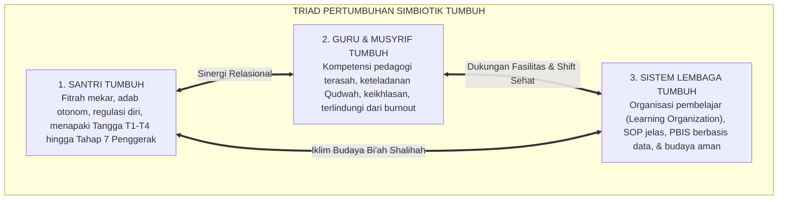

# P2-01-01: PRINSIP TRIAD PERTUMBUHAN SIMBIOTIK
## *Sinergi Tiga Entitas: Santri Tumbuh, Guru/Musyrif Tumbuh, dan Sistem Lembaga Tumbuh dalam Ekosistem Pesantren*

**Nomor Identifikasi**: `P2-01-01/TRIAD-SIMBIOTIK/2026`  
**Domain**: `02 Principles` > `01 Core Principles`  
**Dewan Pakar**: `pakar-filosofi-tumbuh`, `pakar-tata-kelola-qudwah`, `pakar-arsitektur-pbis-restoratif`

---

## 📑 DAFTAR ISI ANALITIS

1. [1. Prolegomena: Mengapa Pembinaan Santri Kerap Gagal Sendirian?](#1-prolegomena-mengapa-pembinaan-santri-kerap-gagal-sendirian)
2. [2. Arsitektur Tiga Entitas Simbiotik TUMBUH](#2-arsitektur-tiga-entitas-simbiotik-tumbuh)
3. [3. Entitas 1: Santri Bertumbuh (Pertumbuhan Fitrah & Tangga T1–T4)](#3-entitas-1-santri-bertumbuh-pertumbuhan-fitrah--tangga-t1t4)
4. [4. Entitas 2: Guru & Musyrif Bertumbuh (Kompetensi Pedagogi & Anti-Burnout)](#4-entitas-2-guru--musyrif-bertumbuh-kompetensi-pedagogi--anti-burnout)
5. [5. Entitas 3: Sistem Lembaga Bertumbuh (Organisasi Pembelajar Berbasis Data)](#5-entitas-3-sistem-lembaga-bertumbuh-organisasi-pembelajar-berbasis-data)
6. [6. Konvergensi Teori Sistem Ekologi Bronfenbrenner & Peter Senge](#6-konvergensi-teori-sistem-ekologi-bronfenbrenner--peter-senge)
7. [7. Implikasi Operasional bagi Ekosistem Pesantren 24-Jam](#7-implikasi-operasional-bagi-ekosistem-pesantren-24-jam)

---

### 1. Prolegomena: Mengapa Pembinaan Santri Kerap Gagal Sendirian?

Salah satu cacat logika paling mendasar dalam manajemen pendidikan karakter pesantren konvensional adalah **ilusi perubahan sepihak (*one-sided change illusion*)**: berasumsi bahwa jika santri dituntut untuk disiplin, tertib, dan berakhlak mulia, maka beban perubahan seluruhnya dibebankan ke pundak santri—sementara para asatidz/musyrif dibiarkan bekerja tanpa peningkatan kompetensi hingga mengalami *burnout*, dan sistem tata kelola pondok tetap dipertahankan kaku, otoriter, dan manual tanpa evaluasi berbasis data.

Pola asimetris ini pasti berujung pada kegagalan sistemik. Santri yang merasa ditekan oleh sistem yang tidak adil akan melakukan perlawanan bawah tanah (*covert rebellion*), musyrif yang kelelahan akan melampiaskan rasa frustrasinya melalui kekerasan fisik kepada santri, dan lembaga pondok akan terus berputar dalam krisis manajemen yang tak berujung.

Ekosistem TUMBUH memutus lingkaran setan ini melalui **Prinsip Triad Pertumbuhan Simbiotik (*The Symbiotic Triad of Growth*)**: hukum mutlak bahwa **pembinaan karakter santri hanya akan berhasil jika Santri, Pendidik/Musyrif, dan Sistem Lembaga bertumbuh secara serempak dan saling menguatkan**.

---

### 2. Arsitektur Tiga Entitas Simbiotik TUMBUH

Triad Pertumbuhan Simbiotik beroperasi laksana sebuah ekosistem biologis: jika salah satu organ sakit, seluruh tubuh akan merasakan demamnya.

| Entitas Pertumbuhan | Fokus Utama Transformasi | Indikator Kunci Keberhasilan | Dampak Kegagalan jika Diabaikan |
| :--- | :--- | :--- | :--- |
| **1. Santri Tumbuh** | Dari kepatuhan semu menjadi kemandirian moral (*Muraqabah*). | Penurunan pelanggaran, kenaikan skor 10 Muwashafat, inisiatif kebaikan. | Lahirnya generasi munafik yang bermuka dua dan bermental inferior. |
| **2. Pendidik/Musyrif Tumbuh**| Dari mandor penghukum menjadi murabbi qudwah pelayan. | Penguasaan teknik de-eskalasi, stabilitas emosi, kepuasan kerja tinggi. | Burnout kronis, turnover musyrif tinggi, dan normalisasi kekerasan fisik. |
| **3. Lembaga Tumbuh** | Dari manajemen feodal manual menjadi sistem berbasis data PBIS. | Dashboard analitik real-time, transparansi SOP, akuntabilitas publik. | Keputusan sepihak tanpa data, krisis kepercayaan wali santri, risiko hukum. |

---

### 3. Entitas 1: Santri Bertumbuh (Pertumbuhan Fitrah & Tangga T1–T4)

Santri diposisikan sebagai subjek pembelajar yang aktif, bukan objek pasif indoktrinasi:
* Santri didampingi menapaki **Tangga TUMBUH (T1: Ta'aruf $\rightarrow$ T2: Tadrib $\rightarrow$ T3: Tafahum $\rightarrow$ T4: Tahwil)**.
* Pertumbuhan adab diukur secara ipsatif (membandingkan diri santri hari ini dengan masa lalunya), memicu motivasi intrinsik dan rasa percaya diri (*Self-Efficacy*).
* Santri senior diberdayakan menjadi Duta Adab dan *Peer Mentors* (Tahap 7 Penggerak) yang memiliki rasa kepemilikan mendalam terhadap ketertiban pondok.

---

### 4. Entitas 2: Guru & Musyrif Bertumbuh (Anti-Burnout & Peningkatan Kompetensi)

Pendidik dan musyrif adalah jantung operasional pengasuhan 24-jam. Ekosistem TUMBUH menjamin pertumbuhan mereka melalui:
1. **Peningkatan Kompetensi Terstruktur**: Pelatihan sertifikasi teknik konseling dasar, Functional Behavior Assessment (FBA), manajemen kelas positif, dan teori perkembangan remaja.
2. **Sistem Shift Kerja Sehat (Dual-Pillar Caretaking)**: Musyrif bekerja dalam rotasi shift yang adil dengan kepastian hak istirahat tidur 7 jam dan hari libur mingguan, membebaskan musyrif dari sindrom kelelahan emosional (*Emotional Exhaustion*).
3. **Supervisi & Pendampingan Ruhani**: Sesi ta'lim mingguan bersama kiai untuk mengisi kembali baterai ruhiyah (*Tazkiyatun Nufus*) para musyrif.

---

### 5. Entitas 3: Sistem Lembaga Bertumbuh (Organisasi Pembelajar Berbasis Data)

Lembaga pesantren bertransformasi menjadi **Organisasi Pembelajar (*Learning Organization*)**:
* Keputusan penanganan kedisiplinan dan pembinaan santri ditegakkan di atas **Data Logbook Digital PBIS**, bukan berdasarkan asumsi atau kabar burung.
* Pesantren secara berani mengevaluasi SOP yang sudah usang, mengaudit titik-titik rawan kekerasan (*Hotspots*), dan membangun mekanisme transparansi dengan orang tua santri.
* Terjalin sinergi tanpa celah antara kurikulum madrasah pagi dan pengasuhan asrama malam melalui *Daily Handover Protocol 15-Menit*.

---

### 6. Konvergensi Teori Sistem Ekologi Bronfenbrenner & Peter Senge

Prinsip Triad TUMBUH menemukan legitimasi ilmiahnya dalam dua teori besar dunia:
* **Bioecological Systems Theory Urie Bronfenbrenner (1979)**: Perkembangan anak adalah hasil interaksi timbal balik antara mikrosistem (kamar asrama), mesosistem (relasi guru-orang tua), eksosistem (kebijakan yayasan), dan makrosistem (budaya pesantren).
* **The Fifth Discipline Peter Senge (1990)**: Organisasi yang unggul adalah organisasi yang memiliki *Systems Thinking* (berpikir serba sistem), di mana setiap elemen menyadari bahwa perbaikan di satu bagian mustahil bertahan tanpa perbaikan di bagian lainnya.

---

### 7. Implikasi Operasional bagi Ekosistem Pesantren 24-Jam

1. **Rapat Koordinasi Triad Mingguan**: Pertemuan terpadu antara Pimpinan Pesantren, Kepala Kepengasuhan, Kepala Madrasah, Konselor BK, dan Perwakilan Musyrif untuk menyelaraskan data perkembangan santri.
2. **Alokasi Anggaran Pengembangan SDM**: Yayasan mewajibkan minimal 15% anggaran operasional dialokasikan untuk pelatihan, kesejahteraan, dan kesehatan mental para guru dan musyrif.
3. **Budaya Apresiasi Kelembagaan**: Memberikan penghargaan tahunan *Musyrif Teladan Qudwah* dan *Kamar Asrama Berperadaban* sebagai wujud pengakuan atas ikhtiar pertumbuhan bersama.
