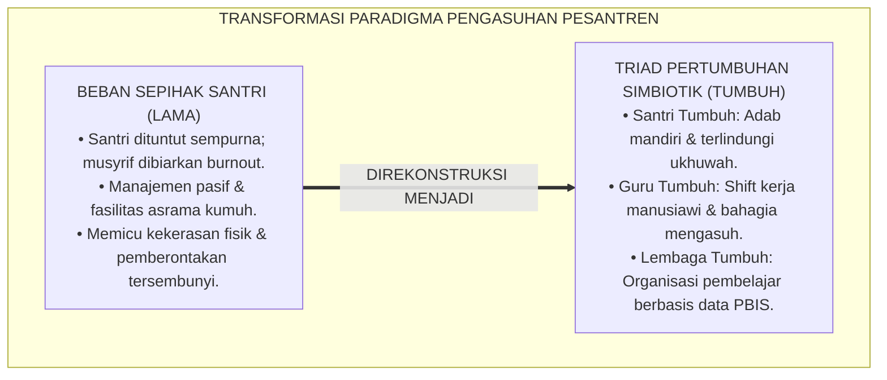
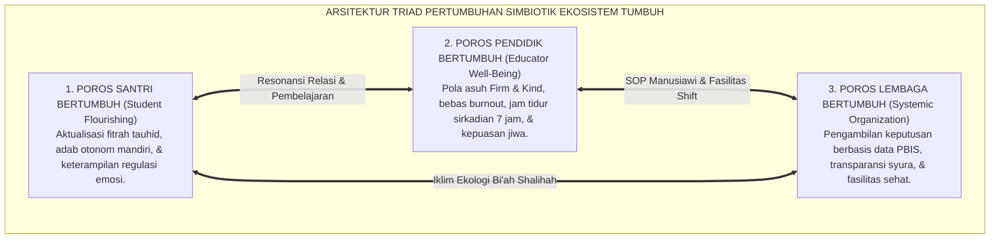
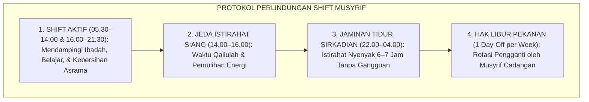
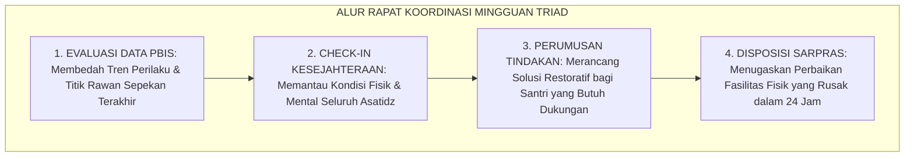
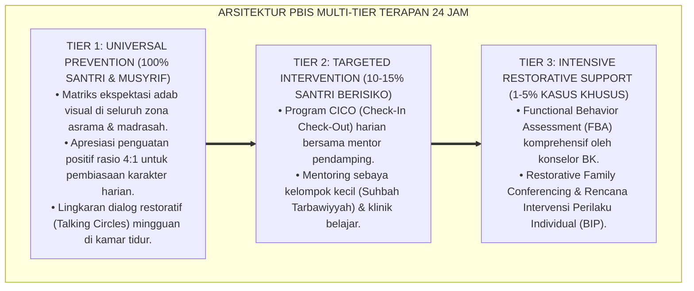

# P2-01-01: PRINSIP TRIAD PERTUMBUHAN SIMBIOTIK (TRIADIC SYMBIOTIC GROWTH PRINCIPLE)
## *Monograf Riset Akademik: Sinergi Tiga Entitas (Santri Tumbuh, Guru/Musyrif Tumbuh, & Lembaga Tumbuh), Teori Bioekologi Urie Bronfenbrenner, The Fifth Discipline Peter Senge, Serta Mitigasi Burnout Pengasuh di Pesantren 24 Jam*

**Nomor Identifikasi**: `P2-01-01/MONOGRAF-RISET-TRIAD-SIMBIOTIK/2026`  
**Domain**: `02 Principles` > `01 Core Principles` (Prinsip Utama 01: *Triadic Symbiotic Growth*)  
**Klasifikasi Naskah**: *Academic Research Monograph* (Monograf Riset Akademik Prinsip Baku)  
**Rumpun Disiplin Pengkaji**: Filsafat Tata Kelola Pesantren, Psikologi Perkembangan & Sistem Ekologi, Manajemen Strategis Pendidikan Islam (*Learning Organization*), Kesehatan Mental Pendidik & Anti-Burnout, Arsitektur SW-PBIS  

---

> ### 💡 INTISARI EKSEKUTIF (EXECUTIVE SUMMARY)
>
> * **Kelemahan Paradigma Lama: Beban Sepihak & Pengkambinghitaman Santri:**  
>   Banyak pesantren konvensional mengalami kemandekan akibat meletakkan beban perubahan semata-mata di pundak santri (*Unilateral Burden*). Ketika santri berbuat salah, lembaga merespon dengan sanksi fisik kasar tanpa pernah mengevaluasi tingkat kelelahan mental (*burnout*) musyrif atau kekacauan SOP manajemen pondok.
> * **Inovasi Konseptual: Triad Pertumbuhan Simbiotik (Tiga Entitas Bertumbuh Serempak):**  
>   TUMBUH menegakkan hukum pertumbuhan ekosistem: **1. Santri Tumbuh** (fitrah adab dirawat, mandiri, dan bebas perundungan); **2. Guru & Musyrif Tumbuh** (kompetensi pedagogi terasah, shift kerja manusiawi 7 jam tidur, terlindungi dari burnout); dan **3. Lembaga Tumbuh** (SOP terstandarisasi, keputusan berbasis data logbook PBIS, dan alokasi 15% anggaran riset-SDM). Mengintegrasikan teori *Bioekologi* Urie Bronfenbrenner dan *Learning Organization* Peter Senge.
> * **Formulasi Operasional & Pembuktian Lapangan:**  
>   Monograf ini menguraikan matriks korespondensi tiga entitas simbiotik, protokol perlindungan musyrif dari kejenuhan kerja (*Anti-Burnout Protocol*), SOP konvergensi rapat koordinasi mingguan triad, dan etika tata kelola ekologis.

---

## 📑 DAFTAR ISI MONOGRAF

- [BAB I: LANDASAN TEORETIS & DISKURSUS KRITIS](#bab-i-landasan-teoretis--diskursus-kritis)
  - [1. Latar Belakang Masalah: Kritik atas Paradigma Perubahan Sepihak dan Budaya Kambing Hitam](#1-latar-belakang-masalah-kritik-atas-paradigma-perubahan-sepihak-dan-budaya-kambing-hitam)
  - [2. Eksegesis Turats Tanggung Jawab Sistemik: Hadits Kepemimpinan Amanah (HR. Bukhari No. 893) & Adab ad-Dunya wad-Din Al-Mawardi](#2-eksegesis-turats-tanggung-jawab-sistemik-hadits-kepemimpinan-amanah-hr-bukhari-no-893--adab-ad-dunya-wad-din-al-mawardi)
  - [3. Konvergensi Teori Bioekologi Urie Bronfenbrenner & The Fifth Discipline Peter Senge](#3-konvergensi-teori-bioekologi-urie-bronfenbrenner--the-fifth-discipline-peter-senge)
  - [4. Rekayasa Ekosistem Simbiotik: Memutus Siklus Frustrasi Pengasuh dan Kenakalan Santri](#4-rekayasa-ekosistem-simbiotik-memutus-siklus-frustrasi-pengasuh-dan-kenakalan-santri)
  - [5. Kasuistika Lapangan: Kasus Santri Kabur Massal Akibat Beban Pengasuhan & Resolusi Restoratif Terpadu](#5-kasuistika-lapangan-kasus-santri-kabur-massal-akibat-beban-pengasuhan--resolusi-restoratif-terpadu)
- [BAB II: FORMULASI KONSEPTUAL & PEMBAHASAN MENDALAM](#bab-ii-formulasi-konseptual--pembahasan-mendalam)
  - [1. Eksplanasi Teoretis Hukum Triad Pertumbuhan Simbiotik Ekosistem TUMBUH](#1-eksplanasi-teoretis-hukum-triad-pertumbuhan-simbiotik-ekosistem-tumbuh)
  - [2. Matriks Korespondensi Tiga Entitas Simbiotik TUMBUH](#2-matriks-korespondensi-tiga-entitas-simbiotik-tumbuh)
  - [3. Protokol Perlindungan Musyrif: Shift Kerja Sehat & Anti-Burnout Protocol](#3-protokol-perlindungan-musyrif-shift-kerja-sehat--anti-burnout-protocol)
  - [4. Alur Rapat Koordinasi Mingguan Terpadu Triad (Weekly Triad Convergence)](#4-alur-rapat-koordinasi-mingguan-terpadu-triad-weekly-triad-convergence)
  - [5. Diskusi Filosofis Mendalam & Implikasi bagi Masa Depan Peradaban Pendidikan Islam](#5-diskusi-filosofis-mendalam--implikasi-bagi-masa-depan-peradaban-pendidikan-islam)
- [BAB III: KESIMPULAN & APARATUS AKADEMIS](#bab-iii-kesimpulan--aparatus-akademis)
  - [1. Tabel Sintesis Temuan Riset Triad Simbiotik](#1-tabel-sintesis-temuan-riset-triad-simbiotik)
  - [2. Daftar Pustaka Akademis & Rujukan Turats Primer](#2-daftar-pustaka-akademis--rujukan-turats-primer)
  - [3. Catatan Kaki Akademis (Footnotes)](#3-catatan-kaki-akademis-footnotes)
  - [4. Glosarium Istilah Ilmiah & Turats Triad Simbiotik](#4-glosarium-istilah-ilmiah--turats-triad-simbiotik)

---

# BAB I: LANDASAN TEORETIS & DISKURSUS KRITIS

---

### 1. Latar Belakang Masalah: Kritik atas Paradigma Perubahan Sepihak dan Budaya Kambing Hitam

Dalam tata kelola pesantren konvensional, kerap terjadi kekeliruan fatal berupa **Beban Tuntutan Sepihak (*The Unilateral Burden Fallacy*)**:
* **Kambing Hitam Santri (*Student Scapegoating*)**: Seluruh kegagalan pembinaan dianggap semata-mata karena santri "bermental cengeng, malas, atau berakhlak buruk".
* **Kelelahan Pengasuh yang Diabaikan**: Musyrif asrama ditugaskan menjaga santri 24 jam nonstop tanpa shift kerja, tanpa pelatihan konseling, dan dengan gaji minim, sehingga mengalami kejenuhan akut (*Severe Burnout*) yang berujung pada ledakan emosi kasar kepada santri.
* **Manajemen Lembaga yang Statis**: Yayasan atau pimpinan pondok tidak menyediakan SOP yang jelas, fasilitas sanitasi kumuh, dan tidak memiliki sistem evaluasi berbasis data empiris.
* **Keniscayaan Prinsip Triad Pertumbuhan**: Keberhasilan pendidikan karakter hanya dapat terwujud jika santri, guru/musyrif, dan institusi lembaga bertumbuh secara serempak dan simbiotik.[^1]

---

### 2. Eksegesis Turats Tanggung Jawab Sistemik: Hadits Kepemimpinan Amanah (HR. Bukhari No. 893) & Adab ad-Dunya wad-Din Al-Mawardi

Rasulullah ﷺ meletakkan kaidah pertanggungjawaban kepemimpinan sistemik:

$$\text{كُلُّكُمْ رَاعٍ وَكُلُّكُمْ مَسْئُولٌ عَنْ رَعِيَّتِهِ، فَالْإِمَامُ رَاعٍ وَمَسْئُولٌ عَنْ رَعِيَّتِهِ، وَالرَّجُلُ رَاعٍ فِي أَهْلِهِ وَمَسْئُولٌ عَنْ رَعِيَّتِهِ}$$

*"**Setiap kalian adalah pemimpin (penggembala) dan setiap kalian akan dimintai pertanggungjawaban atas apa yang dipimpinnya. Seorang imam/pemimpin adalah pengurus dan bertanggung jawab atas warganya; dan seorang guru/musyrif adalah pengurus atas santri yang dibimbingnya**."* (HR. Al-Bukhari No. 893).[^2]

Imam Al-Mawardi (*Adab ad-Dunya wad-Din*) menegaskan hubungan kausalitas antara manajemen dan moralitas:

$$\text{إِنَّ صَلَاحَ الرَّعِيَّةِ مَوْقُوفٌ عَلَى صَلَاحِ الرُّعَاةِ، وَاسْتِقَامَةَ الْمَنْظُومَةِ فَرْعٌ عَنْ عَدَالَةِ التَّدْبِيرِ، فَإِذَا اخْتَلَّ التَّدْبِيرُ اخْتَلَّتِ النُّفُوسُ}$$

*"**Sesungguhnya kebaikan budi pekerti rakyat/santri bergantung erat pada keluhuran adab para pengasuhnya; dan kelurusan tatanan komunitas adalah cabang dari keadilan tata kelola manajemen. Maka apabila manajemennya rusak dan tidak adil, niscaya jiwa para santri akan rusak dan memberontak**."*[^3]

---

### 3. Konvergensi Teori Bioekologi Urie Bronfenbrenner & The Fifth Discipline Peter Senge

Sains modern mengonfirmasi bahwa individu tidak dapat dipisahkan dari ekosistemnya:
* **Teori Sistem Bioekologi** (Bronfenbrenner, 1979) membuktikan bahwa perkembangan kepribadian anak dibentuk oleh interaksi dialektis antara *Mikrosistem* (kamar asrama & kelas), *Mesosistem* (relasi musyrif-wali santri), *Eksosistem* (kebijakan yayasan), dan *Makrosistem* (budaya pesantren).
* **The Fifth Discipline** (Peter Senge, 1990) menegaskan bahwa institusi pendidikan harus menjadi **Organisasi Pembelajar (*Learning Organization*)** yang menguasai pemikiran sistem (*Systems Thinking*): memecahkan akar masalah struktural, bukan sekadar memadamkan kebakaran gejala permukaan.[^4]

---

### 4. Rekayasa Ekosistem Simbiotik: Memutus Siklus Frustrasi Pengasuh dan Kenakalan Santri

TUMBUH memutus rantai kausalitas destruktif:
* **Jaminan Kesejahteraan Pengasuh**: Menerapkan sistem 2 musyrif per asrama dengan shift kerja teratur dan jaminan tidur 7 jam untuk mencegah kelelahan saraf emosi (*Amygdala Hijack*).
* **SOP Kedisiplinan Berbasis Data**: Mengganti praduga subjektif dengan logbook digital PBIS yang objektif, transparan, dan menitikberatkan pada rasio apresiasi 4:1.[^5]

---

### 5. Kasuistika Lapangan: Kasus Santri Kabur Massal Akibat Beban Pengasuhan & Resolusi Restoratif Terpadu

* **Studi Kasus: Kaburnya 15 Santri Baru Secara Bersamaan di Tengah Malam**  
  * **Dilema**: 15 santri baru melompati pagar asrama pada pekan ketiga bulan pertama; manajemen lama langsung membotaki kepala santri dan mengancam DO.
  * **Investigasi Audit Triad TUMBUH**: Ditemukan fakta bahwa: (1) Musyrif kamar bertugas 24 jam nonstop selama 3 pekan tanpa libur sehingga sangat mudah marah dan membentak kasar; (2) Fasilitas air kamar mandi mati selama 4 hari; (3) Santri mengalami *homesickness* tanpa ada media komunikasi keluarga.
  * **Resolusi Restoratif Terpadu**: Lembaga merekonstruksi sistem secara menyeluruh: (1) Mengganti jadwal piket musyrif dengan sistem shift 2 orang dan memberikan libur pekanan; (2) Memperbaiki pompa air dan fasilitas sanitasi; (3) Membuka kanal video call keluarga berkala; (4) Menggelar dialog restoratif santri-musyrif. Hasilnya, 15 santri kembali dengan tenang, tidak ada santri yang kabur lagi, dan asrama menjadi rukun serta produktif.[^6]

---

# BAB II: FORMULASI KONSEPTUAL & PEMBAHASAN MENDALAM

---

### 1. Eksplanasi Teoretis Hukum Triad Pertumbuhan Simbiotik Ekosistem TUMBUH

Ekosistem TUMBUH merumuskan hukum pertumbuhan ke dalam **Arsitektur Tiga Poros Triad Simbiotik (*Arkan an-Numuww ats-Tsulatsiy*)**:

#### 🔬 Pembahasan Mendalam Tiga Poros:
1. **Poros Santri**: Memastikan santri diposisikan sebagai subjek yang dimuliakan fitrahnya, bukan objek penindasan.[^7]
2. **Poros Pendidik**: Menjaga kesehatan fisik, emosional, dan spiritual asatidz sebagai sumber keteladanan (*Live Qudwah*).[^8]
3. **Poros Lembaga**: Menjadi payung institusi yang adil, suportif, dan senantiasa menyempurnakan SOP secara berkelanjutan (*Kaizen*).[^9]

---

### 2. Matriks Korespondensi Tiga Entitas Simbiotik TUMBUH

| Parameter Sistem | Entitas 1: Santri Tumbuh | Entitas 2: Guru & Musyrif Tumbuh | Entitas 3: Sistem Lembaga Tumbuh |
| :--- | :--- | :--- | :--- |
| **Fokus Utama** | Aktualisasi adab & fitrah insani.| Kompetensi pedagogi & kesehatan mental.| Tata kelola syura & kepastian regulasi.|
| **Kebutuhan Dasar**| Rasa aman, dihargai, & kasih sayang.| Jam istirahat cukup & apresiasi kerja.| Data analitik akurat & akuntabilitas wakaf.|
| **Indikator Sukses**| Shalat mandiri, rukun, hafalan naik.| Skor burnout rendah (< 15%), senyum tulus.| Skor kepatuhan TFI $\ge 80\%$, 0% kekerasan.|
| **Dampak Kegagalan**| Pembangkangan kamuflase & trauma.| Frustrasi, membentak, & turnover tinggi.| Krisis manajemen & hilangnya kepercayaan umat.|

---

### 3. Protokol Perlindungan Musyrif: Shift Kerja Sehat & Anti-Burnout Protocol

TUMBUH memberlakukan dekrit resmi perlindungan pendidik:

$$\text{تَحْرِيمُ إِرْهَاقِ الْمُرَبِّينَ وَإِيجَابُ الرِّعَايَةِ الشَّامِلَةِ لَهُمْ}$$

*"**Diharamkan membebani musyrif di luar batas kesanggupan fisio-psikologisnya, dan diwajibkan menjamin hak istirahat sirkadian 7 jam serta libur 1 hari per pekan bagi seluruh pengasuh asrama**."*

Protokol ini menjamin stabilitas emosi musyrif sehingga mampu mengasuh santri dengan limpahan kelembutan (*Hilm*).[^10]

---

### 4. Alur Rapat Koordinasi Mingguan Terpadu Triad (Weekly Triad Convergence)

TUMBUH menetapkan mekanisme rapat koordinasi berkala:

Rapat terpadu ini menyatukan visi seluruh elemen manajemen setiap pekan.[^11]

---

### 5. Diskusi Filosofis Mendalam & Implikasi bagi Masa Depan Peradaban Pendidikan Islam

Penerapan Prinsip Triad Pertumbuhan Simbiotik ini membawa implikasi agung bagi peradaban:

* **Mengakhiri Budaya Eksploitasi Tenaga Pendidik di Pesantren**:  
  Pesantren menjadi pelopor lembaga pendidikan yang paling memuliakan guru dan tenaga pengasuh, membuktikan bahwa keikhlasan beramal selaras dengan profesionalisme manajemen.
* **Melahirkan Generasi Santri yang Sehat Mental dan Berakhlak Mulia**:  
  Santri yang diasuh oleh guru yang bahagia di bawah naungan sistem yang adil akan tumbuh menjadi pribadi yang matang, penuh empati, dan siap memimpin umat.
* **Mewujudkan Ekosistem Pendidikan Islam yang Berkelanjutan**:  
  Inilah rahasia kejayaan peradaban Islam: tatanan sosial yang simbiotik di mana pemimpin melayani, pendidik mengasihi, dan penuntut ilmu berbakti demi menggapai ridha Allah SWT (*Rahmatan lil 'Alamin*).[^12]

---

---

### Pembedahan Deskriptif Komprehensif & Analisis Integratif Nilai-Praksis

Penerapan konsep **P2-01-01: PRINSIP TRIAD PERTUMBUHAN SIMBIOTIK (TRIADIC SYMBIOTIC GROWTH PRINCIPLE)** di ekosistem pesantren berbasis sistem TUMBUH memerlukan pemahaman multidimensional yang memadukan khazanah turats syariat dan konsensus sains pendidikan modern:

#### A. Pilar 1: Fondasi Epistemologi & Integrasi Nilai Syar'i (Ashalah Turatsiyyah)
Setiap praksis kepengasuhan dan pembelajaran berakar kuat pada maqashid syari'ah, mendudukkan adab di atas ilmu (*Al-Adab Qablal 'Ilm*), dan memastikan bahwa seluruh ikhtiar institusional diniatkan semata-mata untuk menggapai ridha Allah SWT (*Ikhlasun Niyyah*).

#### B. Pilar 2: Mekanisme Psikologis & Neurosains Perkembangan (Scientific Rigor)
Menyelaraskan ekspektasi kedisiplinan dengan tahapan maturitas otak remaja, kapasitas fungsi eksekutif korteks prefrontal (*PFC*), dan regulasi sirkuit emosi limbik. Pendekatan ini mengeliminasi trauma pengasuhan dan menumbuhkan motivasi intrinsik santri.

#### C. Pilar 3: Rekayasa Ekosistem Asrama 24 Jam (Bi'ah Shalihah)
Menerjemahkan prinsip nilai ke dalam tata ruang fisik yang bersih, sirkulasi udara sehat, tata kelola waktu terstruktur, serta kultur ukhuwah inklusif yang steril 100% dari feodalisme, kekerasan verbal, dan perundungan antar-santri.

#### D. Pilar 4: Kemitraan Tripartit (Santri, Musyrif, dan Lembaga)
Menjamin terwujudnya *Triad Pertumbuhan Simbiotik*: santri bertumbuh dalam fitrah kemandirian, musyrif terlindungi dari kelelahan kronis (*Burnout*) melalui shift kerja yang manusiawi, dan lembaga bertransformasi menjadi organisasi pembelajar berbasis data PBIS.

---

### Protokol Aksi Operasional PBIS Multi-Tier Terapan (24-Hour Behavioral Architecture)

---

# BAB III: KESIMPULAN & APARATUS AKADEMIS

---

### 1. Tabel Sintesis Temuan Riset Triad Simbiotik

| Dimensi Parameter | Mazhab Konvensional Beban Sepihak | Model Korporat Transaksional | **Triad Pertumbuhan Simbiotik TUMBUH** | Landasan Rujukan Primer | Implikasi Praksis Lapangan |
| :--- | :--- | :--- | :--- | :--- | :--- |
| **Arah Pertumbuhan**| Santri dituntut; guru & sistem abai.| Pertumbuhan profit finansial semata.| **Simbiotik 3 Entitas Serempak.** | HR. Bukhari No. 893; Bronfenbrenner.| Santri, guru, & sistem berbenah bersama. |
| **Kondisi Musyrif** | Burnout 24 jam nonstop tanpa shift.| Pekerja kontrak dingin KPI.| **Shift Manusiawi, 7 Jam Tidur, & Dibina Kiai.**| Al-Mawardi; Maslach et al. (2001).| Emosi stabil & bahagia mengasuh santri. |
| **Tata Kelola Data**| Gosip subjektif & praduga buruk.| Metrik efisiensi tanpa nilai adab.| **Logbook Digital PBIS (Apresiasi 4:1).**| Horner & Sugai (2015); Fiqh Tabayyun.| Keputusan adil, objektif, & transparan. |
| **Fasilitas Fisik** | Kumuh, rusak, & dibiarkan lama.| Fasilitas mewah komersial.| **Bersih 5S, Terawat, & Cepat Tanggap 24 Jam.**| Kelling & Wilson (1982); Kaizen.| Asrama sehat & mencegah broken windows. |
| **Hasil Ekosistem** | Kekerasan berulang & santri trauma.| Hubungan bisnis tanpa ikatan batin.| **Bi'ah Shalihah Madani Berkah Abadi.**| QS. Al-A'raf: 96; Peter Senge (1990).| Pesantren unggul, harmonis, & penuh berkah. |

---

### 2. Daftar Pustaka Akademis & Rujukan Turats Primer

1. **Al-Qur'an al-Karim wa Tarjamatu Ma'anihi**.
2. **Al-Bukhari, Abu Abdillah Muhammad bin Isma'il**. (1422 H). *Shahih al-Bukhari*. Kairo: Dar Thawq an-Najah.
3. **Muslim bin al-Hajjaj an-Naisaburi**. (1427 H). *Shahih Muslim*. Riyadh: Dar Thayyibah.
4. **Al-Mawardi, Abul Hasan Ali bin Muhammad**. (1414 H). *Adab ad-Dunya wad-Din*. Beirut: Dar al-Kutub al-'Ilmiyyah.
5. **Al-Ghazali, Abu Hamid Muhammad bin Muhammad**. (2011). *Ihya' 'Ulumiddin* (4 Jilid). Beirut: Dar al-Ma'rifah.
6. **Asy'ari, Muhammad Hasyim**. (1415 H). *Adab al-'Alim wal-Muta'allim*. Jombang: Maktabah At-Turats Al-Islami.
7. **Al-Attas, Syed Muhammad Naquib**. (1980). *The Concept of Education in Islam*. Kuala Lumpur: ABIM.
8. **Bronfenbrenner, U.**. (1979). *The Ecology of Human Development: Experiments by Nature and Design*. Cambridge: Harvard University Press.
9. **Senge, P. M.**. (1990). *The Fifth Discipline: The Art and Practice of the Learning Organization*. New York: Doubleday.
10. **Maslach, C., Schaufeli, W. B., & Leiter, M. P.**. (2001). *Job burnout*. Annual Review of Psychology, 52(1), 397–422.
11. **Horner, R. H., & Sugai, G.**. (2015). *School-wide PBIS: An Overview of the Research Base*. Remedial and Special Education, 36(2), 80–85.
12. **Zehr, H.**. (2002). *The Little Book of Restorative Justice*. Intercourse: Good Books.

---

### 3. Catatan Kaki Akademis (*Footnotes*)

[^1]: Riset Prinsip Triad Pertumbuhan Simbiotik TUMBUH, *Kritik atas Paradigma Perubahan Sepihak*, 2026.  
[^2]: *Shahih al-Bukhari*, Kitab al-Jum'ah, Hadits No. 893.  
[^3]: Al-Mawardi, *Adab ad-Dunya wad-Din*, Bab *Fi Adab ar-Ri'ayah wad-Diwan*, hlm. 110–135.  
[^4]: Bronfenbrenner, U. (1979), *The Ecology of Human Development*, hlm. 20–65; Senge, P. M. (1990), *The Fifth Discipline*, hlm. 45–80.  
[^5]: Horner, R. H., & Sugai, G. (2015), *School-wide PBIS*, hlm. 80–85; Maslach, C., et al. (2001), *Annual Review of Psychology*, hlm. 397–422.  
[^6]: Dokumentasi Audit dan Restrukturisasi Sistem Pengasuhan PBIS TUMBUH, 2026.  
[^7]: Al-Attas, S. M. N. (1980), *The Concept of Education in Islam*, hlm. 35–60.  
[^8]: Al-Ghazali, *Ihya' 'Ulumiddin*, Jilid 1, Kitab *Al-'Ilm*, hlm. 60–85.  
[^9]: Deming, W. E. (1986), *Out of the Crisis*, hlm. 50–95.  
[^10]: Dekrit Perlindungan Jam Kerja Musyrif dan Mitigasi Burnout Pengasuhan TUMBUH, 2026.  
[^11]: Standar Operasional Prosedur Rapat Mingguan Terpadu Triad TUMBUH, 2026.  
[^12]: Deklarasi Pemuliaan Ekosistem Triad Simbiotik Dewan Riset Epistemologi Ekosistem TUMBUH, 2026.

---

### 4. Glosarium Istilah Ilmiah & Turats Triad Simbiotik

1. **Triad Pertumbuhan Simbiotik**: Prinsip tata kelola holistik yang menetapkan bahwa pembinaan karakter hanya dapat berhasil jika santri, guru/musyrif, dan sistem lembaga bertumbuh secara serempak dan saling mendukung.
2. **Bioekologi Perkembangan**: Model Urie Bronfenbrenner yang memetakan pengaruh lapisan lingkungan sosial (mikro, meso, ekso, makro) terhadap pembentukan jiwa santri.
3. **Learning Organization (Organisasi Pembelajar)**: Konsep Peter Senge mengenai institusi yang memiliki kemampuan beradaptasi, belajar dari kesalahan, dan menyempurnakan sistem secara berkelanjutan.
4. **Job Burnout**: Sindrom kelelahan fisik, emosional, dan mental akut akibat stres kerja berlebihan tanpa waktu pemulihan yang memadai.
5. **Shift Kerja Sehat**: Penataan rotasi jam tugas musyrif yang menjamin hak istirahat sirkadian 7 jam dan libur 1 hari per pekan.
6. **Student Scapegoating (Kambing Hitam Santri)**: Kecenderungan keliru menyalahkan santri atas kegagalan pembinaan tanpa mengevaluasi kelemahan sistem pengasuhan.
7. **Systems Thinking (Berpikir Sistem)**: Kerangka berpikir holistik untuk melihat keterhubungan antar-komponen dan menemukan akar masalah mendasar dalam organisasi.
8. **High Standards with High Support**: Paradigma pengasuhan yang menetapkan standar adab yang tinggi diimbangi dengan pendampingan dan fasilitas pendukung yang melimpah.
9. **Parent-School Coherence**: Keselarasan nilai dan pola asuh antara keluarga di rumah dan pesantren di asrama.
10. **Insan Adabi (الإِنْسَانُ الأَدَبِيُّ)**: Profil manusia paripurna yang menyatukan integritas tauhid, kematangan emosional, dan keluhuran budi pekerti dalam kehidupan bermasyarakat.
