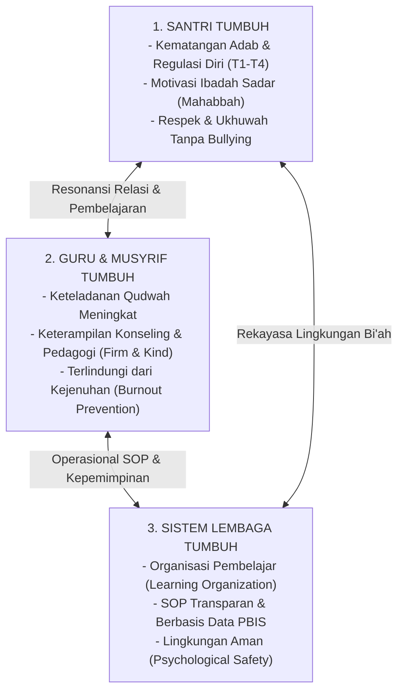

# P2-01-01-Prinsip-Triad-Pertumbuhan-Simbiotik

## Tujuan
Merumuskan kaidah operasional mengenai **Triad Pertumbuhan Simbiotik** (*Symbiotic Triadic Growth*): bagaimana memastikan pertumbuhan **Santri**, **Guru/Musyrif**, dan **Sistem Lembaga** bergerak selaras, saling menguatkan, dan bebas dari beban sepihak.

---

## 1. Dalil & Landasan Filosofis

Pertumbuhan ekosistem adalah hukum penciptaan yang saling menopang (*Takaful & Ta'awun*):

> *"Dan tolong-menolonglah kamu dalam (mengerjakan) kebajikan dan takwa, dan jangan tolong-menolong dalam berbuat dosa dan permusuhan..."*  
> **(QS. Al-Ma'idah [5]: 2)**

> *"Perumpamaan orang-orang yang beriman dalam hal saling mencintai, menyayangi, dan mengasihi adalah seperti satu tubuh; apabila satu anggota tubuh sakit, maka seluruh anggota tubuh yang lain ikut merasakan demam dan tidak bisa tidur."*  
> **(HR. Bukhari no. 6011 & Muslim no. 2586)**

---

## 2. Dinamika Hubungan Simbiotik 3 Entitas

---

## 3. Matriks Tanggung Jawab & Hak Pertumbuhan

| Entitas | Yang Harus Diberikan (Kewajiban) | Yang Berhak Diterima (Hak Pertumbuhan) | Indikator Keberhasilan Pertumbuhan |
| :--- | :--- | :--- | :--- |
| **Santri** | Berikhtiar sungguh-sungguh (*Mujahadah*), mematuhi kesepakatan adab, menghormati guru & teman. | Hak atas perlakuan bermartabat, pengajaran berkualitas, rasa aman dari kekerasan, dan pendampingan bertahap. | Kenaikan tangga adab dari T1 (Adaptasi) menuju T4 (Kemandirian & Qudwah). |
| **Guru & Musyrif** | Menghadirkan keteladanan (*Qudwah*), mengajar dengan kasih sayang (*Firm & Kind*), konsisten pada SOP. | Hak atas pelatihan berkala, supervisi suportif, beban kerja proporsional, dan kesejahteraan layak. | Berkurangnya tingkat stres/burnout, meningkatnya kecakapan de-eskalasi emosi santri. |
| **Sistem Lembaga** | Menyediakan sarana Bi'ah Shalihah, regulasi SOP yang adil, sistem pencatatan data PBIS transparan. | Hak atas kepatuhan seluruh civitas terhadap SOP dan reputasi lembaga yang amanah. | Berkurangnya angka pelanggaran tahunan secara terukur (30-50%), kultur asrama yang tenteram. |

---

## 4. Kaidah Baku Pengambilan Keputusan Lembaga

1. **Kaidah Keseimbangan Beban (*La Dharara wa La Dhirar*)**:
   - Lembaga tidak boleh menuntut standar adab tinggi pada santri jika fasilitas kamar dan air bersih tidak memadai.
   - Lembaga tidak boleh menuntut pengasuhan 24 jam sempurna dari musyrif tanpa memberikan waktu istirahat yang cukup dan supervisi mental yang sehat.
2. **Kaidah Pembelajaran Berkelanjutan (*Continuous Improvement / Kaizen*)**:
   - Jika terjadi pelanggaran berulang pada santri, sistem lembaga wajib mengevaluasi: *"Apakah SOP-nya yang kurang jelas? Apakah musyrifnya butuh pelatihan tambahan? Atau desain lingkungannya yang memiliki titik buta (blind spots)?"*

---

## 5. Status Dokumen
* **Status**: 🌟 **A+ (Tervalidasi & Siap Diimplementasikan)**
* **Level**: Project 2 - `02 Principles / 01 Core Principles`
* **Langkah Berikutnya**: **`P2-01-02-Prinsip-Kemuliaan-Fitrah-dan-Martabat-Insan.md`**.
