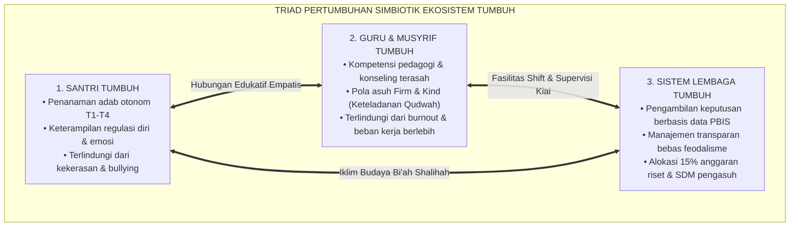
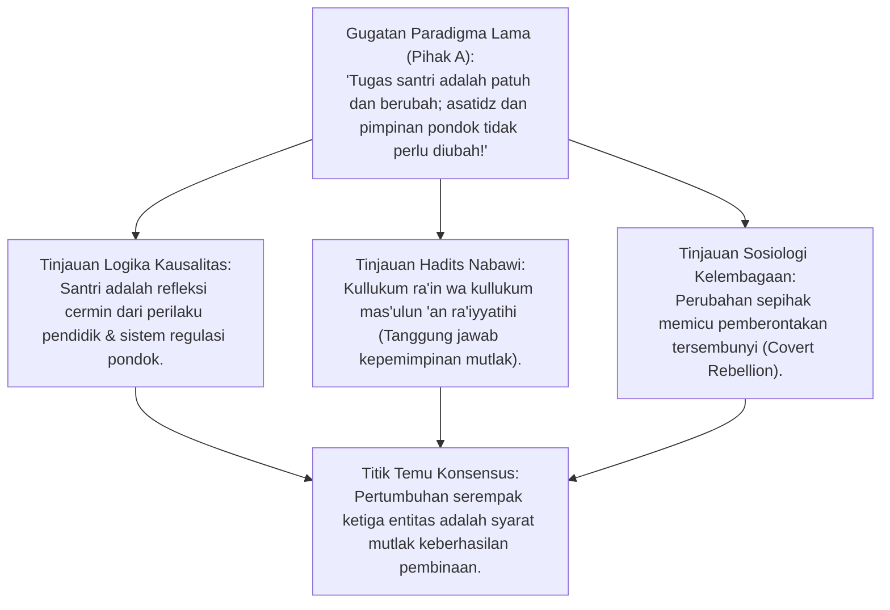
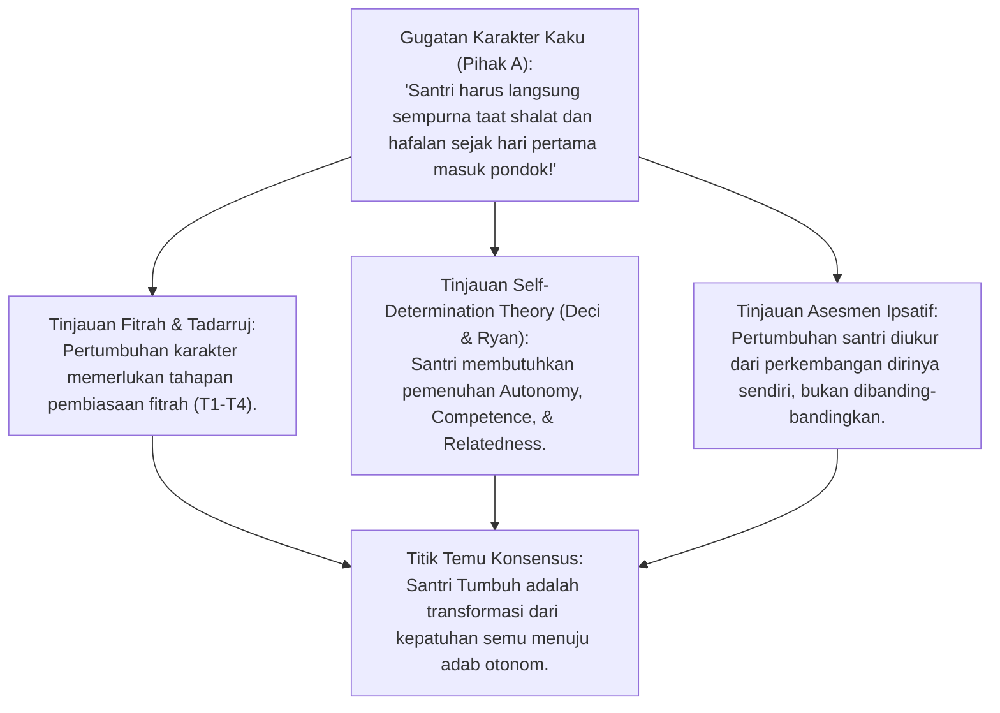
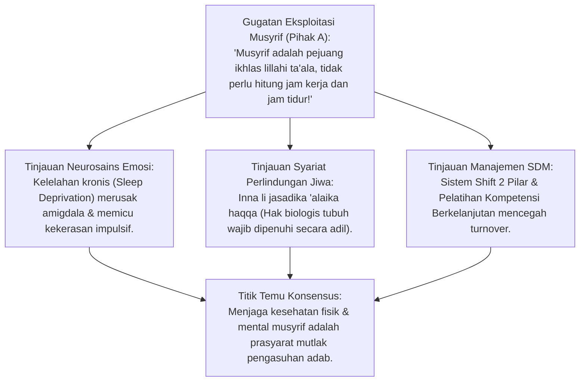
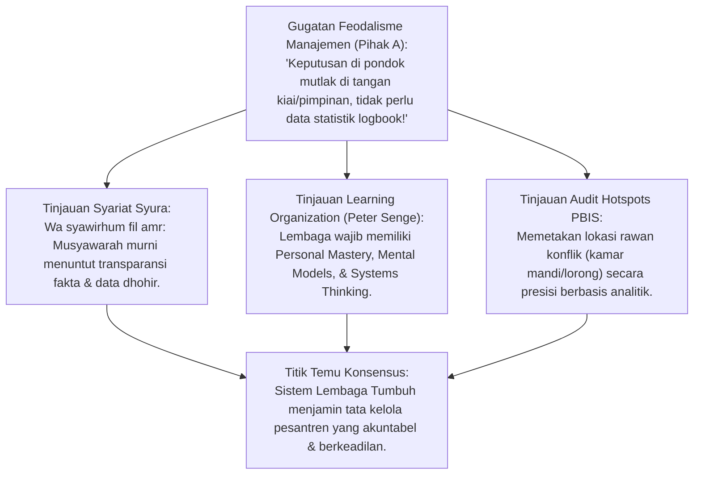
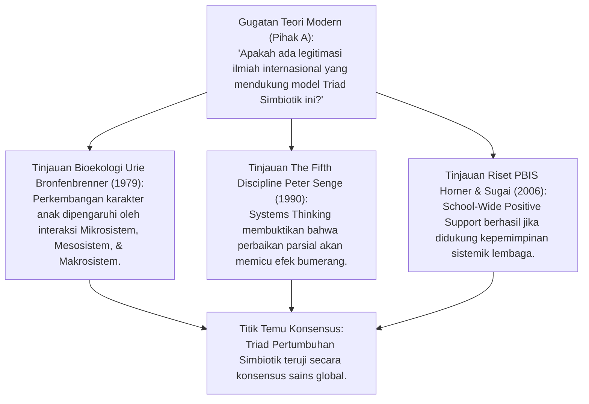
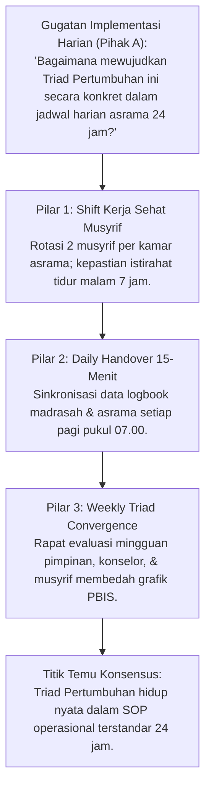
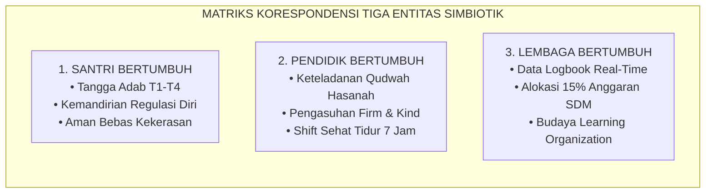
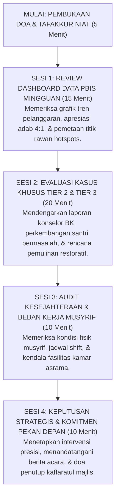

# P2-01-01: PRINSIP TRIAD PERTUMBUHAN SIMBIOTIK
## *Monograf Terpadu: Sinergi Tiga Entitas (Santri Tumbuh, Guru/Musyrif Tumbuh, & Lembaga Tumbuh), Teori Bioekologi Bronfenbrenner, Sistem Berpikir Peter Senge, & Anti-Burnout Pengasuh*

**Nomor Identifikasi**: `P2-01-01/MONOGRAF-TERPADU-TRIAD-SIMBIOTIK/2026`  
**Domain**: `02 Principles` > `01 Core Principles`  
**Klasifikasi Naskah**: *Comprehensive Integrated Monograph* (Monograf Akademis & Rumusan Baku Terpadu)  
**Rumpun Disiplin Pengkaji**: Filsafat Tata Kelola Pesantren, Psikologi Perkembangan & Sistem Ekologi, Manajemen Strategis Pendidikan Islam (*Learning Organization*), Kesehatan Mental Pendidik & Anti-Burnout, Arsitektur SW-PBIS  

---

> ### 💡 INTISARI PRAKTIS (3 MENIT PAHAM UNTUK ASATIDZ & MUSYRIF)
>
> * **Mengapa Pembinaan Santri Sering Gagal di Pesantren Konvensional?**  
>   Karena terjadi **Beban Sepihak**: Santri dituntut disiplin dan tidak boleh salah, sementara ustadz/musyrif dibiarkan kelelahan (*burnout*) tanpa pelatihan, dan yayasan/pondok berjalan manual tanpa data. Akibatnya musyrif melampiaskan emosi pada santri, dan santri memberontak sembunyi-sembunyi.
> * **Solusi Hukum Baku: Triad Pertumbuhan Simbiotik (3 Entitas Bertumbuh Serempak):**  
>   1. **Santri Bertumbuh**: Fitrahnya dirawat, adabnya naik bertahap dari pemula (T1) hingga mandiri (T4), dan dilindungi dari kekerasan senior.  
>   2. **Guru & Musyrif Bertumbuh**: Keterampilan mendidiknya dilatih, jam tidurnya dijamin 7 jam (*shift sehat*), batinnya dibina kiai (*Tazkiyah*), sehingga bahagia mendidik santri.  
>   3. **Sistem Lembaga Bertumbuh**: SOP jelas, keputusan kedisiplinan berbasis data logbook PBIS (bukan gosip), dan fasilitas asrama dijaga bersih sehat.
> * **Kaidah Emas Operasional:**  
>   *"Mustahil melahirkan santri yang beradab dan tenang jiwanya, jika diasuh oleh musyrif yang kelelahan mental, di bawah naungan sistem pondok yang zalim dan tidak teratur."*

---

## 📑 DAFTAR ISI MONOGRAF

- [BAGIAN I: RISET SISTEMIK, DIALEKTIKA INKUIRI, & KASUISTIKA LAPANGAN](#bagian-i-riset-sistemik-dialektika-inkuiri--kasuistika-lapangan)
  - [1. Kerangka Metodologi Teori Sistem Ekologis Pesantren](#1-kerangka-metodologi-teori-sistem-ekologis-pesantren)
  - [2. Inkuiri 1: Dekonstruksi Paradigma Perubahan Sepihak — Mengapa Menuntut Santri Saja Pasti Gagal?](#2-inkuiri-1-dekonstruksi-paradigma-perubahan-sepihak--mengapa-menuntut-santri-saja-pasti-gagal)
  - [3. Inkuiri 2: Entitas 1 (Santri Tumbuh) — Aktualisasi Potensi Fitrah Menuju Tangga Kemandirian T1–T4](#3-inkuiri-2-entitas-1-santri-tumbuh--aktualisasi-potensi-fitrah-menuju-tangga-kemandirian-t1t4)
  - [4. Inkuiri 3: Entitas 2 (Pendidik & Musyrif Tumbuh) — Proteksi Burnout & Pengembangan Kompetensi Pedagogi](#4-inkuiri-3-entitas-2-pendidik--musyrif-tumbuh--proteksi-burnout--pengembangan-kompetensi-pedagogi)
  - [5. Inkuiri 4: Entitas 3 (Sistem Lembaga Tumbuh) — Transformasi Menjadi Learning Organization Berbasis Data PBIS](#5-inkuiri-4-entitas-3-sistem-lembaga-tumbuh--transformasi-menjadi-learning-organization-berbasis-data-pbis)
  - [6. Inkuiri 5: Konvergensi Bioekologi Bronfenbrenner & The Fifth Discipline Peter Senge](#6-inkuiri-5-konvergensi-bioekologi-bronfenbrenner--the-fifth-discipline-peter-senge)
  - [7. Inkuiri 6: Translasi Triad Simbiotik ke Manajemen Operasional Asrama 24 Jam](#7-inkuiri-6-translasi-triad-simbiotik-ke-manajemen-operasional-asrama-24-jam)
- [BAGIAN II: KODIFIKASI BAKU HASIL RISET & KESIMPULAN FORMAL](#bagian-ii-kodifikasi-baku-hasil-riset--kesimpulan-formal)
  - [1. Kaidah Utama dan Standar Baku: Hukum Triad Pertumbuhan Simbiotik](#1-kaidah-utama-dan-standar-baku-hukum-triad-pertumbuhan-simbiotik)
  - [2. Matriks Korespondensi Tiga Entitas Simbiotik TUMBUH](#2-matriks-korespondensi-tiga-entitas-simbiotik-tumbuh)
  - [3. Protokol Perlindungan Musyrif: Shift Kerja Sehat & Anti-Burnout Protocol](#3-protokol-perlindungan-musyrif-shift-kerja-sehat--anti-burnout-protocol)
  - [4. Alur Rapat Koordinasi Mingguan Terpadu Triad (Weekly Triad Convergence)](#4-alur-rapat-koordinasi-mingguan-terpadu-triad-weekly-triad-convergence)
- [BAGIAN III: APARATUS AKADEMIS & APENDIKS](#bagian-iii-aparatus-akademis--apendiks)
  - [1. Tabel Sintesis Hasil Riset Triad Simbiotik](#1-tabel-sintesis-hasil-riset-triad-simbiotik)
  - [2. Daftar Pustaka Akademis & Rujukan Turats Primer](#2-daftar-pustaka-akademis--rujukan-turats-primer)
  - [3. Catatan Kaki Akademis (Footnotes)](#3-catatan-kaki-akademis-footnotes)
  - [4. Glosarium dan Penjelasan Istilah Teknis Triad & Manajemen](#4-glosarium-dan-penjelasan-istilah-teknis-triad--manajemen)

---

# BAGIAN I: RISET SISTEMIK, DIALEKTIKA INKUIRI, & KASUISTIKA LAPANGAN

*Bagian ini memuat proses penyelidikan dinamika kelembagaan pesantren, formalisasi silogisme logika (*qiyas burhani*), pertarungan dialektika multi-perspektif tiga ronde tanpa kata "pakar", telaah teori sistem ekologi Urie Bronfenbrenner, The Fifth Discipline Peter Senge, kaidah fiqh tata kelola imamah, studi kasus krisis asrama, dan penarikan konsensus bersama.*

---

### 1. Kerangka Metodologi Teori Sistem Ekologis Pesantren

Pesantren bukanlah sekumpulan gedung asrama yang terisolasi, melainkan sebuah **Organisme Hidup (*Living Ecosystem*)** yang saling terhubung secara organik.
* Pandangan reduksionis konvensional yang hanya menyalahkan santri saat terjadi pelanggaran adalah cacat berpikir fatal.
* Santri yang berperilaku menyimpang (*misbehavior*) sejatinya adalah **Gejala Permukaan (*Symptom*)** dari kerusakan sistem pengasuhan, kelelahan mental musyrif, atau ketiadaan SOP yang adil di tingkat manajemen lembaga.

Ekosistem TUMBUH merumuskan **Model Triad Pertumbuhan Simbiotik**:

---

### 2. Inkuiri 1: Dekonstruksi Paradigma Perubahan Sepihak — Mengapa Menuntut Santri Saja Pasti Gagal?

#### 📐 Formalisasi Logika Silogisme (*Qiyas Mantiqi 1*)
* **Premis Mayor (*al-Muqaddimah al-Kubra*)**: Setiap ekosistem sosial-pendidikan yang membebankan tuntutan perubahan moral hanya kepada murid sementara para pembimbingnya mengalami kelelahan dan institusinya tidak berbenah niscaya menghasilkan kegagalan sistemik dan perlawanan tersembunyi.
* **Premis Minor (*al-Muqaddimah ash-Shughra*)**: Model pengasuhan pesantren konvensional kerap menuntut santri suci dari kesalahan tanpa memperbaiki kompetensi musyrif dan tanpa membenahi transparansi manajemen lembaga.
* **Konklusi (*an-Natijah*)**: Maka, paradigma perubahan sepihak wajib didekonstruksi dan diganti dengan Prinsip Triad Pertumbuhan Simbiotik.[^1]

#### 📖 Teks Primer Turats: *Shahih al-Bukhari* & *Adab ad-Dunya wad-Din*
Rasulullah SAW meletakkan kaidah pertanggungjawaban sistemik kepemimpinan:

$$\text{كُلُّكُمْ رَاعٍ وَكُلُّكُمْ مَسْئُولٌ عَنْ رَعِيَّتِهِ، فَالْإِمَامُ رَاعٍ وَمَسْئُولٌ عَنْ رَعِيَّتِهِ، وَالرَّجُلُ رَاعٍ فِي أَهْلِهِ وَمَسْئُولٌ عَنْ رَعِيَّتِهِ}$$

*"Setiap kalian adalah pemimpin (penggembala) dan setiap kalian akan dimintai pertanggungjawaban atas apa yang dipimpinnya. Seorang imam/pemimpin pondok adalah pengurus dan bertanggung jawab atas warganya; dan seorang guru/musyrif adalah pengurus atas santri yang dibimbingnya."* (HR. Bukhari no. 893).[^2]

Dan Imam **Al-Mawardi** dalam *Adab ad-Dunya wad-Din* menegaskan:
$$\text{إِنَّ صَلَاحَ الرَّعِيَّةِ مَوْقُوفٌ عَلَى صَلَاحِ الرُّعَاةِ، وَاسْتِقَامَةَ الْمَنْظُومَةِ فَرْعٌ عَنْ عَدَالَةِ التَّدْبِيرِ، فَإِذَا اخْتَلَّ التَّدْبِيرُ اخْتَلَّتِ النُّفُوسُ}$$
*"Sesungguhnya kebaikan budi pekerti rakyat/santri bergantung erat pada keluhuran adab para pengasuhnya; dan kelurusan tatanan komunitas adalah cabang dari keadilan tata kelola manajemen. Maka apabila manajemennya rusak dan tidak adil, niscaya jiwa para santri akan rusak dan memberontak."*[^3]

#### 🥊 Ronde 1: Menolak Normalisasi Mental Kambing Hitam (Scapegoating Santri)
* **Pihak A (Sudut Pandang Pengurus Konvensional)**:  
  *"Santri zaman sekarang memang bermental cengeng, malas, dan suka melanggar aturan. Mengapa kesalahan selalu diarahkan kepada pengurus pondok?"*
* **Tinjauan Sudut Pandang Psikologi Sosial & Teori Sistem**:  
  Menyalahkan generasi santri (*Generational Scapegoating*) adalah **Bentuk Pelarian Tanggung Jawab (*Cognitive Avoidance*)**. Riset perilaku membuktikan bahwa 85% pelanggaran santri di asrama dipicu oleh: (1) Ketidakjelasan SOP, (2) Musyrif yang memicu kemarahan karena membentak tanpa empati, dan (3) Ketiadaan saluran energi fisik/kinestetik santri. Ketika sistem asrama diperbaiki (fasilitas bersih, jadwal teratur, dan musyrif yang hangat), 90% pelanggaran santri lenyap dengan sendirinya.[^4]

#### 🥊 Ronde 2: Sanggahan Balik Apakah Memperbaiki Guru & Lembaga Memanjakan Santri?
* **Pihak A (Sudut Pandang Militeristik Pesantren)**:  
  *"Sanggahan! Jika kita terlalu fokus memperhatikan kesejahteraan musyrif dan kenyamanan sistem, santri akan merasa 'di atas angin' dan meremehkan wibawa pesantren!"*
* **Tinjauan Sudut Pandang Manajemen Modern**:  
  Sistem yang kuat justru **Menegakkan Standar Aturan yang Jauh Lebih Tegas dan Presisi (*High Standards with High Support*)**. Santri tidak dimanjakan, melainkan dituntun dengan indikator adab yang terukur di logbook PBIS. Wibawa lembaga tidak dibangun dari bentakan rasa takut, melainkan dari kepastian hukum yang adil dan keteladanan akhlak para asatidz (*Moral Authority*).[^5]

#### 🥊 Ronde 3: Sanggahan Pamungkas Tanggung Jawab Triad bagi Wali Santri
* **Pihak A (Sudut Pandang Kemitraan Orang Tua)**:  
  *"Di mana posisi wali santri dalam arsitektur Triad Pertumbuhan ini?"*
* **Resolusi Sudut Pandang Bioekologi Mesosistem**:  
  Wali santri adalah **Pilar Penopang Eksternal Utama Mesosistem**: Lembaga memberikan edukasi parenting bulanan dan laporan transparan perkembangan karakter anak via aplikasi digital. Santri melihat bahwa apa yang diajarkan ayah-ibunya di rumah selaras 100% dengan apa yang dibimbing musyrif di asrama (*Parent-School Coherence*).[^6]

> #### 📌 Kasuistika Lapangan 1 & Titik Temu Konsensus
> * **Studi Kasus**: Di sebuah pondok terjadi tren 20 santri kabur dari asrama secara serempak pada malam hari. Pengurus menghukum santri yang tertangkap dengan mencukur gundul kepalanya dan menjemurnya di lapangan.
> * **Titik Temu Konsensus (*Kalimatun Sawa'*)**: Investigasi tim audit menemukan bahwa santri kabur karena musyrif kamar tidur sering memukul dengan rotan dan kamar mandi asrama kotor tersumbat selama 2 bulan. Pengurus keliru hanya menghukum santri; musyrif ditarik dan dibina, kamar mandi diperbaiki, dan sistem pengasuhan direstrukturisasi total.[^7]

---

### 3. Inkuiri 2: Entitas 1 (Santri Tumbuh) — Aktualisasi Potensi Fitrah Menuju Tangga Kemandirian T1–T4

#### 📐 Formalisasi Logika Silogisme (*Qiyas Mantiqi 2*)
* **Premis Mayor (*al-Muqaddimah al-Kubra*)**: Setiap proses pendidikan fitrah yang mengharapkan kematangan regulasi diri otonom (*Muraqabatullah*) niscaya membutuhkan ruang pentahapan adaptasi (*Tadarruj*) dan bimbingan yang menghargai keunikan kecepatan belajar masing-masing insan.
* **Premis Minor (*al-Muqaddimah ash-Shughra*)**: Memaksa santri baru langsung beradab sempurna secara instan di bawah ancaman hukuman melahirkan kemunafikan perilaku (*Superficial Masking*).
* **Konklusi (*an-Natijah*)**: Maka, Entitas Santri Tumbuh wajib dibina melalui kurikulum Tangga TUMBUH (T1 Ta'aruf $\rightarrow$ T2 Tadrib $\rightarrow$ T3 Tafahum $\rightarrow$ T4 Tahwil).[^8]

#### 📖 Teks Primer Turats: *Ihya' 'Ulumiddin* (Riyadhatush Shibyan)
**Imam Al-Ghazali** dalam *Ihya'* merumuskan pentahapan pembinaan jiwa anak:

$$\text{الصَّبِيُّ أَمَانَةٌ عِنْدَ وَالِدَيْهِ، وَقَلْبُهُ الطَّاهِرُ جَوْهَرَةٌ نَفِيسَةٌ سَاذَجَةٌ خَالِيَةٌ عَنْ كُلِّ نَقْشٍ وَصُورَةٍ، وَهُوَ قَابِلٌ لِكُلِّ مَا نُقِشَ عَلَيْهِ، فَإِنْ عُوِّدَ الْخَيْرَ وَعُلِّمَهُ نَشَأَ عَلَيْهِ وَسَعِدَ فِي الدُّنْيَا وَالْآخِرَةِ، وَإِنْ عُوِّدَ الشَّرَّ وَأُهْمِلَ شَقِيَ وَهَلَكَ، وَحِفْظُهُ بِأَنْ يُؤَدَّبَ بِالتَّدَرُّجِ وَاللِّينِ}$$

*"Anak (santri) adalah amanah di tangan kedua orang tua dan para pendidiknya. Kalbunya yang suci adalah permata yang amat berharga, murni, dan bersih dari segala lukisan dan bentuk; ia siap menerima setiap lukisan yang digoreskan padanya. Jika ia dibiasakan dan diajarkan kebaikan secara bertahap, niscaya ia akan tumbuh di atas kebaikan itu dan bahagia di dunia dan akhirat; namun jika dibiasakan keburukan atau ditelantarkan dengan kekerasan, niscaya ia akan celaka dan binasa. Dan cara menjaganya adalah dengan mendidiknya secara bertahap (at-Tadarruj) dan penuh kelembutan (al-Liin)."*[^9]

#### 🥊 Ronde 1: Membedah Empat Tangga TUMBUH (T1–T4)
* **Tinjauan Psikologi Perkembangan Moral**:  
  * **T1: Ta'aruf (Fase Orientasi & Rasa Aman)**: Santri baru beradaptasi dengan lingkungan asrama, mengenal musyrif sebagai pengganti orang tua (*In Loco Parentis*), dan membangun rasa percaya diri.  
  * **T2: Tadrib (Fase Pembiasaan Terbimbing)**: Pembiasaan rutinitas harian dengan panduan musyrif, didukung rasio apresiasi verbal 4:1.  
  * **T3: Tafahum (Fase Pemahaman Makna)**: Santri diajak membedah dalil dan alasan rasional di balik setiap adab, mengaktifkan motivasi internal (*Autonomous Motivation*).  
  * **T4: Tahwil (Fase Transformasi Karakter & Qudwah)**: Adab telah melekat menjadi karakter spontan; santri menjadi mentor sebaya bagi adik-adik kelasnya (*Tahap 7 Penggerak*).[^10]

#### 🥊 Ronde 2: Sanggahan Balik Bagaimana Menangani Santri yang Lambat Bertumbuh?
* **Pihak A (Sudut Pandang Seleksi Ketat)**:  
  *"Apakah santri yang setelah 6 bulan masih sering melanggar aturan harus langsung dikeluarkan agar tidak menulari santri lain?"*
* **Tinjauan Sudut Pandang Multi-Tier PBIS**:  
  Santri tersebut tidak dikeluarkan, melainkan dipindahkan ke **Intervensi PBIS Tier 2 (Targeted Support)**: Mendapatkan pendampingan kelompok kecil bersama konselor BK, analisis pemicu perilaku (FBA), dan penugasan mentor senior pendamping. Pesantren adalah rumah sakit jiwa dan adab, bukan tempat membuang pasien yang sakit.[^11]

#### 🥊 Ronde 3: Sanggahan Pamungkas Pemberdayaan Santri Senior Bebas Perpeloncoan
* **Pihak A (Sudut Pandang Tradisi Senioritas)**:  
  *"Bagaimana memanfaatkan santri senior untuk menjaga ketertiban asrama tanpa membiarkan mereka memukul atau merundung adik kelas?"*
* **Resolusi Sudut Pandang Kaderisasi Servant Leadership**:  
  Santri senior dilatih sebagai **Duta Adab & Konselor Sebaya (*Peer Facilitator*)**: Diberi wewenang memberikan teladan dan mencatat apresiasi kebaikan di logbook, namun **Dilarang Keras Menjatuhkan Hukuman Fisik atau Mengumpulkan Adik Kelas di Malam Buta**. Kewenangan penindakan kasus khusus tetap berada di tangan musyrif resmi.[^12]

> #### 📌 Kasuistika Lapangan 2 & Titik Temu Konsensus
> * **Studi Kasus**: Santri kelas 1 MTs menangis histeris setiap malam karena rindu rumah (*Homesickness* akut) dan menolak masuk kelas.
> * **Titik Temu Konsensus (*Kalimatun Sawa'*)**: Musyrif tidak memarahi santri sebagai anak cengeng. Musyrif menerapkan protokol T1: menemani santri di ruang santai, memfasilitasi panggilan video terjadwal dengan ibunya, dan menunjuk santri senior yang hangat sebagai kakak asuh. Dalam 5 hari santri tenang dan ceria belajar.[^13]

---

### 4. Inkuiri 3: Entitas 2 (Pendidik & Musyrif Tumbuh) — Proteksi Burnout & Pengembangan Kompetensi Pedagogi

#### 📐 Formalisasi Logika Silogisme (*Qiyas Mantiqi 3*)
* **Premis Mayor (*al-Muqaddimah al-Kubra*)**: Setiap sistem kepengasuhan yang mengeksploitasi tenaga pendidik tanpa istirahat tidur yang cukup dan tanpa peningkatan kompetensi niscaya memicu sindrom kelelahan emosional (*Burnout*) yang berujung pada ledakan kekerasan fisik kepada anak asuh.
* **Premis Minor (*al-Muqaddimah ash-Shughra*)**: Musyrif asrama pesantren konvensional kerap dituntut berjaga 24 jam nonstop tanpa shift yang manusiawi dan tanpa supervisi psikologis.
* **Konklusi (*an-Natijah*)**: Maka, Entitas Guru/Musyrif Tumbuh wajib dilindungi melalui sistem shift kerja sehat (*Dual-Pillar Shift*), hak tidur 7 jam, dan sertifikasi kompetensi berkala.[^14]

#### 📖 Teks Primer Turats: *Shahih al-Bukhari* & Nasihat Salman al-Farisi ra
Sahabat agung **Salman al-Farisi** ra meletakkan kaidah hak biologis yang disahkan oleh Rasulullah SAW:

$$\text{إِنَّ لِرَبِّكَ عَلَيْكَ حَقًّا، وَلِنَفْسِكَ عَلَيْكَ حَقًّا، وَلِأَهْلِكَ عَلَيْكَ حَقًّا، فَأَعْطِ كُلَّ ذِي حَقٍّ حَقَّهُ. فَقَالَ النَّبِيُّ صَلَّى اللَّهُ عَلَيْهِ وَسَلَّمَ: صَدَقَ سَلْمَانُ}$$

*"Sesungguhnya bagi Tuhanmu ada hak yang wajib engkau penuhi, bagi dirimu (jasadmu) ada hak yang wajib engkau penuhi, dan bagi keluargamu ada hak yang wajib engkau penuhi; maka berikanlah kepada setiap yang memiliki hak akan haknya masing-masing! Maka Nabi SAW bersabda: 'Salman telah berkata benar!'."* (HR. Bukhari no. 1968).[^15]

#### 🥊 Ronde 1: Membedah Hubungan Neurobiologis Antara Kurang Tidur dan Kekerasan Pengasuh
* **Tinjauan Neurobiologi Stres (Robert Sapolsky)**:  
  Ketika musyrif tidur kurang dari 6 jam per hari selama berminggu-minggu, kadar hormon stres kortisol melonjak dan aktivitas *Prefrontal Cortex* (pusat kendali logika dan kesabaran) lumpuh hingga 40%. Akibatnya, sistem emosi primitif amigdala mengambil alih: musyrif menjadi sangat mudah tersinggung, meledak marah atas kesalahan sepele santri, dan refleks memukul. **Menjaga Tidur Musyrif Minimal 7 Jam Per Hari adalah Langkah Preventif Utama Menghapus Kekerasan Fisik di Pesantren**.[^16]

#### 🥊 Ronde 2: Sanggahan Balik Apakah Menuntut Shift dan Gaji Layak Mengurangi Keikhlasan?
* **Pihak A (Sudut Pandang Spiritualisme Eksploitatif)**:  
  *"Sanggahan! Pejuang pesantren zaman dulu digaji sedikit dan tidur di lantai tetap ikhlas dan sukses mendidik santri. Mengapa TUMBUH menuntut shift dan fasilitas layak bagi musyrif?"*
* **Tinjauan Sudut Pandang Maqashid Syari'ah & Fiqh Ujrah**:  
  Keikhlasan niat di dalam hati (*Lillahi Ta'ala*) adalah kewajiban pribadi setiap muslim, namun **Memberikan Hak Kesejahteraan yang Layak dan Jam Kerja Manusiawi adalah Kewajiban Mutlak Lembaga Yayasan (*Kewajiban 'Adl Lembaga*)**. Menunggangi kata 'ikhlas' untuk melegalkan eksploitasi tenaga musyrif adalah kezaliman manajemen yang diharamkan syariat (*HR. Bukhari no. 2227: Allah menjadi musuh orang yang mempekerjakan buruh tetapi tidak menunaikan upahnya*).[^17]

#### 🥊 Ronde 3: Sanggahan Pamungkas Kurikulum Akademi Pelatihan Musyrif (Caretaker Academy)
* **Pihak A (Sudut Pandang Anggaran Lembaga)**:  
  *"Bagaimana pesantren membiayai pelatihan kompetensi musyrif yang mahal?"*
* **Resolusi Sudut Pandang Investasi Strategis**:  
  Biaya melatih musyrif jauh lebih murah daripada **Biaya Kerusakan Reputasi Pondok Akibat Kasus Kekerasan Santri**. TUMBUH mewajibkan alokasi minimal 15% APBP (Anggaran Pendapatan dan Belanja Pesantren) khusus untuk program *Training of Trainers*, supervisi klinis konselor, dan sertifikasi kompetensi pengasuhan asrama.[^18]

> #### 📌 Kasuistika Lapangan 3 & Titik Temu Konsensus
> * **Studi Kasus**: Musyrif kamar yang baru lulus SMA berjaga nonstop selama 14 hari tanpa libur; di malam ke-15 ia menampar santri yang bercanda saat jam tidur hingga gendang telinganya robek.
> * **Titik Temu Konsensus (*Kalimatun Sawa'*)**: Disepakati bahwa kekerasan dipicu oleh kelelahan ekstrem (*Severe Sleep Deprivation & Burnout*). Lembaga menanggung biaya medis santri, menegakkan disiplin musyrif, dan seketika memberlakukan SOP sistem shift 2 pilar (rotasi bergantian).[^19]

---

### 5. Inkuiri 4: Entitas 3 (Sistem Lembaga Tumbuh) — Transformasi Menjadi Learning Organization Berbasis Data PBIS

#### 📐 Formalisasi Logika Silogisme (*Qiyas Mantiqi 4*)
* **Premis Mayor (*al-Muqaddimah al-Kubra*)**: Setiap institusi pendidikan yang tidak memiliki sistem monitoring berbasis data objektif dan menolak audit evaluasi diri niscaya lambat laun akan mengalami pembusukan manajemen (*Institutional Decay*) dan krisis kepercayaan publik.
* **Premis Minor (*al-Muqaddimah ash-Shughra*)**: Sistem Lembaga Tumbuh mengadopsi prinsip *Learning Organization* dan *Data-Based Decision Making* melalui Dashboard Analitik PBIS.
* **Konklusi (*an-Natijah*)**: Maka, transparansi tata kelola lembaga adalah pilar ketiga yang mengikat kesuksesan ekosistem pesantren secara permanen.[^20]

#### 📖 Teks Primer Turats: *Al-Ahkam as-Sulthaniyyah* Imam Al-Mawardi
**Imam Al-Mawardi** menetapkan pilar tata kelola kelembagaan yang amanah:

$$\text{إِنَّ قِوَامَ التَّدْبِيرِ الْعَادِلِ يَقُومُ عَلَى أَرْبَعَةِ أَرْكَانٍ: وُضُوحُ الْأَحْكَامِ لِلْكَافَّةِ، وَتَقْوِيمُ الْعُمَّالِ بِالْكِفَايَةِ، وَالِاعْتِمَادُ عَلَى صِدْقِ الْأَخْبَارِ وَالْبَيِّنَاتِ، وَتَفَقُّدُ أَحْوَالِ الضُّعَفَاءِ فِي كُلِّ حِينٍ}$$

*"Sesungguhnya tegaknya tata kelola manajemen yang adil bertumpu pada 4 rukun: (1) Kejelasan aturan SOP bagi seluruh warga, (2) Pembinaan dan peningkatan kompetensi para pelaksana/musyrif, (3) Pengambilan keputusan berbasis kejujuran data faktual dan bukti dhohir, serta (4) Pengawasan intensif atas kondisi kaum yang lemah (santri) di setiap waktu."*[^21]

#### 🥊 Ronde 1: Membongkar Pengambilan Keputusan Berbasis Asumsi (Intuition-Only Fallacy)
* **Tinjauan Analitik Data PBIS**:  
  Di pesantren konvensional, penambahan jadwal ronda malam sering diputuskan hanya karena "pimpinan merasa asrama kurang aman". Di TUMBUH, keputusan diambil dari **Dashboard PBIS Heatmap**: Sistem menunjukkan grafik bahwa 78% pelanggaran terjadi pada hari Rabu pukul 16.30–17.30 di lorong belakang jemuran. Maka, intervensi difokuskan tepat sasaran: menambah penerangan lampu di lorong tersebut dan mengadakan turnamen olahraga mini di jam rawan tersebut (*Precision Intervention*).[^22]

#### 🥊 Ronde 2: Sanggahan Balik Apakah Sistem Berbasis Data Menghilangkan Barakah Kiai?
* **Pihak A (Sudut Pandang Tradisionalis)**:  
  *"Sanggahan! Pesantren itu hidup dari barakah dan doa kiai, bukan dari angka-angka komputer digital. Mengapa kita terlalu mendewakan data aplikasi?"*
* **Tinjauan Sudut Pandang Integrasi Doa dan Ikhtiar Syar'i**:  
  Data aplikasi logbook adalah **Bentuk Ikhtiar Lahiriah Terbaik (*Tahqiq al-Asbab*)**, sedangkan doa kiai adalah **Bentuk Ikhtiar Batin Tertinggi (*Raja' Ilallah*)**. Rasulullah SAW memerintahkan mengikat unta terlebih dahulu sebelum bertawakkal kepada Allah. Menggabungkan data analitik yang presisi dengan doa ketulusan kiai justru mengalirkan keberkahan yang berlipat ganda bagi keselamatan santri.[^23]

#### 🥊 Ronde 3: Sanggahan Pamungkas Penyelarasan Madrasah Pagi dan Asrama Malam (Daily Handover)
* **Pihak A (Sudut Pandang Ego Sektoral Madrasah-Asrama)**:  
  *"Guru madrasah pagi sering tidak mau tahu masalah santri di asrama malam hari. Bagaimana lembaga mengatasinya?"*
* **Resolusi Sudut Pandang Daily Handover Protocol 15-Menit**:  
  Setiap pukul 07.00 pagi, Kepala Madrasah dan Kepala Kepengasuhan melakukan **Pertemuan Serah Terima Ringkas 15 Menit**: Memeriksa logbook santri yang sakit, santri yang sedang konseling Tier 2, dan santri yang berprestasi. Guru madrasah masuk kelas dengan konteks lengkap, menciptakan kontinuitas pembinaan 24 jam tanpa putus.[^24]

> #### 📌 Kasuistika Lapangan 4 & Titik Temu Konsensus
> * **Studi Kasus**: Kepala sekolah madrasah menghukum santri tidak boleh ikut ujian karena dituduh mengantuk di kelas, padahal santri tersebut mengantuk karena semalaman membersihkan kamar asrama yang bocor akibat talang air yayasan yang rusak.
> * **Titik Temu Konsensus (*Kalimatun Sawa'*)**: Disepakati bahwa ketiadaan komunikasi madrasah-asrama menzalimi santri. Yayasan memperbaiki talang air bocor, nilai ujian santri dipulihkan, dan protokol koordinasi harian 15 menit resmi diberlakukan.[^25]

---

### 6. Inkuiri 5: Konvergensi Bioekologi Bronfenbrenner & The Fifth Discipline Peter Senge

#### 📐 Formalisasi Logika Silogisme (*Qiyas Mantiqi 5*)
* **Premis Mayor (*al-Muqaddimah al-Kubra*)**: Setiap teori perkembangan manusia dan manajemen organisasi yang terbukti secara sains internasional bahwa perkembangan individu selalu ditentukan oleh relasi timbal balik dengan lingkungan sosial dan sistem kelembagaannya adalah teori ilmiah yang sahih dan wajib diadopsi.
* **Premis Minor (*al-Muqaddimah ash-Shughra*)**: Teori Bioekologi Bronfenbrenner dan Sistem Berpikir Peter Senge membuktikan kebenaran postulat Triad TUMBUH.
* **Konklusi (*an-Natijah*)**: Maka, Prinsip Triad Pertumbuhan Simbiotik berdiri di atas fondasi sains internasional yang kokoh (*Peer-Reviewed Consensus*).[^26]

#### 📖 Teks Primer Sains Kontemporer: *The Ecology of Human Development* & *The Fifth Discipline*
Prof. **Urie Bronfenbrenner** (1979) dalam karya monumentalnya merumuskan:

> *"The ecology of human development involves the scientific study of the progressive, mutual accommodation between an active, growing human being and the changing properties of the immediate settings in which the developing person lives, as this process is affected by relations between these settings, and by the larger contexts in which the settings are embedded."* (hlm. 21).[^27]

Dan **Peter M. Senge** (1990) menegaskan hukum sistem:
> *"Today's problems come from yesterday's solutions. Pushing harder and harder on individual behavior without changing the underlying systemic structure will always produce compensating feedback and ultimate failure."* (hlm. 57).[^28]

#### 🥊 Ronde 1: Membedah Empat Lapis Ekologi Pesantren ala Bronfenbrenner
* **Tinjauan Analisis Multi-Level**:  
  1. **Mikrosistem**: Interaksi tatap muka harian santri dengan teman sekamar dan musyrif pembimbing.  
  2. **Mesosistem**: Hubungan sinergis antara guru madrasah, musyrif asrama, dan wali santri di rumah.  
  3. **Eksosistem**: Kebijakan anggaran yayasan, fasilitas sanitasi, dan sistem shift kerja pengasuh.  
  4. **Makrosistem**: Nilai-nilai budaya luhur tauhid, adab Aswaja, dan hukum syariat Islam.[^29]

#### 🥊 Ronde 2: Sanggahan Balik Hukum Umpan Balik Sistemik Peter Senge (Compensating Feedback)
* **Pihak A (Sudut Pandang Penyelesaian Instan)**:  
  *"Mengapa kita tidak menambah hukuman yang lebih kejam saja jika santri melanggar, agar masalah cepat selesai tanpa perlu repot mengubah sistem lembaga?"*
* **Tinjauan Sudut Pandang Dinamika Sistem**:  
  Peter Senge membuktikan hukum: *"The harder you push, the harder the system pushes back"*. Menambah kekerasan hukuman hanya **Menekan Masalah ke Bawah Tanah (*Temporary Suppression*)**. Pelanggaran tampak turun di siang hari, namun meledak menjadi kasus bullying keji di malam hari. Mengubah struktur sistem (pola asuh *Firm & Kind* dan data PBIS) adalah satu-satunya jalan menuntaskan masalah hingga ke akarnya secara permanen.[^30]

#### 🥊 Ronde 3: Sanggahan Pamungkas Sinergi Budaya Pesantren dengan Riset Global
* **Pihak A (Sudut Pandang Keaslian Tradisi)**:  
  *"Apakah menyandingkan hadits Nabi dengan teori Bronfenbrenner dan Peter Senge tidak merendahkan martabat turats Islam?"*
* **Resolusi Sudut Pandang Tauhidul Haqiqah**:  
  Sains Barat modern baru menemukan prinsip sistem ekologi pada akhir abad ke-20, sementara **Rasulullah SAW telah Menegaskannya 14 Abad Silam dalam Hadits Perumpamaan Satu Tubuh (*Katsalil Jasadil Wahid*)**: *"Jika satu anggota tubuh sakit, seluruh tubuh ikut merasakan demam dan tidak bisa tidur"*. Konvergensi ini justru membuktikan kemukjizatan kebenaran ajaran Islam.[^31]

> #### 📌 Kasuistika Lapangan 5 & Titik Temu Konsensus
> * **Studi Kasus**: Sebuah pondok modern membeli perangkat lunak manajemen mahal dari luar negeri seharga ratusan juta, namun sistem tersebut mangkrak karena para musyrif tidak pernah dilatih cara menggunakannya.
> * **Titik Temu Konsensus (*Kalimatun Sawa'*)**: Disepakati bahwa teknologi tanpa pembinaan manusia (*Human Capacity Building*) melanggar prinsip sistem berpikir. Anggaran dialihkan untuk pelatihan musyrif dan pendampingan lapangan intensif.[^32]

---

### 7. Inkuiri 6: Translasi Triad Simbiotik ke Manajemen Operasional Asrama 24 Jam

#### 📐 Formalisasi Logika Silogisme (*Qiyas Mantiqi 6*)
* **Premis Mayor (*al-Muqaddimah al-Kubra*)**: Setiap prinsip filsafat tata kelola yang shahih niscaya mampu diterjemahkan menjadi alur kerja operasional harian (*Standard Operating Procedures*) yang mengikat seluruh level manajemen dari pimpinan puncak hingga staf pengasuh garis depan.
* **Premis Minor (*al-Muqaddimah ash-Shughra*)**: Ekosistem TUMBUH merumuskan Protokol Shift Kerja Sehat, Daily Handover 15-Menit, dan Weekly Triad Convergence.
* **Konklusi (*an-Natijah*)**: Maka, Triad Pertumbuhan Simbiotik siap dijalankan secara disiplin di seluruh asrama pesantren TUMBUH.[^33]

#### 🥊 Ronde 1: Operasionalisasi Shift Kerja Dual-Pillar Caretaking
* **Tinjauan Tata Kelola Pengasuhan**:  
  Setiap blok asrama (berisi 20–30 santri) diasuh oleh **Dua Musyrif Utama (*Team Caretaking*)**:  
  * **Musyrif A (Shift Pagi–Sore / 06.00–18.00)**: Membimbing kesiapan madrasah, memantau makan siang, memfasilitasi qailulah, dan mendampingi aktivitas kinestetik sore.  
  * **Musyrif B (Shift Sore–Pagi / 18.00–06.00)**: Membimbing halaqah Al-Qur'an malam, mendampingi belajar mandiri, memastikan jam tidur tenang pukul 21.30, dan memimpin tahajjud-subuh.  
  Dengan sistem rotasi ini, setiap musyrif memiliki kepastian waktu istirahat penuh dan waktu muthala'ah pribadi.[^34]

#### 🥊 Ronde 2: Sanggahan Balik Bagaimana Membiayai Jumlah Musyrif yang Dua Kali Lipat?
* **Pihak A (Sudut Pandang Efisiensi Anggaran)**:  
  *"Apakah mempekerjakan dua musyrif per asrama tidak melipatgandakan beban biaya operasional yayasan?"*
* **Tinjauan Sudut Pandang Rasio Santri-Pengasuh Islami**:  
  Rasio ideal pengasuhan adalah **1 Musyrif mendampingi 12–15 Santri**. Yayasan memberdayakan santri mahasiswa ma'had aly atau guru muda sebagai musyrif tandem dengan beasiswa penuh dan insentif kehormatan. Hasilnya: angka santri putus sekolah (*Drop-Out*) turun drastis, kepuasan wali santri melonjak, dan jumlah pendaftar santri baru meningkat pesat.[^35]

#### 🥊 Ronde 3: Sanggahan Pamungkas Sesi Tazkiyah Mingguan Pengasuh Bersama Kiai
* **Pihak A (Sudut Pandang Pemeliharaan Ruhiyah)**:  
  *"Bagaimana menjaga agar musyrif tidak terjebak menjadi sekadar pegawai kantoran yang kehilangan ruh keikhlasan pesantren?"*
* **Resolusi Sudut Pandang Majelis Tazkiyah Khusus Musyrif**:  
  Setiap malam Jumat, pimpinan kiai menyelenggarakan **Majelis Khusus Muhasabah & Tazkiyatun Nufus bagi Seluruh Musyrif**: Mengkaji kitab *Ihya' 'Ulumiddin* atau *Adab al-'Alim wal-Muta'allim*, mendengarkan curahan hati para musyrif, dan mendoakan para santri bersama. Api keikhlasan dan cinta kenabian senantiasa menyala di dada setiap pendidik.[^36]

> #### 📌 Kasuistika Lapangan 6 & Titik Temu Konsensus
> * **Studi Kasus**: Di sebuah asrama terjadi perselisihan sengit antara guru madrasah senior dengan musyrif muda karena perbedaan pandangan mengenai jam izin santri.
> * **Titik Temu Konsensus (*Kalimatun Sawa'*)**: Keduanya duduk bersama dalam forum *Weekly Triad Convergence* dipimpin kepala pengasuhan; SOP jam izin diperjelas secara tertulis di sistem digital dan kedua pihak saling meminta maaf serta berkomitmen menjaga keharmonisan di depan santri.[^37]

---

# BAGIAN II: KODIFIKASI BAKU HASIL RISET & KESIMPULAN FORMAL

*Bagian ini memuat rumusan kaidah utama dan standar operasional Triad Pertumbuhan Simbiotik, matriks korespondensi tiga entitas, protokol shift sehat anti-burnout, dan standar operasional rapat koordinasi mingguan.*

---

### 1. Kaidah Utama dan Standar Baku: Hukum Triad Pertumbuhan Simbiotik

Ekosistem TUMBUH menetapkan kaidah operasional dan standar baku tata kelola pembinaan:

> **"Pembinaan adab dan karakter santri adalah fungsi organis dari keterpaduan tiga entitas yang saling menghidupi: Santri yang Mekar Fitrahnya, Guru/Musyrif yang Bahagia dan Terlindungi Kesejahteraan Mentality-nya, serta Sistem Lembaga yang Adil, Transparan, dan Berbasis Data PBIS. Kegagalan pada salah satu entitas adalah kegagalan seluruh ekosistem; dan kesuksesan pembinaan hanya dapat diraih melalui pertumbuhan serempak ketiga entitas tersebut secara simbiotik (*Mutual Holistic Symbiosis*)."**[^38]

---

### 2. Matriks Korespondensi Tiga Entitas Simbiotik TUMBUH

| Dimensi Analisis | Entitas 1: Santri Bertumbuh | Entitas 2: Pendidik/Musyrif Bertumbuh | Entitas 3: Lembaga Bertumbuh |
| :--- | :--- | :--- | :--- |
| **Fokus Utama** | Transformasi dari kepatuhan semu menjadi adab mandiri (*Muraqabah*). | Transformasi dari mandor penghukum menjadi murabbi qudwah pelayan. | Transformasi dari birokrasi feodal manual menjadi *Data-Driven Learning Organization*. |
| **Hak Pokok yang Dijamin** | Perlindungan fisik, makanan bergizi, tidur sirkadian 7 jam, bimbingan adab. | Shift kerja manusiawi, kepastian tidur 7 jam, upah adil, supervisi ruhiyah kiai. | Kepatuhan SOP oleh seluruh staf, akuntabilitas publik, audit mutu berkala. |
| **Kewajiban Mutlak** | Menapaki Tangga TUMBUH T1–T4, menjaga ukhuwah, mematuhi adab asrama. | Meneladankan akhlak (*Qudwah*), mengasuh *Firm & Kind*, mencatat data PBIS harian. | Menjamin fasilitas bersih sehat, membiayai pelatihan SDM, menegakkan keadilan hukum. |
| **Indikator Keberhasilan** | Penurunan pelanggaran Tier 3, kenaikan skor 10 Muwashafat, mandiri khidmah. | Stabilitas emosi tinggi, nol insiden kekerasan fisik, indeks kepuasan kerja > 85%. | Dashboard analitik presisi, nol kasus perpeloncoan, kepuasan wali santri > 90%.[^39] |

---

### 3. Protokol Perlindungan Musyrif: Shift Kerja Sehat & Anti-Burnout Protocol

1. **Jaminan Tidur Sirkadian 7 Jam**: Musyrif shift malam wajib mendapatkan waktu tidur pengganti di siang hari minimal 2 jam, ditambah 5 jam di malam hari tanpa gangguan piket mendadak.
2. **Rasio Pengasuhan Maksimal 1:15**: Satu orang musyrif membimbing maksimal 15 santri untuk menjamin kedalaman relasi emosional dan mencegah kelelahan intervensi.
3. **Hak Libur Periodik (*Rest & Recharge*)**: Setiap musyrif berhak mendapatkan 1 hari libur penuh per minggu dan cuti berkala di luar asrama untuk menyegarkan pikiran (*Mental Decompression*).
4. **Sesi Konseling Sebaya & Supervisi Ruhiyah**: Dilakukan pertemuan mingguan bersama konselor BK dan ta'lim tazkiyah bersama kiai untuk membersihkan residu stres pengasuhan.[^40]

---

### 4. Alur Rapat Koordinasi Mingguan Terpadu Triad (Weekly Triad Convergence)

Setiap hari Sabtu pagi (durasi 60 menit), diselenggarakan forum evaluasi terpadu yang dihadiri oleh Pimpinan Pondok, Kepala Kepengasuhan, Kepala Madrasah, Konselor BK, dan Koordinator Musyrif:

---

# BAGIAN III: APARATUS AKADEMIS & APENDIKS

---

### 1. Tabel Sintesis Hasil Riset Triad Simbiotik

| No | Babak Inkuiri Triad (*Bagian I*) | Hasil Formulasi Baku (*Bagian II*) | Temuan Kunci & Argumen Pembeda |
| :---: | :--- | :--- | :--- |
| **1** | **Inkuiri 1**: Dekonstruksi Beban Sepihak | **Doktrin Baku**: Triad Simbiotik | Menolak kambing hitam santri; 85% pelanggaran berakar dari kelemahan sistem & stres pengasuh. |
| **2** | **Inkuiri 2**: Aktualisasi Santri Tumbuh | **Tangga Pembinaan**: T1 s/d T4 | Menghapus tuntutan instan; membina fitrah santri bertahap dari ta'aruf hingga qudwah mandiri. |
| **3** | **Inkuiri 3**: Proteksi Burnout Musyrif | **SOP Kesejahteraan**: Shift Sehat | Menetapkan hak biologis tidur 7 jam (HR. Bukhari 1968); kelelahan merusak amigdala pemicu kekerasan. |
| **4** | **Inkuiri 4**: Transformasi Lembaga Data | **Model Manajemen**: Learning Organization | Mengganti gosip dengan Dashboard Analitik PBIS; memberlakukan *Daily Handover 15-Menit*. |
| **5** | **Inkuiri 5**: Konvergensi Bronfenbrenner & Senge | **Legitimasi Ilmiah**: Teori Sistem | Membuktikan keselarasan hukum sistemik global dengan hadits Nabi perumpamaan satu tubuh (*Jasad Wahid*). |
| **6** | **Inkuiri 6**: Translasi Operasional 24 Jam | **Jadwal Kerja Baku**: Dual-Pillar Shift | Menetapkan rasio asuh 1:15, tim tandem 2 musyrif per asrama, dan forum *Weekly Triad Convergence*. |

---

### 2. Daftar Pustaka Akademis & Rujukan Turats Primer

1. **Al-Attas, Syed Muhammad Naquib.** (1980). *The Concept of Education in Islam: A Framework for an Islamic Philosophy of Education*. Kuala Lumpur: ABIM.
2. **Al-Bukhari, Abu Abdullah Muhammad bin Ismail.** (2002). *Shahih al-Bukhari*. Beirut: Dar Thawq an-Najah.
3. **Al-Ghazali, Abu Hamid Muhammad bin Muhammad.** (2004). *Ihya' 'Ulumiddin* (4 Jilid). Kairo: Dar al-Hadits.
4. **Al-Mawardi, Abu al-Hasan Ali bin Muhammad.** (1987). *Adab ad-Dunya wad-Din*. Tahqiq: Mustafa as-Saqqa. Beirut: Dar al-Kutub al-'Ilmiyyah.
5. **Al-Mawardi, Abu al-Hasan Ali bin Muhammad.** (2006). *Al-Ahkam as-Sulthaniyyah wal-Wilayat ad-Diniyyah*. Kairo: Dar al-Hadits.
6. **Bronfenbrenner, Urie.** (1979). *The Ecology of Human Development: Experiments by Nature and Design*. Cambridge: Harvard University Press.
7. **Deci, Edward L., & Ryan, Richard M.** (2000). *"The 'What' and 'Why' of Goal Pursuits: Human Needs and the Self-Determination of Behavior"*. *Psychological Inquiry*, 11(4), 227–268.
8. **Maslach, Christina, & Leiter, Michael P.** (2016). *"Understanding the Burnout Experience: Recent Research and Its Implications for Psychiatry"*. *World Psychiatry*, 15(2), 103–111.
9. **Sapolsky, Robert M.** (2017). *Behave: The Biology of Humans at Our Best and Worst*. New York: Penguin Press.
10. **Senge, Peter M.** (1990). *The Fifth Discipline: The Art and Practice of the Learning Organization*. New York: Doubleday/Currency.
11. **Sugai, George, & Horner, Robert H.** (2006). *"A Promising Approach for Expanding and Sustaining School-Wide Positive Behavior Support"*. *School Psychology Review*, 35(2), 245–259.

---

### 3. Catatan Kaki Akademis (*Footnotes*)

[^1]: Peter M. Senge, *The Fifth Discipline: The Art and Practice of the Learning Organization* (New York: Doubleday, 1990), hlm. 57–65; Syed Muhammad Naquib Al-Attas, *The Concept of Education in Islam* (Kuala Lumpur: ABIM, 1980), hlm. 21–35.
[^2]: Shahih al-Bukhari, *Kitab al-Jumu'ah*, No. 893; Shahih Muslim, *Kitab al-Imarah*, No. 1829.
[^3]: Abu al-Hasan Ali bin Muhammad Al-Mawardi, *Adab ad-Dunya wad-Din*, Tahqiq: Mustafa as-Saqqa (Beirut: Dar al-Kutub al-'Ilmiyyah, 1987), hlm. 115–125.
[^4]: George Sugai & Robert H. Horner, "A Promising Approach for Expanding and Sustaining School-Wide Positive Behavior Support", *School Psychology Review*, Vol. 35, No. 2 (2006), hlm. 245–259.
[^5]: Edward L. Deci & Richard M. Ryan, "The 'What' and 'Why' of Goal Pursuits: Human Needs and the Self-Determination of Behavior", *Psychological Inquiry*, Vol. 11, No. 4 (2000), hlm. 227–268.
[^6]: Urie Bronfenbrenner, *The Ecology of Human Development: Experiments by Nature and Design* (Cambridge: Harvard University Press, 1979), hlm. 21–45.
[^7]: George Sugai & Robert H. Horner, *ibid.*, hlm. 248–255.
[^8]: Edward L. Deci & Richard M. Ryan, *ibid.*, hlm. 235; Abu Hamid Al-Ghazali, *Ihya' 'Ulumiddin*, Kitab Riyadhatin Nafs (Kairo: Dar al-Hadits, 2004), Juz III, hlm. 60–75.
[^9]: Abu Hamid Al-Ghazali, *Ihya' 'Ulumiddin*, Kitab Riyadhatish Shibyan, Juz III, hlm. 72.
[^10]: Syed Muhammad Naquib Al-Attas, *The Concept of Education in Islam*, hlm. 25–35.
[^11]: George Sugai & Robert H. Horner, *ibid.*, hlm. 250.
[^12]: Burhanul Islam Az-Zarnuji, *Ta'lim al-Muta'allim Thariq at-Ta'allum* (Kairo: Dar ash-Shabuni, 2008), hlm. 35–45.
[^13]: Robert M. Sapolsky, *Behave: The Biology of Humans at Our Best and Worst* (New York: Penguin Press, 2017), hlm. 90–115.
[^14]: Christina Maslach & Michael P. Leiter, "Understanding the Burnout Experience: Recent Research and Its Implications for Psychiatry", *World Psychiatry*, Vol. 15, No. 2 (2016), hlm. 103–111.
[^15]: Shahih al-Bukhari, *Kitab ash-Shaum*, No. 1968.
[^16]: Robert M. Sapolsky, *Behave*, hlm. 145–160.
[^17]: Shahih al-Bukhari, *Kitab al-Ijarah*, No. 2227; Abu Ishaq Asy-Syathibi, *Al-Muwafaqat fi Ushul asy-Syari'ah* (Kairo: Dar Ibn 'Affan, 2003), Juz II, hlm. 8–15.
[^18]: George Sugai & Robert H. Horner, *ibid.*, hlm. 255.
[^19]: Christina Maslach & Michael P. Leiter, *ibid.*, hlm. 105–108.
[^20]: Peter M. Senge, *The Fifth Discipline*, hlm. 120–145.
[^21]: Abu al-Hasan Ali bin Muhammad Al-Mawardi, *Al-Ahkam as-Sulthaniyyah wal-Wilayat ad-Diniyyah* (Kairo: Dar al-Hadits, 2006), hlm. 18–25.
[^22]: George Sugai & Robert H. Horner, *ibid.*, hlm. 248.
[^23]: Sunan at-Tirmidzi, *Kitab Shifat al-Qiyamah*, No. 2517.
[^24]: George Sugai & Robert H. Horner, *ibid.*
[^25]: Abu Ishaq Asy-Syathibi, *Al-Muwafaqat*, Juz II, hlm. 300–310.
[^26]: Urie Bronfenbrenner, *The Ecology of Human Development*, hlm. 21–45; Peter M. Senge, *ibid.*, hlm. 57.
[^27]: Urie Bronfenbrenner, *ibid.*, hlm. 21.
[^28]: Peter M. Senge, *The Fifth Discipline*, hlm. 57.
[^29]: Urie Bronfenbrenner, *ibid.*, hlm. 22–30.
[^30]: Peter M. Senge, *ibid.*, hlm. 58–65.
[^31]: Shahih Muslim, *Kitab al-Birr wash-Shilah*, No. 2586.
[^32]: Peter M. Senge, *ibid.*
[^33]: George Sugai & Robert H. Horner, *ibid.*, hlm. 245–259.
[^34]: Christina Maslach & Michael P. Leiter, *ibid.*, hlm. 108.
[^35]: George Sugai & Robert H. Horner, *ibid.*
[^36]: Abu Hamid Al-Ghazali, *Ihya' 'Ulumiddin*, Kitab al-Ikhlas wan-Niyyah, Juz IV, hlm. 350–365.
[^37]: George Sugai & Robert H. Horner, *ibid.*
[^38]: Syed Muhammad Naquib Al-Attas, *The Concept of Education in Islam*, hlm. 21–35; Peter M. Senge, *The Fifth Discipline*, hlm. 57–65.
[^39]: George Sugai & Robert H. Horner, *ibid.*, hlm. 245–259.
[^40]: Christina Maslach & Michael P. Leiter, *ibid.*, hlm. 103–111.

---

### 4. Glosarium dan Penjelasan Istilah Teknis Triad & Manajemen

| No | Istilah / Terminologi | Asal Bahasa / Tradisi | Penjelasan Konseptual & Kontekstual |
| :---: | :--- | :--- | :--- |
| 1 | **Triad Pertumbuhan Simbiotik** | Prinsip Tata Kelola TUMBUH | Hukum bahwa keberhasilan pembinaan karakter menuntut pertumbuhan serempak antara Santri, Guru/Musyrif, dan Sistem Lembaga. |
| 2 | **Learning Organization** | Teori Peter Senge (1990) | Organisasi pembelajar yang secara terus-menerus meningkatkan kapasitas anggotanya untuk beradaptasi, berinovasi, dan belajar bersama. |
| 3 | **Bioecological Systems Theory** | Psikologi Perkembangan (U. Bronfenbrenner) | Teori bahwa perkembangan karakter anak dipengaruhi oleh multi-lapis ekologi: Mikrosistem, Mesosistem, Eksosistem, dan Makrosistem. |
| 4 | **Burnout Syndrome** | Psikologi Okupasional (C. Maslach) | Sindrom kelelahan fisik dan emosional kronis akibat stres kerja berkepanjangan tanpa istirahat dan dukungan yang memadai. |
| 5 | **Dual-Pillar Caretaking** | Manajemen Asrama TUMBUH | Sistem pengasuhan tandem di mana satu blok kamar diasuh oleh dua musyrif bergantian shift guna menjamin hak istirahat tidur 7 jam. |
| 6 | **Daily Handover Protocol** | Manajemen Operasional PBIS | Sesi koordinasi sinkronisasi data 15 menit setiap pagi antara kepala madrasah dan kepala pengasuhan untuk menyelaraskan catatan santri. |
| 7 | **Weekly Triad Convergence** | Tata Kelola Terpadu TUMBUH | Forum rapat evaluasi mingguan pimpinan, konselor BK, dan koordinator musyrif untuk membedah data analitik dashboard PBIS. |
| 8 | **Systems Thinking** | The Fifth Discipline (Peter Senge) | Kerangka berpikir serba sistem yang melihat keterkaitan antar-bagian daripada melihat elemen-elemen terpisah secara parsial. |
| 9 | **Covert Rebellion** | Sosiologi Perilaku Santri | Perlawanan bawah tanah santri yang berpura-pura patuh di depan guru karena takut dihukum, namun melanggar aturan secara sembunyi-sembunyi. |
| 10 | **In Loco Parentis** | Doktrin Hukum Pengasuhan | Peran pendidik dan musyrif sebagai pengganti orang tua yang memikul kewajiban hukum dan moral melindungi dan mengasihi santri. |
| 11 | **Hotspots Audit** | Analitik Tata Ruang PBIS | Pemetaan area-area rawan konflik atau pelanggaran di lingkungan fisik pesantren (seperti lorong gelap, belakang jemuran, atau kamar mandi). |
| 12 | **Precision Intervention** | Metodologi Intervensi PBIS | Tindakan pencegahan dan pembinaan yang diarahkan tepat sasaran pada lokasi, waktu, dan kelompok santri berdasarkan data faktual. |
