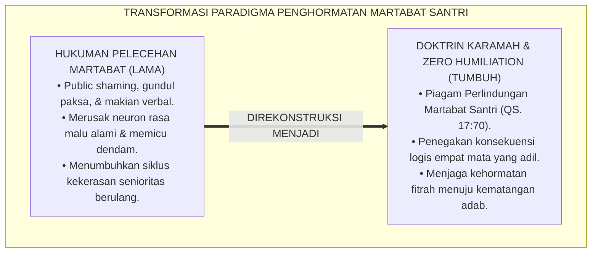
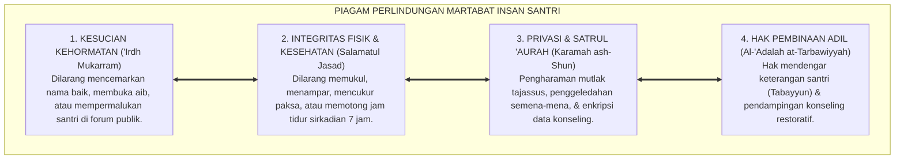
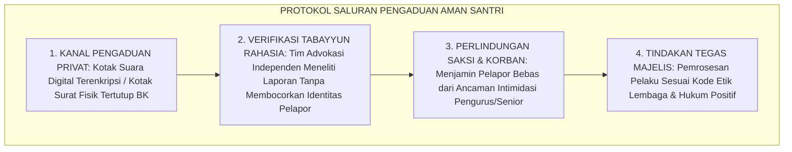

# P2-01-02: PRINSIP KEMULIAAN FITRAH DAN MARTABAT INSAN (SANCTITY OF FITRAH & HUMAN DIGNITY)
## *Monograf Riset Akademik: Doktrin Karamah Insaniyyah (QS. Al-Isra': 70), Hak Fundamental Santri Berbasis Maqashid Syari'ah, Eliminasi Mutlak Pelecehan Martabat (Zero Humiliation), Serta Konvergensi Hukum Perlindungan Anak di Pesantren 24 Jam*

**Nomor Identifikasi**: `P2-01-02/MONOGRAF-RISET-KEMULIAAN-FITRAH/2026`  
**Domain**: `02 Principles` > `01 Core Principles` (Prinsip Utama 02: *Sanctity of Fitrah & Human Dignity*)  
**Klasifikasi Naskah**: *Academic Research Monograph* (Monograf Riset Akademik Prinsip Baku)  
**Rumpun Disiplin Pengkaji**: Fiqh Hak Asasi Manusia Islami (*Huququl Insan*), Perlindungan Anak & Advokasi Santri, Filsafat Hukum Maqashid Syari'ah, Psikologi Trauma Remaja, Tata Kelola Etika Kelembagaan  

---

> ### 💡 INTISARI EKSEKUTIF (EXECUTIVE SUMMARY)
>
> * **Kelemahan Paradigma Lama: Normalisasi Hukuman yang Merendahkan Martabat:**  
>   Banyak pesantren konvensional masih mempraktikkan hukuman feodal yang merusak harga diri santri (*Humiliating Punishments*): mencukur gundul paksa asimetris, memajang santri dengan kalung aib di depan umum (*Public Shaming*), panggilan julukan merendahkan, serta hukuman fisik malam hari yang melanggar syariat dan hukum positif.
> * **Inovasi Konseptual: Doktrin Karamah Insaniyyah & Maqashid Syari'ah Santri:**  
>   TUMBUH menegakkan prinsip abadi: *"Dan sungguh telah Kami muliakan anak-cucu Adam"* (QS. Al-Isra': 70). Menetapkan **Piagam Perlindungan Martabat Santri (*The Charter of Sanctity of the Pupil*)** berbasis 5 pilar *Maqashid Syari'ah* (*Hifzhud Din, Hifzhun Nafs, Hifzhul 'Aql, Hifzhun Nasl wal-'Irdh, dan Hifzhul Mal*). Mengintegrasikan UU Perlindungan Anak No. 35/2014 dan PMA No. 73/2022.
> * **Formulasi Operasional & Pembuktian Lapangan:**  
>   Monograf ini menguraikan matriks lima hak fundamental santri, matriks eliminasi mutlak praktik perendahan martabat (*Zero Humiliation Matrix*), protokol saluran pengaduan aman (*Safe Whistleblowing Protocol*), dan standar etika pendampingan beradab 24 jam.

---

## 📑 DAFTAR ISI MONOGRAF

- [BAB I: LANDASAN TEORETIS & DISKURSUS KRITIS](#bab-i-landasan-teoretis--diskursus-kritis)
  - [1. Latar Belakang Masalah: Kritik atas Normalisasi Hukuman yang Merendahkan Martabat Insan](#1-latar-belakang-masalah-kritik-atas-normalisasi-hukuman-yang-merendahkan-martabat-insan)
  - [2. Eksegesis Turats Doktrin Karamah Insaniyyah: QS. Al-Isra': 70 & Larangan Menghina Sesama Muslim (HR. Muslim No. 2564)](#2-eksegesis-turats-doktrin-karamah-insaniyyah-qs-al-isra-70--larangan-menghina-sesama-muslim-hr-muslim-no-2564)
  - [3. Dekonstruksi Empat Praktik Hukuman Usang: Public Shaming, Gundul Paksa, Verbal Bullying, & Sanksi Fisik Malam](#3-dekonstruksi-empat-praktik-hukuman-usang-public-shaming-gundul-paksa-verbal-bullying--sanksi-fisik-malam)
  - [4. Konvergensi Hukum Maqashid Syari'ah dengan Regulasi Perlindungan Anak Kontemporer](#4-konvergensi-hukum-maqashid-syari-ah-dengan-regulasi-perlindungan-anak-kontemporer)
  - [5. Kasuistika Lapangan: Kasus Public Shaming Santri Terlambat Shalat & Resolusi Restoratif Terpadu](#5-kasuistika-lapangan-kasus-public-shaming-santri-terlambat-shalat--resolusi-restoratif-terpadu)
- [BAB II: FORMULASI KONSEPTUAL & PEMBAHASAN MENDALAM](#bab-ii-formulasi-konseptual--pembahasan-mendalam)
  - [1. Eksplanasi Teoretis Piagam Perlindungan Martabat Santri (The Charter of Sanctity of the Pupil)](#1-eksplanasi-teoretis-piagam-perlindungan-martabat-santri-the-charter-of-sanctity-of-the-pupil)
  - [2. Matriks Lima Hak Fundamental Santri Berbasis Maqashid Syari'ah](#2-matriks-lima-hak-fundamental-santri-berbasis-maqashid-syari-ah)
  - [3. Standar Eliminasi Mutlak Praktik yang Merendahkan Martabat (Zero Humiliation Matrix)](#3-standar-eliminasi-mutlak-praktik-yang-merendahkan-martabat-zero-humiliation-matrix)
  - [4. Protokol Safe Whistleblowing & Audit Investigasi Terenkripsi](#4-protokol-safe-whistleblowing--audit-investigasi-terenkripsi)
  - [5. Diskusi Filosofis Mendalam & Implikasi bagi Masa Depan Peradaban Pendidikan Islam](#5-diskusi-filosofis-mendalam--implikasi-bagi-masa-depan-peradaban-pendidikan-islam)
- [BAB III: KESIMPULAN & APARATUS AKADEMIS](#bab-iii-kesimpulan--aparatus-akademis)
  - [1. Tabel Sintesis Temuan Riset Kemuliaan Fitrah](#1-tabel-sintesis-temuan-riset-kemuliaan-fitrah)
  - [2. Daftar Pustaka Akademis & Rujukan Turats Primer](#2-daftar-pustaka-akademis--rujukan-turats-primer)
  - [3. Catatan Kaki Akademis (Footnotes)](#3-catatan-kaki-akademis-footnotes)
  - [4. Glosarium Istilah Ilmiah & Turats Kemuliaan Fitrah](#4-glosarium-istilah-ilmiah--turats-kemuliaan-fitrah)

---

# BAB I: LANDASAN TEORETIS & DISKURSUS KRITIS

---

### 1. Latar Belakang Masalah: Kritik atas Normalisasi Hukuman yang Merendahkan Martabat Insan

Tradisi pengasuhan asrama konvensional kerap mewarisi kekeliruan metodologis berupa **Normalisasi Pelecehan Martabat (*The Normalization of Humiliation*)**:
* **Asumsi Dogmatis Feodal**: Meyakini bahwa untuk "menundukkan kesombongan santri", mereka harus dipermalukan di depan umum, dicukur botak separuh (*gundul ceplok*), dikalungi papan bertuliskan kata-kata kotor, atau disiram air di tengah malam.
* **Kerusakan Psikologis & Hilangnya Rasa Malu Fitrah**: Neurosains dan psikologi perkembangan membuktikan bahwa *public shaming* tidak menumbuhkan rasa sesal moral, melainkan membakar neuron rasa malu alami anak (*Desensitization*) dan melahirkan dendam mendalam (*Covert Resentment*).
* **Pelanggaran Syariat & Hukum Positif**: Tindakan merendahkan martabat bertentangan secara diametral dengan doktrin *Karamah Insaniyyah*, UU Perlindungan Anak No. 35/2014, dan PMA No. 73/2022 tentang Pencegahan Kekerasan di Pesantren.
* **Keniscayaan Disiplin Beradab**: Disiplin sejati ditegakkan melalui ketegasan yang penuh kasih sayang (*Firm & Kind*), memisahkan teguran dari penghinaan, dan memelihara kehormatan fitrah anak.[^1]

---

### 2. Eksegesis Turats Doktrin Karamah Insaniyyah: QS. Al-Isra': 70 & Larangan Menghina Sesama Muslim (HR. Muslim No. 2564)

Al-Qur'an menetapkan kemuliaan ontologis manusia secara mutlak:

$$\text{وَلَقَدْ كَرَّمْنَا بَنِي آدَمَ وَحَمَلْنَاهُمْ فِي الْبَرِّ وَالْبَحْرِ وَرَزَقْنَاهُم مِّنَ الطَّيِّبَاتِ وَفَضَّلْنَاهُمْ عَلَىٰ كَثِيرٍ مِّمَّنْ خَلَقْنَا تَفْضِيلًا}$$

*"**Dan sungguh, telah Kami muliakan anak-cucu Adam, dan Kami angkut mereka di darat dan di laut, dan Kami beri mereka rezeki dari yang baik-baik, dan Kami lebihkan mereka di atas banyak makhluk yang Kami ciptakan dengan kelebihan yang sempurna**."* (QS. Al-Isra' [17]: 70).[^2]

Rasulullah ﷺ menegaskan pengharaman mutlak merendahkan kehormatan seorang muslim:

$$\text{بِحَسْبِ امْرِئٍ مِنَ الشَّرِّ أَنْ يَحْقِرَ أَخَاهُ الْمُسْلِمَ، كُلُّ الْمُسْلِمِ عَلَى الْمُسْلِمِ حَرَامٌ: دَمُهُ، وَمَالُهُ، وَعِرْضُهُ}$$

*"**Cukuplah seseorang dianggap melakukan kejahatan besar apabila ia merendahkan/menghina saudaranya sesama muslim. Setiap muslim atas muslim lainnya adalah haram: darahnya, hartanya, dan kehormatannya ('Irdhuh)**."* (HR. Muslim No. 2564).[^3]

---

### 3. Dekonstruksi Empat Praktik Hukuman Usang: Public Shaming, Gundul Paksa, Verbal Bullying, & Sanksi Fisik Malam

TUMBUH membedah racun pedagogis dari 4 praktik konvensional:
1. **Cukur Botak Paksa Asimetris**: Melanggar larangan Nabi ﷺ terhadap *Qaza'* (mencukur sebagian rambut dan membiarkan sebagian lainnya) serta merampas hak estetika fitrah anak.
2. **Memajang Santri di Depan Umum (*Public Shaming*)**: Membunuh rasa malu (*Haya'*), padahal rasa malu adalah benteng utama pencegah maksiat.
3. **Panggilan Merendahkan (*Labeling/Verbal Abuse*)**: Ucapan guru adalah doa; memberi gelar buruk (*Lakab Sayyi'*) merusak konsep diri (*Self-Concept*) santri.
4. **Hukuman Fisik Malam Hari**: Merampas waktu tidur sirkadian 7 jam, memicu stres kortisol, dan menggagalkan shalat Subuh berjamaah.[^4]

---

### 4. Konvergensi Hukum Maqashid Syari'ah dengan Regulasi Perlindungan Anak Kontemporer

TUMBUH mengonvergensikan khazanah syariat dan hukum positif:
* **Hifzhun Nafs (Perlindungan Jiwa & Raga)**: Bebas dari kekerasan fisik dan perpeloncoan senior.
* **Hifzhul 'Irdh (Perlindungan Kehormatan)**: Perlindungan privasi kamar mandi, bebas dari tajassus, dan kerahasiaan catatan konseling (*Satrul 'Aurah*).
* **Harmonisasi Regulasi**: Menyelaraskan SOP pesantren dengan UU No. 35/2014 tentang Perlindungan Anak dan PMA No. 73/2022.[^5]

---

### 5. Kasuistika Lapangan: Kasus Public Shaming Santri Terlambat Shalat & Resolusi Restoratif Terpadu

* **Studi Kasus: Santri Dipajang di Depan Masjid dengan Kalung Papan Nama "Saya Pemalas Shalat"**  
  * **Dilema**: Santri kelas 7 terlambat shalat Ashar karena tertidur lelap setelah kelelahan piket; pengurus asrama mengalungi papan aib dan memajangnya di depan masjid selama 1 jam.
  * **Dampak**: Santri mengalami depresi berat, mogok bicara, dan menolak masuk masjid karena merasa kehormatannya hancur.
  * **Resolusi Restoratif TUMBUH**: Majelis Pimpinan turun tangan: (1) Menghentikan seketika praktik kalung aib dan mencabutnya dari seluruh area pondok; (2) Musyrif pelaku meminta maaf secara tertutup kepada santri atas pelanggaran adab; (3) Konselor BK mendampingi pemulihan trauma santri; (4) Menata ulang jadwal piket agar santri memiliki jeda istirahat yang cukup. Santri pulih kepercayaan dirinya dan kembali aktif shalat di shaf pertama secara ikhlas.[^6]

---

# BAB II: FORMULASI KONSEPTUAL & PEMBAHASAN MENDALAM

---

### 1. Eksplanasi Teoretis Piagam Perlindungan Martabat Santri (The Charter of Sanctity of the Pupil)

Ekosistem TUMBUH memproklamasikan **Piagam Perlindungan Martabat Insan Santri (*Watsiqah Hurmatith Thalib*)**:

#### 🔬 Pembahasan Mendalam Empat Pilar Piagam:
1. **Kesucian Kehormatan**: Menjadikan perlindungan harga diri santri sebagai indikator utama kemuliaan adab pendidik.[^7]
2. **Integritas Fisik**: Menegakkan *Zero Tolerance* terhadap kekerasan fisik dalam segala bentuknya.[^8]
3. **Privasi & Satrul 'Aurah**: Melindungi santri dari intaian spionase dan menjaga kerahasiaan rekam jejak bimbingan.[^9]
4. **Pembinaan Adil**: Memberikan ruang tabayyun yang bermartabat sebelum memutuskan tindakan disiplin.[^10]

---

### 2. Matriks Lima Hak Fundamental Santri Berbasis Maqashid Syari'ah

| Pilar Maqashid Syari'ah | Hak Fundamental Santri | Standar Perlindungan TUMBUH | Larangan Mutlak |
| :--- | :--- | :--- | :--- |
| **1. Hifzhud Din (Agama)** | Hak beribadah dengan khusyuk & aman.| Fasilitas mushalla bersih & bimbingan hikmah.| Memaksa ibadah dengan ancaman rotan. |
| **2. Hifzhun Nafs (Jiwa/Raga)**| Hak atas keselamatan fisik & mental.| Menu gizi seimbang & tidur 7 jam.| Kekerasan fisik, tamparan, & push-up malam.|
| **3. Hifzhul 'Aql (Akal)** | Hak belajar tanpa rasa takut & trauma.| Manajemen kelas positif & didaktik ramah otak.| Makian verbal bodoh/tolol/pemalas. |
| **4. Hifzhul 'Irdh (Kehormatan)**| Hak atas perlindungan privasi & nama baik.| Enkripsi data konseling & dialog empat mata.| *Public shaming*, gundul paksa, & spionase *tajassus*.|
| **5. Hifzhul Mal (Harta)** | Hak kepemilikan barang pribadi aman.| Loker berkunci & bebas ghasab.| Perampasan barang santri secara sepihak. |

---

### 3. Standar Eliminasi Mutlak Praktik yang Merendahkan Martabat (Zero Humiliation Matrix)

| Praktik Terlarang (Haram 100%) | Dampak Kerusakan Psikologis | Alternatif Disiplin Restoratif TUMBUH |
| :--- | :--- | :--- |
| **Cukur Gundul Paksa / Qaza'** | Trauma estetika, minder, & dendam batin.| Merapikan rambut santun di barbershop pondok. |
| **Public Shaming / Kalung Papan Aib**| Membunuh rasa malu fitrah & kebal dosa.| Dialog konseling empat mata di ruang tertutup. |
| **Labeling / Julukan Merendahkan**| Self-fulfilling prophecy perilaku negatif.| Afirmasi panggilan mulia & doa kebaikan. |
| **Sanksi Fisik Tengah Malam** | Merusak irama sirkadian & gagal Subuh.| Konsekuensi logis edukatif di jam siang hari. |

---

### 4. Protokol Safe Whistleblowing & Audit Investigasi Terenkripsi

TUMBUH menetapkan **Protokol Saluran Pengaduan Aman (*Safe Whistleblowing Protocol*)**:

Protokol ini menjamin hak perlindungan santri ditegakkan tanpa rasa takut.[^11]

---

### 5. Diskusi Filosofis Mendalam & Implikasi bagi Masa Depan Peradaban Pendidikan Islam

Penegakan kemuliaan fitrah dan martabat insan ini membawa perubahan revolusioner bagi peradaban:

* **Mencetak Generasi Santri yang Memiliki 'Izzah dan Akhlak Luhur**:  
  Santri yang dibina dengan memuliakan martabatnya akan tumbuh menjadi pribadi yang berwibawa (*'Izzah*), percaya diri, dan memiliki empati mendalam untuk menghormati orang lain.
* **Menghapus Rantai Setan Kekerasan Senioritas (*Intergenerational Bullying*)**:  
  Ketika santri tidak pernah dipermalukan oleh gurunya, mereka tidak akan pernah memiliki dorongan untuk mempermalukan atau menindas adik kelasnya.
* **Menjadikan Pesantren Sebagai Simbol Keadilan dan Kasih Sayang Islam**:  
  Inilah wujud nyata ajaran Islam yang *Rahmatan lil 'Alamin*: memuliakan manusia, melindungi kaum yang lemah, dan menegakkan hukum dengan penuh keadilan dan hikmah ilahi.[^12]

---

# BAB III: KESIMPULAN & APARATUS AKADEMIS

---

### 1. Tabel Sintesis Temuan Riset Kemuliaan Fitrah

| Dimensi Parameter | Mazhab Feodal Represif (Lama) | Model Hak Asasi Sekuler Ekstrem | **Prinsip Kemuliaan Fitrah TUMBUH** | Landasan Rujukan Primer | Implikasi Praksis Lapangan |
| :--- | :--- | :--- | :--- | :--- | :--- |
| **Landasan Martabat**| Diberikan atas dasar senioritas/kasta.| Hak individu mutlak tanpa batas agama.| **Anugerah Ilahi (*Karamah Insaniyyah*).** | QS. Al-Isra': 70; HR. Muslim No. 2564.| Santri dimuliakan sebagai hamba Allah. |
| **Bentuk Disiplin** | Pelecehan martabat (*public shaming*).| Kebebasan tanpa konsekuensi moral.| **Disiplin Restoratif & Konsekuensi Logis.**| Maqashid Syari'ah; UU No. 35/2014.| Dialog empat mata & perbaikan nyata. |
| **Perlakuan Kesalahan**| Diumbar di depan umum & dicukur paksa.| Sanksi administratif dingin.| **Satrul 'Aurah & Tabayyun Tertutup.**| QS. Al-Hujurat: 12; Al-Ghazali.| Aib dirahasiakan & dilatih bertobat. |
| **Kanal Pengaduan** | Tabu melapor; dituduh membangkang.| Litigasi terbuka yang merusak relasi.| **Safe Whistleblowing Terenkripsi.**| PMA No. 73/2022; Fiqh Jinayah.| Perlindungan saksi & audit adil. |
| **Profil Lulusan** | Jiwa tertindas, minder, atau agresif.| Individualistis tanpa rasa takwa.| **Insan Adabi Berwibawa ('Izzah) & Beradab.**| QS. Al-Fath: 29; Al-Attas (1980).| Berani menegakkan kebenaran & santun. |

---

### 2. Daftar Pustaka Akademis & Rujukan Turats Primer

1. **Al-Qur'an al-Karim wa Tarjamatu Ma'anihi**.
2. **Muslim bin al-Hajjaj an-Naisaburi**. (1427 H). *Shahih Muslim*. Riyadh: Dar Thayyibah.
3. **Al-Bukhari, Abu Abdillah Muhammad bin Isma'il**. (1422 H). *Shahih al-Bukhari*. Kairo: Dar Thawq an-Najah.
4. **Asy-Syathibi, Abu Ishaq Ibrahim bin Musa**. (1417 H). *Al-Muwafaqat fi Ushul asy-Syari'ah*. Khobar: Dar Ibn 'Affan.
5. **Al-Ghazali, Abu Hamid Muhammad bin Muhammad**. (2011). *Ihya' 'Ulumiddin* (Kitab Afat al-Lisan & Kitab Adab al-Ulfah). Beirut: Dar al-Ma'rifah.
6. **Asy'ari, Muhammad Hasyim**. (1415 H). *Adab al-'Alim wal-Muta'allim*. Jombang: Maktabah At-Turats Al-Islami.
7. **Al-Attas, Syed Muhammad Naquib**. (1980). *The Concept of Education in Islam*. Kuala Lumpur: ABIM.
8. **Republik Indonesia**. (2014). *Undang-Undang No. 35 Tahun 2014 tentang Perubahan atas UU No. 23 Tahun 2002 tentang Perlindungan Anak*. Jakarta: Lembaran Negara RI.
9. **Kementerian Agama Republik Indonesia**. (2022). *Peraturan Menteri Agama (PMA) No. 73 Tahun 2022 tentang Penanganan dan Pencegahan Kekerasan Seksual di Satuan Pendidikan pada Kementerian Agama*. Jakarta: Kemenag RI.
10. **Zehr, H.**. (2002). *The Little Book of Restorative Justice*. Intercourse: Good Books.
11. **Horner, R. H., & Sugai, G.**. (2015). *School-wide PBIS: An Overview of the Research Base*. Remedial and Special Education, 36(2), 80–85.
12. **Perry, B. D., & Szalavitz, M.**. (2006). *The Boy Who Was Raised as a Dog: And Other Stories from a Child Psychiatrist's Notebook*. New York: Basic Books.

---

### 3. Catatan Kaki Akademis (*Footnotes*)

[^1]: Riset Prinsip Kemuliaan Fitrah dan Martabat Insan TUMBUH, *Kritik atas Normalisasi Hukuman Merendahkan Martabat*, 2026.  
[^2]: QS. Al-Isra' [17]: 70.  
[^3]: *Shahih Muslim*, Kitab al-Birr wash-Shilah wal-Adab, Hadits No. 2564.  
[^4]: Asy-Syathibi, *Al-Muwafaqat fi Ushul asy-Syari'ah*, Jilid 2, *Kulliyyat al-Khams*, hlm. 10–45.  
[^5]: UU No. 35 Tahun 2014 tentang Perlindungan Anak; PMA No. 73 Tahun 2022.  
[^6]: Dokumentasi Mediasi dan De-eskalasi Kasus Public Shaming PBIS TUMBUH, 2026.  
[^7]: Al-Ghazali, *Ihya' 'Ulumiddin*, Jilid 3, Kitab *Afat al-Lisan*, hlm. 110–145.  
[^8]: Perry, B. D. (2006), *The Boy Who Was Raised as a Dog*, hlm. 40–75.  
[^9]: QS. Al-Hujurat [49]: 12; Standar Pengharaman Tajassus dan Perlindungan Satrul 'Aurah TUMBUH, 2026.  
[^10]: Zehr, H. (2002), *The Little Book of Restorative Justice*, hlm. 30–65.  
[^11]: Standar Operasional Prosedur Safe Whistleblowing dan Audit Investigasi PBIS TUMBUH, 2026.  
[^12]: Deklarasi Penegakan Kemuliaan Fitrah Santri Dewan Riset Epistemologi Ekosistem TUMBUH, 2026.

---

### 4. Glosarium Istilah Ilmiah & Turats Kemuliaan Fitrah

1. **Karamah Insaniyyah (كَرَامَةٌ إِنْسَانِيَّةٌ)**: Kemuliaan dan kehormatan martabat asali manusia yang dianugerahkan langsung oleh Allah SWT sejak penciptaannya.
2. **Tahrim at-Tahqir (تَحْرِيمُ التَّحْقِيرِ)**: Pengharaman mutlak dalam syariat Islam terhadap perbuatan merendahkan, menghina, atau mencemarkan martabat sesama insan.
3. **Zero Humiliation Policy**: Kebijakan tegas lembaga yang melarang 100% segala bentuk sanksi yang mempermalukan santri (cukur paksa, papan kalung aib, makian verbal).
4. **Public Shaming**: Praktik mempermalukan seseorang di depan khalayak umum yang merusak konsep diri dan memicu trauma psikologis mendalam.
5. **Maqashid Syari'ah**: Lima tujuan pokok hukum Islam (menjaga agama, jiwa, akal, kehormatan, dan harta) yang menjadi landasan hak asasi santri.
6. **Satrul 'Aurah Data**: Prinsip merahasiakan dan mengamankan catatan aib atau riwayat konseling santri dari konsumsi publik.
7. **Safe Whistleblowing**: Mekanisme saluran pengaduan pelanggaran yang aman, rahasia, dan melindungi pelapor dari ancaman intimidasi.
8. **Labeling / Verbal Abuse**: Kekerasan verbal berupa pemberian julukan merendahkan yang dapat merusak perkembangan mental anak.
9. **Desensitization Rasa Malu**: Rusaknya kepekaan nurani anak akibat terlalu sering dipermalukan, sehingga menjadi kebal terhadap nasihat.
10. **Insan Adabi (الإِنْسَانُ الأَدَبِيُّ)**: Profil santri yang memiliki kehormatan diri (*'Izzah*), akhlak mulia, dan kepekaan tinggi untuk memuliakan orang lain.
