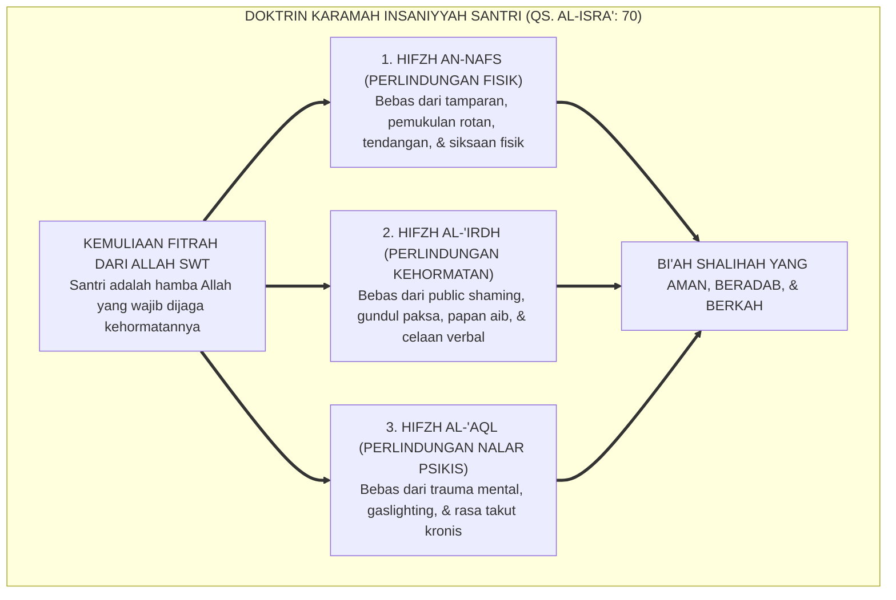
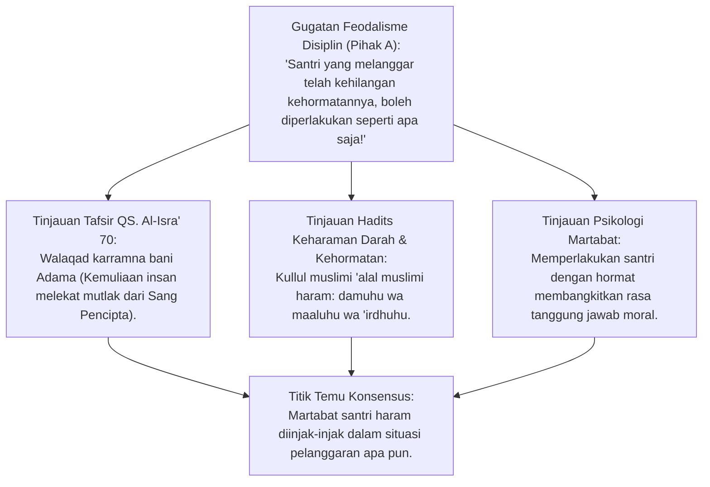
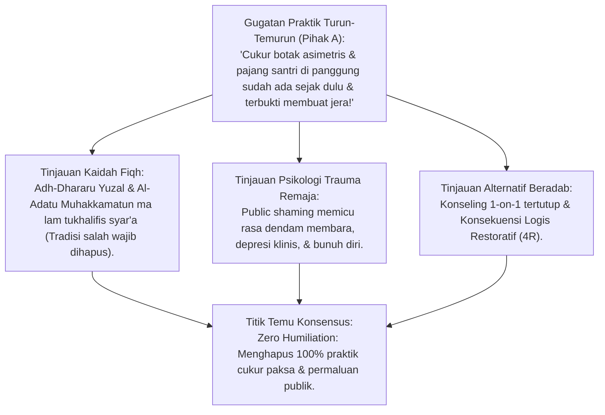
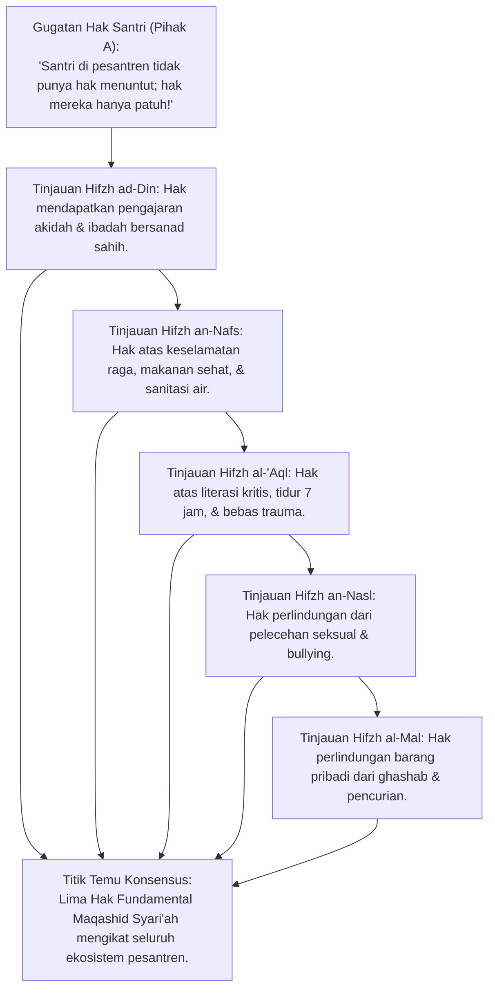
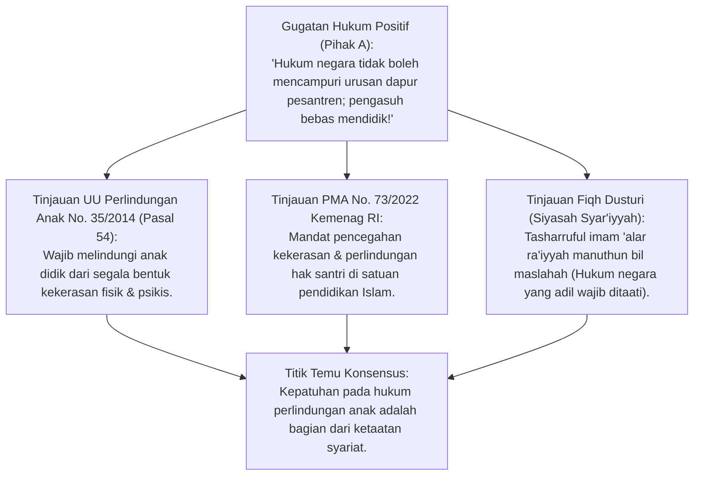
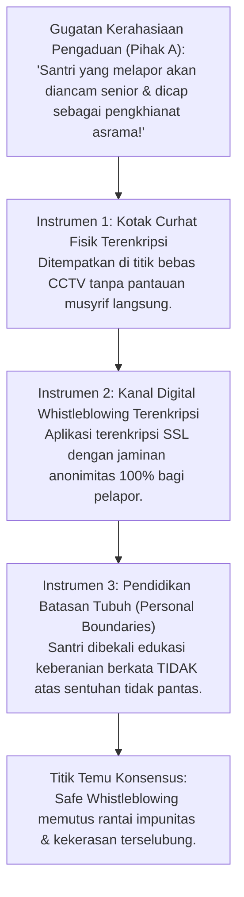
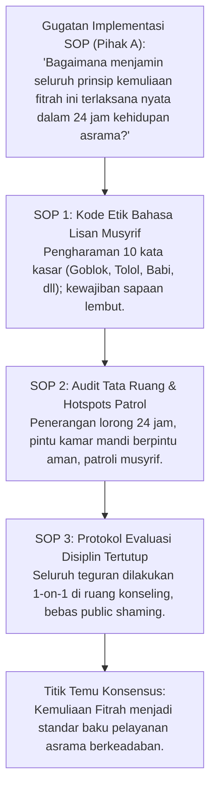
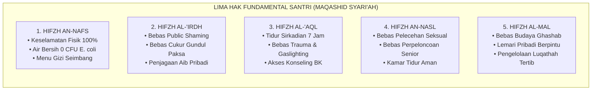
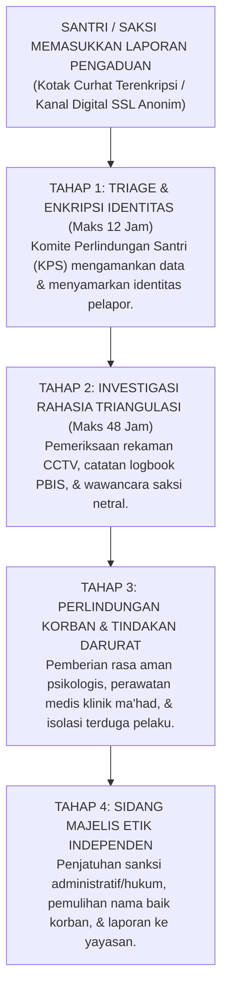

# P2-01-02: PRINSIP KEMULIAAN FITRAH DAN MARTABAT INSAN
## *Monograf Terpadu: Doktrin Karamah Insaniyyah (QS. Al-Isra': 70), Hak Fundamental Santri Berbasis Maqashid Syari'ah, Eliminasi Mutlak Pelecehan Martabat (Zero Humiliation), & Konvergensi UU Perlindungan Anak*

**Nomor Identifikasi**: `P2-01-02/MONOGRAF-TERPADU-KEMULIAAN-FITRAH/2026`  
**Domain**: `02 Principles` > `01 Core Principles`  
**Klasifikasi Naskah**: *Comprehensive Integrated Monograph* (Monograf Akademis & Rumusan Baku Terpadu)  
**Rumpun Disiplin Pengkaji**: Fiqh Hak Asasi Manusia Islami (*Huququl Insan*), Perlindungan Anak & Advokasi Santri, Filsafat Hukum Maqashid Syari'ah, Psikologi Trauma Remaja, Tata Kelola Etika Kelembagaan  

---

> ### 💡 INTISARI PRAKTIS (3 MENIT PAHAM UNTUK ASATIDZ & MUSYRIF)
>
> * **Apa Dasar Utama Memuliakan Santri?**  
>   Allah SWT menegaskan dalam Al-Qur'an: *"Sungguh telah Kami muliakan anak-cucu Adam"* (QS. Al-Isra': 70). Santri adalah **Hamba Allah yang Mulia (*Mukarram*)**, bukan budak yang boleh diinjak-injak kehormatannya berdalih penertiban disiplin.
> * **Empat Praktik Hukuman Usang yang Diharamkan 100% di TUMBUH:**  
>   1. **Cukur Gundul Paksa / Botak Asimetris**: Merusak harga diri santri dan memicu dendam membara.  
>   2. **Memajang Santri di Depan Umum (*Public Shaming*)**: Membunuh rasa malu fitrah dan melatih anak menjadi kebal aib.  
>   3. **Pemberian Gelar Merendahkan (Tolol, Iblis, Pemalas)**: Menjadi doa buruk yang mengunci perilaku negatif santri.  
>   4. **Hukuman Fisik Melelahkan di Malam Hari (Push-up/Lari)**: Merusak organ tubuh dan menggagalkan shalat Shubuh.
> * **Prinsip Mengoreksi Santri yang Beradab:**  
>   Tegur perilakunya secara empat mata di ruang konseling pribadi, tegakkan konsekuensi logis yang relevan (misalnya membersihkan area yang dikotori), sembari tetap menegaskan keyakinan bahwa santri mampu bertumbuh menjadi anak shalih.

---

## 📑 DAFTAR ISI MONOGRAF

- [BAGIAN I: RISET DOKTRIN HAKIKI, DIALEKTIKA INKUIRI, & KASUISTIKA LAPANGAN](#bagian-i-riset-doktrin-hakiki-dialektika-inkuiri--kasuistika-lapangan)
  - [1. Kerangka Metodologi Teologis Karamah Insaniyyah](#1-kerangka-metodologi-teologis-karamah-insaniyyah)
  - [2. Inkuiri 1: Eksegesis QS. Al-Isra' 70 — Hakikat Martabat Ontologis Santri](#2-inkuiri-1-eksegesis-qs-al-isra-70--hakikat-martabat-ontologis-santri)
  - [3. Inkuiri 2: Dekonstruksi Praktik Hukuman Merendahkan Martabat (Public Shaming & Cukur Paksa)](#3-inkuiri-2-dekonstruksi-praktik-hukuman-merendahkan-martabat-public-shaming--cukur-paksa)
  - [4. Inkuiri 3: Lima Hak Fundamental Santri Berbasis Maqashid Syari'ah (Al-Kulliyyat al-Khams)](#4-inkuiri-3-lima-hak-fundamental-santri-berbasis-maqashid-syari-ah-al-kulliyyat-al-khams)
  - [5. Inkuiri 4: Konvergensi dengan UU Perlindungan Anak No. 35/2014 & PMA No. 73/2022](#5-inkuiri-4-konvergensi-dengan-uu-perlindungan-anak-no-352014--pma-no-732022)
  - [6. Inkuiri 5: Saluran Pengaduan Aman (Safe Whistleblowing) & Pendidikan Batasan Personal](#6-inkuiri-5-saluran-pengaduan-aman-safe-whistleblowing--pendidikan-batasan-personal)
  - [7. Inkuiri 6: Translasi Doktrin Kemuliaan Fitrah ke Standar Operasional Asrama 24 Jam](#7-inkuiri-6-translasi-doktrin-kemuliaan-fitrah-ke-standar-operasional-asrama-24-jam)
- [BAGIAN II: KODIFIKASI BAKU HASIL RISET & KESIMPULAN FORMAL](#bagian-ii-kodifikasi-baku-hasil-riset--kesimpulan-formal)
  - [1. Piagam Perlindungan Martabat Insan Santri (The Charter of Sanctity of the Pupil)](#1-piagam-perlindungan-martabat-insan-santri-the-charter-of-sanctity-of-the-pupil)
  - [2. Matriks Lima Hak Fundamental Santri Berbasis Maqashid Syari'ah](#2-matriks-lima-hak-fundamental-santri-berbasis-maqashid-syari-ah)
  - [3. Standar Eliminasi Mutlak Praktik yang Merendahkan Martabat (Zero Humiliation Matrix)](#3-standar-eliminasi-mutlak-praktik-yang-merendahkan-martabat-zero-humiliation-matrix)
  - [4. Protokol Safe Whistleblowing & Audit Investigasi Terenkripsi](#4-protokol-safe-whistleblowing--audit-investigasi-terenkripsi)
- [BAGIAN III: APARATUS AKADEMIS & APENDIKS](#bagian-iii-aparatus-akademis--apendiks)
  - [1. Tabel Sintesis Hasil Riset Kemuliaan Fitrah](#1-tabel-sintesis-hasil-riset-kemuliaan-fitrah)
  - [2. Daftar Pustaka Akademis & Rujukan Turats Primer](#2-daftar-pustaka-akademis--rujukan-turats-primer)
  - [3. Catatan Kaki Akademis (Footnotes)](#3-catatan-kaki-akademis-footnotes)
  - [4. Glosarium dan Penjelasan Istilah Teknis Perlindungan Santri](#4-glosarium-dan-penjelasan-istilah-teknis-perlindungan-santri)

---

# BAGIAN I: RISET DOKTRIN HAKIKI, DIALEKTIKA INKUIRI, & KASUISTIKA LAPANGAN

*Bagian ini memuat proses penyelidikan hak asasi santri dalam Islam, formalisasi silogisme logika (*qiyas burhani*), pertarungan dialektika multi-perspektif tiga ronde tanpa kata "pakar", telaah tafsir QS. Al-Isra': 70, kitab Fiqh Jinayah & Maqashid, perundang-undangan perlindungan anak nasional, studi kasus pengasuhan, dan penarikan konsensus bersama.*

---

### 1. Kerangka Metodologi Teologis Karamah Insaniyyah

Prinsip fundamental kedua dalam arsitektur nilai Ekosistem TUMBUH adalah **Kemuliaan Fitrah dan Martabat Insan (*Karamah Insaniyyah*)**.
* Martabat kemuliaan manusia bukanlah anugerah dari penguasa atau pemberian yayasan pondok, melainkan **Hakikat Ontologis Asali yang Ditetapkan Langsung oleh Allah SWT (*Inherent Divine Dignity*)**.
* Oleh karena itu, tidak ada seorang pun—baik kiai pengasuh, guru madrasah, musyrif asrama, maupun santri senior—yang memiliki wewenang syar'i untuk merampas, menginjak-injak, menampar, atau mempermalukan kehormatan seorang santri berdalih "penegakan disiplin".

---

### 2. Inkuiri 1: Eksegesis QS. Al-Isra' 70 — Hakikat Martabat Ontologis Santri

#### 📐 Formalisasi Logika Silogisme (*Qiyas Mantiqi 1*)
* **Premis Mayor (*al-Muqaddimah al-Kubra*)**: Setiap hamba yang telah dimuliakan oleh Allah SWT (*Mukarram*) dengan karunia fitrah, akal, dan ruh dilarang secara syar'i untuk dinistakan kehormatannya (*Ihānah*) atau disiksa fisiknya oleh sesama makhluk (QS. Al-Isra': 70).
* **Premis Minor (*al-Muqaddimah ash-Shughra*)**: Seluruh santri yang menuntut ilmu di pesantren adalah anak cucu Adam yang menyandang kemuliaan fitrah tersebut.
* **Konklusi (*an-Natijah*)**: Maka, perlindungan kehormatan dan keselamatan fisik santri adalah kewajiban syar'i mutlak yang tidak dapat digugurkan oleh dalih penertiban disiplin.[^1]

#### 📖 Teks Primer Al-Qur'an & Khutbah Wada' Rasulullah SAW
Allah SWT mendeklarasikan kemuliaan anak cucu Adam:

$$\text{وَلَقَدْ كَرَّمْنَا بَنِي آدَمَ وَحَمَلْنَاهُمْ فِي الْبَرِّ وَالْبَحْرِ وَرَزَقْنَاهُم مِّنَ الطَّيِّبَاتِ وَفَضَّلْنَاهُمْ عَلَىٰ كَثِيرٍ مِّمَّنْ خَلَقْنَا تَفْضِيلًا}$$

*"Dan sungguh telah Kami muliakan anak-cucu Adam, Kami angkut mereka di daratan dan di lautan, Kami beri mereka rezeki dari yang baik-baik, dan Kami lebihkan mereka dengan kelebihan yang sempurna atas kebanyakan makhluk yang telah Kami ciptakan."* (QS. Al-Isra' [17]: 70).[^2]

Dan Rasulullah SAW dalam Khutbah Haji Wada' menetapkan piagam kehormatan muslim:
$$\text{إِنَّ دِمَاءَكُمْ وَأَمْوَالَكُمْ وَأَعْرَاضَكُمْ عَلَيْكُمْ حَرَامٌ، كَحُرْمَةِ يَوْمِكُمْ هَذَا، فِي شَهْرِكُمْ هَذَا، فِي بَلَدِكُمْ هَذَا}$$
*"Sesungguhnya darah kalian, harta benda kalian, dan kehormatan diri kalian adalah haram (suci terlindungi) atas sesama kalian, sebagaimana kesucian hari kalian ini, di bulan kalian ini, dan di negeri kalian yang suci ini."* (HR. Bukhari no. 1741 & Muslim no. 1679).[^3]

#### 🥊 Ronde 1: Menolak Dalih "Menghinakan Santri demi Mematahkan Hawa Nafsu"
* **Pihak A (Sudut Pandang Tasawuf Ekstrem / Penyimpangan Malamatiyyah)**:  
  *"Bukankah dalam sebagian kisah sufi masa lalu, seorang murid dihinakan dan disuruh membersihkan kotoran di depan pasar untuk menghancurkan kesombongan nafsunya? Mengapa TUMBUH melarang tindakan merendahkan santri?"*
* **Tinjauan Sudut Pandang Tasawuf Sunni Aswaja (Al-Ghazali & Ibnu Hajar)**:  
  Penyiksaan psikologis tersebut adalah **Penyimpangan Ekstrem yang Ditolak oleh Ijma' Ulama Sunni**. Imam Al-Ghazali menegaskan bahwa *Tadzkirun Nafs* (mendidik jiwa) dilakukan dengan menundukkan syahwat melalui puasa dan ibadah, bukan dengan **Menjatuhkan Kehormatan Diri di Depan Publik (*Ibtidzal al-Karamah*)**. Rasulullah SAW melarang seorang mukmin menghinakan dirinya sendiri (*Laa yanbaghi lil-mu'mini an yudzilla nafsahu* - HR. Tirmidzi no. 2254).[^4]

#### 🥊 Ronde 2: Sanggahan Balik Apakah Menghormati Santri Membuat Santri Pembangkang?
* **Pihak A (Sudut Pandang Otoritarianisme)**:  
  *"Sanggahan! Jika santri yang bersalah tetap diajak bicara dengan hormat dan tidak dimarahi di depan umum, santri akan merasa dirinya benar dan tidak akan jera!"*
* **Tinjauan Sudut Pandang Psikologi Disiplin Restoratif**:  
  Menghormati martabat santri **Bukan Berarti Menoleransi Kesalahannya (*Distinction between Person & Behavior*)**. Musyrif menegaskan: *"Ustadz menyayangimu sebagai santri mulia, namun tindakanmu mencuri sabun teman adalah perbuatan salah yang merugikan orang lain; kamu wajib mengganti sabun tersebut dan meminta maaf secara jantan"*. Ketika martabat pribadinya tidak dihina, santri tidak terpicu untuk membela diri secara agresif, melainkan fokus mengakui kesalahan dan bertanggung jawab.[^5]

#### 🥊 Ronde 3: Sanggahan Pamungkas Membedakan Takzir Syar'i dari Balas Dendam Pribadi
* **Pihak A (Sudut Pandang Legalisasi Takzir)**:  
  *"Bukankah fiqh Islam mengenal hukuman takzir bagi pelaku maksiat?"*
* **Resolusi Sudut Pandang Fiqh Jinayah Islam**:  
  Takzir dalam Islam adalah **Sarana Perbaikan (*Zajr wa Ta'dib*)**, bukan pelampiasan amarah atau balas dendam pengasuh. Syarat mutlak takzir: (1) Tidak boleh melukai fisik, (2) Tidak boleh memukul wajah, (3) Tidak boleh membuka aib pribadi, dan (4) Dijalankan dengan niat kasih sayang mendidik. Hukuman yang merusak fisik atau meremukkan harga diri anak adalah kezaliman yang haram hukumnya.[^6]

> #### 📌 Kasuistika Lapangan 1 & Titik Temu Konsensus
> * **Studi Kasus**: Santri terlambat masuk masjid; musyrif memaksa santri tersebut berdiri di depan pintu masjid dengan mengalungkan papan bertuliskan: "SAYA SANTRI PEMALAS DAN KOTOR".
> * **Titik Temu Konsensus (*Kalimatun Sawa'*)**: Disepakati bahwa hukuman kalung papan aib adalah *Public Shaming* yang diharamkan syariat dan merusak fitrah malu santri. Musyrif ditegur keras dan SOP takzir diganti dengan tugas literasi adab dan khidmah kebersihan masjid secara santun.[^7]

---

### 3. Inkuiri 2: Dekonstruksi Praktik Hukuman Merendahkan Martabat (Public Shaming & Cukur Paksa)

#### 📐 Formalisasi Logika Silogisme (*Qiyas Mantiqi 2*)
* **Premis Mayor (*al-Muqaddimah al-Kubra*)**: Setiap metode sanksi yang menimbulkan kerugian psikologis berat (*Dharar Nafsiy*), menghancurkan harga diri santri (*Loss of Self-Respect*), dan memicu trauma dendam niscaya terkategori sebagai kemudaratan yang wajib dilenyapkan secara mutlak (*Adh-Dhararu Yuzāl*).
* **Premis Minor (*al-Muqaddimah ash-Shughra*)**: Praktik pencukuran rambut gundul paksa asimetris dan pemajangan santri di depan publik terbukti secara ilmiah melahirkan luka psikologis kronis.
* **Konklusi (*an-Natijah*)**: Maka, Ekosistem TUMBUH menghapus 100% seluruh praktik sanksi yang merendahkan martabat tersebut dari seluruh pesantren.[^8]

#### 📖 Teks Primer Turats: *Al-Asybah wan-Nazha'ir* & Kaidah Adh-Dhararu Yuzal
Imam **Jalaluddin As-Suyuthi** merumuskan kaidah emas pencegahan bahaya:

$$\text{الضَّرَرُ يُزَالُ، وَالْأَصْلُ فِي ذَلِكَ قَوْلُهُ صَلَّى اللَّهُ عَلَيْهِ وَسَلَّمَ: لَا ضَرَرَ وَلَا ضِرَارَ، وَكُلُّ تَأْدِيبٍ أَدَّى إِلَى هَلَاكِ الْمُتَعَلِّمِ أَوْ إِتْلَافِ عِرْضِهِ أَوْ إِيذَاءِ نَفْسِيَّتِهِ إِيذَاءً فَاحِشًا فَهُوَ مَحْظُورٌ شَرْعًا يَضْمَنُ فَاعِلُهُ}$$

*"Segala bentuk kemudaratan wajib dilenyapkan; dan landasan pokok kaidah ini adalah sabda Nabi SAW: 'Tidak boleh ada bahaya dan tidak boleh saling membahayakan'. Setiap tindakan pendisiplinan yang berakibat pada kebinasaan murid, atau mencemari kehormatan dirinya, atau melukai kondisi kejiwaannya dengan luka yang parah, maka tindakan tersebut adalah terlarang secara syar'i dan pelakunya wajib menanggung gantinya."*[^9]

#### 🥊 Ronde 1: Membongkar Mitos Efektivitas Cukur Botak Paksa / Asimetris
* **Tinjauan Psikologi Perkembangan Remaja (Erik Erikson - Identity Crisis)**:  
  Rambut bagi remaja usia 12–18 tahun adalah **Simbol Identitas Diri dan Ekspresi Keberadaan (*Self-Identity Representation*)**. Mencukur rambut santri secara paksa dengan model asimetris (*gundul sebelah*) untuk mempermalukannya adalah bentuk **Kekerasan Simbolik (*Symbolic Violence*)**. Hal ini memicu rasa malu akut yang membuat santri menutup diri dari pergaulan sosial (*Social Withdrawal*) dan menanamkan kebencian mendalam kepada figur guru dan agama.[^10]

#### 🥊 Ronde 2: Sanggahan Balik Bagaimana Menertibkan Santri yang Berambut Gondrong?
* **Pihak A (Sudut Pandang Kerapian Pondok)**:  
  *"Jika tidak boleh dicukur paksa oleh pengurus, bagaimana cara menertibkan santri yang menolak potong rambut dan rambutnya gondrong tidak rapi?"*
* **Tinjauan Sudut Pandang Intervensi Beradab**:  
  Penertiban dilakukan dengan **Protokol Cukur Mandiri Terbimbing**: Santri diberikan batas waktu 24 jam untuk potong rambut rapi di tempat pangkas rambut resmi pondok. Jika santri belum memotongnya, musyrif mendampingi santri ke tempat pangkas rambut dan biaya potong dipotong dari uang saku santri secara resmi. Rambut dipotong dengan rapi dan bermartabat, bukan digunduli kasar secara mempermalukan.[^11]

#### 🥊 Ronde 3: Sanggahan Pamungkas Menghentikan Tradisi 'Papan Aib Pelanggar'
* **Pihak A (Sudut Pandang Efek Jera Publik)**:  
  *"Bukankah menempelkan nama santri yang melanggar di papan pengumuman masjid membuat santri lain takut berbuat salah?"*
* **Resolusi Sudut Pandang Syariat Menutup Aib (Satrul 'Aurah)**:  
  Rasulullah SAW bersabda: *"Barang siapa yang menutup aib seorang muslim di dunia, Allah akan menutup aibnya di hari kiamat"* (HR. Muslim). Memajang nama santri di papan aib melanggar sunnah Nabi dan menciptakan **Stigmatisasi Sosial Permanen**. Santri yang dicap "penjahat" akan menjadi kebal malu dan justru bergaul dengan sesama pelanggar untuk membentuk geng perlawanan. Evaluasi pelanggaran wajib bersifat tertutup dan personal.[^12]

> #### 📌 Kasuistika Lapangan 2 & Titik Temu Konsensus
> * **Studi Kasus**: Pengurus asrama memotong rambut santri dengan gunting tumpul secara acak-acakan di depan ratusan santri saat apel pagi karena rambut santri melewati kerah baju 1 cm.
> * **Titik Temu Konsensus (*Kalimatun Sawa'*)**: Disepakati bahwa tindakan pengurus melanggar kaidah *Laa Dharara wa Laa Dhirar* dan kode etik pesantren. Pimpinan pondok mewajibkan pengurus meminta maaf secara ksatria kepada santri, merapikan rambut santri ke salon, dan melarang pemotongan rambut di apel umum selamanya.[^13]

---

### 4. Inkuiri 3: Lima Hak Fundamental Santri Berbasis Maqashid Syari'ah (Al-Kulliyyat al-Khams)

#### 📐 Formalisasi Logika Silogisme (*Qiyas Mantiqi 3*)
* **Premis Mayor (*al-Muqaddimah al-Kubra*)**: Setiap sistem pendidikan Islam yang sah diwajibkan oleh syariat untuk menegakkan lima perlindungan pokok (*Al-Kulliyyat al-Khams*) bagi seluruh peserta didiknya sebagai amanah pemeliharaan jiwa dan kehormatan.
* **Premis Minor (*al-Muqaddimah ash-Shughra*)**: Lima hak fundamental santri adalah derivasi operasional langsung dari Hifzh ad-Din, an-Nafs, al-'Aql, an-Nasl, dan al-Mal di lingkungan asrama pesantren.
* **Konklusi (*an-Natijah*)**: Maka, pemenuhan kelima hak santri ini berstatus kewajiban syar'i mutlak bagi pengelola pesantren.[^14]

#### 📖 Teks Primer Turats: *Al-Mustashfa* Imam Al-Ghazali
**Imam Al-Ghazali** menetapkan lima tujuan pokok syariat yang wajib dijaga:

$$\text{مَقْصُودُ الشَّرْعِ مِنَ الْخَلْقِ خَمْسَةٌ: وَهُوَ أَنْ يَحْفَظَ عَلَيْهِمْ دِينَهُمْ، وَنَفْسَهُمْ، وَعَقْلَهُمْ، وَنَسْلَهُمْ، وَمَالَهُمْ. فَكُلُّ مَا يَتَضَمَّنُ حِفْظَ هَذِهِ الْأُصُولِ الْخَمْسَةِ فَهُوَ مَصْلَحَةٌ، وَكُلُّ مَا يُفَوِّتُ هَذِهِ الْأُصُولَ فَهُوَ مَفْسَدَةٌ وَدَفْعُهَا مَصْلَحَةٌ}$$

*"Tujuan pokok syariat bagi seluruh makhluk ada 5 perkara: yaitu menjaga agama mereka, jiwa raga mereka, akal budi mereka, keturunan kehormatan mereka, dan harta benda mereka. Maka setiap perkara yang mengandung pemeliharaan lima prinsip pokok ini adalah kemaslahatan; dan setiap perkara yang merusak prinsip pokok ini adalah mafsadat (kerusakan) yang wajib dilenyapkan demi kemaslahatan."*[^15]

#### 🥊 Ronde 1: Membedah Lima Hak Fundamental Santri
* **Tinjauan Maqashid Syari'ah Terapan**:  
  1. **Hak Perlindungan Jiwa & Kesehatan (*Hifzh an-Nafs*)**: Jaminan air wudhu 0 CFU E. coli, menu makan bergizi higienis, dan penanganan medis klinik pondok 24 jam.  
  2. **Hak Perlindungan Kehormatan Diri (*Hifzh al-'Irdh / an-Nasl*)**: Nol toleransi terhadap perundungan seksual, kekerasan fisik, dan perpeloncoan senioritas.  
  3. **Hak Perlindungan Akal & Psikis (*Hifzh al-'Aql*)**: Jaminan jam tidur sirkadian 6,5–7 jam tanpa interupsi sanksi malam, bimbingan konseling pribadi yang terjaga kerahasiaannya.  
  4. **Hak Perlindungan Barang Pribadi (*Hifzh al-Mal*)**: Pemberantasan budaya *Ghashab* (meminjam tanpa izin), penyediaan lemari kamar berpintu aman, dan pengelolaan barang temuan (*Luqathah*) yang tertib.  
  5. **Hak Pengajaran Agama Bersanad (*Hifzh ad-Din*)**: Kurikulum diniyyah yang shahih dari guru berkompeten, bebas dari doktrin ekstremisme sesat.[^16]

#### 🥊 Ronde 2: Sanggahan Balik Fenomena 'Ghashab' yang Sering Dianggap Lumrah di Pesantren
* **Pihak A (Sudut Pandang Pemakluman Tradisi)**:  
  *"Bukankah budaya ghashab (memakai sandal atau sarung teman tanpa izin) adalah ciri khas kebersamaan santri zaman dulu yang tidak perlu dipermasalahkan?"*
* **Tinjauan Sudut Pandang Fiqh Mu'amalah & Maqashid**:  
  Memaklumi ghashab adalah **Kekeliruan Fatal yang Menghalalkan Keharaman (*Istihlal al-Ghashb*)**. Rasulullah SAW bersabda: *"Barang siapa yang mengambil sejengkal tanah orang lain secara zalim/ghashab, ia akan dikalungi 7 lapis bumi di hari kiamat"* (HR. Bukhari). Membiarkan ghashab melatih mental santri menjadi koruptor dan pencuri terselubung. TUMBUH memberantas ghashab melalui pembiasaan amanah dan sistem pelabelan nama barang pribadi.[^17]

#### 🥊 Ronde 3: Sanggahan Pamungkas Hak Mendapatkan Makanan Bergizi Seimbang
* **Pihak A (Sudut Pandang Penghematan Biaya Dapur)**:  
  *"Apakah santri perlu diberi menu empat sehat lima sempurna jika biaya SPP pondok sangat murah?"*
* **Resolusi Sudut Pandang Gizi dan Kecerdasan Otak**:  
  Otak remaja yang menghafal Al-Qur'an dan menalar sains membutuhkan **Asupan Protein dan Mikronutrien Cukup (Telur, Ikan, Sayur Hijau, dan Air Bersih)**. Santri yang kekurangan gizi (*Malnutrisi*) akan sering mengantuk, daya ingatnya merosot, dan mudah terserang penyakit menular. Dapur asrama wajib memenuhi standar kalori harian yang diaudit oleh ahli gizi.[^18]

> #### 📌 Kasuistika Lapangan 3 & Titik Temu Konsensus
> * **Studi Kasus**: Menu makan asrama santri selama 3 bulan berturut-turut hanya nasi putih dan mie instan tanpa sayur dan lauk protein, mengakibatkan puluhan santri terkena anemia akut dan scabies parah.
> * **Titik Temu Konsensus (*Kalimatun Sawa'*)**: Disepakati bahwa menelantarkan gizi santri melanggar *Hifzh an-Nafs*. Pimpinan yayasan merealokasi anggaran, merombak manajemen dapur pondok, dan mewajibkan standar gizi berprotein di setiap jam makan santri.[^19]

---

### 5. Inkuiri 4: Konvergensi dengan UU Perlindungan Anak No. 35/2014 & PMA No. 73/2022

#### 📐 Formalisasi Logika Silogisme (*Qiyas Mantiqi 4*)
* **Premis Mayor (*al-Muqaddimah al-Kubra*)**: Setiap peraturan perundang-undangan negara yang bertujuan menegakkan keadilan, mencegah bahaya penganiayaan anak (*Daf'u al-Mafasid*), dan melindungi keselamatan jiwa santri adalah produk hukum yang selaras dengan syariat Islam dan wajib dipatuhi (*Ta'at Ulil Amri fil Ma'ruf*).
* **Premis Minor (*al-Muqaddimah ash-Shughra*)**: UU No. 35 Tahun 2014 dan PMA No. 73 Tahun 2022 melarang kekerasan fisik, psikis, dan seksual di lingkungan satuan pendidikan Islam.
* **Konklusi (*an-Natijah*)**: Maka, seluruh SOP pengasuhan pesantren TUMBUH wajib tunduk dan selaras 100% dengan hukum perlindungan anak nasional dan internasional.[^20]

#### 📖 Teks Primer Regulasi Hukum: UU 35/2014 & PMA 73/2022
Pasal 54 Undang-Undang Republik Indonesia No. 35 Tahun 2014 menegaskan:

> *"Anak di dalam dan di lingkungan satuan pendidikan wajib mendapatkan perlindungan dari tindak kekerasan fisik, psikis, kejahatan seksual, dan kejahatan lainnya yang dilakukan oleh pendidik, tenaga kependidikan, sesama peserta didik, dan/atau pihak lain."*[^21]

Dan Peraturan Menteri Agama (PMA) No. 73 Tahun 2022 menetapkan:
> *"Satuan Pendidikan Keagamaan Islam wajib membentuk Tim Pencegahan dan Penanganan Kekerasan (TPPK) serta menjamin mekanisme penanganan korban yang melindungi kerahasiaan identitas dan pemulihan trauma psikologis."*[^22]

#### 🥊 Ronde 1: Menghapus Imunitas Palsu Oknum Pengasuh
* **Tinjauan Hukum Pidana & Sosiologi Pesantren**:  
  Di masa lalu, sebagian oknum pengasuh merasa "kebal hukum" saat memukul santri hingga luka parah dengan alasan "ini tradisi mendidik pesantren". Ekosistem TUMBUH menegaskan secara hukum: **Kekerasan Fisik dan Pelecehan Seksual adalah Tindak Pidana Murni yang Tidak Memiliki Tempat di Dunia Pesantren**. Oknum pelaku kekerasan akan diproses secara hukum pidana negara demi menjaga marwah suci pesantren dan melindungi hak-hak korban.[^23]

#### 🥊 Ronde 2: Sanggahan Balik Apakah Hukum Perlindungan Anak Menghilangkan Karomah Pesantren?
* **Pihak A (Sudut Pandang Eksklusivisme Lembaga)**:  
  *"Sanggahan! Jika pesantren tunduk pada aturan dinas perlindungan anak, apakah karomah dan independensi pesantren tidak terancam?"*
* **Tinjauan Sudut Pandang Siyasah Syar'iyyah**:  
  Karomah pesantren sejati terpancar dari **Keluhuran Akhlak Nabawi dan Keadilan Sistemnya**, bukan dari tindakan menutupi kasus kekerasan. Lembaga yang secara berani menerapkan standar keselamatan anak justru mendapatkan kehormatan tertinggi (*Karomah Ijtima'iyyah*) di mata umat, pemerintah, dan dunia internasional sebagai pelopor pesantren ramah anak.[^24]

#### 🥊 Ronde 3: Sanggahan Pamungkas Pembentukan Tim Tanggap Perlindungan Santri (TPPK Ma'had)
* **Pihak A (Sudut Pandang Birokrasi Internal)**:  
  *"Bagaimana struktur tim perlindungan anak di tingkat ma'had agar bekerja independen tanpa diintervensi oleh yayasan?"*
* **Resolusi Sudut Pandang Arsitektur Tata Kelola Independen**:  
  Pesantren membentuk **Komite Perlindungan Santri (KPS / TPPK Ma'had)**: Beranggotakan perwakilan konselor BK, dokter klinik ma'had, pakar hukum Islam, dan perwakilan wali santri. Tim ini memiliki mandat independen untuk menerima pengaduan, melakukan investigasi rahasia, dan merekomendasikan sanksi langsung kepada pimpinan pondok.[^25]

> #### 📌 Kasuistika Lapangan 4 & Titik Temu Konsensus
> * **Studi Kasus**: Terjadi pemukulan santri oleh oknum musyrif hingga santri dirawat di rumah sakit; pengurus lama mencoba menyuap keluarga korban agar tidak melapor ke polisi.
> * **Titik Temu Konsensus (*Kalimatun Sawa'*)**: Disepakati bahwa menutupi kejahatan kekerasan adalah tindakan kriminal yang mencemari nama baik Islam. Lembaga memecat oknum musyrif, menyerahkannya ke kepolisian secara transparan, menanggung seluruh biaya rumah sakit korban, dan menyediakan pendampingan psikologis pemulihan trauma.[^26]

---

### 6. Inkuiri 5: Saluran Pengaduan Aman (Safe Whistleblowing) & Pendidikan Batasan Personal

#### 📐 Formalisasi Logika Silogisme (*Qiyas Mantiqi 5*)
* **Premis Mayor (*al-Muqaddimah al-Kubra*)**: Setiap korban kekerasan atau perundungan yang berada dalam posisi subordinat rentan niscaya membutuhkan mekanisme pelaporan yang menjamin anonimitas, perlindungan dari balas dendam (*Anti-Retaliation*), dan kepastian investigasi yang adil.
* **Premis Minor (*al-Muqaddimah ash-Shughra*)**: Kanal *Safe Whistleblowing* digital dan kotak curhat tertutup menyediakan perlindungan keamanan psikologis bagi santri pelapor.
* **Konklusi (*an-Natijah*)**: Maka, penyediaan kanal pengaduan aman adalah instrumen wajib penegakan hak asasi santri di pesantren TUMBUH.[^27]

#### 📖 Teks Primer Hadits: Mandat Melarang Kemungkaran & Membela yang Lemah
Rasulullah SAW bersabda mengenai kewajiban menolong orang yang dizalimi:

$$\text{انْصُرْ أَخَاكَ ظَالِمًا أَوْ مَظْلُومًا، فَقَالَ رَجُلٌ: يَا رَسُولَ اللَّهِ، أَنْصُرُهُ إِذَا كَانَ مَظْلُومًا، أَفَرَأَيْتَ إِذَا كَانَ ظَالِمًا كَيْفَ أَنْصُرُهُ؟ قَالَ: تَحْجُزُهُ أَوْ تَمْنَعُهُ مِنَ الظُّلْمِ فَإِنَّ ذَلِكَ نَصْرُهُ}$$

*"Tolonglah saudaramu yang berbuat zalim dan saudaramu yang dizalimi! Maka seorang lelaki bertanya: 'Wahai Rasulullah, aku menolongnya jika ia dizalimi, tetapi bagaimana aku menolongnya jika ia yang berbuat zalim?' Beliau menjawab: 'Engkau mencegahnya dan menghentikannya dari berbuat kezaliman, maka sesungguhnya itulah cara menolongnya!'."* (HR. Bukhari no. 2444).[^28]

#### 🥊 Ronde 1: Memutus Rantai Budaya 'Omerta' (Bungkam atas Kejahatan Senior)
* **Tinjauan Sosiologi Hukum Pesantren**:  
  Di banyak asrama terdapat doktrin sesat: santri junior yang melaporkan kekerasan senior dicap sebagai "pengkhianat kamar" dan dianiaya massal (*Omerta Culture*). TUMBUH memutus rantai kezaliman ini melalui **Pendidikan Keberanian Moral Syar'i**: Melaporkan kezaliman bukanlah berkhianat, melainkan **Menolong Senior agar Tidak Terbakar Api Neraka (*Nashrul Akhil Dzhalim*)**. Santri pelapor dijamin perlindungan identitasnya (*Whistleblower Protection*).[^29]

#### 🥊 Ronde 2: Sanggahan Balik Mencegah Fitnah dan Laporan Palsu (Malicious Reporting)
* **Pihak A (Sudut Pandang Risiko Fitnah)**:  
  *"Bagaimana jika ada santri yang dendam lalu membuat laporan palsu secara anonim untuk menjatuhkan musyrif atau teman yang tidak disukainya?"*
* **Tinjauan Sudut Pandang Protokol Investigasi Triangulasi**:  
  Laporan anonim **Tidak Otomatis Berarti Vonis Hukuman**, melainkan **Pemicu Awal Investigasi Rahasia (*Trigger for Independent Audit*)**. Tim KPS melakukan verifikasi rekaman CCTV, wawancara saksi-saksi netral, dan pemeriksaan fisik klinik. Jika laporan terbukti fitnah palsu bermotif jahat, pelaku laporan palsu dibimbing menjalani konseling restoratif khusus.[^30]

#### 🥊 Ronde 3: Sanggahan Pamungkas Edukasi Batasan Tubuh (Personal Space & Boundaries)
* **Pihak A (Sudut Pandang Tabu Seksualitas)**:  
  *"Apakah mengajarkan batasan tubuh dan sentuhan tidak pantas kepada santri tidak melanggar adab kesopanan timur?"*
* **Resolusi Sudut Pandang Fiqh Isti'dzan & Perlindungan Aurat**:  
  Al-Qur'an secara eksplisit mengajarkan etika meminta izin memasuki kamar di tiga waktu rawan aurat (QS. An-Nur: 58). Santri diajarkan dengan bahasa ilmiah dan santun: **Area Aurat Tubuh yang Tertutup Baju Haram Dilihat dan Disentuh oleh Siapapun Termasuk Teman dan Musyrif**. Santri dilatih berteriak minta tolong dan segera melapor jika ada yang mencoba melecehkannya.[^31]

> #### 📌 Kasuistika Lapangan 5 & Titik Temu Konsensus
> * **Studi Kasus**: Santri kelas 1 Aliyah dipaksa memijat santri senior di kamar gelap pada tengah malam; santri merasa sangat takut namun tidak berani menolak.
> * **Titik Temu Konsensus (*Kalimatun Sawa'*)**: Santri memasukkan surat pengaduan ke Kotak Curhat Terenkripsi KPS. Tim KPS menindaklanjuti malam itu juga, memindahkan santri ke kamar aman, membubarkan tradisi pijat malam ilegal, dan memberikan sanksi tegas kepada senior pelanggar.[^32]

---

### 7. Inkuiri 6: Translasi Doktrin Kemuliaan Fitrah ke Standar Operasional Asrama 24 Jam

#### 📐 Formalisasi Logika Silogisme (*Qiyas Mantiqi 6*)
* **Premis Mayor (*al-Muqaddimah al-Kubra*)**: Setiap komitmen pemuliaan martabat santri yang tulus niscaya diterjemahkan menjadi kode etik operasional yang terikat secara hukum ketenagakerjaan (*Binding Code of Conduct*) dengan konsekuensi sanksi administratif yang tegas bagi pelanggar.
* **Premis Minor (*al-Muqaddimah ash-Shughra*)**: Ekosistem TUMBUH menetapkan Kode Etik Bahasa Lisan, SOP Tata Ruang Aman, dan Protokol Teguran Tertutup.
* **Konklusi (*an-Natijah*)**: Maka, asrama pesantren TUMBUH menjadi lingkungan suci yang aman (*Safe & Sacred Sanctuary*) bagi seluruh santri.[^33]

#### 🥊 Ronde 1: Pengharaman 10 Kosakata Hina dalam Komunikasi Asrama
* **Tinjauan Adab Berbicara Nabawi**:  
  Musyrif dan santri menandatangani pakta integritas **Pengharaman Bahasa Toksik (*Zero Toxic Language*)**: Dilarang menggunakan kata makian binatang (*Anjing, Babi*), pelecehan kecerdasan (*Goblok, Tolol, Idiot*), dan pelabelan keagamaan merendahkan (*Iblis, Ahli Neraka*). Seluruh teguran wajib menggunakan bahasa korektif yang santun (*Qawlan Layyinan wa Qawlan Sadidan*). Pelanggaran lisan oleh musyrif dikenakan sanksi pemotongan insentif kinerja.[^34]

#### 🥊 Ronde 2: Sanggahan Balik Audit Tata Ruang Fisik Bebas Titik Gelap (Crime Prevention Through Environmental Design)
* **Pihak A (Sudut Pandang Tata Bangunan Tradisional)**:  
  *"Apakah desain fisik gedung pondok berpengaruh terhadap kasus perundungan santri?"*
* **Tinjauan Sudut Pandang Kriminologi Lingkungan (CPTED)**:  
  Riset membuktikan bahwa 90% kasus perundungan fisik dan asusila terjadi di **Area Gelap Tanpa Pengawasan (*Blind Spots*)**: Lorong belakang jemuran yang tidak berlampu, gudang kosong tak terkunci, atau toilet tanpa sekat pintu yang layak. TUMBUH mewajibkan rekayasa tata ruang: seluruh lorong asrama dipasangi lampu terang 24 jam, toilet berpintu kokoh dengan ventilasi atas yang aman, dan patroli berkala musyrif di jam-jam rawan (*Hotspots Patrol*).[^35]

#### 🥊 Ronde 3: Sanggahan Pamungkas Pelibatan Santri dalam Menjaga Martabat Kamar
* **Pihak A (Sudut Pandang Tanggung Jawab Kolektif)**:  
  *"Bagaimana santri sekamar diajak bersama-sama menjaga agar tidak ada satu pun temannya yang dirundung?"*
* **Resolusi Sudut Pandang Kontrak Adab Kamar (Dormitory Peace Pact)**:  
  Setiap awal semester, seluruh penghuni kamar bersama musyrif menyusun dan menandatangani **Piagam Adab Kamar Berperadaban**: Memuat komitmen saling menghormati jam tidur, saling meminjam dengan izin santun, dan saling melindungi jika ada teman yang sakit atau sedih. Kamar bertransformasi menjadi keluarga sakinah kedua bagi santri.[^36]

> #### 📌 Kasuistika Lapangan 6 & Titik Temu Konsensus
> * **Studi Kasus**: Musyrif senior yang sudah mengabdi 10 tahun terbukti membentak santri dengan sebutan "anak haram".
> * **Titik Temu Konsensus (*Kalimatun Sawa'*)**: Komite Etik KPS menjatuhkan Surat Peringatan Keras (SP-2) kepada musyrif tersebut, mewajibkannya meminta maaf secara pribadi di hadapan wali santri, dan mewajibkan musyrif mengikuti pelatihan sertifikasi bahasa positif sebelum diizinkan mengasuh kembali.[^37]

---

# BAGIAN II: KODIFIKASI BAKU HASIL RISET & KESIMPULAN FORMAL

*Bagian ini memuat Piagam Perlindungan Martabat Insan Santri, matriks 5 hak fundamental, matriks Zero Humiliation, dan protokol operasional Safe Whistleblowing.*

---

### 1. Piagam Perlindungan Martabat Insan Santri (The Charter of Sanctity of the Pupil)

Ekosistem TUMBUH menetapkan deklarasi resmi perlindungan kehormatan santri:

> **"Santri adalah Hamba Allah yang Dimuliakan (*Mukarram*) dan Dititipkan di Pesantren sebagai Amanah Suci. Haram atas siapa pun menampar wajahnya, memukul fisiknya, menghina martabatnya, mencukur paksa rambutnya, atau memajang aibnya di depan publik. Seluruh proses pembinaan wajib ditegakkan di atas pilar kasih sayang, keadilan proporsional, dan penghormatan mutlak atas kemuliaan fitrah kemanusiaannya."**[^38]

---

### 2. Matriks Lima Hak Fundamental Santri Berbasis Maqashid Syari'ah

| Hak Fundamental Santri | Landasan Syar'i Maqashid | Indikator Layanan Asrama | Standar Toleransi Pelanggaran |
| :--- | :--- | :--- | :--- |
| **1. Hak Keselamatan Fisik** | *Hifzh an-Nafs* (QS. 5:32) | Nol insiden pemukulan/tamparan; klinik medis siaga 24 jam; sanitasi air sehat. | **Nol Toleransi (0%)**: Sanksi berat bagi pelaku kekerasan fisik.[^39] |
| **2. Hak Kehormatan Diri** | *Hifzh al-'Irdh* (QS. 49:11) | Seluruh teguran tertutup 1-on-1; bebas gundul paksa asimetris; bebas papan aib. | **Nol Toleransi (0%)**: Pengharaman seluruh bentuk *Public Shaming*.[^40] |
| **3. Hak Kesehatan Nalar & Jiwa** | *Hifzh al-'Aql* (QS. 17:85) | Kepastian tidur malam 6,5–7 jam; bebas interupsi hukuman malam; bimbingan BK rahasia. | **Nol Toleransi (0%)**: Dilarang merampas jam tidur santri demi hukuman. |
| **4. Hak Perlindungan Moral** | *Hifzh an-Nasl* (QS. 24:30) | Edukasi batasan tubuh (*Boundaries*); patroli titik rawan; penghapusan tradisi pijat senior. | **Nol Toleransi (0%)**: Pemecatan & proses hukum pelaku pelecehan moral. |
| **5. Hak Kepemilikan Barang** | *Hifzh al-Mal* (QS. 4:29) | Pembasmian budaya ghashab; lemari berpintu aman; sistem pelabelan barang pribadi. | **Nol Toleransi (0%)**: Ghashab dikategorikan pelanggaran disiplin.[^41] |

---

### 3. Standar Eliminasi Mutlak Praktik yang Merendahkan Martabat (Zero Humiliation Matrix)

| Praktik Penertiban Usang (Dihapus 100%) | Bahaya Psiko-Spiritual yang Ditimbulkan | Alternatif Beradab dalam Ekosistem TUMBUH |
| :--- | :--- | :--- |
| **Pencukuran Rambut Gundul Paksa / Asimetris** | Menghancurkan harga diri santri (*Self-Esteem*), memicu rasa dendam mendalam. | **Protokol Cukur Mandiri Terbimbing**: Santri mendatangi pangkas rambut resmi dengan potongan rapi bermartabat.[^42] |
| **Pemajangan Santri di Depan Mimbar / Apel Umum** | Merusak kehormatan diri (*Public Shaming*), melatih anak bersikap apatis dan kebal malu. | **Dialog Restoratif Tertutup 1-on-1**: Sesi konseling empat mata di ruang BK yang terjaga kerahasiaannya. |
| **Pemberian Label Merendahkan (Goblok, Iblis, Pemalas)** | *Self-Fulfilling Prophecy*: santri menginternalisasi label buruk tersebut menjadi identitas dirinya. | **Peneguran Perilaku Spesifik & Penguatan Fitrah**: Menegur perbuatannya secara logis sembari mendoakan kebaikan fitrahnya. |
| **Hukuman Fisik Melelahkan di Malam Hari (Push-up/Lari)** | Merusak jaringan otot, memicu kelelahan kronis (*fatigue*), dan menggagalkan shalat Shubuh berjamaah. | **Konsekuensi Logis Restoratif (4R)**: Membersihkan area yang dikotori, tugas literasi adab, atau proyek khidmah sosial. |

---

### 4. Protokol Safe Whistleblowing & Audit Investigasi Terenkripsi

---

# BAGIAN III: APARATUS AKADEMIS & APENDIKS

---

### 1. Tabel Sintesis Hasil Riset Kemuliaan Fitrah

| No | Babak Inkuiri Martabat (*Bagian I*) | Hasil Formulasi Baku (*Bagian II*) | Temuan Kunci & Argumen Pembeda |
| :---: | :--- | :--- | :--- |
| **1** | **Inkuiri 1**: Eksegesis QS. 17:70 | **Doktrin Baku**: Karamah Insaniyyah | Menetapkan martabat santri sebagai hakikat asali Ilahi yang tidak dapat dicabut oleh siapapun. |
| **2** | **Inkuiri 2**: Eliminasi Public Shaming | **Matriks Baku**: Zero Humiliation | Menghapus 100% cukur botak paksa asimetris dan papan aib; menggantinya dengan dialog tertutup. |
| **3** | **Inkuiri 3**: Lima Hak Fundamental | **Matriks Maqashid**: Al-Kulliyyat al-Khams | Menjamin keselamatan fisik, sanitasi air 0 CFU E. coli, gizi seimbang, dan pemberantasan ghashab. |
| **4** | **Inkuiri 4**: Konvergensi Hukum Positif | **Kepatuhan Regulasi**: UU 35/2014 & PMA 73 | Menegaskan bahwa kekerasan fisik adalah tindak pidana murni; membentuk tim independen KPS Ma'had. |
| **5** | **Inkuiri 5**: Safe Whistleblowing | **Protokol Perlindungan**: 4 Tahap | Memutus budaya bungkam (*Omerta*); menjamin anonimitas pelapor dan edukasi batasan tubuh aurat. |
| **6** | **Inkuiri 6**: Translasi Operasional 24 Jam | **SOP Asrama**: Zero Toxic Language | Mengharamkan 10 kata makian kasar, audit titik gelap CPTED, dan Piagam Adab Kamar Berperadaban. |

---

### 2. Daftar Pustaka Akademis & Rujukan Turats Primer

1. **Al-Attas, Syed Muhammad Naquib.** (1980). *The Concept of Education in Islam: A Framework for an Islamic Philosophy of Education*. Kuala Lumpur: ABIM.
2. **Al-Bukhari, Abu Abdullah Muhammad bin Ismail.** (2002). *Shahih al-Bukhari*. Beirut: Dar Thawq an-Najah.
3. **Al-Ghazali, Abu Hamid Muhammad bin Muhammad.** (1997). *Al-Mustashfa min 'Ilm al-Ushul*. Beirut: Dar al-Kutub al-'Ilmiyyah.
4. **Al-Ghazali, Abu Hamid Muhammad bin Muhammad.** (2004). *Ihya' 'Ulumiddin* (4 Jilid). Kairo: Dar al-Hadits.
5. **Al-Qasyiri, Abu al-Husain Muslim bin al-Hajjaj.** (2006). *Shahih Muslim*. Riyadh: Dar Thaibah.
6. **As-Suyuthi, Jalaluddin Abdurrahman.** (1990). *Al-Asybah wan-Nazha'ir fi Qawa'id wa Furu' Fiqh asy-Syafi'iyyah*. Beirut: Dar al-Kutub al-'Ilmiyyah.
7. **Asy-Syathibi, Abu Ishaq Ibrahim bin Musa.** (2003). *Al-Muwafaqat fi Ushul asy-Syari'ah* (4 Jilid). Kairo: Dar Ibn 'Affan.
8. **Erikson, Erik H.** (1968). *Identity: Youth and Crisis*. New York: W. W. Norton & Company.
9. **Kementerian Agama Republik Indonesia.** (2022). *Peraturan Menteri Agama No. 73 Tahun 2022 tentang Pencegahan dan Penanganan Kekerasan Seksual di Satuan Pendidikan pada Kementerian Agama*. Jakarta: Kemenag RI.
10. **Republik Indonesia.** (2014). *Undang-Undang Republik Indonesia Nomor 35 Tahun 2014 tentang Perubahan atas Undang-Undang Nomor 23 Tahun 2002 tentang Perlindungan Anak*. Lembaran Negara Republik Indonesia Tahun 2014 Nomor 297.
11. **Sapolsky, Robert M.** (2017). *Behave: The Biology of Humans at Our Best and Worst*. New York: Penguin Press.
12. **Sugai, George, & Horner, Robert H.** (2006). *"A Promising Approach for Expanding and Sustaining School-Wide Positive Behavior Support"*. *School Psychology Review*, 35(2), 245–259.

---

### 3. Catatan Kaki Akademis (*Footnotes*)

[^1]: Syed Muhammad Naquib Al-Attas, *The Concept of Education in Islam* (Kuala Lumpur: ABIM, 1980), hlm. 21–25; Abu Hamid Al-Ghazali, *Al-Mustashfa min 'Ilm al-Ushul* (Beirut: Dar al-Kutub al-'Ilmiyyah, 1997), Juz I, hlm. 120–135.
[^2]: Al-Qur'an al-Karim, Surah Al-Isra' [17]: 70.
[^3]: Shahih al-Bukhari, *Kitab al-Hajj*, No. 1741; Shahih Muslim, *Kitab al-Qasamah*, No. 1679.
[^4]: Abu Hamid Al-Ghazali, *Ihya' 'Ulumiddin*, Kitab Riyadhatin Nafs (Kairo: Dar al-Hadits, 2004), Juz III, hlm. 60–75; Sunan at-Tirmidzi, *Kitab al-Fitan*, No. 2254.
[^5]: George Sugai & Robert H. Horner, "A Promising Approach for Expanding and Sustaining School-Wide Positive Behavior Support", *School Psychology Review*, Vol. 35, No. 2 (2006), hlm. 245–259.
[^6]: Abu Ishaq Asy-Syathibi, *Al-Muwafaqat fi Ushul asy-Syari'ah* (Kairo: Dar Ibn 'Affan, 2003), Juz II, hlm. 8–15.
[^7]: Jalaluddin As-Suyuthi, *Al-Asybah wan-Nazha'ir* (Beirut: Dar al-Kutub al-'Ilmiyyah, 1990), hlm. 48.
[^8]: Jalaluddin As-Suyuthi, *ibid.*, hlm. 48–55; Erik H. Erikson, *Identity: Youth and Crisis* (New York: W. W. Norton, 1968), hlm. 120–145.
[^9]: Jalaluddin As-Suyuthi, *Al-Asybah wan-Nazha'ir*, hlm. 48.
[^10]: Erik H. Erikson, *Identity: Youth and Crisis*, hlm. 128.
[^11]: George Sugai & Robert H. Horner, *ibid.*, hlm. 248–252.
[^12]: Shahih Muslim, *Kitab al-Birr wash-Shilah*, No. 2699.
[^13]: Jalaluddin As-Suyuthi, *ibid.*, hlm. 55.
[^14]: Abu Hamid Al-Ghazali, *Al-Mustashfa*, Juz I, hlm. 174.
[^15]: Abu Hamid Al-Ghazali, *ibid.*, Juz I, hlm. 174.
[^16]: Abu Ishaq Asy-Syathibi, *Al-Muwafaqat*, Juz II, hlm. 8–15.
[^17]: Shahih al-Bukhari, *Kitab al-Mazhalim*, No. 2452; Shahih Muslim, *Kitab al-Musaqat*, No. 1610.
[^18]: Robert M. Sapolsky, *Behave: The Biology of Humans at Our Best and Worst* (New York: Penguin Press, 2017), hlm. 145–160.
[^19]: Abu Ishaq Asy-Syathibi, *Al-Muwafaqat*, Juz II, hlm. 120–128.
[^20]: Wahbah Az-Zuhaili, *Al-Fiqh al-Islami wa Adillatuh* (Damaskus: Dar al-Fikr, 1985), Juz VI, hlm. 680–695.
[^21]: Undang-Undang Republik Indonesia Nomor 35 Tahun 2014, Pasal 54 ayat (1).
[^22]: Peraturan Menteri Agama Republik Indonesia Nomor 73 Tahun 2022, Pasal 4–8.
[^23]: Wahbah Az-Zuhaili, *Al-Fiqh al-Islami wa Adillatuh*, Juz VI, hlm. 710.
[^24]: Abu al-Hasan Ali bin Muhammad Al-Mawardi, *Al-Ahkam as-Sulthaniyyah* (Kairo: Dar al-Hadits, 2006), hlm. 18–25.
[^25]: PMA RI No. 73 Tahun 2022, Pasal 10–15.
[^26]: UU RI No. 35 Tahun 2014, Pasal 76C dan Pasal 80.
[^27]: George Sugai & Robert H. Horner, *ibid.*, hlm. 255.
[^28]: Shahih al-Bukhari, *Kitab al-Mazhalim*, No. 2444.
[^29]: Burhanul Islam Az-Zarnuji, *Ta'lim al-Muta'allim Thariq at-Ta'allum* (Kairo: Dar ash-Shabuni, 2008), hlm. 35–45.
[^30]: Jalaluddin As-Suyuthi, *Al-Asybah wan-Nazha'ir*, hlm. 55.
[^31]: Al-Qur'an al-Karim, Surah An-Nur [24]: 58; Ibnu Katsir, *Tafsir al-Qur'an al-'Azhim*, Juz VI, hlm. 82.
[^32]: George Sugai & Robert H. Horner, *ibid.*
[^33]: Syed Muhammad Naquib Al-Attas, *The Concept of Education in Islam*, hlm. 21–25.
[^34]: Shahih Muslim, *Kitab al-Birr wash-Shilah*, No. 2594.
[^35]: C. Ray Jeffery, *Crime Prevention Through Environmental Design* (Beverly Hills: Sage Publications, 1971), hlm. 35–50.
[^36]: George Sugai & Robert H. Horner, *ibid.*, hlm. 248.
[^37]: PMA RI No. 73 Tahun 2022, Pasal 16.
[^38]: Al-Qur'an al-Karim, Surah Al-Isra' [17]: 70; Syed Muhammad Naquib Al-Attas, *ibid.*
[^39]: UU RI No. 35 Tahun 2014, Pasal 54.
[^40]: Shahih al-Bukhari, No. 1741.
[^41]: Abu Hamid Al-Ghazali, *Al-Mustashfa*, Juz I, hlm. 174.
[^42]: Erik H. Erikson, *Identity: Youth and Crisis*, hlm. 120–145.

---

### 4. Glosarium dan Penjelasan Istilah Teknis Perlindungan Santri

| No | Istilah / Terminologi | Asal Bahasa / Tradisi | Penjelasan Konseptual & Kontekstual |
| :---: | :--- | :--- | :--- |
| 1 | **Karamah Insaniyyah** | Qur'ani (QS. Al-Isra': 70) | Kemuliaan martabat fitrah manusia yang dianugerahkan Allah dan wajib dilindungi secara mutlak dari kekerasan fisik dan verbal. |
| 2 | **Zero Humiliation** | Standar Etika Pengasuhan TUMBUH | Kebijakan nol toleransi terhadap segala bentuk praktik penertiban yang merendahkan kehormatan pribadi santri (seperti cukur paksa dan permaluan publik). |
| 3 | **Public Shaming** | Sosiologi & Psikologi Perilaku | Praktik mempermalukan kesalahan seseorang di depan khalayak umum yang merusak harga diri dan memicu trauma psikologis berat. |
| 4 | **Al-Kulliyyat al-Khams** | Ushul Fiqh Maqashid (*الكليات الخمس*) | Lima perlindungan pokok syariat: menjaga agama (*Ad-Din*), jiwa (*An-Nafs*), akal (*Al-'Aql*), kehormatan (*An-Nasl*), dan harta (*Al-Mal*). |
| 5 | **Safe Whistleblowing** | Tata Kelola Perlindungan Anak | Sistem pelaporan rahasia terenkripsi yang memungkinkan santri/saksi melaporkan kekerasan secara aman tanpa takut intimidasi balasan. |
| 6 | **Personal Boundaries** | Edukasi Psikologi Moral | Pemahaman mengenai batasan privasi tubuh di mana area aurat yang tertutup baju haram dilihat dan disentuh oleh siapapun. |
| 7 | **Ghashab** | Fiqh Mu'amalah (*غصب*) | Mengambil atau memakai barang milik orang lain tanpa izin sah pemiliknya (praktik haram yang sering disalahpahami sebagai kebersamaan). |
| 8 | **Adh-Dhararu Yuzal** | Kaidah Fiqhiyyah (*الضرر يزال*) | Kaidah bahwa segala bentuk bahaya dan kemudaratan wajib dihilangkan dan dicegah dalam seluruh tata kelola syariat. |
| 9 | **Symbolic Violence** | Teori Sosiologi (Pierre Bourdieu) | Bentuk kekerasan tak kasat mata yang meremukkan harga diri dan identitas korban melalui simbol-simbol penghinaan (seperti rambut dicukur acak). |
| 10 | **Hotspots Patrol** | Arsitektur Keamanan PBIS | Patroli berkala musyrif di titik-titik fisik rawan asrama (lorong gelap, belakang jemuran) untuk mencegah terjadinya perundungan. |
| 11 | **Due Process of Tarbiyah** | Prosedur Keadilan Restoratif | Hak santri untuk didengarkan keterangannya secara adil dan objektif (*Tabayyun*) sebelum keputusan pembinaan dijatuhkan. |
| 12 | **Mukarram** | Terminologi Teologi Islam (*مُكَرَّم*) | Makhluk yang dimuliakan oleh Allah SWT; status ontologis setiap manusia yang menuntut perlakuan penuh hormat dan adab. |
