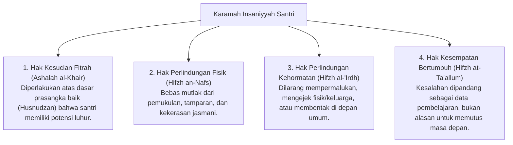

# P2-01-02-Prinsip-Kemuliaan-Fitrah-dan-Martabat-Insan

## Tujuan
Menetapkan kaidah perlindungan martabat kemanusiaan (*Karamah Insaniyyah*) dan pemeliharaan kesucian fitrah bawaan (*Ashalah al-Khair*) santri sebagai batasan etis mutlak dalam seluruh proses pendidikan, disiplin, dan pengasuhan di pesantren.

---

## 1. Dalil & Landasan Turats

> *"Dan sungguh, Kami telah memuliakan anak cucu Adam, dan Kami angkut mereka di darat dan di laut, dan Kami beri mereka rezeki dari yang baik-baik dan Kami lebihkan mereka di atas banyak makhluk yang Kami ciptakan dengan kelebihan yang sempurna."*  
> **(QS. Al-Isra [17]: 70)**

> *"Sesungguhnya darahmu, hartamu, dan kehormatanmu adalah haram (mulia dan terlindungi) atas sesamamu, sebagaimana haramnya harimu ini, di bulanmu ini, dan di negerimu ini..."*  
> **(Sabda Rasulullah SAW pada Khutbah Haji Wada' - HR. Bukhari no. 1741 & Muslim no. 1679)**

---

## 2. 4 Pilar Perlindungan Martabat Santri

---

## 3. Matriks Transformasi Respon Pelanggaran

| Situasi Lapangan | Respon Terlarang (Melanggar Martabat) | Respon Baku TUMBUH (Memuliakan Martabat) |
| :--- | :--- | :--- |
| **Santri Terlambat Sholat / Bangun Kesiangan** | Menyiram dengan air, menampar, membentak di depan jamaah, atau menghukum lari keliling lapangan. | Mengajak bangun dengan sentuhan hangat/salam, mencatat di logbook PBIS, dan dialog reflektif saat waktu luang (*Check-In*). |
| **Santri Melanggar Aturan Kamar (Kotor/Berantakan)** | Melempar barang santri ke luar kamar, menjatuhkan hukuman fisik push-up massal seluruh kamar. | Menginstruksikan perapian bersama secara terstruktur dengan panduan SOP kebersihan dan checklist piket. |
| **Santri Terlibat Friksi / Perkelahian** | Menghukum fisik kedua pihak di hadapan seluruh santri asrama. | Memisahkan secara tenang (*De-eskalasi*), menenangkan emosi, memandu *Restorative Circle* untuk restitusi ganti rugi dan rekonsiliasi persaudaraan (*Ishlah*). |

---

## 4. Kaidah Baku Hubungan Asatidz-Santri

1. **Memisahkan Perilaku dari Pribadi (*Separating the Action from the Person*)**:
   - Dilarang memberi label: *"Anak malas"*, *"Anak nakal"*, atau *"Munafik"*.
   - Gunakan deskripsi perilaku: *"Perbuatan terlambat ini merugikan waktu belajarmu dan melanggar kesepakatan kamar. Mari kita atur jam tidurmu agar lebih teratur."*
2. **Kerahasiaan Kasus (*Hifzh as-Sirr*)**:
   - Kasus-kasus bimbingan konseling dan kekhilafan santri Tier 2 dan Tier 3 wajib dijaga kerahasiaannya oleh Tim BK dan Musyrif, tidak boleh dijadikan bahan gunjingan umum di ruang guru atau mimbar asrama.

---

## 5. Status Dokumen
* **Status**: 🌟 **A+ (Tervalidasi & Siap Diimplementasikan)**
* **Level**: Project 2 - `02 Principles / 01 Core Principles`
* **Langkah Berikutnya**: **`P2-01-03-Prinsip-Keteladanan-Qudwah-First.md`**.
