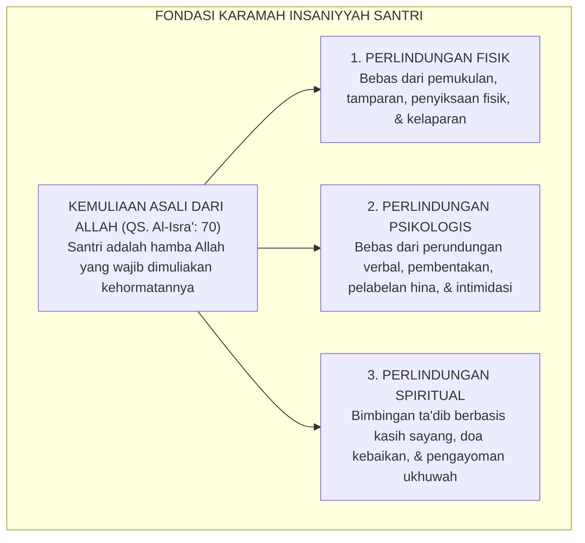

# P2-01-02: PRINSIP KEMULIAAN FITRAH DAN MARTABAT INSAN
## *Doktrin Karamah Insaniyyah (QS. Al-Isra': 70), Perlindungan Hakiki Santri, dan Eliminasi Mutlak Pelecehan Martabat*

**Nomor Identifikasi**: `P2-01-02/KEMULIAAN-FITRAH/2026`  
**Domain**: `02 Principles` > `01 Core Principles`  
**Dewan Pakar**: `pakar-perlindungan-anak-dan-advokasi-santri`, `pakar-filosofi-tumbuh`, `pakar-epistemologi-turats`

---

## 📑 DAFTAR ISI ANALITIS

1. [1. Landasan Teologis: Doktrin Karamah Insaniyyah (QS. Al-Isra': 70)](#1-landasan-teologis-doktrin-karamah-insaniyyah-qs-al-isra-70)
2. [2. Hak-Hak Fundamental Santri sebagai Amanah Syar'i](#2-hak-hak-fundamental-santri-sebagai-amanah-syari)
3. [3. Eliminasi Mutlak Praktik yang Merendahkan Martabat (*Zero Humiliation*)](#3-eliminasi-mutlak-praktik-yang-merendahkan-martabat-zero-humiliation)
4. [4. Konvergensi Konvensi Hak Anak PBB & UU Perlindungan Anak No. 35/2014](#4-konvergensi-konvensi-hak-anak-pbb--uu-perlindungan-anak-no-352014)
5. [5. Implikasi bagi Standar Operasional Pengasuhan Pesantren TUMBUH](#5-implikasi-bagi-standar-operasional-pengasuhan-pesantren-tumbuh)

---

### 1. Landasan Teologis: Doktrin Karamah Insaniyyah

Prinsip fundamental kedua dalam arsitektur nilai TUMBUH adalah **Kemuliaan Fitrah dan Martabat Insan (*Karamah Insaniyyah*)**. Allah SWT mendeklarasikan pemuliaan atas seluruh anak cucu Adam tanpa diskriminasi:

> $$\text{وَلَقَدْ كَرَّمْنَا بَنِي آدَمَ وَحَمَلْنَاهُمْ فِي الْبَرِّ وَالْبَحْرِ وَرَزَقْنَاهُم مِّنَ الطَّيِّبَاتِ وَفَضَّلْنَاهُمْ عَلَىٰ كَثِيرٍ مِّمَّنْ خَلَقْنَا تَفْضِيلًا}$$
> 
> *"Dan sungguh telah Kami muliakan anak-anak Adam, Kami angkut mereka di daratan dan di lautan, Kami beri mereka rezeki dari yang baik-baik, dan Kami lebihkan mereka dengan kelebihan yang sempurna atas kebanyakan makhluk yang telah Kami ciptakan."* (QS. Al-Isra' [17]: 70).

Kemuliaan ini adalah hakikat ontologis yang melekat (*inherent dignity*) pada setiap santri sejak ia lahir. Tidak ada seorang pun—baik kiai, guru, musyrif, maupun santri senior—yang memiliki hak syar'i untuk merampas, menginjak-injak, atau menistakan martabat seorang santri berdalih penertiban disiplin.

---

### 2. Hak-Hak Fundamental Santri sebagai Amanah Syar'i

Ekosistem TUMBUH menetapkan **Lima Hak Fundamental Santri Pesantren**:
1. **Hak atas Keselamatan Fisik (*Hifzh an-Nafs*)**: Jaminan lingkungan pondok yang bebas 100% dari segala bentuk agresi fisik.
2. **Hak atas Kehormatan Diri (*Hifzh al-'Irdh*)**: Perlindungan dari rasa malu publik (*public shaming*), pencukuran gundul paksa, atau pemajangan nama santri di papan aib.
3. **Hak atas Suara & Keadilan (*Tabayyun & Due Process*)**: Hak untuk didengarkan keterangannya secara adil sebelum keputusan konsekuensi dijatuhkan.
4. **Hak atas Kesehatan & Pemenuhan Biologis**: Makanan halal-thayyib bergizi, air bersih, sanitasi layak, dan waktu tidur minimal 6 jam tanpa interupsi sanksi malam.
5. **Hak atas Pendampingan Psikologis & Spiritual**: Akses langsung ke Guru BK dan Musyrif yang amanah dan menjaga kerahasiaan konseling.

---

### 3. Eliminasi Mutlak Praktik yang Merendahkan Martabat

Berdasarkan kaidah fiqhiyyah **Adh-Dhararu Yuzal (الضَّرَرُ يُزَالُ - Segala Bentuk Kemudaratan Wajib Dilenyapkan)**, ekosistem TUMBUH menghapus secara mutlak daftar praktik penertiban yang merendahkan martabat manusia:

| Praktik Penertiban Usang (Dihapus 100%) | Bahaya Psiko-Spiritual yang Ditimbulkan | Alternatif Beradab dalam Ekosistem TUMBUH |
| :--- | :--- | :--- |
| **Pencukuran Rambut Gundul secara Paksa/Asimetris** | Menghancurkan harga diri santri (*Self-Esteem*), memicu rasa dendam mendalam. | Menginstruksikan potong rambut rapi mandiri dengan pendampingan santun. |
| **Pemajangan Santri di Depan Mimbar Masjid/Aula** | Merusak kehormatan diri (*Public Shaming*), melatih anak bersikap apatis/kebal malu. | Sesi refleksi dan dialog restoratif tertutup di ruang konseling pribadi. |
| **Pemberian Label Merendahkan (Bodoh, Pemalas, Iblis)**| *Self-Fulfilling Prophecy*: santri menginternalisasi label buruk tersebut. | Menegur perbuatannya secara spesifik, sembari menegaskan keyakinan atas potensi fitrahnya. |
| **Hukuman Push-up/Lari Malam Melelahkan Fisik** | Merusak organ tubuh, memicu kelelahan kronis (*fatigue*), mengganggu shalat subuh. | Konsekuensi logis 4R yang relevan (membersihkan area yang dikotori, tugas literasi adab). |

---

### 4. Konvergensi Hukum Nasional & Internasional

Prinsip pemuliaan fitrah ini selaras dengan mandat hukum positif Republik Indonesia:
* **UU Perlindungan Anak No. 35 Tahun 2014 (Pasal 54)**: Menegaskan kewajiban seluruh institusi pendidikan untuk melindungi peserta didik dari kekerasan fisik dan psikis.
* **PMA No. 73 Tahun 2022**: Mengamanahkan pencegahan kekerasan dan perlindungan hak santri di satuan pendidikan Kementerian Agama.
* **Konvensi Hak Anak PBB (UN CRC 1989)**: Menjamin bahwa penegakan disiplin sekolah harus selalu konsisten dengan martabat kemanusiaan anak.

---

### 5. Implikasi bagi Standar Operasional Pengasuhan TUMBUH

1. **Kode Etik Musyrif Anti-Pelecehan**: Pelanggaran terhadap kehormatan santri dikategorikan sebagai pelanggaran disiplin berat bagi staf/musyrif yang berkonsekuensi sanksi administratif kelembagaan.
2. **Kanal Pengaduan Aman (*Safe Whistleblowing System*)**: Menyediakan kotak curhat tertutup dan kanal digital terenkripsi bagi santri untuk melaporkan tindakan intimidasi tanpa takut intimidasi balasan.
3. **Pendidikan Batasan Pribadi (*Body & Personal Boundaries Education*)**: Membekali santri pemahaman mengenai hak perlindungan tubuhnya dan keberanian mengatakan "TIDAK" kepada segala bentuk perundungan.
