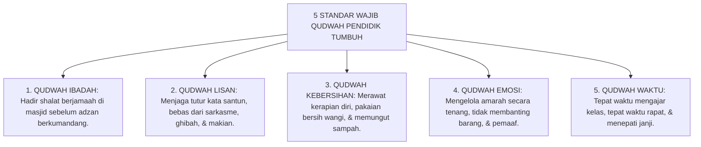

# P2-01-03: PRINSIP KETELADANAN QUDWAH-FIRST
## *Prinsip Prioritas Keteladanan Visual Sebelum Tuntutan Verbal, Hukum Kredibilitas Moral Pendidik, dan Kaidah Lisanul Hal*

**Nomor Identifikasi**: `P2-01-03/QUDWAH-FIRST/2026`  
**Domain**: `02 Principles` > `01 Core Principles`  
**Dewan Pakar**: `pakar-tata-kelola-qudwah`, `pakar-pedagogi-master-guru`, `pakar-filosofi-tumbuh`

---

## 📑 DAFTAR ISI ANALITIS

1. [1. Aksioma Qudwah-First: Lisanul Hal Afshahu min Lisanil Maqal](#1-aksioma-qudwah-first-lisanul-hal-afshahu-min-lisanil-maqal)
2. [2. Dekonstruksi Kemunafikan Pedagogis (Hypocritical Pedagogy)](#2-dekonstruksi-kemunafikan-pedagogis-hypocritical-pedagogy)
3. [3. Konvergensi Observational Modeling (Albert Bandura) & Teori Kredibilitas Sumber](#3-konvergensi-observational-modeling-albert-bandura--teori-kredibilitas-sumber)
4. [4. Lima Dimensi Keteladanan Wajib bagi Seluruh Pendidik TUMBUH](#4-lima-dimensi-keteladanan-wajib-bagi-seluruh-pendidik-tumbuh)
5. [5. Implikasi bagi Sistem Audit Integritas Musyrif dan Asatidz](#5-implikasi-bagi-sistem-audit-integritas-musyrif-dan-asatidz)

---

### 1. Aksioma Qudwah-First: Lisanul Hal Afshahu min Lisanil Maqal

Prinsip dasar ketiga dalam Ekosistem TUMBUH berbunyi: **Qudwah-First (Keteladanan Tindakan Nyata Harus Mendahului Segala Bentuk Tuntutan Verbal)**.

Kaidah hikmah ulama salaf menyatakan secara tajam:

$$\text{لِسَانُ الْحَالِ أَفْصَحُ مِنْ لِسَانِ الْمَقَالِ}$$
*"Bahasa keteladanan perbuatan jauh lebih fasih, lugas, dan membekas daripada ribuan kata-kata lisan."*

Pendidikan karakter tidak dapat ditransfer seperti mentransfer file data digital ke dalam hard disk. Karakter adalah "cahaya spiritual dan pola gerak moral" yang menular melalui resonansi keteladanan (*moral resonance*). Ketika seorang musyrif mencontohkan ketenangan saat marah, santri secara otomatis belajar mengendalikan amarahnya; namun jika musyrif berteriak saat melarang santri berteriak, santri justru belajar bahwa berteriak adalah hal yang boleh dilakukan jika seseorang memegang kekuasaan.

```mermaid
graph TD
    subgraph HukumQudwah["HUKUM INTEGRITAS KETELADANAN QUDWAH-FIRST"]
        Guru["PENDIDIK / MUSYRIF (Sumber Keteladanan)"]
        
        AksiNyata["Aksi Nyata Konsisten (Lisanul Hal)<br/>Hadir shalat awal waktu, pungut sampah, bahasa santun"]
        CeramahVerbal["Tuntutan & Ceramah Verbal (Lisanul Maqal)<br/>Nasihat di mimbar, instruksi aturan, hafalan dalil"]
        
        Guru --> AksiNyata
        Guru --> CeramahVerbal
        
        AksiNyata ==>|Daya Serap Otak Moral: 80-90% (Mirror Neurons)| Santri["INTERNALISASI KARAKTER SEJATI SANTRI"]
        CeramahVerbal -. Daya Serap Kognitif: 10-20% .-> Santri
    end
```

---

### 2. Dekonstruksi Kemunafikan Pedagogis

Penyakit paling mematikan dalam pendidikan adalah apa yang disebut oleh Paulo Freire (1970) dan ulama tasawuf sebagai **Kemunafikan Pedagogis (*Pedagogical Hypocrisy*)**: adanya jurang pemisah antara apa yang diajarkan oleh guru di kelas dengan apa yang dipraktikkan oleh guru dalam kehidupan nyata.

Imam Al-Hasan al-Bashri (w. 110 H) berpesan:

> $$\text{إِنَّ الْمَوْعِظَةَ إِذَا خَرَجَتْ مِنَ الْقَلْبِ دَخَلَتْ فِي الْقَلْبِ، وَإِذَا خَرَجَتْ مِنَ اللِّسَانِ لَمْ تُجَاوِزِ الْآذَانَ}$$
> 
> *"Sesungguhnya nasihat itu apabila keluar dari ketulusan kalbu yang telah mengamalkannya, niscaya ia akan langsung menembus ke dalam kalbu pendengarnya; namun apabila nasihat itu hanya keluar dari ujung lidah (tanpa diamalkan), niscaya ia tidak akan pernah melewati batas daun telinga!"*

Ketika pendidik pesantren kehilangan integritas amal, nasihatnya kehilangan berkah (*Nafadzul Kalimah*), kata-katanya hambar, dan santri menjadi sinis terhadap seluruh nilai agama yang diajarkan.

---

### 3. Konvergensi Teori Observational Modeling & Kredibilitas Sumber

Temuan psikologi sosial modern memperkokoh prinsip Qudwah-First:
* **Social Learning Theory (Albert Bandura, 1977)**: Individu meniru perilaku model berdasarkan derajat kehangatan (*warmth*) dan konsistensi integritas model tersebut. Pendidik yang hangat dan konsisten menjadi magnet peniruan adab yang paling kuat bagi remaja.
* **Source Credibility Theory (Hovland et al., 1953)**: Daya bujuk pesan moral ditentukan oleh dua dimensi: *Expertise* (keahlian ilmu) dan *Trustworthiness* (kejujuran hidup). Keteladanan adalah pembangun *trustworthiness* tertinggi.

---

### 4. Lima Dimensi Keteladanan Wajib bagi Seluruh Pendidik TUMBUH

Ekosistem TUMBUH menetapkan **Lima Standar Wajib Qudwah Hasanah**:



---

### 5. Implikasi bagi Sistem Audit Integritas Musyrif dan Asatidz

1. **Prinsip Bebas Standar Ganda**: Aturan adab berlaku mengikat secara setara bagi santri maupun asatidz (tidak ada pembenaran guru boleh merokok di lingkungan pondok sementara santri dilarang keras).
2. **Umpan Balik Santri Terbuka (*Confidential Student Feedback*)**: Evaluasi semesteran mencakup penilaian anonim dari santri mengenai keteladanan dan kehangatan figur musyrif di kamarnya.
3. **Pemberian Sanksi Etik atas Pelanggaran Keteladanan**: Guru atau musyrif yang terbukti melontarkan kata-kata kotor atau melakukan tindakan kekerasan langsung dinonaktifkan sementara untuk menjalani pembinaan etik kelembagaan.
