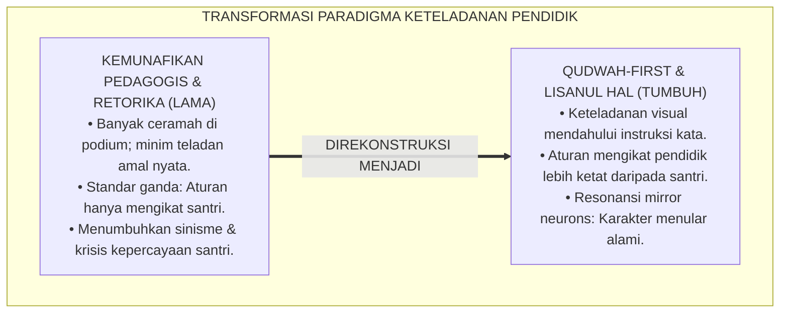
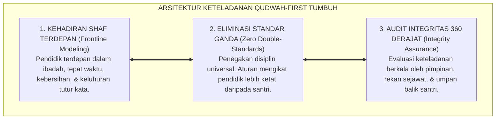
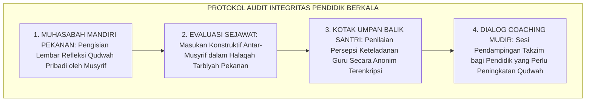

# P2-01-03: PRINSIP KETELADANAN QUDWAH-FIRST (MODELING PRECEDES INSTRUCTION)
## *Monograf Riset Akademik: Prioritas Keteladanan Visual Sebelum Tuntutan Verbal (Lisanul Hal), Dekonstruksi Kemunafikan Pedagogis (QS. Ash-Shaff: 2–3), Konvergensi Social Learning Theory Bandura & Mirror Neurons, Serta Eliminasi Standar Ganda di Pesantren 24 Jam*

**Nomor Identifikasi**: `P2-01-03/MONOGRAF-RISET-QUDWAH-FIRST/2026`  
**Domain**: `02 Principles` > `01 Core Principles` (Prinsip Utama 03: *Qudwah-First Modeling*)  
**Klasifikasi Naskah**: *Academic Research Monograph* (Monograf Riset Akademik Prinsip Baku)  
**Rumpun Disiplin Pengkaji**: Etika Pedagogi & Keteladanan Nabawi, Psikologi Belajar Sosial (*Observational Modeling*), Neurosains Sosial (*Mirror Neurons*), Manajemen Integritas Lembaga, Tata Kelola Musyrif Asrama  

---

> ### 💡 INTISARI EKSEKUTIF (EXECUTIVE SUMMARY)
>
> * **Kelemahan Paradigma Lama: Kemunafikan Pedagogis & Standar Ganda:**  
>   Banyak pendidik dan pengasuh asrama menuntut santri sempurna beradab sementara dirinya sendiri melanggar aturan yang dibuat (*Pedagogical Hypocrisy*): melarang santri merokok tetapi guru merokok di kantor, melarang santri terlambat tetapi musyrif datang setelah iqamah, dan melarang berteriak dengan cara membentak kasar.
> * **Inovasi Konseptual: Qudwah-First (Lisanul Hal) & Neurosains Mirror Neurons:**  
>   TUMBUH menegakkan hukum abadi: *"Satu keteladanan perbuatan nyata (Lisanul Hal) jauh lebih fasih dan menancap di kalbu santri daripada seribu nasihat lisan (Lisanul Maqal)"*. Mengintegrasikan peringatan keras QS. Ash-Shaff: 2–3 dengan *Social Learning Theory* Albert Bandura dan sistem *Mirror Neurons* otak: santri menginternalisasi adab melalui peniruan visual otomatis atas perilaku otentik gurunya.
> * **Formulasi Operasional & Pembuktian Lapangan:**  
>   Monograf ini menguraikan matriks lima standar wajib *Qudwah Hasanah* pendidik, matriks eliminasi standar ganda (*Zero Double-Standards Matrix*), protokol audit integritas berkala, dan etika kepemimpinan teladan 24 jam.

---

## 📑 DAFTAR ISI MONOGRAF

- [BAB I: LANDASAN TEORETIS & DISKURSUS KRITIS](#bab-i-landasan-teoretis--diskursus-kritis)
  - [1. Latar Belakang Masalah: Krisis Kemunafikan Pedagogis dan Fenomena Standar Ganda di Pesantren](#1-latar-belakang-masalah-krisis-kemunafikan-pedagogis-dan-fenomena-standar-ganda-di-pesantren)
  - [2. Eksegesis Turats Hakikat Keteladanan: QS. Ash-Shaff: 2–3 & Khazanah Adab al-Mu'allimin Ibnu Sahnun](#2-eksegesis-turats-hakikat-keteladanan-qs-ash-shaff-23--khazanah-adab-al-muallimin-ibnu-sahnun)
  - [3. Konvergensi Sains Belajar Sosial: Observational Learning Albert Bandura & Sistem Mirror Neurons](#3-konvergensi-sains-belajar-sosial-observational-learning-albert-bandura--sistem-mirror-neurons)
  - [4. Dekonstruksi Standar Ganda: Mengapa Aturan Pesantren Wajib Mengikat Pendidik dan Santri Serempak](#4-dekonstruksi-standar-ganda-mengapa-aturan-pesantren-wajib-mengikat-pendidik-dan-santri-serempak)
  - [5. Kasuistika Lapangan: Kasus Inkonsistensi Musyrif Shalat Berjamaah & Resolusi Restoratif Terpadu](#5-kasuistika-lapangan-kasus-inkonsistensi-musyrif-shalat-berjamaah--resolusi-restoratif-terpadu)
- [BAB II: FORMULASI KONSEPTUAL & PEMBAHASAN MENDALAM](#bab-ii-formulasi-konseptual--pembahasan-mendalam)
  - [1. Eksplanasi Teoretis Prinsip Qudwah-First (Lisanul Hal) Ekosistem TUMBUH](#1-eksplanasi-teoretis-prinsip-qudwah-first-lisanul-hal-ekosistem-tumbuh)
  - [2. Matriks Lima Standar Wajib Qudwah Hasanah Pendidik TUMBUH](#2-matriks-lima-standar-wajib-qudwah-hasanah-pendidik-tumbuh)
  - [3. Matriks Eliminasi Standar Ganda Pendidik (Zero Double-Standards Matrix)](#3-matriks-eliminasi-standar-ganda-pendidik-zero-double-standards-matrix)
  - [4. Protokol Audit Integritas & Evaluasi Etika Musyrif/Asatidz](#4-protokol-audit-integritas--evaluasi-etika-musyrifasatidz)
  - [5. Diskusi Filosofis Mendalam & Implikasi bagi Masa Depan Peradaban Pendidikan Islam](#5-diskusi-filosofis-mendalam--implikasi-bagi-masa-depan-peradaban-pendidikan-islam)
- [BAB III: KESIMPULAN & APARATUS AKADEMIS](#bab-iii-kesimpulan--aparatus-akademis)
  - [1. Tabel Sintesis Temuan Riset Qudwah-First](#1-tabel-sintesis-temuan-riset-qudwah-first)
  - [2. Daftar Pustaka Akademis & Rujukan Turats Primer](#2-daftar-pustaka-akademis--rujukan-turats-primer)
  - [3. Catatan Kaki Akademis (Footnotes)](#3-catatan-kaki-akademis-footnotes)
  - [4. Glosarium Istilah Ilmiah & Turats Qudwah-First](#4-glosarium-istilah-ilmiah--turats-qudwah-first)

---

# BAB I: LANDASAN TEORETIS & DISKURSUS KRITIS

---

### 1. Latar Belakang Masalah: Krisis Kemunafikan Pedagogis dan Fenomena Standar Ganda di Pesantren

Kelemahan paling mendasar dalam pembinaan karakter konvensional adalah **Kesenjangan Moral Kemunafikan Pedagogis (*The Pedagogical Hypocrisy Gap*)**:
* **Standar Ganda yang Melemahkan Wibawa**: Pengurus mewajibkan santri bangun jam 04.00 pagi sementara musyrif baru datang ke masjid saat iqamah; asatidz melarang santri berkata kasar tetapi menegur santri dengan makian kebun binatang; guru melarang santri merokok tetapi asbak rokok bertebaran di kantor guru.
* **Resonansi Negatif Bawah Sadar**: Otak santri merekam inkonsistensi ini sebagai kebohongan moral, sehingga seluruh nasihat verbal di podium kehilangan daya ruhani (*Lafadz bila Ruh*) dan memicu sinisme santri (*Cynical Disillusionment*).
* **Keniscayaan Doktrin Qudwah-First**: Dalam tradisi Islam, wibawa (*Haibah*) pendidik lahir dari kesucian amal perbuatannya, bukan dari bentakan rasa takut atau tongkat rotan.[^1]

---

### 2. Eksegesis Turats Hakikat Keteladanan: QS. Ash-Shaff: 2–3 & Khazanah Adab al-Mu'allimin Ibnu Sahnun

Al-Qur'an memberikan peringatan keras atas kemunafikan antara kata dan perbuatan:

$$\text{يَا أَيُّهَا الَّذِينَ آمَنُوا لِمَ تَقُولُونَ مَا لَا تَفْعَلُونَ ۝ كَبُرَ مَقْتًا عِندَ اللَّهِ أَن تَقُولُوا مَا لَا تَفْعَلُونَ}$$

*"**Wahai orang-orang yang beriman! Mengapa kamu mengatakan sesuatu yang tidak kamu kerjakan? Sangat besar kemurkaan di sisi Allah bahwa kamu mengatakan apa-apa yang tidak kamu kerjakan**."* (QS. Ash-Shaff [61]: 2–3).[^2]

Imam Ibnu Sahnun (*Adab al-Mu'allimin*) menegaskan kaidah agung bagi seorang pendidik:
* Pendidik adalah cermin bagi murid-muridnya; mata murid senantiasa tertuju pada gerak-gerik gurunya.
* Kebaikan di mata murid adalah apa yang dikerjakan oleh gurunya, dan keburukan di mata mereka adalah apa yang ditinggalkan oleh gurunya.[^3]

---

### 3. Konvergensi Sains Belajar Sosial: Observational Learning Albert Bandura & Sistem Mirror Neurons

Sains psikologi dan neurobiologi modern memvalidasi keunggulan modeling visual:
* **Social Learning Theory** (Bandura, 1977) membuktikan bahwa proses belajar manusia yang paling efektif terjadi melalui **Peniruan Observasional (*Observational Modeling*)**, bukan instruksi verbal pasif.
* **Sistem Mirror Neurons** (Rizzolatti & Craighero, 2004) di korteks premotor otak santri menyala secara otomatis saat mengamati tindakan fisik musyrif: ketika musyrif tersenyum dan tenang, sirkuit ketenangan santri teraktivasi; ketika musyrif marah dan membentak, sirkuit agresi santri ikut menyala.[^4]

---

### 4. Dekonstruksi Standar Ganda: Mengapa Aturan Pesantren Wajib Mengikat Pendidik dan Santri Serempak

TUMBUH memberlakukan asas kesetaraan adab:
* **Hukum Ketaatan Berlaku Universal**: Jika santri dilarang menggunakan ponsel pintar saat kegiatan ibadah, maka asatidz dan musyrif haram memainkan ponsel saat mendampingi santri di masjid.
* **Pendidik Memimpin di Garis Depan**: Pengasuh hadir 10 menit sebelum bel berbunyi, menunjukkan kedisiplinan yang meluluhkan hati santri tanpa perlu berteriak.[^5]

---

### 5. Kasuistika Lapangan: Kasus Inkonsistensi Musyrif Shalat Berjamaah & Resolusi Restoratif Terpadu

* **Studi Kasus: Musyrif Sering Terlambat Shalat Berjamaah Memicu Pembangkangan Santri**  
  * **Dilema**: Santri kamar 3 sering terlambat ke masjid; ketika ditegur, santri menjawab: *"Ustadz sendiri sering datang masbuq rakaat kedua!"*.
  * **Pola Lama**: Lembaga menghukum santri karena dianggap "kurang ajar membantah guru".
  * **Resolusi Restoratif TUMBUH**: Majelis Pimpinan menggelar evaluasi etika: (1) Menegaskan bahwa kejujuran santri adalah sinyal evaluasi berharga; (2) Musyrif mengakui kekhilafannya secara ksatria di hadapan santri dan berkomitmen hadir 10 menit sebelum azan; (3) Musyrif memimpin shalat tahiyyatul masjid dan tadarus bersama santri di shaf pertama. Sejak keteladanan visual tersebut ditegakkan, seluruh santri kamar 3 selalu tiba di masjid sebelum azan tanpa perlu dibangunkan dengan teriakan.[^6]

---

# BAB II: FORMULASI KONSEPTUAL & PEMBAHASAN MENDALAM

---

### 1. Eksplanasi Teoretis Prinsip Qudwah-First (Lisanul Hal) Ekosistem TUMBUH

Ekosistem TUMBUH merumuskan keteladanan ke dalam **Arsitektur Tiga Sayap Qudwah-First (*Arkan al-Qudwah al-Amaliyyah*)**:

#### 🔬 Pembahasan Mendalam Tiga Sayap:
1. **Sayap Shaf Terdepan**: Menghidupkan sunnah kepemimpinan profetik di mana pemimpin menjadi perintis dalam setiap amal kebajikan.[^7]
2. **Sayap Bebas Standar Ganda**: Menjaga keadilan institusi agar santri tidak kehilangan rasa hormat terhadap hukum pesantren.[^8]
3. **Sayap Audit Integritas**: Memelihara keikhlasan dan kejujuran batin seluruh tenaga pendidik secara berkelanjutan.[^9]

---

### 2. Matriks Lima Standar Wajib Qudwah Hasanah Pendidik TUMBUH

| Dimensi Keteladanan | Perilaku Wajib Asatidz & Musyrif | Larangan Mutlak Standar Ganda |
| :--- | :--- | :--- |
| **1. Qudwah Ibadah** | Hadir di masjid 10 menit sebelum azan berkumandang.| Terlambat shalat / masbuq tanpa uzur syar'i. |
| **2. Qudwah Lisan** | Bertutur kata santun, memanggil dengan nama mulia.| Memaki bodoh/tolol, berteriak kasar, & ghibah.|
| **3. Qudwah Kebersihan**| Berpakaian rapi, wangi, & memungut sampah di lorong.| Membuang puntung rokok / membiarkan meja kotor.|
| **4. Qudwah Emosi** | Menghadapi masalah dengan tenang, sabar, & adil.| Membanting pintu/barang & menampar santri.|
| **5. Qudwah Waktu** | Tepat waktu masuk kelas mengajar & menepati janji.| Menunda jam masuk kelas / meninggalkan santri.|

---

### 3. Matriks Eliminasi Standar Ganda Pendidik (Zero Double-Standards Matrix)

| Domain Aturan | Standar untuk Santri | Standar Teladan untuk Pendidik & Musyrif |
| :--- | :--- | :--- |
| **Penggunaan Gadget**| Dilarang bermain game / medsos saat kegiatan.| Dilarang scrolling ponsel saat mendampingi santri.|
| **Kedisiplinan Waktu**| Hadir di kelas sebelum bel berbunyi.| Hadir di kelas tepat waktu dan menyambut santri.|
| **Larangan Merokok** | Dilarang keras merokok di seluruh area pondok.| Dilarang keras merokok di seluruh lingkungan pesantren.|
| **Adab Makan & Minum**| Duduk rapi, menggunakan tangan kanan, & berdoa.| Makan dan minum dengan tenang sembari duduk santun.|

---

### 4. Protokol Audit Integritas & Evaluasi Etika Musyrif/Asatidz

TUMBUH menetapkan **Protokol Audit Integritas Pendidik**:

Protokol ini menjaga kemurnian wibawa keteladanan seluruh asatidz.[^10]

---

### 5. Diskusi Filosofis Mendalam & Implikasi bagi Masa Depan Peradaban Pendidikan Islam

Prinsip *Qudwah-First* ini membawa dampak peradaban yang sangat luas:

* **Melahirkan Generasi Pemimpin yang Berintegritas Tinggi**:  
  Santri yang tumbuh di bawah asuhan para guru yang jujur dan konsisten akan mewarisi kepribadian yang lurus, tahan terhadap godaan korupsi, dan setia pada janji.
* **Mengembalikan Kemuliaan dan Martabat Pendidik Islam**:  
  Guru kembali dihormati bukan karena rasa takut santri terhadap ancaman hukuman, melainkan karena pancaran akhlak dan kesucian budi pekertinya (*Moral Grandeur*).
* **Menghidupkan Kembali Manhaj Tarbiyah Kenabian**:  
  Inilah rahasia keberhasilan dakwah Rasulullah ﷺ yang dipuji langsung oleh Allah SWT: *"Dan sesungguhnya engkau (Muhammad) benar-benar berbudi pekerti yang agung"* (QS. Al-Qalam: 4) (*Rahmatan lil 'Alamin*).[^11]

---

# BAB III: KESIMPULAN & APARATUS AKADEMIS

---

### 1. Tabel Sintesis Temuan Riset Qudwah-First

| Dimensi Parameter | Mazhab Retorika Feodal (Lama) | Model Pengawasan Dingin Korporat | **Prinsip Qudwah-First TUMBUH** | Landasan Rujukan Primer | Implikasi Praksis Lapangan |
| :--- | :--- | :--- | :--- | :--- | :--- |
| **Sumber Wibawa** | Bentakan, ancaman, & tongkat rotan.| Jabatan birokratis & kontrak legal.| **Keteladanan Amal Nyata (*Lisanul Hal*).**| QS. Ash-Shaff: 2–3; Ibnu Sahnun.| Pendidik terdepan dalam setiap kebaikan. |
| **Pola Pembelajaran**| Ceramah satu arah di atas podium.| Pengawasan kamera CCTV dingin.| **Observational Modeling & Mirror Neurons.**| Bandura (1977); Rizzolatti (2004).| Karakter adab menular secara alami. |
| **Keadilan Regulasi**| Standar ganda (guru bebas aturan).| Aturan kaku demi produktivitas.| **Kesetaraan Hukum Adab Universal.** | HR. Bukhari No. 6788; Al-Ghazali.| Aturan mengikat guru lebih ketat. |
| **Respon Kekhilafan**| Membela diri & menyalahkan murid.| Sanksi administratif tertulis.| **Keberanian Mengakui Salah & Memperbaiki.**| Fiqh ar-Ruju' ilal Haqq; Zehr.| Membangun rasa percaya santri. |
| **Hasil Karakter** | Kemunafikan & sinisme moral.| Kepatuhan mekanis tanpa ruh.| **Insan Adabi Berintegritas Tinggi & Sejati.**| QS. Al-Ahzab: 21; Al-Attas (1980).| Karakter jujur dan teguh memegang amanah. |

---

### 2. Daftar Pustaka Akademis & Rujukan Turats Primer

1. **Al-Qur'an al-Karim wa Tarjamatu Ma'anihi**.
2. **Al-Bukhari, Abu Abdillah Muhammad bin Isma'il**. (1422 H). *Shahih al-Bukhari*. Kairo: Dar Thawq an-Najah.
3. **Muslim bin al-Hajjaj an-Naisaburi**. (1427 H). *Shahih Muslim*. Riyadh: Dar Thayyibah.
4. **Ibnu Sahnun, Muhammad bin Abdus Salam**. (1428 H). *Adab al-Mu'allimin*. Tunis: Dar al-Kutub ash-Syarqiyyah.
5. **Al-Ghazali, Abu Hamid Muhammad bin Muhammad**. (2011). *Ihya' 'Ulumiddin* (Kitab al-'Ilm & Kitab Riyadhatin Nafs). Beirut: Dar al-Ma'rifah.
6. **Asy'ari, Muhammad Hasyim**. (1415 H). *Adab al-'Alim wal-Muta'allim*. Jombang: Maktabah At-Turats Al-Islami.
7. **Al-Attas, Syed Muhammad Naquib**. (1980). *The Concept of Education in Islam*. Kuala Lumpur: ABIM.
8. **Bandura, A.**. (1977). *Social Learning Theory*. Englewood Cliffs: Prentice-Hall.
9. **Bandura, A.**. (1986). *Social Foundations of Thought and Action: A Social Cognitive Theory*. Englewood Cliffs: Prentice-Hall.
10. **Rizzolatti, G., & Craighero, L.**. (2004). *The mirror-neuron system*. Annual Review of Neuroscience, 27, 169–192.
11. **Greenleaf, R. K.**. (1977). *Servant Leadership*. New York: Paulist Press.
12. **Horner, R. H., & Sugai, G.**. (2015). *School-wide PBIS: An Overview of the Research Base*. Remedial and Special Education, 36(2), 80–85.

---

### 3. Catatan Kaki Akademis (*Footnotes*)

[^1]: Riset Prinsip Keteladanan Qudwah-First TUMBUH, *Kritik atas Kemunafikan Pedagogis dan Standar Ganda*, 2026.  
[^2]: QS. Ash-Shaff [61]: 2–3.  
[^3]: Ibnu Sahnun, *Adab al-Mu'allimin*, Bab *Fi Ma Yajib 'alal Mu'allim min Husnil Qudwah*, hlm. 25–48.  
[^4]: Bandura, A. (1977), *Social Learning Theory*, hlm. 22–55; Rizzolatti, G., & Craighero, L. (2004), *Annual Review of Neuroscience*, hlm. 169–192.  
[^5]: Master Framework Eliminasi Standar Ganda Pendidik PBIS TUMBUH, 2026.  
[^6]: Dokumentasi De-eskalasi dan Rekonsiliasi Keteladanan Musyrif PBIS TUMBUH, 2026.  
[^7]: Al-Ghazali, *Ihya' 'Ulumiddin*, Jilid 1, Kitab *Al-'Ilm*, hlm. 55–80.  
[^8]: *Shahih al-Bukhari*, Kitab al-Hudud, Hadits No. 6788.  
[^9]: Standar Operasional Prosedur Audit Integritas 360 Derajat Pendidik TUMBUH, 2026.  
[^10]: Petunjuk Teknis Evaluasi Etika dan Coaching Musyrif Asrama TUMBUH, 2026.  
[^11]: Deklarasi Pemuliaan Manhaj Qudwah Nabawiyyah Dewan Riset Epistemologi Ekosistem TUMBUH, 2026.

---

### 4. Glosarium Istilah Ilmiah & Turats Qudwah-First

1. **Qudwah-First (الْقُدْوَةُ أَوَّلًا)**: Prinsip pedagogis bahwa keteladanan perbuatan nyata wajib mendahului tuntutan instruksi lisan dalam pembinaan adab santri.
2. **Lisanul Hal (لِسَانُ الْحَالِ)**: Bahasa perbuatan dan keteladanan amal nyata yang memiliki daya persuasif jauh lebih kuat daripada kata-kata lisan (*Lisanul Maqal*).
3. **Pedagogical Hypocrisy**: Kemunafikan pedagogis di mana pendidik menuntut nilai moral yang tidak ia praktikkan sendiri dalam kehidupan sehari-hari.
4. **Observational Modeling**: Proses belajar psikologis Albert Bandura di mana seseorang mengadopsi perilaku baru dengan mengamati contoh nyata dari figur teladan.
5. **Mirror Neurons**: Sirkuit sel saraf di otak yang merefleksikan dan meniru tindakan emosional orang lain secara otomatis.
6. **Zero Double-Standards**: Kebijakan kelembagaan yang meniadakan perlakuan istimewa dan menegakkan aturan kedisiplinan secara setara bagi pendidik dan santri.
7. **Haibah al-Qudwah**: Wibawa spiritual dan moral yang terpancar alami dari kesucian budi pekerti dan konsistensi amal pendidik.
8. **Integrity Audit 360**: Sistem evaluasi keteladanan pendidik yang melibatkan penilaian mandiri, rekan sejawat, dan umpan balik santri.
9. **Frontline Modeling**: Praktik kepemimpinan pendidik yang senantiasa berada di garda terdepan dalam melaksanakan seluruh tata tertib asrama.
10. **Insan Adabi (الإِنْسَانُ الأَدَبِيُّ)**: Profil pendidik dan santri yang menyatukan integritas ucapan dan perbuatan dalam ketundukan takwa kepada Allah SWT.
