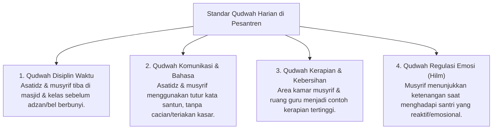

# P2-01-03-Prinsip-Keteladanan-Qudwah-First

## Tujuan
Menetapkan prinsip **Keteladanan Utama (*Qudwah-First*)** sebagai mata uang kepemimpinan, pengasuhan, dan pengajaran di ekosistem pesantren TUMBUH, menempatkan integritas perilaku pendidik sebagai faktor kunci keberhasilan tarbiyah.

---

## 1. Dalil & Khazanah Turats

> *"Wahai orang-orang yang beriman! Mengapa kamu mengatakan sesuatu yang tidak kamu kerjakan? (Itu) sangat dibenci di sisi Allah jika kamu mengatakan apa-apa yang tidak kamu kerjakan."*  
> **(QS. Ash-Shaff [61]: 2-3)**

> *"Sungguh, telah ada pada (diri) Rasulullah itu suri teladan yang baik (Qudwah Hasanah) bagimu..."*  
> **(QS. Al-Ahzab [33]: 21)**

> **Imam Ibnu Jama'ah (*Tadzkirah as-Sami' wal-Mutakallim*)**:  
> *"Ketahuilah bahwa seorang guru tidak akan ditaati nasihatnya dan tidak akan berbekas ajarannya kecuali jika perbuatannya membenarkan perkataannya. Santri lebih banyak mengambil adab dari gerak-gerik gurunya daripada dari isi kitab yang dibacanya."*

---

## 2. Landasan Sains: Observational Learning & Kredibilitas Pemimpin

Riset perilaku kognitif membuktikan efektivitas keteladanan:
* **Observational Learning (Albert Bandura, 1977)**: Otak manusia memiliki neuron cermin (*mirror neurons*) yang menyerap perilaku sosial melalui observasi model hidup (*in vivo modeling*) 5 hingga 10 kali lebih kuat dibanding instruksi verbal abstrak.
* **Model The Way (Kouzes & Posner, 2017)**: Konsistensi antara nilai yang dikhotbahkan dengan tindakan nyata adalah prediktor utama rasa hormat dan ketaatan sukarela santri (*Voluntary Compliance*).

---

## 3. Matriks Standar Qudwah Pendidik & Musyrif

---

## 4. Kaidah Baku Pengasuhan Berbasis Qudwah

1. **Kaidah Keabsahan Menuntut (*Syart al-Muthalabah*)**:
   - Pendidik kehilangan hak moral untuk menuntut suatu adab jika dirinya sendiri terang-terangan melanggar adab tersebut di hadapan santri.
2. **Kaidah Akuntabilitas Teladan Pimpinan (*Al-Qudwah al-Ula*)**:
   - Pimpinan pondok, kepala madrasah, dan kepala pengasuhan adalah teladan pertama bagi asatidz dan musyrif dalam ketaatan pada SOP, transparansi data, dan kerendahan hati (*Tawadhu'*).
3. **Kaderisasi Qudwah Santri Senior (*Tiered Modeling*)**:
   - Pengurus santri (OSIS / Kamar) dievaluasi kelayakannya bukan dari kegalakannya menertibkan adik kelas, melainkan dari keteladanan ibadah dan akhlaknya sendiri.

---

## 5. Status Dokumen
* **Status**: 🌟 **A+ (Tervalidasi & Siap Diimplementasikan)**
* **Level**: Project 2 - `02 Principles / 01 Core Principles`
* **Langkah Berikutnya**: **`P2-01-04-Prinsip-Disiplin-Restoratif-Firm-and-Kind.md`**.
