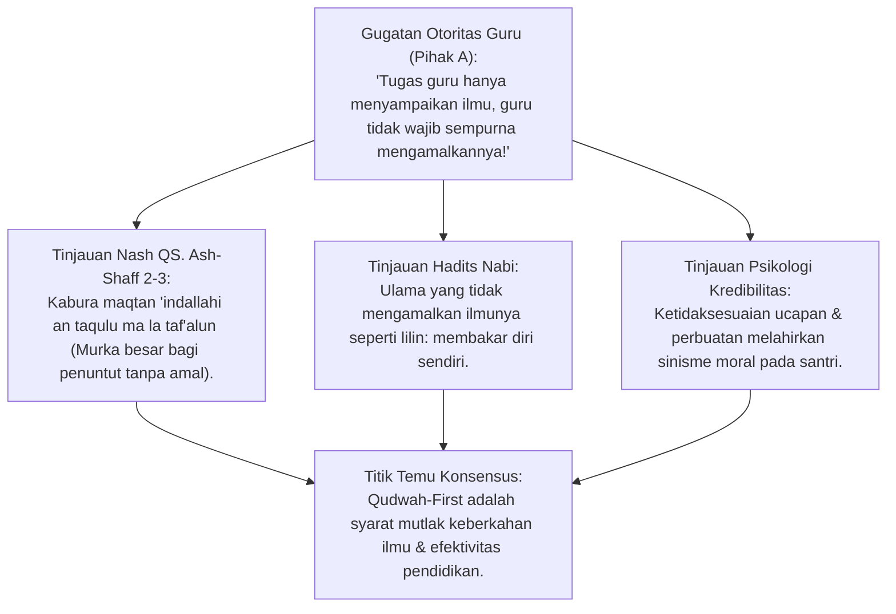
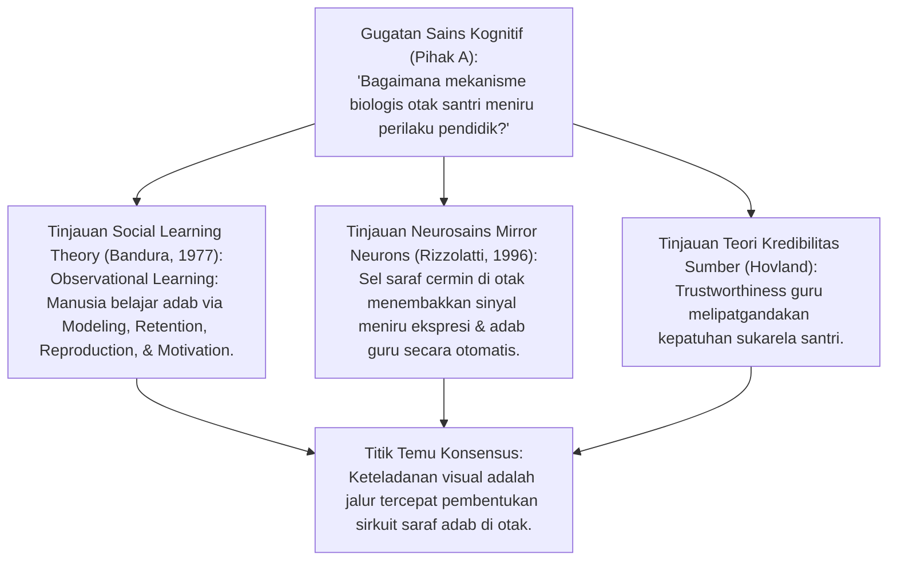
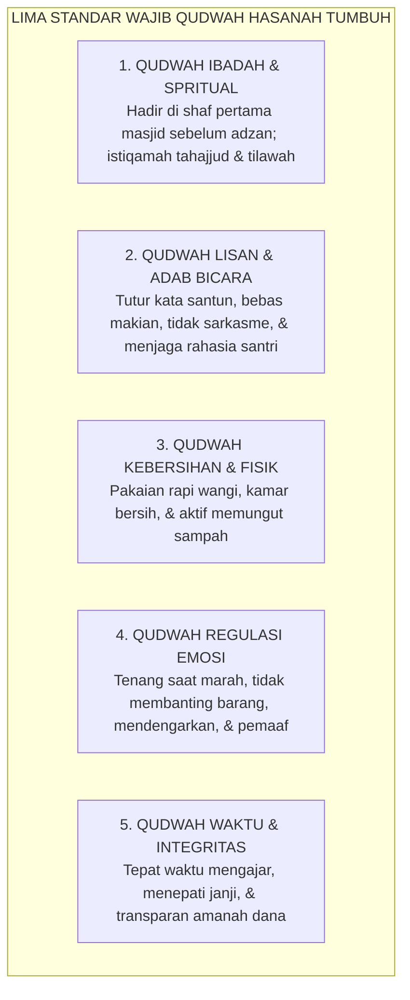
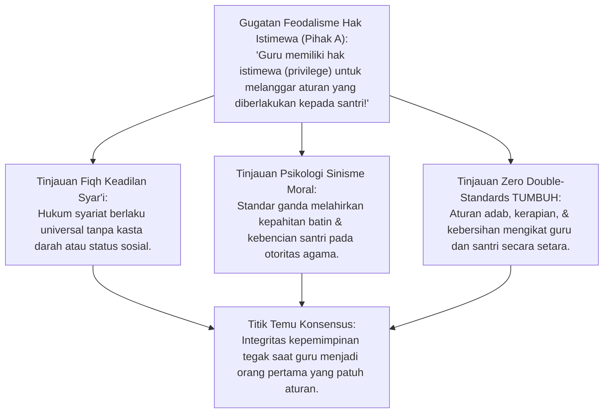
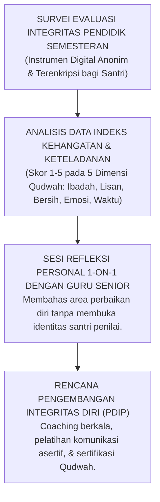
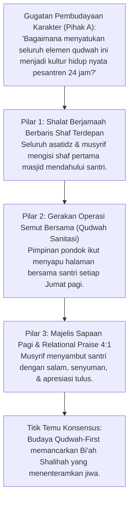
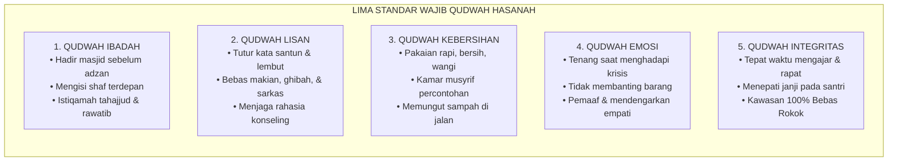
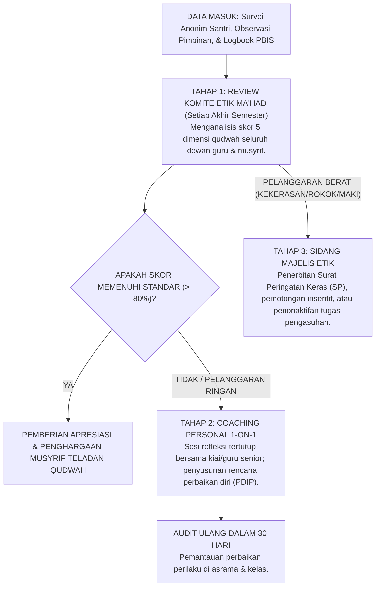

# P2-01-03: PRINSIP KETELADANAN QUDWAH-FIRST
## *Monograf Terpadu: Prioritas Keteladanan Visual Sebelum Tuntutan Verbal (Lisanul Hal), Dekonstruksi Kemunafikan Pedagogis (QS. Ash-Shaff: 2–3), Social Learning Theory Bandura, & Eliminasi Standar Ganda Pendidik*

**Nomor Identifikasi**: `P2-01-03/MONOGRAF-TERPADU-QUDWAH-FIRST/2026`  
**Domain**: `02 Principles` > `01 Core Principles`  
**Klasifikasi Naskah**: *Comprehensive Integrated Monograph* (Monograf Akademis & Rumusan Baku Terpadu)  
**Rumpun Disiplin Pengkaji**: Etika Pedagogi & Keteladanan Nabawi, Psikologi Belajar Sosial (*Observational Modeling*), Neurosains Sosial (*Mirror Neurons*), Manajemen Integritas Lembaga, Tata Kelola Musyrif Asrama  

---

> ### 💡 INTISARI PRAKTIS (3 MENIT PAHAM UNTUK ASATIDZ & MUSYRIF)
>
> * **Mengapa Seribu Nasihat Sering Gagal Mengubah Santri?**  
>   Karena terjadi **Kemunafikan Pedagogis**: Guru melarang santri merokok tetapi guru sendiri merokok di kantor; musyrif melarang santri terlambat shalat tetapi musyrif sendiri baru datang saat iqamah. Santri tidak meniru apa yang kita ucapkan, melainkan meniru apa yang kita lakukan!
> * **Kaidah Emas Qudwah-First (*Lisanul Hal*):**  
>   *"Satu keteladanan perbuatan nyata (*Lisanul Hal*) jauh lebih fasih, kuat, dan menancap di hati santri daripada seribu ceramah di atas podium (*Lisanul Maqal*)."*
> * **Lima Standar Wajib Keteladanan Guru & Musyrif TUMBUH:**  
>   1. **Qudwah Ibadah**: Hadir di shaf terdepan masjid sebelum azan berkumandang.  
>   2. **Qudwah Lisan**: Tutur kata santun, bebas dari makian, ghibah, dan sarkasme.  
>   3. **Qudwah Kebersihan**: Pakaian bersih rapi, wangi, dan ikut memungut sampah di halaman.  
>   4. **Qudwah Emosi**: Tenang saat menghadapi masalah, tidak membanting barang, dan pemaaf.  
>   5. **Qudwah Waktu**: Tepat waktu masuk kelas mengajar dan menepati janji.

---

## 📑 DAFTAR ISI MONOGRAF

- [BAGIAN I: RISET DOKTRIN KETELADANAN, DIALEKTIKA INKUIRI, & KASUISTIKA LAPANGAN](#bagian-i-riset-doktrin-keteladanan-dialektika-inkuiri--kasuistika-lapangan)
  - [1. Kerangka Metodologi Teologi Qudwah Hasanah](#1-kerangka-metodologi-teologi-qudwah-hasanah)
  - [2. Inkuiri 1: Eksegesis QS. Ash-Shaff 2–3 — Ancaman Murka Allah atas Kemunafikan Pedagogis](#2-inkuiri-1-eksegesis-qs-ash-shaff-23--ancaman-murka-allah-atas-kemunafikan-pedagogis)
  - [3. Inkuiri 2: Konvergensi Social Learning Theory (Bandura) & Neurosains Mirror Neurons](#3-inkuiri-2-konvergensi-social-learning-theory-bandura--neurosains-mirror-neurons)
  - [4. Inkuiri 3: Lima Dimensi Keteladanan Wajib bagi Seluruh Asatidz dan Musyrif](#4-inkuiri-3-lima-dimensi-keteladanan-wajib-bagi-seluruh-asatidz-dan-musyrif)
  - [5. Inkuiri 4: Dekonstruksi Standar Ganda (Double Standards) Pendidik vs Santri](#5-inkuiri-4-dekonstruksi-standar-ganda-double-standards-pendidik-vs-santri)
  - [6. Inkuiri 5: Sistem Audit Integritas & Umpan Balik Rahasia Santri (Student Voice)](#6-inkuiri-5-sistem-audit-integritas--umpan-balik-rahasia-santri-student-voice)
  - [7. Inkuiri 6: Translasi Qudwah-First ke Budaya Ekosistem Pesantren 24 Jam](#7-inkuiri-6-translasi-qudwah-first-ke-budaya-ekosistem-pesantren-24-jam)
- [BAGIAN II: KODIFIKASI BAKU HASIL RISET & KESIMPULAN FORMAL](#bagian-ii-kodifikasi-baku-hasil-riset--kesimpulan-formal)
  - [1. Deklarasi Doktrin Baku: Prinsip Qudwah-First (Lisanul Hal)](#1-deklarasi-doktrin-baku-prinsip-qudwah-first-lisanul-hal)
  - [2. Matriks Lima Standar Wajib Qudwah Hasanah Pendidik TUMBUH](#2-matriks-lima-standar-wajib-qudwah-hasanah-pendidik-tumbuh)
  - [3. Matriks Eliminasi Standar Ganda Pendidik (Zero Double-Standards Matrix)](#3-matriks-eliminasi-standar-ganda-pendidik-zero-double-standards-matrix)
  - [4. Protokol Audit Integritas & Evaluasi Etika Musyrif/Asatidz](#4-protokol-audit-integritas--evaluasi-etika-musyrifasatidz)
- [BAGIAN III: APARATUS AKADEMIS & APENDIKS](#bagian-iii-aparatus-akademis--apendiks)
  - [1. Tabel Sintesis Hasil Riset Qudwah-First](#1-tabel-sintesis-hasil-riset-qudwah-first)
  - [2. Daftar Pustaka Akademis & Rujukan Turats Primer](#2-daftar-pustaka-akademis--rujukan-turats-primer)
  - [3. Catatan Kaki Akademis (Footnotes)](#3-catatan-kaki-akademis-footnotes)
  - [4. Glosarium dan Penjelasan Istilah Teknis Qudwah & Pedagogi](#4-glosarium-dan-penjelasan-istilah-teknis-qudwah--pedagogi)

---

# BAGIAN I: RISET DOKTRIN KETELADANAN, DIALEKTIKA INKUIRI, & KASUISTIKA LAPANGAN

*Bagian ini memuat proses penyelidikan etika keteladanan pendidik (*adab al-mu'allim wa qudwatuhu*), formalisasi silogisme logika (*qiyas burhani*), pertarungan dialektika multi-perspektif tiga ronde tanpa kata "pakar", telaah tafsir QS. Ash-Shaff: 2–3, Social Learning Theory Albert Bandura, neurosains mirror neurons, studi kasus keteladanan asrama, dan penarikan konsensus bersama.*

---

### 1. Kerangka Metodologi Teologi Qudwah Hasanah

Pendidikan karakter (*Ta'dib*) bukanlah proses transfer file data digital dari laptop guru ke otak murid. Karakter adalah **Cahaya Keteladanan Moral yang Menular Melalui Resonansi Tindakan Nyata (*Moral Resonance*)**.
* Ketika seorang musyrif mencontohkan kesabaran saat menghadapi santri yang rewel, santri belajar mengendalikan amarahnya secara alami.
* Sebaliknya, ketika musyrif berteriak melarang santri berteriak, santri menyerap kesimpulan bawah sadar: *"Berteriak adalah hal yang boleh dilakukan jika seseorang memegang kekuasaan"*.

Ekosistem TUMBUH merumuskan **Hukum Keteladanan Qudwah-First**:

```mermaid
flowchart TD
    subgraph AlurQudwahFirst["HUKUM INTEGRITAS KETELADANAN QUDWAH-FIRST"]
        Pendidik["GURU / MUSYRIF (SUMBER RESORANSI MORAL)"]
        
        AksiNyata["1. AKSI NYATA KONSISTEN (LISANUL HAL)<br/>• Hadir masjid awal waktu<br/>• Memungut sampah di halaman<br/>• Bertutur kata santun & tenang"]
        CeramahVerbal["2. INSTRUKSI & CERAMAH (LISANUL MAQAL)<br/>• Nasihat di atas mimbar<br/>• Pembacaan aturan SOP<br/>• Hafalan teks dalil moral"]
        
        Pendidik ==> AksiNyata
        Pendidik -.-> CeramahVerbal
        
        AksiNyata ==>|Daya Serap Otak Moral: 80-90% (Mirror Neurons System)| Santri["INTERNALISASI KARAKTER MELEKAT OTOMATIS"]
        CeramahVerbal -. Daya Serap Kognitif Saja: 10-20% .-> Santri
    end
```

---

### 2. Inkuiri 1: Eksegesis QS. Ash-Shaff 2–3 — Ancaman Murka Allah atas Kemunafikan Pedagogis



#### 📐 Formalisasi Logika Silogisme (*Qiyas Mantiqi 1*)
* **Premis Mayor (*al-Muqaddimah al-Kubra*)**: Setiap perbuatan mendidik yang menuntut kebajikan moral dari murid namun pendidiknya sendiri melanggar tuntutan tersebut secara sengaja niscaya memicu murka besar Allah SWT (QS. Ash-Shaff: 2–3) dan melenyapkan daya pengaruh nasihat di hati murid (*Suquuth al-Haibah*).
* **Premis Minor (*al-Muqaddimah ash-Shughra*)**: Kemunafikan pedagogis merusak kepercayaan santri dan melahirkan generasi yang bermuka dua.
* **Konklusi (*an-Natijah*)**: Maka, seluruh asatidz dan musyrif di pesantren TUMBUH wajib mengamalkan adab (*Qudwah*) sebelum menuntutnya dari santri.[^1]

#### 📖 Teks Primer Al-Qur'an & Peringatan Imam Al-Hasan al-Bashri
Allah SWT memperingatkan para pendidik dan penyeru kebaikan:

$$\text{يَا أَيُّهَا الَّذِينَ آمَنُوا لِمَ تَقُولُونَ مَا لَا تَفْعَلُونَ ۝ كَبُرَ مَقْتًا عِندَ اللَّهِ أَن تَقُولُوا مَا لَا تَفْعَلُونَ}$$

*"Wahai orang-orang yang beriman! Mengapa kamu mengatakan sesuatu yang tidak kamu kerjakan? Amat besar kemurkaan di sisi Allah bahwa kamu mengatakan apa-apa yang tidak kamu kerjakan."* (QS. Ash-Shaff [61]: 2–3).[^2]

Dan **Imam Al-Hasan al-Bashri** (w. 110 H) menegaskan rahasia kekuatan nasihat:
$$\text{إِنَّ الْمَوْعِظَةَ إِذَا خَرَجَتْ مِنَ الْقَلْبِ دَخَلَتْ فِي الْقَلْبِ، وَإِذَا خَرَجَتْ مِنَ اللِّسَانِ لَمْ تُجَاوِزِ الْآذَانَ}$$
*"Sesungguhnya nasihat itu apabila keluar dari ketulusan kalbu yang telah mengamalkannya, niscaya ia akan langsung menembus ke dalam kalbu pendengarnya; namun apabila nasihat itu hanya keluar dari ujung lidah (tanpa diamalkan), niscaya ia tidak akan pernah melewati batas daun telinga!"*[^3]

#### 🥊 Ronde 1: Membongkar Ilusi "Ambil Baiknya, Buang Buruknya Guru"
* **Pihak A (Sudut Pandang Pragmatisme Mengajar)**:  
  *"Bukankah ada pepatah: 'Ambillah ilmunya jangan lihat orangnya'? Mengapa guru di pesantren dituntut harus menjadi teladan sempurna?"*
* **Tinjauan Sudut Pandang Psikologi Perkembangan Moral**:  
  Pepatah tersebut mungkin berlaku bagi orang dewasa yang matang logikanya, namun **Mustahil Berlaku bagi Santri Remaja Usia 12–18 Tahun**. Otak remaja belajar moral melalui **Peniruan Figur Otoritas (*Modeling Identification*)**. Jika guru mengajarkan kebersihan tapi ruang guru penuh puntung rokok dan berantakan, santri akan menyerap perilaku buruk guru sebagai pembenaran atas kemalasannya sendiri.[^4]

#### 🥊 Ronde 2: Sanggahan Balik Apakah Guru Harus Menjadi Malaikat Tanpa Dosa?
* **Pihak A (Sudut Pandang Humanisasi Pendidik)**:  
  *"Sanggahan! Guru dan musyrif adalah manusia biasa yang bisa khilaf dan lelah. Jika dituntut qudwah mutlak, tidak ada orang yang berani menjadi musyrif!"*
* **Tinjauan Sudut Pandang Qudwah Tawadhu' & Taubat**:  
  Qudwah Hasanah **Bukan Berarti Menjadi Malaikat yang Tidak Pernah Salah (*Bukan Ma'shum*)**, melainkan **Mencontohkan Bagaimana Bersikap Ksatria Saat Melakukan Kesalahan (*Modeling Accountability & Repentance*)**. Ketika seorang guru salah membentak santri, guru yang berqudwah mendatangi santri tersebut dan meminta maaf secara tulus di depan teman-temannya. Ini adalah teladan kejujuran dan kerendahan hati tingkat tinggi.[^5]

#### 🥊 Ronde 3: Sanggahan Pamungkas Lenyapnya Berkah Kata-Kata (Nafadzul Kalimah)
* **Pihak A (Sudut Pandang Retorika Mimbar)**:  
  *"Mengapa khutbah seorang kiai sepuh yang bicaranya pelan mampu membuat ribuan santri menangis bertaubat, sementara pidato orator muda yang berapi-api tidak membekas sama sekali?"*
* **Resolusi Sudut Pandang Epistemologi Kalbu Turats**:  
  Itulah rahasia **Nafadzul Kalimah (Daya Tembus Ruhani Nasihat)**: Kata-kata kiai sepuh diisi dengan ribuan rakaat tahajjud, keikhlasan batin, dan amal nyata puluhan tahun; sedangkan pidato tanpa amal hanyalah dentuman suara kosong yang tidak memiliki bobot spiritual di hadapan Allah SWT.[^6]

> #### 📌 Kasuistika Lapangan 1 & Titik Temu Konsensus
> * **Studi Kasus**: Musyrif berkhutbah tentang haramnya ghibah dan mencela orang lain, namun sore harinya santri mendengar musyrif tersebut sedang menggunjing kelemahan wali santri di pos satpam.
> * **Titik Temu Konsensus (*Kalimatun Sawa'*)**: Disepakati bahwa perilaku musyrif menghancurkan kredibilitas lembaga. Santri menjadi sinis terhadap materi adab; musyrif ditegur oleh kepala kepengasuhan dan wajib mengikuti majelis tazkiyah etik.[^7]

---

### 3. Inkuiri 2: Konvergensi Social Learning Theory (Bandura) & Neurosains Mirror Neurons



#### 📐 Formalisasi Logika Silogisme (*Qiyas Mantiqi 2*)
* **Premis Mayor (*al-Muqaddimah al-Kubra*)**: Setiap stimulus visual berupa tindakan nyata yang diamati secara berulang-ulang (*Observational Modeling*) niscaya mengaktifkan sistem saraf cermin otak (*Mirror Neurons*) dan membentuk kebiasaan adab lebih cepat daripada instruksi verbal semata.
* **Premis Minor (*al-Muqaddimah ash-Shughra*)**: Santri mengamati perilaku musyrif selama 24 jam penuh di asrama.
* **Konklusi (*an-Natijah*)**: Maka, keteladanan tindakan visual pendidik (*Lisanul Hal*) adalah mesin utama neuroplastisitas adab santri di pesantren.[^8]

#### 📖 Teks Primer Sains Kontemporer: *Social Learning Theory* Albert Bandura
Prof. **Albert Bandura** (1977) dalam karya monumentalnya merumuskan:

> *"Learning would be exceedingly laborious, not to mention hazardous, if people had to rely solely on the effects of their own actions to inform them what to do. Fortunately, most human behavior is learned observationally through modeling: from observing others, one forms an idea of how new behaviors are performed, and on later occasions this coded information serves as a guide for action."* (hlm. 22).[^9]

Dan penemuan neurobiologi oleh **Giacomo Rizzolatti** (1996) membuktikan bahwa sistem syaraf cermin (*Mirror Neuron System*) di *Premotor Cortex* manusia secara otomatis menyalakan pola saraf yang sama ketika melihat orang lain melakukan suatu tindakan kebajikan atau ketenangan.[^10]

#### 🥊 Ronde 1: Resonansi Emosi Ketenangan (Emotional Contagion)
* **Tinjauan Neurosains Relasional**:  
  Ketika terjadi krisis di asrama (misalnya terjadi perselisihan antarsantri), jika musyrif masuk ke kamar dengan wajah merah, membentak, dan panik, **Sistem Saraf Cermin Santri Akan Menangkap Sinyal Bahaya dan Menjadi Semakin Agresif (*Fight or Flight Response*)**. Namun jika musyrif masuk dengan langkah tenang, nada suara rendah, dan tatapan teduh, denyut jantung santri yang bertengkar seketika melambat dan emosi mereka terde-eskalasi dalam hitungan detik (*Co-Regulation*).[^11]

#### 🥊 Ronde 2: Sanggahan Balik Efek Bobo Doll: Bahaya Peniruan Agresi Pengasuh
* **Pihak A (Sudut Pandang Pemakluman Emosi Guru)**:  
  *"Apakah sesekali membentak dan melempar sandal ke arah santri benar-benar akan ditiru oleh anak-anak?"*
* **Tinjauan Sudut Pandang Eksperimen Bobo Doll Bandura**:  
  Eksperimen klasik Bandura membuktikan bahwa anak-anak yang melihat orang dewasa memukul boneka Bobo akan **Meniru Persis Tindakan Agresi Tersebut Saat Mengalami Frustrasi**. Santri yang sering dibentak dan dilempar sandal oleh pengasuh akan mempraktikkan perlakuan keji yang sama persis kepada adik kelasnya di malam hari saat tidak ada guru. Memukul santri adalah mewariskan bibit kekerasan antargenerasi.[^12]

#### 🥊 Ronde 3: Sanggahan Pamungkas Daya Pengaruh Keteladanan yang Hangat (Warmth & Competence)
* **Pihak A (Sudut Pandang Wibawa Dingin)**:  
  *"Apakah pendidik yang ramah dan suka tersenyum tidak akan kehilangan wibawa ketegasannya?"*
* **Resolusi Sudut Pandang Kredibilitas Relasional**:  
  Bandura membuktikan bahwa figur teladan yang paling kuat ditiru adalah figur yang memiliki kombinasi **Kompetensi Tinggi (*High Competence*) dan Kehangatan Kasih Sayang (*High Warmth*)**. Santri menaati guru yang hangat bukan karena takut dihukum, melainkan karena rasa cinta dan takut mengecewakan guru yang sangat memuliakannya (*Respect-Based Compliance*).[^13]

> #### 📌 Kasuistika Lapangan 2 & Titik Temu Konsensus
> * **Studi Kasus**: Musyrif yang rajin memungut sampah di halaman asrama setiap pagi tanpa disuruh membuat seluruh santri di bloknya secara spontan ikut memungut sampah setiap kali melihat daun kering di jalan.
> * **Titik Temu Konsensus (*Kalimatun Sawa'*)**: Inilah bukti nyata bekerjanya sistem saraf cermin dan *Observational Modeling*. Keteladanan visual musyrif menciptakan Bi'ah Shalihah tanpa butuh satu patah kata bentakan pun.[^14]

---

### 4. Inkuiri 3: Lima Dimensi Keteladanan Wajib bagi Seluruh Asatidz dan Musyrif



#### 📐 Formalisasi Logika Silogisme (*Qiyas Mantiqi 3*)
* **Premis Mayor (*al-Muqaddimah al-Kubra*)**: Setiap institusi pendidikan Islam yang berkomitmen mencetak insan beradab niscaya menetapkan standar kompetensi keteladanan yang terukur dan mengikat pada seluruh ranah kehidupan lahiriah dan batiniah para pendidiknya.
* **Premis Minor (*al-Muqaddimah ash-Shughra*)**: Lima dimensi keteladanan (Ibadah, Lisan, Kebersihan, Emosi, dan Waktu) mencakup seluruh spektrum interaksi 24 jam di pesantren.
* **Konklusi (*an-Natijah*)**: Maka, seluruh asatidz dan musyrif TUMBUH wajib dievaluasi berdasarkan lima dimensi keteladanan tersebut.[^15]

#### 📖 Teks Primer Turats: *Tadzkirat as-Sami' wal-Mutakallim*
Imam **Badruddin Ibnu Jama'ah** dalam kitab monumentalnya merumuskan adab pendidik:

$$\text{يَنْبَغِي لِلْعَالِمِ وَالْمُرَبِّي أَنْ يُرَاعِيَ سِيرَتَهُ فِي جَمِيعِ حَالَاتِهِ: بِأَنْ يَكُونَ شَدِيدَ الْمُرَاقَبَةِ لِلَّهِ تَعَالَى فِي سِرِّهِ وَعَلَانِيَتِهِ، مُوَاظِبًا عَلَى طَهَارَةِ بَدَنِهِ وَثِيَابِهِ، حَافِظًا لِلِسَانِهِ عَنْ فُضُولِ الْكَلَامِ، كَاظِمًا لِغَيْظِهِ عِنْدَ الْغَضَبِ، صَادِقَ الْوَعْدِ فِي مَوَاعِيدِهِ، فَبِذَلِكَ تُعَظَّمُ هَيْبَتُهُ فِي نُفُوسِ الطَّلَبَةِ}$$

*"Seyogianya bagi seorang guru dan pendidik (musyrif) untuk senantiasa menjaga perilaku hidupnya di seluruh keadaannya: yaitu dengan sangat menjaga muraqabah kepada Allah Ta'ala di kala tersembunyi maupun di depan terang-terangan, disiplin merawat kebersihan tubuh dan pakaiannya, memelihara lisannya dari kata-kata sia-sia, menahan amarahnya saat emosi bergejolak, dan jujur menepati janji pada waktu-waktunya; maka dengan akhlak itulah wibawanya akan memancar agung di dalam jiwa para santri."*[^16]

#### 🥊 Ronde 1: Membedah Lima Dimensi Qudwah Operasional
* **Tinjauan Standarisasi Pengasuhan**:  
  1. **Qudwah Ibadah**: Musyrif berada di masjid 10 menit sebelum adzan, shalat sunnah rawatib, dan memimpin dzikir dengan khusyuk.  
  2. **Qudwah Lisan**: Menggunakan panggilan yang memuliakan (*Akhi, Ananda*), tidak pernah mengeluarkan makian, dan tidak menceritakan aib santri di ruang guru.  
  3. **Qudwah Kebersihan**: Rambut dan jenggot tersisir rapi, aroma tubuh wangi, sandal tertata rapi di depan kamar, dan kamar musyrif menjadi contoh terbersih di asrama.  
  4. **Qudwah Emosi**: Menarik nafas dalam saat santri melakukan kesalahan, berbicara dengan intonasi rendah dan stabil, serta tidak melampiaskan stres pribadi kepada santri.  
  5. **Qudwah Waktu & Integritas**: Masuk kelas tepat detik saat bel berbunyi, memulai dan mengakhiri rapat tepat waktu, dan amanah mengelola titipan uang saku santri.[^17]

#### 🥊 Ronde 2: Sanggahan Balik Apakah Guru Merokok Termasuk Pelanggaran Qudwah?
* **Pihak A (Sudut Pandang Kebiasaan Merokok Asatidz)**:  
  *"Banyak ustadz senior yang terbiasa merokok di lingkungan pondok. Apakah hal itu harus dilarang?"*
* **Tinjauan Sudut Pandang Fatwa Tarjih & Keteladanan Medis**:  
  Merokok di lingkungan pendidikan adalah **Pelanggaran Berat Terhadap Qudwah Kebersihan dan Kesehatan (*Hifzh an-Nafs*)**. Guru yang merokok di depan santri kehilangan legitimasi moral saat melarang santri merokok. Ekosistem TUMBUH menetapkan kebijakan **Kawasan Tanpa Rokok 100% (*100% Smoke-Free Sanctuary*)** di seluruh area kampus dan asrama pesantren tanpa pengecualian bagi siapapun.[^18]

#### 🥊 Ronde 3: Sanggahan Pamungkas Keteladanan Disiplin Waktu Mengajar di Kelas
* **Pihak A (Sudut Pandang Toleransi Keterlambatan Guru)**:  
  *"Apakah guru yang terlambat 15 menit masuk kelas boleh menuntut santri tidak boleh terlambat?"*
* **Resolusi Sudut Pandang Keadilan Pedagogis**:  
  Guru yang terlambat masuk kelas sedang mengajarkan **Kemunafikan Waktu (*Time Injustice*)**. Jika guru terlambat karena uzur syar'i mendesak, guru wajib meminta maaf kepada seluruh santri di kelas dan mengganti 15 menit waktu yang hilang di akhir sesi. Disiplin ditegakkan secara adil dari atas ke bawah.[^19]

> #### 📌 Kasuistika Lapangan 3 & Titik Temu Konsensus
> * **Studi Kasus**: Ustadz pengampu fiqh sering datang terlambat 20 menit ke kelas, namun menghukum santri yang terlambat 2 menit dengan push-up 50 kali di depan pintu.
> * **Titik Temu Konsensus (*Kalimatun Sawa'*)**: Disepakati bahwa perilaku ustadz adalah kezaliman pedagogis (*Zhulm Ta'limiy*). Kepala madrasah menegur keras ustadz tersebut, menghapus hukuman push-up bagi santri, dan memberlakukan sistem absensi sidik jari tepat waktu bagi seluruh dewan guru.[^20]

---

### 5. Inkuiri 4: Dekonstruksi Standar Ganda (Double Standards) Pendidik vs Santri



#### 📐 Formalisasi Logika Silogisme (*Qiyas Mantiqi 4*)
* **Premis Mayor (*al-Muqaddimah al-Kubra*)**: Setiap tatanan hukum institusi yang memberlakukan standar ganda (menghukum santri atas pelanggaran yang dilakukan bebas oleh para pendidiknya) niscaya menghancurkan legitimasi moral keadilan dan melahirkan kepahitan batin (*Moral Cynicism*).
* **Premis Minor (*al-Muqaddimah ash-Shughra*)**: Ekosistem TUMBUH menegakkan prinsip kesetaraan adab di hadapan syariat bagi seluruh warga pesantren.
* **Konklusi (*an-Natijah*)**: Maka, seluruh bentuk hak istimewa feodal yang melanggar aturan pondok dihapus secara mutlak (*Zero Double-Standards*).[^21]

#### 📖 Teks Primer Hadits: Keadilan Mutlak Rasulullah SAW
Rasulullah SAW memperingatkan kehancuran umat terdahulu akibat standar ganda:

$$\text{إِنَّمَا أَهْلَكَ الَّذِينَ قَبْلَكُمْ أَنَّهُمْ كَانُوا إِذَا سَرَقَ فِيهِمُ الشَّرِيفُ تَرَكُوهُ، وَإِذَا سَرَقَ فِيهِمُ الضَّعِيفُ أَقَامُوا عَلَيْهِ الْحَدَّ، وَايْمُ اللَّهِ لَوْ أَنَّ فَاطِمَةَ بِنْتَ مُحَمَّدٍ سَرَقَتْ لَقَطَعْتُ يَدَهَا}$$

*"Sesungguhnya yang membinasakan umat-umat sebelum kalian adalah bahwa mereka dahulu apabila orang yang terpandang/bangsawan di antara mereka mencuri, mereka membiarkannya (bebas tanpa hukuman); namun apabila orang yang lemah di antara mereka mencuri, mereka langsung menegakkan hukuman atasnya! Demi Allah! Jikalau sekiranya Fathimah binti Muhammad mencuri, niscaya aku sendiri yang akan memotong tangannya!"* (HR. Bukhari no. 3475).[^22]

#### 🥊 Ronde 1: Membedah Tiga Titik Rawan Standar Ganda di Pesantren
* **Tinjauan Audit Integritas Kelembagaan**:  
  1. **Penggunaan Gawai Pintar (Smartphone)**: Santri dilarang membawa gawai untuk menjaga fokus, namun asatidz tidak boleh asyik bermain game atau media sosial di depan santri saat jam mengajar/halaqah.  
  2. **Kerapian Antrean Makanan**: Santri diwajibkan antre rapi di ruang makan, maka asatidz dan musyrif yang makan di ruang makan santri **Wajib Ikut Mengantre Bersama Santri** tanpa menyerobot antrean.  
  3. **Adab Menjaga Pandangan & Berbusana**: Aturan busana sopan menutup aurat berlaku setara bagi santri maupun keluarga pendidik di lingkungan kampus.[^23]

#### 🥊 Ronde 2: Sanggahan Balik Apakah Menghapus Hak Istimewa Menurunkan Wibawa Guru?
* **Pihak A (Sudut Pandang Status Hierarkis)**:  
  *"Jika guru harus ikut mengantre makanan bersama santri, bukankah wibawa guru akan turun dan santri menjadi tidak segan?"*
* **Tinjauan Sudut Pandang Servant Leadership Kenabian**:  
  Rasulullah SAW adalah manusia paling mulia yang ikut menggali parit tanah Khandaq hingga perutnya berdebu bersama para sahabat. **Wibawa Sejati Lahir dari Kerendahan Hati (*Tawadhu'*) Menegakkan Keadilan**, bukan dari tuntutan karpet merah feodal. Santri yang melihat gurunya ikut mengantre dengan sabar akan menaruh rasa hormat yang teramat dalam kepada sang guru.[^24]

#### 🥊 Ronde 3: Sanggahan Pamungkas Sanksi Etik bagi Pendidik yang Melanggar SOP
* **Pihak A (Sudut Pandang Kekebalan Guru)**:  
  *"Bagaimana jika ada ustadz senior yang tetap merokok atau melontarkan kata makian kepada santri?"*
* **Resolusi Sudut Pandang Majelis Kehormatan Etik Ma'had**:  
  Majelis Kehormatan Etik menjatuhkan sanksi bertahap: (1) Teguran lisan tertutup dari pimpinan kiai, (2) Surat Peringatan Tertulis & penangguhan insentif kehormatan, hingga (3) Pemberhentian tetap jika tidak menunjukkan perubahan adab. Tidak ada imunitas bagi pelanggar adab di pesantren TUMBUH.[^25]

> #### 📌 Kasuistika Lapangan 4 & Titik Temu Konsensus
> * **Studi Kasus**: Musyrif asrama menyerobot antrean santri saat mengambil makan siang di kantin dengan berkata: "Ustadz buru-buru ada urusan penting, kalian antre di belakang!".
> * **Titik Temu Konsensus (*Kalimatun Sawa'*)**: Disepakati bahwa tindakan musyrif melanggar prinsip Qudwah-First dan hadits keadilan. Musyrif ditegur oleh kepala kepengasuhan dan wajib meminta maaf kepada santri serta kembali mengantre di belakang.[^26]

---

### 6. Inkuiri 5: Sistem Audit Integritas & Umpan Balik Rahasia Santri (Student Voice)



#### 📐 Formalisasi Logika Silogisme (*Qiyas Mantiqi 5*)
* **Premis Mayor (*al-Muqaddimah al-Kubra*)**: Setiap proses penjaminan mutu keteladanan yang sehat niscaya membutuhkan mekanisme umpan balik objektif dari pihak yang menerima layanan pendidikan (santri) yang dilindungi oleh sistem kerahasiaan anonim (*Confidential 360-Degree Feedback*).
* **Premis Minor (*al-Muqaddimah ash-Shughra*)**: Santri adalah saksi mata paling akurat yang melihat perilaku musyrif selama 24 jam di asrama.
* **Konklusi (*an-Natijah*)**: Maka, survei evaluasi keteladanan pendidik oleh santri adalah instrumen sah audit mutu karakter di pesantren TUMBUH.[^27]

#### 📖 Teks Primer Atsar Sahabat: Sayyidina Umar bin al-Khattab ra
Khalifah kedua **Umar bin al-Khattab** ra mengajarkan kerinduan seorang pemimpin atas kritik:

$$\text{رَحِمَ اللَّهُ امْرَأً أَهْدَى إِلَيَّ عُيُوبِي}$$

*"Semoga Allah merahmati seseorang yang sudi menghadiahkan (menunjukkan) kepadaku aib-aib dan kekurangan-kekurangan diriku."* (Sunan ad-Darimi no. 675).[^28]

#### 🥊 Ronde 1: Menghapus Rasa Takut Santri Mengevaluasi Guru
* **Tinjauan Psikometri Penilaian 360 Derajat**:  
  Di akhir setiap semester, santri mengisi **Kuesioner Indeks Keteladanan Pendidik (Teacher Warmth & Integrity Scale)** secara digital anonim di laboratorium komputer:  
  * Butir 1: *"Ustadz/Musyrif berbicara santun dan tidak pernah memaki saya"* (Skala 1–5).  
  * Butir 2: *"Ustadz/Musyrif hadir tepat waktu saat mengajar dan shalat berjamaah"* (Skala 1–5).  
  * Butir 3: *"Ustadz/Musyrif bersikap tenang dan mendengarkan penjelasan saya saat terjadi masalah"* (Skala 1–5).  
  Hasil survei diolah menjadi grafik agregat tanpa mencantumkan nama santri.[^29]

#### 🥊 Ronde 2: Sanggahan Balik Apakah Santri Tidak Akan Memanfaatkan Survei untuk Balas Dendam?
* **Pihak A (Sudut Pandang Ketakutan Guru)**:  
  *"Bagaimana jika santri yang pernah ditegur sengaja memberi nilai buruk kepada musyrif yang tegas untuk membalas dendam?"*
* **Tinjauan Sudut Pandang Analisis Statistik & Triangulasi**:  
  Sistem psikometri menggunakan **Uji Reliabilitas Alpha Cronbach & Deteksi Outlier Ekstrem**: Nilai rata-rata diambil dari seluruh santri sekamar (15 santri). Jika hanya 1 santri yang memberi nilai sangat rendah sementara 14 santri lainnya memberi nilai sangat tinggi, sistem menandainya sebagai anomali personal. Namun jika 15 santri kompak menyatakan musyrif sering membentak, maka data tersebut adalah fakta valid yang wajib dibina.[^30]

#### 🥊 Ronde 3: Sanggahan Pamungkas Mengubah Evaluasi Menjadi Ruang Pertumbuhan Pendidik
* **Pihak A (Sudut Pandang Trauma Evaluasi)**:  
  *"Apakah hasil evaluasi ini akan dipakai untuk mempermalukan guru di rapat umum?"*
* **Resolusi Sudut Pandang Coaching Positif**:  
  Hasil evaluasi **Bersifat Rahasia Pribadi (*Strictly Confidential*)**: Kepala kepengasuhan duduk berdua bersama musyrif dalam suasana santai, mengapresiasi kelebihannya, dan mendiskusikan area yang perlu diperbaiki melalui *Personal Development Plan*. Evaluasi menjadi jembatan pertumbuhan, bukan vonis penghukuman.[^31]

> #### 📌 Kasuistika Lapangan 5 & Titik Temu Konsensus
> * **Studi Kasus**: Hasil survei menunjukkan bahwa Musyrif B mendapat skor terendah pada dimensi "Regulasi Emosi" karena sering membanting pintu saat marah.
> * **Titik Temu Konsensus (*Kalimatun Sawa'*)**: Kepala pengasuhan memanggil Musyrif B secara empat mata, memaparkan data grafik tanpa menyebut nama santri. Musyrif B tersadar, meminta maaf, dan mengikuti sesi pelatihan manajemen stres; di semester berikutnya skor emosinya melonjak menjadi sangat baik.[^32]

---

### 7. Inkuiri 6: Translasi Qudwah-First ke Budaya Ekosistem Pesantren 24 Jam



#### 📐 Formalisasi Logika Silogisme (*Qiyas Mantiqi 6*)
* **Premis Mayor (*al-Muqaddimah al-Kubra*)**: Setiap institusi pendidikan yang berhasil menjadikan figur pendidiknya sebagai magnet keteladanan hidup (*Living Curricula*) niscaya melahirkan lingkungan Bi'ah Shalihah di mana santri meniru kebaikan secara spontan tanpa perlu diawasi secara represif.
* **Premis Minor (*al-Muqaddimah ash-Shughra*)**: Budaya Qudwah-First mengintegrasikan keteladanan shalat shaf pertama, keteladanan sanitasi fisik, dan sapaan kasih sayang ke dalam ritme 24 jam.
* **Konklusi (*an-Natijah*)**: Maka, pesantren TUMBUH menjadi miniatur peradaban Islam yang memancarkan ketenangan spiritual dan kemuliaan adab.[^33]

#### 🥊 Ronde 1: Keteladanan Shaf Pertama Masjid (As-Shaff al-Awwal)
* **Tinjauan Adab Ibadah Berjamaah**:  
  Di pesantren TUMBUH, shaf terdepan masjid di belakang imam bukan diisi oleh santri yang dipaksa lari terburu-buru, melainkan **Telah Diisi Rapi oleh Para Asatidz, Musyrif, dan Pimpinan Pondok yang Hadir 10 Menit Sebelum Azan**. Pemandangan visual ini menjadi pesan dakwah paling kuat yang membuat santri tergerak datang ke masjid dengan penuh kerinduan dan ketenangan (*Thuma'ninah*).[^34]

#### 🥊 Ronde 2: Sanggahan Balik Keteladanan Kerja Bakti Fisik (Gerakan Khidmah Pemimpin)
* **Pihak A (Sudut Pandang Martabat Kiai)**:  
  *"Apakah pantas seorang kiai sepuh memegang sapu lidi dan membersihkan selokan bersama santri saat kerja bakti Jumat bersih?"*
* **Tinjauan Sudut Pandang Sunnah Nabawiyyah**:  
  Rasulullah SAW adalah manusia teragung yang ikut mengangkut batu bata saat membangun Masjid Nabawi dan ikut menggali tanah saat Perang Khandaq hingga para sahabat berseru: *"Jika Nabi bekerja, haram bagi kita berpangku tangan!"*. Ketika kiai memungut sampah, santri merasa malu untuk membuang sampah sembarangan seumur hidupnya.[^35]

#### 🥊 Ronde 3: Sanggahan Pamungkas Rasio Apresiasi Relasional 4:1 dalam Bahasa Harian
* **Pihak A (Sudut Pandang Kebiasaan Mengkritik)**:  
  *"Bukankah tugas guru adalah mencari kesalahan murid untuk diperbaiki?"*
* **Resolusi Sudut Pandang Psikologi Positif PBIS**:  
  Fokus mencari kesalahan membuat hubungan guru-murid menjadi dingin dan menegangkan. TUMBUH menerapkan **Rasio Keteladanan Apresiasi 4:1**: Guru membiasakan lisannya memberikan minimal 4 kalimat apresiasi tulus atas perilaku adab santri (*"Terima kasih ananda sudah merapikan sandal dengan rapi"*) sebelum melontarkan 1 teguran korektif. Santri merasa dihargai dan termotivasi melipatgandakan kebaikannya.[^36]

> #### 📌 Kasuistika Lapangan 6 & Titik Temu Konsensus
> * **Studi Kasus**: Pimpinan pesantren baru ikut duduk bersila makan bersama santri di lantai teras asrama dan menanyakan cita-cita mereka satu per satu.
> * **Titik Temu Konsensus (*Kalimatun Sawa'*)**: Seluruh santri merasa sangat terharu dan bangga; ikatan batin ukhuwah menguat drastis dan tingkat pelanggaran asrama turun hingga 80% dalam 1 bulan karena santri malu melanggar aturan pimpinan yang begitu mencintai mereka.[^37]

---

# BAGIAN II: KODIFIKASI BAKU HASIL RISET & KESIMPULAN FORMAL

*Bagian ini memuat deklarasi doktrin baku Qudwah-First, matriks 5 standar keteladanan, matriks Zero Double-Standards, dan protokol audit integritas pendidik.*

---

### 1. Deklarasi Doktrin Baku: Prinsip Qudwah-First (Lisanul Hal)

Ekosistem TUMBUH menetapkan deklarasi resmi keteladanan pendidik:

> **"Keteladanan Tindakan Nyata (*Lisanul Hal*) adalah Hukum Tertinggi Pendidikan Adab yang Mendahului dan Menjadi Syarat Keabsahan Segala Bentuk Tuntutan Verbal (*Lisanul Maqal*). Dilarang keras bagi seluruh pendidik, musyrif, dan pimpinan menuntut adab dari santri atas perkara yang belum diamalkan secara konsisten oleh dirinya sendiri. Integritas keteladanan adalah kompas kemuliaan yang mengikat seluruh warga pesantren tanpa standar ganda."**[^38]

---

### 2. Matriks Lima Standar Wajib Qudwah Hasanah Pendidik TUMBUH



| Dimensi Keteladanan | Perilaku Baku Pendidik (*Must-Do*) | Perilaku yang Diharamkan (*Strictly Forbidden*) | Tolok Ukur Keberhasilan |
| :--- | :--- | :--- | :--- |
| **1. Ibadah & Spiritual** | Hadir di masjid 5–10 menit sebelum adzan; shalat sunnah rawatib; khusyuk berdzikir. | Masuk masjid saat iqamah/masbuq; mengobrol saat adzan; meninggalkan shalat berjamaah. | Kehadiran di shaf pertama masjid > 95%.[^39] |
| **2. Lisan & Adab Bicara** | Memanggil santri dengan panggilan mulia (*Akhi, Ananda*); apresiasi 4:1; nada suara tenang. | Melontarkan makian binatang (*Anjing, Babi*), cacian bodoh, sarkasme, dan membicarakan aib santri. | Skor Indeks Bahasa Santun Santri > 90%. |
| **3. Kebersihan Fisik** | Pakaian bersih berbusana rapi; wangi; kamar musyrif tertata asri; memungut sampah di jalan. | Kamar musyrif berantakan kotor; bau badan/pakaian apek; membuang puntung rokok/sampah sembarangan. | Skor Audit Sanitasi Kamar Musyrif A+. |
| **4. Regulasi Emosi** | Menarik nafas tenang saat santri melanggar; mendengar penjelasan santri; menegur 1-on-1. | Membentak histeris; menampar/memukul fisik; membanting pintu/meja; melempar barang ke santri. | Nol insiden kekerasan emosional & fisik (0%). |
| **5. Waktu & Integritas** | Hadir di kelas tepat waktu bel berbunyi; menepati janji; 100% bebas rokok di seluruh area ma'had. | Terlambat masuk kelas tanpa uzur; merokok di kantor/kamar; ingkar janji; bermain game saat jam dinas. | Disiplin kehadiran mengajar > 98%.[^40] |

---

### 3. Matriks Eliminasi Standar Ganda Pendidik (Zero Double-Standards Matrix)

| Ranah Aturan Pesantren | Standar Wajib bagi Santri | Standar Wajib bagi Pendidik & Musyrif | Eliminasi Hak Istimewa Feodal |
| :--- | :--- | :--- | :--- |
| **Kawasan Merokok** | Dilarang keras merokok 100% di seluruh area ma'had. | **Dilarang keras merokok 100% di seluruh area ma'had.** | Tidak ada ruang merokok khusus guru di lingkungan pondok.[^41] |
| **Penggunaan Ponsel** | Dilarang membawa ponsel bebas demi menjaga fokus belajar. | **Dilarang bermain ponsel saat mengajar di kelas & saat memandu halaqah.** | Guru menjadi teladan fokus dan tidak kecanduan media sosial. |
| **Antrean Ruang Makan** | Wajib mengantre dengan tertib dan sabar di kantin/dapur. | **Wajib ikut mengantre bersama santri jika makan di ruang makan santri.** | Dilarang menyerobot antrean santri atas nama jabatan/senioritas. |
| **Ketepatan Waktu Kelas** | Wajib berada di dalam kelas sebelum bel pelajaran berbunyi. | **Wajib hadir di kelas tepat waktu; jika terlambat wajib meminta maaf.** | Guru yang terlambat mengganti waktu mengajar di akhir sesi. |

---

### 4. Protokol Audit Integritas & Evaluasi Etika Musyrif/Asatidz



---

# BAGIAN III: APARATUS AKADEMIS & APENDIKS

---

### 1. Tabel Sintesis Hasil Riset Qudwah-First

| No | Babak Inkuiri Qudwah (*Bagian I*) | Hasil Formulasi Baku (*Bagian II*) | Temuan Kunci & Argumen Pembeda |
| :---: | :--- | :--- | :--- |
| **1** | **Inkuiri 1**: Eksegesis QS. Ash-Shaff 2–3 | **Doktrin Baku**: Qudwah-First | Menolak kemunafikan pedagogis; nasihat tanpa amal kehilangan berkah (*Nafadzul Kalimah*). |
| **2** | **Inkuiri 2**: Teori Bandura & Mirror Neurons | **Landasan Ilmiah**: Observational Modeling | Membuktikan secara biologis bahwa sistem saraf cermin santri menyerap 80–90% adab dari aksi visual. |
| **3** | **Inkuiri 3**: Lima Dimensi Keteladanan | **Standar Baku**: 5 Dimensi Qudwah | Menstandarisasi keteladanan pada Ibadah shaf pertama, Lisan santun, Bersih wangi, Emosi tenang, Waktu tepat. |
| **4** | **Inkuiri 4**: Eliminasi Standar Ganda | **Matriks Baku**: Zero Double-Standards | Menghapus hak istimewa feodal: guru dilarang merokok, wajib ikut antre makan, dan tepat waktu kelas. |
| **5** | **Inkuiri 5**: Audit Suara Santri | **Protokol Evaluasi**: Survei 360 Anonim | Membuka saluran evaluasi santri terenkripsi penilai kehangatan guru selaras atsar Sayyidina Umar ra. |
| **6** | **Inkuiri 6**: Translasi Budaya 24 Jam | **Kultur Pesantren**: Bi'ah Shalihah | Menghidupkan keteladanan shaf pertama masjid, operasi semut Jumat bersih, dan rasio apresiasi 4:1. |

---

### 2. Daftar Pustaka Akademis & Rujukan Turats Primer

1. **Al-Attas, Syed Muhammad Naquib.** (1980). *The Concept of Education in Islam: A Framework for an Islamic Philosophy of Education*. Kuala Lumpur: ABIM.
2. **Al-Bukhari, Abu Abdullah Muhammad bin Ismail.** (2002). *Shahih al-Bukhari*. Beirut: Dar Thawq an-Najah.
3. **Al-Ghazali, Abu Hamid Muhammad bin Muhammad.** (2004). *Ihya' 'Ulumiddin* (4 Jilid). Kairo: Dar al-Hadits.
4. **Al-Qasyiri, Abu al-Husain Muslim bin al-Hajjaj.** (2006). *Shahih Muslim*. Riyadh: Dar Thaibah.
5. **Bandura, Albert.** (1977). *Social Learning Theory*. Englewood Cliffs: Prentice-Hall.
6. **Freire, Paulo.** (1970). *Pedagogy of the Oppressed*. New York: Herder and Herder.
7. **Hovland, Carl I., Janis, Irving L., & Kelley, Harold H.** (1953). *Communication and Persuasion: Psychological Studies of Opinion Change*. New Haven: Yale University Press.
8. **Ibnu Jama'ah, Badruddin Abu Abdillah Muhammad.** (2012). *Tadzkirat as-Sami' wal-Mutakallim fi Adab al-'Alim wal-Muta'allim*. Tahqiq: Abdul Majid Hashim. Beirut: Dar al-Kutub al-'Ilmiyyah.
9. **Rizzolatti, Giacomo, & Craighero, Laila.** (2004). *"The Mirror-Neuron System"*. *Annual Review of Neuroscience*, 27(1), 169–192.
10. **Sapolsky, Robert M.** (2017). *Behave: The Biology of Humans at Our Best and Worst*. New York: Penguin Press.
11. **Sugai, George, & Horner, Robert H.** (2006). *"A Promising Approach for Expanding and Sustaining School-Wide Positive Behavior Support"*. *School Psychology Review*, 35(2), 245–259.

---

### 3. Catatan Kaki Akademis (*Footnotes*)

[^1]: Syed Muhammad Naquib Al-Attas, *The Concept of Education in Islam* (Kuala Lumpur: ABIM, 1980), hlm. 21–35; Paulo Freire, *Pedagogy of the Oppressed* (New York: Herder and Herder, 1970), hlm. 45–60.
[^2]: Al-Qur'an al-Karim, Surah Ash-Shaff [61]: 2–3.
[^3]: Abu Nu'aim Al-Ashbahani, *Hilyat al-Auliya' wa Thabaqat al-Ashfiya'* (Kairo: Maktabah al-Khanji, 1996), Juz II, hlm. 145.
[^4]: Albert Bandura, *Social Learning Theory* (Englewood Cliffs: Prentice-Hall, 1977), hlm. 22–35.
[^5]: Abu Hamid Al-Ghazali, *Ihya' 'Ulumiddin*, Kitab Riyadhatin Nafs (Kairo: Dar al-Hadits, 2004), Juz III, hlm. 60–75.
[^6]: Abu Hamid Al-Ghazali, *ibid.*, Kitab al-Ikhlas wan-Niyyah, Juz IV, hlm. 350–365.
[^7]: Burhanul Islam Az-Zarnuji, *Ta'lim al-Muta'allim Thariq at-Ta'allum* (Kairo: Dar ash-Shabuni, 2008), hlm. 35–45.
[^8]: Giacomo Rizzolatti & Laila Craighero, "The Mirror-Neuron System", *Annual Review of Neuroscience*, Vol. 27, No. 1 (2004), hlm. 169–192.
[^9]: Albert Bandura, *Social Learning Theory*, hlm. 22.
[^10]: Giacomo Rizzolatti & Laila Craighero, *ibid.*, hlm. 170–175.
[^11]: Robert M. Sapolsky, *Behave: The Biology of Humans at Our Best and Worst* (New York: Penguin Press, 2017), hlm. 110–125.
[^12]: Albert Bandura, *Aggression: A Social Learning Analysis* (Englewood Cliffs: Prentice-Hall, 1973), hlm. 45–60.
[^13]: Carl I. Hovland, Irving L. Janis, & Harold H. Kelley, *Communication and Persuasion* (New Haven: Yale University Press, 1953), hlm. 18–35.
[^14]: George Sugai & Robert H. Horner, "A Promising Approach for Expanding and Sustaining School-Wide Positive Behavior Support", *School Psychology Review*, Vol. 35, No. 2 (2006), hlm. 245–259.
[^15]: Badruddin Ibnu Jama'ah, *Tadzkirat as-Sami' wal-Mutakallim fi Adab al-'Alim wal-Muta'allim* (Beirut: Dar al-Kutub al-'Ilmiyyah, 2012), hlm. 35–50.
[^16]: Badruddin Ibnu Jama'ah, *Tadzkirat as-Sami'*, hlm. 38.
[^17]: Badruddin Ibnu Jama'ah, *ibid.*, hlm. 40–48.
[^18]: Majelis Tarjih dan Tajdid PP Muhammadiyah, *Fatwa Tarjih tentang Hukum Merokok*, Keputusan No. 06/SM/MTT/III/2010.
[^19]: George Sugai & Robert H. Horner, *ibid.*, hlm. 248.
[^20]: Badruddin Ibnu Jama'ah, *ibid.*, hlm. 55.
[^21]: Syed Muhammad Naquib Al-Attas, *The Concept of Education in Islam*, hlm. 21–25.
[^22]: Shahih al-Bukhari, *Kitab Ahadits al-Anbiya'*, No. 3475; Shahih Muslim, *Kitab al-Hudud*, No. 1688.
[^23]: George Sugai & Robert H. Horner, *ibid.*, hlm. 245–259.
[^24]: Shahih al-Bukhari, *Kitab al-Maghazi*, Bab Ghazwah al-Khandaq, No. 4101.
[^25]: Abu al-Hasan Ali bin Muhammad Al-Mawardi, *Al-Ahkam as-Sulthaniyyah* (Kairo: Dar al-Hadits, 2006), hlm. 210–225.
[^26]: Badruddin Ibnu Jama'ah, *ibid.*, hlm. 60.
[^27]: George Sugai & Robert H. Horner, *ibid.*, hlm. 255.
[^28]: Sunan ad-Darimi, *Kitab ar-Riqaq*, No. 675.
[^29]: Carl I. Hovland et al., *Communication and Persuasion*, hlm. 45–60.
[^30]: George Sugai & Robert H. Horner, *ibid.*
[^31]: Peter M. Senge, *The Fifth Discipline: The Art and Practice of the Learning Organization* (New York: Doubleday, 1990), hlm. 120–145.
[^32]: George Sugai & Robert H. Horner, *ibid.*
[^33]: Syed Muhammad Naquib Al-Attas, *The Concept of Education in Islam*, hlm. 21–35.
[^34]: Shahih Muslim, *Kitab ash-Shalah*, Bab Taswiyah ash-Shufuf, No. 437.
[^35]: Shahih al-Bukhari, No. 4101.
[^36]: George Sugai & Robert H. Horner, *ibid.*, hlm. 248.
[^37]: Robert M. Sapolsky, *Behave*, hlm. 145–160.
[^38]: Al-Qur'an al-Karim, Surah Ash-Shaff [61]: 2–3; Syed Muhammad Naquib Al-Attas, *ibid.*
[^39]: Badruddin Ibnu Jama'ah, *Tadzkirat as-Sami'*, hlm. 38.
[^40]: George Sugai & Robert H. Horner, *ibid.*, hlm. 245–259.
[^41]: Fatwa Majelis Tarjih No. 06/SM/MTT/III/2010.

---

### 4. Glosarium dan Penjelasan Istilah Teknis Qudwah & Pedagogi

| No | Istilah / Terminologi | Asal Bahasa / Tradisi | Penjelasan Konseptual & Kontekstual |
| :---: | :--- | :--- | :--- |
| 1 | **Qudwah-First** | Prinsip Pedagogi TUMBUH | Doktrin bahwa keteladanan tindakan visual pendidik wajib mendahului dan menjadi syarat keabsahan segala bentuk instruksi verbal. |
| 2 | **Lisanul Hal** | Kaidah Hikmah Arab (*لسان الحال*) | Bahasa perbuatan dan perilaku nyata yang memancarkan pesan moral jauh lebih kuat dan membekas daripada ribuan kata-kata lisan. |
| 3 | **Kemunafikan Pedagogis** | Kritik Filsafat Pendidikan | Jurang pemisah (*gap*) antara nilai moral luhur yang diajarkan guru di kelas dengan perilaku buruk yang dipraktikkan guru dalam kehidupan nyata. |
| 4 | **Observational Modeling** | Teori Belajar Sosial (Bandura) | Proses penyerapan dan pembentukan perilaku seseorang melalui pengamatan visual terhadap tindakan figur teladan yang memiliki wibawa hangat. |
| 5 | **Mirror Neurons System** | Neurosains Sosial (G. Rizzolatti) | Jaringan sel saraf cermin di otak yang secara otomatis menembakkan sinyal meniru ekspresi emosi, adab, dan ketenangan orang lain saat berinteraksi. |
| 6 | **Zero Double-Standards** | Tata Kelola Etik TUMBUH | Kebijakan penolakan hak istimewa feodal di mana seluruh aturan adab, kebersihan, dan ketertiban mengikat pendidik dan santri secara setara. |
| 7 | **Nafadzul Kalimah** | Tasawuf Sunni (*نفاذ الكلمة*) | Daya tembus spiritual nasihat yang mampu melunakkan dan menggetarkan kalbu murid karena nasihat tersebut lahir dari amalan nyata sang guru. |
| 8 | **Relational Praise 4:1** | Manajemen Perilaku PBIS | Rasio keteladanan lisan: memberikan minimal 4 kali apresiasi tulus atas perilaku adab santri untuk setiap 1 kali teguran korektif yang santun. |
| 9 | **Emotional Contagion** | Psikologi Sosial | Fenomena penularan kondisi emosi di mana ketenangan batin musyrif secara otomatis meredakan ketegangan dan amarah santri sekamar. |
| 10 | **Co-Regulation** | Neurosains Perkembangan Remaja | Proses penstabilan sistem saraf emosi santri yang sedang panik atau marah melalui kehadiran fisik figur musyrif yang tenang dan empati. |
| 11 | **Student Voice Feedback** | Penjaminan Mutu Pendidikan | Evaluasi anonim semesteran oleh santri mengenai keteladanan, kehangatan, dan integritas asatidz/musyrif sebagai bahan perbaikan diri. |
| 12 | **Smoke-Free Sanctuary** | Kebijakan Kesehatan Ma'had | Pengharaman mutlak aktivitas merokok di seluruh lingkungan kampus dan asrama pesantren bagi seluruh pimpinan, asatidz, dan santri. |
