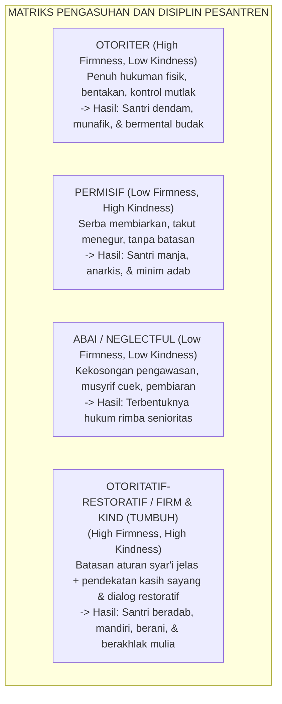

# P2-01-04: PRINSIP DISIPLIN RESTORATIF FIRM AND KIND
## *Integrasi Ketegasan Batasan Syar'i (Firm) dan Kelembutan Kasih Sayang Nabawi (Kind) Tanpa Kompromi Kekerasan*

**Nomor Identifikasi**: `P2-01-04/FIRM-AND-KIND/2026`  
**Domain**: `02 Principles` > `01 Core Principles`  
**Dewan Pakar**: `pakar-disiplin-positif`, `pakar-kuratif-restoratif`, `pakar-bimbingan-konseling`

---

## 📑 DAFTAR ISI ANALITIS

1. [1. Paradoks Disiplin: Membedah Mitos 'Keras vs Lembek'](#1-paradoks-disiplin-membedah-mitos-keras-vs-lembek)
2. [2. Matriks Empat Gaya Pengasuhan (Baumrind & Jane Nelsen)](#2-matriks-empat-gaya-pengasuhan-baumrind--jane-nelsen)
3. [3. Integrasi Turats: Sifat Ar-Rifq (Kelembutan) dalam Hadits Nabawi](#3-integrasi-turats-sifat-ar-rifq-kelembutan-dalam-hadits-nabawi)
4. [4. Anatomi Sikap Firm and Kind dalam Praksis Asrama Pesantren](#4-anatomi-sikap-firm-and-kind-dalam-praksis-asrama-pesantren)
5. [5. Implikasi bagi Standar Penanganan Konflik Harian Musyrif](#5-implikasi-bagi-standar-penanganan-konflik-harian-musyrif)

---

### 1. Paradoks Disiplin: Membedah Mitos 'Keras vs Lembek'

Debat mengenai disiplin di dunia pesantren selama ini kerap terjebak dalam dikotomi biner yang menyesatkan:
* Di satu kubu, ada anggapan bahwa disiplin **harus keras, kejam, dan memakai hukuman fisik** agar santri tidak menjadi manja (*Authoritarian Fallacy*).
* Di kubu lain, reaksi atas kekerasan memunculkan sikap **terlalu lembek, serba membolehkan, dan takut menegur santri** (*Permissive Fallacy*).

Ekosistem TUMBUH menolak kedua kutub ekstrem tersebut. Pendisiplinan yang beradab dan efektif bukanlah memilih antara bersikap keras atau bersikap lembek, melainkan memadukan secara harmonis dua pilar: **Ketegasan Batasan Hukum (*Firmness*)** dan **Kehangatan Kasih Sayang (*Kindness*) secara serentak**.

---

### 2. Matriks Empat Gaya Pengasuhan (Diana Baumrind & Jane Nelsen)

Kajian psikologi perkembangan modern melalui model Diana Baumrind (1971; 1991) dan prinsip *Positive Discipline* Jane Nelsen (2006) membuktikan bahwa hanya gaya **Otoritatif-Restoratif (*Firm and Kind*)** yang mampu menghasilkan anak dengan tingkat regulasi diri (*Self-Regulation*), harga diri (*Self-Esteem*), dan prestasi akademik tertinggi.

* **FIRM (Tegas)**: Menjaga standar aturan dan batasan syar'i secara konsisten. Musyrif tidak pernah berkompromi terhadap pelanggaran moral (seperti ghashab atau memukul), dan memastikan konsekuensi logis 4R ditegakkan tanpa pilih kasih.
* **KIND (Hangat & Lembut)**: Menjaga martabat dan perasaan santri saat menegakkan aturan. Musyrif tidak pernah menghina, tidak mencaci, dan tidak melampiaskan amarah pribadinya.

---

### 3. Integrasi Turats: Sifat Ar-Rifq dalam Hadits Nabawi

Konsep *Firm and Kind* adalah pengejawantahan langsung dari teladan kepemimpinan Rasulullah SAW. Beliau bersabda:

> $$\text{عَنْ عَائِشَةَ رَضِيَ اللَّهُ عَنْهَا عَنِ النَّبِيِّ صَلَّى اللَّهُ عَلَيْهِ وَسَلَّمَ قَالَ: إِنَّ الرِّفْقَ لَا يَكُونُ فِي شَيْءٍ إِلَّا زَانَهُ، وَلَا يُنْزَعُ مِنْ شَيْءٍ إِلَّا شَانَهُ}$$
> 
> *Dari Sayyidah Aisyah RA, dari Nabi SAW bersabda: "Sesungguhnya **kelembutan (*ar-Rifq*)** itu tidaklah berada pada sesuatu melainkan ia akan menghiasinya menjadi indah; dan tidaklah kelembutan itu dicabut dari sesuatu melainkan ia akan menjadikannya buruk dan hina!"* (HR. Muslim no. 2594).

Rasulullah SAW juga menegaskan:
$$\text{إِنَّ اللَّهَ رَفِيقٌ يُحِبُّ الرِّفْقَ، وَيُعْطِي عَلَى الرِّفْقِ مَا لَا يُعْطِي عَلَى الْعُنْفِ}$$
*"Sesungguhnya Allah Maha Lembut dan mencintai kelembutan; dan Dia memberikan pahala serta keberhasilan atas kelembutan suatu hal yang tidak pernah Dia berikan atas kekerasan!"* (HR. Muslim no. 2593).

---

### 4. Anatomi Sikap Firm and Kind dalam Praksis Asrama Pesantren

Bagaimana sikap *Firm and Kind* dipraktikkan saat santri melanggar aturan shalat subuh?

| Elemen Tindakan | Contoh Sikap Otoriter (Salah) | Contoh Sikap Permisif (Salah) | Contoh Sikap FIRM & KIND (TUMBUH) |
| :--- | :--- | :--- | :--- |
| **Penyampaian Nada Bicara** | Membentak dengan suara menggelegar dari pintu kamar. | Membiarkan santri tidur karena kasihan lelah. | Mengucap salam hangat, menyentuh pundak santri dengan lembut, nada suara tegas dan tenang. |
| **Bahasa yang Digunakan** | *"Bangun anak malas! Mau jadi apa kamu kalau subuh saja kesiangan?!"* | *"Ya sudah tidur saja, nanti ustadz izinkan."* | *"Akhi Zaid, waktu subuh sudah masuk. Allah memanggil kita. Mari berwudhu bersama ustadz."* |
| **Respon jika Masbuq** | Memukul betis dengan rotan atau push-up di halaman. | Tidak ada evaluasi apapun. | Menunaikan shalat subuh, lalu duduk berdua membicarakan penyebab begadang dan menyepakati restitusi logis. |

---

### 5. Implikasi bagi Standar Penanganan Konflik Harian Musyrif

1. **Aturan 'Connection Before Correction'**: Musyrif dilarang memberikan teguran keras sebelum membangun jembatan koneksi emosional dan rasa aman dengan santri.
2. **Ketenangan Emosi Pendidik (*Emotional Self-Regulation*)**: Musyrif dilarang menangani pelanggaran santri saat dirinya sedang dalam keadaan marah memuncak (*Ghadhab*). Musyrif wajib mengambil wudhu atau jeda jeda 5 menit terlebih dahulu.
3. **Penyepakatan Konsekuensi Restoratif**: Mengajak santri menyepakati konsekuensi logis perbaikan yang mendidik, menjaga martabat, dan memulihkan ukhuwah.
