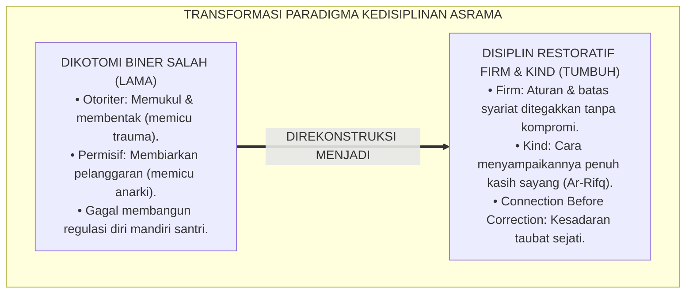
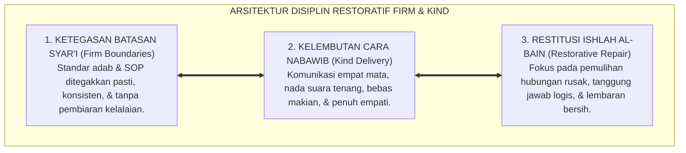
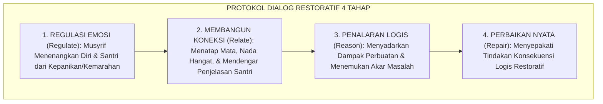
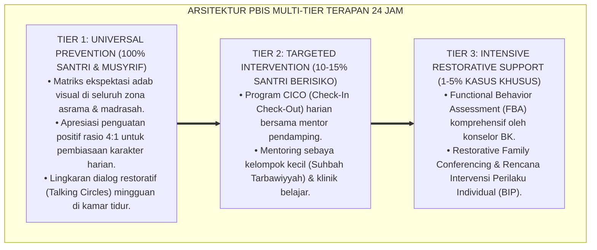

# P2-01-04: PRINSIP DISIPLIN RESTORATIF FIRM AND KIND (FIRM & KIND RESTORATIVE DISCIPLINE)
## *Monograf Riset Akademik: Integrasi Ketegasan Batasan Syar'i (Firm) dan Kelembutan Nabawi (Kind), Tipologi Kuadran Diana Baumrind, Prinsip Connection Before Correction, Serta Resolusi Restoratif Ishlah al-Bain di Pesantren 24 Jam*

**Nomor Identifikasi**: `P2-01-04/MONOGRAF-RISET-FIRM-AND-KIND/2026`  
**Domain**: `02 Principles` > `01 Core Principles` (Prinsip Utama 04: *Firm & Kind Restorative Discipline*)  
**Klasifikasi Naskah**: *Academic Research Monograph* (Monograf Riset Akademik Prinsip Baku)  
**Rumpun Disiplin Pengkaji**: Disiplin Positif & Psikologi Pengasuhan (*Authoritative Parenting*), Keadilan Restoratif Pesantren (*Ishlah al-Bain*), Bimbingan Konseling Islam, Neurosains Regulasi Emosi, Manajemen Konflik Asrama  

---

> ### 💡 INTISARI EKSEKUTIF (EXECUTIVE SUMMARY)
>
> * **Kelemahan Paradigma Lama: Jebakan Dikotomi Biner (Otoriter vs Permisif):**  
>   Banyak pengasuh terjebak dalam mitos bahwa pilihan mendidik hanya dua: **Keras Memukul / Membentak (Otoriter)** atau **Lembek Membiarkan Pelanggaran (Permisif)**. Pendekatan otoriter melahirkan trauma dan kemunafikan, sedangkan pendekatan permisif melahirkan anarki dan hilangnya adab santri.
> * **Inovasi Konseptual: Sintesis Firm and Kind & Protokol Connection Before Correction:**  
>   TUMBUH memadukan **Ketegasan Syariat (*Firmness*)** dalam menegakkan standar aturan tanpa kompromi dengan **Kelembutan Kasih Sayang (*Kindness/Ar-Rifq*)** dalam cara penyampaian (HR. Muslim No. 2593). Mengintegrasikan teori *Authoritative Parenting* Diana Baumrind dan *Positive Discipline* Jane Nelsen melalui kaidah emas: *"Bangun koneksi batin dan regulasi emosi terlebih dahulu sebelum menegakkan koreksi konsekuensi logis (Connection Before Correction)"*.
> * **Formulasi Operasional & Pembuktian Lapangan:**  
>   Monograf ini menguraikan matriks empat kuadran pengasuhan, matriks perbandingan respon kasus asrama, protokol dialog restoratif 4 tahap (*Connection-Before-Correction Protocol*), dan etika resolusi damai (*Ishlah al-Bain*).

---

## 📑 DAFTAR ISI MONOGRAF

- [BAB I: LANDASAN TEORETIS & DISKURSUS KRITIS](#bab-i-landasan-teoretis--diskursus-kritis)
  - [1. Latar Belakang Masalah: Kritik atas Kesesatan Dikotomi Biner Otoriter vs Permisif](#1-latar-belakang-masalah-kritik-atas-kesesatan-dikotomi-biner-otoriter-vs-permisif)
  - [2. Eksegesis Turats Doktrin Ar-Rifq: Hadits Kelembutan dalam Segala Perkara (HR. Muslim No. 2593–2594)](#2-eksegesis-turats-doktrin-ar-rifq-hadits-kelembutan-dalam-segala-perkara-hr-muslim-no-25932594)
  - [3. Konvergensi Psikologi Pengasuhan: Tipologi Diana Baumrind & Positive Discipline Jane Nelsen](#3-konvergensi-psikologi-pengasuhan-tipologi-diana-baumrind--positive-discipline-jane-nelsen)
  - [4. Neurosains Regulasi Emosi: Mengapa Amarah Mematikan Fungsi Korteks Prefrontal Santri](#4-neurosains-regulasi-emosi-mengapa-amarah-mematikan-fungsi-korteks-prefrontal-santri)
  - [5. Kasuistika Lapangan: Kasus Perkelahian Santri di Kamar & Resolusi Restoratif Terpadu](#5-kasuistika-lapangan-kasus-perkelahian-santri-di-kamar--resolusi-restoratif-terpadu)
- [BAB II: FORMULASI KONSEPTUAL & PEMBAHASAN MENDALAM](#bab-ii-formulasi-konseptual--pembahasan-mendalam)
  - [1. Eksplanasi Teoretis Prinsip Disiplin Restoratif Firm and Kind Ekosistem TUMBUH](#1-eksplanasi-teoretis-prinsip-disiplin-restoratif-firm-and-kind-ekosistem-tumbuh)
  - [2. Matriks Empat Kuadran Pengasuhan & Dampak Perkembangan Santri](#2-matriks-empat-kuadran-pengasuhan--dampak-perkembangan-santri)
  - [3. Matriks Komparasi Respon Kasus Asrama: Otoriter vs Permisif vs Firm and Kind](#3-matriks-komparasi-respon-kasus-asrama-otoriter-vs-permisif-vs-firm-and-kind)
  - [4. Protokol Operasional Dialog Restoratif 4 Tahap (Connection-Before-Correction Protocol)](#4-protokol-operasional-dialog-restoratif-4-tahap-connection-before-correction-protocol)
  - [5. Diskusi Filosofis Mendalam & Implikasi bagi Masa Depan Peradaban Pendidikan Islam](#5-diskusi-filosofis-mendalam--implikasi-bagi-masa-depan-peradaban-pendidikan-islam)
- [BAB III: KESIMPULAN & APARATUS AKADEMIS](#bab-iii-kesimpulan--aparatus-akademis)
  - [1. Tabel Sintesis Temuan Riset Disiplin Restoratif Firm and Kind](#1-tabel-sintesis-temuan-riset-disiplin-restoratif-firm-and-kind)
  - [2. Daftar Pustaka Akademis & Rujukan Turats Primer](#2-daftar-pustaka-akademis--rujukan-turats-primer)
  - [3. Catatan Kaki Akademis (Footnotes)](#3-catatan-kaki-akademis-footnotes)
  - [4. Glosarium Istilah Ilmiah & Turats Firm and Kind](#4-glosarium-istilah-ilmiah--turats-firm-and-kind)

---

# BAB I: LANDASAN TEORETIS & DISKURSUS KRITIS

---

### 1. Latar Belakang Masalah: Kritik atas Kesesatan Dikotomi Biner Otoriter vs Permisif

Perdebatan mengenai tata tertib pesantren kerap terjebak dalam **Kesesatan Dilema Palsu (*The False Binary Dilemma*)**:
* **Kubu Otoriter-Represif**: Meyakini bahwa wibawa pesantren hanya bisa tegak jika santri dipukul, diteriaki, dan ditakut-takuti. Dampaknya: santri mengalami trauma, dendam bawah sadar, dan melakukan pelanggaran sembunyi-sembunyi saat tidak diawasi.
* **Kubu Permisif-Abai**: Menolak kekerasan namun membiarkan pelanggaran adab tanpa teguran yang jelas karena takut dianggap melanggar HAM. Dampaknya: asrama menjadi kacau, santri kehilangan batasan adab, dan terjadi anarki sosial.
* **Keniscayaan Disiplin Restoratif Firm and Kind**: Islam mengajarkan ketegasan aturan yang dibungkus dengan kelembutan kasih sayang: tidak ada kekerasan fisik, namun tidak ada pembiaran atas pelanggaran (*Zero Violence, Zero Neglect*).[^1]



---

### 2. Eksegesis Turats Doktrin Ar-Rifq: Hadits Kelembutan dalam Segala Perkara (HR. Muslim No. 2593–2594)

Rasulullah ﷺ meletakkan hukum universal kelembutan dalam pendidikan:

$$\text{إِنَّ الرِّفْقَ لَا يَكُونُ فِي شَيْءٍ إِلَّا زَانَهُ، وَلَا يُنْزَعُ مِنْ شَيْءٍ إِلَّا شَانَهُ}$$

*"**Sesungguhnya kelembutan (Ar-Rifq) itu tidaklah berada pada sesuatu melainkan akan menjadikannya indah, dan tidaklah kelembutan itu dicabut dari sesuatu melainkan akan membuatnya menjadi buruk/cacat**."* (HR. Muslim No. 2594).[^2]

Imam Al-Ghazali (*Ihya' 'Ulumiddin*) menguraikan bahwa obat jiwa yang paling mujarab adalah bimbingan yang lembut: pendidik yang mengobati akhlak muridnya dengan kekerasan ibarat tabib yang mengobati luka bernanah dengan racun yang membakar.[^3]

---

### 3. Konvergensi Psikologi Pengasuhan: Tipologi Diana Baumrind & Positive Discipline Jane Nelsen

Sains pengasuhan modern memvalidasi keunggulan model otoritatif:
* **Diana Baumrind** (1971; 1991) membagi pola asuh ke dalam 4 kuadran: *Authoritarian* (Tuntutan tinggi, respon rendah), *Permissive* (Tuntutan rendah, respon tinggi), *Neglectful* (Tuntutan rendah, respon rendah), dan **Authoritative** (Tuntutan tinggi, respon tinggi). Pola *Authoritative* melahirkan anak yang paling mandiri, matang emosi, dan berakhlak mulia.
* **Jane Nelsen** (2006) dalam *Positive Discipline* menegaskan rumus **Firm and Kind**: ketegasan menghormati kebutuhan situasi dan aturan, sedangkan kelembutan menghormati martabat sang anak.[^4]

---

### 4. Neurosains Regulasi Emosi: Mengapa Amarah Mematikan Fungsi Korteks Prefrontal Santri

Neurosains kognitif membuktikan bahwa saat santri dibentak atau dipukul:
* Sirkuit **Amigdala** santri membajak otak (*Amygdala Hijack*), memicu respon bertahan hidup (*Fight, Flight, or Freeze*), dan menonaktifkan fungsi berpikir logis di **Korteks Prefrontal (PFC)**.
* Akibatnya, santri tidak mampu merenungkan kesalahannya secara bijak, melainkan hanya memikirkan bagaimana cara melarikan diri atau membalas dendam.
* Melalui pendekatan tenang (*Kind*), korteks prefrontal santri tetap aktif sehingga mampu menyerap pembelajaran moral secara mendalam.[^5]

---

### 5. Kasuistika Lapangan: Kasus Perkelahian Santri di Kamar & Resolusi Restoratif Terpadu

* **Studi Kasus: Perselisihan Fisik Santri Akibat Saling Ejek di Kamar Tidur**  
  * **Dilema**: Dua santri kelas 8 berkelahi di kamar hingga salah satunya lebam; pola lama biasanya menghukum keduanya mencabuti rumput seharian atau menjemurnya di lapangan.
  * **Resolusi Restoratif TUMBUH**: Musyrif menerapkan protokol *Firm and Kind*: (1) **De-eskalasi**: Memisahkan keduanya, memberikan minum air putih, dan menenangkan nafas (*Regulate*); (2) **Connection**: Mendengarkan akar perasaan sakit hati masing-masing tanpa memotong (*Relate*); (3) **Reason**: Menjelaskan dampak bahaya kekerasan terhadap ukhuwah (*Reason*); (4) **Restitution**: Keduanya menyepakati aksi perbaikan nyata: saling memaafkan, membersihkan kamar tidur bersama selama 3 hari, dan membuat komitmen tertulis di logbook PBIS. Hubungan keduanya pulih rukun dan menjadi sahabat karib.[^6]

---

# BAB II: FORMULASI KONSEPTUAL & PEMBAHASAN MENDALAM

---

### 1. Eksplanasi Teoretis Prinsip Disiplin Restoratif Firm and Kind Ekosistem TUMBUH

Ekosistem TUMBUH merumuskan disiplin restoratif ke dalam **Arsitektur Tiga Sayap Disiplin Beradab (*Arkan at-Ta'dib ar-Rafi'*)**:



#### 🔬 Pembahasan Mendalam Tiga Sayap:
1. **Sayap Ketegasan (*Firm*)**: Menjaga integritas hukum pondok agar santri memahami batasan halal-haram secara jelas.[^7]
2. **Sayap Kelembutan (*Kind*)**: Menjaga keterhubungan hati santri agar nasihat masuk menembus lubuk kalbu.[^8]
3. **Sayap Restitusi (*Ishlah*)**: Melatih santri memperbaiki kesalahan secara nyata (*Restitution*) tanpa menyisakan trauma batin.[^9]

---

### 2. Matriks Empat Kuadran Pengasuhan & Dampak Perkembangan Santri

```
               TINGGI RESPONSIF (KASIH SAYANG & EMPATI)
                                  ▲
                                  │
         PERMISIF                 │         OTORITATIF (FIRM & KIND)
   (Tuntutan Rendah, Kasih Tinggi)│     (Tuntutan Tinggi, Kasih Tinggi)
   • Santri manja & egois         │     • Santri mandiri, beradab,
   • Kurang disiplin & kendali    │       tangguh, & regulasi diri kuat
                                  │
──────────────────────────────────┼──────────────────────────────────► TINGGI KENDALI
                                  │                                    (STANDAR ATURAN)
         PENGABAIAN (NEGLECTFUL)  │         OTORITER (PUNITIVE)
   (Tuntutan Rendah, Kasih Rendah)│     (Tuntutan Tinggi, Kasih Rendah)
   • Santri apatis & liar         │     • Santri takut, trauma,
   • Krisis identitas moral       │       munafik, & agresif
                                  │
```

---

### 3. Matriks Komparasi Respon Kasus Asrama: Otoriter vs Permisif vs Firm and Kind

| Kasus Pelanggaran | Respon Otoriter (Keras Rusak) | Respon Permisif (Lembek Rusak) | **Respon Firm and Kind (TUMBUH)** |
| :--- | :--- | :--- | :--- |
| **Terlambat Bangun Subuh**| Disiram air dingin & dipukul rotan.| Dibiarkan tidur terus tanpa ditegur.| Dibangunkan dengan usapan hangat, wudhu bersama, & evaluasi jam tidur malam.|
| **Membuang Sampah Sembarangan**| Diteriaki "jorok" di depan kamar.| Musyrif yang memungutkan diam-diam.| Dihentikan dengan santun & diminta memungut sampah serta merapikan tong sampah.|
| **Berkata Kasar ke Teman**| Ditampar bibirnya di depan kelas.| Ditertawakan dianggap bercanda biasa.| Dialog empat mata, restitusi minta maaf tulus, & refleksi kata mulia.|

---

### 4. Protokol Operasional Dialog Restoratif 4 Tahap (Connection-Before-Correction Protocol)

TUMBUH menetapkan **Protokol Dialog Restoratif 4 Tahap**:



Protokol ini menjamin tegaknya disiplin tanpa melukai kehormatan jiwa santri.[^10]

---

### 5. Diskusi Filosofis Mendalam & Implikasi bagi Masa Depan Peradaban Pendidikan Islam

Prinsip *Firm and Kind* ini membawa pencerahan agung bagi peradaban:

* **Membuktikan Bahwa Islam Adalah Agama Keadilan dan Rahmat**:  
  Pendidikan Islam memadukan ketegasan hukum Allah dengan kelembutan akhlak kenabian, menghasilkan generasi yang berprinsip kokoh namun berhati lembut.
* **Menghapus Tradisi Dendam dan Kekerasan dalam Pendidikan**:  
  Pesantren bertransformasi menjadi oase kedamaian di mana perselisihan diselesaikan melalui musyawarah damai (*Ishlah*) yang menyatukan kembali hati yang retak.
* **Melahirkan Generasi Santri yang Memiliki Kedewasaan Regulasi Diri**:  
  Santri belajar berdisiplin bukan karena takut pada pengawasan manusia, melainkan karena kesadaran akal dan dorongan cinta kepada Allah SWT (*Rahmatan lil 'Alamin*).[^11]

---

---

### Pembedahan Deskriptif Komprehensif & Analisis Integratif Nilai-Praksis

Penerapan konsep **P2-01-04: PRINSIP DISIPLIN RESTORATIF FIRM AND KIND (FIRM & KIND RESTORATIVE DISCIPLINE)** di ekosistem pesantren berbasis sistem TUMBUH memerlukan pemahaman multidimensional yang memadukan khazanah turats syariat dan konsensus sains pendidikan modern:

#### A. Pilar 1: Fondasi Epistemologi & Integrasi Nilai Syar'i (Ashalah Turatsiyyah)
Setiap praksis kepengasuhan dan pembelajaran berakar kuat pada maqashid syari'ah, mendudukkan adab di atas ilmu (*Al-Adab Qablal 'Ilm*), dan memastikan bahwa seluruh ikhtiar institusional diniatkan semata-mata untuk menggapai ridha Allah SWT (*Ikhlasun Niyyah*).

#### B. Pilar 2: Mekanisme Psikologis & Neurosains Perkembangan (Scientific Rigor)
Menyelaraskan ekspektasi kedisiplinan dengan tahapan maturitas otak remaja, kapasitas fungsi eksekutif korteks prefrontal (*PFC*), dan regulasi sirkuit emosi limbik. Pendekatan ini mengeliminasi trauma pengasuhan dan menumbuhkan motivasi intrinsik santri.

#### C. Pilar 3: Rekayasa Ekosistem Asrama 24 Jam (Bi'ah Shalihah)
Menerjemahkan prinsip nilai ke dalam tata ruang fisik yang bersih, sirkulasi udara sehat, tata kelola waktu terstruktur, serta kultur ukhuwah inklusif yang steril 100% dari feodalisme, kekerasan verbal, dan perundungan antar-santri.

#### D. Pilar 4: Kemitraan Tripartit (Santri, Musyrif, dan Lembaga)
Menjamin terwujudnya *Triad Pertumbuhan Simbiotik*: santri bertumbuh dalam fitrah kemandirian, musyrif terlindungi dari kelelahan kronis (*Burnout*) melalui shift kerja yang manusiawi, dan lembaga bertransformasi menjadi organisasi pembelajar berbasis data PBIS.

---

### Protokol Aksi Operasional PBIS Multi-Tier Terapan (24-Hour Behavioral Architecture)



---

# BAB III: KESIMPULAN & APARATUS AKADEMIS

---

### 1. Tabel Sintesis Temuan Riset Disiplin Restoratif Firm and Kind

| Dimensi Parameter | Mazhab Otoriter Retributif | Mazhab Permisif Laissez-Faire | **Disiplin Restoratif Firm & Kind TUMBUH** | Landasan Rujukan Primer | Implikasi Praksis Lapangan |
| :--- | :--- | :--- | :--- | :--- | :--- |
| **Fokus Tindakan** | Menghukum pelaku agar menderita.| Membiarkan demi menghindari konflik.| **Memulihkan Tanggung Jawab & Hubungan.**| HR. Muslim No. 2594; Zehr (2002).| Dialog empat mata & restitusi nyata. |
| **Pola Relasi** | Dominasi rasa takut & ancaman.| Ketidakjelasan batas & abai.| **Connection Before Correction (Otoritatif).**| Baumrind (1991); Jane Nelsen (2006).| Hangat, empatik, & batas ditegakkan. |
| **Kondisi Otak** | Amigdala terancam (Fight/Flight).| Amigdala tidak terarah.| **Korteks Prefrontal Aktif Belajar Logis.**| Perry & Szalavitz (2006); Siegel.| Refleksi moral & regulasi diri sadar. |
| **Tujuan Akhir** | Kepatuhan semu karena takut.| Anarki & kehilangan adab.| **Kematangan Adab & Taubat Nasuha Sejati.**| QS. Asy-Syura: 40; Al-Ghazali.| Karakter adab mandiri seumur hidup. |
| **Hasil Hubungan** | Hubungan guru-santri renggang.| Santri meremehkan wibawa guru.| **Ukhuwah Kokoh, Rukun, & Penuh Takzim.**| QS. Ali 'Imran: 159; Al-Attas (1980).| Mahabbah guru-santri abadi berkah. |

---

### 2. Daftar Pustaka Akademis & Rujukan Turats Primer

1. **Al-Qur'an al-Karim wa Tarjamatu Ma'anihi**.
2. **Muslim bin al-Hajjaj an-Naisaburi**. (1427 H). *Shahih Muslim*. Riyadh: Dar Thayyibah.
3. **Al-Bukhari, Abu Abdillah Muhammad bin Isma'il**. (1422 H). *Shahih al-Bukhari*. Kairo: Dar Thawq an-Najah.
4. **Al-Ghazali, Abu Hamid Muhammad bin Muhammad**. (2011). *Ihya' 'Ulumiddin* (Kitab Riyadhatin Nafs wa Tahdzib al-Akhlaq). Beirut: Dar al-Ma'rifah.
5. **Asy'ari, Muhammad Hasyim**. (1415 H). *Adab al-'Alim wal-Muta'allim*. Jombang: Maktabah At-Turats Al-Islami.
6. **Al-Attas, Syed Muhammad Naquib**. (1980). *The Concept of Education in Islam*. Kuala Lumpur: ABIM.
7. **Baumrind, D.**. (1971). *Current patterns of parental authority*. Developmental Psychology Monographs, 4(1), 1–103.
8. **Baumrind, D.**. (1991). *The influence of parenting style on adolescent competence and substance use*. Journal of Early Adolescence, 11(1), 56–95.
9. **Nelsen, J.**. (2006). *Positive Discipline* (Rev. ed.). New York: Ballantine Books.
10. **Zehr, H.**. (2002). *The Little Book of Restorative Justice*. Intercourse: Good Books.
11. **Perry, B. D., & Szalavitz, M.**. (2006). *The Boy Who Was Raised as a Dog*. New York: Basic Books.
12. **Siegel, D. J., & Bryson, T. P.**. (2014). *No-Drama Discipline: The Whole-Brain Way to Calm the Chaos and Nurture Your Child's Developing Mind*. New York: Bantam.

---

### 3. Catatan Kaki Akademis (*Footnotes*)

[^1]: Riset Prinsip Disiplin Restoratif Firm and Kind TUMBUH, *Kritik atas Dikotomi Biner Otoriter vs Permisif*, 2026.  
[^2]: *Shahih Muslim*, Kitab al-Birr wash-Shilah wal-Adab, Hadits No. 2593 & 2594.  
[^3]: Al-Ghazali, *Ihya' 'Ulumiddin*, Jilid 3, Kitab *Riyadhatin Nafs*, hlm. 60–85.  
[^4]: Baumrind, D. (1991), *Journal of Early Adolescence*, hlm. 56–95; Nelsen, J. (2006), *Positive Discipline*, hlm. 15–48.  
[^5]: Perry, B. D., & Szalavitz, M. (2006), *The Boy Who Was Raised as a Dog*, hlm. 80–115; Siegel, D. J., & Bryson, T. P. (2014), *No-Drama Discipline*, hlm. 35–70.  
[^6]: Dokumentasi Mediasi dan De-eskalasi Restoratif Konflik Asrama PBIS TUMBUH, 2026.  
[^7]: Master Framework Penegakan Batasan Syariat Asrama PBIS TUMBUH, 2026.  
[^8]: HR. Muslim No. 2593; Kaidah ar-Rifq fit-Ta'dib.  
[^9]: Zehr, H. (2002), *The Little Book of Restorative Justice*, hlm. 25–55.  
[^10]: Standar Operasional Prosedur Dialog Restoratif 4 Tahap (Connection Before Correction) TUMBUH, 2026.  
[^11]: Deklarasi Pemuliaan Disiplin Kasih Sayang Nabawiyyah Dewan Riset Epistemologi Ekosistem TUMBUH, 2026.

---

### 4. Glosarium Istilah Ilmiah & Turats Firm and Kind

1. **Firm and Kind (التَّشَدُّدُ فِي الْحَقِّ مَعَ اللِّينِ)**: Prinsip kedisiplinan yang memadukan ketegasan batasan aturan yang adil (*Firm*) dengan kelembutan kasih sayang dalam penyampaian (*Kind*).
2. **Ar-Rifq (الرِّفْقُ)**: Kelembutan, kelapangan dada, dan kesantunan dalam membimbing jiwa yang menjadi perhiasan dalam setiap urusan pendidikan.
3. **Connection Before Correction**: Kaidah pedagogis yang mewajibkan pendidik membangun keterhubungan batin dan menenangkan emosi anak sebelum menegakkan konsekuensi koreksi.
4. **Authoritative Parenting**: Gaya pengasuhan Diana Baumrind yang mengombinasikan standar tuntutan kedisiplinan yang tinggi dengan kehangatan responsif yang melimpah.
5. **Amygdala Hijack**: Kondisi pembajakan emosional ketika otak reptil memicu reaksi defensif akibat bentakan atau ancaman, sehingga mematikan daya nalar logis.
6. **Ishlah al-Bain (إِصْلَاحُ ذَاتِ الْبَيْنِ)**: Rekonsiliasi restoratif untuk mendamaikan perselisihan, memulihkan ukhuwah, dan menghapus dendam batin.
7. **Restorative Restitution**: Tindakan perbaikan nyata yang disepakati oleh pelaku pelanggaran untuk memperbaiki dampak kerugian yang ditimbulkannya.
8. **False Binary Dilemma**: Kesesatan berpikir yang mengasumsikan bahwa mendidik santri hanya memiliki dua pilihan ekstrem: memukul keras atau membiarkan bebas.
9. **Prefrontal Cortex (PFC)**: Bagian otak depan yang bertanggung jawab atas pengendalian diri, pertimbangan moral, dan pengambilan keputusan bijak.
10. **Insan Adabi (الإِنْسَانُ الأَدَبِيُّ)**: Profil santri yang memiliki kematangan adab sejati, mampu meregulasi emosi secara mandiri, dan mencintai persaudaraan.
