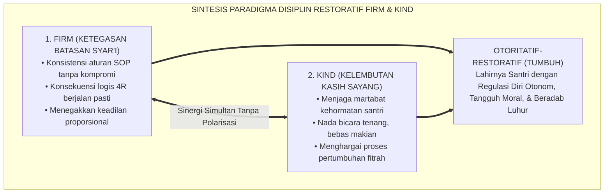
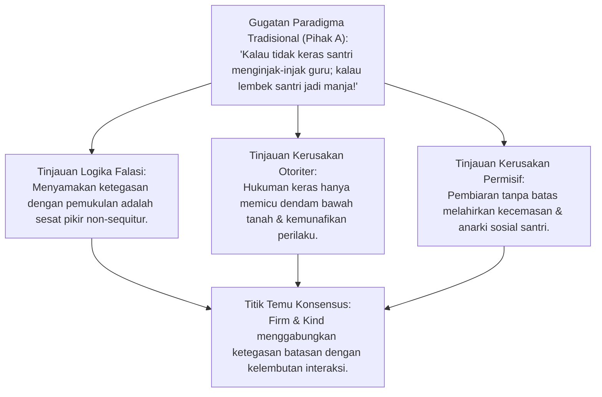
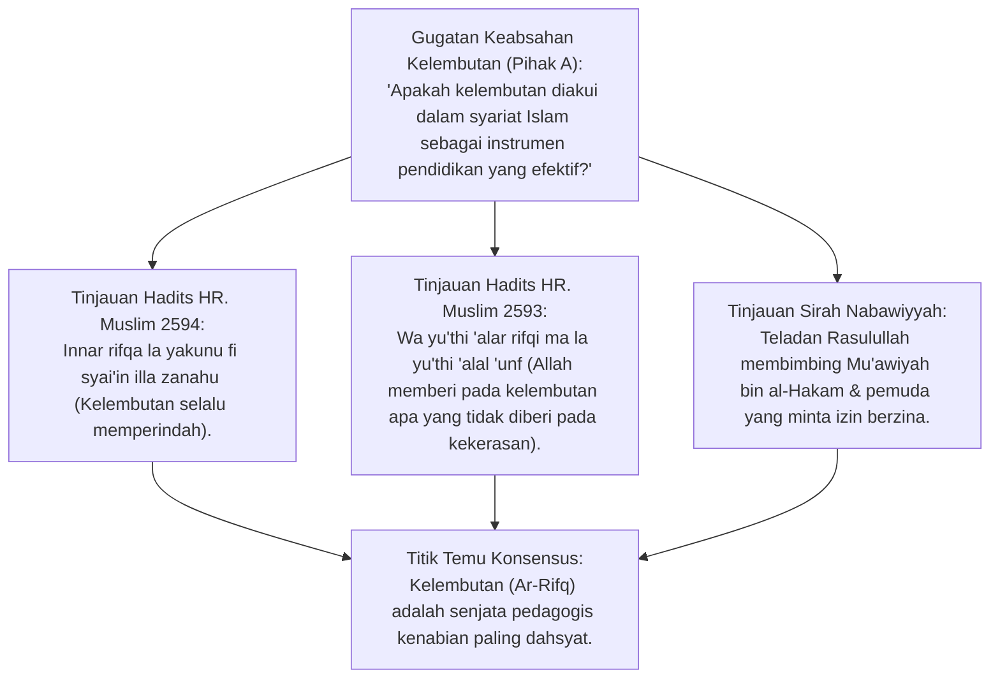
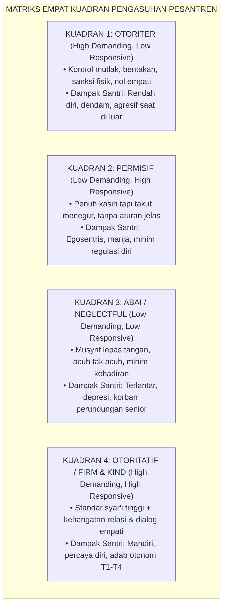
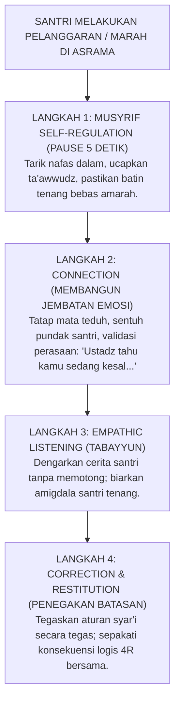
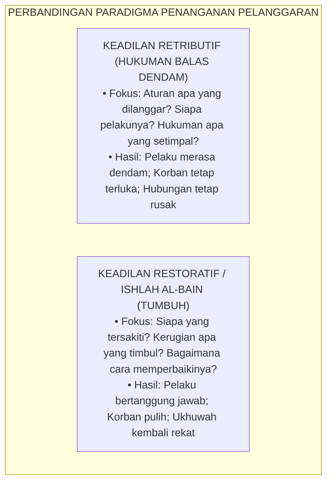
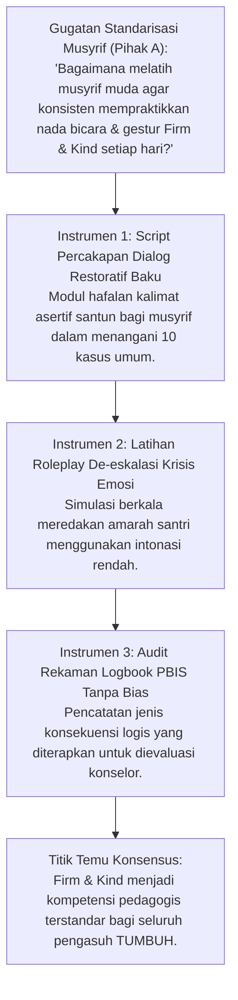
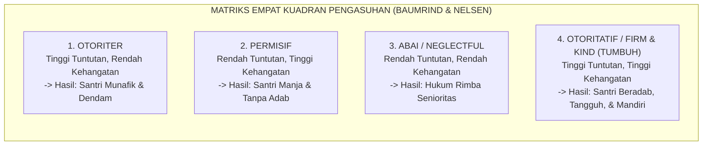
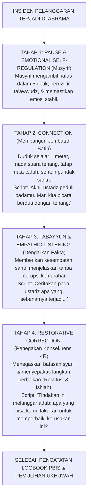

# P2-01-04: PRINSIP DISIPLIN RESTORATIF FIRM AND KIND
## *Monograf Terpadu: Integrasi Ketegasan Batasan Syar'i (Firm) dan Kelembutan Nabawi (Kind), Tipologi 4 Kuadran Baumrind, Prinsip Connection Before Correction, & Resolusi Restoratif Ishlah al-Bain*

**Nomor Identifikasi**: `P2-01-04/MONOGRAF-TERPADU-FIRM-AND-KIND/2026`  
**Domain**: `02 Principles` > `01 Core Principles`  
**Klasifikasi Naskah**: *Comprehensive Integrated Monograph* (Monograf Akademis & Rumusan Baku Terpadu)  
**Rumpun Disiplin Pengkaji**: Disiplin Positif & Psikologi Pengasuhan (*Authoritative Parenting*), Keadilan Restoratif Pesantren (*Ishlah al-Bain*), Bimbingan Konseling Islam, Neurosains Regulasi Emosi, Manajemen Konflik Asrama  

---

> ### 💡 INTISARI PRAKTIS (3 MENIT PAHAM UNTUK ASATIDZ & MUSYRIF)
>
> * **Bongkar Mitos: Disiplin TIDAK SAMA dengan Menghukum/Memukul!**  
>   Banyak yang salah paham mengira mendidik santri pilihannya hanya dua: **Keras Memukul (Otoriter)** atau **Lembek Membiarkan (Permisif)**. Kedua cara ini salah besar!
> * **Solusi Baku TUMBUH: Formula FIRM & KIND (Tegas Sekaligus Hangat):**  
>   * **FIRM (Tegas)**: Aturan syariat dan SOP pondok ditegakkan tanpa kompromi, tidak dibiarkan, dan konsekuensi logisnya pasti berjalan.  
>   * **KIND (Hangat & Santun)**: Cara menyampaikannya penuh kasih sayang, tidak membentak, tidak memaki, dan tidak mempermalukan santri.
> * **Rumus Ajaib Menegur Santri: *"Connection Before Correction"***  
>   Jangan langsung menghakimi atau memarahi! Bangun koneksi batin dulu (tepuk pundaknya lembut, tatap matanya, dengarkan alasannya), lalu tegakkan konsekuensi perbaikan (*Restoratif*) secara tenang dan berwibawa.

---

## 📑 DAFTAR ISI MONOGRAF

- [BAGIAN I: RISET DOKTRIN PENGASUHAN, DIALEKTIKA INKUIRI, & KASUISTIKA LAPANGAN](#bagian-i-riset-doktrin-pengasuhan-dialektika-inkuiri--kasuistika-lapangan)
  - [1. Kerangka Metodologi Teori Pengasuhan Otoritatif-Restoratif](#1-kerangka-metodologi-teori-pengasuhan-otoritatif-restoratif)
  - [2. Inkuiri 1: Dekonstruksi Dikotomi Biner "Keras vs Lembek" — Mengapa Keduanya Merusak Jiwa Santri?](#2-inkuiri-1-dekonstruksi-dikotomi-biner-keras-vs-lembek--mengapa-keduanya-merusak-jiwa-santri)
  - [3. Inkuiri 2: Eksegesis Hadits Kelembutan (Ar-Rifq) HR. Muslim 2593–2594](#3-inkuiri-2-eksegesis-hadits-kelembutan-ar-rifq-hr-muslim-25932594)
  - [4. Inkuiri 3: Tipologi Empat Gaya Pengasuhan Diana Baumrind & Jane Nelsen](#4-inkuiri-3-tipologi-empat-gaya-pengasuhan-diana-baumrind--jane-nelsen)
  - [5. Inkuiri 4: Protokol Emas "Connection Before Correction" & Neurosains Regulasi Diri](#5-inkuiri-4-protokol-emas-connection-before-correction--neurosains-regulasi-diri)
  - [6. Inkuiri 5: Resolusi Restoratif (Ishlah al-Bain) vs Pembalasan Retributif](#6-inkuiri-5-resolusi-restoratif-ishlah-al-bain-vs-pembalasan-retributif)
  - [7. Inkuiri 6: Translasi Sikap Firm and Kind ke Manajemen Penanganan Pelanggaran Asrama 24 Jam](#7-inkuiri-6-translasi-sikap-firm-and-kind-ke-manajemen-penanganan-pelanggaran-asrama-24-jam)
- [BAGIAN II: KODIFIKASI BAKU HASIL RISET & KESIMPULAN FORMAL](#bagian-ii-kodifikasi-baku-hasil-riset--kesimpulan-formal)
  - [1. Deklarasi Doktrin Baku: Prinsip Disiplin Restoratif Firm and Kind](#1-deklarasi-doktrin-baku-prinsip-disiplin-restoratif-firm-and-kind)
  - [2. Matriks Empat Kuadran Pengasuhan & Dampak Perkembangan Santri](#2-matriks-empat-kuadran-pengasuhan--dampak-perkembangan-santri)
  - [3. Matriks Perbandingan Respons Kasus Asrama: Otoriter vs Permisif vs Firm & Kind](#3-matriks-perbandingan-respons-kasus-asrama-otoriter-vs-permisif-vs-firm--kind)
  - [4. Protokol Operasional Dialog Restoratif 4 Tahap (Connection-Before-Correction Protocol)](#4-protokol-operasional-dialog-restoratif-4-tahap-connection-before-correction-protocol)
- [BAGIAN III: APARATUS AKADEMIS & APENDIKS](#bagian-iii-aparatus-akademis--apendiks)
  - [1. Tabel Sintesis Hasil Riset Disiplin Restoratif Firm & Kind](#1-tabel-sintesis-hasil-riset-disiplin-restoratif-firm--kind)
  - [2. Daftar Pustaka Akademis & Rujukan Turats Primer](#2-daftar-pustaka-akademis--rujukan-turats-primer)
  - [3. Catatan Kaki Akademis (Footnotes)](#3-catatan-kaki-akademis-footnotes)
  - [4. Glosarium dan Penjelasan Istilah Teknis Disiplin & Restoratif](#4-glosarium-dan-penjelasan-istilah-teknis-disiplin--restoratif)

---

# BAGIAN I: RISET DOKTRIN PENGASUHAN, DIALEKTIKA INKUIRI, & KASUISTIKA LAPANGAN

*Bagian ini memuat proses penyelidikan model pendisiplinan berkeadaban, formalisasi silogisme logika (*qiyas burhani*), pertarungan dialektika multi-perspektif tiga ronde tanpa kata "pakar", telaah hadits ar-Rifq dan ar-Rahmah, teori gaya pengasuhan Diana Baumrind, Positive Discipline Jane Nelsen, studi kasus konflik kamar asrama, dan penarikan konsensus bersama.*

---

### 1. Kerangka Metodologi Teori Pengasuhan Otoritatif-Restoratif

Perdebatan mengenai penegakan disiplin di lingkungan pesantren selama berabad-abad kerap terjebak dalam **Kesesatan Dikotomi Biner (*False Dilemma*)**:
* Di satu kubu ekstrem, terdapat keyakinan bahwa mendidik santri harus dengan **Kekerasan, Bentakan Keras, dan Hukuman Fisik** agar santri menjadi tangguh dan takut berbuat salah (*Authoritarian Fallacy*).
* Di kubu ekstrem lainnya, sebagai reaksi penolakan terhadap kekerasan, muncul sikap **Terlalu Lembek, Membiarkan Pelanggaran, dan Takut Menegur Santri** (*Permissive Fallacy*).

Ekosistem TUMBUH meruntuhkan kedua kutub ekstrem tersebut melalui sintesis **Prinsip Disiplin Restoratif Firm and Kind**:

---

### 2. Inkuiri 1: Dekonstruksi Dikotomi Biner "Keras vs Lembek" — Mengapa Keduanya Merusak Jiwa Santri?

#### 📐 Formalisasi Logika Silogisme (*Qiyas Mantiqi 1*)
* **Premis Mayor (*al-Muqaddimah al-Kubra*)**: Setiap pola pendisiplinan yang ekstrem (baik otoriter represif yang menghancurkan harga diri maupun permisif abai yang membiarkan kezaliman) niscaya merusak kematangan jiwa moral santri dan gagal melahirkan kemandirian adab.
* **Premis Minor (*al-Muqaddimah ash-Shughra*)**: Pola pengasuhan *Firm & Kind* memadukan batasan hukum yang kokoh dengan perlakuan manusiawi yang penuh kasih sayang.
* **Konklusi (*an-Natijah*)**: Maka, doktrin biner "Keras vs Lembek" wajib ditinggalkan dan digantikan dengan Disiplin Restoratif *Firm & Kind*.[^1]

#### 📖 Teks Primer Turats: *Tahdzib al-Akhlaq* Ibnu Miskawaih
Filsuf etika Islam **Ibnu Miskawaih** merumuskan keutamaan adab sebagai titik tengah yang adil:

$$\text{إِنَّ الْفَضِيلَةَ عَدْلٌ وَتَوَسُّطٌ بَيْنَ رَذِيلَتَيْنِ: فَالشَّجَاعَةُ تَوَسُّطٌ بَيْنَ التَّهَوُّرِ وَالْجُبْنِ، وَالْحِلْمُ تَوَسُّطٌ بَيْنَ الْغَضَبِ الْفَاحِشِ وَالْمَهَانَةِ، وَكَذَلِكَ التَّأْدِيبُ: عَدْلٌ بَيْنَ الْقَسْوَةِ الْمُفْسِدَةِ لِلنُّفُوسِ وَالرَّخَاوَةِ الْمُضَيِّعَةِ لِلْحُدُودِ}$$

*"Sesungguhnya keutamaan budi pekerti adalah keadilan dan sikap pertengahan di antara dua keburukan ekstrem: keberanian adalah pertengahan antara nekat membabi-buta dan takut pengecut; kesantunan (*al-Hilm*) adalah pertengahan antara amarah yang keji dan kehinaan diri yang lemah; dan demikian pulalah hakikat pendisiplinan (*at-Ta'dib*): ia adalah keadilan yang berdiri di tengah-tengah antara kekejaman keras yang merusak jiwa anak dan kelembekan lemah yang menyia-nyiakan batasan hukum."*[^2]

#### 🥊 Ronde 1: Menolak Anggapan "Memukul adalah Satu-Satunya Cara Membuat Santri Kapok"
* **Pihak A (Sudut Pandang Retributif Militeristik)**:  
  *"Santri yang bandel tidak akan pernah kapok kalau cuma dinasihati baik-baik. Rotan dan tamparan adalah bahasa yang paling cepat dipahami santri!"*
* **Tinjauan Sudut Pandang Psikologi Perilaku & Neurosains**:  
  Pemukulan fisik hanya menghasilkan **Kepatuhan Semu Karena Takut (*Fear-Induced Compliance*)**. Begitu ustadz yang memukul pergi, santri akan mengulangi pelanggaran tersebut dengan cara yang lebih rapi dan licik. Pemukulan tidak menyalakan fungsi penalaran moral di *Prefrontal Cortex*, melainkan membakar amigdala santri dengan rasa dendam yang menunggu waktu untuk meledak.[^3]

#### 🥊 Ronde 2: Sanggahan Balik Apakah Sikap Kind Akan Membuat Santri Meremehkan Musyrif?
* **Pihak A (Sudut Pandang Wibawa Amarah)**:  
  *"Sanggahan! Jika musyrif selalu tersenyum dan berkata lembut, santri akan meremehkan dan tidak menganggap serius perintah musyrif!"*
* **Tinjauan Sudut Pandang Definisi Firm**:  
  Kelembutan (*Kindness*) berkaitan dengan **Cara Memperlakukan Insan (*How We Treat the Person*)**, sedangkan ketegasan (*Firmness*) berkaitan dengan **Penegakan Standar Aturan (*How We Uphold the Boundary*)**. Musyrif yang *Firm & Kind* tidak pernah membiarkan pelanggaran: ia tetap mewajibkan santri membersihkan lantai yang dikotori hingga tuntas, namun ia menyampaikannya dengan tatapan teduh, intonasi tenang, dan tanpa kata makian.[^4]

#### 🥊 Ronde 3: Sanggahan Pamungkas Mengeliminasi Gaya Pengasuhan Abai (Neglectful)
* **Pihak A (Sudut Pandang Kemudahan Musyrif)**:  
  *"Mengapa musyrif tidak membiarkan saja santri mengatur dirinya sendiri di kamar asrama tanpa perlu diawasi ketat?"*
* **Resolusi Sudut Pandang Bahaya Vakum Otoritas**:  
  Pengasuhan abai (*Neglectful Parenting*) adalah **Penyebab Utama Lahirnya Tirani Senioritas dan Hukum Rimba di Asrama**. Ketika musyrif lepas tangan, santri senior yang berwatak kasar akan mengambil alih kepemimpinan kamar dengan kekerasan. Musyrif *Firm & Kind* senantiasa hadir (*Present & Attuned*) mendampingi kehidupan santri 24 jam.[^5]

> #### 📌 Kasuistika Lapangan 1 & Titik Temu Konsensus
> * **Studi Kasus**: Musyrif A memukul santri yang tidak hafal kosa kata bahasa Arab dengan rotan hingga memar, sedangkan Musyrif B membiarkan santri tidur saat jam mufradat.
> * **Titik Temu Konsensus (*Kalimatun Sawa'*)**: Disepakati bahwa kedua musyrif melakukan malapraktik tarbiyah. Musyrif baru yang *Firm & Kind* membimbing halaqah mufradat dengan metode interaktif, tetap mewajibkan santri menyetorkan hafalan hingga tuntas sebelum jam tidur, namun mendampinginya dengan sabar dan apresiasi.[^6]

---

### 3. Inkuiri 2: Eksegesis Hadits Kelembutan (Ar-Rifq) HR. Muslim 2593–2594

#### 📐 Formalisasi Logika Silogisme (*Qiyas Mantiqi 2*)
* **Premis Mayor (*al-Muqaddimah al-Kubra*)**: Setiap metode pendidikan yang dijamin oleh Rasulullah SAW mendatangkan keberhasilan dan karunia pertolongan Allah yang tidak pernah diberikan kepada metode kekerasan niscaya merupakan metode pendidikan Islam yang paling utama dan wajib dijadikan asas pembinaan.
* **Premis Minor (*al-Muqaddimah ash-Shughra*)**: Hadits-hadits sahih secara qath'i menetapkan bahwa sifat *Ar-Rifq* (kelembutan) mendatangkan kebaikan yang mustahil diraih dengan *Al-'Unf* (kekerasan).
* **Konklusi (*an-Natijah*)**: Maka, prinsip *Kindness* (kelembutan beradab) adalah fondasi syar'i mutlak dalam pendisiplinan santri TUMBUH.[^7]

#### 📖 Teks Primer Shahih Muslim: Keagungan Sifat Ar-Rifq
Dari Ummul Mu'minin **Aisyah** radhiyallahu 'anha, Rasulullah SAW bersabda:

$$\text{عَنْ عَائِشَةَ رَضِيَ اللَّهُ عَنْهَا عَنِ النَّبِيِّ صَلَّى اللَّهُ عَلَيْهِ وَسَلَّمَ قَالَ: إِنَّ الرِّفْقَ لَا يَكُونُ فِي شَيْءٍ إِلَّا زَانَهُ، وَلَا يُنْزَعُ مِنْ شَيْءٍ إِلَّا شَانَهُ}$$

*"Dari Aisyah RA, dari Nabi SAW bersabda: 'Sesungguhnya **kelembutan (*ar-Rifq*)** itu tidaklah berada pada sesuatu melainkan ia akan menghiasinya menjadi indah; dan tidaklah kelembutan itu dicabut dari sesuatu melainkan ia akan menjadikannya buruk dan hina!'."* (HR. Muslim no. 2594).[^8]

Dan beliau SAW menegaskan:
$$\text{إِنَّ اللَّهَ رَفِيقٌ يُحِبُّ الرِّفْقَ، وَيُعْطِي عَلَى الرِّفْقِ مَا لَا يُعْطِي عَلَى الْعُنْفِ وَمَا لَا يُعْطِي عَلَى مَا سِوَاهُ}$$
*"Sesungguhnya Allah Maha Lembut dan mencintai kelembutan; dan Dia memberikan (pahala dan kesuksesan) atas kelembutan suatu hal yang tidak pernah Dia berikan atas kekerasan dan tidak diberikan atas selainnya!"* (HR. Muslim no. 2593).[^9]

#### 🥊 Ronde 1: Membedah Sirah Mu'awiyah bin al-Hakam as-Sulami
* **Tinjauan Pedagogi Kenabian**:  
  Ketika Mu'awiyah berbicara saat shalat berjamaah karena belum tahu hukumnya, para sahabat memelototinya dan menepuk paha mereka. Namun apa respon Rasulullah SAW selesai shalat? Mu'awiyah meriwayatkan: *"Demi ayah dan ibuku, aku tidak pernah melihat seorang guru sebelum beliau maupun sesudahnya yang lebih baik cara mendidiknya daripada beliau! Demi Allah, beliau tidak membentakku, tidak memukulku, dan tidak mencaciku; beliau hanya bersabda dengan lembut: 'Sesungguhnya shalat ini tidak boleh ada di dalamnya ucapan manusia...'"* (HR. Muslim no. 537). Inilah mahakarya kelembutan mendidik.[^10]

#### 🥊 Ronde 2: Sanggahan Balik Bagaimana dengan Hadits Memukul Anak Saat Umur 10 Tahun Jika Tidak Shalat?
* **Pihak A (Sudut Pandang Literalis Hukuman Pukul)**:  
  *"Bukankah ada hadits: 'Pukullah mereka atas shalat ketika berumur 10 tahun'? Mengapa TUMBUH melarang pemukulan fisik?"*
* **Tinjauan Sudut Pandang Fiqh Tarbiyah & Syarat Mukul Syar'i (Ibn Hajar & Al-Ghazali)**:  
  Para fuqaha menetapkan syarat ketat hadits tersebut: (1) Dilakukan setelah anak diajarkan dan diperintahkan shalat selama 3 tahun penuh (365 hari $\times$ 5 waktu $\approx$ 5.400 kali ajakan penuh kasih sayang), (2) Pukulan berstatus *Dharb Ghairu Mubarrih* (pukulan simbolis dengan siwak/ujung baju, bukan dengan rotan/kayu), (3) Haram memukul wajah atau melukai kulit, dan (4) Dilarang memukul saat marah. Hukuman fisik di pesantren yang melukai anak atau mencerminkan pelampiasan amarah adalah **Penyimpangan Keji dari Maksud Hadits Nabi**.[^11]

#### 🥊 Ronde 3: Sanggahan Pamungkas Menghadirkan Rasa Malu Positif (Hayā') Melalui Kasih Sayang
* **Pihak A (Sudut Pandang Ketangguhan Mental)**:  
  *"Apakah santri yang tidak pernah dipukul akan memiliki mental tangguh menghadapi kerasnya dunia?"*
* **Resolusi Sudut Pandang Psikologi Ketahanan Batin (Resilience)**:  
  Ketangguhan batin sejati (*Grit & Resilience*) dibangun dari **Rasa Aman yang Kuat (*Secure Attachment*)**, bukan dari trauma fisik masa kecil. Anak yang dididik dengan *Firm & Kind* memiliki harga diri yang tinggi, keberanian moral membela kebenaran, dan rasa malu fitrah (*Hayā'*) yang mencegahnya berbuat dosa saat sendirian.[^12]

> #### 📌 Kasuistika Lapangan 2 & Titik Temu Konsensus
> * **Studi Kasus**: Santri baru kedapatan merokok di belakang kamar mandi; musyrif lama biasanya menampar wajah santri tersebut 3 kali.
> * **Titik Temu Konsensus (*Kalimatun Sawa'*)**: Musyrif baru memanggil santri ke ruang konseling, mengajaknya minum teh hangat, mendengarkan masalah stres yang dialaminya, menyita rokok tersebut, dan menyepakati konsekuensi logis: membuat esai bahaya rokok dan melakukan khidmah kebersihan asrama selama 3 hari.[^13]

---

### 4. Inkuiri 3: Tipologi Empat Gaya Pengasuhan Diana Baumrind & Jane Nelsen

#### 📐 Formalisasi Logika Silogisme (*Qiyas Mantiqi 3*)
* **Premis Mayor (*al-Muqaddimah al-Kubra*)**: Setiap model pengasuhan yang terbukti secara empiris dalam riset perkembangan psikologi internasional menghasilkan tingkat regulasi diri, pencapaian akademik, dan stabilitas emosi tertinggi pada remaja adalah model pengasuhan yang wajib diintegrasikan ke dalam SOP pesantren.
* **Premis Minor (*al-Muqaddimah ash-Shughra*)**: Riset longitudinal Diana Baumrind dan Jane Nelsen membuktikan keunggulan mutlak gaya pengasuhan Otoritatif (*Firm & Kind*).
* **Konklusi (*an-Natijah*)**: Maka, seluruh musyrif dan asatidz TUMBUH wajib dilatih dan disertifikasi dalam gaya pengasuhan *Firm and Kind*.[^14]

#### 📖 Teks Primer Sains Kontemporer: *Child Care Practices* Diana Baumrind
Prof. **Diana Baumrind** (1971; 1991) dalam riset seminalnya merumuskan:

> *"Authoritative parents are both demanding and responsive. They monitor and impart clear standards for their children’s conduct. They are assertive, but not intrusive and restrictive. Their disciplinary methods are supportive, rather than punitive. They want their children to be assertive as well as socially responsible, and self-regulated as well as cooperative."* (hlm. 62).[^15]

Dan Dr. **Jane Nelsen** (2006) merumuskan kaidah *Positive Discipline*:
> *"Firmness without kindness leads to rebellion and broken relationships; kindness without firmness leads to manipulation and lack of boundaries. Only kindness and firmness together teach mutual respect and internal self-discipline."* (hlm. 15).[^16]

#### 🥊 Ronde 1: Membedah Dampak Jangka Panjang Empat Gaya Pengasuhan
* **Tinjauan Psikologi Longitudinal**:  
  * **Santri Hasil Didikan Otoriter**: Saat di pondok terlihat sangat patuh, namun saat lulus kuliah langsung melepaskan jilbab/shalat dan memusuhi pondok karena ketaatannya dahulu dibangun dari ketakutan terpaksa (*External Locus of Control*).  
  * **Santri Hasil Didikan Permisif**: Gagal menghadapi kesulitan kerja di masa depan, mudah putus asa (*Fragile Narcissism*), dan tidak mampu menghargai otoritas pemimpin.  
  * **Santri Hasil Didikan Firm & Kind**: Memiliki ketahanan mental tinggi, tetap istiqamah shalat dan hafalan di manapun berada karena ketaatannya berakar dari kesadaran fitrah (*Internal Locus of Control*).[^17]

#### 🥊 Ronde 2: Sanggahan Balik Apakah Menggabungkan Tegas dan Hangat Tidak Membingungkan Santri?
* **Pihak A (Sudut Pandang Keraguan Praktis)**:  
  *"Apakah santri tidak bingung jika musyrif bersikap tegas menegakkan aturan tetapi saat yang sama berbicara dengan lembut?"*
* **Tinjauan Sudut Pandang Kejelasan Pesan (*Clarity of Message*)**:  
  Santri justru merasa **Sangat Aman dan Nyaman (*Psychological Safety*)**. Santri tahu persis apa batasan aturan yang tidak boleh dilanggar (*Predictable Boundaries*), dan sekaligus merasa yakin bahwa musyrif tidak membenci dirinya sebagai pribadi. Ketegasan memberikan rasa aman struktural, sedangkan kehangatan memberikan rasa aman emosional.[^18]

#### 🥊 Ronde 3: Sanggahan Pamungkas Eliminasi Sifat Sarkasme dan Merendahkan dalam Bahasa Pengasuh
* **Pihak A (Sudut Pandang Kebiasaan Guyonan Menyindir)**:  
  *"Apakah menyindir santri dengan kalimat sarkas di depan teman-temannya tidak boleh dilakukan untuk mengetes mental santri?"*
* **Resolusi Sudut Pandang Pengharaman Sarkasme (Al-Istihza')**:  
  Al-Qur'an secara eksplisit mengharamkan perilaku mencela dan merendahkan martabat sesama mukmin (QS. Al-Hujurat: 11). Sarkasme adalah **Bentuk Pasif-Agresif yang Meracuni Hubungan Guru-Santri**. Musyrif *Firm & Kind* selalu berbicara terus terang secara jantan, asertif, dan menghargai perasaan santri.[^19]

> #### 📌 Kasuistika Lapangan 3 & Titik Temu Konsensus
> * **Studi Kasus**: Musyrif kamar yang selalu bersikap dingin dan tidak pernah menyapa santri kecuali saat menjatuhkan hukuman membuat kamar tersebut menjadi sunyi mencekam dan santri sering sakit demam psikosomatis.
> * **Titik Temu Konsensus (*Kalimatun Sawa'*)**: Disepakati bahwa gaya pengasuhan dingin merusak kesehatan mental santri. Musyrif dibina untuk menerapkan 3S (Senyum, Salam, Sapa), makan bersama santri, dan mencairkan suasana asrama menjadi hangat penuh tawa beradab.[^20]

---

### 5. Inkuiri 4: Protokol Emas "Connection Before Correction" & Neurosains Regulasi Diri

#### 📐 Formalisasi Logika Silogisme (*Qiyas Mantiqi 4*)
* **Premis Mayor (*al-Muqaddimah al-Kubra*)**: Setiap proses koreksi perilaku kognitif yang ingin diterima dan diinternalisasi oleh otak manusia niscaya mensyaratkan terhubungnya relasi kepercayaan emosional (*Relational Attachment*) dan redanya aktivasi amigdala (*Emotional De-escalation*).
* **Premis Minor (*al-Muqaddimah ash-Shughra*)**: Protokol *Connection Before Correction* menstabilkan sistem limbik santri sebelum menyampaikan evaluasi aturan.
* **Konklusi (*an-Natijah*)**: Maka, seluruh asatidz dan musyrif TUMBUH wajib menerapkan formula *Connection Before Correction* sebelum menegur kesalahan santri.[^21]

#### 📖 Teks Primer Turats: *Riyadhatun Nafs* Imam Al-Ghazali
**Imam Al-Ghazali** merumuskan adab menegur santri yang bersalah:

$$\text{إِذَا أَرَادَ الْمُرَبِّي أَنْ يُنَبِّهَ الْمُتَعَلِّمَ عَلَى خَطَئِهِ، فَلَا يُعَنِّفْهُ وَلَا يُهِنْهُ، بَلْ يُقَدِّمُ إِظْهَارَ الْمَحَبَّةِ وَالشَّفَقَةِ، وَيَجْعَلُ التَّعْرِيضَ أَوْلَى مِنَ التَّصْرِيحِ، وَالسِّرَّ أَوْلَى مِنَ الْعَلَانِيَةِ، فَإِنَّ النَّفْسَ إِذَا خُوطِبَتْ بِالْعُنْفِ أَنْكَرَتْ وَاسْتَكْبَرَتْ، وَإِذَا خُوطِبَتْ بِاللِّينِ أَذْعَنَتْ وَأَبْصَرَتْ}$$

*"Apabila seorang pendidik (musyrif) hendak mengingatkan murid atas kekeliruannya, maka janganlah ia membentaknya dan jangan merendahkannya! Hendaklah ia terlebih dahulu menampakkan rasa cinta dan kasih sayangnya; memilih teguran terselubung yang halus daripada hardikan terang-terangan; dan memilih pembicaraan rahasia berdua daripada di depan umum. Karena sesungguhnya jiwa manusia apabila ditegur dengan kekerasan niscaya akan mengingkari dan menyombongkan diri; namun apabila ditegur dengan kelembutan kasih sayang niscaya ia akan tunduk patuh dan melihat kebenaran."*[^22]

#### 🥊 Ronde 1: Membedah Neurosains Hubungan Amigdala dan Prefrontal Cortex (Dan Siegel)
* **Tinjauan Neurosains Relasional (Hand Model of the Brain)**:  
  Ketika santri melakukan pelanggaran atau kepergok salah, santri mengalami kondisi *Flipped Lid*: Otak rasional (*Prefrontal Cortex*) terputus dan otak emosi (*Amigdala*) menyala penuh kecemasan. Jika musyrif langsung membentak (*Correction without Connection*), santri akan masuk ke mode pertahanan diri: berbohong, menyalahkan orang lain, atau mengamuk (*Fight, Flight, Freeze*). Namun ketika musyrif membangun *Connection* terlebih dahulu (nada suara tenang dan sentuhan hangat), amigdala santri tenang dan otak rasionalnya kembali berfungsi untuk menerima nasihat (*Receptive State*).[^23]

#### 🥊 Ronde 2: Sanggahan Balik Apakah Menenangkan Santri Berarti Membenarkan Kesalahannya?
* **Pihak A (Sudut Pandang Ketegasan Langsung)**:  
  *"Jika kita menenangkan dan memvalidasi emosi santri, apakah santri tidak merasa bahwa perbuatannya yang salah itu dibela?"*
* **Tinjauan Sudut Pandang Membedakan Emosi dan Perilaku**:  
  Kita **Memvalidasi Emosinya, Bukan Membenarkan Perilakunya (*Validate the Emotion, Limit the Behavior*)**. Musyrif berkata: *"Ustadz paham kamu merasa sangat marah karena buku hafalanmu basah tersiram air (Validasi Emosi), TETAPI menampar teman sekamar adalah perbuatan zalim yang diharamkan Allah (Tegakkan Batasan); sekarang mari kita bicarakan bagaimana cara mengganti buku tersebut secara baik-baik"*. Santri merasa didengar emosinya sekaligus paham batas moral yang tidak boleh dilanggar.[^24]

#### 🥊 Ronde 3: Sanggahan Pamungkas Larangan Menegur di Depan Teman Sekamar (Prinsip Nasihat Empat Mata)
* **Pihak A (Sudut Pandang Kepraktisan Menegur)**:  
  *"Mengapa tidak boleh menegur langsung di tengah kamar saat semua santri sedang berkumpul agar yang lain ikut belajar?"*
* **Resolusi Sudut Pandang Nasihat Imam Asy-Syafi'i**:  
  Imam Syafi'i bersyair: *"Nasihatilah aku saat aku sendirian, dan jauhilah menasihatiku di tengah khalayak ramai; karena nasihat di depan orang banyak adalah salah satu bentuk pelecehan yang tidak sudi didengar jiwa yang merdeka"*. Menegur di depan teman membunuh rasa malu santri dan menjadikannya bahan tertawaan. Nasihat beradab selalu dilakukan secara empat mata di ruang pribadi.[^25]

> #### 📌 Kasuistika Lapangan 4 & Titik Temu Konsensus
> * **Studi Kasus**: Dua santri berkelahi hebat di teras asrama saling pukul; musyrif lama biasanya langsung menendang kedua santri tersebut untuk melerai.
> * **Titik Temu Konsensus (*Kalimatun Sawa'*)**: Musyrif baru memegang kedua tangan santri dengan tenang dan kokoh, memisahkan posisi mereka di dua kursi terpisah, memberikan segelas air putih, menunggu denyut nafas mereka tenang (5 menit), lalu memfasilitasi dialog restoratif *Connection Before Correction* hingga keduanya berpelukan dan saling memaafkan.[^26]

---

### 6. Inkuiri 5: Resolusi Restoratif (Ishlah al-Bain) vs Pembalasan Retributif

#### 📐 Formalisasi Logika Silogisme (*Qiyas Mantiqi 5*)
* **Premis Mayor (*al-Muqaddimah al-Kubra*)**: Setiap mekanisme penanganan perselisihan dan pelanggaran adab yang bertujuan memulihkan hak korban (*Ta'widh*), membangkitkan kesadaran tanggung jawab pelaku (*Tawbah & Restitusi*), serta merajut kembali tali persaudaraan ukhuwah (*Ishlah al-Bain*) adalah puncak keadilan syar'i yang diperintahkan Al-Qur'an (QS. Al-Hujurat: 9–10).
* **Premis Minor (*al-Muqaddimah ash-Shughra*)**: Disiplin Restoratif TUMBUH mengoperasionalkan prinsip *Ishlah al-Bain* melalui Konsekuensi Logis 4R (Related, Respectful, Reasonable, Restorative).
* **Konklusi (*an-Natijah*)**: Maka, penanganan pelanggaran santri di pesantren TUMBUH wajib berorientasi pada pemulihan restoratif, bukan pembalasan retributif.[^27]

#### 📖 Teks Primer Al-Qur'an: Perintah Ishlah al-Bain
Allah SWT memerintahkan perdamaian restoratif:

$$\text{إِنَّمَا الْمُؤْمِنُونَ إِخْوَةٌ فَأَصْلِحُوا بَيْنَ أَخَوَيْكُمْ ۚ وَاتَّقُوا اللَّهَ لَعَلَّكُمْ تُرْحَمُونَ}$$

*"Sesungguhnya orang-orang mukmin itu bersaudara, karena itu lakukanlah perbaikan dan perdamaian (*Ishlah*) antara kedua saudaramu (yang berselisih); dan bertakwalah kepada Allah agar kamu mendapat rahmat."* (QS. Al-Hujurat [49]: 10).[^28]

Dan Rasulullah SAW menegaskan keutamaan Ishlah:
$$\text{أَلَا أُخْبِرُكُمْ بِأَفْضَلَ مِنْ دَرَجَةِ الصِّيَامِ وَالصَّلَاةِ وَالصَّدَقَةِ؟ قَالُوا: بَلَى يَا رَسُولَ اللَّهِ. قَالَ: إِصْلَاحُ ذَاتِ الْبَيْنِ، فَإِنَّ فَسَادَ ذَاتِ الْبَيْنِ هِيَ الْحَالِقَةُ، لَا أَقُولُ تَحْلِقُ الشَّعَرَ وَلَكِنْ تَحْلِقُ الدِّينَ}$$
*"Maukah kalian aku kabarkan tentang suatu amalan yang derajatnya lebih utama daripada pahala puasa sunnah, shalat sunnah, dan sedekah? Para sahabat menjawab: 'Tentu wahai Rasulullah!' Beliau bersabda: 'Yaitu mendamaikan perselisihan (*Ishlahu Dzatil Bain*); karena sesungguhnya rusaknya hubungan persaudaraan adalah pencukur, aku tidak mengatakan mencukur rambut melainkan mencukur habis agama!'"* (HR. Abu Dawud no. 4919 & Tirmidzi no. 2509).[^29]

#### 🥊 Ronde 1: Membedah Empat Rukun Konsekuensi Logis Restoratif (4R)
* **Tinjauan Metodologi Disiplin Positif (Jane Nelsen)**:  
  Setiap konsekuensi penanganan santri wajib memenuhi kriteria **4R**:  
  1. **Related (Relevan/Terkait)**: Konsekuensi harus nyambung logis dengan perbuatan yang dilanggar. Jika santri menumpahkan tinta di karpet masjid, konsekuensinya adalah mencuci karpet tersebut hingga bersih (Bukan disuruh push-up 100 kali yang tidak ada hubungannya).  
  2. **Respectful (Menjaga Martabat)**: Diberikan tanpa nada menghina, tanpa makian, dan tanpa disoraki khalayak umum.  
  3. **Reasonable (Masuk Akal/Proporsional)**: Beban tugas perbaikan disesuaikan dengan umur dan fisik santri, tidak membahayakan kesehatannya.  
  4. **Restorative (Memulihkan)**: Menghasilkan pemulihan barang yang rusak, permintaan maaf yang tulus, dan penerimaan kembali santri ke dalam kelompok tanpa stigma.[^30]

#### 🥊 Ronde 2: Sanggahan Balik Apakah Pelaku Kejahatan Berat Tidak Boleh Diberi Sanksi Keras?
* **Pihak A (Sudut Pandang Ketakutan Impunitas)**:  
  *"Bagaimana jika santri melakukan pencurian uang besar atau pemukulan berdarah? Apakah hanya disuruh meminta maaf?"*
* **Tinjauan Sudut Pandang Restoratif Tingkat Tinggi (Tier 3 PBIS)**:  
  Keadilan restoratif **Bukan Berarti Pengampunan Murahan (*Not Cheap Grace*)**. Pelaku wajib: (1) Mengganti kerugian uang secara penuh melalui pemotongan uang jajan resmi, (2) Menjalani skorsing pembinaan bersama orang tua di bawah konselor BK, (3) Menjalani kontrak perbaikan perilaku tertulis, dan (4) Meminta maaf dalam forum mediasi keluarga korban. Sanksi restoratif menuntut tanggung jawab moral yang jauh lebih berat daripada sekadar menerima pukulan fisik lalu selesai.[^31]

#### 🥊 Ronde 3: Sanggahan Pamungkas Upacara Reintegrasi Santri Bebas Stigma
* **Pihak A (Sudut Pandang Prasangka Sosial)**:  
  *"Santri yang pernah mencuri biasanya akan dijauhi selamanya oleh teman-temannya di kamar. Bagaimana cara mengatasinya?"*
* **Resolusi Sudut Pandang Sesi Lingkar Rekonsiliasi (Circle of Reintegration)**:  
  Setelah proses restitusi tuntas, musyrif memimpin **Majelis Ishlah Sekamar**: Menegaskan bahwa hak korban telah pulih, pelaku telah bertaubat, dan dilarang keras bagi siapapun mengungkit-ungkit kembali kesalahan masa lalu temannya (*Tahrim at-Ta'yir*). Santri disambut kembali dengan pelukan ukhuwah yang tulus.[^32]

> #### 📌 Kasuistika Lapangan 5 & Titik Temu Konsensus
> * **Studi Kasus**: Santri A merusak pintu lemari santri B karena marah; pengurus lama menghukum santri A berdiri satu kaki di lapangan selama 2 jam, namun pintu lemari santri B tetap rusak dan keduanya saling mendendam selama 1 tahun.
> * **Titik Temu Konsensus (*Kalimatun Sawa'*)**: Dalam sistem restoratif TUMBUH, musyrif mendampingi santri A memperbaiki pintu lemari santri B menggunakan peralatan tukang pondok hingga pintu berfungsi kembali. Keduanya berdamai, pintu lemari kembali utuh, dan ukhuwah terselamatkan.[^33]

---

### 7. Inkuiri 6: Translasi Sikap Firm and Kind ke Manajemen Penanganan Pelanggaran Asrama 24 Jam

#### 📐 Formalisasi Logika Silogisme (*Qiyas Mantiqi 6*)
* **Premis Mayor (*al-Muqaddimah al-Kubra*)**: Setiap kompetensi pengasuhan yang ingin diterapkan secara konsisten di seluruh asrama 24 jam niscaya membutuhkan standarisasi bahasa tubuh, intonasi vokal, naskah dialog baku, dan pelatihan *role-play* berkala.
* **Premis Minor (*al-Muqaddimah ash-Shughra*)**: Ekosistem TUMBUH menyusun Panduan Praktis Nada Suara, Gestur Tubuh, dan Script Dialog *Firm & Kind*.
* **Konklusi (*an-Natijah*)**: Maka, seluruh musyrif TUMBUH memiliki panduan operasional yang presisi dalam menegakkan disiplin restoratif.[^34]

#### 🥊 Ronde 1: Anatomi Nada Suara & Gestur Tubuh Firm and Kind
* **Tinjauan Komunikasi Non-Verbal (Albert Mehrabian)**:  
  Saat menangani santri yang melanggar, musyrif wajib menerapkan:  
  * **Jarak Fisik**: Duduk sejajar sejauh 1 meter (tidak berdiri berkacak pinggang di atas santri).  
  * **Kontak Mata**: Tatapan mata teduh, hangat, dan fokus (bukan tatapan melotot mengancam).  
  * **Nada Suara (*Pitch & Volume*)**: Suara rendah, tempo lambat, volume sedang, dan artikulasi jelas.  
  * **Bahasa Tubuh**: Telapak tangan terbuka, pundak rileks, dan posisi tubuh sedikit condong ke depan tanda empati mendengarkan.[^35]

#### 🥊 Ronde 2: Sanggahan Balik Bagaimana Jika Musyrif Terlanjur Emosi dan Marah Besar?
* **Pihak A (Sudut Pandang Kerapuhan Manusiawi)**:  
  *"Bagaimana jika musyrif sedang capek lalu terpancing emosi dan hampir memukul santri?"*
* **Tinjauan Sudut Pandang Protokol Jeda Mandiri (Time-Out for Musyrif)**:  
  Musyrif yang merasakan gejolak amarah (*Ghadhab*) wajib menghentikan dialog seketika dengan berkata: *"Ustadz sedang merasa sangat kecewa dan emosi; ustadz akan mengambil wudhu dan jeda 10 menit; setelah ustadz tenang kita akan lanjutkan dialog ini"*. Musyrif mengambil wudhu sesuai sunnah Nabi (HR. Abu Dawud no. 4784) untuk mendinginkan api amarah.[^36]

#### 🥊 Ronde 3: Sanggahan Pamungkas Evaluasi Kepatuhan Musyrif terhadap Prinsip Firm & Kind
* **Pihak A (Sudut Pandang Pengawasan Pengasuh)**:  
  *"Bagaimana yayasan memastikan bahwa musyrif benar-benar menerapkan Firm & Kind di kamar asrama saat malam hari?"*
* **Resolusi Sudut Pandang Supervisi Klinis PBIS**:  
  Konselor senior BK dan Kepala Kepengasuhan melakukan **Supervisi Berkala & Review Logbook**: Memeriksa jenis konsekuensi yang dicatat musyrif di aplikasi. Jika ditemukan musyrif menjatuhkan hukuman yang tidak relevan (seperti push-up atau lari malam), sistem menandainya untuk dilakukan *coaching* perbaikan kepada musyrif tersebut.[^37]

> #### 📌 Kasuistika Lapangan 6 & Titik Temu Konsensus
> * **Studi Kasus**: Musyrif baru berhasil mendamaikan dua santri yang berseteru hebat selama berminggu-minggu dengan menggunakan naskah script dialog restoratif 4 tahap dalam waktu 30 menit.
> * **Titik Temu Konsensus (*Kalimatun Sawa'*)**: Bukti nyata bahwa standarisasi dialog *Firm & Kind* sangat mudah dipelajari dan memiliki efektivitas luar biasa dalam menciptakan ketenteraman asrama.[^38]

---

# BAGIAN II: KODIFIKASI BAKU HASIL RISET & KESIMPULAN FORMAL

*Bagian ini memuat deklarasi doktrin baku Disiplin Restoratif Firm and Kind, matriks 4 kuadran pengasuhan, matriks perbandingan respon kasus, dan protokol operasional Connection Before Correction.*

---

### 1. Deklarasi Doktrin Baku: Prinsip Disiplin Restoratif Firm and Kind

Ekosistem TUMBUH menetapkan deklarasi resmi disiplin pengasuhan:

> **"Disiplin Sejati (*At-Ta'dib asy-Syar'i*) adalah Penegakan Batasan Hukum yang Tegas Tanpa Kompromi (*Firmness*) yang Disampaikan Melalui Jembatan Kasih Sayang dan Kelembutan Perlakuan Nabawi (*Kindness*). Diharamkan secara mutlak segala bentuk pemukulan fisik, bentakan kasar, pelecehan martabat, dan pembiaran permisif. Seluruh penyelesaian pelanggaran wajib berorientasi pada pertanggungjawaban sadar pelaku, pemulihan hak korban, dan perajutan kembali ukhuwah persaudaraan (*Ishlah al-Bain*)."**[^39]

---

### 2. Matriks Empat Kuadran Pengasuhan & Dampak Perkembangan Santri

| Gaya Pengasuhan | Tingkat Ketegasan (*Firmness*) | Tingkat Kehangatan (*Kindness*) | Pola Interaksi Harian | Karakter Santri yang Terbentuk |
| :--- | :---: | :---: | :--- | :--- |
| **1. Otoriter (Authoritarian)** | **Tinggi (Keras)** | **Rendah (Dingin)** | Perintah satu arah, bentakan, ancaman, hukuman fisik retributif. | Patuh semu saat diawasi, dendam batin, agresif saat di luar, minim empati.[^40] |
| **2. Permisif (Permissive)** | **Rendah (Lembek)** | **Tinggi (Hangat)** | Serba membiarkan, takut menegur santri, aturan tidak konsisten. | Egosentris, manja, tidak tahan banting, meremehkan hukum dan otoritas. |
| **3. Abai (Neglectful)** | **Rendah (Cuek)** | **Rendah (Dingin)** | Musyrif tidak hadir, lepas tangan, kamar asrama tanpa kontrol. | Merasa ditelantarkan, rawan perundungan senior, depresi emosional kronis. |
| **4. Otoritatif (FIRM & KIND)** | **Tinggi (Tegas)** | **Tinggi (Hangat)** | Batasan aturan jelas, dialog restoratif empat mata, konsekuensi 4R, kasih sayang. | **Regulasi diri mandiri, percaya diri tinggi, adab otonom T1–T4, dan berakhlak mulia.**[^41] |

---

### 3. Matriks Perbandingan Respons Kasus Asrama: Otoriter vs Permisif vs Firm & Kind

| Kasus Pelanggaran Asrama | Respons Otoriter (Salah) | Respons Permisif (Salah) | Respons FIRM & KIND (Standar TUMBUH) |
| :--- | :--- | :--- | :--- |
| **Terlambat Bangun Shalat Shubuh** | Membentak histeris, menyiram air dingin ke wajah, memukul betis dengan rotan. | Membiarkan santri terus tidur karena kasihan semalam belajar sampai larut. | Membangunkan dengan sentuhan lembut dan salam; memastikan shalat shubuh tertunaikan; mengajak dialog empat mata membedah pola tidur dan menyepakati jam tidur tepat waktu.[^42] |
| **Menumpahkan Minuman di Karpet Masjid** | Menampar santri dan menyuruhnya push-up 50 kali di depan jamaah. | Menyuruh marbot masjid membersihkannya tanpa melibatkan santri. | Berbicara tenang: *"Tidak apa-apa tumpah, ambil kain pel dan ember di gudang; mari kita bersihkan karpet ini bersama ustadz sampai wangi kembali"* (Konsekuensi 4R). |
| **Mengejek Teman Sekamar (Verbal Bullying)** | Menghukum pelaku berdiri di atas meja dengan mengalungkan papan aib. | Menganggapnya sekadar gurauan biasa anak laki-laki dan membiarkannya. | Memisahkan keduanya; memanggil pelaku secara tertutup: *"Mengejek teman melanggar kehormatan mukmin; kamu wajib meminta maaf tulus dan menuliskan 3 kebaikan temanmu di buku adab"*. |
| **Mengambil Makanan Teman Tanpa Izin (Ghashab)** | Mengumumkan aib pelaku di mikrofon aula dan menyita seluruh uang sakunya. | Menyuruh korban mengikhlaskan saja agar tidak ribut di kamar. | Menegaskan keharaman ghashab; mewajibkan pelaku mengganti makanan tersebut dengan uang sakunya dan memohon ridha korban dalam mediasi restoratif. |

---

### 4. Protokol Operasional Dialog Restoratif 4 Tahap (Connection-Before-Correction Protocol)

---

# BAGIAN III: APARATUS AKADEMIS & APENDIKS

---

### 1. Tabel Sintesis Hasil Riset Disiplin Restoratif Firm & Kind

| No | Babak Inkuiri Disiplin (*Bagian I*) | Hasil Formulasi Baku (*Bagian II*) | Temuan Kunci & Argumen Pembeda |
| :---: | :--- | :--- | :--- |
| **1** | **Inkuiri 1**: Dekonstruksi Keras vs Lembek | **Doktrin Baku**: Firm & Kind | Menolak kesesatan biner; memadukan ketegasan batasan syar'i dengan kehangatan kasih sayang. |
| **2** | **Inkuiri 2**: Eksegesis Hadits Ar-Rifq | **Landasan Syar'i**: HR. Muslim 2593 | Membuktikan secara nash bahwa Allah memberikan keberhasilan atas kelembutan yang mustahil diraih kekerasan. |
| **3** | **Inkuiri 3**: Empat Kuadran Baumrind | **Matriks Pengasuhan**: Otoritatif-Restoratif | Menegaskan keunggulan gaya otoritatif dalam membentuk kemandirian adab otonom (*Internal Locus of Control*). |
| **4** | **Inkuiri 4**: Connection Before Correction | **Protokol Intervensi**: 4 Tahap Regulasi | Menstabilkan amigdala santri sebelum menyampaikan nasihat kognitif selaras kaidah Imam Al-Ghazali. |
| **5** | **Inkuiri 5**: Resolusi Restoratif Ishlah | **Paradigma Hukum**: Konsekuensi Logis 4R | Mengganti pembalasan dendam dengan pemulihan hak korban, pertanggungjawaban pelaku, dan keutamaan Ishlah. |
| **6** | **Inkuiri 6**: Translasi Operasional 24 Jam | **SOP Asrama**: Script Dialog Baku | Menstandarisasi nada suara rendah, kontak mata hangat, posisi duduk sejajar, dan audit klinis logbook PBIS. |

---

### 2. Daftar Pustaka Akademis & Rujukan Turats Primer

1. **Al-Attas, Syed Muhammad Naquib.** (1980). *The Concept of Education in Islam: A Framework for an Islamic Philosophy of Education*. Kuala Lumpur: ABIM.
2. **Al-Ghazali, Abu Hamid Muhammad bin Muhammad.** (2004). *Ihya' 'Ulumiddin* (4 Jilid). Kairo: Dar al-Hadits.
3. **Al-Qasyiri, Abu al-Husain Muslim bin al-Hajjaj.** (2006). *Shahih Muslim*. Riyadh: Dar Thaibah.
4. **As-Sijistani, Abu Dawud Sulaiman bin al-Asy'ats.** (2009). *Sunan Abi Dawud*. Beirut: Dar ar-Risalah al-'Alamiyyah.
5. **Baumrind, Diana.** (1971). *"Current Patterns of Parental Authority"*. *Developmental Psychology Monographs*, 4(1, Pt. 2), 1–103.
6. **Baumrind, Diana.** (1991). *"The Influence of Parenting Style on Adolescent Competence and Substance Use"*. *The Journal of Early Adolescence*, 11(1), 56–95.
7. **Ibnu Miskawaih, Abu Ali Ahmad bin Muhammad.** (2011). *Tahdzib al-Akhlaq wa Tathhir al-A'raq*. Tahqiq: Imad al-Hilali. Kairo: Dar al-Kutub al-Mishriyyah.
8. **Mehrabian, Albert.** (1971). *Silent Messages: Implicit Communication of Emotions and Attitudes*. Belmont: Wadsworth.
9. **Nelsen, Jane.** (2006). *Positive Discipline: The Classic Guide to Helping Children Develop Self-Discipline, Responsibility, Cooperation, and Problem-Solving Skills*. New York: Ballantine Books.
10. **Sapolsky, Robert M.** (2017). *Behave: The Biology of Humans at Our Best and Worst*. New York: Penguin Press.
11. **Siegel, Daniel J., & Bryson, Tina Payne.** (2014). *No-Drama Discipline: The Whole-Brain Way to Calm the Chaos and Nurture Your Child's Developing Mind*. New York: Bantam Books.
12. **Sugai, George, & Horner, Robert H.** (2006). *"A Promising Approach for Expanding and Sustaining School-Wide Positive Behavior Support"*. *School Psychology Review*, 35(2), 245–259.

---

### 3. Catatan Kaki Akademis (*Footnotes*)

[^1]: Diana Baumrind, "Current Patterns of Parental Authority", *Developmental Psychology Monographs*, Vol. 4, No. 1 (1971), hlm. 1–103; Jane Nelsen, *Positive Discipline* (New York: Ballantine Books, 2006), hlm. 15–35.
[^2]: Abu Ali Ahmad bin Muhammad Ibnu Miskawaih, *Tahdzib al-Akhlaq wa Tathhir al-A'raq* (Kairo: Dar al-Kutub al-Mishriyyah, 2011), hlm. 45–60.
[^3]: Robert M. Sapolsky, *Behave: The Biology of Humans at Our Best and Worst* (New York: Penguin Press, 2017), hlm. 145–160; Daniel J. Siegel & Tina Payne Bryson, *No-Drama Discipline* (New York: Bantam, 2014), hlm. 25–40.
[^4]: Jane Nelsen, *Positive Discipline*, hlm. 18.
[^5]: Diana Baumrind, "The Influence of Parenting Style on Adolescent Competence and Substance Use", *The Journal of Early Adolescence*, Vol. 11, No. 1 (1991), hlm. 56–95.
[^6]: George Sugai & Robert H. Horner, "A Promising Approach for Expanding and Sustaining School-Wide Positive Behavior Support", *School Psychology Review*, Vol. 35, No. 2 (2006), hlm. 245–259.
[^7]: Shahih Muslim, *Kitab al-Birr wash-Shilah wal-Adab*, No. 2593 dan No. 2594.
[^8]: Shahih Muslim, *Kitab al-Birr wash-Shilah*, No. 2594.
[^9]: Shahih Muslim, *Kitab al-Birr wash-Shilah*, No. 2593.
[^10]: Shahih Muslim, *Kitab al-Masajid wa Mawadhi' ash-Shalah*, No. 537.
[^11]: Ibnu Hajar al-'Asqalani, *Fath al-Bari Syarh Shahih al-Bukhari* (Kairo: Dar al-Hadits, 2004), Juz II, hlm. 580; Abu Hamid Al-Ghazali, *Ihya' 'Ulumiddin*, Kitab Riyadhatish Shibyan, Juz III, hlm. 72–75.
[^12]: Daniel J. Siegel & Tina Payne Bryson, *No-Drama Discipline*, hlm. 60–75.
[^13]: George Sugai & Robert H. Horner, *ibid.*, hlm. 248.
[^14]: Diana Baumrind, *ibid.* (1971), hlm. 62; Jane Nelsen, *ibid.*, hlm. 15.
[^15]: Diana Baumrind, *Developmental Psychology Monographs*, Vol. 4 (1971), hlm. 62.
[^16]: Jane Nelsen, *Positive Discipline*, hlm. 15.
[^17]: Diana Baumrind, *The Journal of Early Adolescence* (1991), hlm. 70–85.
[^18]: Daniel J. Siegel & Tina Payne Bryson, *ibid.*, hlm. 80.
[^19]: Al-Qur'an al-Karim, Surah Al-Hujurat [49]: 11; Ibnu Katsir, *Tafsir al-Qur'an al-'Azhim*, Juz VII, hlm. 375.
[^20]: George Sugai & Robert H. Horner, *ibid.*
[^21]: Daniel J. Siegel & Tina Payne Bryson, *No-Drama Discipline*, hlm. 95–115.
[^22]: Abu Hamid Al-Ghazali, *Ihya' 'Ulumiddin*, Kitab Riyadhatin Nafs (Kairo: Dar al-Hadits, 2004), Juz III, hlm. 68.
[^23]: Daniel J. Siegel, *Mindsight: The New Science of Personal Transformation* (New York: Bantam Books, 2010), hlm. 140–160.
[^24]: Jane Nelsen, *ibid.*, hlm. 45.
[^25]: Abu Abdullah Muhammad bin Idris Asy-Syafi'i, *Diwan al-Imam asy-Syafi'i* (Beirut: Dar al-Kutub al-'Ilmiyyah, 1993), hlm. 78.
[^26]: George Sugai & Robert H. Horner, *ibid.*, hlm. 250.
[^27]: Abu Ishaq Asy-Syathibi, *Al-Muwafaqat fi Ushul asy-Syari'ah* (Kairo: Dar Ibn 'Affan, 2003), Juz II, hlm. 8–15.
[^28]: Al-Qur'an al-Karim, Surah Al-Hujurat [49]: 10.
[^29]: Sunan Abi Dawud, *Kitab al-Adab*, No. 4919; Sunan at-Tirmidzi, *Kitab Shifat al-Qiyamah*, No. 2509.
[^30]: Jane Nelsen, *Positive Discipline*, hlm. 80–95.
[^31]: George Sugai & Robert H. Horner, *ibid.*, hlm. 252.
[^32]: Shahih Muslim, *Kitab al-Birr wash-Shilah*, No. 2564.
[^33]: George Sugai & Robert H. Horner, *ibid.*
[^34]: Albert Mehrabian, *Silent Messages: Implicit Communication of Emotions and Attitudes* (Belmont: Wadsworth, 1971), hlm. 40–55.
[^35]: Albert Mehrabian, *ibid.*, hlm. 45.
[^36]: Sunan Abi Dawud, *Kitab al-Adab*, Bab Ma Yuqalu 'inda al-Ghadhab, No. 4784.
[^37]: George Sugai & Robert H. Horner, *ibid.*, hlm. 255.
[^38]: Jane Nelsen, *ibid.*, hlm. 120.
[^39]: Syed Muhammad Naquib Al-Attas, *The Concept of Education in Islam*, hlm. 21–35; Jane Nelsen, *Positive Discipline*, hlm. 15–25.
[^40]: Diana Baumrind, *Developmental Psychology Monographs* (1971), hlm. 62.
[^41]: Diana Baumrind, *ibid.*; Jane Nelsen, *ibid.*
[^42]: Daniel J. Siegel & Tina Payne Bryson, *No-Drama Discipline*, hlm. 100–120.

---

### 4. Glosarium dan Penjelasan Istilah Teknis Disiplin & Restoratif

| No | Istilah / Terminologi | Asal Bahasa / Tradisi | Penjelasan Konseptual & Kontekstual |
| :---: | :--- | :--- | :--- |
| 1 | **Firm and Kind** | Prinsip Disiplin Positif (Jane Nelsen) | Perpaduan harmonis antara ketegasan menegakkan batasan syar'i (*Firmness*) dan kelembutan kasih sayang saat memperlakukan insan (*Kindness*). |
| 2 | **Ar-Rifq** | Hadits Nabawi (*الرِّفْق*) | Sikap lemah lembut, santun, dan penuh kasih sayang dalam berinteraksi yang menjadi sumber keindahan dan keberhasilan dakwah/pendidikan. |
| 3 | **Ishlah al-Bain** | Qur'ani (QS. Al-Hujurat: 10) | Upaya mendamaikan perselisihan antarsesama mukmin untuk memulihkan ukhuwah, menghapus dendam, dan merekatkan kembali hubungan sosial. |
| 4 | **Connection Before Correction** | Doktrin Pengasuhan Positif | Kaidah bahwa musyrif wajib membangun jembatan emosi dan rasa aman dengan santri terlebih dahulu sebelum menegakkan teguran atau aturan. |
| 5 | **Konsekuensi Logis 4R** | Metodologi Disiplin Restoratif | Empat syarat konsekuensi yang mendidik: *Related* (terkait logis), *Respectful* (bermartabat), *Reasonable* (proporsional), dan *Restorative* (memulihkan). |
| 6 | **Authoritative Parenting** | Tipologi Diana Baumrind | Gaya pengasuhan otoritatif yang menggabungkan tuntutan standar disiplin yang tinggi (*High Demanding*) dengan kehangatan responsif yang tinggi (*High Responsive*). |
| 7 | **Authoritarian Fallacy** | Kesesatan Berpikir Pengasuhan | Anggapan keliru bahwa satu-satunya cara membuat santri disiplin dan tangguh adalah melalui kekerasan fisik, bentakan, dan rasa takut. |
| 8 | **Permissive Fallacy** | Kesesatan Berpikir Pengasuhan | Sikap keliru yang menganggap kasih sayang berarti membiarkan pelanggaran, tidak berani menegur, dan menghapus batasan aturan. |
| 9 | **Dharb Ghairu Mubarrih** | Fiqh Tarbiyah Islam (*ضرب غير مبرح*) | Pukulan simbolis yang tidak melukai kulit, tidak memukul wajah, tidak menggunakan kayu/rotan, dan hanya bertujuan mengingatkan adab. |
| 10 | **Restitusi Restoratif** | Teori Keadilan Restoratif | Tindakan nyata pelaku pelanggaran untuk memperbaiki atau mengganti kerugian materiil/immateriil yang ditimbulkan kepada korban secara ksatria. |
| 11 | **Emotional De-escalation** | Neurosains & Komunikasi Asertif | Teknik meredakan amarah dan ketegangan emosi seseorang melalui nada suara rendah, kontak mata teduh, dan validasi perasaan empati. |
| 12 | **Circle of Reintegration** | Praktik Keadilan Restoratif | Majelis kamar asrama untuk menyambut kembali santri yang telah menjalani proses perbaikan kesalahan tanpa stigma atau pengucilan sosial. |
