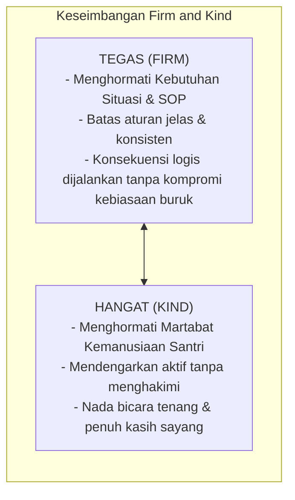

# P2-01-04-Prinsip-Disiplin-Restoratif-Firm-and-Kind

## Tujuan
Menetapkan prinsip **Disiplin Restoratif** dengan pendekatan **Tegas dan Hangat (*Firm and Kind*)** sebagai satu-satunya protokol penegakan tata tertib yang sah di ekosistem pesantren TUMBUH, menggantikan seluruh bentuk hukuman fisik dan intimidasi emosional.

---

## 1. Dalil & Fiqh Tarbiyah

> *"Maka berkat rahmat Allah engkau (Muhammad) berlaku lemah lembut terhadap mereka. Sekiranya engkau bersikap keras dan berhati kasar, tentulah mereka menjauhkan diri dari sekitarmu. Karena itu maafkanlah mereka dan mohonkanlah ampunan untuk mereka, dan bermusyawarahlah dengan mereka dalam urusan itu..."*  
> **(QS. Ali 'Imran [3]: 159)**

> *"Sesungguhnya kelemahlembutan (rifq) tidaklah berada pada sesuatu melainkan ia akan menghiasinya, dan tidaklah kelemahlembutan itu dicabut dari sesuatu melainkan akan memperburuknya."*  
> **(HR. Muslim no. 2594)**

---

## 2. Definisi Operasional "Firm and Kind"

---

## 3. 4 Prinsip Pokok Disiplin Restoratif

1. **Fokus pada Tanggung Jawab & Pemulihan (*Responsibility & Restoration*)**:
   - Pelanggaran dipandang sebagai kerugian pada relasi atau fasilitas sosial yang wajib dipulihkan (*Restitution*), bukan sekadar utang penderitaan fisik yang harus dibayar santri.
2. **Koneksi Sebelum Koreksi (*Connection Before Correction*)**:
   - Pembina membangun hubungan saling percaya terlebih dahulu sebelum mengoreksi kesalahan santri (*Baumrind Authoritative Parenting*).
3. **Konsekuensi Logis Terkait (*Related, Respectful, Reasonable*)**:
   - Konsekuensi harus berkaitan langsung dengan pelanggaran (*Related*), disampaikan dengan menghormati martabat (*Respectful*), dan masuk akal secara beban (*Reasonable*).
4. **Pembelajaran Melalui Pertanyaan Reflektif**:
   - Pembina tidak menceramahi dengan amarah, melainkan mengajukan 4 pertanyaan kunci restoratif:
     1. *"Apa yang sebenarnya terjadi?"*
     2. *"Apa yang kamu pikirkan dan rasakan saat itu?"*
     3. *"Siapa yang terkena dampak dari tindakanmu ini?"*
     4. *"Apa yang bisa kamu lakukan sekarang untuk memperbaiki keadaan?"*

---

## 4. Matriks Perbandingan Konsekuensi Logis vs Hukuman Konvensional

| Jenis Pelanggaran | Hukuman Konvensional (DILARANG MUTLAK) | Konsekuensi Logis Restoratif (STANDAR BAKU) |
| :--- | :--- | :--- |
| **Menumpahkan makanan / mengotori aula makan** | Diteriaki di depan santri lain, disuruh push up 50x. | Mengambil lap/pel, membersihkan tumpahan hingga bersih, dan membantu piket kantin hari itu. |
| **Terlambat masuk kelas / halaqah tahfizh** | Berdiri satu kaki di depan kelas selama jam pelajaran. | Menunggu dengan tenang di luar hingga instruksi selesai, mencatat materi yang tertinggal, dan mengganti waktu setoran pada jam luang. |
| **Mengejek / membully teman sekamar** | Dijemur di lapangan terik matahari, dicukur botak sepihak. | Melakukan dialog mediasi (*Restorative Chat*), meminta maaf tulus secara tertutup, dan membantu rekan yang diejek dalam kegiatan positif. |

---

## 5. Status Dokumen
* **Status**: 🌟 **A+ (Tervalidasi & Siap Diimplementasikan)**
* **Level**: Project 2 - `02 Principles / 01 Core Principles`
* **Langkah Berikutnya**: **`P2-01-05-Prinsip-Sistemik-Multi-Tier-PBIS.md`**.
