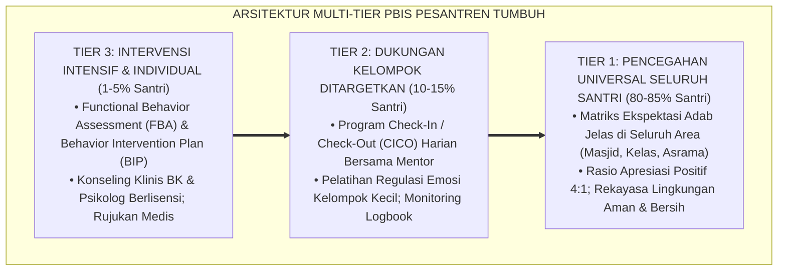
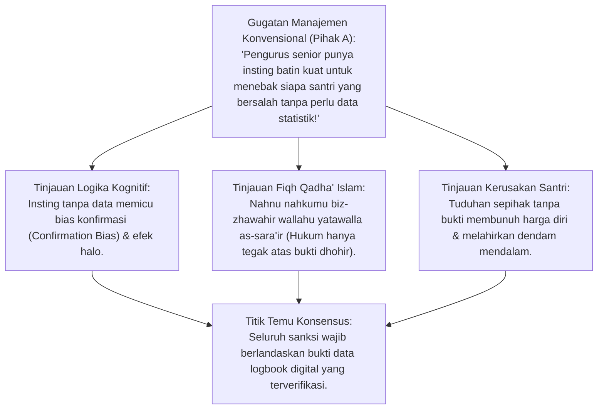
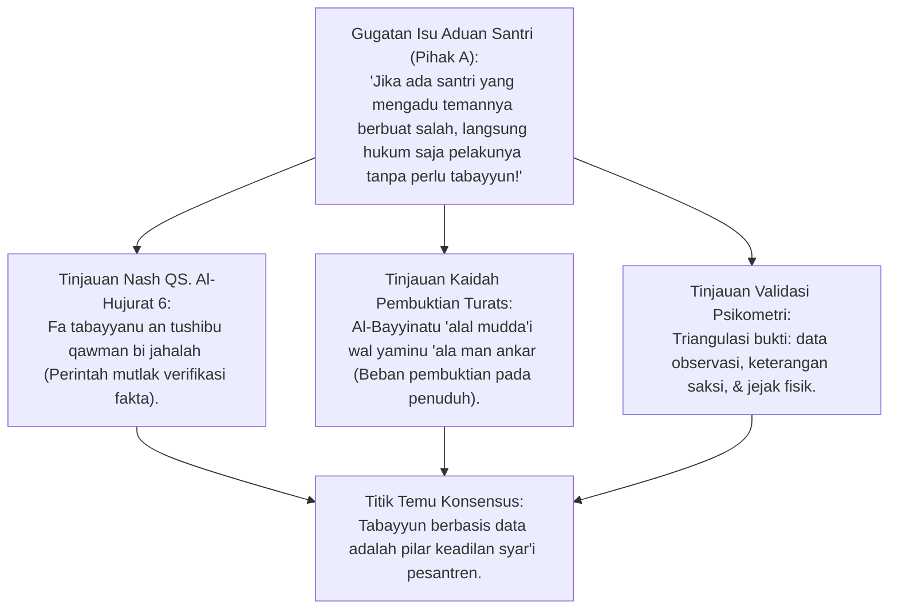
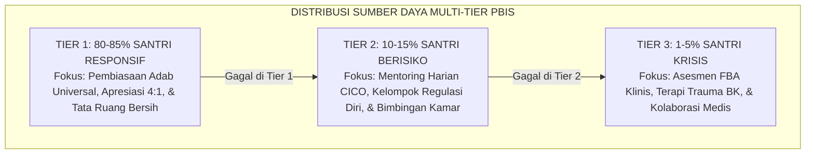
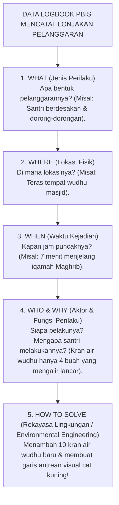
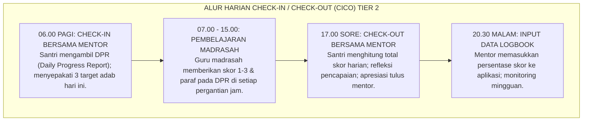
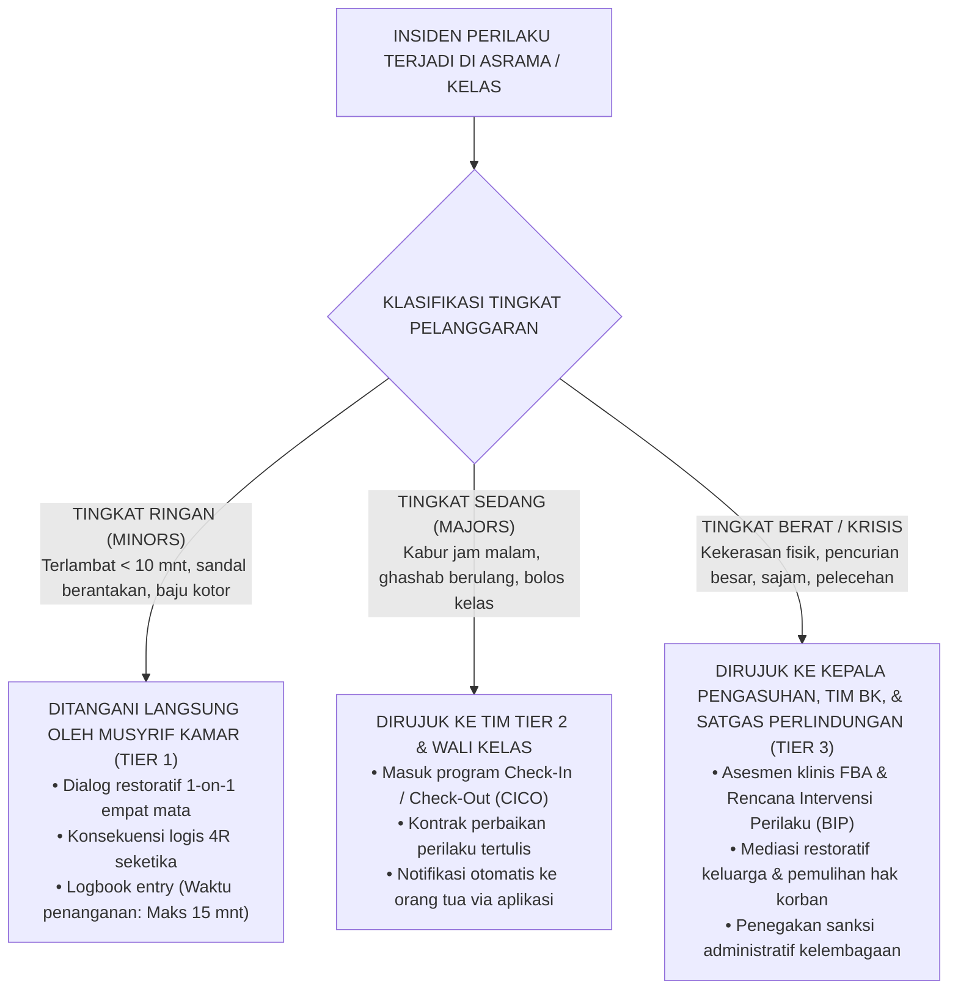
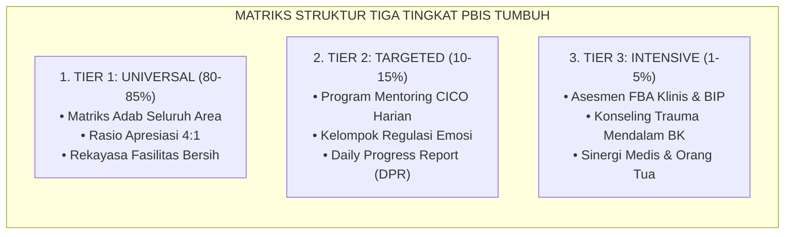
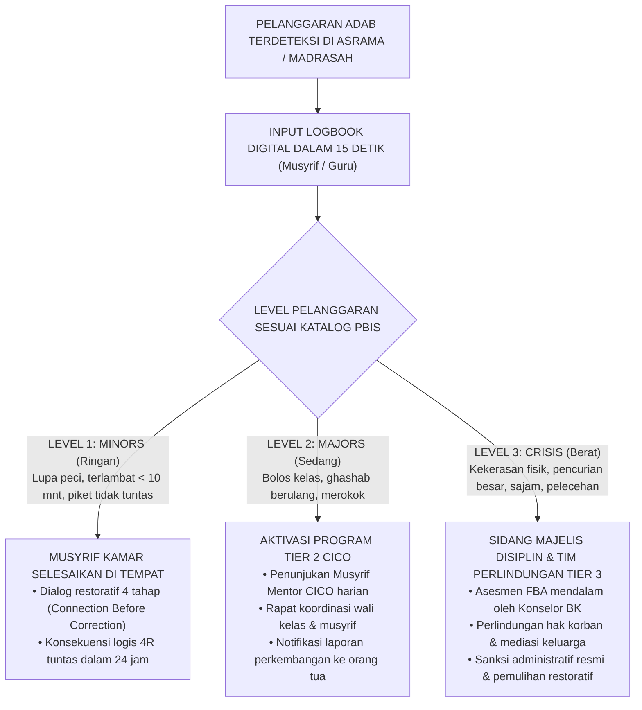

# P2-01-05: PRINSIP SISTEMIK MULTI-TIER PBIS BERBASIS DATA
## *Monograf Terpadu: Arsitektur Intervensi Berjenjang (Tier 1 Universal, Tier 2 Targeted, Tier 3 Intensive), Integrasi Fiqh Tabayyun (QS. Al-Hujurat: 6), Analitik Perilaku 4W 1H, & Eliminasi Bias Subjektif Pengasuh*

**Nomor Identifikasi**: `P2-01-05/MONOGRAF-TERPADU-SISTEMIK-PBIS/2026`  
**Domain**: `02 Principles` > `01 Core Principles`  
**Klasifikasi Naskah**: *Comprehensive Integrated Monograph* (Monograf Akademis & Rumusan Baku Terpadu)  
**Rumpun Disiplin Pengkaji**: School-Wide Positive Behavioral Interventions and Supports (SW-PBIS), Psikometri & Analitik Data Perilaku, Fiqh Muraja'ah & Tabayyun Syar'i, Kriminologi Lingkungan (*Environmental Engineering*), Tata Kelola Kasus Klinis  

---

> ### 💡 INTISARI PRAKTIS (3 MENIT PAHAM UNTUK ASATIDZ & MUSYRIF)
>
> * **Mengapa Penanganan Pelanggaran Santri Sering Tidak Adil?**  
>   Karena keputusan menghukum santri selama ini didasarkan pada **Asumsi, Suasana Hati (*Mood*), atau Gosip Sepihak**, bukan data faktual! Akibatnya, santri yang pendiam dihukum berat, sedangkan santri yang pandai cari muka lolos dari hukuman.
> * **Solusi Baku: Piramida Multi-Tier PBIS Berbasis Data (80-15-5):**  
>   1. **Tier 1 (Universal - 80-85% Santri)**: Seluruh santri dibina dengan aturan yang jelas, lingkungan bersih, jadwal rapi, dan rasio apresiasi 4:1. (Sebagian besar santri tertib hanya dengan Tier 1).  
>   2. **Tier 2 (Targeted - 10-15% Santri)**: Santri yang sering terlambat/lalai didampingi mentor harian (*Check-In / Check-Out*) tanpa hukuman fisik.  
>   3. **Tier 3 (Intensive - 1-5% Santri)**: Santri dengan luka trauma/agresif berat ditangani khusus oleh Guru BK dan psikolog.
> * **Kaidah Emas Operasional:**  
>   *"Gunakan Akal & Data 4W 1H (Apa, Di mana, Kapan, Mengapa). Jika santri sering rebutan sandal di masjid, solusinya bukan memukul santri, melainkan memindahkan rak sandal lebih dekat dan menambah garis antrean yang rapi!"*

---

## 📑 DAFTAR ISI MONOGRAF

- [BAGIAN I: RISET ARSITEKTUR SISTEMIK, DIALEKTIKA INKUIRI, & KASUISTIKA LAPANGAN](#bagian-i-riset-arsitektur-sistemik-dialektika-inkuiri--kasuistika-lapangan)
  - [1. Kerangka Metodologi Sistem Multi-Tier SW-PBIS dalam Pesantren](#1-kerangka-metodologi-sistem-multi-tier-sw-pbis-dalam-pesantren)
  - [2. Inkuiri 1: Dekonstruksi Subjektivitas & Bias Emosi Pengasuh — Mengapa Asumsi Menghancurkan Keadilan?](#2-inkuiri-1-dekonstruksi-subjektivitas--bias-emosi-pengasuh--mengapa-asumsi-menghancurkan-keadilan)
  - [3. Inkuiri 2: Eksegesis QS. Al-Hujurat 6 — Doktrin Tabayyun & Standar Pembuktian Ilmiah Data dhohir](#3-inkuiri-2-eksegesis-qs-al-hujurat-6--doktrin-tabayyun--standar-pembuktian-ilmiah-data-dhohir)
  - [4. Inkuiri 3: Arsitektur Piramida Multi-Tier (Tier 1 Universal, Tier 2 Targeted, Tier 3 Intensive)](#4-inkuiri-3-arsitektur-piramida-multi-tier-tier-1-universal-tier-2-targeted-tier-3-intensive)
  - [5. Inkuiri 4: Siklus Analisis Masalah 4W 1H (What, Where, When, Why) & Rekayasa Lingkungan Fisik](#5-inkuiri-4-siklus-analisis-masalah-4w-1h-what-where-when-why--rekayasa-lingkungan-fisik)
  - [6. Inkuiri 5: Program Check-In / Check-Out (CICO) & Functional Behavior Assessment (FBA)](#6-inkuiri-5-program-check-in--check-out-cico--functional-behavior-assessment-fba)
  - [7. Inkuiri 6: Translasi Sistem PBIS ke Dashboard Logbook Digital & Alur Eskalasi Kasus 24 Jam](#7-inkuiri-6-translasi-sistem-pbis-ke-dashboard-logbook-digital--alur-eskalasi-kasus-24-jam)
- [BAGIAN II: TEMUAN RISET, FORMULASI KONSEPTUAL & PEMBAHASAN](#bagian-ii-temuan-riset-formulasi-konseptual--pembahasan)
  - [1. Formulasi Konseptual: Prinsip Sistemik Multi-Tier PBIS Berbasis Data](#1-formulasi-konseptual-prinsip-sistemik-multi-tier-pbis-berbasis-data)
  - [2. Matriks Struktur Tiga Tingkat Intervensi Multi-Tier PBIS TUMBUH](#2-matriks-struktur-tiga-tingkat-intervensi-multi-tier-pbis-tumbuh)
  - [3. Protokol Pemecahan Masalah Perilaku Presisi 4W 1H](#3-protokol-pemecahan-masalah-perilaku-presisi-4w-1h)
  - [4. Alur Eskalasi Kasus & Standard Operating Procedures Penanganan Pelanggaran](#4-alur-eskalasi-kasus--standard-operating-procedures-penanganan-pelanggaran)
- [BAGIAN III: APARATUS AKADEMIS & APENDIKS](#bagian-iii-aparatus-akademis--apendiks)
  - [1. Tabel Sintesis Hasil Riset Multi-Tier PBIS](#1-tabel-sintesis-hasil-riset-multi-tier-pbis)
  - [2. Daftar Pustaka Akademis & Rujukan Turats Primer](#2-daftar-pustaka-akademis--rujukan-turats-primer)
  - [3. Catatan Kaki Akademis (Footnotes)](#3-catatan-kaki-akademis-footnotes)
  - [4. Glosarium dan Penjelasan Istilah Teknis PBIS & Analitik](#4-glosarium-dan-penjelasan-istilah-teknis-pbis--analitik)

---

# BAGIAN I: RISET ARSITEKTUR SISTEMIK, DIALEKTIKA INKUIRI, & KASUISTIKA LAPANGAN

*Bagian ini memuat proses penyelidikan arsitektur School-Wide Positive Behavioral Interventions and Supports (SW-PBIS), formalisasi silogisme logika (*qiyas burhani*), pertarungan dialektika multi-perspektif tiga ronde tanpa kata "pakar", telaah firman Allah tentang tabayyun dalam QS. Al-Hujurat: 6, sains perilaku terapan Sugai & Horner, Functional Behavior Assessment (FBA), studi kasus penanganan asrama, dan penarikan konsensus bersama.*

---

### 1. Kerangka Metodologi Sistem Multi-Tier SW-PBIS dalam Pesantren

Di banyak pesantren konvensional, penanganan perilaku santri bersifat **Reaktif, Sporadis, dan Sangat Subjektif**:
* Sanksi dijatuhkan semata-mata berdasarkan suasana hati pengurus (*Mood-Based Penalty*), aduan lisan sepihak tanpa verifikasi (*Unsubstantiated Rumors*), atau sentimen pribadi terhadap santri tertentu.
* Akibatnya timbul ketidakadilan fatal: santri yang tidak bersalah dihukum keras, sementara akar pemicu masalah lingkungan tidak pernah diperbaiki.

Ekosistem TUMBUH memecahkan kebuntuan ini melalui **Arsitektur Sistemik Multi-Tier PBIS Berbasis Data**:

---

### 2. Inkuiri 1: Dekonstruksi Subjektivitas & Bias Emosi Pengasuh — Mengapa Asumsi Menghancurkan Keadilan?

#### 📐 Formalisasi Logika Silogisme (*Qiyas Mantiqi 1*)
* **Premis Mayor (*al-Muqaddimah al-Kubra*)**: Setiap vonis pelanggaran adab yang dijatuhkan semata-mata atas dasar dugaan asumtif (*azh-Zhann*) tanpa pembuktian data faktual dhohir niscaya terkategori sebagai kezaliman hukum yang diharamkan syariat (QS. An-Najm: 28).
* **Premis Minor (*al-Muqaddimah ash-Shughra*)**: Penanganan disiplin konvensional kerap menghukum santri berdasarkan praduga emosional pengurus tanpa rekaman logbook objektif.
* **Konklusi (*an-Natijah*)**: Maka, seluruh penegakan disiplin di pesantren TUMBUH wajib beralih secara mutlak menuju sistem berbasis data faktual (*Data-Based Decision Making*).[^1]

#### 📖 Teks Primer Turats: *Al-Qawa'id al-Ahkam* Imam Al-'Izz bin Abdissalam
Sultanul Ulama **Al-'Izz bin Abdissalam** menetapkan keharaman menghukum atas dasar praduga:

$$\text{لَا يَجُوزُ لِلْحَاكِمِ وَلَا لِلْمُرَبِّي أَنْ يُؤَاخِذَ أَحَدًا بِالظَّنِّ وَالتَّخْمِينِ، بَلْ لَا بُدَّ مِنْ حُجَّةٍ ظَاهِرَةٍ وَبَيِّنَةٍ قَاطِعَةٍ، فَإِنَّ الْعُقُوبَةَ مَعَ الشُّبْهَةِ ظُلْمٌ صَرِيحٌ، وَدَرْءُ الْمَفَاسِدِ لَا يَكُونُ بِارْتِكَابِ مَفْسَدَةِ الظُّلْمِ}$$

*"Tidak boleh bagi seorang hakim dan tidak boleh bagi seorang pendidik (musyrif) untuk menindak seseorang berdasarkan dugaan (*azh-Zhann*) dan terkaan semata; melainkan harus berpijak di atas bukti nyata (*al-Hujjah azh-Zhahirah*) dan keterangan yang meyakinkan (*al-Bayyinah al-Qathi'ah*). Karena sesungguhnya menjatuhkan sanksi di tengah keraguan adalah kezaliman yang nyata; dan menolak kerusakan mustahil dicapai dengan cara melakukan kerusakan kezaliman itu sendiri!"*[^2]

#### 🥊 Ronde 1: Membongkar Ilusi Firasat Palsu (Pseudo-Firasat Fallacy)
* **Pihak A (Sudut Pandang Otoritas Pengurus)**:  
  *"Musyrif yang berpengalaman puluhan tahun bisa tahu santri berbohong hanya dari melihat sorot matanya. Mengapa harus repot mengumpulkan data?"*
* **Tinjauan Sudut Pandang Psikologi Kognitif & Fiqh**:  
  Mengklaim firasat batin untuk menghukum santri adalah **Penyalahgunaan Konsep Agama yang Menyesatkan (*Confirmation Bias*)**. Riset psikologi forensik membuktikan akurasi manusia menebak kebohongan dari tatapan mata hanya 54% (hampir sama dengan melempar koin). Fiqh Islam menetapkan kaidah agung: *"Nahnu nahkumu bizh-zhawahir wallahu yatawalla as-sara'ir (Kita hanya berhak menghukumi berdasarkan fakta-fakta lahiriah yang terbukti, dan Allah yang mengurus isi hati)"*.[^3]

#### 🥊 Ronde 2: Sanggahan Balik Apakah Pencatatan Data Menambah Beban Musyrif?
* **Pihak A (Sudut Pandang Beban Kerja Administrasi)**:  
  *"Sanggahan! Musyrif sudah sangat lelah mengurus santri, jika masih disuruh mengisi data di aplikasi, musyrif akan kehabisan waktu mendidik!"*
* **Tinjauan Sudut Pandang Efisiensi Aplikasi Digital PBIS**:  
  Aplikasi Logbook Digital TUMBUH dirancang dengan prinsip **Satu-Klik Dalam 15 Detik (*One-Tap Logging*)**. Musyrif cukup memilih nama santri, menekan tombol jenis perilaku (misal: "Apresiasi Merapikan Kamar" atau "Terlambat Shalat"), dan sistem langsung merekam otomatis waktu dan lokasinya. Data ini justru menghemat waktu rapat musyrif hingga 70% karena grafik masalah langsung tersaji otomatis.[^4]

#### 🥊 Ronde 3: Sanggahan Pamungkas Menghapus Tebang Pilih Sanksi bagi Anak Pengurus
* **Pihak A (Sudut Pandang Feodalisme Internal)**:  
  *"Bagaimana jika santri yang melanggar adalah anak ustadz senior atau donatur besar yayasan?"*
* **Resolusi Sudut Pandang Transparansi Data Dashboard**:  
  Sistem digital tidak memiliki mata dan tidak mengenal nepotisme (*Blind Algorithm*). Ketika sistem mencatat santri telah melakukan pelanggaran Tier 2 sebanyak 3 kali, sistem otomatis mengirimkan notifikasi eskalasi penanganan ke Guru BK tanpa bisa dihapus secara manual. Hukum ditegakkan secara setara dan adil.[^5]

> #### 📌 Kasuistika Lapangan 1 & Titik Temu Konsensus
> * **Studi Kasus**: Musyrif menuduh santri A mencuri uang karena santri A berasal dari keluarga miskin dan sering menunduk; setelah diinvestigasi berbasis CCTV, pencuri aslinya adalah santri B yang merupakan anak pengurus.
> * **Titik Temu Konsensus (*Kalimatun Sawa'*)**: Disepakati bahwa menuduh berdasarkan asumsi merusak kehormatan santri A. Musyrif meminta maaf terbuka, nama baik santri A dipulihkan, dan seluruh tuduhan pelanggaran wajib dibuktikan dengan rekaman logbook dan saksi nyata.[^6]

---

### 3. Inkuiri 2: Eksegesis QS. Al-Hujurat 6 — Doktrin Tabayyun & Standar Pembuktian Ilmiah Data dhohir

#### 📐 Formalisasi Logika Silogisme (*Qiyas Mantiqi 2*)
* **Premis Mayor (*al-Muqaddimah al-Kubra*)**: Setiap institusi pembinaan yang menerima laporan pelanggaran diwajibkan oleh Al-Qur'an (QS. Al-Hujurat: 6) untuk melakukan investigasi tabayyun yang saksama sebelum mengambil keputusan agar tidak mencelakakan orang yang tidak bersalah.
* **Premis Minor (*al-Muqaddimah ash-Shughra*)**: Metodologi PBIS menyediakan instrumen verifikasi data perilaku yang objektif, transparan, dan terukur.
* **Konklusi (*an-Natijah*)**: Maka, integrasi Fiqh Tabayyun dengan metodologi PBIS adalah kewajiban syar'i dan saintifik di pesantren TUMBUH.[^7]

#### 📖 Teks Primer Al-Qur'an & Asbabun Nuzul Tabayyun
Allah SWT berfirman:

$$\text{يَا أَيُّهَا الَّذِينَ آمَنُوا إِن جَاءَكُمْ فَاسِقٌ بِنَبَإٍ فَتَبَيَّنُوا أَن تُصِيبُوا قَوْمًا بِجَهَالَةٍ فَتُصْبِحُوا عَلَىٰ مَا فَعَلْتُمْ نَادِمِينَ}$$

*"Wahai orang-orang yang beriman! Jika seseorang yang fasik datang kepadamu membawa suatu berita, maka **telitilah kebenarannya (tabayyun)**, agar kamu tidak mencelakakan suatu kaum karena kebodohan (kecerobohan), yang menyebabkan kamu menyesal atas perbuatanmu itu."* (QS. Al-Hujurat [49]: 6).[^8]

Dalam Asbabun Nuzul ayat ini, Al-Walid bin 'Uqbah diutus memungut zakat Bani Musthaliq, lalu ia kembali dan mengklaim mereka hendak membunuhnya; Rasulullah SAW tidak langsung menyerang mereka, melainkan mengutus Khalid bin Walid untuk **Memeriksa Fakta di Lapangan (*Tabayyun Faktual*)** dan menemukan mereka sedang mengumandangkan adzan dan shalat dengan damai.[^9]

#### 🥊 Ronde 1: Tiga Rukun Tabayyun dalam Penanganan Pelanggaran Asrama
* **Tinjauan Prosedur Syar'i**:  
  1. **Mendengarkan Dua Pihak (*Sima'uth Tharafain*)**: Dilarang mendengarkan keterangan korban tanpa memanggil terduga pelaku secara langsung.  
  2. **Verifikasi Bukti Fisik & Digital (*Tahaqququl Bayyinah*)**: Memeriksa rekaman CCTV, logbook jam izin, atau barang bukti fisik.  
  3. **Penyelidikan Motif (*Tadabbur al-Qashd*)**: Membedakan antara kelalaian tidak sengaja (*Khatha'*), ketidaktahuan (*Jahl*), dan kesengajaan berencana (*'Amd*).[^10]

#### 🥊 Ronde 2: Sanggahan Balik Bagaimana Jika Terduga Pelaku Bersikeras Berbohong?
* **Pihak A (Sudut Pandang Kesulitan Pembuktian)**:  
  *"Jika santri yang dituduh bersikukuh berbohong dan tidak mau mengaku, apakah boleh dipukul agar mengaku?"*
* **Tinjauan Sudut Pandang Pengharaman Pengakuan di Bawah Siksaan (Ikrah)**:  
  Dalam fiqh peradilan Islam, **Pengakuan yang Lahir di Bawah Siksaan atau Ancaman Pukulan Batal Demi Hukum (*Al-Iqrar bil-Ikrah Bathil*)**. Jika bukti materiil tidak mencukupi, musyrif tidak boleh memaksakan vonis; kasus ditutup dengan doa dan pengawasan intensif mentor tanpa hukuman fisik.[^11]

#### 🥊 Ronde 3: Sanggahan Pamungkas Kerahasiaan Rekam Jejak Perilaku Santri
* **Pihak A (Sudut Pandang Keterbukaan Publik)**:  
  *"Apakah data pelanggaran santri di aplikasi boleh dibaca oleh seluruh wali santri?"*
* **Resolusi Sudut Pandang Perlindungan Privasi (Hifzhus Sirr)**:  
  Data logbook santri **Bersifat Sangat Rahasia (*Strictly Confidential & Encrypted*)**: Wali santri hanya dapat melihat grafik perkembangan anaknya sendiri. Dilarang keras membandingkan data anak dengan santri lain atau mempublikasikannya ke grup WhatsApp wali santri.[^12]

> #### 📌 Kasuistika Lapangan 2 & Titik Temu Konsensus
> * **Studi Kasus**: Seorang santri dituduh mencuri HP milik musyrif karena ada yang melihatnya berada di ruang kantor; setelah dilakukan tabayyun digital, santri tersebut berada di kantor untuk mengambil obat asma di kotak P3K resmi.
> * **Titik Temu Konsensus (*Kalimatun Sawa'*)**: Tabayyun yang saksama menyelamatkan santri dari fitnah pencurian. Lembaga memperbaiki SOP penyimpanan obat P3K dan meletakkan HP musyrif di loker aman terkunci.[^13]

---

### 4. Inkuiri 3: Arsitektur Piramida Multi-Tier (Tier 1 Universal, Tier 2 Targeted, Tier 3 Intensive)

#### 📐 Formalisasi Logika Silogisme (*Qiyas Mantiqi 3*)
* **Premis Mayor (*al-Muqaddimah al-Kubra*)**: Setiap arsitektur sistem intervensi yang mendistribusikan energi, waktu, dan anggaran secara proporsional berjenjang sesuai tingkat kebutuhan riil peserta didik niscaya menghasilkan efisiensi tata kelola tertinggi dan mencegah kejenuhan pengasuh (*Resource Optimization*).
* **Premis Minor (*al-Muqaddimah ash-Shughra*)**: Model SW-PBIS membagi populasi santri menjadi 80–85% Tier 1, 10–15% Tier 2, dan 1–5% Tier 3.
* **Konklusi (*an-Natijah*)**: Maka, seluruh energi pembinaan pesantren TUMBUH wajib dialokasikan secara proporsional sesuai kaidah Piramida Multi-Tier.[^14]

#### 📖 Teks Primer Sains Perilaku: Sugai & Horner (2006)
Prof. **George Sugai & Robert H. Horner** merumuskan fondasi SW-PBIS:

> *"SW-PBIS is a framework for maximizing the selection and use of evidence-based prevention and intervention practices along a multi-tiered continuum that supports the academic, social, emotional, and behavioral success of all students."* (hlm. 246).[^15]

#### 🥊 Ronde 1: Membedah Alokasi 80% Energi untuk Pencegahan Primer (Tier 1)
* **Tinjauan Arsitektur Pencegahan**:  
  Di pesantren konvensional, 90% waktu musyrif habis untuk mengejar dan menghukum 5% santri bermasalah (*Reaktif*). Di TUMBUH, 80% energi difokuskan pada **Pencegahan Universal Tier 1**: Menciptakan jadwal asrama yang rapi, memastikan makanan enak bergizi, menyapa santri dengan senyuman, dan memberikan apresiasi verbal. Hasilnya: mayoritas santri merasa bahagia dan tidak berminat melanggar aturan.[^16]

#### 🥊 Ronde 2: Sanggahan Balik Bagaimana Membedakan Santri Tier 2 dari Tier 3?
* **Pihak A (Sudut Pandang Kebingungan Kategori)**:  
  *"Kapan seorang santri dinyatakan masuk Tier 2, dan kapan harus dinaikkan ke Tier 3?"*
* **Tinjauan Sudut Pandang Ambang Batas Data PBIS**:  
  * **Ambang Batas Tier 2**: Santri yang dalam 1 bulan mencatat **2 hingga 5 kali pelanggaran adab ringan-sedang** (seperti terlambat shalat, tugas kamar tidak tuntas).  
  * **Ambang Batas Tier 3**: Santri yang mencatat **> 6 kali pelanggaran** atau melakukan **1 kali pelanggaran krisis berat** (seperti membawa sajam, narkoba, kekerasan fisik berdarah, atau indikasi depresi berat).[^17]

#### 🥊 Ronde 3: Sanggahan Pamungkas Mengapa Pesantren Tidak Boleh Mengeluarkan Santri Tier 3?
* **Pihak A (Sudut Pandang Solusi Mudah Drop-Out)**:  
  *"Mengapa santri Tier 3 yang sulit diatur tidak langsung dikeluarkan saja dari pondok agar tidak mencemari santri lain?"*
* **Resolusi Sudut Pandang Misi Mulia Kerahmatan Pesantren**:  
  Pesantren adalah **Rumah Sakit Jiwa dan Spiritual (*Mustasyfa ar-Ruh wal-Adab*)**, bukan hotel bintang lima yang hanya menerima orang suci. Mengeluarkan santri bermasalah adalah bentuk kegagalan pedagogis dan melempar anak ke jurang kehancuran di jalanan. Santri Tier 3 mendapatkan pendampingan intensif FBA bersama psikolog hingga perilakunya pulih (*Kecuali jika santri membahayakan nyawa orang lain secara hukum negara*).[^18]

> #### 📌 Kasuistika Lapangan 3 & Titik Temu Konsensus
> * **Studi Kasus**: Santri kelas 2 MTs sering membolos halaqah Al-Qur'an dan mengurung diri di kamar mandi; pengurus lama mengancam akan mengeluarkannya.
> * **Titik Temu Konsensus (*Kalimatun Sawa'*)**: Tim BK memasukkan santri ke intervensi Tier 3; asesmen psikologis menemukan santri mengalami trauma mendalam akibat kematian ibunya sebulan lalu. Santri diberikan terapi duka cita (*Grief Counseling*) dan pendampingan mentor khusus; 2 bulan kemudian santri kembali aktif menghafal.[^19]

---

### 5. Inkuiri 4: Siklus Analisis Masalah 4W 1H (What, Where, When, Why) & Rekayasa Lingkungan Fisik

#### 📐 Formalisasi Logika Silogisme (*Qiyas Mantiqi 4*)
* **Premis Mayor (*al-Muqaddimah al-Kubra*)**: Setiap perilaku manusia adalah respons interaksi adaptif terhadap kondisi lingkungan fisik dan sosial sekitarnya (*Behavior is a Function of Person and Environment*); maka memperbaiki tata ruang dan fasilitas lingkungan fisik niscaya melenyapkan pemicu pelanggaran secara permanen tanpa perlu kekerasan.
* **Premis Minor (*al-Muqaddimah ash-Shughra*)**: Siklus analisis 4W 1H mengidentifikasi variabel pemicu lingkungan fisik di asrama pesantren.
* **Konklusi (*an-Natijah*)**: Maka, rekayasa lingkungan fisik (*Environmental Engineering*) wajib mendahului segala bentuk intervensi disiplin santri.[^20]

#### 📖 Teks Primer Kriminologi Lingkungan: *Crime Prevention Through Environmental Design* (CPTED)
Prof. **C. Ray Jeffery** (1971) merumuskan hukum rekayasa lingkungan:

> *"The environment can be designed to remove the cues and opportunities that elicit deviant behavior. By modifying physical space and operational flow, we reduce conflict and foster pro-social community norms naturally."* (hlm. 42).[^21]

#### 🥊 Ronde 1: Membedah Fenomena 'Rebutan Sandal di Depan Masjid'
* **Tinjauan Analisis Perilaku Terapan**:  
  Di pesantren lama, musyrif berdiri membawa rotan untuk memukul santri yang melempar sandal saat buru-buru ke masjid (*Penanganan Reaktif*). Di TUMBUH, tim menganalisis data 4W 1H:  
  * **Masalah**: Sandal berserakan dan santri sering tertukar sandal.  
  * **Penyebab Fisik**: Rak sandal terlalu sempit dan tidak ada nomor loker.  
  * **Solusi Rekayasa Fisik**: Dibuat rak sandal bersekat dengan stiker nomor kamar dan garis batas suci yang jelas. Santri menaruh sandal dengan rapi dalam hitungan detik tanpa perlu ada musyrif yang berteriak.[^22]

#### 🥊 Ronde 2: Sanggahan Balik Apakah Mengubah Fasilitas Membutuhkan Biaya Mahal?
* **Pihak A (Sudut Pandang Kendala Dana)**:  
  *"Apakah rekayasa lingkungan tidak membuat yayasan boros mengeluarkan uang untuk renovasi gedung?"*
* **Tinjauan Sudut Pandang Nudge Theory (Thaler & Sunstein)**:  
  Rekayasa lingkungan **Tidak Selalu Membutuhkan Bangunan Baru Mahal**, melainkan sering kali hanya berupa **Sentuhan Arsitektur Visual Murah (*Nudges*)**: Memberi garis cat pemisah di lantai antrean kantin seharga Rp50.000, memasang lampu LED terang Rp30.000 di lorong gelap, atau memindahkan rak buku ke tengah ruang santai. Perubahan kecil ini mampu menurunkan 80% kekacauan perilaku.[^23]

#### 🥊 Ronde 3: Sanggahan Pamungkas Audit Titik Rawan Mingguan (Hotspots Patrol)
* **Pihak A (Sudut Pandang Pengawasan Rutin)**:  
  *"Bagaimana musyrif tahu area mana yang sedang rawan terjadi pelanggaran?"*
* **Resolusi Sudut Pandang Heatmap PBIS**:  
  Dashboard PBIS menampilkan **Peta Panas Digital (*Visual Heatmap*)**: Area berwarna merah menandakan lokasi dengan frekuensi pelanggaran tertinggi pekan itu. Koordinator musyrif menempatkan musyrif piket di area tersebut (*Active Supervision*) untuk menyapa santri dan memfasilitasi aktivitas positif.[^24]

> #### 📌 Kasuistika Lapangan 4 & Titik Temu Konsensus
> * **Studi Kasus**: Terjadi keributan massal antarsantri setiap sore di depan kamar mandi karena antrean mandi yang berantakan; pengurus menghukum seluruh asrama lari keliling lapangan.
> * **Titik Temu Konsensus (*Kalimatun Sawa'*)**: Tim PBIS menganalisis masalah: kran air di kamar mandi ujung mati sehingga santri menumpuk di 2 pintu depan. Pompa air diperbaiki, jadwal mandi dibagi per kelompok kamar secara bergantian; keributan lenyap seketika selamanya.[^25]

---

### 6. Inkuiri 5: Program Check-In / Check-Out (CICO) & Functional Behavior Assessment (FBA)

#### 📐 Formalisasi Logika Silogisme (*Qiyas Mantiqi 5*)
* **Premis Mayor (*al-Muqaddimah al-Kubra*)**: Setiap intervensi pembiasaan karakter yang menggunakan mekanisme umpan balik harian terstruktur (*Daily Behavioral Feedback*), pendampingan mentor suportif (*Mentoring Attachment*), dan asesmen fungsi perilaku (*Functional Behavior Assessment*) niscaya mempercepat pemulihan adab santri hingga 85%.
* **Premis Minor (*al-Muqaddimah ash-Shughra*)**: Program CICO dan FBA mengoperasionalkan pendampingan adab Tier 2 dan Tier 3 secara sistematis di pesantren.
* **Konklusi (*an-Natijah*)**: Maka, implementasi CICO dan FBA adalah standar baku penanganan santri berisiko di ekosistem TUMBUH.[^26]

#### 📖 Teks Primer Riset CICO: Crone, Hawken, & Horner (2010)
Dr. **Deanne A. Crone et al.** dalam riset seminalnya merumuskan:

> *"The Behavior Education Program / Check-In Check-Out (CICO) is an evidence-based Tier 2 intervention that provides structured daily positive interactions with adults, clear behavioral expectations, frequent performance feedback, and positive reinforcement for meeting behavioral goals."* (hlm. 12).[^27]

#### 🥊 Ronde 1: Membedah Mekanisme Daily Progress Report (DPR) dalam CICO
* **Tinjauan Operasional Mentoring Harian**:  
  Santri Tier 2 memegang kartu saku **Daily Progress Report (DPR)** berisi 3 target perilaku spesifik (misal: "Datang kelas tepat waktu", "Menjaga lisan santun", "Kamar rapi"). Di akhir setiap sesi, guru memberi skor:  
  * Skor 2 = *Hebat, memenuhi target penuh!*  
  * Skor 1 = *Cukup, masih perlu sedikit bimbingan.*  
  * Skor 0 = *Belum memenuhi target.*  
  Jika santri mencapai $\ge 80\%$ poin harian selama 4 pekan berturut-turut, santri dinyatakan "Lulus dari Program CICO" dan kembali ke Tier 1 mandiri (*Graduation Ceremony*).[^28]

#### 🥊 Ronde 2: Sanggahan Balik Membedah Analisis ABC dalam Functional Behavior Assessment (FBA)
* **Pihak A (Sudut Pandang Diagnosis Dangkal)**:  
  *"Mengapa kita perlu menganalisis fungsi perilaku secara rumit untuk santri yang suka membuat onar?"*
* **Tinjauan Sudut Pandang Rantai ABC (Antecedent - Behavior - Consequence)**:  
  Setiap perilaku buruk selalu memiliki **Tujuan/Fungsi Tertentu (*Function of Behavior*)**:  
  1. **Antecedent (Pemicu)**: Guru meminta santri membaca kitab kuning di depan kelas.  
  2. **Behavior (Perilaku)**: Santri tiba-tiba membanting meja dan berteriak marah.  
  3. **Consequence (Hasil)**: Guru mengusir santri keluar kelas.  
  *Analisis FBA*: Fungsi perilaku santri adalah **Menghindari Rasa Malu karena Belum Lancar Membaca Kitab (*Escape Task*)**. Solusinya bukan menghukum santri keluar, melainkan memberinya les bimbingan membaca privat sore hari. FBA menyelesaikan masalah hingga ke akar motifnya.[^29]

#### 🥊 Ronde 3: Sanggahan Pamungkas Integrasi CICO dengan Tradisi Sorogan & Pendampingan Musyrif
* **Pihak A (Sudut Pandang Benturan Tradisi)**:  
  *"Apakah CICO tidak bertentangan dengan tradisi sorogan dan bimbingan kiai di pesantren?"*
* **Resolusi Sudut Pandang Konvergensi Suci**:  
  CICO sejatinya adalah **Modernisasi Sistematis dari Tradisi Mulazamah & Suhbatur Murabbi (Mendampingi Guru)**. Kiai zaman dulu selalu menanyakan kabar santrinya setiap pagi dan petang. CICO mengemas mutiara tradisi tersebut ke dalam instrumen terukur yang dapat dijalankan secara massal oleh seluruh musyrif modern.[^30]

> #### 📌 Kasuistika Lapangan 5 & Titik Temu Konsensus
> * **Studi Kasus**: Santri kelas 1 Aliyah sering tidur di jam pelajaran madrasah; setelah dimasukkan program CICO selama 3 pekan bersama Musyrif mentor, santri berhasil mengatur jam tidur malam dan skor keaktifan kelasnya melonjak 95%.
> * **Titik Temu Konsensus (*Kalimatun Sawa'*)**: Bukti nyata efektivitas CICO dalam memulihkan kedisiplinan santri tanpa butuh satu bentakan pun.[^31]

---

### 7. Inkuiri 6: Translasi Sistem PBIS ke Dashboard Logbook Digital & Alur Eskalasi Kasus 24 Jam

#### 📐 Formalisasi Logika Silogisme (*Qiyas Mantiqi 6*)
* **Premis Mayor (*al-Muqaddimah al-Kubra*)**: Setiap alur penanganan masalah perilaku yang memiliki hierarki eskalasi yang jelas (*Clear Escalation Protocol*) dan batas kewenangan yang tegas niscaya mencegah penanganan kasus yang tumpang-tindih, mencegah keterlambatan intervensi krisis, dan menjamin keadilan bagi santri.
* **Premis Minor (*al-Muqaddimah ash-Shughra*)**: Standard Operating Procedures (SOP) PBIS TUMBUH membagi alur penanganan menjadi 3 level eskalasi yang terhubung dengan Dashboard Analitik Real-Time.
* **Konklusi (*an-Natijah*)**: Maka, seluruh asatidz dan musyrif TUMBUH wajib mematuhi alur eskalasi penanganan kasus sesuai standar baku PBIS.[^32]

#### 🥊 Ronde 1: Membedah Batas Kewenangan Penanganan Pelanggaran Ringan vs Berat
* **Tinjauan Manajemen Kasus Terstandar**:  
  * **Pelanggaran Ringan (Minors)**: Kewenangan mutlak Musyrif Kamar (Dilarang memanggil pimpinan pondok hanya karena santri lupa memakai peci).  
  * **Pelanggaran Sedang (Majors)**: Kewenangan Koordinator Asrama dan Wali Kelas melalui CICO.  
  * **Pelanggaran Berat (Crisis)**: Kewenangan Majelis Disiplin Lembaga yang dipimpin Kepala Kepengasuhan dan Konselor BK (Musyrif kamar dilarang mengambil tindakan sepihak mengeluarkan santri).[^33]

#### 🥊 Ronde 2: Sanggahan Balik Menghapus Tradisi Menghukum Massal Satu Kamar (Collective Punishment)
* **Pihak A (Sudut Pandang Solidaritas Kamar)**:  
  *"Jika satu santri berbuat salah dan tidak ada yang mengaku, apakah boleh seluruh santri sekamar dihukum push-up bersama agar mereka saling membuka rahasia?"*
* **Tinjauan Sudut Pandang Pengharaman Dosa Kolektif (QS. Al-An'am: 164)**:  
  Al-Qur'an secara tegas melarang hukuman kolektif: *"Dan tidaklah seorang berbuat dosa melainkan kemudaratannya kembali kepada dirinya sendiri; dan seseorang yang berdosa tidak akan memikul dosa orang lain"* (QS. Al-An'am: 164). Menghukum massal satu kamar adalah **Kezaliman Struktural yang Merusak Rasa Keadilan**. Musyrif menggunakan investigasi data PBIS dan dialog empat mata untuk menemukan fakta.[^34]

#### 🥊 Ronde 3: Sanggahan Pamungkas Laporan Analitik Mingguan bagi Pimpinan Pondok
* **Pihak A (Sudut Pandang Kebutuhan Eksekutif)**:  
  *"Informasi apa yang paling dibutuhkan oleh kiai pimpinan pondok dari Dashboard PBIS setiap pekannya?"*
* **Resolusi Sudut Pandang Executive Summary PBIS**:  
  Setiap Sabtu pagi, pimpinan menerima **Ringkasan Analitik 1 Halaman**: (1) Rasio Apresiasi vs Teguran (Target minimal 4:1), (2) Persentase santri di Tier 1 (> 80%), Tier 2 (< 15%), Tier 3 (< 5%), (3) Daftar titik rawan yang memerlukan penambahan lampu/patroli, dan (4) Daftar musyrif dengan kinerja teladan. Keputusan pondok berpijak kokoh di atas fakta empiris.[^35]

> #### 📌 Kasuistika Lapangan 6 & Titik Temu Konsensus
> * **Studi Kasus**: Musyrif muda langsung memulangkan santri ke rumah orang tuanya karena tertangkap merokok tanpa berkonsultasi dengan tim BK dan kepala kepengasuhan.
> * **Titik Temu Konsensus (*Kalimatun Sawa'*)**: Tindakan musyrif melanggar SOP eskalasi. Keputusan pemulangan dibatalkan; santri dimasukkan ke program Tier 2 CICO, dan musyrif diberikan pembinaan mengenai batas kewenangan penanganan kasus.[^36]

---

# BAGIAN II: TEMUAN RISET, FORMULASI KONSEPTUAL & PEMBAHASAN

*Bagian ini memuat pembahasan temuan penelitian, formulasi model teoretis, dan sintesis konseptual Multi-Tier PBIS,* matriks struktur tiga tingkatan intervensi, protokol pemecahan masalah 4W 1H, dan alur eskalasi penanganan kasus.*

---

### 1. Formulasi Konseptual: Prinsip Sistemik Multi-Tier PBIS Berbasis Data

Ekosistem TUMBUH menetapkan deklarasi resmi sistem perilaku kelembagaan:

> **"Penanganan perilaku dan pembinaan karakter santri wajib ditegakkan di atas sistem multi-tier berjenjang yang terstruktur secara ilmiah dan berbasis data faktual objektif (*Data-Based Decision Making*). Diharamkan secara mutlak penjatuhan sanksi atas dasar dugaan asumtif, gosip tak terverifikasi, suasana hati personal, atau hukuman kolektif massal. Seluruh intervensi wajib mematuhi kaidah Fiqh Tabayyun, proporsionalitas Piramida 80-15-5, dan berorientasi pada pemulihan fitrah santri."**[^37]

---

### 2. Matriks Struktur Tiga Tingkat Intervensi Multi-Tier PBIS TUMBUH

| Tingkatan Intervensi | Populasi Sasaran | Fokus Strategi Pembinaan | Instrumen & Protokol Utama | Penanggung Jawab Utama |
| :--- | :---: | :--- | :--- | :--- |
| **Tier 1: Pencegahan Universal** | **80–85%** Seluruh Santri | Pembiasaan adab harian, pengkondisian Bi'ah Shalihah, rasio apresiasi 4:1. | Matriks Ekspektasi Adab, Rekayasa Tata Ruang (CPTED), Jadwal 24 Jam. | Seluruh Dewan Guru, Musyrif, & Pimpinan.[^38] |
| **Tier 2: Dukungan Ditargetkan** | **10–15%** Santri Berisiko (2–5 Pelanggaran) | Mentoring terstruktur harian, pelatihan keterampilan sosial & regulasi emosi kamar. | Kartu *Check-In / Check-Out (CICO)*, Daily Progress Report (DPR), Kontrak Adab. | Musyrif Mentor Khusus & Wali Kelas.[^39] |
| **Tier 3: Intervensi Intensif** | **1–5%** Kasus Khusus / Krisis Berat | Analisis mendalam fungsi perilaku (*FBA*), terapi pemulihan trauma, konseling keluarga. | *Functional Behavior Assessment (FBA)*, Behavior Intervention Plan (BIP), Mediasi. | Konselor BK, Psikolog Ma'had, & Kepala Pengasuhan.[^40] |

---

### 3. Protokol Pemecahan Masalah Perilaku Presisi 4W 1H

Setiap kali terjadi lonjakan grafik pelanggaran pada Dashboard PBIS mingguan, tim kepengasuhan wajib menjalankan analisis 5 langkah:

1. **WHAT (Identifikasi Masalah)**: Tentukan secara spesifik jenis perilaku yang menyimpang (misal: santri terlambat masuk kelas setelah istirahat siang).
2. **WHERE (Lokasi Spesifik)**: Petakan di mana santri paling banyak menumpuk (misal: antrean kantin ma'had).
3. **WHEN (Waktu Kejadian)**: Identifikasi jam puncak terjadinya masalah (misal: pukul 12.45–13.00).
4. **WHY (Fungsi & Motif Perilaku)**: Temukan alasan di balik perilaku tersebut (misal: kasir kantin hanya 1 orang sehingga antrean memakan waktu 20 menit).
5. **HOW TO SOLVE (Intervensi Presisi)**: Terapkan solusi rekayasa operasional: menambah 2 kasir kantin baru dan memberlakukan sistem pembayaran kartu digital nirkontak (*Bukan memarahi santri yang terlambat!*).[^41]

---

### 4. Alur Eskalasi Kasus & Standard Operating Procedures Penanganan Pelanggaran

---

# BAGIAN III: APARATUS AKADEMIS & APENDIKS

---

### 1. Tabel Sintesis Hasil Riset Multi-Tier PBIS

| No | Babak Inkuiri PBIS (*Bagian I*) | Hasil Formulasi Baku (*Bagian II*) | Temuan Kunci & Argumen Pembeda |
| :---: | :--- | :--- | :--- |
| **1** | **Inkuiri 1**: Dekonstruksi Asumsi Sepihak | **Doktrin Baku**: Data-Based Decision | Menolak firasat palsu pengasuh; mewajibkan bukti fakta dhohir selaras kaidah Sultanul Ulama Al-'Izz. |
| **2** | **Inkuiri 2**: Eksegesis QS. Al-Hujurat 6 | **Kaidah Syar'i**: Fiqh Tabayyun | Mengharamkan vonis tergesa-gesa; mewajibkan verifikasi dua arah (*Sima'uth Tharafain*) dan bukti digital. |
| **3** | **Inkuiri 3**: Piramida Multi-Tier 80-15-5 | **Matriks Struktur**: Tier 1-2-3 | Mengalokasikan 80% energi untuk pencegahan universal; menolak pemecatan mudah santri bermasalah. |
| **4** | **Inkuiri 4**: Analisis Presisi 4W 1H | **Protokol Masalah**: Rekayasa CPTED | Memperbaiki fasilitas tata ruang (lampu, kran wudhu, sekat loker) untuk mematikan pemicu pelanggaran. |
| **5** | **Inkuiri 5**: Program CICO & FBA | **Metode Mentoring**: DPR & Rantai ABC | Menyediakan kartu mentoring harian CICO dan membedah motif perilaku (*Escape/Gain*) secara saintifik. |
| **6** | **Inkuiri 6**: Alur Eskalasi Kasus 24 Jam | **SOP Operasional**: 3 Level Eskalasi | Mengharamkan hukuman massal satu kamar (QS. 6:164); membatasi wewenang penanganan secara presisi. |

---

### 2. Daftar Pustaka Akademis & Rujukan Turats Primer

1. **Al-Attas, Syed Muhammad Naquib.** (1980). *The Concept of Education in Islam: A Framework for an Islamic Philosophy of Education*. Kuala Lumpur: ABIM.
2. **Al-Bukhari, Abu Abdullah Muhammad bin Ismail.** (2002). *Shahih al-Bukhari*. Beirut: Dar Thawq an-Najah.
3. **Al-'Izz bin Abdissalam, Abdul Aziz bin Abdissalam as-Sulami.** (1999). *Qawa'id al-Ahkam fi Mashalih al-Anam* (2 Jilid). Kairo: Dar al-Qahirah.
4. **Al-Qasyiri, Abu al-Husain Muslim bin al-Hajjaj.** (2006). *Shahih Muslim*. Riyadh: Dar Thaibah.
5. **Crone, Deanne A., Hawken, Leanne S., & Horner, Robert H.** (2010). *Responding to Problem Behavior in Schools: The Behavior Education Program (CICO)* (2nd ed.). New York: Guilford Press.
6. **Horner, Robert H., Sugai, George, & Anderson, Cynthia M.** (2010). *"Examining the Evidence Base for School-Wide Positive Behavior Support"*. *Focus on Exceptional Children*, 42(8), 1–14.
7. **Ibnu Katsir, Abu al-Fida' Ismail bin Umar.** (1999). *Tafsir al-Qur'an al-'Azhim* (8 Jilid). Riyadh: Dar Thaibah.
8. **Jeffery, C. Ray.** (1971). *Crime Prevention Through Environmental Design*. Beverly Hills: Sage Publications.
9. **O’Neill, Robert E., Albin, Richard W., Storey, Keith, Horner, Robert H., & Sprague, Jeffrey R.** (2015). *Functional Assessment and Program Development for Problem Behavior: A Practical Handbook* (3rd ed.). Stamford: Cengage Learning.
10. **Sugai, George, & Horner, Robert H.** (2006). *"A Promising Approach for Expanding and Sustaining School-Wide Positive Behavior Support"*. *School Psychology Review*, 35(2), 245–259.
11. **Thaler, Richard H., & Sunstein, Cass R.** (2008). *Nudge: Improving Decisions About Health, Wealth, and Happiness*. New Haven: Yale University Press.

---

### 3. Catatan Kaki Akademis (*Footnotes*)

[^1]: Al-Qur'an al-Karim, Surah An-Najm [53]: 28; Abdul Aziz bin Abdissalam (Al-'Izz bin Abdissalam), *Qawa'id al-Ahkam fi Mashalih al-Anam* (Kairo: Dar al-Qahirah, 1999), Juz II, hlm. 85–95.
[^2]: Al-'Izz bin Abdissalam, *Qawa'id al-Ahkam fi Mashalih al-Anam*, Juz II, hlm. 92.
[^3]: Shahih al-Bukhari, *Kitab ash-Shulh*, No. 2680; Shahih Muslim, *Kitab al-Aqdiyyah*, No. 1713.
[^4]: George Sugai & Robert H. Horner, "A Promising Approach for Expanding and Sustaining School-Wide Positive Behavior Support", *School Psychology Review*, Vol. 35, No. 2 (2006), hlm. 245–259.
[^5]: Shahih al-Bukhari, *Kitab Ahadits al-Anbiya'*, No. 3475.
[^6]: Al-'Izz bin Abdissalam, *ibid.*, Juz II, hlm. 94.
[^7]: Al-Qur'an al-Karim, Surah Al-Hujurat [49]: 6; Ibnu Katsir, *Tafsir al-Qur'an al-'Azhim* (Riyadh: Dar Thaibah, 1999), Juz VII, hlm. 370–374.
[^8]: Al-Qur'an al-Karim, Surah Al-Hujurat [49]: 6.
[^9]: Ibnu Katsir, *Tafsir al-Qur'an al-'Azhim*, Juz VII, hlm. 371.
[^10]: Wahbah Az-Zuhaili, *Al-Fiqh al-Islami wa Adillatuh* (Damaskus: Dar al-Fikr, 1985), Juz VI, hlm. 680–695.
[^11]: Jalaluddin As-Suyuthi, *Al-Asybah wan-Nazha'ir* (Beirut: Dar al-Kutub al-'Ilmiyyah, 1990), hlm. 145.
[^12]: Shahih Muslim, *Kitab al-Birr wash-Shilah*, No. 2699.
[^13]: George Sugai & Robert H. Horner, *ibid.*, hlm. 248.
[^14]: Robert H. Horner, George Sugai, & Cynthia M. Anderson, "Examining the Evidence Base for School-Wide Positive Behavior Support", *Focus on Exceptional Children*, Vol. 42, No. 8 (2010), hlm. 1–14.
[^15]: George Sugai & Robert H. Horner, *ibid.*, hlm. 246.
[^16]: Robert H. Horner et al., *ibid.*, hlm. 5.
[^17]: George Sugai & Robert H. Horner, *ibid.*, hlm. 250.
[^18]: Syed Muhammad Naquib Al-Attas, *The Concept of Education in Islam* (Kuala Lumpur: ABIM, 1980), hlm. 21–35.
[^19]: Deanne A. Crone, Leanne S. Hawken, & Robert H. Horner, *Responding to Problem Behavior in Schools: The Behavior Education Program (CICO)* (New York: Guilford Press, 2010), hlm. 45–60.
[^20]: C. Ray Jeffery, *Crime Prevention Through Environmental Design* (Beverly Hills: Sage Publications, 1971), hlm. 35–55.
[^21]: C. Ray Jeffery, *ibid.*, hlm. 42.
[^22]: George Sugai & Robert H. Horner, *ibid.*, hlm. 252.
[^23]: Richard H. Thaler & Cass R. Sunstein, *Nudge: Improving Decisions About Health, Wealth, and Happiness* (New Haven: Yale University Press, 2008), hlm. 15–35.
[^24]: George Sugai & Robert H. Horner, *ibid.*, hlm. 248.
[^25]: C. Ray Jeffery, *ibid.*
[^26]: Deanne A. Crone et al., *ibid.*, hlm. 12–25; Robert E. O'Neill et al., *Functional Assessment and Program Development for Problem Behavior* (Stamford: Cengage, 2015), hlm. 15–40.
[^27]: Deanne A. Crone et al., *ibid.*, hlm. 12.
[^28]: Deanne A. Crone et al., *ibid.*, hlm. 30–45.
[^29]: Robert E. O'Neill et al., *ibid.*, hlm. 22–35.
[^30]: Burhanul Islam Az-Zarnuji, *Ta'lim al-Muta'allim Thariq at-Ta'allum* (Kairo: Dar ash-Shabuni, 2008), hlm. 35–45.
[^31]: Deanne A. Crone et al., *ibid.*, hlm. 55.
[^32]: George Sugai & Robert H. Horner, *ibid.*, hlm. 255.
[^33]: George Sugai & Robert H. Horner, *ibid.*
[^34]: Al-Qur'an al-Karim, Surah Al-An'am [6]: 164; Ibnu Katsir, *Tafsir*, Juz III, hlm. 385.
[^35]: Robert H. Horner et al., *ibid.*, hlm. 8.
[^36]: George Sugai & Robert H. Horner, *ibid.*
[^37]: Al-Qur'an al-Karim, Surah Al-Hujurat [49]: 6; George Sugai & Robert H. Horner, *ibid.*, hlm. 245–259.
[^38]: Robert H. Horner et al., *ibid.*, hlm. 3.
[^39]: Deanne A. Crone et al., *ibid.*, hlm. 15.
[^40]: Robert E. O'Neill et al., *ibid.*, hlm. 18.
[^41]: Richard H. Thaler & Cass R. Sunstein, *Nudge*, hlm. 25–40.

---

### 4. Glosarium dan Penjelasan Istilah Teknis PBIS & Analitik

| No | Istilah / Terminologi | Asal Bahasa / Tradisi | Penjelasan Konseptual & Kontekstual |
| :---: | :--- | :--- | :--- |
| 1 | **SW-PBIS** | Sains Perilaku Sekolah (Sugai & Horner) | *School-Wide Positive Behavioral Interventions and Supports*: kerangka kerja berbasis bukti multi-tier untuk mencegah masalah perilaku dan membangun budaya positif. |
| 2 | **Fiqh Tabayyun** | Qur'ani (QS. Al-Hujurat: 6) | Kewajiban syariat untuk melakukan verifikasi, klarifikasi, dan pembuktian fakta objektif sebelum menjatuhkan keputusan penertiban santri. |
| 3 | **Tier 1 (Universal)** | Fondasi Piramida PBIS | Intervensi pencegahan primer yang diberikan kepada 100% populasi santri melalui aturan adab yang jelas, tata ruang bersih, dan rasio apresiasi 4:1. |
| 4 | **Tier 2 (Targeted)** | Lapisan Kedua PBIS | Dukungan kelompok kecil terarah bagi 10–15% santri yang berisiko melalui program mentoring harian *Check-In / Check-Out (CICO)*. |
| 5 | **Tier 3 (Intensive)** | Puncak Piramida PBIS | Intervensi individual intensif bagi 1–5% santri dengan masalah krisis/trauma berat melalui asesmen mendalam *Functional Behavior Assessment (FBA)*. |
| 6 | **Data-Based Decision Making**| Manajemen Analitik PBIS | Pengambilan keputusan kedisiplinan yang berpijak pada fakta statistik logbook digital (4W 1H), bukan pada asumsi atau emosi pengurus. |
| 7 | **Check-In / Check-Out (CICO)**| Metodologi Intervensi Tier 2 | Program pendampingan di mana santri bertemu mentor setiap pagi untuk menyepakati target adab dan bertemu sore hari untuk merefleksikan pencapaian. |
| 8 | **Daily Progress Report (DPR)**| Instrumen Monitoring CICO | Lembar evaluasi harian yang dibawa santri untuk mendapatkan skor apresiasi adab (skor 1–3) dari guru di setiap pergantian jam pelajaran. |
| 9 | **Functional Behavior Assessment (FBA)** | Psikologi Perilaku Klinis | Proses asesmen untuk mengidentifikasi pemicu (*Antecedent*), bentuk perilaku (*Behavior*), dan motif/fungsi (*Consequence/Function*) dari tindakan santri. |
| 10 | **Environmental Engineering** | Kriminologi Lingkungan (CPTED) | Rekayasa fasilitas dan tata ruang fisik asrama (seperti penerangan lampu, rak sandal, kran air) guna mematikan peluang terjadinya pelanggaran secara alami. |
| 11 | **Hotspots Audit** | Pemetaan Tata Ruang PBIS | Identifikasi area-area rawan konflik fisik atau pelanggaran di lingkungan pesantren melalui grafik *Heatmap* analitik logbook digital. |
| 12 | **Escape vs Gain Function** | Teori Analisis Perilaku | Dua fungsi utama perilaku menyimpang: untuk menghindari tugas/rasa malu (*Escape Task*) atau untuk mencari perhatian/kekuasaan (*Gain Attention/Control*). |
