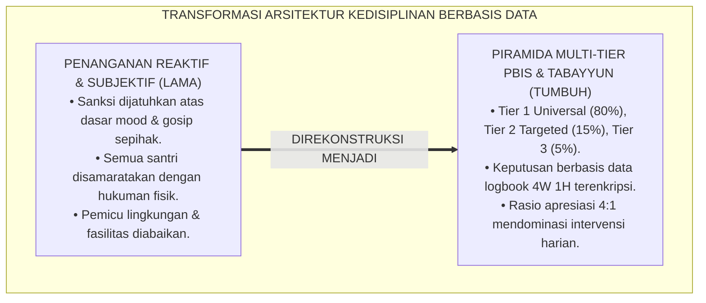
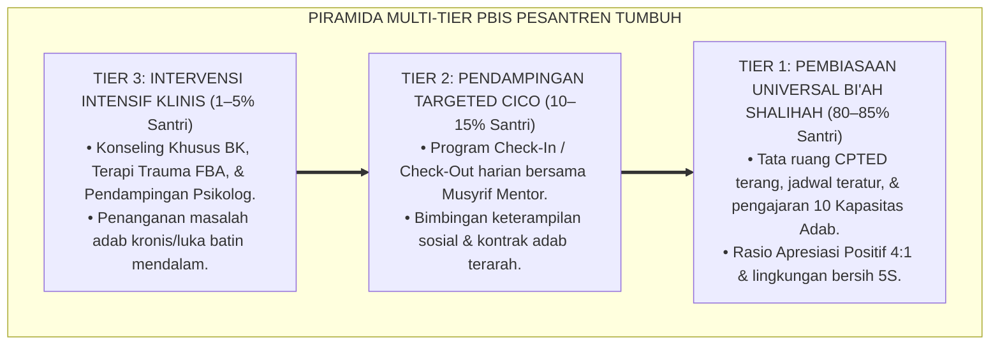
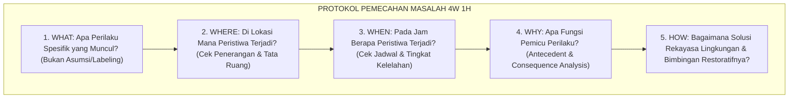
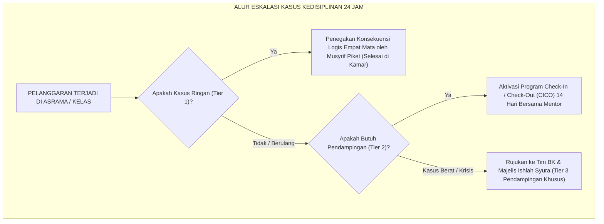
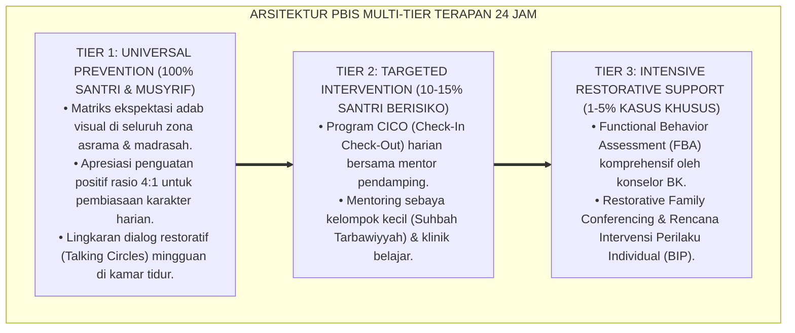

# P2-01-05: PRINSIP SISTEMIK MULTI-TIER PBIS BERBASIS DATA (DATA-DRIVEN MULTI-TIER PBIS ARCHITECTURE)
## *Monograf Riset Akademik: Arsitektur Intervensi Tiga Tingkat (Tier 1 Universal, Tier 2 Targeted, Tier 3 Intensive), Integrasi Doktrin Fiqh Tabayyun (QS. Al-Hujurat: 6), Analitik Perilaku Presisi 4W 1H, Serta Eliminasi Bias Subjektif di Pesantren 24 Jam*

**Nomor Identifikasi**: `P2-01-05/MONOGRAF-RISET-SISTEMIK-PBIS/2026`  
**Domain**: `02 Principles` > `01 Core Principles` (Prinsip Utama 05: *Data-Driven Multi-Tier PBIS*)  
**Klasifikasi Naskah**: *Academic Research Monograph* (Monograf Riset Akademik Prinsip Baku)  
**Rumpun Disiplin Pengkaji**: School-Wide Positive Behavioral Interventions and Supports (SW-PBIS), Psikometri & Analitik Data Perilaku, Fiqh Muraja'ah & Tabayyun Syar'i, Kriminologi Lingkungan (*Environmental Engineering*), Tata Kelola Kasus Klinis  

---

> ### 💡 INTISARI EKSEKUTIF (EXECUTIVE SUMMARY)
>
> * **Kelemahan Paradigma Lama: Pengambilan Keputusan Berbasis Asumsi & Bias Subjektif:**  
>   Banyak penegakan disiplin pesantren berjalan secara reaktif dan sporadis berdasarkan suasana hati (*Mood-Based Penalty*) atau gosip sepihak tanpa bukti (*Unverified Rumors*). Akibatnya terjadi ketidakadilan sistemik: santri pendiam dihukum berat, sementara penyebab masalah struktural (lingkungan kumuh, jadwal padat tanpa jeda) tidak pernah dibenahi.
> * **Inovasi Konseptual: Piramida Multi-Tier PBIS (80-15-5) & Fiqh Tabayyun Data:**  
>   TUMBUH menegakkan doktrin syariat *Tabayyun* (QS. Al-Hujurat: 6) dan *Nahnu Nahkumu bizh-Zhawahir* melalui arsitektur internasional **School-Wide PBIS (Horner & Sugai)**: membagi pembinaan ke dalam 3 tingkat (**Tier 1 Universal untuk 80-85% santri; Tier 2 Targeted CICO untuk 10-15% santri; dan Tier 3 Intensive Klinis untuk 1-5% santri**). Menggunakan analitik presisi 4W 1H (*What, Where, When, Why*) dan mengutamakan rasio apresiasi 4:1.
> * **Formulasi Operasional & Pembuktian Lapangan:**  
>   Monograf ini menguraikan matriks struktur tiga tingkat intervensi PBIS, protokol pemecahan masalah perilaku 4W 1H, alur eskalasi kasus berjenjang 24 jam, dan etika audit data PBIS.

---

## 📑 DAFTAR ISI MONOGRAF

- [BAB I: LANDASAN TEORETIS & DISKURSUS KRITIS](#bab-i-landasan-teoretis--diskursus-kritis)
  - [1. Latar Belakang Masalah: Kritik atas Subjektivitas, Bias Emosi Pengasuh, dan Penanganan Kasus Sporadis](#1-latar-belakang-masalah-kritik-atas-subjektivitas-bias-emosi-pengasuh-dan-penanganan-kasus-sporadis)
  - [2. Eksegesis Turats Doktrin Fiqh Tabayyun: QS. Al-Hujurat: 6 & Kaidah Pembuktian Faktual Lahiriah](#2-eksegesis-turats-doktrin-fiqh-tabayyun-qs-al-hujurat-6--kaidah-pembuktian-faktual-lahiriah)
  - [3. Konvergensi Sains Sistemik: School-Wide PBIS (Horner & Sugai) dan Analitik Perilaku Terapan (ABA)](#3-konvergensi-sains-sistemik-school-wide-pbis-horner--sugai-dan-analitik-perilaku-terapan-aba)
  - [4. Rekayasa Analitik Presisi 4W 1H: Memisahkan Kegagalan Individu dari Kerusakan Tata Ruang Fisik](#4-rekayasa-analitik-presisi-4w-1h-memisahkan-kegagalan-individu-dari-kerusakan-tata-ruang-fisik)
  - [5. Kasuistika Lapangan: Kasus Antrean Sandal Masjid & Resolusi Rekayasa Lingkungan Terpadu](#5-kasuistika-lapangan-kasus-antrean-sandal-masjid--resolusi-rekayasa-lingkungan-terpadu)
- [BAB II: FORMULASI KONSEPTUAL & PEMBAHASAN MENDALAM](#bab-ii-formulasi-konseptual--pembahasan-mendalam)
  - [1. Eksplanasi Teoretis Arsitektur Piramida Tiga Tingkat PBIS TUMBUH](#1-eksplanasi-teoretis-arsitektur-piramida-tiga-tingkat-pbis-tumbuh)
  - [2. Matriks Struktur Tiga Tingkat Intervensi Multi-Tier PBIS TUMBUH](#2-matriks-struktur-tiga-tingkat-intervensi-multi-tier-pbis-tumbuh)
  - [3. Protokol Pemecahan Masalah Perilaku Presisi 4W 1H](#3-protokol-pemecahan-masalah-perilaku-presisi-4w-1h)
  - [4. Alur Eskalasi Kasus & Standard Operating Procedures Penanganan Pelanggaran 24 Jam](#4-alur-eskalasi-kasus--standard-operating-procedures-penanganan-pelanggaran-24-jam)
  - [5. Diskusi Filosofis Mendalam & Implikasi bagi Masa Depan Peradaban Pendidikan Islam](#5-diskusi-filosofis-mendalam--implikasi-bagi-masa-depan-peradaban-pendidikan-islam)
- [BAB III: KESIMPULAN & APARATUS AKADEMIS](#bab-iii-kesimpulan--aparatus-akademis)
  - [1. Tabel Sintesis Temuan Riset Multi-Tier PBIS](#1-tabel-sintesis-temuan-riset-multi-tier-pbis)
  - [2. Daftar Pustaka Akademis & Rujukan Turats Primer](#2-daftar-pustaka-akademis--rujukan-turats-primer)
  - [3. Catatan Kaki Akademis (Footnotes)](#3-catatan-kaki-akademis-footnotes)
  - [4. Glosarium Istilah Ilmiah & Turats Multi-Tier PBIS](#4-glosarium-istilah-ilmiah--turats-multi-tier-pbis)

---

# BAB I: LANDASAN TEORETIS & DISKURSUS KRITIS

---

### 1. Latar Belakang Masalah: Kritik atas Subjektivitas, Bias Emosi Pengasuh, dan Penanganan Kasus Sporadis

Penanganan kedisiplinan santri di banyak pesantren konvensional mengalami **Bias Persepsi dan Ketidakpastian Regulasi (*Subjective Heuristic Fallacy*)**:
* **Hukuman Tergantung Suasana Hati (*Mood-Based Penalty*)**: Pelanggaran yang sama bisa dibiarkan begitu saja saat musyrif sedang senang, namun dijatuhi hukuman fisik berat saat musyrif sedang lelah atau marah.
* **Pengabaian Prinsip Tabayyun**: Menghukum santri berdasarkan aduan sepihak tanpa investigasi silang, yang memicu fitnah dan merusak rasa keadilan santri.
* **Salah Sasaran Penanganan**: Memperlakukan seluruh santri yang melanggar dengan hukuman yang sama rata tanpa membedakan apakah pelanggaran tersebut akibat ketidaktahuan (Tier 1), butuh pendampingan khusus (Tier 2), atau trauma psikologis berat (Tier 3).
* **Keniscayaan Sistem Multi-Tier PBIS Berbasis Data**: Dibutuhkan arsitektur intervensi bertingkat yang transparan, objektif, dan terukur berbasis data logbook digital presisi.[^1]

---

### 2. Eksegesis Turats Doktrin Fiqh Tabayyun: QS. Al-Hujurat: 6 & Kaidah Pembuktian Faktual Lahiriah

Al-Qur'an mewajibkan verifikasi data sebelum mengambil keputusan hukum:

$$\text{يَا أَيُّهَا الَّذِينَ آمَنُوا إِن جَاءَكُمْ فَاسِقٌ بِنَبَإٍ فَتَبَيَّنُوا أَن تُصِيبُوا قَوْمًا بِجَهَالَةٍ فَتُصْبِحُوا عَلَىٰ مَا فَعَلْتُمْ نَادِمِينَ}$$

*"**Wahai orang-orang yang beriman! Jika seseorang yang fasik datang kepadamu membawa suatu berita, maka bertabayyunlah (telitilah kebenarannya), agar kamu tidak mencelakakan suatu kaum karena kebodohan (kecerobohan), yang akhirnya kamu menyesali perbuatanmu itu**."* (QS. Al-Hujurat [49]: 6).[^2]

Kaidah fiqh peradilan Islam menetapkan:

$$\text{نَحْنُ نَحْكُمُ بِالظَّوَاهِرِ وَاللَّهُ يَتَوَلَّى السَّرَائِرَ}$$

*"**Kita menetapkan hukum berdasarkan bukti-bukti faktual yang nyata (lahiriah), dan Allah-lah yang mengurusi rahasia batin**."*[^3]

---

### 3. Konvergensi Sains Sistemik: School-Wide PBIS (Horner & Sugai) dan Analitik Perilaku Terapan (ABA)

Sains sistem perilaku modern membuktikan efektivitas pendekatan berjenjang:
* **School-Wide Positive Behavioral Interventions and Supports (SW-PBIS)** (Horner & Sugai, 2015) membagi populasi pembinaan ke dalam proporsi piramida **80-15-5**:
  1. **Tier 1 (Universal / Primary)**: Intervensi preventif untuk seluruh 100% warga sekolah (efektif mengawal 80–85% santri).
  2. **Tier 2 (Targeted / Secondary)**: Intervensi kelompok terarah untuk 10–15% santri berisiko melalui program *Check-In / Check-Out (CICO)*.
  3. **Tier 3 (Intensive / Tertiary)**: Intervensi individual klinis untuk 1–5% santri dengan masalah kompleks via *Functional Behavior Assessment (FBA)*.[^4]

---

### 4. Rekayasa Analitik Presisi 4W 1H: Memisahkan Kegagalan Individu dari Kerusakan Tata Ruang Fisik

TUMBUH menerapkan analitik data perilaku:
* **What (Apa peristiwanya)**: Mengidentifikasi bentuk perilaku spesifik tanpa prasangka.
* **Where (Di mana lokasinya)**: Mendeteksi titik rawan tata ruang (*Hotspots*).
* **When (Kapan waktunya)**: Memetakan jam-jam kritis lelah/lapar santri.
* **Why (Mengapa fungsinya)**: Menganalisis fungsi perilaku (*Antecedent-Behavior-Consequence / ABC*): apakah santri melanggar untuk mencari perhatian atau menghindari tugas?
* **How (Bagaimana solusinya)**: Merancang rekayasa lingkungan dan pengajaran adab alternatif.[^5]

---

### 5. Kasuistika Lapangan: Kasus Antrean Sandal Masjid & Resolusi Rekayasa Lingkungan Terpadu

* **Studi Kasus: Keributan Harian Rebutan Sandal dan Pelanggaran Ghasab di Depan Masjid**  
  * **Dilema**: Setiap selesai shalat jamaah, terjadi kegaduhan santri berebut sandal, hilangnya sandal, dan pemukulan oleh pengurus keamanan.
  * **Pola Lama**: Lembaga menghukum seluruh santri berdiri di lapangan.
  * **Analitik Data PBIS TUMBUH**: Tim mengevaluasi data 4W 1H: Ditemukan bahwa 150 pasang sandal diletakkan menumpuk di 1 rak kecil sempit berukuran 1 meter di samping pintu keluar utama.
  * **Resolusi Rekayasa Lingkungan**: (1) Memindahkan penempatan sandal: membuat 5 zona rak terpisah berdasarkan nomor kamar; (2) Membuat garis marka antrean masuk-keluar masjid; (3) Mengajarkan adab meletakkan sandal dengan tenang (*Tier 1 Universal*). Hasilnya: kegaduhan sandal tuntas 100% tanpa ada satu pun santri yang dihukum fisik.[^6]

---

# BAB II: FORMULASI KONSEPTUAL & PEMBAHASAN MENDALAM

---

### 1. Eksplanasi Teoretis Arsitektur Piramida Tiga Tingkat PBIS TUMBUH

Ekosistem TUMBUH mengkodifikasikan pembinaan ke dalam **Piramida Multi-Tier PBIS Pesantren**:

#### 🔬 Pembahasan Mendalam Tiga Tingkat:
1. **Tier 1 (Fondasi Universal)**: Mencegah 80% pelanggaran sebelum terjadi melalui lingkungan yang sehat dan apresiasi melimpah.[^7]
2. **Tier 2 (Bimbingan Terarah)**: Menyelamatkan santri yang mulai tersandung khilaf sebelum perilakunya memburuk.[^8]
3. **Tier 3 (Pemulihan Intensif)**: Merawat luka batin santri dengan pendekatan klinis profesional tanpa stigma dosa.[^9]

---

### 2. Matriks Struktur Tiga Tingkat Intervensi Multi-Tier PBIS TUMBUH

| Tingkat Intervensi | Target Populasi | Bentuk Layanan Pembinaan | Pelaksana Utama |
| :--- | :--- | :--- | :--- |
| **Tier 1: Universal** | 100% Seluruh Santri (Efektif 80–85%).| Pembiasaan adab harian, tata ruang CPTED, rasio apresiasi 4:1.| Seluruh Asatidz & Musyrif.|
| **Tier 2: Targeted** | 10–15% Santri Berisiko / Terkendala.| Program CICO harian, bimbingan kelompok kecil, mentoring sebaya.| Musyrif Mentor & Walas.|
| **Tier 3: Intensive**| 1–5% Santri Kasus Khusus Kronis.| Functional Behavior Assessment (FBA), terapi psikolog, ishlah syura.| Tim BK & Psikolog Mitra.|

---

### 3. Protokol Pemecahan Masalah Perilaku Presisi 4W 1H

TUMBUH menetapkan **Protokol Analisis 4W 1H**:

Protokol ini menjamin keputusan pembinaan selalu berlandaskan keadilan data faktual.[^10]

---

### 4. Alur Eskalasi Kasus & Standard Operating Procedures Penanganan Pelanggaran 24 Jam

Alur berjenjang ini mencegah terjadinya salah penanganan dan melindungi santri dari kekerasan fisik.[^11]

---

### 5. Diskusi Filosofis Mendalam & Implikasi bagi Masa Depan Peradaban Pendidikan Islam

Arsitektur Multi-Tier PBIS berbasis data ini membawa implikasi agung bagi peradaban:

* **Menegakkan Keadilan Hukum Syariat yang Objektif**:  
  Pesantren membuktikan bahwa hukum Islam tegak di atas bukti faktual dan verifikasi data (*Tabayyun*), menutup ruang bagi fitnah dan kezaliman penguasa.
* **Menghilangkan Budaya Hukuman Massal yang Zalim**:  
  Tidak ada lagi santri yang dihukum atas kesalahan yang tidak ia perbuat; setiap masalah ditangani secara proporsional sesuai tingkat kebutuhannya.
* **Mewujudkan Manajemen Pesantren Modern yang Profesional dan Berkah**:  
  Inilah perpaduan ideal antara ketundukan ibadah dan kecanggihan sains analitik: mengelola ribuan santri dengan tertib, aman, dan penuh kasih sayang (*Rahmatan lil 'Alamin*).[^12]

---

---

### Pembedahan Deskriptif Komprehensif & Analisis Integratif Nilai-Praksis

Penerapan konsep **P2-01-05: PRINSIP SISTEMIK MULTI-TIER PBIS BERBASIS DATA (DATA-DRIVEN MULTI-TIER PBIS ARCHITECTURE)** di ekosistem pesantren TUMBUH memerlukan pemahaman multidimensional yang memadukan khazanah turats syariat dan konsensus sains pendidikan modern:

#### A. Pilar 1: Fondasi Epistemologi & Integrasi Nilai Syar'i (Ashalah Turatsiyyah)
Setiap praksis kepengasuhan dan pembelajaran berakar kuat pada maqashid syari'ah, mendudukkan adab di atas ilmu (*Al-Adab Qablal 'Ilm*), dan memastikan bahwa seluruh ikhtiar institusional diniatkan semata-mata untuk menggapai ridha Allah SWT (*Ikhlasun Niyyah*).

#### B. Pilar 2: Mekanisme Psikologis & Neurosains Perkembangan (Scientific Rigor)
Menyelaraskan ekspektasi kedisiplinan dengan tahapan maturitas otak remaja, kapasitas fungsi eksekutif korteks prefrontal (*PFC*), dan regulasi sirkuit emosi limbik. Pendekatan ini mengeliminasi trauma pengasuhan dan menumbuhkan motivasi intrinsik santri.

#### C. Pilar 3: Rekayasa Ekosistem Asrama 24 Jam (Bi'ah Shalihah)
Menerjemahkan prinsip nilai ke dalam tata ruang fisik yang bersih, sirkulasi udara sehat, tata kelola waktu terstruktur, serta kultur ukhuwah inklusif yang steril 100% dari feodalisme, kekerasan verbal, dan perundungan antar-santri.

#### D. Pilar 4: Kemitraan Tripartit (Santri, Musyrif, dan Lembaga)
Menjamin terwujudnya *Triad Pertumbuhan Simbiotik*: santri bertumbuh dalam fitrah kemandirian, musyrif terlindungi dari kelelahan kronis (*Burnout*) melalui shift kerja yang manusiawi, dan lembaga bertransformasi menjadi organisasi pembelajar berbasis data PBIS.

---

### Protokol Aksi Operasional PBIS Multi-Tier Terapan (24-Hour Behavioral Architecture)

---

# BAB III: KESIMPULAN & APARATUS AKADEMIS

---

### 1. Tabel Sintesis Temuan Riset Multi-Tier PBIS

| Dimensi Parameter | Mazhab Reaktif Konvensional | Model Sanksi Poin Administratif | **Sistem Multi-Tier PBIS TUMBUH** | Landasan Rujukan Primer | Implikasi Praksis Lapangan |
| :--- | :--- | :--- | :--- | :--- | :--- |
| **Dasar Keputusan** | Suasana hati (*mood*) & gosip sepihak.| Pengurangan poin angka kaku.| **Data Faktual Logbook & Tabayyun.** | QS. Al-Hujurat: 6; Kaidah *Zhawahir*.| Keputusan adil, objektif, & diverifikasi. |
| **Struktur Layanan**| Satu sanksi fisik pukul rata.| Skorsing / denda administratif.| **Piramida Multi-Tier (80-15-5).** | Horner & Sugai (2015); FBA ABA.| Tier 1 Universal s/d Tier 3 Intensif. |
| **Analisis Masalah**| Santri dicap nakal / pemalas.| Mencatat kode pasal pelanggaran.| **Analitik Presisi 4W 1H & Tata Ruang.**| Kelling & Wilson (1982); Jeffery.| Memperbaiki fasilitas fisik & jadwal. |
| **Program Khusus** | Santri diisolasi / dikeluarkan.| Surat peringatan dingin ke orang tua.| **Check-In / Check-Out (CICO) Mentoring.**| Crone et al. (2010); Fiqh Ishlah.| Pendampingan harian penuh kasih sayang. |
| **Hasil Institusi** | Dendam santri & konflik orang tua.| Hubungan birokratis dingin.| **Pesantren Berkeadilan Data & Penuh Berkah.**| QS. An-Nisa': 58; Al-Attas (1980).| Ekosistem aman, rukun, & beradab luhur. |

---

### 2. Daftar Pustaka Akademis & Rujukan Turats Primer

1. **Al-Qur'an al-Karim wa Tarjamatu Ma'anihi**.
2. **Muslim bin al-Hajjaj an-Naisaburi**. (1427 H). *Shahih Muslim*. Riyadh: Dar Thayyibah.
3. **Al-Bukhari, Abu Abdillah Muhammad bin Isma'il**. (1422 H). *Shahih al-Bukhari*. Kairo: Dar Thawq an-Najah.
4. **Ibnu Katsir, Abul Fida' Isma'il bin Umar**. (1420 H). *Tafsir al-Qur'an al-'Azhim*. Riyadh: Dar Thayyibah.
5. **Al-Ghazali, Abu Hamid Muhammad bin Muhammad**. (2011). *Ihya' 'Ulumiddin* (Kitab Adab al-Qadha' & Kitab al-Ulfah). Beirut: Dar al-Ma'rifah.
6. **Asy'ari, Muhammad Hasyim**. (1415 H). *Adab al-'Alim wal-Muta'allim*. Jombang: Maktabah At-Turats Al-Islami.
7. **Al-Attas, Syed Muhammad Naquib**. (1980). *The Concept of Education in Islam*. Kuala Lumpur: ABIM.
8. **Horner, R. H., & Sugai, G.**. (2015). *School-wide PBIS: An Overview of the Research Base*. Remedial and Special Education, 36(2), 80–85.
9. **Sugai, G., & Horner, R. H.**. (2002). *The evolution of discipline practices: School-wide positive behavior supports*. Child & Family Behavior Therapy, 24(1-2), 23–50.
10. **Crone, D. A., Hawken, L. S., & Horner, R. H.**. (2010). *Responding to Problem Behavior in Schools: The Behavior Education Program (Check-In/Check-Out)* (2nd ed.). New York: Guilford Press.
11. **O'Neill, R. E., et al.**. (2015). *Functional Assessment and Program Development for Problem Behavior: A Practical Handbook* (3rd ed.). Stamford: Cengage Learning.
12. **Zehr, H.**. (2002). *The Little Book of Restorative Justice*. Intercourse: Good Books.

---

### 3. Catatan Kaki Akademis (*Footnotes*)

[^1]: Riset Prinsip Sistemik Multi-Tier PBIS Berbasis Data TUMBUH, *Kritik atas Penanganan Subjektif dan Reaktif*, 2026.  
[^2]: QS. Al-Hujurat [49]: 6.  
[^3]: Kaidah Ushul Fiqh Pembuktian Hukum Lahiriah; Ibnu Katsir, *Tafsir al-Qur'an al-'Azhim*, Jilid 7, hlm. 370–375.  
[^4]: Horner, R. H., & Sugai, G. (2015), *School-wide PBIS*, hlm. 80–85; Sugai, G., & Horner, R. H. (2002), *Child & Family Behavior Therapy*, hlm. 23–50.  
[^5]: O'Neill, R. E., et al. (2015), *Functional Assessment and Program Development*, hlm. 15–45.  
[^6]: Dokumentasi Analisis 4W 1H dan Rekayasa Tata Ruang Masjid PBIS TUMBUH, 2026.  
[^7]: Master Blueprint Tier 1 Universal PBIS Ekosistem TUMBUH, 2026.  
[^8]: Crone, D. A., et al. (2010), *Responding to Problem Behavior in Schools (CICO)*, hlm. 20–65.  
[^9]: Standar Operasional Prosedur Tier 3 Intensive Klinis dan Rujukan BK TUMBUH, 2026.  
[^10]: Petunjuk Teknis Analisis Perilaku Presisi 4W 1H Asrama PBIS TUMBUH, 2026.  
[^11]: Standar Operasional Prosedur Alur Eskalasi Kasus Kedisiplinan 24 Jam TUMBUH, 2026.  
[^12]: Deklarasi Penegakan Fiqh Tabayyun dan Manajemen PBIS Dewan Riset Epistemologi Ekosistem TUMBUH, 2026.

---

### 4. Glosarium Istilah Ilmiah & Turats Multi-Tier PBIS

1. **Multi-Tier PBIS**: Kerangka kerja sistemik pencegahan dan pembinaan perilaku berbasis data tiga tingkat (Universal, Targeted, Intensive).
2. **Tabayyun (التَّبَيُّنُ)**: Kewajiban syariat untuk melakukan verifikasi, klarifikasi, dan pembuktian faktual secara teliti sebelum mengambil keputusan hukum.
3. **Tier 1 Universal**: Intervensi pembiasaan adab dan penataan lingkungan yang diberikan kepada seluruh 100% santri untuk mencegah terjadinya pelanggaran.
4. **Tier 2 Targeted (CICO)**: Program bimbingan terarah bagi 10–15% santri berisiko melalui pencatatan mentoring *Check-In / Check-Out* harian.
5. **Tier 3 Intensive**: Penanganan individual intensif bagi 1–5% santri dengan masalah perilaku kompleks atau trauma batin oleh tim konselor BK.
6. **Functional Behavior Assessment (FBA)**: Proses asesmen ilmiah untuk menemukan fungsi pemicu dan konsekuensi dari suatu perilaku bermasalah.
7. **Analisis 4W 1H**: Metode investigasi presisi untuk membedah peristiwa (What, Where, When, Why, How) sebelum menentukan langkah intervensi.
8. **Mood-Based Penalty**: Kekeliruan penjatuhan sanksi yang didasarkan pada emosi atau suasana hati pengasuh tanpa bukti faktual.
9. **Rasio Apresiasi 4:1**: Standar intervensi PBIS di mana setiap 1 teguran korektif diimbangi dengan minimal 4 apresiasi atas perilaku positif santri.
10. **Insan Adabi (الإِنْسَانُ الأَدَبِيُّ)**: Profil santri yang mampu meregulasi diri secara mandiri dan menjunjung tinggi nilai keadilan serta kebenaran.
