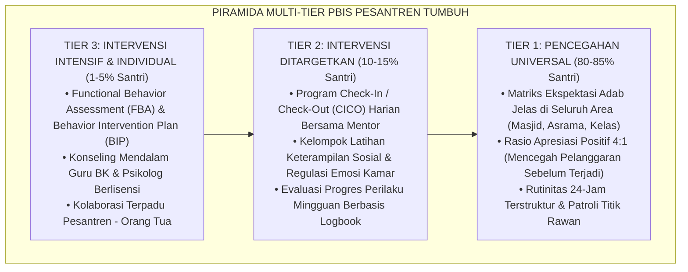
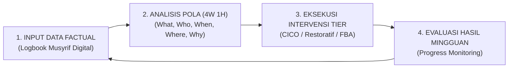

# P2-01-05: PRINSIP SISTEMIK MULTI-TIER PBIS BERBASIS DATA
## *Arsitektur Intervensi Berjenjang (Tier 1-3), Pengambilan Keputusan Berbasis Data Faktual, dan Eliminasi Subjektivitas Sanksi*

**Nomor Identifikasi**: `P2-01-05/SISTEMIK-PBIS/2026`  
**Domain**: `02 Principles` > `01 Core Principles`  
**Dewan Pakar**: `pakar-pbis`, `pakar-arsitektur-pbis-restoratif`, `pakar-metodologi-riset-tumbuh`

---

## 📑 DAFTAR ISI ANALITIS

1. [1. Prolegomena: Mengapa Keputusan Berbasis Asumsi Membahayakan Santri?](#1-prolegomena-mengapa-keputusan-berbasis-asumsi-membahayakan-santri)
2. [2. Kerangka Kerja Multi-Tier SW-PBIS dalam Ekosistem Pesantren](#2-kerangka-kerja-multi-tier-sw-pbis-dalam-ekosistem-pesantren)
3. [3. Siklus Pengambilan Keputusan Berbasis Data (Data-Based Problem Solving)](#3-siklus-pengambilan-keputusan-berbasis-data-data-based-problem-solving)
4. [4. Integrasi Fiqh Tabayyun (QS. Al-Hujurat: 6) dengan Metodologi PBIS](#4-integrasi-fiqh-tabayyun-qs-al-hujurat-6-dengan-metodologi-pbis)
5. [5. Implikasi bagi Dashboard Logbook Digital & Alur Eskalasi Pesantren](#5-implikasi-bagi-dashboard-logbook-digital--alur-eskalasi-pesantren)

---

### 1. Prolegomena: Mengapa Keputusan Berbasis Asumsi Membahayakan Santri?

Di banyak pesantren, penanganan pelanggaran perilaku santri sering kali dilakukan secara reaktif, sporadis, dan sangat subjektif. Keputusan sanksi kerap kali hanya didasarkan pada asumsi sepihak guru, aduan tidak terverifikasi, atau suasana hati (*mood*) pengurus saat itu. 

Akibatnya:
* Terjadi ketidakadilan perlakuan (*bias penegakan sanksi*): santri yang pendiam diperlakukan keras, sedangkan santri yang dekat dengan pengurus lolos dari sanksi.
* Lembaga tidak pernah mengetahui akar penyebab masalah yang sesungguhnya: apakah suatu pelanggaran dipicu oleh kelemahan individu santri, ketidakjelasan aturan kamar, atau ketiadaan pengawasan musyrif di titik rawan (*Hotspots*).

Ekosistem TUMBUH memecahkan masalah ini melalui **Prinsip Sistemik Multi-Tier PBIS Berbasis Data**: sebuah kerangka kerja saintifik yang memastikan bahwa setiap intervensi pembinaan didasarkan pada data faktual yang objektif dan terukur.

---

### 2. Kerangka Kerja Multi-Tier SW-PBIS dalam Ekosistem Pesantren

Merujuk pada konsensus sains perilaku internasional (Sugai & Horner, 2006; Horner et al., 2009), pembinaan santri dibagi secara proporsional ke dalam tiga tingkatan intervensi:

1. **Tier 1 (Universal - Seluruh Santri)**:  
   Fokus pada penciptaan lingkungan yang positif, aman, dan jelas aturannya. 80–85% santri berhasil merespons dengan sangat baik hanya melalui penataan Tier 1 ini tanpa memerlukan penanganan khusus.
2. **Tier 2 (Targeted - Santri Berisiko)**:  
   Diberikan kepada 10–15% santri yang masih sering melakukan pelanggaran adab ringan-sedang (seperti sering terlambat, kamar berantakan). Mereka mendapatkan pendampingan terstruktur melalui program *Check-In / Check-Out (CICO)* harian bersama musyrif mentor.
3. **Tier 3 (Intensive - Santri Khusus)**:  
   Diberikan kepada 1–5% santri yang mengalami kesulitan regulasi emosi berat, trauma masa lalu, atau perilaku agresif kronis. Penanganan dilakukan melalui asesmen klinis (*FBA*) oleh tim ahli BK dan psikolog.

---

### 3. Siklus Pengambilan Keputusan Berbasis Data

Ekosistem TUMBUH melarang tindakan coba-coba (*trial-and-error*). Setiap intervensi mengikuti siklus 4 langkah:

* **What**: Jenis perilaku apa yang paling sering terjadi? (Misal: ghashab sandal).
* **Where**: Di mana lokasi terjadinya? (Misal: depan teras masjid).
* **When**: Jam berapa paling sering terjadi? (Misal: 10 menit menjelang adzan ashar).
* **Why**: Mengapa santri melakukannya? (Misal: rak sandal terlalu jauh dari pintu wudhu).
* **Solusi Berbasis Data**: Memindahkan rak sandal lebih dekat dan menambah garis visual adab, bukan memukuli santri!

---

### 4. Integrasi Fiqh Tabayyun dengan Metodologi PBIS

Prinsip berbasis data ini adalah manifestasi langsung dari perintah Allah SWT tentang **Tabayyun (Klarifikasi & Validasi Fakta)**:

> $$\text{يَا أَيُّهَا الَّذِينَ آمَنُوا إِن جَاءَكُمْ فَاسِقٌ بِنَبَإٍ فَتَبَيَّنُوا أَن تُصِيبُوا قَوْمًا بِجَهَالَةٍ فَتُصْبِحُوا عَلَىٰ مَا فَعَلْتُمْ نَادِمِينَ}$$
> 
> *"Wahai orang-orang yang beriman! Jika seseorang yang fasik datang kepadamu membawa suatu berita, maka **telitilah kebenarannya (tabayyun)**, agar kamu tidak mencelakakan suatu kaum karena kebodohan (kecerobohan), yang menyebabkan kamu menyesal atas perbuatanmu itu."* (QS. Al-Hujurat [49]: 6).

Menghukum santri hanya berdasarkan bisikan atau praduga tanpa data faktual dan pembuktian objektif adalah kezaliman berat yang diharamkan syariat.

---

### 5. Implikasi bagi Dashboard Logbook Digital & Alur Eskalasi

1. **Dashboard PBIS Real-Time**: Pimpinan pondok dapat memantau grafik insiden perilaku, efektivitas Tier 1–3, dan rasio apresiasi musyrif secara langsung setiap hari.
2. **Standardisasi Alur Eskalasi Kasus**:
   - Pelanggaran Ringan (Minors) $\rightarrow$ Ditangani langsung oleh Musyrif Kamar secara restoratif.
   - Pelanggaran Sedang (Majors) $\rightarrow$ Dirujuk ke Tim CICO Tier 2 & Wali Kelas.
   - Pelanggaran Berat (Crisis) $\rightarrow$ Dirujuk ke Kepala Kepengasuhan, Tim Konseling BK, dan Satgas Perlindungan Santri Tier 3.
3. **Pemberhentian Sanksi Berdasarkan Sentimen Pribadi**: Tidak ada lagi guru yang boleh menghukum santri atas dasar kekesalan pribadi tanpa prosedur SOP yang terverifikasi.
