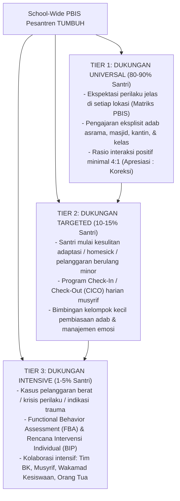

# P2-01-05-Prinsip-Sistemik-Multi-Tier-PBIS

## Tujuan
Menetapkan prinsip arsitektur sistem pembinaan perilaku berbasis data dan berjenjang (*Positive Behavioral Interventions and Supports - Multi-Tier SW-PBIS*) untuk mewujudkan lingkungan pesantren yang aman, tertib, adil, dan preventif.

---

## 1. Dalil & Prinsip Sadd adz-Dzari'ah

Dalam kaidah Fiqh Islam, mencegah kerusakan jauh lebih diutamakan daripada menanggulangi kerusakan setelah terjadi (*Dar'ul Mafasid Muqaddamun 'ala Jalbil Mashalih*). Menutup pintu-pintu penyebab kemaksiatan (*Sadd adz-Dzari'ah*) adalah landasan syar'i utama dari sistem PBIS.

---

## 2. Struktur Arsitektur PBIS Multi-Tier di Pesantren

---

## 3. 4 Karakteristik Utama Keputusan Berbasis Data (*Data-Driven Decision Making*)

1. **Pencatatan Objektif Faktual (*Behavior Logbook*)**:
   - Musyrif mencatat kejadian berdasarkan fakta objektif (Waktu, Tempat, Bentuk Perilaku, Pemicu), bukan opini subjektif (*"Santri ini menjengkelkan"* diubah menjadi *"Santri belum kembali ke asrama pada pukul 21.30"*).
2. **Analisis Titik Rawan (*Hotspots Analysis*)**:
   - Sistem menganalisis secara berkala: Di mana dan pada jam berapa pelanggaran paling sering terjadi? (Contoh: kamar mandi lt. 2, pukul 17.00–17.30).
3. **Penempatan Musyrif Preventif (*Active Supervision*)**:
   - Pembina ditempatkan berpatroli di titik rawan tersebut untuk mencegah terjadinya pelanggaran sebelum terjadi.
4. **Evaluasi Keberhasilan Intervensi**:
   - Jika santri Tier 2 telah menunjukkan kestabilan perilaku selama 4 pekan berturut-turut, ia dapat dikembalikan (*fading support*) ke Tier 1 Universal secara mandiri.

---

## 4. Matriks Ekspektasi Perilaku Universal (Tier 1 Contoh)

| Lokasi Pondok | Disiplin Waktu (*Itqan*) | Adab & Kebersihan (*Nazhafah*) | Relasi Sosial (*Ukhuwah*) |
| :--- | :--- | :--- | :--- |
| **Masjid** | Tiba sebelum adzan, sholat sunnah tahiyyatul masjid. | Meletakkan sandal di rak, tidak membawa makanan. | Mengisi shaf terdepan dengan tenang, tidak mengobrol. |
| **Asrama / Kamar** | Tidur tepat waktu pukul 22.00, bangun saat bel subuh. | Ranjang rapi (*making bed*), baju di lemari tertutup. | Menjaga ketenangan, meminta izin meminjam barang. |
| **Ruang Makan** | Antre tertib, makan sesuai jadwal. | Mengambil porsi secukupnya, mencuci piring sendiri. | Menghargai petugas dapur, berbagi rezeki. |

---

## 5. Status Dokumen
* **Status**: 🌟 **A+ (Tervalidasi & Siap Diimplementasikan)**
* **Level**: Project 2 - `02 Principles / 01 Core Principles`
* **Langkah Berikutnya**: **`P2-01-06-Prinsip-Tadarruj-dan-Istiqamah.md`**.
