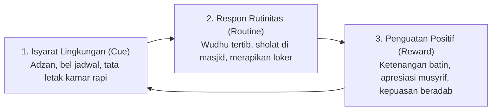

# P2-01-06-Prinsip-Tadarruj-dan-Istiqamah

## Tujuan
Menetapkan prinsip **Tadarruj** (Gradualisme Bertahap) dan **Istiqamah** (Konsistensi Rutinitas Berkelanjutan) sebagai kaidah baku dalam seluruh desain kurikulum adab, habituasi harian, dan pembinaan santri di ekosistem pesantren TUMBUH.

---

## 1. Dalil & Falsafah Syar'i

> *"Amalan yang paling dicintai oleh Allah ta'ala adalah amalan yang kontinu (istiqamah) walaupun sedikit."*  
> **(HR. Bukhari no. 6464 & Muslim no. 782)**

> **Umar bin Abdul Aziz Rahimahullah**:  
> *"Janganlah engkau tergesa-gesa membawa manusia pada seluruh kebenaran sekaligus, karena mereka akan meninggalkannya sekaligus pula. Bawalah mereka sedikit demi sedikit hingga kebenaran itu meresap ke dalam hati mereka."*

---

## 2. Integrasi Neurosains: Pembentukan Jalur Kebiasaan (*Habit Loop*)

Pembentukan karakter dalam diri santri membutuhkan pembentukan sirkuit saraf (*neural pathways*) yang solid melalui 3 siklus kebiasaan:

---

## 3. 4 Kaidah Baku Tadarruj dalam Pembinaan Santri

1. **Kaidah Langkah Mikro (*Micro-Habits Principle*)**:
   - Target adab yang besar dipecah menjadi target harian sederhana yang realistis dicapai santri baru (misal: di pekan pertama fokus pada meletakkan sandal di rak dan tiba sholat tepat waktu).
2. **Kaidah Ketahanan Rutinitas (*Habit Stacking*)**:
   - Menautkan kebiasaan baru pada rutinitas yang sudah kokoh (misal: membaca 1 halaman Al-Qur'an tepat setelah selesai sholat fardhu berjamaah).
3. **Kaidah Mencegah 'Overwhelm' (*Cognitive Load Reduction*)**:
   - Santri baru di tahap T1 tidak dibebani 50 aturan sekaligus, melainkan difasilitasi menguasai 5 adab inti asrama secara solid terlebih dahulu.
4. **Kaidah Standarisasi SOP Pengasuhan**:
   - Konsistensi santri lahir dari konsistensi jadwal asrama. Jadwal bangun tidur, makan, KBM, dan istirahat wajib dipatuhi secara tertib oleh musyrif dan asatidz.

---

## 4. Matriks Evaluasi Progresi Istiqamah

| Jenjang | Fokus Pembiasaan (*Habituasi*) | Tingkat Bantuan (*Scaffolding*) | Ciri Capaian Istiqamah |
| :--- | :--- | :--- | :--- |
| **T1 (Adaptasi)** | Pengenalan adab dasar & rutinitas harian asrama. | **Tinggi (80%)**: Didampingi langsung oleh musyrif setiap sesi. | Mampu mengikuti alur harian tanpa kebingungan. |
| **T2 (Habituasi)** | Rutinitas ibadah wajib, kebersihan kamar, adab belajar. | **Sedang (50%)**: Diingatkan melalui isyarat bel dan checklist piket. | Menjalankan rutinitas harian dengan teguran minimal. |
| **T3 (Internalisasi)** | Regulasi emosi, ibadah sunnah, adab pergaulan ukhuwah. | **Rendah (20%)**: Monitoring melalui sesi dialog mingguan. | Berinisiatif berbuat baik atas kesadaran diri (*Self-Awareness*). |
| **T4 (Kemandirian)** | Kepemimpinan teladan (*Qudwah*), mengayomi adik kelas. | **Mandiri (0-5%)**: Musyrif bertindak sebagai konsultan/coach. | Menjadi model teladan hidup bagi seluruh lingkungan asrama. |

---

## 5. Status Dokumen
* **Status**: 🌟 **A+ (Tervalidasi & Siap Diimplementasikan)**
* **Level**: Project 2 - `02 Principles / 01 Core Principles`
* **Langkah Berikutnya**: **`P2-01-07-Sintesis-Core-Principles-TUMBUH.md`**.
