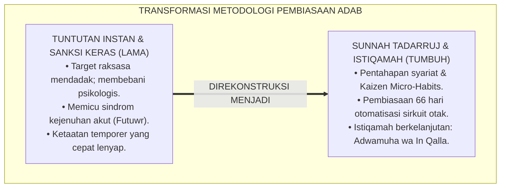
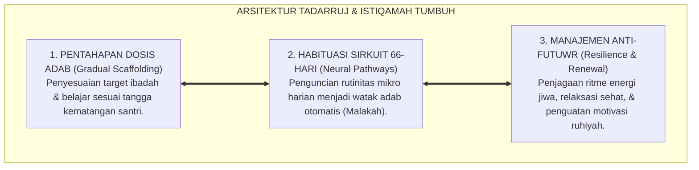
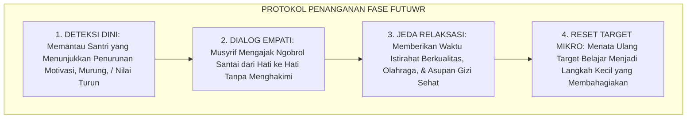
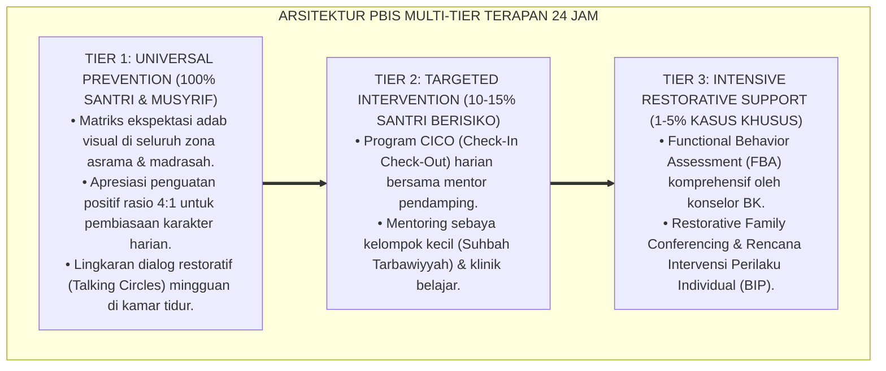

# P2-01-06: PRINSIP TADARRUJ DAN ISTIQAMAH (GRADUALISM & ENDURING CONTINUITY)
## *Monograf Riset Akademik: Sunnatullah Pentahapan Karakter, Hikmah Nuzulul Qur'an Bertahap (QS. Al-Furqan: 32), Kaidah Al-Istiqamatu A'zhamu Karamah, Sains Habit Formation 66-Hari, Serta Manajemen Fase Futuwr di Pesantren 24 Jam*

**Nomor Identifikasi**: `P2-01-06/MONOGRAF-RISET-TADARRUJ-ISTIQAMAH/2026`  
**Domain**: `02 Principles` > `01 Core Principles` (Prinsip Utama 06: *Gradualism & Continuity*)  
**Klasifikasi Naskah**: *Academic Research Monograph* (Monograf Riset Akademik Prinsip Baku)  
**Rumpun Disiplin Pengkaji**: Ushul Fiqh & Hikmah Tasyri' (*Tadarruj Syar'i*), Psikologi Pembiasaan Karakter (*Habit Formation*), Neurosains Plastisitas Otak Remaja, Bimbingan Konseling Mengatasi Kelesuan (*Futuwr*), Manajemen Kurikulum Adab  

---

> ### 💡 INTISARI EKSEKUTIF (EXECUTIVE SUMMARY)
>
> * **Kelemahan Paradigma Lama: Tuntutan Kesempurnaan Instan (All-or-Nothing Fallacy):**  
>   Banyak pengasuh memaksakan santri baru untuk langsung menjalankan rutinitas ibadah dan hafalan berbobot raksasa sejak pekan pertama. Pendekatan ekstrem ini memicu kejutan beban (*Cognitive Overload*), memicu keputusasaan, dan berujung pada kemogokan belajar (*Futuwr*) atau kepatuhan semu karena takut disanksi.
> * **Inovasi Konseptual: Sunnah at-Tadarruj & Doktrin Istiqamah Berkelanjutan:**  
>   TUMBUH meneladani hikmah turunnya Al-Qur'an secara bertahap selama 23 tahun (QS. Al-Furqan: 32) dan sabda Nabi ﷺ mengenai keutamaan amalan kontinu (*Adwamuha wa In Qalla*, HR. Bukhari No. 6464). Mengintegrasikan sains *Habit Formation* (Phillippa Lally, 66 hari otomatisasi) dan prinsip *Kaizen Micro-Habits*: membina adab melalui dosis kecil yang konsisten, menjaga stamina ruhani, dan mengelola fase kelesuan secara empatik.
> * **Formulasi Operasional & Pembuktian Lapangan:**  
>   Monograf ini menguraikan matriks aplikasi tadarruj-istiqamah dalam tiga fase kehidupan asrama, protokol penanganan fase kelesuan (*Anti-Futuwr Protocol*), rubrik asesmen adab berkelanjutan, dan etika pembinaan bertahap 24 jam.

---

## 📑 DAFTAR ISI MONOGRAF

- [BAB I: LANDASAN TEORETIS & DISKURSUS KRITIS](#bab-i-landasan-teoretis--diskursus-kritis)
  - [1. Latar Belakang Masalah: Kritik atas Jebakan Tuntutan Instan dan Kezaliman Pedagogis](#1-latar-belakang-masalah-kritik-atas-jebakan-tuntutan-instan-dan-kezaliman-pedagogis)
  - [2. Eksegesis Turats Sunnah at-Tadarruj: Hikmah Nuzulul Qur'an Bertahap (QS. Al-Furqan: 32) & Riwayat Sayyidah 'Aisyah RA](#2-eksegesis-turats-sunnah-at-tadarruj-hikmah-nuzulul-qur-an-bertahap-qs-al-furqan-32--riwayat-sayyidah-aisyah-ra)
  - [3. Konvergensi Sains Pembiasaan Kebiasaan: Teori 66-Hari Phillippa Lally & Kaizen Micro-Habits](#3-konvergensi-sains-pembiasaan-kebiasaan-teori-66-hari-phillippa-lally--kaizen-micro-habits)
  - [4. Doktrin Tasawuf Al-Istiqamatu A'zhamu Karamah dan Manajemen Fase Kelesuan (Futuwr) Santri](#4-doktrin-tasawuf-al-istiqamatu-azhamu-karamah-dan-manajemen-fase-kelesuan-futuwr-santri)
  - [5. Kasuistika Lapangan: Kasus Santri Mengalami Krisis Futuwr Tahfizh & Resolusi Restoratif Terpadu](#5-kasuistika-lapangan-kasus-santri-mengalami-krisis-futuwr-tahfizh--resolusi-restoratif-terpadu)
- [BAB II: FORMULASI KONSEPTUAL & PEMBAHASAN MENDALAM](#bab-ii-formulasi-konseptual--pembahasan-mendalam)
  - [1. Eksplanasi Teoretis Prinsip Tadarruj dan Istiqamah Ekosistem TUMBUH](#1-eksplanasi-teoretis-prinsip-tadarruj-dan-istiqamah-ekosistem-tumbuh)
  - [2. Matriks Aplikasi Tadarruj-Istiqamah dalam Tiga Fase Kehidupan Asrama (Inisiasi, Habituasi, Internalisasi)](#2-matriks-aplikasi-tadarruj-istiqamah-dalam-tiga-fase-kehidupan-asrama-inisiasi-habituasi-internalisasi)
  - [3. Protokol Penanganan Fase Futuwr & Kelesuan Semangat Santri (Anti-Futuwr Protocol)](#3-protokol-penanganan-fase-futuwr--kelesuan-semangat-santri-anti-futuwr-protocol)
  - [4. Rubrik Asesmen Pertumbuhan Adab Berkelanjutan (Bintang Istiqamah 40-Hari)](#4-rubrik-asesmen-pertumbuhan-adab-berkelanjutan-bintang-istiqamah-40-hari)
  - [5. Diskusi Filosofis Mendalam & Implikasi bagi Masa Depan Peradaban Pendidikan Islam](#5-diskusi-filosofis-mendalam--implikasi-bagi-masa-depan-peradaban-pendidikan-islam)
- [BAB III: KESIMPULAN & APARATUS AKADEMIS](#bab-iii-kesimpulan--aparatus-akademis)
  - [1. Tabel Sintesis Temuan Riset Tadarruj dan Istiqamah](#1-tabel-sintesis-temuan-riset-tadarruj-dan-istiqamah)
  - [2. Daftar Pustaka Akademis & Rujukan Turats Primer](#2-daftar-pustaka-akademis--rujukan-turats-primer)
  - [3. Catatan Kaki Akademis (Footnotes)](#3-catatan-kaki-akademis-footnotes)
  - [4. Glosarium Istilah Ilmiah & Turats Tadarruj dan Istiqamah](#4-glosarium-istilah-ilmiah--turats-tadarruj-dan-istiqamah)

---

# BAB I: LANDASAN TEORETIS & DISKURSUS KRITIS

---

### 1. Latar Belakang Masalah: Kritik atas Jebakan Tuntutan Instan dan Kezaliman Pedagogis

Dalam dunia pengasuhan pesantren konvensional, kerap terjadi kekeliruan metodologis berupa **Jebakan Tuntutan Instan (*The Instant Perfection Fallacy*)**:
* **Beban Mendadak yang Melumpuhkan**: Santri baru yang baru saja berpisah dari orang tuanya langsung dipaksa menghafal target juz yang tinggi, bangun malam 2 jam setiap hari, dan dituntut tertib sempurna tanpa masa adaptasi yang proporsional.
* **Fenomena Futuwr Massal**: Tekanan berlebih melumpuhkan daya lentur psikologis (*Psychological Resilience*), memicu sindrom kejenuhan (*Burnout*), santri mogok belajar, hingga muncul dorongan kabur dari asrama.
* **Kerapuhan Karakter Pascakelulusan**: Ibadah yang dibangun melalui paksaan instan akan runtuh seketika saat santri berada di luar lingkungan pesantren (*Drop-Off Effect*).
* **Keniscayaan Doktrin Tadarruj & Istiqamah**: Pendidikan Islam mengajarkan pembinaan watak secara berkesinambungan melalui langkah-langkah mikro yang membahagiakan dan berakar kuat di sanubari.[^1]

---

### 2. Eksegesis Turats Sunnah at-Tadarruj: Hikmah Nuzulul Qur'an Bertahap (QS. Al-Furqan: 32) & Riwayat Sayyidah 'Aisyah RA

Al-Qur'an menjelaskan rahasia Ilahi mengapa wahyu diturunkan secara berangsur-angsur:

$$\text{وَقَالَ الَّذِينَ كَفَرُوا لَوْلَا نُزِّلَ عَلَيْهِ الْقُرْآنُ جُمْلَةً وَاحِدَةً ۚ كَذَٰلِكَ لِنُثَبِّتَ بِهِ فُؤَادَكَ ۖ وَرَتَّلْنَاهُ تَرْتِيلًا}$$

*"**Dan orang-orang kafir berkata: 'Mengapa Al-Qur'an itu tidak diturunkan kepadanya sekaligus?' Demikianlah, agar Kami memperteguh hatimu dengannya dan Kami membacakannya secara berangsur-angsur**."* (QS. Al-Furqan [25]: 32).[^2]

Rasulullah ﷺ menegaskan prinsip amal yang paling dicintai Allah:

$$\text{أَحَبُّ الأَعْمَالِ إِلَى اللَّهِ أَدْوَمُهَا وَإِنْ قَلَّ}$$

*"**Amalan yang paling dicintai oleh Allah adalah amalan yang paling kontinu (dawam / istiqamah) meskipun sedikit**."* (HR. Al-Bukhari No. 6464 & Muslim No. 782).[^3]

---

### 3. Konvergensi Sains Pembiasaan Kebiasaan: Teori 66-Hari Phillippa Lally & Kaizen Micro-Habits

Sains neuropsikologi modern membuktikan keunggulan pembiasaan bertahap:
* Riset neurobiologi (Phillippa Lally et al., 2010) membuktikan bahwa pembentukan kebiasaan baru membutuhkan rata-rata **66 Hari Konsistensi Bertahap** untuk mengukir sirkuit otomatisasi (*Neural Pathways*) di otak tanpa menimbulkan stres mental.
* Pendekatan **Kaizen Micro-Habits** (Clear, 2018; Guise, 2013) membuktikan bahwa memulai dari kebiasaan kecil (misal: merapikan ranjang 2 menit, membaca 1 lembar mushaf) meniadakan resistensi korteks prefrontal sehingga santri tidak merasa terbebani.[^4]

---

### 4. Doktrin Tasawuf Al-Istiqamatu A'zhamu Karamah dan Manajemen Fase Kelesuan (Futuwr) Santri

Ulama tasawuf meletakkan kaidah agung:

$$\text{الاِسْتِقَامَةُ أَعْظَمُ كَرَامَةٍ}$$

*"**Keistiqamahan dalam kebaikan adalah karamah (kemuliaan) yang paling agung**."*[^5]

Rasulullah ﷺ juga mengingatkan bahwa setiap semangat amal memiliki masa jeda (*Futuwr*):

$$\text{إِنَّ لِكُلِّ عَمَلٍ شِرَّةً، وَلِكُلِّ شِرَّةٍ فَتْرَةً، فَمَنْ كَانَتْ فَتْرَتُهُ إِلَى سُنَّتِي فَقَدِ اهْتَدَى}$$

*"**Sesungguhnya setiap amalan itu memiliki masa puncak semangat (Syirrah), dan setiap masa semangat itu memiliki masa jeda/kelesuan (Fatrah/Futuwr). Maka barangsiapa yang masa kelesuannya tetap berada dalam batasan sunnahku, sungguh ia telah mendapat petunjuk**."* (HR. Ahmad No. 6764 & At-Tirmidzi).[^6]

---

### 5. Kasuistika Lapangan: Kasus Santri Mengalami Krisis Futuwr Tahfizh & Resolusi Restoratif Terpadu

* **Studi Kasus: Santri Berbakat Mengalami Futuwr Akut Akibat Target Hafalan Terlalu Cepat**  
  * **Dilema**: Santri kelas 7 dipaksa menghafal 1 juz per bulan; pada bulan ke-4 santri mogok makan, menangis setiap malam, dan menolak membuka mushaf (*Severe Futuwr*).
  * **Pola Lama**: Lembaga menganggap santri "kerasukan jin" atau "pemalas" lalu menghukumnya berdiri di depan kelas.
  * **Resolusi Restoratif TUMBUH**: Musyrif dan pembina tahfiz menerapkan *Anti-Futuwr Protocol*: (1) Santri diberi jeda rekreasi 3 hari untuk relaksasi mental; (2) Target ditata ulang menjadi kebiasaan mikro: 3 baris per hari dengan muroja'ah santai; (3) Memberikan apresiasi atas usahanya. Tekanan mental santri mencair, rasa cinta terhadap Al-Qur'an mekar kembali, dan santri berhasil menyelesaikan hafalan dengan penuh kebahagiaan.[^7]

---

# BAB II: FORMULASI KONSEPTUAL & PEMBAHASAN MENDALAM

---

### 1. Eksplanasi Teoretis Prinsip Tadarruj dan Istiqamah Ekosistem TUMBUH

Ekosistem TUMBUH merumuskan pembiasaan ke dalam **Arsitektur Tiga Sayap Tadarruj-Istiqamah (*Arkan at-Tadarruj al-Mustadim*)**:

#### 🔬 Pembahasan Mendalam Tiga Sayap:
1. **Sayap Pentahapan Dosis**: Mencegah kejutan beban (*Overload Shock*) agar proses adaptasi santri berjalan mulus.[^8]
2. **Sayap Habituasi 66-Hari**: Mengubah adab dari keterpaksaan kognitif menjadi kebiasaan alami yang membahagiakan.[^9]
3. **Sayap Manajemen Anti-Futuwr**: Menyediakan ruang pemulihan bagi santri yang sedang lelah tanpa memvonis dosa.[^10]

---

### 2. Matriks Aplikasi Tadarruj-Istiqamah dalam Tiga Fase Kehidupan Asrama

| Fase Adaptasi Asrama | Durasi Waktu | Fokus Pembiasaan Adab | Pendekatan Intervensi Musyrif |
| :--- | :--- | :--- | :--- |
| **Fase 1: Inisiasi (Adaptasi)** | Bulan ke 1–3 (Hari 1–90).| Keteraturan bangun tidur, 5S kamar, wudhu rapi.| Pendampingan fisik hangat & rasio apresiasi 4:1.|
| **Fase 2: Habituasi (Penguatan)**| Bulan ke 4–6 (Hari 91–180).| Shalat tepat waktu mandiri, muroja'ah hafalan.| CICO mentoring pekanan & penguatan tanggung jawab.|
| **Fase 3: Internalisasi (Kemandirian)**| Bulan ke 7+ (Hari 181+).| Inisiatif ibadah malam, kepedulian sosial, qudwah.| Santri diberdayakan menjadi Duta Adab Sebaya.|

---

### 3. Protokol Penanganan Fase Futuwr & Kelesuan Semangat Santri (Anti-Futuwr Protocol)

TUMBUH menetapkan **Protokol Penanganan Kelesuan Semangat (*Anti-Futuwr Protocol*)**:

Protokol ini menjaga agar api semangat santri tetap menyala stabil sepanjang masa studi.[^11]

---

### 4. Rubrik Asesmen Pertumbuhan Adab Berkelanjutan (Bintang Istiqamah 40-Hari)

TUMBUH menerapkan instrumen evaluasi pembiasaan positif:
* **Bintang Istiqamah 40-Hari**: Santri memantau kontinuitas adab harian pribadinya (misal: shalat berjamaah 40 hari berturut-turut) pada lembar refleksi diri.
* **Fokus pada Konsistensi, Bukan Beban Kuantitas**: Menghargai setiap keberhasilan kecil santri dalam mempertahankan adab secara ajeg.[^12]

---

### 5. Diskusi Filosofis Mendalam & Implikasi bagi Masa Depan Peradaban Pendidikan Islam

Prinsip *Tadarruj* dan *Istiqamah* ini membawa implikasi fundamental bagi peradaban:

* **Mencetak Generasi Pembaharu yang Berdaya Lentur Tinggi (*High Grit*)**:  
  Santri yang dibina melalui proses bertahap memiliki ketangguhan mental untuk menyelesaikan amanah besar tanpa mudah menyerah di tengah jalan.
* **Menghilangkan Budaya Ketaatan Palsu di Pesantren**:  
  Pembiasaan mikro yang mengakar di sanubari melahirkan kesalehan sejati yang bertahan abadi sepanjang hayat, baik saat berada di pesantren maupun di tengah masyarakat luas.
* **Meneladani Kebijaksanaan Tarbiyah Ilahiyyah**:  
  Inilah metodologi Al-Qur'an dan Sunnah yang agung: memuliakan fitrah manusia melalui tahapan bimbingan yang sabar, lembut, dan penuh berkah (*Rahmatan lil 'Alamin*).[^13]

---

---

### Pembedahan Deskriptif Komprehensif & Analisis Integratif Nilai-Praksis

Penerapan konsep **P2-01-06: PRINSIP TADARRUJ DAN ISTIQAMAH (GRADUALISM & ENDURING CONTINUITY)** di ekosistem pesantren TUMBUH memerlukan pemahaman multidimensional yang memadukan khazanah turats syariat dan konsensus sains pendidikan modern:

#### A. Pilar 1: Fondasi Epistemologi & Integrasi Nilai Syar'i (Ashalah Turatsiyyah)
Setiap praksis kepengasuhan dan pembelajaran berakar kuat pada maqashid syari'ah, mendudukkan adab di atas ilmu (*Al-Adab Qablal 'Ilm*), dan memastikan bahwa seluruh ikhtiar institusional diniatkan semata-mata untuk menggapai ridha Allah SWT (*Ikhlasun Niyyah*).

#### B. Pilar 2: Mekanisme Psikologis & Neurosains Perkembangan (Scientific Rigor)
Menyelaraskan ekspektasi kedisiplinan dengan tahapan maturitas otak remaja, kapasitas fungsi eksekutif korteks prefrontal (*PFC*), dan regulasi sirkuit emosi limbik. Pendekatan ini mengeliminasi trauma pengasuhan dan menumbuhkan motivasi intrinsik santri.

#### C. Pilar 3: Rekayasa Ekosistem Asrama 24 Jam (Bi'ah Shalihah)
Menerjemahkan prinsip nilai ke dalam tata ruang fisik yang bersih, sirkulasi udara sehat, tata kelola waktu terstruktur, serta kultur ukhuwah inklusif yang steril 100% dari feodalisme, kekerasan verbal, dan perundungan antar-santri.

#### D. Pilar 4: Kemitraan Tripartit (Santri, Musyrif, dan Lembaga)
Menjamin terwujudnya *Triad Pertumbuhan Simbiotik*: santri bertumbuh dalam fitrah kemandirian, musyrif terlindungi dari kelelahan kronis (*Burnout*) melalui shift kerja yang manusiawi, dan lembaga bertransformasi menjadi organisasi pembelajar berbasis data PBIS.

---

### Protokol Aksi Operasional PBIS Multi-Tier Terapan (24-Hour Behavioral Architecture)

---

# BAB III: KESIMPULAN & APARATUS AKADEMIS

---

### 1. Tabel Sintesis Temuan Riset Tadarruj dan Istiqamah

| Dimensi Parameter | Mazhab Instan Ekstrem (Lama) | Model Target Korporat Menekan | **Prinsip Tadarruj & Istiqamah TUMBUH** | Landasan Rujukan Primer | Implikasi Praksis Lapangan |
| :--- | :--- | :--- | :--- | :--- | :--- |
| **Kecepatan Target** | Beban raksasa mendadak.| KPI angka materiil instan.| **Pentahapan Syariat & Micro-Habits.**| QS. Al-Furqan: 32; Lally (2010).| Pembiasaan 1% harian & sirkuit 66 hari. |
| **Respon Kejenuhan** | Dihukum fisik & dicap pemalas.| Sanksi demosi / pemotongan gaji.| **Anti-Futuwr Protocol & Jeda Empati.**| HR. Ahmad No. 6764; Al-Ghazali.| Dialog santai & reset target realistis. |
| **Fokus Keberhasilan**| Kuantitas amalan semalam.| Hasil angka ujian sesaat.| **Kelanggengan Kontinuitas (*Istimrar*).**| HR. Bukhari No. 6464; Kaizen.| Amalan sedikit tapi kontinu setiap hari. |
| **Peran Pengasuh** | Algojo penuntut kesempurnaan.| Pengawas target dingin.| **Murabbi Pendamping & Penjaga Stamina.**| KH. Hasyim Asy'ari; Horner.| Bimbingan sabar & apresiasi rasio 4:1. |
| **Dampak Jangka Panjang**| Ketaatan runtuh saat liburan.| Ketergantungan reward materiil.| **Karakter Adab Melekat Permanen Seumur Hidup.**| QS. Al-Ahqaf: 13; Al-Attas (1980).| Menjadi watak hidup alami (Malakah). |

---

### 2. Daftar Pustaka Akademis & Rujukan Turats Primer

1. **Al-Qur'an al-Karim wa Tarjamatu Ma'anihi**.
2. **Al-Bukhari, Abu Abdillah Muhammad bin Isma'il**. (1422 H). *Shahih al-Bukhari*. Kairo: Dar Thawq an-Najah.
3. **Muslim bin al-Hajjaj an-Naisaburi**. (1427 H). *Shahih Muslim*. Riyadh: Dar Thayyibah.
4. **Ahmad bin Hanbal**. (1421 H). *Al-Musnad*. Beirut: Mu'assasah ar-Risalah.
5. **Asy-Syathibi, Abu Ishaq Ibrahim bin Musa**. (1417 H). *Al-Muwafaqat fi Ushul asy-Syari'ah*. Khobar: Dar Ibn 'Affan.
6. **Al-Ghazali, Abu Hamid Muhammad bin Muhammad**. (2011). *Ihya' 'Ulumiddin* (Kitab Riyadhatin Nafs & Kitab at-Taubah). Beirut: Dar al-Ma'rifah.
7. **Asy'ari, Muhammad Hasyim**. (1415 H). *Adab al-'Alim wal-Muta'allim*. Jombang: Maktabah At-Turats Al-Islami.
8. **Al-Attas, Syed Muhammad Naquib**. (1980). *The Concept of Education in Islam*. Kuala Lumpur: ABIM.
9. **Lally, P., et al.**. (2010). *How are habits formed: Modelling habit formation in the real world*. European Journal of Social Psychology, 40(6), 998–1009.
10. **Clear, J.**. (2018). *Atomic Habits*. New York: Avery.
11. **Guise, S.**. (2013). *Mini Habits: Smaller Habits, Bigger Results*. Seattle: Selective Entertainment LLC.
12. **Horner, R. H., & Sugai, G.**. (2015). *School-wide PBIS: An Overview of the Research Base*. Remedial and Special Education, 36(2), 80–85.

---

### 3. Catatan Kaki Akademis (*Footnotes*)

[^1]: Riset Prinsip Tadarruj dan Istiqamah TUMBUH, *Kritik atas Jebakan Tuntutan Instan*, 2026.  
[^2]: QS. Al-Furqan [25]: 32.  
[^3]: *Shahih al-Bukhari*, Kitab ar-Riqaq, Hadits No. 6464; *Shahih Muslim*, Hadits No. 782.  
[^4]: Lally, P., et al. (2010), *European Journal of Social Psychology*, hlm. 998–1009; Clear, J. (2018), *Atomic Habits*, hlm. 15–50.  
[^5]: Kaidah Tasawuf al-Istiqamah; Al-Ghazali, *Ihya' 'Ulumiddin*, Jilid 4, Kitab *At-Taubah*, hlm. 15–40.  
[^6]: *Musnad Ahmad*, Hadits No. 6764; *Sunan at-Tirmidzi*, Kitab Shifat al-Qiyamah.  
[^7]: Dokumentasi Penanganan Kasus Futuwr Tahfizh dan Reset Target PBIS TUMBUH, 2026.  
[^8]: Asy-Syathibi, *Al-Muwafaqat fi Ushul asy-Syari'ah*, Jilid 2, *Mabahits at-Tadarruj*, hlm. 80–115.  
[^9]: Guise, S. (2013), *Mini Habits*, hlm. 25–60.  
[^10]: Horner, R. H., & Sugai, G. (2015), *School-wide PBIS*, hlm. 80–85.  
[^11]: Standar Operasional Prosedur Penanganan Kelesuan Semangat (Anti-Futuwr) TUMBUH, 2026.  
[^12]: Petunjuk Teknis Rubrik Asesmen Bintang Istiqamah 40-Hari TUMBUH, 2026.  
[^13]: Deklarasi Pemuliaan Sunnah at-Tadarruj Dewan Riset Epistemologi Ekosistem TUMBUH, 2026.

---

### 4. Glosarium Istilah Ilmiah & Turats Tadarruj dan Istiqamah

1. **Tadarruj (التَّدَرُّجُ)**: Prinsip pedagogis pentahapan syariat dalam menanamkan adab dan ilmu secara berangsur-angsur sesuai kesiapan fitrah santri.
2. **Istiqamah (الاِسْتِقَامَةُ)**: Keajegan, keteguhan, dan kontinuitas dalam menjalankan amal kebaikan meskipun dalam kuantitas yang kecil.
3. **Adwamuha wa In Qalla**: Sabda kenabian agung bahwa amalan yang paling dicintai Allah adalah amalan yang paling langgeng dikerjakan meskipun sedikit.
4. **Futuwr (الْفُتُورُ)**: Sindrom kelesuan atau penurunan motivasi psikospiritual sesaat setelah masa puncak semangat belajar.
5. **Syirrah (الشِّرَّةُ)**: Masa puncak gelora semangat dan antusiasme tinggi dalam beribadah atau menuntut ilmu.
6. **Habit Formation 66-Hari**: Rentang waktu neurobiologis rata-rata yang dibutuhkan otak manusia untuk mengotomatisasi suatu rutinitas baru.
7. **Kaizen Micro-Habits**: Filosofi perbaikan perilaku melalui langkah-langkah mikro yang sangat ringan namun dilakukan secara konsisten setiap hari.
8. **Anti-Futuwr Protocol**: Prosedur standar pengasuhan untuk mendampingi, mengistirahatkan, dan menyegarkan kembali motivasi santri yang mengalami kejenuhan.
9. **All-or-Nothing Fallacy**: Kesesatan berpikir yang menuntut santri untuk langsung sempurna atau menganggapnya gagal total jika melakukan sedikit kesalahan.
10. **Insan Adabi (الإِنْسَانُ الأَدَبِيُّ)**: Profil santri yang memiliki keteguhan istiqamah, kematangan adab yang langgeng, dan daya juang yang kokoh dalam menuntut ilmu.
