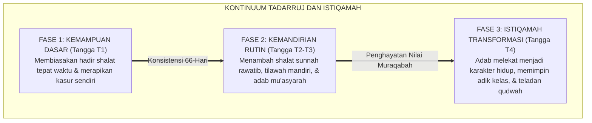

# P2-01-06: PRINSIP TADARRUJ (GRADUALISME) DAN ISTIQAMAH
## *Sunnatullah Tahapan Perubahan Karakter, Kaidah Tadarruj Syar'i, dan Pemeliharaan Konsistensi Adab Tanpa Kejenuhan*

**Nomor Identifikasi**: `P2-01-06/TADARRUJ-ISTIQAMAH-PRINSIP/2026`  
**Domain**: `02 Principles` > `01 Core Principles`  
**Dewan Pakar**: `pakar-filosofi-tumbuh`, `pakar-pedagogi-master-guru`, `pakar-epistemologi-turats`

---

## 📑 DAFTAR ISI ANALITIS

1. [1. Sunnatullah Tadarruj: Memahami Keterbatasan Kapasitas Awal](#1-sunnatullah-tadarruj-memahami-keterbatasan-kapasitas-awal)
2. [2. Khazanah Syariat: Gradualisme dalam Penurunan Hukum Islam](#2-khazanah-syariat-gradualisme-dalam-penurunan-hukum-islam)
3. [3. Istiqamah sebagai Puncak Kemuliaan (Karamah Terbesar)](#3-istiqamah-sebagai-puncak-kemuliaan-karamah-terbesar)
4. [4. Matriks Aplikasi Tadarruj-Istiqamah dalam Rutinitas Santri](#4-matriks-aplikasi-tadarruj-istiqamah-dalam-rutinitas-santri)
5. [5. Implikasi bagi Sistem Penilaian dan Evaluasi Asrama](#5-implikasi-bagi-sistem-penilaian-dan-evaluasi-asrama)

---

### 1. Sunnatullah Tadarruj: Memahami Keterbatasan Kapasitas Awal

Prinsip inti keenam dalam Ekosistem TUMBUH adalah **Tadarruj (Gradualisme Ilahiah) dan Istiqamah (Konsistensi Berkelanjutan)**.

Setiap manusia yang memasuki lingkungan baru membutuhkan fase adaptasi biologis, kognitif, dan sosial. Menuntut santri baru yang baru seminggu masuk pondok untuk langsung mampu bangun malam 1 jam, hafal 1 juz per bulan, dan tidak pernah mengantuk di kelas adalah bentuk **kezaliman pedagogis (*pedagogical injustice*)**.

Tadarruj mengajarkan kita untuk menghormati proses: memulai dari langkah-langkah kecil yang mampu dicapai santri (*proximal zone of development*), memberikan apresiasi atas setiap inci kemajuan, dan membimbing santri secara bertahap hingga ia mampu istiqamah secara mandiri.

---

### 2. Khazanah Syariat: Gradualisme dalam Penurunan Hukum Islam

Para ulama ushul fiqh menegaskan kaidah:

$$\text{مَنْ رَامَ الْعِلْمَ جُمْلَةً، ذَهَبَ عَنْهُ جُمْلَةً}$$
*"Barang siapa yang menuntut ilmu (atau menuntut perubahan karakter) sekaligus dalam satu waktu, niscaya ilmu dan karakter itu akan hilang darinya sekaligus pula!"*

Imam Az-Zarkasyi dalam *Al-Burhan fi 'Ulum al-Qur'an* menguraikan bahwa hikmah Al-Qur'an diturunkan secara berangsur-angsur (*tanjim*) adalah untuk **mengokohkan kalbu (*tatsbit al-fu'ad*)** dan memudahkan proses internalisasi ke dalam jiwa manusia yang memiliki keterbatasan.

---

### 3. Istiqamah sebagai Puncak Kemuliaan

Para ulama tasawuf agung menyatakan:

$$\text{الِاسْتِقَامَةُ أَعْظَمُ كَرَامَةٍ}$$
*"Istiqamah dalam ketaatan adalah karamah (kemuliaan spiritual) yang paling agung!"*

Santri yang hebat bukanlah santri yang pernah melakukan shalat tahajud semalam suntuk lalu tidur sepanjang siang, melainkan santri yang istiqamah mendirikan shalat tahajud 2 rakaat dan witir 1 rakaat setiap malam tanpa pernah terputus.

---

### 4. Matriks Aplikasi Tadarruj-Istiqamah dalam Rutinitas Santri

| Dimensi Pembiasaan | Tahap Awal (Bulan 1–3 / T1) | Tahap Menengah (Bulan 4–12 / T2–T3) | Tahap Matang (Tahun 2+ / T4) |
| :--- | :--- | :--- | :--- |
| **Qiyamul Lail** | 1x sepekan berjamaah di malam Jumat, didampingi musyrif. | 2–3x sepekan mandiri di kamar dengan alarm pribadi. | Rutin setiap malam mandiri; membangunkan rekan kamar dengan santun. |
| **Target Tahfizh** | 0.5 – 1 halaman/hari dengan fokus kelancaran tajwid & tahsin. | 1 – 2 halaman/hari disertai pemahaman terjemah ayat. | Ziyadah stabil disertai muraja'ah mandiri 1 juz/hari. |
| **Kemandirian Asrama** | Mencuci pakaian dengan bimbingan teknis musyrif/kakak asuh. | Mandiri mencuci dan menyetrika pakaian sesuai jadwal. | Mengelola manajemen waktu pribadi secara teratur dan rapi. |

---

### 5. Implikasi bagi Sistem Penilaian dan Evaluasi Asrama

1. **Penetapan Target Individual Berjenjang**: Target mutaba'ah santri disesuaikan dengan kurva kesiapan masing-masing santri, bukan dipukul rata secara kaku.
2. **Pemberian Apresiasi atas Konsistensi**: Memberikan lencana penghargaan *Bintang Istiqamah* bagi santri yang mampu menjaga konsistensi adab selama 40 hari berturut-turut.
3. **Penyikapan atas Fase Futuwr (Kelesuan)**: Tatkala santri mengalami kejenuhan, musyrif tidak langsung menghukumnya, melainkan memberikan ruang pemulihan emosi (*co-regulation*) dan dialog penyemangat batin.
